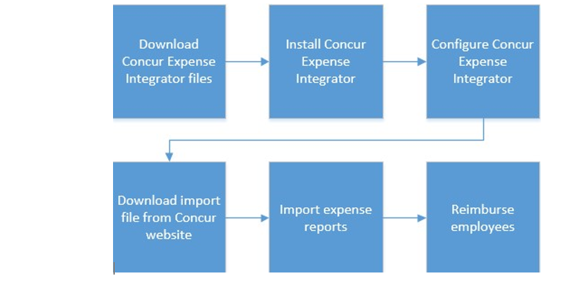
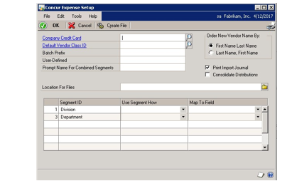

# Microsoft Dynamics GP Concur Expense Integrator

This documentation describes how to use Concur Expense Integrator. The integration allows you to use Concur Expense to create, submit, and approve expense reports. You can then import the expense reports into Microsoft Dynamics GP to reimburse employees.

## Overview

Keeping expenses and travel costs within your company’s policies can help manage costs effectively. Concur Expense Integrator allows your employees to use the Concur expense tracking solution, while also tracking the same expense information in Microsoft Dynamics GP.

Concur Expense Integrator links Concur Expense with Microsoft Dynamics GP. 

By using Concur Expense, you can:

- Create, submit, and approve expense reports

- Verify reports’ compliance with company policy

- Report and analyze expense reporting and reimbursement activity

Use Concur Expense Integrator to manage employee expense reports. You can import employees as vendors, import expense reports, and print confirmation reports.

The following diagram provides an overview of the Concur Expense Integrator setup and the expense report process.

In Concur Expense Integrator, vendors are employees who have a vendor record. If a vendor record does not exist for an employee, one is created when expense reports are imported.

## Import file

At the close of each reimbursement cycle, Concur Expense provides an import file to clients by using a secure download site on the web. The import file is written in ASCII format, and contains detailed information that is required for posting to an Accounts Payable (AP) or General Ledger (GL) system. The file includes all transaction activity for expense reports that have been processed for payment in Concur Expense Integrator. The import file is downloaded from the Concur Expense secure download site onto your computer, and then imported into Payables Management.

### Prerequisites

To use the Concur Expense Integrator to link Concur Expense to Microsoft Dynamics GP, complete the following prerequisites in Microsoft Dynamics GP:

- Set up an account format

- Set up General Ledger account segments

- Set up a vendor class

- Set up employees as vendors

- Set up a company credit card

For more information about how to complete these tasks, see the Microsoft Dynamics GP General Ledger and Payables Management documentation.

For more information about how to set up prerequisites in Concur Expense and how to configure

Microsoft Dynamics GP in the Concur Expense Setup wizard, log on to Concur Expense. Click **Help** \>\> **Expense Administration Help**. Click **Setup and User Guide** in the left menu. Open the Expense setup guide and go to the Microsoft Dynamics GP appendix. For more information, contact your Concur Expense representative.

If you are not currently a Concur customer and you would like more information, email *dynamics\@concur.com*.

### Download and install Concur Expense Integrator

Concur Expense Integrator is available from PartnerSource or CustomerSource.

**Note:** To import transactions into Microsoft Dynamics GP by using the correct file format in Concur Expense Integrator, you must download the import file from the Concur website. For more information about the Microsoft Dynamics GP import file, log on to Concur Expense. Click **Help** \>\> **Expense Administration Help**. Click **Setup and User Guide** in the left menu. Open the **Expense Set Up Guide for Concur Standard** and go to the Microsoft Dynamics GP appendix.

To install Concur Expense Integrator, follow these steps:

1. Close Microsoft Dynamics GP.

2. Double-click the eExpense_12.exe file to extract its contents.

3. Open the folder that was specified in step 2.

4. Copy the files to the folder that contains the Microsoft Dynamics GP installation.

5. Log on to Microsoft Dynamics GP.

**Note:** You must log on to Microsoft Dynamics GP as ”sa” for the eExpense tables to be created.

### Configure Concur Expense Integrator in Microsoft Dynamics GP

To configure Concur Expense Integrator, follow these steps:

1. In Microsoft Dynamics GP, **Administration** \>\> click **Cards** \>\> **Concur Expense** \>\> **Setup** to open the **Concur Expense Setup** window.

1. In the **Company Credit Card** field, select the name of the credit card that is used with Concur Expense.

2. In the **Default Vendor Class ID** field, select the vendor class ID that will be assigned to new vendors that are added during the import process. You will complete the initial upload process later when you set up Concur Expense Integrator.

**Note:** In this case, vendors are employees who have a vendor record. If a vendor record does not exist for an employee, one is created during the import process.

1. In the **Batch Prefix** field, enter up to six characters to create the first part of the Payables Management batch ID.

2. In the **User**-**Defined** field, enter a value that is used as the prompt name in the Concur Expense Integrator window on the web.

3. In the **Prompt Name for Combined Segments** field, enter a value that will be displayed on the expense page on Concur’s website. This is a required field that stores the value assigned as the prompt name for the **Employee Info 3** field. This value is displayed in Concur Expense on the Employee Info page.

4. In the **Order New Vendor Name By** option, select how the vendor name will be formatted when new vendors are added to Payables Management through the import process.

5. Mark the **Print Import Journal** option if you want an import journal to print immediately after expense report transactions have been imported into Payables Management.

**Note:** If you do not mark this option, you can print the report later. The current report information exists until the import process is run again.

1. Mark the **Consolidate Distributions** option to consolidate account number distributions.

For example, you have an account number of 100-1000-01, and four separate lines in the import file use this account number. When the **Consolidate Distributions** option is marked, the distributions are combined into one total line for this account number. When this option is not marked, the file contains four distribution lines.

1. In the **Location for Files** field, enter the path where you will store the import and setup files. The import files are downloaded to this location. When you import transactions into Payables Management, Concur Expense Integrator looks in this location for files to import.

2. To review the selections made in the **Concur Expense Setup** window, choose **Create File**.

This creates a [CompanyID]_prompts.txt file. CompanyID is replaced by the actual company ID that is assigned to your company. To view the file, navigate to the location you specified in the **Location for Files** field. This file includes the following information:

- The name of the company as stored in the **Company ID** field in the **Create Company** window. (In Microsoft Dynamics GP, **Administration** \>\> click **Setup** \>\> **Company** \>\> **Company**).

- Information about how the **account segments** values, the **Prompt Name for Combined Segments** value, and the **User-Defined** value were associated with Concur Expense Integrator user-defined fields.

### Map the account segments in Microsoft Dynamics GP

The last item you need to set up is the account segment mapping.

General Ledger account segments are tracked in Concur Expense Integrator by mapping an account segment to each available expense type. The mappings are assigned on an expense-by-expense basis and require no employee interaction during expense entry.

During the setup phase, General Ledger account segments are mapped to selected expense types in the Concur Expense setup wizard. By using Concur Expense Integrator, the employee creates electronic reports; the General Ledger account is never seen or modified by the employee. Concur Expense automatically creates an import file after the expense report is approved for payment. This file is imported into Microsoft Dynamics GP, and the account code is automatically mapped to all corresponding expense types. For more information about the General Ledger accounts, log on to Concur Expense. Click **Help** \>\> **Expense Administration Help**. Click **Setup and User Guide** in the left menu. Open the **Expense Administration User Guide**.

The **Segment ID** scrolling list in the Concur Expense Integrator Setup window displays a list of the company’s General Ledger account segments, sorted in ascending order by segment position. This list allows you to specify how segments are used in Concur Expense (individually or combined with one or more other segments). Also, you can specify how segments are mapped to Concur Expense userdefined fields.

This scrolling list maps segments to the following Concur Expense user-defined fields:

- Cost Center

- Custom 1

- Custom 2

- Employee Info 1  

- Employee Info 2

- Employee Info 3

### Use Segment How

This column allows you to choose how General Ledger account segments are used in Concur Expense. Generally, you include segments individually, or combine them with one or more other segments.

**Note**: The main segment cannot be combined with other segments and is not listed in the Concur Expense Integrator Setup window.

The following selections are available in the list:

- Include Segment

- Combined Segment 1

- Combined Segment 2

- Combined Segment 3 …

Combined Segment n, where n is the total number of segments in the customer’s account format – 1.

The reason 1 is subtracted from the total number is that the main segment cannot be combined with other segments. You can include (select **Include Segment** in the **Use Segment How** list) no more than six segments.

### Map to Field

This column allows you to map General Ledger account segments to Concur Expense user-defined fields. The following selections are available in the list:

- Cost Center

- Custom 1

- Custom 2

- Employee Info 1

- Employee Info 2

- Employee Info 3

The following mapping restrictions apply:

- You can map a user-defined field to only one account segment. For example, if you map Employee Info 1 to the Company segment, you cannot also map Employee Info 1 to the Country segment. An error message is displayed when you move off the field.

- Also, you cannot map combined segments to a user-defined field. All combined segments are mapped to the Employee Info 3 user-defined field.

- You cannot map the main segment to a user-defined field. The main segment is mapped to the Expense Type field.

**Note**: The main segment is not displayed because Concur Expense Integrator maps this field for you.

### Printing the Concur Integrator Expense Setup report

The Concur Expense Setup report lists the selections you made in the **Concur Expense Setup** window.

You can print this report by choosing **File** \>\> **Print** after you have finished making selections in the **Concur Expense Setup** window. This report can be printed at any time.

## Concur Expense Integrator daily procedures

Concur Expense Integrator imports employee information from Concur Expense into Microsoft Dynamics GP. The following steps can be used as guidance for using Concur Expense .

**Note:** You will complete the first four steps using Concur Expense and the remaining steps in Microsoft Dynamics GP.

1. Submit an expense report on the web.

2. Approve the expense report.

3. Authorize payment for the expense report.

4. Close the batch that contains all the approved expenses and generate the
    import file.

5. Import expense report transactions.

6. Post expense report transactions.

7. Complete a check run and post payments.

### Import expense report transactions

During the process of importing Concur Expense transactions, Concur Expense Integrator checks for vendor IDs that do not exist in Payables Management. If there are vendor records that do not exist in Payables Management, a vendor record is created as part of the import process.

When the vendor record is created, the employee ID is assigned as the vendor ID for the new vendor record. The vendor record is assigned to the vendor class that is specified in the **Concur Expense Setup** window. 

To import expense report transactions, follow these steps:

1. In Microsoft Dynamics GP, **Administration** \>\> click **Cards** \>\> **Concur Expense** \>\> **Import Exp**. **Reports** to open the **Concur Expense Import Expense Reports** window.

2. Select the file location where the import files are located. The default location is the path that was entered in **Location for Files** field in the **Concur Expense Setup** window.

3. Mark the **Print Import Journal** option to specify whether the Concur Expense Report Import Journal report will be printed.

4. Click **Import** to import the expense reports. Concur Expense Integrator uses the file location that is specified in the **File Location** field and finds all files that have a “\*.cgl” extension.

5. After all the expense report transactions have been imported into Payables Management, you can print the **Concur Expense Report Import Journal** report.

**Note:** If new vendors were created during the import process, the **New Vendors** report is printed after the **Concur Expense Report Import journal** report is printed.

### Concur Expense Report Import Journal

The **Concur Expense Report Import Journal** report is printed after the expense reports are imported. You can reprint this report at any time.

To reprint the **Concur Expense Report Import Journal** report, follow these steps:

1. In Microsoft Dynamics GP, **Administration** \>\> click **Cards** \>\> **Concur Expense** \>\> **Import Exp**. **Reports** to open the **Concur Expense Import Expense Reports** window.

2. Click the printer icon or **File** \>\> **Print** to reprint this report.

### Concur Expense Report Summary Inquiry
The **Concur Expense Report Summary Inquiry** window displays summary information about the expense reports that were imported into Payables Management. The **Expense Audit** report can also be printed from this window.

To view summary information about expense reports, follow these steps:

1. In Microsoft Dynamics GP, **Administration** \>\> click **Cards** \>\> **Concur Expense** \>\> **Exp**. **Report Inquiry** to open the **Concur Expense Report Summary Inquiry** window.

2. Click **Redisplay** to display the current expense report information.

3. In the **Vendor ID** field, select or enter a range of vendor IDs, and then click **Redisplay.**

**Note:** The **Expense Audit** report is similar to the **Concur Expense Report Import Journal**, except that is printed after the import process. The **Expense Audit** report lists the transactions that were imported successfully.

### Print the Expense Audit report

1. In Microsoft Dynamics GP, **Administration** \>\> click **Cards** \>\> **Concur Expense** \>\> **Exp**. **Report Inquiry** to open the **Concur Expense Report Summary Inquiry** window.

2. Select the report criteria and click the **Printer** icon.

3. Select the print options you need and click **Print**.

### Concur Expense Remove Transaction History

Use the **Concur Expense Remove Transaction History** window to remove historical expense report transactions. After an expense report is successfully imported, it is transferred to history. Transactions remain in history until you remove them.

To remove transaction history, follow these steps:

1. In Microsoft Dynamics GP, **Administration** \>\> click **Cards** \>\> **Concur Expense** \>\> **Remove History** to open the **Concur Expense Remove Transaction History** window.

2. Enter a date range for the transactions to remove.

3. Mark the **Remove Transactions** option and click **Process** to remove the records in the specified date range.

To print the **Concur Expense Remove Transaction History** report without removing history, unmark the **Remove Transactions** option and click **Process**.

4. Mark the **Print Report** option to print the **Concur Expense Remove Transaction History** report.

**Note:** If choose not to print the **Concur Expense Remove Transaction History** report, this report cannot be reprinted later.

5. Click **Process** to remove the Concur Expense Integrator transactions.

## Employee reimbursement

The Concur Expense Integrator is designed to process expenses that are reimbursable to the vendor (the employee). After the expense reports are imported into Microsoft Dynamics GP, a batch is created in Payables Management. The batch is created that uses the batch prefix that was entered in the **Concur Expense Setup** window. The batch contains a vendor record for each employee who has expense report transactions to be paid. For more information about how to process the Payables Management batch, see the Payables Management documentation in Microsoft Dynamics GP.
