# Inventory Control in Dynamics GP - Parts 1-3

You can use Inventory Control to help manage your company's inventoried items. Many Inventory Control tasks help you create records for your items, such as how the items are to be tracked and what pricing should be used for the items that are sold. Parts 4 and 5 are in [Inventory Control in Dynamics GP - Parts 4-6](Inventory2.md).  

You also can use Inventory Control to complete the following tasks:

- Enter and post adjustment transactions and variance transactions individually or in batches

- Enter and post transfer transactions individually or in batches

- Complete stock counts, which include both cycle counts and physical inventory counts

- Use ABC analysis to prioritize items

- Print the Historical Stock Status Report

- Trace the life cycle of a serial number or lot number

- Track a single inventory item across multiple bins within the warehouse

This manual is designed to give you an understanding of how to use the features of Inventory Control, and how it integrates with the Microsoft Dynamics&reg; GP system.

To make best use of Inventory Control, you should be familiar with systemwide features described in the System User's Guide, the System Setup Guide, and the System Administrator's Guide.

Some features described in the documentation are optional and can be purchased through your Microsoft Dynamics GP partner.

To view information about the release of Microsoft Dynamics GP that you're using and which modules or features you are registered to use, choose Help \>\> About Microsoft Dynamics GP.

The manual is divided into the following parts:

- *Part 1: Setup*, describes the tasks you must complete to set up inventory, such as specifying system settings and setting up unit of measure schedules and item classes.

- *Part 2: Cards*, includes information about basic inventory records. Refer to that part to learn how to define, modify, and remove items, sites, and kits. Information about setting up pricing structures also is included.

- *Part 3: Transactions*, contains information about entering and posting inventory transactions and transfers.

- *Part 4: Inquiries and reports*, describes windows and reports you can use to view your inventory information. For more information, see [Part 4: Inquiries and reports](Inventory2.md#part-4-inquiries-and-reports).

- *Part 5, Utilities*, includes information about completing special tasks, such as using price list wizards, reconciling inventory, removing history records, and adjusting average costs of items. For more information, see [Part 5: Utilities](Inventory2.md#part-5-utilities).

- *Part 6, Routines*, describes how you can use inventory checklists. Information about year-end closing tasks is also included. For more information, see [Part 6: Routines](Inventory2.md#part-6-routines).

## Part 1: Setup

Use the following information to set up Inventory Control. Setup procedures generally need to be completed once, but you can refer to the information at other times for instructions on modifying or viewing existing entries.

> [!NOTE]
> You'll need to complete these setup procedures before using the procedures in Part 2, Cards, which describes how to create item records, and Part 3, Transactions, which describes accounting tasks specific to Inventory Control.

The following information is discussed:

- *Chapter 1, "Overview,"* describes how Inventory Control integrates with other modules, and discusses basic terms and concepts.

- *Chapter 2, "Setup preparation,"* explains tasks you must complete before you can begin setting up Inventory Control.

- *Chapter 3, "Preferences and default settings,"* contains information about setting preferences and default settings.

- *Chapter 4, "Unit of measure schedules,"* includes information about creating, modifying, and deleting unit of measure schedules.

- *Chapter 5, "Standard pricing,"* describes how to set up and maintain price levels and price groups if you're using standard pricing.

- *Chapter 6, "Lot category setup,"* explains how you can use lot categories to track shared attributes of the items in a lot.

- *Chapter 7, "Item classes,"* contains information about setting up item classes, an optional step you can use to make defining new items quicker and more accurate.

- *Chapter 8, "Stock count calendar,"* describes how to create a stock count calendar.

- *Chapter 9, "Reason codes,"*explains reason codes and how to create, modify and delete them.

### Chapter 1: Overview

You can use Inventory Control to help manage your company's inventoried items. These can be any items needed for customer support, such as products or spare parts you sell; for business support activities, such as maintenance and repairs; or for use in creating your products, as in a manufacturing environment.

Many Inventory Control tasks help you create records for your items—how the items are to be tracked, what pricing should be used for the items that are sold, and so on. You also can use Inventory Control to enter and post certain types of inventory transactions, to create service items, and to set up and perform stock counts.

This document includes the terms and concepts you'll need to know to use Inventory Control.

The following information is discussed:

- *Dependencies and relationships to other modules*

- *Item types*

- *Valuation methods*

- *Standard and extended pricing*

- *Multiple bins*

- *Stock count overview*

#### Dependencies and relationships to other modules

When you use Inventory Control, you should be aware of how the module interacts with other modules.

Refer to the table for more information.

| **Module or series**      | **Affects inventory:**                                | **Uses inventory info:**                                                                                                                                                                     |
|---------------------------|-------------------------------------------------------|----------------------------------------------------------------------------------------------------------------------------------------------------------------------------------------------|
| Sales Order Processing    | Sales transactions will decrease inventory amounts    | Item records, quantities, and pricing information                                                                                                                                            |
| Invoicing                 | –                                                     | Item records, quantities, and pricing information                                                                                                                                            |
| Purchase Order Processing | Purchase transactions will increase inventory amounts | Item records, quantities, and vendor information. If you're using the purchase order generator or landed costs, the details for each item-site combination are entered in Inventory Control. |
| Bill of Materials         | –                                                     | Item records                                                                                                                                                                                 |
| General Ledger            | –                                                     | Posting                                                                                                                                                                                      |

#### Item types

Item types describe the type of item or the status of the item. These types also determine which posting accounts are updated when items are entered on transactions. Refer to the Purchase Order Processing or Sales Order Processing documentation for information about which accounts are affected when posting transactions for each item type. Use the following table to decide which item type to assign to an item or item class.

| **Item type**         | **Description**                                                                                                                                                                                                                                                                                                                                                                                                                                                                                                                              |
|-----------------------|----------------------------------------------------------------------------------------------------------------------------------------------------------------------------------------------------------------------------------------------------------------------------------------------------------------------------------------------------------------------------------------------------------------------------------------------------------------------------------------------------------------------------------------------|
| Sales Inventory       | Quantities are tracked. You can enter both increase and decrease adjustments. Amounts posted to the Inventory and Inventory                                                                                                                                                                                                                                                                                                                                                                                                                  |
| Discontinued          | Items are tracked the same as Sales Inventory items, selling Quantities On Hand. You can enter adjustments for the item, and can delete the item when the quantity reaches zero. Posting updates the Inventory and Inventory Offset accounts. Posting from Sales Order Processing affects the Sales, Cash, Cost of Good Sold, or Accounts Receivables accounts. If you don't want to sell discontinued items, be sure that the Allow Sale of Discontinued Items option is unmarked in the Sales Order Processing Setup Options window.      |
| Miscellaneous Charges | Quantities and current costs aren't tracked in Inventory.                                                                                                                                                                                                                                                                                                                                                                                                                                                                                   |
| Kit                   | Quantities aren't tracked. Kits consist of one or more components, which can be services, sales inventory, miscellaneous charges, discontinued, or flat fee items. Based on the item type, posting updates the Inventory and Cost of Goods Sold accounts specified for each component. If you plan to create a phantom bill for use on a bill of materials, we recommend not assigning components to the Kit in Inventory. Posting from Sales Order Processing affects the Sales, Cash, Cost of Good Sold, or Accounts Receivables accounts. |
| Services              | Current costs, but not quantities, are tracked. You can sell these items individually or as part of a kit. Posting updates the Sales and Cash accounts.                                                                                                                                                                                                                                                                                                                                                                                     |
| Flat Fees             | Current costs, but not quantities, are tracked. You can sell these items individually or as part of a kit. Posting updates the Sales account.                                                                                                                                                                                                                                                                                                                                                                                               |

Offset accounts appear on the Distributions Breakdown Register.

Posting from Purchase Order Processing affects the Cash or Accounts Payables accounts. Posting from Sales Order Processing affects the Sales, Cash, Cost of Good Sold, or Accounts Receivables accounts.

Miscellaneous charges include costs such as freight expense. You can't change this item type once it's assigned. Posting updates the Sales and Cash accounts.

#### Valuation methods

Valuation methods determine how the costs of inventory items are calculated. While you can have different valuation methods for different items or companies, we recommend that you talk to your tax accountant before changing the valuation method you currently use. The following table describes the valuation methods available and explains how each is used.

| **Valuation method**     | **Description**                                                                                                                                                                                                                                                                                                                |
|--------------------------|--------------------------------------------------------------------------------------------------------------------------------------------------------------------------------------------------------------------------------------------------------------------------------------------------------------------------------|
| FIFO perpetual           | Items purchased first are considered sold first (First In, First Out). Detailed information about the cost of all items is maintained, and the inventory is valued at its actual cost. The current cost for items is the cost of the item the last time it was purchased.                                                     |
| LIFO perpetual           | Items purchased last are considered sold first (Last In, First Out). Detailed information about the cost of all items is maintained, and the inventory is valued at its actual cost. The current cost for items is the cost of the item the last time it was received.                                                        |
| **Valuation method**     | **Description**                                                                                                                                                                                                                                                                                                                |
| Moving average perpetual | The cost of items with the same item number is totaled and an average cost is assigned to the items. The average cost of an item is revalued throughout the period as you enter increase transactions for items. The average cost also is used as the current cost. The formula is:                                            |
| FIFO periodic            | Items purchased first are considered sold first (First In, First Out), and are valued at their standard cost. To update the standard cost, you can use the Inventory Year-End Closing window. At the end of the year, the standard cost can be adjusted to the current cost.                                                  |
| LIFO periodic            | Items purchased last are considered sold first (Last In, First Out), and are valued at their standard cost. To update the standard cost, you can use the Inventory Year-End Closing window. At the end of the year, the fixed cost can be adjusted to the current cost, or the cost of the item the last time it was received. |

(Current units x current moving average cost) + (New units x purchase price) / (Current units + new units)

Cost variances—which can result with any of the valuation methods—are tracked in the General Ledger using the Inventory Variance account.

#### Standard and extended pricing

You have the option of using standard or extended pricing. Both pricing systems allow you to set up different pricing structures—price levels in standard pricing, or price sheets and price books in extended pricing. You can create different pricing for different currencies and different units of measure. Either system can be used to create pricing structures with quantity breaks. However, you must choose one pricing system and use it exclusively; you can't use both systems simultaneously.

##### Standard pricing

Standard pricing might be a better option for your company if any of the following conditions are true:

- You're using Invoicing. (Extended pricing doesn't work with Invoicing.)

- You want price lists to be updated automatically when the current cost or standard cost of an item changes.

- You have a fairly simple pricing structure, and don't need additional tiers.

For more information about standard pricing structures, refer to *Price methods* and *Standard pricing price structures*.

##### Extended pricing

Extended pricing might be a better option for your company if any of the following conditions are true.

- You want to use date-specific pricing.

- You want to create promotions for special pricing, such as value-off pricing or for "buy one, get one free" situations.

- You have a complex pricing structure: you want to use more tiers or you want to apply multiple promotions simultaneously.

For more information about extended pricing, refer to *Extended pricing terms and definitions* and *How prices are calculated*.

#### Multiple bins

Use multiple bins to add a layer to item quantity tracking for items with the Sales Inventory or Discontinued item type. Besides tracking items within inventory sites, with multiple bins you can track item quantities in bins that reside within each site. Bin quantities are processed and displayed in the item's base unit of measure.

> [!NOTE]
> You must register the multiple bins feature and enable it in Inventory Control before you can use it. Refer to Specifying preferences and default entries for more information about enabling multiple bins.

Default bins for transaction types at each site can be identified. For example, a default bin could be created for sales order transactions at your warehouse site. Default bins can also be identified for a particular item and transaction type at a site. If you always use Bin A when selling a certain item from your main site, for example, you can set up Bin A as the default sales order bin for the item at the main site.

When you enter a transaction, the default bin for the transaction type for the itemsite combination or the site is used automatically. In most cases, if there isn't a default bin for the item-site combination or the site, you can enter a bin.

Refer to the table for more information about when default bins are suggested and whether you can change them.

| **Module or series**      | **Default bin supplied?**                              | **Can you change it?**                                   |
|---------------------------|--------------------------------------------------------|----------------------------------------------------------|
| Bill of Materials         | Yes                                                    | No                                                       |
| Inventory Control         | No                                                     | You must specify the bin when you enter the transaction. |
| Invoicing                 | You can't use multiple bins if you're using Invoicing. |                                                          |
| Purchase Order Processing | Yes                                                    | Yes                                                      |
| Sales Order Processing    | Yes                                                    | Yes                                                      |
| Field Services Series     | Yes                                                    | Yes                                                      |
| Manufacturing Series      | Yes                                                    | Yes                                                      |

> [!NOTE]
> For information about how multiple bins are used in each module, refer to the documentation for the module.

You can transfer items from one bin to another. You can also remove bin records from a site or an item-site combination. You can select a range of bins to remove, and you can select a range of sites and items from which to remove bins. You'll be able to enter a reason code for each transfer so that you can identify reasons for the item movements.

For more information about multiple bins, refer to the following topics:

- *Preparing to use multiple bins*

- *How bins affect transactions*

#### Stock count overview

To help you monitor your inventory and the accuracy of your inventory records, you can use Inventory Control to complete stock counts, which include both cycle counts and physical inventory counts. Cycle counting is the practice of having inventory personnel count items on an on-going basis. If you want inventory personnel to complete some counts every day or every week, you'll probably want to use cycle counting. Physical inventory counts occur when all items are counted at the same time. Inventory Control's stock count system includes both cycle counts and physical inventory counts.

With Inventory Control, you can specify items to be counted in a stock count schedule. After the count is complete, you can enter the results. The counted quantities are compared with inventory record quantities. You can use variance transactions—if needed—to correct discrepancies. Later, you can compare the accuracy of different stock counts with the Accuracy Comparison report. The information on that report can help you spot inventory trends, which can be helpful in determining business practices.

You can specify how frequently you want to count each item number at each site. For example, you might want to count critical items every 30 days, and you might want to count relatively unimportant items—such as supplies—much less frequently. You can specify a different count frequency—or "cycle"—for each item at each site.

Once you've specified a group of items with the same cycle frequency, Inventory Control divides the number of items to be counted over the cycle period. For example, if you have 100 item numbers to be counted every 10 days at a site, Inventory Control would schedule 10 items to be counted each day. This helps to minimize the impact of the stock counts on your inventory personnel.

Refer to these topics for more information about using stock counts and cycle counting.

- *Chapter 8, "Stock count calendar,"* explains how to create and modify a stock count calendar—the calendar the system will use to determine the days when a stock count might be done.

- *Chapter 18, "Count intervals,"* describes how you can specify a count interval for groups of items.

- *Chapter 22, "Stock count schedules,"* includes information about starting a stock count—specifying which item-site combinations should be included in the count, printing forms to record count information, and so on.

- *Chapter 23, "Stock count processing,"* contains information about entering the results of a stock count, working with default variance transactions, and generating the stock count accuracy report. Information about using the report also is included.

### Chapter 2: Setup preparation

Inventory Control integrates with several other modules, so be sure you've completed the setup procedures for those modules before you begin setting up Inventory Control.

When you set up Inventory Control, you can open each setup window and enter information, or you can use the Setup Checklist window (Administration \>\> Setup \>\> Setup Checklist) to guide you through the setup process. See your System Setup Guide (Help \>\> Contents \>\> select Setting up the System) for more information about the Setup Checklist window.

The following information is discussed:

- *System Manager, General Ledger, and Payables Management setup*

- *Multicurrency Management setup*

#### System Manager, General Ledger, and Payables Management setup

Before you begin setting up Inventory Control, be sure you've completed setup procedures for the following items.

**Company setup** When you complete company setup tasks, be sure to set up the following information. For more information, refer to your System Setup instructions (Help \>\> Contents \>\> select Setting Up the System).

- Company settings

- Shipping methods

- Payment terms

- Credit cards

- Fiscal periods

- Account formats

- Tax schedules

- Bank information

**Financial setup** You also must set up certain cards related to your financial information. Be sure to set up accounts, currencies, and checkbooks. For more information, refer to your System Setup instructions (Help \>\> Contents \>\> select Setting Up the System) and General Ledger documentation.

- Posting accounts

- Checkbooks

- Currencies

- Unit accounts

- Variable allocation accounts

- Fixed allocation accounts

*To track variances separately for inventoried items, you need to set up an Inventory Variance Account before setting up Inventory Control. Refer to the General Ledger documentation for more information about setting up accounts.*

**Posting setup** You also must set up the following posting options. For more information, refer to your System Setup instructions (Help \>\> Contents \>\> select Setting Up the System).

- Posting options

- Posting accounts

- Source document code information

- Audit trail code information

**Purchasing setup** You must create vendor records. (Refer to your Payables Management documentation for more information.)

**Sales setup** If you're using extended pricing and want to set up special pricing for specific customers and prospects, you must create the customer or prospect records. (Refer to your Sales Order Processing documentation for more information.)

### Multicurrency Management setup

If you're using Multicurrency Management, you can use Inventory Control to create separate pricing in each currency for each inventoried item. Before you can do this, however, you must complete these Multicurrency Management setup tasks:

**Functional currency** The functional currency for the organization—the currency your business will use to keep the bulk of its financial records—must be defined.

**Other currencies** Currencies must be assigned to the company before they can be assigned to the items of the company, so be sure you've assigned all currencies needed for price lists to the company. (Currencies other than a company's functional currency are originating currencies.)

### Chapter 3: Preferences and default settings

Inventory Control includes several options and default entries to control how certain processes will work in your inventory system. The preference and default settings in the Inventory Control Setup window will affect how information appears throughout Inventory Control. Use the Inventory Control Setup window to complete the following tasks:

- Defining user categories, which you can use to organize inventoried items into broad groups.

- Entering the starting document numbers for use in transaction entry.

- Selecting the account segment to represent site information.

- Specifying the default number of decimal places for item quantities and currency amount.

- Specifying the types of transaction overrides—such as variance overrides—to be allowed.

- Specifying if costs should be displayed for decrease transactions.

- Specifying if stock count variance transactions should be posted automatically.

- Specifying whether multiple bins should be enabled.

- Specifying how to use lot numbers.

- Specifying whether to create tasks in the Task List window when there is a picking ticket shortage.

> [!NOTE]
> Most of these tasks are described in Specifying preferences and default entries. Refer to Defining a user category for more information about defining user categories and values.

The following information is discussed:

- *Specifying preferences and default entries*

- *Preparing to use multiple bins*

- *Handling existing quantities for multiple bins*

- *Multiple bins and existing stock counts*

- *Defining a user category*

#### Specifying preferences and default entries

Use the Inventory Control Setup window to specify basic Inventory Control settings. You can set up user categories, specify the beginning document numbers for different transaction types, and set the default number of decimal places to be used when entering new item records.

> [!NOTE]
> If you're starting to use multiple bins, it's best to enter registration keys for multiple bins, define the bins for each site, and assign default bins to items and sites before marking the option to enable multiple bins. Refer to Preparing to use multiple bins. If you already have item quantities in Microsoft Dynamics GP, you'll need to complete certain tasks so that those records are updated appropriately for using multiple bins. Refer to Handling existing quantities for multiple bins.

**To specify preferences and default entries:**

1. Open the Inventory Control Setup window. (Inventory \>\> Setup \>\> Inventory Control)

    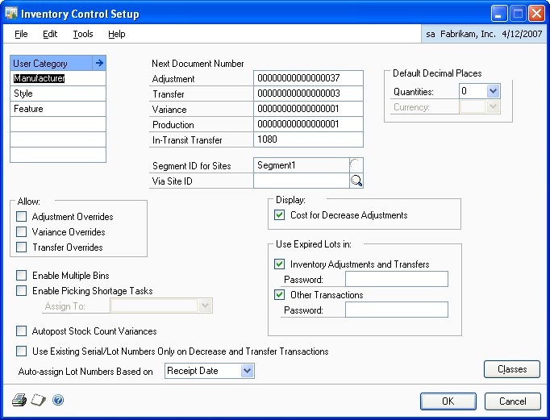

2. You can enter up to six user categories to classify related items.

    User categories are user-defined item categories that provide a way for you to group your inventory and analyze trends in purchases and sales. Refer to *Defining a user category*.

3. Enter the next document number for adjustment, transfer, variance, bin transfer, and in-transit transfer transactions. For more information about inventory transactions, refer to *Inventory Control transactions*

    The document numbers you enter will be the next numbers assigned to adjustment, transfer, and variance documents. To ensure that enough document numbers will be available for future documents, the document numbers must end with a numeral that includes leading zeros—for example, ADJ0001. Each time you enter transactions, the default document number increases to the next available number. You can change the next document number, if needed, but the same document number can be posted only once.

    The numbers you enter also determine the number of unique document numbers available. For example, if you enter ADJ0001, you can enter only 9,999 unique adjustment transactions.

    In order to use document numbers for bin transfers, you must first select Enable Multiple Bins.

4. Enter or select the site ID that is the interim location for items that are being moved from one site to another using an in-transit transfer transaction. You can use the via site to ensure that the items aren't sold before the items reach their destination.

    If you leave the Via Site ID field blank, you must enter a site ID when entering new in-transit transfer transactions.

5. Enter or select an account segment ID to represent sites.

    The account segment ID corresponds to the accounts you set up in Account Segment Setup window to track items by site. Once you've entered this information and moved the pointer out of the field, you can't change it.

6. Enter or select the number of decimal places to use as a default number of places for item quantities when creating new item records.

7. If you're not using Multicurrency Management, enter or select the number of decimal places to use as a default number of places for displaying currency amounts associated with items. (If you're using Multicurrency Management, this field won't be available.)

8. Choose which override options to allow. If you allow overrides, you can allocate quantities that are greater than the quantity available.

9. To use multiple bins at each inventory site, mark Enable Multiple Bins. This option must be marked in order to use the next document number for bin transfers.

    > [!NOTE]
    > If you're using stock counts, you should be aware of how marking this option will affect your existing stock count records. Refer to Multiple bins and existing stock counts for more information.

    Marking this option will change Microsoft Dynamics GP processing so that bin information is required for transactions. Before you mark this option, you should complete several setup tasks related to multiple bins. Refer to *Preparing to use multiple bins* for more information.

10. Choose whether a task should be created if a picking ticket shortage is entered is found. After the shortage occurs in the Sales Order Fulfillment Entry window or the Manufacturing Component Transaction Entry window, a message will appear, and you will have the option to create a task for the quantity shortage.

    You can use the task to create a stock count or to locate the missing quantities. You must enter a user ID to create tasks for picking ticket shortages.

11. Choose whether stock-count variances should be posted automatically.

12. Choose whether to use only existing lot numbers and serial numbers on decrease and transfer transactions. By marking this option, you can't enter a new lot number or serial number when entering a decrease transaction or transfer transaction in Inventory Control, Microsoft Dynamics GP Bill of Materials, Sales Order Processing, or Invoicing.

13. Select to automatically assign lot numbers to transactions by receipt date or expiration date in Sales Order Processing, Microsoft Dynamics GP Bill of Materials, and Invoicing. To use the lot numbers nearing expiration first, select to assign lot numbers by expiration date.

14. Choose whether costs for decrease adjustment transactions should be displayed.

15. Choose whether to use expired lots when entering inventory adjustments and transfers. In the Password field, you can enter a password for this option if you want to limit the users who can use expired lots. If this option is not marked, expired lots can't be used when entering inventory adjustments and transfers.

16. Choose whether to use expired lots when entering transactions in Microsoft Dynamics GP Bill of Materials, Purchase Order Returns, Sales Order Processing, Invoicing, and Manufacturing. In the Password field, you can enter a password for this option if you want to limit the users who can use expired lots. If this option is not marked, expired lots can't be used when entering transactions in other modules.

17. Choose OK to save your changes.

When you've entered your preferences and default settings, you can verify your entries by choosing File \>\> Print to print the Inventory Module Setup Report. You also can print this report by choosing the print icon button in the window.

#### Preparing to use multiple bins

Before you begin to use multiple bins in transactions, you should complete several setup tasks. For example, you should create the bins at each site, and specify default bins for each site and for each item-site combination. You can complete these tasks as soon as you've entered registration keys for multiple bins. Refer to *Multiple bins* for more information about multiple bins.

Refer to the following topics for information about the tasks that should be completed after you've registered the multiple bins feature, but before you mark the option in the Inventory Control Setup window.

- *Entering bins for a site*

- *Specifying default bins for a site*

- *Specifying default bins for an item-site combination*

- *Specifying preferences and default entries*

> [!NOTE]
> If you have existing inventory quantities, you also might want to enter a bin name in the Bin field in the Item Quantities Maintenance window for each item-site combination. The quantities for each item-site combination automatically will be put in this bin (from a software perspective) when you mark the option to enable multiple bins.

When you've completed those tasks, you can mark the option to enable multiple bins. An alert message will appear, telling you to reconcile inventory and to check links. These steps are required *only if you have existing inventory quantities.* For more information, refer to *Handling existing quantities for multiple bins*.

#### Handling existing quantities for multiple bins

An alert message appears when you mark the option to enable multiple bins, telling you to use the inventory setup checklist. The checklist will direct you to reconcile inventory and check links, among other things. You can complete those tasks immediately, or you can edit your pending (unposted) transactions first.

It's helpful to understand how Microsoft Dynamics GP changes and updates information for multiple bins.

**Marking the Enable multiple bins option** After you mark the option, bin information is required for any new transaction that's entered.

**Reconciling inventory and sales documents** When you reconcile inventory and sales documents, Microsoft Dynamics GP supplies bin information to unposted transactions. The bin that Microsoft Dynamics GP supplies for each unposted transaction is the default bin for the transaction type for the item-site combination or the site.

After you mark the option to enable multiple bins and before you reconcile inventory and check links, you can edit unposted transactions to add the bin information. You need to do this *only* if you want to use bins other than the default bins.

*Refer to Modifying an unposted transaction for more information.*

After you've edited the unposted transactions—or immediately after marking the option to enable multiple bins, if it's OK if the default bins are used for the transactions—you need to complete the steps described in the following table.

| **Task**                  | **Reference**                                                                                                                           |
|---------------------------|-----------------------------------------------------------------------------------------------------------------------------------------|
| Reconcile sales documents | Refer to the Sales Order Processing documentation.                                                                                     |
| Reconcile inventory       | Refer to *Reconciling inventory records*.                                                                                              |
| Check links               | Refer to your System Administrator's Guide (Help \>\> Contents \>\> select System Administration), referencing the tables listed below. |

The System Administrator Guide includes information about how to check links. You'll need to check links for the following combinations of series and tables. Refer to the table for more information.

| **Series** | **Logical tables**             | **Required**                                                         |
|------------|--------------------------------|----------------------------------------------------------------------|
| Inventory  | Item Master                    | For anyone using multiple bins who has existing inventory quantities |
|            | Inventory Transaction Work     |                                                                      |
|            | Bill of Materials Transactions | Only if you use Bill of Materials                                    |
|            | Stock Count                    | Only if you use stock counts                                         |
| Sales      | Sales Work                     | Only if you use Sales Order Processing                               |
| Purchasing | Purchasing Transactions        | Only if you use Purchase Order Processing                            |

*If any of these processes fail, contact technical support.*

When you reconcile inventory for multiple bins, a bin automatically is created for each site that's already set up in Microsoft Dynamics GP, and all quantities of items at that site are put in that bin. If you've entered a bin name in the Item Quantities Maintenance window, that bin name is used; otherwise, a bin called AUTOCREATE automatically is created. For information about moving the quantities to their appropriate bin locations, refer to *Transferring quantities from one bin to another*.

When you reconcile sales documents, bin information is added to unposted sales transactions. The default bin used is the default bin for the transaction type for the item-site combination or for the site. If no default bin for the item-site combination or the site is available, the quantity fulfilled will be cleared and you'll need to use Sales Order Processing windows to fulfill the documents before they can be posted.

#### Multiple bins and existing stock counts

If you mark the option to Enable Multiple Bins in the Inventory Control Setup window, bin information also is required for each line in each stock count.

*If possible, it's a good idea to finish processing any Started or Entered stock counts before you mark the option to use multiple bins. You also should post any variance transactions resulting from those stock counts.*

Refer to the table for information about how stock count IDs are affected, depending on their status.

| **Status** | **Effect of marking the Enable Multiple Bins option**                                                                                                                                                                                                                                                                                                                                                      |
|------------|------------------------------------------------------------------------------------------------------------------------------------------------------------------------------------------------------------------------------------------------------------------------------------------------------------------------------------------------------------------------------------------------------------|
| Available  | When you enter or select the stock count in the Stock Count Schedule window or the Stock Count Entry window, an alert message appears. If you choose to continue using the stock count, the bin information in the stock count will be cleared and you must enter valid bin information before you can start the stock count. If the status of the stock count was Started, it will be reset to Available. |
| Started    |                                                                                                                                                                                                                                                                                                                                                                                                            |
| Entered    | When you enter or select the stock count in the Stock Count Entry window, an alert message appears, telling you that the stock count has been converted for use with multiple bins. Any bin information and any stock count results you've entered will be cleared. You must enter the necessary bin information before you can restart the stock count.                                                  |

#### Defining a user category

Use the Inventory Control Setup window to create user categories—groups of item characteristics—and then use the Item Category Setup window to define values for each category. For example, you might create a user category called Storage if you have inventoried items that require special storage conditions. Then you could use the Item Category Setup window to create different values—such as Refrigeration or Hazardous—to assign to items that require special handling.

You can create as many as six user categories. Each category can include unlimited values.

**To define a user category:**

1. Open the Inventory Control Setup window. (Inventory \>\> Setup \>\> Inventory Control)

2. Enter a user category in the first blank user category field.

3. Choose the expansion button to open the Item Category Setup window.

    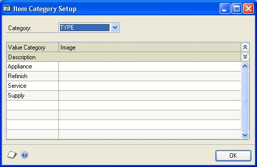

4. Select the Category.

5. Enter values for the category in the scrolling window. You can enter a description of the value or a path to an image.

6. Your entries automatically are saved as they're entered in the scrolling window.

7. When you've finished entering information, choose OK.

### Chapter 4: Unit of measure schedules

To be able to purchase and sell the same inventoried item in different quantities, you can use unit of measure schedules. A unit of measure schedule is a sort of conversion table that helps you define the equivalent number of units.

For example, you might purchase light bulbs by the case, and then sell them individually. If you set up a unit of measure schedule for the light bulbs, you can accomplish this.

Every inventoried item must be assigned a unit of measure schedule, but an item can't be assigned more than one unit of measure schedule.

The following information is discussed:

- *Creating a unit of measure schedule*

- *Copying a unit of measure schedule*

- *Modifying a unit of measure schedule*

- *Deleting a unit of measure schedule*

#### Creating a unit of measure schedule

Use the Unit of Measure Schedule Setup window to define a unit of measure schedule. You must create at least one unit of measure schedule, because a unit of measure schedule must be assigned to every inventoried item.

**To create a unit of measure schedule:**

1. Open the Unit of Measure Schedule Setup window.

    (Inventory \>\> Setup \>\> Unit of Measure Schedule)

    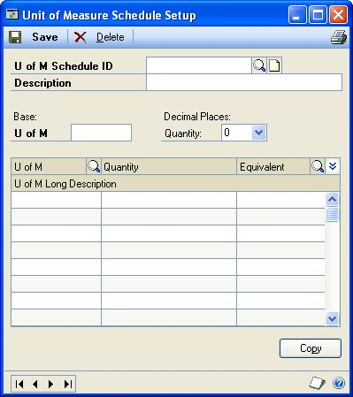

2. Enter an identifier and a description for the unit of measure schedule.

3. Enter or select the number of the decimal places for the quantities you plan to enter on this unit of measure schedule.

    > [!NOTE]
    > The number of decimal places for entering and displaying quantity information for the item and for the unit of measure must match. You might need to create several unit of measure schedules that are the same except for the number of decimal places displayed.

    > [!TIP]
    > You can create one schedule and make copies of it. Refer to Copying a unit of measure schedule for more information.

4. Enter a base unit of measure. This should be the smallest unit available for the item. When you move out of the field, a base equivalency—an equivalency that states that the smallest unit is equal to itself—automatically will be created in the first line of the scrolling window.

    > [!NOTE]
    > Even if you purchase and sell an item in only one unit of measure, you need to set up a unit of measure schedule with the base equivalency information.

5. Set up the quantities, equivalents, and descriptions for each unit of measure you plan to use, relative to the base unit of measure.

    For example, if you're selling cans of soft drinks and your base unit of measure is "can," you could set up equivalents as follows:

    | **Unit of measure** | **Quantity** | **Equivalent** |
    |---------------------|--------------|----------------|
    | Can                 | 1            | Can            |
    | Six-pack            | 6            | Can            |
    | 12-pack             | 12           | Can            |
    | Case                | 24           | Can            |
    | Case                | 4            | Six-pack       |

6. When you've finished defining all units of measure for a schedule, choose Save.

When you've entered all of your unit of measure schedules, you can verify your entries with a Unit of Measure List report.

#### Copying a unit of measure schedule

Use the Unit of Measure Schedule Setup window to copy an existing unit of measure schedule. This is especially helpful if you need to create several similar schedules that differ only in the number of quantity decimals.

**To copy a unit of measure schedule:**

1. Open the Unit of Measure Schedule Setup window.

    (Inventory \>\> Setup \>\> Unit of Measure Schedule)

2. Enter a name for the new schedule.

3. Enter or select the number of quantity decimal places to include.

4. Choose Copy and select an existing unit of measure schedule. The schedule you select must track a number of quantity decimals that is the same or fewer than the new schedule you're creating.

5. Make any changes as needed.

6. When you've finished, choose Save.

### Modifying a unit of measure schedule

You can make changes to a unit of measure schedule at any time, including adding, modifying, and deleting equivalencies. The following requirements apply to modifying a unit of measure schedule:

- If you change the base equivalency, all standard pricing price lists are updated but you must check links for the Item Master table for the update to occur. Prices won't change. If an item is sold before you check links, the item will be sold at its original price—not the updated price.

- If you change the base equivalency, all extended pricing price sheet information for the item is not updated. You must edit price sheet information.

- If you change a unit of measure schedule while an affected price list is open, the Unit of Measure Schedule Audit Report automatically will be printed when you save the changes to the schedule. The report lists the items whose price lists couldn't be updated when the unit of measure schedule was changed. You should check links for the Item Master table.

> [!TIP]
> Refer to your System Administrator's Guide (Help \>\> Contents \>\> select System Administration) for more information about checking links.

**To modify a unit of measure schedule:**

1. Open the Unit of Measure Schedule Setup window. (Inventory \>\> Setup \>\> Unit of Measure Schedule)

2. Enter or select a unit of measure schedule.

3. Make any changes as needed. You can add or delete rows by placing your pointer in the scrolling window, choosing the Edit menu and selecting Add Row or Delete Row.

    > [!NOTE]
    > You can't delete the base equivalency (where you make the smallest unit of measure equal to itself) if other equivalencies are included in the scrolling window.*

4. When you've finished entering changes, choose Save.

### Deleting a unit of measure schedule

Use the Unit of Measure Schedule Setup window to delete a unit of measure schedule. This might affect other records, such as price lists based on the unit of measure. The following requirements apply when you're deleting a unit of measure schedule.

- If you delete a unit of measure in a schedule, that unit of measure will be removed from any existing price lists or price sheets.

- You must remove the unit of measure schedule from all items and item classes before you can delete the unit of measure schedule.

**To delete a unit of measure schedule:**

1. Open the Unit of Measure Schedule Setup window.

    (Inventory \>\> Setup \>\> Unit of Measure Schedule)

2. Enter or select a unit of measure schedule.

3. Choose Delete. An alert message appears, asking if you're sure you want to delete the schedule. Choose Yes.

### Chapter 5: Standard pricing

If you're using standard pricing, you can define price levels and price groups for use with price lists. A price level is a pricing tier that can be assigned to items, customers, and prospects. For example, you might create a Wholesale price level and a Retail price level—and then assign the Wholesale price level to certain customers.

> [!NOTE]
> If you're using extended pricing, you don't need to complete these tasks, but you will need to enable extended pricing. Refer to the Sales Order Processing documentation for more information about marking the option to enable extended pricing, and refer to Chapter 12, "Extended pricing," for more information about setting up extending pricing.

Price groups are identifiers that you can assign to items that have similar pricing structures. You can use price groups to specify the items to be included when you update price lists. For example, if you have several items that are identical except for their color, you might assign them all to the same price group. Later, you can use a price list wizard to update the price lists for all those items at once. Price groups also are an available option for some reports—you can choose to generate a report based on items that share a certain price group.

You don't need detailed pricing information to complete these pricing setup procedures—creating a price level or a price group involves creating the identifiers and entering brief descriptions of each price level or group.

*Refer to Standard pricing price structures for more information about how you can combine pricing setup options to create different pricing structures.*

The following information is discussed:

- *Creating a price level*

- *Deleting a price level*

- *Creating a price group*

- *Deleting a price group*

### Creating a price level

Use the Price Level Setup window to create price levels. If you're going to use price lists, you must create at least one price level. Each price list must include at least one price level.

*You don't need to complete this task if you're using extended pricing.*

**To create a price level:**

1. Open the Price Level Setup window. (Inventory \>\> Setup \>\> Price Level)

    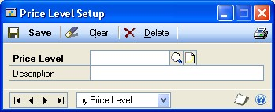

2. Enter an identifier—such as Retail or Wholesale—and a description for the price level.

3. Choose Save.

If you're using Inventory Control with either Sales Order Processing or Invoicing, you can repeat steps 2 and 3 to create additional price levels. (You can't create more price levels if you're not using one of those modules.)

### Deleting a price level

Use the Price Level Setup window to complete this procedure.

**To delete a price level:**

1. Open the Price Level Setup window. (Inventory \>\> Setup \>\> Price Level)

2. Enter or select a price level.

3. Choose Delete. An alert message appears, asking if you're sure you want to delete the record. Choose Delete.

### Creating a price group

If you have several items that will have very similar price lists, you can group those items by creating a price group and then assigning the items to the price group. You can create as many price groups as you like. Price groups are optional.

> [!NOTE]
> The price groups that are created with this procedure aren't the price groups used with extended pricing. If you're using extended pricing, refer to Creating and editing price groups.

Use the Price Group Setup window to complete this procedure.

**To create a price group:**

1. Open the Price Group Setup window. (Inventory \>\> Setup \>\> Price Group)

    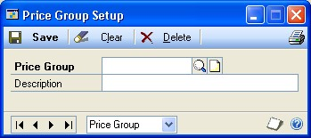

2. Enter an identifier and description for the price group.

3. Choose Save.

### Deleting a price group

Use the Price Group Setup window to delete a price group, if needed. You can't delete a price group if it's assigned to any items or item classes.

**To delete a price group:**

1. Open the Price Group Setup window. (Inventory \>\> Setup \>\> Price Group)

2. Enter or select a price group.

3. Choose Delete. An alert message appears, asking if you're sure you want to delete the price group. Choose Delete.

### Chapter 6: Lot category setup

If your organization tracks items by lots, you can use lot categories to group lotnumbered items by shared characteristics. For example, items such as fabrics, carpets, and wallpaper are often assigned to lots, so that all items produced with a certain ink or dye can be tracked together. You also can create lot categories for tracking items to be used by or sold by a particular date, such as pharmaceuticals or cosmetics.

Once you've decided on the type of lot category you want to create, you can enter lot attributes for the category. Lot attributes are used when you enter an increase adjustment to further identify the lot-numbered item you've received. Tracking items by lot attribute is valuable if, for example, you've sold carpeting with specific dye and date attributes. If a customer who purchased carpeting with these attributes needs to purchase additional quantities, you'll be able to decrease quantities from the same lot category and ensure that the customer receives an identical product. If you are using sales fulfillment workflow, you can use the date attributes in the Lot Category Setup window to assign minimum shelf life attributes for an item. For more information, see *Minimum shelf life*

You can create an item record for a lot-number–tracked item without assigning a lot category to the item. If you don't assign a category, however, you won't be able to track the item by the attributes of the lot.

The following information is discussed:

- *Minimum shelf life*

- *Creating a lot category*

- *Modifying a lot category*

- *Deleting a lot category*

### Minimum shelf life

If you are using sales fulfillment workflow, you can use the Date 1 and Date 2 fields in the Lot Category Setup window to assign minimum shelf life attributes for an item. For example, you can enter Use By, Sell By, or Display Until as date attributes for an item. (You can enter an expiration date for an item in the Lot Attribute Entry window.) The attributes you enter will be displayed in the Item Maintenance Options window, where you can enter the number of days that you can use, sell, or display the item. The number of days you enter is used to determine whether or not the item meets the minimum shelf life when receiving the item in the Receivings Transaction Entry window.

For example, you need to ensure that the inventory you receive will not expire before it can be sold by your company. You enter Sell By as one of the date attributes for a lot category. Then, you enter the minimum number of days that it will take to sell the item in the Item Maintenance Options window. When the item is received, user date is subtracted from the Sell By date entered in the Lot Attribute Entry window to determine whether or not the item meets the minimum shelf life. If the difference between the Sell By date and the user date is less than the number of days entered in the Item Maintenance Options window, a message will be displayed indicating that the item received has less than the minimum acceptable shelf life.

### Creating a lot category

Use the Lot Category Setup window to create a lot category you can use to track the attributes of similar items.

If you are using sales fulfillment workflow, you can use the Date 1 and Date 2 fields to assign minimum shelf life attributes for an item. For example, you can enter Use By, Sell By, or Display Until as date attributes for the item's shelf life. The attributes you enter will be displayed in the Item Maintenance Options window. Refer to *Minimum shelf life* for more information.

**To create a lot category:**

1. Open the Lot Category window. (Inventory \>\> Setup \>\> Lot Category)

    

2. Enter a name or number for the lot category.

3. Assign up to five attributes, including as many as three alphanumeric and two date attributes. The attributes appear as labels in the Lot Attribute Entry window.

    If you are using sales fulfillment workflow, you can use the date attributes to track the shelf life of an item. For more information, see *Minimum shelf life*

4. Save the lot category.

When you have entered all your lot categories, you can verify your entries with a Lot Category List.

### Modifying a lot category

Use the Lot Category Setup window to change the names assigned to lot attributes.

When you change a lot attribute name, any information you've entered won't change or be removed—only the label will change.

**To modify a lot category:**

1. Open the Lot Category window. (Inventory \>\> Setup \>\> Lot Category)

2. Enter or select a lot category.

3. Make changes to the lot attribute names as needed.

When you've finished making changes, choose Save. You can verify your entries with a Lot Category List. For information about printing this and other setup reports, see Help \>\> Index, and search for Inventory Setup Reports window.

### Deleting a lot category

Use the Lot Category Setup window to delete a lot category.

**To delete a lot category:**

1. Open the Lot Category window. (Inventory \>\> Setup \>\> Lot Category)

2. Enter or select a lot category.

3. Choose Delete. An alert message appears, asking if you're sure you want to delete the lot category. Choose Delete.

### Chapter 7: Item classes

You can use item classes to group items according to common characteristics. If you define a class and then assign items to it, default information about the items will appear, making it quicker and easier to define new items. You also can use item classes to make changes to many items at once—you change the item class information and then "roll down" the changes to items that belong to the class. Item classes also are a common sorting option on reports.

The following information is discussed:

- *Relationship of item class to item record*

- *Creating an item class*

- *Assigning a currency to an item class*

- *Specifying default accounts for an item class*

- *Modifying an item class*

- *Effects of changing item class information*

- *Controlling the effects of item class changes*

- *Removing a currency from an item class*

- *Deleting an item class*

### Relationship of item class to item record

Before creating item classes, it's important to have an understanding of what your items are, and how they relate to your business. You can create item classes for groups of items that share certain characteristics such as valuation method or price group.

Using item classes can be helpful in these instances:

**Entering new records** When you create an item class, you can specify certain default settings and preferences for the items in the class: the number of decimal places for tracking quantities or currencies, the item type, and so on. Later, when you add an item record, you can select the appropriate item class—and the class information will be added to the item record. This can make data entry faster and more accurate.

**Updating items in a class** You also can use item classes to update several item records at once. If you change item class information and choose Save, an alert message will appear, asking if you want to "roll down" the changes to all items in the class. If you choose to do this, the change you made to the item class will be reflected in the records of the items that belong to the item class.

Refer to *Controlling the effects of item class changes* for more information about controlling the effects of item class changes.

**Generating reports** Item classes are one of the most common report restrictions available in Microsoft Dynamics GP.

### Creating an item class

Use the Item Class Setup window to create item classes. Creating item classes is optional, but assigning items to a class gives you a way to organize your item records, sort information, and print reports.

**To create an item class:**

1. Open the Item Class Setup window. (Inventory \>\> Setup \>\> Item Class)

2. Enter an identifier and description for the item class.

    > [!IMPORTANT]
    > We recommend that you set up your first class with the most common entries and mark this class as your default class. If you mark the Default option, the information you define for this class automatically appears as the default for every subsequent class you create. This makes data entry faster if similar entries are required in many classes. You can save only one default item class.

3. Select an item type. Refer to *Item types* for more information.

4. Select a valuation method for how costs are tracked and how quantities are entered and removed from inventory. Refer to *Valuation methods* for more information.

    > [!TIP]
    > If you enter the wrong valuation method, you must use the Change Valuation Methods window to change it. Refer to Changing valuation methods for more information.

5. Specify if serial or lot numbers will be tracked for items in this class. The tracking option is available only for sales inventory or discontinued items.

    > [!TIP]
    > If you choose to track items by lot number, you can enter or select a lot category—a set of item attributes you want to track for the lot. Refer to Chapter 6, "Lot category setup," for more information about defining lot categories. Refer to Entering lot attribute information for more information about entering lot category values.

6. If you selected to track lot numbers, you can select to be warned before a lot number expires. After marking the Warn option, you can enter the number of days you want to be warned before the lot number expires. You won't receive a warning message if you leave the days before lot expires field blank.

    If you marked the Lot Due to Expire reminder in the Reminder Preferences window, the number of days you enter is used when generating the reminder that a lot is nearing its expiration date.

7. Specify how the items in this class will be taxed. If you choose Taxable, choose a Tax Schedule ID.

    > [!TIP]
    > Refer to your System Setup instructions (Help \>\> Contents \>\> select Setting Up the System) for more information about tax schedules.*

8. If you're using standard pricing, enter or select a price method for the item class. Refer to *Price methods* for more information.

    If you're using extended pricing, the price method isn't used.

9. Specify if back orders will be allowed in the Sales Order Processing module for items in this class.

10. If the item class will be for sales inventory or discontinued items, and if the Valuation Method is LIFO Perpetual, FIFO Perpetual, or Average Perpetual, you can specify whether purchase receipts for the item should be revalued when cost variances exceed certain levels. Mark Revalue Inventory for Cost Variance if you want this to occur.

    If you mark Revalue Inventory for Cost Variance, enter a Tolerance Percentage. The tolerance percentage determines how large a cost variance must be— greater or less than the shipment receipt amount—before the purchase receipt is revalued. Refer to *Cost variance tolerances* for more information.

11. If the item class will be for sales inventory or discontinued items, you can specify quantity tolerances for shortages and overages for the quantity ordered when receiving against a standard or blanket purchase order.

    - **Shortage**
      Mark Shortage and then enter the percentage to use when the quantity received is less than the quantity ordered. If the difference between the quantity received and quantity ordered falls within the quantity tolerance percentage, the difference between the quantities is canceled and the status of a line item is automatically changed to change order, received, or closed. The status of the line item depends on whether or not the line item has been invoiced.
    - **Overage**
      Mark Overage and then enter the percentage to use when the quantity received is more than the quantity ordered. If the quantity received is over the overage tolerance, you will receive a message that you can't enter a quantity greater than the combined total of the Remaining to Receive quantity and the overage tolerance set up for the item.

12. Mark the history types to keep for this item class.

    You must keep transaction history to print the Transaction History Report or to print details for the Historical Stock Status Report. You must keep distribution history to print the Distribution History Report. Both transaction and distribution history are kept automatically if you specify at the system level that you want to reprint posting journals. Refer to your System Administrator's Guide (Help \>\> Contents \>\> select System Administration) for more information.

13. Enter or select decimal places for quantities and currencies.

    If you're using Multicurrency Management, the Currency Decimals field isn't available because the number of currency decimals will vary from one currency to another. Refer to *Assigning a currency to an item class* for more information.

14. Enter or select a unit of measure schedule and price group. The number of decimals used to track quantity information for the item and for the unit of measure schedule must be the same.

15. If you're using standard pricing, enter the price level that you use most often when selling items in this class. The price level you select should be one that will be in the price list of each item in the class.

    If you're using Sales Order Processing and standard pricing, this price level will be the default entry if you enter a sales transaction for a customer that has no assigned price level.

16. Enter values for user categories, if needed. Refer to *Defining a user category* for more information about user categories.

17. If you're tracking Intrastat statistics, enter or select a tax commodity code and a country or region of origin.

    These fields are available only if you've marked the Enable Intrastat Tracking option in the Company Setup Options window.

18. Choose Currency to open the Item Class Currency Setup window, where you can assign a currency to an item class, if you're using Multicurrency Management. Refer to *Assigning a currency to an item class* for more information.

19. Choose Accounts to open the Item Class Accounts Setup window, where you can specify default posting accounts for items in the class. Refer to *Specifying default accounts for an item class* for more information.

20. Choose Save.

When you've entered all class records, you can verify your entries with an Item Class List report.

### Assigning a currency to an item class

If you're using Multicurrency Management, use the Item Class Currency Setup window to assign currencies to item classes. You must assign a currency to an item to be able to create a price list in that currency for the item, or to use the item in Sales Order Processing or Purchase Order Processing.

*Before you begin this procedure, you must set up your currencies in Multicurrency Management.*

**To assign a currency to an item class:**

1. Open the Item Class Currency Setup window. (Inventory \>\> Setup \>\> Item Class Currency)

    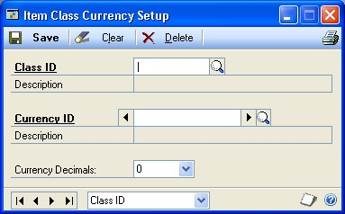

2. Enter or select a class ID.

3. Enter or select a currency ID.

4. Enter the number of currency decimals. You can change the number of currency decimals at any time.

5. Choose Save.

6. Repeat steps 3 through 5 to assign multiple currencies to the item class. You can assign as many currencies to an item class as you like.

### Specifying default accounts for an item class

Use the Item Class Accounts Setup window to specify default posting accounts for an item class.

**To specify default accounts for an item class:**

1. Open the Item Class Setup window. (Inventory \>\> Setup \>\> Item Class)

2. Enter or select an item class.

3. Choose Accounts to open the Item Class Accounts Setup window.

    

4. Enter or select the account numbers to be used for items in the class.

    Later, when you create individual item records, you can accept or change the
    default posting account selections.

5. When you've finished selecting accounts, choose OK.

### Modifying an item class

Use the Item Class Setup window to change item class information. When you change item class information, you might have the option to "roll down" your changes to the items that belong to the item class. Refer to *Effects of changing item class information* for information about what changes can be rolled down. Refer to *Controlling the effects of item class changes* for information about controlling the effects of item class changes.

**To modify an item class:**

1. Open the Item Class Setup window. (Inventory \>\> Setup \>\> Item Class)

2. Enter or select an item class.

3. Make changes as needed.

4. Choose Save.

Depending on the changes you've made, an alert message might appear, asking if you want to roll down the changes to all items in the class. Refer to *Effects of changing item class information* and *Controlling the effects of item class changes* for more information.

### Effects of changing item class information

Some changes to item class information can be "rolled down" to items that have already been assigned to the item class. For example, if your company begins selling items to customers in a new currency and you assign that currency to the item class, you can choose to roll down the change, so the currency automatically is added to all items in the class.

Some changes to item class information, however, cannot be rolled down. Changes that cannot be rolled down include:

- Number of decimal places for currency or quantity information

- Valuation method

- Price method, if you're using standard pricing

- Unit of measure schedule

Some changes to item class information can be rolled down only in certain situations. These changes include:

**Item types** If you're changing the item type for an item class, the change can be rolled down only if you're changing the item type from Sales Inventory to Discontinued.

**Track option** If you're changing the lot- or serial-number tracking options for an item class, the change can be rolled down only to those items that have zero quantity in stock.

**Default price level** If you're using standard pricing and you're changing the default price level for an item, the change can be rolled down only to those items that already include the price level in their price lists.

**Revaluing inventory and tolerance percentage** If you're marking or clearing the Revalue Inventory for Cost Variance option, the change will be rolled down only to Sales Inventory or Discontinued items that have LIFO perpetual, FIFO perpetual, or average perpetual valuation methods. If you change the tolerance percentage for a class and choose to roll down the change, the percentage will be changed only for those items that have the Revalue Inventory for Cost Variance option marked.

If you make a change to an item class and the change is not rolled down, only new item records assigned to the item class will reflect the new information.

### Controlling the effects of item class changes

When you create an item class, the options and selections you specify for the item class are inherited by any new items that are created and assigned to the class. Some changes that you might make to an item class can be rolled down to the items assigned to the class—other changes are reflected only in new item records assigned to the class. Refer to *Effects of changing item class information* for more information about what item class changes can be rolled down to items.

When you change an item record, carefully consider the relationship of the item to its item class. If you change an item that is assigned to a class, then change the information for the class and roll down those changes, the changes to the item record will be removed—and the item information will match the class information.

**If you need to roll down item class changes** Clear the class ID from any item record that shouldn't be updated when the class information changes.

**If you don't need to roll down item class changes** Use classes as a starting point for creating item records. Rather than rolling down changes to all items in the class, use updated item classes only to base new item records on.

### Removing a currency from an item class

Use the Item Class Currency Setup window to remove a currency from an item class.

**To remove a currency from an item class:**

1. Open the Item Class Currency Setup window. (Inventory \>\> Setup \>\> Item Class Currency)

2. Enter or select a class ID.

3. Enter or select the currency to be removed.

4. Choose Delete. An alert message appears, asking if you're sure you want to delete the currency from the item class. Choose Yes, then close the window.

### Deleting an item class

If an item class has become obsolete, you can delete it from Inventory Control. Because item classes are used only to make maintenance easier and faster, existing item records aren't affected when you delete the class. You can delete an item class at any time.

**To delete an item class:**

1. Open the Item Class Setup window.

(Inventory \>\> Setup \>\> Item Class)

2. Enter or select the class you want to delete.

3. Choose Delete. An alert message appears, asking if you're sure you want to delete the class. Choose Yes.

### Chapter 8: Stock count calendar

A stock count calendar identifies the days when a stock count can be performed. Days when counts can be performed are called up days; days when counts can't be performed are called down days. For example, you might choose to designate all Saturdays and Sundays as down days. You also can designate other days—such as company holidays—to be down days.

The stock count calendar serves these functions.

- First, the stock count calendar is used to determine the next suggested count date for each item-site (or, if you're using multiple bins, item-site-bin) combination. For example, if you define an item on June 1 and specify that it should be counted every 30 days, you're actually specifying that it should be counted every 30 *up days*. So, if you've specified down days within the month of June, the first suggested count date for the item at the site might be well into July.

*Refer to How stock count dates are calculated for more information.*

- Second, when you use cycle counting, the suggested count dates are spread over the length of the cycle. For example, if you specify 300 items you want counted at a specific site every 30 days, stock count dates for the items will be calculated so that you're counting quantities for 10 item numbers each of the 30 *up* days in the cycle. (If the number of items can't be evenly divided by the number of days in the cycle, the remainder is spread as evenly as possible over the cycle.)

*For more information about cycle-counting, refer to Chapter 18, "Count intervals."*

The following information is discussed:

- *Setting up a stock count calendar*

- *Changing stock count calendar settings*

### Setting up a stock count calendar

Use the Stock Calendar Maintenance window to set up a stock count calendar.

**To set up a stock count calendar:**

Open the Stock Calendar Maintenance window.

(Inventory \>\> Setup \>\> Stock Calendar)

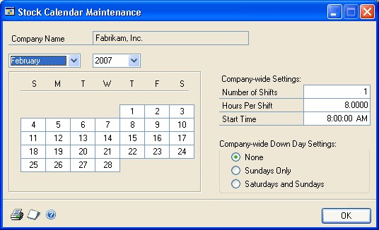

The window opens with the current month and year displayed.

1. Enter the number of shifts that can complete stock counts, and the number of hours per shift that are available for the stock count tasks. Enter the start time for the first shift.

    *The number of shifts, number of hours per shift, and the start times for the shifts are optional—the fields are informational only.*

2. Select the companywide days off. For example, if your company does not have a weekend shift, you would select Saturdays and Sundays.

    *If your company is usually closed on Saturdays and Sundays but you set aside one day each year or quarter to do the stock counts, you can select the Saturdays and Sundays option and then choose the date of the stock count.*

3. To select additional company holidays or other down days, select the month, then select the day. (To change the day back to the original setting, select the day again.)

    - Days that appear black with white text are designated down days.

    - Days that appear white with black text are designated up days (days when counts can be performed).

4. Choose File \>\> Print to print the Stock Count Calendar List.

    This report shows you which days are designated as companywide down days. You also can print the report from the Inventory Setup Reports window. Choose Inventory \>\> Reports \>\> Setup to open that window.

5. Choose OK to save your changes and close the window.

### Changing stock count calendar settings

Use the Stock Calendar Maintenance window to change the stock count calendar, if needed. Changes to the stock count calendar won't affect the suggested stock count dates for items until the suggested dates are recalculated.

**To change stock count calendar settings:**

1. Open the Stock Calendar Maintenance window.

(Inventory \>\> Setup \>\> Stock Calendar)

2. Make changes as needed. If you change the status of any day—changing an up day into a down day, for example—an alert message appears, warning that the changes won't be reflected in any current dates for stock counts. Choose Yes to continue.

3. Choose OK to save your changes and close the window.

### Chapter 9: Reason codes

A reason code is used to identify causes for item stock movements and adjustments. Once reason codes are set up they can be assigned to a line item on inventory adjustments, variances, transfers and stock counts.

This information is divided into the following sections:

- *Creating reason codes*

- *Modifying reason codes*

- *Inactivating reason codes*

- *Deleting reason codes*

### Creating reason codes

Before you can begin using reason codes on inventory transactions, define the settings you want to use.

**To create a reason code**

1. Open the Reason Code Setup window.

(Inventory \>\> Setup \>\> Reason Code Setup)

2. Enter an identifier, such as Spoilage, and a description for the reason code.

3. Select which inventory transactions this reason code will be entered on. The transaction type will limit the reason codes available in a lookup window to only those that apply to the specific transaction you're entering.

3. Select the types of adjustment and variance transactions to more specifically broaden or limit the use of this reason code.

If you select Adjustment or Variance, select a default offset account which will be used to track amounts posted with this reason code. For example, if you use Spoilage as a reason code, and enter it every time you enter a decrease adjustment for spoiled items, you will be able to identify the costs of all spoiled items distributed to this account at the end of the year. If you do not specify an offset account, the item amount will be posted using the standard account distributions for the item.

4. Select the types of transfer transactions you'll use the reason code on. The reason code can be assigned to any combination of inventory and transfer transactions.

5. Choose Save.

### Modifying reason codes

You may find as you're using reason codes that you need to expand the use, or more further limit the future use of a reason code. Changes you make do not affect existing transactions containing the reason code.

**To modify a reason code**

1. Open the Reason Code Setup window.

(Inventory \>\> Setup \>\> Reason Code Setup)

2. Select the reason code you want to change.

3. Make changes as needed. Existing transactions are not affected by your changes.

4. Choose Save.

### Inactivating reason codes

A reason code can be inactivated at any time. Once it is inactivated, you won't be able to enter it on any new transactions. Existing transactions are not affected by inactivating a reason code.

**To inactivate a reason code**

1. Open the Reason Code Setup window.

(Inventory \>\> Setup \>\> Reason Code Setup) 

2. Select the reason code you want to inactivate.

3. Mark Inactive.

4. Choose Save.

### Deleting reason codes

A reason code can be deleted at any time. Existing transactions are not affected by deleting a reason code. The code will remain on the transaction as a means of maintaining history.

**To delete a reason code**

1. Open the Reason Code Setup window.

(Inventory \>\> Setup \>\> Reason Code Setup)

2. Select the reason code you want to delete.

3. Choose Delete.

## Part 2: Cards

This part of the documentation includes information that will help you create and modify cards for Inventory Control. You can refer to these procedures whenever you need to create or modify a record for a new item or site. Information about viewing and deleting records also is included in this document.

*You*'*ll need to complete these setup procedures before you enter transactions.*

The following information is discussed:

- *Chapter 10, "Item cards,"* describes how to create and modify item records.

- *Chapter 11, "Standard price lists,"* describes how to specify costing and pricing information for items for standard pricing.

- *Chapter 12, "Extended pricing,"* discusses how to set up extended pricing information.

- *Chapter 13, "Purchasing options, vendors, and planners,"* contains information about purchasing options, including specifying vendors.

- *Chapter 14, "Sites and beginning quantities,"* includes information about setting up sites and creating item-site relationships.

- *Chapter 15, "Item-site details,"* explains how to enter information about sites for items.

- *Chapter 16, "Kits,"* explains how you can use kits to work with collections of items that are sold as a unit.

- *Chapter 17, "History,"* contains information about keeping history for your item records.

- *Chapter 18, "Count intervals,"* includes information about specifying how frequently an item should be counted at a specific site.

- *Chapter 19, "Landed cost cards,"* describes how to create and group landed cost records, and how to assign the groups to item-site (or item-site-bin) combinations.

### Chapter 10: Item cards

When you enter an item record in Inventory Control, you can enter much more information than just an item number and description. You can use Inventory Control to add Internet information, to choose what types of history to keep, to specify posting accounts, and to designate substitute items.

If you're using Multicurrency Management, you also can assign currencies to items. To be able to purchase or sell items in currencies other than your own, you must first assign the currencies to the items.

The following information is discussed:

- *Setting up a numbering system for items*

- *Creating an item record*

- *Entering Internet information for an item*

- *Entering item options*

- *Defining a serial number mask*

- *Defining a lot number mask*

- *Assigning posting accounts to items*

- *Assigning suggested sales items to an item*

- *Assigning a currency to an item*

- *Item numbers and substitute items for customers*

| **Sorting without leading zero** | **Sorting with leading zero** |
|----------------------------------|-------------------------------|
| WIRE-10                          | WIRE-008                      |
| WIRE-8                           | WIRE-009                      |
| WIRE-9                           | WIRE-010                      |

- *Changing the item print option for an item*

- *Copying an inventory item*

- *Understanding item record modifications*

- *Modifying an item record*

- *Removing a currency from an item*

- *Inactivating an item*

- *Deleting an item*

### Setting up a numbering system for items

As you begin setting up your items, consider how you want to number existing and new items. For example, you can assign specific groups of numbers to different types of items. Once you've determined the most appropriate numbering system for your company's inventoried items, use it consistently for the best results when printing reports or completing maintenance procedures.

Be sure that the numbers you enter to identify items all have the same number of characters. You should consider including leading zeros in your item numbers, if possible. Including leading zeros helps ensure that enough item numbers will be available in your scheme for the addition of new item numbers, and that the item numbers will be sorted appropriately in reports and scrolling windows.

For example, as an electronics manufacturer, you might want to use WIRE as a prefix for item numbers for different types of wire. In reports and scrolling windows, the items would be in the following order.

### Creating an item record

Use the Item Maintenance window to set up records for inventoried items. The item records serve as the foundation of Inventory Control, providing detailed item information that can help you control your current inventory and plan for the future.

Information you can enter for items includes vendors, valuation methods, cost information, and whether you are tracking serial or lot numbers for the items.

You can use the Copy button in the Item Maintenance window to create a new inventory item record from a copy of an existing inventory item. See *Copying an inventory item* for more information.

**To create an item record:**

1. In the navigation pane, choose the Inventory button, and then choose the Items list.

2. In the New group, choose Item to open the Item Maintenance window.

    

3. Enter an alphanumeric item number. You can't change the item number after the item number has been saved. To change the item number, you must delete the item and reenter it.

    *Refer to Setting up a numbering system for items for more information about considerations for item numbers.*

4. Enter a description, short description, and generic description for the item.

5. If you're using item classes, enter or select an item class. Default information will appear in many of the fields once you select the item class. Refer to *Chapter 7, "Item classes,"* for more information.

6. Select the item type and valuation method.

    *Refer to Item types and Valuation methods for more information about the options for these fields.*

7. Enter or select the Sales/Payables Tax Option. If you select Taxable, enter or select the tax schedule ID to be used to calculate taxes on the item.

8. Enter or select the Purchasing Tax Option. If you select Taxable, enter or select the tax schedule ID to be used to calculate taxes on the item.

9. You can enter shipping weight information. The shipping weight you enter should be the weight of the base unit of measure for the item.

10. If you're tracking Intrastat statistics, enter the tax commodity code and its description for the item. This field is available when you've marked the Enable Intrastat Tracking option in the Company Setup Options window.

5. Enter or select the number of decimal places that should be used for quantities for the item information.

6. Select the number of decimals to be used to track currency information.

**If you're not using Multicurrency Management** Enter or select the number of decimal places that should be used for currency information for the item.

**If you're using Multicurrency Management** You'll specify the number of decimal places for tracking currency information as you assign currencies to the item.

The functional currency—the currency in which your company conducts most of its business—automatically is assigned to each item. When you completed Multicurrency Management setup tasks, you specified the default number of decimal places for tracking information in the functional currency. To use a different number for this item, choose the Go To button, and select Item Currency to open the Item Currency Maintenance window. Use the browse buttons to display the functional currency, and select the appropriate number of decimal places. Choose Save, then close the window.

*To change the number of currency decimals used for the functional currency for the item, you must make the change before the item record is saved for the first time. If you decide later that you need to change the number of currency decimals for an item in the functional currency, you must use the Change Currency Decimals utility. Refer to Changing currency or quantity decimal places for items for more information.*

7. Enter or select a unit of measure schedule. The item and the unit of measure schedule must use the same number of decimals to track quantity amounts.

8. Enter costing information for the item. Refer to the table for information about the Standard Cost, Current Cost and List Price fields. You need to enter information only in the field required for the price method you plan to use for the item, if you're using standard pricing. (These fields aren't used with extended pricing.)

Refer to *Valuation methods* and *Price methods* for more information about valuation methods and price methods.

| **Fields**    | **Price method** | **Notes**                                                                                                                                                                                                                      |
|---------------|------------------|--------------------------------------------------------------------------------------------------------------------------------------------------------------------------------------------------------------------------------|
| Standard Cost | %Markup–         | You can enter or update a standard cost value anytime, unless an outstanding shipment or shipment invoice exists in Purchase Order Processing. You also can use year-end close activities to update standard cost information. |
| Current Cost  | %Markup–Current  | If the item's valuation method is Average Perpetual, you can enter a value before the first time you save the item.                                                                                                           |
| List Price    | % of List Price  | If you're not using Multicurrency Management, you can enter a List Price and update it at any time.                                                                                                                           |

Standard Cost

%Margin–Standard

Cost

Cost

%Margin–Current

Cost

If an item's valuation method is not Average Perpetual, you can enter a value in the field before the first time you save the item. The amount will be updated after each increase transaction for the item.

If you're using Multicurrency Management, you must use the List Price field in the Item Currency Maintenance window to enter different list prices for different currencies.

9. You can use the Internet information icon button, and the windows you open with the Go To button to complete other tasks to define the item record.

Refer to the table to find more information about specific tasks.

| **To complete these tasks ...**                                           | **Refer to ...**                                                                                                                   |
|---------------------------------------------------------------------------|------------------------------------------------------------------------------------------------------------------------------------|
| Enter Internet item information                                           | *Entering Internet information for an item*                                                                                        |
| Enter item options                                                        | *Entering item options*                                                                                                            |
| Enter or select posting accounts                                          | *Assigning posting accounts to items*                                                                                              |
| Assign suggested sales items                                              | *Assigning suggested sales items to an item*                                                                                       |
| Assign a currency to an item                                              | *Assigning a currency to an item*                                                                                                  |
| Enter customer information for an item, such as a customer's item number  | *Item numbers and substitute items for customers*                                                                                  |
| Enter pricing information                                                 | *Chapter 11, "Standard price lists,"* or *Chapter 12, "Extended pricing"*                                                          |
| Assign a site to the item and enter quantity information                  | *Chapter 14, "Sites and beginning quantities"*                                                                                     |
| Enter vendor information                                                  | *Chapter 13, "Purchasing options, vendors, and planners"*                                                                          |
| Enter components for kit                                                  | *Chapter 16, "Kits"*                                                                                                               |
| Specify what kinds of history information you want to track for this item | *Chapter 17, "History"*                                                                                                            |
| Attach documents to an item                                               | Refer to the System User's Guide (Help \>\> Contents \>\> select Using the System) for more information about attaching documents. |

10. Choose Save.

When you've entered all the item records, you can verify your entries with a Detailed Item List report. For information about printing this and other item reports, choose Help \>\> Index, then search for Inventory Item Reports.

### Entering Internet information for an item

Use the Internet Information window to track Internet-related information about your company, employees, customers, vendors and items.

*Refer to your System User's Guide (Help \>\> Contents \>\> select Using the System) for more information about Internet options.*

**To enter Internet information for an item:**

1. Open the Item Maintenance window.

(Inventory \>\> Cards \>\> Item)

2. Enter or select an item number.

3. Choose the Internet information icon in the Description field to open the Internet Information window.

    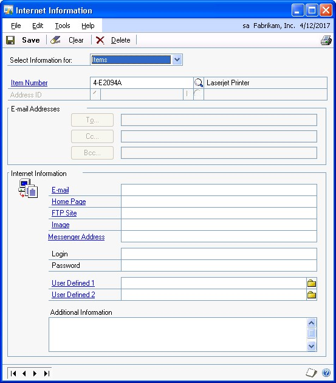

4. Enter Internet information for the item.

Refer to the table for more information about how each field can be used.

| **Field**           | **Enter this...**                                   | **... for this link result:**                                                                                     |
|---------------------|-----------------------------------------------------|-------------------------------------------------------------------------------------------------------------------|
| E-mail              | Enter an e-mail address.                           | Launches an e-mail application, if one is set up, with a new e-mail message addressed to the address you entered. |
| WWW URL             | Enter a Web site address.                          | Opens the Web site you specified, using your default browser.                                                    |
| FTP URL             | Enter an address of an FTP site.                   | Opens the FTP site, using your default browser.                                                                  |
| Image               | Enter a web address or pathname to a graphic file. | Opens the graphic-viewing software associated with the image type, displaying the file you specified.            |
| User-defined fields | Enter a pathname or browse to find a specific file. | Opens the file you specify. Set up these fields in the Internet                                                   |

(If you're using Microsoft Mail, add "Mailto:" in front of the address.)

Information window

(Administration \>\> Setup \>\> Company \>\> Internet Information). Refer to your System Setup instructions (Help \>\> Contents \>\> select Setting Up the System) for more information.

5. Enter a login and password, if they're required to open the Web site.

6. Choose Save.

### Entering item options

Use the Item Maintenance Options window to enter additional information about items. Optional item information includes substitute items, category information, and history options for a specific item.

**To enter item options:**

1. Open the Item Maintenance window.(Inventory \>\> Cards \>\> Item)

2. Enter or select an item.

    Choose Options to open the Item Maintenance Options window.

    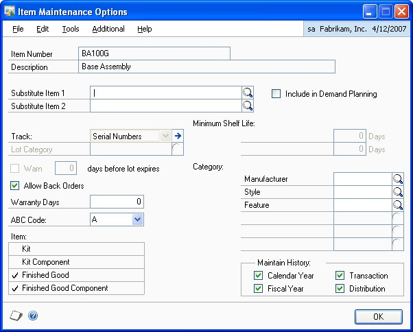

3. Enter or select up to two substitutes for the item. The substitutes are suggested replacements for the item.

    - If you aren't using a bill of materials module, the substitute item won't affect any processes.

    - If you're using Microsoft Dynamics GP Bill of Materials, you must enter substitute items here to be able to make a substitution for an assembly transaction.

    - If you're using Manufacturing Bill of Materials, you must use the Alternate Items window to specify substitutes. Refer to the Manufacturing Core Functions documentation for more information.

4. Indicate if serial or lot numbers should be used to track the item. If you choose Lot Numbers, you can enter or select a lot category.

    Refer to Chapter 6, "Lot category setup," for more information.

5. If the lot-numbered item has a shelf life, enter the number of days that will be used to determine whether or not the item meets the acceptable minimum shelf life when you enter the receipt of the item in the Receivings Transaction Entry window. Don't enter the number of days if you aren't tracking the minimum shelf life of an item. See *Minimum shelf life* for more information.

The Days fields are available only if you are using sales fulfillment workflow.

6. If you selected to track lot numbers, you can select to be warned before a lot number expires. After marking the Warn option, you can enter the number of days you want to warned before the lot number expires. You won't receive a warning message if you leave the days before lot expires field blank.

If you marked the Lot Due to Expire reminder in the Reminder Preferences window, the number of days you enter is used when generating the reminder that a lot is nearing its expiration date.

7. Indicate if back orders will be allowed for this item if there is a quantity shortage during a sales transaction in Sales Order Processing.

8. Enter the number of days the item is under warranty.

9. If you want to classify items by category, enter or select user category values for the item. The categories you set up in the Inventory Control Setup window—as well as any values you assigned to the categories—are available.

You can select an existing value or enter a different one. If you enter a different value, an alert message appears, asking if you want to create the value. Choose Yes.

*Refer to Defining a user category for more information.*

10. Select the types of history to keep for this item.

You must keep transaction history to print the Transaction History Report or to print details for the Historical Stock Status Report, and you must keep distribution history to print the Distribution History Report. Both transaction and distribution history are kept automatically if you specify in the Audit Trail Codes Setup window that you want to reprint posting journals.

11. When you've finished entering information, choose OK.

### Defining a serial number mask

Use the Item Serial/Lot Number Definition window to set up serial number masks for serial-tracked items. A serial number mask is a pre-defined serial number format used to generate serial numbers automatically. With a serial number mask, you can specify starting and ending serial numbers for an item, create incrementing segments, and control the character type. You must create a serial number mask before you can generate serial numbers automatically in Purchase Order Processing.

**To define a serial number mask:**

1. Open the Item Maintenance window. (Inventory \>\> Cards \>\> Item)

2. Select an item tracked by serial numbers, and then choose Options to open the Item Maintenance Options window.

    Choose the Track expansion button to open the Item Serial/Lot Number Definition window.

    

    *You also can open this window by clicking the Serial Number Mask field label in the Purchasing Serial Number Entry window.*

    Information for the item you selected, including the last serial number that was generated and any current mask information, will appear.

3. Select a character type for the first segment: Numeric, Alpha, Symbol, User Date, or Space. The character type will determine which of the remaining fields are editable.

4. Enter a size, if you selected a character type of Alpha or Numeric.

    *Symbol and Space character types must have a size of 1. The size of a User Date segment depends on the date format you select.*

5. Mark Increment if you want this segment to increase each time a serial number is generated. You must have at least one segment marked to increment in order to generate serial numbers automatically for an item.

    You can use the Increment check box only if the character type is Alpha or Numeric. Symbol and space characters do not change. User date segments automatically increment when the user date changes.

    If more than one segment is marked to increment, the segments increment from right to left. For example, assume you have incrementing segments 0001-0001. The next serial number contains the segments 0001-0002. The first segment increments when the second reaches its maximum value (from 0001-9999 to 0002-0000). If the mask contains a date segment, other incrementing segments will reset when the date segment changes—that is, when the date is different from the date in the Last Generated Serial Number field.

6. Enter starting and ending values.

    If you selected a type of User Date or Space, you won't be able to set starting and ending values. If you selected a type of Symbol, you will be able to enter a single character in the starting value field.

7. If you selected a character type of User Date, select a date format.

8. Choose the Insert button to add the segment to the serial number mask. The segment's starting value appears in the Serial Number Mask field.

9. Define and insert the remaining segments. Serial number masks can be a maximum of 20 characters long.

10. To move a segment to a different position in the serial number mask, select the segment, then choose Up or Down.

    Choose Remove to delete the selected segment or choose Modify to change the selected segment's information.

11. Choose OK to save the serial number mask.

### Defining a lot number mask

Use the Item Serial/Lot Number Definition window to set up lot number masks for lot-tracked items. A lot number mask is a pre-defined lot number format  used to generate lot numbers automatically. With a lot number mask, you can specify starting and ending lot numbers for an item, create incrementing segments, and control the character type. You must create a lot number mask before you can generate lot numbers automatically in Purchase Order Processing.

You also can enter a lot split quantity, which is the breakpoint for creating separate lots for a lot-tracked item. For example, assume that you enter a lot split quantity of 50. If you receive 120 units for a lot-tracked item, two lots of 50 and one lot of 20 are created. If the starting value for the mask is AA-001, the first lot is AA-001, the second lot is AA-002, and the third lot for the remainder is AA-003. If the lot split quantity is zero, the total quantity is treated as a single lot.

**To define a lot number mask:**

1. Open the Item Maintenance window. (Inventory \>\> Cards \>\> Item)

2. Select an item tracked by lot numbers, and then choose Options to open the Item Maintenance Options window.

    Choose the Track expansion button to open the Item Serial/Lot Number Definition window.

    

*You also can open this window by clicking the Lot Number Mask field label in the Purchasing Lot Number Entry window.*

Information for the item you selected, including the last lot number that was generated and any current mask information, will appear.

3. Enter a lot split quantity, if applicable.

4. Select a character type for the first segment: Numeric, Alpha, Symbol, User Date, or Space. The character type will determine which of the remaining fields are editable.

5. Enter a size, if you selected a character type of Alpha or Numeric.

*Symbol and Space character types must have a size of 1. The size of a User Date segment depends on the date format you select.*

6. Mark Increment if you want this segment to increase each time a lot number is generated. You must have at least one segment marked to increment in order to generate lot numbers automatically for an item.

You can use the Increment check box only if the character type is Alpha or Numeric. Symbol and space characters do not change. User date segments automatically increment when the user date changes.

If more than one segment is marked to increment, the segments increment from right to left. For example, assume you have incrementing segments 0001-0001. The next lot number contains the segments 0001-0002. The first segment increments when the second reaches its maximum value (from 0001-9999 to 0002-0000). If the mask contains a date segment, other incrementing segments will reset when the date segment changes—that is, when the date is different from the date in the Last Generated Lot Number field.

7. Enter starting and ending values.

If you selected a type of User Date or Space, you won't be able to set starting and ending values. If you selected a type of Symbol, you will be able to enter a single character in the starting value field.

8. If you selected a character type of User Date, select a date format.

9. Choose the Insert button to add the segment to the lot number mask. The segment's starting value appears in the Lot Number Mask field.

10. Define and insert the remaining segments. Lot number masks can be a maximum of 20 characters long.

11. To move a segment to a different position in the lot number mask, select the segment, and then choose Up or Down.

Choose Remove to delete the selected segment or choose Modify to change the selected segment's information.

12. Choose OK to save the lot number mask.

### Assigning posting accounts to items

You must specify posting accounts for every inventoried item. If the item is assigned to a class, the posting accounts of the item class appear in the Item Account Maintenance window as default accounts. If you're posting *through* General Ledger, Microsoft Dynamics GP posts transaction amounts to these accounts.

If you don't enter posting accounts in the Item Account Maintenance window, the accounts entered in the Posting Accounts Setup window or in the Item Class Setup window are used during transaction entry.

**To assign posting accounts to an item:**

1. Open the Item Maintenance window. (Inventory \>\> Cards \>\> Item)

2. Enter or select an item.

    Choose Accounts to open the Item Account Maintenance window.

    ![276ea12842fee082251a00651260a51e.jpg(media/276ea12842fee082251a00651260a51e.jpg)

3. Review the default accounts. You can accept or change each default account.

    *If you specify an account site segment when you define sites, the appropriate site segment will be substituted into your posting account number. Refer to Defining a site for more information about entering site segment information. Refer to Posting accounts and site segment substitution for more information about how the segments are used.*

4. Choose OK to save your changes.

### Assigning suggested sales items to an item

Use the Suggest Sales Item Maintenance window to specify default suggested line items to sell with an item when entering a Sales Order Processing invoice, quote, order, or fulfillment order. You can select up to five suggested line items.

For example, a backup power supply, additional memory, or a surge protector can be suggested sales items for a computer when entering a sales invoice. If you enter a sales invoice for a computer in the Sales Transaction Entry window, the suggested items display in the Suggest Sales Item Entry window. You can suggest that a customer might want to add a backup power supply or a surge protector to the sale of a computer.

**To assign suggested sales items to an item:**

1. Open the Item Maintenance window.

(Inventory \>\> Cards \>\> Item)

2. Enter or select an item.

3. Choose Suggest Items to open the Suggest Sales Item Maintenance window.

4. Mark the Sales Order Processing document types that you want to suggest line items to sell with the selected item.

5. Enter or select the item you want to suggest to sell with the selected item number.

6. Enter the quantity of the item you are suggesting to sell.

7. Repeat steps 5 and 6 until you entered all of the suggested items. You can select up to five suggested line items.

8. Choose OK.

### Assigning a currency to an item

Use the Item Currency Maintenance window to assign each currency to the items you'll purchase or sell with that currency. If you're not using Multicurrency Management, you don't need to complete this procedure.

*Before you begin assigning currencies to an item, be sure the currencies you want to use have been defined and that they have been assigned to your company.*

**To assign a currency to an item:**

1. Open the Item Currency Maintenance window. (Inventory \>\> Cards \>\> Item Currency)

    

2. Enter or select an item number.

3. Enter or select a currency ID.

4. Enter or select the number of decimal places to be used for transactions for this item and currency.

    *Once the item record has been saved, you must use the Change Currency Decimals window to change the number of decimals used to track currency information. Refer to Changing currency or quantity decimal places for items for more information.*

5. If you're using standard pricing and the pricing method is Percent of List, enter the List Price in the currency you're assigning to the item.

6. Choose Save.

7. To assign other currencies to the item, repeat steps 3 through 6.

8. When you've finished assigning currencies, close the window.

### Item numbers and substitute items for customers

Some customers use different names for items than your company uses. The name that the customer uses is a customer item. You can set up customer item numbers to make entering orders easier. You also can set up substitute item numbers to sell an item in place of another item.

To set up customer item numbers, substitute item numbers, and user-defined information, use the Customer Item Maintenance window. For more information about customer item numbers and customer substitute items, refer to the Sales Order Processing documentation.

### Changing the item print option for an item

If you're using advanced picking, use the Override Item Print Option window to select the site for one or more items to change the item print option for. You can select items by item number, generic description, and item class IDs.

For example, suppose that you selected the item print option Both for a site, but you don't want to print bulk picking tickets for large items that are picked individually. You can change the item print option for just that item at that site to Individual and keep the item print option for all the other items at Both. For more information about item print options, refer to Sales Order Processing documentation.

Use the Item Print Option Preview window to change the item print option that you selected for a item in the Item Quantities Maintenance window. For more information, refer to *Entering basic item-site combination information*.

**To change the item print option for an item:**

1. Open the Override Item Print Option window. (Inventory \>\> Cards \>\> Modify Item Print Option)

    

2. Enter or select a site ID.

3. Select an item print option and enter or select additional criteria to display specific records.

    For example, suppose you have many different types of paint in inventory. Although the item print option selected for the paint is Both for the site Warehouse, paint that is included in the Indoor Paint class needs to be printed only on individual picking tickets.

    To change the item print option for all paint assigned to the class ID Indoor Paint, select From in the Generic Description field and enter or select Indoor Paint in the From and To fields.

4. Choose Preview to open the Item Print Option Preview window and view the records that match your criteria.

    

    The printing option for the item will be saved with the item record as displayed.

5. Choose Process to save the item print options for each item record.

6. Close the window.

### Copying an inventory item

Use the Item Copy window to create a new inventory item from a copy of an existing item.

If the new and existing items have different currencies and neither is the functional currency, amounts will be converted from the currency for the existing item to the functional currency and then to the currency for the new item.

**To copy an inventory item:**

1. Open the Item Maintenance window.

(Inventory \>\> Cards \>\> Item)

2. Enter a new alphanumeric item number.

3. Choose Copy to open the Item Copy window.

*You also can press ALT+Y to open the Item Copy window.*

4. Enter or select an item to copy.

5. Mark the desired copy attributes.

If you're using extended pricing and have installed and registered Manufacturing, additional fields will be displayed in the Item Copy window. You can use these fields to copy the price group, price sheets, drawing group, and the effective date to the new item. You also can select the Receive Purchase Orders to QA Site option to route incoming items to a quality assurance site. Refer to help for more information about these fields.

6. Choose Copy.

### Understanding item record modifications

You can use the Item Maintenance window to complete most changes to item information, but some changes require special processes. Refer to the table to find more information about special processes.

| **To do this ...**                                                          | **Refer to ...**                                                                         |
|-----------------------------------------------------------------------------|------------------------------------------------------------------------------------------|
| Change the number of decimals for tracking currency or quantity information | *Changing currency or quantity decimal places for items*                                 |
| Change valuation methods                                                    | *Changing valuation methods*                                                             |
| Set up or change standard pricing price list information                    | *Chapter 11, "Standard price lists"*                                                     |
| Set up or change extended pricing information                               | *Chapter 12, "Extended pricing"*                                                         |
| Changing purchasing options for an item                                     | *Entering purchasing options for an item*                                                |
| Assigning or unassigning vendors for an item                                | *Entering purchasing options for an item* or *Removing a vendor assignment from an item* |
| Set up or changing site information for an item                             | *Chapter 14, "Sites and beginning quantities"*                                           |
| Changing the cycle for counting an item at a site                           | *Changing the cycle-count intervals for an item*                                         |

Before beginning to change an item record, you also should be aware of these limitations:

- If the item has a type of Sales Inventory, you can change the item type only to Discontinued, and vice versa. If the item has a type of Flat Fee, Discontinued, Miscellaneous Charges, or Services, it can't be changed.

- You can't change the decimal place or valuation method selections for the item in this window. If you want to change either of these options, you must use the Change Decimal Places window or the Change Valuation Method window to do so.

- A site assigned to an item can't be removed from the item record unless all quantities at that site have been removed. To remove a site, enter a transfer transaction, to transfer all quantities for the item at the site you want to remove, and then assign the item to a different site.

### Modifying an item record

You can use the Item Maintenance window to complete most changes to item information, but some changes require special processes. Use this procedure for basic changes, or refer to *Understanding item record modifications* to find more information about special processes.

**To modify an item record:**

1. Open the Item Maintenance window.

(Inventory \>\> Cards \>\> Item) 2. Enter or select an item number.

2. Make changes as needed.

3. Choose Save.

### Removing a currency from an item

Use the Item Currency Maintenance window to remove a currency from an item.

*Removing a currency from an item will remove the currency from price lists for the item if you're using standard pricing, or from price sheets for the item if you're using extended pricing.*

**To remove a currency from an item:**

1. Open the Item Currency Maintenance window.

(Inventory \>\> Cards \>\> Item Currency)

2. Enter or select an item number.

3. Enter or select the currency to remove.

*You can't remove a currency if it is the functional currency, or if the currency is used in Sales Order Processing or Purchase Order Processing transactions.*

4. Choose Delete. An alert message will appear, warning that removing the currency will also remove the associated price list for the item and asking if you're sure you want to remove the currency. Choose Yes.

### Inactivating an item

You can inactivate item records in order to prevent the sale, purchase or processing of an item, while maintaining history for the item.

Before you can inactivate an item, the following conditions must be met:

- If the item is assigned to an active kit, you must remove the item from the kit.

- If the item exists on an active bill of materials or finished good, you must remove the item from the assembly.

Before you inactivate an item record, you should be aware of the following:

- Existing, unposted transactions or documents that contain inactivate items can be processed. For example, you can transfer an inactive item on an order to an invoice, but you can't change the quantity.

- Manufacturing transactions that contain an inactive item can't be released.

- Inactive items can't be added to existing transactions or documents.

- If the kit item or bill of materials item is inactive, you can inactivate the components, but you won't be able to activate the item again if there are inactive components.

- If an assembly transaction is released when there are inactive components for the bill of materials item, the inactive components are processed.

You can enter new transactions with inactive items for the following:

- Returns (sales and vendor)

- Inventory transfers between sites and bins

- Increase and decrease variances

- Stock counts

- Decrease adjustments

**To inactivate an item record**

1. Open the Item Maintenance window.

(Inventory \>\> Cards \>\> Item)

2. Enter or select the item number to inactivate.

3. Mark the Inactive box.

4. Choose Save.

5. Print the Component Where Used report to verify if the item is a component for a bill of materials item. If the item exists on an active bill of materials or finished good, you must remove the item from the assembly.

### Deleting an item

You can delete an item from your records. Before you can delete an item record, the following conditions must be met.

- No quantities of the item are available at any site.

- The item is no longer assigned to any site. Refer to *Deleting an item-site relationship* for more information.

- No unposted transactions for the item exist.

- The item isn't a component in any Microsoft Dynamics GP bills of materials. Refer to the Bill of Materials documentation for more information.

- No inventory history exists for the item. Refer to *Chapter 34, "History utilities,"* for more information about removing history.

*If you're using a series such as Manufacturing, you might have additional prerequisites for deleting item records.*

**To delete an item:**

1. Open the Item Maintenance window.

(Inventory \>\> Cards \>\> Item)

2. Enter or select the item number you want to delete.

3. Choose Delete. A message appears, asking if you're sure you want to delete the item. Choose Yes.

**To delete an item using the action pane:**

1. In the navigation pane, choose the Inventory button, and then choose the Items list.

2. Mark the item number you want to delete.

3. Delete the item.

### Chapter 11: Standard price lists

You can use the standard pricing system in Inventory Control with other Microsoft Dynamics GP modules to create complex pricing structures. The number of options you'll have depends on the other modules you're using with Inventory Control. For more information about extended pricing, refer to Chapter 12, "Extended pricing."

For example, if you're using Multicurrency Management, you can define different pricing in each currency for each inventoried item, as long as the price method is Currency Amount or Percent of List.

Inventory Control also helps you to create multiple price levels, which you can assign to items, customers, and prospects. If you're using Sales Order Processing or Invoicing, that information is reflected in your sales order and invoice documents.

Refer to Standard pricing price structures for a detailed example of how you can use currencies, price levels, and units of measure to create complex pricing structures.

The following information is discussed:

- *Price methods*

- *Standard pricing price structures*

- *Multicurrency Management: Items and currencies*

- *Using the price list tree view*

- *Creating a price list for an item*

- *Adding a price list record for an item*

- *Adding quantity breaks to a price list record*

- *Specifying options for a price list*

- *Removing quantity breaks from a price list record*

- *Requirements and effects of copying price lists*

- *Copying a price list*

- *Removing part of a price list from an item*

- *Removing an entire price list from an item*

### Price methods

Price methods are used to calculate prices in the price list. The price method you select also will control which values—either percentages or amounts—can be entered to determine pricing for an item.

If you're using Multicurrency Management and want to create pricing information for different currencies, you must use the Currency Amount or Percent of List price method for that item. However, you might define prices in only one currency for some items, even if you're using Multicurrency Management. You can use any price method for those items.

The following table explains how each price method calculates prices.

| **Price method**       | **Equation and description**                                                                                                                                                                                                                                                                                                                                                                                                                                                                                              |
|------------------------|---------------------------------------------------------------------------------------------------------------------------------------------------------------------------------------------------------------------------------------------------------------------------------------------------------------------------------------------------------------------------------------------------------------------------------------------------------------------------------------------------------------------------|
| Currency Amount        | *Flat amount* Enter a flat currency amount for each unit of measure in the price list.                                                                                                                                                                                                                                                                                                                                                                                                                                   |
| % of List Price        | *List price x price percentage* For each unit of measure, enter a percentage of the item's list price that's used to calculate prices. For example, the distributor's list price for a single can is \$0.20, and you want to sell single cans at 250% of list. All single cans are sold at \$0.50 (250% x \$0.20). You can specify a different list price for each currency, if needed.                                                                                                                                  |
| % Markup–Current Cost  | *Current cost x (100% + price percentage)* Enter a percentage based on the current cost of each unit of measure. Each time you receive a shipment of an item, the price being charged for the item changes according to the item's current cost when it was received. For example, the current cost for single cans is routinely updated each time you receive a shipment. If you enter 150% as the price for Can, the price for single cans will always be 250% (100% + 150%) more than you paid for your last shipment. |
| % Margin–Current Cost  | *Current cost + [(current cost x price percentage)/(100% - price percentage)]* Enter the profit percentage you want to achieve, based on the current cost of the item being sold. Each time you receive a shipment, the current cost for the item is updated and the price changes accordingly. For example, suppose you've entered a profit of 25%. The price for single cans will always be 25% more than the current cost.                                                                                            |
| % Markup–Standard Cost | *Standard cost x (100% + price percentage)* The prices you charge for each unit of measure are updated only when you update the standard cost. Because the standard cost is updated periodically, the standard cost doesn't always match the amount you most recently paid for an item. For example, if you enter 150% as the price for a single can, the price for single cans will always be 250% (100%+ 150%) more than the standard cost.                                                                            |
| % Margin–Standard Cost | *Standard cost + [(standard cost x price percentage)/(100% -price percentage)]* The profit percentage you want to achieve is entered, based on the standard cost. Each time the standard cost is updated, the price changes, as well. For example, suppose you've entered a profit of 25%. The price for single cans will always be 25% more than the standard cost.                                                                                                                                                     |

### Standard pricing price structures

Currencies, price levels, units of measure, and quantity ranges combine in price lists to give you different options for pricing your inventory for customers.

If you're using Multicurrency Management, the basic pricing structure for an item has currency at the top level, then price level, unit of measure, and quantity range. If you're not using Multicurrency Management, the structure is price level, then unit of measure, then quantity range.

**Currencies**

*Available only if you're using*

*Multicurrency Management; you must use Currency Amount or Percent of List
price methods to include prices for*

*multiple currencies in a price list.*

Examples: US dollars, Canadian dollars, Japanese yen

**Price Levels**

*Multiple price levels are available only if you're using Sales Order Processing or Invoicing*

Examples: Retail, Wholesale, Preferred, Employee

**Units of Measure**

Examples: Unit, Each, Case, Kilogram, Liter

**Quantity Ranges**

As you plan your pricing structure, you'll probably start with a single item, then consider the different layers of pricing information you'll want to add. Currencies, price levels, units of measure and quantity ranges can help you create a complex pricing structure.

**Currencies** If you're using Multicurrency Management and the price method for an item is Currency Amount or Percent of List, you can create different pricing for different currencies.

| **Item** | **Currencies** |
|----------|----------------|
| Item ABC | US dollars     |
|          | British pounds |

**Price levels** You can use price levels to create different pricing structures for items. You can create different pricing levels for different customers. For example, you might want to create Wholesale and Retail pricing levels for different sales situations—you might sell a single unit of Item ABC for \$1.25 to a wholesale customer, or for \$2 to a retail customer.

| **Item** | **Currencies** | **Price levels** |
|----------|----------------|------------------|
| Item ABC | US dollars     | Wholesale        |
|          |                | Retail           |
|          | British pounds | Wholesale        |
|          |                | Retail           |

**Units of measure and unit of measure (U of M) schedules** Use units of measure to define different pricing for different sizes or quantities of products. For example, you might define an Each unit of measure for items you sell, but you also might want to define a Six-pack unit of measure so you can sell the items in sets of six.

| **Item** | **Currencies** | **Price levels** | **Units of measure** |
|----------|----------------|------------------|----------------------|
| Item ABC | US dollars     | Wholesale        | Single               |
|          |                |                  | Six-pack             |
|          |                | Retail           | Single               |
|          |                |                  | Six-pack             |
|          | British pounds | Wholesale        | Single               |
|          |                |                  | Six-pack             |
|          |                | Retail           | Single               |
|          |                |                  | Six-pack             |

**Quantity ranges** Finally, you can add quantity ranges to the overall pricing structure. With quantity ranges, you can give better pricing to customers who purchase larger quantities of items.

| **Item** | **Currencies** | **Price levels** | **Units** | **Quantities**  |
|----------|----------------|------------------|-----------|-----------------|
| Item ABC | US dollars     | Wholesale        | Single    | 1-100           |
|          |                |                  |           | 101-999,999,999 |
|          |                |                  | Six-pack  | 1-500           |
|          |                |                  |           | 501-999,999,999 |
|          |                | Retail           | Single    | 1-100           |
|          |                |                  |           | 101-999,999,999 |
|          |                |                  | Six-pack  | 1-500           |
|          |                |                  |           | 501-999,999,999 |
|          | British pounds | Wholesale        | Single    | 1-100           |
|          |                |                  |           | 101-999,999,999 |
|          |                |                  | Six-pack  | 1-500           |
|          |                |                  |           | 501-999,999,999 |
|          |                | Retail           | Single    | 1-100           |
|          |                |                  |           | 101-999,999,999 |
|          |                |                  | Six-pack  | 1-500           |
|          |                |                  |           | 501-999,999,999 |

**Price lists and price list records** When you add actual prices to the structure—the amounts you'll charge customers—the entire structure for one item is called a price list. Each row in the price list—each combination of currency, price level, unit of measure, quantity range and price—is a price list record. Pricing information for Sales Order Processing and Invoicing come from the price lists.

| **Item** | **Currencies** | **Price levels** | **Units** | **Quantities**  | **Prices** |
|----------|----------------|------------------|-----------|-----------------|------------|
| Item ABC | US dollars     | Wholesale        | Single    | 1-100           | \$1.25     |
|          |                |                  |           | 101-999,999,999 | \$1        |
|          |                |                  | Six-pack  | 1-500           | \$6.25     |
|          |                |                  |           | 501-999,999,999 | \$5.95     |
|          |                | Retail           | Single    | 1-100           | \$2        |
|          |                |                  |           | 101-999,999,999 | \$1.75     |
|          |                |                  | Six-pack  | 1-500           | \$10       |
|          |                |                  |           | 501-999,999,999 | \$9        |
|          | British pounds | Wholesale        | Single    | 1-100           | £0.78      |
|          |                |                  |           | 101-999,999,999 | £0.50      |
|          |                |                  | Six-pack  | 1-500           | £3.93      |
|          |                |                  |           | 501-999,999,999 | £3.40      |
|          |                | Retails          | Single    | 1-100           | £1.25      |
|          |                |                  |           | 101-999,999,999 | £1         |
|          |                |                  | Six-pack  | 1-500           | £6.28      |
|          |                |                  |           | 501-999,999,999 | £5.78      |

### Multicurrency Management: Items and currencies

If you're using Multicurrency Management, you can define multiple currencies for each company and then assign as many currencies as you like to each inventoried item. If an item's price method is Percent of List or Currency Amount, you can define different pricing for different currencies.

**If you're not using Multicurrency Management** The currency you set up for each company will be the currency used for all transactions.

**If you're using Multicurrency Management** The currencies you'll work with can be divided into two groups: functional currency—the main currency of your business—and originating currency—the currency used for selling and purchasing transactions in currencies other than your own.

While you can define different pricing for different currencies, only sales transactions are stored in the originating currencies. All history information is kept in the functional currency.

### Using the price list tree view

The Item Price List Maintenance window has two main parts: the upper part of the window, where you complete tasks such as selecting the default price level, and the lower part of the window, where you define and view price list information. The lower part includes a tree view and a scrolling window. The Item Price List Inquiry window—where you can view information entered in the Item Price List Maintenance window—has a similar arrangement.

The tree view is a graphic view of an item's price list. It works much like a Windows&reg; Explorer or My Documents: if a label—such as a currency or price level—is marked with a plus sign, you can expand the view to see more levels of pricing information. Click the minus signs to collapse the tree view. You also can use the arrow keys to expand and collapse parts of the tree view.

The highest level in the tree view is the item number. Subsequent levels depend on whether or not Multicurrency Management is registered. Refer to the table for more information.

| **If Multicurrency Management is:** | **Then the tree view includes:** |
|-------------------------------------|----------------------------------|
| **Registered**                      | Item number                      |
| **Not registered**                  | Item number                      |

Currency

Price Level

Unit of measure

Price Level

Unit of measure

You can use the tree view to control the information displayed in the scrolling window. If you highlight a currency or price level, only the pricing information for that branch of the overall pricing structure is displayed in the scrolling window. For example, if you highlight the Retail price level in the tree view, only the pricing information for that price level is displayed—no pricing information for a Wholesale price level would be included. Any changes you make in the scrolling window—such as adding a price level or currency—automatically are reflected in the tree view.

#### Creating a price list for an item

Use the Item Price List Maintenance window to create a price list for an item.

*You don't need to create price lists if you're using extended pricing. For more information about extended pricing, refer to Chapter 12, "Extended pricing."*

**To create a price list for an item:**

1. Open the Item Price List Maintenance window. (Inventory \>\> Cards \>\> Price List)

    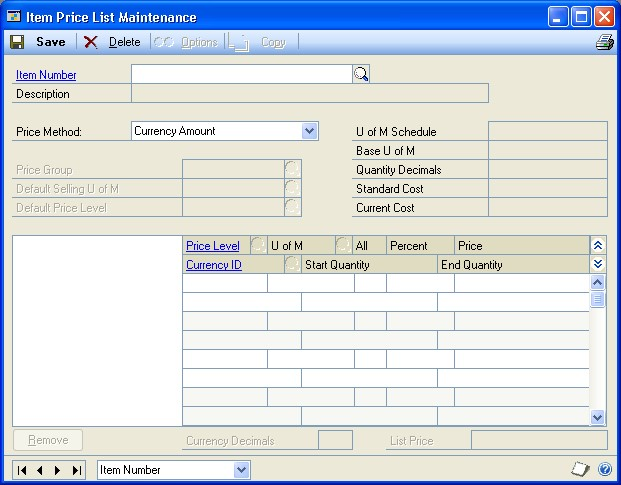

2. Enter or select an item number.

3. Enter or select the price method. If the item is assigned to a class, a default price method might be displayed. You can accept it or change it.

    If you're using Multicurrency Management, the price method must be Currency Amount or Percent of List if you want to create different pricing for multiple currencies.

4. If you want to organize item information by grouping items with similar price lists, you can enter or select a price group.

5. Enter or select a default selling unit of measure, if you like. The default selling unit of measure is the default unit of measure for Sales Order Processing or Invoicing transactions.

    *The default selling unit of measure must be in the unit of measure schedule for the item, and must be defined in the price list for the item.*

6. Enter or select a default price level.

    If you enter a sales transaction for a customer that isn't assigned a price level (such as Wholesale or Retail), the default price level you specify will be the default price level for the transaction entry. The default price level must be defined in the item's price list.

7. In the scrolling window, enter or select a price level.

8. Enter or select a unit of measure. The available units of measure come from the unit of measure schedule assigned to the item.

9. Accept or change the quantity range information.

    The All option is marked automatically, signifying that the pricing information for that combination of currency, price level and unit of measure applies no matter what quantity is sold.

    *Refer to Adding quantity breaks to a price list record for more information about creating quantity price breaks.*

10. Enter pricing information.

    If you're using the Currency Amount price method, enter the price in the appropriate line in the scrolling window.

    If you're using another price method, enter the percentage of list or cost to be used to calculate the selling price.

11. If you're using Multicurrency Management and the price method is Currency Amount or Percent of List, enter or select the currency ID for this price list record.

    If you're not using Multicurrency Management or if the price method isn't Currency Amount or Percent of List, the entire price list automatically will be in your company's assigned currency.

12. Choose Save to clear the window, or you can continue to add to the price list—entering pricing information for other currencies, other price levels and other units of measure as needed. Refer to *Adding a price list record for an item* or *Adding quantity breaks to a price list record* for more information.

13. When you've finished entering price list information, choose File \>\> Print to generate the Item Price List report and verify your entries.

14. Close the window.

#### Adding a price list record for an item

Use the Item Price List Maintenance window to add more price list information to an existing price list.

*You don't need to complete this procedure if you're using extended pricing. For more information about extended pricing, refer to Chapter 12, "Extended pricing."*

**To add a price list record for an item:**

1. Open the Item Price List Maintenance window.

(Inventory \>\> Cards \>\> Price List)

2. Enter or select an item number with an existing price list.

3. In the tree view, expand the item price list information. You can click the plus sign to see more price list information. If you highlight a currency, price list, or unit of measure you can see only the associated price list records in the scrolling window.

*Refer to Using the price list tree view for more information about the levels of information in the tree view.*

4. Decide where in the pricing structure you want to add a price list record.

For example, to add a price list record for a new unit of measure for an existing price level, you can highlight the price level, then put the pointer in the first blank line in the scrolling window. Information about the currency automatically will be displayed in the new scrolling window line.

**To add a price list record for a new currency** You must be using Multicurrency Management and the item's price method must be Currency Amount or Percent of List. Highlight the item number, then put your pointer in the first blank line in the scrolling window. Enter or select a currency, price level and unit of measure in the scrolling window. Enter pricing information.

**To add a price list record for a new price level** If the price list includes pricing for multiple currencies, highlight the currency you want to add the price level to. If the price list includes only one currency, highlight the item number in the tree view. Put your pointer in the first blank line in the scrolling window, and then enter or select a price level and unit of measure. Enter pricing information.

**To add a price list record for a new unit of measure** The unit of measure must be included in the unit of measure schedule assigned to the item. Highlight the appropriate price level, then put your pointer in the first blank line in the scrolling window. Enter or select the price level and unit of measure. Enter pricing information.

5. Your entries automatically are saved as soon as they're entered in the scrolling window. You can choose Save to clear the window, or you can continue to add to the price list—entering pricing information for other units of measure, other price levels and other currencies as needed.

6. When you've finished entering price list information, choose File \>\> Print to generate the Item Price List report and verify your entries.

7. Choose Save and close the window.

#### Adding quantity breaks to a price list record

Use the Item Price List Maintenance window to add quantity breaks to price lists. Quantity breaks are typically used to give better pricing to customers who purchase many units of an item.

You can create different quantity breaks for each combination of currency, price level and unit of measure. For example, customers purchasing your items in US dollars might see the first quantity break at 50 units, while customers purchasing the item with German marks might see the first quantity break at 100 units.

*If you're using quantity breaks for a combination of currency, price level and unit of measure, the ranges you define—such as 0-50 units, 51-100 units and so on—must cover all possible quantities from 0 to 999,999,999,999. If you're using one or more decimals to track quantity information, the ranges must cover the decimal quantities as well. For example, if you're using two decimals to track quantity information, the quantity ranges must cover all possible quantities from 0.00 to 999,999,999,999.99.*

**To add quantity breaks to a price list record:**

1. Open the Item Price List Maintenance window.

(Inventory \>\> Cards \>\> Price List)

2. Enter or select an item number.

3. In the tree view, highlight the unit of measure that includes the currency and price level combination that you want to add quantity breaks to.

The information in the scrolling window will include just those price list records for this combination.

4. In the first blank scrolling window line, position the insertion point in the End Quantity field and enter the maximum quantity to be sold for a certain price.

5. Enter or select a currency, price level and unit of measure.

6. Enter the price for the quantity range.

If you're using the Currency Amount price method enter the per-unit-ofmeasure price for each quantity range.

If you're using another price method enter the percentage to be used to calculate pricing for each quantity range.

7. Continue, repeating steps 4 through 6 until you've entered all the quantity groups needed for the combination of currency, price level and unit of measure.

*The End Quantity for the last quantity range must be 999,999,999,999 with additional 9's if one or more decimals are used to track the item's quantity information.*

8. Choose Save and close the window.

#### Specifying options for a price list

Use the Item Price List Options Maintenance window to specify rounding options and to select selling options.

> [!NOTE]
> You don't need to complete this procedure if you're using extended pricing. Refer to Chapter 12, "Extended pricing," for more information about setting up extended pricing.

**To specify options for a price list:**

1. Open the Item Price List Maintenance window.(Inventory \>\> Cards \>\> Price List)

2. Enter or select an item number.

3. Choose Options to open the Item Price List Options Maintenance window.

    

    Each record in the scrolling window represents a combination of a currency (if you're using Multicurrency Management), price level, unit of measure and pricing—also known as a price list record.

4. For each record in the scrolling window, accept the default selling option or change it. Selling options include:

    - **Not Available** Select Not Available if the item isn't available for sale in this combination of currency, price level and unit of measure.

    - **Whole** Select Whole if the item is available for sale only in whole units.

    - **Whole and Fractional** Select Whole and Fractional if the item is available for sale in both whole and fractional units of this unit of measure for this currency and price level.

5. If the price method is Currency Amount, skip to step 8.

    If the price method isn't Currency Amount, accept the default rounding policy for each record in the scrolling window, or change it. Rounding policies include:

    - **None** Select None if pricing information shouldn't be rounded.

    - **Up** Select Up if pricing information should always be rounded up.

    - **Down** Select Down if pricing information should always be rounded down.

    - **To nearest** Select To nearest if pricing information should be rounded to the nearest currency unit.

6. If the item's price method is calculated with a percentage—such as Percent of List—accept the default round option for each record in the scrolling window, or change it. Rounding options include:

    - **Multiple of** Select Multiple of to have pricing amounts rounded to a multiple of an amount you enter. For example, you might have pricing rounded to multiples of five cents.

- **Ends in** Select Ends in to have pricing rounded to amounts that end in a set of numbers you specify. For example, you might have pricing rounded to amounts that end with "\$.99."

7. For each record in the scrolling window, accept the default round amount or change it. You can enter any amount.

8. Entries automatically are saved as you enter them in the scrolling window. To generate the Item Price List Options List report to verify your entries, you can choose File \>\> Print, or you can choose the print icon button.

9. When you've finished, choose OK to close the window and return to the Item Price List Maintenance window. Close the window.

#### Removing quantity breaks from a price list record

Use the Item Price List Maintenance window to remove quantity breaks from a price list record.

**To remove quantity breaks from a price list record:**

1. Open the Item Price List Maintenance window.

(Inventory \>\> Cards \>\> Price List)

2. Enter or select an item number.

3. In the tree view, highlight the combination of currency, price level and unit of measure that you want to remove price breaks from. The price list record is displayed in the scrolling window.

4. Mark the All option in that line of the scrolling window.

5. Choose Save. An alert message appears, asking if you're sure you want to remove remaining quantity ranges. Choose Yes.

*Quantity ranges for other combinations of currency, price level and unit of measure won't be affected by this.*

6. Close the window.

#### Requirements and effects of copying price lists

You can use the Item Price List Copy Maintenance window to copy the existing price list of one item for use on another item. The source item is the item that has a price list to be copied for use with other items. The destination item is the item that will be given a copy of the existing price list.

*To copy a price list to several other items, use the Price List Utilities wizard. Refer to Copying a price list from one item to others for more information.*

To do this, these conditions must be met:

- The source and destination items must have the same unit of measure schedule assigned.

- No other users can edit the unit of measure schedule or the price list of the source item. For example, if another use has the Item Price List Maintenance window open and is displaying the source item number, the copying process will fail.

When a price list is copied, these rules apply:

- Any existing price list information for the destination item is removed.

- The price method and price group are copied to the destination item.

- The default price level is copied to the destination item if the price level is part of the price list information that's copied to the destination item.

- The default selling unit of measure is copied to the destination item if the unit of measure is included in the price list information that's copied to the destination item.

- If the currency decimals for a currency are different for the source and destination item, then prices will be padded with zeros or rounded to accommodate the destination item's currency decimals setting.

- Price list records from the source item's price list are copied for each currency that also is assigned to the destination item. Refer to the table for an example.

| **Source item currencies** | **Destination item currencies** | **Copied?** |
|----------------------------|---------------------------------|-------------|
| US dollars                 | US dollars                      | Yes         |
| CAN dollars                | CAN dollars                     | Yes         |
| AUS dollars                |                                 | No          |

#### Copying a price list

Use the Item Price List Copy Maintenance window to copy an existing price list from one item over the price list of another item. To copy a price list to several other items, use the Price List Utilities wizard. Refer to *Copying a price list from one item to others* for more information.

When you copy a price list to a destination item, any existing price list for the destination item is removed. The copied information replaces the existing destination item price list—it doesn't add to it.

**To copy a price list:**

1. Open the Item Price List Maintenance window.(Inventory \>\> Cards \>\> Price List)

2. Enter or select an item number to copy a price list to*.*

3. Choose Copy to open the Item Price List Copy Maintenance window.

    

4. Enter or select a Source Item Number—the item number that has the price list you want to copy.

5. Choose File \>\> Print or choose the print icon button to generate the Copy Price List Preview Report. You can use the report to verify the information that will be copied before you actually change the destination record.

6. Choose Process.

If the copying can't occur—for example, because there are no common currencies assigned to both the source item and the destination item—the existing price lists of both the source and destination item will be left intact, and the Copy Price List Audit Report will be generated.

*To refresh the information in the tree view, collapse the tree view and then expand it again. You'll need to refresh the tree view to see the proper hierarchy of price list records if you copy price list records.*

#### Removing part of a price list from an item

Use the Item Price List Maintenance window to remove a part of a price list from an item. For example, suppose you're ending a program that offered special pricing to employees. Before you can delete the Employee price level, you must remove the price level from all items and item classes that are assigned that price level.

You also can use this procedure to remove units of measure from a price list—for example, if you're no longer going to sell items singly, you might want to delete the price list records for selling one unit.

**To remove part of a price list from an item:**

1. Open the Item Price List Maintenance window. (Inventory \>\> Cards \>\> Price List)

2. Enter or select an item number.

3. Expand the tree view. You can click the plus signs to see more information.

4. Highlight the name of the price level or unit of measure in the tree view.

    *Be sure the object you highlight is in the appropriate spot in the tree view. For example, be sure the price level or unit of measure is under the appropriate currency.*

5. Choose the Remove button below the tree view. An alert message appears, asking if you're sure you want to delete the price list. Choose Yes.

#### Removing an entire price list from an item

Use the Item Price List Maintenance window to remove an entire price list from an item.

**To remove an entire price list from an item:**

1. Open the Item Price List Maintenance window.

(Inventory \>\> Cards \>\> Price List)

2. Enter or select an item number.

3. Choose Delete. An alert message appears, asking if you want to delete the entire price list. Choose Yes.

### Chapter 12: Extended pricing

If you're using extended pricing, you can set up price groups, price sheets, and price books, and then assign items, customers, and prospects to them.

For a comparison of basic and extended pricing, refer to *Standard and extended pricing*.

The following information is discussed:

- *Extended pricing terms and definitions*

- *How prices are calculated*

- *Preparing to use extended pricing*

- *Creating and editing price groups*

- *Assigning an individual item to a price group*

- *Assigning multiple items to a price group*

- *Assigning a range of items to a price group*

- *Price sheets overview*

- *Creating or editing a price sheet*

- *Price sheet warnings*

- *Creating and editing price sheet details*

- *Creating a promotional price sheet*

- *Entering details for free-item promotions*

- *Examples: Advanced free-item promotions*

- *The base price book*

- *Creating price books*

- *Assigning a price sheet to multiple price books, customers, or prospects*

- *Assigning a price sheet to a range of price books, customers, or prospects*

- *Setting up pricing for a customer or prospect*

- *Assigning a price book to customers and prospects*

- *Assigning a price book to a range of customers or prospects*

### Extended pricing terms and definitions

Use the following definitions, along with the pricing hierarchy in *How prices are calculated* to understand how extended pricing works.

**Price group** A group of items that share common pricing calculations. Prices set up for the price group will apply to every item in the group, unless overridden by item-specific prices.

**Price sheet** A list of prices that will apply only during a specified period. Each price sheet can be created for different combinations of items, price groups, or both. You can assign a price sheet to price books, customers, and prospects. For more information about price sheets, refer to *Price sheets overview* o.

*For prices to be calculated, every item must have a net price on a price sheet, or must be part of a price group that has a net price on a price sheet.*

**Promotion or promotional price sheet** A price sheet that contains special offers for individual products. Promotions can be set up for free products, for special prices, or for an amount or percentage of the list price.

**Price book** A collection of one or more price sheets. You can assign one price book to each customer, but each price book can be assigned to multiple customers.

**Base price book** The base price book that is automatically created and is called BASEBOOK. Prices are taken from the base price book if a price cannot be located anywhere else in the pricing hierarchy. Prices are not automatically added to the base price book; you must assign net price sheets to this book. For more information about the base price book, refer to *The base price book*.

### How prices are calculated

When an order or other sales transaction is created for a customer, the following process is used to select the price for each item on the transaction.

First, the system searches for item-specific pricing information. The system searches for a price in the price sheets (which must be active and which must include the current date) assigned directly to the customer first. Then, the system searches the price sheets in the price book assigned to the customer, and finally it searches base price book.

If no item-specific pricing is found, the system searches for a price group that includes the item. Price sheets assigned directly to the customer are searched first, followed by price sheets in the customer's price book, and finally the base price book.

Refer to the illustration for more information.

If an adjusted value-off or percent of list price is found, the rest of the pricing structure is searched for a list price to apply the discount to. For example, if there's a value-off price in a price sheet assigned to the customer, the customer's price book and the base price book are searched for a list price.

It is possible for the final price to be the result of two adjustments applied to the base price. For example, a customer sheet might give 2 percent off the customer price book price, which is itself 5 percent off the base price.

If multiple promotions are applied, they are applied in the order they are  discovered: first the promotions from the first step of the search, then from the second step, and so on.

### Preparing to use extended pricing

Refer to the following checklist for an overview of the tasks you'll need to complete before you can begin to use extended pricing.

| **Task**                                                     | **Reference**                                                                                                                                                           |
|--------------------------------------------------------------|-------------------------------------------------------------------------------------------------------------------------------------------------------------------------|
| Make extended pricing options available                      | Refer to the Sales Order Processing documentation for information about setup options for extended pricing.                                                            |
| Create price groups (optional)                               | *Creating and editing price groups Assigning an individual item to a price group Assigning multiple items to a price group Assigning a range of items to a price group* |
| Create price sheets                                          | *Creating or editing a price sheet Creating and editing price sheet details Creating a promotional price sheet*                                                         |
| Assign price sheets to the base price book                   | *Assigning a price sheet to multiple price books, customers, or prospects Assigning a price sheet to a range of price books, customers, or prospects*                   |
| Assign price sheets to price books, customers, and prospects |                                                                                                                                                                         |
| Setting up pricing for customers and prospects               | *Setting up pricing for a customer or prospect Assigning a price book to customers and prospects Assigning a price book to a range of customers or prospects*           |

#### Creating and editing price groups

Use the Price Group Maintenance window to create price groups. A price group is a group of similar items with common prices. Prices set up for the price group will apply to every item in the group, unless overridden by item-specific prices.

Price groups and individual item prices can be combined to create price sheets. For more information about price sheets, refer to *Price sheets overview*.

**To create and edit price groups:**

1. Open the Price Group Maintenance window.(Inventory \>\> Cards \>\> Extended Pricing \>\> Price Groups)

    

2. Enter or select a price group ID.

3. Enter a description for the price group.

4. Enter or select a unit of measure schedule.

    *Once items have been assigned to a price group, the unit of measure schedule ID for the group cannot be changed. If you're using Multicurrency Management, the Quantity Decimals field is set according to the unit of measure schedule and also cannot be changed.*

5. Enter currency information.

**If you're not using Multicurrency Management** Select values from the Currency Decimals list. These values will be used for prices and in this price group.

**If you're using Multicurrency Management** Choose the Currency button to open the Price Group Currency Maintenance window. Use this window to select the currency ID and number of currency decimal places for the price group. When you're finished, choose Save and close the window.

If a price group is created without selecting currency decimal places for the originating currency, the default decimal places for the functional currency will be used.

6. Choose Assign to open the Price Group Items Maintenance window, where you can assign items to the price group. For more information, see *Assigning multiple items to a price group*.

7. Choose Save to save the price group.

#### Assigning an individual item to a price group

Use the Price Group Assignment window to assign individual items to price groups. Once an item has been assigned to a price group, you can reassign it to another price group only if the new price group has the same unit of measure schedule. An item can be assigned to only one price group at a time.

To be assigned to a price group, the quantity decimals and currency decimals of the item must match those of the price group.

**To assign an individual item to a price group:**

1. Open the Price Group Assignment window. (Inventory \>\> Cards \>\> Extended Pricing \>\> Group Assignment)

    

2. Enter or select an item number.

3. Enter or select a price group ID.

4. Enter or select a default selling unit of measure.

5. Choose Save to assign the current item to the price group.

#### Assigning multiple items to a price group

Use the Price Group Items Maintenance window to assign multiple items to a price group. Once an item has been assigned to a price group, you can reassign it to another price group only if you unassign it from the original price group and then assign it to another price group that has the same unit of measure schedule. An item can be assigned to only one price group at a time.

**To assign multiple items to a price group:**

1. Open the Price Group Items Maintenance window.(Inventory \>\> Cards \>\> Extended Pricing \>\> Group Items)

    

2. Enter or select a price group ID.

3. Enter or select an item number for each item to assign to the price group.

    Items will be added to the price group in the order you select them. The order items are displayed doesn't affect processing, but you can choose Sort to sort the items by item number. This is helpful if you're looking for a specific item.

    If no price sheet has been set up for the price group, you can choose Edit \>\> Delete Row to remove an item from a price group. If a price sheet has been set up for the price group, you'll need to create a new price group that doesn't include the item you want to remove, add that price group to the price sheet, and then remove the old price group from the price sheet.

4. Choose Ranges to open the Price Group Item Ranges window, where you can assign ranges of items to the price group. For more information, refer to *Assigning a range of items to a price group*.

5. Choose Save to save changes to the price group.

#### Assigning a range of items to a price group

Use the Price Group Item Ranges window to assign a range of items to a price group. You can select a range of item numbers, generic descriptions, or class IDs that have the same unit of measure schedule as the selected price group. An item can be assigned to only one price group at a time.

**To assign a range of items to a price group:**

1. Open the Price Group Items Maintenance window. (Inventory \>\> Cards \>\> Extended Pricing \>\> Group Items)

2. Enter or select a price group ID. Any items already assigned to the price group will be displayed in the scrolling window.

3. Choose Ranges to open the Price Group Item Ranges window.

    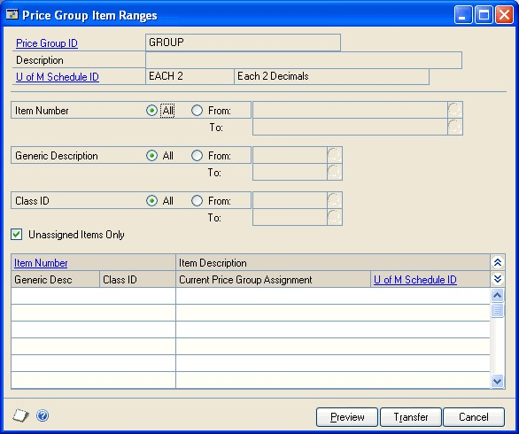

4. Enter or select the item numbers, generic descriptions, and class IDs to assign to the price group.

5. Mark the Unassigned Items Only option to add only unassigned items to the price group, or unmark this option to add all items in the range you specified. If you unmark this option, items previously assigned to price groups with the same unit of measure schedule will be reassigned to this price group.

6. Choose Preview to view the items that fit your criteria. The item numbers and item descriptions will be listed in the scrolling window.

If no price sheet has been set up for the price group, you can choose Edit \>\> Delete Row to remove an item from a price group. If a price sheet has been set up for the price group, you'll need to create a new price group that doesn't include the item you want to remove, add that price group to the price sheet, and then remove the old price group from the price sheet.

7. Choose Transfer to assign the items to the price group.

### Price sheets overview

A price sheet is a list of prices that will apply only during a specified date range.

Each price sheet can be created for different combinations of items and price groups. With extended pricing, you can create and edit price sheets, and set up price details for each item or price group in the price sheet. You can use price sheets to set up promotions and customer-specific pricing arrangements.

*For more information about assigning price sheets to specific customers or prospects, refer to Assigning a price sheet to multiple price books, customers, or prospects.*

Use price sheets to set up date-specific price adjustments for multiple items and price groups. You can set up a price sheet for a promotion, as part of a customer price book, or as part of the base price book. To be included in a sales transaction, an item must have a net price on an active price sheet, or must be part of a price group that has a net price on an active price sheet.

The same item can exist in multiple price sheets as part of the same price book if the price sheets have different date ranges. For example, the Wholesale price book could contain the following price sheets:

| **Price sheet**  | **Start date**  | **End date**      |
|------------------|-----------------|-------------------|
| Prices 2017      | January 1, 2017 | December 31, 2017 |
| Summer Promotion | June 1, 2017    | August 31, 2017   |

If there is more than one current price sheet, the one which starts most recently is used in price calculations. In the above example, on June 15, 2017, the Summer Promotion prices will be used for items that belong to both price sheets.

If two price sheets start on the same date, the one which finishes earlier is used in price calculations. If the same item is found in two price sheets with identical start and end dates, you will receive an alert message because Microsoft Dynamics GP will be unable to calculate a price.

#### Creating or editing a price sheet

Use the Price Sheet Maintenance window to create price sheets. A price sheet is a list of prices that will apply only during a specified date range. Price sheets can be created for combinations of items and price groups.

If you're using Multicurrency Management, currency is specified at the price sheet level; all the prices on a price sheet must have the same currency.

If you don't set up a price sheet for a particular currency, the price of the item will be converted from the functional currency price during transaction entry if either of the following is true:

- You marked the Convert Functional Price option in Sales Order Processing Setup window.

- You did not mark the Prices Not Required in Price List option in the Sales Order Processing Setup window.

**To create or edit a price sheet:**

1. Open the Price Sheet Maintenance window. (Inventory \>\> Cards \>\> Extended Pricing \>\> Price Sheets)

    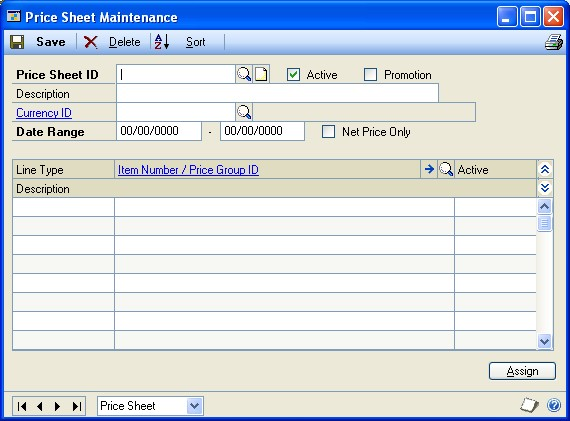

2. Enter or select a price sheet ID and description.

3. Mark the Promotion option if the price sheet is for a promotion.

    Promotions are temporary special offers on individual products. Marking a price sheet as a promotion helps you differentiate promotion price sheets from your regular price sheets. For more information about setting up promotions, see *Creating a promotional price sheet*.

4. Enter or select a currency ID, if you're using Multicurrency Management.

5. Enter dates in the Date Range fields. The prices in the price sheet will apply during this date range. Active price sheets must have a date range.

6. Mark the Net Price Only option if the price sheet will contain net prices only.

    *A Net Price Only price sheet cannot contain Value Off and type prices. Price sheets that are part of the base price book must be specified as Net Price Only.*

7. In the scrolling window, select the items or price groups to include on the price sheet. You can include both items and price groups in a price sheet.

    - Select a line type (item or price group).

    - Enter or select an item number or price group ID.

8. Choose the Item Number/Price Group ID expansion button to open the Price Sheet Detail Maintenance window, where you can enter pricing details. Until pricing details are selected for an item or price group, a warning icon will be displayed next to the item number or price group ID.

    For more information, refer to *Creating and editing price sheet details* and *Price sheet warnings*.

9. Set the line as active or inactive. Inactive lines will not be used in price calculation. You must set up pricing details for a line in the Price Sheet Detail Maintenance window before the line can be activated.

10. Mark the Active option next to the price sheet ID to set the price sheet as active. You must activate at least one line before you can activate the price sheet. If a price sheet is not active, its prices aren't used.

    *Items and groups will be added to the price sheet in the order in which you select them. Choose the Sort button to sort the records using options in the Price Sheet Sort Options window.*

11. Choose Assign to open the Price Sheet Assignment window, where you can assign the price sheet to price books, customers, or prospects. For more information, refer to *Assigning a price sheet to multiple price books, customers, or prospects* or *Assigning a price book to customers and prospects*.

12. Choose Save to save the price sheet.

13. To print a price sheet report from the Price Sheet Maintenance window, select File \>\> Print to open the Report Destination window. Select a print destination and choose OK. Details of all items, price groups, prices, and quantity breaks for the price sheet will be printed.

#### Price sheet warnings

Until pricing details are selected for an item or price group on a price sheet, a warning icon will be displayed next to the item number or price group ID in the Price Sheet Maintenance window. A warning also might be displayed in the following situations.

- The net price isn't found using the pricing hierarchy. The pricing hierarchy is the records that are searched when an item is entered in a sales transaction. Refer to *How prices are calculated* for more information.

- The item is listed on two price sheets that have the same start and end dates.

- The item is included in a price group that is listed on two price sheets that have the same start and end dates.

- There isn't a price in the price list for the combination of item, unit of measure, and currency.

- There isn't a currency record for the item for the selected currency.

#### Creating and editing price sheet details

Use the Price Sheet Detail Maintenance window to set up net price, percentage of list, or value off price details for individual items or groups of items.

**To create or edit price sheet details:**

1. Open the Price Sheet Maintenance window. (Inventory \>\> Cards \>\> Extended Pricing \>\> Price Sheets)

2. Enter or select a price sheet ID and description.

3. Highlight an item or price group in the scrolling window and choose the Item Number/Price Group ID expansion button to open the Price Sheet Detail Maintenance window.

    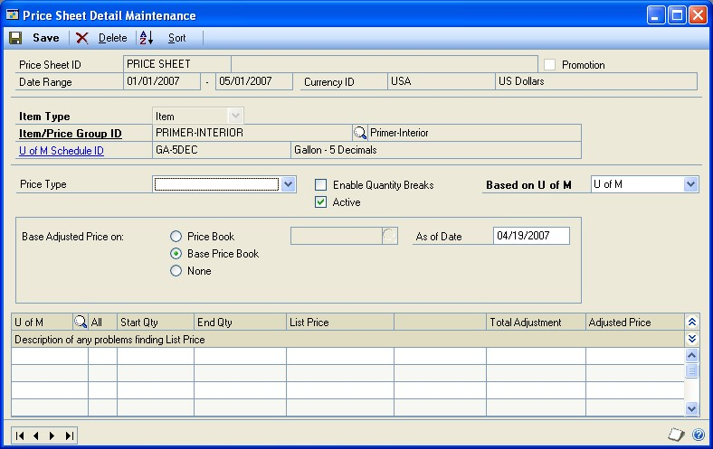

    The item or price group you selected in the Price Sheet Maintenance window will be displayed.

4. Select a price type. If you are entering details for a Net Price Only price sheet, Net Price will be displayed and you won't be able to change it.

    The price type determines the values you can enter in the scrolling window. If you select Percent of List or Value Off, you must enter adjustment values in the scrolling window; if Net Price is selected, you must enter net prices.

5. You can mark Quantity Break Pricing to create quantity break pricing for this item or price group. Use quantity breaks to give discounts based on the size of the sale.

6. Use the Base Adjusted Price On options to verify the effects of price adjustment.

    *This selection will not be saved; it is for inquiry purposes only. For example, you might want to see a value off the base price at a future date, or you might want to see prices for a customer who receives discounts from a price book other than the base book.*

7. For net and value off pricing, specify the unit of measure that will be used for entering prices.

8. If you're using quantity-break pricing, enter a Start Quantity and an End Quantity.

9. Enter a percentage of list or a currency amount off, depending on your Price Type selection.

10. In the Price Sheet Detail Maintenance window, price details will be listed in the order you enter them. Choose the Sort button to sort the details in quantitybreak order.

11. Choose Save to save the price details.

#### Creating a promotional price sheet

Use the Price Sheet Detail Maintenance window to set up promotions for individual items or groups of items.

**To create a promotional price sheet:**

1. Open the Price Sheet Maintenance window.

(Inventory \>\> Cards \>\> Extended Pricing \>\> Price Sheets)

2. Enter or select a price sheet ID and description. Be sure the price sheet is marked as a promotion.

3. Select an item or price group and choose the Item Number/Price Group ID expansion button to open the Price Sheet Detail Maintenance window.

*The item or price group you selected in the Price Sheet Maintenance window will be displayed. The fields in the window will be slightly different if the price sheet is a promotion.*

4. Select a promotion type. You can select Quantity Free, Net Price, Value Off, or Percent of List.

The promotion type determines the values you can enter in the scrolling window. If you select Percent of List or Value Off, you must enter adjustment values in the scrolling window; if Net Price is selected, you must enter net prices; if Quantity Free is selected, you must specify a free item.

5. Choose the price book or price sheet that the promotion will be applied to. You can choose Base Price Book, Customer Price Book, or Customer Price Sheet ID. If you choose Base Price Book, for example, the promotion would apply to purchases of items in the base price book.

6. Select the Base Adjusted Price on options to verify the effects of the promotion on the price book or the base price book.

Your selection determines the list price displayed in the scrolling window. This selection will not be saved; it is for inquiry purposes only.

7. Select Quantity Break Pricing if you want to create quantity break pricing for this item or price group. Use quantity breaks to give discounts based on the size of the sale.

*If you use quantity-break pricing, you must be sure that there are no gaps in the quantity breaks.*

8. For net and value-off pricing, specify the unit of measure that will be used for entering prices.

9. If you're using quantity-break pricing, enter a Start Quantity and an End Quantity.

10. Enter a price adjustment, depending on your Price Type selection.

11. If the promotion type is Quantity Free, enter the quantity of free items that buyers can get with a purchase. When you tab out of the Quantity Free field or if you choose the Quantity Free expansion button, the Price Sheet Assign Free Item window opens. Use that window to enter more information about the giveaway items. Refer to *Entering details for free-item promotions* for more information.

*If the Quantity Free is zero, the Price Sheet Assign Free Item window won't open because you don't need to add information if no item will be given away.*

12. Choose Save to save the price details.

#### Entering details for free-item promotions

If you're creating a promotion where customers get free items when they make a purchase, you can use the Price Sheet Assign Free Item window to specify the free item, its unit of measure, and the maximum number of free items that a customer can receive. If the quantity of free items is zero—for example, if customers must purchase 10 items to get a free item, you'd have zero free items for purchase quantities up to 10—then you don't need to enter additional information.

This procedure assumes that you're setting up a price sheet that is a promotion, and that you've already completed the tasks described in *Creating or editing a price sheet* and *Creating a promotional price sheet* o.

**To enter details for free-item promotions:**

1. Open the Price Sheet Assign Free Item window. (Inventory \>\> Cards \>\> Extended Pricing \>\> Price Sheets \>\> Item Number/ Price Group ID expansion button \>\> Quantity Free expansion button)

    

2. Enter or select the Free Item Number, the item to be given away with the promotion.

    *You can specify a different free item for each unit of measure of the purchased item.*

3. Enter or select the unit of measure for the free item.

4. Enter the Maximum Quantity Free.

The Maximum Quantity Free is the ceiling on the number of free items that a customer can get. For example, suppose you're having a "buy one, get one free" promotion. You might want to limit customers to one free item—or you might not want to limit the number of free items.

If you leave this blank or if you enter a zero, then there is no maximum number of free items.

Refer to the table for an example of how the Maximum Quantity Free is used with a "buy one, get one free" promotion.

| **Maximum free items**    | **Purchase quantity** | **Number of free items**      |
|---------------------------|-----------------------|-------------------------------|
| 0, or field is left blank | Any quantity          | Same as the purchase quantity |
| 1                         | 1                     | 1 free item                   |
|                           | 10                    |                               |
| 10                        | 1                     | 1 free item                   |
|                           | 10                    | 10 free items                 |
|                           | 20                    |                               |

15  Choose Save and close the window.

#### Examples: Advanced free-item promotions

With extended pricing, you can set up many different kinds of giveaway promotions. For example, you can give away different items depending on the quantity of an item purchased by the customer. You also can create promotions that give away different quantities of free items based on the quantity of an item purchased by the customer.

You can give away different free items, but you can give away different free items if the unit of measure for the purchased item is different.

Many promotions are "buy one, get one free," but other promotions offer different quantities of free items. For example, suppose you want to set up a promotion to have customers receive one free item when they purchase two items. In this price sheet, customers can receive an unlimited number of free items. (That is, if they purchase 2,000 items, they would receive 1,000 free items.) You could set up the promotional price sheet like this:

| **Purchase quantity** | **Quantity of free items** | **Maximum quantity** |
|-----------------------|----------------------------|----------------------|
| 0 to 1                | 0                          | 0                    |
| 2 to 5                | 1 free item                | 1                    |
| 6 to 7                | 2 free items               | 2                    |
| 8 to 9                | 3 free items               | 3                    |
| 10 to 11              | 4 free items               | 4                    |

You'd need to continue adding lines to this price sheet so that there are no gaps.

To limit customers to two free items, the price sheet would be set up like this:

| **Purchase quantity** | **Free item** | **Maximum quantity** |
|-----------------------|---------------|----------------------|
| 1                     | 1 item        | 2                    |
| 2 to 3                | 2 items       | 2                    |
| 4 to 999,999          | 2 items       | 2                    |

#### The base price book

A price book consists of one or more price sheets. One price book—called BASEBOOK—is created automatically when you use extended pricing. As you're developing your pricing hierarchy, you can assign only net-price price sheets to the base price book.

The base price book is a sort of safety net for the extended pricing system. When you enter an item on a sales transaction line, the system searches for a price for that item. If no price for the item can be found in the price sheets or price book assigned directly to the customer or prospect, the system searches for a price for the item in the base price book. If no price can be found there, the system searches for a price group (that includes the sales item) in the price sheets and price book assigned to the customer or prospect. If no price for the price group can be found, the system searches the base price book for a price group that includes the sales item.

When you set up extended pricing, you should create one or more net-price only price sheets and assign them to the base price book. Doing so will help to ensure that the system can always located a net price to apply any promotional pricing to.

The base price book cannot be deleted, and it can contain only net prices. The base price book is automatically available to all customers and prospects.

To assign multiple price sheets to the base price book, use the Price Book Maintenance window. Use the Price Sheet Assignment window to assign price sheets to the base price book one at a time.

#### Creating price books

A price book contains one or more price sheets; a price book is valid only after a price sheet has been assigned to it.

Use the Price Book Maintenance window to create price books and to assign price sheets to them. You also can use the Price Sheet Assignment window to assign price sheets to price books. If you're using Multicurrency Management, a price book can include different price sheets for different currencies.

> [!NOTE]
> If you're creating a new price book and want to add multiple price sheets to it, use the Price Book Maintenance window. If you've created a new price sheet and want to assign it to multiple price books, use the Price Sheet Assignment window. For more information, refer to Assigning a price sheet to multiple price books, customers, or prospects.

**To create price books:**

1. Open the Price Book Maintenance window.(Inventory \>\> Cards \>\> Extended Pricing \>\> Price Books)

    

2. Enter or select a price book ID.

    If you selected the base price book, the Base Price Book option will be marked. Only net price sheets can be added to the base price book.

3. Enter a price book description.

4. In the scrolling window, enter or select price sheets to add to the price book.

    *Price sheets will be displayed in the scrolling window in the same order you select them. Choose the Sort button to open the Price Book Sort Options window, where you can specify how to sort the records in this scrolling window.*

5. Choose Assign to open the Price Book Assignment window, where you can assign the price book to customers or prospects. For more information, refer to *Assigning a price book to customers and prospects*.

6. Choose Save and close the window.

#### Assigning a price sheet to multiple price books, customers, or prospects

You can use the Price Sheet Assignment window to assign price sheets to price books, customers, or prospects one at a time.

**To assign a price sheet to multiple price books, customers, or prospects:**

1. Open the Price Sheet Assignment window.(Inventory \>\> Cards \>\> Extended Pricing \>\> Sheet Assignment)

    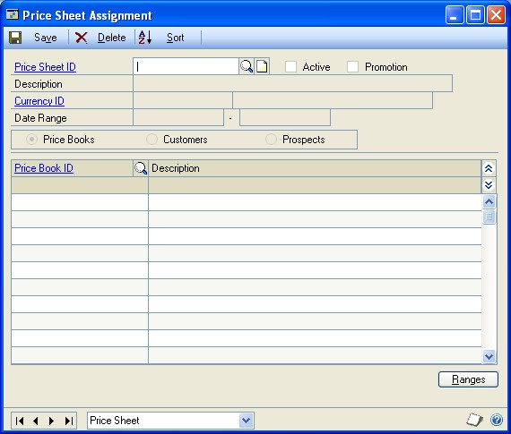

2. Enter or select a price sheet ID.

3. Mark Price Books, Customers, or Prospects, depending on the kind of records you want to assign the price sheet to.

Price books, customers, or prospects that this price sheet is already assigned to are displayed in the scrolling window.

4. In the scrolling window, enter or select price book IDs, customer IDs, or prospects to assign the price sheet to.

    *If you'd prefer to assign the price sheet to a range of price books, customers, or prospects, choose Ranges to open the Price Sheet Assignment Ranges window. Refer to Assigning a price sheet to a range of price books, customers, or prospects for more information.*

5. Choose Save and close the window.

#### Assigning a price sheet to a range of price books, customers, or prospects

Use the Price Sheet Assignment Ranges window to assign a price sheet to a range of price books, customers, or prospects.

**To assign a price sheet to a range of price books, customers, or prospects:**

1. Open the Price Sheet Assignment window. (Inventory \>\> Cards \>\> Extended Pricing \>\> Sheet Assignment)

2. Enter or select a price sheet ID.

3. Choose Ranges to open the Price Sheet Assignment Ranges window.

    

4. Mark Price Books, Customers, or Prospects, depending on the type or record you want to assign the price sheet to.

5. If needed, use the range fields to restrict the price books, customers, or prospects that the price sheet should be assigned to.

6. Choose Preview to view the records that fit your criteria in the scrolling window.

7. Choose Transfer to add the price sheet to the price books.

#### Setting up pricing for a customer or prospect

Use the Customer Pricing Maintenance window or the Prospect Pricing Maintenance window to create pricing information for a customer or prospect. You can use existing price sheets and price books to set up customer pricing; the difference is that you create associations starting from the customer or prospect rather than starting from the price sheet or price book.

*Use the Price Sheet Assignment window to assign a price sheet to multiple customers or prospects.*

A customer or prospect can be assigned one price book and one or more price sheets. When searching for a price for a specific customer or prospect, price sheets directly assigned to the customer or prospect are searched first, followed by price sheets assigned to the customer or prospect's price book, followed finally by the base price book.

If you're using Multicurrency Management, you can assign price sheets with different currencies to a customer or prospect.

**To set up pricing for a customer or prospect:**

1. Open the Customer Pricing Maintenance window or the Prospect Pricing Maintenance window. (Inventory \>\> Cards \>\> Extended Pricing \>\> Customer Pricing or Prospect Pricing)

    

2. Enter or select a customer ID or prospect ID.

3. Enter or select a price book ID for this customer or prospect. You can leave this field blank if base book prices apply.

4. Enter or select price sheet IDs for the price sheets to use for this customer or prospect. The prices on these sheets will override the list prices for items sold to the selected customer or prospect.

    *Price sheet IDs are added in the order you select them. Choose the Sort button to open the Customer Pricing Sort Options window, where you can choose a sort order for the price sheets.*

5. Choose Save and close the window.

#### Assigning a price book to customers and prospects

Use the Price Book Assignment window to assign a price book ID to multiple customers or prospects. This method is particularly useful for a new price book that is not yet assigned to customers or prospects.

**To assign a price book to customers and prospects:**

1. Open the Price Book Assignment window. (Inventory \>\> Cards \>\> Extended Pricing \>\> Book Assignment)

    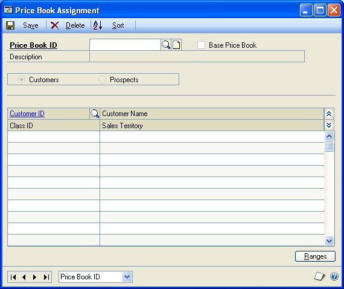

2. Enter or select a price book ID.

3. Mark Customers to assign the price book to customers or Prospects to assign the price book to prospects.

4. Enter or select customer IDs or prospect IDs.

    *Customer or prospect IDs will be added in the order you select them. Choose the Sort button if you want to sort the customers or prospects by Customer ID or Prospect ID.*

5. You can choose Ranges to open the Price Book Assignment Ranges window, where you can assign the price book to a range of customers or prospects. For more  information, refer to *Assigning a price book to a range of customers or prospects*.

6. Choose Save and close the window.

#### Assigning a price book to a range of customers or prospects

Use the Price Book Assignment Ranges window to assign a price book to a range of customers or prospects.

**To assign a price book to a range of customers or prospects:**

1. Open the Price Book Assignment window. (Inventory \>\> Cards \>\> Extended Pricing \>\> Book Assignment)

2. Enter or select a price book ID.

3. Select Ranges to open the Price Book Assignment Ranges window.

    

4. Mark Customers or Prospects.

5. Enter or select the customer or prospect IDs, territory IDs, and class IDs of the customers or prospects to assign the price book to.

6. Mark the Unassigned Customers/Prospects Only option to assign the price book only to customers and prospects who aren't already assigned price books. If you clear this option, customers or prospects already assigned to other price books will be reassigned to this price book.

8. Choose the Preview button to view the customers or prospects that fit your criteria.

9. Choose the Transfer button to assign the price book to the customers or prospects you selected.

### Chapter 13: Purchasing options, vendors, and planners

One of the tasks you'll need to complete to fully define your items is to enter purchasing information for item records. For example, you'll need to specify the appropriate units of measure for purchasing items. You also can specify whether the purchase receipts of items with cost variances should be revalued. These tasks are part of Inventory Control.

If you've already defined your company's vendors, you can assign vendors to items. You can designate primary vendors for each item-site relationship you create, enabling you to specify a different primary vendors for restocking the same item at different sites. You also can specify a different default unit of measure for purchases of the same item from different vendors.

You can define planner IDs—identifiers that represent a person, department, or other entity—and assign planner IDs to show which planner has the responsibility and authority to plan the item-site combination.

The following information is discussed:

- *Entering purchasing options for an item*

- *Entering a manufacturer's item numbers*

- *Assigning vendors to an item*

- *Removing a vendor assignment from an item*

- *Cost variance tolerances*

- *How purchase receipts are updated for cost variances*

- *Example: Effects of cost variances on accounts*

- *Creating a planner ID*

- *Deleting planner IDs*

### Entering purchasing options for an item

Use the Item Purchasing Options Maintenance window to specify what fractions of each unit of measure in an item's unit of measure schedule can be used for purchasing. For example, if a unit of measure for nails is pounds, you might set up purchasing options for the nails so that you also can purchase nails in half- or even quarter-pound increments.

You can use the Item Purchasing Options Maintenance window to specify whether to revalue inventory for cost variance and enter a tolerance percentage to determine how large a cost variance must be before the purchase receipt is revalued. You also can specify quantity tolerances for shortages and overages for the quantity ordered for the items with an item type of Sales Inventory or Discontinued.

**To enter purchasing options for an item:**

1. Open the Item Purchasing Options Maintenance window. (Inventory \>\> Cards \>\> Item Purchasing Options)

2. Enter or select an item number.

To enter manufacturer item numbers for the item, choose the Manufacturer's Item Number expansion button.

3. Enter or select a default purchasing unit of measure.

4. Decide which units of measure from the unit of measure schedule assigned to the item can be used to purchase the item. For each unit of measure, you can choose Not Available, Whole, or Whole and Fractional.

**Not Available** Choose Not Available if the item shouldn't be purchased in that unit of measure.

**Whole** Choose Whole if the item can be purchased in the unit of measure, but not in fractional quantities of the unit of measure. For example, if the unit of measure is Pound and you don't want to allow purchases of ounces, you would choose Whole.

**Whole and Fractional** Choose Whole and Fractional if the item can be purchased in the unit of measure and in portions of the unit of measure.

5. If the item is a Sales Inventory or Discontinued item, and if the item's valuation method is FIFO perpetual, LIFO perpetual, or average perpetual, you can determine if the purchase receipt for the item should be revalued when cost variances exceed certain levels. Mark Revalue Inventory for Cost Variance if this should occur.

*This setting is a default setting that applies only if you're matching invoices and shipments. When you're matching invoices, you'll have the option to mark or clear the revalue option for individual receipt lines.*

6. If you mark Revalue Inventory for Cost Variance, enter a Tolerance Percentage. The tolerance percentage determines how large a cost variance must be— greater or less than the shipment receipt amount—before the purchase receipt is revalued. Refer to *Cost variance tolerances* for more information.

For information about how cost variances affect accounts, refer to *How purchase receipts are updated for cost variances*.

7. If the item has an item type of a Sales Inventory or Discontinued, you can allow quantity tolerances for shortages and overages for the quantity ordered when receiving against a standard or blanket purchase order.

**Shortage** Mark Shortage and then enter the percentage to use when the quantity received is less than the quantity ordered. If the difference between the quantity received and quantity ordered falls within the quantity tolerance percentage, the difference between the quantities is canceled and the status of a line item is automatically changed to change order, received, or closed. The status of the line item depends on whether or not the line item has been invoiced.

**Overage** Mark Overage and then enter the percentage to use when the quantity received is more than the quantity ordered. If the quantity received is over the overage tolerance, you will receive a message that you can't enter a quantity greater than the combined total of the Remaining to Receive quantity and the overage tolerance set up for the item.

8. When you've finished selecting purchasing options for all units of measure, choose Save and close the window.

#### Entering a manufacturer's item numbers

Use the Manufacturer's Item Number Maintenance window to enter item numbers that manufacturers use for sales inventory or discontinued items. You also can select a manufacturer's item number for an item that you purchase most often to be printed on purchase orders. For example, assume that a vendor obtains the same interchangeable item from several manufacturers, but you want to purchase items made by a specific manufacturer. By entering a manufacturer's item number for the item and selecting it as the primary number, the manufacturer's item number you specified will be printed on the purchase order. You can add or remove manufacturer's item numbers while entering a purchase order.

**To enter a manufacturer's item numbers:**

1. Open the Item Purchasing Options Maintenance window. (Inventory \>\> Cards \>\> Item Purchasing Options)

2. Enter or select an sales inventory or discontinued item and choose the Manufacturer's Item Number expansion button.

    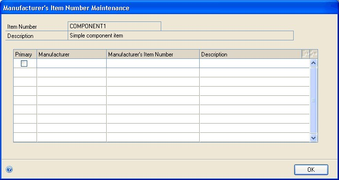

3. Enter the name of the manufacturer, the manufacturer's item number, and a description of the item.

4. Mark the Primary option if this is manufacturer's item that you purchase most often.

5. Choose OK to save your changes and return to the Item Purchasing Options Maintenance window.

#### Assigning vendors to an item

The vendor information should be available in the lookup window, as long as you've set up Payables Management. Then, all you need to do is select the vendor information that goes with each item.

If you're using Purchasing Order Processing, several fields automatically will be updated when you post receipt transactions:

- Last Invoice Cost

- Last Order Quantity

- Last Receipt Quantity

- Last Order Date

- Last Receipt Date

- On Order

- Drop Ship

**To assign vendors to items:**

1. Open the Item Vendors Maintenance window. (Inventory \>\> Cards \>\> Vendors)

    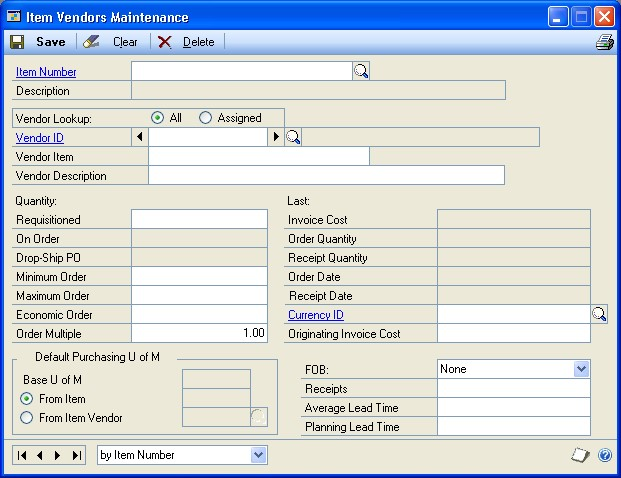

2. Enter or select an item number.

3. Enter or select a vendor ID.

4. If you plan to reorder this item using Purchase Order Processing, enter the vendor's item number and description in the Vendor Item and Description fields.

5. Decide whether the default unit of measure for purchasing this item should be determined by the item or by the vendor.

    For example, if the default purchasing unit of measure you selected in the Item Purchasing Options Maintenance window is Case but you purchase the item from this vendor only in Units, you'd mark the From Vendor option, and then enter or select the unit of measure used to purchase the item from this vendor.

6. To track how long it takes to receive this item from the vendor, enter the average lead time. If you're using Purchase Order Processing, this field is calculated automatically.

7. Enter any other vendor information you want to update.

8. You can choose File \>\> Print to generate the Detailed Item List to verify your entries. Choose Save.

9. If you want to assign other vendors to the item, repeat steps 3 through 8 for each vendor. If you want to assign vendors to another item, choose Clear, and then repeat steps 2 through 8.

10. When you've finished, close the window.

#### Removing a vendor assignment from an item

You also can use the Item Vendors Maintenance window to remove a vendor's assignment to an item. You might want to do this if a vendor no longer carries a certain item.

**To remove a vendor assignment from an item:**

1. Open the Item Vendors Maintenance window.
(Inventory \>\> Cards \>\> Item \>\> select an item \>\> Go To button \>\> Vendors) 2. Enter or select a vendor.

*If you mark the Assigned Vendor Lookup option, the browse buttons and the lookup button on the Vendor ID field will display only those vendors already assigned to the item.*

Choose Delete. An alert message appears, asking if you're sure you want to delete the record. Choose Yes.

#### Cost variance tolerances

If you mark Revalue Inventory for Cost Variance for an item record in the Item Purchasing Options Maintenance window, you can enter a Tolerance Percentage. The Tolerance Percentage defines the upper and lower limits for cost variance without causing the purchase receipt to be revalued.

For example, suppose you've marked Revalue Inventory for Cost Variance for an item, and that you've entered 10 percent for the tolerance. You have a shipment receipt for three items at \$10 per unit.

Later you receive an invoice for the items that shows that the per-unit cost of the items has changed. If the percentage difference between the cost on the shipment receipt and on the invoice is equal to or greater than the tolerance percentage, then the purchase receipt will be revalued. Refer to the table for specific examples.

| **Shipment cost** | **Tolerance** | **Invoice cost** | **Purchase receipt revalued?** |
|-------------------|---------------|------------------|--------------------------------|
| \$10              | 10%           | \$11             | Yes                            |
| \$10              | 10%           | \$9.50           | No                             |
| \$10              | 10%           | \$8              | Yes                            |

#### How purchase receipts are updated for cost variances

When an invoice transaction is matched to a shipment transaction and posted, you might want the purchase receipt to be revalued to account for cost variances.

For example, suppose that you've received an invoice from a vendor. You verify the invoice amounts against the purchase order and any receivings documents. If the vendor invoice is acceptable, you enter information for the invoice and all its line items, matching each line item to one or more shipment receipts. When all the information is entered and verified, you post the invoice.

What happens when you post the invoice depends on the item type and valuation method, whether the option to revalue the item has been marked, and, if not, whether the cost variance is greater than or less than the cost variance tolerance for the item. Refer to the table for information about when items with the Sales Inventory or Discontinued item type and a perpetual valuation method are revalued.

|                                                                               | **Option to revalue is marked**                                                              | **Option to revalue is not marked**   |
|-------------------------------------------------------------------------------|----------------------------------------------------------------------------------------------|---------------------------------------|
| **Cost difference is less than the cost tolerance percentage**                | The purchase receipt is not revalued.                                                       | The purchase receipt is not revalued. |
| **Cost difference is equal to or greater than the cost tolerance percentage** | The purchase receipt will be revalued and the line item's inventory account will be updated. |                                       |

If the item has a periodic valuation method, the purchase receipt always is revalued.

Refer to *Example: Effects of cost variances on accounts* for an example of how this would be reflected in accounts.

#### Example: Effects of cost variances on accounts

Suppose you've posted the following shipment receipt when you received two units of an item at \$2 per unit:

| **Account**       | **Debit amount** | **Credit amount** |
|-------------------|------------------|-------------------|
| Inventory         | \$4.00           |                   |
| Accrued Purchases |                  | \$4.00            |

Then the invoice arrives, showing a cost of \$2.10 for each of the two items. You match the invoice to the shipment receipt.

If you've selected to revalue inventory and the tolerance percentage is one percent, then the inventory account would be updated in General Ledger, and the transaction would look like this:

| **Account**       | **Debit amount** | **Credit amount** |
|-------------------|------------------|-------------------|
| Inventory         | \$0.20           |                   |
| Accrued Purchases | \$4.00           |                   |
| Accounts Payable  |                  | \$4.20            |

However, if you have selected not to revalue inventory, then the purchase price variance account would be updated in General Ledger, and the transaction would look like this:

| **Account**             | **Debit amount** | **Credit amount** |
|-------------------------|------------------|-------------------|
| Accrued Purchases       | \$4.00           |                   |
| Purchase Price Variance | \$0.20           |                   |
| Accounts Payable        |                  | \$4.20            |

#### Creating a planner ID

Use the Planner Maintenance window to create a planner ID. You can create as many planner IDs as you like. Later on, you can assign planner IDs to each item-site combination. You can use planner IDs to show which person or entity has the responsibility to plan resources for each item-site combination.

**To create a planner ID:**

1. Open the Planner Maintenance window. (Inventory \>\> Cards \>\> Planners)

    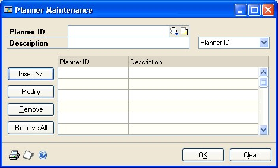

2. Enter a planner ID.

3. Enter a planner description.

4. Choose Insert to add the planner information to the scrolling window.

    You can continue, creating as many planner IDs as you like. You also can choose File \>\> Print to print the Planner List.

5. When you're finished, choose OK to close the window.

#### Deleting planner IDs

Use the Planner Maintenance window to delete one planner ID or all planner IDs. Only planner IDs that are not associated with any item-site combination will be deleted.

*You might want to replace all instances of one planner ID with another before deleting a planner ID. Refer to Replacing all buyers or planners for more information.*

**To delete planner IDs:**

1. Open the Planner Maintenance window. 
(Inventory \>\> Cards \>\> Planners)

2. Determine which planner IDs should be deleted.

- To delete one planner ID, highlight the planner ID in the scrolling window, and choose Remove.

- To delete all planner IDs, choose Remove All.

3. Close the window.

### Chapter 14: Sites and beginning quantities

With Inventory Control, you can define sites—such as storage areas or warehouses—and then assign items to sites. Later, you'll enter information about the quantities of each item at each site. That information will be the baseline used for historical reports later on.

Depending on your business, entering information about your sites can be very simple or very complex. This document describes the simplest tasks—creating a basic site record and entering information about the quantities of items located there. You can refer to *Chapter 15, "Item-site details,"* for information about entering information for resource planning and the purchase order generator.

*Only basic tasks are described in this document, but you might not need to complete them all. Refer to Overview of basic item-site tasks.*

The following information is discussed:

- *Item-site relationships*

- *Posting accounts and site segment substitution*

- *Overview of basic item-site tasks*

- *Defining a site*

- *Entering bins for a site*

- *Specifying default bins for a site*

- *Assigning items to a site*

- *Entering beginning quantities*

- *Specifying lot numbers for inventory quantities*

- *Specifying serial numbers for inventory quantities*

- *Specifying bins for inventory quantities*

- *Inactivating an item-site relationship*

- *Inactivating a site*

- *Requirements for deleting a site*

- *Deleting an item-site relationship*

- *Deleting a site*

#### Item-site relationships

When you assign items to a site, purchase receipts and quantity information are maintained for that item-site combination. If you transfer items to another site, purchase receipt information—such as cost—also is transferred.

To do this, you must define sites and then create item-site relationships. For example, you might have a North warehouse and a South warehouse. To be able to stock an item at both warehouses, you must assign the item to both sites.

Every inventoried item must be assigned to at least one site. You can define as many sites as you need, and you can assign each item to as many sites as necessary.

#### Posting accounts and site segment substitution

When you define a site, you can enter an account segment for the site. If you do this, the site's account segment is substituted into the default posting account number.

*Refer to Assigning posting accounts to items for more information.*

If the resulting account number—the one reflecting the substitution of the site account segment—is valid, Microsoft Dynamics GP posts the transaction to the site account. If the resulting account number is *not* valid, Microsoft Dynamics GP posts the transaction to the default posting account assigned in the Item Account Maintenance window.

For example, suppose you've set up your accounts so the site segment for the Main Store is 1000, and the site segment for the North Store is 2000. If the default posting account is 0000-1300 and the first segment is the site-specific segment, then transactions from the Main Store will post to account 1000-1300, and transactions from the North Store will post to account 2000-1300. If you later added another site—the South Store—but didn't create a site-specific account for that site, transactions for that site would post to account 0000-1300, the default posting account.

#### Overview of basic item-site tasks

You might need to define only one site and assign all items to it, or you might need to define several sites and assign items to them, along with information about lot numbers, serial numbers, and bins.

The following table lists the basic tasks. You should complete only those tasks that apply to you and your business.

| **Procedure**                                        | **Required?**                                      |
|------------------------------------------------------|----------------------------------------------------|
| *Defining a site*                                    | Yes                                                |
| *Entering bins for a site*                           | Only if you're using multiple bins                 |
| *Specifying default bins for a site*                 |                                                    |
| *Assigning items to a site*                          | Yes                                                |
| *Entering beginning quantities*                      | Yes                                                |
| *Specifying lot numbers for inventory quantities*    | Only if items are tracked by lot or serial numbers |
| *Specifying serial numbers for inventory quantities* |                                                    |
| *Specifying bins for inventory quantities*           | Only if you're using multiple bins                 |

#### Defining a site

You must define at least one site. Use the Site Maintenance window to complete this procedure.

**To define a site:**

1. Open the Site Maintenance window. (Inventory \>\> Cards \>\> Site)

    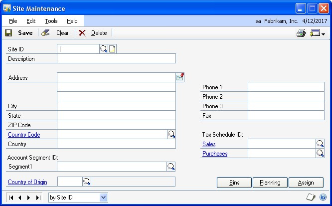

2. Enter an identifier and a brief description for the site.

3. You can enter the address information.

4. If you have a specific account site segment set up in General Ledger and want to track currency amounts for this site, enter the account segment ID. Otherwise, leave this field blank.

5. If you're tracking Intrastat statistics, enter or select a country or region of origin. The field is available only if you've marked the Enable Intrastat Tracking option in the Company Setup Options window.

6. You can enter phone and fax number information, if you like.

7. Select tax schedules that apply to merchandise sold at this site, and to merchandise delivered to this site.

    The sales tax schedule you select appears as the default tax schedule in the Sales

    Order Processing module when the item is sold with a shipping method of Pickup. The tax schedule you select for purchases appears as the default tax schedule in the Purchase Order Processing module when the item purchased has a shipping method of Delivery.

8. Choose Planning to open the Resource Planning Site Maintenance window, where you can enter information about how the item quantities for the site should be planned. Refer to *Entering resource planning information* for more information.

9. If you're using multiple bins, you'll need to enter the bins for the site, and then select the default bins for the site. Refer to the following topics for more information:

    - *Entering bins for a site*
    - *Specifying default bins for a site*

10. Choose Save.

When you've entered all of your sites, you can verify your entries with a Site List. For information about printing this and other setup reports, choose Help \>\> Index, then search for Inventory Setup Reports window.

#### Entering bins for a site

You can define as many bins for each site as necessary. Later, you can transfer item quantities from one bin to another. For more information about bins, see *Multiple bins*.

*You can enter bins for a site after you've entered registration keys for multiple bins. You can complete these step before you mark the option to use multiple bins.*

**To enter bins for a site:**

1. Open the Site Bin Maintenance window. (Inventory \>\> Cards \>\> Bins/Site)

    

    *You also can open the window by choosing Site Bin Maintenance from the Go To button in the Site Maintenance window.*

2. Enter or select a site.

3. Enter a bin.

4. Choose Insert to add the bin to the scrolling window.

5. Repeat steps 3 and 4 until you've added as many bins as necessary.

    *You can add a note to any bin in the scrolling window. To do so, highlight the bin in the scrolling window and then choose the note icon button at the top of the scrolling window to open a note window. Enter information about the bin, being sure to save it before closing the window.*

6. When you've finished, close the window.

#### Specifying default bins for a site

After you create the bins at a site, you can specify certain bins as the  default bin to use for different types of transactions. For example, you might use one bin for fulfilling sales orders, and another bin for items being returned by customers. You can also specify default bins for item-site combinations.

When a transaction is entered, the default bin for the transaction type for the itemsite combination is used. If there is no default bin for the item-site combination, the default bin for the transaction type for the site is used. In some cases, you'll have the option to select a different bin.

*The default bins for a site aren't carried forward to become the default bins for the item-site combinations. You must enter those. Refer to Specifying default bins for an item-site combination.*

You can use the Site Default Bins window to specify the default bins for a site. You also can use the window to change the default bins for a site. You can do that at any time.

**To specify default bins for a site:**

1. Open the Site Maintenance window. (Inventory \>\> Cards \>\> Site)

2. Enter or select a site.

3. Choose Bins to open the Site Default Bins window.

    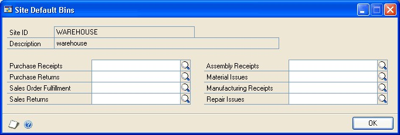

4. Enter or select a bin for each type of transaction.

    Refer to the table for more information.

| **Default bin** | **How it's used** |
|--|--|
| Purchase Receipts | This bin is used for receipts of purchased items at the site if no purchase receipts bin is specified for the item-site combination. |
| Purchase Returns | This bin is used for items to be returned to the vendor from the site if no purchase returns bin is specified for the item-site combination. |
| **Default bin** | **How it's used** |
| Sales Order | This bin is used for items for fulfilling sales orders at the site if no sales order fulfillment bin has been specified for the item-site combination. |
| Sales Returns | This bin is used for items returned by customers at the site if no sales returns bin has been specified for the item-site combination. |
| Assembly Receipts | This bin is used to receive items assembled from Microsoft |
| Material Issues | Materials are drawn from this bin for assembly transactions and manufacturing orders at the site, unless a material issues bin has been specified for the item-site combination. |
| Manufacturing | This bin is used to receive items built from manufacturing orders if no manufacturing receipts bin has been specified for the item-site combination. |
| Repair Issues | This bin is used to draw materials from for use in repairs at the site if no repair issues bin has been specified for the item-site combination. |
| Fulfillment | Dynamics GP assembly transactions if no assembly receipts bin has been specified for the item-site combination. |
| Receipts |  |

5. When you're finished, choose OK to save your entries and close the window.

#### Assigning items to a site

Use the Item Site Assignment window to assign items to a site. Each item must be assigned to at least one site.

*If you're using multiple bins and have created default bins for a site, you should be aware that default bin information for the site does not carry forward to the item-site combinations. If you want to use default bins for item-site combinations, you must enter them. Refer to Specifying default bins for an item-site combination.*

**To assign items to a site:**

1. Open the Site Maintenance window. (Inventory \>\> Cards \>\> Site)

2. Enter or select the site you want to assign items to.

3. Choose Assign to open the Item Site Assignments window.

    

4. Specify which items should be assigned to the site. For example, you can choose to have only the items in certain item classes assigned to the site.

    To specify a range of items by item number, mark the From option in the Item Number field, and then enter or select the first and last item numbers to be included in the range.

    You can specify ranges for all different fields in the window: Item Number, Generic Description, Class ID and Vendor ID. However, only those items that meet all the criteria will be assigned to the site.

5. Choose OK.

**To assign items to a site using the action pane:**

1. In the navigation pane, choose the Inventory button, and then choose the Items list.

2. Mark the items that you want to assign a site to.

3. In the Modify group, choose Assign Site.

4. Select the site you want to assign the items to and choose Assign.

#### Entering beginning quantities

Use the Item Transaction Entry window to enter On Hand beginning item quantities for inventoried and discontinued items. You must enter beginning quantities to establish a starting point for inventoried items and a baseline for historical information. Once you've entered initial quantities, you can enter increase and decrease adjustments, as well as variance and transfer transactions.

*Before you begin this procedure, be sure the site has been defined and items have been assigned to it. If you're using multiple bins, you also should have created bins.*

If you're using Invoicing or Sales Order Processing, history information for Inventory Control automatically is updated for items for which you're keeping calendar, fiscal, or transaction history. Activities in Purchase Order Processing and Microsoft Dynamics GP Bill of Materials affect only transaction history.

**To enter beginning quantities:**

1. Open the Inventory Batch Entry window. (Inventory \>\> Transactions \>\> Batches)

    

2. Enter an identifier and brief description for the batch, and from the Origin list, choose Transaction entry. Then unmark the Post to General Ledger option so any transactions that have been accounted for in General Ledger won't be duplicated.

3. Choose Transactions to open the Item Transaction Entry window.

    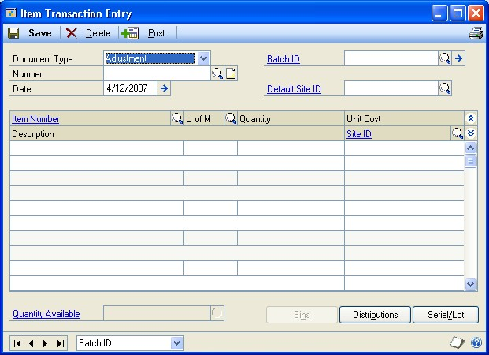

4. From the Document Type list, choose Adjustment.

5. Enter a document number, or accept the default document number.

6. Enter a transaction date.

7. Decide what site or sites to enter beginning quantities for.

    If you're entering beginning quantities for one site—or if most of the beginning quantities are for the same site—enter or select a Default Site ID. The site you select will be included in each line you enter in the scrolling window. If you don't select a default site ID, you must select a site for each line, one-by-one. If you use a default site ID, you can change the site for any line, as needed.

8. Enter or select an item number.

9. Enter or select the unit of measure used to store the item.

10. Enter the quantity.

11. Accept the default site for the item quantity, or enter or select another site.

    To view available to promise information about the item if you're using ATP, click the Quantity Available link to open the Inventory Available to Promise Inquiry window.

    When you move off the line, another window will open if you're entering information for an item with the Sale Inventory or Discontinued type, and more information is needed. Refer to the table.

    | **Condition** | **Result** |
    |--|--|
    | The item is tracked by lot numbers | The Item Lot Number Entry window opens, where you can specify the lot numbers of the items you're entering. If you're using multiple bins, you also can specify the bin for each quantity. Refer to *Specifying lot numbers for inventory quantities*. |
    | The item is tracked by serial numbers | The Item Serial Number Entry window opens, where you can specify the serial numbers of the items you're entering. If you're using multiple bins, you also can specify the bin for each item. Refer to *Specifying lot numbers for inventory quantities*. |
    | The item is not tracked by lot or serial numbers, but you're using multiple bins | The Bin Quantity Entry window opens, where you can specify how much of the total quantity should be added to each bin. Refer to *Specifying bins for inventory quantities*. |

12. Continue, repeating steps 7 through 11 to add more adjustment transactions for beginning quantities.

13. When you've finished entering transactions, choose Save and close the window.

14. In the Inventory Batch Entry window, enter or select the batch ID.

15. You can choose File \>\> Print to print an Inventory Transaction Edit List to verify your entries.

    If you find errors in the edit list, refer to Chapter 25, "Transaction corrections."

16. Choose Post.

After you've posted the beginning quantity information, you might need to mark the Post to General Ledger option, if you cleared it to enter your beginning quantities. Marking the option will ensure that your daily transactions update General Ledger.

Depending on the way your system has been set up, the Transaction Posting Journal might be printed when you post batches. Audit trail reports are optional; you can select to print them when you set up your Microsoft Dynamics GP system. Refer to your System Setup instructions (Help \>\> Contents \>\> select Setting Up the System) for more information about posting options.

#### Specifying lot numbers for inventory quantities

If you enter an adjustment transaction to specify the beginning quantities of an item that is tracked by lot numbers, use the Item Lot Number Entry window to specify the lot number information.

**To specify lot numbers for inventory quantities:**

1. Open the Item Transaction Entry window.
(Inventory \>\> Transactions \>\> Transaction Entry)

2. Enter an adjustment transaction for an item tracked by lot numbers. Choose Serial/Lot to open the Item Lot Number Entry window.

    

    The window also will open automatically when you move out of the transaction line.

3. Enter or select a lot number.

4. You can choose the expansion button on the Lot Number field to open the Lot Attribute Entry window to enter a manufactured date and an expiration date. If you're using lot categories, enter lot attribute information. When you have finished entering information, choose OK to close the window and return to the Item Lot Number Entry window.

    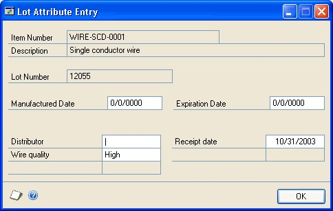

5. Enter quantity information.

    - If you're using multiple bins, enter or select a bin, and enter the quantity to add to the bin.

    - If you're not using multiple bins, enter the quantity to add to the site.

6. Choose Insert to add the information to the lower scrolling window.

7. Continue, repeating steps 3 through 6 until you've accounted for the total item quantity for the site.

8. Choose OK to close the Item Lot Number Entry window and return to the Item Transaction Entry window.

#### Specifying serial numbers for inventory quantities

If you enter an adjustment transaction to specify the beginning quantities of an item that is tracked by serial numbers, use the Item Serial Number Entry window to specify serial number information.

**To specify serial numbers for inventory quantities:**

1. Open the Item Transaction Entry window.
(Inventory \>\> Transactions \>\> Transaction Entry)

2. Enter an adjustment transaction for an item tracked by serial numbers. Choose Serial/Lot to open the Item Serial Number Entry window.

    

    The window also will open automatically when you move out of the transaction line.

3. Enter a serial number.

4. If you're using multiple bins, enter or select a bin.

5. Choose Insert to add it to the Selected scrolling window.

    When you add a serial number to the Selected scrolling window, the Serial Numbers Selected will increase by one, to display how many serial numbers you've entered.

6. Continue adding information to the scrolling window until the Serial Numbers Selected equals the Extended Quantity.

7. Choose OK to close the window and return to the Item Transaction Entry window.

#### Specifying bins for inventory quantities

If you're entering beginning quantities and you're using multiple bins, you'll need to specify bins for the quantities. Use the Bin Quantity Entry window to complete this procedure.

**To specify bins for inventory quantities:**

1. Open the Item Transaction Entry window.
(Inventory \>\> Transactions \>\> Transaction Entry)

2. Enter an adjustment transaction for an item that is not tracked by lot or serial numbers. Choose Bins to open the Bin Quantity Entry window.

    

    The window also will open automatically when you move out of the transaction line.

3. Enter or select a bin.

4. Enter the quantity for the bin.

5. Choose Insert to add the information to the lower scrolling window.

6. Continue, repeating steps 3 through 5 until the Selected Quantity equals the Extended Quantity.

7. When you've finished, choose OK to save the information and close the window.

#### Inactivating an item-site relationship

If you stop using an item from a particular site, you can inactivate the item-site relationship. For example, if you no longer stock an item at a particular site, you can inactivate the relationship in order to prevent further transactions from using it. Inactivating the item-site will prevent any new sales or purchases using the itemsite combination; however, you will be able to post any existing transactions.

If you have a remaining quantity in the site, you may want to transfer the quantity before inactivating so that you will be able to bring the on hand quantity to zero at the site.

Inactivating the item/site relationship does not affect the item at any other sites, nor does it affect the site. However, if you've already inactivated the site, the item-site relationship will in effect be inactivated, as no items will be able to be sold or purchased from an inactive site.

**To inactivate an item-site relationship:**

1. Open the Item Quantities Maintenance window.
(Inventory \>\> Cards \>\> Quantities/Sites)

2. Select an item number.

3. Enter or select the Site ID.

4. Select Inactive and choose Save.

#### Inactivating a site

If you are no longer using a site, but are not ready to delete it, you can inactivate the site. This will prevent any new transactions from using the site, but will allow existing transactions to be posted.

**To inactivate a site:**

1. Open the Site Maintenance window.
(Inventory \>\> Cards \>\> Site)

2. Enter or select the site to be inactivated.

3. Select Inactive and choose Save.

#### Requirements for deleting a site

If you no longer use a site, and if no items or bills of materials are assigned to it, you can delete it from your records.

If items are assigned to the site to be deleted, you need to enter a transfer transaction to move the items to a different site. Once the items are moved, you also must remove the link between the item and the site before you can delete the site record. Refer to *Deleting an item-site relationship* for more information.

Before you can delete an item-site relationship, the following conditions must be met:

- Quantities for the item at that site must be zero. If you need to transfer item quantities to another site, refer to *Transferring an item to a different site*.

- The item-site combination can't exist on an unposted transaction.

- No posted transactions may exist for the site.

- If you're using multiple bins, you must delete all the bins that have been created for the site.

#### Deleting an item-site relationship

Use the Item Quantities Maintenance window to delete an item-site relationship.

You must delete the item-site relationship before you can delete the site or the item.

**To delete an item-site relationship:**

1. Open the Item Quantities Maintenance window.
(Inventory \>\> Cards \>\> Quantities/Sites)

2. Enter or select an item number.

3. Enter or select the site ID to delete.

*If the item is included in an unposted transaction, you can't delete the item-site relationship.*

4. Choose Delete. An alert message appears, asking if you're sure you want to delete the record. Choose Yes.

5. Repeat steps 3 and 4 as needed, to delete other item-site combinations for the item.

#### Deleting a site

Use the Site Maintenance window to delete a site record. Be sure to review the requirements for deleting a site before beginning this procedure. Refer to *Requirements for deleting a site* for more information.

**To delete a site:**

1. Open the Site Maintenance window. 
(Inventory \>\> Cards \>\> Site)

2. Enter or select the site to be deleted.

3. Choose Delete. A message appears, asking if you're sure you want to delete the site. Choose Yes.

### Chapter 15: Item-site details

Once you've created items, sites, and item-site combinations, you can add more detailed information. You can enter information about a site, about a specific site for an item, or for all sites for an item.

Some of this information is used when you enter an inventory transaction. For example, if you specify a default site for an item, that site will be the default site whenever you enter an inventory transaction for the item. Some information is used in other Microsoft Dynamics GP modules, such as the purchase order generator that's available if you're using Purchase Order Processing. The information also is used with other series, such as the Manufacturing Series.

*For more specific information about information you need to enter for Manufacturing Series modules, refer to the Manufacturing documentation.*

The following information is discussed:

- *Item-site combinations and the "all site"*

- *Entering basic all-site information for an item*

- *Entering basic item-site combination information*

- *Specifying default bins for an item-site combination*

- *Overview of the purchase order generator*

- *Resource planning windows*

- *Entering resource planning information*

- *Setting up an item for purchase order generator*

- *How quantities are calculated for suggested purchase orders*

- *Entering default values for resource planning*

#### Item-site combinations and the "all site"

After you create items and sites and assign items *to* sites, you can enter more information for each item-site combination. Inventory Control also includes an "all site" for each item. All-site information applies to an item for all sites. For example, you can choose only one default site for an item (all-site information), but you can choose a different primary vendor for each item-site combination (item-site information).

Microsoft Dynamics GP includes several windows for entering information for the all site and for specific item-site combinations. You can use the Item Quantities Maintenance window to enter basic information, and you can use other windows to  enter information that's used by the purchase order generator and by Manufacturing.

**Basic all-site and item-site information**

For more information about using the Item Quantities Maintenance window to enter information, refer to the following topics:

- *Entering basic all-site information for an item*

- *Entering basic item-site combination information*

**Advanced all-site and item-site information**

If you're using certain other features, you'll need to enter more information.

- If you're using multiple bins, you also should specify default bins for each itemsite combination. Refer to *Specifying default bins for an item-site combination*.

- If you're using resource planning features such as the purchase order generator in Purchase Order Processing or the Material Requirements Planning module of the Manufacturing Series, you must enter resource planning information. Refer to *Resource planning windows* and *Entering resource planning information*.

- If you're using the purchase order generator, you must enter information such as replenishment levels and order methods. Refer to *Setting up an item for purchase order generator*.

#### Entering basic all-site information for an item

Use the Item Quantities Maintenance window to enter all-site information for an item. The information that you can enter depends on whether you're using Purchase Order Processing or advanced picking in Sales Order Processing.

*Before you begin this procedure, be sure that you've already entered beginning quantities for the item-site combination. Refer to Entering beginning quantities for more information.*

**To enter basic all-sites information for an item:**

1. Open the Item Quantities Maintenance window. (Inventory \>\> Cards \>\> Quantities/Sites)

    

2. Enter or select an item.

3. Be sure the Sites option is All.

4. Enter or select a default site ID.

    The default site ID will be the default site when you enter transactions for the item. You can accept the default entry or change it as needed.

5. If you're not using Purchase Order Processing, enter other information about purchase orders as needed. (The information is updated automatically if you're using Purchase Order Processing.)

6. Choose Save and close the window.

#### Entering basic item-site combination information

You can use the Item Quantities Maintenance window to enter information for each item-site combination. Some of the information you enter will depend on whether you're using multiple bins, advanced picking in Sales Order Processing, or Purchase Order Processing.

> [!NOTE]
> Before you begin this procedure, be sure you've already entered beginning quantities for the item-site combination. Refer to Entering beginning quantities. Before you can specify a primary vendor, you must assign vendors to the item. Refer to Assigning vendors to an item.

**To enter basic item-site combination information:**

1. Open the Item Quantities Maintenance window.
(Inventory \>\> Cards \>\> Quantities/Sites)

2. Enter or select an item.

3. Select the Site ID option and enter or select the site to add information to.

4. Enter bin information, if needed.

**If you're using multiple bins** Choose Bins to open the Item Site Default Bins window, where you can specify the default bins for an item-site combination. Refer to *Specifying default bins for an item-site combination*.

**If you're not using multiple bins** You can enter a name or location for the site bin.

5. If you're using advanced picking and the Site ID option is Both, you can accept the default print option from the Advanced Picking Setup window, or select a different option. For more information about the item print options, refer to the Sales Order Processing documentation.

6. If you're not using Purchase Order Processing, enter the information from your last order for this item-site combination. If you are using Purchase Order Processing, this information is updated automatically when you enter purchase orders and post receivings transactions.

7. Enter or select a primary vendor ID.

The primary vendor is the default vendor for the item-site combination. You can select the primary vendor when entering purchase order information, or you can select another vendor.

8. If you're using landed costs, enter or select a landed cost group. If you select a landed cost group for an item-site combination, then that landed cost group will be the default landed cost group if the item-site combination is entered on a purchase order line or an in-transit transfer.

Refer to *Chapter 19, "Landed cost cards,"* for more information about landed costs.

9. Choose Save and close the window.

#### Specifying default bins for an item-site combination

After you create the bins at a site, you can specify certain bins as the default bin to use for different types of transactions. For example, you might use one bin for fulfilling sales orders, and another bin for items being returned by customers. You can also specify default bins for item-site combinations.

When you use multiple bins and enter a transaction, the default bin for the transaction type for the item-site combination is used. If there is no default bin for the item-site combination, the default bin for the transaction type for the site is used. In some cases, you'll have the option to select a different bin.

*Refer to Specifying default bins for a site for information about specifying default bins for a site.*

You can use the Item Site Default Bins window to specify the default bins for an item-site combination. You also can specify a priority, minimum quantity, and maximum quantity for each bin at an item-site combination. You can view the priority, minimum quantity, and maximum quantity assigned to a bin in the Site/ Bins Lookup window.

You can use bin priority to help decide which bins that items should be picked from and which bins that items should be placed into. The bin you use most often can be assigned the highest priority. When receiving goods, you can use the Site/Bins Lookup window to view the priority and the quantity on hand for the bin to decide where to place the goods, based on bin capacity and bin priority. When picking goods for a shipment or an inventory transfer, you can use the Site/Bins Lookup window to view the priority and quantity available for the bin to help decide where to pick the goods from, based on product availability and bin priority.

**To specify default bins for an item-site combination:**

1. Open the Item Quantities Maintenance window.
(Inventory \>\> Cards \>\> Quantities/Sites)

2. Enter or select an item.

3. Enter or select a site.

4. Choose Bins to open the Item Site Default Bins window.

    

5. Enter or select a bin for each type of transaction.

    Refer to the table for more information.

    | **Default bin** | **How it's used** |
    |--|--|
    | Purchase Receipts | This bin is used for receipts of purchased items for the itemsite combination. |
    | Purchase Returns | This bin is used for items to be returned to the vendor for the item-site combination. |
    | Sales Order Fulfillment | This bin is used for items for fulfilling sales orders for the item-site combination. |
    | Sales Returns | This bin is used for items returned by customers for the itemsite combination. |
    | Assembly Receipts | This bin is used to receive items assembled for the item-site combination. |
    | Material Issues | This bin is used to draw materials from for the item-site combination. |
    | Manufacturing Receipts | This bin is used to receive items built from manufacturing orders for the item-site combination. |
    | Repair Issues | This bin is used to draw materials from for the item-site combination. |

6. You can assign a priority to a bin. You can assign priorities to an unlimited number of bins—1 being the highest priority. To add a priority, press TAB to move to the next line in the scrolling window. To remove the bin from a priority, delete the bin from the scrolling window.

    You can assign a different priority to a bin at a different item-site combination, but you can't assign a bin to multiple priorities for same item-site combination. For example, if bin A1S4 for item 1 at the warehouse site is assigned to priority 1, you can't assign bin A1S4 to a different priority for item 1 at the warehouse site.

7. You can enter a minimum quantity and maximum quantity for the bin.

8. When you've finished, choose OK to save your entries and close the window.

#### Overview of the purchase order generator

You can use the purchase order generator to automatically create suggested purchase orders for the replenishment of items.

Information for the lines in the suggested purchase orders depends on how you've set up items, sites, and item-site combinations. You can have each item-site combination planned separately, or you can map several sites to a "master site," so that one purchase order is created to replenish an item for several sites.

Before you begin setting up information for the purchase order generator, it's helpful to understand the following terms.

**Order policy** The basic rule for calculating how quantities of an item should be calculated for replenishment. If you're using the purchase order generator, you can choose Use PO Gen (so suggested purchase orders will be created) or Not Planned (so no suggested purchase orders will be created). You can specify the order policy in the Item Resource Planning Maintenance window.

Manufacturing users have several additional order policies to choose from. Refer to the Manufacturing documentation for more information.

**Replenishment method** The means for obtaining more of an item: Make or Buy. You can specify the replenishment method for an item in the Item Resource Planning Maintenance window. The Make or Buy option is available if you are using the Manufacturing Order Processing component in the Manufacturing Series.

**Order method** The scope of the suggested purchase order planning. You can choose to Order to Independent Site—so that suggested purchase orders can be generated for each item-site combination—or Order to Master Site—so that suggested purchase order quantities of a single item can reflect requirements for several sites. You can specify the order method for an item-site combination in the Purchase Order Generator Item Maintenance window.

*Refer to the Purchase Order Processing documentation for more information about mapping sites to a master site.*

**Replenishment level** The basic calculation for determining quantities for a suggested purchase order. You can choose Order Point Quantity, Order-Up-To Level, or Vendor EOQ. You can specify the replenishment level for an item-site combination in the Purchase Order Generator Item Maintenance window.

**Vendor selection** An option that determines which vendor will be used for suggested purchase orders. You can specify the vendor selection for an item-site combination in the Purchase Order Generator Item Maintenance window.

**Cost selection** An option that determines where the default cost for the suggested purchase order should come from. You can specify the order method for an item-site combination in the Purchase Order Generator Item Maintenance window.

#### Resource planning windows

If you're using resource planning features such as the purchase order generator in Purchase Order Processing or the Material Requirements Planning module of the Manufacturing Series, you must enter other information, such as order policies. If you're not using these products, you don't need to complete these tasks, but you can record information for reference, if you like.

Refer to the table for information about how the information in the windows is used.

|    Window type           | **All-site information\***        | **Item-site combination**                        |
|------------|----------|--------------------------|
| **Resource Planning Site Maintenance window**                        | Default value information is the default all-site information for new sites. (This default all-site information can be viewed or edited in the Item Resource Planning Maintenance window.) | Site-specific information is the default planning information for the site, and can be rolled down to all items assigned to the site. (This default information can be viewed or edited in the Item Resource Planning |
| **Item Resource Planning Maintenance window**                        | Information is used for default values for item-site combinations.                                                                                                                        | Site-specific information (Replenishment Method and Order Policy) is used by the purchase order generator and Material Requirements Planning module of the Manufacturing Series.                                     |
| **Purchase Order Generator Item Maintenance window**                                    | Information is used for default values for item-site combinations.                                                                                                                        | Site-specific information is used by the purchase order generator.                                                                                                                                                   |
| \* All-site information is the same as "default values" information. |                                                                                                                                                                                            |                                                                                                                                                                                                                       |

Maintenance window.)

#### Entering resource planning information

If you're using the purchase order generator or the Manufacturing Series, you'll need to enter resource planning information for items with the Sales Inventory item type. (You also can enter information for Discontinued items, but the purchase order generator won't suggest orders for those items.)

The purchase order generator and Manufacturing require information for each item-site combination. If you're not using one of these products, you can enter information but it won't be used in any processing or calculations.

You can set up default values for the fields in this window. Refer to *Entering default values for resource planning* for more information.

**To enter resource planning information:**

1. Open the Item Resource Planning Maintenance window.
(Inventory \>\> Cards \>\> Item Resource Planning)

    

2. Enter or select an item number.

    *If the item is inactive or discontinued, you will not be able to edit any fields in the window. The Order Policy list will be changed to Not planned for all sites, and the Calculate MRP for this item/site box will be unmarked for all sites.*

3. Determine whether to enter information for an item-site combination.

    Mark Default Values if you're entering planning information to be used as default values when assigning a site to an item.

4. Enter or select a buyer ID and a planner ID.

5. Accept the default order policy, or change it.

    - **If you're using the purchase order generator** You can choose Not Planned (if purchase orders shouldn't be planned for the item-site combination) or Use PO Gen (if orders should be planned.)

        The order policy must be Use PO Gen if the site is the master site for any other site for the item. The order policy is combined with options you set up in Purchase Order Processing to determine the purchase order quantities for planned purchase orders. Refer to the Purchase Order Processing documentation for more information.

    - **If you're using Manufacturing** Several order policies are available. Refer to the Manufacturing documentation for more information.

6. If you're using the purchase order generator for the item-site combination, enter additional information.

    The specific fields that are needed for the purchase order generator depend on how you're setting up each item-site combination. Refer to *Setting up an item for purchase order generator* for more information.

7. If you're using the MRP component of the Manufacturing Series, you'll need to enter information for each item-site combination.

    The specific fields that are needed depend on the order policy you select for each item, as well as the Manufacturing modules you're using. Refer to the Manufacturing documentation for more information.

8. You can enter information in other fields, if needed, but those fields aren't used in any processing or calculations.

9. When you've finished, choose Save and close the window.

#### Setting up an item for purchase order generator

If you're using the purchase order generator to suggest purchase orders, use the Purchase Order Generator Item Maintenance window to set up the item options that determine how the purchase orders are created. You can set up purchase order generator options for items that have the Sales Inventory or the Discontinued item type, but no suggested purchase orders are created for discontinued items.

> [!NOTE]
> Default values for the Purchase Order Generator Item Maintenance window come from the Purchase Order Processing Setup Options window. For more information about that window and about working with the purchase orders that are generated, refer to the Purchase Order Processing documentation.

**To set up an item for purchase order generator:**

1. Open the Item Resource Planning Maintenance window.
(Inventory \>\> Cards \>\> Item Resource Planning)

2. Enter or select an item.

3. Determine whether to set up options for the item or for an item-site combination.

    - **To set up options for an item** Be sure the Default Values option is marked in the Sites field. Choose PO Gen Item to open the Purchase Order Generator Item Maintenance window, where you can enter information for the item. The options you set up for an item will be the default options for item-site combinations for that item.

    - **To set up options for an item-site combination** Be sure the Site ID option is marked in the Sites field. Enter or select the site and choose PO Gen Item to open the Purchase Order Generator Item Maintenance window, where you can enter information for the item-site combination.

    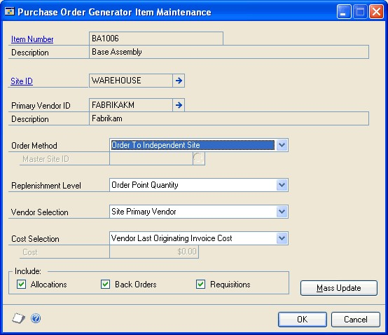

4. Accept the default order method or change it. Choices include the following order methods:

    - **Order to Independent Site** Suggested purchase order quantities will be based on requirements for only this site.

    - **Order to Master Site** Suggested purchase order quantities will be based on requirements for this site and other sites that have the same master site. (The order method can't be Order to Master Site for the master site—only for the sites that *have* a master site.)

    If you choose Order to Master Site, you must also enter or select a master site ID. The master site is the site that items for this item-site combination will be shipped to. Refer to the Purchase Order Processing documentation for more information about mapping sites to a master site.

5. Accept the default replenishment level or change it.

    Refer to *How quantities are calculated for suggested purchase orders* for information about how replenishment levels affect required quantity for an item-site combination.

6. If the order method is Order to Independent Site, accept the default vendor selection or change it. Choices include the following vendor selections:

    - **Site Primary Vendor** The primary vendor for the item-site combination will be used. You can specify a primary vendor for an item-site combination in the Item Quantities Maintenance window.

    - **Vendor with Lowest Cost** Of the vendors assigned to the item, the one with the lowest Originating Invoice Cost (in the Item Vendors Maintenance window) will be used.

        If you're using Multicurrency Management, the invoices costs are converted to your company's functional currency before they are compared.

    - **Vendor with Shortest Lead Time** Of the vendors assigned to the item, the one with the shortest Planning Lead Time (in the Item Vendors Maintenance window) will be used.

        If the order method is Order to Master Site, the vendor selection will come from the master site. The primary vendor for the master site is used for the purchase order.

        If the order method is Order to Independent Site, accept the default cost selection or change it. Choices include the following cost selections:

    - **Vendor Last Originating Invoice Cost** The amount of the Originating Invoice Cost from the Item Vendors Maintenance window will be used for suggested purchase orders.

    - **Item Current Cost** The amount of the Current Cost from the Item Maintenance window will be used for suggested purchase orders.

    - **Item Standard Cost** The amount of the Standard Cost from the Item Maintenance window will be used for suggested purchase orders.

    - **Specified Cost** An amount you specify (in functional currency) will be used for suggested purchase orders, regardless of the vendor selection.

        If the order method is Order to Master Site, the cost selection is not available. The cost selection method will come from the master site.

7. Mark the quantities that should be included in calculations for purchase order quantities.

Refer to *How quantities are calculated for suggested purchase orders* for more information about how these selections affect the calculation for the available quantity.

8. When you've finished, choose OK to save the information and close the window.

> [!NOTE]
> You can use the Purchase Order Item Mass Update window to enter or change purchase order generator options for several items at once. Refer to Updating purchase order generator options for several items for more information.

#### How quantities are calculated for suggested purchase orders

If you're using the purchase order generator, it's helpful to understand how quantities are calculated because they are used to determine the quantities for suggested purchase orders. The suggested quantity for an item on a purchase order is based on the quantity available for the item at a site and on which demands are to be included in the calculation indicated by how you set up items using the Purchase Order Generator Item Maintenance window. In addition, if you are using Use PO Gen as the order policy of an item, the suggested quantity can be calculated as a multiple of the number entered as the order multiple in the Item Vendors Maintenance window. For example, assume that you need 50 widgets and the order multiple for widgets is 8. The suggested order quantity for the purchase order would be 56.

**Available quantity**

The available quantity is the amount of the item that is on hand now—or that is already on order—for the item-site combination. The quantity is calculated this way:

(Quantity On Hand + Quantity On Order + Quantity On Order from purchase order lines with New status) - (Quantity Allocated + Quantity Requisitioned + Quantity Back Ordered + Quantity required by subordinate sites)

The quantity allocated, quantity requisitioned, and quantity back ordered will be included in the available quantity calculation only if you mark those options in the Purchase Order Generator Item Maintenance window. If you are using eRequisition, the quantity requisitioned doesn't include requisitions from eRequisition.

Refer to the table for information about when the quantities are included in the calculation.

| **Quantity:**                                                                    | **Is included:**                                                                   |
|----------------------------------------------------------------------------------|------------------------------------------------------------------------------------|
| Quantity On Hand from Item Quantity Maintenance window                           | Always                                                                             |
| Quantity On Order from Item Quantity Maintenance window                          | Always                                                                             |
| Quantity On Order from "New" purchase order lines, less any cancelled quantities | Always                                                                             |
| Quantity Allocated from Item Quantity Maintenance window                         | If Allocated is marked in the Purchase Order Generator Item Maintenance window     |
| Quantity Requisitioned from the Item Quantity Maintenance window                 | If Requisitioned is marked in the Purchase Order Generator Item Maintenance window |
| Quantity Back Ordered from the Item Quantity Maintenance window                  | If Back Ordered is marked in the Purchase Order Generator Item Maintenance window  |
| Required quantities for subordinate sites                                        | If the site is a master site                                                       |

**Required quantity**

If you're using master sites with the purchase order generator, quantities for subordinate sites are reflected in quantities for the master site.

Basically, the required quantity of an item for each subordinate site is the difference between what's needed and what's available. Calculating the required quantity depends on the replenishment level selected for the item-site combination.

Refer to the table for information about how required quantities are calculated for each type of replenishment level.

| **Replenishment level** | **Availability**                                          | **Order quantity calculation**                                                                                                                                                                                                                                                                                                                   |
|-------------------------|-----------------------------------------------------------|--------------------------------------------------------------------------------------------------------------------------------------------------------------------------------------------------------------------------------------------------------------------------------------------------------------------------------------------------|
| Order Point             | Available for either order method                         | Order Point Quantity (from Item Resource Planning Maintenance window) - Available Quantity = Order Quantity                                                                                                                                                                                                                                      |
| Order-Up-To Level       |                                                           | Order-Up-To Level (from Item Resource Planning Maintenance window) - Available Quantity = Order Quantity, *unless* the Order-Up- To Level is zero or less than the Order Point Quantity. If that's the case, then the calculation is Order Point Quantity (from Item Resource Planning Maintenance window) - Available Quantity = Order Quantity |
| Vendor EOQ              | Only available for Order to Independent Site order method | First, calculate the requirement for the item: Order Point Quantity (from Item Resource Planning Maintenance window) - Available Quantity = Order Quantity. Then compare that quantity to the economic order quantity (EOQ) for the vendor. The suggested order quantity will be the greater of the two values.                                 |

#### Entering default values for resource planning

You can use the Resource Planning Site Maintenance window to enter default resource planning values. You can enter the default values for the all site, or for item-site information for specific sites. You can select buyers and planners, order policies, replenishment methods, and more.

You can enter resource planning information for any company, but the information will be used in calculations only if you're using the purchase order generator or the Manufacturing Series. Even if you're not using one of those products, however, you might want to enter information in these windows and refer to it as part of your business practices.

Refer to Resource planning windows for information about how the information in this window is used in other windows.

**To enter default values for resource planning:**

1. Open the Resource Planning Site Maintenance window.
(Inventory \>\> Cards \>\> Site Resource Planning)

    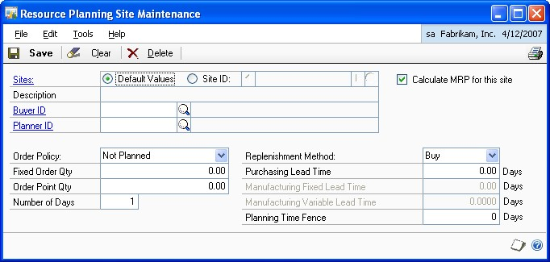

2. Determine whether to enter default information for the all site—also known as the default values—or for a specific site.

    - Mark Default Values if you're entering planning information to be used as default values when adding a new site.

    - Mark Site ID if you're entering planning information for the purchase order generator. Enter or select a site.

3. Enter information that should be the default planning information. You can enter information in as many or as few fields as you like.

4. Choose Save.

    An alert message appears, asking how much of the information you want to "roll down" for a site ID. Refer to the table for information about how records will be updated. Information doesn't roll down for the default values.

    | **Option** | **Site ID** |
    |--|--|
    | All | All values in the window will replace all values for items assigned to the selected site. You can view the information in the Item Resource Planning Maintenance window. |
    | Changes | All *changed* values in the window will replace the associated values in the Item Resource Planning Maintenance window for all items assigned to the site. |
    | None | No information is rolled down to item-site combinations. Only new item-site combination for the site will reflect the changes. |

    If any records couldn't be updated, the Resource Planning Site Roll Down Exception Report will be generated. The report lists the records that  couldn't be updated. You can use the Item Resource Planning Maintenance window to update those records, if needed.

5. Close the window.

### Chapter 16: Kits

Kits are one of the special item types included in Inventory Control. Use a kit to define a group of items sold together as a unit. For example, a sporting goods store might market a basic camping kit that included a tent, a pair of sleeping bags, and other basic necessities.

The following information is discussed:

- *Kits and phantom bills of materials*

- *Assigning kit components*

- *Deleting a component from a kit*

#### Kits and phantom bills of materials

A kit is different from a bill of materials. Bills of materials—which you can create in the Microsoft Dynamics GP Bill of Materials module—are lists of materials needed to produce an item. Sometimes a bill of materials will include another bill of materials for a subassembly item that isn't stocked or inventoried as a separate item. That subsidiary bill of materials is called a phantom bill of materials.

If you're using Microsoft Dynamics GP Bill of Materials, it's important to understand how phantom bills are created and used. Refer to the table for information about kits and phantom bills of materials.

|                    | **Kits**                                                   | **Phantom bills of materials**                                                                  |
|--------------------|------------------------------------------------------------|-------------------------------------------------------------------------------------------------|
| **Created in ...** | Inventory Control                                          | Bill of Materials                                                                               |
| **Stocked?**       | Yes                                                        | No                                                                                              |
| **Item type**      | Kit                                                        | Kit                                                                                             |
| **Uses**           | Bundling items to sell as a unit in Sales Order Processing | Specifying subassemblies needed to build or produce another assembly. Can't be stocked or sold. |

**Phantom bills**

A phantom bill is a list of parts commonly used together when assembling a finished good—for example, all the screws, brackets, nails and other hardware needed to assemble a desk. The phantom bill item isn't stocked in inventory, though it must have an item number before you can create it using the Bill of Materials Maintenance window. The components of a phantom bill aren't typically sold separately. Because quantities aren't tracked for phantoms, you can't use them as a finished good.

**Kits**

A kit is a group of items that also can be sold separately. For example, if you have a computer system that is composed of a computer, monitor, printer and software, you can either sell these items as a kit, or individually.

Quantities aren't tracked for items you designate as kits. However, current costs are associated with the items associated with the kit, and the quantity sold is tracked when these items are used at the time of sale. When you post a transaction that contains a kit item, amounts are posted to the Cost of Goods Sold account specified—you can choose to use the Cost of Goods Sold account for each component item in the kit, or a separate Cost of Goods Sold account defined for the kit itself.

#### Assigning kit components

Use the Item Kit Maintenance window to assign component items to the kit. You can assign any item to a kit except another kit. When you enter the kit item number, the current cost and standard cost are displayed above the scrolling window.

*If you're using Microsoft Dynamics GP Bill of Materials, and want to use a kit type item as a phantom bill, you shouldn't assign components to the kit.*

**To assign kit components:**

1. Open the Item Kit Maintenance window.
(Inventory \>\> Cards \>\> Kits)

  

2. Enter or select an item number.

3. Decide if sales transactions for the kit item should be posted to Cost of Goods Sold accounts for the components of the kit, or for the kit itself.

    *The Cost of Good Sold accounts are obtained from the kit or from the components, depending on your selection. If no Cost of Good Sold account exists for the kit or component items, the Cost of Good Sold accounts are based on the Posting Accounts Setup selections.*

4. In the scrolling window, enter or select a component item number.

If the component item number is an inactive item, you will not be able to add it to the kit.

5. Enter the unit of measure and quantity for the component item.

    For example, if you have a kitchen set with a table and four chairs, the unit of measure for the chairs might be Each, with a quantity of 4.

6. Continue, repeating steps 4 and 5 for each component item that is included in the kit.

    *To delete a component item from a kit, highlight the line in the scrolling window and choose Edit \>\> Delete Row.*

7. When you've finished assigning items to the kit, choose Save and close the window.

When you've entered all your kit records, you can verify your entries with a Kit List. For information about printing this and other item reports, see Help \>\> Inventory Item Reports window.

#### Deleting a component from a kit

Use the Item Kit Maintenance window to delete kit components from a kit. To delete the kit itself, you need to use the Item Maintenance window.

**To delete a component from a kit:**

1. Open the Item Kit Maintenance window.
(Inventory \>\> Cards \>\> Kits)

2. Enter or select a kit item number.

3. Choose Delete. An alert message appears, asking if you're sure you want to delete the record. Choose Yes.

### Chapter 17: History

Enter fiscal-year or calendar-year history information to maintain historical information about the quantity sold, sales amount, and cost amount for items in Microsoft Dynamics GP. You might already have this information in manual records or another computerized accounting system, but if you enter that information, you can analyze and compare current-year records with previous-year records on the Sales Summary Report and in the Item Inquiry window.

You also can enter information about the projected demand for items. Projections can be used to perform ABC analysis. Refer to *Chapter 37, "ABC analysis,"* for more information.

The following information is discussed:

- *Item history requirements*

- *Entering item history*

- *Entering item projections*

#### Item history requirements

Summary history records can't be created if the history year you want to create doesn't exist for the company you're currently working in. Be sure to set up each year for historical information in the Fiscal Periods Setup window.

If you're using Invoicing or Sales Order Processing, history information for Inventory Control is updated automatically on items for which you're  tracking calendar, fiscal, or transaction history. Purchase Order Processing and Bill of Materials update transaction history only.

#### Entering item history

Use the Item History window to enter beginning history for items.You can enter information about sales quantities, costs, and amounts.

**To enter item history:**

1. Open the Item History window (Inventory \>\> Cards \>\> History)

    

2. Select an item number.

3. Enter the quantity sold, sales amount, and cost of sales information for the current and the previous years.

4. Choose whether to track item history by calendar or fiscal year. The information in the scrolling window is displayed by either month or fiscal period, depending on your selection.

5. Choose whether to display history for all years or for a single year.

6. Choose whether you want information maintained for all sites or for a specific site. To enter history for a specific site, select Site, then enter or select the ID for that site.

7. Enter the historical information in the scrolling window.

    To track more than one previous year, select the year, then enter the information in the scrolling window for each month or fiscal period.

    To add more periods to the scrolling window, choose the Add Period button. Enter information to select the appropriate period and close the window.

    

    *You can enter history only for periods that have been set up in the Fiscal Periods Setup or Item History Periods windows.*

8. Repeat steps 2 through 7 for each item you want to enter history for.

9. Save the information, then choose File \>\> Print to print a Sales Summary Report.

#### Entering item projections

Use the Item History window to enter projections for demand for items on a site-bysite basis. For example, if you anticipate that you will sell 500 units of an item in the next month at the North store, you could enter that amount as a projection.

*If you enter projections for parent items—items that have a bill of materials—don't enter projections for the component items. Those will be calculated for you.*

**To enter item projections:**

1. Open the Item History window.
(Inventory \>\> Cards \>\> History) 2. Select an item number.

2. Select a site ID.

3. Review the contents of the scrolling window. If the period you want to enter projection information for isn't in the scrolling window, choose Add Period. Enter information for the appropriate period and close the window.

4. Use the hide and show buttons so you can see two lines of information for each record in the scrolling window.

5. Select the appropriate line in the scrolling window and enter the projection for that site and period in the Projected Quantity field.

6. Repeat steps 3 through 6, if needed, to add more projection information for the item. For example, you might want to enter projection quantities for other sites.

7. Choose Save and close the window.

### Chapter 18: Count intervals

You can use stock counts to more effectively manage your inventory. With frequent, regular counts, you can keep a closer watch on inventory levels than you can with annual inventory counts. The results of stock counts can help you be proactive with ordering policies, and can help you to identify inventory inaccuracies.

You can specify how frequently certain items should be counted at a specific site. You can set up count intervals so that expensive items that are critical to your business are counted frequently, while relatively cheap, non-essential items are rarely counted.

Typically, cycle counting means that your inventory personnel are counting a few items each day. With cycle counting, counts are spread evenly over the cycle. For example, if you set up a 30-day cycle count for 300 items, the counts will be spread over the 30 days. This helps minimize the count work for your inventory personnel on any one day.

The following information is discussed:

- *Setting up count intervals for several items*

- *Setting up a count interval for one item*

- *How stock count dates are calculated*

- *Changing the cycle-count intervals for an item*

#### Setting up count intervals for several items

Use the Stock Count Cycle Assignment window to specify how frequently certain items should be counted. You can specify different count frequencies for different item-site combinations—for example, you might want to have some counts done more frequently at a newer location, where inventory control procedures might not be fully implemented.

When you specify the count intervals for items, you can begin by selecting items that share a certain attribute—such as being at the same site or having the same ABC classification. (Refer to *Chapter 37, "ABC analysis,"* for more information.) Then you can consider the items on a case-by-case basis, removing certain items from the list to be scheduled for counting.

*You will probably want to set up count intervals once, reviewing them every year or so. If you need to set up cycle counting for a new item, refer to Setting up a count interval for one item.*

**To set up count intervals for several items:**

1. Open the Stock Count Cycle Assignment window.
(Inventory \>\> Cards \>\> Count Cycle Assignment)

    

2. Enter the number of days for the stock count interval.

    The number of days should be based on the up days in the stock count calendar; down days aren't counted. For example, if you wanted to count an item every Monday and had specified in the stock count calendar that Saturdays and Sundays are company down days, the stock count interval should be 5. If no company down days occur in the week, the stock count interval should be 7.

    *Refer to Chapter 8, "Stock count calendar," for more information about up days and down days. Refer to How stock count dates are calculated for more information about stock count dates.*

3. Accept the default start date and time for counting days, or change it.

4. Choose the items to be counted with this frequency. Select a range—such as site ID or ABC code—and then select the starting and ending values for the  range. Choose Insert.

    *The Inventory Control stock count information is based on the number of items at each particular site. If you select a group of items and don't use any further restrictions on that selection, it's assumed that you'll want to count that item at each of its assigned sites.*

5. You can narrow the group of items to include in the stock count by adding as many restrictions as you like. Each restriction is calculated on top of the earlier restrictions. For example, if you limit the group of items to just those at the North site, and then add another restriction that limits the group to just those that have Discontinued for the item type, then the resulting group is Discontinued items at the North site.

6. You can remove items from the resulting list, if you like. Choose Details to open the Cycle Assignment Details window.

    

7. To remove any item from the cycle-count group, clear the appropriate Include option in the scrolling window.

8. When you've finished reviewing the items in the Cycle Assignment Details window, choose OK. The window will close, returning you to the Stock Count Cycle Assignment window.

9. When you've finished selecting items for this frequency, choose Process. The Stock Count Cycle Assignment Report will be printed so you can verify your entries.

10. Close the Stock Count Cycle Assignment window.

#### Setting up a count interval for one item

Use the Item Quantities Stock Count window to specify the cycle counting intervals for one item at a specific site. You'll need to repeat this procedure for each site where the item is to be counted.

**To set up a count interval for one item:**

1. Open the Item Quantities Maintenance window.
(Inventory \>\> Cards \>\> Quantities/Sites)

2. Enter or select an item.

3. Enter or select a site.

4. Choose Stock Count to open the Item Quantities Stock Count window.

    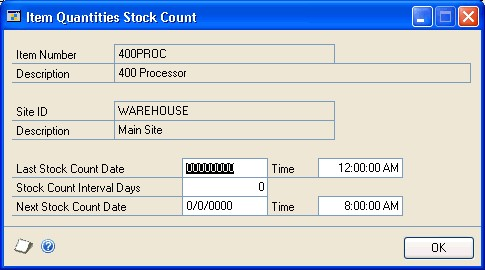

5. Enter the Last Stock Count Date and Time. The first scheduled stock count for the item at this site will be based on this date and the interval.

6. Enter the number of days for the stock count interval.

    The number of days should be based on the up days in the stock count calendar; down days aren't counted. For example, if you wanted to count an item every Monday and had specified in the stock count calendar that Saturdays and Sundays are company down days, the stock count interval should be 5. If no company down days occur in the week, the stock count interval should be 7.

    *Refer to Chapter 8, "Stock count calendar," for more information about the stock calendar.*

7. Choose OK to close the Item Quantities Stock Count window.

8. Choose Save and close the Item Quantities Maintenance window.

#### How stock count dates are calculated

When you set up a stock count calendar, you're specifying the days when a count can be performed. You're also specifying the days to be considered when suggested Next Stock Count dates are calculated.

If you use the Cycle Assignment Details window to set the count interval for several items, suggested Next Stock Count Dates will be based on the number of items and the number of days in the interval. For example, suppose you have 60 items that are to be counted every 60 days. The suggested count dates would be spread over the next 60 up days—one item per day—so that the work is evenly distributed over the cycle.

Once you process a stock count, however, new stock count dates are based on the date of the last stock count for the item-site combination, the count interval and the stock calendar. The new count date will be the date of the last count, plus the count interval (in up days). If the date of the last stock count is June 1, the count interval is 10 and there are no down days in the stock calendar, then the suggested Next Stock

Count Date will be June 11. Use the Item Quantities Stock Count window (Inventory \>\> Cards \>\> Quantities/Sites \>\> select item and site \>\> choose Stock Count button) to view the suggested Next Stock Count Date.

> [!NOTE]
> If the count interval is 0, no suggested stock count date will be calculated.

#### Changing the cycle-count intervals for an item

Each item-site combination can have only one stock-count frequency. If you want to change the frequency an item is counted for a specific site, use the procedure describe in *Setting up a count interval for one item*. The new information will override the older entry.

### Chapter 19: Landed cost cards

Landed costs are the additional costs that might be associated with purchasing a product. For example, if you purchase items from another country or region, the amount you must pay also might include freight costs, or duties.

If you're using landed costs, you can define different landed costs, including information such as the vendor the landed cost is for, the cost calculation method used, and whether invoices must be matched. Later, you can group landed costs, and then assign a group of landed costs to an item-site combination.

More information about landed costs is included in the Purchase Order Processing documentation.

This information is divided into the following sections:

- *Creating or modifying a landed cost record*

- *Cost calculation methods*

- *Example: Invoice matching and distributions*

- *Effects of deleting a landed cost record*

- *Creating a landed cost group*

- *Deleting a landed cost from a landed cost group*

#### Creating or modifying a landed cost record

Use the Landed Cost Maintenance window to define a landed cost record. Each landed cost record can be tied to a specific vendor, but you can change the vendor when you use the information for a transaction. You can create as many landed cost records as you like.

**To create or modify a landed cost record:**

1. Open the Landed Cost Maintenance window.
(Inventory \>\> Cards \>\> Landed Cost)

    

2. Enter or select a landed cost ID.

3. Enter a brief description for the landed cost.

4. Enter or select a vendor.

5. If you're using Multicurrency Management, enter or select the Currency ID— the currency that will be used to record the landed cost amounts—and the Rate Type ID.

6. Select a cost calculation method to determine how the landed cost will be calculated for a receipt. Refer to *Cost calculation methods* for more information.

7. Enter other information for the cost calculation.

    - If the cost calculation method is Flat Amount or Flat Amount Per Unit, enter an Originating Amount.

    - If the cost calculation method is Percent of Extended Cost, enter a percentage.

    Refer to Cost calculation methods for more information.

8. To require users to match invoices to shipments, mark Invoice Match. Refer to *Example: Invoice matching and distributions*.

9. Specify whether inventory should be revalued. You can enter a Tolerance Percentage, if needed. Refer to *Cost variance tolerances* for more information.

10. Enter or select accounts. Refer to *Example: Invoice matching and distributions*.

You need to specify a purchase price variance account only if Invoice Match is marked.

*You can choose File \>\> Print to print the Landed Cost List, if needed. Information about only the displayed landed cost record is included in the report.*

11. Choose Save.

#### Cost calculation methods

Three methods are available for calculating landed costs. Refer to the table for more information.

| **Calculation method**   | **Equation and description**                                                                                                                                                                                                      |
|--------------------------|-----------------------------------------------------------------------------------------------------------------------------------------------------------------------------------------------------------------------------------|
| Percent of Extended Cost | *Extended cost x Percentage* Enter a percentage. If the extended cost is \$120 and the Percentage is 10%, then the landed cost is \$12.                                                                                          |
| Flat Amount              | *Flat Amount (per shipment receipt)* Enter an originating amount. If the originating amount is \$10, then the landed cost is \$10 for the entire shipment line item.                                                             |
| Flat Amount Per Unit     | *Flat Amount x Units of the shipment receipt line* Enter an originating amount. If the originating amount is \$2 and the line item quantity is 12, then the landed cost for the line is \$24. (Units of measure are disregarded.) |

#### Example: Invoice matching and distributions

Marking the Invoice Match option for a landed cost record will affect account distributions. For example, suppose that a shipment is recorded for 10 items at \$1 each. The landed cost uses the Flat Amount cost calculation method, and the flat amount is \$0.50.

The distributions for the shipment would look like this:

| **Account**                     | **Debit amount** | **Credit amount** |
|---------------------------------|------------------|-------------------|
| Inventory                       | \$10.50          |                   |
| Accrued Purchases - Landed Cost |                  | \$0.50            |
| Accrued Purchases - Inventory   |                  | \$10.00           |

Suppose that when the invoice is received, the cost of the goods is unchanged, but the landed cost has increased to \$0.75. If Invoice Match is not marked, the account distributions would be as follows.

| **Account**                     | **Debit amount** | **Credit amount** |
|---------------------------------|------------------|-------------------|
| Accrued Purchases - Landed Cost | \$0.75           |                   |
| Accrued Purchases - Inventory   | \$10.00          |                   |
| Accounts Payable                |                  | \$10.75           |

If Invoice Match is marked and the Revalue Inventory option is marked for the cost variance, the account distributions would be as follows:

| **Account**                     | **Debit amount** | **Credit amount** |
|---------------------------------|------------------|-------------------|
| Accrued Purchases - Landed Cost | \$0.50           |                   |
| Accrued Purchases - Inventory   | \$10.00          |                   |
| Inventory                       | \$0.25           |                   |
| Accounts Payable                |                  | \$10.75           |

#### Effects of deleting a landed cost record

You can delete a landed cost record at any time, even if it is part of a landed cost group or if it has been assigned to a purchasing transaction. Transactions that already include information from the landed cost record won't be affected when you delete the record.

If the landed cost record you're deleting is part of a landed cost group, the landed cost record is removed from the landed cost group when the landed cost record is deleted.

To delete a landed cost record, select the landed cost record in the Landed Cost Maintenance window and choose Delete.

### Creating a landed cost group

Once you've created landed cost records, you can create landed cost groups. A landed cost group is simply a collection of several landed cost records. Each landed cost record can exist in multiple landed cost groups. Each landed cost group can include as many landed cost records as you like. By creating a landed cost group and assigning it to item-site combinations, you can associate many different landed cost records with an item-site combination. When the item-site combination is entered on a purchase order, the landed cost group information automatically is reflected in the transaction.

**To create a landed cost group:**

1. Open the Landed Cost Group Maintenance window.
(Inventory \>\> Cards \>\> Landed Cost Group)

  

2. Enter or select an identifier for the landed cost group.

3. Put your pointer in the first blank line in the scrolling window, and enter or select a landed cost record. Information about the landed cost is displayed in the scrolling window.

4. Continue, repeating step 3 until you've added as many landed cost records as you like.

    You can choose File \>\> Print to print the Landed Cost Group List, if needed.

    Information about only the displayed landed cost group is included in the report.

5. Choose Save.

Once you've created a landed cost group, you can assign it to an item-site combination. Refer to *Entering basic all-site information for an item* for more information.

### Deleting a landed cost from a landed cost group

You can delete a landed cost record from a landed cost group at any time. If you delete a landed cost record that is part of a landed cost group, the landed cost record automatically will be deleted from the landed cost group. Deleting a landed cost group won't affect unposted transactions.

Use the Landed Cost Group Maintenance window to remove a landed cost from a landed cost group.

**To delete a landed cost from a landed cost group:**

1. Open the Landed Cost Group Maintenance window.
(Inventory \>\> Cards \>\> Landed Cost Group)

2. Enter or select a landed cost group.

3. Highlight the line in the scrolling window that includes the landed cost to be deleted.

4. From the Edit menu, choose Delete Row.

5. Choose Save.

## Part 3: Transactions

This part of the documentation includes information about Inventory Control transactions. If you have set up only one site, the transactions you enter are increase or decrease adjustments to your inventory, or transfers of quantities between different quantity types at your main site. If you've set up more than one site, you also can enter transactions that transfer inventory quantities between sites or change quantity types.

Transactions entered in batches can be saved, edited if necessary, and then posted so that they become part of your permanent accounting records. If you decide to post transactions through to the posting accounts you've named in General Ledger, the balances in those accounts are updated by the currency amounts based on the quantities entered during transaction entry. In addition, you have the option of overriding quantities during transaction entry, by entering a quantity that is greater than the quantity available.

The following information is discussed:

- *Chapter 20, "Batches,"* describes how to define, edit, and delete batches. You can use batches to group and post several transactions at once.

- *Chapter 21, "Transaction entry,"* includes information about entering different types of transactions.

- *Chapter 22, "Stock count schedules,"* contains information about starting a stock count and entering the results of the count.

- *Chapter 23, "Stock count processing,"* describes how to enter stock count results for items, including ones tracked by serial or lot numbers.

- *Chapter 24, "Posting,"* includes information about posting individual transactions, batches, and the transactions automatically generated when stock count information is entered

- *Chapter 25, "Transaction corrections,"* includes procedures you can use to correct the information from posted transactions.

### Chapter 20: Batches

Batches are groups of transactions identified by a unique name or number. By entering and posting transactions in batches, you can group similar transactions during data entry and review them before posting.

The following information is discussed:

- *Using batches to group inventory transactions*

- *Creating a batch*

- *Modifying a batch*

- *Deleting a batch*

### Using batches to group inventory transactions

Inventory transactions can be entered individually or in batches. Individual transactions are entered and posted immediately, so your records are always up to date. You can't print edit lists for transactions that aren't entered in a batch. Batches can be used to group and save transactions, allowing you to review the transactions and make corrections before they're posted. More than one person can enter transactions in the same batch; however, a batch can't be posted if anyone is making changes to it.

Recurring batches remain in Inventory Control after posting. However, the batches won't post again automatically. For example, if you've created a recurring batch for all monthly transactions, the batch won't post automatically each month. To post a recurring batch, you must update your transaction information for each transaction in the batch, then mark and post the batch manually. Batches that have been marked as single-use are deleted when the posting process is complete.

Inventory Control batches originate in either Item Transaction Entry or Item Transfer Entry. A batch with an Item Transaction Entry origin can contain a mix of variance and adjustment document types. A batch with an Item Transfer Entry origin can contain only transfer documents. Since batches can have only one origin, you can have batches with the same name, but different origins.

**Transaction Entry** The origin of the batch should be Transaction Entry if the batch will be used to group and post information about inventory adjustments. For information about entering transactions with the Transaction Entry origin, refer to *Entering an adjustment or variance transaction*.

**Transfer Entry** The origin of the batch should be Transfer Entry if the batch will be used to group and post information about movement of items from one site or type to another site or type. For information about entering transactions with the Item Transfer Entry origin, refer to *Transferring an item to a different site* or *Changing the quantity type of an item*.

**Assembly Entry** The origin of the batch should be Assembly Entry if the batch will be used to group and post information about assembly transactions entered in Bill of Materials to create finished goods from component items. For more information about assembly transactions, refer to your Bill of Materials documentation.

### Creating a batch

Use the Inventory Batch Entry window to create batches that you use just once (single-use), or recurring batches for transactions you enter regularly.

**To create a batch:**

1. Open the Inventory Batch Entry window. (Inventory \>\> Transactions \>\> Batches)

    

2. Enter the batch ID and origin.

    The origin for an existing batch won't be displayed automatically if you enter the batch ID manually rather than selecting it from the lookup window. Since batches with different origins can have the same ID, you must select the appropriate origin before the information about the batch is displayed.

3. Select a batch frequency, unless you're creating a batch for assembly transactions.

4. Mark Post to General Ledger if you want this batch to post to General Ledger. (If you select Assembly Entry as the origin, this option isn't available. Assembly transactions will post to or through General Ledger based on your selection in the Posting Setup window.)

5. Enter the posting date. For more information about selecting posting dates, choose Help \>\> Index \>\> Posting.

    If you selected to post by transaction date in the Posting Setup window, the posting date you enter in the transaction entry window is used. If you don't enter a date here, the user date is used as the default posting date.

6. Enter any requirements for posting the batch, such as quantity totals or number of transactions. The batch must meet these requirements before you can post it.

7. Choose Save.

8. When you have entered and saved all the transactions for a batch, return to the Inventory Batch Entry window, select the batch, and print an edit list (File \>\> Print) to verify your entries.

### Modifying a batch

Use the Inventory Batch Entry window to make changes to the transactions in a batch, if needed. Before posting a batch, you might want to print an edit list by displaying the batch in the Inventory Batch Entry window, then choosing File \>\> Print. The edit list summarizes the transactions that are part of the batch. You can then edit the transactions, if needed, before they're posted.

Once the batch is posted, the transactions are part of your company's permanent records. To edit those transactions, you must use the procedures outlined in *Chapter 25, "Transaction corrections."*

*This procedure assumes that you've already added transaction information to the batch. For more information refer to Entering an adjustment or variance transaction and Transferring an item to a different site.*

**To modify a batch:**

1. Open the Inventory Batch Entry window.
(Inventory \>\> Transactions \>\> Batches)

2. Enter or select the batch ID and origin.

*The origin for an existing batch won't be displayed automatically if you
enter the batch ID manually rather than selecting it from the lookup window.
Since batches with different origins can have the same ID, you must select
the appropriate origin before the information about the batch is displayed.*

3. Make any required changes in the Inventory Batch Entry window.

4. To modify a transaction or to enter new transactions, choose Transactions. The transaction entry window opens.

5. In the transaction entry window, enter or select a document number.

6. When you have finished making transaction changes, save the information and close the window to display the Inventory Batch Entry window.

7. To print an edit list, select the batch ID and origin, and choose File \>\> Print. This edit list shows information for the entire batch.

6. Check your entries for accuracy, make any additional changes, then save the batch.

### Deleting a batch

Use the Inventory Batch Entry window to delete a batch. Deleting a batch also deletes the transactions in the batch.

**To delete a batch:**

1. Open the Inventory Batch Entry window.
(Inventory \>\> Transactions \>\> Batches)

2. Enter or select a batch ID and the appropriate origin.

3. Choose Delete. An alert message appears, asking if you're sure you want to delete the batch. Choose Yes.

### Chapter 21: Transaction entry

Use item transactions to complete inventory management activities such as inventory adjustments and transfers. Inventory Control also helps you to enter and post transactions, enter serial or lot numbers for items, and void transactions.

If you've decided to enter transactions individually, you must post each transaction before you can enter the next. If you choose to use batches, you can add several transactions to a batch and then post the batch at your convenience. Refer to *Chapter 20, "Batches,"* for more information about using batches to group and post transactions.

*Procedures for entering and voiding transactions are discussed here. Refer to Chapter 24, "Posting," and Chapter 25, "Transaction corrections," for more information about posting or modifying transactions.*

The following information is discussed:

- *Inventory Control transactions*

- *How bins affect transactions*

- *Document dates and posting dates*

- *Entering an adjustment or variance transaction*

- *Transferring an item to a different site*

- *Changing the quantity type of an item*

- *Entering an in-transit transfer*

- *Specifying lot numbers for a transfer*

- *Specifying serial numbers for a transfer*

- *Changing lot numbers for an in-transit transfer*

- *Changing serial numbers for an in-transit transfer*

- *Specifying bins for item transfers*

- *Specifying bins for in-transit transfers*

- *Changing distributions for a transaction*

- *Transferring quantities from one bin to another*

- *Specifying lot numbers for a bin-to-bin transfer*

- *Specifying serial numbers for a bin-to-bin transfer*

- *Entering lot attribute information*

- *Split purchase receipts*

- *Deleting an inventory transaction*

- *Deleting an in-transit transfer transaction*

### Inventory Control transactions

Inventory Control includes three types of inventory transactions: adjustment, variance, and transfer transactions.

*Refer to the Microsoft Dynamics GP Bill of Materials documentation for more information about assembly transactions.*

You'll use the different types of transactions to record different types of information. You can use these transaction types only for items whose type is Sales Inventory or Discontinued.

**Adjustment transactions** Use adjustment transactions to account for changes in inventory due to the purchase or sale of inventoried items.

**Variance transactions** Use variance transactions to account for differences between quantities recorded in Inventory Control and the results of stock counts.

**Transfer transactions** Use transfer transactions to account for moving items from one site to another, or changing items from one type to another.

**In-transit transfer transactions** Use in-transit transfer transactions to account for the location of items that are being moved from one site to another. Once the goods are fulfilled and shipped from the from site to the via site, an inventory transfer transaction is posted, creating a purchase receipt of the goods in the via location.

### How bins affect transactions

If you're using multiple bins, a bin must be specified for every transaction that involves inventory quantities: item transfers, sales order fulfillments, purchase receipts, assembly transactions, and so on. Bin selections are needed to keep bin quantity information up-to-date, but they don't affect posting. From an accounting perspective, it doesn't matter if you have 100 widgets at the North site in one bin or in 100 bins: what matters is that you have 100 widgets at the North site.

Bins do not affect cost layers. For example, suppose the widgets at the North site have a FIFO Perpetual valuation method, and your receipts of widgets occurred like this:

| **Receipt date** | **Quantity** | **Cost** | **Bin** |
|------------------|--------------|----------|---------|
| June 1, 2016     | 50           | \$5      | Bin A   |
| June 3, 2016     | 100          | \$4.50   | Bin B   |
| June 5, 2016     | 50           | \$6      | Bin A   |

If you remove 25 widgets from Bin B, the value for the items in the transaction would be \$5, because the cost layers are kept only at the site level.

### Document dates and posting dates

The document date is the date that is shown in the Item Transaction Entry window or the Item Transfer Entry window. This is the date your Inventory Control records are updated.

The posting date is when your General Ledger files are updated. The posting date is either assigned for the batch or can be entered by choosing the expansion button in the Document Date field of the Item Transaction Entry window or the Item Transfer Entry window.

### Entering an adjustment or variance transaction

Use the Item Transaction Entry window to enter transactions about adjustments and variances of inventory quantities. For example, if you purchase items to add to inventory, you'd enter an adjustment transaction. For more information about adjustments and variances, refer to *Inventory Control transactions*.

*You should not open the Item Maintenance Options window while using the Item Transaction Entry window.*

**To enter an adjustment or variance transaction:**

1. In the navigation pane, choose the Inventory button, and then choose the Item Transactions list.

2. Choose Adjustment or Variance to open the Item Transaction Entry window.

    

3. Enter the document type and date. The document number appears automatically when you move to the field.

4. Enter or select a batch ID.

5. If all items on this transaction are for the same site, enter or select a default site ID.

    If you don't select a site, you'll need to select a Site ID for each of the items in the scrolling window.

6. In the scrolling window, enter or select an item number.

    > [!NOTE]
    > You will not be able to enter an increase adjustment for an inactive item.

7. Enter or select a reason code. Reason codes are optional, and are used to help identify specific causes for item movement.

8. Enter the adjustment or variance quantity. To enter a decrease adjustment, enter a negative number.

    When you enter the item number, the unit cost is displayed for the base unit of measure. However, the unit cost displayed in the window might be different than the amount posted for the transaction, depending on the valuation method used for the item.

    > [!NOTE]
    > Cost information for decrease transactions will be displayed only if you marked the *Display Cost for Decrease Adjustments option in the Inventory Control Setup window. For more information, refer to Specifying preferences and default entries.

    If the default site ID doesn't apply for a particular item, you can change the site ID in the scrolling window.

9. When you move off the line, another window will open if more information is needed.

    Refer to the table.

    | **Condition** | **Result** |
    |--|--|
    | The item is tracked by lot numbers | The Item Lot Number Entry window opens, where you can specify the lot numbers of the items you're entering. If you're using multiple bins, you also can specify the bin for each quantity. Refer to *Specifying lot numbers for inventory quantities*. |
    | The item is tracked by serial numbers | The Item Serial Number Entry window opens, where you can specify the serial numbers of the items you're entering. If you're using multiple bins, you also can specify the bin for each item. Refer to *Specifying serial numbers for inventory quantities*. |
    | The item is not tracked by lot or serial numbers, but you're using multiple bins | The Bin Quantity Entry window opens, where you can specify how much of the total quantity should be added to each bin. Refer to *Specifying bins for inventory quantities*. |

    > [!NOTE]
    > You can choose Distributions to change or verify the accounts affected by the transaction, if necessary. Refer to Changing distributions for a transaction for more information.

10. Continue, repeating steps 5 through 8 to add more transaction lines as needed.

11. Save or post the transaction.

    Once you've saved a transaction, you can print an edit list to verify your entries by selecting the document number, then choosing File \>\> Print.

12. When you've finished, close the window and print posting journals, if needed. Depending on how posting options in the Posting Setup window have been set up, the posting journals might appear for printing when you close the window.

### Transferring an item to a different site

Use the Item Transfer Entry window to enter transactions to move inventoried items from one site to another. For example, use this procedure to transfer an item from the East warehouse to the West warehouse. You can transfer only items whose type is Sales Inventory or Discontinued.

*The allocated quantity of the item at the "from" site is updated as soon as you enter the transfer, but the on-hand quantity of the item at the "to" site isn't updated until you post the transaction or the batch that it is part of.*

**To transfer an item to a different site:**

1. In the navigation pane, choose the Inventory button, and then choose the Item Transactions list.

2. Choose Site Transfer to open the Item Transfer Entry window.

    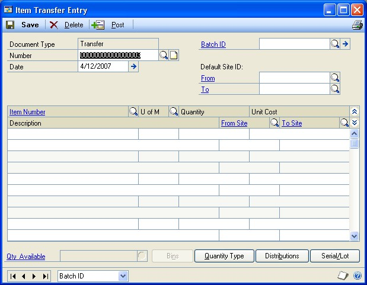

3. Enter the document number and date.

4. Enter or select a batch ID.

5. If all the items are being transferred from or to the same site, you can enter or select default site IDs.

    > [!TIP]
    > You can change the site ID for individual items in the scrolling window, if necessary.

6. In the scrolling window, enter or select the item number to transfer.

When you enter the item number, the unit cost for the selected unit of measure is displayed.

7. Enter or select a reason code. Reason codes are optional, and are used to help identify specific causes for item movement.

8. Enter the unit of measure and number of items being transferred.

9. In the scrolling window, enter or select the site IDs of the sites you're transferring items from and to.

To view additional information about the item at the selected site if you're using ATP, click the Quantity Available link to open the Inventory Available to Promise window.

10. When you move off the line, another window will open if more information is needed.

Refer to the table.

| **Condition**                                                                    | **Result**                                                                                                                                                                                                                                                 |
|----------------------------------------------------------------------------------|------------------------------------------------------------------------------------------------------------------------------------------------------------------------------------------------------------------------------------------------------------|
| The item is tracked by lot numbers                                               | The Item Transfer Lot Number Entry window opens, where you can specify the lot numbers of the items you're entering. If you're using multiple bins, you also can specify the bin for each quantity. Refer to *Specifying lot numbers for a transfer*.     |
| **Condition**                                                                    | **Result**                                                                                                                                                                                                                                                 |
| The item is tracked by serial numbers                                            | The Item Transfer Serial Number Entry window opens, where you can specify the serial numbers of the items you're entering. If you're using multiple bins, you also can specify the bin for each item. Refer to *Specifying serial numbers for a transfer*. |
| The item is not tracked by lot or serial numbers, but you're using multiple bins | The Bin Quantity Transfer Entry window opens, where you can specify how much of the total quantity should be removed from and added to a bin. Refer to *Specifying bins for item transfers*.                                                              |

11. Repeat steps 5 through 9 until you've entered all the items for this document.

12. Save or post the transaction.

Once you've saved a transaction, you can print an edit list to verify your entries by selecting the document number, then choosing File \>\> Print.

13. When you've finished, close the window and print posting journals, if needed. Depending on how posting options in the Posting Setup window have been set up, the posting journals might appear for printing when you close the window.

### Changing the quantity type of an item

Use the Item Transfer Entry window to enter transactions to change the quantity type of inventoried items. For example, you can use this procedure to change the quantity type of component items from On Hand to In Use. You can change the quantity type only of items whose type is Sales Inventory or Discontinued.

**To change the quantity type of an item:**

1. Open the Item Transfer Entry window.
(Inventory \>\> Transactions \>\> Transfer Entry)

2. Enter the document number and date.

3. Enter or select a batch ID.

4. If all the items you're changing are from and to the same site, you can enter or select a default site ID. The sites can be the same or different—for example, you can transfer items from site to site with the same transaction you use to change the items' quantity type.

    > [!TIP]
    > You can change the site ID for individual items in the scrolling window, if necessary.

5. In the scrolling window, enter or select the item number with the quantity type to change.

6. Enter or select a reason code. Reason codes are optional, and are used to help identify specific causes for item movement.

7. Enter the unit of measure and number of items to be transferred to a different quantity type.

8. Choose Quantity Type. The Item Transfer Quantity Type Entry window opens.

    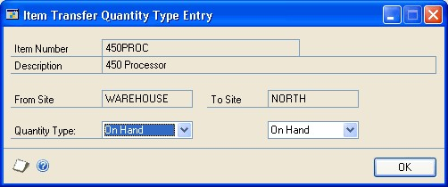

9. Enter or select the quantity type for the item at the sites. Choices include On Hand, Returned, In Use, In Service, and Damaged.

10. Choose OK to save the information and close the window.

11. When you move off the line, another window will open if more information is needed.

Refer to the table.

| **Condition**                                                                    | **Result**                                                                                                                                                                                                                                                 |
|----------------------------------------------------------------------------------|------------------------------------------------------------------------------------------------------------------------------------------------------------------------------------------------------------------------------------------------------------|
| The item is tracked by lot numbers                                               | The Item Transfer Lot Number Entry window opens, where you can specify the lot numbers of the items you're entering. If you're using multiple bins, you also can specify the bin for each quantity. Refer to *Specifying lot numbers for a transfer*.     |
| The item is tracked by serial numbers                                            | The Item Transfer Serial Number Entry window opens, where you can specify the serial numbers of the items you're entering. If you're using multiple bins, you also can specify the bin for each item. Refer to *Specifying serial numbers for a transfer*. |
| The item is not tracked by lot or serial numbers, but you're using multiple bins | The Bin Quantity Transfer Entry window opens, where you can specify how much of the total quantity should be added to or removed from a bin. Refer to *Specifying bins for item transfers*.                                                               |

12. Repeat steps 5 through 10 until you've entered all the items for this document.

13. Save or post the transaction.

Once you've saved a transaction, you can print an edit list to verify your entries by selecting the document number, then choosing File \>\> Print.

14. When you've finished, close the window and print posting journals, if needed. Depending on how posting options in the Posting Setup window have been set up, the posting journals might appear for printing when you close the window.

### Entering an in-transit transfer

If you are transferring material from one site to another, you may want to use a via site, an interim location, to prevent the material from being sold while in transit to the destination site. You can use the In-Transit Transfer Entry window to enter intransit transfer transactions to account for the location of items that are being moved from one site to another. You also can enter landed costs for the in-transit transfer. Once the goods are fulfilled and shipped from the starting site to the via site, an inventory transfer transaction is posted, creating a purchase receipt of the goods in the via location.

You can choose File \>\> Print to print picking tickets and packing slips. The customer and address information entered for the in-transit transfer prints on the packing slip.

**To enter an in-transit transfer:**

1. In the navigation pane, choose the Inventory button, and then choose the InTransit Transfers list.

2. In the New group, choose Transfer to open the In-Transit Transfer Entry window.

    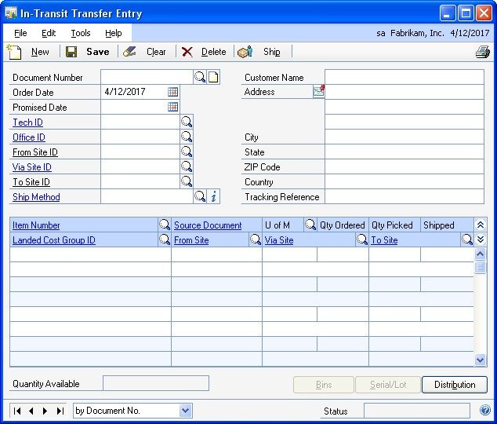

3. Enter a document number or choose New and accept the default document number.

4. Enter or accept the default order date.

5. Enter a the date you expect the merchandise to be at the to site.

6. Enter or select the site you are shipping the merchandise from site

7. Enter or select a via site, an interim location when an item is in the physical process of being transferred to one site from another.

8. Enter or select the site that the merchandise is shipping to.

The to site's address information displays in the address fields after you leave the To Site ID field.

9. Enter or select the shipping method to be used when transferring merchandise
    between locations.

10. Accept or enter the customer name and address information. The default customer name is the description of the to site. The address is printed on the packing slip.

11. Enter or select the item number you are transferring.

12. Enter or select a reason code. Reason codes are optional, and are used to help identify specific causes for item movement.

13. Accept the default unit of measure or enter a unit of measure for the line item.

14. Enter the quantity of the item to transfer.

15. Enter the quantity to be picked from inventory. You can enter a quantity that is lower than the quantity ordered, but not more than the quantity ordered.

16. Enter a landed cost group ID, or accept the default if you're using landed cost. The landed cost IDs that are part of the group will be assigned automatically when the shipment is received.

17. If you are using multiple bins and lot or serial numbers aren't tracked for an item, the Bin Quantity Transfer Entry window opens automatically after you leave the line. You can use the Bin Quantity Transfer Entry window to specify bin quantities to move from one bin to another.

If you are using multiple bins and lot or serial numbers are tracked for an item, the Transfer Lot Number Entry window or the Transfer Line Entry – Serial window opens. You can enter bin numbers and select lot or serial numbers for the item.

18. Continue, repeating steps 11 through 16, to enter items that you want to transfer.

19. If lot or serial numbers are tracked for an item, select the item and choose Serial/Lot to open the Transfer Lot Number Entry window or the Transfer Line Entry – Serial window. You can use these windows to view or select lot or serial numbers. If you are using multiple bins, you also can enter bin numbers for the serial or lot number.

20. Choose Distribution to view the account distributions.

21. Choose Save or Ship. If you ship the receipt, one or more posting journals and distribution breakdown registers may be printed, depending on the options selected in the Posting Setup window.

### Specifying lot numbers for a transfer

Use the Item Transfer Lot Number Entry window to specify which items—from which lots—should be transferred when you enter a transfer transaction.

**To specify lot numbers for a transfer:**

1. Open the Item Transfer Entry window.
(Inventory \>\> Transactions \>\> Transfer Entry)

2. Enter a transfer transaction for a lot-numbered item. Refer to *Transferring an item to a different site* or *Changing the quantity type of an item* for more information.

    When you move off the scrolling window line, the Item Transfer Lot Number Entry window opens.

    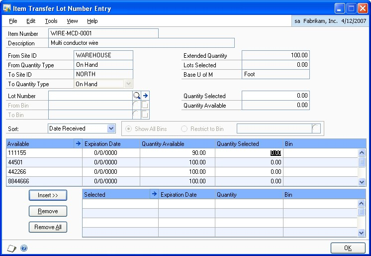

3. Enter or select a lot number.

    Refer to *Entering lot attribute information* for information about entering additional lot information, if needed.

    > [!NOTE]
    > An icon appears in the Lot Number field if you selected a lot number that has expired.

4. Enter quantity information.

**If you're not using multiple bins** Enter the quantity to transfer in the Quantity Selected field, and choose Insert to add the lot number and quantity to the lower scrolling window.

**If you're using multiple bins** Enter or select a From Bin and a To Bin. Enter the Quantity Selected—the quantity to be transferred from a bin at one site to a bin at a different site—and choose Insert to add the information to the lower scrolling window.

5. Continue, repeating steps 3 and 4 until you've specified the lot numbers of all items to be transferred. Be sure the Extended Quantity matches the Lots Selected.

6. Choose OK to save your entries and return to the Item Transfer Entry window.

### Specifying serial numbers for a transfer

Use the Item Transfer Serial Number Entry window to specify which items—by their serial numbers—should be transferred when you enter a transfer transaction.

**To specify serial numbers for a transfer:**

1. Open the Item Transfer Entry window.
(Inventory \>\> Transactions \>\> Transfer Entry)

2. Enter a transfer transaction for a serial-numbered item. Refer to *Transferring an item to a different site* or *Changing the quantity type of an item* for more information.

    When you move off the scrolling window line, the Item Transfer Serial Number Entry window opens.

    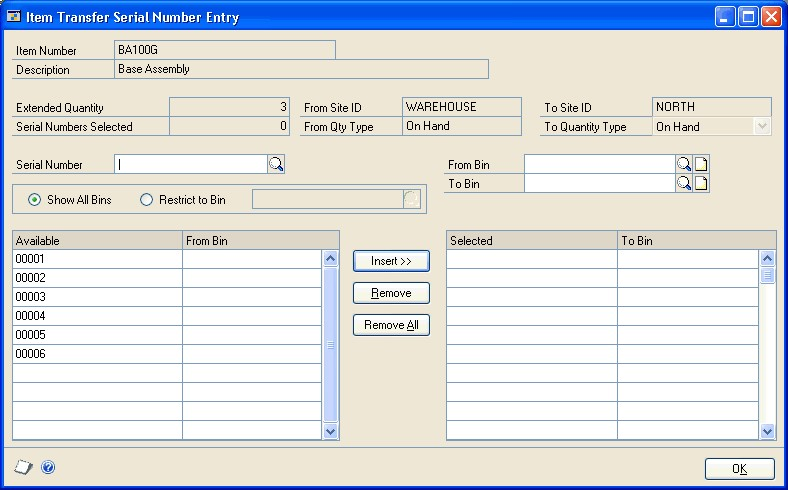

3. Choose serial number information to view.

    **If you're not using multiple bins** Information about the available serial numbers is displayed in the Available scrolling window.

    **If you're using multiple bins** You can view information about all available serial numbers in the Available scrolling window, or you can choose Restrict to Bin and enter or select a bin to limit information in the scrolling window to only those serial numbers for items in a specific bin.

4. In the Available scrolling window, highlight a serial number to be transferred.

5. Choose Insert to move the serial number to the Selected scrolling window.

6. Continue, repeating steps 4 and 5 until you've specified the serial numbers of all items to be transferred. Be sure the Extended Quantity matches the Serial Numbers Selected.

7. Choose OK to save your entries and return to the Item Transfer Entry window.

### Changing lot numbers for an in-transit transfer

Use the Transfer Lot Number Entry window to specify which items—from which lots—should be transferred when you enter an in-transit transfer transaction.

**To change lot numbers for an in-transit transfer:**

1. Open the In-Transit Transfer Entry window.
(Inventory \>\> Transactions \>\> In-Transit Transfer Entry)

2. Enter an in-transit transfer transaction for a lot-numbered item. Refer to *Entering an in-transit transfer* for more information.

3. Select an item for which lot numbers are tracked and choose Serial/Lot to open the Transfer Lot Number Entry window.

    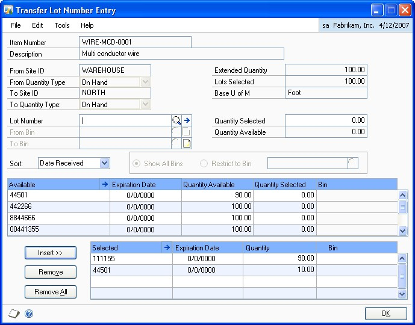

4. Select a lot number to change and choose Remove.

5. From the list of available lot numbers, select one to use, enter quantity information, and choose Insert.

    You can also enter a lot number that hasn't been entered. To do so, enter the number in the Lot Number field, a enter quantity in the Quantity Selected field, and choose Insert.

    > [!NOTE]
    > An icon appears in the Lot Number field if you selected a lot number that has expired.

    Refer to *Entering lot attribute information* for information about entering additional lot information, if needed.

6. If you're not using multiple bins, enter the quantity to transfer in the Quantity Selected field, and choose Insert to add the lot number and quantity to the lower scrolling window.

If you're using multiple bins, enter or select a From Bin and a To Bin. Enter the Quantity Selected—the quantity to be transferred from a bin at one site to a bin at a different site—and choose Insert to add the information to the lower scrolling window.

7. Continue, repeating steps 4 and 6 until you've specified the lot numbers of all items to be transferred. Be sure the Extended Quantity matches the Lots Selected.

8. Choose OK to save your entries and return to the In-Transit Transfer Entry window.

### Changing serial numbers for an in-transit transfer

Use the Transfer Line Entry – Serial window to view or specify which items—by their serial numbers—should be transferred when you enter a in-transit transfer transaction.

If you're not using multiple bins, information about the available serial numbers is displayed in the Available scrolling window. If you're using multiple bins, you can view information about all available serial numbers in the Available scrolling window, or you can choose Restrict to Bin and enter or select a bin to limit information in the scrolling window to only those serial numbers for items in a specific bin.

**To change serial numbers for an in-transit transfer:**

1. Open the In-Transit Transfer Entry window.
(Inventory \>\> Transactions \>\> In-Transit Transfer Entry)

2. Enter an in-transit transfer transaction for a serial-numbered item. Refer to *Entering an in-transit transfer* for more information.

3. Select an item for which serial numbers are tracked and choose Serial/Lot to open the Transfer Line Entry – Serial window.

    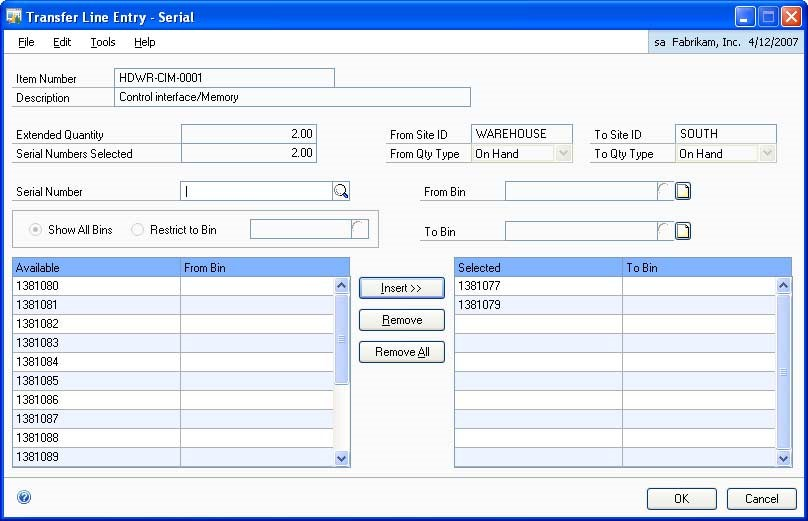

4. Select the serial number to change and choose Remove.

5. In the Available scrolling window, highlight a serial number to transfer and choose Insert.

    You can also enter a serial number that hasn't been entered. To do so, enter the number in the Serial Number field and choose Insert.

6. Continue, repeating steps 4 and 5 until you've specified the serial numbers of all items to be transferred. Be sure the Extended Quantity matches the Serial Numbers Selected.

7. Choose OK to save your entries and return to the In-Transit Transfer Entry window.

### Specifying bins for item transfers

If you're entering an item transfer and you're using multiple bins, you'll need to specify bins for the quantities if the item is not tracked by lot or serial numbers. (If the item is tracked by lot or serial numbers, the bin information is included when you select the lot or serial number.) Use the Bin Quantity Transfer Entry window to complete this procedure.

> [!NOTE]
> If you're entering a transfer for lot- or serial-numbered items, you'll specify the bins when you specify the lot or serial numbers. Refer to Specifying lot numbers for a transfer and Specifying serial numbers for a transfer for more information.

**To specify bins for item transfers:**

1. In the navigation pane, choose the Inventory button, and then choose the Item Transactions list.

2. Choose Bin Transfer to open the Item Transfer Entry window.

3. Enter a transfer for an item that is not tracked by lot or serial numbers. Choose Bins to open the Bin Quantity Transfer Entry window.

    

    The window also will open automatically when you move out of the transaction line.

4. Enter or select the From Bin. Information about the bin quantities will be displayed in the upper scrolling window.

5. Enter the quantity to transfer in the Quantity Selected field.

6. Enter or select the To Bin.

7. Choose Insert to add the information to the lower scrolling window.

    > [!NOTE]
    > You also can specify bins for transfers by entering the quantities directly in the scrolling window and choose Insert.

8. Continue, repeating steps 3 through 6 until the Selected Quantity equals the Extended Quantity.

9. When you've finished, choose OK to save the information and close the window.

### Specifying bins for in-transit transfers

If you're entering an in-transit transfer and you're using multiple bins, you'll need to specify bins for the quantities if the item is not tracked by lot or serial numbers. (If the item is tracked by lot or serial numbers, the bin information is included when you select the lot or serial number.) Use the Bin Quantity Transfer Entry window to complete this procedure.

*If you're entering a transfer for lot- or serial-numbered items, you'll specify the bins when you specify the lot or serial numbers. Refer to Changing lot numbers for an in-transit transfer and Changing serial numbers for an in-transit transfer for more information.*

**To specify bins for in-transit transfers:**

1. In the navigation pane, choose the Inventory button, and then choose the InTransit Transfer list.

2. In the New group, choose Transfer to open the In-Transit Transfer Entry window.

3. Enter an in-transit transfer for an item that is not tracked by lot or serial numbers. Choose Bins to open the Bin Quantity Transfer Entry window.

The window also will open automatically when you move out of the transaction line.

4. Enter or select the From Bin. Information about the bin quantities will be displayed in the upper scrolling window.

5. Enter the quantity to transfer in the Quantity Selected field.

6. Enter or select the To Bin.

7. Choose Insert to add the information to the lower scrolling window.

*You also can specify bins for transfers by entering the quantities directly in the scrolling window and choose Insert.*

8. Continue, repeating steps 3 through 7 until the Selected Quantity equals the Extended Quantity.

9. When you've finished, choose OK to save the information and close the window.

### Changing distributions for a transaction

Use the Item Transaction Distribution Entry window or the Item Transfer Distribution Entry window to view posting accounts for transactions. You also can change the posting accounts, if needed.

When inventory transactions are posted, the posting accounts you select are updated with amounts that reflect the quantity that's been posted. For example, if you transfer an item from site A to site B, the cost used is based on your valuation method for the item, and is used to determine the currency amount that is posted to the posting accounts for sites A and B.

*Refer to Valuation methods for more information about valuation methods.*

**To change distributions for a transaction:**

1. Open a transaction entry window. You can use the Item Transaction Entry window or the Item Transfer Entry window.
(Inventory \>\> Transactions \>\> Transaction Entry or Transfer Entry)

2. Enter or select a transaction.

3. Select the item in the scrolling window you want to change distributions for.

4. Choose Distributions. If you're entering a transaction in the Item Transaction Entry window, the Item Transaction Distribution Entry window opens.

    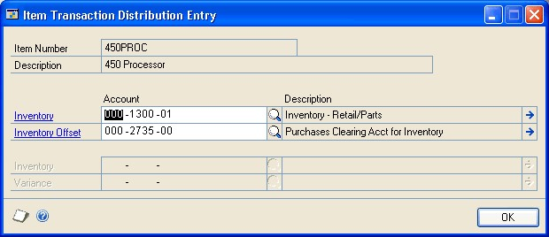

    If you're entering a transfer transaction in the Item Transfer Entry window, the Item Transfer Distribution window opens.

    

5. Review the account information, making any necessary changes.

    When the transaction that contains this item is posted, the posting accounts you select are updated with amounts that reflect the quantity that's been posted. For example, if you transfer an item from site A to site B, the cost used is based on your valuation method for the item, and is used to determine the currency amount that is posted to the posting accounts for sites A and B. Refer to *Valuation methods* for more information.

6. Choose OK to save the information and close the distribution entry window. You'll be returned to the Item Transaction Entry window or the Item Transfer Entry window, where you can complete steps for entering and saving or posting transaction information.

### Transferring quantities from one bin to another

Use the Item Bin Transfer Entry window to transfer items from one bin to another within a site.

*To transfer items from one site to another, refer to Transferring an item to a different site. If the items are tracked by lot or serial numbers, refer to Specifying lot numbers for a bin-to-bin transfer or Specifying serial numbers for a bin-to-bin transfer.*

**To transfer quantities from one bin to another:**

1. Open the Item Bin Transfer Entry window.
(Inventory \>\> Transactions \>\> Bin Transfer Entry)

    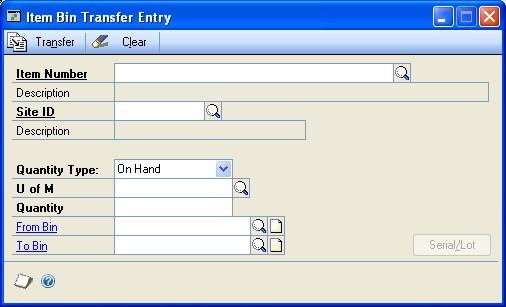

2. Bin Transfer appears as the document type. Enter a document number and date.

3. Enter or select an item number.

4. Enter or select a site ID.

5. Select a quantity type.

6. Enter a reason code. Reason codes are optional and are used to help identify specific causes for item movement.

7. Enter or select a unit of measure.

8. Enter the quantity to transfer.

9. Enter or select the From Bin.

    If the quantity you entered is greater than the available quantity for the quantity type you selected, an alert message appears and you'll have the option to use the available quantity or cancel.

10. Enter or select the To Bin.

11. If the item is tracked by serial or lot numbers, a window for choosing the lot or serial numbers opens automatically.

    - If the item is tracked by lot numbers, the Item Bin Transfer Lot Number Entry window opens. Refer to *Specifying lot numbers for a bin-to-bin transfer*.

    - If the item is tracked by serial numbers, the Item Bin Transfer Serial Number Entry window opens. Refer to *Specifying serial numbers for a bin-to bin transfer*.

12. Choose Transfer, and then close the window.

### Specifying lot numbers for a bin-to-bin transfer

Use the Item Bin Transfer Lot Number Entry window to specify the lot numbers of the items to be transferred from one bin to another.

**To specify lot numbers for a bin-to-bin transfer:**

1. Open the Item Bin Transfer Entry window.
(Inventory \>\> Transactions \>\> Bin Transfer Entry)

2. Enter basic information about the transfer of an item tracked by lot numbers. Refer to *Transferring quantities from one bin to another*

    The Item Bin Transfer Lot Number Entry window opens automatically for an item tracked by lot numbers.

    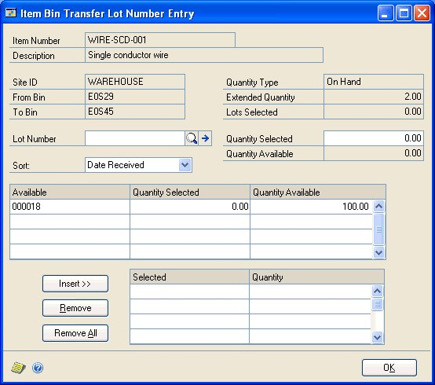

3. Select a lot number to transfer. You can use either of the following methods:

    - Enter or select a lot number in the Lot Number field, and then enter the quantity to transfer in the Quantity Selected field.

    - Highlight a lot number in the Available list, and then enter the quantity to transfer in the Quantity Selected column.

    > [!NOTE]
    > An icon appears in the Lot Number field if you select a lot number that has expired.

4. Choose Insert to move the lot number information to the Selected list.

5. Continue, repeating steps 3 and 4 until the Lots Selected equals the Extended Quantity.

6. Choose OK to close the window and return to the Item Bin Transfer Entry window.

7. Choose Transfer in the Item Bin Transfer Entry window. When processing is finished, close the window.

### Specifying serial numbers for a bin-to-bin transfer

Use the Item Bin Transfer Serial Number Entry window to specify the serial numbers of the items to be transferred from one bin to another.

**To specify serial numbers for a bin-to-bin transfer:**

1. Open the Item Bin Transfer Entry window.
(Inventory \>\> Transactions \>\> Bin Transfer Entry)

2. Enter basic information about the transfer of an item tracked by serial numbers. Refer to *Transferring quantities from one bin to another*

    The Item Bin Transfer Serial Number Entry window opens automatically for items tracked by serial numbers.

    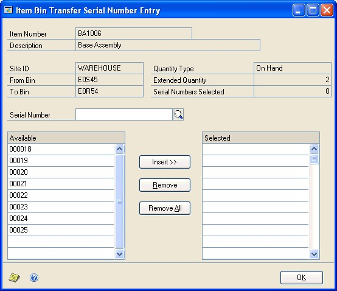

3. Select a serial number to transfer. You can use either of the following methods:

    - Enter or select a serial number in the Serial Number field.

    - Highlight a serial number in the Available list.

4. Choose Insert to move the serial number to the Selected list.

5. Continue, repeating steps 3 and 4 until the Serial Numbers Selected equals the Extended Quantity.

6. Choose OK to close the window and return to the Item Bin Transfer Entry window.

7. Choose Transfer in the Item Bin Transfer Entry window. When processing is finished, close the window.

### Entering lot attribute information

Use the Lot Attribute Entry window to enter a manufactured date, an expiration date, and the lot category characteristics assigned to the item. If you are using lot categories, you must complete this procedure. If you aren't using lot categories, you still can enter a manufactured date and an expiration date. Refer to *Chapter 6, "Lot category setup,"* for more information about lot categories.

If you assign an expiration date to a lot, a message will be displayed if the expiration date has passed when you are manually entering lot numbers in Inventory Control, Sales Order Processing, and Microsoft Dynamics GP Bill of Materials. A message won't be displayed when lot numbers are assigned automatically.

*Before beginning this procedure, you should have the Item Transfer Lot Number Entry window or the Item Lot Number Entry window open. Those windows open automatically if you enter a transaction for an item tracked by lot numbers.*

**To enter lot attribute information:**

1. Open the Lot Attribute Entry window.

    (In the Item Transfer Lot Number Entry window, enter or select a lot, then choose the expansion button on the Lot Number field.)

    

2. Enter a manufactured date and an expiration date, if applicable.

3. Enter lot attribute information in the fields.

4. Choose OK to save the information and close the window.

### Split purchase receipts

If you enter a transaction and the extended cost calculated for the base unit of measure results in an unequal value for all items on the purchase receipt, Microsoft Dynamics GP creates a separate receipt for one of the items so that the total cost of the receipt equals the total of the cost for each of the items. The resulting set of entries is called a split purchase receipt.

For example, suppose you receive a three-pack of serial-numbered items (item number IV5015; serial numbers 701, 402, and 218) at a total cost of \$10.49 for the three-pack. Because the base unit of measure for the items is single units, the system creates two purchase receipts with the same receipt number: one for two of the units at \$3.50 and one for one unit at \$3.49. The table illustrates how that split receipt might appear in your records.

When you sell the items, they're removed from inventory according to the item's valuation method.

| **Item Number** | **Receipt Number** | **Qty Received** | **Cost** | **Serial Numbers** |
|-----------------|--------------------|------------------|----------|--------------------|
| IV5015          | 000234             | 2 Each           | \$3.50   | 701, 402           |
| IV5015          | 000234             | 1 Each           | \$3.49   | 218                |

### Deleting an inventory transaction

Use the Item Transaction Entry window or the Item Transfer Entry window to delete an unposted transaction.

*For information about deleting posted transactions, refer to Chapter 25, "Transaction corrections."*

**To delete an inventory transaction:**

1. Open the Item Transaction Entry window or the Item Transfer Entry window.
(Inventory \>\> Transactions \>\> Transaction Entry)
(Inventory \>\> Transactions \>\> Transfer Entry)

2. Enter or select the document type and number.

3. Choose Delete. An alert message appears, asking if you're sure you want to delete the record. Choose Yes.

If you're using multiple bins, any bin selections for the transaction are deleted when the transaction is deleted.

4. Close the window.

### Deleting an in-transit transfer transaction

You can use the In-Transit Transfer Entry window to delete an in-transit transfer that has an Open status.

**To delete an in-transit transfer transaction:**

1. Open the In-Transit Transfer Entry window.
(Inventory \>\> Transactions \>\> In-Transit Transfer Entry)

2. Enter or select the document number of an in-transit transfer that has an Open status.

3. Choose Delete. An alert message appears, asking if you're sure you want to delete the record. Choose Yes.

If you're using multiple bins, any bin selections for the transaction are deleted when the transaction is deleted.

4. Close the window.

### Chapter 22: Stock count schedules

When you're ready to begin work on a stock count at a specific site, you create a stock count schedule—you specify which item-site combinations are to be included in this stock count. (If you're using multiple bins, you specify which item-site-bin combinations are included.) You can save the stock count schedule or you can choose to start it. You also can reuse stock counts.

The following information is discussed:

- *Stock count requirements*

- *Statuses for stock count schedules*

- *Creating or modifying a stock count schedule*

- *Adding many items to a stock count schedule*

- *Removing items from a stock count schedule*

- *Starting a stock count schedule*

- *Exceptions for starting a stock count*

- *Options for stock count forms*

- *Canceling a stock count schedule*

- *Deleting a stock count schedule*

### Stock count requirements

Before you set up and use stock counts, you should be aware of the requirements and restrictions.

**Item types** Only Sales Inventory or Discontinued items can be assigned to a stock count.

**"Freeze" inventory when starting a stock count** It's a good business practice to restrict access to the inventoried items that are being counted during a stock count.

### Statuses for stock count schedules

A stock count can have any of three statuses: Available, Started and Entered.

**Available** A stock count schedule has an Available status as soon as it's entered and saved. You can add or remove items from a stock count schedule with Available status.

**Started** When you choose the Start Count button in the Stock Count Schedule window, the system checks the validity of each item-site combination in the stock count schedule. If all entries are valid, the current on-hand quantities of each combination and the user ID of the person who starts the stock count are recorded. Later, these stored values—also called "captured quantities"—are compared to the actual stock count results. You can't add items to or remove items from a stock count schedule if its status is Started. However, you can cancel a Started stock count, edit it if needed, and then restart the count process.

*You can still enter and post transactions for item-site combinations included in a Started stock count.*

**Entered** The status of a stock count automatically changes to Entered as soon as the first stock count results are entered. Once an Entered stock count is processed and the resulting inventory variance transactions are created, one of two things can happen. If the stock count schedule is set to be reused (the Reuse option is marked in the Stock Count Schedule window), then the status of the stock count is changed to Available. If the Reuse option isn't marked, the stock count schedule is deleted.

You can't add items to or remove items from a stock count schedule if its status is Entered.

### Creating or modifying a stock count schedule

When you're ready to begin a stock count, use the Stock Count Schedule window to determine which items at which sites will be counted.

**To create or modify a stock count schedule:**

1. Open the Stock Count Schedule window.
(Inventory \>\> Transactions \>\> Stock Count Schedule)

    

2. Enter or select a stock count ID.

    > [!NOTE]
    > If you enter or select a stock count ID that was created when the multiple bins feature wasn't enabled and the feature is enabled now, an alert message is displayed. You'll have the option to continue or cancel. Regardless of the option you select, the stock count will be updated so you can enter bin information.

3. Enter a description and select a default site ID.

4. To create a reusable stock schedule, mark the Reuse option.

    > [!NOTE]
    > If the Reuse option is marked, the status of the stock count schedule will be changed to Available after the count is processed. Otherwise, the stock count schedule will be removed once it's processed.

5. Decide how items listed in the stock count schedule should be sorted. Choices include by Site ID, by Item Number, by Description and by Next Count Date.

6. Add item-site combinations to the stock count schedule.

    - **To add one item-site combination** Put the pointer in the first empty line of the scrolling window, then enter or select an item number and a site ID. If you're using multiple bins, you also must enter or select a bin.

    - **To add many item-site combinations** Refer to *Adding many items to a stock count schedule*.

7. Review the information as needed.

    > [!NOTE]
    > You can use the hide and show buttons to expand the scrolling window lines, if needed. The expanded view of the scrolling window includes an option that indicates if an itemsite combination is overdue for a stock count.

8. Choose Save to save the stock count schedule. The stock count schedule now has an Available status.

You can choose File \>\> Print to print the Stock Count List to verify the items listed in the stock count schedule, if needed.

### Adding many items to a stock count schedule

Use the Stock Count Mass Add window to add many item-site combinations to a stock count schedule.

*You can add items only to a stock count that has Available status.*

**To add many items to a stock count schedule:**

1. Open the Stock Count Maintenance window.
(Inventory \>\> Transactions \>\> Stock Count Schedule)

2. Enter or select a stock count ID. The status of the stock count must be Available.

3. Choose Mass Add to open the Stock Count Mass Add window.

    

4. Define the range of items to add to the stock count. Select a Stock Count Range, and then enter or select the beginning and end of the range for that type of range.

    For example, to add all the items whose suggested stock count date is today, you'd select Next Stock Count Date for the Stock Count Range, and then enter the current date in the From and To fields.

5. Choose Insert to add the restriction.

6. Continue, repeating steps 4 and 5 until you've entered restrictions to narrow the group of item-site combinations to just those to be added to the stock count schedule. You can create as many restrictions as you like, but you can use each type of Stock Count Range only once. For example, you can define only one range of Next Stock Count Dates for this stock count.

7. Choose Add. The Stock Count Mass Add window closes and you're returned to the Stock Count Schedule window.

8. Choose Save and close the window.

9. You can choose File \>\> Print to print the Stock Count List to verify the items listed in the stock count schedule, if needed.

### Removing items from a stock count schedule

Use the Stock Count Schedule window to remove item-site combinations from a stock count schedule. If you're using multiple bins, you'll remove item-site-bin combinations.

*You can remove items only from stock count schedules whose status is Available.*

**To remove items from a stock count schedule:**

1. Open the Stock Count Schedule window.
(Inventory \>\> Transactions \>\> Stock Count Schedule)

2. Enter or select a stock count ID.

3. Use the hide and show button to expand the lines in the scrolling window.

4. Highlight the record to remove.

5. From the Edit menu, choose Delete Row. An alert message appears, asking if you're sure you want to delete the row. Choose Yes.

6. Continue, repeating steps 4 and 5 to remove other items, if needed.

7. When you've finished, choose Save and close the window.

### Starting a stock count schedule

Use the Stock Count Schedule window to start a stock count. If the stock count can be started—if there are no exceptions—the status of the count will be changed to Started, stock count forms will be printed and information about the on-hand quantity of each item-site combination will be captured.

**To start a stock count schedule:**

1. Open the Stock Count Schedule window.
(Inventory \>\> Transactions \>\> Stock Count Schedule)

2. Enter or select a stock count ID with Available status.

*If you enter or select a stock count ID that was created when the multiple bins feature wasn't enabled and the feature is enabled now, an alert message is displayed, telling you that the stock count ID has been converted. Any bin information in the existing stock count ID will be cleared. You must use the Stock Count Schedule window to add valid bin information to each line of the stock count.*

3. Choose Start Count.

When you start a stock count schedule, the quantity on hand for each line in the stock count schedule is captured. Later, the actual count number quantities will be compared to the captured values to create default variance transactions.

4. The report destination window for the Stock Count Exceptions report appears. Choose the destination for the Stock Count Exceptions report.

If you have exceptions that prevent the count from being started, they'll be listed in the report, and the status of the stock count will remain Available. Refer to *Exceptions for starting a stock count* for more information.

5. If the stock count can be started, the Stock Count Print Options window appears. Choose OK and select your print destination. Refer to *Options for stock count forms* for more information.

If you have exceptions that prevent the count from starting, an alert message will warn you that exceptions exist, and the status of the count will remain Available.

### Exceptions for starting a stock count

Two exception reports for stock counts are included in Inventory Control. One is generated when you choose Start Count in the Stock Count Schedule window. That report lists any issues that prevent the stock count from being started, but is generated even if no problems exist. The other exception report is generated when you process a stock count. For more information about that report, refer to *Effects of processing a stock count*.

If the exception report for starting a stock count lists no problems, the status of the stock count is set to Started and stock count forms are printed. Refer to *Options for stock count forms* for more information.

Two exceptions can prevent a stock count from being started.

- An item-site combination in the stock count schedule is already included in another stock count that is Started or Entered. (If you're using multiple bins, an item-site-bin combination that is part of another stock count schedule can prevent the stock count from being started.)

- If you're using multiple bins, the stock count can't be started if any bin information is missing.

Before you can start the newer stock count, you must handle the exceptions. No stock count forms will be generated and the status of the stock count schedule will remain Available until you fix all exceptions and choose Start Count again.

To handle these exceptions, you have these options:

**Remove the combination** You can remove the combination from the newer stock count schedule. Refer to *Removing items from a stock count schedule* for more information.

**Process the older stock count** If you process the existing stock count before starting the newer stock count, the combination will be available to be included in your newer stock count. Refer to *Effects of processing a stock count* for more information.

**Recreate the stock count ID** If a stock count can't be started because you've begun using the multiple bins feature since the stock count was created, you need to add bin information to the stock count. To do this, you can edit the existing stock count ID or you can delete the existing stock count ID and recreate it. The bin information automatically will be included in the new stock count. Refer to *Creating or modifying a stock count schedule* for more information.

### Options for stock count forms

When you successfully start a stock count, stock forms are generated for you to use to record count information. Inventory personnel can use these forms to note their counting activities. They can write the time and date each item was counted. If an item is tracked by lot or serial numbers, they also can note those identifiers.

Use the Stock Count Print Options window to specify how you want the stock count forms formatted. You can choose how the items will be sorted on the report. Item can be sorted by site ID, then bin and then item number, or they can be sorted by item number, then bin and then site ID.

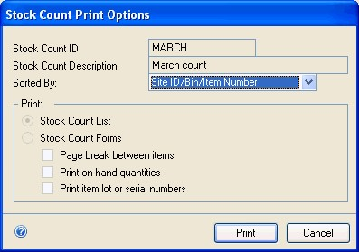

You can determine if page breaks should occur between items. If you have several warehouse personnel who will be counting items, this can make it easier for you to split up the task.

You also can determine what's included on the forms. You can choose whether to include the on-hand quantities, and you can choose whether to include identifiers for items tracked by lot or serial numbers.

### Canceling a stock count schedule

Use the Stock Count Schedule window to cancel a Started stock count. When you cancel a stock count, captured quantity information is cleared. If you restart the count later, new captured quantity information will be saved and new stock count forms will be printed.

*If the status of the count is Entered, you must first clear the count. Refer to Clearing stock count entries for more information.*

**To cancel a stock count schedule:**

1. Open the Stock Count Schedule window.
(Inventory \>\> Transactions \>\> Stock Count Schedule) 

2. Enter or select a stock count schedule that has a Started status.

3. Choose Cancel Count.

When you cancel a stock count, the status of the count is reset to Available, and all captured quantity information is discarded.

### Deleting a stock count schedule

Use the Stock Count Schedule window to delete a stock count schedule. You can delete a stock count only if its status is Available.

*If a stock count isn't set to be reused, it automatically will be deleted from the system after all results are entered, the stock count is processed, and any inventory variance transactions are created.*

**To delete a stock count schedule:**

1. Open the Stock Count Schedule window.
(Inventory \>\> Transactions \>\> Stock Count Schedule)

2. Enter or select a stock count schedule with Available status.

3. Choose Delete. An alert message appears, asking if you're sure you want to delete the stock count record. Choose Yes.

4. Close the window.

### Chapter 23: Stock count processing

Once inventory personnel have counted the items in a stock count schedule, you can enter stock count results. You can enter results all at once, or as each item is counted. Those results are compared to the captured quantities for each combination in the stock count schedule, and then default variance amounts are calculated. (Transactions aren't actually created until you process the stock count.) You can accept the variance amounts or change them, and create and post transactions based on the variance amounts.

You don't have to count items in the base unit of measure. For example, you might purchase widgets in cases of 10 units. If you count six cases of widgets and four single widgets, you can enter that as 6 cases and 4 singles—and Inventory Control automatically will convert that to 64 widgets.

The following information is discussed:

- *Effects of processing a stock count*

- *Stock counts and dates*

- *Entering stock count results*

- *Changing the default stock count date*

- *Entering results in a different unit of measure*

- *Entering stock count lot number information*

- *Entering stock count serial number information*

- *Changing serial or lot number information*

- *Changing accounts for posting a count variance*

- *Verifying variance amounts*

- *Clearing stock count entries*

- *Processing a stock count*

### Effects of processing a stock count

When you process a stock count, several things happen:

- Variance transactions are created. If the Autopost Stock Count Variances option is marked, the transactions also will be posted.

*Cost information for variance transactions will be based on the cost of the items at the time of the stock count. Cost information is based on the item's cost trends, so variance transactions might not match the true cost of the items. Refer to Stock counts and dates and Changing the default stock count date for more information.*

- New Next Stock Count Dates are calculated for the items in the stock count schedule. Refer to *Chapter 18, "Count intervals,"* for more information.

- History information about the results of the stock count is stored. History is kept to be the basis of the Accuracy Comparison report, which helps you monitor the accuracy of your stock counts over time. Refer to *Accuracy Comparison report* for more information.

- If the stock count wasn't marked to be reused, it's deleted. If it was marked to be reused, the stock count results are cleared and the status of the count is set to Available.

- The exceptions report for processing a stock count is printed. The report lists the problems, if any, that prevent the stock count information from being processed.

Even if a stock count is successfully processed, the exceptions report is printed. If the stock count had no variance transactions, that is noted in the exception report; otherwise, the report lists the batch number and variance transaction numbers used.

### Stock counts and dates

Several dates are tracked for stock counts. Complete stock count records can include a start date, a document date, a count date and a posting date. Refer to *Changing the default stock count date* for more information.

**Count Start Date and Time** The count start date and time are when the count was started—when the stock count schedule's status was changed from Available to Started.

**Document Date** The document date is the date of the entry of the stock count results.

**Count Date and Time** The count date and time is when the stock count of a specific item was actually performed. You can specify a default count date and time, and then accept or change that date and time for specific entries, if needed.

**Posting date** The posting date for a stock count is the date the inventory variance transactions resulting from a stock count are posted. If you've marked the Autopost Stock Count Variances option, the posting date will be the date the stock count is processed. If you post your transactions manually, it will be the date the last transaction is posted.

### Entering stock count results

Use the Stock Count Entry window to enter the results of the stock count, based on information recorded on the stock count forms.

**To enter stock count results:**

1. Open the Stock Count Entry window.
(Inventory \>\> Transactions \>\> Stock Count Entry)

  

2. Enter or select a stock count ID with Started or Entered status. The combinations included in the stock count are displayed in the scrolling window.

> [!NOTE]
> If you enter or select a stock count ID that was started when the multiple bins feature wasn't enabled and the feature is enabled now, an alert message is displayed. The stock count will be updated to include bin information. You must use the Stock Count Entry window to add bin information for each line in the stock count. If you've entered stock count results for the stock count ID, those results will be cleared.

3. Accept or change the default document date.

The default document date appears in each line of the scrolling window as you enter count results. The user date is the default document date, but you can change it.

*Refer to Changing the default stock count date for more information about changing stock count dates.*

4. Accept or change the default count date.

The user date also will be the default stock count date in each line of the scrolling window. Refer to *Changing the default stock count date* for more information about changing stock count dates.

5. Select the sorting order for the scrolling window.

6. Enter the counted quantity for each item in the item's base unit of measure.

*To enter count results in other units of measure, refer to Entering results in a different unit of measure.*

7. When you move off the field, Inventory Control automatically calculates the variance quantity, updates the date and time with the default count date and time, and marks the verified option. (If no default count date and time is available, the user date and time are used.) You can accept or change the default date and time. You also can clear the Verified option if you want to check the entries before transactions are created.

8. Enter or select a reason code. This reason code will be transferred with the item on the variance transaction created after the stock count. If the reason code you entered has an offset account assigned, that account will be used when the variance is posted.

9. If the item is tracked by lot or serial numbers, you must enter information about the lot or serial numbers of the items that were counted.

    - To enter lot number information, refer to *Entering stock count lot number information*.

    - To enter serial number information, refer to *Entering stock count serial number information*.

10. Continue, repeating steps 6 through 9 for each combination.

11. Once you've entered a counted quantity for an item in the scrolling window, the options for Autopost Stock Count Variances and Reuse Stock Count areavailable. You can mark or unmark those options as needed.

*The default setting for the Autopost Stock Count Variances option comes from the Inventory Control Setup window. Refer to Specifying preferences and default entries for more information. The default setting for the Reuse Stock Count option comes from the Stock Count Schedule window. Refer to Creating or modifying a stock count schedule for more information.*

12. View distribution accounts for each combination in the scrolling window, and make changes, if needed. Refer to *Changing accounts for posting a count variance*.

13. View unposted transactions and transaction history to see if there is an accounting reason for a variance.

For example, suppose the count for Item A was 34 and the captured quantity for the item was 40. The default variance will be 6. If you check unposted transactions and find an unposted transaction for 6 units of item A, then you probably won't want to process the default variance transaction because the difference between the count quantity and the captured quantity can be attributed to other entries in the system. Refer to *Verifying variance amounts*.

*You should view unposted transactions and transaction history for any stock count result that has a variance.*

14. Save or process the stock count information.

If you choose Process, inventory variance transactions will be created. Refer to *Effects of processing a stock count* for more information.

If you choose Save, no transactions will be posted now, and you'll be able to enter more stock count results for this stock count schedule later.

15. When you've finished, close the window.

*If you didn't choose the Autopost Stock Count Variances option, you must use the Inventory Batch Entry window to post the transactions. Refer to Chapter 24, "Posting," for more information.*

### Changing the default stock count date

Use the Stock Count Date Entry window to change the document date or the default stock count date and time for a stock count. You also can use the window to view the date and time a stock count was started.

**To change the default stock count date:**

1. Open the Stock Count Date Entry window.
(Inventory \>\> Transactions \>\> Stock Count Entry \>\> enter or select a stock count ID \>\> Document Date expansion button)

    

2. Enter a document date. This date appears in the Document Date field in the Stock Count Entry window.

3. Enter a default stock count date and time. This information appears as the default date and time for each line in the scrolling window in the Stock Count Entry scrolling window.

4. Choose OK to save your changes and close the window.

### Entering results in a different unit of measure

Use the Stock Count Unit of Measure Entry window to select a different unit of measure (U of M) for counted items not tracked by lot or serial numbers. You also can use this window to enter stock count information for an item in different units of measure as part of the same count. For example, suppose you buy item XYZ in 100-piece boxes, but you use the items one at a time. If your stock count shows that you have 17 single XYZ items in an opened box, plus three unopened cases of the item, you can enter the stock count results as 17 singles and 3 cases. Inventory Control will convert the entries to the base unit of measure: 317 XYZ items.

*Before you begin this procedure, be sure you've already completed the beginning steps for entering stock count results. Refer to Entering stock count results for more information.*

**To enter results in a different unit of measure:**

1. Open the Stock Count Entry window.
(Inventory \>\> Transactions \>\> Stock Count Entry)

2. Enter or select the stock count ID.

3. In the scrolling window, select the combination to enter results for. Be sure your insertion point is in that line in the scrolling window.

4. Choose the U of M expansion button to open the Stock Count Unit of Measure Entry window.

    

5. Enter or select a unit of measure for the results, and then enter the counted quantity for that unit of measure.

6. Repeat step 5 until you've entered all count results for the combination. As you move off each line, the extended quantity—the equivalent in the base unit of measure, according to the assigned unit of measure schedule—is calculated and displayed.

7. Choose OK to close the Stock Count Unit of Measure Entry window.

The counted quantity and variance quantity are updated automatically in the Stock Count Entry scrolling window.

8. Continue, adding other stock count results as needed.

9. Process or save the stock count.

10. When you've finished, close the window.

### Entering stock count lot number information

Use the Stock Count Lot Number Entry window to enter lot number information for a stock count. If an item is tracked by lot numbers, the window automatically opens when you move off the scrolling window line in the Stock Count Entry window. An icon appears in the Lot Number field for each lot number that has expired.

> [!NOTE]
> Before beginning this procedure, be sure you've completed the beginning steps for entering stock count results. Refer to Entering stock count results for more information.*

**To enter stock count lot number information:**

1. Open the Stock Count Lot Number Entry window. (Inventory \>\> Transactions \>\> Stock Count Entry \>\> select an item that tracks lot numbers \>\> Serial/Lot button)

  

  > [!NOTE]
  > When you enter results for a lot- or serial-numbered item, a small S/L symbol appears in the item number field in the Stock Count Entry scrolling window.*

2. To enter count results for lots listed in the scrolling window, enter the counted quantity in the appropriate line in the scrolling window.

3. To enter count results for lots not listed in the scrolling window, enter the lot number in the first blank line in the scrolling window, and then enter the count quantity.

  If the system calculates a variance for a lot-numbered item, view unposted transactions and transaction history to see if you can find a reason for the variance. Select the lot number and choose Unposted Trx or Trx History. If you find an explanation for a variance—such as an unposted quantity to remove items from inventory—you can change the variance quantity as needed.

  > [!NOTE]
  > Be sure to check the unposted transactions and the transaction history for items that show variances. Processing a stock count creates inventory variance transactions for every variance quantity in the stock count. If some of those variances exist only because certain transactions are unposted, you should override the variance quantities so you don't create additional discrepancies.*

4. Choose OK to save the lot number information and return to the Stock Count Entry window.

### Entering stock count serial number information

Use the Stock Count Serial Number Entry window to enter serial number information for a stock count. If you enter stock count results for a serial-numbered item, the Stock Count Serial Number Entry window opens when you move off the line in the scrolling window.

> [!NOTE]
> Before beginning this procedure, be sure you've completed the beginning steps for entering stock count results. Refer to Entering stock count results for more information.

**To enter stock count serial number information:**

1. Open the Stock Count Serial Number Entry window.
(Inventory \>\> Transactions \>\> Stock Count Entry \>\> select an item that tracks lot numbers \>\> Serial/Lot button)

  

  > [!NOTE]
  > When you enter results for a lot- or serial-numbered item, a small S/L symbol appears in the item number field in the Stock Count Entry scrolling window.

2. To enter information for serial numbers listed in the scrolling window, select Counted from the appropriate Count Status list.

3. To enter information for serial numbers not listed in the scrolling window, enter the serial number in the first blank line in the scrolling window, and then select Counted from the appropriate Count Status list.

4. To enter information about serial numbers listed in the scrolling window but not counted, select Not Found from the appropriate Count Status list.

    If the system calculates a variance for a serial-numbered item, view unposted transactions and transaction history to see if you can find a reason for the variance. Select the serial number and choose Unposted Trx or Trx History. If you find an explanation for a variance—such as an unposted quantity to remove items from inventory—you can change the variance quantity as needed.

  > [!NOTE]
  > Be sure to check the unposted transactions and the transaction history for items that show variances. Processing a stock count creates inventory variance transactions for every variance quantity in the stock count. If some of those variances exist only because certain transactions are unposted, you should override the variance quantities so you don't create additional discrepancies.

5. Choose OK to save the serial number information and return to the Stock Count Entry window.

### Changing serial or lot number information

If you add a lot or serial number to a scrolling window, you can't change the lot or serial number once you move out of the field. If you enter the wrong lot number or serial number when adding stock count results for lot- or serial-numbered items, you must delete the existing row and add a new row.

**To change serial or lot number information:**

1. Open the Stock Count Lot Number Entry window or the Stock Count Serial Number Entry window.
(Inventory \>\> Transactions \>\> Stock Count Entry \>\> select an item that tracks lot or serial numbers \>\> Serial/Lot button)

2. Put the insertion pointer in the line with the incorrect lot or serial number.

3. Choose Edit \>\> Delete Row. An alert message appears, asking if you're sure you want to delete the record. Choose Yes.

4. Refer to *Entering stock count lot number information* or *Entering stock count serial number information* for more information about adding new information for lot- or serial-numbered items.

### Changing accounts for posting a count variance

Use the Stock Count Distribution Entry window to change the inventory and variance distribution accounts for posting variance transactions. If you set up default distribution accounts when you created the item, those accounts will be your default account selections.

> [!NOTE]
> You can complete this procedure as you're entering stock count results, or you can open an Entered stock count and change distribution accounts, if needed.

**To change accounts for posting a count variance:**

1. Open the Stock Count Entry window.
(Inventory \>\> Transactions \>\> Stock Count Entry)

2. Enter or select a stock count ID.

3. Select an item-site combination with the accounts you want to view or change.

4. Choose Distribution to open the Stock Count Distribution Entry window. If you've set up default accounts, those accounts are displayed. Enter or select the accounts to use.

    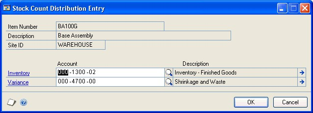

5. Choose OK to save your changes and return to the Stock Count Entry window.

### Verifying variance amounts

If you enter a stock count number that is different from the captured quantity for an item-site combination, Inventory Control calculates the default variance amount as the absolute difference between the two values, as long as the resulting default variance transaction is a valid transaction. The default variance transaction might vary if it would otherwise cause an invalid transaction—that is, if posting the transaction would cause the on hand quantity to be less than the allocated quantity.

When a stock count is processed, Inventory Control creates default inventory variance transactions to adjust inventory for the variance amounts. This is helpful if the variance is a legitimate finding of differences between the captured and counted amounts, but if the variance exists because of transactions that haven't been posted yet or because transactions were posted after the stock count was started, then the default inventory variance transactions can cause additional discrepancies.

Each time a variance amount is identified, you should check the unposted transactions and the transaction history for the item-site combination. If necessary, you can adjust the variance amount accordingly before processing the stock count.

Use the Unposted Item Transactions window to view unposted inventory transactions. Use the Item Transaction Inquiry by Date window to view transaction history. You could find that another user has posted a transaction since the stock count was started, for example.

**To verify variance amounts:**

1. Open the Stock Count Entry window.
(Inventory \>\> Transactions \>\> Stock Count Entry)

  > [!TIP]
  > You also can open the Unposted Item Transactions window and the Item Transaction Inquiry by Date window from the Stock Count Lot Number Entry window and the Stock Count Serial Number Entry window.

2. Enter or select a stock count ID. The stock count must have Entered status.

3. Select an item-site combination that has a variance amount.

4. Check unposted transactions and transaction history to see if there is a reason for the inventory variance.

  To view unposted transactions, choose Unposted Trx to open the Unposted Item Transactions window. Review the information as needed. To view information about the quantities for specific transactions, select a document and then click the Document Number label.

  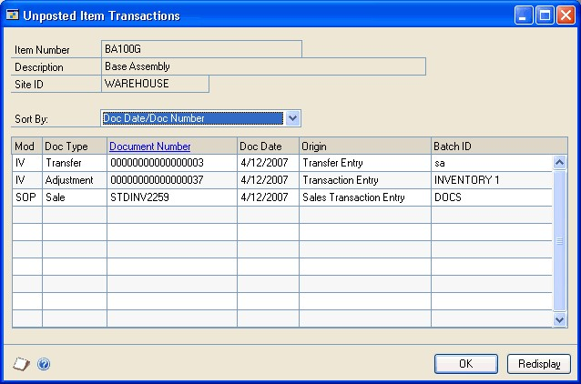

  To view transaction history, choose Trx History to open the Item Transaction Inquiry by Date window. Information about transactions for the item-site combination posted after the stock count was started and before the stock count results were entered are displayed in the scrolling window. Review the information as needed. To view information about the quantities for specific transactions, select a document and then click the Document Number label.

  

5. If you find an unposted transaction or a transaction in inventory history that would account for all or a portion of the variance, select the variance amount for the item-site combination and change it as needed.

6. Choose Save and close the window.

### Clearing stock count entries

Use the Stock Count Entry window to clear stock count results. For example, if you discovered that you'd entered several incorrect count results, you might want to clear your entries and then reenter the information. You also must clear an Entered stock count before you can cancel it. Refer to *Canceling a stock count schedule* for more information.

When you clear a stock count, the status of the stock count is set to Started and information about counted quantities is cleared. Captured quantity information is kept.

**To clear stock count entries:**

1. Open the Stock Count Entry window.
(Inventory \>\> Transactions \>\> Stock Count Entry)

2. Enter or select a stock count ID.

3. Choose Clear Count. An alert message appears, asking if you're sure you want to clear the count. Choose Yes.

4. Close the window.

### Processing a stock count

Use the Stock Count Entry window to process a stock count. If you're using autoposting options for stock count variances, variance transactions will be posted and reports will be printed when you process a stock count. If you're not using autoposting, variance transactions are saved in a batch; you'll need to post the batch. Refer to *Effects of processing a stock count* for more information.

*Before you begin this procedure, be sure you've verified the variance amounts. Refer to Verifying variance amounts for more information.*

**To process a stock count:**

1. Open the Stock Count Entry window.
(Inventory \>\> Transactions \>\> Stock Count Entry)

2. Enter or select a stock count ID.

3. Choose Process.

Refer to Effects of processing a stock count for more information.

### Chapter 24: Posting

Posting is the process of transferring transactions to permanent records. Microsoft Dynamics GP includes several options for posting. You can use any of these or all of these, depending on your situation.

Until transactions are posted, they can be changed or deleted. When you post transactions, they become permanent information and will update quantity information for items, the balances of your vendor accounts, and the balances of the posting accounts in your chart of accounts. Posted transactions can't be changed or deleted.

Posting reports will be printed when you post transactions, either individually or in batches. For more information about posting reports for Inventory Control, refer to *Inventory Control report summary*.

*For more information about setting up posting, see the System Setup Guide (Help \>\> Contents \>\> select Setting up the System).*

The following information is discussed:

- *Posting a single transaction*

- *Posting a single batch*

- *Posting multiple Inventory Control batches*

### Posting a single transaction

If you choose to use transaction-level posting, you must post each transaction as it is completed, and the level of detail posted is always set to detail. You can save only those transactions that are part of a batch. When you post to General Ledger, transactions entered and posted individually are saved in a batch in General Ledger. You'll be able to identify the transactions in General Ledger by the audit trail code.

**To post a single transaction:**

1. Enter the transaction information in the Item Transaction Entry window or
    the Item Transfer Entry window.
(Inventory \>\> Transactions \>\> Transaction Entry)
(Inventory \>\> Transactions \>\> Transfer Entry)

2. Enter the transaction. Refer to *Chapter 21, "Transaction entry,"* for more information.

3. Choose Post.

When posting transfer transactions for which an override document exists, a Cost Variance Journal might be printed during the posting process, if you selected that option in the Posting Setup window. The variance represents the difference in the cost of the override receipt and the cost on the increase transaction for the item. The variance appears in parentheses if the override unit cost is less than the document unit cost.

The General Posting Journal will be printed if there are adjusting entries created because the unit cost of the transfer transaction is different from the unit cost of the quantity sold transaction of the override receipt.

### Posting a single batch

You can use batch-level posting to post batches within Inventory Control one at a time. Batches marked as single-use are deleted automatically when the posting process is complete. Recurring batches are created for transactions that are posted at regular intervals, such as weekly, monthly, or yearly. Recurring batches can be posted repeatedly, requiring you only to reenter transaction information each time. You can delete recurring batches at any time.

Because batch posting is a background process, you can enter new transactions while posting is underway; however, you can't add transactions to batches that currently are being posted, or to batches that are marked for posting. In addition, more than one person can enter transactions in the same batch; however, the batch can't be posted if it's being edited.

Depending on your fiscal period setup, you might not be able to post to a closed period from a specific Microsoft Dynamics GP series or transaction origin. Also, you can't post to a year that hasn't been set up in the Fiscal Periods Setup window.

**To post a single batch:**

1. Before posting, it's always a good practice to make a backup of your company's data.

2. Open the Inventory Batch Entry window.
(Inventory \>\> Transactions \>\> Batches)

  

3. Select an existing batch ID.

4. To verify the contents of the batch, you can choose File \>\> Print to print an edit list.

5. Choose Post.

Depending on how you've set up posting options in the Posting Setup window, posting journals might be printed automatically. These journals provide detailed information about transactions that were posted. Microsoft Dynamics GP automatically assigns audit trail codes to batches of transactions as they're posted. The audit trail code enables you to trace the posting sequence of any transaction back to the originating journal.

### Posting multiple Inventory Control batches

Inventory Control transactions also can be posted using series posting. When you post by series, all batches that have been marked in the Inventory Series Posting window are posted. Because batches are groups of related transactions, series posting can be useful when you want to post several batches that have something in common. For example, you can use series posting to post all the batches entered on a particular day.

Series posting is performed as a background process, so you can enter, add, edit, or delete transactions while posting is underway; however, you can't enter transactions in batches that currently are being posted, that are marked for posting, or that are being edited.

Use the Inventory Series Posting window to post several Inventory Control batches.

**To post multiple Inventory Control batches:**

1. Before posting, it's always a good practice to make a backup of your company's data.

2. Open the Inventory Series Posting window.
(Inventory \>\> Transactions \>\> Series Post)

  

3. Choose whether to view all batches or just the ones marked for posting.

4. Mark any batches to post.

  > [!NOTE]
  > If you're using Microsoft Dynamics GP on a network, choose Redisplay before posting. The contents of the window will be updated to show any batches that have been added or changed by your coworkers since you opened the window. With series posting, you can post only those batches that you've marked. If a batch was marked previously, the User ID column identifies the person who marked it. To post that batch, unmark it and mark it again so the batch is assigned to you.

5. Choose Post to post all batches you have marked for Inventory Control.

    - If you set batch requirements in the Inventory Batch Entry window, you won't be able to post the batch until those requirements are met.

    - Posting journals may be printed, depending on how you set up posting options in the Posting Setup window.

### Chapter 25: Transaction corrections

Throughout the accounting process, you can print reports you can use to verify transactions you've entered. When you identify errors on these reports, the errors must be corrected to ensure accurate reporting of your financial activity.

Errors found after you've posted the batch or transaction, however, may require that you enter transactions to "back out" the error. Then you can reenter it correctly.

The following information is discussed:

- *Modifying an unposted transaction*

- *Modifying an in-transit transfer transaction*

- *Corrections for posted transfers and transactions*

- *Entering a transaction increase adjustment*

- *Entering a transaction decrease adjustment*

- *Entering a transfer increase adjustment*

- *Entering a transfer decrease adjustment*

### Modifying an unposted transaction

Use the Item Transaction Entry window to correct unposted transactions entered that record an adjustment or variance to your inventory. Use the Item Transfer Entry window to correct unposted transactions entered that record a transfer of inventory items between sites or from one quantity type to another.

Transactions that haven't been posted can be easily modified or deleted. Transaction entry errors can often be found on edit lists.

**To modify an unposted transaction:**

1. Open the Item Transaction Entry or the Item Transfer Entry window.
(Inventory \>\> Transactions \>\> Transaction Entry)
(Inventory \>\> Transactions \>\> Transfer Entry)

2. Enter or select the document number assigned to the transaction you want to change. The number should appear on the edit list.

3. Delete the incorrect information and reenter it correctly.

  > [!NOTE]
  > You also can edit the information in windows related to the transaction window. For example, if you're using multiple bins you can choose the Bins button to open a window where you can enter bin information.

4. Choose File \>\> Print to print an edit list and verify your changes.

5. Choose Save.

### Modifying an in-transit transfer transaction

Use the In-Transit Transfer Entry window to correct in-transit transfers that haven't been shipped.

**To modify an in-transit transfer transaction:**

1. Open the In-Transit Transfer Entry window.
(Inventory \>\> Transactions \>\> In-Transit Transfer Entry)

2. Enter or select the document number assigned to the transaction you want to change.

3. Delete the incorrect information and reenter it correctly.

  > [!NOTE]
  > You also can edit the information in windows related to the transaction window. For example, if you're using multiple bins you can choose the Bins button to open a window where you can enter bin information.

4. Choose File \>\> Print to print a packing slip.

5. Choose Save or Ship.

### Corrections for posted transfers and transactions

If you've identified an error in a transaction that's been posted, you must correct the error in order to keep your accounting information accurate. The steps you follow depend on the type of change you need to make.

Inventory transaction errors usually involve either quantities or costs. You can reprint a posting journal to pinpoint quantity errors in posted transactions. If the error involves costs, you can use the Purchase Receipts Report or the Purchase Receipts Inquiry window to review details of the adjustment, variance, or transfer transactions that have been posted.

> [!NOTE]
> Use reason codes such as QTY CORRECT or COST CORRECT to identify causes for corrections. Refer to Creating reason codes for information about setting up and using reason codes.

**To correct a transaction or transfer that contains quantity error** Make an adjusting entry to correct the transaction or transfer. If necessary, after the adjusting transaction has been entered, you can enter the transaction as it should have been entered originally and post. Refer to the table for more information.

| **Entry type**                  | **Is used if:**                                            | **Refer to:**                                |
|---------------------------------|------------------------------------------------------------|----------------------------------------------|
| Transaction increase adjustment | Quantity entered in the original transaction was too small | *Entering a transaction increase adjustment* |
| Transaction decrease adjustment | Quantity entered in the original transaction was too large | *Entering a transaction decrease adjustment* |
| Transfer increase adjustment    | Quantity entered in the original transfer was too small    | *Entering a transfer increase adjustment*    |
| Transfer decrease adjustment    | Quantity entered in the original transfer was too large    | *Entering a transfer decrease adjustment*    |

**To correct a transaction that contains a cost error** You can adjust the cost using the Inventory Adjust Costs window. For more information about adjusting a purchase receipt, refer to *Chapter 31, "Item cost adjustments."*

### Entering a transaction increase adjustment

Use the Inventory Batch Entry window and the Item Transaction Entry window to make an increase adjustment entry.

If you discover that the quantity information in a posted transaction was too small, you'll need to enter an increase adjustment. For example, suppose you enter and post a transaction to add 15 units to inventory, and then find that the quantity should have been 25 units. A second entry to add 10 units to inventory should be entered and posted.

**To enter a transaction increase adjustment:**

1. Open the Inventory Batch Entry window.
(Inventory \>\> Transactions \>\> Batches)

2. Enter a descriptive name and comment that includes the document number of the incorrect transaction.

3. Select Transaction Entry as the origin.

4. Select a frequency of single-use.

5. Choose Transactions to open the Inventory Transaction Entry window.

6. Enter a new increase adjustment. For example, if you mistakenly posted a quantity of 8, when you should have posted a quantity of 10, you can enter an adjusting transaction to increase the amount by 2.

  > [!NOTE]
  > If you changed distribution accounts for the original transaction, be sure you also use those accounts for this entry.

7. Choose Save.

8. Choose File \>\> Print to print an edit list to verify your entries.

### Entering a transaction decrease adjustment

Use the Inventory Batch Entry window and the Item Transaction Entry window to enter a transaction decrease adjustment.

If you discover an error in the quantities for an item after you have posted a transaction, you must enter a transaction that reverses the original transaction, then reenter and post the original transaction information correctly.

To make an adjusting entry, you first must know how the initial transaction was entered and posted, including dates, quantities, valuation method, costs, as well as the posting accounts that were debited and credited.

> [!NOTE]
> Depending on the item's valuation method, your receipts may be reversed in a different order than the original transaction. Print the Purchase Receipts report to determine which receipts will be affected.

**To enter a transaction decrease adjustment:**

1. Open the Inventory Batch Entry window.
(Inventory \>\> Transactions \>\> Batches)

2. Enter a descriptive name and comment that includes the document number of the incorrect transaction.

3. Select Transaction Entry as the origin.

4. Select a frequency of single-use.

5. Choose Transactions to open the Item Transaction Entry window.

6. Enter an increase adjustment that exactly matches the incorrect decrease adjustment.

  For example, if you entered a decrease adjustment of (–10) for item A and posted it to account 100-1300, then you need to enter an increase adjustment of 10 for item A and post it to 100-1300 at the same cost as the decrease adjustment.

  > [!NOTE]
  > If you changed distribution accounts for the original transaction, be sure you also use those accounts for this entry.

7. Enter a new decrease adjustment for the correct quantity, item number and cost.

8. Choose Save.

9. Choose File \>\> Print to print an edit list to verify your entries.

### Entering a transfer increase adjustment

Use the Inventory Batch Entry window and the Item Transfer Entry window to enter increase adjustments for posted transfers. For example, suppose you transferred 20 items from the North warehouse to the South store, and then found that you should have transferred 25 items. You should enter and post another transfer to move five items to the South store.

**To enter a transfer increase adjustment:**

1. Open the Inventory Batch Entry window.
(Inventory \>\> Transactions \>\> Batches)

2. Enter a descriptive name and comment that includes the document number of the incorrect transaction.

3. Select Transfer Entry as the origin.

4. Select a frequency of single-use.

5. Choose Transactions to open the Inventory Transfer Entry window.

6. Enter an adjusting entry.

    For example, if you mistakenly posted a quantity of 8, when you should have posted a quantity of 10, you can enter an adjusting transaction to increase the amount by 2.

7. Choose Save.

8. Choose File \>\> Print to print an edit list to verify your entries.

### Entering a transfer decrease adjustment

Use the Inventory Batch Entry window and the Item Transfer Entry window to enter decrease transfer adjustments.

If you discover that the quantity in a posted transfer was too large—for example, you transferred 25 items but should have posted only 20—you'll need to undo the transaction, then reenter and post it correctly.

To make an adjusting entry, you first must know how the initial transaction was entered and posted, including dates, quantities, valuation method, costs, as well as the posting accounts that were debited and credited.

> [!NOTE]
> Depending on the item's valuation method, your receipts might be reversed in a different order than the original transaction. Reprint the Transfer Posting Journal report to determine which transfers will be affected.

**To enter a transfer decrease adjustment:**

1. Open the Inventory Batch Entry window.
(Inventory \>\> Transactions \>\> Batches)

2. Enter a descriptive name and comment that includes the document number of the incorrect transaction.

3. Select Transfer Entry as the origin.

4. Select a frequency of single-use.

5. Choose Transactions to open the Item Transfer Entry window.

6. Enter an increase adjustment that exactly matches the incorrect decrease adjustment.

    For example, if you transferred 25 items from the South store to the Main store when only 20 items should have been transferred, you should transfer the 25 items back to the South store, then enter and post a transfer for 20 items.

7. Enter a new transfer adjustment for the correct quantity, item number and cost.

8. Choose Save.

9. Choose File \>\> Print to print an edit list to verify your entries.

## See also

[Inventory Control in Dynamics GP - Parts 4-6](Inventory2.md)  
[Glossary](Inventory2.md#glossary)  
