# Inventory Control in Dynamics GP - Parts 4-6

You can use Inventory Control to help manage your company's inventoried items. Many Inventory Control tasks help you create records for your items, such as how the items are to be tracked and what pricing should be used for the items that are sold. this article continues where [Inventory Control in Dynamics GP - Parts 1-3](Inventory.md) stopped.

The manual is divided into the following parts:

- *Part 1: Setup*, describes the tasks you must complete to set up inventory, such as specifying system settings and setting up unit of measure schedules and item classes. For more information, see [Part 1: Setup](Inventory.md#part-1-setup).

- *Part 2: Cards*, includes information about basic inventory records. Refer to that part to learn how to define, modify, and remove items, sites, and kits. Information about setting up pricing structures also is included. For more information, see [Part 2: Cards](Inventory.md#part-2-cards).

- *Part 3: Transactions*, contains information about entering and posting inventory transactions and transfers. For more information, see [Part 3: Transactions](Inventory.md#part-3-transactions).

- *Part 4: Inquiries and reports*, describes windows and reports you can use to view your inventory information.

- *Part 5, Utilities*, includes information about completing special tasks, such as using price list wizards, reconciling inventory, removing history records, and adjusting average costs of items.

- *Part 6, Routines*, describes how you can use inventory checklists. Information about year-end closing tasks is also included.

## Part 4: Inquiries and reports

This part of the documentation includes information about Inventory Control inquiries and reports. Analyzing your item records and transactions is an  important part of your computerized accounting system. With Inventory Control, you can view important information about your item activity on-screen using the Inquiry windows. These windows provide easy access to detailed and summarized Inventory Control information.

Inventory Control also includes several reports that summarize information about your inventory records. You can use Inventory Control reports to verify transaction entry and posting. You also can print reports that analyze inventory activities.

The following information is discussed:

- *Chapter 26, "Item inquiries,"* includes information about viewing item records, including windows for viewing more detailed information about items tracked by lot and serial numbers. If you're using multiple bins, you also can view information about bin quantities.

- *Chapter 27, "Standard pricing inquiries,"* describes how you can use the Item Price List Inquiry window to view information about the pricing structures you've set up for your inventoried items, if you're using standard pricing.

- *Chapter 28, "Extended pricing inquiries,"* describes how you can view information about the extended pricing structures you've set up for your items.

- *Chapter 29, "Transaction inquiries,"* contains information about viewing records for inventory transactions and transfers. Information about viewing purchase receipt information also is included.

- *Chapter 30, "Reports,"* describes how you can print reports based on inventory records. Key reports for the module also are listed.

### Chapter 26: Item inquiries

If you want to find information in your system but don't need to change the information, you can use the windows in the Inquiry menu. With those windows, you can search your inventory records to see quantity information for inventoried items, to view the lot and serial numbers assigned to items at specific sites, and to review pricing information.

The following information is discussed:

- *Viewing item information*

- *Viewing item allocation information*

- *Viewing bin quantity information*

- *Viewing item stock information*

- *Viewing serial number information*

- *Viewing lot number information*

- *Viewing lot attribute information*

- *Viewing planning information for an item*

- *Viewing a life cycle serial or lot number trace*

- *The bill of materials trace tree view*

- *Viewing a bill of materials trace*

- *Viewing a recall serial or lot number trace*

- *Viewing inventory available to promise information*

#### Viewing item information

To view general information about items, use the inquiry windows. You can view quantity information for inventoried items, lot and serial numbers assigned to items at specific sites, pricing, and stock count information. If you're using multiple bins, you also can view information about the quantities of items in bins.

**To view item information:**

1. Open the Item Inquiry window. 
(Inventory \>\> Inquiry \>\> Item)

2. Enter or select the item to view.

3. Decide which site's information to view.

**To view quantity information for all sites** Mark All. Information in the window will include quantity information across all sites.

**To view site-specific information** Mark Site ID, then select a specific site. Information about the item quantities for the specific item-site combination are displayed in the window.

4. Review the information. If needed, you also can review serial number information, or go to related windows to make changes. If you're using multiple bins, you can view information about bin quantities.

**To view serial or lot number information** If the item is tracked by serial or lot numbers, choose the expansion button on the Track field to open the Item Serial/Lot Number Definition Inquiry Zoom window.

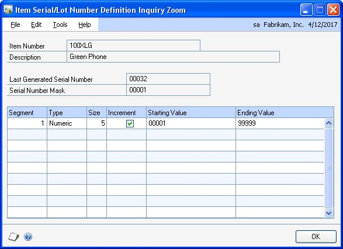

**To go to the Item Maintenance window** If you need to change item information, click the Item Number link to open the Item Maintenance window. Refer to *Chapter 10, "Item cards,"* for more information about using the Item Maintenance window.

**To go to the Site Maintenance window** If you need to change site information, click the Site ID link to open the Site Maintenance window. Refer to *Chapter 14, "Sites and beginning quantities,"* for more information about using the Site Maintenance window.

**To view item allocation information** If you need to view where item quantities have been allocated, click the Allocated link to open the Item Allocation Inquiry window. Refer to *Viewing item allocation information* for more information.

**To view on-order information** If you need to view the on-order quantity on purchase orders, click the On Order link to open the Purchase Order Processing Item Inquiry window. Refer to the Purchase Order Processing documentation for more information.

**To view attachments** If you need to view attachments for an item, choose the Attachment Management icon to open the Document Attachment Inquiry window. Refer to the System Manager documentation for more information.

**To view bin quantity information** If you're using multiple bins, you can use the Bin Quantity Inquiry window to view information about the quantities in bins at a specific site. From the Go To button, choose Bin Quantity Inquiry to open the Bin Quantity Inquiry window. Refer to *Viewing bin quantity information* for more information.

**To view stock count information** If you need to view stock count information for an item, choose Stock Count to open the Item Stock Count Inquiry window.

5. When you've finished reviewing information, close the windows.

#### Viewing item allocation information

Use the Item Allocation Inquiry window to view where item quantities have been allocated.

**To view item allocation information:**

1. Open the Item Allocation Inquiry window.
(Inventory \>\> Inquiry \>\> Item Allocation)

2. Select All to view all items or select a range of items.

3. Select a range of dates to restrict the information in the scrolling window.

4. Select which modules to view allocated item information for. You can select any or all of the modules listed.

5. Select whether to display items at all sites or a specific site.

6. Select a sorting order for the items displayed in the scrolling window.

7. Choose Redisplay to display the items in the scrolling window.

8. You can choose File \>\> Print to print the Item Allocation Inquiry Report, if needed.

9. When you've finished reviewing information, close the window.

#### Viewing bin quantity information

If you're using multiple bins, you can use the Bin Quantity Inquiry window to view information about the quantities in bins at a specific site.

**To view bin quantity information:**

1. Open the Bin Quantity Inquiry window.
(Inventory \>\> Inquiry \>\> Bin Quantities)

2. Specify a range to restrict information. You can limit the items, sites, bins, and quantity type information that is displayed.

3. Choose Redisplay to update information in the scrolling window.

4. To view information about the serial and lot numbers of items, highlight a record in the scrolling window and choose Serial/Lot.

    - If the item is tracked by serial numbers, the Inventory Serial Number/Bin Inquiry window opens.

    - If the item is tracked by lot numbers, the Inventory Lot Number/Bin Inquiry window opens.

5. When you've finished viewing information, close the windows.

#### Viewing item stock information

Use the Item Stock Inquiry window to view the transactions that affected the stock quantity of an inventoried item and to view the total stock quantity balance of that item. You also can view the balance of each quantity type for the item, such as the quantity on hand and quantity allocated.

Stock information can be displayed for all the sites that the item is assigned to or for a specific site. You also can select the unit of measure to display the stock information in.

**To view item stock information:**

1. Open the Item Stock Inquiry window.
(Inventory \>\> Inquiry \>\> Item Stock)

2. Enter or select the item to view.

3. Select whether to display all sites or at a specific site for the item.

4. Select the unit of measure to display the item stock information in.

5. You can choose File \>\> Print to print the Item Stock Inquiry Report, if needed.

6. When you've finished reviewing information, close the window.

#### Viewing serial number information

If you're using serial-numbered items, you can use the Serial Number Inquiry window to view information about the items. For example, you can use this window to view the serial numbers of available items at a specific site. If you're using multiple bins, you also can view the bin where each item is stored.

**To view serial number information:**

1. Open the Serial Number Inquiry window.
(Inventory \>\> Inquiry \>\> Serials)

2. Enter or select an item.

*Use the browse buttons to move among only serial-numbered items.*

3. Decide which site information you want to view.

**To view information for all sites** For the Site ID, mark All.

**To view information for a specific site** For the Site ID, mark Site ID, then select a site.

4. Select a range of dates to restrict the information in the scrolling window by date, if needed.

5. If you're viewing information for a specific site, decide if you want to see serial number information for all items at the site, or for only those items whose item type is Available.

**To view all serial numbers** For Display, mark All.

**To view serial numbers of Available items only** For Display, mark Available.

6. Review information as needed. You also can go to other windows to make changes, if needed.

**To make changes to the item record** Click the Item Number link to open the Item Maintenance window, where you can modify the item record. Refer to *Chapter 10, "Item cards,"* for more information about using the Item Maintenance window.

**To make changes to the site record** Click the Site ID link to open the Site Maintenance window, where you can modify the site record. Refer to *Chapter 14, "Sites and beginning quantities,"* for more information about using the Site Maintenance window.

7. You can choose File \>\> Print to print the Serial Number Inquiry Report, if needed.

8. When you've finished reviewing information, close the window.

#### Viewing lot number information

If you use lot-numbered items, you can use the Lot Number Inquiry window to view information about those items. For example, you can use this window to view the available quantity in a particular lot. If you're using multiple bins, you also can view information about the bins where lot quantities are stored.

You also can consolidate lot numbers by selecting to sort them by lot. Lot numbers can be consolidated if the lot number, site, bin, quantity type, manufactured date, and expiration date are the same.

**To view lot number information:**

1. Open the Lot Number Inquiry window.
(Inventory \>\> Inquiry \>\> Lots)

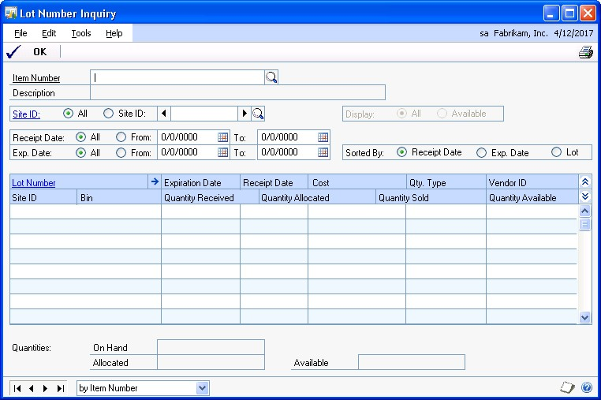

2. Enter or select the item to view.

*Use the browse buttons to move among lot-numbered items only.*

3. Decide which site information to view.

**To view information for all sites** For the Site ID, mark All.

**To view information for a specific site** For the Site ID, mark Site ID, then select a site.

4. If you're viewing information for a specific site, decide if you want to see lot number information for all items at the site, or for only those items whose item type is Available.

**To view all lot numbers** For Display, mark All.

**To view lot numbers of Available items only** For Display, mark Available.

5. Select a range of receipt dates and expiration dates to restrict the information in the scrolling window by date, if needed.

6. Select the order to display information in the scrolling window

7. Review information as needed. You also can go to other windows to make changes, if needed.

**To make changes to the item record** Click the Item Number link to open the Item Maintenance window, where you can modify the item record. Refer to *Chapter 10, "Item cards,"* for more information about using the Item Maintenance window.

**To make changes to the site record** Click the Site ID link to open the  Site Maintenance window, where you can modify the site record. Refer to *Chapter 14, "Sites and beginning quantities,"* for more information about using the Site Maintenance window.

8. You can choose File \>\> Print to print the Lot Number Inquiry Report, if needed.

9. When you've finished reviewing information, close the window.

#### Viewing lot attribute information

You can use the Lot Attribute Inquiry window to see a manufactured date, an expiration date, and lot category characteristics for a specific lot.

**To view lot attribute information:**

1. Open the Lot Number Inquiry window.
(Inventory \>\> Inquiry \>\> Lots)

2. Enter or select a lot numbered item.

3. Use options in the Lot Number Inquiry window to find the specific lot you want to review. Refer to *Viewing lot number information* for more information.

4. Select the lot and choose the Lot Number expansion button to open the Lot Attribute Inquiry window.

5. Review the information as needed.

6. When you've finished, close the windows.

#### Viewing planning information for an item

Use the Item Resource Planning Inquiry window to view planning information for a site.

**To view planning information for an item:**

1. Open the Item Resource Planning Inquiry window.
(Inventory \>\> Inquiry \>\> Item Resource Planning)

2. Enter or select an item.

Information about the item that is the same for all sites—such as the item's order policy—will be displayed.

3. To view site-specific information, be sure the Site ID option in the Sites field is marked, and then enter or select a site.

4. When you've finished viewing the information, close the window.

#### Viewing a life cycle serial or lot number trace

You can use the Serial/Lot Trace Inquiry window to trace the life cycle of serial or lot numbers. For instance, you can view how a serial- or lot-numbered item is used from the day it was received or assembled by your business to the day it left your business.

A life cycle trace allows you to view all the transactions that have serial- or lotnumbered items by their document date. You can use a life cycle trace to find a specific serial or lot number, find items with serial or lot numbers received from a specific vendor, or find items with serial or lot numbers shipped to a specific customer.

**To view a life cycle serial or lot number trace:**

1. Open the Serial/Lot Trace Inquiry window.
(Inventory \>\> Inquiry \>\> Serial/Lot Trace)

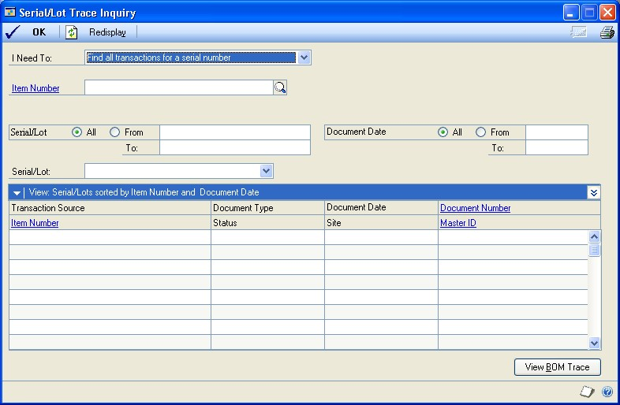

2. Select one of the following life cycle trace options from the I Need To field.

    - Find all transactions for a serial number

    - Find all transactions for a lot number

    - Find serial numbers shipped to a customer

    - Find lot numbers shipped to a customer

    - Find serial numbers received from a vendor

    - Find lot numbers received from a vendor

The type of life cycle trace you select determines the type of information displayed in the window.

3. Select or enter an item number if you know the number of the item to trace serial or lot information for.

4. Depending on the life cycle trace you've selected in the I Need To field, enter or select a customer ID or vendor ID.

5. Enter or select the range of serial or lot numbers to trace. Select All to include all lot or serial numbers.

The time it takes to process the serial and lot information will depend on if you selected to trace all serial or lot numbers without an item number.

6. You can select a range of dates to restrict the information in the scrolling window by date.

7. Choose Resdisplay to display the serial and lot number information in the scrolling window.

The first serial or lot number found during the trace is displayed in the Serial/ Lot field and the transactions associated with that serial or lot number will be displayed in the scrolling window. To view different serial or lot information, select another serial or lot from the Serial/Lot field.

8. To view additional information, select the transaction and click on a link to open another window. The window that opens depends on the transaction source and the link that you click.

Refer to the table for more information.

| **If the transaction source is ...** | **... and you click on this link ...** | **... this window opens:**       |
|--------------------------------------|----------------------------------------|----------------------------------|
| Any transaction source               | Item Number                            | Item Maintenance                 |
| Assembly Entry                       | Document Number                        | Assembly Inquiry Zoom            |
| Invoice Entry                        | Document Number                        | Invoice Inquiry                  |
| Item Transfer Entry                  | Document Number                        | Inventory Transaction Inquiry    |
| Item Transaction Entry               | Document Number                        | Inventory Transaction Inquiry    |
| Manufacturing                        | Document Number                        | Manufacturing Component          |
| Manufacturing Order                  | Document Number                        | Manufacturing Order Receipt      |
| Receivings Transaction               | Document Number                        | Receivings Transaction Inquiry   |
| Sales Transaction Entry              | Document Number                        | Sales Transaction Inquiry Zoom   |
| In-Transit Transfer Entry            | Document Number                        | In-Transit Transfer Inquiry Zoom |
| Assembly Entry                       | Master ID                              | Item Maintenance                 |
| Manufacturing                        | Master ID                              | Item Maintenance                 |
| Manufacturing Order                  | Master ID                              | Item Maintenance                 |
| Sales Transaction Entry              | Master ID                              | Customer Maintenance             |
| Invoice Entry                        | Master ID                              | Customer Maintenance             |
| Receivings Transaction               | Master ID                              | Vendor Maintenance               |

(posted transactions only)

(posted transactions only)

Component Transaction

Entry

Transaction Inquiry

Receipt Entry

Inquiry Detail

Entry

Zoom

Component Transaction

Entry

Receipt Entry

Entry

The Document Number link isn't available for the Purchasing Return Entry and Stock Count Entry transaction sources.

9. If a transaction is a manufacturing or assembly transaction, choose the View BOM Trace button to open the Serial/Lot Bill of Materials Trace window, where you can view additional serial- or lot numbered items used by or assembled from the serial or lot number that you are tracing. Refer to *Viewing a bill of materials trace* for more information.

10. You can choose File \>\> Print to print the Serial/Lot Trace Inquiry Report.

11. When you've finished reviewing information, close the window.

#### The bill of materials trace tree view

The Serial/Lot Bill of Materials Trace window uses a tree view to show the serial numbers, lot numbers, and transactions in a bill of materials trace. To view information in the tree view, select a trace type and choose Redisplay.

The trace type you select determines the information that is displayed in the tree view.

- If you select Consumed into the serial/lot as the trace type, you can view serial- or lot-numbered items that were consumed (used) in a serial- or lot-numbered item.

- If you select Produced from the serial/lot as the trace type, you can view serial- or lot-numbered items that were produced (assembled) from a serial- or lotnumbered item.

##### Objects in the tree view

Each line in the tree is called an object. When you select an object in the tree view, the information to the right of the window displays the information about the selected object.

The first object in the tree view is the serial or lot number that you are tracing, followed by the item number. The next object or objects are the transactions that consumed (used) or produced (assembled) serial- and lot-numbered items for the serial or lot number being traced. The following is an example of a tree view.

\- SERIAL10 : CIRCUIT BOARD + ASM00078

You can choose the + symbol next to a manufacturing or assembly transaction object to view additional levels in the tree view. You can collapse and expand the entire tree or just portions of it.

If a lot number is used multiple times on a transaction, each occurrence of the lot number will be displayed in the tree view, as shown in the following example.

\- LOT 10 : CIRCUIT BOARD - ASM00038 - LOT 55 : SWITCH SYSTEM ORDER005 INV015 ADJ029 + LOT 55 : SWITCH SYSTEM

If an item doesn't track serial or lot numbers, that information will be displayed in the tree view, as shown in the following example.

\- LOT 12 : ITEM - ASM00038 \<Not Tracked\> : Brush

For assembly transactions, a link icon might appear next to a specific serial or lot number that is matched to another serial or lot number, as shown in the following example.

\- LOT 10 : CIRCUIT BOARD - ASM00038 +

LOT 55 : SWITCH SYSTEM + \<Not Tracked\> : PANEL

For more information about linking serial and lot numbers, refer to the Bill of Materials documentation.

**Consumed into the serial/lot trace type example**

If you selected Consumed into the serial/lot, you can expand a manufacturing or assembly transaction object to display all documents that were involved with placing the serial- or lot-numbered item into inventory. The following is an example of how information is displayed in the tree view if you selected Consumed into the serial/lot as the trace type.

| **Tree view**                | **Description**                                |
|------------------------------|------------------------------------------------|
| \- SERIAL10 : CIRCUIT BOARD  | Serial number being traced.                   |
| \- ASM00078                  | Transaction that placed SERIAL10 in inventory. |
| \- LOT 34 : MULTI COLOR WIRE | Lot number used in creating Serial10.         |
| \- RCV00067                  | Transaction that placed LOT 34 in inventory.  |
| \- LOT 55 : SWITCH SYSTEM    | Lot number used in creating SERIAL10.         |
| \- ASM00078                  | Transaction that placed LOT 55 in inventory.  |
| \- LOT A95 : CIRCUIT PANEL   | Lot number used in creating LOT 55.           |
| \- RCV00089                  | Transaction that placed LOT A95 in inventory. |
| \- LOT T15 : TRANSISTOR      | Lot number used in creating LOT 55.           |
| \- RCV00123                  | Transaction that placed LOT T15 in inventory. |

**Produced from the serial/lot trace type example**

If you selected Produced from the serial/lot, you can expand a manufacturing or assembly transaction to display all documents that were involved with taking the serial or lot numbered item from inventory. The following is an example of how information is displayed in the tree view if you selected Produced from the serial/ lot as the trace type.

| **Tree view**               | **Description**                                |
|-----------------------------|------------------------------------------------|
| \- LOT A95 : CIRCUIT PANEL  | Lot number being traced.                      |
| \- ASM00078                 | Transaction that took LOT A95 from inventory. |
| \- LOT 55 : SWITCH SYSTEM   | Lot number used in creating LOT A95.          |
| \- ASM00078                 | Transaction that took LOT 55 from inventory.  |
| \- SERIAL10 : CIRCUIT BOARD | Serial number used in creating LOT 55.        |
| \- INV00178                 | Transaction that took SERIAL10 from inventory. |

#### Viewing a bill of materials trace

If a transaction in a life cycle trace is a manufacturing or assembly transaction, you can use the Serial/Lot Bill of Materials Trace window to view the serial- or lotnumbered items that were consumed (used) in creating a serial- or lot-numbered item. You also can view serial- or lot-numbered items that were produced (assembled) from a serial- or lot-numbered item. This window is available if a transaction in a life cycle trace is a manufacturing or assembly transaction.

The Serial/Lot Bill of Materials Trace window uses a tree view to show the serial numbers, lot numbers, and transactions in a bill of materials trace. For more information about the tree view, see *The bill of materials trace tree view*.

**To view a bill of materials trace:**

1. Open the Serial/Lot Trace Inquiry window.
(Inventory \>\> Inquiry \>\> Serial/Lot Trace)

1. Create a life cycle trace. See *Viewing a life cycle serial or lot number trace* for more information.

2. Highlight a manufacturing or assembly transaction in the scrolling window and choose the View BOM Trace button to open the Serial/Lot Bill of Materials Trace window.

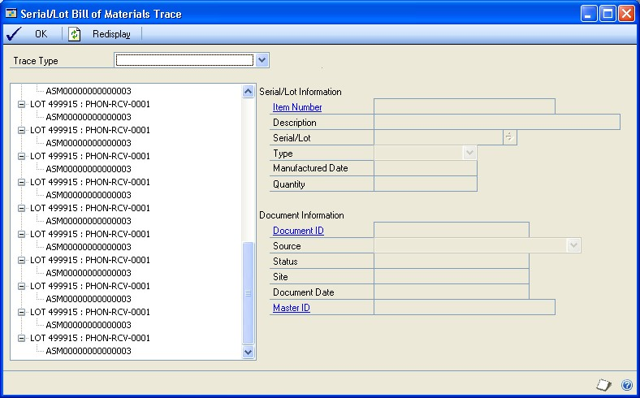

1. Select Consumed into the serial/lot or Produced from the serial/lot as the serial/lot trace.

2. You can highlight a serial number, a lot number, or a transaction in the tree view to view additional information.You also can collapse and expand the tree view to control the amount of information you see.

    - For an item that doesn't track serial or lot numbers, \<Not Tracked\> will be displayed next to the item number.

    - For assembly transactions, a link icon might appear next to a specific serial or lot number that is matched to another serial or lot number. Refer to the Bill of Materials documentation for more information about linking serial and lot numbers.

3. When you've finished reviewing information, close the window.

#### Viewing a recall serial or lot number trace

You can use the Serial/Lot Trace Inquiry window to trace the recall of serial or lot numbers. A recall trace can show which customers purchased an item with a specific serial or lot number. You also can use a recall trace to show where the items with serial or lot numbers are located, including the bin.

If you are going to recall serial or lot numbers, you can choose the Go To button to open the Item Transfer Entry window, where you can change the On Hand quantity type of the item to another quantity type. For more information about changing quantity types, see *Changing the quantity type of an item*.

**To view a recall serial and lot number trace:**

1. Open the Serial/Lot Trace Inquiry window.
(Inventory \>\> Inquiry \>\> Serial/Lot Trace)

1. Select one of the following recall trace options from the I Need To field.

    - Recall serial numbers shipped to customers

    - Recall lot numbers shipped to customers

    - Recall serial numbers where stocked

    - Recall lot numbers where stocked

The type of recall trace you select determines the type of information displayed in the window.

1. Select or enter an item number.

2. Enter or select a vendor ID if you know the vendor that you want to trace serial or lot information for.

3. Enter or select the range of serial or lot numbers to trace. Select All to include all lot or serial numbers.

4. You can select a range of dates to restrict the information in the scrolling window by date.

5. Choose Resdisplay to display the serial and lot number information in the scrolling window.

All of the serial or lot numbers found during the trace are displayed in the scrolling window. To view information about a specific serial or lot number, select the serial or lot number from the Serial/Lot field.

1. To view additional information, select the transaction and click on a link to open another window. The window that opens depends on the transaction source and the link that you click.

Refer to the table for more information.

| **If the recall trace is for ...**         | **... and you click on this link ...** | **... this window opens:**     |
|--------------------------------------------|----------------------------------------|--------------------------------|
| Serial or lot numbers shipped to customers | Customer ID                            | Customer Maintenance           |
| Serial or lot numbers shipped to customers | Document Number                        | Invoice Inquiry                |
| Serial or lot numbers shipped to customers | Document Number                        | Sales Transaction Inquiry Zoom |
| Serial or lot numbers where stocked        | Site ID                                | Item Inquiry                   |

1. You can choose the Go To button to open the Item Transfer Entry window to change the On Hand quantity type of the item to another quantity type. For more information about changing quantity types, see *Changing the quantity type of an item*.

2. In the Serial/Lot Trace Inquiry window, you can choose File \>\> Print to print the Serial/Lot Trace Inquiry Report.

3. When you've finished reviewing information, close the window.

#### Viewing inventory available to promise information

If you're using Available To Promise, use the Inventory Available to Promise Inquiry window to view available to promise information, such as inventory onhand quantity, allocated quantity, available quantity, and free-forward quantity.

Free-forward quantity is the total of available and pending quantities of an item, plus any additional quantities from purchase orders, assembly receipts, manufacturing orders, and sales returns displayed in the scrolling window. The total sum is reduced by the item quantities from unallocated sales orders, sales back orders, and unallocated manufacturing components displayed in the scrolling window.

You also can view pending purchase orders, pending purchase order receipts, and pending inventory receipts.

**To view inventory available to promise information:**

1. Open the Inventory Available to Promise Inquiry window.
(Inventory \>\> Inquiry \>\> Available to Promise)

1. You can select to view items by various units of measure and at various sites.

2. Choose the Calc. Available Date button to view the date that the quantity of inventory will be available.

*Available dates are not shown for inactive items.*

1. Choose OK to close the window.

### Chapter 27: Standard pricing inquiries

If you're using standard pricing, you can use the Item Price List Inquiry window to view information about the pricing structures you've set up for your items. You can use the window to view high-level price list information for an item—such as the unit of measure schedule, base unit of measure, and standard and current cost of the item. You also can use the tree view to control how much information is displayed in the scrolling window. For example, you can highlight the item number in the tree view to see all price list records for an item, or only those price list records for a specific currency, price level, or unit of measure. If you're using Multicurrency Management, you also can check pricing in different currencies, if that's been set up.

*If you're using extended pricing, refer to Chapter 28, "Extended pricing inquiries," for information about viewing pricing information.*

To review the rounding options for price list calculations, you can use the Item Price List Options Inquiry window. Price list records in the Item Price List Inquiry window also reflect the rounding options.

The following information is discussed:

- *Viewing price list information*

- *Viewing pricing option information*

#### Viewing price list information

If you're using standard pricing, use the Item Price List Inquiry window to view price levels and quantity breaks for a particular item. For example, if you wanted to offer different pricing alternatives to customers, you could use this window to view the different price levels available for a particular item.

**To view price list information:**

1. Open the Item Price List Inquiry window.
(Inventory \>\> Inquiry \>\> Price List)

1. Enter or select an item number.

2. In the tree view, you can click the plus and minus signs to expand and collapse the information. If you highlight an object in the tree view, the information for all levels at or below that level is displayed in the scrolling window. Refer to *Using the price list tree view* for more information about tree views.

3. If needed, you can go to other windows to view more information, or to make changes.

**To view or change item record information** Click the Item Number link to open the Item Maintenance window.

**To view or change price group information** Click the Price Group link to open the Price Group Setup window.

**To view or change the default selling unit of measure** Click the Default Selling U of M link to open the Unit of Measure Schedule Setup window.

**To view or change the default price level** Click the Default Price Level link to open the Price Level Setup window.

**To view or change a price level** Click the Price Level link to open the Price Level Setup window, if you're using Multicurrency Management.

**To view or change a currency ID** Click the Currency ID link to open the Item Currency Maintenance window.

1. To print the Item Price List Report, which displays the information displayed in the window, choose File \>\> Print.

2. When you've finished viewing information, close the windows.

#### Viewing pricing option information

If you're using standard pricing, you can use the Item Price List Option Inquiry window to view the rounding rules set up for a pricing calculation.

**To view pricing option information:**

1. Open the Item Price List Inquiry window.
(Inventory \>\> Inquiry \>\> Price List)

Enter or select an item number.

2. Choose Options to open the Item Price List Options Inquiry window.

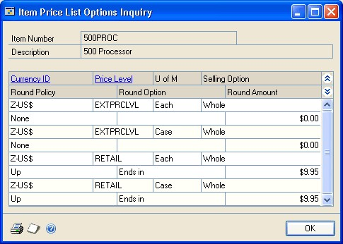

3. Review information in the window.

4. If needed, you can go to other windows to view more information, or to make changes.

**To view or change multicurrency information** If you're using Multicurrency Management, click the Currency ID field label to open the Item Currency Maintenance window.

**To view or change price level information** Click the Price Level field label to open the Price Level Setup window.

5. When you've finished viewing information, close the windows.

### Chapter 28: Extended pricing inquiries

If you're using extended pricing, you can trace how prices are calculated in your pricing structures. You also can view information about price sheets: the items and price groups that are assigned to a price sheet, and the customers, prospects, and price books that a price sheet is assigned to.

Some extended pricing information is better viewed with a report. To check pricing structures for missing prices, for example, you can use the Extended Pricing Error Reports window. Refer to *Checking for missing prices*.

*If you're using standard pricing, refer to Chapter 27, "Standard pricing inquiries," for information about viewing pricing information.*

This information is divided into the following sections:

- *Tracing a price calculation*

- *Originating currency errors in price trace inquiries*

- *Viewing the items and price groups in a price sheet*

- *Viewing price sheets for a selected item or price group*

- *Viewing promotions for a prospect or customer*

#### Tracing a price calculation

Use the Price Trace Inquiry window to find out how an item's price is calculated for a customer. You can use this window to view the total price, the steps taken to calculate the price, and the price sheets used to calculate the price. This is useful if you want to test the pricing structure before you enter transactions in the Sales Transaction Entry window.

The number of currency decimals used to display information in the Price Trace Inquiry window depends on the source of the information.

- If pricing information comes from a price group, the net price and any adjustments to it are displayed with the number of currency decimals that have been specified for the price group.

- If the pricing information comes from the items, the net price and any adjustments to it are displayed with the number of currency decimals that have been specified for the item.

- The Unit Price and Promotion Unit Price information must be displayed with the number of currency decimals from the item. These fields also must match the Unit Price information for a sales document in the Sales Transaction Entry window.

**To trace a price calculation:**

1. Open the Price Trace Inquiry window.
(Inventory \>\> Inquiry \>\> Extended Pricing \>\> Price Trace)

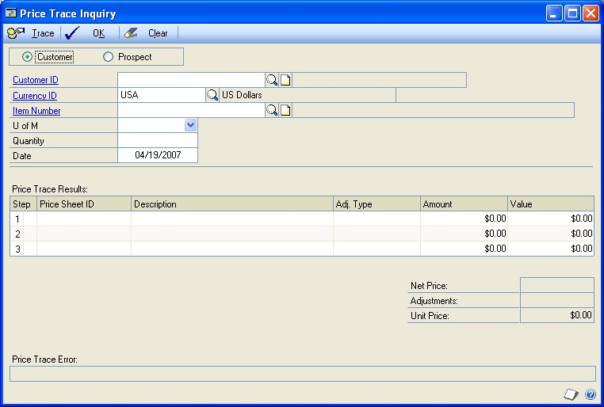

2. Select Customer or Prospect, and enter or select a customer ID or prospect ID.

3. Enter or select a currency ID.

4. Enter or select an item number.

5. Select a unit of measure.

6. Enter a quantity, if you want. The quantity is used if quantity break pricing is set up for the selected item. The price per item will be calculated.

*If a promotion exists for the item and quantity-break pricing is used on the promotional price sheet, it won't be displayed in the Price Trace Inquiry window if the quantity is zero or blank.*

7. Enter a date for the price inquiry.

8. Choose Trace. The total price, steps taken to calculate the price, and the price sheets used will be displayed in the Price Trace Results scrolling window. If a promotion is available, information about it also is displayed.

Any errors encountered while calculating the price will be displayed in the

Price Trace Error field. Click the Price Sheet ID link to open the Price Sheet

Detail Maintenance window, where you can correct the errors. If you're using Multicurrency Management, you might have errors for the originating currency. Refer to *Originating currency errors in price trace inquiries* for more information.

#### Originating currency errors in price trace inquiries

Price-trace errors—errors in how prices for items are calculated when you're using extended pricing—can be reported for the originating currency in certain situations.

If you've marked the Sales Order Processing setup option so that a price isn't required for each currency for an item, and if you've marked the option to convert the originating currency to the functional currency, then pricing calculations are "round-tripped" from the originating currency to the functional currency and back to the originating currency.

For example, suppose you've created price sheets for US dollars, but haven't created them for British pounds. If you have these options marked, you could enter a price trace inquiry in British pounds. The inquiry would calculate the pricing in US dollars, then convert it to British pounds based on your exchange tables.

Rules for price sheets still apply: you can't use two price sheets with identical date ranges, and you must have a net price for the items. If either of these rules are broken—and if you're using the "round-tripping" calculations—then the Originating Currency Errors button will appear on the Price Trace Inquiry window.

You can choose that button to open the Price Trace Originating Currency Trace window, where you can view information about the errors.

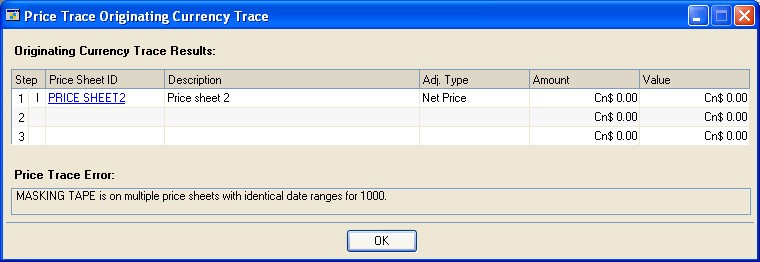

When you've finished viewing information, choose OK to close the window.

#### Viewing the items and price groups in a price sheet

The Price Sheet Inquiry window shows all items and price groups within a price sheet, with their units of measure and prices.

**To view the items and price groups in a price sheet:**

1. Open the Price Sheet Inquiry window.
(Inventory \>\> Inquiry \>\> Extended Pricing \>\> Price Sheets)

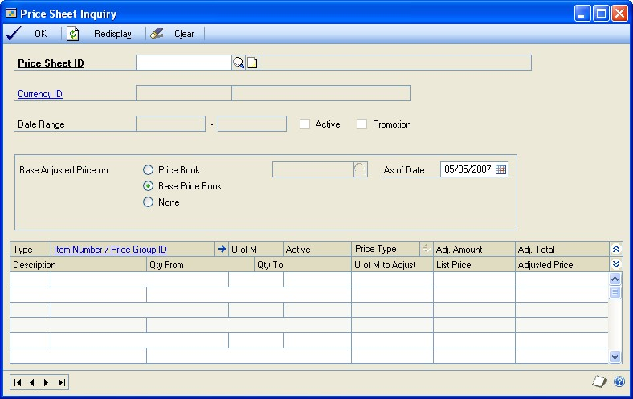

2. Enter or select a price sheet ID. The items and price groups assigned to the price sheet will be displayed in the scrolling window.

3. View additional information, if needed.

**To view information about promotional free items** When viewing information about a promotional price sheet, highlight a record for a giveawaytype promotion. Choose the Adjustment Type expansion button to open the Price Sheet Detail Free Item Inquiry window, where you can view more information about the giveaway.

**To view details about the price sheet** Select an item and use the Item Number/Price Group ID expansion button to open the Price Sheet Detail Maintenance window, where you can see quantity break pricing details for the item.

4. Use the Base Adjusted Price On options to see the effects of price adjustment.

*This selection will not be saved; it is for inquiry purposes only. For example, you might want to see a value off the base price at a future date, or you might want to see prices for a customer who receives discounts from a price book other than the base book.*

For example, you might want to know the effect of a value off the base price at a date in the future, or you might want to set up a record for a customer who receives discounts from a price book other than the base book.

- Mark a pricing element—price book, base price book, none, or price sheet ID—to see how prices would change based on that element. If you mark price book or price sheet ID, enter or select a specific price book or price sheet ID.

- Enter an As of Date to see how pricing would be calculated on a specific date.

5. When you've finished viewing information, close the window.

#### Viewing price sheets for a selected item or price group

Use the Item Price Sheet Inquiry window to view the price sheets that have been set up for a specific item or price group.

**To view price sheets for a selected item or price group:**

1. Open the Item Price Sheet Inquiry window.
(Inventory \>\> Inquiry \>\> Extended Pricing \>\> Items)

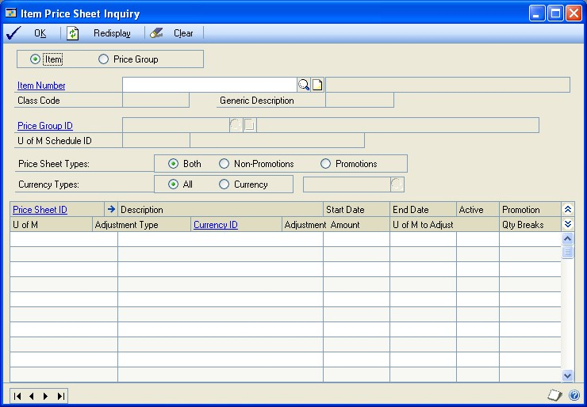

2. Select to view an item or a price group.

3. Enter or select an item number or price group ID. Information about the item or price group automatically will be displayed when you select the item or price group.

4. Mark an option to restrict the price sheets displayed in the scrolling window based on whether the price sheets are promotional or not.

5. If you're using Multicurrency Management, mark an option to restrict the price sheets displayed in the scrolling window based on the currency of each price sheet. If you mark Currency, enter or select a currency.

6. View information in the scrolling window.

You also can view more information, if needed.

**To view other items and price groups for a price sheet** Highlight the price sheet in the scrolling window and click the Price Sheet ID link to open the Price Sheet Maintenance window, where you can view the items and price groups assigned to the price sheet.

**To view price sheet details** Highlight the price sheet in the scrolling window and choose the Price Sheet ID expansion button to open the Price Sheet Detail Maintenance window, where you can view and edit price sheet information.

7. When you've finished viewing information, close the window.

#### Viewing promotions for a prospect or customer

You can use the Promotion Price Sheet Inquiry window to view all the promotions that are in effect for a prospect or customer as of a certain date. You can choose to view information for all items or you can choose to view information for a range of items.

**To view promotions for a prospect or customer:**

1. Open the Promotion Price Sheet Inquiry window.
(Inventory \>\> Inquiry \>\> Extended Pricing \>\> Promotions)

2. Mark Customer or Prospect, depending on who's promotions you want to view.

3. Enter or select a customer or prospect.

4. If you're using Multicurrency Management, you can enter or select a Currency ID.

5. Choose the items to view. Mark All to see promotions for all items, or mark From and enter a range of items to view.

6. Enter a date in the Show Promotions as of field. Only promotions that are effective on that date will be displayed in the scrolling window.

7. Choose Redisplay to update the scrolling window, and then view the information in the scrolling window.

8. When you've finished, close the window.

### Chapter 29: Transaction inquiries

You can use the inquiry windows to view information about your adjustment and variance transactions, transfers, and purchase receipts. If you're using other Microsoft Dynamics GP modules, you also can use links to open other windows that display more details about specific transactions.

The inquiry window you'll use to view transactions depends on the source of the transaction information you want to see.

**To view transactions entered throughout the system** Use the Item Transaction Inquiry window. Any posted transaction for an item—such as transactions from Sales Order Processing—will be available. Inventory Control transactions also can be viewed in the Item Transaction Inquiry window.

**To view transactions entered in Inventory Control** Use the Inventory Transaction Inquiry window to see transactions that are specific to Inventory Control: adjustments, variances, and transfers. If you're using multiple bins, you also can view information about the bins used for a transaction. You can use the InTransit Transfer History Inquiry window to view in-transit transfers.

**To view transactions resulting from purchase receipts** Use the Purchase Receipts Inquiry window.

The following information is discussed:

- *Viewing item transaction information*

- *Viewing inventory transaction information*

- *Viewing in-transit transfer transaction information*

- *Viewing purchase receipt information*

#### Viewing item transaction information

Use the Item Transaction Inquiry window to view posted inventory transactions for specific items. For example, you can view transactions for an item at a specific site— or you can see all transactions of a certain type that have been posted for a particular item number.

Transactions entered in Sales Order Processing, Purchase Order Processing, Bill of Materials, Inventory Control, and Invoicing are displayed in the window.

**To view item transaction information:**

1. Open the Item Transaction Inquiry window.
(Inventory \>\> Inquiry \>\> Item Transaction)

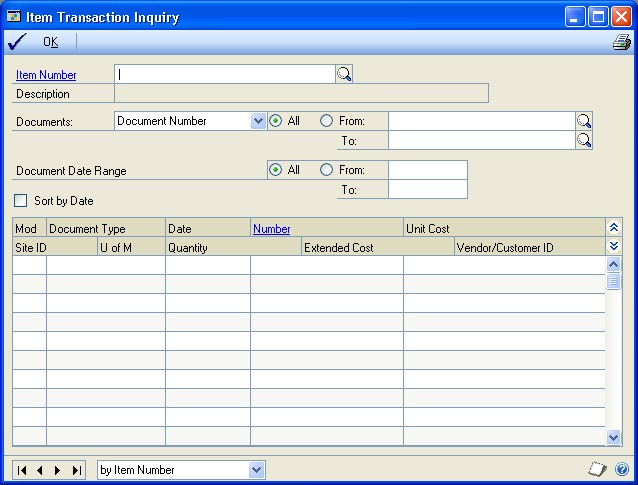

2. Enter or select an item number.

3. Determine which transaction records you want to view. You can select a range of records based on any of the following record attributes.

**To see all item records** Mark All.

**To see a specific range of records** Mark From. Select a type of document range—such as document number or module—and then select the beginning and ending values for the range.

4. Specify a document date range to restrict information. You can select to view all documents or mark From and then select the beginning and ending dates for the range.

5. Review information in the scrolling window.

*Mark the Sort by Date check box to sort information in the scrolling window by date.*

6. To view more detailed information about a transaction, select the transaction and click the Number label to open another window.

Refer to the table for information about which window will open, based on the transaction type.

| **Click this type transaction ...**    | **... to open this window:**               |
|----------------------------------------|--------------------------------------------|
| Inventory transactions                 | Inventory Transaction Inquiry window       |
| Sales Order Processing transactions    | Sales Transaction Inquiry Zoom window      |
| Purchase Order Processing transactions | Receivings Transaction Inquiry Zoom window |
| Invoicing transactions                 | Invoice Inquiry window                     |
| Bill of Materials transactions         | Assembly Inquiry Zoom window               |

You can use any of these windows to view the transaction information as it was entered.

7. You can choose File \>\> Print to print the Item Transaction Inquiry Report.

8. When you've finished viewing information, close the windows.

#### Viewing inventory transaction information

Use the Inventory Transaction Inquiry window to view any transaction that has been entered in Inventory Control. For example, you can use the window to view the transactions that have been posted to reflect stock count variance transactions.

**To view inventory transaction information:**

1. Open the Inventory Transaction Inquiry window.
(Inventory \>\> Inquiry \>\> Transaction)

2. Select the transaction type you want to view. You can choose from these inventory transaction types:

**Adjustment** Select Adjustment to view adjustment transactions for an item—transactions to record an increase or decrease to inventory levels.

**Variance** Select Variance to view variance transactions for an item— transactions to bring inventory records in line with inventory levels. For example, if you're using stock counts, you might have variance transactions to record transactions made so inventory accounting records match actual inventory levels.

**Transfer** Select Transfer to view transfer transactions for an item— transactions that record the movement of items from one site to another, from one quantity type to another, or both.

3. Enter or select the document number of the specific transaction to view.

4. Review information in the window. You can open other windows, if needed, to view more detailed information or to make changes to records.

**To view or change item records** Select a transaction and click the Item Number field label to open the Item Maintenance window.

**To view or change site records** Select the transaction and click the field label for the Site ID or for the To Site ID to open the Site Maintenance window.

5. You also can open other windows for viewing transaction information.

Refer to the table for more information.

| **This button:** | **Opens this window:**                                                                                                                                                                                                                                                                                                                                                                              |
|------------------|-----------------------------------------------------------------------------------------------------------------------------------------------------------------------------------------------------------------------------------------------------------------------------------------------------------------------------------------------------------------------------------------------------|
| Bins             | Inventory Transaction Bin Inquiry window, if the item is not tracked by lot or serial numbers. You can view the quantity of the item for each bin involved in the transaction. (To view bin information for items tracked by lot or serial numbers, use the Serial/Lot button.)                                                                                                                     |
| Quantity Type    | Inventory Transaction Quantity Types Inquiry window, where you can view information about the quantity types that were transferred. This option is available only if the pointer is on a line for a transfer transaction.                                                                                                                                                                          |
| Distributions    | Inventory Transaction Distribution Inquiry window, where you can view information about the accounts that were used when distributing the original transaction.                                                                                                                                                                                                                                    |
| Serial/Lot       | **If the item is tracked by lot numbers** Inventory Transaction Lot Inquiry window, where you can view information about the lot number and quantity for each bin involved in the transaction. **If the item is tracked by serial numbers** Inventory Transaction Serial Inquiry window, where you can view information about the serial numbers and bins for each bin involved in the transaction. |

6. You can choose File \>\> Print to print the Transaction Inquiry Report.

7. When you've finished viewing information, close the windows.

#### Viewing in-transit transfer transaction information

Use the In-Transit Transfer History Inquiry window to view an in-transit transfer that exists in history.

**To view in-transit transfer transaction information:**

1. Open the In-Transit Transfer History Inquiry window.
(Inventory \>\> Inquiry \>\> In-Transit Transfer History)

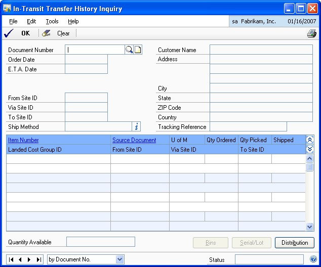

2. Enter or select the document number of the specific transaction to view.

3. Review information in the window.

4. You also can open other windows for viewing transaction information.

Refer to the table for more information.

| **This button:** | **Opens this window:**                                                                                                                                                                                                                                                                                                                                                                          |
|------------------|-------------------------------------------------------------------------------------------------------------------------------------------------------------------------------------------------------------------------------------------------------------------------------------------------------------------------------------------------------------------------------------------------|
| Bins             | Transfer Bin Inquiry window, if the item is not tracked by lot or serial numbers. You can view the quantity of the item for each bin involved in the transfer. (To view bin information for items tracked by lot or serial numbers, use the Serial/Lot button.)                                                                                                                                 |
| Distributions    | Inventory Transfer Distribution History Inquiry window, where you can view information about the accounts that were used when distributing the original transfer.                                                                                                                                                                                                                              |
| Serial/Lot       | **If the item is tracked by lot numbers** In-Transit Transfer Lot Inquiry window, where you can view information about the lot number and quantity for each bin involved in the transaction. **If the item is tracked by serial numbers** In-Transit Transfer Serial Inquiry window, where you can view information about the serial numbers and bins for each bin involved in the transaction. |

4. You can print the Service Inventory Pack List - Reprint report.

5. When you've finished viewing information, close the windows.

#### Viewing purchase receipt information

Use the Purchase Receipts Inquiry window to view all the purchase receipts that exist for a particular item. For example, you might use this window to find out the actual costs and quantities on a specific receipt. Or, if you suspect an item cost was entered incorrectly, you could use this window to verify the cost.

*Information about split purchase receipts also is displayed in the window. Refer to Split purchase receipts for more information.*

**To view purchase receipt information:**

1. Open the Purchase Receipts Inquiry window.
(Inventory \>\> Inquiry \>\> Receipts)

2. Enter or select an item number.

3. Enter or select a site.

4. Decide if you want to view transaction information for all dates or for a specific range of dates.

**To view information for all dates** Mark All.

**To view information for a range of dates** Mark From, then enter starting and ending dates for the period that includes the transactions you want to view.

5. Review information in the window.

6. To view additional information for a specific transaction, select the transaction and click on the Receipt Number link, Purchase Order No. link, or the Quantity Sold link to open a window with detailed information. The window that opens depends on the transaction source and the link you click.

Refer to the table for more information.

| **If the transaction source is ...** | **... and you click ...** | **... this window opens:**       |
|--------------------------------------|---------------------------|----------------------------------|
| Inventory Control                    | Receipt Number            | Inventory Transaction Inquiry    |
| Receipts                             | Receipt Number            | Receivings Transaction Inquiry   |
| Bill of Materials                    | Receipt Number            | Assembly Inquiry Zoom            |
| Sales Order Processing               | Receipt Number            | Sales Transaction Inquiry Zoom   |
| Invoicing                            | Receipt Number            | Invoice Inquiry                  |
| Purchase Order                       | Purchase Order No.       | Purchase Order Inquiry Zoom      |
| In-Transit                           | Purchase Order No.       | In-Transit Transfer Inquiry Zoom |
| Not applicable                       | Quantity Sold             | Purchase Receipts Quantity Sold  |

Zoom

Processing

Details

7. You can choose File \>\> Print to print the Purchase Receipts Inquiry Report.

8. When you've finished reviewing information, close the windows.

### Chapter 30: Reports

You can use Inventory Control reports to analyze inventory activity and identify errors in transaction entry. Use this information to guide you through printing reports and working with report options.

For more information about creating and printing reports, and the various reporting tools that you can use with Microsoft Dynamics GP, refer to your System User's Guide (Help \>\> Contents \>\> select Using The System).

The following information is discussed:

- *Inventory Control report summary*

- *Accuracy Comparison report*

- *Historical stock status report*

- *Checking for missing prices*

- *Printing extended pricing summary reports*

- *Printing a purchase order generator item report*

- *Specifying an Inventory Control report option*

- *Microsoft SQL Server&reg; Reporting Services reports for Inventory Control*

#### Inventory Control report summary

You can print several types of reports using Inventory Control. Some reports automatically are printed when you complete certain procedures; for example, posting journals can be printed automatically when you post transactions, depending on how your posting options are set up. You can choose to print some reports during procedures; for example, you can print an edit list when entering transactions by choosing the Print button in the batch entry window. In order to print some reports, such as analysis or history reports, you must set up report options to specify sorting options and ranges of information to include on the report. For more information, refer to *Specifying an Inventory Control report option*.

*If you're using extended pricing, standard item price list reports won't contain up-to-date pricing information. To print an accurate pricing report, you must use the Extended Pricing Reports window.*

The following table lists the report types available in Inventory Control and the reports in each category.

| **Report Type**                                                                    | **Report**                   | **Printing method**                                                                                                                                                      |
|------------------------------------------------------------------------------------|------------------------------|--------------------------------------------------------------------------------------------------------------------------------------------------------------------------|
| Setup reports                                                                      | Inventory Module Setup       | Choose File \>\> Print in the setup windows **or** choose the print icon button in the setup windows **or** create report options in the Inventory Setup Reports window. |
| Item                                                                               | Detailed Item List           | Choose File \>\> Print in the cards windows **or** choose the print icon button in the cards windows **or** create report options in the Inventory Item Reports window. |
| Serial/Lot                                                                         | Serial Number List           | Create report options in the Inventory Serial-Lot Reports window.                                                                                                       |
| Resource Planning                                                                  | Planner List                 | Create report options in the Resource Planning Reports window.                                                                                                          |
| Activity                                                                           | Purchase Receipts†           | Create report options in the Inventory Activity Reports window.                                                                                                         |
| Inquiry                                                                            | Serial Number Inquiry Report | Choose File \>\> Print in an inquiry window **or** choose the print icon button in an inquiry window.                                                                   |
| \* Indicates reports that can be printed with multicurrency information displayed. |                              |                                                                                                                                                                          |

Unit of Measure Schedule

Price Group List

Lot Category List

Class

Class Currency List

Site

Bill of Materials Setup

Single-Level Bill of Materials

Indented Bill of Materials

Component Where Used

Stock Calendar List

Bin List per Site

Bin List per Item/Site

Landed Cost List

Landed Cost Group List

Item Currency List

Detailed Item List by Site

Item Price List\*

Item Price List Options\*

Item List by User Category

Item Purchasing Options List

Kit List

Lot Number List

Resource Planning Site Defaults

Report

Stock Status†

Physical Inventory Checklist

Vendor Activity Report

Stock Count List†

Bin Quantity

Historical Stock Status Report†

Historical Inventory Trial Balance

Lot Number Inquiry Report

Consolidated Lot Number Inquiry

Report

Purchase Receipts Inquiry Report

Item Transaction Inquiry Report

Transaction Inquiry Report

Item Period History

Item Allocation Inquiry Report

Item Stock Inquiry Report

Serial/Lot Trace Inquiry Report

† Indicates reports that can be assigned to named printers. See your System Administrator's Guide (Help \>\> Contents \>\> select System Administration) for more information.

| **Report Type**     | **Report**      | **Printing method**       |
|---------------------|-----------------|---------------------------|
| Analysis  | Turnover Report Purchase Advice Report Gross Requirements Report Item ABC Analysis Report Accuracy Comparison†  | Create report options in the Inventory Analysis Reports window.     |
| History reports   | Transaction History Report Distribution History Report Sales Summary Report Item Period History Cost Change History Report     | Create report options in the Inventory History Reports window.    |
| Edit lists    | Transaction Edit List Transfer Edit List  | Choose File \>\> Print in the window you used to complete the procedure.  |
| Posting reports    | Transaction Posting Journal† Transfer Posting Journal† Cost Variance Journal Distribution Breakdown Register   | Choose File \>\> Print in the window you use to complete the procedure **or** some will be printed automatically when you complete the procedure **or** create report options in the Reprint Inventory Journals window. |
| Utility reports   | Reconcile Report Cost Adjustment Audit Report Valuation Method Change Audit Report Decimal Places Change Audit Report\* Unit of Measure Schedule Audit Report Add Price List Wizard Audit Report\* Update Price List Wizard Audit Report\* Remove Price List Wizard Audit Report\* Copy Price List Wizard Audit Report\* Assign Currency Audit Report (available only if you're using Multicurrency Management) Replace Resource Planning Buyer/ Planner Exception Report Resource Planning Site Roll Down Exception Report | These reports will be printed when you complete the corresponding procedure.      |
| Extended Pricing    | Pricing Reports Error Reports    | Enter report ranges and selections in the Extended Pricing Reports window. Refer to *Checking for missing prices* and *Printing extended pricing summary reports*.       |
| Purchase Order Generator Item     | Purchase Order Generator Item Report   | Enter report ranges and selections in the Purchase Order Generator Item Report window. Refer to *Printing a purchase order generator item report*.        |

\* Indicates reports that can be printed with multicurrency information displayed. † Indicates reports that can be assigned to named printers. See your System Administrator's Guide (Help \>\> Contents \>\> select System Administration) for more information. 

#### Accuracy Comparison report

The Accuracy Comparison report can be the most valuable result of performing stock counts. The report helps you spot trends in the accuracy of your inventory records over time, measured by the results of your stock counts.

For example, suppose your business has several warehouses and stores. For each site, you implement cycle counting and stock counts. Once you've completed several counts, you print the Accuracy Comparison report, which shows that all sites and warehouses have about the same inventory-record accuracy.

If you notice a sharp decrease in the accuracy at one site, you might need to investigate further. The change could be caused by changes in how inventory is managed at that site—perhaps more training is needed for those inventory personnel—or might be caused by employee theft. If you implement new inventory management policies, the Accuracy comparison report also can help you measure the success of those changes.

The Accuracy Comparison report is printed from the Inventory Analysis Reports window. You can print the report any time, but you must have processed at least one stock count for the report to include any data.

The following fields are of particular importance when analyzing your accuracy.

**To Reconcile** This field displays the absolute difference between the captured quantity and the counted quantity. Ideally, this difference should be zero, meaning that the captured quantity and the counted quantity are the same. A large number in this field doesn't necessarily mean that there was a large variance, however. If unposted transactions or transaction history showed that other entries in the system accounted for the amount, then your inventory records are still accurate.

**Net Variance** This field is the item quantity that was actually included in the variance transaction. A large number in this field might signify inventory control problems.

**Accuracy % [Accuracy Percent]** The Accuracy Percent is 100% - Relative Error Percent, where Relative Error Percent is Variance / Counted Quantity x 100. An accuracy percentage of 100.00% is perfect accuracy.

**Approx Value** Extended values for all quantities—captured, counted, to reconcile, and net variance—are the current cost of the item when the stock count was processed.

#### Historical stock status report

The Historical Stock Status Report can be printed at any time for a report of the status of your inventory on a certain day. You can print the report using the Inventory Activity Reports window. To automatically print the report, you can use Named Printers or the Distributed Process Server (DPS). Refer to your System Administrator's Guide (Help \>\> Contents \>\> select System Administration) for more information.

The report can be used to report information about Sales Inventory and Discontinued items only. The report shows the quantity on hand, the unit cost, and the extended cost for each item. Information about returned, damaged, in use, and service quantities is not reflected in the report.

*To generate a Historical Stock Status Report, you must be maintaining transaction history for the items in the report. To set options to maintain history for an item class, refer to Creating an item class. To set options to maintain history for an item, refer to Entering item options.*

For an item with a LIFO Perpetual valuation method or a FIFO Perpetual valuation method, the extended cost of inventory as of a certain day is calculated in two steps. First, the extended cost is calculated *at the time the report is run*, much like the regular Stock Status Report. Then, transactions posted since the "as of date" are added to or subtracted from the extended cost. However, only transactions that affect the quantity on hand are listed in the report. A transaction that affected a different quantity type—such as a sales return document that added items to the returned quantity—would not be included in the report.

Inventory cost (extended cost) calculations for the Historical Stock Status Report are influenced by the valuation method for an item. For more information about valuation methods and item costs, refer to *Valuation methods*.

*If you change the valuation method for an item sometime between the point in time you choose for the report—the As of Date—and the date you generate the report, values in the report might not be accurate.*

Refer to the following table for more information.

| **Valuation method** | **Calculation**                                                |
|----------------------|----------------------------------------------------------------|
| FIFO perpetual       | Layered cost using purchase receipts                           |
| LIFO perpetual       | Layered cost using purchase receipts                           |
| Average perpetual    | Quantity x Item's historical current cost for a selected date  |
| FIFO periodic        | Quantity x Item's historical standard cost for a selected date |
| LIFO periodic        | Quantity x Item's historical standard cost for a selected date |

When the current cost of an item that uses average perpetual valuation method changes or when the standard cost of a LIFO periodic or FIFO periodic item changes, the new value is saved to history. When an item that uses LIFO perpetual or FIFO perpetual valuation method is received into stock, the transaction is valued at the actual cost. This becomes the "historical cost" for the item. The historical cost is always used for both increase transactions (receipts) and decrease transactions (issues) for items that have a LIFO Perpetual or FIFO Perpetual valuation method.

If your report includes items with an Average Perpetual or periodic valuation methods, however, you can choose to use either the historical cost or the standard cost (for items with periodic valuation methods) or the average cost (for items with the Average Cost valuation method). In those cases, the unit costs and extended values are calculated according to the following table:

| **Valuation method**                                                   | **Cost type used** | **Calculations \***                                                                          |
|------------------------------------------------------------------------|--------------------|----------------------------------------------------------------------------------------------|
| Average perpetual                                                      | Today's            | Unit cost: Current cost for item on the user date                                            |
| Average perpetual                                                      | Historical         | Unit cost: Historical current cost for item on the selected date                             |
| FIFO periodic                                                          | Today's            | Unit cost: Standard cost for item on the user date                                           |
| FIFO periodic                                                          | Historical         | Unit cost: Historical standard cost for item on the selected date                            |
| FIFO perpetual                                                         | Today's            | Unit cost: Unit cost for transaction                                                         |
| FIFO perpetual                                                         | Historical         | Unit cost: Historical unit cost for transaction Extended cost: Extended cost for transaction |
| LIFO periodic                                                          | Today's            | Unit cost: Standard cost for item on the user date                                           |
| LIFO periodic                                                          | Historical         | Unit cost: Historical standard cost for item on the selected date                            |
| LIFO perpetual                                                         | Today's            | Unit cost: Unit cost for the transaction                                                     |
| LIFO perpetual                                                         | Historical         | Unit cost: Unit cost for the transaction Extended cost: Extended cost for transaction        |
| \* All calculations are converted to reflect the base unit of measure. |                    |                                                                                              |

Standard/

Average

Extended cost: Current cost for item on the user date x

Quantity on Hand on the user date

Extended cost: Historical cost for item x Quantity on

Hand from the historical date

Standard/

Average

Extended cost: Standard cost for item on the user date x

Quantity on Hand on the user date

Extended cost: Standard cost for item on the user date x

Quantity on Hand from the historical date

Standard/

Average

Extended cost: Extended cost for transaction

Standard/

Average

Extended cost: Standard cost for item on the selected date x Quantity on Hand on the user date

Extended cost: Standard cost for item on the selected date x Quantity on Hand on the selected date

Standard/

Average

Extended cost: Extended cost for transaction

#### Checking for missing prices

If you're using extended pricing, you can use the Extended Pricing Error Report to identify the items for which prices cannot be calculated.

For example, if an item has a value-off price in a price sheet but no net price in the base price book, or if an item has entries in two price sheets with the same date range in the same price book, prices can't be calculated and errors will be reported.

You can view price error results on screen or on a printed report. When a pricing error report is generated, a complete price book is calculated for the date you enter. This price book is recalculated when an Extended Pricing report is generated for a different date or if the Refresh Pricing Tables option is marked.

**To check for missing prices:**

1. Open the Extended Pricing Error Report window.
(Inventory \>\> Reports \>\> Extended Pricing \>\> Error Reports)

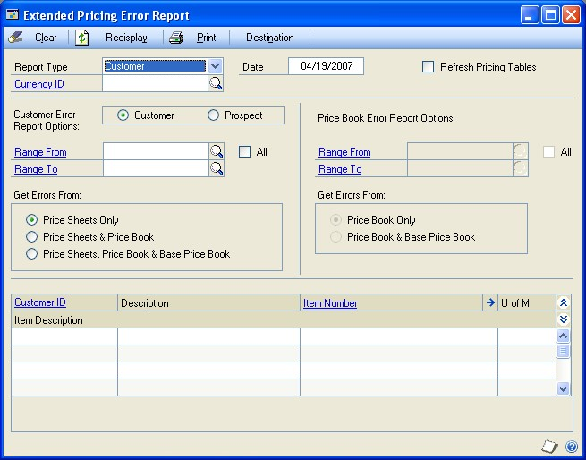

2. Choose to report on errors for customers or price books.

3. Enter a date for which prices will be calculated.

4. Mark the Refresh Pricing Tables option to recalculate the prices in the price book when you generate the Extended Pricing error report.

*If you intend to produce multiple price book reports for the same date, clear this option to reduce processing time. Select this option only if you have made changes to pricing setup since the last report was printed.*

5. If you selected a Customer report type, choose to report on customers or prospects.

6. Enter or select the range of customers, prospects, or price books you want to print the report for.

7. Choose where to look for prices.

A customer report can be printed using the following options:

| **Option**                             | **Description**                                                                                                                                                                                           |
|----------------------------------------|-----------------------------------------------------------------------------------------------------------------------------------------------------------------------------------------------------------|
| Price Sheets Only                      | Prices will be reported for price sheets assigned directly to the customer or prospect.                                                                                                                  |
| Price Sheets and Price Book            | Prices will be reported for price sheets assigned directly to the customer or prospect, and price sheets assigned to the customer or prospect's price book.                                              |
| Price Sheets, Price Book and Base Book | Prices will be reported for price sheets assigned directly to the customer or prospect, price sheets assigned to the customer or prospect's price book, and price sheets assigned to the base price book. |

A price book report can be printed using the following options:

| **Option**               | **Description**                                                                                                       |
|--------------------------|-----------------------------------------------------------------------------------------------------------------------|
| Price Book Only          | Prices will be reported for price sheets assigned to the price book.                                                 |
| Price Book and Base Book | Prices will be reported for price sheets assigned to the price book and price sheets assigned to the base price book. |

8. To view the information on-screen, choose the Redisplay button. Highlight a record to display error details.

To print a report, choose Destination to select a report destination, then choose Print to print the report.

#### Printing extended pricing summary reports

If you're using extended pricing, you can use the Extended Pricing Report window to print reports that summarize pricing information for a customer or for a price book.

**To print extended pricing summary reports:**

1. Open the Extended Pricing Report window.
(Inventory \>\> Reports \>\> Extended Pricing \>\> Pricing Reports)

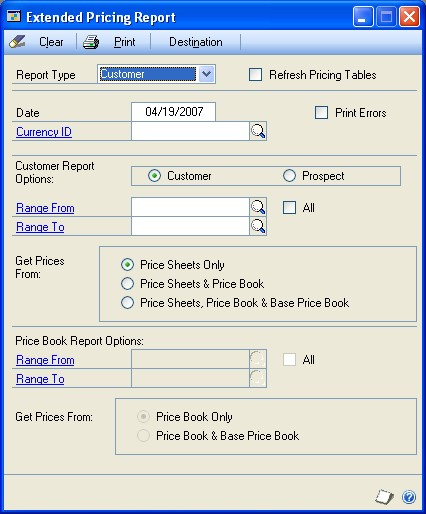

2. Choose the report type: Customer or Price Book.

*You can use the customer report type to print reports for prospects, as well.*

3. Mark Refresh Pricing Tables to recalculate pricing in a price book. You shouldn't have to mark this option unless you have made changes to pricing information since the last time you generated the report.

2. Enter the date that information in the report should be based on.

3. Mark Print Errors if problems in calculating prices should be included in the report.

If you don't mark this option, the first net price that is found will be printed on the report.

4. If you're using Multicurrency Management, enter or select the currency ID for the report. If you don't select a currency, information about all currencies will be included on the report.

5. Enter additional information for the report, based on the kind of report you're printing.

Refer to the table for more information.

| **Report Type** | **Information to enter**                                                                                                                                                                                             |
|-----------------|----------------------------------------------------------------------------------------------------------------------------------------------------------------------------------------------------------------------|
| Customer        | Mark Customer or Prospect                                                                                                                                                                                            |
|                 | Enter or select a range of customer or prospect records to include in the report. To include all customers or all prospects, mark All.                                                                              |
|                 | Mark the information to include in the report. The report can be based on price sheets only, price sheets and the price book for the customer or prospect, or price sheets, the price book, and the base price book. |
| Price Book      | Enter or select a range of price books to include in the report. To include all price books, mark All.                                                                                                              |
|                 | Mark the information to include in the report. The report can be based on information for each price book only, or on information for the price book and the base price book.                                       |

6. Choose Destination to open the Report Destination window.

7. Choose the report destination.

*If you don't choose a destination for the report at this point, you'll be prompted to select a destination when the report is generated.*

8. Choose OK to save the report destination and close the Report Destination window.

9. In the Extended Pricing Report window, choose Print to generate the report.

10. When you've finished, close the window.

#### Printing a purchase order generator item report

You can use the Purchase Order Generator Item Report to print the Purchase Order Generator Item Report, which summarizes the purchase order generator options you've set up for items.

**To print a purchase order generator item report:**

1. Open the Purchase Order Generator Item Report window.
(Inventory \>\> Reports \>\> Purchase Order Generator Item)

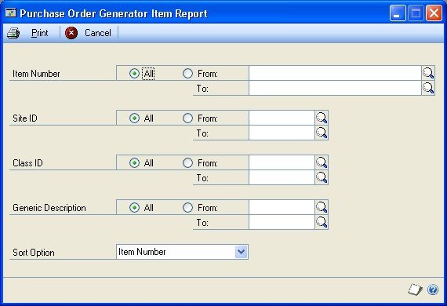

2. Use the range fields to select the group of items to include in the report. You can select a range of items, sites, classes, or generic descriptions.

3. Choose how information in the report should be sorted. Choices are Item, Description, Site, Class, and Generic Description.

4. Choose Print. The Report Destination window opens, where you can choose where the report should be printed. For more information about report destinations and formats, refer to your System User's Guide (Help \>\> Contents \>\> select Using The System).

5. In the Report Destination window, choose OK. The report will be printed to the destination you selected.

6. When you've finished, close the window.

#### Specifying an Inventory Control report option

Report options include specifications for sorting options and range restrictions for a particular report. In order to print several Inventory Control reports, you must first create a report option. Each report can have several different options so that you can easily print the information you need. For example, you can create report options for the Purchase Receipts Report that show either detailed or summary information.

*A single report option can't be used by multiple reports. If you want identical options for several reports, you must create them separately.*

Use the Inventory Control report options windows to create sorting, restriction, printing, and email options for the reports that have been included with Inventory Control.

**To specify an Inventory Control report option:**

1. Open an Inventory Control reports window. There are separate windows for each report type.
(Inventory \>\> Reports \>\> Setup)
(Inventory \>\> Reports \>\> Item)
(Inventory \>\> Reports \>\> Serial/Lots)
(Inventory \>\> Reports \>\> Activity)
(Inventory \>\> Reports \>\> Analysis)
(Inventory \>\> Reports \>\> History)
(Inventory \>\> Reports \>\> Posting Journals)
(Inventory \>\> Reports \>\> Resource Planning)

2. Select a report from the Reports list.

3. Choose New to open the report options window. Your selection in step 2 determines which report options window appears.

4. Name the option and enter information to define the option. The name you choose for the option won't appear on the report. The selections available for defining report options vary, depending on the report type you've selected.

5. Enter range restrictions. The Ranges list shows the available options for each report. The available ranges vary, depending on the type of report.

*You can enter only one restriction for each restriction type. For instance, you can insert one item number restriction (item ABC-001 to ABC-999) and one date restriction (10/ 15/05 to 11/15/05).*

6. Choose Insert to insert the range in the Restrictions List. To remove an existing range from the list, select the range and choose Remove.

7. Choose Email Options to enter email options for the report option. Once the email options are set up, you'll be able to send the report in an email message from this window by choosing Email. You can also send this report from any list view where the report option is displayed.

8. Choose Destination to select a printing destination. Reports can be printed to the screen, to the printer, to a file, or to any combination of these options. If you select Ask Each Time, you can select printing options each time you print this report option.

For more information about printing report options, refer to your System User's Guide (Help \>\> Contents \>\> select Using The System).

9. To print the report option from the report options window, choose Print before saving it. If you don't want to print the option now, choose Save and close the window. The report window will be redisplayed.

#### Microsoft SQL Server&reg; Reporting Services reports for Inventory Control

You can view Inventory Control Reporting Services reports from the Reporting Services Reports list. If you are using Reporting Services 2008, inventory metrics for your home page also appear in the Reporting Services Reports list. You can access the Reporting Services Reports list from the navigation pane or from an area page in the Microsoft Dynamics GP application window. This report list appears if you specified the location of your Reporting Services reports using the Reporting Tools Setup window. For more information, see your System Setup Guide (Help \>\> Contents \>\> select Setting up the System).

The following Reporting Services reports are available for Inventory Control.

| Purchase Advice Report | Sales Summary |
|------------------------|---------------|
| Purchase Receipts      | Stock Status  |

##### Historical Inventory Trial Balance

**To print an Inventory Control Reporting Services report:**

1. In the navigation pane, choose the Inventory button, and then choose the Reporting Services Reports list.

2. Mark the Inventory Control report that you want to print.

3. In the Actions group, choose View to open the Report Viewer.

4. In the Report Viewer, select the specifications for the report, and then choose View Report.

5. After viewing the report, select a format, and then print the report.

## Part 5: Utilities

This part of the documentation contains the procedures you need for maintaining setup options, correcting transaction errors, and maintaining your data. Always back up your accounting data before performing these procedures.

The following information is discussed:

- *Chapter 31, "Item cost adjustments,"* contains information about updating cost information on posted purchase receipts, and about updating average or standard cost information for an item.

- *Chapter 32, "Standard pricing wizards,"* describes how you can use wizards to work with price list records, if you're using standard pricing. You can add, copy, update, and remove price lists. You also can assign a currency to a range of items, if you're using Multicurrency Management.

- *Chapter 33, "Extended pricing utilities,"* contains information about utilities you can use to transfer and remove price sheets.

- *Chapter 34, "History utilities,"* includes information about removing fiscal- and calendar-year history, as well as removing other inventory history information: for transactions, distributions, posting journals, and stock counts.

- *Chapter 35, "Reconciling inventory records,"* explains how you can reconcile inventory records so posted quantity information matches actual inventory levels.

- *Chapter 36, "Inventory Control setup changes,"* contains information about changing the number of decimal places used to track currency and quantity information for items. You also can change the valuation method assigned to an item, or replace the buyer or planner IDs that have been assigned in resource planning windows. You also can remove bins from sites, from item-site combinations, or both.

### Chapter 31: Item cost adjustments

You might need to adjust the costs of inventoried items in certain circumstances. For example, if you learn that the cost of an item in a posted transaction was entered incorrectly, you'll want to correct the information.

Certain situations also can cause inventory to be revalued. Those situations and their effect on accounts are included in this document.

*Refer to the General Ledger documentation for information about correcting General Ledger entries.*

The following information is discussed:

- *Adjusting the purchase receipt cost of an item*

- *Average cost updates*

- *Updating the standard cost of an item*

### Adjusting the purchase receipt cost of an item

Use the Inventory Adjust Costs window to change the cost information for a purchase receipt transaction.

**To adjust the purchase receipt cost of an item:**

1. Open the Inventory Adjust Costs window.
(Inventory \>\> Utilities \>\> Adjust Costs)

2. Enter or select an item number.

3. Enter or select a site ID.

4. Determine the dates of the transactions you want to work with.

**To see transactions for all dates** Mark All.

**To see transactions for a specified period** Mark From, then enter starting and ending dates.

Once you've entered a range, detailed information for all receipts within the range are displayed in the scrolling window.

5. Find a transaction that has incorrect cost information. In the Cost column for the transaction line, enter the correct cost.

6. Continue, repeating step 5 to enter corrected costs for other transactions, if needed.

7. Choose Process.

The General Posting Journal will be printed if there are cost changes posted to the Inventory and Cost of Goods accounts in General Ledger. Cost changes can occur if a quantity of the receipt has already been sold or consumed.

### Average cost updates

When you create a record for an item that uses the average perpetual valuation method, you can enter an average cost for the item. The average cost is called the current cost in the Item Maintenance window. After you save the item record, the current cost will be updated when you post transactions for the item.

Microsoft Dynamics GP uses the moving average cost method. This means that when you post a transaction that increases the inventory quantity, the average cost will be calculated using the following formula.

(Previous On-Hand Quantity x Previous Adjusted Unit Cost) + [(Receipt Quantity - Quantity Returned) x Receipt Unit Cost]/Previous Quantity On-Hand + (Receipt's Quantity On-Hand - Quantity Returned)

*All calculations are based on quantities and costs that are first converted to the base unit of measure.*

The average cost of an item will be recalculated under the following situations.

- Posting an invoice receipt in Purchase Order Processing that has an item marked to be revalued in inventory and has a unit cost that is different from the unit cost on the shipment

- Using the Inventory Adjust Costs window to change the cost of a purchase receipt

- Closing a purchase order line item when you haven't invoiced the entire quantity of the item

- Posting a purchase order return

- Posting an increase or decrease transaction with a document date that causes the purchase receipt to appear before another purchase receipt in the Purchase Receipts Inquiry window

- Changing the quantity type of an item to On Hand when the unit cost for the transaction is different from the current cost of the item.

### Updating the standard cost of an item

Use the Change Item Standard Cost window utility to change the standard cost of an item and automatically create an adjustment in General Ledger keeping the inventory and accounts in balance.

Only certain items can be changed in this window:

- Items must be using a periodic valuation method

- Item status must be sales inventory or discontinued

- If you have the Manufacturing module registered, you will not be able to use this window. Use the windows available in that module instead.

**To update the standard cost of an item:**

1. Open the Change Item Standard Cost window.
(Inventory \>\> Utilities \>\> Change Item Standard Cost)

2. Enter or select the item. The quantity on hand and current standard cost will be displayed.

3. Enter the new standard cost.

4. Choose Process.

An adjusting transaction will be created for updating Inventory and General Ledger, and the standard cost will be changed. A posting journal will be printed with information about the change.

### Chapter 32: Standard pricing wizards

Inventory Control includes a series of wizards you can use to work with item price lists if you're using standard pricing. You can add a price list to a group of items, copy a price list from one item to another, and so on.

*For information about utilities available if you're using extended pricing, refer to Chapter 33, "Extended pricing utilities."*

Most of the information you need to use a wizard is included in the window, but you can refer to this information as needed for more information.

The following information is discussed:

- *Getting started with a price list wizard*

- *Adding a price list to several items*

- *Updating price lists for several items*

- *Fixed percentages versus percentages*

- *Rounding calculations for updating price lists*

- *Copying a price list from one item to others*

- *Removing price list records from several items*

- *Assigning a currency to a group of items*

- *Items updated by price list wizards*

### Getting started with a price list wizard

To use any of the price list wizards available in Microsoft Dynamics GP, you open a welcome window, move to a menu window, and select a price list procedure. All price list wizard features begin with these steps.

**To get started with a price list wizard:**

1. Open the Price List Utilities - Welcome window.
(Inventory \>\> Utilities \>\> Price List Utilities)

2. Choose Next to open the Price List Utilities Main Menu.

*If you're not using Multicurrency Management, the last option—Assign Currency Wizard—won't be displayed.*

3. Select the price list procedure to complete.

Refer to the following table to find more specific information about the procedures.

| **To do this:**                       | **Refer to this section:**                       |
|---------------------------------------|--------------------------------------------------|
| Adding a price list                   | *Adding a price list to several items*           |
| Updating a price list                 | *Updating price lists for several items*         |
| Copying a price list                  | *Copying a price list from one item to others*   |
| Removing a price list                 | *Removing price list records from several items* |
| Assigning a currency to several items | *Assigning a currency to a group of items*       |

### Adding a price list to several items

You can use a price list wizard to add price list information to several items at once. To be able to do this, the items must be assigned the same price method. Refer to *Price methods* for more information.

You can end a price list wizard session at any time by choosing Cancel. Your records will be unchanged until you choose Finish in the last price list wizard window.

*Use this procedure only if you're using standard pricing. For information about pricing utilities you can use with extended pricing, refer to Chapter 33, "Extended pricing utilities."*

**To add a price list to several items:**

1. Refer to *Getting started with a price list wizard*, selecting the option for adding a price list to several items. The Add Price List Wizard - Price Method window opens.

2. Select a price method from the list. All items you're adding a price list to must share the same price method. Choose Next.

*To add price list records for multiple currencies to an item, you must be using Multicurrency Management and you must select Currency Amount or Percent of List for the price method, and the items must already have the appropriate currencies assigned to them.*

The window that appears depends on whether you're using multicurrency features and the price method you selected.

**If you're using Multicurrency Management and you selected percent of list or currency amount** The Add Price List Wizard - Currency and Price Level window opens.

**If you're not using multicurrency features** The Add Price List Wizard - Price Level window opens.

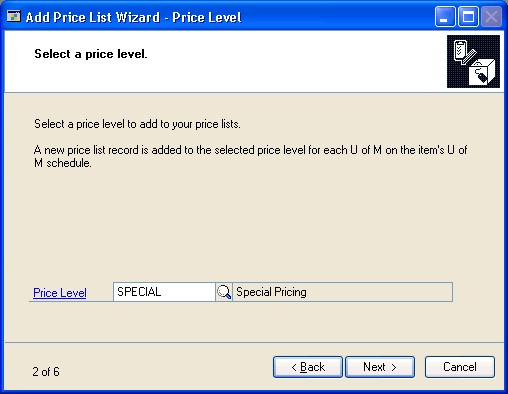

3. Enter or select a currency (if you're using Multicurrency Management and have selected a price method of Current Amount or Percent of List) and price level. Choose Next.

The window that appears depends on the price method you selected earlier.

**If you selected currency amount** The Add Price List Wizard - Initial Price window opens.

**If you selected another price method** The Add Price List Wizard - Initial Percentage window opens.

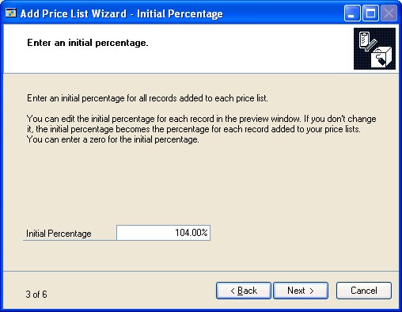

4. Enter information to calculate the default price for the items you're adding the price list to.

**If you selected currency amount earlier** Enter an amount to be the default price for the items. Choose Next.

**If you selected another price method** Enter a default percentage to be used to calculate pricing for items. Choose Next.

*This is default pricing for the items that you're adding price lists to. Later, you can adjust the pricing for specific items in the group.*

5. In the Add Price List Wizard - Restrictions window, enter restrictions to define the items to be included in the group that you're adding the price list to. You can add as many restrictions as you like, but you can use each range type only once. For example, you can define only one range of item numbers.

You can use item numbers, descriptions, short descriptions, generic descriptions, class IDs, and price groups to define the group of items that you're adding the price list to. *Refer to Items updated by price list wizards for more information.* Choose Next.

6. Review the information in the scrolling window. Make any modifications as needed.

*To print a preview report, choose File \>\> Print or choose the print icon button.*

**To remove an item from the list to be updated** Clear the check box at the beginning of the appropriate line.

**To adjust the price for an item** Change the amount or percentage directly in the scrolling window. Choose Next.

7. In the Add Price List Wizard - Finish window, review the summary of the price list modification you're making.

Choose Finish to add the price lists to the items. The Add Price List Audit Report automatically will be generated.

### Updating price lists for several items

You can update price list records for a group of items that share a common price method. To be updated, the combination of currency, price level, unit of measure, and quantity breaks must already exist in each item's price list.

You can end a price list wizard session at any time by choosing Cancel. Your records will be unchanged until you choose Finish in the last price list wizard window.

*Use this procedure only if you're using standard pricing. For information about pricing utilities you can use with extended pricing, refer to Chapter 33, "Extended pricing utilities."*

**To update price lists for several items:**

1. Refer to *Getting started with a price list wizard*, selecting the wizard for updating a price list to several items. The Update Price List Wizard - Price Method window opens.

2. Select a price method, then choose Next.

3. In the Update Price List Wizard - Update Information window, indicate how the price list information should be updated.

**To adjust prices by a percentage** Mark Percentage and enter the percentage change. Choose Next.

**To adjust prices by a fixed percentage** Mark Fixed Percentage and enter the percentage change. Choose Next. This option isn't available if you're using the Currency Amount price method.

**To adjust prices by a fixed amount** This option is available only if you're using the Currency Amount price method. Mark Fixed Amount and enter the amount of increase or decrease. Choose Next.

*Refer to Fixed percentages versus percentages for more information.*

4. If you selected the Currency Amount price method, use the Update Price List Wizard - Rounding Information window to enter and select rounding options for the records you're updating. If you don't want rounding to occur, select None for the Round Policy. Choose Next.

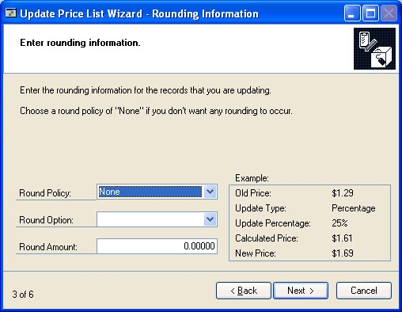

*Refer to Rounding calculations for updating price lists for more information about how rounding options affect pricing.*

5. In the Update Price List Wizard - Restrictions window, select the ranges of price list records to be updated. You can define as many range restrictions as needed, but only items that meet all restrictions will be updated. Choose Next.

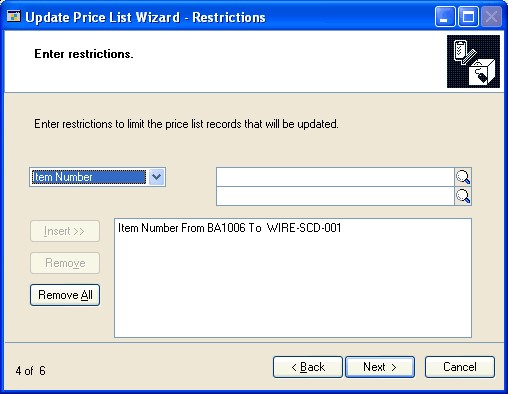

When you're updating price list records for a group of items, you can choose the specific items and the specific price list records to be updated. For example, if you're using Multicurrency Management, you might want to update all price lists for a specific currency. To do this, you'd include that currency in the restrictions list.

*Refer to Items updated by price list wizards for more information.*

6. In the Update Price List Wizard - Preview window, review the information in the scrolling window. Make any modifications as needed.

*To print a preview report, choose File \>\> Print or choose the print iconton.*

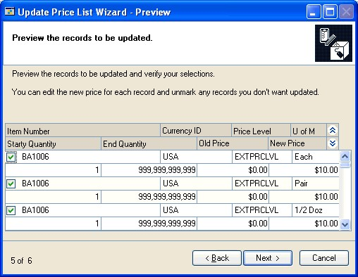

**To remove an item from the list to be updated** Clear the check box at the beginning of the appropriate line. Choose Next.

**To adjust the price for an item** Change the amount or percentage directly in the scrolling window. Choose Next.

7. In the Update Price List Wizard - Finish window, review the summary of the price list modification you're making.

Choose Finish to update the price lists. The Update Price List Audit Report automatically will be generated.

### Fixed percentages versus percentages

If you're updating price lists that have a price method based on a percentage—any price method other than Currency Amount—you can choose to specify either a fixed percentage or a percentage change. If you use the Fixed Percent update option, the percentage you enter is added to the percentage in each price list. If you use the Percent update option, the percentage in each price list is multiplied by the percentage you enter, and the result is added to the percentage in each price list.

Refer to the table for information about how those options will affect your price lists.

|                                                               | **Fixed percentage** | **Percentage**                                     |
|---------------------------------------------------------------|----------------------|----------------------------------------------------|
| If, before updating, the price method uses this percentage:   | 75%                  | 75%                                                |
| ... and the percent change entered in the wizard is ...      | 10%                  | 10%                                                |
| ... then the new percent used to calculate the price will be: | 85% 75% + 10% = 85%  | 82.5% (75% x 10%) + 75% = 82.5% 7.5% + 75% = 82.5% |

### Rounding calculations for updating price lists

You can use rounding options to make your pricing seem more even and consistent if you're using the Currency Amount price method. Refer to the table for information about how different rounding options will affect pricing for items.

| **Calculated price** | **Rounding policy** | **Round option** | **Round amount** | **New price** |
|----------------------|---------------------|------------------|------------------|---------------|
| \$1.26               | None                | Not applicable   | Not applicable   | \$1.26        |
| \$1.26               | Up                  | Multiple of      | \$0.05           | \$1.30        |
| \$1.26               | Up                  | Ends in          | \$0.09           | \$1.29        |
| \$1.26               | Down                | Multiple of      | \$0.05           | \$1.25        |
| \$1.26               | Down                | Ends in          | \$0.09           | \$1.19        |
| \$1.26               | To Nearest          | Multiple of      | \$0.05           | \$1.25        |
| \$1.26               | To Nearest          | Ends in          | \$0.09           | \$1.29        |

### Copying a price list from one item to others

You can copy a price list from one item to others as needed, as long as all items share the same unit of measure schedule. In the preview window, you can adjust the prices for the individual items in the update list. Refer to *Requirements and effects of copying price lists* for more information about copying price lists.

You can end a price list wizard session at any time by choosing Cancel. Your records will be unchanged until you choose Finish in the last price list wizard window.

*Use this procedure only if you're using standard pricing. For information about pricing utilities you can use with extended pricing, refer to Chapter 33, "Extended pricing utilities."*

**To copy a price list from one item to others:**

8. Refer to *Getting started with a price list wizard*, selecting the wizard for copying a price list that exists for one item to several other items. The Copy Price List Wizard - Source Item Number window opens.

9. Enter or select an item number that includes the price list information you want to copy. Choose Next.

10. In the Copy Price List Wizard - Restrictions window, choose the restrictions that define which items you're adding the price list to. You can add as many restrictions as you like, but you can use each range type only once. For example, you can define only one range of item numbers. Choose Next.

*Refer to Items updated by price list wizards for more information.*

11. In the Copy Price List Wizard - Preview window, review the information in the scrolling window. Only items that had the same unit of measure schedule as the source item number, and that met all the restrictions you defined are listed in the scrolling window. Make any modifications as needed.

*Be sure to carefully review the information in the preview window, because the price lists of all destination items are deleted before the copying process begins. You must be sure that the Include option is cleared for all price lists that you don't want to change.*

**To remove an item from the list to be updated** Clear the check box at the beginning of the appropriate line. Choose Next.

**To adjust the price for an item** Change the amount or percentage directly in the scrolling window. Choose Next.

12. In the Copy Price List Wizard - Finish window, review the summary of the price list modification you're making.

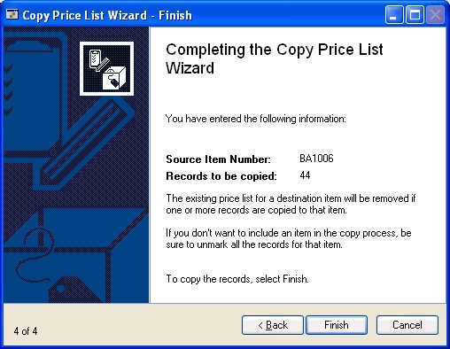

Choose Finish to copy the price list of the source item to the other items. The Copy Price List Audit Report automatically will be generated.

### Removing price list records from several items

You can remove price list records from several items, if needed. For example, suppose you've always offered special pricing to employees for all products, but then you decide to cut the program, offering special pricing to employees only for certain items. You can use the Remove Price List Wizard to remove the Employee price list records from certain items.

*You can end a price list wizard session at any time by choosing Cancel. Your records will be unchanged until you choose Finish in the last price list wizard window.*

**To remove price list records from several items:**

1. Refer to *Getting started with a price list wizard*, selecting the wizard for removing price list records from several items. The Remove Price List Wizard - Restrictions window opens.

2. Define the ranges of price list records you to remove from items. For example, you might want to remove price list records for a certain currency from all item price lists. You must define at least one range before you can continue. Choose Next.

*Refer to Items updated by price list wizards for more information.*

3. In the Remove Price List Wizard - Preview window, review the information in the scrolling window. To print a preview report, choose File \>\> Print or choose the print icon button. Clear the check box at the beginning of the scrolling window lines that you don't want to be removed. Choose Next.

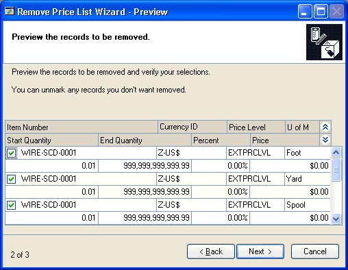

4. In the Remove Price List Wizard - Finish window, review the summary of the price list modification you're making.

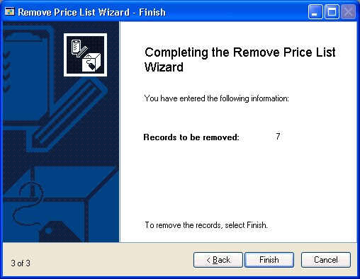

Choose Finish to remove the price list records. The Remove Price List Audit Report automatically will be generated.

### Assigning a currency to a group of items

Before you can add price list information in multiple currencies to items or purchase items in a different currency, you must assign the alternate currencies to the items. You can use this price list wizard to add a currency to several items at once.

*You can assign a currency to a group of items only if you're using Multicurrency Management.*

You can end a price list wizard session at any time by choosing Cancel. Your records will be unchanged until you choose Finish in the last price list wizard window.

*Use this procedure only if you're using standard pricing. For information about pricing utilities you can use with extended pricing, refer to Chapter 33, "Extended pricing utilities."*

**To assign a currency to a group of items:**

1. Refer to *Getting started with a price list wizard*, selecting the wizard for assigning a currency to several items, to open the Assign Currency Wizard - Currency window.

2. Enter or select the currency ID of the currency you want to assign to items.

3. Determine the default number of currency decimals to be used in pricing calculations. You can change the number of currency decimals for specific items later, if needed.

**To use the decimals defined in currency setup** Mark From Currency ID.

**To use a different number of currency decimals** Mark Enter and select the number of currency decimals to be used.

4. Enter an initial list price for the items you're assigning the currency to. Choose Next.

*This is the default list price for the items that you're adding a currency to. Later, you can adjust the list price for specific items in the group.*

5. In the Assign Currency Wizard - Select Restrictions window, choose the items to be included in the group that you're assigning the currency to. You can add as many restrictions as you like, but you can use each range type only once. For example, you can define only one range of item numbers. Choose Next.

*Refer to Items updated by price list wizards for more information.*

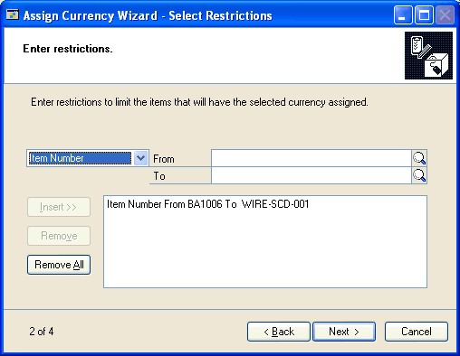

6. In the Assign Currency Wizard - Preview window, review the information in the scrolling window. Make any modifications as needed.

To print a preview report, choose File \>\> Print or choose the print icon button.

*If a currency is already assigned to an item, that item won't appear in the scrolling window.*

**To adjust the number of currency decimals** Select a different number from the Decimals list in the appropriate scrolling window line.

**To adjust the list price for an item** Enter a different list price for each item, as needed.

**To exclude an item from being assigned the currency** Clear the check box at the beginning of the scrolling window line.

Choose Next.

7. In the Assign Currency Wizard - Finish window, review the summary of the price list modification you're making.

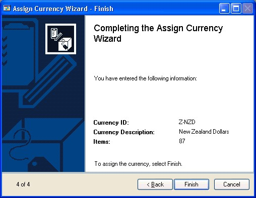

Choose Finish to assign currencies to items. The Assign Currency Audit Report automatically will be generated.

### Items updated by price list wizards

When you're completing any of the price list wizards, you have the option to select groups of items to change. For example, you can add a price list to several items, or copy a price list from an existing item to several other items.

You can select a large group of items using a restrictions window. Each of the price list wizards includes a restrictions window. The Add Price List Wizard - Restrictions window—shown here—is typical. You can use the window to select groups of items based on item numbers, class IDs, and other attributes. Items that meet all restrictions in the window are included in the list of candidate items to be changed.

Depending on the price list wizard you're using, however, the items might also need to meet other criteria before the items can be updated. For example, you can add a price list only to items that have the same price method as the price list you're adding.

Refer to the table for more information about the criteria items must meet to be updated.

| **If you're using this price list wizard...** | **... items must meet these requirements:**                                                                                           |
|-----------------------------------------------|-------------------------------------------------------------------------------------|
| Adding a price list                           | The item has the same price method as selected in the wizard.                      |
| Copying a price list                          | The destination items must have the same unit of measure schedule as the source item|
| Updating a price list                         | The item has the same price method as selected in the wizard.                      |
| Removing a price list                         | The combination of currency, price level, unit of measure, and quantity breaks to be updated already exists in the item's price list. |
| Assigning a currency                          | The currency can't already be assigned to the item.                                |

If you're using Multicurrency Management, the currency must already be assigned to the item.

The unit of measure can't already exist for the currency-price level combination.

The source item price list and destination item must have at least one currency in common.

The combination of currency, price level, unit of measure, and quantity breaks to be updated already exists in the item's price list.

### Chapter 33: Extended pricing utilities

This part of the documentation contains the procedures you need for transferring and removing price sheet information. Always back up your accounting data before performing these procedures.

This information is divided into the following sections:

- *Transferring price sheet details*

- *Removing price sheets*

### Transferring price sheet details

Use the Price Sheet Transfer window to transfer items from one price sheet to another. You can transfer all items, active items only, or selected items. If an item already exists on the destination price sheet, you can overwrite the existing item or leave it unchanged.

You can transfer customer, prospect, or price book assignments—or all of these— from one price sheet to another. For example, if an existing price sheet is assigned to multiple price books, you can transfer its price book assignments to a new price sheet to automatically assign the new price sheet to the same price books.

To prevent some pricing errors that could occur, there are restrictions on transfers to the base price book.

**Items** If the price sheet details for an item are not net-price details, that information can't be transferred to the base price book. For example, you can't transfer promotional price information to the base price book. This is because the base price book contains only net prices.

**Assignments** Non-net price sheets can't be assigned to the base price book by transferring assignments.

**To transfer price sheet details:**

1. Open the Price Sheet Transfer window.
(Inventory \>\> Utilities \>\> Extended Pricing \>\> Price Sheet Transfer)

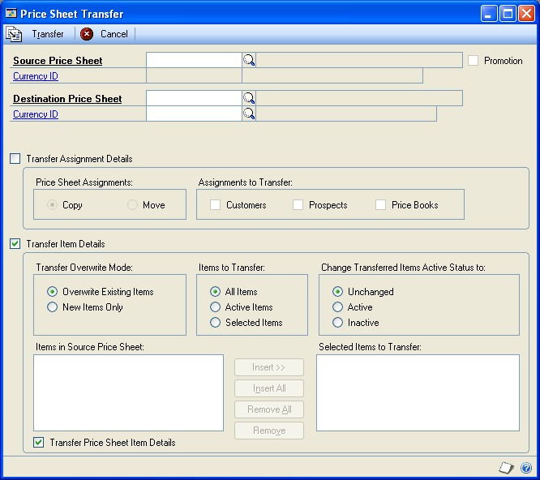

2. Enter or select a source price sheet ID.

3. Enter or select a destination price sheet ID. If the price sheet does not already exist, it will be created when you transfer information.

4. If you're using Multicurrency Management and the destination price sheet will be a new price sheet, enter or select the currency for the new price sheet.

If the currency you select is not the same as the currency of the source price sheet, Exchange Rate and Calculation Method fields will appear. If you have set up an exchange table for the currency conversion, that information will be displayed in the fields. You can accept the default values, or change them.

Refer to the Multicurrency Management documentation for more information about exchange rates.

5. Indicate whether to transfer assignment details, item details, or both.

**Transfer Assignment Details** Mark this option to have the destination price sheet assigned to the same customers, prospects, or price books as the source price sheet.

**Transfer Item Details** Mark this option to have price sheet details from the source price sheet transferred to the destination price sheet.

*If the destination price sheet is a new price sheet, you must transfer details for at least one item.*

6. If you marked Transfer Assignment Details, choose what information will be transferred and how it will be transferred.

**Price Sheet Assignments** Mark Copy to leave the assignments of the source price sheet unchanged, or mark Move to remove the assignments of the source price sheet.

**Assignments to Transfer** Mark as many options as you like. Mark Customers to transfer customer assignments, Prospects to transfer prospect assignments, or Price Books to transfer price book assignments.

If you marked Transfer Price Sheet Item Details, choose what information will be transferred and how it will affect the source price sheet.

**Transfer Overwrite Mode** Mark Overwrite Existing Items if the new price sheet information should replace existing price sheet information. Mark New Item Only if information only about items that aren't already on the destination price sheet should be transferred.

**Items to Transfer** Mark All Items to transfer information about all items from the source price list to the destination price list. Mark Active Items to transfer only price sheet lines that are active. Mark Selected Items to transfer only price sheet lines that you specify. Refer to step 8 for information about specifying the lines to transfer.

**Change Transferred Items Active Status to** Mark Unchanged if the status of the transferred lines should be the same on both the source price sheet and the destination price sheet. Mark Active if the status of the transferred lines should be active on the destination price sheet. Mark Inactive if the status of the transferred lines should be inactive on the destination price sheet.

**Transfer Price Sheet Item Details** Mark Transfer Price Sheet Item Details if the pricing details—such as quantity breaks, net prices, value-off amounts, or percentage of list—should be transferred.

*If you select to transfer price sheet details, prices will be converted as necessary during the transfer. You might be required to select an exchange rate.*

7. If you marked the option to transfer item details for selected items, choose the items to transfer.

The items that are assigned to the source price sheet will be displayed in the Items in Source Price Sheet list. To select an item, highlight it in the list and choose Insert to move it to the Selected Items to Transfer list.

8. Choose Transfer to process the price sheet transfer.

The Price Sheet Maintenance window will open, displaying information about the destination price sheet. You can review the information that was transferred, using the Price Sheet Detail Maintenance window to verify and edit details as needed. Refer to *Creating and editing price sheet details* for more information.

### Removing price sheets

Use the Mass Remove Price Sheets window to remove price sheet information from Inventory Control.

**To remove price sheets:**

1. Open the Mass Remove Price Sheets window.
(Inventory \>\> Utilities \>\> Extended Pricing \>\> Mass Remove Sheets)

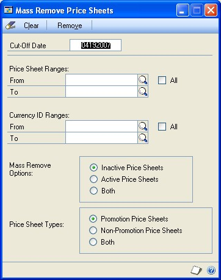

2. Enter a cut-off date. Price sheets ending on or before this date will be removed.

3. Enter or select the range of price sheet IDs to remove.

4. Select to remove inactive price sheets, active price sheets, or both.

*Active price sheets without an end date will not be removed.*

5. Select to remove promotion price sheets, non-promotion price sheets, or both.

6. Choose Remove. Price sheets matching your selection will be deleted.

### Chapter 34: History utilities

History records provide useful information for audit purposes, and can be maintained for an unlimited number of years. In Inventory Control, history can be kept for calendar or fiscal years. You can keep history for transactions, posting journals, and account distributions (debits and credits that have been posted to posting accounts). When you remove history records, the system removes the records only for the year you specify.

*For more information about history, refer to Chapter 17, "History."*

The following information is discussed:

- *Removing calendar- or fiscal-year history*

- *Removing inventory transaction history*

- *Removing inventory distribution history*

- *Removing inventory journal history*

- *Removing stock count history*

- *Removing in-transit transfer history*

- *Removing bin transfer history*

### Removing calendar- or fiscal-year history

Use the Remove Inventory Calendar-Fiscal Summary History window to remove calendar- or fiscal-year history.

Cost, quantity, and sales information is recorded for each item you've chosen to keep history for. If you're keeping calendar-year history, the information is displayed in month-by-month summaries. If you're keeping fiscal-year history, the information is displayed in the fiscal periods defined in the Fiscal Periods Setup window.

You can remove calendar-year history, fiscal-year history, or both.

**To remove calendar- or fiscal-year history:**

1. Open the Remove Inventory Calendar-Fiscal Summary History window.

(Inventory \>\> Utilities \>\> Remove Period History)

2. Mark the kind of history to remove: calendar year or fiscal year.

3. Create range restrictions to define the group of history records to be removed. You can add as many restrictions as you like, but you can use each range only once. For example, you can define only one range of item numbers.

*Only history records that meet all the restrictions you've defined and added to the list will be removed. If you don't define any restrictions, all calendar-year or fiscal-year history records will be removed.*

4. Decide whether to remove history now, print a report based on the records, or both.

*Once history is removed for an item, you can't generate the Sales Summary Report for the item.*

5. Choose Process to remove history, print the report or both.

*When you've finished removing history records, you can shrink the Inventory Sales Summary History table to free disk space. Refer to your System Administrator's Guide (Help \>\> Contents \>\> select System Administration) for more information.*

### Removing inventory transaction history

Use the Remove Inventory Transaction History window to remove transaction history information. When removing transaction history, cost change history is also removed.

Transaction history is detailed information about transactions posted in the Inventory Control module, or posted in other modules affecting Inventory Control.

**To remove inventory transaction history:**

1. Open the Remove Inventory Transaction History window.
(Inventory \>\> Utilities \>\> Remove Transaction History)

2. Create range restrictions to define the group of history records to be removed. You can add as many restrictions as you like, but you can use each range only once. For example, you can define only one range of item numbers.

*Only history records that meet all the restrictions you've defined and added to the list will be removed.*

3. Decide whether to remove transaction and transaction distribution history, print a report based on the records, or both. You can mark as many options as you like.

*Once you remove transaction history for a range of items, you can't print the Transaction History Report or reprint journals for those items.*

4. Choose Process to remove history, print the report, or both.

*When you've finished removing history records, you can shrink the Transaction History table to free disk space. Refer to your System Administrator's Guide (Help \>\> Contents \>\> select System Administration) for more information.*

### Removing inventory distribution history

Distribution history is a detailed record of how Inventory Control transactions have affected posting accounts. You can use the Remove Inventory Distribution History window to remove General Ledger distribution history records.

**To remove inventory distribution history:**

1. Open the Remove Inventory Distribution History window.
(Inventory \>\> Utilities \>\> Remove Distributions)

2. Create range restrictions to define the group of history records to be removed. You can add as many restrictions as you like, but you can use each range only once. For example, you can define only one range of item numbers.

*Only history records that meet all the restrictions you've defined and added to the list will be removed.*

3. Decide whether to remove history, print a report based on the records, or both.

*Once you remove transaction history for a range of items, you can't print the Distribution History Report for those items.*

4. Choose Process to remove history, print the report, or both.

*When you've finished removing history records, you can shrink the Inventory Transaction History table to free disk space. Refer to your System Administrator's Guide for more information.*

### Removing inventory journal history

Use the Remove Inventory Posting Journal History window to remove inventory posting journal history. If you keep journal history for items, you can reprint posting journals for Inventory  Control transactions that affect those items. Posting journals include the audit trail  code assigned to each transaction during the posting process. Using posting journals, you can trace any transaction to the point where it was entered in Microsoft Dynamics GP.

**To remove inventory journal history:**

1. Open the Remove Inventory Posting Journal History window.
(Inventory \>\> Utilities \>\> Remove Journal History)

2. Create range restrictions to define the group of history records to be removed. You can add as many restrictions as you like, but you can use each range only once. For example, you can define only one range of item numbers.

*Only history records that meet all the restrictions you've defined and added to the list will be removed.*

3. Decide if you want to remove history now, print a report based on the records, or both.

*Once you remove transaction history for a range of items, you can't print the Transaction Posting Journal–Reprint or the Transfer Posting Journal–Reprint reports for those items.*

4. Choose Process to remove history, print the report, or both.

### Removing stock count history

You can use the Remove Stock Count History window to remove information about the results of stock counts. You also can generate a Removed Stock Count History report.

**To remove stock count history:**

1. Open the Remove Stock Count History window.
(Inventory \>\> Utilities \>\> Remove Count History)

2. Create range restrictions to define the stock count records to be removed. You can add as many restrictions as you like, but you can use each range only once. For example, you can define only one range of stock count start dates.

*Only stock count records that meet all the restrictions you've defined and added to the list will be removed.*

3. Decide if you want to remove history now, print a report based on the records, or both.

4. Choose Process to remove history, print the report, or both.

### Removing in-transit transfer history

Use the Transfer Purge Utility window to remove in-transit transfer history. You also can print the Transfer History Purge report.

**To remove in-transit transfer history:**

1. Open the Transfer Purge Utility window.
(Inventory \>\> Utilities \>\> Purge In-Transit Transfer)

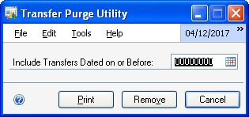

2. Enter the date. When you remove history, the in-transit transfers dated on or before the date you specify are removed.

3. Choose Print to print the Transfer History Purge report.

4. Choose Remove to remove history.

### Removing bin transfer history

Use the Remove Bin Transfer History window to remove historical information for bin transfer transactions.

**To remove bin transfer history:**

1. Open the Remove Bin Transfer History window.
(Inventory \>\> Utilities \>\> Remove Bin Transfer History)

2. Enter the date. When you remove history, the bin transfers dated on or before the date you enter are removed.

3. Choose Preview to open the Remove Bin Transfer History Preview window. This provides a view of all the bin transfers that will be removed.

4. Choose Remove to remove history.

### Chapter 35: Reconciling inventory records

Reconciling is a process that recalculates inventory quantities for a range of item numbers so inventory quantities match posted quantities. You might need to reconcile inventory records if one of the following situations occurs:

- Your data has been damaged.

- You've changed the number of decimal places tracked for an item.

- You're preparing to complete year-end closing tasks.

- You're preparing to use multiple bins.

You also might need to reconcile inventory quantities if inventory reports show conflicting quantity information, or if you suspect that quantities might not be in balance. However, you shouldn't have to reconcile inventory quantities unless your data has been damaged, or some other unusual problem has occurred.

The following information is discussed:

- *Effects of reconciling inventory records*

- *Reconciling inventory records*

### Effects of reconciling inventory records

When quantities are reconciled, the quantities recorded for the item will be reset to match purchase receipt and serial number or lot number quantities. Purchase receipts won't be removed during the reconcile procedures. Item quantities for unposted transactions are included in the reconciliation.

The following rules also apply.

**Multiple bins**

If you're using multiple bins, the quantities in the bins can be adjusted to match the quantity for the site. For example, suppose that the receipt quantity of Item A at the Warehouse is 45, the quantity at the Warehouse site is 50, and the total of the bin quantities for the item-site combination is 51. In this case, the site quantity would be adjusted to 45 and the bin quantity would be adjusted by six units.

However, the allocated quantities for bins are not reconciled to the allocated quantities for the site, but to the allocated quantities in unposted transactions. This is because items can be allocated at the site level before they are allocated at the bin level. Generally, items are allocated at the site level at the instant the allocation occurs, but items are allocated at the bin level when the fulfillment of the allocation occurs.

After you mark the option to enable multiple bins, you should reconcile inventory records. Doing so will create a bin for every item-site quantity that hasn't already been assigned to a bin. For more information about what happens when you reconcile inventory after marking the options, refer to *Handling existing quantities for multiple bins*.

**Serial and lot numbers**

If serial numbers or lot numbers are missing, new serial numbers or lot numbers will be added during the reconciliation process. If you don't want to use the numbers that have been added, you can enter decrease transactions to "back out" those changes, and then enter increase transactions for the correct numbers in the Item Transaction Entry window.

*Refer to Entering an adjustment or variance transaction for more information.*

**Purchase order information**

Items entered on drop-ship purchase orders or drop-ship blanket purchase orders are reconciled to the Drop-Ship PO quantity in Inventory Control. The on-order quantities for items on a drop-ship purchase order or a drop-ship blanket purchase order aren't reconciled. The remaining on-order quantity of released and change order purchase order line items and blanket line items are reconciled to the on-order quantity for the all-site of an item and each item-site combination of an item.

Blanket line items are included in the reconcile process. The control line item for blanket purchase orders and drop-ship blanket purchase orders aren't included.

If you're using Purchase Order Processing, reconcile purchasing information using the Reconcile Purchasing Documents window before reconciling inventory quantities. It's important that purchasing documents are correct because purchasing information might be altered and will be used when reconciling quantities for inventoried items.

**Sales order information**

If you're using Sales Order Processing, you also should reconcile that module before reconciling inventory.

### Reconciling inventory records

You can use the Reconcile Inventory Quantities window to reconcile inventory records.

Before reconciling quantities in Inventory Control, back up all your company's accounting data. You should reconcile modules in this order:

- Sales Order Processing

- Purchase Order Processing

- Inventory

**To reconcile inventory records:**

1. Open the Reconcile Inventory Quantities window.
(Inventory \>\> Utilities \>\> Reconcile)

2. Enter or select the range of item numbers to reconcile.

3. If you're reconciling inventory because you've changed the number of quantity decimals for an item, mark the Include Item History option so the item's history records also are updated.

4. Choose Process to reconcile inventory quantities.

Actual quantities and the quantities resulting from posted transactions are compared, and adjusted if needed. The Reconcile Report automatically is printed.

### Chapter 36: Inventory Control setup changes

When you define each item, you can specify the number of decimal places that should be tracked for the currency and quantity information of the item, and you select the valuation method to be used to track item costs. Once these selections are made, they aren't often changed. You might need to change them, however, if an error was made during setup. You might want to change
the number of decimal places used to track item quantities if an item's base unit of measure has changed.

The following information is discussed:

- *Changing currency or quantity decimal places for items*

- *Handling effects of changing quantity decimals for items*

- *Effects of changing decimal places for currencies for items*

- *Changing valuation methods*

- *Effects of changing valuation methods*

- *Removing bins*

- *Replacing all buyers or planners*

- *Updating purchase order generator options for several items*

- *Modifying lot number attributes*

### Changing currency or quantity decimal places for items

Use the Change Decimal Places window to change the number of decimal places used for keeping quantity or currency amounts for items. You might need to complete this procedure if an item was set up improperly, or if you're changing the units of measurement for an item.

*If an item is on an unposted transaction, you can't change its decimal place settings.*

**To change currency or quantity decimal places for items:**

1. Open the Change Decimal Places window.
(Inventory \>\> Utilities \>\> Change Decimal Places)

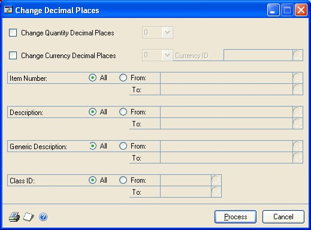

2. To change the number of decimal places used to track quantity information, mark Change Quantity Decimal Places and select the number of quantity decimal places.

When you mark the Change Quantity Decimal Places window, an alert message appears, warning that changing the number of quantity decimal places will  clear the unit of measure schedule, the price list, and the purchasing options for the item. If you choose to continue, you can refer to *Handling effects of changing quantity decimals for items* for more information.

3. To change the number of decimal places used to track currency information, mark Change Currency Decimal Places and select the number of currency decimal places.

When you mark the Change Currency Decimal Places window, an alert message appears, warning that changing the number of currency decimal places will mean that prices are rounded or padded with zeros. If you choose to continue, you can refer to *Effects of changing decimal places for currencies for items* for more information.

4. If you're using Multicurrency Management, specify which currency the change will apply to.

5. Enter or select the range of items you want to change. You can select items by specifying a range of item numbers, descriptions, generic descriptions, and class IDs. You can set as many of the ranges as needed. If you enter more than one range restriction, Microsoft Dynamics GP changes the decimal places only for the items that meet all the selected criteria.

*Changing quantity decimal places changes all instances of that item across all quantities, and the numbers are rounded to the nearest decimal place.*

6. Verify your changes by choosing File \>\> Print to print the Decimal Places Change Audit List.

7. Choose Process to update item records.

8. Reconcile item quantities. Refer to *Reconciling inventory records* for more information.

### Handling effects of changing quantity decimals for items

If you change quantity decimal places for an item, the unit of measure schedule, price list, and purchasing options for the item are cleared. You might need to create a new unit of measure schedule, if a suitable one doesn't already exist. For each of the items with changed quantity decimal place settings, you must assign a unit of measure schedule, create a price list, and set purchasing options. Refer to the table for more information.

| **To do this ...**                           | **...refer to this section:**             |
|----------------------------------------------|-------------------------------------------|
| Create a unit of measure schedule            | *Creating a unit of measure schedule*     |
| Assign a unit of measure schedule to an item | *Creating an item record*                 |
| Create a new price list                      | *Creating a price list for an item*       |
| Set purchasing options                       | *Entering purchasing options for an item* |

### Effects of changing decimal places for currencies for items

If you change the number of decimal places used to keep currency information for an item, the effect of your change will depend on whether you're increasing or decreasing the number of decimal places.

**If you're decreasing the number of decimal places** All receipts are rounded, and all item records, purchase receipts, quantities, vendor information, and kits are updated. Refer to the table for information about how currency amounts are rounded when the number of decimal places is decreased.

| **Original amount** | **Rounded to**     | **Result** |
|---------------------|--------------------|------------|
| .6215               | Two decimal places | .62        |
| .6045               | Two decimal places | .60        |
| .6455               | Two decimal places | .65        |

**If you're increasing the number of decimal places** Zeros are added for all amounts on the purchase receipts. For example, moving from two to three decimal places would change cost information from \$4.57 to \$4.570.

### Changing valuation methods

You also can change the valuation method used for a single item or for a group of items—as long as the item or items aren't on an unposted transaction. Refer to *Valuation methods* for more information.

*You should use the Change Valuation Method window only when you want to correct an item record that was set up with the wrong valuation method. If you want to change valuation methods for other reasons, we recommend that you consult your tax adviser, because changing valuation methods has legal restrictions in some areas.*

If you change the valuation method for an item and then generate the historical stock status report, be aware that reports for dates that precede the change might not be accurate because of how costs are calculated for the report.

**To change valuation methods:**

1. Open the Change Valuation Method window.
(Inventory \>\> Utilities \>\> Change Valuation)

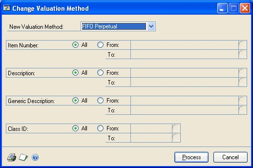

2. Select a new valuation method.

3. Enter or select the range of items you want to change. You can select items by specifying a range of item numbers, descriptions, generic descriptions, and class IDs. You can set as many of the ranges as needed. If you enter more than one range restriction, Microsoft Dynamics GP changes the valuation method only for the items that meet all the selected criteria.

*You can change valuation methods only for those Sales Inventory or Discontinued items that aren't on an unposted transaction.*

4. You can choose File \>\> Print to generate the Valuation Method Change Audit report to verify the ranges before processing the changes.

5. Choose Process to update the selected item records.

The Valuation Methods Change Audit Report is printed for the updated range.

### Effects of changing valuation methods

You should be aware of how changing the valuation method for an item will affect the item record. Refer to the table for more information.

| **Old method**        | **New method**        | **Effect on item information**                                                                                                                                                                         |
|-----------------------|-----------------------|--------------------------------------------------------------------------------------------------------------------------------------------------------------------------------------------------------|
| Any                   | Average Perpetual     | The current cost for each item in the range is averaged.                                                                                                                                              |
| Average Perpetual     | Any                   | The current cost is updated to reflect the most recent receipt of the item.                                                                                                                           |
| FIFO, LIFO, or        | FIFO or LIFO Periodic | If the item is Sales Inventory or Discontinued, then the Revalue Inventory for Cost Variance field and the Tolerance Percentage field are hidden on the Item Purchasing Options Maintenance window.   |
| FIFO or LIFO Periodic | FIFO, LIFO, or        | If the item is Sales Inventory or Discontinued, then the Revalue Inventory for Cost Variance field and the Tolerance Percentage field are displayed on the Item Purchasing Options Maintenance window. |

Average Perpetual

Average Perpetual

### Removing bins

If you're using multiple bins, you can use the Remove Bins window to remove bins. You can remove them from the item-site combinations they're assigned to, or from the sites entirely. You can remove all bins or a range of bins for all sites or for a range of sites. You also can choose to remove bins from all items or from a range of items.

To be removed, a bin must meet the following requirements:

- The bin can't be included in any pending (unposted) transactions.

- The item quantities of the bin must be zero.

- The bin cannot be the default bin for a site or for an item-site combination.

**To remove bins:**

1. Open the Remove Bins window.
(Inventory \>\> Utilities \>\> Remove Bins)

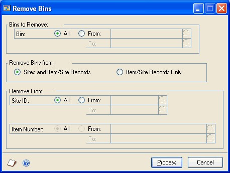

2. Choose the bins to remove. You can remove all bins or a range of bins.

3. Choose whether to remove the bins entirely, or to remove them (unassign them) from item-site combinations.

4. Choose the sites to remove bins from.

5. If you're removing bins from item-site combinations, choose the items to remove bins from.

6. Choose Process. A progress window will display the progress of the process.

7. When you've finished, close the window.

### Replacing all buyers or planners

If you've assigned buyers or planners to sites or to item-site combinations, then you can use the Replace Resource Planning Buyer/Planner window to change all instances of one buyer with another buyer, or one planner with another.

*This procedure affects only the buyer and planner selections made in the Item Resource Planning Maintenance window and the Resource Planning Site Maintenance window. It doesn't affect any buyer or planner selections that might exist in Purchase Order Processing.*

**To replace all buyers or planners:**

1. Open the Replace Resource Planning Buyer/Planner window.
(Inventory \>\> Utilities \>\> Replace Resource Planning Buyer/Planner)

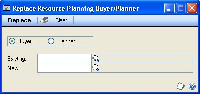

2. Mark Buyer to change one buyer record for another, or mark Planner if to change one planner record for another.

3. Enter or select the Existing buyer or planner.

4. Enter or select the New buyer or planner.

5. Choose Replace.

If any records couldn't be updated, the Replace Resource Buyer/Planner Exception report will be generated. The report will list all records that couldn't be updated. You can change those using the Item Resource Planning Maintenance window or the Resource Planning Site Maintenance window, or you can repeat the replacement later, when other users are no longer working with the records that need to be changed.

6. Close the window.

### Updating purchase order generator options for several items

You can use the Purchase Order Item Mass Update window to modify how items are set up for the purchase order generator. For example, you could update a range of items to change their order method or replenishment level.

**To update purchase order generator options for several items:**

1. Open the Purchase Order Item Mass Update window.
(Inventory \>\> Utilities \>\> Purchase Order Item Mass Update)

2. Use the Restrictions fields to choose the items that will be updated. You can use as many restrictions as you like.

*If items with the Discontinued item type are included in the group of items you choose, those records will be updated even though no purchase orders will be suggested for those items.*

3. Select a Report Sort Option. After you update the items, a report about the changes will be generated. The sort option determines the order for the information on the report.

4. Choose the values to update. To select a value, mark the Update checkbox, and then enter the information that should be used for that value.

For example, you can mark the Update checkbox for the Order Method value, and then select the order method that the items should have when they're updated.

*Item information won't be updated if the change would cause the item record to be invalid. Refer to Overview of the purchase order generator and How quantities are calculated for suggested purchase orders.*

5. Choose Process. A status window will display information about the records as they're updated. When the changes are complete, a report destination window appears so you can select how the Purchase Order Generator Item Mass Update report is printed.

*The report won't include information for items that have the Not Planned order method, but will include items that have the Discontinued item type.*

### Modifying lot number attributes

You can use the Edit Lot Number Attributes window to modify the lot attributes of a lot number assigned to an item number. There may be five attributes, including as many as three alphanumeric and two date attributes, that are displayed in the window. Attribute labels are assigned in the Lot Category Setup window for the lot category. You also can modify the manufactured date and expiration date.

**To modify lot number attributes:**

1. Open the Edit Lot Number Attributes window.
(Inventory \>\> Utilities \>\> Edit Lot Number Attributes)

2. Enter or select an item number for which lot numbers are tracked.

3. Enter or select the lot number that you want to modify.

4. If lot attributes were assigned to the lot number, you can modify the attributes.

5. You also can enter or modify the expiration date and the manufactured date.

An icon appears in the Expiration Date field if the lot has already expired.

6. Choose Process to update the lot attributes.

## Part 6: Routines

This part of the documentation includes information about Inventory Control routines. Use these routines to perform regularly scheduled tasks, such as closing a year or fiscal period, or to standardize other regularly scheduled maintenance procedures using the checklists.

The following information is discussed:

- *Chapter 37, "ABC analysis,"* describes how you can perform an ABC analysis on inventoried items, so you can adjust your business practices to more closely monitor those items that are most important to your organization.

- *Chapter 38, "Year-end closing,"* includes information about the tasks and procedures you need to complete to close your inventory records for a fiscal period or for a year.

- *Chapter 39, "Inventory control checklists,"* contains information about using Inventory Control Checklists.

### Chapter 37: ABC analysis

ABC analysis is a method of prioritizing items based on parameters that you specify. ABC analysis is based on the Pareto principle, a broad generalization that recognizes "predictable imbalance"—that, for example, 80 percent of the value of your inventory might come from 20 percent of the items. With ABC analysis, you can identify which items are most critical to your business, which are somewhat critical and which are least important. Then you can manage those items accordingly.

Inventory Control includes a wizard you can use to complete ABC analysis of Sales Inventory and Discontinued items. Most of the information you need to use a wizard is built into the windows, but you can refer to this information as needed.

The following information is discussed:

- *ABC analysis overview*

- *Requirements for ABC analysis*

- *Performing ABC analysis of inventoried items*

- *ABC analysis ranking value calculations*

- *ABC analysis and large inventories*

- *Previewing and adjusting ABC analysis results*

- *Finalizing ABC analysis results*

- *ABC analysis and zero or negative item quantities*

- *Modifying an item's ABC code*

- *Using ABC analysis information*

### ABC analysis overview

You can sort items into A, B, and C classifications. "A" items are the most important items in your inventory. They should be tightly controlled, with accurate records. "B" items might be less controlled, with good records, and "C" items might have minimal records with periodic review. If the on-hand quantities and usage of some items is zero or negative, an ABC code doesn't need to be assigned to them.

ABC analysis helps you group the type of information that the ABC analysis of items will be based on. You can group items using the following options in the ABC Analysis Options window.

- Usage quantity (the number of units consumed over a period of time)

- Usage value (usage quantity times unit cost)

- On-hand inventory value (on-hand quantity in the Items Quantity Maintenance window times unit cost)

- Unit cost (the current cost or standard cost depending on the valuation method of each item)

You can base the classifications on historical or projected numbers—or a combination of both. Refer to *Using ABC analysis information* for more information about how you can use ABC classifications.

### Requirements for ABC analysis

Before beginning an ABC analysis, be sure that no one is performing any of these activities:

- Using any Inventory Control utility, such as a price list wizard or removing history records

- Completing year-end closing procedures

- Starting a separate ABC analysis

### Performing ABC analysis of inventoried items

Use the ABC Analysis wizard to analyze your item usage and prioritize items, helping you to manage inventory more effectively. We recommend that you perform this procedure at least once a year.

*You might want to use the process server to make the ABC calculations and updates a remote process. Refer to ABC analysis and large inventories for more information.*

**To perform ABC analysis of inventoried items:**

1. Open the ABC analysis wizard, then choose Next.
(Inventory \>\> Routines \>\> Item ABC Analysis)

2. In the ABC Analysis Options window, select the type of information you want the analysis to be based on. Choose Next.

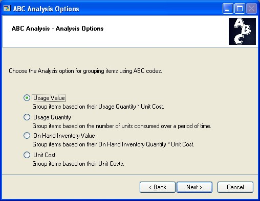

*Refer to ABC analysis ranking value calculations for information about how these options affect ABC analysis calculations.*

3. In the ABC System Options window, determine if items with zero on-hand quantities and zero usage should be assigned no ABC code. To have items with negative on-hand and usage quantities treated as if they had zero on-hand quantities, mark the second option.

*Refer to ABC analysis and zero or negative item quantities for more information.*

Choose Next.

**If your analysis is based on on-hand inventory value or unit cost** Skip to step 7. The on-hand inventory value and unit cost methods assume that calculations will be based on historical annual usage for calendar years.

**If your ABC analysis is based on usage value or quantity** The ABC Calendar Option window opens. Continue with the next step.

4. In the ABC Calendar Options window, select the periods to be used to calculate ABC information. You can choose Fiscal Periods or Calendar Months. Choose Next.

5. In the ABC Usage Quantity window, select how you want to control the calculation based on usage quantity or usage value. You can choose to use historical or projected numbers, or a combination of both.

If you select Weighted Average, enter the weighting percentage for historical and projected usage. Choose Next.

6. In the ABC Breakpoints window, specify if percentages, currency amounts, or quantities will be used to define breakpoints for the analysis. (Options depend on the type of analysis option you selected earlier.)

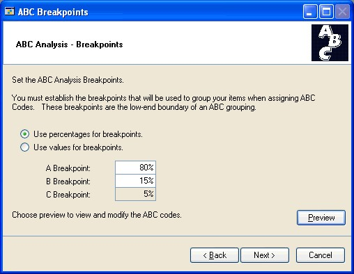

A breakpoint is the boundary between two adjacent ABC classifications—for example, if you want A items to be those that reflect 80 percent of inventory value, 80 percent would be the breakpoint. Enter the percentages or amounts for the A and B breakpoints.

*If you're using percentages to define breakpoints, be sure to enter the percentage of inventory value. For example, if you want your A items to be those that make up 75 percent of your inventory valuation, you'd enter 75 as the A Breakpoint.*

7. Decide if you want to preview the results of the analysis before having item records updated with new ABC codes.

**To preview suggested ABC codes** Refer to *Previewing and adjusting ABC analysis results* for more information.

*If you have a large number of item records, opening the Preview window might take some time.*

**To finalize item records without previewing** Refer to *Finalizing ABC analysis results* for more information.

### ABC analysis ranking value calculations

ABC analysis ranks items depending on the options you selected for the analysis.

Dependent demand is demand for component items in bills of materials. For example, suppose you assemble Item ABC, which is built with two widgets and a base. If you entered projected demand for item ABC, the system would calculate the dependent demand for the widgets and bases, based on the bill of materials.

*Use the Item History window to enter projections for items. Refer to Entering item projections for more information.*

Refer to the following table for more information.

| **Analysis option**     | **Usage option** | **Calculation used**                                                                                                                                                                                                                                                                                                 |
|-------------------------|------------------|----------------------------------------------------------------------------------------------------------------------------------------------------------------------------------------------------------------------------------------------------------------------------------------------------------------------|
| Unit cost               | Not applicable   | If valuation method is Average Perpetual or Perpetual (LIFO or FIFO), then current cost is used. If valuation method is Periodic (LIFO or FIFO), then standard cost is used.                                                                                                                                        |
| On-hand inventory value | Not applicable   | Unit cost x On-hand inventory quantity                                                                                                                                                                                                                                                                               |
| Usage quantity          | Historical usage | Annual usage quantity is calculated from the last completed month or period plus all previous months or periods for the previous one year of sales and dependent usage (except current); or, all available information if a full year of information isn't available. If no usage exists, the default value is zero. |
|                         | Projected usage  | Projected usage quantity is calculated from the current month or period plus all future months or periods for one year of projected usage (including current); or, all available information if a full year of projections isn't available. If no projected usage exists, the default value is zero.                |
|                         | Weighted average | (Annual usage x Annual usage weight) + (Projected usage x Projected usage weight)                                                                                                                                                                                                                                    |
| Usage value             |                  | Usage quantity x Unit cost                                                                                                                                                                                                                                                                                           |

### ABC analysis and large inventories

If you have many inventoried items—10,000 or more—calculating ABC analysis information can take several minutes. If you're using a process server, you might want to consider using it to make the analysis process a remote process—one that will allow you to continue working with your computer while the analysis is being completed.

*If you're using a process server, go to Administration \>\> Setup \>\> System \>\> Process Server, and be sure to mark the option for Inventory: Item ABC Analysis. Refer to the process server documentation for more information about using process server functions.*

### Previewing and adjusting ABC analysis results

Use the ABC Analysis Preview window to preview analysis results, and to make changes, if needed.

*If you have a large number of item numbers, opening the Preview window might take several minutes.*

**To preview and adjust ABC analysis results:**

1. Complete ABC analysis as described in *Performing ABC analysis of inventoried items*. The ABC Analysis Breakpoints window should be open.

2. Choose Preview to open the ABC Analysis Preview window.

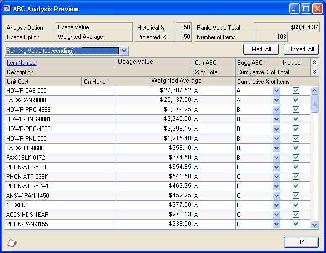

3. Review information in the scrolling window, making changes as needed.

**To change the ABC code for an item** Select a different classification in the appropriate scrolling window line.

**To remove an item so it isn't updated** Clear the Include option in the appropriate scrolling window line.

4. You can choose File \>\> Print to generate the Item ABC Analysis Preview report. The report includes information about the effects of changes.

5. When you've finished adjusting the ABC classifications, select a sorting order for the final report.

6. Choose OK to save your changes. You'll be returned to the ABC Analysis Breakpoints window.

7. Refer to *Finalizing ABC analysis results* to update item records with the new ABC codes and to generate the Item ABC Analysis Breakpoints Report.

### Finalizing ABC analysis results

Use the ABC Print Options window when you're ready to complete your ABC analysis. Finalizing the ABC analysis results updates item records with new ABC codes, and generates the Item ABC Analysis Results Report.

**To finalize ABC analysis results:**

1. Complete ABC analysis as described in *Performing ABC analysis of inventoried items*. The ABC Analysis Breakpoints window should be open. Choose Next.

2. In the ABC Print Options window, select a sorting order for the Item ABC Analysis Results Report. Choose Next.

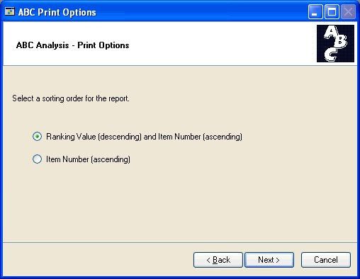

3. In the ABC Analysis Summary window, review information about the results of the ABC analysis.

4. To update item records and generate the Item ABC Analysis Results Report, choose Finish.

When the analysis is complete, the Item ABC Analysis Results Report is printed. You can use this report view the analysis results and to ensure that items were prioritized correctly.

*The report can't be reprinted.*

### ABC analysis and zero or negative item quantities

If you have items with zero or negative on-hand quantities and usage, you can use options in the ABC wizard so those items aren't assigned an ABC code. This can be helpful because you might use ABC codes to establish business practices such as the frequency of cycle counts. If an item has no usage—or negative usage—it might be better to omit it from your cycle-count plans entirely.

*Refer to Chapter 18, "Count intervals," for more information.*

If you don't use these options, however, the items with zero or negative on-hand quantities are included in the analysis. This can lead to unexpected results when you preview the analysis results or review the Item ABC Analysis Results Report, because then cumulative percentages are based on rankings for all items—even items with negative usage or on-hand quantities.

To avoid this, mark both options in the ABC System Options window.

### Modifying an item's ABC code

Use the Item Maintenance Options window to verify or modify the ABC code assigned to a specific item.

**To modify an item's ABC code:**

1. Open the Item Maintenance window.

(Inventory \>\> Cards \>\> Item)

2. Enter or select an item number.

3. Choose Options to open the Item Maintenance Options window.

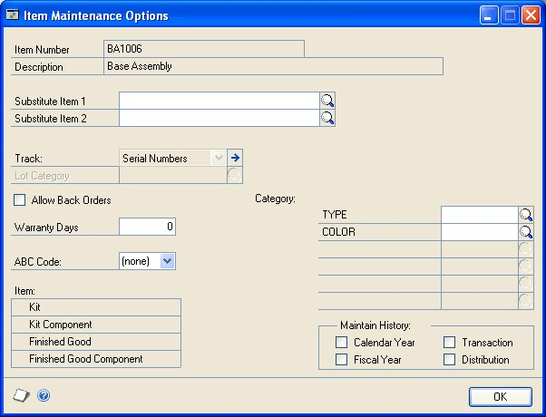

4. Select an ABC code for the item.

5. Choose OK to return to the Item Maintenance window.

6. Choose Save and close the window.

### Using ABC analysis information

The value of completing an ABC analysis is more than just the report that's generated when the results are finalized. You'll get the most use from completing the analysis if you use the ABC codes in your business practices.

For example, you might want to set up cycle counts to monitor the accuracy of inventory records. You can set up different frequencies for counting different items. You might set up one cycle for counting items every 30 days, another for counting items every 60 days, and so on. If you've completed the ABC analysis procedure, you can easily assign all "A" items to the 30-day cycle count, and all "B" items to the 60-day cycle count. You might set up a 120-day cycle count for "C" items—or you might not count them at all.

### Chapter 38: Year-end closing

When you close inventory records for a calendar or fiscal year, all Inventory Control records for the current year are moved to history. Year-end procedures also might include other tasks, such as updating standard costs or removing items that are no longer purchased or sold.

The following information is discussed:

- *Closing a fiscal period*

- *Preparing to close a year*

- *Closing a year*

- *Effects of closing a year*

- *Removal of discontinued items*

### Closing a fiscal period

Closing fiscal periods prevents transactions from being posted inadvertently to the wrong period or year. Some companies also might complete a physical inventory before closing a period.

Before closing a fiscal period, be sure you've posted all the transactions for the period. To post transactions to a fiscal period you've already closed, you must reopen the period before the transaction can be posted.

**To close a fiscal period:**

1. Open the Fiscal Periods Setup window.

(Administration \>\> Setup \>\> Company \>\> Fiscal Periods)

2. Mark the option in the Inventory column for each period you want to close.

3. Choose OK to save your changes.

### Preparing to close a year

Before you can close the Inventory Control module for the year, you must complete several preliminary tasks.

**To prepare to close a year:**

1. Enter and post all transactions for Sales Order Processing, Invoicing, Purchase Order Processing, Inventory Control, and Bill of Materials.

You must complete this step to ensure that historical information is accurate and that year-to-date amounts are updated correctly.

*You can enter transactions for a new year before closing the previous year by entering them in separate batches, however, you should not post these batches until you've closed the year. Refer to other module documentation for information about entering and posting transactions in those modules. Refer to Chapter 21, "Transaction entry," and Chapter 24, "Posting," for more information about completing these tasks for Inventory Control.*

2. If you need to enter future-period transactions before closing a year, create a new batch for those transactions.

3. Reconcile inventory quantities. Refer to *Reconciling inventory records*.

4. Print the Physical Inventory Checklist. Choose Inventory \>\> Reports \>\> Activity to open the Inventory Activity Reports window. Refer to your System User's Guide (Help \>\> Contents \>\> select Using The System) for more information about printing reports.

5. If needed, complete a stock count, then enter and post any adjustments. Refer to *Chapter 23, "Stock count processing,"* for more information.

6. Print the following reports for your permanent records. Refer to the table for information about navigating to the reports.

Refer to your System User's Guide (Help \>\> Contents \>\> select Using The System) for more information about printing reports.

| **Report**                 | **Path**                                |
|----------------------------|-----------------------------------------|
| Stock Status Report        | Inventory \>\> Reports \>\> Activity    |
| Purchase Receipts Report   | Inventory \>\> Reports \>\> Activity    |
| Turnover Report            | Inventory \>\> Reports \>\> Analysis    |
| Transaction History Report | Inventory \>\> Reports \>\> History     |
| Serial Number List         | Inventory \>\> Reports \>\> Serial/Lots |
| Lot Number List            | Inventory \>\> Reports \>\> Serial/Lots |

7. Make a complete backup of your company data, following your company's backup procedures.

Once you've completed these preliminary steps, you're ready to close the year. Refer to *Closing a year*.

### Closing a year

Closing a year transfers all summarized current-year quantity, cost, and sales amounts to transaction history for the items that have summarized sales history. When you close a year, you also have the options to remove certain records and update standard costs.

*Before continuing, be sure you've completed the tasks described in Preparing to close a year.*

**To close a year:**

1. Open the Inventory Year-end Closing window.
(Inventory \>\> Routines \>\> Year-End Close)

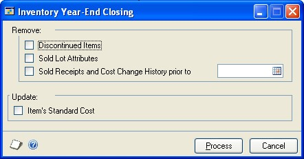

2. Choose records to remove. You can remove records for discontinued items, sold lot attributes, and sold receipts and historical cost changes, as needed.

*Discontinued items aren't removed if they are assigned to kits, if they are components of bills of materials, or if they have bills of materials of their own. Refer to Removal of discontinued items for more information.*

Sold lot attributes is the information that you might have kept for items tracked by lot numbers—for example, if you track the expiration dates for items tracked by lots. In this case, deleting the sold lot attributes would remove the information about the expiration dates of the sold items.

Sold receipts are records of items that have been both received and then sold. Cost change information is saved to history when the standard cost is changed for a LIFO periodic item or a FIFO periodic item, or when the current cost is changed for an average perpetual item.

3. To update the standard cost information for items with FIFO Periodic or LIFO Periodic valuation methods, mark Item's Standard Cost.

The updated standard cost of each item automatically is adjusted to the current cost, or the amount you most recently paid for the item.

4. Choose Process to close the year.

While the year-end closing is in process, you won't be able to post transactions or batches, reconcile quantities, change valuation methods, or change decimal places. If you attempt to begin one of these procedures, an alert message will appear, warning you that you must wait until the year-end closing process has been completed.

*After you've closed the year, you can close fiscal periods for inventory, if you like. Refer to Closing a fiscal period.*

5. After you've closed the year, you should make a final backup of your company data.

### Effects of closing a year

Processing that occurs when you close a year will complete these tasks:

- All summarized current-year quantities, costs, and sales information of items you've been keeping summarized sales history are transferred to transaction history.

- The Beginning Quantity of each item is updated to be the On Hand quantity at each site. (Some reports—such as the Turnover Report—use the beginning quantity field in calculations.)

- The Quantity Sold field for each item is reset to zero.

The following tasks might be accomplished, depending on the options you select when you begin processing:

- Purchase receipts of items that have been completely sold are removed.

- Cost change history information is removed.

- Discontinued items that have been completely sold are removed.

- Lot attributes of items that are tracked by lot numbers and that have been completely sold are removed.

- The standard cost of each item is updated to the current cost for items using FIFO Periodic or LIFO Periodic valuation methods.

### Removal of discontinued items

When you close a year, you have the option to remove discontinued items—that is, items that have the Discontinued item type. If the item is assigned to a kit, is a component of a bill of materials, or has a bill of materials of its own, it won't be removed.

**Assigned to a kit** Print the Component Report from the Inventory Item Reports window to see if the item is assigned to a kit. Refer to your System User's Guide (Help \>\> Contents \>\> select Using The System) for more information about printing reports. Refer to *Assigning kit components* for information about removing component items from a kit.

**Component of a bill of materials** Print the BM Component Where-Used  Report from the Inventory Setup Reports window to see if the item is a component of a bill of materials. Refer to the Microsoft Dynamics GP Bill of Materials documentation for information about removing a component from a bill of materials.

**Has a bill of materials** Print the BM Bill of Materials Report from the Inventory Setup Reports window to see if the discontinued item has bills of materials of its own. Refer to the Microsoft Dynamics GP Bill of Materials documentation for information about deleting bills of materials.

*If the item is a component of a bill of materials or has its own bill of materials, be sure to consider all bills of materials. A single finished item can have multiple bills of materials. Also, an item can be a component of bills of materials for several items.*

### Chapter 39: Inventory control checklists

Use Inventory Control checklists to ensure that your business practices are being consistently completed. When checklists are used, the date and time when a specific task was done are recorded, along with the user ID of the person who completed the task.

Inventory Control includes basic checklists, but you can tailor them to the needs of your business. You also can create your own checklists for tasks that are specific to your business.

*Refer to your System Administrator's Guide (Help \>\> Contents \>\> select System Administration) for more information about customizing checklists.*

The following information is discussed:

- *Standard Inventory Control checklists*

- *Using an Inventory Control checklist*

### Standard Inventory Control checklists

Inventory Control includes a checklist for year-end closing and you also can create your own customized checklists. For example, you could create a user-defined checklist for creating and starting a stock count schedule, and then for entering the results of the stock count and posting variance transactions, if needed.

### Using an Inventory Control checklist

Use the Inventory Checklists window to open specific Inventory Control checklists.

**To use an Inventory Control checklist:**

1. Open the Inventory Checklists window.
(Inventory \>\> Routines \>\> Checklists)

2. Select the Frequency of the routine to use.

3. In the Routine scrolling window, highlight the procedure you want to complete.

4. Choose Open to begin performing the selected routine.

Depending on the routine you've selected, choosing Open will open a window or start a macro in the Microsoft Dynamics GP system, or start an external application.

## Part 6: How to determine, maintain, and report accurate costing in Inventory 

This section has been provided to address questions about the calculation and maintenance of Inventory item costs and how those changes affect your inventory valuation. 

With Microsoft Dynamics GP there are several costing enhancements in Inventory module that provide or capture information in the Inventory module that improve the ability to maintain accurate costs when you increase or you decrease inventory quantities. 

The enhancements added business logic that automatically determines, at the time of posting, when a cost variance is encountered in inventory. This business logic handles any currency variance amounts based on the individual item setup or inventory posting setup and cost adjustments are automatically created in the General Ledger module in a summary manner, by default, to the correct accounts. Although some of this logic did exist, the automatic posting of these cost adjustments to the General Ledger module is a significant. 

The following list describes the types of transactions. These five types can cause an inventory revaluation to occur for perpetual items: 
 
1.	Post a purchasing invoice that has been matched to a receipt at a different cost with some of the items from the receipt already being sold.  This scenario will cause a revaluation to occur against the items that were sold prior to matching the invoice if the item is marked to revalue. 
 
2.	Post a purchasing invoice for a Landed Cost amount on a Purchase Receipt Inventory layer that has quantities that have already been sold. This scenario will cause a revaluation to occur for those items that have been sold if the item is marked to revalue. 
 
3.	Close a Purchase Order line short with a shipment quantity greater than the invoiced quantity. When some of these items are sold, this scenario will also cause a revaluation to occur for the sold items. 
 
4.	Use the Adjust Cost Utility and manually adjust the unit cost for a layer. This scenario will cause a revaluation to occur if quantity has been sold on that layer. 
 
5.	Post a transaction that relieves an override purchase receipts layer that resulted in a negative Inventory balance at the Inventory site. 
This scenario will **always** cause a revaluation to occur for the negative quantities.  

**Note: Inventory overrides should be kept at a minimum and should be the exception to usual processing. 
In addition, the following list displays three more transaction types when you use average perpetual as the valuation method: 
 
6.	Post back-dated transactions (either increases or decreases) that affect the quantity on hand as of a specific date and also have inventory sold after the back-dated transaction. This scenario may cause those previously sold items to revalue if the average cost changes based on the backdated transaction. 
 
7.	Post any batch that contains an assortment of increases and decreases to inventory quantities spanning multiple document dates where the document numbers do not coincide with the document dates.   This can occur because the documents in the batch post in order by the Document Number and not the Document Date. 
  
8.	Post a Purchase Order return transaction for subsequent receipts that have been sold and it may cause a revaluation to occur.  
Whenever these costing scenarios occur and a cost adjustment is identified, we calculate a new cost, update the outflow record in the Inventory Purchase Receipt Detail (IV10201) table, and then push this data to the general ledger. We call this process the Inventory Ripple primarily because of what occurs when a revaluation is encountered on an item that uses an Average Valuation method.   
 
The Inventory Ripple has been designed to work with perpetual valuation methods as stated above. But the most prevalent and profound effect is when an item uses Average Perpetual as the valuation method. The calculation or re-calculation of the Average Cost is not only updated with new inflow transactions, but now also outflow transactions such as Inventory decrease adjustments or posting sales invoice transactions can cause an Inventory Ripple.  These changes are driven by our costing enhancements to calculate or maintain an Average Cost on each layer record in the Inventory Purchase Receipt (IV10200) table. This fundamental change allows us to continuously watch and update the average cost whenever Inventory quantity changes back in time essentially making Inventory date sensitive. For example, the following sets of tables demonstrate how an inflow and outflow transaction can change the Average Cost and essentially trigger an Inventory Ripple to occur and force cost adjustments down to the general ledger. This example assumes the item is using 2 decimal places for currency. You can follow this example by entering your own transactions as Inventory adjustments. 

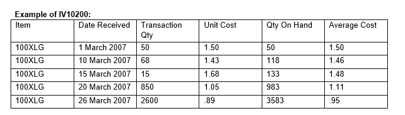

In the Inventory Purchase Receipt (IV10200) table, three new columns have been added (VCTNMTHD, QTYONHND and ADJUNITCOST). The Qty On Hand (QTYONHND) column and the Average Cost column (ADJUNITCOST) are displayed in the table above. The valuation method (VCTNMTHD) column (not displayed above) is used to determine how the costs are calculated and tracked in the IV10200. The addition of these columns enables us to calculate an Average Cost on each layer.  The Qty On Hand column represents the TOTAL quantity on hand at the time the receipt layer was created and also adjusts whenever quantity is sold based on the transaction date.  In the table above, on March 10th, we processed a transaction quantity of 68 and the Qty On Hand column moved to 118.  Subsequently, the Average Cost column also changed to $1.46.  

The formula used to calculate this new cost is: 
 
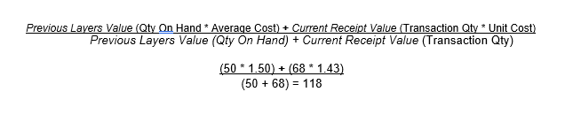

The Qty On Hand column also decreases whenever quantity is sold or adjusted.  However, it decreases based on the Document Date of the transaction that decreases the inventory.  At the time of posting, we look for and find the closest receipt record that is BEFORE or EQUAL to the Document Date of the transaction. For example, if you post a sales invoice with a Document Date of March 12th with a quantity of 25, the March 10th layer would be used and the Qty On Hand field for that layer would have a value of 93 = (118 – 25).  In addition, because the Qty On Hand field is a running or real time quantity field, the receipt layers after March 10th would also be reduced by a quantity of 25. So the March 15th layer of 133 would update to 108, the March 20th layer of 983 would change to 958, and the March 26th layer of 3583 would change to 3558.  After the Inventory Ripple process is finished, the quantity of 3558 should be the TOTAL quantity you have On Hand for the item for all sites. 
 
The key here is that because the quantity On Hand changed for each layer, the Average Cost may also need to be updated; hence, we now start the Inventory Ripple starting at the 10 March receipt moving from layer to layer until we get to the last receipt layer for the item. When finished, the current cost in the Item Maintenance window will be updated to match the Average Cost of the last layer (ordered by the DATERECD, RCTSEQNM column), which would be $.95.  The new table below reflects the change after the sale of 25 is posted on March 12th. 

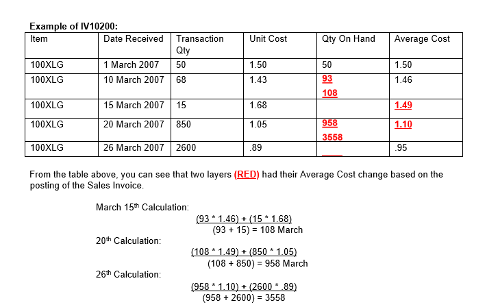

 
This is a very simple example of how back-dated outflow transaction can have an impact on the Average Cost calculation because we are now holding and calculating that cost for each inflow layer.  In addition, this example also demonstrates how cost adjustments can occur on some layers and not others and NOT have the current cost on the item card updated. 
 
Another enhancement of our costing changes is that because we have an Average Cost calculated for each receipt layer, we no longer get the cost from the item card when we post a transaction that decreases inventory.  We now determine the cost of the item at the time of posting and get the cost value from the Inventory Purchase receipt (IV10200) table based on the Document Date of the outflow transaction.  For example, for the sale of 25 that occurred on March 12th, the cost used for that transaction was $1.46 even though the item card has a current cost of $.95 (or the calculated Average Cost for the last receipt layer). 
 
To take this one step farther, if the March 15th or 20th layers had any quantity consumed from them, the costing enhancements would have detected that state and a cost adjustment would be in order.  For example, if we had posted a sales invoice dated March 18th for a quantity of 75, before the March 12th sales, the cost at the time of that sale would have been $1.48. Because we have now posted a sales invoice dated March 12th and caused an Inventory Ripple to occur, the outflow quantity of 75 needs to have a cost adjustment.  

The calculation is as follows: 

March 18th:   	 	Qty: 75  	Avg Cost: $1.48  	Extended Cost: $111.00 
Inventory Ripple: 	Qty: 75  	Avg Cost: $1.49  	Extended Cost: $111.75 
 
Because the Average Cost for that layer went up one penny, we have a $.75 difference that needs to be booked to the general ledger.  The $.75 difference will be automatically created as a journal transaction and posted to the General Ledger.  Because the outflow transaction that was revalued was a sales invoice, the following accounts would be updated. 
  
 	 	 	 	        Debit 	Credit
 	  	Cost of Goods   .75 
 	  	Inventory 	 	        .75 
 
These accounts are taken from the default posting accounts on the posted transaction line items so it is imperative that the Inventory and Sales distributions are set up correctly.  For example, for each item, you should be using separate accounts for: 
 
Purchase Price Variance 
Cost of Goods 
Inventory 
Inventory Variance 
Inventory Offset  
 
In the event there were multiple outflow transactions that were revalued, the default action is to create a single journal entry that is summarized by account number. Because these accounts are summarized, if you were to use the same account number for each account type on the item, the potential exist that a “wash out” may occur and end up with a $0.00 journal entry. Also, because these entries that have been summarized, it is impossible to identify, reconcile, and determine where they came from. 

The field mapping for the additional data is as follows:

**GL20000 table:** 
Field:  ORCTRNUM: Contains the originating document number of the outflow transaction such as the SOP number or the Inventory document number 
Field: ORMSTRID:  This field will contains the item number that was re-valued on the outflow transaction Field: ORDOCNUM: contains the receipt number from the Inventory                         Purchase Receipt (IV10200) table that had a revaluation and forced the cost adjustment 
Field: ORMSTRNM:  Contains the text string “IV Ripple Transaction” to make it easier to identify the cost adjustments flowing into the general ledger. 
 
**Inventory Reporting**
Currently, there are two reports within Microsoft Dynamics GP that can provide a snapshot of either current or historical quantity information and also costing information.  Those reports are: 
•	Stock Status Report 
•	Historical Stock Status Report 

The Stock Status report is intended to provide a current snapshot of the inventory currently on hand and the current cost for each item.  The report then aggregates the quantity and costs (Quantity * Current Cost) for each item to provide an inventory value amount and then summarizes the value for all items for an overall picture of what the inventory value truly is at that moment.  

The expectations for this report to balance to the general ledger are as follows: 

FIFO/LIFO Perpetual Items – This should balance to the general ledger 
Average Perpetual and Periodic – It is expected that these items will not balance to the general ledger 
 
The reason average perpetual and periodic items do not balance to the general ledger is because these valuation methods do not use actual costs when you are processing outflow transactions. They use either a current average cost or a standard cost and because of rounding and other issues, it is highly likely that costs posted for items using these valuation methods will not balance to the general ledger. The Historical Stock Status report was designed to provide an inventory snapshot (picture) AS OF a specific historical date.  An example would be determining what was on hand for a specific item last month or last fiscal quarter and what the inventory cost was associated with that quantity. This report uses the transactional data that is contained within the inventory history tables (IV30300 and IV30301) which contain the actual costs that were used for all inflow and outflow transactions. This report also has the ability to print in detail or in summary for the given item. 
 
What makes this Historical Stock Status report unique is that it runs backward. It starts with the current quantity and cost for a given item and then aggregates through the detail historical transactions starting with the most recent transactions and then moving back in time to the specified date. The Historical Stock Status report does not and will not run forward exactly like the Payables Management Historical Aged Trial Balance report or the Receivables Management Historical Aged Trial Balance report. Because of the way this report calculates its data, there are challenges and assumptions made to determine what costs are used and printed on this report when it deals with items that use an average perpetual or periodic valuation method. 
 
When using an Average Perpetual or Periodic valuation method for your inventory, there is an option on the report options window that the end-user must choose on how they want to determine their cost of the inventory.  

Those choices are as follows: 
•	Historical Cost 
•	Today’s Standard/Average Cost 

The option you choose is a determining factor about what costs will be used to determine the total extended cost for the item. 
 
The Today’s Standard/Average Cost option uses the current cost from the item card to determine what the extended cost starting amount will be. Any time the cost changes in the Item Maintenance window, that change is tracked and stored in the IV00118 table. When the historical cost option is selected, we look to this table to determine whether we have a cost that fits the report requirements. We use the cost associated with the date that is equal to or before the As of Date on the report. If no record exists in the IV00118 table, then we use the Current Cost in the Item Maintenance window. Another note is that the IV00118 uses the Microsoft Dynamics GP user date instead of a document date or posting date to fill the date fields in this table. Therefore, it is critical that the user date matches the current date when you post transactions that affect inventory. 
 
The challenge or assumption when using these valuation methods is that this report uses the same logic as the Stock Status report for its beginning quantity and cost (Today’s or Historical).  We have already stated above that the expectation is that the Stock Status report will not balance or tie out to the general ledger and because we use the same logic as the starting point and then process backwards, the same assumption for the Historical Stock Status holds true.  This report will not balance or tie out to the general ledger and should not be used as a reconciliation tool or used to adjust the general ledger inventory account balances based on the results of the report. 
 
The focal point of this issue is around the following question:  What is the correct method of determining inventory value?  Is the correct method to always use the (quantity * current cost), which will not balance to the general ledger with some valuation methods. Or is the correct method to always aggregate through the history transactions to determine the value when it should balance to the general ledger?  These questions can spur a significant amount of debate or confusion on which method is correct. The key concept to keep in mind when discussing or pondering these questions is this; if the entire inventory was sold today, what would be the impact on the general ledger?  For FIFO/LIFO perpetual valuation methods, the general ledger should have a $0.00 balance. But for the other valuation methods, some differences would exist.   
 
For example, if the valuation methods being used were Average Perpetual/Periodic and a historical report was run with an AS OF DATE for March 1st that aggregates through the detail historical inventory transactions, will the Stock Status report get the same numbers if the report was run on March 1st? The answer would be NO. This is because the historical report uses the actual costs to determine value and the Stock Status report uses the current cost to determine its value. 
Additionally, if you make manual adjustments to the general ledger and those adjustments are not present within inventory history, complications occur with the ability to have an inventory historical report that balances to the general ledger 
 
In conclusion, we recommend that customers do not use the Inventory Historical Stock Status report to adjust or balance to the general ledger.  The report was not designed for that purpose. While FIFO/LIFO perpetual inventories may be very close in balancing, there are issues still pending that would keep this report from balancing to the general ledger.  The recommendation is that on a daily basis, the Stock Status report is processed at the end of the day once all general ledger batches that affect inventory have been posted.  This report would be the most accurate report there is to date in determining your inventory value. 
 
Additional reporting solution called the Historical Inventory Trial Balance (HITB) report gives the ability to better maintain and track the costs used within inventory in conjunction with the data moving to the general ledger. 

        
## Glossary

#### ABC analysis

A review of inventory records that helps you to classify your inventoried items according to their importance to your business.

#### ABC code

The code assigned to each item—A, B, or C— that denotes the importance of that item in your business. ABC codes can be assigned though use of the ABC Analysis wizard, or on an item-by-item basis. ABC codes should be used to help you determine the amount of monitoring each item requires: you should monitor A items most closely, B items less closely, and C items least closely.

#### Account

The type of record—asset, liability, revenue, expense, or owner's equity—traditionally used for recording individual transactions in an accounting system. Also, the identifying alphanumeric characters assigned to the record. *See also Posting account*.

#### Account alias

A 20-character "short name" for a posting account in the chart of accounts. If the account format has a large number of segments, using aliases can speed data entry.

#### Account segment

A portion of the account format that can be used to represent a specific aspect of a business. For example, accounts can be divided into segments that represent business locations, divisions, or profit centers.

#### Account segment number

A number that represents a particular area of a business or an account category. For example, if you have account 01-200-1100, the account segment 01 might represent a particular site, 200 might represent a department located at that site, and 1100 might represent the Cash account for that site and that department. You can enter descriptions for each account segment number; these descriptions then appear on General Ledger reports.

#### Accounting

The process of recording, classifying, reporting, and interpreting financial information for a company or a business.

#### Adjusting entry

Transactions that increase or decrease inventory quantities. For example, variance transactions entered after a physical count are adjusting entries.

#### Alert message

Text that appears when inappropriate, inadequate, or unclear data or instructions are issued, when data is not accessible, or when a confirmation is sought. You can view additional information about some alert messages and their causes by choosing the Help button in the alert message dialog box.

#### Allocate

To reserve an item quantity for sale or assembly at the specified site. Allocating an item reduces the quantity available for the item.

#### Attribute descriptions

A one-word characteristic used to further describe an attribute for a lot-numbered item.

#### Audit trail

A series of permanent records that can be used to track a transaction to the point where it was originally entered in the accounting system. The audit trail can be used to verify the accuracy of financial statements by outside accountants or auditors.

#### Audit trail code

A series of alphanumeric characters providing a precise record of each transaction and where it has been posted within Microsoft Dynamics GP.

#### Average cost

The cost assigned to an item. The average cost is a weighted average that is updated each time an item is received. Average cost is calculated based on the base unit of measure.

#### Average perpetual

An inventory valuation method in which the cost of all items with the same item number is added and then divided by the total number of items with that item number. Items using this valuation method are revalued each time they are entered on an increase adjustment.

#### Back orders

Orders that are placed without adequate quantities on hand. For example, if five items are ordered and three are on hand, two items can be backordered.

#### Background processing

A processing system that allows users to continue working while transactions are being posted or reports are being printed.

#### Backing up

The process of storing data on a secondary medium, usually on diskettes or magnetic tape, to minimize the difficulty of recovering from data loss. Backups should be performed routinely.

#### Base price book

A price book that is automatically created, called BASEBOOK. Prices are taken from the base price book if a price cannot be located anywhere else in the extended pricing hierarchy.

#### Base unit of measure

The unit of measure that is common to all units of measure on a unit of measure schedule. The base is the smallest unit of measure in which an item can be sold.

#### Batch

A group of transactions identified by a unique name or number. Batches are used in computerized accounting to conveniently group transactions, both for identification purposes and to speed up the posting process.

#### Batch approval

Allows users to choose whether to approve batches of transactions before posting. If the batch approval option is being used, the ID of the user who approved the batch and the approval date appear on posting reports.

#### Batch controls

Values for both the number of transactions in a batch and the total currency amount of the batch. As transactions are entered, the actual totals are displayed. These totals can be verified periodically as transactions are entered to ensure that the required number and amount of transactions match the actual number and amount that was entered.

#### Batch frequency

A selection in the Batch Entry window that determines how often a recurring batch is posted, such as weekly, monthly, or quarterly. *See also Recurring batch*.

#### Batch posting

An option used to post a group of transactions identified by a unique name or number in the Batch Entry window. *See also Batch-level posting*.

#### Batch-level posting

A posting method that allows transactions to be saved in batches and post the batch whenever convenient. There are three types of batch-level posting: batch posting, series posting, and master posting.

#### Bill of materials

A list of components and subassemblies used to create finished good. Commonly referred to as a bill. Entering a bill in the Bill of Materials Maintenance window creates a master record for that bill. The combination of bill status and bill number identifies the bill. *See also Component*.

**Bin**

A storage device to hold discrete items.

#### Breakpoints (in ABC analysis)

The boundaries between ABC classifications. For example, if your A items are 80% of the value of your inventory, then 80% is the first breakpoint.

#### Calendar year

An accounting period running from January 1 to December 31.

#### Calendar year history

History records maintained in a month-bymonth format that mirrors the calendar year.

#### Captured quantity

The current on-hand quantity of an item at the site when a stock count is started. The captured quantity is later compared to the counted quantity to create a default variance transaction.

#### Category

User-defined descriptions that identify groups of items. Categories also can be used as a method of sorting inventory reports.

#### Category value

The characteristics of a user category that describe the items assigned to that category. For example, the values teal, blue, and green could be assigned to the user category "Color."

#### Class

A feature that allows customers, vendors, users, or items to be grouped according to common characteristics. For example, an item class could be created to group items according to style or location.

#### Comma-delimited fields

The standard comma-separated ASCII character format used when exporting a report so that database programs, such as dBASE and 4th Dimension can read it.

#### Component

Any raw material, ingredient, part, or item used to assemble a subassembly, finished good, or used as part of a kit.

**Cost**

The price a business pays for an item.

#### Currency amount

A pricing method in which a monetary amount is specified as the item's price.

#### Current cost

The current cost is the item's cost as stated on the most recent invoice if a company uses the LIFO or FIFO valuation method. For companies using the weighted average valuation method, the current cost is the average cost of the entire inventory of this item. In Australia and New Zealand, current cost is known as last/average cost.

#### Cycle count

On-going counts of items at a site. A cycle count is based on a defined interval for each item—more frequent counts for fastermoving or more critical components, less frequent counts for slower-moving, less critical items—and usually has inventory personnel counting some items every work day.

**Damaged**

Item that is broken or missing parts.

#### Default

A value that is displayed in a window automatically, and that is used unless a different value is entered.

#### Detailed report

A report that displays detailed transaction information for each account.

#### Discontinued

An item type assigned to items that can be sold, but not reordered. Quantities and cost information are tracked for discontinued items.

#### Distribution history

A historical record of how Inventory Control or Bill of Materials transactions have updated posting accounts.

#### Document number

A number that identifies a group of entries that have been posted as a single, complete transaction.

#### Document type

A selection that identifies a document's purpose and how document amounts are posted. In Inventory Control, the document types include adjustment, variance and transfer transactions.

#### Double-entry accounting

An accounting process whereby equal credit and debit amounts are entered for each transaction.

#### Down day

A day when no work is done. For example, if you set up a stock count calendar so that all Saturdays and Sundays are down days, then no stock counts would be performed on those days. *See also Up day*.

#### Edit list

A list of transactions in an unposted batch that can be printed to verify the accuracy of transactions before posting. Edit lists can be printed from the Batch Entry window or any transaction entry window, as long as a batch ID has been entered.

#### Equivalency

The amount of one unit of measure that equals another unit of measure. For example, 24 items equal—or are equivalent to—one case.

**Error message**

*See Alert message*.

#### FIFO

An abbreviation for the first in, first out inventory valuation method. With this valuation method, inventory is assumed to move in the order it was received. Using FIFO, inventory may be valued on a periodic or perpetual basis. In Australia and New Zealand, FIFO periodic is known as standard costing, and FIFO perpetual is known as FIFO.

#### FIFO periodic

Inventory is assumed to move on a first in, first out basis. Items are sold at one standard cost, based on a selected cost for the period. *See also FIFO perpetual*.

#### FIFO perpetual

Inventory is assumed to move on a first in, first out basis with this valuation method. Items are sold at the cost at which they were actually received into inventory. *See also FIFO periodic*.

**Financial year**

*See Fiscal year*.

#### Fiscal periods

Divisions of the fiscal year, usually monthly, quarterly, or semiannually, when transaction information can be summarized and financial statements are prepared.

#### Fiscal year

An annual accounting cycle of consecutive periods, ordinarily beginning with the first day of a month and ending on the last day of the twelfth month. In Australia and New Zealand, this is referred to as a financial year.

#### Fiscal year history

A record of transactions and other transactions for a historical year.

#### Flat fee

An item type assigned to items with current costs but no quantities. For example, the fee for an extended warranty might be assigned a flat fee item type.

#### Functional currency

The primary currency in which a company maintains its financial records. Typically, the functional currency is the currency for the country or region where the company is located.

#### Group printing

Creating and printing report options in groups. For example, a report group could be used to print all the financial statements and the Trial Balance before closing a month, quarter, or fiscal year.

#### HTML file

A file format that can be viewed using a Web browser. With this file format, you can publish your reports directly to your intranet or Web Site.

#### In service

Item that is currently being used or repaired by your company's service department. The item is usually returned to Quantity On Hand when service is complete.

#### In use

Item that is being used by your company. The item is not usually returned to Quantity On Hand.

#### Inquiry

A feature that allows users to view currentyear and historical information for saved or posted transactions.

#### Integrate

To join two or more accounting modules to form a system in which data is shared among modules. All modules are automatically integrated.

#### In-transit transfer

Movement of items from one site to another, using a via site to prevent the items from being sold while in-transit to the destination site.

#### Inventory

Goods produced or purchased to use or sell at a later date.

#### Inventory account

A posting account that is updated when transaction amounts are posted through General Ledger.

#### Inventory offset account

A posting account that is updated when transaction amounts are posted through General Ledger. *See also Offset account*.

#### Inventory variance quantity

The absolute difference between the on-hand quantity for an item-site combination when a stock count was started and the actual count quantity.

#### Item number

An identifier for one type of inventory item. This identifier is usually a combination of alphanumeric characters. Inventory items can be used in transaction entry only if item numbers have been assigned.

#### Item type

Describes either a type of item or the status of an item. For example, Services is one item type. Item types include sales inventory, discontinued, miscellaneous charges, kit, services, and flat fee. For specific information, see each item type.

#### Kit

An item type assigned to items that are treated as a single item at the time of sale. Kit quantities are not tracked in Inventory; however, costs and quantities are updated when the kit is sold. *See also Component*.

**Landed cost group**

A collection of landed cost records.

#### Landed costs

The additional costs that might be associated with purchasing a product, such as freight costs or duties.

**Last/average cost**

*See Current cost*.

#### Leading zeros

Zeros added to the beginning of a number— such as an item number or document number—to increase the number of characters in the number.

#### LIFO

An abbreviation for the last in, first out inventory valuation method. With this valuation method, inventory that was received most recently is considered sold first. The LIFO valuation method is not allowed in Australia or New Zealand.

#### LIFO periodic

Inventory costs are assumed to move on a last in, first out basis. Items are sold at one standard cost, based on a selected cost for the period. *See also LIFO perpetual*.

#### LIFO perpetual

The last in, first out inventory valuation method. Items are valued at the actual cost at which the most recently purchased item was received into inventory. *See also LIFO periodic*.

#### Link

A feature in some windows that allows you to view information as it was originally entered, as well as more detailed information about a particular item or bill.

**Location**

*See Site*.

#### Lookup window

A window that displays a list of accounts, customers, jobs, or other items in the system. Lookup windows for a specific field are displayed by choosing the looking glass button next to the field.

#### Lot attributes

Descriptions assigned to a lot category that can be used to further identify the lotnumbered items assigned to the category. For example, the category "color" could have the attributes teal, blue, and green. *See also Lot category*.

#### Lot category

Lot-numbered items that are grouped according to a broad characteristic, such as "Carpet." *See also Lot attributes*.

#### Lot number

An identifier provided by the manufacturer that can be used for tracking a specific set of items (for example, a roll of carpet or a roll of wire).

#### Macro

A series of actions performed within an application that have been recorded for playback at another time. Macros can be used to automate repeated tasks, such as month-end procedures or printing reports.

#### Main segment

The segment of posting accounts that has been designated as the sorting option for accounts on financial statements. Typically, the main segment is used to indicate whether the account is an asset, liability, owners' equity, revenue, or expense account.

**Margin**

*See Percent margin*.

**Markup**

*See Percent markup*.

#### Master posting

A posting process in which marked batches from different series can be posted simultaneously.

#### Minimum shelf life

A limited length of time that an item can be stored to meet specification requirements and to remain suitable for its intended purpose. *See also Shelf life*.

#### Miscellaneous charges

An item type assigned to items that aren't being tracked by quantity or current cost, such as shipping costs, customizing costs, or other costs that occur infrequently.

#### Module

An application that can be used to perform a specific set of tasks. Modules are combined to form a series. For example, the Inventory Control and the Bill of Materials modules are members of the Inventory series.

#### Non-inventoried item

An Item that doesn't have card set up in Inventory Control. This item is not usually carried in your inventory, but is stocked or ordered on a one-time basis.

#### Note

A feature that is used to attach messages to windows and fields throughout the system. The Note button also shows whether a note is attached to a window. A note can be edited and reattached, deleted, or printed.

#### Offset account

In double-entry accounting, the second account used to balance a transaction so that debits equal credits.

#### Order-up-to level

The order-up-to level is the sum of the order point and an amount you choose. It is also known as the target inventory level in some systems.

#### Origin

The location where a transaction is entered in Microsoft Dynamics GP, usually a transaction entry window within a specific module. Certain options, such as verifying batch controls and closing fiscal periods can be selected for each transaction origin. Also, the transaction origin appears as part of the audit trail code on all posting reports in Microsoft Dynamics GP.

#### Originating currency

The alternate currency that a multicurrency transaction was conducted in.

#### Override

To ignore a quantity shortage warning by entering more quantity than is available for an item in Inventory. *See also Shortage*.

#### Percent margin

A price method used to automatically determine item prices based on a desired profit margin. You can set up this method to calculate prices using either current or standard costs, depending on your valuation method.

#### Percent markup

A pricing method in which an item's price is determined by the item's current cost plus a fixed percentage. You can set up this method to calculate prices using either current or standard costs, depending on your valuation method.

#### Percent of list

A price method in which an item's price is determined by a percentage of the item's list price.

#### Phantom bill

A list of parts commonly used together when assembling a finished good. To create a phantom bill, you must have a Kit item set up in Inventory. However, you should not use the same item for both a kit and a phantom bill. *See also Kit*.

#### Physical inventory count

Periodic counts of items at a site. A physical inventory count also can be based on a defined interval for each item. Usually, inventory personnel count many or all items at once. For example, a business that completes a count of all items at the end of each month would be performing a physical inventory count.

#### Playback

To run a macro. Playing a macro back performs the procedure exactly as it was recorded.

**Postal code**

*See ZIP code*.

#### Posting

A procedure to make temporary transactions a part of permanent records or to update accounts by transaction amounts. In manual accounting, posting transfers journal entries to the proper accounts in a general ledger. In Microsoft Dynamics GP, posting transfers transaction and batch information into history.

#### Posting account

A financial account that tracks assets, liabilities, revenue, or expenses. These accounts appear on the financial statements and other reports created in the financial series. *See also Account*.

#### Posting journal

A report printed following the posting process that shows the detail for each transaction posted. Posting journals also include the audit trail code, which is a precise record of where each transaction has been posted within Microsoft Dynamics GP.

#### Price

A value, usually a currency amount, that is assigned to goods or to services.

#### Price book

A collection of one or more extended pricing price sheets. You can assign one price book to each customer, but each price book can be assigned to multiple customers.

#### Price group

An identifier for a group of items that have similar pricing.

#### Price level

For use with standard pricing. Allows you to set up additional detail for each price list, so that each unit of measure can have unlimited price breaks for different price levels, such as a retail price level, a wholesale price level, and so on.

#### Price list

For use with standard pricing. All of the pricing information for an item, including the different currencies, price levels, units of measure, and quantity breaks. Each item has one price list.

#### Price list record

For use with standard pricing. Each combination of currency, unit of measure, price level, and quantity break information for pricing an item, including the price for that combination.

#### Price method

For use with standard pricing. Used to determine the amount that is charged for an item.

#### Price sheet

A list of extended pricing prices that will apply only during a specified period. Each price sheet can be created for different combinations of items, price groups, or both. You can assign a price sheet to price books, customers, and prospects.

#### Process server

An application that allows users to direct the processing of some accounting functions and maintenance procedures to another computer on a network. No additional actions are required by the user. Once tasks have been sent to a process server, users immediately can begin other tasks.

**Product**

An item you can sell. Also a finished good.

#### Promotional price sheet

A price sheet that contains special offers for individual products. Promotions can be set up for free products, for special prices, for an amount, or for a percentage of the list price.

*See also Price sheet*.

#### Purchase receipt

A "document" created by Microsoft Dynamics GP each time you enter an increase transaction for an item. The system uses this "document" internally to track the quantity and the cost of an item, which allows you to accurately assess the value of your entire inventory and of individual items. You can view information about individual purchase receipts using the Purchase Receipt Inquiry window.

#### Quantity allocated

Amount of an item designated for a particular purpose.

#### Quantity available

Total amount of an item that is available for sale. Quantity on hand - Quantity allocated.

#### Quantity on hand

The total amount of an item that is available, including allocated quantities. Quantity available + Quantity allocated.

#### Quantity type

A general category that determines how Microsoft Dynamics GP tracks the quantities of an item in Inventory Control. Specific quantity types include On Hand, Available, In Service, In Use, and Damaged. See specific quantity types for more specific information.

#### Range

A selection used to narrow the number of records that are printed on a report. For example, a selected range of items could be those between 5000 and 6000.

**Real-time posting**

*See Transaction-level posting*.

#### Reason code

A code is used to identify causes for item stock movements and adjustments.

#### Reconciling

A procedure used to verify whether data is correct. In Inventory Control reconciling adjusts incorrect quantities between various inventory files, such as the Item Quantities File, Purchase Receipts File, Serial Number File, and Lot Number File.

#### Record

A collection of related fields within a file. Records typically comprise most or all of the data entered in the fields in a given window. For instance, all the information entered about a specific item in the Item Maintenance window make up a single record. A single transaction entered in a transaction entry window also constitutes a record.

#### Receipt cost

The total value in a currency amount on a receipt for a shipment.

#### Recurring batch

A batch that is posted repeatedly, according to the selected frequency. For example, you may set up a recurring batch to record monthly rent expense. With recurring batches, you still need to manually update the transaction information before you post the batch each time. In Australia and New Zealand, transactions entered in a recurring batch are referred to as standing transactions.

#### Removing history

A procedure used to erase ranges of historical information. Additional hard disk space becomes available when history has been removed. You should back up your data before performing this procedure.

#### Report group

A collection of report options that are printed simultaneously. You can also combine groups from different series and print them simultaneously.

#### Report option

A collection of entries that specify the amount of information or the type of information that appears on a report. Multiple report options can be created.

#### Return

The act of giving back merchandise to the seller after the sales invoice has been posted. The seller must then either exchange the merchandise or give back the customer's money.

#### Rolldown

The process of applying changes made in one class record to all item records assigned to that class. For example, if the generic description for one item in a class is changed, the rolldown applies the same change to all items in that item class.

#### Sales inventory

An item type for items that may be sold and reordered. Quantities and cost information are tracked for sales inventory items.

#### Sample data

Data that can be used with the lessons to practice Microsoft Dynamics GP procedures. Sample data can be accessed using the lesson company, Fabrikam, Inc.

**Segment number**

*See Account segment number*.

#### Serial number

An identifier assigned to a specific inventory item to differentiate it from all other similar items with the same item number.

#### Series

A group of modules that form an interrelated set of applications. For example, Inventory Control and Bill of Materials are part of the Distribution series.

#### Series posting

A posting process in which marked batches from the same series can be posted simultaneously.

#### Services

An item type for maintenance, support, or other labor sold by a business.

#### Setup routine

A series of procedures that can be used to open the windows where options and defaults for a specific module are modified or set up.

#### Shelf life

The length of time that an item can be stored to meet specification requirements and to remain suitable for its intended purpose. Shelf life applies to finished goods, as well as to raw materials. *See also Minimum shelf life*.

#### Shipping method

A method of transportation for goods or services, such as Air or Truck. Default shipping methods are provided with Microsoft Dynamics GP and can be modified for a specific business.

#### Shop calendar

A calendar that specifies the up and down days for a production floor.

#### Shortage

Occurs when you have less quantity available in Inventory for an item than you enter on a transaction. For example, if you have 5 recorded in inventory and create an assembly transaction that requires 10, you will receive a message saying that you have a shortage. Depending on how you've set up your system, you may not be able to override the shortage. *See also Override*.

#### Single-use batch

A batch that is created, posted once and then automatically deleted from the system after all transactions in the batch are posted.

#### Site

A store, warehouse, or other location from which items are sold or manufactured.

#### Sorting

A method of arranging data based on the order of specified information. For example, records sorted by class would list all records within a class before moving to records in the next class.

#### Sorting segment

Segments of posting accounts that can be used for sorting reports. Sixteen sorting segments can be used; seven are predefined and the remaining nine can be selected by the user.

#### Standard cost

The cost at which an item is removed from the inventory. Also the typical cost for an item. Standard cost is used with periodic LIFO and periodic FIFO valuation methods. You enter this amount manually on the item card, and can update from current cost during your year-end procedures. *See also FIFO periodic*.

**Standard costing**

*See FIFO periodic*.

#### Start date

The date that assembly began for a particular transaction; or, the date a stock count is started.

#### Stock count

A generic term that includes both cycle counts and physical inventory counts. See specific entries for more information.

#### Stock count calendar

Calendar of days when counting tasks—for cycle counts or physical stock counts—can be performed. If count intervals are assigned to items, suggested Next Stock Count dates are calculated based on the up days in the stock count calendar, the count interval and the date the item was counted last. For cycle counting, suggested Next Count Dates are spread over the length of the cycle. For example, suppose you have 300 items at a site that are to be counted every 30 days. The suggested Next Stock Count Dates would be spread over the 30-day cycle: 10 items would be due to be counted the first day, 10 other items the second day, and so on.

#### Stock count variance

The difference between on-hand inventory quantities according to inventory records, and actual results from a stock count.

#### Summary report

A report summarizing the transactions made to a particular account.

#### Tab-delimited fields

A tab-separated ASCII character file format used when exporting a report so that it can be read by programs that use this format.

**Target inventory level**

*See Order-up-to level*.

#### Tax detail

A definition of a tax that may applied to an item at the time of sale. Tax details are grouped into schedules. *See also Tax schedule*.

#### Tax schedule

A collection of sales tax details that is applied to customers, items, adjustments, and other taxable costs. *See also Tax detail*.

#### Text-only format

A file format that saves reports as text without formatting. This format is used when exporting reports to applications that are unable to read other formats available in Microsoft Dynamics GP.

#### Transaction

An event or condition that is recorded in asset, liability, expense, revenue and/or equity accounts. Adjustments to inventory are defined as transactions.

#### Transaction date

The date a transaction is posted if you selected to post by transaction date in the Posting Setup window.

#### Transaction history

A detailed record of posted transactions. You can keep unlimited history.

#### Transaction-level posting

A posting method in which transactions can be entered and posted without having to create a batch. Also know as real-time posting. *See also Batch-level posting*.

#### Transfer

Movement of inventory items from one site or quantity type to another.

#### Unit of measure

A part or set defined by the users in which an item can be bought or sold. Items can be sold in multiple units of measure. For example, if you sell wine, you could have a unit of measure of Each and Magnum. The customer would then be able to purchase a single bottle (each) or four bottles (magnum).

#### Unit of measure schedule

A series of equivalencies that define how you can convert measurements of an item from one unit of measure to another.

#### Up day

A normal working day; any day other than a down day. *See also Down day*.

#### Usage quantity

In ABC analysis, the number of units of an item to be consumed over a period of time. Usage quantity can be based on history, projections or a combination of both.

**Usage value**

The currency value of the usage quantity.

#### Valuation method

The procedure used to determine how costs and profits are calculated for a company or item.

#### Variance

The difference between the number of items recorded in Inventory Control and the number of items actually in physical inventory. Variance may occur as a result of data entry errors, theft, spoilage, or other issues.

#### Vendor

A person or company providing goods or services in return for payment.

#### Via site

An interim location for items that are being moved from one site to another.

**Weighted average**

*See Average perpetual*.

#### Wizard

A series of windows that lead you through decisions you need to make to complete a procedure. A wizard narrows your options as you go, so that you aren't overwhelmed with options. You'll also have the option to move backward in the decision-making process, so that if you make a mistake you can undo it before any changes are saved.

#### Year-end closing

A process used to move current year figures to last year, remove discontinued items, update standard costs, remove sold receipts, and remove lot attributes.

#### ZIP code

In the United States, the postal code assigned to all addresses. In other countries or regions, it may be referred to as post code or postal code.

## See also

[Inventory Control in Dynamics GP - Parts 1-3](Inventory.md)  
