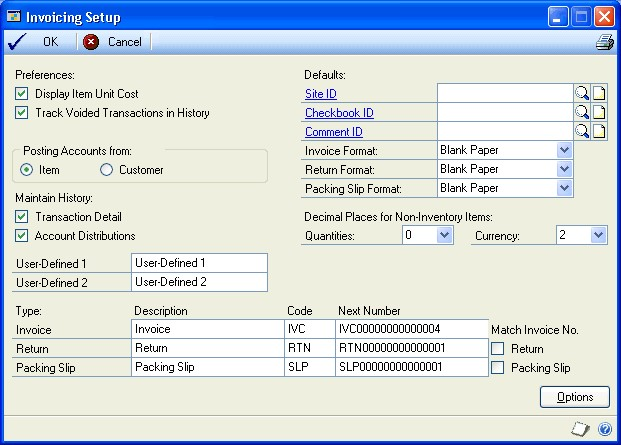
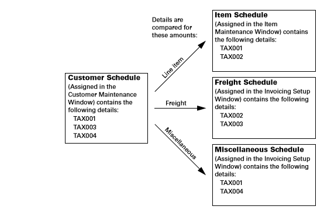
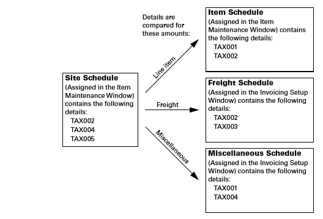
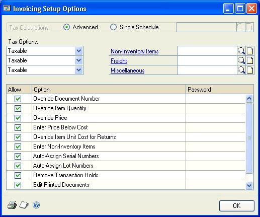

# Invoicing in Microsoft Dynamics GP

You can use Invoicing to enter and edit invoices and returns and print an invoice or return. You also can manage your invoicing documents once they're entered and print reports to analyze your invoicing activity.

You also can use Invoicing to complete the following tasks:

- Correct, delete, and void invoicing documents

- Print a quote, order, invoice, back order, or return for a customer

- Allocate and fulfill items.

This guide is designed to give you an understanding of how to use the features of Invoicing, and how it integrates with the Microsoft Dynamics GP system.

To make best use of Invoicing, you should be familiar with system-wide features described in the System User's Guide, the System Setup Guide, and the System Administrator's Guide.

Some features described in the documentation are optional and can be purchased through your Microsoft Dynamics GP partner.

To view information about the release of Microsoft Dynamics GP that you're using and which modules or features you are registered to use, choose Help \>\> About Microsoft Dynamics GP.

The manual is divided into the following parts:

- Part 1: Setup introduces Invoicing and gives detailed instructions on how to set it up.

- [Part 2: Transaction Entry](invoicing-part-2.md) explains how to enter and edit invoices and returns and how to print an invoice or return. It also explains how to post Invoicing transactions.

- [Part 3: Transaction activity](invoicing-part-3.md) includes information that will help manage your invoicing documents once they are entered.

- [Part 4: Inquiries, reports, and utilities](invoicing-part-4.md) describes how to use inquiries and reports to analyze your invoicing activity and explains procedures you can use to clear historical data.

## Part 1: Setup

This part of the documentation includes information that will help you set up Invoicing. The setup procedures generally need to be completed once, but you can refer to this information at other times for instructions on modifying or viewing existing entries.

The following information is discussed:

- *Chapter 1, "Setup overview,"* lists the setup tasks you need to complete in other modules and explains the setup process.

- *Chapter 2, "Module setup,"* provides instructions for setting up the Invoicing module.

## Chapter 1: Setup overview

Use this information to learn about and set up Invoicing. The setup procedures are organized in an order that will ensure Invoicing is set up properly.

Setup information is divided into the following sections:

- *Before you set up Invoicing*

- *Invoicing setup*

### Before you set up Invoicing

Before you begin setting up Invoicing, be sure you've completed the System Manager and General Ledger setup procedures. If you're using Receivables Management and Inventory, you also should set up these modules before you set up Invoicing. For more information about setting up your system, refer to the System Setup documentation (Help \>\> Contents \>\> select Setting up the System). For more information about setting up General Ledger, Receivables Management, and Inventory, refer to the documentation for those
modules.

### Invoicing setup

When you set up Invoicing, you can open each setup window and enter information, or you can use the Setup Checklist window (Microsoft Dynamics GP \>\> Tools \>\> Setup \>\> Setup Checklist) to guide you through the setup process. See your System Setup Guide (Help \>\> Contents \>\> select Setting up the System) for more information about the Setup Checklist window.

## Chapter 2: Module setup

During the Invoicing setup process, you'll set up your Invoicing preferences such as default entries, tax calculation options, starting document numbers, and whether to maintain document history. You can open the Invoicing setup windows using menu options, or you can
follow the setup routine, which will guide you through the setup process. For more information about the setup routine, see *Invoicing setup* .

Setup information is divided into the following sections:

- *Setting Invoicing general options and defaults*

- *Advanced tax options for Invoicing*

- *Setting up taxes and options*

### Setting Invoicing general options and defaults

Use the Invoicing Setup window to set general default entries that will appear throughout the Invoicing module. You can also indicate what kind of history records you want to maintain, which posting accounts to use, and what document numbering options you want to use.

**To set Invoicing general options and defaults:**

1. Open the Invoicing Setup window. (Microsoft Dynamics GP menu \>\> Tools \>\> Setup \>\> Sales \>\> Invoicing) Mark Preferences settings:

    

    - **Display Item Unit Cost** Mark to view the cost of each item as you're entering it on an invoice. The unit cost displayed will depend on the inventory valuation method assigned to each item, which can have its own valuation method.

        The following table displays the cost displayed with each valuation method:

        | **Valuation method** | **Cost displayed** |
        |----------------------|--------------------|
        | FIFO Perpetual       | Current Cost       |
        | LIFO Perpetual       | Current Cost       |
        | Average Perpetual    | Current Cost       |
        | FIFO Periodic        | Standard Cost      |
        | LIFO Periodic        | Standard Cost      |

    - **Track Voided Transactions in History** Mark to keep track of voided transactions. If you don't track voided documents, they will be removed during posting, and the document number will become available for recording documents again.

2. Choose Item or Customer to use the set of posting accounts as default accounts.

    Many of the posting accounts you assign to customer records in Receivables Management and to items in Inventory Control are used to track similar revenue or expense accounts. For example, you can assign different posting accounts to track Cost of Goods Sold amounts for individual items and for customers. Choose the posting accounts assigned to items, or those assigned to customers, to be suggested as default entries if the items and customers aren't assigned matching posting accounts.

3. Choose the types of history to keep for your company.

    - **Transaction Detail** Mark to keep detailed history for the transactions you enter. If you keep transaction detail history, you'll be able to view posted transactions in the inquiry windows and print reports for posted transactions.

    - **Account Distributions** Mark to keep history that includes the debit and credit amounts for each document, along with the posting accounts they were distributed to; you may find this information useful for auditing purposes.

        > [!NOTE]
        > Keeping transaction and distribution history will use a considerable amount of disk space. Please plan accordingly if you keep history. Historical information can be removed when it's no longer useful. For more information, see Removing invoicing history.

4. Enter labels for user-defined fields, which can be used to track special information in Invoicing. For example, to track shipping numbers for special courier labels, enter Shipping Number as the name of one of the user-defined fields. In the Invoice Customer Detail Entry window, Shipping Number will appear as a field name and you can enter the shipping number for each invoice.

5. Enter default site, checkbook, and comment ID values.

    - **Site ID** Enter or select a site ID. A site is a store, warehouse, or other building at which you do business or store items. The site ID you enter here will appear as a default entry in the Invoice Entry window. If you have multiple sites, enter the site you'll use most often.

    - **Checkbook ID** Enter or select a checkbook ID. The checkbook ID identifies a particular checking account to which amounts received will be deposited. The checkbook ID you enter here will appear as a default entry in the Invoice Batch Entry window.

    - **Comment ID** Enter or select a comment ID. Comment IDs identify standard comments you print on invoices. The comment ID you enter here will appear as a default in the Invoice Entry window.

6. Select default document formats for printing invoices, returns, and packing slips. You can print on blank paper, a long form, or a short form. You'll be able to change these defaults for individual documents.

7. Select the number of decimal places to use for non-inventoried item quantities and currency amounts. The decimal places you enter here will appear as default entries in the Invoice Entry window when you enter a non-inventoried item.

    If you're selling inventoried items, the decimal place settings you made in the Item Maintenance window will appear as default entries for those items when you enter invoices in the Invoice Entry window.

8. Enter the document description, code, and number for each document type used
    in Invoicing or accept the default entries.

    - **Description** The description entered here will appear in the document list in the Invoice Entry window. You can change the default description if you prefer to call your invoices, returns, and packing slips by another name. For example, if you refer to your invoices as bills of sale, enter Bill of Sale in the Description field.

    - **Code** The document code will be used on reports to indicate the document type for each document.

    - **Number** The starting number for this document type will increment by one to the next available number each time you enter a transaction. We recommend that you use an alphanumeric code for document numbers with the document type included, such as IVC000001, to make transactions easier to identify on reports and in lookup windows.

    By defining the next document number, you also are determining the number of unique document numbers that will be available. For example, if you enter IVC001 as the next invoice number, you'll be able to enter up to 999 unique invoice documents. You can change the next document number when you enter transactions; however, the same number can't be posted twice. If you don't choose to keep historical records of voided transactions, the document number will become available when an invoice is deleted.

    > [!NOTE]
    > If you use Invoicing on a network where more than one person is entering transactions at the same time, the number may appear to increment by two or more.

9. If you're using generic—non-numbered—forms and aren't using alphanumeric
    document numbers, you can set additional options that control document
    numbering sequences for returns and packing slips.

    - **Return** Mark to use the invoice numbering sequence for both invoices and returns. For example, if you're entering a return in the Invoice Entry window, and the next available invoice number is 98, the document number that appears for your return will be 98.

    - **Packing Slip** Mark for the document number that appears on the packing slip to match the number of the invoice associated with it.

10. Choose File \>\> Print to review the setup options you've entered.

11. Choose OK to save changes and close the Invoicing Setup window.

### Advanced tax options for Invoicing

If Advanced is marked in the Invoicing Setup Options window, the tax details in the tax schedules are compared when tax is calculated on an invoice. Tax is calculated only for the details that match the customer, item, site, freight, and miscellaneous charges, depending on the shipping method selected on the invoice.

The shipping method determines where the exchange of goods takes place and which tax schedule appears as a default for the transaction.

**Delivery** The tax schedule designated for the shipping address of the customer will appear as the default.

**Pickup** The tax schedule designated for the site you're selling from will appear as the default schedule.

The following diagrams show how tax details are compared to determine the amount of tax that will be calculated.

- For a delivery shipping method

    

    The tax calculated on the line item would be the amount or percentage assigned to tax detail TAX001, the tax calculated on the freight charge will be the amount or percentage assigned to tax detail TAX003, and the tax on the miscellaneous charge will be the amount or percentage assigned to tax details TAX001 and TAX004. These details are used because they appear in both the customer schedule and in the item, freight, or miscellaneous schedule.

- For a pickup shipping method

    

    The tax calculated on the line item would be the amount or percentage assigned to tax detail TAX002, the tax calculated on the freight charge will be the amount or percentage assigned to tax detail TAX002, and the tax on the miscellaneous charge will be the amount or percentage assigned to tax detail TAX004. These details are used because they appear in both the site schedule and in the item, freight, or miscellaneous schedule.

> [!NOTE]
> Each time the shipping method, site ID, or shipping address for the customer is changed, the tax schedule may be changed and taxes may be recalculated.

### Setting up taxes and options

Use the Invoicing Setup Options window to specify a method for calculating taxes and to set up other options. You can further restrict each option by assigning a password to it. If the option is marked but no password is entered, anyone who has access to the related windows can use the option.

**To set up taxes and options:**

1. Open the Invoicing Setup Options window. (Microsoft Dynamics GP menu \>\> Tools \>\> Setup \>\> Sales \>\> Invoicing \>\> Options button)

    

2. Choose advanced tax calculations or a single schedule for use for all sales.

    - **Advanced** Mark to specify a tax schedule to use for non-inventoried items and freight and miscellaneous charges.

    - **Single Schedule** Mark to specify one tax schedule for all items on all documents. Items on each sales document will be taxed using the tax details in the schedule you specify here. Tax-exempt and non-tax items are not available when you select single schedule. Taxes won't be calculated on freight or miscellaneous charges.

    Inventoried items will use the tax schedule assigned to each item in the Item Maintenance window. You can change tax details for an individual invoice using the Invoice Tax Summary Entry window (Transactions \>\> Sales \>\> Invoice Entry \>\> Tax expansion button).

3. If you use advanced tax calculations, select the taxes options for noninventoried items, freight, and miscellaneous charges.

    - **Taxable** Tax details will be assigned to the customer, item, freight, and miscellaneous charges.

    - **Nontaxable** No taxes will be calculated.

    - **Base on customers** The shipping method determines the tax schedule. If the shipping method is delivery, the tax details from the customer tax schedule will be used. If the shipping method is pickup, the tax details from the site tax schedule will be used.

    > [!TIP]
    > You can change the tax schedules for individual invoices in the Invoice Tax Schedule Entry window.

    For more information on how taxes are calculated for an invoice, see *Advanced tax options for Invoicing*.

Mark Invoicing options. You can further restrict each option by assigning a password to it.

**Override Document Number** Mark to change the default document number that appears in the Invoice Entry window—this is the number displayed in the Invoicing Setup window. If you don't mark this option, the Document Number field in the Invoice Entry window will display the next number available from the Invoicing Setup window, and you won't be able to change it.

**Override Item Quantity** Mark to sell inventoried items that aren't currently in stock. If you mark this option and a quantity entered in the Invoice Entry window is greater than the amount available, the Invoice Quantity Shortage Options window will open and you can choose to override the quantity available. If you don't mark this option, only the quantity available can be sold.

**Override Price** Mark to override the unit price that appears as a default and the extended price that is automatically calculated for invoices and returns in the Invoice Entry window. If you don't mark this option, changes won't be allowed to the amounts displayed in the Unit Price and Extended Price fields.

**Enter Price Below Cost** Mark to enter a price that's lower than the current cost of an item. This option is available only if you also marked the Override Price option. If you don't mark this option, prices below the current cost won't be allowed in the Invoice Entry window.

**Override Item Unit Cost for Returns** Mark to override the unit cost of an item when you enter a return.

**Enter Non-Inventory Items** Mark to enter non-inventoried items in the Invoice Entry window for a sale or return without creating records for those items. If you mark this option, any item numbers entered in the Invoice Entry window that don't exist can be recognized as non-inventoried items. If you don't allow non-inventory items, only items that exist in your inventory can be entered.

**Auto-Assign Serial Numbers** Mark to automatically assign serial numbers to sales according to the valuation method selected for serialnumbered items being sold. For example, invoices for an item with a FIFO valuation method will be assigned items with the oldest serial numbers first.

**Auto-Assign Lot Numbers** Mark to automatically assign lot numbers to sales. Lot numbers can be assigned automatically by receipt date or by expiration date, depending on how you select to automatically assign lot numbers in the Inventory Control Setup window.

Lot number assignment will be based on the valuation method selected for lotnumbered items being sold if you selected to assign lot numbers by receipt date. For example, invoices for an item with a FIFO valuation method will be assigned items with the oldest lot numbers first. If you selected to assign lot numbers by expiration date, the lot numbers nearing expiration dates will be used first. Lot numbers without an expiration date will not be assigned.

When automatically assigning lot numbers by receipt date or expiration date, expired lots won't be used even if you marked the Other Transactions option in the Inventory Control Setup window.

**Remove Transaction Holds** Mark to remove a hold status on a transaction during data entry. We recommend that you enter a password to limit the number of employees who are able to remove transaction holds.

**Edit Printed Documents** Mark to edit documents after they've been printed. If you don't specify a password, this option also allows you to print invoices, returns, and packing slips without entering the transactions in a batch.

If you don't mark this option, printed documents won't be available for editing, and you'll be able to view the document only by using the inquiry feature. In addition, you'll be able to print invoices and returns for transactions only if they've been entered in a batch.

> [!NOTE]
> We recommend that you use a password to limit the number of employees who are able to edit printed documents. If you require a password, however, you must enter transactions in a batch to print invoices, returns, and packing slips.

**Void Documents** Mark to void saved invoices and returns in the Invoice Entry window. We recommend that you require a password to limit the number of employees who are able to void documents. If you don't allow documents to be voided, the Delete button in the Invoice Entry window will be unavailable.

1. Choose File \>\> Print to review the setup options you've entered.

2. Choose OK to save the changes you've made. The Invoicing Setup window will be displayed.

3. Choose OK to save changes and close the Invoicing Setup window.

## See also

[Invoicing in Microsoft Dynamics GP - Part 2: Transaction entry](invoicing-part-2.md)  
[Invoicing in Microsoft Dynamics GP - Part 3: Transaction activity](invoicing-part-3.md)  
[Invoicing in Microsoft Dynamics GP - Part 4: Inquiries, reports, and utilities](invoicing-part-4.md)  
[Glossary of Terms in the Invoicing Area in Dynamics GP](invoicing-glossary.md)  
