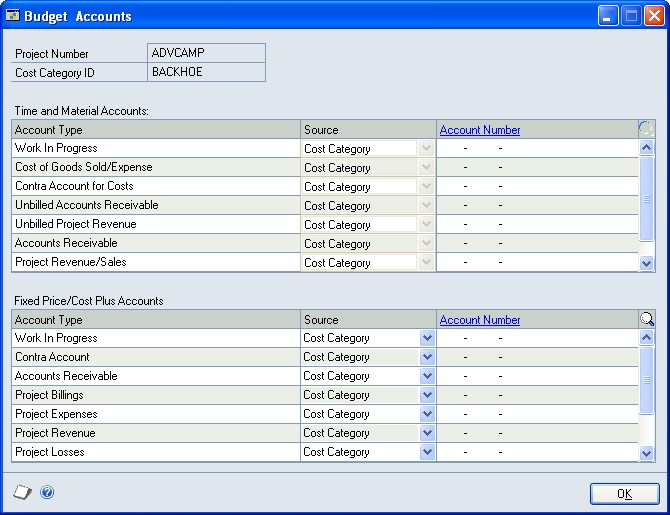
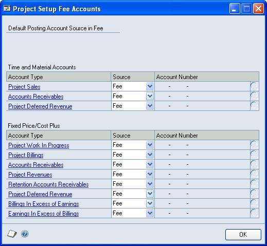
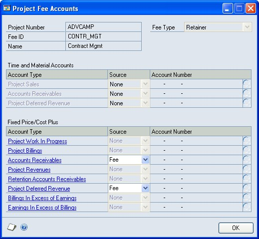
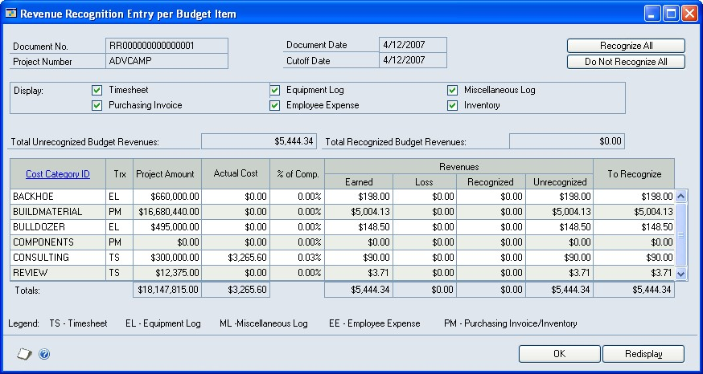

# Project Accounting - Accounting Control Guide

**Introduction**

>   The Project Accounting Accounting Control Guide includes information for
>   accounting managers about how to use Microsoft Dynamics® GP Project
>   Accounting to set up and control how credits and debits are posted to the
>   Project Accounting chart of accounts and how to recognize revenue for
>   projects. It also includes information about how to create, group, and print
>   reports.

>   You can specify posting account numbers for cost categories in project
>   budgets and for fees assigned to projects. You can create the batches to be
>   used for transactions and, before posting, modify posting account
>   distributions for transactions. You can enter adjusting transactions and
>   delete posted cost and billing transactions.

>   You also can use revenue recognition cycles to recognize revenue for
>   multiple customers, contracts, and projects at once.

>   **Project Accounting Cost Management Guide** Includes information about how
>   to estimate and track project costs, and specify how billing amounts,
>   revenue, and profit should be calculated, based on project costs.

>   **Project Accounting Billing Guide** Includes information about how to
>   create billing invoices for customers.

>   **Project Accounting Administrator’s Guide** Includes information about how
>   to set up user security and maintain your company databases for Project
>   Accounting.

>   This introduction is divided into the following sections:

-   *What’s in this manual*

-   *Symbols and conventions*

-   *Resources available from the Help menu*

>   **What’s in this manual**

>   This manual is designed to give you an understanding of how to use the
>   accounting control features of Project Accounting, and how it integrates
>   with the Microsoft Dynamics GP system.

>   To make best use of Project Accounting, you should be familiar with
>   systemwide features described in the System User’s Guide, the System Setup
>   Guide, and the System Administrator’s Guide. Choose **Help \> Printable
>   Manuals** for more information.

>   You might also need to be familiar with features described in General
>   Ledger, Bank Reconciliation, Multicurrency Management, Purchase Order
>   Processing, Purchase Order Enhancements, Payables Management, Receivables
>   Management, Inventory Control, United States Payroll, Canadian Payroll, or
>   Report Writer

>   Some features described in the documentation are optional and can be
>   purchased through your Microsoft Dynamics GP partner.

>   To view information about the release of Microsoft Dynamics GP that you’re
>   using and which modules or features you are registered to use, choose **Help
>   \> About Microsoft Dynamics GP.**

>   The manual is divided into the following parts.

-   *Part 1, Posting setup and control*, includes information about how to
    specify posting account numbers for cost categories in project budgets and
    for fees assigned to projects. It also includes information about how to
    create batches for transactions manually, how to modify posting account
    distributions for transactions, and how to post multiple batches at once.

-   *Part 2, Revenue recognition*, includes information about how to create and
    use revenue recognition cycles to recognize revenue for multiple customers,
    contracts, and projects at once. It also includes information about how to
    modify revenue recognition transactions before posting and how revenue is
    calculated for recognition.

-   *Part 3, Reports and utilities*, includes information about reports in
    Project Accounting and how to create, group, and print them. It also
    includes information about how to enter adjusting transactions to reverse
    and correct cost transaction line item entries, and how to delete posted
    cost and billing transactions and **Closed** contracts. The documentation
    also includes information about how to use various accounting utilities.

>   **Contents**

>   Opens the Help file for the active Microsoft Dynamics GP component, and
>   displays the main “contents” topic. To browse a more detailed table of
>   contents, click the **Contents** tab above the Help navigation pane. Items
>   in the contents topic and tab are arranged by module. If the contents for
>   the active component includes an “Additional Help files” topic, click the
>   links to view separate Help files that describe additional components.

>   To find information in Help by using the index or full-text search, click
>   the appropriate tab above the navigation pane, and type the keyword to find.

>   To save the link to a topic in the Help, select a topic and then select the
>   **Favorites** tab. Click **Add**.

>   **About this window**

>   Displays overview information about the current window. To view related
>   topics and descriptions of the fields, buttons, and menus for the window,
>   choose the appropriate link in the topic. You also can press **F1** to
>   display Help about the current window.

>   **Lookup**

>   Opens a lookup window, if a window that you are viewing has a lookup window.
>   For example, if the Checkbook Maintenance window is open, you can choose
>   this item to open the Checkbooks lookup window.

>   **Show Required Fields**

>   Highlights fields that are required to have entries. Required fields must
>   contain information before you can save the record and close the window. To
>   change the way required fields are highlighted, choose **Microsoft Dynamics
>   GP menu \> User Preferences \> Display**, and specify a different color and
>   type style.

>   **What’s New**

>   Provides information about enhancements that were added to Microsoft
>   Dynamics GP since the last major release.

**Microsoft Dynamics GP Online**

>   Opens a Web page that provides links to a variety of Web-based user
>   assistance resources. Access to some items requires registration for a paid
>   support plan.

## Part 1: Posting setup and control

>   This part of the documentation includes information for the accounting
>   manager about how to specify posting account numbers for cost categories in
>   project budgets and for fees assigned to projects. It also includes
>   information about how to create batches for transactions manually, how to
>   modify posting account distributions for transactions, and how to post
>   multiple batches at once.

-   *Chapter 1, “Posting setup,”* includes information about the Project
    Accounting chart of accounts and how to specify posting account numbers for
    cost categories in project budgets and for fees assigned to projects. It
    also includes information about how to specify the posting account segment
    numbers to use when posting amounts for individual contracts and projects.

-   *Chapter 2, “Posting control,”* includes information about how to create
    batches for transactions, how to review and modify posting account
    distributions for transactions in batches, and how to post batches.

### Chapter 1: Posting setup

>   This part of the documentation includes information for the accounting
>   manager about the Project Accounting chart of accounts and how to specify
>   posting account numbers for cost categories in project budgets and for fees
>   assigned to projects. It also includes information about how to specify the
>   posting account segment numbers to use when posting amounts for individual
>   contracts and projects.

>   The following topics are discussed.

-   *The Project Accounting chart of accounts*

-   *The Work In Progress posting account*

-   *Specify default posting account numbers for records and classes for cost
    transactions*

-   *Specify default posting account numbers for cost categories in project
    budgets*

-   *Specify posting account numbers for a cost category in a project budget*

-   *Specify default posting account numbers for records and classes for fees*

-   *Specify default posting account numbers for fees assigned to projects*

-   *Specify posting account numbers for a fee assigned to a project*

-   *Specify account segment numbers to use when posting amounts for a contract*

-   *Specify account segment numbers to use when posting amounts for a project*

### The Project Accounting chart of accounts

>   The following chart of accounts is used for Project Accounting.

| **Account**                           | **Typical balance** | **Financial statement**   |
|---------------------------------------|---------------------|---------------------------|
| Cost of Goods Sold (COGS)             | Debit               | Profit and Loss Statement |
| Contra                                | Credit              | Balance Sheet             |
| Overhead                              | Credit              | Balance Sheet             |
| Unbilled Accounts Receivable          | Debit               | Balance Sheet             |
| Unbilled Project Revenue              | Credit              | Balance Sheet             |
| Inventory                             | Debit               | Balance Sheet             |
| Accrued Purchases                     | Credit              | Balance Sheet             |
| Accounts Payable                      | Credit              | Balance Sheet             |
| Project Revenue                       | Credit              | Profit and Loss Statement |
| Accounts Receivable                   | Debit               | Balance Sheet             |
| Work In Progress                      | Debit               | Balance Sheet             |
| Project Costs                         | Debit               | Profit and Loss Statement |
| Project Billings                      | Credit              | Balance Sheet             |
| Project Losses                        | Credit              | Balance Sheet             |
| Earnings in Excess of Billings (EIEB) | Debit               | Balance Sheet             |
| Billings in Excess of Earnings (BIEE) | Credit              | Balance Sheet             |

### The Work In Progress posting account

>   The WIP (Work In Progress) posting account is a holding account on the
>   Balance Sheet. It has a typical debit balance and is used to track actual
>   project costs that haven’t been billed for **Time and Materials** projects
>   that use the **When Billed** accounting method, or actual project costs for
>   **Cost Plus** and **Fixed Price** projects that haven’t been closed.

>   See *Accounting methods and recognizing revenue* for more information. See
>   also *Project types* in the Project Accounting Cost Management Guide and
>   *Age work in progress amounts for projects that use the When Billed
>   accounting method* in the Project Accounting Billing Guide for more
>   information.

### Specify default posting account numbers for records and classes for cost transactions

>   For various types of records and classes, including customers, contracts,
>   projects, cost categories, employees, vendors, equipment, and miscellaneous,
>   you can specify the default posting account numbers to use for cost
>   transactions. You can specify these settings for **Time and Materials**
>   projects and for **Cost Plus** and **Fixed Price** projects.

>   You also can specify the type of record that will be used to determine the
>   default posting account numbers for cost categories for various cost
>   transaction types. See *Specify default posting account numbers for cost
>   categories in project budgets* for more information.

1.  Open the window for the record or class that you’re specifying default
    posting account numbers to use for cost transactions.

>   The following table lists the windows and how to open them.

(IMAGE PACTAB.jpg)

1.  In the **Transaction Type** list, select whether to specify settings for
    timesheets, employee expense transactions, equipment logs, miscellaneous
    logs, or purchases/materials transactions. Purchases/materials is for
    purchase orders, shipment receipts, shipment/invoice receipts, invoice
    receipts, and inventory transfers with non-inventoried items.

2.  For each posting account, select the account number to use for the record or
    class for the cost transaction.

3.  Click **OK**.

### Specify default posting account numbers for cost categories in project budgets

>   You can specify the default posting account numbers to use for cost
>   categories in project budgets, depending on the type of cost transactions
>   that the cost categories are for. See *Cost categories and cost
>   transactions* in the Project Accounting Cost Management Guide for more
>   information.

>   For each type of cost transaction, you must specify the type of record that
>   will be used to determine the default posting account numbers for cost
>   categories for the transaction type. You can specify these settings for
>   **Time and Materials** projects and for **Cost Plus** and **Fixed Price**
>   projects. See *Specify default posting account numbers for records and
>   classes for cost transactions* for more information.

>   You also can select specific default posting account numbers or select to
>   use no default posting account numbers.

>   After you assign a cost category to a project budget, you can modify the
>   posting account numbers to use for the cost category in the budget. See
>   *Specify posting account numbers for a cost category in a project budget*
>   for more information.

>   Open the Project Setup Cost Budget Accounts window.

>   **Microsoft Dynamics GP menu \> Tools \> Setup \> Project \> Project \>
>   Accounts button**

(IMAGE PACSET.jpg)

1.  In the **Transaction Type** list, select whether to specify settings for
    cost categories that are for timesheets, employee expense transactions,
    equipment logs, miscellaneous logs, or purchases/materials transactions.
    Purchases/ materials is for purchase orders, shipment receipts,
    shipment/invoice receipts, invoice receipts, and inventory transfers with
    non-inventoried items.

2.  For each posting account, in the **Source** column select whether to use the
    default account number that you’ve specified for the customer, contract,
    project, cost category, or transaction owner (**Trx Owner**) that the cost
    transaction is for. The transaction owner is the employee, equipment,
    miscellaneous, or vendor record that the cost transaction is for.

>   Select **None** if you won’t be updating General Ledger. No default account
>   number will be used for the posting account.

>   To use this window to select a specific default account number to use for
>   the posting account, select **Specific** and select the account number.

### Specify posting account numbers for a cost category in a project budget

>   You can specify the posting account numbers to use for a cost category in a
>   project budget, including the type of record that will be used to determine
>   the default posting account numbers. See *Specify default posting account
>   numbers for records and classes for cost transactions* for more information.

>   You also can select specific default posting account numbers or select to
>   use no default posting account numbers.

>   *You also can specify the default posting account numbers to use for cost
>   categories in project budgets, depending on the type of cost transactions
>   that the cost categories are for. See Specify default posting account
>   numbers for cost categories in project budgets for more information.*

1.  Open the Budget Accounts window. **Cards \> Project \> Project \> Budget
    Button \> Cost Category expansion button \> Accounts button**

(IMAGE PACBUD.jpg)

1.  For each posting account, in the **Source** column select whether to use the
    default account number that you’ve specified for the customer, contract,
    project, cost category, or transaction owner (**Trx Owner**) for the type of
    cost transaction that the cost category is for. The transaction owner is the
    employee, equipment, miscellaneous, or vendor record that the cost
    transaction is for.

>   Select **None** if you won’t be updating General Ledger. No default account
>   number will be used for the posting account.

>   To use this window to select a specific default account number to use for
>   the posting account, select **Specific** and select the account number.

### Specify default posting account numbers for records and classes for fees

>   For various types of records and classes, including customers, contracts,
>   projects, and fees, you can specify the default posting account numbers to
>   use for fees that are assigned to projects. You can specify these settings
>   for **Time and Materials** projects and for **Cost Plus** and **Fixed
>   Price** projects.

>   You also can specify the type of record that will be used to determine the
>   default posting account numbers for fees. See *Specify default posting
>   account numbers for fees assigned to projects* for more information.

>   Open the window for the record or class that you’re specifying default
>   posting account numbers to use for cost transactions.

1.  For each posting account, select the account number to use for the record or
    class for the cost transaction and then Click OK.

### Specify default posting account numbers for fees assigned to projects

>   You can specify the default posting account numbers to use for fees assigned
>   to projects. You must specify the type of record that will be used to
>   determine the default posting account numbers. You can specify these
>   settings for **Time and Materials** projects and for **Cost Plus** and
>   **Fixed Price** projects. See *Specify default posting account numbers for
>   records and classes for fees* for more information.

>   You also can select specific default posting account numbers, or select to
>   use no default posting account numbers.

>   After you assign a fee to a project, you can modify the posting account
>   numbers to use for the fee for the project. See *Specify posting account
>   numbers for a fee assigned to a project* for more information.

1.  Open the Project Setup Fee Accounts window. **Microsoft Dynamics GP menu \>
    Tools \> Setup \> Project \> Project \> Fee Accounts button**

(IMAGE PACFEE.jpg)

1.  For each posting account, in the **Source** column select whether to use the
    default account number that you’ve specified for the customer, contract,
    project, or fee.

>   Select **None** if you won’t be updating General Ledger. No default account
>   number will be used for the posting account.

>   To use this window to select a specific default account number to use for
>   the posting account, select **Specific** and select the account number.

### Specify posting account numbers for a fee assigned to a project

>   You can specify the posting account numbers to use for a fee assigned to a
>   project, including the type of record that will be used to determine the
>   default posting account numbers. See *Specify default posting account
>   numbers for records and classes for fees* for more information.

>   You also can select specific default posting account numbers, or select to
>   use no default posting account numbers.

>   *You can specify the default posting account numbers to use for fees
>   assigned to projects. See Specify default posting account numbers for fees
>   assigned to projects for more information.*

>   Open the Project Fee Accounts window.

>   **Cards \> Project \> Project \> Fees button \> Fee ID expansion button \>
>   Accounts button**

(IMAGE PACFEE2.jpg)

1.  For each posting account, in the **Source** column select whether to use the
    default account number that you’ve specified for the customer, contract,
    project, or fee.

>   Select **None** if you won’t be updating General Ledger. No default account
>   number will be used for the posting account.

>   To use this window to select a specific default account number to use for
>   the posting account, select **Specific** and select the account number.

### Specify account segment numbers to use when posting amounts for a contract

>   You can specify the account segment numbers to use for posting accounts when
>   posting transactions for an individual contract.

>   An account segment is the portion of the account format that can be used to
>   represent a specific aspect of a business. For example, accounts can be
>   divided into segments that represent business locations, divisions, or
>   profit centers.

>   An account segment number can represent a particular area of a business or
>   an account category. Using account 01-200-1100, for example, account segment
>   number 01 might represent a particular site, 200 might represent a
>   department located at that site, and 1100 might represent the Cash account
>   for that site and that department. To use specific account segment numbers
>   to identify when amounts are posted to the Cash account for individual
>   contracts handled by a specific department, for example, you might specify
>   that 201 represents the first contract for a department and 202 the second
>   contract.

>   Names can be entered for each account segment number to appear on General
>   Ledger reports. Use the Account Format Setup window (**Microsoft Dynamics GP
>   menu \> Tools \> Setup \> Company \> Account Format**) to enter names for
>   account segments and to modify the account format.

1.  Open the Account Segment Overrides window. **Cards \> Project \> Contract \>
    Sub Acct Format expansion button**

(IMAGE PACSEG.jpg)

1.  For each account segment in the scrolling window, you can enter the account
    segment number to use when posting amounts for the contract.

2.  Select the posting accounts that the account segment numbers will be used
    for and Click OK.

### Specify account segment numbers to use when posting amounts for a project

>   You can specify the account segment numbers to use for posting accounts when
>   posting transactions for an individual project.

>   An account segment is the portion of the account format that can be used to
>   represent a specific aspect of a business. For example, accounts can be
>   divided into segments that represent business locations, divisions, or
>   profit centers.

>   An account segment number can represent a particular area of a business or
>   an account category. Using account 01-200-1100, for example, account segment
>   number 01 might represent a particular site, 200 might represent a
>   department located at that site, and 1100 might represent the Cash account
>   for that site and that department. To use specific account segment numbers
>   to identify when amounts are posted to the Cash account for individual
>   projects handled by a specific department, for example, you might specify
>   that 201 represents the first project for a department and 202 the second
>   project.

>   Names can be entered for each account segment number to appear on General
>   Ledger reports. Use the Account Format Setup window (**Microsoft Dynamics GP
>   menu \> Tools \> Setup \> Company \> Account Format**) to enter names for
>   account segments and to modify the account format.

>   Open the Account Segment Overrides window. **Cards \> Project \> Project \>
>   Sub Acct Format expansion button**

1.  For each account segment in the scrolling window, you can enter the account
    segment number to use when posting amounts for the project.

2.  Select the posting accounts that the account segment numbers will be used
    for and Click OK.

### Chapter 2: Posting control

>   This part of the documentation includes information for the accounting
>   manager about how to create batches for transactions, how to review and
>   modify posting account distributions for transactions in batches, and how to
>   post batches.

>   The following topics are discussed.

-   *Manually create a batch for transactions*

-   *Review and modify posting account distributions for transactions*

-   *Post batches*

#### Manually create a batch for transactions

>   You can create batches manually for grouping cost, return from project,
>   billing, and revenue recognition transactions. You can save transactions in
>   batches and then post the entire batch of transactions at once.

>   Batches that you create manually in Project Accounting always use the
>   **Single Use** frequency, meaning the batch is used once and is deleted
>   after the batch is posted.

>   *You can use billing cycles and revenue recognition cycles to create batches
>   of billing and revenue recognition transactions. For more information, see
>   Use a revenue recognition cycle to generate revenue recognition transactions
>   and Use a billing cycle to generate billing invoices of the Project
>   Accounting Billing Guide.*

1.  Open a batch entry window.

>   The following table lists the windows and how to open them.

| **Transaction**                      | **Window**                      | **Choose**             |
|--------------------------------------|---------------------------------|----------------------------|
| Timesheets                           | Timesheet Batch Entry           | Transactions \> Project \> Timesheet Batches                      |
| Employee expense transactions        | Employee Expense Batch Entry    | Transactions \> Project \> Employee Expense Batches               |
| Equipment logs                       | Equipment Log Batch Entry       | Transactions \> Project \> Equipment Log Batches                  |
| Miscellaneous logs                   | Miscellaneous Log Batch Entry   | Transactions \> Project \> Miscellaneous Log Batches              |
| Inventory transfers                  | Inventory Transfer Batch Entry  | Transactions \> Project \> Inventory Batches                      |
| Return from project transactions     | Return From Project Batch Entry | Transactions \> Project \> Returns from Project Batches           |
| Billing invoices and billing returns | Billing Batch Entry             | Transactions \> Project \> Billing \> Billing Batches             |
| Revenue recognition transactions     | Revenue Recognition Batch Entry | Transactions \> Project \> Billing \> Revenue Recognition Batches |

1.  Enter a batch ID and comment. The comment is the reference for the batch in
    General Ledger.

2.  If you selected **Posting Date From: Batch** in the Posting Setup window
    (**Microsoft Dynamics GP menu \> Tools \> Setup \> Posting \> Posting**),
    enter a posting date for the batch.

3.  If the batch is for employee expense transactions or billing invoices or
    returns, select the checkbook for the batch.

4.  In the **Control** column, you can enter the minimum number of transactions
    or the minimum total amount that must be entered in the batch before you can
    post the batch.

5.  Click **Transactions** to open the transaction entry window, where you can
    enter transactions for the batch.

6.  Click **Save** and close the window to save the batch.

7.  Before you post the batch, you can print an edit list to review the
    transactions in the batch.

8.  Click **Post** to post the batch.

9.  Close the window.

#### Review and modify posting account distributions for transactions

>   You can print an edit list to review posting account distributions for
>   transactions in a batch. You also can modify distributions before posting
>   the batch.

>   See *Manually create a batch for transactions* and *Use a revenue
>   recognition cycle to generate revenue recognition transactions* , and also
>   *Use a billing cycle to generate billing invoices* in the Project Accounting
>   Billing Guide for more information.

1.  Open a batch entry window.

>   The following table lists the windows and how to open them.

| **Transaction**                      | **Window**                      | **Choose**                                                        |
|--------------------------------------|---------------------------------|-------------------------------------------------------------------|
| Timesheets                           | Timesheet Batch Entry           | Transactions \> Project \> Timesheet Batches                      |
| Employee expense transactions        | Employee Expense Batch Entry    | Transactions \> Project \> Employee Expense Batches               |
| Equipment logs                       | Equipment Log Batch Entry       | Transactions \> Project \> Equipment Log Batches                  |
| Miscellaneous logs                   | Miscellaneous Log Batch Entry   | Transactions \> Project \> Miscellaneous Log Batches              |
| Inventory transfers                  | Inventory Transfer Batch Entry  | Transactions \> Project \> Inventory Batches                      |
|                                      |                                 |                                                                   |
| Return from project transactions     | Return From Project Batch Entry | Transactions \> Project \> Returns from Project Batches           |
| Billing invoices and billing returns | Billing Batch Entry             | Transactions \> Project \> Billing \> Billing Batches             |
| Revenue recognition transactions     | Revenue Recognition Batch Entry | Transactions \> Project \> Billing \> Revenue Recognition Batches |

1.  Enter the batch ID to review transactions for.

2.  Click **Transactions** to open the transaction entry window.

3.  Click the printer button to print a transaction edit list. The edit list
    will include information about posting account distributions for
    transactions in the batch.

4.  In the transaction entry window, click **Distributions** to open the
    distributions entry window for the transaction that is displayed.

5.  In the distributions entry window, the scrolling window will display how
    amounts have been distributed for the transaction, based on your posting
    setup. See *Chapter 1, “Posting setup,”* for more information.

6.  You can change the debit or credit amounts for the accounts.

7.  You can select additional accounts to enter distributions for, or select a
    line item and choose **Edit \> Delete Row** to delete the line item. Click
    **Default** to restore distributions to the way they were before you opened
    the window and made changes.

8.  Click **OK**. The distribution entry window will close.

9.  In the transaction entry window, use the browse buttons to view information
    for other transactions in the batch. Click **OK** to close the transaction
    entry window.

### Post batches

>   You can post multiple batches of transactions at once, including batches of
>   cost, billing, and revenue recognition transactions. See *Manually create a
>   batch for transactions* and *Use a revenue recognition cycle to generate
>   revenue recognition transactions*, and also *Use a billing cycle to generate
>   billing invoices* in the Project Accounting Billing Guide for more
>   information.

>   You also can use the Project Series Posting window to post batches of
>   transactions that were entered using Personal Data Keeper or Time and
>   Expense for Microsoft Dynamics GP Business Portal, and then processed using
>   Personal Data Keeper. See the Personal Data Keeper and Time and Expense
>   documentation for more information.

1.  Open the Project Series Posting window. **Transactions \> Project \> Series
    Post**

(IMAGE PACPOST.jpg)

1.  In the **Status** column, select the batches to post. You can select a batch
    and click the **Batch ID** link to view more information about the batch and
    then Click Post.

## Part 2: Revenue recognition

>   This part of the documentation includes information for an accounting
>   manager about how to create and use revenue recognition cycles to recognize
>   revenue for multiple customers, contracts, and projects at once. It also
>   includes information about how to modify revenue recognition transactions
>   before posting and about how revenue is calculated for recognition.

-   *Chapter 3, “Revenue recognition setup,”* includes information about how to
    grant users permission to various data entry options for revenue recognition
    transactions and how to create revenue recognition cycles so that you can
    recognize revenue for multiple customers, contracts, and projects at one
    time.

-   *Chapter 4, “Revenue recognition transactions,”* includes information about
    how to use a revenue recognition cycle to generate a batch of revenue
    recognition transactions and how to modify those transactions before
    posting. It also includes information about how revenue is calculated for
    recognition.

### Chapter 3: Revenue recognition setup

>   This part of the documentation includes information for an accounting
>   manager about how to grant users permission to various data entry options
>   for revenue recognition transactions and how to create revenue recognition
>   cycles so that you can recognize revenue for multiple customers, contracts,
>   and projects at one time.

>   The following topics are discussed:

-   *Grant revenue recognition transaction entry permissions*

-   *Create a revenue recognition cycle record*

#### Grant revenue recognition transaction entry permissions

>   You can grant all users permission to various data entry options for revenue
>   recognition transactions. You also can require a password for each data
>   entry option to limit user access.

1.  Open the Revenue Recognition Setup Options window. **Microsoft Dynamics GP
    menu \> Tools \> Setup \> Project \> Billing \> RR Options button**

2.  Select the data entry tasks to grant permission for and Click OK.

>   **Override Document Number** Allow users to modify the document number for a
>   revenue recognition transaction.

>   **Override Recognized Revenue Amount** Allow users to modify the amount of
>   revenue to recognize in the **To Recognize** field in the Revenue
>   Recognition Entry per Budget Item window and the Revenue Recognition

>   Entry per Fee Item window. See *Specify revenue to recognize for cost
>   categories in a project budget* and *Specify revenue to recognize for fees*
>   for more information.

#### Create a revenue recognition cycle record

>   You can create a revenue recognition cycle so that you can recognize revenue
>   for multiple customers, contracts, and projects at one time. Revenue
>   recognition is for **Cost Plus** and **Fixed Price** projects, and for
>   **Service** fees used in **Time and Materials** projects.

>   **Customers** You can assign revenue recognition cycles to customers and
>   customer classes when you set them up for billing. See *Set up a customer
>   class for billing* and *Set up a customer record for billing* in the Project
>   Accounting Billing Guide for more information.

>   **Contracts** You can assign revenue recognition cycles to contracts when
>   you set them up for billing. See *Specify billing settings for a contract*
>   in the Project Accounting Cost Management Guide for more information.

>   **Projects** You can assign revenue recognition cycles to projects when you
>   set them up for billing. See *Specify billing settings for a project* in the
>   Project Accounting Cost Management Guide for more information.

1.  Open the RR Cycle Maintenance window. **Cards \> Project \> Revenue
    Recognition Cycle**

2.  In the **RR Cycle ID** field, enter an alphanumeric name to identify the
    revenue recognition cycle.

3.  Enter a description and Click OK.

### Chapter 4: Revenue recognition transactions

>   This part of the documentation includes information for an accounting
>   manager about how to use a revenue recognition cycle to generate a batch of
>   revenue recognition transactions and how to modify those transactions before
>   posting. It also includes information about how revenue is calculated for
>   recognition.

>   The following topics are discussed:

-   *Accounting methods and recognizing revenue*

-   *Percentage complete and revenue recognition calculations*

-   *Use a revenue recognition cycle to generate revenue recognition
    transactions*

-   *Enter or modify a revenue recognition transaction*

-   *Specify revenue to recognize for cost categories in a project budget*

-   *Specify revenue to recognize for fees*

#### Accounting methods and recognizing revenue

>   Revenue is recognized for a project based on the accounting method used for
>   the project. You must select the default accounting method to use for new
>   projects in a contract, and you can select the accounting method to use for
>   individual projects.

>   See *Create a contract record* and *Create a project record* in the Project
>   Accounting Cost Management Guide for more information.

>   **Completed**

>   Revenue is recognized for a **Cost Plus** or **Fixed Price** project that
>   uses the

>   **Completed** accounting method when the project status has been changed to
>   **Completed** for all projects in the contract that the project is for. The
>   Project Revenue account will be updated on the Profit and Loss Statement.

>   **Cost-to-Cost**

>   Revenue is recognized for a **Cost Plus** or **Fixed Price** project that
>   uses the **Cost-toCost** accounting method when you post revenue recognition
>   transactions for the project. Revenue will be determined by comparing total
>   actual project costs to total forecast project costs. See *Percentage
>   complete and revenue recognition calculations* for more information.

>   **Effort-Expended**

>   Revenue is recognized for a **Cost Plus** or **Fixed Price** project that
>   uses the **EffortExpended** accounting method when you post revenue
>   recognition transactions for the project. Revenue will be determined by
>   comparing total actual project quantities to total forecast project
>   quantities. See *Percentage complete and revenue recognition calculations*
>   for more information.

>   **Effort-Expended Labor Only**

>   Revenue is recognized for a **Cost Plus** or **Fixed Price** project that
>   uses the **EffortExpended Labor Only** accounting method when you post
>   revenue recognition transactions for the project. Revenue will be determined
>   by comparing total actual time quantities entered on timesheets to total
>   forecast time quantities for the project. See *Percentage complete and
>   revenue recognition calculations* for more information.

>   **When Billed**

>   Revenue is recognized for a **Time and Materials** project that uses the
>   **When Billed** accounting method when you post a billing invoice for the
>   project. The Cost of Goods Sold account will be updated on the Profit and
>   Loss Statement and the Work In Progress account will be updated on the
>   Balance Sheet.

>   **When Performed**

>   Revenue is recognized for a **Time and Materials** project that uses the
>   **When**

>   **Performed** accounting method when you post a cost transaction for the
>   project. The Cost of Goods Sold account will be updated on the Profit and
>   Loss Statement.

#### Percentage complete and revenue recognition calculations

>   The amount of revenue that you will recognize for a **Cost Plus** or **Fixed
>   Price** project and for the contract that the project is for depends on how
>   you’ve selected to calculate revenue.

>   The default method for recognizing revenue is to recognize revenue based on
>   the percentage complete calculation for individual cost categories in a
>   project budget. This is the **Segmented** revenue recognition calculation
>   method.

>   The percentage that a cost category is complete is based on the actual total
>   costs incurred for the cost category divided by the forecast budgeted costs
>   for the cost category. For example, if you have forecasted that you will
>   spend \$10,000 on outsourced administrative costs for a project and you have
>   spent \$7,500 to date, the percentage complete is 75%.

>   However, you can recognize revenue for a project based on the average
>   percentage complete calculation for all cost categories in the project
>   budget. You can select **Combine for Revenue Recognition** in the Project
>   Maintenance window to indicate that you will recognize revenue for the
>   project in this way. This is the **Combined from Project** revenue
>   recognition calculation method. See *Create a project record* in the Project
>   Accounting Cost Management Guide for more information.

>   You also can recognize revenue for a contract based on the average
>   percentage complete calculation for all projects in the contract. You can
>   select **Combine for Revenue Recognition** in the Contract Maintenance
>   window to indicate that you will recognize revenue for the contract in this
>   way. This is the **Combined from Contract** revenue recognition calculation
>   method. See *Create a contract record* in the Project Accounting Cost
>   Management Guide for more information.

#### Use a revenue recognition cycle to generate revenue recognition transactions

>   You can use a revenue recognition cycle to generate a batch of revenue
>   recognition transactions to recognize revenue for multiple customers,
>   contracts, and projects at one time. See *Create a revenue recognition cycle
>   record* for more information.

>   Revenue recognition is for **Cost Plus** and **Fixed Price** projects, and
>   for **Service** fees used in **Time and Materials** projects.

>   You can generate revenue recognition transactions for **Open**,
>   **Completed**, or **Closed** contracts and projects. See *Contract, project,
>   and cost category statuses* in the Project Accounting Cost Management Guide
>   for more information.

1.  Open the RR Cycle Batch Processing window. **Transactions \> Project \>
    Billing \> Cycle Revenue Recognition**

>   A screenshot of a cell phone Description automatically generated

(IMAGE PACRR.jpg)

1.  Enter or select a batch ID. See *Manually create a batch for transactions*
    for more information.

2.  Select a revenue recognition cycle.

3.  You can modify the revenue recognition transaction date and cutoff date.
    Revenue recognition transactions will be created for project costs and fees
    with dates on or before the cutoff date.

4.  Select **Create RR even w/o Earnings and BIEE/EIEB** to generate revenue
    recognition transactions for projects that have billings in excess of
    earnings (**BIEE**) or earnings in excess of billings (**EIEB**) and have no
    revenue to recognize.

5.  You can modify the path name where the log file will be saved after you
    generate revenue recognition transactions. The log file will list any errors
    that are encountered. See *Configure general settings for billing customers*
    in the Project Accounting Billing Guide for more information.

6.  In the **One Transaction Per** options, specify whether to generate one
    revenue recognition transaction per customer, contract, or project. The
    option that you select also will limit revenue recognition to the customers,
    contracts, or projects that are assigned to the revenue recognition cycle
    and Click Process.

#### Enter or modify a revenue recognition transaction

>   You can enter a revenue recognition transaction manually. However, we
>   recommend that you use a revenue recognition cycle to generate a batch of
>   revenue recognition transactions for you. After the batch of revenue
>   recognition transactions has been generated, you can modify the
>   transactions, as necessary. See *Use a revenue recognition cycle to generate
>   revenue recognition transactions* for more information.

>   The data that you can enter depends on the permissions that you’ve been
>   granted. See *Grant revenue recognition transaction entry permissions* for
>   more information.

>   Revenue recognition is for cost categories and **Project** fees for **Cost
>   Plus** and **Fixed Price** projects, and for **Service** fees used in **Time
>   and Materials** projects. You can recognize revenue for **Open**,
>   **Completed**, or **Closed** contracts and projects. See *Contract, project,
>   and cost category statuses* in the Project Accounting Cost Management Guide
>   for more information.

>   The amount of revenue that you will recognize for a project depends on how
>   you’ve selected to calculate revenue for the project and the percentage
>   complete calculation for individual cost categories in the project budget.
>   See *Percentage complete and revenue recognition calculations* for more
>   information.

>   *You can use the Revenue Recognition Inquiry window (Inquiry \> Project \>
>   PA Transaction Documents \> Revenue Recognition) to view posted or saved
>   revenue recognition transactions.*

1.  Open the Revenue Recognition Entry window. **Transactions \> Project \>
    Billing \> Revenue Recognition**

>   A screenshot of a cell phone Description automatically generated

(IMAGE PACRRE2.jpg)

1.  Enter a document number and date.

2.  You can enter a cutoff date. Revenue will be recognized for project costs
    and fees with dates on or before the cutoff date.

3.  Select the customer for the projects that you’re recognizing revenue for.

4.  Enter or select a batch ID. See *Use a revenue recognition cycle to generate
    revenue recognition transactions* and also *Manually create a batch for
    transactions* for more information.

5.  In the scrolling window, select the projects to recognize revenue for, or
    select **All Projects** to display all projects for the customer. You can
    select a project and choose **Edit \> Delete Row** to delete the project
    from the scrolling window.

6.  You can select a project and click the **Project No.** expansion button to
    open the Revenue Recognition More Info window to view actual costs and
    earned, and recognized revenue for the project.

>   *The calculations displayed in the FORMULAS USED part of the Revenue
>   Recognition More Info window are only for projects that use Cost-to-Cost
>   accounting method.*

1.  Revenue will be recognized for all cost categories and fees for a project.
    However, you can specify the revenue to recognize for individual cost
    categories or fees.

    -   Select a project and click the **Budget** expansion button to specify
        the revenue to recognize for individual cost categories in the project
        budget. See *Specify revenue to recognize for cost categories in a
        project budget* for more information.

    -   Select a project and click the **Fees** expansion button to specify the
        revenue to recognize for individual fees assigned to the project. See
        *Specify revenue to recognize for fees* for more information.

>   *You can click Recognize All to recognize revenue for all projects listed in
>   the scrolling window using all cost categories and fees for the projects.
>   Amounts in the To Recognize columns will be updated. You also can click Do
>   Not Recognize All to reduce amounts in the To Recognize columns to zero. If
>   you modify the cutoff date, modify forecast cost or billing amounts for a
>   project, or change a project status, you can click Recalculate to
>   recalculate revenue for all projects listed in the scrolling window.*

1.  Click **Distribution** to modify the allocation of transaction amounts to
    specific posting accounts. See *Review and modify posting account
    distributions for transactions* for more information.

2.  If the transaction is in a batch, click **Save**. Otherwise, click **Post**.

#### Specify revenue to recognize for cost categories in a project budget

>   You can specify the revenue to recognize for individual cost categories in a
>   project budget. Revenue recognition is for cost categories in **Cost Plus**
>   and **Fixed Price** project budgets. See *Enter or modify a revenue
>   recognition transaction* for more information.

>   You can recognize revenue for **Open**, **Completed**, or **Closed**
>   contracts and projects.

>   See *Contract, project, and cost category statuses* in the Project
>   Accounting Cost Management Guide for more information.

>   The amount of revenue that you will recognize for a cost category depends on
>   how you’ve selected to calculate revenue for the project and the percentage
>   complete calculation for individual cost categories in the project budget.
>   See *Percentage complete and revenue recognition calculations* for more
>   information.

1.  Open the Revenue Recognition Entry per Budget Item window. **Transactions \>
    Project \> Billing \> Revenue Recognition \> Budget expansion button**

(IMAGE PACRRBUG.jpg)

1.  Select the cost transactions to display cost categories for in the scrolling
    window. Click **Redisplay** to update the scrolling window.

2.  In the **To Recognize** column, modify the amount of revenue to recognize
    for a cost category and Click OK.

>   *You can click Recognize All to recognize revenue for all cost categories
>   listed in the scrolling window. Amounts in the To Recognize column will be
>   updated. You also can click Do Not Recognize All to reduce amounts in the To
>   Recognize column to zero.*

#### Specify revenue to recognize for fees

>   You can specify the revenue to recognize for individual fees assigned to a
>   project. Revenue recognition is for **Project** fees for **Cost Plus** and
>   **Fixed Price** projects, and for **Service** fees used in **Time and
>   Materials** projects.

>   You can recognize revenue for **Open**, **Completed**, or **Closed**
>   contracts and projects.

>   See *Contract, project, and cost category statuses* in the Project
>   Accounting Cost Management Guide for more information.

1.  Open the Revenue Recognition Entry per Fee Item window. **Transactions \>
    Project \> Billing \> Revenue Recognition \> Fee expansion button**

2.  Select whether to display **Project** or **Service** fees in the scrolling
    window. Click **Redisplay** to update the scrolling window.

3.  In the **To Recognize** column, modify the amount of revenue to recognize
    for a fee and Click OK.

>   *You can click Recognize All to recognize revenue for all fees listed in the
>   scrolling window. Amounts in the To Recognize column will be updated. You
>   also can click Do Not Recognize All to reduce amounts in the To Recognize
>   column to zero.*

## Part 3: Reports and utilities

>   This part of the documentation includes information for the accounting
>   manager about reports in Project Accounting and how to create, group, and
>   print them. It also includes information about how to enter adjusting
>   transactions to reverse and correct cost transaction line item entries, and
>   how to delete posted cost and billing transactions and **Closed** contracts.
>   The documentation also includes information about how to use various
>   accounting utilities.

-   *Chapter 5, “Reports,”* includes information about how to create, group, and
    print reports. It also includes information about the various reports in
    Project Accounting.

-   *Chapter 6, “Adjusting transactions,”* includes information about how to
    enter adjusting transactions to reverse—or to reverse and correct—line item
    entries on posted timesheets, employee expense transactions, equipment logs,
    or miscellaneous logs.

-   *Chapter 7, “Transaction and record deletion,”* includes information about
    how to delete posted cost and billing transactions, and how to delete
    **Closed** contracts.

-   *Chapter 8, “Accounting utilities,”* includes information about how to use
    various utilities to clear paid billing invoices from lookup windows,
    recalculate project budget totals by fiscal period, and delete project
    budget totals that aren’t within fiscal years.

### Chapter 5: Reports

>   This part of the documentation includes information for the accounting
>   manager about how to create, group, and print reports. It also includes
>   information about the various reports in Project Accounting.

>   The following topics are discussed.

-   *Create and print report options*

-   *Create report groups*

-   *Report destinations and formats*

-   *Reports list*

-   *Project Accounting standard reports*

-   *Project Accounting Microsoft SQL Server Reporting Services reports*

#### Create and print report options

>   Before you can print most Project Accounting reports, you need to specify a
>   report option. A report option is a set of saved parameters for a particular
>   report that you can use to print the report, rather than reenter each
>   parameter. A typical report option specifies information about sorting,
>   restriction, printing, and the type of information to display on the report.
>   You can create 32 report options.

1.  Open a reports window. For this example, use a Project Maintenance report.
    **Reports \> Project \> Maintenance**

2.  Select a report type from the drop-down list. For this example, select
    **Customer List**.

3.  Click **New**, or highlight a report option and click **Modify** to set up
    the report parameters. For this example, click **New**; the Project
    Maintenance Report Options window opens.

>   *Each report option window contains different selections, appropriate to the
>   type of information available to display on the report.*

1.  Specify a name for the option.

2.  Specify a sorting method and items to include or exclude.

3.  To enter a range, select a type of information from the **Ranges** list, and
    then enter the beginning of the range in the **From** field and the end of
    the range in the **To** field.

4.  Click **Insert** to add the range to the **Restrictions** list. Specify
    additional ranges, if necessary. The report will contain only records that
    include data within the range selected.

>   *You can create only one restriction for each type of information. For
>   example, if you enter a restriction to print records for the first five of
>   25 users, you can’t enter another restriction to print records for the last
>   10 users.*

1.  To select printing destinations, click **Destination**. Reports can be
    printed to the screen, to the printer, to a file, or to any combination of
    these options. If you mark **Ask Each Time**, you can select printing
    options each time you print this report option.

>   If you mark **File**, you can specify a file name and format, and whether to
>   replace any previous versions of the file, or append new information to an
>   existing file. for more information, see *Report destinations and formats*.

1.  Save the destination information and the report option, and return to the
    original report window.

2.  Select the report option and click **Insert**.

3.  Click **Print**.

#### Create report groups

>   You can use report groups to print a group of report options in a single
>   step.

>   Before completing this procedure, you must specify report options for the
>   reports in the group. For more information, see *Create and print report
>   options* .

>   *Only reports created using Microsoft Dynamics GP report options can be
>   grouped. Customized reports created using Report Writer or Crystal Reports
>   can’t be added to groups.*

1.  Open a report group window. **Reports \> Project \> Groups**

2.  Select a report category and report.

3.  To include a report option in a group, select the option and click
    **Insert**. You can add up to 32 report options to a single group.

4.  Click **Save** to save the group. If you’re saving a new report group, the
    **Save** window will open, where you can specify a name for the group.

5.  Click **Print**.

>   After you have created report groups, you can select them from the **Project
>   Group** list and click **Print**.

#### Report destinations and formats

>   You can print reports to a printer, the screen, a file, or a combination of
>   these destinations.

-   If you print to the printer, the report is printed to the default printer
    that’s been set up for your operating system, unless the report has been
    assigned to a named printer. Refer to the “Printers” chapter in the System
    Administrator’s Guide (**Help \> Printable Manuals**) for more information.

-   If you print to the screen, the report appears on the screen and you then
    can choose to print to the printer. In addition, if you’re using an e-mail
    system that’s compliant with MAPI (Microsoft’s Messaging Application Program
    Interface), you can send any report that you print to the screen in an
    e-mail message.

-   If you print to a file, you can select a file format.

>   The following table lists more information about the file formats that you
>   can select.

| **File format** | **Description**      |
|-----------------|-------------|
| Tab-delimited   | The tab-separated ASCII character format used by spreadsheet programs, such as Microsoft Excel®.  |
| Comma-delimited | The standard comma-separated ASCII character format used by database programs.   |
| Text            | Text with no formatting. Use this option only if the application you’ll use to read the report can’t read any other format.  |
| HTML            | A format that can be viewed in a Web browser.   |
| XML Data        | A text file that contains an XML representation of the report layout and all the report data. Choose this format if you want to process the report using an external application.     |
| Adobe PDF       | This format is available if you have the PDFWriter printer driver installed (included with Acrobat 5 and earlier), or Acrobat Distiller from Acrobat 6 or later. PDF (Portable Document Format) files can be read using Adobe Reader software available from Adobe. |
| Word Document   | The Microsoft Office Open XML (.docx) file format used by Word 2007 or later. You can select this format if you select Template as the report type.    |

>   You can select a printing destination in different ways, depending on which
>   printing method you use.

-   If you print a report by choosing **File \> Print** or clicking **Print**
    while a window is open, the Report Destination window appears, where you can
    select a destination. (You can select a preferred default
    destination—Printer or Screen— in the User Preferences window.)

-   You can select printing options and destinations for posting journals and
    other reports in the Posting Setup window. You can select to be asked each
    time where a specific report or journal should be printed to, or you can
    select specific printing destinations to be used each time, such as to the
    screen, to a file, or to a printer.

-   For analysis, history, and setup reports and posting journal reprints, you
    select the destination when you create the report options needed to print
    these reports.

>   **Reports list**

>   You can open the Report List window for Project Accounting by clicking the
>   **Project** button in the navigation pane and then clicking **Report List**.
>   The reports list contains reports, SmartList favorites, and custom reports.

>   **Project Accounting standard reports**

>   You can print various standard reports in Project Accounting, including
>   trial balance, employee utilization, cash budget, earned value analysis,
>   performance, and billing reports. You also can print statements and reports
>   about change orders.

>   **Trial balance**

>   Use the PA Detailed Trial Balance Reports window (**Reports \> Project \>
>   Detailed Trial Balance**) to print a detailed trial balance, summary trial
>   balance, or trial balance worksheet. Trial balances are used to illustrate
>   that debits equal credits for a range of accounts.

>   *To print a detailed trial balance, you must select the Create a Journal
>   Entry Per*

>   *Transaction option for the Project series in the Posting Setup window
>   (***Microsoft Dynamics GP menu \> Tools \> Setup \> Posting \> Posting***).
>   See the System Setup documentation (Help \> Printable Manuals) for more
>   information.*

>   **Employee utilization**

>   Use the Employee Utilization Report Options window (**Reports \> Project \>
>   Employee Utilization**) to print utilization reports that list the billable
>   and nonbillable time, rates, and billing amounts for employees in a given
>   year, month, or the year to-date.

| **Report**                     | **Description**                                                                                                                                                   |
|--------------------------------|-------------------------------------------------------------------------------------------------------------------------------------------------------------------|
| Annual Employee Utilization    | A list of billable and non-billable time, rates, and billing amounts for employees in a given year.                                                               |
| Annual Utilization-Department  | A list of billable and non-billable time, rates, and billing amounts for employees in a given year by department.                                                 |
| Annual Utilization-Position    | A list of billable and non-billable time, rates, billing amounts, percentage of utilization, and realization. This report sorts the employees by their positions. |
| Monthly Employee Utilization   | A list of billable and non-billable time, rates, and billing amounts for employees in a given month.                                                              |
| Monthly Utilization-Department | A list of billable and non-billable time, rates, and billing amounts for employees in a given month by department.                                                |
| Monthly Utilization-Position   | A list of billable and non-billable time, rates, and billing amounts for employees in a given month by position.                                                  |
| YTD Employee Utilization       | A list of billable and non-billable time, rates, and billing amounts for employees in a given year to date.                                                       |
| YTD Utilization-Department     | A list of billable and non-billable time, rates, and billing amounts for employees in a given year to date by department.                                         |
| YTD Utilization-Position       | A list of billable and non-billable time, rates, and billing amounts for employees in a given year to date by position.                                           |

>   **Cash budget**

>   Use the Budget Report Options window (**Reports \> Project \> Budget**) to
>   print a cash budget report for your company, customer, contract, or project
>   for the fiscal period that you select.

>   **Earned value analysis**

>   Use the Project Status Report Options window (**Reports \> Project \>
>   Project Status**) to print an earned value analysis report to view a
>   measurement of project performance. Earned value measures the cost of work
>   performed and whether the actual costs incurred are on budget.

>   **Statements**

>   Use the Statement Report Options window (**Reports \> Project \>
>   Statement**) to print statements for customers. The statements will include
>   a summary of accounts receivable information.

#### Performance

Use the Performance Report Options window (**Reports \> Project \> Performance**) to print reports that list work in progress and also contract revenue and write-down amounts. You also can print a report listing **Closed** contracts.                                      
| **Report**     | **Description**     |
| Aged Work-In-Progress List  | Work in progress for all aging periods and the balances or work in progress for each customer for each period.    |
| Aged Work-In-Progress    | Work in progress for all aging periods and the balances or work in progress for each project for each period.   |
| Aged Work-In-Progress  | Work in progress for all aging periods and the balances or work in progress for each contract for each period.    |
| Aged Work-In-Progress     | Work in progress for all aging periods and the balances or work in progress for each cost category in project budgets for each period.      |
| Fee List - Project   | A list of all fees for all projects for each customer.    |
| Invoice Register | Lists all billing invoices that have been posted in Accounts Receivables for the current period.  |
| Pre-Billing Worksheet - CP/FP     | A list of pre-billing worksheets for **Cost Plus** or **Fixed Price** projects. You can print two types of pre-billing worksheets: in process, or those that include saved billing invoices and billable, or those that include all billing invoices. |
| Pre-Billing Worksheet - TM   | A list of pre-billing worksheets for **Time and Materials** projects. You can print two types of pre-billing worksheets: in process, or those that include saved billing invoices and billable, or those that include all billing invoices.     |
| Retention - Customer   | A list of **Retentions** fee amounts for contracts for specified customers.   |
| Retention - Project  | A list of **Retentions** fee amounts for each contract for the company.  |
| Work in Progress | A list of projects in progress. |

### Project Accounting Microsoft SQL Server Reporting Services reports

>   You can view Project Accounting Reporting Services reports from the
>   Reporting Services Reports list. You can access the Reporting Services
>   Reports list from the navigation pane or from an area page in the Microsoft
>   Dynamics GP application window. This report list appears if you specified
>   the location of your Reporting Services reports using the Reporting Tools
>   Setup window. See your System Setup Guide (Help \>\> Contents \>\> select
>   Setting up the System) for more information.

>   The following Reporting Services reports are available for Project
>   Accounting.

#### Trial balance

| **Report name**                       | **Description**     |
|---------------------------------------|---------------------|
| Project Accounting Aged Trial Balance | Provides a receivables aged trial balance for selected projects.    |
| Project Accounting Detail Trial       | Displays General Ledger account balances and all transactions that affect each account for the period that you specified. |

#### Balance

   **Employee utilization**

| **Report name**                          | **Description**                                                                          |
|------------------------------------------|------------------------------------------------------------------------------------------|
| Monthly Employee Utilization by Employee | Displays utilization by a single employee or by multiple employees as of a certain date. |

#### Project status

| **Report name**                    | **Description**       |
|------------------------------------|-----------------------|
| Project Accounting Closed Projects | Provides details on closed projects.|
| Project Accounting Profit and Loss | Provides the profit and loss for a project or range of projects during a selected period of time. |
| Project Cost Breakdown             | Details the costs associated with a project.   |

#### Billing

| **Report name**                            | **Description**   |
|--------------------------------------------|-------------------|
| Pre-Billing Worksheet - CP/FP (Billable)   | Displays a pre-billing worksheet for Cost Plus/Fixed Price type projects that are billable.   |
| Pre-Billing Worksheet - CP/FP (In Process) | Displays a pre-billing worksheet for Cost Plus/Fixed Price type projects that are in process. |
| Pre-Billing Worksheet - Fee (Billable)     | Displays a pre-billing worksheet for Time and Material type projects that are billable.       |
| Pre-Billing Worksheet - T&M (Billable)     | Displays a pre-billing worksheet for Time and Materials type projects that are in process.    |
| Pre-Billing Worksheet - T&M (In Process)   | Displays a pre-billing worksheet for Cost Plus/Fixed Price type projects that are in process. |

#### Performance

| **Report name**                                     | **Description**      |
|-----------------------------------------------------|----------------------|
| Project Accounting Unbilled Expense vs Retainer     | Compares the project retainer against the charged expenses and the retainer balance for a project.                       |
| Project Accounting Revenue Recognition Transactions | Displays the revenue recognition transactions for a project.                                                             |
| Project Accounting Budget vs. Actual with Variance  | Provides the ability to group budget and actual expenditures for a project for selected cost categories and time period. |
| Project Accounting Combined History Report          | Displays transaction details for cost transactions of any project or range of projects.                                  |
| Projects in Progress                                | Lists the projects in process for a selected range.         |

#### To print a Project Accounting Reporting Services report

1.  In the navigation pane, choose the Project button, and then choose the
    Reporting Services Reports list.

2.  Mark the report that you want to print.

3.  In the Actions group, choose View to open the Report Viewer.

4.  In the Report Viewer, select the specifications for the report and choose
    View Report.

5.  After viewing the report, select a format and print the report.

### Chapter 6: Adjusting transactions

>   This part of the documentation includes information for the accounting
>   manager about how to enter adjusting transactions to reverse—or to reverse
>   and correct— line item entries on posted timesheets, employee expense
>   transactions, equipment logs, or miscellaneous logs.

>   You can’t adjust original entries for transactions that previously have been
>   reversed or reversed and corrected.

>   The following topics are discussed.

-   *Exceed total cost, quantity, or revenue on adjusting transactions*

-   *Reverse cost transaction line items*

-   *Reverse and correct cost transaction line items*

#### Exceed total cost, quantity, or revenue on adjusting transactions

>   You can’t post adjusting transactions if one or more of the following
>   criteria are true.

-   The total cost for the adjusting transaction exceeds the total cost
    specified for the cost category in the project budget and **Exceed Total
    Budget Costs** isn’t selected in the Timesheet Setup Options window,
    Employee Expense Setup Options window, Equipment Log Setup Options window,
    or Miscellaneous Log Setup Options window.

-   The total quantity for the adjusting transaction exceeds the total quantity
    specified for the cost category in the project budget and **Exceed Total
    Budget Quantity** isn’t selected in the Timesheet Setup Options window,
    Employee Expense Setup Options window, Equipment Log Setup Options window,
    or Miscellaneous Log Setup Options window.

-   An amount on the adjusting transaction exceeds the total revenue specified
    for the cost category in a **Time and Materials** project budget and
    **Exceed Total Budget Revenue/Profit** isn’t selected in the Timesheet Setup
    Options window, Employee Expense Setup Options window, Equipment Log Setup
    Options window, or Miscellaneous Log Setup Options window.

>   If you’re permitted to exceed total cost, quantity, or revenue for a cost
>   category in a project budget and you’re required to enter a password for the
>   permission, you must enter the password to post the adjusting transaction.

>   See *Grant cost transaction data entry permissions* in the Project
>   Accounting Cost Management Guide for more information.

#### Reverse cost transaction line items

>   You can create adjusting transactions to reverse line items entered on
>   timesheets, employee expense transactions, equipment logs, or miscellaneous
>   logs.

1.  Open a window to select cost transaction line items for adjustment.

2.  Select the line items to display. Click **Redisplay**.

3.  Select one or more line items and click **Reverse** to open the adjustment
    entry window.

4.  In the adjustment entry window, you can modify the document date for the
    adjusting transactions that will be created.

5.  You can enter a batch ID to save the adjusting transactions in a batch.
    Click **Save** to save the batch. Otherwise, click **Post**.

>   **Reverse and correct cost transaction line items**

>   You can create adjusting transactions to reverse and correct line items
>   entered on timesheets, employee expense transactions, equipment logs, and
>   miscellaneous logs.

1.  Open a window to select cost transaction line items for adjustment.

2.  Select the line items to display. Click **Redisplay**.

3.  Select one or more transaction line items and click **Correct** to open the
    adjustment entry window.

4.  In the adjustment entry window, you can modify the document date for the
    adjusting transactions that will be created.

5.  Enter a batch ID to save the adjusting transactions in a batch.

6.  You can select the project that the adjusting transactions are for, or
    select **Use \<None\> Project** to indicate that the transactions aren’t for
    a specific project.

7.  You can select the cost category that the adjusting transactions are for.
    Select **Allow Add Access on the Fly** to add the cost category to project
    budgets if you’re not using the cost category in those budgets already.

8.  For the unit cost, overhead amount or percentage, billing type, and billing
    rate or markup percentage, you can select **Update** to update amounts using
    current budget settings or select **Override** to enter specific amounts or
    percentages.

9.  Click **Save** to save the batch or click **Post** to post the transactions.

>   *If you’re not permitted to exceed total cost, quantity, or revenue for a
>   cost category in a project budget, you can’t post the adjusting transaction.
>   See Exceed total cost, quantity, or revenue on adjusting transactions for
>   more information.*

### Chapter 7: Transaction and record deletion**

>   This part of the documentation includes information for the accounting
>   manager about how to delete posted cost and billing transactions, and how to
>   delete **Closed** contracts.

>   The following topics are discussed.

-   *Delete Closed contracts*

-   *Delete posted cost transactions*

-   *Delete posted billing invoices and returns*

#### Delete Closed contracts

>   You can delete **Closed** contracts.

1.  Open the Mass Contract Delete window. **Microsoft Dynamics GP menu \> Tools
    \> Utilities \> Project \> Mass Contract Delete**

2.  Select a range of contracts to delete. Select **Print Deleted Contracts** to
    print a report listing the contracts that were deleted after you delete them
    and Click OK.

#### Delete posted cost transactions

>   You can delete posted timesheets, employee expense transactions, equipment
>   logs, miscellaneous logs, and inventory transfers.

1.  Open the Remove Cost History window. **Microsoft Dynamics GP menu \> Tools
    \> Utilities \> Project \> Remove Cost History**

2.  Select a range of contracts or projects or a range of dates to delete posted
    transactions for. Select the type of transactions to delete.

3.  Select **Print Report** to print a list of the transactions that were
    deleted after you delete them and Click OK.

>   **Delete posted billing invoices and returns**

>   You can delete posted billing invoices and returns.

1.  Open the Remove Billing History window. **Microsoft Dynamics GP menu \>
    Tools \> Utilities \> Project \> Remove Billing History**

2.  Select a range of contracts or projects or a range of dates to delete posted
    billing transactions for.

3.  Select **Print Report** to print a list of the transactions that were
    deleted after you delete them and Click OK.

### Chapter 8: Accounting utilities

>   This part of the documentation includes information for the accounting
>   manager about how to use various utilities to clear paid billing invoices
>   from lookup windows, recalculate project budget totals by fiscal period, and
>   delete project budget totals that aren’t within fiscal years.

>   The following topics are discussed.

-   *Clear paid billing invoices from lookup windows*

-   *Recalculate project budget totals by fiscal period*

-   *Delete project budget totals that aren’t within fiscal years*

#### Clear paid billing invoices from lookup windows

>   You can clear paid billing invoices from lookup windows.

1.  Open the Paid Transaction Removal window. **Microsoft Dynamics GP menu \>
    Tools \> Routines \> Project \> Paid Transaction Removal**

2.  Select a range of customers to clear paid billing invoices for. You can
    limit the range of customers to a range of customer classes.

3.  Select **Print Register** to print a list of the paid billing invoices that
    were cleared after you clear them.

4.  You can enter a cutoff date. Only transactions with a document date on or
    before the cutoff date will be cleared and Click Process.

#### Recalculate project budget totals by fiscal period

>   You can recalculate project budget totals by fiscal period. See *Modify
>   project budget amounts for a cost category by fiscal period* in the Project
>   Accounting Cost Management Guide for more information.

1.  Open the Recreate Periodic window. **Microsoft Dynamics GP menu \> Tools \>
    Utilities \> Project \> PA Recreate Periodic**

2.  Select the customers that you’re recalculating project budget totals for.

3.  Select **Recreate Periodics**.

4.  Select **Print Report** to print a list of the projects that you
    recalculated budget totals for after you recalculate them.

5.  Click **Process**.

6.  Click **Done**.

#### Delete project budget totals that aren’t within fiscal years

>   You can delete project budget totals that aren’t within fiscal years if, for
>   example, you mistakenly entered a transaction using a date that isn’t within
>   the fiscal years

>   that you’ve set up. See *Modify project budget amounts for a cost category
>   by fiscal period* in the Project Accounting Cost Management Guide for more
>   information.

1.  Open the Recreate Periodic window. **Microsoft Dynamics GP menu \> Tools \>
    Utilities \> Project \> PA Recreate Periodic**

2.  Select the customers that you’re deleting project budget totals for.

3.  Select **Delete Periodic Records Outside Fiscal Years**.

4.  Select **Print Report** to print a list of the projects that you deleted
    budget totals for after you delete them. Click Process and then Click Done.

## Glossary

**access list**

>   An employee access list or an equipment access list. The list of employees
>   who can enter transactions for a specific project, or the list of equipment
>   that can be used when entering equipment log transactions for a specific
>   project.

**account**

>   The type of record—asset, liability, revenue, expense or owner’s
>   equity—traditionally used for recording individual transactions in an
>   accounting system.

**account balance**

>   The difference between the debit amount and the credit amount of an account.

**account format**

>   The structure defined for account numbers, including the number of segments
>   in the format and the number of characters in each segment.

**account number**

>   The identifying alphanumeric characters that have been assigned to an
>   account.

**account segment**

>   A portion of the account format that can be used to represent a specific
>   aspect of a business. For example, accounts can be divided into segments
>   that represent business locations, divisions, or profit centers.

**account segment number**

>   A number that represents a particular area of a business or an account
>   category. Using account 01-200-1100, for example, account segment number 01
>   might represent a particular site, 200 might represent a department located
>   at that site, and 1100 might represent the Cash account for that site and
>   that department. Descriptions can be entered for each account segment number
>   and appear on General Ledger reports.

**accounting method**

>   A method used to calculate revenue for a project or contract. Accounting
>   methods include: Completed, Cost-to-Cost, EffortExpended, Effort-Expended
>   Labor Only, When Billed, and When Performed.

**accrued revenue**

>   Revenue that has been earned for actual project costs, but not collected.
>   For Time and Materials projects, accrued revenue is based on forecast
>   billing amounts for both saved and posted cost transactions. For Cost Plus
>   and Fixed Price projects, revenue is accrued when you recognize revenue.

**active employee**

>   An employee whose records are active and that you can include in
>   transactions that require employee IDs.

**actual**

>   A project budget amount that represents cost and billing amounts based on
>   the transactions that you’ve entered. You can use actual amounts to measure
>   project performance against forecast and baseline budget amounts.

**adjusting transaction**

>   A transaction that you can enter to reverse— or to reverse and correct—line
>   item entries on posted timesheets, employee expense transactions, equipment
>   logs, or miscellaneous logs.

**adjustment**

>   Increases or decreases to inventory quantities based on receivings or
>   allocations.

**age**

>   To subtract the document date from the date you’re aging from to determine
>   the age of the document.

**aging**

>   The process that determines the maturity of a document or account, or the
>   number of days that the document or account has been outstanding. Aging
>   places each transaction in the appropriate current or past-due aging
>   category.

**analysis**

>   The process of evaluating the condition of an accounting record and possible
>   reasons for discrepancies.

**applying**

>   The process of linking the payment amount to amounts from one or more
>   documents that are being paid.

**audit trail**

>   A series of permanent records used to track a transaction to the point where
>   it was originally entered in the accounting system. The audit trail can be
>   used to verify the accuracy of financial statements by outside accountants
>   or auditors.

**bank card**

>   A type of credit card whose payments may be treated as cash by the business
>   receiving the payment. Bank cards differ from charge cards, whose payments
>   must be collected from the company issuing the card before they can be
>   considered received.

**base unit of measure**

>   Typically, the smallest quantity on a Unit of Measure schedule in which
>   items can be bought or sold. The base unit of measure is common to all named
>   quantities entered for a Unit of Measure schedule. For example, for the item
>   “soda,” the base unit of measure might be “Can” because all the other units
>   of measure are multiples of a single can.

**baseline**

>   A project budget amount used as a basis for comparison to measure project
>   performance. Baseline amounts are entered to estimate cost and billing
>   amounts for a project. You can measure project performance by comparing
>   forecast and actual amounts against the baseline. Project managers typically
>   refer to the cost baseline, which is created during cost budgeting. Baseline
>   amounts for billing also are calculated in Project Accounting.

**batch**

>   A group of transactions identified by a unique name or number. Batches are
>   used to conveniently group transactions, both for identification purposes
>   and to speed the posting process.

**batch posting**

>   An option used to post a group of transactions identified by a unique name
>   or number.

**begin date**

>   The date that you can begin entering cost transactions using a specific cost
>   category in a project budget.

**billable amount**

>   An amount that you can bill customers for.

>   The default billing type for a cost category is STD, or Standard, meaning
>   that transaction amounts that you enter using the cost category will be
>   billable.

**billing**

>   To generate and print invoices to charge customers for items or services
>   that have not been paid for.

**billing currency**

>   The currency used on a billing invoice.

**billing cycle**

>   A record that identifies when and how often to bill customers for projects.
>   Billing invoices can be generated using billing cycles.

**billing discounts**

>   A percentage that is deducted from the overall billing amount for a contract
>   or project.

**billing format**

>   A group of invoice formats that have been selected to be printed together
>   when billing customers.

**billing frequency**

>   The frequency that a billing cycle will be used to create billing invoices
>   for a customer.

**billing invoice**

>   A transaction that you can use to charge customers for items purchased and
>   services rendered for a project. Also refers to the document that you print
>   to send to the customer to bill them.

**billing note**

>   The information that you can type in the Billing Note window for contracts,
>   projects, cost categories, fees, and cost transactions that will appear on
>   billing invoices. You can click the billing note button adjacent to a field
>   to enter a billing note.

**billing rate**

>   The amount that a customer is billed for a single unit quantity of an item
>   or time.

**billing return**

>   A transaction that you can use to credit customers for amounts that have
>   been billed using a billing invoice. You only can enter billing returns to
>   credit customers for billed amounts for Time and Materials projects.

**billing transaction**

>   A billing invoice or billing return.

**billing type**

>   A selection that specifies whether and how a project cost will be billed.
>   Billing types include Standard, Non-billable, and No Charge. They are
>   abbreviated STD, N/B, and N/C.

**business manager**

>   A person who manages the business functions for a project, such as
>   contracting, planning, scheduling, budgeting, and so forth.

**cash**

>   Ready money or its equivalent that a bank will accept at face value. Cash
>   includes coins; paper money; certain deposited negotiable instruments such
>   as checks, bank drafts, and money orders; amounts in checking and savings
>   accounts; and demand certificates of deposit.

**cash budget**

>   A budget that presents expected cash flow— both in and out—for a designated
>   time period.

**cash receipt**

>   A document used to record payments and deposits received from customers.

**change order**

>   A transaction that you can use to modify project budgets and fee assignments
>   and to enter quote information for projects. Change order types include
>   Internal, Company, and Customer.

**change order status**

>   Indicates the progress of a change order.

>   Change order statuses include Approved, Canceled, Completed, Pending, and
>   Unapproved.

**check**

>   A written order on a bank to pay a sum of money from funds in an account.
>   Checks show the name of the company or individual receiving payment, the
>   signature and account number of the person issuing the check, the payment
>   amount and the current date. Checks usually are numbered in sequence.

**checkbook**

>   An account used to maintain a currency balance and to track cash that is
>   received and disbursed.

**class**

>   A group of records that share common characteristics.

**close**

>   To suspend or end cost accruals for a customer, contract, or project.

**combined revenue**

>   The result of adding together revenue from a group of projects within a
>   contract, or from separate cost categories within a project budget.

**commission**

>   The amount, usually a percentage of the sale amount, paid to the salesperson
>   making the sale.

**contract**

>   A group of projects that a contractor completes for a customer, and for
>   which the contractor bills the customer for various costs.

**contract amount**

>   The sum of the project amounts in a contract. The original contract amount
>   is the sum of the project amounts in the contract, not including change
>   orders. The revised contract amount is the sum of the project amounts in the
>   contract, including change orders. The contract amount also includes taxes,
>   trade discounts, freight, and miscellaneous charges.

**contract class**

>   A group of contracts. You can use contract classes to define parameters for
>   contracts within the group.

**contract manager**

>   The person who oversees all aspects of contract preparation and
>   administration.

**contract status**

>   The progress of a contract. Contract statuses include Closed, Completed,
>   Estimate, On Hold, Open, and additional statuses that you can name.

**contract template**

>   A framework that contains information for creating a new contract record.

**contract total**

>   *See contract amount*.

**cost category**

>   The framework used to track and group expenses by kind for a project budget.
>   You must select the type of cost transaction that a cost category will be
>   used for and whether or not inventoried items will be used with the cost
>   category.

**cost category class**

>   A group of cost categories. You can use cost category classes to define
>   parameters for cost categories within a group.

**cost category status**

>   The progress of a cost category in a project budget. Cost category statuses
>   include Closed, Completed, Estimate, On Hold, and Open.

**cost description**

>   A user-defined name for a cost transaction type that will be displayed for
>   the transaction in various windows.

**cost of revenue**

>   An amount that is calculated as total cost minus overhead.

**Cost Plus project**

>   A type of project in which the customer pays for actual project costs plus a
>   fee. Each billing invoice is for a percentage of the final total that is
>   calculated using forecast budget amounts.

**cost transaction**

>   A transaction that you enter to track project costs. Cost transactions
>   include timesheets, employee expense transactions, equipment logs,
>   miscellaneous logs, inventory transfers, return from project transactions,
>   shipment receipts, and shipment/invoice receipts.

**credit**

>   To enter an amount that decreases the balance of an asset or expense account
>   or increases a liability, owners’ equity, or revenue account; the right side
>   of any T account.

>   **credit card**

>   Cards used to pay for items instead of a check, cash, or other method. The
>   amount due is then billed by the credit card company. Using the Credit Card
>   Setup window, cards used to make payments can be classified as credit cards
>   or check cards. Cards accepted as payment by a company can be classified as
>   bank cards or charge cards.

>   **credit memo**

>   A document that credits a customer’s or vendor’s account and explains the
>   reason for the credit.

>   **currency**

>   Any form of money, including bills and coins, used as a medium of exchange.

>   **customer**

>   The entity with which a business unit conducts a business transaction.

>   **customer alias**

>   A string of up to five characters for a specific customer used as the basis
>   for creating a contract number for the customer.

>   **customer class**

>   A group of customers that you can define parameters for.

>   **customer payment**

>   A transaction to track money that is paid by a customer for goods or
>   services.

>   **debit**

>   To enter an amount that increases an asset or expense account, or decreases
>   the balance of a liability, owners’ equity or income account; the left side
>   of any T account.

>   **department**

>   A business division that incurs costs and/or generates revenue.

>   **department code**

>   A unique alphanumeric name used to identify a department.

>   **details**

>   Individual amounts that you enter in a transaction, as opposed to summary,
>   which is the calculated total amounts.

>   **discount available**

>   A reduction in the amount payable, typically offered if the payment is made
>   by a certain date.

>   **discount date**

>   The date an invoice must be paid for a discount to be valid.

>   **distribution accounts**

>   Accounts designated to receive a percentage or part of a posted transaction,
>   or accounts assigned to a fixed or variable allocation account that will
>   receive a percentage of posted transaction amounts. **distributions** The
>   manner in which amounts from a transaction are divided up among posting
>   accounts.

**document**

>   All the information entered for a single, complete transaction, including
>   distribution amounts (if any).

**document date**

>   The date when a document or transaction is created.

**document number**

>   A number that identifies a group of entries that have been posted as a
>   single, complete transaction.

**earned value analysis**

>   A method for measuring project performance. It indicates how much of the
>   budget should have been spent in view of the amount of work completed so far
>   and the baseline cost for the project.

**earnings**

>   The net income for a contract or project.

**employee**

>   A person who works for your company and receives payment for work performed.

**employee access list**

>   The list of employees who can enter transactions for a specific project.

**employee class**

>   A group of employees that you can define parameters for.

**employee expense transaction**

>   A transaction that you enter to track project costs that are incurred by an
>   employee while working on a project, for example, travel expenses.

**employee rate table**

>   A list of employees and the cost and profit for whenever an employee works
>   on a project.

**end date**

>   The last day that you can enter cost transactions using a specific cost
>   category in a project budget.

**equipment**

>   Machines, tools, or other equipment used for a project.

**equipment access list**

>   The list of equipment that can be used when entering equipment log
>   transactions for a specific project.

**equipment class**

>   A group of equipment records that you can define parameters for.

**equipment log**

>   A transaction used to track the cost for using equipment for a project.

**equipment rate**

>   The amount that you bill a customer per unit of time for using a piece of
>   equipment for a project.

**equipment rate table**

>   A list of equipment and the cost and profit for whenever the equipment is
>   used for a project.

**fee**

>   An amount that a customer pays for services over and above project costs.
>   Also, an amount that is paid in advance or an amount that is withheld until
>   project completion. Fees include Project, Service, Retainer, and Retentions.

**fee calculation method**

>   A method of determining how a fee is calculated and the fee frequencies that
>   you can select for a fee. Fee calculation methods include % of Baseline
>   Cost, % of Baseline Revenues, Fee Amount, and Retention Percent.

**fee frequency**

>   A framework for when and how often a customer is billed for a fee. Fee
>   frequencies include At Project Completion, Per Invoice, and Scheduled.

**fee template**

>   A framework that contains information for creating a new fee record.

**Fixed Price project**

>   A type of project in which the customer pays a predetermined amount for the
>   entire project. Each billing invoice is for a percentage of the
>   predetermined total billing amount.

**fiscal period**

>   Divisions of the fiscal year, usually monthly, quarterly, or semiannually,
>   when transaction information is summarized and financial statements are
>   prepared.

**fiscal year**

>   An accounting cycle composed of up to 30 consecutive periods, spanning the
>   number of days in a year. In Australia and New Zealand, the fiscal year is
>   referred to as a financial year.

**forecast**

>   A project budget amount that you can modify as a project progresses to
>   represent expected results. Forecast amounts are subjective. You can use
>   forecast amounts to measure project performance against baseline and actual
>   amounts.

**freight**

>   An amount paid to a carrier for transporting goods.

**functional currency**

>   The primary currency in which a company maintains its financial records.
>   Typically, the functional currency is the currency for the country/region
>   where the company is located.

**history**

>   A record of transactions for previous and current years.

**inactive employee**

>   An employee record that is unavailable to use.

**inventoried item**

>   An item that quantities are tracked for.

**inventory**

>   Goods produced or purchased to be used or sold at a later time.

**inventory transfer**

>   A transaction to move items from inventory to a project, or from a project
>   to inventory.

**invoice format**

>   A framework that contains information for the layout and content of a
>   printed billing invoice.

**invoice receipt**

>   A transaction that tracks the receipt of an invoice from a vendor for items
>   that have been received or are expected to be received from the vendor for a
>   purchase order for a project.

**item**

>   The name for a product or service. Items include inventoried and
>   non-inventoried items.

**item number**

>   A number that identifies one type of inventoried item. Inventoried items can
>   be used in transaction entry only if item numbers have been assigned.

**journal entry**

>   A transaction recorded in a formalized manner by entering an account and
>   debit and credit amounts.

**labor list**

>   *See employee access list*.

**labor rate table**

>   A generic term for an employee rate table or position rate table.

**line item**

>   A single entry in a transaction that typically includes an item, quantity,
>   and cost.

**lookup window**

>   A window that displays a list of accounts, customers, jobs, or other items
>   in the accounting system. Lookup windows for a specific field are displayed
>   by choosing the lookup button next to the field.

**lot number**

>   A number provided by the manufacturer that can be used for tracking
>   quantities of a specific item (for example, a roll of carpet or a roll of
>   wire).

**main segment**

>   The segment of posting accounts that has been designated as the sorting
>   option for accounts on financial statements. Typically, the main segment is
>   used to indicate whether the account is an asset, liability, owners’ equity,
>   revenue or expense account.

**miscellaneous class**

>   A group of miscellaneous records. You can use miscellaneous classes to
>   define parameters for miscellaneous records within the group.

**miscellaneous expense**

>   An additional expense for a project that can’t or shouldn’t be tracked using
>   timesheets, employee expense transactions, equipment logs, inventory
>   transfers, shipment receipts, or shipment/invoice receipts.

**miscellaneous log**

>   A transaction to track additional expenses for a project that can’t or
>   shouldn’t be tracked using timesheets, employee expense transactions,
>   equipment logs, inventory transfers, shipment receipts, or shipment/ invoice
>   receipts.

**non-inventoried item**

>   An item that quantities aren’t tracked for.

**\<NONE\> cost category**

>   Used to indicate that a line item on a transaction is not to be tracked
>   using a cost category.

**\<NONE\> project number**

>   Used to indicate that a line item on a transaction is not to be tracked for
>   a specific project.

**originating currency**

>   The foreign currency that a multicurrency transaction was conducted in.

**overhead**

>   An indirect project cost, such as electricity, administration, and
>   insurance.

**overhead calculation method**

>   A method of calculating overhead for employees and vendors, and when
>   entering timesheets, employee expense transactions, equipment logs, and
>   miscellaneous logs. Also determines how overhead is calculated for projects,
>   cost categories, and cost categories in project budgets. Overhead
>   calculation methods include Amount per Unit and Percentage of Actual Cost.

**path name**

>   A location on a computer or in a network where files are created and stored.

**pay code**

>   A code used to identify a specific type and rate of pay.

**pay rate**

>   The amount an employee is paid for working a period of time.

**payment method**

>   The form of payment. Examples include check, cash, or credit card.

**payment terms**

>   Conditions for payment that are extended to customers and that vendors may
>   extend to a company.

**periodic budget**

>   A budget for estimating and tracking costs, quantities, and billing amounts
>   for a project by fiscal period.

**position code**

>   A unique alphanumeric name used to identify a defined role within an
>   organization.

**position rate table**

>   A list of positions and the cost and profit for whenever an employee works
>   in a specific position on a project.

**posting**

>   A procedure to make temporary transactions a part of a business’s permanent
>   records; to update accounts by transaction amounts. In manual accounting,
>   posting transfers journal entries to the proper accounts in a general
>   ledger.

**posting account**

>   A financial account that tracks assets, liabilities, revenue or expenses.
>   These accounts will appear on financial statements and other reports.

**posting date**

>   The date that a transaction is recorded in General Ledger.

>   **pre-billing worksheet**

>   A report that includes detailed information and space to include comments
>   about the billing invoices that you plan to generate. There are two types of
>   pre-billing worksheets: in-process worksheets that include saved billing
>   invoices; and billable worksheets, which include all billing invoices.

>   **price level**

>   Used to specify different prices for an item or group of items, depending
>   upon who it’s being sold to. For example, you might charge one price if
>   you’re selling to a retail customer and another price to a wholesale
>   customer. You don’t need to assign all price levels to all units of measure;
>   be sure that each unit of measure can be used with every price level at
>   which you might want to sell it.

>   **profit type**

>   A method of calculating profit based on project type. Profit types include %
>   of Actual, % of Baseline, Billing Rate, Markup %, None, Price Level,
>   Profit/Unit - Fixed, Profit/Unit - Variable, and Total Profit.

>   **progress billing**

>   A method of billing customers for the percentage of project completion,
>   based on either cost or quantity, for a Cost Plus or Fixed Price project.

>   **project**

>   A task with a budget to complete a deliverable for a contract.

>   **project amount**

>   The total cost for a project. The project amount calculation depends on
>   whether the project is a Cost Plus, Fixed Price, or Time and Materials
>   project.

>   **project budget**

>   The planned revenue and expenses for a project categorized by cost. You can
>   include various cost categories in the budget, and then specify baseline and
>   forecast amounts for each cost category. You then can compare actual costs
>   to budgeted costs.

>   **project budget totals**

>   The baseline, forecast, and actual total revenue and expense amounts for a
>   project and its various cost categories.

>   **project class**

>   A group of projects defined by parameters within the group.

>   **project manager**

>   The person who leads a project team and is responsible for completing
>   projects and meeting objectives using project management.

>   **project number**

>   An alphanumeric name used to identify a project.

**project status**

>   The progress of a project. Project statuses include Closed, Completed,
>   Estimate, On Hold, Open, plus additional statuses that you can name.

**project template**

>   A framework that contains information to create a new project record.

**project type**

>   A project classification used to determine how project costs are calculated
>   and how customers are billed. Project types include Cost Plus, Fixed Price,
>   and Time and Materials.

**purchase order**

>   A document that authorizes you to purchase items from vendors for projects.

**purchase order format**

>   A framework that contains information for the layout and content of a
>   printed purchase order.

**purchases/material**

>   Refers collectively to purchase orders, shipment receipts, shipment/invoice
>   receipts, invoice receipts, and inventory transfers with non-inventoried
>   items.

**purchasing document**

>   A purchase order that you enter to purchase items from vendors for projects.
>   General ledger accounts and inventory quantities aren’t updated when you
>   enter a purchase order, which is why it is referred to as a document and not
>   a transaction.

**purchasing transaction**

>   A transaction that you enter to track the receipt of items and invoices from
>   vendors for purchase orders for projects. Purchasing transactions include
>   shipment receipts, shipment/invoice receipts, and invoice receipts.

**rate table**

>   A list of employees, equipment, or positions used to calculate cost and
>   profit for whenever they are used for a project.

**reconcile**

>   A procedure that compares corresponding data in different logical tables and
>   removes any “orphan” records. Reconciling also verifies that information
>   stored in two different tables is the same, and if there are discrepancies,
>   changes the information in the table being reconciled to match the
>   information in the table it’s being compared to.

**recurring batch**

>   A batch that will be posted repeatedly, according to the selected frequency.
>   An example of a recurring batch would be one to record monthly rent expense.
>   In Australia and New Zealand, transactions entered in a recurring batch are
>   referred to as standing transactions.

**reference document number**

>   A number that identifies a transaction that a Referenced transaction has
>   been posted for.

**referenced transaction**

>   A transaction used to correct the quantities on a posted cost transaction.

**report option**

>   A collection of entries that specify the amount of information or the type
>   of information that appears on a report.

>   Multiple report options can be created.

**reporting currency**

>   A currency that is used to convert functional currency amounts to another
>   currency on inquiries and reports. This calculation uses a spot exchange
>   rate entered when the inquiry or report is generated.

**return from project transaction**

>   A transaction used to return items from projects to vendors.

**revenue**

>   The income generated as the result of activities related to a project or
>   contract.

**revenue recognition**

>   A feature that allows you to recognize revenue for Cost Plus and Fixed Price
>   projects. When you bill customers for these projects, the billing amounts
>   are not recognized as revenue on Profit and Loss Statements. Revenue
>   recognition will update the financial statement.

**revenue recognition calculation method**

>   The method of determining revenue amounts when recognizing revenue using
>   revenue recognition transactions.

**revenue recognition cycle**

>   A record that identifies when and how often to recognize revenue for
>   contracts and projects. Revenue recognition cycles can be used to
>   automatically generate revenue recognition transactions.

**revenue recognition transaction**

>   A transaction used to recognize earnings from projects as revenue for the
>   company.

**salary pay**

>   A pay code that’s used for employees who are paid a specific amount each pay
>   period.

**salesperson**

>   A person who sells a company’s goods or services.

**serial number**

>   A number assigned to a specific inventory item to identify it and
>   differentiate it from similar items with the same item number.

**shipment receipt**

>   A transaction used to record merchandise received from a vendor.

**shipment/invoice receipt**

>   A transaction used to record merchandise received from a vendor, accompanied
>   by an invoice.

**shipping method**

>   A method of transportation for goods or services. Default shipping methods
>   are provided with the accounting system and can be modified for a specific
>   business.

**single-use batch**

>   A batch that is created, posted once and then automatically deleted from the
>   system after all transactions in the batch are posted.

**site**

>   A store, warehouse or other location from which business or store items are
>   sold.

**standard transaction**

>   A basic timesheet, employee expense transaction, equipment log, or
>   miscellaneous log.

**summary**

>   The calculated total amounts for a transaction.

**SUTA**

>   An acronym for “state unemployment tax.” This is the state unemployment tax
>   paid by an employer to provide for payments of unemployment compensation to
>   workers who have lost their jobs.

**tax detail**

>   A definition of a tax that may apply to sales or purchases. Tax details are
>   grouped into tax schedules.

**tax schedule**

>   Groups of tax details that define each tax that may apply to sales or
>   purchases. When tax schedules are assigned to vendors, the applicable taxes
>   will be calculated during transaction entry.

**template**

>   A framework that contains information for creating a new contract, project,
>   or fee record.

**territory**

>   A division of the regions in which a company’s products are sold, often
>   separated from other divisions by geographical location.

**third-party customer**

>   A customer who is the customer of an individual or business that you are
>   billing for a contract.

**third-party customer list**

>   A list that you can use to bill a customer who is the customer of the
>   individual or business that you are billing for a contract.

**Time and Materials project**

>   A type of project in which the customer is billed for project costs as they
>   are incurred. The amount that the customer is billed is based on billing
>   rates or markup percentages for time and materials used for the project.
>   Time includes the time that employees spend working on a project and for
>   equipment used for the project. Materials include inventoried and
>   non-inventoried items used for the project.

**timesheet**

>   A transaction entered to track the cost of time for an employee on a
>   project.

**total billings**

>   The sum of the amounts billed for a contract or project.

**total cost**

>   The sum of the actual cost amounts incurred for a contract or project.

**total revenue**

>   The sum of the revenue amounts recognized for a contract or project.

**trade discount**

>   A discount given by a vendor or received by a customer. The rate is
>   calculated at the time of a purchase or sale and is added to payment term
>   discounts that also may be offered. Trade discounts only can be applied to
>   Time and Materials projects.

**transaction**

>   An event or condition that is recorded in asset, liability, expense, revenue
>   and/or equity accounts.

**transaction date**

>   The date when a transaction occurred; not necessarily the date that it was
>   entered into the system.

**transaction history**

>   A record of transactions for a previous year or a record of a fully applied
>   transactions.

**transaction owner**

>   The type of record that a transaction is entered for. For example, an
>   employee is the transaction owner for timesheets and employee expense
>   transactions.

**unbilled revenue**

>   Revenue that has been realized for Time and Materials projects but hasn’t
>   been billed, or revenue that has been recognized for Cost Plus and Fixed
>   Price projects but hasn’t been billed.

**unit**

>   A single quantity of an item.

**unit cost**

>   The amount per unit that you paid for an item you’re planning to sell or
>   consume.

**unit of measure**

>   The quantities in which your business buys or sells an item.

**unit of measure schedule**

>   A group of related named quantities.

**user**

>   A person working with software on a computer; a computer operator.

**user class**

>   A group of users. You can use user classes to define parameters for users
>   within the group.

**user-defined field**

>   A field that can be used to track information specific to your company.

**user-defined field label**

>   The name for a user-defined field.

**valuation method**

>   The method by which you track the cost of an item from the time you receive
>   it until you sell it. Different businesses and industries typically use
>   different valuation methods, which are sometimes specified by law. In most
>   locations, strict legal limits are in place concerning changing the
>   valuation method once you’ve begun using a particular one. Valuation methods
>   include FIFO Perpetual, FIFO Periodic, LIFO Perpetual, LIFO Periodic, and
>   Average Perpetual.

**vendor**

>   A person or company providing goods or services in return for payment.

**vendor class**

>   A group of vendors. You can use vendor classes to define parameters for
>   vendors within the group.

**WIP (Work In Progress)**

>   The project costs that customers haven’t been billed for.

**workers’ compensation tax**

>   Taxes paid by the employer for insurance covering injuries incurred on the
>   job. Workers’ compensation is paid to the state government.

**write down**

>   To arbitrarily reduce a calculated billing amount on a billing invoice.

**write up**

>   To arbitrarily increase a calculated billing amount on a billing invoice.

**writeoff**

>   A process used to adjust small differences between an invoice amount and a
>   payment or an amount that a business chooses not to pay on a vendor account.
>   A writeoff is deducted from the account total.
