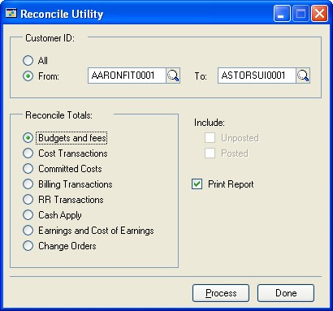
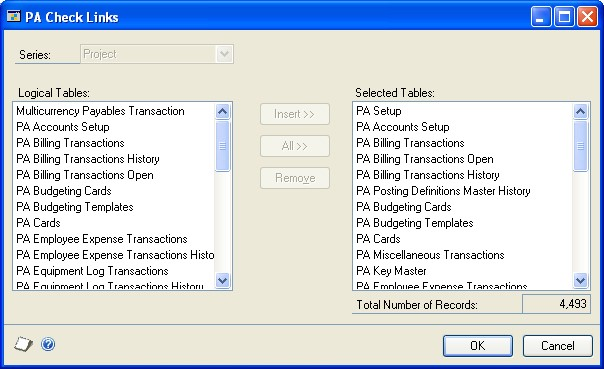
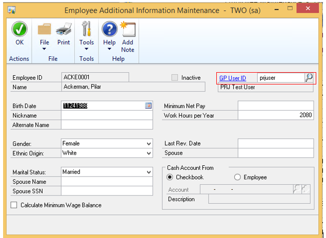
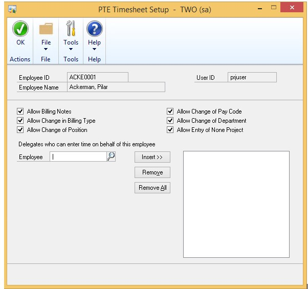
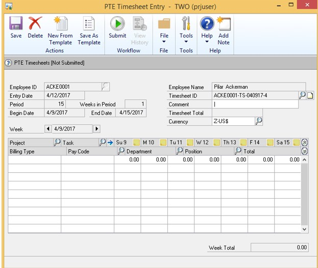

# Project Accounting Administrator's Guide

The Project Accounting Administrator’s Guide contains information for system administrators on how to set up user security and maintain company databases for Microsoft Dynamics GP Project Accounting.

Refer to other Project Accounting manuals for additional information.

- **Project Accounting Accounting Control Guide**

    Describes how to set up posting accounts; create transaction batches and modify account distributions; use revenue recognition cycles to recognize revenue for multiple customers, contracts, and projects at once; print reports; and enter adjusting transactions and delete posted cost and billing transactions.

- **Project Accounting Cost Management Guide**

    Describes how to use Project Accounting to estimate and track project costs, and specify how billing amounts, revenue, and profit should be calculated, based on project costs.

- **Project Accounting Billing Guide**

    Describes how to use Project Accounting to create billing invoices for customers.

This manual is designed to give you an understanding of the system administration features of Project Accounting and how it integrates with the Microsoft Dynamics GP system. It is divided into the following parts:

- *Chapter 1, “User security,”* includes information about granting users access to windows and reports if you’re using Project Accounting with Purchase Order Processing or Purchase Order Enhancements.

- *Chapter 2, “Database table maintenance,”* includes information about how to complete reconcile and check links processes, and how to clear data from database tables.

To make best use of Project Accounting, you should be familiar with system-wide features described in the Microsoft Dynamics GP System User’s Guide, the System Setup Guide, and the System Administrator’s Guide. Choose **Help \> Printable Manuals** for more information.

You might also need to be familiar with features described in General Ledger, Bank Reconciliation, Multicurrency Management, Purchase Order Processing, Purchase Order Enhancements, Payables Management, Receivables Management, Inventory Control, United States Payroll, Canadian Payroll, or Report Writer. Choose **Help \> Printable Manuals** for more information.

Some features described in this documentation are optional and can be purchased through your Microsoft Dynamics GP partner.

To view information about the release of Microsoft Dynamics GP that you’re using and which modules or features you are registered to use, choose **Help \> About Microsoft Dynamics GP**.

## Chapter 1: User security

This part of the documentation includes information for the system administrator about granting users access to windows and reports if you’re using Project Accounting with Purchase Order Processing or Purchase Order Enhancements.

The following topics are discussed.

- *Grant users access to purchasing windows*

- *Purchasing analysis reports and Project Accounting*

- *Grant users access to purchasing analysis reports*

### Grant users access to purchasing windows

If you’re using Project Accounting with Purchase Order Processing, you must use the Security Setup window (**Tools \> Setup \> System \> Security**) and the User Class Setup window (**Tools \> Setup \> System \> User Classes**) to grant users and user classes access to purchasing windows, including windows in Purchase Order Processing and Project Accounting.

The following table lists the selections in the Security Setup window that you’ll use to grant access to purchasing windows.

| **Product**           | **Type**     | **Series** | **Users affected**        |
|-----------------------|--------------|------------|---------------------------|
| Microsoft Dynamics GP | Windows      | Purchasing | Users who previously used Project Accounting and who now will be using Purchase Order Processing to enter project-related purchasing documents and transactions New users who will be using Purchase Order Processing to enter project-related purchasing documents and transactions |
| Project Accounting    | Windows      | Project    | Users who previously used Project Accounting or Purchase Order Processing to enter purchasing documents and transactions New users who will be using Purchase Order Processing to enter project-related purchasing documents and transactions |
| Project Accounting    | Alternate Microsoft Dynamics GP Windows | Purchasing | Users who previously used Project    |

Accounting or Purchase Order Processing to enter purchasing documents and transactions

New users who will be using Purchase Order Processing to enter project-related purchasing documents and transactions

### Purchasing analysis reports and Project Accounting

If you’re using Project Accounting with Purchase Order Processing, the following Purchase Order Processing purchasing analysis reports will be updated after you install Project Accounting to include information about project numbers and cost category IDs.

- Purchase Order Status

- Expected Shipments

- Purchase Order Analysis

- Received/Not Invoiced

- Shipment/Invoice Matching

- PO Line Items to Release

You can use Report Writer to modify the reports to include additional project-related information. See the Report Writer documentation (**Help \>Printable Manuals**).

### Grant users access to purchasing analysis reports

If you’re using Project Accounting with Purchase Order Processing, you must use the Security Setup window (**Tools \> Setup \> System \> Security**) and the User Class Setup window (**Tools \> Setup \> System \> User Classes**)
to grant users and user classes access to purchasing analysis reports.

Use the following selections in the Security Setup window to grant users access to purchasing analysis reports.

- Product: Project Accounting

- Type: Alternate Microsoft Dynamics GP Reports

- Series: Purchasing

- See the System Setup documentation (**Help \> Printable Manuals**) for more information about using the Security Setup window and the User Class Setup window.

## Chapter 2: Database table maintenance

This part of the documentation includes information for the system administrator about how to use the reconcile and check links process, and how to clear data from database tables.

> [!NOTE]
> Data recovery procedures should be performed carefully by an authorized user. Always make a backup before completing table maintenance procedures. For more information about database troubleshooting and maintenance, refer to the System Administrator’s Guide (Help \> Printable Manuals).

The following topics are discussed.

- Reconcile quantities and totals between database tables

- Reconcile Project Accounting and Inventory Control records

- Run check links to recover damaged data

- Clear data from database tables

### Reconcile quantities and totals between database tables

The reconcile utility compares and recalculates data between tables to be sure the data is consistent and accurate. There are two reconcile windows.

- **Reconcile Utility window**

    Corrects discrepancies in summary total amounts. If inquiry windows show inconsistent results, running this process can correct the problem. The reconcile process compares corresponding detail transaction data and rebuilds the summary data based on this detail.  

- **Reconcile Utility Periodic window**

    Corrects discrepancies in total amounts in the period records throughout Project Accounting. This reconcile recalculates amounts and updates periodic records. If periodic records do not exist for the budget, project, contract, and customer, they will be created, based on the company’s fiscal period setup.

1. Open the **Reconcile Utility** or the **Reconcile Utility Periodic** window.  

    Tools \> Utilities \> Project \> PA Reconcile
    

    Tools \> Utilities \> Project \> PA Reconcile Periodic
    

2. Select the option to reconcile all customer IDs or select the range of customer IDs to reconcile.

3. In the Reconcile Utility window, select the totals to reconcile.

    Recalculated fees and project budget values will update the corresponding fields in the Budget Master, Project Master, Contract Master, and Customer Master tables.

4. In the Reconcile Utility window, select the option to include posted and not posted transactions.

5. In either window, select the option to print the PA Reconcile Log Report. The report will list the tables, records, and fields reconciled, and the difference between the values before and after the reconcile procedure.

6. Click **Process** to reconcile totals.

7. Click **Done**.

### Reconcile Project Accounting and Inventory Control records

You can reconcile inventory quantities so that Project Accounting records reflect the same quantities as Inventory Control. Reconciling should not be necessary unless your data has been damaged, or some other unusual problem has occurred.

Before reconciling quantities, back up all accounting data for your company. You must reconcile modules in the following order:

- Sales Order Processing

- Purchase Order Processing

- Inventory

- Project Accounting

> [!NOTE]
> The Inventory Control module’s Reconcile Inventory Quantities utility does not take into account items that you have allocated in a saved Project Accounting inventory transfer batch. You must use the PA Reconcile Inventory Quantities window to correctly reconcile items allocated in Project Accounting.

1. Open the PA Reconcile Inventory Quantities window.

    Tools \> Utilities \> Project \> PA Reconcile IV

    

2. Enter or select the range of item numbers to reconcile.

3. If you’re reconciling inventory because you’ve modified the number of quantity decimals for an item, select **Include Item History** so that the history records for the item also will be updated.

4. Click **Process** to reconcile inventory quantities. Actual quantities and the quantities resulting from posted transactions will be compared, and adjusted, if necessary. The reconcile report is printed.

### Run check links to recover damaged data

You can re-create missing information in a database table. Some of the information in table groups is stored in two or more tables. If information in one table is missing or damaged, the check links program examines other tables where the same information is stored and re-creates the damaged record in the first table.

1. Open the PA Check Links window

    File \> Maintenance \> PA Check Links

    

2. Specify the database table groups to include in check links by choosing **All** or selecting each table group and choosing **Insert**. This displays the table in the **Selected Tables** list. To delete a table from the list, select it and click **Remove**. The total number of records that exist in the selected tables will be displayed at the bottom of the window. The number is updated as items are selected and deleted from the **Selected Tables** list.

3. Click **OK** to check links for the selected table groups and print the File Maintenance Error Log Report.

### Clear data from database tables

If data is damaged and can’t be repaired, you can delete all information in a database table. If you clear data from a table, you must reenter all original information to restore it to the condition it was in before it was damaged.

> [!NOTE]
> Clear data as a last resort. If your tables are damaged, always complete the check links process, reconcile, then restore a backup first. If you have a backup, no matter how old, restore it rather than clear data. For more information about database maintenance and troubleshooting, refer to the System Administrator’s Guide (Help \> Printable Manuals).

After you’ve cleared data from a table, you might not be able to reenter information into it. Some records might have been created using processes such as posting or aging, and the information can’t be reentered manually using a window. If you were unable to reenter some of your accounting information, reports using non-editable tables, such as history tables, might be inaccurate until the end of the year, or until you clear history.

When you installed Microsoft Dynamics GP, you might have selected to install some default information, such as payment terms or shipping methods. When you clear data from a table that included default information, that information won’t be restored. To restore the default information in the cleared table, you must reinstall it from a backup or your Microsoft Dynamics GP installation medium.

1. Make a backup of your data.

2. Open the PA Clear Data window.

    File \> Maintenance \> PA Clear Data

3. Specify the database tables to clear by choosing **All** or selecting each table and choosing **Insert**. This displays the table in the selected tables list. To delete a table from the list, select it and click **Remove**. The total number of records that exist within the selected tables will be displayed at the bottom of the window. The number is updated by the system as you select items and delete items from the selected tables list.

4. Clear data from the selected tables and print the Clear Data Report. You can’t quit the process after it has begun, so always verify the list of tables in the **Selected Tables** list before choosing **OK** to be sure that you want to clear data from all tables listed.

5. Complete the check links process, reconcile, or do both.

6. Reenter data, if possible. If you can’t reenter the data that you’ve cleared, data in other tables can become inaccurate or unusable. For instance, if you were to clear data from the Account Master table in General Ledger, all financial information would become unusable until the accounting information is reentered.

## Chapter 3: Project Time and Expense (PTE) Timesheet

**Employee Setup**

A new field was added to the Employee Additional Information Maintenance window (HR & Payroll | Cards | Payroll | Employee | Additional Information) to allow you to associate a GP User to a specific Employee ID.  

A new Timesheets button was added to the PA Employee Options window (HR & Payroll | Cards | Payroll | Employee | Project) that takes you to the PTE Timesheet Setup window. This window is where you set up the different options for the employee and designate delegates for a user. Delegates are users who are authorized to enter timesheets on behalf of the employee selected.

> [!NOTE]
> The employees you select as delegates must be assigned a GP user ID in the Employee Additional Information Maintenance window.

**Security**

A new security Role was created called ESS PTE Employee, which gives the user access to the necessary windows to enter their timesheets.

The goal of the PTE Timesheet feature is to provide an alternative option for customers that are currently using the Business Portal Project Time and Expense functionality to enter and approve Timesheets. The idea is that customers can utilize the Limited user types in GP for the PTE Timesheet users; however, it works with Full Users as well.

**Workflow**

The PTE Timesheet featured requires that a Workflow is created and marked as Active. The ability to create a Workflow is available by navigating to Workflow Maintenance (Administration | Setup | Company | Workflow | Workflow Maintenance).

**PTE Timesheet Entry**

The window allows you to enter a timesheet for the Employee ID that is assigned to the GP User that is logged in, or for an Employee ID that the user is a delegate for. If there are multiple weeks in the pay period, you can cycle through them by using the buttons for the Week.

You can also create a new Timesheet from a template by clicking the New From Template button. You will be prompted with options to determine whether you want to include the hours or copy the Billing Notes.

New tables were added to store the information for the PTE Timesheets Setup and Entry:

- PTE00300 - PTE Timesheet Template Header
- PTE00301 - PTE Timesheet Template Line
- PTE00601 - PTE Employee Master
- PTE00602 - PTE Timesheet Delegates
- PTE10000 - PTE Timesheet Header
- PTE10001 - PTE Timesheet Line
