# Returns Management

You can use Returns Management to enter, set up, and maintain your Return
Materials Authorization (RMA) and Return To Vendor (RTV) documents. If
Returns Management is integrated with Service Call Management, an RMA is
created automatically from a returnable parts line on a service call. If
Returns Management is integrated with Sales Order Processing, you can select
items directly from the historical Sales Order Processing invoice that was
generated for a specific customer.

The introduction is divided into the following topics:

• What’s in this manual

• Symbols and conventions

• Resources available from the Help menu

• Send us your documentation comments

## What’s in this manual

This manual is designed to give you an understanding of how to use the
features of Returns Management, and how it integrates with the Microsoft
Dynamics® GP system.

Some features described in the documentation are optional and can be
purchased through your Microsoft Dynamics GP partner.

To view information about the release of Microsoft Dynamics GP that you’re
using and which modules or features you are registered to use, choose **Help
\> About Microsoft Dynamics GP**.

The manual is divided into the following parts:

- *Part 1, Returns Management setup*, introduces Returns Management and explains its setup.

- *Part 2, Transaction activity*, explains how to enter RMA and RTV documents. It also explains how to receive, ship, and close these return documents. Additional processes, such as reconciling inventory quantities and removing return document history, also are discussed.

- *Part 3, Inquiries and reports*, explains how to use inquiries and reports to analyze your item return information.

## Part 1: Returns Management setup

When you set up Returns Management, you can select options, set up and
customize Return Materials Authorization (RMA) and Return to Vendor (RTV)
document types, and specify how default entries are displayed when you enter
transactions.

Setup procedures generally need to be completed only once, but you may want
to refer to this information for instructions on modifying or viewing
existing entries. The following topics are discussed:

- *Chapter 1, “Setup overview,”* describes the various document types found in
    Returns Management and how to use the Setup Checklist to assist in setting
    up Returns Management.

- *Chapter 2, “Setup in Returns Management,”* explains how to set up Returns
    Management and each document type within Returns Management.

### Chapter 1: Setup overview

Use Returns Management to enter, receive, ship, and process item returns.
You can use Returns Management for both the customer side of your returns
process, as well as sending items back to your vendors to complete the
entire return life cycle for an item.

This information is divided into the following topics:

- *Before setting up Returns Management*

- *Use the Setup Checklist*

- *RMA life cycle*

- *RMA types*

- *RTV life cycle*

- *RTV types*

#### Before setting up Returns Management

Before setting up Returns Management, complete the setup procedures for
Sales Order Processing, Receivables Management, Inventory, and General
Ledger, including the following tasks:

- Create general ledger accounts for sales returns, cost of goods sold (COGS),
    scrap, repair sales, and reimbursements.

- Enter customer records, including default general ledger accounts.

- Enter inventory cards for items that will be sold and, potentially, returned
    by customers. You also should set up miscellaneous items for fees such as
    repair charges or restocking fees.

- Create order, invoice, and return document types in Sales Order Processing.

- For more information, see the System Setup Guide (**Help \> Printable
    Manuals**) or the General Ledger, Receivables Management, Sales Order
    Processing, and Inventory Control documentation.

- If you’re using Returns Management with Multicurrency Management, be sure
    you’ve set up currencies, exchange rate tables, and Multicurrency default
    entries. For more information, see the Multicurrency Management
    documentation.

#### Use the Setup Checklist

When setting up Returns Management, either open each setup window and enter
information, or use the Setup Checklist window (**Microsoft Dynamics GP menu
\> Tools \> Setup \> Setup Checklist**) as a guide. See the System Setup
Guide (**Help \> Printable Manuals**) for more information.

#### RMA life cycle

When operating a returns warehouse, you sometimes interact with customers
who need to return equipment for various reasons. When they bring you a
part, you complete one of a few tasks: issue a credit, repair and return the
item to the customer, or replace the item. You also may be accepting the
item in exchange for an item you already provided to the customer. Once
you’ve completed your transaction with the customer, you have a few more
options: repair the item and return it to your inventory, return the item to
the vendor, or scrap the item.

The following diagram outlines the life cycle of Return Materials
Authorizations (RMAs), from entry through completion. When Returns
Management is integrated with the other modules of the Field Service Series
(Service Call Management, Preventive Maintenance, Contract Administration,
and Depot Management), many new options and paths become available.

IMAGE – FARM1.jpg

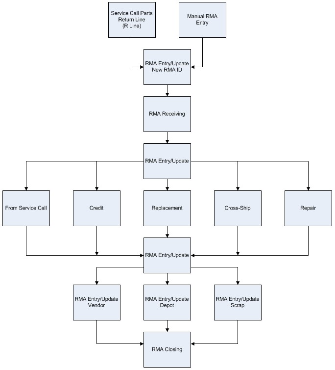

A close up of a logo Description automatically generated

You can create RMAs from two different points of access throughout Field
Service:

- Manual entry in the RMA Entry/Update window

- From return lines for returnable items on a service call

- Entry in the RMA Entry/Update window is the method described in this manual.
    Refer to the Service Call Management documentation for more information
    regarding service calls and returnable items.

#### RMA types

RMA documents are used to track an item return from your customers. The
available RMA document types are as follows:

**Credit** Provide a credit to your customer’s account in Receivables
Management for the value of the items the customer returned to you.

**Replacement** Provide the same item, or a similar item, as a replacement
to your customer. You must receive the original item from your customer
before you send the replacement item on a new order document in Sales Order
Processing.

**Advance Cross–ship** Provide the same item, or a similar item, as a
replacement to your customer. You can send the replacement item using a new
Sales Order Processing order document prior to receiving the original item
from your customer.

**Repair and Return** You, or your vendor, will repair the item that is
received from the customer. Your customer will receive the item after it’s
been repaired.

**None** The customer’s original item is picked up by your field service
technician and returned to your returns warehouse. This type of RMA document
was designed to integrate directly with Service Call Management.

#### RTV life cycle

With RTVs, you become the customer, and the vendor takes your place in the
scenario. You bring your vendor a part and your vendor completes one of a
few tasks: issues a credit, repairs and returns the item to you, or replaces
the item. You also may be returning an item in exchange for an item you
already were provided. You can return the item to your customer or to your
inventory.

The following diagram outlines the major points of interest for users of
Returns Management who are entering RTVs. From entry through completion, the
greater stages of the RTV document life cycle are covered. When Returns
Management is integrated with the other modules of the Field Service Series
(Service Call Management, Preventive Maintenance, Contract Administration,
and Depot Management), many new options and paths become available.

IMAGE – FARM2.jpg

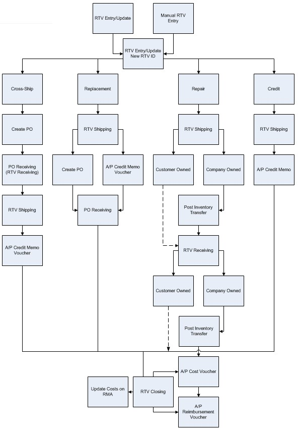

A screenshot of a cell phone Description automatically generated

You can create RTVs from two different points of access throughout the Field
Service Series:

- Manual entry in the RTV Entry/Update window

- Automatically generated with the **Create** button in the RMA Line Process
    Return window, where the process type is set to **Create RTV**.

#### RTV types

RTV documents are used to track items that are sent back to your vendors.
Returns Management supports four different methods of accounting for returns
to fit your business needs.

**Credit** You receive a credit against your vendor’s account in Accounts
Payable for the value of the items that you returned.

**Replacement** Your vendor ships you the same, or a similar, item as a
replacement. The shipment of the original item to the vendor generates a
purchase order, that the replacement item will be received against.

**Advance Cross–ship** Your vendor ships you the same, or a similar, item as
a replacement. A purchase order is created immediately so that the
replacement item can be received before the vendor receives the original
item that you are returning.

**Repair and Return** Your vendor has agreed to take the item and repair it.
You will receive the same repaired item back from the vendor at the end of
the repair process. This type is not available for non-inventoried items.

### Chapter 2: Setup in Returns Management

Returns Management setup involves setting up preferences such as data entry
default entries and vendor reimbursement amounts, as well as Sales Order
Processing document types used for replacement shipments and miscellaneous
fees.

When you set up Returns Management, you can open each window and enter
information or you can follow the Setup Checklist, which you can use as a
guide to the setup process. For more information, see *Use the Setup
Checklist*.

This information is divided into the following topics:

- *Set up options and default entries*

- *Set up return document security*

- *Set up RMA status codes*

- *Set up RMA types*

- *Set up RMA reason codes*

- *Returned items*

- *Set up RTV status codes*

- *Set up RTV types*

- *Set up vendor extensions*

- *Set up reimbursements*

- *Set up item extensions*

- *Set up customer extensions*

- *Set up warranties*

- *Set up equipment maintenance cards*

#### Set up options and default entries

You can set up default entries and other information that will affect the
return documents that you will enter. You also can set up security options
for return documents.

To accelerate the transaction entry process, specify common entries that
will appear automatically when you enter return documents.

Vendor Validation is the process that Returns Management uses when
processing RTVs to verify the suitability of a vendor for returning items.
Vendors that are assigned to a given item number in inventory are verified
automatically.

1. Open the Service Setup – Returns window. Microsoft Dynamics GP menu \> Tools
    \> Setup \> Project \> Service Setup \> Return button

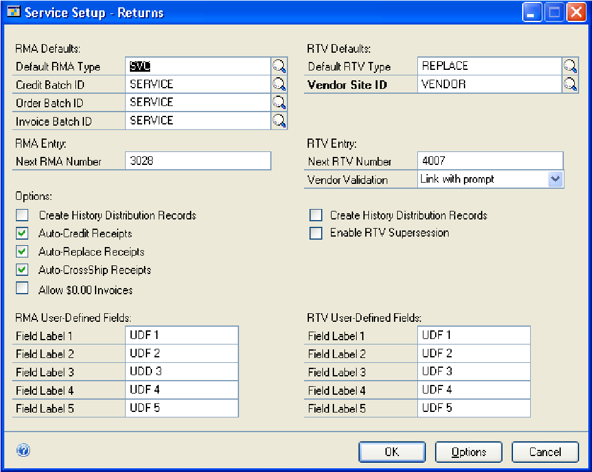

A screenshot of a cell phone Description automatically generated

1. Specify the RMA default settings.

- **Default RMA Type** The RMA type for creating new RMAs.

- **Credit Batch ID** The SOP Batch ID for SOP returns that are created from
    the RMA credit, replacement, and cross–ship type processes. You can post the
    documents to unique batches according to the RMA type.

    **Order Batch ID** The SOP Batch ID for SOP Order documents that are
    created by the RMA receiving process or from the replace and cross–ship
    functions. You can post the documents to unique batches according to the
    RMA type.

    **Invoice Batch ID** The SOP Invoice Batch ID for SOP Invoice documents
    that are created by the RMA closing process. You can post the documents
    to unique batches according to the RMA type.

1. Enter the **Next RMA Number**, using only numeric values, so that the **Next
    RMA Number** is incremented properly each time a new RMA document is
    created.

2. Select the options to include in the RMA life cycle.

- **Auto–Credit Receipts** Returns Management automatically should create the
    Sales Order Processing (SOP) return document for **Credit** type RMAs when
    you post RMA Receivings.

- **Auto–Replace Receipts** When a **Replacement** type RMA is received, the
    SOP return document is created automatically, as well as the SOP order
    document for the replacement item.

    **Auto–CrossShip Receipts** When a Cross–ship type RMA is received, the
    SOP return document is created automatically, as well as the SOP order
    document (unless it has already been created).

    **Allow \$0.00 Invoices** Permit the creation of invoices for net
    currency amounts of zero, even on closed RMA documents.

    **Create History Distribution Records** Returns Management should create
    a History Distribution record automatically when the RMA is moved to
    history. If cleared, the distribution records will not be available for
    inquiry on history records.

1. Enter up to five fields of your choice for special RMA functions that are
    not available elsewhere in Field Service.

2. Specify the RTV default settings.

- **Default RTV Type** The RTV type for creating new RTVs.

- **Vendor Site ID** The “via” (or intransit) site on the inventory transfer
    for a repair and return type RTV.

    If a **Site ID** isn’t set up in the Vendor Extensions window, the
    **Vendor Site ID** specified in the setup window is the default
    Intransit/Via site for inventory transfers for repair and return RTVs.
    For example, you might have specific site IDs set up in Vendor
    Extensions for the vendors you deal with most often and a generic site
    ID for those vendors with whom you have less repair volume.

1. Enter the **Next RTV Number**, using only numeric values, so that the **Next
    RTV Number** is incremented properly each time a new RTV document is
    created.

2. Select one of four **Vendor Validations** that Returns Management will use
    when creating RTV records.

- **Full prompting** A message is displayed when you save an RTV where the
    vendor isn’t assigned to the item being returned. You can click **Yes** to
    open the Item Vendors Maintenance window (**Cards \> Inventory \>
    Vendors**), where you will need to enter information regarding the
    item/vendor relationship and save the record.

- **Link with prompt** A message is displayed when you save an RTV where the
    vendor isn’t assigned to the return item. You can click **Yes**, and the
    system will save the entry in the Item Vendors Maintenance window
    automatically.

    **Link without prompt** No message is displayed if there isn’t a record
    for the item and the vendor in the Item Vendors Maintenance window. If
    the item vendor record doesn’t exist, one is created automatically and
    the item number is assigned as the vendor item number.

    **Existing vendors only** Vendors can’t be added to items if they aren’t
    already assigned to the item.

1. Select the options to include in your RTV life cycle.

- **Create History Distribution Records** A History Distribution record should
    be created automatically when the RTV is moved to history. If cleared, the
    distribution records will not be available for inquiry on history records.

- **Enable RTV Supersession** Posts a supersession to the Equipment Master
    record when a different inbound item number or serial number is received
    from Purchase Receiving or RTV Receiving. Supersessions allow you to
    transfer items from one serial record to another, one item to another, one
    item number to another, or one reference ID to another.

1. Enter up to five fields of your choice for special RTV functions that are
    not available elsewhere in Field Service.

2. Click **Options** to specify document security settings.

3. Click **OK**.

#### Set up return document security

Because RMA and RTV documents can be deleted or voided in the Entry/Update
windows, your business processes might require that users be prevented from
completing these actions. You can prevent users from deleting or voiding
certain documents, while still allowing them access to the window to enter
or update documents, by setting up passwords.

If you set up a password, users are required to enter the password before
deleting or voiding the selected document type. If an option is selected,
but a password hasn’t been set up, anyone who has access to the RMA
Entry/Update window or the RTV Entry/Update window can delete or void the
applicable document type.

1. Open the Option Security – Returns Management window. Microsoft Dynamics GP
    menu \> Tools \> Setup \> Project \> Service Setup \> Return button \>
    Options button

2. Select the document type that you’re setting up document security privileges
    for.

3. To remove the right for users to delete or void a particular document type,
    clear the **Allow** check box.

4. To use passwords, enter a password for each option.

5. Click **OK**.

#### Set up RMA status codes

You can create status codes that represent the life cycle of an RMA, from
creation to closure. RMA status codes are assigned to RMA documents based on
the completion of certain events, such as the posting of RMA receiving. The
description you enter should provide a clear explanation of the RMA status.

1. Open the RMA Status Maintenance window. Cards \> Returns Management \> RMA
    Status

2. Enter an RMA Status ID and description.

3. Click Save.

#### Set up RMA types

Each RMA type represents a different way of handling a return for your
customer, such as providing the customer credit on their account or
replacing an item. Even within these customer return paths you could create
multiple RMA types to handle different options, such as different Sales
Order Processing document IDs. You can set up and customize an unlimited
number of RMA types.

For example, you can use separate types of return documents for credit,
replacement, cross–ship, or repair and return RMAs. Using the RMA Type
Maintenance windows, you can set up each of these separate return types.

Only one return path can be applied to each RMA type. The customer path that
you select for an RMA type determines the Customer Path button that is
enabled in the RMA Entry/Update window for a new RMA document.

After you’ve set up at least one RMA type, you can complete the setup of
common entries in the RMA Entry/Update windows.

1. Open the RMA Type Maintenance window. Cards \> Returns Management \> RMA
    Types

IMAGE – FARM4.jpg

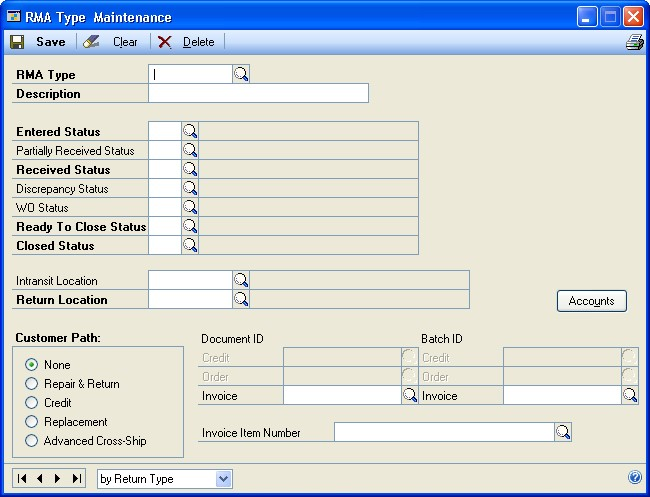

A screenshot of a cell phone Description automatically generated

1. Enter an **RMA Type** ID and a description.

2. Enter default RMA status codes for the RMA type, which represent each phase
    listed in the RMA life cycle.

- **Entered Status** The code that appears in the **RMA Status** field when
    you click **New** in the RMA Entry/Update window.

- **Partially Received Status** The code that appears when some, but not all,
    of the line items on an RMA document have been received. Once you locate a
    line item in the RMA Receiving window and post it, the status of the RMA
    itself will change to Partially Received Status if there are other line
    items that have not been received yet.

    **Received Status** The code that appears once the returned item was
    received at the return location. Once you locate the RMA ID in the RMA
    Receiving window and post it, the status will change to the Received
    Status code assigned to the RMA type.

    **Discrepancy Status** The code that appears if the customer returned
    something different than what you expected to receive.

    During the RMA receiving process, you may change the returned item
    number, returned serial number, or returned quantity. If any of these
    values are different from the original data on the RMA, the RMA is
    flagged as a discrepancy. At the end of the receiving process, a
    discrepancy report is printed and those RMAs have their status set to
    the Discrepancy Status instead of the Received Status. Someone in your
    organization may then verify or review the RMAs that have a discrepancy
    status.

    **WO Status** The code that appears when the repair of the returned item
    was completed within Depot Management.

    **Ready To Close Status** The code that appears when an individual RMA
    line item has been received and is now ready to be closed. Each RMA line
    item is selected as Ready to Close when you click the **Ready Close**
    button in the RMA Entry window.

    **Closed Status** The code that appears when the RMA is in the final
    stage for a completed return. Once you locate the RMA ID in the RMA
    Closing window and post it, the status will change automatically to the
    **Closed** status code assigned to the RMA type.

1. Enter or select a default intransit location for any inventory transfer that
    is generated when you process a return that is using the RMA type.

2. Enter or select a default return location that is designated as the site
    where the item will be received.

3. Select a customer path, which indicates the action required on the
    customer’s behalf once the return has been created.

- **None** If selected, no further action is required on behalf of the
    customer.

- **Repair & Return** If selected, you need to repair an item and return the
    same item to the customer.

    **Credit** If selected, you need to issue a credit instead of a
    replacement part to the customer for this RMA type.

    **Replacement** If selected, you need to replace the returned item with
    the same type of item or another substitute item and issue a credit to
    the customer for the value of the returned item.

    **Advanced Cross–Ship** If selected, you need to send a replacement item
    to the customer before you receive the returned item back from the
    customer.

1. Define different document IDs for customer credits, replacement orders, and
    the invoices that can be created during RMA closing.

2. Assign different batch IDs for each type of RMA to allow more flexibility in
    posting Sales Order Processing batches for customer credits, replacement
    orders, and invoices for additional charges. The default batch IDs are
    defined in the Service Returns Setup window.

3. Click **Accounts** to enter default general ledger posting accounts to be
    used for various RMA distribution accounts. If these accounts are left blank
    in the RMA Type Accounts window, the posting accounts are pulled from other
    locations such as item cards or posting account setup.

4. Click **Save**.

#### Set up RMA reason codes

You can create unique reason codes that describe the purpose for the
customer return.

RMA reason codes can be attached directly to an RMA document or, if you are
using Service Call Management, to a **Service Call Returned** line. The
reason code also follow the item to a Depot Work Order if you are using
Depot Management.

1. Open the RMA Reason Code Maintenance window. Cards \> Returns Management \>
    RMA Reason Code

2. Enter an RMA **Reason Code** and description.

3. Click **Save**.

#### Returned items

##### RMA from a service call parts return line

When creating an RMA document from a service call, the return item cost
established in the Item Extensions window will be used for both the return
line and the RMA returned item cost. The returned item cost will appear on
the inventory adjustment posting.

##### RMA from a sales invoice

When entering an RMA with a SOP invoice as the origin, the returned item
cost is the cost of the item from the original invoice. You can override the
original cost by manually entering the new cost. The RMA cost is posted
during the receiving process and also will appear on the RMA credit voucher.
If a new SOP order is created during the RMA life cycle, then the cost of
the item is used on the new invoice.

##### RMA with no origin document

If you are entering an RMA with no origin, the RMA uses the cost based on
the information specified on the Item Extension card.

#### Set up RTV status codes

The RTV status is a unique code used to represent the status that an RTV may
achieve, from an entered to a closed RTV.

1. Open the RTV Status Maintenance window. Cards \> Returns Management \> RTV
    Status

2. Enter an **RTV Status** ID and description.

3. Click **Save**.

#### Set up RTV types

You can set up and customize an unlimited number of RTV types. For example,
you can use separate types of return documents for credit, replacement,
cross–ship, or repair and return RTVs. Each RTV type represents one of these
return paths offered by your vendors. Even within each of the vendors’
return paths, you might have additional RTV types, each of which has a
different set of return status codes or different general ledger default
accounts.

Only one return path can be applied to each RTV type. The return path that
you select for each RTV type in the RTV Type Maintenance window will dictate
which **Return Path** button is active when you create an RTV in the RTV
Entry/Update window.

After you’ve set up at least one RTV type, you can complete the setup of
common entries in the RTV Entry/Update windows.

1. Open the RTV Type Maintenance window. Cards \> Returns Management \> RTV
    Types

2. Enter an RTV type and description.

3. Enter or select RTV status codes for the RTV type, which represent each
    phase listed in the RTV life cycle.

- **Entered Status** The code that appears in the **RTV Status** field when
    you click **New** in the RTV Entry/Update window.

- **Ready To Ship Status** The code that appears when the returned item is
    ready to be shipped to the vendor, but has not left the location.

    **Partially Shipped Status** The code that appears when some, but not
    all, of the returned item has been shipped.

    **Shipped Status** The code that appears when the entire returned item
    has been shipped from your location and is in transit to the vendor.

    **Partially Received Status** The code that appears when some, but not
    all, of the return item was received at the vendor location.

    **Received Status** The code that appears once the returned item has
    been received at your return location.

    **Closed Status** The code that appears when the RTV is in the final
    stage for a completed return.

1. Enter or select the sending location, which is the default site ID that the
    returned item is being sent from. This would normally be the returns
    location, and is displayed as the Outbound Site on the RTV.

2. Enter or select the return location, which is the default site ID designated
    for the item’s return for this RTV type. This is displayed as the inbound
    site on the RTV.

3. Select a return path, which indicates the final disposition of the returned
    item.

- **Credit** Indicates that you will receive a credit from your vendor for the
    item you’re returning.

- **Replacement** Indicates that your vendor will replace the returned item
    with the same item or another substitute item.

    **Advanced Cross Ship** Indicates that your vendor will ship a
    replacement item to you before your vendor receives the returned item
    from you.

    **Repair & Return** Indicates that your vendor will repair and return
    the item to you.

1. Click **Accounts** to specify the default accounts to be used as various
    general ledger distributions on RTV documents.

2. Click **Save**.

#### Set up vendor extensions

You can identify a specific site ID for a vendor location when you process
Repair and Return RTVs.

Because the items will be returned to you after they are repaired, they
still will be accounted for in your inventory. You might have several
“vendor” sites to assist you in quickly identifying the items and quantities
that are at a vendor for repair. For example, you might have specific site
IDs for your most common repair vendors and a generic VENDOR site ID for
those vendors with less repair volume. If no entry is made in Vendor
Extensions, the default site ID from the Service Setup – Returns window is
used for all vendors.

1. Open the Vendor Ext Maintenance window. Cards \> Returns Management \>
    Vendor Extensions

2. Enter or select the **Vendor ID** of the vendor that the return items will
    be sent to.

3. Enter the address where the return items will be shipped to.

4. Enter the site where the vendor will repair the return items. The site ID is
    the default “via” site on the transfer for a repair and return RTV.

5. Select the **Default Site** option when a vendor has multiple address IDs to
    indicate which site is the default site for repairs.

6. Click **Save**.

#### Set up reimbursements

Reimbursement values are the amounts or percentages the vendor has agreed to
reimburse your company for charges you might have incurred for a defective
item or some other problem related to the RTV.

The values in the Reimbursement Maintenance window are the default entries
for RTVs in the RTV Entry/Update window. While default currency amounts
appear on RTVs, percentages are entered only for informational use and won’t
be used in the creation of the Payables Management credit document.

During the RTV closing process, the currency values in the reimbursement
fields on the RTV are totaled and a credit voucher is created in Payables
Management for that currency amount.

1. Open the Reimbursement Maintenance window. Cards \> Returns Management \>
    Reimbursement

2. Enter or accept the default **Vendor ID** that your company has a
    reimbursement agreement with.

3. Enter or accept the default **Item Number** that normally is returned to the
    vendor specified.

4. Enter or select the **RTV Type** that represents the type of return work
    that your company is reimbursed for.

5. Enter an **A** (Amount) or **P** (Percentage) that the vendor will reimburse
    you for each line type.

6. Enter the **Not to Exceed Value** for each line type for informational use.

7. Click **Save**.

#### Set up item extensions

You can assign, modify, or delete additional item information that is not
available in Inventory Control. For example, certain items might be
returnable or track meter usage; this information isn’t tracked within
Inventory Control, but is important for service situations.

The vendor warranty code that you select is used when entering new items in
the Equipment Maintenance window. The seller warranty code that you select
represents the warranty your company offers to your customer. This
information is used when an equipment master record is created.

The **MTBF** (Mean Time Between Failure), the **MTBI** (Mean Time Between
Incidents), and the **MTTR** (Mean Time To Repair) are estimates that can be
recorded for the item as additional information.

The returned item cost will affect three different situations: Service Call
R–Line, Depot Work Order Completion, and Return Item cost when an RMA is
created with no source document. For more information, see *Returned items*.

1. Open the Item Extensions window. Cards \> Service Call Management \>
    Extensions \> Item or Cards \> Inventory \> Item \> Additional \> Service
    Extensions

2. Enter item information. For more information, see *Set up item extensions*
    of the Service Call Management manual.

3. Click **Save**.

#### Set up customer extensions

You can create, modify, or delete additional customer information that isn’t
available in Receivables Management. You also can enter the default time
zone, office hours, service area, and other information that may be used
when servicing the customer account.

The **Bill to Customer** information in the Customer Extensions window is
entered automatically on a service call when the customer ID and address ID
on a service call match an existing customer extension record.

The date in the **Last Service Date** field is when service work was most
recently performed for the customer location. This date is updated each time
a service call is invoiced for the current customer and site combination.

1. Open the Customer Extensions window. Cards \> Service Call Management \>
    Extensions \> Customer or Cards \> Sales \> Addresses \> Select a customer
    and an address ID \> Additional \> Service Extensions

2. Enter customer information. For more information, see *Set up customer
    extensions* of the Service Call Management manual.

3. Click **Save**.

IMAGE – FARM6.jpg

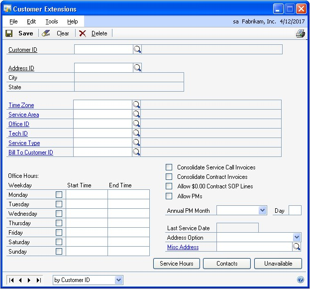

A screenshot of a cell phone Description automatically generated

#### Set up warranties

You can define codes that represent the different types of warranties
offered to your customers. These warranty codes may represent the original
manufacturer’s warranty or your own warranty on equipment serviced and/or
sold by your company.

1. Open the Warranty Maintenance window. Cards \> Service Call Management \>
    Warranty

2. Enter warranty information. For more information, see *Set up warranties* of
    the Service Call Management manual.

3. Click **Save**.

IMAGE – FARM7.jpg

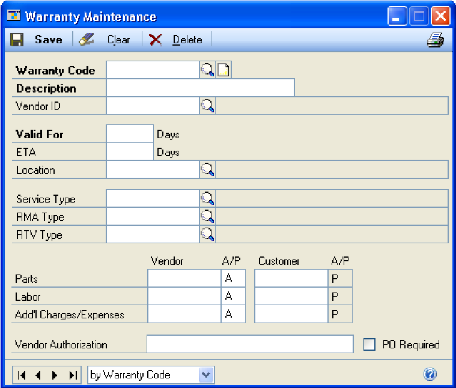

A screenshot of a cell phone Description automatically generated

#### Set up equipment maintenance cards

You can create a record for any specifically identifiable equipment within
your customer–installed base. All the information you need for this
equipment, including the customer who owns the equipment, the location of
the equipment, and warranty information, can be found in the Equipment
Maintenance window.

The equipment record can be created automatically when you receive an item
in Purchase Order Processing, when you sell an item with a serial number in
Sales Order Processing, or when a new item with a serial number is added to
a service call in Service Call Entry/Update.

In order for an equipment record to be created from Purchase Order
Processing, the **Create Equipment from POP** option must be selected in
Service Setup.

To create an equipment record from Sales Order Processing, you must select
the

**Create Equipment from SOP** option in Service Setup. During the Sales
Order Processing posting process, the equipment card is created for any
items with a serial number on an invoice document.

The **Quantity** field is only available for equipment items that do not
have serial numbers and allows you to track multiple quantities of the
equipment.

You can change the address information if necessary to record a more exact
location for the equipment.

1. In the navigation pane, choose the **Field Service** button, and then choose
    the **Equipment** list.

2. Choose the **New Equipment** button to display the Equipment Maintenance
    window.

3. Enter equipment information. For more details, see *Set up equipment
    maintenance cards* of the Contract Administration manual.

4. Click **Save**.

IMAGE – FARM8.jpg

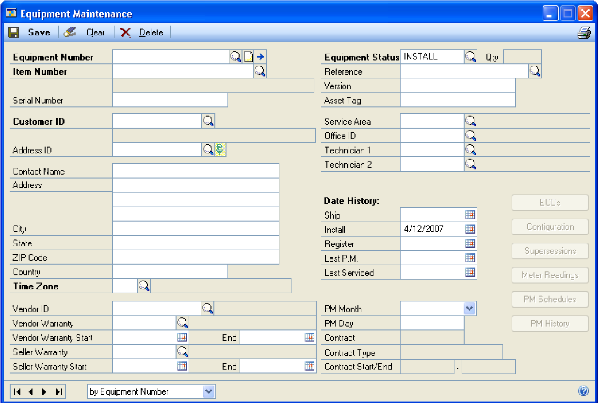

A screenshot of a social media post Description automatically generated

## Part 2: Transaction activity

Use the procedures described in the following parts of the documentation to
enter RMA (Return Materials Authorization) and RTV (Return To Vendor)
documents, as well as to complete standard return entries within Returns
Management.

The following topics are discussed:

- *Chapter 3, “Routine procedures,”* describes how to create return documents
    and complete other processes, such as copying existing RMA documents.

- *Chapter 4, “Posting procedures,”* explains some of the posting processes
    that take place within Returns Management, such as receiving an RMA or
    closing an RTV.

- *Chapter 5, “Maintenance procedures,”* describes processes that affect the
    performance of your returns system, such as reconciling inventory quantities
    and removing historical records.

### Chapter 3: Routine procedures

Processing customer and vendor returns is a common routine in many
businesses. RMAs and RTVs can be saved, modified if necessary, and then
completed so your customers and your vendors can get the necessary
information they need.

The RMA Entry/Update window is a multipurpose window used for entering and
printing RMA and RTV information. You also can view, update, void, copy, or
delete existing RMAs and RTVs.

The RMA and RTV windows were designed to mirror the actual return process
within a typical organization, with functions such as the entry of RMA
documents separated from those of other users. You can enter and save RMAs
and RTVs, as well as complete any shipping and necessary receiving of the
items on these documents.

This information is divided into the following topics:

- *Enter a credit RMA*

- *Enter a replacement RMA*

- *Enter a cross–ship RMA*

- *Enter a repair and return RMA*

- *Copy an RMA*

- *Create an internal RMA*

- *Create an RTV from an RMA*

- *Create a depot work order from an RMA*

- *Scrap an item from an RMA*

- *Void an RMA*

- *RMA entry details*

- *Enter a credit RTV*

- *Enter a replacement RTV*

- *Enter a cross–ship RTV*

- *Enter a repair and return RTV*

- *Void an RTV*

- *RTV entry details*

#### Enter a credit RMA

You should use credit RMA documents when a customer returns an item for a
credit on their account for any remaining value, rather then having the item
repaired or replaced.

The bill–to information is used to determine which customer will be on the
Sales Order Processing return documents for this RMA. You can change this to
a different customer, address, or customer and address combination, if
necessary. The bill–to customer will be the same as the customer ID unless a
default bill–to customer was specified in Customer Extensions.

The returned line uses the item cost specified on the Item Extension card to
bring the item back into inventory. That cost transfers to the return site
when the RMA is received in RMA Receiving.

When an RMA is created manually in the RMA Entry/Update window and the

**Origin** is set to **Service Call**, a list of all invoiced service calls
will appear. Select the

service call that contains the item to be returned. You can view all items
or serial numbers from the selected service call with a line item type of
Installed.

1. In the navigation pane, choose the **Field Service** button, and then choose
    the **RMA Transactions** list.

2. Choose the **RMA** button to display the RMA Entry/Update window.

3. Enter or select an **RMA Number** to modify an existing RMA or click **New**
    to generate the next default RMA number.

4. Select an **RMA Type** that is set for credit. For more information about
    RMA types, see *Set up RMA types*.

5. Enter or select an **RMA Status** and **RMA Reason Code**.

6. Enter or select customer information.

7. Select the origin of the return.

- **Service Call** If you are using Service Call Management and an item
    selected as **Returnable** in the Item Extensions window is entered in the
    Service Call Parts window, a returned line is created automatically. An RMA
    document is created automatically when the **Quantity Sold** value is
    entered on a returned line. The RMA **Origin** is set to **Service Call**
    automatically when the system creates that RMA document.

- **Sales Invoice** If the source document for the customer’s return is a
    Sales Order Processing invoice, select **Sales Invoice** to view a list of
    available sales invoices that you can select the document number to be
    returned from. A sales invoice can be returned in full, or specific line
    items and quantities can be returned. All of the default item information
    for the RMA come from the selected sales order lines. When entering an RMA
    that will use a SOP invoice as the origin, the default returned item cost is
    the cost of the item from the original invoice document. The RMA cost is
    used during the receiving process for the posted inventory transaction and
    also is passed to the SOP return document.

    **None** If you are entering an RMA with no source document, select the
    default of **None**. The default RMA cost will be determined from the
    information specified on the extension card.

1. Enter or accept the default **Office ID**, where the item will be returned.
    You also can enter the **Site ID** for the current RMA document.

2. Enter or accept the default **Currency ID**.

3. Enter the customer’s purchase order number.

4. Enter or select the **RMA Type**, **Item Number**, **U of M**, **Quantity**,
    and **Return Price** of the item that the customer is returning.

- *If a message about price levels appears and the Use Return Price Level
    option is selected in the Return Setup window, be sure that the item is set
    up to use the specified return price level.*

1. Enter additional line items if necessary.

2. Click the line item expansion button to enter additional information for the
    selected RMA line item.

3. Click the **Link** icon next to the **Customer Path** to enter additional
    information related to the RMA line item.

4. If the line item is a kit item, click the **Kits** button to view or modify
    information for the kit components.

5. If your company uses multiple bins, click the **Bins** button to enter or
    verify the bin into which the returned item will be received.

6. Click **Process** to select the disposition of the items on the current RMA
    line item. Select options to send quantities to RTV documents or to a depot
    work order, or scrap them from inventory. If the current RMA line item
    contains multiple quantities or serial numbers, you can separate them to
    different dispositions. The **Process** button is not available for kit
    items. You can use the **Process** button in the RMA – Kit Components window
    to specify the disposition of kit components.

7. Click **Create** to generate the selected document. For more information,
    see *Create an RTV from an RMA*, *Create a depot work order from an RMA*, or
    *Scrap an item from an RMA*.

8. Click **Serial** to enter or verify the serial numbers assigned to the
    current RMA line. The serial numbers received must match the quantity that
    was entered on the current line item.

9. Click **User–Defined** to enter additional information for the current RMA
    line item. You can enter up to five user–defined fields per line item.

10. If the current RMA line item has an inventory transfer associated with it,
    you can view that transfer document by clicking **Transfer**.

11. Click **Distribution** to view posted and unposted General Ledger
    distribution accounts associated with the current RMA line item.

12. To scroll between RMA line items, click the **Previous** or **Next** scroll
    buttons at the bottom of the detailed window.

13. Click the **RMA Number** expansion button to enter user–defined information
    for the entire RMA document. Then, click **Distribution** to view or modify
    the default general ledger distribution account information for the entire
    RMA transaction.

14. Click **Save**.

IMAGE – FARM9.jpg

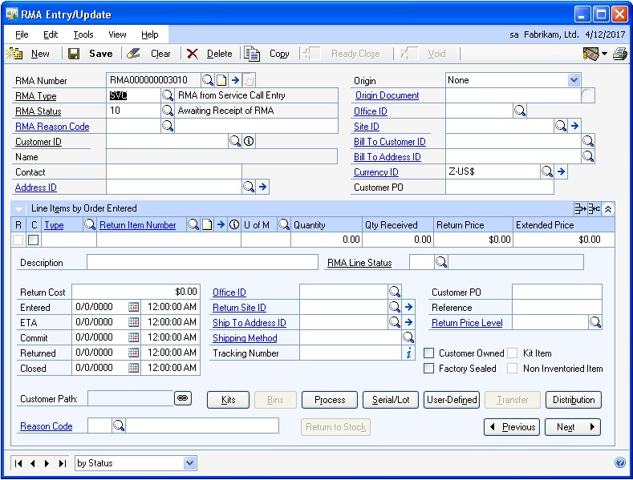

A screenshot of a cell phone Description automatically generated

#### Enter a replacement RMA

You should use replacement RMA documents when a customer returns a piece of
equipment, and your company needs to provide them a replacement item for the
returned item.

1. In the navigation pane, choose the **Field Service** button, and then choose
    the **RMA Transactions** list.

2. Choose the **RMA** button to display the RMA Entry/Update window.

3. Enter an **RMA Number** or click **New** to generate the next default RMA
    number.

4. Select an **RMA Type** that is set for replacement. For more information,
    see *Set up RMA types*.

5. Enter an **RMA Status** and **RMA Reason Code**.

6. Enter or select customer information.

7. Enter additional line item information if necessary. For more detailed
    information about this window’s information, see *Enter a credit RMA*.

8. Click **Save**.

#### Enter a cross–ship RMA

You should use cross–ship RMA documents when a customer is going to return
an item that their business cannot function without, and your company needs
to provide a new replacement item before you receive the return equipment.

1. In the navigation pane, choose the **Field Service** button, and then choose
    the **RMA Transactions** list.

2. Choose the **RMA** button to display the RMA Entry/Update window.

3. Enter an **RMA Number** or click **New** to generate the next default RMA
    number.

4. Select an **RMA Type** that is set for cross–ship. For more information, see
    *Set up RMA types*.

5. Enter an **RMA Status** and **RMA Reason Code**.

6. Enter or select customer information.

7. Enter additional line item information if necessary. For more detailed
    information about this window’s information, see *Enter a credit RMA*.

8. Click **Save**.

#### Enter a repair and return RMA

You should use repair RMA documents when a customer is going to return an
item, and your company needs to repair the item and send that same item back
to the customer.

1. In the navigation pane, choose the **Field Service** button, and then choose
    the **RMA Transactions** list.

2. Choose the **RMA** button to display the RMA Entry/Update window.

3. Enter an **RMA Number** or click **New** to generate the next default RMA
    number.

4. Select an **RMA Type** that is set for repair and return. For more
    information, see *Set up RMA types.*

5. Enter an **RMA Status** and **RMA Reason Code**.

6. Enter or select customer information.

7. Enter additional line item information if necessary. For more detailed
    information about this window’s information, see *Enter a credit RMA*.

8. Click **Save**.

#### Copy an RMA

You can copy current RMA information to a new RMA.

1. Open the RMA Entry/Update window. Transactions \> Returns Management \> RMA
    Entry/Update

2. Click the RMA number lookup button and select an RMA. Click **Select**.

3. Click **Copy** to copy all the main RMA and RMA line information exactly as
    it is to a new RMA document.

#### Create an internal RMA

You can create RMAs and transfers for items that are already in your
inventory. The Internal RMA window was designed to assist users in creating
RMAs for stock that already had been received into their warehouse but
didn’t have an RMA associated with it. You can use this window to enter and
post internal RMAs.

Because the RMA item is already in your company’s inventory, be sure that
your company is set up as a customer ID so you can choose your company as
the customer ID.

When you post the internal RMA, the RMA document is created and transferred
to move the inventory into the “return” location specified in the RMA
Internal Entry window. After the RMA is posted, you can then perform the
normal RMA Receiving and processing procedures.

1. Open the Internal RMA Entry window. Transactions \> Returns Management \>
    RMA Internal Entry

2. Enter or select an **RMA Type**.

3. Enter or select an **Office ID**.

4. Enter or select the **Return Site**, which will be the default location
    designated for the item’s return.

5. Enter or accept the default **Customer ID**.

6. Enter or select the **Item Number** to be used on the current record.

7. Enter the current **Site ID** for the item.

8. Enter the quantity of the item that needs to be returned. The inventory must
    be available in the site to enter the quantity.

9. Click **Serial/Lot** to look up serial or lot numbers that are available for
    that item site and attach them to the transfer that is created when the
    Internal RMA is posted.

10. To enter information that further identifies the item, enter it in the
    **Reference** field.

11. Click **Post** to attach the information in the current window to an RMA
    document and create an inventory transfer to move the items from the site ID
    to the return site.

#### Create an RTV from an RMA

You can specify the disposition of the item your customer has returned to
you. If you decide to send the item back to your vendor, an RTV document
will be created.

Each RTV is created for a specific vendor and can have multiple items on it
if each item is for the same vendor. For instance, if you process four
different RMA lines to create an RTV and the items are all from the same
vendor, the RTV will have four lines, all using the information from the
RMA. An RTV can be sourced from only one RMA number.

If an RMA has three items from three different vendors, one RTV will be
created for each vendor.

1. Open the RMA Entry/Update window. Transactions \> Returns Management \> RMA
    Entry/Update

2. Select the RMA line item that you want to work with and select the ‘show
    detail’ button.

3. Click the **Process** button to choose the disposition of the item.

4. If you decide to send the returned part back to the vendor, select **Return
    to Vendor** in the **Process Type** list, and click **Create** to generate
    the RTV document.

- If the current RMA line item contains multiple serial numbers or multiple
    quantities and you do not process the entire quantity to the selected RTV
    document, a second process line will be generated for the remaining
    quantity.

- *A Create RTV All button will be available for multiple lines with serial
    information so that a single RTV can be created.*

1. Click **Save**.

#### Create a depot work order from an RMA

You can specify the disposition of the item your customer has returned to
you. If you decide to send the item into your depot, or in–house repair
facility, a depot work order will be created. You must be using Depot
Management to access this option.

1. Open the RMA Entry/Update window. Transactions \> Returns Management \> RMA
    Entry/Update

2. Select the RMA line item from the ‘show detail’ button.

3. Click **Process** to choose the disposition of the item.

4. To send the returned part into your internal repair facility, select one of
    the work order options from the **Process Type** list

5. Click **Create** to generate a work order document.

- If the current RMA line item contains multiple serial numbers or multiple
    quantities and you do not process the entire quantity to the selected RTV
    document, a second process line will be generated for the remaining
    quantity.

1. Click the **Document** link to view work order information. The **Status**
    field displays the status of the depot work order.

2. Click **Save**.

#### Scrap an item from an RMA

If you decide that the item your customer has returned no longer has any
value, you can scrap the item and it will be decreased out of your
inventory.

The cost of the items without serial numbers that are scrapped is determined
by the inventory “layer” that is relieved. If the item being scrapped is a
high volume item and depending on the item’s inventory valuation method, the
cost of the unit that is scrapped might differ from the RMA receiving cost.

Because items without serial numbers can be identified specifically in
inventory, the rule above doesn’t apply. Each item with a serial number
represents its own inventory “layer,” therefore its cost will follow it from
receiving when it is scrapped.

1. Open the RMA Entry/Update window. Transactions \> Returns Management \> RMA
    Entry/Update

2. Select the RMA line item from the ‘show detail’ button.

3. Click **Process** to choose the disposition of the item.

4. Select the **Inventory Scrap** option from the **Process Type** list and
    click **Create** to generate the inventory scrap document and a decrease
    adjustment.

- If the current RMA line item contains multiple serial numbers or multiple
    quantities and you do not process the entire quantity to the selected scrap
    transaction, a second process line will be generated for the remaining
    quantity.

1. Click the **Document** field. The **Status** field displays the status of
    the inventory adjustment.

2. Click **Save**.

#### Void an RMA

Voiding return documents is different than deleting them because they are
moved to history, so they remain in your records.

If an RMA has been received already, you can return the inventory to the
customer or scrap the inventory. You also can print a Return document to
give to the customer.

If the inventory is not owned by the customer, an inventory decrease
adjustment will be posted.

The following conditions must be true before you can void an RMA:

- The **Void Documents** option must be selected in the Option Security –
    Returns Management window.

- The RMA was not created from a Service Call parts line.

- Work Order document, RTVs, Inventory Scrap documents, and SOP documents
    don’t exist for the RMA line item. Any of these items can be voided
    manually.

1. Open the RMA Entry/Update window. Transactions \> Returns Management \> RMA
    Entry/Update

2. Enter or select the RMA number of the record that you want to void. The
    original information is displayed.

3. Click **Void**.

#### RMA entry details

When a user enters a repair price in the RMA Update Repair and Return window
and leaves the **Repair Price** field, the distribution record is created
with the default account numbers based on the following information:

This table is based on the Posting Accounts **From** option (**Item** or
**Customer**) selected in the Sales Order Processing Setup window.

(Microsoft Dynamics GP menu \> Tools \> Setup \> Sales \> Sales Order Processing)

| **Account**         | **Location**          |
|---------------------|-----------------------|
| Sales               | Sales Returns account from Item Master record; if empty, then from Posting Accounts – Sales |
| Accounts Receivable | A/R account from Customer Master record; if empty, then from Posting Accounts – Sales       |

When the RMA record is created manually, and the **Origin** selected is
**Service Call**, the default account numbers from service type accounts
(based on the service type assigned to the service call) are used, if not
empty. The default account numbers from RMA type accounts are used if the
**Service Types Accounts** are blank. When the RMA record is created and the
**Account Number** in service type accounts and RMA type accounts are blank,
the default account numbers are based on the following information.

This table is based on the Posting Accounts **From** option (**Item** or
**Customer**) selected in the Sales Order Processing Setup window.

(Microsoft Dynamics GP menu \> Tools \> Setup \> Sales \> Sales Order Processing)

IMAGE – FARM10.jpg

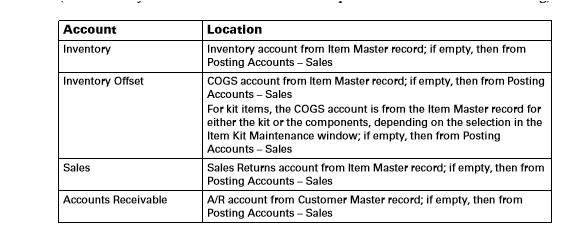

A screenshot of a cell phone Description automatically generated

#### Enter a credit RTV

You should use credit RTV documents when your company returns an item to
your vendor, who agrees to issue a credit on your account for the value of
that item.

The RTV type you select determines the return path.

1. In the navigation pane, choose the **Field Service** button, and then choose
    the **RTV Transactions** list.

2. Choose the **RTV** button to display the RTV Entry/Update window.

3. Enter an **RTV Number** or click **New** to generate the next RTV number.

4. Select an **RTV Type** that is set for credit. For more information, see
    *Set up RTV types*.

5. Select or accept the default **RTV Status**. For more information, see *Set
    up RTV status codes*.

6. Enter or select an **Office ID**. If the RTV is created from an RMA, this
    field will be the default from the RMA.

7. Enter or select the **Vendor ID** and **Address ID** that the item will be
    sent to.

8. Click the **Vendor Address ID** expansion button to change shipping details.

9. Enter or accept the default **Currency ID** for the vendor.

10. In the scrolling (line detail) window, enter or select the following, and if
    necessary, change the **Type** field per RTV line.

- **Out–Site ID** Where the return item is being sent from. You will need to
    have sufficient quantities of the item in this location before you will be
    able to ship the RTV.

- **Out–Item** The outbound item number associated with the RTV.

    **In–Site ID** Where the item will be returned to when received from the
    vendor.

    **In–Item** The item number that will be returned to your inventory from
    the vendor.

    **U of M** The appropriate unit of measure for each item.

    **Quantity** The quantity of each item to be returned to the vendor.

1. Open the line detail window to specify additional information, such as the
    promised date and time, and cost and reimbursement amounts for each item.

2. Enter the **Vendor Item Number**. Then enter the **Vendor RMA Number**,
    which is the RMA number that the vendor has assigned to this return.

3. The entered, shipped, received, and closed dates and times are kept
    automatically. You can enter a date and time in the promised field to
    indicate the estimated date and time the item will be returned from the
    vendor.

4. If the return path that is highlighted isn’t **Credit**, choose an RTV type
    that is set up for **Credit**.

- To issue or view a credit voucher, cost voucher, and reimbursement voucher
    that was created for the current RTV document, click the **Credit** button
    when it’s available.

- The **PO Number** and **PO Receiving Number** fields aren’t used with credit
    RTVs.

- View the credit voucher, which is created during the RTV shipping process.

- View the cost voucher, if applicable. The creation of this voucher depends
    on whether you incur any costs for the return.

- View the reimbursement voucher, if applicable. The creation of this voucher
    depends on whether you are owed any reimbursements from the vendor for the
    return.

1. Enter user data in **Reference1** and **Reference2** for informational use.

2. Enter any additional costs you will incur or reimbursements you will receive
    from your vendor.

3. If your company uses multiple bins, click **Bins** to specify the bin
    location of the item.

4. If the item specified is tracked with a serial or lot number, click the
    **Serial/Lot** button to specify the serial or lot numbers for each item.
    The serial or lot number quantity must match the quantity entered on the
    current line.

5. Click the **User–Defined** button to enter up to five values per RTV line.

6. Click **Distribution** to view the General Ledger distribution accounts
    associated with the current RTV line. You can view unposted and posted
    distributions.

7. To scroll between RTV line items, click the **Previous** or **Next**
    buttons.

8. Click **Save**.

#### Enter a replacement RTV

You should use replacement RTV documents when your company returns an item
to your vendor, and your vendor agrees to replace it with a new item.

1. In the navigation pane, choose the **Field Service** button, and then choose
    the **RTV Transactions** list.

2. Choose the **RTV** button to display the RTV Entry/Update window.

3. Enter an **RTV Number** or click **New** to generate the next default RTV
    number.

4. Select an **RTV Type** that is set for replacement. For more information,
    see *Set up RTV types*.

5. Enter or select vendor information.

6. The RTV type you have chosen determines the return path. If the return path
    that is highlighted isn’t **Replacement**, choose a different RTV type that
    is set up for replacement.

- To issue or view a credit voucher, cost voucher, and reimbursement voucher
    that was created for the current RTV document, click the **Replacement**
    button when it’s available.

- Within the RTV Vouchers window, the PO number is generated during the RTV
    shipping and is the purchase order used to receive the replacement from the
    vendor.

- The PO Receipt Number is updated by the Purchasing Receiving Post process.

- View the credit voucher, if applicable. The creation of this voucher depends
    on whether you incur any costs for the return.

- View the reimbursement voucher, if applicable. The creation of this voucher
    depends on whether you are owed any reimbursements from the vendor for the
    return.

1. Enter additional line item information if necessary. For more detailed
    information about this window’s information, see *Enter a credit RTV*.

2. Click **Save**.

#### Enter a cross–ship RTV

You should use cross–ship RTV documents when your company is going to return
an item that your business cannot function without, and your vendor agrees
to provide your company a new item in replacement before they will receive
the return item.

1. In the navigation pane, choose the **Field Service** button, and then choose
    the **RTV Transactions** list.

2. Choose the **RTV** button to display the RTV Entry/Update window.

3. Enter an **RTV Number** or click **New** to generate the next default RTV
    number.

4. Select an **RTV Type** that is set for cross–ship. For more information, see
    *Set up RTV types*.

5. Enter or select vendor information.

6. The RTV type you have chosen determines the return path. If the return path
    that is highlighted isn’t **Cross–ship**, you will need to choose a
    different RTV type that is set up for **Cross–ship**.

- To issue or view a credit voucher, cost voucher, and reimbursement voucher
    that was created for the current RTV document, use the **Cross–ship** button
    when it’s available. Use the **Create PO** button to create a purchase order
    for the RTV cross shipment.

- Within the RTV Vouchers window, you can select the **Consolidate PO** option
    to combine return records with items going to the same vendor onto one
    purchase order document. For an item to be consolidated on an existing
    Purchase Order, the PO must meet the following criteria.

- The PO Status must be “New.”

- The PO must have the same vendor ID as the current RTV.

- The PO number generated to receive the cross–shipped item is displayed.

- The PO receipt number will be available after the Purchasing Receiving
    process has been completed for the cross–ship PO.

- View the credit voucher, which is created during the RTV shipping process.

- View the cost voucher, if applicable. The creation of this voucher depends
    on whether you incur any costs for the return.

- View the reimbursement voucher, if applicable. The creation of this voucher
    depends on whether you are owed any reimbursements from the vendor for the
    return.

1. Enter additional line item information if necessary. For more detailed
    information about this window’s information, see *Enter a credit RTV*.

2. Click **Save**.

#### Enter a repair and return RTV

You should use repair RTV documents when your company returns an item to
your vendor for repair. The vendor repairs the item and sends that same item
back to your company.

1. In the navigation pane, choose the **Field Service** button, and then choose
    the **RTV Transactions** list.

2. Choose the **RTV** button to display the RTV Entry/Update window.

3. Enter an **RTV Number** or click **New** to generate the next default RTV
    number.

4. Select an **RTV Type** that is set for repair. For more information, see
    *Set up RTV types*.

5. Enter or select vendor information.

6. The RTV type you have chosen determines the return path. If the return path
    that is highlighted isn’t **Repair**, you will need to choose a different
    RTV type that is set up for **Repair**.

- To create a transfer from the RTV sending location to the vendor site, and
    return to the return location, click the **Repair** button when it’s
    available. You can use this to show that the item is still in your
    inventory, but is at a vendor location being repaired.

- You also can view a credit voucher, cost voucher, and reimbursement voucher.
    Click the **Transfer** button to place the RTV item on a transfer from one
    location to another. This will create a transfer document in the Inventory
    Transfer window. For more information, see *Transfer inventory*.

- Within the RTV Vouchers window, you will see a **Transfer Reference
    number**. This is the transfer number that is generated when you click the
    **Transfer** button. You also can click it to open the In–Transit Transfer
    Entry window. The **Transfer Line** further identifies the transfer
    reference. If multiple lines are on the transfer, this will help you
    identify which item this transfer is referring to.

- View the credit voucher, which is created during the RTV shipping process.

- View the cost voucher, if applicable. The creation of this voucher depends
    on whether you incur any charges for the return.

- View the reimbursement voucher, if applicable. The creation of this voucher
    depends on whether you are owed any reimbursements from the vendor for the
    return.

1. Enter additional line item information if necessary. For more detailed
    information about this window’s information, see *Enter a credit RTV*.

2. Click **Save**.

#### Void an RTV

Voiding return documents is different than deleting them because they are
moved to history, so they remain in your records.

When you void a repair–type RTV that has been shipped and the related
transfer is picked, you will unallocate the inventory. When you void a
repair–type RTV that is ready to ship, you will unallocate the inventory
specified on the related transfer.

Any closed lines on the RTV that you do not void are moved to the History
tables. For example, if you void an RTV from an Open table, you will remove
the Open RTV record and create a History RTV record.

The following conditions must exist before you can void an RTV.

- The **Void Documents** option must be selected in the Option Security –
    Returns Management window.

- All RTV line items are not in the process of being shipped through the RTV
    Shipping function.

- Payables documents (Credit Voucher or Cost Voucher) cannot exist for the RTV
    line item. They can be voided manually.

- Purchase Order documents don’t exist for the RTV line item. Any purchase
    orders can be voided manually

- Any RTV that has a partial–received status or a received status cannot be
    voided.

- Repair–type RTVs that are shipped cannot be voided.

1. Open the RTV Entry/Update window. Transactions \> Returns Management \> RTV
    Entry/Update

2. Enter or select the RTV number of the record that you want to void. The
    original information is displayed.

3. Click **Void**.

#### RTV entry details

When the RTV record is created, the default account numbers, for
distribution types Inventory Offset and Purchase from RTV type accounts will
be used if they aren’t empty. The inventory and accounts payable account
numbers always will be the default from the item master record and vendor
master record, respectively, or if empty, from the posting accounts.

When the RTV record is created and the **Account Number** in **RTV Type
Accounts** is blank, the default account numbers are based on the following
information.

| **Account**      | **Location**      |
|------------------|---------------------|
| Inventory        | Inventory account from Item Master record; if empty, then from Posting Accounts – Sales   |
| Inventory Offset | Purchases account from Vendor Master record; if empty, then from Posting Accounts – Sales |
| Purchases        | Purchases account from Vendor Master record; if empty, then from Posting Accounts – Sales |
| Accounts Payable | A/P account from Vendor Master record; if empty, then from Posting Accounts – Sales       |

If amounts exist in the **Cost** or **Reimbursement** fields on the RTV, the
following general ledger distribution records will be created. For amounts
in the **Cost** area, the sum of all cost amounts will be the debit entry.

| **Account**      | **Location**        |
|------------------|---------------------|
| Purchases        | Cost Account from RTV Type Accounts; if empty, then the Purchases account from Vendor Master; if empty, then from Posting Accounts |
| Accounts Payable | A/P account from Vendor Master; if empty, then from Posting Accounts – Sales       |

For amounts in the **Reimbursement** area, the sum of all reimbursements
amounts will be the credit entry.

| **Account**      | **Location**     |
|------------------|------------------|
| Purchases        | Reimbursement Account from RTV Type Accounts; if empty, then the Purchases account from Vendor Master; if empty, then from Posting Accounts – Sales |
| Accounts Payable | A/P account from Vendor Master; if empty, then from Posting Accounts – Sales     |

### Chapter 4: Posting procedures

There are several areas within Returns Management where transactions are
posted to update other modules. Some of these areas include RMA receiving,
RTV shipping, and inventory transfers. When transactions are posted, they
become permanent audit trail information and update the appropriate returns
information, create inventory transfers or adjustments, and generate general
ledger journal entries.

For example, when you create an RMA, the information is available within
only Returns Management. After you’ve posted RMA receiving, inventory
reflects an increase adjustment for the item and a debit updates the
inventory account in General Ledger for the item being received.

Each of the types of posting routines that can be accomplished within
Returns Management is explained below. If you need more general information
about posting and the audit trail created by the posting process, see the
System User’s Guide (**Help \> Printable Manuals**).

This information is divided into the following topics:

- *Receive an RMA shipment*

- *Close an RMA*

- *Ship an RTV*

- *Receive an RTV*

- *Close an RTV*

- *Transfer inventory*

- *Inventory receipts*

#### Receive an RMA shipment

You can enter the receipt of a returned item on an existing RMA document at
the appropriate return location.

The RMA Receiving window is a multi–purpose window where you can perform the
receiving process for your RMAs and print the Traveler Report.

When you receive an RMA, the following transactions are generated.

- For RMAs originating from a service call, the inventory transfers are
    received.

- For credit, replacement, or cross–ship RMAs, an inventory adjustment journal
    is posted.

- For repair RMAs, no inventory adjustments are made because of the
    “customer–owned” setting, but the RMA is marked as received.

- When the **Return Item Number** is changed in RMA Receiving and the RMA did
    not originate from a Service Call Returned line, the general ledger
    distributions with no record type (**LINITMTYP**) are deleted and
    re–created.

- *The default account distribution is based on data entered in the RTV
    Entry/Update window. For more information, see RMA entry details.*

The following table explains how the account field is populated:

| **Account**      | **Location**     |
|------------------|------------------|
| Inventory        | Inventory account from Item Master record; if empty, then from Posting Accounts -Sales  |
| Inventory Offset | COGS account from Return Item Master record; if empty, then from Posting Accounts-Sales |

> [!NOTE]
> This table is based on the Posting Accounts From option (Item or Customer) selected in the Sales Order Processing Setup window.

*(Microsoft Dynamics GP menu \> Tools \> Setup \> Sales \> Sales OrderProcessing)*

The default account numbers for Sales and Accounts Receivable are based on the following information.

| **Account**         | **Location**   |
|---------------------|-----------------|
| Sales               | Sales Returns account from RMA Type Account; If empty, from `Sales Account on Return Item Master record; if empty, then from Posting Accounts - Sales` |
| Accounts Receivable | Accounts Receivable account from Customer Master record; if empty, then from Posting Accounts – Sales   |

> [!NOTE]
> This table is based on the Posting Accounts From option (Item or Customer) selected in the Sales Order Processing Setup window.

*(Microsoft Dynamics GP menu \> Tools \> Setup \> Sales \> Sales Order
Processing)*

When the **Return Item Number** is changed in RMA Receiving on an RMA that originated from a Service Call Returned line, a decrease inventory adjustment for the original **Item Number** and an increase inventory adjustment for the **Return Item Number** are posted. The default account numbers for these inventory adjustments are based on the following information.
##### Decrease Adjustment

| **Account**      | **Location**                                                           |
|------------------|------------------------------------------------------------------------|
| Inventory        | Inventory Account from Source Service Call Returned line Distributions |
| Inventory Offset | COGS Account from the Source Service Call Returned line Distributions  |

##### Increase Adjustment

| **Account**      | **Location**            |
|------------------|-------------------------|
| Inventory        | Inventory Account from Return Item master; if empty, then from Posting Accounts – Sales |
| Inventory Offset | COGS Account from Return Item master; if empty, then from Posting Accounts – Sales      |

> [!NOTE]
> This table is based on the Posting Accounts From option (Item or Customer) selected in the Sales Order Processing Setup window. (Microsoft Dynamics GP menu \> Tools \> Setup \> Sales \> Sales Order Processing).

1. Open the RMA Receiving window. Transactions \> Returns Management \> RMA
    Receiving

2. Select a way to view the RMA documents. To view all open RMA documents,
    select **All**.

3. Select the **M** (Marked to Post) check box to have the RMA line item show
    up on the preview report or to post it.

When you select the **Mark All** option, you will be asked whether you want
to select the **M** (Marked to Post) option, the **P** (Print the Traveler
Report) option, or both.

1. If your organization uses multiple bins, click **Bins** for each RMA line
    item. You can specify the bins where the received items should be placed
    when received.

This button is not available for kit items. You can use the **Bins** button
in the RMA – Kit Components window to specify bins for kit components.

1. If the RMA line item is a kit item, click **Kits** to view or modify
    information for the kit components.

2. If the RMA line item is a serial- or lot-numbered item, click **Serial/Lot**
    to enter or verify the serial and lot numbers received for the line item. To
    automatically receive the previously selected serial numbers for all
    selected RMA line items, select the **Receive All Serial Numbers** check
    box. The **Serial/Lot** button is not available for kit items. You can use
    the **Serial/Lot** button in the RMA – Kit Components window to specify
    serial or lot numbers for kit components.

3. Click **Misc. Items** to add any information regarding accessory equipment,
    such as power cords or cables to be noted on the return document. These
    items aren’t adjusted into inventory as part of the receiving process, but
    simply are recorded as part of the return.

4. Select the **P** (Print the Traveler Report) option to have the Traveler
    Report print with the RMA line item when you post it.

5. Click **Post**.

IMAGE – FARM11.jpg

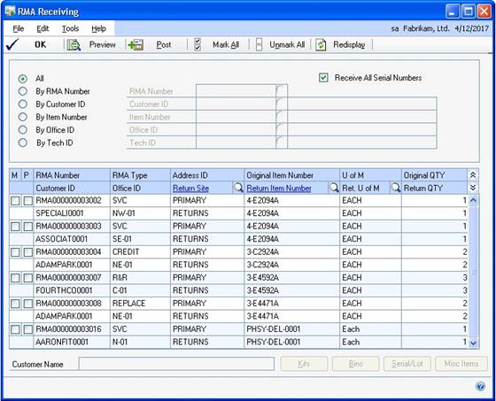

A screenshot of a cell phone Description automatically generated

#### Close an RMA

When the RMA process is complete, you can create an invoice for any repair
or additional charges. Only those RMA documents that have been selected as
**Ready To Close** in the RMA Entry/Update window will appear in the RMA
Closing window.

The RMA Closing window is a multi–purpose window where you process the
closing of your RMAs. You can use this window to create invoices and print
the RMA document information.

If the **Repair Price** is changed in the RMA closing window, the
distribution record with **LINITMTYP** of **Returned** are deleted and
re–created with default account numbers based on the following information,
regardless of source document when the user leaves the **Repair Price**
field.

*The default account distribution is based on data entered in the RTV
Entry/Update window. For more information, see Set up options and default
entries.*

The following table explains how the account field is populated.

| **Account**         | **Location**            |
|---------------------|-------------------------|
| Sales               | Repair Sales account from RMA Type Accounts; if empty, Sales Account from Invoice Item master; if empty, from Posting Accounts – Sales |
| Accounts Receivable | A/R Account from Customer master; if empty, from Posting Accounts – Sales    |

> [!NOTE]
> This table is based on the Posting Accounts From option (Item or Customer) selected in the Sales Order Processing Setup window (Microsoft Dynamics GP menu \> Tools \> Setup \> Sales \> Sales Order Processing).

1. Open the RMA Closing window. Transactions \> Returns Management \> RMA
    Closing

2. Select a way to view the RMA documents. To view all open RMA documents,
    select **All**.

3. Select the **M** (Marked to Post) check box to have this RMA show up on the
    preview report or to close it. Click **Mark All** to choose all RMAs
    available for closing.

4. If the RMA line is a kit item, enter information in the **Repair Cost** and
    **Repair Price** fields. When a kit item is marked for closing, the related
    kit items also are closed, even though they are not displayed in this
    window.

5. Click **Preview** to print a preview of the items selected for closing.
    Select the **P** (Print) check box to include a detailed report of the
    records posted during the closing process.

6. Click **Post**.

IMAGE – FARM12.jpg

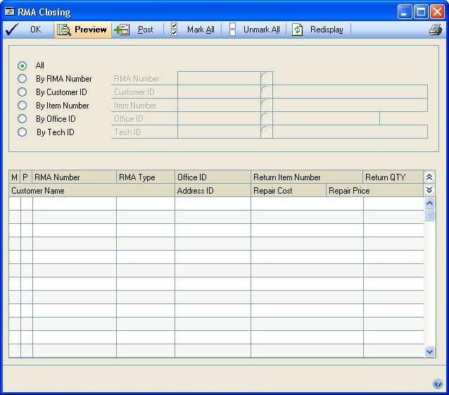

A screenshot of a cell phone Description automatically generated

#### Ship an RTV

The RTV Shipping window is a multi–purpose window where you can perform the
shipping process for your RTVs. You also can print a packing slip to send
along with the piece of equipment.

You can select and post RTVs that are ready to be shipped to the vendor. The
shipping process creates a credit voucher in Payables Management for the
cost of the returned item on all RTVs except repair and return types, as
well as create a purchase order for any replacement type RTVs. Inventory
adjustments are created to decrease the returned item from inventory for a
credit, replacement, or cross–ship RTV.

For repair type RTVs, the inventory is transferred to the vendor site ID
specified on the RTV. No inventory transactions are created from an RTV line
that is marked as customer owned.

When an RTV is shipped, the inventory adjustment posted will update the
following general ledger accounts.

*The default account distribution is based on data entered in the RTV
Entry/Update window. For more information, see Set up options and default
entries.*

The following table explains how the account field is populated:

| **Accounts**     | **Location**                                                   |
|------------------|----------------------------------------------------------------|
| Inventory        | from Item master, if empty, then from Posting Accounts – Sales |
| Inventory Offset | from Item master, if empty, then from Posting Accounts – Sales |

During the shipping process a credit voucher also is created in accounts
payable and when posted, updates the following accounts.

| **Accounts**     | **Location**                                                     |
|------------------|------------------------------------------------------------------|
| Accounts Payable | from Vendor master, if empty, then from Posting Accounts – Sales |
| Purchases        | from Vendor master, if empty, then from Posting Accounts – Sales |

1. Open the RTV Shipping window.

Transactions \> Returns Management \> RTV Shipping

1. Select a way to view the RTV documents. To view all open RTV documents,
    select **All**.

2. Select the **Consolidate PO** check box to combine items going from
    different RTVs to the same vendor onto one purchase order document. In order
    for an item to be consolidated on an existing purchase order, the PO must
    meet the following criteria.

    - The PO Status must be “New”.

    - The PO must have the same vendor ID as the current RTV being shipped.

3. Select individual RTV lines and enter or modify the shipping method and
    tracking number information. This is the outbound shipping information.

4. Select **M** (Marked to Ship) to display this RTV on the preview report or
    to post it.

5. Select **P** (Print**)** to print the packing slip with the RTV when you
    post it.

6. When you click **Mark All**, you will be asked whether you want to select
    the **M** (Mark to Post) option, the **P** (Print the Packing Slip) option,
    or both.

7. Click **Post**.

#### Receive an RTV

You can access an existing RTV document and record that the item was
received from the vendor. The RTV Receiving window is used to complete the
transfer process for only a repair and return RTV or for cross–ship and
replacement RTVs if you aren’t registered to use Purchase Order Processing.

The RTV Receiving window is a multi–purpose window where you can perform the
receiving process for your RTVs. You can use this window to select and
receive your RTVs that are ready to be received.

When the inbound **Item Number** is changed in the RTV Receiving window on a
repair and return RTV, a decrease inventory adjustment for the outbound
**Item Number** and an increase adjustment for the inbound **Item Number**
are posted. The default account numbers for these inventory adjustments are
based on the following tables.

*The default account distribution is based on data entered in the RTV
Entry/Update window. For more information, see Set up options and default
entries.*

##### Decrease Adjustment

| **Account**      | **Location**        |
|------------------|---------------------|
| Inventory        | Inventory account from Outbound Item Master record; if empty, from Posting Accounts – Sales                                       |
| Inventory Offset | COGS account from Outbound Item Master record; if empty, then from Posting Account or Purchases Account from Vendor Master record |

##### Increase Adjustment

| **Account**      | **Location**       |
|------------------|--------------------|
| Inventory        | Inventory account from Inbound Item Master record\*; if empty, from Posting Accounts – Sales   |
| Inventory Offset | COGS account from Inbound Item Master record; if empty, then from Posting Account or Purchases Account from Vendor Master record |

*This table is based on the Posting Accounts From option (Item or Customer)
selected in the Sales Order Processing Setup window (Microsoft Dynamics GP
menu \> Tools \> Setup \> Sales \> Sales Order Processing).*

When the inbound **Item Number** is changed in the RTV Receiving window on
repair and return RTVs, the item number on the transfer line associated with
the RTV to the inbound **Item Number** is changed. The unposted general
ledger distributions for the remaining ‘leg’ of the transfer are deleted and
re–created.

| **Account**      | **Location**       |
|------------------|--------------------|
| Inventory        | Inventory account from Item Master record; if empty, from Posting Accounts – Sales      |
| Inventory Offset | Inventory account from Item Master record; if empty, then from Posting Accounts - Sales |

1. Open the RTV Receiving window.

###### Transactions \> Returns Management \> RTV Receiving

1. Select a way to view the RTV documents. To view all open RTV documents,
    select **All**.

2. Update the inbound item and quantity to receive, if necessary.

3. Select **M** (Mark to Receive) to display this RTV on the previous report or
    to post it.

4. To select all the displayed lines, select **Mark All**.

5. Click **Post**. The RTV document will be marked as received or partially
    received, and the item will be transferred to the inbound site.

#### Close an RTV

You can use the RTV Closing window to indicate that the RTV process is
complete. The default cost and reimbursement information from the RTV
Entry/Update window is displayed. Amounts entered into the **Cost** and
**Reimbursement** fields will generate cost and reimbursement vouchers in
Payables Management. If the RTV has an RMA associated with it, the RMA will
be updated with any cost amounts to be billed to the customer. When you
close an RTV, the following changes will be made.

- An accounts payable cost voucher for the currency amounts in the
    **Expense**, **Parts**, **Labor**, and **Travel** cost fields will be
    created.

- An accounts payable reimbursement voucher for the **Expense**, **Parts**,
    **Labor**, and **Travel** cost reimbursement fields will be created.

- The associated RMA will be updated with the total of the cost fields so that
    you can invoice the customer during RMA closing.

- The RTV records will be moved to the history tables automatically.

- If the cost or reimbursement amounts are changed in the RTV Closing window,
    the general ledger distribution records are deleted and re–created with the
    new cost or reimbursement total.

- *The default account distribution is based on data entered in the RTV
    Entry/Update window. For more information, see Set up options and default
    entries .*

    For amounts in the **Cost** area, the sum of all cost amounts will be
    the debit entry.

| **Account**      | **Location**             |
|------------------|--------------------------|
| Purchases        | Cost Account from RTV Type Accounts; if empty, then the Purchases account from Vendor Master record; if empty, then from Posting Accounts |
| Accounts Payable | A/P account from Vendor Master record; if empty, then from Posting Accounts – Sales       |

For amounts in the **Reimbursement** area, the sum of all reimbursements amounts will be the credit entry.

| **Account**      | **Location**           |
|------------------|------------------------|
| Purchases        | Reimbursement Account from RTV Type Accounts; if empty, then the Purchases account from Vendor Master record; if empty, then from Posting Accounts – Sales |
| Accounts Payable | A/P account from Vendor Master record; if empty, then from Posting Accounts – Sales |

1. In the navigation pane, choose the **Field Service** button, and then choose
    the **RTV Transactions** list.

2. Choose the **RTV Close** button to display the RTV Closing window.

3. Select a way to view the RTV documents. To view all open RTV documents,
    select **All**.

4. Update the cost and reimbursement amounts for the following items.

- **Expense** The expenses incurred for processing the returned item. Enter
    the amount the vendor will allot for reimbursement to you on the returned
    item.

- **Parts** The parts cost incurred for the returned item. Enter the amount
    that the vendor will allot for reimbursement for parts on the returned item.

    **Labor** The labor cost incurred for the returned item. Enter the
    amount the vendor will allot for reimbursement for labor on the returned
    item.

    **Travel** The travel cost incurred for the returned item. Enter the
    amount that the vendor will allot for reimbursement for travel on the
    returned item.

1. Select the **M** (Mark to Post) check box on selected lines or click **Mark
    All** to select all the lines for closing.

2. Click **Post**.

#### Transfer inventory

You can enter or process transactions that keep track of a physical movement
of inventory items from one site to another. You also can print picking
tickets and packing slips and create an inventory transfer not related to a
service call.

The customer and address information that you enter will print on the
packing slip generated for the transfer.

You can access the Internet tracking pages for delivery services.

1. In the navigation pane, choose the **Field Service** button, and then choose
    the **In–Transit Transfers** list.

2. Choose the **Transfer** button to display the **In–Transit Transfer Entry**
    window.

3. Enter or select a **Document Number** or click **New** to create a new
    transfer.

4. Enter or accept the default estimated arrival date for the item transfer.

5. Enter or select the customer and address information, which is used to
    determine where the item should be shipped.

6. Enter or select the shipping method to be used when transferring inventory
    between locations.

- To access Internet information about an existing shipment with Microsoft
    Internet Explorer®, click the icon to the right of the **Ship Method**
    lookup icon and enter a tracking number.

1. If you are using an interim location during an inventory transfer, specify
    that location in the **Via Site ID** field.

2. Enter or select the item number to be used on the current transfer record.

3. Enter the unit of measure for the transfer line item.

4. Enter the **Quantity Ordered**, which is the number of items that need to be
    processed for the transfer.

5. Enter the number of units picked from inventory that will be processed on
    this transfer up to the quantity ordered. To speed data entry, the quantity
    picked will be the default of the quantity ordered value automatically when
    you tab into the **Qty Picked** field.

6. After selecting the appropriate quantity for an item with a serial or lot
    number, click **Serial/Lot** to select the specific serial or lot numbers
    from inventory that will be affected by the current transaction.

7. Click **Distribution** to view and modify the posting accounts that will be
    updated when the Inventory Transfer document is posted.

8. Click **Ship**. An inventory transaction will be processed immediately to
    transfer the inventory quantities specified and the **Shipped** field will
    be updated to reflect the quantity actually shipped.

IMAGE – FARM14.jpg

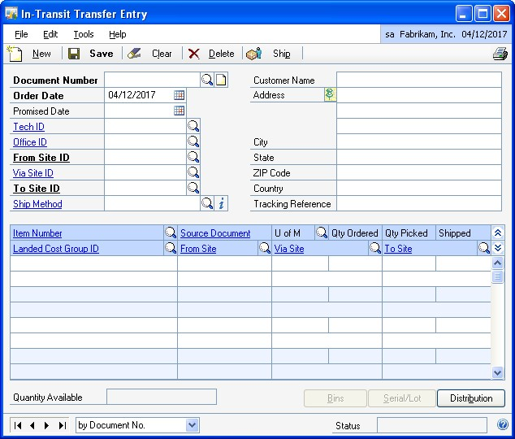

A screenshot of a cell phone Description automatically generated

#### Inventory receipts

You can receive in-transit inventory from the Receivings Transaction Entry
window in Purchase Order Processing. Refer to Purchase Order Processing
documentation for more information.

### Chapter 5: Maintenance procedures

Once you’ve begun using Returns Management, proper maintenance of your
return information is essential for preserving the accuracy of your records.
This part of the documentation focuses on tasks that you can use to maintain
your return records effectively.

You’ll learn how to reconcile inventory quantities and remove various types
of history. You’ll need to determine how much historical information is
necessary and use the described procedures to remove information when it’s
no longer needed.

This information is divided into the following topics:

- *Reconcile inventory quantities for returns*

- *Delete return history*

- *Delete Returns Management inventory transfer history*

#### Reconcile inventory quantities for returns

Use the Reconcile Inventory Quantities process if you discover
inconsistencies in inventory allocated quantities.

If you selected a specific range of items when you reconciled quantities in
Inventory

Control, you must reconcile the same range of item quantities in Service
Call

Management. If different ranges of items are completed in Inventory Control
and Service Call Management, the allocated quantities for inventory items
will be inaccurate.

You should reconcile inventory quantities after the Inventory Reconcile
process has been completed (**Microsoft Dynamics GP menu \> Tools \>
Utilities \> Inventory \> Reconcile**). For more information, see the
Inventory Control documentation.

The reconcile process resets allocated quantities in the Item Maintenance
window for the following records:

- Service Call Parts Lines

- Transfer Parts Lines

- Depot Work Order Parts Lines

Before reconciling, back up your company’s data. For more information, see the
System User’s Guide (**Help \> Printable Manuals**).

1. Open the Reconcile Service Inventory Quantities window. **Microsoft Dynamics
    GP menu \> Tools \> Utilities \> Project \> Service Utilities** \> Reconcile
    Quantities

2. Select item numbers to reconcile.

3. Click **OK**.

#### Delete return history

History records provide useful information for auditing purposes. If you’re
keeping history, you can maintain and review records for an unlimited number
of years. Because historical records increase the amount of storage space
needed, you should remove history periodically to ensure that you’re keeping
only the information you need. You can use Returns Management to maintain
history for both RMA and RTV documents.

Before removing history, back up your company’s data. For more information,
see the System User’s Guide (**Help \> Printable Manuals**).

1. Open the Return Purge Utility window. Microsoft Dynamics GP menu \> Tools \>
    Utilities \> Project \> Service Utilities \> Purge Returns

2. Select to remove **RMA** or **RTV** document history.

3. Select a date to remove returns up to.

4. To print a Returns History Purge report without removing any actual return
    history, click **Print**.

5. Click **Remove**.

#### Delete Returns Management inventory transfer history

The Inventory Purge Utility gives you the ability to remove received
inventory transfers from the system. Received transfers with a date received
on or before the date you specify will be removed.

Before removing history, back up your company’s data. For more information,
see the System User’s Guide (**Help \> Printable Manuals**).

1. Open the Transfer Purge Utility window.

**Microsoft Dynamics GP menu \> Tools \> Utilities \> Project \> Service
Utilities**

1. Select a date to remove completed transfers up to.

2. To print a Transfer History Purge report without removing any actual
    transfer history, click **Print**.

3. Click **Remove**.

## Part 3: Inquiries and reports

A vast amount of detailed information about your business’s return
activities are stored. There might be times when you need information about
a specific transaction or general information about a group of returns.
You’ll use inquiries and reports to help you view and organize this
information.

To view customer or vendor returns, use the inquiry windows. The inquiry
windows provide easy access to detailed or summarized return information.

Reports can be used to analyze return activity and pinpoint errors in
transaction entry.

The following topics are discussed:

- *Chapter 6, “Inquiries,”* explains how to use the inquiry windows with
    Returns Management to view current important information on screen.

- *Chapter 7, “Reports,”* describes how to use the reports provided with
    Returns Management to print the information you need in the format that best
    suits your needs.

### Chapter 6: Inquiries

You can use the inquiry options to view customer or vendor returns, with as
much detail as you want.

To allow specified users to view information without being able to enter or
delete it, specify inquiry settings in the Options Security – Returns
window.

You can look up information by using the SmartList option or by using
inquiry windows.

This information is divided into the following topics:

- *Use SmartList*

- *Use inquiry windows*

#### Use SmartList

You can use SmartList to run queries. Default queries are set up
automatically, and you can set up customized queries at any time. You also
can export queries into Microsoft Word or Excel® documents. To use
SmartList, choose **Microsoft Dynamics GP menu \> SmartList**. For more
information, see the System User’s Guide (**Help \> Printable Manuals**).

#### Use inquiry windows

Inquiry windows provide easy access to information so that you always have a
current view of your repair activities. Some inquiry windows have the same
fields and buttons as the maintenance windows that the inquiry information
originally was entered in.

Most inquiry windows have a link option that you can use to view information
as it was entered in the original return documents.

*The returns inquiry windows are informational—you won’t be able to make
changes to the return documents you’re viewing. To make changes to any
return, use either the RMA Entry/Update window or the RTV Entry/Update
window.*

Some inquiry windows have unique information that does not appear in entry
windows. You can open each window by choosing **Inquiry \> Returns
Management \> select a window**.

- RMA History By Item

- RMA History By Customer

- History Transfer

- RMA Audit

- RTV Audit

- RTV History By Item

### Chapter 7: Reports

You can use Returns Management reports to view the returns that have been
received with a discrepancy or view the turnaround time for RMA documents.
Use this information as a guide for printing reports and working with report
options.

This information is divided into the following topics:

- *Returns Management report summary*

- *Reports you can use with named printers*

- *Specify a Returns Management report option*

For information about creating and printing reports, and using the reporting tools that you can use with Microsoft Dynamics GP, see the System User’s Guide (**Help \> Printable Manuals**).

For information about named printers, see the System Administrator’s Guide (**Help \> Printable Manuals**).

#### Returns Management report summary

You can print several types of reports using Returns Management. Some
reports automatically are printed when you complete certain procedures; for
example, audit trail reports are printed automatically when you post RMA
receipts. You can choose to print some reports during procedures; for
example, you can print an RMA type list while entering RMA types by clicking
the **Printer** icon in the RMA Type Maintenance window.

The following table lists the report types available in Returns Management
and the reports included in those categories.

IMAGE – FARM15.jpg

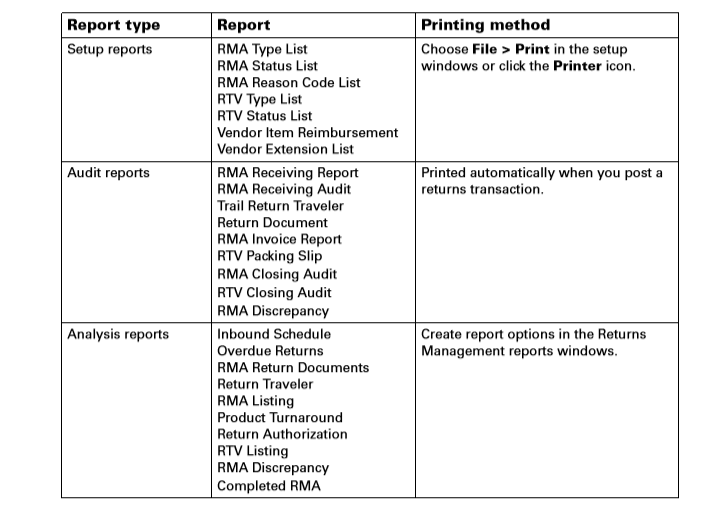

#### Reports you can use with named printers

You can assign printers to the following documents and reports:

- Posting journals

- Analysis reports

- Packing slips

#### Specify a Returns Management report option

Report options include specifications for sorting records and range
restrictions for a particular report. To print Returns Management reports,
you must first create a report option. Each report can have several
different options so that you can print the information you need easily.

*A single report option can’t be used by multiple reports. You must create
report options for different reports separately.*

Use the Returns Management report options windows to create sorting,
restriction, and printing options for the reports that have been included
with Returns Management.

1. Open a Returns Management Reports window. **Reports \> Returns Management \>
    Inbound Schedule**

2. Select a report.

3. Click **New**.

4. Enter a name and definition for the option. The name you choose for the
    option won’t appear on the report. The selections available for defining
    report options vary, depending on the report type you’ve selected.

- *You can enter only one restriction for each restriction type. For instance,
    you can insert one serial number restriction and one customer ID
    restriction.*

1. Enter range restrictions.The available ranges vary, depending on the report
    type you’ve selected.

2. Insert or remove the ranges for the **Restrictions List**.

3. Choose **Email Options** to enter email options for the report option. Once
    the email options are set up, you'll be able to send the reports in an email
    message from this window by choosing Email. You can also send this report in
    an email from any list view where the report option is displayed.

4. Click **Destination** to select a printing destination. Select **Ask Each
    Time** to select printing options each time you print this report option.

5. Click **Print**.
