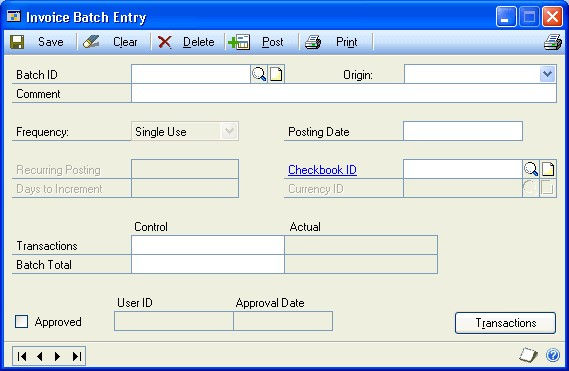
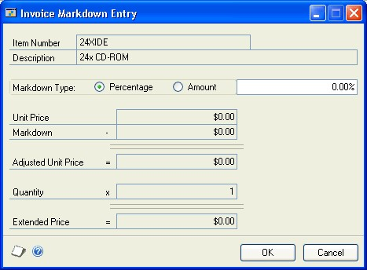

# Invoicing in Microsoft Dynamics GP - Part 2: Transaction Entry

You can use Invoicing to enter and edit invoices and returns and print an invoice or return. In this article, we describe transaction entry in the Invoicing module in Dynamics GP.

This guide is designed to give you an understanding of how to use the features of Invoicing, and how it integrates with the Microsoft Dynamics GP system.

To make best use of Invoicing, you should be familiar with system-wide features described in the System User's Guide, the System Setup Guide, and the System Administrator's Guide.

Some features described in the documentation are optional and can be purchased through your Microsoft Dynamics GP partner.

To view information about the release of Microsoft Dynamics GP that you're using and which modules or features you are registered to use, choose Help \>\> About Microsoft Dynamics GP.

The manual is divided into the following parts:

- [Part 1 - Setup](Invoicing.md#part-1-setup) introduces Invoicing and gives detailed instructions on how to set it up.

- Part 2 - Transaction entry, explains how to enter and edit invoices and returns and how to print an invoice or return. It also explains how to post Invoicing transactions.

- [Part 3 - Transaction activity](invoicing-part-3.md) includes information that will help manage your invoicing documents once they are entered.

- [Part 4 - Inquiries, reports, and utilities](invoicing-part-4.md) describes how to use inquiries and reports to analyze your invoicing activity and explains procedures you can use to clear historical data.

## Part 2: Transaction entry

This part of the documentation explains how to enter invoices and returns. You can enter Invoicing documents individually or in batches. It also describes how items are tracked, priced, allocated, and fulfilled, and how taxes are handled.  

The following information is discussed:

- *Chapter 3, "Item information,"* describes item tracking and pricing related to Invoicing.

- *Chapter 4, "Batches,"* explains how to create, modify, and delete batches.

- *Chapter 5, "Invoices and returns,"* describes how to enter, edit, and post transactions and also includes information needed to create transactions.

- *Chapter 6, "Invoicing taxes,"* explains how sales tax is calculated, modified, and distributed in Invoicing.  

- *Chapter 7, "Allocating item quantities,"* describes how items are allocated and fulfilled on invoices

### Chapter 3: Item information

Use this information to learn more about handling items in Invoicing. Item information is divided into the following sections:

- *Item pricing*

- *Unit cost of items*

- *Non-inventoried items*

- *Adding items*

- *Serial- or lot-numbered items*

#### Item pricing

If you're entering an inventoried item, the unit price*—*the price at which each item is being sold—will be calculated using the information entered for the item in the Item Price List Maintenance window. For more information, refer to the Inventory Control documentation.

| **Valuation method** | **Unit cost displayed** |
|----------------------|-------------------------|
| FIFO perpetual       | Current cost            |
| LIFO perpetual       | Current cost            |
| Average perpetual    | Current cost            |
| FIFO periodic        | Standard cost           |
| LIFO periodic        | Standard cost           |

The price for an item is determined by price levels on the customer card. If a price level hasn't been assigned to the customer, the price level from the Receivables Management Setup window is used. If there isn't a price level set up for the customer or for Receivables Management, the default price level for the item is used.

When you enter an item, the price from the item price list is determined by the price level and the unit of measure selected on the invoicing document for the item. If a price hasn't been set up for the price level, the default price level for the item will be used to determine the price. You can view the price level used for the item in the Invoice Item Detail Entry window.  You can change the unit price on the document if Override Prices is marked in the

Invoicing Setup Options window. If you're entering a unit price that is below cost, Enter Price Below Cost also must be marked in the Invoicing Setup Options window. Depending on how these options were set up, you might need to enter a password.

#### Unit cost of items

If Display Unit Cost is marked in the Invoicing Setup window, the unit cost will be displayed in the Invoice Entry window for each sales inventory type item. The unit cost will not be displayed for items that are assigned the type of service, flat fee, or miscellaneous charge.

The unit cost is the current cost or the standard cost of the item, depending on the inventory valuation method. The following table shows the default cost that appears as the Unit Cost for each valuation method.

The cost displayed might not be the cost used to adjust inventory and cost of goods sold when the document is posted; this will depend on the valuation method used.

- For FIFO Perpetual and LIFO Perpetual, the valuation method is used to determine the actual cost of the item sold.

- For FIFO Periodic and LIFO Periodic, the standard cost is used.

- For Average Perpetual, the current cost is used. For this valuation method, the current cost represents the average cost of the item and is updated whenever the item quantity is increased.

If you enter a return, the default entry for the unit cost of a line item is the current cost for the item from the Item Maintenance window. If Override Item Unit Cost for Returns is marked in the Invoicing Setup Options window, you can change the unit cost of the item, which is the cost used to return the item to inventory. If Override Item Unit Cost for Returns isn't marked, the current cost
of the line item will be displayed and can't be changed.

#### Non-inventoried items

You can enter non-inventoried items—items that don't exist in your inventory records—if Enter Non-Inventoried Items is marked in the Invoicing Setup Options window.

When you enter a non-inventoried item you must enter the item description, unit price and unit cost. The item won't be tracked in inventory, but it will appear on Invoicing analysis and history reports.

The following default accounts are used for non-inventoried items:

| **Account**          | **Source**         |
|----------------------|--------------------|
| Inventory            | The account assigned to non-inventoried items for the Sales series in the Posting Accounts Setup window.           |
| Returned, In Use, In | The account assigned to non-inventoried items for the Sales series in the Posting Accounts Setup window.           |
| Cost of Goods Sold   | If you have marked to use posting accounts from the customer, the system uses the account assigned to the customer. Otherwise, the account from the Inventory series in the Posting Accounts Setup window is used. |
| Sales                | If you have marked to use posting accounts from the customer, the system uses the account assigned to the customer. Otherwise, the account from the Inventory series in the Posting Accounts Setup window is used. |
| Accounts Receivable  | The customer card. If no account is assigned to the customer, the system uses the account from the Sales series in the Posting Accounts Setup window.      |
| Markdown             | The Inventory series in the Posting Accounts Setup window. |

#### Adding items

If Enter Non-Inventoried Items is marked in the Invoicing Setup Options window and you enter an item number that doesn't exist in inventory, you can select Add Item from the Options menu in the Invoice Entry window and either add the item to your inventory or choose a different item. Selecting Add Item can help prevent data entry errors that inadvertently create non-inventoried items.

If you select Add Item and enter an item that isn't in your inventory, you'll have the option to add the item. Add Item will remain marked as long as the Invoice Entry window is open. If you close the window and open it again, you must select Add Item again.

#### Serial- or lot-numbered items

If an item is tracked by serial or lot numbers, you must identify the specific item or items being sold, and you must assign the serial or lot number before you ship the item.

Serial and lot numbers will be assigned automatically to items if you have marked the Auto-Assign Serial Numbers and Auto-Assign Lot Numbers options in the Invoicing Setup Options window. The serial number will be assigned according to your valuation method. Lot numbers will be assigned automatically by receipt date or by expiration date, depending on how you select to automatically assign lot numbers in the Inventory Control Setup window.

Lot numbers with expiration dates that haven't expired will be used when assigning lot numbers by expiration date. Lot numbers without an expiration date will not be assigned. When assigning lots by receipt date, lot numbers with expiration dates that haven't expired and lot numbers without an expiration date will used and the assignment will be based on the valuation method. When automatically assigning lot numbers, expired lots will not be used even if you've marked the Other Transactions option in the Inventory
Control Setup window. You can view or change the serial or lot numbers that are assigned to an item. For more information, see *Changing a serial or lot number*.

If the auto-assign options aren't marked in the Invoicing Setup Options window, you can enter or select a serial or lot number. When the item is fulfilled, the Invoice Serial Number Entry window or the Invoice Lot Number Entry window will open and you can assign the serial or lot number to the item.

If you add a serial- or lot-numbered item to a return document, the Invoice Serial Number Entry or Invoice Lot Number Entry window will open and you can enter the serial or lot number for the item.  

*Don't override shortages on serial- and lot-numbered items. Your inventory will be overstated when the quantity is replenished.*

### Chapter 4: Batches

Batches are groups of transactions with something in common and identified by a unique name or a number. Batches can be identified as a group of transactions entered by a specific employee, or a group of transactions entered on a particular date.

You can enter Invoicing documents individually or in batches. Individual transactions are entered in the Invoice Entry window and posted immediately, so your records are always up to date.

You can post batches of transactions using the batch, series, or master posting procedures. For more information posting methods, refer to the System User's Guide (Help \>\> Contents \>\> select Using the System).

Batch information is divided into the following sections:

- *Creating a batch*
- *Modifying a batch*
- *Deleting a batch*

#### Creating a batch

Use the Invoice Batch Entry window to create a batch. Batches can be used to group and save transactions so you can review the transactions and make corrections before they're posted.

**To create a batch:**

1. Open the Invoice Batch Entry window. (Transactions \>\> Sales \>\> Invoicing Batches)

    

2. Enter a batch ID to identify the batch.

3. Select the batch origin and enter a batch comment.

    > [!NOTE]
    > The Frequency field is unavailable. You must use single-use batches in Invoicing.

4. Enter or accept the posting date. The user date will be the default entry but you can change it. This field will be available only if you marked Batch in the Posting Date From field in the Posting Setup window. If this field is unavailable, the posting date from the Invoice Date Entry window for each transaction will be the posting date for each transaction.

    The date you enter is the date the General Ledger records will use. Invoicing records will be updated according to the document date entered in the Invoice Entry window.

    > [!NOTE]
    > The General Ledger posting date applies to invoices and returns because those are the only document types that are posted.

5. Select the Checkbook ID that will be affected by the transactions in this batch.

6. You can enter the required number of transactions that must be entered before this batch can be posted.

7. Enter the required currency amount for all transactions you'll enter in this batch.

8. Choose Transactions to open the Invoice Entry window.

9. Choose Save.

10. When you have entered all your transactions in a batch, you can choose File \>\> Print or the printer icon button to print an edit list.

#### Modifying a batch

Use the Invoice Batch Entry window to make changes to an unposted batch. If you've approved a batch for posting, you must unmark Approved before making changes.

**To modify a batch:**

1. Open the Invoice Batch Entry window. (Transactions \>\> Sales \>\> Invoicing Batches)

2. Enter or select a batch ID. If you enter a batch ID, you also must select the origin.

Make your changes and choose

#### Deleting a batch

Use the Invoice Batch Entry window to delete an unposted batch of documents, including all transactions in the batch. If you've approved a batch for posting, you must unmark Approved before making changes.

**To delete a batch:**

1. Open the Invoice Batch Entry window. (Transactions \>\> Sales \>\> Invoicing Batches)

2. Enter or select the batch ID to delete. If you enter the batch ID, you also must select the origin.

3. Choose Delete.

### Chapter 5: Invoices and returns

Entering and posting transactions are two of the most common routines in accounting. Transactions can be saved, edited if necessary, and then posted so that they become part of your permanent accounting record.

During posting, the balances of your customer and item accounts will be updated by the amounts entered on the invoices. If your Microsoft Dynamics GP system includes General Ledger, the balances of your posting accounts will be updated, as well.

Invoice and return information is divided into the following sections:

- *Entering an invoice*

- *Entering a return*

- *Adding a markdown for an item*

#### Entering an invoice

The Invoice Entry window contains customer, line item, and totals information, much like an actual invoice. You can enter and post invoices and returns using the Invoice Entry window. You also can print invoices, returns, and packing slips using this window.

You can enter additional information about the customer, a line item, the markdown, the amount received, and the terms discount taken by choosing the expansion buttons next to the appropriate fields. You also can enter additional information about the comment ID, the date, the batch ID, and the freight, miscellaneous, and tax amounts. The following table shows the windows that open with each expansion button:

| **Field**            | **Window that opens**                |
|----------------------|--------------------------------------|
| Date                 | Invoice Date Entry window            |
| Batch ID             | Invoice Batch Entry window           |
| Customer ID          | Invoice Customer Detail Entry window |
| Item Number          | Invoice Item Entry Detail window     |
| Markdown             | Invoice Markdown Entry window        |
| Amount Received      | Invoice Payment Entry window         |
| Terms Discount Taken | Invoice Payment Terms Entry window   |
| Comment ID           | Invoice Comment Entry window         |
| Freight              | Invoice Tax Schedule Entry window    |
| Miscellaneous        | Invoice Tax Schedule Entry window    |
| Tax                  | Invoice Tax Summary Entry window     |

**To enter an invoice:**

1. In the navigation pane, choose the Sales button, and then choose the Invoicing Transactions list.

2. Choose Invoice to open the Invoice Entry window.

3. Select Invoice as the document type and enter a document number. The next document number specified in the Invoicing Setup window will be displayed.

4. You can put a transaction on hold by marking Hold. Unmark Hold to remove a hold from the document if Remove Transaction Holds is marked in the Invoicing Setup Options window.

*If you mark Hold, the items you've selected will remain allocated in inventory.*

1. Enter the document date. This date will be used to update your invoicing records. To change the posting date or enter a quote or order date, choose the Date expansion button to open the Invoice Date Entry window.

2. Enter or select the site ID from which the items will be sold. The site ID specified in the Invoicing Setup window will appear as a default site. The site ID will be used to allocate items from inventory and might be used to calculate taxes.

3. You can create or select a batch ID to assign to the invoice.

4. Enter or select a customer ID and enter the customer's purchase order number, if there is one for this invoice. The purchase order number will be printed on the invoice, and will be displayed in the Invoice Inquiry window.  

5. Enter or select item numbers and enter or select a unit of measure and the quantity of the line item you're selling. When you enter a quantity for an item, it is allocated in inventory. If you're selling a non-inventoried item, enter the unit price.

6. Enter the trade discount, freight, miscellaneous, and tax amounts for this invoice. The trade discount is calculated automatically if you assigned a trade discount to this customer when setting up the customer record. Taxes will be calculated automatically as you enter items.

7. If you receive a payment from the customer, enter the amount in the Amount Received field. The Invoice Payment Entry window will open and you can enter further information about the payment, such as the payment method.

8. To print a comment on the invoice, enter the comment ID for the comment to print. The comment ID you enter here will appear as the reference in the General Ledger Transaction Entry window. For more information, refer to
*Adding comments to invoices and returns* .

9. Choose Distributions to open the Invoice Distribution Entry window and verify or change distribution amounts.

10. Choose Commissions to open the Invoice Commissions Entry window and verify or change commission amounts. For more information about commissions, see *Modifying commission information* and *Splitting commissions*.

11. Choose Print to print the invoice. For more information about printing documents, see *Chapter 9, "Printing documents."*

12. Save or post the invoice.

#### Entering a return

Return documents record the return of items you previously sold. Returns decrease the customer's balance on account and may increase inventory quantities. Because returns record an increase to inventory and a refund of sales, they should be posted. Use the Invoice Entry window to enter and post returns.

**To enter a return:**

1. In the navigation pane, choose the Sales button, and then choose the Invoicing Transactions list.

2. Choose Return to open the Invoice Entry window.

3. Select Return as the document type and enter a document number. The next document number specified in the Invoicing Setup window will be displayed.

4. Enter the document date. This date will be used to update your invoicing records. To change the posting date or enter a quote or order date, choose the Date expansion button to open the Invoice Date Entry window.

5. Enter or select the site ID to which the items will be returned.

6. You can create or select a batch ID to assign to the return.

7. Enter or select a customer ID and enter the customer's purchase order number, if there is one for this return. The purchase order number will be printed on the return, and will be displayed in the Invoice Inquiry window.

8. Enter or select item numbers, and enter or select a unit of measure and the quantity of the line item being returned. If you're selling a non-inventoried item, enter the unit price.

If Override Price is marked in the Invoicing Setup Options window, you can change the unit price and extended price. If you're decreasing the unit price below the unit cost, you also must have the Enter Price Below Cost option marked.

1. When you enter a quantity, the Invoice Returned Quantities Entry window will open and you can specify which site the items will be returned to. You also can specify the quantity type for the returned items—on hand, returned, in use, in service, or damaged.

The item will be returned automatically at the current cost. If the Override Item Unit Cost for Returns option is marked in the Invoicing Setup Options window, you'll be able to change the cost.

*If you return an item to a return quantity type other than On Hand, you can't resell the item. You must transfer the item to On Hand before it can be sold again. If the item was returned to the Damaged quantity type, to return the item to the vendor, you must transfer the item to On Hand and then enter a decrease adjustment for the item. For more information, refer to the Inventory Control documentation.*

1. If applicable, enter the trade discount, freight, miscellaneous, and tax amounts for this return. Taxes will be calculated automatically as you enter items.

2. If you've entered payment terms for this customer that allow a discount for the sale, and if a payment was made at the time of the sale, enter the discount returned amount in the Discount Returned field.

3. To print a comment on the invoice, enter the comment ID for the comment to print. The comment ID you enter here will appear as the reference in the General Ledger Transaction Entry window.

4. Choose Distributions to open the Invoice Distribution Entry window and verify or change distribution amounts.

5. Choose Commissions to open the Invoice Commissions Entry window and verify or change commission amounts. For more information about commissions, see  *Modifying commission information* and *Splitting commissions*.

6. Choose Print to print the invoice. For more information about printing documents, see *Chapter 9, "Printing documents."* 16. Save or post the return.

#### Adding a markdown for an item

Use the Invoice Markdown Entry window to enter a markdown for an individual line item. A markdown is a price reduction and can be a set amount or a percentage of the item price.

**To add a markdown for an item:**

1. Open the Invoice Markdown Entry window. (Transactions \>\> Sales \>\> Invoice Entry \>\> Markdown expansion button)

    

2. Mark the markdown type—percentage or amount—and enter the percentage or amount. The unit price, markdown amount, adjusted unit price and the revised extended price are displayed.

3. Choose OK. The markdown amount and the revised extended price are displayed in the Invoice Entry window.

4. Choose Save.

### Chapter 6: Invoicing taxes

Sales tax can be calculated, modified, and distributed in Invoicing. Use the Invoice Tax Summary Entry window to view tax distributions and to change distribution accounts, if your system is set up to allow editing summary-level taxes. To change tax details or the amounts distributed to tax details for individual line items, use the Invoice Line Item Tax Detail Entry window.

Tax information is divided into the following sections:

- *Invoicing tax calculations*

- *Calculating and distributing tax amounts*

- *Goods value and net purchase amount*

#### Invoicing tax calculations

Taxes are automatically calculated for a document. When you set up Invoicing, you can choose to use a single tax schedule for all items on all documents or you can mark the advanced option to determine the tax for inventory items, noninventoried items, freight, and miscellaneous charges individually.

If you mark the advanced option, the tax is calculated for each item on the document. Here are the components of the calculation if you use an advanced tax schedule in Invoicing:

**Item** The tax option for each item on the invoice is used. To view the tax option for an item, choose the Item Number expansion button in the Invoice Entry window to open the Invoice Item Detail Entry window.  

- If the tax option for the item is Nontaxable, no tax is calculated for that item.

- If the tax option for the item is Taxable, the tax schedule for the line item is taken from the Item Maintenance window and compared to the shipping method tax schedule ID to calculate taxes.

- If the tax option for the item is Base on customers, the line item's tax schedule from the Customer Maintenance window is used.

**Shipping method** The shipping method specified in the Ship To Address field in the Invoice Customer Detail Entry window for the customer will be used, if your system is set up to use the shipping method in tax calculations. For more information on this option, see the System Setup Guide (Help \>\> Contents \>\> select Setting up the System).

To view the shipping method used for a document, choose the customer ID expansion button in the Invoice Entry window to open the Invoice Customer Detail Entry window.

- If the shipping method is Pickup, the tax schedule from the Site ID on the document is used.

- If the shipping method is Delivery, the tax schedule from the Ship To Address for the customer is used.

Any common details between the two tax schedules—the tax schedule for the item and either the tax schedule for the ship-to address or the schedule for the site—will be the tax details used to calculate the tax for the item.  

To view the tax calculation for an item, choose the Item Number expansion button
to open the Invoice Item Detail Entry window. Then choose the Calculated Tax
expansion button to open the Invoice Line Item Tax Detail Entry window.

#### Calculating and distributing tax amounts

Sales tax can be calculated, modified, and distributed in Invoicing. Use the
Invoice Tax Summary window to view tax distributions and to change distribution
accounts.

Sales Order Processing and Invoicing are not integrated and do not share sales
information. If you use Invoicing to enter transactions, you won't be able to
view those transactions in the Sales Order Processing inquiry windows or on
Sales Order Processing analysis reports.

If you're using VAT (Value-Added Tax), you also can use the Invoice Line Item
Tax Detail Entry window to calculate, modify, and distribute input tax amounts
for shipment/invoice receipts.

**To calculate and distribute tax amounts:**

1. Open the Invoice Entry window. (Transactions \>\> Sales \>\> Invoice Entry)

2. Enter document information, including the document number, the document
    date, and the site ID.

Choose the Date expansion button to open the Invoice Date Entry window where
you can enter a tax date and posting date that differ from the document
date. The tax date you enter is the date your tax records will be updated.

1. Enter or select a customer ID.

    > [!TIP]
    > Mark the EU Transaction option in the Invoice Customer Detail Entry window to record statistics for a customer.

2. Enter line item information. To change either the price of a line item or the tax amount, choose the Item Number expansion button to open the Invoice Item Detail Entry window.

3. Enter total information. The output tax is calculated on the net sale amount, which includes freight and miscellaneous charges, if taxable, and any trade discount.

4. Choose the Calculated Tax expansion button in the Invoice Item Detail Entry window to open the Invoice Line Item Tax Detail Entry window and enter or select other tax details.

The tax amount is based on the output tax detail on each item's assigned tax schedule. You can change the percentage assigned to an existing tax detail using the Tax Detail Setup window.

Choose the Tax expansion button in the Invoice Entry window to open the Invoice Tax Summary Entry window and view the amount of output tax that is distributed to each tax detail.

If Allow Summary-Level Tax Edits is marked in the Company Setup window, you can use this window to change the Tax Detail ID, Total Sale, Tax Amount, and Account fields. If Allow Summary-Level Tax Edits is not marked, use the you can use Invoice Line Item Tax Detail Entry window to change the distribution amounts.

#### Goods value and net purchase amount

The goods value is the same as the net purchase amount, which includes
freight and miscellaneous charges if taxable and any trade discount. If
several different tax details are used for a transaction, you must
distribute the total goods value amount to all appropriate tax details and
enter the tax in the Tax Amount field in the Invoice Tax Summary Entry
window. This requirement applies even if no tax will be paid on the entire
transaction or on individual items included on the transaction.

For example, you're entering a purchase amount of £500. However, £250 of
this purchase is exempt from tax. To distribute the exempt portion of the
transaction, enter or select the appropriate tax-exempt detail. Then, enter
a goods value of £250 for the tax-exempt detail and the remaining taxable
goods value of £250 for the input tax detail. The tax amount automatically
will be adjusted to reflect the reduction in the taxable goods value.

### Chapter 7: Allocating item quantities

When you allocate an item, it is reserved in inventory and the quantity
available for the item and for the site is reduced in inventory. You must
allocate items before you can fulfill them.

Allocation information is divided into the following sections:

- *Quantity shortage options*

- *Selling an item from another site*

- *Substituting an item*

#### Quantity shortage options

A quantity shortage occurs when the quantity on an invoice is greater than
the quantity available in inventory. If there is a quantity shortage, the
Invoice Quantity Shortage Options window will open and you can choose how to
treat the quantity shortage—sell balance, override, or other options.

**Sell Balance** Mark to allocate the quantity available in inventory for
the site to the document. For example, if you entered 5 for the quantity on
an invoice but have 3 available in inventory, the quantity is set to 3. The
quantity available in inventory for the item is now zero.

**Override** Mark to ignore the shortage and sell the entire quantity. The
quantity available in inventory will be negative.

*Do not override a shortage on an item that is tracked by serial or lot
numbers. Your inventory will be overstated when the quantity is
replenished.*

**Other options** Mark and choose Options to open the Invoice Quantity

Distribution Entry window, where you can sell items from another site or
substitute items. For more information, see *Selling an item from another
site* or *Substituting an item*.

#### Selling an item from another site

Use the Invoice Quantity Distribution Entry window to check the quantity
available at other sites and allocate the item from other sites if there is a
quantity shortage for the item at the default site.

**To sell an item from another site:**

1. Open the Invoice Quantity Distribution Entry window. (Transactions \>\>
    Sales \>\> Invoice Entry \>\> enter a quantity greater than the available
    inventory quantity \>\> mark Other Options \>\> Options button)

    IMAGE - INVQDE.jpg

    

2. Change the Site ID.

3. If there is a quantity available for a site in the Available Quantities
    window, enter the quantity needed for the document in the Quantity Selected
    field.

4. Choose Insert. An entry will appear in the Selected Quantities section of
    the window.

5. Repeat steps 2 through 4 to fill the quantity needed. The Extended Quantity
    Selected must equal the Original Item Extended Quantity.

6. Choose OK to close the window and save your entries.

#### Substituting an item

Use the Substitute Items window to choose a substitute item if there is a
quantity shortage for an item and the default site. Substitute items must be
set up in inventory and you can set up two substitute items for an inventory
item. For more information about substitute items, see the Inventory Control
documentation.

**To substitute an item:**

1. Open the Invoice Quantity Distribution Entry window. (Transactions \>\>
    Sales \>\> Invoice Entry \>\> enter a quantity greater than the inventory
    quantity available \>\> select Other Options \>\> Options button)

2. Choose the Item Number expansion button to open the Substitute Items window.
    Select a substitute item and choose OK.

3. In the Invoice Quantity Distribution Entry window, verify the quantity
    available for the substitute item. Enter the quantity needed for the
    document in the Quantity Selected field.

4. Choose Insert. The item number will appear in the Selected Quantities
    window.

5. Repeat steps 2 through 4 to choose an additional substitute item or site to
    fill the quantity needed. The Extended Quantity Selected must equal the
    Original Item Extended Quantity.

6. Choose OK to close the window and save your entries.

## See also

[Invoicing in Microsoft Dynamics GP](Invoicing.md)  
[Invoicing in Microsoft Dynamics GP - Part 3: Transaction activity](invoicing-part-3.md)  
[Invoicing in Microsoft Dynamics GP - Part 4: Inquiries, reports, and utilities](invoicing-part-4.md)  
[Glossary of Terms in the Invoicing Area in Dynamics GP](invoicing-glossary.md)  
