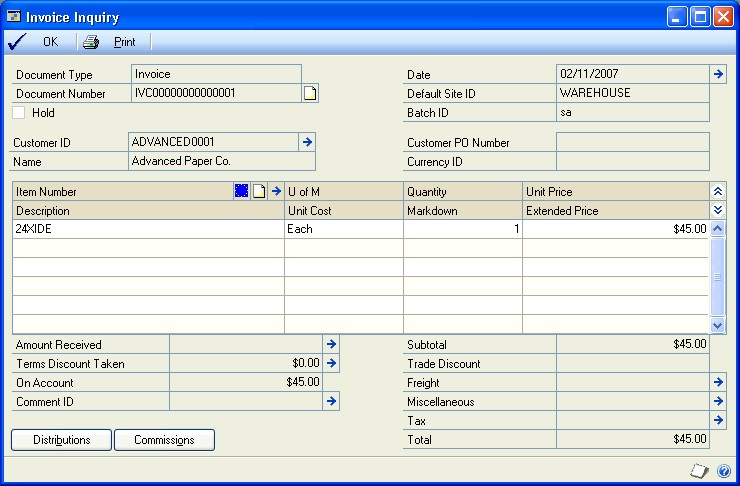
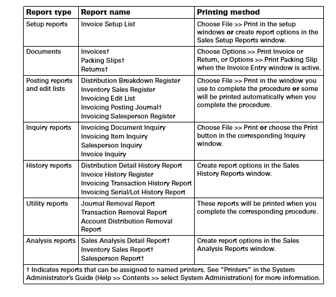

# Invoicing in Microsoft Dynamics GP - Part 4: Inquiries, reports, and utilities

You can use Invoicing to enter and edit invoices and returns and print an invoice or return. In this article, we describe the inquiries, reports, and utilities in the Invoicing module in Dynamics GP.

To make best use of Invoicing, you should be familiar with system-wide features described in the System User's Guide, the System Setup Guide, and the System Administrator's Guide.

Some features described in the documentation are optional and can be purchased through your Microsoft Dynamics GP partner.

To view information about the release of Microsoft Dynamics GP that you're using and which modules or features you are registered to use, choose Help \>\> About Microsoft Dynamics GP.

The manual is divided into the following parts:

- [Part 1 - Setup](Invoicing.md#part-1-setup) introduces Invoicing and gives detailed instructions on how to set it up.

- [Part 2 - Transaction entry](invoicing-part-2.md) explains how to enter and edit invoices and returns and how to print an invoice or return. It also explains how to post Invoicing transactions.

- [Part 3 - Transaction activity](invoicing-part-3.md) includes information that will help manage your invoicing documents once they are entered.

- Part 4 - Inquiries, reports, and utilities describes how to use inquiries and reports to analyze your invoicing activity and explains procedures you can use to clear historical data.

## Part 4: Inquiries, reports, and utilities

This part of the documentation explains how to use inquiries and reports to
analyze your invoicing activity. You can analyze transaction and item
information, and display the information either on the screen or on a
printed report.

This part of the documentation also explains how to remove historical
information when it's no longer useful and print reports to create a
permanent record of the information stored in history.

The following information is discussed:

- [Chapter 11 Inquiries](#chapter-11-inquiries) explains how to use Invoicing inquiry windows to view document and item information.

- [Chapter 12 Reports](#chapter-12-reports) describes how to use reports to analyze invoicing activity.

- [Chapter 13 History removal](#chapter-13-history-removal) explains how to remove Invoicing and Intrastat statistics information when it's no longer useful.

## Chapter 11: Inquiries

Use the Invoice inquiry windows to view detailed or summarized Invoicing
information. You can view invoice, item, and salesperson activity, as well
as un-posted transactions or historical records that have been maintained.

> [!NOTE]
> You can't make changes to transactions in inquiry windows. To change un-posted transactions, use the Invoice Entry window. For more information, see Correcting an invoicing document.

You can open other windows from the Invoicing inquiry windows and view
information as it was entered originally. For example, you can select a
document number in the Invoicing Document Inquiry window and open the
Invoice Inquiry window to view the transaction as it was entered, including
distribution and commission information.

Inquiry information is divided into the following sections:

- *Viewing invoicing documents*

- *Viewing invoicing items*

- *Viewing salesperson commissions*

- *Viewing invoices*

### Viewing invoicing documents

Use the Invoicing Document Inquiry window to view unposted or historical
documents. You can use the information to answer customers' questions about
invoices they've received, for example.

You can limit the number of documents to view by selecting a range of
documents. For each document selected, you can view the document
type—invoice or return— document number, document date, customer ID,
document subtotal, other charges, and the document total.

**To view invoicing documents:**

Open the Invoicing Document Inquiry window. (Inquiry \>\> Sales \>\>
Invoice)

1. Select a sorting option for the information in the Documents field.

2. To display a range of information, mark From and specify the start and end of the range. The type of range varies depending on the sorting option you select.

3. Mark Unposted to display un-posted transactions or mark History to display transactions in history.

4. Choose Redisplay to update the window with your selections.

5. To find documents associated with a particular document number, customer ID, or date, choose Find.

6. To open a window where you can view more detailed information about a particular invoice or customer, highlight a document, then click the Document Number or Customer ID link.

### Viewing invoicing items

Use the Invoicing Item Inquiry window to view all the documents on which a
particular item is found. This can be helpful to target sales promotions to
customers who have bought a particular item, for example.

You can limit the number of items displayed by specifying a range of items. For
each item, you can view the type and number for each document that each item
appears on, the customer IDs for the customer that each item has been sold to,
and the item number, units of measure, quantity, and extended price for each
document.

**To view invoicing items:**

1. Open the Invoicing Item Inquiry window. (Inquiry \>\> Sales \>\> Invoiced Items)

2. Select a sorting option for the information in the Items field.

3. To display a range of information, mark From and specify the start and end of the range. The type of range varies depending on the sorting option you select.

4. Mark Unposted to display unposted transactions or mark History to display transactions in history.

5. Choose Redisplay to update the window with your selections.

6. To find documents associated with a particular document type, document number, or item number, choose Find.

7. To open a window where you can view more detailed information about a particular invoice, customer, or item, select an item, then click the Document Number, Customer ID, or Item Number link.

### Viewing salesperson commissions

Use the Salesperson Inquiry window to view information about commissions and
sales for salespeople. This can be helpful for evaluating the performance of
your sales force.

You can limit the records displayed by specifying a range of salesperson
IDs. The following information is available for each salesperson: sales
territory, document numbers for invoices associated with the salesperson,
audit trail codes for the documents, sales amounts, non-commission amounts,
commission percentages, and commission amounts.

**To view salesperson commissions:**

1. Open the Salesperson Inquiry window. (Inquiry \>\> Sales \>\> Salesperson)

2. Select Invoicing in the Module field.

3. Select a sorting option for the information in the Salespeople field.

4. To display a range of information, mark From and specify the start and end
    of the range. The type of range varies depending on the sorting option you
    select.

5. Choose Redisplay to update the window with your selections.

6. To find salespeople associated with a particular salesperson ID, sales
    territory ID, document number, or audit trail code, choose Find.

To view more information about the salesperson, territory, or invoice in the
list, highlight a record and click a link to open a window displaying the
original record.

The following table lists the link fields in the Salesperson Inquiry window.

| **Link field**     | **Window that opens**       |
|--------------------|-----------------------------|
| Salesperson ID     | Salesperson Maintenance     |
| Sales Territory ID | Sales Territory Maintenance |
| Document Number    | Invoice Inquiry             |

### Viewing invoices

Use the Invoice Inquiry window to view each invoice as it was originally
entered, reprint individual documents, and open additional inquiry windows to
gain more detailed information about individual fields on the invoice.

**To view invoices:**

1. Open the Invoice Inquiry window.

    (Inquiry \>\> Sales \>\> Invoice \>\> click Document Number link)
    (Inquiry \>\> Sales \>\> Invoiced Items \>\> click Document Number link)
    (Inquiry \>\> Sales \>\> Salesperson \>\> click Document Number link)

    

2. Choose expansion buttons to view additional inquiry windows.

    The following inquiry windows are available:

    | **Expansion button** | **Inquiry window displayed**    |
    |----------------------|---------------------------------|
    | Date                 | Invoice Date Inquiry            |
    | Customer ID          | Invoice Customer Detail Inquiry |
    | Item Number          | Invoice Item Detail Inquiry     |
    | Freight              | Invoice Tax Schedule Inquiry    |
    | Miscellaneous        | Invoice Tax Schedule Inquiry    |
    | Tax                  | Invoice Tax Summary Inquiry     |
    | Amount Received      | Invoice Payment Inquiry         |
    | Terms Discount Taken | Invoice Payment Terms Inquiry   |
    | Comment ID           | Invoice Comment Inquiry         |

3. Choose Distributions to view distributions information. The Invoice Distribution Inquiry window will open, displaying the accounts to which transaction amounts were distributed.

4. Choose Commissions to view commissions information. The Invoice Commissions Inquiry window opens, displaying sales commission information related to the invoice.

5. To reprint an invoice or return, choose Print. To change the invoice format, print tax details on an invoice, or print an alignment form, choose the Options menu and select the appropriate item when the Invoice Inquiry window is open.

## Chapter 12: Reports

You can use Invoicing reports to analyze receivables activity and identify
errors in transaction entry. Use the information in this chapter to guide
you through printing reports and working with report options.

For more information about creating and printing reports, and the various
reporting tools that you can use with Microsoft Dynamics GP, refer to your
System User's Guide (Help \>\> Contents \>\> select Using The System).

Reports information is divided into the following sections:

- *Invoicing report summary*

- *Specifying an Invoicing report option*

### Invoicing report summary

Some Invoicing reports are printed automatically when you complete certain
procedures; for example, posting journals can be printed automatically when
you post transactions. You can choose to print some reports during
procedures; for example, you can print an edit list when entering
transactions. In order to print some reports, such as analysis or history
reports, you must set up report options to specify sorting options and
ranges of information to include on the report.

The following table lists the report types available in Invoicing and the
reports that fall into those categories.

### Specifying an Invoicing report option

Report options include specifications of sorting options and range
restrictions for a particular report. In order to print some of the
Invoicing reports, you must first create report options. Each report can
have several different options so that you can easily print the information
you need. For example, you can create one report option to show summary
information, and another option to show detailed information.

> [!NOTE]
> A single report option can't be used by multiple reports. For identical options for several reports, you must create them separately.

Use the Sales report options windows to create sorting, restriction and
printing options for the reports that have been included with Invoicing.

**To specify an Invoicing report option:**

1. Open a Sales reports window. There are separate windows for each report
    type.

    (Reports \>\> Sales \>\> Setup)
    (Reports \>\> Sales \>\> Posting)
    (Reports \>\> Sales \>\> History) (Reports \>\> Sales \>\> Analysis)

2. Select a report from the Reports List.

3. Choose New to open the report options window. Your selection in step 2 determines which report options window appears.

    For report options window information choose Help \>\> Index; then enter the name of the specific report options window.

4. Name the option and enter information to define the option. The name you choose for the option won't appear on the report. The selections available for defining report options vary, depending on the report type you've selected.

5. Enter range restrictions. The Ranges list shows the ranges available for each report. The available ranges vary, depending on the type of report.

    > [!NOTE]
    > You can enter only one restriction for each restriction type. For instance, you can insert one customer ID restriction or one document number restriction.

6. Choose Insert to add the range to the Restrictions List. To remove an existing range from the list, select the range and choose Remove.

7. Choose Destination to select a printing destination. Reports can be printed to the screen, to the printer, to a file, or to any combination of these options. If you select Ask Each Time, you'll be able to select printing options each time you print this report option.

8. To print the report option from the report options window, choose Print before saving it. If you don't want to print the option now, choose Save and close the window. The report window will be redisplayed.

## Chapter 13: History removal

History records provide useful information for auditing purposes. If you're
keeping one of the types of history available in Invoicing, those records
can be maintained for an unlimited number of years.

You can remove the historical information when it's no longer useful. You
also can print reports to create a permanent record of the information
stored in history.

The amount of information stored in history can occupy a considerable amount
of disk space. If you need to change the type of historical information
being saved, see *Setting Invoicing general options and defaults*.

Information about maintaining history is divided into the following
sections:

- *Removing invoicing history*

- *Printing history reports without removing history*

- *Removing Intrastat statistics history*

### Removing invoicing history

In Invoicing, you can maintain three types of history—transaction, account
distribution, and journal history. Use the Remove Invoicing History window
to remove all three types of history.

**Transaction history** Detailed information for all transactions that were
transferred to history during the posting process. When you remove
transaction history, you'll remove sales tax history and salesperson
commission history, as well.

**Distribution history** Detailed record of how Invoicing transactions have
affected the balances of distribution accounts.

**Journal history** Batch and audit trail information. If you remove journal
history, you won't be able to reprint posting journals for the range of
information you've removed.

*Before removing history, back up your company's accounting data. For more
information about making backups in Microsoft Dynamics GP, refer to the
System Administrator's Guide (Help \>\> Contents \>\> select System
Administration), or search for the keyword "backups" in the online help.*

**To remove invoicing history:**

1. Make a backup of your accounting data. Making a backup protects your data in
    case of a power fluctuation or other problem.

2. Open the Remove Invoicing History window. (Microsoft Dynamics GP menu \>\>
    Tools \>\> Utilities \>\> Sales \>\> Remove Invoice History)

3. Select the history type to remove.

4. Select a range of history to remove and specify the start and end of the
    range.

5. Choose Insert. The range you've entered will be displayed in the
    Restrictions box.

6. Select additional ranges and restrictions, if desired. You can enter only
    one restriction for each restriction type. For example, if you enter a
    restriction specifying that only document numbers IVC100 through IVC300
    should be removed, you can't enter another restriction for document numbers
    IVC500 through IVC800. However, you could enter a range of dates in addition
    to the document numbers. To clear multiple ranges of history, you must clear
    each range separately.

    > [!NOTE]
    > If you've made an error in selecting a range, highlight the range and choose Remove. The range will be removed from the Restrictions box.

7. Mark the type of history to remove—Transaction, Distributions, or Journal.

8. Mark Report to print a report listing the information that was removed from history. Depending on which type of history you remove, a Journal Removal Report, Transaction Removal Report, or Account Distribution Removal Report will be printed.

9. Choose Process to remove the history and print the selected reports.

### Printing history reports without removing history

Use the Remove Invoicing History window to print history reports at any
time, so you can review the information stored in history before you remove
it.

**To print history reports without removing history:**

1. Open the Remove Invoicing History window.

    (Microsoft Dynamics GP menu \>\> Tools \>\> Utilities \>\> Sales \>\> Remove Invoice History)

2. Select the history type.

3. Select a range of history to remove and specify the start and end of the range.

4. Choose Insert. The range you've entered will be displayed in the Restrictions box.

5. Mark Report, and be sure Transaction, Distributions, and Journal are unmarked.

6. Choose Process to print the report or reports selected. Depending on which type of history you selected, a Journal Removal Report, Transaction Removal Report, or Account Distribution Removal Report will be printed.

### Removing Intrastat statistics history

Use the Remove Intrastat History window to remove Intrastat statistics
history records that are no longer necessary. Only the Intrastat statistics
records for the range you specify will be removed.

*Before removing history, back up your company's accounting data. For more
information on making backups, refer to the System Administrator's Guide
(Help \>\> Contents \>\> select System Administration).*

Once history has been removed, you won't be able to print the Intrastat
statistics removal reports for the ranges of information you've removed.

**To remove Intrastat statistics history:**

1. Open the Remove Intrastat History window.

    (Microsoft Dynamics GP menu \>\> Tools \>\> Utilities \>\> Company \>\> Remove Intrastat History)

2. Select a range type and specify the start and end of the range.

3. Choose Insert to display the range. Select additional ranges and restrictions, if desired. You can enter only one restriction for each restriction type. For example, if you enter a restriction specifying that history should be deleted for customer records COMPUTER0003 through GRAHAMAR0001, you can't enter another restriction for customer IDs CONTINEN0001 through EXECUTIV0001.

4. Mark Transactions, then mark Print Report to print the Intrastat removal reports for the range of customer records or vendor records you've specified. Print these reports to retain a permanent record of your past Intrastat records after you've cleared history.

> [!NOTE]
> You can print the Intrastat removal reports without removing history. To do
so, mark only Print Report and choose OK.

## See also

[Invoicing in Microsoft Dynamics GP](Invoicing.md)  
[Invoicing in Microsoft Dynamics GP - Part 2: Transaction Entry](invoicing-part-2.md)  
[Invoicing in Microsoft Dynamics GP - Part 3: Transaction activity](invoicing-part-3.md)  
[Glossary of Terms in the Invoicing Area in Dynamics GP](invoicing-glossary.md)  
