# Manufacturing Setup - Part 1: Manufacturing setup

You can use Manufacturing to organize and track the daily workings of the manufacturing process, such as taking orders, purchasing raw materials, building finished goods, fulfilling orders, and selling the finished goods.

Manufacturing documentation is divided into five manuals. Refer to the following table for an overview of what is included in each of the manuals.

| **Manual**                                | **Modules or other major pieces**      |
|-------------------------------------------|----------------------------------------|
| Manufacturing Setup manual                | System setup  User setup         |
| Manufacturing Core Functions manual       | Manufacturing Cards Extensions to Inventory Control   Bills of Materials Extensions to Sales Order Processing   Sales Configurator   Manufacturing Reports |
| Manufacturing Production Functions manual | Routings Manufacturing Orders   Outsourcing Work in Process    |
| Manufacturing Management Functions manual | Quality Assurance Engineering   Change Management   Job Costing     |
| Manufacturing Planning Functions manual   | Sales Forecasting Master Production Scheduling Capacity Requirements Planning (CRP) Material Requirements Planning (MRP)                             |

> [!NOTE]
> If a Dynamics GP window, such as the **Sales Transaction Entry** window, is the active window when you access Help, online Help for Dynamics GP will be displayed. You can close that Help, open any Manufacturing window, and try again to access Manufacturing-specific Help.

This manual is designed to give you an understanding of how to use the features of Manufacturing, and how it integrates with the Microsoft Dynamics GP system.

To make best use of Manufacturing, you should be familiar with system-wide features described in the System User’s Guide, the System Setup Guide, and the System Administrator’s Guide.

Some features described in the documentation are optional and can be purchased through your Microsoft Dynamics GP partner.

To view information about the release of Microsoft Dynamics GP that you’re using and which modules or features you are registered to use, choose Help \>\> About Microsoft Dynamics GP.

The manual is divided into the following parts:

- *Part 1, Manufacturing setup*, describes how you can set up security and system-wide settings for Manufacturing modules.

- *Part 2, Manufacturing user setup*, contains information about user preferences—settings that help you customize each user’s view of Manufacturing information. For more information, see [Manufacturing Setup - Part 2: User setup](manufacturing-setup-part-2.md).  

## Introduction to Part 1

This part of the documentation includes information that will help you complete Manufacturing setup tasks. You can refer to this information to learn how to use security in Manufacturing and how to set up system-wide settings.

Many of the tasks that are described must be completed before you can enter information in Manufacturing. Be sure to review and complete all setup tasks for Manufacturing modules you’ve installed. Later you can refer to this information to adjust settings or to help new users get started.

The following information is discussed:

- *Chapter 1, “Manufacturing basic setup,”* includes information about setting up users, the shop floor calendar, and work center options.

- *Chapter 2, “Security,”* describes security information specific to Manufacturing, such as process security and module security.

- *Chapter 3, “Manufacturing core functions setup,”* contains information about system settings for bills of materials, sales extensions, and the Sales Configurator.

- *Chapter 4, “Manufacturing production functions setup,”* describes system settings for routings, manufacturing orders, and work-in-process.

- *Chapter 5, “Manufacturing management functions setup,”* includes information about setting up quality assurance, engineering change management, and job costing.

- *Chapter 6, “Manufacturing planning functions setup,”* includes information about system settings for Material Requirements Planning.

## Chapter 1: Manufacturing basic setup

Before you set up module-specific system settings and user preferences, use this information to complete basic system setup tasks.

This information is divided into the following sections:

- *Setup checklist*

- *Setting up costing system default settings*

- *Shrinkage overview*

- *Including shrinkage in Manufacturing*

- *Shop calendars*

- *Defining the shop calendar*

- *Setting up work center options*

- *Designating system users*

### Setting up costing system default settings

Default costing settings determine how costs are tracked throughout your manufacturing facility. You can choose to automatically account for shrinkage on parent parts, their components, or both. You also can assign a posting account for rounding differences and choose a security set for revaluations.

**To set up costing system default settings:**

1. Open the Costing Preference Defaults window. (Microsoft Dynamics GP menu \>\> Tools \>\> Setup \>\> Manufacturing \>\> System Defaults \>\> Costing)

    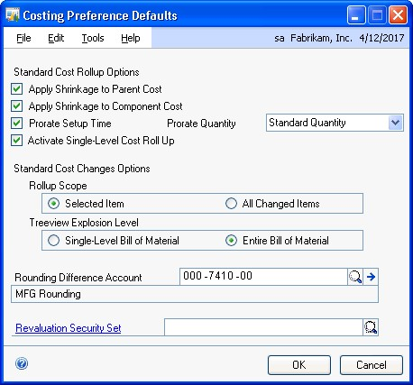

2. Mark the options to apply shrinkage, as needed, for standard cost rollups.
    > [!IMPORTANT]
    > It’s strongly recommended that you mark both options or neither option.

    - **Apply Shrinkage to Parent Cost**
      Mark Apply Shrinkage to Parent Cost to apply shrinkage to the finished good.

    - **Apply Shrinkage to Component Cost**
      Mark Apply Shrinkage to Component Cost to apply shrinkage to the components of the finished good.

    - **Prorate Setup Time**
      Mark Prorate Setup Time to distribute setup costs for tandard-cost items.

      If you marked **Prorate Setup Time**, select the quantity to use for calculating setup costs for standard-cost items.

    - **Average Quantity**
      The setup costs of an item (setup time multiplied by setup labor rate) will be divided by the average quantity of the item. You specify the average quantity of an item in the Item Engineering Data window.

      Refer to *Entering item engineering data* in *Chapter 8, “Item engineering data,”* of the Manufacturing Core Functions documentation for more information about specifying the average quantity of an item.

    - **Standard Quantity**
      The setup costs of an item will be divided by the standard quantity of the item. You specify the standard item quantity in the Standard Cost Changes window.

      Refer to *Specifying the standard quantity for a finished item* in *Chapter 14, “Standard costing revaluations,”* in the Manufacturing Core Functions documentation for more information.

3. Mark **Activate Single-Level Cost Roll Up** to let users decide, in the **Standard Cost Changes** window, whether costs affect selected items in the BOM, or the entire BOM that includes the item. If you do not mark this option, users do not have the choice, and costs affect the entire BOM that includes the item.

4. Decide how the **Standard Cost Changes** window should work.

    - **Rollup scope**

        Determines how many items are included in a standard cost rollup. You can choose to roll up all items with proposed standard cost changes, or you can choose to roll up only items affected by a change in the cost of the selected item.

    - **Tree view explosion level**

        Determines how much information is displayed when you select an item in the Standard Cost Changes window. If your business has many records, choose Single Level Bill of Material so that information is displayed more quickly. (You can always expand the view of the information, if needed.)

5. Select a posting account for rounding differences.

6. Choose a security set to be used when a user attempts to revalue items in the Rollup and Revalue Inventory window or in the Standard Cost Changes window.

    Users who attempt to revalue items must be included in the security set, or they must enter the appropriate password before the revaluation can occur.

7. Choose OK and close the window.

### Shrinkage overview

Shrinkage is the anticipated loss of an item.

**Types of shrinkage**

You can specify a shrinkage value for finished goods (parent items), for components (child items), or both.

**Finished good shrinkage** Finished good shrinkage might occur if not all items that are started in production are adequate for meeting demand. For example, if you discover that one out of every 100 finished goods you produce fails inspection, you have one percent shrinkage of your finished goods. You can set up preferences so that if you need to produce 200 of this item, materials and resources will be scheduled to build 202—automatically
covering any anticipated losses from shrinkage.

**Raw material shrinkage** Raw material shrinkage might occur if some components are flawed and can’t be used in production. Raw material shrinkage also can occur if materials are wasted in the production process; for example, you might need to use materials on trial runs during your setup processes. You can indicate how much shrinkage you anticipate on an item-by-item basis.

**How shrinkage is calculated**

To calculate shrinkage, divide the extended required quantity (from either the picklist or the manufacturing order, depending on if you’re calculating shrinkage for a component or finished good) by 1, minus the shrinkage percentage. The calculated quantities reflecting shrinkage should be rounded up, if necessary.

### Including shrinkage in Manufacturing

When you enter item information in Inventory Control, you can specify shrinkage percentages. The amounts you enter can be reflected in the quantity calculations for manufacturing orders, in cost calculations for standard cost rollups, or both.

Refer to the table for more information about where the shrinkage percentage information comes from, and how it’s determined if the shrinkage percentage is reflected in quantities or costs.

| | **Component** | **Finished good** |
|-----------------|-------------------|------------------|
|Shrinkage information comes from ... | ... the Item Resource Planning Maintenance window, but you can change the shrinkage percentage for a component when you add the component to a bill of materials in the Bill of Materials Entry window. | ... the Item Resource Planning Maintenance window. |
|Shrinkage is reflected in the quantities if ... | ... the scheduling preference you use for the manufacturing order includes the options to apply shrinkage to the quantity. Refer to *Setting up scheduling preferences.*                                |                              |
|Shrinkage is reflected in costs for standard cost rollups if ... | ... you’ve marked options to include shrinkage in standard cost rollups. Refer to *Setting up costing system default settings.*                                                                         |                              |

### Shop calendars

You’ll use the Shop Calendar window to indicate which days your plant is running—and which days it isn’t. You can choose weekends, holidays, or any other days as “down days.” When you use modules such as Manufacturing Order Processing, down days can be taken into consideration in order scheduling.

You might have to make specific adjustments to the calendar when unforeseen events occur—when your plant has a down day because of a power failure, for example, or when an extra shift is scheduled.

*Settings you choose when defining the shop calendar will be the default settings for your work centers. However, after you create work centers, changes to the shop calendar won’t be reflected in existing work center calendars. Use the Shop Calendar when you’re initially setting up your company, but use work center calendars to make day-to-day adjustments.*

### Defining the shop calendar

You need to define one shop calendar for each company, but you can adjust the shop calendar for each work center.

**To define the shop calendar:**

1. Open the Shop Calendar window. (Microsoft Dynamics GP menu \>\> Tools \>\> Setup \>\> Manufacturing \>\> System Defaults \>\> Calendar)

    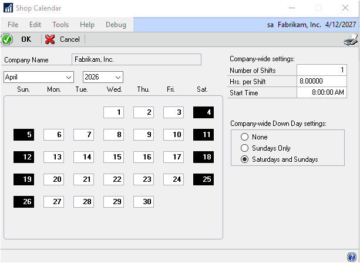

    The window will open to the current month and year.

2. Enter the number of shifts, hours per shift and start time information.

    > [!NOTE]
    > The number of shifts multiplied by the hours per shift can’t exceed 24.

3. Mark the option for weekly down days. You can choose None, Sundays Only, or Saturdays and Sundays.

    Down days will appear in black.

4. Mark any other down days. A message will appear, telling you that continuing with the process might affect scheduling. To continue the process, choose Yes and OK to close the window.

> [!NOTE]
> To make a down day available for scheduling, select the day in the Shop Calendar window to clear the setting.

### Setting up work center options

Use work center default options to create two fields that will be linked to  routing operation codes. Enter the labels for the fields in the Work Center Preference Defaults window.

**To set up work center options:**

1. Open the Work Center Preference Defaults window.

    (Microsoft Dynamics GP menu \>\> Tools \>\> Setup \>\> Manufacturing \>\> System Defaults \>\> Work Centers)

    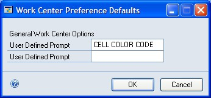

2. In the User-Defined Prompt fields, enter the label or labels for the additional fields you’re creating. These fields will appear in the Operations Setup window and choose OK.

### Designating system users

System users have more access privileges than other users. Like system administrators, system users can set preferences for other users.

*Before you can designate system users, you must enter user information in the User Setup window. Refer to your System Setup Instructions (Help \>\> Contents \>\> select Setting Up the System) for more information.*

**To designate system users:**

1. Open the Add Users window. (Microsoft Dynamics GP menu \>\> Tools \>\> Setup \>\> Manufacturing \>\> System Defaults \>\> System User)

2. Enter or select the user ID for an employee who is to be a system user and Choose Insert.

**To remove a system user, mark the user ID in the scrolling window and choose Remove.*

1. Continue, repeating steps 2 and 3 to add as many system users as you like.

2. Choose OK and close the window.

## Chapter 2: Security

Security builds safeguards into your software to restrict access to information, processes, or windows. In Manufacturing, each of these types of security is included. You should understand each of the three security types before setting up security access for your users.

> [!IMPORTANT]
> Before you set up security access for Manufacturing, you should have defined users and determined the level of access each user will have.
 
This information is divided into the following sections:

- *Manufacturing security types*

- *Process security*

- *Creating and modifying process security sets*

- *Using Manufacturing module security*

### Manufacturing security types

Refer here for information about some of the terms related to security.

**User security** You can determine which windows and reports each user in your organization can use. Users can’t use any *modified* windows or reports until you give them access to the windows and reports. Window and report security is used throughout your accounting and manufacturing system. To learn more about setting up user security, refer to the System Setup Guide (Help \>\> Contents \>\> select Setting up the System).

*User security can be used to restrict access only to windows and reports. To restrict access to information on a field-by-field basis, use Field Level Security or create alternate forms and windows. Refer to the Modifier User’s guide for more information about creating alternate forms and windows. Refer to the System Setup Guide (Help \>\> Contents \>\> select Setting up the System) for more information about Field Level Security.*

**Process security** Process security is a special type of security that you can use to limit authority for completing special procedures in Manufacturing, such as revaluing inventory or generating manufacturing orders from Sales Order Processing. First, you must define process security sets. A process security set can be based on a list of users who will have authority to complete a specific process, or it can be based on a password. You can create as many process security sets as you like and apply different
sets to different processes throughout Manufacturing.

*For more information, refer to Process security and Creating and modifying process security sets.*

**Manufacturing module security** Some Manufacturing processes—such as generating Material Requirements Planning (MRP) information or updating routing records—can be done only when no other users are working with certain records. With the security that is provided for bills of materials, routings, data collection, and MRP, you can see which other users are using records that prevent you from completing MRP regeneration or other processes. You can end other users’ sessions or you can ask them to end their sessions.

You also can use Manufacturing module security to unlock records that might become locked if a user’s computer becomes suspended. If a power failure occurs when a user is updating a routing record, for example, the routing record might need to be unlocked.

*For more information, refer to Using Manufacturing module security.*

### Process security

Process security is useful for safeguarding certain manufacturing processes, such as revaluing standard cost items or overriding purchase order quantities. With process security in place, you can limit who in your company has authorization to complete certain critical processes.

Manufacturing process security system uses security sets—passwords or groups of user IDs—to limit who can complete certain tasks. When a security set for a task is based on a group of users, only users in that group can perform the task. When a security set for a task is based on a password, any user who attempts to complete the task will be required to enter the appropriate password before proceeding.

You can use process security for completing the following tasks.

- Revaluing inventory

- Linking job elements to jobs

- Changing a sales order line item quantity when a manufacturing order is
    linked to it

- Changing job links

- Changing the status of a job

- Overriding manufacturing order quantities

- Changing order fulfillment history

- Auto-generating manufacturing orders

- Managing links between manufacturing orders and purchase orders for
    outsourcing

- Managing shipments to outsourcing vendors

- Updating groups of bills of materials

### Creating and modifying process security sets

You can create an unlimited number of security sets. You can use the same security set for all tasks that are protected by process security, or you can create a separate security set for each task.

Once you’ve created a process security set, you can modify it at anytime. For example, you might change the password or add or remove user IDs.

**To create or modify process security sets:**

1. Open the Process Security Setup window. (Microsoft Dynamics GP menu \>\> Tools \>\> Setup \>\> Manufacturing \>\> System Defaults \>\> Process Security)

2. Enter or select a name for the security set.

3. If you’re creating a new security set, mark Password or User ID to determine the kind of security set you’re creating. If you’re modifying an existing security set, skip to step 4.

    - If you marked Password, enter the password.

    - If you marked User ID, use the lookup button on the User IDs field to choose the users to include in the security set.

4. Make changes, as needed.

    - To change a password, select the text in the Password field and enter the new password.

    - To add a user, choose a user in the User IDs field.

    - To remove a user, mark the user ID in the scrolling window and then choose Remove.
5. Choose Save.

### Using Manufacturing module security

You can use Manufacturing module security to unlock locked bills of materials, routings, data collection records, manufacturing orders, and MRP-planned orders. You also can use module security to remove MRP users. You might need to unlock records to perform certain processes, such as regenerating MRP information.

The window you’ll use to view or unlock locked records will depend on the type of record you’re working with.

You need system administrator access to unlock most records. To unlock some records, you must supply the system password to open the window. To unlock other records, you must supply the system password when you choose the Delete button.

#### To use Manufacturing module security

1. Open the appropriate window for the type of record to unlock.

    Refer to the table for more information.

    | Type of record  | Window and path   |
    |-----------------|-------------------|
    | Bill of materials   | BOM Security window - (Transactions \>\> Manufacturing \>\> Bill of Materials \>\> Security)  |
    | Routing             | Routing Security window - (Transactions \>\> Manufacturing \>\> Routings \>\> Security)     |
    | Data collection     | Data Collection Transaction Security window - (Transactions \>\> Manufacturing \>\> WIP \>\> TRX Security) |
    | Manufacturing order | Manufacturing Order Security window - (Transactions \>\> Manufacturing \>\> Manufacturing Orders \>\>      |
    | MRP                 | MRP Security window - (Transactions \>\> Manufacturing \>\> MRP \>\> Security)  |
    | MRP-planned orders  | MRP-Planned Order Security window - (Transactions \>\> Manufacturing \>\> MRP \>\> MRP Planned Order   |

2. View the information in the scrolling window. Each of these windows displays the user ID of the person who has locked each record.

    > [!TIP]
    > It’s a good idea to contact the user and request that they close the window to unlock a record. If that’s not possible, use these windows to end user sessions.

3. Highlight a record to unlock in the scrolling window.

4. Choose Delete.

5. Repeat steps 3 and 4 to unlock as many records, as needed.

6. When you’ve finished, close the window.

## Chapter 3: Manufacturing core functions setup

Information about setting up system settings for use with core functions modules— Bills of Materials, Sales Configurator, and extensions to Microsoft Dynamics GP Sales Order Processing—is included here. You must set up system and user settings to determine how Manufacturing will function for your business.
 This information is divided into the following sections:

- *Setting up bills of materials system settings*

- *Phantom items as components of phantom items*

- *Setting up Sales Configurator options*

- *Setup options for sales order extensions*

- *Setting up manufacturing sales order due dates*

- *Setting up manufacturing orders for sales orders*

- *Setting up order fulfillment options*

### Setting up bills of materials system settings

System settings for Manufacturing Bill of Materials help you to accomplish several tasks. Refer to the table for more information.

| **Task**   | **Required?** |
|------------|---------------|
| Specify whether component lead time should be calculated based on the manufacturing order start date or the manufacturing order due date.  | Yes           |
| Select the visual cues for the Bill of Materials Entry window and the Bill of Materials View window. (This can be changed on a user-by-user basis.)| No            |
| Set up user-defined fields for bills of materials. | No            |
| Specify whether site information for building a phantom subassembly item will be based on the phantom item’s bill of materials or the finished goods’ bill of materials. | No            |
| Specify options for mass-changing bills of materials. | No            |

You’ll use the BOM Preference Defaults window to complete these tasks.

#### To set up bills of materials system settings

1. Open the BOM Preference Defaults window. (Microsoft Dynamics GP menu \>\>
    Tools \>\> Setup \>\> Manufacturing \>\> System Defaults \>\> Bill of
    Materials)

    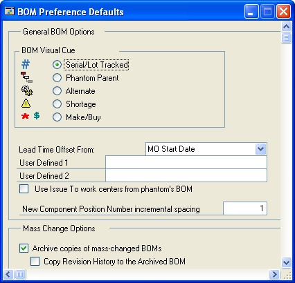

2. Specify which visual cue should be used by default in the Bill of Materials Entry window and the Bill of Materials View window.

    Each user can choose a different visual cue, if needed.

3. Choose the date that should be used to calculate component lead time dates.

    This selection determines how lead times are calculated for all components and can’t be changed on a per-user basis.

    For more information about lead time offsets, refer to *Lead time calculations* in *Chapter 9, “Bill of Materials overview,”* in the Manufacturing Core Functions documentation.

4. You can enter labels for user-defined fields, if needed.

    Later, you can add information in the user-defined fields in the Bill of Materials Entry window. You can enter information for each component in each bill of materials. Refer to *Changing component details* in *Chapter 11, “Bill of Materials entry,”* in the Manufacturing Core Functions documentation for more information.

5. To specify how the issue-to site for components of phantom items are determined, you can use the Use Work Centers from the phantom’s BOM option. Refer to the table for more information.

    |Case| Option is marked  | Option is unmarked |
    |----|-------------------|--------------------|
    | **Phantom item has no issue-to site in the finished goods’ bill of materials** | The issue-to site for components of the phantom item comes from the phantom item’s bill of materials.  | |
    | **Phantom item has an issue-to site in the finished goods’ bill of materials** | The issue-to site for components of the phantom item comes from the finished good’s bill of materials. | The issue-to site for components of the phantom item are comes from the phantom item’s bill of materials. |

    Refer to *Phantom items as components of phantom items* for examples of how the rules are applied when a manufacturing order for a phantom item includes phantom components.

6. To specify the default spacing between position numbers, enter a number in the **New Component Position Number Incremental Spacing** field.

    We recommend that you leave a few spaces in between position numbers to allow room to add more position numbers later. Refer to *Chapter 10, “Position numbers”* in the Core Functions manual for more information.

7. Mark the **Archive copies of mass-changed BOMs** option to keep a copy of the original bill of materials each time a bill of materials is changed using the **BOM Mass Updates** window.

8. If you marked **Archive copies of mass-changed BOMs**, you also can specify whether the revision history for the bill of materials should be archived. Mark **Copy Revision History to the Archived BOM** if revision history also should be stored.

9. Mark the bill of materials types that should not be included when changing bills of materials using the BOM Mass Updates window. You can choose to exclude Manufacturing, Engineering, Configured, or Super bill of materials types from mass changes.

    For example, if you mark **Engineering**, Engineering will be marked in the Exclude BOM types from mass changes option in the BOM Mass Updates window and you will need to unmark it to change an engineering bill of materials.

10. You can enter or select a process security set if use of the BOM Mass Updates window should be limited to a certain group of users or should require a password.

    Refer to *Process security* for more information.

11. Choose OK and close the window.

### Phantom items as components of phantom items

If you’re going to create manufacturing orders for phantom subassembly items that include phantom subassemblies, rules for determining the sites for the components will depend on whether you marked the Use Work Centers of phantom’s BOM in the BOM Preference Defaults window.

Refer to the following examples for more information.

### Bills of materials

For these examples, assume that the following is your bill of materials for the finished good. Note that it includes a phantom subassembly item that has its own phantom subassembly item.

| Finished good |           |                           |                           |                           |
|---------------|-----------|---------------------------|---------------------------|---------------------------|
|               | Phantom 1 | Issued to work center 100 |                           |                           |
|               |           | Component A               | Issued to work center 200 |                           |
|               |           | Phantom 2                 | Issued to work center 300 |                           |
|               |           |                           | Component B               | Issued to work center 400 |
|               |           |                           | Component C               | Issued to work center 400 |

#### Example 1

If **Use Work Centers of phantom item’s BOM** is marked, the picklist for the manufacturing order to build Phantom 1 would include the following information:

- Component A would be issued to work center 200

- Component B would be issued to work center 400

- Component C would be issued to work center 400

#### Example 2

If **Use Work Centers of phantom item’s BOM** is *not* marked, the picklist for the manufacturing order to build Phantom 1 would include the following information:

- Component A would be issued to work center 100

- Component B would be issued to work center 300

- Component C would be issued to work center 300

### Setting up Sales Configurator options

Use Sales Configurator preferences to determine how Sales Configurator will work for your business and how its use will affect other modules.
 **To set up Sales Configurator options:**

1. Open the Sales Configurator Preferences window. (Microsoft Dynamics GP menu \>\> Tools \>\> Setup \>\> Manufacturing \>\> System Defaults \>\> Sales Configurator)

2. Mark Display Manufacturing Order Start Date while configuring if a start date for the associated manufacturing orders should be created automatically.

    When you open the Sales Configurator window from the Sales Item Detail window, a manufacturing order automatically will be generated. If you’ve marked this option, a start date for the order will be calculated and included. If you don’t mark this option, a start date won’t be calculated until you choose Schedule in the Sales Configurator window.

3. Mark Display Messages for Option Promotions to see messages about special promotions for the options you’re using as you’re working with the Sales Configurator.

4. Choose OK and close the window.

### Setup options for sales order extensions

Microsoft Dynamics GP Sales Order Processing includes tools you can use to manage sales functions in your manufacturing environment. However, when you install Manufacturing you also must complete additional setup tasks that determine how sales affect other modules. For example, you must specify default settings for manufacturing orders that will be generated automatically from sales orders.

 When Manufacturing is installed, you must complete the following setup procedures:

- **Due date options** You must specify how due dates for manufacturing orders linked directly to sales orders should be calculated. Refer to *Setting up manufacturing sales order due dates* for more information.
- **Manufacturing order options** To automatically generate manufacturing orders from sales orders, you must specify the default settings for those manufacturing orders. You also can specify whether customer priority levels should affect the priority levels of manufacturing orders generated from sales orders. Refer to *Setting up manufacturing orders for sales orders* for more information.
- **Order fulfillment options** To track additional information about how orders are fulfilled, you must set up order fulfillment options. You can specify a default carrier and FOB point. You also can select options so users can modify the freight and miscellaneous charges associated with order fulfillment. Refer to *Setting up order fulfillment options* for more information.

> [!TIP]
> For more information about sales order processing and setup, refer to the Sales
> Order Processing documentation.

### Setting up manufacturing sales order due dates

Use the **Manufacturing Series Sales Order Preferences** window to specify how due dates for sales orders will be calculated.
 **To set up manufacturing sales order due dates:**

1. Open the Manufacturing Series Sales Order Preferences window.
 (Microsoft Dynamics GP menu \>\> Tools \>\> Setup \>\> Sales \>\> Sales Order Processing \>\> Additional \>\> Manufacturing Sales Order Prefs)

IMAGE – MFGSOP.jpg

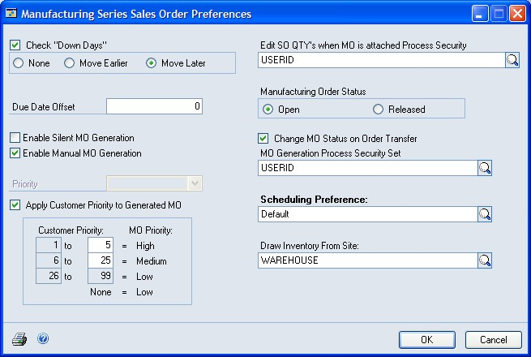

1. To be warned when you schedule a sales order due date on a date that is a
    company-wide down day, mark Check “Down Days.” You also can specify how the
    alternate date for the sales order should be calculated.
 **None** Mark None if a new due date shouldn’t be assigned.
 **Move Earlier** Mark Move Earlier to assign the closest preceding open date. **Move Later** Mark Move Later to assign the closest following open date.

1. Enter the number of days the in-house due date for the order should precede
    the requested ship date.
 The in-house due date must be on or before the Requested Ship Date, and the Requested Ship Date must be on or before the Customer Promise Date.

- If the in-house due date should be a certain number of days before the
    requested ship date, enter the number of days in the Due Date Offset field.

- If the in-house due date should be the same as the requested ship date,
    leave the Due Date Offset field blank.

1. You can continue setting up Manufacturing sales order options by completing
    *Setting up manufacturing orders for sales orders*, or you can choose OK and
    close the window.

### Setting up manufacturing orders for sales orders
 Use the Manufacturing Series Sales Order Preferences window to enter default settings for manufacturing orders that are generated automatically from sales order entries. Manufacturing orders created from sales orders automatically are scheduled, and their picklists are built.
 **To set up manufacturing orders for sales orders:**

1. Open the Manufacturing Series Sales Order Preferences window.
 (Microsoft Dynamics GP menu \>\> Tools \>\> Setup \>\> Sales \>\> Sales Order Processing \>\> Additional \>\> Manufacturing Sales Order Prefs)

1. To allow users to create manufacturing orders during the sales order entry
    process, determine the level of user action you’ll require from the users.
 Refer to *Manufacturing orders generated from sales* in *Chapter 20, “Sales order entry,”* in the Manufacturing Core Functions documentation for information about how the fulfillment method for an item and this setting affect how Manufacturing handles back-order quantities.
 **Enable Silent MO Generation** Mark this option to automatically generate manufacturing orders when sales orders are entered for item quantities that are greater than what is currently in stock.
 **Enable Manual MO Generation** Mark this option to allow users to generate manufacturing orders. If you mark this option, users will need to provide basic information for the manufacturing order.

1. Set the Priority list to reflect the priority level for automatically
    generated manufacturing orders. The priority level is reference only and
    won’t affect scheduling.

2. Mark Apply Customer Priority to Generated MO if you’re using customer
    priority levels and the priority level that you’ve assigned to customers
    should affect the priority of manufacturing orders generated from sales
    orders.
 If you mark the option, specify how customer priorities should be translated to manufacturing order priorities.

*You can specify a customer’s priority level in the Customer Maintenance window
(Cards \>\> Sales \>\> Customer). For more information, refer to Microsoft
Dynamics GP Sales Order Processing documentation.*

1. To limit user access for changing sales order quantities for sales orders
    that have associated manufacturing orders, enter or select a process
    security set in the Edit SO QTYs when MO is Attached Process Security field.
 This option allows you to override back-ordered, canceled, invoiced and billed quantities so the quantities can equal the quantity ordered or invoiced. For example, suppose a customer has ordered 1,000 widgets and you want to ship the 500 widgets that have been built so far. If you use this option, you can handle partial shipments.

*If you don’t select a process security set but try to adjust a sales order
quantity for a sales order with an associated manufacturing order, a message
will warn you that you don’t have the appropriate access privileges to change
the sales order quantity.*

1. Mark the default order status for automatically generated manufacturing
    orders. You can choose Open or Released. You can change the order status for
    specific manufacturing orders.
 *Refer to Manufacturing order statuses and How statuses limit activities—both in*

*Chapter 6, “Manufacturing order overview,” in the Manufacturing Production
Functions documentation—for more information.*

1. Mark Change MO status on Order Transfer to change the status of a
    manufacturing order when the status of the associated sales order changes
    from Quote to Order.

2. To limit authority for generating manufacturing orders, enter or select a MO
    Generation Process Security Set.

*For more information about process security sets, refer to Process security and
Creating and modifying process security sets.*

1. Enter or select a default scheduling method for automatically generated
    manufacturing orders. You can change the scheduling method for a
    manufacturing order.

*For more information about creating scheduling methods, refer to Setting up
scheduling preferences.*

1. Enter or select the default inventory site from which items for the
    manufacturing order will be drawn. You can change the Draw Inventory From
    Site for a manufacturing order.

2. Choose OK and close the window.

### Setting up order fulfillment options
 Manufacturing extends the order fulfillment options that are available through Sales Order Processing. Use the Order Fulfillment Setup window to set up Manufacturing-specific order fulfillment features.

*Besides setting up these system preferences, you must be sure other sales order
type and item options are in place. Refer to Requirements for order fulfillment
history in Chapter 21, “Order fulfillment,” in the Manufacturing Core Functions
documentation for more information.*

**To set up order fulfillment options:**

1. Open the Order Fulfillment Setup window. (Microsoft Dynamics GP menu \>\>
    Tools \>\> Setup \>\> Sales \>\> Sales Order Processing \>\> Additional \>\>
    Order Fulfillment Setup)

IMAGE – MFGOFS.jpg

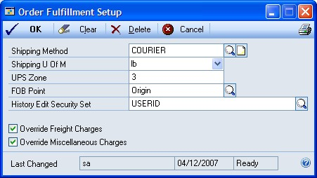

1. Enter or select the default shipping method.

2. Select the default unit of measurement from the Shipping U of M list.

3. Enter the default UPS zone.

4. Enter or select the default FOB point.

5. To restrict authority for editing fulfillment history records, enter or
    select a process security set in the History Edit Security Set field.

*Refer to Process security for more information about process security sets.*

1. Mark Override Freight Charges so users can enter freight charges in the
    Freight and Misc Adjustments window.

2. Mark Override Miscellaneous Charges so users can enter miscellaneous charges
    in the Freight and Misc Adjustments window.

3. Choose OK and close the window.

## Chapter 4: Manufacturing production functions setup
 This documentation includes information about setting up system settings for use with production functions modules: Routings, Manufacturing Order Processing, Outsourcing, and Work in Process. You’ll need to set up system and user settings to determine how Manufacturing will function for your business.
 This information is divided into the following sections:

- *Setting up routing update options*

- *Setting up sequence entry options*

- *Setting up sequence spacing, notes, and pointer usage*

- *Scheduling preferences*

- *Setting up scheduling preferences*

- *Setting up additional scheduling method options*

- *Setting up manufacturing order processing*

- *Specifying outsourcing manufacturing order options*

- *Setting up data collection options*

- *Setting up options for outsourcing costs*

- *Rules for outsourcing setup changes*

### Setting up routing update options
 Routing update options compare planning routings—those that are used to determine resource requirements for potential manufacturing orders—and active routings—those that are used on the production floor to manufacture goods. The planning routing can be converted to an active routing and tied to a manufacturing order.
 **To set up routing update options:**

1. Open the Routing Preference Defaults window. (Microsoft Dynamics GP menu
    \>\> Tools \>\> Setup \>\> Manufacturing \>\> System Defaults \>\> Routings)

IMAGE – MFGRPD.jpg

1. Determine how planning routings should be updated.
 **Compare as Number** If all planning routing sequence numbers are numeric, mark Compare as Number.
 **Confirm Save** To have a confirmation message displayed before planning routing updates are changed, mark Confirm Save.

1. Determine if updating other planning routings should be based only on the
    routing name and sequence number. Whether a routing update is reflected in
    other routings is always determined by the routing name and sequence number.
    Those two criteria must match before a change in one routing sequence is
    reflected in a sequence in another routing.

- If you mark Match WC ID, the routing sequence change will be reflected in
    only routing sequences that have the same routing name, sequence number and
    work center.

- If you don’t mark Match WC ID, all routings with that routing name and
    sequence number will be updated, regardless of the work center ID.

1. Determine how to update active routings.
 Whether a routing update is reflected in other routings is always determined by the routing name and sequence number. Those two criteria must match before a change in one routing sequence is reflected in a sequence in another routing.

- If you mark Match WC ID, the routing sequence change will be reflected in
    only those routing sequences that have the same routing name, sequence
    number and work center.

- If you don’t mark Match WC ID, all routings with that routing name and
    sequence number will be updated, regardless of the work center ID.

1. Mark one or both search options for your routing records.

    - If you mark Item Number, searches of routing records will return only
        routings that include the item number you specify.

    - If you mark Routing Name, searches of routing records will return only
        the routing that has the name you specify.

2. Choose OK.

### Setting up sequence entry options
 If you print routing information for use on the production floor, you can use sequence entry options to ensure that information your employees need is included on the reports.
 **To set up sequence entry options:**

1. Open the Routing Preference Defaults window.
 (Microsoft Dynamics GP menu \>\> Tools \>\> Setup \>\> Manufacturing \>\> System Defaults \>\> Routings)

1. Mark Replace Routing Seq. Descr. with WC Descr. to see work center
    descriptions rather than routing sequence descriptions.

2. Mark Append WC Description to Routing Notes to have the work center
    description added to the routing notes.

3. Mark Attach WC Notes to Routing Notes to have the work center notes added to
    the routing notes.

4. Choose OK.

### Setting up sequence spacing, notes, and pointer usage
 Use the Routing Preference Defaults window to set up options for sequence number spacing, to specify if routing sequence notes should be included with certain reports, and to determine if pointer routings can be used in your facility. Pointer routings are template routings you can use in your regular routings to describe how to complete routine tasks, such as packaging and shipping products.
 **To set up sequence spacing, notes and pointer usage:**

1. Open the Routing Preference Defaults window.
 (Microsoft Dynamics GP menu \>\> Tools \>\> Setup \>\> Manufacturing \>\> System Defaults \>\> Routings)

1. Enter the default spacing for routing sequence numbers. For instance, if
    sequence steps should be numbered 10, 20, 30 and so on, the Sequence Spacing
    would be 10.

*We recommend using spacing intervals of 10 or 100. This makes it easier to
insert a new sequence between two existing sequences.*

1. Mark Use Pointer Routings to use pointer routings in your system.

*Refer to Pointer routings in Chapter 5, “Pointer routings,” in the
Manufacturing Production Functions documentation for more information about
pointer routings.*

1. To include routing sequence notes with the shipping report that accompanies
    items shipped to an outsourcing vendor, mark Include Sequence Notes Report
    with Outsourcing Shipping Report.

2. To include routing sequence notes with the purchase order that is created to
    purchase outsourced services, mark Include Sequence Notes Report with
    Purchase Order Report.

3. Choose OK.

### Scheduling preferences
 Use the Scheduling Preferences window to create scheduling preferences. Each scheduling preference includes information about scheduling manufacturing orders and handling material issues such as applying shrinkage, posting transactions and closing manufacturing orders.
 Unlike options you set up in other user preferences windows in Manufacturing, scheduling methods you define here can be used throughout the system by any user who has authority to open and schedule manufacturing orders.
 **End Item/Raw Material Issue** Use the Scheduling Preferences window to determine if shrinkage percentages are applied to raw materials and finished item quantities. You’ll also choose the default inventory site accounts that raw materials will be drawn from and finished goods will be posted to. The default sites will have precedence over any default site that you select in the Item Quantities Maintenance window.
 **Scheduling Options** Use Scheduling Options to determine how the amount of time estimated to complete a manufacturing order should be calculated. If the option is unmarked, the end quantity of the manufacturing order is multiplied by the per-piece cycle time to determine the estimated time to complete the manufacturing order. If the option is marked, the starting quantity is used to determine the estimated time to complete the manufacturing order.
 **Closing Options** If you’re using configured bills of materials (generated through the Sales Configurator), use these options to determine what happens to the configured bills of materials you create when the associated manufacturing orders are closed. You can archive the configured bills of materials—move them to another directory for storage, you can delete the configured bills of materials from the list of “active” bills of materials, or you can do both.
 **Process Security** To require special authorization to override the minimum and maximum manufacturing order size, you can select a process security set to restrict authority for this process.

### Setting up scheduling preferences
 Use the Scheduling Preferences window to define different scheduling methods for your products. You also can use this window to choose the default scheduling method.
 When you create a scheduling preference, you can determine how shrinkage percentages are applied to manufacturing orders that use that scheduling preference. You can choose from the following available options:
 **Apply Shrinkage to End Item Starting Quantity** Ending quantities for manufacturing order finished goods should reflect shrinkage amounts.
 Doing this will help to ensure that the number of finished goods you get from a manufacturing order reflects the anticipated shrinkage of the finished goods during the manufacturing process. For instance, an electronics component manufacturer might know that she can expect to have 3% shrinkage when a certain widget is produced; that is, to make 100 widgets, she’ll have to plan to make 103 widgets, to cover the expected shrinkage. Refer to *Shrinkage overview* and *Including shrinkage in Manufacturing* for more information.
 **Apply Shrinkage to Raw Material Issue** To ensure that sufficient materials are issued to manufacturing orders to reflect component item shrinkage amounts.
 Doing this will help to ensure that the amounts of raw materials you issue to manufacturing orders will reflect the anticipated shrinkage of the components. For example, an electronic components manufacturer might know that she can expect 2% shrinkage for a certain component. That is, she knows that for every 100 components she issues for use in a manufacturing order, two will be unsuitable for some reason. Refer to *Shrinkage overview* and *Including shrinkage in Manufacturing* for more information.

*You also must define other aspects of each scheduling method, such as
auto-posting and process security preferences. Refer to Setting up manufacturing
order processing and Creating and modifying process security sets for more
information.*
 **To set up scheduling preferences:**

1. Open the Scheduling Preferences window. (Microsoft Dynamics GP menu \>\>
    Tools \>\> Setup \>\> Manufacturing \>\> System Defaults \>\> MO Schedule
    Prefs)
 IMAGE - MFGSP.jpg

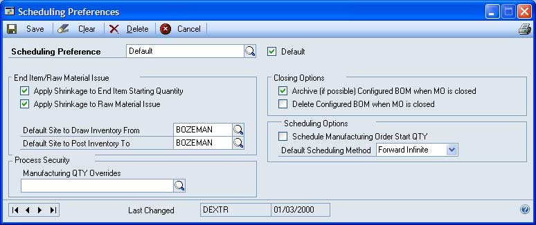

1. Enter the name of the scheduling preference.

2. If this scheduling preference is to be the default scheduling preference,
    mark Default. You can specify only one default scheduling method. The
    default scheduling method will be the default scheduling preference for each
    manufacturing order you create, but you can select a different scheduling
    preference, if needed.
 If you’re using quick manufacturing orders, you must specify a default scheduling method.

1. Determine how to deal with item usage issues.

2. Choose a default inventory site to draw inventory from for manufacturing
    orders scheduled with this scheduling preference.

3. Choose a default inventory site to post inventory to when manufacturing
    orders are closed.

4. Choose Save.

### Setting up additional scheduling method options
 Use the Scheduling Preferences window to set up additional options that affect how your material requirements are calculated. You also can specify how configured bills of materials will be handled after their associated manufacturing orders are closed. The window also includes an option for using process security to enforce manufacturing order quantities.
 **To set up additional scheduling method options:**

1. Open the Scheduling Preferences window. (Microsoft Dynamics GP menu \>\>
    Tools \>\> Setup \>\> Manufacturing \>\> System Defaults \>\> MO Scheduling
    Prefs)

2. Enter or select a scheduling preference.

3. Mark the closing options that reflect how the configured bills of materials
    should be handled. You can mark either or both options.

*Complete this step only if you’re using the Manufacturing Series Sales
Configurator.*
 **Archive (if possible) Configured BOM** Saves the configured bill of materials in an archive.
 **Delete Configured BOM when MO is closed** Deletes configured bills of materials after their associated manufacturing orders are closed.

1. Set process security to limit users’ abilities to override the minimum or
    maximum manufacturing order sizes.

    - To use an existing process security set, choose the Process Security
        lookup button and select the appropriate set.

    - To create a new process security set to restrict users’ access to this
        process, enter the name of the new process security set in the Process
        Security field.
 A message will be displayed and you’ll have the option to create a new set. Choose yes.

*Refer to Creating and modifying process security sets.*

1. Mark the Schedule Manufacturing Order Start QTY option to calculate the
    estimated time needed to complete a manufacturing order based on the start
    quantity of the manufacturing order. If you don’t mark this option, the
    estimated time will be calculated based on the end quantity of the
    manufacturing order.

2. Select a default scheduling method. This scheduling method—Forward Infinite
    or Backward Infinite—will be used when the scheduling preference is used for
    manufacturing orders you enter in the Manufacturing Order Entry window.

*Manufacturing orders that are generated—for example, manufacturing orders that
are suggested by MRP processing—always use backward infinite scheduling because
they are created based on a due date rather than on a start date.*

1. Choose Save and close the window.

### Setting up manufacturing order processing
 Use the Manufacturing Order Preference Defaults window to enter information that’s used when you work with manufacturing orders. For example, you can specify a beginning number for your manufacturing orders, determine how configured bills of materials will be handled, and determine how default values are calculated when you close a manufacturing order.

You also can use the window to set up process security for tasks related to
outsourcing and to set up an extra field for tracking outsourcing information.
Refer to *Specifying outsourcing manufacturing order options* for more
information.

**To set up manufacturing order processing:**

1. Open the Manufacturing Order Preference Defaults window. (Microsoft Dynamics
    GP menu \>\> Tools \>\> Setup \>\> Manufacturing \>\> System Defaults \>\>
    Manufacturing Orders)
 IMAGE – MFGOPD.jpg

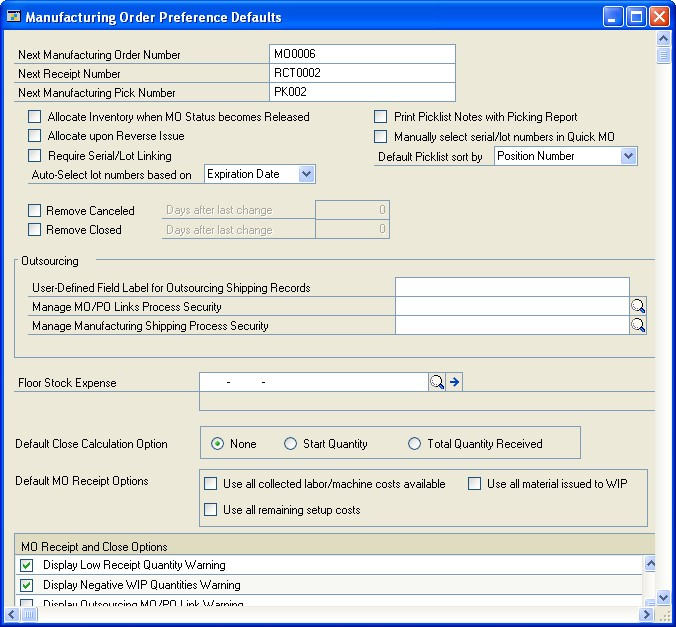

1. Enter beginning identifiers for manufacturing orders, for receipts, and for
    pick documents. You can use letters and numbers.
 The identifiers are the next default identifiers, and also are the basis of future identifiers. For example, if you enter MO001, the next order will automatically be numbered MO002, then MO003, and so on.

1. Select options for component allocations.

    - If components should be allocated when the manufacturing order status is
        Released, mark the Allocate Inventory when MO Status becomes Released
        option.
 If you mark the option to allocate components automatically when the status of manufacturing order is changed to Released, component transactions automatically are created. You can use the Manufacturing Component Transaction Inquiry window to view information about the allocations. Refer to *Viewing component transaction information* in *Chapter 12, “Manufacturing order inquiries,”* in the Manufacturing Production Functions documentation for more information.
 Special rules apply if you mark this option and there are shortages of some components when you change the status of a manufacturing order to Released. Refer to *Component shortages and automatic allocations* in *Chapter 7, “Manufacturing order entry,”* in the Manufacturing Production Functions documentation for more information.

- If component items should remain allocated when a reverse issue transaction
    is posted, mark Allocate upon Reverse Issue. (This means that if you
    reverse-issue components, the component quantities will remain allocated.
    You can then reverse-allocate them later, if needed.)

1. To print notes attached to the picklist with the picking report, mark Print
    Picklist Notes with Picking Report.

2. Mark Manually select serial/lot numbers in Quick MO if you want to choose
    the serial and lot numbers of components used for quick manufacturing
    orders.

3. Mark Require Serial/Lot Linking to require that all serial-numbered
    component items and all lot-numbered component items are linked to the
    serial-numbered or lot-numbered finished good item.
 If you mark the Require Serial/Lot Linking option, you must link all available serial-numbered and lot-numbered component items to a finished good in the Manufacturing Serial/Lot Link Entry window before posting.

1. Specify whether lot numbers should be selected automatically by date
    received or expiration date. The default option is Expiration Date.
 **Date Received** Mark this option to have lot numbers selected automatically in the order that the items were received.
 **Expiration Date** Mark this option to have lot numbers selected automatically in order of their expiration dates.

1. Specify how to handle information about canceled and closed manufacturing
    orders.
 **Remove Canceled** Mark this option to set up a default entry for removing canceled orders. If you mark this option, the Canceled Orders option will be marked when you use the Remove Manufacturing Orders window. The number of days you enter will be used to calculate the Last Change Date in the Remove Manufacturing Orders window.
 **Remove Closed** Mark this option to set up a default entry for removing closed manufacturing orders. If you mark this option, the Closed Orders option will be marked when you use the Remove Manufacturing Orders window. The number of days you enter will be used to calculate the Last Change Date in the window.

1. Determine how default quantities for manufacturing orders should be
    calculated when you close a manufacturing order. You can choose to have
    default quantity calculated based on the original manufacturing order start
    quantity or the total quantity received. To decide on a case-by-case basis
    for each manufacturing order, mark None.
 For more information, refer to *How required quantities are calculated* in *Chapter 6, “Manufacturing order overview,”* in the Manufacturing Production Functions documentation.

1. Specify options for closing manufacturing orders. Mark the appropriate
    options in the scrolling window at the bottom of the window.
 Refer to the table for more information about the effect of each option.

**Allow Negative WIP Quantities**  
To be able to apply more labor, machine or material costs to a manufacturing
order than already exist in WIP for the order, mark this option. This can be
helpful if you want to enter labor and machine costs for an actual-cost finished
good but don’t want to backflush those costs or do data collection.
 If your company is an average cost environment, be sure this option is not marked. Negative inventory should not be allowed in that case.

**Delete Configured BOM when**

A configured bill of materials automatically is removed when the associated
manufacturing order is closed. (Deleted bills of materials can’t be retrieved
later.)

**Archive (if possible) Configured BOM when MO is closed**

A configured bill of materials automatically is archived when the associated
manufacturing order is closed. (Archiving should be possible unless another bill
of materials already has been archived for the manufacturing order.) You can
retrieve an archived bill of materials, if needed.

**Display Low Component**

If quantities of a backflushed component aren’t sufficient for a manufacturing
order, a message is displayed.

**Display Low Component Issued**

If you’re closing a manufacturing order and the issued quantity of a component
(other than a backflushed component) is less than the required quantity, a
message is displayed.

**Display Material Remaining in WIP Warning**

If you’re closing a manufacturing order and there are component costs remaining
in WIP, a message appears.

**Display Labor/Machine Costs Remaining in WIP Warning**

If you’re closing a manufacturing order for an actual cost item (one with a
perpetual valuation method), a message appears if there are labor or machine
costs in WIP for the order.

**Display Unused Allocated Material Warning**

If you’re closing a manufacturing order and an allocated (but not issued)
quantity remains, a message appears.

**Display Labor/Machine Incomplete Warning**

If you’re closing a manufacturing order and there are sequences that aren’t
marked “Done,” a message appears.

**Display Low Receipt Quantity Warning**

Displays a message if you’re closing a manufacturing order and the total of all
receipts for the manufacturing order is less than the end quantity that was
specified when the manufacturing order was created.

**Display Negative WIP Quantities Warning**

Displays a message if the consumption of a component makes the WIP quantity of
an item negative.

**Display Negative Available Quantities Warning**

Displays a message when the quantity to consume or the quantity to backflush
makes the on hand quantity of a component negative.

**Display Outsourcing MO/PO Link Warning**

Displays a message if you attempt to void or cancel a purchase order that is
linked to a manufacturing order for the purchase of outsourced services.

Choose OK.

### Specifying outsourcing manufacturing order options
 If you’re using outsourcing—if your manufacturing processes include steps or services provided by outside vendors—then you can use the Manufacturing Order Preference Defaults window to set up a label for a user-defined outsourcing field and to specify process security sets for outsourcing tasks.

- You can specify a process security set for managing links between
    manufacturing orders and purchase orders created to purchase outsourced
    services.

- You can specify a process security set for managing shipping information.

*Refer to Process security for more information.*
 Use the Manufacturing Order Preference Defaults window to select process security sets and to set up a field for tracking additional information for shipments to outsourced vendors.
 **To specify outsourcing manufacturing order options:**

1. Open the Manufacturing Order Preference Defaults window.
 (Microsoft Dynamics GP menu \>\> Tools \>\> Setup \>\> Manufacturing \>\> System Defaults \>\> Manufacturing Orders)

1. To track additional information for shipments to outsourcing vendors, enter
    a label in the User-Defined Field Label for Outsourcing Shipping Records.
 Later on, you can make entries in the field in the Manufacturing Shipments window or the Manufacturing Shipments by Vendor window.

1. Enter or select a process security set for managing links between
    manufacturing orders and purchase orders.

2. Enter or select a process security set for managing shipments to outsourcing
    vendors.

3. Choose OK.

### Setting up data collection options
 Work In Process (WIP) focuses on data collection. You can use the WIP Preference Defaults window to set up default options for data collection tasks.
 Most of the data collection options you select in this window are default options— users also can set their own preferences, based on their user IDs. The outsourcing options, however, are company-wide and cannot be changed on a user-by-user basis.
 **To set up data collection options:**

1. Open the WIP Preference Defaults window. (Microsoft Dynamics GP menu \>\>
    Tools \>\> Setup \>\> Manufacturing \>\> System Defaults \>\> WIP)
 IMAGE – MFGWIP.jpg

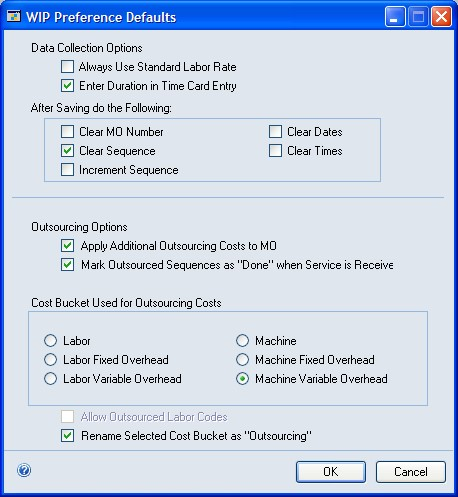

1. Mark Always Use Standard Labor Rate if costs associated with a job should
    reflect the standard labor rate rather than the specific labor rate for each
    employee.

2. Mark Enter Duration in Time Card Entry if most users will enter time for
    manufacturing order routing sequences in terms of hours and minutes, rather
    than start and stop times.
 Marking this option doesn’t limit users in how they enter their time. The option is the default setting for the Enter Duration Hours/Minutes option in the Time Card Entry window. Users can mark or clear that option to enter time information in either format.

1. Mark Clear MO Number to clear the manufacturing order number each time you
    save a data collection record.

2. Mark Clear Sequence to clear the sequence number each time you save a data
    collection record.

3. Mark Increment Sequence to display the sequence number for the next sequence
    in the selected routing each time you save a data collection record.

4. Mark Clear Dates to clear dates each time you save a data collection record.

5. Mark Clear Times to clear times each time you save a data collection record.

6. Choose OK.
 If you’re not using outsourcing, this is the only procedure you must complete in this window. If you are using outsourcing, you must also complete the procedure described in *Setting up options for outsourcing costs*.

### Setting up options for outsourcing costs
 Use the WIP Preference Defaults window to specify how outsourcing costs will be tracked for your company. You don’t need to complete this procedure unless your manufacturing processes include outsourced services.
 **To set up options for outsourcing costs:**

1. Open the WIP Preference Defaults window.
 (Microsoft Dynamics GP menu \>\> Tools \>\> Setup \>\> Manufacturing \>\> System Defaults \>\> WIP)

1. Mark Apply Additional Outsourcing Costs to MO if additional costs for
    outsourcing should be applied to manufacturing orders that include
    outsourcing.
 If you mark this option, additional costs—trade discount, tax, freight and miscellaneous charges—will be debited to the finished goods account for the manufacturing order, and credited to the inventory offset account.

1. Mark Outsourced Sequences as “Done” when Service is Received if data
    collection records should reflect that a sequence is complete when you
    receive items from the outsourcing vendor.

2. Select the cost bucket to be used to track outsourcing costs.

*If possible, choose a cost bucket that isn’t usually used by your company.
Refer to*
 *Outsourcing cost buckets in Chapter 15, “Outsourcing overview,” of the*

*Manufacturing Production Functions documentation for more information.*

1. If you selected a labor cost bucket, mark Allow Outsourced Labor Codes.

2. Mark Rename Selected Cost Bucket as “Outsourcing” to have the word
    “Outsourcing” replace the usual name of the cost bucket in windows and
    reports.

3. Choose OK.

### Rules for outsourcing setup changes
 It is possible to change some setup options for outsourcing features. However, you should be aware of these rules:

- You cannot change from a labor cost bucket—Labor, Labor Fixed Overhead or
    Labor Variable Overhead—to a machine cost bucket, as long as your system
    includes labor code definitions that have been specified for outsourcing.
 If you have labor codes designated for outsourcing, you must delete them before you can change the cost bucket. Further, you cannot delete any labor code that exists on a planning routing or as part of a manufacturing order that hasn’t been closed.

- If you change from a machine cost bucket—Machine, Machine Fixed Overhead or
    Machine Variable Overhead—to a labor cost bucket, a message will be
    displayed if any planning routing or working routing for an unclosed
    manufacturing order includes an outsourced sequence. The message will
    suggest that you review and update those routings.

- If transactions for outsourcing costs have been saved, those transaction
    amounts will be posted to the accounts associated with the cost bucket that
    was selected when the transactions were saved.
 For example, suppose you were using the Machine cost bucket for outsourcing costs, and that you had saved transactions for outsourcing costs. If you then changed to use the Labor cost bucket, the transactions would still be posted to accounts for Machine costs.

## Chapter 5: Manufacturing management functions setup
 This documentation includes information about setting up system settings for use with management functions modules: Quality Assurance, Engineering Change Management and Job Costing. You’ll need to set up system and user settings to determine how Manufacturing will function for your business.
 This information is divided into the following sections:

- *Setting up Quality Assurance*

- *ECM system settings*

- *Setting engineering change system settings*

- *Specifying modules for ECM warnings*

- *Job Costing system preferences*

- *Defining Job Costing system settings*

### Setting up Quality Assurance
 To set up Quality Assurance, you must define the default Quality Assurance (QA) site. If an item requires incoming inspection—if the Receive Purchase Orders to QA Site option is marked for the item in the Item Engineering Data window—the receipt will be to the QA site you select, regardless of the site that’s originally entered on the purchase order. If the items meet quality requirements, you must complete an inventory transfer transaction to move the items from the quality assurance site to inventory. Items that don’t require inspection will be posted to inventory as soon as they are received.
 You also can specify the next numbers to be used for Non-Standard Reports (NSRs) and for Supplier Corrective Action Requests (SCARs).
 If you’re using multiple bins, items are posted to the default purchase order receipts bin—either for the site or for the item-site combination—when they are received and require inspection.
 *Before you begin this procedure, be sure that the site you’re designating as the quality assurance site has already been defined. Refer to Inventory Control documentation for more information.*
 **To set up Quality Assurance:**

1. Open the QA Preference Defaults window. (Microsoft Dynamics GP menu \>\>
    Tools \>\> Setup \>\> Manufacturing \>\> System Defaults \>\> QA)

2. Choose the site for posting items that require inspection.

3. Enter the document number for the next NSR.

4. Enter the document number for the next SCAR.

5. Choose OK.

### ECM system settings
 Engineering Change Management (ECM) is a part of the Manufacturing that controls and tracks product changes.
 Basically, the ECM system tracks which products are being changed and helps you deal with the effects of those changes. If you’re changing a bill of materials, for instance, you might want to warn buyers that component requirements might change. Some product changes will need to be communicated to your customers; others might not.
 You’ll use ECM system preferences to determine both how the ECM system works for your organization—how change orders will move through your organization, for example—and how the ECM system affects other Manufacturing modules.
 These are some of the terms you’ll need to know as you’re working with Engineering Change Management:
 **Disposition code** The disposition code describes what is to be done with the existing inventory quantities of the item that is being changed.
 **Denial code** The denial code describes why a request for an engineering change is being denied.
 **Routing** In Engineering Change Management, a routing is the list of users who must approve of a change before the change can be put into effect. Routings can be set up so that approvals can be granted in a specific order.

### Setting engineering change system settings
 You’ll need to complete these setup tasks once, but you can change them later, if needed. User-specific preference tasks are described in *Setting up engineering change user preferences*.
 **To set engineering change system settings:**

1. Open the ECM System Preferences window. (Microsoft Dynamics GP menu \>\>
    Tools \>\> Setup \>\> Manufacturing \>\> System Defaults \>\> ECM)

IMAGE – MFGECM.jpg

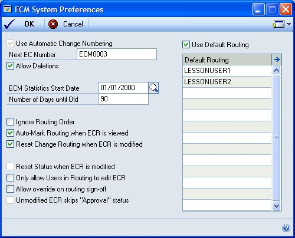

1. To change order numbers to be generated automatically, enter the first
    number to be used in the Next EC Number field.

2. To be able to delete change requests, mark the Allow Deletions option.

3. Determine if the time it takes for processing change requests should be
    tracked.
 If it should, choose the date when tracking should begin—the ECM Statistics Start Date—and set the number of days an engineering change order must be in process to be considered “old.”

1. Determine how to have change requests routed through your organization.
 **Ignore Routing Order** If the order of the approvals doesn’t matter, mark Ignore Routing Order. If this option is marked, users must review engineering change orders in the order users appear in the engineering change routing.

##### **Auto-mark Routing when ECR is modified** If your company uses the
 ECM system mainly as a notification system and if change requests are to be
 “approved” as soon as certain users view them, mark Auto-Mark Routing when ECR is modified.
 This option is the system default setting, but individual users can determine if they want to use the “auto-mark” feature.
 **Reset Change Routing when ECR is modified** If change orders should go through the entire routing again if any of the reviewers make a change, mark Reset Change Routing when ECR is modified.
 **Only Allow Users in Routing to edit ECR** If only users who are part of the ECM routing should be able to edit the change request, mark Only Allow Users in Routing to edit ECR.
 **Allow override on routing sign-off** If alternate users should be able to approve change orders, mark Allow override on routing sign-off.
 Alternate users will be required to supply the appropriate password to approve change orders. You’ll be prompted to enter the password as soon as you mark this option.

1. Mark Use Default Routing to activate the default routing list and to require
    its use.

*Refer to Chapter 8, “Engineering change setup,” in the Manufacturing Management
Functions documentation for more information about creating routing lists for
change requests.*

1. Choose OK to save your information and close the window.
 You’ll also need to define disposition and denial codes, create change order routings and determine which Manufacturing modules will display warnings regarding change orders.
 Refer to *Specifying modules for ECM warnings*, and to *Chapter 8, “Engineering change setup,”* in the Manufacturing Management Functions documentation for more information.

### Specifying modules for ECM warnings
 Engineering Change Management provides two major benefits. First, it helps ensure you’ve got the necessary approvals in place before you change a product, and second, it helps notify others of those pending changes.
 To take full advantage of the notification features in Engineering Change Management, you need to specify which modules should be affected by the engineering change requests in your company. You’ll use the ECM Warning Display Configuration window to make your selections.
 **To specify modules for ECM warnings:**

1. Open the ECM Warning Display Configuration window. (Microsoft Dynamics GP
    menu \>\> Tools \>\> Setup \>\> Manufacturing \>\> System Defaults \>\> ECM
    \>\> Go To button \>\> Warning Display Configuration)

2. Mark the modules or parts of modules that you want tied to the engineering
    change management notification system. You can mark as many or as few
    options as you like.

*If you’re using one of the modules or windows marked here and select an item
that has an outstanding engineering change, a message appears, telling you there
is an engineering change request for that item. You can continue working with
the record, or you can choose View Details to open a view-only window
summarizing the particular engineering change request.*

1. Choose OK to save the information and close the window.

### Job Costing system preferences
 The default settings you select for Job Costing in the Job Costing Preference Defaults window will determine which transaction types can be used in calculating job costs, who will be able to unlink job elements or apply transactions, and how Payables Management transactions will be divided among jobs.
 Job Costing includes the following entries:
 **Default Transaction List** After you’ve created a transaction list, you can specify it to be the default transaction list for jobs. If needed, you can select a different transaction list in the Job Maintenance window.
 Refer to *Creating a transaction list* in *Chapter 12, “Job Costing setup cards,”* of the Manufacturing Management Functions documentation for more information.
 **Job Security Set** The Job Security Set is a security group to apply to all jobs. This will be the group of users who can change the status of a job, unlink elements, or manually apply transactions. The Job Security Set can be based on a group of user IDs or on a password.
 For more information about security sets, refer to *Process security*.
 **Default Distribution Method** Select a default method for distributing cost amounts across jobs for Payables Management transactions. Most elements can only be linked to one job, but some costs—such as freight and miscellaneous charges— can be linked to several jobs. The default distribution method will determine how the dollars are spread across the jobs in the system.

- If you select manual, you can specify the amounts to be distributed to
    different jobs.

- If you select number of jobs, the costs will be divided among the linked
    jobs.

### Defining Job Costing system settings
 You enter default system settings once, but you can change these entries, as needed. Refer to *Job Costing system preferences* for more information.
 **To define Job Costing system settings:**

1. Open the Job Costing Preference Defaults window. (Microsoft Dynamics GP menu
    \>\> Tools \>\> Setup \>\> Manufacturing \>\> System Defaults \>\> Job
    Costing)

2. Choose the default transaction list.

3. Choose the job security setting to determine which group of users can
    complete job costing tasks, or which password will allow any user to
    complete those tasks.

4. Choose the preferred method for distributing costs among jobs. Later, you
    can adjust the amounts, as needed. Choices include Manual and Number of
    Jobs.
 **Manual** If you choose Manual, you’ll need to manually distribute costs of a financial transaction among jobs.
 **Number of Jobs** If you choose Number of Jobs, the system will distribute costs based on the number of jobs currently in your system.
 *If you select Number of Jobs, be sure that each of the jobs linked to the transaction is assigned a transaction list that includes that type of transaction. For example, suppose you have a receivings transaction with two lines, each linked to a different job. You use the Number of Jobs method to distribute Miscellaneous expense between the jobs. If only one of the jobs has been assigned a job transaction list that includes the Miscellaneous transaction type, then all the expense will be applied to that job.*

1. Choose OK.

## Chapter 6: Manufacturing planning functions setup
 Information about setting up system settings for use with planning functions modules, especially Material Requirements Planning (MRP), is included here. You’ll need to set up system settings to determine how Manufacturing will function for your business.
 This information is divided into the following sections:

- *MRP system settings*

- *Setting up general MRP options*

- *Setting up MRP buckets*

- *Generating MRP suggestions for supply orders*

- *Specifying quantities to include in MRP*

- *MRP options for past-due orders*

- *Choosing MRP display quantities*

- *Changing MRP quantity labels*

- *Scheduling MRP updates*

- *Setting security options for net changes*

- *Restoring MRP quantity labels*

### MRP system settings
 System preference settings for Material Requirements Planning (MRP) can be grouped into several categories. MRP settings are all made in the MRP Preference Defaults window.
 **General MRP options** Use these settings and options to reflect the basic use of MRP in your business. For instance, you can use these options to determine the default MRP bucket size and whether sales order quotes should be included in MRP calculations. You also can specify whether down days should be considered when release dates are calculated for MRP-planned orders. Refer to *Setting up general MRP options* for more information.
 **Bucket options** Use these options to determine the buckets that will be used to summarize MRP information. You must choose Days, but you also can choose Weeks, Months, or both. You also can create a user-defined bucket to view information. Refer to *Setting up MRP buckets*.
 **Generate MRP suggestions for supply orders options** Use these options to specify whether to generate MRP suggestions to move in, move out, or cancel items on purchase orders or manufacturing orders to prevent shortages or overages. Refer to *Generating MRP suggestions for supply orders* for more information.
 **MRP display quantities** Use these options to make decisions about your material requirements. The calculations you choose will be displayed in MRP windows. Refer to *Choosing MRP display quantities* for more information.
 *These options will be system default settings. Each user can also change these settings to a customized view of MRP information. Refer to Setting up MRP user preferences for more information.*
 **Quantities to include** Use these options to specify which quantities should be included in MRP calculations. For example, you can choose to include—or exclude—sales order quotes. Refer to *Specifying quantities to include in MRP*.
 **MRP labels** Use these options to define prompts and abbreviations that are provided for various MRP quantities. You can use the default options or create your own. If you choose to display these quantities, the prompts you’ve created for them will be used in MRP windows. Refer to *Changing MRP quantity labels* for more information.
 **Schedule MRP options** Use these options to specify how and when to update MRP information, and how far into the future to calculate MRP information. Refer to *Scheduling MRP updates* for more information.
 **Security options** Use these options to allow users to process net change regeneration in the MRP Projected Available Balance Inquiry window and to limit which users can process net changes. Refer to *Setting security options for net changes*.

### Setting up general MRP options
 You can set up systemwide preferences in the MRP Preference Defaults window, but users can change some settings based on their user IDs.
 **To set up general MRP options:**

1. Open the MRP Preference Defaults window. (Microsoft Dynamics GP menu \>\>
    Tools \>\> Setup \>\> Manufacturing \>\> System Defaults \>\> MRP)

2. Mark General MRP Options, as needed.
 **Calculate Items with no Activity** MRP processes will calculate information for all items, regardless of whether they are included in any sales orders, purchase orders, manufacturing orders, sales forecast, or inventory activity for the MRP regeneration period.
 **Show Items with no Activity** MRP windows will display information about items with no activity. Information about items, sites, and item-site combinations that have been excluded from MRP processing will also be displayed in MRP windows (but the only information available for those records will be the initial on-hand quantity).
 This option isn’t available unless you mark Calculate Items with no Activity.

*If you mark Show Items with no Activity, users who don’t want to see those
items can mark that preference in the MRP Preferences window. If you don’t mark
Show Inactive Items, however, no users can view the inactive records.*

1. Mark the Activate Planning Time Fence option to have MRP-planned orders
    planned outside the time fence.
 Refer to *Planning time fences* and *Example: Planning time fence in use* in *Chapter 8, “MRP overview,”* in the Manufacturing Planning Functions documentation for more information.

1. Determine whether make or buy items should be treated as made or bought
    items. This option determines whether manufacturing orders or purchase
    orders are created or suggested when MRP processing identifies a shortage.

2. If you’re generating manufacturing orders or MRP-planned manufacturing
    orders automatically, you must select a manufacturing order scheduling
    preference.

3. With the Down Days Constraint list, specify which items’ release dates for
    MRP-planned orders should reflect down days in the shop calendar.
 Refer to *Example: Planning time fence in use* in *Chapter 8, “MRP overview,”* in the Manufacturing Planning Functions documentation for more information.

1. Choose OK to save your selections. You can close the window or you can
    continue to set up other MRP system preferences.

### Setting up MRP buckets
 Use the MRP Preference Defaults window to select the default bucket size for MRP information. You also can set up a user-defined bucket size to view information.
 **To set up MRP buckets:**

1. Open the MRP Preference Defaults window.
 (Microsoft Dynamics GP menu \>\> Tools \>\> Setup \>\> Manufacturing \>\> System Defaults \>\> MRP)

1. Choose a default bucket size. Choices are Days, Weeks and Months.

*You can choose to override this setting when you recalculate MRP quantities.*

1. To create a special bucket size, enter the number of days in the bucket in
    the User-Defined Bucket Size field, then enter a name for the bucket.

2. Choose OK to save your selections. You can close the window or you can
    continue to set up other MRP system preferences.

### Generating MRP suggestions for supply orders

Use the MRP Preference Defaults window to specify that if MRP calculations uncover a shortage or an overage, suggestions are generated to reschedule or cancel certain manufacturing orders or purchase orders.

> [!NOTE]
> You can use the MRP Quantities Query window to see which orders should be moved in or moved out. Refer to Moving or canceling an order in the Manufacturing Planning Functions documentation for more information.

#### To generate MRP suggestions for supply orders

1. Open the MRP Preference Defaults window. (Microsoft Dynamics GP menu \>\> Tools \>\> Setup \>\> Manufacturing \>\> System Defaults \>\> MRP)

2. Mark options to generate suggestions if there is a shortage or an overage of an item.

    - **Move In** Mark to generate suggestions that you reschedule certain manufacturing orders or purchase orders to prevent shortages from occurring. If MRP calculations uncover a shortage of an item and if there’s an existing order for the item in the future, the order can be “moved in” to the existing order to prevent the shortage. Refer to *Moving or canceling an order* in the Manufacturing Planning Functions documentation for more information.
    - **Move Out** Mark to generate suggestions that you reschedule certain manufacturing orders or purchase orders to prevent stock overages on the current due date. An appropriate future date to move the order to cover a future net requirement is proposed. Refer to *Moving or canceling an order* in the Manufacturing Planning Functions documentation for more information.
    - **Cancel** Mark to generate suggestions that items should be canceled on certain manufacturing orders or purchase orders to prevent stock overages. If the Move Out option also is marked and a future net requirement exists that the order may be moved to, the suggestion is to move out the order rather than cancel the order. Refer to *Moving or canceling an order* in the Manufacturing Planning Functions documentation for more information.

3. Choose OK. You can close the window, or you can continue to enter MRP system preferences.

### Specifying quantities to include in MRP

Use the MRP Preference Defaults window to specify which manufacturing order and sales order quantities should be reflected in MRP. You also can specify whether past-due orders should be reflected in MRP.

#### To specify quantities to include in MRP

1. Open the MRP Preference Defaults window. (Microsoft Dynamics GP menu \>\> Tools \>\> Setup \>\> Manufacturing \>\> System Defaults \>\> MRP)

2. Mark options regarding how different order types and statuses are handled.

    - Include MO Quotes
        Material requirements for quote-status manufacturing orders will be considered when MRP is calculated, and treated as planned quantities.
    - Include SO Quotes
        Material requirements for quote-status sales orders will be considered when MRP is calculated, and will be treated as planned quantities.
    - Put SO Back Orders in Firm Buckets
        Requirements for back-ordered sales orders will be added to the “firm” quantity requirements. If you don’t mark this option, back-ordered quantities will be added to “planned” quantities.

3. Determine if past-due manufacturing, sales orders, and purchase orders should be included in MRP calculations. Refer to *MRP options for past-due orders* for more information.

    If you want this capability for manufacturing and sales orders, mark Include Past Due for prior. Use the Days field to specify how many days past due orders can be to be included in MRP calculations.

    > [!NOTE]
    > Requirements for past-due manufacturing orders and their past-due components and sales orders will be included in the past-due bucket of the regeneration.

4. Choose OK. You can close the window, or you can continue setting up MRP system preferences.

### MRP options for past-due orders

Material Requirements Planning (MRP) includes options that determine how pastdue orders will be handled. You can choose to allow past-due orders for sales orders, purchase orders and manufacturing orders and their past-due components. If you use these options, you must specify a time period for past-due orders. If a past-due order is within the time period, you won’t need to create a new order to account for its quantities, and MRP quantities will continue to reflect the past-due order quantities.

For example, suppose your company allows past-due purchase orders that are within a three-day time period. You’ve ordered 100 widgets to be delivered June 18. The widgets are delivered June 20. Because they arrived within the three-day time period, you can accept the order without having to create a new one, and MRP quantities will still be current. MRP calculations will reflect the past-due widgets, so no shortage will be reported.

If the delay of the widgets then caused the delay of the manufacturing order fulfillment by a day, the order would still be fulfilled and its finished goods included in MRP calculations.

If you choose not to use these options for handling past-due orders, MRP will ignore the quantities on the past-due orders and you’ll need to create new orders (with new due dates) to handle the quantities.

### Choosing MRP display quantities

You can choose the MRP quantities to display in MRP windows.

> [!NOTE]
> Refer to online help for information about how the different quantities are calculated. Some of these quantities will reflect MRP-Planned orders and demand.

#### To choose MRP display quantities

1. Open the MRP Preference Defaults window. (Microsoft Dynamics GP menu \>\> Tools \>\> Setup \>\> Manufacturing \>\> System Defaults \>\> MRP)

2. In the MRP Display Quantities section, choose an MRP quantity from each of the lists. The quantities you choose will be displayed in your MRP windows.

    For descriptions of MRP quantities, refer to *MRP quantities* in *Chapter 8, “MRP overview,”* in the Manufacturing Planning Functions documentation.

    > [!NOTE]
    > The selections you make for displaying MRP quantities are system settings, but individuals can choose to have different quantities displayed.

3. Choose OK. You can close the window, or you can continue to enter MRP system preferences.

### Changing MRP quantity labels

If you use different terminology for MRP quantities, you can change the labels on the fields and have those labels used where the quantities are displayed.

> [!NOTE]
> The changes you make to the labels won’t be reflected in printed documentation
> or online help, so it’s a good idea to be sure that you have agreement from all
> users before making this change.

#### To change MRP quantity labels

1. Open the **MRP Preference Defaults** window. (Microsoft Dynamics GP menu \>\> Tools \>\> Setup \>\> Manufacturing \>\> System Defaults \>\> MRP)

2. Choose **Redefine MRP Labels** to open the Redefine MRP Labels window.

    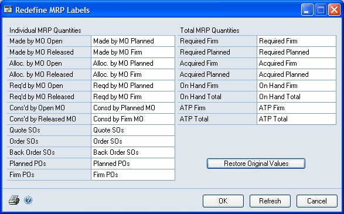

3. Change the terminology for as many or as few labels as you like. To reset the labels, choose **Restore Original Values**.

4. Choose OK.

### Scheduling MRP updates

Use the Schedule MRP window to schedule when to update MRP information. You can create one schedule for a full regeneration and one schedule for a net change. A full regeneration calculates all MRP requirements through the defined period of time. A net change recalculates MRP information only for those orders that have changed since the last time MRP was calculated. You must be a system administrator to open this window.

A scheduled MRP run is a scheduled Microsoft SQL Server® job. The SQL Server Agent must be running for the scheduled MRP to run.

#### To schedule MRP update

1. Open the MRP Preference Defaults window. (Microsoft Dynamics GP menu \>\>Tools \>\> Setup \>\> Manufacturing \>\> System Defaults \>\> MRP)

2. Choose Schedule MRP to open the Schedule MRP window.

3. If you are scheduling a full regeneration, enter the following information and choose Save.

    - Run for
        Specify how far into the future MRP information should be calculated. Enter a number and select days, weeks, or months.
    - Buckets
        Mark to determine how MRP information will be displayed. Days must be one of your choices. The more options you mark, the longer MRP processing will take.

4. From the Regeneration Type list, select a type of MRP update process.

5. Enter how often to run the update.

6. Mark when the update should occur. The schedule can occur once at a specific time or at intervals that you specify.

7. Choose Save.

8. Choose OK to close the window.

### Setting security options for net changes

Use the MRP Preference Defaults window to allow users to process net change regeneration in the MRP Projected Available Balance Inquiry window and to limit which users can process net changes.

For more information, refer to *Process security* and *Creating and modifying process security sets*.

#### To set security options for net changes

1. Open the **MRP Preference Defaults** window.  (Microsoft Dynamics GP menu \>\> Tools \>\> Setup \>\> Manufacturing \>\> System Defaults \>\> MRP)

2. Mark the **Allow Net Change from PAB Inquiry** option to allow users to process net change regenerations from the **MRP Projected Available Balance Inquiry** window.

3. Enter or select a security set that can be used to restrict users’ abilities to process a net change regeneration. You can limit access by user ID or by requiring users to supply a password. This field is available if you mark the **Allow Net Change from PAB Inquiry** option.

4. Choose OK. You can close the window, or you can continue to enter MRP system preferences.

### Restoring MRP quantity labels

To use the original MRP labels after you’ve changed them, you can restore the original values.

#### To restore MRP quantity labels

1. Open the MRP Preference Defaults window.(Microsoft Dynamics GP menu \>\> Tools \>\> Setup \>\> Manufacturing \>\> System Defaults \>\> MRP)

2. Choose Redefine MRP Labels to open the Redefine MRP Labels window.

3. Choose Restore Original Values.

4. Choose OK.

## See also

[Manufacturing Setup - Part 2: User setup](manufacturing-setup-part-2.md)  
[Accounts Used for Manufacturing in Dynamics GP](manufacturing-accounts-used.md)  
[Glossary of Terms in Manufacturing](glossary-manufacturing.md)  
