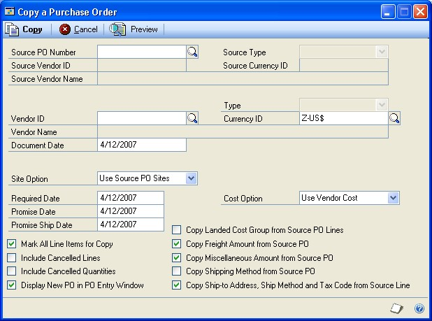
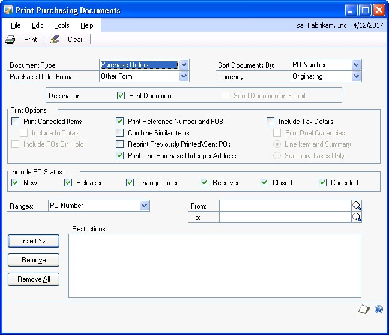
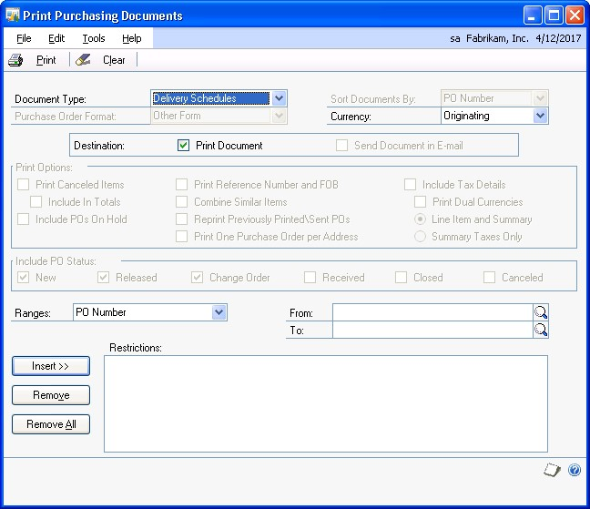
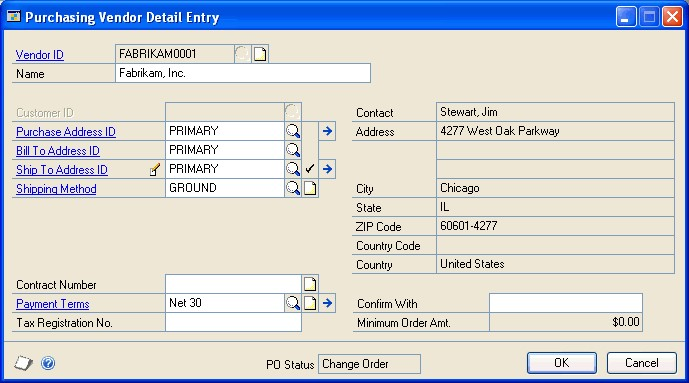
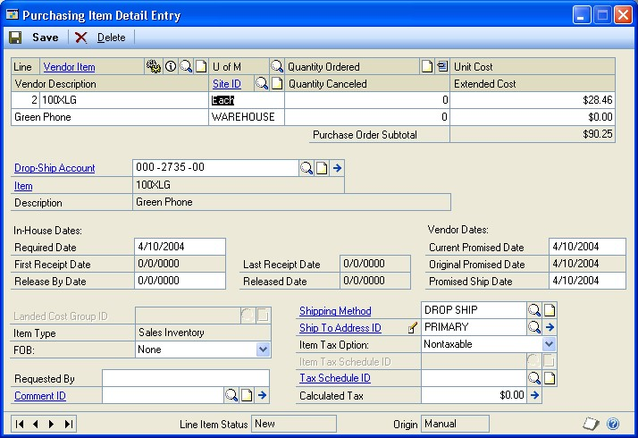
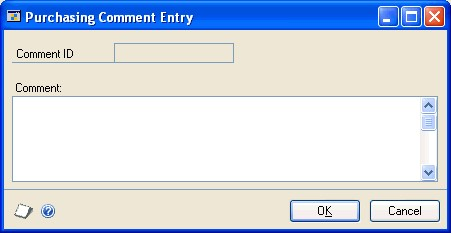
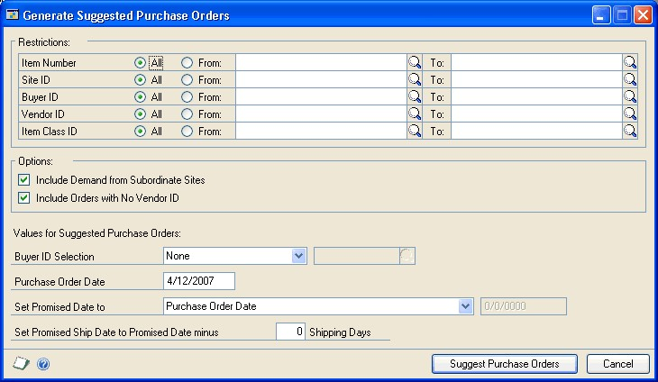
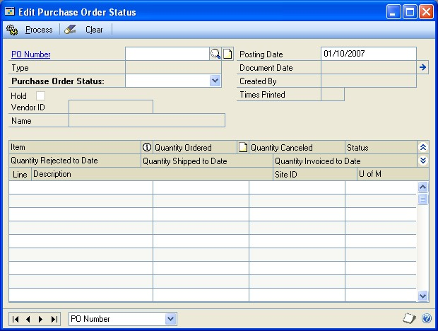

# Purchase Order Processing Part 2: Purchase orders

This part of the documentation explains how to enter, print, issue, and manage purchase orders. The data entry windows were designed to resemble actual purchase order documents, with vendor, line item, and totals information.

Following is a list of topics that are discussed:

- *Chapter 5, "Multicurrency transactions,"* describes the effects of using Multicurrency Management with Purchase Order Processing.

- *Chapter 6, "Purchase order entry,"* describes how to enter and print purchase order information.

- *Chapter 7, "Purchase order entry for projects,"* describes how to enter purchase order information for projects.

- *Chapter 8, "Purchase order detail entry,"* describes how to enter detailed information about a purchase order, vendor, line item, or other elements of a transaction.

- *Chapter 9, "Purchase order generator,"* explains how to automatically generate purchase orders to replenish inventory based on a reorder point you specify.

- *Chapter 10, "Taxes for purchase orders,"* explains how tax is calculated, modified, and distributed for purchase orders.

- *Chapter 11, "Purchase order maintenance,"* explains how to correct, delete, and void purchase orders. It also explains purchase order statuses and holds.

## Chapter 5: Multicurrency transactions

If you're using Multicurrency Management with Purchase Order Processing, you can choose the currency you want to enter on purchase orders and receipts.

This information is divided into the following sections:

- *Viewing multiple currencies*

- *Exchange rate and document date*

- *Multicurrency account distributions*

### Viewing multiple currencies

You can choose whether you want to view multicurrency transactions in the originating or the functional currency. Choose View \>\> Currency \>\> Functional or Originating while entering a purchase order or receipt. The option will be saved on a per user, per window basis.

You also can use the currency list button in the windows that support changing the currency view. The View \>\> Currency menu options and currency list button are available in the following windows:

- Purchase Order Entry

- Receivings Transaction Entry

- Purchasing Invoice Entry

The first time you open these windows after registering Multicurrency Management, all the transactions will be displayed in the originating currency. If you change the currency view, the option you last used will be the default view the next time you open that window.

### Exchange rate and document date

If a transaction's currency ID is not in the functional currency, a rate type and associated exchange rate table are assigned to the transaction. The rate type is based on the rate type you've assigned to the selected vendor. If one isn't assigned to the vendor, the default rate type for the Purchasing series specified in the Multicurrency Setup window is used. You also can choose the currency expansion button to open the Exchange Rate Entry window to view or modify the default exchange rate.

The document date (receipt or invoice date) assigned to a transaction determines which exchange rate is used, based on the currency ID and associated rate type that's entered for the transaction. Each time you change the document date on a multicurrency transaction, the system searches for a valid exchange rate. If a valid rate doesn't exist, you can enter an exchange rate using the Exchange Rate Entry window. If you've entered a General Ledger posting date that's different from the document date, the exchange rate expiration date must be after the posting date.

### Multicurrency account distributions

For multicurrency transactions, distribution amounts are displayed in both the functional and originating currencies. However, you can change only the originating amounts.

When you're entering a multicurrency transaction, the originating debit and credit amounts must balance. If the functional equivalents don't balance, the difference is posted automatically to a Rounding Difference account and a distribution type of Round identifies the distribution amount in the Purchasing Distribution Entry window.

For example, assume you've entered an invoice in the euro currency, with an amount of 28,755.42 EUR, a trade discount of 586.84 EUR, a discount available of 1544.33 EUR and the exchange rate is 1.0922. The distributions would be calculated as follows:

| **Account**               | **Euro debit** | **Euro credit** | **US Dollars debit** | **US Dollars credit** |
|---------------------------|----------------|-----------------|----------------------|-----------------------|
| Accounts Payable          |                | 28,755.42 EUR   |                      | \$31,406.67           |
| Trade Discount            |                | 586.84 EUR      |                      | \$640.95              |
| Discount Available        |                | 1544.33 EUR     |                      | \$1686.72             |
| Accrued Purchases         | 30,886.59 EUR  |                 | \$33,734.33          |                       |
| Totals                    | 30,886.59 EUR  | 30,886.59 EUR   | \$33,734.34          | \$33,734.33           |
| Rounding Difference       |                |                 | \$0.01               |                       |
| Totals                    | 30,886.59 EUR  | 30,886.59 EUR   | \$33,734.34          | \$33,734.34           |

## Chapter 6: Purchase order entry

Entering purchase orders is a common routine in many businesses. You can enter four types of purchase orders. The following table describes the types of purchase orders you can enter.

| **Purchase order type** | **Description**        |
|-------------------------|------------------------|
| Standard                | A document that lists items that will be shipped to your business to be received into your inventory.  |
| Drop-ship               | A document that lists items that will be shipped directly to the customer. The vendor sends you an invoice and you, in turn, send an invoice to the customer. |
| Blanket                 | A document that lists a single item and the quantities that will be delivered in a series of shipments, usually on specific dates. The item will be shipped to your business to be received into your inventory.                      |
| Blanket drop-ship       | A document that lists a single item and the quantities that will be delivered to the customer in a series of shipments, usually on specific dates. The vendor sends you an invoice and you, in turn, send an invoice to the customer. |

If you are using Project Accounting, see *Chapter 7, "Purchase order entry for projects,"* to enter purchase orders for projects. You can't enter blanket purchase orders or drop-ship blanket purchase orders for projects.

This information is divided into the following sections:

- *Purchase order approval workflow*

- *Prepayment for purchase orders*

- *Entering a standard purchase order*

- *Entering a drop-ship purchase order*

- *Entering a blanket purchase order*

- *Entering a drop-ship blanket purchase order*

- *Entering a prepayment for a purchase order*

- *Copying a purchase order*

- *Committing purchase orders to sales documents*

- *Quantity Tolerances in Purchase Order Processing*

- *Print options for purchase orders*

- *Requirements for sending purchase orders in e-mail*

- *Printing and sending an individual purchase order in e-mail*

- *Printing and sending multiple purchase orders in e-mail*

- *Printing an individual blanket purchase order delivery schedule*

- *Printing multiple blanket purchase order delivery schedules*

### Purchase order approval workflow

If your company uses the Workflow feature among its business controls, purchase orders might have to be approved before receiving or invoicing items. The rules for approving purchase orders can be defined to fit your organization's needs. Multiple approvers might be required, or approval might not be required for purchase orders with certain buyers or small currency amounts. When a purchase order is ready to be approved, approvers can be notified and the purchase orders can be approved, using Outlook, Dynamics GP, or SharePoint. After a purchase order is approved, it can be printed, sent in e-mail, received, or invoiced against. For more information about Workflow, see the System Setup Guide (Help \>\> Printable Manuals \>\> select System \>\> select System Setup
Guide).

Before you can use the purchase order approval workflow for Purchase Order Processing, you must unmark the Activate Approvals option in the PO Enhancements Setup window (Purchasing \>\> Setup \>\> Purchase Order Enhancements).

### Prepayment for purchase orders

By marking the Allow Purchase Order Prepayments option in the Purchase Order Processing Setup window, you can enter a prepayment amount for a purchase order and generate the prepayment as computer check in Payables Management. You can enter a prepayment for a New, Released, or Change Order purchase order that hasn't been received or invoiced against. You can only enter one prepayment for each purchase order. To enter a manual prepayment for purchase order, the Create manual prepayment from Purchase Order Processing option must be marked in the Purchase Order Processing Setup window.

After entering a prepayment amount, you can choose the Prepayment expansion button to open the Purchasing Prepayment Entry window. If the prepayment is a computer check and you have set up a default prepayment account, you don't have to open the Purchasing Prepayment Entry window unless you want to change the default prepayment account. If the prepayment is a manual payment, you can use the Purchasing Prepayment Entry window to enter information such as the prepayment account, payment type, and payment method.

When you save a purchase order that has a computer check prepayment entered for it, the payment information is saved, but not posted. The prepayment is posted when completing a computer check run for the prepayment in Payables Management. If you have entered a manual prepayment for the purchase order, the manual prepayment is posted to Payables Management when saving the purchase order, creating a posted manual payables payment.

You can receive or invoice against the purchase order after you post the prepayment for the purchase order. When you receive or invoice against the purchase order with a posted prepayment, the posted prepayment is applied to the shipment/invoice or invoice. If items for a purchase order are fully received or invoiced against when posting a shipment/invoice or invoice, any remaining prepayment amount is an unapplied payment in Payables Management. You can apply the remaining prepayment using the Apply Payables Documents window to other documents for the vendor. A purchase order with a prepayment must be closed or canceled before the unapplied payment can be applied.

### Entering a standard purchase order

Use the Purchase Order Entry window to enter purchase orders. You can use this window to modify purchase orders with New, Released, and Change Order statuses. You also can enter detailed information for each purchase order and enter non-inventoried items.

*If you are using Project Accounting, see Chapter 7, "Purchase order entry for projects" to enter purchase orders for projects.*

From the Actions button, you can select Create and Copy New PO to create a new purchase order record from an existing purchase order. You also can select Copy PO Lines to Current PO from the Actions button to copy line items from one purchase order to another. See *Copying a purchase order* or *Copying purchase order line items* for more information.

You also can select options from the Actions button to open additional windows where you can receive items, receive and invoice items, or invoice the items from the purchase order. See *Receiving items from a purchase order* or *Invoicing items from a purchase order* for more information.

Use the View \>\> Currency menu option or the currency list button to view amounts in the Purchase Order Entry window in the originating or functional currency.

**To enter a standard purchase order:**

1.  In the navigation pane, choose the Purchasing button, and then choose the Purchase Order Transactions list.

2.  In the New group or its overflow menu, choose Standard Purchase Order to open the Purchase Order Entry window.

3.  Enter a purchase order number or accept the default entry.

4.  Enter or select a buyer ID.

5.  Accept the default date or enter a date that will be used to update your purchasing records.

In multicurrency transactions, the exchange rate used is based on the document date, the currency ID, and associated rate type that's entered for the transaction.

6.  Choose the Date expansion button to open the Purchasing Date Entry window, where you can enter a contract expiration date for the purchase order. Choose OK to return to the Purchase Order Entry window.

7.  Mark the Allow Sales Document Commitments option to allow purchase order line items to be committed to matching sales order line items.

The Link Purchase Order icon will be displayed in the Quantity Ordered field for line items with sales commitments. Select the line item and choose the button next to the Quantity Ordered heading to view, add, or delete commitments in the Sales Commitments for Purchase Order window. For more information, see *Committing purchase orders to sales documents*.

8.  Enter or select the vendor that you're ordering the item from.

*To enter a temporary vendor—a vendor with whom you have a short-term relationship and want to keep minimal information—place the pointer in the Vendor ID field and choose Options \>\> Temporary Vendor. The Vendor Maintenance window will open, where you can enter a vendor name and any other information.*

9.  Choose the Vendor E-mail Detail Entry expansion button to open the Purchasing E-mail Detail Entry window to update a vendor's e-mail information for a purchase order. See *Updating a vendor's e-mail information for a purchase order* for more information.

The document type to send in e-mail must be available for the vendor before you can open the Purchasing E-mail Detail Entry window.

10.  Enter or select a currency ID, or change the default currency ID.

If the currency ID is not the company's functional currency, a rate type and associated exchange rate table is assigned to the transaction.

11.  Enter or select the number of the vendor item or item you're purchasing. If a vendor item or an item hasn't been set up in your inventory, see *Adding a vendor item*, *Adding an item to inventory*, or *Using non-inventoried items* for more information.

  - To indicate that an item must be a specific manufacturer's item, choose the Manufacturer's Item Number expansion button to open the Purchasing Manufacturer's Item Number Entry window. See *Specifying the manufacturer's item numbers to print on a purchase order* for more information.

  - The item number will be displayed if Options \>\> Display Vendor Item is unmarked. If Display Vendor Item is marked, the vendor item will be displayed.
    
  - To view or enter additional information for a vendor item, item, or noninventoried item, open the Purchasing Item Detail Entry window by choosing Item or Vendor Item expansion button. For more information, see *Entering line item detail information*.

  - To add an attachment to the item, select the item and choose the Attachment Management icon to open the Document Attachment Management window.

12.  Enter the item quantity.

13.  If you've entered a non-inventoried item, enter the unit cost. If you've entered an inventoried item, you can modify the default unit cost.

14.  Enter a site ID, or accept the default site.

*Sites are required for line items. You must enter a site ID before continuing to the next line.*

15.  Continue to enter all the line items for the purchase order.

16.  Enter a prepayment amount, if applicable. This field is available if you have marked Allow Purchase Order Prepayments in the Purchase Order Processing Setup window. To enter a manual payment, the Create manual prepayment from Purchase Order Processing must be marked as well. You can enter a prepayment for a New purchase order, a Released or Change Order purchase order that hasn't been received or invoiced against. You can only enter one prepayment for each purchase order.

You can choose the Prepayment expansion button to open the Purchasing Prepayment Entry window to enter or view computer check or manual check information. If the prepayment is a computer check and you have set up a default prepayment account, you don't have to open the Purchasing Prepayment Entry window unless you want to change the default prepayment account.

If the prepayment is a manual payment, use the Purchasing Prepayment Entry window to enter information such as the prepayment account, payment type, and payment method. See See "Entering a prepayment for a purchase order". for more information.

17.  Enter a tax schedule ID or accept the default entry. This tax schedule ID will be used to calculate tax on the amount of the document. See *Default tax schedules for purchase orders* for more information about default tax schedule IDs for purchase orders.

18.  Enter the trade discount, freight, miscellaneous, and tax amounts. The trade discount is automatically calculated if you've assigned a trade discount percentage to the vendor that you're purchasing the items from.

Taxes will be calculated automatically as you enter items. For more information about tax calculations, see *Chapter 10, "Taxes for purchase orders."* To change the tax amounts for the document, see *Calculating and distributing summary taxes for purchase orders*. To change the tax amounts for a line item, see *Calculating and distributing detail taxes for purchase order items*.

19.  Enter a comment ID (optional). For more information about comments, see *Adding comments to purchasing documents*.

20.  Choose the Attachment Management icon to attach documents to the purchase order, if applicable.

21.  Choose File \>\> Print to open the Purchase Order Print Options window, where you can print the purchase order, send the purchase order in e-mail, or both. (optional).

You also can print the purchase order by choosing the printer button or send the purchase order in e-mail by choosing the Send in e-mail button in the upper right of the Purchase Order Entry window.

*If you are using purchase order approval workflow, the purchase order must be approved before you can print it. You also can print a purchase order that doesn't need approval. If you are using vendor approval workflow, the vendors assigned to the purchase orders must be approved or have the workflow status of No Approval Needed.*

You can select to send a purchase order in e-mail or print purchase orders in the functional or originating currency by using the currency list button. To send a purchase order in e-mail or print a purchase order in your reporting currency, you must use the Purchase Order Inquiry Zoom window. For more information about reporting currency, see the Multicurrency Management documentation.

22.  Save the purchase order or submit the purchase order for approval, if you are using Workflow.

If you have entered a prepayment for the purchase order, saving the purchase order saves the computer check prepayment or posts the manual prepayment to Payables Management to create a posted manual payables payment. To post the computer check prepayment, complete a computer check run for the prepayment in Payables Management.

### Entering a drop-ship purchase order

Use the Purchase Order Entry window to enter a drop-ship purchase order to purchase items on behalf of a customer. A customer also can be a vendor. The items on the purchase order are shipped directly to the customer without ever being physically received in your inventory. The vendor will invoice your business and you, in turn, will invoice the customer. The quantity on hand isn't updated in Inventory Control, but the current cost for the drop-shipped items and the item vendor information will be updated when the invoice is posted. If the item uses the Average Perpetual valuation method, the current cost for the drop-shipped item won't be updated.

*If you are using Project Accounting, see Chapter 7, "Purchase order entry for projects" to enter purchase orders for projects*

From the Actions button, you can select Create and Copy New PO to create a new purchase order record from an existing purchase order. You also can select Copy PO Lines to Current PO from the Actions button to copy line items from one purchase order to another. See *Copying a purchase order* or *Copying purchase order line items* for more information.

You can select Invoice the PO Items from the Actions button to open additional windows where you can invoice the items from the purchase order. See *Invoicing items from a purchase order* for more information.

**To enter a drop-ship purchase order:**

1.  In the navigation pane, choose the Purchasing button, and then choose the Purchase Order Transactions list.

2.  In the New group or its overflow menu, choose Drop-Ship Purchase Order to open the Purchase Order Entry window.

3.  Enter a purchase order number or accept the default entry.

4.  Enter or select a buyer ID.

5.  Accept the default date or enter a date that will be used to update your purchasing records.

In multicurrency transactions, the exchange rate used is based on the document date, the currency ID and associated rate type that's entered for the transaction.

6.  Choose the Date expansion button to open the Purchasing Date Entry window, where you can enter a contract expiration date for the drop-ship purchase order. Choose OK to return to the Purchase Order Entry window.

7.  Mark Allow Sales Document Commitments to allow purchase order line items to be committed to matching sales order line items.

The Link Purchase Order icon will be displayed in the Quantity Ordered field for line items with sales commitments. Select the line item and choose the button next to the Quantity Ordered heading to view, add, or delete commitments in the Sales Commitments for Purchase Order window. For more information, see *Committing purchase orders to sales documents*.

8.  Enter or select the vendor that you're ordering the item from.

*To enter a temporary vendor—a vendor with whom you have a short-term relationship and want to keep minimal information—place the pointer in the Vendor ID field and choose Options \>\> Temporary Vendor. The Vendor Maintenance window will open, where you can enter a vendor name and any other information.*

9.  Moving from the Vendor ID field opens the Enter Drop-Ship Customer window.

In the Enter Drop-Ship Customer window, enter or select the customer ID and ship-to address ID where the vendor is shipping the items. Choose OK to return to the Purchase Order Entry window.

10.  Choose the Vendor E-mail Detail Entry expansion button to open the Purchasing E-mail Detail Entry window to update a vendor's e-mail information for a purchase order. See *Updating a vendor's e-mail information for a purchase order* for more information.

The document type to send in e-mail must be available for the vendor before you can open the Purchasing E-mail Detail Entry window.

11.  Enter or select the number of the vendor item or item you're purchasing. If a vendor item or an item hasn't been set up in your inventory, see *Adding a vendor item*, *Adding an item to inventory*, or *Using non-inventoried items* for more information.

- The item number will be displayed if Options \>\> Display Vendor Item is unmarked. If Display Vendor Item is marked, the vendor item will be displayed.

- To indicate that an item must be a specific manufacturer's item, choose the Manufacturer's Item Number expansion button to open the Purchasing Manufacturer's Item Number Entry window. See *Specifying the manufacturer's item numbers to print on a purchase order* for more information.

- To add an attachment to the item, select the item and choose the Attachment Management icon to open the Document Attachment Management window.

12.  Enter the item quantity.

13.  If you've entered a non-inventoried item, enter the unit cost. If you've entered an inventoried item, you can modify the default unit cost.

14.  Enter a site ID, or accept the default site.

*Sites are required for line items. You must enter a site ID before continuing to the next line.*

15.  Continue to enter all the line items for the purchase order.

16.  Enter a prepayment amount, if applicable. This field is available if you have marked Allow Purchase Order Prepayments in the Purchase Order Processing Setup window. To enter a manual payment, the Create manual prepayment from Purchase Order Processing must be marked as well. You can enter a prepayment for a New purchase order, a Released or Change Order purchase order that hasn't been received or invoiced against. You can only enter one prepayment for each purchase order.

You can choose the Prepayment expansion button to open the Purchasing Prepayment Entry window to enter or view computer check or manual check information. If the prepayment is a computer check and you have set up a default prepayment account, you don't have to open the Purchasing Prepayment Entry window unless you want to change the default prepayment account.

If the prepayment is a manual payment, use the Purchasing Prepayment Entry window to enter information such as the prepayment account, payment type, and payment method. See See "Entering a prepayment for a purchase order". for more information.

17.  Enter a tax schedule ID or accept the default entry. This tax schedule ID will be used to calculate tax on the amount of the document. See *Default tax schedules for purchase orders* for more information about default tax schedule IDs for purchase orders.

18.  Enter the trade discount, freight, miscellaneous, and tax amounts for this purchase order. The trade discount is automatically calculated if you've assigned a trade discount percentage to the vendor that you're purchasing the items from.

Taxes will be calculated automatically as you enter items. For more information about tax calculations, see *Tax calculations in Purchase Order Processing*. To change the tax amounts for the document, see *Calculating and distributing summary taxes for purchase orders*. To change the tax amounts for a line item, see *Calculating and distributing detail taxes for purchase order items*.

19.  Enter a comment ID (optional). For more information about comments, see *Adding comments to purchasing documents*.

20.  Choose the Attachment Management icon to attach documents to the purchase order, if applicable.

21.  Choose File \>\> Print to open the Purchase Order Print Options window, where you can print the purchase order, send the purchase order in e-mail, or both (optional).

You also can print the purchase order by choosing the printer button or send the purchase order in e-mail by choosing the Send in e-mail button in the upper right of the Purchase Order Entry window.

You can select to send purchase orders in e-mail or print purchase orders in the functional or originating currency by using the currency list button.

*If you are using purchase order approval workflow, the purchase order must be approved before you can print it. You also can print a purchase order that doesn't need approval. If you are using vendor approval workflow, the vendors assigned to the purchase orders must be approved or have the workflow status of No Approval Needed.*

22.  Save the purchase order or submit the purchase order for approval, if you are using Workflow.

If you have entered a prepayment for the purchase order, saving the purchase order saves the computer check prepayment or posts the manual prepayment to Payables Management to create a posted manual payables payment. To post the computer check prepayment, complete a computer check run for the prepayment in Payables Management.

### Entering a blanket purchase order

Use the Purchase Order Entry window to enter blanket purchase orders. A blanket purchase order lists a single item and its quantities that will be delivered in a series of shipments, usually on specific dates. The line items you enter for a blanket purchase order must be the same item number. The item will be shipped to your business to be received into your inventory.

Blanket purchase orders allow you to make long-term agreements with vendors to purchase the same item—usually to receive a volume discount or to be sure of obtaining items that are hard to get. The agreement you make with the vendor can be based on the total cost of the item or on the total quantity of the item. You'll use the Purchasing Blanket Detail Entry window to enter line items for the blanket purchase order.

The first line item entered for a blanket purchase order is called the control blanket line item and has the line number 0. This is the line item that the blanket line items are based on. For example, you might enter a quantity of 5,000 for the control blanket line item and then enter five blanket line items with a quantity of 1,000 each. The control blanket line item isn't included in tax amounts, in the purchase order's subtotal, or printed on purchase orders. If you delete the control blanket line item, all blanket line items are deleted. A control blanket line item can't be deleted if a blanket line item has been received against. Unlike blanket line items, the control blanket line item can't be received or invoiced against.

If you are using Project Accounting, the Project Number field and the Cost Cat. ID field will be displayed in the Purchase Order Entry window, but you can't enter project information.

From the Actions button, you can select Create and Copy New PO to create a new purchase order record from an existing purchase order. See *Copying a purchase order* for more information.

You also can select options from the Actions button to open additional windows where you can receive items, receive and invoice items, or invoice the items from the purchase order. See *Receiving items from a purchase order* or *Invoicing items from a purchase order* for more information.

Use the View \>\> Currency menu option or the currency list button to view amounts in the Purchase Order Entry window in the originating or functional currency.

**To enter a blanket purchase order:**

1.  In the navigation pane, choose the Purchasing button, and then choose the Purchase Order Transactions list.

2.  In the New group or its overflow menu, choose Blanket Purchase Order to open the Purchase Order Entry window.

3.  Enter a purchase order number or accept the default entry.

4.  Enter or select a buyer ID.

5.  Accept the default date or enter a date that will be used to update your purchasing records.

In multicurrency transactions, the exchange rate used is based on the document date, the currency ID, and associated rate type that's entered for the transaction.

6.  Choose the Date expansion button to open the Purchasing Date Entry window, where you can enter a contract expiration date for the blanket purchase order. Choose OK to return to the Purchase Order Entry window.

Enter or select the vendor that you're purchasing items from.

*To enter a temporary vendor—a vendor with whom you have a short-term relationship and want to keep minimal information—place the pointer in the Vendor ID field and choose Options \>\> Temporary Vendor. The Vendor Maintenance window will open, where you can enter a vendor name and any other information.*

7.  Choose the Vendor E-mail Detail Entry expansion button to open the Purchasing E-mail Detail Entry window to update a vendor's e-mail information for a purchase order. See *Updating a vendor's e-mail information for a purchase order* for more information.

The document type to send in e-mail must be available for the vendor before you can open the Purchasing E-mail Detail Entry window.

8.  Enter or select a currency ID, or change the default currency ID.

If the currency ID is not the company's functional currency, a rate type and associated exchange rate table is assigned to the transaction.

9.  Mark the Allow Sales Document Commitments option to allow blanket purchase order line items to be committed to matching sales order line items.

The Link Purchase Order icon will be displayed in the Quantity Ordered field for blanket line items with sales commitments. Select the blanket line item and choose the button next to the Quantity Ordered heading to view, add, or delete commitments in the Sales Commitments for Purchase Order window. You can't add commitments to the control blanket line item. For more information, see *Committing purchase orders to sales documents*.

10.  Enter or select the number of the vendor item or item you're purchasing that will be the control blanket line item. If a vendor item or an item hasn't been set up in your inventory, see *Adding a vendor item*, *Adding an item to inventory*, or *Using non-inventoried items* for more information.

  - The item number will be displayed if Options \>\> Display Vendor Item is unmarked. If Display Vendor Item is marked, the vendor item will be displayed.

  - To indicate that an item must be a specific manufacturer's item, choose the Manufacturer's Item Number expansion button to open the Purchasing Manufacturer's Item Number Entry window. See *Specifying the manufacturer's item numbers to print on a purchase order* for more information.

- To add an attachment to the item, select the item and choose the Attachment Management icon to open the Document Attachment Management window.

11.  Enter the maximum quantity of the item to order.

12.  If you've entered a non-inventoried item, enter the unit cost. If you've entered an inventoried item, you can edit the default unit cost.

13.  Enter a site ID, or accept the default.

*Sites are required for line items. You must enter a site ID before continuing to the next line.*

14.  If the agreement you made with the vendor is based on the total cost of the item, modify the extended cost to match the agreed cost.

15.  Choose Blanket to open the Purchasing Blanket Detail Entry window to enter line items for the blanket purchase order and to select which line items will be released to the vendor when the blanket purchase order is printed.

16.  If the agreement you made with the vendor is based on the total quantity, mark Quantity to control the blanket by. If the agreement you made with the vendor is based on the total cost of the item, mark Value to control the blanket by. If you are managing the blanket by value, you still must enter quantities for the blanket purchase order's delivery schedule.

17.  Enter line items using different required dates and quantities, as necessary. You also can mark each line item to be released to the vendor when the purchase order is printed.

When you've finished entering line items, choose OK to return to the Purchase Order Entry window.

18.  Enter a prepayment amount, if applicable. This field is available if you have marked Allow Purchase Order Prepayments in the Purchase Order Processing Setup window. To enter a manual payment, the Create manual prepayment from Purchase Order Processing must be marked as well. You can enter a prepayment for a New purchase order, a Released or Change Order purchase order that hasn't been received or invoiced against. You can only enter one prepayment for each purchase order.

You can choose the Prepayment expansion button to open the Purchasing Prepayment Entry window to enter or view computer check or manual check information. If the prepayment is a computer check and you have set up a default prepayment account, you don't have to open the Purchasing Prepayment Entry window unless you want to change the default prepayment account.

If the prepayment is a manual payment, use the Purchasing Prepayment Entry window to enter information such as the prepayment account, payment type, and payment method. See *Entering a prepayment for a purchase order* for more information.

19.  Enter a tax schedule ID or accept the default entry. This tax schedule ID will be used to calculate tax on the amount of the document. See *Default tax schedules for purchase orders* for more information about default tax schedule IDs for purchase orders.

20.  Enter the trade discount, freight, miscellaneous, and tax amounts. The trade discount is automatically calculated if you've assigned a trade discount percentage to the vendor that you're purchasing the items from.

Taxes will be calculated automatically as you enter items. The control blanket line item isn't included when calculating taxes. For more information about tax calculations, see *Chapter 10, "Taxes for purchase orders."* To change the tax amounts for the document, see *Calculating and distributing summary taxes for purchase orders*. To change the tax amounts for a line item, see *Calculating and distributing detail taxes for purchase order items*.

21.  Enter a comment ID (optional). For more information about comments, see *Adding comments to purchasing documents*.

22.  Choose the Attachment Management icon to attach documents to the purchase order, if applicable.

23.  Choose File \>\> Print to open the Purchase Order Print Options window, where you can print the purchase order or a blanket purchase order delivery schedule. You also can send the purchase order in e-mail (optional).

You also can print the purchase order by choosing the printer button or send the purchase order in e-mail by choosing the Send in e-mail button in the upper right of the Purchase Order Entry window.

*If you are using purchase order approval workflow, you can print the purchase order delivery schedule, but the purchase order must be approved before you can print it or send it in e-mail. You also can print a purchase order or send a purchase order in e-mail that doesn't need approval. If you are using vendor approval workflow, the vendors assigned to the purchase orders must be approved or have the workflow status of No Approval Needed.*

You can select to send purchase orders in e-mail or print purchase orders in the functional or originating currency using the currency list button in the Purchase Order Entry window. To send a purchase order in e-mail or print a purchase order in your reporting currency, you must use the Purchase Order Inquiry Zoom window. For more information about reporting currency, see the Multicurrency Management documentation.

You also can select to print blanket purchase order delivery schedules in the functional or originating currency using the currency list button. To print blanket purchase order delivery schedule in your reporting currency, you must use the Purchase Order Inquiry Zoom window.

24.  Save the purchase order or submit the purchase order for approval, if you are using Workflow.

If you have entered a prepayment for the purchase order, saving the purchase order saves the computer check prepayment or posts the manual prepayment to Payables Management to create a posted manual payables payment. To post the computer check prepayment, complete a computer check run for the prepayment in Payables Management.

### Entering a drop-ship blanket purchase order

Use the Purchase Order Entry window to enter a drop-ship blanket purchase order to purchase items on behalf of a customer. A customer also can be a vendor. A dropship blanket purchase order lists a single item and the quantities that will be delivered to the customer in a series of shipments, usually on specific dates. The items on the drop-ship blanket purchase order are shipped directly to the customer without ever being physically received in your inventory. The vendor will send an invoice to your business and you, in turn, will send an invoice to the customer.

Blanket purchase orders allow you to make long-term agreements with vendors to purchase the same item—usually to receive a volume discount or to be sure of obtaining hard to get items. The agreement you make with the vendor can be based on the total cost of the item or for the total quantity of the item.

The quantity on hand isn't updated in Inventory Control, but the current cost for the drop-shipped item and the item vendor information will be updated when the invoice is posted. If the item uses the Average Perpetual valuation method, the current cost for the drop-shipped item won't be updated.

The first line item entered for a drop-ship blanket purchase order is called the control blanket line item and it has the line number of 0. This is the line item that the blanket line items are based on. For example, you might enter a quantity of 5,000 for the control blanket line item and then enter five blanket line items with a quantity of 1,000 each. The control blanket line item isn't included in tax amounts, in the purchase order's subtotal, or printed on purchase orders. If you delete the control blanket line item, all blanket line items are deleted. A control blanket line item can't be deleted if a blanket line item has been received against. Unlike blanket line items, the control blanket line item can't be received or invoiced against.

If you are using Project Accounting, the Project Number field and the Cost Cat. ID field will be displayed in the Purchase Order Entry window, but you can't enter project information.

From the Actions button, you can select Create and Copy New PO to create a new purchase order record from an existing purchase order. See *Copying a purchase order* for more information.

You also can select Invoice the PO Items from the Actions button to open additional windows where you can invoice the items from the purchase order. See *Invoicing items from a purchase order* for more information.

**To enter a drop-ship blanket purchase order:**

1.  In the navigation pane, choose the Purchasing button, and then choose the Purchase Order Transactions list.

2.  In the New group or its overflow menu, choose Drop-Ship Blanket Purchase Order to open the Purchase Order Entry window.

3.  Enter a purchase order number or accept the default entry.

4.  Enter or select a buyer ID.

5.  Accept the default date or enter a date that will be used to update your purchasing records.

In multicurrency transactions, the exchange rate used is based on the document date, the currency ID, and associated rate type that's entered for the transaction.

6.  Choose the Date expansion button to open the Purchasing Date Entry window, where you can enter a contract expiration date for the drop-ship blanket purchase order. Choose OK to return to the Purchase Order Entry window.

7.  Enter or select the vendor that you're ordering the item from.

*To enter a temporary vendor—a vendor with whom you have a short-term relationship and want to keep minimal information—place the pointer in the Vendor ID field and choose Options \>\> Temporary Vendor. The Vendor Maintenance window will open, where you can enter a vendor name and any other information.*

8.  Moving from the Vendor ID field opens the Enter Drop-Ship Customer window.

In the Enter Drop-Ship Customer window, enter or select the customer ID and ship-to address ID where the vendor is shipping the items to. Choose OK to return to the Purchase Order Entry window.

9.  Choose the Vendor E-mail Detail Entry expansion button to open the Purchasing E-mail Detail Entry window to update a vendor's e-mail information for a purchase order. See *Updating a vendor's e-mail information for a purchase order* for more information.

The document type to send in e-mail must be available for the vendor before you can open the Purchasing E-mail Detail Entry window.

10.  Mark Allow Sales Document Commitments to allow purchase order line items to be committed to matching sales order line items.

The Link Purchase Order icon will be displayed in the Quantity Ordered field for blanket line items with sales commitments. Select the blanket line item and choose the button next to the Quantity Ordered heading to view, add, or delete commitments in the Sales Commitments for Purchase Order window. You can't add a sales commitment to the control blanket line item. For more information, see *Committing purchase orders to sales documents*.

11.  Enter or select the number of the vendor item or item you're purchasing that will be the control blanket line item. If a vendor item or an item that hasn't been set up in your inventory, see *Adding a vendor item*, *Adding an item to inventory*, or *Using non-inventoried items* for more information.

- The item number will be displayed if Options \>\> Display Vendor Item is unmarked. If Display Vendor Item is marked, the vendor item will be displayed.

- To indicate that an item must be a specific manufacturer's item, choose the Manufacturer's Item Number expansion button to open the Purchasing Manufacturer's Item Number Entry window. See *Specifying the manufacturer's item numbers to print on a purchase order* for more information.

- To add an attachment to the item, select the item and choose the Attachment Management icon to open the Document Attachment Management window.

12.  Enter the maximum quantity of the item to order.

13.  If you've entered a non-inventoried item, enter the unit cost. If you've entered an inventoried item, you can modify the default unit cost.

14.  Enter a site ID, or accept the default site.

*Sites are required for line items. You must enter a site ID before continuing to the next line.*

15.  If the agreement you made with the vendor is based on the total cost of the item, modify the extended cost to match the agreed cost.

16.  Choose Blanket to open the Purchasing Blanket Detail Entry window to enter line items for the drop-ship blanket purchase order and to select which line items will be released to the vendor when the drop-ship blanket purchase order is printed.

17.  If the agreement you made with the vendor is based on the total quantity, mark Quantity to control the blanket by. If the agreement you made with the vendor is based on the total cost of the item, mark Value to control the blanket by. If you are managing the blanket by value, you still must enter quantities for the blanket purchase order's delivery schedule.

18.  Enter line items using different required dates and quantities, as necessary. You also can mark each line item to be released to the vendor when the purchase order is printed.

When you've finished entering line items, choose OK to return to the Purchase Order Entry window.

19.  Enter a prepayment amount, if applicable. This field is available if you have marked Allow Purchase Order Prepayments in the Purchase Order Processing Setup window. To enter a manual payment, the Create manual prepayment from Purchase Order Processing must be marked as well. You can enter a prepayment for a New purchase order, a Released or Change Order purchase order that hasn't been received or invoiced against. You can only enter one prepayment for each purchase order.

You can choose the Prepayment expansion button to open the Purchasing Prepayment Entry window to enter or view computer check or manual check information. If the prepayment is a computer check and you have set up a default prepayment account, you don't have to open the Purchasing Prepayment Entry window unless you want to change the default prepayment account.

If the prepayment is a manual payment, use the Purchasing Prepayment Entry window to enter information such as the prepayment account, payment type, and payment method. See See "Entering a prepayment for a purchase order". for more information.

20.  Enter a tax schedule ID or accept the default entry. This tax schedule ID will be used to calculate tax on the amount of the document. See *Default tax schedules for purchase orders* for more information about default tax schedule IDs for purchase orders.

21.  Enter the trade discount, freight, miscellaneous, and tax amounts for this purchase order. The trade discount is automatically calculated if you've assigned a trade discount percentage to the vendor that you're purchasing the items from.

Taxes will be calculated automatically as you enter items. The control blanket line item isn't included when calculating taxes. For more information about tax calculations, see *Tax calculations in Purchase Order Processing*. To change the tax amounts for the document, see *Calculating and distributing summary taxes for purchase orders*. To change the tax amounts for a line item, see *Calculating and distributing detail taxes for purchase order items*.

22.  Enter a comment ID (optional). For more information about comments, see *Adding comments to purchasing documents*.

23.  Choose the Attachment Management icon to attach documents to the purchase order, if applicable.

24.  Choose File \>\> Print to open the Purchase Order Print Options window, where you can print the purchase order or a blanket purchase order delivery schedule, You also can send the purchase order in e-mail (optional).

You also can print the purchase order by choosing the printer button or send the purchase order in e-mail by choosing the Send in e-mail button in the upper right of the Purchase Order Entry window.

*If you are using purchase order approval workflow, you can print the purchase order delivery schedule, but the purchase order must be approved before you can print it or send it in e-mail. You also can print a purchase order or send a purchase order in e-mail that doesn't need approval. If you are using vendor approval workflow, the vendors assigned to the purchase orders must be approved or have the workflow status of No Approval Needed.*

You can select to send purchase orders in e-mail or print purchase orders in the functional or originating currency using the currency list button in the Purchase Order Entry window. To send a purchase order in e-mail or print a purchase order in your reporting currency, you must use the Purchase Order Inquiry Zoom window. For more information about reporting currency, see the Multicurrency Management documentation.

You also can select to print blanket purchase order delivery schedules in the functional or originating currency using the currency list button. To print blanket purchase order delivery schedule in your reporting currency, you must use the Purchase Order Inquiry Zoom window.

25.  Save the purchase order or submit the purchase order for approval, if you are using Workflow.

If you have entered a prepayment for the purchase order, saving the purchase order saves the computer check prepayment or posts the manual prepayment to Payables Management to create a posted manual payables payment. To post the computer check prepayment, complete a computer check run for the prepayment in Payables Management.

### Entering a prepayment for a purchase order

Use the Purchasing Prepayment Entry window to enter or view computer check or manual payment information for a purchase order. You can enter a prepayment for a New purchase order, a Released or Change Order purchase order that hasn't been received or invoiced against. You can only enter one prepayment for each purchase order.

This window is available for a computer check if you marked the Allow Purchase Order Prepayments option in the Purchase Order Processing Setup window. To enter or view a manual payment, the Create manual prepayment from Purchase Order Processing must be marked as well.

**To enter a computer check prepayment for a purchase order:**

1.  Open the Purchase Order Entry window.
    (Purchasing \>\> Transactions \>\> Purchase Order Entry)

2.  Enter or select a purchase order.

3.  Enter a prepayment amount and choose the Prepayment Expansion button.

4.  In the Purchasing Prepayment Entry window, enter or accept the prepayment account.

5.  Choose OK to save your changes.

**To enter a manual check prepayment for a purchase order:**

1.  Open the Purchase Order Entry window.
    (Purchasing \>\> Transactions \>\> Purchase Order Entry)

2.  Enter or select a purchase order.

3.  Enter a prepayment amount and choose the Prepayment Expansion button.

4.  In the Purchasing Prepayment Entry window, enter or accept the prepayment account.

5.  Select Manual Payment as the payment type.

6.  Select Check as the payment method.

7.  Enter or select the checkbook ID you're using for this transaction.

8.  Enter the number of the check you used to make the payment. The next check number specified for checkbook is the default number.

9.  Enter or accept the date of the prepayment.

10.  Enter or accept the payment number of the payment. The next payment number displayed in the Payables Setup Options window appears as the default entry.

11. Enter or select the cash account used when posting the prepayment for the purchase order.

12. Choose OK to save your changes.

**To enter a manual credit card prepayment for a purchase order:**

1.  Open the Purchase Order Entry window.
    (Purchasing \>\> Transactions \>\> Purchase Order Entry)

2.  Enter or select a purchase order.

3.  Enter a prepayment amount and choose the Prepayment Expansion button.

4.  In the Purchasing Prepayment Entry window, enter or accept the prepayment account.

5.  Select Manual Payment as the payment type.

6.  Select Credit Card as the payment method.

7.  Enter or select the name of the credit card you're using for this transaction.

8.  Enter or accept the document number for the payment. The payment number is the default document number.

9.  Enter or accept the date of the prepayment.

10.  Enter or accept the payment number of the payment. The next payment number displayed in the Payables Setup Options window appears as the default entry.

11. Enter or select the accounts payable account used when posting the prepayment for the purchase order.

If the credit card is used as a credit card, the default account is the accounts payable account for the vendor assigned to the credit card. If the credit card is used as a check card, the default account is the cash account assigned to the checkbook ID.

12.  Choose OK to save your changes.

### Copying a purchase order

Use the Copy a Purchase Order window to create a new purchase order from an existing purchase order. You can copy a blanket purchase order or drop-ship blanket purchase order to another purchase order of the same type.

If the new and existing orders have different currencies and neither is the functional currency, amounts are converted from the currency of the existing order to the functional currency and then to the currency for the new order.

If the purchase order that you are copying has a prepayment, you will have to enter the prepayment on the new purchase order. If you are using Analytical Accounting, you can copy analysis information assigned to purchase orders or purchase order line items.

You can copy a purchase order if you are using Workflow. The new purchase order is assigned a status of Not Submitted.

**To copy a purchase order:**

1.  Open the Purchase Order Entry window.
    (Purchasing \>\> Transactions \>\> Purchase Order Entry)

2.  Choose Actions and select Create and Copy New PO to open the Copy a Purchase Order window.

3.  Enter or select a purchase order with a status of New, Released, or Change Order to copy. You can't create a new purchase order from a purchase order that has project information.

4.  You can change the vendor, currency, and document date for the new order.

5.  For drop-ship purchase orders, enter or select a customer ID and a ship-to address ID.

6.  Select a site option. If you select Use Site, enter or select a site.

7.  Enter the required, promise, and promise ship dates.

8.  Select a cost option.

9.  Mark the desired copy options.

10.  You can choose Preview to open the Preview Line Items window, where you can mark and modify line items before you copy them. See *Previewing purchase order line items* for more information.

11.  Choose Copy.

### Committing purchase orders to sales documents

Use the Sales Commitments for Purchase Order window to fill sales orders by committing (linking) purchase order line items to Sales Order Processing line items. You can link Sales Order Processing orders or back orders to existing New, Released, or Change Order purchase orders. For more information about linking sales documents to purchase orders, see the Sales Order Processing documentation.

If you are using Project Accounting, you can't commit purchase order line items for projects to Sales Order Processing line items.

If you are using Workflow, you can commit purchase orders to sales documents, except for rejected purchase orders. To commit a purchase order that is pending approval, you must be the current approver of the purchase orders.

The purchase order must allow sales document commitments, and sales and purchasing line items must meet the following requirements:

- The purchase order line item that has an uncommitted quantity isn't the control blanket line item for a blanket purchase order or a drop-ship blanket purchase order.

- The uncommitted quantity on the purchase order is equal to or more than the quantity required by the sales document.

- The item numbers match.

- For inventoried items, the U of M matches if you selected to use the U of M from the sales order line in the Sales Order Processing Setup Options window. The U of M doesn't have to match if you selected to use the item's default purchasing U of M.

- The site ID on the purchase order matches the site ID in the Sales Order Processing Setup Options window, if you selected the option Use a Single Site for All POs.

- The site ID on the purchase order matches the site ID on the sales line, if you did not select to use a single site for purchase orders in the Sales Order Processing Setup Options window.

- For non-inventoried line items, the item number and U of M match.

- For drop-ship line items, the customer ID, shipping method, and ship-to address match.

If a purchase order line item is committed to more than one sales order line item, you can use the Sales Commitments for Purchase Order window to specify the sequence in which the sales line items will be received. You must commit the full quantity of the sales line item to the purchase order line item. Linking a purchase order line item to a sales document will not change purchase order information.

**To commit purchase orders to sales documents:**

1.  Open the Purchase Order Entry window.
    (Purchasing \>\> Transactions \>\> Purchase Order Entry)

2.  Enter or select a purchase order. Be sure the Allow Sales Document Commitments option is marked.

3.  Select a purchase order line item with an uncommitted quantity. Choose the Link Purchase Order button on the Quantity Ordered field to open the Sales Commitments for Purchase Order window.

The item number, description, available quantity, and other information for the item will be displayed. If you selected a line item with existing commitments, sales item information will be displayed in the scrolling window.

4.  In the Sales Commitments for Purchase Order window, choose the Add Sales Doc button to open the Sales Assignments for Purchase Order window, where you can select sales line items.

5.  In the Sales Assignments for Purchase Order window, select a sales line item and choose the Select button to create a link between the purchase order and the line item. The window will close, and information for the sales line item you chose will appear in the Sales Commitments for Purchase Order window.

*A sales line item can be linked to only one purchase order line item, but a purchase order line item can have multiple sales commitments. A drop-ship purchase order or a dropship blanket purchase order can be committed only to drop-ship sales order line items.*

6.  If a line item has more than one Sales Order Processing commitment, you can use the arrow buttons in the Sales Commitments for Purchase Order window to specify the order in which committed quantities will be received.

*To view document information for a Sales Order Processing line item, click on the Sales Document Number link.*

7.  Choose the OK button to save the commitments and return to the Purchase Order Entry window.

### Quantity Tolerances in Purchase Order Processing

You can specify quantity tolerances for shortages and overages for the quantity ordered when receiving against a standard purchase order or a blanket purchase order. Quantity tolerances are not calculated for purchase orders created from Sales Order Processing documents.

For inventoried items with an item type of Sales Inventory or Discontinued, you can set up a quantity tolerance for shortages and overages using the Item Purchasing Options Maintenance window. For non-inventoried items, you can set up a quantity tolerance overage and shortage using the Purchase Order Processing Setup window.

**Shortage**

If the quantity received is short within a certain percentage of the quantity ordered on a standard purchase order or a blanket purchase order, the line item is automatically changed to change order, received, or closed. The status of the line item depends on whether or not the line item has been invoiced.

**Example 1**

In the following example, a line item is received against and the quantity remaining to receive is within the tolerance.

| Quantity ordered for a purchase order is 100.                                                                             |
|---------------------------------------------------------------------------------------------------------------------------|
| Quantity overage tolerance percentage is 10%.                                                                             |
| You enter a receivings transaction for a quantity of 91.                                                                  |
| The remaining quantity is canceled and the status for the item is Received or Closed if the item has been fully invoiced. |

**Example 2**

In the following example, a line item is received against multiple times and the receivings transactions are posted.

| Quantity ordered for a purchase order is 100.                                                                                                                                             |
|-------------------------------------------------------------------------------------------------------------------------------------------------------------------------------------------|
| Quantity overage tolerance percentage is 10%.                                                                                                                                             |
| Received and posted a quantity of 75.                                                                                                                                                     |
| The status of the line item and the purchase order is Released.                                                                                                                           |
| If you receive and post a quantity of 14 or less, the line item status remains as Released.                                                                                               |
| If you receive and post a quantity of 15 or more, the remaining quantity of the line item is canceled. The status for the item is Received or Closed if the item has been fully invoiced. |

**Example 3**

In the following example, a line item assigned to receivings transaction is saved in a batch. The purchase order and line item status is Released.

| Quantity ordered for a purchase order is 100.                                                                                                   |
|-------------------------------------------------------------------------------------------------------------------------------------------------|
| Quantity overage tolerance percentage is 10%.                                                                                                   |
| Purchase Order and line item status is Released.                                                                                                |
| Receive and save a quantity of 75.                                                                                                              |
| The status of the line item and the purchase order is Released.                                                                                 |
| If you receive and post a quantity of 14 or less, the line item status remains as Released.                                                     |
| If you receive and post a quantity of 15 or more, the remaining quantity of the line item is canceled. The status for the item is Change Order. |

**Example 4**

In the following example, a line item assigned to receivings transaction is saved in a batch. The purchase order and line item status is New.

| Quantity ordered for a purchase order is 100.                                                                                   |
|---------------------------------------------------------------------------------------------------------------------------------|
| Quantity overage tolerance percentage is 10%.                                                                                   |
| Purchase Order and line item status is New.                                                                                     |
| Receive and save a quantity of 75.                                                                                              |
| The status of the line item and the purchase order is New.                                                                      |
| If a quantity of 14 or less is received and posted, the purchase order and line item have a status of Released.                 |
| If a quantity of 15 or more is received and posted, the remaining amount will be canceled and the line item status is Released. |

**Example 5**

In the following examples, the item's quantity is partially rejected. The rejected quantity is a reduction of the quantity received when calculating the shortage tolerance.

| Quantity ordered for a purchase order is 100.                                                                                  |
|--------------------------------------------------------------------------------------------------------------------------------|
| Quantity overage tolerance percentage is 10%.                                                                                  |
| Receive a quantity of 75 and reject a quantity of 15.                                                                          |
| The status of the line item and the purchase order is Released.                                                                |
| If a quantity of 4 or less is received and posted, the purchase order and line item have a status of Released.                 |
| If a quantity of 5 or more is received and posted, the remaining amount will be canceled and the line item status is Released. |
|                                                                                                                                |
| Receive a quantity of 100 and reject a quantity of 3.                                                                          |
| The status of the line item and the purchase order is Released.                                                                |
| The remaining amount will be canceled and the line item status is Received or Closed if the line item is fully invoiced.       |

**Overage**

If you are using an overage quantity tolerance for items, you can limit the total quantity you can receive over the quantity ordered on a standard purchase order or blanket purchase order. When the quantity received is over the overage tolerance, you will receive a message that you can't enter a quantity greater than the combined total of the Remaining to Receive quantity and the overage tolerance set up for the item.

**Example 1**

In the following example, a line item is received against.

| The net quantity order is the quantity order minus the quantity canceled.        |
|----------------------------------------------------------------------------------|
| Purchase order net quantity is 100.                                              |
| Quantity overage tolerance percentage is 10%.                                    |
| No message displays if the receivings transaction has a quantity of 110 or less. |
| Message displays if the receivings transaction has a quantity of 111 or more.    |

**Example 2**

In the following example, a line item is received against multiple times.

| The net quantity order is the quantity order minus the quantity canceled.                       |
|-------------------------------------------------------------------------------------------------|
| Purchase order net quantity is 100.                                                             |
| Quantity overage tolerance percentage is 10%                                                    |
| You enter a receivings transaction for a quantity of 50.                                        |
| You enter another receivings transaction.                                                       |
| No message displays if the quantity on the receivings transaction has a quantity of 60 or less. |
| Message displays if the quantity on the receivings transaction has a quantity of 61 or more.    |

**Example 3**

In the following example, an item's quantity is rejected or partially rejected. The rejected quantity is a reduction of the quantity received when calculating the overage tolerance.

| The net quantity order is the quantity order minus the quantity canceled.             |
|---------------------------------------------------------------------------------------|
| Purchase order net quantity is 100.                                                   |
| Quantity overage tolerance percentage is 10%.                                         |
| You enter a receivings transaction for a quantity of 100 and reject a quantity of 10. |
| You enter another receivings transaction.                                             |
| No message displays if the quantity on the transaction has a quantity of 19 or less.  |
| Message displays if the quantity on the transaction has a quantity of 20 or more.     |

### Print options for purchase orders

In the Purchase Order Print Options window and the Print Purchasing Documents window, you can select the type of information you want to print on purchase orders. When you send purchase orders to your vendors in e-mail, you use the same options you use as when you are printing purchase orders. The print options that are available depend on the document you are printing or sending in e-mail.

**Print Canceled Items** All line items that exist on each purchase order will be printed including line items with a Canceled status, if they were released to the vendor. Line items that changed from New to Canceled (and were never released) will not be printed or sent. Items with a partially canceled quantity are always printed or sent, regardless of whether you mark this option. If you don't print canceled items, line items that have a Canceled status won't be printed on the purchase order and the quantity ordered will be reduced by the canceled quantity.

For example, assume that you've entered a purchase order that has two line items in the Purchase Order Entry window.

| **Item** | **Quantity Ordered** | **Quantity Canceled** | **Unit Cost** | **Extended Cost** | **Status** |
|----------|----------------------|-----------------------|---------------|-------------------|------------|
| Item 1   | 10                   | 1                     | \$1.00        | \$10.00           | Released   |
| Item 2   | 5                    | 5                     | \$1.00        | \$5.00            | Canceled   |

The Subtotal amount is \$15.00. The Remaining PO Subtotal amount is \$9.00.

If you marked the Print Canceled Items option, the following information would be printed on the purchase order:

| **Item** | **Quantity Ordered** | **Unit Price** | **Extended Price** |
|----------|----------------------|----------------|--------------------|
| Item 1   | 9                    | \$1.00         | \$9.00             |

**Include In Totals** Amounts from canceled items will be included in the purchase order total. If you print both canceled line items and their amounts, the quantity ordered for the purchase order is taken from the Quantity Ordered field in the Purchase Order Entry window.

Using the information from the previous example, the following information would be printed on the purchase order if you marked the Print Canceled Items and the Include In Totals options:

| **Item** | **Quantity Ordered** | **Unit Price** | **Extended Price** |
|----------|----------------------|----------------|--------------------|
| Item 1   | 10                   | \$1.00         | \$10.00            |
| Item 2   | 5                    | \$1.00         | \$5.00             |

The Subtotal amount is \$15.00.

If you print canceled line items but not their amounts, the quantity ordered is reduced by the canceled quantity. The following information would be printed:

| **Item** | **Quantity Ordered** | **Unit Price** | **Extended Price** |
|----------|----------------------|----------------|--------------------|
| Item 1   | 9                    | \$1.00         | \$9.00             |
| Item 2   | 0                    | \$1.00         | \$0.00             |

The Subtotal amount is \$9.00.

**Include POs On Hold** Mark this option to print purchase orders that are on hold. Printing a purchase order that is on hold will not change its status.

**Print Reference Number and FOB** The reference number and Free on Board designation are printed in addition to the vendor item number. (The vendor item number is printed on the purchase order regardless of whether you selected to print the reference number.) The reference number is the item number as it was entered in the Item Maintenance window.

**Combine Similar Items** Similar items are combined into a single line item when printing a purchase order.

Line items on blanket purchase orders and drop-ship blanket purchase orders will not be combined when this option is marked.

Similar inventoried items can be combined when the item number, unit of measure, originating unit cost, required date, shipping method, and address information are the same. Similar non-inventoried items can be combined if the item number, vendor item number, unit of measure, originating unit cost, required date, shipping method, and address information are the same. The address information includes name, contact, address, city, state, ZIP code or postal code, and country/region.

For example, assume that two different departments submitted requests for a fax machine. Each request was entered as a separate line item on one standard purchase order.

| **Line** | **Item Number** | **Vendor** |
|----------|-----------------|------------|

**Item**

**U of M**

**Site**

**Quantity**

**Unit Cost**

**Extended**

**Cost**

**Requested by**

| 1 | FAX001   | FAX           | Each | North | 1 | \$450.75 | \$450.75 | Support |
|---|----------|---------------|------|-------|---|----------|----------|---------|
| 2 | PHONE001 | TELEPHONE     | Each | North | 1 | \$ 75.87 | \$ 75.87 | Support |
| 3 | FAX001   | FAX           | Each | North | 1 | \$450.75 | \$450.75 | Admin   |
| 4 | DESK001  | COMPUTER DESK | Each | South | 1 | \$750.99 | \$750.99 | Admin   |

If you choose to combine similar items on a purchase order and the shipping method and address information are the same for both line items, the following line items would be printed on the purchase order as.

| **Line** | **Item Number** | **Vendor Item** | **U of M** | **Site** | **Quantity** | **Unit Cost** | **Extended Cost** |
|----------|-----------------|-----------------|------------|----------|--------------|---------------|-------------------|
| 1        | FAX001          | FAX             | Each       | North    | 2            | \$450.75      | \$901.50          |
| 2        | PHONE001        | TELEPHONE       | Each       | North    | 1            | \$ 75.87      | \$ 75.87          |
| 4        | DESK001         | COMPUTER DESK   | Each       | South    | 1            | \$750.99      | \$750.99          |

When printing a standard or drop-ship purchase order and similar items are combined into a single line item, the purchase order will display the first line number for the combined line items. In the above example, line 1 and line 3 are combined and line 1 will display the combined items.

**Reprint Previously Printed POs** Reprint purchase orders that you've already printed. When you print a purchase order with a Change Order status, the status of the purchase order changes to Released. This option is available only in the Print Purchasing Documents window.

**Print One Purchase Order per Address** Line items that have the same address and shipping method can be included on the same purchase order. For example, assume that you've marked the Print One Purchase Order per Address option and have entered the following line item information for PO001, a standard purchase order.

| **Item** | **Shipping method** | **Address**                        |
|----------|---------------------|------------------------------------|
| Item A   | NEXT DAY            | 1234 Allen Street East Chicago, IL |
| Item B   | PICKUP              | 123 West Boardwalk New York, NY    |
| Item C   | NEXT DAY            | 12345 Market Drive Chicago, IL     |
| Item D   | PICKUP              | 123 West Boardwalk New York, NY    |

When you print PO001, three separate purchase orders will be printed.

- A purchase order PO001 for Item A.

- A purchase order PO001 for Item B and D.

- A purchase order PO001 for Item C.

However, if the Print One Purchase Order per Address option isn't marked, only one purchase order for PO0001 will be printed. The address and shipping method for each purchase order item will be printed on the purchase order.

If you are using Project Accounting, this option will not apply to the purchase order formats that you entered in the PA Purchase Order Processing Setup Options window.

**Include Tax Details** The tax details that were used to calculate the tax will be printed directly beneath the item on the document. Each tax detail must have the Print on Documents option in the Tax Detail Maintenance window marked before the tax detail can be printed on documents. Mark Print Dual Currencies to print summary tax information in both the originating and functional currencies on purchase orders that include tax details. Mark Line Item and Summary if you want to include details for line items as well as summary tax information. Mark Summary Taxes Only if you want to include only the summary of tax detail information for each printed document. Summary taxes are printed at the bottom of the document.

### Requirements for sending purchase orders in e-mail

You can send purchase orders, drop-ship purchase orders, blanket purchase orders, drop-ship blanket purchases orders in e-mail if the following conditions are met.

- The document type to send in e-mail must be available for the vendor to send in e-mail.

- At least one e-mail address, To, Cc, or Bcc, must be assigned to the vendor using the Internet Information window or the Purchasing E-mail Detail Entry window.

- You can send documents by email if you're using a MAPI-compliant e-mail service or Exchange 2007 Service Pack 1 or greater with Exchange Web Services.

- If you are using Exchange 2007 Service Pack 1 or greater with Exchange Web Services, the Autodiscover service must be enabled to connect to the Exchange server.

- Word templates for Microsoft Dynamics GP for the vendor and document type must be enabled in the Template Configuration Manager window before you can send documents as DOCX, PDF, or XPS attachments.

- Depending on the document type and email service, Microsoft Word 2010 or later and Word templates for Microsoft Dynamics GP are required.

| **File format**       | **Word 2010**     | **Word templates** | **Web Client** |
|-----------------------|-------------------|--------------------|----------------|
| XPS                   | Required for MAPI | Enabled            | Not available  |
| PDF                   | Required for MAPI | Enabled            | Not available  |
| DOCX                  | Not required      | Enabled            | Available\*    |
| HTML                  | Not required      | Not required       | Available\*     \*Email for Web Client will only be available if you are using Exchange as your server type in the System Preferences window.  - The file size of the document must not be greater than the maximum file size set in the Vendor E-mail Options window. - Depending on the file format you choose to send your documents in e-mail, your customers and vendors must be using the following components to view their documents.|

| **File format**      | **Component**                           |
|----------------------|-----------------------------------------|
| XPS                  | Microsoft XPS Viewer                    |
| PDF                  | Adobe Reader                            |
| DOCX                 | Microsoft Word Viewer                   |
| HTML\*               | Internet Explorer 8 Internet Explorer 9 |

\*If you are using Microsoft Dynamics GP Web Client only, your customers and vendors must be using HTML to view their documents.

### Printing and sending an individual purchase order in e-mail

Use the Purchase Order Print Options window to print an individual purchase order when you've finished entering it and are satisfied there are no mistakes on it. You also can send the purchase order in e-mail using the Purchase Order Print Options window or by you choosing the Send in e-mail button in the upper right of the Purchase Order Entry window. See *Printing and sending multiple purchase orders in e-mail* for information about printing and sending several purchase orders at once.

*If you are using purchase order approval workflow, the purchase order must be approved before you can print or send it. You can print or send a purchase order that doesn't need approval. If you are using vendor approval workflow, you can print or send a purchase order only if the vendor assigned to the purchase order has been approved or has a workflow status of No Approval Needed.*

You also can print and send a historical purchase order in e-mail, which is a closed or canceled purchase order that has been moved to history. To print or send an historical purchase order, you must use the Purchase Order Inquiry Zoom window to open the Purchase Order Print Options window. See *Viewing purchasing documents* for more information.

**To print and send an individual purchase order in e-mail:**

1.  Open the Purchase Order Entry window.
    (Purchasing \>\> Transactions \>\> Purchase Order Entry)

2.  Enter or select a purchase order.

3.  Choose File \>\> Print to open the Purchase Order Print Options window.

*If you're using preprinted purchase order forms, we recommend that you print an alignment form. Xs will be printed in the place of the actual purchase order information. Verify that the purchase order forms are aligned correctly.*

4.  Select to print, send the purchase order in e-mail, or both.

5.  Select a format for the purchase order.

To send a purchase order in e-mail, the document format must be Blank Paper.

6.  From the currency list button, select whether to print or send the purchase order in the functional or originating currency.

*To print or send a purchase order in the reporting currency, you must use the Purchase Order Inquiry Zoom window. For more information, see Viewing purchasing documents.*

7.  Select the print options when printing or sending the purchase order. For example, you can print canceled items and the totals from the canceled items on the purchase orders.

8.  Select whether to include tax details on the document.

9.  Print the purchase order, send the purchase order in e-mail, or both.

The status of New purchase orders will be changed to Released when at least one line item on the purchase order changes from New to Released. A Change Order purchase order also changes to Released when printing it or sending it in e-mail results in at least one Released purchase order line item and no remaining Change Order purchase order line items.

If you are printing or sending blanket and drop-ship blanket purchase orders, the status of New line items will be changed to Released, if line items have been marked to release in the Purchasing Blanket Detail Entry window. For more information, see *Entering line items with multiple release dates*. For more information about statuses, see *Status overview*.

The control blanket line item isn't printed on the blanket purchase order or the blanket drop-ship purchase order.

### Printing and sending multiple purchase orders in e-mail

Use the Print Purchasing Documents window to print a range of purchase orders when you've finished entering them and are satisfied there are no mistakes on them. You also can send a range of purchase orders in e-mail. See *Printing and sending an individual purchase order in e-mail* for information about printing and sending individual purchase orders in e-mail.

*If you are using purchase order approval workflow, the purchase order must be approved before you can print or send it. You also can print or send a purchase order that doesn't need approval. If you are using vendor approval workflow, the vendors assigned to the purchase orders must be approved or have the workflow status of No Approval Needed.*

You also can print or send a range of historical purchase orders. A historical purchase order is a closed or canceled purchase order that has been moved to history.

**To print and send multiple purchase orders in e-mail:**

1.  Open the Print Purchasing Documents window.
    (Purchasing \>\> Transactions \>\> Print Purchasing Documents)

*If you're using preprinted purchase order forms, we recommend that you print an alignment form. X's will be printed in the place of the actual purchase order information. Verify that the purchase order forms are aligned correctly.*

2.  Select to print or send purchase orders or historical purchase orders.

3.  Select a format for purchase orders.

To send a purchase order in e-mail, the document format must be Blank Paper.

4.  Select whether to sort purchase orders by purchase order number or by vendor ID.

5.  From the currency list button, select whether to print the purchase orders in functional, originating, or reporting currency.

6.  Select the print options when printing purchase orders, sending purchase orders in e-mail, or both. For example, you can print canceled items and the totals from the canceled items on the purchase orders.

7.  Select which purchase order statuses you want to include.

The status of New purchase orders will be changed to Released when at least one purchase order line item changes from New to Released. A Change Order purchase order also changes to Released when printing it or sending it in e-mail results in at least one Released purchase order line and no remaining Change Order purchase order line items.

If you are printing or sending blanket and drop-ship blanket purchase orders, the status of New line items will be changed to Released, if line items have been marked to release in the Purchasing Blanket Detail Entry window.

8.  Select a range type and enter starting and ending values for the range.

9.  Choose Insert to move the range restriction you've defined into the Restrictions list.

You can define additional range restrictions, but you can define only one range restriction per range type. For example, you can specify a range of purchase orders and a range of item numbers, but you can't specify two purchase order ranges.

10.  Print the purchase orders, send the purchase orders in e-mail, or both.

The control blanket line item isn't printed on a blanket purchase order or a blanket drop-ship purchase order.

### Printing an individual blanket purchase order delivery schedule

Use the Purchase Order Print Options window to print an individual estimated delivery schedule after you've finished entering a blanket purchase order or a dropship blanket purchase order. See *Printing multiple blanket purchase order delivery schedules* for information about printing several delivery schedules at once.

Printing the delivery schedule won't release the items to the vendor. To release items to the vendor, print a purchase order.

**To print an individual blanket purchase order delivery schedule:**

1.  Open the Purchase Order Entry window.
    (Purchasing \>\> Transactions \>\> Purchase Order Entry)

2.  Enter or select a blanket purchase order or drop-ship blanket purchase order.

3.  Choose File \>\> Print to open the Purchase Order Print Options window.

4.  Select to print a delivery schedule.

5.  From the currency list button, select whether to print in the functional or originating currency.

*To print a blanket purchase order delivery schedule in the reporting currency, you must use the Purchase Order Inquiry Zoom window. For more information, see Viewing purchasing documents.*

6.  Choose Print to print the delivery schedule.

### Printing multiple blanket purchase order delivery schedules

Use the Print Purchasing Documents window to print a range of estimated delivery schedules for blanket and drop-ship blanket purchase orders. See *Printing an individual blanket purchase order delivery schedule* for information about printing individual delivery schedule.

Printing the delivery schedule won't release the items to the vendor. To release items to the vendor, print a purchase order.

**To print multiple blanket purchase order delivery schedules:**

1.  Open the Print Purchasing Documents window.
    (Purchasing \>\> Transactions \>\> Print Purchasing Documents)

2.  Select to print delivery schedules.

3.  From the currency list button, select whether to print the delivery schedules in functional, originating, or reporting currency.

4.  Select whether or not to include purchase orders that are on hold.

5.  Select a range type and enter starting and ending values for the range.

6.  Choose Insert to move the range restriction you've defined into the Restrictions list.

You can define additional range restrictions, but you can define only one range restriction per range type. For example, you can specify a range of purchase orders and a range of item numbers, but you can't specify two purchase order ranges.

7.  Choose Print to print the delivery schedules.

## Chapter 7: Purchase order entry for projects

If you are using Project Accounting, you can enter standard and drop-ship purchase orders for projects. You can enter blanket and drop-ship blanket purchase orders, but you can't enter a project number or a cost category for items assigned to those purchase order types. For more information about blanket purchase orders, see *Entering a blanket purchase order*. For more information about drop-ship blanket purchase orders, see *Entering a drop-ship blanket purchase order*.

This information is divided into the following sections:

- *Project numbers and cost categories in Purchase Order Processing*

- *Entering a standard purchase order for projects*

- *Entering a drop-ship purchase order for projects*

### Project numbers and cost categories in Purchase Order Processing

A project number identifies the project where the item in the purchase order, shipment receipt, shipment/invoice receipt or invoice receipt will be used. Each project has its own budget and is made up of cost categories. If an item isn't assigned to a project, you can enter \<None\> or leave the project number blank. If an item isn't assigned to a project, the item isn't assigned to a budget.

A cost category is a name given to a project expense, such as, labor, building rental, and materials. When a cost category is used in a project, it is usually called a budget item. Each cost category that is assigned to a project has its own budget. If an item doesn't have a project number, you don't have to enter a cost category. You can leave the cost category blank. You must enter a cost category ID if the item you're entering is part of a project.

### Entering a standard purchase order for projects

Use the Purchase Order Entry window to enter purchase orders. A purchase order can involve various projects, cost categories, and items—all of them to be acquired from a single vendor only. You can use this window to modify purchase orders with New, Released, and Change Order statuses. You also can enter detailed information for each purchase order and enter inventoried and non-inventoried items. See *Inventoried items and non-inventoried items for projects* for more information.

From the Actions button, you can select Create and Copy New PO to create a new purchase order record from an existing purchase order. You also can select Copy PO Lines to Current PO from the Actions button to copy line items from one purchase order to another. You won't be able to copy purchase orders or line items that have project numbers and cost categories assigned to them. See *Copying a purchase order* or *Copying purchase order line items* for more information.

You also can select options from the Actions button to open additional windows where you can receive items, receive and invoice items, or invoice the items from the purchase order. See *Receiving items from a purchase order* or *Invoicing items from a purchase order* for more information.

Use the View \>\> Currency menu option or the currency list button to view amounts in the Purchase Order Entry window in the originating or functional currency.

**To enter a standard purchase order for projects:**

1.  Open the Purchase Order Entry window.
    (Purchasing \>\> Transactions \>\> Purchase Order Entry)

2.  Select Standard as the document type.

3.  Enter a purchase order number or accept the default entry.

4.  Enter or select a buyer ID.

5.  Accept the default date or enter a date that will be used to update your purchasing records.

In multicurrency transactions, the exchange rate used is based on the document date, the currency ID, and associated rate type that's entered for the transaction.

6.  Enter or select the vendor that you're ordering the item from.

*To enter a temporary vendor—a vendor with whom you have a short-term relationship and want to keep minimal information—place the pointer in the Vendor ID field and choose Options \>\> Temporary Vendor. The Vendor Maintenance window will open, where you can enter a vendor name and any other information.*

7.  Enter or select a currency ID, or change the default currency ID.

If the currency ID is not the company's functional currency, a rate type and associated exchange rate table is assigned to the transaction.

8.  Enter or select the project where an item will be used. If the item that you're purchasing isn't assigned to a project, enter \<NONE\> or leave the Project No. field blank.

You cannot enter a project number that belongs to a contract with a status of On Hold, Closed, or Estimate. In addition, you cannot enter a project number for a project, contract, or customer that doesn't allow you to enter or post cost transactions.

You can't enter a project number and a cost category if the Options \>\> Display Vendor Item is marked to display the vendor items.

9.  Enter or select the cost category where an item will be used. You must enter a cost category ID if the item you're entering is part of a project. If the item isn't a part of a project, leave the Cost Category field blank.

10.  Enter or select the number of the item you're purchasing. If an item hasn't been set up in your inventory, see *Adding an item to inventory* or *Using noninventoried items* for more information.

Inventoried items entered for a project must be assigned to a cost category in the Budget Detail IV Items window. If the item isn't assigned to a budget, you must add the item to the budget. You cannot add a new inventoried item if the Allow Entry of New Budgets/Materials option is not marked in the User Purchase Order Settings window. See *Inventoried items and non-inventoried items for projects* for more information.

To add an attachment to the item, select the item and choose the Attachment Management icon to open the Document Attachment Management window.

11.  Enter the item quantity.

12.  If you've entered a non-inventoried item, enter the unit cost. If you've entered an inventoried item, you can modify the default unit cost.

13.  Enter a site ID, or accept the default site.

*Sites are required for line items. You must enter a site ID before continuing to the next line.*

14.  Continue to enter all the line items for the purchase order.

15.  Enter a tax schedule ID or accept the default entry. This tax schedule ID will be used to calculate tax on the amount of the document. See *Default tax schedules for purchase orders* for more information about default tax schedule IDs for purchase orders.

16.  Enter the trade discount, freight, miscellaneous, and tax amounts. The trade discount is automatically calculated if you've assigned a trade discount percentage to the vendor that you're purchasing the items from.

Taxes will be calculated automatically as you enter items. For more information about tax calculations, see *Chapter 10, "Taxes for purchase orders."* You can't change the Tax amount in the Purchase Order Entry window even if your system is set up to allow editing summary-level taxes in the Company Setup Options window. To change the tax amounts for a line item, see *Calculating and distributing detail taxes for purchase order items*.

17.  Enter a comment ID (optional). For more information about comments, see *Adding comments to purchasing documents*.

18.  Choose the Attachment Management icon to attach documents to the purchase order, if applicable.

19.  Choose File \>\> Print to open the Purchase Order Print Options window, where you can print the purchase order (optional). See *Printing and sending an individual purchase order in e-mail* for more information. For information about printing several purchase orders at once, see *Printing and sending multiple purchase orders in e-mail*.

*If you are using purchase order approval workflow, the purchase order must be approved before you can print it. You also can print a purchase order that doesn't need approval. If you are using vendor approval workflow, the vendors assigned to the purchase orders must be approved or have the workflow status of No Approval Needed.*

You can select to print purchase orders in the functional or originating currency using the currency list button. To print a purchase order in your reporting currency, you must use the Purchase Order Inquiry Zoom window. For more information about reporting currency, see the Multicurrency Management documentation.

20.  Save the purchase order or submit the purchase order for approval, if you are using Workflow.

### Entering a drop-ship purchase order for projects

Use the Purchase Order Entry window to enter a drop-ship purchase order to purchase items on behalf of a customer. A customer also can be a vendor. The items on the purchase order are shipped directly to the customer without ever being physically received in your inventory. The vendor will invoice your business and you, in turn, will invoice the customer. The quantity on hand isn't updated in Inventory Control, but the current cost for the drop-shipped items and the item vendor information will be updated when the invoice is posted. If the item uses the Average Perpetual valuation method, the current cost for the drop-shipped item won't be updated.

You also can enter detailed information for each purchase order and enter inventoried and non-inventoried items. See *Inventoried items and non-inventoried items for projects* for more information.

From the Actions button, you can select Create and Copy New PO to create a new purchase order record from an existing purchase order. You also can select Copy PO Lines to Current PO from the Actions button to copy line items from one purchase order to another. You won't be able to copy purchase orders or line items that have project numbers and cost categories assigned to them. See *Copying a purchase order* or *Copying purchase order line items* for more information.

You can select Invoice the PO Items from the Actions button to open additional windows where you can invoice the items from the purchase order. See *Invoicing items from a purchase order* for more information.

**To enter a drop-ship purchase order for projects:**

1.  Open the Purchase Order Entry window.
    (Purchasing \>\> Transactions \>\> Purchase Order Entry)

2.  Select Drop-Ship as the document type.

3.  Enter a purchase order number or accept the default entry.

4.  Enter or select a buyer ID.

5.  Accept the default date or enter a date that will be used to update your purchasing records.

In multicurrency transactions, the exchange rate used is based on the document date, the currency ID and associated rate type that's entered for the transaction.

6.  Enter or select the vendor that you're ordering the item from.

*To enter a temporary vendor—a vendor with whom you have a short-term relationship and want to keep minimal information—place the pointer in the Vendor ID field and choose Options \>\> Temporary Vendor. The Vendor Maintenance window will open, where you can enter a vendor name and any other information.*

7.  Moving from the Vendor ID field opens the Enter Drop-Ship Customer window.

In the Enter Drop-Ship Customer window, enter or select the customer ID and ship-to address ID where the vendor is shipping the items. Choose OK to return to the Purchase Order Entry window.

8.  Enter or select the project where an item will be used. If the item that you're purchasing isn't assigned to a project because the item isn't assigned to a budget, leave the Project No. field blank.

You cannot enter a project number that belongs to a contract with a status of On Hold, Closed, or Estimate. In addition, you cannot enter a project number for a project, contract, or customer that doesn't allow you to enter or post cost transactions.

You can't enter a project number or a cost category if the Options \>\> Display Vendor Item is marked to display the vendor items.

9.  Enter or select the cost category. You must enter a cost category ID if the item you're entering is part of a project. If the item isn't part of a project, you can leave the Cost Category ID field blank.

10.  Enter or select the number of the item you're purchasing. If an item hasn't been set up in your inventory, see *Adding an item to inventory* or *Using noninventoried items* for more information.

Inventoried items entered for a project must be assigned to a cost category in the Budget Detail IV Items window. If the item isn't assigned to a budget, you must add the item to the budget. You cannot add a new inventoried item if the Allow Entry of New Budgets/Materials option is not marked in the User Purchase Order Settings window. See *Inventoried items and non-inventoried items for projects* for more information.

To add an attachment to the item, select the item and choose the Attachment Management icon to open the Document Attachment Management window.

11.  Enter the item quantity.

12.  If you've entered a non-inventoried item, enter the unit cost. If you've entered an inventoried item, you can modify the default unit cost.

13.  Enter a site ID, or accept the default site.

*Sites are required for line items. You must enter a site ID before continuing to the next line.*

14.  Continue to enter all the line items for the purchase order.

15.  Enter a tax schedule ID or accept the default entry. This tax schedule ID will be used to calculate tax on the amount of the document. See *Default tax schedules for purchase orders* for more information about default tax schedule IDs for purchase orders.

16.  Enter the trade discount, freight, miscellaneous, and tax amounts for this purchase order. The trade discount is automatically calculated if you've assigned a trade discount percentage to the vendor that you're purchasing the items from.

Taxes will be calculated automatically as you enter items. For more information about tax calculations, see *Tax calculations in Purchase Order Processing*. You can't change the Tax amount in the Purchase Order Entry window even if your system is set up to allow editing summary-level taxes in the Company Setup Options window. To change the tax amounts for a line item, see *Calculating and distributing detail taxes for purchase order items*.

17.  Enter a comment ID (optional). For more information about comments, see *Adding comments to purchasing documents*.

18.  Choose the Attachment Management icon to attach documents to the purchase order, if applicable.

19.  Choose File \>\> Print to open the Purchase Order Print Options window, where you can print the purchase order (optional). See *Printing and sending an individual purchase order in e-mail* for more information. For information about printing several purchase orders at once, see *Printing and sending multiple purchase orders in e-mail*.

*If you are using purchase order approval workflow, the purchase order must be approved before you can print it. You also can print a purchase order that doesn't need approval. If you are using vendor approval workflow, the vendors assigned to the purchase orders must be approved or have the workflow status of No Approval Needed.*

You can select to print purchase orders in the functional or originating currency using the currency list button.

20.  Save the purchase order or submit the purchase order for approval, if you are using Workflow.

## Chapter 8: Purchase order detail entry

The Purchase Order Entry window is designed to resemble a physical purchase order document and includes vendor, line item, and total information. Use the expansion buttons in the Purchase Order Entry window to open windows where you can enter detailed information about a document, vendor, line item, or other elements of a purchase order.

This information is divided into the following sections:

- *Entering vendor information*

- *Updating a vendor's e-mail information for a purchase order*

- *Entering line items with multiple release dates*

- *Entering line item detail information*

- *Entering project line item detail information*

- *Specifying the manufacturer's item numbers to print on a purchase order*

- *Entering and releasing blanket line items*

- *Copying purchase order line items*

- *Previewing purchase order line items*

- *Adding a vendor item*

- *Adding an item to inventory*

- *Using non-inventoried items*

- *Inventoried items and non-inventoried items for projects*

- *Adding comments to purchasing documents*

### Entering vendor information

Use the Purchasing Vendor Detail Entry window to display or enter additional information about a vendor for a purchase order. You can change information such as the name, address, and shipping method. If you select a vendor ID in the Purchase Order Entry window before opening this window, that vendor will be displayed.

Any changes you make in the Purchasing Vendor Detail Entry window will be applied to the purchase order you're working with, but won't affect the vendor's permanent record.

**To enter vendor information:**

1.  Open the Purchase Order Entry window.
    (Purchasing \>\> Transactions \>\> Purchase Order Entry)

2.  Enter or select a purchase order.

3.  Choose the Vendor ID expansion button to open the Purchasing Vendor Detail Entry window.

Currency amounts in this window appear in the functional or originating currency, depending on the view selected in the Purchase Order Entry window.

4.  Enter the information or highlight the fields to change, such as vendor name, customer ID (if you're entering a drop-ship purchase order or drop-ship blanket purchase order), the address IDs, contract number, payment terms, or shipping method. You also can enter the name or initials of the person who should approve the order, and a tax registration number if applicable.

If you change the purchase address ID, ship-to address ID, or shipping method, the line items assigned to the purchase order aren't updated automatically. You should review address and shipping information for each item.

5.  To make changes to the purchase address information or ship-to address information for the document, choose the expansion button next to the Purchase Address ID field or the Ship To Address ID field to open the Purchasing Ship To Address Entry window.

6.  Choose OK to close the window and continue entering the purchase order.

### Updating a vendor's e-mail information for a purchase order

Use the Purchasing E-mail Detail Entry window to update a vendor's e-mail information for a transaction. The changes you enter in this window will affect only the current transaction. To make permanent changes to the vendor record for e-mail settings, make them using the Vendor E-mail Options window.

You can change the subject, message ID, and message if the Allow Update of E-mail at Entry option in the Purchasing E-mail Setup window is marked. You can update the reply to address if the Changing 'Reply to' Address option in the Purchasing Email Setup window is marked.

**To update vendor's e-mail information for a purchase order:**

1.  Open the Purchase Order Entry window.
    (Purchasing \>\> Transactions \>\> Purchase Order Entry)

2.  Enter or select a purchase order.

3.  Select a vendor ID.

4.  Choose the E-mail Detail Entry expansion button to open the Purchasing E-mail Detail Entry window.

5.  Enter a To, Cc, or Bcc address to send the transaction in e-mail. You must enter at least one e-mail address to send transactions in e-mail. The default e-mail addresses entered in the Internet Information window are displayed for the vendor. You can update the To, Cc, and Bcc e-mail addresses, if applicable.

6.  Enter or select a message ID if you want to use a predefined message.

7.  Enter a subject line for the message. If you don't enter a subject for the message, the document number of the transaction you are sending is used.

8.  Edit the message that will appear in the e-mail when sending the purchase order.

9.  Update the address that a vendor can use to send a reply e-mail. For example, assume that you have entered purchasing\@fabrikam.com as the reply to address. If you send a document in e-mail to a vendor, the vendor receives email from someone\@fabrikam.com. When the vendor replies to the e-mail, purchasing\@fabrikam.com is used in the To field.

10.  Choose Save to save your changes.

Choose Default to restore the default e-mail settings entered for the vendor in Vendor E-mail Options window.

### Entering line items with multiple release dates

Use the Release By Date field in the Purchasing Item Detail Entry window to specify the date you'd like to order an item. You can enter release by dates to create a purchase order with multiple line items that will be released to the vendor at different times.

The release by date is calculated if the Calculate Line Item's Release By Date Based on Vendor Lead Time option in the Purchase Order Processing Setup window is marked. The release by date is calculated by subtracting the number of planning lead time days from the required date entered for the line item. The Release By Date is not recalculated when you modify the Required Date. If the Calculate Line Item's Release By Date based on Vendor Lead Time option isn't marked, the release by date isn't calculated.

If you are using Project Accounting, you can't use the Calculate Line Item's Release By Date Based on Vendor Lead Time option to calculate the release by date.

You can monitor the release by dates of purchase order lines by printing a PO Line Items to Release report.

You also can set up a business alert to notify you when a purchase order line's release by date equals the user date, if you are using business alerts.

If a purchase order is generated from Material Requirements Planning (in the Manufacturing Series), the release by date will be calculated and filled based on the required date and the item/vendor's planning lead time.

If you are using Project Accounting, you can't generate purchase orders for projects from Material Requirements Planning.

### Entering line item detail information

Use the Purchasing Item Detail Entry window to view or enter additional information for a vendor item, item, or non-inventoried item. You can enter more specific information, such as the required and promised shipping dates, and a comment ID. You also can use the Release By Date field to specify the date you'd like to order an item. For more information about release dates, see *Entering line items with multiple release dates*. If you select an item in the Purchase Order Entry window before opening this window, that item will be displayed.

If you are using Project Accounting, you can enter blanket purchase order line items. The Project Number field and the Cost Cat. ID field will be displayed in the Purchasing Item Detail Entry window, but you can't enter project information. To enter additional information for a line item assigned to a project, see *Entering project line item detail information*.

**To enter line item detail information:**

1.  Open the Purchase Order Entry window.
    (Purchasing \>\> Transactions \>\> Purchase Order Entry)

2.  Enter or select a purchase order number, select a line item, and choose the Vendor Item or Item expansion button to open the Purchasing Item Detail Entry window.

Currency amounts in this window appear in the functional or originating currency, depending on the view selected in the Purchase Order Entry window.

3.  Enter the item using either the vendor's item number or your company's item number. You also can enter a vendor item or an item that hasn't been set up in your inventory.

You can display the vendor's item number by marking Options \>\> Display Vendor Item. If the option is not marked, your company's item number will be displayed. You can change this at any time.

If you are entering line items for a blanket purchase order or a drop-ship blanket purchase order, all line items must have the same item number. The first item entered for a blanket purchase order or a drop-ship blanket purchase order is the control blanket line item and it has the line number of 0.

To specify that an item must be a specific manufacturer's item, choose the Manufacturer's Item Number expansion button to open the Purchasing Manufacturer's Item Number Entry window. See *Specifying the manufacturer's item numbers to print on a purchase order* for more information.

To add an attachment to the item, select the item and choose the Attachment Management icon to open the Document Attachment Management window.

4.  Enter or modify the quantity ordered. If you are entering the quantity ordered for a control blanket line item for a blanket or drop-ship blanket purchase order, enter the maximum quantity amount to order.

The Link Purchase Order icon will be displayed in the Quantity Ordered field for line items with sales commitments. Choose the Link Purchase Order button next to the Quantity Ordered heading to view, add, or delete commitments in the Sales Commitments for Purchase Order window. The control blanket line item for a blanket purchase order or a drop-ship blanket purchase order can't be added to a commitment. For more information, see *Committing purchase orders to sales documents*.

5.  If you've entered a non-inventoried item, enter the unit cost. If you've entered an inventoried item, you can edit the default unit cost.

6.  Enter a site ID, or accept the default.

7.  If the agreement you made with the vendor is based on the total cost of the item for a blanket purchase order or a drop-ship blanket purchase order, modify the extended cost to match the agreed cost.

8.  Enter or select a default posting account that will be used when receipts are posted (optional).

9.  Enter or change in-house dates—required date, release by date—if necessary.

10.  Enter or change vendor dates—current promised date, promised ship date—if necessary.

Date information is used for reports, such as the Expected Shipments Report and the Purchase Order Analysis Report, and also in the Purchase Order Processing Item Inquiry window.

11.  Enter a landed cost group ID, or accept the default if you're using landed cost. The landed cost IDs that are part of the group will be assigned automatically when the shipment is received.

12.  Select an FOB (Free on Board) designation of None, Origin, or Destination, or accept the default.

13.  Enter the name of the person who requested the item and a comment ID (optional). For more information about comments, see *Adding comments to purchasing documents*.

14.  Enter a shipping method and ship-to address or accept the default entries.

You can't modify a ship-to address for an item assigned to a standard purchase order or blanket purchase order that has a Delivery shipping method type.

You can't modify the ship-to address or shipping method if a drop-ship sales order line item is linked to a drop-ship purchase order or drop-ship blanket purchase order.

15.  Select the tax status of the line item that's displayed. You can define the item as taxable or non-taxable, or base the tax on the tax schedule assigned to the vendor.

This field isn't available if the Single Schedule tax option is marked in the Purchase Order Processing Setup Options window.

16.  Enter the ID for the tax schedules that will be used to calculate tax on the item that's displayed.

17.  Enter the tax amount. Taxes will be calculated automatically as you enter items. Taxes aren't calculated for the control blanket line item of a blanket purchase order or a drop-ship blanket purchase order. For more information about tax calculations, see *Tax calculations in Purchase Order Processing*. If you want to change the tax distribution that's calculated automatically for the item, see *Calculating and distributing detail taxes for purchase order items*.

18.  Choose Save to save the item.

19.  Close the window when you are finished entering item information.

### Entering project line item detail information

If you are using Project Accounting, you can use the Purchasing Item Detail Entry window to view or enter additional information for an inventoried item or noninventoried item. See *Inventoried items and non-inventoried items for projects* for more information.

You can enter more specific information, such as the required and promised shipping dates, and a comment ID. You also can use the Release By Date field to specify the date you'd like to order an item. For more information about release dates, see *Entering line items with multiple release dates*.

**To enter project line item detail information:**

1.  Open the Purchase Order Entry window.
    (Purchasing \>\> Transactions \>\> Purchase Order Entry)

2.  Enter or select a purchase order number, select a line item, and choose the Item expansion button to open the Purchasing Item Detail Entry window.

Currency amounts in this window appear in the functional or originating currency, depending on the view selected in the Purchase Order Entry window.

3.  Enter or select the project where an item will be used. If the item that you're purchasing isn't assigned to a project, leave the Project No. field blank.

You cannot enter a project number that belongs to a contract with a status of On Hold, Closed, or Estimate. In addition, you cannot enter a project number for a project, contract, or customer that doesn't allow you to enter or post cost transactions.

You can't enter a project number or a cost category if the Options \>\> Display Vendor Item is marked to display the vendor items.

4.  Enter or select the cost category where an item will be used. You must enter a cost category ID if the item that you're entering is part of a project. If the item isn't part of a project, leave the Cost Cat. ID field blank.

To view additional project information, choose the Cost Cat. ID expansion button to open the PA Purchasing Item Detail Entry window.

5.  Enter or select the number of the item you're purchasing. If an item hasn't been set up in your inventory, see *Adding an item to inventory* or *Using noninventoried items* for more information.

Inventoried items entered for a project must be assigned to a cost category in the Budget Detail IV Items window. If the item isn't assigned to a budget, you must add the item to the budget. You cannot add a new inventoried item if the Allow Entry of New Budgets/Materials option is not marked in the User Purchase Order Settings window. See *Inventoried items and non-inventoried items for projects* for more information.

You can choose the Cost Cat. ID expansion button to open the PA Purchasing Item Detail Entry window, where you can enter a billing note.

To add an attachment to the item, select the item and choose the Attachment Management icon to open the Document Attachment Management window.

6.  Enter or modify the quantity ordered.

7.  If you've entered a non-inventoried item, enter the unit cost. If you've entered an inventoried item, you can edit the default unit cost.

8.  Enter a site ID, or accept the default.

9.  Enter or select a default posting account that will be used when receipts are posted (optional).

10.  Enter or change in-house dates—required date, release by date—if necessary.

11.  Enter or change vendor dates—current promised date, promised ship date—if necessary.

Date information is used for reports, such as the Expected Shipments Report and the Purchase Order Analysis Report, and also in the Purchase Order Processing Item Inquiry window.

12.  Enter a landed cost group ID, or accept the default if you're using landed cost. The landed cost IDs that are part of the group will be assigned automatically when the shipment is received.

13.  Select an FOB (Free on Board) designation of None, Origin, or Destination, or accept the default.

14.  Enter the name of the person who requested the item and a comment ID (optional). For more information about comments, see *Adding comments to purchasing documents*.

15.  Enter a shipping method and ship-to address or accept the default entries.

You can't modify a ship-to address for an item assigned to a standard purchase order that has a Delivery shipping method type.

16.  Select the tax status of the line item that's displayed. You can define the item as taxable or non-taxable, or base the tax on the tax schedule assigned to the vendor.

This field isn't available if the Single Schedule tax option is marked in the Purchase Order Processing Setup Options window.

17.  Enter the ID for the tax schedules that will be used to calculate tax on the item that's displayed.

18.  Enter the tax amount. Taxes will be calculated automatically as you enter items. Taxes aren't calculated for the control blanket line item of a blanket purchase order or a drop-ship blanket purchase order. For more information about tax calculations, see *Tax calculations in Purchase Order Processing*. If you want to change the tax distribution that's calculated automatically for the item, see *Calculating and distributing detail taxes for purchase order items*.

18.  Choose Save to save the item.

19.  Close the window when you are finished entering item information.

### Specifying the manufacturer's item numbers to print on a purchase order

Use the Purchasing Manufacturer's Item Number Entry window to specify that a sales inventory item or a discontinued item must be a specific manufacturer's item and to have the manufacturer's item number printed on the purchase order. You can include up to five manufacturer item numbers to be printed on the purchase order for an item. You also can modify manufacturer item number information.

If you entered manufacturer item number information for an item using the Manufacturer's Item Number Maintenance window, that information will appear as default values in the Purchasing Manufacturer's Item Number Entry window.

You also can open the Purchasing Manufacturer's Item Number Entry window from the Purchasing Item Detail Entry window.

*If you are using Project Accounting, you can't use manufacturers' item numbers for purchase order line items that have project information.*

**To specify the manufacturer's item numbers to print on a purchase order:**

1.  Open the Purchase Order Entry window.
    (Purchasing \>\> Transactions \>\> Purchase Order Entry)

2.  Enter or select a purchase order number, select a line item, and choose the Manufacturer's Item Number expansion button to open the Purchasing Manufacturer's Item Number Entry window.

3.  Enter or modify the name of the manufacturer, manufacturer's item number, and description of the item.

4.  Mark Include to have the manufacturer's item number printed on the purchase order.

5.  Choose OK to save your changes.

### Entering and releasing blanket line items

Use the Purchasing Blanket Detail Entry window to enter all of the blanket line items at once, or to enter additional blanket lines later when you know more about the quantities, required date, and costs of the item. You also can select which blanket line items should be released when the purchase order is printed.

You must enter the control blanket line item for a blanket purchase order or a dropship blanket purchase order in the Purchase Order Entry window before you can enter or modify blanket line items in the Purchasing Blanket Detail Entry window.

If you are using Project Accounting, you can't enter blanket purchase orders or drop-ship blanket purchase orders for projects.

**To enter and release blanket line items:**

1.  Open the Purchase Order Entry window.
    (Purchasing \>\> Transactions \>\> Purchase Order Entry)

2.  Enter or select a blanket purchase order or a drop-ship blanket purchase order.

3.  For a new blanket purchase order or a drop-ship purchase order, enter the control blanket line item.

If the agreement you made with the vendor is based on the total cost of the item, modify the extended cost to match the agreed cost.

4.  Choose Blanket to open the Purchasing Blanket Detail Entry window.

Currency amounts in this window appear in the functional or originating currency, depending on the view selected in the Purchase Order Entry window.

5.  Enter the information or highlight the fields to change.

    - You can change the Control Blanket By option until one of the blanket line items has a status other than New or Canceled. If you change the Control Blanket By option to Value, be sure that the extended cost amount for the control blanket line item in the Purchase Order Entry window is correct. You also must enter quantities for the blanket purchase order's delivery schedule if you are managing the blanket by value.

    - You can enter additional blanket line items for the purchase order and modify the quantities, required dates, and costs for the existing blanket line items.

    - You can select which line items will be released to the vendor when the purchase order is printed.

6.  When you've finished entering blanket line items, choose OK to return to the Purchase Order Entry window.

### Copying purchase order line items

Use the Copy a Purchase Order window to copy line items from one purchase order to another. Copied line items are assigned line numbers based on the number of existing line items in the new purchase order. If you are using Project Accounting, you won't be able to copy line items that have project information assigned to them. You cannot copy line items to or from an existing blanket purchase order.

If the new and existing orders have different currencies and neither is the functional currency, amounts will be converted from the currency of the existing order to the functional currency and then to the currency for the new order.

If you are using Workflow and you've copied line items to a purchase order that isn't pending changes or pending approval, you have to resubmit the purchase order.

**To copy purchase order line items:**

1.  Open the Purchase Order Entry window.
    (Purchasing \>\> Transactions \>\> Purchase Order Entry)

2.  Enter or select a standard or drop-ship purchase order to add line items to. To create a new purchase order, select a type, then enter a new purchase order number and vendor ID.

3.  Choose Actions and select Copy PO Lines to Current PO to open the Copy a Purchase Order window.

*You also can press ALT + P to copy purchase order line items.*

4.  Enter or select an existing purchase order to copy from.

5.  Select a site option. If you select Use Site, enter or select a site.

6.  Select a cost option.

7.  Mark the desired copy options.

You can choose Preview to open the Preview Line Items window, where you can mark and modify line items before you copy them. See *Previewing purchase order line items* for more information.

8.  Choose Copy.

### Previewing purchase order line items

Use the Preview Line Items window to mark and modify purchase order line items before you copy them. You also can view warnings and correct error messages. You can't mark a line item that contains an error (red symbol) until you correct the error. You can mark a line item that contains a warning (yellow symbol).

If the line items are assigned to project, the line items will be copied except for the project numbers and cost categories assigned to them. These fields will be blank.

**To preview purchase order line items:**

1.  Open the Copy a Purchase Order window.
    (Purchasing \>\> Transactions \>\> Purchase Order Entry \>\>Actions \>\> Create And Copy New PO)
    (Purchasing \>\> Transactions \>\> Purchase Order Entry \>\> select a standard or drop-ship purchase order \>\> Actions \>\> Copy PO Lines to Current PO)

2.  Enter an order number.

3.  Mark the desired copy options.

4.  Choose Preview.

5.  If you selected the Mark All Line Items for Copy option, all line items will be marked. You can unmark any line item that shouldn't be copied.

6.  If a line item contains an error, select the line item and click the expansion button to view the error. Then you can correct the error and mark the line item.
    
7.  You can change the order quantity of any line item. You can change the unit cost of any purchase order line item.

8.  Choose OK to save your changes and close the Preview Line Items window.

### Adding a vendor item

You can add vendor items as you enter purchase orders, shipment receipts, shipment/invoice receipts, and invoice receipts. If you mark Options \>\> Add Item, you'll get a message each time you enter a vendor item number that doesn't exist in your records. (To enter vendor items, Options \>\> Display Vendor Item also must be marked.) You'll have the option to add the vendor item to inventory, or enter a noninventoried item.

**To add a vendor item:**

1.  Be sure Add Item and Display Vendor Item are marked in the Options menu.
    (Choose Options \>\> Add Item and Options \>\> Display Vendor Item.)

2.  When entering line items for a purchase order, enter a new vendor item number. You'll get a message asking whether you want to assign an item number to the vendor item.

3.  Choose Yes; the Item Vendors Maintenance window will open. The vendor ID and vendor item will be default entries in this window.

4.  Enter or select an item. If you select an item, the item description appears as the description for the vendor item.

If you enter a new item, you'll get a message asking whether you want to add the item. Choose to add the item; the Item Maintenance window will open and you can enter item information. Be sure that you assign a price list and a site.

5.  Enter the default purchasing U of M.

6.  Choose Save and close the Item Maintenance window. Continue entering the purchase order.

### Adding an item to inventory

You can add inventoried items as you enter transactions. If you mark Options \>\> Add Item, you'll get a message each time you enter an item number that doesn't exist in your records. You'll have the option to add the item to inventory, or enter a non-inventoried item. To add inventoried items, Options \>\> Display Vendor Item must be unmarked.

**To add an item to inventory:**

1.  Be sure that Add Item is marked and Display Vendor Item is not marked in the Options menu. (Choose Options \>\> Add Item and Options \>\>Display Vendor Item.)

2.  When entering line items for a purchase order, enter an item that hasn't been set up in your inventory. You'll get a message asking whether you want to add the item.

3.  Choose Yes; the Item Maintenance window will open. Use this window to enter item information.

When entering information for a new item, be sure that you assign a price list, vendor item and a site, using the appropriate buttons in the Item Maintenance window. Choose Save and close the Item Maintenance window.

*If you are using Project Accounting, you must assign a new inventoried item to be used for a project to a cost category in the Budget Detail IV Items window.*

4.  If you add the item and do not assign a vendor item, another message appears asking if you want to assign a vendor item to the item. Choose Yes; the Item Vendors Maintenance window will open.

The item and vendor ID entered for the purchase order are displayed in the Item Vendors Maintenance window. The item description entered in the Item Maintenance window is a default entry for the vendor item description. You can either accept the item description as the vendor item description or enter a new vendor item description.

5.  Choose Save and close the Item Vendors Maintenance window. Continue entering the purchase order.

### Using non-inventoried items

If you mark Options \>\> Add Item, each time you enter a new vendor item or item you'll have the option of adding the item or vendor item to your inventory records. If you choose not to add the item to inventory, it will be recorded as a noninventoried item.

If you don't mark Options \>\> Add Item, no message appears when you enter a new item, and all new items you enter will be recorded as non-inventoried items.

**To use non-inventoried items:**

1.  When entering line items for a purchase order, enter a vendor item or item that hasn't been set up in your inventory.

2.  If Options \>\> Add Item is marked, a message appears. Choose not to assign an item to the vendor item or add the item to your inventory.

If Options \>\> Add Item isn't marked, all new items you enter will be recorded as non-inventoried items.

3.  Enter the unit cost of the non-inventoried item, the item description, and the site ID.

Transaction information for non-inventoried items is maintained in Purchase Order Processing history, but doesn't affect Inventory records.

When you enter a non-inventoried item, the default vendor item number and vendor description are the same as the item number and description. You can change this information.

### Inventoried items and non-inventoried items for projects

If you are entering a purchase order or a receipt that is part of a project, you can use the inventoried items that have been assigned to cost categories in the Budget Detail IV Items window. In the Budget Detail IV Items window, you can specify the inventory items that comprise a single cost category. You also use the Budget Detail IV Items window to view or modify inventory item budgets.

If you are entering a purchase order or a receipt that you're entering is not part of a project, you can use an inventoried item that has been entered in the Item Maintenance window.

You also can enter non-inventoried items for project or non-project purchase orders and receipts. These items aren't tracked in your inventory.

The following table shows the situations where you can use inventoried and noninventoried items for projects and cost categories.

| **Project** | **Cost category** | **Item to use**                                                                        |
|-------------|-------------------|----------------------------------------------------------------------------------------|
| Yes         | Yes               | An inventoried item assigned to the cost category in the Budget Detail IV Items window |
| No          | Yes               | Non-inventoried                                                                        |
| No          | No                | Non-inventoried                                                                        |
| **Project** | **Cost category** | **Item to use**                                                                        |
| Yes         | Yes               | Non-inventoried                                                                        |
| No          | No                | An inventoried item entered in the Item Maintenance window                             |

### Adding comments to purchasing documents

You can add comments to purchase orders or to individual line items on a purchase order or receipt. Comments can be predefined on a company-wide basis, and used on Sales Order Processing, Invoicing or Purchase Order Processing documents. You can enter the ID of a predefined comment in the Purchase Order Entry or Purchasing Item Detail Entry windows.

*You can enter up to 200 characters, which will appear on the purchase order or receipt as four lines of 50 characters each. If you want longer comments to appear, use Report Writer to modify the document layout.*

You can create new comments while you are entering transactions. You also can create custom comments for a particular document or line item, or modify existing comments. One-time comments or modified comments won't be available for other documents or line items. To modify a comment for new documents and line items, choose Administration \>\> Setup \>\> Company \>\> Comments to open the Comment Setup window and make your changes. If the modified comment should appear on existing documents or line items, you must reassign the comment ID.

**To create a new comment:**

1.  In the Purchase Order Entry window, the Purchasing Item Detail Entry window or the Recevings Item Detail Entry window, enter a new value in the Comment ID field, then press TAB.

2.  A message will ask if you want to add this comment ID. Choose Add to display the Comment Setup window.

3.  Select a series this comment will be associated with.

4.  Enter the comment text.

5.  Choose Save, then close the Comment Setup window.

**To create a one-time comment:**

1.  In the Purchase Order Entry window, the Purchasing Item Detail Entry window or the Receivings Item Detail Entry window, choose the Comment ID expansion button to open the Purchasing Comment Entry window.

If the Comment ID field contained a value, you'll be able to modify the existing comment. If the Comment ID field was blank, you'll be able to create a new, one-time comment.

2.  Enter the comment text.

3.  Choose OK.

## Chapter 9: Purchase order generator

If you are using the purchase order generator, you can automatically generate purchase orders to replenish inventory based on a reorder point you specify. If you are using Project Accounting, you can't generate purchase orders for projects.

Use the purchase order generator to analyze inventory levels and suggest purchase order line items based on default settings and reorder levels. You can modify the suggested purchase order line items before generating them into purchase orders in Purchase Order Processing.

This information is divided into the following sections:

- *Purchase order generator overview*

- *How the replenishment level is used for suggested purchase orders*

- *How the vendor is selected for suggested purchase orders*

- *How the cost is selected for suggested purchase orders*

- *How quantities are calculated for suggested purchase orders*

- *Generating suggested purchase orders*

- *Suggested purchase order errors and warnings*

- *Generating purchase orders in Purchase Order Processing*

- *Modifying suggested purchase order detail*

- *Viewing sources of demand*

### Purchase order generator overview

If you're using the purchase order generator, you need to choose an order policy of Use PO Gen in the Item Resource Planning Maintenance window so suggested purchase orders will be created. To generate suggested purchase orders, you must define default reorder information in the Purchase Order Processing Setup Options window. You can modify the item options for each item at a specific site using the Purchase Order Generator Item Maintenance window or modify item options for a group of items using the Purchase Order Item Mass Update window. These options are as follows:

**Order method** This option indicates whether you are ordering to an Order to Independent Site—so that suggested purchase orders can be generated for each item-site combination—or to an Order to Master Site—so that suggested purchase order quantities from subordinate sites will be added to the requirements of the master site. The master site will receive and then disperse the purchased items to the sites that required them.

**Replenishment level** This allows you to specify which inventory level to order to. For more information about replenishment level, see *How the replenishment level is used for suggested purchase orders*.

**Vendor selection** An option that specifies how you want to select which vendor will be used for suggested purchase orders. For more information about vendor selection, see *How the vendor is selected for suggested purchase orders*.

**Cost selection** An option that specifies where the default cost for the suggested purchase order should come from. For more information about cost selection, see *How the cost is selected for suggested purchase orders*.

### How the replenishment level is used for suggested purchase orders

The specified replenishment level for the item controls the calculations of the order quantity. Refer to *How quantities are calculated for suggested purchase orders* for information about how replenishment levels affect required quantity.

If you selected Order Point Quantity as the replenishment level, the available inventory will be brought up to the order point defined in the Item Resource Planning Maintenance window.

If you selected Order-Up-To Level as the replenishment level, the available inventory will be brought up to the order-up-to level defined in the Item Resource Planning Maintenance window. The Order Point Quantity will be used if the OrderUp-To Level is zero or less than the Order Point Quantity.

If you selected Vendor EOQ as the replenishment level, the vendor economic quantity is used when it is greater than the required quantity. Otherwise, the required quantity is used. You won't be able to select this option if the order method is Order To Master Site.

### How the vendor is selected for suggested purchase orders

The vendor selection you selected in the Purchase Order Generator Item Maintenance window allows you to indicate which vendor will be used for suggested purchase order line items. The vendor selection is dependent on the order method you selected. If the order method is Order To Master Site, the master site's vendor selection will be used to determine the vendor. If the order method is Order To Independent Site, the default vendor can be selected from one of the following options: Site Primary Vendor, Vendor with Lowest Cost, or Vendor with Shortest Lead Time.

If you selected Site Primary Vendor as the vendor selection, the primary vendor specified in the Item Quantities Maintenance window for the item-site combination is used.

If you selected Vendor with Lowest Cost as the vendor selection, the vendor with the lowest cost will be selected based on the functional equivalent of the Last Originating Invoice Cost field in the Item Vendors Maintenance window. If the last originating invoice cost couldn't be converted to its functional equivalent, the vendor won't be selected. If a vendor's cost is zero, that vendor won't be selected.

If you selected Vendor with Shortest Lead Time as the vendor selection, the vendor with the shortest planning lead time will be selected based on the Planning Lead Time field in the Item Vendors Maintenance window. If a vendor's lead time is zero, that vendor won't be selected.

### How the cost is selected for suggested purchase orders

The cost selection you selected in the Purchase Order Generator Item Maintenance window allows you to indicate where the default cost for the suggested purchase order should come from. The cost selection is dependent on the order method you selected. If the order method is Order To Master Site, the master site's cost selection will be used to determine the cost. If the order method is Order To Independent Site, the default cost can be selected from one of the following options: Vendor Last Originating Invoice Cost, Item Current Cost, Item Standard Cost, or Specified Cost (In Functional Currency).

If you selected Vendor Last Originating Invoice Cost as the cost selection, the last originating invoice cost from the Item Vendors Maintenance window for the selected vendor will be used.

If you selected Item Current Cost as the cost selection, the current cost from the Item Maintenance window will be used.

If you selected Item Standard Cost as the cost selection, the standard cost from the Item Maintenance window will be used.

If you selected Specified Cost (In Functional Currency) as the cost selection, the cost specified in the Purchase Order Generator Item
Maintenance window will be used regardless of the vendor.

### How quantities are calculated for suggested purchase orders

The suggested quantity for an item on a purchase order is based on the quantity available for the item at a site and on which demands are to be included in the calculation indicated by how you set up items using the Purchase Order Generator Item Maintenance window. In addition, if you are using Use PO Gen as the order policy of an item, the suggested quantity can be calculated as a multiple of the number entered as the order multiple in the Item Vendors Maintenance window. For example, assume that you need 50 widgets and the order multiple for widgets is 8. The suggested order quantity for the purchase order would be 56.

**Available quantity**

The available quantity is the amount of the item that is on hand now—or that is already on order less the demand for the item at that site. The quantity is calculated using the following formula.

(Quantity On Hand + Quantity On Order + Quantity On Order from purchase order lines with New status) - (Quantity Allocated + Quantity Requisitioned + Quantity Back Ordered + Quantity required by subordinate sites)

The quantity allocated, quantity requisitioned, and quantity back ordered will be included in the available quantity calculation only if you mark those options in the Purchase Order Generator Item Maintenance window. If you are using eRequisition, the quantity requisitioned doesn't include requisitions from eRequisition.

Refer to the table for information about when the quantities are included in the calculation.

| **Quantity:**                                                                    | **Is included:**                                                                   |
|----------------------------------------------------------------------------------|------------------------------------------------------------------------------------|
| Quantity On Hand from Item Quantity Maintenance window                           | Always                                                                             |
| Quantity On Order from Item Quantity Maintenance window                          | Always                                                                             |
| Quantity On Order from "New" purchase order lines, less any cancelled quantities | Always                                                                             |
| Quantity Allocated from Item Quantity Maintenance window                         | If Allocated is marked in the Purchase Order Generator Item Maintenance window     |
| Quantity Requisitioned from the Item Quantity Maintenance window                 | If Requisitioned is marked in the Purchase Order Generator Item Maintenance window |
| Quantity Back Ordered from the Item Quantity Maintenance window                  | If Back Orders is marked in the Purchase Order Generator Item Maintenance window   |
| Required quantities for subordinate sites                                        | If the site is a master site                                                       |

**Required quantity**

If you're using master sites with the purchase order generator, quantities for subordinate sites are reflected in quantities for the master site.

Basically, the required quantity of an item for each subordinate site is the difference between what's needed and what's available. Calculating the required quantity depends on the replenishment level selected for the item-site combination.

Refer to the table for information about how required quantities are calculated for each type of replenishment level.

| **Replenishment level** | **Availability**                                   | **Required quantity calculation**              |
|-------------------------|----------------------------------------------------|------------------------------------------------|
| Order Point Quantity    | Available for either order                         | Order Point Quantity (from Item Resource       |
| Order-Up-To Level       |                                                    | Order-Up-To Level (from Item Resource          |
| Vendor EOQ              | Only available for Order To Independent Site order | First, calculate the requirement for the item: |

method

Planning Maintenance window) - Available

Quantity = Required Quantity

Planning Maintenance window) - Available

Quantity = Required Quantity, *unless* the OrderUp-To Level is zero or less than the Order Point Quantity. If that's the case, then the calculation is Order Point Quantity (from Item Resource

Planning Maintenance window) - Available

Quantity = Required Quantity method

Order Point Quantity (from Item Resource Planning Maintenance window) - Available Quantity = Required Quantity. Then compare that quantity to the economic order quantity (EOQ) for the vendor. The suggested order quantity will be the greater of the two values.

### Generating suggested purchase orders

Use the Generate Suggested Purchase Orders window to generate suggested purchase order line items to replenish inventory levels. If you are using Project Accounting, you can't generate purchase orders for projects.

**To generate suggested purchase orders:**

1.  Open the Generate Suggested Purchase Orders window.
    (Purchasing \>\> Transactions \>\> Purchase Order Generator)

2.  Select all item numbers or enter a range of item numbers for which you want to generate suggested purchase order line items.

3.  Select all sites or enter a range of sites for which you want to generate suggested purchase orders.

4.  Select all buyers or enter a range of buyers for which you want to generate suggested purchase orders. Suggested purchase orders will be generated for item/site combinations that are associated with the buyer IDs in the range. If you want to specify the buyer ID that should be on the suggested purchase order, use the Buyer ID Selection field.

5.  Select all vendors or enter a range of vendors for which you want to generate suggested purchase orders.

6.  Select all item classes or enter a range of item classes for which you want to generate suggested purchase orders.

7.  Unmark the Include Orders with No Vendor ID if you don't want to generate suggested orders for which a vendor couldn't be identified.

8.  Unmark the Include Demand from Subordinate Sites if you don't want to include demand at subordinate sites when determing order quantity. Keep this option marked if you are using master sites and you want to include demand from subordinate sites.

9.  Select whether or not you want to assign a buyer ID to suggested purchase orders. If you select to specify a buyer ID, enter a buyer ID.

10.  Enter the purchase order date to appear on purchase orders.

11. Select whether you want the promised date set to the purchase order date, the purchase order date plus the vendor planning lead time, or a specified date.

If you choose to use a specified date, enter a date.

12.  Specify the number of shipping days.

The number of shipping days helps determine the promised ship date. For example, if the vendor promise date is 10/08/07 and you specify 3 as the number of shipping days, the promised ship date will be set to 10/05/07.

13.  Choose Suggest Purchase Orders. When processing is complete, the Suggested Purchase Orders Preview window will be displayed. For more information about on using window to complete the process of creating purchase orders, see *Generating purchase orders in Purchase Order Processing*.

### Suggested purchase order errors and warnings

If a problem is detected on a suggested purchase order line item, an error or warning icon will appear next to the item in the Suggested Purchase Orders Preview scrolling window and in the Suggested Purchase Order Detail window. These icons are listed in the following table.

| **Icon**                                   | **Description**         |
|--------------------------------------------|-------------------------|
| [./media/image28.jpg](./media/POage076.jpg) | Error—A suggested purchase order that contains an error won't be created. You must correct the error before generating the purchase order for that item-site. Examples of errors include an inactive vendor or no purchasing unit of measure. |
| [./media/image29.jpg](./media/POage077.jpg) | Warning— You can create a purchase order even if it contains a warning. Examples of warnings include a vendor is on hold or the unit cost is zero.     |

Information about the error or warning will appear at the bottom of the Suggested Purchase Order Detail window.

### Generating purchase orders in Purchase Order Processing

Use the Suggested Purchase Orders Preview window to modify or view suggested purchase order line items and then generate them into purchase orders. Before generating purchase orders, you can print the Suggested Purchase Orders Report by choosing File \>\> Print.

An icon will appear next to the item in the Suggested Purchase Orders Preview scrolling window if an error or warning is detected. See *Suggested purchase order errors and warnings* for more information.

If you are using Project Accounting, you can't generate purchase orders for projects.

**To generate purchase orders in Purchase Order Processing:**

1.  Open the Suggested Purchase Orders Preview window.
    (Purchasing \>\> Transactions \>\> Purchase Order Generator \>\> Suggest Purchase Orders)

2.  In the Display field, select how you want to view the suggested purchase orders.

*If a long list of purchase order line items is displayed, you can type in the find field, then press TAB to go to the first occurrence of that item. The label of the find field is associated with the view menu and how you select to sort the purchase order line items in the scrolling window.*

3.  Mark the Include option next to lines you want to create, after you have resolved any errors. If you don't want to generate a purchase order line for a particular item, unmark the Include option. If a line doesn't have any errors, the Include option will be marked.

Choose Unmark All to unmark all lines. The Mark All option will mark only lines with no errors.

4.  Make any necessary changes.

    - If you change the vendor ID, the quantities, promised dates, FOB, U of M, and the unit cost may be recalculated.

    - If you change the U of M, the quantity ordered will remain the same, but the unit cost will be recalculated.

5.  To get more information about an item, select the row and choose the Item expansion button to open the Suggested Purchase Order Detail window. When you're finished viewing information and resolving errors, choose Save or Cancel to return to the Suggested Purchase Orders Preview window. For more information, see *Modifying suggested purchase order detail*.

*If you selected to view a suggested purchase order line item in the Suggested Purchase Order Detail window and returned to the Suggested Purchase Orders Preview window, the purchase order line that you viewed information for will be the first item in the scrolling window.*

6.  Choose Generate Purchase Orders to create the purchase orders in Purchase Order Processing. When processing is complete, a report will be generated listing the purchase orders that were created. Errors will be listed in an error log that prints after the Purchase Order Generated report.

Unmarked items and items with errors will remain in the scrolling window.

7.  The purchase orders that were created have a status of New; use the Print Purchasing Documents window (Purchasing \>\> Transactions \>\> Print Purchasing Documents) to print and release the orders. See *Printing and sending multiple purchase orders in e-mail* for information about printing purchase orders.

### Modifying suggested purchase order detail

The Suggested Purchase Order Detail window provides additional information about a suggested order. You can use this window to view and resolve errors or warnings on suggested orders. See *Suggested purchase order errors and warnings* for more information.

**To modify suggested purchase order detail:**

1.  Open the Suggested Purchase Order Detail window.
    (Purchasing \>\> Transactions \>\> Purchase Order Generator \>\> Suggest Purchase Orders \>\> select an item and choose the Item Number expansion button)

2.  In the Suggested Purchase Order Detail window, make any necessary changes.

    - If you change the vendor ID, the quantities, promised dates, FOB, purchasing unit of measure, and the unit cost may be recalculated.

    - If you change the purchasing unit of measure, the quantity ordered will remain the same, but the unit cost will be recalculated.

    - If you don't want to generate a purchase order line for an item, unmark the Include option.

    - If you want to include a suggested purchase order line item that has errors, you must fix those errors before you can include the item.

3.  Choose Save. If errors or warnings exist, the window will not close. Use the close box if you want to close the window without resolving all errors.

### Viewing sources of demand

Use the Subordinate Required Quantity Detail window or the Required Quantity Detail window to view sources of demand for an item.

The Subordinate Required Quantity Detail window shows the sources of demand from subordinate sites if ordering by master site. In the Suggested Purchase Order Detail window, you can choose the Required Qty in Base U of M expansion button to open the Subordinate Required Quantity Detail window. The Subordinate Required Quantity Detail window will open if a master site is used for the item-site combination.

The Required Quantity Detail window shows the details of the required quantity calculation for a site. The quantities that are displayed in this window were saved at the time the suggested purchase order line item was generated. In the Suggested Purchase Order Detail window, you can choose the Required Qty in Base U of M expansion button to open the Required Quantity Detail window if a master site isn't used for the item-site combination. This window also can be opened by choosing the Required Quantity field expansion button for the subordinate site ID in the Subordinate Required Quantity Detail window.

## Chapter 10: Taxes for purchase orders

Purchases tax can be calculated, modified, and distributed for purchase orders. Use the Purchase Order Tax Summary Entry window to view tax distributions and to change tax distributions, if your system is set up to allow editing summary-level taxes. To change tax details or the amounts distributed to tax details for individual line items, use the Purchase Order Line Item Tax Detail Entry window.

This information is divided into the following sections:

- *Tax calculations in Purchase Order Processing*

- *Default tax schedules for purchase orders*

- *Tax schedules for purchase order items*

- *Calculating and distributing summary taxes for purchase orders*

- *Calculating and distributing detail taxes for purchase order items*

### Tax calculations in Purchase Order Processing

You can use advanced tax calculations or a single tax schedule for all documents in Purchase Order Processing. If you want to use a single tax schedule for all documents, select Single Schedule and enter the tax schedule you want to use in the Purchase Order Processing Setup window. All items will be taxed using all the details on the schedule that you assign; however, taxes won't be calculated for freight and miscellaneous charges.

*If you decided not to use the shipping method to determine the default tax schedule and decided to use advanced tax calculations method, the tax schedule assigned to the vendor's purchase address will be the default tax schedule.*

When Advanced is selected in the Purchase Order Processing Setup window, you can specify a default tax schedule for non-inventoried items, freight, and miscellaneous charges that will appear on the document. You can select tax options for non-inventoried items, freight, and miscellaneous charges. You can make the item taxable, nontaxable, or base taxes on vendor.

When using advanced tax calculations, the tax details included in the tax schedules that are assigned to the vendor, item, site, freight, and miscellaneous charges are compared, depending on the shipping method selected on the document. Tax is calculated only for the details that match between the tax schedules that are being used.

Calculations for taxes on freight are based on comparisons between the tax schedule for the document and the freight tax schedule. Calculations for taxes on miscellaneous charges are based on comparisons between the tax schedule for the document and the miscellaneous tax schedule.

*Keep in mind that each time the shipping method, payment terms, site ID, or purchase address for the document is changed, the tax schedule may be changed and taxes may be recalculated.*

### Default tax schedules for purchase orders

The shipping method for a purchase order is used to determine where the exchange of goods takes place. The shipping method will determine which tax schedule appears as a default schedule for the purchase order and the default schedule to compare against the item. Refer to the following table for the default tax schedule for a purchase order.

| **Tax calculation option** | **Purchase order type** | **Shipping method** | **Default tax schedule**                                                                                       | **Label name**         |
|----------------------------|-------------------------|---------------------|----------------------------------------------------------------------------------------------------------------|------------------------|
| Advanced                   | Drop-ship and Drop-ship | Not applicable      | Blank                                                                                                          | Tax Schedule           |
| Advanced                   | Standard and Blanket    | Pickup              | Tax schedule assigned to the vendor's purchase address                                                         | Purch Addr Tax Sched   |
| Advanced                   | Standard and Blanket    | No shipping method  | Tax schedule assigned to the vendor's purchase address                                                         | Purch Addr Tax Sched   |
| Advanced                   | Standard and Blanket    | Delivery            | Purchases tax schedule assigned in the Company                                                                 | Company Tax Sched      |
| Single schedule            | Not applicable          | Not applicable      | Tax schedule that is assigned as the single tax schedule in the Purchase Order Processing Setup Options window | Single Tax Schedule ID |

Blanket

Setup window

*If you decided not to use the shipping method to determine the default tax schedule and decided to use the advanced tax calculations method, the tax schedule assigned to the vendor's purchase address will be the default tax schedule.*

### Tax schedules for purchase order items

To calculate tax for an item, the tax schedule for the item is compared with another tax schedule assigned to the item. Taxes aren't calculated for the control blanket line item of a blanket purchase order or a drop-ship blanket purchase order. The default tax schedule for the item is as follows.

| **Item**             | **Default tax schedule**                                                                             |
|----------------------|------------------------------------------------------------------------------------------------------|
| Inventoried item     | Purchase tax schedule assigned to the item in the Item Maintenance window                            |
| Non-inventoried item | Tax schedule assigned to non-inventoried items in the Purchase Order Processing Setup Options window |

The default tax schedule to compare against the item's tax schedule is as follows.

| **Tax calculation option** | **Document type**    | **Inventory Control** | **Shipping method** | **Default tax schedule**  | **Label name**         |
|----------------------------|----------------------|-----------------------|---------------------|---------------------------|------------------------|
| Advanced                   | All document types   | Not applicable        | No shipping method  | No tax schedule      | Tax Schedule ID        |
| Advanced                   | All document types   | Not applicable        | Pickup              | Tax schedule assigned purchase address in the Purchasing Vendor Detail Entry window                            | Purch Addr Tax Sched   |
| Advanced                   | Standard and Blanket | Registered            | Delivery            | Purchase tax schedule assigned to the site   | Site Tax Schedule ID   |
| Advanced                   | Standard and Blanket | Not registered        | Delivery            | Purchases tax schedule assigned in the Company Setup window    | Company Tax Sched      |
| Single schedule            | All document types   | Not applicable        | Not applicable      | Tax schedule that is assigned as the single tax schedule in the Purchase Order Processing Setup Options window | Single Tax Schedule ID |

### Calculating and distributing summary taxes for purchase orders

Use the Purchase Order Tax Summary Entry window to edit or view summarized tax amounts for a purchase order. Taxes are calculated automatically as you enter each tax detail or edit the Total Purchases amount. Summary tax edits won't change the taxes calculated for each line item in the Purchase Order Line Item Tax Detail Entry window. You won't be able to edit tax included in item price tax at the summary level. Tax edits made for each line item will change the summary tax amounts in the Purchase Order Tax Summary Entry window.

You can't change the Tax amount in the Purchase Order Entry window or the tax information in the Purchase Order Tax Summary Entry window if your system isn't set up to allow editing summary-level taxes. If you want to change tax information, use the Purchase Order Line Item Tax Detail Entry window. For more information about the setup option to make summary edits to taxes, see the System Setup documentation.

If you are using Project Accounting, you can't change the Tax amount in the Purchase Order Entry window or the tax information in the Purchase Order Tax Summary Entry window for standard and drop-ship purchase orders even if your system is set up to allow editing summary-level taxes. If you want to change tax information, use the Purchase Order Line Item Tax Detail Entry window.

**To calculate and distribute summary taxes for purchase orders:**

1.  Open the Purchase Order Entry window.
    (Purchasing \>\> Transactions \>\> Purchase Order Entry)

2.  Enter document information, including the document type, purchase order number, buyer ID, and the document date.

Choose the Date expansion button to open the Purchasing Date Entry window, where you can enter a tax date and posting date that differ from the document date. The tax date you enter is the date your tax records are updated. To enter a tax date, the Enable Tax Date option the Company Setup Options window must be marked.

3.  Enter or select a vendor ID. Choose the Vendor ID expansion button to view address, and shipping method information.

4.  Enter line item information. To change the tax status, tax schedules, or tax amount for an item, choose the Item or Vendor Item expansion button to open the Purchasing Item Detail Entry window.

5.  Enter total information. Taxes will be calculated automatically as you enter items. If you change the tax amount, you'll need to edit the tax distribution amounts for your change.

6.  Choose the Tax expansion button in the Purchase Order Entry window to open the Purchase Order Tax Summary Entry window, where you can view or edit the tax distribution amounts.

Currency amounts in this window may be displayed in the functional or originating currency, depending on the view selected in the Purchase Order Entry window.

6.  To edit tax information, enter or select a tax detail ID and enter a tax amount. Continue entering tax details until your tax is fully distributed.

7.  To distribute tax to multiple tax details, change the amount in the scrolling window and enter or select another tax detail and tax amount in the next available line.

To delete a single tax detail, select the row containing it and choose Edit \>\> Delete Row.

8.  Choose OK to save your entries and return to the Purchase Order Entry window.

Choose Delete to delete all the tax details for the purchase order.

Choose Default to restore the default tax information.

### Calculating and distributing detail taxes for purchase order items

Use the Purchase Order Line Item Tax Detail Entry window to add, change, delete, or view tax amounts calculated on an individual line item. Taxes are calculated automatically as you enter each tax detail or edit the Total Purchases amount.

Summary tax edits won't change the taxes calculated for each line item in the Purchase Order Line Item Tax Detail Entry window. You will be able to edit tax included in item price taxes. Tax edits made for each line item will change the summary tax amounts in the Purchase Order Tax Summary Entry window.

**To calculate and distribute detail taxes for purchase order items:**

1.  Open the Purchase Order Entry window.
    (Purchasing \>\> Transactions \>\> Purchase Order Entry)

2.  Enter document information, including the document type, purchase order number, buyer ID, document date, and vendor ID.

3.  Enter or select a line item and choose the Vendor Item or Item expansion button to open the Purchasing Item Detail Entry window. You can change the tax status, tax schedules, or tax amount for an item.

Taxes will be calculated automatically as you enter items. If you change the tax amount, you'll need to edit the tax distribution amounts for your change.

4.  Choose the Calculated Tax expansion button to open the Purchase Order Line Item Tax Detail Entry window, where you can view or edit tax distribution amounts.

5.  To edit tax distributions, enter or select a tax detail ID. Continue entering tax details until your tax is fully distributed.

6.  To distribute tax to multiple tax details, change the default amount in the scrolling window and enter or select another tax detail and tax amount in the next available line.

To delete a single tax detail, select the row containing it and choose Edit \>\> Delete Row.

7.  Choose OK to save your entries and return to the Purchasing Item Detail Entry window.

Choose Delete to delete all the tax details for the line item.

Choose Default to restore the default tax information.

## Chapter 11: Purchase order maintenance

Throughout the purchasing process, you can print a variety of reports that allow you to double-check the documents you've entered. If you identify errors on these reports, the errors must be corrected to ensure accurate reporting of your purchasing activity. You may want to delete and void purchase orders that are no longer valid.

You may also want to change the status of your purchase orders or the status of the line items after you've entered a purchase order in the Purchase Order Entry window. When your purchase orders are complete, you can remove them from the system or move them to history.

This information is divided into the following sections:

- *Deleting a purchase order*

- *Voiding a purchase order*

- *Modifying a purchase order*

- *Placing or removing a purchase order hold*

- *Editing a purchase order that's on hold*

- *Status overview*

- *Editing purchase order or line item status*

- *Removing completed purchase orders*

### Deleting a purchase order

Use the Purchase Order Entry window to delete purchase orders with a New status (purchase orders that have never been printed or sent to the vendor). You can't delete purchase orders that have a status of Released or Change Order, or when the status is New and there are unposted receipts or invoices. To delete a purchase order when you are using Workflow, the purchase order must have a Workflow status of Not Submitted or Submitted. Deleting removes purchase order information from the system and makes purchase order numbers available for reuse.

If you're using Manufacturing and the job is linked to a job, you must have authority to unlink items from jobs to be able to delete the purchase order. Refer to Manufacturing documentation for more information. If you are using Project Accounting, job links aren't available for transactions that have project information assigned to them.

**To delete a purchase order:**

1.  Open the Purchase Order Entry window.
    (Purchasing \>\> Transactions \>\> Purchase Order Entry)

2.  Enter or select the number of the purchase order (with a New status) you want to delete.

*You cannot delete a purchase order that is linked to a sales line item with a Quantity on*

*Purchase Order. You also cannot delete a purchase order that has a posted payment in Payables Management or a prepayment that is included in a payables computer check batch. To delete the purchase order, you must void the posted payment in Payables Management or remove the prepayment from the computer check batch.*

3.  Choose Actions and then select Delete.

**To delete a purchase order using the action pane:**

1.  In the navigation pane, choose the Purchasing button, and then choose the Purchase Order Transactions list.

2.  Mark the purchase orders (with a New status) you want to delete.

*You cannot delete a purchase order that is linked to a sales line item with a Quantity on Purchase Order. You also cannot delete a purchase order when it has a posted payment in Payables Management or a prepayment that is included in a payables computer check batch. To delete the purchase order, you must void the posted payment in Payables Management or remove the prepayment from the computer check batch.*

3.  Delete the purchase orders.

### Voiding a purchase order

Use the Purchase Order Entry window to void purchase orders with a New status (purchase orders that have never been printed). To void a purchase order when you are using Workflow, the purchase order must not be pending changes or pending approval. Voiding moves purchase order information to history and doesn't make purchase order numbers available for reuse until history is removed, if you're keeping history. If you're not keeping history, voiding removes purchase order information.

If you track voided purchase orders, you'll know why a purchase order number is missing or out of sequence. If you're tracking purchase order history, you can view information about voided purchase orders using the purchasing inquiry windows or by printing the Purchasing Voided Journal or the Purchase Order History Report.

To void purchase orders or lines linked to jobs, you must have authority to unlink line items from a job. Security is set in the Job Costing Preference Defaults window. If you are using Project Accounting, job links aren't available for transactions that have project information assigned to them.

**To void a purchase order:**

1.  Open the Purchase Order Entry window.
    (Purchasing \>\> Transactions \>\> Purchase Order Entry)

2.  Enter or select the number of the purchase order (with a New status) you want to void.

*You cannot void a purchase order that is linked to a sales line item with a Quantity on Purchase Order. You also cannot void a purchase order that has a posted payment in Payables Management or has a prepayment that is included in a payables computer check batch. To void the purchase order, you must void the posted payment in Payables Management or remove the prepayment from the computer check batch.*

3.  Choose Actions and then select Void. Depending on if you're keeping purchase order history, the purchase orders will be removed from the system, or moved to history.

The Purchasing Voided Journal is printed when you close the Purchase Order Entry window after voiding, if you marked the option to print it in the Posting Setup window.

### Modifying a purchase order

Use the Purchase Order Entry window to add an additional item to a purchase order after it's been printed, to delete a line item if you haven't released it to the vendor, or to make other changes.

You can edit purchase orders with a Received, Closed, or Canceled status using the

Purchase Order Entry window. To edit a closed or canceled purchase order, use the Edit Purchase Order Status window. See *Editing purchase order or line item status* for more information.

If you are using Workflow, review the following information about modifying a purchase order.

- You can modify a purchase order that is pending approval if you are the current approver of the purchase order.

- You must resubmit a purchase order if you modify a standard or drop-ship purchase order that is approved or that doesn't need approval.

- You can modify the control line item of a blanket or drop-ship blanket purchase order, but you must resubmit the purchase order.

- You can modify blanket line items without having to resubmit the blanket or drop-ship blanket purchase order.

**To modify a purchase order:**

1.  In the navigation pane, choose the Purchasing button, and then choose the Purchase Order Transactions list.

2.  Mark the purchase order you want to edit. In the Modify group, choose Edit to open the Purchase Order Entry window.

*If Edit isn't available in the Modify group, the purchase order you have selected has a Received, Closed, or Canceled status.*

3.  Highlight the fields to change and enter the correct information. If you won't be receiving part of the quantity ordered for the purchase order that you are modifying, enter a canceled quantity. You can change line items that have quantities received or invoiced against them, but you can't delete the line items. To add an additional item, enter or select an item.

You can't change certain item information if the purchase order already has items received or invoiced against it. (For example, you can't change the U of M or Site ID fields. You can change the Unit Cost and Extended Cost fields if the line item isn't Received or Closed.)

If you are using Project Accounting and the purchase order was entered for a project, you can enter an inventoried item if the item was previously assigned to a budget. Otherwise, you must add the item to a budget. You cannot add a new inventoried item if the Allow Entry of New Budgets/Materials option is not marked in the User Purchase Order Settings window.

You can add or modify the prepayment amount until you receive or invoice against the purchase order. You cannot add or modify the prepayment if there is a posted payables payment for the prepayment or if the prepayment is included in a computer check batch.

If you delete all the line items from a purchase order that has a posted prepayment, you can apply the remaining prepayment amount to other documents for the vendor after you cancel or close the purchase order.

4.  Choose File \>\> Print to print or reprint the purchase order (optional).

*If you are using Workflow, the purchase order must be approved before you can print it.*

5.  Save the purchase order or submit the purchase order, if you are using Workflow.

### Placing or removing a purchase order hold

You can place a purchase order on hold by marking the Hold check box in the Purchase Order Entry window, if you have the option set up in the Purchase Order Processing Setup window. See *Setting up Purchase Order Processing preferences and default entries* for more information.

Occasionally a situation will arise that requires you to temporarily place a purchase order on hold to stop further processing. For example, a buyer may want to use a hold if he or she has a purchasing amount limit, and needs a supervisor's approval before sending a purchase order to the vendor. The buyer could enter a purchase order and place it on hold, then print a copy to send to the supervisor for approval. The printed purchase order will clearly indicate that it is on hold. The buyer could later remove the hold with the supervisor's approval, and then print the purchase order and send it to the vendor. The supervisor could also review the purchase order online and remove the hold. The purchase order note field could be used for entering comments. You can't place a purchase order on hold if you are using Workflow and the purchase order is pending approval.

Placing a hold on a purchase order you've already sent will prevent shipment and shipment/invoice receipts from being entered or posted. You may want to do this if problems arise with a vendor, and you don't want to accept shipments. You will be able to enter and save, but not post, invoice receipts for purchase orders on hold.

Once a purchase order is on hold, you cannot edit it, unless you have selected the option to Allow Editing of Purchase Orders on Hold in Purchase Order Processing Setup. Printing a purchase order that is on hold will not change its status.

You cannot place a purchase order on hold if the purchase order has a posted or unposted prepayment. To place the purchase order on hold that has a prepayment, you must complete one of the following tasks.

- Void the posted prepayment in Payables Management.

- Remove the prepayment from the payables computer check batch.

- Remove the unposted manual prepayment from the Purchase Order Entry window.

**To place or remove a purchase order hold:**

1.  Open the Purchase Order Entry window.
    (Purchasing \>\> Transactions \>\> Purchase Order Entry)

2.  Select the purchase order you want to place on or release from hold.

3.  Mark or unmark the Hold check box and choose Save.

**To place or remove a purchase order hold using the action pane:**

1.  In the navigation pane, choose the Purchasing button, and then choose the Purchase Order Transactions list.

2.  Mark the purchase order you want to place on or release from hold.

3.  In the Modify group, choose Apply Hold or Remove Hold.

### Editing a purchase order that's on hold

The option to Allow Editing of Purchase Orders on Hold in the Purchase Order Processing Setup window must be selected before you can edit a purchase order that's on hold.

If a purchase order with a Released status is on hold and you edit the purchase order, the purchase order's status will be changed to Change Order.

If the purchase order is on hold and you are allowed to edit purchase orders on hold, you can enter a computer prepayment but not a manual prepayment.

### Status overview

Purchase order and line item status indicates whether the line items and the purchase order have been released to the vendor, received, changed, or closed. A purchase order or line item can have one of six statuses:

| **Status**   | **How it's assigned**       |
|--------------|-----------------------------|
| New          | The purchase order or line item is saved for the first time, and has not yet been released to the vendor. You can change a New line item or purchase order without affecting its status.   |
| Released     | **Line item—**The standard or drop-ship purchase order is printed or sent in e-mail**.** The blanket line item is marked to release in the Purchasing Blanket Detail Entry window and the blanket purchase order or drop-ship blanket purchase order is printed. A New line is partially received against**.**      |
|              | **Purchase order—**At least one purchase order line has a status of Released, and there are no lines with a status of Change Order. Released status indicates that the purchase order has been sent to the vendor, and typically occurs when you send a New purchase order in e-mail or print a New purchase order. |
| Change Order | A purchase order or line item with a Released status has been edited. The purchase order could also have been manually changed from Closed or Received to Change Order.   |
| Received     | The entire quantity ordered has been received, but not matched to an invoice. There may be a canceled quantity, as well.      |
| Closed       | **Line item—**The entire quantity ordered has been received and invoiced, and the line will not be processed any further.     |
|              | **Purchase order—**All of the line items have been received and invoiced, and the purchase order will not be processed any further. There may be canceled lines, as well.            |
| Canceled     | **Line item—**The line item has not been received or invoiced against, and it is no longer valid. The line will not be processed any further.    |
|              | **Purchase order—**All of the line items have been canceled and haven't been received or invoiced against.   |

There may be a canceled quantity, as well.

For information about changing purchase order or line item status, see *Editing purchase order or line item status*.

### Editing purchase order or line item status

Use the Edit Purchase Order Status window to change the status of a purchase order or the status of the line items on a purchase order. You may want to cancel a line item on a purchase order, for example, if the item you've ordered has been discontinued or if you won't be receiving part of the quantity ordered for the purchase order. You won't be able to edit a purchase order in the Edit Purchase Order Status window if you are using Workflow and the purchase order is pending approval.

You can change the status of an on-hold purchase order or its line items, if you marked the option to allow editing of on-hold purchase orders in Purchase Order Processing Setup. However, you cannot make changes that make the status of an on-hold purchase order Received, Canceled, or Closed, unless you remove the hold.

To remove a purchase order with a Released, Received, or Change Order status, close the purchase order, transfer it to history (if you're keeping history) using the Remove Completed Purchase Orders window, and then remove it using the Remove Purchasing History window.

You can close purchase orders with landed costs that haven't been matched to an invoice; however, if you close a purchase order line item with landed costs that haven't been matched to an invoice, the shipments for that line item won't be available for matching. You may need to manually adjust General Ledger accruals for landed costs.

The control blanket line item for a blanket purchase order or a drop-ship blanket purchase order won't be displayed in the Edit Purchase Order Status window. You can view the status of the control blanket line item in the Purchasing Item Detail Entry window. The status of the control blanket line item is the same as the blanket or drop-ship blanket purchase order's status.

If you are using Project Accounting, the Project Number field and the Cost Category field will be displayed by the Description field in the Edit Purchase Order Status scrolling window.

For more information about a specific status, see *Status overview*.

**To edit purchase order or line item status:**

1.  In the navigation pane, choose the Purchasing button, and then choose the Purchase Order Transactions list.

2.  Mark the purchase order that you want to edit the status of.

If a purchase order has a prepayment is included in a computer check batch, you must remove the prepayment from the computer check batch before you can select the purchase order.

3.  In the Modify group, choose Edit Purchase Order Status to open the Edit Purchase Order Status window.

4.  Change the purchase order status.

    - Only statuses that are available for the purchase order will be displayed in the list.

    - If a purchase order is on hold, you cannot change its status to Received, Closed, or Canceled unless you remove the hold.

    - If a purchase order has sales commitments, you cannot change its status to Received, Closed, or Canceled.

    - If the status of a blanket purchase order or a drop-ship blanket purchase order is changed from New to Released and not all of the blanket lines have been marked to be released in the Purchasing Blanket Detail Entry window, you'll have the option to release all of the line items or release the line items marked to be released.

    - If the contract expiration date for the purchase order has passed when changing the status from New to Released, you can release the line items.

5.  Change the purchase order line item status.

    - You can change a status of a line item to Closed, if a receipt has been posted for the line, but you can't reopen the item. If a line item has sales commitments, you cannot change its status to Received, Closed, or Canceled.

    - You can change the quantity canceled; your changes may affect the status of the line item and the status of the purchase order. Use the line item information button to open the Purchasing Quantity Status window, where you can view quantity information for the line item, including the quantity ordered, the quantity remaining to be shipped, and remaining posted shipments to be matched.

    - You can release a blanket line item if it hasn't been marked to be released in the Purchasing Blanket Detail Entry window when you change the line item status from New to Released.

    - You can release line items even if the contract expiration date has passed.

6.  Choose Process to process changes you've made.

The Release option in the Purchasing Blanket Detail Entry window will be marked for those items that were released when changing statuses.

If you are using Workflow, you might have to resubmit the purchase order, depending on the changes you've made.

If a New or Released purchase order that has a posted computer or manual payment is closed or canceled after canceling the remaining quantities, any remaining prepayment amount is an unapplied payment in Payables Management. You can apply the remaining prepayment to other documents for the vendor.

Depending on your changes and whether or not the prepayment for a new or printed purchase order is posted, the prepayment amount changes to zero or the remaining prepayment amount is an unapplied payment in Payables Management. You can apply the remaining prepayment to other documents for the vendor after the purchase order is closed or canceled.

*Amounts may be posted to General Ledger when you close purchase orders or line items that have an item with a shipped quantity that is greater than the invoiced quantity. Purchase receipts in Inventory Control may be adjusted, as well.*

One or more posting journals and distribution breakdown registers may be printed when you close the Edit Purchase Order Status window, depending on the options selected in the Posting Setup window.

### Removing completed purchase orders

Use the Remove Completed Purchase Orders window to remove any closed or canceled documents from the Purchase Order Work table that haven't yet been removed or moved to history. You should remove your completed purchase orders periodically.

If you're keeping purchase order history and you remove completed purchase orders, the purchase orders will be moved to history. If you aren't keeping history, completed purchase orders will be deleted from your records. For more information, see *Chapter 27, "Purchase order history removal."*

After you've transferred the completed purchase orders to history, you can use the Remove Purchasing History window to delete purchase order history or print the Purchase Order Trx History Removal Report before removing history.

*Before removing purchase orders, back up your company's accounting data. For more information about making backups, refer your System Administrator's Guide (Help \>\> Contents \>\> select System Administration).*

**To remove completed purchase orders:**

1.  Open the Remove Completed Purchase Orders window.
    (Purchasing \>\> Routines \>\> Remove Completed Purchase Orders)+

2.  Select a type of range to remove information for purchase orders, then enter the first and last records in the selected range.

3.  Choose Insert to insert the range you've chosen to remove in the Restrictions List.

You can insert only one restriction for each document range. For example, you can insert one purchase order number restriction (PO001 to PO099) and one vendor ID restriction (ADVANCED0001 to BEAUMONT0001).

4.  Choose Restrictions to open the Restrict Purchasing Documents window to select documents you want to remove from the range you've entered (optional).

For example, assume that you entered a range restriction to include purchase order numbers PO0990 through PO1010. Purchase order PO1000 was canceled because the vendor was out of stock of the items, but now the vendor can fill the order. You can remove the mark from the Process box for PO1000 so that purchase order won't be removed, as in the following example.

5.  Choose the Process button to remove purchase orders.

When processing is complete, the Completed PO Removal Report is printed, listing the purchase orders that were removed from the Purchase Order Work Table.

## See Also

[Part 1: Setup and cards](purchase-order-processing.md#part-1-setup-and-cards)  
[Part 3: Receipts](purchase-order-processing-part3-receipts.md)  
[Part 4: Purchase order returns](purchase-order-processing-part4-returns.md)  
[Part 5: Inquiries and reports](purchase-order-processing-part5-inquiries-reports.md)  
[Part 6: Utilities](purchase-order-processing-part6-utilities.md)  
