# Purchase Order Processing Part 3: Receipts

This part of the documentation explains how to enter and manage receipts. The data entry windows were designed to resemble actual receipt documents, with vendor, line item, and totals information. Receipts can be saved, edited if necessary, and then posted so that they become part of your permanent accounting records. Posting receipts also updates inventory quantities. If your system includes General Ledger, you can update the balances of your posting accounts, as well.

Following is a list of topics that are discussed:

- *Chapter 12, “Receipt batches,”* explains how to use batches to group purchasing documents for posting.

- *Chapter 13, “Shipment and in-transit inventory receipt entry,”* describes how to enter shipment, shipment/invoice, and in-transit inventory receipts.

- *Chapter 14, “Shipment receipt entry for projects,”* describes how to enter shipment and shipment/invoice receipts for projects.

- *Chapter 15, “Shipment receipt detail entry,”* describes how to enter detailed information about a document, line item, or other elements of a transaction.

- *Chapter 16, “Invoice receipt entry,”* explains how to enter invoice receipts and match them to shipment receipts.

- *Chapter 17, “Invoice receipt entry for projects,”* explains how to enter invoice receipts and match them to shipment receipts for projects.

- *Chapter 18, “Invoice receipt detail entry,”* describes how to enter detailed information about a document, or other elements of a transaction.

- *Chapter 19, “Landed costs for receipts,”* describes how to enter, apportion, and match landed costs.

- *Chapter 20, “Taxes for receipts,”* explains how tax is calculated, modified, and distributed for receipts.

- *Chapter 21, “Receipt posting,”* describes the methods of posting transactions in Purchase Order Processing.

- *Chapter 22, “Receipt maintenance,”* includes procedures for correcting, deleting, and voiding shipment, in-transit inventory, and invoice receipts.

## Chapter 12: Receipt batches

All receipt document types can be entered in a batch. Batches are groups of transactions, identified by a name or a number, that are used for identification purposes and to make the posting process easier. You can enter receipts in batches to group similar transactions during data entry and review them before posting at a later time. Batches can be identified as a group of transactions entered by a specific employee, or a group of transactions entered on a particular date.

To post invoice receipts in a batch if you are using vendor approval workflow, the vendors assigned to invoice receipts must have the workflow status of Approved or No Approval Needed. If you post a batch and a vendor isn’t approved, invoice receipts for that vendor aren’t posted and remain in the batch. For more information about vendor approval workflow, see *Vendor approval workflow*.

This information is divided into the following sections:

- *Using batches to group receipts*

- *Creating a receipt batch*

- *Modifying or deleting a batch*

### Using batches to group receipts

Receipts can be entered individually or in batches. Individual transactions are entered and posted immediately, so your records are always up to date. You can’t print edit lists for transactions that aren’t entered in a batch. Batches can be used to group and save transactions, which allows you to review the transactions and make corrections before they’re posted. More than one person can enter transactions in the same batch; however, a batch can’t be posted if anyone is making changes to it.

Purchase Order Processing batches originate in either the Receivings Transaction

Entry window or the Purchasing Invoice Entry window. A batch with a Receivings Transaction Entry origin can contain a mix of different receipt document types. A batch with a Purchasing Invoice Entry origin can contain only invoice receipt documents. Since batches can have only one origin, you can have batches with the same name, but different origins.

- For information about entering transactions with the Receivings Transaction Entry origin, see *Chapter 13, “Shipment and in-transit inventory receipt entry.”*

- For information about entering transactions with the Purchasing Invoice Entry origin, see *Chapter 16, “Invoice receipt entry.”*

### Creating a receipt batch

Use the Purchasing Batch Entry window to create a receipt batch. Each transaction in the batch must have the same origin.

**To create a receipt batch:**

1.  Open the Purchasing Batch Entry window.
    (Purchasing \>\> Transactions \>\> Purchasing Batches)

2.  Enter a batch ID to identify the batch.

3.  Select a batch origin.

4.  Enter a batch comment.

5.  Enter a posting date.

*This field is available only if, in the Posting Setup window, Batch is selected in the Posting Date From field.*

The posting date you enter here is the date that General Ledger files are updated. Your records in Purchase Order Processing are updated using the receipt date you enter in the Receivings Transaction Entry window or the invoice date you enter in the Purchasing Invoice Entry window.

If the batch contains multicurrency transactions whose exchange rates expired before the batch posting date, you will be able to save but not post those transactions.

6.  When you have entered and saved all transactions for a batch, choose File \>\> Print to verify your entries with a Receivings Edit List or a Purchasing Invoice Edit List.

### Modifying or deleting a batch

Use the Purchasing Batch Entry window to change or delete an unposted batch. See *Chapter 22, “Receipt maintenance,”* for information about changing the transactions in a batch.

**To modify or delete a batch:**

1.  Open the Purchasing Batch Entry window.
    (Purchasing \>\> Transactions \>\> Purchasing Batches)

2.  Enter or select a batch ID. If you enter a batch, you also must enter the batch origin before information about the batch will be displayed.

3.  If you select a batch that has been marked for posting, you won’t be able to edit it.

4.  To correct the batch, replace the incorrect information with correct information. Choose Save to save your changes. To delete the batch, choose Delete.

## Chapter 13: Shipment and in-transit inventory receipt entry

A shipment receipt is a document used to record shipments received for purchase orders. You can enter two types of shipment receipts in Purchase Order Processing: shipment/invoice and shipment. Enter a shipment/invoice receipt to record the receipt of goods and services accompanied by an invoice. Enter a shipment receipt to record the receipt of goods and services without an invoice. You can enter receipt transactions in a batch or enter and post them individually. Receipts can’t be saved unless they’re in a batch.

If you are transferring material from one site to another and want to use a via site, you can enter in-transit transfers in Inventory Control. A via site is an interim location to prevent the material from being sold while the material is in-transit. After you post the in-transit transfer, you can use the Receivings Transaction Entry window to enter an in-transit inventory receipt. An in-transit inventory receipt is a document used to record the receipt of the material into the final destination site.

If you are using Project Accounting and want to enter shipment/invoice receipts or shipment receipts for projects, see *Chapter 14, “Shipment receipt entry for projects.”*

This information is divided into the following sections:

- *Receiving a shipment/invoice*

- *Receiving a shipment*

- *Receiving items without a purchase order*

- *Receiving items using the Select Purchase Order window*

- *Using the Select Purchase Order Items window*

- *Receiving items from multiple purchase orders*

- *Receiving items from a purchase order*

- *Entering an in-transit inventory receipt*

- *Using the Select In-Transit Items window*

- *Receiving items from in-transit transfers*

### Receiving a shipment/invoice

Use the Receivings Transaction Entry window to record a shipment/invoice if you’ve received an invoice and merchandise at the same time. The inventory quantity on hand will be updated for the items received and the vendor’s account will be increased. You can include items from multiple purchase orders (from a single vendor) on a shipment/invoice receipt.

You can receive against line items with New, Released, Change Order, or Received statuses; however, only active items can be entered. You can continue processing if the item is inactive, but you can’t change the quantity.

If you are using Workflow, the purchase order must be approved before you can receive against the purchase order. You can receive against purchase orders that don’t need approval.

You can’t enter a shipment/invoice receipt for a purchase order that is on hold. If a purchase order is placed on hold after its shipment/invoice receipt is saved to a batch, the receipt for that purchase order will not be posted and will remain in the batch.

If you are using Project Accounting, you can enter a shipment/invoice for blanket purchase orders. The Project Number field and the Cost Category ID field will be displayed in the Receivings Transaction Entry window, but you can’t enter project information. To enter a shipment/invoice for a purchase order with project information, see *Chapter 14, “Shipment receipt entry for projects.”*

You can use the View \>\> Currency menu option or the currency list button to view currency amounts in the Receivings Transaction Entry window in the originating or functional currency.

**To receive a shipment/invoice:**

1.  In the navigation pane, choose the Purchasing button, and then choose the Purchase Order Transactions list.

2.  In the New group or its overflow menu, choose Shipment and Invoice Receipt to open the Receivings Transaction Entry window.

3.  Enter a vendor document number.

4.  Enter the receipt date.

*To enter a General Ledger posting date that is different from the transaction date, choose the Date expansion button; the Receivings Date Entry window will open, where you can enter date information.*

For multicurrency transactions, the document date determines which exchange rate is used, based on the currency ID and the associated rate type entered for the transaction.

5.  Enter or select a batch ID (optional).

In multicurrency transactions, if the batch posting date does not fall on or before the exchange rate’s expiration date, you will receive a message. Choose Yes to open the Batch Entry window and change the batch posting date. If you choose No, you will be able to save but not post the receipt. See *Creating a receipt batch* for more information.

6.  Enter or select a vendor ID.

7.  Enter or select a currency ID. If a currency ID is assigned to the vendor you select, it will appear in the Currency ID field. The currency ID assigned to the shipment/invoice must match the currency ID of the purchase orders being received against.

8.  Enter or select the purchase order number for which you’re receiving a shipment/invoice. You can receive items from multiple purchase orders by entering or selecting a different purchase order number in a new row. See *Receiving items from multiple purchase orders* for more information.

If the Allow Receiving Without a Purchase Order option is marked in Purchase Order Processing Setup, you can leave the PO Number field blank.

Before you can receive against the purchase order that has an unposted prepayment, you must post the prepayment or remove the prepayment from the purchase order.

9.  Enter items using either the vendor’s item number or your company’s item number. You also can enter a non-inventoried item.

You can display the vendor’s item number by marking Options \>\> Display Vendor Item. If the option is not marked, your company’s item number will be displayed. You can change this selection at any time.

To add an attachment to the item, select the item and choose the Attachment Management icon to open the Document Attachment Management window.

10.  Enter the quantity shipped.

*The Purchasing Lot Number Entry window or the Purchasing Serial Number Entry window will open if the item requires that you assign lot or serial numbers. If you are using multiple bins, you also can enter a bin number for the serial or lot number. The Bin Quantity Entry window will open if an item that isn’t tracked by lot or serial numbers requires that you enter bin information.*

An icon will be displayed in the Qty Shipped field for purchase order line items with sales commitments. Select a line item and choose the button next to the Qty Shipped heading to view or prioritize commitments in the Sales Commitments for Purchase Order window. For more information, see *Committing purchase orders to sales documents*.

If you’re using multiple bins and you change the quantity shipped or the unit of measure after selecting bins for an item, you might have to modify the bin information.

11.  You can change the site ID to receive line items to a location other than the location specified on the purchase order, if the option is marked in Purchase Order Processing Setup. Changing the site on the receipt will not change the site on the purchase order.

If you are using multiple bins and you change the site ID, the default purchase receipts bin assigned to the new site ID will replace your previous bin selections. If the item is tracked by serial or lot numbers, your previous lot number or serial number selections are removed. The Purchasing Lot Number Entry window or the Purchasing Serial Number Entry window will open for you to assign lot numbers or serial numbers. You can change the bin.

12.  You can edit the unit cost or extended cost, if the Allow Editing of Costs in Receiving option is marked in the Purchase Order Processing Setup window.

13.  Enter the quantity invoiced, which is the number of items on the vendor’s invoice.

14.  Enter trade discount, freight, miscellaneous, and tax amounts.

Taxes will be calculated automatically as you enter items. For more information about tax calculations, see *Chapter 20, “Taxes for receipts.”* If you want to change the tax amounts for the document, see *Calculating and distributing summary taxes for shipment/invoice receipts*. If you want to change the tax amounts for a line item, see *Calculating and distributing detail taxes for shipment/invoice line items*.

15.  The Prepayment field displays the total of all posted prepayments consumed for the purchase orders you are receiving against. The prepayment amount is recalculated if you change the quantity shipped, quantity invoiced, unit cost, or extended cost for a line item. The prepayment amount is also recalculated if you change the trade discount.

If a purchase order has a posted prepayment, you can use the Prepayment expansion button to open the Purchasing Prepayment Summary Inquiry window. You can use this window to view the total amount of the prepayments applied and the prepayment applied amount for each purchase order assigned to the shipment/invoice.

16.  Enter or accept the 1099 amount, if applicable.

17.  Enter or accept the payment terms and tax schedule ID.

18.  If you are using Project Accounting, choose the Amount Received expansion button to open the PA Receivings Amount Received Entry window, where you can enter an amount received. You can enter the amount you’re paying by cash, check, or credit card.

19.  If you are using landed costs, choose Landed Cost to open the Receivings Landed Cost Apportionment Entry window, where you can add landed costs to all line items on a receipt. See *Entering landed costs for a shipment receipt* for more information. If you want to enter landed costs for an item, see *Entering landed costs for a shipment item*.

20.  Choose the Attachment Management icon to attach documents to the shipment, if applicable.

21.  Choose Distributions to open the Purchasing Distribution Entry window, where you can make changes to account distributions.

    - To add additional accounts, select the account and enter an amount.

    - To remove an account in the scrolling window, select the row containing the account and choose Edit \>\> Delete Row.

    - To restore the original distributions, choose Default.

If you are using landed costs, the distributions for a landed cost won’t be displayed in the Purchasing Distribution Entry window. To view landed cost distributions, print the Receivings Edit List.

See *Distributing transaction amounts for shipment receipts* for more information.

22.  Choose User-Defined to open the Receivings User-Defined Fields Entry window, where you can enter user-defined information for this receipt.

23.  Choose Save or Post. If you post the receipt, one or more posting journals and distribution breakdown registers may be printed, depending on the options selected in the Posting Setup window.

If you’ve entered a batch ID, you can’t post the transaction individually; you must use batch posting, series posting, or master posting. For more information, see *Chapter 12, “Receipt batches.”*

#### Receiving a shipment

Use the Receivings Transaction Entry window to record a shipment if you’ve received merchandise but haven’t received the invoice for the merchandise. A shipment transaction will increase the quantity on hand for the items received for sales and discontinued item types. You can include items from multiple purchase orders (from a single vendor) on a shipment receipt.

You can receive against line items with New, Released, Change Order, or Received statuses.

If you are using Workflow, the purchase order must be approved before you can receive against the purchase order. You can receive against purchase orders that don’t need approval.

You can’t enter a shipment receipt for a purchase order that is on hold. If a purchase order is placed on hold after its shipment receipt is saved to a batch, the receipt for that purchase order will not be posted and will remain in the batch.

If you are using Project Accounting, you can enter a shipment for blanket purchase orders. The Project Number field and the Cost Category ID field will be displayed in the Receivings Transaction Entry window, but you can’t enter project information. To enter a shipment for a purchase order with project information, see *Chapter 14, “Shipment receipt entry for projects.”*

You can use the View \>\> Currency menu option or the currency list button to view amounts in the Receivings Transaction Entry window in originating or functional currency.

**To receive a shipment:**

1.  In the navigation pane, choose the Purchasing button, and then choose the Purchase Order Transactions list.

2.  In the New group or its overflow menu, choose Shipment Receipt to open the Receivings Transaction Entry window.

3.  Enter a vendor document number (optional).

4.  Enter the receipt date.

*To enter a General Ledger posting date that is different from the transaction date, choose the Date expansion button; the Receivings Date Entry window will open, where you can enter date information.*

For multicurrency transactions, the document date determines which exchange rate is used, based on the currency ID and associated rate type that’s entered for the transaction.

5.  Enter or select a batch ID (optional). See *Creating a receipt batch* for more information.

In multicurrency transactions, if the batch posting date does not fall on or before the exchange rate’s expiration date, you will receive a message. Choose Yes to open the Batch Entry window and change the batch posting date. If you choose No, you will be able to save but not post the receipt.

6.  Enter or select the vendor ID.

7.  Enter or select a currency ID. If a currency ID is assigned to the vendor you select, it will appear in the Currency ID field. The currency ID assigned to the invoice must match the currency ID of the purchase order being received against.

8.  Enter the purchase order number for which you’re receiving a shipment. You can receive items from multiple purchase orders by entering or selecting a different purchase order number in a new row. See *Receiving items from multiple purchase orders* for more information.

If the Allow Receiving Without a Purchase Order option is marked in Purchase Order Processing Setup, you can leave the PO Number field blank.

Before you can receive against the purchase order that has an unposted prepayment, you must post the prepayment or remove the prepayment from the purchase order.

9.  Enter items using either the vendor’s item number or your company’s item number. You also can enter a non-inventoried item.

You can display the vendor’s item number by marking Options \>\> Display Vendor Item. If the option is not marked, your company’s item number will be displayed. You can change this selection at any time.

To add an attachment to the item, select the item and choose the Attachment Management icon to open the Document Attachment Management window.

10.  You can change the site ID to receive line items to a location other than the location specified on the purchase order, if the option is marked in Purchase Order Processing Setup. Changing the site on the receipt will not change the site on the purchase order.

If you are using multiple bins and you change the site ID, the default purchase receipts bin assigned to the new site ID will replace your previous bin selections. If the item is tracked by serial or lot numbers, your previous lot number or serial number selections are removed. The Purchasing Lot Number Entry window or the Purchasing Serial Number Entry window will open for you to assign lot numbers or serial numbers. You can change the bin.

11.  Enter the quantity shipped.

*The Purchasing Lot Number Entry window or the Purchasing Serial Number Entry window will open if the item requires that you assign lot or serial numbers. If you are using multiple bins, you also can enter a bin number for the serial or lot number. The Bin Quantity Entry window will open if an item that isn’t tracked by lot or serial numbers requires that you enter bin information.*

An icon will be displayed in the Qty Shipped field for purchase order line items with sales commitments. Select a line item and choose the button next to the Qty Shipped heading to view or prioritize commitments in the Sales Commitments for Purchase Order window. For more information, see *Committing purchase orders to sales documents*.

If you're using multiple bins and you change the quantity shipped or the unit of measure after selecting bins for an item, you might have to modify the bin information.

12.  You can edit the unit cost or extended cost, if the Allow Editing of Costs in Receiving option is marked in Purchase Order Processing Setup.

13.  If you are using landed costs, choose Landed Cost to open the Receivings Landed Cost Apportionment Entry window, where you can add landed costs to all line items on a receipt. See *Entering landed costs for a shipment receipt* for more information. If you want to enter landed costs for an item, see *Entering landed costs for a shipment item*.

14.  Choose the Attachment Management icon to attach documents to the shipment, if applicable.

15.  Choose Distributions to open the Purchasing Distribution Entry window, where you can make changes to account distributions.

    - To add additional accounts, select the account and enter an amount.

    - To remove an account in the scrolling window, select the row containing the account and choose Edit \>\> Delete Row.

    - To restore the original distributions, choose Default.

If you are using landed costs, the distributions for a landed cost won’t be displayed in the Purchasing Distribution Entry window. To view landed cost distributions, print the Receivings Edit List.

See *Distributing transaction amounts for shipment receipts* for more information.

16.  Choose User-Defined to open the Receivings User-Defined Fields Entry window, where you can enter user-defined information for this receipt.

17.  Choose Save or Post. If you post the receipt, one or more posting journals and distribution breakdown registers may be printed, depending on the options selected in the Posting Setup window.

If you’ve entered a batch ID, you can’t post the transaction individually; you must use batch posting, series posting, or master posting. For more information, see *Chapter 12, “Receipt batches.”*

### Receiving items without a purchase order

In the Receivings Transaction Entry window, you have the option to receive items that weren’t included on the original purchase order or receive items without a purchase order.

To set up this option, you must select to allow receiving items without a purchase order in the Purchase Order Processing Setup window. You may assign a password that must be entered before entering a line item not assigned to a purchase order.

If you are using Project Accounting, you can receive items without project information. The Project Number field and the Cost Category ID field will be displayed in the Receivings Transaction Entry window. To enter a shipment/invoice or shipment with project information, see *Chapter 14, “Shipment receipt entry for projects.”*

**To receive items without a purchase order:**

1.  Open the Receivings Transaction Entry window.
    (Purchasing \>\> Transactions \>\> Receivings Transaction Entry)

2.  Select the appropriate document type for the transaction.

3.  Enter the receipt number, vendor document number, date, and vendor ID.

4.  To add vendor items or items that weren’t included on the original purchase order, simply leave the PO number field blank. You don’t have to enter a purchase order if you’ve set up the system to allow receiving items without a purchase order.

5.  Continue entering the receipt.

You must enter the unit cost of non-inventoried items.

6.  In the Receivings Transaction Entry window, save or post the transaction.

### Receiving items using the Select Purchase Order window

Use the Select Purchase Order window to select a purchase order to quickly enter line items on a shipment or shipment/invoice. See *Receiving a shipment* or *Receiving a shipment/invoice* for more information.

If you are using Workflow, the purchase order must be approved before you can receive against the purchase order. You can receive against purchase orders that don’t need approval.

If you are using Project Accounting, you can receive items for blanket purchase orders. The Project Number field and the Cost Category ID field will be displayed in the Receivings Transaction Entry window, but you can’t enter project information. To receive items for purchase orders with project information, see *Chapter 14, “Shipment receipt entry for projects.”*

**To receive items using the Select Purchase Order window:**

1.  Open the Receivings Transaction Entry window.
    (Purchasing \>\> Transactions \>\> Receivings Transaction Entry)

2.  Select the appropriate document type for the transaction.

3.  Enter the receipt number, vendor document number, and date. (A vendor document number is required for a shipment/invoice.)

4.  Choose Auto-Rcv to automatically receive items. The Select Purchase Order window will open.

*If you entered a vendor ID, the Select Purchase Order Items window will open instead of the Select Purchase Order window.*

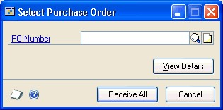

5.  Enter or select a purchase order for which you want to receive line items.

6.  Choose Receive All in the Select Purchase Order window to automatically receive all items on the selected purchase order.

You cannot receive against a purchase order that has an unposted prepayment. You can remove the prepayment from the purchase order using the Purchase Order Entry window or complete a computer check run for the prepayment.

The control blanket line item for a blanket purchase order or a drop-ship blanket purchase order isn’t included when you automatically receive items. Blanket line items with a New status won’t be included, either. You can use the Receivings Transaction Entry window to enter blanket line items with a New status.

If you choose to view details in the Select Purchase Order window, the Select Purchase Order Items window will open, and the purchase order line items will be marked to receive. Choose Receive to automatically receive items on the selected purchase order.

Blanket line items with a New status or line items with a New status for a standard purchase order with an expired contract date won’t be marked. To receive these items, you must mark the items individually.

In the Receivings Transaction Entry window, continue entering receipt information, if necessary, and save or post the transaction.

### Using the Select Purchase Order Items window

Use the Select Purchase Order Items window to receive line items on multiple purchase orders. In the Select Purchase Order Items window, the tree view and the Sort By option control the information that is displayed. When you change the focus in the tree view, or when you choose a different sorting option, the information in the window is refreshed.

The scrolling window shows detail about the object selected in the tree view. When you highlight a different object in the tree view, such as a purchase order or a site, only the information about that object is displayed in the scrolling window. To display all information for a vendor, you must select the vendor ID in the tree view.

If you are using Project Accounting, the Project Number field and the Cost Category ID field will be displayed in the Select Purchase Order Items scrolling window.

The sorting option you select determines the order in which objects appear in the tree view and the scrolling window. You can sort objects in four ways:

**PO/Items** Objects in the tree view and scrolling window are sorted first by purchase order number, then by the order items were entered on the purchase orders.

**Item Number/PO** Objects in the tree view and scrolling window are sorted first by item number, then by purchase order number under each item.

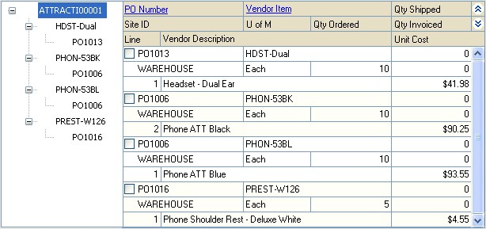

**Site/PO/Item Number** Objects in the tree view and scrolling window are sorted first by site, then by purchase order number under each site, then by item number under each purchase order.

**Site/Item Number/PO** Objects in the tree view and scrolling window are sorted first by site, then by item number under each site, then by purchase order number under each item.

### Receiving items from multiple purchase orders

Use the Select Purchase Order Items window to receive line items on multiple purchase orders. New, Released, or Change Order purchase orders that have one or more items with a quantity remaining to receive will be displayed. See *Receiving a shipment* or *Receiving a shipment/invoice* for more information.

If you are using Workflow, purchase orders must be approved before you can receive against them. You can receive against purchase orders that don’t need approval.

If you are using Project Accounting, the Project Number field and the Cost Category ID field will be displayed in the Select Purchase Order Items window. To receive items from purchase orders with project information, see *Chapter 14, “Shipment receipt entry for projects.”*

**To receive items from multiple purchase orders:**

1.  In the navigation pane, choose the Purchasing button, and then choose the Purchase Order Transactions list.

2.  In the New group or its overflow menu, choose the appropriate document type for the transaction to open the Receivables Transaction Entry window.

3.  Enter the vendor document number, and date. (A vendor document number is required for a shipment/invoice.)

4.  Enter or select a vendor ID. The currency ID assigned to the vendor will be the default currency ID for the receipt.

5.  Choose the Auto-Rcv button. The Select Purchase Order Items window will open.

New, Released, or Change Order purchase orders that have one or more items with a quantity remaining to receive will be displayed. The control blanket line item for a blanket purchase order or a drop-ship blanket purchase order isn’t included when you automatically receive items.

If only a Vendor ID is displayed, the selected vendor does not have any New, Released, or Change Order purchase orders with items to receive. Only purchase orders with currency IDs that match the receipt will be displayed. Purchase orders with posted prepayments that have currency IDs that match the receipt will be displayed.

*If you know the purchase order number but not the vendor ID, you can choose AutoRcv without entering a vendor ID. The Select Purchase Order window will open. The vendor and currency ID for the receipt will come from the purchase order you select.*

6.  Select a sorting option.

7.  Mark the check boxes next to the items you want to receive. To select all items displayed in the scrolling window, choose Mark All.

Blanket line items with a New status or line items with a New status for a standard purchase order with an expired contract date won’t be marked. To receive these items, you must mark the items individually.

*When you choose Mark All or Unmark All in the Select Purchase Order Items window, only items displayed in the scrolling window will be marked or unmarked. For example, if a purchase order is selected in the tree view, only items from that purchase order will be displayed in the scrolling window, and only those items will be marked when you choose Mark All. To mark or unmark all items for a vendor, the vendor ID must be selected in the tree view.*

8.  Select whether to display all items or only items marked to receive.

9.  Edit Quantity Shipped, Quantity Invoiced (for shipment/invoice receipts) and Unit Cost amounts, if necessary. If you edit an item in the scrolling window, it will be marked to receive.

10.  Choose the Receive button to add the items to your receipt. The Select Purchase Order Items window will close, and the items will appear in the Receivings Transaction Entry window. Taxes are calculated at this time.

To cancel your selections, choose Cancel. To revert all displayed items to unmarked, choose Unmark All.

11.  In the Receivings Transaction Entry window, save or post the receipt.

### Receiving items from a purchase order

Use the Select Purchase Order Items window and the Receivings Transaction Entry window to receive items. After you enter or select a standard or blanket purchase order with a New, Released, or Change Order status in the Purchase Order Entry window, you can select to receive items or receive and invoice items. From the Actions button, you can select the Receive the PO Items option to enter a shipment receipt. You can select the Receive and Invoice the PO Items option to enter a shipment/invoice receipt for a purchase order. If you are using Workflow, the purchase order must be approved before you can receive against it. You can receive against a purchase order that doesn’t need approval.

For more information about a shipment receipt or a shipment/invoice receipt, see *Receiving a shipment* or *Receiving a shipment/invoice*. For more information about the Select Purchase Order Items window, see *Using the Select Purchase Order Items window*.

If you are using Project Accounting, the Project Number field and the Cost Category ID field will be displayed in the Select Purchase Order Items window and the Receivings Transaction Entry window. To receive items with project information, see *Chapter 14, “Shipment receipt entry for projects.”*

**To receive items from a purchase order:**

1.  Open the Purchase Order Entry window.
    (Purchasing \>\> Transactions \>\> Purchase Order Entry)

2.  Enter or select a standard or blanket purchase order that has one or more items with a quantity to receive.

3.  Choose Actions, and then select one of the following options.

    - If you are receiving goods and services without an invoice, select Receive the PO Items.

    - If you are receiving goods and services accompanied by an invoice, select Receive and Invoice the PO Items.

4.  The Select Purchase Order Items window and the Receivings Transaction Entry window will open.

In the Select Purchase Order Items window, New, Released, or Change Order purchase orders that have one or more items with a quantity remaining to receive will be displayed. The purchase order that you entered in the Purchase Order Entry window will be selected in the tree view. Each item on the purchase order that is available to be received in the scrolling window is marked, except for blanket line items that have a status of New. The control blanket line item for a blanket purchase order isn’t included when you receive items.

5.  Select a sorting option.

6.  Mark the check boxes next to the items to receive. To select all items displayed in the scrolling window, choose Mark All.

Blanket line items with a New status or line items with a New status for a standard purchase order with an expired contract date won’t be marked. To receive these items, you must mark the items individually.

*When you choose Mark All or Unmark All, only items displayed in the scrolling window will be marked or unmarked. For example, if a purchase order is selected in the tree view, only items from that purchase order will be displayed in the scrolling window, and only those items will be marked when you choose Mark All. To mark or unmark all items for a vendor, the vendor ID must be selected in the tree view.*

7.  Select whether to display all items or only items marked to receive.

8.  Modify the quantity shipped, quantity invoiced (for shipment/invoice receipts) and unit cost amounts, if necessary. If you edit an item in the scrolling window, it will be marked to receive.

9.  Choose Receive to add the items to your receipt. The Select Purchase Order Items window will close, and the items will appear in the Receivings Transaction Entry window. Taxes are calculated at this time.

To cancel your selections, choose Cancel. To revert all displayed items to unmarked, choose Unmark All.

10.  In the Receivings Transaction Entry window, continue entering receipt information, if necessary, and save or post the transaction. For a shipment/invoice, you must enter the vendor document number.

### Entering an in-transit inventory receipt

If you’ve entered an in-transit transfer transaction in Inventory Control, you can record the receipt of the material into the final destination site using an in-transit inventory receipt type in the Receivings Transaction Entry window. Any landed costs incurred as a result of the in-transit transfer can be recorded on the in-transit inventory receipt, as well. After you post the in-transit inventory receipt, the goods are removed from the via site and placed in the final destination site. Landed costs from in-transit transfer receipts can be invoiced just like landed costs incurred on shipments or shipment invoices in the Purchasing Invoice Entry window.

If you are using Project Accounting, the Project Number field and the Cost Category ID field are displayed in the Receivings Transaction Entry window, but you can’t enter project information for an in-transit inventory receipt.

**To enter an in-transit inventory receipt:**

1.  In the navigation pane, choose the Purchasing button, and then choose the Purchase Order Transactions list.

2.  In the New group or its overflow menu, choose In-Transit Inventory to open the Receivings Transaction Entry window.

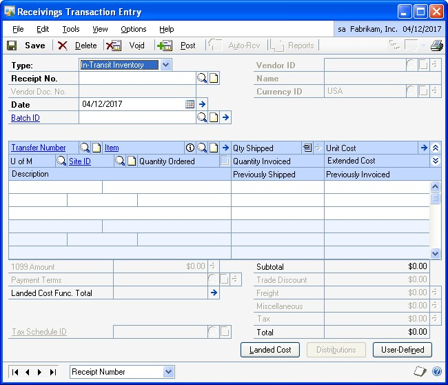

3.  Enter the receipt date.

*To enter a General Ledger posting date that is different from the transaction date, choose the Date expansion button; the Receivings Date Entry window will open, where you can enter date information.*

4.  Enter or select a batch ID (optional).

See *Creating a receipt batch* for more information.

5.  Enter or select the transfer number for which you’re entering a receipt. You can receive items from multiple transfer numbers by entering or selecting a different transfer number in a new row.

6.  Enter items using either the vendor’s item number or your company’s item number. You also can enter a non-inventoried item.

To add an attachment to the item, select the item and choose the Attachment Management icon to open the Document Attachment Management window.

7.  Enter the quantity shipped.

*The In-Transit Lot Number Entry window or the In-Transit Serial Number Entry window opens if the item requires that you assign lot or serial numbers. If you are using multiple bins, you also can enter a bin number for the serial or lot number. The Bin Quantity Entry window opens if an item that isn’t tracked by lot or serial numbers requires that you enter bin information.*

If you’re using multiple bins and you change the quantity shipped or the unit of measure after selecting bins for an item, you might have to modify the bin information.

8.  You can change the site ID to receive line items to a location other than the location specified on the in-transit transfer, if the Change Site ID in Receiving option is marked in Purchase Order Processing Setup window. Changing the site on the receipt will not change the site on the in-transit transfer.

If you are using multiple bins and you change the site ID, the default purchase receipts bin assigned to the new site ID will replace your previous bin selections. If the item is tracked by serial or lot numbers, your previous lot number or serial number selections are removed. The In-Transit Lot Number Entry window or the In-Transit Serial Number Entry window will open for you to assign lot numbers or serial numbers. You can change the bin.

9.  If you are using landed costs, choose Landed Cost to open the Receivings Landed Cost Apportionment window, where you can add landed costs to all line items on a receipt. See *Entering landed costs for a shipment receipt* for more information. If you want to enter landed costs for an item, see *Entering landed costs for a shipment item*.

10.  Choose the Attachment Management icon to attach documents to the in-transit transfer, if applicable.

11.  Choose User-Defined to open the Receivings User-Defined Fields Entry window, where you can enter user-defined information for this receipt.

12.  Choose Save or Post. If you post the receipt, one or more posting journals and distribution breakdown registers may be printed, depending on the options selected in the Posting Setup window.

If you’ve entered a batch ID, you can’t post the transaction individually; you must use batch posting, series posting, or master posting. For more information, see *Chapter 12, “Receipt batches.”*

### Using the Select In-Transit Items window

Use the Select In-Transit Items window to receive line items on in-transit transfer transactions. In the Select In-Transit Items window, the tree view and the Sort By option control the information that is displayed. When you change the focus in the tree view, or when you choose a different sorting option, the information in the window is refreshed.

The scrolling window shows detail about the object selected in the tree view. When you highlight a different object in the tree view, such as an in-transit item or a site, only the information about that object is displayed in the scrolling window. To display all information for an in-transit transfer, you must select the in-transit transfer in the tree view.

The sorting option you select determines the order in which objects appear in the tree view and the scrolling window. You can sort objects in four ways:

**Transfer/Items** Objects in the tree view and scrolling window are sorted first by transfer number, then by the order items were entered on the transfers.

**Item Number/Transfer** Objects in the tree view and scrolling window are sorted first by item number, then by transfer number under each item.

**Site/Transfer/Item Number** Objects in the tree view and scrolling window are sorted first by site, then by transfer number under each site, then by item number under each transfer.

**Site/Item Number/Transfer** Objects in the tree view and scrolling window are sorted first by site, then by item number under each site, then by transfer number under each item.

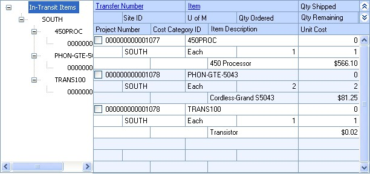

### Receiving items from in-transit transfers

Use the Select In-Transit Items window to receive line items on multiple in-transit transfers. In-transit transfers that have one or more items with a quantity remaining to receive will be displayed. See *Entering an in-transit inventory receipt* for more information.

**To receive items from an in-transit transfer:**

1.  In the navigation pane, choose the Inventory button, and then choose the InTransit Transfers list.

2.  Mark the in-transit transfers you want to receive against.

3.  In the Actions group, choose Receive Items.

4.  The Select In-Transit Items window and the Receivings Transaction Entry window will open.

In the Select In-Transit Items window, in-transit transfers that have one or more items with a quantity remaining to receive will be displayed. Each item on the in-transit transfer that is available to be received in the scrolling window is marked.

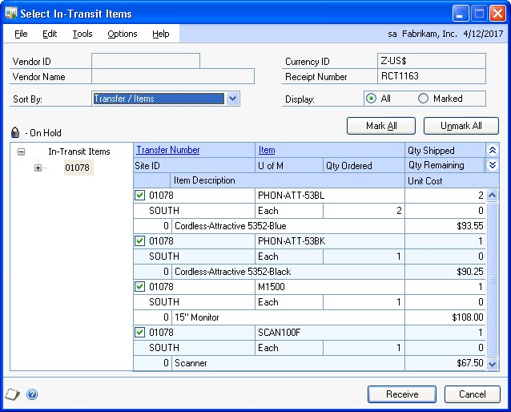

5.  Select a sorting option.

6.  Mark the check boxes next to the items you want to receive. To select all items displayed in the scrolling window, choose Mark All.

*When you choose Mark All or Unmark All in the Select In-Transit Items window, only items displayed in the scrolling window will be marked or unmarked. For example, if an in-transit transfer is selected in the tree view, only items from that in-transit transfer will be displayed in the scrolling window, and only those items will be marked when you choose Mark All. To mark or unmark all items, the In-Transit Items must be selected in the tree view.*

7.  Select whether to display all items or only items marked to receive.

8.  Edit Quantity Shipped, if necessary. You can’t enter a quantity shipped that is greater than the quantity remaining to be received. If you edit an item in the scrolling window, it will be marked to receive.

9.  Choose the Receive button to add the items to your receipt. The Select In-Transit Items window will close, and the items will appear in the Receivings Transaction Entry window.

To cancel your selections, choose Cancel. To revert all displayed items to unmarked, choose Unmark All.

10.  In the Receivings Transaction Entry window, save or post the receipt.

## Chapter 14: Shipment receipt entry for projects

If you are using Project Accounting, you can enter a shipment receipt to record shipments received for purchase orders entered for projects. You can enter shipment receipts and shipment/invoice receipts in Purchase Order Processing. Enter a shipment/invoice receipt to record the receipt of goods and services accompanied by an invoice. Enter a shipment receipt to record the receipt of goods and services without an invoice. You can enter receipt transactions in a batch or enter and post them individually. Receipts can’t be saved unless they’re in a batch.

To enter a shipment/invoice receipt or a shipment receipt for a blanket purchase order, refer to *Chapter 13, “Shipment and in-transit inventory receipt entry.”*

This information is divided into the following sections:

- *Receiving a shipment/invoice for projects*

- *Receiving a shipment for projects*

- *Receiving project items without a purchase order*

- *Receiving items for projects using the Select Purchase Order window*

- *Receiving items for projects from multiple purchase orders*

- *Receiving items for projects from a purchase order*

### Receiving a shipment/invoice for projects

Use the Receivings Transaction Entry window to record a shipment/invoice if you’ve received an invoice and merchandise at the same time. The inventory quantity on hand will be updated for the items received and the vendor’s account will be increased. You can include items from multiple purchase orders (from a single vendor) on a shipment/invoice receipt. To enter a shipment/invoice receipt for a blanket purchase order, refer to *Chapter 13, “Shipment and in-transit inventory receipt entry.”*

When you enter a shipment/invoice receipt for a non-inventoried item and then save or post the transaction, the project costs will be updated automatically. For an inventoried item, the actual costs for the item will be updated automatically. You can receive against line items with New, Released, Change Order, or Received statuses.

If you are using Workflow, the purchase order must be approved before you can receive against the purchase order. You can receive against purchase orders that don’t need approval.

You can’t enter a shipment/invoice receipt for a purchase order that is on hold. If a purchase order is placed on hold after its shipment/invoice receipt is saved to a batch, the receipt for that purchase order will not be posted and will remain in the batch.

You can use the View \>\> Currency menu option or the currency list button to view currency amounts in the Receivings Transaction Entry window in the originating or functional currency.

**To receive a shipment/invoice for projects:**

1.  Open the Receivings Transaction Entry window.
    (Purchasing \>\> Transactions \>\> Receivings Transaction Entry)

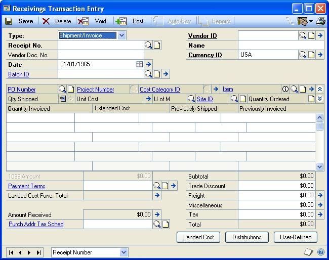

2.  Select Shipment/Invoice as the document type for the transaction.

3.  Enter or select the receipt number.

4.  Enter a vendor document number.

5.  Enter the receipt date.

*To enter a General Ledger posting date that is different from the transaction date, choose the Date expansion button; the Receivings Date Entry window will open, where you can enter date information.*

For multicurrency transactions, the document date determines which exchange rate is used, based on the currency ID and the associated rate type entered for the transaction.

6.  Enter or select a batch ID (optional).

In multicurrency transactions, if the batch posting date does not fall on or before the exchange rate’s expiration date, you will receive a message. Choose Yes to open the Batch Entry window and change the batch posting date. If you choose No, you will be able to save but not post the receipt.

See *Creating a receipt batch* for more information.

7.  Enter or select a vendor ID.

8.  Enter or select a currency ID. If a currency ID is assigned to the vendor you select, it will appear in the Currency ID field. The currency ID assigned to the shipment/invoice must match the currency ID of the purchase orders being received against.

9.  Enter or select the purchase order number for which you’re receiving a shipment/invoice. You can receive items from multiple purchase orders by entering or selecting a different purchase order number in a new row. See *Receiving items for projects from multiple purchase orders* for more information.

If the Allow Receiving Without a Purchase Order option is marked in the Purchase Order Processing Setup window, you can leave the PO Number field blank.

You can enter a purchase order that hasn’t been printed if the Allow Receiving of Unprinted PO option is marked in the PA Purchase Order Processing Setup Options window.

10.  Enter a project number and cost category ID.

You can’t enter a project number or a cost category if the Options \>\> Display Vendor Item is marked to display the vendor items.

11.  Enter one or more items using your company’s item number.s You also can enter non-inventoried items.

Inventoried items entered for a project must be assigned to a cost category in the Budget Detail IV Items window. If the item isn’t assigned to a budget, you must add the item to the budget.

To add an attachment to the item, select the item and choose the Attachment Management icon to open the Document Attachment Management window.

12.  Enter the quantity shipped.

*The Purchasing Lot Number Entry window or the Purchasing Serial Number Entry window will open if the item requires that you assign lot or serial numbers. If you are using multiple bins, you also can enter a bin number for the serial or lot number. The Bin Quantity Entry window will open if an item that isn’t tracked by lot or serial numbers requires you to enter bin information.*

If you’re using multiple bins and you change the quantity shipped or the unit of measure after selecting bins for an item, you might have to modify the bin information.

13.  You can edit the unit cost or extended cost, if the Allow Editing of Costs in Receiving option is marked in the Purchase Order Processing Setup window.

14.  You can change the site ID to receive line items to a location other than the location specified on the purchase order, if the option is marked in Purchase Order Processing Setup. Changing the site on the receipt will not change the site on the purchase order.

If you are using multiple bins and you change the site ID, the default purchase receipts bin assigned to the new site ID will replace your previous bin selections. If the item is tracked by serial or lot numbers, your previous lot number or serial number selections are removed. The Purchasing Lot Number Entry window or the Purchasing Serial Number Entry window will open for you to assign lot numbers or serial numbers. You can change the bin.

15.  Enter the quantity invoiced, which is the number of items on the vendor’s invoice.

16.  Enter trade discount, freight, miscellaneous, and tax amounts.

Taxes will be calculated automatically as you enter items. For more information about tax calculations, see *Chapter 20, “Taxes for receipts.”* You can't change the Tax amount in the Receivings Transaction Entry window even if your system is set up to allow editing summary-level taxes. If you want to change the tax amounts for a line item, see *Calculating and distributing detail taxes for shipment/ invoice line items*.

17.  Enter or accept the 1099 amount, if applicable.

18.  Enter or accept the payment terms and tax schedule ID.

19.  To enter an amount received, choose the Amount Received expansion button to open the PA Receivings Amount Received Entry window. You can enter the amount you’re paying by cash, check, or credit card.

20.  Choose the Attachment Management icon to attach documents to the shipment/invoice, if applicable.

21.  If you are using landed costs, choose Landed Cost to open the Receivings Landed Cost Apportionment Entry window, where you can add landed costs to all line items on a receipt. See *Entering landed costs for a shipment receipt* for more information. If you want to enter landed costs for an item, see *Entering landed costs for a shipment item*.

22.  Choose Distributions to open the Purchasing Distribution Entry window, where you can make changes to account distributions.

    - To add additional accounts, select the account and enter an amount.

    - To remove an account in the scrolling window, select the row containing the account and choose Edit \>\> Delete Row.

    - To restore the original distributions, choose Default.

If you are using landed costs, the distributions for a landed cost won’t be displayed in the Purchasing Distribution Entry window. To view landed cost distributions, print the Receivings Edit List.

See *Distributing transaction amounts for shipment receipts* for more information.

23.  Choose User-Defined to open the Receivings User-Defined Fields Entry window, where you can enter user-defined information for this receipt.

24.  Choose Save or Post. If you post the receipt, one or more posting journals and distribution breakdown registers may be printed, depending on the options selected in the Posting Setup window.

If you’ve entered a batch ID, you can’t post the transaction individually; you must use batch posting, series posting, or master posting. For more information, see *Chapter 12, “Receipt batches.”*

### Receiving a shipment for projects

Use the Receivings Transaction Entry window to record a shipment if you’ve received merchandise but haven’t received the invoice for the merchandise. A shipment receipt will increase the quantity on hand for the items received for sales and discontinued item types. You can include items from multiple purchase orders (from a single vendor) on a shipment receipt. To enter a shipment receipt for a blanket purchase order, refer to *Chapter 13, “Shipment and in-transit inventory receipt entry.”*

When you enter a shipment receipt for a non-inventoried item and then save or post the transaction, the project costs will be updated automatically. For an inventoried item, the actual costs for the item will be updated automatically.

You can receive against line items with New, Released, Change Order, or Received statuses.

If you are using Workflow, the purchase order must be approved before you can receive against the purchase order. You can receive against purchase orders that don’t need approval.

You can’t enter a shipment receipt for a purchase order that is on hold. If a purchase order is placed on hold after its shipment receipt is saved to a batch, the receipt for that purchase order will not be posted and will remain in the batch.

You can use the View \>\> Currency menu option or the currency list button to view amounts in the Receivings Transaction Entry window in originating or functional currency.

**To receive a shipment for projects:**

1.  Open the Receivings Transaction Entry window.
    (Purchasing \>\> Transactions \>\> Receivings Transaction Entry)

2.  Select Shipment as the document type for the transaction.

3.  Enter or select the receipt number.

4.  Enter a vendor document number (optional).

5.  Enter the receipt date.

*To enter a General Ledger posting date that is different from the transaction date, choose the Date expansion button; the Receivings Date Entry window will open, where you can enter date information.*

For multicurrency transactions, the document date determines which exchange rate is used, based on the currency ID and associated rate type that’s entered for the transaction.

6.  Enter or select a batch ID (optional). See *Creating a receipt batch* for more information.

In multicurrency transactions, if the batch posting date does not fall on or before the exchange rate’s expiration date, you will receive a message. Choose Yes to open the Batch Entry window and change the batch posting date. If you choose No, you will be able to save but not post the receipt.

7.  Enter or select the vendor ID.

8.  Enter or select a currency ID. If a currency ID is assigned to the vendor you select, it will appear in the Currency ID field. The currency ID assigned to the invoice must match the currency ID of the purchase order being received against.

9.  Enter the purchase order number for which you’re receiving a shipment. You can receive items from multiple purchase orders by entering or selecting a different purchase order number in a new row. See *Receiving items for projects from multiple purchase orders* for more information.

If the Allow Receiving Without a Purchase Order option is marked in the Purchase Order Processing Setup window, you can leave the PO Number field blank.

You can enter a purchase order that hasn’t been printed if the Allow Receiving of Unprinted PO option is marked in the PA Purchase Order Processing Setup Options window.

10.  Enter a project number and cost category ID.

You can’t enter a project number or a cost category if the Options \>\> Display Vendor Item is marked to display the vendor items.

11.  Enter one or more items using your company’s item numbers. You also can enter non-inventoried items.

Inventoried items entered for a project must be assigned to a cost category in the Budget Detail IV Items window. If the item isn’t assigned to a budget, you must add the item to the budget.

To add an attachment to the item, select the item and choose the Attachment Management icon to open the Document Attachment Management window.

12.  You can change the site ID to receive line items to a location other than the location specified on the purchase order, if the option is marked in Purchase Order Processing Setup. Changing the site on the receipt will not change the site on the purchase order.

If you are using multiple bins and you change the site ID, the default purchase receipts bin assigned to the new site ID will replace your previous bin selections. If the item is tracked by serial or lot numbers, your previous lot number or serial number selections are removed. The Purchasing Lot Number Entry window or the Purchasing Serial Number Entry window will open for you to assign lot numbers or serial numbers. You can change the bin.

13.  Enter the quantity shipped.

*The Purchasing Lot Number Entry window or the Purchasing Serial Number Entry window will open if the item requires that you assign lot or serial numbers. If you are using multiple bins, you also can enter a bin number for the serial or lot number. The Bin Quantity Entry window will open if an item that isn’t tracked by lot or serial numbers requires you to enter bin information.*

If you're using multiple bins and you change the quantity shipped or the unit of measure after selecting bins for an item, you might have to modify the bin information.

14.  You can edit the unit cost or extended cost, if the Allow Editing of Costs in Receiving option is marked in Purchase Order Processing Setup.

15.  Choose the Attachment Management icon to attach documents to the shipment, if applicable.

16.  If you are using landed costs, choose Landed Cost to open the Receivings Landed Cost Apportionment Entry window, where you can add landed costs to all line items on a receipt. See *Entering landed costs for a shipment receipt* for more information. If you want to enter landed costs for an item, see *Entering landed costs for a shipment item*.

17.  Choose Distributions to open the Purchasing Distribution Entry window, where you can make changes to account distributions.

    - To add additional accounts, select the account and enter an amount.

    - To remove an account in the scrolling window, select the row containing the account and choose Edit \>\> Delete Row.

    - To restore the original distributions, choose Default.

If you are using landed costs, the distributions for a landed cost won’t be displayed in the Purchasing Distribution Entry window. To view landed cost distributions, print the Receivings Edit List.

See *Distributing transaction amounts for shipment receipts* for more information.

18.  Choose User-Defined to open the Receivings User-Defined Fields Entry window, where you can enter user-defined information for this receipt.

19.  Choose Save or Post. If you post the receipt, one or more posting journals and distribution breakdown registers may be printed, depending on the options selected in the Posting Setup window.

If you’ve entered a batch ID, you can’t post the transaction individually; you must use batch posting, series posting, or master posting. For more information, see *Chapter 12, “Receipt batches.”*

### Receiving project items without a purchase order

In the Receivings Transaction Entry window, you have the option to receive items that weren’t included on the original purchase order or receive items without a purchase order.

To set up this option, you must select to allow receiving items without a purchase order in the Purchase Order Processing Setup window. You may assign a password that must be entered before entering a line item not assigned to a purchase order.

**To receive project items without a purchase order:**

1.  Open the Receivings Transaction Entry window.
    (Purchasing \>\> Transactions \>\> Receivings Transaction Entry)

2.  Select the appropriate document type for the transaction.

3.  Enter the receipt number, vendor document number, date, and vendor ID.

4.  Enter a project number and cost category ID. If the item that you’re receiving isn’t assigned to a project because the item isn’t assigned to a budget, enter \<NONE\> or leave the Project No. field blank. If there isn’t a project number, you can leave the Cost Category field blank. If the item is assigned to a project, you must enter a cost category.

You can’t enter a project number or a cost category if the Options \>\> Display Vendor Item is marked to display vendor items.

5.  To add items that weren’t included on the original purchase order, leave the PO number field blank. You don’t have to enter a purchase order if you’ve set up the system to allow receiving items without a purchase order.

Inventoried items entered for a project must be assigned to a cost category in the Budget Detail IV Items window. If the item isn’t assigned to a budget, you must add the item to the budget. You cannot add a new inventoried item if the Allow Entry of New Budgets/Materials option is not marked in the User Purchase Order Settings window. See *Inventoried items and non-inventoried items for projects* for more information.

6.  Continue entering the receipt.

You must enter the unit cost of non-inventoried items.

7.  In the Receivings Transaction Entry window, save or post the transaction.

### Receiving items for projects using the Select Purchase Order window

Use the Select Purchase Order window to select a purchase order to quickly enter line items on a shipment or shipment/invoice. See *Receiving a shipment for projects* or *Receiving a shipment/invoice for projects* for more information. To receive items on a blanket purchase order, refer to *Chapter 13, “Shipment and intransit inventory receipt entry.”*

If you are using Workflow, the purchase order must be approved before you can receive against the purchase order. You can receive against purchase orders that don’t need approval.

**To receive items for projects using the Select Purchase Order window:**

1.  Open the Receivings Transaction Entry window.
    (Purchasing \>\> Transactions \>\> Receivings Transaction Entry)

2.  Select the appropriate document type for the transaction.

3.  Enter the receipt number, vendor document number, and date. (A vendor document number is required for a shipment/invoice.)

4.  Choose Auto-Rcv to automatically receive items. The Select Purchase Order window will open.

*If you entered a vendor ID, the Select Purchase Order Items window will open instead of the Select Purchase Order window.*

5.  Enter or select a purchase order for which you want to receive line items.

6.  Choose Receive All in the Select Purchase Order window to automatically receive all items on the selected purchase order.

If you choose to view details in the Select Purchase Order window, the Select Purchase Order Items window will open, and the purchase order line items will be marked to receive. Choose Receive to automatically receive items on the selected purchase order.

7.  In the Receivings Transaction Entry window, continue entering receipt information, if necessary, and save or post the transaction.

### Receiving items for projects from multiple purchase orders

Use the Select Purchase Order Items window to receive line items for projects on multiple purchase orders. New, Released, or Change Order purchase orders that have one or more items with a quantity remaining to receive will be displayed. See *Receiving a shipment for projects* or *Receiving a shipment/invoice for projects* for more information.

To receive items from multiple blanket purchase orders, refer to *Chapter 13, “Shipment and in-transit inventory receipt entry.”*

If you are using Workflow, the purchase orders must be approved before you can receive against them. You can receive against purchase orders that don’t need approval.

**To receive items for projects from multiple purchase orders for
projects:**

1.  Open the Receivings Transaction Entry window.
    (Purchasing \>\> Transactions \>\> Receivings Transaction Entry)

2.  Select the appropriate document type for the transaction.

3.  Enter the receipt number, vendor document number, and date. (A vendor document number is required for a shipment/invoice.)

4.  Enter or select a vendor ID. The currency ID assigned to the vendor will be the default currency ID for the receipt.

5.  Choose the Auto-Rcv button. The Select Purchase Order Items window will open.

New, Released, or Change Order purchase orders that have one or more items with a quantity remaining to receive will be displayed.

If only a Vendor ID is displayed, the selected vendor does not have any New, Released, or Change Order purchase orders with items to receive. Only purchase orders with currency IDs that match the receipt will be displayed.

*If you know the purchase order number but not the vendor ID, you can choose AutoRcv without entering a vendor ID. The Select Purchase Order window will open. The vendor and currency ID for the receipt will come from the purchase order you select.*

6.  Select a sorting option.

7.  Mark the check boxes next to the items you want to receive. To select all items displayed in the scrolling window, choose Mark All.

*When you choose Mark All or Unmark All in the Select Purchase Order Items window, only items displayed in the scrolling window will be marked or unmarked. For example, if a purchase order is selected in the tree view, only items from that purchase order will be displayed in the scrolling window, and only those items will be marked when you choose Mark All. To mark or unmark all items for a vendor, the vendor ID must be selected in the tree view.*

8.  Select whether to display all items or only items marked to receive.

9.  Modify the quantity shipped, quantity invoiced (for shipment/invoice receipts) and unit cost amounts, if necessary. If you edit an item in the scrolling window, it will be marked to receive.

10.  Choose the Receive button to add the items to your receipt. The Select Purchase Order Items window will close, and the items will appear in the Receivings Transaction Entry window. Taxes are calculated at this time.

To cancel your selections, choose Cancel. To revert all displayed items to unmarked, choose Unmark All.

11.  In the Receivings Transaction Entry window, save or post the receipt.

### Receiving items for projects from a purchase order

Use the Select Purchase Order Items window and the Receivings Transaction Entry window to receive items. After you enter or select a standard order with New, Released, or Change Order statuses in the Purchase Order Entry window, you can select to receive items or receive and invoice items. From the Actions button, you can select the Receive the PO Items option from the Actions button to enter a shipment receipt. You can select the Receive and Invoice the PO Items option to enter a shipment/invoice receipt for a purchase order.

If you are using Workflow, the purchase order must be approved before you can receive against the purchase order. You can receive against purchase orders that don’t need approval.

For more information about a shipment receipt or a shipment/invoice receipt, see *Receiving a shipment for projects* or *Receiving a shipment/invoice for projects*. For more information about the Select Purchase Order Items window, see *Using the Select Purchase Order Items window*.

To receive items from a blanket purchase order, refer to *Chapter 13, “Shipment and in-transit inventory receipt entry.”*

**To receive items for projects from a purchase order:**

1.  Open the Purchase Order Entry window.
    (Purchasing \>\> Transactions \>\> Purchase Order Entry)

2.  Enter or select a standard purchase order that has one or more items with a quantity to receive.

3.  Choose Actions, and then select one of the following options.

- If you are receiving goods and services without an invoice, select Receive the PO Items.

- If you are receiving goods and services accompanied by an invoice, select Receive and Invoice the PO Items.

4.  The Select Purchase Order Items window and the Receivings Transaction Entry window will open.

In the Select Purchase Order Items window, New, Released, or Change Order purchase orders that have one or more items with a quantity remaining to receive will be displayed. The purchase order that you entered in the Purchase Order Entry window will be selected in the tree view. Each item on the purchase order that is available to be received in the scrolling window is marked.

5.  Select a sorting option.

6.  Mark the check boxes next to the items to receive. To select all items displayed in the scrolling window, choose Mark All.

*When you choose Mark All or Unmark All, only items displayed in the scrolling window will be marked or unmarked. For example, if a purchase order is selected in the tree view, only items from that purchase order will be displayed in the scrolling window, and only those items will be marked when you choose Mark All. To mark or unmark all items for a vendor, the vendor ID must be selected in the tree view.*

7.  Select whether to display all items or only items marked to receive.

8.  Modify the quantity shipped, quantity invoiced (for shipment/invoice receipts) and unit cost amounts, if necessary. If you modify an item in the scrolling window, it will be marked to receive.

9.  Choose Receive to add the items to your receipt. The Select Purchase Order Items window will close, and the items will appear in the Receivings Transaction Entry window. Taxes are calculated at this time.

To cancel your selections, choose Cancel. To revert all displayed items to unmarked, choose Unmark All.

10.  In the Receivings Transaction Entry window, continue entering receipt information, if necessary, and save or post the transaction. For a shipment/invoice, you must enter the vendor document number.

## Chapter 15: Shipment receipt detail entry

The Receivings Transaction Entry window is designed to resemble a physical shipment document and includes vendor, line item, and total information. Use the expansion buttons in the Receivings Transaction Entry window to open windows where you can enter detailed information about a line item, lot number, serial number mask, or other elements of a transaction.

This information is divided into the following sections:

- *Entering detail information for a purchasing receipt*

- *Entering detail information for an in-transit inventory receipt*

- *Entering project item detail information for a purchasing receipt*

- *Defining a lot number mask*

- *Generating lot numbers automatically for a shipment or shipment/invoice receipt*

- *Entering lot numbers manually for a shipment or shipment/invoice receipt*

- *Entering lot numbers for an in-transit inventory receipt*

- *Removing lot numbers from a shipment or shipment/invoice receipt*

- *Defining a serial number mask*

- *Generating serial numbers automatically for a shipment or shipment/invoice receipt*

- *Entering serial numbers manually for shipment or shipment/invoice receipt*

- *Entering serial numbers for an in-transit inventory receipt*

- *Removing serial numbers from a shipment or shipment/invoice receipt*

- *Multiple bins in Purchase Order Processing*

- *Changing bins for a receipt*

- *Merging trade discount and purchase distributions*

- *Distributing transaction amounts for shipment receipts*

- *Entering Intrastat trade statistics*

### Entering detail information for a purchasing receipt

Use the Receivings Item Detail Entry window to add or modify line item information such as rejected quantities, or to change a line item’s posting accounts. If you select an item in the Receivings Transaction Entry window before opening this window, information for that item will be displayed.

If you are using Project Accounting, the Project Number field and the Cost Category ID field will be displayed in the Receivings Item Detail Entry window, but you can’t enter project information for blanket purchase order line items. To enter additional information for a line item assigned to a project, see *Entering project item detail information for a purchasing receipt*.

**To enter detail information for a purchasing receipt:**

1.  Open the Receivings Transaction Entry window.
    (Purchasing \>\> Transactions \>\> Receivings Transaction Entry)

2.  Enter or select a receipt number and vendor and open the Receivings Item Detail Entry window by choosing the Vendor Item or Item expansion button.

Currency amounts in this window may be displayed in the functional or originating currency, depending on the view selected in the Receivings Transaction Entry window.

3.  Enter the purchase order number for which you’re receiving a shipment. You can receive items from multiple purchase orders by entering or selecting a different purchase order number in a new row. See *Receiving items from multiple purchase orders* for more information.

If the Allow Receiving Without a Purchase Order option is marked in Purchase Order Processing Setup, you can leave the PO Number field blank.

If you are using Workflow, the purchase order must be approved before you can receive against the purchase order. You can receive against purchase orders that don’t need approval.

4.  If you are entering an item for a project, assign a project number and cost category ID.

You can’t enter a project number or a cost category if the Options \>\> Display Vendor Item is marked to display the vendor items.

5.  Enter or select the number of the vendor item or item you’re receiving. You also can enter a non-inventoried item.

Inventoried items entered for a project must be assigned to a cost category in the Budget Detail IV Items window. If the item isn’t assigned to a budget, you must add the item to the budget. See *Inventoried items and non-inventoried items for projects* for more information.

6.  Enter the quantity shipped.

*The Purchasing Lot Number Entry window or the Purchasing Serial Number Entry window will open if the item requires that you assign lot or serial numbers. If you are using multiple bins, you also can enter a bin number for the serial or lot number. The Bin Quantity Entry window will open if an item that isn’t tracked by lot or serial numbers requires you to enter bin information. You can't assign serial or lot numbers to a non-inventoried item.*

An icon will be displayed in the Qty Shipped field for purchase order line items with sales commitments. Select a line item and choose the button next to the Qty Shipped heading to view or prioritize commitments in the Sales Commitments for Purchase Order window. For more information, see *Committing purchase orders to sales documents*. If you are using Project Accounting, you can’t commit purchase order line items for projects to Sales Order Processing line items.

If you're using multiple bins and you change the quantity shipped or the unit of measure after selecting bins for an item, you might have to modify the bin information.

7.  If you want to enter landed costs for an item, choose the Unit Cost expansion button to open the Receivings Landed Cost Entry window. See *Entering landed costs for a shipment item* for more information.

8.  You can change the site ID to receive line items to a location other than the location specified on the purchase order, if the option is marked in Purchase Order Processing Setup. Changing the site on the receipt will not change the site on the purchase order.

If you are using multiple bins and you change the site ID, the default purchase receipts bin assigned to the new site ID will replace your previous bin selections. If the item is tracked by serial or lot numbers, your previous lot number or serial number selections are removed. The Purchasing Lot Number Entry window or the Purchasing Serial Number Entry window will open for you to assign lot numbers or serial numbers. You can change the bin.

If you’re using landed costs and change the site ID, the landed cost group ID will change to the landed cost group ID assigned to the item at the new site. You can specify a landed cost group for each item-site combination in the Item Quantities Maintenance window.

9.  Enter the quantity invoiced, which is the number of items on the vendor’s invoice.

10.  The default accounts for posting the receipt and for posting purchase price variances will be displayed. If no accounts are displayed, you can enter them.

Default accounts come from the purchase order. If you’re receiving without a purchase order, the default accounts will come from the item. If there are no accounts associated with an inventoried item, the accounts will come from Posting Accounts Setup. If there are no accounts associated with a noninventoried item, the accounts will come from the vendor or Posting Accounts Setup.

11.  Enter the quantity rejected, if any, and a rejected comment ID. You also can enter a comment explaining the reason for rejecting the goods. For more information about comments, see *Adding comments to purchasing documents*.

*Rejecting an item assumes that the vendor will be replacing the goods. If the goods won’t be replaced, you should enter a quantity canceled instead.*

12.  In the BOL/Pro No. field, enter the bill of lading or progressive number assigned to the shipment by the carrier.

13.  If you are using landed costs, enter a landed cost group ID or accept the default ID.

14.  Enter or accept the item tax option and the tax schedule IDs. The tax information is available only for shipment/invoices.

Taxes will be calculated automatically as you enter items. For more information about tax calculations, see *Chapter 20, “Taxes for receipts.”* If you want to change the tax amounts for the document, see *Calculating and distributing summary taxes for shipment/invoice receipts*. If you want to change the tax amounts for a line item, see *Calculating and distributing detail taxes for shipment/invoice line items*.

15.  Enter the actual date the vendor shipped the order (optional).

16.  Choose Save to save the item information.

### Entering detail information for an in-transit inventory receipt

Use the Receivings Item Detail Entry window to modify line item information such as rejected quantities, or to change a line item’s posting account. If you select an item in the Receivings Transaction Entry window before opening this window, information for that item will be displayed.

**To enter detail information for an in-transit inventory receipt:**

1.  Open the Receivings Transaction Entry window.
    (Purchasing \>\> Transactions \>\> Receivings Transaction Entry)

2.  Enter or select a receipt number and open the Receivings Item Detail Entry window by choosing the Item expansion button.

3.  Enter the transfer number for which you’re entering a receipt. You can receive items from multiple in-transit transfers by entering or selecting a different transfer number in a new row.

4.  Enter or select the number of the item.

5.  Enter the quantity shipped.

*The In-Transit Lot Number Entry window or the In-Transit Serial Number Entry window opens if the item requires that you assign lot or serial numbers. If you are using multiple bins, you also can enter a bin number for the serial or lot number. The Bin Quantity Entry window opens if an item that isn’t tracked by lot or serial numbers requires you to enter bin information.*

If you’re using multiple bins and you change the quantity shipped after selecting bins for an item, you might have to modify the bin information.

6.  If you want to enter landed costs for an item, choose the Unit Cost expansion button to open the Receivings Landed Cost Entry window. See *Entering landed costs for a shipment item* for more information.

7.  You can change the site ID to receive line items to a location other than the location specified on the purchase order, if the Change Site ID in Receiving option is marked in Purchase Order Processing Setup window. Changing the site on the receipt will not change the site on the in-transit transfer.

If you are using multiple bins and you change the site ID, the default purchase receipts bin assigned to the new site ID will replace your previous bin selections. If the item is tracked by serial or lot numbers, your previous lot number or serial number selections are removed. The In-Transit Lot Number Entry window or the In-Transit Serial Number Entry window opens for you to assign lot numbers or serial numbers. You can change the bin.

If you’re using landed costs and change the site ID, the landed cost group ID changes to the landed cost group ID assigned to the item at the new site. You can specify a landed cost group for each item-site combination in the Item Quantities Maintenance window.

8.  The default account for posting the receipt is displayed. If no account is displayed, you can enter it.

The inventory account assigned to the item in the Item Account Maintenance window is the default posting account. If you didn’t enter posting accounts in the Item Account Maintenance window, the inventory account entered in the Posting Setup window is used as the default entry.

9.  Enter the quantity rejected, if any, and a rejected comment ID. You also can enter a comment explaining the reason for rejecting the goods. For more information about comments, see *Adding comments to purchasing documents*.

*Rejecting an item assumes that the item will be replaced. If the item won’t be replaced, you should enter a quantity canceled instead.*

10.  In the BOL/Pro No. field, enter the bill of lading or progressive number assigned to the shipment by the carrier.

11.  If you are using landed costs, enter a landed cost group ID or accept the default ID.

12.  Enter the actual date the vendor shipped the order (optional).

13.  Choose Save to save the item information.

### Entering project item detail information for a purchasing receipt

You can use the PA Receivings Item Detail Entry window to add a billing note or modify the billing type. If the item is for a time and materials project, you can enter a billing rate or a markup percentage and view the accrued revenue.

**To enter project item detail information for a purchasing receipt:**

1.  Open the Receivings Transaction Entry window.
    (Purchasing \>\> Transactions \>\> Receivings Transaction Entry)

2.  Enter or select a receipt number, vendor ID, project number, cost category, and item.

3.  Choose the Cost Category expansion button to open the PA Receivings Item Detail Entry window.

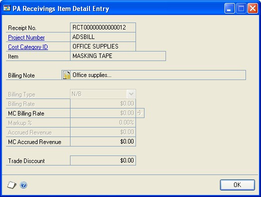

4.  Enter or modify a billing note.

5.  Modify the billing type, if applicable. The item must be a non-inventoried item to modify the billing type.

6.  If the non-inventoried item is for a time and materials project, you can enter a billing rate or markup percentage.

7.  Choose OK to close the window and return to the Receivings Transaction Entry window.

### Defining a lot number mask

Use the Item Serial/Lot Number Definition window to set up lot number masks for lot-tracked items. A lot number mask is a pre-defined lot number format used to generate lot numbers automatically. With a lot number mask, you can specify starting and ending lot numbers for an item, create incrementing segments, and control the character type. You must create a lot number mask before you can automatically generate lot numbers in Purchase Order Processing.

You also can enter a lot split quantity, which is the breakpoint for creating separate lots for a lot-tracked item. For example, assume that you enter a lot split quantity of 50. If you receive 120 units for a lot -tracked item, two lots of 50 and one lot of 20 are created. If the starting value for the mask is AA-001, the first lot is AA-001, the second lot is AA-002, and the third lot for the remainder is AA-003. If the lot split quantity is zero, the total quantity is treated as a single lot.

**To define a lot number mask:**

1.  Open the Item Maintenance window.
    (Inventory \>\> Cards \>\> Item)

2.  Select an item, then choose Options to open the Item Maintenance Options window.

3.  Choose Lot Numbers from the Track drop-down list, then choose the Track expansion button to open the Item Serial/Lot Number Definition window.

Information for the item you selected, including the last lot number that was generated and any current mask information, will appear.

4.  Enter a lot split quantity, if applicable.

5.  Select a character type for the first segment: Numeric, Alpha, Symbol, User Date, or Space. The character type will determine which of the remaining fields are editable.

6.  Enter a size, if you selected a character type of Alpha or Numeric.

Symbol and Space character types must have a size of 1. The size of a User Date segment depends on the date format you select.

7.  Mark Increment if you want this segment to increase each time a lot number is generated. You must have at least one segment marked to increment in order to automatically generate lot numbers for an item.

You can use the Increment option only if the character type is Alpha or Numeric. Symbol and space characters do not change. User date segments automatically increment when the user date changes.

If more than one segment is marked to increment, the segments increment from right to left. For example, assume you have incrementing segments 0001-0001. The next lot number contains the segments 0001-0002. The first segment increments when the second reaches its maximum value (from 0001-9999 to 0002-0000). If the mask contains a date segment, other incrementing segments will reset when the date segment increments.

8.  Enter starting and ending values.

If you selected a type of User Date or Space, you won’t be able to set starting and ending values. If you selected a type of Symbol, you will be able to enter a single character in the starting value field.

9.  If you selected a character type of User Date, select a date format.

10.  Choose the Insert button to add the segment to the lot number mask. The segment’s starting value appears in the Lot Number Mask field.

11.  Define and insert the remaining segments. lot number masks can be a maximum of 20 characters long.

12.  To move a segment to a different position in the lot number mask, select the segment, then choose Up or Down.

Choose Remove to delete the selected segment or choose Modify to change the selected segment’s information.

### Generating lot numbers automatically for a shipment or shipment/invoice receipt

Use the Purchasing Lot Number Entry window to assign lot numbers for lottracked line items. You can assign lot numbers automatically, manually, or a combination of the two. In order to automatically generate lot numbers, you must first set up the item and its lot number mask. For more information, see *Defining a lot number mask*.

If you’re using multiple bins and are generating lot numbers automatically, the bin number entered in the Purchasing Lot Number Entry window will be used with each generated lot number.

**To generate lot numbers automatically for a shipment or shipment/invoice receipt:**

1.  Open the Receivings Transaction Entry window.
    (Purchasing \>\> Transactions \>\> Receivings Transaction Entry)

2.  Enter or select a shipment or shipment/invoice that includes at least one lotnumbered item.

3.  Enter the quantity shipped for the line items that contain a lot number.

4.  Enter a site ID. Press TAB or choose the Quantity Shipped expansion button to open the Purchasing Lot Number Entry window. (This window will automatically open when you choose the Auto-Rcv button in the Receivings Transaction Entry window and lot-numbered items are entered for the receipt.)

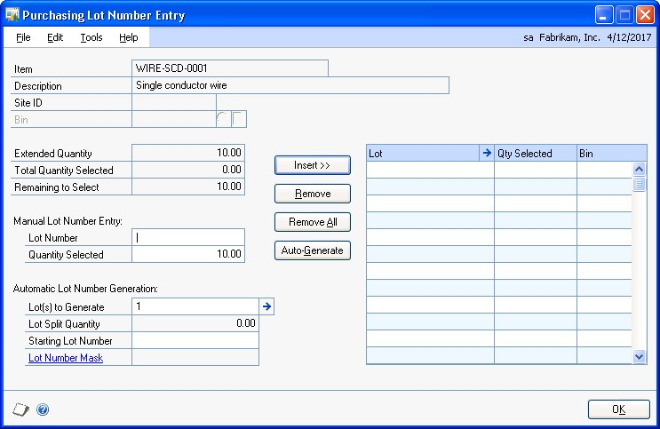

5.  If you are using multiple bins, enter a bin number or accept the default bin number.

*To set up a lot number mask for the item, click the Lot Number Mask link in the Purchasing Lot Number Entry window to open the Item Serial/Lot Number Definition window.*

6.  Enter the lot(s) to generate (optional). The default lot(s) to generate is the Remaining to Select quantity divided by the Lot Split Quantity rounded to the next whole number.

7.  Edit the starting lot number, if necessary.

If you modify the starting lot number, it must conform to the lot number mask. If you delete the starting lot number, you will not be able to automatically generate lot numbers for the item.

8.  Choose Auto-Generate. Lot numbers for the items are inserted in the scrolling window. Numbers that already exist will be skipped.

The Total Quantity Selected must equal the item’s extended quantity before you can move to the next line item in the Receivings Transaction Entry window or the Receivings Item Detail Entry window.

9.  Choose OK to save the lot numbers that were automatically generated.

### Entering lot numbers manually for a shipment or shipment/invoice receipt

Use the Purchasing Lot Number Entry window to assign lot numbers for shipment or shipment/invoice receipt line items.

**To enter lot numbers manually for a shipment or shipment/invoice receipt:**

1.  Open the Receivings Transaction Entry window.
    (Purchasing \>\> Transactions \>\> Receivings Transaction Entry)

2.  Enter or select a shipment or shipment/invoice that includes a lot-numbered
    item.

3.  Enter the quantity shipped on the line item containing a lot number.

4.  Enter a site ID. Press TAB or choose the Quantity Shipped expansion button to open the Purchasing Lot Number Entry window. (This window will automatically open when you choose the Auto-Rcv button in the Receivings Transaction Entry window and lot-numbered items are entered for the receipt.)

5.  If you are using multiple bins, enter a bin number or accept the default bin number.

6.  Enter a lot number and a quantity selected.

7.  Choose Insert to add the lot number to the scrolling window.

8.  To assign values to the lot attributes for the item, choose the Lot expansion button to open the Lot Attribute Entry window.

If you are using sales workflow and are tracking the minimum shelf life for the lot item, the dates that you enter in this window and the number of days entered in the Item Maintenance Options window are used to determine whether or not the item meets the minimum shelf life when you receive the item. If you are using Project Accounting, you can’t use sales workflow with project items.

9.  Continue entering lot numbers for the item. The Total Quantity Selected must equal the item’s extended quantity before you can move to the next line item in the Receivings Transaction Entry window or the Receivings Item Detail Entry window.

10.  Choose OK to save the lot numbers you’ve added.

### Entering lot numbers for an in-transit inventory receipt

Use the In-Transit Lot Number Entry window to assign lot numbers for in-transit inventory receipt line items.

**To enter lot numbers for an in-transit inventory receipt:**

1.  Open the Receivings Transaction Entry window.
    (Purchasing \>\> Transactions \>\> Receivings Transaction Entry)

2.  Enter or select an in-transit inventory receipt that includes a lot-numbered item.

3.  Enter the quantity shipped on the line item containing a lot number.

4.  Press TAB or choose the Quantity Shipped expansion button to open the InTransit Lot Number Entry window.

5.  If you are using multiple bins, enter a bin number or accept the default bin number.

6.  In the Available list, enter a quantity selected for a lot number.

7.  Choose Insert to add the lot number to the Lot Numbers Selected list.

8.  To assign values to the lot attributes for the item, choose the Available expansion button or the Lot Numbers Selected expansion button to open the Lot Attribute Entry window.

If you are using the sales fulfillment workflow and are tracking the minimum shelf life for the lot item, the dates that you enter in this window and the number of days entered in the Item Maintenance Options window are used to determine whether or not the item meets the minimum shelf life when you receive the item.

9.  Continue entering lot numbers for the item. The Quantity Selected must equal the item’s extended quantity before you can move to the next line item in the Receivings Transaction Entry window or the Receivings Item Detail Entry window.

10.  Choose OK to save the lot numbers you’ve added.

### Removing lot numbers from a shipment or shipment/ invoice receipt

Use the Purchasing Lot Number Entry window to remove lot numbers for shipment or shipment/invoice receipt line items.

**To remove lot numbers from a shipment or shipment/ invoice receipt:**

1.  Open the Receivings Transaction Entry window.
    (Purchasing \>\> Transactions \>\> Receivings Transaction Entry)

2.  Enter or select a shipment or shipment/invoice that includes a lot-numbered item.

3.  Select a line item that contains a lot number.

4.  Choose the Quantity Shipped expansion button to open the Purchasing Lot Number Entry window.

5.  Select the lot number from the Lot list and choose Remove. To remove all the lot numbers from the Lot list, choose Remove All.

6.  Enter new lot numbers for the item.

7.  Choose OK to save your changes.

### Defining a serial number mask

Use the Item Serial/Lot Number Definition window to set up serial number masks for serial-tracked items. A serial number mask is a pre-defined serial number format used to generate serial numbers automatically. With a serial number mask, you can specify starting and ending serial numbers for an item, create incrementing segments, and control the character type. You must create a serial number mask before you can automatically generate serial numbers in Purchase Order Processing.

**To define a serial number mask:**

1.  Open the Item Maintenance window.
    (Inventory \>\> Cards \>\> Item)

2.  Select an item, then choose Options to open the Item Maintenance Options window.

3.  Choose Serial Numbers from the Track drop-down list, then choose the Track expansion button to open the Item Serial/Lot Number Definition window.

Information for the item you selected, including the last serial number that was generated and any current mask information, will appear.

4.  Select a character type for the first segment: Numeric, Alpha, Symbol, User Date, or Space. The character type will determine which of the remaining fields are editable.

5.  Enter a size, if you selected a character type of Alpha or Numeric.

Symbol and Space character types must have a size of 1. The size of a User Date segment depends on the date format you select.

6.  Mark Increment if you want this segment to increase each time a serial number is generated. You must have at least one segment marked to increment in order to automatically generate serial numbers for an item.

You can use the Increment option only if the character type is Alpha or Numeric. Symbol and space characters do not change. User date segments automatically increment when the user date changes.

If more than one segment is marked to increment, the segments increment from right to left. For example, assume you have incrementing segments 0001-0001. The next serial number contains the segments 0001-0002. The first segment increments when the second reaches its maximum value (from 0001-9999 to 0002-0000). If the mask contains a date segment, other incrementing segments will reset when the date segment increments.

7.  Enter starting and ending values.

If you selected a type of User Date or Space, you won’t be able to set starting and ending values. If you selected a type of Symbol, you will be able to enter a single character in the starting value field.

8.  If you selected a character type of User Date, select a date format.

9.  Choose the Insert button to add the segment to the serial number mask. The segment’s starting value appears in the Serial Number Mask field.

10.  Define and insert the remaining segments. Serial number masks can be a maximum of 20 characters long.

11.  To move a segment to a different position in the serial number mask, select the segment, then choose Up or Down.

Choose Remove to delete the selected segment or choose Modify to change the selected segment’s information.

### Generating serial numbers automatically for a shipment or shipment/invoice receipt

Use the Purchasing Serial Number Entry window to assign serial numbers for serial-tracked line items. You can assign serial numbers automatically, manually, or a combination of the two. In order to automatically generate serial numbers, you must first set up the item and its serial number mask. For more information, see *Defining a serial number mask*.

If you’re using multiple bins and are generating serial numbers automatically, the bin number entered in the Purchasing Serial Number Entry window will be used with each generated serial number.

**To generate serial numbers automatically for a shipment or shipment/invoice receipt:**

1.  Open the Receivings Transaction Entry window.
    (Purchasing \>\> Transactions \>\> Receivings Transaction Entry)

2.  Enter or select a shipment or shipment/invoice that includes at least one serial numbered item.

3.  Enter the quantity shipped for the line items that contain a serial number.

4.  Enter a site ID. Press TAB or choose the Qty Shipped expansion button to open the Purchasing Serial Number Entry window. (This window automatically opens when you choose the Auto-Rcv. button in the Receivings Transaction Entry window and serial-numbered items are entered for the receipt.)

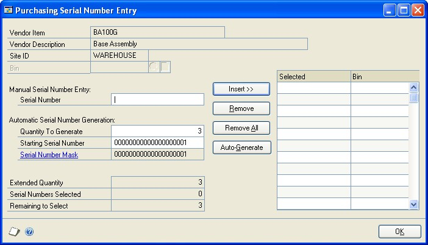

5.  If you are using multiple bins, enter a bin number or accept the default bin number.

*To set up a serial number mask for the item, click the Serial Number Mask link in the Purchasing Serial Number Entry window to open the Item Serial/Lot Number Definition window.*

6.  Enter the Quantity to Generate (optional). The default Quantity to Generate is the Remaining to Select quantity.

7.  Edit the starting serial number, if necessary.

If you modify the starting serial number, it must conform to the serial number mask. If you delete the starting serial number, you will not be able to automatically generate serial numbers for the item.

8.  Choose Auto-Generate. Serial numbers for the items are inserted in the scrolling window. Numbers that already exist will be skipped.

The number of serial numbers must equal the item’s extended quantity before you can return to the Receivings Transaction Entry window or the Receivings Item Detail Entry window.

9.  Choose OK to save the serial numbers that were automatically generated.

### Entering serial numbers manually for shipment or shipment/invoice receipt

Use the Purchasing Serial Number Entry window to assign serial numbers manually for shipment or shipment/invoice receipt line items.

**To enter serial numbers manually for shipment or shipment/invoice receipt:**

1.  Open the Receivings Transaction Entry window.
    (Purchasing \>\> Transactions \>\> Receivings Transaction Entry)

2.  Enter or select a shipment or shipment/invoice that includes at least one serial numbered item.

3.  Enter the quantity shipped for the line items that contain a serial number.

4.  Enter a site ID. Press TAB or choose the Quantity Shipped expansion button to open the Purchasing Serial Number Entry window.

(This window automatically opens when you choose the Auto-Rcv. button in the Receivings Transaction Entry window and serial-numbered items are entered for the receipt.)

5.  If you are using multiple bins, enter a default bin number or accept the default bin number.

6.  Enter a serial number.

7.  Choose Insert to add the serial number to the scrolling window.

8.  Continue entering serial numbers for the item.

The number of serial numbers entered must equal the item’s extended quantity before you can move to the next line item in the Receivings Transaction Entry window or the Receivings Item Detail Entry window.

9.  Choose OK to save the serial numbers you’ve added.

### Entering serial numbers for an in-transit inventory receipt

Use the In-Transit Serial Number Entry window to assign serial numbers for intransit inventory receipt line items.

**To enter serial numbers for an in-transit inventory receipt:**

1.  Open the Receivings Transaction Entry window.
    (Purchasing \>\> Transactions \>\> Receivings Transaction Entry)

2.  Enter or select an in-transit inventory receipt that includes at least one serialnumbered item.

3.  Enter the quantity shipped for the line items that contain a serial number.

4.  Press TAB or choose the Qty Shipped expansion button to open the In-Transit Serial Number Entry window.

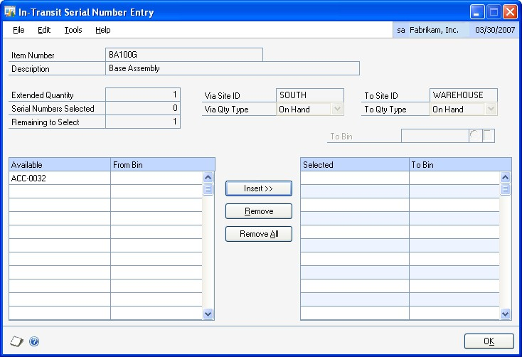

5.  If you are using multiple bins, enter a default bin number or accept the default bin number.

6.  Select an available serial number and choose Insert to add the serial number to the Selected scrolling window.

7.  Continue entering serial numbers for the item.

The number of serial numbers entered must equal the item’s extended quantity before you can move to the next line item in the Receivings Transaction Entry window or the Receivings Item Detail Entry window.

8.  Choose OK to save the serial numbers you’ve added.

### Removing serial numbers from a shipment or shipment/invoice receipt

Use the Purchasing Serial Number Entry window to remove serial numbers for shipment or shipment/invoice receipt line items. Whether you have auto-generated or manually entered serial numbers, you can always choose to remove an incorrect number from the scrolling window, correct or modify it and reinsert it. You cannot modify serial numbers once they are saved.

**To remove serial numbers from a shipment or shipment/ invoice receipt:**

1.  Open the Receivings Transaction Entry window.
    (Purchasing \>\> Transactions \>\> Receivings Transaction Entry)

2.  Enter or select a shipment or shipment/invoice that includes a serial-numbered item.

3.  Select a line item that contains a serial number.

4.  From the Quantity Shipped column, choose the Quantity Shipped expansion button to open the Purchasing Serial Number Entry window.

5.  Select the serial number from the serial number selected list and choose Remove. To remove all the serial numbers from the serial number selected list, choose Remove All.

6.  Enter new serial numbers for the item. The number of serial numbers entered must equal the item’s extended quantity before you can move to the next line item in the Receivings Transaction Entry window or the Receivings Item Detail Entry window.

7.  Choose OK to save your changes.

### Multiple bins in Purchase Order Processing

Use multiple bins to add another level of detail to item quantity tracking. Besides tracking items within inventory sites, with multiple bins you can track item quantities in bins that reside within each site. Bin quantities are processed and displayed in the item’s base unit of measure.

*You can set up bin information when multiple bins functionality has been installed and registered. However, you must also enable this feature in Inventory Control before you can use bins to track items. For more information about enabling multiple bins, see the Inventory Control documentation.*

Default bins for transaction types at each site can be identified for use in transactions. For example, a default bin could be created for purchasing transactions at your warehouse site. Default bins can also be identified for a particular item and transaction type at a site. If you always use Bin A when purchasing a certain item from your main site, for example, you can set up Bin A as the default purchase receipts bin for the item at the main site. Microsoft Dynamics GP automatically creates item-site-bin relationships the first time a bin is used for a transaction.

When you enter a transaction, the default bin for the transaction type at the itemsite or the site is used automatically. If there isn’t a default bin at the item-site or at the site, you will be required to enter a bin. If the site’s default bin is used, an itemsite-bin record is created automatically. If you delete the line or document after the item-site-bin record is automatically created, that item-site-bin record is not deleted. The on-hand quantity of the item increases at the bin within the site when you post a shipment or shipment/invoice.

For more information about setting up and using multiple bins, see the Inventory Control documentation.

### Changing bins for a receipt

If you’re using multiple bins, use the Bin Quantity Entry window to verify or change bin allocations for items that are not tracked by serial or lot numbers.

For items that are tracked by serial or lot numbers, you can verify or change bins in the Purchasing Serial Number Entry window or the Purchasing Lot Number Entry window for shipment receipts and shipment/invoice receipts. You can use the InTransit Serial Number Entry window or the In-Transit Lot Number Entry window to verify or change bins for items that tracked serials or lot numbers for in-transit inventory receipt.

You can distribute a line item quantity to multiple bins. For example, if the quantity shipped is 20, you can receive 15 items into Bin 1, and five into Bin 2 at site A. You might need to change bin selections manually if you change quantities, the unit of measure, or the site after you already selected bins.

**To change bins for a receipt item that isn’t tracked by serial or lot numbers:**

1.  Open the Receivings Transaction Entry window.
    (Purchasing \>\> Transactions \>\> Receivings Transaction Entry)

2.  Enter or select a shipment receipt, a shipment/invoice receipt, or an in-transit inventory receipt.

3.  Select an item that isn’t tracked by serial or lot numbers and choose the Qty Shipped expansion button to open the Bin Quantity Entry window.

You also can select an item that isn’t tracked by serial or lot numbers and choose the item expansion button to open the Receivings Item Detail Entry window. Choose Bins.

4.  Select the bin to change and choose Remove.

5.  Select a bin to use from the list of available bins. You also can enter a new bin.

6.  Enter a quantity for the bin.

7.  Choose Insert.

8.  Choose OK to save your changes and close the window.

9.  In the Receivings Item Detail Entry window or the Receivings Transaction Entry window and choose Save and close the window.

**To change bins for a shipment receipt item that is tracked by serial or lot numbers:**

1.  Open the Receivings Transaction Entry window.
    (Purchasing \>\> Transactions \>\> Receivings Transaction Entry)

2.  Enter or select a shipment or shipment/invoice.

3.  Select an item that is tracked by serial or lot numbers and choose the Qty Shipped expansion button to open the Purchasing Serial Number Entry window or Purchasing Lot Number Entry window.

You also can select an item that is tracked by serial or lot numbers and choose the item expansion button to open the Purchasing Item Detail Entry window. Choose Serial/Lot.

4.  Select the serial number or lot number to change and choose Remove.

5.  For an item that is tracked by serial numbers, select a bin number and serial number. You can select a bin to use from the list of available bins. You also can enter a new bin.

6.  For an item that is tracked by lot numbers, enter a lot number, a quantity, and select a bin number. You can select a bin to use from the list of available bins. You also can enter a new bin.

7.  Choose Insert.

8.  Choose OK to save your changes and close the window.

9.  In the Receivings Item Detail Entry window or the Receivings Transaction Entry window and choose Save and close the window.

**To change bins for an in-transit inventory receipt item that is tracked by serial or lot numbers:**

1.  Open the Receivings Transaction Entry window.
    (Purchasing \>\> Transactions \>\> Receivings Transaction Entry)

2.  Enter or select an in-transit inventory receipt.

3.  Select an item that is tracked by serial or lot numbers and choose the Qty Shipped expansion button to open the In-Transit Serial Number Entry window or In-Transit Lot Number Entry window.

You also can select an item that is tracked by serial or lot numbers and choose the item expansion button to open the Purchasing Item Detail Entry window. Choose Serial/Lot.

4.  Select the serial number or lot number to change and choose Remove.

5.  For an item that is tracked by serial numbers, select a to bin number and serial number. You also can enter a new bin.

6.  For an item that is tracked by lot numbers, select a to bin and enter a quantity selected. You also can enter a new bin.

7.  Choose Insert.

8.  Choose OK to save your changes and close the In-Transit Serial Number Entry window or In-Transit Lot Number Entry window.

9.  Choose Save and close the Receivings Item Detail Entry window or the Receivings Transaction Entry window.

### Merging trade discount and purchase distributions

If you’ve marked the Merge Trade Discount Distributions in Purchasing option in the Company Setup Options window, the trade discount distributions will be merged with the purchases distribution for shipment/invoice receipts. If you are using Project Accounting, the trade discount distributions won’t be merged with the purchases distributions for shipment/invoice receipts.

For example, assume that you’ve entered a purchase transaction of \$100.00 with a trade discount of \$15.00. If you’ve marked the Merge Trade Discount Distributions in Purchasing option, the trade discount distributions will be merged as in the following example.

| **Account**     | **Debit** | **Credit** |
|-----------------|-----------|------------|
| Account A PURCH | \$85      |            |
| Account C PAY   |           | \$85       |

If you didn’t mark the Merge Trade Discount Distributions in Purchasing option, the trade discount distributions are separated from the purchase distribution.

| **Account**     | **Debit** | **Credit** |
|-----------------|-----------|------------|
| Account A PURCH | \$100     |            |
| Account B TRADE |           | \$15       |
| Account C PAY   |           | \$85       |

### Distributing transaction amounts for shipment receipts

Use the Purchasing Distribution Entry window to redistribute transaction amounts to posting accounts. Transactions will be distributed automatically to the posting accounts assigned in the Vendor Account Maintenance window or the Item Account Maintenance window. If accounts aren’t assigned to vendor or item records, the accounts assigned in the Posting Accounts Setup window will be used instead.

If you are using landed costs, the distributions are calculated for a landed cost but won’t be displayed in the Purchasing Distribution Entry window. To view landed cost distributions, print the Receivings Edit List.

Currency amounts in the Purchasing Distribution Entry window are displayed in both the functional and originating currencies.

**To distribute transaction amounts for shipment receipts:**

1.  Open the Receivings Transaction Entry window.
    (Purchasing \>\> Transactions \>\> Receivings Transaction Entry)

2.  Enter or select a shipment or shipment/invoice.

3.  Choose Distributions to open the Purchasing Distribution Entry window.

4.  Enter a reference for the receipt, or accept the default. The reference entered will be posted to General Ledger.

5.  Change the amounts for the default accounts. To distribute the transaction to multiple posting accounts, change the default amount in the scrolling window.

6.  In the next available line, enter or select another purchasing distribution account, choose the distribution type and enter the next amount.

If you want to remove a distribution, select it and choose Edit \>\> Delete Row. If you changed distribution accounts and amounts and decide you want to use the original distributions, choose Default.

7.  Continue entering distribution accounts until your transaction is fully distributed.

8.  Enter a distribution reference (optional).

This is the reference that will post as the General Ledger distribution reference for the account. If you leave this field blank, the reference information entered in the Reference field will post to General Ledger.

9.  Choose OK to save your entries. Continue entering the transaction. You can save the transaction if it’s not fully distributed, but you won’t be able to post until the full amount is distributed and debits equal credits.

### Entering Intrastat trade statistics

Use the Purchasing Intrastat Entry window to enter the information required to create the Intrastat Trade Report you submit to your government. You can enter Intrastat statistics for each line item. For information about setting up Intrastat codes, refer to your System Setup instructions (Help \>\> Contents \>\> select Setting Up the System).

Intrastat is the system for collecting statistics on the trade of goods between European Union (EU) countries. Intrastat data is required for all items either bought from EU vendors or sold to EU customers, and must be provided on a monthly basis. Requirements for Intrastat are similar in all EU countries. The government uses these statistics as an economic indicator.

If Intrastat information was entered for the vendor’s ship from address ID, that information appears in this window. Each time you enter a new line item, the Intrastat statistics from the previous line item will be the default Intrastat entry for the new line item. You can use the Purchasing Intrastat Entry window to change Intrastat information for an individual transaction, or to enter Intrastat information if none was entered for the vendor.

*You can enter Intrastat statistics only if you have marked to enable Intrastat tracking in the Company Setup Options window.*

**To enter Intrastat trade statistics:**

1.  Open the Receivings Transaction Entry window.
    (Purchasing \>\> Transactions \>\> Receivings Transaction Entry)

2.  Enter the shipment/invoice receipt and mark the EU transaction option.

3.  Choose the EU button to open the Purchasing Intrastat Entry window. You can also open the Purchasing Intrastat Entry window by choosing the EU button in the Receivings Item Detail Entry window.

4.  Enter Intrastat information, or change the default entries, if necessary.

5.  In the Net Unit Mass field, enter the weight of the goods in kilograms or accept the default.

6.  Enter the quantity of the goods being purchased.

The line mass displays the total mass per item and is calculated automatically when you press TAB on the Quantity field. The line mass total is equal to the amount entered in the Unit Mass field multiplied by the amount entered in the Quantity field.

7.  Enter a supplementary units amount, if applicable. The supplementary units amount is simply a second quantity. Supplementary unit amounts are required by the EU Combined Nomenclature for certain goods.

8.  In the Traders Reference field, enter a reference code, such as an invoice or dispatch number, or any other information that will identify the transaction.

9.  Enter a goods value and statistical value, if applicable.

10.  Choose OK to save the record.

## Chapter 16: Invoice receipt entry

Enter an invoice receipt to record an invoice received for a shipment receipt entered and posted earlier, or to record an invoice received for a shipment that you have not yet received. You also can enter an invoice for drop-ship purchase order line items and blanket drop-ship purchase order line items. You can enter invoice receipt transactions in a batch or enter and post them individually. Invoice receipts can’t be saved unless they’re in a batch.

*If you are using vendor approval workflow, the vendor must have the workflow status of Approved or No Approval Needed before you can post the invoice receipt.*

If you are using Project Accounting, see *Chapter 17, “Invoice receipt entry for projects”* to enter invoice receipts for projects.

This information is divided into the following sections:

- *Entering an invoice receipt*

- *Matching shipments to an invoice receipt*

- *Invoicing items without a purchase order*

- *Invoicing items using the Select Purchase Order window*

- *Using the Select Purchase Order Items window*

- *Invoicing items from multiple purchase orders*

- *Invoicing items from a purchase order*

### Entering an invoice receipt

Use the Purchasing Invoice Entry window to enter, save, and post invoice receipts. You can enter detailed information for each invoice. You can include items from multiple purchase orders (from a single vendor) on an invoice receipt. If you are using landed costs, you can enter a landed cost as a line item.

If you are using Workflow, a drop-ship purchase order or a drop-ship blanket purchase order must be approved before you can invoice against the purchase order. You can invoice against purchase orders that don’t need approval.

You can enter and save, but not post, invoice receipts for purchase orders that are on hold. If an invoice for an on hold purchase order is saved to a batch, the batch can be posted, but the invoice for the on hold purchase order will remain in the batch.

If you expect to receive multiple invoices for a single shipment, we recommend that you post the shipment receipt and invoice receipts separately instead of entering a shipment/invoice receipt document. If you enter a single shipment/invoice receipt document (with Quantity Shipped greater than Quantity Invoiced) in the Receivings Transaction Entry window and later enter additional invoice documents, amounts in General Ledger and Inventory won’t match.

If you are using Project Accounting, the Project Number field and the Cost Category ID field will be displayed in the Purchasing Invoice Entry window, but you can’t enter project information for blanket purchase orders. To enter an invoice for a purchase order with project information, see *Chapter 17, “Invoice receipt entry for projects.”*

You can use the View \>\> Currency menu option or the currency list button to view amounts in the Purchasing Invoice Entry window in originating or functional currency.

**To enter an invoice receipt:**

1.  In the navigation pane, choose the Purchasing button, and then choose the Purchase Order Transactions list.

2.  In the New group or its overflow menu, choose Invoice Receipt to open the Purchasing Invoice Entry window.

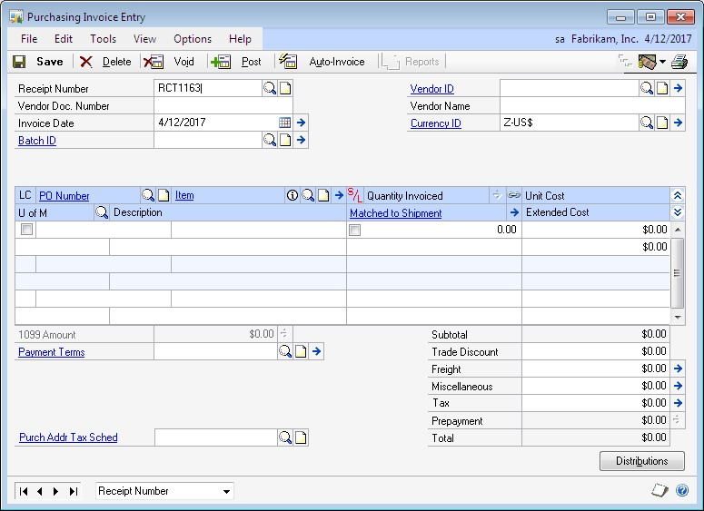

3.  Enter a vendor document number.

4.  Enter the invoice date.

*To enter a General Ledger posting date that is different from the invoice date, choose the Invoice Date expansion button; the Purchasing Invoice Date Entry window will open, where you can enter date information.*

For multicurrency transactions, the document date determines which exchange rate is used, based on the currency ID that’s entered for the transaction and the associated rate type.

5.  Enter or select a batch ID (optional).

If you’ve received the invoice, but not the shipment, you’ll need to save the invoice receipt in a batch until you receive and post the shipment. Then you can match the invoice to the shipment and post the invoice.

Invoices entered for drop-ship purchase orders and drop-ship blanket purchase orders won’t be matched because you can’t enter a shipment receipt for a dropship purchase order or a drop-ship blanket purchase order.

In multicurrency transactions, if the batch posting date does not fall on or before the exchange rate’s expiration date, you will receive a message. Choose Yes to open the Batch Entry window and change the batch posting date. If you choose No, you will be able to save but not post the receipt.

See *Creating a receipt batch* for more information.

6.  Enter or select a vendor ID.

7.  Enter or select a currency ID, or change the currency ID that appears as a default entry.

If the currency ID is not the company’s functional currency, a rate type and associated exchange rate table are assigned to the transaction. The currency ID assigned to the invoice must match the currency ID of the purchase order being received against.

8.  Mark the LC option if you want to enter a landed cost.

9.  Enter the purchase order number.

You can leave this field blank if you’re entering an invoice for a shipment received without a purchase order. You can receive invoices for multiple purchase orders by entering or selecting a different purchase order number in a new row.

You won’t be able to enter a purchase order number if you are invoicing a landed cost. You will specify the purchase order you are matching to the landed cost in the Match Options window.

Before you can invoice against the purchase order that has an unposted prepayment, you must post the prepayment or remove the prepayment from the purchase order.

10.  Enter items using either the vendor’s item number or your company’s item number. If you marked the LC option, you can enter a landed cost as an item.

After you enter a drop-ship or drop-ship blanket line item, the drop-ship purchase order icon appears in the PO Number field.

You can display the vendor’s item number by marking Options \>\> Display Vendor Item. If the option is not marked, your company’s item number will be displayed. You can change this selection at any time.

11.  If a drop-ship or drop-ship blanket line item is tracking serial or lot numbers, mark the S/L option.

12.  Enter the quantity invoiced, which is the number of items on the vendor’s invoice.

If multiple shipments exist for the line item, you’ll get a message asking if you want to match the invoice line items to items on a shipment or shipment/ invoice before you move to the next line item.

- Choose Yes and the Match Shipments to Invoice window will open, where you can choose which line items can be matched.

- Choose No and the line items automatically will be matched in shipment receipt number order.

For more information, see *Matching shipments to an invoice receipt*.

*The Purchasing Lot Number Entry window or the Purchasing Serial Number Entry window will open if the drop-ship or drop-ship blanket line item requires that you assign lot or serial numbers.*

An icon will be displayed in the Quantity Invoiced field for drop-ship purchase order line items with sales commitments. Select a line item and choose the button next to the Quantity Invoiced heading to view commitments in the Sales Commitments for Purchase Order window. If the purchase order line item is committed to more than one sales order line item, you can use the Sales Commitments for Purchase Order window to specify the sequence in which the sales line items will be received. For more information, see *Committing purchase orders to sales documents*.

13.  Enter trade discount, freight, miscellaneous, and tax amounts.

Taxes will be calculated automatically as you enter items. For more information about tax calculations, see *Chapter 20, “Taxes for receipts.”* If you want to change the tax amounts for the document, see *Calculating and distributing summary taxes for invoice receipts*. If you want to change the tax amounts for a line item, see *Calculating and distributing detail taxes for invoice line items*.

14.  The Prepayment field displays the total of all posted prepayments consumed for the purchase orders you are invoicing against. The prepayment amount is recalculated if you change the quantity shipped, quantity invoiced, unit cost, or extended cost for a line item. The prepayment amount is also recalculated if you change the trade discount.

If a purchase order has a posted prepayment, you can use the Prepayment expansion button to open the Purchasing Prepayment Summary Inquiry window. You can use this window to view the total amount of the prepayments applied and the prepayment applied amount for each purchase order assigned to the invoice.

15.  Enter or accept the 1099 amount, if applicable.

16.  If you are using Project Accounting, choose the Amount Received expansion button to open the PA Purchasing Invoice Amount Received Entry window, where you can enter an amount received. You can enter the amount you’re paying by cash, check, or credit card.

17.  Choose Distributions to open the Purchasing Invoice Distribution Entry window, where you can make changes to account distributions. See *Distributing transaction amounts for invoice receipts* for more information.

18.  Choose Save or Post. If you post, the invoiced quantities for each item on the receipt must be fully matched to shipment quantities.

One or more posting journals and distribution breakdown registers may be printed, depending on the options selected in the Posting Setup window. If you saved the transaction to a batch, you can print an edit list.

### Matching shipments to an invoice receipt

Use the Match Shipments to Invoice window if you’ve entered shipments in the Receivings Transaction Entry window and want to match the line items on the shipments to an invoice you’re entering in the Purchasing Invoice Entry window. Invoices entered for drop-ship purchase orders or drop-ship blanket purchase orders won’t be matched because you can’t enter a shipment receipt for a drop-ship purchase order or a drop-ship blanket purchase order. For information about matching shipment line items to landed costs, see *Matching landed costs to shipment line items*. Landed costs aren’t automatically matched.

If you are using Project Accounting, the Project Number field and the Cost Category ID field will be displayed in the Match Shipments to Invoice window. To match shipments to an invoice receipt with project information, see *Chapter 17, “Invoice receipt entry for projects.”*

**To match shipments to an invoice receipt:**

1.  Open the Purchasing Invoice Entry window.
    (Purchasing \>\> Transactions \>\> Enter/Match Invoices)

2.  Enter the receipt number, vendor document number, invoice date, and vendor ID.

3.  Enter the PO number and line items.

Before you can invoice against the purchase order that has an unposted prepayment, you must post the prepayment or remove the prepayment from the purchase order.

If you are using Workflow, a drop-ship purchase order or a drop-ship blanket purchase order must be approved before you can invoice against the purchase order. You can invoice against purchase orders that don’t need approval.

4.  Enter the quantity invoiced. If multiple shipments exist for the line item, you’ll get a message asking whether you want to automatically match the invoice line items to items on a shipment or shipment/invoice when you move to the next line.

5.  Choose Yes and the Match Shipments to Invoice window will open, where you can choose which line items can be matched. (If you choose No, the line items will be matched in shipment receipt number order.)

Currency amounts in this window may be displayed in functional or originating currency, depending on the view selected in the Purchasing Invoice Entry window.

6.  Select the shipment line items you want to match to the invoice.

7.  Verify or change the default price variance posting account (optional). The difference between the shipment unit cost and the invoice cost, if any, will be posted to this account. Any unrealized purchase price variance associated with the shipment lines will also be posted to this account.

8.  Choose OK to save your changes and to close the Match Shipments to Invoice window.

9.  In the Purchasing Invoice Entry window, enter trade discount, freight, miscellaneous, and tax amounts. Also enter a 1099 amount, if applicable.

10.  If you are using Project Accounting, choose the Amount Received expansion button to open the PA Purchasing Invoice Amount Received Entry window, where you can enter an amount received. You can enter the amount you’re paying by cash, check, or credit card.

11.  Choose Distributions to open the Purchasing Invoice Distribution Entry window, where you can make changes to account distributions.

- To add additional accounts, select the account and enter an amount.

- To remove an account, select the row containing the account and choose Edit \>\> Delete Row.

- To restore the original distributions, choose Default.

If you are using landed costs, the distributions are calculated for a landed cost but won’t be displayed in the Purchasing Invoice Distribution Entry window. To view landed cost distributions, print the Purchasing Invoice Edit List.

See *Distributing transaction amounts for invoice receipts* for more information.

Save or post the transaction. If you post, the invoiced quantities for each item on the receipt must be fully matched to shipment quantities.

One or more posting journals and distribution breakdown registers may be printed, depending on the options selected in the Posting Setup window. If you saved the transaction to a batch, you can print an edit list.

### Invoicing items without a purchase order

In the Purchasing Invoice Entry window, you can enter invoice receipts for items not included on the original purchase order or items not associated with a purchase order.

To set up this option, you must select Allow Receiving Without a Purchase Order in the Purchase Order Processing Setup window. You may assign a password that must be entered before entering a line item not assigned to a purchase order. See *Setting up Purchase Order Processing preferences and default entries* for more information.

If receiving items without a purchase order is allowed, you can enter items, noninventoried items or vendor items that don’t exist on the purchase order on an invoice receipt as long as those items or vendor items are on a shipment that has been posted.

If you are using Project Accounting, the Project Number field and the Cost Category ID field will be displayed in the Purchasing Invoice Entry window. To invoice items with project information, see *Chapter 17, “Invoice receipt entry for projects.”*

**To invoice items without a purchase order:**

1.  Open the Purchasing Invoice Entry window.
    (Purchasing \>\> Transactions \>\> Enter/Match Invoices)

2.  Enter the receipt number, vendor document number, invoice date, and vendor ID.

3.  To add vendor items or items that weren’t included on the original purchase order, simply leave the PO number field blank. You don’t have to enter a purchase order if you’ve set up the system to allow receiving items without a purchase order.

To enter a landed cost, mark the LC option and enter a landed cost as an item.

4.  Continue entering the invoice.

If you enter a non-inventoried item that isn’t assigned to a purchase order, you’ll need to enter a unit cost. If you enter a non-inventoried item that’s assigned to a purchase order, the unit cost from the purchase order will be displayed and you can change the cost.

5.  Save or post the transaction. If you post, the invoiced quantities for each item on the receipt must be fully matched to shipment quantities.

One or more posting journals and distribution breakdown registers may be printed, depending on the options selected in the Posting Setup window. If you’ve saved the transaction to a batch, you can print an edit list.

### Invoicing items using the Select Purchase Order window

Use the Select Purchase Order window to select a purchase order to quickly enter line items on a invoice receipt.

If you are using Workflow, a drop-ship purchase order or a drop-ship blanket purchase order must be approved before you can invoice against the purchase order. You can invoice against purchase orders that don’t need approval.

If you are using Project Accounting, the Project Number field and the Cost Category ID field will be displayed in the Purchasing Invoice window, but you can’t enter project information for blanket purchase orders.To receive items for purchase orders with project information, see *Chapter 14, “Shipment receipt entry for projects.”*

**To invoice items using the Select Purchase Order window:**

1.  Open the Purchasing Invoice Entry window.
    (Purchasing \>\> Transactions \>\> Enter/Match Invoices)

2.  Enter the receipt number, vendor document number, and invoice date.

3.  Choose the Auto-Invoice button. The Select Purchase Order window will open.

*If you entered a vendor ID, the Select Purchase Order Items window will open instead of the Select Purchase Order window.*

4.  Enter or select the purchase order for which you want to invoice all line items.

5.  Choose Invoice All in the Select Purchase Order window to automatically invoice all items on the selected purchase order. Landed costs aren’t included when you automatically invoice items. You must enter the landed costs on the invoice.

You cannot invoice against a purchase order that has an unposted prepayment. You can remove the prepayment from the purchase order using the Purchase Order Entry window or complete a computer check run for the prepayment.

The control blanket line item for a blanket purchase order or a drop-ship blanket purchase order isn’t included when you automatically invoice items.

Blanket line items with a New status won’t be included, either. You can use the Purchasing Invoice Entry window to enter blanket line items with a New status.

If you choose to view details in the Select Purchase Order window, the Select Purchase Order Items window will open, and the purchase order line items will be marked to receive. Landed costs won’t appear in the Select Purchase Order Items window.

Drop-ship blanket line items with a New status and line items with a New status for a drop-ship purchase order with an expired contract date won’t be marked when you choose Mark All. To invoice these items, you must mark the items individually.

6.  Choose OK to save information and to close the Select Purchase Order window.

7.  If the Allow Receiving Without a Purchase Order option is marked in Purchase Order Processing Setup, you can enter items or vendor items that don’t exist on the purchase order.

8.  You can enter blanket line items with a New status if you are invoicing items from a blanket purchase order or a drop-ship blanket purchase order.

9.  To enter a landed cost, mark the LC option and enter a landed cost as an item.

10.  If a drop-ship or drop-ship blanket line item is tracking serial or lot numbers, mark the S/L option. The Purchasing Serial Number Entry window or the Purchasing Lot Number Entry window opens, where you can enter the appropriate serial or lot numbers.

11.  Edit trade discount, freight, miscellaneous, and tax amounts. Also enter a 1099 amount, if applicable.

Taxes will be calculated automatically as you enter items. For more information about tax calculations, see *Chapter 20, “Taxes for receipts.”* If you want to change the tax amounts for the document, see *Calculating and distributing summary taxes for shipment/invoice receipts*. If you want to change the tax amounts for a line item, see *Calculating and distributing detail taxes for shipment/invoice line items*.

12.  Choose Distributions to open the Purchasing Invoice Distribution Entry window, where you can make changes to account distributions.

    - To add additional accounts, select the account and enter an amount.

    - To remove an account in the scrolling window, select the row containing the account and choose Edit \>\> Delete Row.

    - To restore the original distributions, choose Default.

If you are using landed costs, the distributions are calculated for a landed cost but won’t be displayed in the Purchasing Invoice Distribution Entry window. To view landed cost distributions, print the Purchasing Invoice Edit List.

See *Distributing transaction amounts for invoice receipts* for more information.

13.  Save or post the transaction. If you post, the invoiced quantities for each item on the receipt must be fully matched to shipment quantities.

One or more posting journals and distribution breakdown registers may be printed, depending on the options selected in the Posting Setup window. If you’ve saved the transaction to a batch, you can print an edit list.

### Using the Select Purchase Order Items window

Use the Select Purchase Order Items window to invoice line items that have been received from multiple purchase orders. In the Select Purchase Order Items window, the tree view and the Sort By option control the information that is displayed. When you change the focus in the tree view, or when you choose a different sorting option, the information in the window is refreshed.

The scrolling window shows detail about the object selected in the tree view. When you highlight a different object in the tree view, such as a purchase order or a site, only the information about that object is displayed in the scrolling window. To display all information for a vendor, you must select the vendor ID in the tree view.

If you are using Project Accounting, the Project Number field and the Cost Category ID field will be displayed in the Select Purchase Order Items scrolling window.

The sorting option you select determines the order in which objects appear in the tree view and the scrolling window. You can sort objects in four ways:

**PO/Items** Objects in the tree view and scrolling window are sorted first by purchase order number, then by the order items were entered on the purchase orders.

**Item Number/PO** Objects in the tree view and scrolling window are sorted first by item number, then by purchase order number under each item.

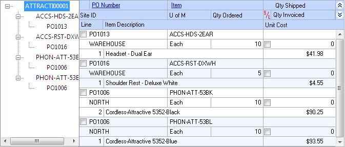

**Site/PO/Item Number** Objects in the tree view and scrolling window are sorted first by site, then by purchase order number under each site, then by item number under each purchase order.

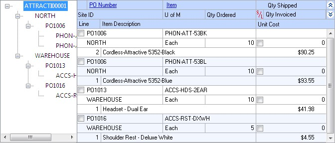

**Site/Item Number/PO** Objects in the tree view and scrolling window are sorted first by site, then by item number under each site, then by purchase order number under each item.

### Invoicing items from multiple purchase orders

Use the Select Purchase Order Items window to invoice line items that have been received from multiple purchase orders. Only items with posted shipments and quantities remaining to be invoiced will be displayed. See *Entering an invoice receipt* for more information. Landed costs won’t appear in the Select Purchase Order Items window.

If you are using Workflow, drop-ship purchase orders or a drop-ship blanket purchase orders must be approved before you can invoice against them. You can invoice against purchase orders that don’t need approval.

If you are using Project Accounting, the Project Number field and the Cost Category ID field will be displayed in the Select Purchase Order Items window. To receive items from purchase orders with project information, see *Chapter 17, “Invoice receipt entry for projects.”*

**To invoice items from multiple purchase orders:**

1.  Open the Purchasing Invoice Entry window.
    (Purchasing \>\> Transactions \>\> Enter/Match Invoices)

2.  Enter the receipt number, vendor document number, and invoice date.

3.  Enter or select a vendor ID. The currency ID assigned to the vendor will be the default currency ID for the receipt.

4.  Choose the Auto-Invoice button. The Select Purchase Order Items window will open.

Items with posted shipments and quantities remaining to be invoiced will be displayed. The control blanket line item for a blanket purchase order or a dropship blanket purchase order isn’t included when you automatically invoice items.

If only a Vendor ID is displayed, the selected vendor does not have any purchase orders with items that have been received, but not invoiced. Only purchase orders with currency IDs that match the invoice will be displayed. Purchase orders with posted prepayments that have currency IDs that match the invoice will be displayed.

*If you know the purchase order number but not the vendor ID, you can choose AutoInvoice without entering a vendor ID. The Select Purchase Order window will open. The vendor and currency ID for the invoice will come from the purchase order you select.*

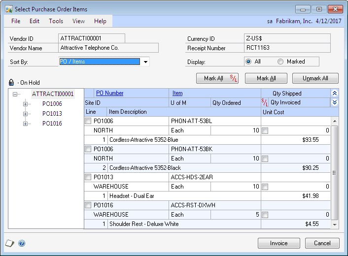

5.  Select a sorting option.

6.  Mark the check boxes next to the items you want to invoice. To select all items displayed in the scrolling window, choose Mark All.

Drop-ship blanket line items with a New status and line items with a New status for a drop-ship purchase order with an expired contract date won’t be marked when you choose Mark All. To invoice these items, you must mark the items individually.

*When you choose Mark All or Unmark All in the Select Purchase Order Items window, only items displayed in the scrolling window will be marked or unmarked. For example, if a purchase order is selected in the tree view, only items from that purchase order will be displayed in the scrolling window, and only those items will be marked when you choose Mark All. To mark or unmark all items for a vendor, the vendor ID must be selected in the tree view.*

7.  Select whether to display all items or only items marked to invoice.

8.  Mark the S/L check box next to the drop-ship or drop-ship blanket items that require serial or lot numbers. To mark all items that require serial or lot numbers, choose Mark All S/L.

9.  Edit Quantity Invoiced and Unit Cost amounts, if necessary. If you edit an item in the scrolling window, it will be marked to invoice.

10.  Choose the Invoice button to add the items to your invoice. The Select Purchase Order Items window will close, and the items you marked will appear in the Purchasing Invoice Entry window.

The Purchasing Lot Number Entry window or the Purchasing Serial Number Entry window will open if a drop-ship or drop-ship blanket item requires that you assign lot or serial numbers.

To cancel your selections, choose Cancel. To revert all displayed items to unmarked, choose Unmark All.

11.  In the Purchasing Invoice Entry window, save or post the transaction. If you post, the invoiced quantities for each item on the receipt must be fully matched to shipment quantities.

### Invoicing items from a purchase order

Use the Select Purchase Order Items window and the Purchasing Invoice Entry window to invoice items. After you select a purchase order that has at least one posted shipment received against it in the Purchase Order Entry window, you can select the Invoice the PO Items option from the Actions button. You also can enter or select a drop-ship purchase order or a blanket drop-ship purchase order and select the Invoice the PO Items option from the Actions button to invoice against those items.

For more information about invoice receipts, see *Entering an invoice receipt*. For more information about the Select Purchase Order Items window, see *Using the Select Purchase Order Items window*. Landed costs won’t appear in the Select Purchase Order Items window.

If you are using Project Accounting, the Project Number field and the Cost Cat. ID field will be displayed in the Select Purchase Order Items window and the Purchasing Invoice Entry window. If you want to receive items with project information, see *Chapter 17, “Invoice receipt entry for projects.”*

**To invoice items from a purchase order:**

1.  Open the Purchase Order Entry window.
    (Purchasing \>\> Transactions \>\> Purchase Order Entry)

2.  Enter or select a purchase order that has one or more items with a quantity to invoice.

3.  Select Invoice the PO Items from the Actions button.

4.  The Select Purchase Order Items window and the Purchasing Invoice Entry window will open.

Items with posted shipments and quantities remaining to be invoiced will be displayed. The purchase order that you entered in the Purchase Order Entry window will be selected in the tree view. Each item on the purchase order that is available to be invoiced in the scrolling window is marked. The control blanket line item for a blanket purchase order or a drop-ship blanket purchase order isn’t included when you automatically invoice items.

5.  Select a sorting option.

6.  Mark the check boxes next to the items to invoice. To select all items displayed in the scrolling window, choose Mark All.

Drop-ship blanket line items with a New status and line items with a New status for a drop-ship purchase order with an expired contract date won’t be marked when you choose Mark All. To invoice these items, you must mark the items individually.

*When you choose Mark All or Unmark All, only items displayed in the scrolling window will be marked or unmarked. For example, if a purchase order is selected in the tree view, only items from that purchase order will be displayed in the scrolling window, and only those items will be marked when you choose Mark All. To mark or unmark all items for a vendor, the vendor ID must be selected in the tree view.*

7.  Select whether to display all items or only items marked to invoice.

8.  Mark the S/L check box next to the drop-ship or drop-ship blanket items that require serial or lot numbers. To mark all items that require serial or lot numbers, choose Mark All S/L.

9.  Modify the quantity invoiced and unit cost amounts, if necessary. If you modify an item in the scrolling window, it will be marked to invoice.

10.  Choose the Invoice button to add the items to your invoice. The Select Purchase Order Items window will close, and the items you marked will appear in the Purchasing Invoice Entry window.

The Purchasing Lot Number Entry window or the Purchasing Serial Number Entry window will open if a drop-ship or drop-ship blanket item requires that you assign lot or serial numbers.

To cancel your selections, choose Cancel. To revert all displayed items to unmarked, choose Unmark All.

11.  In the Purchasing Invoice Entry window, continue entering invoice information, if necessary, and save or post the transaction. For an invoice, you must enter the vendor document number.

If you post, the invoiced quantities for each item on the receipt must be fully matched to shipment quantities.

## Chapter 17: Invoice receipt entry for projects

If you are using Project Accounting, you can enter an invoice receipt to record an invoice received for a shipment receipt entered and posted earlier, or to record an invoice received for a shipment that you have not yet received. You also can enter an invoice for drop-ship purchase order line items. You can enter invoice receipt transactions in a batch and save them to post later, or enter and post them individually.

*If you are using vendor approval workflow, the vendor must have the workflow status of Approved or No Approval Needed before you can post the invoice receipts.*

To enter an invoice receipt for a blanket purchase order or a drop-ship blanket purchase order, refer to *Chapter 16, “Invoice receipt entry.”*

This information is divided into the following sections:

- *Entering an invoice receipt for projects*

- *Matching shipments to an invoice receipt for projects*

- *Invoicing items for projects without a purchase order*

- *Invoicing items for projects using the Select Purchase Order window*

- *Invoicing items for projects from multiple purchase orders*

- *Invoicing items for projects from a purchase order*

### Entering an invoice receipt for projects

Use the Purchasing Invoice Entry window to enter, save, and post invoice receipts for projects. You can enter detailed information for each invoice. You can include items from multiple purchase orders (from a single vendor) on an invoice receipt. If you are using landed costs, you can enter a landed cost as a line item.

To enter an invoice receipt for a blanket purchase order, refer to *Chapter 16, “Invoice receipt entry.”*

You can enter and save, but not post, invoice receipts for purchase orders that are on hold. If an invoice for a purchase order that is on hold is saved to a batch, the batch can be posted, but the invoice for the purchase order that is on hold will remain in the batch.

If you expect to receive multiple invoices for a single shipment, we recommend that you post the shipment receipt and invoice receipts separately instead of entering a shipment/invoice receipt document. If you enter a single shipment/invoice receipt document (with quantity shipped greater than quantity invoiced) in the Receivings Transaction Entry window and later enter additional invoice documents, amounts in General Ledger and Inventory won’t match.

You can use the View \>\> Currency menu option or the currency list button to view amounts in the Purchasing Invoice Entry window in originating or functional currency.

**To enter an invoice receipt for projects:**

1.  Open the Purchasing Invoice Entry window.
    (Purchasing \>\> Transactions \>\> Enter/Match Invoices)

2.  Enter or select the receipt number.

3.  Enter a vendor document number.

4.  Enter the invoice date.

*To enter a General Ledger posting date that is different from the invoice date, choose the Invoice Date expansion button; the Purchasing Invoice Date Entry window will open, where you can enter date information.*

For multicurrency transactions, the document date determines which exchange rate is used, based on the currency ID that’s entered for the transaction and the associated rate type.

5.  Enter or select a batch ID (optional).

If you’ve received the invoice, but not the shipment, you’ll need to save the invoice receipt in a batch until you receive and post the shipment. Then you can match the invoice to the shipment and post the invoice.

Invoices entered for drop-ship purchase orders won’t be matched because you can’t enter a shipment receipt for a drop-ship purchase order.

In multicurrency transactions, if the batch posting date does not fall on or before the exchange rate’s expiration date, you will receive a message. Choose Yes to open the Batch Entry window and change the batch posting date. If you choose No, you will be able to save but not post the receipt.

See *Creating a receipt batch* for more information.

6.  Enter or select a vendor ID.

7.  Enter or select a currency ID, or change the currency ID that appears as a default entry.

If the currency ID is not the company’s functional currency, a rate type and associated exchange rate table are assigned to the transaction. The currency ID assigned to the invoice must match the currency ID of the purchase order being received against.

8.  Mark the LC option if you want to enter a landed cost.

9.  Enter the purchase order number.

You can leave this field blank if you’re entering an invoice for a shipment received without a purchase order. You can receive invoices for multiple purchase orders by entering or selecting a different purchase order number in a new row.

You can’t enter a purchase order number if you are invoicing a landed cost. You will specify the purchase order you are matching the to the landed cost in the Match Options window.

You can enter a purchase order that hasn’t been printed if Allow Receiving of Unprinted PO option is marked in the PA Purchase Order Processing Setup Options window.

10.  Enter a project number and cost category ID.

You can’t enter a project number or a cost category if the Options \>\> Display Vendor Item is marked to display the vendor items.

11.  Enter one or more items using your company’s item numbers. You also can enter non-inventoried items. If you marked the LC option, you can enter a landed cost as an item.

Inventoried items entered for a project must be assigned to a cost category in the Budget Detail IV Items window. If the item isn’t assigned to a budget, you must add the item to the budget.

After you enter a drop-ship line item, the drop-ship purchase order icon appears in the PO Number field.

12.  If a drop-ship line item is tracking serial or lot numbers, mark the S/L option.

13.  Enter the quantity invoiced, which is the number of items on the vendor’s invoice.

If multiple shipments exist for the line item, you’ll get a message asking if you want to match the invoice line items to items on a shipment or shipment/ invoice before you move to the next line item.

- Choose Yes and the Match Shipments to Invoice window will open, where you can choose which line items can be matched.

- Choose No and the line items automatically will be matched in shipment receipt number order.

For more information, see *Matching shipments to an invoice receipt for projects*.

*The Purchasing Lot Number Entry window or the Purchasing Serial Number Entry window will open if the drop-ship line item requires that you assign lot or serial numbers.*

14.  Enter trade discount, freight, miscellaneous, and tax amounts.

Taxes will be calculated automatically as you enter items. For more information about tax calculations, see *Chapter 20, “Taxes for receipts.”* You can't change the Tax amount in the Purchasing Invoice Entry window even if your system is set up to allow editing summary-level taxes. If you want to change the tax amounts for a line item, see *Calculating and distributing detail taxes for invoice line items*.

15.  Enter or accept the 1099 amount, if applicable.

16.  To enter an amount received, choose the Amount Received expansion button to open the PA Receivings Amount Received Entry window. You can enter the amount you’re paying by cash, check, or credit card.

17.  Choose Distributions to open the Purchasing Invoice Distribution Entry window, where you can make changes to account distributions. See *Distributing transaction amounts for invoice receipts* for more information.

18.  Choose Save or Post. If you post, the invoiced quantities for each item on the receipt must be fully matched to shipment quantities.

One or more posting journals and distribution breakdown registers may be printed, depending on the options selected in the Posting Setup window. If you saved the transaction to a batch, you can print an edit list.

### Matching shipments to an invoice receipt for projects

Use the Match Shipments to Invoice window if you’ve entered shipments in the Receivings Transaction Entry window and want to match the line items on the shipments to an invoice you’re entering in the Purchasing Invoice Entry window. Invoices entered for drop-ship purchase orders won’t be matched because you can’t enter a shipment receipt for a drop-ship purchase order. For information about matching shipment line items to landed costs, see *Matching landed costs to shipment line items*. Landed costs aren’t automatically matched.

If you want match shipments for blanket purchase orders to an invoice receipt, see *Chapter 16, “Invoice receipt entry.”*

**To match shipments to an invoice receipt for projects:**

1.  Open the Purchasing Invoice Entry window.
    (Purchasing \>\> Transactions \>\> Enter/Match Invoices)

2.  Enter the receipt number, vendor document number, invoice date, and vendor ID.

3.  Enter the PO number, project number, cost category ID, and line items.

4.  Enter the quantity invoiced. If multiple shipments exist for the line item, you’ll get a message asking whether you want to automatically match the invoice line items to items on a shipment or shipment/invoice when you move to the next line.

5.  Choose Yes and the Match Shipments to Invoice window will open, where you can choose which line items can be matched. (If you choose No, the line items will be matched in shipment receipt number order.)

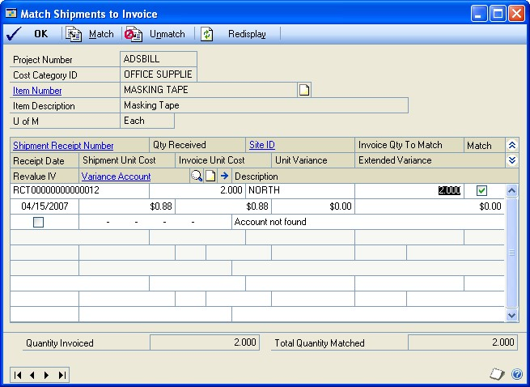

Currency amounts in this window may be displayed in functional or originating currency, depending on the view selected in the Purchasing Invoice Entry window.

6.  Select the shipment line items you want to match to the invoice.

7.  Verify or change the default price variance posting account (optional). The difference between the shipment unit cost and the invoice cost, if any, will be posted to this account. Any unrealized purchase price variance associated with the shipment lines will also be posted to this account.

8.  Choose OK to save your changes and to close the Match Shipments to Invoice window.

9.  In the Purchasing Invoice Entry window, enter trade discount, freight, miscellaneous, and tax amounts. Also enter a 1099 amount, if applicable.

10.  Choose Distributions to open the Purchasing Invoice Distribution Entry window, where you can make changes to account distributions.

    - To add additional accounts, select the account and enter an amount.

    - To remove an account, select the row containing the account and choose Edit \>\> Delete Row.

    - To restore the original distributions, choose Default.

If you are using landed costs, the distributions are calculated for a landed cost but won’t be displayed in the Purchasing Invoice Distribution Entry window. To view landed cost distributions, print the Purchasing Invoice Edit List.

See *Distributing transaction amounts for invoice receipts* for more information.

11.  Save or post the transaction. If you post, the invoiced quantities for each item on the receipt must be fully matched to shipment quantities.

One or more posting journals and distribution breakdown registers may be printed, depending on the options selected in the Posting Setup window. If you saved the transaction to a batch, you can print an edit list.

### Invoicing items for projects without a purchase order

In the Purchasing Invoice Entry window, you can enter invoice receipts for items not included on the original purchase order or items not associated with a purchase order.

To set up this option, you must select Allow Receiving Without a Purchase Order in the Purchase Order Processing Setup window. You may assign a password that must be entered before entering a line item not assigned to a purchase order. See *Setting up Purchase Order Processing preferences and default entries* for more information.

If receiving items without a purchase order is allowed, you can enter items or noninventoried items that don’t exist on the purchase order on an invoice receipt as long as those items are on a shipment that has been posted.

**To invoice items for projects without a purchase order:**

1.  Open the Purchasing Invoice Entry window.
    (Purchasing \>\> Transactions \>\> Enter/Match Invoices)

2.  Enter the receipt number, vendor document number, invoice date, and vendor ID.

3.  Enter a project number and cost category ID. If the item that you’re receiving isn’t assigned to a project because the item isn’t assigned to a budget, enter \<NONE\> or leave the Project Number field blank. If there isn’t a project number, you can leave the Cost Category field blank. If the item is assigned to a project, you must enter a cost category.

You can’t enter a project number or a cost category if the Options \>\> Display Vendor Item is marked to display vendor items.

4.  To add items that weren’t included on the original purchase order, simply leave the PO number field blank. You don’t have to enter a purchase order if you’ve set up the system to allow receiving items without a purchase order.

Inventoried items entered for a project must be assigned to a cost category in the Budget Detail IV Items window. If the item isn’t assigned to a budget, you must add the item to the budget. You cannot add a new inventoried item if the Allow Entry of New Budgets/Materials option is not marked in the User Purchase Order Settings window. See *Inventoried items and non-inventoried items for projects* for more information.

To enter a landed cost, mark the LC option and enter a landed cost as an item.

5.  Continue entering the invoice.

If you enter a non-inventoried item that isn’t assigned to a purchase order, you’ll need to enter a unit cost. If you enter a non-inventoried item that’s assigned to a purchase order, the unit cost from the purchase order will be displayed and you can change the cost.

6.  Save or post the transaction. If you post, the invoiced quantities for each item on the receipt must be fully matched to shipment quantities.

One or more posting journals and distribution breakdown registers may be printed, depending on the options selected in the Posting Setup window. If you’ve saved the transaction to a batch, you can print an edit list.

### Invoicing items for projects using the Select Purchase Order window

Use the Select Purchase Order window to select a purchase order to quickly enter line items on a invoice receipt.

**To invoice items for projects using the Select Purchase Order window:**

1.  Open the Purchasing Invoice Entry window.
    (Purchasing \>\> Transactions \>\> Enter/Match Invoices)

2.  Enter the receipt number, vendor document number, and invoice date.

3.  Choose the Auto-Invoice button. The Select Purchase Order window will open.

*If you entered a vendor ID, the Select Purchase Order Items window will open instead of the Select Purchase Order window.*

4.  Enter or select the purchase order for which you want to invoice all line items.

5.  Choose Invoice All in the Select Purchase Order window to automatically invoice all items on the selected purchase order. Landed costs aren’t included when you automatically invoice items. You must enter the landed costs on the invoice.

If you choose to view details in the Select Purchase Order window, the Select Purchase Order Items window will open, and the purchase order line items will be marked to receive. Landed costs won’t appear in the Select Purchase Order Items window.

6.  Choose OK to save information and to close the Select Purchase Order window.

7.  If the Allow Receiving Without a Purchase Order option is marked in Purchase Order Processing Setup, you can enter items or vendor items that don’t exist on the purchase order.

8.  To enter a landed cost, mark the LC option and enter a landed cost as an item.

9.  If a drop-ship line item requires serial or lot numbers, mark the S/L option. The Purchasing Serial Number Entry window or the Purchasing Lot Number Entry window opens, where you can enter the appropriate serial or lot numbers.

10.  Edit trade discount, freight, miscellaneous, and tax amounts. Also enter a 1099 amount, if applicable.

Taxes will be calculated automatically as you enter items. For more information about tax calculations, see *Chapter 20, “Taxes for receipts.”* If you want to change the tax amounts for the document, see *Calculating and distributing summary taxes for shipment/invoice receipts*. If you want to change the tax amounts for a line item, see *Calculating and distributing detail taxes for shipment/invoice line items*.

11.  Choose Distributions to open the Purchasing Invoice Distribution Entry window, where you can make changes to account distributions.

    - To add additional accounts, select the account and enter an amount.

    - To remove an account in the scrolling window, select the row containing the account and choose Edit \>\> Delete Row.

    - To restore the original distributions, choose Default.

If you are using landed costs, the distributions are calculated for a landed cost but won’t be displayed in the Purchasing Invoice Distribution Entry window. To view landed cost distributions, print the Purchasing Invoice Edit List.

See *Distributing transaction amounts for invoice receipts* for more information.

12.  Save or post the transaction. If you post, the invoiced quantities for each item on the receipt must be fully matched to shipment quantities.

One or more posting journals and distribution breakdown registers may be printed, depending on the options selected in the Posting Setup window. If you’ve saved the transaction to a batch, you can print an edit list.

### Invoicing items for projects from multiple purchase orders

Use the Select Purchase Order Items window to invoice line items that have been received from multiple purchase orders. Only items with posted shipments and quantities remaining to be invoiced will be displayed. See *Entering an invoice receipt for projects* for more information. Landed costs won’t appear in the Select Purchase Order Items window.

**To invoice items for projects from multiple purchase orders:**

1.  Open the Purchasing Invoice Entry window.
    (Purchasing \>\> Transactions \>\> Enter/Match Invoices)

2.  Enter the receipt number, vendor document number, and invoice date.

3.  Enter or select a vendor ID. The currency ID assigned to the vendor will be the default currency ID for the receipt.

4.  Choose the Auto-Invoice button. The Select Purchase Order Items window will open.

Items with posted shipments and quantities remaining to be invoiced will be displayed.

If only a Vendor ID is displayed, the selected vendor does not have any purchase orders with items that have been received, but not invoiced. Only purchase orders with currency IDs that match the invoice will be displayed.

*If you know the purchase order number but not the vendor ID, you can choose AutoInvoice without entering a vendor ID. The Select Purchase Order window will open. The vendor and currency ID for the invoice will come from the purchase order you select.*

5.  Select a sorting option.

6.  Mark the check boxes next to the items you want to invoice. To select all items displayed in the scrolling window, choose Mark All.

*When you choose Mark All or Unmark All in the Select Purchase Order Items window, only items displayed in the scrolling window will be marked or unmarked. For example, if a purchase order is selected in the tree view, only items from that purchase order will be displayed in the scrolling window, and only those items will be marked when you choose Mark All. To mark or unmark all items for a vendor, the vendor ID must be selected in the tree view.*

7.  Select whether to display all items or only items marked to invoice.

8.  Mark the S/L option next to the drop-ship items that require serial or lot numbers. To mark all items that require serial or lot numbers, choose Mark All S/L.

9.  Modify the quantity invoiced and unit cost amounts, if necessary. If you edit an item in the scrolling window, it will be marked to invoice.

10.  Choose the Invoice button to add the items to your invoice. The Select Purchase Order Items window will close, and the items you marked will appear in the Purchasing Invoice Entry window.

The Purchasing Lot Number Entry window or the Purchasing Serial Number Entry window will open if a drop-ship item requires that you assign lot or serial numbers.

To cancel your selections, choose Cancel. To revert all displayed items to unmarked, choose Unmark All.

11.  In the Purchasing Invoice Entry window, save or post the transaction. If you post, the invoiced quantities for each item on the receipt must be fully matched to shipment quantities.

### Invoicing items for projects from a purchase order

Use the Select Purchase Order Items window and the Purchasing Invoice Entry window to invoice items. After you select a purchase order that has at least one posted shipment received against it in the Purchase Order Entry window, you can select the Invoice the PO Items option from the Actions button. You also can enter or select a drop-ship purchase order and select the Invoice the PO Items option from the Actions button to invoice against those items.

For more information about invoice receipts, see *Entering an invoice receipt for projects*. For more information about the Select Purchase Order Items window, see *Using the Select Purchase Order Items window*. Landed costs won’t appear in the Select Purchase Order Items window.

To receive items from multiple blanket purchase orders, refer to *Chapter 16, “Invoice receipt entry.”*

**To invoice items for projects from a purchase order:**

1.  Open the Purchase Order Entry window.
    (Purchasing \>\> Transactions \>\> Purchase Order Entry)

2.  Enter or select a purchase order that has one or more items with a quantity to invoice.

3.  Select Invoice the PO Items from the Actions button.

4.  The Select Purchase Order Items window and the Purchasing Invoice Entry window will open.

Items with posted shipments and quantities remaining to be invoiced will be displayed. The purchase order that you entered in the Purchase Order Entry window will be selected in the tree view. Each item on the purchase order that is available to be invoiced in the scrolling window is marked.

5.  Select a sorting option.

6.  Mark the check boxes next to the items to invoice. To select all items displayed in the scrolling window, choose Mark All.

*When you choose Mark All or Unmark All, only items displayed in the scrolling window will be marked or unmarked. For example, if a purchase order is selected in the tree view, only items from that purchase order will be displayed in the scrolling window, and only those items will be marked when you choose Mark All. To mark or unmark all items for a vendor, the vendor ID must be selected in the tree view.*

7.  Select whether to display all items or only items marked to invoice.

8.  Mark the S/L option next to the drop-ship items that require serial or lot numbers. To mark all items that require serial or lot numbers, choose Mark All S/L.

9.  Modify the quantity invoiced and unit cost amounts, if necessary. If you modify an item in the scrolling window, it will be marked to invoice.

10.  Choose the Invoice button to add the items to your invoice. The Select Purchase Order Items window will close, and the items you marked will appear in the Purchasing Invoice Entry window.

The Purchasing Lot Number Entry window or the Purchasing Serial Number Entry window will open if a drop-ship item requires that you assign lot or serial numbers.

To cancel your selections, choose Cancel. To revert all displayed items to unmarked, choose Unmark All.

11.  In the Purchasing Invoice Entry window, continue entering invoice information, if necessary, and save or post the transaction. For an invoice, you must enter the vendor document number.

If you post, the invoiced quantities for each item on the receipt must be fully matched to shipment quantities.

## Chapter 18: Invoice receipt detail entry

The Purchasing Invoice Entry window is designed to resemble a physical invoice document and includes vendor, line item, and total information. Use the buttons in the Purchasing Invoice Entry window to open windows where you can enter detailed information about lot number, serial number mask, distributions and Intrastat trade statistics.

This information is divided into the following sections:

- *Generating lot numbers automatically for invoice receipts*

- *Entering lot numbers manually for an invoice receipt*

- *Removing lot numbers from an invoice receipt*

- *Generating serial numbers automatically for invoice receipts*

- *Entering serial numbers manually for invoice receipts*

- *Removing serial numbers for invoice receipts*

- *Merging trade discount and purchase distributions*

- *Distributing transaction amounts for invoice receipts*

- *Entering project item detail information for an invoice receipt*

- *Entering Intrastat trade statistics*

### Generating lot numbers automatically for invoice receipts

If you are invoicing a drop-ship or drop-ship blanket purchase order, you can use the Purchasing Lot Number Entry window to assign lot numbers for lot-tracked line items. You can assign lot numbers automatically, manually, or a combination of the two. In order to automatically generate lot numbers, you must first set up the item and its lot number mask. For more information, see *Defining a lot number mask*.

**To generate lot numbers automatically for invoice receipts:**

1.  Open the Purchasing Invoice Entry window.
    (Purchasing \>\> Transactions \>\> Enter/Match Invoices)

2.  Enter or select an invoice for a drop-ship or blanket drop-ship purchase order that includes at least one lot-numbered item.

3.  Mark the S/L option and enter the quantity invoiced for the line items that contain a lot number.

4.  Press TAB or choose the Quantity Invoiced expansion button to open the Purchasing Lot Number Entry window.

*To set up a lot number mask for the item, click the Lot Number Mask link in the Purchasing Lot Number Entry window to open the Item Serial/Lot Number Definition window.*

5.  Enter the lot(s) to generate (optional). The default lot(s) to generate is the Remaining to Select quantity divided by the Lot Split Quantity rounded to the next whole number.

6.  Edit the starting lot number, if necessary.

If you modify the starting lot number, it must conform to the lot number mask. If you delete the starting lot number, you will not be able to automatically generate lot numbers for the item.

7.  Choose Auto-Generate. Lot numbers for the items are inserted in the scrolling window. Numbers that already exist will be skipped.

The Total Quantity Selected must equal the item’s extended quantity before you can move to the next line item in the Purchasing Invoice Entry window.

8.  Choose OK to save the lot numbers that were automatically generated.

### Entering lot numbers manually for an invoice receipt

If you are invoicing a drop-ship or drop-ship blanket purchase order, you can use the Purchasing Lot Number Entry window to assign lot numbers for lot-tracked line items.

**To enter lot numbers manually for nonofficial receipt:**

1.  Open the Purchasing Invoice Entry window.
    (Purchasing \>\> Transactions \>\> Enter/Match Invoice)

2.  Enter or select an invoice for a drop-ship or drop-ship blanket purchase order that includes a lot-numbered item.

3.  Mark the S/L option and enter the quantity invoiced for a line item that contains a lot number.

4.  Press TAB or choose the Quantity Invoiced expansion button to open the Purchasing Lot Number Entry window.

5.  Enter a lot number and a quantity selected.

6.  Choose Insert to add the lot number to the scrolling window.

7.  To assign values to the lot attributes for the item, choose the Lot expansion button to open the Lot Attribute Entry window.

If you are using sales workflow and are tracking the minimum shelf life for the lot item, the dates that you enter in this window and the number of days entered in the Item Maintenance Options window are used to determine whether or not the item meets the minimum shelf life when you receive the item. If you are using Project Accounting, you can’t use sales workflow with project items.

7.  Continue entering lot numbers for the item. The Total Quantity Selected must equal the item’s extended quantity before you can move to the next line item in the Purchasing Invoice Entry window.

8.  Choose OK to save the lot numbers you’ve added.

### Removing lot numbers from an invoice receipt

Use the Purchasing Lot Number Entry window to remove lot numbers for invoice
receipt line items.

**To remove lot numbers from an invoice receipt:**

1.  Open the Purchasing Invoice Entry window.
    (Purchasing \>\> Transactions \>\> Enter/Match Invoices)

2.  Enter or select an invoice for a drop-ship or drop-ship blanket purchase order that includes a lot-numbered item.

3.  Select a line item that contains a lot number.

4.  Choose the Quantity Invoiced expansion button to open the Purchasing Lot Number Entry window.

5.  Select the lot number from the Lot list and choose Remove. To remove all the lot numbers from the Lot list, choose Remove All.

6.  Enter new lot numbers for the item.

7.  Choose OK to save your changes.

### Generating serial numbers automatically for invoice receipts

If you are invoicing a drop-ship or drop-ship blanket purchase order, you can use the Purchasing Serial Number Entry window to assign serial numbers for serialtracked line items. You can assign serial numbers automatically, manually, or a combination of the two. In order to automatically generate serial numbers, you must first set up the item and its serial number mask. For more information, see *Defining a serial number mask*.

**To generate serial numbers automatically for invoice receipts:**

1.  Open the Purchasing Invoicing Entry window.
    (Purchasing \>\> Transactions \>\> Enter/Match Invoices)

2.  Enter or select an invoice for a drop-ship or drop-ship blanket purchase order that includes at least one serial-numbered item.

3.  Mark the S/L option and enter the quantity invoiced for the line items that contain a serial number.

4.  Press TAB or choose the Quantity Invoiced expansion button to open the Purchasing Serial Number Entry window.

*To set up a serial number mask for the item, click the Serial Number Mask link in the Purchasing Serial Number Entry window to open the Item Serial/Lot Number Definition window.*

5.  Enter the Quantity to Generate (optional). The default Quantity to Generate is the Remaining to Select quantity.

6.  Edit the starting serial number, if necessary.

If you modify the starting serial number, it must conform to the serial number mask. If you delete the starting serial number, you will not be able to automatically generate serial numbers for the item.

7.  Choose Auto-Generate. Serial numbers for the items are inserted in the scrolling window. Numbers that already exist will be skipped.

The number of serial numbers must equal the item’s extended quantity before you can return to the Purchasing Invoice Entry window.

8.  Choose OK to save the serial numbers that were automatically generated.

### Entering serial numbers manually for invoice receipts

Use the Purchasing Serial Number Entry window to assign serial numbers manually for invoice receipt line items.

**To enter serial numbers manually for invoice receipts:**

1.  Open the Purchasing Invoice Entry window.
    (Purchasing \>\> Transactions \>\> Enter/Match Invoices)

2.  Enter or select an invoice for a drop-ship or drop-ship blanket purchase order that includes at least one serial-numbered item.

3.  Mark the S/L option and enter the quantity invoiced for the line items that contain a serial number.

4.  Press TAB or choose the Quantity Invoiced expansion button to open the Purchasing Serial Number Entry window.

5.  Enter a serial number.

6.  Choose Insert to add the serial number to the scrolling window.

7.  Continue entering serial numbers for the item.

The number of serial numbers entered must equal the item’s extended quantity before you can move to the next line item in the Purchasing Invoice Entry window.

8.  Choose OK to save the serial numbers you’ve added.

### Removing serial numbers for invoice receipts

Use the Purchasing Serial Number Entry window to remove serial numbers for invoice receipt line items. Whether you have auto-generated or manually entered serial numbers, you can always choose to remove an incorrect number from the scrolling window, correct or modify it and reinsert it. You cannot modify serial numbers once they are saved.

**To remove serial numbers for invoice receipts:**

1.  Open the Purchasing Invoice Entry window.
    (Purchasing \>\> Transactions \>\> Enter/Match Invoices)

2.  Enter or select an invoice for a drop-ship or drop-ship blanket purchase order that includes a serial-numbered item.

3.  Select a line item that contains a serial number.

4.  From the Quantity Invoiced column, choose the Quantity Invoiced expansion button to open the Purchasing Serial Number Entry window.

5.  Select the serial number from the serial number selected list and choose Remove. To remove all the serial numbers from the serial number selected list, choose Remove All.

6.  Enter new serial numbers for the item. The number of serial numbers entered must equal the item’s extended quantity before you can move to the next line item in the Purchasing Invoice Entry window.

7.  Choose OK to save your changes.

### Merging trade discount and purchase distributions

If you’ve marked the Merge Trade Discount Distributions in Purchasing option in the Company Setup Options window, the trade discount distributions will be merged with the purchases distribution for invoice receipts. If you are using Project Accounting, the trade discount distributions won’t be merged with the purchases distributions for invoice receipts.

For example, assume that you’ve entered a purchase transaction of \$100.00 with a trade discount of \$15.00. If you’ve marked the Merge Trade Discount Distributions in Purchasing option, the trade discount distributions will be merged as in the following example.

| **Account**     | **Debit** | **Credit** |
|-----------------|-----------|------------|
| Account A PURCH | \$85      |            |
| Account C PAY   |           | \$85       |

If you didn’t mark the Merge Trade Discount Distributions in Purchasing option, the trade discount distributions are separated from the purchase distribution.

| **Account**     | **Debit** | **Credit** |
|-----------------|-----------|------------|
| Account A PURCH | \$100     |            |
| Account B TRADE |           | \$15       |
| Account C PAY   |           | \$85       |

### Distributing transaction amounts for invoice receipts

Use the Purchasing Invoice Distribution window to distribute transaction amounts for invoices. Transactions will be distributed automatically to posting accounts; however, those distributions can be edited.

**To distribute transaction amounts for invoice receipts:**

1.  Open the Purchasing Invoice Entry window.
    (Purchasing \>\> Transactions \>\> Enter/Match Invoices)

2.  Enter or select an invoice.

3.  Choose Distributions to open the Purchasing Invoice Distribution Entry  window.

4.  In the Reference field, change the reference displayed (optional). The reference entered will post to General Ledger as the reference for the receipt.

5.  Change the amounts for the default accounts.

6.  You can distribute a transaction to multiple posting accounts. Change the default amount in the scrolling window.

7.  In the next available line, enter or select another purchasing distribution account, choose the distribution type and enter the next amount.

If you want to delete an account, select the row containing it and choose Edit \>\> Delete Row. If you changed distribution accounts and amounts and want to use the original distributions, choose Default.

8.  Continue entering distribution accounts until your transaction is fully distributed.

9.  Enter a reference or accept the default. This is the reference that will be posted as the General Ledger distribution reference for the account.

10.  Choose OK to save your entries and continue entering the transaction. You can save the transaction if it’s not fully distributed, but you won’t be able to post until the full amount is distributed and debits equal credits.

### Entering project item detail information for an invoice receipt

If you are using Project Accounting, you can use the PA Purchasing Invoice Item Detail Entry window to add a billing note or modify the billing type. If the item is for a time and materials project, you can enter a billing rate or markup percentage and view the accrued revenue.

**To enter project item detail information for an invoice receipt:**

1.  Open the Purchasing Invoice Entry window.
    (Purchasing \>\> Transactions \>\> Enter/Match Invoices)

2.  Enter or select a receipt number, vendor ID, project number, cost category, and item.

3.  Choose the Cost Category expansion button to open the PA Purchasing Invoice Item Detail Entry window.

4.  Enter or modify a billing note.

5.  Modify the billing type, if applicable. The item must be a non-inventoried item to modify the billing type.

6.  If the non-inventoried item is for a time and materials project, you can enter a billing rate or markup percentage.

Choose OK to close the window and return to the Purchasing Invoice Entry window.

### Entering Intrastat trade statistics

Use the Purchasing Intrastat Entry window to enter the information required to create the Intrastat Trade Report you submit to your government. You can enter Intrastat statistics for each line item. For information about setting up Intrastat codes, refer to your System Setup instructions (Help \>\> Contents \>\> select Setting Up the System).

Intrastat is the system for collecting statistics on the trade of goods between European Union (EU) countries. Intrastat data is required for all items either bought from EU vendors or sold to EU customers, and must be provided on a monthly basis. Requirements for Intrastat are similar in all EU countries. The government uses these statistics as an economic indicator.

If Intrastat information was entered for the vendor’s ship from address ID, that information appears in this window. Each time you enter a new line item, the Intrastat statistics from the previous line item will be the default Intrastat entry for the new line item.You can use the Purchasing Intrastat Entry window to change Intrastat information for an individual transaction, or to enter Intrastat information if none was entered for the vendor.

*You can enter Intrastat statistics only if you have marked to enable Intrastat tracking in the Company Setup Options window.*

**To enter Intrastat trade statistics:**

1.  Open the Purchasing Invoice Entry window.
    (Purchasing \>\> Transactions \>\> Enter/Match Invoices)

2.  Enter the EU transaction, including the vendor ID and the goods value.

3.  Choose the EU button to open the Purchasing Intrastat Entry window. You can also open the Purchasing Intrastat Entry window by choosing the EU button in the Receivings Item Detail Entry window.

4.  Enter Intrastat information, or change the default entries, if necessary.

5.  In the Net Unit Mass field, enter the weight of the goods in kilograms.

6.  Enter the quantity of the goods being purchased.

The line mass displays the total mass per item and is calculated automatically when you press TAB on the Quantity field. The line mass total is equal to the amount entered in the Unit Mass field multiplied by the amount entered in the Quantity field.

7.  Enter a supplementary units amount, if applicable. The supplementary units amount is simply a second quantity. Supplementary unit amounts are required by the EU Combined Nomenclature for certain goods.

8.  In the Traders Reference field, enter a reference code, such as an invoice or dispatch number, or any other information that will identify the transaction.

9.  Enter a goods value and statistical value, if applicable.

10.  Choose OK to save the record.

## Chapter 19: Landed costs for receipts

Landed costs are the additional costs that might be associated with purchasing a product. For example, if you purchase items from another country/region, the amount you must pay also might include freight costs, or duties.

To assign a landed cost to all the items on a receipt, use the Receivings Landed Cost Apportionment window. To assign a landed cost to an item on a receipt, use the Receivings Landed Cost Entry window.

This information is divided into the following sections:

- *Landed cost overview*

- *How landed costs are apportioned*

- *Invoice matching and distributions*

- *Entering landed costs for a shipment receipt*

- *Entering landed costs for an in-transit inventory receipt*

- *Entering landed costs for a shipment item*

- *Entering landed costs for an in-transit inventory item*

- *Matching landed costs to shipment line items*

- *Matching landed costs to in-transit inventory line items*

### Landed cost overview

Landed costs are the additional costs that might be associated with purchasing a product, such as freight costs, insurance, or duties. To use landed costs, you must set up landed cost records and groups in Inventory Control. You can define different landed costs in the Landed Cost Maintenance window, including information such as the vendor the landed cost is for, the cost calculation method used, and whether invoices must be matched. You can create as many landed cost records as you like.

Once you’ve created landed cost records, you can create landed cost groups using the Landed Cost Group Maintenance window. A landed cost group is a collection of several landed cost records. Each landed cost record can exist in multiple landed cost groups. Each landed cost group can include as many landed cost records as you like. By creating a landed cost group and assigning it to item-site combinations, you can associate many different landed cost records with an item-site combination. For more information about landed cost records and groups, refer to the Inventory Control documentation.

When the item-site combination is entered on a purchase order or in-transit transfer, the landed cost group information automatically is reflected in the transaction. You can enter a landed cost group or accept the default landed cost group ID for the purchase order or in-transit transfer. You can use the Item Quantities Maintenance window to enter information for each item-site combination.

As you enter a receipt in Purchase Order Processing, you can assign landed costs. To assign a landed cost to all the items on a receipt, use the Receivings Landed Cost Apportionment window. To assign a landed cost to an item on a receipt, use the Receivings Landed Cost Entry window.

You can use the Match Shipments to Invoice window to match the landed costs that you’ve entered in the Purchasing Invoice Entry window to one or more shipment items or in-transit inventory items. Landed costs aren’t automatically matched. To match the landed costs to shipment items or in-transit inventory items, the landed costs must be set up to invoice match. You can mark the landed costs to match when entering landed costs using the Receivings Landed Cost Apportionment window or the Receivings Landed Cost Entry window. More information about landed costs is included in the Inventory Control documentation.

### How landed costs are apportioned

In the Receivings Landed Cost Apportionment window, you can select how to apportion or distribute the landed cost amounts among line items.You can apportion a calculation method of Flat Amount by Value, Quantity, or Weight. If the calculation method is Flat Amount per Unit or Percent of Extended Cost, the landed costs will be created for all line items.

During the apportionment calculation, a remaining amount for the flat amount is tracked. The calculated apportionment amount for each line item is subtracted from the remaining amount. If a remaining amount can’t be distributed across items due to rounding, it will be distributed to the last line item.

**Quantity apportionment calculation**

If you selected to apportion landed costs by quantity, the calculation for apportionment is a line item’s quantity shipped - the quantity rejected / the sum of all line items’ quantity shipped - quantity rejected x the Flat Amount.

For example, assume that you have the following receipt line items entered. The calculation amount for the landed cost is Flat Amount and the Flat Amount is \$50.00.

| **Item** | **Qty shipped** | **Qty rejected** | **Unit cost** | **Extended cost** |
|----------|-----------------|------------------|---------------|-------------------|
| Item1    | 10              | 2                | 10.00         | 80.00             |
| Item2    | 2               | 0                | 20.00         | 40.00             |
| Item3    | 6.5467          | 0.000            | 2             | 13.09             |

The landed cost would be apportioned as follows:

| **Item**  | **Qty shipped** | **Qty rejected** | **Net qty shipped** | **Landed cost calculation**   | **Remaining amt**    | **Landed cost amt** |
|-----------|-----------------|------------------|---------------------|-------------------------------|----------------------|---------------------|
| Item1     | 10              | 2                | 8                   | (8/16.5467) x 50 = 24.17      | 50.00 - 24.17 =26.83 | 24.17               |
| Item2     | 2               | 0                | 2                   | (2/16.5467) x 50 = 6.04       | 26.83 - 6.04 = 19.79 | 6.04                |
| Item3     | 6.5467          | 0.000            | 6.5467              | (6.5467/16.5467) x 50 = 19.78 | 19.79 - 19.78 =.01   | 19.79               |
| **Total** | 18.5467         | 2                | 16.5467             |                               | 50.00                | 50.00               |

Note that the last item received the remaining \$.01.

**Value apportionment calculation**

If you selected to apportion landed costs by Value, the calculation for apportionment is the percent of the line item’s value to the total of all the line items’ value x the Flat Amount.

The percent is calculated as [(Individual Line Item’s Qty Shipped - Individual Line Item’s Qty Rejected) x Originating Unit Cost]/ Sum of all line item’s [Qty Shipped- Qty Rejected) x Originating Unit Cost)].

For example, assume that you have the following receipt line items entered. The calculation amount for the landed cost is Flat Amount and the Flat Amount is \$50.00.

| **Item** | **Qty shipped** | **Qty rejected** | **Unit cost** | **Extended cost** |
|----------|-----------------|------------------|---------------|-------------------|
| Item1    | 10              | 2                | 10.00         | 80.00             |
| Item2    | 5               | 0                | 20.00         | 100.00            |
| Item3    | 6.5467          | 0.000            | 2             | 13.09             |

The landed cost would be apportioned as follows

| **Item**  | **Landed cost calculation**                                                                       | **Remaining amt**     | **Landed cost amt** |
|-----------|---------------------------------------------------------------------------------------------------|-----------------------|---------------------|
| Item1     | [[(10-2) x 10.00)]/[(10-2) x 10.00]+ [(5-0) x 20.00]+[(6.5467-0.0000) x 2.00]]x 50.00 = 20.72     | 50.00 - 20.72 = 29.28 | 20.72               |
| Item2     | [[(5-0) x 20.00)]/[(10-2) x 10.00]+ [(5-0) x 20.00]+[(6.5467-0.0000) x 2.00]] x 50.00 = 25.89     | 29.28 - 25.89 = 3.39  | 25.89               |
| Item3     | [[(6.5467-0) x 2.00)]/[(10-2) x 10.00]+ [(5-0) x 20.00]+[(6.5467- 0.0000) x 2.00]] x 50.00 = 3.39 | 3.39 - 3.39 = 0.00    | 3.39                |
| **Total** |                                                                                                   | 50.00                 | 50.00               |

**Weight apportionment calculation**

If you selected to apportion landed costs by Weight, the calculation for apportionment is the (Individual Line Item’s Extended Shipping Weight / Sum of all line items’ Extended Shipping Weight} x the Flat Amount.

The Extended Shipping Weight is calculated as the Individual Line Item’s Shipping Weight x (quantity shipped - quantity rejected).

For example, assume that you have the following receipt line items entered. The calculation amount for the landed cost is Flat Amount and the Flat Amount is \$50.00.

| **Item**  | **Shipping weight** | **Qty shipped** | **Qty rejected** | **Extended shipping weight**      | **Unit cost** | **Extended cost** |
|-----------|---------------------|-----------------|------------------|-----------------------------------|---------------|-------------------|
| Item1     | 5.00                | 10              | 2                | 5.00 x (10 - 2) = 40              | 10.00         | 80.00             |
| Item2     | 1.23                | 5               | 0                | 1.23 x (5 - 0) = 6.15             | 20.00         | 100.00            |
| Item3     | .99                 | 6.5467          | 0.0000           | 0.99 x (6.5467 - 0.0000) = 6.4812 | 2.00          | 13.09             |
| **Total** |                     |                 |                  | 52.6312                           |               |                   |

The landed cost would be apportioned as follows

| **Item**  | **Shipping weight** | **Landed cost calculation**     | **Remaining amt**     | **Landed cost amt** |
|-----------|---------------------|---------------------------------|-----------------------|---------------------|
| Item1     | 5.00                | (40.00/52.6312) x 50.00 = 38.00 | 50.00 - 38.00 = 12.00 | 38.00               |
| Item2     | 1.23                | (6.15/52.6312) x 50.00 = 5.84   | 12.00 - 5.84 = 6.16   | 5.84                |
| Item3     | 0.99                | (6.4812/52.6312) x 50.00 = 6.16 | 6.16 - 6.16 = 0.00    | 6.16                |
| **Total** |                     |                                 | 50.00                 | 50.00               |

### Invoice matching and distributions

Matching items assigned to a shipment or shipment/invoice to the landed costs entered on the invoice will affect account distributions. If you decide not to match, you will be responsible for making entries of the accrual account into an adjusting expense account for cost variances. For example, suppose that a shipment is recorded for 10 items at \$1 each. The landed cost uses the Flat Amount cost calculation method on an amount of \$0.50.

The distributions for the shipment would look as follows:

| **Account**                     | **Debit amount** | **Credit amount** |
|---------------------------------|------------------|-------------------|
| Inventory                       | \$10.50          |                   |
| Accrued Purchases - Landed Cost |                  | \$0.50            |
| Accrued Purchases - Inventory   |                  | \$10              |

Suppose that when the invoice is received, the cost of the goods is
unchanged, but the landed cost has increased to \$0.75. If Match is not
marked, the account distributions would be as follows:

| **Account**                     | **Debit amount** | **Credit amount** |
|---------------------------------|------------------|-------------------|
| Accrued Purchases - Landed Cost | \$0.75           |                   |
| Accrued Purchases - Inventory   | \$10             |                   |
| Accounts Payable                |                  | \$10.75           |

If Match and Revalue IV is marked, the account distributions would be as
follows:

| **Account**                     | **Debit amount** | **Credit amount** |
|---------------------------------|------------------|-------------------|
| Accrued Purchases - Landed Cost | \$0.50           |                   |
| Accrued Purchases - Inventory   | \$10             |                   |
| Inventory                       | \$0.25           |                   |
| Accounts Payable                |                  | \$10.75           |

### Entering landed costs for a shipment receipt

Use the Receivings Landed Cost Apportionment window to distribute landed costs to all receivings line items assigned to a document. The landed cost is distributed based on its calculation method. You also can change or delete landed costs that have been assigned to receivings line items. If you want to remove a landed cost, select the landed cost ID and choose Edit \>\> Delete Row. If you want to remove all the apportioned landed costs from all associated receiving line items, choose Delete.

If you want to enter a landed cost for an individual receivings line item, see *Entering landed costs for a shipment item*.

**To enter landed costs for a shipment receipt:**

1.  Open the Receivings Transaction Entry window.
    (Purchasing \>\> Transactions \>\> Receivings Transaction Entry)

2.  Select a shipment or shipment/invoice as the receipt type.

3.  Enter document information, including receipt number, vendor document number, and receipt date.

4.  Receive items.

    - Choose Auto-Rcv to open the Select Purchase Order window, where you can select a purchase order to receive items from.

    - Enter or select a vendor ID and choose Auto-Rcv to open the Select Purchase Order Items window, where you can receive line items on multiple purchase orders.

    - Enter or select a vendor ID and enter line item information.

*If you are using Workflow, purchase orders must be approved before you can receive against them. You can receive against purchase orders that don’t need approval.*

5.  Enter total information in the Receivings Transaction Entry window.

6.  Choose the Landed Cost button to open the Receivings Landed Cost Apportionment window.

7.  Enter or select a landed cost ID.

8.  Select how to apportion the landed costs for the items.

9.  Mark the Match option if you want the landed cost assigned to the shipment item to be matched to an invoice.

10.  Enter the reference that you want to post as the General Ledger distribution reference for the accrued purchases account (optional).

11.  Enter a purchase price variance account. A purchase price variance account is required if the landed cost is set up to invoice match in the Landed Cost Maintenance window.

12.  Choose Apply to apply the apportioned landed costs to the line item.

If you are done working in this window, use the close box to return to the Receivings Transaction Entry window.

### Entering landed costs for an in-transit inventory receipt

Use the Receivings Landed Cost Apportionment window to distribute landed costs to all in-transit inventory line items assigned to a receipt. The landed cost is distributed based on its calculation method. You also can change or delete landed costs that have been assigned to in-transit inventory line items. If you want to remove a landed cost, select the landed cost ID and choose Edit \>\> Delete Row. If you want to remove all the apportioned landed costs from all associated in-transit inventory line items, choose Delete.

If you want to enter a landed cost for an individual in-transit inventory line item, see *Entering landed costs for a shipment item*.

**To enter landed costs for an in-transit inventory receipt:**

1.  Open the Receivings Transaction Entry window.
    (Purchasing \>\> Transactions \>\> Receivings Transaction Entry)

2.  Select In-Transit Inventory as the receipt type.

3.  Enter receipt number and receipt date.

4.  Enter line item information.

5.  Choose the Landed Cost button to open the Receivings Landed Cost Apportionment window.

6.  Enter or select a landed cost ID.

7.  Select how to apportion the landed costs for the items.

8.  Mark the Match option if you want the landed cost assigned to the in-transit inventory item to be matched to an invoice.

9.  Enter the reference that you want to post as the General Ledger distribution reference for the accrued purchases account (optional).

10.  Enter a purchase price variance account. A purchase price variance account is required if the landed cost is set up to invoice match in the Landed Cost Maintenance window.

11. Choose Apply to apply the apportioned landed costs to the line item.

If you are done working in this window, use the close box to return to the Receivings Transaction Entry window.

### Entering landed costs for a shipment item

Use the Receivings Landed Cost Entry window to view, edit, add, or delete landed costs that are assigned to a selected receiving line item. If you assigned a landed cost group ID to a purchase order item, the landed costs assigned to that group will be displayed in this window when you receive against the purchase order item. You also can view the landed costs assigned to the item using the Receivings Landed Cost Apportionment window. For more information about entering landed costs to all receivings line items assigned to a document, see *Entering landed costs for a shipment receipt*.

If you want to remove a landed cost, select the landed cost ID and choose Edit \>\> Delete Row. If you want to remove all the landed costs from the item, choose Delete.

**To enter landed costs for a shipment item:**

1.  Open the Receivings Transaction Entry window.
    (Purchasing \>\> Transactions \>\> Receivings Transaction Entry)

2.  Select a document type and enter document information, including receipt number, vendor document number, receipt date, vendor ID, and currency ID.

3.  Enter the item or vendor item.

4.  Choose the Unit Cost button to open the Receivings Landed Cost Entry window.

5.  Enter or select a landed cost ID.

If a landed cost group ID was assigned to the item you’re receiving against, the landed costs assigned to that group ID will be displayed.

6.  Mark the Match option if you want the landed cost assigned to the shipment item to be matched to an invoice.

7.  Enter the reference that you want to post as the General Ledger distribution reference for the accrued purchases account (optional).

8.  Enter a purchase price variance account. A purchase price variance account is required if the landed cost is set to invoice match in the Receivings Landed Cost Entry window.

9.  Choose OK to save your changes and close the window.

### Entering landed costs for an in-transit inventory item

Use the Receivings Landed Cost Entry window to view, edit, add, or delete landed costs that are assigned to a selected in-transit inventory line item. If you assigned a landed cost group ID to an in-transit transfer item, the landed costs assigned to that group will be displayed in this window when you enter an in-transit inventory receipt for an in-transit transfer. You also can view the landed costs assigned to the item using the Receivings Landed Cost Apportionment window. For more information about entering landed costs to all in-transit inventory line items assigned to a document, see *Entering landed costs for a shipment receipt*.

If you want to remove a landed cost, select the landed cost ID and choose Edit \>\> Delete Row. If you want to remove all the landed costs from the item, choose Delete.

**To enter landed costs for an in-transit inventory item:**

1.  Open the Receivings Transaction Entry window.
    (Purchasing \>\> Transactions \>\> Receivings Transaction Entry)

2.  Select In-Transit Inventory as the document type.

3.  Enter the receipt number and receipt date.

4.  Enter the transfer number and item.

5.  Choose the Unit Cost expansion button to open the Receivings Landed Cost Entry window.

6.  Enter or select a landed cost ID.

If a landed cost group ID was assigned to the item you’re entering an in-transit inventory receipt for, the landed costs assigned to that group ID will be displayed.

7.  Mark the Match option if you want the landed cost assigned to the in-transit inventory item to be matched to an invoice.

8.  Enter the reference that you want to post as the General Ledger distribution reference for the accrued purchases account (optional).

9.  Enter a purchase price variance account. A purchase price variance account is required if the landed cost is set to invoice match in the Receivings Landed Cost Entry window.

10.  Choose OK to save your changes and close the window.

### Matching landed costs to shipment line items

If you are using landed costs, you can use the Match Shipments to Invoice window to match the landed costs that you’ve entered in the Purchasing Invoice Entry window to one or more shipment items. All the shipment items that are available to match to the landed cost IDs are displayed in the Match Shipments to Invoice window. Landed costs aren’t automatically matched. To match the landed costs to shipment items, the landed costs must be set up to invoice match. You can mark the landed costs to match when entering landed costs using the Receivings Landed Cost Apportionment window or the Receivings Landed Cost Entry window. You must be keeping receipt history to match landed costs.

**To match landed costs to shipment line items:**

1.  Open the Purchasing Invoice Entry window.
    (Purchasing \>\> Transactions \>\> Enter/Match Invoices)

2.  Enter the receipt number, vendor document number, invoice date, and vendor ID assigned to the landed cost ID.

*The currency ID of the invoice must be the same as the shipment receipt that the landed cost was entered on.*

3.  Invoice items (optional).

    - Choose Auto-Invoice to open the Select Purchase Order window, where you can automatically invoice all shipment line items available for an invoice.

    - Enter or select a vendor ID and choose Auto-Invoice to open the Select Purchase Order Items window, where you can invoice line items that have been received from multiple purchase orders.

    - Enter or select a vendor ID and enter line item information.

*If you are using Workflow, drop-ship purchase orders and drop-ship blanket purchase orders must be approved before you can invoice against them. You can invoice against purchase orders that don’t need approval.*

4.  Mark the LC option and enter a landed cost ID.

5.  Choose the Match Shipments to Invoice expansion button to open the Match Shipments to Invoice window.

Currency amounts in this window may be displayed in functional or originating currency, depending on the view selected in the Purchasing Invoice Entry window.

6.  Mark the Match option for the shipment line items you want to match to the landed cost item entered on the invoice.

7.  To quickly match all line items for a shipment or shipment/invoice to the landed cost entered on the invoice, choose the Match Options button to open the Match Options window. You can match the selected landed cost to the items on the shipment or shipment/invoice by either receipt number or PO number.

8.  Mark Revalue IV if you want to have purchase receipts revalued if the cost variance for a matched invoice is greater than the tolerance percentage.

9.  Verify or change the default price variance posting account (optional).

10.  Choose OK to save your changes and to close the Match Shipments to Invoice window.

### Matching landed costs to in-transit inventory line items

If you are using landed costs, you can use the Match Shipments to Invoice window to match the landed costs that you’ve entered in the Purchasing Invoice Entry window to one or more in-transit inventory items. All the in-transit inventory items that are available to match to the landed cost IDs are displayed in the Match Shipments to Invoice window. Landed costs aren’t automatically matched. To match the landed costs to in-transit inventory items, the landed costs must be set up to invoice match. You can mark the landed costs to match when entering landed costs using the Receivings Landed Cost Apportionment window or the Receivings Landed Cost Entry window. You must be keeping receipt history to match landed costs.

**To match landed costs to in-transit inventory line items:**

1.  Open the Purchasing Invoice Entry window.
    (Purchasing \>\> Transactions \>\> Enter/Match Invoices)

2.  Enter the receipt number, vendor document number, invoice date, and vendor ID assigned to the landed cost ID.

3.  Mark the LC option and enter a landed cost ID as an item.

4.  Choose the Match Shipments to Invoice expansion button to open the Match Shipments to Invoice window.

5.  Mark the Match option for the in-transit inventory line items you want to match to the landed cost item entered on the invoice.

6.  To quickly match all line items for an in-transit inventory receipt to the landed cost entered on the invoice, choose the Match Options button to open the Match Options window. You can match the selected landed cost to the items on the intransit inventory receipt by receipt number.

7.  Mark Revalue IV if you want to have purchase receipts revalued if the cost variance for a matched invoice is greater than the tolerance percentage.

8.  Verify or change the default price variance posting account (optional).

9.  Choose OK to save your changes and to close the Match Shipments to Invoice window.

## Chapter 20: Taxes for receipts

Purchases tax can be calculated, modified, and distributed in Purchase Order Processing. Use the Receivings Tax Summary Entry window or the Purchasing Invoice Tax Summary Entry window to change tax distributions for receipts, if your system is set up to allow editing summary-level taxes. To change tax details or the amounts distributed to tax details for individual line items, use the Receivings Line Item Tax Detail Entry window or the Purchasing Invoice Line Item Tax Detail Entry window. For more information about tax calculations, see *Tax calculations in Purchase Order Processing*.

This information is divided into the following sections:

- *Default tax schedules for shipment/invoices*

- *Tax schedules for shipment/invoice items*

- *Calculating and distributing summary taxes for shipment/invoice receipts*

- *Calculating and distributing detail taxes for shipment/invoice line items*

- *Default tax schedules for invoices*

- *Tax schedules for invoice items*

- *Calculating and distributing summary taxes for invoice receipts*

- *Calculating and distributing detail taxes for invoice line items*

### Default tax schedules for shipment/invoices

Where the exchange of goods takes place is based on the shipping method assigned to the vendor’s purchase address. The default schedule for the shipment/invoice and the default schedule to compare against the item are selected based on the shipping method. Refer to the following table for the default tax schedule for a shipment/invoice.

| **Tax calculation option** | **Shipping method** | **Default tax schedule**       | **Label name**      |
|----------------------------|---------------------|--------------------------------|---------------------|
| Advanced                   | Pickup              | Tax schedule assigned to the vendor’s purchase address | Purch Addr Tax      |
| Advanced                   | No shipping method  | Tax schedule assigned to the vendor’s purchase address | Purch Addr Tax      |
| Advanced                   | Delivery            | Purchases tax schedule assigned in the Company         | Company Tax Sched   |
| Single schedule            | Not applicable      | Tax schedule assigned as the single schedule tax schedule in the Purchase Order Processing Setup Options window | Single Tax Schedule |

Sched

Sched

Setup window

ID
<!-- something wrong here-->
*If you decided not to use the shipping method to determine the default tax schedule and decided to use the advanced tax calculations method, the tax schedule assigned to the vendor’s purchase address will be the default tax schedule.*

### Tax schedules for shipment/invoice items

To calculate tax for an item, the tax schedules assigned to the item are compared. The item’s default tax schedule is as follows:

| **Item**                                                     | **Default tax schedule**                                                                             |
|--------------------------------------------------------------|------------------------------------------------------------------------------------------------------|
| Item is assigned to a purchase order                         | Tax schedule assigned to the item on the purchase order                                              |
| Inventoried item that isn’t assigned to a purchase order     | Purchase tax schedule assigned to the item in the Item Maintenance window                            |
| Non-inventoried item that isn’t assigned to a purchase order | Tax schedule assigned to non-inventoried items in the Purchase Order Processing Setup Options window |

The default tax schedule to mask against the item’s tax schedule is as
follows: <!-- something wrong here-->

| **Tax calculation option** | **Purchase order assigned** | **Shipping method** | **Inventory** |
|----------------------------|-----------------------------|---------------------|---------------|

**Control**

**Default tax schedule**

**Label name**

| Advanced        | Yes            | Not applicable     | Not applicable | Tax schedule from the purchase order     | Purch Addr Tax Sched |
|-----------------|----------------|--------------------|----------------|------------------------------------------|----------------------|
| Advanced        | No             | No shipping method | Not applicable | Tax schedule assigned to the shipment/invoice| Purch Addr Tax Sched |
| Advanced        | No             | Pickup             | Not applicable | Tax schedule assigned to the shipment/invoice| Purch Addr Tax Sched |
| Advanced        | No             | Delivery           | Registered     | Purchase tax schedule assigned to the site   |Site Tax Schedule ID |
| Advanced        | No             | Delivery           | Not registered | Purchases tax schedule assigned in the Company  | Company Tax Sched    |
| Single schedule | Not applicable | Not applicable     | Not applicable | Tax schedule assigned as the single schedule tax schedule in the Purchase | Single Tax Schedule  |

Setup window

Order Processing Setup

Options window

ID

*If you decided not to use the shipping method to determine the default tax schedule and decided to use the advanced tax calculations method, the tax schedule assigned to the vendor’s purchase address will be the default tax schedule.*

### Calculating and distributing summary taxes for shipment/invoice receipts

Use the Receivings Tax Summary Entry window to add, change, delete, or view summarized tax amounts for a shipment/invoice, as well as the accounts to which the amounts will be posted. Taxes are calculated automatically as you enter each tax detail or edit the Total Purchases amount. Summary tax edits won’t change the taxes calculated for each line item in the Receivings Line Item Tax Detail Entry window.

If your system isn’t set up to allow editing summary-level taxes, you can’t change the Tax amount in the Receivings Transaction Entry window or the tax information in the Receivings Tax Summary Entry window, except for the account. You’ll be able to change the account for tax included in item taxes at the summary level regardless of how your system is set up. If you want to change tax information, use the Receivings Line Item Tax Detail Entry window. For more information about the setup option to make summary edits to taxes, refer to your System Setup instructions (Help \>\> Contents \>\> select Setting Up the System).

If you are using Project Accounting, you can't change the Tax amount in the Receivings Transaction Entry window or the tax information in the Receivings Tax Summary Entry window even if your system is set up to allow editing summarylevel taxes. If you want to change tax information, use the Receivings Line Item Tax Detail Entry window.

**To calculate and distribute summary taxes for shipment/ invoice receipts:**

1.  Open the Receivings Transaction Entry window.
    (Purchasing \>\> Transactions \>\> Receivings Transaction Entry)

2.  Enter or select a shipment/invoice. Tax information cannot be entered for shipment receipts.

3.  Enter document information, including receipt number, vendor document number, and receipt date.

Choose the Date expansion button to open the Receivings Date Entry window, where you can enter a tax date and posting date that differ from the document date. The tax date you enter is the date your tax records are updated.

4.  Receive items.

    - Choose Auto-Rcv to open the Select Purchase Order window, where you can select a purchase order to receive items from.

    - Enter or select a vendor ID and choose Auto-Rcv to open the Select Purchase Order Items window, where you can receive line items on multiple purchase orders.

    - Enter or select a vendor ID and enter line item information.

5.  To change the tax status, tax schedules, or tax amount for an item, choose the Item or Vendor Item expansion button to open the Receivings Item Detail Entry window.

6.  Enter total information in the Receivings Transaction Entry window.

7.  Choose the Tax expansion button to open the Receivings Tax Summary Entry window, where you can view or edit the tax distribution amounts.

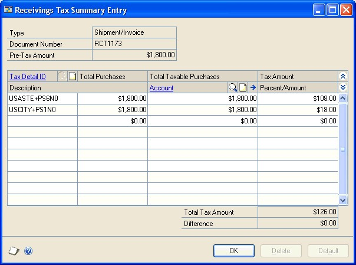

Currency amounts in this window may be displayed in the functional or originating currency, depending on the view selected in the Receivings Transaction Entry window.

8.  To edit tax information, enter a tax detail ID, a tax amount, total purchases, or select a new account. (The tax amount for the detail will be posted to the account.)

9.  To distribute tax to multiple tax details, change the default amount in the scrolling window and enter or select another tax detail and tax amount in the next available line.

To delete a single tax detail, select the row containing it and choose Edit \>\> Delete Row.

10.  Choose OK to save your entries and return to the Receivings Transaction Entry window.

If there is a difference between the total tax amount distributed to tax details and the tax amount entered in the Receivings Transaction Entry window, the tax amount will be adjusted to match the total tax amount.

Choose Delete to delete the tax information in the Receivings Tax Summary Entry window.

Choose Default to restore the default tax information.

### Calculating and distributing detail taxes for shipment/ invoice line items

Use the Receivings Line Item Tax Detail Entry window to add, change, delete, or view tax amounts calculated on an individual line item. Taxes are calculated automatically as you enter each tax detail or edit the Total Purchases amount. Summary tax edits won’t change the taxes calculated for each line item in the Receivings Line Item Tax Detail Entry window. Tax edits made for each line item will change the summary tax amounts in the Receivings Tax Summary Entry window.

**To calculate and distribute detail taxes for shipment/ invoice line items:**

1.  Open the Receivings Transaction Entry window.
    (Purchasing \>\> Transactions \>\> Receivings Transaction Entry)

2.  Enter or select a shipment/invoice. Tax information cannot be entered for shipment receipts.

3.  Enter document information, including receipt number, vendor document number, and receipt date.

4.  Receive items.

    - Choose Auto-Rcv to open the Select Purchase Order window, where you can select a purchase order to receive items from.

    - Enter or select a vendor ID and choose Auto-Rcv to open the Select Purchase Order Items window, where you can receive line items on multiple purchase orders.

    - Enter or select a vendor ID and enter line item information.

5.  Select a line item and choose the Vendor Item or Item expansion button to open the Receivings Item Detail Entry window. You can change the tax status, tax schedules, or tax amount for an item.

6.  Choose the Calculated Tax expansion button to open the Receivings Line Item Tax Detail Entry window, where you can view or edit tax distribution amounts.

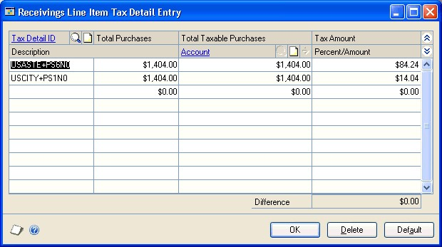

7.  To edit tax information, enter a tax detail ID, total purchases, or tax amount.

(The tax amount for the detail will be posted to the account.)

8.  To distribute tax to multiple tax details, change the default amount in the scrolling window and enter or select another tax detail and tax amount in the next available line.

To delete a single tax detail, select the row containing it and choose Edit \>\> Delete Row.

9.  Choose OK to save your entries and return to the Receivings Item Detail Entry window.

If there is a difference between the total tax amount distributed to tax details and the tax amount entered in the Receivings Transaction Entry window, the tax amount will be adjusted to match the total tax amount.

Choose Delete to delete all the tax details.

Choose Default to restore the default tax information.

### Default tax schedules for invoices

Where the exchange of goods takes place is based on the shipping method
assigned to the vendor’s purchase address. The default schedule for the
invoice and the default schedule to compare against the item are selected
based on the shipping method. Refer to the following table for the default
tax schedule for an invoice.

| **Tax calculation option** | **Shipping method** | **Default tax schedule**                                                        | **Label name**         |
|----------------------------|---------------------|---------------------------------------------------------------------------------|------------------------|
| Advanced                   | Pickup              | Tax schedule assigned to the vendor’s purchase address                          | Purch Addr Tax Sched   |
| Advanced                   | No shipping method  | Tax schedule assigned to the vendor’s purchase address                          | Purch Addr Tax Sched   |
| Advanced                   | Delivery            | Purchases tax schedule assigned in the Company Setup window                     | Company Tax Sched      |
| Single schedule            | Not applicable      | Tax schedule assigned as the single schedule tax schedule in the Purchase Order | Single Tax Schedule ID |

Processing Setup

Options window

*If you decided not to use the shipping method to determine the default tax schedule and decided to use the advanced tax calculations method, the tax schedule assigned to the vendor’s purchase address will be the default tax schedule.*

### Tax schedules for invoice items

To calculate tax for an item, the tax schedules assigned to the item are compared. The item’s default tax schedule is as follows:

| **Item**                                                     | **Default tax schedule**                                                                             |
|--------------------------------------------------------------|------------------------------------------------------------------------------------------------------|
| Item is assigned to a purchase order                         | Tax schedule assigned to the item on the purchase order                                              |
| Inventoried item that isn’t assigned to a purchase order     | Purchase tax schedule assigned to the item in the Item Maintenance window                            |
| Non-inventoried item that isn’t assigned to a purchase order | Tax schedule assigned to non-inventoried items in the Purchase Order Processing Setup Options window |

The default tax schedule to mask against the item’s tax schedule is as follows:

| **Tax calculation option** | **Purchase order assigned** | **Shipping method** | **Default tax schedule**          | **Label name**         |
|----------------------------|-----------------------------|---------------------|-----------------------------------|------------------------|
| Advanced                   | Yes                         | Not applicable      | Tax schedule from the purchase order     |
| Advanced                   | No                          | No shipping method  | Tax schedule assigned to the invoice     | Purch Addr Tax Sched   |
| Advanced                   | No                          | Pickup              | Tax schedule assigned to the invoice     | Purch Addr Tax Sched   |
| Advanced                   | No                          | Delivery            | Purchases tax schedule assigned in the Company| Company Tax Sched      |
| Single schedule            | Not applicable              | Not applicable      | Tax schedule assigned as the single schedule tax schedule in the Purchase Order Processing | Single Tax Schedule ID |

Setup window

Setup Options window

*If you decided not to use the shipping method to determine the default tax schedule and decided to use the advanced tax calculations method, the tax schedule assigned to the vendor’s purchase address will be the default tax schedule.*

### Calculating and distributing summary taxes for invoice receipts

Use the Purchasing Invoice Tax Summary Entry window to add, change, delete, or view summarized tax amounts for an invoice, as well as the accounts to which the amounts will be posted. Taxes are calculated automatically as you enter each tax detail or edit the Total Purchases amount. Summary tax edits won’t change the taxes calculated for each line item in the Purchasing Invoice Line Item Tax Detail Entry window.

If your system isn’t set up to allow editing summary-level taxes, you can’t change the Tax amount in the Purchasing Invoice Entry window or the tax information in the Purchasing Invoice Tax Summary Entry window, except for the account. You’ll be able to change the account for tax included in item taxes at the summary level regardless of how your system is set up. If you want to change tax information, use the Purchasing Invoice Line Item Tax Detail Entry window. For more information on the setup option to make summary edits to taxes, refer to your System Setup instructions (Help \>\> Contents \>\> select Setting Up the System).

If you are using Project Accounting, you can't change the Tax amount in the Purchasing Invoice Entry window or the tax information in the Purchasing Invoice Tax Summary Entry window even if your system is set up to allow editing summary-level taxes. If you want to change tax information, use the Purchasing Invoice Line Item Tax Detail Entry window.

**To calculate and distribute summary taxes for invoice receipts:**

1.  Open the Purchasing Invoice Entry window.
    (Purchasing \>\> Transactions \>\> Enter/Match Invoices)

2.  Enter document information, including receipt number, vendor document number, and invoice date.

Choose the Invoice Date expansion button to open the Purchasing Invoice Date Entry window, where you can enter a tax date and posting date that differ from the document date. The tax date you enter is the date your tax records are updated.

3.  Invoice items.

- Choose Auto-Invoice to open the Select Purchase Order window, where you can automatically invoice all shipment line items available for an invoice.

- Enter or select a vendor ID and choose Auto-Invoice to open the Select Purchase Order Items window, where you can invoice line items that have been received from multiple purchase orders.

- Enter or select a vendor ID and enter line item information.

4.  Select a line item and choose the Vendor Item or Item expansion button to open the Purchasing Invoice Item Tax Entry window. You can change the tax status, tax schedules, or tax amount for an item.

5.  Enter total information in the Purchasing Invoice Entry window.

6.  Choose the Tax expansion button to open the Purchasing Invoice Tax Summary Entry window, where you can view or edit the tax distribution amounts.

Currency amounts in this window may be displayed in the functional or originating currency, depending on the view selected in the Purchasing Invoice Entry window.

7.  To edit tax information, enter a tax detail ID, a tax amount, total purchases, or select a new account. (The tax amount for the detail will be posted to the account.)

8.  To distribute tax to multiple tax details, change the default amount in the scrolling window and enter or select another tax detail and tax amount in the next available line.

To delete a single tax detail, select the row containing it and choose Edit \>\> Delete Row.

9.  Choose OK to save your entries and return to the Purchasing Invoice Entry window.

If there is a difference between the total tax amount distributed to tax details and the tax amount entered in the Purchasing Invoice Entry window, the tax amount will be adjusted to match the total tax amount.

Choose Delete to delete the tax information.

Choose Default to restore the default tax information.

### Calculating and distributing detail taxes for invoice line items

Use the Purchasing Invoice Line Item Tax Detail Entry window to add, change, delete, or view tax amounts calculated on an individual line item. Taxes are calculated automatically as you enter each tax detail or edit the Total Purchases amount. Summary tax edits won’t change the taxes calculated for each line item in the Purchasing Invoice Line Item Tax Detail Entry window. Tax edits made for each line item will change the summary tax amounts in the Purchasing Invoice Tax Summary Entry window.

**To calculate and distribute detail taxes for invoice line items:**

1.  Open the Purchasing Invoice Entry window.
    (Purchasing \>\> Transactions \>\> Enter/Match Invoices)

2.  Enter document information, including receipt number, vendor document number, and invoice date.

Choose the Invoice Date expansion button to open the Purchasing Invoice Date Entry window, where you can enter a tax date and posting date that differ from the document date. The tax date you enter is the date your tax records are updated.

3.  Invoice items.

    - Choose Auto-Invoice to open the Select Purchase Order window, where you can automatically invoice all shipment line items available for an invoice.

    - Enter or select a vendor ID and choose Auto-Invoice to open the Select Purchase Order Items window, where you can invoice line items that have been received from multiple purchase orders.

    - Enter or select a vendor ID and enter line item information.

4.  Select a line item and choose the Vendor Item or Item expansion button to open the Purchasing Invoice Item Tax Detail Entry window. You can change the tax status, tax schedules, or tax amount for an item.

5.  Choose the Calculated Tax expansion button to open the Purchasing Invoice Line Item Tax Detail Entry window, where you can view or edit the tax amounts.

6.  To edit tax information, enter a tax detail ID, total purchases, or tax amount.

(The tax amount for the detail will be posted to the account.)

7.  To distribute tax to multiple tax details, change the default amount in the scrolling window and enter or select another tax detail and tax amount in the next available line.

To delete a single tax detail, select the row containing it and choose Edit \>\> Delete Row.

8.  Choose OK to save your entries and return to the Purchasing Invoice Item Tax Detail Entry window.

If there is a difference between the total tax amount distributed to tax details and the tax amount entered in the Purchasing Invoice Entry window, the tax amount will be adjusted to match the total tax amount.

Choose Delete to delete all the tax details.

Choose Default to restore the default tax information.

## Chapter 21: Receipt posting

Posting is the process of transferring transactions to permanent records. Until transactions are posted, they can be changed or deleted. After you post transactions in Purchase Order Processing, they can’t be changed or deleted. To print a posting journal after the transaction was posted, use the Purchasing Posting Journals window or the Purchasing Posting Journal Options window.

Posting reports will be printed when you post transactions, either individually or in batches. For more information about posting reports for Purchase Order Processing, refer to *Purchase Order Processing standard reports summary*.

*For more information about setting up posting, see the System Setup Guide (Help \>\> Contents \>\> select Setting up the System).*

This information is divided into the following sections:

- *Posting a receipt*

- *Posting a purchasing batch*

- *Posting Purchasing series batches*

### Posting a receipt

Transaction-level posting allows you to enter and post transactions individually without ever having to create a batch. Purchasing receipt information always will be up-to-date immediately when you post using this method, because transactions must be posted or deleted immediately. They can’t be saved or posted later.

You can perform transaction-level posting in the Receivings Transaction Entry window and in the Purchasing Invoice Entry window. Purchasing and inventory information will be update immediately every time you post using this method. All transactions posted individually in a single data entry session will have the same audit trail code.

Transaction-level posting is optional and can be selected in the Posting Setup window when you set up Microsoft Dynamics GP. If you aren’t allowed to post individual transactions, you’ll be asked to create a batch when you attempt to post transactions. Also, you can post an individual transaction that was previously entered in a batch. To do so, select the transaction from the batch, clear the Batch ID field and post the transaction.

If you’re posting by transaction date, the posting date and the document date will be the same. If you change the posting date in the date entry window, the document date won’t be affected.

You can’t post to a year that hasn’t been set up using the Fiscal Periods Setup window. Also, if the year has been set up but the Purchasing period is closed, posting won’t be allowed. The posting journal will indicate the transactions that were posted, as well as the transactions that weren’t posted. Transactions will be posted to General Ledger, even if a Financial series period has been closed. However, transactions will not post through General Ledger.

The reports for individually posted transactions contain information only for the transactions that were entered and posted since the Receivings Transaction Entry window or the Purchasing Invoice Entry window was opened. These reports are printed when you close the window.

### Posting a purchasing batch

Use the Purchasing Batch Entry window to post a single batch. Before you post, be sure quantities for each item on an invoice receipt are fully matched to shipment quantities.

**To post a purchasing batch:**

1.  Make a backup of your company’s data. Refer your System Administrator's Guide (Help \>\> Contents \>\> select System Administration) for more information about making backups.

2.  Open the Purchasing Batch Entry window.
    (Purchasing \>\> Transactions \>\> Purchasing Batches)

3.  Print an edit list to review the transactions in the batch. An edit list can be printed from the Purchasing Batch Entry window by choosing File \>\> Print with the appropriate batch ID displayed. If you need to make corrections, do so at this time.

4.  Enter or select the batch ID and origin for the batch you want to post.

5.  Choose Post. Your Purchase Order Processing records will be updated to reflect the information from the transactions. Your General Ledger accounts will be updated depending on your posting setup selections.

If you’re set up to post to General Ledger in the Posting Setup window, the batch appears in the Financial Series Posting and Master Posting windows; you can edit the transactions in the General Ledger Transaction Entry window before posting them again. Your accounts are updated when you post the transactions in General Ledger.

If you post through General Ledger, your accounts are updated at once and you don’t need to post the batch again in General Ledger.

6.  One or more posting journals may be printed, depending on the options selected in the Posting Setup window. A Report Destination window may appear for each posting journal that was selected to print, depending on how they were set up.

### Posting Purchasing series batches

Use the Purchasing Series Posting window to post multiple batches in the Purchasing series at the same time. Before you post, be sure quantities for each item on an invoice receipt are fully matched to shipment quantities.

**To post Purchasing series batches:**

1.  Make a backup of your company’s data. Refer your System Administrator’s Guide (Help \>\> Contents \>\> select System Administration) for more information about making backups.

2.  Print an edit list to review the transactions in the batch. An edit list can be printed from the Purchasing Batch Entry window by choosing File \>\> Print with the appropriate batch ID displayed. If you need to make corrections, do so at this time.

3.  Open the Purchasing Series Posting window. 
    (Purchasing \>\> Transactions \>\> Series Post)

4.  Mark the box next to the batch ID for each batch you want to post. The status changes to Marked, which indicates to other users that the batch is ready to be posted.

*If a batch was marked previously, the User ID column identifies the person who marked it. If you want to post that batch, unmark it and mark it again so the batch is assigned to you. Series posting allows you to post only those batches that you’ve marked; you can’t post batches marked by another user.*

5.  Choose Post. One or more posting journals may be printed, depending on the options selected in the Posting Setup window. A Report Destination window may appear for each posting journal that was selected to print, depending on how they were set up.

## Chapter 22: Receipt maintenance

Proper maintenance of your receiving information is essential for preserving the accuracy of your records. This chapter focuses on the tasks that allow you to maintain your records effectively.

Throughout the receiving process, you can print a variety of reports you can use to double-check documents you’ve entered. If you identify errors on these reports, the errors must be corrected to ensure accurate reporting of your receiving activity. You also may want to delete or void shipment, shipment/invoice and invoice receipts that are no longer valid.

If you are using Purchase Order Enhancements, you can process returns against Purchase Order Processing receipts. Items that have been received on a shipment or shipment/invoice receipt can be returned as a Return or a Return w/Credit document type. For more information, see the Purchase Order Enhancements documentation.

This information is divided into the following sections:

- *Correcting unposted shipment, shipment/invoice, and in-transit inventory receipts*

- *Correcting unposted invoice receipts*

- *About deleting and voiding receipts*

- *Deleting shipment, shipment/invoice, or in-transit inventory receipts*

- *Voiding shipment, shipment/invoice, or in-transit inventory receipts*

- *Deleting invoice receipts*

- *Voiding invoice receipts*

### Correcting unposted shipment, shipment/invoice, and in-transit inventory receipts

Use the Receivings Transaction Entry window to correct shipment, shipment/invoice, or in-transit inventory receipts before posting. After you enter receipts, print an edit list to determine if the entries contain errors. (You can print edit lists only for receipts entered in a batch.) If you discover that an unposted receipt was entered incorrectly, you can correct the error using the following procedure.

**To correct unposted shipment, shipment/invoice, and intransit inventory receipts:**

1.  Open the Receivings Transaction Entry window.
    (Purchasing \>\> Transactions \>\> Receivings Transaction Entry)

2.  Select the receipt. (You can find the receipt number on the Receivings Edit List you used to pinpoint the error.)

3.  Highlight the fields you want to change and enter the correct information.

• If you changed a quantity shipped or quantity rejected for a lot-numbered item or a serial-numbered item, the Purchasing Lot Number Entry window or the Purchasing Serial Number Entry window will open; you can assign lot or serial numbers to the item. The In-Transit Serial Number Entry window or the In-Transit Lot Number Entry window opens for an in-transit inventory receipt, where you can assign lot or serial numbers to an item.

- If receiving items without a purchase order is allowed, you can enter items, non-inventoried items or vendor items that don’t exist on the purchase order. If you are using Project Accounting, you can’t enter vendor items for projects.

- If you delete an item when you are using landed costs, all line and apportioned landed costs assigned to the item also are deleted. Deleting an item that has apportioned landed costs will cause the unapportioned amount and the document’s landed cost functional total to recalculate.

4.  Choose File \>\> Print to verify the corrections you’ve entered with a Receivings Edit List.

5.  Choose Save to save the corrected transaction.

### Correcting unposted invoice receipts

Use the Purchasing Invoice Entry window to correct invoice receipts before posting. After you enter receipts, print an edit list to determine if the entries contain errors. (You can print edit lists only for receipts entered in a batch.) If you discover that an unposted receipt was entered incorrectly, you can correct the error using the following procedure.

**To correct unposted invoice receipts:**

1.  Open the Purchasing Invoice Entry window.
    (Purchasing \>\> Transactions \>\> Enter/Match Invoices)

2.  Select the receipt. (You can find the receipt number on the Purchasing Invoice Edit List you used to pinpoint the error.)

3.  Highlight the fields you want to change and enter the correct information.

    - If receiving items without a purchase order is allowed, you can enter items, non-inventoried items, or vendor items that don’t exist on the purchase order as long as those items or vendor items are on a shipment that has been posted. If you are using Project Accounting, you can’t enter vendor items for projects.

    - You can match or unmatch shipment line items to invoices. You also can match or unmatch landed cost items.

4.  Choose File \>\> Print to verify the corrections you’ve entered with a Purchasing Invoice Edit List.

5.  Choose Save to save the corrected transaction.

### About deleting and voiding receipts

Deleting and voiding receipts reduces the following quantities in the Purchasing Quantity Status window:

- Unposted shipment

- Unposted invoice

- Unposted rejected quantities

- Unposted matched quantities

Deleting and voiding receipts increases the following quantities in the Purchasing Quantity Status window:

- Remaining to ship quantity. (This quantity will be increased by the quantity shipped minus the quantity rejected. The remaining to ship quantity is the remaining to receive quantity for in-transit inventory receipts.)

- Remaining to invoice quantities. (These quantities will be increased by the quantity invoiced.)

- Remaining posted shipments to match quantities. (These quantities will be increased by the quantity invoiced when you void or delete an unposted invoice receipt.)

### Deleting shipment, shipment/invoice, or in-transit inventory receipts

Use the Receivings Transaction Entry window to delete unposted shipment. shipment/invoice, or in-transit inventory receipts. Deleting removes receipt information from the system and makes receipt numbers available for reuse.

To delete receipts or line items linked to jobs, you must have authority to unlink line items from a job. Security is set in the Job Costing Preference Defaults window. You can’t link line item jobs to in-transit inventory receipts. If you are using Project Accounting, you can’t link line items to jobs.

**To delete shipment, shipment/invoice, or in-transit inventory receipts:**

1.  Open the Receivings Transaction Entry window.
    (Purchasing \>\> Transactions \>\> Receivings Transaction Entry) 

2. Enter or select the receipt number of the receipt you want to delete.

3.  Choose Delete.

### Voiding shipment, shipment/invoice, or in-transit inventory receipts

Use the Receivings Transaction Entry window to void unposted shipment, shipment/invoice, and in-transit inventory receipts. Voiding moves receipt information to history and does not make receipt numbers available for reuse until history is removed, if you’re keeping history. If you’re not keeping history, voiding removes receipt information from the system.

If you track voided receipts, you’ll know why a receipt number is missing or out of sequence. If you’ve selected to track receipts in history, you can view information about voided receipts using the purchasing inquiry windows or by printing the Receivings Voided Journal or the Receivings Transaction History Report.

To void receipts or line items linked to jobs, you must have authority to unlink line items from a job. Security is set in the Job Costing Preference Defaults window. You can’t link line item jobs to in-transit inventory receipts. If you are using Project Accounting, you can’t link line items to jobs.

**To void shipment, shipment/invoice, or in-transit inventory receipts:**

1.  Open the Receivings Transaction Entry window.
    (Purchasing \>\> Transactions \>\> Receivings Transaction Entry)

2.  Enter or select the receipt number of the receipt you want to void.

3.  Choose Void. The Receivings Voided Journal is printed when you close the Receivings Transaction Entry window after voiding, if you’ve marked the option to print it in the Posting Setup window.

### Deleting invoice receipts

Use the Purchasing Invoice Entry window to delete unposted invoice receipts. Deleting removes receipt information from the system and makes receipt numbers available for reuse.

To delete invoice receipts or line items linked to jobs, you must have authority to unlink line items from a job. Security is set in the Job Costing Preference Defaults window. If you are using Project Accounting, you can’t link line items to jobs.

**To delete invoice receipts:**

1.  Open the Purchasing Invoice Entry window.
    (Purchasing \>\> Transactions \>\> Enter/Match Invoices)

2.  Enter or select the receipt number of the receipt you want to delete.

3.  Choose Delete.

### Voiding invoice receipts

Use the Purchasing Invoice Entry window to void unposted invoice receipts.

If you track voided receipts, you’ll know why a receipt number is missing or out of sequence. If you’ve selected to track receipts in history, you can view information about voided receipts using the purchasing inquiry windows or by printing the Voided Invoice Journal or the Receivings Transaction History Report.

To void invoice receipts or line items linked to jobs, you must have authority to unlink line items from a job. Security is set in the Job Costing Preference Defaults window. If you are using Project Accounting, you can’t link line items to jobs.

**To void invoice receipts:**

1.  Open the Purchasing Invoice Entry window.
    (Purchasing \>\> Transactions \>\> Enter/Match Invoices)

2.  Enter or select the receipt number of the receipt you want to void.

3.  Choose Void. The Voided Invoice Journal is printed when you close the Purchasing Invoice Entry window after voiding invoice receipts, if you’ve marked the option to print it in the Posting Setup window.

## See Also

[Part 1: Setup and cards](purchase-order-processing.md#part-1-setup-and-cards)  
[Part 2: Purchase orders](purchase-order-processing-part2-orders.md)  
[Part 4: Purchase order returns](purchase-order-processing-part4-returns.md)  
[Part 5: Inquiries and reports](purchase-order-processing-part5-inquiries-reports.md)  
[Part 6: Utilities](purchase-order-processing-part6-utilities.md)  
