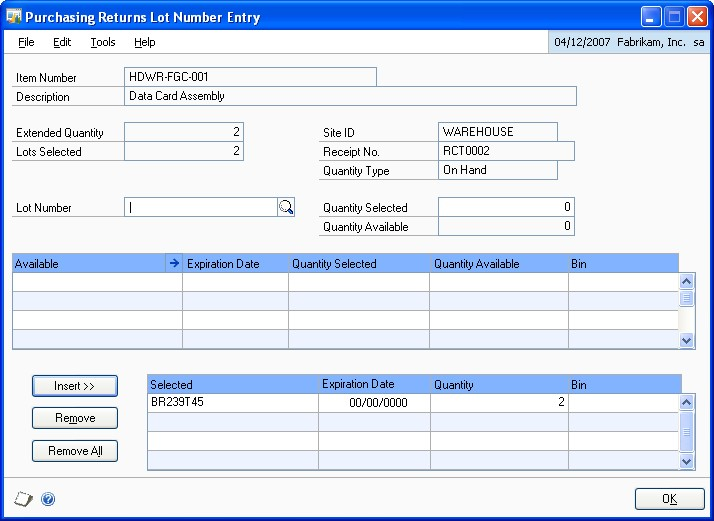

# Purchase Order Processing Part 4: Purchase order returns

This part of the documentation includes information about using purchase order returns. The following topics are discussed:

- *Chapter 23, "Returns transactions,"* describes how to process returns from Purchase Order Processing.

- *Chapter 24, "Taxes for returns,"* contains information about tax calculation in purchase order returns.

## Chapter 23: Returns transactions

Returning goods to vendors is a common event during the purchase order life cycle. Returns can occur anytime—before or after receipt of the vendor's invoice—and returns may or may not involve credit. purchase order returns makes it possible for you to process purchase order returns quickly and easily, with or without credit to the vendor, based on the specific circumstances of that return.

*You will have to make a manual adjustment within Payables Management for restocking fees charged by the vendor. This release of purchase order returns does not include a field for these fees.*

You can start to use purchase order returns immediately. No special setup is necessary.

Purchase order returns transaction information is divided into the following sections:

- *About purchase order returns*

- *Purchase order returns and Project Accounting*

- *Return transaction document types*

- *Quantity Tolerances for purchase order returns*

- *Creating a purchasing returns batch*

| **Module**                | **Receipt types** |
|---------------------------|-------------------|
| Purchase Order Processing | Shipment          |
|                           | Shipment Invoice  |

- *Processing purchasing return transactions*

- *Processing project return-from-inventory transactions*

- *Printing purchasing returns transactions*

- *Entering detail information for a return*

- *Entering Intrastat trade statistics for returns*

- *Multiple bins in purchase order returns*

- *Changing bins for a return transaction*

- *Assigning lot numbers to a return*

- *Assigning serial numbers to a return*

- *Distributing return transaction amounts*

- *Return distribution accounts*

- *Processing manual adjustments for returns when closing purchase order lines*

### About purchase order returns

You can process returns against both Purchase Order Processing receipts and Inventory receipts. Items that have been received on a shipment or shipment/invoice receipt are available to be returned as a Return or a Return w/Credit document type. Items that have been transferred to another site, added to inventory through an inventory adjustment or variance, or returned by a customer are available to be returned in Purchase Order Processing as an Inventory or Inventory w/Credit document type.

Using purchase order approvals, you can process returns against the following receipt types:

| **Module**        | **Receipt types** |
|-------------------|-------------------|
| Inventory Control | Adjustment        |
|                   | Variance          |
|                   | Transfer          |
|                   | Sales return      |

When you post a return, the original transaction amount is offset against quantities in inventory and the applicable General Ledger accounts. If the unit cost of the item has changed, you can return at the new unit cost (applicable to returns with credit only). If you are using Multicurrency Management, you can return items involving alternative currencies.

When you process a Return w/Credit return document, a return transaction is created in Payables Management. The return transaction must be manually applied to the invoice from the vendor. See the Payables Management documentation (Help \>\> Printable Manuals) for more information.

### Purchase order returns and Project Accounting

If you are using Project Accounting, you can enter project information on standard purchase orders and drop-ship purchase orders in Purchase Order Processing. Items received from a standard purchase order are stored in inventory. To transfer items to a project, you'll use the Inventory Transfer Entry window in Projecting Accounting. Items from a drop-ship purchase order are invoiced and transferred to a project automatically.

You can use purchase order returns to return an item that is in inventory. This is called a project return-from inventory transaction. If the item has been transferred to a project, you can use Project Accounting to return the item. See the Project Accounting documentation for more information.

### Return transaction document types

You can process purchasing returns using the following return transaction document types:

- Return

- Return w/Credit

- Inventory

- Inventory w/Credit

*You must use the document types Return or Return w/Credit to return non-inventoried items or any items with the item types of Misc Charges, Flat Fee, or Services. Returns against kit items are not allowed.*

Each of the return document types is described in detail as follows.

**Return**

Select Return for shipment receipts or shipment/invoice receipts when the item is not matched to an invoice and vendor credit is not applicable. An example would be when the item is being replaced.

Manual adjustments may be necessary for return documents using the Return document type, refer to *Processing manual adjustments for returns when closing purchase order lines* for more information.

**Return w/Credit**

Select Return w/Credit for shipment receipts that are matched with an invoice, or shipment/invoice receipts when vendor credit is applicable.

*To return all of the items on a partially invoiced receipt, you must complete two return transactions: one for the invoiced items using document type Return w/Credit and another for the uninvoiced items using document type Return.*

**Inventory**

Select Inventory for inventory adjustment receipts, variance receipts, transfer receipts and sales return receipts when the item is not matched to an invoice and vendor credit is not applicable. An example would be when the item is being replaced. If you are using Project Accounting, you can't enter this return document type for project return-from-inventory transactions.

When you process an Inventory return, if the items being returned will be replaced by the vendor, you must make adjusting journal entries to remove the accrual created by the new shipment receipt.

**Inventory w/Credit**

Select Inventory w/Credit for inventory adjustment receipts, variance receipts, transfer receipts and sales return receipts when vendor credit is applicable. If you are using Project Accounting, you can't enter this return document type for project return-from-inventory transactions.

When you process a Return w/Credit return document or Inventory w/Credit return document type, a return transaction is created in Payables Management. The return transaction must be manually applied to the invoice from the vendor. See the Payables Management documentation (Help \>\> Printable Manuals) for more information.

### Quantity Tolerances for purchase order returns

You set up quantity tolerances for shortages and overages for the quantity ordered on a standard purchase order or a blanket purchase order. Review the following information on how returning and replacing quantities affect the calculation when determining if a quantity is within the tolerance set up for an item.

**Shortage**

If an item's quantity is returned or partially returned, the option to replace quantities on the transaction is taken into account when determining if the quantity is within the tolerance amount and whether the line item status is Received or Closed. The return quantity is not taken into account when calculating the shortage tolerance.

**Example 1**

In the following example, the quantity returned is not replaced.

| Quantity ordered for a purchase order is 100.                                                                                                                                        |
|--------------------------------------------------------------------------------------------------------------------------------------------------------------------------------------|
| Quantity overage tolerance percentage is 10%.                                                                                                                                        |
| You enter a receivings transaction for a quantity of 80.                                                                                                                             |
| The purchase order has a Released status.                                                                                                                                            |
| Return a quantity of 20 and do not replace the quantity.                                                                                                                             |
| The purchase order and the line item has a Released status.                                                                                                                          |
| You enter another receivings transaction.                                                                                                                                            |
| If the quantity for the item has a quantity of 9 or less, the line item status is Released.                                                                                          |
| If the quantity for the item has a quantity of 10 or more, the remaining quantity is canceled and the status for the item is Received or Closed if the item has been fully invoiced. |

**Example 2**

In the following example, the quantity returned is replaced.

| Quantity ordered for a purchase order is 100.                                                                                                                                        |
|--------------------------------------------------------------------------------------------------------------------------------------------------------------------------------------|
| Quantity overage tolerance percentage is 10%.                                                                                                                                        |
| You enter a receivings transaction for a quantity of 80.                                                                                                                             |
| The purchase order has a Released status.                                                                                                                                            |
| Return a quantity of 20 and replace the quantity.                                                                                                                                    |
| You enter another receivings transaction.                                                                                                                                            |
| If the quantity for the item has a quantity of 29 or less, the line item status is Released.                                                                                         |
| If the quantity for the item has a quantity of 30 or more, the remaining quantity is canceled and the status for the item is Received or Closed if the item has been fully invoiced. |

**Overage**

If an item's quantity is returned or partially returned and the return has been marked to replace returned items, the return quantity is taken into account when calculating the overage tolerance. If the quantity received is over the overage tolerance, the following message displays.

You can't enter a quantity greater than the combined total of the Remaining to Receive quantity and the overage tolerance set up for the item.

**Example 1**

In the following example, the quantity returned is not replaced

| The net quantity order is the quantity order minus the quantity canceled.            |
|--------------------------------------------------------------------------------------|
| Purchase order net quantity is 100.                                                  |
| Quantity overage tolerance percentage is 10%.                                        |
| You enter a receivings transaction for a quantity of 80.                             |
| The purchase order has a Released status.                                            |
| Return a quantity of 20 and do not replace the quantity.                             |
| You enter another receivings transaction.                                            |
| No message displays if the quantity on the transaction has a quantity of 29 or less. |
| Message displays if the quantity on the transaction has a quantity of 30 or more.    |

**Example 2**

In the following example, the quantity returned is replaced.

| The net quantity order is the quantity order minus the quantity canceled.            |
|--------------------------------------------------------------------------------------|
| Purchase order net quantity is 100.                                                  |
| Quantity overage tolerance percentage is 10%.                                        |
| You enter a receivings transaction for a quantity of 80.                             |
| The purchase order has a Released status.                                            |
| Return a quantity of 20 and replace the quantity.                                    |
| You enter another receivings transaction.                                            |
| No message displays if the quantity on the transaction has a quantity of 49 or less. |
| Message displays if the quantity on the transaction has a quantity of 50 or more.    |

### Creating a purchasing returns batch

Use the Returns Batch Entry window to create a return batch. All transactions in the batch must originate with Returns Transaction Entry window.

**To create a purchasing returns batch:**

1. Open the Returns Batch Entry window.
    (Purchasing \>\> Transactions \>\> Returns Batches)

    

2. Enter a batch ID to identify the batch.

3. Enter a batch comment (optional).

4. Enter a posting date.

    This field is available only if Batch is selected in the Posting Date From field in the Posting Setup window.

    The posting date you enter here is the date that General Ledger files are updated. Your records in Purchase Order Processing are updated based on the date of the return.

5. Choose Save to save the batch.

To verify the transactions you entered, print a returns Edit List. For more information, see *Printing purchasing returns transactions*.

### Processing purchasing return transactions

Use the Returns Transaction Entry window to process purchasing return transactions.

If you're using multiple bins and a default purchase returns bin exists at either the item-site or the site, the quantity at the default bin will decrease by the extended quantity for an item that is not tracked by serial or lot numbers. You can modify the default bin selections. If a default purchase returns bin doesn't exist, you will be required to enter one. For serial- and lot-numbered items, the purchase returns bin is the bin associated with the serial or lot number, and you can't to change the bin.

If you are using Project Accounting, the Project Number field and the Cost Category ID field will be displayed in the Returns Transaction Entry window. To enter a return for a project return-from-inventory transaction, see *Processing project return from-inventory transactions*.

**To process purchasing return transactions:**

1. In the navigation pane, choose the Purchasing button, and then choose the All Purchasing Transactions list.

2. Select a shipment receipt or a shipment/invoice receipt.

3. Choose Purchase Returns Transactions and then select a document type to open the Returns Transaction Entry window.

    

4. Select a document type for the return transaction. For more information about return document types, see *Return transaction document types*

5. Enter a return number or accept the default entry. The default entry will be the next available receipt number in the Purchase Order Processing Setup window.

6. Enter a vendor document number. A vendor document number is required for returns with credit.

7. Enter the return date. The user date is the default entry.

    To enter a General Ledger posting date or a tax date that is different from the return date, choose the Date expansion button; the Returns Date Entry window will open.

    For multicurrency transactions and for document types Return w/Credit, Inventory, and Inventory w/Credit, the return document date determines the exchange rate that will be used, based on the currency ID that's entered for the transaction and the associated rate type. For a Return document type, the exchange rate of the original receipt will be assigned to each return line. There is no overall exchange rate for the transaction.

8. Enter or select a batch ID (optional). See *Creating a purchasing returns batch* for more information.

9. Enter or select a vendor ID.

10. Enter or accept the currency ID. The default currency ID will be the currency ID assigned to the vendor you selected. If no currency ID has been assigned for this vendor, the company's functional currency will be used.

    The currency ID assigned to the return must match the currency ID of the receipts in the scrolling window.

    If the selected currency ID is not the company's functional currency, a rate type and associated exchange rate table will be assigned to the transaction. The rate type is based on the rate type assigned to the selected vendor. If the vendor does not have a rate type assigned, the default rate type for the Purchasing series specified in the Multicurrency Setup window is used.

    For Return w/Credit, Inventory, and Inventory w/Credit returns, you can view or modify the default exchange rate by choosing the currency ID expansion button to open the Exchange Rate Entry window. For more information about exchange rates, refer to the Multicurrency Management documentation.

11. To select an option for how returned goods are invoiced, mark a combination of the Replace Returned Goods and Invoice Expected for Returned Goods fields.

    The following table shows which options to choose.

    | **Options marked** | **When to use** | **Results** | **Notes** |
    |--|--|--|--|
    | Replace Returned Goods and Invoice Expected for Returned Goods | When you want to replace the returned goods, using the original purchase order. When you have yet to process the invoice for the original goods. When you want to process an invoice for all of the original quantity of goods received (even though you have returned some of them). | Returned goods are replaced. The same purchase order is used for the replaced goods. You can process the invoice for all of the original goods, including the goods that will be replaced. | If the original purchase order is no longer available (for example, moved to history), a new one is created automatically. The new purchase order includes only the returned goods and quantity that you want to replace. The Invoice Expected from Vendor option is available only for return types Return or Inventory. |
    | Replace Returned Goods | When you want to replace the returned goods, using the original purchase order. When you do not expect to receive an invoice for the goods you're returning, or when you do not expect the invoice to match the original quantity of goods. | Returned items are replaced. The same purchase order is used for the replaced items. | You can process an invoice for only the goods you kept, not the returned goods. If the original purchase order is no longer available (for example, moved to history), a new one is created automatically. The new purchase order includes only the returned goods and quantity that you want to replace. Invoices that you already have processed are not affected by choosing this option. |
    | Invoice Expected for Returned Goods | When you do not want to replace the returned goods. For example, when you expect a refund or a credit. When you want to close the purchase order when the invoice is processed. | The credit or refund occurs separately from the original invoice. When you process the invoice, the purchase order is automatically closed. | You returned some goods, but did not ask to replace them. Thus, the transaction is complete and the purchase order is closed. |
    | Neither option is marked | When you do not want to replace the returned goods. For example, when you expect a refund or a credit. When you have already processed the invoice, or when you do not expect to receive an invoice from the vendor. | The credit or refund occurs separately from the original invoice. | You can process an invoice for only the goods that you kept, not the returned goods. Invoices that you already have processed are not affected by choosing this option. |

12. If the item being returned was purchased from an EU vendor, mark EU Transaction. See *Entering Intrastat trade statistics for returns* for more information.

13. If the item being returned is subject to withholding tax, mark the Subject to Withholding option and enter or accept the tax rate. If a withholding vendor hasn't been specified in the Company Setup Options window, these fields will not be available.

14. Use the scrolling window to select the items to be returned and to match the items to receipts.

    For document types Return or Return w/Credit, enter or select the purchase order number applicable to this return. You can leave this field blank if you prefer. All purchase orders that have been received for this vendor will be available in the Purchase Orders lookup window.

    The PO Number field is not available for document types Inventory and Inventory w/Credit.

    Only standard purchase orders that have been received can be returned. You cannot process returns for drop-ship, canceled, or on-hold purchase orders.

15. Enter or select the items you want to return using either the vendor's item number or your company's item number.

    > [!TIP]
    > You can display the vendor's item number by marking Display Vendor Items (Options \>\> Display Vendor Item). If the option is not marked, your company's item number will be displayed. You can change this selection at any time.

    Non-inventoried items cannot be selected from the lookup window, however, you can return these by entering the item number.

    To add an attachment to the item, select the item and choose the Attachment Management icon to open the Document Attachment Management window.

16. Enter or select the receipt number for this return.

    You must select an item, or a vendor item, before you can select the receipt number.

    The currency ID of the receipt you select must match the currency ID of the return document.

    If the receipt number that you enter is matched to more than one receipt line or inventory receipt line, a lookup window (Purchasing Returns PO Receipt Numbers window or Purchasing Returns Inventory Receipt Numbers window) will open allowing you to select the applicable receipt line. The Purchasing Returns PO Receipt Numbers lookup window displays the unit of measure from the original receipt which may be different from the unit of measure in the Returns Transaction Entry window.

    If there's more than one invoice receipt attached to the receipt number you select, the Purchasing Returns PO Invoice Receipt Numbers lookup window will open automatically allowing you to select the applicable invoice receipt.

    If there are no quantities available for the receipt number that you entered, you will have the option to search for another receipt. If you choose yes, a lookup window will open where you can select another receipt with the same item.

    The only way to change a receipt number after it has been entered is to delete the return line and reenter the information.

17. Enter or accept the unit of measure.

18. Enter the quantity to be returned or accept the default entry, that is, the total quantity available on the selected receipt.

    If you're using multiple bins, the total quantity selected for bins must equal the extended quantity of the line item.

19. The default entry for unit cost of the item or vendor item is based on the document type.

    The following table lists the default unit cost for each document type.

    | **Document type**       | **Default unit cost**                 |
    |-------------------------|---------------------------------------|
    | Return with/Credit      | The original invoice receipt          |
    | Inventory w/Credit      | The posted inventory purchase receipt |
    | Return or Inventory AND | The average cost of the item          |

    — If Item type is Average Perpetual

    — If Item type is Periodic

    — If any other item type

    The standard cost of the item

    The original shipment receipt

    If necessary, you can change the unit cost for returns with credit.

    If you change the default unit cost, a purchase price variance will occur. Also, if landed costs are included in the original shipment receipt, a purchase price variance will occur.

    If the returned item is tracked by lot or serial number, the Returns Lot or Returns Serial Number Entry window will open when you leave the line. Select the lot or serial numbers to be returned. See *Assigning lot numbers to a return* or *Assigning serial numbers to a return* for more information.

    If you are using multiple bins, the Bin Quantity Entry window will open if a returned item that isn't tracked by lot or serial numbers requires you to enter bin information. The total quantity selected for bins must equal the line's extended quantity.

    > [!NOTE]
    > You also can open the Purchasing Returns Lot Number Entry window or the **Purchasing Returns Serial Entry** window by choosing **Show Details** on the **Returns Transaction Entry** window, and then choosing **Serial/Lot**. To open the **Bin Quantity Entry** window, choose Show Details \>\> Bins.

20. Enter or accept the 1099 amount if applicable for a 1099 vendor and returns with credit.

21. If your system is set up to calculate taxes using the Advanced tax calculation method and you're entering a return with credit, enter or accept the Tax Schedule ID.

22. Enter or accept trade discount, freight and miscellaneous amounts for returns with credit.

    If your system is using the Advanced tax calculation method, taxes on freight and miscellaneous will be calculated automatically.

23. Taxes will be calculated automatically as you enter items.

    - To change the tax amounts for the document, see *Calculating and distributing summary taxes for returns* for more information. If you are using Project Accounting, you can't change the tax amount in the Returns Transaction Entry window for return and return with credit transactions even if your system is set up to allow editing summary-level taxes.

    - To change the tax amounts for a line item, use the Returns Line Item Tax Detail Entry window. See *Calculating and distributing detail taxes for return line items* for more information.

    - If your system is set up to enable GST for Australia/New Zealand and you want to indicate that a tax invoice has been received, see *Returns for Australia/New Zealand*.

24. Choose Distributions to open the Purchasing Returns Distribution Entry window where you can view or modify account distributions. See *Distributing return transaction amounts* for more information.

25. Choose the Attachment Management icon to attach documents to the return transaction, if applicable.

26. Choose Save or Post. If you want to post this return later, the return must be assigned to a Batch ID. You can post the transaction immediately by choosing Post.

Manual adjustments may be necessary for return documents with the Return document type, refer to *Processing manual adjustments for returns when closing purchase order lines* for more information.

For an Inventory document type, if the items being returned will be replaced by the vendor, you must make adjusting journal entries to remove the accrual created by the new shipment receipt.

> [!TIP]
> Refer to the General Ledger documentation for information about correcting General Ledger entries.

If you're using multiple bins and posting fails, bin quantities will revert to their previous values.

### Processing project return-from-inventory transactions

If you are using Project Accounting, you can use the Returns Transaction Entry window to process project return-from-inventory transactions.

If you're using multiple bins and a default purchase returns bin exists at either the item-site or the site, the quantity at the default bin will decrease by the extended quantity for an item that is not tracked by serial or lot numbers. You can modify the default bin selections. If a default purchase returns bin doesn't exist, you will be required to enter one. For serial- and lot-numbered items, the purchase returns bin is the bin associated with the serial or lot number and you won't be able to change the bin.

**To process project return-from-inventory transactions:**

1. Open the Returns Transaction Entry window.
    (Purchasing \>\> Transactions \>\> Returns Transaction Entry)

    

2. Select a return type for the return transaction. See *Return transaction document types* for more information about return document types.

3. Enter a return number or accept the default entry. The default entry will be the next available receipt number in the Purchasing Invoice Setup window.

4. You can enter a vendor document number.

5. Enter the return date. The user date is the default date.

    To enter a General Ledger posting date or a tax date that is different than the return date, choose the Date expansion button; the Returns Date Entry window will open.

    For multicurrency transactions and for the document type Return w/Credit, the return document date determines the exchange rate that will be used, based on the currency ID entered for the transaction and the associated rate type. For a Return document type, the exchange rate of the original receipt is assigned to the transaction. See the Multicurrency Management documentation (Help \>\> Printable Manuals) for more information.

6. Enter or select a batch ID (optional). See *Creating a purchasing returns batch* for more information.

7. Enter or select a vendor ID.

8. Enter a currency ID or accept the default entry. The default currency ID is the currency ID assigned to the vendor you selected. If no currency ID has been assigned for this vendor, the functional currency for the company will be used.

    The currency ID assigned to the return must match the currency ID of the receipts in the scrolling window.

    If the selected currency ID is not the functional currency for the company, a rate type and associated exchange rate table will be assigned to the transaction. The rate type is based on the rate type assigned to the selected vendor; if the vendor does not have a rate type assigned, the default rate type for the Purchasing series specified in the Multicurrency Setup window is used.

    For a Return w/Credit return, you can view or modify the default exchange rate by choosing the currency ID expansion button to open the Exchange Rate Entry window.

9. If the item being returned was purchased from an EU vendor, mark EU Transaction. See *Entering Intrastat trade statistics for returns* for more information.

10. You can enter or select the purchase order number applicable to this return. All purchase orders associated with the receipt number will be available in the PA Purchase Orders lookup window.

    Only standard purchase orders that have been received can be returned. You cannot process returns for drop-ship, canceled, or on-hold purchase orders.

11. Enter or select a project and cost category.

12. Enter or select the items to return using the item number from the vendor. All items previously received for the specified purchase order will be available in the lookup window.

    Non-inventoried items cannot be selected from the lookup window. However, you can return these by entering the item number.

    To add an attachment to the item, select the item and choose the Attachment Management icon to open the Document Attachment Management window.

13. Enter or select the receipt number applicable to this return.

    You must select an item, or a vendor item, before you can select the receipt number.

    The currency ID of the receipt you select must match the currency ID of the return document.

    If the receipt number that you enter is matched to more than one receipt line or inventory receipt line, a lookup window (Purchasing Returns PO Receipt Numbers) will open, where you can select the applicable receipt line. The Purchasing Returns PO Receipt Numbers lookup window displays the unit of measure from the original receipt, which may be different than the unit of measure in the Returns Transaction Entry window.

    If there are multiple invoice receipts attached to the receipt number you select, the Purchasing Returns PO Invoice Receipt Numbers lookup window will open, where you can select the applicable invoice receipt.

    If there are no quantities available for the receipt number that you entered, you will have the option to search for another receipt. If you choose Yes, a lookup window will open, where you can select another receipt with the same item.

    The only way to change a receipt number after it has been entered is to delete the return line and reenter the information.

14. Enter or accept the unit of measure.

15. Enter the quantity to be returned or accept the default entry.

    If you're using multiple bins, the total quantity selected for bins must equal the extended quantity of the line item.

16. Enter or accept the unit cost.

    The default entry for the unit cost of the item is based on the document type, as shown in the following table.<--!something wrong here-->

    | **Document type** | **Default unit cost**        |
    |-------------------|------------------------------|
    | Return w/Credit   | The original invoice receipt |
    | Return AND        | The average cost of the item |

    — If Item type is Average Perpetual

    — If Item type is Periodic

    — If any other item type

    The standard cost of the item

    The original shipment receipt

    You can change the unit cost only for returns with credit.

    If you change the default unit cost, a purchase price variance will occur. Also, if landed costs are included in the original shipment receipt, a purchase price variance will occur.

    If the returned item is tracked by lot or serial number, the PA Purchasing Returns Lot Number Entry or PA Purchasing Returns Serial Number Entry window will open when you leave the line. Select the lot or serial numbers to be returned. See *Assigning lot numbers to a return* or *Assigning serial numbers to a return* for more information.

    If you are using multiple bins, the Bin Quantity Entry window will open if a returned item that isn't tracked by lot or serial numbers requires you to enter bin information. The total quantity selected at bins must equal the line's extended quantity.

    > [!TIP]
    > You also can open the Purchasing Returns Lot Entry window or the Purchasing Optional information to help a user be more successfulReturns Serial Number Entry window by choosing Show Details on the Returns Transaction Entry window and then choosing Serial/Lot. To open the Bin Quantity Entry window, choose Show Details \>\> Bins.*

17. To see more details about a line item, select the item and choose the shown button to expand the scrolling window. In the detailed view, you can change the posting account, extended cost, tax details, or comment. The changes will apply only to the current line item.

    > [!TIP]
    > To delete a row in the Returns Transaction Entry scrolling window, select the row and choose Transactions by Order Entered \>\> Delete Row or choose the delete row button.

18. Enter or accept the 1099 amount, if applicable for a 1099 vendor.

19. Enter or select a tax schedule ID.

20. Enter or accept trade discount, freight, and miscellaneous amounts for returns with credit only. All of these fields are optional.

    If your system is using the Advanced tax calculation method, taxes on freight and miscellaneous will be calculated automatically.

21. You can enter a tax amount for Return w/Credit transactions. To change the tax amounts for the document, see *Calculating and distributing summary taxes for returns* for more information. To change the tax amounts for a line item, see *Calculating and distributing detail taxes for return line items* for more information.

    See *Returns for Australia/New Zealand* if your system is set up for GST for Australia/New Zealand and you must indicate that a tax invoice has been received.

22. Choose the Attachment Management icon to attach documents to the return transaction, if applicable.

23. Choose Save or Post. To post this return later, the return must be assigned to a batch ID. You can post the transaction immediately by choosing Post.

Manual adjustments may be necessary for return documents with the Return document type. See *Processing manual adjustments for returns when closing purchase order lines* for more information.

If you're using multiple bins and posting fails, bin quantities will revert to their previous values.

### Printing purchasing returns transactions

Use the Purchasing Returns Print Options window to print the Edit List or return documents. You can use the edit list to verify the transaction information you entered. Print the return document if you want to give a copy to vendors or others in your organization.

**To print purchasing returns documents:**

1. Open the Purchasing Returns Print Options window.
    (Purchasing \>\> Transactions \>\> Returns Transaction Entry \>\> select a return document \>\> Print button)
    (Purchasing \>\> Transactions \>\> Returns Batches \>\> select a batch \>\>Print button)
    (From the Returns Transaction Inquiry Zoom window, select a return document \>\> Print button)

    

2. To print an edit list of the selected document or all the unposted return transactions in the selected batch, select Edit List.

3. To print the selected document, or all the documents in the selected batch, select Documents.

    Options in Return Document Options are available to add more detail to the printed document.

    - To include tax details on the printed document, mark Include Tax Details. For the tax details to print on return documents, Print on Documents must be marked in the Tax Detail Maintenance window.

        Selecting Line Item and Summary Taxes prints the tax details for each item. A summary of the tax details of all line items is printed at the bottom.

        Selecting Summary taxes prints a summary of the tax details of all line tems at the bottom.

    - To select the currency that should be used on the printed document, select the Currency to Print. This option is available only if Multicurrency Management is registered.

        Selecting Functional prints amounts on the return document in currency your ompany uses. This may be useful if the document will be used by others in our organization.

        Selecting Originating prints amounts in the currency your vendor uses. This an help in communicating with the vendor about the document.

4. To print the documents, select Print.

> [!NOTE]
> If you select both Documents and Edit List, the edit list will print first ollowed by the selected document or batches of documents.

### Entering detail information for a return

Use the Returns Transaction Entry scrolling detail view to add or modify ine item information such as extended cost or to change a line item's posting accounts.

**To enter detail information for a return:**

1. In the navigation pane, choose the Purchasing button, and then choose the All Purchasing Transactions list.

2. Choose Purchase Returns Transactions and then select a document type to open the Returns Transaction Entry window.

3. Enter document information, including return number, vendor document number, date, and vendor ID.

4. Enter or select the item to be returned and enter line item information.

    To add an attachment to the item, select the item and choose the Attachment Management icon to open the Document Attachment Management window.

5. If you are entering a project return-from-inventory transaction, you can modify the billing rate for Time and Materials Projects and the markup percentage for all project types.

6. The default inventory and purchase price variance accounts for posting the return will be displayed. If no accounts are displayed, you can enter them.

7. Enter a comment ID (optional).

8. You may change the extended cost for returns with credit, if necessary.

9. For returns with credit, you may change the item tax option, the item tax schedule, the tax schedule, and the calculated tax when the Advanced Tax Calculation method has been selected in Purchase Order Processing Setup Options window.

    Refer to the *Default tax schedules for return items* for more information about the tax schedule field.

10. Choose the Show button to display details about line items. You can then modify line item detail information or you can choose the Add Row or Delete Row buttons to add or delete line items.

> [!NOTE]
> You also can choose the arrow beside Transactions by Order Entered and select an option from the list to add or delete a row or show or hide details.

### Entering Intrastat trade statistics for returns

Use the Purchasing Intrastat Entry window to enter the information required to create the Intrastat Trade Report that you submit to your government, and the EC Sales List, which displays cumulative goods value totals by each vendor or customer tax registration number. You can enter line items along with trade statistics.

If Intrastat information was entered for the ship-from address ID for the vendor, that information will be displayed in this window. Each time that you enter a new line item, the Intrastat statistics entered for the first line item will be applied as the default values for the new line item—except for the Transaction Nature field. The default value of the Transaction Nature field for each individual line will be determined by the setup information in the Intrastat Setup window. You can use the Purchasing Intrastat Entry window to change Intrastat information for an individual transaction, or to enter Intrastat information if none was entered for the vendor.

*To use the EU Transaction option, your system must be set up in the Company
Setup Options window to track Intrastat statistics.*

**To enter Intrastat trade statistics for returns:**

1. Open the Returns Transaction Entry window.
    (Purchasing \>\> Transactions \>\> Returns Transaction Entry)

2. Enter return information, including return type, return number, vendor document number, date, and vendor ID.

3. Mark **EU Transaction**.

4. Enter or select the item to be returned and enter the line item information.

5. Choose the **EU** expansion button to open the **Purchasing Intrastat Entry** window, where you can enter or change Intrastat information.

6. In the **Net Unit Mas**s field, enter the weight of the goods in kilograms or accept the default entry. The default entry is from the shipping weight of the item, the default weight of non-inventoried items is 0.

    The Quantity field displays the quantity of the goods you are returning.

    The Line Mass field displays the total mass per item and is calculated automatically. The line mass total is equal to the amount entered in the Net Unit Mass field multiplied by the amount in the Quantity field.

7. If applicable, enter a supplementary units amount or accept the default entry. The supplementary units amount is a second quantity. Supplementary unit amounts are required by the EU Combine Nomenclature for certain goods.

    > [!NOTE]
    > If Supplementary Units Required is not marked in the Tax Commodity Code Maintenance window, the Supplementary Units field is unavailable.

8. In the Traders Reference field, enter a reference code, such as an invoice or dispatch number, or other information that will identify the transaction.

9. Enter a goods value and statistical value, if applicable.

10. Choose OK to save the record.

### Multiple bins in purchase order returns

Use multiple bins to add another level of detail to item quantity tracking. Besides tracking items within inventory sites, with multiple bins you can track item quantities in bins that reside within each site. Bin quantities are processed and displayed in the item's base unit of measure.

*You can set up bin information when multiple bins functionality has been installed and registered. However, you must also enable this feature in Inventory Control before you can use bins to track items. For more information about enabling multiple bins, see the Inventory Control documentation.*

Default bins for transaction types at each site can be identified for use in transactions. For example, a default bin could be created for return transactions at your warehouse site. Default bins also can be identified for a particular item and transaction type at a site. If you always use Bin A when returning a certain item from your main site, for example, you can set up Bin A as the default purchase purchase returns bin for the item at the main site. Microsoft Dynamics GP automatically creates item-site-bin relationships the first time a bin is used for a transaction.

If you're using multiple bins and a default purchase returns bin exists at either the item-site or the site, the quantity at the default bin will decrease by the extended quantity for an item that is not tracked by serial or lot numbers. You can modify the default bin selections. If a default purchase returns bin doesn't exist, you will be required to enter one. For serial- and lot-numbered items, the purchase returns bin is the bin associated with the serial or lot number and you won't be able to change the bin.

For more information about setting up and using multiple bins, see the Inventory Control documentation

### Changing bins for a return transaction

If you're using multiple bins, use the Bin Quantity Entry window to verify or change bin allocations for items that are not tracked by serial or lot numbers. For items that are tracked by serial or lot numbers, you can verify bins in the Purchasing Returns Serial Number Entry window or the Purchasing Returns Lot Number Entry window. For more information, see *Assigning lot numbers to a return* or *Assigning serial numbers to a return*.

You can select from more than one bin per site for an item that tracks serial or lot numbers. For example, if the quantity returned is 20, you can select 15 from Site A, Bin 1 and 5 from Site A, Bin 2.

**To change bins for a return transaction:**

1. Open the Returns Transaction Entry window.
    (Purchasing \>\> Transactions \>\> Returns Transaction Entry)

2. Enter document information, including return type, return number, vendor document number, date, and vendor ID.

3. Select a sales inventory or discontinued item that isn't tracked by serial or lot numbers and choose the Bins button to open the Bin Quantity Entry window.

4. From the list of available bins, select one to use. You also can enter a bin that hasn't been created yet.

5. Enter a quantity for the item.

6. Choose Insert.

7. Choose OK to save your changes and close the window.

8. Save your changes and close the Returns Transaction Entry window.

### Assigning lot numbers to a return

Use the Purchasing Returns Lot Number Entry window to assign lot numbers for returned items. This window will open automatically when you leave the line after entering a lot-numbered item in the Returns Transaction Entry window. If the quantity returned matches the quantity available in the lot or lots, the lot numbers are displayed automatically.

**To assign lot numbers to a return:**

1. Open the Returns Transaction Entry window.
    (Purchasing \>\> Transactions \>\> Returns Transaction Entry)

2. Enter a document information, including return type, return number, vendor document number, date, and vendor ID.

3. If you are entering a project return-from-inventory transaction, enter or select a project and cost category.

4. Enter or select the lot-numbered item to be returned and enter line item information. The Purchasing Returns Lot Number Entry window will open automatically when you leave the line in the Returns Transaction Entry scrolling window.

    

    To open the Purchasing Returns Lot Number Entry window manually, choose the Show Details button on the Returns Transaction Entry window and then choose Serial/Lot.

5. Select a lot number from the Available column of the scrolling window. You also can enter an available lot number in the Lot Number field.

    An icon appears in the Lot Number field and the Expiration Date field if the lot has already expired.

6. Enter the quantity you want to return from the lot number in the Quantity Selected column and then choose Insert. The Bin columns display the number of the bin containing the available or selected lot-numbered item.

    - If you entered a lot number using the Lot Number field, enter the quantity that you want to return from this lot number in the Quantity Selected field and then choose Insert.

    - To remove a selected lot number, choose Remove. To remove all selected lot numbers, choose Remove All.

7. Repeat steps 4 and 5 until all desired lot numbers have been selected.

8. Choose OK to save your changes to the window.

### Assigning serial numbers to a return

Use the Purchasing Returns Serial Number Entry window to assign serial numbers for returned items. This window will open automatically when you leave the line after entering a serial-numbered item in the Returns Transaction Entry window. If the quantity returned matches the quantity available in the lot or lots, Microsoft Dynamics GP will select and display the serial numbers automatically.

**To assign serial numbers to a return:**

1. Open the Returns Transaction Entry window.
    (Purchasing \>\> Transactions \>\> Returns Transaction Entry)

2. Enter document information, including return type, return number, vendor document number, date, and vendor ID.

3. If you are entering a project return-from-inventory transaction, enter or select a project and cost category.

4. Enter or select the serial-numbered item to be returned and enter line item information. The Purchasing Returns Serial Number Entry window will open automatically when you leave the line in the Returns Transaction Entry scrolling window.

    

    > [!TIP]
    > You can open the Purchasing Returns Serial Number Entry window manually by choosing the Show Details button on the Returns Transaction Entry window and then choosing Serial/Lot.

5. Select a serial number from the Available column and choose Insert. You also can enter an available serial number in the Serial Number field and choose Insert. The Bin columns display the number of the bin containing the serialnumbered item.

    - To remove a selected serial number, choose Remove.

    - To remove all selected serial numbers, choose Remove All.

6. Repeat step 4 until all desired serial numbers have been selected.

7. Choose OK to save your changes to the window.

### Distributing return transaction amounts

Use the Purchasing Returns Distribution Entry window to view or modify the Returns distribution transaction. Return transaction amounts are distributed to posting accounts automatically based on the document type. The distributions can be edited.

For more information about the origin of account default entries, see *Return distribution accounts*.

**To distribute return transaction amounts:**

1. Open the Returns Transaction Entry window.
    (Purchasing \>\> Transactions \>\> Returns Transaction Entry)

2. Enter document information, including return type, vendor document number, date, and vendor ID.

3. Enter or select the item to be returned and enter line item information.

4. Choose Distributions to open the Purchasing Returns Distribution Entry window.

    

    If you are using Multicurrency Management and if the originating debits and credits balance but the functional equivalents do not balance, the difference will be posted automatically to the Rounding Difference account. This also occurs when Euro currency relationships are enabled and the functional amounts balance, but there are amounts remaining in the originating currency. For more information on multicurrency transactions with Purchase Order Processing, see the Purchase Order Processing documentation.

5. Enter a reference for the return or accept the default entry. The reference entered will post to the General Ledger as the reference for the return.

6. Enter or accept the default amounts.

    See Entering detail information for a return for more information on entering these details.

    To distribute a transaction to multiple posting accounts, change the default amount in the scrolling window. In the next available line, enter or select another distribution account, choose the distribution type and enter the amount.

7. Continue entering distribution amounts until your transaction is fully distributed.

8. Enter a distribution reference (optional). This reference will be posted to the General Ledger as the distribution reference for the account.

9. Choose OK to save your entries and continue entering the return. You can save the return if it's not fully distributed, but you won't be allowed to post until the full amount is distributed and debits equal credits.

### Return distribution accounts

The posting accounts will distribute as shown in the following table:

| **Account**          | **Document type**               | **Default entry**   |
|----------------------|---------------------------------|----------------------------------------------------------|
| PURCH (Inventory)    | Return, Return w/Credit         | Shipment receipt.  |
|                      | Inventory, Inventory w/         | Accounts set up for the item or vendor item. If accounts haven't been set up for the item or vendor item, then the accounts assigned in the Posting Setup window will be used.                                                           |
| PURCH (PPV)          | Return, Return w/Credit         | Shipment receipt. If not found then the accounts set up for the item or vendor item will be used. If accounts haven't been set up for the item or vendor item, then the accounts assigned in the Posting Setup window will be used.      |
|                      | Inventory w/Credit              | Accounts set up for the item/vendor item. If accounts haven't been set up for the item or vendor item, then the accounts assigned in the Posting Setup window will be used.                                                              |
| PURCH (UPPV)         | Return                          | Shipment receipt. Applicable to item types Sales Inventory and Discontinued using the Periodic valuation method.                                                                                                                         |
| ACCRUED              | Return                          | Shipment receipt. If not found, then the accounts assigned in the Posting Setup window for the Purchasing Series will be used.                                                                                                           |
|                      | Inventory (if Variance)         | Variance account set up for the item or vendor item. If an account hasn't been set up for the item or vendor item, then the variance account assigned in the Posting Setup window for the Inventory Series will be used.                 |
|                      | Inventory (if                   | Inventory offset account set up for the item or vendor item. If an account hasn't been set up for the item or vendor item, then the inventory offset account assigned in the Posting Setup window for the Inventory Series will be used. |
| PAY, TRADE, FREIGHT, | Return w/Credit,                | Accounts set up for the vendor. If accounts haven't been set up for the vendor, then the accounts assigned in the Posting Setup window will be used.                                                                                     |
| ROUND                | All return document types       | Rate type. If the rate type hasn't been set up, then the rounding account set up in the Currency setup window will be used.                                                                                                              |
| OVHD, APP-OVHD       | Return or Return w/             | Posted shipment receipt.    |
|                      | Inventory or Inventory w/Credit | Accounts set up for the item or vendor item. If accounts haven't been set up for the item or vendor item, then the accounts assigned in the Posting Setup window for the Manufacturing Series will be used.                              |

Credit

(not applicable to Inventory return document type)

(not applicable to other return document types)

Adjustment, Transfer or Sales Return)

MISC, TAX

Inventory w/Credit

Credit

### Processing manual adjustments for returns when closing purchase order lines

Some manual adjustments are required for Return type return documents based on the particular circumstances of that transaction. Purchase order lines are closed automatically when they are completely invoiced. If the returned item is not going to be replaced or if the replacement item will be received on a new purchase order, you must manually close the purchase order line. If the purchase order has been partially invoiced, the purchase receipt cost will be adjusted incorrectly. To correct this, you will need to manually adjust the inventory unit costs and create an adjusting journal entry.

> [!NOTE]
> If the returned item will be replaced, we recommend that you close the purchase order line after the non-returned items have been invoiced.

**To process manual adjustments for returns when closing purchase order lines:**

1. Open the Edit Purchase Orders window.
    (Purchasing \>\> Transactions \>\> Edit Purchase Orders)

2. Enter the purchase order number.

3. Change the purchase order line item status to Closed.

    For more information about editing purchase order status, refer to the Purchase Order Processing documentation.*

4. Use the posting journal and distribution breakdown registers to check the adjustment entries created by Purchase Order Processing when closing the purchase order.

5. If the purchase receipt cost has been adjusted incorrectly—this happens when the purchase order has been partially invoiced—adjust the Inventory Unit Cost using the Inventory Adjust Costs window (Inventory \>\> Utilities \>\> Adjust Costs).

    For more information about adjusting the purchase receipt cost of an item, refer to the Inventory Control documentation.

6. If necessary, create an adjusting journal entry to correct the accrued and the inventory accounts.

Refer to the General Ledger documentation for information about correcting General Ledger entries.

## Chapter 24: Taxes for returns

Taxes for returns with credit can be calculated, modified, and distributed in purchase order approvals. Taxes are calculated automatically when you leave the line in the Returns Transaction Entry window. Taxes for freight and miscellaneous are calculated automatically when you enter those fields. The total tax amount for the return is displayed in the Tax field.

If your system is set up to allow editing summary-level taxes, use the Returns Tax Summary Entry window to change tax distributions for returns. To change tax details or the tax distribution for individual line items, use the Returns Line Item Tax Detail Entry window.

If your system is set up to specify tax details for automatic tax calculation, only those tax details that are marked in the Tax Schedule Maintenance window will be used to calculate taxes automatically.

This information is divided into the following sections:

- *Default tax schedules for return documents*

- *Calculating and distributing summary taxes for returns*

- *Default item tax schedules*

- *Default tax schedules for return items*

- *Calculating and distributing detail taxes for return line items*

- *Returns for Australia/New Zealand*

### Default tax schedules for return documents

The tax calculation option assigned in the Purchase Order Processing Setup window is used to determine which default tax schedule will be assigned to the return document. The shipping method assigned to the vendor's purchase address is checked as well to determine where the exchange of goods took place. Together the shipping method and the tax calculation option determine which tax schedule appears as a default tax schedule for the return document.

Refer to the following table for the default tax schedules for a return document.

| **Tax Calculation option** | **Shipping method**          | **Default tax schedule for the return**                                            |
|----------------------------|------------------------------|------------------------------------------------------------------------------------|
| Single                     | Not applicable               | Single tax schedule assigned in the Purchase Order Processing Setup Options window |
| Advanced                   | Pickup OR No shipping method | Tax schedule assigned to the vendor's purchase address                             |
| Advanced                   | Delivery                     | Purchases tax schedule assigned in the Company Setup window                        |

*If you decided not to use the shipping method to determine the default tax schedule, the tax schedule assigned to the vendor's purchase address will be the default tax schedule no matter what tax calculation method you selected to use.*

### Calculating and distributing summary taxes for returns

Use the Returns Tax Summary Entry window to add, change, delete, or view summarized tax amounts and the posting accounts for a return. Taxes are calculated automatically as you enter each tax detail or edit the Total Returns amount. Summary tax edits won't change the taxes calculated for each line item in the Returns Line Item Tax Detail Entry window.

If your system isn't set up to allow editing summary-level taxes, you can't change the tax amount in the Returns Transaction Entry window or the tax information in the Returns Tax Summary Entry window, except for the account.

If you are using Project Accounting, you can't change the tax amount in the Returns

Transaction Entry window or the tax information in the Returns Tax Summary Entry window for return and return with credit transactions even if your system is set up to allow editing summary-level taxes.

Regardless of how your system is set up, you will be able to change the account for tax included in item price taxes at the summary level. For more information on setup options, see the System Setup instructions (Help \>\> Contents \>\> select Setting up the System).

**To calculate and distribute summary taxes for returns:**

1. Open the Returns Transaction Entry window.
    (Purchasing \>\> Transactions \>\> Returns Transaction Entry)

2. Enter document information, including return type, return number, vendor document number, date, and vendor ID. You cannot enter tax information for returns without credit.

3. Enter or select the item to be returned and enter line item information.

4. Choose the Tax expansion button to open the Returns Tax Summary Entry window where you can view or edit the tax distribution amounts.

    

    Currency amounts in this window may be displayed in the functional or originating currency depending on the view selected in the Returns Transaction Entry window.

5. To edit tax information, enter a tax detail ID, total returns, total taxable returns, tax amount, or select a new account. (The tax amount for the detail will be posted to the account).

    To delete a single tax detail, select the row containing it and choose Edit \>\> Delete Row. To delete all the tax distributions, choose Delete.

    To restore the default tax information, choose Default.

6. Continue entering tax details until the tax is fully distributed. See *Entering detail information for a return* for more information on entering these details.

    > [!NOTE]
    > To restore the default tax information, choose Default.

7. Choose OK to save your entries and return to the Returns Transaction Entry window.

If there is a difference between the total tax amount distributed to tax details and the tax amount entered in the Returns Transaction Entry window, the tax amount will be adjusted to match the total tax amount.

### Default item tax schedules

The Item Tax Schedule field on the detail view of the Returns Transaction Entry window displays the default tax schedule assigned to the item that is applicable to this return line. The item tax schedule that will be used depends on the return type and the tax calculation method assigned in Purchase Order Processing Setup Options window. Refer to the following table for the item tax schedule default values:

| **Return type**    | **Tax Calculation Option** | **Default item tax schedule**                             |
|--------------------|----------------------------|-----------------------------------------------------------|
| Return w/Credit OR | Single schedule            | None                                                      |
| Inventory w/Credit | Advanced                   | Purchase tax schedule assigned to the item in the Item    |
| Return w/Credit    | Advanced                   | Tax schedule assigned to the item on the original receipt |

Inventory w/Credit

Maintenance window

### Default tax schedules for return items

When the Single Tax Calculation method is selected in Purchase Order Processing Setup Options window, tax is calculated for each individual return line based on the tax schedule assigned to the return document.

When the Advanced tax calculation method is selected in Purchase Order Processing Setup Options window, taxes are calculated for individual return lines based on the item taxable option as follows:

- When the item taxable option is Taxable, the item tax schedule IDs are masked against the tax schedule IDs assigned to the return line. Masking means that only tax details that exist in both schedules will be used.

- When the item taxable option is Nontaxable, no tax is calculated.

- When the item taxable option is Base on Vendor, the tax schedule IDs assigned to the return line will be used to calculate taxes.

Refer to the following table for the default tax schedules for return lines.

| **Return Type**    | **Tax Calculation option** | **Shipping Method** | **Default Tax Schedule**                                            |
|--------------------|----------------------------|---------------------|---------------------------------------------------------------------|
| Return w/Credit or | Single                     | Not applicable      | Single tax schedule assigned in the Purchase Order Processing Setup |
| Return w/Credit    | Advanced                   | Not applicable      | Tax schedule assigned to the original purchase receipt              |
| Inventory w/Credit | Advanced                   | Pickup OR           | Tax schedule assigned to the return                                 |
| Inventory w/Credit | Advanced                   | Delivery            | Purchase tax schedule assigned to the site                          |

Inventory w/Credit

window

No shipping method

### Calculating and distributing detail taxes for return line items

Use the Returns Line Item Tax Detail Entry window to add, change, delete, or view tax amounts calculated on an individual line item. Taxes are calculated automatically as you enter each tax detail or edit the Total Returns amount. Summary tax edits won't change the taxes calculated for each line item in the Returns Line Item Tax Detail Entry window. However, tax edits made for each return line will change the summary tax amounts in the Returns Tax Summary Entry window.

**To calculate and distribute detail taxes for return line items:**

1. Open the Returns Transaction Entry window. (Purchasing \>\> Transactions \>\> Returns Transaction Entry)

2. Enter document information, including return type, return number, vendor document number, date, and vendor ID. You cannot enter tax information for returns without credit.

3. Enter or select the item to be returned and enter line item information.

4. Enter a calculated tax amount or choose the Calculated Tax expansion button to open the Returns Line Item Tax Detail Entry window, where you can view or edit tax distribution amounts.

    

    > [!NOTE]
    > If your system is set up to enable GST for Australia/New Zealand, you also can change the account.

5. To edit tax information, enter a tax detail ID, total returns or tax amount for the line item. (The tax amount for the detail will be posted to the account.) See *Entering detail information for a return* for more information on entering these details.

    To delete all the tax details, choose Delete.

    To delete a single tax detail, select the row containing it and choose Edit \>\> Delete Row. To delete all the tax distributions, choose Delete.

    To restore the default tax information, choose Default.

6. Choose OK to save your entries and return to the Returns Transaction Entry window.

If there is a difference between the total tax amount distributed to tax details and the calculated tax amount entered in the scrolling window of the Returns Transaction Entry window, the calculated tax amount will be adjusted to match the total tax amount distributed to tax details.

### Returns for Australia/New Zealand

If your system is set up to enable GST for Australia/New Zealand, you can indicate whether a tax invoice has been received for the return transaction. You also will be able to print a Recipient Created Adjustment Note from the Returns Batch Entry window or from the Returns Transaction Entry window.

### Indicating that a tax invoice has been received

The Returns Transaction Entry window displays Tax Invoice Received and Tax Invoice Required options for returns with credit when your system is set up to enable GST for Australia/New Zealand. The information from these options will be provided to the Tax Invoice Required and Tax Invoice Received reports available to you from the Tax Invoice Received window.

Use the Tax Invoice Received option to indicate whether a tax invoice has been received for this return transaction. For more information about the Tax Invoice Required and Tax Invoice Received reports, refer to the GST and Australian Taxes documentation.

**To indicate that a tax invoice has been received:**

1. Open the Returns Transaction Entry window.
    (Purchasing \>\> Transactions \>\> Returns Transaction Entry)

2. Enter document information, including return type, vendor document number, date, and vendor ID. You cannot enter tax information for returns without credit.

    If you enter a vendor who has the Tax Invoice Received option marked in the Vendor Maintenance Options window, the Tax Invoice Received option in this window will be marked.

3. Enter or select the item to be returned and enter line item information.

4. To indicate that a tax invoice has been received for this return, mark the Tax Invoice Received option.

    If the Tax Invoice Required option in the Tax Detail Maintenance window is marked for any tax detail for this transaction, the Tax Invoice Required option in this window will be marked.

5. Complete the return transaction as explained in *Processing purchasing return transactions* or in *Processing project return-from-inventory transactions*.

### Recipient Created Adjustment Note for Returns

An adjustment note shows the corrections made on the Business Activity Statement, which usually means the GST charges or input tax credits attributed to the statement are less or more than they should be. The report shows the same information printed in a tax invoice, with the transaction amount modified.

The following table lists the windows from which you can print an adjustment note.

| **Window**                                                                              | **Navigation** |
|-----------------------------------------------------------------------------------------|----------------|
| Returns Transaction Entry (Purchasing \>\> Transactions \>\> Returns Transaction Entry) | Reports button |
| Reports Batch Entry (Purchasing \>\> Transactions \>\> Returns Batches)                 | Reports button |

For more information about Recipient Created Adjustment Notes, refer to the GST and Australian Taxes documentation.

## See Also

[Part 1: Setup and cards](purchase-order-processing.md#part-1-setup-and-cards)  
[Part 2: Purchase orders](purchase-order-processing-part2-orders.md)  
[Part 3: Receipts](purchase-order-processing-part3-receipts.md)  
[Part 5: Inquiries and reports](purchase-order-processing-part5-inquiries-reports.md)  
[Part 6: Utilities](purchase-order-processing-part6-utilities.md)  
