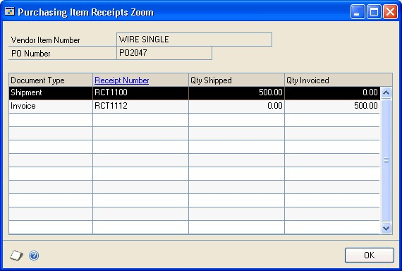
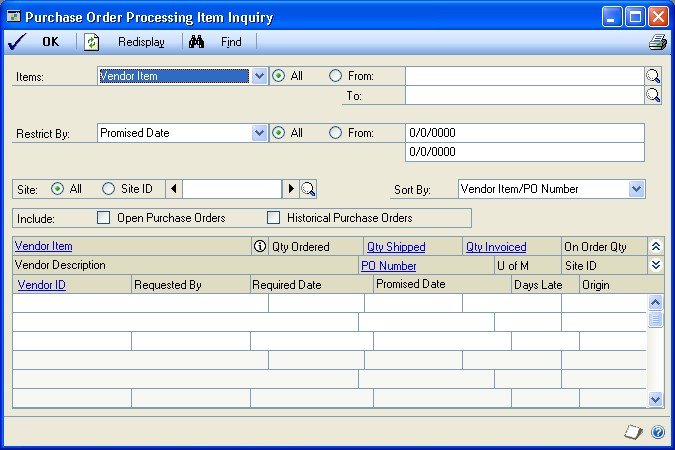

# Purchase Order Processing Part 5: Inquiries and reports

This part of the documentation explains how to use inquiries and reports to analyze your purchasing and receiving activity. You can analyze transaction and item information, and display the information either on screen or on a printed report.

In Purchase Order Processing, inquiries allow you to quickly view both current and historical purchase order information. You can review
information in summary or detailed form, with the option of printing the information in the window by choosing File \>\> Print.

Purchase Order Processing reports help you analyze your overall business activity. Some reports are important for the audit trail, to ensure that you're tracking every transaction that's been entered.

The following topics are discussed:

- *Chapter 25, "Inquiries,"* explains how to use Purchase Order Processing inquiry windows to view document and item information.

- *Chapter 26, "Reports,"* describes how to use reports to analyze purchasing and receiving activity and pinpoint errors in transaction entry.

## Chapter 25: Inquiries

You can view important information about your purchasing and receiving activity on-screen using the Inquiry windows. These windows provide easy access to detailed and summarized Purchase Order Processing information.

This information is divided into the following sections:

- *Viewing multiple currencies*

- *About reporting currency*

- *Viewing purchasing documents*

- *Viewing item information for purchasing documents*

### Viewing multiple currencies

You can choose whether you want to view multicurrency amounts in the originating, functional, or reporting currency. Choose View \>\> Currency \>\> Functional, Originating, or Reporting while viewing an inquiry window. The option will be saved on a per user, per window basis.

You also can use the currency list button in the windows that support changing the currency view. The View \>\> Currency menu option and currency list button are available in the following windows:

- Purchase Order Processing Document Inquiry

- Purchase Order Inquiry Zoom

- Receivings Transaction Inquiry Zoom

- Purchasing Invoice Inquiry Zoom

The first time you open these windows after registering Multicurrency Management, all the transactions will be displayed in the originating currency. If you change the currency view, the option you last used will be the default view the next time you open that window.

### About reporting currency

A reporting currency is used to convert functional or originating currency amounts to another currency on inquiries and reports. For example, if the Canadian dollar is the functional currency for a company, you can set up the euro as your reporting currency to view an inquiry window with currency amounts displayed in the euro currency.

During the reporting currency setup in Multicurrency Management, you'll set up a reporting currency and enter a default exchange rate and rate calculation method. Depending on how your system is set up, you may be able to override the default reporting currency exchange rate or rate calculation method on inquiries and reports. To change the default reporting currency exchange rate, choose View \>\> Currency \>\> Modify Reporting Rate to open the Modify Reporting Rate window.

For more information about the reporting currency, see the Multicurrency Management documentation.

### Viewing purchasing documents

Use the Purchase Order Processing Document Inquiry window to view information about documents you've entered in Purchase Order Processing. This window provides easy access to detailed or summarized information about purchase orders and receipts.

You can view information as it was originally entered by clicking on link fields. For example, you can select a purchase order and click on the PO Number label to the Purchase Order Inquiry Zoom window to view the purchase order as it was entered.

You can choose File \>\> Print in the Purchase Order Inquiry Zoom window to print and send the purchase order in e-mail, even if the purchase order is in history. When you choose to print from this window, the Purchase Order Print Options window will open, where you can select to print or send the document in the functional, originating, or reporting currency.

To view a receipt, select it in the Purchase Order Processing Document Inquiry window and click on the Receipt No. label. To view an in-transit transfer, select it in the Purchase Order Processing Document Inquiry window and click on the Transfer Number label.

**To view purchasing documents:**

1.  Open the Purchase Order Processing Document Inquiry window.
    (Purchasing \>\> Inquiry \>\> Purchase Order Documents)

2.  Select all vendors or a range of vendors.

*To view in-transit transfer inventory receipts, select to view all vendors or leave the From field blank if you want to view a specific range. In-transit transfer inventory receipts aren't assigned to vendor IDs.*

3.  In the Documents list, select PO Number, Receipt Number, or Purchase Order Date as the sorting order.

4.  Select to view all documents or a range of documents.

5.  To display only purchase orders that are on hold, mark Include POs On Hold Only.

6.  Mark which documents you want to include in the inquiry. When you restrict by PO Number, Receipt Number, or Purchase Order Date, the options that appear next to the Include field will change.

The following table shows Documents List selections and their corresponding Include options:

| **Documents list selection** | **Include options**  |
|------------------------------|----------------------|
| PO Number                    | Open Purchase Orders |
| Receipt Number               | Unposted Receipts    |
| Purchase Order Date          | Open documents       |

Historical Purchase Orders

Receipts Received

Historical Receipts

Assigned PO

Historical documents

7.  Choose Redisplay to display the documents in the scrolling window. To print the Purchasing Document Inquiry Report, choose File \>\> Print.

8.  Highlight a record and click a link to open a window to view more detailed information (optional).

The following table shows the link field and the window that the link opens:

| **Link field**  | **Window that opens**     |
|-----------------|----------------------|
| PO Number\*     | Purchase Order Inquiry Zoom window   |
| Transfer Number | In-Transit Transfer Inquiry Zoom window   |
| Receipt No.     | Receivings Transaction Inquiry Zoom window or Purchasing Invoice Inquiry Zoom window, depending on the type of receipt selected Returns Transaction Inquiry Zoom window |
| Vendor ID       | Vendor Inquiry window       |

\*Because one receipt can be associated with multiple purchase orders, you will not be able to use the link on the purchase order field if you select Receipt Number from the Documents list and mark to include Assigned PO.

### Viewing item information for purchasing documents

Use the Purchase Order Processing Item Inquiry window to view items assigned to purchase orders and receipts. Control blanket line items for blanket and drop-ship blanket purchase orders won't be displayed in the window. If you are restricting by the on-order quantity, line items that don't have an on-order quantity won't be displayed. Line items entered on drop-ship purchase orders or drop-ship blanket purchase orders won't be displayed because the line items don't update the onorder quantity. Line items entered on a standard or blanket purchase orders with a status of New, Canceled, Closed, or Received also won't be displayed because they don't have an on-order quantity.

To view items by the vendor's item number, choose Options \>\> Display Vendor Item. The Vendor Item label will be displayed in the Purchase Order Processing Item Inquiry scrolling window. If Display Vendor Item isn't selected, the Item label will be displayed in the Purchase Order Item Inquiry scrolling window and you can view items using your item number.

If you are using Project Accounting, the Project Number field and the Cost Category ID field will be displayed in the Purchase Order Processing Item Inquiry scrolling window.

You can view information as it was originally entered by clicking on link fields. For example, you can select an item and click on the Qty Shipped label to open the Purchasing Item Receipts Zoom window, where you can view the invoiced and shipped quantities of the item.

**To view item information for purchasing documents:**

1.  Open the Purchase Order Processing Item Inquiry window.
    (Purchasing \>\> Inquiry \>\> Purchase Order Items)

2.  From the Items list, select Item (your item number) or Vendor Item (your vendor's item number).

3.  Select All to view all items or select a range of items.

4.  From the Restrict By list, select an additional range to further restrict your inquiry. You can select one of the following options from the list.

**Promised Date** To view items from the date the vendor promised that you would receive the merchandise or services.

**Required Date** To view items from the date you must receive all the items.

**Promised Ship Date** To view items from the date the vendor promised to ship the merchandise or services you've ordered.

**Requested By** To view the items ordered by a department or person.

**Vendor ID** To view items from a particular vendor.

**Description or Vendor Description (if you are viewing vendor items**) To restrict items by description.

**On Order Qty** To view the items by their on order quantities.

**Project Number** To view items assigned to a project. This option is available if you are using Project Accounting.

**Cost Category ID** To view items assigned to a cost category ID. This option is available if you are using Project Accounting.

5.  Select All or select a range of items that meet the additional restriction.

6.  Select whether to display items at all sites or a specific site.

7.  Select to sort results by purchase order number or vendor ID.

8.  Select whether to include open purchase orders, historical purchase orders or both.

9.  Choose Redisplay to display the items in the scrolling window. To print the Purchase Order Processing Item Inquiry Report, choose File \>\> Print.

10.  Highlight a record and click a link to open a window to view more detailed information (optional).

The following table shows the link field and the window that the link opens.

| **Link field**                                                   | **Window that opens**                    |
|------------------------------------------------------------------|------------------------------------------|
| PO Number                                                        | Purchase Order Inquiry Zoom window       |
| Vendor ID                                                        | Vendor Inquiry window                    |
| Vendor Item                                                      | Item Vendors Maintenance window          |
| Item                                                             | Item Inquiry window                      |
| Qty Shipped and Qty Invoiced                                     | Purchasing Item Receipts Zoom window     |
| Project Number (available if you are using Project Accounting)   | PA Project Inquiry window                |
| Cost Category ID (available if you are using Project Accounting) | Cost Category Maintenance Inquiry window |

## Chapter 26: Reports

Purchase Order Processing reports help you analyze purchasing and receiving activity and pinpoint errors in transaction entry. Use this information to guide you through printing reports, and working with report options.

For more information about creating and printing reports, using sample reports and modified reports from the Reports Library, and the various reporting tools that you can use with Microsoft Dynamics GP, refer to your System User's Guide (Help \>\> Contents \>\> select Using The System).

Reports information is divided into the following sections:

- *Purchase Order Processing standard reports summary*

- *Specifying a Purchase Order Processing report option*

- *Microsoft SQL Server&reg; Reporting Services reports in Purchase Order Processing*

#### Purchase Order Processing standard reports summary

You can print several types of reports using Purchase Order Processing. Some reports automatically are printed when you complete certain procedures; for example, posting journals can be printed automatically when you post transactions, depending on how your posting options are set up. You can choose to print some reports during procedures; for example, you can print an edit list when entering transactions by choosing the Print button in the batch entry window. In order to print some reports, such as analysis or history reports, you must set up report options to specify sorting options and ranges of information to include on the report. For more information, refer to *Specifying a Purchase Order Processing report option*.

The following table lists the report types available in Purchase Order Processing and the reports that fall into those categories. (Reports printed using Payables Management are printed using many of the same windows. Refer to the Payables Management documentation for information about reports printed in that module.)

| **Report type**    | **Report**         | **Printing method**    |
|-----------------------|--------------------|-----|
| Setup reports/Lists      | Buyer ID List      | Choose File \>\> Print in the setup windows **or** create report options in the Purchasing Setup Reports window. |
| Documents    | Purchase Order \*† | Select a document in the MISSINGCONTENT   \* Indicates reports that can be printed with multicurrency information displayed. |
Purchase Order Generator Site Mapping List

Purchase Order Processing Setup List

Receivings User-Defined Fields Setup List

Blanket Purchase Order Delivery Schedule\*

Purchase Order Entry window and choose File \>\> Print to print a single document or choose File \>\> Print in the Purchase Order Inquiry Zoom window. Choose Transactions \>\> Print Purchasing Documents to print a range of documents.

† Indicates reports that can be assigned to named printers. For more information, refer to your System Administrator's Guide (Help \>\> Contents \>\> select System Administration).

| **Report type**       | **Report**                     | **Printing method**    |
|------------------------|--------------------------------|---------------------------------|
| Posting reports   | Back Ordered Items Received    | Choose File \>\> Print in the window you use to complete the procedure **or** some will be printed automatically when you complete the procedure. |
| Edit lists  | Purchasing Invoice Edit List\* | Choose File \>\> Print in the window you used to complete the procedure.   |
| History reports   | Distribution History Report    | Create report options in the Purchasing History Reports window.  
 \* Indicates reports that can be printed with multicurrency information displayed. |
Report

Purchasing Voided Journal\*

Purchasing Voided Journal Currency Summary\*

Cost Variance Journal\*

Invoice Cost Variance Journal

Edit PO Status Cost Variance Journal

Edit PO Status Distribution Detail

Purchase Receipts Update Detail

Purchasing Invoice Distribution Detail\*

Purchasing Invoice Posting Journal\*

Purchasing Invoice Posting Journal

Currency Summary\*

Receivings Distribution Detail\*

Receivings Posting Journal\*

Receivings Posting Journal Currency Summary\*

Receivings Voided Journal\*

Receivings Voided Journal

Currency Summary\*

Returns Posting Journal\*

Returns Posting Journal Currency

Summary

Returns Distribution Detail\*

Returns Cost Variance Journal\*

Voided Purchase Invoice Journal\*

Voided Purchase Invoice Journal

Currency Summary\*

Purchasing Invoice Edit List

Currency Summary\*

Receivings Edit List\*

Receivings Edit List Currency Summary\*

Returns documents\*

Returns Edit List\*

Returns Edit List Currency Summary\*

Suggested Purchase Orders

Distribution Detail History

(purchase order returns)

Purchase Order History Report

Receivings Trx History Report

Returns Trx History – Summary

Returns Trx History – Detail

† Indicates reports that can be assigned to named printers. For more information, refer to your System Administrator's Guide (Help \>\> Contents \>\> select System Administration).

| **Report type**      | **Report**    | **Printing method**      |
|----------------------|----------------|-------------------------|
| Utility reports     | Account Distribution Removal Report Completed PO Removal Report Journal History Removal Report Purchase Order Trx History Removal Report Receivings Trx Removal Report Reconcile Purchasing Documents Report      | These reports will be printed when you complete the corresponding procedure. |
| Analysis reports   | Back-Ordered Items Received† Expected Shipments† Purchase Order Analysis† Purchase Order Status Report† PO Line Items to Release Report† Received/Not Invoiced Report† Shipment/Invoice Matching Activity Report† | Create report options in the Purchasing Analysis Reports window.             |
| Processing reports  | Print Documents Exception Report Purchase Order Edited Status Journal Purchase Order Generated Purchase Order Generated Error Log Purchasing Voided Journal\* Purchasing Voided Journal Currency Summary\*        | These reports will be printed when you complete the corresponding procedure. |
| Inquiry reports     | Purchase Order Processing Item Inquiry Document Inquiry Report     | Choose File \>\> Print in the corresponding Inquiry window.                  |
| \* Indicates reports that can be printed with multicurrency information displayed. † Indicates reports that can be assigned to named printers. For more information, refer to your System Administrator's Guide (Help \>\> Contents \>\> select System Administration). |        |    |

#### Specifying a Purchase Order Processing report option

Report options include specifications for sorting options and range restrictions for a particular report. In order to print several Purchase Order Processing reports, you must first create a report option. Each report can have several different options so that you can easily print the information you need. For example, you can create report options for the Purchase Order Status Report that show either detailed or summary information.

*A single report option can't be used by multiple reports. If you want identical options for several reports, you must create them separately.*

Use the Purchasing series report options windows to create sorting, restriction, and printing options for the reports that have been included with Purchase Order Processing.

**To specify a Purchase Order Processing report option:**

1.  Open a Purchasing reports window. There are separate windows for each report type.
    (Purchasing \>\> Reports \>\> Setup/Lists)
    (Purchasing \>\> Reports \>\> Analysis)
    (Purchasing \>\> Reports \>\> Posting Journals)
    (Purchasing \>\> Reports \>\> History)

2.  Select a report from the Reports list.

3.  Choose New to open the report options window. Your selection in step 2 determines which report options window appears.

4.  Name the option and enter information to define the option. The name you choose for the option won't appear on the report. The selections available for defining report options vary, depending on the report type you've selected.

5.  Enter range restrictions. The Ranges list shows the available options for each report. The available ranges vary, depending on the type of report.

*You can enter only one restriction for each restriction type. For instance, you can insert one vendor ID restriction (ADVANCED0001 to BEAUMONT0001) or one document number restriction (PO0001 to PO0299).*

6.  Choose Insert to insert the range in the Restrictions List. To remove an existing range from the list, select the range and choose Remove.

7.  Choose Destination to select a printing destination. Reports can be printed to the screen, to the printer, to a file or to any combination of these options. If you select Ask Each Time, you can select printing options each time you print this report option.

For more information about printing reports, refer to your System User's Guide (Help \>\> Contents \>\> select Using The System).

8.  To print the report option from the report options window, choose Print before saving it. If you don't want to print the option now, choose Save and close the window. The report window will be redisplayed.

#### Microsoft SQL Server&reg; Reporting Services reports in Purchase Order Processing

You can view Purchase Order Processing Reporting Services reports from the Reporting Services Reports list. If you are using Reporting Services 2008, purchasing metrics for your home page also appear in the Reporting Services Reports list. You can access the Reporting Services Reports list from the navigation pane or from an area page in the Microsoft Dynamics GP application window. This report list appears if you specified the location of your Reporting Services reports using the Reporting Tools Setup window. See your System Setup Guide (Help \>\> Contents \>\> select Setting up the System) for more information.

The following Reporting Services reports are available for Purchase Order Processing.

| Back-ordered Items Received | Purchase Order Status  |
|-----------------------------|------------------------|
| Expected Shipments          | Received Not Invoiced  |
| Purchase Order History      | Receivings Trx History |

**To print a Reporting Services report:**

1.  In the navigation pane, choose the Purchasing button, and then choose the Reporting Services Reports list.

2.  Mark the Purchase Order Processing report that you want to print.

3.  In the Actions group, choose View to open the Report Viewer.

4.  In the Report Viewer, select the specifications for the report and choose View Report.

After viewing the report, select a format and print the report.

## See Also

[Part 1: Setup and cards](purchase-order-processing.md#part-1-setup-and-cards)  
[Part 2: Purchase orders](purchase-order-processing-part2-orders.md)  
[Part 3: Receipts](purchase-order-processing-part3-receipts.md)  
[Part 4: Purchase order returns](purchase-order-processing-part4-returns.md)  
[Part 6: Utilities](purchase-order-processing-part6-utilities.md)  
