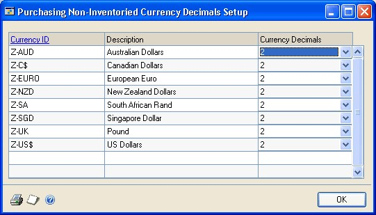
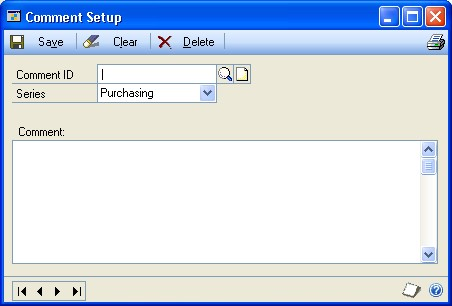

# Purchase Order Processing in Dynamics GP

You can use Purchase Order Processing to enter standard, drop-ship, and blanket purchase orders for items. When necessary, you can change the status of a purchase order or the individual line items on the purchase order. For example, you might cancel a line item on a purchase order if the item that you've ordered has been discontinued or if you won't be receiving part of the quantity ordered for the purchase order.

You also can use Purchase Order Processing to complete the following tasks:

- Enter and post shipment receipts, in-transit inventory receipts, and invoice receipts individually or in batches

- Enter and post shipment/invoice receipts individually or in batches

- Match shipments to invoices so that accurate costs are assigned to items received into inventory

- Apply landed costs, such as shipping costs and handling fees, to items

- Use purchase order generator to automatically create purchase orders to replenish inventory quantities

- Process purchasing returns and offsets the original purchase order transaction amount against inventory accounts and applicable general ledger accounts. Returned items are matched to the original receipts.

If you are using Project Accounting, you can enter purchase orders and drop-ship purchase orders for projects.

If you are using Sales Order Processing, you can commit purchase order line items to Sales Order Processing line items to fill sales orders.

If you are using Purchase Order Enhancements, you can approve and commit purchase orders and return items that have been received on a shipment or shipment/invoice receipt. For more information, see the Purchase Order Enhancements documentation.

This content is designed to give you an understanding of how to use the features of Purchase Order Processing, and how it integrates with the Dynamics GP system.

To make best use of Purchase Order Processing, you should be familiar with system-wide features described in the System User's Guide, the System Setup Guide, and the System Administrator's Guide.

Some features described in the documentation are optional and can be purchased through your Dynamics GP partner.

To view information about the release of Dynamics GP that you're using and which modules or features you are registered to use, choose Help\>\> About Microsoft Dynamics GP.

The content is divided into the following parts:

- [Part 1: Setup and cards](#part-1-setup-and-cards) introduces Purchase Order Processing and gives detailed instructions on setting it up.

- [Part 2: Purchase orders](purchase-order-processing-part2-orders.md), explains how to enter, print, issue, and manage purchase orders.

- [Part 3: Receipts](purchase-order-processing-part3-receipts.md), explains how to enter and manage receipts.

- [Part 4: Purchase order returns](purchase-order-processing-part4-returns.md), includes information about using purchase order returns.

- [Part 5: Inquiries and reports](purchase-order-processing-part5-inquiries-reports.md), explains how to use inquiries and reports to analyze your purchasing and receiving activity.

- [Part 6: Utilities](purchase-order-processing-part6-utilities.md), describes procedures you can use to reconcile purchase order information or remove history.

## Part 1: Setup and cards

Use the following information to set up Purchase Order Processing. Setup procedures generally need to be completed once, but you can refer to the information at other times for instructions on modifying or viewing existing entries.

The following topics are discussed:

- *Chapter 1, "Module setup,"* provides instructions for setting up the Purchase Order Processing module.

- *Chapter 2, "Buyers,"* describes how to set up and manage buyer IDs. Identifying a buyer on a purchase order makes it easier to track orders.

- *Chapter 3, "Purchase order generator setup,"* provides instructions for setting up the purchase order generator.

- *Chapter 4, "Project setup for Purchase Order Processing,"* provides instructions for setting up project information in the Purchase Order Processing module.

## Chapter 1: Module setup

Use this information to learn about and set up Purchase Order Processing. The setup procedures are organized in an order that will ensure Purchase Order Processing is set up properly.

When you set up Purchase Order Processing, you can open each setup window and enter information, or you can use the Setup Checklist window (Administration \>\> Setup \>\> Setup Checklist) to guide you through the setup process. See your System Setup Guide (Help \>\> Contents \>\> select Setting up the System) for more information about the Setup Checklistwindow.

This information is divided into the following sections:

- *Purchase Order Processing document types*

- *Purchase Order Processing history types*

- *Before you set up Purchase Order Processing*

- *Setting up Purchase Order Processing preferences and default entries*

- *Setting up currency decimal places for non-inventoried items*

- *Setting up Purchase Order Processing tax options*

- *Setting up user-defined fields for receivings*

- *Setting up comments*

### Purchase Order Processing document types

Use Purchase Order Processing to track your company's purchasing activity. You can enter and manage purchase orders, track shipments and invoices received, and match shipments to invoices that were received separately. There are seven types of documents in Purchase Order Processing.

- Standard purchase orders list items that will be shipped to your business to be received into your inventory. For more information, see *Entering a standard purchase order*. If you are using Project Accounting, see *Entering a standard purchase order for projects* for more information.

- Drop-ship purchase orders list items that will be shipped directly to the customer. The vendor sends you an invoice and you, in turn, send an invoice to the customer. For more information, see *Entering a drop-ship purchase order*. If you are using Project Accounting, see *Entering a drop-ship purchase order for projects* for more information.

- Blanket purchase orders list a single item and the quantities that will be delivered in a series of shipments, usually on specific dates. The items will be shipped to your business to be received into your inventory. For more information, see *Entering a blanket purchase order*. If you are using Project Accounting, you can't enter blanket purchase orders for projects.

- Drop-Ship blanket purchase orders list a single item and the quantities that will be delivered to the customer in a series of shipments, usually on specific dates. The vendor sends you an invoice and you, in turn, send an invoice to the customer. For more information, see *Entering a drop-ship blanket purchase order*. If you are using Project Accounting, you can't enter drop-ship blanket purchase orders for projects.

- Shipment/invoice receipts record the receipt of goods and services accompanied by an invoice. For more information, see *Receiving a shipment/invoice*. If you are using Project Accounting, see *Receiving a shipment/invoice for project* for more information.

- Shipment receipts record the receipt of goods and services without an invoice. For more information, see *Receiving a shipment*. If you are using Project Accounting, see *Receiving a shipment for projects* for more information.

- Invoice receipts record an invoice received for a shipment you received and posted earlier, or an invoice received for a shipment that you have not yet received. For more information, see *Entering an invoice receipt*

    1.  If you are using Project Accounting, see *Entering an invoice receipt for projects* for more information.

### Purchase Order Processing history types

When setting up Purchase Order Processing, you'll have the option to maintain the following types of history. If you are using Project
Accounting, historical information for project line items will be maintained in Project Accounting.

**Purchase Order** This option keeps a detailed copy of each purchase order in history. When you transfer a purchase order to history using the Remove Completed Purchase Orders window, or when you void a purchase order using the Purchase Order Entry window, purchase order history will include line-by-line detail of all information entered for each purchase order.

**Account Distributions** This option keeps a detailed record of transaction distributions that are posted to General Ledger. Account distribution history will be updated when each receipt is posted. Distribution history includes the audit trail code, account, account description, debit or credit amount, and other information about each transaction.

**Receipt** This option keeps a detailed copy of each receipt in history. When you post or void a receipt using the Receivings Transaction Entry window or the Purchasing Invoice Entry window, receipt history will include line-by-line detail of all the information entered for each receipt, including serial numbers, lot numbers, and bin information.

*Keeping history will increase the amount of hard disk space needed. You should periodically remove the historical records you no longer need. For more information, see Chapter 27, "Purchase order history removal."*

### Before you set up Purchase Order Processing

You should complete setup procedures in Payables Management and Inventory Control before you set up Purchase Order Processing. If you haven't completed all of the following tasks, be sure to do so before continuing.

- Set up Payables Management

- Create vendor cards

- Enter beginning inventory quantities

- Set up item records (be sure to assign price lists and vendor items)

- Set up item sites

- Set up inventory and purchasing accounts in the Posting Accounts Setup window

*To view the Posting Accounts Setup window, choose Administration \>\> Setup\>\> Posting \>\> Posting Accounts and then select to view Inventory or Purchasing accounts.*

Be sure you've also completed the setup procedures for your company, currency, checkbooks, and posting options. Tax schedules and tax details also should be set up. For more information about completing these procedures, refer your System Setup instructions (Help \>\> Contents \>\> select Setting Up the System).

If you're using landed costs, be sure to set up landed cost records and groups before you set up Purchase Order Processing. For details, see the Inventory Control documentation.

If you're using Multicurrency Management, be sure to set up currencies, exchange rate tables, and rate types before you set up Purchase Order Processing. For details, see the Multicurrency Management documentation.

### Setting up Purchase Order Processing preferences and default entries

Use the Purchase Order Processing Setup window to set preferences and default entries that appear throughout Purchase Order Processing.

**To set up Purchase Order Processing preferences and default entries:**

1.  Open the Purchase Order Processing Setup window.
    (Purchasing \>\> Setup \>\> Purchase Order Processing)

2.  Accept or change the default document code and enter the next document number you want to use for purchase orders.

The document code can be used to identify the documents on reports and inquiries. The next number will be the starting document number when receipts are entered. You can reuse a document number if the document has been deleted or removed from history (if you're keeping history).

By defining the next document number, you also are determining the number of unique document numbers that will be available. For example, if you enter PO001 as the next purchase order number, you'll be able to enter up to 999 purchase orders; if you enter PO0001 as the next purchase order number, you'll be able to enter up to 9,999 purchase orders. Be sure to enter a next number that will accommodate your business volume.

3.  Select the format you want to use when purchase orders are printed. If you are using Project Accounting, the default document format for a purchase order with project information will be the document format specified for the vendor record in the PA Vendor Options window.

*To use purchase order forms other than the suggested forms, you may want to use Report Writer to be sure the information is printed on your forms correctly. For more information, refer to Report Writer help.*

4.  Accept or change the default document code that appears and enter the next document number you want to use for receipts.

The document code can be used to identify the documents on reports and inquiries. The next number will be the starting document number when receipts are entered. You can reuse a document number if the document has been deleted or removed from history (if you're keeping history).

5.  Enter the number of decimal places to use when displaying and entering quantity and currency amounts for non-inventoried items.

If you're using Multicurrency Management, choose the expansion button to open the Purchasing Non-Inventoried Currency Decimals Setup window. Use this window to define currency decimal places for each currency to which you have access. For more information, see *Setting up currency decimal places for non-inventoried items*.

6.  Mark Shortage and then enter the percentage to use when the quantity received is less than the quantity ordered for non-inventoried items when receiving against a standard or blanket purchase order. If the difference between the quantity received and quantity ordered falls within the quantity shortage percentage, the difference between the quantities is canceled and the status of a line item is automatically changed to change order, received, or closed. The status of the line item depends on whether or not the line item has been invoiced.

7.  Mark Overage and then enter the percentage to use when the quantity received is more than the quantity ordered for non-inventoried items when receiving against a standard or blanket purchase order. If the quantity received is over the overage tolerance, you will receive a message that you can't enter a quantity greater than the combined total of the Remaining to Receive quantity and the overage tolerance set up for the item.

8.  Select which date to use as a default date each time that you open the Purchase Order Entry window to work with purchase orders. You can use the date from the last document you entered or the user date.

9.  Select a default site ID for purchase order line items. You can select either the default site ID set up for the item in Item Quantities Maintenance window or the previous purchase order line's site ID.

10.  Select which item numbers to use during transaction entry—the item numbers your company uses or the item numbers used by your vendors.

If you are using Project Accounting and select Vendor Items, you can't enter a project number and a cost category for purchase orders, shipment receipts, shipment/invoice receipts, or invoice receipts.

11.  Indicate whether you want New purchase orders generated in Sales Order Processing to be placed on hold when they appear in the Purchase Order Entry window. If you mark this option, committing a Sales Order Processing line item to an existing purchase order line item will not cause the purchase order to be placed on hold.

If you mark this option and you've assigned a password to the option "Allow Hold/Remove Hold of Purchase Orders," you will not need to enter the password during the purchase order generation process in Sales Order Processing. However, the password to remove holds will apply when a purchase order is viewed in the Purchase Order Entry window.

If you are using Project Accounting, you can't create purchase orders for projects from Sales Order Processing.

12.  Indicate whether you want the system to search for uncommitted purchase order quantities when you attempt to create a link between a sales line and a purchase order. If you don't mark the option, you'll be able to create a new purchase order for the sales document, but you won't be able to link the sales line to an existing purchase order. Refer to the Sales Order Processing documentation for information about linking an item to an existing purchase order.

If you are using Project Accounting, you can't commit purchase orders for projects to sales documents.

13.  Indicate whether you want to transfer line item comments from sales documents to new purchase orders. If you mark this option, existing purchase order line comments will not change if linked to sales line items with comments.

If you are using Project Accounting, you can't transfer line comments from sales line items to purchase order line items that are assigned to projects.

14.  Indicate whether the release by date for a purchase order line item should be calculated by subtracting the vendor's planning lead time from the required date. By marking this option, you can use the PO Line Items to Release Report to identify purchase order line items that should be released to the vendor. If you don't mark this option, the release by date isn't calculated automatically.

If you are using Project Accounting, the release by date isn't calculated for purchase order line items that are assigned to projects.

15.  Select the types of historical information you want to maintain for your purchase transactions. If you are using Project Accounting, historical information for project line items will be maintained in Project Accounting. For information about history types, see *Purchase Order Processing history types*.

*If you've selected to reprint Purchase Order Processing posting journals in the Audit Trail Codes Setup window, the system will maintain the history necessary to reprint posting journals whether or not you've marked to maintain history in the Purchase Order Processing Setup window.*

16.  Mark Allow Purchase Order Prepayments to enter a prepayment amount for a purchase order and generate the prepayment as computer check in Payables Management.

Payables Management and Purchase Order Processing must be registered for this option to be available, but Project Accounting, Multidimensional Analysis, and Analytical Accounting must not be registered.

17.  To enter manual prepayments for purchase orders, mark the Create manual prepayment from Purchase Order Processing option.

This option is available when the Allow Purchase Order Prepayments option is marked.

18.  Enter a password to limit the users who can enter prepayments for purchase orders.

This option is available when the Allow Purchase Order Prepayments option is marked.

19.  Enter or select the account to be used as the default posting account when you post prepayments.

This option is available when the Allow Purchase Order Prepayments option is marked.

20.  In the Options scrolling window, mark the check boxes next to the options you want to enable. You can assign passwords to the options to restrict who has access to them. If an option is marked, but no password is entered, anyone with access to the affected window can perform the action. You can select to allow the following:

**Receiving items without a purchase order** Select this option to allow line items not assigned to a purchase order to be entered on a shipment, shipment/invoice or invoice receipt. If the option isn't selected, you won't be able to receive or invoice line items not associated with a purchase order.

**Changing the site ID in receiving** Select this option to allow receiving line items to different locations than indicated on the original purchase order.

**Allowing/removing holds on purchase orders** Select this option to allow users to place and remove holds on New, Released or Change Order purchase orders of either type—standard or drop-ship.

When you mark this option, you also can indicate whether you want to allow editing of purchase orders on hold. If you don't allow editing on-hold purchase orders, you will be able to view purchase orders that have been placed on hold, but you won't be able to edit, delete or void them.

**Editing costs in receiving** Select this option to allow changing an item's Unit Cost and Extended Cost in the Receivings Transaction Entry window.

*When deciding whether to allow the editing of costs in receiving, keep in mind that purchase price variances are calculated by comparing the cost posted from receiving with the standard cost for items with periodic valuation methods. For more information about standard cost and valuation methods, see the Inventory Control documentation.*

If you allow receiving without a purchase order, you should allow editing of costs in receiving, or you won't be able to enter costs for items without purchase orders. To restrict access, you can require a password.

**Warning when purchase order line item is not fully Invoiced** Select this option to receive a warning message that a purchase order line item has a remaining quantity to invoice when closing a purchase order or a purchase order line item in the Edit Purchase Order Status window.

21.  If you are using Project Accounting, choose Project to open the PA Purchase Order Processing Setup Options window, where you can select preferences and default entries for purchase orders, shipment receipts, shipment/invoice receipts, and invoice receipts for projects. See *Setting up project preferences and default entries in Purchase Order Processing* for more information.

22.  Choose Options to open the Purchase Order Processing Setup Options window, where you can set up tax calculations in Purchase Order Processing. See *Setting up Purchase Order Processing tax options* for more information. If you are using purchase order generator, you can use the Purchase Order Processing Setup Options window select options for generating purchase orders. See *Setting up purchase order generator default entries* for more information.

23.  Choose Receivings User-Defined to enter labels for user-defined fields, lists, and dates that will be used when entering shipments and shipment/invoices. See *Setting up user-defined fields for receivings* for more information.

24.  Choose OK to save the entries you've made in the Purchase Order Processing Setup window.

25.  Print a Purchase Order Processing Setup List (optional).

Choose File \>\> Print while the Purchase Order Processing Setup window is displayed to print a Purchase Order Processing Setup List to review the setup options you've entered. If you've identified errors in the setup list, simply enter or select the correct information.

This report also can be printed using the Purchasing Setup Reports window.

### Setting up currency decimal places for non-inventoried items

Use the Purchasing Non-Inventoried Currency Decimals Setup window to define currency decimal places for non-inventoried items for each currency to which your company has access. This window is available only if you are using Multicurrency Management. If you aren't using Multicurrency Management, use the Purchase Order Processing Setup window to define the number of decimal places when displaying currency amounts for non-inventoried items.

The default number of decimal places for each currency was determined when the currencies were set up. Use this window to change the number of decimal places used to display currency amounts for non-inventoried items. You can change the non-inventoried currency decimal places for a currency at any time.

Changing the decimal place setting for a currency won't change the decimal place settings of non-inventoried items already entered on existing documents. Only new items added to existing transactions or new transactions will use the new settings.

**To set up currency decimal places for non-inventoried items:**

1.  Open the Purchasing Non-Inventoried Currency Decimals Setup window. 
    (Purchasing \>\> Setup \>\> Purchase Order Processing \>\> Currency expansion button)

2.  In the Currency Decimals column, change the number of currency decimal places to use for non-inventoried items. Amounts will appear in the format defined in this window whenever a non-inventoried item is entered for a specific currency.

3.  Continue this process until you define the decimal places for all the currencies displayed in the window.

4.  Choose File \>\> Print to print the Non-Inventoried Currency Decimals Setup List.

5.  Choose OK to close the window.

### Setting up Purchase Order Processing tax options

Use the Purchase Order Processing Setup Options window to set up the tax calculations that will be used on documents. Depending on the tax calculation selected, you can enter default tax schedules for non-inventoried items, freight, and miscellaneous items. For information about setting up the purchase order generator, see *Chapter 3, "Purchase order generator setup."*

**To set up Purchase Order Processing tax options:**

1.  Open the Purchase Order Processing Setup Options window.
    (Purchasing \>\> Setup \>\> Purchase Order Processing \>\> Options button)

2.  Mark the type of tax calculation to use on documents.

**Advanced** Mark Advanced to specify a tax schedule to use for noninventoried items, freight, and miscellaneous charges. For inventory
items, the tax schedule you chose for each item in the Item Maintenance window will be used.

**Single Schedule** Mark Single Schedule to specify one tax schedule for all items on all documents. Items on each document will be taxed using the tax details in the schedule you specify here, even if the item is nontaxable or if the vendor is tax exempt. Taxes won't be calculated on freight or miscellaneous charges.

3.  If you marked Advanced in step 2, enter or select tax options for non-inventoried items, freight, and miscellaneous charges. You can change the tax schedules used for a transaction in a tax schedule entry window during transaction entry. The tax options are:

**Taxable** The tax details that are assigned to the vendor or site will be compared to the tax details in the tax schedule you specify here.

**Nontaxable** No taxes will be calculated.

**Base on vendor** The tax schedule assigned to the vendor's purchase address will be used calculating taxes.

4.  Choose OK.

To print the Purchase Order Processing Setup List, choose File \>\> Print in the Purchase Order Processing Setup window.

### Setting up user-defined fields for receivings

Use the Receivings User-Defined Fields Setup window to enter labels for up to 35 user-defined fields to further track additional information for shipment and shipment/invoice receipts. Later, when you enter receivings transactions, the labels will appear in the Receivings User-Defined Fields Entry window, where you can enter information that is unique to the transaction. You can set up the following types of user-defined fields.

**List** Use list fields to predefine options to track information that is specific to your business. For example, to track the origin of orders, you could name a list Order Origin and enter Fax, Phone, and Mail as values for the list. When you enter transactions, Order Origin will appear as a title in the Receivings User-Defined Fields Entry window and you can select where the order originated from the list you created or include additional values.

**Text** Use text fields to record additional information about the transactions you enter in the Receivings Transaction Entry window. For example, to track special ID numbers for shipped equipment, you can enter Shipping ID in a text field.

**Dates** Use date fields to record additional dates that affect your documents. For instance, if you want to track the date that an installation was complete, enter Install Date in a date field.

**To set up user-defined fields for receivings:**

1.  Open the Receivings User-Defined Fields Setup window.
    (Purchasing \>\> Setup \>\> Purchase Order Processing \>\> Receivings UserDefined button)

2.  Enter as many as five list fields. Choose the expansion button next to each list name you've entered; the Receivings User-Defined List Setup window will appear. Use this window to enter values for each list.

3.  Enter as many as 10 text fields to track additional information about your customers.

4.  Enter as many as 20 date fields to record additional dates that affect your documents.

5.  Choose File \>\> Print to print the Receivings User-Defined Fields Setup List.

6.  Choose OK to return to the Purchase Order Processing Setup window. Your changes are saved when you choose OK in the Purchase Order Processing Setup window.

### Setting up comments

You can add comments to purchase orders or to individual line items on a purchase order or receipt. Comments are printed automatically on the purchase order and line item comments are printed below the item on the purchase order or receipt.

Use the Comment Setup window to define comments for each company. You can use these comments on Sales Order Processing, Invoicing or Purchase Order Processing documents. You also can modify standard comments for a particular document or item, or create one-time comment.

**To set up comments:**

1.  Open the Comment Setup window.
    (Administration \>\> Setup \>\> Company \>\> Comments)

2.  Enter a short identifier for the comment.

3.  Select a series this comment will be associated with.

4.  Enter the comment text.

*You can enter up to 200 characters, which will appear on the purchase order or receipt as four lines of 50 characters each. If you want longer comments to appear, use Report Writer to modify the document layout.*

5.  Choose Save.

## Chapter 2: Buyers

Large companies typically have several buyers working in the purchasing department, with each buyer assuming responsibility for certain items. A buyer's job may include vendor selection, negotiation, and purchase order placement and follow-up.

Identifying a buyer on a purchase order makes it easier to track orders. For example, if your company employs ten buyers who enter purchase orders in the same system, the purchase order numbers are not an effective way of locating a particular buyer's documents. If buyers are assigned to purchase orders, you can print a report sorted by Buyer ID.

This information is divided into the following sections:

- *Adding buyer IDs*

- *Modifying buyer IDs*

- *Removing buyer IDs*

### Adding buyer IDs

Use the Buyer Maintenance window to add new buyer IDs. For example, a buyer ID can be based on a location, a group of items, or an existing user ID.

**To add buyer IDs:**

1.  Open the Buyer Maintenance window. 
    (Purchasing \>\> Cards \>\> Buyers)

2.  Enter a buyer ID in the Buyer ID field.

3.  Enter a description.

4.  Choose Insert to insert the buyer ID in the scrolling window and save the record.

5.  Choose OK when you're finished adding buyer IDs.

### Modifying buyer IDs

Use the Buyer Maintenance window to modify existing buyer IDs.

**To modify buyer IDs:**

1.  Open the Buyer Maintenance window.
    (Purchasing \>\> Cards \>\> Buyers)

2.  Select a buyer ID in the scrolling window.

3.  Choose Modify. The buyer you selected will appear in the Buyer ID and Description fields.

4.  Edit the existing description.

5.  Choose Insert to insert the buyer ID in the scrolling window and save the record.

6.  Choose OK when you're finished modifying a buyer ID.

### Removing buyer IDs

Use the Buyer Maintenance window to delete buyer IDs you no longer want to use.

If you remove a buyer ID that is linked to an active purchase order (one that isn't in history), the buyer ID will remain attached to that purchase order. If the Manufacturing Series is registered and you delete a buyer ID that is linked to items in Item Engineering, the buyer ID will be removed from those items.

**To remove buyer IDs:**

1.  Open the Buyer Maintenance window.
    (Purchasing \>\> Cards \>\> Buyers)

2.  To remove a single buyer ID, select it in the scrolling window and choose Remove. To remove all of your buyer IDs, choose Remove All.

## Chapter 3: Purchase order generator setup

If you are using the purchase order generator, you can automatically generate purchase orders to replenish inventory based on a reorder point you specify. If you are using Project Accounting, you can't generate purchase orders for projects.

Use the purchase order generator to analyze inventory levels and suggest purchase order line items based on default settings and reorder levels; the suggested purchase orders can be modified before they are created.

This information is divided into the following sections:

- *Sites and purchase order generator*

- *Setting up purchase order generator default entries*

- *Mapping inventory sites to addresses*

### Sites and purchase order generator

You'll use master sites, subordinate sites, and independent sites when generating suggested purchase orders. How the demand is purchased, received, and distributed depends on how you use these sites.

A **master site** is a central location where its requirements are consolidated with the net demand from subordinate sites. A purchase order is placed from the total net demand at the master site. You can have more than one master site. A **subordinate site** is a location that passes its requirements to a central location, the master site, to be purchased, received, and distributed. An **independent site** is a location that has requirements that must be fulfilled by the items that are to be purchased. A master site is an independent site.

The order method you select for an item decides which site will be used when generating purchase orders. If you select Order to Master Site, suggested purchase order quantities will be based on requirements for this site and other sites that have the same master site. When you are ordering to a master site, you'll need to set up your master site before setting up your subordinate sites in the Purchase Order Generator Item Maintenance window. The master site must have an order method of Order To Independent Site. Assume that your default master site is Warehouse. If you didn't set up Warehouse as an independent site, any subordinate site that would have used
Warehouse as their master site will use order to independent site as their order method.

If you select Order to Independent, suggested purchase orders can be generated for the site where the material is required or if the site is a master site for subordinate sites as well as the master site. Requirements from subordinate sites will not be required is the site isn't a master site.

### Setting up purchase order generator default entries

Use the Purchase Order Processing Setup Options window to define default reorder information that will appear in the Purchase Order Generator Item Maintenance window and the Purchase Order Item Mass Update window.

You also can select how purchase orders should be created when you generate suggested purchase order line items using the Suggested Purchase Orders Preview window. You can select to create a purchase order for all items that have the same vendor, buyer, and ship-to address or create a purchase order for all items that have the same vendor and buyer.

You should set up general default information before you define preferences for a specific item-site combination or a group of items and sites. You can change the entries for individual item-site combinations, if necessary. Use the Purchase Order Generator Item Maintenance window to set up reorder preferences for each item at a specific site. Use the Purchase Order Item Mass Update window to set up or change reorder preferences for a group of items. For more information, see the Inventory Control documentation.

If you are using Project Accounting, you can't generate purchase orders for projects.

**To set up purchase order generator default entries:**

1.  Open the Purchase Order Processing Setup Options window.
    (Purchasing \>\> Setup \>\> Purchase Order Processing \>\> Options button)

2.  Select a default order method for automatically generated purchase orders.

**Order To Independent Site** Use this option if you want to order to the site where the material is required.

**Order To Master Site** Use this option if items are purchased to a central location (a master site) and distributed to other sites (subordinate sites).

3.  If the order method is Order To Master Site, enter or select a master site. Demand from all subordinate sites will be combined with demand for the master site you select when determining the order quantity.

4.  Select a default replenishment level.

**Order Point Quantity** Select this level to order a quantity that will bring available inventory up to the order point defined in the Item Resource Planning Maintenance window.

**Order-Up-To-Level** Select this level to order a quantity that will bring available inventory up to the order-up-to level defined in the Item Resource Planning Maintenance window. The Order Point Quantity will be used if the Order-Up-To Level is zero or less than the Order Point Quantity.

**Vendor EOQ** Select this level to order a quantity that is equal to the economic order quantity defined in the Item Vendors Maintenance window for the selected vendor. The vendor economic quantity is used when it is greater than the required quantity otherwise, the required quantity is used.You won't be able to select this option if the order method is Order To Master Site.

Refer to *How quantities are calculated for suggested purchase orders* for information about how replenishment levels affect required quantity.

5.  If the order method is Order To Independent Site, indicate which vendor to use for purchase orders.

**Site Primary Vendor** The primary vendor specified in the Item Quantities Maintenance window for the item-site combination is used.

**Vendor with Lowest Cost** The vendor with the lowest cost will be selected based on the functional equivalent of the Last Originating Invoice Cost field in the Item Vendors Maintenance window.

**Vendor with Shortest Lead Time** The vendor with the shortest planning lead time will be selected based on the Planning Lead Time field in the Item Vendors Maintenance window.

You won't be able to select a vendor selection if the order method is Order To Master Site. The master site's vendor selection will be used to determine the vendor.

If the order method is Order To Independent Site, indicate which item cost to use for purchase orders.

**Vendor Last Originating Invoice Cost** The last originating invoice cost from the Item Vendors Maintenance window for the selected vendor will be used.

**Item Current Cost** The current cost from the Item Maintenance window will be used.

**Item Standard Cost** The standard cost from the Item Maintenance window will be used.

**Specified Cost (In Functional Currency)** The cost specified in the Purchase Order Generator Item Maintenance window will be used regardless of the vendor.

You won't be able to select a cost selection if the order method is Order To Master Site. The master site's cost selection will be used to determine the cost.

6.  Mark Allocations to subtract the allocated quantity from the current supply when the required quantity is calculated.

7.  Mark Back Orders to subtract the back ordered quantity from the current supply when the required quantity is calculated.

8.  Mark Requisitions to subtract the requisitioned quantity from the current supply when the required quantity is calculated.

9.  Unmark Create One Purchase Order per Ship To Address to generate a purchase order for all items that have the same vendor and buyer. If this option is marked, you can generate a purchase order for all items that have the same vendor, buyer, and ship-to address.

10.  Choose OK to close the window and return to the Purchase Order Processing Setup window.

### Mapping inventory sites to addresses

Use the Purchase Order Generator Map Sites window to define the relationship between inventory site IDs and company addresses. The company address you assign to an inventory site is used as the ship-to address on suggested purchase orders for that site. If there is no company address mapped to a site, the company's primary address ID is used on purchase orders for that site.

When suggested purchase order line items are generated, all items for the same vendor, buyer ID, and ship-to address will be grouped together on a single purchase order. The ship-to address for a purchase order line is determined by the item's site ID.

For example, if an item needs to be replenished at three sites and all sites have the same address ID, three lines for the item will be created on the same purchase order—one line for each site.

If you are using Project Accounting, you can't generate purchase orders for projects.

**To map inventory sites to addresses:**

1.  Open the Purchase Order Generator Map Sites window.
    (Purchasing \>\> Setup \>\> Purchase Order Generator Map Sites)

All inventory site IDs defined for the current company will be displayed.

2.  Enter or select an address ID (defined in the Company Addresses Setup window) for each site ID.

Any site that is left unmapped will use the primary company address. Suggested purchase order line items for these sites will be consolidated as lines on a purchase order.

3.  Choose OK to save changes and to close the window when you're finished mapping sites.

## Chapter 4: Project setup for Purchase Order Processing

If you are using Project Accounting, you can enter project information on purchase orders, shipment receipts, shipment/invoice receipts, and invoice receipts. Use the following information to set up project preferences and default entries for Purchase Order Processing.

This information is divided into the following sections:

- *Projects in Purchase Order Processing*

- *Before you set up Purchase Order Processing for projects*

- *Setting up project preferences and default entries in Purchase Order Processing*

### Projects in Purchase Order Processing

You can set up, enter and maintain project records and transactions using Project Accounting. You also can budget resources, manage purchases, schedule tasks, monitor costs, bill customers, and recognize revenue. For more information about Project Accounting, projects, and cost categories, refer to the Project Accounting documentation.

You can acquire goods and services to be used in projects or you can buy them on behalf of customers. You can enter standard and drop-ship purchase orders for projects. As you receive the goods and services that you purchase for projects, you can enter the receipt of shipments and invoices. Items received from a standard purchase order are stored in inventory. To transfer these items to a project to make the items billable, you'll use the Inventory Transfer Entry window in Projecting Accounting. Items from a drop-ship purchase order are automatically invoiced and transferred to a project.

You can complete the following tasks if you aren't entering project information for purchase orders, shipment receipts, shipment/invoice
receipts, or invoice receipts.

- Enter blanket and drop-ship blanket purchase orders

- Commit purchase orders to sales documents

- Enter manufacturers' item numbers for purchase orders

- Enter manufacturing job links for purchase orders, shipment, shipment/invoice, and invoice receipts

- Open the MRP Item Inquiry window to view Material Requirements Planning information for an item if you're using the Manufacturing Series

- Automatically generate purchase orders to replenish inventory, based on a reorder point that you specify

### Before you set up Purchase Order Processing for projects

You should complete setup procedures in Project Accounting before you set up Purchase Order Processing for projects. If you haven't completed all of the following tasks, be sure to do so before continuing. Refer to the Project Accounting documentation for more information about setting up Project Accounting.

| **Task to complete**                                                           | **Window used**                               |
|--------------------------------------------------------------------------------|-----------------------------------------------|
| Set up user options for purchase orders                                        | User Purchase Order Settings window           |
| Set up user options for invoice receipts                                       | User Purchasing Invoice Settings window       |
| Set up user class options for purchase orders                                  | User Class Purchase Order Settings window     |
| Set up user class options for invoice receipts                                 | User Class Purchasing Invoice Settings window |
| Set up project default entries                                                 | Project Setup window                          |
| Set up project and contract status options                                     | Project Setup – Status Options window         |
| Create contract records                                                        | Contract Maintenance window                   |
| Create a cost category record                                                  | Cost Category Maintenance window              |
| Create project records                                                         | Project Maintenance window                    |
| Assign cost categories to a project                                            | Budget Maintenance window                     |
| Create cost category budgets                                                   | Budget Detail Entry window                    |
| Assign inventoried items to cost categories                                    | Budget Detail IV Items window                 |
| Set up vendor default entries for profit, purchase order format, and unit cost | PA Vendor Options window                      |

### Setting up project preferences and default entries in Purchase Order Processing

Use the PA Purchase Order Processing Setup window to set up preferences and default entries that will be used when entering purchase orders, shipment receipts, shipment/invoice receipts, and invoice receipts for projects.

**To set up project preferences and default entries in Purchase Order Processing:**

1.  Open the PA Purchase Order Processing Setup Options window.
    (Purchasing\>\> Setup \>\> Purchase Order Processing \>\> Project button)

2.  Enter purchase order label descriptions for three purchase order formats that are available when you are using Project Accounting. These labels will be displayed as options in the Purchase Order Format list in the Purchase Order Print Options window and the Print Purchasing Documents window.

3.  Enter and attach a default transaction billing note. This note is used only when you select None in the Default Billing Note From field. The note will be displayed when you enter an item in the Purchase Order Entry window, in the Receivings Transaction Entry window, or in the Purchasing Invoice Entry window.

3.  Select the default billing note to be displayed when entering items in the Purchase Order Entry window, in the Receivings Transaction Entry window, or in the Purchasing Invoice Entry window.

**Budget** Select to use the billing note entered for the cost category in the project budget.

**Cost Category** Select to use the billing note entered for the cost category record.

**None** Select to use the billing note entered as the default transaction billing note.

4.  Enter the cost description that will be assigned to invoice receipts. The cost description will be displayed as the collective name of invoice receipts in Project Accounting windows such as the Project Billing Settings window, Contract Settings window, and Budget Maintenance window.

5.  Select to update periodic budget amounts for actual costs using the document date or posting date of invoice receipts.

6.  Select the unit cost to use for project line items when entering purchase orders and receipts.

**Budget** Select to use the unit cost entered for the cost category in the project budget.

**Cost Category** Select to use the unit cost entered for the cost category record.

**None** Select if you don't want to use a default unit cost.

7.  Enter a percentage of how much the unit cost of an invoice receipt can exceed the unit cost of a purchase order that the invoice receipt is matched to. To vary the unit cost by an unlimited amount, mark the Exceed PO Unit Cost option in the scrolling window.

8.  Select the default profit type when entering invoice receipts.

**Budget** Select to use the profit type entered for the cost category in the project budget.

**Cost Category** Select to use the profit type entered for the cost category record.

**Vendor** Select the profit type entered for the vendor record in the PA Vendor Options window.

9.  Select the default inventory item price level when entering invoice receipts.

**Budget** Select to use the default price level entered for the item in the cost category in a project budget.

**Cost Category** Select to use the default price level entered for the item in the Item Price List Maintenance window.

**None** Select if you want to enter the price level when entering invoice receipts.

10.  You can enter user-defined field labels to track information about invoice receipts.

11.  In the scrolling window, mark the Allow check boxes next to the options that you want to use. You can assign passwords to the options to restrict who has access to them. If an option is marked, but no password is entered, anyone with access to the affected window can perform the action. You can select to allow the following options.

**Override Document Number PO** Select this option to change the purchase order number that appears as a default entry in the Purchase Order Entry window. If you don't mark this option, the PO Number field in the Purchase Order Entry window will display the next number available. The number can't be changed.

**Override Document Number PI** Select this option to change the document number that appears as a default entry in the Purchasing Invoice Entry window. If you don't mark this option, the Document Number field in the Purchasing Invoice Entry window will display the next number available. The number can't be changed.

**Allow Zero Quantity** Select this option to enter a zero quantity for purchase orders and invoice receipts.

**Allow Zero Unit Costs** Select this option to enter a zero unit cost for purchase orders and invoice receipts.

**Exceed Total Budget Quantity PO** Select this option to enter a quantity for a purchase order that exceeds the Forecast quantity set in the Budget Detail Entry window.

**Exceed Total Budget Costs PO** Select this option to use a total cost for a purchase order that exceeds the Forecast total cost set in the Budget Detail Entry window.

**Exceed Total Budget Quantity PI** Select this option to enter a quantity for an invoice receipt that exceeds the Forecast quantity set in the Budget Detail Entry window.

**Exceed Total Budget Costs PI** Select this option to use a total cost for an invoice receipt that exceeds the Forecast total cost set in the Budget Detail Entry window.

**Exceed Total Budget Revenue/Profit** Select this option to use a total cost that exceeds the Forecast revenue set in the Budget Detail Entry window.

**Exceed Total PO Costs** Select this option to enter invoice receipts that exceed the total cost specified in purchase orders.

**Exceed PO Unit Cost** Select this option to enter invoice receipts that exceed the unit costs specified in purchase orders.

**Allow Receiving of Unprinted PO** Select this option to receive against unprinted purchase orders.

Choose OK.

## See Also

[Part 1: Setup and cards](purchase-order-processing.md#part-1-setup-and-cards)  
[Part 2: Purchase orders](purchase-order-processing-part2-orders.md)  
[Part 3: Receipts](purchase-order-processing-part3-receipts.md)  
[Part 4: Purchase order returns](purchase-order-processing-part4-returns.md)  
[Part 5: Inquiries and reports](purchase-order-processing-part5-inquiries-reports.md)  
[Part 6: Utilities](purchase-order-processing-part6-utilities.md)  
