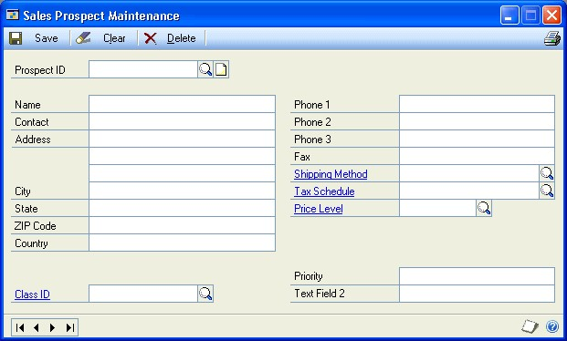
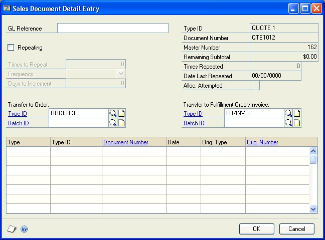
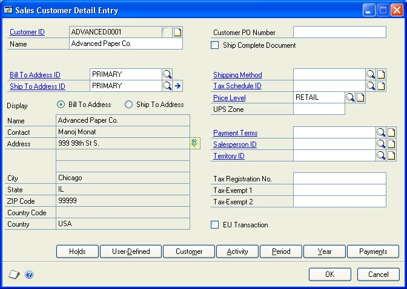

# Sales Order Processing Part 2: Transaction entry

This part of the sales order processing documentation explains how to enter sales documents and sales batches. The data entry windows were designed to resemble actual sales documents, with customer, line item, tax, and total information. The following topics are discussed:

- *Chapter 7, “Item information,”* describes item tracking and pricing related to Sales Order Processing.

- *Chapter 8, “Multicurrency transactions,”* explains the multicurrency features in Sales Order Processing.

- *Chapter 9, “Batches,”* explains how to use batches to group sales documents for transferring or posting.

- *Chapter 10, “Quotes,”* explains how to enter quotes—including repeating quotes.

- *Chapter 11, “Orders,”* explains how to enter orders—including repeating orders.

- *Chapter 12, “Fulfillment orders and invoices,”* explains how to enter fulfillment orders,

- *Chapter 13, “Invoices,”* explains how to enter invoices.

- *Chapter 14, “Back orders,”* explains how to enter back orders.

- *Chapter 15, “Returns,”* explains how to enter returns and how to use return quantity types.

- *Chapter 16, “Transaction detail entry,”* describes how to enter detailed information about a document, customer, line item, or other element of a transaction.

- *Chapter 17, “Payments and deposits,”* contains information on entering payments or deposits received for a document.

- *Chapter 18, “Sales Order Processing taxes,”* explains how sales tax is calculated, modified, and distributed in Sales Order Processing.

## Chapter 7: Item information

Use this information to learn more about handling items in Sales Order Processing. This information is divided into the following sections:

- *Drop-ship transactions*

- *Standard pricing calculations*

- *Extended pricing calculations*

- *Unit cost*

- *Multiple bins overview*

- *Non-inventoried items*

- *Adding items*

- *Serial- or lot-numbered items*

- *Kit items*

- *Assigning instruction IDs to customer and item records*

- *Available to promise overview*

### Drop-ship transactions

Drop-ship transactions are for items that are shipped from your vendor directly to the customer. The item isn’t received into or sold from your inventory.

- To mark all line items on a sales document as drop-ship, choose Options \>\> Drop Ship Item in the Sales Transaction Entry window before entering items. When this option is marked, items on the sales document will be marked as drop-ship as they are entered.

- To mark an individual line item as drop-ship, mark the drop-ship box next to the item number in the Sales Transaction Entry window or the Sales Item Detail Entry window. Kit items can’t be drop-shipped.

> [!NOTE]
> To change the shipping address for a single line item, choose the Ship to Address ID lookup button in the Sales Transaction Entry window or the Sales Item Detail Entry window and select a new ship-to address ID. The changes will apply only to the selected line item. If you enter a new line item, the ship-to address ID will come from the previously entered item.

You can’t enter a return in Sales Order Processing for a drop-ship item. If a customer returns an item, enter a credit memo in Receivables Management to reduce the customer balance and a credit memo in Payables Management to reduce the balance you owe the vendor.

You can create a purchase order in Purchase Order Processing automatically for drop-ship items on an order or back order. There are options in the Sales Order Processing Setup window for combining items on a drop ship order based on the ship-to address. For more information about creating a purchase order, see *Chapter 21, “New purchase orders.”* For more information about drop ship setup options, see *Chapter 2, “Module setup.”*

### Standard pricing calculations

If you’re using standard pricing and entering an inventoried item in the Sales Transaction Entry window, the unit price*—*the price at which each item is being sold—will be calculated using the information entered for the item in the Item Price List Maintenance window.

The price for an item is determined by price levels. The system will first check the price level selected on the customer card. If a price level hasn’t been assigned to the customer, the price level from the Receivables Management Setup window is used. If there isn’t a price level set up for the customer or for Receivables Management, the default price level for the item is used.

When you enter an item, the price from the item price list is determined by the price level and the unit of measure selected on the sales document for the item. If a price hasn’t been set up for the price level, the default price level for the item will be used to determine the price. You can view the price level used for the item in the Sales Item Detail Entry window.

Depending on how Sales Order Processing is set up, you may be able to change the unit price on the document or enter a unit price that is below cost. For more information, see *Chapter 2, “Module setup.”*

For information on selecting and activating a pricing method, see *Selecting a pricing method* and *Enabling extended pricing*. You can also find more information in the Inventory Control documentation.

### Extended pricing calculations

If you are using extended pricing, when you create an order or other sales transaction for a customer, the following process is used to select the price for each item on the transaction. First, the system searches for item-specific pricing information, beginning in price sheets assigned directly to the customer (which must be active and include the current date), followed by price sheets in the price book assigned to the customer, and then the base price book.

If no item-specific pricing is found, the system searches for a price group that includes the item, beginning in price sheets assigned directly to the customer, followed by price sheets in the customer’s price book, and finally the base price book.

If an adjusted value-off or percent-of-list price is found, the rest of the pricing structure is searched for a list price to apply the discount to. For example, if there’s a value-off price in a price sheet assigned to the customer, the customer’s price book and the base price book are searched for a list price.

It is possible for the final price to be the result of two adjustments applied to the base price. For example, a customer sheet might give 2% off the customer price book price, which is itself 5% off the base price. If multiple promotions are applied, they are applied in the order they are discovered: first the promotions from the first step of the search, then from the second step, and so on.

For information on selecting and activating a pricing method, see *Selecting a pricing method* and *Enabling extended pricing*. For more information on setting up and using extended pricing, see the Inventory Control documentation.

### Unit cost

If Sales Order Processing was set up to display unit costs, the unit cost will be displayed in the Sales Transaction Entry window for each sales inventory type item. The unit cost will not be displayed for items that are assigned the type of service, flat fee, or miscellaneous charge.

The unit cost is the current cost or the standard cost of the item, depending on the inventory valuation method. The following table shows the default cost that appears as the Unit Cost for each valuation method.

| **Valuation method** | **Unit cost displayed** |
|----------------------|-------------------------|
| FIFO perpetual       | Current cost            |
| LIFO perpetual       | Current cost            |
| Average perpetual    | Current cost            |
| FIFO periodic        | Standard cost           |
| LIFO periodic        | Standard cost           |

The cost displayed might not be the cost used to adjust inventory and cost of goods sold when the document is posted; this will depend on the valuation method used.

| **Valuation method** | **Unit cost used in posting**         |
|----------------------|---------------------------------------|
| FIFO perpetual       | Actual cost based on valuation method |
| LIFO perpetual       | Actual cost based on valuation method |
| Average perpetual    | Current cost                          |
| FIFO periodic        | Standard cost                         |
| LIFO periodic        | Standard cost                         |

For the Average Perpetual valuation method, the current cost represents the average cost of the item and is updated whenever the item quantity is increased.

If you enter a return, the default entry for the unit cost of a line item is the current cost for the item from the Item Maintenance window. If returns are set up to allow overriding item cost, you can change the unit cost of the item, which is the cost used to return the item to inventory.

### Multiple bins overview

Use multiple bins to add another level of detail to item quantity tracking. Besides tracking items within inventory sites, with multiple bins you can track item quantities in bins at each site. Bin quantities are processed and displayed in the item’s base unit of measure.

> [!NOTE]
> You can set up bin information when multiple bins functionality has been installed and registered. However, you must also enable this feature in Inventory Control before you can use bins to track items. For more information on enabling multiple bins, see the Inventory Control documentation.

Default bins for transaction types at each site can be identified for use in transactions. For example, a default bin could be created for sales order transactions at your warehouse site. Default bins can also be identified for a particular item and transaction type at a site. For example, if you always use Bin A when selling a certain item from your main site, you can set up Bin A as the default sales order bin for the item at the main site. Microsoft Dynamics GP automatically creates item-sitebin relationships the first time a bin is used for a transaction.

When you enter a transaction, the default bin for the transaction type at the itemsite or the site is used automatically. If there isn’t a default bin at the item-site or at the site, you will be required to enter a bin. If the site’s default bin is used, an item-site-bin record is created automatically. If you delete the line or document after the item-site-bin record is automatically created, that item-site-bin relationship is not deleted.

If serial or lot numbers are assigned to an item on a transaction, the bins for the selected serial or lot numbers will be assigned to the transaction automatically.

For more information on setting up and using multiple bins, see the Inventory Control documentation.

### Non-inventoried items

You can set up Sales Order Processing to allow entering items that don’t exist in your inventory records.

When you enter a non-inventoried item you must enter the item description, unit price, and unit cost. The item won’t be tracked in inventory, but it will appear on Sales Order Processing analysis and history reports.

The following default accounts are used for non-inventoried items.

| **Account**                               | **Source**    |
|-------------------------------------------|---------------|
| Inventory                                 | The account assigned to non-inventoried items for the Sales series in the Posting Account Setup window.|
| Returned, In Use, In Service, and Damaged | The account assigned to non-inventoried items for the Sales series in the Posting Account Setup window. |
| Cost of Goods Sold                        | The account assigned to the customer, if you are using posting accounts from the customer.   |
| Sales                                     | The account assigned to the customer, if you are using posting accounts from the customer.  |
| Accounts Receivable                       | The customer card. If no account is assigned to the customer, the system uses the account from the Sales series in the Posting Account Setup window. |
| Markdown                                  | The Inventory series in the Posting Account Setup window.   |

The account from the Inventory series in the Posting Account Setup window, if you are not using posting accounts from the customer.

The account from the Inventory series in the Posting Account Setup window, if you are not using posting accounts from the customer.

### Adding items

If you enter an item number that doesn’t exist in inventory, you can select Options \>\> Add Item in the Sales Transaction Entry window to be prompted to either add the item to your inventory or to choose a different item. Selecting Add Item can help prevent data entry errors that inadvertently create non-inventoried items. You will be able to use this option only if Sales Order Processing is set up to allow entering non-inventoried items.

If you select Add Item and you enter an item that isn’t in your inventory, a message will be displayed and you’ll have the option to add the item. If you choose Add in the message window, the Item Maintenance window will open and you can enter the item information. Choose Cancel in the message window to delete the item number and enter a different one.

Add Item will remain marked as long as the Sales Transaction Entry window is open. If you close the window and open it again, you must select Add Item again.

### Serial- or lot-numbered items

If an item is tracked by serial or lot numbers, you must identify the specific item or items being sold, and you must assign the serial or lot number before you ship the item.

Serial and lot numbers may be automatically assigned to items, depending on how Sales Order Processing is configured. The serial or lot number will be assigned according to the item’s valuation method.

If Sales Order Processing is not set up to automatically assign serial and lot numbers to items, you can enter or select a serial or lot number. When the item is fulfilled, the Sales Serial Number Entry window or the Sales Lot Number Entry window will open and you can assign the serial or lot number to the item. If your system is set up to automatically assign lot numbers, a message won’t be displayed if the expiration date for the lot number has expired.

If you’re using multiple bins and serial or lot numbers are assigned to an item on a transaction, the bins for the selected serial or lot numbers will be assigned to the transaction automatically.

If you add a serial- or lot-numbered item to a return document, the Sales Serial Number Entry or Sales Lot Number Entry window will open and you can enter the serial or lot number for the item.

> [!NOTE]
> Don’t override shortages on serial- and lot-numbered items. Your inventory will be overstated when the quantity is replenished.

You can view or change the serial or lot numbers that are assigned to an item. For more information, see *Changing a serial or lot number*. You can also view or change the bins that are assigned to an item. For more information, see *Changing bins in Sales Order Processing*.

### Kit items

Kit items aren’t tracked in inventory; their components are. If you’re using multiple bins, a kit’s component items are assigned to bins, but the kit item itself is not. When a kit is allocated, the quantity available in inventory for each component item is checked for shortages.

Kits are treated differently from other items in Sales Order Processing. You can’t partially transfer kits from one document to another. For example, if you add a kit item to an order, you must transfer the entire quantity for the kit item to either an invoice or a back order. Also, you can’t drop-ship a kit item.

The distribution accounts for kits come from several different sources and are summarized in the following table.

| **Account type**         | **Posting account from**                                      |
|--------------------------|---------------------------------------------------------------|
| Receivables              | Customer                                                      |
| Sales                    | Kit or customer, depending on Sales Order Processing setup    |
| Commission expense       | Posting Account Setup for Sales                               |
| Commission payable       | Posting Account Setup for Sales                               |
| Inventory                | Kit component or customer, depending on Sales Order Processing setup          |
| Return types (In Use, In Service, Damaged, and  Returned) | Kit component or customer, depending on Sales Order Processing setup|
| Cost of goods sold       | Kit component, kit item or customer, depending on Sales Order Processing setup |

### Assigning instruction IDs to customer and item records

If you’re using advanced picking, use the Instruction ID Processing window to select the customer/address/item combination or the customer/item combination to assign an instruction ID to.

Use the Picking Instruction Preview window to assign the instruction ID to the records that match the selected combinations. For more information about instruction IDs, refer to *Setting up picking instruction IDs*.

#### To assign instruction IDs to customer and item records

1. Open the Instruction ID Processing window.
    (Sales \>\> Cards \>\> Process Instructions)

    

2. Enter or select an instruction ID.

3. To assign the instruction ID to a customer record or an item record, select Assign. To remove the instruction ID from a customer record or an item record, select Remove.

4. Enter or select a customer ID or range of customer IDs.

5. You can enter or select additional options to display records for, such as customer addresses, item numbers, item class IDs, and generic descriptions of items.

    For example, suppose you have 40 different types of paint brushes in inventory and some of the paint brushes have a generic description of Watercolor Brush. To assign a specific instruction ID to all brushes that have a generic description of Watercolor Brush, select From in the Generic Description field and enter or select Watercolor Brush in the From and To fields.

6. Choose Preview to open the Picking Instruction Preview window and view the records that match your restrictions.

    

    Unmark records that shouldn’t be assigned to the instruction ID or choose Unmark All.

7. Choose Process to assign the selected instruction ID to the marked item records.

8. Close the window.

### Available to promise overview

Available to promise (ATP) means that an item is in stock and can be promised to a customer. You can see how much inventory or projected inventory is not committed to customer orders and is available. ATP is calculated for an item from the latest document date to the earliest document date for all supply orders, including sales orders, sales fulfillment orders/invoices, purchase orders, inventory transactions, inventory adjustments, inventory transfers, assembly transactions, and manufacturing orders.

To determine the item quantities available to promise, you must consider both the actual demand of the item and meeting that demand as efficiently as possible.

For example, if an order is entered for February 15, 2006, it would be most efficient to fulfill that commitment from supply expected to be replenished as near to February 15, 2006 as possible.

By knowing how much of each product you have on hand and how much is committed to customer orders, you can better control your inventory. You also can give customers a firm promise of when a product is deliverable by viewing existing commitments and eliminating the risk of overselling a product.

You can use the Inventory Available to Promise Inquiry window to view available to promise information for an item.

## Chapter 8: Multicurrency transactions

If you’re using Multicurrency Management with Sales Order Processing, you can choose the currency you want to enter on quotes, orders, fulfillment orders, invoices, back orders, and returns.

This information is divided into the following sections:

- *Viewing multiple currencies for sales transactions*

- *Exchange rate and document date*

- *Multicurrency account distributions*

- *Sales Order Processing amounts*

### Viewing multiple currencies for sales transactions

You can choose whether you want to view multicurrency transactions in the originating or the functional currency. Choose View \>\> Currency \>\> Functional or Originating while entering a quote, order, fulfillment order, invoice, back order, or return. The option will be saved on a per user, per window basis.

The Options menu and Currency list button are available in the Sales Transaction Entry window. You also can use the Currency list button in other windows that support changing the currency view.

The first time you open these windows, all the transactions will be displayed in the originating currency. If you change the currency view, the option you last used will be the default view the next time you open that window.

### Exchange rate and document date

If a transaction’s currency ID is not in the functional currency, the rate type and associated exchange rate table assigned to the selected customer are assigned to the transaction. If a rate type isn’t assigned to the customer, the default rate type for the Sales series specified in the Multicurrency Setup window is used.

The document date assigned to a transaction determines which exchange rate is used, based on the currency ID and associated rate type that’s entered for the transaction. Each time you change the document date on a multicurrency transaction, the system searches for a valid exchange rate. If a valid rate doesn’t exist, you can use the currency expansion button to enter an exchange rate using the Exchange Rate Entry window. You also can use the Exchange Rate Entry window to view or modify the default exchange rate. If you’ve entered a General Ledger posting date that’s different from the document date, the exchange rate expiration date must be after the posting date.

> [!NOTE]
> If you choose a currency ID for the transaction that is not your functional currency and have the view set to functional, functional amounts entered might change slightly. This is because the system calculates the originating value of the functional amount and then recalculates the functional equivalent of the originating amount. This is done so that the originating amounts will total correctly.

### Multicurrency account distributions

For multicurrency transactions, distribution amounts are displayed in both the functional and originating currencies. However, you can change only the originating amounts.

When you’re entering a multicurrency transaction, the originating debit and credit amounts must balance. If the functional equivalents don’t balance, the difference is posted automatically to a Rounding Difference account and a distribution type of Round identifies the distribution amount in the Sales Distribution Entry window.

For example, assume you’ve entered an invoice in the euro currency, with a sale amount of 30,886.59 EUR, a trade discount of 586.84 EUR, a discount available of 1544.33 EUR and the exchange rate is 1.0922. The distributions would be calculated as follows:

| **Account**               | **Euro debit** | **Euro credit** | **US dollars debit** | **US dollars credit** |
|---------------------------|----------------|-----------------|----------------------|-----------------------|
| Accounts Receivable       | 28,755.42 EUR  |                 | \$31,406.67          |                       |
| Trade Discount            | 586.84 EUR     |                 | \$640.95             |                       |
| Discount Available        | 1544.33 EUR    |                 | \$1686.72            |                       |
| Sales                     |                | 30,886.59 EUR   |                      | \$33,734.33           |
| Totals                    | 30,886.59 EUR  | 30,886.59 EUR   | \$33,734.34          | \$33,734.33           |
| Rounding Difference       |                |                 |                      | \$0.01                |
| Totals                    | 30,886.59 EUR  | 30,886.59 EUR   | \$33,734.34          | \$33,734.34           |

### Sales Order Processing amounts

All amounts on a multicurrency Sales Order Processing document are calculated in the originating and functional currencies. If you change an exchange rate, the originating amounts are assumed to be correct and the functional amounts will be recalculated using the new rate. The amounts are calculated as follows:

- **Subtotal** The subtotal is calculated automatically by adding the extended prices in the originating currency for items. The subtotal in the originating currency is then converted to the functional amount. Thus, the subtotal in the originating currency will always equal the sum of the extended prices, but the subtotal in the functional currency might not equal the sum of the items’ extended price in the functional currency.

- **Taxes** Taxes are calculated in the originating currency and then converted into the functional currency. The tax details are updated only in the functional currency.

- **Amount Received** If you receive a deposit or payment, the amount can be entered in the originating or functional currency. The exchange rate used for the deposit or payment must be the same rate used for the document.

- **Commissions** Commissions are calculated using originating amounts, then converted to functional amounts.

- **Distributions** The distribution accounts must be assigned to the originating currency before the transaction can be posted in General Ledger. You can post the transaction in Sales Order Processing but it won’t be posted in General Ledger until the account is assigned to the currency.

- **Multidimensional Analysis (MDA)** If a transaction includes analysis information, it is updated only in the functional currency. If the functional amounts are recalculated, the MDA amounts will be recalculated and any changes made to MDA accounts will be lost.

- **Rounding** When converting amounts from one currency to another, there is the possibility of rounding differences. Rounding adjustments are posted in the functional currency and are posted to the rounding account specified for the originating currency. The account can be changed but the rounding amount can’t be changed.

### Chapter 9: Batches

Batches are groups of transactions with something in common that are identified by a unique name or a number. For example, batches can be a group of transactions entered by a specific employee, or they can be a group of transactions entered on a particular date.

This information is divided into the following sections:

- *Creating a batch*

- *Modifying a batch • Deleting a batch*

### Creating a batch

Use the Sales Batch Entry window to create a batch. You must save quotes, orders, and back orders to a batch.

#### To create a batch

1. Open the Sales Batch Entry window.
    (Sales \>\> Transactions \>\> Sales Batches)

    

2. Enter a batch ID, such as your name or the date, to identify the batch.

3. Select the batch origin of Sales Transaction Entry and enter a batch comment, such as a brief description of the transactions that will be entered in the batch.

4. Enter or accept the posting date. This field will be available only if your system is set up to use the batch date for posting. If this field is unavailable, the posting date from the Sales Date Entry window for each transaction will be the posting date for each transaction.

    The date you enter is the date the General Ledger records will use. Sales Order Processing records will be updated according to the document date entered in the Sales Transaction Entry window.

    > [!NOTE]
    > The General Ledger posting date only applies to invoices and returns because those are the only document types that are posted.

    For more information about posting settings, see the System Setup instructions (Help \>\> Contents \>\> select Setting Up the System).

5. Select the Checkbook ID that will be affected by the transactions in this batch.

6. If your system uses batch verification, enter the required number of transactions that must be entered before this batch can be posted.

7. If your system uses batch verification, enter the required currency amount for all transactions you’ll enter in this batch.

8. Choose Save.

9. When you have entered all your transactions in a batch, you can choose File \>\> Print or the printer icon button to print an edit list or batch list to verify your entries.

    - **Edit list** Contains the transactions that can be posted—invoices and returns.

    - **Batch list** Contains all the transactions saved in the batch, including quotes, orders, back orders, invoices, and returns.

### Modifying a batch

Use the Sales Batch Entry window to make changes to an unposted batch. Transactions can be added only to batches that have an Available or Unapproved status; you can’t add transactions to batches that have been approved for posting.

#### To modify a batch

1. Open the Sales Batch Entry window.
    (Sales \>\> Transactions \>\> Sales Batches)

2. Enter or select a batch ID. If you enter the batch ID, you must also select the origin.

3. Make your corrections and choose Save.

### Deleting a batch

Use the Sales Batch Entry window to delete an unposted batch of sales documents. You can’t delete batches that have been approved for posting.

If a batch contains documents that can’t be deleted, these documents will remain in the batch. Documents that can’t be deleted are:

- Documents that have been printed (except for quotes)

- Documents that contain partially transferred items

- Documents that contain a posted deposit

- Documents that contain line items linked to saved purchase orders

- Quotes that have been submitted to sales quote workflow

- Orders, fulfillment orders, and invoices that haven’t been submitted to customer credit limit override workflow

- Orders, fulfillment orders, and invoices that have been submitted to customer credit limit override workflow

#### To delete a batch

1. Open the Sales Batch Entry window.
    (Sales \>\> Transactions \>\> Sales Batches)

2. Enter or select the batch ID you want to delete. If you enter the batch ID, you must also select the origin.

3. Choose Delete.

## Chapter 10: Quotes

Quotes are valuable sales tools because customers or potential customers might request estimates—or quotes—for the cost of items before they make purchase decisions. You can include items from inventory on a quote, as well as items that aren’t tracked in inventory, such as installation, labor, and mileage. Your cost and the price to the customer will be calculated automatically.

This information is divided into the following sections:

- *Prospect customers*

- *Entering a prospect record*

- *Sales quote approval workflow*

- *Entering a quote*

- *Entering a repeating quote*

### Prospect customers

Prospect customers are potential customers that you maintain records for, but don’t add to your customer base. To enter prospects, you must set up the quote ID to allow prospects. Only quotes can be entered for prospect customers.

To transfer a quote for a prospect customer to an order or to an invoice, you must add the prospect to your customer base or assign the prospect to an existing customer. The Prospect To Customer window opens when transferring a quote to an invoice or order so you can transfer a prospect record to a customer record. You can use the prospect information to create a customer record in the Customer Maintenance window. If you add the prospect as a customer, the prospect record won’t be deleted automatically. You must delete it in the Sales Prospect Maintenance window.

For information about creating prospect customer records, see *Entering a prospect record*.

### Entering a prospect record

Use the Sales Prospect Maintenance window to enter prospect customer records. For more information about prospects, see *Prospect customers*.

**To enter a prospect record:**

1. In the navigation pane, choose the Sales button, and then choose the Prospect list.

2. In the New group, choose Prospect to open the Sales Prospect Maintenance
    window.

    

3. Enter a prospect ID, name, and contact for the prospect customer.

4. Enter address information for the prospect customer including the street address, city, state, and ZIP code.

5. You can enter or select a class for the prospect customer. For more information about customer classes, see the Receivables Management documentation.

6. Enter the phone and fax numbers for the prospect customer.

7. Enter or select a shipping method. Because taxes are assessed at the point of exchange, the shipping method is used to calculate tax amounts.

8. Enter or select a tax schedule that will be used on quotes you enter for this prospect. For more information about tax schedules, see *Setting up taxes and options*.

9. Enter a price level for the prospect. The price level will be used as the sales document price level when you enter a quote for this prospect.

10. If you‘ve set up user-defined fields for prospects in the Sales User-Defined Fields Setup window, you can enter additional information in those fields. For more information, see *Setting up user-defined fields*.

11. Save the prospect record.

To review the entries and selections you‘ve made for a specific prospect customer, print the Prospect Setup List by choosing File \>\> Print or the printer button while the Sales Prospect Maintenance window is displayed.

To review the entries for all prospective customers, print the Prospect Setup List from the Sales Setup Reports window (Sales \>\> Reports \>\> Setup).

### Sales quote approval workflow

Your company can use the sales quote workflow feature as part of its business controls. If you use this feature, you can define how quotes have to be approved before transferring the quotes to invoices or orders. The rules for approving quotes can be defined to fit your organization's needs.

When a quote is ready to be approved, approvers can be notified and the quotes can be approved, using Outlook, Dynamics GP, or SharePoint. After a quote completes the Workflow process, it can be printed, sent in e-mail, or transferred to an order or invoice.

### Entering a quote

You can use the Sales Transaction Entry window to enter and print quotes for your prospects and customers and to view, void, delete, or transfer existing quotes. You also can send quotes in e-mail.

Sales quotes are saved but not posted, and distributions aren’t calculated on quotes. If a customer decides to make a purchase based on the quoted price, you can transfer the quote to an order or invoice. When you transfer a quote to an invoice or order, information about the document, customer, and items will be transferred to the new document. To transfer a quote for a prospect customer to an order or to an invoice, you must add the prospect to your customer base or assign the prospect to an existing customer.

You can use the Copy button in the Sales Transaction Entry window to copy line items from one sales document to another. See *Copying sales document items* for more information.

#### To enter a quote

1. In the navigation pane, choose the Sales button, and then choose the Sales Order Transactions list.

2. In the New group or its overflow menu, choose Quote to open the Sales Transaction Entry window.

    

3. Select the ID of the type of quote you want to enter.

4. Enter a document number or accept the default entry.

5. Enter the document date. If you want the quote to expire in a specified number of days, choose the Date expansion button and enter an expiration date.

    > [!NOTE]
    > After a quote expires it can’t be transferred to an order or invoice. The quote will remain in the system until you delete or void it.

6. Enter or select the Site ID from which the items will be sold. The site ID is used to allocate items from inventory and might be used to calculate taxes.

7. Enter or select a batch ID. Quotes must be saved in a batch and will remain there until you void, delete, or transfer them to another document.

8. Enter or select a customer or prospect ID and enter the purchase order number if the customer has provided you with one. The purchase order number will appear on the quote.

9. Choose the Customer E-mail Detail Entry expansion button to open the Sales Email Detail Entry window to update a customer's e-mail information for a transaction. See *Updating a customer’s e-mail information for a sales transaction* for more information.

    The document type to send in e-mail must be available for the customer before you can open the Sales E-mail Detail Entry window.

10. Enter or select a currency ID. If the customer record has a currency ID assigned to it, the customer’s currency ID will appear as the default entry.

    Use the Currency ID expansion button to open the Exchange Rate Entry window, where you can change the Rate Type ID or the exchange rate. For information about how exchange rates affect the transaction, see *Chapter 8,**“Multicurrency transactions.”*

11. Enter or select item numbers, units of measure, and item quantities for the quote. To view additional lines of information for each item, choose the hide and show button next to the Extended Price prompt.

    - To view additional lines of information for each item, choose the hide and show button next to the Extended Price field.

    - To view available to promise information about the item if you’re using ATP, choose the Quantity Quoted expansion button to open the Inventory Available to Promise Inquiry window.

    - Only active items can be entered on a quote. You can continue processing a quote if an item has been inactivated, but you can’t change the quantity.

    - If an item has suggested sales items assigned to it for the document type, the Suggest Sales Item Entry window opens when you press TAB to move to the next line in the scrolling window. You can use the window to mark the suggested sales items to add to the quote. You also can enter the suggested quantity and the site ID for each suggested sales item.

    - To remove an item from the quote, select the item and choose Edit \>\> Delete Row.

    - To add an attachment to the item, select the item and choose the Attachment Management icon to open the Document Attachment Management window.

        > [!NOTE]
        > To change the shipping address for a single line item, select the item, expand to the detail view of the scrolling window, and choose the Ship to Address ID expansion button to open the Sales Ship To Address Entry window. The changes will apply only to the current line item.

12. Enter the trade discount, freight, and miscellaneous amounts for this quote.
    Use the Trade Discount expansion button to open the Sales Trade Discount Entry window, where you can enter or edit a trade discount for the document. The discount can be a percentage or an amount. Use the freight and miscellaneous expansion buttons to open the Sales Tax Schedule Entry window, where you can select the tax details used to tax freight and miscellaneous amounts.

13. Taxes will be calculated automatically as you enter items and changes made to the tax details will be transferred to the new document if the document is transferred in full. For more information about transferring documents, see *Transferring totals, deposits, and payments*.

14. To add a comment on the quote, enter the comment ID or a one-time comment. For more information about adding comments, refer to *Adding a comment to sales documents*.

15. Choose the Attachment Management icon to attach documents to the quote, if applicable.

16. Choose Holds, User-Defined, or Commissions to view or enter additional information about the quote. If a hold has been assigned to the quote, a stop icon will appear on the Hold button.
    For more information about commissions, see *Modifying commission information* and *Splitting commissions*.

17. To print the quote or send the quote in e-mail, choose File \>\> Print. You also can print the quote by choosing the printer button or send the quote in e-mail by choosing the Send in e-mail button in the upper right of the Sales Transaction Entry window. For more information about printing and sending sales documents in e-mail, see *Chapter 24, “Printing and sending documents in email.”*
    > [!NOTE]
    > If you are using sales quote workflow, the quote must be approved before you can print it or send it in e-mail. You can print a quote or send a quote in e-mail that doesn’t need approval.

18. Save the quote or submit the quote, if you are using sales quote workflow.

### Entering a repeating quote

You can create repeating quotes if the quote ID is set up to allow repeating documents. Repeating quotes are useful if you want to create a template document for a customer that requests the same information multiple times. Repeating quotes must be set up per customer; you can’t set up one document and use it as a template for other customers.

You can’t have repeating multicurrency documents. Only documents whose currency ID is the functional currency can be marked as repeating.

#### To enter a repeating quote

1. In the navigation pane, choose the **Sales** button, and then choose the Sales Order Transactions list.

2. In the New group or its overflow menu, choose **Quote** to open the Sales Transaction Entry window.

3. Enter or select the type ID.

4. Enter or select a document number and a batch ID.

5. Enter or select a customer ID and enter or accept the currency ID.

6. Choose the document expansion button to open the Sales Document Detail Entry
    window.

    

7. Mark **Repeating**. Enter how many times to repeat the quote and the frequency.
 Leave the Frequency field blank to use the quote an unlimited number of times.

8. Choose OK to close the Sales Document Detail Entry window.

9. Continue to enter item and total information on the quote.

10. Save the quote or submit the quote, if you are using sales quote workflow.

## Chapter 11: Orders

Sales orders typically are used in businesses where items or services are agreed upon and then exchanged. When the goods or services are delivered to a customer, you can transfer the order to an invoice. The cost to you and the price the customer will pay is calculated automatically.

This information is divided into the following sections:

- *Entering a sales order*

- *Entering a repeating order*

- *Copying sales document items*

- *Previewing sales document line items*

### Entering a sales order

You can use the Sales Transaction Entry window to enter and print orders for your customers and to view, void, delete, or transfer existing orders. You also can send orders in e-mail.

Sales orders are saved, but not posted; distributions aren’t calculated on orders. When you ship the items to a customer, you can transfer the order to an invoice. If ordered items aren’t available in inventory, you can transfer the order to a fulfillment order or a back order.

You also can create an order by transferring a quote or a back order to an order. When you transfer a quote or back order document to an order, information about the document, customer, and items will be transferred to the order.

An order will have one of the following document statuses.

| **Document Status** | **Description**                                                        |
|---------------------|------------------------------------------------------------------------|
| New                 | The order has been created and saved.                                  |
| In Process          | One or more line items have been transferred to another document type. |
| Complete            | The order has been moved to history.                                   |

You can change the shipping address or the site ID for a single line item by choosing the Ship to Address ID lookup button or the Default Site lookup button in the Sales Transaction Entry window or the Sales Item Detail Entry window and selecting a new ship-to address ID or site ID. The changes will apply only to the selected line item. If you enter a new line item, the ship-to address ID or site ID will come from the previously entered item.

You can use the Copy button in the Sales Transaction Entry window to copy line items from one sales order to another. See *Copying sales document items* for more information.

#### To enter a sales order

1. In the navigation pane, choose the Sales button, and then choose the Sales Order Transactions list.

2. In the New group or its overflow menu, choose Order to open the Sales Transaction Entry window.

    

3. Enter or select the ID of the type of order to enter.

4. Enter a document number or accept the default entry.

5. Enter or select a customer ID and enter the purchase order number if the customer has provided you with one. The purchase order number will appear on the order.

6. Choose the Customer E-mail Detail Entry expansion button to open the Sales Email Detail Entry window to update a customer's e-mail information for a transaction. See *Updating a customer’s e-mail information for a sales transaction* for more information.

    The document type to send in e-mail must be available for the customer before you can open the Sales E-mail Detail Entry window.

7. Enter the document date. The date you enter will be used to update your sales records. To enter a requested ship date, choose the Date expansion button.

8. Enter or select a Batch ID. Orders must be saved in a batch and will remain there until you void, delete, or transfer them to another document.

9. Enter or select the Site ID from which the items on the order will be sold. The site ID is used to allocate items from inventory and might be used to calculate taxes.

    If you’re using multiple bins and you change the Site ID after selecting bins, lot numbers, or serial numbers for an item, your previous bin, lot number, or serial number selections are discarded.

10. Enter or select a Currency ID. If the customer record has a currency ID assigned to it, the customer’s currency ID will appear as the default entry.  Use the Currency ID expansion button to open the Exchange Rate Entry window, where you can change the Rate Type ID or the exchange rate. For information about how exchange rates affect the transaction, see *Chapter 8,**“Multicurrency transactions.”*

11. Enter or select item numbers, units of measure, and item quantities for the order. To view additional lines of information for each item, choose the hide and show button next to the Extended Price prompt.
    If you’re using multiple bins and you change the quantity ordered or the unit of measure after selecting bins, lot numbers, or serial numbers for an item, your previous bin, lot number, or serial number selections are discarded.

    - To view available to promise information about the item if you’re using ATP, choose the Qty Ordered expansion button to open the Inventory Available to Promise Inquiry window.

    - Only active items can be entered on an order. You can continue processing an order if an item has been inactivated, but you can’t change the quantity.

    - If an item has suggested sales items assigned to it for the document type, the Suggest Sales Item Entry window opens when you press TAB to move to the next line in the scrolling window. You can use the window to mark the suggested sales items to add to the order. You also can enter the suggested quantity and the site ID for each suggested sales item.

    - To remove an item from the order, select the item and choose Edit \>\> Delete Row.

    - To add an attachment to the item, select the item and choose the Attachment Management icon to open the Document Attachment Management window.

    > [!NOTE]
    > To change the shipping address for a single line item, select the item, expand to the detail view of the scrolling window, and choose the Ship to Address ID expansion button to open the Sales Ship To Address Entry window. The changes will apply only to the current line item.

12. If you’re using extended pricing and a promotion exists for the item you entered, the Promotion Alert window will open, where you can select whether to apply the promotion to the line. If you accept a free item promotion, the free item will be added to the order automatically.

13. Taxes will be calculated automatically as you enter items and changes made to the tax details will be transferred to the new document if the document is transferred in full. For more information about transferring documents, see *Transferring totals, deposits, and payments*.

14. If the customer makes a deposit or payment on the order, enter the amount in the Amount Received field. For more information about deposits and payments, see *Entering deposits and payments on orders or back orders*.

15. To add a comment on the order, enter the comment ID or a one-time comment. For more information about adding comments, refer to *Adding a comment to sales documents*.

16. Enter the trade discount, freight, miscellaneous, and tax amounts for the order.
    Use the Trade Discount expansion button to open the Sales Trade Discount Entry window, where you can enter or edit a trade discount for the document. The discount can be a percentage or an amount. Use the freight and miscellaneous expansion buttons to open the Sales Tax Schedule Entry window, where you can select the tax details used to tax freight and miscellaneous amounts.

17. Choose the Attachment Management icon to attach documents to the quote, if applicable.

18. Choose Holds, User-Defined or Commissions to enter additional information about the order. If a hold has been assigned to the order, a stop icon will appear on the Hold button.
    For more information about commissions, see *Modifying commission information* and *Splitting commissions*.

19. To print the order or send the order in e-mail, choose File \>\> Print. You also can print the order by choosing the printer button or send the order in e-mail by choosing the Send in e-mail button in the upper right of the Sales Transaction Entry window. For more information about printing and sending documents in e-mail, see *Chapter 24, “Printing and sending documents in e-mail.”*
    > [!NOTE]
    > If the order exceeds the customer’s credit limit and you are using customer credit limit override workflow, the order must be approved before you can print it or send it in e-mail. You can print an order or send an order in e-mail that doesn’t need approval.

20. Save the order.

Submit the order for approval if the order exceeds the customer’s credit limit and you are using customer credit limit override workflow.

> [!NOTE]
> National accounts provide the ability to restrict payments for child customers and apply credit checking, holds and finance charges at a consolidated national account level, depending on how the account was set up. If you can’t save or post a transaction, check the status of the options in the National Accounts Maintenance window.

### Entering a repeating order

You can create repeating orders if the order ID is set up to allow repeating documents. Repeating orders are useful if you want to create a template document for a customer that requests the same information multiple times. Repeating orders must be set up per customer; you can’t set up one document and use it as a template for other customers.

You can’t have repeating multicurrency documents. Only documents whose currency ID is the functional currency can be marked as repeating.

#### To enter a repeating order

1. In the navigation pane, choose the Sales button, and then choose the Sales Order Transactions list.

2. In the New group or its overflow menu, choose Order to open the Sales Transaction Entry window.

3. Enter or select the type ID.

4. Enter or select a document number and a batch ID.

5. Enter or select a customer ID and enter or accept the currency ID.

6. Choose the document expansion button to open the Sales Document Detail Entry window.

7. Mark Repeating. Enter how many times to repeat the order and the frequency.

    Leave the Frequency field blank to use the order an unlimited number of times.

8. Choose OK to close the Sales Document Detail Entry window.

### Copying sales document items

Use the Copy a Sales Order window to copy line items from one sales document to another. You can copy negative line items to Invoice documents and line items with negative prices. You cannot copy discontinued items.If you are using Analytical Accounting, you can copy analysis information assigned to invoices or returns.

You can copy a quote if you are using sales quote workflow. The new quote is assigned a status of Not Submitted. You can copy from a quote that is pending approval, but you can’t copy to a quote that is pending approval.

You can copy an order, fulfillment order, or invoice if you are using customer credit limit override workflow. The new document is assigned a status of No Approval Needed. You can copy from an order, fulfillment order, or invoice that is pending approval, but you can’t copy to an order, fulfillment order, or invoice that is pending approval.

If the new and existing documents have different currencies and neither is the functional currency, amounts will be converted from the currency of the existing document to the functional currency and then to the currency for the new document.

#### To copy sales document line items

1. Open the Sales Transaction Entry window.
    (Sales \>\> Transactions \>\> Sales Transaction Entry)

2. Enter or select a document to add line items to. To create a new document, select a type and type ID, then enter a new document number, customer ID, and currency ID.

3. Choose Copy to open the Copy a Sales Order window.

4. Enter or select the document number for the document that contains the information to copy.

5. Select a price option. If you choose Use Current Pricing, you can unmark the Use Price Level from Target Document option to use the price level from the existing sales document.

6. Select a site option. If you choose Use Site, enter or select a site.

7. Mark the desired copy options.

8. You can choose Preview to open the Preview Line Items window, where you can mark and modify line items before you copy them. See *Previewing sales document line items* for more information.

9. Choose Copy.

### Previewing sales document line items

Use the Preview Line Items window to mark and modify line items on sales documents before you copy them. You also can view warnings and correct error messages. You can’t mark a line item that contains an error (red symbol) until you correct the error. You can mark a line item that contains a warning (yellow symbol).

#### To preview sales document line items

1. Open the Copy a Sales Order window.
    (Sales \>\> Transactions \>\> Sales Transaction Entry \>\> select a document \>\> Copy)

2. Enter an order number.

3. Mark the desired copy options.

4. Choose Preview.

5. If you are previewing a sales order containing a kit item, you can mark Display Kit Components to view line items included in the kit.

6. If you selected the Mark All Line Items for Copy option, all line items will be marked. You can unmark any line item you do not want to copy.

7. If a line item contains an error, select the line item and click the expansion button to view the error. Then you can correct the error and mark the line item.

8. You can change the order quantity of any line item. You can change the unit price of sales document line items if the Override Prices option in the Sales Order Processing Setup Options window is marked (Sales \>\> Setup \>\> Sales Order Processing \>\> Options).

9. Choose OK to save your changes and close the Preview Line Items window.

10. Choose Copy to copy the line items to the target document.

11. Continue to enter item and total information on the document.

12. Choose Save.

## Chapter 12: Fulfillment orders and invoices

If you’re using sales fulfillment workflow, you can create fulfillment orders. A fulfillment order is a type of sales document. You can enter a fulfillment order in the Sales Transaction Entry window. You also can create a fulfillment order from a quote, a back order, or an order and you can create an invoice from a fulfillment order. Fulfillment orders cannot be posted. If items on a fulfillment order can’t be filled from inventory, you can transfer the fulfillment order items to a back order.

When the document status of a fulfillment order reaches Status 6, the fulfillment order becomes an invoice. To view the details about the document status for a fulfillment order, click the Document Status link in the Sales Transaction Entry window. For more information about document statuses, refer to *Setting up fulfillment workflow for sales*.

Because a sales invoice is a legally binding document, it should be posted. The cost of goods sold and the price for the customer will be calculated automatically. If items on an invoice can’t be filled from inventory, you can transfer the invoice items to a back order.

This information is divided into the following sections:

- *Understanding fulfillment orders*

- *Entering a fulfillment order or invoice*

- *Combine multiple fulfillment orders to a single invoice*

### Understanding fulfillment orders

If you’re using sales fulfillment workflow, you can use the Sales Transaction Entry window to create a fulfillment order. A fulfillment order is a type of sales document that uses document statuses to provide additional structure and control over typical sales processes, such as printing the picking ticket, picking the goods, printing the packing slip, packing and shipping the goods, and invoicing the customer.

You can create a fulfillment order from a quote, a back order, or an order, and you can create an invoice from a fulfillment order.

When you create a fulfillment order, the document status for the fulfillment order will be the first status that you track for that type ID. You can’t post a fulfillment order.

You can advance the document status of a fulfillment order by confirming that items on fulfillment orders have been picked, packed, and shipped in the Sales Transaction Entry window, the Sales Order Fulfillment window, or the Sales Bulk Confirmation window.

### Entering a fulfillment order or invoice

Use this information to enter a fulfillment order or invoice. If you’re not using sales fulfillment workflow refer to *Entering an invoice*.

If you’re using sales fulfillment workflow, you can use the Sales Transaction Entry window to enter, print and send fulfillment orders and invoices in e-mail to your customers. You can view and void existing fulfillment orders. You can view, void, post, and delete existing invoices. For more information, see *Understanding fulfillment orders*.

You can use the Copy button in the Sales Transaction Entry window to copy line items from one sales document to another. See *Copying sales document items* for more information.

#### To enter a fulfillment order or invoice

1. In the navigation pane, choose the Sales button, and then choose the Sales Order Transactions list.

2. In the New group or its overflow menu, choose Fulfillment Order or Invoice to open the Sales Transaction Entry window.

    

3. Enter or select the ID of the type of fulfillment order or invoice to enter.

4. Enter a document number or accept the default entry.

5. Enter or select a customer ID and ship-to address.

6. Choose the Customer E-mail Detail Entry expansion button to open the Sales Email Detail Entry window to update a customer's e-mail information for a transaction. See *Updating a customer’s e-mail information for a sales transaction* for more information.

    The document type to send in e-mail must be available for the customer before you can open the Sales E-mail Detail Entry window.

7. Enter the document date. The date you enter will be used to update your sales records. To change the posting date or enter a requested ship date, choose the Date expansion button.

8. You can create or select a batch ID to assign to the fulfillment order or invoice.

9. Enter or select the site ID that the items will be sold from. The site ID will be used to allocate items from inventory and might be used to calculate taxes.

10. Enter the purchase order number if the customer has provided you with one.

    The purchase order number will be printed on the fulfillment order or invoice.

11. Enter or select a currency ID. If the customer record has a currency ID assigned to it, the customer’s currency ID will appear as the default entry.

    Use the Currency ID expansion button to open the Exchange Rate Entry window, where you can change the rate type ID or the exchange rate. For information about how exchange rates affect the transaction, see *Chapter 8, “Multicurrency transactions.”*

12. Enter or select item numbers, units of measure, and item quantities for the fulfillment order or invoice. To view additional lines of information for each item, choose the hide and show button next to the Extended Price field.
    Only active items can be entered. You can continue processing if an item has been inactivated, but you can’t change the quantity.

    If you’re using multiple bins and you change the site ID, quantity, or unit of measure after selecting bins, lot numbers, or serial numbers for an item, your previous bin, lot number, or serial number selections are discarded.

    If an item has suggested sales items assigned to it for the document type, the Suggest Sales Item Entry window opens when you press TAB to move to the next line in the scrolling window. You can use the window to mark the suggested sales items to add to the fulfillment order. You also can enter the suggested quantity and the site ID for each suggested sales item.

    To add an attachment to the item, select the item and choose the Attachment Management icon to open the Document Attachment Management window.

   To remove an item from the fulfillment order or invoice, select the item and choose Edit \>\> Delete Row.

   > [!NOTE]
   > To change the shipping address for a single line item, select the item, expand to the detail view of the scrolling window, and choose the Ship to Address ID expansion button to open the Sales Ship To Address Entry window. The changes will apply only to the current line item.

Enter the trade discount, freight, miscellaneous, and tax amounts for this fulfillment order or invoice.

Use the **Trade Discount** expansion button to open the Sales Trade Discount Entry window, where you can enter or edit a trade discount for the document. The discount can be a percentage or an amount. Use the freight and miscellaneous expansion buttons to open the Sales Tax Schedule Entry window, where you can select the tax details used to tax freight and miscellaneous amounts.

1. If you’re using extended pricing and a promotion exists for the item you entered, the Promotion Alert window will open, where you can select to apply the promotion to the line. If you accept a free item promotion, the free item will be added to the fulfillment order or invoice automatically.

2. Taxes will be calculated automatically as you enter items and changes made to the tax details will be transferred to the new document if the document is transferred in full. For more information about transferring documents, see *Transferring totals, deposits, and payments*.

3. Enter the amount received and the terms discount taken on the fulfillment order or invoice. For more information about entering an amount received, see *Entering a payment for an invoice, fulfillment order, or return*.

4. To add a comment on the fulfillment order or invoice, enter the comment ID or a one-time comment. For more information about adding comments, see *Adding a comment to sales documents*.

5. Choose the Attachment Management icon to attach documents to the quote, if applicable.

6. Choose Holds or User-Defined to enter additional information about the fulfillment order or invoice. If a hold has been assigned to the fulfillment order or invoice, a stop icon will appear on the Hold button.

7. Choose Distributions to verify or change distribution accounts.

    > [!NOTE]
    > You can distribute amounts to unit accounts to record increases to non-financial accounts. The amounts you distribute to unit accounts won’t be totaled with other distributions. For more information about unit accounts, see the General Ledger documentation.

8. Choose Commissions to verify or change the commission amounts. For more information about commissions, see *Modifying commission information* and *Splitting commissions*.

9. You can print the fulfillment order or invoice or send the fulfillment order or invoice by choosing File \>\> Print. You also can print the fulfillment order or invoice by choosing the printer button or send the fulfillment order or invoice in e-mail by choosing the Send in e-mail button in the upper right of the Sales Transaction Entry window. For more information about printing and sending documents in e-mail, see *Chapter 24, “Printing and sending documents in email.”*

    > [!NOTE]
    > If the fulfillment order or invoice exceeds the customer’s credit limit and you are using customer credit limit override workflow, the document must be approved before you can print it or send it in e-mail. You can print or send a fulfillment order or invoice in e-mail that doesn’t need approval.

10. Save the fulfillment order or save or post the invoice.

Submit the fulfillment order or invoice for approval if the document has exceeds the customer’s credit limit and you are using customer credit limit override workflow. The document must be approved before you can post it.

If you’re using multiple bins and posting fails, bin quantities revert to their previous values.

### Combine multiple fulfillment orders to a single invoice

If you’re using sales fulfillment workflow, you can use the Sales Bulk Confirmation window to combine several fulfillment orders for the same customer to a single invoice. In order to combine fulfillment orders, the following information must also be the same on the fulfillment orders:

- Shipped status

- Bill to address ID

- Currency ID (including the exchange table ID and exchange rate)

- Payment terms

- Commission apply information

Other details for the fulfillment orders, such as the amount received, terms discount taken, tracking numbers, account distributions, trade discounts, comments, and taxes will be combined on the new invoice.

#### To combine fulfillment orders on a single invoice

1. Open the Sales Bulk Confirmation window.
    (Sales \>\> Transactions \>\> Bulk Confirmation)

2. Select Confirm Ship as the action to complete.

3. To restrict the documents displayed in the window, select the range of documents.

4. Choose Redisplay. The documents that match your range selection will appear in the scrolling window.

5. Mark Create Combined Invoice. Then, select the Type ID that will be used to determine the next number and default entries for the invoice that is created.

6. Enter or select a destination batch ID for the new invoice.

7. Mark the documents you want to invoice.

8. Choose Process. The fulfillment orders will be combined according to customer ID, then, the other criteria listed above. If fulfillment orders for multiple customers are marked, the orders will be grouped and invoiced according to customer. The fulfillment orders and the new invoice are assigned the same new master number.

Once the process is complete, print the Sales Bulk Confirmation - Combined Invoice Report. This report will display the invoice number and list the fulfillment orders that were combined onto it.

You can use your usual invoicing process to invoice the customer.

## Chapter 13: Invoices

Because sales invoices are legally binding documents that record the prices and details of transactions, they should be posted. The cost of goods sold and the price for the customer will be calculated automatically. If items on an invoice can’t be filled from inventory, you can transfer the invoice items to a back order.

This information is divided into the following sections:

- *Understanding invoices*

- *Entering an invoice*

### Understanding invoices

You can use the Sales Transaction Entry window to enter, print, and send invoices in e-mail to your customers and to view, void, post, delete, or transfer existing invoices.

You also can create an invoice by transferring a quote, order, or back order to an invoice. When you transfer a document to an invoice, information about the document, customer, and items will be transferred to the invoice.

If you’re using sales fulfillment workflow, an invoice is created from a fulfillment order when you advance the document status to status six. Refer to *Understanding fulfillment orders* and *Entering a fulfillment order or invoice*.

Transaction amounts on an invoice will be distributed automatically to posting accounts. The distribution accounts and amounts won’t be displayed for Inventory and Cost of Goods Sold. The actual cost will be determined when you post the invoice and the cost and distribution accounts will be displayed on the posting journal. To verify the accounts that will be used for each item, choose the Item Number expansion button to open the Sales Item Detail Entry window. Choose Distribution to view or change the accounts used for that item.

You can enter a negative invoice quantity for a line item, but the negative quantity won’t be allocated or fulfilled. The negative invoice quantity is assigned the return quantity type of On Hand automatically. You can’t enter a negative invoice quantity for a drop-ship line item.

If you’re using Multicurrency Management, you can change the distribution amounts only in the originating currency. If you change an amount in the originating currency, the functional amount will be recalculated.

### Entering an invoice

Use this information to enter an invoice. If you’re using sales fulfillment workflow, refer to *Entering a fulfillment order or invoice*.

You can use the Sales Transaction Entry window to enter and print invoices for your customers and to view, void, post, delete, or transfer existing invoices. You also can send invoices in e-mail. For more information, see *Understanding invoices*.

You can change the shipping address or the site ID for a single line item by choosing the Ship to Address ID lookup button or the Default Site lookup button in the Sales Transaction Entry window or the Sales Item Detail Entry window and selecting a new ship-to address ID or site ID. The changes will apply only to the selected line item. If you enter a new line item, the ship-to address ID or site ID will come from the previously entered item.

You can use the Copy button in the Sales Transaction Entry window to copy line items from one sales document to another. See *Copying sales document items* for more information.

#### To enter an invoice

1. In the navigation pane, choose the Sales button, and then choose the Sales
    Order Transactions list.

2. In the New group or its overflow menu, choose Invoice to open the Sales
    Transaction Entry window.

    

3. Enter or select the ID of the type of invoice to enter.

4. Enter a document number or accept the default entry.

5. Enter the document date. The date you enter will be used to update your sales records. To change the posting date or enter a requested ship date, choose the Date expansion button.

6. Enter or select the Site ID from which the items will be sold. The site ID will be used to allocate items from inventory and might be used to calculate taxes.

    If you’re using multiple bins and you change the Site ID after selecting  bins, lot numbers, or serial numbers for an item, your previous bin, lot number, or serial number selections are discarded.

7. You can create or select a Batch ID to assign to the invoice.

8. Enter or select a customer ID and enter the purchase order number if the customer has provided you with one. The purchase order number will appear on the invoice.

9. Choose the Customer E-mail expansion button to open the Sales E-mail Detail Entry window to update a customer's e-mail information for a transaction. See *Updating a customer’s e-mail information for a sales transaction* for more information.

    The document type to send in e-mail must be available for the customer before you can open the Sales E-mail Detail Entry window.

10. Enter or select a Currency ID. If the customer record has a currency ID assigned to it, the customer’s currency ID will appear as the default entry.

    Use the Currency ID expansion button to open the Exchange Rate Entry window, where you can change the Rate Type ID or the exchange rate. For information about how exchange rates affect the transaction, see *Chapter 8, “Multicurrency transactions.”*

11. Enter or select item numbers, units of measure, site ID, and item quantities for the invoice. To view additional lines of information for each item, choose the hide and show button next to the Extended Price prompt.

    If you’re using multiple bins and you change the quantity or unit of measure after selecting bins, lot numbers, or serial numbers for an item, your previous bin, lot number, or serial number selections are discarded.

    - To view available to promise information about the item if you’re using ATP, choose the Invoice Quantity expansion button to open the Inventory Available to Promise Inquiry window.

    - Only active items can be entered on an invoice. You can continue processing an invoice if an item has been inactivated, but you can’t change the quantity.

    - If an item has suggested sales items assigned to it for the document type, the Suggest Sales Item Entry window opens when you press TAB to move to the next line in the scrolling window. You can use the window to mark the suggested sales items to add to the invoice. You also can enter the suggested quantity and the site ID for each suggested sales item.

    - To remove an item from the invoice, select the item and choose Edit \>\> Delete Row.

    - To add an attachment to the item, select the item and choose the Attachment Management icon to open the Document Attachment Management window.

    > [!NOTE]
    > To change the shipping address for a single line item, select the item, expand to the detail view of the scrolling window, and choose the Ship to Address ID expansion button to open the Sales Ship To Address Entry window. The changes will apply only to the current line item.

12. Enter the trade discount, freight, miscellaneous, and tax amounts for this
    invoice.

Use the **Trade Discount** expansion button to open the Sales Trade Discount Entry window, where you can enter or edit a trade discount for the document. The discount can be a percentage or an amount. Use the freight and miscellaneous expansion buttons to open the Sales Tax Schedule Entry window, where you can select the tax details used to tax freight and miscellaneous amounts.

1. If you’re using extended pricing and a promotion exists for the item you entered, the Promotion Alert window will open, where you can select whether to apply the promotion to the line. If you accept a free item promotion, the free item will be added to the invoice automatically.

2. Taxes will be calculated automatically as you enter items and changes made to the tax details will be transferred to the new document if the document is transferred in full. For more information about transferring documents, see *Transferring totals, deposits, and payments*.

3. Enter the amount received and the terms discount taken on the invoice. For more information about entering an amount received, see *Entering a payment for an invoice, fulfillment order, or return*.

4. To add a comment on the invoice, enter the comment ID or a one-time comment. For more information about adding comments, see *Adding a comment to sales documents*.

5. Choose the Attachment Management icon to attach documents to the quote, if applicable.

6. Choose Holds or User-Defined to enter additional information about the invoice. If a hold has been assigned to the invoice, a stop icon will appear on the Hold button.

7. Choose Distributions to verify or change distribution accounts.

    > [!NOTE]
    > You can distribute amounts to unit accounts to record increases to non-financial accounts. The amounts you distribute to unit accounts won’t be totaled with other distributions. For more information about unit accounts, see the General Ledger documentation.

8. Choose Commissions to verify or change the commission amounts. For more information about commissions, see *Modifying commission information* and *Splitting commissions*.

9. You can print the invoice or send the invoice in e-mail by choosing File \>\> Print. You also can print the invoice by choosing the printer button or send the invoice in e-mail by choosing the Send in e-mail button in the upper right of the Sales Transaction Entry window. For more information about printing and sending documents in e-mail, see *Chapter 24, “Printing and sending documents in email.”*

    > [!NOTE]
    > If the invoice exceeds the customer’s credit limit and you are using customer credit limit override workflow, the invoice must be approved before you can print it or send it in email. You can print or send an invoice in e-mail that doesn’t need approval.

10. Save or post the invoice.

Submit the invoice for approval if the invoice exceeds the customer’s credit limit and you are using customer credit limit override workflow. You must approve the document before you can post it.

If you’re using multiple bins and posting fails, bin quantities revert to their previous values.

## Chapter 14: Back orders

Enter a back order when you encounter an item shortage while entering an order or invoice in the Sales Transaction Entry window.

This information is divided into the following sections:

- *Understanding back orders*

- *Entering a back order*

### Understanding back orders

You can use the Sales Transaction Entry window to enter and print back orders for your customers and to view, void, delete, or transfer existing back orders.

Back orders are saved but not posted and distributions aren’t calculated on back orders. When an item that has been back ordered is in stock, you can transfer the back order to an order or an invoice. When you transfer a back order to an invoice, fulfillment order, or order, information about the document, customer, and items will be transferred to the new document.

You also can create a back order by transferring an order, fulfillment order, or invoice to a back order. When you transfer an order or invoice document to a back order, information about the document, customer, and items will be transferred to the back order. For more information about transferring documents, see *Transferring an individual sales document*.

 You can link a back order to an existing purchase order or create a new purchase order for back-ordered items. For more information, see *Linking an item to an existing purchase order* and *Purchase orders from sales documents*.

### Entering a back order

You can use the Sales Transaction Entry window to enter and print back orders. For more information about back orders, see *Understanding back orders*.

You can use the Copy button in the Sales Transaction Entry window to copy line items from one sales document to another. See *Copying sales document items* for more information.

#### To enter a back order

1. In the navigation pane, choose the Sales button, and then choose the Sales Order Transactions list.

2. In the New group or its overflow menu, choose Back Order to open the Sales Transaction Entry window.

    

3. Select Back Order and enter or select the ID of the type of back order to enter.

4. Enter a document number or accept the default entry.

5. Enter the document date. The date you enter will be used to update your sales records. If you want to enter a requested ship date, choose the Date expansion button.

6. Enter the Site ID from which the items will be sold. The site ID will be used to allocate items from inventory and might be used to calculate taxes.

7. Create or select a Batch ID. Back orders must be saved in a batch and will remain in the batch until you void, delete, or transfer them to another document.

8. Enter or select a customer ID and enter the purchase order number if the customer has provided you with one. The purchase order number will be printed on the back order.

9. Enter or select a Currency ID. If the customer record has a currency ID assigned to it, the customer’s currency ID will appear as the default entry.

    Use the Currency ID expansion button to open the Exchange Rate Entry window, where you can change the Rate Type ID or the exchange rate. For information about how exchange rates affect the transaction, see *Chapter 8, “Multicurrency transactions.”*

10. Enter or select item numbers, units of measure, and item quantities for the back order. To view additional lines of information for each item, choose the hide and show button next to the Extended Price prompt.

    - To view available to promise information about the item if you’re using ATP, choose the Qty Back Ordered expansion button to open the Inventory Available to Promise Inquiry window.

    - To remove an item from the back order, select the item and choose Edit \>\> Delete Row.

    - To add an attachment to the item, select the item and choose the Attachment Management icon to open the Document Attachment Management window.

    > [!NOTE]
    > To change the shipping address for a single line item, select the item, expand to the detail view of the scrolling window, and choose the Ship to Address ID expansion button to open the Sales Ship To Address Entry window. The changes will apply only to the current line item.*

11. Enter the trade discount, freight, miscellaneous, and tax amounts for the back order.

    Use the Trade Discount expansion button to open the Sales Trade Discount Entry window, where you can enter or edit a trade discount for the document. The discount can be a percentage or an amount. Use the freight and miscellaneous expansion buttons to open the Sales Tax Schedule Entry window, where you can select the tax details used to tax freight and miscellaneous amounts.

12. If you’re using extended pricing and a promotion exists for the item you entered, the Promotion Alert window will open, where you can select whether to apply the promotion to the line. If you accept a free item promotion, the free item will be added to the back order automatically.

13. Taxes will be calculated automatically as you enter items and changes made to the tax details will be transferred to the new document if the document is transferred in full. For more information about transferring documents, see *Transferring totals, deposits, and payments*.

14. If the customer makes a deposit or payment on the back order, enter the deposit or payment received. For more information about deposits and payments, see *Entering deposits and payments on orders or back orders*.

15. To print a comment on the back order, enter the comment ID or a one-time comment. For more information about adding comments, see *Adding a comment to sales documents*.

16. Choose the Attachment Management icon to attach documents to the quote, if applicable.

17. Enter additional information about the back order by choosing Holds, UserDefined, or Commissions. If a hold has been assigned to the back order, a stop icon will appear on the Hold button.

    For more information about commissions, see *Modifying commission information* and *Splitting commissions*.

18. To print the back order, choose File \>\> Print or the printer icon button. For more information about printing documents, see *Chapter 24, “Printing and sending documents in e-mail.”*

19. Choose Save.

## Chapter 15: Returns

Return documents record the return of items you previously sold. Returns decrease the customer’s balance on account and may increase inventory quantities. Because returns record an increase to inventory and a refund of sales, they should be posted.

This information is divided into the following sections:

- *Return quantity types*

- *Entering a return*

### Return quantity types

When a customer returns an item, you must enter the returned item into one or more return quantity types. Quantity types are used to track whether an item is ready for resale or whether it is damaged, being serviced, or in use.

The return quantity types are On Hand, Returned, In Use, In Service, and Damaged. If you enter a return that increases more than one quantity type, separate purchase receipts are created to record the increase for each quantity type. For example, suppose a customer returns five telephones. Three need service before you can resell them and the other two are damaged and can’t be repaired. In this case, you’d return three to the In Service quantity type and two to Damaged. Two purchase receipts are created to track the information. For more information about purchase receipts, see the Inventory Control documentation.

  > [!NOTE]
  > If you return an item to a return quantity type other than On Hand, you can’t resell the item. You must transfer the item to On Hand before it can be sold again. If the item was returned to the Damaged quantity type and you want to return the item to the vendor, you must transfer the item to On Hand and then enter a decrease adjustment for the item.

If you’re using multiple bins, you must enter a bin quantity and select a bin for each quantity type you enter. For example, if the quantity returned is 10 and you entered 8 with a quantity type of On Hand, and 2 with a quantity type of Damaged, two bin selection records are created: one for 8 on hand at the sales returns default bin, and one for 2 damaged at the sales returns default bin. For serial- and lot-tracked items, you can change bins or split the line’s extended quantity among two or more bins for each site and quantity type.

If you enter a kit item on a return document, the Sales Returned Quantities Entry window will open and you can enter the amount returned for a quantity type. You can’t return a kit to multiple return quantity types. For example, suppose a customer returns two kits. When you enter the item in the Sales Transaction Entry window with a quantity returned of 2, the Sales Returned Quantity Entry window opens. You must return the entire quantity to one quantity type. You can’t return one kit to On Hand and the other to Damaged.

You can use the Sales Kit Return Options window to change the component information for the returned kit. You can add or delete components from the kit, change the site that a component will be returned to and change the extended kit quantity of a component.

If you change the extended kit quantity for a component, the Sales Returned Quantities Entry window will open and you can enter the quantity and quantity type for the component. You can choose a quantity type for the component that is different from the type chosen for the kit. You can also return the component to more than one quantity type. You can open the Sales Kit Return Options window from the Sales Transaction Entry window by highlighting the kit item, then choosing the item expansion button to open the Sales Item Detail Entry window. In that window, choose Kits to open the Sales Kit Return Options window.

### Entering a return

You can use the Sales Transaction Entry window to enter and print returns for your customers and to view, void, post, or delete existing returns.

You can’t enter a return in Sales Order Processing for a drop-ship item. If a customer returns a drop-ship item, enter a credit memo in Receivables Management to reduce the customer balance and a credit memo in Payables Management to reduce the balance you owe the vendor.

If you enter a serial-numbered or lot-numbered item on the return document, the Sales Serial Number Entry window or the Sales Lot Number Entry window will open and you can enter the serial or lot numbers for the items being returned.

If you’re using multiple bins and a default sales returns bin exists at either the itemsite or the site, the quantity at the default bin will increase by the extended quantity for an item not tracked by serial or lot numbers. You can edit the default bin selections. For serial- and lot-numbered items, the default sales returns bin is the default bin for the first serial or lot number you enter. If a default sales returns bin can’t be found, you will be required to create one.

Transaction amounts on a return will be distributed automatically to posting accounts. To verify the accounts that will be used for each item, select the item expansion button to open the Sales Item Detail Entry window. Choose Distribution to view or change the accounts used for that item.

If you’re using Multicurrency Management, you can only change the distribution amounts in the originating currency. If you change an amount in the originating currency, the functional amount will be recalculated.

#### To enter a return

1. In the navigation pane, choose the Sales button, and then choose the Sales Order Transactions list.

2. In the New group or its overflow menu, choose Return to open the Sales Transaction Entry window.

    

3. Select Return and enter or select the ID of the type of return to enter.

4. Enter a document number or accept the default entry.

5. Enter the document date. The date you enter will be used to update your sales records.

6. Enter the ID of the site to which the items will be returned.
    > [!NOTE]
    > If you’re using multiple bins and you change a line’s Site ID after>   entering bin quantities, the bins and quantities entered for the previous site are discarded. If the item is serial- or lot-numbered, the previously entered serial or lot numbers are discarded, as well.

7. You can create or select a Batch ID to assign to the return.

8. Enter or select a customer ID and enter the purchase order number if the customer has provided you with one.

9. Enter or select a currency ID. If the customer record has a currency ID assigned to it, the customer’s currency ID will appear as the default entry.

    Use the Currency ID expansion button to open the Exchange Rate Entry window, where you can change the Rate Type ID or the exchange rate. For information about how exchange rates affect the transaction, see *Chapter 8, “Multicurrency transactions.”*

10. Enter or select item numbers, units of measure, and item quantities for the return. To view additional lines of information for each item, choose the hide and show button next to the Extended Price prompt.

    When you enter an item on a return, the Sales Returned Quantities Entry window will open and you must enter the quantity being returned to each return quantity type. For more information, see *Return quantity types*.

    If you’re using multiple bins, the total quantity selected at bins must equal the line’s extended quantity.

    - To view available to promise information about the item if you’re using ATP, choose the Quantity Returned expansion button to open the Inventory Available to Promise Inquiry window.

    - To remove an item from the return, select the item and choose Edit \>\> Delete Row.

    - To add an attachment to the item, select the item and choose the Attachment Management icon to open the Document Attachment Management window.

11. Enter the trade discount, freight, miscellaneous, and tax amounts for this return.

    Use the Trade Discount expansion button to open the Sales Trade Discount Entry window, where you can enter or edit a trade discount for the document. The discount can be a percentage or an amount. Use the freight and miscellaneous expansion buttons to open the Sales Tax Schedule Entry window, where you can select the tax details used to tax freight and miscellaneous amounts.

12. Taxes for the return will be calculated automatically as you enter items.

13. Enter the amount received and the discount returned on the document.

    The amount received is treated as a return of cash or credit to the customer. The Sales Payment Entry window will open and you can enter information about the payment, such as the payment method. The payment amount will be posted when you post the return.

    > [!NOTE]
    > If you enter an amount received on the return, a voucher or check for the customer won’t be created automatically. You need to process the amount returned as a separate transaction in Payables Management if a computer-generated check is needed.

14. If you’ve entered payment terms for this customer and a payment was made at the time of the sale, enter the terms discount related to the payment.

    Use the Discount Returned expansion button to open the Sales Payment Terms Entry window, where you can view or change the terms discount dates and amounts for the document.

15. To print a comment on the return, enter the comment ID or a one-time comment. For more information about adding comments, see *Adding a comment to sales documents*.

16. Choose the Attachment Management icon to attach documents to the quote, if applicable.

17. Enter additional information about the return by choosing Holds or User-Defined. If a hold has been assigned to the return, a stop icon will appear on the Hold button.

18. Choose Distributions to verify or change distribution accounts.

    The distribution accounts and amounts will be displayed for Inventory and Cost of Goods Sold. The unit cost for the returned item will appear in the Sales Transaction Entry window and the default amount will be the current cost of the item from the Item Maintenance window. You can change the unit cost in the Sales Transaction Entry window if the return ID is set up to allow overriding item costs.

    > [!Note]
    > You can distribute amounts to unit accounts to record increases to non-financial accounts. The amounts you distribute to unit accounts won’t be totaled with other distributions. For more information about unit accounts, see the General Ledger documentation.

19. Choose Commissions to verify or change the commission amounts. For more information about commissions, see *Modifying commission information* and *Splitting commissions*.

20. To print the return, choose File \>\> Print or the printer icon button. For more information about printing documents, see *Chapter 24, “Printing and sending documents in e-mail.”*

21. Save or post the return.

If you’re using multiple bins and posting fails, bin quantities revert to their previous values.

## Chapter 16: Transaction detail entry

The Sales Transaction Entry window is designed to resemble a physical sales document and includes customer, line item, and total information. Use the expansion buttons in the Sales Transaction Entry window to open windows where you can enter detailed information about a document, customer, line item, or other element of a transaction.

This information is divided into the following sections:

- *Entering document detail information*

- *Updating a customer’s e-mail information for a sales transaction*

- *Entering item detail information*

- *Entering customer detail information*

- *Adding a markdown for an item*

- *Merging trade discounts and markdowns with sales distributions*

- *Entering Intrastat trade statistics*

### Entering document detail information

Use the Sales Document Detail Entry window to view or enter information for a repeating quote or order. This window also contains transfer information about the document.

Documents with the same master number as the current document will be listed in the Sales Document Detail Entry window. A master number is a single number assigned to a series of documents that is used to track related documents. For example, when you issue a quote, then transfer it to an order, and then an invoice, each document will be assigned the same master number. Each document also maintains its own document number.

#### To enter document detail information

1. Open the Sales Document Detail Entry window.

    (Sales \>\> Transactions \>\> Sales Transaction Entry \>\> Document No. expansion button)

2. In the GL Reference field, enter a General Ledger reference number, if necessary.

3. Enter repeating information, if you’re entering a repeating document.

    > [!NOTE]
    > You can mark this option only if you marked the Allow Repeating option in the Sales Quote Setup window or Sales Order Setup window, and if the document does not have a deposit on it.

4. Enter or change the document type ID and the batch ID that will be used when the current document is transferred.

5. Choose OK to save changes and return to the Sales Transaction Entry window.

### Updating a customer’s email information for a sales transaction

Use the Sales E-mail Detail Entry window to update a customer's email information for a transaction. The changes you enter in this window will affect only the current transaction. To make permanent changes to the customer record for email settings, use the Customer E-mail Options window.

You can change the subject, message ID, and message if the Allow Update of E-mail at Entry option in the Sales E-mail Setup window is marked. You can update the reply to address if the Changing ’Reply to’ Address option in the Sales E-mail Setup window is marked.

#### To update customer’s e-mail information for a sales transaction

1. Open the Sales Transaction Entry window.
    (Sales \>\> Transactions \>\> Sales Transaction Entry)

2. Enter or select the ID of the type of transaction to enter.

3. Enter a document number or accept the default entry.

4. Enter or select a customer ID.

5. Choose the E-mail expansion button to open the Sales E-mail Detail Entry window.

    

6. Enter a To, Cc, or Bcc address to send the transaction in e-mail. You must enter at least one e-mail address to send transactions in e-mail. The e-mail addresses displayed in the window are assigned to the address you entered on the transaction. You can update the To, Cc, and Bcc e-mail addresses, if applicable.

7. Enter or select a message ID if you want to use a predefined message.

8. Enter a subject line for the message. If you don’t enter a subject for the message, the document number of the transaction you are sending is used.

9. Edit the message that will appear in the e-mail when sending the transaction.

10. Update the address that a customer can use to send a reply e-mail.

11. Choose OK to save your changes.

12. Choose Default to restore the default e-mail settings entered for the customer in the Customer E-mail Options window.

### Entering item detail information

Use the Sales Item Detail Entry window to view or edit item information such as the price level, requested ship date, and site ID. Changes made in this window will apply only to the current document; they won’t affect information in the Item Maintenance window.

#### To enter item detail information

1. Open the Sales Item Detail Entry window.
    (Sales \>\> Transactions \>\> Sales Transaction Entry \>\> Item Number expansion button)

    

    > [TIP]
    > You also can press CTRL+E to open this window.

2. Change item information, if necessary.

3. To add an attachment to the item, select the item and choose the Attachment Management icon to open the Document Attachment Management window.

4. If you’re using multiple bins and an item not tracked by serial or lot numbers is displayed, choose the Bins button to open the Bin Quantity Entry window, where you can view or change bin information for the line item.

5. Choose the Item Inquiry button to open the Item Inquiry window, where you can view detailed information about the item.

6. Choose the Kits button to open the Sales Kit Options window, where you can view or enter information about components of kit items.

    For more information about kit items, see *Kit items* or the Inventory Control documentation.

7. Choose the Serial/Lot button to open the Sales Serial Number Entry window or the Sales Lot Number Entry window, where you can assign numbers to serial- or lot-numbered items.

    For more information about serial- or lot-numbered items, see * [Serial- or lotnumbered items](#serial--or-lot-numbered-items) or the Inventory Control documentation.

8. Choose the Distributions button to open the Sales Line Item Distribution Entry window, where you can view the posting accounts that will be used for the item.

9. Choose Save to save the item information.

    Choose Delete to delete the current item.

### Entering customer detail information

Use the Sales Customer Detail Entry window to view and edit information about the customer, such as the ship-to and bill-to address, salesperson, territory, and tax and shipping information. Any changes you make to the information in this window will only apply to the current document; they won’t affect the information in the Customer Maintenance window.

#### To enter customer detail information

1. Open the Sales Customer Detail Entry window.
    (Sales \>\> Transactions \>\> Sales Transaction Entry \>\> Customer ID expansion button)

     

2. Choose the expansion button next to Ship To Address ID to open the Sales Ship To Address Entry window, where you can make changes to the ship-to address for the document.

    The changes will apply only to the current document. When you change a document’s ship to address, you can roll down the changes to line items with the same ship to address ID.

3. Choose the Holds button to open the Sales Process Holds Entry window, where you can assign holds to or remove holds from the document. A stop icon will appear on the Holds button if a hold has been assigned to the document.

    For more information about holds, see *Setting up process holds* and *Assigning process holds to a document*.

4. Choose the User-Defined button to open the Sales User-Defined Fields Entry window, where you can enter user-defined information for this document.

    For more information about user-defined fields, see *Setting up user-defined fields*.

5. Choose the Customer button to open the Customer Inquiry window, where you can view payment, shipping, and billing information about a customer.

6. Choose the Activity button to open the Receivables Transaction InquiryCustomer window, where you can view summary document information for each customer.

7. Choose the Period button to open the Customer Period Summary Inquiry window, where you can view customer balances and finance charges by fiscal or calendar period.

8. Choose the Year button to open the Customer Yearly Summary Inquiry window, where you can view annual sales totals for each customer.

9. Choose the Payments button to open the Customer Payment Summary Inquiry window, where you can view aging period amounts and payment information for each customer.

10. Choose Save to save your changes and close the window. Choose Cancel to close the window without saving changes.

### Adding a markdown for an item

Use the Sales Markdown Entry window to enter a markdown for an individual line item. A markdown is a price reduction and can be a set amount or a percentage of the item price.

#### To add a markdown for an item

1. Open the Sales Transaction Entry window.
    (Sales \>\> Transactions \>\> Sales Transaction Entry)

2. Select a document.

3. Select an item and choose the Markdown expansion button to open the Sales Markdown Entry window.

    

4. Select the markdown type—percentage or amount—and enter the percentage or amount. The unit price, markdown amount, adjusted unit price, and revised extended price are shown in the window.

5. Choose OK. The markdown amount and the revised extended price are displayed in the Sales Transaction Entry window.

6. Choose Save.

### Merging trade discounts and markdowns with sales distributions

If Microsoft Dynamics GP is set up to merge trade discount and markdown distributions, the trade discount and markdown distributions will be merged with the sales distribution for invoices and returns. If a quote, order, or back order with a deposit is transferred to an invoice, the trade discount and markdown distributions will be merged with the sales distributions.

For example, assume that you’ve entered a sales transaction of \$100.00 with a trade discount of \$15.00 and a markdown of \$10.00. If Dynamics GP is set up to merge trade discount and markdown distributions, the distributions are merged as in the following example.

| **Account**     | **Debit** | **Credit** |
|-----------------|-----------|------------|
| Account A SALES |           | \$75       |
| Account D RECV  | \$75      |            |

If Dynamics GP is not set up to merge trade discount and markdown distributions, the distributions are separated from the sales distribution.

| **Account**     | **Debit** | **Credit** |
|-----------------|-----------|------------|
| Account A SALES |           | \$100      |
| Account B TRADE | \$15      |            |
| Account C MARK  | \$10      |            |
| Account D RECV  | \$75      |            |

### Entering Intrastat trade statistics

Use the Sales Intrastat Entry window to enter the information required to create the Intrastat Trade Report you submit to your government, and the EC Sales List, which displays cumulative goods value totals by each vendor or customer Tax Registration number. You can enter Intrastat statistics for each line item.

Intrastat is the system for collecting statistics on the trade of goods between European Union (EU) countries. Intrastat data is required for all items either bought from EU vendors or sold to EU customers, and must be provided on a monthly basis. Requirements for Intrastat are similar in all EU countries. The government uses these statistics as an economic indicator.

If Intrastat information was entered for the customer’s ship-to address ID, that information appears in this window. You can use the Sales Intrastat Entry window to change Intrastat information for an individual transaction, or to enter Intrastat information if none was entered for the customer.

Be sure the EU Transaction option is marked in the Sales Customer Detail Entry window. If the country code assigned to the customer’s shipping address is designated an EU country, this option is marked automatically.

> [!NOTE]
> You can enter Intrastat statistics only if Intrastat tracking is enabled in the Company Setup Options window.

#### To enter Intrastat trade statistics

1. Open the Sales Transaction Entry window.
    (Sales \>\> Transactions \>\> Sales Transaction Entry)

2. Enter the EU transaction.

    When you press TAB on the Unit Price field after you enter the first line item, the Sales Intrastat Entry window opens, if you’ve chosen the EU Transaction option. You can also use the EU expansion button on the Item field to open Sales Intrastat Entry.

3. Enter Intrastat information, or change the default entries, if necessary.

4. In the Net Unit Mass field, enter the weight of the goods in kilograms.

    The item’s shipping weight from the Item Maintenance window is the default weight. You can change this information.

5. Change the line mass, if necessary.

    The line mass is the total mass per item. The line mass total is equal to the amount entered in the Unit Mass field multiplied by the amount entered in the Quantity field.

6. Enter a supplementary units amount, if applicable. The supplementary units amount is simply a second quantity. Supplementary unit amounts are required by the EU Combined Nomenclature for certain goods.

7. In the Traders Reference field, enter a reference code, such as an invoice or dispatch number, or any other information that will identify the transaction.

8. Change the goods value, if necessary. The default goods value is the extended price of the item.

9. Change the statistical value, if necessary. The default statistical value is the extended price of the item.

10. Choose OK to save the record.

## Chapter 17: Payments and deposits

Use the Sales Payment Entry window to enter information about payments or deposits received for a document.

This information is divided into the following sections:

- *Distributing payments separately*

- *Entering deposits and payments on orders or back orders*

- *Entering a payment for an invoice, fulfillment order, or return*

- *Posting deposits*

- *Posting payments*

- *Removing a deposit or payment*

### Distributing payments separately

If Sales Order Processing is set up to use separate payment distributions, document and payment distributions entered on the same transaction will be separated as if the document and payment were entered as separate transactions. You’ll also be able to enter multiple distributions with the same distribution type and account in the distribution entry window.

This option applies to both invoices and returns. If a quote, order, or back order with a deposit is transferred to an invoice, the deposit will have separate distributions from the invoice when this option is marked.

For example, assume that you’ve entered a sales transaction of \$100.00 with a cash payment of \$20.00. If you are using separate payment distributions, the payment will be distributed as in the following example.

| **Account**     | **Debit** | **Credit** |
|-----------------|-----------|------------|
| Account A SALES |           | \$100      |
| Account B CASH  | \$20      |            |
| Account C RECV  | \$100     |            |
| Account C RECV  |           | \$20       |

If you aren’t using separate payment distributions, the distributions that are of the same type with the same account number are combined.

| **Account**     | **Debit** | **Credit** |
|-----------------|-----------|------------|
| Account A SALES |           | \$100      |
| Account B CASH  | \$20      |            |
| Account C RECV  | \$80      |            |

### Entering deposits and payments on orders or back orders

You can enter a deposit or payment amount received from a customer for an order or back order in the Amount Received field in the Sales Transaction Entry window. Choose the Amount Received expansion button to open the Sales Payment Entry window where you can enter information about the received amount, such as the payment method.

For information about removing payments and deposits, see *Removing a deposit or payment*.

Enter a credit card payment amount if you want to charge the customer’s credit card when the order ships. If you enter a payment and a partial order is shipped, the customer will be charged only for the shipped portion of the order.

Enter a deposit if you want the amount to be available to you when the deposit is taken, regardless of when the order ships. For example, you could use a deposit for an amount received toward a layaway order.

You can split an amount received between payment and deposit types. For example, a payment can consist of a check deposit for part of the amount and a credit card payment for the remainder.

> [!NOTE]
> You can’t enter a deposit or payment amount on repeating orders.

You can’t delete or void an order or back order until all deposits on the document have been removed or transferred. Deposits and payments can be transferred with the order or back order. For more information about transferring deposits and payments, see *Chapter 27, “Transferring documents.”*

#### To enter deposits and payments on orders or back orders

1. Open the Sales Transaction Entry window.
    (Sales \>\> Transactions \>\> Sales Transaction Entry)

2. Select the document and enter the entire deposit or payment amount in the Amount Received field or choose the Amount Received expansion button to open the Sales Payment Entry window.

    

3. Enter or accept the amount in the Amount Received field.

    You can enter a payment or deposit amount greater than the document total. However, you can’t transfer a payment amount greater than the invoice amount to an invoice. You can transfer any deposit amount to an invoice.

4. Select the payment or deposit type and enter the amount. Enter the remaining information about the payment or deposit, such as the check number or credit card number.

5. Enter or accept the posting accounts, if you’re entering a deposit.

6. Choose Insert to add the payment or deposit to the list at the bottom of the window.

7. If you are splitting the amount received, select a second payment or deposit type. The amount remaining from the original amount will appear as a default entry in the Amount field. Enter the remaining information such as the check number or credit card number. Then choose Insert.

8. Choose OK to save your entries and close the window.

    For information on posting deposits, see *Posting deposits*; for information on posting payments, see *Posting payments*.

    > [!NOTE]
    > National accounts provide the ability to restrict payments for child customers and apply credit checking, holds and finance charges at a consolidated national account level, depending on how the account was set up. If you can’t save or post a transaction, check the status of the options in the National Accounts Maintenance window.

### Entering a payment for an invoice, fulfillment order, or return

Use the Sales Payment Entry window to return payments you’ve received for returned items.You can also use this window to enter payments on invoices and fulfillment orders.

For information about removing payments and deposits, see *Removing a deposit or payment*.

If a customer pays all or a portion of an invoice balance before the items are shipped, you can enter the amount in the Amount Received field in the Sales Transaction Entry window. Choose the Amount Received expansion button to open the Sales Payment Entry window where you can enter information about the payment, such as the payment method. The amount is posted as a cash receipt in Receivables Management when you post the invoice.

#### To enter a payment for an invoice, fulfillment order, or return

1. Open the Sales Transaction Entry window.
    (Sales \>\> Transactions \>\> Sales Transaction Entry)

2. Select a document and enter the payment amount in the Amount Received field or choose the expansion button for the Amount Received field to open the Sales Payment Entry window.

    

3. Enter or accept the amount in the Amount Received field.

4. Select the payment type and enter the payment amount. Enter the remaining information about the payment such as the check number or credit card number.

5. Choose Insert to add the payment to the list at the bottom of the window.

6. If you are splitting the amount between payment types, select a second payment type. The amount remaining from the original payment amount will appear as a default entry in the Payment Amount field. Enter the remaining information such as the check number or credit card number. Then choose Insert.

7. Choose OK to save your entries and close the window.

8. You can change the posting accounts used for the payment. In the Sales Transaction Entry window, choose Distributions to view and change the posting accounts.

    > [!NOTE]
    > National accounts provide the ability to restrict payments for child customers and apply credit checking, holds and finance charges at a consolidated national account level, depending on how the account was set up. If you can’t save or post a transaction, check the status of the options in the National Accounts Maintenance window.

### Posting deposits

A deposit amount on an order or back order will be posted immediately when you close the Sales Payment Entry window. Deposit amounts will be posted to the Cash account and Deposits Received account in General Ledger. For example, if you enter a \$100.00 deposit, the Cash account entered in the Sales Payment Entry window will be debited \$100.00 and the Deposits Received account entered will be credited \$100.00. The Sales Deposits Journal will be printed when you close the Sales Transaction Entry window. This report displays the deposits entered for each order or back order and the General Ledger account distributions.

You can change the posting accounts used for the deposit. If you enter a cash deposit, the cash account from the Checkbook ID will be the default account. If you enter a credit card deposit, the cash account chosen for the credit card will be the default account.

If you’re using Receivables Management, the deposit won’t be listed in the Receivables Customer Inquiry window until the order or back order is transferred to an invoice and posted. The deposit amount will appear in the Customer Payment Summary Inquiry window.

If you remove a deposit, a reversing entry will be posted in General Ledger when you close the Sales Payment Entry window. The difference will also be reflected in Receivables Management.

### Posting payments

A payment amount on an order or back order won’t be posted until the order or back order is transferred to an invoice and the invoice is posted. Payment amounts will be posted to the Cash account and Sales account in General Ledger. For example, if you enter a \$100.00 payment, the Cash account will be debited \$100.00 and the Sales account will be credited \$100.00.

You can change the posting accounts used for the payment after it is transferred to an invoice. If you enter a cash payment, the cash account from the Checkbook ID will be the default account. If you enter a credit card payment, the cash account chosen for the credit card will be the default account.

If you’re using Receivables Management, the payment won’t be listed in the Receivables Customer Inquiry window until the order or back order is transferred to an invoice and posted. Credit card payment amounts will not appear in the Customer Payment Summary Inquiry window.

### Removing a deposit or payment

You can remove a deposit or payment from a sales order, back order, or invoice before transferring or deleting the document.

#### To remove a deposit or payment

1. Open the Sales Transaction Entry window.
    (Sales \>\> Transactions \>\> Sales Transaction Entry)

2. Select a document and choose the Amount Received expansion button to open the Sales Payment Entry window.

3. Select the payment or deposit in the scrolling window.

4. Choose Remove.

If you remove a partially transferred payment from an order or back order, the amount will be removed from the current transaction in the Sales Payment Entry window, but you will be able to view the full amount in inquiries.

## Chapter 18: Sales Order Processing taxes

Sales tax can be calculated, modified, and distributed in Sales Order Processing. Use the Sales Tax Summary Entry window to view tax distributions and to change distribution accounts, if your system is set up to allow editing summary-level taxes. To change tax details or the amounts distributed to tax details for individual line items, use the Sales Line Item Tax Detail Entry window.

This information is divided into the following sections:

- *Sales tax calculations*

- *Calculating and distributing summary taxes*

- *Calculating and distributing detail taxes*

### Sales tax calculations

When you set up Sales Order Processing, you can choose to use a single tax schedule for all items on all documents or you can mark the advanced option to determine the tax for inventory items, non-inventoried items, freight, and miscellaneous charges individually. For more information on Sales Order Processing tax setup, see *Setting up taxes and options*.

Here are the components of the sales tax calculation if you selected to use an advanced tax schedule when you set up Sales Order Processing:

- **Item** The tax option for each item on the invoice is used. To view the tax option for an item, choose the Item Number expansion button to open the Sales Item Detail Entry window.

  - If the tax option for the item is Nontaxable, no tax is calculated for that item.

  - If the tax option for the item is Taxable, the tax schedule for the line item is compared to the default tax schedule from the Item Maintenance window. Taxes will be calculated for tax details found in both schedules.

  - If the tax option for the item is Base on Customers, the line item’s tax schedule is used.

- **Shipping method** The shipping method specified for the Ship To Address for each line will be used, if your system is set up to use the shipping method in tax calculations. For more information on this option, see the System Setup instructions (Help \>\> Contents \>\> select Setting up the System).

    To view the shipping method used for a line, expand the Sales Transaction Entry scrolling window and click the Ship To Address ID link to open the Sales Ship To Address Entry window.

    - If the shipping method is a Pickup type, the tax schedule from the Site ID on the line is used.

    - If the shipping method is a Delivery type, the tax schedule from the Ship To Address for the line is used.

        The system compares the two tax schedules—the tax schedule for the item and either the tax schedule for the ship-to address or the schedule for the site. Any details that are in common will be the tax details used to calculate the sales tax for the item.

To view the tax calculation for an item, choose the Item Number expansion button to open the Sales Item Detail Entry window. Then choose the Calculated Tax expansion button to open the Sales Line Item Tax Detail Entry window.

### Calculating and distributing summary taxes

Use the Sales Tax Summary Entry window to add, change, delete, or view summarized tax amounts for a document, as well as the accounts to which the amounts will be posted.

You can’t change the Tax amount in the Sales Transaction Entry window or the tax information in the Sales Tax Summary Entry window if your system is not set up to allow editing summary-level taxes. For more information on this setup option, see the System Setup instructions (Help \>\> Contents \>\> select Setting Up the System).

#### To calculate and distribute summary taxes

1. Open the Sales Transaction Entry window.
    (Sales \>\> Transactions \>\> Sales Transaction Entry)

2. Enter document information, including the document number, the document date, and the site ID.

    Choose the Date expansion button to open the Sales Date Entry window, where you can enter a tax date and posting date that differ from the document date. The tax date you enter is the date your tax records will be updated.

3. Enter or select a customer ID. Choose the Customer ID expansion button to view address and tax information about the customer in the Sales Customer Detail Entry window.

4. Enter line item information. To change either the price of a line item or the tax amount, choose the Item Number expansion button to open the Sales Item Detail Entry window.

5. Enter total information.

6. Choose the Tax expansion button in the Sales Transaction Entry window to open the Sales Tax Summary Entry window, where you can view or edit the tax distribution accounts and amounts.

    

7. When you’re finished, choose OK to save changes and return to the Sales Transaction Entry window.

    Choose Delete to delete the tax information in the Sales Tax Summary Entry window.

    Choose Default to restore the default tax information.

### Calculating and distributing detail taxes

Use the Sales Line Item Tax Detail Entry window to add, change, delete, or view tax amounts calculated on an individual line item. If the tax amount you enter on the document is different than the tax amount that’s been distributed, the line item can’t be posted.

#### To calculate and distribute detail taxes

1. Open the Sales Transaction Entry window.
    (Sales \>\> Transactions \>\> Sales Transaction Entry)

2. Enter document information, including the document number, the document date, the customer ID, and the site ID.

3. Enter or select a line item and choose the Item Number expansion button to open the Sales Item Detail Entry window.

4. Choose the Calculated Tax expansion button in the Sales Item Detail Entry window to open the Sales Line Item Tax Detail Entry window, where you can view or edit tax distribution accounts and amounts.

    

5. When you’re finished, choose OK to save changes and return to the Sales Item
    Detail Entry window.

    Choose Delete to delete the tax information in the Sales Line Item Tax Detail Entry window.

    Choose Default to restore the default tax information.

## See Also

[Sales Order Processing Part 1: Setup](sales-order-processing.md#part-1-setup)  
[Sales Order Processing Part 3: Allocation, Fulfillment, and Purchasing](sales-order-processing-part3-allocation-fulfillment-purchasing.md)  
[Sales Order Processing Part 4: Transaction activity](sales-order-processing-part4-transaction-activity.md)  
[Sales Order Processing Part 5: Inquiries and reports](sales-order-processing-part5-inquiries-reports.md)  
[Sales Order Processing Part 6: Utilities](sales-order-processing-part6-utilities.md)  
[Glossary](glossary.md)  
