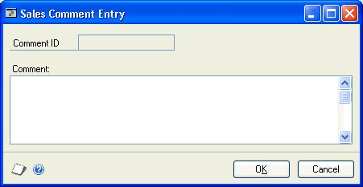
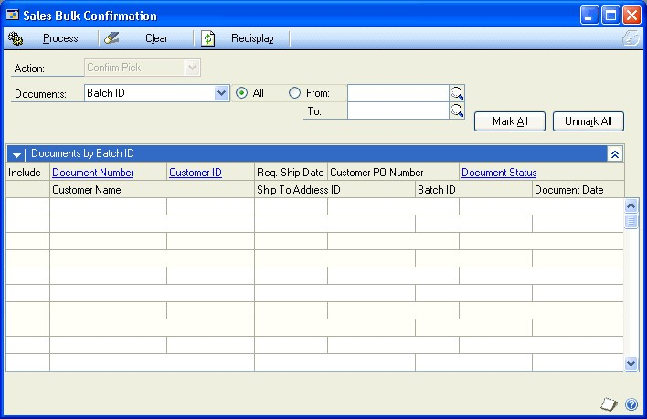
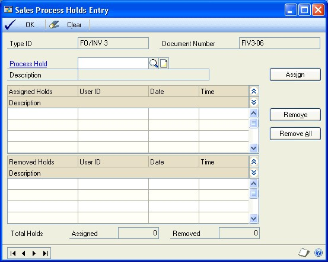
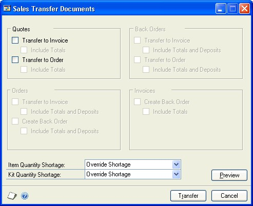

# Sales Order Processing Part 4: Transaction activity

This part of the sales order processing documentation includes information that will help manage your sales documents once they are entered. You can transfer, modify, delete, post, and print sales documents. The following topics are discussed:

- *Chapter 24, “Printing and sending documents in e-mail,”* describes how to print sales documents—quotes, orders, back orders, invoices, returns, picking tickets, and packing slips. It also explains how to print shipping labels and COD tags.

- *Chapter 26, “Posting,”* explains how to post an individual sales transaction or a batch of transactions.

- *Chapter 25, “Sales document maintenance,”* explains how to correct, delete, and void sales documents. It also explains process holds.

- *Chapter 27, “Transferring documents,”* explains how to transfer sales documents as a part of the sales cycle.

## Chapter 24: Printing and sending documents in email

After you enter a quote, order, fulfillment order, invoice, back order, or return, you can print the document and send it to a customer. You also can print packing slips, picking tickets, shipping labels, and cash on delivery (COD) tags.

This information is divided into the following sections:

- *Packing slips and picking tickets overview*

- *Printing options for packing slips and picking tickets*

- *Printing options for sales documents*

- *Requirements for sending sales documents in e-mail*

- *Printing or sending an individual document in e-mail*

- *Printing all documents in a batch*

- *Printing a range of documents*

- *Printing a posted document*

- *Setting up the sales quick print option*

- *Print packing slips using the action pane*

- *Print picking tickets using the action pane*

- *Printing bulk picking tickets*

- *Printing a batch list*

- *Printing shipping labels or COD tags*

### Packing slips and picking tickets overview

You can print packing slips for orders, fulfillment orders, and invoices and include them in each shipment. A packing slip displays the items and quantities included on an order or invoice. If items on an invoice have negative invoice quantities, those items will not be printed on the packing slip. If all the items on an invoice have a Services item type, a packing slip is not printed. If items on an invoice have Miscellaneous Charges or Flat Fee item type, a packing slip is printed. If an item on an invoice has a Kit item type and the kit has no items, a packing slip is not printed. See [Printing options for packing slips and picking tickets](#printing-options-for-packing-slips-and-picking-tickets) for printing more information.

You can print picking tickets for orders, fulfillment orders, invoices, and returns. Warehouse personnel use picking tickets when assembling the items for a shipment. A picking ticket displays the items and quantities needed to fulfill an order, fulfillment order, or invoice and the location for each item. A picking ticket for a return displays the items and quantities returned and the site they were returned to. If you reprint a picking ticket, the words REPRINT will be displayed across the top of the report. Items will not be printed on the picking ticket if they are drop-ship items, have negative invoice quantities, or have zero quantities. See [Printing options for packing slips and picking tickets](#printing-options-for-packing-slips-and-picking-tickets) for more information.

You can print bulk picking tickets for fulfillment orders and invoices created from fulfillment orders. A bulk picking ticket displays the items and quantities needed to fulfill more than one fulfillment order or invoice and the location of each item for a batch of items. A summary line for each item and the total quantity required is displayed on the picking ticket. If you print a bulk picking ticket and then an individual picking ticket, items displayed on both picking tickets will be displayed with two asterisks (\*\*) and a reprint icon.

You can print packing slips and picking tickets at the same time you print the sales document and can use three predefined document formats—blank paper, short form, or long form. A separate packing slip will be printed for each unique ship-to address and shipping method combination on a sales document.

You can define a default document format when you set up Sales Order Processing and you can change the format before you print a document. For more information about setting up default document formats, see *Setting up document numbers*  or *Chapter 3, “Document setup.”*

If you assigned a print process hold to an order, invoice, or return, this process hold also applies to the picking ticket and packing slip associated with the sales document.

### Printing options for packing slips and picking tickets

When you print packing slips or picking tickets, you can select several printing options in the Sales Document Print Options window. Depending on the document you print, different printing options will be available. You can print packing slips or picking tickets at the same time as you print sales documents.

- **Print Separate Picking Ticket Per Site** If the items from a document are stored at different inventory sites, you can choose to print a picking ticket for each site. If you’re using named printers, refer to the System Administrator’s Guide (Help \>\> Contents \>\> select System Administration) for more information.
- **Print Separate Packing Slip Per Site** If the items from a document are stored at different inventory sites, you can choose to print a packing slip for each site. If line items on the document have different ship-to addresses or shipping methods and different inventory sites, you can choose to print a packing slip for each ship-to address, shipping method, and inventory site combination. If you’re using named printers, refer to the System Administrator’s Guide (Help \>\> Contents \>\> select System Administration) for more information.
- **Include Line Item Comments** Mark this option to include the comments entered for each item on the packing slip or picking ticket.
- **Reprint Previously Printed** If picking tickets or packing slips have been printed before, you can choose to reprint those picking tickets or packing slips. If you choose not to reprint previously printed picking tickets or packing slips, only the picking tickets or packing slips that haven’t been printed before will be printed.
- **Print Picking Instructions** If you’re using advanced picking, have created picking instruction IDs, and assigned the IDs to customers and items, you can choose to print the instructions on the picking tickets.
- **Include Drop-ship Items** Mark this option to print the drop-ship items on packing slips.
- **Include Kit Components** Mark this option to print the components of the kit on the packing slips or picking tickets.
- **Include Incomplete Docs** If items from a document that has been marked Ship Complete Document in the Sales Customer Detail Entry window are to be partially shipped, you can choose to print the partial shipments on packing slips and picking tickets. If this option isn’t marked, packing slips and picking tickets won’t be printed for partially shipped documents.
- **Bin Sequenced** Mark this option to sort the items on the picking tickets by site, bin, and item.
- **Sort Kit Components** Mark this option to sort kit components on the picking tickets by site, bin, and item.
- **Print Customer Item** If you use customer item names, you can choose to print the customer item on the packing slips.
- **Print Back-Ordered Items** Mark this option to print back-ordered items on picking tickets.
- **Print Ship To Addresses with Lines** Mark this option to print the ship to address with the corresponding line item when it’s different than the ship to address for the document. This option is available for picking tickets.

### Printing options for sales documents

When you print a sales document (a quote, order, fulfillment order, invoice, back order, or return), you can select several printing options in the Sales Document Print Options window. You also can send quotes, orders, fulfillment orders, or invoices in e-mail. Depending on the document you print or send in e-mail, different printing options will be available.

- **Reprint Previously Printed/Sent** If you are printing or sending a batch or range of documents in e-mail, all of the documents will be printed or sent in e-mail. If you don’t mark this option, only documents that haven’t been printed or sent in e-mail before will be printed or sent in e-mail.
- **Include Kit Components** The kit item and its components will be printed on the document. If you don’t mark this option, only the kit item will be printed.
- **Print Customer Item** If the customer uses a different name for an item than your company uses for the same item, you can choose to print the customer item name on the packing slips and invoices.
- **Print Ship To Addresses with Lines** Mark this option to print the ship to address with the corresponding line item when it’s different than the ship to address for the document.
- **Include Tax Details** Mark this option and select either Line Item and Summary or Summary Taxes Only. The tax details that were used to calculate the tax will be printed directly beneath the item on the document.

    Mark **Line Item** and **Summary** if you want to include details for line items as well as summary tax information. Mark Summary Taxes Only if you want to include only the summary of tax detail information for each printed document.
- **Currency to Print** For multicurrency transactions, you can print documents in either the functional or originating currency.

### Requirements for sending sales documents in e-mail

You can send quotes, orders, fulfillment orders, or invoices in e-mail if the following conditions are met.

- The document type to send in e-mail must be available for the customer.

- One e-mail address, To, Cc, or Bcc, must be assigned to the customer using the Internet Information window or the Sales E-mail Detail Entry window.

- You can send documents by email if you're using a MAPI-compliant e-mail service or Exchange 2007 Service Pack 1 or greater with Exchange Web Services.

- If you are using Exchange 2007 Service Pack 1 or greater with Exchange Web Services, the Autodiscover service must be enabled to connect to the Exchange server.

- Word templates for Microsoft Dynamics GP for the customer and document type must be enabled in the Template Configuration Manager window before you can send documents as .DOCX, .PDF, or .XPS attachments.

- Depending on the document type and email service, Microsoft Word 2010 or later, and Word templates for Dynamics GP are required.

    | **File format**  | **Word 2010 or later** | **Word templates** | **Web Client** |
    |------------------|------------------------|--------------------|
    | XPS              | Required for MAPI      | Enabled            | Not available  |
    | PDF              | Required for MAPI      | Enabled            | Not available  |
    | DOCX             | Not required           | Enabled            | Available\*    |
    | HTML             | Not required           | Not required       | Available\*    |

    > [!NOTE]
    > Email for Web Client will only be available if you are using Exchange as your server type in the **System Preferences** window.

- The file size of the document must not be greater than the maximum file size set in the Customer E-mail Options window.

- Depending on the file format you choose to send your documents in e-mail, your customers must be using the following components to view their documents.

| **File format**    | **Component**                           |
|--------------------|-----------------------------------------|
| XPS                | Microsoft XPS Viewer                    |
| PDF                | Adobe Reader                            |
| DOCX               | Microsoft Word Viewer                   |
| HTML\*             | Internet Explorer 8 Internet Explorer 9 |

    > [!NOTE]
    > If you are only using Microsoft Dynamics GP Web Client, your customers and vendors must be using HTML to view their documents.

### Printing or sending an individual document in email

You can print a single quote, order, fulfillment order, invoice, back order, or return when you enter the document in the **Sales Transaction Entry** window or the **Sales Order Fulfillment** window. You also can send quotes, orders, fulfillment orders or invoices in email.

If the order, fulfillment order, or invoice exceeds the customer’s credit limit and you are using credit limit override workflow, the document must be approved before you can print it and its picking ticket and packing slip. A document also must be approved before you can send it in email. You can print a document, picking ticket, and packing slip that doesn’t need approval. You also can send a document in e-mail that doesn’t need approval.

To print or send quotes individually in email, you must mark **Edit Printed Documents** in the **Sales Quote Setup** window. If you don’t mark this option, you can print or send quotes in email only if they’ve been entered into a batch. Quotes also must be approved before you can print them or send them in email if you are using sales quote workflow. You can print or send a quote in email that doesn’t need approval.

Before you print documents, you can print an alignment form to ensure that the information is printed in the correct fields on the document. To print an alignment form, mark **Alignment Form** in the **Sales Document Print Options** window. You can use four predefined document formats to print documents—blank paper, short form, long form, or other form.

You also can print packing slips or picking tickets at the same time as you print the sales document. For more information, see [Packing slips and picking tickets overview](#packing-slips-and-picking-tickets-overview) and [Printing options for packing slips and picking tickets](#printing-options-for-packing-slips-and-picking-tickets).

#### To print an individual document

1. Open the **Sales Transaction Entry** window (Sales \>\> Transactions \>\> Sales Transaction Entry) or the **Sales Order Fulfillment** window. (Sales \>\> Transactions \>\> Order Fulfillment)

2. Enter or select a sales document and open the **Sales Document Print Options** window by choosing File \>\> Print or the printer icon button.

    

3. Select the document type, a sorting option, and the currency to print.

4. Mark the documents to include and the document formats to use.
    > [!NOTE]
    > To send a document in email, the document format must be *Blank Paper*. Also, at least one email address, To, Cc, or Bcc, must be assigned to the customer using the **Internet Information** window or the **Sales E-mail Detail Entry** window.

5. Select to print, send the document in e-mail, or both.  

    > [!NOTE]
    > Starting with the October 2020 release of Dynamics GP, you can also choose to print all sales documents. For more information, see [Print All Sales Documents](../whats-new/print-all-sales-documents.md).

6. To print packing slips or picking tickets, mark **Packing Slips** or **Picking Tickets** and select a document format. Packing slips and picking tickets won’t be sent in e-mail.

7. Mark whether to reprint or send previously printed or sent documents. You also can choose to include kit components, tax details, and dual currencies.

8. If you’re printing packing slips or picking tickets, mark the options to include.
    > [!NOTE]
    > If a tax detail doesn’t appear on a document, check the **Tax Detail Maintenance** window (Administration \>\> Setup \>\> Company \>\> Tax Details). The Print on Documents option should be marked.

9. Choose Print. Depending on the destination options you selected, the document is printed, sent in e-mail, or both.

#### To print an individual document using the action pane

1. In the navigation pane, choose the Sales button, and then choose the Sales Order Transactions list.

2. Mark the document that you want to print.

3. In the Actions group, choose Print Document.

4. Select a sorting option.

5. Select a document format.

6. Mark to include kit components, tax details, and the functional and originating currencies.

    > [!NOTE]
    > If a tax detail doesn’t appear on a document, check the Tax Detail Maintenance window (Administration \>\> Setup \>\> Company \>\> Tax Details). The Print on Documents option should be marked.

7. Print the document.

#### To send an individual document in email using the action pane

1. In the navigation pane, choose the Sales button, and then choose the Sales Order Transactions list.

2. Mark the quote, order, fulfillment order, or invoice that you want to send in email.

3. In the Actions group, choose Send in E-mail.

4. Mark to include kit components and tax details.

5. Send the document.

### Printing all documents in a batch

You can print some or all of the documents in a batch. For example, you can print all of the orders you assigned to a batch, or all of the quotes and orders you assigned to a batch. You also can send a batch of quotes, orders, fulfillment orders or invoices in e-mail.

If an order, fulfillment order, or invoice exceeds the customer’s credit limit and you are using credit limit override workflow, the document must be approved before you can print it and its picking ticket, and the packing slip. A document also must be approved before you can send it in e-mail. You can print a document, picking ticket, and packing slip that doesn’t need approval. Quotes must be approved before you can print them if you are using sales quote workflow. You can print a quote that doesn’t need approval. You also can send a document in e-mail that doesn’t need approval.

Print an alignment form to ensure that the information is printed in the correct fields on the document. You can use four predefined document formats—blank paper, short form, long form, or other form.

You also can print packing slips or picking tickets at the same time as you print the sales document. For more information, see [Packing slips and picking tickets overview](#packing-slips-and-picking-tickets-overview) and [Printing options for packing slips and picking tickets](#printing-options-for-packing-slips-and-picking-tickets).

The sorting option determines the order the documents are printed. The documents will always be sorted by document type first. You can then choose whether the documents will be sorted and printed by document number or by customer ID.

#### To print all documents in a batch

1. Open the Sales Batch Entry window.
    (Sales \>\> Transactions \>\> Sales Batches)

2. Select a batch and choose File \>\> Print or the printer icon button to open the Sales Document Print Options window.

3. Select the document type, a sorting option, and the currency to print.

4. Mark the documents to include and the document formats to use.
    > [!NOTE]
    > To send a quote, order, fulfillment order, or invoice in e-mail, the document format must be Blank Paper.

5. To print packing slips or picking tickets, mark Packing Slips or Picking Tickets and select a document format.

6. Select to print, send the document in e-mail, or both.

7. Mark whether to reprint or send previously printed or sent documents. You also can choose to include kit components, tax details, and dual currencies.

8. If you’re printing packing slips or picking tickets, mark the options to include.

    > [!NOTE]
    > If a tax detail doesn’t appear on a document, check the Tax Detail Maintenance window (Administration \>\> Setup \>\> Company \>\> Tax Details). The Print on Documents option should be marked.

9. Choose Print. Depending on the destination options you selected, the document you've selected is printed, sent in e-mail, or both.

### Printing a range of documents

You can print a range of documents; however, documents that have been completely transferred won’t be included in the range. For example, you could print a range of documents to view how many returns were entered in a day. You also can send a batch of quotes, orders, fulfillment orders or invoices in e-mail.

If an order, fulfillment order, or invoice exceeds the customer’s credit limit and you are using credit limit override workflow, the document must be approved before you can print it, send the document in e-mail, print the document’s picking ticket, and the packing slip. You can print a document, picking ticket, and packing slip that doesn’t need approval. Quotes must be approved before you can print them or send them in e-mail if you are using sales quote workflow. You can print a quote that doesn’t need approval. You also can send a document in e mail that doesn't need approval.

Print an alignment form to ensure that the information is printed in the correct fields on the document. You can use four predefined document formats—blank paper, short form, long form, or other form.

You also can print packing slips or picking tickets at the same time as you print the sales document. For more information, see [Packing slips and picking tickets overview](#packing-slips-and-picking-tickets-overview) and [Printing options for packing slips and picking tickets](#printing-options-for-packing-slips-and-picking-tickets).

The sorting option determines the order the documents are printed. The documents will always be sorted by document type first. You can then choose whether the documents will be sorted and printed by document number or by customer ID.

#### To print a range of documents

1. Open the Print Sales Documents window.
    (Sales \>\> Transactions \>\> Print Sales Documents)

    

2. Select the document type and select whether to print documents, historical documents, or an alignment form.

3. Select a sorting option and the currency.

4. Mark to include documents, picking tickets, or packing slips, or a combination, and select the document formats to use.

    > [!NOTE]
    > To send a quote, order, fulfillment order, or invoice in e-mail, the document format must be Blank Paper.

5. Select to print, send the document in e-mail, or both.

6. Mark whether to reprint or send previously printed or sent documents. You also can choose to include kit components, tax details, and dual currencies.

7. If you’re printing packing slips or picking tickets, mark the options you want to include.

    > [!NOTE]
    > If a tax detail doesn’t appear on a document, check the Tax Detail Maintenance window (Administration \>\> Setup \>\> Company \>\> Tax Details). The Print on Documents option should be marked.

8. Enter a range of documents and choose Insert.

Choose Print. Depending on the destination options you selected, the document you've selected is printed, sent in e-mail, or both.

#### To print a range of documents using the action pane

1. In the navigation pane, choose the Sales button, and then choose the Sales Order Transactions list.

2. Mark the documents that you want to print.

3. In the Actions group, choose Print Document.

4. Select a sorting option.

5. Select a document format.

6. Mark to include kit components, tax details, and the functional and originating currencies.

    > [!NOTE]
    > If a tax detail doesn’t appear on a document, check the Tax Detail Maintenance window (Administration \>\> Setup \>\> Company \>\> Tax Details). The Print on Documents option should be marked.

7. Print the document.

#### To send a range of documents in e-mail using the action pane

1. In the navigation pane, choose the Sales button, and then choose the Sales Order Transactions list.

2. Mark the quote, order, fulfillment order, or invoice that you want to send in email.

3. In the Actions group, choose Send in E-mail.

4. Mark to include kit components and tax details.

5. Send the document.

### Printing a posted document

You can reprint individual sales documents from historical records. You also can resend quotes, orders, fulfillment orders, or invoices in e-mail. Documents are moved to history when they are transferred to another document, posted, or voided. You can’t reprint packing slips and picking tickets for documents that have been moved to history.

Print an alignment form to ensure that the information is printed in the correct fields on the document. You can use four predefined document formats—blank paper, short form, long form, or other form.

> [!NOTE]
> If you modified the sales document in Report Writer, your changes will not appear when you print a posted document because a different report is used to print posted documents.

#### To print a posted document

1. Open the Sales Order Processing Document Inquiry window.
    (Sales \>\> Inquiry \>\> Sales Documents)

    

2. Select a sorting option or a range of documents.

3. Mark to include history and choose Redisplay.

4. Highlight a document and click on the Document Number link to open the Sales Transaction Inquiry Zoom window.

5. Choose File \>\> Print or the printer icon button to open the Sales Document Print Options window.

6. Select the document type, a sorting option, and the currency to print.

7. Mark the documents to include and the document formats to use.

    > [!NOTE]
    > To send a document in e-mail, the document format must be Blank Paper.

8. Select to print, send the document in email, or both.

9. Mark to reprint or send previously printed or sent documents. You also can choose to include kit components, and tax details.

10. Choose Print. Depending on the destination options you selected, the document you've selected is printed, sent in email, or both.

### Setting up the sales quick print option

You can use the sales quick print option to print a sales order or invoice from the Sales Transaction Entry, Sales Order Fulfillment, or Sales Transaction Inquiry windows using a keyboard shortcut. You must first set up the option using the Quick Print Setup window.

#### To set up the sales quick print option

1. Open the Quick Print Setup window.
    (Sales \>\> Transactions \>\> Sales Transaction Entry or Order Fulfillment \>\> Options \>\> Quick Print Setup)

    

2. Mark the documents, print options, and print destination.

3. Choose OK.

#### To print using the sales quick print option

1. Open the Sales Transaction Entry window (Sales \>\> Transactions \>\> Sales Transaction Entry), the Sales Order Fulfillment window (Sales \>\> Transactions \>\> Sales Order Fulfillment), or the Sales Transaction Inquiry Zoom window (Sales \>\> Inquiry \>\> Sales Documents).

2. Enter or select the order or invoice you want to print.

    If the order, fulfillment order, or invoice exceeds the customer’s credit limit and you are using customer credit limit override workflow, the document must be approved before you can print it. You can print a document that doesn’t need approval.

3. Choose CTRL+Q to print the document.

### Print packing slips using the action pane

You can print packing slips using the action pane for orders, fulfillment orders, and invoices and include them in each shipment. A packing slip displays the items and quantities included on an order or invoice. For more information about packing slips, see [Packing slips and picking tickets overview](#packing-slips-and-picking-tickets-overview).

#### To print packing slips using the action pane

1. In the navigation pane, choose the Sales button, and then choose the Sales Order Transactions list.

2. Mark the orders, fulfillment orders, and invoices that you want to print picking tickets for.

3. In the Adv. Distribution group or Actions group, choose Print Picking Ticket.

4. Select the document format.

5. You can mark the following options.

    - **Print packing slip per site** Mark to print a packing slip for each site on the document.
    - **Include item comments** Mark to print comments that were entered for items on a packing slip.
    - **Include kit components** Mark to print kit components on the picking ticket.

6. Print the packing slips.

### Print picking tickets using the action pane

You can print picking tickets using the action pane for orders, fulfillment orders, invoices, and returns. Warehouse personnel use picking tickets when assembling the items for a shipment. For more information about picking tickets, see [Packing slips and picking tickets overview](#packing-slips-and-picking-tickets-overview).

#### To print picking tickets using the action pane

1. In the navigation pane, choose the Sales button, and then choose the Sales Order Transactions list.

2. Mark the orders, fulfillment orders, returns, and invoices that you want to print picking tickets for.

3. In the Adv. Distribution group or Actions group, choose Print Picking Ticket.

4. Select the document format.

5. You can mark the following options.

    - **Print separate picking ticket per site** Mark to print a picking ticket for each site on the document.
    - **Include kit components** Mark to print kit components on the picking ticket.
    - **Print bulk picking tickets** Mark to print bulk picking tickets. After marking this option, the Include Document Breakdown option and the For site ID option are available. The Print separate picking ticket per site option isn’t available for bulk picking tickets.
    - **Include Document Breakdown** Mark to include the requested shipping date for the item, the document number, customer ID, picking quantity, unit of measure, line item detail, and customer ship-to address for the item on the bulk picking ticket.
    - **For site ID:** Select the site ID to print picking tickets for.

6. Print the picking tickets.

### Printing bulk picking tickets

If you’re using advanced picking, use the Bulk Picking Print window to print bulk picking tickets. A bulk picking ticket includes the items and quantities for multiple fulfillment orders or invoices, along with the location of each item, a summary line for each item, and the total quantity required.

You can print bulk picking tickets for items only when the following conditions exist for the fulfillment orders and invoices that you are printing a picking ticket for.

- The Enable Fulfillment Workflow option is marked for the type ID in the Sales Fulfillment Order/Invoice Setup window.

- The general print option for the site is Both or Bulk in the Advanced Picking Setup window.

- The item print option for the items is Both or Bulk in the Item Quantities Maintenance window.

- If you are using customer credit limit override workflow, the fulfillment orders/invoices must approved or the fulfillment orders/invoices must not need approval to print picking tickets.

#### To print bulk picking tickets

1. Open the Bulk Picking Print window.
    (Sales \>\> Transactions \>\> Bulk Print)

    

2. Enter or select a batch ID and site ID to print picking tickets for.

3. You can mark the following options.

    - **Include Document Breakdown** Mark to include the requested shipping date for the item, the document number, customer ID, picking quantity, unit of measure, line item detail, and customer ship-to address for the item on the bulk picking ticket.
    - **Print Picking Instructions** Mark to print the picking instructions for the item on the picking ticket.
    - **Include Kit Components** Mark to print kit components on the picking ticket.
    - **Include Incomplete Docs** If items from a document that has been marked Ship Complete Document in the Sales Customer Detail Entry window are to be partially shipped, you can choose to print the partial shipments on picking tickets. If this option isn’t marked, picking tickets won’t be printed for partially shipped documents. This option applies for documents that have unprinted picking tickets.
    - **Print Back-Ordered Items** Mark this option to print back-ordered items on picking tickets.

4. You can select to include all item numbers, or enter or select a range of item numbers. Picking tickets will be printed for only the selected items.

5. Select one or more available picks and choose Insert. Picking tickets will be printed for the group of sales documents in the available pick.

6. Select one or more document statuses and choose Insert. Picking tickets will be printed for sales documents that match the selected document statuses.

7. Choose Print.

8. Close the window.

#### To print bulk picking tickets using the action pane

1. In the navigation pane, choose the Sales button, and then choose the Sales Order Transactions list.

2. Mark the fulfillment orders and invoices that you want to print picking tickets for.

3. In the Adv. Distribution group, choose Print Picking Ticket.

4. You can mark the following options.

    - **Include Kit Components** Mark to print kit components on the picking ticket.
    - **Print bulk picking tickets** Mark to print bulk picking tickets. The Print separate picking ticket per site option isn’t available for bulk picking tickets.
    - **Include Document Breakdown** Mark to include the requested shipping date for the item, the document number, customer ID, picking quantity, unit of measure, line item detail, and customer ship-to address for the item on the bulk picking ticket.
    - **For site ID:** Select the site ID to print picking tickets for.

5. Print the picking tickets.

### Printing a batch list

A batch list is a list of all transactions—quotes, orders, fulfillment orders, invoices, back orders, and returns—in an unposted batch. You can print a batch list to verify the transactions in the batch. You can print a batch list from the Sales Batch Entry window or the Sales Transaction Entry window if a batch ID is displayed.

#### To print a batch list

1. Open the Sales Document Print Options window.
    (Sales \>\> Transactions \>\> Batches \>\> select a batch \>\> File \>\> Print)
    (Sales \>\> Transactions \>\> Sales Transaction Entry \>\> select a transaction \>\> File \>\> Print)

2. Mark Batch List and choose Print.

3. Select a destination for the report and choose OK.

### Printing shipping labels or COD tags

You can use the Mailing Labels window to print shipping labels for a range of unposted transactions in Sales Order Processing. You can print labels for orders and invoices and can select a range by batch, document ID, state, ZIP or postal code, customer, or date.

You also can print cash on delivery (COD) tags for a range of unposted transactions in Sales Order Processing. An amount must be entered in the COD amount field in the Sales Payment Entry window for a COD transaction.

#### To print shipping labels or COD tags

1. Open the Mailing Labels window.
    (Administration \>\> Reports \>\> Company \>\> Mailing Labels)

2. Select Shipping Labels or COD Tags from the Reports list and choose New to open the Mailing Label Report Options window.

    

3. Enter an option name, select sorting options, enter restrictions, and mark printing options.

    If you’re printing shipping labels, mark a format to use, enter the number of copies to be printed, and mark which address should be used.

    > [!NOTE]
    > If you mark Laser, the labels will be printed two addresses across.

4. Choose Destination to select a printing destination and choose Print. You can save the report option and print it later from either the Mailing Labels window or the Mailing Labels Report Options window.

## Chapter 25: Sales document maintenance

Before you transfer or post a document, you can modify the item, commission, and total information. For example, you can change quantities, add items, correct addresses, split commissions, or add freight charges. If the document was entered in error, you can void or delete the document. You also can assign a process hold to a document to prevent it from being processed further.

If you are entering transactions for customers who are part of a national account, changing the hold or inactive status can be at an individual customer level or across the national account. If you can’t enter a transaction for a customer ID, check the status of the Apply Hold/Inactive Status of Parent Across National Account option in the National Accounts Maintenance window.

This information is divided into the following sections:

- *Modifying an existing sales document*

- *Adding a comment to sales documents*

- *Changing a serial or lot number*

- *Changing bins in Sales Order Processing*

- *Changing a kit component*

- *Advancing the document status of a fulfillment order*

- *Advancing the document status of one or more fulfillment orders*

- *Assigning process holds to a document*

- *Removing process holds from a document*

- *Assigning process holds to multiple documents*

- *Removing process holds from multiple documents*

- *Reversing the document status of fulfillment orders*

- *Modifying commission information*

- *Splitting commissions*

- *Voiding a document*

- *Deleting a document*

### Modifying an existing sales document

You can add items, delete items, or change item quantities on a sales document. You also can increase the item quantity on items that have been transferred.

> [!NOTE]
> You can’t modify an invoice or return that has been posted. If you discover a mistake after posting a document, you’ll need to enter a transaction to reverse the original transaction. For example, enter a return to reverse an invoice.

If you are using sales quote workflow or customer credit limit override workflow, you can’t modify a quote, order, fulfillment order, or invoice that is pending approval. You can modify a document that is pending approval if you are the current approver of the document. You must resubmit a quote, order, fulfillment order, or invoice after modifying an approved document or a document that doesn’t need approval.

#### To modify an existing sales document

1. In the navigation pane, choose the Sales button, and then choose the Sales Order Transactions list.

2. Select a sales document to edit.

3. In the Modify group, choose Edit to open the Sales Transaction Entry window.

4. Highlight the item to change and enter the correct information.

    If documents are set up to be allocated by document or batch, additional items entered on the document after you have allocated the document will be allocated by line and you must address each quantity shortage that arises.

    If you decrease a Quantity to Back Order or a Quantity Canceled on a document, the item won’t be reallocated automatically. The Quantity Alert icon will appear next to the quantity and you’ll have to allocate the quantity again. For more information about allocation, see *Chapter 19, “Allocating item quantities.”*

    > [!NOTE]
    > To delete an item, highlight the item and choose Edit \>\> Delete Row. You can’t delete an item that has been transferred to another document.

5. Save the document.

You might have to resubmit a quote, if you are using sales quote workflow.

If the document exceeds the customer’s credit limit and you are using customer credit limit override workflow, you can submit the document for approval.

### Adding a comment to sales documents

You can add comments to sales documents—quotes, orders, back orders, invoices, or returns—or to individual line items on a sales document. These comments can be printed on sales documents, including picking tickets and packing slips. Comments can be predefined on a company-wide basis, and used on Sales Order Processing, Invoicing, or Purchase Order Processing documents. You can enter the ID of a predefined comment in the Sales Transaction Entry or Sales Item Detail Entry windows.

> [!NOTE]
> You can enter up to 200 characters, which will appear on the sales document as four lines of 50 characters each. If you want longer comments to appear, use Report Writer to modify the document layout.

You can create new comments while you are entering transactions. You can also create custom comments for a particular document or line item, or modify existing comments. One-time comments or modified comments won’t be available for other documents or line items.

#### To create a new comment

1. In the Sales Transaction Entry window or the Sales Item Detail Entry window, enter a new Comment ID, then press TAB.

2. A message will ask if you want to add this comment ID. Choose Add to display the Comment Setup window.

3. Select the series this comment will be associated with.

4. Enter the comment text.

5. Choose Save, then close the Comment Setup window.

#### To create a one-time comment

1. In the Sales Transaction Entry window or the Sales Item Detail Entry window, choose the Comment ID expansion button to open the Sales Comment Entry window.

    

    If the Comment ID field contained a value, you’ll be able to modify the existing comment. If the Comment ID field was blank, you’ll be able to create a new, one-time comment.

2. Enter the comment text.

3. Choose OK.

### Changing a serial or lot number

You can verify or change the serial or lot number assigned to an item before the sale is posted.

#### To change a serial or lot number

1. Open the Sales Transaction Entry window.
    (Sales \>\> Transactions \>\> Sales Transaction Entry)

2. Select an item and choose the Quantity Fulfilled expansion button to open the Sales Lot Number Entry window or Sales Serial Number Entry window. You can also select an item, choose the item expansion button to open the Sales Item Detail Entry window and choose Serial/Lot.

3. Select the serial or lot number to change and choose Remove.

4. From the list of available serial or lot numbers, select one to use and choose Insert. You can also enter a serial or lot number that hasn’t been entered. To do so, enter the number in the Serial Number or Lot Number field and choose Insert.

    > [!NOTE]
    > An icon appears in the Lot Number field if you select a lot number that has expired.

5. Choose OK to save your changes and close the lot number or serial number entry window.

6. Save your changes and close the Sales Item Detail Entry window or the Sales Transaction Entry window.

### Changing bins in Sales Order Processing

If you’re using multiple bins, use the Bin Quantity Entry window to verify or change bin allocations for items not tracked by serial or lot numbers. For serial- or lot-numbered items, you can verify or change bins in the Sales Serial Number Entry window or the Sales Lot Number Entry window. For more information, see *Changing a serial or lot number*.

You can select more than one bin per site. For example, if the quantity fulfilled is 20, you can select 15 from Site A, Bin 1 and 5 from Site A, Bin 2. You may be required to change bin selections manually if you change quantities, the unit of measure, or the site after bins have been selected.

#### To change bins in Sales Order Processing

1. Open the Sales Transaction Entry window.
    (Sales \>\> Transactions \>\> Sales Transaction Entry)

2. Select an item and choose the Quantity Fulfilled expansion button.

    For items not tracked by serial or lot numbers, the Bin Quantity Entry window will open. For serial- or lot-numbered items, the Sales Serial Number Entry window or Sales Lot Number Entry window will open.

    You can also select an item and choose the item expansion button to open the Sales Item Detail Entry window. Choose Bins for an item not tracked by serial or lot numbers. For serial- or lot-numbered items also tracked in bins, choose Serial/Lot.

3. Select the bin you want to change and choose Remove.

4. From the list of available bins, select one to use. You can also enter a bin that hasn’t been created yet.

5. Enter a quantity for the item.

6. Choose Insert.

7. Choose OK to save your changes and close the Bin Quantity Entry window.

8. Save your changes and close the Sales Item Detail Entry window or the Sales Transaction Entry window.

### Changing a kit component

Even though you assign components to a kit in the Item Kit Maintenance window, you can change the components for a kit item on a specific document in the Sales Kit Options window. If you’re using multiple bins, a kit’s component items are assigned to bins, but the kit item itself is not.

#### To change a kit component

1. Open the Sales Transaction Entry window.
    (Sales \>\> Transactions \>\> Sales Transaction Entry)

2. Select the kit item, choose the item expansion button to open the Sales Item Detail Entry window, and choose Kits to open the Sales Kit Options window.

    

3. Add or delete components or change the quantities of the components.

    > [!NOTE]
    > To remove a component, select the component and choose Edit \>\> Delete Row.

4. Choose OK to save the changes and close the window. Choose Save to close the Sales Item Detail Entry window.

### Advancing the document status of a fulfillment order

As you complete each step in your sales fulfillment workflow process, such as printing picking tickets, picking items, and printing packing slips, you should advance the document status for a fulfillment order to the next tracked status. Use the Sales Transaction Entry window or the Sales Order Fulfillment window to advance the document status of a fulfillment order.

For more information about the document statuses, refer to *Setting up fulfillment workflow for sales*.

#### To advance the document status of a fulfillment order

1. Open the Sales Transaction Entry window or the Sales Order Fulfillment window.
    (Sales \>\> Transactions \>\> Sales Transaction Entry or Sales \>\> Transactions \>\> Order Fulfillment)

2. Enter or select a fulfillment order.

3. If you’re tracking document Status 1, you can choose the printer button to print the picking ticket and advance the document status from Status 1 to the next document status that you’re tracking.

    > [!NOTE]
    > You must print a bulk picking ticket before you can print an individual picking ticket with one or more line items that print only on bulk picking tickets.

    If you’re tracking document Status 2, you can choose Confirm \>\> Pick to advance the document status from Status 2 to the next document status that you’re tracking.

    If you’re tracking document Status 3, you can choose the printer button to print the packing slip and advance the document status from Status 3 to the next document status that you’re tracking.

    If you’re tracking document Status 4, you can choose Confirm \>\> Pack to advance the document status from Status 4 to the next document status that you’re tracking.

    If you’re tracking document Status 5, you can choose Confirm \>\> Ship to advance the document status from Status 5 to Status 6. The fulfillment order will become an invoice.

4. Choose Save.

### Advancing the document status of one or more fulfillment orders

Typically, a document status will advance to the next tracked status as you complete each step in the sales fulfillment workflow process. Occasionally, however, you might need to advance the status of a document outside of the sales fulfillment workflow process.

For example, suppose you’re tracking all six document statuses and you printed picking tickets for multiple fulfillment orders. The delivery truck arrives early to pick up the orders, so you pack the picking tickets and send them with the orders. You can advance the document status for multiple documents from 2 to 5, one status at a time, to update the fulfillment order document status.

Use the Sales Bulk Confirmation window to advance the status of one or more fulfillment orders to Status 3, 4, 5, or 6.

If you are using customer credit limit override workflow, the fulfillment orders must be approved or the fulfillment order must not need approval to advance the document status. You can advance the document status if the fulfillment order is pending approval and you are the current approver of the order.

#### To advance the document status of one or more fulfillment orders

1. Open the Sales Bulk Confirmation window.
    (Sales \>\> Transactions \>\> Bulk Confirmation)

    

2. Select the action to complete. The actions available will depend on the statuses you selected to track in the Sales Fulfillment Document Workflow Setup window, and can include the following actions.

    - Confirm Pick

    - Print Packing Slip

    - Confirm Pack

    - Confirm Ship

3. To restrict the information displayed in this window, select the appropriate option and enter or select the starting and ending ranges.

4. Choose Redisplay. The documents that match your selections will be displayed in the scrolling window.

5. Documents that are marked will be processed. You can unmark specific documents or choose Unmark All.

6. To confirm pick, confirm pack, or confirm ship, choose Process. The document status for the selected documents will be advanced to the next status tracked.

    To print packing slips, choose the printer button.

7. Close the window.

### Assigning process holds to a document

You can assign process holds to individual documents. Process holds are userdefined restrictions that control the processing of sales documents at different stages of the sales cycle. You can use process holds to restrict the transfer, fulfillment, printing, or posting of a document. Process holds assigned to an order, invoice, or return also apply to the picking ticket and packing slip associated with the document.

If you are using sales quote workflow, you can’t apply a hold for a quote that is pending approval.

If you are using customer credit limit override workflow, you can apply a hold to an order, fulfillment order, or invoice that doesn’t require approval or that has been approved. You can’t apply a hold for an order, fulfillment order, or invoice that is pending approval unless you can approve the document.

If you’re using sales fulfillment workflow, you also can use process holds to restrict the advancement of a document status of a fulfillment order.

You must set up process holds in Sales Order Processing before they can be assigned to a document. For more information about setting up process holds, see *Setting up process holds*.

A process hold also can be assigned to a document ID when you set it up. For more information about assigning process holds to a document ID, see *Assigning process holds to sales document IDs*.

#### To assign process holds to a document

1. Open the Sales Transaction Entry window.
    (Sales \>\> Transactions \>\> Sales Transaction Entry)

2. Enter or select a document.

3. Choose Holds to open the Sales Process Holds Entry window.

    

4. Enter or select the process hold to assign to the document and choose Assign. The process hold will be added to the Assigned Holds list.

5. Choose OK to close the window.

#### To assign process holds from a document using the action pane

1. In the navigation pane, choose the Sales button, and then choose the Sales Order Transactions list.

2. Mark the document that you want to assign a hold.

3. In the Modify group, choose Apply Hold.

4. Select the process hold and apply the hold.

### Removing process holds from a document

If you have assigned a process hold to a sales document, you must remove it before you can complete the processing. You can use process holds to restrict the transfer, fulfillment, printing, or posting of a document.

If you’re using sales fulfillment workflow, you also can use process holds to restrict the advancement of a document status of a fulfillment order.

If you are using sales quote workflow, you can’t remove a hold for a quote that is pending approval unless you are the current approver.

If you are using customer credit limit override workflow, you can remove a hold to an order, fulfillment order, or invoice that doesn’t require approval or that has been approved. You can’t remove a hold for an order, fulfillment order, or invoice that is pending approval unless you can approve the document.

#### To remove process holds from a document

1. Open the Sales Transaction Entry window.
    (Sales \>\> Transactions \>\> Sales Transaction Entry)

2. Enter or select a document.

3. Choose Holds to open the Sales Process Holds Entry window.

4. In the Assigned Holds list, choose a process hold to remove and choose Remove. This process hold will be added to the Removed Holds list in the window.

5. Choose OK to close the window. A record of removal is stored with the document, along with the user ID who removed the hold and the date and timeit was removed.

#### To remove process holds from a document using the action pane

1. In the navigation pane, choose the Sales button, and then choose the Sales Order Transactions list.

2. Mark the document that you want to release from hold.

3. In the Modify group, choose Remove Hold.

4. Unmark the process hold and enter a password, if required.

5. Remove the process hold.

### Assigning process holds to multiple documents

You can assign process holds to multiple sales documents. Process holds are userdefined restrictions that control the processing of sales documents at different stages of the sales cycle. You can use process holds to restrict the transfer, fulfillment, printing, or posting of documents. If you’re using sales fulfillment workflow, you also can use process holds to restrict the advancement of a document status of a fulfillment order. Process holds assigned to an order, fulfillment order, invoice, or return also apply to the picking ticket and packing slip associated with the document.

You must set up process holds in Sales Order Processing before they can be assigned to a document. For more information about setting up process holds, see *Setting up process holds*.

A process hold also can be assigned to a document ID when you set it up. For more information about assigning process holds to a document ID, see *Assigning process holds to sales document IDs*.

If you are using sales quote workflow, you can’t apply a hold to quotes that are pending approval unless you are the current approver.

#### To assign process holds to multiple documents

1. Open the Sales Holds Processing window.
    (Sales \>\> Transactions \>\> Holds Processing)

2. Enter or select a process hold.

3. Mark Assign.

4. Define a range restriction of documents to assign the hold to and choose Insert.

5. Choose Restrictions to view the range of the documents you’ve chosen. You can remove an individual document from the range by unmarking Process for the document.

6. You can choose File \>\> Print or the printer icon button to print the Holds Processing Preview report before processing the holds.

7. Choose Process to assign the process hold.

### Removing process holds from multiple documents

If you have assigned a process hold to sales documents, you must remove it before you can complete the processing. You can use process holds to restrict the transfer, fulfillment, printing, or posting of documents.

If you’re using sales fulfillment workflow, you also can use process holds to restrict the advancement of a document status of a fulfillment order.

If you are using sales quote workflow, you can’t remove a hold to quotes that are pending approval unless the current approver.

#### To remove process holds from multiple documents

1. Open the Sales Holds Processing window.
    (Sales \>\> Transactions \>\> Holds Processing)

2. Enter or select a process hold.

3. Mark Remove.

4. Define a range restriction of documents to remove the hold from and choose Insert.

5. Choose Restrictions to view the range of the documents you’ve chosen. You can remove an individual document from the range by unmarking Process for the document.

6. You can choose File \>\> Print or the printer icon button to print the Holds Processing Preview report before processing the holds.

7. Choose Process to remove the process hold.

A record of removal is stored with each document, along with the user ID of the user who removed the hold and the date and time it was removed. You can view this record in the Sales Process Holds Entry window.

### Reversing the document status of fulfillment orders

If you’re using sales fulfillment workflow, use the Edit Sales Document Status window to reverse the document status of fulfillment orders. You can move the document status back one status at a time. For example, suppose you printed a picking ticket for a customer order—but had not confirmed the pick—and the customer called to add an item to the order. You could reverse the document status from Status 2 to Status 1, and then continue with the regular process. You cannot reverse a document status when the fulfillment order document has become an invoice and the document status is Status 6.

Reversing document statuses does not back out quantity fulfilled or quantity allocated values.

#### To reverse the document status of fulfillment orders

1. Open the Edit Sales Document Status window.
    (Sales \>\> Utilities \>\> Edit Sales Status)

    

2. Select how to choose documents using the Documents field.

3. Enter or select a range of documents to reverse statuses for.

4. Select the current document status to change from.

5. Choose Redisplay. Documents that match the criteria specified will be displayed.

6. Documents that are marked will be processed. You can unmark specific documents or choose Unmark All.

7. Choose the printer icon to print a report and view the documents that you’ve selected to reverse statuses for.

8. Choose Process.

### Modifying commission information

Commission amounts on sales documents are calculated using the commission information from the Salesperson Maintenance window. Commission amounts on return documents will decrease the commissions payable to a salesperson.

You can modify commission amounts, percentages, and commission sales amounts on invoices and returns. The commission amounts will be posted when the transaction is posted.

You can modify the commission percent and percent of sale for a salesperson on quotes, orders, and back orders. However, you can’t modify the commission sales amount or commission amount.

> [!NOTE]
> Commission amounts on these documents are recalculated when you transfer the
document.

#### To modify commission information

1. Open the Sales Transaction Entry window.
    (Sales \>\> Transactions \>\> Sales Transaction Entry)

2. Enter or select a sales document. Choose Commissions to open the Sales Commission Entry window.

3. Choose the hide and show button to expand the scrolling window.

    

4. Make your changes to the commission information. You also can enter or select a different salesperson ID.

    > [!NOTE]
    > To remove a commission distribution, select the line and choose Edit \>\> Delete Row.

    If you increase the commission amount rather than the commission percentage, the commission percentage will remain the same. This way, if you enter another item, the salesperson will receive the regular commission percentage on the next item.

5. Choose OK to save changes and close the window.

### Splitting commissions

You can split the commission on invoices and returns between multiple salespeople. Commission amounts on return documents will decrease the commissions payable to a salesperson.

You can add salespeople in the Sales Commission Entry window for quotes, orders, and back orders. However, you can’t change the commission sales amount or commission amount for salespeople.

> [!NOTE]
> The commission amounts on these documents are recalculated when you transfer the document. If you added a salesperson, the new salesperson won’t be transferred and must be entered again on the new document.

#### To split commissions

1. Open the Sales Transaction Entry window.
    (Sales \>\> Transactions \>\> Sales Transaction Entry)

2. Enter or select a sales document.

3. Choose Commissions to open the Sales Commission Entry window. Choose the hide and show button to expand the scrolling window.

    

4. Change the Percent of Sale amount for the first salesperson listed to the appropriate percentage.

5. In the next available line, enter or select an additional salesperson. Enter an amount in the Percent of Sale and Commission Sale Amount fields for the additional salesperson. The Commission amount will be calculated automatically.

    You don’t have to fully distribute a sale to individual salespeople; you can distribute any amount, up to 100 percent of the sale.

6. Choose OK to save the changes and close the window.

### Voiding a document

You can void a sales document if the document ID is set up to allow voiding. For more information about document IDs, see *Chapter 3, “Document setup.”*

If you void a document, the document number can’t be reused. If you have marked to track voided documents in history, you can view the document after it has been voided. By tracking voided documents, you’ll know why a document number is missing or out of sequence for auditing and security purposes.  

You can only void unposted documents. You must void a sales document—not delete it—if the document has been printed (except for quotes) or if the document has items that have been partially transferred.  

You can’t void documents with deposits, documents that have been posted, or documents with line items linked to purchase orders. You can’t void quotes that are pending approval or pending changes if you are using sales quote workflow. You can’t void orders or invoices that are pending approval or pending changes if you are using customer credit limit override workflow.  

#### To void a document

1. Open the Sales Transaction Entry window.
    (Sales \>\> Transactions \>\> Sales Transaction Entry)

2. Enter or select the document number you want to void.

3. Choose Void. When you close the Sales Transaction Entry window, the Sales Voided Journal may be printed, depending on how your system is set up.

### Deleting a document

You can delete a sales document if the document ID is set up to allow deleting. For more information about document IDs, see *Chapter 3, “Document setup.”*

If you delete a document, the document number can be used again and the document won’t be saved in history.

You can’t delete a sales document if any of the following conditions exist.

- The document has been printed (except for quotes). You must void documents that have been printed.

- The document has items that have been partially transferred. You must void the document.

- The document is assigned to a batch that is marked for posting. You must unmark the batch before you can delete the document.

- The document contains a posted deposit.

- A line item is linked to a saved purchase order.

- The quote must have a Workflow status of Not Submitted or Submitted if you are using sales quote workflow.

- The order, fulfillment order, or invoice must have a Workflow status of Not Submitted or Submitted if you are using customer credit limit override workflow.

#### To delete a document

1. Open the Sales Transaction Entry window.
    (Sales \>\> Transactions \>\> Sales Transaction Entry)

2. Enter or select the document number to delete.

3. Choose Delete.

## Chapter 26: Posting

Posting is the process of transferring unposted transactions to permanent records and updating accounts with specific transaction amounts. When you enter transactions, they are stored. Until transactions are posted, they can be changed, voided, or deleted. When you post transactions in Sales Order Processing, they are transferred to history and can’t be changed or voided.

Posting reports will be printed when you post transactions, either individually or in batches. For more information about posting reports for Sales Order Processing, refer to *Sales Order Processing report summary*.

For more information about setting up posting, see the System Setup Guide (Help \>\> Contents \>\> select Setting up the System).

This information is divided into the following sections:

- *Posting overview for Sales Order Processing*

- *Posting a single transaction*

- *Posting a single batch*

### Posting overview for Sales Order Processing

When you post a batch in Sales Order Processing, the invoices and returns are posted, moved to history and removed from the batch. Quotes, orders, or back orders will remain in batches until you void, delete, or transfer them to another document.

When you post an invoice or return in Sales Order Processing, the following transactions and records will be updated:

- Inventory quantities will be adjusted for the items sold or returned.

- If you’re using multiple bins, the item’s on-hand quantity and allocated quantity decrease in each bin at the site when you post an invoice.

- If you’re using multiple bins and you post a return, bin quantities increase by the quantity specified in the Sales Returned Quantities Entry window.

- The customer balance and salesperson commission will be updated in Receivables Management. A transaction will be added in Receivables Management so you can apply payments to the documents.

- Sales tax records will be updated for the transaction.

- If you’re using Bank Reconciliation, your checkbook will be updated if the transaction has an amount received or returned.

- Transactions will be posted to or through General Ledger, depending on how your system is set up. For more information about setting up posting options, see the System Setup instructions (Help \>\> Contents \>\> select Setting up the System).

> [!NOTE]
> National accounts provide the ability to restrict payments for child customers and apply credit checking, holds and finance charges at a consolidated national account level, depending on how the account was set up. If you can’t save or post a transaction, check the status of the options in the National Accounts Maintenance window.

### Posting a single transaction

After you enter a sales invoice or return, you can post the document or save it to a batch. For more information about entering invoices or returns, see *Entering an invoice* or *Entering a return*. You must approve invoices that exceeded the customer’s credit limit if you are usingcustomer credit limit override workflow.

#### To post a single transaction

1. Open the Sales Transaction Entry window.
 (Sales \>\> Transactions \>\> Sales Transaction Entry)

2. Select or enter the sales transaction information. To enter and post a single transaction, don’t enter a batch ID. If you select an existing transaction, clear the Batch ID field.

3. Choose Post to post the transaction.

4. Close the window and select which posting reports to print.

> [!NOTE]
> When transactions are posted using transaction-level posting, the batch control fields on the posting journal always contain zero amounts. The transactions have been posted, however, even though zeros are displayed. If the transactions hadn’t been posted, a message would appear on the posting journal.

#### To post a single transaction using the action pane

1. In the navigation pane, choose the Sales button, and then choose the Sales Order Transactions list.

2. Mark the invoice or return that you want to post.

3. In the Adv. Distribution group or Actions group, choose Post.

4. Post the transaction and select which posting reports to print.

### Posting a single batch

Batch-level posting is one method of posting transactions. Within batch- level posting, there are three types—batch, series, and master. The only difference among these posting types is the number and types of batches you post at once.

Batch and series posting are explained in the following procedures. For information about master posting, refer to the System User’s Guide (Help \>\> Contents \>\> select Using the System).

You can use the Sales Batch Entry window to post a single batch. More than one person can enter transactions in the same batch; however, a batch can’t be posted if anyone is making changes to it.
 When you post a batch, your Receivables Management records will be updated to reflect the information from the transactions. Your General Ledger accounts will be updated, depending on your posting setup selections.

- If your system is set up to post to General Ledger, the batch will appear in the Financial Series Posting and Master Posting windows. You can edit the transactions in the General Ledger Transaction Entry window before posting them again. Your accounts will be updated when you post the transactions in General Ledger.

- If your system is set up to post through General Ledger, your accounts will be updated at once and you won’t need to post the batch again in General Ledger.

    > [!NOTE]
    > If there are batch total or batch approval requirements in Sales Order Processing and you post a batch through General Ledger, the batch will be posted through General Ledger regardless of the batch requirements in General Ledger.

Before you post a batch you should:

- Print an edit list and review the transactions in the batch. When you choose to print an edit list, the Sales Document Print Options window opens where you select to print an edit list. If you need to make corrections to the transactions or the batch, do so at this time. For more information about printing an edit list, see the System Setup Guide (Help \>\> Contents \>\> select Setting up the System).

- Make a backup of your company’s data. Refer to the System Administrator’s Guide (Help \>\> Contents \>\> select System Administration) for more information about making backups.

- Approve invoices that exceeded the customer’s credit limit if you are using customer credit limit override workflow.

#### To post a single batch

1. Open the Sales Batch Entry window.
    (Sales \>\> Transactions \>\> Sales Batches)

2. Enter or select the batch ID and origin for the batch.

3. Approve the batch for posting, if required. Once approved, a batch can’t be edited unless you unmark Approved.

    > [!NOTE]
    > Once a batch containing recurring documents has been posted, the status automatically will become Unapproved. If you want to post the recurring documents again, you must approve the batch again before posting it.

4. Choose Post. One or more posting journals will be printed, depending on how your system is set up. A Report Destination window might appear for each posting journal that is printed.

If you’re verifying batch totals and post a batch that contains erroneous transactions, the control totals will be adjusted to reflect the transactions that weren’t posted. Any transactions that contain errors will remain in the batch after posting is complete. The actual number of transactions in the batch will be recalculated and the control total will become zero. After you’ve corrected the transaction, you’ll need to enter a new control total and post again.

## Chapter 27: Transferring documents

You can transfer customer and item information from an existing document to a newly created document of another type. For example, if a customer decides to place an order based on a quote you provided, you can transfer the information from the existing quote to a new order. You don’t have to reenter the information.

The following document types can be transferred:

| **Document type**  | **Transfer to**          |
|--------------------|--------------------------|
| Quotes             | Orders and invoices      |
| Orders             | Invoices and back orders |
| Fulfillment Orders | Back orders              |
| Invoices           | Back orders              |
| Back orders        | Orders and invoices      |

This information is divided into the following sections:

- *Multicurrency and transfers*

- *Transfers and setup*

- *Transferring totals, deposits, and payments*

- *Quantity transfers*

- *Document attachments and transfers*

- *Transferring an individual sales document*

- *Transferring a batch of sales documents*

- *Transferring orders and back orders to invoices*

### Multicurrency and transfers

If Sales Order Processing is set up to search for new exchange rates during transfer, the system will use the exchange rate table to determine if a valid exchange rate is available.

If Sales Order Processing is not set up to search for new rates, the existing exchange rate for the document will be used when it is transferred.

Regardless of how Sales Order Processing was set up, the document date of the new document will be compared to the expiration date of the exchange rate. If you’re transferring the document to an invoice, the posting date also will be compared to the expiration date of the exchange rate. If a valid exchange rate can’t be found or if the rate has expired, you can still transfer the document but the transaction can’t be posted until you enter a valid exchange rate. A message regarding the expired rate will appear on the Sales Transfer Log.

The only exceptions to this setup option is if the document has a deposit, the system won’t search for a new rate, regardless of how Sales Order Processing is set up. If the exchange rate has expired, you still can transfer the document and the date for the exchange rate will be set to 00/00/00. This allows you to post the transaction to General Ledger and Sales Order Processing.

### Transfers and setup

When you transfer a document in Sales Order Processing, several setup options for the document type ID are verified to determine if the transfer can be completed and whether the items on the document will be allocated and fulfilled.

When you set up a type ID in Sales Order Processing setup for a quote, order, fulfillment order, invoice, or back order, you can select the document types and type IDs the document will be transferred to. You can choose the document expansion button in the Sales Transaction Entry window to check the document types that will be used when a document is transferred.

For example, if you set up a quote type and mark Transfer to Order and Transfer to Invoice, you can transfer documents with that quote type to invoices and orders. You also can select the order type and invoice type used for the new documents. If you marked only Transfer to Invoice, you can’t transfer the quote to an order.

The Allocate By fields for order and invoice types also is checked. If this option is set to None, the item won’t be allocated on the original document. When you transfer the document, the Allocate By option for the new document type will be used to determine if the item should be allocated and checked for shortages.

For more information about setting up type IDs, refer to *Chapter 3, “Document setup.”*

### Transferring totals, deposits, and payments

When you transfer a document, you can mark Include Totals and Deposits in the Sales Transfer Entry window to transfer the deposits, freight, and miscellaneous charges to the new document.
 **Deposits** If you receive a deposit before you ship an order, you can transfer the deposit to the invoice or back order. If you partially transfer the order, you can transfer more than one deposit. For example, you can enter a sales order and transfer a deposit and some of the items to an invoice. When you are ready to ship the remaining items, you can enter a second deposit and transfer the remaining items and the second received amount to a second invoice. You can’t transfer partial deposit amounts.

If you transfer all of the quantities on the document and don’t mark Include Totals and Deposits, the deposit will remain on the original document. You can’t transfer just the deposit. The only way to move just the deposit is to delete it on the order and enter it on the new document.

- **Payments** If you receive a credit card payment before you ship an order, you can transfer the payment to the invoice or back order. If you partially transfer the order, you can transfer more than one payment. For example, you can enter a sales order and transfer a payment and some of the items to an invoice. When you are ready to ship the remaining items, you can enter a second payment and transfer the remaining items and the second received amount to a second invoice.
    Deposit amounts are considered before payments during transfer. Payments over the invoice amount will be partially transferred or not transferred at all. You can’t transfer a payment greater than the invoice amount.
     Payments will be transferred regardless of whether you mark Include Totals and Deposits. You can’t transfer just the payment. The only way to move just the payment is to delete it on the order and enter it on the new document.
- **Freight and miscellaneous charges** You can transfer freight and miscellaneous charges only once. If you transfer part of a document, the freight and miscellaneous charges will be transferred, as well. When you transfer the remaining line items, freight, and miscellaneous charges can’t be changed or transferred again.
- **Taxes** Taxes will be calculated automatically as you enter items. If you make changes to the tax information in the Sales Tax Summary Entry window, the changes will be transferred to the new document if the document is transferred in full.
    If the order is partially transferred, the taxes will be recalculated and any changes made to tax details will not be transferred to the new document. You must reenter the changes on the new back order or invoice created during the transfer.
- **Trade discounts** Trade discounts are transferred differently depending on whether you offer a discount based on a percentage or amount.

  - Trade discounts based on a percentage of the total are transferred each time
    you transfer the document, regardless of the option to include totals.

  - Trade discounts based on a flat amount rather than a percentage of the total are transferred only once if you’ve marked the option to include totals and deposits.

### Quantity transfers

When you choose Transfer in the Sales Transaction Entry or Sales Batch Entry window, each document will be transferred to the transfer document types you specified for the document type ID. The new documents will be created if you entered quantities on the original document.

For example, suppose you transfer a quote to both an invoice and an order. The amount you entered for the Quantity to Order field on the quote becomes the Quantity Ordered on the new order. The amount entered for the Quantity to Invoice on the quote becomes the Invoice Quantity on the new invoice.

> [!NOTE]
> The user date will be the document date for the new documents that are created.

The following example illustrates how the order and invoice are created.<!--something wrong here-->

**New order**
 Quantity ordered: 2
 Quantity to invoice: 2

| **Original quote** |
|--------------------|

 Quantity quoted: 10
 Quantity to invoice: 8
 Quantity to order: 2
 **New invoice**
 Invoice quantity: 8
 Billed quantity: 8
 **Total quantity transfers**
 You can transfer some or all of the quantities on a sales document. The following table describes what happens when you transfer all quantities on a document.

| **Type**    | **Action**   |
|-------------|--------------------------------|
| Quotes      | Individual quotes will be moved to history once the transfer is complete if you marked the option to maintain history in the Sales Order Processing Setup window. If you aren’t maintaining history, the quote will be deleted.     |
| Orders      | Individual orders will be moved to history once all of the lines items have been transferred if you marked the option to maintain history in the Sales Order Processing Setup window. If you aren’t maintaining history, the order will be deleted. Repeating orders are moved to history when the documents have been transferred the specified number of times. |
| Back Orders | Individual back orders will be moved to history once all line items are transferred if you marked the option to maintain history in the Sales Order Processing Setup window. If you aren’t maintaining history, the back order will be deleted.   |

Repeating quotes are moved to history when the documents have been transferred the specified number of times.

### Partial quantity transfers

If you transfer only some of the line item quantities, the original document won’t be removed and the amounts in the quantity fields in the original document will be updated to reflect the transfer. In addition, the amount in the Previously Invoiced field in the Sales Quantity Status window will be updated for each line item.

For example, a customer orders 10 answering machines. He wants 6 this week but can wait for the other 4. You enter the following amounts in the Sales Transaction Entry window:

- Order Quantity 10

- Quantity to Invoice 6

- Quantity to Back Order 4

After transferring the order to an invoice, the order has the remaining quantities:

- Order Quantity 10

- Quantity to Invoice 0

- Quantity to Back Order 4

Even though the Order Quantity is still 10, the system tracks the quantities that have been transferred and the quantity remaining to be transferred is 4.

> [!NOTE]
> Non-repeating quotes can be transferred only once. If you transfer some of the line item quantities, the quote is moved to history and you won’t be able to transfer the remaining quantities.

The line item information icon will appear next to the item because the Quantity to Back Order of 4 hasn’t been transferred to a back order document. You will need to cancel, back order, or invoice the remaining quantities.

You can choose the line item information button to open the Sales Quantity Status window and view information about the selected item, such as the quantities remaining and quantities canceled. You can use the Sales Quantity Status window to view the status of items if you’ve partially transferred a document or need to know if the item has been allocated.

Partial line item quantities aren’t transferred if the customer doesn’t accept partial shipments. To allow partial shipments, unmark the Ship Complete Document option in the Sales Customer Detail Entry window.

### Document attachments and transfers

When you choose Transfer in the Sales Transaction Entry or Sales Batch Entry window, attachments assigned to a document will be transferred to the transfer document types you specified for the document type ID. Attachments assigned to line items of a document will be transferred to the line items for the new document type.

For example, a quote has two line items. The quote has an attachment and each line item has an attachment. When you transfer the second line item of the quote to an order, the attachment assigned to the quote is transferred to the order and the attachment assigned to the second line item of the quote is transferred to the line item of the order.

When the first item from the quote is transferred to a different order, the attachment assigned to the quote is transferred to the new order and the attachment assigned to the first line item of the quote is transferred to the line item of the new order

### Transferring an individual sales document

Use the Sales Transfer Documents window to transfer item quantities from an existing document to a newly created document of another type. You can include totals and deposit information, which includes the freight and miscellaneous charges, when the document is transferred.

If the exchange rate for a transaction has expired, you can’t post the new document. You must enter or select a valid exchange rate for the document in the Exchange Rate Maintenance window. For more information about exchange rates, see *Chapter 8, “Multicurrency transactions.”*

Before a you transfer a document, you must:

- Verify that there are quantities to transfer to an order, invoice, or back order.

- Verify that the appropriate transfer options are marked for the type ID in sales setup.

- Enter a batch ID for the document.

- Approve the document, if required, if you are using sales quote workflow or customer credit limit override workflow.

A document with partial quantities won’t be transferred if the Ship Complete Document option is marked in the Sales Customer Detail Entry window. If a document with the Ship Complete Document Option marked has a line item that is discontinued and a quantity shortage is overridden, the quantity of the line item that can’t be allocated will be cancelled when the batch is transferred.

If you’re using multiple bins, quantities are allocated at a default sales order fulfillment bin for sales line items. If you’re using multiple bins and serial or lot numbers are assigned to an item on a transaction, the bins for the selected serial or lot numbers will be assigned to the transaction automatically.

If you’re using multiple bins and the default sales order fulfillment bin is not found or has a quantity shortage, you will be required to select additional bins. If you continue the transfer without selecting additional bins, the line item’s quantity fulfilled will be adjusted to equal the total quantity selected at the default bin.

#### To transfer an individual document

1. In the navigation pane, choose the Sales button, and then choose the Sales Order Transactions list.

2. Select a document to transfer.

3. In the Actions group, choose Transfer to open the Sales Transfer Documents window.

    

4. Select transfer options. The transfer options are limited to the document type that was displayed in the Sales Transaction Entry window.

5. Specify quantity shortage options. The default quantity shortage options in the Sales Transfer Documents window will be used when transferring a single document.

    > [!NOTE]
    > If you select Back Order All or Back Order Balance, the back order for these quantities won’t be created when you transfer the original document. You must open the new document and transfer the back ordered quantity to a back order.

    You also can select how to process item quantity shortages for kit items. For more information about quantity shortage options, see *Chapter 19, “Allocating item quantities.”*

6. Choose Preview to open the Sales Preview Transfer Quantities window to view the quantities that will be transferred to the different document types.

7. Choose Transfer to transfer the document. The Sales Transfer Log will be printed and any errors encountered during the transfer process can be reviewed using this report. The newly created document will be displayed in the Sales Transaction Entry window.

> [!NOTE]
> If you are transferring a document for a customer who is part of a national account, credit checking and hold or inactive status can be done at an individual customer level or across the national account. If you can’t transfer a document, check the status of the options in the National Accounts Maintenance window.

### Transferring a batch of sales documents

You can transfer an entire batch of documents to new documents using the Sales Transfer Documents window. A batch can contain any combination of quotes, orders, invoices, back orders, and returns. You can transfer one type of document or all documents using this window. You can include totals and deposit information, which includes freight and miscellaneous charges, when the document is transferred.

If you are using sales quote workflow, quotes must be approved or they won’t be transferred. If you are using customer credit limit override workflow, orders, fulfillment orders, and invoices must be approved or they won’t be transferred. You can transfer documents that don’t need approval.

When you transfer a batch, the new documents will be stored in the same batch as the original documents. You can transfer individual documents to a new batch by choosing the Document Number expansion button to open the Sales Document Detail Entry window and assigning a new batch ID. The documents will be assigned to the new batch when the transfer is complete.

The Customer Payment Summary Inquiry window and the Customer Summary window will be updated immediately to reflect deposit amounts that are transferred to invoices. Payment amounts won’t be updated until invoices are posted.

If the exchange rate for a transaction has expired, you can’t post the new document. You must enter or select a valid exchange rate for the document in the Exchange Rate Maintenance window. For more information about exchange rates, see *Chapter 8, “Multicurrency transactions.”*

A document with partial quantities won’t be transferred if the Ship Complete Document option is marked in the Sales Customer Detail Entry window. If a document with the Ship Complete Document Option marked has a line item that is discontinued and the quantity shortage is overridden, the quantity of the line item that can’t be allocated will be cancelled when the batch is transferred.

If you’re using multiple bins, quantities are allocated at a default sales order fulfillment bin for sales line items. If a default sales order fulfillment bin is not found, quantities will not be automatically allocated at a bin, and the line item will have a quantity fulfilled of zero. The transfer will continue and the Sales Transfer Log will indicate that bins must be manually selected.

If you’re using multiple bins and serial or lot numbers are assigned to an item on a transaction, the bins for the selected serial or lot numbers will be assigned to the transaction automatically.

> [!NOTE]
> If you are transferring documents for customers who are part of a national account, credit checking and hold or inactive status can be done at an individual customer level or across the national account. If you can’t transfer a document, check the status of the options in the National Accounts Maintenance window.

#### To transfer a batch of sales documents

1. Open the Sales Batch Entry window.
    (Sales \>\> Transactions \>\> Sales Batches)

2. Select a batch to transfer and choose Transfer. The Sales Transfer Documents window will open.

    

3. Select transfer options. The transfer options are not limited to the document types contained in the batch.

4. Specify quantity shortage options.

     If you choose to transfer a batch of documents, you must decide what to do with quantity shortages before the new documents are created. The option you select will be used for all quantity shortages in the batch.

    > [!NOTE]
    > If you mark Back Order All or Back Order Balance, the back order for these quantities won’t be created when you transfer the original document. You must open the new document and transfer it to a back order.

    You also can select how to process item quantity shortages for kit items. For more information about quantity shortage options, see *Chapter 19, “Allocating item quantities.”*

5. Choose Preview to open the Sales Preview Transfer Quantities window to view the quantities that will be transferred to the different document types.

6. Choose Transfer to transfer the document. The Sales Transfer Log will be printed and any errors encountered during the transfer process can be reviewed using this report.

### Transferring orders and back orders to invoices

If you’re using sales fulfillment workflow, use the Sales Multiple Orders to Invoices Transfer window to transfer orders and back orders to invoices. Instead of transferring one document at a time, you can transfer groups of documents with the same characteristics, such as batch ID, customer ID, or requested ship date. A separate invoice is created for each order or back order. You also can choose how to handle item quantity shortages and kit quantity shortages.

If you are using customer credit limit override workflow, orders that exceed the customer’s credit limit won’t be transferred if they aren’t approved. You can transfer orders that don’t need approval.

#### To transfer orders and back orders to invoices

1. Open the Sales Multiple Orders to Invoices Transfer window.
    (Sales \>\> Transactions \>\> Transfer Multiple Orders)

    

2. Mark to transfer Orders, Back Orders, or both.

3. Enter a batch ID to transfer the orders and back orders into.

4. Select options for when there is an item quantity shortage or a kit quantity shortage.

5. Enter or select a range of documents to transfer.

6. Choose Insert to display the range of documents in the restrictions list.

7. Choose Transfer and close the window. The Sales Transfer Log will be printed.

## See Also

[Sales Order Processing Part 1: Setup](sales-order-processing.md#part-1-setup)  
[Sales Order Processing Part 2: Transaction entry](sales-order-processing-part2-transaction-entry.md)  
[Sales Order Processing Part 3: Allocation, Fulfillment, and Purchasing](sales-order-processing-part3-allocation-fulfillment-purchasing.md)  
[Sales Order Processing Part 5: Inquiries and reports](sales-order-processing-part5-inquiries-reports.md)  
[Sales Order Processing Part 6: Utilities](sales-order-processing-part6-utilities.md)  
[Glossary](glossary.md)  
