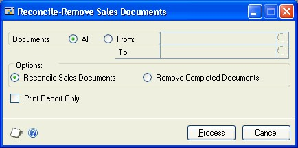

# Sales Order Processing Part 6: Utilities

This part of the sales order processing documentation contains information about removing sales history and reconciling sales information. Once you’ve determined how much historical information to retain, you can remove the information that’s no longer needed. Reconciling is the process of verifying that your unposted sales documents are accurate. This following topics are discussed:

- *Chapter 30, “Reconciling and removing sales documents,”* explains reconciliation—the process of verifying amounts on your sales documents—and how to move sales documents to history.

- *Chapter 31, “Sales history removal,”* describes how to remove account, transaction, deposit, journal, and tax history that is no longer needed.

## Chapter 30: Reconciling and removing sales documents

Use the Reconcile-Remove Sales Documents window to reconcile your sales records and remove any documents that have no remaining quantities but haven’t been moved to history.

> [!NOTE]
> Before reconciling or removing sales documents, back up all your company data. For more information about making backups, refer to the System Administrator’s Guide (Help \>\> Contents \>\> select System Administration).

This information contains the following sections:

- *Reconciling sales documents*

- *Removing completed documents*

### Reconciling sales documents

Reconcile your sales documents to verify the item quantities and totals on your sales documents. When you reconcile sales documents, the following quantities and information will be recalculated and adjusted as needed:

- Document item quantities

- Canceled item quantities

- Transferred item quantities

- Remaining item quantities

- Fulfilled item quantities for serial- and lot-numbered items

- Document subtotals

- Batch information

- Quantities linked to purchase orders

- Amount remaining

#### To reconcile sales documents

1. Open the Reconcile-Remove Sales Documents window.

    (Sales \>\> Utilities \>\> Reconcile-Remove Sales Documents)

    

2. Select a range of documents to reconcile.

3. Mark Reconcile Sales Documents.

    > [!NOTE]
    > Before you reconcile, you can print the Reconcile-Remove Sales Document Report to verify information about the document ranges you’ve entered by marking the Print Report Only option. If you mark this option, the report will be printed but the documents won’t be reconciled.

4. Choose Process to reconcile the documents. The Reconcile-Remove Sales Document Report will be printed automatically and will list the sales documents that were reconciled.

### Removing completed documents

Typically, documents with no remaining quantities are moved to history when the document is transferred, voided, or posted. Occasionally, you might need to remove sales documents that have a remaining quantity of zero and haven’t been moved to history.

For example, suppose you transfer some of the item quantities from an order to an invoice. Later, you cancel the remaining quantities on that same order. The order won’t be moved to history, even though there are no remaining quantities. You’ll need to move this document to history using the Remove Completed Documents window.

#### To remove completed documents

1. Open the Reconcile-Remove Sales Documents window.
 (Sales \>\> Utilities \>\> Reconcile-Remove Sales Documents)

2. Select a range of documents to remove.

3. Mark Remove Completed Documents.

    > [!NOTE]
    > Mark Print Report Only to print the Reconcile-Remove Sales Document Report to verify the information about the document ranges you’ve entered before you remove documents.

4. Choose Process to remove the documents. The Reconcile-Remove Sales Document Report will be printed automatically and will list the sales documents that were removed.

## Chapter 31: Sales history removal

History records provide useful information for audit purposes. If you’re keeping history records in Sales Order Processing, the records can be maintained for an unlimited number of years. For more information about keeping history records, see [Setting up Sales Order Processing default entries](sales-order-processing.md#setting-up-sales-order-processing-default-entries).

Because historical records increase the amount of hard disk space needed, you should remove history periodically to keep only the information you need. If you no longer need certain history records, you can remove all the records or a range of records. If you specify a range to remove, only the documents in the range that have been moved to history will be removed.

When you remove history, any corresponding multicurrency information will be removed, as well.
 This information contains the following sections:

- *Removing Sales Order Processing history*

- *Removing tax history*

- *Removing Intrastat history*

### Removing Sales Order Processing history

You can use the Remove Sales History window to remove the following types of Sales Order Processing history.

- **Transaction history** When you remove transaction history for invoices and returns, the transactions won’t appear on sales and salesperson reports in Sales Order Processing. If you have a sales document linked to a purchase order, the link will be removed with the document.
- **Distribution history** You can remove distribution history for posted invoices or returns. When you remove distribution history, the audit trail code, account, account description, and debit and credit amounts will be removed from Sales Order Processing.
- **Attachments history** You can remove attachments with transaction history or remove attachments from posted invoices or returns. When you remove attachments, the attachments are removed from the transactions and not removed from where they are stored. This option is available if you are using document attachments.
- **Journal history** You can remove journal history for posted invoices or returns. When you remove journal history, you won’t be able to reprint posting journals for the information you’re removing.
- **Deposit history** You can remove deposit history for orders and back orders. When you remove deposit history, detailed information about deposits received will be removed from Sales Order Processing.

When you remove history, transaction information stored in other modules, such as Bank Reconciliation, Receivables Management, and General Ledger, won’t be affected. However, you won’t be able to link to the original Sales Order Processing transaction from these modules.

> [!NOTE]
> Before removing history, back up all your company’s data. For more information about making backups, refer to the System Administrator’s Guide (Help \>\> Contents \>\> select System Administration).

#### To remove Sales Order Processing history

1. Open the Remove Sales History window.
    (Sales \>\> Utilities \>\> Remove Sales History)

    

2. Select the history type you want to remove.

3. Enter or select a range of documents to remove.

4. Choose Insert; the range restriction will be displayed in the Restrictions list. You can select another range type and insert another restriction.

    > [!NOTE]
    > You can enter only one restriction for each restriction type. For example, if you enter a restriction specifying that document numbers INV1000 through INV1010 should be removed, you can’t enter another restriction for document numbers INV1100 through INV1150. To remove multiple ranges of history, you must remove each range separately.

5. Mark the type of records you want to remove. If you’re removing Transaction history you can mark Distributions to remove distribution records at the same time.

    If you are using document attachments and want to remove attachments without removing transaction history, unmark Transaction and then mark Attachments.

6. Mark Print Report to print the Transaction Removal Report after history has been removed.

    > [!TIP]
    > You can print the Transaction Removal Report to verify the ranges you’ve entered before you remove history. Unmark your Remove selections, select Print Report, and choose Process.

7. Choose Process to begin removing history.

### Removing tax history

Use the Tax History Removal window to remove tax detail transactions. Only the tax history for the range you specify will be removed. Once tax history has been removed, the tax details in the range you’ve removed won’t be printed on tax reports.

> [!NOTE]
> Before removing history, back up your company’s accounting data. For more information on making backups in Microsoft Dynamics GP, refer to the System Administrator’s Guide (Help \>\> Contents \>\> select System Administration).

#### To remove tax history

1. Open the Tax History Removal window.
    (Administration \>\> Utilities \>\> Company \>\> Remove Tax History)

    

2. Select whether you want to remove tax detail transactions and print the Tax History Removal Report, remove the tax detail transactions, or print the Tax History Removal Report.

3. Enter or select a range of tax history to remove or print a report of.

4. Choose Insert to insert the range.

5. Choose Process to remove tax history. If Print Tax History Removal Report was marked, the Tax History Removal Report will be printed.

### Removing Intrastat history

Use the Remove Intrastat History window to remove Intrastat history records that are no longer necessary. Only the Intrastat records for the range you specify will be removed.

> [!NOTE]
> Before removing history, back up your company’s accounting data. For more information on making backups in Microsoft Dynamics GP, see the System Administrator’s Guide \>\> Contents \>\> select System Administration).

Once history has been removed, you won’t be able to print the Intrastat removal reports for the ranges of information you’ve removed.

#### To remove Intrastat history

1. Open the Remove Intrastat History window.

    (Administration \>\> Utilities \>\> Company \>\> Remove Intrastat History)

    

2. Select a range type for the historical information you want to remove. Define the beginning and the end of the range, then choose Insert to display the range.

    > [!NOTE]
    > You can enter and insert additional ranges. However, you can enter only one range for each range type. For example, if you enter a restriction specifying that history should be deleted for customer records COMPUTER0003 through GRAHAMAR0001, you can’t enter another restriction for customer IDs CONTINEN0001 through EXECUTIV0001.

3. Mark Remove Transactions, then mark Print Report to print the Intrastat removal reports for the range of customer records or vendor records you’ve specified. Print these reports to retain a permanent record of your past Intrastat records after you’ve cleared history.

    > [!NOTE]
    > You can print the Intrastat removal reports without removing history. To do so, mark only Print Report and choose OK.

4. Choose Process to remove the selected history records.

## See Also

[Sales Order Processing Part 1: Setup](sales-order-processing.md#part-1-setup)  
[Sales Order Processing Part 2: Transaction entry](sales-order-processing-part2-transaction-entry.md)  
[Sales Order Processing Part 3: Allocation, Fulfillment, and Purchasing](sales-order-processing-part3-allocation-fulfillment-purchasing.md)  
[Sales Order Processing Part 4: Transaction activity](sales-order-processing-part4-transaction-activity.md)  
[Sales Order Processing Part 5: Inquiries and reports](sales-order-processing-part5-inquiries-reports.md)  
[Glossary](glossary.md)  