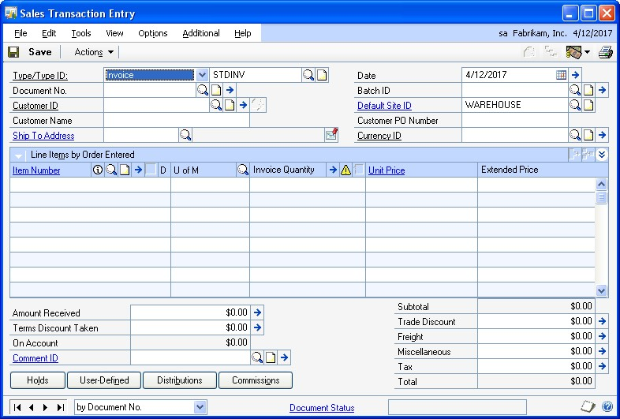
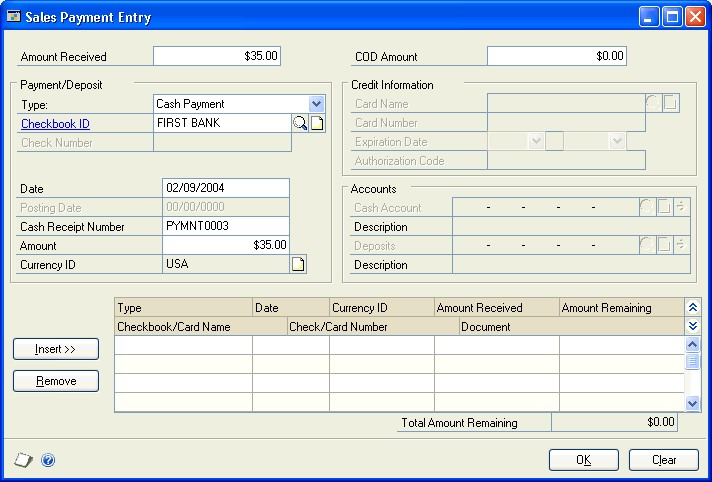

# Sales Order Processing in Dynamics GP

You can use Sales Order Processing to enter and print quotes, orders, invoices, back orders, and returns individually or in batches.

When necessary, you can enter drop-ship items on sales documents and determine how quantity shortages will be handled for individual items or for entire documents or batches.

You also can use Sales Order Processing to complete the following tasks:

- Transfer customer information from one document type to another

- Transfer item information and quantities from one document type to another

- Enter and post sales deposits

- Allocate and fulfill items on orders, fulfillment orders, and invoices

- Fulfill items separately from item allocation

If you use Purchase Order Processing, you can generate purchase orders from sales documents.

If you use Receivables Management, customer balances are updated after the sales transactions are posted.

If you use Inventory Control, item prices are calculated automatically on sales documents and inventory quantities are adjusted when the sales documents are posted.

The manual is divided into the following parts:

- *Part 1, Setup*, introduces Sales Order Processing and explains the setup of the module.

- *Part 2, Transaction entry*, explains how to enter sales documents.

- *Part 3, Allocation, fulfillment, and purchasing*, explains how inventory items are allocated and fulfilled, and how to create purchase orders from sales documents.

- *Part 4, Transaction activity*, explains how to post, print and transfer sales documents.

- *Part 5, Inquiries and reports*, explains how to use inquiries and reports to analyze your sales information.

- *Part 6, Utilities*, describes procedures you can use to reconcile sales documents or remove sales history.

## Part 1: Setup

This part of the documentation includes information that will help you set up Sales Order Processing. The setup procedures generally need to be completed once, but you can refer to this information at other times for instructions on modifying or viewing existing entries. The following topics are discussed:

- *Chapter 1, “Setup overview,”* lists the setup tasks you need to complete in other modules and describes the Sales Order Processing setup routine.

- *Chapter 2, “Module setup,”* provides instructions for setting up the Sales Order Processing module.

- *Chapter 3, “Document setup,”* provides instructions for setting up the document types—quotes, orders, fulfillment orders/invoices, back orders and returns—used in Sales Order Processing.

- *Chapter 4, “Sales fulfillment workflow setup,”* explains how to set up document statuses to assign to fulfillment orders.

- *Chapter 5, “Document ID maintenance,”* explains how to modify or delete document types.

- *Chapter 6, “Customer item and substitute item maintenance,”* explains how to create or delete item numbers for customers and substitutes.

### Chapter 1: Setup overview**

Use this information to learn about and set up Sales Order Processing. The setup procedures are organized in an order that will ensure Sales Order Processing is set up properly.

When you set up Sales Order Processing, you can open each setup window and enter information, or you can use the Setup Checklist window (Administration \>\> Setup \>\> Setup Checklist) to guide you through the setup process. See your System Setup Guide (Help \>\> Contents \>\> select Setting up the System) for more information about the Setup Checklist window.

This information is divided into the following sections:

- *Sales Order Processing document types*

- *Before you set up Sales Order Processing*

- *Customer credit limit override approval workflow*

#### Sales Order Processing document types

Use Sales Order Processing to enter, print, and post sales documents. You can transfer sales documents from one type to another and, if you’re using Purchase Order Processing, you can create purchase orders from orders and back orders. You can set up the following types of documents to use in Sales Order Processing:

- **Quote**
    A proposal for a specified sale or transaction at some point in the future for a specified price. Quotes aren‘t posted, but the information on them can be transferred to orders, invoices, or fulfillment orders.

- **Order**
    A document used when the customer has agreed to make a purchase. You can transfer sales information from a quote or back order to an order. Orders aren‘t posted but the information on them can be transferred to invoices, back orders, or fulfillment orders. Purchase orders also can be created from sales orders.

- **Back Order**
    A document used when an item quantity shortage is discovered during transaction entry. You can transfer information from orders, invoices, or fulfillment orders to back orders. Back orders aren‘t posted but the information on them can be transferred to invoices or orders when the shortage items are available. Purchase orders also can be created from back orders.

- **Fulfillment Order**
    A document used to track workflow capability when a customer has agreed to make a purchase. You can transfer sales information from a quote, back order, or order to a fulfillment order. After you’ve tracked the fulfillment order through workflow, the fulfillment order becomes an invoice. You also can transfer a fulfillment order to a back order. This document is available only if you’re using sales fulfillment workflow.

- **Invoice**
    A legally binding document that records the price and details of the transaction. You can transfer sales information from a quote, order, or back order to an invoice. Invoices are posted and the information from them can be transferred to back orders.

- **Return**
    A document used to record the return of a previously sold item. Returns are posted and can‘t be transferred to other documents.

#### Before you set up Sales Order Processing

Before setting up Sales Order Processing, you should complete the setup procedures for Receivables Management and Inventory Control, including the following tasks:

- Enter Receivables Management and Inventory Control settings

- Enter customer records, salesperson records, and sales territories

- Enter items (including price lists and vendor items)

- Set up item sites

- Enter beginning quantities for inventory items

- Set up inventory and sales posting accounts in the Posting Accounts Setup window

For more information, see the Receivables Management and Inventory Control documentation.

> [!TIP]
> Choose Administration \>\> Setup \>\> Posting \>\> Posting Accounts to open the Posting Accounts Setup window, where you can select to view Inventory or Sales accounts.

You also must complete the setup procedures for your company, currency, accounts, checkbooks, and posting options. Tax schedules and tax details also should be set up. For more information, see the System Setup instructions (Help \>\> Contents \>\> select Setting Up the System).

If you‘re using Sales Order Processing with Multicurrency Management, be sure you‘ve also set up currencies, exchange rate tables, exchange rates, access to currencies and exchange rate tables, and Multicurrency default entries. For more information about using and setting up Multicurrency Management, refer to the Multicurrency Management documentation.

If you plan to print multicurrency versions of your posting journals and reports, be sure to mark Include Multicurrency Info for the Sales series in the Posting Setup window (Administration \>\> Setup \>\> Posting \>\> Posting).

#### Customer credit limit override approval workflow

Your company can use the customer credit limit override workflow feature as part of its business controls. If you use this feature, you can define how orders, fulfillment orders, and invoices must be approved if the documents exceed the set credit limits for customers. You can define the credit limit for each customer in the Customer Maintenance Options window. The rules for approving orders, fulfillment orders, and invoices can be defined to fit your organization’s needs.

When an order, fulfillment order, or invoice is ready to be approved, approvers can be notified and the document can be approved, using Microsoft Office Outlook, Microsoft Dynamics GP, or SharePoint. When a document completes Workflow, you can print, transfer, or post the document.

Before you can use the customer credit limit override approval workflow for Sales Order Processing, you must remove the password from the Exceed Credit Limit option in the Receivables Management Setup window (Sales \>\> Setup \>\> Receivables).

### Chapter 2: Module setup

Module setup involves setting up your Sales Order Processing preferences such as default entries, tax calculation options, starting document numbers, and whether to maintain document history.

The module setup information contains the following sections:

- *Setting up Sales Order Processing default entries*

- *Setting up currency decimal places for non-inventoried items*

- *Setting up taxes and options*

- *Setting up document numbers*

- *Setting up user-defined fields*

- *Setting up process holds*

- *Selecting a pricing method*

- *Enabling extended pricing*

- *Setting up advanced picking*

#### Setting up Sales Order Processing default entries

Use the Sales Order Processing Setup window to set up preferences, default entries, the types of history to maintain, and which posting accounts to use when distributing sales amounts. You also can open additional windows to set up sales documents, taxes, default entries for purchase orders, and options to use with daily sales transactions.

**To set up Sales Order Processing default entries:**

1. Open the Sales Order Processing Setup window.

    (Sales \>\> Setup \>\> Sales Order Processing)

    

2. Specify how Sales Order Processing transactions will be tracked and displayed during transaction entry. You can select the following options.

    - **Display Item Unit Cost**
        Mark to display the unit cost of each item on the document during transaction entry. The unit cost displayed will be the current cost or the standard cost of the item, depending on the inventory valuation method assigned to each item.

        For more information about item cost, see the Inventory Control documentation.

    - **Track Voided Transactions in History**
        Mark to maintain a historical record of voided transactions. If you don‘t mark this option, voided documents will be removed after posting and won‘t be included on reports. Voided document numbers cannot be used again.

    - **Calculate Kit Price Based on Component Cost**
        If you‘re using a percent markup or percent margin pricing method and you mark this option, the current or standard cost of the kit components will be used to calculate the total cost for the kit. The percent markup or percent margin will be calculated on that cost.

    - **Display Quantity Distribution Warning**
        If you mark this option, an alert message will be displayed during transaction entry when the quantity ordered, invoiced, back ordered, or quoted hasn‘t been fully distributed. If you do not mark this option, a message won‘t be displayed.

    - **Search for New Rates During Transfer Process**
        When marked, the system will determine if a different exchange rate should be used when the document is transferred to a new document. If this option is not marked, the new document will use the same exchange rate as the document it was transferred from.

        For more information about exchange rates and transferring, see *Multicurrency and transfers* on page 209.

    - **Track Master Numbers**
        Mark to track master numbers that identify original documents and track the flow of documents. Each subsequent document created from that original document will have the same master number.

        Enter the next master number in the Next Master Number field. This field will be available only if you’ve marked Track Master Numbers.

    - **Prices Not Required in Price List**
        This option is available only if you’re using Inventory Control. Mark this option if you don‘t maintain prices for every item.

        When this option is marked and a price isn‘t found for the item during transaction entry, the price will be zero and you can enter a price. You can enter a password for this option if you want to limit the users who can enter item prices. If this option is not marked, you can’t enter items that don’t have prices in the system.

    - **Convert Functional Price**
        Mark this option if you want the functional currency price to be converted if a price can’t be found in the originating currency for an item. If a functional currency price isn‘t available, the price will be zero. This field is available only if you‘ve marked Prices Not Required in Price List.

3. Select data entry default settings.

    - **Quantity Shortage**
        Select the default option to use when you have fewer items in inventory than a customer requests.

    - **Document Date**
        Select which date to use as a default date when you open the Sales Transaction Entry window. You can use the date from the last document you entered or the User Date.

    - **Price Warning**
        Select a price warning to alert users when the default price for the item is used on a sales document instead of the default price for the customer.

        > [!NOTE]
        > This option does not apply if you’re using extended pricing.

        The price of an item on a sales document is determined by the price level for the customer in the Customer Maintenance window. If one isn‘t available, the default price level in Receivables Management Setup window is used. If a default price level is not found there, the default price level for the item will be used.

    - **Requested Ship Date**
        Select the default requested ship date for line items in the Sales Date Entry window. If you select Days After Doc. Date, enter the number of days after the document date that the items should be shipped.

4. Enter document default information, including the IDs of the site, checkbook, quote, order, fulfillment order—if you’re using sales fulfillment workflow— invoice, back order, and return you use most often. The entries you make here will appear as the default entries in the Sales Transaction Entry window.

    If you haven‘t set up quotes, orders, back orders, fulfillment orders, invoices, and returns, skip the document default entries at this time. Later, after you‘ve set up at least one type of quote, order, back order, fulfillment order, invoice, and return, you can complete these entries. For more information about setting up document types, see *Chapter 3, “Document setup.”*

5. Mark Customer or Item to specify whether the posting accounts associated with the customer or with the item should appear as the default entries during transaction entry. This option determines which Sales and Cost of Goods Sold accounts to use for a sales transaction.

6. Mark whether to maintain history for sales documents and account distributions. If you choose to maintain history, a detailed copy of the sales document will be kept after it is transferred, voided, or posted.

    For account distributions, a detailed record of transaction distributions that are posted through General Ledger will be kept. Account distribution history includes the audit trail code, account, account description, debit or credit amount, and other information about each transaction.

    If you don‘t select to maintain history, quotes, orders, and back orders will be deleted when they‘re transferred or voided. Invoices and returns will be deleted when they‘re posted.

    > [!NOTE]
    > Keeping history will increase the amount of hard disk space needed to run Microsoft Dynamics GP. Periodically, you can remove history to ensure that you‘re keeping only the records you need. For more information, see Chapter 31, “Sales history removal.”

7. Enter the number of decimal places to use when displaying and entering quantity amounts for non-inventoried items.

8. If you aren‘t using Multicurrency Management, enter the number of decimal places to use when displaying and entering currency amounts for noninventoried items.

    If you‘re using Multicurrency Management, choose the expansion button to open the Sales Non-Inventoried Currency Decimals Setup window where you can define currency decimal places for each currency to which you have access. For more information, see *Setting up currency decimal places for non-inventoried items* on page 14.

9. Choose File \>\> Print or the printer icon button to print the Sales Order Processing Setup List. You also can print the report using the Sales Setup Reports window.

10. Choose OK to save your setup options.

#### Setting up currency decimal places for noninventoried items

If you are using Multicurrency Management, you can use the Sales Non-Inventoried Currency Decimals Setup window to define currency decimal places for noninventoried items for each currency that your company uses. Amounts will appear in the format defined in this window whenever you enter a non-inventoried item for a specific currency.

If you aren‘t using Multicurrency Management, use the Sales Order Processing Setup window to define the number of decimal places when displaying currency amounts for non-inventoried items.

You can change the non-inventoried currency decimal places for a currency at any time. Changing the decimal place setting for a currency won’t change the decimal place settings of non-inventoried items already entered on existing sales documents. The settings will be applied to new items added to existing transactions or to new transactions.

**To set up currency decimal places for non-inventoried items:**

1. Open the Sales Non-Inventoried Currency Decimals Setup window.

    (Sales \>\> Setup \>\> Sales Order Processing \>\> Currency expansion button)

    

2. Enter or select the number of decimal places to use when displaying currency amounts for non-inventoried items.

3. Continue defining decimal places for all the currencies displayed in the window.

4. Choose File \>\> Print to print the Sales Non-Inventoried Currency Decimals Setup List.

5. Choose OK to close the window.

#### Setting up taxes and options

You can use the Sales Order Processing Setup Options window to specify a method for calculating taxes, preferences for generating purchase orders (if you’re using Purchase Order Processing), and to set up other sales options.

You can further restrict each option by assigning a password to it. If the option is marked but no password is entered, anyone who has access to the related windows can use the option.

If you’re using advanced picking, you can select to sort individual picking tickets by bin sequence. If you’re using advanced picking and multiple bins, you can select to print default bins or all available bins when a default bin isn’t found.

**To set up taxes and options:**

1. Open the Sales Order Processing Setup Options window.

    (Sales \>\> Setup \>\> Sales Order Processing \>\> Options button)

    

2. Mark the type of tax calculation to use on sales documents.

    - **Advanced**
        Mark Advanced to specify a tax schedule to use for noninventoried items and freight and miscellaneous charges. For inventory items, the tax schedule you chose for each item in the Item Maintenance window will be used.

    - **Single Schedule**
        Mark Single Schedule to specify one tax schedule for all items on all documents. Items on each sales document will be taxed using the tax details in the schedule you specify here, even if the item is nontaxable or if the customer is tax exempt. Taxes won‘t be calculated on freight or miscellaneous charges.

        For more information about calculating and distributing sales tax amounts, see *Chapter 18, “Sales Order Processing taxes.”*

3. If you selected to use advanced tax calculations, enter or select tax options for non-inventoried items, freight, and miscellaneous charges. You can change the tax schedules used for a transaction in the Sales Tax Schedule Entry window during transaction entry. The tax options are:

    - **Taxable**
        The default tax details for the customer or site will be compared to the tax details in the tax schedule you specify here.

    - **Nontaxable**
        No taxes will be calculated.

    - **Base on customers**
        The tax details from the customer tax schedule or the site tax schedule will be the default, depending on whether the shipping method is delivery or pickup.

4. Select a default sorting option for picking tickets. Your selection determines how information is printed on picking tickets. The sorting options are:

    - **Standard Pick Ticket**
        Items will be printed on the picking ticket in the order that they were entered in the Sales Transaction Entry window.

    - **Bin Sequence**
        Items will be printed on the picking ticket sorted by bins and then items.

5. If you’re using multiple bins, select when to print bins on blank individual picking tickets. The options are:

    - **Always**
        Default bin information and additional available bin information always will be printed on the picking ticket.

    - **When Default Bin can’t be Found**
        Additional available bin information will be printed on the picking ticket only when a default bin can’t be found for an item.

6. If you’re using Purchase Order Processing, select a default site to use when generating purchase orders from sales orders and back orders. Your selection determines how purchase orders and purchase order line items are created. The choices are:

    - **Don’t Combine Items with Different Sites on Same PO**
        If you select this option, items with different sites on a sales order document will be listed on separate purchase orders. For example, on a sales order document, ITEMA is assigned to the NORTH site and ITEMB is assigned the SOUTH site. When you generate the purchase orders, ITEMA and ITEMB would be listed on two separate purchase orders.

    - **Combine Items with Different Sites on Same PO** If you select this option, items with different sites on a sales order document will be listed on the same purchase order if they have the same vendor. For example, on a sales order document, ITEMA is assigned to the NORTH site, ITEMB is assigned to the SOUTH site and ITEMA and ITEMB have the same primary vendor. When you generate the purchase order, ITEMA and ITEMB would be listed as two line items on a single purchase order.

    - **Use a Single Site for All POs**
        If you select Use a Single Site for All POs, you can enter the site where all items will be received in the Site ID field. After the quantities are received, you must transfer the quantities from the receiving site to the sites listed on the sales order document.

7. If you’re using Purchase Order Processing, select a default required date. This date is set for each line item and is the date by which you must receive the item on a purchase order. This date can be viewed or changed in the Purchasing Item Detail Entry window.

    If you select Days Prior to Requested Ship Date, enter the number of days you want to receive the purchase order line items before the requested ship date of the sales line items. For example, if you enter 2 as the number of days before the requested ship date and a sales item has a requested ship date of April 29, the required date of the purchase order line item will be April 27. The user date will be used as the required date when the required date could be calculated in the past.

8. If you’re using Purchase Order Processing, select the default unit of measure that will be used when purchase orders are generated from orders and back orders. You can use the U of M from the sales line item or use the item‘s default purchasing U of M.

9. If you’re using Purchase Order Processing, mark Combine Similar Line Items Into a Single PO Line to combine an item listed several times on a purchase order into one purchase order line item. If this option isn‘t marked, an item could be listed on the purchase order multiple times—once for each sales document that includes a shortage for the item and is linked to the purchase order.

    For example, suppose Order11 has a quantity to purchase of 2 for ITEMA for the NORTH Site and Order15 has a quantity to purchase of 3 for ITEMA for the NORTH Site. If you mark this option, ITEMA will be listed once on a purchase order for a quantity of 5. If you don‘t mark this option, ITEMA will be listed twice on the purchase order.

10. If you’re using Purchase Order Processing, you can combine drop ship items onto one purchase order, rather than creating separate purchase orders for the same item. There are two options for drop ship items:

    - **Combine Different Ship-To Addresses into one PO**
        Mark this option to create one purchase order from one sales order with multiple lines that contains different ship-to addresses. This is useful when you have a sales order for one company and you’re drop shipping to multiple locations. When used in conjunction with the Combine Similar Items into a Single PO Line option, similar items with the same ship to address are combined into one line. If this option is not marked, individual purchase orders are created for each item.

    For example, ORDER01 contains ITEM A with a quantity of 2 to the SHIPPING 1 ship-to address. Line 2 is for ITEM A with a quantity of 3 to the SHIPPING 2 ship-to address, and you are drop shipping all items. One purchase order with two lines will be created. The shipping address will print with the corresponding lines.

    - **Combine Different Ship-To Addresses from Different Sales Orders into one PO**
        Mark to create one purchase order from multiple sales orders when drop shipping to multiple shipping addresses. This is useful when you have several sales orders and you’re drop shipping the same item to multiple locations, only one purchase order is necessary to purchase the correct quantity of the items. When used in conjunction with the Combine Similar Items into a Single PO Line option, the item quantities with the same shipping address are summed onto one line on the PO.

        For example, with all the options marked, you have ORDER01 for ITEM A with a quantity of 2 to SHIPPING 1 ship-to address, ORDER02 is for ITEM A with a quantity of 1 to SHIPPING 2 ship-to address, and ORDER03 is for ITEM A with a quantity of 2 to SHIPPING 1 ship-to address, and you are drop shipping all items. On the purchase order, you’ll see Line 1 for ITEM A with a quantity of 4, and Line 2 for ITEM A with a quantity of 1. The shipping address will print with the corresponding lines.

        Mark sales options. You can further restrict each option by assigning a password to it.

    - **Allow Markdown**
        Mark to allow users to enter a currency amount or percentage by which the extended price of individual line items will be reduced using the Sales Markdown Entry window.

    - **Auto-Assign Lot Numbers**
        Mark to automatically assign lot numbers to items. Lot numbers can be assigned by receipt date or by expiration date, depending on how you selected to automatically assign lot numbers in the Inventory Control Setup window. If lot numbers are assigned by receipt date, the assignment is based on the valuation method when the items are entered or fulfilled on a sales document. If lot numbers are assigned by expiration date, the lot numbers nearing expiration are used first. Lot numbers without an expiration date aren’t assigned. Lot numbers can be changed after they‘ve been assigned and before posting using the Sales Lot Number Entry window.

        When automatically assigning lot numbers, expired lots aren’t used even if you marked the Other Transactions option in the Inventory Control Setup window.

    -**Auto-Assign Serial Numbers**
        Mark to automatically assign serial numbers to items according to their valuation method when the items are entered or fulfilled on a sales document. Serial numbers can be changed after they‘ve been assigned and before posting using the Sales Serial Number Entry window.

    - **Enter Non-Inventoried Items**
        Mark to allow users to enter noninventoried items in the Sales Transaction Entry window or Sales Item Detail Entry window without first creating records for those items. If you don‘t mark this option, only items that exist in your inventory can be sold.

    - **Allow Price Below Cost**
        Mark to allow users to enter prices in the Sales Transaction Entry window that are lower than the current cost of an item. If you don‘t mark this option, prices below the current cost won't be allowed.

    - **Override Prices**
        Mark to allow users to override the default unit price and the extended price that is automatically calculated when you enter items in the Sales Transaction Entry window or Sales Item Detail Entry window. If you don‘t mark this option, you can‘t change either amount.

    - **Override Quantity Shortages**
        Mark to allow users to sell more items than are currently available in inventory. If you mark this option and a quantity entered in the Sales Transaction Entry window is greater than the quantity available, the Sales Quantity Shortage Options window will open and you can select to override the quantity available. If you don‘t mark this option, only the quantity available can be sold.

    - **Override Price Levels**
        Mark this option to allow users to override price levels for customers or items on a sales document. If you don‘t mark Override Price Levels, you can‘t change the price levels. This could cause problems if no prices are set up in the price list for the price level.

        For example, suppose you select a customer that is assigned to a retail price level and you only have prices set up in the price list for the wholesale price level. You can‘t complete the transaction because you can‘t change the price level on the transaction for the customer.

        > [!NOTE]
        > This option does not apply if you’re using extended pricing.

    - **Allow Deletion of PO Commitments**
        Mark to allows users to break the commitment between a sales document and a purchase order in Sales Order Processing. If this option isn‘t marked, you can only break the commitment in Purchase Order Processing.

    - **Allow Sale of Discontinued Items**
        Unmark if you don’t want to sell discontinued items. If this option is marked, you can sell discontinued items.

11. Choose File \>\> Print to print the Sales Order Processing Setup List.

12. Choose OK.

#### Setting up document numbers

Use the Sales Document Numbers Setup window to enter document numbers, codes, and printing formats for quotes, orders, fulfillment orders, back orders, invoices, and returns.

**To set up document numbers:**

1. Open the Sales Document Numbers Setup window.

    (Sales \>\> Setup \>\> Sales Order Processing \>\> Numbers button)

    

2. Enter or accept the default document codes, next numbers, and printing formats for quotes, orders, fulfillment orders/invoices, returns, and back orders.

    - **Code**
        The code is a three-character prefix that will be printed on posting journals and edit lists to identify the type of document entered.

    - **Next Number**
        These numbers will be used as the document numbers in the Sales Transaction Entry window if the document ID you‘re using has not been set up to use its own numbering system. Each time you enter a transaction, the number will increase by one to the next available number.

        For example, assume you set up three types of invoice IDs—retail, wholesale, and catalog—and you enter an invoice next number for the retail invoice ID in the Sales Invoice Setup window. Invoices using the wholesale and catalog invoice IDs will use the next number from the Sales Document Numbers Setup window, but invoices based on the retail invoice ID will be assigned the number you entered in the Sales Invoice Setup window. For more information about document IDs, see *Chapter 3, “Document setup.”*

        > [!IMPORTANT]
        > Be sure to enter a next number that is large enough to accommodate your business volume. For example, if you enter ORD001 as the next order number, you‘ll be able to enter up to 999 orders. If you enter ORD00001, you‘ll be able to enter 99,999 orders.

    - **Format**
        Select the default format for each type of document—blank paper, short form, long form, or other form. You can change the format before printing the document.

3. Enter or accept the default document codes, next numbers, and formats, and the document numbers you want to use for packing slips and picking tickets.

    - If you select Document, the document numbers from the orders or invoices will be used.

    - If you select Packing Slip or Picking Ticket, the next number you‘ve entered here for packing slips and picking tickets will be used.

    > [!NOTE]
    > Typically, businesses use the same document numbers on packing slips and picking tickets that were used on the orders or invoices from which they were created. For this reason, the same document numbers will be used unless you specify a different next number here.

4.  Choose OK.

#### Setting up user-defined fields

Use the Sales User-Defined Fields Setup window to enter names for up to ten userdefined fields to further identify quotes, orders, back orders, invoices, and returns. Later, when you enter sales transactions, the names will appear in the Sales UserDefined Fields Entry window, where you can enter information that is unique to the transaction. You can set up the following types of user-defined fields.

- **List** Use list fields to predefine options to track information that is specific to your business. For example, to track the origin of orders, you could name the list Order Origin and enter Fax, Phone, and Mail as values for the list. When you enter transactions, Order Origin will appear as a field in the Sales User-Defined Fields Entry window and you can specify where the order originated or include additional values.

- **Date** Use date fields to record additional dates that affect your sales documents. For instance, if you want to track the date that an installation was complete, enter Install Date in a date field.

- **Text** Use text fields to record additional information about the transactions you enter in the Sales Transaction Entry window. For example, to track special ID numbers for shipped equipment, you can enter Shipping ID in the text field.

- **Prospect Maintenance** Use Prospect Maintenance to track additional information about your prospective customers. For example, to track which prospects are good, very good, and excellent, enter Lead Status in a prospect maintenance field. You can enter information in these fields in the Sales Prospect Maintenance window.

- **Customer/Item Maintenance** Use Customer/Item Maintenance to track additional information about your customer item numbers. For example, to track the distributor with the fastest delivery time for an item, enter Quickest Distributor in a customer/item maintenance field. You can enter information in these fields in the Customer Item Maintenance window.

**To set up user-defined fields:**

1. Open the Sales User-Defined Fields Setup window.

    (Sales \>\> Setup \>\> Sales Order Processing \>\> User-Defined button)

    

2. Enter names for as many as three list fields. Choose the expansion button next to each this window to enter values for each list.

3. Enter names for one or two date fields to record additional dates that affect your sales documents.

4. Enter names for as many as five text fields to track additional information about your customers.

5. Enter names for one or two prospect maintenance text fields.

6. Enter names for as many as five customer/item maintenance text fields.

7. Choose File \>\> Print to print the Sales User-Defined Fields Setup List.

8. Choose OK to save your changes.

#### Setting up process holds

You can use the Sales Process Holds Setup window to create process holds to assign to your sales documents. Process holds are user-defined restrictions that control the processing of sales documents at different stages of the sales cycle. For example, you can set up process holds to:

- Require a manager‘s approval before a return can be posted.

- Prevent posting of documents until a manager approves the transactions.

- Restrict the printing of invoices until addresses have been verified.

- Stop the order fulfillment process because a part has been recalled by the manufacturer.

- Prevent the transferring of a quote to an order if the customer is over its credit limit.

- Stop a document status from advancing to the next tracked status.

For more information about using process holds, see *Assigning process holds to a document* on page 195.

You can set up passwords to further restrict processing. The user must enter the password to remove holds from documents. If you don‘t use passwords, you can set up a process hold to remind the user to complete a task before processing a sales document. Once the task is completed, the user must remove the hold from the document before processing occurs. You can apply process holds to any document type.

**To set up process holds:**

1. Open the Sales Process Holds Setup window. (Sales \>\> Setup \>\> Process Holds)

    

2. Enter a name and description for a process hold. You can assign a password to remove this process hold.

3. Mark any of the processes you want to restrict with this process hold.

    - **Transferring Documents** Mark to stop the transfer of documents from one document type to another until the hold is removed. (This option has no effect on return documents since they cannot be transferred to other document types.) **Posting** Mark to stop the posting of invoices or returns until the hold is removed. If you have orders that contain a deposit amount, the deposit amount will be posted when the document is saved, regardless of whether a posting hold has been assigned.

    - **Fulfillment Advancement** Mark to stop the advancement of fulfillment order document statuses until the hold is removed.

    - **Fulfilling Documents** Mark to stop the fulfillment of orders or invoices until the hold is removed.

    - **Printing Documents** Mark to stop the printing of documents until the hold is removed. If you restrict the printing of an order, invoice, or fulfillment order, the picking ticket and packing slip won‘t be printed either. This will eliminate the possibility of shipping items for documents that are on hold.

4. Choose Save to save the information you’ve entered.

    To review the entries and selections you’ve made for a specific process hold, print the Sales Process Holds Setup Report by choosing File \>\> Print or the printer icon button while the Sales Process Holds Setup window is displayed.

    To review the entries for all process holds, print the Sales Process Holds Setup Report (Sales \>\> Reports \>\> Setup).

#### Selecting a pricing method

You can use either standard or extended pricing. In both pricing systems, you can set up different pricing structures—price levels in standard pricing, or price sheets and price books in extended pricing. You can create different pricing for different currencies and different units of measure. Either system can be used to create pricing structures with quantity breaks. However, you must choose one pricing system and use it exclusively; you can’t use both systems simultaneously.

|Pricing method  |Description|
|---------|---------|
|**Standard pricing** |Standard pricing might be a better option for your company if any of the following conditions are true:  - You’re using Invoicing. (Extended pricing doesn’t work with Invoicing.) - You want price lists to be updated automatically when the current cost or standard cost of an item changes. - You have a fairly simple pricing structure, and don’t need additional tiers.  For more information about standard pricing structures, see the Inventory Control documentation.|
|**Extended pricing**|Extended pricing might be a better option for your company if any of the following conditions are true: - You want to use date-specific pricing. - You want to create promotions for special pricing, for value-off pricing, or for free items with the purchase of another item. - You have a complex pricing structure: you want to use more tiers or you want to apply multiple promotions simultaneously.  For more information about extended pricing, see the Inventory Control documentation.|

#### Enabling extended pricing

Use the Enable Extended Pricing window to activate or inactivate extended pricing functionality.

You can use either standard or extended pricing. You must choose one pricing system and use it exclusively; you can’t use both systems simultaneously. For more information on selecting a pricing method, see *Selecting a pricing method* on page 23. For more information on how each pricing method works, see the Inventory Control documentation.

**To enable extended pricing:**

1. Open the Enable Extended Pricing window.

    (Sales \>\> Setup \>\> Extended Pricing)

    

2. Select whether to use standard or extended pricing. Standard pricing is the default method.

3. Choose OK to save your changes and close the window.

#### Setting up advanced picking

If you’re using advanced picking, use the Advanced Picking Setup window to assign a picking ticket printing option to a selected site and items that are assigned to that site. For example, if a site has small items that can be picked in bulk, you could select Bulk for that site. If a site has items that are picked only individually, you could select Individual for that site. And, if a site has items that are picked both individually and in bulk, you could select Both for that site.

If you select Both for a site, you can use the Item Print Option Preview window or the Item Quantities Maintenance window to change the item print option for selected items within the site. For more information, refer to the Inventory Control documentation.

You also can indicate the character of the bin number to create a page break on. The character string—up to and including the selected character—is sorted alphabetically. Characters after the selected character will not be considered in the sort.

**To set up advanced picking:**

1. Open the Advanced Picking Setup window.

    (Sales \>\> Setup \>\> Advanced Picking Setup)

    

2. Enter or select a site ID.

3. Select a general print option for the site.

    - **Individual** When the selected site is included on a fulfillment order, order, invoice, or return, individual picking tickets will be printed. Items assigned to the selected site will be printed only on individual picking tickets.

    - **Bulk** When the selected site is included on a fulfillment order/invoice, bulk picking tickets will be printed. Items assigned to the selected site will be printed only on bulk picking tickets. You can print bulk picking tickets for fulfillment orders only.

    - **Both** When the selected site is included on a fulfillment order, order, invoice, or return, you can select to print individual picking tickets or bulk picking tickets. Items assigned to the selected site will be printed on both individual and bulk picking tickets.

4. Select the bin character to indicate a page break on the picking ticket.

    For example, suppose that a warehouse names bins by warehouse, aisle, rack, and shelf. Bin A123 reflects warehouse A, aisle 1, rack 2, and shelf 3, and the following bins are included on a picking ticket: A116, A123, A127, A224, A226, and A267. To print a separate picking ticket for each rack, you would select the third character of the bin number for the site.

    The following table lists the bins in alphabetical order with the page that will be displayed on the picking tickets.

    | **Page number** | **Bin numbers** |
    |-----------------|-----------------|
    | Page 1          | A116            |   
    | Page 2          | A123, A127      |
    | Page 3          | A224, A226      |
    | Page 4          | A267            |

5. Choose Save.

### Chapter 3: Document setup

You can set up and customize an unlimited number of quote, order, back order, fulfillment order, invoice, and return document IDs and specify different options for each document ID. You must set up at least one document ID for each document type that you’ll use in your organization.

You can modify a document ID at any time. The changes will affect future transactions that use the document ID but won’t change the information for existing transactions. There are several settings that can’t be changed if there are unposted documents using the document ID. For more information about modifying document IDs, see *Chapter 5, “Document ID maintenance.”*

The document setup information contains the following sections:

- *Setting up quotes*

- *Setting up orders*

- *Setting up fulfillment orders or invoices*

- *Setting up back orders*

- *Setting up invoices*

- *Setting up returns*

- *Assigning process holds to sales document IDs*

#### Setting up quotes

Use the Sales Quote Setup window to set up and customize an unlimited number of quote IDs, which you can use for different situations. For example, if you need separate quote IDs for your wholesale, retail, and catalog customers, you can set up separate quote IDs for each of these customer groups. When you enter a quote in the Sales Transaction Entry window, you can select the type of quote from the list of quote IDs you’ve set up.

You can set up a quote ID to expire in a certain number of days. The number you enter will be added to the quote date in the Sales Date Entry window to determine the date the quote will expire. After a quote expires, it can’t be transferred to an order or to an invoice, and it will remain in the system until it is voided or deleted.

You can choose whether to use a quote ID for repeating quotes. A repeating quote is a quote that is saved in a batch and used more than once. When you transfer a quote to an order or invoice, the quote will remain in the batch so it can be used again. Using repeating quotes saves time if you frequently print quotes with the same line item information for the same customer.

**To set up quotes:**

1. Open the Sales Quote Setup window.

    (Sales \>\> Setup \>\> Sales Order Processing \>\> Sales Document Setup button \>\> select the Quote option)

    

2. Enter a Quote ID and, if you want this quote ID to have a unique document numbering system, enter a Quote ID Next Number.

    You can set up a different next number for each quote ID. When you enter a quote in the Sales Transaction Entry window, the next number for the quote ID is used as the document number. If you don’t enter a next number for the quote ID, the next quote number from the Sales Document Numbers Setup window is used.

3. Enter the days to expire. If you don’t want the quote to expire, leave the value at zero.

4. You can enter a Comment ID. The comment ID you enter will appear as the default comment ID in the Sales Transaction Entry window, where you can change it, if necessary.

5. You can select the format to use when you print a quote with this quote ID— blank paper, short form, long form, or other form. You can change the format before printing the document.

6. Mark the options to transfer this quote ID to orders, invoices, or both, and select an ID for each document. The order and invoice IDs you enter will appear in the Sales Document Detail Entry window as the default document type, but can be changed before transferring the quote.

    If you’re using sales fulfillment workflow, you can transfer this quote ID to fulfillment orders and select a fulfillment order ID.

7. If you marked a transfer option, you can specify whether item quantities will appear in the Quantity to Order or Quantity to Invoice fields on the quote in the Sales Transaction Entry window.

    - **To Order** Item quantities will appear as the quantity to order in the Sales Transaction Entry window when you use this quote ID. This selection is the best choice if you transfer a quote to an order more often than you transfer a quote to an invoice.

    - **To Invoice** Item quantities will appear as the quantity to invoice in the Sales Transaction Entry window when you use this quote ID.

    - **None** You will need to enter item quantities manually in the Sales Transaction Entry window.

8. You can mark options to use this quote ID for prospective customers and to allow repeating quotes.

    - **Use Prospects** Mark to allow users to enter documents with this quote ID for prospective customers.

    - **Allow Repeating Documents** Mark to allow users to set up repeating quotes with this ID. You can assign repeating information, such as the number of times to repeat and days to increment, in the Sales Document Detail Entry window.

9. Mark the options for entering documents using this quote ID. You can enter a password to restrict a user from using the option during transaction entry. If an option is marked but no password is entered, anyone who has access to the window can use the option.

    You can set up these options differently for each quote ID.

    - **Delete Documents** Mark to allow users to delete quotes. If you delete a quote, all the information associated with the quote will be removed. If unmarked, you can’t delete quotes in the Sales Transaction Entry window.

    - **Edit Printed Documents** Mark to allow users to make changes to quotes after they’ve been printed.

    - **Override Document Numbers** Mark to allow users to change the document number that is assigned in the Sales Transaction Entry window. If unmarked, the next available quote number will be assigned and you can’t change it.

    - **Void Documents** Mark to allow users to void quotes after they’ve been entered. If marked and you’ve selected to track voided transaction history in the Sales Order Processing Setup window, voided quotes will be saved in history. If unmarked, you can’t void quotes in the Sales Transaction Entry window.

10. Choose **Holds** and assign process holds to the quote ID to stop processing on particular document IDs or documents. For more information about assigning process holds, see *Assigning process holds to sales document IDs* on page 42.

11. Choose Save to save the quote information you’ve entered.

 To review the entries and selections you’ve made for a specific quote ID, print the Sales Quote Setup List by choosing File \>\> Print or the printer button while the Sales Quote Setup window is displayed.

To review the entries for all quote IDs, print the Sales Quote Setup List (Reports \>\> Sales \>\> Setup).

#### Setting up orders

Use the Sales Order Setup window to set up and customize an unlimited number of order IDs, which you can use for different situations. For example, if you need separate order IDs for your wholesale, retail, and catalog order customers, you can set up separate order IDs for each of these customer groups. When you enter an order in the Sales Transaction Entry window, you’ll select the type of order from the list of order IDs you’ve set up.

You can choose whether to use an order ID for repeating orders. A repeating order is an order that is saved in a batch and used more than once. When you transfer an order to a back order or invoice, the order will remain in the batch so it can be used again. Using repeating orders saves time if you frequently print orders with the same line item information for the same customer.

**To set up orders:**

1. Open the Sales Order Setup window.

    (Sales \>\> Setup \>\> Sales Order Processing \>\> Sales Document Setup button \>\> select the Order button)

    

2. Enter an Order ID and, if you want this order ID to have a unique document numbering system, enter an Order ID Next Number.

    You can set up a different next number for each order ID. When you enter an order in the Sales Transaction Entry window, the next number for the order ID is used as the document number. If you don’t enter a next number for the order ID, the next order number from the Sales Document Numbers Setup window is used.

3. You can enter a Comment ID. The comment ID you enter will appear as the default comment ID in the Sales Transaction Entry window, where you can change it, if necessary.

4. You can select the format to use when you print an order with this order ID— blank paper, short form, long form, or other form. You can change the format before printing the document.

5. Mark Transfer Order to Back Order to allow transferring this order ID to back orders, and enter a back order ID. If you don’t mark this option, you can’t enter back order quantities on an order using this order ID.

    The back order ID you enter will appear in the Sales Document Detail Entry window as the default document type, but can be changed before transferring the order.

6. Enter the Invoice ID to use when transferring orders to invoices.

    If you’re using sales fulfillment workflow, enter the fulfillment order ID to use when transferring orders to fulfillment orders.

    The invoice ID you enter will appear in the Sales Document Detail Entry window as the default document type, but can be changed before transferring the order.

7. You can mark to allow repeating documents. You might want to do this if, for example, you have a customer who orders the same items on a regular basis.

    If you mark this option, the Frequency and Times to Repeat fields in the Sales Document Detail Entry window will be available and you can enter repeating information as you enter orders.

    > [!NOTE]
    > You can select Allow Repeating Documents only if you’re allocating by Document/ Batch or None.

8. Mark the Use Separate Fulfillment Process option to use a separate fulfillment process to verify the items that are picked to fill the order. If this option is not marked, the fulfillment is done when the item is allocated. For more information about allocating and fulfilling, see *Chapter 19, “Allocating item quantities.”*

9. You can mark Allow all Back Ordered Items to Print on Invoice to print backordered items on the invoice created from an order.

10. You can enter or select a Credit Limit Hold ID to apply to the order ID to stop processing a sales document that will result in a customer’s receivables balance exceeding their credit limit.

11. You can mark the Override Quantity to Invoice with Quantity Fulfilled option to display the same quantity in the Quantity to Invoice field in the Sales Transaction Entry window as the Quantity Fulfilled field in the Sales Order Fulfillment window. This ensures that the quantity invoiced equals the quantity fulfilled.

    You can set up additional options differently for each order ID.

    - **Enable Quantity to Back Order in Sales Order Fulfillment** Mark this option to enter or change information in the Qty to Back Order field in the Sales Order Fulfillment window.

    - **Enable Quantity Canceled in Sales Order Fulfillment** Mark this option to enter or change information in the Qty Canceled field in the Sales Order Fulfillment window.

    For example, suppose you create an order for widgets and enter 10 in the Original Quantity field, 10 in the Qty Ready to Fulfill field, and 0 in the Qty Fulfilled field. However, when you fulfill the order, there are only 8 widgets available to fill the order, so you enter 8 in the Qty Fulfilled field. The Qty Ready to Fulfill field also will display 8. The remaining quantity will be back ordered or canceled, depending on the option you select here and in the Customer Maintenance Options window. For more information, refer to the Receivables Management documentation.

12. Select a method for allocating item quantities—the process of reserving inventory items so the available quantity is reduced by the quantity ordered.

    - **Line Item** Item quantities are allocated as you enter them on an order. If this option is marked, you’ll be required to make quantity shortage decisions as each item is entered.

        If marked and you’re not using a separate fulfillment process, item quantities will be fulfilled as well.

    - **Document/Batch** Entire orders or batches of orders are allocated using the Sales Allocation/Fulfillment Options window. This option allows for faster data entry because items won’t be checked for quantity shortages as they’re entered on sales documents.

    - **None** Item quantities are allocated when you transfer an order to an invoice using the allocation options for the invoice ID. You won’t be able to allocate item quantities for orders.

13. Mark the options for entering documents using this order ID. You can enter a password to restrict a user from using the option during transaction entry. If an option is marked but a password hasn’t been entered, anyone who has access to the window can use the option.

    You can set up these options differently for each order ID.

    - **Allow Invoicing of Unfulfilled or Partially Fulfilled Orders** Mark to allow users to transfer an order to an invoice when the order is partially fulfilled. If unmarked, only completely allocated or fulfilled orders will be transferred to invoices.

    - **Delete Documents** Mark to allow users to delete orders after they’ve been saved. If you delete an order, all the information associated with the order will be erased. If unmarked, you can’t delete orders in the Sales Transaction Entry window.

    - **Edit Printed Documents** Mark to allow users to make changes to orders after they’ve been printed.

    - **Override Document Numbers** Mark to allow users to change the document number that is assigned in the Sales Transaction Entry window. If unmarked, the next available order number will be assigned and you can’t change it.

    - **Void Documents** Mark to allow users to void orders after they’ve been entered. If marked and you’ve selected to track voided transaction history in the Sales Order Processing Setup window, voided orders will be saved in history. If unmarked, you can’t void orders in the Sales Transaction Entry window.

14. Choose Holds to assign process holds to the order ID to stop processing. For more information about assigning process holds, see *Assigning process holds to sales document IDs* on page 42.

15. Choose Save to save the order information you’ve entered.

    To review the entries and selections you’ve made for a specific order ID, print the Sales Order Setup List by choosing File \>\> Print or the printer button while the Sales Order Setup window is displayed.

    To review the entries for all order IDs, print the Sales Order Setup List (Reports \>\> Sales \>\> Setup).

#### Setting up fulfillment orders or invoices

If you’re using sales fulfillment workflow, use the Sales Fulfillment Order/Invoice Setup window to set up an unlimited number of fulfillment order IDs and invoice IDs, which you can use for different situations. For example, you can set up separate fulfillment order IDs or invoice IDs for wholesale, retail, and catalog customers. When you enter a fulfillment order or an invoice in the Sales Transaction Entry window, you can select the type of fulfillment order or invoice from the list of fulfillment order IDs and invoice IDs you’ve set up.

If you’re not using sales fulfillment workflow, the window name will be Sales Invoice Setup. Refer to *Setting up invoices* on page 38 for more information.

**To set up fulfillment orders or invoices:**

1. Open the Sales Fulfillment Order/Invoice Setup window.

    (Sales \>\> Setup \>\> Sales Order Processing \>\> Sales Document Setup button \>\> select the Fulfillment Order/Invoice option)

    

2. Enter a fulfillment order/invoice ID. If the ID should have a unique document numbering system, enter a Fulfillment Order/Invoice ID Next Number.

    You can set up a different next number for each fulfillment order/invoice ID. When you enter a fulfillment order or invoice in the Sales Transaction Entry window, the next number for the fulfillment order/invoice ID is used as the document number. If you don’t enter a next number for the fulfillment order/ invoice ID, the next fulfillment order number or invoice number from the Sales Document Numbers Setup window is used.

3. You can enter a comment ID. The comment ID you enter will appear as the default comment ID in the Sales Transaction Entry window, where you can change it, if necessary.

4. You can select the format to use when you print a fulfillment order or an invoice with this fulfillment order/invoice ID. You can use blank paper, short form, long form, or other form, and you can change the format before printing the document.

5. Select the method used to allocate item quantities—the process of reserving inventory items so the available quantity is reduced by the quantity billed.

    - **Line Item** Select this method to allocate item quantities as you enter them on a fulfillment order or an invoice. If you select this method, you’ll be required to make quantity shortage decisions as each item is entered.

        If you’ve selected to allocate by line item and you’re not using a separate fulfillment process, item quantities will be fulfilled, as well.

    - **Document/Batch** Select this method to allocate entire fulfillment orders, invoices, batches of fulfillment orders, or batches of invoices using the Sales Allocation/Fulfillment Options window. This option allows for faster data entry because items won’t be checked for quantity shortages as they’re entered on sales documents.

6. Mark Transfer Fulfillment Order/Invoice to Back Order to be able to transfer this fulfillment order or invoice to a back order and enter the back order ID that will be used.

    The back order ID you enter will appear in the Sales Document Detail Entry window as the default document type, but can be changed before transferring the fulfillment order or invoice.

7. Mark the Use Separate Fulfillment Process option if item quantities should not be fulfilled during allocation. If this option is not marked, the fulfillment is completed when the item is allocated. For more information about allocating and fulfilling items, see *Chapter 19, “Allocating item quantities.”*

8. You can enter or select a Credit Limit Hold ID to apply to the order ID to stop processing on documents that exceed the set credit limit for the customer.

9. Mark the Enable Fulfillment Workflow option to track document statuses. You can enter or select a fulfillment workflow hold ID. For more information, refer to *Setting up fulfillment workflow for sales* on page 46.

10. If you marked the Enable Fulfillment Workflow option, you can mark other options.

    This table describes each option that you can mark.

    | **Option**                                               | **Description**    |
    |----------------------------------------------------------|---------------------|
    | Update Actual Ship Date During Confirm Ship              | If you marked the Enable Fulfillment Workflow option, you can mark this option to display the date that you confirmed shipment of the items. The date that you chose Confirm \>\> Ship in the Sales Transaction Entry window will be displayed in the Date Shipped field in the Sales Transaction Entry window. |
    | Override Billed Quantity with Quantity Fulfilled         | You can mark this option to display the same quantity in the Quantity Billed field in the Sales Transaction Entry window as the Quantity Fulfilled field in the Sales Order Fulfillment window. This option is marked automatically when the Enable Fulfillment Workflow option is marked. |
    | Enable Quantity Canceled in Sales Order Fulfillment      | You can mark this option to enter or change information in the Qty Canceled field in the Sales Order Fulfillment window. Refer to *Setting up fulfillment orders or invoices* on page 33 for more information.    |
    | Enable Quantity to Back Order in Sales Order Fulfillment | You can mark this option to enter or change information in the Qty to Back Order field in the Sales Order Fulfillment window. This option is available only when you’ve selected the Transfer Order to Back Order option in the Sales Order Setup window or the Transfer Fulfillment Order/Invoice to Back Order option in the Sales Fulfillment Order/Invoice Setup window. Refer to *Setting up fulfillment orders or invoices* on page 33 for more information. |
    | Update Invoice Date on First Print                       | If you marked the Enable Fulfillment Workflow option, you can mark this option to display the date that the invoice is printed in the Invoice Date field in the Sales Date Entry window. This option is marked automatically when sales fulfillment workflow is registered.  |

11. If you marked the Transfer Fulfillment Order/Invoice to Back Order option, you can mark the Enable Quantity to Back Order in Sales Order Fulfillment option to enter or change information in the Qty to Back Order field in the Sales Order Fulfillment window.

12. Mark options for documents using this fulfillment order ID or invoice ID. You can enter a password to restrict a user from using the option during transaction entry. If an option is marked but no password is entered, anyone who has access to the window can use the option.

    You can mark options for any or all of the fulfillment order IDs or invoice IDs.

    - **Delete Documents** Mark to allow users to delete fulfillment orders or invoices after they’ve been saved. If you delete a fulfillment order or an invoice, all the information associated with the fulfillment order or invoice will be deleted. If unmarked, you can’t delete fulfillment orders or invoices in the Sales Transaction Entry window.

    - **Edit Printed Documents** Mark to allow users to make changes to fulfillment orders or invoices after they’ve been printed.

    - **Override Document Numbers** Mark to allow users to change the document number that is assigned in the Sales Transaction Entry window. If unmarked, the next available fulfillment order number or invoice number will be assigned and you can’t change it.

    - **Void Invoice Documents** Mark to allow users to void invoices after they’ve been entered. If marked and you’ve selected to track voided transaction history in the Sales Order Processing Setup window, voided invoices will be saved in history. If unmarked, you can’t void invoices in the Sales Transaction Entry window.

13. Choose Holds to assign process holds to the fulfillment order ID or invoice ID. For more information about assigning process holds, see *Assigning process holds to sales document IDs* on page 42.

14. Choose Workflow to select the document statuses to track. For more information, see *Setting up fulfillment workflow for sales* on page 46.

15. Choose Save to save the fulfillment order or invoice information you’ve entered.

To review the entries and selections you’ve made for a specific fulfillment order ID or invoice ID, choose File \>\> Print in the Sales Fulfillment Order/Invoice Setup window to print the Sales Invoice Setup List.

To review the entries for all fulfillment order IDs or invoice IDs, print the Sales Invoice Setup List (Sales \>\> Reports \>\> Setup).

#### Setting up back orders

Use the Sales Back Order Setup window to set up and customize an unlimited number of back order IDs, which you can use for different situations. For example, you can set up separate back order IDs for retail sales and wholesale sales. When you enter a back order in the Sales Transaction Entry window, you can select the back order ID from the list of back order IDs you’ve set up.

**To set up back orders:**

1. Open the Sales Back Order Setup window.

    (Sales \>\> Setup \>\> Sales Order Processing \>\> Sales Document Setup button \>\> select the Back Order option)

    

2. Enter a Back Order ID and, if you want this order ID to have a unique document numbering system, enter a Back Order ID Next Number.

    You can set up a different next number for each back order ID. When you enter a back order in the Sales Transaction Entry window, the next number for the back order ID is used as the document number. If you don’t enter a next number for the back order ID, the next back order number from the Sales Document Numbers Setup window is used.

3. You can enter a Comment ID. The comment ID you enter will appear as the default comment ID in the Sales Transaction Entry window, where you can change it, if necessary.

4. You can select the format to use when you print a back order with this back order ID—blank paper, short form, long form, or other form. You can change the format before printing the document.

5. Mark the options to transfer this back order ID to orders, invoices, or both, and select an ID for each document.

    If you’re using sales fulfillment workflow, you can transfer this back order ID to fulfillment orders and select a fulfillment order ID.

    The order and invoice IDs you enter will appear in the Sales Document Detail Entry window as the default document type, but can be changed before transferring the back order.

6. If you marked a transfer option, you can specify whether item quantities will appear in the Quantity to Order or Quantity to Invoice fields on the back order in the Sales Transaction Entry window.

    - **To Order** Item quantities will appear as the quantity to order in the Sales Transaction Entry window when you use this back order ID. This selection is the best choice if you transfer a back order to an order more often than you transfer a back order to an invoice.

    - **To Invoice** Item quantities will appear as the quantity to invoice in the Sales Transaction Entry window when you use this back order ID.

    - **None** You will need to enter item quantities manually in the Sales Transaction Entry window.

7. Mark the options for entering documents using this back order ID. You can enter a password to restrict a user from using the option during transaction entry. If an option is marked but no password is entered, anyone who has access to the window can use the option.

    You can set up these options differently for each back order ID.

    - **Delete Documents** Mark to allow users to delete back orders after they’ve been saved. If you delete a back order, all the information associated with the back order will be erased. If unmarked, you can’t delete back orders in the Sales Transaction Entry window.

    - **Edit Printed Documents** Mark to allow users to make changes to back orders after they’ve been printed.

    - **Override Document Numbers** Mark to allow users to change the document number that is assigned in the Sales Transaction Entry window. If unmarked, the next available back order number will be assigned and you can’t change it.

    - **Void Documents** Mark to allow users to void back orders after they’ve been entered. If marked and you’ve selected to track voided transaction history, voided back orders will be saved in history. If unmarked, you can’t void back orders in the Sales Transaction Entry window.

8. Choose Holds to assign process holds to the back order ID to stop processing. For more information about assigning process holds, see *Assigning process holds to sales document IDs* on page 42.

9. Choose Save to save the back order information you’ve entered.

To review the entries and selections you’ve made for a specific back order ID, print the Sales Back Order Setup List by choosing File \>\> Print or the printer button while the Sales Back Order Setup window is displayed.

To review the entries for all back order IDs, print the Sales Back Order Setup List (Sales \>\> Reports \>\> Setup).

#### Setting up invoices

Use the Sales Invoice Setup window to set up and customize an unlimited number of invoice IDs, which you can use for different situations. For example, you can set up separate invoice IDs for wholesale, retail, and catalog customers. When you enter an invoice in the Sales Transaction Entry window, you can select the type of invoice from the list of invoice IDs you’ve set up.

If you’re using sales fulfillment workflow, the window name will be Sales Fulfillment Order/Invoice Setup. Refer to *Setting up fulfillment orders or invoices* on page 33 for more information.

**To set up invoices:**

1. Open the Sales Invoice Setup window.

    (Sales \>\> Setup \>\> Sales Order Processing \>\> Sales Document Setup button \>\> select the Invoice option)

    

2. Enter an Invoice ID and, if you want this invoice ID to have a unique document numbering system, enter an Invoice ID Next Number.

    You can set up a different next number for each invoice ID. When you enter an invoice in the Sales Transaction Entry window, the next number for the invoice ID is used as the document number. If you don’t enter a next number for the invoice ID, the next invoice number from the Sales Document Numbers Setup window is used.

3. You can enter a Comment ID. The comment ID you enter will appear as the default comment ID in the Sales Transaction Entry window, where you can change it, if necessary.

4. You can select the format to use when you print an invoice with this invoice ID—blank paper, short form, long form, or other form. You can change the format before printing the document.

5. Mark Transfer Invoice to Back Order if you want to be able to transfer this invoice to a back order and enter the back order ID that will be used.

    The back order ID you enter will appear in the Sales Document Detail Entry window as the default document type, but can be changed before transferring the invoice.

6. Mark the Use Separate Fulfillment Process option if you don’t want item quantities to be fulfilled during allocation. If this option is not marked, the fulfillment is done when the item is allocated. For more information about allocating and fulfilling, see *Chapter 19, “Allocating item quantities.”*

7. You can enter or select a Credit Limit Hold ID to place a hold on documents that exceed the set credit limit for the customer.

8. You can mark other options for the invoice ID.

    This table describes each option that you can mark.

    | **Option**                                          | **Description**   |
    |----------------------------------------------------------|-------------------|
    | Override Billed Quantity with Quantity Fulfilled    | Mark this option to display the same quantity in the Quantity to Invoice field as the Quantity Fulfilled field. |
    | Enable Quantity Canceled in Sales Order Fulfillment | Mark this option to enter or change information in the Qty Canceled field in the Sales Order Fulfillment window.      |
    | Enable Quantity to Back Order in Sales Order Fulfillment | Mark this option to enter or change information in the Qty to Back Order field in the Sales Order Fulfillment window. |

9. Select the method used to allocate item quantities—the process of reserving inventory items so the available quantity is reduced by the quantity billed.

    - **Line Item** Item quantities are allocated as you enter them on an invoice. If this option is marked, you’ll be required to make quantity shortage decisions as each item is entered.

        If you’ve selected to allocate by line item and you’re not using a separate fulfillment process, item quantities will be fulfilled as well.

    - **Document/Batch** Entire invoices or batches of invoices are allocated using the Sales Allocation/Fulfillment Options window. This option allows for faster data entry because items won’t be checked for quantity shortages as they’re entered on sales documents.

10. Mark the options for entering documents using this invoice ID. You can enter a password to restrict a user from using the option during transaction entry. If an option is marked but no password is entered, anyone who has access to the window can use the option.

    You can set up these options differently for each invoice ID.

    - **Delete Documents** Mark to allow users to delete invoices after they’ve been saved. If you delete an invoice, all the information associated with the invoice will be erased. If unmarked, you can’t delete invoices in the Sales Transaction Entry window.

    - **Edit Printed Documents** Mark to allow users to make changes to invoices after they’ve been printed.

    - **Override Document Numbers** Mark to allow users to change the document number that is assigned in the Sales Transaction Entry window. If unmarked, the next available invoice number will be assigned and you can’t change it.

    - **Void Invoice Documents** Mark to allow users to void invoices after they’ve been entered. If marked and you’ve selected to track voided transaction history in the Sales Order Processing Setup window, voided invoices will be saved in history. If unmarked, you can’t void invoices in the Sales Transaction Entry window.

11. Choose Holds to assign process holds to the invoice ID to stop processing. For more information about assigning process holds, see *Assigning process holds to sales document IDs* on page 42.

12. Choose Save to save the invoice information you’ve entered.

To review the entries and selections you’ve made for a specific invoice ID, print the Sales Invoice Setup List by choosing File \>\> Print or the printer button while the Sales Invoice Setup window is displayed.

To review the entries for all invoice IDs, print the Sales Invoice Setup List (Sales \>\> Reports \>\> Setup).

#### Setting up returns

Use the Sales Return Setup window to set up and customize an unlimited number of return IDs, which you can use for different situations. For example, if you use different types of returns for your wholesale, retail, and catalog customers, you can set up a separate return ID for each type of customer. When you enter a return in the Sales Transaction Entry window, you can select the type of return from the list of return IDs you’ve set up.

**To set up returns:**

1. Open the Sales Return Setup window.

    (Sales \>\> Setup \>\> Sales Order Processing \>\> Sales Document Setup button \>\> select the Return option)

    

2. Enter a Return ID and, if you want this return ID to have a unique document numbering system, enter a Return ID Next Number.

    You can set up a different next number for each return ID. When you enter a return in the Sales Transaction Entry window, the next number for the return ID is used as the document number. If you don’t enter a next number for the return ID, the next return number from the Sales Document Numbers Setup window is used.

3. You can enter a comment ID. The comment ID you enter will appear as the default comment ID in the Sales Transaction Entry window, where you can change it, if necessary.

4. You can select the format to use when you print a return with this return ID— blank paper, short form, long form, or other form. You can change the format before printing the document.

5. Mark the Use next number from Invoice ID option if you want your return and invoice documents to use the same sequential numbering system, and enter the invoice ID.

    If an Invoice Next Number isn’t entered in the Sales Invoice Setup window, the next number specified for invoices in the Sales Document Numbers Setup window will be used.

6. Mark the options for entering documents using this return ID. You can enter a password to restrict a user from using the option during transaction entry. If an option is marked but no password is entered, anyone who has access to the window can use the option.

    You can set up these options differently for each return ID.

    - **Delete Documents** Mark to allow users to delete returns after they’ve been saved. If you delete a return, all the information associated with the return will be erased. If unmarked, you can’t delete returns in the Sales Transaction Entry window.

    - **Edit Printed Documents** Mark to allow users to make changes to returns after they’ve been printed.

    - **Override Document Numbers** Mark to allow users to change the document number that is assigned in the Sales Transaction Entry window. If unmarked, the next available return number will be assigned and you can’t change it.

    - **Override Item Unit Cost for Returns** Mark to allow users to change the unit cost of a returned item. The default unit cost for returned items will be the item’s current cost. If unmarked, you can’t change the cost for returned items.

    - **Void Documents** Mark to allow users to void returns after they’ve been entered. If marked and you’ve also selected to track voided transaction history in the Sales Order Processing Setup window, voided returns will be saved in history. If unmarked, you can’t void returns in the Sales Transaction Entry window.

7. Choose Holds to assign process holds to the return ID to stop processing. For more information about assigning process holds, see *Assigning process holds to sales document IDs* on page 42.

8. Choose Save to save the return information you’ve entered.

To review the entries and selections you’ve made for a specific return ID, print the Sales Return Setup List by choosing File \>\> Print or the printer button while the Sales Return Setup window is displayed.

To review the entries for all return IDs, print the Sales Return Setup List (Sales \>\> Reports \>\> Setup).

#### Assigning process holds to sales document IDs

Process holds are user-defined restrictions that control the processing of sales documents at different stages of the sales cycle. You can use process holds to restrict the transfer, fulfillment, printing, or posting of documents. You can manually assign process holds to individual documents or automatically assign them to documents based on their document ID. If you assign process holds to a document ID, the process holds will be assigned to each document that uses the document ID.

For example, a manager’s approval might be required before a return is posted. You can set up a process hold called Manager Approval, assign a password and apply it to all return documents. Once the process hold is applied, you must enter the password before the return can be posted.

> [!NOTE]
> You can’t assign process holds until you’ve set them up using the Sales Process Holds Setup window. For more information, see Setting up process holds on page 22.

For more information about assigning a process hold to an individual document, see *Assigning process holds to a document* on page 195.

**To assign process holds to sales document IDs:**

1. Open the Sales Process Holds Assignment window.

    (Sales \>\> Setup \>\> Sales Order Processing \>\> Sales Document Setup button \>\> select the Quote, Order, Back Order, Invoice, or Return option \>\> Holds button)

    

2. Select a hold from the Available Process Holds list and choose Insert.

3. Continue this process until all process holds you want to apply are displayed in the Selected Process Holds list.

4. Choose OK to save changes and close the window.

### Chapter 4: Sales fulfillment workflow setup

If you’re using sales fulfillment workflow, you must set up document statuses to assign to fulfillment orders. These document statuses indicate typical document processes, such as printing picking tickets, picking out goods from inventory, printing packing slips, packing and shipping goods, and sending invoices to customers. To use sales fulfillment workflow, use the Sales Fulfillment Order/ Invoice Setup window to activate workflow for sales.

You can set up picking instruction IDs that you can assign to a customer or an item and then print on a picking ticket.

This information is divided into the following sections:

- *Sales fulfillment workflow overview*

- *Setting up fulfillment workflow for sales*

- *Changing fulfillment workflow document status descriptions*

- *Setting up picking instruction IDs*

#### Sales fulfillment workflow overview

Workflow refers to the automation of a business process, during which tasks are completed and documents are passed from one participant to another to complete the next task in the process. You can implement workflow capability into your sales cycle by using a type of sales document called a fulfillment order. You can create a fulfillment order from a quote, back order, or order, and you can create an invoice from a fulfillment order. For more information about fulfillment orders, refer to *Understanding fulfillment orders* on page 87.

You can assign up to six workflow document statuses to a fulfillment order. You can use these statuses to track the document processes, such as printing a picking ticket, retrieving items from inventory, printing a packing slip, packing and shipping the goods, and sending an invoice to the customer. You must mark Status 6 and at least one other status to track workflow information.

Each workflow status that you use must have a description. The following descriptions are provided, but you can change them.

-   1 = Ready to Print Picking Ticket

-   2 = Unconfirmed Pick

-   3 = Confirm Pick/Ready to Pack

-   4 = Unconfirmed Pack

-   5 = Shipped

-   6 = Ready to Print/Post

You can advance the status for one document at a time in the Sales Transaction Entry window by completing the following appropriate tasks.

| **Status** | **Action to advance to the next tracked status**   |
|------------|----------------------------------------------------|
| 1          | Print a picking ticket for the fulfillment order that includes all line items—except drop-ship—that are not fully canceled or back ordered. You can print the picking ticket from one of the following windows: the Sales Transaction Entry window, the Sales Order Fulfillment window, the Print Sales Documents window, or the Sales Document Print Options window. |
| 2          | Choose Confirm \>\> Pick in the Sales Transaction Entry window, the Sales Order Fulfillment window, or the Sales Bulk Confirmation window. |
| 3          | Print a packing slip for the fulfillment order in the Sales Transaction Entry window, the Sales Order Fulfillment window, the Print Sales Documents window, or the Sales Document Print Options window.  |
| 4          | Choose Confirm \>\> Pack in the Sales Transaction Entry window, the Sales Order Fulfillment window, or the Sales Bulk Confirmation window.  |
| 5          | Choose Confirm \>\> Ship in the Sales Transaction Entry window or the Sales Order Fulfillment window. |

For example, if you’re tracking all six document statuses and you’ve printed the picking ticket for the items on a fulfillment order, the current document status is 2. To advance the document status to Status 3, you can choose Confirm \>\>Pick in the Sales Transaction Entry window.

You also can advance the status of one or more documents in the Sales Bulk Confirmation window. For more information, refer to *Advancing the document status of one or more fulfillment orders* on page 194.

#### Setting up fulfillment workflow for sales

If you’re using sales fulfillment workflow, use the Sales Fulfillment Order/Invoice

Setup window to activate workflow for sales. Use the Sales Fulfillment Document Workflow Setup window to select the workflow statuses to track for a fulfillment order/invoice type ID with the Enable Fulfillment Workflow option marked. You must mark Status 6 and at least one other status to track workflow information. For more information, refer to *Sales fulfillment workflow overview* on page 45.

**To set up fulfillment workflow for sales:**

1. Open the Sales Fulfillment Order/Invoice Setup window.

    (Sales \>\> Setup \>\> Sales Order Processing \>\> Sales Document Setup button \>\> select the Fulfillment Order/Invoice option)

2. Enter or select a fulfillment order ID/invoice ID for the workflow you’re setting up.

3. Mark the Enable Fulfillment Workflow option.

4. Choose Workflow to open the Sales Fulfillment Document Workflow Setup window.

    

5. To exclude a document status from the workflow process, unmark the Active option for the status. To change the status descriptions, refer to *Changing fulfillment workflow document status descriptions* on page 47.

6. Choose OK in the Sales Fulfillment Document Workflow Setup window. Choose Save in the Sales Fulfillment Order/Invoice Setup window.

#### Changing fulfillment workflow document status descriptions

If you’re using sales fulfillment workflow, use the Sales Fulfillment Workflow Setup window to change the descriptions of document statuses displayed in the Sales Fulfillment Document Workflow Setup window. For more information, refer to *Setting up fulfillment workflow for sales* on page 46.

The workflow process that’s used to move from one document status to another won’t change. For example, if your company uses the term “dispatch” rather than the term “ship”, you could change the description for Status 5 to Dispatched in the Sales Fulfillment Workflow Setup window. However, to advance the status of a document to status 6, you need to select Confirm \>\> Ship in the Sales Transaction Entry window, the Sales Order Fulfillment window, or the Bulk Confirmation window.

**To change fulfillment workflow document status descriptions:**

1. Open the Sales Fulfillment Workflow Setup window.

    (Sales \>\> Setup \>\> Fulfillment Workflow Setup)

    

2. You can select the description text and change it.

3. Choose OK to save your changes and close the window.

#### Setting up picking instruction IDs

If you’re using advanced picking, use the Picking Instruction Maintenance window to set up instruction IDs and enter picking instructions. Picking instructions can include information such as the sequence that an item should be picked or that a forklift is required to pick an item.

You can assign the instruction IDs to a customer record and item record in the Picking Instruction Preview window. When you print a picking ticket that includes the customer ID and item ID, and you marked the Print Picking Instructions option in the Print Sales Documents window or the Sales Document Print Options window, the instructions also will be printed.

**To set up picking instruction IDs:**

1. Open the Picking Instruction Maintenance window. (Sales \>\> Cards \>\> Picking Instructions)

    

2. Enter an ID to describe the picking instructions you’re creating.

3. In the Instructions field, enter the picking instructions.

    For example, to specify that the item should be picked in a specific sequence, you could enter “Pick this item first-in, first-out (FIFO) order.” Picking instruction for a specific customer could be “Pick blue-handled paint brushes only.”

4 Choose Save to save the picking instructions you’ve entered.

### Chapter 5: Document ID maintenance

After you’ve set up a quote, order, fulfillment order, back order, invoice, or return ID in Sales Order Processing, you can revise it as your needs change. You can also delete a document ID if you no longer need it.

The information is divided into the following sections:

- *Modifying a sales document ID*

- *Deleting a sales document ID*

- *Removing process holds assigned to a sales document ID*

#### Modifying a sales document ID

You can change most existing document ID settings at any time. The changes will affect future transactions that use the document ID but won’t change the information in existing transactions.

The following table lists the settings that can’t be changed if there are unposted documents for a document ID. These settings will be dimmed until you transfer, post, void, or delete the documents.

| **Document type** | **Settings**                |
|-------------------|-----------------------------|
| Quote             | Use Prospects               |
| Order             | Allow Repeating Documents   |
| Invoice           | Allocate By                 |
| Fulfillment Order | Enable Fulfillment Workflow |
<!-- Something wrong here-->
>   Allow Repeating Documents

>   Allocate By

>   Use Separate Fulfillment Process

>   Use Separate Fulfillment Process

**To modify a sales document ID:**

1. Open the setup window for the document type.

    (Sales\>\> Setup \>\> Sales Order Processing \>\> Sales Document Setup button \>\> select the Quote, Order, Back Order, Fulfillment Order/Invoice, or Return option)

    

2. Select the document ID you want to modify and make changes as needed.

3. Choose Save. The changes will affect new documents that use this document ID.

#### Deleting a sales document ID

A document ID can be deleted if there are no unposted documents that use the document ID. Posted, transferred, voided, or deleted documents that use the deleted document ID won’t be affected.

**To delete a sales document ID:**

1. Open the setup window for the document type.

    (Sales \>\> Setup \>\> Sales Order Processing \>\> Sales Document Setup button \>\> select the Quote, Order, Back Order, Fulfillment Order/Invoice, or Return option)

2. Select the document ID you want to delete.

3. Choose Delete.

#### Removing process holds assigned to a sales document ID

Use the Sales Process Holds Assignments window to remove process holds assigned to specific document IDs. Process holds are user-defined restrictions that control the processing of sales documents at different stages of the sales cycle. Removing a process hold will affect future transactions that use the document ID but won’t change holds on existing transactions.

For information about setting up process holds, see *Setting up process holds* on page 22. For more information about removing a process hold from an individual document, see *Removing process holds from a document* on page 197*.

**To remove process holds assigned to a sales document ID:**

1. Open the Sales Process Holds Assignment window.

    (Sales \>\> Setup \>\> Sales Order Processing \>\> Sales Document Setup button \>\> select the Quote, Order, Back Order, Fulfillment Order/Invoice, or Return option \>\> Holds button)

    

2. Select a process hold from the Selected Process Holds list and choose Remove.

    Choose Remove All if you want to remove all the process holds assigned to the document ID.

3. Continue this process to remove additional process holds.

4. Choose OK to save your changes.

### Chapter 6: Customer item and substitute item maintenance

You can set up customer item numbers and substitute item numbers and delete them when they’ve expired. You can set up substitute item numbers for customers only when you’re using sales fulfillment workflow.

The information is divided into the following sections:

- *Setting up customer item numbers and substitute item numbers*

- *Removing customer/item substitute items*

#### Setting up customer item numbers and substitute item numbers

Use the Customer Item Maintenance window to set up customer item numbers, substitute item numbers for customers, and user-defined information.

Some customers use different names for items than your company uses. The name that the customer uses is a customer item. You can set up customer item numbers to make entering orders easier. For example, suppose the customer calls an item a USB/PS2 Connector, but the item in your inventory is a PS2/USB Connector. Enter USB/PS2 Connector here. When you enter an order for the customer and type USB/ PS2 Connector in the Item Number field, the appropriate inventory item number will be displayed in place of the customer item number.

You also can use this window to set up substitute item numbers to sell an item in place of another item. For example, suppose a specific keyboard is on sale, but your inventory is sold out before the sale is over. You can substitute another keyboard rather than back ordering the keyboard that is on sale.

**To set up customer item numbers and substitute item numbers:**

1. Open the Customer Item Maintenance window. (Sales \>\> Cards \>\> Customer Items)

    

2. Enter or select a customer and an item number.

3. Enter the item name that the customer uses. When you create a sales order and enter the customer item, the inventory item number will be displayed.

4. You can enter a customer item description, short name, and generic name.

5. You can enter additional information in the text fields.

6. To assign a substitute item, you can enter or select an item to substitute for the item displayed in the Item Number field.

7. You can enter a date range for when the substitute item is effective. This date also can be used to remove customer/item substitute records in the Remove Customer/Item Substitutes window.

8. Choose Save.

#### Removing customer/item substitute items

Use the Remove Customer/Item Substitutes window to remove customer/item substitute records with expiration dates equal to or earlier than the date you enter. For example, suppose you enter the date June 23, 2005. All customer/item substitute records with a date of June 23, 2005 or earlier in the Substitute Item’s Effective Date Range From field in the Customer Item Maintenance window will be removed.

**To remove customer/item substitute items:**

1. Open the Remove Customer/Item Substitutes window. (Sales \>\> Utilities \>\> Remove Substitute Items)

    

2. Enter the date to remove customer/item substitute records that expired on or earlier than the date.

3. Choose Process. The Customer/Item Substitutes Removed report will be printed.

## Part 2: Transaction entry

This part of the documentation explains how to enter sales documents and sales batches. The data entry windows were designed to resemble actual sales documents, with customer, line item, tax, and total information. The following topics are discussed:

- *Chapter 7, “Item information,”* describes item tracking and pricing related to Sales Order Processing.

- *Chapter 8, “Multicurrency transactions,”* explains the multicurrency features in Sales Order Processing.

- *Chapter 9, “Batches,”* explains how to use batches to group sales documents for transferring or posting.

- *Chapter 10, “Quotes,”* explains how to enter quotes—including repeating quotes.

- *Chapter 11, “Orders,”* explains how to enter orders—including repeating orders.

- *Chapter 12, “Fulfillment orders and invoices,”* explains how to enter fulfillment orders,

- *Chapter 13, “Invoices,”* explains how to enter invoices.

- *Chapter 14, “Back orders,”* explains how to enter back orders.

- *Chapter 15, “Returns,”* explains how to enter returns and how to use return quantity types.

- *Chapter 16, “Transaction detail entry,”* describes how to enter detailed information about a document, customer, line item, or other element of a transaction.

- *Chapter 17, “Payments and deposits,”* contains information on entering payments or deposits received for a document.

- Chapter 18, “Sales Order Processing taxes,”* explains how sales tax is calculated, modified, and distributed in Sales Order Processing.

### Chapter 7: Item information

Use this information to learn more about handling items in Sales Order Processing. This information is divided into the following sections:

- *Drop-ship transactions*

- *Standard pricing calculations*

- *Extended pricing calculations*

- *Unit cost*

- *Multiple bins overview*

- *Non-inventoried items*

- *Adding items*

- *Serial- or lot-numbered items*

- *Kit items*

- *Assigning instruction IDs to customer and item records*

- *Available to promise overview*

#### Drop-ship transactions

Drop-ship transactions are for items that are shipped from your vendor directly to the customer. The item isn’t received into or sold from your inventory.

- To mark all line items on a sales document as drop-ship, choose Options \>\> Drop Ship Item in the Sales Transaction Entry window before entering items. When this option is marked, items on the sales document will be marked as drop-ship as they are entered.

- To mark an individual line item as drop-ship, mark the drop-ship box next to the item number in the Sales Transaction Entry window or the Sales Item Detail Entry window. Kit items can’t be drop-shipped.

> [!NOTE]
> To change the shipping address for a single line item, choose the Ship to Address ID lookup button in the Sales Transaction Entry window or the Sales Item Detail Entry window and select a new ship-to address ID. The changes will apply only to the selected line item. If you enter a new line item, the ship-to address ID will come from the previously entered item.

You can’t enter a return in Sales Order Processing for a drop-ship item. If a customer returns an item, enter a credit memo in Receivables Management to reduce the customer balance and a credit memo in Payables Management to reduce the balance you owe the vendor.

You can create a purchase order in Purchase Order Processing automatically for drop-ship items on an order or back order. There are options in the Sales Order Processing Setup window for combining items on a drop ship order based on the ship-to address. For more information about creating a purchase order, see *Chapter 21, “New purchase orders.”* For more information about drop ship setup options, see *Chapter 2, “Module setup.”*

#### Standard pricing calculations

If you’re using standard pricing and entering an inventoried item in the Sales Transaction Entry window, the unit price*—*the price at which each item is being sold—will be calculated using the information entered for the item in the Item Price List Maintenance window.

The price for an item is determined by price levels. The system will first check the price level selected on the customer card. If a price level hasn’t been assigned to the customer, the price level from the Receivables Management Setup window is used. If there isn’t a price level set up for the customer or for Receivables Management, the default price level for the item is used.

When you enter an item, the price from the item price list is determined by the price level and the unit of measure selected on the sales document for the item. If a price hasn’t been set up for the price level, the default price level for the item will be used to determine the price. You can view the price level used for the item in the Sales Item Detail Entry window.

Depending on how Sales Order Processing is set up, you may be able to change the unit price on the document or enter a unit price that is below cost. For more information, see *Chapter 2, “Module setup.”*

For information on selecting and activating a pricing method, see *Selecting a pricing method* on page 23 and *Enabling extended pricing* on page 24. You can also find more information in the Inventory Control documentation.

#### Extended pricing calculations

If you are using extended pricing, when you create an order or other sales transaction for a customer, the following process is used to select the price for each item on the transaction. First, the system searches for item-specific pricing information, beginning in price sheets assigned directly to the customer (which must be active and include the current date), followed by price sheets in the price book assigned to the customer, and then the base price book.

If no item-specific pricing is found, the system searches for a price group that includes the item, beginning in price sheets assigned directly to the customer, followed by price sheets in the customer’s price book, and finally the base price book.

If an adjusted value-off or percent-of-list price is found, the rest of the pricing structure is searched for a list price to apply the discount to. For example, if there’s a value-off price in a price sheet assigned to the customer, the customer’s price book and the base price book are searched for a list price.

It is possible for the final price to be the result of two adjustments applied to the base price. For example, a customer sheet might give 2% off the customer price book price, which is itself 5% off the base price. If multiple promotions are applied, they are applied in the order they are discovered: first the promotions from the first step of the search, then from the second step, and so on.

For information on selecting and activating a pricing method, see *Selecting a pricing method* on page 23 and *Enabling extended pricing* on page 24. For more information on setting up and using extended pricing, see the Inventory Control documentation.

#### Unit cost

If Sales Order Processing was set up to display unit costs, the unit cost will be displayed in the Sales Transaction Entry window for each sales inventory type item. The unit cost will not be displayed for items that are assigned the type of service, flat fee, or miscellaneous charge.

The unit cost is the current cost or the standard cost of the item, depending on the inventory valuation method. The following table shows the default cost that appears as the Unit Cost for each valuation method.

| **Valuation method** | **Unit cost displayed** |
|----------------------|-------------------------|
| FIFO perpetual       | Current cost            |
| LIFO perpetual       | Current cost            |
| Average perpetual    | Current cost            |
| FIFO periodic        | Standard cost           |
| LIFO periodic        | Standard cost           |

The cost displayed might not be the cost used to adjust inventory and cost of goods sold when the document is posted; this will depend on the valuation method used.

| **Valuation method** | **Unit cost used in posting**         |
|----------------------|---------------------------------------|
| FIFO perpetual       | Actual cost based on valuation method |
| LIFO perpetual       | Actual cost based on valuation method |
| Average perpetual    | Current cost                          |
| FIFO periodic        | Standard cost                         |
| LIFO periodic        | Standard cost                         |

For the Average Perpetual valuation method, the current cost represents the average cost of the item and is updated whenever the item quantity is increased.

If you enter a return, the default entry for the unit cost of a line item is the current cost for the item from the Item Maintenance window. If returns are set up to allow overriding item cost, you can change the unit cost of the item, which is the cost used to return the item to inventory.

#### Multiple bins overview

Use multiple bins to add another level of detail to item quantity tracking. Besides tracking items within inventory sites, with multiple bins you can track item quantities in bins at each site. Bin quantities are processed and displayed in the item’s base unit of measure.

> [!NOTE]
> You can set up bin information when multiple bins functionality has been installed and registered. However, you must also enable this feature in Inventory Control before you can use bins to track items. For more information on enabling multiple bins, see the Inventory Control documentation.

Default bins for transaction types at each site can be identified for use in transactions. For example, a default bin could be created for sales order transactions at your warehouse site. Default bins can also be identified for a particular item and transaction type at a site. For example, if you always use Bin A when selling a certain item from your main site, you can set up Bin A as the default sales order bin for the item at the main site. Microsoft Dynamics GP automatically creates item-sitebin relationships the first time a bin is used for a transaction.

When you enter a transaction, the default bin for the transaction type at the itemsite or the site is used automatically. If there isn’t a default bin at the item-site or at the site, you will be required to enter a bin. If the site’s default bin is used, an item-site-bin record is created automatically. If you delete the line or document after the item-site-bin record is automatically created, that item-site-bin relationship is not deleted.

If serial or lot numbers are assigned to an item on a transaction, the bins for the selected serial or lot numbers will be assigned to the transaction automatically.

For more information on setting up and using multiple bins, see the Inventory Control documentation.

#### Non-inventoried items

You can set up Sales Order Processing to allow entering items that don’t exist in your inventory records.

When you enter a non-inventoried item you must enter the item description, unit price, and unit cost. The item won’t be tracked in inventory, but it will appear on Sales Order Processing analysis and history reports.

The following default accounts are used for non-inventoried items.

| **Account**                               | **Source**    |
|-------------------------------------------|---------------|
| Inventory                                 | The account assigned to non-inventoried items for the Sales series in the Posting Account Setup window.|
| Returned, In Use, In Service, and Damaged | The account assigned to non-inventoried items for the Sales series in the Posting Account Setup window. |
| Cost of Goods Sold                        | The account assigned to the customer, if you are using posting accounts from the customer.   |
| Sales                                     | The account assigned to the customer, if you are using posting accounts from the customer.  |
| Accounts Receivable                       | The customer card. If no account is assigned to the customer, the system uses the account from the Sales series in the Posting Account Setup window. |
| Markdown                                  | The Inventory series in the Posting Account Setup window.   |

The account from the Inventory series in the Posting Account Setup window, if you are not using posting accounts from the customer.

The account from the Inventory series in the Posting Account Setup window, if you are not using posting accounts from the customer.

#### Adding items

If you enter an item number that doesn’t exist in inventory, you can select Options \>\> Add Item in the Sales Transaction Entry window to be prompted to either add the item to your inventory or to choose a different item. Selecting Add Item can help prevent data entry errors that inadvertently create non-inventoried items. You will be able to use this option only if Sales Order Processing is set up to allow entering non-inventoried items.

If you select Add Item and you enter an item that isn’t in your inventory, a message will be displayed and you’ll have the option to add the item. If you choose Add in the message window, the Item Maintenance window will open and you can enter the item information. Choose Cancel in the message window to delete the item number and enter a different one.

Add Item will remain marked as long as the Sales Transaction Entry window is open. If you close the window and open it again, you must select Add Item again.

#### Serial- or lot-numbered items

If an item is tracked by serial or lot numbers, you must identify the specific item or items being sold, and you must assign the serial or lot number before you ship the item.

Serial and lot numbers may be automatically assigned to items, depending on how Sales Order Processing is configured. The serial or lot number will be assigned according to the item’s valuation method.

If Sales Order Processing is not set up to automatically assign serial and lot numbers to items, you can enter or select a serial or lot number. When the item is fulfilled, the Sales Serial Number Entry window or the Sales Lot Number Entry window will open and you can assign the serial or lot number to the item. If your system is set up to automatically assign lot numbers, a message won’t be displayed if the expiration date for the lot number has expired.

If you’re using multiple bins and serial or lot numbers are assigned to an item on a transaction, the bins for the selected serial or lot numbers will be assigned to the transaction automatically.

If you add a serial- or lot-numbered item to a return document, the Sales Serial Number Entry or Sales Lot Number Entry window will open and you can enter the serial or lot number for the item.

> [!NOTE]
> Don’t override shortages on serial- and lot-numbered items. Your inventory will be overstated when the quantity is replenished.

You can view or change the serial or lot numbers that are assigned to an item. For more information, see *Changing a serial or lot number* on page 191. You can also view or change the bins that are assigned to an item. For more information, see *Changing bins in Sales Order Processing* on page 192.

#### Kit items

Kit items aren’t tracked in inventory; their components are. If you’re using multiple bins, a kit’s component items are assigned to bins, but the kit item itself is not. When a kit is allocated, the quantity available in inventory for each component item is checked for shortages.

Kits are treated differently from other items in Sales Order Processing. You can’t partially transfer kits from one document to another. For example, if you add a kit item to an order, you must transfer the entire quantity for the kit item to either an invoice or a back order. Also, you can’t drop-ship a kit item.

The distribution accounts for kits come from several different sources and are summarized in the following table.

| **Account type**         | **Posting account from**                                      |
|--------------------------|---------------------------------------------------------------|
| Receivables              | Customer                                                      |
| Sales                    | Kit or customer, depending on Sales Order Processing setup    |
| Commission expense       | Posting Account Setup for Sales                               |
| Commission payable       | Posting Account Setup for Sales                               |
| Inventory                | Kit component or customer, depending on Sales Order Processing setup          |
| Return types (In Use, In Service, Damaged, and  Returned) | Kit component or customer, depending on Sales Order Processing setup|
| Cost of goods sold       | Kit component, kit item or customer, depending on Sales Order Processing setup |

#### Assigning instruction IDs to customer and item records

If you’re using advanced picking, use the Instruction ID Processing window to select the customer/address/item combination or the customer/item combination to assign an instruction ID to.

Use the Picking Instruction Preview window to assign the instruction ID to the records that match the selected combinations. For more information about instruction IDs, refer to *Setting up picking instruction IDs* on page 47.

**To assign instruction IDs to customer and item records:**

1. Open the Instruction ID Processing window.

    (Sales \>\> Cards \>\> Process Instructions)

    

2. Enter or select an instruction ID.

3. To assign the instruction ID to a customer record or an item record, select Assign. To remove the instruction ID from a customer record or an item record, select Remove.

4. Enter or select a customer ID or range of customer IDs.

5. You can enter or select additional options to display records for, such as customer addresses, item numbers, item class IDs, and generic descriptions of items.

    For example, suppose you have 40 different types of paint brushes in inventory and some of the paint brushes have a generic description of Watercolor Brush. To assign a specific instruction ID to all brushes that have a generic description of Watercolor Brush, select From in the Generic Description field and enter or select Watercolor Brush in the From and To fields.

6. Choose Preview to open the Picking Instruction Preview window and view the records that match your restrictions.

    

    Unmark records that shouldn’t be assigned to the instruction ID or choose Unmark All.

7. Choose Process to assign the selected instruction ID to the marked item records.

8. Close the window.

#### Available to promise overview

Available to promise (ATP) means that an item is in stock and can be promised to a customer. You can see how much inventory or projected inventory is not committed to customer orders and is available. ATP is calculated for an item from the latest document date to the earliest document date for all supply orders, including sales orders, sales fulfillment orders/invoices, purchase orders, inventory transactions, inventory adjustments, inventory transfers, assembly transactions, and manufacturing orders.

To determine the item quantities available to promise, you must consider both the actual demand of the item and meeting that demand as efficiently as possible.

For example, if an order is entered for February 15, 2006, it would be most efficient to fulfill that commitment from supply expected to be replenished as near to February 15, 2006 as possible.

By knowing how much of each product you have on hand and how much is committed to customer orders, you can better control your inventory. You also can give customers a firm promise of when a product is deliverable by viewing existing commitments and eliminating the risk of overselling a product.

You can use the Inventory Available to Promise Inquiry window to view available to promise information for an item.

### Chapter 8: Multicurrency transactions

If you’re using Multicurrency Management with Sales Order Processing, you can choose the currency you want to enter on quotes, orders, fulfillment orders, invoices, back orders, and returns.

This information is divided into the following sections:

- *Viewing multiple currencies for sales transactions*

- *Exchange rate and document date*

-  *Multicurrency account distributions*

- *Sales Order Processing amounts*

#### Viewing multiple currencies for sales transactions

You can choose whether you want to view multicurrency transactions in the originating or the functional currency. Choose View \>\> Currency \>\> Functional or Originating while entering a quote, order, fulfillment order, invoice, back order, or return. The option will be saved on a per user, per window basis.

The Options menu and Currency list button are available in the Sales Transaction Entry window. You also can use the Currency list button in other windows that support changing the currency view.

The first time you open these windows, all the transactions will be displayed in the originating currency. If you change the currency view, the option you last used will be the default view the next time you open that window.

#### Exchange rate and document date

If a transaction’s currency ID is not in the functional currency, the rate type and associated exchange rate table assigned to the selected customer are assigned to the transaction. If a rate type isn’t assigned to the customer, the default rate type for the Sales series specified in the Multicurrency Setup window is used.

The document date assigned to a transaction determines which exchange rate is used, based on the currency ID and associated rate type that’s entered for the transaction. Each time you change the document date on a multicurrency transaction, the system searches for a valid exchange rate. If a valid rate doesn’t exist, you can use the currency expansion button to enter an exchange rate using the Exchange Rate Entry window. You also can use the Exchange Rate Entry window to view or modify the default exchange rate. If you’ve entered a General Ledger posting date that’s different from the document date, the exchange rate expiration date must be after the posting date.

> [!NOTE]
> If you choose a currency ID for the transaction that is not your functional currency and have the view set to functional, functional amounts entered might change slightly. This is because the system calculates the originating value of the functional amount and then recalculates the functional equivalent of the originating amount. This is done so that the originating amounts will total correctly.

#### Multicurrency account distributions

For multicurrency transactions, distribution amounts are displayed in both the functional and originating currencies. However, you can change only the originating amounts.

When you’re entering a multicurrency transaction, the originating debit and credit amounts must balance. If the functional equivalents don’t balance, the difference is posted automatically to a Rounding Difference account and a distribution type of Round identifies the distribution amount in the Sales Distribution Entry window.

For example, assume you’ve entered an invoice in the euro currency, with a sale amount of 30,886.59 EUR, a trade discount of 586.84 EUR, a discount available of 1544.33 EUR and the exchange rate is 1.0922. The distributions would be calculated as follows:

| **Account**               | **Euro debit** | **Euro credit** | **US dollars debit** | **US dollars credit** |
|---------------------------|----------------|-----------------|----------------------|-----------------------|
| Accounts Receivable       | 28,755.42 EUR  |                 | \$31,406.67          |                       |
| Trade Discount            | 586.84 EUR     |                 | \$640.95             |                       |
| Discount Available        | 1544.33 EUR    |                 | \$1686.72            |                       |
| Sales                     |                | 30,886.59 EUR   |                      | \$33,734.33           |
| Totals                    | 30,886.59 EUR  | 30,886.59 EUR   | \$33,734.34          | \$33,734.33           |
| Rounding Difference       |                |                 |                      | \$0.01                |
| Totals                    | 30,886.59 EUR  | 30,886.59 EUR   | \$33,734.34          | \$33,734.34           |

#### Sales Order Processing amounts

All amounts on a multicurrency Sales Order Processing document are calculated in the originating and functional currencies. If you change an exchange rate, the originating amounts are assumed to be correct and the functional amounts will be recalculated using the new rate. The amounts are calculated as follows:

- **Subtotal** The subtotal is calculated automatically by adding the extended prices in the originating currency for items. The subtotal in the originating currency is then converted to the functional amount. Thus, the subtotal in the originating currency will always equal the sum of the extended prices, but the subtotal in the functional currency might not equal the sum of the items’ extended price in the functional currency.

- **Taxes** Taxes are calculated in the originating currency and then converted into the functional currency. The tax details are updated only in the functional currency.

- **Amount Received** If you receive a deposit or payment, the amount can be entered in the originating or functional currency. The exchange rate used for the deposit or payment must be the same rate used for the document.

- **Commissions** Commissions are calculated using originating amounts, then converted to functional amounts.

- **Distributions** The distribution accounts must be assigned to the originating currency before the transaction can be posted in General Ledger. You can post the transaction in Sales Order Processing but it won’t be posted in General Ledger until the account is assigned to the currency.

- **Multidimensional Analysis (MDA)** If a transaction includes analysis information, it is updated only in the functional currency. If the functional amounts are recalculated, the MDA amounts will be recalculated and any changes made to MDA accounts will be lost.

- **Rounding** When converting amounts from one currency to another, there is the possibility of rounding differences. Rounding adjustments are posted in the functional currency and are posted to the rounding account specified for the originating currency. The account can be changed but the rounding amount can’t be changed.

### Chapter 9: Batches

Batches are groups of transactions with something in common that are identified by a unique name or a number. For example, batches can be a group of transactions entered by a specific employee, or they can be a group of transactions entered on a particular date.

This information is divided into the following sections:

- *Creating a batch*

- *Modifying a batch • Deleting a batch*

#### Creating a batch

Use the Sales Batch Entry window to create a batch. You must save quotes, orders, and back orders to a batch.

**To create a batch:**

1. Open the Sales Batch Entry window.

    (Sales \>\> Transactions \>\> Sales Batches)

    

2. Enter a batch ID, such as your name or the date, to identify the batch.

3. Select the batch origin of Sales Transaction Entry and enter a batch comment, such as a brief description of the transactions that will be entered in the batch.

4. Enter or accept the posting date. This field will be available only if your system is set up to use the batch date for posting. If this field is unavailable, the posting date from the Sales Date Entry window for each transaction will be the posting date for each transaction.

    The date you enter is the date the General Ledger records will use. Sales Order Processing records will be updated according to the document date entered in the Sales Transaction Entry window.

    > [!NOTE]
    > The General Ledger posting date only applies to invoices and returns because those are the only document types that are posted.

    For more information about posting settings, see the System Setup instructions (Help \>\> Contents \>\> select Setting Up the System).

5. Select the Checkbook ID that will be affected by the transactions in this batch.

6. If your system uses batch verification, enter the required number of transactions that must be entered before this batch can be posted.

7. If your system uses batch verification, enter the required currency amount for all transactions you’ll enter in this batch.

8. Choose Save.

9. When you have entered all your transactions in a batch, you can choose File \>\> Print or the printer icon button to print an edit list or batch list to verify your entries.

    - **Edit list** Contains the transactions that can be posted—invoices and returns.

    - **Batch list** Contains all the transactions saved in the batch, including quotes, orders, back orders, invoices, and returns.

#### Modifying a batch

Use the Sales Batch Entry window to make changes to an unposted batch. Transactions can be added only to batches that have an Available or Unapproved status; you can’t add transactions to batches that have been approved for posting.

**To modify a batch:**

1. Open the Sales Batch Entry window.

    (Sales \>\> Transactions \>\> Sales Batches)

2. Enter or select a batch ID. If you enter the batch ID, you must also select the origin.

3. Make your corrections and choose Save.

#### Deleting a batch

Use the Sales Batch Entry window to delete an unposted batch of sales documents. You can’t delete batches that have been approved for posting.

If a batch contains documents that can’t be deleted, these documents will remain in the batch. Documents that can’t be deleted are:

-   Documents that have been printed (except for quotes)

-   Documents that contain partially transferred items

-   Documents that contain a posted deposit

-   Documents that contain line items linked to saved purchase orders

-   Quotes that have been submitted to sales quote workflow

-   Orders, fulfillment orders, and invoices that haven’t been submitted to customer credit limit override workflow

-   Orders, fulfillment orders, and invoices that have been submitted to customer credit limit override workflow

**To delete a batch:**

1.  Open the Sales Batch Entry window.

    (Sales \>\> Transactions \>\> Sales Batches)

2.  Enter or select the batch ID you want to delete. If you enter the batch ID, you must also select the origin.

3.  Choose Delete.

### Chapter 10: Quotes

Quotes are valuable sales tools because customers or potential customers might request estimates—or quotes—for the cost of items before they make purchase decisions. You can include items from inventory on a quote, as well as items that aren’t tracked in inventory, such as installation, labor, and mileage. Your cost and the price to the customer will be calculated automatically.

This information is divided into the following sections:

-   *Prospect customers*

-   *Entering a prospect record*

-   *Sales quote approval workflow*

-   *Entering a quote*

-   *Entering a repeating quote*

#### Prospect customers

Prospect customers are potential customers that you maintain records for, but don’t add to your customer base. To enter prospects, you must set up the quote ID to allow prospects. Only quotes can be entered for prospect customers.

To transfer a quote for a prospect customer to an order or to an invoice, you must add the prospect to your customer base or assign the prospect to an existing customer. The Prospect To Customer window opens when transferring a quote to an invoice or order so you can transfer a prospect record to a customer record. You can use the prospect information to create a customer record in the Customer Maintenance window. If you add the prospect as a customer, the prospect record won’t be deleted automatically. You must delete it in the Sales Prospect Maintenance window.

For information about creating prospect customer records, see *Entering a prospect record* on page 73.

#### Entering a prospect record

Use the Sales Prospect Maintenance window to enter prospect customer records. For more information about prospects, see *Prospect customers* on page 73.

**To enter a prospect record:**

1.  In the navigation pane, choose the Sales button, and then choose the Prospect list.

2.  In the New group, choose Prospect to open the Sales Prospect Maintenance
    window.

    

3.  Enter a prospect ID, name, and contact for the prospect customer.

4.  Enter address information for the prospect customer including the street address, city, state, and ZIP code.

5.  You can enter or select a class for the prospect customer. For more information about customer classes, see the Receivables Management documentation.

6.  Enter the phone and fax numbers for the prospect customer.

7.  Enter or select a shipping method. Because taxes are assessed at the point of exchange, the shipping method is used to calculate tax amounts.

8.  Enter or select a tax schedule that will be used on quotes you enter for this prospect. For more information about tax schedules, see *Setting up taxes and options* on page 15.

9.  Enter a price level for the prospect. The price level will be used as the sales document price level when you enter a quote for this prospect.

10.  If you‘ve set up user-defined fields for prospects in the Sales User-Defined Fields Setup window, you can enter additional information in those fields. For more information, see *Setting up user-defined fields* on page 20*.*

11.  Save the prospect record.

To review the entries and selections you‘ve made for a specific prospect customer, print the Prospect Setup List by choosing File \>\> Print or the printer button while the Sales Prospect Maintenance window is displayed.

To review the entries for all prospective customers, print the Prospect Setup List from the Sales Setup Reports window (Sales \>\> Reports \>\> Setup).

#### Sales quote approval workflow

Your company can use the sales quote workflow feature as part of its business controls. If you use this feature, you can define how quotes have to be approved before transferring the quotes to invoices or orders. The rules for approving quotes can be defined to fit your organization's needs.

When a quote is ready to be approved, approvers can be notified and the quotes can be approved, using Outlook, Dynamics GP, or SharePoint. After a quote completes the Workflow process, it can be printed, sent in e-mail, or transferred to an order or invoice.

#### Entering a quote

You can use the Sales Transaction Entry window to enter and print quotes for your prospects and customers and to view, void, delete, or transfer existing quotes. You also can send quotes in e-mail.

Sales quotes are saved but not posted, and distributions aren’t calculated on quotes. If a customer decides to make a purchase based on the quoted price, you can transfer the quote to an order or invoice. When you transfer a quote to an invoice or order, information about the document, customer, and items will be transferred to the new document. To transfer a quote for a prospect customer to an order or to an invoice, you must add the prospect to your customer base or assign the prospect to an existing customer.

You can use the Copy button in the Sales Transaction Entry window to copy line items from one sales document to another. See *Copying sales document items* on page 85 for more information.

**To enter a quote:**

1.  In the navigation pane, choose the Sales button, and then choose the Sales Order Transactions list.

2.  In the New group or its overflow menu, choose Quote to open the Sales Transaction Entry window.

    

3.  Select the ID of the type of quote you want to enter.

4.  Enter a document number or accept the default entry.

5.  Enter the document date. If you want the quote to expire in a specified number of days, choose the Date expansion button and enter an expiration date.

    > [!NOTE]
    > After a quote expires it can’t be transferred to an order or invoice. The quote will remain in the system until you delete or void it.

6.  Enter or select the Site ID from which the items will be sold. The site ID is used to allocate items from inventory and might be used to calculate taxes.

7.  Enter or select a batch ID. Quotes must be saved in a batch and will remain there until you void, delete, or transfer them to another document.

8.  Enter or select a customer or prospect ID and enter the purchase order number if the customer has provided you with one. The purchase order number will appear on the quote.

9.  Choose the Customer E-mail Detail Entry expansion button to open the Sales Email Detail Entry window to update a customer's e-mail information for a transaction. See *Updating a customer’s e-mail information for a sales transaction* on page 109 for more information.

    The document type to send in e-mail must be available for the customer before you can open the Sales E-mail Detail Entry window.

10.  Enter or select a currency ID. If the customer record has a currency ID assigned to it, the customer’s currency ID will appear as the default entry.

    Use the Currency ID expansion button to open the Exchange Rate Entry window, where you can change the Rate Type ID or the exchange rate. For information about how exchange rates affect the transaction, see *Chapter 8,**“Multicurrency transactions.”*

11.  Enter or select item numbers, units of measure, and item quantities for the quote. To view additional lines of information for each item, choose the hide and show button next to the Extended Price prompt.

    - To view additional lines of information for each item, choose the hide and show button next to the Extended Price field.

    - To view available to promise information about the item if you’re using ATP, choose the Quantity Quoted expansion button to open the Inventory Available to Promise Inquiry window.

    - Only active items can be entered on a quote. You can continue processing a quote if an item has been inactivated, but you can’t change the quantity.

    - If an item has suggested sales items assigned to it for the document type, the Suggest Sales Item Entry window opens when you press TAB to move to the next line in the scrolling window. You can use the window to mark the suggested sales items to add to the quote. You also can enter the suggested quantity and the site ID for each suggested sales item.

    - To remove an item from the quote, select the item and choose Edit \>\> Delete Row.

    - To add an attachment to the item, select the item and choose the Attachment Management icon to open the Document Attachment Management window.

        > [!NOTE]
        > To change the shipping address for a single line item, select the item, expand to the detail view of the scrolling window, and choose the Ship to Address ID expansion button to open the Sales Ship To Address Entry window. The changes will apply only to the current line item.

12.  Enter the trade discount, freight, and miscellaneous amounts for this quote.
    Use the Trade Discount expansion button to open the Sales Trade Discount Entry window, where you can enter or edit a trade discount for the document. The discount can be a percentage or an amount. Use the freight and miscellaneous expansion buttons to open the Sales Tax Schedule Entry window, where you can select the tax details used to tax freight and miscellaneous amounts.

13.  Taxes will be calculated automatically as you enter items and changes made to the tax details will be transferred to the new document if the document is transferred in full. For more information about transferring documents, see *Transferring totals, deposits, and payments* on page 210.

14.  To add a comment on the quote, enter the comment ID or a one-time comment. For more information about adding comments, refer to *Adding a comment to sales documents* on page 190.

15.  Choose the Attachment Management icon to attach documents to the quote, if applicable.

16.  Choose Holds, User-Defined, or Commissions to view or enter additional information about the quote. If a hold has been assigned to the quote, a stop icon will appear on the Hold button.
    For more information about commissions, see *Modifying commission information* on page 200 and *Splitting commissions* on page 201.

17.  To print the quote or send the quote in e-mail, choose File \>\> Print. You also can print the quote by choosing the printer button or send the quote in e-mail by choosing the Send in e-mail button in the upper right of the Sales Transaction Entry window. For more information about printing and sending sales documents in e-mail, see *Chapter 24, “Printing and sending documents in email.”*
    > [!NOTE]
    > If you are using sales quote workflow, the quote must be approved before you can print it or send it in e-mail. You can print a quote or send a quote in e-mail that doesn’t need approval.

18.  Save the quote or submit the quote, if you are using sales quote workflow.

#### Entering a repeating quote

You can create repeating quotes if the quote ID is set up to allow repeating documents. Repeating quotes are useful if you want to create a template document for a customer that requests the same information multiple times. Repeating quotes must be set up per customer; you can’t set up one document and use it as a template for other customers.

You can’t have repeating multicurrency documents. Only documents whose currency ID is the functional currency can be marked as repeating.

**To enter a repeating quote:**

1.  In the navigation pane, choose the Sales button, and then choose the Sales Order Transactions list.

2.  In the New group or its overflow menu, choose Quote to open the Sales Transaction Entry window.

3.  Enter or select the type ID.

4.  Enter or select a document number and a batch ID.

5.  Enter or select a customer ID and enter or accept the currency ID.

6.  Choose the document expansion button to open the Sales Document Detail Entry
    window.

    

7.  Mark Repeating. Enter how many times to repeat the quote and the frequency.

>   Leave the Frequency field blank to use the quote an unlimited number of times.

8.  Choose OK to close the Sales Document Detail Entry window.

9.  Continue to enter item and total information on the quote.

10.  Save the quote or submit the quote, if you are using sales quote workflow.

### Chapter 11: Orders

Sales orders typically are used in businesses where items or services are agreed upon and then exchanged. When the goods or services are delivered to a customer, you can transfer the order to an invoice. The cost to you and the price the customer will pay is calculated automatically.

This information is divided into the following sections:

-   *Entering a sales order*

-   *Entering a repeating order*

-   *Copying sales document items*

-   *Previewing sales document line items*

#### Entering a sales order

You can use the Sales Transaction Entry window to enter and print orders for your customers and to view, void, delete, or transfer existing orders. You also can send orders in e-mail.

Sales orders are saved, but not posted; distributions aren’t calculated on orders. When you ship the items to a customer, you can transfer the order to an invoice. If ordered items aren’t available in inventory, you can transfer the order to a fulfillment order or a back order.

You also can create an order by transferring a quote or a back order to an order. When you transfer a quote or back order document to an order, information about the document, customer, and items will be transferred to the order.

An order will have one of the following document statuses.

| **Document Status** | **Description**                                                        |
|---------------------|------------------------------------------------------------------------|
| New                 | The order has been created and saved.                                  |
| In Process          | One or more line items have been transferred to another document type. |
| Complete            | The order has been moved to history.                                   |

You can change the shipping address or the site ID for a single line item by choosing the Ship to Address ID lookup button or the Default Site lookup button in the Sales Transaction Entry window or the Sales Item Detail Entry window and selecting a new ship-to address ID or site ID. The changes will apply only to the selected line item. If you enter a new line item, the ship-to address ID or site ID will come from the previously entered item.

You can use the Copy button in the Sales Transaction Entry window to copy line items from one sales order to another. See *Copying sales document items* on page 85 for more information.

**To enter a sales order:**

1.  In the navigation pane, choose the Sales button, and then choose the Sales Order Transactions list.

2.  In the New group or its overflow menu, choose Order to open the Sales Transaction Entry window.

    

3.  Enter or select the ID of the type of order to enter.

4.  Enter a document number or accept the default entry.

5.  Enter or select a customer ID and enter the purchase order number if the customer has provided you with one. The purchase order number will appear on the order.

6.  Choose the Customer E-mail Detail Entry expansion button to open the Sales Email Detail Entry window to update a customer's e-mail information for a transaction. See *Updating a customer’s e-mail information for a sales transaction* on page 109 for more information.

    The document type to send in e-mail must be available for the customer before you can open the Sales E-mail Detail Entry window.

7.  Enter the document date. The date you enter will be used to update your sales records. To enter a requested ship date, choose the Date expansion button.

8.  Enter or select a Batch ID. Orders must be saved in a batch and will remain there until you void, delete, or transfer them to another document.

9.  Enter or select the Site ID from which the items on the order will be sold. The site ID is used to allocate items from inventory and might be used to calculate taxes.

    If you’re using multiple bins and you change the Site ID after selecting bins, lot numbers, or serial numbers for an item, your previous bin, lot number, or serial number selections are discarded.

10.  Enter or select a Currency ID. If the customer record has a currency ID assigned to it, the customer’s currency ID will appear as the default entry.  Use the Currency ID expansion button to open the Exchange Rate Entry window, where you can change the Rate Type ID or the exchange rate. For information about how exchange rates affect the transaction, see *Chapter 8,**“Multicurrency transactions.”*

11.  Enter or select item numbers, units of measure, and item quantities for the order. To view additional lines of information for each item, choose the hide and show button next to the Extended Price prompt.
    If you’re using multiple bins and you change the quantity ordered or the unit of measure after selecting bins, lot numbers, or serial numbers for an item, your previous bin, lot number, or serial number selections are discarded.

    - To view available to promise information about the item if you’re using ATP, choose the Qty Ordered expansion button to open the Inventory Available to Promise Inquiry window.

    - Only active items can be entered on an order. You can continue processing an order if an item has been inactivated, but you can’t change the quantity.

    - If an item has suggested sales items assigned to it for the document type, the Suggest Sales Item Entry window opens when you press TAB to move to the next line in the scrolling window. You can use the window to mark the suggested sales items to add to the order. You also can enter the suggested quantity and the site ID for each suggested sales item.

    - To remove an item from the order, select the item and choose Edit \>\> Delete Row.

    - To add an attachment to the item, select the item and choose the Attachment Management icon to open the Document Attachment Management window.

    > [!NOTE]
    > To change the shipping address for a single line item, select the item, expand to the detail view of the scrolling window, and choose the Ship to Address ID expansion button to open the Sales Ship To Address Entry window. The changes will apply only to the current line item.

12.  If you’re using extended pricing and a promotion exists for the item you entered, the Promotion Alert window will open, where you can select whether to apply the promotion to the line. If you accept a free item promotion, the free item will be added to the order automatically.

13.  Taxes will be calculated automatically as you enter items and changes made to the tax details will be transferred to the new document if the document is transferred in full. For more information about transferring documents, see *Transferring totals, deposits, and payments* on page 210.

14.  If the customer makes a deposit or payment on the order, enter the amount in the Amount Received field. For more information about deposits and payments, see *Entering deposits and payments on orders or back orders* on page 117.

15.  To add a comment on the order, enter the comment ID or a one-time comment. For more information about adding comments, refer to *Adding a comment to sales documents* on page 190.

16.  Enter the trade discount, freight, miscellaneous, and tax amounts for the order.
    Use the Trade Discount expansion button to open the Sales Trade Discount Entry window, where you can enter or edit a trade discount for the document. The discount can be a percentage or an amount. Use the freight and miscellaneous expansion buttons to open the Sales Tax Schedule Entry window, where you can select the tax details used to tax freight and miscellaneous amounts.

17.  Choose the Attachment Management icon to attach documents to the quote, if applicable.

18.  Choose Holds, User-Defined or Commissions to enter additional information about the order. If a hold has been assigned to the order, a stop icon will appear on the Hold button.
    For more information about commissions, see *Modifying commission information* on page 200 and *Splitting commissions* on page 201.

19.  To print the order or send the order in e-mail, choose File \>\> Print. You also can print the order by choosing the printer button or send the order in e-mail by choosing the Send in e-mail button in the upper right of the Sales Transaction Entry window. For more information about printing and sending documents in e-mail, see *Chapter 24, “Printing and sending documents in e-mail.”*
    > [!NOTE]
    > If the order exceeds the customer’s credit limit and you are using customer credit limit override workflow, the order must be approved before you can print it or send it in e-mail. You can print an order or send an order in e-mail that doesn’t need approval.

20.  Save the order.

Submit the order for approval if the order exceeds the customer’s credit limit and you are using customer credit limit override workflow.

> [!NOTE]
> National accounts provide the ability to restrict payments for child customers and apply credit checking, holds and finance charges at a consolidated national account level, depending on how the account was set up. If you can’t save or post a transaction, check the status of the options in the National Accounts Maintenance window.

#### Entering a repeating order

You can create repeating orders if the order ID is set up to allow repeating documents. Repeating orders are useful if you want to create a template document for a customer that requests the same information multiple times. Repeating orders must be set up per customer; you can’t set up one document and use it as a template for other customers.

You can’t have repeating multicurrency documents. Only documents whose currency ID is the functional currency can be marked as repeating.

**To enter a repeating order:**

1.  In the navigation pane, choose the Sales button, and then choose the Sales Order Transactions list.

2.  In the New group or its overflow menu, choose Order to open the Sales Transaction Entry window.

3.  Enter or select the type ID.

4.  Enter or select a document number and a batch ID.

5.  Enter or select a customer ID and enter or accept the currency ID.

6.  Choose the document expansion button to open the Sales Document Detail Entry window.

7.  Mark Repeating. Enter how many times to repeat the order and the frequency.

    Leave the Frequency field blank to use the order an unlimited number of times.

8.  Choose OK to close the Sales Document Detail Entry window.

#### Copying sales document items

Use the Copy a Sales Order window to copy line items from one sales document to another. You can copy negative line items to Invoice documents and line items with negative prices. You cannot copy discontinued items.If you are using Analytical Accounting, you can copy analysis information assigned to invoices or returns.

You can copy a quote if you are using sales quote workflow. The new quote is assigned a status of Not Submitted. You can copy from a quote that is pending approval, but you can’t copy to a quote that is pending approval.

You can copy an order, fulfillment order, or invoice if you are using customer credit limit override workflow. The new document is assigned a status of No Approval Needed. You can copy from an order, fulfillment order, or invoice that is pending approval, but you can’t copy to an order, fulfillment order, or invoice that is pending approval.

If the new and existing documents have different currencies and neither is the functional currency, amounts will be converted from the currency of the existing document to the functional currency and then to the currency for the new document.

**To copy sales document line items:**

1.  Open the Sales Transaction Entry window.

    (Sales \>\> Transactions \>\> Sales Transaction Entry)

2.  Enter or select a document to add line items to. To create a new document, select a type and type ID, then enter a new document number, customer ID, and currency ID.

3.  Choose Copy to open the Copy a Sales Order window.

4.  Enter or select the document number for the document that contains the information to copy.

5.  Select a price option. If you choose Use Current Pricing, you can unmark the Use Price Level from Target Document option to use the price level from the existing sales document.

6.  Select a site option. If you choose Use Site, enter or select a site.

7.  Mark the desired copy options.

8.  You can choose Preview to open the Preview Line Items window, where you can mark and modify line items before you copy them. See *Previewing sales document line items* on page 86 for more information.

9.  Choose Copy.

#### Previewing sales document line items

Use the Preview Line Items window to mark and modify line items on sales documents before you copy them. You also can view warnings and correct error messages. You can’t mark a line item that contains an error (red symbol) until you correct the error. You can mark a line item that contains a warning (yellow symbol).

**To preview sales document line items:**

1.  Open the Copy a Sales Order window.

    (Sales \>\> Transactions \>\> Sales Transaction Entry \>\> select a document \>\> Copy)

2.  Enter an order number.

3.  Mark the desired copy options.

4.  Choose Preview.

5.  If you are previewing a sales order containing a kit item, you can mark Display Kit Components to view line items included in the kit.

6.  If you selected the Mark All Line Items for Copy option, all line items will be marked. You can unmark any line item you do not want to copy.

7.  If a line item contains an error, select the line item and click the expansion button to view the error. Then you can correct the error and mark the line item.

8.  You can change the order quantity of any line item. You can change the unit price of sales document line items if the Override Prices option in the Sales Order Processing Setup Options window is marked (Sales \>\> Setup \>\> Sales Order Processing \>\> Options).

9.  Choose OK to save your changes and close the Preview Line Items window.

10. Choose Copy to copy the line items to the target document.

11. Continue to enter item and total information on the document.

12. Choose Save.

### Chapter 12: Fulfillment orders and invoices

If you’re using sales fulfillment workflow, you can create fulfillment orders. A fulfillment order is a type of sales document. You can enter a fulfillment order in the Sales Transaction Entry window. You also can create a fulfillment order from a quote, a back order, or an order and you can create an invoice from a fulfillment order. Fulfillment orders cannot be posted. If items on a fulfillment order can’t be filled from inventory, you can transfer the fulfillment order items to a back order.

When the document status of a fulfillment order reaches Status 6, the fulfillment order becomes an invoice. To view the details about the document status for a fulfillment order, click the Document Status link in the Sales Transaction Entry window. For more information about document statuses, refer to *Setting up fulfillment workflow for sales* on page 46.

Because a sales invoice is a legally binding document, it should be posted. The cost of goods sold and the price for the customer will be calculated automatically. If items on an invoice can’t be filled from inventory, you can transfer the invoice items to a back order.

This information is divided into the following sections:

-   *Understanding fulfillment orders*

-   *Entering a fulfillment order or invoice*

-   *Combine multiple fulfillment orders to a single invoice*

#### Understanding fulfillment orders

If you’re using sales fulfillment workflow, you can use the Sales Transaction Entry window to create a fulfillment order. A fulfillment order is a type of sales document that uses document statuses to provide additional structure and control over typical sales processes, such as printing the picking ticket, picking the goods, printing the packing slip, packing and shipping the goods, and invoicing the customer.

You can create a fulfillment order from a quote, a back order, or an order, and you can create an invoice from a fulfillment order.

When you create a fulfillment order, the document status for the fulfillment order will be the first status that you track for that type ID. You can’t post a fulfillment order.

You can advance the document status of a fulfillment order by confirming that items on fulfillment orders have been picked, packed, and shipped in the Sales Transaction Entry window, the Sales Order Fulfillment window, or the Sales Bulk Confirmation window.

#### Entering a fulfillment order or invoice

Use this information to enter a fulfillment order or invoice. If you’re not using sales fulfillment workflow refer to *Entering an invoice* on page 93.

If you’re using sales fulfillment workflow, you can use the Sales Transaction Entry window to enter, print and send fulfillment orders and invoices in e-mail to your customers. You can view and void existing fulfillment orders. You can view, void, post, and delete existing invoices. For more information, see *Understanding fulfillment orders* on page 87.

You can use the Copy button in the Sales Transaction Entry window to copy line items from one sales document to another. See *Copying sales document items* on page 85 for more information.

**To enter a fulfillment order or invoice:**

1.  In the navigation pane, choose the Sales button, and then choose the Sales Order Transactions list.

2.  In the New group or its overflow menu, choose Fulfillment Order or Invoice to open the Sales Transaction Entry window.

    

3.  Enter or select the ID of the type of fulfillment order or invoice to enter.

4.  Enter a document number or accept the default entry.

5.  Enter or select a customer ID and ship-to address.

6.  Choose the Customer E-mail Detail Entry expansion button to open the Sales Email Detail Entry window to update a customer's e-mail information for a transaction. See *Updating a customer’s e-mail information for a sales transaction* on page 109 for more information.

    The document type to send in e-mail must be available for the customer before you can open the Sales E-mail Detail Entry window.

7.  Enter the document date. The date you enter will be used to update your sales records. To change the posting date or enter a requested ship date, choose the Date expansion button.

8.  You can create or select a batch ID to assign to the fulfillment order or invoice.

9.  Enter or select the site ID that the items will be sold from. The site ID will be used to allocate items from inventory and might be used to calculate taxes.

10.  Enter the purchase order number if the customer has provided you with one.
    The purchase order number will be printed on the fulfillment order or invoice.

11.  Enter or select a currency ID. If the customer record has a currency ID assigned to it, the customer’s currency ID will appear as the default entry.
    Use the Currency ID expansion button to open the Exchange Rate Entry window, where you can change the rate type ID or the exchange rate. For information about how exchange rates affect the transaction, see *Chapter 8, “Multicurrency transactions.”*

12.  Enter or select item numbers, units of measure, and item quantities for the fulfillment order or invoice. To view additional lines of information for each item, choose the hide and show button next to the Extended Price field.
    Only active items can be entered. You can continue processing if an item has been inactivated, but you can’t change the quantity.

    If you’re using multiple bins and you change the site ID, quantity, or unit of measure after selecting bins, lot numbers, or serial numbers for an item, your previous bin, lot number, or serial number selections are discarded.

    If an item has suggested sales items assigned to it for the document type, the Suggest Sales Item Entry window opens when you press TAB to move to the next line in the scrolling window. You can use the window to mark the suggested sales items to add to the fulfillment order. You also can enter the suggested quantity and the site ID for each suggested sales item.

    To add an attachment to the item, select the item and choose the Attachment Management icon to open the Document Attachment Management window.

   To remove an item from the fulfillment order or invoice, select the item and choose Edit \>\> Delete Row.

    > [!NOTE]
    > To change the shipping address for a single line item, select the item, expand to the detail view of the scrolling window, and choose the Ship to Address ID expansion button to open the Sales Ship To Address Entry window. The changes will apply only to the current line item.

13.  Enter the trade discount, freight, miscellaneous, and tax amounts for this fulfillment order or invoice.

Use the Trade Discount expansion button to open the Sales Trade Discount Entry window, where you can enter or edit a trade discount for the document. The discount can be a percentage or an amount. Use the freight and miscellaneous expansion buttons to open the Sales Tax Schedule Entry window, where you can select the tax details used to tax freight and miscellaneous amounts.

1.  If you’re using extended pricing and a promotion exists for the item you entered, the Promotion Alert window will open, where you can select to apply the promotion to the line. If you accept a free item promotion, the free item will be added to the fulfillment order or invoice automatically.

2.  Taxes will be calculated automatically as you enter items and changes made to the tax details will be transferred to the new document if the document is transferred in full. For more information about transferring documents, see *Transferring totals, deposits, and payments* on page 210.

3.  Enter the amount received and the terms discount taken on the fulfillment order or invoice. For more information about entering an amount received, see *Entering a payment for an invoice, fulfillment order, or return* on page 119.

4.  To add a comment on the fulfillment order or invoice, enter the comment ID or a one-time comment. For more information about adding comments, see *Adding a comment to sales documents* on page 190.

5.  Choose the Attachment Management icon to attach documents to the quote, if applicable.

6.  Choose Holds or User-Defined to enter additional information about the fulfillment order or invoice. If a hold has been assigned to the fulfillment order or invoice, a stop icon will appear on the Hold button.

7.  Choose Distributions to verify or change distribution accounts.

    > [!NOTE]
    > You can distribute amounts to unit accounts to record increases to non-financial accounts. The amounts you distribute to unit accounts won’t be totaled with other distributions. For more information about unit accounts, see the General Ledger documentation.

1.  Choose Commissions to verify or change the commission amounts. For more information about commissions, see *Modifying commission information* on page 200 and *Splitting commissions* on page 201.

2.  You can print the fulfillment order or invoice or send the fulfillment order or invoice by choosing File \>\> Print. You also can print the fulfillment order or invoice by choosing the printer button or send the fulfillment order or invoice in e-mail by choosing the Send in e-mail button in the upper right of the Sales Transaction Entry window. For more information about printing and sending documents in e-mail, see *Chapter 24, “Printing and sending documents in email.”*

    > [!NOTE]
    > If the fulfillment order or invoice exceeds the customer’s credit limit and you are using customer credit limit override workflow, the document must be approved before you can print it or send it in e-mail. You can print or send a fulfillment order or invoice in e-mail that doesn’t need approval.

3. Save the fulfillment order or save or post the invoice.

Submit the fulfillment order or invoice for approval if the document has exceeds the customer’s credit limit and you are using customer credit limit override workflow. The document must be approved before you can post it.

If you’re using multiple bins and posting fails, bin quantities revert to their previous values.

#### Combine multiple fulfillment orders to a single invoice

If you’re using sales fulfillment workflow, you can use the Sales Bulk Confirmation window to combine several fulfillment orders for the same customer to a single invoice. In order to combine fulfillment orders, the following information must also be the same on the fulfillment orders:

-   Shipped status

-   Bill to address ID

-   Currency ID (including the exchange table ID and exchange rate)

-   Payment terms

-   Commission apply information

Other details for the fulfillment orders, such as the amount received, terms discount taken, tracking numbers, account distributions, trade discounts, comments, and taxes will be combined on the new invoice.

**To combine fulfillment orders on a single invoice:**

1.  Open the Sales Bulk Confirmation window.

    (Sales \>\> Transactions \>\> Bulk Confirmation)

1.  Select Confirm Ship as the action to complete.

2.  To restrict the documents displayed in the window, select the range of documents.

3.  Choose Redisplay. The documents that match your range selection will appear in the scrolling window.

4.  Mark Create Combined Invoice. Then, select the Type ID that will be used to determine the next number and default entries for the invoice that is created.

5.  Enter or select a destination batch ID for the new invoice.

6.  Mark the documents you want to invoice.

7.  Choose Process. The fulfillment orders will be combined according to customer ID, then, the other criteria listed above. If fulfillment orders for multiple customers are marked, the orders will be grouped and invoiced according to customer. The fulfillment orders and the new invoice are assigned the same new master number.

Once the process is complete, print the Sales Bulk Confirmation - Combined Invoice Report. This report will display the invoice number and list the fulfillment orders that were combined onto it.

You can use your usual invoicing process to invoice the customer.

### Chapter 13: Invoices

Because sales invoices are legally binding documents that record the prices and details of transactions, they should be posted. The cost of goods sold and the price for the customer will be calculated automatically. If items on an invoice can’t be filled from inventory, you can transfer the invoice items to a back order.

This information is divided into the following sections:

-   *Understanding invoices*

-   *Entering an invoice*

### Understanding invoices

You can use the Sales Transaction Entry window to enter, print, and send invoices in e-mail to your customers and to view, void, post, delete, or transfer existing invoices.

You also can create an invoice by transferring a quote, order, or back order to an invoice. When you transfer a document to an invoice, information about the document, customer, and items will be transferred to the invoice.

If you’re using sales fulfillment workflow, an invoice is created from a fulfillment order when you advance the document status to status six. Refer to *Understanding fulfillment orders* on page 87 and *Entering a fulfillment order or invoice* on page 87.

Transaction amounts on an invoice will be distributed automatically to posting accounts. The distribution accounts and amounts won’t be displayed for Inventory and Cost of Goods Sold. The actual cost will be determined when you post the invoice and the cost and distribution accounts will be displayed on the posting journal. To verify the accounts that will be used for each item, choose the Item Number expansion button to open the Sales Item Detail Entry window. Choose Distribution to view or change the accounts used for that item.

You can enter a negative invoice quantity for a line item, but the negative quantity won’t be allocated or fulfilled. The negative invoice quantity is assigned the return quantity type of On Hand automatically. You can’t enter a negative invoice quantity for a drop-ship line item.

If you’re using Multicurrency Management, you can change the distribution amounts only in the originating currency. If you change an amount in the originating currency, the functional amount will be recalculated.

#### Entering an invoice

Use this information to enter an invoice. If you’re using sales fulfillment workflow, refer to *Entering a fulfillment order or invoice* on page 87.

You can use the Sales Transaction Entry window to enter and print invoices for your customers and to view, void, post, delete, or transfer existing invoices. You also can send invoices in e-mail. For more information, see *Understanding invoices* on page 93.

You can change the shipping address or the site ID for a single line item by choosing the Ship to Address ID lookup button or the Default Site lookup button in the Sales Transaction Entry window or the Sales Item Detail Entry window and selecting a new ship-to address ID or site ID. The changes will apply only to the selected line item. If you enter a new line item, the ship-to address ID or site ID will come from the previously entered item.

You can use the Copy button in the Sales Transaction Entry window to copy line items from one sales document to another. See *Copying sales document items* on page 85 for more information.

**To enter an invoice:**

1.  In the navigation pane, choose the Sales button, and then choose the Sales
    Order Transactions list.

2.  In the New group or its overflow menu, choose Invoice to open the Sales
    Transaction Entry window.

    

1.  Enter or select the ID of the type of invoice to enter.

2.  Enter a document number or accept the default entry.

3.  Enter the document date. The date you enter will be used to update your sales records. To change the posting date or enter a requested ship date, choose the Date expansion button.

4.  Enter or select the Site ID from which the items will be sold. The site ID will be used to allocate items from inventory and might be used to calculate taxes.

    If you’re using multiple bins and you change the Site ID after selecting  bins, lot numbers, or serial numbers for an item, your previous bin, lot number, or serial number selections are discarded.

1.  You can create or select a Batch ID to assign to the invoice.

2.  Enter or select a customer ID and enter the purchase order number if the customer has provided you with one. The purchase order number will appear on the invoice.

1.  Choose the Customer E-mail expansion button to open the Sales E-mail Detail Entry window to update a customer's e-mail information for a transaction. See *Updating a customer’s e-mail information for a sales transaction* on page 109 for more information.

    The document type to send in e-mail must be available for the customer before you can open the Sales E-mail Detail Entry window.

1.  Enter or select a Currency ID. If the customer record has a currency ID assigned to it, the customer’s currency ID will appear as the default entry.

    Use the Currency ID expansion button to open the Exchange Rate Entry window, where you can change the Rate Type ID or the exchange rate. For information about how exchange rates affect the transaction, see *Chapter 8, “Multicurrency transactions.”*

1.  Enter or select item numbers, units of measure, site ID, and item quantities for the invoice. To view additional lines of information for each item, choose the hide and show button next to the Extended Price prompt.

    If you’re using multiple bins and you change the quantity or unit of measure after selecting bins, lot numbers, or serial numbers for an item, your previous bin, lot number, or serial number selections are discarded.

-   To view available to promise information about the item if you’re using ATP, choose the Invoice Quantity expansion button to open the Inventory Available to Promise Inquiry window.

-   Only active items can be entered on an invoice. You can continue processing an invoice if an item has been inactivated, but you can’t change the quantity.

-   If an item has suggested sales items assigned to it for the document type, the Suggest Sales Item Entry window opens when you press TAB to move to the next line in the scrolling window. You can use the window to mark the suggested sales items to add to the invoice. You also can enter the suggested quantity and the site ID for each suggested sales item.

-   To remove an item from the invoice, select the item and choose Edit \>\> Delete Row.

-   To add an attachment to the item, select the item and choose the Attachment Management icon to open the Document Attachment Management window.

    > [!NOTE]
    > To change the shipping address for a single line item, select the item, expand to the detail view of the scrolling window, and choose the Ship to Address ID expansion button to open the Sales Ship To Address Entry window. The changes will apply only to the current line item.

1.  Enter the trade discount, freight, miscellaneous, and tax amounts for this
    invoice.

Use the Trade Discount expansion button to open the Sales Trade Discount Entry window, where you can enter or edit a trade discount for the document. The discount can be a percentage or an amount. Use the freight and miscellaneous expansion buttons to open the Sales Tax Schedule Entry window, where you can select the tax details used to tax freight and miscellaneous amounts.

1.  If you’re using extended pricing and a promotion exists for the item you entered, the Promotion Alert window will open, where you can select whether to apply the promotion to the line. If you accept a free item promotion, the free item will be added to the invoice automatically.

2.  Taxes will be calculated automatically as you enter items and changes made to the tax details will be transferred to the new document if the document is transferred in full. For more information about transferring documents, see *Transferring totals, deposits, and payments* on page 210.

3.  Enter the amount received and the terms discount taken on the invoice. For more information about entering an amount received, see *Entering a payment for an invoice, fulfillment order, or return* on page 119.

4.  To add a comment on the invoice, enter the comment ID or a one-time comment. For more information about adding comments, see *Adding a comment to sales documents* on page 190.

5.  Choose the Attachment Management icon to attach documents to the quote, if applicable.

6.  Choose Holds or User-Defined to enter additional information about the invoice. If a hold has been assigned to the invoice, a stop icon will appear on the Hold button.

7.  Choose Distributions to verify or change distribution accounts.

    > [!NOTE]
    > You can distribute amounts to unit accounts to record increases to non-financial accounts. The amounts you distribute to unit accounts won’t be totaled with other distributions. For more information about unit accounts, see the General Ledger documentation.

1.  Choose Commissions to verify or change the commission amounts. For more information about commissions, see *Modifying commission information* on page 200 and *Splitting commissions* on page 201.

2.  You can print the invoice or send the invoice in e-mail by choosing File \>\> Print. You also can print the invoice by choosing the printer button or send the invoice in e-mail by choosing the Send in e-mail button in the upper right of the Sales Transaction Entry window. For more information about printing and sending documents in e-mail, see *Chapter 24, “Printing and sending documents in email.”*

    > [!NOTE]
    > If the invoice exceeds the customer’s credit limit and you are using customer credit limit override workflow, the invoice must be approved before you can print it or send it in email. You can print or send an invoice in e-mail that doesn’t need approval.

1.  Save or post the invoice.

    Submit the invoice for approval if the invoice exceeds the customer’s credit limit and you are using customer credit limit override workflow. You must approve the document before you can post it.

    If you’re using multiple bins and posting fails, bin quantities revert to  their previous values.

### Chapter 14: Back orders

Enter a back order when you encounter an item shortage while entering an order or invoice in the Sales Transaction Entry window.

This information is divided into the following sections:

- *Understanding back orders*

- *Entering a back order*

#### Understanding back orders

You can use the Sales Transaction Entry window to enter and print back orders for your customers and to view, void, delete, or transfer existing back orders.

Back orders are saved but not posted and distributions aren’t calculated on back orders. When an item that has been back ordered is in stock, you can transfer the back order to an order or an invoice. When you transfer a back order to an invoice, fulfillment order, or order, information about the document, customer, and items will be transferred to the new document.

You also can create a back order by transferring an order, fulfillment order, or invoice to a back order. When you transfer an order or invoice document to a back order, information about the document, customer, and items will be transferred to the back order. For more information about transferring documents, see *Transferring an individual sales document* on page 214.

 You can link a back order to an existing purchase order or create a new purchase order for back-ordered items. For more information, see *Linking an item to an existing purchase order* on page 159 and *Purchase orders from sales documents* on page 147.

#### Entering a back order

You can use the Sales Transaction Entry window to enter and print back orders. For more information about back orders, see *Understanding back orders* on page 99.

You can use the Copy button in the Sales Transaction Entry window to copy line items from one sales document to another. See *Copying sales document items* on page 85 for more information.

**To enter a back order:**

1. In the navigation pane, choose the Sales button, and then choose the Sales Order Transactions list.

2. In the New group or its overflow menu, choose Back Order to open the Sales Transaction Entry window.

    

1. Select Back Order and enter or select the ID of the type of back order to enter.

2.  Enter a document number or accept the default entry.

3.  Enter the document date. The date you enter will be used to update your sales records. If you want to enter a requested ship date, choose the Date expansion button.

4.  Enter the Site ID from which the items will be sold. The site ID will be used to allocate items from inventory and might be used to calculate taxes.

5.  Create or select a Batch ID. Back orders must be saved in a batch and will remain in the batch until you void, delete, or transfer them to another document.

6.  Enter or select a customer ID and enter the purchase order number if the customer has provided you with one. The purchase order number will be printed on the back order.

7.  Enter or select a Currency ID. If the customer record has a currency ID assigned to it, the customer’s currency ID will appear as the default entry.

    Use the Currency ID expansion button to open the Exchange Rate Entry window, where you can change the Rate Type ID or the exchange rate. For information about how exchange rates affect the transaction, see *Chapter 8, “Multicurrency transactions.”*

1.  Enter or select item numbers, units of measure, and item quantities for the back order. To view additional lines of information for each item, choose the hide and show button next to the Extended Price prompt.

    - To view available to promise information about the item if you’re using ATP, choose the Qty Back Ordered expansion button to open the Inventory Available to Promise Inquiry window.

    - To remove an item from the back order, select the item and choose Edit \>\> Delete Row.

    - To add an attachment to the item, select the item and choose the Attachment Management icon to open the Document Attachment Management window.

    > [!NOTE]
    > To change the shipping address for a single line item, select the item, expand to the detail view of the scrolling window, and choose the Ship to Address ID expansion button to open the Sales Ship To Address Entry window. The changes will apply only to the current line item.*

1.  Enter the trade discount, freight, miscellaneous, and tax amounts for the back order.

    Use the Trade Discount expansion button to open the Sales Trade Discount Entry window, where you can enter or edit a trade discount for the document. The discount can be a percentage or an amount. Use the freight and miscellaneous expansion buttons to open the Sales Tax Schedule Entry window, where you can select the tax details used to tax freight and miscellaneous amounts.

1.  If you’re using extended pricing and a promotion exists for the item you entered, the Promotion Alert window will open, where you can select whether to apply the promotion to the line. If you accept a free item promotion, the free item will be added to the back order automatically.

2.  Taxes will be calculated automatically as you enter items and changes made to the tax details will be transferred to the new document if the document is transferred in full. For more information about transferring documents, see *Transferring totals, deposits, and payments* on page 210.

3.  If the customer makes a deposit or payment on the back order, enter the deposit or payment received. For more information about deposits and payments, see *Entering deposits and payments on orders or back orders* on page 117.

4.  To print a comment on the back order, enter the comment ID or a one-time comment. For more information about adding comments, see *Adding a comment to sales documents* on page 190.

5.  Choose the Attachment Management icon to attach documents to the quote, if applicable.

6.  Enter additional information about the back order by choosing Holds, UserDefined, or Commissions. If a hold has been assigned to the back order, a stop icon will appear on the Hold button.

    For more information about commissions, see *Modifying commission information* on page 200 and *Splitting commissions* on page 201.

1.  To print the back order, choose File \>\> Print or the printer icon button. For more information about printing documents, see *Chapter 24, “Printing and sending documents in e-mail.”*

2.  Choose Save.

### Chapter 15: Returns

Return documents record the return of items you previously sold. Returns decrease the customer’s balance on account and may increase inventory quantities. Because returns record an increase to inventory and a refund of sales, they should be posted.

This information is divided into the following sections:

-   *Return quantity types*

-   *Entering a return*

#### Return quantity types

When a customer returns an item, you must enter the returned item into one or more return quantity types. Quantity types are used to track whether an item is ready for resale or whether it is damaged, being serviced, or in use.

The return quantity types are On Hand, Returned, In Use, In Service, and Damaged. If you enter a return that increases more than one quantity type, separate purchase receipts are created to record the increase for each quantity type. For example, suppose a customer returns five telephones. Three need service before you can resell them and the other two are damaged and can’t be repaired. In this case, you’d return three to the In Service quantity type and two to Damaged. Two purchase receipts are created to track the information. For more information about purchase receipts, see the Inventory Control documentation.

    > [!NOTE]
    > If you return an item to a return quantity type other than On Hand, you can’t resell the item. You must transfer the item to On Hand before it can be sold again. If the item was returned to the Damaged quantity type and you want to return the item to the vendor, you must transfer the item to On Hand and then enter a decrease adjustment for the item.

If you’re using multiple bins, you must enter a bin quantity and select a bin for each quantity type you enter. For example, if the quantity returned is 10 and you entered 8 with a quantity type of On Hand, and 2 with a quantity type of Damaged, two bin selection records are created: one for 8 on hand at the sales returns default bin, and one for 2 damaged at the sales returns default bin. For serial- and lot-tracked items, you can change bins or split the line’s extended quantity among two or more bins for each site and quantity type.

If you enter a kit item on a return document, the Sales Returned Quantities Entry window will open and you can enter the amount returned for a quantity type. You can’t return a kit to multiple return quantity types. For example, suppose a customer returns two kits. When you enter the item in the Sales Transaction Entry window with a quantity returned of 2, the Sales Returned Quantity Entry window opens. You must return the entire quantity to one quantity type. You can’t return one kit to On Hand and the other to Damaged.

You can use the Sales Kit Return Options window to change the component information for the returned kit. You can add or delete components from the kit, change the site that a component will be returned to and change the extended kit quantity of a component.

If you change the extended kit quantity for a component, the Sales Returned Quantities Entry window will open and you can enter the quantity and quantity type for the component. You can choose a quantity type for the component that is different from the type chosen for the kit. You can also return the component to more than one quantity type. You can open the Sales Kit Return Options window from the Sales Transaction Entry window by highlighting the kit item, then choosing the item expansion button to open the Sales Item Detail Entry window. In that window, choose Kits to open the Sales Kit Return Options window.

#### Entering a return

You can use the Sales Transaction Entry window to enter and print returns for your customers and to view, void, post, or delete existing returns.

You can’t enter a return in Sales Order Processing for a drop-ship item. If a customer returns a drop-ship item, enter a credit memo in Receivables Management to reduce the customer balance and a credit memo in Payables Management to reduce the balance you owe the vendor.

If you enter a serial-numbered or lot-numbered item on the return document, the Sales Serial Number Entry window or the Sales Lot Number Entry window will open and you can enter the serial or lot numbers for the items being returned.

If you’re using multiple bins and a default sales returns bin exists at either the itemsite or the site, the quantity at the default bin will increase by the extended quantity for an item not tracked by serial or lot numbers. You can edit the default bin selections. For serial- and lot-numbered items, the default sales returns bin is the default bin for the first serial or lot number you enter. If a default sales returns bin can’t be found, you will be required to create one.

Transaction amounts on a return will be distributed automatically to posting accounts. To verify the accounts that will be used for each item, select the item expansion button to open the Sales Item Detail Entry window. Choose Distribution to view or change the accounts used for that item.

If you’re using Multicurrency Management, you can only change the distribution amounts in the originating currency. If you change an amount in the originating currency, the functional amount will be recalculated.

**To enter a return:**

1. In the navigation pane, choose the Sales button, and then choose the Sales Order Transactions list.

2. In the New group or its overflow menu, choose Return to open the Sales Transaction Entry window.

    

1.  Select Return and enter or select the ID of the type of return to enter.

2.  Enter a document number or accept the default entry.

3.  Enter the document date. The date you enter will be used to update your sales records.

4.  Enter the ID of the site to which the items will be returned.
    > [!NOTE]
    > If you’re using multiple bins and you change a line’s Site ID after>   entering bin quantities, the bins and quantities entered for the previous site are discarded. If the item is serial- or lot-numbered, the previously entered serial or lot numbers are discarded, as well.

1.  You can create or select a Batch ID to assign to the return.

2.  Enter or select a customer ID and enter the purchase order number if the customer has provided you with one.

3.  Enter or select a currency ID. If the customer record has a currency ID assigned to it, the customer’s currency ID will appear as the default entry.

    Use the Currency ID expansion button to open the Exchange Rate Entry window, where you can change the Rate Type ID or the exchange rate. For information about how exchange rates affect the transaction, see *Chapter 8, “Multicurrency transactions.”*

1.  Enter or select item numbers, units of measure, and item quantities for the return. To view additional lines of information for each item, choose the hide and show button next to the Extended Price prompt.

    When you enter an item on a return, the Sales Returned Quantities Entry window will open and you must enter the quantity being returned to each return quantity type. For more information, see *Return quantity types* on page 103.

    If you’re using multiple bins, the total quantity selected at bins must equal the line’s extended quantity.

    - To view available to promise information about the item if you’re using ATP, choose the Quantity Returned expansion button to open the Inventory Available to Promise Inquiry window.

    - To remove an item from the return, select the item and choose Edit \>\> Delete Row.

    - To add an attachment to the item, select the item and choose the Attachment Management icon to open the Document Attachment Management window.

1.  Enter the trade discount, freight, miscellaneous, and tax amounts for this return.

    Use the Trade Discount expansion button to open the Sales Trade Discount Entry window, where you can enter or edit a trade discount for the document. The discount can be a percentage or an amount. Use the freight and miscellaneous expansion buttons to open the Sales Tax Schedule Entry window, where you can select the tax details used to tax freight and miscellaneous amounts.

1.  Taxes for the return will be calculated automatically as you enter items.

13. Enter the amount received and the discount returned on the document.

    The amount received is treated as a return of cash or credit to the customer. The Sales Payment Entry window will open and you can enter information about the payment, such as the payment method. The payment amount will be posted when you post the return.

    > [!NOTE]
    > If you enter an amount received on the return, a voucher or check for the customer won’t be created automatically. You need to process the amount returned as a separate transaction in Payables Management if a computer-generated check is needed.

1.  If you’ve entered payment terms for this customer and a payment was made at the time of the sale, enter the terms discount related to the payment.

    Use the Discount Returned expansion button to open the Sales Payment Terms Entry window, where you can view or change the terms discount dates and amounts for the document.

1.  To print a comment on the return, enter the comment ID or a one-time comment. For more information about adding comments, see *Adding a comment to sales documents* on page 190.

2.  Choose the Attachment Management icon to attach documents to the quote, if applicable.

1.  Enter additional information about the return by choosing Holds or User-Defined. If a hold has been assigned to the return, a stop icon will appear on the Hold button.

1.  Choose Distributions to verify or change distribution accounts.

    The distribution accounts and amounts will be displayed for Inventory and Cost of Goods Sold. The unit cost for the returned item will appear in the Sales Transaction Entry window and the default amount will be the current cost of the item from the Item Maintenance window. You can change the unit cost in the Sales Transaction Entry window if the return ID is set up to allow overriding item costs.

    > [!Note]
    > You can distribute amounts to unit accounts to record increases to non-financial accounts. The amounts you distribute to unit accounts won’t be totaled with other distributions. For more information about unit accounts, see the General Ledger documentation.

1.  Choose Commissions to verify or change the commission amounts. For more information about commissions, see *Modifying commission information* on page 200 and *Splitting commissions* on page 201.

2.  To print the return, choose File \>\> Print or the printer icon button. For more information about printing documents, see *Chapter 24, “Printing and sending documents in e-mail.”*

3.  Save or post the return.

If you’re using multiple bins and posting fails, bin quantities revert to their previous values.

### Chapter 16: Transaction detail entry

The Sales Transaction Entry window is designed to resemble a physical sales document and includes customer, line item, and total information. Use the expansion buttons in the Sales Transaction Entry window to open windows where you can enter detailed information about a document, customer, line item, or other element of a transaction.

This information is divided into the following sections:

-   *Entering document detail information*

-   *Updating a customer’s e-mail information for a sales transaction*

-   *Entering item detail information*

-   *Entering customer detail information*

-   *Adding a markdown for an item*

-   *Merging trade discounts and markdowns with sales distributions*

-   *Entering Intrastat trade statistics*

#### Entering document detail information

Use the Sales Document Detail Entry window to view or enter information for a repeating quote or order. This window also contains transfer information about the document.

Documents with the same master number as the current document will be listed in the Sales Document Detail Entry window. A master number is a single number assigned to a series of documents that is used to track related documents. For example, when you issue a quote, then transfer it to an order, and then an invoice, each document will be assigned the same master number. Each document also maintains its own document number.

**To enter document detail information:**

1.  Open the Sales Document Detail Entry window.

    (Sales \>\> Transactions \>\> Sales Transaction Entry \>\> Document No. expansion button)

1.  In the GL Reference field, enter a General Ledger reference number, if necessary.

2.  Enter repeating information, if you’re entering a repeating document.

    > [!NOTE]
    > You can mark this option only if you marked the Allow Repeating option in the Sales Quote Setup window or Sales Order Setup window, and if the document does not have a deposit on it.

1.  Enter or change the document type ID and the batch ID that will be used when the current document is transferred.

2.  Choose OK to save changes and return to the Sales Transaction Entry window.

#### Updating a customer’s e-mail information for a sales transaction

Use the Sales E-mail Detail Entry window to update a customer's e-mail information for a transaction. The changes you enter in this window will affect only the current transaction. To make permanent changes to the customer record for email settings, use the Customer E-mail Options window.

You can change the subject, message ID, and message if the Allow Update of E-mail at Entry option in the Sales E-mail Setup window is marked. You can update the reply to address if the Changing ’Reply to’ Address option in the Sales E-mail Setup window is marked.

**To update customer’s e-mail information for a sales transaction:**

1.  Open the Sales Transaction Entry window.

    (Sales \>\> Transactions \>\> Sales Transaction Entry) 

2. Enter or select the ID of the type of transaction to enter.

1.  Enter a document number or accept the default entry.

2.  Enter or select a customer ID.

3.  Choose the E-mail expansion button to open the Sales E-mail Detail Entry window.

    

1.  Enter a To, Cc, or Bcc address to send the transaction in e-mail. You must enter at least one e-mail address to send transactions in e-mail. The e-mail addresses displayed in the window are assigned to the address you entered on the transaction. You can update the To, Cc, and Bcc e-mail addresses, if applicable.

2.  Enter or select a message ID if you want to use a predefined message.

3.  Enter a subject line for the message. If you don’t enter a subject for the message, the document number of the transaction you are sending is used.

4.  Edit the message that will appear in the e-mail when sending the transaction.

5.  Update the address that a customer can use to send a reply e-mail.

6.  Choose OK to save your changes.

7. Choose Default to restore the default e-mail settings entered for the customer in the Customer E-mail Options window.

#### Entering item detail information

Use the Sales Item Detail Entry window to view or edit item information such as the price level, requested ship date, and site ID. Changes made in this window will apply only to the current document; they won’t affect information in the Item Maintenance window.

**To enter item detail information:**

1.  Open the Sales Item Detail Entry window.

    (Sales \>\> Transactions \>\> Sales Transaction Entry \>\> Item Number expansion button)

    

    > [TIP]
    > You also can press CTRL+E to open this window.

1.  Change item information, if necessary.

2.  To add an attachment to the item, select the item and choose the Attachment  Management icon to open the Document Attachment Management window.

3.  If you’re using multiple bins and an item not tracked by serial or lot numbers is displayed, choose the Bins button to open the Bin Quantity Entry window, where you can view or change bin information for the line item.

4.  Choose the Item Inquiry button to open the Item Inquiry window, where you can view detailed information about the item.

5.  Choose the Kits button to open the Sales Kit Options window, where you can view or enter information about components of kit items.

    For more information about kit items, see *Kit items* on page 61 or the Inventory Control documentation.

1.  Choose the Serial/Lot button to open the Sales Serial Number Entry window or the Sales Lot Number Entry window, where you can assign numbers to serial- or lot-numbered items.

    For more information about serial- or lot-numbered items, see *Serial- or lotnumbered items* on page 61 or the Inventory Control documentation.

1.  Choose the Distributions button to open the Sales Line Item Distribution Entry window, where you can view the posting accounts that will be used for the item.

2.  Choose Save to save the item information.

    Choose Delete to delete the current item.

#### Entering customer detail information

Use the Sales Customer Detail Entry window to view and edit information about the customer, such as the ship-to and bill-to address, salesperson, territory, and tax and shipping information. Any changes you make to the information in this window will only apply to the current document; they won’t affect the information in the Customer Maintenance window.

**To enter customer detail information:**

1.  Open the Sales Customer Detail Entry window.

    (Sales \>\> Transactions \>\> Sales Transaction Entry \>\> Customer ID expansion button)

     

1.  Choose the expansion button next to Ship To Address ID to open the Sales Ship To Address Entry window, where you can make changes to the ship-to address for the document.

    The changes will apply only to the current document. When you change a document’s ship to address, you can roll down the changes to line items with the same ship to address ID.

1.  Choose the Holds button to open the Sales Process Holds Entry window, where you can assign holds to or remove holds from the document. A stop icon will appear on the Holds button if a hold has been assigned to the document.

    For more information about holds, see *Setting up process holds* on page 22 and *Assigning process holds to a document* on page 195.

1.  Choose the User-Defined button to open the Sales User-Defined Fields Entry window, where you can enter user-defined information for this document.

    For more information about user-defined fields, see *Setting up user-defined fields* on page 20.

1.  Choose the Customer button to open the Customer Inquiry window, where you can view payment, shipping, and billing information about a customer.

2.  Choose the Activity button to open the Receivables Transaction InquiryCustomer window, where you can view summary document information for each customer.

3.  Choose the Period button to open the Customer Period Summary Inquiry window, where you can view customer balances and finance charges by fiscal or calendar period.

4.  Choose the Year button to open the Customer Yearly Summary Inquiry window, where you can view annual sales totals for each customer.

5.  Choose the Payments button to open the Customer Payment Summary Inquiry window, where you can view aging period amounts and payment information for each customer.

6.  Choose Save to save your changes and close the window. Choose Cancel to close the window without saving changes.

#### Adding a markdown for an item

Use the Sales Markdown Entry window to enter a markdown for an individual line item. A markdown is a price reduction and can be a set amount or a percentage of the item price.

**To add a markdown for an item:**

1.  Open the Sales Transaction Entry window.

    (Sales \>\> Transactions \>\> Sales Transaction Entry)

1.  Select a document.

2.  Select an item and choose the Markdown expansion button to open the Sales Markdown Entry window.

    

1.  Select the markdown type—percentage or amount—and enter the percentage or amount. The unit price, markdown amount, adjusted unit price, and revised extended price are shown in the window.

2.  Choose OK. The markdown amount and the revised extended price are displayed in the Sales Transaction Entry window.

3.  Choose Save.

#### Merging trade discounts and markdowns with sales distributions

If Microsoft Dynamics GP is set up to merge trade discount and markdown distributions, the trade discount and markdown distributions will be merged with the sales distribution for invoices and returns. If a quote, order, or back order with a deposit is transferred to an invoice, the trade discount and markdown distributions will be merged with the sales distributions.

For example, assume that you’ve entered a sales transaction of \$100.00 with a trade discount of \$15.00 and a markdown of \$10.00. If Dynamics GP is set up to merge trade discount and markdown distributions, the distributions are merged as in the following example.

| **Account**     | **Debit** | **Credit** |
|-----------------|-----------|------------|
| Account A SALES |           | \$75       |
| Account D RECV  | \$75      |            |

If Dynamics GP is not set up to merge trade discount and markdown distributions, the distributions are separated from the sales distribution.

| **Account**     | **Debit** | **Credit** |
|-----------------|-----------|------------|
| Account A SALES |           | \$100      |
| Account B TRADE | \$15      |            |
| Account C MARK  | \$10      |            |
| Account D RECV  | \$75      |            |

#### Entering Intrastat trade statistics

Use the Sales Intrastat Entry window to enter the information required to create the Intrastat Trade Report you submit to your government, and the EC Sales List, which displays cumulative goods value totals by each vendor or customer Tax Registration number. You can enter Intrastat statistics for each line item.

Intrastat is the system for collecting statistics on the trade of goods between European Union (EU) countries. Intrastat data is required for all items either bought from EU vendors or sold to EU customers, and must be provided on a monthly basis. Requirements for Intrastat are similar in all EU countries. The government uses these statistics as an economic indicator.

If Intrastat information was entered for the customer’s ship-to address ID, that information appears in this window. You can use the Sales Intrastat Entry window to change Intrastat information for an individual transaction, or to enter Intrastat information if none was entered for the customer.

Be sure the EU Transaction option is marked in the Sales Customer Detail Entry window. If the country code assigned to the customer’s shipping address is designated an EU country, this option is marked automatically.

    > [!NOTE]
    > You can enter Intrastat statistics only if Intrastat tracking is enabled in the Company Setup Options window.*

**To enter Intrastat trade statistics:**

1.  Open the Sales Transaction Entry window.

    (Sales \>\> Transactions \>\> Sales Transaction Entry)

1.  Enter the EU transaction.

    When you press TAB on the Unit Price field after you enter the first line item, the Sales Intrastat Entry window opens, if you’ve chosen the EU Transaction option. You can also use the EU expansion button on the Item field to open Sales Intrastat Entry.

1.  Enter Intrastat information, or change the default entries, if necessary.

2.  In the Net Unit Mass field, enter the weight of the goods in kilograms.

    The item’s shipping weight from the Item Maintenance window is the default weight. You can change this information.

1.  Change the line mass, if necessary.

    The line mass is the total mass per item. The line mass total is equal to the amount entered in the Unit Mass field multiplied by the amount entered in the Quantity field.

1.  Enter a supplementary units amount, if applicable. The supplementary units amount is simply a second quantity. Supplementary unit amounts are required by the EU Combined Nomenclature for certain goods.

2.  In the Traders Reference field, enter a reference code, such as an invoice or dispatch number, or any other information that will identify the transaction.

3.  Change the goods value, if necessary. The default goods value is the extended price of the item.

4.  Change the statistical value, if necessary. The default statistical value is the extended price of the item.

5.  Choose OK to save the record.

### Chapter 17: Payments and deposits

Use the Sales Payment Entry window to enter information about payments or deposits received for a document.

This information is divided into the following sections:

-   *Distributing payments separately*

-   *Entering deposits and payments on orders or back orders*

-   *Entering a payment for an invoice, fulfillment order, or return*

-   *Posting deposits*

-   *Posting payments*

-   *Removing a deposit or payment*

#### Distributing payments separately

If Sales Order Processing is set up to use separate payment distributions, document and payment distributions entered on the same transaction will be separated as if the document and payment were entered as separate transactions. You’ll also be able to enter multiple distributions with the same distribution type and account in the distribution entry window.

This option applies to both invoices and returns. If a quote, order, or back order with a deposit is transferred to an invoice, the deposit will have separate distributions from the invoice when this option is marked.

For example, assume that you’ve entered a sales transaction of \$100.00 with a cash payment of \$20.00. If you are using separate payment distributions, the payment will be distributed as in the following example.

| **Account**     | **Debit** | **Credit** |
|-----------------|-----------|------------|
| Account A SALES |           | \$100      |
| Account B CASH  | \$20      |            |
| Account C RECV  | \$100     |            |
| Account C RECV  |           | \$20       |

If you aren’t using separate payment distributions, the distributions that are of the same type with the same account number are combined.

| **Account**     | **Debit** | **Credit** |
|-----------------|-----------|------------|
| Account A SALES |           | \$100      |
| Account B CASH  | \$20      |            |
| Account C RECV  | \$80      |            |

#### Entering deposits and payments on orders or back orders

You can enter a deposit or payment amount received from a customer for an order or back order in the Amount Received field in the Sales Transaction Entry window. Choose the Amount Received expansion button to open the Sales Payment Entry window where you can enter information about the received amount, such as the payment method.

For information about removing payments and deposits, see *Removing a deposit or payment* on page 121.

Enter a credit card payment amount if you want to charge the customer’s credit card when the order ships. If you enter a payment and a partial order is shipped, the customer will be charged only for the shipped portion of the order.

Enter a deposit if you want the amount to be available to you when the deposit is taken, regardless of when the order ships. For example, you could use a deposit for an amount received toward a layaway order.

You can split an amount received between payment and deposit types. For example, a payment can consist of a check deposit for part of the amount and a credit card payment for the remainder.

> [!NOTE]
> You can’t enter a deposit or payment amount on repeating orders.

You can’t delete or void an order or back order until all deposits on the document have been removed or transferred. Deposits and payments can be transferred with the order or back order. For more information about transferring deposits and payments, see *Chapter 27, “Transferring documents.”*

**To enter deposits and payments on orders or back orders:**

1.  Open the Sales Transaction Entry window.

    (Sales \>\> Transactions \>\> Sales Transaction Entry)

1.  Select the document and enter the entire deposit or payment amount in the Amount Received field or choose the Amount Received expansion button to open the Sales Payment Entry window.

    

1.  Enter or accept the amount in the Amount Received field.

    You can enter a payment or deposit amount greater than the document total. However, you can’t transfer a payment amount greater than the invoice amount to an invoice. You can transfer any deposit amount to an invoice.

1.  Select the payment or deposit type and enter the amount. Enter the remaining information about the payment or deposit, such as the check number or credit card number.

2.  Enter or accept the posting accounts, if you’re entering a deposit.

3.  Choose Insert to add the payment or deposit to the list at the bottom of the window.

4.  If you are splitting the amount received, select a second payment or deposit type. The amount remaining from the original amount will appear as a default entry in the Amount field. Enter the remaining information such as the check number or credit card number. Then choose Insert.

5.  Choose OK to save your entries and close the window.

    For information on posting deposits, see *Posting deposits* on page 121; for information on posting payments, see *Posting payments* on page 121.

    > [!NOTE]
    > National accounts provide the ability to restrict payments for child customers and apply credit checking, holds and finance charges at a consolidated national account level, depending on how the account was set up. If you can’t save or post a transaction, check the status of the options in the National Accounts Maintenance window.*

#### Entering a payment for an invoice, fulfillment order, or return

Use the Sales Payment Entry window to return payments you’ve received for returned items.You can also use this window to enter payments on invoices and fulfillment orders.

For information about removing payments and deposits, see *Removing a deposit or payment* on page 121.

If a customer pays all or a portion of an invoice balance before the items are shipped, you can enter the amount in the Amount Received field in the Sales Transaction Entry window. Choose the Amount Received expansion button to open the Sales Payment Entry window where you can enter information about the payment, such as the payment method. The amount is posted as a cash receipt in Receivables Management when you post the invoice.

**To enter a payment for an invoice, fulfillment order, or return:**

1.  Open the Sales Transaction Entry window.

    (Sales \>\> Transactions \>\> Sales Transaction Entry)

1.  Select a document and enter the payment amount in the Amount Received field or choose the expansion button for the Amount Received field to open the Sales Payment Entry window.

    

1.  Enter or accept the amount in the Amount Received field.

2.  Select the payment type and enter the payment amount. Enter the remaining information about the payment such as the check number or credit card number.

3.  Choose Insert to add the payment to the list at the bottom of the window.

4.  If you are splitting the amount between payment types, select a second payment type. The amount remaining from the original payment amount will appear as a default entry in the Payment Amount field. Enter the remaining information such as the check number or credit card number. Then choose Insert.

5.  Choose OK to save your entries and close the window.

6.  You can change the posting accounts used for the payment. In the Sales Transaction Entry window, choose Distributions to view and change the posting accounts.

    > [!NOTE]
    > National accounts provide the ability to restrict payments for child customers and apply credit checking, holds and finance charges at a consolidated national account level, depending on how the account was set up. If you can’t save or post a transaction, check the status of the options in the National Accounts Maintenance window.*

#### Posting deposits

A deposit amount on an order or back order will be posted immediately when you close the Sales Payment Entry window. Deposit amounts will be posted to the Cash account and Deposits Received account in General Ledger. For example, if you enter a \$100.00 deposit, the Cash account entered in the Sales Payment Entry window will be debited \$100.00 and the Deposits Received account entered will be credited \$100.00. The Sales Deposits Journal will be printed when you close the Sales Transaction Entry window. This report displays the deposits entered for each order or back order and the General Ledger account distributions.

You can change the posting accounts used for the deposit. If you enter a cash deposit, the cash account from the Checkbook ID will be the default account. If you enter a credit card deposit, the cash account chosen for the credit card will be the default account.

If you’re using Receivables Management, the deposit won’t be listed in the Receivables Customer Inquiry window until the order or back order is transferred to an invoice and posted. The deposit amount will appear in the Customer Payment Summary Inquiry window.

If you remove a deposit, a reversing entry will be posted in General Ledger when you close the Sales Payment Entry window. The difference will also be reflected in Receivables Management.

#### Posting payments

A payment amount on an order or back order won’t be posted until the order or back order is transferred to an invoice and the invoice is posted. Payment amounts will be posted to the Cash account and Sales account in General Ledger. For example, if you enter a \$100.00 payment, the Cash account will be debited \$100.00 and the Sales account will be credited \$100.00.

You can change the posting accounts used for the payment after it is transferred to an invoice. If you enter a cash payment, the cash account from the Checkbook ID will be the default account. If you enter a credit card payment, the cash account chosen for the credit card will be the default account.

If you’re using Receivables Management, the payment won’t be listed in the Receivables Customer Inquiry window until the order or back order is transferred to an invoice and posted. Credit card payment amounts will not appear in the Customer Payment Summary Inquiry window.

#### Removing a deposit or payment

You can remove a deposit or payment from a sales order, back order, or invoice before transferring or deleting the document.

**To remove a deposit or payment:**

1.  Open the Sales Transaction Entry window.

    (Sales \>\> Transactions \>\> Sales Transaction Entry)

1.  Select a document and choose the Amount Received expansion button to open the Sales Payment Entry window.

2.  Select the payment or deposit in the scrolling window.

3.  Choose Remove.

If you remove a partially transferred payment from an order or back order, the amount will be removed from the current transaction in the Sales Payment Entry window, but you will be able to view the full amount in inquiries.

### Chapter 18: Sales Order Processing taxes

Sales tax can be calculated, modified, and distributed in Sales Order Processing. Use the Sales Tax Summary Entry window to view tax distributions and to change distribution accounts, if your system is set up to allow editing summary-level taxes. To change tax details or the amounts distributed to tax details for individual line items, use the Sales Line Item Tax Detail Entry window.

This information is divided into the following sections:

-   *Sales tax calculations*

-   *Calculating and distributing summary taxes*

-   *Calculating and distributing detail taxes*

#### Sales tax calculations

When you set up Sales Order Processing, you can choose to use a single tax schedule for all items on all documents or you can mark the advanced option to determine the tax for inventory items, non-inventoried items, freight, and miscellaneous charges individually. For more information on Sales Order Processing tax setup, see *Setting up taxes and options* on page 15.

Here are the components of the sales tax calculation if you selected to use an advanced tax schedule when you set up Sales Order Processing:

    - **Item** The tax option for each item on the invoice is used. To view the tax option for an item, choose the Item Number expansion button to open the Sales Item Detail Entry window.

        - If the tax option for the item is Nontaxable, no tax is calculated for that item.

        - If the tax option for the item is Taxable, the tax schedule for the line item is compared to the default tax schedule from the Item Maintenance window. Taxes will be calculated for tax details found in both schedules.

    - If the tax option for the item is Base on Customers, the line item’s tax schedule is used.

    - **Shipping method** The shipping method specified for the Ship To Address for each line will be used, if your system is set up to use the shipping method in tax calculations. For more information on this option, see the System Setup instructions (Help \>\> Contents \>\> select Setting up the System).

         To view the shipping method used for a line, expand the Sales Transaction Entry scrolling window and click the Ship To Address ID link to open the Sales Ship To Address Entry window.

        - If the shipping method is a Pickup type, the tax schedule from the Site ID on the line is used.

        - If the shipping method is a Delivery type, the tax schedule from the Ship To Address for the line is used.

        The system compares the two tax schedules—the tax schedule for the item and either the tax schedule for the ship-to address or the schedule for the site. Any details that are in common will be the tax details used to calculate the sales tax for the item.

To view the tax calculation for an item, choose the Item Number expansion button to open the Sales Item Detail Entry window. Then choose the Calculated Tax expansion button to open the Sales Line Item Tax Detail Entry window.

#### Calculating and distributing summary taxes

Use the Sales Tax Summary Entry window to add, change, delete, or view summarized tax amounts for a document, as well as the accounts to which the amounts will be posted.

You can’t change the Tax amount in the Sales Transaction Entry window or the tax information in the Sales Tax Summary Entry window if your system is not set up to allow editing summary-level taxes. For more information on this setup option, see the System Setup instructions (Help \>\> Contents \>\> select Setting Up the System).

**To calculate and distribute summary taxes:**

1.  Open the Sales Transaction Entry window.

    (Sales \>\> Transactions \>\> Sales Transaction Entry)

1.  Enter document information, including the document number, the document date, and the site ID.

    Choose the Date expansion button to open the Sales Date Entry window, where you can enter a tax date and posting date that differ from the document date. The tax date you enter is the date your tax records will be updated.

1.  Enter or select a customer ID. Choose the Customer ID expansion button to view address and tax information about the customer in the Sales Customer Detail Entry window.

2.  Enter line item information. To change either the price of a line item or the tax amount, choose the Item Number expansion button to open the Sales Item Detail Entry window.

3.  Enter total information.

1.  Choose the Tax expansion button in the Sales Transaction Entry window to open the Sales Tax Summary Entry window, where you can view or edit the tax distribution accounts and amounts.

    

1.  When you’re finished, choose OK to save changes and return to the Sales Transaction Entry window.

    Choose Delete to delete the tax information in the Sales Tax Summary Entry window.

    Choose Default to restore the default tax information.

#### Calculating and distributing detail taxes

Use the Sales Line Item Tax Detail Entry window to add, change, delete, or view tax amounts calculated on an individual line item. If the tax amount you enter on the document is different than the tax amount that’s been distributed, the line item can’t be posted.

**To calculate and distribute detail taxes:**

1.  Open the Sales Transaction Entry window.

    (Sales \>\> Transactions \>\> Sales Transaction Entry)

1.  Enter document information, including the document number, the document date, the customer ID, and the site ID.

2.  Enter or select a line item and choose the Item Number expansion button to open the Sales Item Detail Entry window.

3.  Choose the Calculated Tax expansion button in the Sales Item Detail Entry window to open the Sales Line Item Tax Detail Entry window, where you can view or edit tax distribution accounts and amounts.

    

1.  When you’re finished, choose OK to save changes and return to the Sales Item
    Detail Entry window.

    Choose Delete to delete the tax information in the Sales Line Item Tax Detail Entry window.

    Choose Default to restore the default tax information.

## Part 3: Allocation, fulfillment, and purchasing

This part of the documentation explains allocating and fulfilling items, and creating or linking to purchase orders for items with quantity shortages.

The following topics are discussed:

-   *Chapter 19, “Allocating item quantities,”* describes how items areIf there is a shortage on a sales line item allocated and fulfilled on orders, fulfillment orders, and invoices.

-   *Chapter 20, “Separate fulfillment,”* describes the fulfillment methods if you have chosen to fulfill items separately from allocation.

-   *Chapter 21, “New purchase orders,”* describes how to preview, modify, and create purchase orders from sales orders and back orders.

-   *Chapter 22, “Links to existing purchase orders,”* explains how to add or remove a link from a sales order or back order to a purchase order.

-   *Chapter 23, “Receiving purchase orders,”* describes the allocation and fulfillment of sales documents that are linked to purchase orders.

### Chapter 19: Allocating item quantities

When you allocate an item, it is reserved in inventory and the quantity available for the item and for the site is reduced in inventory. You must allocate items before you can fulfill them.

If the order ID, fulfillment order/invoice ID, or invoice ID you’re using was not set up to use a separate fulfillment process, item quantities also will be fulfilled when they’re allocated. For more information about setting up an order ID or an invoice ID, see *Setting up orders* on page 30 or *Setting up invoices* on page 38.

This information contains the following sections:

-   *Setup options and allocation*

-   *Quantity shortage indicators*

-   *Quantity shortage options*

-   *Quantity shortages and bins*

-   *Selling an item from another site*

-   *Substituting an item*

-   *Processing kit shortages*

-   *Allocating by line item*

-   *Allocating items by document or batch*

-   *Allocating back-ordered items for orders and fulfillment orders*

-   *Quantity allocation problems*

#### Setup options and allocation

You can allocate order, fulfillment order, and invoice documents using several methods—by line item, by document or batch, or none. The allocation options you select when setting up document IDs determine how item quantities will be allocated during transaction entry.

- **Line item**

    When you allocate by line item, quantities are reserved in inventory when you enter the item and item quantity in the Sales Transaction Entry window. You must handle each quantity shortage as it arises.

- **Document/Batch**

    Allocating by document/batch allows for faster data entry because the quantity available isn’t checked as the items are entered in the Sales Transaction Entry window. When you allocate by document or batch, the quantities aren‘t set aside in inventory for the line items and the quantity available isn’t checked for shortages until you allocate the entire document or batch.

    When you allocate item quantities for a document, each item on the document is checked for the quantity available. If there is a shortage, you can select a quantity shortage option for each item.

    When you allocate item quantities for an entire batch, you can select a quantity shortage option that will be used for all quantity shortages in the batch.

    If documents are set up to be allocated by document or batch, additional items entered on the document after you have allocated the document will be allocated by line, and you must address quantity shortages as they arise.

    > [!NOTE]
    > If you’re entering a repeating order, you must allocate by document/batch.

- **None**

    You can choose not to allocate items on orders. Item quantities will be allocated according to the selection you make when you transfer the order to an invoice. Quantity shortages are addressed based on the allocation option selected for the invoice ID used.

For more information about setup options, see *Setting up orders* or *Setting up invoices*. For more information about allocating items, see *Allocating by line item* or *Allocating items by document or batch*.

#### Quantity shortage indicators

If there is a quantity shortage and allocation is unsuccessful, an icon appears on the quantity field. When the icon appears, the Quantity Alert button will become available.

- **Quantity Alert icon**

    The quantity alert icon appears next to a quantity field, indicating that allocation has been attempted but the quantity entered for the item is greater than the quantity that was successfully allocated. The Quantity Alert icon will also appear if you selected None as the default quantity shortage option and allocation is unsuccessful.

- **Quantity Alert button**

    The Quantity Alert button opens the Sales Quantity Shortage Options window, where you can select quantity shortage options such as selling the balance, overriding the shortage or back ordering the balance.

    If you’re working with a kit item, this button opens the Sales Kit Options window, where you can attempt allocation again, substitute components, or decrease component quantities.

#### Quantity shortage options

Depending on how Sales Order Processing was configured, you may be able to enter a quantity greater than the quantity that’s available in inventory. Item quantities are checked when an item is allocated. If there is a quantity shortage, the Sales Quantity Shortage Options window will open and you can select how to treat the quantity shortage. You can select from the following options.

- **Sell Balance** The quantity available in inventory for the site will be allocated to the document. For example, if you entered 5 for the quantity ordered on a sales order but have 3 available in inventory, the quantity ordered and the quantity invoiced for the item is set to 3. The quantity available in inventory for the item will be zero.

- **Override Shortage** The shortage will be ignored and the entire quantity will be sold. The quantity available in inventory will be negative. This option isn’t available if you are selling discontinued items.

    > [!IMPORTANT]
    > You shouldn’t override a shortage on an item that is tracked by serial or lot numbers. Your inventory will be overstated when the quantity is replenished.

- **Back Order All** The entire quantity will appear in the Quantity to Back Order field. To create the back order document, you must transfer the document to a back order.

    Depending on how Purchase Order Processing is set up, you may be able to link back-ordered quantities on sales documents to existing purchase order line items with uncommitted quantities.

    For more information about setting up Purchase Order Processing, see the Purchase Order Processing documentation.

- **Back Order Balance** The quantity shortage will appear in the Quantity to Back Order field and the quantity you have available will be sold. To create the back order document, you must transfer the document to a back order.

    > [!NOTE]
    >The Back Order All and Back Order Balance options are not available for the item if the item isn not marked to allow back orders. To mark this option, choose Inventory \>\> Cards \>\> Items \>\> Options.

    Depending on how Purchase Order Processing is set up, you may be able to link back-ordered quantities on sales documents to existing purchase order line items with uncommitted quantities.

- **Cancel All** The entire quantity for the item will be canceled.

- **Cancel Balance** The quantity shortage amount will be canceled and the quantity you have available at the site will be sold. For example, if you entered 5 for the quantity ordered for an item but have 3 available in inventory, the quantity ordered remains at 5, the quantity invoiced is set to 3, the quantity canceled is set to 2.

- **Distribute** When you select Distribute and close the Sales Quantity Shortage Options window, the Sales Item Quantity Distribution Entry window opens. In this window, you can substitute items and sell items from another site. For more information, see *Selling an item from another site* on page 132 or *Substituting an item* on page 133.

If you’re using extended pricing and you choose to distribute the shortage, and if a promotion exists for the item and quantity you entered, the Promotion Alert window will open, where you can accept or reject the promotion. If the promotion is for a free item, the Promotion Alert window will not open.

The Distribute option appears in the Sales Quantity Shortage Options window only if one of the following conditions is true.

-   The item is not a kit or a kit component.

-   The quantity previously back ordered equals zero.

-   The quantity previously invoiced equals zero.

-   You opened the Sales Quantity Shortage Options window from the Sales Transaction Entry window or the Sales Item Detail Entry window, or you pressed TAB on a line with an item that needed to be allocated.

-   You didn’t open the Sales Quantity Shortage Options window from the Sales Allocation-Fulfillment Options window.

#### Quantity shortages and bins

Bin selections are needed to keep bin quantity information up-to-date, but they don’t affect posting. From an accounting perspective, it doesn’t matter if you have 100 widgets at the North site in one bin or in 100 bins: what matters is that you have 100 widgets at the North site.

Because of this, quantity overrides at the bin level are allowed, even if you haven’t marked the option to allow overrides.

If you’re using multiple bins and you override a quantity shortage at the site, the system automatically allocates the default sales order fulfillment bin’s quantity available, and the Bin Quantity Entry window opens so you can make additional bin selections.

If there is not a quantity shortage at the site but there is a shortage at the default bin, and you choose to override the bin shortage, the default bin’s quantity available is allocated and the Bin Quantity Entry window opens so you can make additional bin selections.

If you override a serial- or lot-numbered item’s quantity shortage, you must enter serial or lot numbers for the additional item quantity. Because allocation happens at the site, and fulfillment allocates quantities at the bin, selecting serial or lot numbers and bins does not cause additional site allocations.

> [!NOTE]
> You shouldn’t override a shortage on an item that is tracked by serial or lot numbers. Your inventory will be overstated when the quantity is replenished.

For more information on multiple bins functionality, see the Inventory Control documentation.

#### Selling an item from another site

When you enter a document in the Sales Transaction Entry window, you select a default site. If there is a quantity shortage for an item at the default site, the Sales Quantity Shortage Options window will open and you can choose the Distribute shortage option to check the quantity available at other sites and allocate the item from other sites.

**To sell an item from another site:**

1.  In the Sales Quantity Shortage Options window, select Distribute to open the Sales Item Quantity Distribution Entry window.

    

1.  Change the Site ID.

2.  In the Quantities Available section of the window, see if there is a quantity available for that site. If there is, enter the quantity needed for the document in the Quantity Selected field.

3.  Choose Insert. An entry will appear in the Quantities Selected section of the window.

    If you’re using extended pricing and a promotion exists for the item and quantity you entered, the Promotion Alert window will open, where you can accept or reject the promotion.

1.  Repeat the process to choose additional sites to fill the quantity needed. The total quantity selected less the quantity back ordered and quantity canceled should equal the Original Item Extended Quantity.

2.  Choose OK to close the window and save your entries.

#### Substituting an item

When you enter a document in the Sales Transaction Entry window, you select a default site. If there is a quantity shortage for an item at the default site, the Sales Quantity Shortage Options window will open and you can select the Distribute shortage option and choose a substitute item. Substitute items must be set up in inventory and you can set up two substitute items for each inventory item. For more information about substitute items, see the Inventory Control documentation.

**To substitute an item:**

1.  In the Sales Quantity Shortage Options window, select the Distribute option to open the Sales Item Quantity Distribution Entry window.

2.  Choose Substitute to open the Sales Substitute Item window. Select a substitute item from the drop-down list and choose OK.

    

1.  In the Quantities Available section of the Sales Item Quantity Distribution Entry window, check the site to see the quantity available for the substitute item. Enter an amount for the quantity selected. You can also enter a quantity canceled and quantity back ordered.

2.  Choose Insert. An entry will appear in the Quantities Selected section of the window.

    If you’re using extended pricing and a promotion exists for the item and quantity you entered, the Promotion Alert window will open, where you can accept or reject the promotion.

1.  Repeat the process to choose an additional substitute item or site to fill the quantity needed. The total quantity selected less the quantity back ordered and quantity canceled must equal the Original Item Extended Quantity.

2.  Choose OK to close the window and save your entries.

#### Processing kit shortages

When you allocate a kit item and there is a quantity shortage for a component of the kit, the Sales Quantity Shortage Options window will open and you can choose how to treat the quantity shortage. When you’re allocating a kit, you’re actually allocating the kit components because kit quantities are tracked for the components, not the kit item as a whole.

> [!NOTE]
> You shouldn’t override a shortage on a component item that is tracked by serial or lot numbers. Your inventory will be overstated when the quantity is replenished.

The shortage options available for a kit are different than those for other inventory items. For a kit item, you can’t split the quantities; therefore, Back Order Balance and Cancel Balance aren’t shortage options for a kit.

> [!NOTE]
> You can invoice a kit item and back order some of the components. For example, if you’re selling a computer kit, and have all of the kit components except the mouse pad, you can bill the customer for the entire kit and back order the mouse pad. To do so, create an invoice for the kit item, and in the Sales Kit Options window, enter a quantity to back order for the mouse pad. You won’t be able to post the invoice until a back order document has been created. If you invoice the kit without creating a back order, you won’t be able to change any of the components.

The Back Order All option won’t be available for the kit item or component item if the item isn’t marked to allow back orders. You can mark the Allow Back Orders option in the Item Maintenance Options window (Inventory \>\> Cards \>\> Items \>\> Options).

The following shortage options are available for kit items.

| **Shortage option** | **Description**     |
|---------------------|---------------------|
| Sell Balance        | The balance you have in inventory will be allocated. For example, if you entered two for the quantity ordered for kit items on an order but have components to fill only one kit, the quantity ordered on the kit will be reduced to one and the components needed for one kit will be allocated in inventory.  |
| Override Shortage   | The quantity shortage for every component will be overridden. The quantity available in inventory will be a negative number for each component with a quantity shortage. This option isn’t available if you are selling discontinued items. The quantity allocated for discontinued items will be the balance of the quantity in inventory. |
| Back Order All      | The entire quantity will be back ordered, including each kit component.   |
| Cancel All          | The entire quantity will be canceled, including each kit component.       |
| Allocate Available  | All components that can be allocated will be allocated. A Quantity Alert icon will appear next to the quantities for each component that has a quantity shortage. You can then handle each component shortage individually with the following shortage options:   **Sell Balance** — The quantity you have available in inventory for the site will be sold.   **Override Shortage** — The shortage will be ignored and the entire quantity will be sold. The quantity available in inventory will be negative. This option isn’t available if you are selling discontinued items.   **Back Order All** — The entire quantity will appear in the Quantity to Back Order field. To create the back order document, you must transfer this document to a back order.   **Cancel All** — The entire quantity for the item will be canceled.    |

#### Allocating by line item

In the Sales Transaction Entry window, when you enter an amount in the Quantity Ordered field (on an order) or the Quantity Invoiced field (on an invoice) for each item, the quantity entered will be allocated. If the order ID or invoice ID is not set up to use a separate fulfillment process, the item also will be fulfilled at this time.

If Sales Order Processing is not set up to automatically assign serial and lot numbers, you can enter or select a serial or lot number. When the item is fulfilled, the Sales Serial Number Entry or Sales Lot Number Entry window will open and you can assign the serial or lot number to the item sold. If a lot-numbered item is fulfilled and your system is set up to automatically assign lot numbers, a message won’t be displayed if the expiration date for the lot number has expired.

If there is a quantity shortage on the item, the Sales Quantity Shortage Option window will open and you must select a shortage option for the item. For more information about shortages, see *Quantity shortage options* on page 130.

If you back order or cancel a quantity, the quantity that was allocated will be reduced by the quantity back ordered or canceled.

If a Sales Order Processing line item is contained on a purchase order that hasn’t been received against, the line item cannot be allocated. (You would have to break the link between the sales line item and the purchase order line item in order to allocate prior to receiving the goods.)

#### Allocating items by document or batch

If you select to allocate by document/batch for order IDs and invoice IDs, you’ll use the Sales Allocation-Fulfillment Options window to allocate all the item quantities for a document or a batch. If the order ID or invoice ID is not set up to use a separate fulfillment process, the item also will be fulfilled at this time. For more information about setting up allocation options, see *Chapter 3, “Document setup.”*

If the items on a document have been allocated and you allocate again, the allocated line items won’t be affected. For example, if the items on a document were previously allocated and the document is assigned to a batch that you select to allocate, the items on the document won’t be reallocated.

If you back order or cancel an item quantity after you have allocated the document or batch, the quantity that was allocated will be reduced by the quantity back ordered or canceled.

If you mark the Override Billed Quantity with Quantity Fulfilled option in the Sales Invoice Setup window, the billed quantity on a fulfillment order will always be equal to the quantity fulfilled when the quantity fulfilled is greater than zero.

If an order, invoice, or fulfillment order exceeds the customer’s credit limit and you are using customer credit limit override workflow, the document must be approved before you can allocate items. Orders, invoices, and fulfillment orders that don’t need approval can be allocated. You can allocate items for orders, invoices, and fulfillment orders in the Sales Transaction Entry window that are pending approval if you are the current approver of the documents.

**To allocate items by document or batch:**

1.  Open the Sales Allocation-Fulfillment Options window.

    (Sales \>\> Transactions \>\> Sales Transaction Entry \>\> select a transaction \>\> Options \>\> Allocate or Fulfill)

    (Sales \>\> Transactions \>\> Sales Batches \>\> select a batch \>\> Options \>\> Allocate or Fulfill)

    

1.  Mark Allocate. If you aren’t using a separate fulfillment process, the item will be fulfilled when it is allocated.

2.  If you are using a separate fulfillment process, you can mark Fulfill in this window or fulfill the document quantities at a later time. For more information about separate fulfillment, see *Chapter 20, “Separate fulfillment.”*

3.  Select a default quantity shortage option for items and kits. The kit quantity shortage option will be used for all shortages on kit items on the document. You can change the option for each item shortage on the document.

4.  Choose OK to close the window and complete the allocation.

#### Allocating back-ordered items for orders and fulfillment orders

Use the Sales Automatic Order Allocation window to select the documents with items on back order to allocate. Use the Sales Automatic Order Allocation Preview window to allocate the items.

If you’re using sales fulfillment workflow, you can select a group of documents and then allocate items for those documents at the same time. To allocate items for only one document, refer to *Allocating items by document or batch* on page 136.

If an order or fulfillment order exceeds the customer’s credit limit and you are using customer credit limit override workflow, the document must be approved before you can allocate items. Orders and fulfillment orders that don’t need approval can be allocated. You can allocate items for orders and fulfillment orders in the Sales Transaction Entry window that are pending approval if you can approve the documents.

You also can select to allocate items by customer priority or requested ship date. For more information, refer to the Receivables Management documentation.

**To allocate back-ordered items for orders and fulfillment orders:**

1.  Open the Sales Automatic Order Allocation window.

    (Sales \>\> Transactions \>\> Automatic Order Allocation)

    

1.  Select to allocate documents or preview back orders. To allocate documents, mark to allocate orders, fulfillment orders, or both.

2.  Select how to allocate documents.

    - **Priority** Select to allocate documents by customer priority. A priority of None is the lowest priority and a priority of 1 is the highest priority.

    - **Requested Ship Date** Select to allocate documents by the date in the Req Ship Date field in the Sales Transaction Entry window.

1.  Enter or select a range of documents to allocate items for and choose Insert.

2.  Choose Preview to open the Sales Automatic Order Allocation Preview window and view the documents that match the selected range.

    

    The documents with items to be allocated will be displayed, depending on whether you selected Customer Priority or Requested Ship Date in the Sales Automatic Order Allocation window.

1.  Mark the Include option to select additional documents with items to allocate.

    Unmark the Include option for documents with items that shouldn’t be allocated.

    Choose Update Quantities to update the quantity to allocate and the quantity left on back order fields.

1.  Choose Allocate to allocate items and update item information.

#### Quantity allocation problems

Items on orders and invoices must be successfully allocated before they can be fulfilled. The quantity alert icon indicates that the quantity entered for an item is greater than the quantity that was successfully allocated. For example, if a customer ordered 20 answering machines, but only 12 were successfully allocated, the quantity alert icon will appear next to the quantity ordered.

If a quantity alert appears, choose the quantity alert icon button to allocate the item again. If the allocation is unsuccessful, the Sales Quantity Shortage Options window will open and you can determine how to handle the shortage. For more information about quantity shortages, see *Quantity shortage options* on page 130.

If you enter a kit item and the quantity alert icon appears, choose the quantity alert icon button to open the Sales Kit Options window where you can allocate the kit again, substitute components, or decrease component quantities.

### Chapter 20: Separate fulfillment

>   Fulfillment is the process of verifying that the correct number of items are
>   taken out of inventory to fill item requests on an order or invoice after
>   they have been allocated. You must fulfill an invoice completely before it
>   can be posted.

>   How items quantities are fulfilled is determined when you set up the order
>   ID and invoice ID. If the order ID or invoice ID you’re using doesn’t use a
>   separate fulfillment process, item quantities will be fulfilled
>   automatically when they are allocated. For more information about setup
>   options, see *Chapter 3, “Document setup.”*

>   Before you attempt to fulfill item quantities, the items must be allocated.
>   For more information about allocation, see *Chapter 19, “Allocating item
>   quantities.”*

>   If you’ve selected to use a separate fulfillment process, you can fulfill
>   item quantities in one of three ways. These methods are explained in the
>   following sections:

-   *Fulfillment and bins*

-   *Fulfilling quantities for individual items*

-   *Fulfilling quantities for all items on a document*

-   *Fulfilling quantities for items on previously entered documents*

### Fulfillment and bins

>   When you fulfill a sales order or invoice (by line, by document, by batch,
>   or as part of a document transfer), quantities are allocated at the default
>   sales order fulfillment bin for the item-site or the site. If the default
>   bin’s quantity available is greater than or equal to the quantity to be
>   fulfilled, the default bin is automatically selected and the quantity to be
>   fulfilled is allocated at the bin.

>   If you fulfill by line and the line item’s quantity to be fulfilled is
>   greater than the quantity available at the bin, the default bin’s quantity
>   available is allocated and the Bin Quantity Entry window opens, where you
>   must manually select additional bins. If a serial- or lot-numbered item’s
>   quantity to be fulfilled is greater than the bin’s quantity available, you
>   must select bins and serial or lot numbers at the same time.

>   In the Bin Quantity Entry window, bin selections are made in the base unit
>   of measure; when you leave the Bin Quantity Entry window, quantities are
>   updated according to the unit of measure for the transaction.

>   If you fulfill by document or batch and a line item’s quantity to be
>   fulfilled is greater than the quantity available at the bin, the default
>   bin’s quantity available is allocated, and the Allocation/Fulfillment
>   Exception report notifies you that you must select additional bins.

>   If a default bin can’t be found, the line quantity isn’t fulfilled. The
>   Allocation/ Fulfillment Exception report notifies you that you must select
>   additional bins.

#### Fulfilling quantities for individual items

You can fulfill item quantities using the Sales Transaction Entry window when
you add items to an order or invoice by entering the quantity in the Quantity
Fulfilled field for the each item. You must allocate items before they can be
fulfilled.

If a serial- or lot-numbered item is fulfilled and your system isn’t set up to
automatically assign serial numbers and lot numbers, the Sales Lot Number Entry
or Sales Serial Number Entry window will open when you fulfill the item. You’ll
be asked to select serial or lot numbers for the item. If a lot-numbered item is
fulfilled and your system is set up to automatically assign lot numbers, a
message won’t be displayed if the expiration date for the lot number has
expired.

If you’re using multiple bins and the quantity for a serial-numbered or
lotnumbered item to be fulfilled is greater than the bin’s quantity available,
the Sales Serial Number Entry window or Sales Lot Number Entry window will open
automatically. You must select serial or lot numbers and bins at the same time.
If you’re using multiple bins and further bin selections are necessary for an
item not tracked by serial or lot numbers, the Bin Quantity Entry window will
open automatically, and you’ll be required to enter bins.

With multiple bins, a line’s quantity fulfilled must equal the total quantity
allocated at bins. If the quantity allocated at bins is less than the quantity
to be fulfilled and you leave the Bin Quantity Entry window or the serial or lot
number entry window, the quantity fulfilled changes to equal the actual bin
quantity selected.

#### Fulfilling quantities for all items on a document

You can enter all the items on a document and then use the
Allocation-Fulfillment Options window to fulfill all item quantities on the
document at once. You also can use the Allocation-Fulfillment Options window to
fulfill all the items in a batch at once.

If you fulfill by document or batch and a line item’s quantity to be fulfilled
is greater than the quantity available at the bin, the default bin’s quantity
available is allocated, and the Allocation/Fulfillment Exception report notifies
you that you must select additional bins.

**To fulfill quantities for all items on a document:**

1.  Open the Sales Allocation-Fulfillment Options window.

>   (Sales \>\> Transactions \>\> Sales Transaction Entry \>\> select a
>   transaction \>\> Options \>\> Allocate or Fulfill)

>   (Sales \>\> Transactions \>\> Sales Batches \>\> select a batch \>\> Options
>   \>\> Allocate or Fulfill)

1.  Mark Fulfill and choose OK to fulfill the item and close the window. The
    Allocation/Fulfillment Exception Report will be printed.

>   If a lot-numbered item is fulfilled and your system is set up to
>   automatically assign lot numbers, a message won’t be displayed if the
>   expiration date for the lot number has expired.

>   If you are fulfilling a document and Sales Order Processing isn’t set up to
>   automatically assign serial or lot numbers, you’ll be asked to select serial
>   or lot numbers.

>   **C H A P T E R 2 0** S E P A R A T E F U L F I L L M E N T

>   If you are fulfilling a batch and Sales Order Processing is not set up to
>   automatically assign serial or lot numbers, an alert message will appear on
>   the Allocation/Fulfillment Exception Report. You must manually assign the
>   serial and lot numbers and fulfill the item.

### Fulfilling quantities for items on previously entered documents

>   You can use the Sales Order Fulfillment window to fulfill items on orders,
>   fulfillment orders, or invoices after they’ve been entered and saved. This
>   is useful if one person in your organization is responsible for data entry
>   and someone else is responsible for recording the fulfillment of items from
>   inventory.

>   However, if you don’t fulfill the entire order quantity and don’t want the
>   entire quantity displayed on the invoice, you must change the billed
>   quantity in the Sales Transaction Entry window.

>   If you are using customer credit limit override workflow, orders,
>   fulfillment orders, and invoices must be approved before you can fulfill
>   items. Orders and fulfillment orders that don’t need approval can be
>   fulfilled. You can fulfill items for orders and fulfillment orders that are
>   pending approval in the Sales Transaction Entry window if you can approve
>   the documents.

>   **To fulfill quantities for items on previously entered documents:**

1.  Open the Sales Order Fulfillment window.

>   (Sales \>\> Transactions \>\> Order Fulfillment)

1.  Select Order, Invoice, or Fulfillment Order as the Type.

2.  Enter or select a document number. The items from the document will be
    displayed in the window.

>   *To add or remove an attachment to the item, select the item and choose the
>   Attachment Management icon to open the Document Attachment Management
>   window.*

##### **P A R T 3** A L L O C A T I O N , F U L F I L L M E N T , A N D P U R C H A S I N G

1.  Verify the date fulfilled and actual ship date. The default date is the user
    date, but you can change it. The dates you enter will update the Date
    Fulfilled and Actual Ship Date fields in the Sales Date Entry window and
    Sales Item Detail Entry window.

>   If the sales document is linked to a purchase order, the default date is the
>   date you received the purchase order.

1.  Enter a Quantity Fulfilled for each item. The quantity entered can’t be
    greater than the amount in the Quantity Ready to Fulfill field. To fulfill
    all item quantities on the document, choose Fulfill All.

>   If a lot-numbered item is fulfilled and your system is set up to
>   automatically assign lot numbers, a message won’t be displayed if the
>   expiration date for the lot number has expired.

>   Lot numbers are assigned automatically by receipt date or the expiration
>   date, depending on how you selected to automatically assign lot numbers in
>   the Inventory Control Setup window.

>   If the quantity fulfilled is less than the quantity ordered, you can change
>   the billed quantity, if necessary. For example, if the order is for 10
>   items, but only seven items were fulfilled, you could change the billed
>   quantity to “7” if you’re not going to fulfill the other three items.

>   If you marked the Enable Quantity to Back Order in Sales Order Fulfillment
>   option or the Enable Quantity Canceled in Sales Order Fulfillment option in
>   the Sales Order Setup window or the Sales Fulfillment Order/Invoice Setup
>   window you could also change the quantity back ordered or canceled to “3”.

>   If a serial- or lot-numbered item is fulfilled and Sales Order Processing is
>   not set up to automatically assign serial or lot numbers, you’ll be asked to
>   select serial or lot numbers.

>   *If you select serial or lot numbers that aren’t equal to the quantity you
>   entered in the Quantity Fulfilled field, the quantity fulfilled will be
>   changed to the number of serial or lot numbers you entered. For example, if
>   you enter a quantity fulfilled of 3 and only enter two serial numbers, the
>   quantity fulfilled will be changed to 2.*

1.  If you’re using multiple bins and you want to view or change bin information
    for an item not tracked by serial or lot numbers, choose the Bins button to
    open the Bin Quantity Entry window.

>   If further bin selections are necessary, the Bin Quantity Entry window will
>   open automatically. With multiple bins, a line’s quantity fulfilled must
>   equal the total quantity allocated at bins. If the quantity allocated at
>   bins is less than the quantity to be fulfilled and you leave the Bin
>   Quantity Entry window, the quantity fulfilled changes to equal the actual
>   bin quantity selected.

1.  Choose the Attachment Management icon to attach documents to or remove
    documents from the order, invoice, or fulfillment order, if applicable.

2.  Choose the Holds button to open the Sales Process Holds Entry window, where
    you can assign holds to or remove holds from the document. A stop icon will
    appear on the Holds button if a hold has been assigned to the document.

1.  Choose the User-Defined button to open the Sales User-Defined Fields Entry
    window, where you can enter user-defined information for this document.

2.  Choose the Serial/Lot button to open the Sales Serial Number Entry window or
    the Sales Lot Number Entry window, where you can assign numbers and bins to
    serial- or lot-numbered items.

>   For more information about serial- or lot-numbered items, see *Serial- or
>   lotnumbered items* on page 61 or the Inventory Control documentation.

1.  Choose Save and close the window. The Order Fulfillment Status Report will
    be printed.

### Chapter 21: New purchase orders

If there is a shortage on a sales line item or an item is back ordered, you can generate a purchase order for the item. You also can generate purchase orders for drop-ship and non-inventoried items. You can create purchase orders from orders or back orders in Sales Order Processing or you can link sales documents to existing purchase orders.

This information is divided into the following sections:

-   *Purchase orders from sales documents*

-   *Parts of the Purchase Orders Preview window*

-   *Pending purchase order errors and warnings*

-   *The tree view*

-   *Purchase Order Preview window tabs*

-   *Changing a vendor*

-   *Modifying a purchase order in the tree view*

-   *Modifying a purchase order using the tabs*

-   *Generating a purchase order from a single sales document*

-   *Generating purchase orders from multiple sales documents*

#### Purchase orders from sales documents

>   You can use the Purchase Orders Preview window to view and modify pending
>   purchase orders or to generate purchase orders from orders or back orders.
>   You can also link sales documents to existing purchase orders, if Sales
>   Order Processing is set up to allow it.

>   For example, suppose you enter a sales order with three line items. One of
>   the line items is in stock but you need to order the other two. If you back
>   order the quantities for the two items, you can create a purchase order
>   using the back-ordered quantity from the sales order instead of reentering
>   the items on a purchase order in Purchase Order Processing. You can review
>   the purchase order information and make changes before generating the
>   purchase order for the items.

>   If you already have entered a purchase order for the back-ordered items, you
>   can link the sales line items to the purchase order. For more information on
>   linking sales documents to existing purchase orders, see *Chapter 22, “Links
>   to existing purchase orders.”*

>   When the items on the purchase order are received, they are allocated or
>   fulfilled on the sales document automatically. For more information, see
>   *Chapter 23, “Receiving purchase orders.”*

>   *For information on setup options related to linking sales orders and
>   purchase orders, see Setting up taxes and options on page 15.*

>   **View pending purchase orders** In the Purchase Orders Preview window, you
>   can view the purchase orders that could be created from the sales documents
>   you chose.

>   **Modify pending purchase orders** You can make changes to the purchase
>   orders shown in the Purchase Orders Preview window before you generate the
>   purchase orders. You can also modify any pending purchase orders that
>   contain errors or warnings.

>   **Generate purchase orders** You can generate some or all of the purchase
>   orders shown in the Purchase Orders Preview window.

-   You can generate more than one purchase order from a sales order or back
    order. For example, if you need to order several items for a sales order and
    you need to use different vendors for different items, you can generate a
    purchase order for each vendor from the sales order.

-   You can’t generate more than one purchase order for each sales line item.
    For example, if you have an item back ordered on a sales order, you can’t
    order the item from two vendors. You can generate only one purchase order
    for one vendor for that sales line item.

-   If the sales document contains a drop-ship item, you can create a separate
    dropship purchase order for that item. Drop-ship items will always be on
    separate purchase orders because they won’t be received into inventory.

-   You can’t generate a purchase order for a kit item but you can generate a
    purchase order for the kit components. Quantities won’t be tracked for the
    kit but will be tracked for the components.

-   If a sales document contains a shortage for a discontinued item, you can’t
    create a new purchase order for that item from Sales Order Processing, but
    you can link the item to an existing purchase order that contains the
    discontinued item.

-   If a sales document contains an inactive item, no purchase order will be
    created for the item.

>   **Link items to existing purchase orders** You can manually link sales line
>   items to existing purchase orders in the Purchase Orders Preview window. For
>   more information, refer to *Chapter 22, “Links to existing purchase
>   orders.”*

>   A sales line item can be linked to only one purchase order line item. For
>   example, you can’t split the sales line item quantity between two vendors.

#### Parts of the Purchase Orders Preview window

>   The Purchase Orders Preview window shows the pending purchase orders that
>   can be created from selected sales documents. You can view information about
>   the vendor, purchase order, item, or sales document.

>   If you open the Purchase Orders Preview window from a sales document in the
>   Sales Transaction Entry window, you will see the purchase orders that can be
>   generated from that sales document.

>   If you open the Purchase Orders Preview window from the Sales Range Inquiry
>   window, you will see the purchase orders that can be generated from the
>   sales documents that are defined in the inquiry window and that have a Needs
>   purchase commitment status. For more information about commitment statuses,
>   see *Checking the commitment status* on page 164.

>   There are several views you can use to display information in the Purchase
>   Orders Preview window. You can use these views to examine the information on
>   the pending purchase orders and make changes before generating the purchase
>   orders. Each option includes a tree view and a window. For more information,
>   see *Purchase Order Preview window tabs* on page 150 and *The tree view* on
>   page 150.

>   The Purchase Orders Preview window contains several buttons and icons to
>   help you view and change information in the window. These buttons and icons
>   are listed below.

| **Button or icon**                         | **Description**  |
|--------------------------------------------|------------------|
| [./media/image47.jpg](./media/image47.jpg) | Error—Appears beside objects in the tree view. You must correct the error before you can create the purchase order. For more information on errors, see *Pending purchase order errors and warnings* on page 149. |
| [./media/image48.jpg](./media/image48.jpg) | Warning—Appears beside objects in the tree view. You can create a purchase order even if it contains a warning. For more information on warnings, see *Pending purchase order errors and warnings* on page 149.   |
| [./media/image49.png](./media/image49.png) | Expand all objects—Choose to expand the tree view to display all objects.   |
| [./media/image50.png](./media/image50.png) | Collapse all objects—Choose to collapse the tree view to display only the purchase order objects.   |
| [./media/image51.png](./media/image51.png) | Add vendor—Choose to add a new vendor in the tree view. A new purchase order will be created under the new vendor and you can assign line items to the new purchase order.   |
| [./media/image52.jpg](./media/image52.jpg) | Organize—Choose to move objects in the tree view. For example, you can move an item from one vendor to another.|
| [./media/image53.png](./media/image53.png) | Ascending/Descending sort button—Use to sort documents in ascending or descending order in the window view. |

#### Pending purchase order errors and warnings

>   If a problem is detected on a pending purchase order, an error or warning
>   icon will appear next to the object in the tree view and an alert message
>   will be displayed when you attempt to generate the purchase orders.
>   Additional information about the error or warning will be at the bottom of
>   the window.

>   For more information about the tree view, see *The tree view* on page 150.

>   **Errors** A pending purchase order that contains an error won’t be
>   generated. You must correct the error before generating the purchase order.
>   Examples of errors include no vendor ID, an inactive vendor or no purchasing
>   unit of measure.

>   If a primary vendor is not assigned to the item in Item Quantities
>   Maintenance window, an error and (NO VENDOR) will be displayed in the tree
>   view for the vendor in the Purchase Orders Preview window. You must assign a
>   vendor to the pending purchase order by using the purchase order or item tab
>   before you can generate the purchase order.

>   If you select a vendor and the item is not assigned to the vendor, an error
>   will be displayed and you can add the vendor item number. For more
>   information about assigning vendors to items and assigning a primary vendor
>   to an item, see the Inventory Control documentation.

>   **Warnings** Pending purchase orders that contain warnings will be generated
>   or can be linked to existing purchase orders. The warnings will appear on
>   the Purchase Orders Preview list. For example, you will receive a warning if
>   a vendor is on hold or if the quantity to purchase is more than the maximum
>   order quantity for the item.

#### The tree view

>   The Purchase Orders Preview window uses a tree view to show pending or
>   existing purchase orders. Each line in the tree is an object—and the objects
>   are organized first by vendor, then by purchase order, then item, and
>   finally sales document.

>   A check mark next to the object—vendor, purchase order, item, or sales
>   document— means that the object will be included when purchase orders are
>   generated. You can mark or unmark an object before generating the purchase
>   orders. If you mark or unmark an object, all of the objects associated with
>   that object will be marked or unmarked also. For example, if you unmark a
>   vendor, all of the purchase orders listed under the vendor in the tree view
>   will be unmarked.

>   If an error or warning icon appears next to an object in the tree view,
>   additional information will be displayed at the bottom of the window. In the
>   Purchase Orders Preview window, you can modify the pending purchase orders
>   to address the errors and warnings. For more information, see *Pending
>   purchase order errors and warnings* on page 149.

>   You can print the Purchase Orders Preview list before generating purchase
>   orders by choosing the Print icon button or by choosing File \>\> Print in
>   the Purchase Orders Preview window. This report will list all of the pending
>   purchase order information in the tree view, as well as any errors and
>   warnings.

#### Purchase Order Preview window tabs

>   The Purchase Orders Preview window uses tabs to organize the information
>   relating to the pending purchase orders. Each tab contains a window that
>   displays information about the pending purchase order. You can choose the
>   tab or choose an object in the tree view to display the information you
>   want.

>   **Vendor tab**

>   Use the vendor tab to view information about the vendor that is highlighted
>   in the tree view. You can’t change the information in this view.

>   If a primary vendor isn’t assigned to an item, (NO VENDOR) will appear in
>   the vendor ID and an error will appear next to the vendor in the tree. You
>   must assign a vendor using either the PO tab or Item tab before a purchase
>   order can be generated. For information about assigning a vendor, see
>   *Modifying a purchase order using the tabs* on page 154.

>   The most recent purchase orders for this vendor are listed at the bottom of
>   the window. You can sort the purchase orders in ascending or descending
>   order by clicking the column heading. The ascending/descending sort option
>   can be used in any column.

>   **Purchase Order tab**

>   Use the purchase order tab to view information about the pending purchase
>   order that is highlighted in the tree view, including the vendor ID,
>   purchase order date, currency, and shipping method.

>   If a primary vendor wasn’t assigned to an item, the vendor ID will be blank.
>   You must assign a vendor before a purchase order can be generated.

>   You can change the information in this window. For more information, see
>   *Modifying a purchase order using the tabs* on page 154.

>   **Item tab**

>   Use the item tab to view information about the item that is highlighted in
>   the tree view. You can change the quantity to purchase, vendor ID, vendor
>   item, unit cost, extended cost, and required date on the pending purchase
>   order. You also can link the item to an existing purchase order by using the
>   purchase order lookup button. For more information, see *Modifying a
>   purchase order using the tabs* on page 154.

>   If a primary vendor wasn’t assigned to an item, the vendor ID will be blank.
>   You must assign a vendor before a purchase order can be generated.

>   The most recent purchase orders for this item are listed by vendor at the
>   bottom of the window. You can sort the vendors in ascending or descending
>   order by clicking the column heading. The ascending/depending sort option
>   can be used in any column.

>   **Sales tab**

>   Use the sales tab to view information about the sales document that is
>   highlighted in the tree view. You can’t change the information in this view.

#### Changing a vendor

>   You can add a vendor to the tree using the tree view, regardless of which
>   tab you are viewing in the Purchase Orders Preview window. A new purchase
>   order will be created for the new vendor and you can transfer the items from
>   existing pending purchase orders in the tree view to the new vendor.

>   *If you make changes to a pending purchase order in the Purchase Orders
>   Preview window, your changes won’t be saved when you close the window. You
>   must generate purchase orders that include your changes before closing the
>   window.*

>   **To change a vendor:**

1.  Open the Sales Transaction Entry window.

>   (Sales \>\> Transactions \>\> Sales Transaction Entry)

1.  Enter or select a sales document with a back-ordered quantity and choose the
    Purchase button to open the Purchase Orders Preview window.

2.  Choose the add vendor icon button. A message will be displayed and you’ll
    have the option to create a standard or drop-ship purchase order.

3.  A new vendor object will be inserted into the tree view and the vendor ID
    will be (NO VENDOR). A new purchase order object with no line items will be
    inserted in the tree view for the new vendor.

1.  In the purchase order tab, enter or select a vendor ID for the new vendor
    object in the tree view.

2.  Use the Organize button to move line items from other pending purchase
    orders to the new purchase order. You can also move items using the vendor
    or the item tab. For more information about the Organize button, see
    *Modifying a purchase order in the tree view* on page 153.

#### Modifying a purchase order in the tree view

>   You can move items from one pending purchase order to another or change the
>   vendor on a pending purchase order using the tree view. For example, if the
>   vendor you usually order an item from is unable to deliver the product by
>   the requested date, you can add a different vendor to the tree view and
>   reassign the item to the new vendor.

>   Use the Organize button to move objects in the tree view. It doesn’t matter
>   what tab you are viewing in the Purchase Orders Preview window. You can move
>   the objects as follows:

>   **Purchase order** You can move a pending purchase order from one vendor to
>   another. A new pending purchase order with a new PO number will be created
>   for the vendor and all items associated with the pending purchase order will
>   move to the new pending purchase order.

>   **Item** You can move an item from one vendor to another. A new pending
>   purchase order will be created for the vendor and the item will be added to
>   the new purchase order.

>   You can move an item from one pending purchase order to another. The item
>   will be added to the existing pending purchase order.

>   **Sales document** You can move a sales document from one vendor to another.
>   A new pending purchase order will be created for the vendor and the items
>   associated with the sales document will be added to the new purchase order.

>   You can move a sales document to a different pending purchase order. New
>   items will be created on the pending purchase order for the items associated
>   with the sales document.

>   **To modify a purchase order in the tree view:**

1.  Open the Sales Transaction Entry window.

>   (Sales \>\> Transactions \>\> Sales Transaction Entry)

1.  Enter or select the sales document and choose the Purchase button to open
    the Purchase Orders Preview window.

2.  Choose the organize icon button above the tree view. A message will appear
    telling you to select a source and destination object.

3.  Select the source object you want to move.

4.  Select the destination object in the tree that you want to move the object
    to.

5.  When you have made all the needed changes, choose Generate.

>   *If you make changes to a pending purchase order in the Purchase Orders
>   Preview window, your changes won’t be saved when you close the window. You
>   must generate purchase orders that include your changes before closing the
>   window.*

#### Modifying a purchase order using the tabs

>   Use the Purchase Orders Preview window tabs to modify information such as
>   vendor ID and quantity to purchase on pending purchase orders. The tree view
>   will be updated with the changes automatically.

>   For example, assume you are short ten items to satisfy a sales order. The
>   pending purchase order will show 10 as the default quantity to purchase. If
>   you want to stock some extra items, you can increase the quantity to
>   purchase on the Item tab.

>   If there are errors or warnings in the tree view relating to a pending
>   purchase order, you can make corrections to the information before
>   generating the purchase order. For more information about errors and
>   warnings, see *Pending purchase order errors and warnings* on page 149.

>   You can change the information on the PO tab and the Item tab, but not the
>   Vendor tab or the Sales tab.

>   **Purchase order tab** You can change the vendor ID, purchase order date,
>   currency ID, and the shipping method used for the purchase order.

>   **Item tab** You can change the quantity to purchase, vendor ID, vendor
>   item, unit of measure, unit cost, extended cost, and required date. The
>   primary vendor will be the default vendor ID.

>   **To modify a purchase order using the tabs:**

1.  Open the Sales Transaction Entry window.

>   (Sales \>\> Transactions \>\> Sales Transaction Entry)

1.  Enter or select a sales document with a back-ordered quantity and choose
    Purchase to open the Purchase Orders Preview window. Only sales documents
    that contain items with a Needs Purchase commitment status appear in the
    Purchase Orders Preview window.

2.  Select either the Item or PO tab and make the changes.

3.  When you have made all the needed changes, choose Generate.

>   *If you make changes to a pending purchase order in the Purchase Orders
>   Preview window, your changes won’t be saved when you close the window. You
>   must generate purchase orders that include your changes before closing the
>   window.*

#### Generating a purchase order from a single sales document

>   After you have viewed and modified a pending purchase order, you must
>   generate the purchase order in the Purchase Orders Preview window.

>   **To generate a purchase order from a single sales document:**

1.  Open the Sales Transaction Entry window.

>   (Sales \>\> Transactions \>\> Sales Transaction Entry)

1.  Enter or select a sales document with a back-ordered quantity.

2.  Choose Purchase to open the Purchase Orders Preview window. Only sales
    documents that contain items with a Needs Purchase commitment status appear
    in the Purchase Orders Preview window.

1.  Review the information and make any changes to the pending purchase order
    information.

2.  Review the objects in the tree view. A check mark next to an object means
    that the object will be included when purchase orders are generated. Click
    the check mark to remove objects you don’t want to include when generating
    purchase orders.

>   To preview the marked pending purchase order information before you generate
>   purchase orders, print the Purchase Orders Preview list by choosing File
>   \>\> Print. The list also shows any errors and warnings.

>   *The purchase order numbers listed in the Purchase Orders Preview window are
>   temporary. When purchase orders are generated, the system will assign the
>   next purchase order number from the Purchase Order Processing Setup window.*

1.  Choose Generate.

>   Taxes will be automatically calculated when you generate purchase orders
>   from the Purchase Orders Preview window.

#### Generating purchase orders from multiple sales documents

>   After you have viewed and modified pending purchase orders, you must
>   generate the purchase orders in the Purchase Orders Preview window.
>   Depending on how Sales Order Processing is set up, like items may be
>   combined on the same purchase order.

>   **To generate purchase orders from multiple sales documents:**

1.  Open the Sales Document Range Inquiry window.

>   (Sales \>\> Inquiry \>\> Sales Range Inquiry)

1.  Choose an existing Inquiry ID or create a new Inquiry ID to select a range
    of sales documents. For more information about creating an inquiry ID, see
    *Creating inquiries for sales documents* on page 224.

2.  Choose Redisplay to update the window.

3.  Choose Purchase to open the Purchase Orders Preview window. Only sales
    documents that contain items with a Needs Purchase commitment status appear
    in the Purchase Orders Preview window. For more information about commitment
    status, see *Checking the commitment status* on page 164.

4.  Review the information and make any changes to the pending purchase order
    information.

5.  Review the objects in the tree view. A check mark next to an object means
    that the object will be included when purchase orders are generated. Click
    the check mark to remove objects you don’t want to include when generating
    purchase orders.

>   To preview the marked pending purchase order information before you generate
>   purchase orders, print the Purchase Orders Preview list by choosing File
>   \>\> Print. The list also shows any errors and warnings.

1.  Choose Generate. The Purchase Orders Generation Register will be printed.
    This report will list the purchase orders created and the items and
    quantities included on the purchase orders.

>   You can view and print the purchase orders by choosing Purchasing \>\>
>   Transactions \>\> Purchase Order Entry.

>   Taxes will be automatically calculated when you generate purchase orders
>   from the Purchase Orders Preview window.

### Chapter 22: Links to existing purchase orders

Depending on how Purchase Order Processing was set up, the system can attempt to link sales line items with quantity shortages to existing purchase orders. If a purchase order exists for the line item, the purchase order will be listed in the Purchase Orders Preview window. If an existing purchase order doesn’t contain the line item, a pending purchase order will be created.

You also can manually link a sales line item to an existing purchase order, change existing links or delete existing links. Once a sales line item has been linked to a purchase order, you can check the status of that purchase order in the PO Commitment for Sales Document window.

This information is divided into the following sections:

-   *Linking an item to an existing purchase order*

-   *Removing an existing link to a purchase order*

-   *Changing the link to a purchase order*

-   *Checking the commitment status*

### Linking an item to an existing purchase order

>   You can manually link a line item to an existing purchase order in the PO
>   Commitment for Sales Document window or PO Assignment for Sales Document
>   window if the following conditions are met:

-   The purchase order line item has an uncommitted quantity.

-   The purchase order allows commitments. Allow Sales Documents

>   Commitments must be marked for the purchase order in the Purchase Order
>   Entry window.

-   The uncommitted quantity on the purchase order must be equal to or greater
    than the quantity needed for the sales document.

-   The item numbers match.

-   The site IDs match (unless Sales Order Processing is set up to use a single
    site for all purchase orders).

-   For drop-ship items, the ship-to address on the sales order matches the
    ship-to address on the purchase order.

-   For drop-ship items, the ship-to address and shipping method on the sales
    order line item matches the ship-to address and shipping method on the
    purchase order line item.

>   You can link drop-ship line items to existing drop-ship purchase orders. You
>   can link non-inventoried items and discontinued items to existing purchase
>   orders. You must commit the entire line item quantity to one purchase order.

>   **To link a line item from the Purchase Orders Preview window:**

1.  Open the Sales Transaction Entry window.

>   (Sales \>\> Transactions \>\> Sales Transaction Entry)

1.  Enter or select the sales document and highlight a line item to link.

2.  Choose Purchase to open the Purchase Orders Preview window.

3.  Select the Item tab.

4.  Use the PO Number lookup button to open the PO Assignment for Sales Document
    window.

1.  Highlight an existing purchase order to link to the sales line item.

>   *Only purchase orders that allow sales order commitments and have an
>   uncommitted quantity equal to or greater than the quantity to purchase on
>   the sales document will appear in the window, because you can only link one
>   purchase order to a sales line item.*

1.  Choose Select to close the PO Assignment for Sales Document window.

2.  Choose Generate.

>   *If you make changes to the pending purchase orders in the Purchase Orders
>   Preview window, your changes won’t be saved when you close the window. You
>   must generate the purchase orders that include your changes before closing
>   the window.*

>   **To link a line item from the sales document:**

1.  Open the Sales Transaction Entry window.

>   (Sales \>\> Transactions \>\> Sales Transaction Entry)

1.  Enter or select a sales document with a back-ordered quantity and highlight
    the line item to link.

2.  Choose the link purchase order button next to the Quantity Ordered prompt to
    open the PO Commitment for Sales Document window.

1.  Enter or select the existing purchase order to link to the sales line item.

>   *Only purchase orders that allow sales order commitments and have an
>   uncommitted quantity equal to or greater than the quantity to purchase on
>   the sales document will appear in the window, because you can only link one
>   purchase order to a sales line item.*

1.  Choose Save to save the link and close the window. When the link has been
    added, the link purchase order icon will appear next to the line item
    quantity in the Sales Transaction Entry window and the Purchase Order Entry
    window.

>   **To link a line item from the purchase order:**

1.  Open the Purchase Order Entry window.

>   (Purchasing \>\> Transactions \>\> Purchase Order Entry)

1.  Enter or select a purchase order that allows sales order commitments and
    highlight the line item you want to link.

2.  Choose the link purchase order button next to the Quantity Ordered prompt to
    open the Sales Commitments for Purchase Order window.

1.  Choose Add Sales Doc to open the Sales Assignments for Purchase Order
    window.

1.  Highlight the existing sales document to link to the purchase order line
    item and choose Select.

>   *Only sales documents with a quantity to purchase that is equal to or less
>   than the uncommitted quantity on the purchase order will appear in the
>   window because you can only link one purchase order to a sales line item.*

1.  Choose OK to save the link and close the window. When the link has been
    added, the link purchase order icon will appear next to the line item in the
    Purchase Order Entry window and the Sales Transaction Entry window.

#### Removing an existing link to a purchase order

>   Once you link a sales line item to a purchase order, the link purchase order
>   icon will be displayed next to the quantity for the sales line item in the
>   Sales Transaction Entry window. There are two ways to remove a link to a
>   purchase order:

-   You can remove the link from Purchase Order Processing using the Sales
    Commitments for Purchase Order window.

-   You can remove the link from Sales Order Processing using the PO

>   Commitment for Sales Document window if Sales Order Processing is set up to
>   allow deletion of commitments. For more information on setup options, see
>   *Setting up taxes and options* on page 15.

>   *If the purchase order has been received against, the item will still be
>   allocated on the sales order after you remove the link.*

>   **To remove a link in Purchase Order Processing:**

1.  Open the Purchase Order Entry window.

>   (Transactions \> Purchasing \> Purchase Order Entry)

1.  Enter or select the purchase order and highlight the line item for which you
    want to remove the link.

2.  Choose the link purchase order button next to the Quantity Ordered field to
    open the Sales Commitments for Purchase Order window.

3.  Select the sales document and choose Delete Sales Doc. Once the link is
    removed, the link icon will be removed from the line item in the Sales
    Transaction Entry window and the Purchase Order Entry window.

>   **To remove a link in Sales Order Processing:**

1.  Open the Sales Transaction Entry window.

>   (Transactions \> Sales \> Sales Transaction Entry)

1.  Enter or select the sales document and highlight the line item for which you
    want to remove the link.

2.  Choose the link purchase order button next to the Quantity Ordered field to
    open the PO Commitment for Sales Document window.

1.  Verify the purchase order number and choose Delete. Once the link is
    removed, the link icon will be removed from the line item in the Sales
    Transaction Entry window and the Purchase Order Entry window.

#### Changing the link to a purchase order

>   You can change the link to an existing purchase order by deleting the
>   existing link and then adding a link to a different purchase order using the
>   PO Commitment for Sales Document window. To delete the existing link in this
>   window, Sales Order Processing must be set up to allow deletion of purchase
>   order commitments.

>   You can also delete the link from the Sales Commitments for Purchase Order
>   window in Purchase Order Processing. For more information, see *Removing an
>   existing link to a purchase order* on page 162.

>   **To change the link to a purchase order:**

1.  Open the Sales Transaction Entry window.

>   (Transactions \> Sales \> Sales Transaction Entry)

1.  Enter or select the sales document and highlight the line item for which you
    want to change the link.

2.  Choose the link purchase order button next to the Quantity Ordered field to
    open the PO Commitment for Sales Document window.

3.  The purchase order that is linked to the item will be displayed. Choose
    Delete to remove this link.

4.  Enter or select a different purchase order to link to the sales line item.

5.  Choose Save.

#### Checking the commitment status

>   For any item on a sales order or back order, you can check the commitment
>   status, which indicates if the item is committed to a purchase order and
>   what the status of the purchase order is. The commitment status types are:

>   **None** The line item has neither a commitment nor a pending commitment on
>   a purchase order.

>   **Needs purchase** The line item is available for commitment and the
>   purchase order hasn’t been generated.

>   **Purchased** The line item has a commitment on a purchase order that has
>   been generated, but no receipts have been posted for the purchase order.

>   **Partially received** The line item has a commitment on a purchase that has
>   been generated and receipts have been posted for the purchase order, but the
>   quantity received on the purchase order is less than the quantity needed for
>   the sales document.

>   **Fully received** The line item has a commitment on a purchase order that
>   has been generated and receipts have been posted for the purchase order. The
>   quantity received on the purchase order is enough to complete the sales
>   document.

>   **To check the commitment status:**

1.  Open the Sales Transaction Entry window.

>   (Sales \>\> Transactions \>\> Sales Transaction Entry)

1.  Enter or select the sales document in the Sales Transaction Entry window and
    highlight the line item you want to link.

2.  Choose the link purchase order button next to the Qty Ordered field to open
    the PO Commitment for Sales Document window, where the commitment status
    appears.

1.  Close the window.

### Chapter 23: Receiving purchase orders

>   If you have created a purchase order from a sales document or have linked a
>   sales line item to an existing purchase order, the quantities can be
>   automatically allocated or fulfilled on the sales order when a shipment or
>   shipment/invoice is posted for the purchase order. Whether the item is
>   allocated and fulfilled depends on what type of item it is—an inventory
>   item, a non-inventoried item, or a drop-ship item.

>   For more information about creating purchase orders or linking to existing
>   purchase orders, see *Chapter 21, “New purchase orders,”* or *Chapter 22,
>   “Links to existing purchase orders.”*

>   The information is divided into the following sections:

-   *Allocating and fulfilling inventory items*

-   *Fulfilling non-inventoried items*

-   *Fulfilling drop-ship items*

-   *Purchase orders created from back orders*

-   *Printing the Back-Ordered Items Received report*

#### Allocating and fulfilling inventory items

>   When you post a shipment or shipment/invoice that has a commitment to a
>   sales order line item, the site ID will be checked. If the site IDs match,
>   the sales order line item will be allocated for the quantity shipped. If the
>   order ID doesn’t use a separate fulfillment process, the line item also will
>   be fulfilled. Also, the quantity back ordered is decreased and quantity to
>   invoice is increased on the sales order, based on the quantity shipped.

>   If the purchase order shipment and the sales order site IDs don’t match, the
>   items will not be allocated. You must transfer the item from the site ID
>   where you received the item to the site where you are selling the item and
>   then allocate the item manually. For more information about transferring
>   items to a different site, see the Inventory Control documentation. Any
>   allocation problems will be listed on the

>   Back-Ordered Items Received report. For more information about this report,
>   see

>   *Printing the Back-Ordered Items Received report* on page 167 or the
>   Purchase Order Processing documentation.

>   If an item on the sales order can’t be allocated, the Quantity Alert icon
>   will appear for the item when you select the sales document in the Sales
>   Transaction Entry window. If the item is fully received in Purchase Order
>   Processing, you can choose the quantity alert icon button and complete the
>   allocation. For more information about the quantity alert icon button, see
>   *Quantity allocation problems* on page 138.

>   When a shipment or shipment/invoice is posted in Purchase Order Processing
>   for service, flat fee, or miscellaneous charge items, the quantity fulfilled
>   is updated on the sales order based on the quantity shipped on the purchase
>   order. However, if the sales order ID uses separate fulfillment, you will
>   have to fulfill the item manually.

>   If you’re using separate fulfillment, service, flat fee, and miscellaneous
>   charge items will not be fulfilled when the items are received on the
>   purchase order. For more information about separate fulfillment, see
>   *Chapter 20, “Separate fulfillment.”*

>   The unit cost for a service, flat fee, or miscellaneous charge item on the
>   sales order is updated when an invoice or shipment/invoice is posted in
>   Purchase Order Processing.

>   When a purchase order shipment or shipment/invoice is posted and Sales Order
>   Processing is not set up to automatically assign serial or lot numbers, you
>   must manually fulfill the item.

>   When a shipment or shipment/invoice is posted in Purchase Order Processing
>   for service, flat fee, or miscellaneous items, if the item is received at a
>   site that is different from the site on the sales document, the item is
>   fulfilled and a message regarding the location of the item appears on the
>   Back-Ordered Items Received report.

>   *If a sales line item is committed to a purchase order and the purchase
>   order hasn’t been received against, the sales line item can’t be allocated.*

#### Fulfilling non-inventoried items

>   When you post a shipment or shipment/invoice that is linked to a
>   non-inventoried item on a sales document, the quantity fulfilled for the
>   item will be updated on the sales order, based on the quantity shipped on
>   the purchase order. Also, when you select the document in the Sales
>   Transaction Entry window, the quantity back ordered will be decreased and
>   quantity to invoice will be increased on the sales order, based on the
>   quantity shipped.

>   If you are using separate fulfillment for the document ID, the
>   non-inventoried items will not be fulfilled when the items are received on
>   the purchase order. You must use the Separate Fulfillment window to fulfill
>   these items.

>   The unit cost for a non-inventoried line item on the sales order is updated
>   when a shipment or shipment/invoice is posted in Purchase Order Processing.

>   When a shipment or shipment/invoice is posted for a non-inventoried item, if
>   the item is received at a site that is different from the site chosen on the
>   sales document, the item is fulfilled on the sales document and a message
>   regarding the location of the item appears on the Back-Ordered Items
>   Received report.

>   If a non-inventoried line item is contained on a purchase order that hasn’t
>   been received against, the sales line item cannot be fulfilled automatically
>   by the system. You must use a separate fulfillment process to fulfill these
>   items. For more information about separate fulfillment, see *Chapter 20,
>   “Separate fulfillment.”*

#### Fulfilling drop-ship items

>   When you post an invoice for a drop-ship purchase order, the quantity
>   fulfilled will be updated on the sales order based on the quantity invoiced
>   on the purchase order. The drop-ship item won’t be allocated because the
>   item is never received into your inventory. Also, when you select the
>   document in the Sales Transaction Entry window, the quantity back ordered
>   will be decreased and quantity to invoice will be increased on the sales
>   order based on the quantity shipped.

>   The unit cost for a drop-ship line item on the sales order is updated when
>   an invoice is posted in Purchase Order Processing, if the item does not use
>   a periodic valuation method.

>   For more information about valuation methods, see the Inventory Control
>   documentation.

>   If a drop-ship item is contained on a purchase order that hasn’t been
>   received against, the sales line item cannot be fulfilled automatically by
>   the system. You must use a separate fulfillment process to fulfill these
>   items. If you’re using separate fulfillment, drop-ship items will not be
>   fulfilled when the items are invoiced on the purchase order. For more
>   information about separate fulfillment, see *Chapter 20, “Separate
>   fulfillment.”*

#### Purchase orders created from back orders

>   For a purchase order created from a back order, use the Back-Ordered Items
>   Received report to determine which back orders can be transferred to orders
>   or invoices. After you transfer the back order to an order or invoice, you
>   must manually allocate and fulfill the items on the new order or invoice.
>   For more information, see *Printing the Back-Ordered Items Received report*
>   on page 167 and *Chapter 27, “Transferring documents.”*

#### Printing the Back-Ordered Items Received report

>   The Back-Ordered Items Received report is an important resource for tracking
>   the items received on a purchase order. This Purchase Order Processing
>   report shows the open sales documents that contain the items received on
>   each purchase order.

>   The Back-Ordered Items Received report shows updated costs and the
>   quantities successfully allocated and fulfilled on sales orders. The report
>   also shows any problems encountered when allocating and fulfilling items
>   that are linked to sales orders. If you encounter errors when you print the
>   Back-Ordered Items Received report, you should reconcile Sales Order
>   Processing records.

>   The sales documents shown on this report will depend on where the report was
>   printed. If it’s printed from the Purchasing Invoice Entry window (File \>\>
>   Print), the report will display only invoiced quantities for sales documents
>   that were linked with a purchase order.

>   If you print the report from the reports menu, the report will show
>   receiving information for sales documents that were linked to purchase
>   orders and then sales documents that were not linked to purchase orders.

>   You also can print the report for all unposted receipts in Purchase Order
>   Processing from the Purchasing Analysis Reports window.

>   **To print the Back-Ordered Items Received report:**

1.  Open the Purchasing Analysis Reports window.

>   (Purchasing \>\> Reports \>\> Analysis)

1.  Select the Back-Ordered Items Received report and choose New to open the
    Purchasing Analysis Report Options window.

2.  Enter an option name and create a report option to sort and restrict the
    report.

3.  Choose Destination to specify a printing destination and choose Print.

4.  You can print the report from either the Purchasing Analysis Report Options
    window or the Purchasing Analysis Reports window. You also can save the
    report option and print it later.

## Part 4: Transaction activity

>   This part of the documentation includes information that will help manage
>   your sales documents once they are entered. You can transfer, modify,
>   delete, post, and print sales documents. The following topics are discussed:

-   *Chapter 24, “Printing and sending documents in e-mail,”* describes how to
    print sales documents—quotes, orders, back orders, invoices, returns,
    picking tickets, and packing slips. It also explains how to print shipping
    labels and COD tags.

-   *Chapter 26, “Posting,”* explains how to post an individual sales
    transaction or a batch of transactions.

-   *Chapter 25, “Sales document maintenance,”* explains how to correct, delete,
    and void sales documents. It also explains process holds.

-   *Chapter 27, “Transferring documents,”* explains how to transfer sales
    documents as a part of the sales cycle.

### Chapter 24: Printing and sending documents in email

>   After you enter a quote, order, fulfillment order, invoice, back order, or
>   return, you can print the document and send it to a customer. You also can
>   print packing slips, picking tickets, shipping labels, and cash on delivery
>   (COD) tags.

>   This information is divided into the following sections:

-   *Packing slips and picking tickets overview*

-   *Printing options for packing slips and picking tickets*

-   *Printing options for sales documents*

-   *Requirements for sending sales documents in e-mail*

-   *Printing or sending an individual document in e-mail*

-   *Printing all documents in a batch*

-   *Printing a range of documents*

-   *Printing a posted document*

-   *Setting up the sales quick print option*

-   *Print packing slips using the action pane*

-   *Print picking tickets using the action pane*

-   *Printing bulk picking tickets*

-   *Printing a batch list*

-   *Printing shipping labels or COD tags*

#### Packing slips and picking tickets overview

>   You can print packing slips for orders, fulfillment orders, and invoices and
>   include them in each shipment. A packing slip displays the items and
>   quantities included on an order or invoice. If items on an invoice have
>   negative invoice quantities, those items will not be printed on the packing
>   slip. If all the items on an invoice have a Services item type, a packing
>   slip is not printed. If items on an invoice have

>   Miscellaneous Charges or Flat Fee item type, a packing slip is printed. If
>   an item on an invoice has a Kit item type and the kit has no items, a
>   packing slip is not printed. See *Printing options for packing slips and
>   picking tickets* for printing more information.

>   You can print picking tickets for orders, fulfillment orders, invoices, and
>   returns.

>   Warehouse personnel use picking tickets when assembling the items for a
>   shipment. A picking ticket displays the items and quantities needed to
>   fulfill an order, fulfillment order, or invoice and the location for each
>   item. A picking ticket for a return displays the items and quantities
>   returned and the site they were returned to. If you reprint a picking
>   ticket, the words REPRINT will be displayed across the top of the report.
>   Items will not be printed on the picking ticket if they are drop-ship items,
>   have negative invoice quantities, or have zero quantities. See *Printing
>   options for packing slips and picking tickets* for more information.

>   You can print bulk picking tickets for fulfillment orders and invoices
>   created from fulfillment orders. A bulk picking ticket displays the items
>   and quantities needed to fulfill more than one fulfillment order or invoice
>   and the location of each item for a batch of items. A summary line for each
>   item and the total quantity required is displayed on the picking ticket. If
>   you print a bulk picking ticket and then an individual picking ticket, items
>   displayed on both picking tickets will be displayed with two asterisks
>   (\*\*) and a reprint icon.

>   You can print packing slips and picking tickets at the same time you print
>   the sales document and can use three predefined document formats—blank
>   paper, short form, or long form. A separate packing slip will be printed for
>   each unique ship-to address and shipping method combination on a sales
>   document.

>   You can define a default document format when you set up Sales Order
>   Processing and you can change the format before you print a document. For
>   more information about setting up default document formats, see *Setting up
>   document numbers* on page 19 or *Chapter 3, “Document setup.”*

>   If you assigned a print process hold to an order, invoice, or return, this
>   process hold also applies to the picking ticket and packing slip associated
>   with the sales document.

#### Printing options for packing slips and picking tickets

>   When you print packing slips or picking tickets, you can select several
>   printing options in the Sales Document Print Options window. Depending on
>   the document you print, different printing options will be available. You
>   can print packing slips or picking tickets at the same time as you print
>   sales documents.

>   **Print Separate Picking Ticket Per Site** If the items from a document are
>   stored at different inventory sites, you can choose to print a picking
>   ticket for each site. If you’re using named printers, refer to the System
>   Administrator’s Guide (Help \>\> Contents \>\> select System Administration)
>   for more information.

>   **Print Separate Packing Slip Per Site** If the items from a document are
>   stored at different inventory sites, you can choose to print a packing slip
>   for each site. If line items on the document have different ship-to
>   addresses or shipping methods and different inventory sites, you can choose
>   to print a packing slip for each ship-to address, shipping method, and
>   inventory site combination. If you’re using named printers, refer to the
>   System Administrator’s Guide (Help \>\> Contents \>\> select System
>   Administration) for more information.

>   **Include Line Item Comments** Mark this option to include the comments
>   entered for each item on the packing slip or picking ticket.

>   **Reprint Previously Printed** If picking tickets or packing slips have been
>   printed before, you can choose to reprint those picking tickets or packing
>   slips. If you choose not to reprint previously printed picking tickets or
>   packing slips, only the picking tickets or packing slips that haven’t been
>   printed before will be printed.

>   **Print Picking Instructions** If you’re using advanced picking, have
>   created picking instruction IDs, and assigned the IDs to customers and
>   items, you can choose to print the instructions on the picking tickets.

>   **Include Drop-ship Items** Mark this option to print the drop-ship items on
>   packing slips.

>   **Include Kit Components** Mark this option to print the components of the
>   kit on the packing slips or picking tickets.

>   **Include Incomplete Docs** If items from a document that has been marked
>   Ship Complete Document in the Sales Customer Detail Entry window are to be
>   partially shipped, you can choose to print the partial shipments on packing
>   slips and picking tickets. If this option isn’t marked, packing slips and
>   picking tickets won’t be printed for partially shipped documents.

>   **Bin Sequenced** Mark this option to sort the items on the picking tickets
>   by site, bin, and item.

>   **Sort Kit Components** Mark this option to sort kit components on the
>   picking tickets by site, bin, and item.

>   **Print Customer Item** If you use customer item names, you can choose to
>   print the customer item on the packing slips.

>   **Print Back-Ordered Items** Mark this option to print back-ordered items on
>   picking tickets.

>   **Print Ship To Addresses with Lines** Mark this option to print the ship to
>   address with the corresponding line item when it’s different than the ship
>   to address for the document. This option is available for picking tickets.

#### Printing options for sales documents

>   When you print a sales document (a quote, order, fulfillment order, invoice,
>   back order, or return), you can select several printing options in the Sales
>   Document Print Options window. You also can send quotes, orders, fulfillment
>   orders, or invoices in e-mail. Depending on the document you print or send
>   in e-mail, different printing options will be available.

>   **Reprint Previously Printed/Sent** If you are printing or sending a batch
>   or range of documents in e-mail, all of the documents will be printed or
>   sent in e-mail. If you don’t mark this option, only documents that haven’t
>   been printed or sent in e-mail before will be printed or sent in e-mail.

>   **Include Kit Components** The kit item and its components will be printed
>   on the document. If you don’t mark this option, only the kit item will be
>   printed.

>   **Print Customer Item** If the customer uses a different name for an item
>   than your company uses for the same item, you can choose to print the
>   customer item name on the packing slips and invoices.

>   **Print Ship To Addresses with Lines** Mark this option to print the ship to
>   address with the corresponding line item when it’s different than the ship
>   to address for the document.

>   **Include Tax Details** Mark this option and select either Line Item and
>   Summary or Summary Taxes Only. The tax details that were used to calculate
>   the tax will be printed directly beneath the item on the document.

>   Mark Line Item and Summary if you want to include details for line items as
>   well as summary tax information. Mark Summary Taxes Only if you want to
>   include only the summary of tax detail information for each printed
>   document.

>   **Currency to Print** For multicurrency transactions, you can print
>   documents in either the functional or originating currency.

#### Requirements for sending sales documents in e-mail

>   You can send quotes, orders, fulfillment orders, or invoices in e-mail if
>   the following conditions are met.

-   The document type to send in e-mail must be available for the customer.

-   One e-mail address, To, Cc, or Bcc, must be assigned to the customer using
    the Internet Information window or the Sales E-mail Detail Entry window.

-   You can send documents by email if you're using a MAPI-compliant e-mail
    service or Exchange 2007 Service Pack 1 or greater with Exchange Web
    Services.

-   If you are using Exchange 2007 Service Pack 1 or greater with Exchange Web
    Services, the Autodiscover service must be enabled to connect to the
    Exchange server.

-   Word templates for Microsoft Dynamics GP for the customer and document type
    must be enabled in the Template Configuration Manager window before you can
    send documents as DOCX, PDF, or XPS attachments.

-   Depending on the document type and email service, Microsoft Word 2010 or
    later and Word templates for Microsoft Dynamics GP are required.

| **File format**                                                                                                               | **Word 2010 or later** | **Word templates** | **Web Client** |
|-------------------------------------------------------------------------------------------------------------------------------|------------------------|--------------------|----------------|
| XPS                                                                                                                           | Required for MAPI      | Enabled            | Not available  |
| PDF                                                                                                                           | Required for MAPI      | Enabled            | Not available  |
| DOCX                                                                                                                          | Not required           | Enabled            | Available\*    |
| HTML                                                                                                                          | Not required           | Not required       | Available\*    |
| \*Email for Web Client will only be available if you are using Exchange as your server type in the System Preferences window. |                        |                    |                |

-   The file size of the document must not be greater than the maximum file size
    set in the Customer E-mail Options window.

-   Depending on the file format you choose to send your documents in e-mail,
    your customers must be using the following components to view their
    documents.

| **File format**                                                                                                                  | **Component**                           |
|----------------------------------------------------------------------------------------------------------------------------------|-----------------------------------------|
| XPS                                                                                                                              | Microsoft XPS Viewer                    |
| PDF                                                                                                                              | Adobe Reader                            |
| DOCX                                                                                                                             | Microsoft Word Viewer                   |
| HTML\*                                                                                                                           | Internet Explorer 8 Internet Explorer 9 |
| \*If you are only using Microsoft Dynamics GP Web Client, your customers and vendors must be using HTML to view their documents. |                                         |

### Printing or sending an individual document in e-mail

>   You can print a single quote, order, fulfillment order, invoice, back order,
>   or return when you enter the document in the Sales Transaction Entry window
>   or the Sales Order Fulfillment window. You also can send quotes, orders,
>   fulfillment orders or invoices in e-mail.

>   If the order, fulfillment order, or invoice exceeds the customer’s credit
>   limit and you are using credit limit override workflow, the document must be
>   approved before you can print it and its picking ticket and packing slip. A
>   document also must be approved before you can send it in e-mail. You can
>   print a document, picking ticket, and packing slip that doesn’t need
>   approval. You also can send a document in e-mail that doesn’t need approval.

>   To print or send quotes individually in e-mail, you must mark Edit Printed
>   Documents in the Sales Quote Setup window. If you don’t mark this option,
>   you can print or send quotes in e-mail only if they’ve been entered into a
>   batch. Quotes also must be approved before you can print them or send them
>   in e-mail if you are using sales quote workflow. You can print or send a
>   quote in e-mail that doesn’t need approval.

>   Before you print documents, you can print an alignment form to ensure that
>   the information is printed in the correct fields on the document. To print
>   an alignment form, mark Alignment Form in the Sales Document Print Options
>   window. You can use four predefined document formats to print
>   documents—blank paper, short form, long form, or other form.

>   You also can print packing slips or picking tickets at the same time as you
>   print the sales document. For more information, see *Packing slips and
>   picking tickets overview* on page 171 and *Printing options for packing
>   slips and picking tickets* on page 172.

>   **To print an individual document:**

1.  Open the Sales Transaction Entry window (Sales \>\> Transactions \>\> Sales

>   Transaction Entry) or the Sales Order Fulfillment window. (Sales \>\>
>   Transactions \>\> Order Fulfillment)

1.  Enter or select a sales document and open the Sales Document Print Options
    window by choosing File \>\> Print or the printer icon button.

1.  Select the document type, a sorting option, and the currency to print.

2.  Mark the documents to include and the document formats to use.

>   *To send a document in e-mail, the document format must be Blank Paper.
>   Also, at least one e-mail address, To, Cc, or Bcc, must be assigned to the
>   customer using the Internet Information window or the Sales E-mail Detail
>   Entry window.*

1.  Select to print, send the document in e-mail, or both.

2.  To print packing slips or picking tickets, mark Packing Slips or Picking
    Tickets and select a document format. Packing slips and picking tickets
    won’t be sent in e-mail.

3.  Mark whether to reprint or send previously printed or sent documents. You
    also can choose to include kit components, tax details, and dual currencies.

4.  If you’re printing packing slips or picking tickets, mark the options to
    include.

>   *If a tax detail doesn’t appear on a document, check the Tax Detail
>   Maintenance window (Administration \>\> Setup \>\> Company \>\> Tax
>   Details). The Print on Documents option should be marked.*

1.  Choose Print. Depending on the destination options you selected, the
    document is printed, sent in e-mail, or both.

>   **To print an individual document using the action pane:**

1.  In the navigation pane, choose the Sales button, and then choose the Sales
    Order Transactions list.

2.  Mark the document that you want to print.

3.  In the Actions group, choose Print Document.

4.  Select a sorting option.

5.  Select a document format.

6.  Mark to include kit components, tax details, and the functional and
    originating currencies.

>   *If a tax detail doesn’t appear on a document, check the Tax Detail
>   Maintenance window (Administration \>\> Setup \>\> Company \>\> Tax
>   Details). The Print on Documents option should be marked.*

1.  Print the document.

>   **To send an individual document in e-mail using the action pane:**

1.  In the navigation pane, choose the Sales button, and then choose the Sales
    Order Transactions list.

2.  Mark the quote, order, fulfillment order, or invoice that you want to send
    in email.

3.  In the Actions group, choose Send in E-mail.

4.  Mark to include kit components and tax details.

5.  Send the document.

### Printing all documents in a batch

>   You can print some or all of the documents in a batch. For example, you can
>   print all of the orders you assigned to a batch, or all of the quotes and
>   orders you assigned to a batch. You also can send a batch of quotes, orders,
>   fulfillment orders or invoices in e-mail.

>   If an order, fulfillment order, or invoice exceeds the customer’s credit
>   limit and you are using credit limit override workflow, the document must be
>   approved before you can print it and its picking ticket, and the packing
>   slip. A document also must be approved before you can send it in e-mail. You
>   can print a document, picking ticket, and packing slip that doesn’t need
>   approval. Quotes must be approved before you can print them if you are using
>   sales quote workflow. You can print a quote that doesn’t need approval. You
>   also can send a document in e-mail that doesn’t need approval.

>   Print an alignment form to ensure that the information is printed in the
>   correct fields on the document. You can use four predefined document
>   formats—blank paper, short form, long form, or other form.

>   You also can print packing slips or picking tickets at the same time as you
>   print the sales document. For more information, see *Packing slips and
>   picking tickets overview* on page 171 and *Printing options for packing
>   slips and picking tickets* on page 172.

>   The sorting option determines the order the documents are printed. The
>   documents will always be sorted by document type first. You can then choose
>   whether the documents will be sorted and printed by document number or by
>   customer ID.

>   **To print all documents in a batch:**

1.  Open the Sales Batch Entry window.

>   (Sales \>\> Transactions \>\> Sales Batches)

1.  Select a batch and choose File \>\> Print or the printer icon button to open
    the Sales Document Print Options window.

2.  Select the document type, a sorting option, and the currency to print.

3.  Mark the documents to include and the document formats to use.

>   *To send a quote, order, fulfillment order, or invoice in e-mail, the
>   document format must be Blank Paper.*

1.  To print packing slips or picking tickets, mark Packing Slips or Picking
    Tickets and select a document format.

2.  Select to print, send the document in e-mail, or both.

3.  Mark whether to reprint or send previously printed or sent documents. You
    also can choose to include kit components, tax details, and dual currencies.

4.  If you’re printing packing slips or picking tickets, mark the options to
    include.

>   *If a tax detail doesn’t appear on a document, check the Tax Detail
>   Maintenance window (Administration \>\> Setup \>\> Company \>\> Tax
>   Details). The Print on Documents option should be marked.*

1.  Choose Print. Depending on the destination options you selected, the
    document you've selected is printed, sent in e-mail, or both.

### Printing a range of documents

>   You can print a range of documents; however, documents that have been
>   completely transferred won’t be included in the range. For example, you
>   could print a range of documents to view how many returns were entered in a
>   day. You also can send a batch of quotes, orders, fulfillment orders or
>   invoices in e-mail.

>   If an order, fulfillment order, or invoice exceeds the customer’s credit
>   limit and you are using credit limit override workflow, the document must be
>   approved before you can print it, send the document in e-mail, print the
>   document’s picking ticket, and the packing slip. You can print a document,
>   picking ticket, and packing slip that doesn’t need approval. Quotes must be
>   approved before you can print them or send them in e-mail if you are using
>   sales quote workflow. You can print a quote that doesn’t need approval. You
>   also can send a document in e mail that doesn't need approval.

>   Print an alignment form to ensure that the information is printed in the
>   correct fields on the document. You can use four predefined document
>   formats—blank paper, short form, long form, or other form.

>   You also can print packing slips or picking tickets at the same time as you
>   print the sales document. For more information, see *Packing slips and
>   picking tickets overview* on page 171 and *Printing options for packing
>   slips and picking tickets* on page 172.

>   The sorting option determines the order the documents are printed. The
>   documents will always be sorted by document type first. You can then choose
>   whether the documents will be sorted and printed by document number or by
>   customer ID.

>   **To print a range of documents:**

1.  Open the Print Sales Documents window.

>   (Sales \>\> Transactions \>\> Print Sales Documents)

1.  Select the document type and select whether to print documents, historical
    documents, or an alignment form.

2.  Select a sorting option and the currency.

3.  Mark to include documents, picking tickets, or packing slips, or a
    combination, and select the document formats to use.

>   *To send a quote, order, fulfillment order, or invoice in e-mail, the
>   document format must be Blank Paper.*

1.  Select to print, send the document in e-mail, or both.

2.  Mark whether to reprint or send previously printed or sent documents. You
    also can choose to include kit components, tax details, and dual currencies.

3.  If you’re printing packing slips or picking tickets, mark the options you
    want to include.

>   *If a tax detail doesn’t appear on a document, check the Tax Detail
>   Maintenance window (Administration \>\> Setup \>\> Company \>\> Tax
>   Details). The Print on Documents option should be marked.*

1.  Enter a range of documents and choose Insert.

2.  Choose Print. Depending on the destination options you selected, the
    document you've selected is printed, sent in e-mail, or both.

>   **To print a range of documents using the action pane:**

1.  In the navigation pane, choose the Sales button, and then choose the Sales
    Order Transactions list.

2.  Mark the documents that you want to print.

3.  In the Actions group, choose Print Document.

4.  Select a sorting option.

5.  Select a document format.

6.  Mark to include kit components, tax details, and the functional and
    originating currencies.

>   *If a tax detail doesn’t appear on a document, check the Tax Detail
>   Maintenance window (Administration \>\> Setup \>\> Company \>\> Tax
>   Details). The Print on Documents option should be marked.*

1.  Print the document.

>   **To send a range of documents in e-mail using the action pane:**

1.  In the navigation pane, choose the Sales button, and then choose the Sales
    Order Transactions list.

2.  Mark the quote, order, fulfillment order, or invoice that you want to send
    in email.

3.  In the Actions group, choose Send in E-mail.

4.  Mark to include kit components and tax details.

5.  Send the document.

### Printing a posted document

>   You can reprint individual sales documents from historical records. You also
>   can resend quotes, orders, fulfillment orders, or invoices in e-mail.
>   Documents are moved to history when they are transferred to another
>   document, posted, or voided. You can’t reprint packing slips and picking
>   tickets for documents that have been moved to history*.*

>   Print an alignment form to ensure that the information is printed in the
>   correct fields on the document. You can use four predefined document
>   formats—blank paper, short form, long form, or other form.

>   *If you modified the sales document in Report Writer, your changes will not
>   appear when you print a posted document because a different report is used
>   to print posted documents.*

>   **To print a posted document:**

1.  Open the Sales Order Processing Document Inquiry window.

>   (Sales \>\> Inquiry \>\> Sales Documents)

1.  Select a sorting option or a range of documents.

2.  Mark to include history and choose Redisplay.

3.  Highlight a document and click on the Document Number link to open the Sales
    Transaction Inquiry Zoom window.

4.  Choose File \>\> Print or the printer icon button to open the Sales Document
    Print Options window.

5.  Select the document type, a sorting option, and the currency to print.

6.  Mark the documents to include and the document formats to use.

*To send a document in e-mail, the document format must be Blank Paper.*

1.  Select to print, send the document in e-mail, or both.

2.  Mark to reprint or send previously printed or sent documents. You also can
    choose to include kit components, and tax details.

3.  Choose Print. Depending on the destination options you selected, the
    document you've selected is printed, sent in e-mail, or both.

### Setting up the sales quick print option

>   You can use the sales quick print option to print a sales order or invoice
>   from the Sales Transaction Entry, Sales Order Fulfillment, or Sales
>   Transaction Inquiry windows using a keyboard shortcut. You must first set up
>   the option using the Quick Print Setup window.

>   **To set up the sales quick print option:**

1.  Open the Quick Print Setup window.

>   (Sales \>\> Transactions \>\> Sales Transaction Entry or Order Fulfillment
>   \>\> Options \>\> Quick Print Setup)

1.  Mark the documents, print options, and print destination.

2.  Choose OK.

>   **To print using the sales quick print option:**

1.  Open the Sales Transaction Entry window (Sales \>\> Transactions \>\> Sales
    Transaction Entry), the Sales Order Fulfillment window (Sales \>\>
    Transactions \>\> Sales Order Fulfillment) or the Sales Transaction Inquiry
    Zoom window (Sales \>\> Inquiry \>\> Sales Documents).

2.  Enter or select the order or invoice you want to print.

>   If the order, fulfillment order, or invoice exceeds the customer’s credit
>   limit and you are using customer credit limit override workflow, the
>   document must be approved before you can print it. You can print a document
>   that doesn’t need approval.

1.  Choose CTRL+Q to print the document.

### Print packing slips using the action pane

>   You can print packing slips using the action pane for orders, fulfillment
>   orders, and invoices and include them in each shipment. A packing slip
>   displays the items and quantities included on an order or invoice. For more
>   information about packing slips, see *Packing slips and picking tickets
>   overview* on page 171.

>   **To print packing slips using the action pane:**

1.  In the navigation pane, choose the Sales button, and then choose the Sales
    Order Transactions list.

2.  Mark the orders, fulfillment orders, and invoices that you want to print
    picking tickets for.

3.  In the Adv. Distribution group or Actions group, choose Print Picking
    Ticket.

4.  Select the document format.

5.  You can mark the following options.

>   **Print packing slip per site** Mark to print a packing slip for each site
>   on the document.

>   **Include item comments** Mark to print comments that were entered for items
>   on a packing slip.

>   **Include kit components** Mark to print kit components on the picking
>   ticket.

1.  Print the packing slips.

### Print picking tickets using the action pane

>   You can print picking tickets using the action pane for orders, fulfillment
>   orders, invoices, and returns. Warehouse personnel use picking tickets when
>   assembling the items for a shipment. For more information about picking
>   tickets, see *Packing slips and picking tickets overview* on page 171.

>   **To print picking tickets using the action pane:**

1.  In the navigation pane, choose the Sales button, and then choose the Sales
    Order Transactions list.

2.  Mark the orders, fulfillment orders, returns, and invoices that you want to
    print picking tickets for.

3.  In the Adv. Distribution group or Actions group, choose Print Picking
    Ticket.

4.  Select the document format.

5.  You can mark the following options.

>   **Print separate picking ticket per site** Mark to print a picking ticket
>   for each site on the document.

>   **Include kit components** Mark to print kit components on the picking
>   ticket.

>   **Print bulk picking tickets** Mark to print bulk picking tickets. After
>   marking this option, the Include Document Breakdown option and the For site
>   ID option are available. The Print separate picking ticket per site option
>   isn’t available for bulk picking tickets.

>   **Include Document Breakdown** Mark to include the requested shipping date
>   for the item, the document number, customer ID, picking quantity, unit of
>   measure, line item detail, and customer ship-to address for the item on the
>   bulk picking ticket.

>   **For site ID:** Select the site ID to print picking tickets for.

1.  Print the picking tickets.

### Printing bulk picking tickets

>   If you’re using advanced picking, use the Bulk Picking Print window to print
>   bulk picking tickets. A bulk picking ticket includes the items and
>   quantities for multiple fulfillment orders or invoices, along with the
>   location of each item, a summary line for each item, and the total quantity
>   required.

>   You can print bulk picking tickets for items only when the following
>   conditions exist for the fulfillment orders and invoices that you are
>   printing a picking ticket for.

-   The Enable Fulfillment Workflow option is marked for the type ID in the
    Sales Fulfillment Order/Invoice Setup window.

-   The general print option for the site is Both or Bulk in the Advanced
    Picking Setup window.

-   The item print option for the items is Both or Bulk in the Item Quantities
    Maintenance window.

-   If you are using customer credit limit override workflow, the fulfillment
    orders/invoices must approved or the fulfillment orders/invoices must not
    need approval to print picking tickets.

>   **To print bulk picking tickets:**

1.  Open the Bulk Picking Print window.

>   (Sales \>\> Transactions \>\> Bulk Print)

1.  Enter or select a batch ID and site ID to print picking tickets for.

2.  You can mark the following options.

>   **Include Document Breakdown** Mark to include the requested shipping date
>   for the item, the document number, customer ID, picking quantity, unit of
>   measure, line item detail, and customer ship-to address for the item on the
>   bulk picking ticket.

>   **Print Picking Instructions** Mark to print the picking instructions for
>   the item on the picking ticket.

>   **Include Kit Components** Mark to print kit components on the picking
>   ticket.

>   **Include Incomplete Docs** If items from a document that has been marked
>   Ship Complete Document in the Sales Customer Detail Entry window are to be
>   partially shipped, you can choose to print the partial shipments on picking
>   tickets. If this option isn’t marked, picking tickets won’t be printed for
>   partially shipped documents. This option applies for documents that have
>   unprinted picking tickets.

>   **Print Back-Ordered Items** Mark this option to print back-ordered items on
>   picking tickets.

1.  You can select to include all item numbers, or enter or select a range of
    item numbers. Picking tickets will be printed for only the selected items.

2.  Select one or more available picks and choose Insert. Picking tickets will
    be printed for the group of sales documents in the available pick.

3.  Select one or more document statuses and choose Insert. Picking tickets will
    be printed for sales documents that match the selected document statuses.

4.  Choose Print.

5.  Close the window.

>   **To print bulk picking tickets using the action pane:**

1.  In the navigation pane, choose the Sales button, and then choose the Sales
    Order Transactions list.

2.  Mark the fulfillment orders and invoices that you want to print picking
    tickets for.

3.  In the Adv. Distribution group, choose Print Picking Ticket.

4.  You can mark the following options.

>   **Include Kit Components** Mark to print kit components on the picking
>   ticket.

>   **Print bulk picking tickets** Mark to print bulk picking tickets. The Print
>   separate picking ticket per site option isn’t available for bulk picking
>   tickets.

>   **Include Document Breakdown** Mark to include the requested shipping date
>   for the item, the document number, customer ID, picking quantity, unit of
>   measure, line item detail, and customer ship-to address for the item on the
>   bulk picking ticket.

>   **For site ID:** Select the site ID to print picking tickets for.

1.  Print the picking tickets.

#### Printing a batch list

>   A batch list is a list of all transactions—quotes, orders, fulfillment
>   orders, invoices, back orders, and returns—in an unposted batch. You can
>   print a batch list to verify the transactions in the batch. You can print a
>   batch list from the Sales Batch Entry window or the Sales Transaction Entry
>   window if a batch ID is displayed.

>   **To print a batch list:**

1.  Open the Sales Document Print Options window.

>   (Sales \>\> Transactions \>\> Batches \>\> select a batch \>\> File \>\>
>   Print)

>   (Sales \>\> Transactions \>\> Sales Transaction Entry \>\> select a
>   transaction \>\> File \>\> Print)

1.  Mark Batch List and choose Print.

2.  Select a destination for the report and choose OK.

#### Printing shipping labels or COD tags

>   You can use the Mailing Labels window to print shipping labels for a range
>   of unposted transactions in Sales Order Processing. You can print labels for
>   orders and invoices and can select a range by batch, document ID, state, ZIP
>   or postal code, customer, or date.

>   You also can print cash on delivery (COD) tags for a range of unposted
>   transactions in Sales Order Processing. An amount must be entered in the COD
>   amount field in the Sales Payment Entry window for a COD transaction.

>   **To print shipping labels or COD tags:**

1.  Open the Mailing Labels window.

>   (Administration \>\> Reports \>\> Company \>\> Mailing Labels)

1.  Select Shipping Labels or COD Tags from the Reports list and choose New to
    open the Mailing Label Report Options window.

1.  Enter an option name, select sorting options, enter restrictions, and mark
    printing options.

>   If you’re printing shipping labels, mark a format to use, enter the number
>   of copies to be printed, and mark which address should be used.

*If you mark Laser, the labels will be printed two addresses across.*

1.  Choose Destination to select a printing destination and choose Print. You
    can save the report option and print it later from either the Mailing Labels
    window or the Mailing Labels Report Options window.

### Chapter 25: Sales document maintenance

>   Before you transfer or post a document, you can modify the item, commission,
>   and total information. For example, you can change quantities, add items,
>   correct addresses, split commissions, or add freight charges. If the
>   document was entered in error, you can void or delete the document. You also
>   can assign a process hold to a document to prevent it from being processed
>   further.

>   If you are entering transactions for customers who are part of a national
>   account, changing the hold or inactive status can be at an individual
>   customer level or across the national account. If you can’t enter a
>   transaction for a customer ID, check the status of the Apply Hold/Inactive
>   Status of Parent Across National Account option in the National Accounts
>   Maintenance window.

>   This information is divided into the following sections:

-   *Modifying an existing sales document*

-   *Adding a comment to sales documents*

-   *Changing a serial or lot number*

-   *Changing bins in Sales Order Processing*

-   *Changing a kit component*

-   *Advancing the document status of a fulfillment order*

-   *Advancing the document status of one or more fulfillment orders*

-   *Assigning process holds to a document*

-   *Removing process holds from a document*

-   *Assigning process holds to multiple documents*

-   *Removing process holds from multiple documents*

-   *Reversing the document status of fulfillment orders*

-   *Modifying commission information*

-   *Splitting commissions*

-   *Voiding a document*

-   *Deleting a document*

#### Modifying an existing sales document

>   You can add items, delete items, or change item quantities on a sales
>   document. You also can increase the item quantity on items that have been
>   transferred.

>   *You can’t modify an invoice or return that has been posted. If you discover
>   a mistake after posting a document, you’ll need to enter a transaction to
>   reverse the original transaction. For example, enter a return to reverse an
>   invoice.*

>   If you are using sales quote workflow or customer credit limit override
>   workflow, you can’t modify a quote, order, fulfillment order, or invoice
>   that is pending approval. You can modify a document that is pending approval
>   if you are the current approver of the document. You must resubmit a quote,
>   order, fulfillment order, or invoice after modifying an approved document or
>   a document that doesn’t need approval.

>   **To modify an existing sales document:**

1.  In the navigation pane, choose the Sales button, and then choose the Sales
    Order Transactions list.

2.  Select a sales document to edit.

3.  In the Modify group, choose Edit to open the Sales Transaction Entry window.

4.  Highlight the item to change and enter the correct information. If documents
    are set up to be allocated by document or batch, additional items entered on
    the document after you have allocated the document will be allocated by line
    and you must address each quantity shortage that arises.

>   If you decrease a Quantity to Back Order or a Quantity Canceled on a
>   document, the item won’t be reallocated automatically. The Quantity Alert
>   icon will appear next to the quantity and you’ll have to allocate the
>   quantity again. For more information about allocation, see *Chapter 19,
>   “Allocating item quantities.”*

>   *To delete an item, highlight the item and choose Edit \>\> Delete Row. You
>   can’t delete an item that has been transferred to another document.*

1.  Save the document.

>   You might have to resubmit a quote, if you are using sales quote workflow.

>   If the document exceeds the customer’s credit limit and you are using
>   customer credit limit override workflow, you can submit the document for
>   approval.

#### Adding a comment to sales documents

>   You can add comments to sales documents—quotes, orders, back orders,
>   invoices, or returns—or to individual line items on a sales document. These
>   comments can be printed on sales documents, including picking tickets and
>   packing slips. Comments can be predefined on a company-wide basis, and used
>   on Sales Order Processing, Invoicing, or Purchase Order Processing
>   documents. You can enter the ID of a predefined comment in the Sales
>   Transaction Entry or Sales Item Detail Entry windows.

>   *You can enter up to 200 characters, which will appear on the sales document
>   as four lines of 50 characters each. If you want longer comments to appear,
>   use Report Writer to modify the document layout.*

>   You can create new comments while you are entering transactions. You can
>   also create custom comments for a particular document or line item, or
>   modify existing comments. One-time comments or modified comments won’t be
>   available for other documents or line items.

>   **To create a new comment:**

1.  In the Sales Transaction Entry window or the Sales Item Detail Entry window,
    enter a new Comment ID, then press TAB.

2.  A message will ask if you want to add this comment ID. Choose Add to display
    the Comment Setup window.

3.  Select the series this comment will be associated with.

4.  Enter the comment text.

5.  Choose Save, then close the Comment Setup window.

>   **To create a one-time comment:**

1.  In the Sales Transaction Entry window or the Sales Item Detail Entry window,
    choose the Comment ID expansion button to open the Sales Comment Entry
    window.

>   If the Comment ID field contained a value, you’ll be able to modify the
>   existing comment. If the Comment ID field was blank, you’ll be able to
>   create a new, one-time comment.

1.  Enter the comment text.

2.  Choose OK.

#### Changing a serial or lot number

>   You can verify or change the serial or lot number assigned to an item before
>   the sale is posted.

>   **To change a serial or lot number:**

1.  Open the Sales Transaction Entry window.

>   (Sales \>\> Transactions \>\> Sales Transaction Entry)

1.  Select an item and choose the Quantity Fulfilled expansion button to open
    the Sales Lot Number Entry window or Sales Serial Number Entry window.

>   You can also select an item, choose the item expansion button to open the
>   Sales Item Detail Entry window and choose Serial/Lot.

1.  Select the serial or lot number to change and choose Remove.

2.  From the list of available serial or lot numbers, select one to use and
    choose Insert.

>   You can also enter a serial or lot number that hasn’t been entered. To do
>   so, enter the number in the Serial Number or Lot Number field and choose
>   Insert.

*An icon appears in the Lot Number field if you select a lot number that has
expired.*

1.  Choose OK to save your changes and close the lot number or serial number
    entry window.

2.  Save your changes and close the Sales Item Detail Entry window or the Sales
    Transaction Entry window.

#### Changing bins in Sales Order Processing

>   If you’re using multiple bins, use the Bin Quantity Entry window to verify
>   or change bin allocations for items not tracked by serial or lot numbers.
>   For serial- or lot-numbered items, you can verify or change bins in the
>   Sales Serial Number Entry window or the Sales Lot Number Entry window. For
>   more information, see *Changing a serial or lot number* on page 191.

>   You can select more than one bin per site. For example, if the quantity
>   fulfilled is 20, you can select 15 from Site A, Bin 1 and 5 from Site A, Bin
>   2. You may be required to change bin selections manually if you change
>   quantities, the unit of measure, or the site after bins have been selected.

>   **To change bins in Sales Order Processing:**

1.  Open the Sales Transaction Entry window.

>   (Sales \>\> Transactions \>\> Sales Transaction Entry)

1.  Select an item and choose the Quantity Fulfilled expansion button. For items
    not tracked by serial or lot numbers, the Bin Quantity Entry window will
    open. For serial- or lot-numbered items, the Sales Serial Number Entry
    window or Sales Lot Number Entry window will open.

>   You can also select an item and choose the item expansion button to open the
>   Sales Item Detail Entry window. Choose Bins for an item not tracked by
>   serial or lot numbers. For serial- or lot-numbered items also tracked in
>   bins, choose Serial/Lot.

1.  Select the bin you want to change and choose Remove.

2.  From the list of available bins, select one to use. You can also enter a bin
    that hasn’t been created yet.

3.  Enter a quantity for the item.

4.  Choose Insert.

5.  Choose OK to save your changes and close the Bin Quantity Entry window.

6.  Save your changes and close the Sales Item Detail Entry window or the Sales
    Transaction Entry window.

#### Changing a kit component

>   Even though you assign components to a kit in the Item Kit Maintenance
>   window, you can change the components for a kit item on a specific document
>   in the Sales Kit Options window. If you’re using multiple bins, a kit’s
>   component items are assigned to bins, but the kit item itself is not.

>   **To change a kit component:**

1.  Open the Sales Transaction Entry window.

>   (Sales \>\> Transactions \>\> Sales Transaction Entry)

1.  Select the kit item, choose the item expansion button to open the Sales Item
    Detail Entry window, and choose Kits to open the Sales Kit Options window.

1.  Add or delete components or change the quantities of the components.

*To remove a component, select the component and choose Edit \>\> Delete Row.*

1.  Choose OK to save the changes and close the window. Choose Save to close the
    Sales Item Detail Entry window.

#### Advancing the document status of a fulfillment order

>   As you complete each step in your sales fulfillment workflow process, such
>   as printing picking tickets, picking items, and printing packing slips, you
>   should advance the document status for a fulfillment order to the next
>   tracked status. Use the Sales Transaction Entry window or the Sales Order
>   Fulfillment window to advance the document status of a fulfillment order.

>   For more information about the document statuses, refer to *Setting up
>   fulfillment workflow for sales* on page 46.

>   **To advance the document status of a fulfillment order:**

1.  Open the Sales Transaction Entry window or the Sales Order Fulfillment
    window.

>   (Sales \>\> Transactions \>\> Sales Transaction Entry or Sales \>\>
>   Transactions \>\> Order Fulfillment)

1.  Enter or select a fulfillment order.

2.  If you’re tracking document Status 1, you can choose the printer button to
    print the picking ticket and advance the document status from Status 1 to
    the next document status that you’re tracking.

>   *You must print a bulk picking ticket before you can print an individual
>   picking ticket with one or more line items that print only on bulk picking
>   tickets.*

>   If you’re tracking document Status 2, you can choose Confirm \>\> Pick to
>   advance the document status from Status 2 to the next document status that
>   you’re tracking.

>   If you’re tracking document Status 3, you can choose the printer button to
>   print the packing slip and advance the document status from Status 3 to the
>   next document status that you’re tracking.

>   If you’re tracking document Status 4, you can choose Confirm \>\> Pack to
>   advance the document status from Status 4 to the next document status that
>   you’re tracking.

>   If you’re tracking document Status 5, you can choose Confirm \>\> Ship to
>   advance the document status from Status 5 to Status 6. The fulfillment order
>   will become an invoice.

1.  Choose Save.

#### Advancing the document status of one or more fulfillment orders

>   Typically, a document status will advance to the next tracked status as you
>   complete each step in the sales fulfillment workflow process. Occasionally,
>   however, you might need to advance the status of a document outside of the
>   sales fulfillment workflow process.

>   For example, suppose you’re tracking all six document statuses and you
>   printed picking tickets for multiple fulfillment orders. The delivery truck
>   arrives early to pick up the orders, so you pack the picking tickets and
>   send them with the orders. You can advance the document status for multiple
>   documents from 2 to 5, one status at a time, to update the fulfillment order
>   document status.

>   Use the Sales Bulk Confirmation window to advance the status of one or more
>   fulfillment orders to Status 3, 4, 5, or 6.

>   If you are using customer credit limit override workflow, the fulfillment
>   orders must be approved or the fulfillment order must not need approval to
>   advance the document status. You can advance the document status if the
>   fulfillment order is pending approval and you are the current approver of
>   the order.

>   **To advance the document status of one or more fulfillment orders:**

1.  Open the Sales Bulk Confirmation window.

>   (Sales \>\> Transactions \>\> Bulk Confirmation)

1.  Select the action to complete. The actions available will depend on the
    statuses you selected to track in the Sales Fulfillment Document Workflow
    Setup window, and can include the following actions.

    -   Confirm Pick

    -   Print Packing Slip

    -   Confirm Pack

    -   Confirm Ship

2.  To restrict the information displayed in this window, select the appropriate
    option and enter or select the starting and ending ranges.

3.  Choose Redisplay. The documents that match your selections will be displayed
    in the scrolling window.

4.  Documents that are marked will be processed. You can unmark specific
    documents or choose Unmark All.

5.  To confirm pick, confirm pack, or confirm ship, choose Process. The document
    status for the selected documents will be advanced to the next status
    tracked.

>   To print packing slips, choose the printer button.

1.  Close the window.

#### Assigning process holds to a document

>   You can assign process holds to individual documents. Process holds are
>   userdefined restrictions that control the processing of sales documents at
>   different stages of the sales cycle. You can use process holds to restrict
>   the transfer, fulfillment, printing, or posting of a document. Process holds
>   assigned to an order, invoice, or return also apply to the picking ticket
>   and packing slip associated with the document.

>   If you are using sales quote workflow, you can’t apply a hold for a quote
>   that is pending approval.

>   If you are using customer credit limit override workflow, you can apply a
>   hold to an order, fulfillment order, or invoice that doesn’t require
>   approval or that has been approved. You can’t apply a hold for an order,
>   fulfillment order, or invoice that is pending approval unless you can
>   approve the document.

>   If you’re using sales fulfillment workflow, you also can use process holds
>   to restrict the advancement of a document status of a fulfillment order.

>   You must set up process holds in Sales Order Processing before they can be
>   assigned to a document. For more information about setting up process holds,
>   see *Setting up process holds* on page 22.

>   A process hold also can be assigned to a document ID when you set it up. For
>   more information about assigning process holds to a document ID, see
>   *Assigning process holds to sales document IDs* on page 42.

>   **To assign process holds to a document:**

1.  Open the Sales Transaction Entry window.

>   (Sales \>\> Transactions \>\> Sales Transaction Entry)

1.  Enter or select a document.

2.  Choose Holds to open the Sales Process Holds Entry window.

1.  Enter or select the process hold to assign to the document and choose
    Assign. The process hold will be added to the Assigned Holds list.

2.  Choose OK to close the window.

>   **To assign process holds from a document using the action pane:**

1.  In the navigation pane, choose the Sales button, and then choose the Sales
    Order Transactions list.

2.  Mark the document that you want to assign a hold.

3.  In the Modify group, choose Apply Hold.

4.  Select the process hold and apply the hold.

#### Removing process holds from a document

>   If you have assigned a process hold to a sales document, you must remove it
>   before you can complete the processing. You can use process holds to
>   restrict the transfer, fulfillment, printing, or posting of a document.

>   If you’re using sales fulfillment workflow, you also can use process holds
>   to restrict the advancement of a document status of a fulfillment order.

>   If you are using sales quote workflow, you can’t remove a hold for a quote
>   that is pending approval unless you are the current approver.

>   If you are using customer credit limit override workflow, you can remove a
>   hold to an order, fulfillment order, or invoice that doesn’t require
>   approval or that has been approved. You can’t remove a hold for an order,
>   fulfillment order, or invoice that is pending approval unless you can
>   approve the document.

>   **To remove process holds from a document:**

1.  Open the Sales Transaction Entry window.

>   (Sales \>\> Transactions \>\> Sales Transaction Entry)

1.  Enter or select a document.

2.  Choose Holds to open the Sales Process Holds Entry window.

3.  In the Assigned Holds list, choose a process hold to remove and choose
    Remove. This process hold will be added to the Removed Holds list in the
    window.

4.  Choose OK to close the window. A record of removal is stored with the
    document, along with the user ID who removed the hold and the date and time
    it was removed.

>   **To remove process holds from a document using the action pane:**

1.  In the navigation pane, choose the Sales button, and then choose the Sales
    Order Transactions list.

2.  Mark the document that you want to release from hold.

3.  In the Modify group, choose Remove Hold.

4.  Unmark the process hold and enter a password, if required.

5.  Remove the process hold.

#### Assigning process holds to multiple documents

>   You can assign process holds to multiple sales documents. Process holds are
>   userdefined restrictions that control the processing of sales documents at
>   different stages of the sales cycle. You can use process holds to restrict
>   the transfer, fulfillment, printing, or posting of documents. If you’re
>   using sales fulfillment workflow, you also can use process holds to restrict
>   the advancement of a document status of a fulfillment order. Process holds
>   assigned to an order, fulfillment order, invoice, or return also apply to
>   the picking ticket and packing slip associated with the document.

>   You must set up process holds in Sales Order Processing before they can be
>   assigned to a document. For more information about setting up process holds,
>   see *Setting up process holds* on page 22.

>   A process hold also can be assigned to a document ID when you set it up. For
>   more information about assigning process holds to a document ID, see
>   *Assigning process holds to sales document IDs* on page 42.

>   If you are using sales quote workflow, you can’t apply a hold to quotes that
>   are pending approval unless you are the current approver.

>   **To assign process holds to multiple documents:**

1.  Open the Sales Holds Processing window.

>   (Sales \>\> Transactions \>\> Holds Processing)

1.  Enter or select a process hold.

2.  Mark Assign.

3.  Define a range restriction of documents to assign the hold to and choose
    Insert.

4.  Choose Restrictions to view the range of the documents you’ve chosen. You
    can remove an individual document from the range by unmarking Process for
    the document.

5.  You can choose File \>\> Print or the printer icon button to print the Holds
    Processing Preview report before processing the holds.

6.  Choose Process to assign the process hold.

#### Removing process holds from multiple documents

>   If you have assigned a process hold to sales documents, you must remove it
>   before you can complete the processing. You can use process holds to
>   restrict the transfer, fulfillment, printing, or posting of documents.

>   If you’re using sales fulfillment workflow, you also can use process holds
>   to restrict the advancement of a document status of a fulfillment order.

>   If you are using sales quote workflow, you can’t remove a hold to quotes
>   that are pending approval unless the current approver.

>   **To remove process holds from multiple documents:**

1.  Open the Sales Holds Processing window.

>   (Sales \>\> Transactions \>\> Holds Processing)

1.  Enter or select a process hold.

2.  Mark Remove.

3.  Define a range restriction of documents to remove the hold from and choose
    Insert.

4.  Choose Restrictions to view the range of the documents you’ve chosen. You
    can remove an individual document from the range by unmarking Process for
    the document.

5.  You can choose File \>\> Print or the printer icon button to print the Holds
    Processing Preview report before processing the holds.

6.  Choose Process to remove the process hold.

>   A record of removal is stored with each document, along with the user ID of
>   the user who removed the hold and the date and time it was removed. You can
>   view this record in the Sales Process Holds Entry window.

#### Reversing the document status of fulfillment orders

>   If you’re using sales fulfillment workflow, use the Edit Sales Document
>   Status window to reverse the document status of fulfillment orders. You can
>   move the document status back one status at a time. For example, suppose you
>   printed a picking ticket for a customer order—but had not confirmed the
>   pick—and the customer called to add an item to the order. You could reverse
>   the document status from Status 2 to Status 1, and then continue with the
>   regular process. You cannot reverse a document status when the fulfillment
>   order document has become an invoice and the document status is Status 6.

>   Reversing document statuses does not back out quantity fulfilled or quantity
>   allocated values.

>   **To reverse the document status of fulfillment orders:**

1.  Open the Edit Sales Document Status window.

>   (Sales \>\> Utilities \>\> Edit Sales Status)

1.  Select how to choose documents using the Documents field.

2.  Enter or select a range of documents to reverse statuses for.

3.  Select the current document status to change from.

4.  Choose Redisplay. Documents that match the criteria specified will be
    displayed.

5.  Documents that are marked will be processed. You can unmark specific
    documents or choose Unmark All.

6.  Choose the printer icon to print a report and view the documents that you’ve
    selected to reverse statuses for.

7.  Choose Process.

#### Modifying commission information

>   Commission amounts on sales documents are calculated using the commission
>   information from the Salesperson Maintenance window. Commission amounts on
>   return documents will decrease the commissions payable to a salesperson.

>   You can modify commission amounts, percentages, and commission sales amounts
>   on invoices and returns. The commission amounts will be posted when the
>   transaction is posted.

>   You can modify the commission percent and percent of sale for a salesperson
>   on quotes, orders, and back orders. However, you can’t modify the commission
>   sales amount or commission amount.

*Commission amounts on these documents are recalculated when you transfer the
document.*

>   **To modify commission information:**

1.  Open the Sales Transaction Entry window.

>   (Sales \>\> Transactions \>\> Sales Transaction Entry)

1.  Enter or select a sales document. Choose Commissions to open the Sales
    Commission Entry window.

2.  Choose the hide and show button to expand the scrolling window.

1.  Make your changes to the commission information. You also can enter or
    select a different salesperson ID.

>   *To remove a commission distribution, select the line and choose Edit \>\>
>   Delete Row.*

>   If you increase the commission amount rather than the commission percentage,
>   the commission percentage will remain the same. This way, if you enter
>   another item, the salesperson will receive the regular commission percentage
>   on the next item.

1.  Choose OK to save changes and close the window.

#### Splitting commissions

>   You can split the commission on invoices and returns between multiple
>   salespeople. Commission amounts on return documents will decrease the
>   commissions payable to a salesperson.

>   You can add salespeople in the Sales Commission Entry window for quotes,
>   orders, and back orders. However, you can’t change the commission sales
>   amount or commission amount for salespeople.

>   *The commission amounts on these documents are recalculated when you
>   transfer the document. If you added a salesperson, the new salesperson won’t
>   be transferred and must be entered again on the new document.*

>   **To split commissions:**

1.  Open the Sales Transaction Entry window.

>   (Sales \>\> Transactions \>\> Sales Transaction Entry)

1.  Enter or select a sales document.

2.  Choose Commissions to open the Sales Commission Entry window. Choose the
    hide and show button to expand the scrolling window.

1.  Change the Percent of Sale amount for the first salesperson listed to the
    appropriate percentage.

2.  In the next available line, enter or select an additional salesperson. Enter
    an amount in the Percent of Sale and Commission Sale Amount fields for the
    additional salesperson. The Commission amount will be calculated
    automatically.

>   You don’t have to fully distribute a sale to individual salespeople; you can
>   distribute any amount, up to 100 percent of the sale.

1.  Choose OK to save the changes and close the window.

#### Voiding a document

>   You can void a sales document if the document ID is set up to allow voiding.
>   For more information about document IDs, see *Chapter 3, “Document setup.”*

>   If you void a document, the document number can’t be reused. If you have
>   marked to track voided documents in history, you can view the document after
>   it has been voided. By tracking voided documents, you’ll know why a document
>   number is missing or out of sequence for auditing and security purposes.

>   You can only void unposted documents. You must void a sales document—not
>   delete it—if the document has been printed (except for quotes) or if the
>   document has items that have been partially transferred.

>   You can’t void documents with deposits, documents that have been posted, or
>   documents with line items linked to purchase orders. You can’t void quotes
>   that are pending approval or pending changes if you are using sales quote
>   workflow. You can’t void orders or invoices that are pending approval or
>   pending changes if you are using customer credit limit override workflow.

>   **To void a document:**

1.  Open the Sales Transaction Entry window.

>   (Sales \>\> Transactions \>\> Sales Transaction Entry)

1.  Enter or select the document number you want to void.

2.  Choose Void. When you close the Sales Transaction Entry window, the Sales
    Voided Journal may be printed, depending on how your system is set up.

#### Deleting a document

>   You can delete a sales document if the document ID is set up to allow
>   deleting. For more information about document IDs, see *Chapter 3, “Document
>   setup.”*

>   If you delete a document, the document number can be used again and the
>   document won’t be saved in history.

>   You can’t delete a sales document if any of the following conditions exist.

-   The document has been printed (except for quotes). You must void documents
    that have been printed.

-   The document has items that have been partially transferred. You must void
    the document.

-   The document is assigned to a batch that is marked for posting. You must
    unmark the batch before you can delete the document.

-   The document contains a posted deposit.

-   A line item is linked to a saved purchase order.

-   The quote must have a Workflow status of Not Submitted or Submitted if you
    are using sales quote workflow.

-   The order, fulfillment order, or invoice must have a Workflow status of Not
    Submitted or Submitted if you are using customer credit limit override
    workflow.

>   **To delete a document:**

1.  Open the Sales Transaction Entry window.

>   (Sales \>\> Transactions \>\> Sales Transaction Entry)

1.  Enter or select the document number to delete.

2.  Choose Delete.

### Chapter 26: Posting

>   Posting is the process of transferring unposted transactions to permanent
>   records and updating accounts with specific transaction amounts. When you
>   enter transactions, they are stored. Until transactions are posted, they can
>   be changed, voided, or deleted. When you post transactions in Sales Order
>   Processing, they are transferred to history and can’t be changed or voided.

>   Posting reports will be printed when you post transactions, either
>   individually or in batches. For more information about posting reports for
>   Sales Order Processing, refer to *Sales Order Processing report summary* on
>   page 231.

>   For more information about setting up posting, see the System Setup Guide
>   (Help \>\> Contents \>\> select Setting up the System).

>   This information is divided into the following sections:

-   *Posting overview for Sales Order Processing*

-   *Posting a single transaction*

-   *Posting a single batch*

#### Posting overview for Sales Order Processing

>   When you post a batch in Sales Order Processing, the invoices and returns
>   are posted, moved to history and removed from the batch. Quotes, orders, or
>   back orders will remain in batches until you void, delete, or transfer them
>   to another document.

>   When you post an invoice or return in Sales Order Processing, the following
>   transactions and records will be updated:

-   Inventory quantities will be adjusted for the items sold or returned.

-   If you’re using multiple bins, the item’s on-hand quantity and allocated
    quantity decrease in each bin at the site when you post an invoice.

-   If you’re using multiple bins and you post a return, bin quantities increase
    by the quantity specified in the Sales Returned Quantities Entry window.

-   The customer balance and salesperson commission will be updated in
    Receivables Management. A transaction will be added in Receivables
    Management so you can apply payments to the documents.

-   Sales tax records will be updated for the transaction.

-   If you’re using Bank Reconciliation, your checkbook will be updated if the
    transaction has an amount received or returned.

-   Transactions will be posted to or through General Ledger, depending on how
    your system is set up. For more information about setting up posting
    options, see the System Setup instructions (Help \>\> Contents \>\> select
    Setting up the System).

>   *National accounts provide the ability to restrict payments for child
>   customers and apply credit checking, holds and finance charges at a
>   consolidated national account level, depending on how the account was set
>   up. If you can’t save or post a transaction, check the status of the options
>   in the National Accounts Maintenance window.*

#### Posting a single transaction

After you enter a sales invoice or return, you can post the document or save it
to a batch. For more information about entering invoices or returns, see
*Entering an invoice* on page 93 or *Entering a return* on page 104. You must
approve invoices that exceeded the customer’s credit limit if you are using
customer credit limit override workflow.

>   **To post a single transaction:**

1.  Open the Sales Transaction Entry window.

>   (Sales \>\> Transactions \>\> Sales Transaction Entry)

1.  Select or enter the sales transaction information. To enter and post a
    single transaction, don’t enter a batch ID. If you select an existing
    transaction, clear the Batch ID field.

2.  Choose Post to post the transaction.

3.  Close the window and select which posting reports to print.

>   *When transactions are posted using transaction-level posting, the batch
>   control fields on the posting journal always contain zero amounts. The
>   transactions have been posted, however, even though zeros are displayed. If
>   the transactions hadn’t been posted, a message would appear on the posting
>   journal.*

**To post a single transaction using the action pane:**

1.  In the navigation pane, choose the Sales button, and then choose the Sales
    Order Transactions list.

2.  Mark the invoice or return that you want to post.

3.  In the Adv. Distribution group or Actions group, choose Post.

4.  Post the transaction and select which posting reports to print.

#### Posting a single batch

Batch-level posting is one method of posting transactions. Within batch- level
posting, there are three types—batch, series, and master. The only difference
among these posting types is the number and types of batches you post at once.
Batch and series posting are explained in the following procedures. For
information about master posting, refer to the System User’s Guide (Help \>\>
Contents \>\> select Using the System).

You can use the Sales Batch Entry window to post a single batch. More than one
person can enter transactions in the same batch; however, a batch can’t be
posted if anyone is making changes to it.

>   When you post a batch, your Receivables Management records will be updated
>   to reflect the information from the transactions. Your General Ledger
>   accounts will be updated, depending on your posting setup selections.

-   If your system is set up to post to General Ledger, the batch will appear in
    the Financial Series Posting and Master Posting windows. You can edit the
    transactions in the General Ledger Transaction Entry window before posting
    them again. Your accounts will be updated when you post the transactions in
    General Ledger.

-   If your system is set up to post through General Ledger, your accounts will
    be updated at once and you won’t need to post the batch again in General
    Ledger.

>   *If there are batch total or batch approval requirements in Sales Order
>   Processing and you post a batch through General Ledger, the batch will be
>   posted through General Ledger regardless of the batch requirements in
>   General Ledger.*

>   Before you post a batch you should:

-   Print an edit list and review the transactions in the batch. When you choose
    to print an edit list, the Sales Document Print Options window opens where
    you select to print an edit list. If you need to make corrections to the
    transactions or the batch, do so at this time. For more information about
    printing an edit list, see the System Setup Guide (Help \>\> Contents \>\>
    select Setting up the System).

-   Make a backup of your company’s data. Refer to the System Administrator’s
    Guide (Help \>\> Contents \>\> select System Administration) for more
    information about making backups.

-   Approve invoices that exceeded the customer’s credit limit if you are using
    customer credit limit override workflow.

>   **To post a single batch:**

1.  Open the Sales Batch Entry window.

>   (Sales \>\> Transactions \>\> Sales Batches)

1.  Enter or select the batch ID and origin for the batch.

2.  Approve the batch for posting, if required. Once approved, a batch can’t be
    edited unless you unmark Approved.

>   *Once a batch containing recurring documents has been posted, the status
>   automatically will become Unapproved. If you want to post the recurring
>   documents again, you must approve the batch again before posting it.*

1.  Choose Post. One or more posting journals will be printed, depending on how
    your system is set up. A Report Destination window might appear for each
    posting journal that is printed.

>   If you’re verifying batch totals and post a batch that contains erroneous
>   transactions, the control totals will be adjusted to reflect the
>   transactions that weren’t posted. Any transactions that contain errors will
>   remain in the batch after posting is complete. The actual number of
>   transactions in the batch will be recalculated and the control total will
>   become zero. After you’ve corrected the transaction, you’ll need to enter a
>   new control total and post again.

### Chapter 27: Transferring documents

>   You can transfer customer and item information from an existing document to
>   a newly created document of another type. For example, if a customer decides
>   to place an order based on a quote you provided, you can transfer the
>   information from the existing quote to a new order. You don’t have to
>   reenter the information.

>   The following document types can be transferred:

| **Document type**  | **Transfer to**          |
|--------------------|--------------------------|
| Quotes             | Orders and invoices      |
| Orders             | Invoices and back orders |
| Fulfillment Orders | Back orders              |
| Invoices           | Back orders              |
| Back orders        | Orders and invoices      |

>   This information is divided into the following sections:

-   *Multicurrency and transfers*

-   *Transfers and setup*

-   *Transferring totals, deposits, and payments*

-   *Quantity transfers*

-   *Document attachments and transfers*

-   *Transferring an individual sales document*

-   *Transferring a batch of sales documents*

-   *Transferring orders and back orders to invoices*

#### Multicurrency and transfers

>   If Sales Order Processing is set up to search for new exchange rates during
>   transfer, the system will use the exchange rate table to determine if a
>   valid exchange rate is available.

>   If Sales Order Processing is not set up to search for new rates, the
>   existing exchange rate for the document will be used when it is transferred.

>   Regardless of how Sales Order Processing was set up, the document date of
>   the new document will be compared to the expiration date of the exchange
>   rate. If you’re transferring the document to an invoice, the posting date
>   also will be compared to the expiration date of the exchange rate. If a
>   valid exchange rate can’t be found or if the rate has expired, you can still
>   transfer the document but the transaction can’t be posted until you enter a
>   valid exchange rate. A message regarding the expired rate will appear on the
>   Sales Transfer Log.

>   The only exceptions to this setup option is if the document has a deposit,
>   the system won’t search for a new rate, regardless of how Sales Order
>   Processing is set up. If the exchange rate has expired, you still can
>   transfer the document and the date for the exchange rate will be set to
>   00/00/00. This allows you to post the transaction to General Ledger and
>   Sales Order Processing.

#### Transfers and setup

>   When you transfer a document in Sales Order Processing, several setup
>   options for the document type ID are verified to determine if the transfer
>   can be completed and whether the items on the document will be allocated and
>   fulfilled.

>   When you set up a type ID in Sales Order Processing setup for a quote,
>   order, fulfillment order, invoice, or back order, you can select the
>   document types and type IDs the document will be transferred to. You can
>   choose the document expansion button in the Sales Transaction Entry window
>   to check the document types that will be used when a document is
>   transferred.

>   For example, if you set up a quote type and mark Transfer to Order and
>   Transfer to Invoice, you can transfer documents with that quote type to
>   invoices and orders. You also can select the order type and invoice type
>   used for the new documents. If you marked only Transfer to Invoice, you
>   can’t transfer the quote to an order.

>   The Allocate By fields for order and invoice types also is checked. If this
>   option is set to None, the item won’t be allocated on the original document.
>   When you transfer the document, the Allocate By option for the new document
>   type will be used to determine if the item should be allocated and checked
>   for shortages.

>   For more information about setting up type IDs, refer to *Chapter 3,
>   “Document setup.”*

#### Transferring totals, deposits, and payments

>   When you transfer a document, you can mark Include Totals and Deposits in
>   the Sales Transfer Entry window to transfer the deposits, freight, and
>   miscellaneous charges to the new document.

>   **Deposits** If you receive a deposit before you ship an order, you can
>   transfer the deposit to the invoice or back order. If you partially transfer
>   the order, you can transfer more than one deposit. For example, you can
>   enter a sales order and transfer a deposit and some of the items to an
>   invoice. When you are ready to ship the remaining items, you can enter a
>   second deposit and transfer the remaining items and the second received
>   amount to a second invoice. You can’t transfer partial deposit amounts.

>   If you transfer all of the quantities on the document and don’t mark Include
>   Totals and Deposits, the deposit will remain on the original document. You
>   can’t transfer just the deposit. The only way to move just the deposit is to
>   delete it on the order and enter it on the new document.

>   **Payments** If you receive a credit card payment before you ship an order,
>   you can transfer the payment to the invoice or back order. If you partially
>   transfer the order, you can transfer more than one payment. For example, you
>   can enter a sales order and transfer a payment and some of the items to an
>   invoice. When you are ready to ship the remaining items, you can enter a
>   second payment and transfer the remaining items and the second received
>   amount to a second invoice.

>   Deposit amounts are considered before payments during transfer. Payments
>   over the invoice amount will be partially transferred or not transferred at
>   all. You can’t transfer a payment greater than the invoice amount.

>   Payments will be transferred regardless of whether you mark Include Totals
>   and Deposits. You can’t transfer just the payment. The only way to move just
>   the payment is to delete it on the order and enter it on the new document.

>   **Freight and miscellaneous charges** You can transfer freight and
>   miscellaneous charges only once. If you transfer part of a document, the
>   freight and miscellaneous charges will be transferred, as well. When you
>   transfer the remaining line items, freight, and miscellaneous charges can’t
>   be changed or transferred again.

>   **Taxes** Taxes will be calculated automatically as you enter items. If you
>   make changes to the tax information in the Sales Tax Summary Entry window,
>   the changes will be transferred to the new document if the document is
>   transferred in full.

>   If the order is partially transferred, the taxes will be recalculated and
>   any changes made to tax details will not be transferred to the new document.
>   You must reenter the changes on the new back order or invoice created during
>   the transfer.

>   **Trade discounts** Trade discounts are transferred differently depending on
>   whether you offer a discount based on a percentage or amount.

-   Trade discounts based on a percentage of the total are transferred each time
    you transfer the document, regardless of the option to include totals.

-   Trade discounts based on a flat amount rather than a percentage of the total
    are transferred only once if you’ve marked the option to include totals and
    deposits.

#### Quantity transfers

>   When you choose Transfer in the Sales Transaction Entry or Sales Batch Entry
>   window, each document will be transferred to the transfer document types you
>   specified for the document type ID. The new documents will be created if you
>   entered quantities on the original document.

>   For example, suppose you transfer a quote to both an invoice and an order.
>   The amount you entered for the Quantity to Order field on the quote becomes
>   the Quantity Ordered on the new order. The amount entered for the Quantity
>   to Invoice on the quote becomes the Invoice Quantity on the new invoice.

*The user date will be the document date for the new documents that are
created.*

>   The following illustration shows how the order and invoice are created.

>   **New order**

>   Quantity ordered: 2

>   Quantity to invoice: 2

| **Original quote** |
|--------------------|

>   Quantity quoted: 10

>   Quantity to invoice: 8

>   Quantity to order: 2

>   **New invoice**

>   Invoice quantity: 8

>   Billed quantity: 8

>   **Total quantity transfers**

>   You can transfer some or all of the quantities on a sales document. The
>   following table describes what happens when you transfer all quantities on a
>   document.

| **Type**    | **Action**                                                                                                                                                                                                                                                                                                                                                        |
|-------------|-------------------------------------------------------------------------------------------------------------------------------------------------------------------------------------------------------------------------------------------------------------------------------------------------------------------------------------------------------------------|
| Quotes      | Individual quotes will be moved to history once the transfer is complete if you marked the option to maintain history in the Sales Order Processing Setup window. If you aren’t maintaining history, the quote will be deleted.                                                                                                                                   |
| Orders      | Individual orders will be moved to history once all of the lines items have been transferred if you marked the option to maintain history in the Sales Order Processing Setup window. If you aren’t maintaining history, the order will be deleted. Repeating orders are moved to history when the documents have been transferred the specified number of times. |
| Back Orders | Individual back orders will be moved to history once all line items are transferred if you marked the option to maintain history in the Sales Order Processing Setup window. If you aren’t maintaining history, the back order will be deleted.                                                                                                                   |

>   Repeating quotes are moved to history when the documents have been
>   transferred the specified number of times.

>   **Partial quantity transfers**

>   If you transfer only some of the line item quantities, the original document
>   won’t be removed and the amounts in the quantity fields in the original
>   document will be updated to reflect the transfer. In addition, the amount in
>   the Previously Invoiced field in the Sales Quantity Status window will be
>   updated for each line item.

>   For example, a customer orders 10 answering machines. He wants 6 this week
>   but can wait for the other 4. You enter the following amounts in the Sales
>   Transaction Entry window:

-   Order Quantity 10

-   Quantity to Invoice 6

-   Quantity to Back Order 4

>   After transferring the order to an invoice, the order has the remaining
>   quantities:

-   Order Quantity 10

-   Quantity to Invoice 0

-   Quantity to Back Order 4

>   Even though the Order Quantity is still 10, the system tracks the quantities
>   that have been transferred and the quantity remaining to be transferred is
>   4.

>   *Non-repeating quotes can be transferred only once. If you transfer some of
>   the line item quantities, the quote is moved to history and you won’t be
>   able to transfer the remaining quantities.*

>   The line item information icon will appear next to the item because the
>   Quantity to Back Order of 4 hasn’t been transferred to a back order
>   document. You will need to cancel, back order, or invoice the remaining
>   quantities.

>   You can choose the line item information button to open the Sales Quantity
>   Status window and view information about the selected item, such as the
>   quantities remaining and quantities canceled. You can use the Sales Quantity
>   Status window to view the status of items if you’ve partially transferred a
>   document or need to know if the item has been allocated.

>   Partial line item quantities aren’t transferred if the customer doesn’t
>   accept partial shipments. To allow partial shipments, unmark the Ship
>   Complete Document option in the Sales Customer Detail Entry window.

#### Document attachments and transfers

>   When you choose Transfer in the Sales Transaction Entry or Sales Batch Entry
>   window, attachments assigned to a document will be transferred to the
>   transfer document types you specified for the document type ID. Attachments
>   assigned to line items of a document will be transferred to the line items
>   for the new document type.

>   For example, a quote has two line items. The quote has an attachment and
>   each line item has an attachment. When you transfer the second line item of
>   the quote to an order, the attachment assigned to the quote is transferred
>   to the order and the attachment assigned to the second line item of the
>   quote is transferred to the line item of the order.

>   When the first item from the quote is transferred to a different order, the
>   attachment assigned to the quote is transferred to the new order and the
>   attachment assigned to the first line item of the quote is transferred to
>   the line item of the new order

#### Transferring an individual sales document

>   Use the Sales Transfer Documents window to transfer item quantities from an
>   existing document to a newly created document of another type. You can
>   include totals and deposit information, which includes the freight and
>   miscellaneous charges, when the document is transferred.

>   If the exchange rate for a transaction has expired, you can’t post the new
>   document. You must enter or select a valid exchange rate for the document in
>   the Exchange

>   Rate Maintenance window. For more information about exchange rates, see
>   *Chapter 8, “Multicurrency transactions.”*

>   Before a you transfer a document, you must:

-   Verify that there are quantities to transfer to an order, invoice, or back
    order.

-   Verify that the appropriate transfer options are marked for the type ID in
    sales setup.

-   Enter a batch ID for the document.

-   Approve the document, if required, if you are using sales quote workflow or
    customer credit limit override workflow.

>   A document with partial quantities won’t be transferred if the Ship Complete
>   Document option is marked in the Sales Customer Detail Entry window. If a
>   document with the Ship Complete Document Option marked has a line item that
>   is discontinued and a quantity shortage is overridden, the quantity of the
>   line item that can’t be allocated will be cancelled when the batch is
>   transferred.

>   If you’re using multiple bins, quantities are allocated at a default sales
>   order fulfillment bin for sales line items. If you’re using multiple bins
>   and serial or lot numbers are assigned to an item on a transaction, the bins
>   for the selected serial or lot numbers will be assigned to the transaction
>   automatically.

>   If you’re using multiple bins and the default sales order fulfillment bin is
>   not found or has a quantity shortage, you will be required to select
>   additional bins. If you continue the transfer without selecting additional
>   bins, the line item’s quantity fulfilled will be adjusted to equal the total
>   quantity selected at the default bin.

>   **To transfer an individual document:**

1.  In the navigation pane, choose the Sales button, and then choose the Sales
    Order Transactions list.

2.  Select a document to transfer.

3.  In the Actions group, choose Transfer to open the Sales Transfer Documents
    window.

1.  Select transfer options. The transfer options are limited to the document
    type that was displayed in the Sales Transaction Entry window.

2.  Specify quantity shortage options. The default quantity shortage options in
    the Sales Transfer Documents window will be used when transferring a single
    document.

>   *If you select Back Order All or Back Order Balance, the back order for
>   these quantities won’t be created when you transfer the original document.
>   You must open the new document and transfer the back ordered quantity to a
>   back order.*

>   You also can select how to process item quantity shortages for kit items.
>   For more information about quantity shortage options, see *Chapter 19,
>   “Allocating item quantities.”*

1.  Choose Preview to open the Sales Preview Transfer Quantities window to view
    the quantities that will be transferred to the different document types.

2.  Choose Transfer to transfer the document. The Sales Transfer Log will be
    printed and any errors encountered during the transfer process can be
    reviewed using this report. The newly created document will be displayed in
    the Sales Transaction Entry window.

>   *If you are transferring a document for a customer who is part of a national
>   account, credit checking and hold or inactive status can be done at an
>   individual customer level or across the national account. If you can’t
>   transfer a document, check the status of the options in the National
>   Accounts Maintenance window.*

#### Transferring a batch of sales documents

>   You can transfer an entire batch of documents to new documents using the
>   Sales Transfer Documents window. A batch can contain any combination of
>   quotes, orders, invoices, back orders, and returns. You can transfer one
>   type of document or all documents using this window. You can include totals
>   and deposit information, which includes freight and miscellaneous charges,
>   when the document is transferred.

>   If you are using sales quote workflow, quotes must be approved or they won’t
>   be transferred. If you are using customer credit limit override workflow,
>   orders, fulfillment orders, and invoices must be approved or they won’t be
>   transferred. You can transfer documents that don’t need approval.

>   When you transfer a batch, the new documents will be stored in the same
>   batch as the original documents. You can transfer individual documents to a
>   new batch by choosing the Document Number expansion button to open the Sales
>   Document Detail Entry window and assigning a new batch ID. The documents
>   will be assigned to the new batch when the transfer is complete.

>   The Customer Payment Summary Inquiry window and the Customer Summary window
>   will be updated immediately to reflect deposit amounts that are transferred
>   to invoices. Payment amounts won’t be updated until invoices are posted.

>   If the exchange rate for a transaction has expired, you can’t post the new
>   document. You must enter or select a valid exchange rate for the document in
>   the Exchange

>   Rate Maintenance window. For more information about exchange rates, see
>   *Chapter 8, “Multicurrency transactions.”*

>   A document with partial quantities won’t be transferred if the Ship Complete
>   Document option is marked in the Sales Customer Detail Entry window. If a
>   document with the Ship Complete Document Option marked has a line item that
>   is discontinued and the quantity shortage is overridden, the quantity of the
>   line item that can’t be allocated will be cancelled when the batch is
>   transferred.

>   If you’re using multiple bins, quantities are allocated at a default sales
>   order fulfillment bin for sales line items. If a default sales order
>   fulfillment bin is not found, quantities will not be automatically allocated
>   at a bin, and the line item will have a quantity fulfilled of zero. The
>   transfer will continue and the Sales Transfer Log will indicate that bins
>   must be manually selected.

>   If you’re using multiple bins and serial or lot numbers are assigned to an
>   item on a transaction, the bins for the selected serial or lot numbers will
>   be assigned to the transaction automatically.

>   *If you are transferring documents for customers who are part of a national
>   account, credit checking and hold or inactive status can be done at an
>   individual customer level or across the national account. If you can’t
>   transfer a document, check the status of the options in the National
>   Accounts Maintenance window.*

>   **To transfer a batch of sales documents:**

1.  Open the Sales Batch Entry window.

>   (Sales \>\> Transactions \>\> Sales Batches)

1.  Select a batch to transfer and choose Transfer. The Sales Transfer Documents
    window will open.

1.  Select transfer options. The transfer options are not limited to the
    document types contained in the batch.

2.  Specify quantity shortage options.

>   If you choose to transfer a batch of documents, you must decide what to do
>   with quantity shortages before the new documents are created. The option you
>   select will be used for all quantity shortages in the batch.

>   *If you mark Back Order All or Back Order Balance, the back order for these
>   quantities won’t be created when you transfer the original document. You
>   must open the new document and transfer it to a back order.*

>   You also can select how to process item quantity shortages for kit items.
>   For more information about quantity shortage options, see *Chapter 19,
>   “Allocating item quantities.”*

1.  Choose Preview to open the Sales Preview Transfer Quantities window to view
    the quantities that will be transferred to the different document types.

2.  Choose Transfer to transfer the document. The Sales Transfer Log will be
    printed and any errors encountered during the transfer process can be
    reviewed using this report.

#### Transferring orders and back orders to invoices

>   If you’re using sales fulfillment workflow, use the Sales Multiple Orders to
>   Invoices Transfer window to transfer orders and back orders to invoices.
>   Instead of transferring one document at a time, you can transfer groups of
>   documents with the same characteristics, such as batch ID, customer ID, or
>   requested ship date. A separate invoice is created for each order or back
>   order. You also can choose how to handle item quantity shortages and kit
>   quantity shortages.

>   If you are using customer credit limit override workflow, orders that exceed
>   the customer’s credit limit won’t be transferred if they aren’t approved.
>   You can transfer orders that don’t need approval.

>   **To transfer orders and back orders to invoices:**

1.  Open the Sales Multiple Orders to Invoices Transfer window.

>   (Sales \>\> Transactions \>\> Transfer Multiple Orders)

1.  Mark to transfer Orders, Back Orders, or both.

2.  Enter a batch ID to transfer the orders and back orders into.

3.  Select options for when there is an item quantity shortage or a kit quantity
    shortage.

4.  Enter or select a range of documents to transfer.

5.  Choose Insert to display the range of documents in the restrictions list.

6.  Choose Transfer and close the window. The Sales Transfer Log will be
    printed.

## Part 5: Inquiries and reports

>   This part of the documentation explains how to use inquiries and reports to
>   analyze your sales activity. The inquiry windows and reports in Sales Order
>   Processing allow you to access information quickly and to display the
>   information either on screen or on a printed report. The following topics
>   are discussed:

-   *Chapter 28, “Inquiries,”* explains how to use the Sales Order Processing
    inquiry windows to view document and item information.

-   *Chapter 29, “Reports,”* describes how to use reports to analyze sales
    activity and determine the status of sales documents.

### Chapter 28: Inquiries

>   Analyzing your sales activity is an important part of your accounting
>   system. You can use inquiry windows to view transaction, document, item,
>   customer, or salesperson activity. The inquiry windows provide easy access
>   to detailed or summarized transaction information. You also can create and
>   view customized inquiries based on multiple range restrictions.

>   Many of the inquiry windows have a feature that allows you to link to
>   transactions as they were originally entered. For example, you can select a
>   document number in the Sales Document Inquiry window, then link to the
>   Transaction Inquiry Zoom window to view the transaction, including
>   distribution and commission information.

>   The inquiry information is divided into the following sections:

-   *Viewing multiple currencies in sales inquiries*

-   *About reporting currency*

-   *Viewing salesperson information*

-   *Viewing sales documents*

-   *Creating inquiries for sales documents*

-   *Viewing sales information from a custom inquiry*

-   *Viewing items sold*

-   *Viewing serial or lot numbers of items sold*

-   *Viewing sales process holds*

-   *Viewing bulk picking ticket details*

-   *Viewing document status details for a document*

#### Viewing multiple currencies in sales inquiries

>   You can choose whether you want to view multicurrency amounts in the
>   originating, functional, or reporting currency. Choose View \>\> Currency
>   \>\> Functional, Originating, or Reporting while viewing an inquiry window.
>   The option will be saved on a per user, per window basis.

>   You also can use the Currency list button in the windows that support
>   changing the currency view. View \>\> Currency and the Currency list button
>   are available in the following windows:

-   Sales Order Processing Document Inquiry

-   Sales Order Processing Item Inquiry

-   Sales Transaction Inquiry Zoom

>   The first time you open these windows after registering Multicurrency

>   Management, all the transactions will be displayed in the originating
>   currency. If you change the currency view, the option you last used will be
>   the default view the next time you open that window.

#### About reporting currency

>   A reporting currency is used to convert functional currency amounts to
>   another currency on inquiries and reports. For example, if the British pound
>   is the functional currency for a company, you can set up the euro as your
>   reporting currency to view an inquiry window with currency amounts displayed
>   in the euro currency.

>   During the reporting currency setup in Multicurrency Management, you’ll set
>   up a reporting currency and enter a default exchange rate and rate
>   calculation method. Depending on how your system is set up, you may be able
>   to override the default reporting currency exchange rate or rate calculation
>   method on inquiries and reports. To change the default reporting currency
>   exchange rate, choose View \>\> Currency \>\> Modify Reporting Rate to open
>   the Modify Reporting Rate window.

>   For more information about reporting currency, see the Multicurrency
>   Management documentation.

#### Viewing salesperson information

>   Use the Salesperson Inquiry window to view sales and commission information
>   for your salespeople from posted and unposted invoices and returns. You also
>   can view records for all salespeople, or for a range of salespeople.

>   You can view information as it was originally entered by clicking on link
>   fields. For example, you can select a sales document and link to the Sales
>   Transaction Inquiry Zoom window to view the original document.

>   **To view salesperson information:**

1.  Open the Salesperson Inquiry window.

>   (Sales \>\> Inquiry \>\> Salesperson)

1.  Select the Sales Order Processing module.

2.  Select a sorting option for range of salesperson records. You can sort by
    salesperson ID, sales territory ID, document number, or audit trail code.

3.  Choose Redisplay. To view more information about the salesperson, territory,
    or document in the list, highlight a record and click a link to open a
    window displaying the original record.

>   The following table lists the link fields in the Salesperson Inquiry window.

| **Link field**     | **Window that opens**          |
|--------------------|--------------------------------|
| Salesperson ID     | Salesperson Maintenance        |
| Sales Territory ID | Sales Territory Maintenance    |
| Document Number    | Sales Transaction Inquiry Zoom |

1.  To print the contents of this window, choose File \>\> Print or the printer
    button.

>   The Salesperson Inquiry Report will be printed.

#### Viewing sales documents

>   Use the Sales Order Processing Document Inquiry window to view documents
>   entered in Sales Order Processing. You can view records for all documents or
>   for a range of documents.

>   You can view information as it was originally entered by clicking on link
>   fields. For example, you can select a sales document and link to the Sales
>   Transaction Inquiry Zoom window to view the original document.

>   **To view sales documents:**

1.  Open the Sales Order Processing Document Inquiry window. (Sales \>\> Inquiry
    \>\> Sales Documents)

2.  Select a sorting option for the documents. You can sort by document number,
    customer ID, document date, batch ID, document type, or master number.

3.  Mark to include unposted documents or documents that have been moved to
    history.

>   **Unposted** These documents are still in process. They can be quotes,
>   orders, or back orders that haven’t been transferred or invoices and returns
>   that haven’t been posted.

>   **History** These documents have been completely processed and moved to
>   history. They include quotes, orders, and back orders that have been
>   completely transferred, cancelled, or voided, and invoices and returns that
>   have been posted or voided.

1.  Choose Redisplay. The documents included in the inquiry range will be
    displayed in the scrolling window. To view more information about a document
    or customer ID in the list, highlight the record and link to a window
    displaying the original record.

>   If you click the Customer ID link, you can view the information about the
>   customer in the Customer Inquiry or Sales Prospect Maintenance window. If
>   you click the Document Number link, you can view the original sales document
>   in the Sales Transaction Inquiry Zoom window.

1.  To print the contents of this window, choose File \>\> Print or the printer
    icon button or press CTRL+P. The Document Inquiry Report will be printed.

#### Creating inquiries for sales documents

>   Use the Sales Inquiry Restrictions window to set up custom inquiries for
>   your sales information. This is useful if you frequently view the same
>   document information. For example, you can set up an inquiry to display the
>   quotes for the month of January that include a particular item.

>   You can set up an inquiry with multiple restrictions, save it, and use this
>   inquiry whenever you want, instead of reentering the range restrictions each
>   time you need the information. You can process the inquiry from this window,
>   or you can use the inquiry in the Sales Document Range Inquiry window.

>   **To create inquiries for sales documents:**

1.  Open the Sales Inquiry Restrictions window.

>   (Sales \>\> Inquiry \>\> Restrict Sales Documents)

1.  Enter or select an Inquiry ID.

2.  Mark to include unposted documents or documents that have been moved to
    history.

>   **Unposted** These documents are still in process. They can be quotes,
>   orders, or back orders that haven’t been transferred or invoices and returns
>   that haven’t been posted.

>   **History** These documents have been completely processed and moved to
>   history. They can include quotes, orders, and back orders that have been
>   completely transferred, cancelled, or voided, and invoices and returns that
>   have been posted or voided.

1.  Select a sorting option and a range restriction for this inquiry ID. You can
    sort by document type, customer ID, document date, or document number.
    Choose Insert after defining each restriction. You can enter an unlimited
    number of restrictions.

>   *You can enter only one restriction for each restriction type. For example,
>   if you enter a restriction for document numbers INV1000 through INV1010, you
>   can’t enter another restriction for document numbers INV1100 through
>   INV1150. To specify multiple ranges, you must create separate inquiry IDs
>   for each range.*

>   To enter the range for a restriction during the actual inquiry, insert a
>   restriction without entering a range. When you use the Inquiry ID, you’ll be
>   asked to enter the starting and ending values. For example, you can insert a
>   range restriction for the master number. When you use the Inquiry ID, you
>   will be asked to enter a starting and ending master number.

1.  Choose Inquiry to process the inquiry or choose Save to save the inquiry ID.

#### Viewing sales information from a custom inquiry

>   Use the Sales Document Range Inquiry window to view customized inquiries
>   based on multiple range restrictions. This is useful if you frequently view
>   the same document information. For example, you can set up an inquiry ID to
>   display the quotes for the month of January that contain a particular item.

>   You can set up inquiry IDs in the Sales Inquiry Restriction window. For more
>   information about customized inquiries, see *Creating inquiries for sales
>   documents* on page 224.

>   **To view sales information from a custom inquiry:**

1.  Open the Sales Document Range Inquiry window.

>   (Sales \>\> Inquiry \>\> Sales Range Inquiry)

1.  Choose an Inquiry ID. The documents included in the inquiry range will
    appear in the scrolling window.

>   If the inquiry ID has a restriction without a range, you’ll be asked to
>   enter the starting and ending values. For example, you can insert a range
>   restriction for the master number. When you use the Inquiry ID to process an
>   inquiry, you’ll be asked to enter a starting and ending master number.

>   To view more information about a document or customer ID in the list, select
>   the record and click a link to a window showing more information. If you
>   click the Customer ID link, you can view the information about the customer
>   in the Customer Inquiry or Sales Prospect Maintenance window. If you click
>   the Document Number link, you can view the original sales document in the
>   Sales Transaction Inquiry Zoom window.

1.  You can further restrict the documents in the scrolling window by marking
    Unposted or History and choosing Redisplay to include unposted documents or
    documents that have been moved to history.

>   **Unposted** These documents are still in process. They can be quotes,
>   orders, or back orders that haven’t been transferred or invoices and returns
>   that haven’t been posted.

>   **History** These documents have been completely processed and moved to
>   history. They can include quotes, orders, and back orders that have been
>   completely transferred, cancelled, or voided, and invoices and returns that
>   have been posted or voided.

>   If you want to see the purchase orders that would be created from these
>   documents, choose the Purchase button. For more information about creating
>   purchase orders, see *Chapter 21, “New purchase orders.”*

1.  To print the contents of this window, choose File \>\> Print or the printer
    icon button or press CTRL+P. The Sales Document Inquiry Report by Range will
    be printed.

#### Viewing items sold

>   Use the Sales Order Processing Item Inquiry window to view all documents
>   entered in Sales Order Processing that include a particular item or range of
>   items. For example, you might want to target a group of customers who
>   purchased a particular item for an upcoming sales promotion. You can limit
>   the items displayed by specifying a range of item numbers, document numbers,
>   or document types. You also can limit the number of items displayed by
>   selecting specific document types and selecting whether you want to view
>   posted or unposted documents.

>   **To view items sold:**

1.  Open the Sales Order Processing Item Inquiry window.

>   (Sales \>\> Inquiry \>\> Sales Items)

1.  Choose a range of item numbers, document numbers, or document types to view.

2.  Choose which document types to include in the inquiry by using the SHIFT or
    CTRL key in conjunction with the arrow keys. Mark to include unposted
    documents or documents that have been moved to history.

>   **Unposted** These documents are still in process. They can be quotes,
>   orders, or back orders that haven’t been transferred or invoices and returns
>   that haven’t been posted.

>   **History** These documents have been completely processed and moved to
>   history. They include quotes, orders, and back orders that have been
>   completely transferred, cancelled, or voided and invoices and returns that
>   have been posted or voided.

1.  Choose Redisplay. The documents included in the inquiry range will be
    displayed in the scrolling window.

>   Highlight a record and link to a window displaying more information to view
>   more information about the item, customer, or document in the list. The
>   following table lists the link fields in the Sales Order Item Inquiry
>   window.

| **Link field**  | **Window that opens**                          |
|-----------------|------------------------------------------------|
| Item Number     | Item Inquiry                                   |
| Document Number | Sales Transaction Inquiry Zoom                 |
| Customer ID     | Customer Inquiry or Sales Prospect Maintenance |

1.  To print the contents of this window, choose File \>\> Print or the printer
    icon button or press CTRL+P. The Item Inquiry Report will be printed.

#### Viewing serial or lot numbers of items sold

>   You can use the Sales Serial-Lot Number Inquiry window to view sold items
>   that are tracked by serial or lot numbers. For example, you might have been
>   notified by a manufacturer that a specific lot-numbered item is defective.
>   You can identify every invoice on which items with the specific lot number
>   were sold.

>   **To view serial or lot numbers of items sold:**

1.  Open the Sales Serial-Lot Number Inquiry window.

>   (Sales \>\> Inquiry \>\> Sales Serial/Lots)

1.  Enter or select an item number.

2.  Select the sites to include and mark to include unposted documents or
    documents that have been moved to history.

>   **Unposted** These documents are still in process. They can be quotes,
>   orders, or back orders that haven’t been transferred or invoices and returns
>   that haven’t been posted.

>   **History** These documents have been completely processed and moved to
>   history. They can include quotes, orders, and back orders that have been
>   completely transferred, cancelled, or voided and invoices and returns that
>   have been posted or voided.

1.  Choose to view all the serial/lot number information for this item or choose
    a range of serial/lot numbers, customers, or document types. You also can
    choose a specific site and a date range.

2.  Choose Redisplay. The documents included in the inquiry range will be
    displayed in the scrolling window. To view more information about a document
    or customer ID in the list, select the record and link to a window showing
    more information.

>   If you click the Customer ID link, you can view the information about the
>   customer in the Customer Inquiry window. If you click the Document Number
>   link, you can view the original sales document in the Sales Transaction
>   Inquiry Zoom window.

1.  To print the contents of this window, choose File \>\> Print or the printer
    icon button or press CTRL+P. The Serial-Lot Number Inquiry Report will be
    printed.

#### Viewing sales process holds

>   Use the Sales Process Holds Inquiry window to view documents that have a
>   process hold assigned to them. For example, your company might assign a
>   process hold to all discounted orders, which prevents them from being
>   transferred to an invoice until the transaction is approved. If you’re
>   responsible for approving orders, this window can provide you with a list of
>   orders that have been assigned that particular process hold.

>   **To view sales process holds:**

1.  Open the Sales Process Holds Inquiry window.

>   (Sales \>\> Inquiry \>\> Sales Process Holds)

1.  Choose a process hold to view.

2.  Mark to display assigned or removed holds and mark to include unposted documents or documents that have been moved to history.

>   **Unposted** These documents are still in process. They can be quotes, orders, or back orders that haven’t been transferred or invoices and returns that haven’t been posted.

>   **History** These documents have been completely processed and moved to history. They include quotes, orders, and back orders that have been completely transferred, cancelled, or voided, and invoices and returns that have been posted or voided.

1.  You can enter or select a range of documents to view.

2.  Choose Redisplay. The documents assigned to the process hold will appear in the scrolling window. To view more information about a document or customer ID in the list, select the record, and link to a window showing more information.

>   If you click the Customer ID link, you can view the information about the customer in the Customer Inquiry or Sales Prospect Maintenance window. If you click the Document Number link, you can view the original sales document in the Sales Transaction Inquiry Zoom window.

3.  To print the contents of this window, choose File \>\> Print or the printer icon button or press CTRL+P. The Process Holds Inquiry Report will be printed.

#### Viewing bulk picking ticket details

>   If you’re using advanced picking, use the Sales Bulk Pick Detail window to view the details of groups of picking tickets that have already been printed. This is useful if the physical picking ticket is unavailable and you don’t want to reprint the ticket.

>   **To view bulk picking ticket details:**

1.  Open the Sales Bulk Pick Detail window.

>   (Sales \>\> Transactions \>\> Bulk Print \>\> select an available pick \>\> click the Available Pick link)

2.  Choose OK to close the window.

#### Viewing document status details for a document

>   If you’re using sales fulfillment workflow, use the Sales Document Status Inquiry window to view the document status details for a document. You can view information such as the date and time that a document status was changed. You can open this window from the Sales Document Range Inquiry window, the Sales Transaction Entry window, and the Sales Order Fulfillment window.

>   **To view document status details for a document:**

1.  Open the Sales Document Status Inquiry window.

>   (Sales \>\> Inquiry \>\> Sales Range Inquiry \>\> click the Document Status Link)

2.  When you’ve finished, close the window.

### Chapter 29: Reports

>   You can use Sales Order Processing reports to analyze sales activity and identify errors in transaction entry. You can also use reports to review setup, posting, and historical information. Other Sales Order Processing reports are important for the audit trail to ensure that you’re accurately tracking financial data. Use this information to guide you through printing reports and working with report options.

>   For more information about creating and printing reports and the various reporting tools that you can use with Microsoft Dynamics GP, refer to your System User's Guide (Help \>\> Contents \>\> select Using The System).

>   Reports information is divided into the following sections:

-   *Sales Order Processing report summary*

-   *Specifying a Sales Order Processing report option*

-   *Microsoft SQL Server® Reporting Services reports for Sales Order Processing*

#### Sales Order Processing report summary

>   You can print several types of reports using Sales Order Processing. Some reports automatically are printed when you complete certain procedures; for example, posting journals can be printed automatically when you post transactions, depending on how your posting options are set up. You can choose to print some reports during procedures; for example, you can print an edit list when entering transactions by choosing the Print button in the batch entry window. In order to print some reports, such as analysis or history reports, you must set up report options to specify sorting options and ranges of information to include on the report. For more information, refer to *Specifying a Sales Order Processing report option* on page 233.

>   The following table lists the report types available in Sales Order Processing and the reports included in those categories.

| **Report type**| **Report**   | **Printing method**   |
|----------------|--------------|------------------------|
| Activity reports   | Sales Quote Report \* Sales Open Order Report \* Sales Back Order Report \* Sales Order Fulfillment Report Sales Document Status Report   | Create report options in the Sales Activity Reports window.       \* Indicates reports that can be printed with multicurrency information displayed. † Indicates reports that can be assigned to named printers. See “Printers” in the System Administrator’s Guide (Help \>\> Contents \>\> select System Administration) for more information.|
| Setup reports | Sales Order Processing Setup List  Sales Quote Setup List  Sales Order Setup List  Sales Invoice Setup List  Sales Back Order Setup List  Sales Return Setup List  Sales Process Holds Setup List  Prospect Setup List  Prospect List-Detailed Sales User-defined Fields Setup Lists Picking Instructions Report Customer Picking Instructions List Advanced Picking Setup Sales Fulfillment Workflow Setup List | Choose \>\> Print in the setup windows **or** create report options in the Sales Setup Reports window.   |
| Documents | Quote \*† Order \*† Invoice \*† Back order \*† Return \*† Picking ticket † Packing slip † Bulk Picking ticket † Fulfillment order †  | Select a document in the Sales Transaction Entry window and choose File \>\> Print to print a single document, select a batch in the Sales Batch Entry window and choose File \>\> Print to print an entire batch **or** choose Sales \>\> Transactions \>\> Print Sales Documents to print a range of documents **or** choose Sales \>\> Inquiry \>\> Sales Documents to print from history. |
| Labels   | Address labels COD labels Prospect mailing labels | Choose Administration \>\> Reports \>\> Company \>\> Mailing labels and choose a label type from the reports list. |
| Posting reports | Sales Edit List \* Sales Batch List \* Sales Posting Journal \*† Sales Voided Journal \*† Distribution Breakdown Register \*† Inventory Sales Register \*† Salesperson Register \*† Sales Deposits Journal \*† | Choose File \>\> Print in the window you use to complete the procedure **or** some will be printed automatically when you complete the procedure.  |
| Edit lists| Sales Edit List\* Sales Batch List\* Sales Edit List Currency Summary\*† Edit Sales Document Status| Choose File \>\> Print in the window you used to complete the procedure. |
| History reports | Sales Transaction History Report\* Sales History Register\* Distribution Detail History Report\* Sales Quote History Report\* Sales Order History Report\* Sales Serial/Lot History Report\*| Create report options in the Sales History Reports window.   \* Indicates reports that can be printed with multicurrency information displayed. † Indicates reports that can be assigned to named printers. See “Printers” in the System Administrator’s Guide (Help \>\> Contents \>\> select System Administration) for more information. |                                                                                                                 | Utility reports | Transaction Removal Report | These reports will be printed when you complete the corresponding procedure.  |
| Analysis reports  | Sales Document Analysis Reports †  | Create report options in the MISSINGCONTENT|
| Processing reports | Holds Processing Preview List   | These reports will be printed when you complete the corresponding procedure. |
| Inquiry reports | Sales Document Inquiry Report | Choose File \>\> Print in the corresponding Inquiry window.   \* Indicates reports that can be printed with multicurrency information displayed.  |

>   Journal Removal Report

>   Account Distribution Removal Report

>   Deposits Removal Report

>   Reconcile-Remove Sales Documents Report

>   Edit Sales Document Status Report

>   Salesperson Report \*†

>   Inventory Sales Report \*†

>   Sales Analysis Reports window.

>   Sales Holds Processing Journal

>   Sales Transfer Log

>   Order Fulfillment Status Report

>   Allocation/Fulfillment Exception Report

>   Print Documents Exception Report

>   Purchase Orders Preview List †

>   Purchase Orders Generation Register †

>   Instruction ID Preview List

>   Instruction ID Processing Journal

>   Item Print Option Preview List

>   Item Print Option Processing Journal

>   Sales Bulk Exception Report

>   Automatic Order Allocation Report

>   Document Inquiry Report

>   Item Inquiry Report

>   Serial-Lot Number Inquiry Report

>   Process Holds Inquiry Report

>   Sales Document Status Inquiry Report

>   Automatic Allocation Preview Report

>   † Indicates reports that can be assigned to named printers. See “Printers” in the System

>   Administrator’s Guide (Help \>\> Contents \>\> select System Administration) for more information.

#### Specifying a Sales Order Processing report option

>   Report options include specifications for sorting options and range restrictions for a particular report. In order to print Sales Order Processing reports, you must first create a report option. Each report can have several different options so that you can easily print the information you need. For example, you can create report options for the Sales Quote Report that show either detailed or summary information.

>   *A single report option can’t be used by multiple reports. If you want identical options for several reports, you must create them separately.*

>   Use the Sales report options windows to create sorting, restriction, printing and emailing options for the reports that have been included with Sales Order Processing.

>   **To specify a Sales Order Processing report option:**

1.  Open a Sales reports window. There are separate windows for each report
    type.

>   (Sales \>\> Reports \>\> Setup)

>   (Sales \>\> Reports \>\> Posting Journals)

>   (Sales \>\> Reports \>\> History)

>   (Sales \>\> Reports \>\> Activity) (Sales \>\> Reports \>\> Analysis)

2.  Select a report from the Reports list.

3.  Choose New to open the report options window. Your selection in step 2 determines which report options window appears.

>   For report options window information choose Help \>\> Index; then enter the name of the specific report options window.

4.  Name the option and enter information to define the option. The name you choose for the option won’t appear on the report. The selections available for defining report options vary, depending on the report type you’ve selected.

5.  Enter range restrictions. The Ranges list shows the available options for each report. The available ranges vary, depending on the type of report.

>   *You can enter only one restriction for each restriction type. For instance, you can insert one document number restriction (Order001 to Order099) and one customer ID restriction (AARONFIT0001 to CELLULAR0001).*

6.  Choose Insert to insert the range in the Restrictions List. To remove an existing range from the list, select the range and choose Remove.

7.  Choose Email to enter email options for the report option. Once the email options are set up, you’ll be able to send the reports in an email message. You’ll also be able to send this report option in an email from any list view where the report option is displayed.

8.  Choose Destination to select a printing destination. Reports can be printed to the screen, to the printer, to a file or to any combination of these options. If you mark Ask Each Time, you can select printing options each time you print this report option.

>   For more information about creating and printing reports, refer to your System User's Guide (Help \>\> Contents \>\> select Using The System).

9.  To print the report option from the report options window, choose Print before saving it. If you don’t want to print the option now, choose Save and close the window. The report window will be redisplayed.

#### Microsoft SQL Server® Reporting Services reports for Sales Order Processing

>   You can view Sales Order Processing Reporting Services reports from the Reporting Services Reports list. If you are using Reporting Services 2008 or later, sales metrics for your home page also appear in the Reporting Services Reports list. You can access the Reporting Services Reports list from the navigation pane or from an area page in the Microsoft Dynamics GP application window. This report list appears if you specified the location of your Reporting Services reports using the Reporting Tools Setup window. See your System Setup Guide (Help \>\> Contents \>\> select Setting up the System) for more information.

>   The following Reporting Services reports are available for Sales Order Processing.

Sales Distribution History Sales Transaction History Tax Details

##### Sales Document Status SOP Document Analysis Sales Transaction History SOP Document Analysis by Customer Sales Transaction History Payment Details SOP Inventory Sales Report Subreport

>   **To print a Sales Order Processing Reporting Services report:**

1.  In the navigation pane, choose the Sales button, and then choose the Reporting Services Reports list.

2.  Mark the Sales Order Processing report that you want to print.

3.  In the Actions group, choose View to open the Report Viewer.

4.  In the Report Viewer, select the specifications for the report and choose View Report.

5.  After viewing the report, select a format and print the report.

## Part 6: Utilities

This part of the documentation contains information about removing sales history and reconciling sales information. Once you’ve determined how much historical information to retain, you can remove the information that’s no longer needed. Reconciling is the process of verifying that your unposted sales documents are accurate. This following topics are discussed:

-   *Chapter 30, “Reconciling and removing sales documents,”* explains reconciliation—the process of verifying amounts on your sales documents— and how to move sales documents to history.

-   *Chapter 31, “Sales history removal,”* describes how to remove account, transaction, deposit, journal, and tax history that is no longer needed.

### Chapter 30: Reconciling and removing sales documents

Use the Reconcile-Remove Sales Documents window to reconcile your sales records and remove any documents that have no remaining quantities but haven’t been moved to history.

> [!NOTE]
> Before reconciling or removing sales documents, back up all your company data. For more information about making backups, refer to the System Administrator’s Guide (Help \>\> Contents \>\> select System Administration).

This information contains the following sections:

-   *Reconciling sales documents*

-   *Removing completed documents*

#### Reconciling sales documents

Reconcile your sales documents to verify the item quantities and totals on your sales documents. When you reconcile sales documents, the following quantities and information will be recalculated and adjusted as needed:

-   Document item quantities

-   Canceled item quantities

-   Transferred item quantities

-   Remaining item quantities

-   Fulfilled item quantities for serial- and lot-numbered items

-   Document subtotals

-   Batch information

-   Quantities linked to purchase orders

-   Amount remaining

>   **To reconcile sales documents:**

1.  Open the Reconcile-Remove Sales Documents window.

>   (Sales \>\> Utilities \>\> Reconcile-Remove Sales Documents)

2.  Select a range of documents to reconcile.

3.  Mark Reconcile Sales Documents.

>   *Before you reconcile, you can print the Reconcile-Remove Sales Document Report to verify information about the document ranges you’ve entered by marking the Print Report Only option. If you mark this option, the report will be printed but the documents won’t be reconciled.*

4.  Choose Process to reconcile the documents. The Reconcile-Remove Sales Document Report will be printed automatically and will list the sales documents that were reconciled.

#### Removing completed documents

>   Typically, documents with no remaining quantities are moved to history when the document is transferred, voided, or posted. Occasionally, you might need to remove sales documents that have a remaining quantity of zero and haven’t been moved to history.

>   For example, suppose you transfer some of the item quantities from an order to an invoice. Later, you cancel the remaining quantities on that same order. The order won’t be moved to history, even though there are no remaining quantities. You’ll need to move this document to history using the Remove Completed Documents window.

>   **To remove completed documents:**

1.  Open the Reconcile-Remove Sales Documents window.

>   (Sales \>\> Utilities \>\> Reconcile-Remove Sales Documents)

2.  Select a range of documents to remove.

3.  Mark Remove Completed Documents.

>   *Mark Print Report Only to print the Reconcile-Remove Sales Document Report to verify the information about the document ranges you’ve entered before you remove documents.*

4.  Choose Process to remove the documents. The Reconcile-Remove Sales Document Report will be printed automatically and will list the sales documents that were removed.

### Chapter 31: Sales history removal

History records provide useful information for audit purposes. If you’re keeping history records in Sales Order Processing, the records can be maintained for an unlimited number of years. For more information about keeping history records, see *Setting up Sales Order Processing default entries* on page 11.

>   Because historical records increase the amount of hard disk space needed, you should remove history periodically to keep only the information you need. If you no longer need certain history records, you can remove all the records or a range of records. If you specify a range to remove, only the documents in the range that have been moved to history will be removed.

>   When you remove history, any corresponding multicurrency information will be removed, as well.

>   This information contains the following sections:

-   *Removing Sales Order Processing history*

-   *Removing tax history*

-   *Removing Intrastat history*

#### Removing Sales Order Processing history

>   You can use the Remove Sales History window to remove the following types of Sales Order Processing history.

>   **Transaction history** When you remove transaction history for invoices and returns, the transactions won’t appear on sales and salesperson reports in Sales Order Processing. If you have a sales document linked to a purchase order, the link will be removed with the document.

>   **Distribution history** You can remove distribution history for posted invoices or returns. When you remove distribution history, the audit trail code, account, account description, and debit and credit amounts will be removed from Sales Order Processing.

>   **Attachments history** You can remove attachments with transaction history or remove attachments from posted invoices or returns. When you remove attachments, the attachments are removed from the transactions and not removed from where they are stored. This option is available if you are using document attachments.

>   **Journal history** You can remove journal history for posted invoices or returns. When you remove journal history, you won’t be able to reprint posting journals for the information you’re removing.

>   **Deposit history** You can remove deposit history for orders and back orders. When you remove deposit history, detailed information about deposits received will be removed from Sales Order Processing.

>   When you remove history, transaction information stored in other modules, such as Bank Reconciliation, Receivables Management, and General Ledger, won’t be affected. However, you won’t be able to link to the original Sales Order Processing transaction from these modules.

>   *Before removing history, back up all your company’s data. For more information about making backups, refer to the System Administrator’s Guide (Help \>\> Contents \>\> select System Administration).*

>   **To remove Sales Order Processing history:**

1.  Open the Remove Sales History window.

>   (Sales \>\> Utilities \>\> Remove Sales History)

2.  Select the history type you want to remove.

3.  Enter or select a range of documents to remove.

4.  Choose Insert; the range restriction will be displayed in the Restrictions list. You can select another range type and insert another restriction.

>   *You can enter only one restriction for each restriction type. For example, if you enter a restriction specifying that document numbers INV1000 through INV1010 should be removed, you can’t enter another restriction for document numbers INV1100 through INV1150. To remove multiple ranges of history, you must remove each range separately.*

5.  Mark the type of records you want to remove. If you’re removing Transaction history you can mark Distributions to remove distribution records at the same time.

>   If you are using document attachments and want to remove attachments without removing transaction history, unmark Transaction and then mark Attachments.

6.  Mark Print Report to print the Transaction Removal Report after history has been removed.

>   *You can print the Transaction Removal Report to verify the ranges you’ve entered before you remove history. Unmark your Remove selections, select Print Report, and choose Process.*

7.  Choose Process to begin removing history.

#### Removing tax history

>   Use the Tax History Removal window to remove tax detail transactions. Only the tax history for the range you specify will be removed. Once tax history has been removed, the tax details in the range you’ve removed won’t be printed on tax reports.

>   *Before removing history, back up your company’s accounting data. For more information on making backups in Microsoft Dynamics GP, refer to the System Administrator’s Guide (Help \>\> Contents \>\> select System Administration).*

>   **To remove tax history:**

1.  Open the Tax History Removal window.

>   (Administration \>\> Utilities \>\> Company \>\> Remove Tax History)

2.  Select whether you want to remove tax detail transactions and print the Tax History Removal Report, remove the tax detail transactions, or print the Tax History Removal Report.

3.  Enter or select a range of tax history to remove or print a report of.

4.  Choose Insert to insert the range.

5.  Choose Process to remove tax history. If Print Tax History Removal Report was marked, the Tax History Removal Report will be printed.

#### Removing Intrastat history

>   Use the Remove Intrastat History window to remove Intrastat history records that are no longer necessary. Only the Intrastat records for the range you specify will be removed.

>   *Before removing history, back up your company’s accounting data. For more information on making backups in Microsoft Dynamics GP, see the System Administrator’s Guide \>\> Contents \>\> select System Administration).*

>   Once history has been removed, you won’t be able to print the Intrastat removal reports for the ranges of information you’ve removed.

>   **To remove Intrastat history:**

1.  Open the Remove Intrastat History window.

>   (Administration \>\> Utilities \>\> Company \>\> Remove Intrastat History)

2.  Select a range type for the historical information you want to remove. Define the beginning and the end of the range, then choose Insert to display the range.

>   *You can enter and insert additional ranges. However, you can enter only one range for each range type. For example, if you enter a restriction specifying that history should be deleted for customer records COMPUTER0003 through GRAHAMAR0001, you can’t enter another restriction for customer IDs CONTINEN0001 through EXECUTIV0001.*

3.  Mark Remove Transactions, then mark Print Report to print the Intrastat removal reports for the range of customer records or vendor records you’ve specified. Print these reports to retain a permanent record of your past Intrastat records after you’ve cleared history.

>   *You can print the Intrastat removal reports without removing history. To do so, mark only Print Report and choose OK.*

4.  Choose Process to remove the selected history records.
