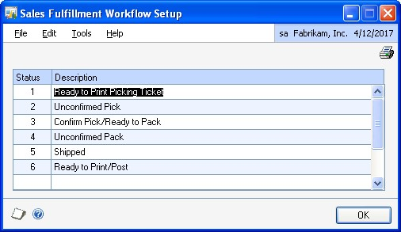

# Sales Order Processing in Dynamics GP

You can use Sales Order Processing to enter and print quotes, orders, invoices, back orders, and returns individually or in batches.

When necessary, you can enter drop-ship items on sales documents and determine how quantity shortages will be handled for individual items or for entire documents or batches.

You also can use Sales Order Processing to complete the following tasks:

- Transfer customer information from one document type to another

- Transfer item information and quantities from one document type to another

- Enter and post sales deposits

- Allocate and fulfill items on orders, fulfillment orders, and invoices

- Fulfill items separately from item allocation

If you use Purchase Order Processing, you can generate purchase orders from sales documents.

If you use Receivables Management, customer balances are updated after the sales transactions are posted.

If you use Inventory Control, item prices are calculated automatically on sales documents and inventory quantities are adjusted when the sales documents are posted.

The manual is divided into the following parts:

- [Sales Order Processing Part 1: Setup](#part-1-setup) introduces Sales Order Processing and explains the setup of the module.

- [Sales Order Processing Part 2: Transaction entry](sales-order-processing-part2-transaction-entry.md) explains how to enter sales documents.

- [Sales Order Processing Part 3: Allocation, Fulfillment, and Purchasing](sales-order-processing-part3-allocation-fulfillment-purchasing.md) explains how inventory items are allocated and fulfilled, and how to create purchase orders from sales documents.

- [Sales Order Processing Part 4: Transaction activity](sales-order-processing-part4-transaction-activity.md) explains how to post, print and transfer sales documents.

- [Sales Order Processing Part 5: Inquiries and reports](sales-order-processing-part5-inquiries-reports.md) explains how to use inquiries and reports to analyze your sales information.

- [Sales Order Processing Part 6: Utilities](sales-order-processing-part6-utilities.md) describes procedures you can use to reconcile sales documents or remove sales history.

## Part 1: Setup

This part of the documentation includes information that will help you set up Sales Order Processing. The setup procedures generally need to be completed once, but you can refer to this information at other times for instructions on modifying or viewing existing entries. The following topics are discussed:

- *Chapter 1, "Setup overview,"* lists the setup tasks you need to complete in other modules and describes the Sales Order Processing setup routine.

- *Chapter 2, "Module setup,"* provides instructions for setting up the Sales Order Processing module.

- *Chapter 3, "Document setup,"* provides instructions for setting up the document types—quotes, orders, fulfillment orders/invoices, back orders and returns—used in Sales Order Processing.

- *Chapter 4, "Sales fulfillment workflow setup,"* explains how to set up document statuses to assign to fulfillment orders.

- *Chapter 5, "Document ID maintenance,"* explains how to modify or delete document types.

- *Chapter 6, "Customer item and substitute item maintenance,"* explains how to create or delete item numbers for customers and substitutes.

## Chapter 1: Setup overview

Use this information to learn about and set up Sales Order Processing. The setup procedures are organized in an order that will ensure Sales Order Processing is set up properly.

When you set up Sales Order Processing, you can open each setup window and enter information, or you can use the Setup Checklist window (Administration \>\> Setup \>\> Setup Checklist) to guide you through the setup process. See your System Setup Guide (Help \>\> Contents \>\> select Setting up the System) for more information about the Setup Checklist window.

This information is divided into the following sections:

- *Sales Order Processing document types*

- *Before you set up Sales Order Processing*

- *Customer credit limit override approval workflow*

### Sales Order Processing document types

Use Sales Order Processing to enter, print, and post sales documents. You can transfer sales documents from one type to another and, if you're using Purchase Order Processing, you can create purchase orders from orders and back orders. You can set up the following types of documents to use in Sales Order Processing:

- **Quote**
    A proposal for a specified sale or transaction at some point in the future for a specified price. Quotes aren't posted, but the information on them can be transferred to orders, invoices, or fulfillment orders.

- **Order**
    A document used when the customer has agreed to make a purchase. You can transfer sales information from a quote or back order to an order. Orders aren't posted but the information on them can be transferred to invoices, back orders, or fulfillment orders. Purchase orders also can be created from sales orders.

- **Back Order**
    A document used when an item quantity shortage is discovered during transaction entry. You can transfer information from orders, invoices, or fulfillment orders to back orders. Back orders aren't posted but the information on them can be transferred to invoices or orders when the shortage items are available. Purchase orders also can be created from back orders.

- **Fulfillment Order**
    A document used to track workflow capability when a customer has agreed to make a purchase. You can transfer sales information from a quote, back order, or order to a fulfillment order. After you've tracked the fulfillment order through workflow, the fulfillment order becomes an invoice. You also can transfer a fulfillment order to a back order. This document is available only if you're using sales fulfillment workflow.

- **Invoice**
    A legally binding document that records the price and details of the transaction. You can transfer sales information from a quote, order, or back order to an invoice. Invoices are posted and the information from them can be transferred to back orders.

- **Return**
    A document used to record the return of a previously sold item. Returns are posted and can't be transferred to other documents.

### Before you set up Sales Order Processing

Before setting up Sales Order Processing, you should complete the setup procedures for Receivables Management and Inventory Control, including the following tasks:

- Enter Receivables Management and Inventory Control settings

- Enter customer records, salesperson records, and sales territories

- Enter items (including price lists and vendor items)

- Set up item sites

- Enter beginning quantities for inventory items

- Set up inventory and sales posting accounts in the Posting Accounts Setup window

For more information, see the Receivables Management and Inventory Control documentation.

> [!TIP]
> Choose Administration \>\> Setup \>\> Posting \>\> Posting Accounts to open the Posting Accounts Setup window, where you can select to view Inventory or Sales accounts.

You also must complete the setup procedures for your company, currency, accounts, checkbooks, and posting options. Tax schedules and tax details also should be set up. For more information, see the System Setup instructions (Help \>\> Contents \>\> select Setting Up the System).

If you're using Sales Order Processing with Multicurrency Management, be sure you've also set up currencies, exchange rate tables, exchange rates, access to currencies and exchange rate tables, and Multicurrency default entries. For more information about using and setting up Multicurrency Management, refer to the Multicurrency Management documentation.

If you plan to print multicurrency versions of your posting journals and reports, be sure to mark Include Multicurrency Info for the Sales series in the Posting Setup window (Administration \>\> Setup \>\> Posting \>\> Posting).

### Customer credit limit override approval workflow

Your company can use the customer credit limit override workflow feature as part of its business controls. If you use this feature, you can define how orders, fulfillment orders, and invoices must be approved if the documents exceed the set credit limits for customers. You can define the credit limit for each customer in the Customer Maintenance Options window. The rules for approving orders, fulfillment orders, and invoices can be defined to fit your organization's needs.

When an order, fulfillment order, or invoice is ready to be approved, approvers can be notified and the document can be approved, using Outlook, Dynamics GP, or SharePoint. When a document completes Workflow, you can print, transfer, or post the document.

Before you can use the customer credit limit override approval workflow for Sales Order Processing, you must remove the password from the Exceed Credit Limit option in the Receivables Management Setup window (Sales \>\> Setup \>\> Receivables).

## Chapter 2: Module setup

Module setup involves setting up your Sales Order Processing preferences such as default entries, tax calculation options, starting document numbers, and whether to maintain document history.

The module setup information contains the following sections:

- *Setting up Sales Order Processing default entries*

- *Setting up currency decimal places for non-inventoried items*

- *Setting up taxes and options*

- *Setting up document numbers*

- *Setting up user-defined fields*

- *Setting up process holds*

- *Selecting a pricing method*

- *Enabling extended pricing*

- *Setting up advanced picking*

### Setting up Sales Order Processing default entries

Use the Sales Order Processing Setup window to set up preferences, default entries, the types of history to maintain, and which posting accounts to use when distributing sales amounts. You also can open additional windows to set up sales documents, taxes, default entries for purchase orders, and options to use with daily sales transactions.

#### To set up Sales Order Processing default entries

1. Open the Sales Order Processing Setup window.
    (Sales \>\> Setup \>\> Sales Order Processing)

    

2. Specify how Sales Order Processing transactions will be tracked and displayed during transaction entry. You can select the following options.

    - **Display Item Unit Cost**
        Mark to display the unit cost of each item on the document during transaction entry. The unit cost displayed will be the current cost or the standard cost of the item, depending on the inventory valuation method assigned to each item.

        For more information about item cost, see the Inventory Control documentation.

    - **Track Voided Transactions in History**
        Mark to maintain a historical record of voided transactions. If you don't mark this option, voided documents will be removed after posting and won't be included on reports. Voided document numbers cannot be used again.

    - **Calculate Kit Price Based on Component Cost**
        If you're using a percent markup or percent margin pricing method and you mark this option, the current or standard cost of the kit components will be used to calculate the total cost for the kit. The percent markup or percent margin will be calculated on that cost.

    - **Display Quantity Distribution Warning**
        If you mark this option, an alert message will be displayed during transaction entry when the quantity ordered, invoiced, back ordered, or quoted hasn't been fully distributed. If you do not mark this option, a message won't be displayed.

    - **Search for New Rates During Transfer Process**
        When marked, the system will determine if a different exchange rate should be used when the document is transferred to a new document. If this option is not marked, the new document will use the same exchange rate as the document it was transferred from.

        For more information about exchange rates and transferring, see *Multicurrency and transfers*.

    - **Track Master Numbers**
        Mark to track master numbers that identify original documents and track the flow of documents. Each subsequent document created from that original document will have the same master number.

        Enter the next master number in the Next Master Number field. This field will be available only if you've marked Track Master Numbers.

    - **Prices Not Required in Price List**
        This option is available only if you're using Inventory Control. Mark this option if you don't maintain prices for every item.

        When this option is marked and a price isn't found for the item during transaction entry, the price will be zero and you can enter a price. You can enter a password for this option if you want to limit the users who can enter item prices. If this option is not marked, you can't enter items that don't have prices in the system.

    - **Convert Functional Price**
        Mark this option if you want the functional currency price to be converted if a price can't be found in the originating currency for an item. If a functional currency price isn't available, the price will be zero. This field is available only if you've marked Prices Not Required in Price List.

3. Select data entry default settings.

    - **Quantity Shortage**
        Select the default option to use when you have fewer items in inventory than a customer requests.

    - **Document Date**
        Select which date to use as a default date when you open the Sales Transaction Entry window. You can use the date from the last document you entered or the User Date.

    - **Price Warning**
        Select a price warning to alert users when the default price for the item is used on a sales document instead of the default price for the customer.

        > [!NOTE]
        > This option does not apply if you're using extended pricing.

        The price of an item on a sales document is determined by the price level for the customer in the Customer Maintenance window. If one isn't available, the default price level in Receivables Management Setup window is used. If a default price level is not found there, the default price level for the item will be used.

    - **Requested Ship Date**
        Select the default requested ship date for line items in the Sales Date Entry window. If you select Days After Doc. Date, enter the number of days after the document date that the items should be shipped.

4. Enter document default information, including the IDs of the site, checkbook, quote, order, fulfillment order—if you're using sales fulfillment workflow— invoice, back order, and return you use most often. The entries you make here will appear as the default entries in the Sales Transaction Entry window.

    If you haven't set up quotes, orders, back orders, fulfillment orders, invoices, and returns, skip the document default entries at this time. Later, after you've set up at least one type of quote, order, back order, fulfillment order, invoice, and return, you can complete these entries. For more information about setting up document types, see *Chapter 3, "Document setup."*

5. Mark Customer or Item to specify whether the posting accounts associated with the customer or with the item should appear as the default entries during transaction entry. This option determines which Sales and Cost of Goods Sold accounts to use for a sales transaction.

6. Mark whether to maintain history for sales documents and account distributions. If you choose to maintain history, a detailed copy of the sales document will be kept after it is transferred, voided, or posted.

    For account distributions, a detailed record of transaction distributions that are posted through General Ledger will be kept. Account distribution history includes the audit trail code, account, account description, debit or credit amount, and other information about each transaction.

    If you don't select to maintain history, quotes, orders, and back orders will be deleted when they're transferred or voided. Invoices and returns will be deleted when they're posted.

    > [!NOTE]
    > Keeping history will increase the amount of hard disk space needed to run Microsoft Dynamics GP. Periodically, you can remove history to ensure that you're keeping only the records you need. For more information, see Chapter 31, "Sales history removal."

7. Enter the number of decimal places to use when displaying and entering quantity amounts for non-inventoried items.

8. If you aren't using Multicurrency Management, enter the number of decimal places to use when displaying and entering currency amounts for noninventoried items.

    If you're using Multicurrency Management, choose the expansion button to open the Sales Non-Inventoried Currency Decimals Setup window where you can define currency decimal places for each currency to which you have access. For more information, see *Setting up currency decimal places for non-inventoried items*.

9. Choose File \>\> Print or the printer icon button to print the Sales Order Processing Setup List. You also can print the report using the Sales Setup Reports window.

10. Choose OK to save your setup options.

### Setting up currency decimal places for noninventoried items

If you are using Multicurrency Management, you can use the Sales Non-Inventoried Currency Decimals Setup window to define currency decimal places for noninventoried items for each currency that your company uses. Amounts will appear in the format defined in this window whenever you enter a non-inventoried item for a specific currency.

If you aren't using Multicurrency Management, use the Sales Order Processing Setup window to define the number of decimal places when displaying currency amounts for non-inventoried items.

You can change the non-inventoried currency decimal places for a currency at any time. Changing the decimal place setting for a currency won't change the decimal place settings of non-inventoried items already entered on existing sales documents. The settings will be applied to new items added to existing transactions or to new transactions.

#### To set up currency decimal places for non-inventoried items

1. Open the Sales Non-Inventoried Currency Decimals Setup window.
    (Sales \>\> Setup \>\> Sales Order Processing \>\> Currency expansion button)

    

2. Enter or select the number of decimal places to use when displaying currency amounts for non-inventoried items.

3. Continue defining decimal places for all the currencies displayed in the window.

4. Choose File \>\> Print to print the Sales Non-Inventoried Currency Decimals Setup List.

5. Choose OK to close the window.

### Setting up taxes and options

You can use the Sales Order Processing Setup Options window to specify a method for calculating taxes, preferences for generating purchase orders (if you're using Purchase Order Processing), and to set up other sales options.

You can further restrict each option by assigning a password to it. If the option is marked but no password is entered, anyone who has access to the related windows can use the option.

If you're using advanced picking, you can select to sort individual picking tickets by bin sequence. If you're using advanced picking and multiple bins, you can select to print default bins or all available bins when a default bin isn't found.

#### To set up taxes and options

1. Open the Sales Order Processing Setup Options window.
    (Sales \>\> Setup \>\> Sales Order Processing \>\> Options button)

    

2. Mark the type of tax calculation to use on sales documents.

    - **Advanced**
        Mark Advanced to specify a tax schedule to use for noninventoried items and freight and miscellaneous charges. For inventory items, the tax schedule you chose for each item in the Item Maintenance window will be used.

    - **Single Schedule**
        Mark Single Schedule to specify one tax schedule for all items on all documents. Items on each sales document will be taxed using the tax details in the schedule you specify here, even if the item is nontaxable or if the customer is tax exempt. Taxes won't be calculated on freight or miscellaneous charges.

        For more information about calculating and distributing sales tax amounts, see *Chapter 18, "Sales Order Processing taxes."*

3. If you selected to use advanced tax calculations, enter or select tax options for non-inventoried items, freight, and miscellaneous charges. You can change the tax schedules used for a transaction in the Sales Tax Schedule Entry window during transaction entry. The tax options are:

    - **Taxable**
        The default tax details for the customer or site will be compared to the tax details in the tax schedule you specify here.

    - **Nontaxable**
        No taxes will be calculated.

    - **Base on customers**
        The tax details from the customer tax schedule or the site tax schedule will be the default, depending on whether the shipping method is delivery or pickup.

4. Select a default sorting option for picking tickets. Your selection determines how information is printed on picking tickets. The sorting options are:

    - **Standard Pick Ticket**
        Items will be printed on the picking ticket in the order that they were entered in the Sales Transaction Entry window.

    - **Bin Sequence**
        Items will be printed on the picking ticket sorted by bins and then items.

5. If you're using multiple bins, select when to print bins on blank individual picking tickets. The options are:

    - **Always**
        Default bin information and additional available bin information always will be printed on the picking ticket.

    - **When Default Bin can't be Found**
        Additional available bin information will be printed on the picking ticket only when a default bin can't be found for an item.

6. If you're using Purchase Order Processing, select a default site to use when generating purchase orders from sales orders and back orders. Your selection determines how purchase orders and purchase order line items are created. The choices are:

    - **Don't Combine Items with Different Sites on Same PO**
        If you select this option, items with different sites on a sales order document will be listed on separate purchase orders. For example, on a sales order document, ITEMA is assigned to the NORTH site and ITEMB is assigned the SOUTH site. When you generate the purchase orders, ITEMA and ITEMB would be listed on two separate purchase orders.

    - **Combine Items with Different Sites on Same PO** If you select this option, items with different sites on a sales order document will be listed on the same purchase order if they have the same vendor. For example, on a sales order document, ITEMA is assigned to the NORTH site, ITEMB is assigned to the SOUTH site and ITEMA and ITEMB have the same primary vendor. When you generate the purchase order, ITEMA and ITEMB would be listed as two line items on a single purchase order.

    - **Use a Single Site for All POs**
        If you select Use a Single Site for All POs, you can enter the site where all items will be received in the Site ID field. After the quantities are received, you must transfer the quantities from the receiving site to the sites listed on the sales order document.

7. If you're using Purchase Order Processing, select a default required date. This date is set for each line item and is the date by which you must receive the item on a purchase order. This date can be viewed or changed in the Purchasing Item Detail Entry window.

    If you select Days Prior to Requested Ship Date, enter the number of days you want to receive the purchase order line items before the requested ship date of the sales line items. For example, if you enter 2 as the number of days before the requested ship date and a sales item has a requested ship date of April 29, the required date of the purchase order line item will be April 27. The user date will be used as the required date when the required date could be calculated in the past.

8. If you're using Purchase Order Processing, select the default unit of measure that will be used when purchase orders are generated from orders and back orders. You can use the U of M from the sales line item or use the item's default purchasing U of M.

9. If you're using Purchase Order Processing, mark Combine Similar Line Items Into a Single PO Line to combine an item listed several times on a purchase order into one purchase order line item. If this option isn't marked, an item could be listed on the purchase order multiple times—once for each sales document that includes a shortage for the item and is linked to the purchase order.

    For example, suppose Order11 has a quantity to purchase of 2 for ITEMA for the NORTH Site and Order15 has a quantity to purchase of 3 for ITEMA for the NORTH Site. If you mark this option, ITEMA will be listed once on a purchase order for a quantity of 5. If you don't mark this option, ITEMA will be listed twice on the purchase order.

10. If you're using Purchase Order Processing, you can combine drop ship items onto one purchase order, rather than creating separate purchase orders for the same item. There are two options for drop ship items:

    - **Combine Different Ship-To Addresses into one PO**
        Mark this option to create one purchase order from one sales order with multiple lines that contains different ship-to addresses. This is useful when you have a sales order for one company and you're drop shipping to multiple locations. When used in conjunction with the Combine Similar Items into a Single PO Line option, similar items with the same ship to address are combined into one line. If this option is not marked, individual purchase orders are created for each item.

    For example, ORDER01 contains ITEM A with a quantity of 2 to the SHIPPING 1 ship-to address. Line 2 is for ITEM A with a quantity of 3 to the SHIPPING 2 ship-to address, and you are drop shipping all items. One purchase order with two lines will be created. The shipping address will print with the corresponding lines.

    - **Combine Different Ship-To Addresses from Different Sales Orders into one PO**
        Mark to create one purchase order from multiple sales orders when drop shipping to multiple shipping addresses. This is useful when you have several sales orders and you're drop shipping the same item to multiple locations, only one purchase order is necessary to purchase the correct quantity of the items. When used in conjunction with the Combine Similar Items into a Single PO Line option, the item quantities with the same shipping address are summed onto one line on the PO.

        For example, with all the options marked, you have ORDER01 for ITEM A with a quantity of 2 to SHIPPING 1 ship-to address, ORDER02 is for ITEM A with a quantity of 1 to SHIPPING 2 ship-to address, and ORDER03 is for ITEM A with a quantity of 2 to SHIPPING 1 ship-to address, and you are drop shipping all items. On the purchase order, you'll see Line 1 for ITEM A with a quantity of 4, and Line 2 for ITEM A with a quantity of 1. The shipping address will print with the corresponding lines.

        Mark sales options. You can further restrict each option by assigning a password to it.

    - **Allow Markdown**
        Mark to allow users to enter a currency amount or percentage by which the extended price of individual line items will be reduced using the Sales Markdown Entry window.

    - **Auto-Assign Lot Numbers**
        Mark to automatically assign lot numbers to items. Lot numbers can be assigned by receipt date or by expiration date, depending on how you selected to automatically assign lot numbers in the Inventory Control Setup window. If lot numbers are assigned by receipt date, the assignment is based on the valuation method when the items are entered or fulfilled on a sales document. If lot numbers are assigned by expiration date, the lot numbers nearing expiration are used first. Lot numbers without an expiration date aren't assigned. Lot numbers can be changed after they've been assigned and before posting using the Sales Lot Number Entry window.

        When automatically assigning lot numbers, expired lots aren't used even if you marked the Other Transactions option in the Inventory Control Setup window.

    -**Auto-Assign Serial Numbers**
        Mark to automatically assign serial numbers to items according to their valuation method when the items are entered or fulfilled on a sales document. Serial numbers can be changed after they've been assigned and before posting using the Sales Serial Number Entry window.

    - **Enter Non-Inventoried Items**
        Mark to allow users to enter noninventoried items in the Sales Transaction Entry window or Sales Item Detail Entry window without first creating records for those items. If you don't mark this option, only items that exist in your inventory can be sold.

    - **Allow Price Below Cost**
        Mark to allow users to enter prices in the Sales Transaction Entry window that are lower than the current cost of an item. If you don't mark this option, prices below the current cost won't be allowed.

    - **Override Prices**
        Mark to allow users to override the default unit price and the extended price that is automatically calculated when you enter items in the Sales Transaction Entry window or Sales Item Detail Entry window. If you don't mark this option, you can't change either amount.

    - **Override Quantity Shortages**
        Mark to allow users to sell more items than are currently available in inventory. If you mark this option and a quantity entered in the Sales Transaction Entry window is greater than the quantity available, the Sales Quantity Shortage Options window will open and you can select to override the quantity available. If you don't mark this option, only the quantity available can be sold.

    - **Override Price Levels**
        Mark this option to allow users to override price levels for customers or items on a sales document. If you don't mark Override Price Levels, you can't change the price levels. This could cause problems if no prices are set up in the price list for the price level.

        For example, suppose you select a customer that is assigned to a retail price level and you only have prices set up in the price list for the wholesale price level. You can't complete the transaction because you can't change the price level on the transaction for the customer.

        > [!NOTE]
        > This option does not apply if you're using extended pricing.

    - **Allow Deletion of PO Commitments**
        Mark to allows users to break the commitment between a sales document and a purchase order in Sales Order Processing. If this option isn't marked, you can only break the commitment in Purchase Order Processing.

    - **Allow Sale of Discontinued Items**
        Unmark if you don't want to sell discontinued items. If this option is marked, you can sell discontinued items.

11. Choose File \>\> Print to print the Sales Order Processing Setup List.

12. Choose OK.

### Setting up document numbers

Use the Sales Document Numbers Setup window to enter document numbers, codes, and printing formats for quotes, orders, fulfillment orders, back orders, invoices, and returns.

#### To set up document numbers

1. Open the Sales Document Numbers Setup window.
    (Sales \>\> Setup \>\> Sales Order Processing \>\> Numbers button)

    

2. Enter or accept the default document codes, next numbers, and printing formats for quotes, orders, fulfillment orders/invoices, returns, and back orders.

    - **Code**
        The code is a three-character prefix that will be printed on posting journals and edit lists to identify the type of document entered.

    - **Next Number**
        These numbers will be used as the document numbers in the Sales Transaction Entry window if the document ID you're using has not been set up to use its own numbering system. Each time you enter a transaction, the number will increase by one to the next available number.

        For example, assume you set up three types of invoice IDs—retail, wholesale, and catalog—and you enter an invoice next number for the retail invoice ID in the Sales Invoice Setup window. Invoices using the wholesale and catalog invoice IDs will use the next number from the Sales Document Numbers Setup window, but invoices based on the retail invoice ID will be assigned the number you entered in the Sales Invoice Setup window. For more information about document IDs, see *Chapter 3, "Document setup."*

        > [!IMPORTANT]
        > Be sure to enter a next number that is large enough to accommodate your business volume. For example, if you enter ORD001 as the next order number, you'll be able to enter up to 999 orders. If you enter ORD00001, you'll be able to enter 99,999 orders.

    - **Format**
        Select the default format for each type of document—blank paper, short form, long form, or other form. You can change the format before printing the document.

3. Enter or accept the default document codes, next numbers, and formats, and the document numbers you want to use for packing slips and picking tickets.

    - If you select Document, the document numbers from the orders or invoices will be used.

    - If you select Packing Slip or Picking Ticket, the next number you've entered here for packing slips and picking tickets will be used.

    > [!NOTE]
    > Typically, businesses use the same document numbers on packing slips and picking tickets that were used on the orders or invoices from which they were created. For this reason, the same document numbers will be used unless you specify a different next number here.

4. Choose OK.

### Setting up user-defined fields

Use the Sales User-Defined Fields Setup window to enter names for up to ten userdefined fields to further identify quotes, orders, back orders, invoices, and returns. Later, when you enter sales transactions, the names will appear in the Sales UserDefined Fields Entry window, where you can enter information that is unique to the transaction. You can set up the following types of user-defined fields.

- **List** Use list fields to predefine options to track information that is specific to your business. For example, to track the origin of orders, you could name the list Order Origin and enter Fax, Phone, and Mail as values for the list. When you enter transactions, Order Origin will appear as a field in the Sales User-Defined Fields Entry window and you can specify where the order originated or include additional values.

- **Date** Use date fields to record additional dates that affect your sales documents. For instance, if you want to track the date that an installation was complete, enter Install Date in a date field.

- **Text** Use text fields to record additional information about the transactions you enter in the Sales Transaction Entry window. For example, to track special ID numbers for shipped equipment, you can enter Shipping ID in the text field.

- **Prospect Maintenance** Use Prospect Maintenance to track additional information about your prospective customers. For example, to track which prospects are good, very good, and excellent, enter Lead Status in a prospect maintenance field. You can enter information in these fields in the Sales Prospect Maintenance window.

- **Customer/Item Maintenance** Use Customer/Item Maintenance to track additional information about your customer item numbers. For example, to track the distributor with the fastest delivery time for an item, enter Quickest Distributor in a customer/item maintenance field. You can enter information in these fields in the Customer Item Maintenance window.

#### To set up user-defined fields

1. Open the Sales User-Defined Fields Setup window.
    (Sales \>\> Setup \>\> Sales Order Processing \>\> User-Defined button)

    

2. Enter names for as many as three list fields. Choose the expansion button next to each this window to enter values for each list.

3. Enter names for one or two date fields to record additional dates that affect your sales documents.

4. Enter names for as many as five text fields to track additional information about your customers.

5. Enter names for one or two prospect maintenance text fields.

6. Enter names for as many as five customer/item maintenance text fields.

7. Choose File \>\> Print to print the Sales User-Defined Fields Setup List.

8. Choose OK to save your changes.

### Setting up process holds

You can use the Sales Process Holds Setup window to create process holds to assign to your sales documents. Process holds are user-defined restrictions that control the processing of sales documents at different stages of the sales cycle. For example, you can set up process holds to:

- Require a manager's approval before a return can be posted.

- Prevent posting of documents until a manager approves the transactions.

- Restrict the printing of invoices until addresses have been verified.

- Stop the order fulfillment process because a part has been recalled by the manufacturer.

- Prevent the transferring of a quote to an order if the customer is over its credit limit.

- Stop a document status from advancing to the next tracked status.

For more information about using process holds, see *Assigning process holds to a document*.

You can set up passwords to further restrict processing. The user must enter the password to remove holds from documents. If you don't use passwords, you can set up a process hold to remind the user to complete a task before processing a sales document. Once the task is completed, the user must remove the hold from the document before processing occurs. You can apply process holds to any document type.

#### To set up process holds

1. Open the Sales Process Holds Setup window.
   (Sales \>\> Setup \>\> Process Holds)

    

2. Enter a name and description for a process hold. You can assign a password to remove this process hold.

3. Mark any of the processes you want to restrict with this process hold.

    - **Transferring Documents** Mark to stop the transfer of documents from one document type to another until the hold is removed. (This option has no effect on return documents since they cannot be transferred to other document types.) **Posting** Mark to stop the posting of invoices or returns until the hold is removed. If you have orders that contain a deposit amount, the deposit amount will be posted when the document is saved, regardless of whether a posting hold has been assigned.

    - **Fulfillment Advancement** Mark to stop the advancement of fulfillment order document statuses until the hold is removed.

    - **Fulfilling Documents** Mark to stop the fulfillment of orders or invoices until the hold is removed.

    - **Printing Documents** Mark to stop the printing of documents until the hold is removed. If you restrict the printing of an order, invoice, or fulfillment order, the picking ticket and packing slip won't be printed either. This will eliminate the possibility of shipping items for documents that are on hold.

4. Choose Save to save the information you've entered.

    To review the entries and selections you've made for a specific process hold, print the Sales Process Holds Setup Report by choosing File \>\> Print or the printer icon button while the Sales Process Holds Setup window is displayed.

    To review the entries for all process holds, print the Sales Process Holds Setup Report (Sales \>\> Reports \>\> Setup).

### Selecting a pricing method

You can use either standard or extended pricing. In both pricing systems, you can set up different pricing structures—price levels in standard pricing, or price sheets and price books in extended pricing. You can create different pricing for different currencies and different units of measure. Either system can be used to create pricing structures with quantity breaks. However, you must choose one pricing system and use it exclusively; you can't use both systems simultaneously.

|Pricing method  |Description|
|---------|---------|
|**Standard pricing** |Standard pricing might be a better option for your company if any of the following conditions are true:  - You're using Invoicing. (Extended pricing doesn't work with Invoicing.) - You want price lists to be updated automatically when the current cost or standard cost of an item changes. - You have a fairly simple pricing structure, and don't need additional tiers.  For more information about standard pricing structures, see the Inventory Control documentation.|
|**Extended pricing**|Extended pricing might be a better option for your company if any of the following conditions are true: - You want to use date-specific pricing. - You want to create promotions for special pricing, for value-off pricing, or for free items with the purchase of another item. - You have a complex pricing structure: you want to use more tiers or you want to apply multiple promotions simultaneously.  For more information about extended pricing, see the Inventory Control documentation.|

### Enabling extended pricing

Use the Enable Extended Pricing window to activate or inactivate extended pricing functionality.

You can use either standard or extended pricing. You must choose one pricing system and use it exclusively; you can't use both systems simultaneously. For more information on selecting a pricing method, see *Selecting a pricing method*. For more information on how each pricing method works, see the Inventory Control documentation.

#### To enable extended pricing

1. Open the Enable Extended Pricing window.
    (Sales \>\> Setup \>\> Extended Pricing)

    

2. Select whether to use standard or extended pricing. Standard pricing is the default method.

3. Choose OK to save your changes and close the window.

### Setting up advanced picking

If you're using advanced picking, use the Advanced Picking Setup window to assign a picking ticket printing option to a selected site and items that are assigned to that site. For example, if a site has small items that can be picked in bulk, you could select Bulk for that site. If a site has items that are picked only individually, you could select Individual for that site. And, if a site has items that are picked both individually and in bulk, you could select Both for that site.

If you select Both for a site, you can use the Item Print Option Preview window or the Item Quantities Maintenance window to change the item print option for selected items within the site. For more information, refer to the Inventory Control documentation.

You also can indicate the character of the bin number to create a page break on. The character string—up to and including the selected character—is sorted alphabetically. Characters after the selected character will not be considered in the sort.

#### To set up advanced picking

1. Open the Advanced Picking Setup window.
    (Sales \>\> Setup \>\> Advanced Picking Setup)

    

2. Enter or select a site ID.

3. Select a general print option for the site.

    - **Individual** When the selected site is included on a fulfillment order, order, invoice, or return, individual picking tickets will be printed. Items assigned to the selected site will be printed only on individual picking tickets.

    - **Bulk** When the selected site is included on a fulfillment order/invoice, bulk picking tickets will be printed. Items assigned to the selected site will be printed only on bulk picking tickets. You can print bulk picking tickets for fulfillment orders only.

    - **Both** When the selected site is included on a fulfillment order, order, invoice, or return, you can select to print individual picking tickets or bulk picking tickets. Items assigned to the selected site will be printed on both individual and bulk picking tickets.

4. Select the bin character to indicate a page break on the picking ticket.

    For example, suppose that a warehouse names bins by warehouse, aisle, rack, and shelf. Bin A123 reflects warehouse A, aisle 1, rack 2, and shelf 3, and the following bins are included on a picking ticket: A116, A123, A127, A224, A226, and A267. To print a separate picking ticket for each rack, you would select the third character of the bin number for the site.

    The following table lists the bins in alphabetical order with the page that will be displayed on the picking tickets.

    | **Page number** | **Bin numbers** |
    |-----------------|-----------------|
    | Page 1          | A116            |
    | Page 2          | A123, A127      |
    | Page 3          | A224, A226      |
    | Page 4          | A267            |

5. Choose Save.

## Chapter 3: Document setup

You can set up and customize an unlimited number of quote, order, back order, fulfillment order, invoice, and return document IDs and specify different options for each document ID. You must set up at least one document ID for each document type that you'll use in your organization.

You can modify a document ID at any time. The changes will affect future transactions that use the document ID but won't change the information for existing transactions. There are several settings that can't be changed if there are unposted documents using the document ID. For more information about modifying document IDs, see *Chapter 5, "Document ID maintenance."*

The document setup information contains the following sections:

- *Setting up quotes*

- *Setting up orders*

- *Setting up fulfillment orders or invoices*

- *Setting up back orders*

- *Setting up invoices*

- *Setting up returns*

- *Assigning process holds to sales document IDs*

### Setting up quotes

Use the Sales Quote Setup window to set up and customize an unlimited number of quote IDs, which you can use for different situations. For example, if you need separate quote IDs for your wholesale, retail, and catalog customers, you can set up separate quote IDs for each of these customer groups. When you enter a quote in the Sales Transaction Entry window, you can select the type of quote from the list of quote IDs you've set up.

You can set up a quote ID to expire in a certain number of days. The number you enter will be added to the quote date in the Sales Date Entry window to determine the date the quote will expire. After a quote expires, it can't be transferred to an order or to an invoice, and it will remain in the system until it is voided or deleted.

You can choose whether to use a quote ID for repeating quotes. A repeating quote is a quote that is saved in a batch and used more than once. When you transfer a quote to an order or invoice, the quote will remain in the batch so it can be used again. Using repeating quotes saves time if you frequently print quotes with the same line item information for the same customer.

#### To set up quotes

1. Open the Sales Quote Setup window.
    (Sales \>\> Setup \>\> Sales Order Processing \>\> Sales Document Setup button \>\> select the Quote option)

    

2. Enter a Quote ID and, if you want this quote ID to have a unique document numbering system, enter a Quote ID Next Number.

    You can set up a different next number for each quote ID. When you enter a quote in the Sales Transaction Entry window, the next number for the quote ID is used as the document number. If you don't enter a next number for the quote ID, the next quote number from the Sales Document Numbers Setup window is used.

3. Enter the days to expire. If you don't want the quote to expire, leave the value at zero.

4. You can enter a Comment ID. The comment ID you enter will appear as the default comment ID in the Sales Transaction Entry window, where you can change it, if necessary.

5. You can select the format to use when you print a quote with this quote ID— blank paper, short form, long form, or other form. You can change the format before printing the document.

6. Mark the options to transfer this quote ID to orders, invoices, or both, and select an ID for each document. The order and invoice IDs you enter will appear in the Sales Document Detail Entry window as the default document type, but can be changed before transferring the quote.

    If you're using sales fulfillment workflow, you can transfer this quote ID to fulfillment orders and select a fulfillment order ID.

7. If you marked a transfer option, you can specify whether item quantities will appear in the Quantity to Order or Quantity to Invoice fields on the quote in the Sales Transaction Entry window.

    - **To Order** Item quantities will appear as the quantity to order in the Sales Transaction Entry window when you use this quote ID. This selection is the best choice if you transfer a quote to an order more often than you transfer a quote to an invoice.

    - **To Invoice** Item quantities will appear as the quantity to invoice in the Sales Transaction Entry window when you use this quote ID.

    - **None** You will need to enter item quantities manually in the Sales Transaction Entry window.

8. You can mark options to use this quote ID for prospective customers and to allow repeating quotes.

    - **Use Prospects** Mark to allow users to enter documents with this quote ID for prospective customers.

    - **Allow Repeating Documents** Mark to allow users to set up repeating quotes with this ID. You can assign repeating information, such as the number of times to repeat and days to increment, in the Sales Document Detail Entry window.

9. Mark the options for entering documents using this quote ID. You can enter a password to restrict a user from using the option during transaction entry. If an option is marked but no password is entered, anyone who has access to the window can use the option.

    You can set up these options differently for each quote ID.

    - **Delete Documents** Mark to allow users to delete quotes. If you delete a quote, all the information associated with the quote will be removed. If unmarked, you can't delete quotes in the Sales Transaction Entry window.

    - **Edit Printed Documents** Mark to allow users to make changes to quotes after they've been printed.

    - **Override Document Numbers** Mark to allow users to change the document number that is assigned in the Sales Transaction Entry window. If unmarked, the next available quote number will be assigned and you can't change it.

    - **Void Documents** Mark to allow users to void quotes after they've been entered. If marked and you've selected to track voided transaction history in the Sales Order Processing Setup window, voided quotes will be saved in history. If unmarked, you can't void quotes in the Sales Transaction Entry window.

10. Choose **Holds** and assign process holds to the quote ID to stop processing on particular document IDs or documents. For more information about assigning process holds, see *Assigning process holds to sales document IDs*.

11. Choose Save to save the quote information you've entered.

 To review the entries and selections you've made for a specific quote ID, print the Sales Quote Setup List by choosing File \>\> Print or the printer button while the Sales Quote Setup window is displayed.

To review the entries for all quote IDs, print the Sales Quote Setup List (Reports \>\> Sales \>\> Setup).

### Setting up orders

Use the Sales Order Setup window to set up and customize an unlimited number of order IDs, which you can use for different situations. For example, if you need separate order IDs for your wholesale, retail, and catalog order customers, you can set up separate order IDs for each of these customer groups. When you enter an order in the Sales Transaction Entry window, you'll select the type of order from the list of order IDs you've set up.

You can choose whether to use an order ID for repeating orders. A repeating order is an order that is saved in a batch and used more than once. When you transfer an order to a back order or invoice, the order will remain in the batch so it can be used again. Using repeating orders saves time if you frequently print orders with the same line item information for the same customer.

#### To set up orders

1. Open the Sales Order Setup window.
    (Sales \>\> Setup \>\> Sales Order Processing \>\> Sales Document Setup button \>\> select the Order button)

    

2. Enter an Order ID and, if you want this order ID to have a unique document numbering system, enter an Order ID Next Number.

    You can set up a different next number for each order ID. When you enter an order in the Sales Transaction Entry window, the next number for the order ID is used as the document number. If you don't enter a next number for the order ID, the next order number from the Sales Document Numbers Setup window is used.

3. You can enter a Comment ID. The comment ID you enter will appear as the default comment ID in the Sales Transaction Entry window, where you can change it, if necessary.

4. You can select the format to use when you print an order with this order ID— blank paper, short form, long form, or other form. You can change the format before printing the document.

5. Mark Transfer Order to Back Order to allow transferring this order ID to back orders, and enter a back order ID. If you don't mark this option, you can't enter back order quantities on an order using this order ID.

    The back order ID you enter will appear in the Sales Document Detail Entry window as the default document type, but can be changed before transferring the order.

6. Enter the Invoice ID to use when transferring orders to invoices.

    If you're using sales fulfillment workflow, enter the fulfillment order ID to use when transferring orders to fulfillment orders.

    The invoice ID you enter will appear in the Sales Document Detail Entry window as the default document type, but can be changed before transferring the order.

7. You can mark to allow repeating documents. You might want to do this if, for example, you have a customer who orders the same items on a regular basis.

    If you mark this option, the Frequency and Times to Repeat fields in the Sales Document Detail Entry window will be available and you can enter repeating information as you enter orders.

    > [!NOTE]
    > You can select Allow Repeating Documents only if you're allocating by Document/ Batch or None.

8. Mark the Use Separate Fulfillment Process option to use a separate fulfillment process to verify the items that are picked to fill the order. If this option is not marked, the fulfillment is done when the item is allocated. For more information about allocating and fulfilling, see *Chapter 19, "Allocating item quantities."*

9. You can mark Allow all Back Ordered Items to Print on Invoice to print backordered items on the invoice created from an order.

10. You can enter or select a Credit Limit Hold ID to apply to the order ID to stop processing a sales document that will result in a customer's receivables balance exceeding their credit limit.

11. You can mark the Override Quantity to Invoice with Quantity Fulfilled option to display the same quantity in the Quantity to Invoice field in the Sales Transaction Entry window as the Quantity Fulfilled field in the Sales Order Fulfillment window. This ensures that the quantity invoiced equals the quantity fulfilled.

    You can set up additional options differently for each order ID.

    - **Enable Quantity to Back Order in Sales Order Fulfillment** Mark this option to enter or change information in the Qty to Back Order field in the Sales Order Fulfillment window.

    - **Enable Quantity Canceled in Sales Order Fulfillment** Mark this option to enter or change information in the Qty Canceled field in the Sales Order Fulfillment window.

    For example, suppose you create an order for widgets and enter 10 in the Original Quantity field, 10 in the Qty Ready to Fulfill field, and 0 in the Qty Fulfilled field. However, when you fulfill the order, there are only 8 widgets available to fill the order, so you enter 8 in the Qty Fulfilled field. The Qty Ready to Fulfill field also will display 8. The remaining quantity will be back ordered or canceled, depending on the option you select here and in the Customer Maintenance Options window. For more information, refer to the Receivables Management documentation.

12. Select a method for allocating item quantities—the process of reserving inventory items so the available quantity is reduced by the quantity ordered.

    - **Line Item** Item quantities are allocated as you enter them on an order. If this option is marked, you'll be required to make quantity shortage decisions as each item is entered.

        If marked and you're not using a separate fulfillment process, item quantities will be fulfilled as well.

    - **Document/Batch** Entire orders or batches of orders are allocated using the Sales Allocation/Fulfillment Options window. This option allows for faster data entry because items won't be checked for quantity shortages as they're entered on sales documents.

    - **None** Item quantities are allocated when you transfer an order to an invoice using the allocation options for the invoice ID. You won't be able to allocate item quantities for orders.

13. Mark the options for entering documents using this order ID. You can enter a password to restrict a user from using the option during transaction entry. If an option is marked but a password hasn't been entered, anyone who has access to the window can use the option.

    You can set up these options differently for each order ID.

    - **Allow Invoicing of Unfulfilled or Partially Fulfilled Orders** Mark to allow users to transfer an order to an invoice when the order is partially fulfilled. If unmarked, only completely allocated or fulfilled orders will be transferred to invoices.

    - **Delete Documents** Mark to allow users to delete orders after they've been saved. If you delete an order, all the information associated with the order will be erased. If unmarked, you can't delete orders in the Sales Transaction Entry window.

    - **Edit Printed Documents** Mark to allow users to make changes to orders after they've been printed.

    - **Override Document Numbers** Mark to allow users to change the document number that is assigned in the Sales Transaction Entry window. If unmarked, the next available order number will be assigned and you can't change it.

    - **Void Documents** Mark to allow users to void orders after they've been entered. If marked and you've selected to track voided transaction history in the Sales Order Processing Setup window, voided orders will be saved in history. If unmarked, you can't void orders in the Sales Transaction Entry window.

14. Choose Holds to assign process holds to the order ID to stop processing. For more information about assigning process holds, see *Assigning process holds to sales document IDs*.

15. Choose Save to save the order information you've entered.

    To review the entries and selections you've made for a specific order ID, print the Sales Order Setup List by choosing File \>\> Print or the printer button while the Sales Order Setup window is displayed.

    To review the entries for all order IDs, print the Sales Order Setup List (Reports \>\> Sales \>\> Setup).

### Setting up fulfillment orders or invoices

If you're using sales fulfillment workflow, use the Sales Fulfillment Order/Invoice Setup window to set up an unlimited number of fulfillment order IDs and invoice IDs, which you can use for different situations. For example, you can set up separate fulfillment order IDs or invoice IDs for wholesale, retail, and catalog customers. When you enter a fulfillment order or an invoice in the Sales Transaction Entry window, you can select the type of fulfillment order or invoice from the list of fulfillment order IDs and invoice IDs you've set up.

If you're not using sales fulfillment workflow, the window name will be Sales Invoice Setup. Refer to *Setting up invoices* for more information.

#### To set up fulfillment orders or invoices

1. Open the Sales Fulfillment Order/Invoice Setup window.
    (Sales \>\> Setup \>\> Sales Order Processing \>\> Sales Document Setup button \>\> select the Fulfillment Order/Invoice option)

    

2. Enter a fulfillment order/invoice ID. If the ID should have a unique document numbering system, enter a Fulfillment Order/Invoice ID Next Number.

    You can set up a different next number for each fulfillment order/invoice ID. When you enter a fulfillment order or invoice in the Sales Transaction Entry window, the next number for the fulfillment order/invoice ID is used as the document number. If you don't enter a next number for the fulfillment order/ invoice ID, the next fulfillment order number or invoice number from the Sales Document Numbers Setup window is used.

3. You can enter a comment ID. The comment ID you enter will appear as the default comment ID in the Sales Transaction Entry window, where you can change it, if necessary.

4. You can select the format to use when you print a fulfillment order or an invoice with this fulfillment order/invoice ID. You can use blank paper, short form, long form, or other form, and you can change the format before printing the document.

5. Select the method used to allocate item quantities—the process of reserving inventory items so the available quantity is reduced by the quantity billed.

    - **Line Item** Select this method to allocate item quantities as you enter them on a fulfillment order or an invoice. If you select this method, you'll be required to make quantity shortage decisions as each item is entered.

        If you've selected to allocate by line item and you're not using a separate fulfillment process, item quantities will be fulfilled, as well.

    - **Document/Batch** Select this method to allocate entire fulfillment orders, invoices, batches of fulfillment orders, or batches of invoices using the Sales Allocation/Fulfillment Options window. This option allows for faster data entry because items won't be checked for quantity shortages as they're entered on sales documents.

6. Mark Transfer Fulfillment Order/Invoice to Back Order to be able to transfer this fulfillment order or invoice to a back order and enter the back order ID that will be used.

    The back order ID you enter will appear in the Sales Document Detail Entry window as the default document type, but can be changed before transferring the fulfillment order or invoice.

7. Mark the Use Separate Fulfillment Process option if item quantities should not be fulfilled during allocation. If this option is not marked, the fulfillment is completed when the item is allocated. For more information about allocating and fulfilling items, see *Chapter 19, "Allocating item quantities."*

8. You can enter or select a Credit Limit Hold ID to apply to the order ID to stop processing on documents that exceed the set credit limit for the customer.

9. Mark the Enable Fulfillment Workflow option to track document statuses. You can enter or select a fulfillment workflow hold ID. For more information, refer to *Setting up fulfillment workflow for sales*.

10. If you marked the Enable Fulfillment Workflow option, you can mark other options.

    This table describes each option that you can mark.

    | **Option**                                               | **Description**    |
    |----------------------------------------------------------|---------------------|
    | Update Actual Ship Date During Confirm Ship              | If you marked the Enable Fulfillment Workflow option, you can mark this option to display the date that you confirmed shipment of the items. The date that you chose Confirm \>\> Ship in the Sales Transaction Entry window will be displayed in the Date Shipped field in the Sales Transaction Entry window. |
    | Override Billed Quantity with Quantity Fulfilled         | You can mark this option to display the same quantity in the Quantity Billed field in the Sales Transaction Entry window as the Quantity Fulfilled field in the Sales Order Fulfillment window. This option is marked automatically when the Enable Fulfillment Workflow option is marked. |
    | Enable Quantity Canceled in Sales Order Fulfillment      | You can mark this option to enter or change information in the Qty Canceled field in the Sales Order Fulfillment window. Refer to *Setting up fulfillment orders or invoices* for more information.    |
    | Enable Quantity to Back Order in Sales Order Fulfillment | You can mark this option to enter or change information in the Qty to Back Order field in the Sales Order Fulfillment window. This option is available only when you've selected the Transfer Order to Back Order option in the Sales Order Setup window or the Transfer Fulfillment Order/Invoice to Back Order option in the Sales Fulfillment Order/Invoice Setup window. Refer to *Setting up fulfillment orders or invoices* for more information. |
    | Update Invoice Date on First Print                       | If you marked the Enable Fulfillment Workflow option, you can mark this option to display the date that the invoice is printed in the Invoice Date field in the Sales Date Entry window. This option is marked automatically when sales fulfillment workflow is registered.  |

11. If you marked the Transfer Fulfillment Order/Invoice to Back Order option, you can mark the Enable Quantity to Back Order in Sales Order Fulfillment option to enter or change information in the Qty to Back Order field in the Sales Order Fulfillment window.

12. Mark options for documents using this fulfillment order ID or invoice ID. You can enter a password to restrict a user from using the option during transaction entry. If an option is marked but no password is entered, anyone who has access to the window can use the option.

    You can mark options for any or all of the fulfillment order IDs or invoice IDs.

    - **Delete Documents** Mark to allow users to delete fulfillment orders or invoices after they've been saved. If you delete a fulfillment order or an invoice, all the information associated with the fulfillment order or invoice will be deleted. If unmarked, you can't delete fulfillment orders or invoices in the Sales Transaction Entry window.

    - **Edit Printed Documents** Mark to allow users to make changes to fulfillment orders or invoices after they've been printed.

    - **Override Document Numbers** Mark to allow users to change the document number that is assigned in the Sales Transaction Entry window. If unmarked, the next available fulfillment order number or invoice number will be assigned and you can't change it.

    - **Void Invoice Documents** Mark to allow users to void invoices after they've been entered. If marked and you've selected to track voided transaction history in the Sales Order Processing Setup window, voided invoices will be saved in history. If unmarked, you can't void invoices in the Sales Transaction Entry window.

13. Choose Holds to assign process holds to the fulfillment order ID or invoice ID. For more information about assigning process holds, see *Assigning process holds to sales document IDs*.

14. Choose Workflow to select the document statuses to track. For more information, see *Setting up fulfillment workflow for sales*.

15. Choose Save to save the fulfillment order or invoice information you've entered.

To review the entries and selections you've made for a specific fulfillment order ID or invoice ID, choose File \>\> Print in the Sales Fulfillment Order/Invoice Setup window to print the Sales Invoice Setup List.

To review the entries for all fulfillment order IDs or invoice IDs, print the Sales Invoice Setup List (Sales \>\> Reports \>\> Setup).

### Setting up back orders

Use the Sales Back Order Setup window to set up and customize an unlimited number of back order IDs, which you can use for different situations. For example, you can set up separate back order IDs for retail sales and wholesale sales. When you enter a back order in the Sales Transaction Entry window, you can select the back order ID from the list of back order IDs you've set up.

#### To set up back orders

1. Open the Sales Back Order Setup window.
    (Sales \>\> Setup \>\> Sales Order Processing \>\> Sales Document Setup button \>\> select the Back Order option)

    

2. Enter a Back Order ID and, if you want this order ID to have a unique document numbering system, enter a Back Order ID Next Number.

    You can set up a different next number for each back order ID. When you enter a back order in the Sales Transaction Entry window, the next number for the back order ID is used as the document number. If you don't enter a next number for the back order ID, the next back order number from the Sales Document Numbers Setup window is used.

3. You can enter a Comment ID. The comment ID you enter will appear as the default comment ID in the Sales Transaction Entry window, where you can change it, if necessary.

4. You can select the format to use when you print a back order with this back order ID—blank paper, short form, long form, or other form. You can change the format before printing the document.

5. Mark the options to transfer this back order ID to orders, invoices, or both, and select an ID for each document.

    If you're using sales fulfillment workflow, you can transfer this back order ID to fulfillment orders and select a fulfillment order ID.

    The order and invoice IDs you enter will appear in the Sales Document Detail Entry window as the default document type, but can be changed before transferring the back order.

6. If you marked a transfer option, you can specify whether item quantities will appear in the Quantity to Order or Quantity to Invoice fields on the back order in the Sales Transaction Entry window.

    - **To Order** Item quantities will appear as the quantity to order in the Sales Transaction Entry window when you use this back order ID. This selection is the best choice if you transfer a back order to an order more often than you transfer a back order to an invoice.

    - **To Invoice** Item quantities will appear as the quantity to invoice in the Sales Transaction Entry window when you use this back order ID.

    - **None** You will need to enter item quantities manually in the Sales Transaction Entry window.

7. Mark the options for entering documents using this back order ID. You can enter a password to restrict a user from using the option during transaction entry. If an option is marked but no password is entered, anyone who has access to the window can use the option.

    You can set up these options differently for each back order ID.

    - **Delete Documents** Mark to allow users to delete back orders after they've been saved. If you delete a back order, all the information associated with the back order will be erased. If unmarked, you can't delete back orders in the Sales Transaction Entry window.

    - **Edit Printed Documents** Mark to allow users to make changes to back orders after they've been printed.

    - **Override Document Numbers** Mark to allow users to change the document number that is assigned in the Sales Transaction Entry window. If unmarked, the next available back order number will be assigned and you can't change it.

    - **Void Documents** Mark to allow users to void back orders after they've been entered. If marked and you've selected to track voided transaction history, voided back orders will be saved in history. If unmarked, you can't void back orders in the Sales Transaction Entry window.

8. Choose Holds to assign process holds to the back order ID to stop processing. For more information about assigning process holds, see *Assigning process holds to sales document IDs*.

9. Choose Save to save the back order information you've entered.

To review the entries and selections you've made for a specific back order ID, print the Sales Back Order Setup List by choosing File \>\> Print or the printer button while the Sales Back Order Setup window is displayed.

To review the entries for all back order IDs, print the Sales Back Order Setup List (Sales \>\> Reports \>\> Setup).

### Setting up invoices

Use the Sales Invoice Setup window to set up and customize an unlimited number of invoice IDs, which you can use for different situations. For example, you can set up separate invoice IDs for wholesale, retail, and catalog customers. When you enter an invoice in the Sales Transaction Entry window, you can select the type of invoice from the list of invoice IDs you've set up.

If you're using sales fulfillment workflow, the window name will be Sales Fulfillment Order/Invoice Setup. Refer to *Setting up fulfillment orders or invoices* for more information.

#### To set up invoices

1. Open the Sales Invoice Setup window.
    (Sales \>\> Setup \>\> Sales Order Processing \>\> Sales Document Setup button \>\> select the Invoice option)

    

2. Enter an Invoice ID and, if you want this invoice ID to have a unique document numbering system, enter an Invoice ID Next Number.

    You can set up a different next number for each invoice ID. When you enter an invoice in the Sales Transaction Entry window, the next number for the invoice ID is used as the document number. If you don't enter a next number for the invoice ID, the next invoice number from the Sales Document Numbers Setup window is used.

3. You can enter a Comment ID. The comment ID you enter will appear as the default comment ID in the Sales Transaction Entry window, where you can change it, if necessary.

4. You can select the format to use when you print an invoice with this invoice ID—blank paper, short form, long form, or other form. You can change the format before printing the document.

5. Mark Transfer Invoice to Back Order if you want to be able to transfer this invoice to a back order and enter the back order ID that will be used.

    The back order ID you enter will appear in the Sales Document Detail Entry window as the default document type, but can be changed before transferring the invoice.

6. Mark the Use Separate Fulfillment Process option if you don't want item quantities to be fulfilled during allocation. If this option is not marked, the fulfillment is done when the item is allocated. For more information about allocating and fulfilling, see *Chapter 19, "Allocating item quantities."*

7. You can enter or select a Credit Limit Hold ID to place a hold on documents that exceed the set credit limit for the customer.

8. You can mark other options for the invoice ID.

    This table describes each option that you can mark.

    | **Option**                                          | **Description**   |
    |----------------------------------------------------------|-------------------|
    | Override Billed Quantity with Quantity Fulfilled    | Mark this option to display the same quantity in the Quantity to Invoice field as the Quantity Fulfilled field. |
    | Enable Quantity Canceled in Sales Order Fulfillment | Mark this option to enter or change information in the Qty Canceled field in the Sales Order Fulfillment window.      |
    | Enable Quantity to Back Order in Sales Order Fulfillment | Mark this option to enter or change information in the Qty to Back Order field in the Sales Order Fulfillment window. |

9. Select the method used to allocate item quantities—the process of reserving inventory items so the available quantity is reduced by the quantity billed.

    - **Line Item** Item quantities are allocated as you enter them on an invoice. If this option is marked, you'll be required to make quantity shortage decisions as each item is entered.

        If you've selected to allocate by line item and you're not using a separate fulfillment process, item quantities will be fulfilled as well.

    - **Document/Batch** Entire invoices or batches of invoices are allocated using the Sales Allocation/Fulfillment Options window. This option allows for faster data entry because items won't be checked for quantity shortages as they're entered on sales documents.

10. Mark the options for entering documents using this invoice ID. You can enter a password to restrict a user from using the option during transaction entry. If an option is marked but no password is entered, anyone who has access to the window can use the option.

    You can set up these options differently for each invoice ID.

    - **Delete Documents** Mark to allow users to delete invoices after they've been saved. If you delete an invoice, all the information associated with the invoice will be erased. If unmarked, you can't delete invoices in the Sales Transaction Entry window.

    - **Edit Printed Documents** Mark to allow users to make changes to invoices after they've been printed.

    - **Override Document Numbers** Mark to allow users to change the document number that is assigned in the Sales Transaction Entry window. If unmarked, the next available invoice number will be assigned and you can't change it.

    - **Void Invoice Documents** Mark to allow users to void invoices after they've been entered. If marked and you've selected to track voided transaction history in the Sales Order Processing Setup window, voided invoices will be saved in history. If unmarked, you can't void invoices in the Sales Transaction Entry window.

11. Choose Holds to assign process holds to the invoice ID to stop processing. For more information about assigning process holds, see *Assigning process holds to sales document IDs*.

12. Choose Save to save the invoice information you've entered.

To review the entries and selections you've made for a specific invoice ID, print the Sales Invoice Setup List by choosing File \>\> Print or the printer button while the Sales Invoice Setup window is displayed.

To review the entries for all invoice IDs, print the Sales Invoice Setup List (Sales \>\> Reports \>\> Setup).

### Setting up returns

Use the Sales Return Setup window to set up and customize an unlimited number of return IDs, which you can use for different situations. For example, if you use different types of returns for your wholesale, retail, and catalog customers, you can set up a separate return ID for each type of customer. When you enter a return in the Sales Transaction Entry window, you can select the type of return from the list of return IDs you've set up.

#### To set up returns

1. Open the Sales Return Setup window.
    (Sales \>\> Setup \>\> Sales Order Processing \>\> Sales Document Setup button \>\> select the Return option)

    

2. Enter a Return ID and, if you want this return ID to have a unique document numbering system, enter a Return ID Next Number.

    You can set up a different next number for each return ID. When you enter a return in the Sales Transaction Entry window, the next number for the return ID is used as the document number. If you don't enter a next number for the return ID, the next return number from the Sales Document Numbers Setup window is used.

3. You can enter a comment ID. The comment ID you enter will appear as the default comment ID in the Sales Transaction Entry window, where you can change it, if necessary.

4. You can select the format to use when you print a return with this return ID— blank paper, short form, long form, or other form. You can change the format before printing the document.

5. Mark the Use next number from Invoice ID option if you want your return and invoice documents to use the same sequential numbering system, and enter the invoice ID.

    If an Invoice Next Number isn't entered in the Sales Invoice Setup window, the next number specified for invoices in the Sales Document Numbers Setup window will be used.

6. Mark the options for entering documents using this return ID. You can enter a password to restrict a user from using the option during transaction entry. If an option is marked but no password is entered, anyone who has access to the window can use the option.

    You can set up these options differently for each return ID.

    - **Delete Documents** Mark to allow users to delete returns after they've been saved. If you delete a return, all the information associated with the return will be erased. If unmarked, you can't delete returns in the Sales Transaction Entry window.

    - **Edit Printed Documents** Mark to allow users to make changes to returns after they've been printed.

    - **Override Document Numbers** Mark to allow users to change the document number that is assigned in the Sales Transaction Entry window. If unmarked, the next available return number will be assigned and you can't change it.

    - **Override Item Unit Cost for Returns** Mark to allow users to change the unit cost of a returned item. The default unit cost for returned items will be the item's current cost. If unmarked, you can't change the cost for returned items.

    - **Void Documents** Mark to allow users to void returns after they've been entered. If marked and you've also selected to track voided transaction history in the Sales Order Processing Setup window, voided returns will be saved in history. If unmarked, you can't void returns in the Sales Transaction Entry window.

7. Choose Holds to assign process holds to the return ID to stop processing. For more information about assigning process holds, see *Assigning process holds to sales document IDs*.

8. Choose Save to save the return information you've entered.

To review the entries and selections you've made for a specific return ID, print the Sales Return Setup List by choosing File \>\> Print or the printer button while the Sales Return Setup window is displayed.

To review the entries for all return IDs, print the Sales Return Setup List (Sales \>\> Reports \>\> Setup).

### Assigning process holds to sales document IDs

Process holds are user-defined restrictions that control the processing of sales documents at different stages of the sales cycle. You can use process holds to restrict the transfer, fulfillment, printing, or posting of documents. You can manually assign process holds to individual documents or automatically assign them to documents based on their document ID. If you assign process holds to a document ID, the process holds will be assigned to each document that uses the document ID.

For example, a manager's approval might be required before a return is posted. You can set up a process hold called Manager Approval, assign a password and apply it to all return documents. Once the process hold is applied, you must enter the password before the return can be posted.

> [!NOTE]
> You can't assign process holds until you've set them up using the Sales Process Holds Setup window. For more information, see Setting up process holds.

For more information about assigning a process hold to an individual document, see *Assigning process holds to a document* on page 195.

#### To assign process holds to sales document IDs

1. Open the Sales Process Holds Assignment window.
    (Sales \>\> Setup \>\> Sales Order Processing \>\> Sales Document Setup button \>\> select the Quote, Order, Back Order, Invoice, or Return option \>\> Holds button)

    

2. Select a hold from the Available Process Holds list and choose Insert.

3. Continue this process until all process holds you want to apply are displayed in the Selected Process Holds list.

4. Choose OK to save changes and close the window.

## Chapter 4: Sales fulfillment workflow setup

If you're using sales fulfillment workflow, you must set up document statuses to assign to fulfillment orders. These document statuses indicate typical document processes, such as printing picking tickets, picking out goods from inventory, printing packing slips, packing and shipping goods, and sending invoices to customers. To use sales fulfillment workflow, use the Sales Fulfillment Order/ Invoice Setup window to activate workflow for sales.

You can set up picking instruction IDs that you can assign to a customer or an item and then print on a picking ticket.

This information is divided into the following sections:

- *Sales fulfillment workflow overview*

- *Setting up fulfillment workflow for sales*

- *Changing fulfillment workflow document status descriptions*

- *Setting up picking instruction IDs*

### Sales fulfillment workflow overview

Workflow refers to the automation of a business process, during which tasks are completed and documents are passed from one participant to another to complete the next task in the process. You can implement workflow capability into your sales cycle by using a type of sales document called a fulfillment order. You can create a fulfillment order from a quote, back order, or order, and you can create an invoice from a fulfillment order. For more information about fulfillment orders, refer to *Understanding fulfillment orders*.

You can assign up to six workflow document statuses to a fulfillment order. You can use these statuses to track the document processes, such as printing a picking ticket, retrieving items from inventory, printing a packing slip, packing and shipping the goods, and sending an invoice to the customer. You must mark Status 6 and at least one other status to track workflow information.

Each workflow status that you use must have a description. The following descriptions are provided, but you can change them.

- 1 = Ready to Print Picking Ticket

- 2 = Unconfirmed Pick

- 3 = Confirm Pick/Ready to Pack

- 4 = Unconfirmed Pack

- 5 = Shipped

- 6 = Ready to Print/Post

You can advance the status for one document at a time in the Sales Transaction Entry window by completing the following appropriate tasks.

| **Status** | **Action to advance to the next tracked status**   |
|------------|----------------------------------------------------|
| 1          | Print a picking ticket for the fulfillment order that includes all line items—except drop-ship—that are not fully canceled or back ordered. You can print the picking ticket from one of the following windows: the Sales Transaction Entry window, the Sales Order Fulfillment window, the Print Sales Documents window, or the Sales Document Print Options window. |
| 2          | Choose Confirm \>\> Pick in the Sales Transaction Entry window, the Sales Order Fulfillment window, or the Sales Bulk Confirmation window. |
| 3          | Print a packing slip for the fulfillment order in the Sales Transaction Entry window, the Sales Order Fulfillment window, the Print Sales Documents window, or the Sales Document Print Options window.  |
| 4          | Choose Confirm \>\> Pack in the Sales Transaction Entry window, the Sales Order Fulfillment window, or the Sales Bulk Confirmation window.  |
| 5          | Choose Confirm \>\> Ship in the Sales Transaction Entry window or the Sales Order Fulfillment window. |

For example, if you're tracking all six document statuses and you've printed the picking ticket for the items on a fulfillment order, the current document status is 2. To advance the document status to Status 3, you can choose Confirm \>\>Pick in the Sales Transaction Entry window.

You also can advance the status of one or more documents in the Sales Bulk Confirmation window. For more information, refer to *Advancing the document status of one or more fulfillment orders*.

### Setting up fulfillment workflow for sales

If you're using sales fulfillment workflow, use the Sales Fulfillment Order/Invoice

Setup window to activate workflow for sales. Use the Sales Fulfillment Document Workflow Setup window to select the workflow statuses to track for a fulfillment order/invoice type ID with the Enable Fulfillment Workflow option marked. You must mark Status 6 and at least one other status to track workflow information. For more information, refer to *Sales fulfillment workflow overview*.

#### To set up fulfillment workflow for sales

1. Open the Sales Fulfillment Order/Invoice Setup window.
    (Sales \>\> Setup \>\> Sales Order Processing \>\> Sales Document Setup button \>\> select the Fulfillment Order/Invoice option)

2. Enter or select a fulfillment order ID/invoice ID for the workflow you're setting up.

3. Mark the Enable Fulfillment Workflow option.

4. Choose Workflow to open the Sales Fulfillment Document Workflow Setup window.

    

5. To exclude a document status from the workflow process, unmark the Active option for the status. To change the status descriptions, refer to *Changing fulfillment workflow document status descriptions*.

6. Choose OK in the Sales Fulfillment Document Workflow Setup window. Choose Save in the Sales Fulfillment Order/Invoice Setup window.

### Changing fulfillment workflow document status descriptions

If you're using sales fulfillment workflow, use the Sales Fulfillment Workflow Setup window to change the descriptions of document statuses displayed in the Sales Fulfillment Document Workflow Setup window. For more information, refer to *Setting up fulfillment workflow for sales*.

The workflow process that's used to move from one document status to another won't change. For example, if your company uses the term "dispatch" rather than the term "ship", you could change the description for Status 5 to Dispatched in the Sales Fulfillment Workflow Setup window. However, to advance the status of a document to status 6, you need to select Confirm \>\> Ship in the Sales Transaction Entry window, the Sales Order Fulfillment window, or the Bulk Confirmation window.

#### To change fulfillment workflow document status descriptions

1. Open the Sales Fulfillment Workflow Setup window.
    (Sales \>\> Setup \>\> Fulfillment Workflow Setup)

    

2. You can select the description text and change it.

3. Choose OK to save your changes and close the window.

### Setting up picking instruction IDs

If you're using advanced picking, use the Picking Instruction Maintenance window to set up instruction IDs and enter picking instructions. Picking instructions can include information such as the sequence that an item should be picked or that a forklift is required to pick an item.

You can assign the instruction IDs to a customer record and item record in the Picking Instruction Preview window. When you print a picking ticket that includes the customer ID and item ID, and you marked the Print Picking Instructions option in the Print Sales Documents window or the Sales Document Print Options window, the instructions also will be printed.

#### To set up picking instruction IDs

1. Open the Picking Instruction Maintenance window. (Sales \>\> Cards \>\> Picking Instructions)

    

2. Enter an ID to describe the picking instructions you're creating.

3. In the Instructions field, enter the picking instructions.

    For example, to specify that the item should be picked in a specific sequence, you could enter "Pick this item first-in, first-out (FIFO) order." Picking instruction for a specific customer could be "Pick blue-handled paint brushes only."

4 Choose Save to save the picking instructions you've entered.

## Chapter 5: Document ID maintenance

After you've set up a quote, order, fulfillment order, back order, invoice, or return ID in Sales Order Processing, you can revise it as your needs change. You can also delete a document ID if you no longer need it.

The information is divided into the following sections:

- *Modifying a sales document ID*

- *Deleting a sales document ID*

- *Removing process holds assigned to a sales document ID*

### Modifying a sales document ID

You can change most existing document ID settings at any time. The changes will affect future transactions that use the document ID but won't change the information in existing transactions.

The following table lists the settings that can't be changed if there are unposted documents for a document ID. These settings will be dimmed until you transfer, post, void, or delete the documents.

| **Document type** | **Settings**                      |
|-------------------|-----------------------------------|
| Quote             | Use Prospects                     |
|                   | Allow Repeating Documents         |
| Order             | Allow Repeating Documents         |
|                   | Allocate By                       |
|                   | Use Separate Fulfillment Process  |
| Invoice           | Allocate By                       |
|                   | Use Separate Fulfillment Process  |
| Fulfillment Order | Enable Fulfillment Workflow       |

#### To modify a sales document ID

1. Open the setup window for the document type.
    (Sales\>\> Setup \>\> Sales Order Processing \>\> Sales Document Setup button \>\> select the Quote, Order, Back Order, Fulfillment Order/Invoice, or Return option)

    

2. Select the document ID you want to modify and make changes as needed.

3. Choose Save. The changes will affect new documents that use this document ID.

### Deleting a sales document ID

A document ID can be deleted if there are no unposted documents that use the document ID. Posted, transferred, voided, or deleted documents that use the deleted document ID won't be affected.

#### To delete a sales document ID

1. Open the setup window for the document type.
    (Sales \>\> Setup \>\> Sales Order Processing \>\> Sales Document Setup button \>\> select the Quote, Order, Back Order, Fulfillment Order/Invoice, or Return option)

2. Select the document ID you want to delete.

3. Choose Delete.

### Removing process holds assigned to a sales document ID

Use the Sales Process Holds Assignments window to remove process holds assigned to specific document IDs. Process holds are user-defined restrictions that control the processing of sales documents at different stages of the sales cycle. Removing a process hold will affect future transactions that use the document ID but won't change holds on existing transactions.

For information about setting up process holds, see *Setting up process holds*. For more information about removing a process hold from an individual document, see *Removing process holds from a document**.

#### To remove process holds assigned to a sales document ID

1. Open the Sales Process Holds Assignment window.
    (Sales \>\> Setup \>\> Sales Order Processing \>\> Sales Document Setup button \>\> select the Quote, Order, Back Order, Fulfillment Order/Invoice, or Return option \>\> Holds button)

    

2. Select a process hold from the Selected Process Holds list and choose Remove.

    Choose Remove All if you want to remove all the process holds assigned to the document ID.

3. Continue this process to remove additional process holds.

4. Choose OK to save your changes.

## Chapter 6: Customer item and substitute item maintenance

You can set up customer item numbers and substitute item numbers and delete them when they've expired. You can set up substitute item numbers for customers only when you're using sales fulfillment workflow.

The information is divided into the following sections:

- *Setting up customer item numbers and substitute item numbers*

- *Removing customer/item substitute items*

### Setting up customer item numbers and substitute item numbers

Use the Customer Item Maintenance window to set up customer item numbers, substitute item numbers for customers, and user-defined information.

Some customers use different names for items than your company uses. The name that the customer uses is a customer item. You can set up customer item numbers to make entering orders easier. For example, suppose the customer calls an item a USB/PS2 Connector, but the item in your inventory is a PS2/USB Connector. Enter USB/PS2 Connector here. When you enter an order for the customer and type USB/ PS2 Connector in the Item Number field, the appropriate inventory item number will be displayed in place of the customer item number.

You also can use this window to set up substitute item numbers to sell an item in place of another item. For example, suppose a specific keyboard is on sale, but your inventory is sold out before the sale is over. You can substitute another keyboard rather than back ordering the keyboard that is on sale.

#### To set up customer item numbers and substitute item numbers

1. Open the Customer Item Maintenance window.
   (Sales \>\> Cards \>\> Customer Items)

    

2. Enter or select a customer and an item number.

3. Enter the item name that the customer uses. When you create a sales order and enter the customer item, the inventory item number will be displayed.

4. You can enter a customer item description, short name, and generic name.

5. You can enter additional information in the text fields.

6. To assign a substitute item, you can enter or select an item to substitute for the item displayed in the Item Number field.

7. You can enter a date range for when the substitute item is effective. This date also can be used to remove customer/item substitute records in the Remove Customer/Item Substitutes window.

8. Choose Save.

### Removing customer/item substitute items

Use the Remove Customer/Item Substitutes window to remove customer/item substitute records with expiration dates equal to or earlier than the date you enter. For example, suppose you enter the date June 23, 2005. All customer/item substitute records with a date of June 23, 2005 or earlier in the Substitute Item's Effective Date Range From field in the Customer Item Maintenance window will be removed.

#### To remove customer/item substitute items

1. Open the Remove Customer/Item Substitutes window.
   (Sales \>\> Utilities \>\> Remove Substitute Items)

    

2. Enter the date to remove customer/item substitute records that expired on or earlier than the date.

3. Choose Process. The Customer/Item Substitutes Removed report will be printed.

## See Also

[Sales Order Processing Part 1: Setup](#part-1-setup)  
[Sales Order Processing Part 2: Transaction entry](sales-order-processing-part2-transaction-entry.md)  
[Sales Order Processing Part 3: Allocation, Fulfillment, and Purchasing](sales-order-processing-part3-allocation-fulfillment-purchasing.md)  
[Sales Order Processing Part 4: Transaction activity](sales-order-processing-part4-transaction-activity.md)  
[Sales Order Processing Part 5: Inquiries and reports](sales-order-processing-part5-inquiries-reports.md)  
[Sales Order Processing Part 6: Utilities](sales-order-processing-part6-utilities.md)  
[Glossary](glossary.md)  
