# Microsoft Dynamics GP Analytical Accounting

Analytical Accounting is a tool that helps you to analyze, interpret, and create
reports based on your company’s chart of accounts.

Using Analytical Accounting, you can better assess your company’s accounts. You
can also store information which cannot be computed in monetary terms such as
labour hours. You can enter detailed analysis information without resorting to
segmental accounting. You can create budgets using analysis dimensions and
compare your actual figures with budgeted figures.

With Analytical Accounting, you can:

- Set up unlimited analysis dimensions.

- Enter analysis information for a group of analysis dimensions.

- Create budgets using the analysis dimensions you’ve set up.

- Perform comprehensive reporting by exporting analysis queries to Microsoft Excel.

> [!IMPORTANT]
> You must be using Excel 2000 or higher to export Analytical Accounting queries to Excel.

This manual is designed to give you an understanding of how to use the features
of Analytical Accounting, and how it integrates with the Microsoft Dynamics GP
system.

To make best use of Analytical Accounting, you should be familiar with
system-wide features described in the System User’s Guide, the System Setup
Guide, and the System Administrator’s Guide.

Some features described in the documentation are optional and can be purchased
through your Microsoft Dynamics GP partner.

To view information about the release of Microsoft Dynamics GP that you’re using
and which modules or features you are registered to use, choose Help \>\> About
Microsoft Dynamics GP.

The manual is divided into the following parts:

- *Part 1, Setup*, describes the set up tasks you need to complete to start using Analytical Accounting. It explains how to set up analysis codes and account classes in order to enter analysis information. It also describes how you can set up budgets for a group of analysis dimensions.

- *Part 2, Transactions*, provides detailed information about entering and viewing analysis information for your transactions. For more information, see [Microsoft Dynamics GP Analytical Accounting Part 2: Transactions](analytical-accounting-part2.md).

- *Part 3, Routines, Inquiries and Reports*, describes how to perform queries for the analysis information you have entered and generate reports. For more information, see [Microsoft Dynamics GP Analytical Accounting Part 3: Routines, Inquiries and Reports](analytical-accounting-part3.md).

## Part 1: Setup

Use this part of the documentation to understand how you can start using Analytical Accounting. The following information is discussed:

- *Chapter 1, “Setup”* introduces you to Analytical Accounting and explains how to set it up for your company.

- *Chapter 2, “Cards”* provides information about setting up analysis codes for Analytical Accounting.

- *Chapter 3, “Budgets”* explains how to set up budget trees and assign budgets to nodes and account combinations. It also explains how you can export and import budgeted information to Excel.

## Chapter 1: Setup

The Analytical Accounting Setup wizard helps you complete the tasks required
to begin using Analytical Accounting. You can use the information here to
then specify Analytical Accounting options. You can set up posting options,
modify column headers, define fiscal years and set up the SmartList for
Analytical Accounting. You can also set default labels for the user-defined
fields to be used in analysis dimensions. You can specify whether
transactions can be posted with partial analysis information.

When you set up Analytical Accounting, you can open each setup window and
enter information, or you can use the Setup Checklist window (Administration
\>\> Setup \>\> Setup Checklist) to guide you through the setup process. See
your System Setup Guide (Help \>\> Contents \>\> select Setting up the
System) for more information about the Setup Checklist window.

> [!NOTE]
> Analytical Accounting is not compatible with SQL Server 7.0.

This information is divided into the following sections:

- *Analytical Accounting overview*

- *Creating default records*

- *Setting up posting options for Analytical Accounting*

- *Activating Analytical Accounting*

- *Assigning security roles and tasks to users*

- *Setting up Analytical Accounting options*

- *Modifying column headings for inquiries and reports*

- *Defining fiscal years*

- *Setting up SmartList integration*

- *Setting up default user-defined fields for transaction dimensions*

- *Setting up assignment options*

- *Setting up user access to codes*

### Analytical Accounting overview

The following flowchart shows you the sequence in which you will set up
Analytical Accounting, enter analysis information, and generate queries and
reports.

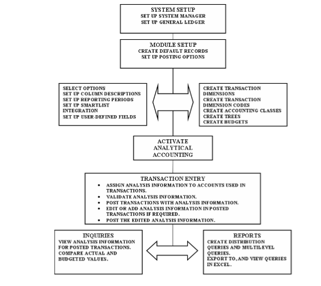

### Creating default records

After installing Analytical Accounting, you must run the Create Default Record routine using the Analytical Accounting Setup wizard. You must run this routine once, for each company registered in your Microsoft Dynamics GP system.

> [!IMPORTANT]
> You must be logged in as SA or DYNSA to set up Analytical Accounting.

**To create default records:**

1. Open the Analytical Accounting Setup wizard window. (Administration \>\>
    Setup \>\> Company \>\> Analytical Accounting \>\> Setup)

    The option Create Default Record is marked by default. This option is only available if it has not already been completed.

1. Choose Next to go to the Selected Option window, or choose Cancel to exit
    the setup process.

    The tasks that will be performed are displayed in the Selected Option window.

1. Choose Finish to perform the tasks displayed. An arrow next to a task in the
    scrolling window indicates the progress of the tasks that are running. As
    each task is completed, a check mark appears next to it. If any error
    occurs, an error sign is displayed.

2. Choose OK to close the window when all the tasks are completed.

### Setting up posting options for Analytical Accounting

Once you’ve installed Analytical Accounting for your company, you must set
up the appropriate posting options for Analytical Accounting in the
Microsoft Dynamics GP Posting Setup window. Be sure that you’ve completed
this task before you activate Analytical Accounting,

In order to collect analytical information for an account, the account must
be linked to an account class. Analytical Accounting does not support
posting in summary. Therefore, you must ensure that each account in the
Account Maintenance window that you want to link to an account class has its
level of posting set to detail. Refer to *Linking accounts to an account class* for information about linking accounts to an account class.

**To set up posting options for Analytical Accounting:**

1. Open the Posting Setup window. (Administration \>\> Setup \>\> Posting \>\>
    Posting)

2. Refer to the Microsoft Dynamics GP posting setup procedures (Help \>\>
    Contents \>\> Setting up the System) and (Help \>\> Contents \>\> Using the
    System) for information about setting up posting in Microsoft Dynamics GP.

3. In the Posting Setup window, select the option Create a Journal Entry per
    Transaction or Batch. If you select Batch, mark the Use Account Settings
    option.

4. Select Payroll in the Series field and All in the Origin field, and mark the
    Post in Detail option to post U.S. Payroll transactions in detail for all
    origins, except Period End Reports.

    > [!IMPORTANT]
    > You must mark this option to enter and view analysis information for U.S. payroll transactions.

    Once Analytical Accounting is activated, you cannot select Create a Journal Entry Per Batch without marking Use Account Settings. You also cannot unmark the Use Account Settings option after Analytical Accounting has been activated. However, you can change the posting option to Create a Journal Entry per Transaction, or per Batch with Use Account Settings marked after Analytical Accounting has been activated.

    After Analytical Accounting has been activated, any account that has a level of posting set to summary in the Account Maintenance window cannot be linked to an account class. After you have linked an account to an account class, you cannot change the level of posting from detail to summary in the Account Maintenance window.

    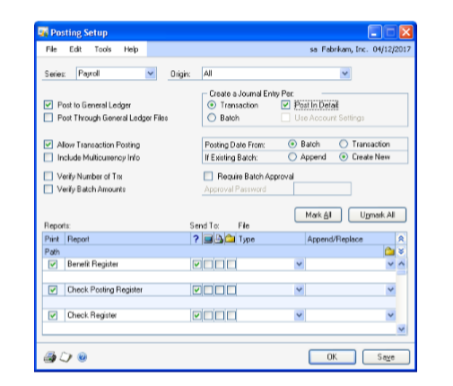

1. Complete the setup procedures and choose OK or Save to save the posting setup.

### Activating Analytical Accounting

You must activate Analytical Accounting in all the companies where it will
be used. The Activate Analytical Accounting routine can be accessed through
the Analytical Accounting Setup wizard.

You cannot enter or view analysis information for your transactions before
you activate Analytical Accounting. Also, the Smartlist folders that are
created for Analytical Accounting will not display any data until you have
activated Analytical Accounting.

You can, however, access Analytical Accounting Setup and Cards windows and
create necessary setup information such as transaction dimensions,
relations, and codes before activating Analytical Accounting.

*Before activating Analytical Accounting, you must have marked the
appropriate options in the Posting Setup window. Refer to Setting up posting
options for Analytical Accounting for more information.*

The process of activation will also ensure that the last updated balances in
your Microsoft Dynamics GP accounts are transferred to the Analytical
Accounting system tables.

**To activate Analytical Accounting:**

1. Open the Analytical Accounting Setup Wizard window. (Administration \>\>
    Setup \>\> Company \>\> Analytical Accounting \>\> Setup)

    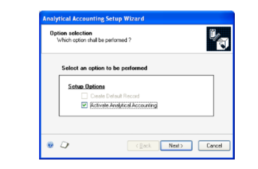

1. Mark the Activate Analytical Accounting option to activate the product for
    the company you are logged into. If you have not registered Analytical
    Accounting, a message appears when you mark the option Activate Analytical
    Accounting prompting you to do so. Contact your Microsoft Dynamics GP
    representative for more information about registration.

    The Activate Analytical Accounting option is available only if you’ve created the default records for the company you are logged into. Refer to *Creating default records* for more information.

1. Choose Next to go to the next setup window which displays the tasks that are
    performed.

2. Choose Finish to perform the tasks. An arrow next to a task in the scrolling
    window indicates the progress of the tasks that are running. As each task is
    completed, a check mark appears next to it. If any error occurs, an error
    sign is displayed.

3. When all the tasks are completed, choose OK to close the window.

### Assigning security roles and tasks to users

Individual security is role-based in Microsoft Dynamics GP. Each user must
be assigned to a security role before they can access any forms, reports, or
other data within Microsoft Dynamics GP. After installing Analytical
Accounting, the user must add the AA roles to each user, and add the AA
security tasks to the appropriate roles. If this is not done, the user will
not have access to any Analytical Accounting information.

To begin assigning user security, identify the daily tasks that a user
completes within Microsoft Dynamics GP. Then either select from the default
security roles or create new security roles that only grant access to the
tasks that the user needs.

For example, user ABC is an analysis manager for Fabrikam, Inc., and needs
access to set up and administer Analytical Accounting, enter or edit
transaction dimensions or perform other analysis tasks. Review the default
security roles in Microsoft Dynamics GP to find one that grants access to
the appropriate analysis functionality for user ABC. For our example, the AA
MANAGER\* security role is appropriate for user ABC. Use the User Security
Setup Window to assign the AA MANAGER\* security role to user ABC in the
Fabrikam, Inc. company.

The default security roles for Analytical Accounting are AA MANAGER and AA
CLERK. You can assign the following default security tasks to these roles.
You can also create new roles and tasks based on your requirement.

- ADMIN_AA_001\*

- CARD_AA_001\*

- TRX_AA_001\*

- INQ_AA_001\*

- INQ_AA_002\*

- RPT_AA_001\*

- AADEFAULTUSER\*

- ADMIN_AA_002\*

To specify security settings for specific tasks in Analytical Accounting,
use the

Security Task Setup window. (Administration \>\> Setup \>\> System \>\>
Security Tasks) To assign security tasks to the security roles, use the
Security Role Setup window (Administration \>\> Setup \>\> System \>\>
Security Roles) and grant access to the required windows, reports or files.
Refer to the System Setup documentation for more information on security in
Microsoft Dynamics GP.

### Setting up Analytical Accounting options

You can set up posting, viewing, and deletion options in the Analytical
Accounting Options window.

**To set up Analytical Accounting options:**

1. Open the Analytical Accounting Options window. (Administration \>\> Setup
    \>\> Company \>\> Analytical Accounting \>\> Options)

    

1. Mark the Post Cash Receipt deposits automatically in Bank Reconciliation
    option so that cash receipts entered in Receivables Management directly
    update the checkbook balance when posted. You will not be required to post
    the cash receipt again from the Bank Deposit Entry window (Transactions \>\>
    Financial \>\> Bank Deposits) in Bank Reconciliation if you mark this
    option.

2. Mark the Post through to General Ledger for Transaction Posting option to
    directly update posting accounts when individually entered transactions are
    posted from the subsidiary modules. Batches are created during transaction
    posting in the subsidiary modules and automatically update the posting
    accounts after the individual transactions have been posted from these
    modules.

3. Mark the Allow Deletion of Transaction Dimensions option to delete  transaction dimensions that exist in posted transactions from the Transaction Dimension Maintenance window. Refer to *Defining transaction dimensions* for more information about deleting a transaction dimension.

    > [!TIP]
    > You can restrict users’ ability to delete a transaction dimension. To do this, open the Security Setup window (Administration \>\>Setup \>\> System \>\> Security) and deny access as necessary, to the Transaction Dimension Maintenance window.

1. Mark the Show Inactive Trx Dim in Acct Class Maint window option to view the
    transaction dimensions that have been set to inactive in the Accounting
    Class Maintenance window. Refer to *Defining transaction dimensions* for
    more information about making a transaction dimension inactive.

2. Mark the Show Inactive Trx Dim in Dim Relations window option to view the
    transaction dimensions which have been set to inactive in the Transaction
    Dimension Relations window. Refer to *Defining transaction dimensions* for
    more information about viewing inactive transaction dimensions.

3. Mark the Enable Transaction Dimensions in Payroll (United States) option to
    enable transaction dimensions for transactions entered through the Payroll
    (United States) series. This option is available only if you have registered
    the Payroll module in the Registration window (Administration \>\> Setup
    \>\> System \>\> Registration). Refer to the Microsoft Dynamics GP
    documentation for more information.

    > [!NOTE]
    > You must mark the Post in Detail option for the Payroll series in the Posting Setup window before you can enable transaction dimensions in U.S. Payroll.

1. Unmark the Allow special characters in Trx Dim./Codes option if you are
    using FRx® with Analytical Accounting. FRx does not support transaction
    dimension IDs or code IDs that contain special characters.

2. Mark the Show valid code combinations in trns and budgets option if
    required. Selecting this option will display in the Code lookup window only
    those codes that have a valid combination with the codes that you have
    already selected for an analytical transaction or for a budget tree.

3. Mark the Include dimensions in the year end close option to move analysis
    information to history in the year end close process. Refer to *Including
    Analytical Accounting in the year-end close process*.

4. Mark the Enable Trx. Dimensions in Fixed Assets option to enable transaction
    dimensions for transactions entered through the Fixed Asset GL posting. This
    option is available only if you have registered for Fixed asset module in
    the Registration window (Administration \>\> Setup \>\> System \>\>
    Registration). Refer to the Microsoft Dynamics GP documentation for more
    information.

5. Choose User-Defined to open the Analytical Default User-Defined Fields Setup
    window. Refer to *Setting up default user-defined fields for transaction
    dimensions* for more information.

6. Choose Column Heading to open the Column Maintenance window. Refer to
    *Modifying column headings for inquiries and reports* for more information.

7. Choose Reporting Periods to open the Reporting Periods window. Refer to
    *Defining fiscal years* for more information.

8. Choose Smart List Integration to open the Smart List Integration window.
    Refer to *Setting up SmartList integration* for more information.

9. Click the printer icon button to print the Company Options report.

10. Choose Redisplay to revert to the last saved information in the scrolling
    window.

11. Choose OK to save the changes made to the window and close the window.

12. Choose Cancel to close the window without saving the changes.

### Modifying column headings for inquiries and reports

Analytical Accounting uses pre-defined columns to classify information in
the Multilevel Query wizard. You can modify the column header and column
description information for each column. Columns are created for actual
figures, budgeted figures and variances. Refer to *Creating and running a
multilevel query* for more information about multilevel queries.

You cannot create or delete any column in this window.

**To modify column headings for inquiries and reports:**

1. Open the Column Maintenance window. (Administration \>\> Setup \>\> Company
    \>\> Analytical Accounting \>\> Options \>\> Column Heading button)

2. The Column Description field displays the description of the column. Select
    the description and enter a unique column description, if needed.

3. The Column Header field displays the standard header as a brief description
    for the column. Enter a unique column header, if needed.

4. The column type and column data type will be displayed when you click the
    show button. You cannot modify this information. The columns types are
    Standard-Debit, Standard-Credit, Standard-Budget, and Standard-Variance

5. Choose Load Defaults to insert the default column description and header
    information.

6. Choose the printer icon button to print all the column definitions.

7. Choose Redisplay to update the window by displaying any new information
    since you last modified the column headings.

8. Choose OK to close the window.

<!--  -->

## Defining fiscal years

The Reporting Periods window displays the calendar and fiscal definition for
the fiscal years that are set up in Microsoft Dynamics GP. While doing an
analysis or preparing a report, you can switch between the Calendar and
Fiscal view. The fiscal year can be viewed by date, week, period, quarter,
or half year.

**To define fiscal years:**

1. Open the Reporting Periods window. (Administration \>\> Setup \>\> Company
    \>\> Analytical Accounting \>\> Options \>\> Reporting Periods button)

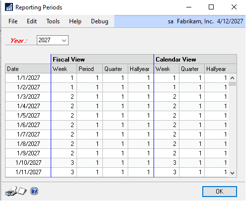

1. The Year field displays the current open year. Select a year from the fiscal
    years set up in Microsoft Dynamics GP. The Fiscal View and the Calendar view
    columns display information for the selected year.

2. Choose the printer icon button to print the settings for the selected year.

3. Choose OK to close the window.

### Setting up SmartList integration

You can add Analytical Accounting records to the SmartList using the
SmartList Integration window. All the records that you add to the SmartList
will also become available in the Report List (Reports \>\> Report List). In
the Report List window, choose Actions \>\> Add to My Reports, to open the
Add to My Reports window, where you can add a report to the My Reports list.
Refer to the Microsoft Dynamics GP documentation for more information on My
Reports.

Folders will be created at the root level in the SmartList for the following
type of records:

- AA Accounting Classes

- AA Distribution Queries

- AA Multilevel Queries

- AA Trees

- AA Trx Dimension Codes

- AA Trx Dimensions

- AA Dimension Balances

- Analytical Accounting Transactions

- Asset ID

- Book ID

If you choose to process a folder that already exists in the SmartList
Integration window, the Analytical Accounting records related to that folder
will be added to the relevant folder in the SmartList.

**To set up SmartList integration:**

1. Open the SmartList Integration window.

(Administration \>\> Setup \>\> Company \>\> Analytical Accounting \>\>
Options \>\> SmartList Integration)

1. Mark the options you want to create in the Install field. The Smart List
    Folder lists all the folders that you can install into a SmartList.

2. If you mark a checkbox and choose Process, a folder will be created. For
    example, if you mark AA Trx Dimension and choose Process, a folder is
    created for transaction dimension in the SmartList that will display all the
    existing transaction dimensions.

If you unmark a checkbox that had been marked earlier, the folder will be
removed from the SmartList after you click Process.

1. Choose Mark All to select all the folders in the scrolling window.

2. Choose Unmark All to unmark all the folders in the scrolling window.

3. Choose Process to add or remove the SmartList folders that you’ve selected.
    Choose OK when a message appears after the SmartList folders have been
    created.

4. Choose Cancel to close the window without saving the changes made to the
    scrolling window.

### Setting up default user-defined fields for transaction dimensions

Analytical Accounting allows you to enter labels for up to twenty
user-defined fields for each alphanumeric transaction dimension.
User-defined fields are of four types: Text, Numeric, Date and Checkbox. You
can define up to five fields of each type. You can use these fields to enter
additional information for each transaction dimension code that you’ve set
up. This information can be printed on the multilevel query report that you
generate for the transaction dimension code.

**To set up default user-defined fields for transaction dimensions:**

1. Open the Analytical Default User-Defined Fields Setup window.
    (Administration \>\> Setup \>\> Company \>\> Analytical Accounting \>\>
    Options \>\> User-Defined button)

2. Modify the label for each user-defined field if required. The system
    generated label for each user-defined field is the same as the field name.
    For example, the system generated label for Text Field 1 is Text Field 1.
    You cannot enter the same label in two fields. The label entered for each
    field is saved as soon as you move to another field in the window.

    The labels you enter in this window will be the default labels for all alphanumeric transaction dimensions that you’ve set up. You can change these labels for each alphanumeric transaction dimension. Refer to *Setting up userdefined fields per transaction dimension* for more information.

1. Choose Load Defaults to clear all the values you’ve entered and revert to
    the system generated values.

2. Choose the printer icon to print the Analytical Default User-Defined Fields
    Setup Report.

3. Choose OK to close the window.

### Setting up assignment options

You can specify if the distribution amount of an analytical account is to be
assigned fully or partially. You can post partially assigned transactions in
those modules where you allow partial assignments. By default Fixed Assets
will be unmarked during the upgrade. When Analytical accounting is activated
Fixed Asset will be marked by default on a new install or a new company.

**To set up assignment options:**

1. Open the Assignment Setup window. (Administration \>\> Setup \>\> Company
    \>\> Analytical Accounting \>\> Assignment)

    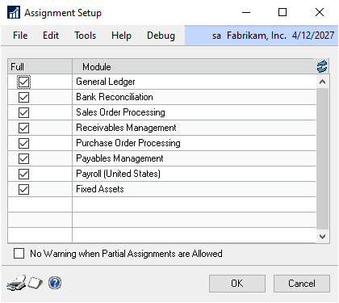

    All the Microsoft Dynamics GP modules that integrate with Analytical Accounting are listed in the scrolling window. The Full option is marked for all by default. This indicates that the distributions must be fully assigned before you can post the transactions.

    > [!NOTE]
    > In the case of Bank Management transactions, you can post a transaction with partial assignments, if you’ve allowed partial assignments for the module that you’re posting the Bank Management transaction to. The Inventory module is not included since assignments are not allowed in this module.

1. Unmark the Full option for the modules where you want to allow partial
    assignments. If you allow partial assignments for a module, you can post a
    transaction even if the sum of assignments entered for an analytical account
    is not equal to the distribution amount of the analytical account.

    You can mark and unmark this option at any time for each module. The options that you have saved will apply to all un-posted and future transactions.

1. Mark the option “No Warning When Partial Assignments Are Allowed” if you do
    not want to be warned while saving or posting partially assigned
    transactions. When this option is unmarked, you will be warned each time you
    save or post a partially assigned transaction. You can choose Yes on the
    message to continue saving or posting with partial assignments.

    You can mark this option even when the Full option has been marked for all modules. You can mark or unmark this option at any time.

1. Choose the Redisplay button to revert to the last saved changes on the
    window.

2. Choose OK to save your changes and close the window.

3. Choose Cancel to close the window without saving any changes.

4. Choose Print to print the Assignment Options report for the assignment
    options that you’ve saved for each module.

### Setting up user access to codes

Use the User Access to Trx Dimension Codes window to specify which users
have permission to use transaction dimension codes in distributions and
adjustments. This will ensure that the analysis information at the time of
posting transactions or adjustments is entered only by users with the access
to use the required codes.

If you’re already using Analytical Accounting, then all existing users in
the company will have access to distribute and adjust all the existing
transaction dimension codes by default. However, when you create a new code,
you must specify the users who have permission to use that code in
transactions. Also, any new users that you create in the company must be
given access to the existing transaction dimension codes that they are
required to use.

*Security access to use a transaction dimension code is granted
automatically to the user who created the code during transaction entry.*

The user access that you set up is valid only for the company that you’re
logged into. To give users access to codes for another company, you must
login to that company and grant the required access.

You can specify user access only for codes belonging to alphanumeric
transaction dimensions. You can give access to users per transaction
dimension code, per user or per employee. If you are using Analytical
Accounting with Payroll (United States), the user provided with access to
employees can view, sort and filter analysis information in multilevel query
and distribution query reports.

*Users can still view the transaction dimension codes though they may not
have permission to distribute or adjust those codes.*

**To set up user access per transaction dimension code:**

1. Open the User Access to Trx Dimension Codes window. (Administration \>\>
    Setup \>\> Company \>\> Analytical Accounting \>\> User Access)

    The Type field displays Transaction Dimension as the default selection. 

    

1. Select an alphanumeric transaction dimension in the Transaction Dimension
    field. You can select an active or an inactive transaction dimension.

2. Select the Transaction Dimension Code for which you want to set user access.

    The scrolling window displays all the user IDs you’ve set up for the    company. You can add or remove users from the scrolling window.

1. Mark the Distribute and Adjust options for the users to whom you want to
    give access to the selected code. Unmark these options for the users to whom
    you do not want to give access.

    If you are already using Analytical Accounting, the Distribute and Adjust options are marked by default for all existing users.

1. In the Default Values for User ID field, mark the Distribute and Adjust
    options to give access to all the users displayed in the scrolling window.
    Unmark these options to remove access for all users displayed in the
    scrolling window.

2. Choose Save to save your access settings and clear the window.

3. Choose Clear to clear the window without saving changes.

4. Choose Redisplay to revert to the last saved changes. The scrolling window
    will also display any new users that have been set up in the company since
    you opened this window.

**To set up user access per user:**

1. Open the User Access to Trx Dimension Codes window. (Administration \>\>
    Setup \>\> Company \>\> Analytical Accounting \>\> User Access)

2. Select User ID in the Type field.

3. Select the user ID in the User ID field.

4. Select an alphanumeric transaction dimension. You can select an active or
    inactive transaction dimension. The scrolling window displays all the
    transaction dimension codes belonging to the selected transaction dimension.
    You can add or remove codes from the scrolling window.

5. Mark the Distribute and Adjust options for the codes to which you want to
    give access to the selected user. Unmark these options for the codes to
    which you do not want to give access.

    If you are already using Analytical Accounting, the Distribute and Adjust options are marked by default for all existing transaction dimension codes.

1. In the Default Values for Trx Dimension Codes field, mark the Distribute and
    Adjust options to give access to all the codes displayed in the scrolling
    window. Unmark these options to remove access for all codes displayed in the
    scrolling window for the selected user.

2. Choose Save to save your access settings and clear the window.

3. Choose Clear to clear the window without saving changes.

4. Choose Redisplay to revert to the last saved changes. The scrolling window
    will also display any new transaction dimension codes that have been set up
    in the company since you opened this window.

**To set up user access per employee:**

1. Open the User Access to Trx Dimension Codes window. (Administration \>\>
    Setup \>\> Company \>\> Analytical Accounting \>\> User Access)

2. Select Employee in the Type field.

3. In the scrolling window, mark the View column for each corresponding User ID
    to which you want to grant permission to view, sort, and filter by employee
    ID on distribution and multilevel query reports.

4. Choose Save to save your access settings and clear the window.

5. Choose Clear to clear the window without saving changes.

6. Choose Redisplay to revert to the last saved changes.

## Chapter 2: Cards

You can set up various transaction dimensions, relationships between
alphanumeric transaction dimensions, transaction dimension codes, and valid
code combinations in order to enter analysis information. The process of
creating account classes and linking accounts to an account class in
Analytical Accounting also is explained. Information about trees and tree
structures, which are used in reporting, is also explained.

This information is divided into the following sections:

- *Defining transaction dimensions*

- *Setting up user-defined fields per transaction dimension*

- *Setting transaction dimension relationships*

- *Changing the order of transaction dimensions*

- *Defining transaction dimension codes*

- *Entering details for user-defined fields per code*

- *Defining combinations between transaction dimension codes*

- *Copying a transaction dimension code combination*

- *Creating an alias*

- *Copying an alias*

- *Importing an alias*

- *Format to import aliases*

- *Setting up an account class*

- *Linking accounts to an account class*

- *Linking accounts to classes and nodes*

- *Setting up account access to codes*

- *Entering analysis information for fixed assets transactions*

- *Setting up trees*

- *Defining a tree structure*

- *Copying a tree structure*

- *Linking master records to an existing tree structure*

- *Adding master records to an existing tree*

### Defining transaction dimensions

Use the following information to set up various types of transaction
dimensions. A transaction dimension is any transaction criterion that you
can classify, report and analyze for a period. A transaction dimension can
be Alphanumeric, Numeric, Yes/ No (Boolean) or Date Type. For example, you
can set up Cost Centre, Profit Centre, Country/Region, Billable or Hours as
transaction dimensions. You can define any number of transaction dimensions
according to your analysis or reporting requirements.

> [!NOTE]
> If you are integrating Analytical Accounting with FRx, be sure that
transaction dimensions do not contain any special characters in them. Refer
to Setting up Analytical Accounting options for information on avoiding use
of special characters.

**To define transaction dimensions:**

1. Open the Transaction Dimension Maintenance window. (Cards \>\> Financial
    \>\> Analytical Accounting \>\> Transaction Dimension)

    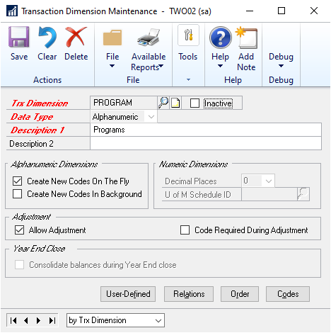

1. Enter the name of a transaction dimension.

    > [!NOTE]
    > Use a different name for the transation dimension other than the six AA dimensions that already exist.

1. Mark Inactive if you do not want to enter analysis information for the
    transaction dimension during transaction entry. An inactivated transaction
    dimension cannot be used to create analysis information. Unmark the Inactive
    check box to activate a transaction dimension.

2. Select the analysis type of the transaction dimension from the Data Type
    list. For example, an alphanumeric data type could be a profit centre of the
    company, numeric could be the quantity of units sold, boolean could be a
    billable or saleable item, and date type could be the date on which goods
    are dispatched.

    The data type you select is used to determine the additional setup information that you can or cannot create for a transaction dimension. It also determines the type of analysis information that you can enter for the transaction dimension. For example, if you select a data type of Numeric, you can enter only numbers as analysis information.

1. Enter the description for the transaction dimension in the Description 1
    field.

2. Enter any additional descriptions for the transaction dimension in the
    Description 2 field.

3. Keep the Create New Codes on the Fly option marked to create alphanumeric
    transaction dimension codes during transaction entry. This will allow you to
    open the Transaction Dimension Code Maintenance window (Cards \>\> Financial
    \>\> Analytical Accounting \>\> Transaction Dimension Code) to add a new
    alphanumeric transaction dimension code during transaction entry. Unmark the
    option if it is not required.

4. Mark the Create New Codes in Background option to create new alphanumeric
    transaction dimension codes in the background during transaction entry.
    Selecting this option will automatically add the new code during transaction
    entry to the existing codes of the alphanumeric transaction dimension. This
    option is available only if you selected the Create New Codes on the Fly
    option.

    > [!NOTE]
    > In the case of non-alphanumeric transaction dimensions, transaction dimension codes are always created in the background.

1. Select the number of decimal places from the Decimal Places list to
    determine the number of decimal places that can be used for a numeric
    transaction dimension code. This field is available only if the data type of
    the transaction dimension is Numeric.

2. Select the U of M Schedule ID to link a Unit of Measure ID to a Numeric
    transaction dimension. The base unit is displayed beside the numeric
    transaction dimension code during transaction entry. This field is available
    only if the data type of the transaction dimension is Numeric.

3. Mark the Allow Adjustments option to allow the selected transaction
    dimension to be adjusted in the Analytical Adjustment Entry window. You can
    make adjustments only for transaction dimensions that have this option
    marked. You can mark or unmark this option at any time. Refer to *Adjusting
    analysis information in posted transactions* for more information on
    adjustments.

4. Mark the Code Required During Adjustment option to make entering a code a
    required criteria during adjustment entry. You cannot post an adjustment
    until you enter a Transaction Dimension Code against the Transaction
    Dimension. This option is unmarked and not available if you’ve not marked
    Allow Adjustments.

5. Mark the Include In Year End Close option to include the analysis
    information for alphanumeric transaction dimensions during the year end
    closing process. You must have also marked the Include In Year End Close
    option for the transaction dimension in the Analytical Accounting Options
    window.

6. Choose User-Defined to open the Transaction Dimension User-Defined Fields
    Setup window. You can enter unique labels for each transaction dimension
    that you have set up.

7. Choose Relations to open the Transaction Dimension Relations window. The
    Relations button is only available for alphanumeric transaction dimensions.
    Refer to *Setting transaction dimension relationships* for more information.

8. Choose Order to open the Transaction Dimension Order window to change the
    order of the transaction dimensions that you’ve created. Refer to *Changing
    the order of transaction dimensions* for more information.

9. Choose Codes to open the Transaction Dimension Code Maintenance window if
    the transaction dimension is alphanumeric. Refer to *Defining transaction
    dimension codes* for more information.

10. Choose the Print drop-down list to print setup details of the transaction
    dimension currently displayed or all the transaction dimensions that you
    have created.

11. Choose Save to save the details that you have entered for the transaction
    dimension.

12. Choose Clear to clear the window.

13. Choose Delete to delete a transaction dimension with all its codes and
    relations, if applicable. You cannot carry out any inquiries for transaction
    dimensions that have been deleted.

If you have created a query or queries using the Distribution Query wizard
or Multilevel Query wizard, you cannot delete a transaction dimension that
has been saved in such query or queries. Refer to *Chapter 17,
“Inquiries”*for more information about queries. You also cannot delete a
transaction dimension that is used in a budget tree ID.

You can delete a transaction dimension that exists in posted transactions
only if you have selected the Allow Deletion of Transaction Dimensions
option in the Analytical Accounting Setup window (Administration \>\> Setup
\>\> Company \>\> Analytical Accounting \>\> Setup).

### Setting up user-defined fields per transaction dimension

You can change the default labels you’ve set up in the Analytical
User-Defined Setup window, and assign unique labels for each alphanumeric
transaction dimension.

**To set up user-defined fields per transaction dimension:**

1. Open the Transaction Dimension User-Defined Fields Setup window. (Cards \>\>
    Financial \>\> Analytical Accounting \>\> Transaction Dimension
    \>\>User-Defined button)

The transaction dimension and description are displayed in the Transaction
Dimension and Description fields.

1. Modify the label for each user-defined field if required. You cannot enter
    the same label in two fields. The label entered for each field is saved as
    soon as you move to another field in the window.

The values you enter in this window will be the user-defined field names for
all transaction dimensions codes belonging to the selected transaction
dimension. You can enter details for each field code in the Transaction
Dimension Code User-Defined Fields Maintenance window. Refer to *Entering
details for userdefined fields per code* for more information.

1. Choose Load Defaults to clear all the values you’ve entered and revert to
    the values entered in the Analytical Default User-Defined Fields Setup
    window.

2. Choose the printer icon to print the Transaction Dimension User-Defined
    Fields Setup Report.

3. Choose OK to close the window.

### Setting transaction dimension relationships

The following information explains the various kinds of relationships that
you can set up between alphanumeric transaction dimensions. You can create a
relationship of ownership between alphanumeric transaction dimensions where
a transaction dimension is owned or owns another transaction dimension. For
example, you can set the relationship between profit centre P1 and cost
centre C1 as: P1 owns C1. You can create other combinations as well in the
Transaction Dimension Relations window. Setting up relationships will also
ease data entry.

**To set transaction dimension relationships:**

1. Open the Transaction Dimension Relations window.

    (Cards \>\> Financial \>\> Analytical Accounting \>\> Transaction Dimension Relation)

    (Cards \>\> Financial \>\> Analytical Accounting \>\> Transaction Dimension \>\> Relations button)

1. Enter or select an alphanumeric transaction dimension. The scrolling window
    displays all the other alphanumeric transaction dimensions that you have
    created except the transaction dimension that you have selected.

    Inactive alphanumeric transaction dimensions will be displayed in the

    Transaction Dimension Relations window if you have marked the Show Inactive Trx Dim in Dim Relations window option in the Analytical Accounting Setup window.

1. Select the type of relationship to establish between the selected
    transaction dimension and the other transaction dimensions displayed from
    the Relation List. You can set the relationship between transaction
    dimensions to one of the following options in the Relation list:

**All combinations allowed** All code combinations between two transaction
dimensions are permitted. For example, if the transaction dimensions profit
centre and cost centre are set to a relationship of All Combinations Allowed
then any profit centre code can be used with any cost centre code.

**Combination not allowed** Code combinations between two transaction
dimensions are not permitted. For example, transaction dimension profit
centre and cost centre set to a Combination relationship is not allowed;
then code combination between these transaction dimensions is not allowed.

If you set the relationship between two alphanumeric transaction dimensions
to Combination not allowed, you cannot use both the transaction dimensions
at the same time for analysis during transaction entry.

**Is owned by** Where the selected alphanumeric transaction dimension is
owned by another alphanumeric transaction dimension. For example, cost
centre C1 is owned by profit centre P1.

**Owns Trx Dimension** where the selected alphanumeric transaction dimension
owns another alphanumeric transaction dimension.

**Example**

Suppose that factory X (which is a cost centre) manufactures only Product Y
(which is a profit centre). You can create a relationship where the cost
centre owns the profit centre. This will ensure that all analysis
information entered for the expenses incurred by the cost centre
automatically will be picked up for the profit centre.

An alphanumeric transaction dimension can own only one alphanumeric
transaction dimension. Additionally, an alphanumeric transaction dimension
cannot be owned by more than one alphanumeric transaction dimension at a
time.

The relationships Is owned by and Owns Trx Dimension require combinations to
be set between the codes of the owning and owned alphanumeric transaction
dimensions. For example, factory X (cost centre) manufactures only Product Y
(profit centre). You would have to create a combination where a code of the
cost centre, factory X, owns a code of the profit centre, Product Y.

While creating analysis information, the code of the owned transaction
dimension will derive the relevant code of the owning transaction dimension.
For example, if you enter Product Y while entering analysis information, it
will derive the code Factory X, as you have created a combination between
the codes Factory X and Product Y.

The code of an owning transaction dimension can own any number of codes of
the owned transaction dimension. However, a code of the owned transaction
dimension can be assigned to only one code of the owning transaction
dimension at a time.

You can set the code combination while creating codes in the Trx Dimension
Code Maintenance window or in the Transaction Dimension Code Validation
window.

If you delete a transaction dimension that owns another transaction
dimension, the codes of the owning transaction dimension also will be
deleted. The relevant codes of the owned transaction dimension will now not
be owned by any code.

An alphanumeric transaction dimension that has been set to Inactive, cannot
own any other alphanumeric transaction dimension. However, the owned
alphanumeric transaction dimension can be inactive.

The code or codes of an owning transaction dimension must be active before
you create a combination with code or codes of the owned transaction
dimension.

**Valid subset** Certain code combinations between two transaction
dimensions are permitted. This relation allows you to restrict the code
combinations.

**Example**

Sales Zone A is a Revenue Centre. There are products X, Y and Z. Revenue
Centre A sells only Products X and Y, which are set as a Profit Centre. You
can specify that Revenue Centre is a valid subset of Profit Centre and
create a valid code combination of A with X and Y. This will ensure that
where Revenue Centre and Profit Centre are used together while entering
analysis information, A can be used only with X and Y or vice versa.

You can set the code combinations between the transaction dimensions in the
Transaction Dimension Code Validation window.

1. Choose the Show as Tree button to open the Transaction Dimension Dependency
    (Relation) Inquiry window where the transaction dimensions are displayed in
    the form of a tree. Refer to *Chapter 17, “Inquiries”*for more information.

2. Choose Save to save the changes you’ve made.

3. Choose Clear to clear the window.

4. Choose Redisplay to revert to the information last displayed in the window.
    The window also will display any other alphanumeric transaction dimensions
    that have been created by other users while you were setting up
    relationships.

### Changing the order of transaction dimensions

You can change the order in which the transaction dimensions will appear
during transaction entry and inquiry windows using the Transaction Dimension
Order window. The relevant transaction entry or inquiry window displays the
transaction dimensions in the order that is specified in the Transaction
Dimension Order window.

**To change the order of transaction dimensions:**

1. Open the Transaction Dimension Order window.

(Cards \>\> Financial \>\> Analytical Accounting \>\> Transaction Dimension
Order)

(Cards \>\> Financial \>\> Analytical Accounting \>\> Transaction Dimension
\>\> Order Button

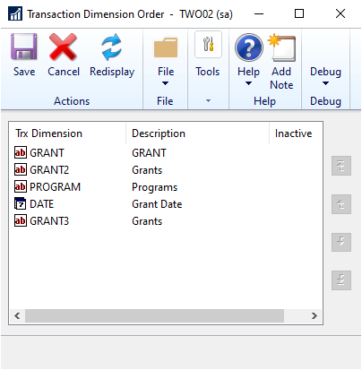

1. The transaction dimensions and their descriptions are displayed in the
    scrolling window in the order they were created.

    - Choose the Move to Top button to shift a selected item to the top of the
        list.

    - Choose the Move Up button to shift a selected item one line up in the
        list window.

    - Choose the Move Down button to shift a selected item one line down in
        the list window.

    - Choose the Move to Bottom button to shift a selected item to the bottom
        of the list window.

2. Choose Save to save changes you’ve made.

3. Choose Cancel to close the window without saving the changes.

### Defining transaction dimension codes

Use the following information to define alphanumeric transaction dimension
codes. Transaction dimension codes are the defined values of transaction
dimensions that you enter during transaction entry and for which analysis
information is collected.

*If you are integrating Analytical Accounting with FRx, be sure that
transaction dimension codes do not contain any special characters in them.
Refer to Setting up Analytical*

*Accounting options for information on avoiding use of special characters.*

**To define transaction dimension codes:**

1. Open the Transaction Dimension Code Maintenance window.

(Cards \>\> Financial \>\> Analytical Accounting \>\> Transaction Dimension
Code)

(Cards \>\> Financial \>\> Analytical Accounting \>\> Transaction Dimension
\>\> Codes button)

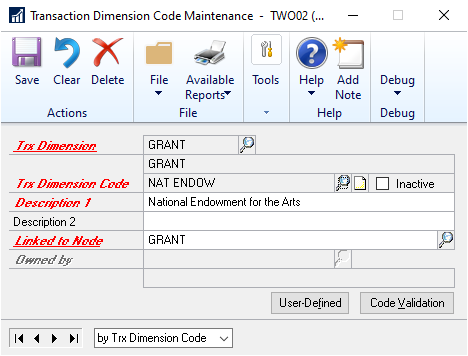

1. Enter or select an alphanumeric transaction dimension in the Trx Dimension
    field.

2. Enter a code in the Trx Dimension Code field. For example, if your
    manufacturing units are Cost Centres, you can enter the location of a
    manufacturing unit, say Fargo, as a Cost Centre code.

If a transaction dimension owns another transaction dimension, you first
need to create the codes for the owning transaction dimension. For example,
if a Profit Centre owns a Cost Centre, then you have to first create codes
for the Profit Centre.

At least one active code must exist for an owning transaction dimension
before you begin to create combinations with the codes of the owned
transaction dimension. You cannot delete the last remaining code of the
owning transaction dimension if codes exist for the owned transaction
dimension.

> [!NOTE]
> You must grant access to users to use this code in the User Access to Trx
Dimension Codes window. However, security access to use a transaction
dimension code is granted automatically to the user who created the code
during transaction entry.

1. Enter the description for the transaction dimension code in the Description
    1 field.

    > [!NOTE]
    > Two transaction dimension codes cannot have the same description.

1. Enter any additional description for the transaction dimension code in the
    Description 2 field.

2. Mark Inactive if you do not want to use the transaction dimension code to
    create analysis information. To use the transaction dimension code during
    transaction entry, you must unmark the Inactive check box.

You cannot inactivate the following codes:

- An alphanumeric transaction dimension code that owns another alphanumeric
    transaction dimension code. This will be applicable even if the owned
    alphanumeric transaction dimension code is inactive.

- A transaction dimension code that has been set as a default for a Fixed or
    Hidden Alphanumeric transaction dimension. The code must be removed as a
    default before it is inactivated. Refer to *Setting up an account class* for
    more information about default codes and Fixed and Hidden transaction
    dimensions.

You can inactivate the following codes:

- The default codes of the Required or Optional Alphanumeric transaction
    dimensions. When you inactivate transaction dimension codes, they will be
    removed from the relevant account class in the Accounting Class Maintenance
    window. Refer to *Setting up an account class* for more information about
    account classes.

You can create codes for inactive alphanumeric transaction dimensions, but
you can use these codes only if the transaction dimension is activated.

1. In the Linked to Node field, select a node for the specific transaction
    dimension code as each code has to be linked to a valid node of the Main
    Tree.

2. A Main Tree is created by default for each Alphanumeric Transaction
    Dimension that you create. You can create an unlimited number of additional
    trees. You can also create a new node from the Linked to Node field. Refer
    to *Setting up trees* for more information.

3. In the Owned By field, select a code of the transaction dimension that will
    own the transaction dimension code you are creating. This field is available
    only if a transaction dimension is owned by another transaction dimension.

4. Choose Code Validation to open the Trx Dimension Code Validation window
    where you can set valid combinations between transaction dimension codes of
    the selected alphanumeric transaction dimension and the other existing
    alphanumeric transaction dimensions. Refer to *Defining combinations between
    transaction dimension codes* for more information.

Where transaction dimensions are valid subsets, you can create valid code
combinations between inactive transaction dimension codes. However, these
codes cannot be used till they have been activated. Refer *Setting
transaction dimension relationships* for more information about valid
subsets.

1. Choose User-Defined to open the Transaction Dimension Code User-Defined
    Fields Maintenance window, where you can enter values for the user-defined
    fields you have set up.

2. Choose the printer icon button to print a report for the details you have
    set up for the codes of the transaction dimension currently displayed or for
    all alphanumeric transaction dimensions.

3. Choose Save to save the changes you’ve made.

4. Choose Clear to clear the entries you’ve made.

5. Choose Delete to remove the transaction dimension code displayed. You cannot
    delete a transaction dimension code if you have used it in any posted
    transaction. To delete such a transaction dimension code, you will have to
    delete the transaction dimension that the code belongs to.

You cannot delete a transaction dimension code if it is used as a default
code of a fixed alphanumeric transaction dimension in the Accounting Class
Maintenance window. You also cannot delete a transaction dimension code that
is used in a budget tree ID.

If you delete a code that owns another code, the code that is owned will be
automatically assigned to the next available code of the owning alphanumeric
transaction dimension.

### Entering details for user-defined fields per code

Once you’ve entered labels for the user-defined fields that you want to use,
you can enter details for each field in the Transaction Dimension Code
User-Defined Fields Maintenance window. You can enter different details for
each code that you have set up.

**To enter details for user-defined fields per code:**

1. Open the Transaction Dimension Code User-Defined Fields Maintenance window.
    (Cards \>\> Financial \>\> Analytical Accounting \>\> Transaction Dimension
    Code \>\> User-Defined button)

The Transaction Dimension, and Transaction Dimension Code fields display the
selected code for which you’re entering user-defined information.

1. Enter the necessary values in the user-defined text, numeric, and date
    fields.

2. Mark the required checkbox fields.

3. Choose OK to close the window. You must choose Save on the Transaction
    Dimension Code Maintenance window in order to save the values you’ve
    entered.

4. Choose the print icon on the Transaction Dimension Code Maintenance window
    to print the Transaction Dimension Code Maintenance report along with the
    details for user-defined fields.

### Defining combinations between transaction dimension codes

You can set combinations between the transaction dimension codes of

alphanumeric transaction dimensions that you have created, using the
Transaction Dimension Code Validation window. These combinations are
verified during transaction entry while entering analysis information and
therefore, you can’t enter code combinations that aren’t valid. In addition,
if the combination between two transaction dimension codes isn’t valid, it
will not pass the validation routine in Analytical Accounting.

The combination between the transaction dimension codes only can be set if
transaction dimensions are alphanumeric. You cannot define a code
combination if the relationship between the two transaction dimensions is
set to Combination not Allowed or All combinations allowed.

You can change the ownership between the transaction dimension codes in this
window.

**To define combinations between transaction dimension codes:**

1. Open the Transaction Dimension Code Validation window. (Cards \>\> Financial
    \>\> Analytical Accounting \>\> Transaction Dimension Code Validation)

    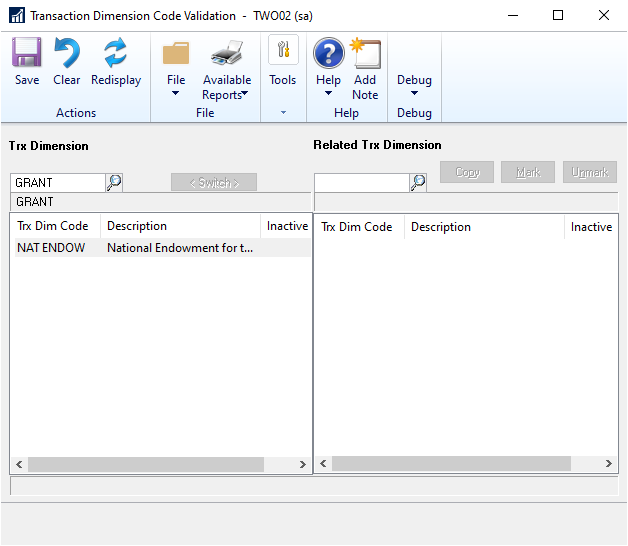

1. In the Trx Dimension field, select a transaction dimension. All the
    transaction dimension codes that you’ve created for the selected transaction
    dimension are displayed in the left scrolling window. The Trx Dimension Code
    column displays the name that you have assigned to the transaction dimension
    code in the Transaction Dimension Code Maintenance window. The Description
    column displays the description of the transaction dimension code created in
    the Transaction Dimension Code Maintenance window.

2. In the Related Trx Dimension field, select the transaction dimension that
    you will use to create a code combination. A related transaction dimension
    is one that is owned by or is a valid subset of the transaction dimension
    selected in the Trx Dimension field.

All the codes of the related transaction dimension will be displayed in the
right scrolling window. If the relationship between the transaction
dimensions is that of ownership, the combination between the codes of the
owned and owning transaction dimensions that you have entered in the
Transaction Dimension Code Maintenance window will be displayed.

1. To create a valid code combination between transaction dimensions that are
    valid subsets or in the case of ownership, select and mark a code for both
    the transaction dimensions and the related transaction dimension. You can
    select only one code at a time from the transaction dimension and related
    transaction dimension. The codes you have marked will constitute a valid
    combination.

For example, if you have selected Cost Centre in the Transaction Dimension
field and Profit Centre in the Related Transaction Dimension field (which
are valid subsets), you can create a valid code combination between the code
C1 of Cost Centre and P1 of Profit Centre. Mark C1 and P1 in the scrolling
window to create the combination. You also can mark C1 and P2 or C2 and P1,
thereby creating unlimited valid code combinations.

1. In the Related Transaction Dimension field, you also can select a
    transaction dimension where the relationship that exists is Combination Not
    Allowed or All Combination Allowed. However, you can’t select any codes of
    these transaction dimensions.

2. The Inactive field displays the alphanumeric transaction dimensions that
    have been inactivated.You can create combinations between the codes of
    inactive alphanumeric transaction dimensions that are valid subsets.

3. Choose Save to save a code combination.

4. Choose the printer icon button to print a report displaying the code
    combinations of the transaction dimension code that is highlighted in the
    left scrolling window with the codes of the related transaction dimension.
    You can also print a report displaying the code combinations between all
    codes of the transaction dimension with the codes of the related transaction
    dimension.

5. To interchange the transaction dimensions between the left and right
    scrolling windows, choose Switch.

6. Choose Clear to clear the information from the window.

7. Choose Redisplay to revert to the information last displayed and to display
    any other transaction dimension codes that have been created while you were
    setting code relationships.

8. Choose Copy to open the Copy Transaction Dimension Code Validation Copy
    window. Refer *Copying a transaction dimension code combination* 40 for more
    information.

9. Choose Mark to mark the code that has been selected from the right scrolling
    window.

10. Choose Unmark to unmark the code selected from the right list window.

### Copying a transaction dimension code combination

You can copy one, all, or a subset of the related transaction dimension code
combinations in the Transaction Dimension Code Validation window to the
transaction dimension codes of another transaction dimension using the Copy
Transaction Dimension Code Combinations window. Copying is only possible if
the relation between the two transaction dimensions is set to Valid Subset
in the Transaction Dimension Relations window. Refer *Setting transaction
dimension relationships* for more information.

**Example**

Sales Zone A is a Revenue Centre. Sales Zone A sells only two products, X
and Y.

You’ve defined Products as Profit Centres. In the Transaction Dimension Code

Validation window, you have created a combination between Sales Zone A and
Products X and Y. Using the Copy button, you can create the same combination
with any other sales zone, say Sales Zone B.

You must select a code of the related transaction dimension in the
Transaction Dimension Code Validation window before opening the Copy
Transaction Dimension Code Combination window. A transaction dimension code
will be selected automatically when you select a code for the related
transaction dimension.

**To copy a transaction dimension code combination:**

1. Open the Copy Transaction Dimension Code Combinations window. (Cards \>\>
    Financial \>\> Analytical Accounting \>\> Transaction Dimension Code
    Validation \>\> Copy button)

The Copy from Trx Dimension field displays the source that the code
combination will be copied from. The source always will be the related
transaction dimension that is displayed in the Transaction Dimension Code
Validation window.

The Copy to Trx Dimension field displays the destination to which the code
combination must be copied. The destination always will be the transaction
dimension displayed in the Transaction Dimension Code Validation window.

1. All the transaction dimension codes of the Copy to Trx Dimension, except for
    the code selected in the Transaction Dimension Code Validation window, will
    be displayed. All codes displayed in the scrolling window will be
    automatically selected.

You can select one, all or a subset of transaction dimension codes to copy
to the code combination. Press SHIFT+CTRL to select more than one
transaction dimension code from the list window.

1. Choose Copy to start the process of copying the transaction dimension code
    combinations to the codes you have selected. The window will close as soon
    as the copying process is complete.

2. After the process has been completed, a combination is created between Sales
    Zone B and Products X and Y.

3. Choose Cancel to close the window. The code combination will not be copied
    to the codes you have selected in the window.

### Creating an alias

You can create aliases to group the transaction dimension code combinations
that you use while entering analysis information for transactions. Aliases
allow you to enter large amounts of analysis information quickly and
accurately during transaction entry. When you use an alias, the codes
associated with the alias default for the account. You can also change the
default transaction dimension codes for the alias during transaction entry.
You can create multiple aliases with different combinations of transaction
dimension codes. Refer to *Entering analysis information for General Ledger
transactions* for more information.

**To create an alias:**

1. Open the Alias Maintenance window. (Cards \>\> Financial \>\> Analytical
    Accounting \>\> Alias)

2. Enter a name, description, and a short description for the alias that you
    are setting up.

The scrolling window displays all the alphanumeric transaction dimension
codes that you have set up.

1. Mark the Inactive checkbox to inactivate the alias displayed in the window.
    You cannot use an inactive alias during transaction entry.

2. Select a transaction dimension code for each transaction dimension to
    include in the alias.

3. Choose Save to save the alias you have set up.

4. Choose Clear to clear the values, or Delete to delete the alias displayed in
    the window.

5. Choose Copy to copy the transaction dimension codes from an existing alias
    to set up another alias. Refer to *Copying an alias* for more information.

6. Choose Import to import the transaction dimension codes from an Excel
    application to the alias. Refer to *Importing an alias* for more
    information.

### Copying an alias

You can copy an existing alias to set up another alias and modify it as
required. The transaction dimension codes from the existing alias are copied
to the new alias. You can add or delete transaction dimension codes in the
new alias.

**To copy an alias:**

1. Open the Copy Alias window. (Cards \>\> Financial \>\> Analytical Accounting
    \>\> Alias \>\> Select an alias \>\> Copy button)

The Copy from Alias field displays the alias you selected in the Alias
Maintenance window.

1. Enter an alias name to copy to in the Copy to Alias field.

2. Enter a description and a short description for the new alias.

3. Choose Copy to copy the transaction dimension codes to the new alias.

4. Choose Cancel to cancel the process and close the window.

### Importing an alias

You can import alias information from an Excel spreadsheet that has been set
up in the required format. Refer to *Format to import aliases* for more
information.

**To import an alias:**

1. Open the Import Alias window. (Cards \>\> Financial \>\> Analytical
    Accounting \>\> Alias \>\> Import button)

2. Select the path for the Excel file to import the alias information from.

3. The Select the Worksheet field displays all the worksheets in the selected
    Excel file. Highlight the worksheet that you want to import.

4. Select a destination for the log file.

5. Choose OK to import the alias information from the selected worksheet.

### Format to import aliases

You can import aliases only if they are in the required format. The first
line in the

Excel sheet from which you are importing the alias information must be
blank. The Excel sheet must have the columns Alias, Description,
SDescription, Trx Dim, and Trx Dim Code.

Refer to *Importing an alias* for more information on importing aliases.

### Setting up an account class

An account class is a category of accounts. During transaction entry, it
determines the Microsoft Dynamics GP accounts that you can enter analysis
information for. The Analytical Transaction Entry window, where you will
enter analysis information, can be opened in relation to a specific
Microsoft Dynamics GP account only if such account is linked to an account
class.

In the Accounting Class Maintenance window, you can define transaction
dimensions for each account that can be used during transaction entry, if
linked to an account class, to enter analysis information. You can select
default transaction dimension codes for each of the transaction dimensions,
determine if default codes can be overwritten during transaction entry, and
allow or restrict the ability to report on customers, vendors, item numbers,
and site IDs.

**To set up an account class:**

1. Open the Accounting Class Maintenance window. (Cards \>\> Financial \>\>
    Analytical Accounting \>\> Accounting Class)

    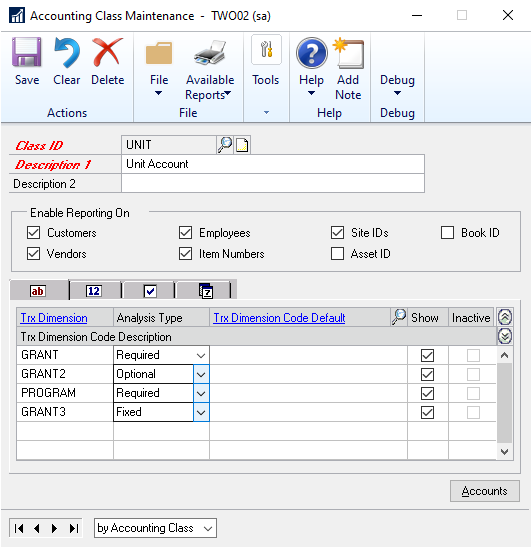

1. Enter or select an account class in the Class ID field. The existing
    alphanumeric transaction dimensions will be displayed in the scrolling
    window.

2. Enter a description for the account class in the Description 1 field. Enter
    an additional description, if required, in the Description 2 field.

3. In the Enable Reporting On field, mark the following options to view
    analysis information about:

**Customers** This will allow customer numbers to be stored during
transaction entry for reporting purposes. You can view analysis information
entered in relation to a customer against the transaction dimensions set up
in the account class or the accounts linked to the class. If you unmark this
option, you cannot view analysis information for customers.

**Vendors** This will allow vendor numbers to be stored during transaction
entry for reporting purposes. You can view analysis information entered in
relation to a vendor against the transaction dimensions set up in the
account class or the accounts linked to the class. If you unmark this
option, you cannot view analysis information for vendors.

**Employees** This will allow employee IDs to be stored during transaction
entry for reporting purposes. You can view analysis information entered in
relation to an employee against the transaction dimensions set up in the
account class or the accounts linked to the class. If you unmark this
option, you cannot view analysis information for employees.

**Item Numbers** This will allow item numbers to be stored during
transaction entry for reporting purposes. You can view analysis information
entered in relation to an item number against the transaction dimensions set
up in the account class or the accounts linked to the class. If you unmark
this option, you cannot view analysis information for item numbers.

**Site IDs** This will allow site IDs to be stored during transaction entry
for reporting purposes. You can view analysis information entered in
relation to a site ID against the transaction dimensions set up in the
account class or the accounts linked to the class. If you unmark this
option, you cannot view analysis information for site IDs.

**Asset IDs** This will allow asset IDs to be stored during transaction
entry for reporting purposes. You can view analysis information entered in
relation to a assets ID against the transaction dimensions set up in the
account class or the accounts linked to the class. If you unmark this
option, you cannot view analysis information for assets IDs.

**Book IDs** This will allow book IDs to be stored during transaction entry
for reporting purposes. You can view analysis information entered in
relation to a book ID against the transaction dimensions set up in the
account class or the accounts linked to the class. If you unmark this
option, you cannot view analysis information for book IDs.

1. In the scrolling window, you can select the analysis type for each
    transaction dimension. The following analysis types are available in the
    Data Type field:

**Not allowed** Transaction dimension will not be available to create
analysis information for accounts linked to the account class. Transaction
dimension codes cannot be entered for this transaction dimension during
transaction entry. The transaction dimensions with an analysis type of Not
allowed will not be displayed in the Analytical Transaction Entry windows.

By default, any new transaction dimension that is added will have an
analysis type of Not Allowed.

**Required** Transaction dimension codes must be entered for the transaction
dimension for each account that is linked to the account class.

**Optional** The entry of a transaction dimension code for such transaction
dimensions optional. For each account linked to the account class, analysis
information may or may not be entered.

**Fixed** A default transaction dimension code must be entered against this
transaction dimension and it cannot be overwritten during transaction entry.
The code will be used for all accounts linked to the account class. The
default transaction dimension code must be entered and can be overwritten
only in the Accounting Class Maintenance window.

If the relationship between alphanumeric transaction dimensions is
Combination Not Allowed, the analysis type of one of the transaction
dimensions must always be Not Allowed. You cannot change the analysis type
from Combinations Not allowed to Required or Optional or Fixed.

1. You can enter a default transaction dimension code for the transaction
    dimension if the analysis type of the transaction dimension is Required,
    Fixed or Optional. This default dimension code will be displayed during
    transaction entry and only can be overwritten if the analysis type of the
    transaction dimension is not Fixed.

If you’ve marked the Show valid code combinations in trns and budgets option
in the Analytical Accounting Options window, then the lookup window will
display only those codes that have a valid combination with the codes you
have already selected for the transaction.

> [!NOTE]
> You are required to enter a default transaction dimension code if the analysis type of the transaction dimension is Fixed.

1. If the distribution accounts of a fixed or variable allocation account are
    linked to an account class, you must ensure that during transaction entry
    default transaction dimension codes are entered for all transaction
    dimensions set to Required in the class. These codes will be considered when
    you post transactions comprising fixed or variable allocation accounts.

For an alphanumeric transaction dimension, you can select a default
transaction dimension code from the transaction dimension code Lookup
window. You also can view information for a code or create a new code by
opening the Transaction Dimension Code Maintenance window from the Trx
Dimension Code Default Link.

For Numeric transaction dimensions, the field to the right of the Trx
Dimension Code Default field will display the Base U of M and the decimal
places, if it has been set in the Transaction Dimension Maintenance window.

1. Choose the Show button to display the description of the Trx Dimension Codes
    of alphanumeric transaction dimensions.

2. Mark the Show check box to view transaction dimensions while entering
    analysis information for transactions. This check box will be marked by
    default if the transaction dimension is Required, Fixed or Optional. Unmark
    the check box if you don’t want to view the transaction dimension during
    transaction entry.

You cannot hide a transaction dimension unless a default transaction
dimension code has been entered. If the default code of a Required or
Optional transaction dimension that is hidden is removed from the Accounting
Class Maintenance window, the transaction dimension automatically will be
set to Show. However, transaction dimensions will be displayed in Inquiry
windows, regardless of the status marked here.

1. Inactive transaction dimensions will be displayed in the Accounting Class
    Maintenance window if you have selected the Show Inactive Trx Dim in Acct.
    Class Maint window option in the Analytical Accounting Setup window. The
    check box under the Inactive column will be marked automatically if the
    transaction dimension is inactive. This column is non-editable.

The analysis type of an inactive transaction dimension always will be Not
Allowed. It cannot be changed to any other analysis type unless the
transaction dimension is activated.

1. Choose Accounts to open the Account Class Link window. Refer *Linking
    accounts to an account class* for more information.

2. Choose Save to save the changes you’ve made. When you choose Save, the
    following checks take place:

- If transaction dimensions have been deleted or inactivated, a message is
    displayed indicating that the relevant transaction dimension is deleted or
    inactivated. The Accounting Class Maintenance window will be cleared after
    you close the message.

- If a transaction dimension code is deleted or inactivated a message is
    displayed indicating that the relevant code is deleted or inactivated. You
    can save the account class only if you replace or remove the relevant code.

- If the relationship between the default codes you’ve set up in the Account
    Class Maintenance window is still valid.

- If the relation between the default codes of such dimensions is no longer
    valid, a message appears. You cannot save changes to the account class if
    the combination between codes is not valid.

1. Choose Clear to clear the window.

2. Choose Delete to delete an account class. When you delete a class, all
    information related to such class will be removed from all unposted
    transactions, where accounts linked to such class have been used.

The Accounting Class Maintenance window will be updated when opened after
the following changes are made:

- If you change the relationship between transaction dimensions in the
    Transaction Relations window, the analysis type of the transaction
    dimensions will be set to Not Allowed in the Accounting Class Maintenance
    window. The default codes you’ve entered for the dimensions also will be
    removed.

- If you change the ownership between codes and the codes have been used as
    default codes in the Accounting Class Maintenance window, the codes will be
    removed from the account class.

**Example**

Profit Centre owns Cost Centre. Code P1 owns C1. Both codes are default
codes in the Accounting Class Maintenance window. This relationship is
changed so that C1 is now owned by P2. In the Accounting Class Maintenance
window, P1 and C1 will be deleted. However, you cannot change this
relationship if C1 is used as a default code for a fixed transaction
dimension. The analysis type of the transaction dimension has to be changed
prior to changing the ownership.

If transaction dimensions are valid subsets and you change the combination
between codes used as default codes in the Transaction Dimension Code
Validation window, the codes will be removed from the Accounting Class
Maintenance window.

**Example**

Profit Centre and Cost Centre are valid subsets. Code P1 and C1 are set as a
valid combination and are used as defaults in the Accounting Class
Maintenance window. Subsequently, P1 is set as a valid combination only with
C2. In the Accounting Class Maintenance window, C1 and P1 will be removed.

However, you cannot change the combination between C1 and P1 if Profit

Centre and Cost Centre are Fixed types and have been used as default codes.
To

do this, you must change the analysis type of Profit Centre and Cost Centre
from Fixed to any of the other available analysis types.

Transaction Dimensions or Transaction Dimension codes that have been deleted
or inactivated will be removed from the Accounting Class Maintenance window.
To delete or inactivate default transaction dimension codes for a fixed or
hidden transaction dimension, you must change the analysis type set for the
transaction dimension to show.

### Linking accounts to an account class

Use the Account Class Link window to link accounts to an account class.

You can link any Microsoft Dynamics GP account to an account class, except
for the fixed and variable allocation accounts. However, distribution
accounts for fixed and variable accounts can be linked to an account class.

> [!NOTE]
> An account can be linked only to one account class.

**To link accounts to an account class:**

1. Open the Account Class Link window. 
    (Cards \>\> Financial \>\> Analytical Accounting \>\> Accounting Class
    Maintenance \>\> Accounts button)  
    (Cards \>\> Financial \>\> Analytical Accounting \>\>Accounting Class Link)

    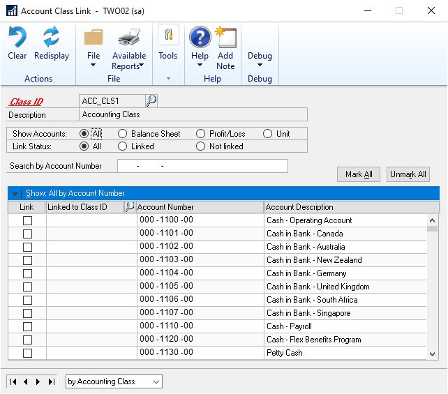

1. Enter or select an account class to that the accounts will be linked to. The
    scrolling window will display all the accounts in the Microsoft Dynamics GP
    Chart of Accounts except fixed and variable allocation accounts.

2. From the Show Accounts options, select one of the following:

    **All** Displays all posting, and unit accounts

    **Balance Sheet** Displays only Balance Sheet accounts

    **Profit/Loss** Displays only Profit/Loss accounts

    **Unit** Displays only Unit accounts

1. From the Link Status options, select one of the following:

    **All** Displays all accounts, whether linked or not.

    **Linked** Displays accounts which are linked to an account class.

    **Not Linked** Displays accounts which are not linked to any account class.

1. Use the Search by field to search for a specific account in the scrolling
    window. The method you use depends on the option selected from the View Menu
    drop- down list. For example, if you have selected the Show Accounts by
    account option, the Search by field will allow you to find an account based
    on the account.

2. The scrolling window displays the accounts based on the option you select
    from the View menu. To link an account to the account class displayed, mark
    the Link check box for the account to link.

3. The Linked to Class ID field displays the account class that the account has
    been linked to. If the account is not linked to an account class, you can
    select an account class to link it to from the Accounting Class lookup
    window. The account class you select can be different from the class that is
    displayed in the Account Class Link window.

4. If you select a posting account that’s used as a distribution account of a
    fixed or variable allocation account to link to an account class, a message
    will appear reminding you to specify default transaction dimension codes for
    transaction dimensions set to Required or Optional in the Accounting Class
    window. Refer *Setting up an account class* for more information about
    default transaction dimension codes.

    The Account No field displays the account.

    The Account Description field displays the description for the account.

1. Choose Mark All to mark all displayed accounts to link the accounts to the
    account class you have selected in the Class ID field. If the posting option
    you have selected in the Posting Setup window (Administration \>\> Setup
    \>\>Posting \>\> Posting) is Create a Journal Entry Per Batch, a message
    appears when you choose Mark All indicating that accounts set to Post in
    Summary will not be marked.

    This is to ensure that if the Use Account Settings option is not marked, accounts that post in summary are not linked to an account class. Before you activate Analytical Accounting, you can ensure that the level of posting of such accounts is set to detail to link it to an account class.

    > [!IMPORTANT]
    > You must mark the Create a Journal Entry per Batch and Use Account Settings options in the Posting Setup window to activate Analytical Accounting. However, you can link accounts to an account class before Analytical Accounting has been activated.

1. Choose Unmark All to unmark all the accounts that were previously marked. If
    you unmark an account from an account class and if the account exists in an
    unposted transaction, analysis information for the account will be deleted
    from the transaction. In addition, any account that is removed from an
    Accounting Class cannot be adjusted on the Analytical Adjustment Entry. If
    the account exists in an un-posted adjustment, any adjustment made for that
    account will be deleted once the account is unmarked from the accounting
    class.

2. Choose Save to save the links you have made.

3. Choose Clear to clear the window.

### Linking accounts to classes and nodes

Use the Analytical Accounting Account Maintenance window to link accounts to
both an account class and a node on the main tree.

You can link any Microsoft Dynamics GP account to an account class, except
for the fixed and variable allocation accounts.However, distribution
accounts of fixed and variable accounts can be linked to an account class.

> [!NOTE]
> An account can be linked only to one account class.

**To link an account to classes and nodes:**

1. Open the Analytical Accounting Account Maintenance window. (Cards \>\>
    Financial \>\> Analytical Accounting \>\> Account)

2. Enter or select an existing account. If you select a posting account that is
    used as a distribution account of a fixed or variable allocation account, a
    message will appear indicating that you must be sure that default
    transaction dimension codes have been entered for Required or Optional
    transaction dimensions in the Accounting Class that the account is or will
    be linked to. Refer to *Setting up an account class* for more information.

    The Description field displays the description of the account.

1. In the Linked to Node field, select the node of the main tree that the
    account must be attached to. Each account must be linked to a valid node of
    the main tree. Refer to *Setting up trees* for more information.

2. Select the account class in the Class ID field to enter analysis information
    for this account during transaction entry. The name or description of the
    selected account class is displayed in the field below Class ID.

    If the level of posting of an account is set to summary, you cannot link the account to an account class if the posting setup in the Posting Setup window is Create a Journal Per Batch.

1. Choose Save to save the details.

2. Choose Clear to clear the information in the window.

### Setting up account access to codes

Use the Account Access to Transaction Dimension Codes window to specify the
accounts that have access to a selected transaction dimension code. This
will determine which codes can be used for a distribution while entering an
analytical transaction. By default, all the codes have access to all the
accounts linked to an accounting class. You can assign multiple ranges of
accounts to a dimension code; you can also assign an account to multiple
dimension codes.

> [!NOTE]
> The codes belonging to a transaction dimension that is set to Not Allowed
for an accounting class do not have access to that accounting class.

The following conditions must be met before you can specify account access
for codes:

- You must have set up at least one accounting class.

- The selected transaction dimension must have a valid relationship with at
    least one accounting class. You cannot select a dimension if it’s analysis
    type is set to Not Allowed for all accounting classes.

**To set up account access to codes:**

1. Open the Account Access to Trx Dimension Codes window. (Cards \>\> Financial
    \>\> Analytical Accounting \>\> Account Access)

2. Enter or select a transaction dimension. The description for the selected
    dimension is displayed in the Description field.

3. Enter or select the transaction dimension code for which to specify account
    access. The description for the selected dimension code is displayed in the
    Description field.

4. Select the access option for the selected transaction dimension code.

**All Accounts** is the default selection, giving access to all accounts
linked to an accounting class.

**Select Accounts** Select this option to specify the accounts to which the
selected code will have access. The rest of the window will become available
for you to select the accounts.

*You must insert at least one account in the scrolling window if you choose
the option Select Accounts. If you choose Save or close the window when
there are no accounts in the scrolling window, the account access setting
for the selected code will automatically revert to All Accounts.*

1. In the Account Type field, select the type of accounts to include in the
    range.

**All** All the accounts in the selected range will be available for
selection in the From and To Look up. This includes Balance Sheet, Profit
and Loss and Unit accounts.

**Balance Sheet** Only balance sheet accounts from the selected range will
be available for selection in the From and To Look up.

**Profit and Loss** Only profit and loss accounts from the selected range
will be available for selection in the From and To Look up.

**Unit** Only unit accounts from the selected range will be available for
selection in the From and To Look up.

1. In the Ranges field, select whether to assign a range based on Account,
    Segment ID or Account Class. If you select Segment, the Segment ID field
    becomes available. Enter the Segment ID.

2. Enter the range in the From and To fields. The lookup displays the range of
    accounts, account classes, or segment ID, depending on your selection in the
    Ranges field.

3. Choose Insert to insert the accounts within the selected range into the
    scrolling window. The scrolling window displays the account and description
    for each account. If you’ve chosen Account Class, all the accounts of the
    selected type assigned to those classes will be inserted. For example, if
    you’ve selected Balance Sheet as the Account Type, then only Balance Sheet
    accounts that are part of the selected range will be inserted into the
    scrolling window.

Once you’ve inserted a range in the scrolling window, you can select another
range to insert. The new range will be added below the existing range in the
scrolling window. An account will be inserted into the scrolling window only
once, even if it is part of more than one range.

1. Select an account in the scrolling window and choose Remove to remove that
    account. Choose Remove All to remove all the accounts from the scrolling
    window. The Remove and Remove All fields become available only when accounts
    exist in the scrolling window.

2. Choose Save to save the account access settings for the selected transaction
    dimension code and clear the window. The settings you’ve saved will be
    displayed when you open this window and select the same dimension code.

3. Choose Clear to clear all the values you’ve entered in the window without
    saving.

### Entering analysis information for fixed assets transactions

Use the Analytical Fixed Asset Setup window to module enter or view the
analysis information for the distribution accounts that are linked to an
account class. The window name depends upon the path from where you open
this window.

You can view the transaction dimension codes and description for the
transaction dimension codes for fixed asset transactions. You can view the
Asset ID, Book ID and Alias details in the Analytical Fixed Asset Setup
window.

**To enter or view analysis information for fixed assets transactions**

1. Open the Analytical Fixed Asset Setup window  
    (Cards \>\> Fixed Asset \>\> Book \>\> enter or select an asset ID and book
    ID \>\>Additional \>\> Analytical Transaction or CTRL+T)  
    (Cards \>\> Fixed Asset \>\> Book \>\> enter or select an asset ID and book
    ID \>\>Analytical Accounting Button)  
    (Cards \>\> Fixed Assets \>\> Book\>\>\> Go to button \>\> Account\>\> enter
    or select an asset ID and book ID \>\> Additional \>\> Analytical
    Transaction or CTRL+T) (Cards \>\> Fixed Assets \>\> Book\>\>\> Go to button
    \>\> Account\>\> enter or select an asset ID and book ID \>\> Analytical
    Accounting Button)  
    (Cards \>\> General \>\> select an asset ID \>\> Go to button\>\> Book \>\>
    select a book ID \>\> Additional \>\> Analytical Transaction or CTRL+T)  
    (Cards \>\> General \>\> select an asset ID \>\> Goto button\>\> Book \>\>
    select a book ID \>\>Analytical Accounting Button)  
    (Cards \>\> Fixed Assets \>\> Account\>\> enter or select an asset ID \>\>
    Analytical Accounting Button)  
    (Cards \>\> Fixed Assets \>\> Account\>\> enter or select an asset ID \>\>
    Additional\>\> Analytical Transaction or CTRL+T)

2. The Distribution field displays the distribution account selected in the
    Asset Account window.To view other distributions, enter or select a
    distribution number.

The sequence of distributions in the Analytical Transfer Maintenance window
may not correspond to the sequence in the Payroll Transaction Entry window
because only accounts linked to an account class are displayed in the
Analytical Payroll Transaction Entry window.

The Company ID field will display the company in which the transaction is
taking place.

1. The Account field will display the distribution account for which analytical
    information is being entered. The description of the account, as set up in
    the Account Maintenance window, will appear in the next line. Click the
    Account expansion button to open the Microsoft Dynamics GP Account Entry
    window.

The balance type of the account, whether debit or credit, will be displayed
next to the account.

1. Select an alias in the Alias field. The Alphanumeric field in the scrolling
    window displays the transaction dimension codes that are associated with the
    alias for the transaction dimensions displayed. You can change these codes,
    if required. Refer to *Creating an alias* for more information.

The Trx Dimension field displays Transaction Dimensions of the account class
to which the distribution account is linked. Only Transaction Dimensions
which have been set as Fixed, Required, or Optional will be displayed.
Transaction dimensions which are set to Hide in the Accounting Class
Maintenance window will not be displayed. Refer to *Setting up an account
class* for more information.

The Trx Dimension Description field displays the description of the
transaction dimension.

1. Enter or select an alphanumeric transaction dimension code in the
    Alphanumeric column. You can add a new alphanumeric transaction dimension
    code if you have selected the Create New Codes On The Fly option in the
    Transaction Dimension Maintenance window.

    > [!NOTE]
    > The Alphanumeric column is available only for an alphanumeric transaction dimension.

1. Choose Save to save the analysis information you have entered and clear the
    window.

You can save analysis information with errors, but you cannot post them.

1. Choose Validate to validate the distribution displayed in the window. If
    changes are made to the account class in setup or errors are found during
    the validation process, the Analytical Accounting Validation Log window will
    open displaying the errors or changes identified. You can view the changes
    to the account class by selecting the Default button in the Analytical Item
    Transaction Entry window.

*Analysis information will also be validated if you select OK or Save in the
Analytical Fixed Asset Setup window.*

You can choose to save analysis information with errors or without updating
changes made to the account class.

You can validate a document in the Item Transaction Entry window by using
the options CTRL+R or Additional \>\> Run Validation.

Refer to *Validating transactions and correcting errors* for more
information about validation.

1. Choose the Print drop-down to print the Analytical Accounting Edit list for
    the distribution currently displayed in the window or for all distributions
    of the transaction linked to an account class. If errors are detected, the
    Analytical Validation Log is also printed.

### Setting up trees

You can set up an unlimited number of trees to group master data in
Analytical Accounting. Use the trees to select master records and also to
display selected nodes, or single records, or to build groups to show totals
and subtotals on reports.

Trees are also used for reporting and analyzing purposes in the Multilevel
Query wizard. Refer to *Chapter 17, “Inquiries”*for more information.

There are two types of trees:

**Main Tree** These are created automatically for each type of master record
and cannot be deleted. By default, the master records will be linked to the
root node of the main tree but can be attached to other nodes within the
same tree. New master records always will be linked to the root node of the
tree but can be changed.

**Additional Trees** You can create unlimited trees for each type of master
record. You can choose whether the tree should include all master records or
just a subset of master records. If you link all the records to the tree,
any new master record created automatically will be linked to the tree.

**To set up trees:**

1. Open the Tree Maintenance window. (Cards \>\> Financial \>\> Analytical
    Accounting \>\> Tree)

2. Select the type of the master record from the Tree Type field. The options
    available are:

    - Account

    - Customer

    - Employee

    - Vendor

    - Item

    - Site

    - Trx Dimension

You can create trees only for alphanumeric transaction dimensions.

1. Enter or select a tree definition. A main tree will always be available in
    the Tree lookup window. If the tree is a main tree, the Main Tree check box
    will be marked by default. You cannot unmark this check box. If you’ve
    defined the tree, the Main Tree check box is unmarked and cannot be marked.

The Dimension field will be available only if you select Transaction
Dimension in the Tree Type field. The description of the alphanumeric
transaction dimension that the tree has been created for is displayed in
this field. You can’t modify the description. The default description will
be displayed when you select an alphanumeric transaction dimension in the
Dimension field.

1. Mark the Tree includes all records option to link all the master records to
    the tree. This field is available only if you are creating a new tree. The
    master records will be attached to the root node of the tree. If a new
    master record is created, it will be linked to the root node of the main
    tree and to all the other trees that have this field marked.

2. Enter a description for the tree in the Description field.

3. Choose Structure to open the Tree Structure window where you can define the
    structure of the tree. Refer *Defining a tree structure* for more
    information.

4. Choose Save to save the tree definition.

5. Choose Clear to clear the window.

6. Choose Delete to delete the tree. You cannot delete a tree if it has been
    used in a query created in the Multilevel Query wizard. You cannot delete a
    main tree.

### Defining a tree structure

You can define the structure of an existing tree in the Tree Structure
window.

**To define a tree structure:**

1. Open the Tree Structure window.

(Cards \>\>Financial \>\> Analytical Accounting \>\>Tree Structure)

(Cards \>\> Financial \>\> Analytical Accounting \>\> Tree \>\> Structure
button)

1. Select a master record type in the Tree Type field. The master record types
    are:

    - Account

    - Customer

    - Employee

    - Vendor

    - Item Number

    - Site

    - Trx Dimension

2. Enter or select a tree in the Tree field. If the tree is a main tree, the
    Main Tree check box will be marked by default. This check box cannot be
    unmarked. If the tree is user-defined, the Main Tree check box is unmarked
    and cannot be marked.

    If you’ve opened the Tree Structure window from the Tree Maintenance window, the tree type and tree entered is displayed.

    The Tree View window shows the tree structure of the selected tree. You can double-click a node and open the Edit Tree Node window where you can change the description of the node.

1. Enter the new description for the node.

2. Choose Save to save the description or Cancel to cancel the description you
    have entered and return to the Tree Structure window.

3. In the Tree Structure window, to create a new node, select an existing node
    and choose New Node. This will open the Add Tree Nodes window.

4. Enter a description for the new node and choose Add. The new node will be
    created one level below the selected node. To create a new node at the first
    level, select the Root Node, which is the first entry in the tree view.

5. In the Tree Structure window, choose the Left arrow to move the selected
    node and its sub nodes one level higher in the tree if the selected node is
    not at the first level.

6. Choose the Right arrow to move the selected node and its sub nodes one level
    lower in the tree if the selected node is not at the last level. The new
    main node will be one line up on the same level.

7. Choose the Up arrow to move the selected node and its sub nodes one line up
    on the same level in the structure.

8. Choose the Down arrow to move the selected node and its sub nodes one line
    down on the same level in the structure.

9. Choose Delete Node to remove a selected node and its sub nodes. If there are
    master records linked to the deleted node, they will be linked to the root
    node when you choose Save.

10. Choose the printer icon button to print the edit list. The structure of the
    tree selected in the tree structure window will be printed.

### Copying a tree structure

You can copy an existing tree structure to set up another tree. You also can
copy the records linked in an existing tree to another tree.

**To copy a tree structure:**

1. Open the Copy Tree Structure window. (Cards \>\> Financial \>\> Analytical
    Accounting \>\> Tree Structure \>\> Copy button)

2. Select the tree to copy from in the Copy from Tree field. Be sure that the
    Tree that the data is being copied from is the same Tree Type (Dimension,
    account) as the tree where the data will be copied to. The description of
    the selected tree appears in the field below.

3. Select the tree to copy to. The tree types that are similar to the tree type
    you are copying from are displayed in the lookup window.

4. Select to copy only the tree structure, or both the tree structure and the
    link records.

    - If you select the Copy tree structure option, then only the tree
        structure will be copied. Before the copying process begins, the
        existing structure of the destination structure will be deleted and all
        the linked records will be linked to the root node.

    - If you select the Copy tree structure and link records option, the
        existing structure and all links to master records are removed and will
        be replaced by the new structure and link records from tree you’re
        copying from.

    > [!NOTE]
    > This option is only available if both the Copy Source and Destination have the Tree includes all records available or unavailable option selected in the Tree Maintenance window.

1. Choose Copy to copy the tree structure and close the window.

2. Choose Cancel to close the window.

### Linking master records to an existing tree structure

The Tree Record Link window allows you to link master records to an existing
tree structure. You also can add new master records to the tree, remove
master records from the tree and print the structure with its linked master
records.

**To link master records to an existing tree structure:**

1. Open the Tree Record Link window.

    (Cards \>\> Financial \>\> Analytical Accounting \>\> Tree Record Node Link)

    (Cards \>\> Financial \>\> Analytical Accounting \>\> Tree \>\> Structure\>\> Link Records)

    (Cards \>\> Financial \>\> Analytical Accounting \>\> Tree Structure \>\> Link Records)

    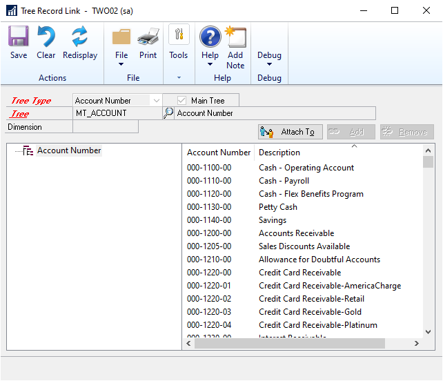

1. Select the tree type.

2. Select the Tree ID to modify the Record Links in. If you select a main tree,
    the Main Tree checkbox will be marked. If opened from the Tree Structure
    window, the tree type and tree entered in that window are displayed in the
    Tree Type and Tree fields.

3. If the tree has an associated transaction dimension, the dimension is
    displayed.

4. The tree structure of the selected tree appears in the Tree View window on
    the left. Select an item in the tree view to display the master records
    linked to that node in the list window on the right side.

5. Click the Attach to button to open the Move Master Records window where all
    nodes, except the node to which the record is currently linked to, are
    displayed.

6. Highlight the node that the record selected is to be attached to and choose
    Select to attach the master record to the node. The Attach to button is only
    available if at least one master record is selected in the list window.

7. After the records are linked to the new node, the linked master records of
    this node will appear in the list window.

8. Choose Add to open the Add Master Records To Tree window. This button is
    only available if the selected tree is not a main Tree and the Tree includes
    all records option is not marked in the Tree Maintenance window.

9. Choose Remove to remove the selected master record from the tree. This
    button is only available if at least one master record has been selected in
    the list window, the tree is not a main Tree and the Tree includes all
    Records option is not marked in the Tree Maintenance window.

10. Choose Save to save the Record Node link to the table.

11. Choose Clear to clear the window.

### Adding master records to an existing tree

You can add master records to an existing tree using the Add Master Records
to Tree window. This can be done only if the tree is not the main tree and
the Tree includes all records option is not marked in the Tree Maintenance
window.

**To add master records to an existing tree:**

1. Open the Add Master Records to a Tree window. (Cards \>\> Financial \>\>
    Analytical Accounting \>\> Tree Record Node Link \>\> Add button)

2. The Search By field displays the search method that was selected in the View
    menu. To search for a master record, enter the description for the record in
    this field and press the TAB key.

    Master records that are not linked to the tree and their descriptions are displayed in the scrolling window.

1. Mark the records you want to add to the tree and choose OK.

2. Click Add in the scrolling window to display the records by their add
    status.

3. Click the Column Header ID to sort the records in the scrolling window for
    the selected tree. This field is determined depending on the tree type and
    the dimension if Trx Dimension is used as tree type.

4. Choose Mark All to select all the records.

5. Choose Unmark All to unmark all the selected records.

6. Choose the Add button to add the selected records to the tree and close the
    window.

## Chapter 3: Budgets

Analytical Accounting Budgets allows you to set up a budget tree using the
transaction dimensions and codes that you have created. You can record
amounts against each node of the budget tree and allocate the amounts to
various accounts for each node. You can export the budget to Excel where you
can modify it if required, before importing it back into Microsoft Dynamics
GP. The Multilevel Query wizard allows you to compare actual versus budgeted
amounts and find the variance, as well as compare budget amounts for
different years.

This information is divided into the following sections:

- *Setting up a budget tree*

- *Assigning budget tree codes*

- *Using the dimension code tree view*

- *Adding and removing transaction dimension codes*

- *Creating a budget*

- *Copying budgets*

- *Selecting calculation methods for budgets*

- *Understanding node budget roll down*

- *Rolling down node budget amounts*

- *Understanding account budget roll down*

- *Understanding node budget roll up*

- *Assigning a range of accounts* • *Exporting budget details*

- *Understanding budget import*

- *Importing a budget*

### Setting up a budget tree

A budget tree consists of only alphanumeric transaction dimensions and the
codes attached to those dimensions. You can choose the transaction
dimensions that make up a budget tree, and specify the order in which they
appear in the tree. All the selected dimensions must share a valid
relationship with one another, and must belong to at least one common
accounting class. Refer to *Setting transaction dimension relationships* and
to *Setting up an account class* for more information.

**To set up a budget tree:**

1. Open the Budget Tree Maintenance window. (Cards \>\> Financial \>\>
    Analytical Accounting \>\> Budget Tree)

2. Enter or select a Budget Tree ID. This field becomes unavailable once you
    press TAB after entering a value here. Enter a description for the budget
    tree ID in the Description field.

The Available Dimensions list displays the description for all the
alphanumeric dimensions, entered in the Description 1 field on the
Transaction Dimension Maintenance window. The descriptions are listed in the
order that you have assigned to the dimensions on the Transaction Dimension
Order window. Refer to *Defining transaction dimensions* , and *Changing the
order of transaction dimensions* for more information. The first dimension
in this list is highlighted by default.

1. Select a dimension from the Available Dimensions list and choose Insert to
    insert it into the Selected Dimensions list to the right of the window. Once
    you have selected a dimension, it is removed from the Available Dimensions
    list. All the selected dimensions must belong to at least one common
    accounting class.

*A dimension belongs to an accounting class if its analysis type is either
Required, Fixed or Optional for that accounting class.*

Once you have inserted at least one dimension in the Selected Dimensions
list, then every subsequent dimension that you select must have a valid
relationship with the dimensions already selected. If a dimension shares a
relationship of No Combination Allowed with any of the previously selected
dimensions, you will not be able to insert that dimension.

1. Choose Insert All to insert all the dimensions into the Selected Dimensions
    list. If any of the dimensions does not have a valid relationship with any
    other dimension, you will get a message and none of the dimensions will be
    inserted.

2. Select a dimension in the Selected Dimensions list and choose Remove to
    remove it. Once you have removed a dimension, you can view it in the
    Available Dimensions list. The Remove button becomes available only when you
    select a dimension in the Selected Dimensions list. You can only highlight
    one dimension at a time in the Selected Dimensions list.

3. Choose Remove All to remove all dimensions from the Selected Dimensions
    list. The Remove All button will be unavailable if no dimension is listed in
    the Selected Dimensions list.

4. Use the up, down, top and bottom arrow buttons to change the order of the
    selected dimensions if required. All the dimensions will first appear in the
    Selected Dimensions list in the order in which you select them. The order of
    dimensions in the Selected Dimensions list determines the order in which
    they appear on the budget tree.

You cannot insert or remove dimensions, or change the order of dimensions if
the budget tree ID is attached to a budget ID. To do this, you must first
delete all the budget IDs to which the budget tree ID has been attached.

You cannot insert or remove dimensions, or change the order of dimensions if
the budget tree ID has codes assigned to it. A message appears warning you
that on doing so, all the codes attached to the budget tree ID will also be
removed. If you choose to continue, you must then re-assign the codes in the
Assign Budget Tree Codes window.

1. Choose Codes to open the Assign Budget Tree Codes window, where you can
    assign codes for each dimension in the budget tree. Refer to *Assigning
    budget tree codes* for more information.

2. Choose Save to save the budget tree ID you have created.

3. Choose Delete to delete the budget tree ID that is displayed in this window.

You cannot delete a budget tree ID that is attached to a budget ID. To do
this, you must first delete all the budget IDs to which the budget tree ID
has been attached.

If a budget tree is not attached to a budget ID, but has codes assigned to
it, all the codes will be lost when you delete the budget tree ID.

1. Choose Print to print the Budget Tree Maintenance Report for all budget tree
    IDs or for the budget tree ID displayed in the window.

### Assigning budget tree codes

Once you have set the order of transaction dimensions, you must assign
dimension codes to the budget tree ID that you have created. You can only
set budget amounts for the codes that you assign to the budget tree ID. You
can assign a range of codes, or individual codes to a dimension. If you make
changes to the budget tree ID on the Budget Tree Maintenance window after
assigning codes, all the assigned codes will be deleted. You will have to
re-assign the codes.

**To assign budget tree codes:**

1. Open the Assign Budget Tree codes window. (Cards \>\> Financial \>\>
    Analytical Accounting \>\> Assign Budget Tree Codes)

    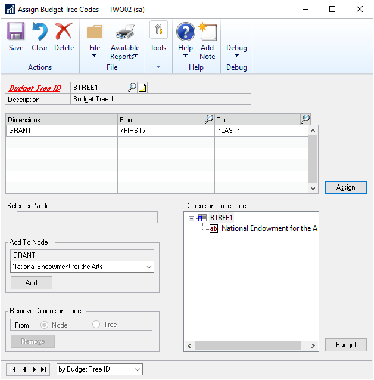

1. Enter or select the budget tree ID for which you are assigning codes. The
    Description field displays the description for the selected budget tree ID.

2. Assign a range of codes in the From and To columns for each dimension
    displayed in the Dimensions column of the scrolling window. Dimensions are
    listed in the order defined in the Budget Tree Maintenance window. The
    default values in the From and To columns are the text \<FIRST\> and
    \<LAST\> respectively. \<FIRST\> denotes the first code of the dimension,
    and \<LAST\> denotes the last code, in numeric-alpha order.

To select a different range, enter or select the range of codes for each
dimension in the From and To columns, in numeric-alpha order. You can also
keep \<FIRST\> as it is in the From column and select a code in the To
column. Alternatively, you can select a code in the From column and keep
\<LAST\> as it is in the To column. Both the From and To fields must have
values; you cannot enter a value in one field and leave the other blank.

> [!NOTE]
> If you’ve marked the Show valid code combinations in trns and budgets
option in the Analytical Accounting Options window, then the lookup window
will display only those codes that have a valid combination with the codes
you have already selected for the budget tree.*

1. Clear the default values in the From and To fields if you do not want to
    assign codes to a dimension. If you do not assign codes for a particular
    dimension, you will not be able to assign codes for any dimension below that
    dimension. The From and To fields for the lower dimensions will be blank and
    unavailable.

> [!NOTE]
> In order to assign a range to a dimension, ranges should have been assigned
to all the dimensions that appear above that dimension.

1. Choose Assign to assign the selected codes to the budget tree ID. The values
    in the From and To columns of the scrolling window return to the \<FIRST\>
    and \<LAST\> code values.

The tree you’ve created can be viewed in the Dimension Code Tree view. Codes
will only be inserted below nodes with which they share a valid
relationship. Refer to *Using the dimension code tree view* for a better
understanding of the structure of the dimension code tree.

> [!NOTE]
> After you’ve assigned codes for the first time, if you subsequently assign
a different range of codes to the budget tree ID, the existing dimension
code tree will be over written.

1. Highlight a node in the dimension code tree view. The Selected Node field
    displays the combination of codes to which the highlighted node belongs. The
    budget tree ID is highlighted by default.

2. Select a code from the Add to Node drop down list and choose Add to add the
    code to the selected node. You can add a code only if it shares a valid
    relationship with the selected node. You cannot add a code that already
    exists under the selected node.

The Add to Node field displays the description of the dimension that is
directly below the selected node. The drop-down menu lists all the codes
you’ve assigned to the dimension below the selected node.

1. Highlight a code and choose Remove in the Remove Dimension Code field to
    remove the code from the selected node or from the entire tree.

**Select Node** to remove the selected code from the node it belongs to.
This will remove the selected code and all codes below it from the node
displayed in the Selected Node field.

**Select Tree** to remove the code from the entire tree. This will remove
the selected code and all the codes below it from all nodes of the tree.

1. Choose the Budget button to open the Analytical Accounting Budget
    Maintenance window, where you can assign budget amounts to the budget tree.
    Refer to *Adding and removing transaction dimension codes* for more
    information.

2. Choose Save to save the codes assigned to the budget tree ID.

3. Choose Delete to delete all the codes assigned to the budget tree ID.

4. Choose Print to print the Assign Budget Tree Codes Report for the budget
    tree displayed in the window.

### Using the dimension code tree view

Analytical Accounting Budgets uses a tree view called the Dimension Code
Tree to display the codes that you’ve assigned to the budget tree ID. You
can create and modify the dimension code tree for each budget tree ID in the
Assign Budget Tree Codes window (Cards \>\> Financial \>\> Analytical
Accounting \>\> Assign Budget

Tree Codes). You can view the dimension code tree for the selected budget
tree ID in

the Analytical Accounting Budget Maintenance window (Cards \>\> Financial
\>\> Analytical Accounting \>\> Budget).

Each line in the tree is a node and the nodes are organized in the order
that you’ve set the transaction dimensions in the Budget Tree Maintenance
window.

Use the following example to understand the dimension code tree. You have
set up a budget tree ID AA, and the following dimensions and codes are
assigned to it:

| **Dimensions** | **Range of codes attached to dimensions** |
|----------------|-------------------------------------------|
| Profit Centre  | PCTR1 to PCTR2                            |
| Project        | PRJ1 to PRJ1                              |
| Product        | PDT1 to PDT2                              |
| Location       | LOC1 to LOC1                              |

Based on the valid relationships that the codes have with one another, the
tree will look as follows:

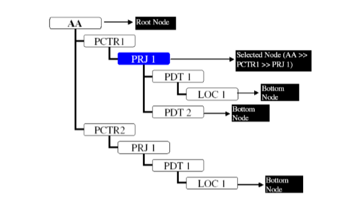

- The budget tree ID is the highest level of the dimension code tree, and is
    also called the root node of the tree.

- The level of codes directly below the root node is called the first level of
    the tree.

- Highlight a node in the dimension code tree, to enter or view the
    information relevant to that node in the scrolling window (in the Analytical
    Accounting Budget Maintenance window, or the Analytical Accounting Budget
    vs. Actual Inquiry window). When you move the focus to another node, and
    then navigate to another field in the window, the node that you last
    selected remains highlighted. Therefore, a node is always highlighted in the
    dimension code tree view.

- The Selected Node field displays the combination of codes to which the node
    you’ve highlighted belongs. Any changes you make to the scrolling window are
    valid only for the selected node.

- A node that does not have any nodes below it is called a bottom node. A tree
    can have several bottom nodes.

> [!NOTE]
> If a code (e.g. PDT 2), does not have a relationship with any code above it
(e.g. PCTR 2), then it will not appear under that node (PCTR 2 \>\> PRJ 1).
It will, however, continue to appear under those nodes with which it shares
a valid relationship (e.g. PCTR 1 \>\> PRJ 1 \>\> PDT 2).

### Adding and removing transaction dimension codes

You can add or remove transaction dimension codes from a budget tree ID that
is attached to a budget ID. Use the following information to understand how
codes are added to and removed from a budget tree that is attached to a
budget ID.

- When you add codes to a budget tree ID, the new codes will have no amounts
    and/ or accounts assigned to them in the Analytical Accounting Budget
    Maintenance window.

- When you remove codes from a budget tree ID, the amounts and the accounts
    that were assigned to those codes in the Analytical Accounting Budget
    Maintenance window will also be removed.

- Removing a node from the budget tree will also remove all sub-nodes, and the
    amounts and accounts assigned to those sub-nodes in the Analytical
    Accounting Budget Maintenance window.

- If you remove a code from the budget tree after assigning the budget
    amounts, you must reassign the root node amount to the remaining codes so
    that the root node amount is rolled down 100%.

### Creating a budget

You can create an unlimited number of budgets for both open and historic
years in Analytical Accounting. You also can change or delete existing
budgets. A budget that you enter here is not removed until you delete it
from the system. Use the Analytical Accounting Budget Maintenance window to
assign amounts and accounts to the budget tree that you have created.

**To create a budget:**

1. Open the Analytical Accounting Budget Maintenance window. (Cards \>\>
    Financial \>\> Analytical Accounting \>\> Budget)

    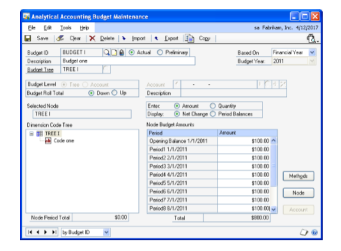

1. Enter or select a budget ID and enter a description for the budget ID in the
    Description field.

2. Select to base the budget on a fiscal year or a date range. If you select to
    base the budget on a date range, specify a range that crosses one or more
    fiscal years.

3. To restrict access to the budget, choose the Password Padlock button to open
    the Microsoft Dynamics GP User Password Setup window and enter a password.
    If you don’t need to restrict access to the budget, skip to the next step.

4. Select a year for which you are assigning budget amounts. Budget amounts are
    saved against the Budget ID - Year combination, which is a unique
    combination. The value in the Year field cannot be changed once you enter a
    year and TAB off the field.

If you enter a Budget ID - Year combination for the first time, and the
budget ID already exists in the previous year, a message appears asking if
you want to copy the existing budget. Choose Yes to open the Copy window,
where you can copy the budget. Refer to *Copying budgets* for more
information.

1. Select whether to mark the budget as Preliminary or Actual.

Choose Actual if you know that the budget will be calculated correctly and
that you will not be making changes to the budget.

Choose Preliminary to experiment with budgets. You can change preliminary
budgets and then revert to the original version of the budget, but when you
change actual budgets, the change is permanent.

> [!NOTE]
> If you’re calculating a preliminary budget and you’d like to save it, make
the changes permanent by choosing Actual and save the budget. The budget
will also be saved as Actual if you choose the Save button to save changes
to a preliminary budget.

1. Enter or select a budget tree ID. The dimension code tree that was set up
    for the selected budget tree ID is displayed in the tree view. You can
    assign a same budget tree ID to multiple budget IDs.

The budget ID - budget tree combination is unique across all years. When you
enter a budget ID that exists in a different year, and enter a new year, the
budget tree ID will automatically default from the budget ID- year that
already exists. You cannot change this budget tree ID.

1. When you select the budget tree ID, the dimension code tree view is
    populated with all the dimension codes in fully expanded form. The root node
    is highlighted by default. Refer to *Using the dimension code tree view* for
    more information.

**Node Budget Amounts scrolling window** displays the amount entered for
each period for the node that you’ve highlighted in the dimension code tree
view. When the budget level is Account, this window displays the values
allocated to the account that you’ve selected in the Account field.

**Node Period Total** displays the total amount for the selected node for
the selected period. If you’ve selected an account for which you are
entering period amounts for a node, you can still view the total amount for
the period in the Node Period Total field.

**Total** displays the total amount or quantity that you’ve entered for the
selected node or for a selected account on the selected node.

1. Select the Budget Level at which to create the budget, whether Tree or
    Account You can enter a budget for a budget tree or for a budget tree -
    account combination.

**Tree** is the default selection. You must first enter budget amounts for
the budget tree, before you can allocate budgets for accounts.

**Account** select to assign a single posting or unit account to a selected
node of the budget tree. You can assign an account to any node as long as
you’ve assigned that account to the node directly above it. You cannot
assign fixed or variable allocation accounts. You cannot assign accounts to
the root node.

1. In the Budget Roll Total field, select whether to roll down the budget from
    the root node to lowest nodes or roll up the budget from lowest nodes to the
    root node.

**Down** Rolls down the budget amount specified in the root node to lower
nodes till the lowest node. This option is selected by default. Refer to
*Understanding node budget roll down* for more information.

**Up** You can enter amounts in the lowest nodes. These amounts are added up
and rolled up to the parent node. This process repeats itself until the
amount is rolled up to the root node. Refer to *Understanding node budget
roll up* for more information.

*If you select the option as Up for a budget which is not rolled down
completely, the amount or quantity that you have entered for each node of
the budget will be reset to zero.*

1. In the Enter field, choose whether to enter an amount for the budget, which
    would be used in posting accounts, or a quantity, which would be used in
    unit accounts.

**Amount** the Amount field in the Node Budget Amounts scrolling window
displays a currency format.

**Quantity** the Amount field in the Node Budget Amounts scrolling window
displays a quantity format with two decimal places.

1. Select whether to view Net Change or Period Balances on the Node Budget
    Amounts scrolling window.

**Net Change** the Amount field for a period displays the actual amount
assigned to that period.

**Period Balances** the Amount field for a period displays the sum of all
preceding periods plus the amount assigned to the selected period.

1. Select the root node in the dimension code tree view to assign the overall
    budget amount. Enter amounts for the root node for each period in the Node
    Budget Amounts scrolling window. Alternatively, you may also enter the
    amounts using the Budget Calculation Methods window. Refer to *Selecting
    calculation methods for budgets* for more information.

Once you’ve entered all the period amounts for the root node, you must roll
down 100% of each period amount to the first level below the root node.
Refer to *Understanding node budget roll down* for more information on how
node budget amounts are rolled down.

1. Enter or select an account in the Account field, if you’ve chosen Account in
    the Budget Level field. You can only select an account that is attached to
    the accounting class to which all the dimensions of the budget tree belong.
    The Enter radio group defaults to Amount if you select a posting account,
    and to Quantity if you select a unit account.

2. Choose the arrow buttons next to the account field to select the next
    account that you want to assign.

3. Click the Delete icon next to the account field to delete the displayed
    account from the selected node.

> [!NOTE]
> You can assign as many accounts to a node as you like, but the total of all
assigned accounts for a period cannot exceed the period amount for the
selected node.

1. Enter the period amounts to be assigned to the displayed account for the
    selected node in the Node Budget Amounts scrolling window.

2. Highlight a node on the dimension code tree and choose the Methods button to
    assign period amounts to the node using a calculation method. Refer to
    *Selecting calculation methods for budgets* for more information.

3. If you have selected Down as the Budget Roll Total option, highlight a node
    on the dimension code tree and choose the Node button to roll down budget
    amounts to the next nodes. You can roll down amounts only if you have
    entered a period amount for the selected node. Refer to *Rolling down node
    budget amounts* for more information. This button is not available if you
    have selected a bottom node on the dimension code tree, or if the selected
    budget level is Account.

4. Highlight a node on the dimension code tree and choose the Accounts button
    to assign a range of accounts to the node. Refer to *Assigning a range of
    accounts* for more information. This button is not available if the selected
    budget level is Account.

5. Choose the Copy button to open the Copy Budgets window, where you can copy
    an existing budget with amounts and accounts. Refer to *Copying budgets* for
    more information.

6. Choose the Export button to export an actual budget to an Excel spreadsheet.
    Refer to *Exporting budget details* for more information.

    > [!NOTE]
    > You cannot export a preliminary budget. Save it to make it an actual budget before exporting.

1. Choose the Import button to import a budget from an Excel spreadsheet. Refer
    to *Importing a budget* for more information.

2. Choose Print to print the Analytical Accounting Budget Maintenance report.
    You can print the report in one of the following formats:

    - Budget tree with amounts

    - Budget tree with accounts summary

    - Budget tree with accounts detail

3. Choose Delete to delete the budget ID that you have created.

4. Choose Clear to clear all the information that is displayed on the window.

5. Choose Save to save the budget ID that you have created.

If the root node amount has not been rolled down 100% to the lower nodes for
any period, a validation log will print listing all the periods where the
budget amount must be rolled down 100%. You cannot save until you’ve
completely rolled down the root node amount to the nodes below.

### Copying budgets

You can copy a budget that you have previously set up, and modify it for the
current year to suit your requirements. You can include opening balances,
copy the accounts that were assigned to the previous budget, and increase or
decrease the amounts in the budget. The ability to copy budgets is not
available for budgets based on a date range.

**To copy budgets:**

1. Open the Copy Budgets window. (Cards \>\> Financial \>\> Analytical
    Accounting \>\> Budget \>\> Copy button)

2. The Budget ID, Budget Year and Description fields display the values entered
    in the Analytical Accounting Budget Maintenance window.

If this window has opened after you chose Yes on a message asking whether
you wanted to copy the previous year’s budget, the Source Budget ID, and
Budget Tree ID fields display the values entered in the Analytical
Accounting Budget Maintenance window, while the Year field displays the year
previous to the year chosen in the Analytical Accounting Budget Maintenance
window.

1. If this window has opened when you chose the Copy button on the Analytical
    Accounting Budget Maintenance window, enter or select the Source Budget ID
    that you want to copy. The Budget Tree ID field displays the corresponding
    values for the selected Source Budget ID.

    - If the destination budget ID has a budget tree ID attached to it for
        another year, then the source budget ID that you choose must have the
        same budget tree ID attached. If the source budget ID has a different
        budget tree ID, then a message appears asking you to select a budget ID
        with the same budget tree ID.

    - If the destination budget ID does not have a budget tree attached for
        any other year, then the budget tree ID attached to the source budget ID
        will over write any budget tree ID that you may have assigned to the
        budget ID.

2. The Year field drop down displays all historic and open years. You can only
    select a year in which the selected Source budget ID has been set up.

3. Choose the Calculation Option to be used while calculating the budget
    amounts. The options are:

**No Amounts** The budget tree will be copied. No amounts will be copied,
and the amounts fields will be blank in the Analytical Accounting Budget
Maintenance window.

**Exact Amounts** The budget tree and the exact amounts will be copied to
the Analytical Accounting Budget Maintenance window.

**Percentage Change** You can increase or decrease the amounts for the
destination budget.

*If you choose a calculation option other than No Amounts the amounts will
over write any existing amounts in the destination budget ID when you choose
Copy.*

1. If you choose Percentage Change, the Percentage field becomes available, and
    you can enter a percentage value. Choose the Increase or Decrease radio
    options to increase or decrease the source budget ID amounts by the
    percentage you have entered.

2. Mark the Include Opening Balance option to copy the opening balance from the
    source budget ID. If this option is unmarked, the opening balance will not
    be copied over. If this option is marked, the opening balance will be copied
    over, even if it is zero. The opening balance will be treated as another
    period, and will be affected by the Calculation Method you choose in this
    window.

3. Mark the Copy Accounts option to copy all the accounts attached to the
    source budget ID to the destination budget ID. This option is not available
    if the source budget ID has no accounts attached to it.

*The copied accounts will over write any existing accounts assigned to the
destination budget ID when you choose Copy. If you’ve selected No Amounts,
then no accounts will be copied over, even if you’ve marked this option.*

1. Choose Copy to copy all the selected details on the source budget ID to the
    destination budget ID, and close the window. The Analytical Accounting
    Budget Maintenance window displays all the details that have been copied
    over. Nothing will be copied over if you close the window without choosing
    Copy.

2. Choose Clear to revert all fields to their default values.

### Selecting calculation methods for budgets

You can specify one of two methods by which to calculate the budget amounts
for each period for a selected node or node/account combination of the
budget tree.

**To select calculation methods for budgets:**

1. Open the Budget Calculation Methods window:

(Cards \>\> Financial \>\> Analytical Accounting \>\> Budget \>\> Methods
button)

The Budget ID, Description, Budget Year, Budget Tree ID and Selected Node
fields display the default values from the Analytical Accounting Budget
Maintenance window.

If you’re calculating amounts for an account on the selected node, then the
selected account and the account description is displayed in the Account and
Description fields.

1. Choose the Calculation Method to be used while calculating the period budget
    amounts. The options are:

**Set Amount** The amount you enter in the Amount field will be assigned to
each period of the budget for the selected node/ account, including the
opening balance if it’s marked.

**Yearly Budget Amount** The amount you enter in the Amount field will be
split equally over all the periods of the year for the selected
node/account, including the opening balance if it’s marked.

1. Enter the amount in the Amount field. This amount will be distributed among
    all the periods using the method you’ve specified. This field will display
    as Quantity if you’ve selected Quantity in the Enter field, or selected a
    Unit account in the Analytical Accounting Budget Maintenance window.

2. Mark the Include Opening Balances option to include the opening balance in
    the calculation.

    > [!NOTE]
    > Profit and Loss accounts will not have the opening balance included as a period in their calculations.

1. Choose Calculate to calculate the amounts and close the Node Budget
    Calculation Method window. The Analytical Accounting Budget Maintenance
    window displays the calculated amounts for all periods.

2. Choose Clear to clear all values displayed in this window, and restore the
    default values.

3. Choose Close to close the window without performing any calculations.

### Understanding node budget roll down

You can roll down budget amounts from one node to the codes on the node
immediately below it. The amount to be rolled down for the codes is
calculated for each period. If a period for a selected node has a zero
amount, then no amounts will be rolled down for that period to the lower
nodes.

Use the following table and information below it to understand how budget
amounts on one node are rolled down to the nodes below it.

| **Root Node** | **Nodes Level 1** | **Nodes Level 2** | **Root Node Amount** | **Node Level 1 Amounts** | **Node Level 2 Amounts** |
|---------------|-------------------|-------------------|----------------------|--------------------------|--------------------------|
| Root node     |                   |                   | \$10000.00           |                          |                          |
|               | Node 1Level 1     |                   |                      | \$7000.00                |                          |
|               |                   | Node A Level2     |                      |                          | \$2000.00                |
|               |                   | Node B Level2     |                      |                          | \$1500.00                |
|               | Node 2 Level1     |                   |                      | \$3000.00                |                          |
|               |                   | Node A Level2     |                      |                          | \$1000.00                |
|               |                   | Node B Level2     |                      |                          | \$1000.00                |
|               |                   | Node C Level 2    |                      |                          | \$1000.00                |

**Root Node** The amount entered on the root node must be rolled down 100%
to the next level nodes, in order to save the budget. You can roll down the
amounts manually, or use the Node Budget Roll Down window to roll down the
root node amounts. Refer to *Rolling down node budget amounts* for more
information.

If you increase a period amount on the root node, you must roll down 100% of
the new total amount, before you can save the budget.

You cannot decrease the period amount on the root node until you reduce the
amounts on the lower nodes so that they do not exceed the amount that you
have decided to enter on the root node.

**Other Nodes** The amount entered on any node other than the root node need
not be rolled down 100% to the subsequent nodes. You can use the Node Budget
Roll Down window to roll down amounts from any node to the subsequent nodes.
Refer to *Rolling down node budget amounts* for more information.

You can enter period amounts for any node as long as you’ve assigned amounts
for those periods to the nodes on the level above. The following validation
takes place when you change period amounts on a node, and the upper and
lower nodes have values entered:

- You can increase the period amount on any node, as long as the period total
    of all the nodes on that level does not exceed the period total of the node
    above.

- You can decrease the period amount on any node, as long as the period total
    of all the nodes on the level below does not exceed the node total you are
    decreasing.

### Rolling down node budget amounts

Use the Node Budget Roll Down window to roll down budget amounts from one
node to the codes on the node immediately below it. The amount to be rolled
down for the codes is calculated for each period, based on the calculation
method you have specified. This window is available only if you have
selected Down as the Budget Roll Total option in the Analytical Accounting
Budget Maintenance window (Cards \>\> Financial \>\> Analytical Accounting
\>\> Budget).

**To roll down node budget amounts:**

1. Open the Node Budget Roll Down window. (Cards \>\> Financial \>\> Analytical
    Accounting \>\> Budget \>\> Node button)

The Budget ID, Description, Budget Year, Budget Tree ID and Selected Node
fields display the default values from the Analytical Accounting Budget
Maintenance window. The Total field displays the budget total for the
selected node.

1. Choose the Calculation Method you want to use for the roll down, whether
    Percentage Split or Equal Split. The default method is percentage split.

You can choose Equal Split only if the amount for each period in the
Analytical Accounting Budget Maintenance window is large enough to be
divided between the codes listed. If even one period amount is too small, a
message appears that you cannot select Equal Split.

1. The scrolling window displays all the codes for the node immediately below
    the selected node. The percent field displays a zero value by default, with
    two decimal places.

**Percentage Split** Enter the percentage to be allocated to each code. If
the root node is the Selected Node, then the percentage total must equal
100. If any other node is the selected node, the percentage total can be
less than or equal to 100, but must not exceed 100. Refer to *Understanding
node budget roll down* for more information.

**Equal Split** The percent field displays the value obtained by dividing
100 by the number of codes. If it is not possible to do an exact equal
split, the last dimension code displays the larger amount.

*The period amounts on the relevant node in the Analytical Accounting Budget
Maintenance window should be large enough to be split by the percentage
you’ve entered. If one of the period balances is too small to be divided
among all the codes the last code will be allocated 100% of that small
amount for the relevant period*.

1. Choose Assign to calculate the roll down and close the window. The period
    amounts for the codes below the selected node will be updated with the
    amounts calculated as per the method selected. The amounts that are being
    rolled down will overwrite any amounts already entered. In the Analytical
    Accounting Budget Maintenance window, the focus will be on the node that you
    had highlighted.

> [!NOTE]
> If the nodes below the nodes that are being rolled down to have amounts
assigned, those amounts should not exceed the new amounts being rolled down.
If they do, the roll down will not take place. The window will close and
focus will return to the node in Analytical Accounting Budget Maintenance
window that was originally changed, and the original root node amounts will
populate the window.

### Understanding account budget roll down

You can assign a range of posting and/or unit accounts to a selected node,
and distribute the amount assigned to that node among these accounts. The
amounts can be distributed by an equal split, or by assigning a specific
percentage to each account. You can further roll down the assigned accounts
and amounts to lower nodes.

Use the following examples to understand how amounts are rolled down to
accounts.

**Rolling down node period amounts to accounts**

The period amounts assigned to the selected node in the Analytical
Accounting Budget Maintenance window will be distributed among all the
selected accounts in the percentage specified on the Account Budget Roll
Down window.

**Percentage Split** The period amounts on the relevant node should be large
enough to be split by the percentage you’ve entered. If one of the period
balances is too small to be divided among all the accounts, the last account
will be allocated 100% of that small amount for the relevant period.

**Equal Split** Each period amount for the selected node will also be
divided equally by the number of accounts in the list. If it is not possible
to do an exact equal split, the last account will display the larger amount.

**Rolling down accounts to lower nodes**

You have selected the node PCTR \>\> PROJ in the Budget Tree A \>\> PCTR
\>\> PROJ \>\> PROD. The following amounts have been assigned to the nodes
for Period 1.

| **Node**                   | **Period 1** |
|----------------------------|--------------|
| PCTR                       | \$10000      |
| PCTR \>\> PROJ             | \$5000       |
| **Node**                   | **Period 1** |
| PCTR \>\> PROJ \>\> PROD A | \$3000       |
| PCTR \>\> PROJ \>\> PROD B | \$2000       |

25% of the amount of the node PCTR \>\> PROJ is assigned to Account A
-Travel Expenses.:

| **Node**       | **Account No** | **Account Type** | **Period 1** |
|----------------|----------------|------------------|--------------|
| PCTR \>\> PROJ | Account A      | Travel Expenses  | \$1250       |

When Include Lower Nodes is marked, the budget for Account A - Travel
Expense will be assigned to the lower nodes as follows:

| **Node** | **Account** |
|----------|-------------|

**No**

**Account**

**Description**

**Period 1**

| PCTR \>\> PROJ             | Account A | Travel Expenses | \$1250 |   |   |
|----------------------------|-----------|-----------------|--------|---|---|
| PCTR \>\> PROJ \>\> PROD A | Account A | Travel Expenses | \$750  |   |   |
| PCTR \>\> PROJ \>\> PROD B | Account A | Travel Expenses | \$500  |   |   |

**Rolling down opening balances for posting accounts**

In the case of posting accounts, the opening balance amount assigned to the
selected node is rolled down only to the balance sheet accounts included in
the selected range. This is because Profit and Loss accounts do not have an
opening balance. However, you can manually enter an opening balance for
Profit and Loss accounts in the Analytical Accounting Budget Maintenance
window. Use the following table and examples to understand how the opening
balance is divided for different calculation methods.

| **Account type** | **Calculation** |
|------------------|-----------------|

**Method**

**How the Opening Balance is divided among balance sheet accounts**

| Posting | Equal Split      | Equally split by the number of balance sheet accounts. Refer to *Example 1*                                                                                               |   |
|---------|------------------|---------------------------------------------------------------------------------------------------------------------------------------------------------------------------|---|
| Posting | Percentage Split | Split by calculating the ratio of the percentage assigned to a balance sheet account to the total percentage assigned to all Balance Sheet accounts. Refer to *Example 2* |   |

The Budget Tree A has the following nodes under it: PCTR \>\> PROJ \>\> PROD

| **Node**                                    | **Opening Balance** | **Period 1** |
|---------------------------------------------|---------------------|--------------|
| Budget Tree A \>\> PCTR                     | \$10000             | \$50000      |
| Budget Tree A \>\> PCTR \>\> PROJ           | \$5000              | \$3000       |
| Budget Tree A \>\> PCTR \>\> PROJ \>\> PROD | \$3000              | \$2000       |

The following accounts are assigned to the node Budget Tree A \>\> PCTR \>\>
PROJ:

| Node: Budget Tree A \>\> PCTR \>\> PROJ     |                  |
|---------------------------------------------|------------------|
| **Account No**                              | **Account Type** |
| Account A                                   | Profit and Loss  |
| Account B                                   | Balance Sheet    |
| Account C                                   | Balance Sheet    |
| Account D                                   | Profit and Loss  |

**Example 1**

Dividing the opening balance among balance sheet accounts when the
calculation method is equal split.

| **Node: Budget Tree A \>\> PCTR** |
|-----------------------------------|

**\>\> PROJ**

**Amount assigned per account**

| **Account** | **Account Type** | **Opening Balance** | **Period 1** |
|-------------|------------------|---------------------|--------------|
| Account A   | Profit and Loss  |                     | \$750        |
| Account B   | Balance Sheet    | \$2500              | \$750        |
| Account C   | Balance Sheet    | \$2500              | \$750        |
| Account D   | Profit and Loss  |                     | \$750        |

**No**

**Example 2**

Dividing the opening balance among balance sheet accounts when the
calculation method is percentage split.

| **Node: Budget Tree A \>\> PCTR \>\>** |
|----------------------------------------|

**PROJ**

**Amount assigned per account**

| **Account** | **Account Type** | **Percentage assigned** | **Opening** | **Period 1** |
|-------------|------------------|-------------------------|-------------|--------------|
| Account A   | Profit and Loss  | 15%                     |             | \$450        |
| Account B   | Balance Sheet    | 20%                     | \$1818.19   | \$600        |
| Account C   | Balance Sheet    | 35%                     | \$3181.19   | \$1050       |
| Account D   | Profit and Loss  | 30%                     |             | \$900        |

**No**

**Balance**

The opening balance for Account B, which is a balance sheet account, is
calculated as (20/55)\*5000=1818.19.

The opening balance for Account C, which is a balance sheet account, is
calculated as (35/55)\*5000=3181.19.

No opening balances are calculated for Accounts A and D, which are Profit
and Loss accounts.

### Understanding node budget roll up

You can roll up budget amounts from the lowest node to the higher nodes till
the root node.

Use the following table and information below to understand how budget
amounts on one node are rolled up to the parent node.

| **Root Node** | **Nodes Level 1** | **Nodes Level 2** | **Root Node Amount** | **Node Level 1 Amounts** | **Node Level 2 Amounts** |
|---------------|-------------------|-------------------|----------------------|--------------------------|--------------------------|
| Root node     |                   |                   | \$10000.00           |                          |                          |
|               | Node 1Level 1     |                   |                      | \$7000.00                |                          |
|               |                   | Node A Level2     |                      |                          | \$2000.00                |
|               |                   | Node B Level2     |                      |                          | \$5000.00                |
|               | Node 2 Level1     |                   |                      | \$3000.00                |                          |
|               |                   | Node A Level2     |                      |                          | \$1000.00                |
|               |                   | Node B Level2     |                      |                          | \$1000.00                |
|               |                   | Node C Level 2    |                      |                          | \$1000.00                |

In the above example, the user enters values in Node Level 2 which is the
lowest node. These amounts are added up and rolled up to the parent node.
This process is repeated until the amount is finally rolled up to the root
node.

### Assigning a range of accounts

Use the Account Budget Roll Down window to assign a range of accounts to a
selected node. The ranges may be based on Accounts, Segment IDs or Account
Classes. You can enter more than one range of each type. If an account
already exists in the scrolling window, it will not be inserted again even
if it is a part of the next chosen range.

> [!IMPORTANT]
> You cannot assign accounts to the root node of the budget tree ID.

**To assign a range of accounts:**

1. Open the Account Budget Roll Down window.

(Cards \>\> Financial \>\> Analytical Accounting \>\> Budget \>\> Accounts
button)

The Budget ID, Description, Year, Budget Tree ID, Selected Node and Total
fields display the default values from the Analytical Accounting Budget
Maintenance window.

If you have already assigned any accounts manually or in a range to the
selected node, then those accounts and the amounts assigned to them are
displayed in the scrolling window. The Calculation Method field is blank,
and you cannot make any changes to the amounts displayed in the scrolling
window.

1. Choose the Calculation Method you want to use for the account roll down,
    whether Percentage Split or Equal Split.

*You can choose Equal Split only if the amount for each period in the
Analytical Accounting Budget Maintenance window is large enough to be
divided between the accounts listed. If even one period amount is too small,
a message appears that you cannot select Equal Split.*

If accounts and amounts already exist in the scrolling window, and you
select a method, a message appears that the existing amounts will be over
written, and whether you want to continue. Choose Yes to continue with the
selected method.

1. Mark the Include Lower Nodes option to assign the range of accounts to all
    nodes below the selected node. The amounts will also be distributed to the
    lower nodes for each period in the same percentage as the selected node.
    Refer to *Rolling down accounts to lower nodes* for more information.

*If a lower node does not have an amount assigned to it in the Analytical
Accounting Budget Maintenance window, no amounts will be rolled down to that
node.*

1. In the Ranges field, select whether to assign a range based on Account,
    Segment ID or Account Class. If you select Segment, enter the Segment ID.

2. Enter the range in the From and To fields. The lookup lists only those
    accounts that have already been assigned to the node directly above the
    selected node.

If you’ve chosen Amount in the Enter field of the Analytical Accounting
Budget Maintenance window, you can only enter a range of posting accounts.
If you’ve chosen Quantity, you can only enter a range of unit accounts.

1. Choose Insert to insert the accounts within the selected range into the
    scrolling window. The scrolling window displays the account and description
    for each account. If you’ve chosen Account Class, all the accounts assigned
    to those classes will be inserted.

Once you’ve inserted a range in the scrolling window, you can select another
range to insert. The new range will be added below the existing range in the
scrolling window.

1. Enter the percentage to be assigned to each account, if you’ve chosen
    Percentage Split as the calculation method. The percentage total must not
    exceed 100%.

If you’ve chosen Equal split, no amounts are displayed in the scrolling
window. The total amount will be divided by the number of accounts in the
scrolling window when you choose Assign.

The node period amounts will be distributed among all selected accounts in
the percentage specified here. Refer to *Assigning a range of accounts* for
more information.

1. The Remove and Remove All fields become available only when accounts exist
    in the scrolling window. Select an account in the scrolling window and
    choose Remove to remove that account. Choose Remove All to remove all the
    accounts from the scrolling window.

If you insert accounts after assigning percentages, the percentages already
assigned will remain, and any new accounts added will have zero percentage
assigned to them. If you remove accounts after assigning percentages, the
remaining accounts will still have the percentages assigned to them, and the
percentage total of the deleted accounts will remain unassigned.

1. Mark the Include Opening Balance option to roll down opening balances to the
    range of accounts.

**Unit accounts** The opening balance is treated as a period and it will be
rolled down to all the accounts in the range.

**Posting accounts** The opening balances are only rolled down to the

Balance Sheet accounts within the selected range. Refer to *Rolling down
opening balances for posting accounts* for more information on rolling down
opening balances.

1. Choose Assign to assign the account range to the selected node. The amount
    for each account will be rolled down to each period of the selected node
    that has an amount entered against it. If the selected node has a zero
    amount for a period, the accounts assigned to the node will also have zero
    amounts for that period.

If you’ve marked Include Lower Nodes, then the accounts and amounts will be
assigned to all nodes below the selected node following the same validations
as for the selected node.

Once you have chosen a range it is displayed every time you open this window
from the selected node, along with the amounts assigned to it. You can add
to or remove accounts from the scrolling window or change the calculation
method. The changes you make will be effected only when you choose the
Assign button.

*If any period on a node has an amount or quantity that is too small to be
rolled down any further, then it will not be rolled down to nodes below that
node.*

1. Choose the Clear button to clear the values entered in the window, and
    restore the original defaults that were displayed when you opened this
    window.

2. If you close the window without choosing Assign, all changes you’ve made in
    the window will be lost and no calculation will take place.

### Exporting budget details

You can export the details of a budget you’ve set up to a workbook in Excel.

**To export budget details:**

1. Open the Export Budget window. (Cards \>\> Financial \>\>Analytical
    Accounting \>\> Budget \>\> Export button)

The Budget ID, Description, Budget Year and Budget Tree ID fields display
the default values from the Analytical Accounting Budget Maintenance window.

1. Mark the Export Accounts option to export the accounts that are attached to
    the budget ID. All the accounts attached to the budget ID will be exported,
    and the Accounts will be displayed at the end of each node of the tree to
    which they have been attached. This field is not available if no accounts
    are attached to the budget ID.

2. Choose whether you want to export the budget to a new workbook or an
    existing workbook. If you select Existing Workbook, then enter the path name
    and file name of the exiting file. The default path name will be My
    Documents.

If you select New Workbook, the path name and file name fields will be
unavailable.

1. Choose OK to export the selected budget to Excel.

2. Choose Cancel to return to the Analytical Accounting Budget Maintenance
    window without exporting the budget. If you are exporting to a new workbook,
    a new Excel Workbook will open and you will be prompted to save the file.

### Understanding budget import

When you select an Excel worksheet to import a budget into Microsoft
Dynamics GP, it is successfully imported only if the following conditions
are fulfilled:

- The worksheet should be in one of the following formats:

**Template 1** Budget tree with accounts. All the account fields must be
filled in. All the accounts in the spreadsheet should belong to an Account
Class that is attached to all the dimensions within the budget tree ID. The
total amounts entered against the accounts being imported should not exceed
the budget total of the relevant nodes.

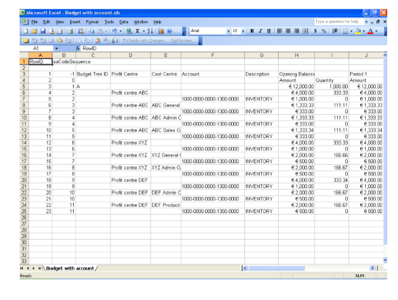

**Template 2** Budget tree without accounts.

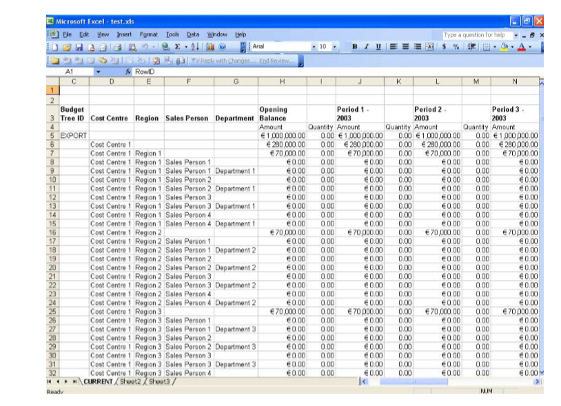

A close up of a piece of paper Description automatically generated

- The budget tree ID in the Budget Tree column of the Excel spreadsheet should
    match the budget tree ID entered against the budget ID in the Analytical
    Accounting Budget Maintenance window.

- The budget totals entered on each level of the tree within the spreadsheet
    should be less than or equal to the budget totals on the level above. They
    should not exceed the totals on the level above.

- The amounts in the opening balance and period columns for the root node of
    the spreadsheet, that is the budget tree ID, should be exactly equal to the
    totals of all the budget amounts entered against the next level nodes.

If any one of the above conditions is not fulfilled, the worksheet will not
be imported, and an Import Error report will be printed listing all the
errors.

Once the file has been imported into Microsoft Dynamics GP, the following
validations will take place:

- If the imported file is the budget tree format without accounts, but
    accounts have been assigned to the budget ID in Microsoft Dynamics GP, such
    accounts will have their balances reverted to zero. The amounts will be
    imported only against the budget tree.

- If the imported file is the account- budget tree format, the amounts will be
    imported against the accounts and the tree. If there are accounts attached
    to the budget ID in Microsoft Dynamics GP, any account that does not exist
    in the import file will have its balance reverted to zero. If there are
    accounts within the imported spreadsheet that have not been assigned to the
    budget ID, they will be assigned when the file is imported. Accounts that
    are common to the import file as well as to the budget ID in Microsoft
    Dynamics GP will be assigned the amounts from the import file.

### Importing a budget

You can import budget figures from an Excel spreadsheet that has been set up
in the correct format. Refer to *Understanding budget import* for an
overview of the conditions that must be fulfilled to successfully import a
budget.

> [!IMPORTANT]
> Be sure not to close the Excel sheet if it appears while importing the
budgets. If you do so, an error message appears and the system will stop
importing the budgets.

**To import a budget:**

1. Open the Import Budget window. (Cards \>\> Financial \>\> Analytical
    Accounting \>\> Budget \>\> Import button)

The Budget ID, Description, Budget Year and Budget Tree ID fields display
the default values from the Analytical Accounting Budget Maintenance window.

1. Select the path for the Excel file from where you want to import the budget.
    The default path name to select the file is My Documents. If you select a
    document type other than an Excel spreadsheet, a warning message appears and
    you will not be able to select the file.

2. The Select the Worksheet window lists all the worksheets in the selected
    Excel file. Highlight the worksheet that you want to import and choose OK.

    > [!IMPORTANT]
    > Be sure not to edit any open Excel file during the import process.

1. Choose OK to import the Excel worksheet. If the import is successful, the
    Analytical Accounting Budget Maintenance window will display the fully
    expanded tree, and the root node will be highlighted.

2. Choose Cancel to return to the Analytical Accounting Budget Maintenance
    window without importing the budget.

## See also

[Microsoft Dynamics GP Analytical Accounting Part 2: Transactions](analytical-accounting-part2.md)  
[Microsoft Dynamics GP Analytical Accounting Part 3: Routines, Inquiries and Reports](analytical-accounting-part3.md)  
[Microsoft Dynamics GP Analytical Accounting Glossary](analytical-accounting-glossary.md)  
