# Microsoft Dynamics GP Bank Reconciliation
==========================================

You can use Bank Reconciliation to enter and maintain checkbooks used to pay vendors, employees, distribute petty cash, and to reconcile bank statements. If you’re using Payables Management and Payroll, checks printed and posted from those modules update checkbooks in Bank Reconciliation.

You also can use Bank Reconciliation to complete the following tasks:

- Write checks without having to set up a vendor record or complete a computer check run

- Control reconciliation processes by creating default settings and choosing between transaction types, including checks, receipts and adjustments

- Begin reconciling one checkbook before finishing the reconcile process in a different checkbook

- View details needed to reconcile, including deposit number, transaction number, type, payment amount, and description

>   This introduction is divided into the following sections:

-   *What’s in this manual*

-   *Symbols and conventions*

-   *Resources available from the Help menu*

-   *Send us your documentation comments*

>   **What’s in this manual**

This manual is designed to give you an understanding of how to use the features
of Bank Reconciliation, and how it integrates with the Microsoft Dynamics® GP
system.

To make best use of Bank Reconciliation, you should be familiar with systemwide
features described in the System User’s Guide, the System Setup Guide, and the
System Administrator’s Guide.

Some features described in the documentation are optional and can be purchased
through your Microsoft Dynamics GP partner.

To view information about the release of Microsoft Dynamics GP that you’re using
and which modules or features you are registered to use, choose Help \>\> About
Microsoft Dynamics GP.

The manual is divided into the following parts:

- *Part 1, Setup*, contains procedures that are required to set up Bank Reconciliation.

- *Part 2, Transactions*, explains how to enter transactions to update your Cash account and checkbook balances.

- *Part 3, Inquiries, reports, and routines*, explains how to view and analyze transaction information, and includes procedures for removing history.

## Part 1: Setup

This part of the documentation provides the procedures required to set up Bank Reconciliation, and for moving your existing reconciliation information into your Microsoft Dynamics GP system. Setup procedures generally need to be completed only once, but you might want to refer to this information again when verifying your setup information, and when maintaining your checkbooks.

The following topics are discussed:

- *Chapter 1, “Setup preparation,”* describes how to set up your bank reconciliation system.

- *Chapter 2, “Setup and default entries,”* explains how to set up default entries for your bank reconciliation system.

- *Chapter 3, “Checkbooks,”* explains how to set up and use checkbooks and Cash accounts.

### Chapter 1: Setup preparation

You must set up several options in System Manager, General Ledger, and Multicurrency Management before setting up Bank Reconciliation.

You must complete these setup procedures before you can enter or post transactions, or reconcile your checkbooks. Once you register Bank Reconciliation, your system immediately begins tracking checkbook-related transactions entered in other modules, and updates Bank Reconciliation.

Don’t register Bank Reconciliation until you’ve set up the checkbooks and cash accounts.

This information is divided into the following sections:

- *Bank Reconciliation overview*

- *Existing system preparation*

- *Before you set up Bank Reconciliation*

#### Bank Reconciliation overview

When you set up Bank Reconciliation, you can enter or void transactions and deposits. After posting, you can print audit trail reports and transaction reports to analyze the accuracy of your records, and to simplify edits. You can review the report information before reconciling your checkbook.

When you reconcile your checkbook, you’ll enter reconciliation dates, mark cleared transactions, enter adjusting entries, and enter any cleared differences.

#### Existing system preparation

Whether you’re setting up your system for the first time or upgrading an existing system, you must reconcile the checkbooks in your existing system before using Bank Reconciliation.

- For new Microsoft Dynamics GP implementations, reconcile your checkbooks in your existing system. This way, you’ll have fewer outstanding checks and transactions to enter, and your balances will be more accurate when you begin using Bank Reconciliation.

- If you’re adding Bank Reconciliation to your Microsoft Dynamics GP solution, post all transactions in other modules to ensure that your General Ledger Cash account balances are correct for your checkbooks. Then, reconcile your checkbooks in your existing system before registering Bank Reconciliation.

**Before you set up Bank Reconciliation**

Before you begin setting up Bank Reconciliation, be sure to set up the following
information:

- Companies

- Credit cards

- Fiscal periods

- Account formats

- Banks

- Posting

- Source documents

- Audit trail codes

- Accounts

- Unit accounts

- Variable allocation accounts

- Fixed allocation accounts

> [TIP]
> To print multicurrency information on your posting journals and reports, mark Include Multicurrency Info in the Posting Setup window.

See the System Setup instructions (Help \>\> Contents \>\> select Setting Up the
System) or the General Ledger documentation (Help \>\> Printable Manuals) for
more information about completing these setup tasks.

### Chapter 2: Setup and default entries

Setting up default entries for Bank Reconciliation saves you time when you enter and analyze data, and enables you to customize your transactions.

This information is divided into the following sections:

- *Default entries overview*

- *Setting up Bank Reconciliation default entries*

#### Default entries overview

Use the Bank Reconciliation Setup window to set up information that makes data entry and tracking easier. You should post all transactions in other modules, and reconcile existing checkbooks in your previous system, before entering information in this window.

**Next transaction number**  
This number appears as the default number for the transactions and receipts you enter using the Bank Transaction Entry, Bank Transfer Entry, and Reconcile Bank Adjustments windows. The transaction number automatically increments to the next available number after you post a transaction or receipt, but you can change the number.

**Transaction descriptions and default codes**

Use the transaction type description to distinguish among the transactions you enter in Bank Reconciliation. For example, if your company refers to interest income as interest gained, you could change the description to Interest Gained, which would then appear in the Reconcile Bank Adjustments window. However, even if you change the description, the underlying functionality stays the same. The code is a short description of the transaction type, which appears as a prefix to the numbers in Bank Reconciliation windows and on transaction reports. The code, next number, and leading zeros create a 12-character number for all transaction types, except for checks and deposits. Default check and deposit numbers are entered using the Checkbook Maintenance window.

For example, suppose you’re entering a withdrawal using the Bank Transaction Entry window. If you set up WDL as the code for withdrawal transactions and 100 as the next number, the number would be WDL000000100 for your first withdrawal transaction. You can change any code or description to match your business. The following table explains where each item appears:

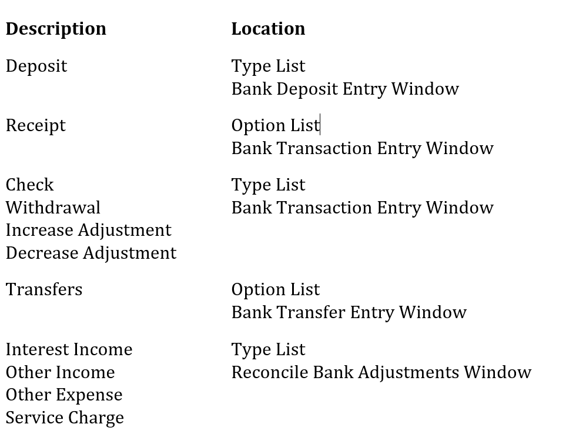

**History**

If you keep transaction/reconciliation history, all account distribution information and posted transactions are stored, so you can reprint posting journals and view the original transaction using the inquiry windows.

**Default checkbook ID**

Use this field to select a checkbook ID to appear as the default checkbook ID when you’re entering transactions using the Bank Transaction Entry window. You should select the checkbook you use most often when entering transactions.

You can select any checkbook as the default checkbook, regardless of whether it is active or has a Cash account assigned to it. You also can inactivate or delete the checkbook that has been selected as the default checkbook in the Bank Reconciliation Setup window.

> [!NOTE]
> Although any checkbook can be selected as the default checkbook, you can’t enter or post transactions in a checkbook that’s inactive, or that doesn’t have a Cash account assigned to it.*

If you’re using Multicurrency Management, you can select any checkbook as the default checkbook, regardless of the following situations. However, you can’t enter or post transactions in a checkbook in these situations:

- The checkbook has an inactive currency assigned to it

- The currency assigned to the checkbook doesn’t exist

- The currency assigned to the checkbook hasn’t been granted access to the company

- The Cash account assigned to the checkbook hasn’t been granted access to the currency ID assigned to the checkbook

**User-defined fields**

Use these fields to track additional information about your checkbooks. These fields are displayed in the Checkbook Maintenance window.

#### Setting up Bank Reconciliation default entries

Use the Bank Reconciliation Setup window to set up your default entries in Bank Reconciliation.

**To set up Bank Reconciliation default entries:**

1. Open the Bank Reconciliation Setup window. (Microsoft Dynamics GP menu \>\> Tools \>\> Setup \>\> Financial \>\> Bank Reconciliation)

    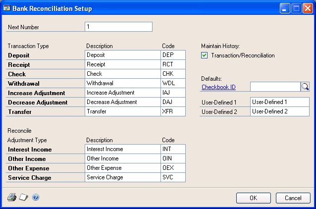

2. Enter the next number for bank transactions, receipts, transfers, and reconcile adjustments.

3. Enter the transaction type descriptions and codes. See *Default entries overview* on page 11 for more information.

4. Mark whether to keep history.

5. Enter or select a checkbook ID to appear as the default checkbook ID in the Bank Transaction Entry window.

6. If you’ll be using user-defined fields, enter labels for the fields.

7. To print the Bank Reconciliation Setup List, choose File \>\> Print.

8. Choose OK to save your entries and close the window.

### Chapter 3: Checkbooks

Checkbooks enable you to keep records of your bank deposits and cash paid out so that you can reconcile them with your bank statements. Checkbooks are available throughout the system, regardless of what other modules you purchased.

If you have Multicurrency Management registered, you can use Bank Reconciliation to set up checkbooks for each currency you use.

This information is divided into the following sections:

- *Checkbook setup requirements* • *Credit card setup*

- *Checkbooks and cash accounts*

- *Check and deposit numbers*

- *Last reconciled date and balance*

- *Setting up a new checkbook*

- *Using an existing checkbook*

- *Inactivating a checkbook*

- *Deleting a checkbook*

#### Checkbook setup requirements

You can set up an unlimited number of checkbooks to manage your company’s cash. We recommend that you set up separate checkbooks for each Cash account so you can more accurately track payments and receipts. For example, you might want to set up separate checkbooks for payroll checks, credit card payments from customers, and payments to vendors.

You can use checkbooks throughout your system to track cash transactions. Because of this integration, new customers must set up their checkbooks and register Bank Reconciliation before posting transactions in other modules. However, existing Microsoft Dynamics GP customers who are setting up Bank Reconciliation have two options for setting up checkbooks:

- Post all your transactions entered in other modules and reconcile your checkbooks before registering Bank Reconciliation.

- Create new checkbook IDs and make existing checkbooks inactive. The new checkbooks you create will replace the old checkbooks in any future transactions. You won’t have to post transactions entered in other modules before you begin to use Bank Reconciliation. See *Setting up a new checkbook* on page 16 and *Inactivating a checkbook* on page 19 for more information.

#### Credit card setup

Before you can post credit card transactions to Bank Reconciliation, you must set up the card using one of two ways, depending on how you’re using it.

- If a customer is using the card, set it up as a bank card.

- If your company is using the card, set it up as a check card. You can change your settings using the Credit Card Setup window.

#### Checkbooks and cash accounts

Assign each checkbook to its own Cash account to prevent confusion and to make it easier to reconcile checkbooks to the Cash account in General Ledger. The Cash account must be a posting or allocation account that does not have any unit accounts assigned as one of the distributions.

If you’re using Multicurrency Management, assign each currency its own checkbooks and Cash accounts. You can assign each currency to unlimited checkbooks.

If you’re using Receivables Management, Payables Management, or Payroll, verify that your Customer Account Maintenance, Vendor Account Maintenance, and Employee Maintenance windows are set up to use the Cash accounts from the correct checkbook. Doing so makes it easier to reconcile your Cash account to the checkbook.

#### Check and deposit numbers

Check and deposit numbers can be alphanumeric. If you enter alphabetic characters, the numerals—not the letters—will increment as you process checks and enter deposits.

By defining the next number in the Checkbook Maintenance window, you also are determining the number of unique numbers that will be available. For example, if you enter CK001 as the next check number, you can enter only up to 999 unique checks. Be sure to enter a number that’s large enough to accommodate your organization’s needs.

If alphabetic characters are entered between numbers, only the numbers to the right of the last letter you entered will be incremented. For example, if the next check number is CK00M18888, the following check number will be CK00M18889.

#### Last reconciled date and balance

When you set up new checkbooks, the last reconciled balance is the checkbook’s current balance. You can make changes to this amount until you reconcile the checkbook for the first time. If you change the last reconciled balance after saving the checkbook, you must enter an adjustment in General Ledger for the Cash account, because an adjusting entry won’t be automatically entered.

After you reconcile a checkbook, the amount in the Last Reconciled Balance field is the same as the bank statement’s ending balance in the Reconcile Bank Statements window. You can’t change this amount using the Checkbook Maintenance window.

#### Setting up a new checkbook

Use the Checkbook Maintenance window to set up checkbooks. You can add checkbooks at any time, and you can select one as the default checkbook in other modules’ setup windows. Selecting a default checkbook streamlines your data entry process.

**To set up a new checkbook:**

1. Open the Checkbook Maintenance window. (Cards \>\> Financial \>\> Checkbook)

     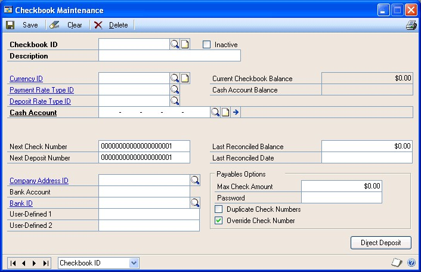

2. Enter or select a checkbook ID and enter a checkbook description.

3. If you’re using Multicurrency Management, enter the currency, payment rate type, and deposit rate type IDs. You must enter a currency ID if you are using Multicurrency Management. You can’t change the currency ID after you’ve saved the checkbook. The Currency ID lookup window displays only the active currencies a company has access to.

4. Assign a Cash account to the checkbook.

5. Enter the default entry for the next check and next deposit numbers. Be sure to include leading zeros so you don’t run out of check and deposit numbers. For example, if you entered a check number of CK001, you would be able to enter only 999 unique checks.

    You can use alphanumeric characters in the check or deposit number fields, but the number must end in a numeral or it won’t increment properly.

6. Enter the company and bank information. The bank account number should match the account number for the checking account at the bank.

7. Enter any user-defined information. If you entered user-defined field labels in the Bank Reconciliation Setup window, those labels appear here. You can use them to track information specific to this checkbook.

8. Enter the balance and date from the last bank statement you reconciled. You can change the balance or the date until you reconcile your checkbook for the first time in Bank Reconciliation. However, if you change the last reconciled balance, which is reflected in the checkbook balance, you might need to enter an adjustment transaction in General Ledger to update the Cash account.

    > [!NOTE]
    > After reconciling the first time, the date and balance fields are updated each time you reconcile. You can’t make changes to these fields using this window.

9. If you’re using Payables Management, enter the payables options.

10. Choose Save to save the checkbook.

11. To print a Checkbook List, choose File \>\> Print.

#### Using an existing checkbook

Use this procedure if you have an existing checkbook that you want to continue using in Bank Reconciliation. Any checkbooks you previously set up appear in Bank Reconciliation when you register the module.

As soon as you register Bank Reconciliation, any transactions assigned to a checkbook are posted to Bank Reconciliation. For this reason, we recommend that you post all transactions and reconcile your existing checkbooks before registering Bank Reconciliation.

**To use an existing checkbook:**

1. Post all transactions that use existing checkbooks.

2. Reconcile your existing checkbooks in your old reconciliation system.

3. Verify the checkbook information using the Checkbook Maintenance window. (Cards \>\> Financial \>\> Checkbook)

    If you are using reporting ledgers, the amount shown in the Cash Account Balance field is based on the ledgers selected in the General Ledger Setup window in the Account Balance for Subsidary Windows list. For more information on using reporting ledgers, see the General Ledger documentation.

4. Enter the last reconciled date and balance from step 2.

5. Enter new registration keys that include access to Bank Reconciliation.

6. Open the Posting Setup window. (Microsoft Dynamics GP menu \>\> Tools \>\> Setup \>\> Posting \>\> Posting)

    If you have transactions that were entered and posted in other modules before you registered Bank Reconciliation, those transactions might have already updated General Ledger. If so, be sure you don’t post those transactions to General Ledger because duplicate entries will result.

7. Select Financial for the Series and Bank Transaction Entry for the origin, and unmark Post to General Ledger.

8. Select Bank Deposit Entry for the origin and unmark Post to General Ledger. Choose OK to close the window.

9. Enter and post outstanding checks and deposits using the Bank Transaction Entry and Bank Deposit Entry windows.

10. Compare your checkbook balance in the Checkbook Maintenance window to your Cash account balance in General Ledger to ensure the amounts match.

11. Reopen the Posting Setup window and mark Post to General Ledger for the Bank Transaction Entry and Bank Deposit Entry origins.

    Verify that your customers, vendors, and employees are set up to use the Cash accounts from the appropriate checkbooks.

#### Inactivating a checkbook

Use the Checkbook Maintenance window to make a checkbook inactive, which prevents new checks or receipts from being entered for that checkbook. You can still complete the following tasks when the checkbook is inactive:

- Post transactions previously entered in any module.

- Void receipts, transactions, or deposits in any module.

- Enter deposits with receipts or deposits to clear receipts transactions using the Bank Deposit Entry window.

- Enter adjustment transactions using the Reconcile Bank Adjustments window.

- Reconcile the checkbook.

**To inactive a checkbook:**

1. Open the Checkbook Maintenance window. (Cards \>\> Financial \>\> Checkbook)

2. Enter or select a checkbook ID.

3. Mark Inactive.

4. Choose Save to save the checkbook.

#### Deleting a checkbook

If a checkbook has become obsolete and you’re no longer planning to use it, you can delete it under the following circumstances.

- The checkbook balance is zero.

- The checkbook is not associated with any unposted batches or transactions.

- The checkbook isn’t assigned to a bank card or a check card in the Credit Card Setup window.

- All outstanding checks and deposits have been reconciled.

- No Bank Reconciliation history is available for the checkbook.

**To delete a checkbook:**

1. Back up your company’s data. See the System Setup instructions (Help \>\> Contents \>\> select Setting Up the System) for more information about backing up your system.

2. Use the Checkbook Reports window to print an Undeposited Receipts Report, so you can verify that there are no undeposited receipts for the checkbook you’re deleting. See *Chapter 12, “Reports,”* for more information about creating report options and printing reports.

3. Enter or select the checkbook ID in the Reconcile Bank Statements window to ensure that all transactions have been reconciled for the checkbook. See *Reconciling a bank statement with a checkbook* on page 53 for more information.

4. Using the Checkbook Maintenance window, verify that the checkbook’s current balance and last reconciled balance are zero.

    - If the current balance is not zero, you must enter an increase or decrease adjustment transaction and reconcile the transaction. See *Entering a check, withdrawal, or adjustment transaction* on page 29 for more information about entering adjustment transactions.

    - If the last reconciled balance is not zero, you must reconcile your checkbook with a bank statement ending balance of zero using the Reconcile Bank Statements window. See *Reconciling a bank statement with a checkbook* on page 53 for more information.

5. Using the Credit Card Setup window, remove the checkbook from all bank cards and check cards. See the System Setup instructions (Help \>\> Contents \>\> Setting Up the System) for more information about setting up credit cards.

6. Verify that the checkbook is not assigned to any batches or transactions in any other modules, unless the transaction is in the module’s history.

7. Open the Remove Bank History window. (Microsoft Dynamics GP menu \>\> Tools \>\> Utilities \>\> Financial \>\> Remove Bank History)

    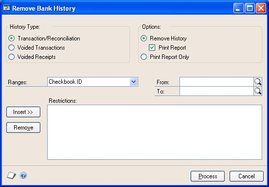

8. Mark the type of history to remove, and mark any other options. Select a checkbook ID range and choose Insert to insert the range restriction.

9. Choose Process to remove Bank Reconciliation history for all the transactions in this checkbook.

    > [!WARNING]
    > Once you remove history, you can’t print any historical information for this checkbook.

10. Open the Checkbook Maintenance window. (Cards \>\> Financial \>\> Checkbook) 11. Enter or select the checkbook ID to delete.

11. Choose Delete.

## Part 2: Transactions

Use the information in this part of the documentation to ensure that your checkbooks accurately reflect the transaction detail that appears on your monthly bank statements. You can enter transactions to update your Cash account and checkbook balances, to enter receipts and deposits, and to reconcile your checkbook.

The following topics are discussed:

- *Chapter 4, “Bank transaction requirements,”* describes transaction requirements and posting in Bank Reconciliation.

- *Chapter 5, “Multicurrency transactions,”* explains multicurrency options you can use in Bank Reconciliation.

- *Chapter 6, “Checks, withdrawals, and adjustments,”* contains information about recording and posting check, withdrawal, and adjustment transactions.

- *Chapter 7, “Receipts,”* explains how to enter receipt information in Bank Reconciliation.

- *Chapter 8, “Deposits,”* describes how to enter deposits.

- *Chapter 9, “Bank account transfers,”* explains how to transfer funds from one checkbook to another.

- *Chapter 10, “Bank statement reconciliation,”* includes information about reconciling checkbooks.

### Chapter 4: Bank transaction requirements

Because Bank Reconciliation integrates with several other modules and has multicurrency functionality, there are some transaction requirements and recommendations you should understand before using this module.

This information is divided into the following sections:

- *Bank Reconciliation integration with other modules*

- *Voided transactions that affect Bank Reconciliation*

- *Bank Reconciliation posting*

#### Bank Reconciliation integration with other modules

Whenever you enter a transaction in another module that uses a checkbook, Bank Reconciliation is updated. Therefore, you should use the Bank Reconciliation transactions only to record those miscellaneous transactions,
>   receipts, and deposits not recorded elsewhere.

>   If you enter a transaction in another module and then enter it again in Bank
>   Reconciliation, the checkbook and Cash account will be updated twice and
>   your accounts won’t reconcile properly.

>   The following table shows the transactions that update General Ledger Cash
>   accounts, and the ones that update the checkbook balance in Bank
>   Reconciliation.

| [./media/image5.jpg](./media/image5.jpg) |   |   |
|------------------------------------------|---|---|

\~ A screenshot of a cell phone Description automatically generated

#### Voided transactions that affect Bank Reconciliation

>   Transactions that are voided in other modules will be listed on Bank
>   Reconciliation reports. Transactions that were originally entered before the
>   reconciliation cutoff date and that were voided after the cutoff date are
>   listed as outstanding transactions. (The reconcile cutoff date is entered in
>   the Reconcile Bank Statements window.)

The Checkbook Register Inquiry window and the Checkbook Inquiry Report list
transactions that were voided after the date range entered for the report as
outstanding transactions.

#### Bank Reconciliation posting

Posting moves transactions to permanent records. In Bank Reconciliation, posted
transactions and reconciliation adjustments update the General Ledger Cash
accounts and checkbook balances. When you post deposits, only Bank

Reconciliation is updated, unless you have gains or losses. When you post
receipts either in Bank Reconciliation or in other modules, the General Ledger
Cash account is updated. When you post transfers, the Cash accounts and the
checkbook balance all are updated.

>   If you’re using Multicurrency Management, any gains or losses associated
>   with a deposit are posted to the Realized Gains/Losses account.

Bank Reconciliation uses only transaction-level posting, which means you must
enter and post bank transactions individually. Your settings in the Posting
Setup window also must enable transaction-level posting for Bank Reconciliation.
See the System Setup instructions (Help \>\> Contents \>\> select Setting Up the
System) for more information about posting setup. You can post only to an open
period that’s been set up using the Fiscal Periods Setup window. Bank
Reconciliation records are updated using the date you entered in the Bank
Transaction Entry, Bank Transfer Entry, Reconcile Bank Adjustments, or Bank
Deposit Entry windows.

You can enter and save deposits for posting later, but you can save only one
deposit with receipts transaction or one deposit to clear receipts transaction
for each checkbook at any given time.

If you choose to post to General Ledger, the transactions appear in a batch in
the General Ledger Batch Entry, Series Posting, and Master Posting windows. If
necessary, you can edit the transactions using the Transaction Entry window in
General Ledger. Your General Ledger accounts are updated when you post the batch
in General Ledger.

If you’re posting to General Ledger, the audit trail code for the transaction
identifies the transaction origin. Receipts from other modules follow the
General Ledger posting specifications set up for the originating modules.

All transactions posted during a single data entry session use the same audit
trail code. For example, if you enter and post five deposits with receipts using
the Bank Deposit Entry window, and you close the window, all five deposits have
the same audit trail code and are printed on the same posting journal. Use the
audit trail code to trace the posting sequence of any transaction back to the
originating journal.

When you post transactions, deposits, or transfers, and you close the window,
the

Bank Transaction Posting Journal, Bank Deposit Posting Journal, or Bank Transfer

Posting Journal is printed automatically, if you selected to print those reports
in the Posting Setup window. These posting journals provide details about the
transactions or deposits you posted. After posting, you can view the transaction
and deposit information on reprinted posting journals, or using the Bank
Transaction Entry Zoom, Bank Deposit Entry Zoom, or Bank Transfer Entry Zoom
windows.

>   To include Multicurrency information on posting journals and other reports,
>   mark Include Multicurrency Info in the Posting Setup window.

**Chapter 5: Multicurrency transactions**

>   If you’re using Multicurrency Management with Bank Reconciliation, you can
>   choose the currency to enter on checks.

>   This information is divided into the following sections:

-   *Rules for multicurrency transactions*

-   *Exchange rate and document date*

-   *Multicurrency account distributions*

-   *Rounding differences*

#### Rules for multicurrency transactions

>   If you’re using Multicurrency Management, the following rules apply when
>   entering transactions.

-   You must set up a functional currency for the company before entering
    transactions. See the Multicurrency Setup window for more information.

-   Both the transaction and posting dates must fall within a valid exchange
    rate period, or you can’t post the transaction.

-   Realized gains or losses due to rounding differences are posted to the
    Realized

>   Gain and Loss accounts you set up using the Multicurrency Posting Account
>   Setup by Rate Type window. If no Realized Gain or Loss accounts have been
>   set up using this window, the accounts set up using the Multicurrency
>   Posting Accounts Setup window or Posting Accounts Setup window are used.

-   Both the original and functional amounts appear in the scrolling window.

-   Regardless of whether the checkbook is assigned to the functional or
    nonfunctional currency, you can make payments only in the checkbook
    currency.

>   *If you’re using Payables Management, you can make payments in any currency
>   for a checkbook with an assigned functional currency. If the checkbook being
>   used doesn’t have an assigned functional currency, you can make payments
>   only in the checkbook currency.*

>   The following rules apply to deposit and receipt transactions.

-   For checkbooks assigned to the functional currency, you can enter and post
    deposits with receipts in any currency that is valid for the company.

-   When a deposit is voided, the system uses the exchange rate for the original
    transaction so that the amounts for the void are calculated correctly.

#### Exchange rate and document date

If a transaction’s currency ID is not in the functional currency, a rate type
and associated exchange rate table are assigned to the transaction. The rate
type is the default rate type from the selected checkbook. If one isn’t assigned
to the checkbook, the default rate type for the Financial series specified in
the Multicurrency Setup window is used. You also can choose the Currency ID
expansion button to open the Exchange Rate Entry window, where you can view or
modify the default exchange rate.

The document date assigned to a transaction determines the exchange rate to use,
based on the currency ID and associated rate type entered for the transaction.
Each time you change the document date on a multicurrency transaction, the
system searches for a valid exchange rate. If a valid rate doesn’t exist, you
can enter an exchange rate using the Exchange Rate Entry window. If you entered
a General Ledger posting date that’s different from the document date, the
exchange rate expiration date must be after the posting date.

#### Multicurrency account distributions

For multicurrency transactions, distribution amounts are displayed in both the
functional and originating currencies. However, you can change only the
originating amounts.

When you’re entering a multicurrency transaction, the originating debit and
credit amounts must balance. If the functional equivalents don’t balance, the
difference is

posted to a Rounding Difference account, which is displayed on the Bank
Transaction Posting Journal.

**Example**

You entered a check to pay for supplies in the euro currency for 30,886.59 EUR,
which includes marketing supplies for 15,755.41 EUR, sales supplies for 9,876.89
EUR, and administrative supplies for 5,254.29 EUR. The exchange rate is 1.0922.
The distributions are described in the following table:

A screenshot of a cell phone Description automatically generated

#### Rounding differences

>   If you’re using Multicurrency Management, your system might calculate a
>   rounding difference and post that amount to the Rounding Difference account
>   if a transaction’s originating debits and credits balance, but the converted
>   functional debits and credits don’t balance. The distribution for the
>   rounding difference doesn’t show on the window, but does show in the posting
>   journal.

>   **Example**

>   You use US dollars as your functional currency and you have a checkbook that
>   uses Swiss francs. The exchange rate is 1.5 using the divide method, and you
>   enter a transaction for CHF 1,500 that’s going to a Cash account (\$1,000
>   US). The distributions are described in the following table:

| **Distribution** | **Amount**            |
|------------------|-----------------------|
| Account \#1      | 500 CHF (\$333.33 US) |
| Account \#2      | 500 CHF (\$333.33 US) |
| Account \#3      | 500 CHF (\$333.33 US) |

>   The total amount distributed is \$999.99 US, while the converted amount in
>   the Cash account is \$1,000.00 US, which leaves \$0.01 US as a rounding
>   difference.

**Chapter 6: Checks, withdrawals, and adjustments**

>   You can record and post transactions related to checks, withdrawals, and
>   other adjustments.

>   This information is divided into the following sections:

-   *Entering a check, withdrawal, or adjustment transaction*

-   *Entering a miscellaneous check*

-   *Bank transaction voids overview*

-   *Voiding a bank transaction*

#### Entering a check, withdrawal, or adjustment transaction

>   Use the Bank Transaction Entry window to enter checks, withdrawals, and
>   increase or decrease adjustments.

>   Use withdrawal transactions to record cash withdrawals from a checkbook. For
>   example, you can record an insurance payment that is automatically deducted
>   from your checkbook on a monthly basis as a withdrawal transaction.
>   Withdrawal transactions decrease the checkbook balance when you post.

>   For adjustments, use the Bank Transaction Entry window to record debit
>   amounts— other than deposits—that increase the checkbook balance when
>   they’re posted (increase adjustment transactions). Use decrease adjustment
>   transactions to record amounts that decrease the checkbook balance when
>   they’re posted, such as bank service charges. See *Entering a miscellaneous
>   bank adjustment transaction* on page 55 for information about entering an
>   adjusting amount after reconciling.

>   If you’re using other modules such as Payables Management to track certain
>   kinds of checks, you should enter those check transactions in those modules,
>   not in Bank Reconciliation. Entering them in both places duplicates the
>   credit from the Cash account and creates an extra check in Bank
>   Reconciliation.

>   Use the following procedure only to enter transactions that haven’t
>   originated in another module. These transactions update both the checkbook
>   balance and the General Ledger Cash account when you post.

>   To transfer funds from one checkbook to another, use the Bank Transfer Entry
>   window. See *Chapter 7, “Receipts,”* and *Chapter 8, “Deposits,”* for
>   information about entering receipts and deposits.

**To enter a check, withdrawal, or adjustment transaction:**

1.  Open the Bank Transaction Entry window.

>   (Transactions \>\> Financial \>\> Bank Transactions)

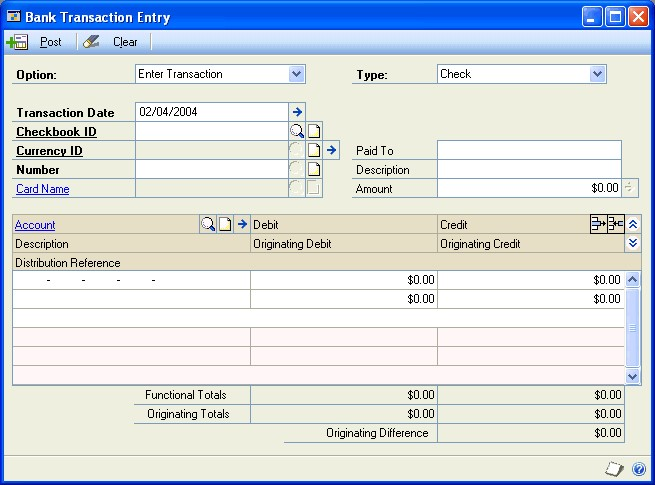

A screenshot of a cell phone Description automatically generated

1.  Select Enter Transaction, then select a type.

2.  Enter the transaction date. To enter a different posting date, choose the
    Transaction Date expansion button to open the Bank Transaction Date window.
    Choose OK to close the window when you finish.

>   If the transaction date and posting date are the same and you change the
>   transaction date, the posting date changes, as well. If these two dates
>   aren’t the same, changing the transaction date doesn’t affect the posting
>   date.

1.  Enter or select the checkbook ID for this transaction. The default checkbook
    ID, check or transaction number, and Cash account information appears
    automatically.

>   If you’re using Multicurrency Management, the currency ID also appears, and
>   you can choose the Currency expansion button to view or change the exchange
>   rate for the transaction.

1.  Enter the name of the payee or payor, the description, and the transaction
    amount. For the default Cash account, you can change only the distribution
    reference.

>   This transaction amount that appears on the first line of the scrolling
>   window will be posted to the Cash account for the checkbook. To record a
>   voided check, or to track an alignment form or a damaged check, you can
>   enter a zero amount for the check amount.

>   To view information about your multicurrency bank transactions, choose the
>   Amount expansion button to open the Multicurrency Bank Amounts window.

1.  Enter the offset posting accounts and amounts for the transaction.

>   You can enter either a posting account or a unit account as an offset
>   account to track non-financial amounts for your bank transactions. An entry
>   to a unit

>   account affects the balance of the selected unit account; however, it has no
>   effect on the totals or difference displayed at the bottom of the scrolling
>   window.

1.  Choose Post to post the transaction. The checkbook balance is updated, and
    the information is posted to or through General Ledger, depending on your
    selection in the Posting Setup window.

2.  Close the window. The Bank Transaction Posting Journal is printed if you
    selected that option in the Posting Setup window. If you’re keeping history,
    you can reprint the posting journals using the report options windows.

>   If you’re registered for Multicurrency Management, any rounding differences
>   are posted to the Rounding Differences account and appear on the posting
>   journals, if the Include Multicurrency Info option is marked in the Posting
>   Setup window.

#### Entering a miscellaneous check

>   You can create individual checks to make a one-time payment when you don’t
>   want to create a vendor record for the person or business you’re paying. Use
>   the Miscellaneous Check window to print checks for one-time purchases that
>   are not recorded as transactions anywhere else. You can print and post a
>   check from this window, or you can post checks from this window without
>   printing them.

>   **To enter a miscellaneous check:**

1.  Open the Miscellaneous Check window.

>   (Transactions \>\> Financial \>\> Miscellaneous Check)

A screenshot of a social media post Description automatically generated

1.  Enter or select a checkbook ID.

2.  Enter or accept the default check number and the date.

3.  Enter the recipient name in the Pay to field.

4.  Enter the amount of the check in the \$ field. The amount entered will be
    converted to words in the Dollars field. The amount will be the credit entry
    for the cash account assigned to the checkbook, which can’t be changed.

5.  Enter the recipient address in the Address fields, and type any additional
    information in the Memo field.

6.  Select the check format, and select to print an alignment form or a check.

>   The transaction amount that appears on the first line of the scrolling
>   window will be posted to the cash account for the checkbook.

1.  Select an offset account using the account lookup button. Type a debit or
    credit for the account. Press TAB to move to the next line. Repeat this step
    for each account you’re entering debits or credits for until the difference
    is zero.

>   If you type a debit and a credit on the same line, the most recent entry
>   will be kept and the previous entry will be reset to zero.

1.  Click Print Check, and then click Post to complete the procedure. You can
    post the check without printing it, but you cannot print a check after it
    has been posted. You can void the check later, if necessary. See *Voiding a
    bank transaction* on page 33 for more information.

2.  Close the window. Depending on your selections in the Posting Setup window,
    some posting journals might be printed. Refer to the System Setup Guide for
    information about setting up posting options (Help \>\> Printable Manuals
    \>\> System \>\> System Setup).

#### Bank transaction voids overview

When you void a posted transaction entered in Bank Reconciliation, the amounts
posted to accounts are reversed and the checkbook balance is updated by the
voided transaction amount.

-   If you’re not keeping history, voided transactions are deleted after
    posting.

-   If you are keeping history, voided transactions are stored for auditing
    purposes. For example, you might want to track all checks that have been
    voided so you know why a check number is missing or out of sequence.

If you must void a transaction you entered in another module, you should use
that module to void the transaction so you keep accurate accounting records
throughout the system. When you void the transaction in the originating module,
the checkbook is updated in Bank Reconciliation.

The following conditions must exist before you can void a transaction:

-   The transaction must exist in Bank Reconciliation. You can use the Checkbook
    Register Inquiry window to verify whether the transaction exists. If it
    does, it appears in the window.

-   The transaction can’t have been reconciled or previously voided.

-   The transaction can’t be marked for reconciliation.

-   The checkbook assigned to the transaction must exist, and a Cash account
    must be assigned to it.

-   The transaction must be fully distributed.

>   • If you’re using Multicurrency Management, the currency ID for the
>   checkbook must be active.

>   Once a transaction has been voided, you can’t reconcile it.

>   If you’re using Multicurrency Management, your system uses the original
>   exchange rate for the void transaction to ensure that the General Ledger
>   amounts are the same as the original transaction.

#### Voiding a bank transaction

>   Use the Bank Transaction Entry window to void transactions that were entered
>   and posted in Bank Reconciliation. If you entered and posted a transaction
>   in another module, see that module’s documentation for information about how
>   to void the transaction.

>   **To void a bank transaction:**

1.  Open the Bank Transaction Entry window.

>   (Transactions \>\> Financial \>\> Bank Transactions)

1.  Select Void Transaction.

2.  Enter or select the checkbook ID for the transaction you’re voiding. The
    default checkbook ID was set up using the Bank Reconciliation Setup window.

3.  Enter or select the transaction number to void. Verify that the transaction
    is fully distributed.

4.  Choose Void to void the transaction. The checkbook is updated and the
    distributions in the scrolling window are posted to General Ledger. The
    debits and credits for the account distributions appear in reverse order
    from the transaction that was originally entered.

5.  Close the Bank Transaction Entry window. The Bank Transaction Posting
    Journal is printed. Transactions that have been voided since you opened the
    window are marked with an asterisk (\*) on the report.

Chapter 7: Receipts
-------------------

>   Receipts are any type of payment a business might receive. Once receipts are
>   entered in Bank Reconciliation or posted in other modules, they are
>   available for deposit. Use the deposit entry procedures to enter deposits
>   for transactions with and without receipts. You also can clear receipts if
>   you identify individual receipts that should be removed.

>   Receipt transactions appear in Bank Reconciliation once they’ve been posted
>   in other modules. However, you might need to enter cash receipts that aren’t
>   related to a specific customer. For example, your business might receive an
>   annual utility rebate from your electrical service provider.

>   This information is divided into the following sections:

-   *Entering miscellaneous receipts*

-   *Receipt voids overview*

-   *Voiding a receipt*

-   *Differences between voiding and clearing receipts*

-   *Multicurrency receipts and their effects on deposits*

-   *Multicurrency receipt and deposit examples*

### Entering miscellaneous receipts

>   Use the Bank Transaction Entry window to enter funds received by your
>   company from another party. Typically, receipts appear in Bank
>   Reconciliation when cash receipt transactions are posted in other modules.
>   However, you might need to enter transactions for miscellaneous amounts that
>   weren’t entered in other modules, such as payments received from employees
>   for employee stock purchases.

>   When you post a receipt, the Cash account in General Ledger is updated by
>   the amount of the receipt, depending on your posting setup, but the
>   checkbook balance isn’t updated. When you assign receipts to deposits using
>   the Bank Deposit Entry window, the checkbook balance is updated by the
>   receipt amounts when the deposit is posted.

>   **To enter a miscellaneous receipt:**

1.  Open the Bank Transaction Entry window.

>   (Transactions \>\> Financial \>\> Bank Transactions)

1.  Select Enter Receipt and a type of Cash, Check, or Credit Card.

2.  Enter the transaction date of the receipt. This date appears on posting
    journals and other reports. To enter a different posting date, choose the
    Transaction Date expansion button.

>   If the transaction date and posting date are the same and you change the
>   transaction date, the posting date changes, as well. If these two dates
>   aren’t the same, changing the transaction date doesn’t affect the posting
>   date.

1.  Enter or select the checkbook ID for this receipt. The default checkbook ID,
    receipt number, and Cash account information will appear automatically. For
    the default Cash account, you can change only the distribution reference.

>   If you’re using Multicurrency Management, the currency ID also appears, and
>   you can choose the Currency ID expansion button to view or change the
>   exchange rate for the receipt.

1.  If you’re entering a credit card receipt, enter a card name. (Bank cards are
    the only credit cards you can enter in Bank Reconciliation.) The checkbook
    ID assigned to the receipt and to the credit card must be the same before
    you can post.

2.  Enter the name of the payer, a description, and a receipt amount. This
    amount appears on the first line of the scrolling window as a debit amount
    to be posted to the Cash account for the checkbook.

>   To view information about your multicurrency bank transactions, choose the
>   Amount expansion button to open the Multicurrency Bank Amounts window.

1.  Enter the offset posting accounts and amounts for the receipt.

2.  Choose Post to post the receipt. The information is posted to or through
    General Ledger, depending on your selection in the Posting Setup window. The
    checkbook balance isn’t updated until the receipt is assigned to a deposit
    and the deposit is posted.

3.  Close the window. The Bank Transaction Posting Journal is printed if you
    selected that option in the Posting Setup window. If you’re keeping history,
    you can reprint the posting journals using the report options windows.

>   If you’re registered for Multicurrency Management, any rounding differences
>   are posted to the Rounding Differences account, and appear on the posting
>   journals, if you chose to include Multicurrency Info in the Posting Setup
>   window.

### Receipt voids overview

>   You can void receipts using the Bank Transaction Entry window. When you void
>   a receipt in Bank Reconciliation, the amounts posted to accounts when the
>   receipt was posted are reversed.

-   If you aren’t keeping history, voided receipts are deleted after posting.

-   If you are keeping history, voided receipts are stored for auditing
    purposes.

>   See *Differences between voiding and clearing receipts* on page 37 for more
>   information about the differences between clearing and voiding a receipt.

>   If you enter a receipt in another module, you should use that originating
>   module when voiding the receipt to keep accurate accounting records
>   throughout the system. Bank Reconciliation is then updated.

>   The following conditions must exist before you can void a receipt:

-   The receipt must exist in the CM Receipt Table. Receipts are stored in the
    CM Receipt Table after they’ve been posted. You can use the Bank Deposit
    Entry window to verify whether the receipt exists in the Table. If it does,
    it appears in the window.

-   The receipt can’t be deposited or previously voided.

-   The receipt can’t be marked for deposit.

-   The checkbook assigned to the receipt must exist, and a Cash account must be
    assigned to the checkbook.

-   The receipt must be fully distributed.

-   If you’re using Multicurrency Management, the currency ID for the checkbook
    must be active.

>   Once a receipt is voided, you can’t deposit it. If you’re using
>   Multicurrency Management, your system uses the original exchange rate for
>   the void receipt to ensure that the General Ledger amounts are the same as
>   the original receipt.

### Voiding a receipt

>   Use the Bank Transaction Entry window to void a receipt in Bank
>   Reconciliation. If you entered and posted a receipt in another module, see
>   that module’s documentation for instructions about how to void the receipt.

>   **To void a receipt:**

1.  Open the Bank Transaction Entry window.

>   (Transactions \>\> Financial \>\> Bank Transactions)

1.  Select Void Receipt.

2.  Enter or select a checkbook ID for the receipt you’re voiding. The default
    checkbook ID was set up using the Bank Reconciliation Setup window.

3.  Enter or select the receipt number to void. The receipt information appears
    in the appropriate fields. The original transaction date and posting date
    appear as default entries.

4.  Verify that the receipt is fully distributed.

5.  Choose Void to void the receipt. The distributions in the scrolling window
    are posted to General Ledger.

6.  Close the window. The Bank Transaction Posting Journal is printed. Receipts
    that have been voided since you opened the window are marked with an
    asterisk (\*) on the report.

### Differences between voiding and clearing receipts

>   Voiding a receipt reverses the General Ledger distributions for the receipt,
>   including the Cash account distribution. If you’re keeping history, the
>   voided receipt still appears on reports and in inquiry windows, so you can
>   accurately track information about the voided receipt. For example, if you
>   accidentally entered and posted the same receipt twice, you would void one
>   of the receipt transactions to help ensure your data was correct. Remember
>   to void the receipt in the module where it was originally entered.

>   Clearing a receipt using the Bank Deposit Entry window removes the receipt
>   from the list of receipts available for deposit. The account distributions
>   are not affected and the receipt information appears on the posting journal,
>   and in the inquiry windows, so you can view what was cleared from the
>   checkbook. For example, you might have posted a single deposit without
>   receipts that covered the amounts for several receipts. Once you receive
>   those receipts, you must clear them without posting another deposit.

### Multicurrency receipts and their effects on deposits

>   If you’re using Multicurrency Management, you can enter receipts that use a
>   different currency from the ones assigned to your checkbooks, based on the
>   following rules:

-   If your checkbook is assigned to the functional currency, you can enter
    receipts in any currency that’s set up for your company.

-   If your checkbook is assigned to a currency that is not the functional
    currency, you can enter receipts in either the checkbook currency or in the
    functional currency for your company.

>   When you create a deposit for receipts that use non-functional currencies,
>   both the originating and checkbook amounts appear in the scrolling window of
>   the Bank Deposit Entry window. You might have realized gains or losses
>   associated with the converted amount. If the exchange rate changes between
>   the date when the receipt is posted and the date when it’s deposited, the
>   realized gains and losses appear after the receipt is marked for deposit.

>   The following terms explain how the amounts are displayed in the window:

>   **Originating Amount** The receipt’s amount in the original currency of the
>   receipt.

>   **Checkbook Amount** The receipt’s amount converted to the currency the
>   checkbook uses.

>   **Realized gains or losses** The difference between the calculated
>   functional amount of the originating receipt, and the functional amount
>   calculated using the deposit exchange rate. A realized gain or loss is
>   entered in the functional currency and it updates General Ledger, but not
>   the checkbook balance.

>   *All the marked receipts for a particular currency use the same exchange
>   rate. You can change the exchange rate for a receipt by marking the receipt,
>   then choosing the Currency ID expansion button.*

### Multicurrency receipt and deposit examples

>   The following examples show what happens with the receipt amounts for a
>   checkbook using the functional currency, and for a checkbook using a
>   nonfunctional currency.

>   **Functional currency assigned to checkbook**

>   The functional and checkbook currencies both are in US dollars. The
>   following receipts are posted:

| **Original receipt amount** | **Exchange rate (multiply rate)** | **Functional amount** |
|-----------------------------|-----------------------------------|-----------------------|
| €100.00                     | 1.04045                           | \$104.05              |
| CA\$100.00                  | 1.3                               | \$130.00              |
| US\$100.00                  | (functional)                      | \$100.00              |

>   The amounts displayed in the Bank Deposit Entry window before marking
>   receipts are described in the following table:

| **Originating amount** | **Checkbook amount** | **Realized gain/loss** |
|------------------------|----------------------|------------------------|
| €100.00                | \$104.05             | \$0.00                 |
| CA\$100.00             | \$130.00             | \$0.00                 |
| US\$100.00             | \$100.00             | \$0.00                 |

>   When you mark receipts for deposit, your system searches for an exchange
>   rate based on the deposit date and the currency ID, then calculates the
>   checkbook and functional amounts based on the rate found. If the functional
>   amount value changes based on the new calculation, you have realized gains
>   or losses, as displayed in the following table:

| **Originating amount** | **Exchange rate** | **Checkbook amount and functional amount** | **Realized gain/ loss** |
|------------------------|-------------------|--------------------------------------------|-------------------------|
| €100.00                | 1.150             | \$115.00                                   | \$10.95                 |
| CA\$100.00             | 1.25              | \$125.00                                   | (\$5.00)                |
| US\$100.00             | (functional)      | \$100.00                                   | \$0.00                  |

>   If you unmark a receipt, the checkbook amount reverts back to the amount
>   before the receipt was marked, and the realized gains/losses become zero.

>   **Alternate currency assigned to checkbook**

>   The checkbook amount for each receipt shows the amount calculated using the
>   deposit exchange rate, regardless of whether the receipts have been marked.
>   For a receipt that originated in an alternate currency, any realized gains
>   or losses appear after you mark the receipts.

>   The functional currency is US dollars and the checkbook currency is Canadian
>   dollars. The following receipts are posted:

| **Original receipt amount** | **Exchange Rate** | **Functional amount** |
|-----------------------------|-------------------|-----------------------|
| \$100.00                    | \---              | \$100.00              |
| CA\$140.00                  | 0.65              | \$91.00               |

>   The amounts displayed in the Bank Deposit Entry window before marking the
>   receipt, assuming a deposit exchange rate of \$0.80 US to one Canadian
>   dollar, are described in the following table:

| **Originating amount** | **GL functional amount** | **Checkbook amount** | **Realized gain/ loss** |
|------------------------|--------------------------|----------------------|-------------------------|
| \$100.00               | \$100.00                 | CA\$125.00           | \$0.00                  |
| CA\$140.00             | \$112.00                 | CA\$140.00           | \$0.00                  |

>   The amounts displayed in the Bank Deposit Entry window after marking the
>   receipt, assuming a deposit exchange rate of \$0.80 US to one Canadian
>   dollar, are described in the following table:

| **Originating amount** | **GL functional amount** | **Checkbook amount** | **Realized gain/ loss** |
|------------------------|--------------------------|----------------------|-------------------------|
| \$100.00               | \$100.00                 | CA\$125.00           | \$0.00                  |
| CA\$140.00             | \$112.00                 | CA\$140.00           | \$21.00                 |

Chapter 8: Deposits
-------------------

>   Bank Reconciliation enables you to manage your deposits by entering deposits
>   with receipts, without receipts, and to clear receipts. You also can void
>   deposits.

>   This information is divided into the following sections:

-   *Bank deposits overview*

-   *Entering a deposit with receipts*

-   *Deposit totals overview*

-   *Entering a deposit without receipts*

-   *Clearing a receipt from a deposit*

-   *Voiding a deposit*

-   *Deleting a deposit*

### Bank deposits overview

>   You can enter the following deposit types in Bank Reconciliation:

-   Use Deposit with Receipts to enter a deposit for receipts that were posted
    in Bank Reconciliation, or from another module.

-   Use Deposit without Receipts to enter a deposit without assigning receipts.

-   Use Deposit to Clear Receipts to remove a receipt from a list of receipts
    available for deposit. You also can use this transaction type to clear
    individual receipts made as part of a lump-sum deposit.

-   Use Void Deposit to remove deposits that were entered and posted
    incorrectly.

>   Deposits both with and without receipts update the checkbook balance, but
>   not the General Ledger Cash account. For deposits with receipts, the Cash
>   account is updated when the receipt is posted.

>   If you’re using Multicurrency Management, however, and you have a realized
>   gain or loss due to an exchange rate calculation, the Realized Gain or Loss
>   account is updated.

>   If you need to enter a transaction to update your General Ledger account and
>   your checkbook balance, enter an increase adjustment in the Bank Transaction
>   Entry window instead of entering a deposit without receipts. See *Entering a
>   check, withdrawal, or adjustment transaction* on page 29 for more
>   information.

>   You can save deposits to post later; however, you can save only one deposit
>   with receipts or deposit to clear receipts transaction for each checkbook at
>   a time.

### Entering a deposit with receipts

>   Use the Bank Deposit Entry window to choose the receipts to deposit. All the
>   selected checkbook’s receipts that are available for deposit appear in the
>   window, including receipts entered in other modules. After you post a
>   deposit with receipts transaction, the receipts aren’t available for future
>   deposits.

>   The checkbook balance is updated by the deposit amount when you post.
>   General

>   Ledger isn’t updated, because the Cash account was updated when the receipts

>   were posted in other modules or in the Bank Transaction Entry window. To
>   enter a transaction to update General Ledger, you could enter an increase
>   adjustment in the Bank Transaction Entry window.

>   Negative receipts might appear as selections in the scrolling window if you
>   have a sales deposit that has been removed from an order or back order in
>   Sales Order Processing; a cash refund for a merchandise return in Sales
>   Order Processing or Receivables Management; or if the receipt for the
>   original transaction already has been deposited.

>   If you’re doing business in Australia or New Zealand and you’re required to
>   include bank and branch information on the Bank Deposit Worksheet, or if you
>   want to change the bank or branch name for each receipt, you can enter the
>   information in the Bank Deposit Entry window and use Report Writer to modify
>   the report. See the Report Writer documentation for more information.

>   **To enter a deposit with receipts:**

1.  Open the Bank Deposit Entry window.

>   (Transactions \>\> Financial \>\> Bank Deposits)

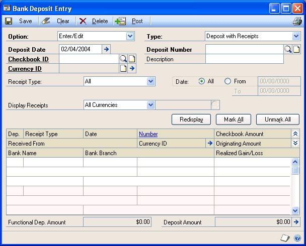

A screenshot of a cell phone Description automatically generated

1.  Select Enter/Edit and the Deposit with Receipts type.

2.  Enter the deposit date. If you’re using Multicurrency Management, the
    deposit date and currency ID determine the exchange rate.

>   To use a different posting date, choose the Deposit Date expansion button to
>   open the Bank Deposit Date Entry window. Choose OK to close the window when
>   you finish.

1.  Enter or select the checkbook ID and description. The next available deposit
    number and all receipts posted to the checkbook appear when you select the
    checkbook ID.

>   If you’re using Multicurrency Management, the currency ID also appears. To
>   verify your exchange rates, choose the Currency ID expansion button.

>   If you previously saved a deposit with receipts for the selected checkbook,
>   that deposit transaction appears. You can have only one saved deposit for
>   each checkbook.

1.  To restrict the number of receipts that appear in the scrolling window,
    enter a range, then choose Redisplay.

2.  Mark each receipt to include in the deposit. To mark or unmark a group of
    receipts, choose Mark All or Unmark All.

>   If you mark a group of receipts, and then you change the receipt type, date
>   range, or currency ID and choose Redisplay, the previously marked group of
>   receipts remains marked and you can mark additional receipts.

>   The deposit amount at the bottom of the window is updated each time you mark
>   or unmark a receipt.

1.  To change the individual currency and coin amounts or to view total amounts
    for each receipt type, choose the Deposit Amount expansion button to open
    the Deposit Totals window. Choose OK to close the window when you finish.

2.  To print a Bank Deposit Worksheet so you can verify your receipts, choose
    File \>\> Print.

3.  Choose Save or Post. If you post a deposit, the Bank Deposit Posting Journal
    is printed when you close the window, depending on your selections in the
    Posting Setup window. The posting journal displays deposit information and
    all receipts marked for each deposit posted since you opened the window.

### Deposit totals overview

>   The Deposit Totals window displays the number of checks, credit cards, and
>   cash receipts you marked for deposit, and the total monetary amounts for
>   each type. You can enter separate totals for coin and currency.

>   **Example 1**

>   You entered a cash receipt total of \$117.65. The amount of \$117.00 appears
>   in the Currency Total Amounts field and \$0.65 appears in the Coin Total
>   Amounts field, as shown in the following table:

| **Number of** |   | **Total amounts\*** |
|---------------|---|---------------------|
| Checks        | 4 | \$28,000.00         |
| Credit Cards  | 1 | \$52.00             |
| Currency      | 1 | \$117.00            |
| Coin          |   | \$0.65              |
| Total         | 6 | \$28,169.65         |

>   *\*If Multicurrency Management is registered, you can browse through this
>   information for each currency.*

>   **Example 2**

>   You entered a cash receipt total of \$117.65. The actual coin amount is
>   \$16.65, and the total for the paper money is \$101.00. If you enter
>   \$101.00 in the Currency Total Amounts field, the coin amount is adjusted to
>   display \$16.65, as shown in the following table.

| **Number of** |   | **Total amounts\*** |
|---------------|---|---------------------|
| Checks        | 4 | \$28,000.00         |
| Credit Cards  | 1 | \$52.00             |
| Currency      | 1 | \$101.00            |
| Coin          |   | \$16.65             |
| Total         | 6 | \$28,169.65         |

>   *\*If Multicurrency Management is registered, you can browse through this
>   information for each currency.*

### Entering a deposit without receipts

>   Use the Bank Deposit Entry window to enter deposits without receipts to
>   record a lump-sum deposit without assigning receipts.

>   For example, suppose you entered a deposit to clear receipts because you
>   didn’t want to assign individual receipts to a deposit. You can then enter a
>   deposit without receipts transaction for the total amount of the receipts
>   you just cleared. Unlike deposits with receipts and deposits to clear
>   receipts, you can enter and save an unlimited number of deposit without
>   receipts transactions for each checkbook.

>   When you enter a deposit without receipts transaction, the total amount of
>   the deposit appears in the Checks Total Amounts field in the Deposit Totals
>   window. To enter individual totals for check, credit card, currency, and
>   coin amounts, choose the Deposit Amount expansion button in the Bank Deposit
>   Entry window to open the Deposit Totals window.

>   When you post a deposit without receipts transaction, the checkbook balance
>   is updated by the deposit amount. If you need to enter a transaction to
>   update General Ledger, enter an adjustment, instead of a deposit without
>   receipts, in the Bank Transaction Entry window to ensure that the checkbook
>   balance isn’t updated twice. See *Entering a check, withdrawal, or
>   adjustment transaction* on page 29 for more information.

>   **To enter a deposit without receipts:**

1.  Open the Bank Deposit Entry window.

>   (Transactions \>\> Financial \>\> Bank Deposits)

>   Select Enter/Edit and the Deposit without Receipts type. Enter the deposit
>   date.

>   If you’re using Multicurrency Management, the deposit date and currency ID
>   determine the exchange rate. To use a different posting date, choose the
>   Deposit Date expansion button to open the Bank Deposit Date Entry window.
>   Choose OK to close the window when you finish.

1.  Enter or select the checkbook ID and the description. The next available
    deposit number appears when you select the checkbook ID.

>   If you’re using Multicurrency Management, the currency ID also appears. To
>   verify your exchange rates, choose the Currency ID expansion button.

1.  Enter the deposit amount. To break down the deposit into its component
    monetary types, choose the Deposit Amount expansion button to open the
    Deposit Totals window, and enter the correct amounts for checks, credit
    cards, currency, and coin. Choose OK to close the window when you finish.

2.  To print a Bank Deposit Worksheet so you can verify the information, choose
    File \>\> Print.

>   To print the Multicurrency version of the report, mark Include Multicurrency
>   Info in the Posting Setup window.

1.  Choose Save or Post. If you post the deposit, the Bank Deposit Posting
    Journal is printed when you close the window, depending on your selections
    in the Posting Setup window. The posting journal displays deposit
    information for each deposit posted since you opened the window.

### Clearing a receipt from a deposit

>   Use the Bank Deposit Entry window to remove receipts you don’t want to
>   assign individually to a deposit. For example, if you entered a deposit
>   without receipts transaction because you don’t want to assign individual
>   receipts to a deposit, you can remove the receipts by entering a deposit to
>   clear receipts transaction. You can save only one deposit to clear receipts
>   or deposit with receipts transaction at a time for each checkbook.

>   Use a deposit to clear receipts transaction to remove the receipts from the
>   system, if you have existing receipts that won’t be assigned to a specific
>   deposit because the amount has already been deposited. When you enter a
>   deposit to clear receipts transaction, the deposit amount is zero, and the
>   checkbook balance and General Ledger Cash account aren’t updated when you
>   post. The Cash account was updated when the receipts were posted in
>   subsidiary modules or in the Bank Transaction Entry window.

>   **To clear a receipt from a deposit:**

1.  Open the Bank Deposit Entry window.

>   (Transactions \>\> Financial \>\> Bank Deposits)

>   Select Enter/Edit and the Deposit to Clear Receipts type.

1.  Enter the deposit date.

2.  Enter or select the checkbook ID and description. The next available deposit
    number appears when you select the checkbook ID. If you’re using
    Multicurrency Management, the currency ID also appears.

>   If you already entered and saved a deposit to clear receipts transaction,
>   that deposit is displayed, because you can save only one deposit to clear
>   receipts transaction for each checkbook. To enter a new deposit to clear
>   receipts or deposit with receipts transaction, you must post or delete the
>   existing deposit first.

1.  To restrict the number of receipts visible in the scrolling window, enter a
    range for the receipts and choose Redisplay.

2.  Mark each receipt to clear. If you mark a group of receipts, and then you
    change the receipt type, date range, or currency ID and choose Redisplay,
    the previously marked group of receipts remains marked and you can mark
    additional receipts.

>   To view total amounts for each receipt type, choose the Deposit Amount
>   expansion button to open the Deposit Totals window. To print a Bank Deposit
>   Worksheet so you can verify your receipts, choose File \>\> Print. To print
>   the Multicurrency version of the report, mark Include Multicurrency Info in
>   the Posting Setup window.

1.  Choose Save or Post. If you post a deposit, the Bank Deposit Posting Journal
    is printed when you close the Bank Deposit Entry window, depending on your
    selections in the Posting Setup window. The posting journal displays deposit
    information and all receipts marked for each deposit posted since you opened
    the window.

### Voiding a deposit

>   Use the Bank Deposit Entry window to void a deposit. Unlike deleted
>   deposits, voided deposits are kept in history, if you’re keeping bank
>   transaction history. The following table explains what happens when you void
>   the different deposit types:

| **Voided transaction**    | **What happens**                                                                                                                                                                                            |
|---------------------------|-------------------------------------------------------------------------------------------------------------------------------------------------------------------------------------------------------------|
| Deposit with receipt      | Any receipts assigned to the deposit are unmarked and you can reassign them to another deposit. The checkbook balance is updated by the voided deposit amount.                                              |
| Deposit without receipt   | The checkbook balance is updated by the voided deposit amount.                                                                                                                                              |
| Deposit to clear receipts | Any receipts assigned to the deposit are unmarked and you can reassign them to another deposit. The checkbook balance is not changed because the balance wasn’t updated when the actual deposit was posted. |

>   If Multicurrency Management is registered and the receipts on the original
>   deposit had a realized gain or loss, the amount of the gain or loss is
>   reversed. Your system uses the exchange rate from the original deposit to
>   ensure that the amounts are updated correctly. If you’re not keeping
>   history, the deposit information is deleted.

>   The following conditions must exist before a you can void a deposit:

-   The deposit appears in the Checkbook Register Inquiry window.

-   The deposit hasn’t been reconciled or voided.

-   The deposit hasn’t been marked for reconciliation.

-   The checkbook assigned to the deposit exists and a Cash account is assigned
    to it.

-   If you’re using Multicurrency Management, the currency ID for the checkbook
    is active.

>   **To void a deposit:**

1.  Open the Bank Deposit Entry window.

>   (Transactions \>\> Financial \>\> Bank Deposits)

1.  Select Void.

2.  Enter or select the checkbook ID and deposit number to void. The original
    deposit information is displayed.

3.  Choose Void to void the deposit.

4.  Close the window. The Bank Deposit Posting Journal is printed. Deposits
    voided since you opened the window are marked with an asterisk (\*) on the
    report. To print the Multicurrency version of the report, mark Include
    Multicurrency Info in the Posting Setup window.

### Deleting a deposit

>   Use the Bank Deposit Entry window to delete deposits. You can delete a
>   deposit that has been saved, but not posted. All receipts assigned to the
>   deposit are unmarked and become available for deposit. When you delete a
>   deposit, historical records are not updated.

>   **To delete a deposit:**

1.  Open the Bank Deposit Entry window.

>   (Transactions \>\> Financial \>\> Bank Deposits)

1.  Enter or select the checkbook ID and deposit number to delete.

2.  Choose Delete.

Chapter 9: Bank account transfers
---------------------------------

>   Transferring funds from one checkbook to another ensures that your accounts
>   contain the correct amounts for your accounting activities. For example, you
>   might want to transfer funds from your general checkbook account to your
>   payroll checkbook account before each payday.

>   This information is divided into the following sections:

-   *Transferring funds between checkbooks*

-   *Voiding a bank account transfer*

### Transferring funds between checkbooks

>   Use the Bank Transfer Entry window to transfer funds from one checkbook to
>   another. The default transfer number for each transaction increments from
>   the previous number, and the three-letter code is based on your selections
>   in the Bank Reconciliation Setup window. You can use duplicate transfer
>   numbers.

>   To transfer funds, both checkbooks must be assigned the same currency, or
>   one checkbook must be assigned to the functional currency. The multicurrency
>   transfer date and currency ID determine the exchange rate for transfers.

>   **To transfer funds between checkbooks:**

1.  Open the Bank Transfer Entry window.

>   (Transactions \>\> Financial \>\> Bank Transfers)

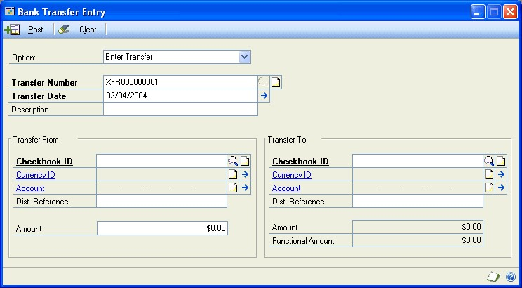

A screenshot of a cell phone Description automatically generated

1.  Select Enter Transfer.

2.  Enter the transfer number.

3.  Enter the transfer date. To use a posting date that’s different from the
    transfer date, choose the Transfer Date expansion button to open the Bank
    Transfer Date window and enter a posting date. Choose OK to close the window
    when you finish.

4.  Enter the transfer description, which states why you’re transferring the
    funds. For example, suppose you need to cover the payroll for December 2004.
    You might enter Pay December 2004.

5.  Enter or select the checkbook ID for the checkbook you’re transferring funds
    from. The Cash account that’s set up for the checkbook appears and is the
    account that’s updated in General Ledger.

6.  Enter the distribution reference for the Cash account that you’re
    transferring funds from.

7.  Enter the amount to be transferred.

>   If you’re using Multicurrency Management and you’re transferring funds
>   between checkbooks that are assigned to the functional currency, the amount
>   appears in both the Functional Amount and the Amount fields in the Transfer
>   To column. If you’re transferring funds between checkbooks that aren’t
>   assigned to the functional currency, the equivalent amount in the functional
>   currency also is displayed.

1.  Enter or select the checkbook ID for the checkbook you’re transferring funds
    to. The Cash account that’s set up for the checkbook appears and is the
    account that’s updated in General Ledger.

>   If you’re using Multicurrency Management, the currency ID also appears. To
>   verify your exchange rates, choose the currency ID expansion button.

1.  Enter the distribution reference for the Cash account that you’re
    transferring funds to.

>   If you’re using Multicurrency Management, the Transfer To and Functional
>   amounts are displayed.

1.  Choose Post. The Bank Transfers Posting Journal is printed when you close
    the window, based on settings in the Posting Setup window. Both checkbook
    balances and Cash accounts are updated to reflect the posted transfer. The
    posting journal displays all transfer transactions posted since you opened
    the window.

### Voiding a bank account transfer

When you void transfers, the original transfer date appears. The transfer
transaction must meet the following conditions before it you can void it:

-   It hasn’t been reconciled or marked for reconciliation in either checkbook.

-   No other users are editing the transaction.

If you use duplicate transfer numbers, be sure to select the correct transaction
from the list in the lookup window.

>   **To void a bank account transfer:**

1.  Open the Bank Transfer Entry window.

>   (Transactions \>\> Financial \>\> Bank Transfers)

>   Select Void Transfer.

1.  Enter or select the transfer number to void. If you’re using Multicurrency
    Management, your system uses the exchange rate from the original transfer
    transaction to ensure that the amounts are updated correctly.

2.  Enter or select the transfer number to void.

>   If you’re using Multicurrency Management, your system uses the exchange rate
>   from the original transfer transaction to ensure that the amounts are
>   updated correctly.

1.  Enter the transfer date, description, and distribution references for the
    Cash accounts.

2.  Choose Void to void the transfer.

3.  Close the window. The checkbook balances and Cash accounts are updated to
    reflect the voided transaction. The Bank Transfers Posting Journal is
    printed based on your settings in the Posting Setup window. Transfer
    transactions voided since you opened the window are marked with an asterisk.

Chapter 10: Bank statement reconciliation
-----------------------------------------

>   Reconciling is the process that identifies discrepancies that might exist
>   between a checkbook’s register and the bank statement for that checkbook.
>   Once you review your bank statement and enter adjusting amounts, you can
>   reconcile to ensure that the balance in your checkbook matches the balance
>   reported on your bank statement. If you’re keeping history, transactions
>   become historical records once they’ve been reconciled.

>   This information is divided into the following sections:

-   *Bank statement reconciliation overview*

-   *Reconciling a bank statement with a checkbook*

-   *Entering a miscellaneous bank adjustment transaction*

-   *Entering cleared differences*

-   *Preview reports*

### Bank statement reconciliation overview

>   To reconcile your checkbook with your bank statement, mark the transactions
>   that have cleared the bank and check the amounts against those that appear
>   on the statement. If a transaction cleared the bank for a different amount
>   than was entered, you can enter the difference and distribute the amount to
>   the posting account of your choice. You also can enter adjusting entries to
>   track interest income, other expenses or income, and service charges, so
>   that you can reconcile the checkbook properly. If you’re not keeping
>   history, the transaction information is deleted after reconciling.

>   The checks you mark as cleared are reclassified as historical records (if
>   you’re keeping history), and appear on historical transaction reports after
>   you reconcile.

### Reconciling a bank statement with a checkbook

>   Use the Reconcile Bank Statements window to reconcile the cash-related
>   transaction information you entered with the transaction information
>   recorded by the banking institution.

>   *Before reconciling, back up all your company’s accounting data. See the
>   System Administrator’s Guide (Help \>\> Contents \>\> select System
>   Administration) for more information about making backups.*

>   **To reconcile a bank statement with a checkbook:**

1.  Open the Reconcile Bank Statements window.

>   (Transactions \>\> Financial \>\> Reconcile Bank Statement)

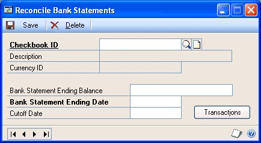

A screenshot of a cell phone Description automatically generated

1.  Enter or select a checkbook to reconcile. You can reconcile both active and
    inactive checkbooks. If you previously saved reconciliation information for
    this checkbook, that information is displayed and you can edit it.

2.  Enter the ending balance and ending date reported on your bank statement.

3.  Enter a cutoff date for this reconciliation. Transactions with dates that
    fall on or before the cutoff date appear in the scrolling window of the
    Select Bank Transactions window. If you leave the cutoff date blank, all
    posted transactions that haven’t been reconciled or voided are displayed in
    the Select Bank Transactions window.

>   The reconcile process will list voided transactions that were created before
>   the cutoff date and voided after the cutoff date as outstanding
>   transactions.

1.  Choose Transactions to open the Select Bank Transactions window.

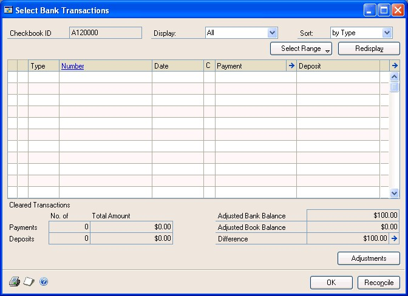

A screenshot of a social media post Description automatically generated

>   If you’re editing saved reconciliation information, the transactions you
>   marked previously remain marked. The totals for the payments and deposits in
>   the cleared transaction section of the Select Bank Transactions window
>   include only payments and deposits. The totals do not include adjustment
>   transactions.

1.  Mark the C column for the transactions that have been cleared by the bank.
    To enter cleared differences—transactions that have a cleared amount
    different from the amount entered in the checkbook—see *Entering cleared
    differences* on page 56.

>   *Use the spacebar to mark the check box. The arrows on the sides of the
>   scrolling window are visual indicators that show which line you’re currently
>   focused on.*

>   The number of cleared transactions and the total amount are updated as you
>   mark each transaction. You can view the original entries by selecting a
>   transaction and choosing the Number link.

>   To mark or unmark a range of documents, select the first transaction to
>   include and choose Range \>\> Begin Range. A left arrow symbol (\<) appears
>   next to the transaction in the Type column, identifying the beginning of the
>   range. Select the last transaction to include in the range and choose Range
>   \>\> End Range. A right arrow symbol (\>) appears next to the transaction in
>   the Type column,

>   indicating the end of the range. An asterisk appears next to each
>   transaction included in the range. Choose Range \>\> Mark to mark those
>   transactions as cleared. Choose Range \>\> Unmark to unmark a range of
>   transactions.

>   *The Cleared Transactions section of this window includes only payments and
>   deposits. Adjustments are not included in the totals.*

>   To enter adjusting amounts, choose Adjustments to open the Reconcile Bank
>   Adjustments window. See *Entering a miscellaneous bank adjustment
>   transaction* on page 55 for more information. Choose OK to close the window
>   when you finish.

1.  Choose File \>\> Print and select the reports to print.

>   The following table describes the reports that you can print:

| **Report**                 | **Displays**                                                                                                                                                         |
|----------------------------|----------------------------------------------------------------------------------------------------------------------------------------------------------------------|
| Reconciliation Edit List   | Checkbook and bank statement balance information                                                                                                                     |
| Bank Adjustments Edit List | Adjustment transactions entered using the Reconcile Bank                                                                                                             |
| Marked Transactions Report | Transactions that have been marked as cleared                                                                                                                        |
| Outstanding Transactions   | Transactions that haven’t cleared the bank, and that fall between the bank statement ending date and the cutoff date entered in the Reconcile Bank Statements window |

>   Adjustments window

>   Report

>   If you’re using Multicurrency Management, you can print the Bank Adjustments
>   Edit List with both originating and functional information if you marked
>   Include Multicurrency Info in the Posting Setup window.

1.  Choose Reconcile to reconcile the checkbook. The difference between the
    adjusted checkbook balance and the adjusted bank balance must be zero before
    the system reconciles the checkbook with the bank statement. The adjustment
    transactions update Bank Reconciliation, General Ledger, and the checkbook
    balance. All cleared transactions and any adjusting entries are transferred
    to history, if you’re keeping history.

>   When the process is complete, the Reconciliation Posting Journal, Bank

>   Adjustments Posting Journal, and Cleared Transactions Journal are printed.
>   The Last Reconciled Balance and Last Reconciled Date fields for this
>   checkbook in the Checkbook Maintenance window are updated with the bank
>   statement ending balance and the bank statement ending date.

### Entering a miscellaneous bank adjustment transaction

>   Use the Reconcile Bank Adjustments window to enter adjustment transactions—
>   such as service charges, interest income received, and other income or
>   expenses—to adjust the checkbook balances. These adjustments must be entered
>   in the same currency as the checkbook.

>   **To enter a miscellaneous bank adjustment transaction:**

1.  Open the Reconcile Bank Statements window.

>   (Transactions \>\> Financial \>\> Reconcile Bank Statement)

1.  Enter or select a checkbook ID, and enter bank statement information.

2.  Choose Transactions to open the Select Bank Transactions window.

3.  Choose Adjustments to open the Reconcile Bank Adjustments window.

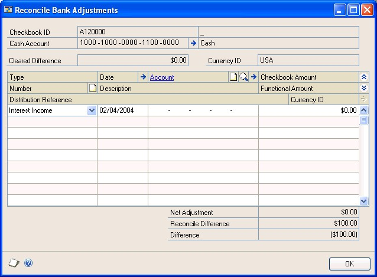

A screenshot of a cell phone Description automatically generated

1.  Select the transaction type to enter.

2.  Enter a transaction date. The bank statement ending date you entered in the
    Reconcile Bank Statements window appears as a default entry. If you’re using
    Multicurrency Management, the transaction date and currency ID determine the
    exchange rate for the transaction.

3.  Enter or select an account to offset the Cash account.

>   For example, if you’re entering interest income, you can use an Interest
>   Income account. The adjustment updates General Ledger and Bank
>   Reconciliation when you reconcile checkbook balances.

>   The 12-character transaction number appears when you select the transaction
>   type.

1.  Enter the adjustment amount. You can enter only positive numbers. The offset
    and Cash accounts are debited or credited by this amount, depending on the
    type of transaction.

2.  Repeat steps 5 through 8 until you finish entering the adjusting entries,
    then choose OK to close the Reconcile Bank Adjustments window.

### Entering cleared differences

>   Sometimes a check might clear the bank for an amount that’s different than
>   the amount you recorded. When transactions clear the bank for a different
>   amount than what was posted, and a different cleared amount is entered in
>   the Cleared Amount Entry window, an information icon appears for those
>   transaction amounts in the Select Bank Transactions window. This indicates
>   that the cleared amount for the transaction is different from the amount
>   entered in the checkbook. The posted amount appears in the Select Bank
>   Transactions window, and the cleared amount appears as the total amount for
>   cleared transactions.

>   **To enter cleared differences:**

1.  Open the Reconcile Bank Statements window.

>   (Transactions \>\> Financial \>\> Reconcile Bank Statement)

1.  Enter or select a checkbook ID, and enter bank statement information.

2.  Choose Transactions to open the Select Bank Transactions window.

3.  Select the transaction with the differing amount and choose the Payment or
    Deposit expansion button to open the Cleared Amount Entry window.

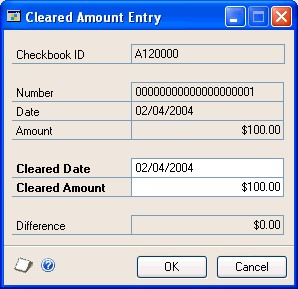

A screenshot of a cell phone Description automatically generated

1.  Enter the cleared amount for the transaction. For example, suppose a check
    was recorded for \$17,567.11, but it cleared the bank for \$17,567.13. You
    would enter \$17,567.13 in the Cleared Amount field, and a \$0.02 difference
    would appear in the Difference field.

2.  Choose OK to save your changes and close the window. The Select Bank
    Transactions window is displayed.

3.  Choose Adjustments to open the Reconcile Bank Adjustments window.

4.  Enter an adjustment for the amount of the difference. Both the checkbook and
    the Cash account are updated when you reconcile. As you enter account
    information and adjusting entries, the reconcile difference is subtracted
    from the net adjustment. See *Entering a miscellaneous bank adjustment
    transaction* on page 55 for more information.

>   Choose OK to close the window and return to the Select Bank Transactions
>   window.

>   When you finish, the difference should be zero. If the difference isn’t
>   zero, you should complete the following tasks:

-   Verify that the correct transactions are marked.

-   Verify that the transactions were entered correctly.

-   Enter additional adjusting entries, if necessary.

### Preview reports

>   You can print preview reports before reconciling to verify the transactions
>   you marked as cleared, or the adjustments you entered. Use the Select Bank
>   Transactions window to print preview reports:

-   The Reconciliation Edit List displays checkbook and bank statement balance
    information.

-   The Bank Adjustments Edit List displays the adjustment transactions you
    entered.

-   The Marked Transactions Report displays the transactions you marked as
    cleared.

-   The Outstanding Transactions Report displays the transactions that haven’t
    cleared the bank, and that fall between the cutoff dates entered in the
    Reconcile Bank Statements window.

>   Choose File \>\> Print in the Select Bank Transactions window to print any
>   or all the reports. The Print Reconciliation Reports window opens, where you
>   can mark the reports to be printed.

Part 3: Inquiries, reports, and routines
========================================

>   Your system stores a vast amount of detailed information about your
>   cash-related transactions. You can use inquiries and reports to view and
>   analyze information about a specific transaction, or to obtain general
>   information about a group of transactions.

>   This part of the documentation contains procedures for removing history from
>   Bank Reconciliation, and explains the routine checklists.

>   The following topics are discussed:

-   *Chapter 11, “Inquiries,”* explains how to use inquiries to view checkbook
    information.

-   *Chapter 12, “Reports,”* describes how to set up report options and print
    reports.

-   *Chapter 13, “History,”* includes information about storing and removing
    transaction and reconciliation history.

Chapter 11: Inquiries
---------------------

>   Use inquiries to view checkbook register information. Because the inquiry
>   windows provide efficient access to information, you always can view your
>   current checkbook activity.

>   This information is divided into the following sections:

-   *Multicurrency inquiries*

-   *Reporting currency*

-   *Inquiries overview*

-   *Viewing checkbook information*

-   *Viewing historical checkbook balances*

### Multicurrency inquiries

>   You can view multicurrency amounts in the originating, functional, or
>   reporting currency. Choose View \>\> Currency \>\> Functional, Originating,
>   or Reporting while viewing an inquiry window. The option is saved on a per
>   user, per window basis.

>   You also can use the Currency list button in windows that support changing
>   the currency view. The View menu and currency list button are available in
>   the Checkbook Register Inquiry and Bank Transaction Entry Zoom windows.

>   The first time you open these windows after registering Multicurrency

>   Management, all the transactions are displayed in the originating currency.
>   If you change the currency view, the option you used last is the default
>   view the next time you open that window.

### Reporting currency

>   A reporting currency converts functional currency amounts to another
>   currency on inquiries and reports. For example, suppose the U.S. dollar is
>   the functional currency for your company. You can set up the euro as your
>   reporting currency to view an inquiry window with currency amounts displayed
>   in the euro currency.

>   During the reporting currency setup process in Multicurrency Management,
>   you’ll set up a reporting currency and enter a default exchange rate and
>   rate calculation method. Depending on how your system is set up, you might
>   be able to override the default reporting currency exchange rate or rate
>   calculation method on inquiries and reports. To change the default reporting
>   currency exchange rate, choose View \>\> Currency \>\> Modify Reporting Rate
>   to open the Modify Reporting Rate window.

>   See the Multicurrency Management documentation for more information about
>   the reporting currency.

### Inquiries overview

>   You can use the Checkbook Register Inquiry window to view reconciled and
>   unreconciled transactions that have been posted for a checkbook. You also
>   can sort transactions by number or by date, and further limit the
>   transactions that appear by selecting a range of document numbers or
>   document dates.

>   You also can view transactions as they were originally entered, using the
>   different links in the Checkbook Register Inquiry window. You can view more
>   detailed information about the transactions displayed in the scrolling
>   window by selecting a transaction and choosing the Number link. You can’t
>   view the original transaction entry window if you’re not keeping history for
>   that module, or if history has been removed.

### Viewing checkbook information

>   Use the Checkbook Register Inquiry window to find out more information about
>   transactions posted to your checkbooks.

>   **To view checkbook information:**

1.  Open the Checkbook Register Inquiry window.

>   (Inquiry \>\> Financial \>\> Checkbook Register)

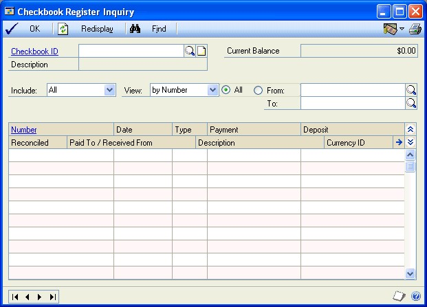

A screenshot of a cell phone Description automatically generated

1.  Enter or select a checkbook ID.

2.  Select a transaction and choose the Number link to view detailed information
    about that transaction.

>   The window that opens depends on what type of transaction you selected from
>   the scrolling window, as is described in the following table:

| **Transaction type**                   | **Window**                           |
|----------------------------------------|--------------------------------------|
| Deposit                                | Bank Deposit Entry Zoom              |
| Bank Transaction                       | Bank Transaction Entry Zoom          |
| Transfer                               | Bank Transfer Entry Zoom             |
| Payables payments                      | Payables Payments Zoom               |
| Receivables return with check amount   | Receivables Transaction Inquiry Zoom |
| NSF checks received                    | Cash Receipts Inquiry Zoom           |
| Check payment on return in Invoicing   | Invoice Inquiry                      |
| Check payment on return in Sales Order | Sales Transaction Inquiry            |
| Check payment in Payroll               | Payroll Check Inquiry                |

>   Processing

1.  To print the Checkbook Register Report for the selected checkbook, choose
    File \>\> Print.

2.  Choose OK to close the window.

### Viewing historical checkbook balances

>   Use the Checkbook Balance Inquiry window to view a checkbook balance for a
>   specific date.

>   If you are using reporting ledgers, the amount shown in the Current Cash
>   Account Balance field is based on the ledgers selected in the General Ledger
>   Setup window in the Account Balance for Subsidary Windows list. For more
>   information on using reporting ledgers, see the General Ledger
>   documentation.

>   **To view historical checkbook balances:**

1.  Open the Checkbook Balance Inquiry window.

>   (Inquiry \>\> Financial \>\> Checkbook Balance)

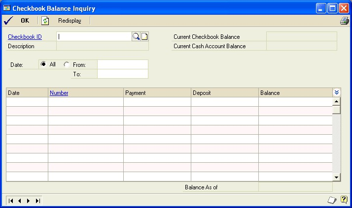

A screenshot of a social media post Description automatically generated

1.  Enter or select a checkbook ID to view balances for. The current checkbook
    balance will be displayed in the Current Checkbook Balance field.
    Transactions for the checkbook will appear in the scrolling window.

2.  You can enter or select a range of dates to view transactions for and choose
    Redisplay. Transactions for the selected dates will appear in the scrolling
    window. The running balance for the checkbook will be displayed in the
    Balance column. The balance for the checkbook as of the ending date in the
    range will be displayed in the Balance As of field.

3.  You can select a transaction and click the Number link to view detailed
    information about that transaction.

>   The window that opens depends on the type of transaction you selected from
>   the scrolling window, as is described in the following table.

| **Transaction type**                              | **Window**                           |
|---------------------------------------------------|--------------------------------------|
| Deposit                                           | Bank Deposit Entry Zoom              |
| Bank Transaction                                  | Bank Transaction Entry Zoom          |
| Transfer                                          | Bank Transfer Entry Zoom             |
| Payables payments                                 | Payables Payments Zoom               |
| Receivables return with check amount              | Receivables Transaction Inquiry Zoom |
| NSF checks received                               | Cash Receipts Inquiry Zoom           |
| **Transaction type**                              | **Window**                           |
| Check payment on return in Invoicing              | Invoice Inquiry                      |
| Check payment on return in Sales Order Processing | Sales Transaction Inquiry            |
| Check payment in Payroll                          | Payroll Check Inquiry                |

1.  To print the Checkbook Balance Inquiry Report for the selected checkbook,
    choose File \>\> Print.

2.  Choose OK to close the window.

Chapter 12: Reports
-------------------

>   You can use Bank Reconciliation reports to analyze checkbook activity and
>   identify errors in transaction entry. Use this information to guide you
>   through printing reports and working with report options. For more
>   information about creating and printing reports, and the various reporting
>   tools that you can use with Microsoft Dynamics GP, refer to your System
>   User's Guide (Help \>\> Contents \>\> select Using The System).

>   Reports information is divided into the following sections:

-   *Bank Reconciliation report summary*

-   *Specifying a Bank Reconciliation report option*

### Bank Reconciliation report summary

>   You can print several types of reports using Bank Reconciliation. Some
>   reports automatically are printed when you complete certain procedures; for
>   example, posting journals can automatically be printed when you post
>   transactions, depending on how your posting options are set up. You can
>   choose to print some reports during procedures; for example, you can print
>   an edit list when entering transactions by choosing the Print button in the
>   batch entry window. In order to print some reports, such as analysis or
>   history reports, you must set up report options to specify sorting options
>   and ranges of information to include on the report. For more information,
>   refer to *Specifying a Bank Reconciliation report option* on page 66.

>   The following table lists the report types available in Bank Reconciliation
>   and the reports that fall into those categories. Reports printed using
>   General Ledger are printed using many of the same windows. See the General
>   Ledger documentation for information about reports printed in that module.

A screenshot of text Description automatically generated

### Specifying a Bank Reconciliation report option

>   Report options include specifications for sorting options and range
>   restrictions for a particular report. In order to print Bank Reconciliation
>   reports, you must first create a report option. Each report can have several
>   different options so you can easily print the information you need. For
>   example, you can create report options for the Checkbook Register to include
>   any combination of reconciled, unreconciled, and voided transactions.

>   *A single report option can’t be included in multiple reports. If you want
>   identical options for several reports, you must create them separately.*

>   Use the Financial report options windows to create sorting, restriction, and
>   printing options for the reports that are included in Bank Reconciliation.

>   **To specify a Bank Reconciliation report option:**

1.  Open a Financial reports window. There are separate windows for each report
    type.

>   (Reports \>\> Financial \>\> Setup)

>   (Reports \>\> Financial \>\> Checkbook)

>   (Reports \>\> Financial \>\> Bank Posting Journals)

>   (Reports \>\> Financial \>\> Bank History)

1.  Select a report from the Reports list.

2.  Choose New or Modify to open the report options window. Your selection in
    step 2 determines which report options window appears.

3.  Name the option and enter information to define the option. The name you
    choose for the option won’t appear on the report. The selections available
    for defining report options vary, depending on the report type you’ve
    selected.

4.  Enter range restrictions. The Ranges list shows the available options for
    each report. The available ranges vary, depending on the type of report.

>   *You can enter only one restriction for each restriction type. For instance,
>   you can insert one Checkbook ID restriction (CASH to PAYROLL) and one
>   Description restriction (Z-AUSTRALIA to Z-CANADA).*

1.  Choose Insert to insert the range in the Restrictions List. To remove an
    existing range from the list, select the range and choose Remove.

2.  Choose Destination to select a printing destination. Reports can be printed
    to the screen, to the printer, to a file, or to any combination of these
    options. If you select Ask Each Time, you can select printing options each
    time you print this report option.

3.  To print the report option from the report options window, choose Print
    before saving it. If you don’t want to print the option now, choose Save and
    close the window. The report window will be redisplayed.

Chapter 13: History
-------------------

>   Historical records provide useful information for auditing. You can keep
>   records of transaction and reconciliation history for an unlimited number of
>   years. Once you decide how much historical information is necessary, you can
>   remove information when it’s no longer useful, or when you need to make hard
>   disk space available.

>   This information is divided into the following sections:

-   *Bank history removal overview*

-   *Removing bank history*

### Bank history removal overview

>   When you’re using Bank Reconciliation, you can store transaction and
>   reconciliation history, which contains records of transactions that have
>   been entered, posted, and reconciled. If you keep Transaction/Reconciliation
>   history, account distribution information is saved and reprint posting
>   journals are available, as long as you chose to reprint the posting journals
>   in the Audit Trail Codes Setup window.

>   If you didn’t choose to keep history in the Bank Reconciliation Setup
>   window, documents are removed after they’ve been reconciled or voided, and
>   reprint posting journals are not available.

>   *Before removing history, back up your company’s accounting data. Removing
>   history permanently deletes the historical information from your company
>   data. See the System Administrator’s Guide (Help \>\> Contents \>\> select
>   System Administration) for more information about making backups.*

>   Because historical records increase the amount of hard disk space needed to
>   run your system, you should remove history periodically. You can remove the
>   following types of Bank Reconciliation history:

>   **Transaction/reconciliation history** Removes detailed records of each
>   reconciled transaction in the range you specify, including distributions and
>   multicurrency information. Removing transaction history also removes
>   transfer history.

>   **Voided transactions** Removes records of voided transactions, including
>   distributions and multicurrency information. Voided transactions aren’t
>   removed during the reconciliation process and aren’t removed when you remove
>   transaction/reconciliation history.

>   **Voided receipts** Removes records of voided receipts, including
>   distributions. Voided receipts aren’t assigned to a deposit and aren’t
>   removed when you remove transaction/reconciliation history.

### Removing bank history

>   Use the Remove Bank History window to remove history, and increase the
>   amount of available space on your hard disk. After you remove history, you
>   won’t be able to print reports that list the information that was removed,
>   nor view the information in inquiry windows.

**To remove bank history:**

1.  Open the Remove Bank History window.

>   (Microsoft Dynamics GP menu \>\> Tools \>\> Utilities \>\> Financial \>\>
>   Remove Bank History)

1.  Mark the type of history to remove.

2.  Mark whether to remove history, print a report, or both. The report shows
    the information to be removed when you choose Process.

>   *Once you remove history for a range of transactions, you can’t reprint the
>   Remove History Report for the selected range.*

1.  Select the range of information to remove. Choose Insert to insert the range
    into the Restrictions list.

>   You can enter only one restriction for each range type. For example, if you
>   enter a restriction specifying that only document numbers RCT000000001
>   through RCT000000100 should be removed, you can’t enter another restriction
>   for document numbers RCT000000200 through RCT000000500.

>   Repeat this step for each range to remove.

1.  Choose Process to remove history, print the report, or both.

>   The report that’s printed after you remove history depends on the type of
>   history you removed, as is described in the following table:

| **History removed**        | **Report printed**                        |
|----------------------------|-------------------------------------------|
| Transaction/Reconciliation | Transaction/Reconciliation Removal Report |
| Voided transactions        | Voided Transactions Removal Report        |
| Voided receipts            | Voided Receipts Removal Report            |

Additional Feature Functionality added to Bank Reconciliation 
=================================================================

To review detailed information about each feature click the link below.

[Automatically Deposit Cash
Receipts](https://community.dynamics.com/gp/b/dynamicsgp/archive/2015/06/23/microsoft-dynamics-gp-2015-r2-new-features-auto-deposit-cash-receipts-in-bank-rec)  
Previously in Microsoft Dynamics GP, to use the Auto Deposit functionality, the
user was required to have Analytical Accounting installed. In GP2015 R2, the
Auto Deposit functionality can be used with or without Analytical Accounting
installed. This company setup option allows for cash receipts entered in
Receivables Management to directly update the checkbook balance when posted. You
will not be required to post the cash receipt again from the Bank Deposit Entry
window (Transactions \>\>Financial \>\> Bank Deposits) in Bank Reconciliation if
you mark this option.

[Bank Reconciliation history tracking and transaction remove capability which =
better
performance!!](https://community.dynamics.com/gp/b/dynamicsgp/archive/2016/12/22/microsoft-dynamics-gp-2016-r2-bank-reconciliation-reconciled-transaction-maintenance)  
With the release of Dynamics GP 2016 R2 comes a great new feature that will help
the customers that use Bank Reconciliation heavily, or have been using Dynamics
GP with Bank Reconciliation for a long time.  The new feature is the addition of
the Reconciled Transaction Maintenance process!  The goal for this additional
routine for Bank Reconciliation will be increased performance for various Bank
Reconciliation processes after moving the bulk of Reconciled Transactions to
History.

[Don't display inactive checkbooks in
Lookups](https://community.dynamics.com/gp/b/dynamicsgp/archive/2018/10/26/microsoft-dynamics-gp-2018-r2-option-not-to-show-inactive-checkbooks-in-lookup-windows)  
With the release of Microsoft Dynamics GP 2018 R2, users can choose to exclude
'Inactive Checkbooks' in the Checkbooks Lookup window. In prior versions of
Microsoft Dynamics GP, all Checkbook IDs are displayed in the Checkbooks Lookup
window. The 'Exclude Inactive Checkbooks' option has been added to the
Checkbooks Lookup window to accommodate this new functionality.  
  
[Prevent duplicate check
numbers](https://community.dynamics.com/gp/b/dynamicsgp/archive/2018/11/07/microsoft-dynamics-gp-2018-r2-prevent-duplicate-check-numbers-for-bank-transaction-entry-miscellaneous-checks-and-payroll-manual-checks)  
With the release of Microsoft Dynamics GP 2018 R2, it is possible to prevent
using a duplicate check number in the Bank Transaction Entry, Miscellaneous
Checks, and the Payroll Manual Check-Adjustment Entry windows.  
In prior versions of Microsoft Dynamics GP, it was not possible to prevent users
from using duplicate check numbers in the Bank Transaction Entry, Miscellaneous
Checks, and the Payroll Manual Check-Adjustment Entry windows.  
When the 'Duplicate Check Numbers' option is unmarked: Microsoft Dynamics GP
will prevent users from using a duplicate check number in the Bank Transaction
Entry, Miscellaneous Checks, and the Payroll Manual Check-Adjustment Entry
windows.

Glossary
========

#### Alternate currency

>   Any currency that is not a functional currency.

#### Bank card

>   A card for which payments might be treated as cash by the business receiving
>   the payment.

#### Bank reconciliation

>   The process of making the cash balance shown on the bank statement and the
>   cash balance entered in Bank Reconciliation match as of a certain date.

#### Bank statement

>   A statement issued by a bank describing the activities in checking accounts
>   and other bank accounts over a period of time.

#### Check

>   A written order on a bank to pay a sum of money from funds in an account.
>   Checks show the name of the company or individual receiving payment, the
>   signature and account number of the person issuing the check, the payment
>   amount, and the current date. Checks usually are numbered in sequence.

#### Check card

>   A type of credit card. When purchases are made with a check card, the amount
>   of purchase will immediately be withdrawn from the user’s bank account.
>   Check cards also are known as debit cards.

#### Checkbook

>   An account that keeps a currency balance and tracks the receiving and
>   disbursing of cash.

#### Cleared amount

>   The amount a bank statement shows a transaction cleared for.

#### Cleared difference

>   The difference between what you entered for a transaction in your checkbook
>   and the amount the transaction cleared for on the bank statement.

#### Decrease adjustment

>   An entry that decreases the checkbook amount.

**Deposit**

>   Money added to an account.

#### Deposit slip

>   A form that shows the date and the items that make up a deposit, including
>   receipt and payment information, the currency, check, and coin totals, and
>   the amount of cash received.

#### Deposit in transit

>   Deposit that has been entered but hasn’t cleared the bank.

#### Euro

>   A trading currency for participating countries/regions in the European
>   Monetary Union.

#### Exchange rate

>   The rate of exchange between two currencies on a particular date and time.

#### Functional amount

>   The equivalent transaction amount in the functional currency for a
>   multicurrency transaction amount that was entered using an originating
>   currency. This amount sometimes is referred to as the functional equivalent
>   of the originating amount.

#### Functional currency

>   The primary currency a company keeps its financial records in. Typically,
>   the functional currency is the currency for the country/ region where the
>   company is located.

**Functional equivalent**

>   *See Functional amount*.

#### Group printing

>   Creating and printing report options in groups. For example, you could use a
>   report group to print the Checkbook Register Report and the Undeposited
>   Receipts Report.

#### Increase adjustment

>   An entry that increases the checkbook amount.

#### Last reconciled balance

>   The balance of a checkbook on the bank statement. This is the amount to
>   reconcile to.

#### Originating amount

>   The transaction amount in the originating currency for a multicurrency
>   transaction. Originating amounts are posted using their corresponding
>   functional amounts, sometimes referred to as functional equivalents.

#### Outstanding check

>   Check that has been written, entered, and sent to payees but hasn’t yet been
>   received, paid, and canceled by the bank.

#### Posting

>   A procedure to make temporary transactions a part of a business’s permanent
>   records; to update the checkbook and the General Ledger accounts.

#### Posting account

>   A financial account that tracks assets, liabilities, revenue, or expenses.
>   These accounts will appear on financial statements and on other reports
>   created in the financial series.

#### Posting journal

>   A report printed following the posting process that shows the detail for
>   each transaction that’s been posted. Posting journals also include the audit
>   trail code, which is a precise record of where each transaction has been
>   posted.

**Real-time posting**

>   *See Transaction-level posting*.

#### Realized gain

>   Gain realized due to the difference in exchange rates between when the
>   receipt was posted and when the receipt was deposited.

#### Realized loss

>   Loss realized due to the difference in exchange rates between when the
>   receipt was posted and when the receipt was deposited.

#### Receipt

>   Any type of payment a business might receive.

#### Reconciling

>   A procedure that compares a checkbook to a bank statement.

#### Report option

>   A collection of entries that specify the amount or type of information that
>   will appear on a report. You can create multiple report options.

#### Removing history

>   A procedure that erases ranges of account or transaction history. Removing
>   history will remove ranges of history that are no longer useful, making
>   additional hard disk space available.

#### Rounding difference account

>   A multicurrency posting account that recognizes a difference between debit
>   and credit amounts for originating transaction amounts. The difference might
>   be because of how accounts are split to update posting accounts using the
>   exchange rate for the transaction.

#### Source document code

>   A code that identifies the type of journal or entry that you can examine for
>   more information about a specific transaction. For example, you could use
>   the source document code BRDEP for Bank Reconciliation deposits.

#### Transaction

>   An event or condition that is entered in asset, liability, expense, revenue,
>   or equity accounts. Checks and withdrawals are two types of transactions.

#### Transaction history

>   Transactions that have been reconciled or voided.

#### Transaction-level posting

>   A posting method in which you can enter and post transactions without having
>   to create a batch. Also known as real-time posting.

#### Transfer

>   A transaction used to enter a transfer of funds from one checkbook to
>   another.

#### Typical balance

>   The type of balance, either debit or credit, an account has under ordinary
>   circumstances. Asset and expense accounts normally have debit balances,
>   while liability, revenue, and equity accounts normally have credit balances.

#### Withdrawal

>   A removal of cash from a checkbook for business or personal use.
