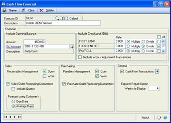

# Cash Flow Management

You can use Cash Flow Management to predefine an opening balance for a forecast,
based on a single cash management transaction or a specific General Ledger
account balance. You also can base a forecast on one or more checkbook balances
with or without work/adjust transactions, such as deposits, payments, and
reconciliation adjustments that are not part of the checkbook balance.

Cash Flow Management is installed automatically when you install Microsoft
Dynamics® GP. You must have the appropriate registration keys to use it,
however. For additional information about entering registration keys, refer to
the Installation Instructions manual.

You also can use Cash Flow Management to complete the following tasks:

- Create an unlimited number of cash flow forecast definitions

- Forecast cash flows in different ways

- Create scenarios without actually recording transactions

- Summarize daily inflows and outflows of cash in the calendar window

- View the summary of any given day’s cash inflow and outflow • Obtain
    weekly—detailed or summary—and monthly calendar reports

This introduction is divided into the following sections:

- *What’s in this manual*

- *Symbols and conventions*

- *Resources available from the Help menu*

- *Send us your documentation comments*

This manual is designed to give you an understanding of how to use the
features of Cash Flow Management, and how it integrates with the Microsoft
Dynamics GP system.

To make best use of Cash Flow Management, you should be familiar with systemwide
features described in the System User’s Guide, the System Setup Guide, and the
System Administrator’s Guide.

Some features described in the documentation are optional and can be purchased
through your Microsoft Dynamics GP partner.

To view information about the release of Microsoft Dynamics GP that you’re using
and which modules or features you are registered to use, choose Help \>\> About
Microsoft Dynamics GP.

The manual is divided into the following chapters:

- *Chapter 1, “Cash flow forecasts and transactions,”* explains how to set up
    cash flow forecast definitions and enter cash flow transactions, and how to
    troubleshoot common problems.

- *Chapter 2, “Inquiries and reports,”* describes how to forecast day-to-day
    cash flow balances.

## Chapter 1: Cash flow forecasts and transactions

You can create and keep an *unlimited* number of cash flow forecast
definitions. The cash flow forecasts that you define will be displayed in
the Cash Flow Calendar and the Cash Flow Explorer.

“What if” transactions (external inflow and outflow transactions that are
not actually entered in Great Plains) let you see what effect actual
transactions will have on your cash flow.

This information is divided into the following sections:

- *Setting up cash flow forecasts*

- *Entering “what if?” cash flow transactions* • *Troubleshooting*

### Setting up cash flow forecasts

The Cash Flow Forecast window is divided into four main sections: Financial,
Sales, Purchasing, and General. You will use these sections to customize
your cash flow forecast as follows:

**Financial** This section specifies the opening balance of your forecast.
Choose checkbook ID balance(s), a flat amount, and/or a General Ledger account
balance.

**Sales** This section specifies whether your forecast will include transactions
from Receivables (Open and/or Work) and/or Sales Order Processing documents.

**Purchasing** This section specifies whether your forecast will include
transactions from Payables (Open and/or Work) and/or Purchase Order Processing
documents.

**General** This section specifies whether your forecast will include Cash Flow
Transactions and the number of weeks the Explorer Reports will display.

**To set up cash flow forecasts:**

1. Open the Cash Flow Forecast window. (Great Plains menu\>\> Tools \>\> Setup
    \>\> Financial \>\> Cash Flow Forecast)

    

1. Enter or select a Forecast ID.

2. To save this Forecast ID as the default forecast, mark the Default option.
    The default forecast appears in both the Cash Flow Calendar and the Cash
    Flow Explorer. You can change the default forecast at any time, by selecting
    another Forecast ID and making it the default.

    If you create multiple forecasts, it is recommended that you select one as the default forecast. If you do not select a default, Cash Flow Management automatically selects the first forecast as the default.

1. Enter a description for the Forecast ID selected.

2. To include an opening balance in your forecast, mark the appropriate options. You may include a specific amount, an account balance, and/or the balance of one or more checkbooks.

  Select the checkbook IDs that you wish to include. To mark all checkbooks, mark the All check box. To unmark all checkbooks, unmark the All check box.

  If Multicurrency Management is registered, you must enter an exchange rate and select either the Multiply or Divide method for any non-functional currency checkbooks selected. Cash Flow Management will use this information to convert the non-functional currency checkbook balance into your functional currency. Functional currency checkbook IDs do not require an exchange rate.

  To include deposits, payments, and reconciliation adjustments that are not part of the Checkbook ID balance, mark Include Work/Adjustment Transactions (only available for marked checkbooks).

  If Bank Reconciliation is registered, payments or deposits received with Sales documents will be displayed as negative values in the Calendar and Explorer. Cash Flow Management works this way to prevent doubling up these amounts which may already be included in the forecast ID if the checkbook including these deposits is marked.

  > [!IMPORTANT]
  > If you enter individual transactions to your general ledger, as in Quick Journal entries for example, these transactions will not follow through to your checkbook and will not be included in Cash Flow Management forecasts. Always post transactions directly to your checkbook to avoid creating this situation.

1. To include Receivables Management transactions in your forecast, mark the
    appropriate options. You may include Open (posted) transactions and/or Work
    (unposted) transactions. Open transactions will include scheduled payments.

2. To include Sales Order Processing Documents—orders, back orders and unposted
    Sales Order Processing invoices and returns, mark the Sales Order Processing
    Documents option.

     To include all non-expired quotes, mark the Include Quotes option (available only if you include Sales Order Processing Documents).

1. If you included Receivables Management transactions and/or Sales Order
    Processing Documents, select one of the following date options for the
    system to calculate the expected cash inflow:

**Due Date** Based on the transaction due date (default).

**Average Days** Based on the number of days a customer has taken to pay
invoices in full since you began doing business together (Avg. Days
Life-toDate). For more information about Average Days, see the Receivables
Management documentation.

Sales transactions (Receivables Management and Sales Order Processing) will
display in Cash Flow forecasts on the requested ship date of the line item
plus the date option you select--either Due Date or Average Days. For
example, if you select Average Days and the Average Days to pay for this
customer is 35 days, for a requested ship date of June 1/06 the inflow
transaction will be included in Cash Flow forecasts on July 5/06 (35 days
from the requested ship date). If the requested ship date is not available,
the system will use the document date instead.

Trade discount, freight, miscellaneous, taxes and any payments received will
display in forecasts on the *document’s* requested ship date plus the
customer’s terms. If the document does not have a requested ship date, the
system will use the document date instead.

*For purchase orders that are entered as Blanket, or Drop-Ship Blanket, the
control line amount is excluded from the amounts shown for the Cash Flow
Calendar and Cash Flow Explorer.*

1. To include Payables Management transactions in your forecast, mark the
    appropriate options under Purchasing. You may include Open (posted)
    transactions and/or Work (unposted) transactions.

2. To include Purchase Order Processing Documents, mark the Purchase Order
    Processing Documents option.

Purchase Order Processing transactions will display in the Cash Flow
Calendar and the Cash Flow Explorer on the required date of the line item
plus the vendor’s terms. For example, if the required date for a particular
line item is Jan 15/06 and the vendor’s terms are Net 30, this outflow
transaction will display in your Cash Flow forecasts on Feb 14/06. If the
required date is unavailable, the system will use the document date instead.

If you include Purchase Order Processing documents, trade discount, freight,
miscellaneous, and tax will automatically be included in your forecasts as
well. The entire trade discount, freight, miscellaneous, and tax amount will
be included in forecasts until the document is either closed or canceled.
Trade discount, freight, miscellaneous, and tax will display in the Cash
Flow Calendar and the Cash Flow Explorer on the required date of the
document plus the vendor’s terms.

1. To include “what if?” transactions that need to be considered when
    forecasting but which are not entered into the Great Plains system*,* mark
    the Cash Flow Transactions option.

You will enter the “what if?” transactions manually in the Cash Flow
Transactions window. To drill down to the Cash Flow Transactions window,
click on the expansion button. Refer to *Entering “what if?” cash flow
transactions* for more information.

1. The Explorer Report Option box defines the number of weeks of information
    that the Cash Flow Explorer reports will contain. Enter the number of weeks
    you want the Cash Flow Explorer to report.

2. Choose Save to save the changes you’ve made in the Cash Flow Forecast
    window.

*Clicking the About button will display the Cash Flow Management, Great
Plains, and Dexterity® versions.*

### Entering “what if?” cash flow transactions

Cash Flow Management allows you to enter “what if” transactions (external
inflow and outflow transactions that are not actually entered in Great
Plains) to see what effect these transactions will have on your cash flow.
These transactions will be displayed in both the Cash Flow Explorer and the
Cash Flow Calendar for any forecast with the Cash Flow Transactions option
marked in the Cash Flow Forecast window. (If the Calendar is launched from
Explorer, only the Forecast ID selected in Explorer will launch in
Calendar.)

**To enter “what if?” cash flow transactions:**

1. Open the Cash Flow Transactions window. (Great Plains menu \>\> Tools \>\>
    Setup \>\> Financial \>\> Cash Flow Transaction)

1. From the bottom-left drop-down list, select one of the following sorting
    methods for the transactions:

**Sequence \#** Transactions will be displayed as they were entered
originally (default).

**Due Date** Transactions will be displayed in ascending date order.

1. In the Due Date column, enter the transaction’s due date.

2. In the Description column, enter a description for the transaction
    (optional).

3. In the Amount column, enter the transaction amount. To enter a negative or
    outflow amount, enter a minus (-) in front of the amount.

4. Repeat steps 3 through 5 until you have entered all the transactions you
    wish to enter.

> [!TIP]
> To delete a row, put your cursor in the row you wish to delete. From the menu bar, choose Edit \>\> Delete Row. To insert a row, put your cursor in the row below the desired row. From the menu bar, choose Edit \>\> Insert Row.

### Troubleshooting

This section explains common problems you might have with Cash Flow
Management. Before calling Product Support, check this section to see if
there is an easy solution to the problem you are having.

### Missing checkbook transactions

**Situation:** Individual transactions entered to my general ledger in Quick
Journal entries are not included in Cash Flow Management forecasts. Why?

**Solution:** Individual transactions entered to your general ledger, as in
Quick Journal entries, do not follow through to your checkbook and will not
be included in Cash Flow Management forecasts. Always post transactions
directly to your checkbook to avoid creating this type of problem OR use the
Cash Flow Transaction window to record these general ledger entries.

### Different currency checkbook

**Situation:** One of my checkbook IDs is a different currency. How can I
get a consolidated look at my overall cash position in my home currency?

**Solution:** Cash Flow Management includes all checkbook IDs marked in the
Cash Flow Forecast window. Checkbook IDs with a different currency from the
functional currency will be included in cash flow forecast but will appear
in the functional currency only.

## Chapter 2: Inquiries and reports

Use the Cash Flow Calendar and the Cash Flow Explorer to perform inquiries.
You can use the same windows to generate the following reports:

- Weekly Summary Report

- Weekly Summary by Source Report

- Weekly Detail by Source Report

- Monthly Calendar Report

Information is divided into the following sections:

- *Using the Cash Flow Calendar window*

- *Transaction inquiry using Cash Flow Explorer*

- *Printing weekly reports*

- *Printing the Monthly Calendar report*

### Using the Cash Flow Calendar window

The Cash Flow Calendar displays inflows and outflows based on the default
forecast you set up in the Cash Flow Forecast window. You can use the Cash
Flow Calendar to scroll to different months, or to open to a specific day
and view your transactions.

In the Cash Flow Calendar, outflows appear in red, inflows appear in blue,
and the balance to date is shown in black.

**To use the Cash Flow Calendar window:**

1. Open the Cash Flow Calendar window. (Inquiry \>\> Financial \>\> Cash Flow
    Calendar)

1. To view the cash flow forecast for a different month, use the Go To button
    on the window toolbar.

- To view the cash flow forecast from the previous or next month, click the
    forward or back arrow.

- To view a specific month’s forecast, click the Go To button between the
    arrows. The CFM Calendar Month window opens. From the month dropdown list,
    select a month. Change the year if necessary and then choose OK.

1. To print the entire month as displayed, click the Print button.

2. To view the detail for a specific day, move the cursor over the date and
    click; the Cash Flow Explorer will appear listing the transactions for the
    day you selected.

3. If you make changes to your forecast while the Calendar window is open,
    click the Refresh button to see the resulting data changes in the open
    Calendar window.

### Transaction inquiry using Cash Flow Explorer

The Cash Flow Explorer displays a detailed listing of all source documents
that make up the net change in cash flow for any given day. It displays the
hierarchy of transactions and provides information in an expandable outline.
When you select a given date on the Cash Flow Calendar, the Cash Flow
Explorer opens the source documents for that date and provides detailed
information at your fingertips. The settings in Explorer are based on the
default forecast definition settings as predefined in the Cash Flow Forecast
window.

With Cash Flow Explorer, you can easily change the forecast period to a
different day, month, or year. The Cash Flow Explorer provides various
reports and inquiries for supporting or original documents.

**To use the Cash Flow Explorer:**

1. Open the Cash Flow Explorer. (Inquiry \>\> Financial \>\> Cash Flow
    Explorer)

    

1. Use the controls in the window.

The following table describes tasks you can perform:

| **To...**                                                                                                  | **Do this...**                                                                                                                                                                                                                                                                                                   |
|------------------------------------------------------------------------------------------------------------|------------------------------------------------------------------------------------------------------------------------------------------------------------------------------------------------------------------------------------------------------------------------------------------------------------------|
| Change the date of your forecast in the Explorer                                                           | Use the browse buttons to go to the previous or next month or day.                                                                                                                                                                                                                                              |
| Create a new forecast definition                                                                           | Click the New File button on the Explorer toolbar. The Cash Flow Forecast window will appear.                                                                                                                                                                                                                   |
| Open the Cash Flow Calendar                                                                                | Click the Calendar button. The Cash Flow Calendar will appear.                                                                                                                                                                                                                                                  |
| Open the Goto Calendar from the Cash Flow Explorer Display the cash flow information for the selected date | Click on the date in the upper right-hand corner of the Explorer. Click on the date in the Goto Calendar. The Goto Calendar closes and the Explorer displays the cash flow information for the selected date.                                                                                                   |
| Open the Inquiry Zoom window                                                                               | Select the line in the Explorer window that you would like to open and double-click, OR Select the line in the Explorer window that you would like to open and click the Go To button.                                                                                                                          |
| Print report(s)                                                                                            | Click the Print button. From the drop-down menu, select the report you want to print. The starting date for the report will be the current Explorer date. The number of weeks in the report will depend on the number of weeks predefined in the Explorer Report Options field in the Cash Flow Forecast window. |
| Refresh the window                                                                                         | Click the Refresh button. If you make changes to your forecast while the Explorer window is open, you must click the Refresh button to see the resulting data changes in the open Explorer window.                                                                                                              |
| Select and open another Forecast ID                                                                        | Click the Open button. Select a forecast ID in the window that appears.                                                                                                                                                                                                                                         |
| Sort the source transactions                                                                               | Click the specific column heading. For example, if you want to sort by Vendor ID, click the Vendor ID column heading. Click or right-click the column heading to change the sorting method.                                                                                                                     |

### Printing weekly reports

Week 0 on all of the weekly reports indicates the running balance of all the
transactions prior to the start date. The start date for all weekly reports
is based on the current Cash Flow Explorer date. The number of weeks in the
report is based on the number of weeks as predefined in the Explorer Report
Options field in the Cash Flow Forecast window.

**To print any of the weekly reports:**

1. Open the Cash Flow Explorer. (Inquiry \>\> Financial \>\> Cash Flow
    Explorer)

    

1. Choose the Print icon, and then from the drop-down menu, select the report
    of your choice: Weekly Summary, Weekly Summary by Source, or Weekly Detail
    by Source. The Report Destination dialog box appears.

2. Select the destination(s) for the report and click OK.

### Weekly Summary report

The Weekly Summary report displays a summary of the weekly cash flow net
change for a predefined number of weeks beginning with the current Cash Flow
Explorer date. The number of weeks for this report was defined in the Cash
Flow Forecast window (Explorer Report Options field).

### Weekly Summary by Source report

The Weekly Summary by Source report is a weekly cash flow net change report
for a predefined number of weeks—the number of weeks defined in the Cash
Flow Forecast window. This report displays the subtotals of the Forecast
definition options. For example, RM Open indicates the summary of all
Receivables Management transactions that are posted. This report includes
the week number, the source description, start and end dates, net change,
and balance for each week.

### Weekly Detail by Source report

The Weekly Detail by Source report is a weekly cash flow net change report
for a predefined number of weeks which displays the detail of the Forecast
definition options. For example, RM Open indicates the detail of all
supporting documents for that given week. It includes the week number, the
source description, start and end dates, Transaction ID (Customer ID or
Vendor ID depending on the source), document number, document date, due
date, remaining amount, and balance for each week.

### Printing the Monthly Calendar report

The Monthly Calendar report prints a snapshot of the current Cash Flow
Calendar month. It also displays the net inflows, net outflows, and balance
to date as you would see on the Cash Flow Calendar.

**To print the Monthly Calendar report:**

1. Open the Cash Flow Calendar. (Inquiry \>\> Financial \>\> Cash Flow
    Calendar)

2. Click either the Previous or the Next button to proceed to the month for
    which you want to print a report.

3. Choose File \>\> Print; the Report Destination dialog box appears.

4. Select the destination(s) for the report and click OK.
