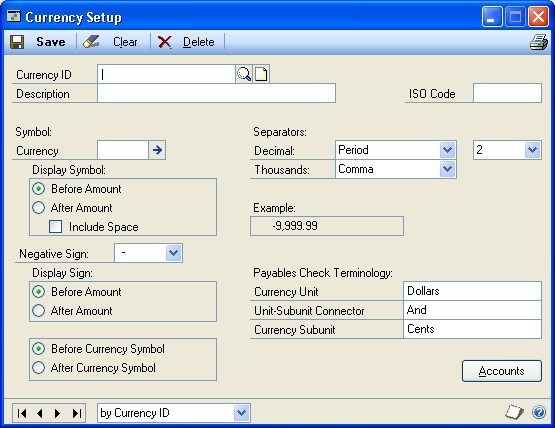
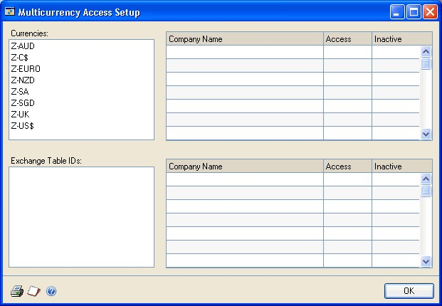
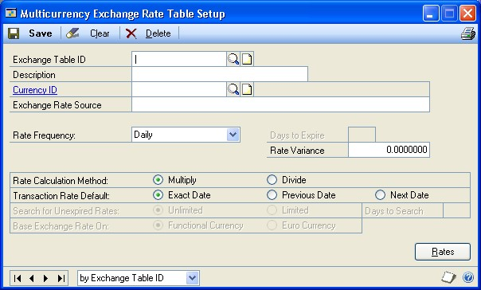
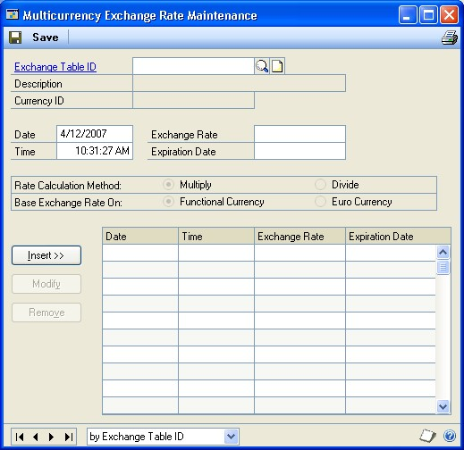
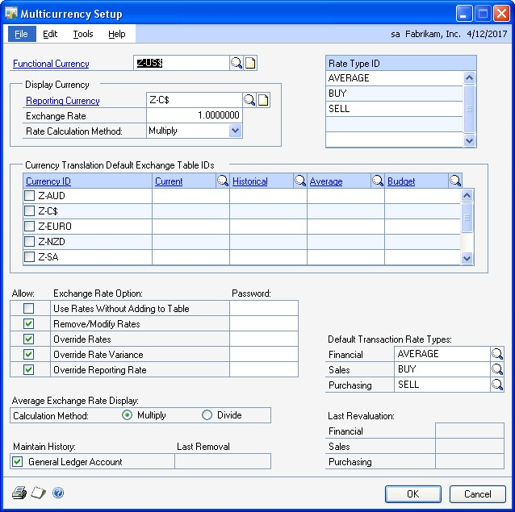
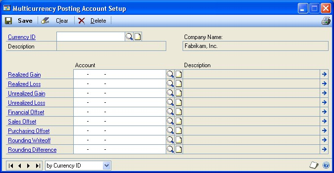
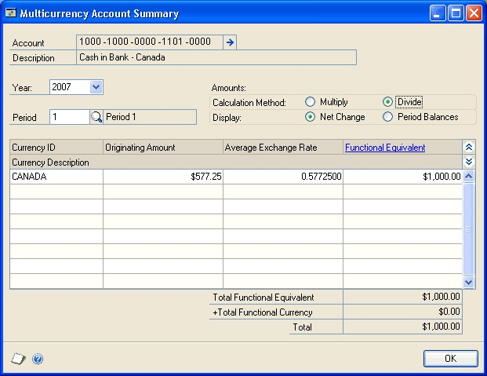

# Multicurrency Management in Microsoft Dynamics GP

You can use Multicurrency Management to set up an unlimited number of currency IDs, rate types, and exchange rate tables. After setting up Multicurrency Management, you can enter multicurrency transactions using the originating amounts for the transaction or the equivalent of the amounts in your company’s functional currency.

You can revalue General Ledger accounts, based on current or estimated exchange rates, and revalue Sales and Purchasing transactions. Multicurrency information can be printed on reports, as well as printing reports specific to multicurrency. You also can view and compare open-year or historical multicurrency information in detail or summary form.

This manual is designed to give you an understanding of how to use the featuresof Multicurrency Management, and how it integrates with the Microsoft Dynamics GP system.

To make best use of Multicurrency Management, you should be familiar with systemwide features described in the System User’s Guide, the System Setup Guide, and the System Administrator’s Guide.

Some features described in the documentation are optional and can be purchased through your Microsoft Dynamics GP partner.

To view information about the release of Microsoft Dynamics GP that you’re using and which modules or features you are registered to use, choose Help \>\> About Microsoft Dynamics GP.

The manual is divided into the following parts:

-   *Part 1, Setup*, introduces Multicurrency Management and gives detailed instructions on setting up Multicurrency Management.

-   *Part 2, Inquiries and reports*, explains how to use inquiries and reports to analyze your multicurrency activity.

-   *Part 3, Utilities and routines*, provides information about maintaining your multicurrency data and recognizing gains and losses.

## Part 1: Setup

This part of the documentation describes what you need to do to set up Multicurrency Management. These tasks generally need to be completed once, but you can refer to these instructions at other times to modify or view existing entries. The following topics are discussed:

-   *Chapter 1, “Multicurrency Management setup,”* provides information about how you can set up Multicurrency Management.

-   *Chapter 2, “Currency setup,”* describes how to set up currencies and assign access to these currencies for each company.

-   *Chapter 3, “Exchange rate setup,”* describes how to set up and assign access to exchange rate tables for each company.

-   *Chapter 4, “Multicurrency company setup,”* explains how to set up information for each company that uses more than one currency.

-   *Chapter 5, “Multicurrency posting account setup,”* describes how to select posting accounts for Multicurrency, currencies, or rate types.

### Chapter 1: Multicurrency Management setup

One way of getting started with Multicurrency Management is to follow the setup routine provided with the system. As you select each step in the setup routine list, the appropriate window used to complete that procedure opens. You can enter the necessary information in the window, referring to the documentation whenever necessary.

The setup routine information is divided into the following sections:
-   *Before you set up Multicurrency Management*

-   *Multicurrency Management setup*

#### Before you set up Multicurrency Management

Before you begin setting up Multicurrency Management, be sure you’ve completed the System Manager and General Ledger setup procedures. You also should set up

Payables Management and Receivables Management before Multicurrency Management, if you use these modules. For more information on completing procedures, refer to the General Ledger, Payables Management, or Receivables Management documentation. For information about setting up your system, refer to your System Setup instructions (Help \>\> Contents \>\> select Setting Up the System).

If you plan to print multicurrency versions of your posting journals, be sure to mark the Include Multicurrency Info option in the Posting Setup window.

#### Multicurrency Management setup

When you set up Multicurrency Management, you can open each setup window and enter information, or you can use the Setup Checklist window (Microsoft Dynamics GP menu \>\> Tools \>\> Setup \>\> Setup Checklist) to guide you through the setup process. See your System Setup Guide (Help \>\> Contents \>\> select Setting up the System) for more information about the Setup Checklist window.

### Chapter 2: Currency setup

During the Multicurrency Management setup process, you will set up currencies and assign access to these currencies for each company.

The currency setup information is divided into the following sections:

-   *Setting up a currency*

-   *Deleting a currency*

-   *Assigning access to currencies*

-   *Inactivating a currency*

#### Setting up a currency

Use the Currency Setup window to set up the currencies you’ll use in Microsoft Dynamics GP. Currencies are set up once in Multicurrency
Management and can be used in any company. 

**To set up a currency:**

1.  Open the Currency Setup window. (Microsoft Dynamics GP menu \>\> Tools \>\> Setup \>\> System \>\> Currency)

    

2.  Enter a currency ID and a description.

3.  Enter the ISO code. An ISO code for a currency is a three-letter code used to define the name of a currency. ISO codes are created by the International Organization for Standardization. Refer to the International Organization for Standardization Web site (www.iso.org) for a list of ISO currency codes.

4.  Enter the currency symbol you want to appear with this currency ID (or choose one from the expansion button) and select how you want the symbol displayed. As you enter symbol information for the selected currency ID, the Example field will reflect the selection you’ve made.

5.  Select the sign you want to appear with the currency amount when the amount is negative.

6.  Select display options for the negative sign.

7.  Select the symbol you want to use as the decimal and thousands separator and select the number of decimal places you want to display.

8.  Enter the terminology that you want to appear on Payables checks.

9.  Choose File \>\> Print to verify your entries with a Currency Setup List and Save your entries.

#### Deleting a currency

Use the Currency Setup window if you’re not planning to use a currency for transactions in the future and want to delete the currency.
A currency can’t be deleted if:

-   The currency is used on posted or unposted transactions.

-   Any company has access to the currency.

**To delete a currency:**

1.  Open the Currency Setup window. (Microsoft Dynamics GP menu \>\> Tools \>\> Setup \>\> System \>\> Currency)

2.  Enter or select the currency ID for the currency you want to delete.

3.  Choose Delete to delete the currency.

4.  Choose File \>\> Print to verify your changes with a Currency Setup List.

#### Assigning access to currencies

Use the Multicurrency Access Setup window to grant access to currencies for individual companies. After you’ve set access, each currency that a company has access to will appear for use throughout Microsoft Dynamics GP when you’re working in that company. Each time you create a new currency ID, be sure to set access using the following steps.

You can remove currency access by unmarking the Access selection for the company. You can remove access to a currency if the currency hasn’t been used on a posted or unposted transaction.

**To assign access to currencies:**
1.  Open the Multicurrency Access Setup window. (Microsoft Dynamics GP menu \>\> Tools \>\> Setup \>\> System \>\> Multicurrency Access)

    
    

2.  Select a currency ID.

3.  Mark Access for each company that will use the selected currency.

4.  Choose File \>\> Print to verify your entries with a Multicurrency Access Report and click OK to Save.

#### Inactivating a currency

Use the Multicurrency Access Setup window if you want to temporarily stop using a currency without deleting it or removing a company’s access to it.
For example, if a currency’s exchange rate is fluctuating dramatically, you might choose to stop conducting business in that currency until the currency stabilizes. All currencies can be inactivated except your company’s functional currency.

**To inactivate a currency:**

1.  Open the Multicurrency Access Setup window.(Microsoft Dynamics GP menu \>\> Tools \>\> Setup \>\> System \>\>> Multicurrency Access)

2.  Select the currency ID that you want to inactivate.

3.  Mark the Inactive selection for each company that you no longer want to use
    the selected currency for.

4.  Choose File \>\> Print to verify your changes with a Multicurrency Access Report and choose OK to Save.

### Chapter 3: Exchange rate setup

During the Multicurrency Management setup process, you will set up exchange
rate tables and assign access to these for each company.

The exchange rate setup information is divided into the following sections:
-   *Understanding exchange rate tables*
-   *How rate variances affect exchange rate tables*
-   *Calculation methods for exchange rates*
-   *Setting up an exchange rate table*
-   *Deleting an exchange rate table*
-   *Assigning exchange rates to exchange rate tables*
-   *Assigning access to exchange rate tables*
-   *Inactivating an exchange rate table*

#### Understanding exchange rate tables

Exchange rate tables are used to store many exchange rates for a single currency. The tables are set up once in Microsoft Dynamics GP and the exchange rates assigned to the tables are entered periodically. You can use an exchange rate table in multiple companies if the companies use the same functional currency.

#### How rate variances affect exchange rate tables

Rate variances limit the amount a rate can change each time you enter a new exchange rate. An exchange rate can‘t change by more than the variance amount. For example, if the most recent exchange rate is .65321 and the rate variance you’ve entered is .01000, the next rate you enter must be between .64321 and .66321.

*If you don’t want to limit the amount an exchange rate can change (that is, if you want an unlimited variance), enter 0.000 as the rate variance.*

Rate variances are calculated based on the closest previous exchange rate to the date for the rate you’re entering. For example, if you enter .01000 as the rate variance, the exchange rate table may contain the following exchange rates:

| **Date**          | **Rate** |
|-------------------|----------|
| December 17, 2017 | .65359   |
| December 16, 2017 | .64767   |
| December 14, 2017 | .65321   |

When you enter a new exchange rate for December 15, 2017, the rate variance will be based on rate .65321, the rate for December 14, 2017. The rate won’t be based on the latest rate in the exchange rate table, .65359, the rate for December 17, 2017.

As another example, assume that you’ve inserted a new rate in the Multicurrency Exchange Rate Maintenance window. If the new rate is dated July 20, 2017, and the closest prior rate is dated July 19, 2017, those rates will be compared. If there are two rates entered for July 19, the rate with the latest time will be used. If there are other rates entered for July 20, the most recent rate will be used based on the time. If the time of the new rate is 14:00:00, and there is an existing rate entered with a time of 17:32:24, Multicurrency Management will compare the new rate to the rate with a time of 17:32:24.

#### Calculation methods for exchange rates

You can select whether the originating currency amount you’ve entered should be multiplied or divided by the exchange rate to calculate the transaction’s functional equivalent. Many sources for exchange rates will provide rates based on both calculation methods. Once you’ve selected a calculation method for the exchange rate table, it can’t be changed.

Exchange rates in Microsoft Dynamics GP can contain up to seven decimal places. If the rate you’re using fluctuates using more than seven decimal places, your calculations may be more accurate if you use the opposite calculation method and its rate equivalent when going from a multiply rate to a divide rate. For example, if the multiply rate is .01029233 one day and is .01029232 the next day, both rates will be entered as .0102923, because the rates can contain only seven decimal places. But if you change the calculation method to divide and use the equivalent exchange rate, you can use 97.1597296 as the rate for the first day and 97.1598240 as the rate for the next day, ensuring that the exchange rates for your transactions are as accurate as possible.

#### Setting up an exchange rate table

Use the Multicurrency Exchange Rate Table Setup window to set up exchange rate tables, specify the source for the exchange rates in the tables and select how often you want to update the exchange rate tables.

**To set up an exchange rate table:**

1.  Open the Multicurrency Exchange Rate Table Setup window. (Microsoft Dynamics GP menu \>\> Tools \>\> Setup \>\> System \>\> Exchange Table)

1.  Enter an exchange rate table ID and description.

2.  Enter or select a currency ID you want to use with the selected exchange rate table. Also, enter the source of the exchange rates, such as a newspaper or bank.

3.  Select a rate frequency to indicate how often you plan to enter rates for the selected exchange rate table. If you select Miscellaneous as the rate frequency, enter the number of days that you want to use an exchange rate to set the default expiration date.

4.  Enter a rate variance (optional).

5.  Select a rate calculation method. For more information on the calculation methods, see *Calculation methods for exchange rates* .

6.  Select a Transaction Rate Default option to determine the exchange rate that will be used when multicurrency transactions are entered. Each time you enter a transaction, a currency must be selected. If there isn’t an exchange rate for the transaction date, the option selected here will be used to select the exchange rate.

**Exact Date** Select if you want the default exchange rate only to be an exchange rate with the same date as the transaction date. If there is no exchange rate for the transaction date, there will be no default exchange rate.

**Previous Date** Select if you want the default exchange rate to be the rate for the closest previous date, if no rate exists for the transaction date. If an exchange rate exists for the transaction date, that rate will be used as the default exchange rate. You also will need to enter the number of previous days that you want to search for an unexpired exchange rate.

If you’ve selected to use a previous date as the transaction rate default and there are no unexpired rates for a previous date within the number of days you’ve specified as a search limit, the closest future date will appear as the default exchange rate.

**Next Date** Select if you want the default exchange rate to be the rate for the closest date after the transaction date, if no rate exists for the transaction date. If an exchange rate exists for the transaction date, that rate will be used as the default exchange rate. You also will need to enter the number of previous days that you want to search for an unexpired exchange rate.

If you’ve selected to use the next date as the transaction rate default and there is none, the closest unexpired rate prior to the transaction date will appear as the default exchange rate. Only the number of days you’ve specified to search will be used to determine an unexpired previous rate.

1.  Select a limit to search for unexpired rates.

2.  Choose File \>\> Print to verify your entries with an Exchange Rate Table Setup List.

3.  Choose Save to save your entries.

#### Deleting an exchange rate table

Use the Multicurrency Exchange Rate Table Setup window to delete exchange rate tables you’re not planning to use for transactions in the future. All exchange rates you’ve entered for an exchange rate table also will be deleted when the exchange rate table is deleted.

You’ll need to remove the access rights for all companies that have access to the exchange rate table before deleting the exchange rate table. For more information on removing access, see *Assigning access to exchange rate tables .*

**To delete an exchange rate table:**

1.  Open the Multicurrency Exchange Rate Table Setup window. (Microsoft Dynamics GP menu \>\> Tools \>\> Setup \>\> System \>\> Exchange Table)

1.  Enter or select the exchange rate table ID for the exchange rate table you want to delete.

2.  Choose Delete to delete the exchange rate table. All exchange rates you’ve entered for an exchange rate table also will be deleted when the exchange rate table is deleted.

#### Assigning exchange rates to exchange rate tables

Use the Multicurrency Exchange Rate Maintenance window to assign individual exchange rates to the exchange rate tables. The exchange rates can be used by any company that you’ve set up to use Microsoft Dynamics GP. If you’re planning to use a single exchange rate table with two or more companies, those companies must be using the same functional currency, that is, the primary currency used for maintaining your account records.

*For security on exchange rates, you can select whether or not you want to allow users to remove and modify exchange rates and override exchange rate variances in the Multicurrency Setup window. You also can assign passwords to these options. For more information on exchange rate security, see Setting up Multicurrency Management options .*

>   **To assign exchange rates to exchange rate tables:**

1.  Open the Multicurrency Exchange Rate Maintenance window. (Cards \>\> System \>\> Exchange Table)

2.  Enter or select an exchange table ID.

3.  Enter the date and time for the rate you’re entering. Exchange rates are stored in the exchange rate table based on the date and time associated with the rate, so you can enter several rates for each day.

4.  Enter an exchange rate. You can change the expiration date, but the expiration date must fall on or after the exchange rate date. You won’t be able to use this rate on transactions dated after the expiration date you specify.

5.  Choose Insert to add the exchange rate to the exchange rate table. You can then continue entering additional exchange rates and inserting them into the table.

6.  Choose File \>\> Print to verify your entries with an Exchange Rate List and choose Save.

#### Assigning access to exchange rate tables

Use the Multicurrency Access Setup window to grant exchange rate table rights to individual companies. After you’ve set access, each exchange rate table that a company has access to will appear for use throughout Microsoft Dynamics GP when you’re working in that company. Each time you create a new company or exchange rate table, be sure to set access using the steps in this procedure.

You can remove the exchange rate table access by unmarking the Access selection for the company.

**To assign access to exchange rate tables:**

1.  Open the Multicurrency Access Setup window. (Microsoft Dynamics GP menu \>\> Tools \>\> Setup \>\> System \>\> Multicurrency Access)

2.  Select a currency ID. The exchange rates assigned to the currency ID will be displayed.

3.  Select an exchange table ID.

4.  Mark access for each company that will use the selected exchange rate table. When you’ve selected all the companies that will have access to this exchange rate table, repeat the process until you’re finished assigning access.

5.  Choose File \>\> Print to verify your entries with a Multicurrency Access Report.

6.  Choose OK to save the entries.

#### Inactivating an exchange rate table

Use the Multicurrency Access Setup window if you want to temporarily stop
using an exchange rate table without deleting it or removing a company’s
access to it. All exchange rate tables can be inactivated.

**To inactivate an exchange rate table:**

1.  Open the Multicurrency Access Setup window. (Microsoft Dynamics GP menu \>\> Tools \>\> Setup \>\> System \>\> Multicurrency Access)

2.  Select the exchange rate table ID that you want to inactivate.

3.  Mark the Inactive selection for each company that you no longer want to use
    the selected exchange rate table.

4.  Choose File \>\> Print to verify your changes with a Multicurrency Access Report.  Choose OK to Save

### Chapter 4: Multicurrency company setup

Once you have set up systemwide multicurrency information, you will set up information specific to each company that uses more than one currency. For example, for each company, you need to set up default information, assign posting accounts, and assign currencies to accounts.

The multicurrency company setup information is divided into the following sections:

-   *Understanding rate types*

-   *Default transaction rate types*

-   *Currency translation*

-   *Setting up Multicurrency Management options*

-   *Assigning rate types to exchange rate tables*

#### Understanding rate types

Rate types help you identify exchange tables when entering transactions. You might want to set up different rate types to use for different transaction types. For example, you might set up Buy and Sell rates types, using the Sell rate type for purchasing transactions and the Buy rate type for sales transactions. The exchange rates for both rate types can be taken from the
same exchange rate table, or a different exchange rate table could be used for each rate type.

Three rate types—Buy, Sell, and Average—have been included with Multicurrency Management. You can set up an unlimited number of additional rate types in the Rate Type ID list. For example, you may want to use different rate types for a particular customer or vendor but still use the same exchange rate table. By using a different rate type for the customer or vendor, you also can assign different multicurrency posting accounts to the rate type in order to track multicurrency gains and losses for that customer
or vendor in specific accounts.

#### Default transaction rate types

You also can set up the rate types that you’ll use as the default rate type for transactions in each series. For example, you might use the Sell rate type as the default rate type for purchasing transactions and the Buy rate type as the default rate type for sales transactions. You’ll be able to change the rate type for each transaction, if you want to do so.

#### Currency translation

A currency translation allows you to report general ledger amounts in a currency that isn't a transaction’s functional currency or originating currency. The exchange table and exchange rate information is used to translate the amounts. The general ledger functional amounts are translated using a currency translation type that is assigned to each account. There are three currency translation types.

| **Translation type** | **Description**                                                                                                                                                                                                                                                                                                                                                                                                                                                  |
|----------------------|------------------------------------------------------------------------------------------------------------------------------------------------------------------------------------------------------------------------------------------------------------------------------------------------------------------------------------------------------------------------------------------------------------------------------------------------------------------|
| Average              | This translation type uses a single exchange rate for each general ledger period. The values for the account (including transaction detail) are converted to the reporting currency using an average exchange rate for the individual period as entered in the exchange table. If an exchange rate couldn’t be found, functional currency amounts are used.                                                                                                      |
| Current              | This translation type uses a single exchange rate based on the report date. All values for the account are converted to the reporting currency using the exchange rate on the as of date for the report. If an exchange rate couldn’t be found, functional currency amounts are used.                                                                                                                                                                            |
| Historical           | This translation type uses a single exchange rate based on the transaction date. When the account is converted to the reporting currency, the individual transactions that exist for the account are translated using the exchange rate that was valid on the transaction date. Then, all summary information will be re-created for that account, based on the translated amounts. If an exchange rate couldn’t be found, functional currency amounts are used. |

You can translate general ledger amounts in a specified currency. Management Reporter for Microsoft Dynamics ERP can use the translated amounts from Microsoft Dynamics GP for reports.

#### Setting up Multicurrency Management options

Use the Multicurrency Setup window to set multicurrency default entries for a company, such as functional and reporting currencies, exchange rate options and default transaction rate types.

You also can select the currencies that the company’s functional amounts can be translated to and to assign exchange rate tables for each currency translation type. You also can select an exchange rate for budget translation to help you forecast future translated budget amounts.

**To set up Multicurrency Management options:**

1.  Open the Multicurrency Setup window. (Microsoft Dynamics GP menu \>\> Tools \>\> Setup \>\> Financial \>\> Multicurrency)

2.  Enter or select the functional currency ID. The functional currency is the     primary currency that the company uses for maintaining accounting records. Typically, the functional currency is the currency for the country/region where the company is located.

*If you’ve already entered transactions, when you enter the functional currency you’ll be prompted to use the check links procedure to update the currency ID for existing transactions. For more information on checking links, refer to your System Administrator's Guide (Help \>\> Contents \>\> select System Administration).*

3.  Enter or select the reporting currency ID. The reporting currency is used to convert functional currency amounts to another currency on inquiries and reports. For a subsidiary, the reporting currency typically is the functional currency of the parent company. You can change the reporting currency at any time.

4.  Mark the currencies for translation. Every currency set up in the Currency Setup window is available as a translation currency.

5.  Select the exchange rate table for each currency translation type and for the budget translation for each translation currency.

6.  Enter the exchange rate and rate calculation method to be used when calculating the reporting currency.

7.  Select the exchange rate options you want to use and enter passwords. If you leave the password field blank, no password will be required for that activity.

**Use Rates Without Adding to Table** Mark to use exchange rates one time without adding them to an exchange rate table. If you assign a password, it must be entered before using a rate without adding an exchange rate table during transaction entry or during the revaluation procedure.

**Remove/Modify Rates** Mark to remove or modify exchange rates in the Multicurrency Exchange Rate Table Maintenance window. If you assign a password, it must be entered before removing or modifying a rate. 

**Override Rates** Mark to enter a different exchange rate for a transaction, overriding the default exchange rate from the selected exchange rate table. If you assign a password, it must be entered before overriding an exchange rate during transaction entry or the revaluation procedure.

**Override Rate Variance** Mark to override the rate variance that you’ve set up for the exchange rate table. For example, if the default exchange rate for a transaction is .65321 and the rate variance you’ve entered for the selected exchange rate table is .01000, the rate you enter to override the default exchange rate must be between .64321 and .66321. If you mark this option, you can override the rate variance when you’re assigning exchange rates to exchange rate tables or during transaction entry. For more information on rate variances, see *How rate variances affect exchange rate tables* .

If you assign a password, it must be entered before overriding the rate variance during transaction entry or when you’re assigning exchange rates to exchange rate tables.

**Override Reporting Rate** Mark to override the reporting currency exchange rate or rate calculation method on inquiries and reports. If you assign a password, it must be entered before overriding a reporting rate or rate calculation method.

1.  Select the calculation method for the Average Exchange Rate Display. This method can be changed in each inquiry window if you want.

*If the rate you're using fluctuates using more than seven decimal places, your calculations may be more accurate if you use the opposite calculation method and its rate equivalent when going from a multiply rate to a divide rate.*

2.  Mark Maintain History if you want to maintain a record of account summary balances for closed fiscal periods.

*If you want to maintain multicurrency account history, you also must have selected to maintain General Ledger account history by marking the Account option in the General Ledger Setup window.*

3.  Enter additional rate types and select default transaction rate types.

4.  Choose File \>\> Print to verify your entries with a Multicurrency Setup List.  Choose OK to Save

#### Assigning rate types to exchange rate tables

Use the Select Multicurrency Rate Types window to assign rate types for the company you’re working in to the exchange rate tables you set up for all companies.

Rate types distinguish between different exchange rates, such as a buy rate from a sell rate, by limiting the rate types to the appropriate exchange rate table. When you enter transactions, the appropriate exchange rate table for buying or selling can be selected automatically when you enter a currency ID and rate type. For more information about rate types, see *Understanding rate types* .

*You can use the Multicurrency Setup window to set up an unlimited number of rate types for each company.*

You also can select posting accounts based on the rate type. For example, if you sell products and purchase supplies using the same currency and exchange rate table, you may want to use different posting accounts to track the gains and losses.

**To assign rate types to exchange rate tables:**

1.  Open the Select Multicurrency Rate Types window. (Microsoft Dynamics GP menu \>\> Tools \>\> Setup \>\> Financial \>\> Rate Types)

2.  Enter or select an exchange table ID.

3.  Select the rate type you want to assign to the selected exchange table ID.

4.  Choose Insert to insert the selected rate type.

*You can assign more than one rate type to an exchange rate table. You can assign the same rate type to two different exchange tables that use the same currency. However, the two exchange tables must have different selections in the Base Exchange Rates On field in the Multicurrency Exchange Rate Table Setup window.*

5.  Choose Accounts to open the Multicurrency Posting Account Setup by Rate Type window to set up multicurrency posting accounts for each rate type that you've assigned to a currency. For more information, see *Selecting posting accounts for each rate type* .

6.  Choose Rates to open the Multicurrency Exchange Rate Maintenance window to assign individual exchange rates to the exchange rate tables. For more information, see *Assigning exchange rates to exchange rate tables* Choose Save to save your entries.

### Chapter 5: Multicurrency posting account setup

Multicurrency posting accounts are the financial accounts used to track realized and unrealized gains and losses, offset accounts, rounding differences, and writeoffs. In Multicurrency Management, you can select posting accounts for the entire module, for specific currencies, or for each rate type assigned to a currency.

This multicurrency posting account setup information is divided into the following sections:

-   *Multicurrency Management posting accounts*

-   *Selecting posting accounts for each currency*

-   *Selecting posting accounts for each rate type*

-   *Assigning currencies to an account*

-   *Modifying a range of accounts with multicurrency information*

-   *Entering historical multicurrency information for accounts*

#### Multicurrency Management posting accounts

You can choose from the following account types in Multicurrency Management:

| **Account type**        | **Description**                                                                                                                                                 |
|-------------------------|-----------------------------------------------------------------------------------------------------------------------------------------------------------------|
| **Realized Gain**       | Used to recognize gain realized due to the difference in exchange rates between the transaction date and the settlement date for a multicurrency transaction.   |
| **Realized Loss**       | Used to recognize a loss realized due to the difference in exchange rates between the transaction date and the settlement date for a multicurrency transaction. |
| **Unrealized Gain**     | Used to recognize a gain due to the difference in the rate assigned to the transaction and the rate of revaluation.                                             |
| **Unrealized Loss**     | Used to recognize a loss due to the difference in the rate assigned to the transaction and the rate of revaluation.                                             |
| **Financial Offset**    | Used to recognize the offset amount for an unrealized gain or loss when financial accounts are revalued.                                                        |
| **Sales Offset**        | Used to recognize the offset amount for an unrealized gain or loss when Sales transactions are revalued.                                                        |
| **Purchasing Offset**   | Used to recognize the offset amount for an unrealized gain or loss when Purchasing transactions are revalued.                                                   |
| **Rounding Writeoff**   | Used to recognize rounding amounts caused by rounding rules of some currencies.                                                                                 |
| **Rounding Difference** | Used to recognize rounding differences caused by calculating functional currency amounts, based on the originating amounts and the selected exchange rate.      |

There are three different windows that you can use to select posting accounts for Multicurrency Management, depending on the level of detail you want to track.

-   Use the Posting Account Setup window to set up posting accounts for all currencies and rate types assigned to a company.

-   Use the Multicurrency Posting Account Setup window if you want to use different posting accounts for each currency assigned to a company.

-   Use the Multicurrency Posting Account Setup by Rate Type window if you want to use different posting accounts for each rate type assigned to a currency.

See *Selecting posting accounts for each currency* and *Selecting posting accounts for each rate type* for instructions on using the Multicurrency Posting Account Setup and Multicurrency Posting Account Setup by Rate Type windows. For information about the Posting Account Setup window, refer to the help.

#### Selecting posting accounts for each currency

Use the Multicurrency Posting Account Setup window to select posting accounts for each currency a company has access to. For example, you may want to track gains and losses in separate accounts for different currencies. If you don’t enter posting accounts for a currency, the accounts entered in the Posting Setup window will be used.

**To select posting accounts for each currency:**

1.  Open the Multicurrency Posting Account Setup window. (Microsoft Dynamics GP menu \>\> Tools \>\> Setup \>\> Financial \>\> Currency Accounts)

1.  Enter or select a currency ID.

2.  Assign an account to each posting account type.

3.  Choose File \>\> Print to verify your entries with a Posting Accounts List by Currency.

4.  Choose Save to save the posting accounts you’ve entered for the selected currency ID. Repeat this procedure to enter posting accounts for additional currency IDs.

#### Selecting posting accounts for each rate type

Use the Multicurrency Posting Account Setup by Rate Type window to select posting accounts for each rate type that you’ve assigned to a currency. For example, you may want to track gains and losses in separate accounts for the Buy rate type and the Sell rate type for the same currency.

If you entered accounts in the Multicurrency Posting Account Setup window, those account will be the default entries for the Multicurrency Posting Account Setup by Rate Type window. If you didn’t enter posting accounts in the Multicurrency Posting Account Setup window, the accounts entered in the Posting Setup window will be used.

**To select posting accounts for each rate type:**

1.  Open the Multicurrency Posting Account Setup by Rate Type window. (Microsoft Dynamics GP menu \>\> Tools \>\> Setup \>\> Financial \>\> Rate Types \>\> Select an exchange table ID in the Select Multicurrency Rate Types window and choose Accounts)

2.  Enter or select a rate type ID.

3.  Assign an account to each posting account type.

4.  Choose File \>\> Print to verify your entries with a Posting Accounts List by Rate Type.

5.  Choose Save to save the posting accounts you’ve entered for the selected currency ID and rate type. Repeat this procedure to enter posting accounts for additional currency IDs and rate types.

#### Assigning currencies to an account

Use the Select Account Currencies window to select the currencies you want to be able to use when posting to an account. This ensures that amounts will be posted to only those accounts set up for use with multicurrency transactions. Your functional currency was automatically assigned to all accounts and will not be displayed in the Select Account Currencies window. To assign currencies to several accounts in an account range, see *Modifying a range of accounts with multicurrency information .*

*We recommend that you assign all currency IDs to the retained earnings accounts for each company to be sure that all profit and loss amounts can be closed to the retained earnings accounts.*

You also can use the Select Account Currencies window to select a currency translation type to assign to an account. The translation type you select determines how amounts and transactions are translated into a different currency.

**To assign currencies to an account:**

1.  Open the Select Account Currencies window. (Cards \>\> Financial \>\> Account Currencies)

2.  Enter or select an account.

3.  Mark Revalue Account if you want to revalue the selected account when the revaluation procedure is performed. Then, select whether you want to revalue the account based on net change amounts or period balances. Also, select whether to post the result to the account or the financial offset. Posting to the account is more accurate. For more information about revaluation, see *Chapter 9, “Routines.”*

4.  Select the currency translation type for the selected account.

5.  Select the currencies you want to use when you post transactions to the selected account. You can choose Mark All or Unmark All if you want to mark or unmark all the currencies shown in the scrolling window.

6.  Choose File \>\> Print to verify your entries with a Multicurrency Accounts List.

7.  Choose Save to save your entries.

#### Modifying a range of accounts with multicurrency information

Use the Multicurrency Mass Account Update window to update multicurrency account information whenever you want to modify information for a range of accounts. You can select a range of accounts that you want to mark for revaluation, or assign additional currencies to the accounts. You also can update currency transaction types for a range of accounts. The translation type you select determines how amounts and transactions are translated into a different currency. If you want to update a single account, use the Select Account Currencies window. For more information, see *Assigning currencies to an account* .

*You can use the copy feature in the Mass Modify Chart of Accounts window to create new accounts, copying the associated currencies from existing accounts. For more information, see Help \>\> Index \>\> Mass Modify Chart of Accounts window.*

**To modify a range of accounts with multicurrency information:**

1.  Open the Multicurrency Mass Account Update window. (Cards \>\> Financial \>\> Currency Account Update)

2.  Enter or select a segment ID and enter or select the beginning and ending account segments.

3.  Choose Insert to insert the range into the Restrictions list. All accounts that meet all restrictions you’ve entered will be updated. If you don’t enter an account range, all accounts in the chart of accounts will be updated.

4.  Mark Update Currencies to update the currencies associated with the accounts in the selected range. When you mark this option, the Display, Currency ID, and Currencies fields become available.

5.  Mark Select Currencies to enter or select the currencies that will be associated with the account in the range, or mark All Currencies to include all currencies.

6.  Select Mark to assign the selected currencies to the accounts in the range, or select Unmark to unassign the selected currencies.

7.  Mark Update Revalue Option to update the Revalue Account selection in the Select Account Currencies window for the accounts in the selected range. When you mark this option, the Revalue, By, and Post Results To fields become available.

8.  Choose Mark to revalue the accounts in the range or Unmark to not revalue.

9.  Choose whether to revalue the account range based on net change amounts or period balances, if you chose to revalue.

10. Choose whether to post the revaluation result to the account or the financial offset. Posting to the account is more accurate.

11. Mark Update Currency Translation to update the accounts in the selected range. When you mark this option, the Currency Translation Type field becomes available.

12. Select the currency translation type.

13. Choose Update to update the accounts in the selected range.

#### Entering historical multicurrency information for accounts

Use the Multicurrency Account History window to enter historical multicurrency information for accounts. Account history is a record of
account summary balances for previous periods. 

*You can enter historical multicurrency information only if you’ve selected to maintain account history using the Multicurrency Setup and the General Ledger Setup windows.*

**To enter historical multicurrency information for accounts:**

1.  Open the Multicurrency Account History window. (Cards \>\> Financial \>\> Currency Account History)

2.  Enter or select an account.

3.  Select the year and fiscal period for which you want to enter historical multicurrency information.

4.  Select whether the originating currency amount should be multiplied or divided by the average exchange rate to calculate the currency’s functional equivalent. For information about using exchange rates with more than seven decimal places, see *Calculation methods for exchange rates* .

5.  Select whether to enter and display amounts in the scrolling window using net change amounts or the account’s period balances.

6.  Enter or select the currency ID for the currency in which the amounts originated.

7.  Enter the originating amount using net change amounts or period balances, depending on the display selection you’re using. If you entered multicurrency transactions in the selected period, the average exchange rate for the period will be displayed; if you haven’t entered multicurrency transactions in the selected period, you can enter an average exchange rate. The functional equivalent for the originating amount will be calculated based on the calculation method you’ve selected and the average exchange rate.

*You also can enter the functional equivalent and an average exchange rate for the currency; the originating amount will be calculated automatically. Or you can enter amounts in the Originating Amount and Functional Equivalent fields and the average exchange rate will be calculated automatically.* 

The total functional equivalent for the originating amounts you’ve entered and the total for the account (displayed in the Account History window) will be displayed. The total functional currency—the total of all the transactions that were posted using only the functional currency—is calculated as the difference between the total functional equivalent and the account total.

8.  Choose File \>\> Print to verify your entries with a Multicurrency Account History Report and choose Save.

## Part 2: Inquiries and reports

This part of the documentation includes information about inquiries and reports. Together, these components allow you to analyze the information you’ve entered into the system. You can analyze transaction and item information, and then display the information either on the computer screen or on a report. The following topics are discussed:

-   *Chapter 7, “Inquiries,”* describes how to view information in different currencies, account summary information, and account summary transaction information.

-   *Chapter 6, “Reports,”* includes information about multicurrency setup reports, report destinations, and report options.

### Chapter 6: Reports

You can use Multicurrency Management reports as records of multicurrency setup entries, currencies, exchange rates, and transactions. Many of these reports provide information valuable if you’re planning to modify your setup options or change the multicurrency information associated with your chart of accounts. Use this information to guide you through printing reports and working with report options.

For more information about creating and printing reports, and the various reporting tools that you can use with Microsoft Dynamics GP, refer to your System User's Guide (Help \>\> Contents \>\> select Using The System). 

Reports information is divided into the following sections:

-   *Multicurrency Management report summary*

-   *Reporting multicurrency information*

-   *Specifying a Multicurrency Management report option*

#### Multicurrency Management report summary

You can print several types of reports using Multicurrency Management. Some reports automatically are printed when you complete certain procedures; for example, revaluation journals can be printed automatically when you revalue transactions, depending on how your posting options are set up. In order to print some reports, such as history reports, you must set up report options to specify sorting options and ranges of information to include on the report. For more information, refer to *Specifying a Multicurrency
Management report option* . 

The following table lists the report types available in Multicurrency Management and the reports that fall into those types.

| **Report type**                 | **Report**                                                                                     | **Printing method**                                                                                                                                  |
|---------------------------------|------------------------------------------------------------------------------------------------|------------------------------------------------------------------------------------------------------------------------------------------------------|
| Accounts Lists                  | Accounts List Posting Accounts List by Currency Posting Accounts List by Rate Type             | Choose File \>\> Print in the window you use to complete the procedure.                                                                              |
| Setup reports                   | Currency Setup List Exchange Rate Table Setup List Exchange Rate List Setup List Access Report | Choose File \>\> Print in the window you use to complete the procedure or create a report option in the General System Reports window.               |
| Revaluation Reports             | Revaluation Report Revaluation Journal Distribution Breakdown Register                         | Automatically printed when you complete the procedure or choose the Print Report Only option in the Multicurrency Revaluation window before posting. |
| History Reports                 | Account History Exchange Rate Removal Report                                                   | Automatically printed after you complete the procedure or choose the Print option in the selected window before removing.                            |
| Period-end and Year-end Reports | Period Consolidation Report Year-End Closing Report Retained Earnings Exception Report         | Automatically printed when you complete the procedure.                                                                                               |

#### Reporting multicurrency information

To print multicurrency versions of your reports and posting journals, you must mark the Include Multicurrency Info option in the Posting Setup window. If that option is marked, the option to print multicurrency information is available in some report option windows.

You also can include multicurrency information on some reports by marking the option to print multicurrency information in the appropriate report option window.

For information about reports that can be printed to include multicurrency information, refer to the reports summary information in the “Reports” chapter for the Microsoft Dynamics GP module you’re using.

#### Specifying a Multicurrency Management report option

Report options include specifications for sorting options and range restrictions for a particular report. In order to print several Multicurrency Management reports, you must first create a report option. Each report can have several different options so that you can easily print the information you need. For example, you can create report options for the Accounts List that include inactive accounts.

*A single report option can’t be used by multiple reports. If you want identical options for several reports, you must create them separately.*

Use the Financial or the System report options windows to create sorting, restriction, and printing options for the reports that have been included with Multicurrency Management.

**To specify a Multicurrency Management report option:**

1.  Open a Financial or System reports window. There are separate windows for each report type.
(Reports \>\> Financial \>\> Account) (Reports \>\> Financial \>\> Setup) (Reports \>\> System \>\> General)

2.  Select a report from the Reports list.

3.  Choose New to open the report options window. Your selection in step 2 determines which report options window appears.

4.  Name the option and enter information to define the option. The name you choose for the option won’t appear on the report. The selections available for defining report options vary, depending on the report type you’ve selected.

5.  Enter range restrictions. The Ranges list shows the available options for each report. The available ranges vary, depending on the type of report.

*You can enter only one restriction for each restriction type. For instance, you can insert*
*One segment restriction (1000 to 1200) and one category restriction (Cash to Inventory).*

6.  Choose Insert to insert the range in the Restrictions List. To remove an existing range from the list, select the range and choose Remove.

7.  Choose Destination to select a printing destination. Reports can be printed to the screen, to the printer, to a file or to any combination of these options. If you select Ask Each Time, you can select printing options each time you print this report option.

For more information about printing reports, refer to your System User's Guide (Help \>\> Contents \>\> select Using The System).

8.  To print the report option from the report options window, choose Print before saving it. If you don’t want to print the option now, choose Save and close the window. The report window will be redisplayed.

### Chapter 7: Inquiries

You can use the Multicurrency Management inquiry feature to review multicurrency information for all open periods or for a historical year in detailed or summary form. Because the inquiry windows provide access to information in a quick, efficient manner, you’ll always have access to a current view of your company’s financial status.

This information is divided into the following sections:

-   *Viewing information in different currencies*

-   *Changing the reporting currency’s exchange rate*

-   *Viewing multicurrency account summary information*

-   *Viewing account summary transaction information*

#### Viewing information in different currencies

You can choose whether you want to view multicurrency amounts in the originating, functional, or reporting currency. Choose View \>\> Currency \>\> Functional, Originating, or Reporting while viewing an inquiry window. The option will be saved on a per user, per window basis.

The first time you open the windows that support changing the currency view after registering Multicurrency Management, all the transactions will be displayed in the originating currency. If you change the currency view, the option you last used will be the default view the next time you open that window. Most secondary windows inherit the view from the window they were opened from.

When you view by reporting currency, the reporting currency amounts will be calculated by taking the functional currency amounts on the window and multiplying or dividing them by the exchange rate for the reporting currency. When viewing by reporting currency, label names with “functional” in their name will use “reporting” instead.

You also can use the currency list button in the windows that support changing the currency view. You can choose Functional, Originating, or Reporting from the currency list button. The option you choose will be saved on a per user, per window basis.

#### Changing the reporting currency’s exchange rate

If you mark the Override Reporting Rate option in the Multicurrency Setup window, you can change the reporting currency exchange rate and calculation method using the Modify Reporting Rate window. You can change the reporting currency exchange rate and calculation method only for inquiry windows that use the currency list button. To open the Modify Reporting Rate window, choose currency list button \>\> Modify Reporting Rate. You also can open the Modify Reporting Rate window by choosing View \>\> Currency \>\> Modify
Reporting Rate.

After you change the exchange rate or rate calculation method and choose the OK button, the currency fields in the inquiry window will be recalculated according to the new exchange rate information. The View \>\> Currency \>\> Reporting option and the currency list button \>\> Reporting option will display the new exchange rate and calculation method. In addition, if an open window uses the reporting currency, that window also is updated with the new exchange rate information. If you want to restore the original exchange rate information entered in the Multicurrency Setup window, choose the Default button.

#### Viewing multicurrency account summary information

Use the Multicurrency Account Summary window to view open-year balances in a net change or period-by-period format for each posting account. All multicurrency activity entered for the selected period and year will be displayed; the functional amount also can be viewed.

**To view multicurrency account summary information:**

1.  Open the Multicurrency Account Summary window. (Cards \>\> Financial \>\> Account \>\> Enter or select an account \>\> Summary \>\> Currency)

2.  Select the open year and period for which you want to view information.

#### Viewing account summary transaction information

Use the Multicurrency Summary Inquiry window to view summary account balances and multicurrency information in a net change or period balance format. The window also displays the account’s total balance using the functional currency. 

**To view account summary transaction information:**

1.  Open the Multicurrency Summary Inquiry window. (Inquiry \>\> Financial \>\> Currency Summary)

2.  Enter or select an account for which you want to view information.

3.  Enter or select a year for which you want to view information.

4.  Enter or select the period for which you want to view information. If you enter a year and period that has been set up but doesn’t have any transactions entered in it, the scrolling window will appear empty.

## Part 3: Utilities and routines

This part of the documentation provides the procedures you need to maintain your multicurrency data or those you need to complete at the end of a month or period and at the end of either your calendar or fiscal year. The following topics are discussed:

-   *Chapter 8, “Utilities,”* provides information about removing exchange rates
    and history.

-   *Chapter 9, “Routines,”* provides information about revaluing transactions,
    consolidating and closing a period, and closing a year.

### Chapter 8: Utilities

This part of the documentation contains the procedures you need for removing exchange rates and multicurrency history.

The utilities information is divided into the following sections:

-   *Removing exchange rates*

-   *Multicurrency history removal*

#### Removing exchange rates

Use the Remove Multicurrency Exchange Rates window to remove exchange rates that you’ve entered for exchange rate tables. You can remove exchange rates as often as you want. For example, you might want to remove rates from a previous year that you no longer needed.

*All exchange rates can be removed, even if they’ve been used on unposted transactions, because the exchange rate is saved with each transaction.*

**To remove exchange rates:**

1.  Open the Remove Multicurrency Exchange Rates window. (Microsoft Dynamics GP menu \>\> Tools \>\> Utilities \>\> System \>\> Remove Rates)

2.  Choose which range type you want to remove exchange rates for.

3.  Enter or select a range of exchange rates to remove.

4.  Choose Insert to insert the range.

*Only exchange rates common to all restrictions you’ve entered will be removed. For example, if you enter a currency ID restriction for Japanese yen and a date restriction for February 1, 2016, to February 12, 2016, you’ll remove only the rates assigned to exchange rate tables using Japanese yen in the specified date range.*

5.  Choose whether you want to remove the rates, print the report or both.

6.  Choose Process to remove the rates. If Print Report was marked, the Exchange Rate Removal Report will print.

#### Multicurrency history removal

When removing history in General Ledger, Receivables Management, Payables Management, Purchase Order Processing, or Sales Order Processing, multicurrency information also is removed, including revaluation activity. (If you’re maintaining transaction history for Receivables Management and Payables Management, the revaluation history also is maintained.)

*To print accurate historical aged trial balance reports and aged trial balances with options reports, you should maintain transaction history.*

[Screenshot that shows the windows where history was removed.](media/MCRH.jpg)

~   A screenshot of a cell phone Description automatically generated

### Chapter 9: Routines

Routine procedures include those you complete at the end of a month or period and at the end of either your calendar or fiscal year.

This information is divided into the following sections:

-   *Revaluation*

-   *Accounts used when posting revaluation transactions*

-   *Posting to or through General Ledger when revaluing transactions*

-   *Apply situations that prevent revaluation*

-   *Recognizing gains and losses*

-   *Recognizing gains and losses in the Financial series*

-   *Specifying accounts to revalue*

-   *Recognizing gains and losses in the Sales or Purchasing series*

-   *Specifying document types to revalue*

-   *Entering translated beginning balance information*

-   *Consolidating and closing a period*

-   *Closing a year*

#### Revaluation

Revaluation is the process of recalculating the functional currency value of transactions that were recorded in a currency other than your functional currency, or of recalculating the functional currency balances for accounts that are held in a currency other than the functional currency, based on a specific exchange rate.

You can indicate whether you want to calculate unrealized gains and losses or realized gains and losses during revaluation. If you select to calculate unrealized gains and losses, you will have the option to reverse the posting. If you select to calculate realized gains and losses, you will not have the option to reverse the posting.

**Unrealized gains and losses**

An unrealized gain or loss can be calculated for a transaction that hasn’t been settled. The unrealized gain or loss is the amount that would be posted as a realized gain or loss if the transaction was settled at the exchange rate on the date of the revaluation. When accounts held in a currency other than your functional currency are revalued, the account’s balance is calculated as if you were to convert the account’s balance to your functional currency on the revaluation date, and an unrealized gain or loss is posted. You should revalue accounts and post transactions for unrealized gains and losses so your financial statements reflect your company’s current
financial position.

**Realized gains and losses**

A realized gain or loss can be calculated for a transaction when applying documents in Receivables Management and Payables Management. A realized gain or loss from revaluation can occur when you revalue accounts or transactions in the Multicurrency Revaluation window. The exchange rate for the transaction date is compared to the exchange rate for the date the transaction was settled and a realized gain or loss for the change in the exchange rate is posted to a realized gain or loss account.

A realized gain or loss from applying documents is the difference in the functional currency values of an originating currency payment when compared to the original transaction or invoice in the same originating currency that it’s being applied to.

#### Accounts used when posting revaluation transactions

The revaluation transactions are posted to the posting account being revalued or to the financial offset account and the realized or unrealized gain or loss account. You can use the Select Account Currencies window to select which accounts to revalue and whether to post the revaluation results to the account or to the financial offset. By posting to the account being revalued, the account reflects the appropriate value due to the gain or loss posted. By posting to the financial offset account, the offset account is posted with the gain or loss and the posting account’s value won’t be adjusted for the gain or loss.

The realized and unrealized gain and loss accounts assigned to the rate type and currency are used when posting revaluation transactions. If an account isn’t assigned to the rate type, the account assigned to the currency is used. If an account isn’t assigned to the currency, the realized and unrealized gain and loss accounts in the Posting Accounts Setup window for the Financial series are used.

#### Posting to or through General Ledger when revaluing transactions

If the Post to General Ledger and Post Through General Ledger options are marked in the Posting Setup window, the revaluation transactions are posted automatically to the General Ledger tables and appear on reports and in inquiry windows.

If the Post to General Ledger option is marked, but Post Through General Ledger

Files option isn’t marked, a batch of revaluation transactions is created in General Ledger. You’ll have to post this batch before the revaluation transactions appear on General Ledger reports or inquiry windows.

If you attempt to post the revaluation transactions without marking Post to General Ledger in the Posting Setup window, you’ll receive an alert message saying that posting to General Ledger hasn’t been set up when you choose the Revalue button. If you choose to continue, the revaluation report for the Sales, Purchasing or Financial series is printed, but no transactions are posted.

#### Apply situations that prevent revaluation

The following examples show apply situations that prevent the revaluation from occuring. The dates that prevent the revaluation from occuring are in boldface type.

**Example 1:**

A credit document has a document date or posting date that is after the cutoff date. The credit document is applied to a document before or on the cutoff date.

The revaluation posting date is January 31, 2017. The cutoff date is February 1, 2017.

| Credit document (Applied From Document on the exception report) |     Details           |
|-----------------------------------------------------------------|-----------------------|
| Document Type:                                                  | Payment               |
| Document Date:                                                  | **February 5, 2017**  |
| Document Posting Date:                                          | **February 5, 2017**  |
| Applied Date:                                                   | **February 15, 2017** |
| Applied Posting Date:                                           | **February 30, 2017** |
| Debit document (Applied To Document on the exception report)    |                       |
| Document Type:                                                  | Invoice               |
| Document Date:                                                  | January 31, 2017      |
| Document Posting Date:                                          | January 31, 2017      |

**Example 2:**
The credit document has a document date or posting date before the cutoff date. The credit document is applied to a document after the cutoff date.

The revaluation posting date is January 31, 2017. The cutoff date is February 1, 2017.

| Credit document (Applied From Document on the exception report) |     Details          |
|-----------------------------------------------------------------|----------------------|
| Document Type:                                                  | Payment              |
| Document Date:                                                  | January 31, 2017     |
| Document Posting Date:                                          | January 31, 2017     |
| Applied Date:                                                   | **February 1, 2017** |
| Applied Posting Date:                                           | **February 1, 2017** |
| Debit document (Applied To Document on the exception report)    |                      |
| Document Type:                                                  | Invoice              |
| Document Date:                                                  | **February 1, 2017** |
| Document Posting Date:                                          | **February 1, 2017** |

**Example 3:**

The credit document and the debit document have document dates and posting dates before or on the revaluation posting date. Both the apply date and the apply posting date for the document are after the revaluation posting date. 

The revaluation posting date is December 10, 2017. The cutoff date is December 10, 2017.

| Credit document (Applied From Document on the exception report) |   Details             |
|-----------------------------------------------------------------|-----------------------|
| Document Type:                                                  | Payment               |
| Document Date:                                                  | November 15, 2017     |
| Document Posting Date:                                          | November 30, 2017     |
| Applied Date:                                                   | **December 15, 2017** |
| Applied Posting Date:                                           | **December 15, 2017** |
| Debit document (Applied To Document on the exception report)    |                       |
| Document Type:                                                  | Invoice               |
| Document Date:                                                  | November 25, 2017     |
| Document Posting Date:                                          | December 6, 2017      |

#### Recognizing gains and losses

Use the Multicurrency Revaluation window to create and post transactions for gains and losses associated with fluctuating exchange rates and to print the Revaluation Report, showing gains and losses for multicurrency transactions if you were to post revaluation transactions. See *Recognizing gains and losses in the Financial series* and *Recognizing gains and losses in the Sales or Purchasing series* .

A revaluation option is a group of selections for revaluing multicurrency amounts. Revaluation options can be saved and used again in the future. For example, you might set up different revaluation options for period-end and year-end, using different ranges of accounts and options for posting.

#### Recognizing gains and losses in the Financial series

Only one rate type per currency can be identified when revaluing General Ledger transactions. Accounts that have a summary amount for a specified currency ID will be revalued using the same exchange rate, regardless of the rate type used on the transaction.

**To recognize gains and losses in the Financial series:**

1.  Open the Multicurrency Revaluation window. Microsoft Dynamics GP menu \>\> Tools \>\> Routines \>\> Financial \>\> Revaluation)

2.  Enter a name for the revaluation option.

3.  Mark the Post option if you want to post transactions for gains and losses, or mark the Print Report Only if you want to print the Revaluation Report without posting.

4.  Select the Financial series.

5.  Select whether you want to calculate an unrealized or realized gain or loss.

6.  Enter the posting date if you are posting the revaluation transactions.

7.  Mark the Reversing Transaction option and enter a reversing date, if you want to post reversing transactions for unrealized gains and losses transactions created in the revaluation procedure.

*If you are calculating realized gains and losses, you won’t be able to post a reversing transaction.*

8.  Select the year and period that you want to revalue transactions in the Financial series.

If you select Current Year or Current Period, the date will be based on the fiscal year for the current user date. If you select Other Year, you’ll need to enter a year; if you select Other Period, you’ll need to enter a fiscal period. Only the current year or the most recent historical year can be selected.

-   If you selected Net Change as the revaluation method for an account using the Select Account Currencies window, the difference of the account balance between the first and last days in the selected period will be revalued.

-   If you selected Period Balances for an account’s revaluation method, the account balance on the last day of the selected period will be revalued. If you select End of Period as the User Date From option in the scrolling window, a valid exchange rate will be used for the revaluation based on the period selected.

9.  Mark the currency IDs and enter the rate type IDs that you want to revalue.

*You can choose Mark All and Unmark All to mark and unmark all currency IDs displayed in the scrolling window.*

10.  Indicate the date you want to use to determine the exchange rate used for revaluation.

The exchange rate options you’ve selected in the Multicurrency Setup window will be used to determine whether an exchange rate is valid for revaluation. For example, if you haven’t marked the Override Rates option, you won’t be able to override the default exchange rate for the date you’ve entered. For more information on these exchange rate options, see *Setting up Multicurrency Management options* .

*The Enter Rate option can be selected in the Use Date From field only if you’ve marked the Override Rates option in the Multicurrency Setup window.*

11.  Choose the Restrictions button to set up a restriction to specify the accounts you want to revalue. See *Specifying accounts to revalue* for more information.

12.  Choose the Revalue button to revalue the currencies you’ve marked. A separate journal entry in General Ledger is created for each currency being revalued.

  -   Unrealized and realized gains and losses for the originating currency are recorded as zero amounts with zeros for the exchange rates.

  -   Unrealized and realized gains and losses for the company’s functional currency are recorded.

The Revaluation Report might be printed, depending on how your system has been set up. This report displays information about the transactions that were revalued. The Revaluation Summary and Detail Breakdown Registers also might be printed. These reports display information about the revaluation transactions posted.

#### Specifying accounts to revalue

Use the Multicurrency Revaluation Restrictions window to set up a restriction to specify the accounts you want to revalue.

**To specify accounts to revalue:**

1.  Open the Multicurrency Revaluation Restrictions window. (Microsoft Dynamics GP menu \>\> Tools \>\> Routines \>\> Financial \>\> Revaluation \>\> Restrictions button)

2.  Select what you would like to sort by. This sorting option determines the order the accounts appear on the Revaluation Report.

3.  Choose whether to include transactions that were entered using the same exchange rate as the rate you’re using to revalue. If you unmark this option, transactions with no change in the exchange rate and no unrealized gain or loss won’t be revalued and won’t be printed on reports.

4.  Select a range option and segment ID.

5.  Select a range and choose Insert. You can enter only one range for each range type. If you enter two ranges, only accounts that fall into both ranges will be revalued.

6.  Choose OK to return to the Multicurrency Revaluation window.

#### Recognizing gains and losses in the Sales or Purchasing series

When revaluing Sales or Purchasing transactions, you can enter a document cutoff date and choose to revalue transactions by currency ID or by transaction. If you choose to revalue by currency ID, all transactions using a specified currency ID will be revalued using the same exchange rate, regardless of the rate type used on the transaction. If you choose to revalue by transaction, transactions are revalued by the currency and rate type to the currency and rate type used on the transaction.

If you post reversing transactions for unrealized gains and losses amounts created during the revaluation, the unrealized gain/loss revaluation amounts won’t update the original transactions. However, distributions will be created in the subledger and in General Ledger. If you post revaluation transactions and didn’t select to reverse revaluation transactions, the revaluation amounts will update the original transactions. Distributions also will be recorded in the subledger and in General Ledger.

Reversing entries will be stored in the same batch as the original revaluation transactions. They will have the same journal entry number, but will use a different audit trail code.

**To recognize gains and losses in the Sales or Purchasing series:**

1.  Open the Multicurrency Revaluation window. (Microsoft Dynamics GP menu \>\> Tools \>\> Routines \>\> Financial \>\> Revaluation)

1.  Enter a name for the revaluation option.

2.  Mark the Post option if you want to post transactions for gains and losses, or mark the Print Report Only if you want to print the Revaluation Report without posting.

3.  Select the Sales or Purchasing series. Only transactions for open item customers will be revalued in the Sales series.

4.  Select whether you want to calculate an unrealized or realized gain or loss.

5.  Enter the posting date if you are posting the revaluation transactions.

6.  Mark the Reversing Transaction option and enter a reversing date, if you want to post reversing transactions for unrealized gains and losses transactions created in the revaluation procedure.

*If you are calculating realized gains and losses, you won’t be able to post a reversing transaction.*

7.  Enter the document cutoff date. This date is used to determine if a document should be included for revaluation. You won’t be able to enter a document cutoff date that is after the posting date.

8.  Select whether to revalue transactions By Currency ID or By Transaction from  the Rate Types list.

    -   The By Currency ID option indicates that all transactions using a specified currency ID will be revalued using the same exchange rate, regardless of the rate type used on the transaction.

    -   The By Transaction option allows transactions to be revalued by the currency and rate type to the currency and rate type used on the transaction. When this option is selected, you won’t be able to modify the rate types in the scrolling window.

9.  Mark the currency IDs and enter the rate type IDs that you want to revalue. If you selected By Transaction in the Rate Types list, you won’t be able to modify the rate types in the scrolling window.

You can choose Mark All and Unmark All to mark and unmark all currency IDs displayed in the scrolling window.

10.  Indicate the date you want to use to determine the exchange rate used for revaluation.

The exchange rate options you’ve selected in the Multicurrency Setup window will be used to determine whether an exchange rate is valid for revaluation. For example, if you haven’t marked the Override Rates option, you won’t be able to override the default exchange rate for the date you’ve entered. For more information on these exchange rate options, see *Setting up Multicurrency Management options* .

*The Enter Rate option can be selected in the Use Date From field only if you’ve marked the Override Rates option in the Multicurrency Setup window.*

11.  Choose the Restrictions button to set up a restriction to specify the document types you want to revalue. See *Specifying document types to revalue* for more information.

12.  Choose the Revalue button to revalue the currencies you’ve marked.

Unrealized and realized gains and losses for the originating currency are recorded as zero amounts with a zero exchange rate and a functional currency value.

| **Posting**                        | **Results in General Ledger**            |
|------------------------------------|------------------------------------------|
| Detail                             | One journal entry per document           |
| Summary                            | One journal entry per currency rate type |
| Summary with account level posting | One journal entry per document           |

The Revaluation Report may print, depending on how your system has been set up. This report displays information about the transactions that were revalued. The Revaluation Summary and Detail Breakdown Registers also may print. An exception report will print if apply situations prevent the revaluation from occuring. For more information, see *Apply situations that prevent revaluation* .

#### Specifying document types to revalue

Use the Multicurrency Revaluation Restrictions window to set up a restriction to specify the document types, customers or vendors you want to revalue.

**To specify document types to revalue:**

1.  Open the Multicurrency Revaluation Restrictions window. (Microsoft Dynamics GP menu \>\> Tools \>\> Routines \>\> Financial \>\> Revaluation \>\> Restrictions button)

2.  Select what you would like to sort by. This sorting option determines the order the accounts appear on the Revaluation Report.

3.  Choose whether to include transactions that were entered using the same exchange rate as the rate you’re using to revalue. If you unmark this option, transactions with no change in the exchange rate and no unrealized gain or loss won’t be revalued and won’t be printed on reports.

4.  Select which document types you want to revalue. Documents with outstanding balances will be included in the revaluation.

5.  Select a range option.

6.  Select a range and choose Insert. You can enter only one range for each range type. If you enter two ranges, only documents, customers or vendors that fall into both ranges will be revalued.

7.  Choose OK to return to the Multicurrency Revaluation window.

#### Entering translated beginning balance information

You can use the Currency Translation window to translate beginning balance information for average and historical currency translation types. You also can enter translated beginning balance amounts for a new translation currency or correct translated beginning balance amounts. You don’t translate beginning balances for the current translation type because the current translation type uses the report date for the exchange rate. 

After you set up a translation, beginning balances along with translated beginning balances for the translation currencies are created by closing a year.

**To enter translated beginning balance information:**

1.  Open the Currency Translation window. (Microsoft Dynamics GP menu \>\> Tools \>\> Routines \>\> Financial \>\> Currency Translation)

2.  Select the year. Only the available open and historical years are available.

3.  Select the currency ID. Only the currencies that you selected as translation currencies in the Multicurrency Setup window are available for the company you are using.

4.  Select the translation type.

Accounts with beginning balances that match the currency translation type display in the scrolling window along with any previously entered translated amounts. If you are using International Financial Reporting Standards (IFRS) ledgers, each account/reporting ledger combination displays as a separate row in the scrolling window.

1.  To update multiple accounts with a single exchange rate, enter the exchange rate that will be used when calculating the translated debit or credit amount.

2.  Mark the check box by the account numbers in the scrolling window that you want to translate beginning balances for.

3.  Choose Calculate to calculate the translated amounts for the selected accounts using the exchange rate.

4.  You can enter a different exchange rate for an account in the scrolling window to translate amounts. The exchange rates entered in the scrolling window will not be used if you choose Calculate. You also can enter translated amounts.

5.  Choose Save to the translated balances.

#### Consolidating and closing a period

When using Multicurrency Management, you can consolidate periods in General Ledger using the Period Consolidation window and close periods using the Fiscal

Periods Setup window. However, if you’re using Multicurrency Management, the Multicurrency Period Consolidation Report will print in place of the General Ledger Period Consolidation Report.

This Multicurrency Period Consolidation Report includes all multicurrency transaction detail that was consolidated into summary information during the period consolidation process.

For more information on consolidating and closing a period, refer to the General Ledger documentation. You also can refer to the sample reports for more information.

#### Closing a year

When using Multicurrency Management, you’ll close the year in General Ledger using the Year-End Closing window. However, the Multicurrency Year-End Closing Report will be printed in place of the General Ledger Year-End Closing Report.

The Multicurrency Year-End Closing Report displays the profit and loss accounts that were closed to the retained earnings account when the year-end closing process was complete along with the functional and originating amounts that were closed.

If you haven’t assigned all currency IDs to your retained earnings account using the Select Account Currencies window, the Multicurrency Retained Earnings Exception Report also will be printed. This report displays all retained earnings accounts for which multicurrency transactions were closed, even though the currency for the multicurrency amounts wasn’t assigned to the retained earnings account. If you didn’t intend to close these accounts to the retained earnings account, you can use this report to determine the amounts you’ll need for correcting these transactions.

For more information on closing the year, refer to the General Ledger documentation.

## Glossary

#### Account

The basic record of data—asset, liability, revenue, expense or owner’s equity—in an accounting system. Also, the identifying alphanumeric characters assigned to the record. *See also Posting account*.

#### Account history

A record of account balances for previous years.

#### Account segment

A portion of the account format that can be used to represent a specific aspect of a business. For example, accounts can be divided into segments that represent business locations, divisions or profit centers.

#### Chart of accounts

A list of all accounts that a business maintains in its general ledger.

#### Comma-delimited field

The standard comma-separated ASCII character format used when exporting a report so that it can be read by database programs.

#### Currency symbol

The symbol that has been selected to designate currency amounts on reports nd in windows.

#### Decimal separator

The symbol used to separate decimal amounts from the whole number in a numerical value.

#### Exchange rate

The rate of exchange between two currencies on a particular date and time.

#### Exchange rate source

The service, publication or institution from which exchange rates are obtained. For example, you can use rates from a local bank, a financial journal or an electronic service such as MSN.

#### Exchange rate table

A table used to store exchange rates for a unique combination of currencies and rate types. These tables also are used to define selections for determining the exchange rate that will be used when the currency for a table is entered on a multicurrency transaction.

#### Expiration date

The last date on which an exchange rate can be used in transaction entry. Default expiration dates are determined from using the date the rate was entered and the rate frequency for the exchange table it was assigned to.

#### Fiscal period

Divisions of the fiscal year, usually monthly, quarterly or semiannually, for which transaction information is summarized and financial statements are prepared.

#### Fiscal year

An accounting cycle composed of up to 367 periods, spanning the number of days in a year. In Australia and New Zealand, the fiscal year is referred to as a financial year.

#### Functional amount

The equivalent transaction amount in the functional currency for a multicurrency transaction amount that was entered using an originating currency. This amount sometimes is referred to as the functional equivalent of the originating amount.

#### Functional currency

The primary currency in which a company maintains its financial records. Typically, the functional currency is the currency for the country/region where the company is located.

**Functional equivalent**

*See Functional amount*.

#### Inactivate

The process of making a currency or exchange rate table inactive.

#### Inquiry

A feature that allows you to review openyear and historical information.

#### Mass modify

A process in which ranges of accounts are copied, moved, deleted, or inactivated.

#### Multiple companies

Companies for which separate data folders have been established. The multiplecompany feature allows you to keep a separate set of financial information for each company you operate.

#### Offset account

In double-entry accounting, the second account used to balance a transaction, making debits equal credits.

#### Originating amount

The transaction amount in the originating currency for a multicurrency transaction. Originating amounts are posted using their corresponding functional amounts, sometimes referred to as functional equivalents.

#### Originating currency

The alternate currency that a multicurrency transaction was conducted in.

#### Period consolidation

A procedure that will total transaction detail into a single summary amount to be carried forward to the next period. This procedure is optional, and can be used if detailed information is no longer needed for a specific period.

#### Posting account

A financial account that tracks assets, liabilities, revenue or expenses. Amounts posted to these accounts appear on the Profit and Loss Statement, the Balance Sheet and other financial reports if you are using General Ledger. *See also Account*.

#### Rate calculation method

A mathematical operation specified for calculating rates on an exchange rate table, or for displaying amounts in summary and inquiry windows. The operation is used to calculate a functional currency amount from the originating currency amount and a specified exchange rate.

#### Rate frequency

The frequency you want to enter new exchange rates for an exchange rate table. The rate frequency is used to determine the length of time an exchange rate will be valid. For example, you can mark a rate as valid for a single day, week, month, quarter or year. The rate frequency will determine the expiration date for each rate, based upon the day the rate is entered.

#### Rate type

A selection used to identify different exchange rate tables for one currency that are used for different purposes. For example, you might set up exchange rate tables with a Buy rate type for sales transactions and a Sell rate type for purchasing transactions.

#### Rate variance

A range you can specify to limit the amount the exchange rate can fluctuate when you enter a new exchange rate in an exchange rate table or during transaction entry. For example, if the default exchange rate is .68450 and the rate variance is .01000, you could enter any exchange rate between .67450 and .69450.

#### Realized gain

Gain realized due to the difference in exchange rates between the transaction date and the settlement date for a multicurrency transaction.

#### Realized loss

Loss realized due to the difference in exchange rates between the transaction date and the settlement date for a multicurrency transaction.

#### Report option

A collection of entries that specify the amount of information or the type of information that appears on a report. Multiple report options can be created.

#### Reporting currency

A currency that allows you to convert functional values to another currency in inquiries and on reports by using a spot rate.

#### Retained earnings

The balance of the owners’ equity that is being retained in the business or corporation.

#### Retained earnings account

The account to which the balances of current-year profit and loss accounts will be transferred during the year-end closing.

#### Revaluation

The process of recalculating account balances to reflect the change in exchange rates between the transaction date and the revaluation date. The transaction gain or loss is considered unrealized when calculated for reporting purposes, and realized if the debt is paid or the revenue is received.

#### Rounding difference account

A multicurrency posting account that is used to recognize a difference between debit and credit amounts for originating transaction amounts. The difference may be due to how amounts are split to update posting accounts using the exchange rate for the transaction.

**Spot rate**

The exchange rate used for the day.

#### Tab-delimited field

The tab-separated ASCII character format used when exporting a report so that it can be read by worksheet programs, such as Microsoft Excel®.

#### Text file (Text only)

A file format that saves reports as text without formatting. This option should be used when the application to which you’re converting the document is unable to read any of the other file formats.

#### Thousands separator

The symbol used to separate thousands in a numerical value.

#### Transaction rate default

A selection that determines the exchange rate that will appear as the default rate during transaction entry if a valid exchange rate for the day and time of the transaction does not exist.

#### Translation method

A selection that determines how financial statement amounts will be translated from one currency to another. When a translation method is selected, the current exchange rate, an average exchange rate or a specified historical exchange rate will be used to determine the report amounts.

#### Unrealized gain

Gain due to the difference in exchange rates between the transaction date and the revaluation date for a multicurrency transaction.

#### Unrealized loss

Loss due to the difference in exchange rates between the transaction date and the revaluation date for a multicurrency transaction.

#### Year-end closing

The process used to transfer current-year amounts to last-year amounts.
