# Microsoft Dynamics GP Payables Management

You can use Payables Management to maintain information about vendors, enter and post purchase transactions, and track payments to vendors. Individual posting accounts can be assigned to each vendor and you can store up to four types of transaction history for each vendor. Payments and credit documents can be applied to invoices and debit documents automatically, or individually. Payments can be generated using computer check runs or tracked after-the-fact as manual payments.

You also can use Payables Management to complete the following tasks:

- Create payment schedules that help automate the process of making installment payments. In addition, you can calculate interest, amortize amounts and forecast the impact of variable interest rates, payment amounts, and installment charges.

- Specify vendors that 1099 information must be tracked for. You can print 1099 statements at any time.

- Manage disputes with vendors by placing a Hold status on selected vendor records. The Hold status prevents vendors from being paid until the hold is removed. Individual transactions also can be placed on hold. Transactions that are on hold can’t be applied or paid.

- Manage payables accounts by reporting segments, such as cost center, division, department, program or fund. You can display a breakdown of your control payables account by account segment.

- Create one or more sets of reports that can be sorted by calendar or fiscal year. You can search within reports that are printed to the screen. You can create new reports, or customize predefined reports Report Writer.

This manual is designed to give you an understanding of how to use the features of Payables Management, and how it integrates with the Microsoft Dynamics GP system.

To make best use of Payables Management, you should be familiar with systemwide features described in the System User’s Guide, the System Setup Guide, and the System Administrator’s Guide.

Some features described in the documentation are optional and can be purchased through your Microsoft Dynamics GP partner.

To view information about the release of Microsoft Dynamics GP that you’re using and which modules or features you are registered to use, choose Help \>\> About Microsoft Dynamics GP.

The manual is divided into the following parts:

- *Part 1, Setup and cards*, introduces Payables Management and gives detailed setup instructions.

- *Part 2, Transactions*, provides information about working with transactions and payments, and describes the types of transactions available in Payables Management.

- *Part 3, Inquiries and reports*, explains how to use inquiries and reports to analyze payables activity.

- *Part 4, Utilities and routines*, describes procedures you can use to verify account balances or remove history for a group of vendors. It also lists procedures you complete on a periodic basis, such as month- or year-end closing.

## Part 1: Setup and cards

You can set up Payables Management, so it meets the needs of your business and the other Microsoft Dynamics GP modules you use. Payables Management setup and cards information is divided into the following chapters:

- *Chapter 1, “Payables Management setup,”* describes the setup routine for Payables Management, so you can prepare Payables Management for use.

- *Chapter 2, “Vendor classes,”* explains how to group vendors into classes according to common entries, and the benefits of creating classes.

- *Chapter 3, “Vendor cards,”* describes how to enter vendor records. It’s important to keep this information up to date to reflect your company’s current activity.

- *Chapter 4, “Beginning balances and vendor history,”* describes how to enter beginning, or outstanding, balances owed to each vendor, and how to view historical balances.

- *Chapter 5, “Vendor maintenance,”* describes how to complete maintenance procedures for vendor cards.

### Chapter 1: Payables Management setup

One way to set up Payables Management is to follow the setup routine we’ve provided. It guides you through the various procedures you must complete, in the order you should complete them, so you can begin using Payables Management.

Setup information is divided into the following sections:

- *Before you set up Payables Management*

- *Overview of 1099 tracking options*

- *Aging periods*

- *Apply options*

- *Default entries*

- *Passwords*

- *Additional payables options*

- *Setting up payables preferences and default entries*

- *Setting up Payables Management options*

#### Before you set up Payables Management

Before you begin setting up Payables Management, be sure to complete the System Manager and General Ledger setup procedures. See the System Setup or General Ledger documentation for more information about completing these procedures.

If you’re using Multicurrency Management, you also must set up the following information before you begin:

- Currencies

- Exchange rates

- Exchange tables

- Multicurrency access

> [!NOTE]
> To print multicurrency versions of the posting journals, mark Include Multicurrency Info in the Posting Setup window.

#### Overview of 1099 tracking options

Your business might be required to track the purchases you make from some vendors and to send a 1099 statement that summarizes your expenditures at the end of the calendar year.

You can automatically withhold a portion of the payments you make to vendors to submit to taxing authorities. To do so, you must designate the taxing authority as a “withholding vendor” using the Company Setup Options window (Administration \>\> Setup \>\> Company \>\> Company \>\> Options button). After you specify a withholding vendor, you can specify whether or not to automatically withhold a percentage of the payments you make to each of the vendors that you send 1099 statements to. See *Setting up vendor withholding options* for more information.

The following points summarize additional options for working with 1099 statements.

- You can print multiple types of 1099 statements for the same vendor. For example, you might need to print a 1099 MISC statement and a 1099 DIV statement for the same vendor, if you purchase goods or services from a vendor that is also a stockholder in your company and that receives dividends.

- You can change box descriptions that are displayed in transaction entry windows, to make them easier to understand. Changing the box description won’t change the description printed on the 1099 statements.

- You can change 1099 amounts.

#### Aging periods

Use the Payables Management Setup window to select the aging periods to use and how documents should be aged. Aging is the process of determining how long you’ve owed money to specific vendors. You can use up to seven aging periods, including the current period. Information for the current period and for the following three aging periods appears on the Aged Trial Balance reports. If you use more than four aging periods (including the current period), you can add them to the Aged Trial Balance reports using Report Writer.

| **Document date**                             | **Payment terms** | **Due date**      |
|-----------------------------------------------|-------------------|-------------------|
| January 1, 2019                               | 2% 10 - Net 30    | January 31, 2019  |
| January 3, 2019\*                             | Net 15            | January 18, 2019  |
| January 28, 2019                              | Net 30            | February 27, 2019 |

\* Payment is applied to this document first. 

You can age vendor records by document date or due date. Assume you have an invoice dated January 15, with a due date of February 15, and you age documents on the end of the month (February 28). If you age by document date, this invoice is 44 days old; if you age by due date, this invoice is 13 days past due.

#### Apply options

You can apply credit documents by document date or due date when you automatically apply.

- **Applying by document date**

    If you apply by document date, the payments and credits are applied first to documents with the oldest document date.

    | **Document date**                             | **Payment terms** | **Due date**      |
    |-----------------------------------------------|-------------------|-------------------|
    | January 1, 2019\*                             | 2% 10 - Net 30    | January 31, 2019  |
    | January 3, 2019                               | Net 15            | January 18, 2019  |
    | January 28, 2019                              | Net 30            | February 27, 2019 |

    \* Payment is applied to this document first.

- **Applying by due date**

    If you apply by due date, payments and credits are applied first to documents with the oldest due date.

#### Default entries

Use the Payables Management Setup window to enter a default entry for the Checkbook ID you use for computer check payments; the check format to use for computer checks; the documents listed on the remittance; and whether previously applied documents should be listed on the remittance.

- **Default Summary View** Select a summary view to be the default view in the Vendor Yearly Summary and Vendor Yearly Summary Inquiry windows. Amounts Since Last Close displays the current summary information for the selected vendor since the last year-end close. Fiscal Year displays the selected vendor’s summary information for the  fiscal year you enter. Calendar Year displays the selected vendor’s summary information for the calendar year you enter.

- **Checkbook ID** Enter or select the ID for the checkbook to be displayed as the default throughout this module. Specify the checkbook that you use most often to pay vendors. The entry here appears as a default entry for batches created using the Payables Batch Entry window. You can change this default ID for an individual batch to use another checkbook.

- **Check Format** Select one of the following check formats.

  - No Stub, Stub on Top

  - Stub on Bottom

  - Stub Top/Bottom - Text

  - Stub Top/Bottom - Graphical

  - Stub/Stub/Check

  - 3 per Page/No Stub

  - User-Defined Check 1

  - User Defined Check 2

    The selection appears as the default entry in the Print Payables Checks and Print Payables Transaction Check windows.

- **List Documents on Remittance** Choose the default information to appear on the remittance and on the check stub when you print checks. A remittance shows the same detail as the check stub and is printed on blank paper after the checks are printed. The default you select here appears in the List Documents on Remittance field in the Select Payables Checks and Edit Payables Checks windows.

- **Print Previously Applied Documents on Remittance** Mark this option to list documents on the remittance regardless of whether you applied them when the transaction was entered. Use the Payables Check Stub Documents window to unmark previously applied information.

#### Passwords

Use the Payables Management Setup window to enter passwords to limit the users who can complete certain activities in Payables Management. For example, you might permit only selected users to remove a hold on a vendor record. Use passwords to limit a user’s ability to complete the following tasks:

- Remove a vendor record hold

- Exceed the maximum invoice amount

- Exceed the maximum writeoff amount

#### Additional payables options

Use the Payables Management Setup window to select additional payables options that affect how Payables Management tracks information.

**Override Voucher Number At Transaction Entry** If you mark this option, you can change the default voucher number when entering transactions. If you don’t mark this option, you can’t change the voucher number during transaction entry. Set up the default voucher number using the Payables Setup Options window.

**Track Discounts Available In GL** If you mark this option, you can track payment terms discounts available amounts in a separate General Ledger account. The terms discounts available to your company are posted to the account you assigned to discounts available in the Vendor Account Maintenance window (or the account specified in the Posting Accounts Setup window if you haven’t specified a Discounts Available account in the Vendor Account Maintenance window). If you don’t mark this option, the terms discounts available amounts aren’t posted to a separate General Ledger account.

**Print Historical Aged Trial Balance** If you mark this option, Microsoft Dynamics GP keeps the transaction history necessary to print the Historical Aged Trial Balance report. If you don’t mark this option, you might not be able to print the Historical Aged Trial Balance report for specific vendors, depending on the history options selected for each individual vendor record.

**Delete Unposted Printed Documents** Mark this option to be able to delete an unposted printed document from the Payables Transaction Entry or Payables Batch Entry windows.

**Print Tax Details on Documents** Mark this option to include summary tax information on all documents printed from the Payables Transaction Entry and Payables Transaction Entry Zoom windows. This information is displayed above the subtotal field.

**Allow Duplicate Invoices Per Vendor** Specify whether you can duplicate document numbers for the same vendor record. If you mark No, you never can use duplicate numbers. If you mark Yes, you can use duplicate numbers for all document types. If you mark Recurring Transactions Only, you can use duplicate numbers only for transactions entered in recurring batches.

**Print Dual Currencies** If you’re using Multicurrency Management, and you mark Print Tax Details on Documents in the Payables Management Setup window, you can mark this option to print summary tax information in both the originating and functional currencies on purchasing documents that include tax details. The documents will display the exchange rate used for the transaction, the net value of goods and services at each taxation rate in both currencies, and the amount of tax at each taxation rate in both currencies.

**Age Unapplied Credit Amounts** If you mark this option, the Payables Management aging process will age unapplied credit amounts based on the document date in relation to the aging date, and how you set up your aging periods in Payables Management. If you age documents by due date and you mark this option, the due date for credit documents will be the same as the document date.

**Exclude Expired Discounts from Payments** If you mark this option, and you select checks for a computer check run by using a range for due date\\discount date cutoffs, the discount date for invoices is compared with the apply date entered in the Select Payables Checks window. If the apply date is after the discount date for an invoice, the invoice isn’t included in the computer check batch. Refer to *Expired discounts and selecting checks for a computer check run* for more information.

#### Setting up payables preferences and default entries

Use the Payables Management Setup window to set the default entries that appear throughout Payables Management. These defaults speed vendor record, transaction, and payment entry.

**To set up payables preferences and default entries:**

1. Open the Payables Management Setup window. 
(Purchasing \>\> Setup \>\> Payables)

    

2. Specify the aging periods to use. See *Aging periods* for more information.

3. Specify whether documents should be applied by the document date or due date. See *Apply options* for more information.

4. Select a default summary view.

5. Enter or select default information for a checkbook ID and check format, and choose which documents to list on remittances and whether previously applied documents should be listed on remittances. See *Default entries* for more information.

6. Enter passwords to restrict user access to certain purchasing activities. If you leave a password field blank, no password is required for that activity. See *Passwords* for more information.

7. Mark additional payables options. See *Additional payables options* for more information about these options.

8. To open the Payables Setup Options window, where you can set up additional options and default entries such as document descriptions, codes, and numbers, choose Options. See *Setting up Payables Management options* for more information.

9. To open the Vendor Class Setup window, where you can set up vendor classes, choose Classes. See *Setting up vendor classes* for more information.

10. To open the 1099 Setup window where you can specify the descriptions of boxes and the tax type for each type of 1099 statement, choose 1099 Setup. See *Setting up 1099 information* for more information.

11. To print a Payables Setup List, choose File \>\> Print.

12. Choose OK to save the entries and close the Payables Management Setup window.

#### Setting up Payables Management options

Use the Payables Setup Options window to set up the options that appear throughout Payables Management. You can enter a description for each document type, assign a code, and set up the next document number for vouchers and payments.

**To set up Payables Management options:**

1. Open the Payables Setup Options window. 
(Purchasing \>\> Setup \>\> Payables \>\> Options button)

    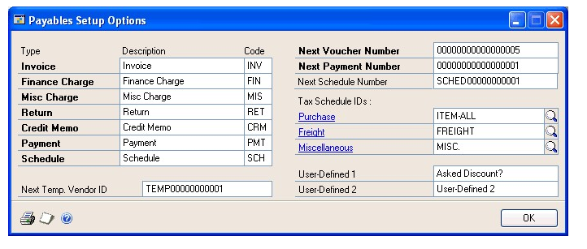

2. Specify default transaction descriptions and codes. The transaction description is displayed on reports. Use the transaction code when there isn’t room for the entire transaction description on reports or in windows.

3. Enter a next temporary vendor ID. A temporary vendor is a vendor with whom you have a short-term relationship, and for whom you’re keeping minimal information. Use this number to identify a temporary vendor record when you enter transactions. For more information about temporary vendors, see *Vendor status*.

3. Enter a next voucher number and next payment number to use in transaction entry windows.

4. Enter default tax schedules for purchases, freight, and miscellaneous charges. These tax schedules appear in the Payables Transaction Entry window, and you can change them per transaction. See the System Setup instructions (Help \>\> Contents \>\> select Setting Up the System) for more information about setting up tax schedules.

5. Enter user-defined field labels for tracking additional information for vendors.

    For example, suppose you keep track of the types of vendors you purchase from. You might enter Vendor Type in the User-Defined 1 field. In the Vendor Class Setup window and the Vendor Maintenance Options window, you then would see Vendor Type as a label for the field that was User-Defined 1. You also would see Vendor Type as a sorting method on most vendor reports.

    Use the User-Defined 2 field to track an additional piece of information for each vendor; however, this field isn’t a sorting method for reports.

6. Choose OK to return to the Payables Management Setup window, where you can save the entries.

### Chapter 2: Vendor classes

Use vendor classes to group vendors according to common entries. For example, you might group vendors by business type, location, or other similar characteristics.

When you make changes to vendor class information, you can roll down those changes to all the vendors in the class.

Vendor class information is divided into the following sections:

- *History options*

- *Setting up vendor classes*

- *Setting up vendor class default posting accounts*

- *Entering vendor class Intrastat statistics*

#### History options

You can mark whether to keep fiscal-year, calendar-year, transaction, and distribution history when you set up vendor classes. You can mark any number of these options.

The following table describes each of the history options:

| **History types** | **What’s kept**       | **Benefits of keeping**    | **More information**        |
|-------------------|-----------------------|----------------------------|-----------------------------|
| Calendar-year     | Summarized history of posted transactions for each month in the calendar year.    | You can print reports that accurately reflect purchasing activity each month. Use the resulting reports to determine whether you’re meeting budget goals.                                         | If you’re required to print 1099 statements for vendors, you should keep calendar year history so 1099 amounts are tracked accurately.                                   |
| Fiscal-year       | Summarized history of posted transactions for each fiscal period.                 | You can print reports that accurately reflect purchasing activity in each fiscal period. Use the resulting reports to determine whether you’re meeting budget goals.                              | If your fiscal year is the same as the calendar year, you don’t need to keep both fiscal-year and calendar-year history.                                                 |
| Transaction       | Detailed information about paid vouchers.                                         | You can print history reports and view information about paid vouchers using inquiry windows. You also can print the Historical Aged Trial Balance and re-create remittance forms and check stubs. | If you marked to print the Historical Aged Trial Balance in the Payables Management Setup window, transaction history is kept regardless of whether you mark this option. |
| Distribution      | Detailed information about the posting account distributions for each transaction. | You can print Distribution History and Check Distribution reports.   |    |

#### Setting up vendor classes

Vendor classes provide defaults for the data that groups of vendors use. You also can make changes to groups of vendors quickly by changing the class record and rolling down the change to all the vendors in a class. Use the Vendor Class Setup window to set up vendor classes to group vendors. By setting up vendor classes, you can easily assign new vendors to specific classes, making it faster and easier to set up a new vendor record.

**To set up a vendor class:**

1. Open the Vendor Class Setup window.
(Purchasing \>\> Setup \>\> Vendor Class)

    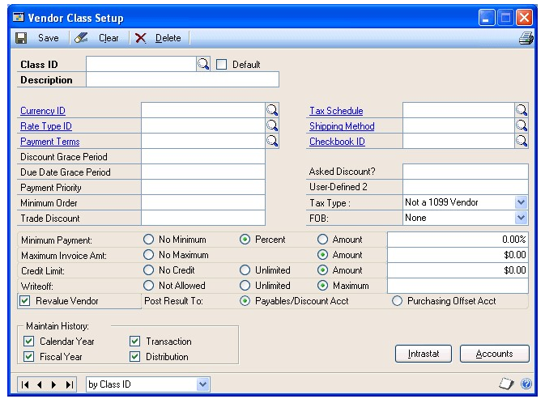

2. Enter an ID for the class, and enter a description that further identifies the class.

    We recommend that you enter the class with the most common entries first and mark this class as the default class. If you mark the Default option, the information you set for this class appears as the default for every subsequent class you create. You can have only one default vendor class.

3. Enter multicurrency information. Enter or select an existing currency as the default currency for the class. See the Multicurrency Management documentation for more information about currencies and rate types.

    Enter or select an existing rate type for the class. When you enter transactions, the appropriate exchange rate table is selected based on the currency ID and rate type you entered.

    If a rate type isn’t assigned to a vendor on a multicurrency transaction, the default rate type you entered for the Purchasing series using the Multicurrency Setup window appears instead. Therefore, be sure you entered a Purchasing series default rate type.

4. Enter document and payment specifications. See the help for more information about fields.

5. Mark any or all the available history options.

    See *Setting up vendor class default posting accounts* for more information about setting up default posting accounts, so you can assign default posting accounts to the class.

6. Choose Save. To print a Classes Setup List, choose File \>\> Print.

#### Setting up vendor class default posting accounts

Use the Vendor Class Accounts Setup window to specify posting accounts for vendor classes. You can set up posting accounts for each class, so each vendor you enter can use different posting accounts according to your needs. When you set up vendor records, use these accounts as default entries and change the accounts as needed on a per-vendor basis.

You can use the Additional Vendor Accounts window to set up additional purchase accounts to use during transaction entry when you distribute amounts to posting accounts.

For example, assume you have two employees working in separate departments who both purchase office supplies from the same vendor, and the vendor sends you one invoice for both purchases. By assigning different accounts for each employee’s department, you can track the expenses by department.

**To set up vendor class default posting accounts:**

1. Open the Vendor Class Accounts Setup window. 
(Purchasing \>\> Setup \>\> Vendor Class \>\> Accounts button)

    

2. Mark whether to use the Cash account from the checkbook or vendor.

    > [!NOTE]
    > If you’re using Bank Reconciliation, we recommend that you use the Cash account from the checkbook so you can easily reconcile the checkbook balance to the Cash account in General Ledger.

3. Enter or select the default posting accounts, which will appear as defaults in the Vendor Account Maintenance window when you’re setting up vendor records.

4. To open the Additional Vendor Accounts window, choose the Purchases field ellipses button.

5. Enter the additional purchase accounts to use for this class.

    To remove an account, select the row to delete and choose Edit \>\> Delete Row.

6. Select default purchase accounts. During transaction entry, each account you marked to appear as a default for transactions is displayed in the Payables Transaction Entry Distribution window. You also can view a list of purchasing accounts using the Accounts lookup window during transaction entry.

7. Choose OK to save the accounts and close the Additional Vendor Accounts window.

8. Choose OK to save the vendor accounts and close the Vendor Class Account Setup window.

#### Entering vendor class Intrastat statistics

Use the Vendor Class Intrastat Setup window to enter Intrastat information for a vendor class. You can roll down changes you make using this window to all vendors in the class.

If you set up Intrastat information for vendors, you don’t need to enter Intrastat information for individual transactions. However, you can change the information for a particular transaction using the Payables Intrastat Entry window.

*You can enter Intrastat statistics only if you marked to enable Intrastat tracking in the Company Setup Options window.*

**To enter vendor class Intrastat statistics:**

1. Open the Vendor Class Intrastat Setup window. 
(Purchasing \>\> Setup \>\> Vendor Class \>\> Intrastat button)

2. Enter or select country, transport mode, transaction nature, incoterms, procedure/regime, port, region, country of origin and tax commodity codes for the vendor class.

3. Enter a description for the vendor class. Choose OK to close the Vendor Class Intrastat Setup window.

4. In the Vendor Class Setup window, choose Save to save the changes.

> [!NOTE]
> Deleting the vendor class deletes Intrastat information, as well.

### Chapter 3: Vendor cards

The foundation of the Payables Management module is the collection of vendor cards. Use this information to track the status of vendors and to print reports. It’s important to keep this information up to date to reflect your company’s current activity.

You might be able to import the vendor records from your current system directly into Microsoft Dynamics GP. Automatically importing the vendor data saves you a considerable amount of time. Contact your reseller for more information.

Vendor card information includes the following sections:

- *Vendor status*

- *Vendor approval workflow*

- *Adding vendor cards*

- *Setting up vendor default posting accounts*

- *Setting up e-mail options for a vendor*

- *Setting up e-mail options for a group of vendors*

- *Setting up vendor withholding options*

- *Address IDs and taxes*

- *Entering vendor addresses*

- *Setting up 1099 information*

- *Entering vendor Intrastat statistics*

#### Vendor status

Vendor statuses can be used for categorizing your vendors according to their business practices. Vendors can be active, inactive and temporary. Each of these statuses can be used to limit the data that can be entered or posted and places restrictions on deleting or modifying a vendor card. You can select the vendor status in the Vendor Maintenance window.

| **Status**        | **Active**    | **Inactive**   | **Temporary** |
|-------------------|---------------|----------------|---------------|
| Definition        | An active vendor is a person or company you have a long-term relationship with and for whom you need to keep detailed information.  | An inactive vendor is a person or company you don’t do business with anymore; typically these are vendors whose records you can’t delete because historical information is kept for them. | A temporary vendor is a person or company you have a short-term relationship with and are keeping minimal information for. You can change a temporary vendor to an active vendor or an inactive vendor.                      |
| Transaction Entry | You can enter, save and post transactions and payments and print checks.  | You can’t save or post transactions and payments, or print checks.  | You can enter, save and post transactions and payments and print checks. You can void vouchers or checks as long as the temporary vendors have not been deleted.     |
| Deletion          | You can delete an active vendor record if the vendor has no current balance, no 1099 balance, no transaction or payment history and/or no open purchase orders. | You can delete an inactive vendor record if the vendor has no transaction or payment history, and no 1099 balance.  | You can delete a temporary vendor record if the vendor has no current balance, no 1099 balance, and no open purchase orders in Purchase Order Processing. This vendor type can have records in history, and still be deleted. |

Making a vendor inactive isn’t the same thing as placing a vendor on hold. You might find it helpful to think of inactivating a vendor record as a permanent change that reflects you no longer do business together, while placing a vendor on hold usually is a temporary change to the vendor’s status. If you inactivate a vendor record, you can’t enter transactions of any kind for the vendor. If you place the vendor on hold, you can’t make payments to the vendor, but you still can apply vouchers and post transactions for the vendor. For more information about vendor holds, see *Placing or removing a vendor hold*.

#### Vendor approval workflow

Your company can use the vendor approval workflow feature as part of its business controls. If you use this feature, you can define an approval process for new vendor records or modifications to an existing vendor record.

When a vendor record is ready to be approved, approvers can be notified and the vendor records can be approved, using Microsoft Outlook, Microsoft Dynamics GP, or SharePoint®. After a vendor has been approved, you can perform the following tasks for the vendor.

- Post payables transactions

- Select vendors and vouchers for payment

- Print checks

- Post manual payments

- Post scheduled payments

- Print 1099 statements

- Apply documents

- Print purchase orders

- Post Purchase Order Processing invoices

For more information about Workflow, see the System Setup Guide (Help \>\> Printable Manuals \>\> select System \>\> select System Setup Guide) or the Workflow Administrator’s Guide (Help \>\> Printable Manuals \>\> select System \>\> select Workflow Administrator’s Guide).

#### Adding vendor cards

Use the Vendor Maintenance window to create new vendor cards. Before you begin entering the first vendors, consider how to arrange the current and future vendor records. You might want to assign specified groups of IDs to different types of vendors. You also might want to assign them to different vendor classes.

Once you decide the most appropriate numbering system, be sure that all the IDs have the same number of characters. Use the system consistently for the best results when printing reports and using other windows.

**To add a vendor card:**

1. Open the Vendor Maintenance window. 
(Purchasing \>\> Cards \>\> Vendor)

    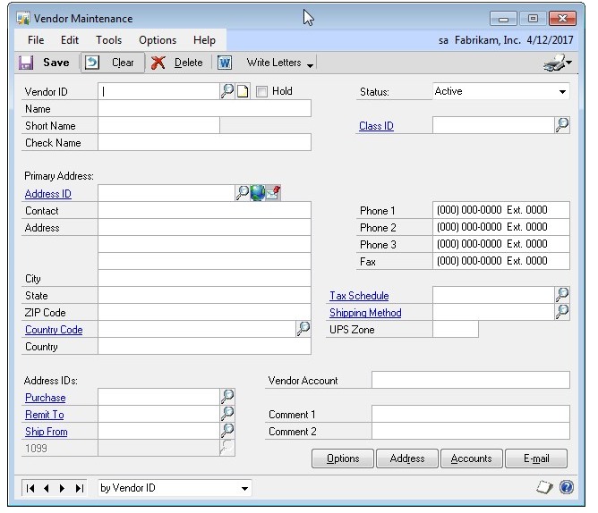

    Some fields in the window will have default values. Some default values are the same for all vendor information, but others come from the vendor class information entered in the Vendor Class Setup window and the Vendor Class Accounts Setup window. Refer to the table for more information.

    | **Selection**       | **Default**          |
    |---------------------|----------------------|
    | Status              | Active               |
    | Tax Type            | Not a 1099 Vendor    |
    | Minimum Payment     | No Minimum           |
    | Maximum Invoice Amt | No Maximum           |
    | Credit Limit        | Unlimited            |
    | Writeoffs           | Not Allowed          |
    | Maintain History    | All types are marked |

2. Enter a vendor ID and name information. The short name can be used in circumstances when the vendor name is too long. The check name is the name that is printed on checks.

    Vendor statuses can be used for categorizing your vendors according to their business practices. Vendors can be active, inactive and temporary. Each of these statuses can be used to limit the data that can be entered or posted and places restrictions on deleting or modifying a vendor card. See *Placing or removing a vendor hold* for information about vendor holds.

3. Assign the vendor to a class. Once a class ID is entered, much of the information in this window, the Vendor Maintenance Options window and Vendor Account Maintenance windows will appear as default values, which can be changed on a per-vendor basis.

4. Enter address information. A primary address ID is required if you enter any address information in this window. (Address information can also be entered and maintained in the Vendor Address Maintenance window. See *Entering vendor addresses* for more information.) Internet address information can also be entered by choosing the Internet Information button. To send purchase orders and vendor remittances in e-mail, use the Internet Information window to enter To, Cc, and Bcc e-mail addresses

5. Enter phone and fax numbers.

6. Enter a tax schedule, shipping method and UPS Zone, if you didn’t enter a class ID for this vendor card, or to change the class defaults.

7. Enter address IDs for purchases, remitting to, shipping from, and sending 1099 statements for this vendor, if the vendor has different addresses for multiple purposes.

8. Enter the vendor account number the vendor has assigned to you.

9. Enter comments. Comments are for your reference and will appear on the Vendor Setup List.

10. Choose Options to open the Vendor Maintenance Options window.

    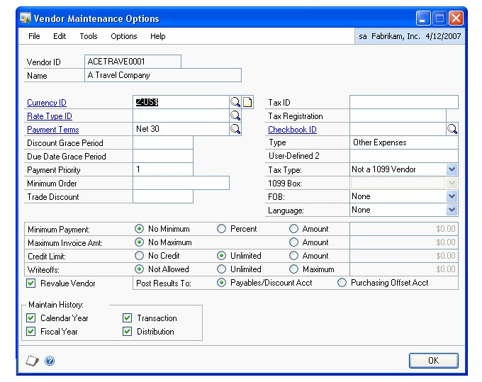

11. Enter vendor options or change vendor options from those that are provided as default values from the class. When you’re satisfied with the entries, choose OK.

    > [!NOTE]
    > If you marked to print either the Historical Aged Trial Balance in the Payables Management Setup window or to reprint posting journals in the Audit Trail Codes Setup window, the system keeps history to print those reports even if you didn’t mark to keep transaction history or distribution history for vendors. If you didn’t select these options, the history selections you make for individual vendors are used.

12. If your business requires it, you can use the Vendor Withholding Options window to set up automatic withhold a portion of payments to forward to the appropriate taxing authority. See *Setting up vendor withholding options* for more information.

13. Choose the Attachment Management icon to attach documents to the vendor record, if applicable.

14. In the Vendor Maintenance window, save the vendor record or submit the vendor record for approval, if you are using vendor approval workflow.

To print a Vendor Setup List, choose File \>\> Print.

#### Setting up vendor default posting accounts

Use the Vendor Account Maintenance window to change the accounts for a single vendor. You can set up posting accounts on a per-vendor basis so each transaction you enter can use different posting accounts according to your needs. When you enter transactions, amounts are distributed to the accounts you assign to the vendor using this window.

If you don’t enter default posting accounts for a vendor, the accounts you set up using the Posting Accounts Setup window are used for all transactions entered for the vendor. However, you can change distributions during transaction entry.

You can use the Additional Vendor Accounts window to set up additional purchase accounts to use during transaction entry when you distribute amounts to posting accounts.

For example, assume that you have two employees working in separate departments. These employees both purchase office supplies from the same vendor, and the vendor sends you one invoice for both purchases. By assigning different accounts for each employee’s department, you can track the expenses by department.

If you entered a class ID for this vendor, the posting accounts you entered using the Vendor Class Accounts Setup window appear as default values in the Vendor Account Maintenance window.

**To set up vendor default posting accounts:**

1. Open the Vendor Account Maintenance window. 
(Purchasing \>\> Cards \>\> Vendor \>\> Accounts)

    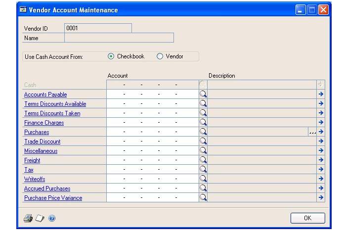

2. Mark whether to use the Cash account from the checkbook or vendor.

    > [!NOTE]
    > If you’re using Bank Reconciliation, we recommend that you use the Cash account from the checkbook so you can easily reconcile the checkbook balance to the Cash account in General Ledger.

3. Enter or change the default posting accounts.

4. Choose the Purchases ellipses button to open the Additional Vendor Accounts window.

5. Enter the additional purchase accounts to use for this vendor.

6. Select default purchase accounts. During transaction entry, each account you marked to appear as the default value for transactions appears in the Payables Transaction Entry Distribution window.

You also can view a list of purchasing accounts using the Accounts lookup window during transaction entry.

7. Choose OK to close the Additional Vendor Accounts window.

8. Choose OK to save and close the Vendor Account Maintenance window.

#### Setting up e-mail options for a vendor

Use the Vendor E-Mail Options window to select which documents you want to send to the vendor. You also can specify message IDs and the document format to use for the vendor. A message ID is a predefined message that you can assign to a document that you want to send in e-mail. For example, you can send a holiday greeting message to a vendor.

You can either send documents as attachments or embed documents in the message body. If you send documents as attachments, you can select to send multiple attachments to the vendor and set the maximum file size of the document.

The options available in this window depend on the selections you made in the Company Setup window and the Purchasing E-mail Setup window. See your System Setup Guide (Help \>\> Contents \>\> select Setting up the System) for more information.

**To set up e-mail options for a vendor:**

1. Open the Vendor E-mail Options window.
    (Purchasing \>\> Cards \>\> Vendor \>\> Select a vendor ID \>\> E-mail)

    

2. Select to send documents as attachments or embed documents in the message body. The options available depend on the selections in the Company E-mail Setup window.

3. If you are sending documents as attachments, you can mark to send multiple attachments for documents of the same document type with the same subject, message body, address to send replies to, To, Cc, and Bcc address in one e-mail.

4. If you are sending documents as attachments, you can mark to set a maximum file size limit for attached documents sent to the vendors, and then enter the file size limit. If this field is unmarked, there isn’t a size limit.

5. Mark the documents you want to send in e-mail. You can select a default message ID for each document and select the format to send the document.

    - If a document is unmarked, it can’t be sent in e-mail. The documents available to send depend on the documents selected in the Purchasing E-Mail Setup window.

    - If you didn’t select a message ID for the document type in the Purchasing E-mail Setup window, the Message ID field is blank. You can enter or select a message ID.

    - The file formats available to send attachments depend on the formats you selected in the Company E-mail Setup window.

Before you can send documents as DOCX, PDF, or XPS attachments, the Word template for the document must be enabled in the Template Configuration Manager window. Standard reports (reports generated by the Report Writer engine) are sent when you send documents as HTML attachments.

6. Choose OK to update the selected vendor with the options you entered.

#### Setting up e-mail options for a group of vendors

Use the Mass Vendor E-Mail Settings window to assign e-mail settings to multiple vendor records. You can select which documents you want to send to the vendors. You also can specify message IDs and the document format to use for the vendors. A message ID is a predefined message that you can assign to a document that you want to send in e-mail. For example, you can send a promotional message to your vendors when sending purchase orders in e-mail.

You can either send documents as attachments or embed documents in the message body. If you send documents as attachments, you can select to send multiple attachments to the customers and set the maximum file size of the document.

You can either send documents as attachments or embed documents in the message body. If you send documents as attachments, you can select to send multiple attachments to the vendors and set the maximum file size of the document.

**To set up e-mail options for a group of vendors:**

1. In the navigation pane, choose the Purchasing button, and then choose the Vendors list.

2. Mark the vendors that you want to set up e-mail options for.

3. In the Modify group, click the overflow menu and then select E-mail Settings to open the Mass Vendor E-mail Settings window.

    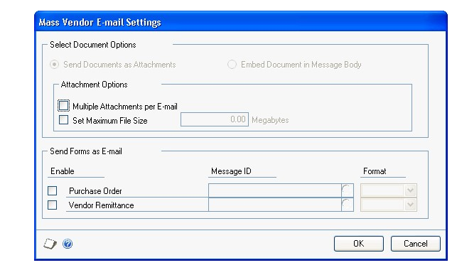

4. Select to send documents as attachments or embed documents in the body of e-mail messages.

5. If you are attaching documents, you can select to attach multiple documents per e-mail and set a maximum file size for the documents.

6. Mark the documents you want to send in e-mail. You can select a default message ID for each document and then select the format that you want to send the document in.

    - If a document is unmarked, it can’t be sent in e-mail. The documents available to send depend on the documents selected in the Purchasing E-Mail Setup window.

    - If you didn’t select a message ID for the document type in the Purchasing E-mail Setup window, this field is blank.

    - The file formats available to send attachments depend on the formats you selected in the Company E-mail Setup window.

    Before you can send documents as DOCX, PDF, or XPS attachments, the Word template for the document must be enabled in the Template Configuration Manager window. Standard reports (reports generated by the Report Writer engine) are sent when you send documents as HTML attachments.

7. Choose OK to save your entries and to close the Mass Vendor E-mail Settings window.

#### Setting up vendor withholding options

Use the Vendor Withholding Options window to specify tax withholding for a vendor.

In Australia, withholding is a way of paying taxes for people who earn money under contract by providing architectural, building and construction, cleaning, engineering, motor vehicle repair, and other services. If a vendor is subject to withholding taxes, you must set up withholding options for this vendor.

In North America, vendor withholding can be used to automatically withhold a portion of the amount you pay to a vendor to help both your business and your vendor’s business comply with applicable tax laws. Vendor withholding in North America is optional.

Before you enter withholding options, you must enter your company’s withholding rate, withholding vendor ID, and withholding file/reconciliation number information using the Company Setup Options window. Refer to the documentation for the Company Setup Options window for more information.

See the GST and Australian Taxes documentation for more information about setting up Australian taxes.

**To set up vendor withholding options:**

1. Open the Vendor Withholding Options window. 
(Purchasing \>\> Cards \>\> Vendor \>\> Withholding button)

    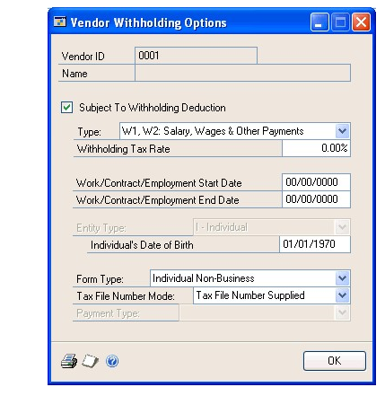

2. Mark Subject To Withholding Deduction.

3. Select a withholding type.

4. Enter the vendor’s tax rate.

    > [!NOTE]
    > If the variance certificate or the deduction certificate expires and the new expiration date isn’t entered, the standard rate entered in the Company Setup Options window calculates the tax until a new variance or deduction certificate number is entered.

5. Enter the starting and ending dates for the period the payee worked during.

6. Select the type of business the vendor is part of.

7. Enter the payee’s date of birth. This field is available only if you selected Individual as the entity type.

8. Select the type of withholding form the payee must complete for the Australian Taxation Office (ATO).

9. Select the status of the Tax File Number (TFN) for the payee.

10. Select the type of income being reported on the payment summary. Some options will be available based on other selections you made in this window.

11. Choose OK to save the information and close the window.

#### Address IDs and taxes

Calculation of sales taxes depends on the address ID and shipping method specified for a transaction, along with the tax schedule assigned to the transaction. If the shipping method requires you to pick up the merchandise, the tax schedule assigned to the vendor’s address ID is used. If the shipping method requires the vendor to deliver the merchandise, the tax schedule from your company is used.

#### Entering vendor addresses

Use the Vendor Address Maintenance window to enter multiple address IDs for an individual vendor.

**To enter a vendor address:**

1. Open the Vendor Address Maintenance window. 
(Purchasing \>\> Cards \>\> Addresses)

2. Enter or select a vendor ID.

If you are using vendor approval workflow, the vendor must have the workflow status of Approved or No Approval Needed before you can enter or select a vendor ID. You can enter or select a vendor that is pending approval if you can approve vendor records.

3. Enter an address ID that appropriately names the address, such as Main, Shipping, or Billing.

Enter Internet address information, such as an e-mail address, web page URLs, or FTP sites, by choosing the Internet Information button in the Address ID field. To send purchase orders and vendor remittances in e-mail, use the Internet Information window to enter To, Cc, and Bcc e-mail addresses. See the System Setup instructions (Help \>\> Contents \>\> select Setting Up the System) for more information.

4. Enter address, phone, and fax information.

#### Setting up 1099 information

Use the 1099 Setup window to specify the 1099 statement box descriptions and the minimum amounts to track for each box and for each type of 1099 statement your business prints.

**To set up 1099 information:**

1. Open the 1099 Setup window. 
(Purchasing \>\> Setup \>\> Payables \>\> 1099 Setup button)

    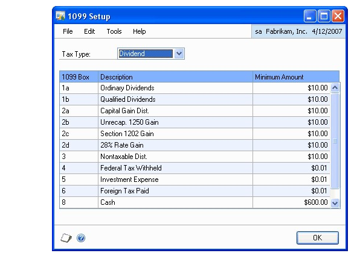

2. Select a tax type to enter information for a specific 1099 statement: Dividend, Miscellaneous, and Interest.

3. Enter box descriptions and minimum amounts, as needed, for each box for the tax type you’re setting up.

4. Choose OK to save changes and return to the Payables Management Setup window.

5. Enter or select a tax schedule, shipping method, and UPS zone for the address.

6. Choose Save to add the address ID. To print a Vendor Addresses List, choose File \>\> Print.

#### Entering vendor Intrastat statistics

Use the Vendor Intrastat Setup window to enter a vendor’s tax registration number. If Intrastat information was entered for the vendor class and rolled down, that information appears in this window. Use the Vendor Intrastat Setup window to change Intrastat information for an individual vendor or to enter Intrastat information if none was entered for the vendor class.

*You can enter Intrastat statistics only if you marked to enable Intrastat tracking in the Company Setup Options window.*

**To enter vendor Intrastat statistics:**

1. Open the Vendor Intrastat Setup window. 
(Purchasing \>\> Cards \>\> Addresses \>\> Intrastat button)

2. Enter the tax registration number.

3. Enter or select country, transport mode, transaction nature, incoterms, procedure/regime, port, region, country of origin and tax commodity codes for the vendor class.

4. Choose OK to close the Vendor Intrastat Setup window.

5. In the Vendor Address Maintenance window, choose Save to save the information.

> [!NOTE]
> Deleting the vendor address ID also deletes Intrastat information.

### Chapter 4: Beginning balances and vendor history

If you’re setting up Payables Management for the first time, you must enter the beginning, or outstanding, balances owed to each vendor.

Entering vendor history gives you the historical background you need to use reports and windows to compare amounts for previous years with the current year. See *Chapter 17, “Utilities,”* for information about removing historical information.

*Enter beginning balances before entering vendor history so amounts aren’t posted twice.*

Beginning balance and history information is described in the following sections:

- *Entering beginning balances*

- *Entering vendor credit summary history*

- *Entering vendor period summary history*

- *Entering vendor yearly summary history*

#### Entering beginning balances

Enter beginning balances for each outstanding transaction for each vendor or enter beginning balances as one summarized transaction total for each vendor. To enter beginning balances as a summarized total, be sure to include the payments you made, along with the outstanding vouchers you owe when you calculate the beginning balance total for each vendor. This ensures the beginning balance total is correct for each vendor.

*We recommend that you enter each outstanding transaction for each vendor and that you create batches instead of using transaction-level posting. You can then print edit lists to verify the entries before posting.*

**To enter beginning balances:**

1. Open the Posting Setup window. 
(Administration \>\> Setup \>\> Posting \>\> Posting)

    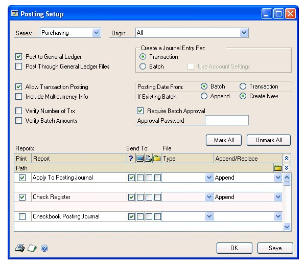

2. Choose Purchasing as the series and Payables Trx Entry as the origin. Unmark Post to General Ledger if General Ledger is part of your system. Change the origin to Payment Entry and unmark the option again.

This ensures that the beginning balance transactions you’re entering in Payables Management won’t affect General Ledger account balances. The accounts in General Ledger might be overstated if you don’t unmark this posting option before completing this procedure.

3. Open the Payables Batch Entry window. (Purchasing \>\> Transactions \>\> Batches)

Create a single-use batch (typically called BBAL) for the beginning balances. Select Payables Trx Entry as the batch origin for transactions or select Manual Payment as the batch entry for payments.

4. Choose Transactions to open the Payables Transaction Entry window or the Payables Manual Payment Entry window—depending on the batch origin— where you can enter transaction information.

5. Enter beginning balance transactions. The actual balances are entered by entering transactions.

Depending on the information you keep for vendors and records, you enter different information.

| **If you plan to keep**        | **What you’ll enter**                                                                                                          |
|--------------------------------|--------------------------------------------------------------------------------------------------------------------------------|
| Transaction history in detail  | Enter each transaction and payment as a separate entry.                                                                       |
| Transaction history in summary | Enter one transaction for the entire amount due for each period or month. Enter one lump sum payment for each period or month. |
| Beginning balances only        | Enter the outstanding transactions and payments as separate entries.                                                          |

See *Chapter 8, “Transactions,”* for more information.

6. Print an Aged Trial Balance as a record of the beginning balances. It shows the number of days transactions are outstanding, and any valid discount amounts already paid on invoices. See *Chapter 16, “Reports,”* for more information about printing reports.

7. After entering and posting the beginning balances for the vendors, return to the Posting Setup window. Mark Post to General Ledger Files for the Purchasing series, so regular payables transactions are posted to General Ledger.

8. Create a backup of the setup options and default values, class and vendor records, and beginning balances. If a power fluctuation or some other problem occurs, you can restore the beginning data. See the System Administrator’s Guide (Help \>\> Contents \>\> select System Administration) for more information about making backups. If you’re required by the US Internal Revenue Service to send 1099 statements to specific vendors, check the 1099 amounts in the Vendor Yearly Summary window to be sure the 1099 amount for each vendor is correct. Payables Management uses the 1099 amounts displayed in the Vendor Yearly Summary window when printing the 1099 statements.

#### Entering vendor credit summary history

Use the Vendor Credit Summary window to enter credit summary history for each vendor. The Current Balance field and the aging period information are updated as you enter and post transactions for each vendor. If you marked Age Unapplied Credit Amounts in the Payables Management Setup window, unapplied credit amounts also are included in the aging process.

If you are allowing prepayments for purchase orders, prepayments are not included in the current balance amount because a prepayment is a deferred charge and not a payment on accounts payables.

When history has been originated by entering it here or by entering transactions, the fields in these windows are updated as transactions are posted. Information is updated in the inquiry windows, as well.

If you’re using Multicurrency Management, amounts in this window are displayed in the functional currency. If transactions were entered in foreign currencies, the functional equivalents are displayed.

**To enter vendor credit summary history:**

1. Open the Vendor Credit Summary window. 
(Purchasing \>\> Cards \>\> Summary)

    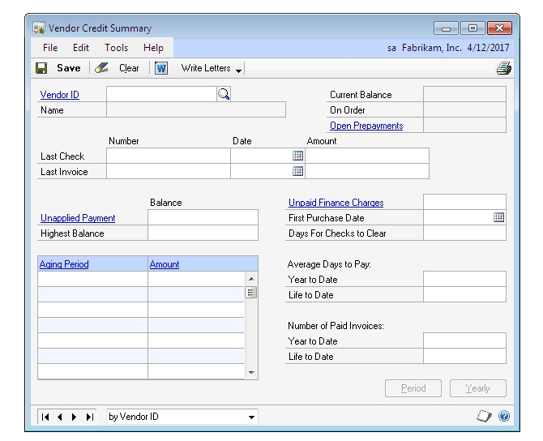

2. Enter or select a vendor ID.

3. Enter last check and last invoice information.

4. Enter the unapplied payment and highest balance amounts.

5. Enter the unpaid finance charges amount, the first purchase date, and the number of days it typically takes your company’s checks to clear from this vendor.

6. Enter the average days to pay.

7. Enter the number of paid invoices.

8. Enter other history types. See *Entering vendor period summary history* and *Entering vendor yearly summary history* for more information.

9. Choose Save. Continue entering other types of history as needed. When you enter all the history you need, you can choose File \>\> Print to print a Vendor Financial Summary Report.

#### Entering vendor period summary history

Use the Vendor Period Summary window to enter historical amounts per period— fiscal or calendar. To keep both fiscal and calendar period history if those periods are different, you must enter each type separately.

**To enter vendor period summary history:**

1. Open the Vendor Period Summary window. 
(Purchasing \>\> Cards \>\> Summary \>\> Select a vendor ID \>\> Period button)

    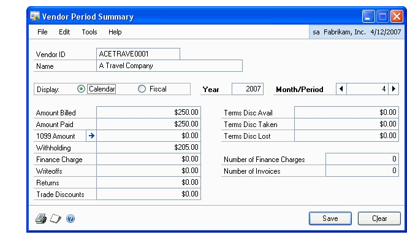

2. Mark Calendar or Fiscal, depending on the type of history you’re entering.

3. Enter a year.

4. Enter or select the number of the month or period.

5. Enter the amounts for the month or period you selected.

If you posted beginning balances for this vendor, balances might be displayed for some periods.

> [!NOTE]
> Changing the 1099 amount in this window does not affect the 1099 statement amount. To change the amounts that are printed on 1099 statements, choose the expansion button for the 1099 Amount field in the Vendor Period Summary windows to open the 1099 Details window.

6. Choose Save.

#### Entering vendor yearly summary history

Use the Vendor Yearly Summary window to enter summarized history information. Amounts might appear if you posted beginning balances for the vendor. You must select Amounts Since Last Close as the summary view to enter information in this window.

If you’re using this window to view vendor yearly summary information by fiscal or calendar year, the amounts in the Year-to-Date and Last Year columns are calculated using period detail information, based on the year you enter. The year-todate and last-year amounts for Amounts Since Last Close were determined during the most recent year-end closing process.

If you’re required by the US Internal Revenue Service to send this vendor a 1099 statement, be sure the vendor’s 1099 year-to-date amount is correct.

*Changing the 1099 amount in this window won’t affect the 1099 statement amounts. Use the 1099 Details to change amounts that appear on 1099 statements.*

**To enter vendor yearly summary history:**

1. Open the Vendor Yearly Summary window. 
(Purchasing \>\> Cards \>\> Summary \>\> Select a vendor ID \>\> Yearly button)

    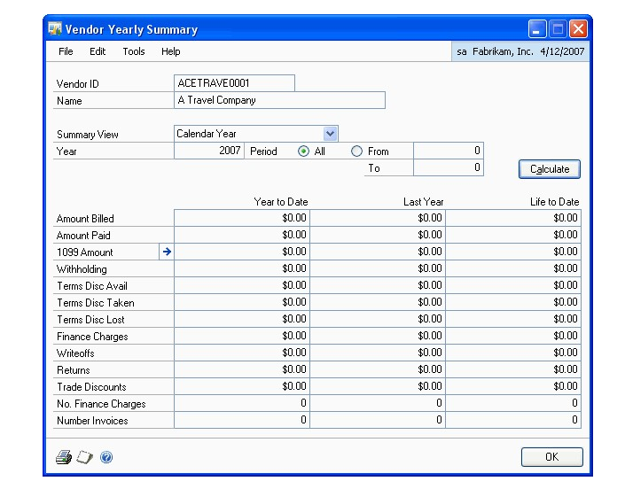

2. Select Amounts Since Last Close as the summary view, if you’re entering vendor yearly summary history.

3. Enter year-to-date, last-year, and life-to-date totals for each category.

4. Select Calendar or Fiscal for the summary view if you want to view the historical amounts per period. You can change the fiscal/calendar year and periods to view the amounts for specific time periods. Press Calculate to redisplay the amounts.

5. To print the Vendor Financial Summary Report, so you can verify the information you entered for the vendor, choose File \>\> Print. The report is printed with the information you’re currently viewing in the Vendor Yearly Summary window.

6. Choose OK.

### Chapter 5: Vendor maintenance

This part of the documentation describes the maintenance tasks you encounter when working in Microsoft Dynamics GP.

Vendor maintenance information is divided into the following sections:

- *Placing or removing a vendor hold*

- *Inactivating a vendor card*

- *Modifying a vendor card*

- *Deleting a vendor card*

- *Deleting a vendor class*

- *Deleting a vendor address*

#### Placing or removing a vendor hold

During the course of business, you might want to place a vendor record on hold. For example, if you receive the wrong merchandise from a vendor, you might not want to pay the vendor until the correct merchandise is shipped. Use the Vendor Maintenance window to put the vendor card on hold and restrict what information you can enter for the vendor, or to release the vendor hold.

When a vendor card is on hold, you can’t issue or apply payments. However, you can enter, post, and apply transactions from the vendor you placed on hold.

A password might be required to remove a hold on a vendor record.

**To place or remove a vendor hold:**

1. Open the Vendor Maintenance window. 
(Purchasing \>\> Cards \>\> Vendor)

2. Enter or select a vendor ID.

3. Mark Hold to place the vendor card on hold or unmark Hold to remove it.
    Choose Save

> [!NOTE]
> Depending on how Payables Management was set up, a password might be required to remove a hold on a vendor record.

#### Inactivating a vendor card

Use the Vendor Maintenance window to inactivate a vendor card. Inactive vendors are vendors you no longer want to have a business relationship with, but for whom you can’t delete records because historical information is being kept.

You can’t inactivate a vendor record if it has a current balance, or unposted and posted transactions. If a purchase order is assigned to a vendor record, the purchase order must be moved to history before you can inactivate the vendor record.

If the vendor card you’re inactivating has a current balance or a 1099 amount, you must wait to inactivate the card until after you close the Payables Management year. See *Chapter 18, “Routines,”* for more information about closing a year.

**To inactivate a vendor card:**

1. Open the Vendor Maintenance window. 
(Purchasing \>\> Cards \>\> Vendor)

2. Enter or select a vendor ID.

3. Select the Inactive status to inactivate the vendor. Choose Save.

#### Modifying a vendor card

Use the Vendor Maintenance window to modify a vendor card. You may have to change a vendor’s credit limit or telephone number.

If you are using vendor approval workflow, you must resubmit the vendor card for approval if you change one of the following fields.

| **Window**                                | Fields |
|-------------------------------------------|--------|
| Vendor Maintenance                        | City, State, UPS Zone, Remit to address |
| Vendor Maintenance Options                | Discount Grace Period, Due Date Grace Period, Payment Priority, Minimum Order, Trade Discount, Minimum Payment, Maximum Invoice Amount, Credit Limit, Writeoffs  |

**To modify a vendor card:**

1. Open the Vendor Maintenance window. 
(Purchasing \>\> Cards \>\> Vendor)

2. Enter or select a vendor ID.

    You can modify a vendor card that is pending approval if you are the current approver of the vendor card.

3. To make changes to the vendor card, enter the new information.

4. Save the vendor card or submit it for approval if you are using vendor approval workflow.

#### Deleting a vendor card

Use the Vendor Maintenance window to delete a vendor card, if the card is obsolete and you’re not planning to use it again in the future. You can’t delete a vendor card if it contains any of the following information:

- A current balance

- A 1099 amount for the current year (United States only)

- Unposted and posted transactions

- Transactions in history; you can delete temporary vendors even if they have transactions in history

To see whether a vendor has records in the history table, print a Payables Transaction History Report without removing historical information. If you’re keeping transaction history for the vendor, it appears on the report. You also can use the Vendor Credit Summary Inquiry window to see whether the vendor has current-year activity, and the Payables Transaction Inquiry windows to see whether you’re keeping history.

See *Chapter 17, “Utilities,”* for more information about removing history.

If history is being kept for a vendor you’re planning to delete, you must remove history before deleting the card. Or, you can change the vendor status to Temporary and delete the card, because you can delete temporary vendor cards when you’re keeping history. Deleting a vendor card for a temporary vendor does not remove historical information for that vendor.

**To delete a vendor card:**

1. Open the Vendor Maintenance window. 
(Purchasing \>\> Cards \>\> Vendor)

2. Enter or select a vendor ID.

3. Choose Delete.

To delete a vendor record with a workflow status of Pending Approval, you must be the current approver of the vendor card or you must have permission to act on the tasks of other users during the vendor approval process.

#### Deleting a vendor class

Use the Vendor Class Setup window to delete a vendor class, if the class is obsolete and you’re not planning to use it in the future.

When you delete a vendor class, the vendor cards assigned to the class aren’t affected, except that the class ID will be invalid.

You might want to print a Vendor Setup List, sorted by class, to view the vendors that will be affected by the deletion.

**To delete a vendor class:**

1. Open the Vendor Class Setup window. 
(Purchasing \>\> Setup \>\> Vendor Class)

2. Enter or select a class ID.

3. Choose Delete.

#### Deleting a vendor address

Use the Vendor Address Maintenance window to delete a vendor address, if the address is obsolete and you’re not planning to use it in the future.

You can’t delete an address ID assigned to a vendor record. To delete an assigned address ID, first clear the address ID using the Vendor Maintenance window.

**To delete a vendor class:**

1. Open the Vendor Address Maintenance window. 
(Purchasing \>\> Cards \>\> Addresses)

2. Enter or select a class ID.

3. Choose Delete.

## Part 2: Transactions

This part of the documentation includes the procedures you use to complete payables tasks in your Microsoft Dynamics GP system. Payables Management transaction information is divided into the following topics:

- *Chapter 6, “Multicurrency transactions,”* describes the effects of using Multicurrency Management with Payables Management.

- *Chapter 7, “Batches and posting,”* explains how to use batches to group purchasing documents for posting.

- *Chapter 8, “Transactions,”* explains how to enter invoices, credit memos, returns, finance charges, and miscellaneous charges in Payables Management.

- *Chapter 9, “Transaction maintenance,”* explains how to correct, delete, or void transactions, or place them on hold.

- *Chapter 10, “Payments,”* describes the different ways to pay vendors.

- *Chapter 11, “Scheduled payments,”* describes how to create, edit, and post payment schedules.

- *Chapter 12, “Applying,”* contains information about assigning specific amounts to pay all or part of a transaction.

- *Chapter 13, “Customer/vendor consolidations,”* includes information on creating customer/vendor relationships and consolidations documents.

- *Chapter 14, “Multicurrency applying,”* contains information specific to applying and unapplying multicurrency transactions.

### Chapter 6: Multicurrency transactions

If you’re using Multicurrency Management with Payables Management, you can choose the currency to enter on transactions.

This information is divided into the following sections:

- *Exchange rate and document date*

- *Multicurrency account distributions*

#### Exchange rate and document date

If a transaction’s currency ID is not in the functional currency, a rate type and associated exchange rate table are assigned to the transaction. The rate type is based on the rate type you assigned to the selected vendor. If a rate type isn’t assigned to the vendor record, the default rate type for the Purchasing series, which you specified using the Multicurrency Setup window, is used. You also can choose the Currency field expansion button to open the Exchange Rate Entry window, where you can view or modify the default exchange rate.

The document date assigned to a transaction determines the exchange rate to use, based on the currency ID and associated rate type entered for the transaction. Each time you change the document date on a multicurrency transaction, the system searches for a valid exchange rate. If a valid rate doesn’t exist, you can enter an exchange rate using the Exchange Rate Entry window. If you entered a General Ledger posting date that’s different from the document date, the exchange rate expiration date must be after the posting date.

#### Multicurrency account distributions

For multicurrency transactions, distribution amounts are displayed in both the functional and originating currencies. However, you can change only the originating amounts.

When you enter a multicurrency transaction, the originating debit and credit amounts must balance. If the functional equivalents don’t balance, the difference is posted to a Rounding Difference account. A distribution type of Round identifies the distribution amount in the Purchasing Distribution Entry window.

For example, assume that you’ve entered a transaction in the euro currency with a payment amount of 28,755.42 EUR, a trade discount of 586.84 EUR, and a discount available of 1544.33 EUR, when the exchange rate is 1.0922. The distributions are calculated as shown in the following table:

| **Account**    | **Euro debit** | **Euro credit** | **US dollars debit** | **US dollars credit** |
|----------------|----------------|-----------------|----------------------|-----------------------|
| Accounts       | 28,755.42 EUR  |                 | \$31,406.67          |                       |
| Receivable     |                |                 |                      |                       |
| Trade Discount | 586.84 EUR     |                 | \$640.95             |                       |
| Discounts      | 1544.33 EUR    |                 | \$1686.72            |                       |
| Available      |                |                 |                      |                       |
| Accrued        |                | 30,886.59 EUR   |                      | \$33,734.33           |
| Purchases      |                |                 |                      |                       |
| Totals         | 30,886.59 EUR  | 30,886.59 EUR   | \$33,734.34          | \$33,734.33           |
| Rounding Diff  |                |                 |                      | \$0.01                |
| Totals         | 30,886.59 EUR  | 30,886.59 EUR   | \$33,734.34          | \$33,734.34           |

### Chapter 7: Batches and posting

Batches are groups of transactions, identified by a name or a number, that you can use for identification purposes, and to make the posting process easier. You can use batches to group similar transactions during data entry and review them before posting at a later time. You can identify batches as a group of transactions entered by a specific employee or on a particular date.

Posting reports will be printed when you post transactions, either individually or in batches. For more information about posting reports for Payables Management, refer to *Payables Management standard report summary*.

If you are using vendor approval workflow, you can post transactions in a batch only if the vendors assigned to the transactions have the workflow status of Approved or No Approval Needed. If you post a batch and a vendor isn’t approved, transactions for that vendor aren’t posted and remain in the batch. For more information about vendor approval workflow, see *Vendor approval workflow* .

Batch information is broken into the following sections:

- *Creating a batch*

- *Payables batch approval workflow*

- *Modifying or deleting a batch*

- *Posting a batch*

- *Posting batches by series*

#### Creating a batch

Use the Payables Batch Entry window to create a batch, or group, of transactions. You can create batches that you use just one time, or
recurring batches for transactions you enter on a regular basis.

**To create a batch:**

1. Open the Payables Batch Entry window. 
(Purchasing \>\> Transactions \>\> Batches)

2. Enter or select a batch ID.

3. Select the batch origin. The origin identifies the window that transactions for this batch will be entered in. Since batches can use only one origin, you can have several batches with the same name, but different origins.

4. Enter a batch comment.

5. If you are creating a computer check batch for purchase order prepayments, mark Purchasing Prepayment Batch.

    This option is available if you have marked the Allow Purchase Order Prepayments option in the Purchase Order Processing Setup window.

6. Select a frequency if the origin is Payables Transaction Entry. Select Single Use for batches you enter and post only once.

    If this batch is a recurring batch, select the frequency to repost the transactions.

7. Enter the number of times to repeat posting in the Recurring Posting field.

    Leave the Recurring Posting field as zero for an unlimited number of postings. The batch must be posted at the interval you select, but you don’t need to reenter the transactions in the batch.

    If you select Miscellaneous as the frequency, enter the number of days for the posting date to increment.

    If you’re using Multicurrency Management and you’re planning to enter transactions involving multiple currencies, select single-use. Multicurrency batches must be single-use because exchange rates for document dates can’t be predicted.

8. Enter a posting date. The user date is the default posting date, but you can change it to post the batch as of a different date.

    The posting date entered here is the date General Ledger files are updated. Payables Management records are updated according to the date entered in the Payables Transaction Entry window.

9. Enter or select a checkbook ID.

10. Enter currency information, if the origin is Computer Check (otherwise, these fields are unavailable). Enter a check date to appear on checks in this batch. The check date also determines the exchange rate to use for checks in this batch.

    Enter a currency ID; all computer checks in this batch must use the same currency ID and have the same check date.

11. Enter any requirements for posting the batch, such as batch totals.

12. To print a batch edit list, choose File \>\> Print. Choose Save.

[!NOTE]
You may receive an error message "The fiscal period that contains this posting date has not been set up" when you create a credit card payment in a computer check batch.
What can cause this error is the following: 
1. You have a computer check set to have posting date from the transaction or
2. You do not have EFT for payables registered under Tools | Setup | System | Registration

If you enable EFT for payables, then a new field will appear in the print payment window that allows you to set the value and you can post without issue.  The other workaround is to set the posting date from the batch so you can see the posting date in the batch window.

#### Payables batch approval workflow

If your company uses the Workflow feature among its business controls, batches might have to be approved before posting. The rules for approving batches can be defined to fit your organization’s needs. Multiple approvers might be required, or approval might not be required for batches with few transactions or small currency amounts. When a batch is ready to be approved, approvers can be notified and the batches can be approved, using Microsoft Outlook or Microsoft Dynamics GP. After a batch is approved, it can be posted.

Before you can use the batch approval workflow for Payables Management, you must turn off the Require Batch Approval feature in Microsoft Dynamics GP. To do so, open the Posting Setup window (Administration \>\> Setup \>\> Posting \>\> Posting) and select the Purchasing series. Unmark the Require Batch Approval option for batches whose origin is General Entry and Clearing Entry.

#### Modifying or deleting a batch

Use the Payables Batch Entry window to correct or delete a batch. You can change or delete unposted batches at any time. Recurring batches are deleted after the batch has been posted the number of times you specify in the Recurring Posting field.

See *Correcting or deleting an unposted transaction* for information about changing the transactions in a batch.

**To modify or delete a batch:**

1. Open the Payables Batch Entry window. 
(Purchasing \>\> Transactions \>\> Batches)

2. To correct the batch, replace the incorrect information with correct information. Choose Save to save the changes or submit the batch to workflow. If you use workflow and you change a transaction, you must resubmit the batch to workflow.

3. To delete the batch, choose Delete and close the window.

**To modify a batch using the action pane:**

1. In the navigation pane, choose the Purchasing button, then choose the Payables Batches list.

2. Select a batch to modify.

3. Choose Edit to open the Payables Batch Entry window.

4. To delete a batch, choose Delete and close the window.

5. To correct the batch, replace the incorrect information with the correct information. Choose save to save the changes or resubmit the batch for approval, if you are using workflow.

#### Posting a batch

Use the Payables Batch Entry window to post batches you’ve entered in Payables Management. You also can view, print an edit list, mark, and post one or more batches using the Payables Batches list view and the buttons in the action pane.

**To post a batch:**

1. Print an edit list and review the transactions in the batch. You can print an edit list from the Payables Batch Entry window, with the appropriate batch ID displayed. If you need to make corrections, do so at this time.

2. Make a backup of your company’s data. See the System Administrator’s Guide (Help \>\> Contents \>\> select System Administration) for more information about making backups.

3. Open the Payables Batch Entry window. (Purchasing \>\> Transactions \>\> Batches)

4. Enter or select the batch ID and origin.

5. Choose Post. The transaction entries in the batch update vendor summary information, tax records, and distribution accounts, and become part of your company’s permanent records.

If you’re set up to post to rather than through General Ledger, the batch appears in the Financial Series Posting and Master Posting windows. You can edit the transactions in the General Ledger Transaction Entry window before posting them again. Accounts are updated when you post the transactions in General Ledger.

If you post through General Ledger, accounts are updated at once and you don’t need to post the batch again in General Ledger.

6. Print the posting journals and distribution breakdown registers. Using the Posting Setup window, you can select posting journals to print according to your preferences. A Report Destination window might appear for each posting journal that is printed.

**To post a batch using the action pane**

1. Open the Payables Batches list view. From the Purchasing list view, select Payables Batches in the navigation pane.

2. Print an edit list for each batch to post and review the transactions in that batch. In the Reports group on the action pane, choose Print Edit List.

3. Review the transactions, make any changes necessary and print the edit list again to verify them. For more information, see *Chapter 9, “Transaction maintenance.”*

4. Save your changes and close the Transaction Entry and Batch Entry windows.

5. Make a backup of your company’s data. See the System Administrator’s Guide (Help \>\> Contents \>\> select System Administration) for more information about making backups.

6. From the Payables Batches list, mark the batches to post.

7. Choose to post the selected batches.

    If you’re set up to post to rather than through General Ledger, the batch appears in the Financial Series Posting and Master Posting windows. You can edit the transactions in the General Ledger Transaction Entry window before posting them again. Accounts are updated when you post the transactions in General Ledger. If you’re using Workflow, and change a batch, you must resubmit that batch for approval.

    If you post through General Ledger, accounts are updated at once and you don’t need to post the batch again in General Ledger.

8. Print the posting journals and distribution breakdown registers. Using the
    Posting Setup window, you can select posting journals to print according to
    your preferences.

#### Posting batches by series

Use the Purchasing Series Posting window to post Payables batches by series. Series posting lets you post any batch that’s been entered in the Purchasing series.

**To post a batch by series:**

1. Print an edit list to review the transactions. You can print an edit list from the Payables Batch Entry or Purchasing Batch Entry windows, with the appropriate batch ID displayed. You must print a separate edit list for each batch. If you need to make corrections, do so at this time.

2. Make a backup of your company’s data. See the System Administrator’s Guide (Help \>\> Contents \>\> select System Administration) for more information about making backups.

3. Open the Purchasing Series Posting window. (Purchasing \>\> Transactions \>\> Series Post)

4. Mark the Status check box for each batch to post. The status changes to Marked, which indicates to other users that the batch is ready to be posted.

5. Choose Post. The transactions in the batches update vendor summary information, tax records, and distribution accounts, and become part of the company’s permanent records. Your checkbook also is updated if you’re using Bank Reconciliation. Posting journals and distribution breakdown registers might appear for printing, depending on the options you selected in the Posting Setup window.

> [!NOTE]
> If you entered batch total requirements or batch approval requirements in Payables Management, and you posted a batch through General Ledger, the batch is posted through regardless of the batch requirement or approval requirements you selected in General Ledger.

### Chapter 8: Transactions

Invoices, credit memos, returns, finance charges, and miscellaneous charges are the document types you can enter in Payables Management. (Payments are explained in *Chapter 10, “Payments.”*) These types of transactions are entered using the Payables Transaction Entry window and are grouped together in this section according to similarities in the entries.

Transaction information includes the following sections:

- *Transaction entry overview*

- *Apply options*

- *Entering an individual invoice*

- *Entering invoices in a batch*

- *Entering credit memos or returns*

- *Entering finance or miscellaneous charges*

- *Transaction distributions*

- *Distributing transaction amounts*

- *Distributing additional taxes and writeoff amounts*

- *Deleting distributions*

- *Distributing tax amounts*

- *Withholding reports*

- *Entering Intrastat trade statistics*

#### Transaction entry overview

When you enter transactions using the Payables Transaction Entry or Payables Batch Entry windows, you must specify several options, including document date and account distributions. The following information more fully explains some of these options.

**Document date** This is the date when Payables Management records are updated. This date also determines the exchange rate to use, based on the currency ID and associated rate type entered for the transaction. You also can choose the Document Date field expansion button and enter a posting date, which is the date General Ledger records are updated.

**Temporary vendors** To enter a temporary vendor for this invoice, place the insertion point in the Vendor ID field and choose Options \>\> Temporary Vendor. The Vendor Maintenance window opens, and you can enter as much information as you need for this temporary vendor. The number to identify the vendor appears as a default entry from the Payables Setup Options window.

**Currency ID** If the currency ID is an alternate currency, a rate type and associated exchange rate table are assigned to the transaction. The rate type is based on the rate type you assigned to the selected vendor; if you haven’t assigned a rate type to the vendor, the default rate type for the Purchasing series, specified in the Multicurrency Setup window, is used. To view or modify the default exchange rate for this transaction, choose the currency ID expansion button to open the Exchange Rate Entry window. See the Multicurrency Management documentation for more information about exchange rates.

**Payment types** When you enter an amount in the Cash, Check, or Credit Card fields, an additional window opens and you can enter detailed information about the payment. See *Entering and paying an invoice* for more information.

**Account distributions** Amounts are distributed to the accounts set up for the vendor record. If accounts aren’t set up on a vendor record basis, the accounts assigned in the Posting Accounts Setup window are used. Choose Distributions to open the Payables Transaction Entry Distribution window and adjust account distributions as needed. See *Distributing transaction amounts* for more information about distributing amounts.

**Shipping method and tax schedule ID** The shipping method assigned to a transaction affects how taxes for a transaction are calculated, if your system is set up to use the shipping method in tax calculations. If the shipping method you choose requires you to pick up the merchandise, the vendor’s tax schedule is used. If the shipping method you choose requires the vendor to deliver the merchandise, your company’s tax schedule is used. For more information about using the shipping method in tax calculations, see the System Setup documentation.

#### Apply options

When you post transactions or enter them in a batch, you can choose Apply to apply the transactions using the Apply Payables Documents window. Use this window to assign the amount credited or returned to the original transaction, or to another transaction, to reduce the liability. See *Chapter 12, “Applying,”* for more information about the apply process.

The Apply button is available only for functional currency transactions. You must post alternate currency transactions before you can apply them.

Only posted transactions appear in the scrolling window. You can apply using one of the following methods:

- To automatically apply the credit memo or return, choose Auto Apply. The credit memo or return is applied to as many documents as the amount of the transaction permits.

- To pay specific transactions, mark the check box in front of each transaction to apply this credit memo or return to. Mark any number of documents until the entire amount is applied. You also can divide the credit memo or return between several documents by marking the check box and changing the amount in the Amount Applied column for that transaction.

#### Entering an individual invoice

Use the Payables Transaction Entry window to enter an invoice. An invoice is a bill for goods or services you received from the vendor. When you receive an invoice from the vendor, you must enter it into the system to track the invoice and make payments on it.

Individual invoices are invoices entered without a batch ID. You can enter and post individual invoices immediately, so records are always up to date. You can’t print edit lists for transactions that aren’t entered in a batch.

**To enter an individual invoice:**

1. Open the Payables Transaction Entry window. 
(Purchasing \>\> Transactions \>\> Transaction Entry)

    

2. Enter or select a voucher number. The default number is taken from the Payables Setup Options window.

3. Select Invoice as the document type, and enter a description.

4. Enter a document date, and enter or select a vendor ID.

5. Enter or select an address ID, payment terms, and a currency ID.

    If you use multiple remit-to address IDs for a vendor, a separate check will be created for each remit-to address. See *Address IDs and taxes* for information how address IDs and shipping methods affect sales taxes.

6. Enter the document number assigned to this transaction by the vendor.

7. Enter or select a shipping method and tax schedule ID.

8. Enter invoice amounts in the Purchases field. The trade discount is calculated if you entered a trade discount for the vendor.

    Enter additional amounts in the Freight and Miscellaneous fields, as appropriate. You can change the default tax schedules for those amounts by choosing the Tax Schedule ID expansion button and entering that information.

9. Enter payment information, if you’re making a payment on all or part of the transaction amount.

    Make changes to account distributions, if necessary.

10. Choose Post. Because this transaction wasn’t assigned a Batch ID, it can’t be saved and must be posted immediately.

If you are using vendor approval workflow, the vendor must have the workflow status of Approved or No Approval Needed before you can post the transaction. If the vendor isn’t approved, you can save the transaction to a batch. For more information about vendor approval workflow, see *Vendor approval workflow*.

Depending on how you set up your Microsoft Dynamics GP system, the Transaction Entry Posting Journal and Distribution Breakdown Register might be printed when the posting process is complete.

#### Entering invoices in a batch

Use the Payables Batch Entry window or the Payables Transaction Entry window to enter transactions in a batch.

You can enter Invoices in batches to post them as a group. Another advantage to entering invoices in batches is that you can save the invoices, so you can review the transactions and make corrections before they’re posted. You also can print edit lists to verify the entries when you enter invoices in a batch.

**To enter invoices in a batch from the Payables Batch Entry window:**

1. Open the Payables Batch Entry window. 
(Purchasing \>\> Transactions \>\> Batches)

2. Enter or select a batch ID.

3. Select Payables Trx Entry as the Origin.

4. Enter batch information in the Comment, Frequency, Posting Date, and Checkbook ID fields. See *Creating a batch* for more information.

5. Choose Transactions to open the Payables Transaction Entry window.

6. Enter invoice information, including voucher number, document date, vendor ID, document number, and purchase amounts. See *Transaction entry overview* for more information.

7. Choose Save and close the window.

8. To print an edit list and verify the entries, choose File \>\> Print.

To post the invoice, you must post the batch using the Payables Batch Entry window. See *Posting a batch* for more information.

**To enter invoices in a batch from the Payables Transaction Entry window:**

1. Open the Payables Transaction Entry window. 
(Purchasing \>\> Transactions \>\> Transaction Entry)

2. Enter or select a voucher number.

3. Select Invoice as the document type and enter a description.

4. Enter or select a batch ID. If you create a new batch, enter batch information using the Payables Batch Entry window, then close the window. See *Creating a batch* for more information.

5. Enter invoice information, including document date, vendor ID, document number, and purchase amounts. See *Transaction entry overview* for more information.

6. Choose Save to save the entries.

7. To print an edit list and verify the entries, choose File \>\> Print.

To post the invoice, you must post the batch using the Payables Batch Entry window. See *Posting a batch* for more information.

#### Entering credit memos or returns

Use the Payables Transaction Entry window to enter credit memos and returns. During the course of doing business, you might return merchandise or receive credit. For example, assume that an office chair you purchased is defective and needs to be returned. If the voucher recording the purchase already has been posted, you can’t change the transaction record. You must record the return as a credit memo or as a return.

A credit memo reduces the amount you owe a vendor on account. A credit on your credit card statement or on your account with the vendor also offsets the amount of the transaction.

When you enter a return, you offset the amount of the original transaction by receiving a credit in the form of cash or a check.

**To enter a credit memo or return:**

1. Open the Payables Transaction Entry window. 
(Purchasing \>\> Transactions \>\> Transaction Entry)

2. Enter or select a voucher number.

3. Select Credit Memo or Return as the document type and enter a description.

4. Enter or select a single-use batch, if you’re entering the transaction within a batch of documents. You must use single-use batches for credit memos and returns.

5. Enter a document date.

6. Enter or select a vendor ID, address ID, and currency ID.

7. Enter the document number assigned to this transaction by the vendor.

8. Enter or select a shipping method and tax schedule ID, if you’re entering a return and these fields apply to the return.

9. Enter the credit memo or return amount.

    > [!NOTE]
    > If you entered a credit memo to reduce your liability to the vendor, you can’t enter payments or a terms discount. All credit memos are “on account.”

    To open the Apply Payables Documents window, choose Apply. See *Apply options* for more information. When you finish applying, choose OK to close the Apply Payables Documents window.

    To make changes to account distributions, open the Payables Transaction Entry Distribution window. See *Distributing transaction amounts* for more information about distributing amounts.

10. Choose Save. If the transaction was entered in a batch, you can save the transaction to post later. You also can print an edit list by redisplaying the transaction and choosing File \>\> Print.

If this transaction wasn’t assigned a Batch ID, it can’t be saved, and must be posted immediately. To post the transaction, you must post the batch using the Payables Batch Entry window. For more information, see *Posting a batch* .

If you are using vendor approval workflow, the vendor must have the workflow status of Approved or No Approval Needed before you can post the transaction. If the vendor isn’t approved, you can save the transaction in a batch. For more information about vendor approval workflow, see *Vendor approval workflow* .

#### Entering finance or miscellaneous charges

Use the Payables Transaction Entry window to enter finance charges and miscellaneous charges. A miscellaneous charge is a charge that isn’t part of the normal purchasing process. Examples of miscellaneous charges are service charges, such as installations or repairs of merchandise.

A finance charge is the cost of borrowing money, or a fee for not making payments on time. Enter finance charges separately to track these charges. You also can enter the finance charge as part of the miscellaneous or purchase amount of the invoice.

**To enter a finance or miscellaneous charge:**

1. Open the Payables Transaction Entry window. 
(Purchasing \>\> Transactions \>\> Transaction Entry)

2. Enter or select a voucher number.

3. Select Finance Charge or Misc Charge as the document type and enter a description.

    The description you enter appears as the reference in the General Ledger Transaction Entry window.

4. Enter or select a batch, if you’re entering the transaction within a batch of documents.

5. Enter a document date.

6. Enter or select a vendor ID and an address ID.

7. Enter payment terms, and enter or select a currency ID.

8. Enter the document number assigned to the transaction by the vendor.

9. Enter or select a shipping method and tax schedule ID.

10. Enter the finance charge you owe in the Finance Charge field or the miscellaneous charge you owe in the Purchases field. The trade discount is calculated if you entered a trade discount for the vendor card.

11. Enter additional amounts in the Freight and Miscellaneous fields, as necessary. You can change the default tax schedules for those amounts by choosing the Tax Schedule ID field expansion button and entering that information.

12. Enter payment information, if you’re making a payment on all or part of the transaction amount and choose save.

To make changes to account distributions, choose Distributions to open the Payables Transaction Entry Distribution window.

If the transaction was entered in a batch, you can save the transaction to post later. You also can print an edit list by redisplaying the transaction and choosing File \>\> Print.

If this transaction wasn’t assigned a Batch ID, it can’t be saved, and must be posted immediately. To post the transaction, you must post the batch using the Payables Batch Entry window. See *Posting a batch* for more information.

If you are using vendor approval workflow, the vendor must have the workflow status of Approved or No Approval Needed before you can post the transaction. If the vendor isn’t approved, you can save the transaction to a batch. For more information about vendor approval workflow, see *Vendor approval workflow* .

#### Transaction distributions

When you use the Payables Transaction Entry Distribution window to distribute transaction amounts, those amounts are distributed to the posting accounts you assigned in the Vendor Account Maintenance window when setting up vendor records. If you didn’t assign the accounts when setting up vendor records, the accounts you assigned using the Posting Accounts Setup window are used. You can edit the distributions.

If additional purchase accounts were set up to appear as default entries during transaction entry, those accounts appear in this window.

You can distribute amounts to unit accounts to record sales to non-financial accounts. The amounts you distribute to unit accounts aren’t totaled with other distributions. For example, suppose a department set up a unit account to track fixed assets, and that department bought 10 computer cabinets. You enter 10 as the debit amount to be distributed. That amount won’t affect the currency total.

Your distribution settings depend on the options you marked in the Company Setup Options window.

**Separate Payment Distributions** If you mark this option, Payables Management can create multiple default distributions with the same
distribution type and account in the Payables Transaction Entry Distribution window for invoices, finance charges, miscellaneous charges, or returns, with payments entered using the Payables Transaction Entry window.

**Merge Trade Discount Distributions in Purchasing** If you mark this option, distributions show merged purchase and trade discount distributions in this window for invoices, miscellaneous charges, finance charges, returns, and credit memos. For example, instead of a \$100 purchase distribution and a trade discount distribution of \$15, there would be a single purchase distribution of \$85.

**Calculate Tax Rebates** If you mark this option and a terms discount is taken, additional distributions are generated for tax rebates for each tax associated with the purchase.

#### Distributing transaction amounts

Use the Payables Transaction Entry Distribution window to distribute transaction amounts.

**To distribute transaction amounts:**

1. Open the Payables Transaction Entry Distribution window. 
(Purchasing \>\>Transactions \>\> Transaction Entry \>\> Distributions button)

    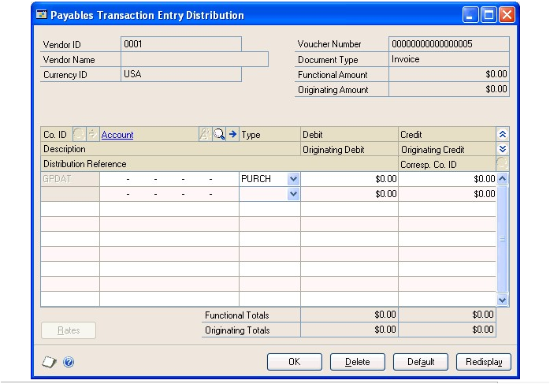

    The scrolling window displays the default distributions created based on the posting accounts assigned to the vendor. You can distribute a transaction to multiple posting accounts.

2. In the next available line, enter or select another distribution account, choose the distribution type and enter the next amount.

    To use the original distributions if you changed distribution accounts and amounts, choose Default.

    > [!NOTE]
    > If you entered several distributions to one particular distribution type, you can choose Redisplay to sort the accounts in the scrolling window by distribution type. To track non-financial quantities, such as square footage, you can distribute amounts to unit accounts by selecting Unit as the distribution type and entering a debit or credit amount. The amounts distributed to unit accounts aren’t reflected in the distribution totals.

3. Continue entering distribution accounts until the transaction is fully distributed.

#### Distributing additional taxes and writeoff amounts

Use the Additional Purchasing Tax and Writeoff Distributions window to view total discounts and unposted discounts, and total writeoffs and unposted writeoff amounts for a vendor and document. You also can use this window to enter unposted discounts distributed to GST (Goods and Services Tax, used in Canada and New Zealand), and unposted withholding writeoffs, used in Australia.

**To distribute additional taxes and writeoff amounts:**

1. Open the Additional Purchasing Tax and Writeoff Distributions window.
    (Purchasing \>\> Transactions \>\> Apply Payables Documents \>\> Select a record \>\> Terms Taken or Writeoff link)

2. To calculate GST, enter or select the GST Tax Detail ID to use to calculate GST on this transaction, and then enter a tax percentage or the tax discount amount taken. Depending on the amount you enter, the other amount is calculated. The amount entered reduces the amount of tax collected, and the purchase amount in the Tax Detail Maintenance window.

3. To write off the withholding deduction your company remits to the taxation office, enter the withholding amount to write off. The amount entered is distributed to the Writeoff account specified for the vendor.

4. Choose OK to close the window.  After you close the window, the Apply Payables Documents window appears.

If you were in the process of applying a document, complete that procedure.

#### Deleting distributions

Use the Payables Transaction Entry Distribution window to delete distributions. You can delete individual distributions if, for example, a mistake is made in the distributions, or if a discount that’s normally available from the vendor isn’t available on a particular invoice.

**To delete a distribution:**

1. Open the Payables Transaction Entry Distribution window. 
(Purchasing \>\> Transactions \>\> Transaction Entry \>\> Distributions button)

2. Select the account to delete. 3. Choose Edit \>\> Delete Row.

To use the original distributions if you changed distribution accounts and amounts, choose Default.

#### Distributing tax amounts

Use the Payables Tax Entry window to enter tax information for the document you selected in the Payables Transaction Entry window. A tax amount is calculated and distributed when you enter a transaction using the Payables Transaction Entry window. This tax amount is then distributed to the posting account assigned to the tax detail. However, you can edit the tax amount and the distributions. You don’t have to distribute the tax amount to tax details.

Tax details in common between the vendor tax schedule and the default tax schedule for the transaction are used to calculate tax. Only the first common tax detail is calculated. The default entry for all other details is zero. Because the details sort in alphanumeric order, you should name them so they sort in the order you want. See the System Setup instructions (Help \>\> Contents \>\> select Setting Up the System) for more information about setting up tax details.

Sometimes a purchase includes items that are exempt from input or output tax. You still must assign a tax detail to exempt items. If necessary, you can use the Tax Detail Maintenance window to set up appropriate details for tax-exempt transactions.

**To distribute tax amounts:**

1. Open the Payables Transaction Entry window. 
(Purchasing \>\> Transactions \>\> Transaction Entry)

2. Enter or select a transaction.

3. Enter a tax amount in the Tax field and choose the Tax expansion button to open the Payables Tax Entry window.

    

4. Enter or select a tax detail ID.

5. View or change the total purchases, the total taxable purchases, and the tax calculated on the sales.

6. Enter or select a posting account for the tax. The tax amount for the detail is posted to the account.

    To delete a tax detail, select the row containing the detail to delete and choose Edit \>\> Delete Row. To delete all the tax distributions, choose Delete.

7. Continue entering tax details until your tax is fully distributed.

    > [!NOTE]
    > To distribute taxes to multiple accounts, change the default amount in the scrolling window and enter another tax detail and tax amount in the next available line.

8. Choose OK to save your entries. Continue entering the transaction.

#### Withholding reports

If you marked Enable GST for Australia/New Zealand in the Company Setup Options window, you can use the Payables Transaction Entry window to print a Recipient Created Tax Invoice or Recipient Created Adjustment Note. When you choose Print in this window, a Recipient Created Tax Invoice is printed instead of standard invoices, finance charges, and miscellaneous charges, and a Recipient Created Adjustment Note is printed instead of standard returns and credit memos. You can print these documents more than once.

To print documents that include taxes in the document amounts, choose Options \>\> Print Amounts Inclusive of Tax. When this option is selected, depending on the document you’re entering, the purchases, finance charges, returns, credit memos, freight, miscellaneous charges, and the subtotal all include tax. The tax amount appearing in the Tax field is zero. If you don’t select this option, the tax amounts aren’t included in the document amounts.

The Print Amounts Inclusive of Tax option is saved on a per user, per window basis.

#### Entering Intrastat trade statistics

Intrastat is the system for collecting statistics on the trade of goods between European Union (EU) countries/regions. Intrastat data is required for all items either bought from EU vendors or sold to EU customers, and must be provided on a monthly basis. Requirements for Intrastat are similar in all EU countries/regions. The government uses these statistics as an economic indicator.

Use the Payables Intrastat Entry window to enter the information required to create the Intrastat Trade Report, which you submit to the government, and the EU Sales List, which displays cumulative goods value totals by each vendor or customer tax registration number. You can enter line items along with Intrastat statistics.

If Intrastat information was entered for the vendor’s primary address ID, that information appears as the default entries in this window. Use the Payables Intrastat Entry window to change Intrastat information for an individual transaction, or to enter Intrastat information if none was entered for the vendor.

*You can enter Intrastat statistics only if you marked to enable Intrastat tracking in the Company Setup Options window.*

**To enter Intrastat trade statistics:**

1. Open the Payables Transaction Entry window. 
(Purchasing \>\> Transactions \>\> Transaction Entry)

2. Enter the transaction. Be sure to mark EU Transaction. If the country code assigned to the vendor’s address is designated an EU country/region, this option is marked.

3. Choose Intrastat to open the Payables Intrastat Entry window.

4. Enter or select an item number.

5. Enter or change Intrastat information.

6. In the Net Unit Mass field, enter the weight of the goods in kilograms. The default entry is from the shipping weight of the item. The default weight for non-inventoried items is zero.

7. Enter the quantity of the goods being sold.

The line mass displays the total mass per item and is calculated when you press TAB on the Quantity field. The line mass total is equal to the amount entered in the Net Unit Mass field, multiplied by the amount entered in the Quantity field.

8. Enter a supplementary units amount, if applicable. The supplementary units amount is a second quantity. Supplementary units amounts are required by the EU Combined Nomenclature for certain goods.

9. In the Traders Reference field, enter a reference code such as an invoice or dispatch number, or any other information that identifies the transaction.

10. Choose Save.

### Chapter 9: Transaction maintenance

After you enter transaction information in Payables Management, proper maintenance of these records is essential to preserving the accuracy of your accounting information.

This information is divided into the following sections:

- *Correcting or deleting an unposted transaction*

- *Deleting an unposted printed transaction*

- *Placing or removing a transaction hold*

- *Transaction voids overview*

- *Voiding historical transactions*

- *Voiding open transactions*

- *Editing 1099 transactions*

#### Correcting or deleting an unposted transaction

Use the Payables Transaction Entry window to correct or delete unposted transactions. There might be times when a transaction is entered incorrectly, or when last-minute changes are made to an invoice. Correcting and deleting transactions is easiest before the transaction is posted. See *Voiding open transactions* for information about correcting posted transactions.

Errors are easily identified on the Transaction Edit List. If the error involves an unbalanced distribution, you’ll receive an alert message that the transaction can’t be posted because the debits and credits aren’t equal.

*You can’t delete an unposted transaction if the Delete Unposted Printed Documents option is unmarked in the Payables Management Setup window, and if the document has already been printed. See Deleting an unposted printed transaction for more information.*

You must void posted transactions before you can delete them. See *Voiding historical transactions* and *Voiding open transactions* for information about voiding vouchers and checks. If a check has been printed for a transaction, you can’t delete the transaction. You must post the transaction and void the voucher, or void the payment and then the voucher.

Use the Edit Payables Checks window to correct or delete unposted computer payments. Use the Payables Manual Payment Entry window to correct or delete unposted manual payments. Choose File \>\> Print in these windows to print a Computer Check Edit List or a Manual Payments Edit List when you finish.

**To correct or delete an unposted transaction**

1. Open the Payables Transaction Entry window. 
(Purchasing \>\> Transactions \>\> Transaction Entry)

2. Enter or select the voucher number.

    - If you’re correcting the transaction, replace the incorrect information with correct information. Depending on the change, you might need to modify the distributions using the Payables Transaction Entry Distribution window. Choose Save.

    - If you’re deleting the transaction, choose Delete.

3. Choose Save. To view a corrected transaction, print the Transaction Edit List by redisplaying the transaction and choosing File \>\> Print.

If you use the Workflow feature and you change a transaction, you must resubmit the batch to workflow.

4. To post the transaction, you must post the batch using the Payables Batch Entry window. See *Posting a batch* for more information.

5. Print posting reports, if necessary.

#### Deleting an unposted printed transaction

You can’t delete a transaction after it has been printed if the Delete Unposted Printed Document option in the Payables Management Setup window is unmarked. You can use the following procedure if you have printed an unposted transaction and want to delete it. The procedure assumes that you have the Payables Transaction Entry window open.

**To delete an unposted printed transaction**

1. In the Payables Transaction Entry window, assign the transaction to a batch if you haven’t done so already.

2. Close the Payables Transaction Entry window.

3. Open the Payables Management Setup window. 
(Purchasing \>\> Setup \>\> Payables)

4. Mark the Delete Unposted Printed Document option and click OK.

5. Open the Payables Transaction Entry window.

6. Enter or select the voucher number of the transaction that you want to delete.

7. Clear the Batch ID field.

8. Choose Delete.

#### Placing or removing a transaction hold

Use the Hold Payables Transactions window to place a transaction on hold. You can place on hold a posted transaction that hasn’t been fully applied or paid. For example, assume you’re not sure whether the monetary value for a particular transaction amount is correct. You might not want to apply a payment, credit, or return to the transaction until you’re sure of the correct amount.

If you place a transaction on hold, you can’t make any payments for it. When you’re ready to pay the transaction, you can release the transaction hold, and you can apply documents and issue payments.

**To place or remove a transaction hold:**

1. Open the Hold Payables Transactions window. 
(Purchasing \>\> Transactions \>\> Holds)

2. Enter or select a vendor ID.

    - To place transaction holds, mark Hold next to each transaction to place on hold. To place all the vendor’s transactions on hold, choose Mark All. If you place a transaction on hold, you can’t apply any payments.

    - To release a transaction from a hold, unmark Hold next to the specific transaction to release from a hold. To release all the transactions on hold, choose Unmark All.

3. To print a Payables Hold Journal showing all the vouchers on hold, choose File \>\> Print. After you finish marking or unmarking transactions, choose OK to close the window.

#### Transaction voids overview

You can void both historical and open transactions in Payables Management. Use the Void Historical Payables Transactions window to void historical transactions, and the Void Open Payables Transactions window to void open transactions.

To void payments using the Void Historical Payables Transactions window, you must be keeping transaction history for the vendor associated with the payment, and the payment you’re voiding must be fully applied to one or more transactions.

When voiding open transactions, and you marked Allow Negative Debits and Credits in General Ledger in the Company Setup Options window, the negative debits and credits are generated in General Ledger. If you marked Calculate Tax Rebates in the Company Setup Options window, and you’re voiding a payment with a terms discount, any distributions for tax rebates also are voided.

You can void an intercompany transaction in the originating company, but you must make any necessary manual adjustments in the destination companies to reverse the transaction.

When you void a credit document, you also unapply amounts. If you void a multicurrency document, any realized gains or losses that originally were posted also are reversed.

If a credit memo or return subject to withholding is voided, an invoice is created for the withholding vendor to offset the credit memo originally created. If any document is voided that was applied to another document with a withholding amount taken, a credit memo is created for the withholding vendor to offset the invoice originally created.

#### Voiding historical transactions

Use the Void Historical Payables Transactions window to void historical credit transactions, which include cash, check, or credit card payments, and historical credit memos and returns. To void a credit transaction, it must have been fully applied, paid, and posted, after which it’s transferred to history.

Depending on which credit document you void, the following will happen:

| **Void**                            | **Result**   |
|-------------------------------------|--------------|
| Credit Memo, Return or Cash payment | The vouchers it was applied to are unapplied and a new payment can be issued to it.    |
| Check payment                       | The amount applied to the invoice is unapplied.  |
| Credit card payment                 | The vendor invoice that was created with the payment is also voided. However, if any other payments or credit memos are applied to the invoice, it will not be voided automatically. |

If any credit memos or returns were applied to the same invoice, the amount applied will be unapplied as well. The credit memo or return is available for reuse. If the credit memo or return was applied to multiple invoices, only the amount associated with the voiced check payment is unapplied.

**To void a historical transaction:**

1. Open the Void Historical Payables Transactions window. 
(Purchasing \>\> Transactions \>\> Void Historical Transactions)

2. Select a range of documents to display in the scrolling window, and the document type. You can display all historical documents, or select a range of particular documents.

3. Enter a void date or accept the default entry. The date sent to bank reconciliation is the default entry for the Void Date field.

4. If General Ledger is part of your system, enter the date to appear as the posting date in General Ledger. Use this for the reversing entries that offset the original transaction distributions for each document you’re voiding.

5. Mark each document to void. To void all the documents, choose Mark All. You can print a Void Historical Transactions Edit List to show all the documents that are marked to be voided by choosing File \>\> Print.

    > [!NOTE]
    > Payments that have been reconciled with a checkbook in the Bank Reconciliation module display Yes in the Reconciled column. We recommend that you do not void payments that are reconciled.

6. When you’re satisfied with the entries, choose Void. When you void a document, reversing amounts are posted for the distributions posted earlier. Reports that display historical information indicate voided documents.

You can print the Void Historical Payables Transactions Posting Journal when you void payments, if you selected to do so in the Posting Setup window.

If you marked Include Multicurrency Info in the Posting Setup window, the multicurrency versions of these reports are printed. The multicurrency versions include currency and exchange rate information, and functional and originating debit and credit amounts.

When viewing transactions using the Payables Transaction Inquiry window, a voided payment has an asterisk (\*) by the document’s origin in the scrolling window.

#### Voiding open transactions

Use the Void Open Payables Transactions window to void any transaction or payment that has been posted and is unapplied. You can void invoices for active and temporary vendors. If you’re keeping history and you void a voucher, the voucher is moved to history along with any distributions and tax information. If you’re not keeping history and you void a voucher, that voucher is removed from the system.

**To void an open transaction:**

1. Open the Void Open Payables Transactions window. 
(Purchasing \>\> Transactions \>\> Void Open Transactions)

2. Enter or select the vendor ID. Vouchers in the open table for the vendor are displayed in the scrolling window.

3. Enter a void date or accept the default entry in the Void Date field. The default entry is the date the document was sent to bank reconciliation.

4. If General Ledger is part of your system, enter the date to appear as the posting date in General Ledger for the reversing entries. Use this to offset the original transaction distributions for each document you’re voiding.

5. Mark each voucher to void. To void all the vouchers, choose Mark All. You can print a Void Open Payables Transactions Edit List to show all the vouchers that are marked to be voided by choosing File \>\> Print.

*Payments that have been reconciled with a checkbook in the Bank Reconciliation module display Yes in the Reconciled column. We recommend that you do not void payments that are reconciled.*

6. When you’re satisfied with the entries, choose Void. When you void a voucher, reversing amounts are posted for the distributions posted earlier.
    Reports indicate voided vouchers.

The Void Open Payables Transactions Posting Journal might be printed when you void vouchers, if you selected to do so in the Posting Setup window. This journal lists the vouchers that were removed.

If you marked Include Multicurrency Info in the Posting Setup window, the multicurrency versions of these reports are printed. The multicurrency versions include currency and exchange rate information, and functional and originating debit and credit amounts.

When viewing transactions using this window, a voided voucher has an asterisk (\*) by the document’s origin in the scrolling window.

#### Editing 1099 transactions

Use the Edit 1099 Transaction Information window to modify the 1099 form type (tax type), box number, or the 1099 amounts for multiple transactions for one vendor.

**To edit 1099 transactions:**

1. Open the Edit 1099 Transaction Information window. 
(Purchasing \>\> Transactions \>\> Edit 1099 Transaction Information)

2. Select the vendor ID.

3. Enter a range of transactions to edit. For example, if you know that the transactions to modify occurred within the last month, select by Date and enter the first and last days of the month in the From and To fields. The vouchers displayed in the scrolling window will only be those entered within that date range.

4. Select the type of transactions to include in the scrolling window.

5. Make your changes.

**Changing the amount** The amount can be modified if the tax type for the voucher is Miscellaneous, Interest, or Dividend. (If you’re changing the transaction from Not a 1099 transaction to a 1099 tax type, change the Tax Type first. The amount will be calculated automatically using the purchase amount minus the trade discount.) If you’re modifying the amount that has credit documents applied, the 1099 amounts on the credit and in the 1099 Details window will be updated when you process the changes.

**Changing the tax type** This will automatically update the 1099 Box Number and may change the 1099 amount on existing transactions.

**Changing the 1099 Box Number** If you change the tax type, the 1099 box number that is normally used for that type will appear as a default box number.

6. Choose Process. The transaction changes will be updated in the Open and History tables. When processing is complete, the Update 1099 Information Audit Report is printed.

### Chapter 10: Payments

You can make payments to vendors using different methods. You can enter a payment at the same time you enter the transaction it’s associated with; you can enter a manual payment to account for credit card or cash payments; and you can process a computer check run.

Payment information is contained in the following sections:

- *Payments overview*

- *Entering and paying an invoice*

- *Paying individual invoices by check*

- *Entering manual prepayments*

- *Entering computer check prepayments*

- *Entering manual payments*

- *Modifying individual checks*

- *Modifying multiple checks in a batch*

- *Check selections overview*

- *Expired discounts and selecting checks for a computer check run*

- *Selecting checks for a computer check run*

- *Selecting checks for purchase order prepayments*

- *Modifying distributions for individual checks in a purchasing prepayment batch*

- *Modifying multiple checks in a purchasing prepayment batch*

- *Computer checks posting options*

- *Printing computer checks as part of a check run*

- *Printing individual computer checks*

- *Correcting or deleting unposted payments*

#### Payments overview

All payments that you enter in Microsoft Dynamics GP have certain common elements, such as posting journals and payment options.

**Currency ID**

If the currency ID that you select for a payment amount is an alternate currency, a rate type and associated exchange rate table are assigned to the transaction. The rate type is based on the rate type you assigned to the selected vendor; if you haven’t assigned a rate type to the vendor, the default rate type for the Purchasing series, specified in the Multicurrency Setup window, is used. To view or modify the default exchange rate for this transaction, choose the currency ID expansion button to open the Exchange Rate Entry window. Close the window when you finish.

**Document date**

The document date you enter is the date Payables Management records are updated. This date also determines the exchange rate to use, based on the currency ID and associated rate type entered on the transaction.

**Journals and registers**

When you post a payment, posting journals and distribution breakdown registers are printed depending on the selections in the Posting Setup window. When posting is complete, a Report Destination window appears for each posting journal you selected to print.

If you entered a payment in a batch, you can save the batch and post it later. You also can print an edit list after saving the transaction to view the entries. To post the invoice, you must post the batch using the Payables Batch Entry window. See *Posting a batch* for more information.

**Amounts and payment methods**

When you enter an amount, another window opens, where you can specify a checkbook or credit card. Cash amounts are posted to Cash accounts. Credit card amounts are posted to the Credit Card Vendor Payables account. See *Paying individual invoices by check* if you’re paying by check.

You can mark one of the following payment methods:

**Check** If you mark Check, you can enter or select the checkbook ID for the checkbook to be updated for this prepayment. The document number appears as a default value from the checkbook.

**Cash** If you mark Cash, you can enter or select the checkbook ID for the checkbook to be updated for this prepayment. The document number appears as a default value from the Payables Setup Options window.

**Credit card** If you mark Credit Card, you can enter or select the credit card ID in the field next to the payment method. A checkbook will be debited or an invoice will be created, depending on whether the credit card selected has been set up as a credit card or check card using the Credit Card Setup window (Administration \>\> Setup \>\> Company \>\> Credit Cards). The document number appears as a default value from the Payables Setup Options window.

**Payment date**

The payment date is the date when payables records are updated. If you’re using Multicurrency Management, the date also determines the exchange rate to use for this payment, based on the currency ID and associated rate type on the payment.

**Account distributions**

After you enter payment information, you can make changes to account distributions using the Payables Transaction Entry Distribution window. Amounts are distributed to the accounts set up for the vendor record. To view the original distributions, choose Default in the Payables Transaction Entry Distribution window. See *Distributing transaction amounts* for more information. Close the window when you finish.

**Apply options**

If you entered a withholding vendor using the Company Setup Options window and this payment is auto applied to a debit document subject to withholding, a withholding amount is taken if this payment fully pays off the debit document.

Multicurrency transactions have restrictions on documents that you can apply, depending on whether the currency is the functional or an alternate currency. You can’t apply alternate currency documents. You must post alternate currency documents before you can apply them.

A multicurrency payment is applied to documents with the same currency ID using the originating amounts for the transaction as the basis for the apply process. If the functional equivalent amounts don’t match, a realized gain or loss is calculated, and the gain or loss is posted when you close the window.

**Remit-to addresses**

You can enter and use more than one address for sending payments to a single vendor. If you specify different remit-to addresses on purchasing transactions from a single vendor, a separate check will be created for each remit-to address.

Remit-to address IDs are stored on transaction documents—not on checks. If a vendor’s remit-to address changes between the time you post a purchase transaction and the time that you pay it, you must change the address information using the Vendor Maintenance window to include the new address on the check. If the vendor address changes the transaction is posted, the address can be changed in the Payables Transaction Entry window.

If you transfer funds electronically using European Electronic Funds Transfer, the remit-to address specified in the Vendor Maintenance window will always be used for the transfer transaction.

#### Entering and paying an invoice

Use the Payables Transaction Entry window to enter and pay an invoice at the same time, if you paid the vendor at the time you made the purchase.

If you are using vendor approval workflow, the vendor must have the workflow status of Approved or No Approval Needed before you can post the transaction. For more information about vendor approval workflow, see *Vendor approval workflow* .

**To enter and pay an invoice:**

1. Open the Payables Transaction Entry window. 
(Purchasing \>\> Transactions \>\> Transaction Entry)

2. Enter or select a voucher number, select the document type, and enter a description.

3. Enter or select a batch ID. See *Creating a batch* for more information.

4. Enter a document date.

5. Enter or select a vendor ID. *To enter a temporary vendor for this invoice, place the insertion point in the Vendor ID field and choose Options \>\> Temporary Vendor.*

6. Enter or select an address ID, payment terms, and a currency ID. See *Address IDs and taxes* for information how address IDs and shipping methods affect sales taxes.

7. Enter a document number. This number is the transaction number assigned by the vendor.

8. Enter or select a shipping method, a tax schedule ID, and purchase amounts. The trade discount is calculated if you entered a trade discount for the vendor card.

9. Enter amounts in the Freight and Miscellaneous fields, if necessary. You can assign tax schedules to those amounts by choosing the Tax Schedule ID expansion button and entering that information.

10. Enter the amount you’re paying by cash, check, or credit card.

To make changes to account distributions, choose Distributions to open the Payables Transaction Entry Distribution window. Close the window when you finish.

11. Choose Post if you entered an individual transaction.

#### Paying individual invoices by check

Use the Payables Check Entry window and the Print Payables Transaction Check window to pay an invoice by check. If you pay an invoice by check, print a check to give the vendor. You also can print a remittance and send the remittance in e-mail.

If you are using vendor approval workflow, the vendor must have the workflow status of Approved or No Approval Needed before you can post the transaction or print a check. If the vendor isn’t approved, you can save the transaction in a batch. For more information about vendor approval workflow, see *Vendor approval workflow* .

**To pay an individual invoice by check:**

1. Complete steps 1 through 9 of *Entering and paying an invoice*.

2. Enter the amount you’re paying. When you enter an amount, the Payables Check Entry window opens, where you can specify a checkbook.

    

    Verify that the information is correct; then choose OK to close the window. This amount is posted to a Cash account.

3. Choose Print Check to open the Print Payables Transaction Check window.

    

    If you choose not to print the check, Payables Management considers the check a manual check when it’s posted.

4. Enter a check number, and mark to print a check.

5. Mark Separate Remittance to print a remittance separately from the check. A remittance shows the same detail as the check stub and is printed on blank paper from the Print Payables Remittance window after the check is printed.

    To print a remittance, you must mark this option and print the remittance from the Print Payables Remittance window.

6. Choose Print to print the check and close the window.

    After the check has been printed, the Print Payables Remittance window opens if you have selected to print a separate remittance.

    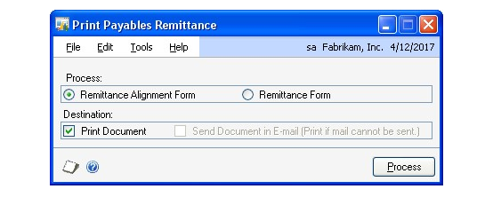

7. In the Print Payables Remittance window, select the Remittance Form option.

8. Select to print, send the remittance in e-mail, or both.

9. Choose Process to print, send the remittance in e-mail, or both.

10. After processing the remittance, return to the Payables Transaction Entry window. Choose Post if you entered an individual transaction.

#### Entering manual prepayments

Use the Payables Manual Payment Entry window to make prepayments. Prepayments, sometimes referred to as deposits, are payments made before merchandise is received and an invoice is recorded. Prepayments are applied after the invoice has been entered, so you won’t apply the payment at this time.

If you are using vendor approval workflow, the vendor must have the workflow status of Approved or No Approval Needed before you can post the payment. If the vendor isn’t approved, you can save the payment in a batch. For more information about vendor approval workflow, see *Vendor approval workflow*.

**To enter a manual prepayment:**

1. Open the Payables Manual Payment Entry window. 
(Purchasing \>\> Transactions \>\> Manual Payments)

    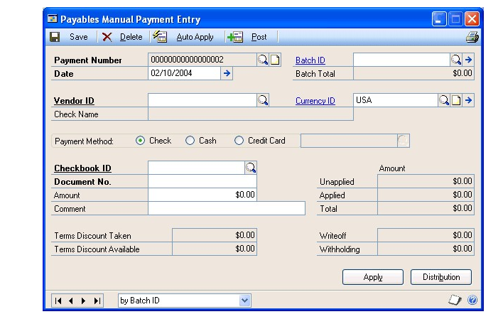

2. Enter or select a payment number and date.

3. Enter or select a batch. Batches are optional for prepayments. See *Creating a batch* for more information.

4. Enter or select a vendor ID and currency ID.

5. Mark a payment method.

6. Enter the amount of the prepayment.

7. To make changes to account distributions, choose Distributions to open the Payables Transaction Entry Distributions window. Close the window when you finish.

8. Save the payment, if you entered a batch ID.

9. To print an edit list and verify the entries if you entered a batch ID, choose File \>\> Print. Choose Post if you entered an individual transaction.

#### Entering computer check prepayments

Use the Edit Payables Checks window to make a prepayment—a payment on account you make before you receive merchandise—to a vendor. When you make a prepayment, you first enter the payment, then apply it after the invoice has been recorded.

**To enter a computer check prepayment:**

1. Open the Edit Payables Checks window. 
(Purchasing \>\> Transactions \>\> Edit Check)

    

2. Enter or select a payment number and a batch ID.

3. Enter the check information and remittance options.

    To view or change any distributions, choose Distribution to open the Payables Transaction Entry Distribution window. Close the window when you finish.

4. Choose Save to save the payment.

5. To print a Computer Check Edit List, choose File \>\> Print. To print a check to the vendor, choose Print Checks to open the Print Payables Checks window. See *Printing computer checks as part of a check run* for more information.

#### Entering manual payments

Use the Payables Manual Payment Entry window to record manual payments— payments charged to credit cards, cash payments, or manually written checks. If you regularly write checks or pay by cash or credit card, we recommend you record those payments to ensure a duplicate payment isn’t made during a computer check run.

If you are using vendor approval workflow, the vendor must have the workflow status of Approved or No Approval Needed before you can post the payment. If the vendor isn’t approved, you can save the payment in a batch. For more information about vendor approval workflow, see *Vendor approval workflow*

**To enter a manual payment:**

1. Open the Payables Manual Payment Entry window. 
(Purchasing \>\> Transactions \>\> Manual Payments)

2. Enter or select a payment number and date.

3. Create or select a batch. Batches are optional for manual payments. See *Creating a batch* for more information.

4. Enter or select a vendor ID and currency ID.

5. Mark a payment method.

Payments made with credit cards are treated as accounts payable amounts. The credit card company acts as a vendor to you in this instance, since you’ll pay them for the goods and services you purchase with the card.

6. Enter the amount of the payment and apply the payment. See *Chapter 12, “Applying,”* for more information about applying.

7. To make changes to account distributions, choose Distributions to open the Payables Transaction Entry Distribution window. Close the window when you finish.

8. Save the payment if you entered a batch ID.

9. To print an edit list to verify the entries if you entered a batch ID, choose File \>\> Print. Choose Post if you entered an individual transaction.

#### Modifying individual checks

Use the Edit Payables Checks window to modify individual checks in an existing batch. You can add additional checks to the batch or change the amount of a payment for a specific vendor. If a vendor ID or voucher number isn’t within the ranges that you entered in the Select Payables Checks window, you can enter the vendor ID or voucher number in the batch using the Edit Payables Checks window.

**To modify individual checks:**

1. Open the Edit Payables Checks window. 
(Purchasing \>\> Transactions \>\> Select Checks \>\> Edit Check button)

2. Enter or select a payment number.

If you are using vendor approval workflow, you can enter or select a payment number if the vendor assigned to the payment has a workflow status of Approved or No Approval Needed.

3. Enter or select a vendor ID. If you select an existing payment number, the correct vendor ID appears and you can’t change it.

To add a temporary vendor, place the insertion point in the Vendor ID field and then choose Options \>\> Temporary Vendor.

If you are using vendor approval workflow, the vendor must have the workflow status of Approved or No Approval Needed before you can enter or select a vendor ID.

4. Enter a comment for the payment.

5. Enter an unapplied payment or prepayment amount in the Unapplied field to pay more than the transaction amount.

6. Select remittance options.

7. To apply the payment, choose Auto Apply or Apply.

If you choose Apply to pay specific transactions, the Apply Payables Documents window opens.

8. Mark the check box in front of each transaction to pay with this payment. Mark any number of documents until the entire amount is applied.

To divide payments between several documents, mark the check box, and change the amount in the Apply Amount column for that transaction.

9. Choose OK to close the Apply Payables Documents window.

10. Choose Check Stub to open the Payables Check Stub Documents window.

    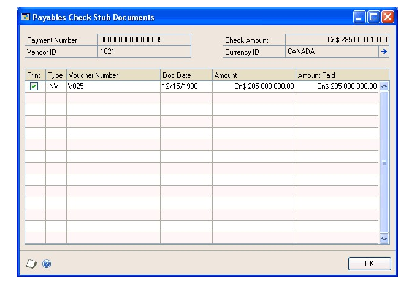

11. Unmark any vouchers that you don’t want to print on the check stub. Choose OK to close the window.

12. Choose Save and redisplay the payment number. To print an edit list to verify the accuracy of the entries, choose File \>\> Print.

13. Close the Edit Payables Checks window to redisplay the Select Payables Checks window.

When the Select Payables Checks window reopens, the entries you made are cleared. The information you previously entered is saved; you don’t need to enter another range of checks.

#### Modifying multiple checks in a batch

Use the Edit Payables Check Batch window to modify more than one payment at a time. This window displays all the vendors and their vouchers and indicates the vouchers that will be paid in the specified check batch. You can add additional vendors and documents to this check batch, unmark documents that are marked to be paid, or mark additional documents to be paid.

If you are using vendor approval workflow, vendors must have the workflow status of Approved or No Approval Needed before you can add vendors or documents to the batch.

**To modify multiple checks in a batch:**

1. Open the Edit Payables Checks Batch window: 
(Purchasing \>\> Transactions \>\> Select Checks \>\> Edit Check Batch button)

    

2. Mark a vendor in the Vendors list to include a payment to that vendor in the check batch. To remove all the payments for a vendor, unmark the check box for that vendor in the Vendors list.

3. To include additional documents in the check batch, select a vendor from the Vendors list. The documents for the vendor will be displayed and documents that are included in the batch will be marked with a check mark. To include additional documents, mark them in the Documents list. To remove documents from the check, unmark them.

4. Choose OK to save your changes and close the window.

#### Check selections overview

Selecting checks is the first step in making computer check payments, also called completing a check run. You can apply unapplied payments, credit memos, and returns. Depending on how you set up Payables Management, the amounts are applied first to documents having the oldest document date or due date. You also can include vouchers that become due on a specified date.

Before you select checks, print an Aged Trial Balance or Cash Requirements report. Use these reports to decide the payments to make, so you can take advantage of discounts, avoid late payments, and determine the cash required for these transactions.

**Withholding**

If you entered a withholding vendor using the Company Setup Options window and the document being paid off is subject to withholding, Microsoft Dynamics GP computes a withholding deduction during the select checks process. You can verify the withholding amount by selecting the document being paid off using the Apply Payables Documents window, and choosing the Terms Taken or Writeoffs links. You also can print a Withholding Deduction Report showing withholding deduction information for the selected batch by choosing Options \>\> Print Withholding Report.

**Apply options**

You can automatically apply any available payments, credit memos, and returns to vouchers in the batch you’re creating. (You can individually apply specific documents later in the check run process.)

You also can restrict the automatic apply process to match currency options. The options change depending on whether the currency assigned to the batch is the functional or an alternate currency.

If you mark the Take Non-Qualifying Discounts option in the Select Payables Checks window, all discounts are calculated for the vouchers, regardless of the discount date and whether you’re qualified for the discount. If you don’t mark this option, only discounts available on or before the check date are taken.

If you mark Pay Only Minimum option in the Select Payables Checks window, the minimum payment you entered in the Vendor Maintenance window is used to calculate the check amount for each vendor in the batch. If Pay Only Minimum is unmarked, the check is printed for the total amount of the vouchers included in the batch.

If the batch uses an alternate currency and there is a minimum payment specified in the Vendor Maintenance window (minimum payments always are specified in the functional currency), the alternate equivalent of the minimum payment is calculated based on the exchange rate of the batch paid. For example, if you have a minimum payment of \$10 US and a Canadian check with an exchange rate of 0.7415, you would pay the vendor \$13.49 Canadian, rather than \$10 US (\$10/0.7415 = \$13.49).

**Multicurrency document selections**

If you’re using Multicurrency Management, you can specify a document currency range in the Select Payables Checks window to narrow the group of documents to pay. The Automatically Apply Existing Unapplied options change depending on whether the currency ID assigned to the batch is the functional currency or an alternate currency.

See *Currency selections and auto-applying* for information about how currency selections affect auto-applying.

#### Expired discounts and selecting checks for a computer check run

You can exclude vouchers with expired discounts when selecting checks for a computer check run by using a range for due date\\discount date cutoffs. A voucher isn’t included in the computer check run if the apply date entered in the Select Payables Checks window is after the discount date for a voucher.

You can use the Payables Management Setup window to select the Exclude Expired Discounts from Payments option to exclude expired discounts from payments. Review the following examples to see how expired discounts are excluded or included during the select check process.

**Example 1**

If a due date cutoff of 1/22, a discount date cutoff of None, and an apply date of 1/20 was entered in the Select Payables Checks window, the following vouchers are included or excluded in the check batch.

| **Voucher** | **Discount date** | **Due date** | **Setup option marked**         | **Setup option unmarked**       |
|-------------|-------------------|--------------|---------------------------------|---------------------------------|
| 1           | 1/15              | 1/22         | Included, no discount           | Included, no discount           |
| 2           | 1/18              | 1/22         | Included, no discount           | Included, no discount           |
| 3           | 1/21              | 1/22         | Included, discount amount taken | Included, discount amount taken |
| 4           | 1/24              | 1/22         | Included, discount amount taken | Included, discount amount taken |
| 5\*         | No discount       | 1/22         | Included                        | Included                        |
|             |                   |              |                                 |                                 |

**Example 2**

If a due date cutoff of 1/22, a discount date cutoff of All, and an apply date of 1/20 was entered in the Select Payables Checks window, the following vouchers are included or excluded in the check batch.

| **Voucher** | **Discount date** | **Due date** | **Setup option marked**         | **Setup option unmarked**       |
|-------------|-------------------|--------------|---------------------------------|---------------------------------|
| 1           | 1/15              | 1/22         | Excluded                        | Included, no discount           |
| 2           | 1/18              | 1/22         | Excluded                        | Included, no discount           |
| 3           | 1/21              | 1/22         | Included, discount amount taken | Included, discount amount taken |
| 4           | 1/24              | 1/22         | Included, discount amount taken | Included, discount amount taken |
| 5\*         | No discount       | 1/22         | Included                        | Included                        |

**Example 3**

If a due date cutoff of 1/22, the discount date cutoff of 1/21, the apply date of 1/20 was entered in the Select Payables Checks window, the following vouchers are included or excluded in the check batch.

| **Voucher**       | **Discount date** | **Due date** | **Setup option marked** | **Setup option unmarked**       |
|-------------------|-------------------|--------------|-------------------------|---------------------------------|
| 1                 | 1/15              | 1/22         | Excluded                | Included, no discount           |
| 2                 | 1/18              | 1/22         | Excluded                | Included, no discount           |
| 3                 | 1/21              | 1/22         | Excluded                | Included, discount amount taken |
| 4                 | 1/24              | 1/22         | Excluded                | Included, discount amount taken |
| 5\* \* The voucher is included or excluded in the check batch depending on the due date of the voucher. | No discount       | 1/22         | Included                | Included                        |

#### Selecting checks for a computer check run

Use the Select Payables Checks window to select the checks to print for a specific group of vendors and vouchers. You can use the Edit Payables Check Batch window to select additional vendors or documents to pay.

If you are using vendor approval workflow, vendors must have the workflow status of Approved or No Approval Needed to be included in the ranges you specify when selecting vouchers for payment.

**To select checks for a computer check run:**

1. Open the Payables Batch Entry window. 
(Purchasing \>\> Transactions \>\> Batches)

2. Enter or select a batch. See *Creating a batch* for more information.

3. Select Computer Check as the origin. Select Single Use as the frequency.

4. Enter or select a checkbook ID to use for all checks in the batch.

5. Choose Transactions. Choose Select Payables Checks from the Go To window to open the Select Payables Checks window.

    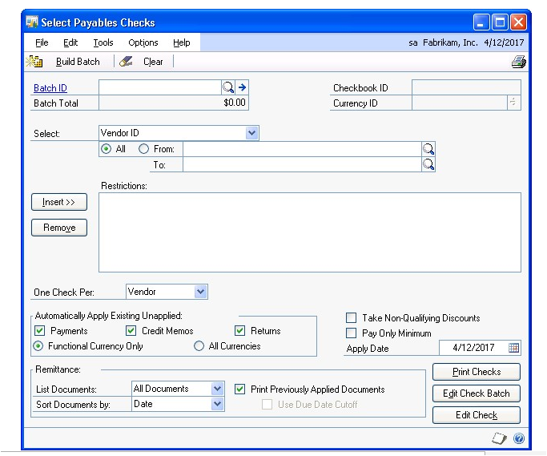

6. Specify the group of vendors and vouchers you want to include in the batch by selecting the type of range you want to include, and then enter restrictions for the range. You can insert a range of each type into the Restrictions list.

    - If you select Due Date\\Discount Date Cutoff as a range, you can select a due date cutoff so vouchers due on or before the date you specify are included in the batch. You also can select a discount date cutoff so vouchers with a discount date on or before the date you specify are included in the batch.

    - If you select Document Currency as a range, the Automatically Apply Existing Unapplied options change depending on whether the currency ID assigned to this batch is the functional currency or an alternate currency.

3. Select automatic apply and payment options.

4. Select remittance and check stub information.

5. Choose Build Batch to create the batch of checks to process. Depending on the size of the batch, this process might take some time. You’ll know when the batch is created when an amount appears in the field below the Batch ID field, and the Build Batch button changes to Add to Batch. You also can check the progress using the Process Monitor window.

The information you enter in this window is saved. The checks in the batch are ready to be edited or printed. You also can add additional ranges to the batch. You can print an edit list by redisplaying the batch ID and choosing File \>\> Print.

The next step in the computer check process is modifying the checks you created. See *Modifying individual checks* or *Modifying multiple checks in a batch* for more information.

#### Selecting checks for purchase order prepayments

Use the Select Payables Checks window to select checks to print for purchase orders with a prepayment. You can choose ranges to specify the group of vendors and purchase orders for a computer check payment. When printing checks for the purchase order prepayments, one check per purchase order is printed.

If you are using vendor approval workflow, vendors must have the workflow status of Approved or No Approval Needed to be included in the ranges you specify when selecting purchase order prepayments.

**To select checks for purchase order prepayments:**

1. Open the Payables Batch Entry window. 
(Purchasing \>\> Transactions \>\> Batches)

2. Enter or select a batch. See *Creating a batch* for more information.

3. Select Computer Check as the origin.

4. Mark Purchasing Prepayment Batch. This option is available if you have selected Computer Check as the origin and you have marked the Allow Purchase Order Prepayments option in the Purchase Order Processing Setup window.

5. Enter a posting date. The user date is the default posting date, but you can change it to post the batch as of a different date.

The posting date entered here is the date General Ledger files are updated. Payables Management records are updated according to the date entered in the Payables Transaction Entry window.

6. Enter a check date to appear on checks in this batch. The check date also determines the exchange rate to use for checks in this batch. You can’t change this date after you create the batch of checks.

7. Enter or select a checkbook ID to use for all checks in the batch.

8. Enter a currency ID; all computer checks in this batch must use the same currency ID and have the same check date.

9. Choose Transactions. Choose Select Payables Checks from the Go To window to open the Select Payables Checks window.

10. In the Select Payables Checks window, specify the group of vendors and purchase orders you want to include in the batch by selecting the type of range you want to include, and then enter restrictions for the range. You can insert a range of each type into the Restrictions list.

11. Choose Build Batch to create the batch of checks to process. Depending on the size of the batch, this process might take some time. You’ll know when the batch is created when an amount appears in the field below the Batch ID field, and the Build Batch button changes to Add to Batch. You also can check the progress using the Process Monitor window.

The prepayments added to the batch are within the range restrictions selected and use the same currency ID as the batch. Prepayments that are assigned to another prepayment batch are not added to the batch.

The information you enter in this window is saved. The checks in the batch are ready to be edited or printed. You also can add additional ranges to the batch. You can print an edit list by redisplaying the batch ID and choosing File \>\> Print.

The next step in the computer check process is modifying the checks you created. You can use the Edit Payables Checks window to modify distributions. See *Modifying distributions for individual checks in a purchasing prepayment batch* for more information. You can use the Edit Payables Check Batch window to include or exclude purchase orders with prepayment. See *Modifying multiple checks in a purchasing prepayment batch* for more information.

#### Modifying distributions for individual checks in a purchasing prepayment batch

You can use the Edit Payables Checks window to modify distributions for an individual check for a purchase order prepayment. You cannot add checks to the purchase order prepayment batch or change the amount of a payment for a specific vendor.

**To modify distributions for individual checks in a purchasing prepayment batch:**

1. Open the Edit Payables Checks window. 
(Purchasing \>\> Transactions \>\> Select Checks \>\> Edit Check button)

2. Enter or select a payment number for a purchase order prepayment.

    If you are using vendor approval workflow, you can enter or select a payment number if the vendor assigned to the payment has a workflow status of Approved or No Approval Needed.

3. To view or change any distributions, choose Distribution to open the Payables Transaction Entry Distribution window. Close the window when you finish.

4. To print an edit list to verify the accuracy of the entries, choose File \>\> Print.

5. Close the Edit Payables Checks window to redisplay the Select Payables Checks window.

When the Select Payables Checks window reopens, the entries you made are cleared. The information you previously entered is saved; you don’t need to enter another range of checks.

#### Modifying multiple checks in a purchasing prepayment batch

You can use the Edit Payables Check Batch window to view all the vendors and purchase orders with a prepayment in a selected check batch and to add or remove vendors or purchase orders from the batch.

If you are using vendor approval workflow, vendors must have the workflow status of Approved or No Approval Needed before you can add vendors or documents to the batch.

**To modify multiple checks in a purchasing prepayment batch:**

1. Open the Edit Payables Checks Batch window:
(Purchasing \>\> Transactions\>\> Select Checks \>\> Edit Check Batch button)

2. Mark a vendor in the Vendors list to include a payment to that vendor in the check batch. To remove all the payments for a vendor, unmark the check box for that vendor in the Vendors list.

3. To include additional purchase orders in the check batch, select a vendor from the Vendors list. The purchase orders for the vendor will be displayed and purchase orders that are included in the batch will be marked with a check mark. To include additional purchase orders, mark them in the Documents list. To remove purchase orders from the check, unmark them.

4. To edit distributions, select a purchase order and choose Edit Check. Choose Distribution to open the Payables Transaction Entry Distribution window.

Print checks or save your changes to the purchasing prepayment batch.

- If you are ready to print checks, choose Print Checks to open the Print Payables Checks window. Before you print checks, be sure to print a Computer Checks Edit List first. For more information about printing checks, see *Printing computer checks as part of a check run* .

- If you want to save your changes and not print checks, choose OK.

#### Computer checks posting options

When you print computer checks as part of a check run, you can choose one of several posting options in the Post Payables Checks window.

**Void checks** To void a check because it was incorrect, select Void Checks and enter a range of checks to void. To void just one check, enter that check number in both the From and To fields. Choose Process. Voided checks aren’t posted to General Ledger.

**Print stub alignment** To print a stub alignment form to check the printer alignment before you start printing checks, select Print Stub Alignment. Enter a starting check number and choose Process.

**Reprint checks** To reprint checks because of a printer malfunction or other problem, select Reprint Checks and select a range of checks to reprint. To reprint just one check, enter that check number in the From and To fields. Enter a starting check number and choose Process. The original checks are voided.

**Post checks** To post checks when you’re satisfied with the check amounts, select Post Checks. Enter the posting date to use for the checks you just printed and choose Process.

If you’re posting a batch of multicurrency checks, the posting date must be before the exchange rate expiration date.

If you entered a withholding vendor using the Company Setup Options window and the document being posted is subject to withholding, the withholding amount is computed during the select checks process. You can verify the withholding amount by selecting the document being paid off using the Apply Payables Documents window and choosing the Terms Taken or Writeoffs links. You also can print a Withholding Deduction Report showing withholding deduction information for the selected batch by choosing Options \>\> Print Withholding Report.

After you post the information, you can’t reprint checks or print alignment forms. If you marked Separate Remittance in the Print Payables Checks window, have zero amount checks in the batch or if the stub information will be printed on more than one check stub, the Process Payables Checks window opens. You can print the remittance forms from that window.

You can void posted checks individually using the Void Historical Payables Transactions window. When you void the check, the vouchers it was applied to are unapplied and you can issue a new payment. See *Voiding historical transactions* for more information.

#### Printing computer checks as part of a check run

Use the Print Payables Checks window to print a batch of computer checks. Once you create the batch of checks, edit any payments, or add any payments, you’re ready to print the checks. You also can print separate remittances and send the remittances in e-mail. When the checks have been printed, you have the option to reprint or void checks that have already been printed. If the printed checks are correct, you can print the Computer Check Register.

*To print checks when you are using vendor approval workflow, the vendors must have the workflow status of Approved or No Approval Needed. If a vendor isn’t approved, checks for the vendor aren’t printed.*

Before you can print checks, you should print a Computer Checks Edit List. To print a Computer Checks Edit List, open the Select Payables Checks window, the Edit Payables Checks window, or the Edit Payables Check Batch window, enter the appropriate batch ID, and choose File \>\> Print. See *Correcting or deleting unposted payments* if you identify errors on the edit list. After you verify the accuracy of the entries, you’re ready to print the checks.

The Computer Checks Edit List will not include check numbers. Check numbers won’t be assigned to checks until you choose Print.

**To print computer checks as part of a check run:**

1. Print a Computer Checks Edit List, if you didn’t do so as part of the editing checks procedure. Do so before printing and posting checks to verify that the correct vendors and vouchers were selected.

    > [!NOTE]
    > Be sure to back up your company’s data before printing and posting checks.

2. Open the Print Payables Checks window. 
(Purchasing \>\> Transactions \>\> Print Checks)

3. Enter or select the check batch to print, and a check number. The check date is the date that appears on the checks.

4. Choose how to sort the checks, and select the format to use to print the checks.

5. Mark Separate Remittance to print a remittance separately from the check. A remittance shows the same detail as the check stub, and is printed on blank paper from the Process Payables Remittance window after the checks are printed.

    to print a remittance, you must mark this option and print the remittance from the Process Payables Remittance window.

    > [!NOTE]
    > A remittance form is printed automatically if you have a zero amount check in the batch or if you’re paying more than 12 vouchers with one check.

6. Mark to print an alignment form, so you can ensure that the check forms are properly aligned in the printer. Xs and 9s are printed in place of the actual check information. You can print this form using either the Print Payables Checks window or the Post Payables Checks window. Be sure to insert check forms into the selected printer.

Checks that you use as alignment forms automatically are voided.

7. When you’re ready to print the checks, mark Checks in the Print options and choose Print. After the checks have been printed, the Post Payables Checks window opens.

    

8. Select a posting option.

    If you didn’t select to print a separate remittance and you post checks, posting journals and distribution breakdown registers are printed. A Report Destination window appears for each posting journal you chose to print.

    If you have selected to print a separate remittance, the Process Payables Remittance window opens.

    

9. In the Process Payables Remittance window, select the Remittance Form option.

10. Select to print, send the remittance in e-mail, or both.

11. Choose Process to print, send the remittance in e-mail, or both.

12. After processing the remittance, select Post and then the Process button in the Process Payables Remittance window. Posting journals and distribution breakdown registers are printed. If you are sending a remittance in e-mail, you can print the Send Remittance Exception Report.

#### Printing individual computer checks

Use the Edit Payables Checks window to print individual computer checks. You also can print a separate remittance and send the remittance in e-mail. You can print individual computer checks for instances when you wouldn’t enter a manual payment or include a check in a computer check run.

*To print checks when you are using vendor approval workflow, the vendors must have the workflow status of Approved or No Approval Needed. If a vendor isn’t approved, checks for the vendor aren’t printed.*

**To print an individual computer check:**

1. Open the Edit Payables Checks window. 
(Purchasing \>\> Transactions \>\> Edit Check)

2. Enter or select a payment number.

3. Create a batch for the payment. Checks must be entered in single-use batches.

Select Computer Check as the origin and enter date and currency information. See *Creating a batch* for more information about entering batch information.

4. Enter or select a vendor ID.

To add a temporary vendor, place the insertion point in the Vendor ID field and choose Options \>\> Temporary Vendor.

5. To pay more than the transaction amount, you can enter an unapplied payment or prepayment amount in the Unapplied field.

6. Select remittance options and apply the payment.

Multicurrency transactions have restrictions on documents that you can apply, depending on whether the currency is the functional or alternate currency.

7. Choose Check Stub to open the Payables Check Stub Documents window.

Unmark any vouchers you don’t want to print on the check stub. Choose OK to save the changes and close the window.

8. Choose Save. Redisplay the payment number and choose File \>\> Print to print an edit list and verify the accuracy of the entries. Close the Edit Payables Checks window.

9. Open the Print Payables Checks window. 
(Purchasing \>\> Transactions \>\> Print Checks)

10. Enter or select the batch you created for this payment.

11. Accept or change the default check number and date. Enter a comment to print on the check. Select a check format and mark whether to print a separate remittance.

12. Mark to print checks and choose Print.

13. After the check has been printed, the Post Payables Checks window opens. Select Post Checks in the Process list and choose Process.

If you didn’t select to print a separate remittance, you can print any posting journals that appear for printing.

If you have selected to print a separate remittance, the Process Payables Remittance window opens.

13. In the Process Payables Remittance window, select the Remittance Form option.

14. Select to print, send the remittance in e-mail, or both.

15. Choose Process to print, send the remittance in e-mail, or both.

16. After processing the remittance, select Post and then the Process button in the Process Payables Remittance window. Posting journals and distribution breakdown registers are printed. If you are sending a remittance in e-mail, you can print the Send Remittance Exception Report.

#### Reprinting remittance forms or check stubs

Remittance forms and check stubs can be re-created for computer checks or for posted check payments entered in the Payables Transaction Entry window.

You must be keeping transaction history for the vendor for the report to be recreated.

The re-created report will include the information printed on the original document. However, if the check stub or remittance was not printed originally, if the payment was voided, or if transaction history has been removed for the vendor, it will not contain all of the original detail.

If you’re using Multicurrency Management, the reprinted form is printed in the same currency as the original payment.

**To reprint a remittance form or check stub:**

1. Open the Payables Payments Zoom window.
(Purchasing \>\> Inquiry \>\> Transaction by Document or Transaction by Vendor \>\> Select the payment in the scrolling window and choose the Voucher/Payment Number link)

2. Choose Re-create Check Stub. This button is available only if:

    - you’re maintaining transaction history for the vendor.

    - the original payment is a computer check.

    - the original payment was entered in the Payables Transaction Entry window.

**To reprint a remittance form or check stub using the lists:**

1. Open the Payables Transactions list view. From the navigation pane, choose the Payables Management button \>\> Payables Transactions.

2. Select the payment transaction to reprint.

3. In the Actions group, choose Re-create Check Stub. This button is available only if:

    - you’re maintaining transaction history for the vendor.

    - the original payment is a computer check.

    - the original payment was entered in the Payables Transaction Entry window.

#### Correcting or deleting unposted payments

Use the Edit Payables Checks window to correct or delete unposted computer checks. As with transactions entered using the Payables Transaction Entry window, you can easily correct or delete unposted payments. You must void posted payments. You might find instances when unposted payments need to be changed, as well.

Use the Payables Batch Entry window to delete all the payments in a batch by deleting the entire batch. You also can delete payments for vendor, or add or remove documents that are included in a check batch using the Edit Payables Check Batch window. See *Modifying multiple checks in a batch* for more information.

**To correct or delete an unposted payment:**

1. Open the Edit Payables Checks window. 
(Purchasing \>\> Transactions \>\> Edit Check)

2. Enter or select the payment number to correct or delete.

    - To delete the payment, choose Delete and close the window.

    - To change the payment, make the necessary changes.

    - To unapply the amount, choose Apply to open the Apply Payables Documents window and unmark the check box next to the transaction to unapply.

If a change involves altering the unapplied amount, you must adjust the payment distributions. Choose Distributions to open the Payables Transaction Entry Distribution window. Distributions appear according to how the posting accounts were set up for the vendor record. To view the original distributions, choose Default in the Payables Transaction Entry Distribution window. Change the distribution amounts to match the current totals. Return to the Edit Payables Checks window when you finish.

3. Choose Save.

4. Redisplay the payment and choose File \>\> Print for an edit list to verify the changes.

### Chapter 11: Scheduled payments

When you make large purchases from vendors or make purchases that are delivered over time, you might want to spread payments out. This documentation describes options for setting up payment schedules. *Scheduled payments are available only to businesses in North America.*

This information is divided into the following sections:

- *Scheduled payments overview*

- *Creating payment schedules*

- *Viewing amortization schedules*

- *Posting Payables scheduled payments*

- *Deleting unposted payment schedules*

- *Editing posted payment schedules*

- *Voiding posted payment schedules*

#### Scheduled payments overview

You can choose the interest rate, payment frequency, and other information when you create a payment schedule, and you can create a payment schedule using any posted document. Payment schedules are created from documents. Payment schedules may vary based on the vendor or the kind of goods or services that are being purchased. You can edit any information on unposted payment schedules, as well as the interest and number of payments for posted payment schedules.

When you create payment schedules, you select specific accounts to distribute the interest and principal portions between. The following chart shows what accounts to use and how they are debited and credited.

| **Account**                      | **Debit**          | **Credit**        |
|----------------------------------|--------------------|-------------------|
| Accounts Payable posting account | Debited with the scheduled payment amount, including principal and interest, when an individual payment is posted using the Post Payables Scheduled Payments window. | Credited with the total schedule amount, not including interest, when the payment schedule is posted using the Payables Scheduled Payments Entry window.   |
| Payables Offset posting account  | Debited with the total schedule amount, not including interest, when the payment schedule is posted using the Payables Scheduled Payments Entry window.             | Credited with the scheduled payment amount, not including interest, when an individual payment is posted using the Post Payables Scheduled Payments window. |
| Interest Expense posting account | Debited when you post a payment schedule.     | Credited with the interest portion of the scheduled payment amount when an individual payment is posted using the Post Payables Scheduled Payments window. |

For example, if you use the Payables Scheduled Payments Entry window (Purchasing \>\> Transactions \>\> Scheduled Payments) to enter a scheduled payment with a schedule amount of \$2,400.00 using 10% simple interest and 12 monthly payments, the amount due each month is \$220.00.

When you post the payment schedule, your accounts will be updated using the following debits and credits.

| **Account**      | **Debit Amount** | **Credit Amount** |
|------------------|------------------|-------------------|
| Accounts Payable | \$2,400.00       |                   |
| Payables Offset  |                  | \$2,400.00        |

When you use the Post Payables Scheduled Payments window (Purchasing \>\> Routines \>\> Post Scheduled Payments) to post one of the 12 individual payments for \$220.00, your accounts will be updated using the following debits and credits.

| **Account**      | **Debit Amount** | **Credit Amount** |
|------------------|------------------|-------------------|
| Accounts Payable |                  | \$220.00          |
| Payables Offset  | \$200.00         |                   |
| Interest Expense | \$20.00          |                   |

When you pay the vendor \$220.00 and use the Payables Manual Payment Entry window (Purchasing \>\> Transactions \>\> Manual Payments) to enter the payment, your accounts will be updated using the following debits and credits.

| **Account**      | **Debit Amount** | **Credit Amount** |
|------------------|------------------|-------------------|
| Accounts Payable | \$220            |                   |
| Cash             |                  | \$220             |

#### Creating payment schedules

Use the Payables Scheduled Payments Entry window to enter payment schedules. When you are creating a payment schedule, the information from the original invoice will appear in several fields in the window.

**To create a payment schedule:**

1. Open the Payables Scheduled Payments Entry window. 
(Purchasing \>\> Transactions \>\> Scheduled Payments)

    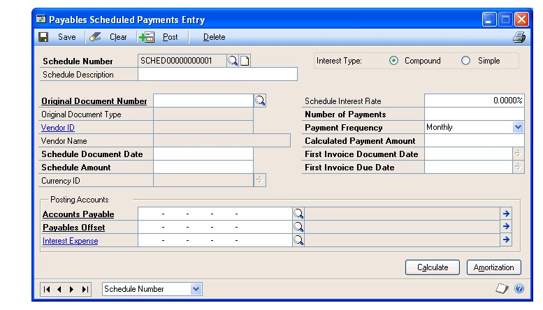

2. Enter a schedule number and description.

3. Select the original document number. Default entries will appear in multiple fields in this window after you have selected a document.

4. Verify the date in the Schedule Document Date field. The default entry comes from the original invoice and is the general ledger posting date.

5. Enter the schedule amount. The default entry in this field is the total schedule amount, and it is equal to the amount remaining on the original invoice.

6. Mark either compound or simple interest. Enter the rate in the Schedule Interest Rate field. If you enter 1, the interest rate will be 1%.*Simple interest is calculated from the first payment rather than the schedule date. If a payment schedule is created from an existing invoice, the interest is calculated from the date of the original invoice.*

7. Enter the number of payments for the payment schedule.

8. Enter or select the payment frequency. This field is used to define how often payments will be made.

9. Select the dates, and verify and enter the accounts for the payment schedule. The default entries are from the original document.

10. Choose Calculate to update the amount displayed in the Calculated Payment Amount field.

11. Choose Amortization to open the Payables Amortization Schedule window, where you can view the payment schedule’s amortization schedule and edit the due date and the payment amount for each line.

11. Choose Save to save the payment schedule or Post to post it.

If you are using vendor approval workflow, the vendor must have the workflow status of Approved or No Approval Needed before you can post.

If you post the transaction, the Payables Scheduled Payments Posting Journal, Payables Posting Journal, Distribution Breakdown Register - Detail, and Distribution Breakdown Register - Summary will print when you close the window.

#### Viewing amortization schedules

Amortization schedules are created when you choose the Calculate button in the Payables Scheduled Payments Entry window. You can view any unposted invoice within a payment schedule in the Payables Amortization Schedule window. Posted invoices within a payment schedule can be viewed only by printing the Payables Amortization Schedule Report.

**To view an amortization schedule:**

1. Open the Payables Scheduled Payments Entry window. 
(Purchasing \>\> Transactions \>\> Scheduled Payments)

2. Enter or select a schedule number.

3. Choose Amortization to open the Payables Amortization Schedule window.

If there is no interest, you can edit the Due Date and Payment Amount fields by entering the appropriate information in those fields.

4. Choose OK to save the changes.

#### Posting Payables scheduled payments

Use the Post Payables Scheduled Payments window to post payments. You can post payments individually or many at one time.

**To post a Payables scheduled payment:**

1. Open the Post Payables Scheduled Payments window. 
(Purchasing \>\> Routines \>\> Post Scheduled Payments)

2. Select Vendor ID or Schedule Number.

3. Mark All to view all scheduled payments or enter range restrictions to post a subset of the available schedule.

4. You can enter a date in the Due Date Cutoff field to restrict the scheduled payments displayed in the scrolling window to those entered prior to the cutoff date.

5. Choose Display All or Marked. Choosing Marked will limit those payments to ones that were marked, and choosing All will show both marked and unmarked payments within the selected range.

6. Select Schedule Number or Vendor ID from the Sort by dropdown list.

7. Mark the documents individually if you want to post only specific scheduled payments. If you want to post all the payments, you can choose the Mark All option.

8. Choose Post to post the marked payments.

9. Close the window. If you chose to post the marked payments, the Payables Posting Journal, Distribution Breakdown Register - Detailed, and Distribution Breakdown Register - Summary will print.

#### Deleting unposted payment schedules

Use the Payables Scheduled Payments Entry window to delete unposted payment schedules. Posted schedules can’t be deleted.

**To delete an unposted payment schedule:**

1. Open the Payables Scheduled Payments Entry window. 
(Purchasing \>\> Transactions \>\> Scheduled Payments)

2. Select a payment schedule.

3. Choose Delete.

4. A message will ask you to confirm the removal of the payment schedule you’re deleting; choose Yes.

#### Editing posted payment schedules

You can edit the individual due dates and payment amounts only if there is no interest applied to a payment schedule.

**To edit a posted payment schedule:**

1. Open the Payables Scheduled Payments Entry window. 
(Purchasing \>\> Transactions \>\> Scheduled Payments)

2. Select or enter a schedule number.

3. Enter the interest rate and payment amounts for a posted payment schedule with interest. If there is no interest, you can also edit the due date and payment amount.

4. Choose OK to save the changes.

#### Voiding posted payment schedules

Posted payment schedules are permanent. If you want to void a payment schedule, you must post all of the invoices and void each invoice
individually. If there are many payments, you can choose to change the number of payments to one, and then you can void a single invoice.

**To void a posted payment schedule:**

1. Open the Payables Scheduled Payments Entry window. 
(Purchasing \>\> Transactions \>\> Scheduled Payments)

2. Select or enter a schedule number.

3. Enter 1 as the number of payments.

4. Choose Post to create an open voucher that can be voided.

5. Void each individual invoice.

Refer to *Chapter 9, “Transaction maintenance,”* for further information on voiding posted transactions.

6. After you have posted and voided all the individual invoices, you can void the payment schedule.

### Chapter 12: Applying

Applying is the process of assigning specific amounts to pay all or part of a transaction. T*o apply documents if you are using vendor approval workflow, the vendor must have the workflow status of Approved or No Approval Needed.*

Applying is explained in the following sections:

- *Applying overview*

- *How the apply posting date updates General Ledger*

- *Auto-applying transactions*

- *Applying a specific transaction*

- *Applying a specific amount*

- *Unapplying transactions*

#### Applying overview

You can apply the following types of documents using the Apply Payables Documents window:

- Apply credit memos or returns as they’re entered by choosing Apply in the Payables Transaction Entry window to open the Apply Payables Documents window.

- Apply manual payments as they’re entered by choosing Apply in the Payables Manual Payment Entry window to open the Apply Payables Documents window.

- Apply computer payments as they’re entered by choosing Apply in the Edit Payables Checks window to open the Apply Payables Documents window.

- Apply posted credit memos, returns, and payments by opening the Apply Payables Documents window. If you applied a credit memo, return, or payment to a posted transaction, you also can unapply it using this window.

*If the credit memo, return, or payment completely pays off the invoice it’s applied to, these transactions are moved to history when you close this window.*

When you apply documents, a tax rebate is calculated when the following conditions are met:

- You marked Calculate Tax Rebates in the Company Setup Options window

- A payment, credit memo, or return is applied to a purchases document

- The date of the payment matches the discount date

- The terms discount is available

If you entered a withholding vendor using the Company Setup Options window and the document being applied is subject to withholding, you might encounter the following restrictions:

- The withholding amount is taken when applying two documents. The withholding amount is taken only if the debit document is fully paid. You can override this by manually entering a withholding amount.

- You can’t apply a credit document subject to withholding to a debit document not subject to withholding.

- You can apply a debit document subject to withholding to any credit document.

- When you mark the apply check box or you enter an apply, terms taken, or writeoff amount that fully pays off the debit document, withholding is calculated and entered in the Writeoff field. When you choose the Writeoff link, the Additional Purchasing Tax and Writeoff Distributions window displays the amount being withheld.

#### How the apply posting date updates General Ledger

If you enter an apply posting date and apply amounts, the amounts are posted to General Ledger using the date you entered. (The Apply Date field displays the date you apply a document.) Discounts, writeoffs, realized gains, and realized losses are posted to General Ledger using the apply posting date.

If you apply amounts, and then change the apply posting date and apply amounts again, the first amounts are posted to General Ledger using the previous apply posting date while the latter amounts are posted using the new apply posting date.

For example, if you enter January 15 as the General Ledger apply posting date and you partially apply a document, the applied amounts are posted using the January 15 date. If you apply the rest of the document on January 20, those amounts are posted as of the January 20 apply posting date.

#### Auto-applying transactions

Use the Apply Payables Document window to auto-apply a transaction. Autoapplying applies the transaction to as many documents as the amount being applied permits, unless you’re using multiple remit-to addresses. If you’re using multiple remit-to addresses for a vendor, payment, credit, and return documents will be applied to debit documents with the same remit-to address.

The way that you open the Apply Payables Documents window can have an effect on how documents are applied, as indicated in the following table.

| **Open Apply Payables Documents by...**                             | **Effect on remit-to addresses**                                                      |
|---------------------------------------------------------------------|---------------------------------------------------------------------------------------|
| Choosing Purchasing \>\> Transactions \>\> Apply Payables Documents | Credits and returns will be applied across remit-to addresses                         |
| Clicking the Apply button in the Edit Payables Checks window        | Credits and returns will be applied only to debit documents the same remit-to address |

If you auto-apply transactions, any discount is taken if the discount is still available as of the apply date, and if the unapplied amount is large enough to pay off the transaction. Alternate currencies are applied using the originating amount. If the transaction balance is zero after applying, the transaction is transferred to history.

When you close the Apply Payables Documents window, the changes to discounts available, discounts taken, realized gains or losses, rounding, and writeoffs are posted.

**To auto-apply transactions:**

1. Open the Apply Payables Documents window. 
(Purchasing \>\> Transactions \>\> Apply Payables Documents)

    

2. Enter or select a vendor ID.

3. Enter or select the document to apply or unapply.

4. If General Ledger is part of your system, enter the date for the posting date in General Ledger. Only discounts taken and writeoff amounts are posted.

5. Choose Auto Apply to apply the credit memo, return, or payment to all or as many documents as the document being applied permits.

The document is applied to documents having the oldest document date or due date, depending on what’s chosen in the Payables Management Setup window. Any discount is taken if the discount is still available as of the user date, and if the unapplied amount is large enough to pay off the transaction.

6. Choose OK to close the window.

If you entered any Terms Taken or Writeoff amounts, a Payables Apply Document Journal might be printed when you close the window, depending on the options you selected in the Posting Setup window.

#### Applying a specific transaction

Use the Apply Payables Documents window to apply a specific transaction. You can mark any number of documents until the payment, return, or credit memo is fully applied.

You also can use this window to unapply any transactions. You might want to unapply a payment, credit memo, or return if it was applied to the incorrect document. For example, assume you applied a prepayment to an invoice and then you decide to return the merchandise; you would unapply the prepayment.

If the transaction balance is zero after applying, the transaction is transferred to history. To print a check stub with a transaction that has a zero balance after applying, apply the document using the Edit Payables Checks window. When you close the Apply Payables Documents window, the changes to discounts available, discounts taken, realized gains or losses, rounding, and writeoffs are posted.

**To apply a specific transaction:**

1. Open the Apply Payables Documents window. 
(Purchasing \>\> Transactions \>\> Apply Payables Documents)

2. Enter or select a vendor ID.

3. Enter or select the document to apply or unapply.

4. If General Ledger is part of your system, enter the date for the posting date in General Ledger. Only discounts taken and writeoff amounts are posted.

5. Mark the check box next to each transaction you want this document applied to; to unapply a document, unmark the check box.

6. Choose OK to close the window.

    - If the transaction is fully applied, all available discounts are taken.

    - To apply only a part of a document, enter the amount to apply in the Apply Amount field. You also can enter amounts in the Terms Taken and Writeoff fields.

To enter amounts to write off a GST discounts taken (used in Canada and New Zealand) or a withholding (used in Australia) amount, choose the Terms Taken, Terms Available, or Writeoff links to open the Additional Purchasing Tax and Writeoff Distributions window, where you can enter these amounts. Close the window when you finish.

You can print an Apply Documents Posting Journal if you entered discount or writeoff amounts. This audit trail report is optional; you can select to print audit trail reports when you set up your system.

#### Applying a specific amount

Use the Apply Payables Documents window to apply a specific amount. By applying a specific amount you can apply only a part of a document, or apply a part of the document to one transaction and a part to another transaction.

If the transaction balance is zero after applying, the transaction is transferred to history. When you close the Apply Payables Documents window, the changes to discounts available, discounts taken, realized gains or losses, rounding, and writeoffs are posted.

**To apply a specific amount:**

1. Open the Apply Payables Documents window. 
(Purchasing \>\> Transactions \>\> Apply Payables Documents)

2. Enter or select a vendor ID.

3. Enter or select the document to apply or unapply.

4. If General Ledger is part of your system, enter the date for the posting date in General Ledger. Only discounts taken and writeoff amounts are posted.

5. Enter the amount to apply in the Apply Amount field.

6. Choose OK to close the window.

An Apply Documents Posting Journal might be printed if you entered discount or writeoff amounts. This audit trail report is optional; you can select to print audit trail reports when you set up your system.

#### Unapplying transactions

Use the Apply Payables Documents window to unapply a document. Unapplying a document reverses the entries that applied amounts to the document. You can use the Apply Payables Document window to unapply a document without voiding it. If you unapply a credit memo, return, or payment, the current transaction amount for the debit document is increased. You also unapply amounts when you void a credit document.

**To unapply transactions:**

1. Open the Apply Payables Documents window. 
(Purchasing \>\> Transactions \>\> Apply Payables Documents)

2. Enter or select a vendor ID.

3. Enter or select the document to unapply.

4. To unapply all the documents in the scrolling window, choose Unapply. To unapply specific transactions, unmark the check box next to the transactions to unapply. To unapply specific amounts, delete the amount in the Apply Amount field. Discount amounts that were applied are unapplied, as well.

When you close the Apply Payables Documents window, the changes to discounts available, discounts taken, realized gains or losses, rounding, and writeoffs are posted.

### Chapter 13: Customer/vendor consolidations

Over the course of a business relationship, some customers become vendors and some vendors become customers. You can use Customer/Vendor Consolidations to transfer information between Receivables Management and Payables Management, so you can create a customer record using information that’s already in your system in a vendor record, and vice versa.

Using Customer/Vendor Consolidations, you can consolidate balances in payables and receivables for a single company when you work with that company as both a customer and a vendor. You can assign relationships between existing customers and vendors and then apply open debit and credit documents against each other to consolidate the current balances.

This information is divided into the following sections:

- *Setting up customer/vendor consolidations*

- *Creating customer/vendor relationships*

- *Auto-creating customers or vendors*

- *Consolidating customer and vendor documents*

- *Using the cross-module link*

#### Setting up customer/vendor consolidations

Use the Customer/Vendor Consolidation Setup window to create default entries for Customer/Vendor Consolidations. You can set up default entries for a suspense account, payables description prefix, next payables document number, and receivables description prefix.

**To set up customer/vendor consolidations:**

1. Open the Customer/Vendor Consolidation Setup window. 
(Administration \>\> Setup \>\> Company \>\> Customer/Vendor Setup)

    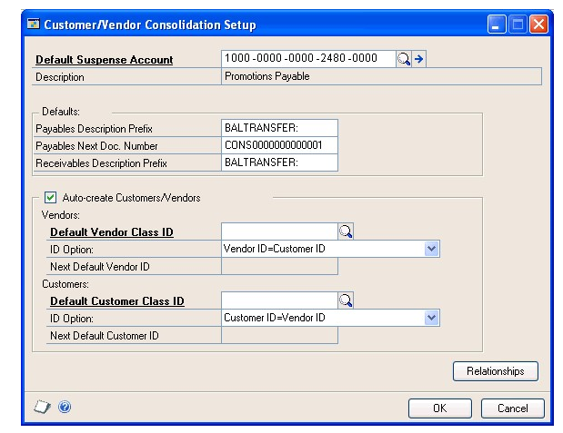

2. Enter or select a posting or allocation account as the default suspense account.

The Description field will contain the default entry from the Account Maintenance window.

Enter a payables description prefix. Both this prefix and the receivables document number will be combined during the consolidation process. This information will become the transaction description for all the payables consolidations transactions.

3. Enter a payables next document number or accept the default entry. If you enter the number, it must be a number that can be incremented. For example, you could not use 10008PM because it ends in a letter. You could use PM10008 because it ends in a number.

4. Enter a receivables description prefix. Both this prefix and the payables document number will be combined during the consolidation process. This information will become the transaction description for all the receivables consolidations transactions.

5. Verify that the Auto-create Customers/Vendors option is marked. If you mark this option, you can automatically create a new customer record from an existing vendor record or a new vendor record from an existing customer record. If this option isn’t marked, you’ll have to create new customer and vendor records manually.

The information that you enter in this field will replace any information that might have been entered in the same field in the Refund Checks Setup window.

6. Select one of these ID options from the drop-down list:

    - If you want the vendor IDs to match the customer IDs, select Vendor ID=Customer ID.

    - If you want the vendor IDs to be the next available vendor ID, select Vendor ID=Next Default Vendor ID. You also must enter a default vendor ID to use, which increments by 1.

The information that you enter here will replace any information that might have been entered in the same field in the Refund Checks Setup window.

7. If you marked Auto-create Customers/Vendors, you can enter or select the default customer class ID. This information is used to automatically add the default accounts when you use the auto-create capability to create new vendor records in the Customer/Vendor Relationships window.

8. Select one of these ID options from the drop-down list:

    - If you want the customer IDs to match the vendor IDs, select Customer ID=Vendor ID.

    - If you want the customer IDs to be the next available customer ID, select Customer ID=Next Default Customer ID. You also must enter a default customer ID to use, which increments by 1.

9. Choose OK to save your changes and close the window.

#### Creating customer/vendor relationships

Use the Customer/Vendor Relationships window to link a customer to a vendor or a vendor to a customer. These relationships will be used when you consolidate the balances of the customer and vendor.

**To create a customer/vendor relationship:**

1. Open the Customer/Vendor Relationships window.
(Purchasing \>\> Cards \>\> Customer/Vendor)

    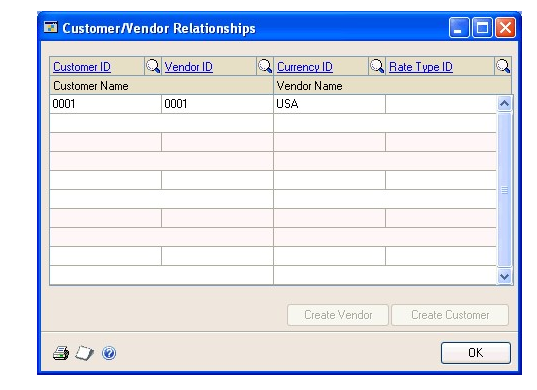

2. Enter or select a vendor and a customer. You can create more than one customer/vendor relationship at a time in this window by entering multiple customers and vendors.

3. Verify that the default currency IDs for both the customer and vendor are the same. If the default currency is not the functional currency, you must select a rate type.

    > [!NOTE]
    > If you have Multicurrency Management registered and have entered a default currency for the customer, the Currency field will display that currency. You can change the currency.

4. Choose OK to create and save the customer/vendor relationship and close the window.

#### Auto-creating customers or vendors

Use the Customer/Vendor Relationships window to automatically create customer records from existing vendor records and vendor records from existing customer records. This process will create a new customer or vendor record without changing the existing record. You must have the Auto-create Customer/Vendors option marked in the Customer/Vendor Consolidations Setup window. For more information, refer to *Setting up customer/vendor consolidations*.

**To auto-create a customer or vendor:**

1. Open the Customer/Vendor Relationships window. 
(Purchasing \>\> Cards \>\> Customer/Vendor)

2. Enter or select a customer or vendor. This procedure requires you to use an existing customer or an existing vendor, but you don’t need to have both an existing customer and vendor.

Verify that the default currency ID is correct. If the currency isn’t the functional currency, you must select a rate type.

3. Choose the Create Customer or the Create Vendor button to open the Customer Maintenance window or the Vendor Maintenance window. The default accounts come from the class ID that you entered in the Customer/Vendor Consolidation Setup window.

4. Make any changes that are needed to the vendor information and choose save.

5. Choose OK to save the relationship and close the window.

#### Consolidating customer and vendor documents

Use the Customer/Vendor Consolidations window to create consolidation documents to transfer the balance for a customer account to the related vendor account or from the vendor account to the related customer account.

**To consolidate customer and vendor documents:**

1. Open the Customer/Vendor Consolidations window. 
(Sales \>\> Transactions \>\> Customer/Vendor Transactions)

2. Mark Customer to display the customer ID first or Vendor to display the vendor ID first.

3. Enter or select the customer or vendor ID. The related customer or vendor will appear in the window.

4. Verify the default currency ID that was set up in the Customer/Vendor Relationships window. You can enter or select the functional currency even if it isn’t the default currency.

If you select the functional currency, you can view all the transactions including transactions entered in the alternate currency. For more information on setting up the default currency for the customer/vendor relationship, refer to *Creating customer/vendor relationships* .

5. Accept the default transfer date or enter a different date. If you enter the date, it must be in an open period in Receivables Transaction Entry and Payables Transaction Entry.

If you have Multicurrency Management registered for Payables Management and Receivables Management, the sub-module revaluation must be greater than the last revaluation date for both the customer and vendor. For more information, refer to the Multicurrency Management documentation.

6. Mark to display either the National Account or the Specific Customer view option. These options will be enabled if the customer ID is the parent of a national account.

7. Mark the Receivables option, Payables option, or both options. Then mark the documents you want to transfer or consolidate. You can view the customer and vendor transfer totals in the Customer Transfer Total and the Vendor Transfer Total fields to verify your document transfer.

8. If you choose Preview, the consolidation document information for both payables and receivables will be displayed in the Consolidation Transaction Preview window. The transactions that will be created will be displayed along with the net charges to the customer’s or vendor’s balance.

9. Choose Post. Posting will create the consolidation documents and consolidate the balances in payables and receivables.

#### Using the cross-module link

You can link the selected receivables consolidation document to the corresponding payables consolidation document, and you can link the selected payables consolidation document to the corresponding receivables consolidation document. Using this capability you can quickly verify information about a specific transaction in both Payables Management and Receivables Management.

**To use the cross-module link**

1. Open the Payables Transaction Inquiry - Vendor window. 
(Purchasing \>\> Inquiry \>\> Transaction by Vendor)

2. Select a consolidation document. Consolidation documents will have the prefix that you assigned in the Customer/Vendor Consolidation Setup window. Click the Document Number link to open a linked window.

3. Choose the Description expansion button to open the related window.

If the linked window you were viewing was in payables, then the related linked window would be for receivables. If the linked window you were viewing was in receivables, then the related linked window would be for payables.

### Chapter 14: Multicurrency applying

You can apply and unapply multicurrency transactions using the same windows and procedures as transactions that involve only one currency, but you should be familiar with how applying differs when using multicurrency transactions.

This information is divided into the following sections:

- *Existing unapplied credits and auto-applying*

- *Currency selections and auto-applying*

- *Posted multicurrency transactions*

- *Multicurrency transactions applied to manual checks*

- *How currency amounts are displayed in the scrolling window*

- *Realized gains and losses*

- *Multicurrency rounding during posting*

- *Multicurrency auto-applying*

- *Multicurrency unapplying*

- *Posted multicurrency payment amounts applying overview*

- *Applying posted multicurrency payment amounts*

#### Existing unapplied credits and auto-applying

You can apply unapplied payments, credit memos, and returns for the selected vendors to vouchers in the batch. You also can specify the currency in the documents that are automatically applied. Depending on whether the batch currency is the functional currency or another currency, the currency field labels change.

When the batch currency ID is the functional currency, the following information applies.

| **Field label**          | **Value**                                                              |
|--------------------------|------------------------------------------------------------------------|
| Functional currency only | Automatically applies only credit documents in the functional currency |
| All currencies           | Automatically applies credit documents in any currency                 |

When the currency ID is another currency, the following information applies:

| **Field label**               | **Value**                                                                                              |
|-------------------------------|--------------------------------------------------------------------------------------------------------|
| Batch currency only           | Automatically applies only credit documents in the same currency as the batch                          |
| Batch and functional currency | Automatically applies credit documents in the same currency as the batch or in the functional currency |

#### Currency selections and auto-applying

If you’re using Multicurrency Management and you automatically apply a functional currency batch, only documents that also use the functional currency are applied using the originating amounts for the transaction as the basis for the apply process. If the functional amounts don’t match, a realized gain or loss is calculated, and the gain or loss is posted when you close the Edit Payables Checks window.

You can apply the batch currency or functional currency credit documents automatically only to batch currency or functional currency debit documents.

You can print individual computer checks for instances when you wouldn’t enter a manual payment, or include a check in a computer check run, by using the Edit Payables Checks window to enter payments for a single voucher or vendor.

When you’re creating checks manually and you auto-apply multicurrency transactions, functional currency checks and credit documents are automatically applied to functional currency documents. Multicurrency checks are automatically applied to documents that use the same currency.

When you apply specific multicurrency transactions or amounts, you can apply functional currency checks to all documents. You can apply other posted credit documents in the batch or functional currency only to documents using the batch or functional currency. You can’t apply other posted credit documents in the batch currency or the functional currency to debit documents that aren’t in the batch or functional currency.

Information on check stubs and remittance forms is displayed in the originating currency of the check.

#### Posted multicurrency transactions

You must post transactions that aren’t in the functional currency before you can apply them. During the apply process, if the originating amounts for the debit and credit documents are the same but the functional amounts aren’t the same, a realized gain or loss is calculated and posted when you close the Apply Payables Documents window. A realized gain is recognized when the amount applied in the functional currency is greater than the document’s original amount in the functional currency. A realized loss is recognized when the amount applied in the functional currency is less than the document’s original amount in the functional currency.

With revaluation, a realized gain or a realized loss might be reversed when you apply. If a credit document (credit, return, or payment) that’s been revalued is applied to a debit document that’s been revalued, and both documents have an unrealized gain or loss attached to them, the unrealized gain or loss for each document is reversed and recorded as a realized gain or loss. If a realized gain or loss is attached to the transaction as a result of revaluating and if, at the time of settlement, the exchange rate changed from the last revaluation, an additional gain or loss is realized.

Auto-applying applies the document to as many documents as the amount being applied permits. If you entered multicurrency transactions, payments, credit memos, or returns are applied to documents with the same currency ID, using the originating amounts for the transaction as the basis for the apply process.

When applying a specific transaction or amount for a multicurrency document, the apply-from and apply-to currencies must be the same, or the apply-to currency must be the functional currency, to be applied. For functional currency amounts, you can apply any apply-to document.

#### Multicurrency transactions applied to manual checks

When you auto-apply multicurrency transactions for checks created manually, functional currency checks and credit documents are automatically applied to functional currency documents. Multicurrency checks are applied automatically to documents that use the same currency.

When you apply specific multicurrency transactions or amounts, you can apply functional currency checks to all documents. You can apply other posted credit documents in the batch or functional currency only to documents using the batch or functional currency. You can’t apply other posted documents in the batch or functional currencies to debit documents that aren’t in the batch or functional currencies.

#### How currency amounts are displayed in the scrolling window

In the scrolling window of the Apply Payables Documents window, the Apply From Currency ID field displays the currency ID of the credit document you’re applying to another document. The currency ID displayed in this field determines how amounts are shown in the scrolling window, according to the following currency rules:

- If the apply-from currency ID displayed is an originating currency, all amounts are shown in the originating currencies.

- If the apply-from currency ID displayed is your company’s functional currency, all amounts for that document are in the functional currency as of the most recent revaluation.

- If a document you’re applying to is in the functional currency, all amounts for that document are in the functional currency as of the most recent revaluation.

The documents being applied to are displayed in the currency amounts they will be applied in. The apply currency depends on the apply-from currency. The apply currency always is the apply-from currency, except when the document you’re applying from uses a non-functional currency and the document you’re applying to uses the functional currency. In this case, the apply currency is the functional currency.

#### Realized gains and losses

In multicurrency transactions, if the originating currency amounts match but the functional currency amounts don’t match because the payment and debit document were entered using different exchange rates, a realized gain or loss is calculated and displayed in the Realized Gain/Loss column in the functional currency. That amount is posted when you close the window. The Accounts Payable account is the offset account.

For example, assume that your company’s functional currency is US dollars. You posted the following invoice in October and the payment in November, both in euros, using a multiply rate calculation method, as is shown in the following table.

| Invoice amount in originating currency | 1000EUR  |
|----------------------------------------|----------|
| Payment amount in originating currency | 1000EUR  |
| Exchange rate in October               | 0.6696   |
| Exchange rate in November              | 0.6734   |
| Invoice amount in functional currency  | \$669.60 |
| Payment amount in functional currency  | \$673.40 |

When the payment is applied to the invoice, a realized loss of \$3.80 is calculated because the functional equivalent of the invoice (\$669.60) is \$3.80 less than the functional equivalent of the payment (\$673.40).

When the realized loss is posted, the Accounts Payable account assigned to the vendor is credited to offset the Realized Loss account you entered in the Multicurrency Posting Account Setup window.

#### Multicurrency rounding during posting

When applying documents, if the originating debit and credit amounts balance but the functional equivalents don’t balance, the difference is posted to the Rounding Difference account. This also is true when the functional amounts are zero but amounts remain in the originating currency.

#### Multicurrency auto-applying

If you entered multicurrency transactions, payments, credit memos, or returns are applied to documents with the same currency ID, using the originating amounts for the transaction as the basis for the apply process. If the originating amounts don’t match, a realized gain or loss is calculated and the gain or loss is posted when you close the Apply Payables Documents window.

#### Multicurrency unapplying

If you void a multicurrency document, any realized gains or losses originally posted also are reversed. Use the Void Historical Payables Transactions window to void historical credit transactions and to unapply the vouchers. Use the Void Open Payables Transactions window to void any transaction or payment that’s been posted and is unapplied.

#### Posted multicurrency payment amounts applying overview

When you apply posted multicurrency payment amounts using the Apply Payables Documents window, you must specify several options, such as apply posting date and apply method. The following information more fully explains some of these options.

- **Currency ID**

    When you select a document to apply, the currency ID assigned to that document appears in the Apply From Currency ID field. This field is the reference for the documents in the scrolling window you can apply. The exchange rate used to calculate the functional equivalent is displayed in the scrolling window.

- **Apply and apply posting dates**

    If General Ledger is part of your system, you can enter the date for the posting date in General Ledger. Only discounts taken, writeoff amounts, and realized gain and loss amounts are posted.

    If you enter a posting date and apply amounts, amounts are posted to General Ledger using the date you entered. If you apply amounts, and then change the posting date and apply amounts again, the first amounts are posted to General Ledger using the previous posting date while the latter amounts are posted using the new posting date. For example, if you enter January 15 as the General Ledger posting date and you partially apply a document, the applied amounts are posted using January 15 as the General Ledger posting date. If you apply the rest of document using January 20 as the new posting date, those amounts are posted using January 20 as the posting date.

- **Apply options**

    You can choose one of three methods: auto-applying, applying specific transactions, or applying specific amounts.

- **Auto-applying**

    Choose Auto Apply to apply the payment, credit memo, or return to documents that have the same currency ID as the apply-from document. As many documents that meet the requirement are applied based on the oldest document date or due date, depending on the selection in the Payables Management Setup window. If you use Auto Apply, any discounts are taken if the discount is still available as of the user date, and if the unapplied amount is large enough to pay off the transaction. Alternate currencies are applied using the originating amounts.

- **Applying specific transactions**

    To apply the document to specific transactions, mark the check box next to each transaction. For functional currency documents, you can apply any apply-to document. For alternate currency documents, the apply-from and apply-to currencies must be the same, or the applyto currency must be the functional currency to be applied. Continue marking documents until the credit memo or return amount is fully applied. If you use this method, all available discounts as of the user date are taken.You also can enter amounts in the Terms Taken and Writeoff fields.

- **Applying specific amounts**

    To apply part of the document to one transaction and part to another transaction, or to apply only part of the document, enter the amount to apply in the Applied  mount field. For functional currency documents, you can apply any apply-to document. For alternate currency documents, the apply-from and apply-to currencies must be the same; or the apply-to currency must be the functional currency to be applied.

- **Unapplying**

    To unapply all the documents in the scrolling window, choose Unapply. To unapply specific transactions, unmark the check box next to the transactions to unapply. To unapply specific amounts, delete the amount in the Apply Amount field. Discount amounts that were applied also are unapplied. If the originating amounts match but the functional amounts don’t match because the payment and debit document were entered using different exchange rates, a realized gain or loss is calculated and displayed in the Realized Gain/Loss column in the functional currency. That amount is posted when you close the window, and the Accounts Payable account the offset account.

##### Example

Your company’s functional currency is US dollars. You posted the following invoice on October 4 and the payment on November 11, both in euros, using a multiply rate calculation method, as is shown in the following table.

| **Invoice amount entered in originating currency** | **1000 EUR** |
|----------------------------------------------------|--------------|
| Exchange rate on October 4, 2004                   | 0.6696       |
| Invoice amount in functional currency              | \$669.60     |
| Exchange rate on November 11, 2004                 | 0.6734       |
| Payment amount in functional currency              | \$673.40     |

When the payment is applied to the invoice, a realized loss of \$3.80 is calculated because the functional equivalent of the invoice (\$669.60) is \$3.80 less than the functional equivalent of the payment (\$673.40) When the realized loss is posted, the Accounts Payable account assigned to the vendor is credited to offset the Realized Loss account you entered in the Multicurrency Posting Account Setup window.

> [!NOTE]
> If the transaction balance is zero after applying, the transaction is transferred to history. When you close the Apply Payables Documents window, the changes to discounts available, discounts taken, realized gains or losses, rounding, and writeoffs are posted.

#### Applying posted multicurrency payment amounts

Use the Apply Payables Documents window to apply payments, prepayments, credit memos, and returns that use alternate currencies. Multicurrency transactions not in the functional currency must be posted before you can apply them.

If you applied a credit memo, return, or payment to a posted transaction, you also can use this window to unapply it. You might want to unapply a payment, credit memo, or return if it was applied to the incorrect document. For example, assume you applied a prepayment to an invoice and you then decide to return the merchandise. You would unapply the prepayment.

**To apply a posted multicurrency payment amount:**

1. Open the Apply Payables Documents window.
(Purchasing \>\> Transactions \>\> Apply Payables Documents)

2. Enter or select a vendor ID, and enter or select the document to apply or unapply.

3. Enter an apply posting date (optional).

    To enter amounts to write off a GST discounts taken (used in Canada and New Zealand) or write off a withholding (used in Australia) amount, choose the Terms Taken, Terms Available, or Writeoff links to open the Additional Purchasing Tax and Writeoff Distributions window, where you can enter these amounts. Close the window when you finish.

4. Apply the document.

The multicurrency version of the Apply Documents Posting Journal might be printed if you entered discount or writeoff amounts. This option is set up in the Posting Setup window. This audit trail report is optional; you can select to print audit trail reports when you set up your Microsoft Dynamics GP system.

## Part 3: Inquiries and reports

With Payables Management, you can view important information about vendor activity on-screen using the inquiry windows. These windows provide detailed and summarized Payables Management information.

You also can use Payables Management reports as records of vendors when you edit setup or transaction entries, and to find aging, posting, and history information. This information is divided into the following chapters:

- *Chapter 15, “Inquiries,”* explains how to view important information about vendor activity and payables transactions.

- *Chapter 16, “Reports,”* shows you how to use Payables Management reports to analyze vendor activity and identify errors in transaction entry.

### Chapter 15: Inquiries

Analyzing vendor records and transactions is an important part of your Microsoft Dynamics GP system. You can view important information about vendor activity on-screen using the Inquiry windows, which provide detailed and summarized Payables Management information.

Payables inquiry information is divided into the following sections:

- *Multicurrency inquiries*

- *Reporting currency*

- *Viewing vendor information*

- *Viewing vendor purchasing information*

- *Viewing vendor period activity*

- *Viewing vendor yearly activity*

- *Viewing payables summary information*

- *Viewing payables transaction detail information*

- *Viewing vendor transaction information*

- *Viewing payables documents as they originally were entered*

- *Viewing payables payment entries*

- *Viewing payables applied amounts*

#### Multicurrency inquiries

While viewing information using certain Payables Management windows, you can view multicurrency amounts in the originating, functional, or reporting currency. Choose View \>\> Currency \>\> Functional, Originating, or Reporting while viewing an inquiry window. The option is saved on a per user, per window basis.

You also can use the currency list button in the windows that support changing the currency view. The View menu and currency list button are available in the following Payables Management windows:

- Payables Payment Terms Zoom

- Payables Payments Zoom

- Payables Transaction Entry Zoom

- Payables Transaction Inquiry - Document

- Payables Transaction Inquiry - Vendor

The first time you open these windows after registering Multicurrency Management, transactions are displayed in the originating currency. If you change the currency view, the option you used last is the default view the next time you open that window.

#### Reporting currency

A reporting currency converts functional or originating currency amounts to another currency on inquiries and reports.

During the reporting currency setup in Multicurrency Management, you must set up a reporting currency and enter a default exchange rate and rate calculation method. Depending on how your system is set up, you might be able to override the default reporting currency exchange rate or rate calculation method on inquiries and reports. To change the default reporting currency exchange rate, choose View \>\> Currency \>\> Modify Reporting Rate to open the Modify Reporting Rate window.

See the Multicurrency Management documentation for more information about reporting currency.

#### Viewing vendor information

Use the Vendor Inquiry window to view demographic and other account information you entered for a particular vendor record using the Vendor Maintenance window.

**To view vendor information:**

1. Open the Vendor Inquiry window. 
(Purchasing \>\> Inquiry \>\> Vendor)

2. Enter or select a vendor ID.

3. If the vendor record has document attachments, choose the Attachment Management icon to open the Document Attachment Inquiry window.

4. To open the Vendor Inquiry Options window, where you can view the additional options entered for the vendor in the Vendor Maintenance Options window, choose Options.

There are no inquiry windows you can view from this window. However, you can choose the Vendor ID link to open the Vendor Maintenance window, where you can make changes to the vendor record.

#### Viewing vendor purchasing information

Use the Vendor Credit Summary Inquiry window to decide when to pay a vendor, or when you’re checking on the current balance total. This window displays financial information about the purchases you made from the selected vendor.

The Current Balances field and the aging period information were updated as you entered and posted transactions for each vendor. If you marked Age Unapplied Credit Amounts in the Payables Management Setup window, unapplied credit amounts also were included in the aging process.

If you are allowing prepayments for purchase orders, prepayments are not included in the current balance amount because a prepayment is a deferred charge and not a payment on accounts payables.

**To view vendor purchasing information:**

1. Open the Vendor Credit Summary Inquiry window.
(Purchasing \>\> Inquiry \>\> Vendor Credit)

2. Enter or select a vendor ID.

To open the Payables Transaction Inquiry - Vendor window, which displays a list of transactions entered, choose the following links:

- Open Prepayments if prepayments for purchase orders are allowed

- Unpaid Finance Charges

- Unapplied Payment

- Aging Period

- Amount

#### Viewing vendor period activity

Use the Vendor Period Summary Inquiry window to analyze trends in purchasing activity over a number of fiscal periods.You can view purchasing activity with a vendor by fiscal or calendar period.

**To view vendor period activity:**

1. Open the Vendor Period Summary Inquiry window.
(Purchasing \>\> Inquiry \>\> Vendor Period)

2. Enter or select a vendor ID.

To open the Vendor Maintenance window, where you can make changes to the vendor record, choose the Vendor ID link.

#### Viewing vendor yearly activity

Use the Vendor Yearly Summary Inquiry window to compare your purchasing pattern for the current year, last year, and life to date for a particular vendor. You can select one of the following summary views:

**Amounts Since Last Close** Displays current summary amounts for the selected vendor.

The information that is displayed in the Vendor Yearly Summary Inquiry window when you select Amounts Since Last Close in the Summary View list might not represent actual fiscal year totals if you close the fiscal year before or after the last day of the fiscal year. For example, the amounts in the Year to Date column might continue to increase as transactions are posted after the last day of the fiscal year; then when you close the fiscal year, the amounts in the Last Year column will include those transactions posted after the last day of the fiscal year that you closed.

**Fiscal Year** Displays summary amounts for the selected vendor for the fiscal year you enter.

**Calendar Year** Displays summary amounts for the selected vendor for the calendar year you enter.

Closing the fiscal year will not affect the information that is displayed in the Vendor Yearly Summary Inquiry window when you select Fiscal Year or Calendar Year in the Summary View list. The amounts displayed for those selections are dependent on the year and periods you enter to display.

**To view vendor yearly activity:**

1. Open the Vendor Yearly Summary Inquiry window.
(Purchasing \>\> Inquiry \>\> Vendor Yearly)

2. Enter or select a vendor ID.

3. Select a summary view. The default summary view was selected in the Payables Management Setup window.

4. If you selected either Fiscal Year or Calendar Year as the summary view, enter a valid fiscal year or calendar year to view information for. Then, mark to view information for all periods, or enter a range of periods.

5. Choose Calculate to redisplay the information according to your settings.

6. To print the Vendor Financial Summary Report, which includes the information you’re currently viewing using the Vendor Yearly Summary Inquiry window, choose File \>\> Print.

#### Viewing payables summary information

Use the Payables Summary Inquiry window to view the total number of documents for each of the document types in Payables Management, along with the total amount for each type. This inquiry might be useful when comparing the original amounts for each document type with the unapplied amounts.

The current balance fields and the aging period information were updated as you entered and posted transactions for each vendor. If you marked Age Unapplied Credit Amounts in the Payables Management Setup window, unapplied credit amounts also were included in the aging process.

**To view payables summary information:**

1. Open the Payables Summary Inquiry window.
(Purchasing \>\> Inquiry \>\> Payables Summary)

2. Select an option and enter range of vendor IDs to display information in the window.

#### Viewing payables transaction detail information

Use the Payables Transaction Inquiry - Document window to view unposted (work), posted (open), and paid transactions (history) by document type.

**To view payables transaction detail information:**

1. Open the Payables Transaction Inquiry - Document window.
(Purchasing \>\> Inquiry \>\> Transaction by Document)

2. Select an option and enter a range of documents to limit the view.

3. To print a report of the information displayed in this window, choose File \>\> Print.

#### Viewing vendor transaction information

Use the Payables Transaction Inquiry - Vendor window to view unposted, posted, and paid transactions by vendor.

**To view a vendor’s transaction information:**

1. Open the Payables Transaction Inquiry - Vendor window. 
(Purchasing \>\> Inquiry \>\> Transaction by Vendor)

2. Enter or select a vendor ID. The transactions for the vendor appear in a scrolling window. (When viewing transactions using this window, a voided document has an asterisk next to the document’s origin in the scrolling window.)

3. Select an option and enter a range of documents to limit the view.

4. Specify whether to view documents in the work, open, or history tables.

5. To print a report of the information displayed in the Payables Transaction Inquiry - Vendor window, choose File \>\> Print.

#### Viewing payables documents as they originally were entered

All the inquiry windows except for the Payables Summary Inquiry window use links so you can view the information entered when a vendor record, transaction, or payment was added, or when a transaction or payment was applied.

For example, you can select a vendor ID in the Vendor Inquiry window, then open the Vendor Maintenance window to view the posting accounts, vendor addresses, and other information entered when the record was created.

**To view a payables document as it originally was entered:**

1. Open the Payables Transaction Inquiry - Document or the Payables Transaction Inquiry - Vendor window. 
(Purchasing \>\> Inquiry \>\> Transaction by Document or Transaction by Vendor)

2. If you’re using the Payables Transaction Inquiry - Vendor window, enter or select a vendor ID to display information in the window.

3. Select a transaction in the scrolling window and choose either the Document Number or Voucher/Payment Number link. The Payables Transaction Entry Zoom window opens.

    

The transaction as it was originally entered is displayed. You can open several other windows from the Payables Transaction Entry Zoom window, as is listed in the following table:

| **Field or button**                                                                                                           | **Window that opens**                 |
|-------------------------------------------------------------------------------------------------------------------------------|---------------------------------------|
| Document Date expansion button                                                                                                | Payables Date Entry Zoom              |
| Payment Terms expansion button                                                                                                | Payables Payment Terms Zoom           |
| Currency ID expansion button (if you’re using Multicurrency Management and the transaction was entered in a foreign currency) | Exchange Rate Entry Zoom              |
| Tax Schedule ID expansion button                                                                                              | Payables Tax Schedule Zoom            |
| Tax expansion button                                                                                                          | Payables Tax Inquiry                  |
| Revaluation button                                                                                                            | Payables Transaction Revaluation Zoom |
| Apply button                                                                                                                  | Payables Apply Zoom                   |
| Distributions button                                                                                                          | Payables Distribution Zoom            |

#### Viewing payables payment entries

Use the Payables Payments Zoom window to view all the entries originally made for a payment entered using the Payables Manual Payments window or the Edit Payables Checks window.

**To view payables payment entries:**

1. Open the Payables Transaction Inquiry - Document or the Payables Transaction Inquiry - Vendor window.
(Purchasing \>\> Inquiry \>\> Transaction by Document or Transaction by Vendor)

2. If you’re using the Payables Transaction Inquiry - Vendor window, enter or select a vendor ID to display information in the window.

3. Select a transaction in the scrolling window whose origin is history and choose the Document Number or Voucher/Payment Number link.

The Payables Payments Zoom window or Payables Transaction Entry Zoom window opens, depending on the transaction you selected.

The payment as it was originally entered is displayed. You can open several other windows from the Payables Payments Zoom window as listed in the following table:

| **Field or button**   | **Window that opens**                 |
|-----------------------|---------------------------------------|
| Date expansion button | Payables Date Entry Zoom              |
| Revaluation button    | Payables Transaction Revaluation Zoom |
| Apply button          | Payables Apply Zoom                   |
| Distribution button   | Payables Distribution Zoom            |

See *Viewing payables documents as they originally were entered* for information about the windows available from the Payables Transaction Entry Zoom window.

#### Viewing payables applied amounts

Use the Payables Apply Zoom window to view all the documents applied to a particular document.

All the inquiry windows except for the Payables Summary Inquiry window use links so you can view the information entered when a vendor record, transaction, or payment was added, or when a transaction or payment was applied.

**To view payables applied amounts:**

1. Open the Payables Transaction Inquiry - Document or the Payables Transaction Inquiry - Vendor window. 
    (Purchasing \>\> Inquiry \>\> Transaction by Document or Transaction by Vendor)

2. If you’re using the Payables Transaction Inquiry - Vendor window, enter or select a vendor ID to display information in the window.

3. Select a transaction in the scrolling window and choose the Unapplied Amount link. The Payables Apply Zoom window opens. Choose OK to close the window when you finish.

    

If you receive an error message when going into a Payables Inquiry window such as:
'Cannot insert the value NULL into column 'DOCTYABR', table 'tempdb.dbo.'
This may happen if you have invalid records in the PM00400 table.

Typically, we see this error message caused when there are null records in the PM00400 table.  Please run the select statements below in SQL against the erring company database: 
select * from PM00400 where DOCTYPE = ' ' or DOCTYPE = '0'
select * from PM00400 where DCSTATUS = ' ' OR DCSTATUS = '0'

If you get any results, delete them in SQL Server. 

> [!IMPORTANT] 
> Make sure that you try this in a TEST company first, and that you take a good restorable backup before proceeding in LIVE before performing the next steps

- delete PM00400 where DOCTYPE = ' ' or DOCTYPE = '0'
- delete PM00400 where DCSTATUS = ' ' OR DCSTATUS = '0'

After running the delete statements you will need to run Checklinks on the Payables History and Payables transactions Logical Files.  (Under: Microsoft Dynamics GP menu >> Maintenance >> Check Links)
Choose Series of Purchasing and insert the above tables to the right and choose OK.
Verify the error no longer exists.

### Chapter 16: Reports

You can use Payables Management reports to analyze vendor activity and identify errors in transaction entry. Use this information to guide you through printing reports, and working with report options.

Reports information is divided into the following sections:

- *Payables Management standard report summary*

- *Specifying a Payables Management report option*

- *Microsoft SQL Server® Reporting Services reports for Payables Management*

#### Payables Management standard report summary

You can print several types of reports using Payables Management. Some reports automatically are printed when you complete certain procedures; for example, posting journals can automatically be printed when you post transactions, depending on how your posting options are set up. You can choose to print some reports during procedures; for example, you can print an edit list when entering transactions by choosing the Print button in the batch entry window. In order to print some reports, such as analysis or history reports, you must set up report options to specify sorting options and ranges of information to include on the report. For more information, see *Specifying a Payables Management report option* . Reports printed using Purchase Order Processing are printed using many of the same windows. See the Purchase Order Processing documentation for information about reports printed in that module.

The following table lists the report types available in Payables Management and the reports that fall into those categories:

| **Report type**      | **Report**    | **Printing method**  |
|----------------------|---------------|----------------------|
| Setup reports (Purchasing \>\> Reports \>\> Setup/Lists)     | Vendor Summary List\*† Vendor Setup List Vendor Addresses List Vendor Financial Summary Report\*† Payables Management Setup List Classes Setup List Quick Vendor Setup List    | Choose File \>\> Print in the setup windows **or** create report options in the Purchasing Setup Reports window. |
| Trial Balance Reports (Purchasing \>\> Reports \>\> Trial Balance)   | Aged Trial Balance\*† Aged Trial Balance with Options† Historical Aged Trial Balance\*† Quick Aged Trial Balance†  | Create report options in the Payables Trial Balance Reports window.    |
| Analysis reports (Purchasing \>\> Reports \>\> Analysis) | Vendor Summary (Summary)† Vendor Period Analysis (Period)† Cash Requirements† Vendor Year-To-Date Summary (Calendar Year)†   | Create report options in the Purchasing Analysis Reports window.    |
| Check Information (Purchasing \>\> Reports \>\> Check Information)  | Vendor Check Register Check Distribution    | Create report options in the Check Information Reports window   |
| Posting reports (Purchasing \>\> Reports \>\> Posting Journals)   | Payables Transaction Posting Journal\*† Manual Payments Posting Journal\*† Computer Checks Posting Journal\*† Distribution Breakdown Register\*† Apply Documents Posting Journal\*† Void Historical Payables Transactions Posting Journal\*† Void Open Payables Transactions Posting Journal\*† Computer Check Register\*† (Checks Journal) Transaction Check Register\*† (Checks Journal) | Choose File \>\> Print in the window you use to complete the procedure. Some are printed when you complete the procedure.  |
| History reports (Purchasing \>\> Reports \>\> History)   | Distribution History - Detail Report Distribution History - Summary Report Transaction History - Detail Report\* Transaction History - Summary Report\* Transaction Distribution History Report Vendor Check Register\*     | Create report options in the Purchasing History Reports window.  |
| Edit lists   | 1099 Edit List Computer Checks Edit List\* Manual Payments Edit List\* Payables Transaction Edit List\* Void Historical Transactions Edit List\* Void Open Payables Transactions Edit List\*    | Choose File \>\> Print in the window you used to complete the procedure.       |
| 1099 reports    | Vendor 1099 Details Monthly Report Vendor 1099 Details Yearly Report Update 1099 Information Preview Report Update 1099 Information Audit Report   | Choose File \>\> Print in the 1099 Details window or the Update 1099 Information window. Choose Process in the Update 1099 Information window to print the Update 1099 Information Audit Report. |
| Utility reports  | GL Distribution Removal Payables Hold Journal\* Reconcile Balances Report Transaction History Removal Report\* Vendor Mass delete Report Payables Calendar/Fiscal Summary Removal Report  | These reports are printed when you complete the corresponding procedure.     |
| Processing reports    | 1099 Statements 1096 forms Payables Currency Summary Aging Report\* Year-End Closing Report   | These reports are printed when you complete procedures.     |
| Inquiry reports   | Transaction Inquiry\* Payables Summary Inquiry Journal Transaction by Document Inquiry\*  | Choose File \>\> Print in the corresponding inquiry window.        |

\* Indicates reports that you can print with multicurrency information displayed. † Indicates reports that you can assign to named printers. See “Printers” in the System Administrator’s Guide (Help \>\> Contents \>\> select System Administration) for more information.

#### Specifying a Payables Management report option

Report options include specifications for sorting options and range restrictions for a particular report. In order to print several Payables Management reports, you must first create a report option. Each report can have several different options so that you can easily print the information you need. For example, you can create report options for the Trial Balance that show either detailed or summary information.

*A single report option can’t be included in multiple reports. If you want identical options for several reports, you must create them separately.*

Use the Purchasing report options windows to create sorting, restriction, printing and email options for the reports that have been included with Payables Management.

**To specify a Payables Management report option:**

1. Open a Purchasing reports window. There are separate windows for each report type.
(Purchasing \>\> Reports \>\> Setup/Lists)
(Purchasing \>\> Reports \>\> Trial Balance)
(Purchasing \>\> Reports \>\> Analysis)
(Purchasing \>\> Reports \>\> Check Information)
(Purchasing \>\> Reports \>\> Posting Journals)
(Purchasing \>\> Reports \>\> History)
(Purchasing \>\> Reports \>\> Groups)

2. Select a report from the Reports list.

3. Choose New to open the report options window. Your selection in step 2 determines which report options window appears.

4. Name the option and enter information to define the option. The name you choose for the option won’t appear on the report. The selections available for defining report options vary, depending on the report type you’ve selected.

5. Enter range restrictions. The Ranges list shows the available options for each report. The available ranges vary, depending on the type of report.

*You can enter only one restriction for each restriction type. For instance, you can insert one Vendor ID restriction (Associat0001 to Teleconn0001) and one Vendor Class restriction (CAN-ALL-C to USA-US-C).*

6. Choose Insert to insert the range in the Restrictions list. To remove an existing range from the list, select the range and choose Remove.

7. Choose Email Options to enter email options for the report option. Once the email options are set up, you’ll be able to send the reports in an email message from this window by choosing Email. You’ can also send this report in an email from any list view where the report option is displayed.

8. Choose Destination to select a printing destination. Reports can be printed to the screen, to the printer, to a file, or to any combination of these options. If you select Ask Each Time, you can select printing options each time you print this report option.

10. To print the report option from the report options window, choose Print before saving it. If you don’t want to print the option now, choose Save and close the window. The report window will be redisplayed.

#### Microsoft SQL Server® Reporting Services reports for Payables Management

You can view Payables Management Reporting Services reports from the Reporting Services Reports list. If you are using Reporting Services 2008, Purchasing metrics for your home page also appear in the Reporting Services Reports list. You can access the Reporting Services Reports list from the navigation pane or from an area page in the Microsoft Dynamics GP application window. This report list appears if you specified the location of your Reporting Services reports using the Reporting Tools Setup window. See your System Setup Guide (Help \>\> Contents \>\> select Setting up the System) for more information.

The following Reporting Services reports are available for Payables Management.

- Aged Trial Balance – by Document Date

- Historical Aged Trial Balance Aged Trial Balance Details Sub report

- Transaction Detail Document Date Cash Requirements Vendor Summary

**To print a Payables Management Reporting Services report:**

1. In the navigation pane, choose the Purchasing button, and then choose the
    Reporting Services Reports list.

2. Mark the Payables Management report that you want to print.

3. In the Actions group, choose View to open the Report Viewer.

4. In the Report Viewer, select the specifications for the report and choose View Report.

5. After viewing the report, select a format and print the report.

## Part 4: Utilities and routines

This part of the documentation explains how to maintain Payables Management data. Be sure to back up your accounting data before performing procedures that remove historical data from your system.

The following topics are discussed:

- *Chapter 17, “Utilities,”* explains how to reset balance totals or delete a group of vendors or history. Once you decide how much historical information is necessary, you can remove the information you no longer need.

- *Chapter 18, “Routines,”* describes routine procedures you should complete at the end of either your calendar or fiscal year.

### Chapter 17: Utilities

There might be times when you need to reset balance totals, or delete a group of vendors or history.

Payables utilities information is explained in the following sections:

- *Reconciling payables accounts*

- *Deleting a group of vendor cards*

- *Modifying 1099 information for a range of vendors and transactions*

- *History removal overview*

- *Removing transaction history*

- *Removing distribution history*

- *Removing period history*

- *Removing journal history*

- *Removing Intrastat history*

- *Removing tax history*

#### Reconciling payables accounts

Use the Reconcile Payables Accounts window to reset the unapplied payments, unpaid finance charges, and current balance totals in the Vendor Credit Summary window to reflect the posted payments and transactions.

You might reconcile a current year to ensure the amounts on an aged trial balance report match the amounts on vendor lists. You can reconcile the summary amounts, fiscal-year amounts, or calendar-year amounts:

- If you reconcile summary amounts, unapplied payments, unpaid finance charges, current balance totals, and on-order amounts are reconciled for the selected range.

- If you reconcile fiscal-year amounts, fiscal-year period summary information is reconciled for the year you enter.

- If you reconcile calendar-year amounts, calendar-year period summary information is reconciled for the year you enter. You can reconcile all amounts, only 1099 amounts, or all amounts except 1099 amounts.

Running reconcile in certain circumstances can result in your data being inaccurate. These situations include:

- When transaction history has been removed for the selected year

- When history wasn’t kept for the selected range

- When a payment that crossed calendar years and that was applied to an invoice with a 1099 amount has been voided

If you are using vendor approval workflow, you can reconcile the workflow status and priority for active and inactive vendor records. This option is available if Workflow is activated and you have marked the Reconcile option.

**To reconcile payables accounts:**

1. Open the Reconcile Payables Accounts window. 
(Purchasing \>\> Utilities \>\> Reconcile)

    

2. Select an option and enter a range, or mark All.

3. Mark whether to reconcile summary, fiscal-year, calendar-year amounts or workflow status, if you are using vendor approval workflow. If the vendor has no transaction history or open records, the vendor’s period summary information will be zeroed.

If you mark Fiscal Year or Calendar Year, enter a year for which to reconcile the summary information against the detail information.

If you mark Calendar Year, mark whether to reconcile all amounts, only 1099 amounts, or all amounts except 1099 amounts.

4. Mark Print Report to print a Reconcile Balances Report, which lists the vendor records and the unapplied payments, unpaid finance charges, and current balances that were reconciled during the process.

Mark Reconcile to reconcile the amounts for the vendors you selected.

*To print the Reconcile Balances Report to verify the information before reconciling, mark only Print Report. If you are reconciling workflow status, the Vendor Status Reconcile Error Report is printed.*

5. Choose Process to print the Reconcile Balances Report, reconcile amounts, or both.

#### Deleting a group of vendor cards

Use the Mass Vendor Delete window to remove multiple vendor cards in one step. To delete any vendor card, it must first meet several conditions. A vendor card can’t be deleted if it contains any of the following information:

- A current balance

- A 1099 amount for the current year (United States only)

- Unposted and posted transactions

- An Active or Inactive vendor status and transactions in the history table

*You can delete temporary vendor cards even if they have historical transactions.*

If you aren’t sure whether you can delete vendor cards, you can find out whether they have any balances or transactions in history by printing a Vendor Mass Delete Report or by printing a Payables Transaction History Removal Report without removing historical information. The cards appear as deleted on the report but they aren’t actually deleted until you complete the process.

To delete a vendor record with a workflow status of Pending Approval, you must be the current approver of the vendor card or you have permission to act on the tasks of other users during the vendor approval process.

If you find that transaction history is being kept for the vendor cards you’re planning to delete, you must remove history before deleting them. See *History removal overview* for more information. If you don’t want to remove the history, you can choose to inactivate the vendors. See *Inactivating a vendor card* for more information.

If the vendor cards you’re planning to delete have current balances or 1099 amounts, you must wait to delete them until after you close the year. See *Closing a calendar year* for more information about closing a calendar year.

**To delete a group of vendor cards:**

1. Open the Mass Vendor Delete window. 
(Purchasing \>\> Utilities \>\> Mass Vendor Delete)

2. Select an option and enter a range, or mark All.

3. Mark Print Report.

You can print a Vendor Mass Delete Report for the vendor cards you chose to delete by choosing File \>\> Print before deleting. If the range includes cards you don’t want to delete, redefine the range you created.

4. Choose Process to delete the selected cards. If you selected to print the report, the Vendor Mass Delete Report is printed after the process is complete.

Vendor cards in the range that don’t meet the criteria for deletion are not removed.

#### Modifying 1099 information for a range of vendors and transactions

Use the Update 1099 Information window to change the 1099 statement box number and tax type for a range of vendors, for a range of 1099
transactions, or both. You can also change the type from a non-1099 vendor to a 1099 vendor and vice versa. If you change 1099 transaction information, that information is updated for transactions in the Work, Open, and History tables.

*Other than moving the 1099 amount, the transaction amounts are not changed using this window. To modify the amount on a 1099 transaction, use the Edit 1099 Transaction Information window instead.*

**To modify 1099 information for a range of vendors and transactions:**

1. Open the Update 1099 Information window: 
(Purchasing \>\> Utilities \>\> Update 1099 Information)

2. Select the type of information to update.

    Depending on the tax type that you’re changing, the existing information for the vendor and transaction records changes:

    | **From**                  | **To**            | **Changes**                      |
    |---------------------------|-------------------|----------------------------------|
    | Vendor 1099 type          | Another 1099 type | The 1099 Box Number information is changed on the vendor record. Transaction information is unchanged. |
    | Transactions 1099 type    | Another 1099 type | Transaction information is changed, Vendor information is unchanged.   |
    | Vendor 1099 type and 1099 Transactions| Another 1099 type | Vendor records in the range are updated with the new tax type and 1099 box number. All work, open, and historical 1099 transactions are updated with the new type.   |
    | Not a 1099 Vendor         | 1099 type         | Vendor records are updated with the new tax type. On existing invoices, credit memos and returns, the purchase amount minus any trade discount amount appears in the 1099 Amount field. On unapplied credit memos or returns, the 1099 type is updated using the 1099 type assigned to the vendor. On applied credit memos or returns, the 1099 type is updated using the 1099 type on the invoice. |
    | 1099 type                 | Not a 1099 Vendor | Vendor records are updated with the new tax type. Existing transactions are changed to non1099 transactions and the 1099 amount is cleared on payables debit documents, credit memos and returns for unposted, posted and historical transactions.    |

3. Enter a range of vendors, tax types, or transactions to modify information for. You can enter multiple ranges.

4. Choose File \>\> Print to view a report that lists the changes without changing your data.

5. Choose Process to make the changes. When processing is complete, the Update 1099 Information Audit Report is printed.

#### History removal overview

History records provide useful information for audit purposes. If you’re keeping one of the types of history available in Payables Management, you can keep these records for an unlimited number of years.

When you choose to remove history records, the system removes records for only the year you specify. Normally, history is removed before the year-end closing process; however, at other times during the accounting cycle, you might find it necessary to remove ranges of history that are no longer useful.

When you remove history, any corresponding multicurrency information is removed, as well.

#### Removing transaction history

Use the Remove Payables Transaction History window to remove transaction history. If you’re keeping transaction history, detailed information has been kept for all transactions that were posted and paid during the year.

If you remove transaction history, complete information also might not be available to print Historical Aged Trial Balances, or reprint posting journals, or reprinted check remittances and stubs in the future.

**To remove transaction history:**

1. Open the Remove Payables Transaction History window. 
(Purchasing \>\> Utilities \>\> Remove Transaction History)

2. Select an option and enter a range restriction.

3. Choose Insert; the range restriction is displayed in the Restrictions list.

You can enter only one restriction for each restriction type. For instance, if you enter a restriction specifying that only voucher numbers 100 through 300 should be removed, you can’t enter another restriction for voucher numbers 500 through 800. To clear multiple ranges of history, you must clear each range separately.

4. Mark the Transactions option. If you also mark Distributions, any distributions for the transaction history records you’re removing also are removed.

5. Mark the Report option to print the Transaction History Removal Report after history has been removed. Choose Process to begin removing history.

To print the Transaction History Removal Report without removing history, unmark both Transactions and Distributions and choose Process.

#### Removing distribution history

Use the Remove Payables Distribution History window to remove distribution history. If you’re keeping distribution history, a detailed record has been kept of how Payables Management transactions have affected the balances of posting accounts.

If you remove distribution history, you might not have all the information needed to reprint posting journals in the future.

**To remove distribution history:**

1. Open the Remove Payables Distribution History window. 
(Purchasing \>\> Utilities \>\> Remove Distributions)

2. Select an option and enter a range.

3. Choose Insert; the range restriction is displayed in the Restrictions list.

You can enter only one restriction for each restriction type. For instance, if you enter a restriction specifying that only voucher numbers 100 through 300 should be removed, you can’t enter another restriction for voucher numbers 500 through 800. To clear multiple ranges of history, you must clear each range separately.

4. Mark Remove when you’re ready to remove history.

5. Mark Report to print the Distribution Removal Report after history is removed.

6. Choose Process to begin removing history.

To print the Distribution Removal Report without removing history, unmark Remove and choose Process.

Once history has been removed, can’t print the Distribution History Reports for the ranges of information you removed.

#### Removing period history

Use the Remove Payables Calendar/Fiscal History window to remove history for a calendar year or fiscal year. If you’re keeping calendar-year history, vendor information has been recorded in a month-by-month format. If you’re keeping fiscal year history, the same information has been recorded according to the fiscal period format you specified in the Fiscal Periods Setup window.

**To remove period history:**

1. Open the Remove Payables Calendar/Fiscal History window.
(Purchasing \>\> Utilities \>\> Remove Period History)

2. Mark the type of history to remove.

3. Select an option and enter a range restriction.

4. Choose Insert; the range restriction is displayed in the Restrictions list.

You can enter only one restriction for each restriction type. For instance, if you enter a restriction specifying that only vendor IDs 100 through 300 should be removed, you can’t enter another restriction for vendor IDs 500 through 800. To clear multiple ranges of history, you must clear each range separately.

5. Mark Remove History when you’re ready to remove history.

6. Mark Print Report to print the history removal report after history is removed. To print history removal reports without removing history, unmark Remove History and choose Process. Choose Process to begin removing history.

7. Once history has been removed, you can’t print the history removal reports for the ranges of information you removed.

#### Removing journal history

Use the Remove Payables Journal History window to remove journal history. If you’re keeping journal history, you can reprint posting journals for Payables Management transactions.

Posting journals are valuable audit trail tools that include the audit trail codes assigned to transactions during the posting process. Using posting journals, you can trace any transaction to the point it was entered in Microsoft Dynamics GP. If that information is no longer useful for transactions that have been moved to the history tables, you can remove that information.

**To remove journal history:**

1. Open the Remove Payables Journal History window.
(Purchasing \>\> Utilities \>\> Remove Journal History)

2. Select an option and enter a range restriction.

3. Choose Insert; the range restriction is displayed in the Restrictions list.

You can enter only one restriction for each restriction type. For instance, if you enter a restriction specifying that only batch IDs 100 through 300 should be removed, you can’t enter another restriction for batch IDs 500 through 800. To clear multiple ranges of history, you must clear each range separately.

4. Mark Remove History when you’re ready to remove history.

5. Mark Print Report to print the journal history reports after history is removed. To print journal history reports without removing history, unmark Remove History and choose Process. Choose Process to begin removing history.

6. Once history has been removed, you can’t reprint posting journals for the ranges of information you removed.

#### Removing Intrastat history

Use the Remove Intrastat History window to remove Intrastat history records that are no longer necessary. Only the Intrastat records for the range you specify are removed. Once history has been removed, you can’t print the Intrastat removal reports for the ranges of information you removed.

**To remove Intrastat history:**

1. Open the Remove Intrastat History window. 
(Administration \>\> Utilities \>\> Company \>\> Remove Intrastat History)

2. Select an option and enter a range.

3. Choose Insert to display the range in the Restrictions list.

You can enter and insert additional ranges. However, you can enter only one range for each range type. For example, if you enter a restriction specifying that history should be deleted for customer IDs COMPUTER0003 through GRAHAMAR0001, you can’t enter another restriction for customer IDs CONTINEN0001 through EXECUTIV0001.

4. Mark Transactions to remove the range of information you specified.

5. Mark Print Report to print the Intrastat removal reports for the range of information you specified. Print these reports to retain a permanent record of past Intrastat records after you clear history.

To print the Intrastat removal reports without removing history, mark only Print Report and choose Process.

6. Choose Process to remove history.

#### Removing tax history

Use the Tax History Removal window to remove tax detail transactions. Only the tax history for the range you specify will be removed. Once tax history has been removed, the tax details in the range you’ve removed won’t be printed on tax reports.

**To remove tax history:**

1. Open the Tax History Removal window. 
(Administration \>\> Utilities \>\> Company \>\> Remove Tax History)

    

2. Select whether you want to remove tax detail transactions and print the Tax History Removal Report, remove the tax detail transactions, or print the Tax History Removal Report.

3. Enter or select a range of tax history to remove or print a report of.

4. Choose Insert to insert the range.

5. Choose Process to remove tax history. If Print Tax History Removal Report was marked, the Tax History Removal Report will print.

### Chapter 18: Routines

The routine procedures include those you should complete at the end of either your calendar or fiscal year.

Routine procedure information includes the following sections:

- *Printing 1096 or 1099 statements*

- *Year-end closing overview*

- *Using year-end procedures checklists*

- *Printing a VAT return*

- *Closing a calendar year*

- *Closing a fiscal year*

#### Printing 1096 or 1099 statements

Use the Print 1099 window to print 1096 or 1099 statements for vendors at any time and for a year other than the current year, as long as you have historical information for that year.

*If you are using vendor approval workflow, vendors must have the workflow status of Approved or No Approval Needed before you can print 1099 statements for them.*

#### Collecting and tracking 1099 information

To print a 1099 statement for a vendor, you must use the Vendor Maintenance Options window to designate the appropriate 1099 form type (tax type). If you find during a year that you need to print a 1099 statement for a vendor that’s not designated as a 1099 vendor, you still can do so. Use the Vendor Maintenance Options window to specify the 1099 tax type, then use the 1099 Details window to enter the amounts that should print on the statement.

#### Windows that display 1099 information

Because you can print 1099 statements at any time, it’s sometimes helpful to be able to view or change the 1099 amounts that are tracked for a vendor. This information is available in a number of windows.

| **Window name**         | **How to open**                                                                                                | **What you can do in the window**   |
|-------------------------|----------------------------------------------------------------------------------------------------------------|---------------------------|
| Vendor Period Summary   | Purchasing \>\> Cards \>\> Summary \>\> select a vendor \>\> Period button                                     | Enter period history for a vendor. You also can view or change information for specific months or fiscal periods for the selected vendor record. |
| Vendor Yearly Summary   | Purchasing \>\> Cards \>\> Summary \>\> select a vendor \>\> Yearly button                                     | View or modify a vendor’s yearly activity.                                                                                                      |
| 1099 Details            | Purchasing \>\> Cards \>\> 1099 Details                                                                        | View or change 1099 transaction amounts for a period or calendar year.                                                                          |
| Update 1099 Information | Purchasing \>\> Utilities \>\> Update 1099 Information                                                         | View or change 1099 form (tax type) or box numbers for a range of vendors, 1099 transactions or both.                                           |
| Payables 1099 Entry     | Purchasing \>\> Transactions \>\> Transaction Entry                                                            | View or select a tax type and 1099 box number for the specified transaction.                                                                    |
| Payables 1099 Inquiry   | Purchasing \>\> Inquiry \>\> Transaction by Vendor \>\> Document Number link \>\> 1099 Amount expansion button | View the tax type and 1099 box number for payables documents that contain a 1099 amount.                                                        |

This window also can be opened using expansion buttons on the 1099 Amount fields in the Period Summary window and the Vendor Yearly Summary window by clicking the expansion button for the 1099 Amount expansion button in either window.

#### 1099 statement box reference

The following table lists selected fields where the information that prints in 1099 statement boxes appears in Microsoft Dynamics GP.

| **1099 fields**                                         | **Microsoft Dynamics GP window**                                                            |
|---------------------------------------------------------|---------------------------------------------------------------------------------------------|
| Payer’s name, street address, city, state, and ZIP code | Taken from the Company, Address, City, State, and Zip Code fields in the Print 1099 window. |
| Payer’s Federal Identification Number                   | Taken from the Payer’s Federal ID Number field in the Print 1099 window.                   |
| Recipient’s name, address, and Zip code                 | Taken from the Primary Address fields in the Vendor Maintenance window.                    |
| Recipient’s identification number                       | Taken from the Tax ID field in the Vendor Maintenance Options window.                      |
| Account number                                          | This field is optional. Manually enter the account number.                                 |
| 1099 boxes that list amounts                            | Amounts are taken from the Amount fields in the 1099 Details window.                       |

To print the 1099 Edit List to review the information that appears on the 1099 statements, click the printer icon button in the upper-right corner of the window. This list displays each vendor’s name and the amount reported for that vendor. You might want to print this list before and after printing the 1099 statements.

You can use the first report for editing and keep the second as part of your company’s permanent records. Choose File \>\> Print while the Print 1099 window is displayed to print this edit list.

**To print 1096 or 1099 statements:**

1. Open the Print 1099 window. 
(Purchasing \>\> Routines \>\> Print 1099)

    

2. Enter the payer’s information, including the address ID and the payer’s Federal ID number, which is your company’s tax registration number.

3. Enter the year to print the statements for. The calendar-year summary amounts for the year you enter will be totaled for the selected vendors. The amounts are displayed in the 1099 Details window.

4. In the 1099 Type field, select Miscellaneous, Dividend, or Interest as the 1099 type. If you need more information about the type of document to print, refer to the instructions provided by the US Internal Revenue Service.

5. Select one of the following form types:

    - Select Continuous if you’re printing the forms on a dot-matrix printer using continuous (attached) forms.

    - Select Single Feed if you’re printing the forms on a laser printer (or similar printer) and you use forms printed on separate pieces of paper.

6. Select a range type from the Vendors list. Mark whether to print a statement for all vendors of the 1099 type chosen, or for a selected range of vendors.

If you opted to print statements for a selected range of vendors, enter the range restriction.

7. Select printing options.

    - To print an alignment form before printing the forms, mark Alignment Form. The alignment form ensures the amounts are printed in their proper places on the forms. For information about adjusting the alignment of forms, refer to your Report Writer documentation.

    - To print the forms, mark 1099 Form or 1096 Form.

8. Select the order to print the forms in, whether by Vendor ID, Vendor Name, Vendor Class, or Type.

9. To print the 1099 Edit List, choose File \>\> Print.

10. When you’re ready to print the forms, mark 1099 Form or 1096 Form and choose Print.

#### Year-end closing overview

There are two closing procedures for Payables Management—fiscal year and calendar year. Closing the calendar year transfers the current-year 1099 amounts to last year’s balance for all vendors. Closing the fiscal year transfers all current-year balances, except 1099 amounts, to last year’s balances.

The year-end closing procedures move the amounts from the Year to Date column to the Last Year column in the Vendor Yearly Summary window. The amounts in the Year to Date column are updated when a payables transaction is posted, regardless of the posting date or transaction date. These amounts will be incorrect if transactions for the closed year are posted after the year has been closed, or if transactions for the new year are posted before the previous year has been closed. This also affects the amount shown on the 1099 statements for vendors.

You can close both the calendar and fiscal years at the same time if your fiscal year ends on December 31.

> [!NOTE]
> We recommend that you post all transactions for the calendar year before closing the year. To enter future-period transactions before closing the year, create a batch with new transactions but don’t post it until after the year has been closed.

Before you close the year, make a backup of all company data. As long as you have a current backup, you can restore information, if necessary.

#### Calendar year-end closing procedures

Be sure to complete the following procedures in this order to close your company’s calendar year:

- **Post all transactions for the calendar year** Before closing the year, post all transactions for the calendar year. To enter future period transactions before closing the year, create a batch with new transactions, but don’t post it until after the previous year has been closed.

- **Make a backup** Make a backup of all data for your company’s permanent records. This gives you a record of the company’s financial position at the end of the year and you can restore it later, if necessary.

- **Make a backup** Make a second backup of all data for your company’s permanent records.

- **Close the calendar year** Use the Payables Year-End Closing window to close the calendar year or, if your calendar and fiscal years coincide, both years. See *Closing a calendar year* for more information.

- **Close the sales tax periods for the year** Use the Tax Year-End Closing window to close the sales tax periods and print the Tax Year-End Closing Report. You should complete this procedure only after you complete the year-end closing procedures for all sales and purchasing modules.

- **Make a final backup** Make a final backup of all data for your company’s permanent records.

#### Fiscal year-end closing procedures

Be sure to complete the following procedures in this order to close your company’s fiscal year:

- **Post all transactions for the current fiscal year** Before closing the year, post all transactions for the fiscal year. To enter future period transactions before closing the year, create a batch with new transactions, but don’t post it until after the previous year has been closed.

- **Make a backup** Make a backup of all data for your company’s permanent records. This gives you a record of the company’s financial position at the end of the year and you can restore it later, if necessary.

- **Close the fiscal year** Use the Payables Year-End Closing window to close the fiscal year or, if your calendar and fiscal years coincide, both years. For more information, *Closing a fiscal year*.

- **Close all fiscal periods (optional)** Use the Fiscal Periods Setup window to close any fiscal periods that are still open for the year. This keeps transactions from accidentally being posted to the wrong period or year. Be sure you posted all transactions for the period and year for all modules before closing fiscal periods. If you later need to post transactions to a fiscal period you already closed, you must reopen the period using the Fiscal Periods Setup window before you can post the transaction.

- **Close the sales tax periods for the year** Use the Tax Year-End Closing window to close the sales tax periods and print the Tax Year-End Closing Report. You should complete this procedure only after you complete the year-end closing procedures for all sales and purchasing modules.

- **Make a final backup** Make a final backup of all data for your company’s permanent records.

#### Using year-end procedures checklists

Use the Purchasing Checklists window to guide you through the tasks you need to complete to close the year.

**To use year-end procedures checklists:**

1. Open the Purchasing Checklists window.
(Purchasing \>\> Routines \>\> Checklists)

2. Select a frequency.

    - Choose Calendar Year if you’re closing the calendar year.

    - Choose Fiscal Year if you’re closing the fiscal year.

3. Select the first task in the list and choose Open to open the appropriate window.

4. Complete all the routines in the Purchasing Checklists window and close the window.

#### Printing a VAT return

Use the VAT Return window to print VAT reports, which you might need to submit to the government. You can print summary and detailed VAT information for a specified period.

You also can save VAT report IDs and reprint reports at a later time.

**To print a VAT return:**

1. Open the VAT Return window.
(Administration \>\> Routines \>\> Company \>\> VAT Return)

2. Enter or select a VAT report ID and description.

3. Enter starting and ending dates for the report. Each VAT Report ID you create must have a unique starting date.

4. Choose Calculate to display VAT Return information in the window.

5. Choose Save. You must calculate VAT information before you can save the Report ID, and save the Report ID before you can print the report.

6. To print the report, choose Print. The VAT Return Print Options window opens.

7. Mark the reports to print.

8. Choose Print to print the reports.

#### Closing a calendar year

Use the Payables Year-End Closing window to close a calendar year. Before closing the calendar year, you should print an Aged Trial Balance With Options Report to show the status of each vendor account. If you’re closing the fiscal year along with the calendar year, you also should print the Vendor Period Analysis and Vendor Year-to-Date Summary reports for your permanent records because these amounts are transferred to last year during the year-end closing process.

*Before you close the year, make a backup of all company data. As long as you have a current backup, you can restore information, if necessary.*

**To close a calendar year:**

1. Open the Payables Year-End Closing window. 
(Purchasing \>\> Routines \>\> Year-End Close)

2. Mark the year to close. If the calendar year coincides with your fiscal year, mark All. If they don’t coincide, close the fiscal year separately. See *Closing a fiscal year* for more information about closing a fiscal year.

3. Mark Print Report to print the Year-End Closing Report after the closing process is complete. This report lists the amounts transferred to last year for each vendor. The Year-End Closing Report is part of the audit trail and should be saved with your company’s permanent records.

4. Choose Close Year to begin the closing process. The Year-End Closing Report is printed after the year has been closed, if you selected to print the report.

#### Closing a fiscal year

Use the Payables Year-End Closing window to close a fiscal year. Closing the fiscal year transfers all amounts other than 1099 amounts to last year. You should complete this procedure before you begin entering transactions for a new fiscal year. The starting and ending dates of a fiscal year are entered in the Fiscal Periods Setup window (Administration \>\> Setup \>\> Company \>\> Fiscal Periods).

Before closing a fiscal year, print an Aged Trial Balance With Options Report to show the status of each vendor account. Keep this report with your permanent records as part of the audit trail. If you’re closing the fiscal year along with the calendar year, we recommend you print the Vendor Period Analysis and Vendor Year-to-Date Summary reports for your permanent records because these amounts are transferred to last year during the year-end closing process.

*We recommend that you post all transactions for the fiscal year before closing the year. To enter future-period transactions before closing the year, create a batch with new transactions but don’t post the batch until after the year has been closed.*

Before you close the year, make a backup of all company data. As long as you have a current backup, you can restore information, if necessary.

**To close a fiscal year:**

1. Open the Payables Year-End Closing window. 
(Purchasing \>\> Routines \>\> Year-End Close)

2. Mark Fiscal to close the fiscal year. If your calendar and fiscal years coincide, you can close them at the same time by marking All.

3. Mark Print Report to print the Year-End Closing Report after the closing process is complete. This report lists the amounts transferred to history for each vendor. The Year-End Closing Report is part of the audit trail and should be saved with your company’s permanent records.

4. Choose Close Year to begin the closing process. The Year-End Closing Report is printed after the year has been closed, if you selected to print the report.

5. You can close the fiscal periods for the year using the Fiscal Periods Setup window. This prevents transactions from being posted to the closed year. See the System Setup documentation for more information.

## Part 5: Electronic Banking

You can use Electronic Banking to complete electronic banking activities. 
Electronic Banking includes electronic funds transfer (EFT) payments for Payables Management and Receivables Management, both inside and outside North America, as well as Electronic Reconcile and Safe Pay, for customers that use EFT transactions in North America.

You also can use Electronic Banking to complete the following tasks:
•	Pay vendors by EFT payments for banks in North America and Europe
•	Debit customer accounts using EFT transactions for banks in North America and Europe
•	Print non-negotiable check advices and remittances for EFT transactions to vendors
•	Reconcile bank statements using Electronic Reconcile
•	Confirm the authenticity of a check using Safe Pay

If you use Multicurrency Management, you can view functional and originating information.

### EFT checkbook setup
Processing transactions electronically requires some additional setup steps. This part of the documentation describes the process of setting up checkbooks to use in processing payables or receivables transactions. 

#### EFT checkbook setup overview

Transferring funds electronically can make it easier to pay vendors, process payments from customers, and send refunds to customers. This process includes the following tasks.
•	Enable EFT payments using the Company Setup Options window if you’re using Direct Debits and Refunds or if you’re completing EFT transactions in Europe. 
•	Set up one or more checkbooks for EFT transactions. Set up a basic checkbook record using the Checkbook Maintenance window, then specify a checkbook to use for EFT transactions using the Checkbook EFT Maintenance window.  
•	When you set up an EFT checkbook, you’ll also select the country/region that holds the account for the checkbook that checkbook and enter additional information required by the bank using the Checkbook EFT Bank Maintenance window. 

#### Enabling European EFT and Direct Debits and Refunds

Use the Company Setup Options window to enable EFT payments to European vendors using European banks and to process EFT refunds using Direct Debits and Refunds. This procedure isn’t necessary if you don’t need to pay vendors or process refunds for customers outside North America.

Direct Debits and Refunds is allowed only for customers who operate on an open item basis.

To enable European EFT and Direct Debits and Refunds:
1.	Open the Company Setup Options window. 
(Microsoft Dynamics GP menu >> Tools >> Setup >> Company >> Company >> Options button)
2.	Mark the Enable DDR and European Electronic Funds Transfer option.
3.	Choose OK to save the changes and close the window.

#### Setting up a cash-in-transit account for an existing checkbook

If you have enabled European EFT and Direct Debits and Refunds, use the Checkbook Maintenance window to assign a cash-in-transit account for an existing checkbook. A cash-in-transit account is a temporary holding account used to record the cash until the funds are transferred electronically. This account will be used instead of the cash account when EFT payments are recorded in Payables Management. 

If you don’t use a cash-in-transit account, enter the cash account. You won’t be able to send transactions to banks in Europe if you attempt to enter EFT payments without setting up a cash-in-transit account for the checkbook.

To set up a cash-in-transit account for an existing checkbook:
1.	Open the Checkbook Maintenance window.  (Cards >> Financial >> Checkbook)
2.	Enter or select a checkbook ID.
3.	Assign a Cash in Transit account to the checkbook. A cash-in-transit account is a temporary holding account used to record the cash until the funds are transferred electronically. If you don’t use a cash-in-transit account, enter the cash account.
The Cash In Transit Account field is displayed if the Enable DDR and European 
Electronic Funds Transfer option is marked in the Company Setup Options window (Microsoft Dynamics GP menu >> Tools >> Setup >> Company >> Company >> Options button).
4.	To print a Checkbook List, choose File >> Print.
5.	Choose Save to save the checkbook.

#### Setting up bank information for EFT transactions

Use the EFT Checkbook Bank Maintenance window to enter bank information for both payables and receivables EFT transactions, both within and outside North America. If you haven’t set up any checkbooks yet, use the Checkbook Maintenance window to do so before completing this procedure. 

To set up bank information for EFT transactions:
1.	Open the Checkbook EFT Bank Maintenance window. (Cards >> Financial >> Checkbook >> EFT Bank)
2.	Select the country/region of the bank that holds the account for the selected checkbook. 
3.	Enter the bank account number for the checkbook. The number you enter should be the checkbook account number at the bank that holds the account. 
4.	Enter additional bank information. The required fields depend on the country/ region selected. 
5.	The required information typically is provided by the bank.
If you need to specify a country or currency code, use the two-character ISO country code and three-character alphabetic ISO currency code formats. 

Be aware that Microsoft Dynamics GP does not verify the ISO codes you enter, and your bank will reject a file format that has an incorrect code. 

6.	Choose the Payables Options button to open the Checkbook EFT Payables Options window, where you can specify EFT output file locations, file formats, and options for payment numbers. See Entering payables EFT options on page 17 for more information. 
Choose the Receivables Options button to open the Checkbook EFT Receivables Options window, where you can specify EFT output file locations, file formats, and payment numbers. See Entering receivables EFT options on page 23 for more information.
7.	Choose OK to save your changes. 

#### Checkbook setup for Direct Debits and Refunds

If you’re using Direct Debits and Refunds, be sure to set up the company checkbook for direct debits and refunds by choosing Cards >> Financial >> Checkbook. All the refunds will be debited from this checkbook. You can collect funds only if the country format for the company checkbook and the debtor’s bank account is same.

### EFT file format setup

This part of the documentation describes how to set up EFT file formats used to generate EFT files for EFT transactions. You also can set up EFT file formats for IAT transactions. An IAT transaction is an ACH transaction whose funding is transmitted to or received from a financial agency located outside the territorial jurisdiction of the United State and is processed through the U.S. ACH Network. 

#### EFT File reference

Use the following in formation as a reference when setting up EFT file formats and for help in understanding the way information in EFT files is organized.

EFT files are text files that contain record lines. Each record line is a specific record type. A record type code indicates each line’s record type.

Record type codes
In the file you upload to your bank, each line is a separate record. When you work with a bank to make EFT payments, the bank provides a file format specification that indicates which type of record each line is. Not all bank formats include all record types. The EFT File Format Maintenance window supports the following record types.

Some banks might use different names for this information. To learn which record type to use for your bank, compare the following record descriptions to the specification your bank provides. 

Record types for flat files
Flat files can include the following record type codes.

Header labels 
The header label identifies the data file and is used to verify that the file is valid.

File header
The file header designates the physical file characteristics and identifies the origin and destination of the entries.

Batch header 
The batch header identifies the originator and briefly describes the purpose of the entry. The information contained in the batch header record applies uniformly to all subsequent detail records in the batch.

Detail lines 
Detail lines contain that information sufficient to relate the entry to the receiver, such as the vendor’s bank information and payment amount.

Addenda lines 
Addenda lines are used by the originator to supply additional information about the detail lines that are sent electronically. Information in addenda lines can be used only for the purpose of transmitting payment information.

Settlement lines 
Settlement lines contain information that’s used to balance the detail line (if generating an auto-settlement for each detail) or information sufficient to balance the sum of all detail lines (if generating an auto-settlement for the sum of all detail lines).

Batch control 
The batch control contains the counts, hash totals, and total dollar controls for the preceding detail entries with the indicated batch.

File control 
The file control contains dollar, entry, and hash total accumulations from the batch control records in the file. This record includes the number of blocks and the number of batches within the file.

Trailer label 
The trailer label identifies the data file and is used to verify that the file is valid.

IAT batch header 
The batch header identifies the originator and briefly describes the purpose of the entry. The information contained in the batch header record applies to all subsequent detail records in the batch.

IAT detail lines 
Detail lines contain information that relate the entry to the receiver, such as the vendor’s bank information and payment amount.

IAT addenda lines 
Addenda lines are used by the originator to supply additional information about the detail lines that are sent electronically. Information in addenda lines should be used only for the purpose of transmitting payment information.

RBC IAT address records RBC IAT address records are addenda lines used by the Royal Bank of Canada. These lines are used by the originator to supply additional information about the detail lines that are sent electronically. 

Record types for XML files

XML files can include the following record type codes.

Header label 
The header label defines XML file parameters used for file processing.

Group header 
The group header is required. It includes the group identification, and the creation date and time.

Payment information 
Payment information is required and contains information related to the debit entries of payment transactions. This information includes your company’s name, bank information and the payment method.

Payment transaction 
Payment transaction information is required and contains information related to the credit side of payment transactions. This includes the vendor, vendor’s bank information and references for the transaction.

Remittance information 
Optional remittance information can be repeated in the file. This includes the invoices that are being paid. This information can be structured or unstructured. 

Fields per line
You can set up mapping specifications for EFT bank record types. The formatting required for each field is based on how the field is mapped. Use one of the following mappings to define each field of your bank format. This information applies to both flat files and XML files.

Constant 
The constant is any value required by your bank that’s the same for every file created. 

Data field 
This field includes map-to-fields information that has been set up or entered on payment transactions. In the EFT File Format Maintenance window, choose the Show Details button in the scrolling window. You can then choose from a list of tables that contain bank, checkbook, vendor, and payment information. After selecting the table, you can choose from the list of fields within that table. 

System date 
This field displays the system date when the file was created.

System time 
This field displays the system time when the file was created.

Transmission date 
This field displays the date entered in the Transmission Date field in the Generate EFT Files window. 

Calculation 
You can use any of the following calculations. The calculations often are located in the batch footers or file footers of flat files

Format options are available when the file format is mapped to data or to calculations that are related to money and dates. 

| **Calculation**                           | **Description**                                                                |
|-------------------------------------------|--------------------------------------------------------------------------------|
| Addenda record indicator                  | 0 or 1 depending on whether the addenda record type is defined for the format. |
| Batch count                               | The number of batches in the file.                                             |
| Block count                               | The number of physical blocks in the file, including the file header           |
                                                 and the file control records. A block contains 940 characters.              |
| Hash total                                | Each detail record is hashed to provide a check against inadvertent            |
                                                 alteration of data contents.                                                |
| Detail count                              | Total number of detail lines in the file.                                      |
| Addenda count                             | Total number of addenda lines for each detail line.                            |
| Line Count                                | Total number of lines in the file.                                             |
| Total credit amount                       | Total amount of all credit lines in the file.                                  |
| Total debit amount                        | Total amount of all debit lines in the file.                                   |
| US-NACHA trace number                     | Uniquely identifies each entry with the batch.                                 |
| Total number of credits                   | Total number of credits in the file.                                           |
| Total number of debits                    | Total number of debits in the file.                                            |

Field formats for dates

When you map to a date field you’re asked to choose a date format. The following field formats for the date field type can be used. In the following list, Y represents the year, M represents the month, D represents the day of the month, day number represents the Julian date, and ISO date time follows ISO date time formatting requirements.
•	YYMM
•	YYMMDD
•	YYYYMMDD •	MMYY
•	MMDDYYYY •	DDMMYY
•	DDMMYYYY
•	Day number
•	YY + Day number
•	YYYY + Day number
•	ISO date time

Field formats for amounts

When you map to an amount field, you have the option of removing the decimal place indicator. Two decimal places are provided for amount fields by default. If you choose to remove the decimal place indicator, you must specify the number of places after the decimal.

The following table illustrates the change in amounts when the format is changed to remove the two default decimal places. 

|------------------------|----------------|
|Unformatted amount      | 123.45         |
|Remove decimal places   | Yes            |
|Decimal places          | 2              |
|Formatted amoun         | 12345          |

#### Setting up an EFT file format

1.	Open the EFT File Format Maintenance window  (Cards >> Financial >> EFT File Format)
2.	Enter or select a format ID and description.
3.	Select a series. 
4.	Select a format type. The number of fields, field lengths, starting and ending positions, and other information is displayed for the selected format type. 
5.	Select to automatically generate a settlement for each transaction, if needed.
6.	Choose Import/Export to import or export a file format to use in another company.
7.	Choose Save to save your changes. 

 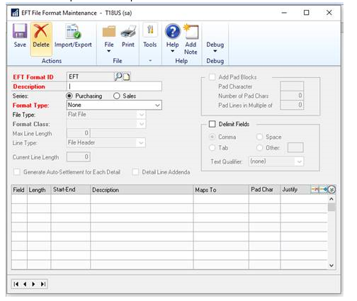
 
OPTIONAL:
If you want, insert this additional information in-between the existing steps 5 and 6 to add some info about some of the other newer fields in the above window. 

A. Select to include the Detail line for Addenda information.  With this marked, as many addenda lines will print for each invoice that makes up the payment.  Map the fields for the Addenda Line type as needed. 

B. Mark Use Pad Blocks to add padded lines to the end of the EFT file as specified by the bank. 
                Pad Character –  Enter the character or filler to pad the line with.  
                Number of Pad Chars –  Enter how many characters across the line should be. 
                Pad lines in Multiple of -  Enter the block count or blocking factor as specified by the bank.  

C. Mark the checkbox for Delimit Fields and select from Comma, Tab, Space, or Other character as specified by the bank.   For the Text Qualifier, ‘None’ will default, or select from a single apostrophe or a double apostrophe to signify text.  Expand the lines in the EFT file, and mark the checkbox for Text Qualifier for each field that should be printed with the Text Qualifier around it.  

#### Importing or exporting an EFT file format

Use the EFT File Format Import/Export window to transfer file formats electronically. This is useful when setting up EFT information for multiple companies—if the same bank is used. You can create EFT file formats in one company, export them, and then import them in another company to reduce setup time

To import or export an EFT file format

1.	Open the EFT File Format Import/Export window. (Cards >> Financial >> EFT File Format >> select an EFT Format ID >> Import/ Export button)
2.	If you’re importing a file format, enter or select the location of the format you’re importing.
3.	If you’re exporting a file format, enter or select the location of the format you’re exporting to. 
4.	Choose Import to import the format from the selected location, or Export to export the format to the selected location. 

## Part 6: EFT setup for Payables Management

This part of the documentation describes how to set up information making electronic payments to vendors using Payables Management. 

#### Entering payables EFT options

Use Checkbook EFT Payables Options window to specify options and output file locations for payables EFT transactions. 

To enter payables EFT options:

1.	Open the Checkbook EFT Payables Options window. (Cards >> Financial >> Checkbook >> select a checkbook >> EFT Bank >> Payables Options)

2.	Select to use check numbers or EFT numbers for payables EFT transactions. If you select EFT numbers, enter the next EFT payment number. 
Selecting Use Check Number will cause a non-negotiable check to be printed for each EFT transaction. If you use paper checks, you might want to use EFT numbers to minimize the number of paper checks used for transactions that are sent electronically. If Use EFT Numbers is selected, you can print a remittance to send to the vendor. The remittance number will be the next available EFT number.

3.	Mark the Payables Prenote Required option if your bank requires prenotes. 

4.	Enter the prenote grace period: the number of days to wait after generating a prenote for a new vendor record before transferring funds to the vendor electronically. The prenote date is compared to the payment date. 

5.	Enter the paths and the filenames to use for EFT files generated in Payables Management. Because EFT files contain sensitive information, save them in a secure location. If you are using Microsoft Windows Vista®, Windows® 7, or Windows Server® 2008, files can’t be saved to the folder where Microsoft Dynamics GP program files are stored, typically C:\Program Files\Microsoft Dynamics\GP.

6.	Select a single format for the output file or enter multiple formats to tailor a format to a vendor. 

If you are using multiple formats and are in the United States, use Business, Corporate, or Personal for standard ACH transactions and Foreign for international ACH transactions (IAT) transactions. 

If you are using an IAT file format and a standard ACH file format, a separate output file is generated for the IAT file format and the standard ACH file format. For the IAT file format, an output file is created for each destination country. 

Use the expansion buttons to open the EFT File Format Setup window, where you can enter information for the selected output file format. 

7.	Choose the Generate Prenotes button to generate a prenote file that you can send to your bank.

8.	Choose OK to save your changes. 

#### Setting up vendor records for EFT

Use the Vendor EFT Bank Maintenance window to enter EFT information for a vendor that you pay using EFT transactions.

You can print an authorization letter using the Letter Writing Assistant (Reports >> Letter Writing Assistant), which can be used to formalize an agreement with a vendor to use EFT payments.

To set up vendor records for EFT:

1.	Open the Vendor EFT Bank Maintenance window. (Cards >> Purchasing >> Vendor >> enter a vendor ID >> Address button >> EFT Bank button)

2.	Enter or select the country/region for the bank that processes EFT transactions for the selected vendor. Fields that are required in this window depend on the selected bank country/region. 
EFT transactions will be created through the select checks process using the remit-to address on the invoice being paid. When a payment is created manually, the vendor’s default remit-to address is used. 

3.	Select the file transfer method. 
You can create unique EFT file formats for each file transfer method using the EFT File Format Maintenance window. The file format specifies how and where specific types of information are stored in the file that's sent to the bank to transfer funds electronically. 

4.	Enter the required information for the selected bank country/region. The vendor can provide this information for EFT transactions. 
If you need to specify country codes, use the two-character ISO country code formats. Be aware that Microsoft Dynamics GP does not verify the ISO codes you enter, and your bank will reject a file format that has an incorrect code. 

5.	Choose OK to save changes. 

#### Generating prenotes to test vendor records

Use the Generate EFT Prenotes window to generate a prenote for your bank to test the accuracy of your vendors’ bank account and transit numbers.

To generate prenotes to test vendor records:

1.	Open the Generate EFT Prenotes window. (Microsoft Dynamics GP menu >> Tools >> Routines >> Financial >> Generate EFT Prenotes)

2.	To generate prenotes for vendors—either for the first time or for vendors whose information has changed—leave the Recreate prenote for any record dated on or before field blank. To regenerate prenotes for vendors a second or subsequent time, enter a date in the Recreate pre-note for any record dated on or before field. Prenotes will be recreated for all vendors whose last prenotes were created on or before the date entered in the field. You also can use this window to generate prenotes for customers, or for both customers and vendors at the same time. 

3.	Enter the prenote file format to use. See Setting up an EFT file format on page 14 for more information about creating EFT file formats.

4.	To generate a prenote edit list, choose File >> Print.

5.	Choose OK to generate the prenote. 
You must transmit the sample EFT file to your bank in order to complete the test. Be sure your communications software is set up to transmit the EFT file to your bank.

#### Prenote rejections for Payables Management

Your bank will reject a prenote if you made any mistakes entering information in the Vendor EFT Bank Maintenance window. 

Common mistakes include:
•	An incorrect account number
•	An incorrect transit routing number
•	Selecting the incorrect account type (for example, checking instead of savings) 

When you receive a prenote rejection, verify the information you have on file with your vendor and correct the information in the Vendor EFT Bank Maintenance window. 

If you’re unable to correct the information before you need to complete a check run, select the Inactive option in the window to prevent the program from generating electronic payments to that vendor.

It takes between six and 10 days to receive prenote rejections from your bank. Set cutoff dates for making electronic payments to vendors prior to a check run.

#### Transmitting a sample EFT file to your bank for Payables Management

Before allowing you to transfer funds electronically, banks require you to transmit a sample EFT file. 
The sample enables you and the bank to verify the accuracy of the information. 

This process is different from generating prenotes. Prenotes are generated to confirm the accuracy of the information you have on file for each vendor. A sample EFT file is generated to verify that the file’s format matches the bank’s requirements.

This process requires you to create actual transactions. You can set up the sample company to use EFT first so you can run the test. When generating a sample EFT file, the vendor account numbers need not be real, but the transit routing numbers for your vendors must be actual bank transit numbers.

To transmit a sample EFT file to your bank for Payables Management:

1.	Enter and post payables transaction vouchers in Payables Management for each of five vendors in varying currency amounts. 
2.	Create a batch of EFT payments for the transactions created in step 1.
3.	Open the Generate EFT Files window.  (Transactions >> Purchasing >> Generate EFT Files)
4.	Select Purchasing as the series.
5.	Select the ID of the checkbook you’re generating sample electronic payments from.
6.	Mark the batches you’re including. Only pending EFT batches will appear in the Generate EFT Files window. Choose the Batch ID link to review the transactions in each batch.
7.	To generate an EFT Batches Marked for EFT File Generation report, choose File >> Print.
8.	Choose Generate EFT File. The sample EFT file will be written to the path and filename specified. 
9.	After the sample EFT file is generated, the program will remind you to transmit the EFT file to the bank, if you entered a communication method in the Checkbook EFT Bank Maintenance window. If you specified the path and filename for your communications software, the program will start your communications software

*You must transmit the sample EFT file to your bank in order to complete the test. Be sure your communications software is set up to transmit the EFT file to your bank.*

#### Setting up the EFT Payment Register report

Use the Posting Setup window to set up the EFT Payment Register report to be printed after you post EFT payment information.

To set up the EFT Payment Register report:

1.	Open the Posting Setup window.  (Microsoft Dynamics GP menu >> Tools >> Setup >> Posting >> Posting)
2.	Select Purchasing from the Series list.
3.	Select Computer Checks from the Origin list.
4.	Mark EFT Payment Register in the Reports list.
5.	Set the report destination options and choose OK.

## Part 7: EFT setup for Receivables Management

Set up EFT for Receivables Management so you can receive electronic payments from customers and send electronic refunds to customers.

#### Entering receivables EFT options

Use Checkbook EFT Receivables Options window to specify options and output file locations for sales EFT transactions. Before completing this procedure, you should have entered bank information for any checkbooks that you’ll be using for EFT transactions.

To enter receivables EFT options:

1.	Open the Checkbook EFT Receivables Options window. (Cards >> Financial >> Checkbook >> select a checkbook >> EFT Bank >> Receivables Options)
2.	Select to use EFT numbers for sales EFT transactions and enter the next EFT payment number (optional).
3.	Mark the Receivables Prenote Required option if your bank requires prenotes. 
4.	Enter the prenote grace period for receivables EFT transactions. The prenote grace period specifies the number of days to wait after generating a prenote for a new customer before transferring refunds to the customer electronically. 
5.	Enter the paths and the filenames to use for EFT files generated in Receivables Management. Because EFT files contain sensitive information, save them in a secure location 
6.	Select a single format for the output file or enter multiple formats to tailor a format to a customer. 

If you are using multiple formats and are in the United States, use Business, Corporate, or Personal for standard ACH transactions and Foreign for international ACH transactions (IAT) transactions. 

If you are using an IAT file format and a standard ACH file format, a separate output file is generated for the IAT file format and the standard ACH file format. For the IAT file format, an output file is created for each destination country. 

Use the expansion buttons to open the EFT File Format Setup window, where you can enter information for the selected output file format. 
Choose the Generate Prenotes button to generate a prenote file that you can send to your bank. 
7.	Choose OK to save your changes.

#### Setting up customer records for EFT

Use the Customer EFT Bank Maintenance window to set up records for customers that pay or receive refunds electronically.

To set up customer records for EFT:

1.	Open the Customer EFT Bank Maintenance window.  (Cards >> Sales >> Customer >> enter a customer ID >> Address button >> EFT Bank button)

2.	Enter or select the country/region for the bank that processes EFT transactions for the selected customer. Fields that are required in this window depend on the selected bank country/region.

Select the file transfer method. You can create unique EFT file formats for each file transfer method using the EFT File Format Maintenance window. The file format specifies how and where specific types of information are stored in the file that's sent to the bank to transfer funds electronically. 

3.	Enter the required information for the selected bank country/region. The customer can provide information for EFT transactions. Choose OK to save changes.

*If you need to specify country codes, use the two-character ISO country code formats. Be aware that Microsoft Dynamics GP does not verify the ISO codes you enter, and your bank will reject a file format that has an incorrect code.*

#### Generating prenotes to test customer records

Use the Generate EFT Prenotes window to generate a prenote for your bank to test the accuracy of your customers’ bank account and transit numbers.

To generate prenotes to test customer records:

1.	Open the Generate EFT Prenotes window. (Microsoft Dynamics GP menu >> Tools >> Routines >> Financial >> Generate EFT Prenotes)
2.	Select the ID for the checkbook you’re generating prenotes for.
3.	To generate prenotes for customers—either for the first time or for customers whose information has changed—leave the Recreate prenote for any record dated on or before field blank. To regenerate prenotes for customers a second or subsequent time, enter a date in the Recreate pre-note for any record dated on or before field. Prenotes will be recreated for all customers whose last prenotes were created on or before the date entered in the field. You also can use this window to generate prenotes for customers, or for both vendors and customers at the same time. 
4.	Enter the prenote file format to use. 
5.	To generate a prenote edit list, choose File >> Print.
6.	Choose OK. If you defined a communications link and you’ve configured your communications software correctly, the program will transmit the prenote to your bank

#### Prenote rejections for Receivables Management

Your bank will reject a prenote if any mistakes were made entering information in the Customer EFT Bank Maintenance window. Common mistakes include:
•	An incorrect customer account number
•	An incorrect transit routing number
•	Selecting the incorrect account type (for example, checking instead of savings) 

When you receive a prenote rejection, verify the information you have on file with your customer and correct the information for the customer in the Customer EFT Bank Maintenance window. If you’re unable to correct the information before you need to generate electronic debits from the customer, select the Inactive option in the window to prevent the program from generating electronic debits from that customer.

*It takes between six and 10 days to receive prenote rejections from your bank. Set cutoff dates for debiting customer accounts prior to posting EFT payments.*

#### Transmitting a sample EFT file to your bank for Receivables Management

Before allowing you to transfer funds electronically, banks require you to transmit a sample EFT file. The sample enables you and the bank to verify the accuracy of the information. This process is different from generating prenotes. Prenotes are generated to confirm the accuracy of the information you have on file for each customer. A sample EFT file is generated to confirm that the file’s format matches the bank’s requirements. 

*This process requires you to create actual transactions. You can set up the sample company to use EFT first so you can run the test. When generating a sample EFT file, the customer account numbers need not be real, but the transit routing numbers for your customers must be actual bank transit numbers.*

To transmit a sample EFT file to your bank for Receivables Management:

1.	Use the Invoice Batch Entry window, Sales Batch Entry window, or the Receivables Batch Entry window to create batches for sample payments that you can send to your bank. 

2.	Create and post sample payments in the Invoice Payment Entry window, Sales 
Payment Entry window, Cash Receipts Entry window, or the Receivables Transaction Entry window for each of five customers in varying currency amounts. See the Invoicing, Sales Order Processing, and Receivables Management documentation for more information.

3.	Open the Generate EFT Files window. (Transactions >> Sales >> Generate EFT Files)

4.	Select Sales as the series and Select the ID of the checkbook you’re generating sample electronic payments for.

5.	Mark the batches you’re including. Only pending EFT batches will appear in the Generate EFT Files window. Choose the Batch ID link to review the transactions in each batch.

7.	To generate an EFT Batches Marked for EFT File Generation report, choose File >> Print.

8.	Choose Generate EFT File. The sample EFT file will be written to the path and filename specified. 

9.	After the sample EFT file is generated, the program will remind you to transmit the EFT file to the bank, if you entered a communication method in the Checkbook EFT Bank Maintenance window. If you specified the path and filename for your communications software, the program will start your communications software. 

*You must transmit the sample EFT file to your bank in order to complete the test. Be sure your communications software is set up to transmit the EFT file to your bank. *

#### Changing the posting settings for Direct Debits and Refunds

To change the posting settings for Direct Debits and Refunds:
1.	Open the Posting Setup window.   (Microsoft Dynamics GP menu >> Tools >> Setup >> Posting >> Posting)
2.	From the Series drop-down list, select Sales, and from the Origin drop-down list, select Direct Debit.
3.	To print multicurrency posting journals, mark the Include Multicurrency Info option.
4.	To mark all reports in the scrolling window, choose Mark All.
5.	In the Print column of the Reports scrolling window, unmark any reports you do not want to print. 
6.	To unmark all the reports that are currently displayed in the scrolling window, choose Unmark All.
7.	In the Send To column, specify one or more destinations for the reports you want to print. The options are File, Printer, Screen, or Ask each time.
8.	If you select File as the destination, make the following selections: 
•	In the Type column, select a file format: text, tab delimited, comma delimited, Adobe PDF File, or HTML. 
•	In the Append/Replace column, select what to do if the report file already exists. 
•	In the Path column, enter the location and the file name for the report file. Because the reports can contain sensitive information, save them in a secure location. 
9.	To print the Posting Settings Report, showing the posting and reporting options for the selected series and origin, choose File >> Print.
10.	Choose Save. 
11.	Select Direct Debits and Refunds and repeat steps 3 through 10.
12.	Choose OK to save and close the window.

#### Setting up audit trail codes for Direct Debits and Refunds

Audit trail codes update the Microsoft Dynamics GP Batch IDs in Receivables Management. These codes appear on all reports and Inquiry windows.

To set up audit trail codes for Direct Debits and Refunds:
1.	Open the Audit Trail Codes Setup window.  (Microsoft Dynamics GP menu >> Tools >> Setup >> Posting >> Audit Trail Codes)
2.	Select Sales in the Display field.
3.	Verify if the Direct Debit and Direct Debit Refunds are updated and marked in the scrolling window.
4.	Choose OK to save and close the window.

#### Editing Direct Debit setup information

Use the Direct Debits Setup window to view or edit the Description, Code and the Next number for direct debit receipts and refunds. You can open this window only if you’ve marked the Enable European Funds Transfer option in the Company Setup Options window. The Additional menu will also appear only if this option is marked. 

To edit Direct Debit setup information:
1.	Open the Direct Debits Setup window.
(Microsoft Dynamics GP menu >> Tools >> Setup >> Sales >> Receivables >> Options >> Additional menu >> Direct Debit Setup)
2.	The Description, Code, and Next Number information will appear as default entries for Direct Debit and Refunds. You can change this information if required.
3.	Mark the Transaction Code Message option to indicate the transaction code that’s used as the default during transaction entry. You can unmark this option if required.
4.	Choose OK to save and close the window.

#### Understanding transaction codes

Each transaction that appears in a direct debit instruction must have a transaction code assigned to it. A transaction code allows the bank to determine the status of each transaction in a direct debit instruction.

The following codes can be assigned to a transaction:
01 This code is assigned to the first transaction in a direct debit instruction.
17	This code is assigned to a transaction that is neither the first nor the last transaction in a direct debit instruction.
18	This code is assigned to a transaction that previously was assigned the code 01, but the direct debit instruction was rejected. When you resubmit such a transaction, the code will be 18. 
19	This code is assigned to the last transaction in a direct debit instruction.
99 This code is assigned to transactions that have the nature of a refund.

When you enter a direct debit transaction, the transaction code defaults depending on the transaction type, and transaction document number for the customer. 

The following table displays the transaction codes that will default for each transaction type, depending on the document number and the customer.

| **Module**     |   **Document Types**         |       **Transaction Condition**   |**Transaction Code**|
|----------------|------------------------------|-----------------------------------|--------------------|
| Receivable     | Sales/Invoice,Debit Memo,    | The first direct debit trx of the |    01              |
| Management      Service/Repair                  doc type entered for the customer                      |
| Receivable     | Sales/Invoice,Debit Memo,    | The previous direct debit trx of  |    01              |
| Management      Service/Repair                  doc type entered for the customer                      |
|                                                 had a trx code of 19                                   |
| Sales Order    | Invoice                      | The first direct debit trx of the |    01              |
| Processing                                      doc type entered for the customer                      |
| Sales Order    | Invoice                      | The previous direct debit trx of  |    01              |
| Processing                                      doc type entered for the customer                      |
|                                                 had a trx code of 19                                   |
| Receivable     | Sales/Invoice,Debit Memo,    | The previous direct debit trx of  |    17              |
| Management      Service/Repair                  doc type entered for the customer                      |
|                                                  was either 01, 17, or 18                              |  
| Sales Order    | Invoice                      | The previous direct debit trx of  |    17              |
| Processing                                      doc type entered for the customer                      |
|                                                 was either 01, 17, or 18                               |                                                   
| Receivable     | Credit Memo / Return         | Return type of the transactions.  |    99              |
| Management                                      You cannot change this value.                          |
| Sales Order    | Returns                      | Return type of the transactions.  |    99              |
| Processing                                     You cannot change this value.                           |

## Part 8: Safe Pay Setup

This information explains how to set up Safe Pay to confirm with your bank the authenticity of a check before paying it.

### Record type codes
In the file you upload to your bank, each line is a separate record. The bank’s file format specification indicates which type of record (transmission header, transmission footer, account header, account footer, or account detail) each line is.

Not all bank formats include all record types. Some bank formats include both transmission and account headers and footers, which need to be defined separately. 

Safe Pay handles the following five record types:

Header transmission 
The header transmission record type includes information about the type of file being transmitted, the date of transmission, your company name, and other information applicable to the entire file. There is usually only one record line of this type per bank format.

Header account 
The header account record type is used to distinguish between various accounts and will appear once for each checking account included in the file. The header account record line precedes the detail record line for each account.

Detail account 
The detail account record type details each transaction for the account. Detail account record line information can include check amount, void amount, check number, payee, date, branch, account number, and so on.

Footer account 
The footer account record type summarizes account details, such as number of checks, total dollar value of checks, number of voids, total dollar amount of voids, and so on. This record line will appear once for each checking account included in the file.

Footer transmission 
The footer transmission record type contains information concerning the total number of records for all accounts in a file and may also include the total dollar amount. Usually there is a field or character in this line that indicates it is the final line in the file.

*Different banks use different names to refer to the record type of each line, (for example, “footer transmission” may be called “trailer record”). To find out which record type to use, compare the preceding record type descriptions to the specification provided by your bank.*

### Fields per line
When creating a bank format you need to know the number of fields per record line. Determining how many fields are on each line depends on the file format, as follows:

Fixed field file formats 
If your bank’s file format is a fixed field format, the fields per line is the total number of fields on the line. You’ll specify in Electronic Reconcile the exact position of each item of useful data. Identify fields not used as “filler.” 

Comma-delimited or tab-delimited file formats 
If your bank’s file format is a comma-delimited or tab-delimited file format, determine the right-most field Safe Pay will use on a record line. Then count the fields, from left to right, through the right-most field used. This is the number of fields for the record line. If fields with irrelevant data appear before the right-most field, you must define those fields.

### Standard Field Types

Use one of the following standard field types to define each field of your bank format

| **Standard Field Type**      | **Datatype** | **Description**                                                 |
|------------------------------|--------------------------------------------------------------------------------|
| Account Number               | TEXT         | Bank Account Number                                             |
| Bank Name                    | TEXT         | Name of the bank                                                |
| Check Amount                 | CURRENCY     | Amount of the transaction (check or void)                       |
| Check Date                   | DATE         | Date printed on check                                           |
| Check Issue Date             | DATE         | Date printed on check                                           |
| Check Number                 | TEXT         | Check number for the check displayed in Checkbook Register Inq. |
| Constant                     | TEXT         | Constant value given to you by the bank                         |
| Filler                       | TEXT         | Spaces/zeros in fixed field formats to fill in unused field     |
| Payee                        | TEXT         | Person to whom check was written                                |
| Today's Date                 | DATE         | Date file is generated                                          |
| Trasaction Type              | TEXT         | Single-digit code indicating the transaction is check/void      |
| Your Company Name            | TEXT         | Often banks have a fixed field size for their company name/Abbre|

## Additional Feature Functionality added to Payables Management

To review detailed information about each feature, click the relevant link below.

[Accounts Payable Invoice Workflow Approval](https://community.dynamics.com/gp/b/dynamicsgp/archive/2015/06/11/microsoft-dynamics-gp-2015-r2-new-features-payables-transaction-approval)

A new workflow type has been added with GP2015 R2. The AP Invoice approval in Workflow Maintenance is now available. The Payables Transaction Approval workflow type will allow you to submit and approve each transaction in the Payables Transaction Entry window. Approval is also available through the email notification and the navigation lists.

The PM Batch Approval workflow type is still available as well, but only one AP workflow(Transaction or Batches) can be used. Whichever workflow is chosen, the other option will be disabled.

[Purchasing All in One Document View](https://community.dynamics.com/gp/b/dynamicsgp/archive/2015/06/12/microsoft-dynamics-gp-2015-r2-purchasing-all-in-one-view)  
Have you ever had a Vendor call in wondering about the Invoice related to their payment? Or wondered what check paid a particular PO? Well, wonder no more – presenting the all new Purchasing All-in-One View in GP 2015 R2!! You can now easily view all transactions for a particular vendor, or other Purchasing documents related to a particular Purchasing transaction.

For example, a vendor calls asking about a specific payment. Users will be able to select the vendor and then view all documents related to the payment, such as the PO, receipt, invoice, payment, etc.

A new window has been added – the Purchasing All-in-One View window. This window is accessible from multiple locations in GP

[Payables Credit Card Payment](https://community.dynamics.com/gp/b/dynamicsgp/archive/2016/06/19/mdgp2016-payables-cc-payment-)  
This new feature in GP 2016 RTM, will add Credit Card as a Payment Method option method for the Payables Computer Check Batch. Currently, you only have the options for Check and EFT type batch in Payables. When you select this new Credit Card payment type option, the Checkbook ID field will change to Card Name and is still a required field. Building and editing the check batch, printing the remittance form and posting the check run will be the same process as before. You can print a remittance form to show all the invoices that were paid by credit card.

[Payables Management - Link Credit Card Invoices to original
invoice](https://community.dynamics.com/gp/b/dynamicsgp/archive/2017/01/04/microsoft-dynamics-gp-2016-r2-payables-management-link-credit-card-invoices-to-original-invoice)

New functionality in the Dynamics GP 2016 R2 release that makes it easier for
the end user to trace credit card payments back to the original vendor/invoice
document behind the associated invoice for the credit card vendor.

When a credit card payment is entered in the Dynamics GP Payables Management
module, a second invoice is created for the credit card vendor.

Prior to Dynamics GP 2016 R2 there was no visible connection between the two
invoices, which made it difficult to trace the original vendor/credit card
vendor link via the Payables Transaction Inquiry window without reviewing
multiple documents.

Having no official invoice link also caused credit card payments to be displayed
as 'Unmatched Transactions' in the 'Reconcile to GL' report.

[You can now view and modify attachments in inquiry
windows.](https://community.dynamics.com/gp/b/dynamicsgp/archive/2017/12/06/microsoft-dynamics-gp-2018-document-attachment-inquiry)

Ever wanted to view Attachments in Inquiry windows? Now with Dynamics GP2018 we
can!

If you’ve been using Doc Attach previously, this will be known to you, but for
new users, we need to be sure to go into Document Attachment Setup by choosing
Microsoft Dynamics GP, click Tools, click Setup, click Company and then choose
Document Attachment and mark to ‘Allow Document Attachments’ marked

[No more arguing is it check or cheque?  It is PAYMENTS.](https://community.dynamics.com/gp/b/dynamicsgp/archive/2017/12/14/microsoft-dynamics-gp-2018-no-more-arguing-is-it-check-or-cheque-it-is-payments)

I hope everyone is enjoying GP 2018 thus far. I know one change that I was really excited to see was the change of several payables windows from "Check" to "Payments".

I really am excited for this change because it really helps broaden the scope of these windows. It helps explain that you do not just create checks in these windows, but you can also create other payment forms.

\*The functionality of these windows remain the same, the change is made only to the name of the windows.

[Add vendor document number to the Purchasing All-In-One view](https://community.dynamics.com/gp/b/dynamicsgp/archive/2018/10/24/microsoft-dynamics-gp-2018-r2-add-vendor-document-number-to-the-purchasing-all-in-one-view)

With the release of Microsoft Dynamics GP 2018 R2, users can now view the 'Applied-To Document Number' associated with Payments, Credit Memos, and Returns in the Purchasing All-In-One View window.

In prior versions of Microsoft Dynamics GP, it was not possible to view the 'Applied-To Document Number' associated with Payments, Returns, and Credit Memos in the Purchasing All-In-One View window.

To view the 'Document Number' of an Invoice/Finance Charge/Misc. Charge, simply click the 'black arrow' in the lower right-hand corner of the Payment/Return/Credit Memo to 'expand' the view.

[Display vendor hold status](https://community.dynamics.com/gp/b/dynamicsgp/archive/2018/10/25/microsoft-dynamics-gp-2018-r2-display-vendor-hold-status)

With the release of Microsoft Dynamics GP 2018 R2, users can now easily tell whether a vendor is on 'Hold' in the following windows: Payables Transaction Inquiry - Vendor, Purchasing All-in-One View, and Payables Transaction Entry Zoom windows.

Additionally, Microsoft Dynamics GP will now throw a warning message when a user attempts to enter a transaction when the vendor is on hold, "Vendor XXXX is currently on hold. Do you want to continue?"
