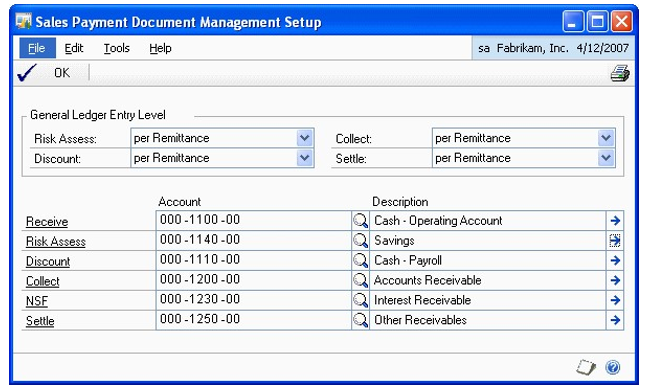
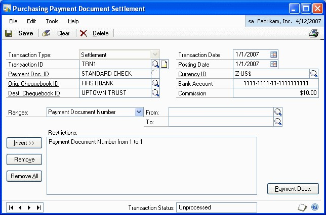
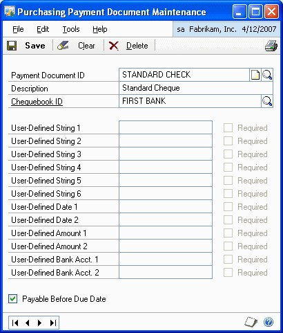
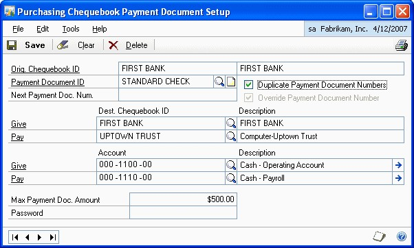
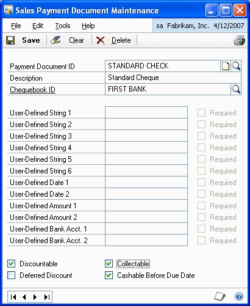
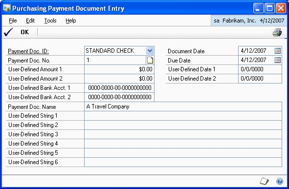
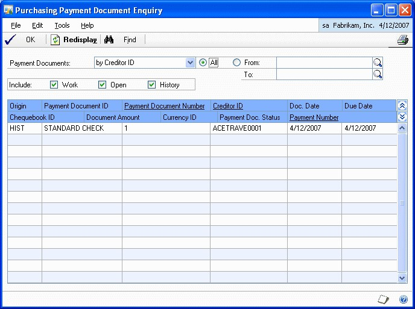

# Payment Document Management 

Payment Document Management allows you to enter sales and purchasing transactions using payment methods other than cash, check or credit card. You can submit these documents for risk assessment, discounting and collection to your bank or similar entity.

Payment Document Management uses the information in the Payables Management and Receivables Management modules, and updates the General Ledger and Bank Reconciliation modules.

This introduction is divided into the following sections:

-   *What’s in this manual*

-   *Symbols and conventions*

-   *Resources available from the Help menu*

-   *Send us your documentation comments*

### What’s in this manual

This manual is designed to give you an understanding of how to use the features of Payment Document Management, and how it integrates with the Microsoft Dynamics GP system.

To make best use of Payment Document Management, you should be familiar with systemwide features described in the System User’s Guide, the System Setup Guide, and the System Administrator’s Guide.

Some features described in the documentation are optional and can be purchased through your Microsoft Dynamics GP partner.

To view information about the release of Microsoft Dynamics GP that you’re using and which modules or features you are registered to use, choose Help\>\> About Microsoft Dynamics GP.

The manual is divided into the following chapters:

-   *Chapter 1, “Overview”* explains how Payment Document Management works, and how you can enable it.

-   *Chapter 2, “Purchasing Setup”* describes the procedure to set up payment documents for purchasing transactions.

-   *Chapter 3, “Sales Setup”* describes the procedure to set up payment documents for sales transactions.

-   *Chapter 4, “Purchasing Transactions”* gives information on entering purchasing transactions using payment documents.

-   *Chapter 5, “Sales Transactions”* gives information on entering sales transactions using payment documents.

-   *Chapter 6, “Transaction Maintenance”* provides information on voiding and returning payment documents.

-   *Chapter 7, “Enquiries and Reports”* provides information on viewing inquiries and printing reports.

-   *Chapter 8, “Utilities”* provides information on removing historical information for payment documents.

## Chapter 1: Overview

Payment Document Management allows you to make and receive payments using special payment documents. Use this information to enable Payment Document Management and to understand how it works.

When you set up Payment Document Management, you can open each setup window and enter information, or you can use the Setup Checklist window (Administration \>\> Setup \>\> Setup Checklist) to guide you through the setup process. See your System Setup Guide (Help \>\> Contents \>\> select Setting up the System) for more information about the Setup Checklist window.

This information is divided into the following sections:

-   *Understanding Payment Document Management*

-   *Enabling Payment Document Management*

### Understanding Payment Document Management

Certain European and Latin American countries deal in payment documents such as bills of exchange or promissory notes, apart from making payments by cash, check and credit cards. Payment Document Management allows users to enter receipts and payments using such payment methods. Payment documents that do not have a due date specified can be settled at any time. However, the documents that have specific due dates can only be settled after the due date. To receive the payment for such documents before the due date, the creditor must submit these documents to a bank or similar entity for collection. The bank then performs a risk assessment to assign a risk level to the debtors. Based on this assessment, the bank decides which documents it will accept. The creditor is then paid the document amount after deducting the commission or discount amount. The bank submits these documents to the debtor on the due date and collects the settlement.

### Enabling Payment Document Management

You must enable payment documents before you can start using them in purchasing and sales transactions.

**To enable Payment Document Management:**

1.  Open the Company Payment Document Management Setup window. (Administration \>\> Setup \>\> Company \>\> Payment Document Setup)

1.  Mark the respective options to enable Payment Document Management for purchasing and sales. The setup windows will be available only for the module/s for which you have marked the required option.

2.  Choose OK to save the changes and close the window.

## Chapter 2: Purchasing Setup

Use this information to set up default accounts required to use payment documents in the purchasing module.

This information is divided into the following sections:

-   *Setting up default accounts for purchasing*

-   *Setting up user preferences*

-   *Creating and defining payment documents*

-   *Setting up a chequebook for payment documents*

-   *Assigning a default payment document to a creditor*

### Setting up default accounts for purchasing

The Purchasing Payment Document Management Setup window allows you to set up default accounts for payment documents from the purchasing module for General Ledger posting.

**To set up default accounts for purchasing:**

1.  Open the Purchasing Payment Document Management Setup window.
    (Administration \>\> Setup \>\> Purchasing \>\> Payment Document Setup)

2.  Select whether to set the General Ledger Entry Level to per Settlement or per Payment Document. If you select per Settlement, all the documents will be posted as a single summary entry. If you select per Payment Document, the payment documents will be posted as a single entry per document.

3.  Select the accrual accounts for Give and Pay.

### Setting up user preferences

The Purchasing Payment Document User Preferences window allows the user to set the preferences for the payment document information entry windows. You can set the way in which you want to open the purchasing Payment Document Entry windows in order to enter additional information relating to the payment document.

**To set up user preferences:**

1.  Open the Purchasing Payment Document User Preferences window.
    (Administration \>\> Setup \>\> Purchasing \>\> Payment Document User Preference)

2.  Select from the following options to open this window:

**Lock Fields** This is the default view for all users.

**Hide Fields** Only the fields in which the user can enter a value are displayed in the window.

**Shrink Window** This option modifies the window size and field position to adjust it exclusively to the information that must be completed by the user for each payment document.

3.  Choose OK to save and close the window.

### Creating and defining payment documents

The Purchasing Payment Document Maintenance window allows you to create and define payment documents that will be used in Purchasing.

**To create and define payment documents:**

1.  Open the Purchasing Payment Document Maintenance window. (Cards \>\> Purchasing \>\> Payment Document Maintenance)

2.  Enter or select the payment document ID.

3. Select the chequebook ID for the payment document. When using the payment document for a creditor payment, the chequebook associated with the document will appear as the default value in the Payment Document ID field in the Payment Document Entry window.

4.  Enter a value in the user-defined fields. The Required option will be available for the user defined fields for which you have entered a value. When making a payment, additional information can be stored for this specific document. For this purpose, the system incorporates various fields of different types and formats (text, date, amount and bank account number 0000-0000-00-for entering text that will later appear for this payment document. The purpose of these fields is to store information in the system in order to establish search conditions or to have data in the system that can be used with other tools (e.g. printing devices).

5.  Mark the Payable Before Due Date option for payment documents with no due date (e.g. cheques). Leave the option unmarked for documents with due dates (Promissory Notes, Bills of Exchange, etc.).

6.  Choose Save to save changes and close the window.

### Setting up a chequebook for payment documents

You can establish a more specific set up level by selecting the options that will be taken into account when using a chequebook with a specific payment document.

*You can assign the same chequebook to various payment documents.*

**To set up a chequebook for payment documents:**

1.  Open the Purchasing Chequebook Payment Document Setup window. (Cards \>\>
    Financial \>\> Chequebook \>\> Additional \>\> Purchasing Pmnt. Doc. Setup)

2.  Enter or select the payment document ID.

3.  Mark the Duplicate Payment Document Numbers option to allow duplicate payment document numbers.

4.  Enter the Next Payment Doc. Num. option if you want the document number to be generated automatically.

5.  Mark the Override Payment Document Number option to indicate whether the number generated automatically for the payment document can be overridden. This option is available only if you’ve entered the next payment document number.

For example, if a value is entered in the Mark the Next Payment Doc. Num field (e.g. 020000001), marking this field will allow you to modify the automatically generated number.

6.  In the Dest. Chequebook ID column, select the chequebooks to which the bill will be transferred once the operation from the current chequebook has been performed.

7.  In the Account column, select the accrual accounts for Give and Pay. If the accounts are not entered, the default accounts indicated in the module setup will be used if a properly-configured transaction is performed.

8.  In the Max Payment Doc. Amount field, enter the maximum amount for payment for the document with the selected chequebook (e.g. to prevent banks from charging a commission for surpassing a certain amount).

9.  Enter a password to override the maximum amount specified in the Max. Payment Doc. Amount field.

### Assigning a default payment document to a creditor

You can assign a default payment document to each creditor in the Creditor Payment Document Maintenance window.

**To assign a default payment document to a creditor:**

1.  Open the Creditor Payment Document Maintenance window. (Cards \>\> Purchasing \>\> Creditor Payment Document)

2.  Select the Creditor ID for the payment document.

3.  Select the default payment document ID.

4.  Choose Setup to open the Creditor Payment Document Setup window. This window allows you to set the default payment document for the selected creditor. If there is more than one payment document defined for the creditor, you can view their information using this window. The set up in this window is optional. If it is not defined, the default set up in Purchasing will be used.

-   Select the payment document in the Payment Doc. ID field.

-   Enter a description for the payment document in the Payment Doc Name field.

-   In the Chequebook ID from field, select whether you want to use the chequebook ID from the payment document or the creditor by default. This is taken from the chequebook selected for the payment document. If it is taken from the actual creditor, select the Creditor option and enter the chequebook ID. This chequebook ID will be used in collections from creditors with this type of payment document.

-   In the Payment Doc. Accounts from field, select whether the accounts used to enter transactions for the payment document will be taken from the chequebook associated with the payment document or from the creditor. If you select Creditor, enter the Give and Pay accounts. I*f accounts are not set in the chequebook or for the creditor, the default accounts indicated in the purchasing module set up will be used.*

-   In the Max Payment Doc Amount from field, select whether to take the maximum amount limit from the Chequebook or the Creditor.

If you select Creditor, enter the maximum amount that will be allowed in a creditor payment in the payment document.

Enter a password to override the maximum amount limit specified in a transaction with the selected payment document.

-   Choose Save to save the details and return to the Creditor Payment Document
    Maintenance window.

## Chapter 3: Sales Setup

Use this information to set up default accounts in the ledger posting of payment documents.

This information is divided into the following sections:

-   *Setting up default accounts for sales*

-   *Setting up user preferences*

-   *Creating and defining payment documents*

-   *Setting up a chequebook for payment documents*

-   *Assigning a default payment document*

### Setting up default accounts for sales

The Sales Payment Document Management Setup window allows you to set up default accounts in the Ledger posting of payment documents, as well as the General Ledger Entry Level used in the payment document remittance process.

**To set up default accounts for sales:**

1.  Open the Sales Payment Document Management Setup window. (Administration \>\> Setup \>\> Sales \>\> Payment Document Setup)

2.  Transactions with payment documents require specific accounting entries. There may be one entry per payment document, or, alternatively, one entry for a whole remittance consisting of several payment documents. You can choose to set up each of the payment document operations (risk assessment, discount, collection, or settlement) in either way.

3.  Risk assessment, discount, and collection are normally posted in one entry per document (to improve transaction monitoring) and per settlement process, in a single summary entry of all the documents, where a single amount appears on bank statements for total cheques transacted.

4.  Enter or select the accounts for the following fields:

**Receive** For cheques received.
**Risk Assessment** For risk assessing cheques.
**Discount** For discounted cheques.
**Collect** For collecting cheques.
**NSF** For bounced cheques.
**Settle** For settled cheques.

This payment document setup level is required, as these accounts make sure that all transactions entered are properly configured. If accounts are established at this higher level, there are no restrictions on the accounts to be used when preparing a remittance.

Choose Save to save the changes and close the window.

### Setting up user preferences

You can select the way in which you want the sales payment document entry windows to open in order to enter additional information relating to the payment document.

**To set up user preferences:**

1.  Open the Sales Payment Document User Preferences window. (Administration \>\> Setup \>\> Sales \>\> Payment Document User Preference)

2.  You can set the way in which you want to open this window in order to enter additional information relating to the payment document. The different options are as follows:

**Lock Fields** This is the default view for all users.
**Hide Fields** Only the fields in which the user can enter a value are displayed in the window.

**Shrink Window** This option modifies the window size and field position to adjust it exclusively to the information that must be completed by the user for each payment document.

1.  Choose OK to save the changes and close the window.

### Creating and defining payment documents

You can create and define payment documents that will be used in sales in the Sales Payment Document Maintenance window.

**To create and define payment documents:**

1.  Open the Sales Payment Document Maintenance window. (Cards \>\> Sales \>\> Payment Document Maintenance)

1.  Enter or select the payment document ID and enter a description for the document.

2.  Select the chequebook ID for the payment document.

3.  When using the payment document in question in a collection process, the chequebook associated with the document will be set as the default value in the Chequebook ID field in the Collections window.

4.  When collecting an amount using a payment document, additional information can be stored in this document. For this purpose, the system incorporates various fields of different types and formats (text, date, amount and bank account number 0000-0000-00-0000000000) for entering text that will later appear linked to this payment document to allow users to complete this information. Each of these fields can be selected as Required, in order to specify whether it is compulsory for the user to complete this information. The purpose of these fields is to store information on the system in order to establish search conditions or in the future to have data on the system that can be used with other tools (e.g. printing devices).

5.  Mark the Discountable option if you want the payment document to be discounted.

6.  Mark whether the document can be presented as discountable or not.

The Deferred Discount option will be available if you select the Discountable option.

7.  Mark the Collected option if you want the document to be collected.

8.  Mark whether the document is Cashable Before Due Date. This must be selected for payment documents with no due date (e.g. cheques). This must be left unmarked for documents with due date (Promissory Notes, Bills of Exchange, etc.).

9.  Choose Save to save the values entered in this window.

### Setting up a chequebook for payment documents

The Sales Chequebook Payment Document Setup window allows you to establish a more specific set up level by selecting the options that will be taken into account when using the chequebook with a specific payment document.

**To set up a chequebook for payment documents:**

1.  Open the Sales Chequebook Payment Document Setup window. (Cards \>\>
    Financial \>\> Chequebook \>\> Additional \>\> Sales Pmnt. Doc. Setup)

2.  Enter or select a Payment Document ID.

3.  Mark the Duplicate Payment Document Numbers option to indicate whether duplicate payment document numbers are accepted or rejected in the system.

4.  In the Next Payment Doc Num. field, enter a document number, if required.

5.  Mark the Override Payment Document Number option to indicate whether the number generated by the system for the payment document can be overridden. If a value is entered in the previous field (e.g. 020000001), unmarking this field will prevent users from modifying the number generated by the system.

6.  If you want to identify chequebooks with document statuses, e.g. received bills of exchange and discounted bills of exchange, for each operation that is performed in this chequebook, the Destination chequebook can be set to pass the bill once the indicated operation has been performed.

7.  Enter or select the account to be used in each transaction to customize this account for the specific payment document and chequebook. If this information is not entered, the default accounts indicated in the module set up will be used when a properly configured transaction is performed.

*In order to prevent the account entry generated on the remittance from using the default accounts, the accounts must be customized for every chequebook.*

8.  Enter the Max Payment Doc. Amount. This allows you to establish a maximum collectable amount for the specific payment document by setting a limit for the acceptance of risk.

9.  Enter a password if a maximum amount has been assigned in the previous field, as no collections exceeding this amount will be accepted. You need to enter this password to continue with an operation even though the maximum value has been exceeded.

10.  Choose Save to save the entries made in this window.

### Assigning a default payment document

Use the Debtor Payment Document Maintenance window to assign a default payment document to each debtor.

**To assign a default payment document:**

1.  Open the Debtor Payment Document Maintenance window. (Cards \>\> Sales \>\> Debtor Payment Document)

2.  Enter or select the debtor ID.

3.  Enter a payment document name which will be used when printing payment documents (receipts, bills, etc.), if you want to display the debtor name in a different way.

4.  Choose Setup to open the Debtor Payment Document Setup window. You can view the setup of the payment document for the selected debtor. This set up level is not compulsory (if it is not defined, the system default set up in Sales will be used).

You can set the debtor default payment document and the other payment documents that the debtor may use in this window. For this reason, and by default, when this window is opened the Payment Doc. ID field is blank since you may want to set up another payment document for the debtor.

-   Enter a Payment Doc. Name which will be used when printing payment documents (receipts, bills, etc.) to display the debtor name in a different way.

-   Select whether to take the chequebook ID from Payment Document or Debtor. This allows you to set the chequebook that is used by default in debtor collections performed with this payment document. This is taken according to the chequebook set up in the payment document. If it is taken from the actual debtor, select the Debtor option and enter the Chequebook ID, which corresponds to the chequebook that you want to use in collections from debtors with this type of payment document.

-   Select whether to take the Payment Doc. Account from the Chequebook or Debtor. This allows you to determine whether the accounts that will be used to perform transactions with this payment document are those that have been set in the chequebook associated with the payment document, or whether you want to modify them for this specific debtor in this payment document. If special accounts were not set in the chequebook the default accounts indicated in the sales module set up will be used.

-   Select whether to take the Max. Payment Doc. Amount from the Chequebook or the Debtor. This allows you to determine the origin of the maximum amount that will be accepted in a debtor payment collection. For example, in the case of a high-risk debtor, only a given account for collection on paper is admitted; if this maximum is exceeded, only cash payments would be accepted from the debtor.

-   Enter a password if a maximum amount has been assigned in the previous field, as no collections exceeding this amount will be accepted. You need to enter this password to continue with an operation even though the maximum value has been exceeded.

-   Choose Save to save the changes.

## Chapter 4: Purchasing Transactions

Use this information to enter payment documents for purchasing.
This information is divided into the following sections:

-   *Entering a purchasing payment document*

-   *Settling payment documents*

### Entering a purchasing payment document

Use the Purchasing Payment Document Entry window to enter a collection transaction in Payables with payment documents.

**To enter a purchasing payment document:**

1.  Open the Payables Manual Payments Entry window. (Transactions \>\> Purchasing \>\> Manual Payments)

2.  Enter the document number and date.

3.  Select the Creditor ID. This allows you to introduce additional information in connection with the payment and the selected payment document.

4.  Choose Additional \>\> Payment Document Entry to open the Purchasing Payment Document Entry window.

5.  The Payment Doc. No. field displays the value entered in the Document No. field in the main Payables window.

6.  The Document Date field displays the value entered in the Date field in the Payables window.

7.  The Due Date field displays the value entered in the Date field in the Payables window. If the payment document has been associated with a due date for making the payment, this date must be modified accordingly.

The fields that were selected as Required in the Payment Document Maintenance window will appear as compulsory fields in this window. Fields that were left blank will not be available in this window.

*If no user field was selected as Required in the Payment Document Maintenance window, you do not need to open this window through the
Additional option, since all the compulsory fields of the window are displayed by default with the values that are entered in the Payables window.*

8.  Choose OK to save the changes and close the window.

### Settling payment documents

You can settle payment documents and identify the origin and destination chequebooks for the payment documents in the Purchasing Payment Document Settlement window.

   **To settle payment documents:**
   
1.  Open the Purchasing Payment Document Settlement window. (Transactions \>\> Purchasing \>\> Payment Document Settlement)

1.  Enter a transaction ID for the settlement that you are going to create. For example, you can enter the transaction ID using the settlement date. If the settlement is stored rather than processed, it can be recovered later.

2.  In the Payment Doc. ID field, select the type of payment document for which the settlement will be made.

3.  In the Orig. Chequebook ID field, select the chequebook from which you want to recover the payment documents that are going to be remitted.

4.  The Dest. Chequebook ID field will display the chequebook that is set up for the settlement type. If not, you can select the chequebook to which the bills will be transferred after the settlement.

5.  Enter the transaction date. This is the date on which the settlement will be paid. It acts as the cut-off date of payment documents that will be included in the settlement. Only those documents whose due date is earlier than or the same as the date indicated in this field will be settled, i.e., it only allows settlement of payments that have fallen due on the settlement date.

6.  Enter the posting date. This is the date on which the settlement entry is  posted.

7.  In the Bank Account field, enter the current account from which the settlement will be paid.

8.  Enter the commission amount that the bank charges for paying the settlement.

9.  You can restrict the list of documents that will be included in the settlement by establishing different ranges by different criteria. The User-Defined fields that were indicated in the Payment Document Maintenance will be included in the Ranges field in order to allow it to filter this information.

10. Choose Insert to add the condition entered in the Ranges, From, and To fields to the Restrictions list.

11. Choose Remove to delete the selected condition in the Restrictions list.

12. Choose Remove All to delete all the filter conditions from the Restrictions list.

13. Choose Payment Docs. to open the Purchasing Payment Document Settlement Selection window, where you can view all the selected collections for the criteria specified in the Purchasing Payment Document Settlement window. You can select the documents that you want to include in the settlement.

-   The Number of Payment Docs. field indicates the total number of payments selected.

-   The Functional Amount field indicates the total amount of collections selected on the settlement in the currency of the company.

-   The Originating Amount field indicates the total amount of collections that have been made in another currency.

14.  Select a payment document in the scrolling window and click on the Payment Document Number link to view the purchasing payment document details in the Purchasing Payment Document Zoom window.

15.  Choose the Settlement button in the Purchasing Payment Document Zoom window to view the purchasing payment document settlement details in the Purchasing Payment Document Settlement Zoom window.

16.  Choose Mark All to select all the collections displayed in the scrolling window.

17.  Choose Unmark All to unmark all the collections selected in the scrolling window.

18.  Choose Distribution to open the Purchasing Payment Document Settlement Distribution Entry window, where you can view the distributions of the selected settlements.

19.  Choose OK to close the window and return to Purchasing Payment Document Settlement Selection window.

20.  Choose Process to post the settlement. The settlement entry is posted in Finances in a PMPDC-type batch (Purchasing Management Payment Doc. Settlement). Once you have processed the settlement, you cannot edit it.

21.  Close the window to return to Purchasing Payment Document Settlement window.

22.  Choose Save to save the changes made in the window.

## Chapter 5: Sales Transactions

Use this information to enter payment documents for sales. This information is divided into the following sections:

-   *Entering a sales payment document*

-   *Entering payment document remittances*

### Entering a sales payment document

Use the Sales Payment Document Entry window to enter a collection transaction in Receivables Management with payment documents.

**To enter a sales payment document:**

1.  Open the Cash Receipts Entry window. (Transactions \>\> Sales \>\> Cash Receipts)

2.  Enter the receipt number, document and the date of the receipt.

3.  Enter the debtor ID.

4.  Select the Cheque form of payment.

5.  Enter the cheque number in the Cheque/Card Number field.

6.  Choose Additional and select Payment Document Entry to open the Sales Payment Document Entry window.

7.  The Payment Doc No. field will display the value entered in the Card/Cheque Number field in the Cash Receipts window.

8.  he Document Date field displays the value entered in the Date field in the Cash Receipts window.

9.  The Due Date field will display the value entered in the Date field in the Cash Receipts window. If the payment document has been associated with a due date for collection of the receivable, this date must be modified accordingly.

10. If the default payment document setting for the debtor indicates that the printout of the document should display a different name than the one that appears on the Debtor Maintenance window, the default value will appear in the Payment Doc Name field. This may be modified or overwritten.

11. The Guarantor field will appear if it was selected as Required in the Payment Document Maintenance window. Fields for which no values were entered in the Payment Document Maintenance window, will not be available in this window.

If no user field was selected as Required in the Payment Document Maintenance window, you do not need to open this window through the
Additional option, since all the compulsory fields of the window are displayed by default with the values that are entered in the Receivables window.

Additional information that is entered in this window for each payment document could be used by third parties to develop search and print utilities.

### Entering payment document remittances

You can make payment document remittances in the Sales Payment Document Remittances window, and identify the type of remittance, and the origin and destination chequebooks for the payment document.

**To enter payment document remittances:**

1.  Open the Sales Payment Document Remittance window. (Transactions \>\> Sales \>\> Payment Document Remittance)

2.  Select the remittance type to identify the remittance.

3.  Select the Transaction ID for the remittance. This will identify the remittance that you are going to create. For example, you can compose the name assigned to you using the remittance date. If the remittance is stored rather than processed, it can be recovered later for modification and processing.

4.  Select the Payment Doc ID. This indicates the type of payment document from which the remittance will be made. If, for example, no indication was made in the Payment Document Maintenance window that this document could be used to make a Deferred Discount, and if the Risk Assessment value was selected as the remittance type, then you cannot select a payment document for which this option has not been selected.

5.  Select the chequebook from where you want to recover the payment documents that are to be remitted in the Orig. Chequebook ID field.

6.  Select the destination chequebook in the Dest. Chequebook ID field. The default value appears based on the chequebook set as default earlier.

7.  In the Remittance Date field, enter the date on which the remittance will be paid. This date will be the cut-off date of payment documents that will be included in the remittance. Only those documents whose due date (the date that appears in the Receivable Information Entry window) is earlier than, or the same as, the date indicated in this field will be remitted, i.e., it only allows remittance of receivables that have fallen due on the remittance date.

8.  Enter the date on which the remittance entry is posted in the Posting Date field.

9.  In the Bank Accounts field, enter the current account number into which the remittance will be paid. This helps you to later establish the search conditions for that field.

10. In the Commission field, enter the amount that the bank charges for payment of the remittance. It is only for your information and will not be used anywhere in the application.

11. In the Orig. Payment Doc Status field, select the collections that must be included in the current remittance. The options are:

**Received** Collection authorized in the system.

**Risk Assessing** If a deferred discount has been indicated, in order to make a remittance discountable, you must select only collections for which risk has been evaluated.

**Discount** by recovering collections that have already been presented for discount, a Settlement or Unpaid remittance can be made.

**Collecting** by recovering collections that have already been presented for collection, a Settlement or Unpaid remittance can be made.

1.  Select the document type in the Range field. The fields you entered in the Payment Document Maintenance window will appear in the Range list.

2.  Enter the range of documents to be included in the remittance in the From and To fields.

3.  Choose Insert to add the range and documents selected in the Restrictions list.

4.  Choose Remove to delete the selected condition from the Restrictions list.

5.  Choose Remove All to delete all the filter conditions from the Restrictions list.

6.  Choose Payment Docs. to open the Sales Payment Document Remittance Selection window that shows all the selected collections according to the established filter criteria. You can select all the collections that you want to include in the remittance.

-   The Number of Payment Docs. field displays the total number of payments selected.

-   The Functional Amount field displays the total amount of collections selected on the remittance in the currency of the company.

-   The Originating Amount field displays the total amount of collections that have been made in another currency.

-   Mark the payment document ID for the collections that you want to include in the remittance.

7.  Select a payment document in the scrolling window and click on the Payment Document Number link to view the sales payment document details in the Sales Payment Document Zoom window.

8.  Choose Remittances button in the Sales Payment Document Zoom window to view the sales payment document remittance details in the Sales Payment Document Remittance Zoom window.

9.  Choose Mark All to select all the collections.

10.  Choose Unmark All to unmark all the collections.

11.  Choose Distribution to open the Sales Payment Document Remittance Distribution Entry window, where you can view the distributions for the selected remittance. According to the level of entry set in accounts for the sales module for the remittance type, a post entry will be made for each collection included and marked on the remittance or a single summary posting entry for the total of all the amounts. If the distributions window is opened and a change is then made in the collections marked in the window, you will have to open the distributions window again and choose Redisplay.

12.  Choose OK to return to the Sales Payment Document Remittance Selection window.

13.  Choose Process to post the selected remittance. The remittance entry is posted in a RMPDC-type batch (Receivables Management Payment Docs.Remittance). The total amount of the remittance transferred between the origin and destination chequebooks is indicated on the remittance. The status of the remitted payment documents is changed and displayed as Remitted.

14.  Choose OK to close the window.

## Chapter 6: Transaction Maintenance

Use this information to void and return payment documents.
This information is divided into the following sections:

-   *Voiding payment documents*

-   *Returning payment document*

-   *Voiding a sales payment document remittance*

### Voiding payment documents

You can void a payment document in the Receivables Posted Transaction Maintenance window (Transactions \>\> Sales \>\> Posted Transactions). You can void a collection with an associated payment document only if:

-   The collection is Open, i.e. it must not be in History.

-   The payment document has the status as Received.

-   If the payment document has been remitted, the remittance must be cancelled
    first in order to void the collection and its corresponding payment
    document.

When you void a collection with an associated payment document the results are:

-   The voiding is posted (reversal of the original account entry)

-   A negative entry is made in the chequebook associated with the collection and the voided payment document.

### Returning payment document

You can return a payment document only if:

-   The collection is Open, i.e. it must not be in History.

-   The payment document is in a stage preceding Settled.

When you return a collection with an associated payment document, the results are:

-   The return is posted.

-   The chequebooks associated with collection and the returned payment document is updated. As the origin account, the chequebook associated with the document is used as the default chequebook; the destination account used is the account that has been indicated in the posting definition window, which appears as a default value, if it was entered earlier.

Optionally, the indicated amount is charged. The Auto Post NSF Debit Charges window shows a payment document when you choose NSF in the Receivables Posted Transaction Maintenance window.

Choose OK to close the window.

### Voiding a sales payment document remittance

You can void a payment document remittance in the Sales Payment Document Remittance window.

**To void a sales payment document remittance:**

1.  Open the Sales Payment Document Remittance window. (Transactions \>\> Sales \>\> Payment Document Remittance)

*The Void button is available only if the Remittance Status at the bottom of the screen displays Processed.*

2.  Choose Void to void the remittance. The remittance void entry is posted in a RMPDC-type batch (Receivables Management Payment Docs.Remittance).

The status of the remitted payments document is reverted to the status prior to the remittance.

The remittance status at the bottom of the screen changes to Voided and the document may only be viewed for enquiry.

Chapter 7: Enquiries and Reports
--------------------------------

You can use enquiries and reports to view and analyze the information you have entered for payment documents.

This information is divided into the following sections:

-   *Viewing collections made with payment documents*

-   *Viewing restricted sales payment documents*

-   *Viewing payments made with payment documents*

-   *Viewing restricted purchasing payment documents*

### Viewing collections made with payment documents

You can view all the collections made with payments documents and the status of the collection in the Sales Payment Document Enquiry window.

**To view the collections made with payment documents:**

1.  Open the Sales Payment Document Enquiry window. (Enquiry \>\> Sales \>\> Payment Documents)

1.  Select whether you want to view the payment document by Debtor ID, Chequebook ID or Payment Doc. Status.

2.  Select whether to include unposted, posted or history payment documents.

**Work** The collection is in a batch pending posting.

**Open** The collection is posted pending transfer to History once it has been totally applied.

**History** The collection is posted and totally applied and has been transferred to history.

The scrolling window displays the payment documents for the specified criteria.

3.  The Payment Doc. Status displayed in the scrolling window can be any of the
    following:

    -   Received

    -   In Risk Assessment

    -   Discounted

    -   Collecting (in Collections Management)

    -   Unpaid

    -   Settled

    -   Voided

4.  Choose Find to specify a search criterion to find a payment document.

5.  Choose OK to close the window.

### Viewing restricted sales payment documents

You can view collections on the payment documents in the Sales Payment Document Enquiry Restrictions window.

**To view restricted sales payment documents:**

1.  Open the Sales Payment Document Enquiry Restrictions window. (Enquiry \>\> Sales \>\> Restrict Payment Documents)

2.  Enter an Enquiry ID.

3.  Select the Payment Doc. ID From to specify the starting range of payment documents to view.

4.  In the Payment Doc. ID to field, select the end of a search range to view from the different types of Payment Documents set up.

5.  In the Include field, select whether you want to view posted, unposted or history payment documents. This allows you to filter the documents that you want to view by filtering according to the status of receivable associated with the payment document.

6.  Choose Enquiry to open the Sales Payment Document Range Enquiry window where you can view the result of the enquiry as per the search criteria specified.

-   Choose Find to specify a search criterion to find a payment document.

-   Choose OK to close the window.

7.  Choose Save to save the values entered and close the window.

### Viewing payments made with payment documents

You can view a list of all the payments made with payment documents and their status in the Purchasing Payment Document Enquiry window.

**To view payments made with payment documents:** Open the Purchasing Payment Document Enquiry window. (Enquiry \>\> Purchasing \>\> Payment Documents)

1.  Select whether you want to view the documents by Creditor ID, Chequebook ID or Payment Document Status.

2.  Select All or enter a range of documents in the From and To fields.

3.  Select whether you want to include posted, unposted or history documents.

4.  The scrolling window displays the payment documents for the specified
    criteria.

5.  Choose Find to specify a search criterion to find a payment document.

6.  Choose OK to close the window.

### Viewing restricted purchasing payment documents

This enquiry allows you to define various conditions (in a similar way to the method of report generation) to obtain a specific enquiry on payments with payment documents.

**To view restricted purchasing payment documents:**

1.  Open the Purchasing Payment Document Enquiry Restrictions window. (Enquiry \>\> Purchasing \>\> Restrict Payment Documents)

2.  Select the Payment Doc. ID From to specify the starting search range for the payment documents.

3.  Select the Payment Doc. ID To to specify the end of a search range for the payment documents.

4.  In the Include field, mark whether to include unposted or posted documents.

5.  In the Ranges field, specify the condition to view the payment documents.

The options available are:

-   Chequebook ID

-   Payment Document Status

-   Currency

-   Payment Document Number

-   Payment Document Date

-   Due Date

-   Payment Number

-   Creditor ID

-   Comments

-   Audit Code

6.  Choose Enquiry to open the Purchasing Payment Document Range Enquiry window that shows the result of the enquiry.

-   Choose Find to specify a search criterion to find a payment document.

-   Choose OK to close the window and return to Purchasing Payment Document Enquiry Restrictions window.

7.  Choose Save to save the changes and close the window.

## Chapter 8: Utilities

This information will help you remove the history of payment documents. Once you have decided how much historical information is necessary, you can remove the information that is no longer needed. When you remove historical records, the system removes records only for the range you specify.

*Be sure to back up your accounting data before performing any of these procedures as they might remove data from your system.*

This information is divided into the following sections:
-   *Removing sales payment document history*

-   *Removing purchasing payment document history*

### Removing sales payment document history

Use the Remove Sales Payment Document History window to remove the history of sales payment documents.

>   **To remove sales payment document history:**

1.  Open the Remove Sales Payment Document History window. (Administration \>\> Utilities \>\> Sales \>\> Remove Payment Document)

2.  Select a payment document ID in the Payment Document ID From and Payment Document ID To fields to specify the range for payment documents.

3.  Select an option for range and enter the range restrictions.

4.  Choose Insert to insert the restrictions in the Restrictions list.

5.  Mark the Print Report option if you want to print the Sales Payment Document History Removal Report. This report displays all the historical sales payment document transactions that have been removed.

6.  Choose Process to remove the sales payment document history. If you have marked the Print Report option, the Sales Payment Document History Removal Report will be printed.

### Removing purchasing payment document history

Use the Remove Purchasing Payment Document History window to remove the history of purchasing payment documents.

**To remove purchasing payment document history:**

1.  Open the Remove Purchasing Payment Document History window. (Administration \>\> Utilities \>\> Purchasing \>\> Remove Payment Document)

2.  Select a payment document ID in the Payment Document ID From and Payment Document ID To fields to specify the range for payment documents.

3.  Select an option for range and enter the range restrictions.

4.  Choose Insert to insert the restrictions in the Restrictions list.

5.  Mark the Print Report option if you want to print the Purchasing Payment Document History Removal Report. This report displays all the historical purchasing payment document transactions that have been removed.

6.  Choose Process to remove the purchasing payment document history. If you have marked the Print Report option, the Purchasing Payment Document History Removal Report will be printed.
