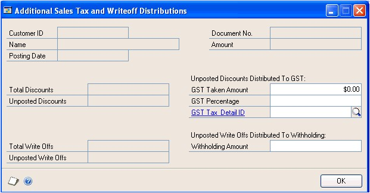

Microsoft Dynamics® GP **Receivables Management**

**Introduction**

You can use Receivables Management to set up, enter, and maintain customer
records, salesperson and sales territory information, national accounts, and
transactions. When necessary, you can enter beginning balances for open item and
balance forward customers and set up customer classes.

You also can use Receivables Management to complete the following tasks:

-   Create, modify, and post payment schedules

-   Post transactions individually or in batches

-   Allocate transaction amounts to posting accounts

-   Enter, modify, and split commissions for your salespeople

-   Enter transactions for payments received from customers

-   Import bank lockbox transactions automatically

If you use Bank Reconciliation, cash transactions and payments posted in
Receivables Management automatically update Bank Reconciliation.

If you use Multicurrency Management, you can view functional and originating
information.

>   This introduction is divided into the following sections:

-   *What’s in this manual*

-   *Symbols and conventions*

-   *Resources available from the Help menu*

-   *Send us your documentation comments*

**What’s in this manual**

This manual is designed to give you an understanding of how to use the features
of Receivables Management, and how it integrates with the Microsoft Dynamics® GP
system.

To make best use of Receivables Management, you should be familiar with
systemwide features described in the System User’s Guide, the System Setup
Guide, and the System Administrator’s Guide.

Some features described in the documentation are optional and can be purchased
through your Microsoft Dynamics GP partner.

To view information about the release of Microsoft Dynamics GP that you’re using
and which modules or features you are registered to use, choose Help \>\> About
Microsoft Dynamics GP.

The manual is divided into the following parts:

-   *Part 1, Setup and cards*, introduces Receivables Management and gives
    detailed setup instructions.

-   *Part 2, Transaction entry*, provides information about working with
    transactions and batches, and describes the types of transactions available
    in Receivable Management.

-   *Part 3, Transaction activity*, includes information about working with
    transactions that are entered in your system, such as posting and applying
    them, or creating refund checks.

-   *Part 4, Inquiries and reports*, explains how to use inquiries and reports
    to analyze your receivables activity.

-   *Part 5, Utilities and routines*, describes procedures that you can use to
    verify your account balances or remove history, and also explains procedures
    you complete on a periodic basis, such as month- or year-end closing.

**Resources available from the Help menu**

The Microsoft Dynamics GP Help menu gives you access to user assistance
resources on your computer, as well as on the Web.

**Contents**

Opens the Help file for the active Microsoft Dynamics GP component, and displays
the main “contents” topic. To browse a more detailed table of contents, click
the Contents tab above the Help navigation pane. Items in the contents topic and
tab are arranged by module. If the contents for the active component includes an
“Additional Help files” topic, click the links to view separate Help files that
describe additional components.

>   To find information in Help by using the index or full-text search, click
>   the appropriate tab above the navigation pane, and type the keyword to find.

To save the link to a topic in the Help, select a topic and then select the
Favorites tab. Click Add.

**Index**

Opens the Help file for the active Microsoft Dynamics GP component, with the
Index tab active. To find information about a window that’s not currently
displayed, type the name of the window, and click Display.

**About this window**

Displays overview information about the current window. To view related topics
and descriptions of the fields, buttons, and menus for the window, choose the
appropriate link in the topic. You also can press F1 to display Help about the
current window.

**Lookup**

Opens a lookup window, if a window that you are viewing has a lookup window. For
example, if the Checkbook Maintenance window is open, you can choose this item
to open the Checkbooks lookup window.

**Show Required Fields**

Highlights fields that are required to have entries. Required fields must
contain information before you can save the record and close the window. You can
change the font color and style used to highlight required fields. On the
Microsoft Dynamics GP menu, choose User Preferences, and then choose Display.

**Printable Manuals**

Displays a list of manuals in Adobe Acrobat .pdf format, which you can print or
view.

**What’s New**

Provides information about enhancements that were added to Microsoft Dynamics GP
since the last major release.

**Documentation and resources on the web**

Opens a Web page that provides links to a variety of Web-based user assistance
resources. Access to some items requires registration for a paid support plan.

**Part 1: Setup and cards**

This part of the documentation describes what you need to do to set up
Receivables Management. These tasks generally need to be completed only once,
but you can refer to these instructions at other times to modify or view
existing entries. This information includes the following topics:

-   *Chapter 1, “Receivables Management setup,”* provides a setup checklist for
    you to follow and describes how to set up your Receivables Management
    preferences and default entries.

-   *Chapter 2, “Sales territories and salespeople,”* provides information about
    setting up sales territory and salesperson cards.

-   *Chapter 3, “Customer classes,”* describes how to set up customer classes.

-   *Chapter 4, “Customer cards,”* describes how to set up customer cards.

-   *Chapter 5, “Customer maintenance,”* describes how to modify and delete
    customer cards, and inactivate them or place them on hold.

-   *Chapter 6, “Open item balances,”* describes how to enter beginning balances
    for open item customers.

-   *Chapter 7, “Balance forward balances,”* describes how to enter beginning
    balances for balance forward customers.

-   *Chapter 8, “Customer history,”* provides information about entering
    customer history records.

-   *Chapter 9, “National accounts,”* describes how to set up national accounts.

**Chapter 1: Receivables Management setup**

>   When you set up Receivables Management, you can open each setup window and
>   enter information, or you can use the Setup Checklist window (Administration
>   \>\> Setup \>\> Setup Checklist) to guide you through the setup process. See
>   your System Setup Guide (Help \>\> Contents \>\> select Setting up the
>   System) for more information about the Setup Checklist window.

>   This information is divided into the following sections:

-   *Before you set up Receivables Management*

-   *Setup routine overview*

-   *Aging periods*

-   *Passwords*

-   *Apply preferences*

-   *Additional receivables options*

-   *Default entries*

-   *E-mail statements*

-   *Setting up receivables preferences and default entries*

-   *Receivables Management options*

-   *Setting up Receivables Management options*

#### Before you set up Receivables Management

Before you begin setting up Receivables Management, be sure to complete the

System Manager and General Ledger setup procedures. See the System Setup or
General Ledger documentation for more information about completing these
procedures.

If you’re using Multicurrency Management, you also must set up the following
information before you begin:

-   Currencies

-   Exchange rates

-   Exchange tables

-   Multicurrency access

*If you plan to print multicurrency versions of your posting journals, mark
Include Multicurrency Info in the Posting Setup window.*

#### Setup routine overview

>   One way to get started with Receivables Management is to follow the setup
>   routine provided with the system. As you select each step in the setup
>   routine list, the appropriate window used to complete that procedure opens.
>   Enter the necessary information using the window, referring to the help
>   whenever necessary.

>   The following table lists the setup routine with the procedure to use to set
>   up each component of your Receivables Management module:

| **Routine**            | **See for more information**                                                     |
|------------------------|----------------------------------------------------------------------------------|
| Receivables Management | *Setting up receivables preferences and default entries*                         |
| Sales territories      | *Adding a sales territory card*                                                  |
| Salespeople            | *Adding a salesperson card*                                                      |
| Customer classes       | *Adding a customer class*                                                        |
| Customers              | *Adding a customer card*                                                         |
| Beginning balances     | *Entering open item beginning balances* and *Balance forward beginning balances* |
| Customer summaries     | *Entering customer summary information*                                          |

>   National accounts are not included in the setup routine. See *Chapter 9,
>   “National accounts,”* for more information.

#### Aging periods

>   Use the Receivables Management Setup window to select the aging periods to
>   use, and how to age documents. Aging is the process of determining the age
>   of your accounts.

>   You can age customer cards by document date or due date. For example, assume
>   you have an invoice dated January 15, with a due date of February 15, and
>   you age documents on the end of the month (February 28). If you age by
>   document date, this invoice would be 44 days old; if you age by due date,
>   this invoice would be 13 days past due.

>   You can use up to seven aging periods for open item customers. If you age by
>   document date, you’re required to have at least one aging period. If you age
>   by due date, you’re required to have at least two aging periods. The
>   starting date always will be one day later than the end of the previous
>   period. The entry in the To field for the last period must be 999. The
>   system defines aging periods for balance forward customers, who can use two
>   periods: current and non-current.

>   Information for the current period and the following three aging periods you
>   define will appear on Aged Trial Balance reports. If you use more than four
>   aging periods including the current period, add them to the Aged Trial
>   Balance reports using the Report Writer.

#### Passwords

>   You can set up passwords in the Receivables Management Setup window to limit
>   the users who can perform certain activities in Receivables Management. For
>   example, you might want to enable only selected users to waive a customer’s
>   finance charge.

>   Passwords limit a user’s ability to complete the following tasks:

-   Enter transactions that exceed a customer’s credit limit

-   Override a customer hold, which restricts you from entering transactions for
    customers

-   Write off amounts that exceed the maximum amount you set for a customer

-   Waive finance charges you set for a customer

#### Apply preferences

>   You can apply customer payments, returns, and credit memos manually or
>   automatically. Using the Receivables Management Setup window, mark whether
>   to apply automatically by due date or by document number.

>   If you apply automatically by due date, you apply payments first to
>   documents with the oldest due date. If you apply automatically by document
>   number, you apply payments first to documents with the lowest number in this
>   order: sales/ invoices, debit memos, finance charges, and services/repairs.

>   For example, assume you have two documents: 1001, with a due date of January
>   30; and 1002, with a due date of January 15. If you apply by due date,
>   payment is automatically applied first to document number 1002. If you apply
>   by document number, payment is automatically applied first to document
>   number 1001.

>   If you’re using national accounts, you can apply to specific customers or to
>   the entire national account, depending on the options you select in the
>   Apply Sales Documents window or Cash Receipts Entry window. See *Chapter 9,
>   “National accounts,”* for more information.

#### Additional receivables options

>   Using the Receivables Management Setup window, you can select additional
>   receivables options that affect how Receivables Management tracks discounts,
>   prints reports and documents, assesses finance charges, and pays
>   commissions.

>   **Track Discounts Available in GL**

>   Mark this option to track discounts, which are posted to the account you
>   assign to Terms Discounts Available using the Customer Maintenance window.
>   If you’re not tracking discounts, the discounts available are posted to the
>   Accounts Receivable account, not to a separate account. The difference
>   between these tracking methods is illustrated in the following table, using
>   an invoice for \$100 with a \$2 discount available:

| **Tracking discounts**              | **Not tracking discounts**      |
|-------------------------------------|---------------------------------|
| \$98 Accounts Receivable debit      | \$100 Accounts Receivable debit |
| \$2 Sales Discounts Available debit |                                 |
| \$100 Sales credit                  | \$100 Sales credit              |

>   The following table illustrates the difference between tracking methods when
>   a payment is recorded for the \$100 invoice with a \$2 discount available:

| **Tracking discounts**               | **Not tracking discounts**       |
|--------------------------------------|----------------------------------|
| \$98 Cash debit                      | \$98 Cash debit                  |
| \$2 Sales Discounts Taken debit      | \$2 Sales Discounts Taken debit  |
| \$98 Accounts Receivable credit      | \$100 Accounts Receivable credit |
| \$2 Sales Discounts Available credit |                                  |

>   **Print Historical Aged Trial Balance**

>   Mark this option to be able to print the Historical Aged Trial Balance. When
>   this option is marked, transaction history is kept regardless of your entry
>   for this history option for individual customers in the Customer Maintenance
>   window.

>   **Delete Unposted Printed Documents**

>   Mark this option to be able to delete an unposted printed document from the
>   Receivables Transaction Entry window or the Receivables Batch Entry window.

>   **Compound Finance Charge**

>   Mark this option to assess finance charges on finance charge documents. This
>   option isn’t allowed in some jurisdictions, so we recommend that you contact
>   your accountant for further information before marking this option.

>   If you mark this option, unapplied finance charges will be included in the
>   balances to be assessed a finance charge. If you don’t mark this option,
>   unapplied finance charges will not be included in the balances to be
>   assessed a finance charge.

>   **Pay Commissions After Invoice**

>   Mark this option to pay commissions to salespeople only after invoices are
>   paid. If you don’t mark this option, you can pay commissions once the
>   invoice has been posted.

>   **Reprint Statements**

>   Mark this option to be able to reprint customer statements at any time. For
>   example, suppose a customer misplaced a statement and, to get payment
>   approved, needs to have a record of the statement. You could select the
>   statement to be reprinted with the same information as the original but
>   marked as a reprinted statement.

>   Statement data will be saved each time you print statements, so each
>   statement will be available for reprinting. See *Reprinting or removing
>   statements* for more information.

>   **Print Tax Details on Documents**

>   Mark this option to include summary tax information on all documents printed
>   from the Sales Transaction Entry and Sales Transaction Entry Zoom windows.

>   **Print Dual Currencies**

>   If you’re using Multicurrency Management, and you mark Print Tax Details on
>   Documents in the Receivables Management Setup window, you can mark this
>   option to print summary tax information in both the originating and
>   functional currencies on sales documents that include tax details. The
>   documents will display the following information:

-   The exchange rate used for the transaction

-   The net value of goods and services at each taxation rate in both currencies

-   The amount of tax at each taxation rate in both currencies

>   **Auto-apply to Finance Charges First**

>   Mark this option to automatically apply credit documents to finance charge
>   documents first. When you auto-apply a credit document in the Apply Sales
>   Documents or Cash Receipts Entry windows, Receivables Management will apply
>   credit documents first to any unapplied finance charge documents using the
>   Apply by option you mark in the Receivables Management Setup window.

>   **Example**

>   You recorded the following transactions for a customer:

| **Document**     | **Date** | **Amount** |
|------------------|----------|------------|
| Invoice 1        | 01/25/18 | \$100.00   |
| Finance Charge 1 | 02/20/18 | \$5.00     |
| Invoice 2        | 03/10/18 | \$50.00    |
| Finance Charge 2 | 03/20/18 | \$7.50     |

>   On March 25, 2018, you receive a payment from your customer for \$125.00,
>   and you auto-apply the payment in the Apply Sales Documents window. If you
>   marked Auto Apply to Finance Charges First, the payment would be
>   auto-applied as described in the following table:

| **Document**     | **Amount** |
|------------------|------------|
| Finance Charge 1 | \$5.00     |
| Finance Charge 2 | \$7.50     |
| Invoice 1        | \$100.00   |
| Invoice 2        | \$12.50    |

>   If you didn’t mark Auto Apply to Finance Charges First, the payment would be
>   auto-applied as described in the following table:

| **Document** | **Amount** |
|--------------|------------|
| Invoice 1    | \$100.00   |
| Invoice 2    | \$25.00    |

>   If you’re using national accounts and you mark Auto Apply to Finance Charges
>   First, Receivables Management will search the national account for any
>   unapplied finance charge documents. The unapplied credit document will be
>   auto-applied to the finance charge documents in the national account using
>   the Apply by setting you marked in the Receivables Management Setup window.
>   Unapplied credit documents are applied first to the finance charge documents
>   of the entire national account or specific customers, depending on whether
>   you mark National Account or Specific Customer in the Apply Sales Documents
>   window.

>   **Age Unapplied Credit Amounts**

>   If you mark this option, the Receivables Management aging process will age
>   unapplied credit amounts based on the document date in relation to the aging
>   date, and how you set up your aging periods in Receivables Management. If
>   you age documents by due date and you mark this option, the due date for
>   credit documents will be the same as the document date.

>   Aging unapplied credit amounts does not affect how portions of credit
>   documents are aged with the debit documents they’re fully or partially
>   settled against.

#### Default entries

>   You can enter a default entry for an NSF charge, checkbook ID, price level,
>   and document format. These entries appear during transaction entry; you can
>   change them, if necessary.

>   **NSF Charge** Enter a default service charge amount for checks marked as
>   having non-sufficient funds (NSF). You can change the NSF charge on a
>   per-customer basis using the Receivables Posted Transaction Maintenance
>   window.

>   **Checkbook ID** Enter the ID for the checkbook to be displayed as the
>   default entry throughout this module. If you’re using Bank Reconciliation
>   and you select a checkbook that is marked as inactive using the Checkbook
>   Maintenance window, the checkbook isn’t verified at this time.

>   **Price Level** Enter a price level to be used as the price level for all
>   items on a sales document, if one hasn’t already been assigned to a customer
>   or prospect. We recommend you enter the price level you use most often; you
>   can override the price level during transaction entry. If you use a
>   particular price level for most customers, enter that price level here.
>   Then, for customers you sell items to at other price levels, enter each
>   customer’s price level using the Customer Class Setup or Customer
>   Maintenance windows.

>   This information doesn’t apply if you’re using extended pricing. For more
>   information about extending pricing, refer to the Inventory Control and
>   Sales Order Processing documentation.

>   **Document Format** Select Blank Paper, User-Defined 1, or User-Defined 2.
>   The document format you select is the default format for documents you print
>   using the Receivables Transaction Entry and Receivables Transaction Inquiry
>   Zoom windows.

>   **Default Summary View** Select a summary view to appear as the default
>   summary view in the Customer Summary and Customer Yearly Summary Inquiry
>   windows. If you select Amounts Since Last Close, the selected customer’s
>   current summary information will be displayed. If you select Fiscal Year,
>   the selected customer’s summary information for the fiscal year will be
>   displayed. If you select Calendar Year, the selected customer’s summary
>   information for the calendar year will be displayed.

#### E-mail statements

>   In addition to printing customer statements, you also can set up e-mail
>   statements to be sent on a per-customer basis. If you are using a MAPI
>   (Microsoft’s Messaging Application Programming Interface) compliant e-mail
>   service, you can send the email statement in Portable Document Format (PDF)
>   to any number of specified customer e-mail addresses. You must install Adobe
>   Distiller or PDFWriter to send customer statements by e-mail.

>   In the Receivables Management Setup window, you can enter an e-mail address
>   where the e-mail statements status report should be sent. This report
>   includes a list of the e-mail statements that were sent successfully, and
>   information about any errors that might have occurred during the sending
>   process. You won’t be able to enter the address if you have marked Customer
>   Statement in the Sales E-mail Setup window.

*You can enter only one e-mail address in the Status Recipient field.*

>   If you didn’t specify an e-mail address in the Receivables Management Setup
>   window or if sending the status report by e-mail failed, Receivables
>   Management will print the status report to the default printer and leave the
>   status report file in the folder that you specified or in the default folder
>   which will be \\CompanyID\\Microsoft Dyanmics\\GP\\UserID\\StmtStatus.

#### Setting up receivables preferences and default entries

>   Use the Receivables Management Setup window to set up the aging periods to
>   use, and how to age and apply documents. You also can set up passwords to
>   restrict certain activities, default entries to save time when entering
>   data, and additional receivables options.

>   **To set up receivables preferences and default entries:**

1.  Open the Receivables Management Setup window.

>   (Sales \>\> Setup \>\> Receivables)

A screenshot of a cell phone Description automatically generated

A screenshot of a cell phone Description automatically generated

A screenshot of a cell phone Description automatically generated

A screenshot of a cell phone Description automatically generated

A screenshot of a cell phone Description automatically generated

A screenshot of a cell phone Description automatically generated

A screenshot of a cell phone Description automatically generated

A screenshot of a cell phone Description automatically generated

A screenshot of a cell phone Description automatically generated

A screenshot of a cell phone Description automatically generated

A screenshot of a cell phone Description automatically generated

A screenshot of a cell phone Description automatically generated

A screenshot of a cell phone Description automatically generated

A screenshot of a cell phone Description automatically generated

A screenshot of a cell phone Description automatically generated

A screenshot of a cell phone Description automatically generated

A screenshot of a cell phone Description automatically generated

A screenshot of a cell phone Description automatically generated

A screenshot of a cell phone Description automatically generated

1.  Specify the aging periods to use and how to age documents. See *Aging
    periods* for more information.

2.  Enter passwords to restrict user access to certain sales activities. If you
    leave any of the password fields blank, no password will be required for
    those activities. See *Passwords* for more information.

>   *To use the credit limit override approval workflow in Sales Order
>   Processing, don’t enter a password for the Exceed Credit Limit field.*

1.  Specify whether to apply credit memos, returns, and payments by due date or
    document number when you automatically apply. See *Apply preferences* for
    more information.

2.  Mark any additional receivables options. See *Additional receivables
    options* for more information.

3.  Enter default information for an NSF charge, checkbook ID, price level,
    document format, and default summary view. See *Default entries* for more
    information.

4.  Enter an e-mail statements status report recipient address. This field is
    not available if you have marked Customer Statement in the Sales E-Mail
    Setup window or have selected Exchange as the email server type in the
    System Preferences window.

5.  Choose Options to set up additional Receivables Management options and
    default entries, such as document descriptions, codes, numbers, and
    userdefined fields. See *Setting up Receivables Management options* for more
    information.

6.  Choose File \>\> Print to verify your entries with a Receivables Setup List.

7.  Choose OK to save your entries and close the Receivables Management Setup
    window.

#### Receivables Management options

>   Use the Receivables Setup Options window to set up options and default
>   entries, including document descriptions, codes, numbers, and user-defined
>   fields. This information appears throughout Receivables Management windows;
>   the transaction description is displayed on reports, and the transaction
>   code appears when there isn’t space for the entire transaction description
>   on reports or in windows. Document numbers track individual transactions.

>   **Transaction numbers**

>   When defining default document numbers using this window, you must use
>   separate numbers for all document types rather than using only one document
>   number to increment for all transactions, because each type of document
>   increments separately using a separate number.

>   While document numbers don’t have to be alphanumeric, an alphanumeric system
>   gives you more flexibility in locating and identifying documents. The lookup
>   window for document numbers doesn’t display a document code, so you can’t
>   identify whether the transaction is a sale or a warranty by the number if
>   you don’t use alphanumeric document numbers.

>   When setting up an alphanumeric system, be sure each document number ends
>   with a series of digits rather than letters. If you enter Invoice numbers
>   that end in alphabetic characters, such as 8050AC, the system is unable to
>   increment to the next number and you’ll receive an alert message when
>   entering transactions, stating that the default document number is invalid.

>   The number of documents you can generate depends on the number of ending
>   digits you assign when setting up your document numbers. It is important to
>   have as many zeros as possible to the left of the number you enter to ensure
>   it increments correctly, and that enough possible numbers exist for all your
>   entries. For example, if you enter Sales001, once you reach Sales999, there
>   will be no further number to increment.

>   **Default tax schedule IDs**

>   The sales, freight, and miscellaneous tax schedule IDs you enter appear as
>   default entries in the Receivables Tax Schedule Entry window. You can change
>   these tax schedule IDs for individual transactions using the Receivables Tax
>   Schedule Entry window.

>   When you enter transactions, each schedule is compared to the tax schedule
>   that appears in the Receivables Transaction Entry window. Tax details that
>   appear in both tax schedules are used to calculate the tax on the sales
>   amount.

>   **User-defined fields**

>   Receivables Management includes user-defined field names for tracking
>   additional information about each customer and for sorting methods on
>   reports.

>   For example, if you keep track of your customer type, such as retail, you
>   can enter

>   Customer Type in the Customer Master User-Defined 1 field. In the Customer

>   Maintenance window, you will see Customer Type as the label for the field
>   that was Customer Master User-Defined 1. You also will see Customer Type as
>   a sorting method on most customer reports. There are also two user defined
>   fields specifically for customer address information.

>   **Sales history includes**

>   Mark whether to post sales amounts, trade discount amounts, amounts charged
>   for freight, miscellaneous charges, and tax amounts to sales history. For
>   example, if you use the Miscellaneous field in the Receivables Transaction
>   Entry window to enter processing fees, you can have those amounts added to
>   the sales amounts to keep a record of these accounts. The total of the sale
>   plus the processing fee is displayed when you view historical amounts using
>   the Customer Summary window.

#### Setting up Receivables Management options

>   Use the Receivables Setup Options window to set up options to appear
>   throughout Receivables Management. You can enter a description for each
>   document type, assign a code, and set up the next document number for the
>   transaction type.

>   **To set up Receivables Management options:**

1.  Open the Receivables Setup Options window.

>   (Sales \>\> Setup \>\> Receivables \>\> Options button)

A screenshot of a cell phone Description automatically generated

A screenshot of a cell phone Description automatically generated

A screenshot of a cell phone Description automatically generated

A screenshot of a cell phone Description automatically generated

A screenshot of a cell phone Description automatically generated

A screenshot of a cell phone Description automatically generated

A screenshot of a cell phone Description automatically generated

A screenshot of a cell phone Description automatically generated

A screenshot of a cell phone Description automatically generated

A screenshot of a cell phone Description automatically generated

A screenshot of a cell phone Description automatically generated

A screenshot of a cell phone Description automatically generated

A screenshot of a cell phone Description automatically generated

A screenshot of a cell phone Description automatically generated

A screenshot of a cell phone Description automatically generated

A screenshot of a cell phone Description automatically generated

A screenshot of a cell phone Description automatically generated

A screenshot of a cell phone Description automatically generated

A screenshot of a cell phone Description automatically generated

1.  Specify default transaction descriptions, codes, and next numbers.

2.  Enter the most recent dates specific sales activities were completed on.
    This information is updated automatically as these activities occur.

>   Enter default tax schedules to be used for sales transactions when a
>   customer doesn’t have a tax schedule assigned, and for taxes charged on
>   freight and other miscellaneous charges. See the System Setup documentation
>   (Help \>\> Printable Manuals) for more information about setting up tax
>   schedules.

1.  Enter user-defined field names for tracking additional information about
    each customer and customer address and to sort information on reports. The
    Customer Master fields appear in the Customer Maintenance window, and the

>   User-Defined 1 field is a sorting method on several customer reports. The
>   Customer Address fields appear in the Customer Address Maintenance window.

1.  Mark whether to track sales amounts, trade discounts amounts, amounts
    charged for freight, miscellaneous charges, and tax amounts in history.

2.  Choose OK to save your entries and close the Receivables Setup Options
    window.

**Chapter 2: Sales territories and salespeople**

>   Sales territories are divisions a company’s products are sold in. You can
>   track history, sales, and commissions in each territory. You can set up
>   sales territory cards according to geographical areas or customer types. For
>   example, you could set up government, commercial, and residential
>   “territories.”

>   Use salespeople cards to track commissions for calendar and fiscal years,
>   and to keep historical information for each salesperson your company employs
>   or does business with.

>   This information is divided into the following sections:

-   *Adding a sales territory card*

-   *Modifying or deleting a sales territory card*

-   *Adding a salesperson card*

-   *Modifying a salesperson card*

-   *Deleting a salesperson card*

#### Adding a sales territory card

>   Use the Sales Territory Maintenance window to enter sales territory
>   information. When you set up your salespeople, you’ll assign them to sales
>   territories. You can assign customer classes and customer cards to
>   territories, as well.

>   You must set up at least one sales territory for your salespeople before you
>   can post commissions, even if you don’t use sales territories.

>   You also can enter beginning territory sales amounts. These amounts are
>   updated automatically as you post transactions. Transactions for the
>   customer update commission amounts for the sales territory assigned to the
>   customer card. The territory you assigned to the salesperson can be
>   different from the territory you assigned to the customer card.

>   **To add a sales territory card:**

1.  In the navigation pane, choose the Sales button, and then choose the
    Salespeople list.

2.  In the New group, choose Sales Territory to open the Sales Territory
    Maintenance window.

A screenshot of a cell phone Description automatically generated

A screenshot of a cell phone Description automatically generated

A screenshot of a cell phone Description automatically generated

A screenshot of a cell phone Description automatically generated

A screenshot of a cell phone Description automatically generated

A screenshot of a cell phone Description automatically generated

A screenshot of a cell phone Description automatically generated

A screenshot of a cell phone Description automatically generated

A screenshot of a cell phone Description automatically generated

A screenshot of a cell phone Description automatically generated

A screenshot of a cell phone Description automatically generated

A screenshot of a cell phone Description automatically generated

A screenshot of a cell phone Description automatically generated

A screenshot of a cell phone Description automatically generated

A screenshot of a cell phone Description automatically generated

A screenshot of a cell phone Description automatically generated

A screenshot of a cell phone Description automatically generated

A screenshot of a cell phone Description automatically generated

1.  Enter an ID and a description for the territory.

>   *To ensure that reports are printed in the correct order, be sure each
>   territory ID has the same number of characters. The characters are sorted
>   from left to right and numbers take priority over letters.*

1.  Enter the territory’s country/region.

2.  Enter or select the territory manager.

3.  Enter year-to-date and last year’s commissions and sales amounts, based on
    the customers in the territory, to create history information. These fields
    are updated automatically as you post transactions.

4.  Mark whether to keep calendar-year history, fiscal-year history, or both.

-   If you mark Calendar Year, the sales and commission amounts for individual
    calendar months are recorded for reporting purposes.

-   If you mark Fiscal Year, the sales and commission amounts for individual
    fiscal periods are recorded for reporting purposes.

>   To view or edit detailed historical commission and sales information for a
>   single territory, choose History to open the Sales Territory History window.
>   This information is updated as you post transactions.

>   To add periods to include, choose Add Period in the Sales Territory History
>   window to open the Sales Period and Month Maintenance window. Close the
>   window when you finish.

1.  Choose OK to close the Sales Territory History window; choose Save to save
    the sales territory card.

2.  When you finish entering your sales territory cards, choose File \>\> Print
    to verify your entries with a Sales Territory List.

#### Modifying or deleting a sales territory card

>   Use the Sales Territory Maintenance window to modify or delete sales
>   territory information. You can’t delete cards for sales territories with
>   posted amounts or amounts in history.

>   **To modify or delete a sales territory card:**

1.  In the navigation pane, choose the Sales button, and then choose the
    Salespeople list.

2.  Mark the salesperson whose sales territory you want to modify or delete.

3.  In the Modify group, choose Edit Sales Territory to open the Sales Territory
    Maintenance window.

4.  Select one of the following options.

    -   To make changes to the sales territory card, enter the new information.

    -   To delete to the sales territory card, choose Delete.

5.  Choose Save. Choose File \>\> Print to print a Sales Territory List to
    review your changes.

#### Adding a salesperson card

>   Use the Salesperson Maintenance window to enter salesperson information.

>   You can assign a salesperson to each customer card. Transactions for the
>   customer update the commission amounts for the salesperson.

>   **To add a salesperson card:**

1.  In the navigation pane, choose the Sales button, and then choose the
    Salespeople list.

2.  In the New group, choose Salesperson to open the Salesperson Maintenance
    window.

A screenshot of a cell phone Description automatically generated

A screenshot of a cell phone Description automatically generated

A screenshot of a cell phone Description automatically generated

A screenshot of a cell phone Description automatically generated

A screenshot of a cell phone Description automatically generated

A screenshot of a cell phone Description automatically generated

A screenshot of a cell phone Description automatically generated

A screenshot of a cell phone Description automatically generated

A screenshot of a cell phone Description automatically generated

A screenshot of a cell phone Description automatically generated

A screenshot of a cell phone Description automatically generated

A screenshot of a cell phone Description automatically generated

A screenshot of a cell phone Description automatically generated

A screenshot of a cell phone Description automatically generated

A screenshot of a cell phone Description automatically generated

A screenshot of a cell phone Description automatically generated

A screenshot of a cell phone Description automatically generated

A screenshot of a cell phone Description automatically generated

1.  Enter a salesperson ID and name. If this salesperson is an employee, enter
    the employee ID; the employee record information appears. The salesperson ID
    doesn’t have to be the same as the employee ID.

>   *To ensure that reports are printed in the correct order, be sure that each
>   salesperson ID has the same number of characters. The characters are sorted
>   from left to right and numbers take priority over letters.*

1.  Enter or select a territory ID. You must enter a territory ID before you can
    post commissions. Even if you don’t use territories, set up one sales
    territory to assign to all salespeople.

2.  Enter or select a vendor ID if this salesperson is an independent contractor
    and not an employee.

3.  Enter address information for the salesperson.

4.  Enter the commission percentage this salesperson earns. Then, mark whether
    to calculate the salesperson’s commissions as a percentage of the sale
    amount or the invoice total. If you mark to calculate the invoice total, the
    commissions are calculated as a percentage of the invoice total, including
    the sale amount, freight, taxes, and miscellaneous charges.

5.  Enter year-to-date and last-year commission and sales amounts to create
    history information. These fields are updated automatically as you post
    transactions.

6.  Mark whether to keep calendar-year and fiscal-year history.

    -   If you mark Calendar Year, sales and commission amounts for individual
        calendar months are recorded for reporting purposes.

    -   If you mark Fiscal Year, sales and commission amounts for individual
        fiscal periods are recorded for reporting purposes.

>   To view or edit historical commission and sales information for a single
>   salesperson, choose History to open the Salesperson History window. This
>   information is updated as you post transactions.

>   To add periods to include, choose Add Period in the Salesperson History
>   window to open the Sales Month and Period Maintenance window. Close the
>   window when you finish.

>   Choose OK to close the Salesperson History window, and choose Save to save
>   the salesperson card.

>   When you finish entering your salespeople cards, choose File \>\> Print to
>   verify your entries with a Salesperson List.

#### Modifying a salesperson card

>   Use the Salesperson Maintenance window to modify salesperson information.

>   **To modify a salesperson card:**

1.  In the navigation pane, choose the Sales button, and then choose the
    Salespeople list.

2.  Mark the salesperson card to change.

3.  In the Modify group, choose Edit to open the Salesperson Maintenance window.

4.  To make changes to the salesperson card, enter the new information.

5.  Choose Save to save the salesperson card. Choose File \>\> Print to print a
    Salesperson List and view the changes you entered.

#### Deleting a salesperson card

>   Cards can’t be deleted for salespeople for whom posted commission amounts or
>   amounts in history exist. See *Marking commission amounts as paid* for more
>   information about removing posted commissions.

>   **To delete a salesperson card:**

1.  In the navigation pane, choose the Sales button, and then choose the
    Salespeople list.

2.  Mark a salesperson to delete.

3.  Delete the salesperson.

**Chapter 3: Customer classes**

>   Use customer classes to organize customers who have similar characteristics.
>   For example, you could group your customers by credit limit, location, or
>   business size.

>   Customer classes provide default entries and options that organize customer
>   cards and save time when entering data and grouping and sorting methods on
>   reports. You also can make changes to groups of customers quickly by
>   changing the class and “rolling down” the change to all the customers in the
>   class.

>   This information is divided into the following sections:

-   *Open item and balance forward balances*

-   *History options*

-   *Credit and transaction options*

-   *Adding a customer class*

-   *Entering customer class Intrastat statistics*

-   *Setting up customer class default posting accounts*

#### Open item and balance forward balances

>   You can select between open item and balance forward balance types for
>   customer accounts in Receivables Management. The following table outlines
>   the differences between the two types:

|                                       | **Open item**                                                                                                                                                                                                      | **Balance forward**                                                                                                                                                                                                                                       |
|---------------------------------------|--------------------------------------------------------------------------------------------------------------------------------------------------------------------------------------------------------------------|-----------------------------------------------------------------------------------------------------------------------------------------------------------------------------------------------------------------------------------------------------------|
| **Definition**                        | Individual transaction information is saved and detailed on customer statements until the transaction is removed through paid transaction removal.                                                                 | Transaction information is retained only for the current period and is then consolidated into an account total that is brought forward at the beginning of each subsequent period.                                                                        |
| **Number of aging periods**           | You can use up to seven aging periods.                                                                                                                                                                             | There are only two aging periods: current and noncurrent.                                                                                                                                                                                                 |
| **Finance charges**                   | Accounts are aged before assessing finance charges because open item accounts are aged by individual transaction dates.                                                                                            | Accounts are consolidated after finance charges are assessed and customer statements have been printed because balance forward accounts don’t retain individual transaction information.                                                                  |
| **Aging**                             | You can age open item accounts at any time of the month by initiating the aging process.                                                                                                                           | Balance forward consolidation occurs during the paid transaction removal procedure.                                                                                                                                                                       |
| **Cash receipts/posted transactions** | You can apply payments to specific invoices. You can waive finance charges, assess charges for non-sufficient funds (NSF) checks, and void transactions until you complete the paid transaction removal procedure. | Payments are applied automatically to the noncurrent balance. You can waive finance charges, assess charges for nonsufficient funds (NSF) checks, and void transactions until you consolidate the accounts during the paid transaction removal procedure. |
| **Multicurrency transactions**        | You can enter multicurrency transactions for open item customers.                                                                                                                                                  | Multicurrency transactions cannot be entered for balance forward customers.                                                                                                                                                                               |

See *Chapter 6, “Open item balances,”* and *Chapter 7, “Balance forward
balances,”* for more information about balance types.

#### History options

There are several history options available in Receivables Management. The
following table outlines each one:

| **History type** | **What’s kept**                                                                   | **Benefits of keeping**                                                                                                                                                                                      |
|------------------|-----------------------------------------------------------------------------------|--------------------------------------------------------------------------------------------------------------------------------------------------------------------------------------------------------------|
| Calendar Year    | Sales and commission amounts for individual calendar months                       | You can print reports for monthly and yearly customer activity.                                                                                                                                              |
| Fiscal Year      | Sales and commission amounts for individual fiscal periods                        | You can print reports for customer activity in each fiscal period.                                                                                                                                           |
| Transaction      | Detailed information about sales transactions                                     | You can print history reports and the Historical Aged Trial Balance report.                                                                                                                                  |
|                  |                                                                                   | (If you marked Print Historical Aged Trial Balance in the Receivables Management Setup window, transaction history will be kept regardless of whether you mark this option.)                                 |
| Distribution     | Detailed information about the posting account distributions for each transaction | You can print the Distribution History Report. (If you marked reprint posting journals in the Audit Trail Codes Setup window, distribution history will be kept regardless of whether you mark this option.) |

#### Credit and transaction options

You can use the Customer Class Setup window (Sales \>\> Setup \>\> Customer
Class) to specify credit and transaction entry options for customer classes,
including the following options:

**Finance charges** Mark whether finance charges are used by customers in this
class, and if the charges are a percentage of the balance due or a flat amount.
To send customer statements monthly and assess charges on a monthly basis based
on annual percentage, divide your yearly charge by 12 and enter that amount. The
finance charge amounts you enter here are assessed each time you use the Assess
Finance Charges window, typically on a monthly basis. For this reason, you
should enter the amount or percentage to be charged monthly. For example, if
customers in this class are required to pay an annual percentage rate (APR) of
18%, enter 1.5% (18 / 12 = 1.5).

**Payment terms** Payment terms include discounts that you offer your customers
if they pay by a certain date. For example, the terms 2%-10/Net 30 offer a 2%
discount to customers who pay within 10 days after the date of the purchase;
otherwise the bill must be paid in full within 30 days. The terms Net 15 require
that payment be made within 15 days of purchase, with no discount being offered.
Other common terms are COD and prepayment.

**Discount grace period** The discount grace period is a grace period for
payment terms that use discounts. When using discount date grace periods, if the
document date plus the discount grace period is the same as or after the payment
terms discount date, the discount date and the due date move to the next month.
For example, assume that January 6 is an invoice date, the terms are \$2.50
7/Net 12,

>   and the discount grace period is 2 days. A discount of \$2.50 is available
>   to customers if they pay on January 7; otherwise, the entire bill is due
>   January 12. Because the invoice date plus the discount due date grace period
>   is greater than or equal to the discount date, the discount date moves to
>   February 7 and the due date moves to February 12.

>   **Due date grace period** The due date grace period is a grace period for
>   payment terms that use due dates. For example, assume that May 25 is an
>   invoice date. The terms are EOM for the invoice and the bill is due on the
>   last day of the month. If you enter a grace period of 5 and the invoice date
>   falls within five days of the end of the month, the invoice isn’t due until
>   the end of the following month.

#### Adding a customer class

>   Use the Customer Class Setup window to enter new customer classes. In
>   addition, you can make changes to groups of customers quickly by changing
>   the class and rolling down the change to all the customers in the class. See
>   *Modifying or deleting a customer class* for more information about rolling
>   down changes to a customer class.

>   **To add a customer class:**

1.  Open the Customer Class Setup window. (Sales \>\> Setup \>\> Customer Class)

A screenshot of a cell phone Description automatically generated

A screenshot of a cell phone Description automatically generated

A screenshot of a cell phone Description automatically generated

A screenshot of a cell phone Description automatically generated

A screenshot of a cell phone Description automatically generated

A screenshot of a cell phone Description automatically generated

A screenshot of a cell phone Description automatically generated

1.  Enter an ID and description for the class.

>   We recommend that you enter the class with the most common entries first and
>   mark this class as your default class. If you mark Default, the information
>   you set up for this class appears as the default information for every
>   subsequent class you create. You can mark only one class as the default
>   customer class.

1.  Set up the credit options to apply to customers in this class, such as
    balance type, finance charge, minimum payment, credit limit, and writeoff.

>   If customers in this class will use multicurrency transactions, you must
>   select Open Item as the balance type. Multicurrency transactions cannot be
>   entered for balance forward customers, and balance forward customers can’t
>   be part of a national account.

>   If customers in this class will be part of a national account, you must
>   select Open Item as the balance type.

1.  Mark Revalue Customer to include the transactions for the customers in this
    class when you’re revaluing the Sales series using the Multicurrency
    Revaluation window.

>   Mark whether to post the revaluation results to each transaction’s Accounts
>   Receivable account and Terms Discounts Available account, or to a Sales
>   offset account.

1.  Select a default order fulfillment shortage option for this customer. You
    can choose None, Back Order Remaining, or Cancel Remaining. If you select
    None, you will have to allocate any shortages manually. See the Sales Order
    Processing documentation for more information.

2.  Enter default transaction entries options for customers in this class, such
    as trade discount, payment terms, and salesperson and territory IDs.

3.  If customers in this class will use multicurrency transactions, enter or
    select an existing currency as the default currency for the class. We
    recommend you enter a currency ID other than your functional currency only
    for those classes of customers who typically use a foreign currency.

>   If you already set up a customer class and you change the currency ID, you
>   can roll down the currency ID to the customers in this class; the new
>   currency ID will be assigned to all customers you assign to the class in the
>   future.

1.  Enter or select an existing rate type for the class. When you enter
    transactions, you automatically can select the appropriate exchange rate
    table based on the currency ID and rate type you’ve entered. See the
    Multicurrency Management documentation for more information about currencies
    and rate types.

>   *If you don’t assign a rate type to a customer, the default rate type you’ve
>   entered for the Sales Series using the Multicurrency Setup window appears on
>   the transaction instead. Therefore, be sure you’ve entered a Sales series
>   default rate type.*

1.  Mark the types of history to keep. See *History options* for more
    information.

2.  Select a priority for the customer—1 is the highest priority and None is the
    lowest priority. When you allocate items in the Sales Automatic Order
    Allocation window, you can choose to allocate items by customer priority.

3.  Select a statement cycle for printing customer statements for this class. If
    you don’t send statements to most members in this class, select No
    Statement.

>   To assign default posting accounts to the class, choose Accounts to open the
>   Customer Class Accounts Setup window.

>   If you don’t set up accounts for the customer, the accounts from the class
>   are used. If there aren’t any for the class, the accounts in the Posting
>   Accounts Setup window are used. See *Setting up customer class default
>   posting accounts* for more information.

1.  Choose OK to close the window and return to the Customer Class Setup window,
    and choose Save to save your entries.

>   When you finish entering your customer class cards, choose File \>\> Print
>   to verify your entries with a Classes Setup List

#### Entering customer class Intrastat statistics

>   Use the Customer Class Intrastat Setup window to enter default Intrastat
>   information for a customer class. You can roll down the changes you make
>   using this window to all customer cards in the class.

>   If you set up Intrastat information for customer classes, you won’t need to
>   enter Intrastat information for individual customer cards in that class.
>   However, you can change the information for a particular customer card using
>   the Customer Intrastat Setup window.

>   *You can enter Intrastat statistics only if you have marked to enable
>   Intrastat tracking using the Company Setup Options window.*

>   See the System Setup documentation (Help \>\> Printable Manuals) for
>   information about setting up Intrastat codes.

>   **To enter customer class Intrastat statistics:**

1.  Open the Customer Class Intrastat Setup window.

>   (Sales \>\> Setup \>\> Customer Class \>\> Select a customer class \>\>
>   Intrastat button)

A screenshot of a cell phone Description automatically generated

A screenshot of a cell phone Description automatically generated

A screenshot of a cell phone Description automatically generated

A screenshot of a cell phone Description automatically generated

A screenshot of a cell phone Description automatically generated

A screenshot of a cell phone Description automatically generated

A screenshot of a cell phone Description automatically generated

A screenshot of a cell phone Description automatically generated

A screenshot of a cell phone Description automatically generated

A screenshot of a cell phone Description automatically generated

A screenshot of a cell phone Description automatically generated

A screenshot of a cell phone Description automatically generated

A screenshot of a cell phone Description automatically generated

A screenshot of a cell phone Description automatically generated

A screenshot of a cell phone Description automatically generated

A screenshot of a cell phone Description automatically generated

A screenshot of a cell phone Description automatically generated

1.  Enter or select country, transport mode, transaction nature, incoterms,
    procedure/regime, port, region, and tax commodity codes for the customer
    class.

2.  Choose OK to close the Customer Class Intrastat Setup window.

3.  In the Customer Class Setup window, choose Save to save the information.

*Deleting the customer class also deletes Intrastat information.*

#### Setting up customer class default posting accounts

>   You can set up a unique set of default posting accounts for each class. When
>   you set up your customer cards, you can use these accounts or change them as
>   needed on a per-customer basis.

>   If you’re using Receivables Management with both Invoicing and Inventory,
>   some Invoicing transactions are posted to Receivables Management posting
>   accounts, and some to Inventory posting accounts. For example, Invoicing
>   distributions for inventory amounts or markdowns always are posted to
>   equivalent Inventory posting accounts. You can post other distribution
>   amounts only to Receivables Management accounts. Credit card sales recorded
>   in Invoicing always are posted to the Accounts Receivables posting account
>   you set up for the customer in Receivables Management. In addition, you can
>   post trade discounts, terms discounts taken, and freight and miscellaneous
>   charges only to equivalent Receivables Management posting accounts.

>   You can post other types of distributions either to Inventory or Receivables
>   Management posting accounts, depending on the selections you made using the

>   Invoicing Setup window. If you selected Item in the Posting Accounts From
>   field,

>   Inventory posting accounts are used. If you selected Customer in the Posting
>   Accounts From field, Receivables Management posting accounts are used. See
>   the Invoicing documentation for more information.

>   **To set up customer class default posting accounts:**

1.  Open the Customer Class Accounts Setup window.

>   (Sales \>\> Setup \>\> Customer Class \>\> Accounts button)

A screenshot of a cell phone Description automatically generated

A screenshot of a cell phone Description automatically generated

A screenshot of a cell phone Description automatically generated

A screenshot of a cell phone Description automatically generated

A screenshot of a cell phone Description automatically generated

A screenshot of a cell phone Description automatically generated

A screenshot of a cell phone Description automatically generated

A screenshot of a cell phone Description automatically generated

A screenshot of a cell phone Description automatically generated

A screenshot of a cell phone Description automatically generated

A screenshot of a cell phone Description automatically generated

A screenshot of a cell phone Description automatically generated

A screenshot of a cell phone Description automatically generated

A screenshot of a cell phone Description automatically generated

A screenshot of a cell phone Description automatically generated

A screenshot of a cell phone Description automatically generated

A screenshot of a cell phone Description automatically generated

1.  If you didn’t specify a class ID using the previous window, enter or select
    a class ID and enter a description.

2.  Enter or select a checkbook ID.

3.  Mark whether to use the Cash account from the checkbook you selected using
    the Receivables Management Setup window or from the customer card.

>   *If you’re using Bank Reconciliation, we recommend that you use the Cash
>   account from the checkbook so you can easily reconcile the checkbook balance
>   to the Cash account in General Ledger.*

1.  Enter or select the posting accounts. These accounts appear as default
    entries for setting up customer cards.

2.  Choose OK to close the window.

3.  In the Customer Class Setup window, choose Save to save the information.

**Chapter 4: Customer cards**

>   The foundation of the Receivables Management module is your collection of
>   customer cards. This information is used to track the status of customers
>   and to print reports. It is important to keep this information up to date to
>   reflect your company’s current activity.

>   *You might be able to import your customer records from your current system
>   directly into Receivables Management. Importing your customer data saves you
>   a considerable amount of time. Contact your reseller for more information.*

>   This information is divided into the following sections:

-   *Before you add customer cards*

-   *Adding a customer card*

-   *Setting up customer default posting accounts*

-   *Entering customer address information*

-   *Entering customer Intrastat statistics*

-   *Finance charge and credit limit options*

-   *Setting up customer credit, payment, and history options*

-   *Setting up e-mail options for a customer*

-   *Setting up e-mail options for a group of customers*

#### Before you add customer cards

>   Before you begin entering your first customer cards, consider how to arrange
>   your current and future customer cards. You might want to assign specified
>   groups of IDs to different types of customers. You also might want to assign
>   them to different customer classes. Once you decide on the most appropriate
>   identification system, be sure all the IDs have the same number of
>   characters, and are set up consistently, for the best results when printing
>   reports and using other windows.

#### Adding a customer card

>   Use the Customer Maintenance window to add customer cards to your
>   Receivables Management system.

>   **To add a customer card:**

1.  In the navigation pane, choose the Sales button, and then choose the
    Customers list.

2.  In the New group, choose Customer to open the Customer Maintenance window.

A screenshot of a cell phone Description automatically generated

A screenshot of a cell phone Description automatically generated

A screenshot of a cell phone Description automatically generated

A screenshot of a cell phone Description automatically generated

A screenshot of a cell phone Description automatically generated

A screenshot of a cell phone Description automatically generated

A screenshot of a cell phone Description automatically generated

A screenshot of a cell phone Description automatically generated

A screenshot of a cell phone Description automatically generated

A screenshot of a cell phone Description automatically generated

A screenshot of a cell phone Description automatically generated

A screenshot of a cell phone Description automatically generated

A screenshot of a cell phone Description automatically generated

A screenshot of a cell phone Description automatically generated

A screenshot of a cell phone Description automatically generated

A screenshot of a cell phone Description automatically generated

1.  Enter a customer ID and name information. The short name, such as the
    company’s initials, can be used in circumstances when the customer name is
    too long. Short names may appear on reports and can be used as a sorting
    option for reports. The statement name is the name that is printed on
    statements.

2.  Assign the customer to a class. Once you enter a class ID, several default
    entries appear in this window, in the Customer Maintenance Options window
    and in the Customer Account Maintenance window. These can be changed on a
    per customer basis.

3.  Select a priority for the customer—1 is the highest priority and None is the
    lowest priority. When you allocate items in the Sales Automatic Order
    Allocation window, you can choose to allocate items by customer priority.

4.  Enter address information. An address ID is required if you enter any
    address information in this window. Internet address information can be
    entered by choosing the Internet button. To send documents such as invoices,
    sales quotes, and customer statements in e-mail, use the Internet
    Information window to enter To, Cc, and Bcc e-mail addresses.

>   Additional addresses can be added by choosing Address to open the Customer
>   Address Maintenance window. See *Entering customer address information* for
>   more information.

1.  Enter telephone and fax numbers.

2.  Mark Ship Complete Documents if the customer doesn’t accept partial
    shipments of Sales Order Processing documents. Partial line item quantities
    won’t be transferred in Sales Order Processing if the customer doesn’t
    accept partial shipments. Refer to the Sales Order Processing documentation
    for more information about quantity transfers.

3.  Enter the UPS zone, shipping method and tax schedule ID used most often for
    this customer.

>   Because taxes are calculated at the point of exchange of goods or services,
>   the shipping method is used for tax calculations on transactions.

-   If you select a shipping method of Delivery, the tax schedule assigned to
    the customer card is used to calculate the tax amount on transactions.

-   If you select a shipping method of Pickup, the tax schedule assigned to your
    company in the Company Setup window is used to calculate the tax amount.

1.  Enter or select address IDs for shipments, bills, and statements for this
    customer, if the customer has different addresses for multiple purposes. See
    *Entering customer address information* for more information.

2.  Enter or select a salesperson ID and territory ID.

3.  Enter user-defined information and any comments you want to appear on the
    Customer Setup List and in the Customer Inquiry window.

4.  Enter the trade discount, payment terms and price level information.

>   You won’t be able to enter a price level if you’re using extended pricing.

1.  Choose Accounts to view or edit the posting accounts assigned to this
    customer. For more information, see *Setting up customer default posting
    accounts.*

2.  Choose Options to view or enter additional credit, payment and history
    options for this customer. For more information, see *Setting up customer
    credit, payment, and history options*.

3.  Choose the Attachment Management icon to attach documents to the customer
    record, if applicable.

4.  In the Customer Maintenance window, choose Save to save the information
    you’ve entered.

>   When you have entered all your customer cards, verify your entries with a
>   Customer Setup List and a Customer Addresses List.

#### Setting up customer default posting accounts

>   Use the Customer Account Maintenance window to change the accounts for an
>   individual customer.

>   Each customer can use different posting accounts if necessary. When you
>   enter transactions, amounts are distributed to the accounts you assign to
>   the customer using this window. If you entered a Class ID for this customer,
>   the posting accounts you entered using the Customer Class Accounts Setup
>   window appear here as default entries. If there aren’t any set up for the
>   class, the accounts in the Posting Accounts Setup window are used.
>   Regardless of how you set up posting accounts, you can change distributions
>   during transaction entry.

>   If you’re using Receivables Management with both Invoicing and Inventory,
>   some invoicing transactions are posted to Receivables Management posting
>   accounts and some to Inventory posting accounts. For example, Invoicing
>   distributions for inventory amounts or markdowns always are posted to
>   equivalent Inventory posting accounts. You can post other distribution
>   amounts only to Receivables Management accounts. For example, credit card
>   sales recorded in Invoicing always are posted to the accounts receivable
>   posting account you set up for the customer in Receivables Management. In
>   addition, trade discounts, terms discounts taken, and freight and
>   miscellaneous charges can be posted only to the equivalent Receivables
>   Management posting accounts.

>   You can post other types of distributions either to Inventory or Receivables
>   Management posting accounts, depending on the selections you made using the

>   Invoicing Setup window. If you selected Item in the Posting Accounts From
>   field,

>   Inventory posting accounts are used. If you select Customer in the Posting
>   Accounts From field, Receivables Management posting accounts are used. See
>   the Invoicing documentation for more information.

>   **To set up customer default posting accounts:**

1.  Open the Customer Account Maintenance window.

>   (Sales \>\> Cards \>\> Customer \>\> Select a customer ID \>\> Accounts)

A screenshot of a cell phone Description automatically generated

A screenshot of a cell phone Description automatically generated

A screenshot of a cell phone Description automatically generated

A screenshot of a cell phone Description automatically generated

A screenshot of a cell phone Description automatically generated

A screenshot of a cell phone Description automatically generated

A screenshot of a cell phone Description automatically generated

A screenshot of a cell phone Description automatically generated

A screenshot of a cell phone Description automatically generated

A screenshot of a cell phone Description automatically generated

A screenshot of a cell phone Description automatically generated

A screenshot of a cell phone Description automatically generated

A screenshot of a cell phone Description automatically generated

A screenshot of a cell phone Description automatically generated

A screenshot of a cell phone Description automatically generated

A screenshot of a cell phone Description automatically generated

1.  Mark whether to use the Cash account from the checkbook you selected using
    the Receivables Management Setup window, or from the customer card.

>   *If you’re using Bank Reconciliation, we recommend that you use the Cash
>   account from the checkbook so that you can easily reconcile the checkbook
>   balance to the Cash account in General Ledger.*

1.  Enter or select the default posting accounts for this customer.

2.  Choose OK to close the Customer Account Maintenance window.

3.  In the Customer Maintenance window, choose Save to save the information.

#### Entering customer address information

>   If your customer has more than one address, such as shipping, billing, and
>   statement addresses, you can enter additional addresses using the Customer
>   Address Maintenance window.

>   You also can enter site, salesperson, territory, and additional user-defined
>   information for each address. If salespeople are assigned to specific
>   locations, such as states, it’s possible that one customer might have
>   different salespeople for different locations.

>   **To enter customer address information:**

1.  Open the Customer Address Maintenance window.

>   (Sales \>\> Cards \>\> Addresses)

A screenshot of a social media post Description automatically generated

A screenshot of a social media post Description automatically generated

A screenshot of a social media post Description automatically generated

A screenshot of a social media post Description automatically generated

A screenshot of a social media post Description automatically generated

A screenshot of a social media post Description automatically generated

A screenshot of a social media post Description automatically generated

A screenshot of a social media post Description automatically generated

A screenshot of a social media post Description automatically generated

A screenshot of a social media post Description automatically generated

A screenshot of a social media post Description automatically generated

A screenshot of a social media post Description automatically generated

A screenshot of a social media post Description automatically generated

A screenshot of a social media post Description automatically generated

A screenshot of a social media post Description automatically generated

A screenshot of a social media post Description automatically generated

1.  Enter or select a customer ID.

2.  Enter an address ID and the new address information. To enter Internet
    address information, choose the Internet button to open the Internet
    Information window. To send documents such as invoices and sales quotes in
    e-mail, use the Internet Information window to enter To, Cc, and Bcc e-mail
    addresses.

3.  Enter a shipping method and tax schedule ID for the address ID that’s
    currently displayed. If you select a shipping method that requires delivery,
    the default tax schedule assigned to the customer address will be displayed
    during transaction entry. If the method requires the customer to pick up
    goods, the schedule ID assigned to the site that the customer will pick up
    the goods from will be displayed.

>   When you’re entering a sales transaction, the shipping method you entered
>   for the customer in the Customer Address Maintenance window appears as the
>   default entry.

>   To enter Intrastat information, choose the Intrastat button. See *Entering
>   customer Intrastat statistics* for more information.

1.  Enter or select a site ID to assign to the customer address or accept the
    default entry.

>   If you’re entering a sales transaction, the site ID you select will appear
>   as the default entry in the Sales Order Processing window.

>   If you’re entering an invoicing transaction, the site ID you select will
>   appear as the default entry in the Invoice Entry window.

1.  Enter or select a salesperson ID and territory ID to assign to the customer
    address. Default commission amounts and default commission distribution
    amounts will be calculated based on the salesperson ID selected. You must
    select a sales territory to calculate commission amounts.

2.  Enter user-defined information for this customer.

3.  Enter an address name. The address name can be used for a more descriptive
    name for the address ID and will appear on printed documents. Select which
    phone or fax number to print on sales documents, or Do Not Print, if you are
    not required to print that information. This information will appear as a
    default in the Sales Ship-To Address Entry window.

4.  In the Customer Address Maintenance window, choose Save to save the
    information.

#### Entering customer Intrastat statistics

>   Use the Customer Intrastat Setup window to enter a customer’s tax
>   registration number. If Intrastat information was entered for the customer
>   class, that information appears in this window. You can use the Customer
>   Intrastat Setup window to change Intrastat information for an individual
>   customer, or to enter Intrastat information if none was entered for a
>   customer class.

>   *You can enter Intrastat statistics only if you marked to enable Intrastat
>   tracking using the Company Setup Options window.*

>   **To enter customer Intrastat statistics:**

1.  Open the Customer Intrastat Setup window.

>   (Sales \>\> Cards \>\> Addresses \>\> Select a customer ID \>\> Intrastat
>   button)

A screenshot of a cell phone Description automatically generated

A screenshot of a cell phone Description automatically generated

A screenshot of a cell phone Description automatically generated

A screenshot of a cell phone Description automatically generated

A screenshot of a cell phone Description automatically generated

A screenshot of a cell phone Description automatically generated

A screenshot of a cell phone Description automatically generated

A screenshot of a cell phone Description automatically generated

A screenshot of a cell phone Description automatically generated

A screenshot of a cell phone Description automatically generated

A screenshot of a cell phone Description automatically generated

A screenshot of a cell phone Description automatically generated

A screenshot of a cell phone Description automatically generated

A screenshot of a cell phone Description automatically generated

A screenshot of a cell phone Description automatically generated

A screenshot of a cell phone Description automatically generated

1.  Enter a tax registration number.

2.  Enter or select country, transport mode, transaction nature, incoterms,
    procedure/regime, port, region, and tax commodity codes for the customer
    class. See the System Setup documentation (Help \>\> Printable Manuals) for
    information about setting up these codes.

3.  Choose OK to close the Customer Intrastat Setup window.

4.  In the Customer Address Maintenance window, choose Save to save the
    information.

*Deleting the customer address also deletes Intrastat information.*

#### Finance charge and credit limit options

>   You can use the Customer Maintenance Options window (Sales \>\> Cards \>\>
>   Customer \>\> Select a customer ID \>\> Options) to specify credit and
>   transaction options for customers, such as the following options:

>   **Finance charges** Mark whether to assess finance charges for this
>   customer. The finance charge amounts you enter here are assessed each time
>   you use the Assess Finance Charges window, typically on a monthly basis. For
>   this reason, you should enter the amount or percentage charged monthly. For
>   example, if the customer is required to pay an annual percentage rate (APR)
>   of 18%, enter 1.5% (18 / 12 = 1.5).

>   **Credit limits** Customers can have no credit, unlimited credit, or a
>   specified amount of credit. You can’t define separate credit limits for
>   different aging periods using this window. However, you can use the Display
>   Credit Limit Warning window to specify that an alert message be displayed
>   when the customer’s balance exceeds a particular sum, either in total or
>   during a specific aging period. For example, you might use the Display
>   Credit Limit Warning window to specify that a message be displayed if the
>   customer’s balance exceeds \$5000 for the periods of 6190 days and beyond,
>   even if the customer’s credit limit is \$6000. To open the Display Credit
>   Limit Warning window, choose the expansion button on this field.

#### Setting up customer credit, payment, and history options

>   Use the Customer E-Mail Options window to select which documents you want to
>   send to the customer, message ID, and document format. You can either send
>   documents as attachments or embed documents in the message body. If you send
>   documents as attachments, you can select to send multiple attachments to the
>   customer and set the maximum file size of the document.

>   If you entered a class ID for this customer, the options you entered using
>   the Customer Class Setup window appear as default options in the Customer
>   Maintenance Options window.

>   **To set up customer credit, payment, and history options:**

1.  Open the Customer Maintenance Options window.

>   (Sales \>\> Cards \>\> Customer \>\> Select a customer ID \>\> Options)

A screenshot of a cell phone Description automatically generated

A screenshot of a cell phone Description automatically generated

A screenshot of a cell phone Description automatically generated

A screenshot of a cell phone Description automatically generated

A screenshot of a cell phone Description automatically generated

A screenshot of a cell phone Description automatically generated

A screenshot of a cell phone Description automatically generated

A screenshot of a cell phone Description automatically generated

A screenshot of a cell phone Description automatically generated

A screenshot of a cell phone Description automatically generated

A screenshot of a cell phone Description automatically generated

A screenshot of a cell phone Description automatically generated

A screenshot of a cell phone Description automatically generated

A screenshot of a cell phone Description automatically generated

A screenshot of a cell phone Description automatically generated

A screenshot of a cell phone Description automatically generated

1.  Set up the credit options to apply to the customer, such as balance type,
    finance charge, minimum payment, credit limit, and writeoff.

>   If the customer uses multicurrency transactions, you must select Open Item
>   as the balance type. Multicurrency transactions can’t be entered for balance
>   forward customers, and balance forward customers can’t be part of a national
>   account.

>   If the customer is part of a national account, you must select Open Item as
>   the balance type.

1.  Mark Revalue Customer to include the customer’s posted transactions when
    you’re revaluing the Sales series using the Multicurrency Revaluation
    window.

>   Mark whether to post the revaluation results to each transaction’s Accounts
>   Receivable and Terms Discounts Available accounts, or to a Sales offset
>   account.

1.  Select a default order fulfillment shortage option for this customer. You
    can choose None, Back Order Remaining, or Cancel Remaining. If you select
    None, you will have to allocate any shortages manually. See the Sales Order
    Processing documentation for more information.

2.  Enter payment information for this customer, including credit card and bank
    information.

3.  Enter tax exemption numbers and the customer’s tax registration number. If
    your company is required to collect Value-Added Tax (VAT) from the customer,
    enter the customer’s VAT registration number in the Tax Registration field.

4.  If the customer uses multicurrency transactions, enter or select the default
    currency and an existing rate type for the customer. When you enter
    transactions, you automatically can select the appropriate exchange rate
    table based on the currency ID and rate type you’ve entered.

>   We recommend that you enter a currency ID other than your functional
>   currency only for those customers who typically use a foreign currency. See
>   the Multicurrency Management documentation for more information about
>   currencies and rate types.

>   *If a rate type isn’t assigned to a customer on a multicurrency transaction,
>   the default rate type you’ve entered for the Sales Series using the
>   Multicurrency Setup window appears instead. Therefore, be sure you’ve
>   entered a Sales series default rate type.*

1.  Select a statement cycle for printing statements for this customer. If you
    don’t send statements to the customer, select No Statement.

2.  Mark the types of history to keep.

3.  Mark whether to be able to send e-mail customer statements to this customer,
    and enter at least one valid e-mail address where the customer statements
    should be sent. Choose To, Cc, or Bcc to open your e-mail address book. You
    won’t be able to enter the address if you have marked Customer Statement in
    the Sales E-mail Setup window or are using Exchange as your email server
    type in the System Preferences window.

>   You must have Adobe Distiller or PDFWriter installed on your computer to
>   e-mail statements. Any MAPI-compliant e-mail service is supported.

1.  Choose OK to close the Customer Maintenance Options window. In the Customer
    Maintenance window, choose Save to save the information.

#### Setting up e-mail options for a customer

>   Use the Customer E-Mail Options window to select which documents you want to
>   send to the customer. You also can specify message IDs and the document
>   format to use for the customer. A message ID is a predefined message that
>   you can assign to a document that you want to send in e-mail. For example,
>   you can send a holiday greeting message to a customer.

>   You can either send documents as attachments or embed documents in the
>   message body. If you send documents as attachments, you can select to send
>   multiple attachments to the customer and set the maximum file size of the
>   document.

>   The options available in this window depend on the selections you made in
>   the Company Setup window and the Sales E-mail Setup window. See your System
>   Setup Guide (Help \>\> Contents \>\> select Setting up the System) for more
>   information.

>   **To set up e-mail options for a customer:**

1.  Open the Customer E-mail Options window.

>   (Sales \>\> Cards \>\> Customer \>\> Select a customer ID \>\> E-mail)

A screenshot of a cell phone Description automatically generated

A screenshot of a cell phone Description automatically generated

A screenshot of a cell phone Description automatically generated

A screenshot of a cell phone Description automatically generated

A screenshot of a cell phone Description automatically generated

A screenshot of a cell phone Description automatically generated

A screenshot of a cell phone Description automatically generated

A screenshot of a cell phone Description automatically generated

A screenshot of a cell phone Description automatically generated

A screenshot of a cell phone Description automatically generated

A screenshot of a cell phone Description automatically generated

A screenshot of a cell phone Description automatically generated

A screenshot of a cell phone Description automatically generated

A screenshot of a cell phone Description automatically generated

A screenshot of a cell phone Description automatically generated

A screenshot of a cell phone Description automatically generated

1.  Select to send documents as attachments or embed documents in the message
    body. The options available depend on the selections in the Company E-mail
    Setup window.

2.  If you are sending documents as attachments, you can mark to send multiple
    attachments for documents of the same document type with the same subject,
    message body, address to send replies to, To, Cc, and Bcc address in one
    e-mail.

3.  If you are sending documents as attachments, you can mark to set a maximum
    file size limit for attached documents sent to the customers, and then enter
    the file size. If this field is unmarked, there isn’t a size limit.

4.  Mark the documents you want to send in e-mail. You can select a default
    message ID for each document and select the format that you want to send the
    document in.

    -   If a document is unmarked, it can’t be sent in e-mail. The documents
        available to send depend on the documents selected in the Sales E-Mail
        Setup window.

    -   If you didn’t select a message ID for the document type in the Sales
        E-mail Setup window, this field is blank.

    -   The file formats available to send attachments depend on the formats you
        selected in the Company E-mail Setup window.

>   Before you can send documents as DOCX, PDF, or XPS attachments, the Word
>   template for the document must be enabled in the Template Configuration
>   Manager window. Standard reports (reports generated by the Report Writer
>   engine) are sent when you send documents as HTML attachments.

1.  Choose OK to update the selected customer with the options you entered.

#### Setting up e-mail options for a group of customers

>   Use the Mass Customer E-Mail Settings window to assign e-mail settings to
>   multiple customer records. You can select which documents you want to send
>   to the customers. You also can specify message IDs and the document format
>   to use for the vendor. A message ID is a predefined message that you can
>   assign to a document that you want to send in e-mail. For example, you can
>   send a promotional message to your customers when sending sales quotes in
>   e-mail.

>   You can either send documents as attachments or embed documents in the
>   message body. If you send documents as attachments, you can select to send
>   multiple attachments to the customers and set the maximum file size of the
>   document.

>   The options available in this window depend on the selections you made in
>   the Company Setup window and the Sales E-mail Setup window.

>   **To set up e-mail options for a group of customers:**

1.  In the navigation pane, choose the Sales button, and then choose the
    Customers list.

2.  Mark the customers that you want to set up e-mail options for.

3.  In the Modify group, click the overflow menu and then select E-mail Settings
    to open the Mass Customer E-mail Settings window.

A screenshot of a cell phone Description automatically generated

A screenshot of a cell phone Description automatically generated

A screenshot of a cell phone Description automatically generated

A screenshot of a cell phone Description automatically generated

A screenshot of a cell phone Description automatically generated

A screenshot of a cell phone Description automatically generated

A screenshot of a cell phone Description automatically generated

A screenshot of a cell phone Description automatically generated

A screenshot of a cell phone Description automatically generated

A screenshot of a cell phone Description automatically generated

A screenshot of a cell phone Description automatically generated

A screenshot of a cell phone Description automatically generated

A screenshot of a cell phone Description automatically generated

A screenshot of a cell phone Description automatically generated

A screenshot of a cell phone Description automatically generated

A screenshot of a cell phone Description automatically generated

1.  Select to send documents as attachments or embed documents in the body of
    email messages.

2.  If you are attaching documents, you can select to attach multiple documents
    per e-mail and set a maximum file size for the documents.

3.  Mark the documents you want to send in e-mail. You can select a default
    message ID for each document and then select the format that you want to
    send the document in.

-   If a document is unmarked, it can’t be sent in e-mail. The documents
    available to send depend on the documents selected in the Sales E-Mail Setup
    window.

-   If you didn’t select a message ID for the document type in the Sales E-mail
    Setup window, this field is blank.

-   The file formats available to send attachments depend on the formats you
    selected in the Company E-mail Setup window.

>   Before you can send documents as DOCX, PDF, or XPS attachments, the Word
>   template for the document must be enabled in the Template Configuration
>   Manager window. Standard reports (reports generated by the Report Writer
>   engine) are sent when you send documents as HTML attachments.

1.  Choose OK to save your entries and to close the Mass Customer E-mail
    Settings window.

**Chapter 5: Customer maintenance**

>   After you enter information in Receivables Management, proper maintenance of
>   these cards is essential to preserving the accuracy of your accounting
>   information. This part of the documentation describes the maintenance tasks
>   you might encounter when working with customer cards and classes.

>   This information is divided into the following sections:

-   *Customer card statuses*

-   *Placing or removing a customer hold*

-   *Inactivating a customer card*

-   *Modifying or deleting a customer address*

-   *Modifying or deleting a customer card*

-   *Modifying or deleting a customer class*

-   *Deleting a group of customer cards*

#### Customer card statuses

>   You can designate a customer card as inactive or on hold. Use these statuses
>   to limit the data that users can enter or post. You also can use these
>   statuses to place restrictions on deleting or modifying a customer card.

| **Status** | **Definition**                                                                                                          | **What you can do**                              |
|------------|-------------------------------------------------------------------------------------------------------------------------|--------------------------------------------------|
| Hold       | Used to temporarily prevent any further sales to a customer if, for example, the customer has an unpaid balance.        | You can still record payments from the customer. |
| Inactive   | Used as a permanent change to a customer’s status reflecting the fact that you no longer do business with the customer. | No transactions of any kind can be entered.      |

#### Placing or removing a customer hold

>   During the course of business, you want to place a customer hold, or remove
>   that hold. For example, if a customer has an unpaid balance that exceeds his
>   or her credit limit, you might not want to allow any other sales activity
>   for the customer. If you receive the balance, you might then remove the
>   hold. You can enter sales for a customer once you remove the hold.

>   The Hold option is ignored if the customer ID is the child customer of a
>   national account and the Apply Hold/Inactive Status of Parent Across
>   National Account option in the National Accounts Maintenance window is
>   marked. See *Chapter 9, “National accounts,”* for more information.

>   **To place or remove a customer hold:**

1.  Open the Customer Maintenance window.

>   (Sales \>\> Cards \>\> Customer)

1.  Enter or select the customer to place on hold or remove from on hold.

2.  Mark or unmark Hold.

3.  Choose Save.

>   **To place or remove a customer hold using the action pane:**

1.  In the navigation pane, choose the Sales button, and then choose the
    Customers list.

2.  Mark the customer or customers to place on hold or remove from on hold.

3.  In the Modify group, choose Apply Hold or Remove Hold.

#### Inactivating a customer card

>   Use the Customer Maintenance window to inactivate a customer card. Inactive
>   customers are customers you no longer want to have a business relationship
>   with, but the cards can’t be deleted because historical information is being
>   kept.

>   You can inactivate a customer card only if there are no outstanding
>   invoices. If you can’t inactivate a customer card, you should remove paid
>   sales transactions for the customer. For more information, refer to
>   *Removing paid transactions* on page 209.

>   You can’t mark a customer ID inactive if it’s the parent customer ID of a
>   national account that contains children who have unposted or open
>   transactions, and the Apply Hold/Inactive Status of Parent Across National
>   Account option in the National Accounts Maintenance window is marked.

>   In addition, the Inactive option is ignored if the customer ID is the child
>   customer of a national account and the Apply Hold/Inactive Status of Parent
>   Across National Account option in the National Accounts Maintenance window
>   is marked. See *Chapter 9, “National accounts,”* for more information.

>   **To inactivate a customer card:**

1.  Open the Customer Maintenance window. (Sales \>\> Cards \>\> Customer)

2.  Enter or select the customer card.

>   Mark Inactive. To reactivate a customer card, unmark the Inactive option.

1.  Choose Save.

#### Modifying or deleting a customer address

>   If you need to change or delete an address, you can use the Customer Address
>   Maintenance window to do so. Deleting the customer address also deletes
>   Intrastat information and Internet information associated with the address.

>   **To modify or delete a customer address:**

1.  Open the Customer Address Maintenance window. (Sales \>\> Cards \>\>
    Addresses)

2.  Enter or select the customer ID and address ID.

3.  Select one of the following options:

    -   To make changes to the address, enter the new information.

    -   To delete the address, choose Delete.

4.  Choose Save.

#### Modifying or deleting a customer card

>   Use the Customer Maintenance window to make changes to a customer card, or
>   to delete the card. You can’t delete a customer card if it has a current
>   balance, posted or unposted transactions, transactions in history, or if it
>   part of a national account.

-   If a customer is part of a national account, you can’t delete the customer
    card until you remove the customer from the national account. Additional
    restrictions also apply to national account customers. See *Chapter 9,
    “National accounts,”* for more information.

-   If the customer card you’re deleting has a current balance, you can’t delete
    it until the year-end closing process is completed. See *Calendar year-end
    closing overview* for more information*.*

-   If transaction history is being kept for the customer card you’re deleting,
    you must remove history for that customer before deleting it. See *Chapter
    28, “History removal,”* for more information. If you don’t want to remove
    the history, you might inactivate the customer card.

>   *To find out whether customer cards have any balances or transactions in
>   history, choose*

>   *File \>\> Print in the Customer Mass Delete window to print a Customer Card
>   Removal Edit List; or, print a Transaction Removal Report without removing
>   historical information. The cards appear as deleted on the report, but they
>   aren’t actually deleted until you complete the process.*

>   **To modify or delete a customer card:**

1.  Open the Customer Maintenance window. (Sales \>\> Cards \>\> Customer)

2.  Enter or select the ID for the customer card to change or delete.

    -   To make changes to the customer card, enter the new information.

    -   To delete the card, choose Delete.

3.  Choose Save.

4.  Choose File \>\> Print to print a Customer Setup List, so you can review
    your changes.

#### Modifying or deleting a customer class

>   Use the Customer Class Setup window to modify an existing customer class to
>   reflect changes or delete a class you no longer use because it has become
>   obsolete.

>   If you make changes to an existing customer class, you’ll be asked whether
>   to roll down the changes to all customer cards in the class. If you roll
>   down changes, all customer cards in the class are updated to reflect the
>   changes you’ve made. If you don’t roll down the changes, only new customer
>   cards you add will reflect the changes.

>   *If you change the balance type for a class, the change isn’t rolled down to
>   the customers assigned to the class. Once a balance type is selected for a
>   customer, it can’t be changed.*

>   When you delete a class, the customer cards assigned to the class aren’t
>   affected.

>   **To modify or delete a customer class:**

1.  Open the Customer Class Setup window. (Sales \>\> Setup \>\> Customer Class)

2.  Enter or select the ID for the class to change.

3.  Choose one of the following options:

    -   To change the class, enter the new information. A message will appear
        asking if you want to roll down the changes you made to all customers in
        this class.

    -   To delete the class, choose Delete.

4.  Choose Save.

5.  Choose File \>\> Print to print a Classes Setup List, so you can review the
    changes you entered.

#### Deleting a group of customer cards

>   Use the Customer Mass Delete window to delete a range of customer cards.

>   **To delete a group of customer cards:**

1.  Open the Customer Mass Delete window. (Sales \>\> Utilities \>\> Mass
    Delete)

A screenshot of a cell phone Description automatically generated

A screenshot of a cell phone Description automatically generated

A screenshot of a cell phone Description automatically generated

A screenshot of a cell phone Description automatically generated

A screenshot of a cell phone Description automatically generated

A screenshot of a cell phone Description automatically generated

A screenshot of a cell phone Description automatically generated

A screenshot of a cell phone Description automatically generated

A screenshot of a cell phone Description automatically generated

A screenshot of a cell phone Description automatically generated

A screenshot of a cell phone Description automatically generated

A screenshot of a cell phone Description automatically generated

A screenshot of a cell phone Description automatically generated

A screenshot of a cell phone Description automatically generated

~~~~~~~~~~~~~~~~~~~~~~~~~~~~~~~~~~~~~~~~~~~~~~~~~~~~~~~~~~~~~~~~~~~~~~~~~~~~~~~~
A screenshot of a cell phone Description automatically generated
~~~~~~~~~~~~~~~~~~~~~~~~~~~~~~~~~~~~~~~~~~~~~~~~~~~~~~~~~~~~~~~~~~~~~~~~~~~~~~~~

1.  Enter or select a range of customer cards to delete.

2.  Mark Inactive Only to delete only inactive customer cards.

3.  Mark Print Report to print a Customer Cards Removal Report.

4.  Choose File \>\> Print or the printer icon to print a Customer Removal Edit
    List before removing any customer cards.

5.  Choose Process to delete the selected customer cards. If you selected to
    print the report, the Customer Cards Removal Report is printed after
    processing is complete.

>   Any customer cards in the range that don’t meet the criteria for deletion
>   won’t be deleted.

**Chapter 6: Open item balances**

>   When setting up Receivables Management, you must enter the beginning or
>   outstanding balances for your customers. This information describes how to
>   enter balances for open item customers.

>   For open item customers, individual transaction information is saved and
>   detailed on customer statements until the transaction is removed through
>   paid transaction removal. See *Open item and balance forward balances* for
>   more information about balance types. See *Chapter 7, “Balance forward
>   balances,”* for more information about entering balances for balance forward
>   customers.

>   This information is divided into the following sections:

-   *Before you enter beginning open item balances*

-   *Changing the posting settings*

-   *Entering open item beginning balances*

-   *Resetting the posting settings*

#### Before you enter beginning open item balances

>   You should keep several points in mind before you begin entering your
>   beginning balance transactions, such as the following options:

>   **Posting date** When entering transactions for noncurrent balances, change
>   the transaction date to a date that falls before the beginning of the
>   current period. When you repeat the procedure for your current balances, use
>   the actual transaction date.

>   **Salesperson ID** If you entered beginning salesperson commission
>   information when you set up your salesperson cards, do not enter a
>   salesperson ID when entering a beginning balance transaction. Otherwise, the
>   commission and sales amounts will be posted twice, causing them to be
>   overstated on the salesperson card.

>   **Trade discount** If you enter the balance in summary and the customer is
>   eligible for a trade discount, a discount amount is displayed as a default
>   entry. Change the amount to zero.

>   **Freight, miscellaneous, and tax** If you enter the balance in summary, no
>   amounts should be entered for freight, miscellaneous charges, and taxes. If
>   you enter the beginning balance in detail, include the trade discount,
>   freight, miscellaneous charges, and taxes.

>   To correctly post your beginning balance transactions, you must complete the
>   following procedures in order:

-   *Changing the posting settings*

-   *Entering open item beginning balances*

-   *Resetting the posting settings*

#### Changing the posting settings

>   Use the Posting Setup window to change your posting settings so your
>   transactions don’t post to General Ledger, if General Ledger is part of your
>   system. This ensures that the beginning balances transactions you’re
>   entering won’t affect General Ledger account balances.

**To change the posting settings:**

1.  Open the Posting Setup window. (Administration \>\> Setup \>\> Posting \>\>
    Posting)

A screenshot of a cell phone Description automatically generated

A screenshot of a cell phone Description automatically generated

A screenshot of a cell phone Description automatically generated

A screenshot of a cell phone Description automatically generated

A screenshot of a cell phone Description automatically generated

A screenshot of a cell phone Description automatically generated

A screenshot of a cell phone Description automatically generated

A screenshot of a cell phone Description automatically generated

A screenshot of a cell phone Description automatically generated

A screenshot of a cell phone Description automatically generated

A screenshot of a cell phone Description automatically generated

A screenshot of a cell phone Description automatically generated

A screenshot of a cell phone Description automatically generated

A screenshot of a cell phone Description automatically generated

1.  Select Sales as the series and Receivables Sales Entry as the origin.

2.  Unmark Post to General Ledger. Repeat this for the origins of Receivables
    Apply Doc. and Receivables Cash Receipts.

>   *The accounts in General Ledger might be overstated if you don’t unmark this
>   posting option.*

#### Entering open item beginning balances

For open item customers you might find it easiest to enter your invoices by
starting with the oldest and moving to the newest. However, because you’ll enter
the balances with the correct transaction date, the order you enter them in
isn’t critical. Before entering any transactions, you need to change the posting
settings so the transactions won’t post to General Ledger.

You can enter transactions in detail or summary form, depending on your
company’s record keeping methods. Detailed transactions include all information
about the transaction, including discounts and tax amounts; summary transactions
include only the transaction amount as a lump sum. Review *Before you enter
beginning open item balances* before entering your beginning balances.

>   **To enter open item beginning balances:**

1.  Open the Receivables Batch Entry window. (Sales \>\> Transactions \>\>
    Receivables Batches)

A screenshot of a cell phone Description automatically generated

A screenshot of a cell phone Description automatically generated

A screenshot of a cell phone Description automatically generated

A screenshot of a cell phone Description automatically generated

A screenshot of a cell phone Description automatically generated

A screenshot of a cell phone Description automatically generated

A screenshot of a cell phone Description automatically generated

A screenshot of a cell phone Description automatically generated

A screenshot of a cell phone Description automatically generated

A screenshot of a cell phone Description automatically generated

A screenshot of a cell phone Description automatically generated

A screenshot of a cell phone Description automatically generated

A screenshot of a cell phone Description automatically generated

A screenshot of a cell phone Description automatically generated

1.  Enter a batch ID, such as BBAL, and select Transaction Entry as the batch
    origin for transactions. See *Chapter 11, “Batches,”* for more information
    about batches.

2.  Enter information to identify the batch, including comments, frequency,
    (which in this case would be single-use because you’ll post beginning
    balances only once), and checkbook ID.

3.  Enter a posting date if the batch should be posted using a date other than
    the default date that’s displayed.

4.  To enter transaction information after the batch is created, choose
    Transactions to open the Receivables Transaction Entry window.

5.  Enter beginning balance transactions. The actual balances are created by
    entering transactions.

>   The following table outlines what you should enter depending on the
>   information you keep for your customers:

| **If you plan to keep**        | **What you’ll enter**                                                  |
|--------------------------------|------------------------------------------------------------------------|
| Transaction history in detail  | Enter each transaction as it was when the transaction occurred.        |
| Transaction history in summary | Enter summary information per month or aging period for each customer. |
| Beginning balances             | Enter the beginning balance for each customer in the Sales field.      |

>   See *Chapter 12, “Transaction entry,”* for more information.

1.  Choose Post to post your beginning balance transactions.

2.  Print an Aged Trial Balance as a record of your beginning balances and as
    verification of your customer totals. See *Chapter 26, “Reports,”* for more
    information about printing reports.

#### Resetting the posting settings

Use the Posting Setup window to reset the posting settings so that your
Receivables Management transactions again post to General Ledger, if General
Ledger is part of your system.

**To reset the posting settings:**

1.  Open the Posting Setup window. (Administration \>\> Setup \>\> Posting \>\>
    Posting)

2.  Select Sales as the series and Receivables Sales Entry as the origin.

Mark Post to General Ledger. Repeat this for the origins of Receivables Apply
Doc. and Receivables Cash Receipts.

**Chapter 7: Balance forward balances**

>   When setting up Receivables Management, you must enter the beginning or
>   outstanding balances for your customers. This information describes how to
>   enter balances for balance forward customers.

>   For balance forward customers, transaction information is retained only for
>   the current period, and is then consolidated into an account total that’s
>   brought forward at the beginning of each subsequent period. See *Open item
>   and balance forward balances* for more information about balance types. See
>   *Chapter 6, “Open item balances,”* for information about entering balances
>   for open item customers.

>   This information is divided into the following sections:

-   *Before you enter beginning balance forward balances*

-   *Balance forward beginning balances*

-   *Changing the posting settings*

-   *Entering balance forward transactions for noncurrent periods*

-   *Consolidating period balances*

-   *Entering transactions for current periods*

-   *Resetting the posting settings*

**Before you enter beginning balance forward balances**

>   You should keep several points in mind before you begin entering your
>   beginning balance transactions, such as the following options:

>   **Posting date** When entering transactions for noncurrent balances, change
>   the transaction date to a date that falls before the beginning of the
>   current period. When you repeat the procedure for your current balances, use
>   the actual transaction date.

>   **Salesperson ID** If you entered beginning salesperson commission
>   information when you set up your salesperson cards, do not enter a
>   salesperson ID when entering a beginning balance transaction. Otherwise, the
>   commission and sales amounts will be posted twice, causing them to be
>   overstated on the salesperson card.

>   **Trade discount** If you enter the balance in summary and the customer is
>   eligible for a trade discount, a discount amount is displayed as a default
>   entry. Change the amount to zero.

>   **Freight, miscellaneous, and tax** If you enter the balance in summary, no
>   amounts should be entered for freight, miscellaneous charges, and taxes. If
>   you enter the beginning balance in detail, include the trade discount,
>   freight, miscellaneous charges, and taxes.

#### Balance forward beginning balances

Since you must enter your beginning balances by aging period for balance forward
customers, you might decide to compile your invoices by current and noncurrent
aging periods. To do this, you must complete the following processes in order:

-   *Changing the posting settings*

-   *Entering balance forward transactions for noncurrent periods*

-   *Consolidating period balances*

-   *Entering transactions for current periods*

-   *Resetting the posting settings*

When entering beginning balances for balance forward accounts, you might want to
enter your noncurrent balance in summary, and your current balances in either
summary or detail, depending on your company’s record keeping methods. Detailed
transactions include all information about the transaction, including discount
and tax amounts; summary transactions include only the transaction amount as a
lump sum. Because noncurrent accounts include only the sum of the customer’s
balance, detailed information is not necessary.

>   *When you post using the Receivables Transaction Entry or Receivables Batch
>   Entry windows, all amounts, regardless of the posting date, appear in the
>   current aging period you set up using the Receivables Management Setup
>   window. When you consolidate period balances, all noncurrent amounts are
>   moved to the second aging period you set up using the Receivables Management
>   Setup window, regardless of the document date of the transaction being
>   entered.*

#### Changing the posting settings

Use the Posting Setup window to change the posting settings so transactions
don’t post to General Ledger. This ensures the beginning balance transactions
you’re entering in Receivables Management won’t affect General Ledger account
balances.

**To change the posting settings:**

1.  Open the Posting Setup window. (Administration \>\> Setup \>\> Posting \>\>
    Posting)

2.  Select Sales as the series and Receivables Sales Entry as the origin.

3.  Unmark Post to General Ledger, if General Ledger is part of your system.
    Repeat this for the origins of Receivables Apply Doc. and Receivables Cash
    Receipts.

>   *The accounts in General Ledger might be overstated if you don’t unmark this
>   posting option.*

#### Entering balance forward transactions for noncurrent periods

Use the Receivables Batch Entry and Receivables Transaction Entry windows to
enter and post transactions for noncurrent periods.

>   **To enter balance forward transactions for noncurrent periods:**

1.  Open the Receivables Batch Entry window. (Sales \>\> Transactions \>\>
    Receivables Batches)

2.  Enter a batch ID, such as BBAL, and select Transaction Entry as the batch
    origin for transactions. See *Chapter 11, “Batches,”* for more information
    about batches.

3.  Enter information to identify the batch, including comments, frequency,
    (which in this case would be single-use because you’ll post beginning
    balances only once), and checkbook ID.

4.  Enter a posting date if the batch should be posted using a date other than
    the default date that’s displayed.

5.  To enter transaction information, choose Transactions to open the
    Receivables Transaction Entry window.

6.  Enter beginning balance transactions.

>   The following table outlines what you should enter depending on the
>   information you keep for your customers:

| **If you plan to keep**                                           | **What you’ll enter**                                                  |
|-------------------------------------------------------------------|------------------------------------------------------------------------|
| Transaction history in detail (used only for the current periods) | Enter each transaction from the current period as a separate entry.    |
| Transaction history in summary                                    | Enter summary information per month or aging period for each customer. |
| Beginning balances                                                | Enter the beginning balance for each customer in the Sales field.      |

>   See *Chapter 12, “Transaction entry,”* for more information.

>   *Because you keep detailed transaction history only for current periods for
>   balance forward customers, don’t enter transactions for the current period
>   until after you consolidate period balances.*

1.  Choose Post to post the beginning balance transactions.

2.  Print an Aged Trial Balance as a record of your beginning balances and as
    verification of your customer totals. See *Chapter 26, “Reports,”* for more
    information about printing reports.

#### Consolidating period balances

>   Use the Paid Sales Transaction Removal window to consolidate period balances
>   and move all fully applied documents to history.

**To consolidate period balances:**

1.  Open the Paid Sales Transaction Removal window.  
    (Sales \>\> Routines \>\> Paid Transaction Removal)

A screenshot of a cell phone Description automatically generated

A screenshot of a cell phone Description automatically generated

A screenshot of a cell phone Description automatically generated

A screenshot of a cell phone Description automatically generated

A screenshot of a cell phone Description automatically generated

A screenshot of a cell phone Description automatically generated

A screenshot of a cell phone Description automatically generated

A screenshot of a cell phone Description automatically generated

A screenshot of a cell phone Description automatically generated

A screenshot of a cell phone Description automatically generated

A screenshot of a cell phone Description automatically generated

A screenshot of a cell phone Description automatically generated

A screenshot of a cell phone Description automatically generated

A screenshot of a cell phone Description automatically generated

1.  Mark All for the range of customers or classes.

2.  Mark Balance Forward Consolidation and unmark all other options in the
    window, because you won’t be removing any transactions.

3.  Choose Process to start the consolidation process.

#### Entering transactions for current periods

Use the Receivables Batch Entry and Receivables Transaction Entry windows to
enter and post transactions for current periods.

**To enter transactions for current periods:**

1.  Open the Receivables Batch Entry window. (Sales \>\> Transactions \>\>
    Receivables Batches)

2.  Create another batch for your beginning balances. Enter a batch ID, such as
    BBAL, and select Transaction Entry as the batch origin for transactions. See
    *Chapter 11, “Batches,”* for more information about batches.

3.  Enter information to identify the batch, including comments, frequency,
    (which in this case would be single-use because you’ll post beginning
    balances only once), and checkbook ID.

4.  Enter a posting date if the batch should be posted using a date other than
    the default date that’s displayed.

5.  To enter transaction information after the batch is created, choose
    Transactions to open the Receivables Transaction Entry window.

6.  Enter beginning balance transactions.

>   The following table outlines what you should enter depending on the
>   information you keep for your customers and records:

| **If you plan to keep**                                           | **What you’ll enter**                                                  |
|-------------------------------------------------------------------|------------------------------------------------------------------------|
| Transaction history in detail (used only for the current periods) | Enter each transaction from the current period as a separate entry.    |
| Transaction history in summary                                    | Enter summary information per month or aging period for each customer. |
| Beginning balances                                                | Enter the beginning balance for each customer in the Sales field.      |

>   See *Chapter 12, “Transaction entry,”* for more information.

1.  Choose Post to post the beginning balance transactions.

2.  Print an Aged Trial Balance as a record of your beginning balances and to
    verify your customer totals. See *Chapter 26, “Reports,”* for more
    information about printing reports.

#### Resetting the posting settings

>   Use the Posting Setup window to reset the posting settings so transactions
>   post to General Ledger.

>   **To reset the posting settings:**

1.  Open the Posting Setup window. (Administration \>\> Setup \>\> Posting \>\>
    Posting)

2.  Select Sales as the series and Receivables Sales Entry as the origin.

3.  Mark Post to General Ledger, if General Ledger is part of your system.
    Repeat this for the origins of Receivables Apply Doc. and Receivables Cash
    Receipts.

>   *Make a backup of your setup options and default entries, class and customer
>   cards, and beginning balances. If there is a power fluctuation or some other
>   problem, you can restore your beginning data.*

**Chapter 8: Customer history**

>   Entering customer history gives you the historical background you need to
>   use reports and windows to compare amounts for previous years with the
>   current year.

>   Whether history has been entered here or by entering transactions, the
>   fields in these windows are updated as transactions are posted. Information
>   is updated in the inquiry windows, as well. See *Chapter 24, “Customer
>   inquiries,”* for more information about using inquiry windows.

>   *Be sure to enter beginning balances before entering customer history so
>   those amounts aren’t posted twice.*

>   This information is divided into the following sections:

-   *Entering customer summary information*

-   *Entering period summary history*

-   *Entering finance charge summary history*

-   *Entering credit summary history*

#### Entering customer summary information

>   Use the Customer Summary window to view total receivables transaction
>   amounts for a customer. You can select to view information for a specific
>   fiscal year or calendar year, or a range of periods within a year. You also
>   can view total amounts since you last closed the fiscal year for receivables
>   transactions, and you can modify those amounts.

>   The information that is displayed in the Customer Summary window when you
>   select Amounts Since Last Close in the Summary View list might not represent
>   actual fiscal year totals if you close the fiscal year before or after the
>   last day of the fiscal year. For example, the amounts in the Year to Date
>   column might continue to increase as transactions are posted after the last
>   day of the fiscal year; then when you close the fiscal year, the amounts in
>   the Last Year column will include those transactions posted after the last
>   day of the fiscal year that you closed.

>   Closing the fiscal year will not affect the information that is displayed in
>   the

>   Customer Summary window when you select Fiscal Year or Calendar Year in the
>   Summary View list. The amounts displayed for those selections are dependent
>   on the year and periods you enter to display.

>   **To enter customer summary information:**

1.  Open the Customer Summary window. (Sales \>\> Cards \>\> Summary)

A screenshot of a cell phone Description automatically generated

A screenshot of a cell phone Description automatically generated

A screenshot of a cell phone Description automatically generated

A screenshot of a cell phone Description automatically generated

A screenshot of a cell phone Description automatically generated

A screenshot of a cell phone Description automatically generated

A screenshot of a cell phone Description automatically generated

A screenshot of a cell phone Description automatically generated

A screenshot of a cell phone Description automatically generated

A screenshot of a cell phone Description automatically generated

A screenshot of a cell phone Description automatically generated

A screenshot of a cell phone Description automatically generated

A screenshot of a cell phone Description automatically generated

1.  Enter or select a customer ID.

2.  Select Amounts Since Last Close as the summary view so you can edit or
    change summary information. You also can view fiscal-year and calendar-year
    information.

>   If you select either Fiscal Year or Calendar Year, enter a valid year, and
>   enter or select period ranges within the year you entered. Then choose
>   Calculate.

1.  Enter year-to-date, last-year, and life-to-date amounts for sales, costs,
    and other balances, if necessary. These amounts are updated when
    transactions are posted.

2.  To edit a customer’s sales amounts and finance charges for a specific
    period, choose History to open the Customer Paid Summary window. See
    *Entering period summary history* for more information.

3.  To view or edit finance charge information for the current and previous
    years, choose Finance Charges to open the Customer Finance Charge Summary
    window. See *Entering finance charge summary history* for more information.

4.  To view or edit a customer’s credit history, choose Credit Summary to open
    the Customer Credit Summary window. See *Entering credit summary history*
    for more information.

5.  Choose Save.

>   To print a Sales Analysis Report, which prints the information you’re
>   currently viewing in the Customer Summary window, choose File \>\> Print.

#### Entering period summary history

>   Use the Customer Period Summary window to enter historical amounts per
>   period—calendar or fiscal. You can keep both calendar and fiscal period
>   history if your fiscal year is different from the calendar year.

>   **To enter period summary history:**

1.  Open the Customer Period Summary window.

>   (Sales \>\> Cards \>\> Summary \>\> Select a customer ID \>\> History
>   button)

A screenshot of a cell phone Description automatically generated

A screenshot of a cell phone Description automatically generated

A screenshot of a cell phone Description automatically generated

A screenshot of a cell phone Description automatically generated

A screenshot of a cell phone Description automatically generated

A screenshot of a cell phone Description automatically generated

A screenshot of a cell phone Description automatically generated

A screenshot of a cell phone Description automatically generated

A screenshot of a cell phone Description automatically generated

A screenshot of a cell phone Description automatically generated

A screenshot of a cell phone Description automatically generated

A screenshot of a cell phone Description automatically generated

A screenshot of a cell phone Description automatically generated

1.  Mark Calendar or Fiscal, depending on the type of history you’re entering.

2.  Enter a year.

3.  Enter the number of the month or period.

4.  Enter the appropriate sales, payment, and finance charge information for the
    month or period you selected.

>   If you posted beginning balances for this customer, balances might be
>   displayed for some periods.

1.  Choose Save.

#### Entering finance charge summary history

>   Use the Customer Finance Charge Summary window to track current and previous
>   finance charges for a customer. If you’re required to print total
>   calendar-year finance charge amounts on January statements, be sure to enter
>   any year-to-date and last-year calendar finance charge amounts. Enter any
>   other finance charge information to keep. These amounts are updated when
>   transactions are posted.

**To enter finance charge summary history:**

1.  Open the Customer Finance Charge Summary window.

>   (Sales \>\> Cards \>\> Summary \>\> Select a customer ID \>\> Finance
>   Charges button)

A screenshot of a cell phone Description automatically generated

A screenshot of a cell phone Description automatically generated

A screenshot of a cell phone Description automatically generated

A screenshot of a cell phone Description automatically generated

A screenshot of a cell phone Description automatically generated

A screenshot of a cell phone Description automatically generated

A screenshot of a cell phone Description automatically generated

A screenshot of a cell phone Description automatically generated

A screenshot of a cell phone Description automatically generated

A screenshot of a cell phone Description automatically generated

A screenshot of a cell phone Description automatically generated

A screenshot of a cell phone Description automatically generated

A screenshot of a cell phone Description automatically generated

1.  Enter the Last Charge Amount.

2.  Enter the Calendar Finance Charges for the current calendar year, last year,
    and next year.

3.  Enter the Fiscal Finance Charges for the current fiscal year, last fiscal
    year, and life to date.

4.  Choose OK to save the information in the Customer Finance Charge Summary
    window, and redisplay the Customer Summary window.

5.  Choose Save in the Customer Summary window to save changes to the card.

#### Entering credit summary history

Use the Customer Credit Summary window to enter information about the average
number of days your customers take to pay invoices, and to enter any NSF
(nonsufficient funds) payments they have made and their last transactions. This
information is updated when transactions are posted, and is useful for
evaluating whether to change a customer’s credit limit, payment terms, or
available discount.

>   **To enter credit summary history:**

1.  Open the Customer Credit Summary window.

>   (Sales \>\> Cards \>\> Summary \>\> Select a customer ID \>\> Credit Summary
>   button)

A screenshot of a cell phone Description automatically generated

A screenshot of a cell phone Description automatically generated

A screenshot of a cell phone Description automatically generated

A screenshot of a cell phone Description automatically generated

A screenshot of a cell phone Description automatically generated

A screenshot of a cell phone Description automatically generated

A screenshot of a cell phone Description automatically generated

A screenshot of a cell phone Description automatically generated

A screenshot of a cell phone Description automatically generated

A screenshot of a cell phone Description automatically generated

A screenshot of a cell phone Description automatically generated

A screenshot of a cell phone Description automatically generated

A screenshot of a cell phone Description automatically generated

1.  Enter the Average Days to Pay for the current year to date and life to date.

>   After a customer has paid his or her first invoice, the average days to pay
>   (ADTP) is calculated based on the number of invoices a customer has, the
>   time taken to pay the first invoice, and the time taken to pay the most
>   recent invoice. The formula for calculating the average days to pay is:

>   ADTP=(Current ADTP) x (Number of Invoices) + (Number of Days Taken to Pay
>   Most Recent Invoice)/(Number of Invoices + 1)

>   The time it took to pay the first invoice would provide the initial value
>   for the Current ADTP. Any later invoices paid by this customer will provide
>   the values for the number of invoices and the number of days taken to pay
>   the most recent invoice. The ADTP calculated on the customer’s initial
>   invoices then becomes the “Current ADTP.” You can use this value when you
>   recalculate the ADTP for later invoices.

1.  Enter the information for any NSF (non-sufficient funds) payments from the
    customer for the current year to date and life to date.

2.  Enter the last transaction information.

3.  Choose OK to save the information in the Customer Credit Summary window and
    redisplay the Customer Summary window.

4.  Choose Save in the Customer Summary window to save the card.

**Chapter 9: National accounts**

>   You can create national accounts after you’ve added customer cards and
>   completed other module setup activities.

>   This information is divided into the following sections:

-   *National accounts overview*

-   *National accounts options*

-   *Adding a national account*

-   *Deleting a national account*

#### National accounts overview

>   A national account is a combination of related customers that make up a
>   single organization. The parent customer is the controlling organization of
>   the national account. This parent customer has child customers and is
>   usually the customer that distributes payments on behalf of the child
>   accounts.

>   A national account provides the ability to restrict payments for child
>   customers, apply credit checking, place holds, and assess finance charges at
>   a consolidated national account level. You also can pay the parent customer
>   of a national account when creating a refund check for the child customer,
>   depending on the options you select when you set up the national account
>   using the National Accounts Maintenance window. Reports and inquiries
>   throughout Receivables Management can provide consolidated information about
>   the activity of a national account or provide details for an individual
>   customer.

>   To become a member of a national account, a customer must meet the following
>   criteria:

-   The customer must be an open item customer.

-   The customer can be part of only one national account, as a parent or as a
    child.

#### National accounts options

>   Using the National Accounts Maintenance window, you can select options for a
>   national account. These options provide the ability to enter cash receipts
>   for child customers, apply credit checking, apply holds, and assess finance
>   charges.

>   **Allow Receipts Entry for Children of the National Account** If marked, you
>   can enter cash receipts for child customers of a national account. If
>   unmarked, you can’t enter cash receipts for child customers of a national
>   account. You can always enter cash receipts for parent customers, however.

>   **Base Credit Check on Consolidated National Account** If marked, credit
>   checks will be based on the Parent Customer ID’s credit limits, and the
>   current balance will be the sum of the parent and all the child accounts. If
>   unmarked, credit checks will be completed on either the parent or child,
>   depending on the customer a transaction is being entered for. Regardless of
>   whether the option is marked, credit checking is completed as described for
>   other customers, but the credit limit and current balance might be different
>   from what you’re expecting, if they were based on the consolidated national
>   account. When you set up credit limits for national account customers, you
>   should decide whether to use this option and set credit limits accordingly.

##### **Apply Hold/Inactive Status of Parent Across National Account**

If marked, the hold and inactive rules for the parent will be enforced for all
child accounts. You won’t be able to mark the parent customer ID in the national
account inactive, if any child customers have unposted or open transactions. In
addition, if this option is marked, changing the active status of a child
customer has no effect on the parent. If unmarked, the hold and inactive rules
for each customer will be enforced individually.

##### **Base Finance Charge on Consolidated National Account**

If marked, the finance charges will be assessed against the parent using
consolidated balances from all customers associated with the national account.
If unmarked, finance changes will be assessed against each customer
individually.

##### **Default Parent’s Vendor for Children’s Refund Checks**

If marked the vendor assigned to the parent customer of a national account will
be the recipient when you create a refund check for a child customer. This
option will be available only if Refund Checks is registered.

#### Adding a national account

Use the National Accounts Maintenance window to add new national accounts to
your Receivables Management system and to add additional child customers to an
existing national account.

**To add a national account:**

1.  Open the National Accounts Maintenance window.

>   (Sales \>\> Cards \>\> National Accounts)

A screenshot of a cell phone Description automatically generated

A screenshot of a cell phone Description automatically generated

A screenshot of a cell phone Description automatically generated

A screenshot of a cell phone Description automatically generated

A screenshot of a cell phone Description automatically generated

A screenshot of a cell phone Description automatically generated

A screenshot of a cell phone Description automatically generated

A screenshot of a cell phone Description automatically generated

A screenshot of a cell phone Description automatically generated

A screenshot of a cell phone Description automatically generated

A screenshot of a cell phone Description automatically generated

A screenshot of a cell phone Description automatically generated

1.  Enter or select a parent customer ID.

2.  Mark options for the national account.

3.  Add child customers. To add a range of customers, choose Select Children to
    open the Select Children window.

4.  Print a National Accounts List (optional) for your records using File \>\>
    Print. Save the national account. If any child customers can’t be added to
    the national account--that is, if the customer isn’t an open item customer
    or belongs to another national account--the National Accounts Exception
    Report will be printed.

5.  Choose Save to save the information and close the window.

#### Deleting a national account

>   Use the National Accounts Maintenance window to delete a national account.

>   You can delete national accounts only if no apply information exists between
>   the parent customer and any of its children. Before you delete a national
>   account, you must pay off the documents, move the transactions to history
>   using the Paid Sales Transaction Removal window and remove history using the
>   Remove Receivables Distribution History window. See *Removing transaction
>   history* and *Removing distribution history* on page 190 for more
>   information.

>   *Deleting a national account doesn’t remove the customers from your system;
>   it only removes the national account designation.*

>   **To delete a national account:**

1.  Open the National Accounts Maintenance window.

>   (Sales \>\> Cards \>\> National Accounts)

1.  Enter or select a parent customer ID.

2.  Select one of the following options:

    -   To delete the entire national account, choose Delete. If any child
        customers can’t be deleted--that is, if apply information exists between
        the parent customer and any of its children--the National Accounts
        Exception Report will be printed.

    -   To delete a specific child customer from the scrolling window, select
        the child customer and choose Edit \>\> Delete Row.

>   If you have deleted specific child customers and wish to have a new record
>   of the account, print a National Accounts List (optional). Save the national
>   account; if any child customers can’t be deleted, the National Accounts
>   Exception Report will be printed.

**Part 2: Transaction entry**

>   This part of the documentation includes information about creating batches
>   and entering various types of transactions, distributions, commissions, and
>   cash receipts. This information includes the following topics:

-   *Chapter 10, “Multicurrency transactions,”* explains the effects of using
    Multicurrency Management with Receivables Management.

-   *Chapter 11, “Batches,”* explains how to use batches to group receivables
    documents.

-   *Chapter 12, “Transaction entry,”* describes how to enter and print various
    types of transactions.

-   *Chapter 13, “Scheduled payments,”* describes how to create, edit, and post
    payment schedules.

-   *Chapter 14, “Taxes,”* explains taxes in Receivables Management.

-   *Chapter 15, “Transaction distributions,”* describes how to allocate
    transaction amounts to posting accounts.

-   *Chapter 16, “Commissions,”* explains how you can enter, edit, and split
    commissions for your salespeople.

-   *Chapter 17, “Cash receipts,”* describes how to record payments received
    from customers.

-   *Chapter 18, “Lockbox processing,”* explains how to import bank and payment
    processing center lockbox transactions automatically.

**Chapter 10: Multicurrency transactions**

If you’re using Multicurrency Management with Receivables Management, you can
select the currency to enter on transactions.

This information is divided into the following sections:

-   *Exchange rate and document date*

-   *Multicurrency account distributions*

#### Exchange rate and document date

>   If a transaction’s currency ID is not in the functional currency, a rate
>   type and associated exchange rate table are assigned to the transaction. The
>   rate type you assigned to the selected customer is used; if one isn’t
>   assigned, the default rate type for the Sales series specified using the
>   Multicurrency Setup window is used. You also can choose the currency
>   expansion button to open the Exchange Rate Entry window to view or modify
>   the default exchange rate.

>   The document date assigned to a transaction determines the exchange rate
>   that is used, based on the currency ID and associated rate type entered for
>   the transaction. Each time you change the document date on a multicurrency
>   transaction, the system searches for a valid exchange rate. If a valid rate
>   doesn’t exist, you can enter an exchange rate using the Exchange Rate Entry
>   window. If you entered a General Ledger posting date that’s different from
>   the document date, the exchange rate expiration date must be after the
>   posting date.

#### Multicurrency account distributions

>   For multicurrency transactions, distribution amounts are displayed in both
>   the functional and originating currencies. However, you can change only the
>   originating amounts.

>   When you’re entering a multicurrency transaction, the originating debit and
>   credit amounts must balance. If the functional equivalents don’t balance,
>   the difference is posted to a Rounding Difference account, and a
>   distribution type of Round identifies the distribution amount in the
>   Receivables Transaction Distribution Entry window.

**Example**

You entered an invoice in the euro currency, with a sale amount of 28,755.42
EUR, a trade discount of 586.84 EUR, and a discount available of 1544.33 EUR.
The exchange rate is 1.0922. The distributions would be calculated as is
described in the following table:

| **Account**         | **Euro debit** | **Euro credit** | **US dollars debit** | **US dollars credit** |
|---------------------|----------------|-----------------|----------------------|-----------------------|
| Accounts Receivable | 28,755.42 EUR  |                 | \$31,406.67          |                       |
| Trade Discounts     | 586.84 EUR     |                 | \$640.95             |                       |
| Discounts Available | 1544.33 EUR    |                 | \$1686.72            |                       |
| Sales               |                | 30,886.59 EUR   |                      | \$33,734.33           |
| Totals              | 30,886.59 EUR  | 30,886.59 EUR   | \$33,734.34          | \$33,734.33           |
| Rounding Difference |                |                 |                      | \$0.01                |
| Totals              | 30,886.59 EUR  | 30,886.59 EUR   | \$33,734.34          | \$33,734.34           |

**Chapter 11: Batches**

>   Use batches to group similar transactions during data entry and review them
>   before posting at a later time. You can create both recurring and single-use
>   batches. For example, you might create a recurring batch for all
>   transactions you enter monthly. You can post the transactions at the
>   appropriate time without having to reenter them.

>   Receivables batches have either Transaction Entry or Cash Receipts as their
>   origin. Since batches can use only one origin, you can have batches with the
>   same name, but different origins.

>   See *Chapter 12, “Transaction entry,”* for more information about entering
>   transactions with the Transaction Entry origin. See *Chapter 17, “Cash
>   receipts,”* for more information about entering transactions with the Cash
>   Receipt origin.

>   You can enter only sales/invoices, debit memos, finance charges,
>   service/repairs, and cash receipts in recurring batches. You must enter
>   credit memos, returns, and warranties in single-use batches or post them
>   individually.

>   This information is divided into the following sections:

-   *Receivables batch approval workflow*

-   *Creating a batch*

-   *Modifying a batch*

-   *Deleting a batch*

#### Receivables batch approval workflow

>   If your company uses the Workflow feature among its business controls,
>   batches might have to be approved before posting. The rules for approving
>   batches can be defined to fit your organization’s needs. Multiple approvers
>   might be required, or approval might not be required for batches with few
>   transactions or small currency amounts. When a batch is ready to be
>   approved, approvers can be notified and the batches can be approved, using
>   Microsoft Outlook®, Microsoft Dynamics GP, or SharePoint®. After a batch is
>   approved, it can be posted.

>   Before you can use the batch approval workflow for Receivables Management,
>   you must turn off the Require Batch Approval feature in Microsoft Dynamics
>   GP. To do so, open the Posting Setup window (Administration \>\> Setup \>\>
>   Posting \>\> Posting) and select the Sales series. Unmark the Require Batch
>   Approval option for the Receivables Sales Entry and Receivables Cash
>   Receipts origins.

#### Creating a batch

>   Use the Receivables Batch Entry window to create a batch. Each transaction
>   in a batch must have the same origin. Entering and posting transactions in
>   batches lets you group similar transactions during data entry, and review
>   them before posting at a later time.

**To create a batch:**

1.  In the navigation pane, choose the Sales button, and then choose the
    Receivables Batches list.

2.  In the New group, choose Batch to open the Receivables Batch Entry window.

3.  Enter a batch ID, such as a combination of your initials and the date, to
    identify the batch.

4.  Select a batch origin.

5.  Enter a batch comment, such as a brief description of the transactions that
    will be entered in the batch.

6.  If you chose Transaction Entry as your origin, select a frequency.

7.  Enter a posting date. The default posting date is the user date, but you can
    change it if the batch should be posted on a different date. (This field is
    available only if Batch is selected in the Posting Date From field using the
    Posting Setup window.)

>   The posting date you enter here is the date the General Ledger files are
>   updated. Your Receivables Management records are updated according to the
>   date entered using the Receivables Transaction Entry or Cash Receipts Entry
>   windows.

1.  Select the checkbook ID to be affected by the transactions in this batch.

2.  Enter any requirements for posting the batch, such as batch totals.

3.  Save the batch or submit it for approval, if you are using Workflow.

>   When you’ve entered all the transactions for this batch, choose File \>\>
>   Print to verify your entries with an edit list.

Modifying a batch
-----------------

Use the Receivables Batch Entry window to correct an unposted batch. If the
Require Batch Approval option in the Posting Setup window has been marked,
transactions in batches must be verified by an administrator or someone who has
been granted access to verify the transactions. If you approved a batch for
posting, you can’t edit it unless you unmark Approved in the Receivables Batch
Entry window.

If you are using Workflow and the batch is pending approval, only the users that
can approve batches can edit the batch. If you edit an approved batch or a batch
that doesn’t need approval, you must resubmit the batch to Workflow.

See *Correcting or deleting an unposted transaction* for more information about
correcting a transaction in a batch.

>   **To modify a batch:**

1.  Open the Receivables Batch Entry window.

>   (Sales \>\> Transactions \>\> Receivables Batches)

1.  Enter or select a batch ID.

2.  To correct the batch, replace the incorrect information with correct
    information.

3.  Save your changes or resubmit the batch for approval, if you are using
    Workflow.

>   **To modify a batch using the action pane:**

1.  In the navigation pane, choose the Sales button, and then choose the
    Receivables Batches list.

2.  Mark a batch to modify.

3.  in the Modify group, choose Edit to open the Receivables Batch Entry window.

4.  To correct the batch, replace the incorrect information with correct
    information.

5.  Save your changes or resubmit the batch for approval, if you are using
    Workflow.

Deleting a batch
----------------

>   Deleting a batch removes all transactions in the batch, as well. Recurring
>   batches are deleted after the batch has been posted the number of times you
>   specify in the Recurring Posting field of the Receivables Batch Entry
>   window.

>   If the Require Batch Approval option in the Posting Setup window has been
>   marked, transactions in batches must be verified by an administrator or
>   someone who has been granted access to verify the transactions. If you
>   approved a batch for posting, you can’t delete it unless you unmark Approved
>   in the Receivables Batch Entry window.

>   If you are using Workflow, you can’t delete a batch that is pending
>   approval.

>   **To delete a batch:**

1.  Open the Receivables Batch Entry window.

>   (Sales \>\> Transactions \>\> Receivables Batches)

1.  Enter or select a batch ID.

2.  To delete the batch, choose Delete.

>   **To delete a batch using the action pane:**

1.  In the navigation pane, choose the Sales button, and then choose the
    Receivables Batches list.

2.  Mark a batch or batches to delete.

3.  Delete the batch.

Chapter 12: Transaction entry
=============================

>   You can use the Receivables Transaction Entry window to enter sales/invoice,
>   debit memo, finance charge, service/repair, warranty, credit memo, and
>   return transactions. Posting journals are printed when transactions are
>   posted only if you chose to print the appropriate posting journals using the
>   Posting Setup window.

>   Cash receipts are recorded using the Cash Receipts Entry window. See
>   *Chapter 17, “Cash receipts,”* for more information.

>   To include multicurrency information on the edit list or posting journal,
>   open the Posting Setup window, select Sales in the Series field, select
>   Transaction Entry in the Origin field, and mark Include Multicurrency Info.

>   This information is divided into the following sections:

-   *Document date versus posting date*

-   *Transaction entry document printing options*

-   *Sending documents in e-mail from transaction entry*

-   *National accounts customer transactions in Receivables Management*

-   *Tax information printing options*

-   *Entering a sales/invoice transaction*

-   *Entering a debit memo*

-   *Entering a finance charge*

-   *Entering a service/repair transaction*

-   *Entering a warranty transaction*

-   *Entering a credit memo*

-   *Entering a return receipt*

-   *Updating a customer’s e-mail information for a receivables transaction*

-   *Entering Intrastat trade statistics*

Document date versus posting date
---------------------------------

>   The document date is the date shown in the Receivables Transaction Entry
>   window. This is the date your Receivables Management records are updated.

>   The posting date is the date your General Ledger files are updated. The
>   posting date either is assigned for the batch or you can enter it by
>   choosing the expansion button in the Document Date field of the Receivables
>   Transaction Entry window.

Transaction entry document printing options
-------------------------------------------

>   You can print the document displayed in the Receivables Transaction Entry
>   window by choosing Print. The document is printed in the document format you
>   selected using the Receivables Management Setup window. Change the document
>   format by choosing another format from the Options menu. You can select
>   Blank Paper, UserDefined 1, or User-Defined 2 as the document format. You
>   also can print an alignment form from the Options menu.

>   The document is printed in the originating currency. You can’t change the
>   view between functional and originating currency in the Receivables
>   Transaction Entry window.

Sending documents in e-mail from transaction entry
--------------------------------------------------

>   You can send the document displayed in the Receivables Transaction Entry
>   window by choosing the Send document in e-mail button. The document is sent
>   in the document format you selected using the Customer E-mail Options
>   window. You can’t send a document in e-mail if you chose User-Defined 1 or
>   User-Defined 2 as the document format from the Options menu.

>   You can send documents in e-mail if the following conditions are met.

-   The document type must be available for the customer to send in e-mail.

-   The customer also must have a To, Cc, or Bcc address to receive documents in
    e-mail.

>   Whenever you see the Send document in e-mail button near the printer icon in
>   the upper right area in the window, you can choose the button (shown below)
>   to send the document in e-mail.

A screenshot of a cell phone Description automatically generated

A screenshot of a cell phone Description automatically generated

A screenshot of a cell phone Description automatically generated

A screenshot of a cell phone Description automatically generated

A screenshot of a cell phone Description automatically generated

A screenshot of a cell phone Description automatically generated

A screenshot of a cell phone Description automatically generated

A screenshot of a cell phone Description automatically generated

A screenshot of a cell phone Description automatically generated

A screenshot of a cell phone Description automatically generated

National accounts customer transactions in Receivables Management
-----------------------------------------------------------------

>   A national account provides the ability to restrict payments for child
>   customers, apply credit checking, place holds, and assess finance charges at
>   a consolidated national account level. You also can pay the vendor assigned
>   to the parent customer of a national account when creating a refund check
>   for the child customer, depending on the options you select when you set up
>   the national account using the National Accounts Maintenance window.

>   If you have problems entering transactions for national account customers,
>   check the status of the options in the National Accounts Maintenance window.
>   See *Chapter 9, “National accounts,”* for more information.

Tax information printing options
--------------------------------

>   To print tax details on documents, mark Print Tax Details on Documents in
>   the Receivables Management Setup window, and Print on Documents in the Tax
>   Detail Maintenance window.

>   Depending on the document type you’re entering, you can print a tax invoice
>   or an adjustment note when you enter transactions. If tax is included with
>   the document amounts, tax details are printed on the tax invoice or the
>   adjustment note. To print a tax invoice or an adjustment note instead of the
>   standard document, choose Options \>\> Print Tax Invoice or Print Adjustment
>   Note. You can print these documents more than once.

>   To print documents that include taxes in the document amounts, choose
>   Options \>\> Print Amounts Inclusive of Tax. When you choose this option,
>   depending on the document you’re entering, the sales, debit, warranty,
>   finance charges, freight, and miscellaneous amounts include the tax
>   associated with those amounts. The tax amount entered in the Tax field will
>   be zero. If you don’t select this option, tax amounts won’t be included in
>   the document amounts.

>   The Print Amounts Inclusive of Tax, Print Tax Invoice, and Print Adjustment
>   Note menu options are available only if you marked Enable GST for
>   Australia/New Zealand in the Company Setup Options window.

Entering a sales/invoice transaction
------------------------------------

>   Use the Receivables Transaction Entry window to record sales made to your
>   customers. You can track cost and sale amounts, commissions, and freight,
>   miscellaneous, and tax charges.

>   **To enter a sales/invoice transaction:**

1.  In the navigation pane, choose the Sales button, and then choose the
    Receivables Transactions list.

2.  In the New group or its overflow menu, choose Sales/Invoices to open the
    Receivables Transaction Entry window.

3.  Sales/Invoices displays as the document type. The default document number is
    taken from the Receivables Setup Options window.

>   Enter a description that helps identify the sale/invoice. The description
>   appears as the reference in the General Ledger Transaction Entry window, if
>   you’re posting to General Ledger with detail.

1.  Enter or select a batch ID, and enter a document date. See *Document date
    versus posting date* for more information.

>   If you are using Workflow and assign the transaction to an approved batch or
>   a batch that doesn’t need approval, you must resubmit the batch for
>   approval. If you select a batch that is pending approval and you can’t
>   approve batches, you won’t be able to enter transaction information.

>   In multicurrency transactions, the document date determines the exchange
>   rate that is used, based on the currency ID and associated rate type that’s
>   entered for the transaction. See *Exchange rate and document date* for more
>   information.

1.  Enter or select a customer ID and the customer’s address ID. Default
    information entered on the customer cards appears.

2.  Choose the Customer E-mail Detail Entry expansion button to open the
    Receivables E-mail Detail Entry window to update a customer’s e-mail
    information for a transaction. See *Updating a customer’s e-mail information
    for a receivables transaction* for more information.

>   The document type to send in e-mail must be available for the customer
>   before you can open the Receivables E-mail Detail Entry window.

1.  Enter or select a salesperson ID and sales territory ID. This information is
    used when calculating commission amounts.

2.  Enter or select a currency ID. See *Chapter 10, “Multicurrency
    transactions,”* for more information about how the currency ID affects the
    transaction.

3.  Enter or select payment terms, a shipping method, and a tax schedule ID for
    the transaction. See *How taxes are calculated* for more information.

4.  Enter the transaction amounts: cost, sales, trade discount, freight,
    miscellaneous, and tax.

>   The trade discount is calculated if you entered a trade discount for the
>   customer; you can change this amount. The tax for the sale is calculated
>   automatically. If you change the tax amount, a window opens, and you can
>   edit the details for the new tax amount.

1.  If the customer makes a payment at the time of the sale, enter the cash,
    check, or credit card payment amount. Another window opens and you can enter
    detailed information about the payment.

>   If the customer has payment terms that include a discount and a payment was
>   made at the time of the sale, the discount amount appears in the Terms Disc
>   Taken field.

1.  To make changes to commission calculations, choose Commissions to open the
    Commissions Entry window. See *Editing a commission amount* for more
    information.

2.  To view or make changes to account distributions, choose Distribution to
    open the Sales Transaction Distribution Entry window.

>   Amounts are distributed to the accounts set up for the customer card. See
>   *Modifying transaction distributions* for more information.

>   Choose OK to return to the Receivables Transaction Entry window.

1.  Print the document, send the document in e-mail, or both.

2.  Save or post the transaction.

Entering a debit memo
---------------------

>   Use the Receivables Transaction Entry window to record an increase to a
>   customer’s account for charges other than sales, such as consultation fees,
>   special handling charges, or service contracts.

>   **To enter a debit memo:**

1.  In the navigation pane, choose the Sales button, and then choose the
    Receivables Transactions list.

2.  In the New group or its overflow menu, choose Debit Memo to open the
    Receivables Transaction Entry window.

3.  Debit Memo displays as the document type. The default number is taken from
    the Receivables Setup Options window.

>   Enter a description that helps identify the debit memo. The description
>   appears as the reference in the General Ledger Transaction Entry window, if
>   you’re posting to General Ledger with detail.

1.  Enter or select a batch ID and enter a document date.

>   If you are using Workflow and assign the transaction to an approved batch or
>   a batch that doesn’t need approval, you must resubmit the batch for
>   approval. If you select a batch that is pending approval and you can’t
>   approve batches, you won’t be able to enter transaction information.

>   In multicurrency transactions, the document date determines the exchange
>   rate that is used, based on the currency ID and associated rate type that’s
>   entered for the transaction. See *Exchange rate and document date* for more
>   information.

1.  Enter or select a customer ID and the customer’s address ID. Default
    information entered on the customer cards appears.

2.  Choose the Customer E-mail Detail Entry expansion button to open the
    Receivables E-mail Detail Entry window to update a customer’s e-mail
    information for the transaction. See *Updating a customer’s e-mail
    information for a receivables transaction* for more information.

>   The document type to send in e-mail must be available for the customer
>   before you can open the Receivables E-mail Detail Entry window.

1.  Enter or select a currency ID. See *Chapter 10, “Multicurrency
    transactions,”* for more information about how the currency ID affects the
    transaction.

2.  Enter the cost amount and the debit memo amount.

3.  Enter or select payment terms for the transaction.

4.  To make changes to commission calculations, choose Commissions to open the
    Commissions Entry window. See *Editing a commission amount* for more
    information.

5.  To make changes to account distributions, choose Distribution to open the
    Sales Transaction Distribution Entry window.

>   Amounts are distributed to the accounts set up for the customer. See
>   *Modifying transaction distributions* for more information.

>   Choose OK to return to the Receivables Transaction Entry window.

1.  Print the document, send the document in e-mail, or both.

2.  Save or post the transaction.

Entering a finance charge
-------------------------

>   Use the Receivables Transaction Entry window to enter finance charges to
>   charge in addition to, or instead of, the usual monthly finance charge
>   that’s assessed to the customer’s account.

>   **To enter a finance charge:**

1.  In the navigation pane, choose the Sales button, and then choose the
    Receivables Transactions list.

2.  In the New group or its overflow menu, choose Finance Charge to open the
    Receivables Transaction Entry window.

3.  Finance Charge displays as the document type. The default number is taken
    from the Receivables Setup Options window.

>   Enter a description that helps identify the finance charge. The description
>   appears as the reference in the General Ledger Transaction Entry window, if
>   you’re posting to General Ledger with detail.

1.  Enter or select a batch ID, and enter a document date.

>   If you are using Workflow and assign the transaction to an approved batch or
>   a batch that doesn’t need approval, you must resubmit the batch for
>   approval. If you select a batch that is pending approval and you can’t
>   approve batches, you won’t be able to enter transaction information.

>   In multicurrency transactions, the document date determines the exchange
>   rate that is used, based on the currency ID and associated rate type that’s
>   entered for the transaction. See *Exchange rate and document date* for more
>   information.

1.  Enter or select a customer ID and the customer’s address ID. Default
    information entered on the customer card appears.

2.  Choose the Customer E-mail Detail Entry expansion button to open the
    Receivables E-mail Detail Entry window to update a customer’s e-mail
    information for the transaction. See *Updating a customer’s e-mail
    information for a receivables transaction* for more information.

>   The document type to send in e-mail must be available for the customer
>   before you can open the Receivables E-mail Detail Entry window.

1.  Enter or select a currency ID. See *Chapter 10, “Multicurrency
    transactions,”* for more information about how the currency ID affects the
    transaction.

2.  Enter the finance charge amount.

3.  If the customer makes a payment at the time of transaction entry, enter the
    payment amount in the Cash, Check, or Credit Card fields. Another window
    opens and you can enter detailed information about the payment.

4.  To make changes to account distributions, choose Distribution to open the
    Sales Transaction Distribution Entry window.

>   Amounts are distributed to the accounts set up for the customer. See
>   *Modifying transaction distributions* on page 104 for more information.

>   Choose OK to return to the Receivables Transaction Entry window.

1.  Print the document, send the document in e-mail, or both.

2.  Save or post the transaction.

Entering a service/repair transaction
-------------------------------------

>   Use the Receivables Transaction Entry window to enter charges for a service
>   or repair that’s not covered by warranty.

>   **To enter a service/repair transaction:**

1.  In the navigation pane, choose the Sales button, and then choose the
    Receivables Transactions list.

2.  In the New group or its overflow menu, choose Service/Repairs to open the
    Receivables Transaction Entry window.

3.  Service/Repairs displays as the document type. The default number is taken
    from the Receivables Setup Options window.

>   Enter a description that helps identify the service/repair transaction. The
>   description appears as the reference in the General Ledger Transaction Entry
>   window, if you’re posting to General Ledger with detail.

1.  Enter or select a batch ID, and enter a document date.

>   If you are using Workflow and assign the transaction to an approved batch or
>   a batch that doesn’t need approval, you must resubmit the batch for
>   approval. If you select a batch that is pending approval and you can’t
>   approve batches, you won’t be able to enter transaction information.

>   In multicurrency transactions, the document date determines the exchange
>   rate that is used, based on the currency ID and associated rate type that’s
>   entered for the transaction. See *Exchange rate and document date* for more
>   information.

1.  Enter or select a customer ID and the customer’s address ID. Default
    information entered on the customer card appears.

2.  Choose the Customer E-mail Detail Entry expansion button to open the
    Receivables E-mail Detail Entry window to update a customer’s e-mail
    information for the transaction. See *Updating a customer’s e-mail
    information for a receivables transaction* for more information.

>   The document type to send in e-mail must be available for the customer
>   before you can open the Receivables E-mail Detail Entry window.

1.  Enter or select a salesperson ID and sales territory ID. This information is
    used when calculating commission amounts.

2.  Enter or select a currency ID. See *Chapter 10, “Multicurrency
    transactions,”* for more information about how the currency ID affects the
    transaction.

3.  Enter or select payment terms, a shipping method, and a tax schedule ID for
    the transaction.

4.  Enter the transaction amounts: cost, sales, trade discount, freight,
    miscellaneous, and tax.

>   The trade discount is calculated if you entered a trade discount for the
>   customer; you can change this amount. The tax for the service/repair is
>   calculated automatically. If you change the tax amount, a window opens, and
>   you can edit the details for the new tax amount.

1.  If the customer makes a payment at the time of the sale of the
    service/repair, enter the cash, check, or credit card payment amount.
    Another window opens and you can enter detailed information about the
    payment.

>   If the customer has payment terms that include a discount and a payment was
>   made at the time of the sale of the service/repair, the discount amount
>   appears in the Terms Disc Taken field.

1.  To make changes to commission calculations, choose Commissions to open the
    Commissions Entry window. See *Editing a commission amount* for more
    information.

2.  To make changes to account distributions, choose Distribution to open the
    Sales Transaction Distribution Entry window. Amounts are distributed to the
    accounts set up for the customer. Choose OK to return to the Receivables
    Transaction Entry window.

3.  Print the document, send the document in e-mail, or both.

4.  Save or post the transaction.

Entering a warranty transaction
-------------------------------

>   Use the Receivables Transaction Entry window to record a service or repair
>   that’s covered by a warranty, and that won’t affect the customer’s balance.
>   This record can then be used either as a basis to bill the manufacturer
>   offering the warranty, or to record the expense incurred by your company in
>   offering the warranty.

>   You can enter warranty transactions individually or in single-use batches,
>   but you can’t enter them in recurring batches.

>   **To enter a warranty transaction:**

1.  In the navigation pane, choose the Sales button, and then choose the
    Receivables Transactions list.

2.  In the New group or its overflow menu, choose Warranty to open the
    Receivables Transaction Entry window.

3.  Warranty displays as the document type. The default number is taken from the
    Receivables Setup Options window.

>   Enter a description that helps identify the warranty transaction. The
>   description appears as the reference in the General Ledger Transaction Entry
>   window, if you’re posting to General Ledger with detail.

1.  Enter or select a batch ID and enter a document date.

>   If you are using Workflow and assign the transaction to an approved batch or
>   a batch that doesn’t need approval, you must resubmit the batch for
>   approval. If you select a batch that is pending approval and you can’t
>   approve batches, you won’t be able to enter transaction information.

>   In multicurrency transactions, the document date determines the exchange
>   rate that is used, based on the currency ID and associated rate type that’s
>   entered for the transaction. See *Exchange rate and document date* for more
>   information.

1.  Enter or select a customer ID and the customer’s address ID. Default
    information entered on the customer card appears.

2.  Choose the Customer E-mail Detail Entry expansion button to open the
    Receivables E-mail Detail Entry window to update a customer’s e-mail
    information for the transaction. See *Updating a customer’s e-mail
    information for a receivables transaction* for more information.

>   The document type to send in e-mail must be available for the customer
>   before you can open the Receivables E-mail Detail Entry window.

1.  Enter or select a currency ID. See *Chapter 10, “Multicurrency
    transactions,”* for more information about how the currency ID affects the
    transaction.

2.  Enter your cost amount and the warranty amount. The On Account field remains
    at zero, because this transaction doesn’t affect the customer’s balance.

3.  To make changes to account distributions, choose Distribution to open the
    Sales Transaction Distribution Entry window. Amounts are distributed to the
    accounts set up for the customer. Choose OK to return to the Receivables
    Transaction Entry window.

4.  Print the document, send the document in e-mail, or both.

5.  Save or post the transaction.

Entering a credit memo
----------------------

>   Use the Receivables Transaction Entry window to record a decrease in a
>   customer’s account balance, such as a one-time incentive, or a deduction on
>   a freight charge for goods that didn’t arrive when scheduled. You can apply
>   a credit memo to sales/ invoice, debit memo, finance charge, and
>   service/repair transactions.

>   You can enter credit memo transactions individually or in single-use
>   batches, but you can’t enter them in recurring batches.

>   **To enter a credit memo:**

1.  In the navigation pane, choose the Sales button, and then choose the
    Receivables Transactions list.

2.  In the New group or its overflow menu, choose Credit Memo to open the
    Receivables Transaction Entry window.

3.  Credit Memo displays as the document type. The default number is taken from
    the Receivables Setup Options window.

>   Enter a description that helps identify the credit memo. The description
>   appears as the reference in the General Ledger Transaction Entry window, if
>   you’re posting to General Ledger with detail.

1.  Enter or select a batch ID, and enter a document date.

>   If you are using Workflow and assign the transaction to an approved batch or
>   a batch that doesn’t need approval, you must resubmit the batch for
>   approval. If you select a batch that is pending approval and you can’t
>   approve batches, you won’t be able to enter transaction information.

>   In multicurrency transactions, the document date determines the exchange
>   rate that is used, based on the currency ID and associated rate type that’s
>   entered for the transaction. See *Exchange rate and document date* for more
>   information.

1.  Enter or select a customer ID and the customer’s address ID. Default
    information entered on the customer cars appears.

2.  Choose the Customer E-mail Detail Entry expansion button to open the
    Receivables E-mail Detail Entry window to update a customer’s e-mail
    information for the transaction. See *Updating a customer’s e-mail
    information for a receivables transaction* for more information.

>   The document type to send in e-mail must be available for the customer
>   before you can open the Receivables E-mail Detail Entry window.

1.  Enter or select a currency ID. See *Chapter 10, “Multicurrency
    transactions,”* for more information about how the currency ID affects the
    transaction.

2.  Enter your cost amount and the credit memo amount. Enter any freight or
    miscellaneous charges, as necessary.

3.  Apply the credit memo. Choose Apply to open the Apply Sales Documents
    window, then choose one of the following apply options:

    -   To automatically apply the credit memo, choose Auto Apply. The credit
        memo is applied to as many documents as the amount of the credit memo
        allows. The order documents are applied in is specified using the
        Receivables Management Setup window.

    -   To apply the credit memo to specific documents, mark each transaction to
        apply the credit memo to and choose OK. You can divide the credit memo
        among several documents by marking it and changing the amount in the
        Apply Amount field.

>   If you’re entering a multicurrency transaction, you can’t apply a credit
>   memo. You must post these documents before you can apply them.

>   See *Chapter 20, “Applying,”* for more information about applying
>   transactions.

1.  To make changes to account distributions, choose Distribution to open the
    Sales Transaction Distribution Entry window.

>   Amounts for credit memos are reversed. Amounts are distributed to the
>   accounts set up for the customer. See *Modifying transaction distributions*
>   for more information.

>   Choose OK to return to the Receivables Transaction Entry window.

1.  Print the document, send the document in e-mail, or both.

2.  Save or post the transaction.

Entering a return receipt
-------------------------

>   Use the Receivables Transaction Entry window to record the return of a
>   product that decreases the balance of a customer’s account. You also can
>   record a refund of the sale on a return.

>   You can enter return transactions individually or in single-use batches, but
>   you can’t enter them in recurring batches.

>   **To enter a return receipt:**

1.  In the navigation pane, choose the Sales button, and then choose the
    Receivables Transactions list.

2.  In the New group or its overflow menu, choose Return to open the Receivables
    Transaction Entry window.

3.  Return displays as the document type. The default number is taken from the
    Receivables Setup Options window.

>   Enter a description that helps identify the return. The description appears
>   as the reference in the General Ledger Transaction Entry window, if you’re
>   posting to General Ledger with detail.

1.  Enter or select a batch ID, and enter a document date.

>   If you are using Workflow and assign the transaction to an approved batch or
>   a batch that doesn’t need approval, you must resubmit the batch for
>   approval. If you select a batch that is pending approval and you can’t
>   approve batches, you won’t be able to enter transaction information.

>   In multicurrency transactions, the document date determines the exchange
>   rate that is used, based on the currency ID and associated rate type that’s
>   entered for the transaction. See *Exchange rate and document date* for more
>   information.

1.  Enter or select a customer ID and the customer’s address ID. Default
    information entered on the customer card appears.

2.  Choose the Customer E-mail Detail Entry expansion button to open the
    Receivables E-mail Detail Entry window to update a customer’s e-mail
    information for the transaction. See *Updating a customer’s e-mail
    information for a receivables transaction* for more information.

>   The document type to send in e-mail must be available for the customer
>   before you can open the Receivables E-mail Detail Entry window.

1.  Enter or select a salesperson ID and sales territory ID. This information is
    used when reversing commission amounts. If you don’t want to reverse the
    commissions on the return, don’t enter a salesperson ID.

2.  Enter or select a currency ID. See *Chapter 10, “Multicurrency
    transactions,”* for more information about how the currency ID affects the
    transaction.

3.  Enter or select a shipping method and tax schedule ID. See *How taxes are
    calculated* for more information.

4.  Enter your cost amount and the return amount, and enter any freight or
    miscellaneous charges, if necessary. The tax for the return is calculated.

>   If you’re returning cash to the customer, enter the amount in the Cash
>   field. The Receivables Cash Entry window opens and you can enter detailed
>   information.

>   If you’re not returning cash, leave these fields blank. The amount is
>   recorded on account.

>   To make changes to commission calculations, choose Commissions to open the
>   Commissions Entry window. See *Entering commission information* for more
>   information.

1.  Apply the return. Choose Apply to open the Apply Sales Documents window,
    then choose one of the following apply options:

-   To automatically apply the return, choose Auto Apply. The return is applied
    to as many documents as the amount of the return allows. The order documents
    are applied in is specified using the Receivables Management Setup window.

-   To apply the return to specific documents, mark each transaction to apply
    the return to and choose OK. You can divide the return among several
    documents by marking them and changing the amount in the Apply Amount field.

>   If you’re entering a multicurrency transaction, you can’t apply a return.
>   You must post these documents before you can apply them.

>   See *Chapter 20, “Applying,”* for more information about applying
>   transactions.

1.  To make changes to account distributions, choose Distribution to open the
    Sales Transaction Distribution Entry window. Choose OK to return to the
    Receivables Transaction Entry window.

2.  Print the document, send the document in e-mail, or both.  
    Choose Print. See *Transaction entry document printing options* for more
    information.

3.  Save or post the transaction.

Updating a customer’s e-mail information for a receivables transaction
----------------------------------------------------------------------

>   Use the Receivables E-mail Detail Entry window to update a customer’s e-mail
>   information for a transaction. The changes you enter in this window will
>   affect only the current transaction. To make permanent changes to the
>   customer record for email settings, use the Customer E-mail Options window.

>   You can change the subject, message ID, and message if the Allow Update of
>   E-mail at Entry option in the Sales E-mail Setup window is marked. You can
>   update the reply to address if the Changing ‘Reply to’ Address option in the
>   Sales E-mail Setup window is marked.

>   **To update customer’s e-mail information for a receivables transaction:**

1.  In the navigation pane, choose the Sales button, and then choose the
    Receivables Transactions list.

2.  In the New group or its overflow menu, choose a document type to open the
    Receivables Transaction Entry window.

3.  Enter or select a customer ID.

4.  Choose the E-mail Detail Entry expansion button to open the Receivables
    E-mail Detail Entry window.

A screenshot of a cell phone Description automatically generated

A screenshot of a cell phone Description automatically generated

A screenshot of a cell phone Description automatically generated

A screenshot of a cell phone Description automatically generated

A screenshot of a cell phone Description automatically generated

A screenshot of a cell phone Description automatically generated

A screenshot of a cell phone Description automatically generated

A screenshot of a cell phone Description automatically generated

A screenshot of a cell phone Description automatically generated

1.  Enter a To, Cc, or Bcc address to send the transaction in e-mail. You must
    enter at least one e-mail address to send transactions in e-mail.

>   The e-mail addresses displayed in the window are assigned to the address you
>   entered on the transaction. You can update the To, Cc, and Bcc e-mail
>   addresses, if applicable.

1.  Enter or select a message ID if you want to use a predefined message.

2.  Enter a subject line for the message. If you don’t enter a subject for the
    message, the document number of the transaction you are sending is used.

3.  Edit the message that will appear in the e-mail when sending the
    transaction.

4.  Update the address that a customer can use to send a reply e-mail.

5.  Choose OK to save your changes.

>   Choose Default to restore the default e-mail settings entered for the
>   customer in the Customer E-mail Options window.

Entering Intrastat trade statistics
-----------------------------------

>   Intrastat is the system for collecting statistics on the trade of goods
>   between European Union (EU) countries/regions. Intrastat statistics are
>   required for all items either bought from EU vendors or sold to EU customers
>   and must be provided on a monthly basis. Requirements for Intrastat are
>   similar in all EU countries/regions. The government uses these statistics as
>   an economic indicator.

>   Use the Receivables Intrastat Entry window to enter the information required
>   to create the Intrastat Trade Report, which you submit to your government,
>   and the EU Sales List, which displays cumulative goods value totals by each
>   vendor or customer tax registration number. You can enter Intrastat
>   statistics for each line item. To print the Intrastat Trade Report, use the
>   Company Taxes Reports window or the Company Tax Report Options window.

>   If Intrastat information was entered for the customer’s primary address ID,
>   that information appears in this window. You can change Intrastat
>   information for an individual transaction.

>   *You can enter Intrastat statistics only if you marked to enable Intrastat
>   tracking using the Company Setup Options window.*

>   **To enter Intrastat trade statistics:**

1.  Open the Receivables Transaction Entry window. (Sales \>\> Transactions \>\>
    Transaction Entry)

2.  Enter the transaction, including the customer ID and the goods value. Be
    sure the EU Transaction option is marked. If the country code that was
    assigned to the customer’s shipping address is designated an EU
    country/region, this option is marked automatically.

3.  Choose Intrastat to open the Receivables Intrastat Entry window.

A screenshot of a cell phone Description automatically generated

A screenshot of a cell phone Description automatically generated

A screenshot of a cell phone Description automatically generated

A screenshot of a cell phone Description automatically generated

A screenshot of a cell phone Description automatically generated

A screenshot of a cell phone Description automatically generated

A screenshot of a cell phone Description automatically generated

A screenshot of a cell phone Description automatically generated

A screenshot of a cell phone Description automatically generated

1.  Enter an item number in the Item field.

2.  Enter Intrastat information or change the default entries, if necessary.

>   The Country of Origin field will contain a default entry if this information
>   was specified in the item information. If it was not specified, this field
>   will be blank.

1.  In the Net Unit Mass field, enter the weight of the goods in kilograms.

>   If the transaction originated in Invoicing or Sales Order Processing, the
>   item’s shipping weight—from the Item Maintenance window—is displayed. You
>   can change this information.

1.  Enter the quantity of the goods being sold.

>   The Line Mass field displays the total mass per item and is calculated when
>   you press TAB on the Quantity field. The line mass total is equal to the
>   amount in the Unit Mass field multiplied by the amount in the Quantity
>   field.

>   Enter a supplementary units amount, if applicable. The supplementary units
>   amount is simply a second quantity. Supplementary unit amounts are required
>   by the EU Combined Nomenclature for certain goods.

1.  In the Traders Reference field, enter a reference code, such as an invoice
    or dispatch number, or any other information that identifies the
    transaction.

2.  Choose Save to save the record. Close the window to return to the
    Receivables Transaction Entry window.

Chapter 13: Scheduled payments
==============================

>   Customers who make large purchases, or who make purchases that are delivered
>   over time, might want to spread payments out over time. This chapter
>   describes options for setting up payment schedules.

*Scheduled payments are available only for businesses in North America.*

>   This information is divided into the following sections:

-   *Scheduled payments overview*

-   *Scheduled payments distributions*

-   *Creating payment schedules*

-   *Viewing amortization schedules*

-   *Posting Receivables scheduled payments*

-   *Deleting unposted payment schedules*

-   *Editing posted payment schedules*

-   *Voiding posted payment schedules*

Scheduled payments overview
---------------------------

>   You can choose the interest rate, payment frequency, and other information
>   when you create a payment schedule, and you can create a payment schedule
>   using any posted document. Payment schedules are created from documents.
>   Payment schedules may vary based on the customer or the kind of goods or
>   services that are being purchased. You can edit any information on unposted
>   payment schedules, as well as the interest and number of payments for posted
>   payment schedules.

>   You can create scheduled payments for customers who want to spread payments
>   out over time. You’ll use the Receivables Scheduled Payments Entry window to
>   create a scheduled payment from a posted sales/invoice, debit memo, or
>   service/ repair document. You can choose the interest rate, payment
>   frequency, and other information when you create a scheduled payment. When
>   you post a scheduled payment, a credit memo is created for the remaining
>   amount on the original document. The credit memo is applied automatically to
>   the original document and a series of scheduled invoices, installments of
>   the scheduled payment, are created to replace the original document.

>   Next, you’ll use the Post Receivables Scheduled Payments window to post each
>   individual scheduled payment transaction. For example, if you created a
>   scheduled payment for monthly payments for a customer, each month you would
>   post an individual scheduled invoice to reflect the amount that is owed by
>   the customer.

>   When the customer sends a payment, you’ll enter a cash receipt using the
>   Cash Receipts Entry window. You can apply the cash receipt to the scheduled
>   payment as you enter the cash receipt or after posting the cash receipt. The
>   customer may add a principal payment, which is an extra amount to apply
>   toward the principal balance.

>   If a principal payment amount is included in the cash receipt, you can apply
>   that amount to the remaining principal balance on the scheduled payment. The
>   scheduled payment will be re-amortized after posting the payment. For more
>   information about applying a principal payment, see *Applying a principal
>   payment to a scheduled payment*

>   You can use the Receivables Amortization Schedule window to view a payment
>   schedule’s amortization schedule. Amortization is the process of repayment
>   with periodic payments of both principal and interest calculated to pay off
>   the loan at the end of a fixed period of time.

Scheduled payments distributions
--------------------------------

>   When you create payment schedules, you select specific accounts to
>   distribute the interest and principal portions between. The following chart
>   shows what accounts to use and how they are debited and credited.

| **Account**                         | **Debit**                                                                                                                                                                                                                                                                                                                      | **Credit**                                                                                                                                                                                                                                                                                                             |
|-------------------------------------|--------------------------------------------------------------------------------------------------------------------------------------------------------------------------------------------------------------------------------------------------------------------------------------------------------------------------------|------------------------------------------------------------------------------------------------------------------------------------------------------------------------------------------------------------------------------------------------------------------------------------------------------------------------|
| Accounts Receivable posting account | Debited with the scheduled payment amount, including principal and interest, when an individual payment is posted using the Post Receivables Scheduled Payments window. Debited with a principal payment amount when the principal payment is posted using the Cash Receipts Entry window or the Apply Sales Documents window. | Credited with the total schedule amount, not including interest, when the payment schedule is posted using the Receivables Scheduled Payments Entry window.                                                                                                                                                            |
| Receivables Offset posting account  | Debited with the total schedule amount, not including interest, when the payment schedule is posted using the Receivables Scheduled Payments Entry window.                                                                                                                                                                     | Credited with the scheduled payment amount, not including interest, when an individual payment is posted using the Post Receivables Scheduled Payments window. Credited with a principal payment amount when the principal payment is posted using the Cash Receipts Entry window or the Apply Sales Documents window. |
| Interest Income posting account     | This account is not debited when you post a payment schedule.                                                                                                                                                                                                                                                                  | Credited with the interest portion of the scheduled payment amount when an individual payment is posted using the Post Receivables Scheduled Payments window.                                                                                                                                                          |

>   For example, if you use the Receivables Scheduled Payments Entry window
>   (Sales \>\> Transactions \>\> Scheduled Payments) to enter a scheduled
>   payment with a schedule amount of \$2,400.00 using 10% simple interest and
>   12 monthly payments, the amount due each month is \$220.00.

>   When you post the payment schedule, your accounts will be updated using the
>   following debits and credits.

| **Account**         | **Debit**  | **Credit** |
|---------------------|------------|------------|
| Accounts Receivable |            | \$2,400.00 |
| Receivables Offset  | \$2,400.00 |            |

>   When you use the Post Receivables Scheduled Payments window (Sales \>\>
>   Routines \>\> Post Scheduled Payments) to post one of the 12 individual
>   payments for \$220.00, your accounts will be updated using the following
>   debits and credits.

| **Account**         | **Debit** | **Credit** |
|---------------------|-----------|------------|
| Accounts Receivable | \$220.00  |            |
| Receivables Offset  |           | \$200.00   |
| Interest Income     |           | \$20.00    |

>   When you receive payment from the customer for \$220.00 and use the Cash
>   Receipts Entry window (Sales \>\> Transactions \>\> Cash Receipts) to enter
>   the cash receipt, your accounts will be updated using the following debits
>   and credits.

| **Account**         | **Debit** | **Credit** |
|---------------------|-----------|------------|
| Accounts Receivable |           | \$220      |
| Cash                | \$220     |            |

>   If the customer added an extra \$50.00 to the \$220.00 payment to apply
>   towards the remaining principal balance on the scheduled payment, your
>   accounts will be updated using the following debits and credits.

| **Account**         | **Debit** | **Credit** |
|---------------------|-----------|------------|
| Accounts Receivable |           | \$270      |
| Cash                | \$270     |            |
| Accounts Receivable | \$50      |            |
| Receivables Offset  |           | \$50       |

Creating payment schedules
--------------------------

>   Use the Receivables Scheduled Payments Entry window to enter payment
>   schedules. When you are creating a payment schedule, the information from
>   the original invoice will appear in several fields in the window.

>   **To create a payment schedule:**

1.  In the navigation pane, choose the Sales button, and then choose the
    Receivables Transaction list.

2.  In the New group or its overflow menu, choose Scheduled Payments to open the
    Receivables Scheduled Payments Entry window.

A screenshot of a cell phone Description automatically generated

A screenshot of a cell phone Description automatically generated

A screenshot of a cell phone Description automatically generated

A screenshot of a cell phone Description automatically generated

A screenshot of a cell phone Description automatically generated

A screenshot of a cell phone Description automatically generated

A screenshot of a cell phone Description automatically generated

A screenshot of a cell phone Description automatically generated

A screenshot of a cell phone Description automatically generated

1.  Enter a schedule number and description.

2.  Select the original document number. Default entries will appear in multiple
    fields in this window after you have selected an invoice or a debit memo.

3.  Verify the date in the Schedule Document Date field. The default entry comes
    from the original invoice and is the General Ledger posting date.

4.  Enter the schedule amount. The default entry in this field is the total
    schedule amount, and it is equal to the amount remaining on the original
    invoice.

5.  Mark either compound or simple interest. Enter the rate in the Schedule
    Interest Rate field. For zero-interest loans, enter 0%.

>   *Simple interest is calculated from the first payment rather than the
>   schedule date. If a payment schedule is created from an existing invoice,
>   the interest is calculated from the date of the original invoice.*

1.  Enter the number of payments for the payment schedule.

2.  Enter or select the payment frequency. This field is used to define how
    often payments will be made.

3.  Select the dates and verify and enter the accounts for the payment schedule.
    The default entries are from the original document.

4.  Choose the Calculate button to create an amortization schedule.

5.  Choose Save to save the payment schedule or Post to post it.

>   If you post the transaction, the Receivables Scheduled Payments Posting
>   Journal, Receivables Posting Journal, Distribution Breakdown Register -
>   Detail, and Distribution Breakdown Register - Summary will print when you
>   close the window.

Viewing amortization schedules
------------------------------

>   Amortization schedules are created when you choose the Calculate button in
>   the Receivables Scheduled Payments Entry window. You can view any unposted
>   invoice within a payment schedule in the Receivables Amortization Schedule
>   window. Posted invoices within a payment schedule can be viewed only by
>   printing the Receivables Amortization Schedule Report.

>   **To view an amortization schedule:**

1.  Open the Receivables Scheduled Payments Entry window.

>   (Sales \>\> Transactions \>\> Scheduled Payments)

1.  Enter or select a schedule number.

2.  Choose Amortization to open the Receivables Amortization Schedule window.

A screenshot of a cell phone Description automatically generated

A screenshot of a cell phone Description automatically generated

A screenshot of a cell phone Description automatically generated

A screenshot of a cell phone Description automatically generated

A screenshot of a cell phone Description automatically generated

A screenshot of a cell phone Description automatically generated

A screenshot of a cell phone Description automatically generated

A screenshot of a cell phone Description automatically generated

A screenshot of a cell phone Description automatically generated

>   If there is no interest, you can edit the Due Date and Payment Amount fields
>   by entering the appropriate information in those fields.

1.  Choose OK to save the changes.

Posting Receivables scheduled payments
--------------------------------------

>   Use the Post Receivables Scheduled Payments window to post payments. You can
>   post payments individually or many at one time.

>   **To post a Receivables scheduled payment:**

1.  Open the Post Receivables Scheduled Payments window.  
    (Sales \>\> Routines \>\> Post Scheduled Payments)

A screenshot of a cell phone Description automatically generated

A screenshot of a cell phone Description automatically generated

A screenshot of a cell phone Description automatically generated

A screenshot of a cell phone Description automatically generated

A screenshot of a cell phone Description automatically generated

A screenshot of a cell phone Description automatically generated

A screenshot of a cell phone Description automatically generated

A screenshot of a cell phone Description automatically generated

A screenshot of a cell phone Description automatically generated

1.  Select Customer ID or Schedule Number.

2.  Mark All to view all scheduled payments or enter range restrictions to post
    a subset of the available schedule.

3.  You can enter a date in the Due Date Cutoff field to restrict the scheduled
    payments displayed in the scrolling window to those entered prior to the cut
    off date.

4.  Choose Display All or Marked. Choosing Marked will limit those payments to
    ones that were marked, and choosing All will show both marked and unmarked
    payments within the selected range.

5.  Select Schedule Number or Customer ID from the Sort by dropdown list.

6.  Mark the documents individually if you want to post only specific payments.
    If you want to post all the payments, you can choose the Mark All option.

7.  Choose Post to post the marked payments.

8.  Close the window. If you chose to post the marked payments, the Receivables
    Posting Journal, Distribution Breakdown Register - Detailed, and
    Distribution Breakdown Register - Summary will print.

Deleting unposted payment schedules
-----------------------------------

>   Use the Receivables Scheduled Payments Entry window to delete unposted
>   payment schedules. Posted schedules can’t be deleted.

>   **To delete an unposted payment schedule:**

1.  Open the Receivables Scheduled Payments Entry window.  
    (Sales \>\> Transactions \>\> Scheduled Payments)

2.  Select a payment schedule.

3.  Choose Delete.

4.  A message will ask you to confirm the removal of the payment schedule you’re
    deleting; choose Yes.

Editing posted payment schedules
--------------------------------

>   You only edit the individual due dates and payment amounts if there is no
>   interest applied to a payment schedule.

>   **To edit a posted payment schedule:**

1.  Open the Receivables Scheduled Payments Entry window. (Sales \>\>
    Transactions \>\> Scheduled Payments)

2.  Select or enter a schedule number.

3.  Enter the interest rate and payment amounts for a posted payment schedule
    with interest. If there is no interest, you can also edit the due date and
    payment amount.

4.  Choose OK to save the changes.

Voiding posted payment schedules
--------------------------------

>   Posted payment schedules are permanent. If you want to void a payment
>   schedule, you must post all of the invoices and void each invoice
>   individually. If there are many payments, you can choose to change the
>   number of payments to one, and then you can void a single invoice.

>   **To void a posted payment schedule:**

1.  Open the Receivables Scheduled Payments Entry window. (Sales \>\>
    Transactions \>\> Scheduled Payments)

2.  Select or enter a schedule number.

3.  Enter 1 as the number of payments.

4.  Choose Post to create an open invoice that can be voided.

5.  Void each invoice.

>   Refer to *Chapter 23, “Transaction maintenance,”* for further information on
>   voiding posted transactions.

1.  After you have posted and voided all the individual invoices, you can void
    the payment schedule.

Chapter 14: Taxes
=================

>   Use the Receivables Tax Entry window to add, change, delete, or view tax
>   amounts calculated on a transaction. Taxes for sales/invoices,
>   service/repairs, and returns documents are calculated based on tax schedules
>   and shipping information. See the System Setup documentation (Help \>\>
>   Printable Manuals) for more information about setting up tax schedules and
>   how taxes are calculated.

>   This information is divided into the following sections:

-   *How taxes are calculated*

-   *How to prevent taxes from being calculated*

-   *Distributing tax amounts to details*

How taxes are calculated
------------------------

>   The shipping method assigned to a transaction affects how taxes for a
>   transaction are calculated, if your system is set up to use the shipping
>   method in tax calculations. Taxes are calculated using the tax rates at the
>   point of exchange. If the shipping method chosen requires you to deliver the
>   merchandise to the customer, the tax schedule assigned to the customer is
>   used. The tax schedule specified using the Receivables Setup Options window
>   is then compared with the tax schedule in the Receivables Transaction Entry
>   window. Taxes are calculated for any sales tax details found in both
>   schedules.

>   If the shipping method requires the customer to pick up the merchandise from
>   you, the tax schedule assigned to your company is used. The tax schedule
>   specified using Receivables Setup Options window is then compared with the
>   tax schedule in the Receivables Transaction Entry window. Taxes are
>   calculated for any sales tax details that are found in both schedules.

How to prevent taxes from being calculated
------------------------------------------

>   To avoid calculating taxes on a particular transaction, clear the Tax
>   Schedule ID field in the Receivables Transaction Entry window. If you
>   already calculated tax amounts for a transaction, these amounts are cleared
>   if you clear the Tax Schedule ID field. The tax schedule is cleared only for
>   that transaction.

>   To avoid calculating taxes on all transactions for a particular customer or
>   customer class, delete the tax schedule from the customer card using the
>   Customer Maintenance window, or from the customer class card using the
>   Customer Class Maintenance window.

Distributing tax amounts to details
-----------------------------------

>   Use the Receivables Tax Entry window to enter tax information for the
>   document you selected in the Receivables Transaction Entry window. A tax
>   amount is calculated and distributed when you enter a transaction using the
>   Receivables Transaction Entry window. This tax amount is then distributed to
>   the posting account assigned to the tax detail. However, you can edit the
>   tax amount and the distributions. You don’t have to distribute the tax
>   amount to tax details.

>   Tax details in common between the customer tax schedule and the default tax
>   schedule for the transaction are used to calculate tax. Only the first
>   common tax detail is calculated. The default entry for all other details is
>   zero. Because the details sort in alphanumeric order, you should name them
>   so they sort in the order you want.

Sometimes a sale includes items that are exempt from input or output tax. You
still must assign a tax detail to exempt items. If necessary, you can use the
Tax Detail Maintenance window to set up appropriate details for tax-exempt
transactions. See the System Setup documentation (Help \>\> Printable Manuals)
for more information about setting up tax details.

>   **To distribute tax amounts to details:**

1.  Open the Receivables Transaction Entry window. (Sales \>\> Transactions \>\>
    Transaction Entry)

2.  Enter or select a transaction.

3.  Enter a tax amount in the Tax field and choose the Tax expansion button to
    open the Receivables Tax Entry window.

A screenshot of a social media post Description automatically generated

A screenshot of a social media post Description automatically generated

A screenshot of a social media post Description automatically generated

A screenshot of a social media post Description automatically generated

A screenshot of a social media post Description automatically generated

A screenshot of a social media post Description automatically generated

A screenshot of a social media post Description automatically generated

A screenshot of a social media post Description automatically generated

A screenshot of a social media post Description automatically generated

1.  Enter or select a tax detail ID.

2.  View or change the total sales, the total taxable sales, and the tax
    calculated on the sales.

3.  Enter or select a posting account for the tax. The tax amount for the detail
    is posted to the account.

>   To delete a tax detail, select the row containing the detail to delete and
>   choose Edit \>\> Delete Row. To delete all the tax distributions, choose
>   Delete.

1.  Continue entering tax details until your tax is fully distributed.

>   *To distribute taxes to multiple accounts, change the default amount in the
>   scrolling window and enter another tax detail and tax amount in the next
>   available line.*

1.  Choose OK to save your entries. Continue entering the transaction.

Chapter 15: Transaction distributions
=====================================

>   Use the Sales Transaction Distribution Entry window to allocate transaction
>   amounts to posting accounts. Transaction amounts are distributed to the
>   posting accounts you assigned using the Customer Account Maintenance window
>   when setting up customer cards. If you didn’t assign the accounts when
>   setting up customer cards, the accounts you assigned using the Posting
>   Accounts Setup window are used instead.

>   This information is divided into the following sections:

-   *Separate payment distributions*

-   *Trade discount and sales distribution mergers*

-   *Modifying transaction distributions*

-   *Unit account distributions*

Separate payment distributions
------------------------------

>   If you marked the Separate Payment Distributions option in the Company Setup
>   Options window, document and payment distributions entered on the same
>   transaction will be separated as if the document and payment were entered as
>   separate transactions. You can enter multiple distributions with the same
>   distribution type and account using the distribution entry window. This
>   option applies to sales/invoices, debit memos, finance charges,
>   services/repairs, and returns. You also can use the Cash Receipts
>   Distribution Entry window to distribute to more than one Cash account. Use
>   the Sales Transaction Distribution Entry window to distribute amounts among
>   several Sales accounts.

>   **Example**

>   You entered a sales transaction of \$100.00 with a cash payment of \$20.00.
>   If you marked the Separate Payment Distributions option, the transaction
>   would be distributed as in the following table:

| **Account**     | **Debit** | **Credit** |
|-----------------|-----------|------------|
| Account A SALES |           | \$100      |
| Account B CASH  | \$20      |            |
| Account C RECV  | \$100     |            |
| Account C RECV  |           | \$20       |

>   If you didn’t mark the Separate Payment Distributions option, distributions
>   of the same type and with the same account number are combined.

| **Account**     | **Debit** | **Credit** |
|-----------------|-----------|------------|
| Account A SALES |           | \$100      |
| Account B CASH  | \$20      |            |
| Account C RECV  | \$80      |            |

Trade discount and sales distribution mergers
---------------------------------------------

>   If you marked Merge Trade Discount and Markdown Distributions in Sales in
>   the Company Setup Options window, the trade discount distributions are
>   merged with the sales distribution for all document types in Receivables
>   Management.

**Example**

You entered a sales transaction of \$100.00 with a trade discount of \$15.00. If
you marked Merge Trade Discount and Markdown Distributions in Sales, the trade
discount distributions are merged as in the following table:

| **Account**     | **Debit** | **Credit** |
|-----------------|-----------|------------|
| Account A SALES |           | \$85       |
| Account C RECV  | \$85      |            |

If you didn’t mark Merge Trade Discount and Markdown Distributions in Sales, the
trade discount distributions are separated from the sales distribution, as in
the following table:

| **Account**     | **Debit** | **Credit** |
|-----------------|-----------|------------|
| Account A SALES |           | \$100      |
| Account B TRADE | \$15      |            |
| Account C RECV  | \$85      |            |

Modifying transaction distributions
-----------------------------------

Transaction amounts are distributed to the posting accounts you assigned using
the Customer Account Maintenance window. If you need to modify how a transaction
is distributed, use the Sales Transaction Distribution Entry window.

If you marked the Calculate Tax Rebates option in the Company Setup Options
window and a terms discount or writeoff is taken, additional distributions are
generated for tax rebates for each tax associated with the sale.

>   **To modify transaction distributions:**

1.  Open the Receivables Transaction Entry window. (Sales \>\> Transactions \>\>
    Transaction Entry)

2.  Select a document type.

3.  Enter or select the document to modify distributions for.

4.  Choose Distribution to open the Sales Transaction Distribution Entry window.

A screenshot of a cell phone Description automatically generated

A screenshot of a cell phone Description automatically generated

A screenshot of a cell phone Description automatically generated

A screenshot of a cell phone Description automatically generated

A screenshot of a cell phone Description automatically generated

A screenshot of a cell phone Description automatically generated

A screenshot of a cell phone Description automatically generated

A screenshot of a cell phone Description automatically generated

1.  The scrolling window displays the distributions that were entered based on
    the posting accounts assigned to the customer card. You can change the debit
    or credit amounts for any of the accounts.

2.  To add a distribution account, delete a distribution account, or restore the
    default distributions, choose the following options:

    -   To add a distribution account, choose Edit \>\> Insert Row, or place the
        pointer in the next available row in the scrolling window. Enter or
        select the account to add. Select the distribution type and enter the
        distribution amount.

    -   To delete a distribution account, select the account and choose Edit
        \>\> Delete Row.

    -   To use the original distributions, choose Default.

3.  Choose OK to save your changes. The Receivables Transaction Entry window is
    redisplayed.

Unit account distributions
--------------------------

>   Distribute amounts to unit accounts to record non-financial sales
>   information. For example, to track square footage, you can distribute
>   amounts to unit accounts by selecting Unit as the distribution type, and
>   entering a debit or credit amount. If you enter a credit amount, the balance
>   of the unit account is decreased; if you enter a debit amount, the balance
>   of the unit account is increased. The amounts distributed to unit accounts
>   aren’t reflected in the distribution totals.

Chapter 16: Commissions
=======================

>   A commission is an amount, usually a percentage of the sale amount or
>   invoice total, paid to the salesperson making a sale. You can enter, edit,
>   and split commissions for salespeople using the Commissions Entry window.

>   This information is divided into the following sections:

-   *How commissions are calculated*

-   *Entering commission information*

-   *Editing a commission amount*

-   *Splitting a commission amount*

How commissions are calculated
------------------------------

>   Using the Commissions Entry window, you can calculate commissions either on
>   the sales amount or on the total invoice.

-   If you mark Sales, commissions are calculated as a percentage of the sale
    amount.

-   If you mark Total Invoice, commissions are calculated as a percentage of the
    invoice total, including the sale amount, freight, taxes, and miscellaneous
    charges.

>   **Example**

>   You have a sales amount of \$85.00, with a freight charge of \$10.00 and a
>   tax of \$5.00, for an invoice total of \$100.00. The commission percentage
>   is 10%.

-   Marking Sales would result in a commission amount of \$8.50 (\$85.00 x 10%).

-   Marking Total Invoice would result in a commission amount of \$10.00
    (\$100.00 x 10%).

Entering commission information
-------------------------------

>   Use the Commissions Entry window to enter commission information for sales/
>   invoice transactions. You don’t have to fully distribute a sale to
>   individual salespeople; you can distribute any amount up to 100% of the
>   sale. See *Marking commission amounts as paid* on page 209 for more
>   information about transferring commissions.

>   *If only one salesperson is assigned to the transaction, you might not need
>   to make any entries using this window. The commission is calculated using
>   the information you entered for the salesperson card.*

>   **To enter commission information:**

1.  Open the Commissions Entry window.  
    (Sales \>\> Transactions \>\> Transaction Entry \>\> Commissions button)

>   A screenshot of a cell phone Description automatically generated

1.  Mark whether the commission should apply to the sales amount or the invoice
    total.

2.  Enter or select the salesperson ID, and enter the commission amounts and
    percentages for each salesperson.

3.  Choose OK to save the information.

Editing a commission amount
---------------------------

Use the Commissions Entry window to change commissions by percentage and amount.
Commissions for salespeople are calculated based on the commission setup
information entered using the Salesperson Maintenance window.

>   **To edit a commission amount:**

1.  Open the Commissions Entry window.  
    (Sales \>\> Transactions \>\> Transaction Entry \>\> Commissions button)

2.  Make any changes to the information.

*To remove a commission distribution, select the line and choose Edit \>\>
Delete Row.*

1.  Choose OK to save the information.

Splitting a commission amount
-----------------------------

Use the Commissions Entry window to split commissions among multiple
salespeople.

>   **To split a commission amount:**

1.  Open the Commissions Entry window.

>   (Sales \>\> Transactions \>\> Transaction Entry \>\> Commissions button) 2.
>   Expand the scrolling window by choosing the Show button.

1.  Change the percent of sale amount for the first salesperson listed to the
    appropriate percentage split.

2.  In the next available line, enter or select an additional salesperson. If
    you’re splitting the commission between two salespeople, the appropriate
    percent of sale appears. If you’re splitting the commission among three or
    more salespeople, enter the appropriate percentage in the Percent of Sale
    field. The commission amount is calculated.

*To remove a commission distribution, select the line and choose Edit \>\>
Delete Row.*

1.  Choose OK to save the information.

Chapter 17: Cash receipts
-------------------------

>   You can use the Cash Receipts Entry window to record payments received from
>   customers. After you enter a cash receipt, you can apply it to documents in
>   Receivables Management.

>   This information is divided into the following sections:

-   *Cash receipts overview*

-   *Document date versus posting date*

-   *Entering a cash receipt*

### Cash receipts overview

>   A cash receipt records the receipt of money from your customers for
>   transactions on account. To accurately update the customer’s account, you
>   must apply the payment to the appropriate document. Do this either by
>   auto-applying or by applying to specific documents. See *Chapter 20,
>   “Applying,”* for more information.

>   You can enter cash receipts individually or in batches. Information about
>   creating and correcting batches, and printing edit lists for cash receipts
>   entered in a batch, is described in *Chapter 11, “Batches.”*

>   If you’re using Bank Reconciliation and you enter and post cash, check, and
>   credit card amounts using the Cash Receipts Entry window, the transactions
>   appear as receipts in the Bank Deposit Entry window. You can assign them to
>   a deposit using that window.

>   If you have national accounts, you must mark Allow Receipts Entry for
>   Children of the National Account in the National Accounts Maintenance
>   window, or you can’t enter cash receipts for child customers of a national
>   account. See *Chapter 9, “National accounts,”* for more information.

### Document date versus posting date

>   The document date—the date that’s shown in the Transaction Entry window—is
>   the date your Receivables Management records are updated.

>   The posting date is the date your General Ledger files are updated. The
>   posting date is assigned to the batch; you also can choose the Document Date
>   expansion button in the Cash Receipts Entry window to enter one.

### Entering a cash receipt

>   Use the Cash Receipts Entry window to record payments received from your
>   customers. You can apply payments to specific documents.

>   If the customer added an extra amount in the payment to apply towards the
>   principal on the scheduled payment, you can apply the principal payment when
>   entering the cash receipt. The scheduled payment will be re-amortized after
>   posting the cash receipt. For more information about scheduled payments, see
>   *Chapter 13, “Scheduled payments.”*

>   **To enter a cash receipt:**

1.  Open the Cash Receipts Entry window. (Transactions \>\> Sales \>\> Cash
    Receipts)

A screenshot of a cell phone Description automatically generated

A screenshot of a cell phone Description automatically generated

A screenshot of a cell phone Description automatically generated

A screenshot of a cell phone Description automatically generated

A screenshot of a cell phone Description automatically generated

A screenshot of a cell phone Description automatically generated

A screenshot of a cell phone Description automatically generated

~~~~~~~~~~~~~~~~~~~~~~~~~~~~~~~~~~~~~~~~~~~~~~~~~~~~~~~~~~~~~~~~~~~~~~~~~~~~~~~~
A screenshot of a cell phone Description automatically generated
~~~~~~~~~~~~~~~~~~~~~~~~~~~~~~~~~~~~~~~~~~~~~~~~~~~~~~~~~~~~~~~~~~~~~~~~~~~~~~~~

1.  Enter or select a batch ID and a document date.

>   If you are using Workflow and assign a cash receipt to an approved batch or
>   a batch that doesn’t need approval, you must resubmit the batch for
>   approval. If you assign a batch that is pending approval to a cash receipt
>   and you can’t approve batches, you won’t be able to enter cash receipt
>   information.

>   In multicurrency transactions, the document date determines the exchange
>   rate that is used, based on the currency ID and associated rate type that’s
>   entered for the transaction. See *Exchange rate and document date* on page
>   71 for more information.

1.  Enter or select a customer ID. The currency ID assigned to the customer card
    appears.

>   If you’re using national accounts, you can restrict payments for child
>   customers and apply holds at a consolidated national level, depending on the
>   options you select using the National Accounts Maintenance window.

>   If you encounter problems entering a customer ID for national accounts
>   customers, check the status of the options in the National Accounts
>   Maintenance window. See *Chapter 9, “National accounts,”* for more
>   information.

>   *You also can locate the customer ID by entering or selecting the document
>   number the payment will be applied to in the Locate Customer By Document
>   field.*

1.  Select the payment type and enter the amount of the payment. If you entered
    an originating currency ID, you also should enter amounts for the
    transaction in the originating currency.

    -   You can enter a negative cash receipt for the purpose of decreasing a
        deposit. The negative amount flows through the system in the same way as
        a positive cash receipt, but is shown as a deposit with a negative
        amount.

    -   If the payment type is Check, enter or select the Checkbook you’ll
        deposit the check into. Then, enter the check number from the check
        received.

    -   If the payment type is Cash, enter or select the Checkbook ID you’ll
        deposit the cash into.

    -   If the payment type is Credit Card, enter or select the Credit Card ID
        and the customer’s credit card number.

2.  If the customer is the parent customer of a national account, mark whether
    to apply to the specific customer displayed in the window or to the entire
    national account.

>   If you marked Auto Apply to Finance Charges First in the Receivables
>   Management Setup window, the option you mark in this field determines
>   whether unapplied credit documents will be applied first to the finance
>   charges documents for the entire national account or to those of the
>   specific customer.

1.  Apply the cash receipt using one of two methods.

    -   To automatically apply the cash receipt, choose Auto Apply. The cash
        receipt is applied to as many documents as the amount of the cash
        receipt allows. The order documents are applied in is specified using
        the Receivables Management Setup window. This feature functions
        identically with positive or negative receipts.

>   If you marked Auto Apply to Finance Charges First in the Receivables
>   Management Setup window, the unapplied credit document amount will be
>   applied first to finance charge documents. See *Additional receivables
>   options* on page 9 for more information.

>   If you automatically apply the cash receipt that has an additional amount to
>   apply towards the principal of a scheduled payment, the principal payment
>   won’t be applied. You must use the Apply Sales Documents window to apply the
>   principal payment.

-   To apply the cash receipt to specific documents, choose Apply to open the
    Apply Sales Documents window, and mark each transaction to apply the cash
    receipt to. Choose OK. You also can divide the cash receipt among several
    documents by marking them and changing the amount in the Apply Amount field.

>   If a cash receipt is applied to a scheduled invoice that has an unapplied
>   amount, a message will appear, asking whether you want to apply the
>   unapplied amount to the principal of the scheduled payment. Choose Yes and
>   the Principal Payments window opens, where you can view the principal
>   payment that will be applied to the remaining principal balance on a
>   scheduled payment. Choose OK in the Principal Payments window to close the
>   window and to return to the Cash Receipts Entry window.

>   See *Chapter 20, “Applying,”* for more information about applying
>   transactions.

1.  To make changes to account distributions, choose Distribution to open the
    Cash Receipts Distribution Entry window. See *Modifying transaction
    distributions* for more information about distributions.

2.  Save or post the transaction.

Chapter 18: Lockbox processing
------------------------------

>   If you’re using Lockbox Processing and you have lockboxes set up at any bank
>   or payment processing center, you can automatically import cash receipts
>   transaction files from your banks or payment processing centers, so you
>   don’t have to enter each of the transactions individually. You must set up
>   import specifications for each bank or payment center that you import
>   lockbox files from. You can specify information such as apply methods for
>   each of these lockbox files.

>   When importing a cash receipt transaction from a payment processing center
>   and the transaction is applied to multiple customers, separate transactions
>   using the same document number are created in Lockbox Processing for those
>   customers. Each individual transaction indicates the amount that the
>   customer paid, and the invoices that the cash receipt transaction is applied
>   against.

>   This information is divided into the following sections:

-   *Lockbox apply methods*

-   *Lockbox file mapping*

-   *Setting up lockboxes*

-   *Importing lockbox transactions*

-   *Viewing customer bank information*

-   *Viewing lockbox import activities*

### Lockbox apply methods

>   When you set up lockbox files for importing using the Lockbox Maintenance
>   window, you can select one of the following cash receipts apply methods for
>   each lockbox file you set up:

-   None

-   Document Number

-   Invoice Number

-   Due Date/Oldest Document

-   Due Date/Oldest Invoice

-   Document Date

-   Specific Invoices

>   The apply method you select determines how the imported cash receipts
>   transactions will be applied to the documents that make up a customer’s
>   balance. The following examples of the apply methods show how the following
>   set of transactions would be applied using each method:

| **Document type** | **Document number** | **Document date** | **Due date**   | **Amount** |
|-------------------|---------------------|-------------------|----------------|------------|
| Finance charge    | FIN90221            | June 30, 2018     | July 31, 2018  | \$12.43    |
| Sales invoice     | SLS10186            | May 28, 2018      | June 30, 2018  | \$25.00    |
| Debit memo        | DR10021-1           | April 3, 2018     | April 30, 2018 | \$35.00    |
| Sales invoice     | SLS10021            | April 2, 2018     | April 30, 2018 | \$100.00   |
| Service charge    | SVC20602            | May 15, 2018      | May 31, 2018   | \$215.00   |
| Sales invoice     | SLS10236            | June 15, 2018     | June 30, 2018  | \$225.00   |
| Service charge    | SVC20407            | April 15, 2018    | April 30, 2018 | \$230.00   |

>   **None**

>   When you select None as the apply method, the payment transactions you
>   import are not applied until you apply them manually.

>   **Document Number**

>   When you apply the cash receipts by document number, payments first are
>   applied to the document with the lowest document number, regardless of the
>   document type, as displayed in the following table:

| **Document type** | **Document number** | **Document date** | **Due date**   | **Amount** |
|-------------------|---------------------|-------------------|----------------|------------|
| Sales invoice     | SLS10021            | April 2, 2018     | April 30, 2018 | \$100.00   |
| Debit memo        | DR10021-1           | April 3, 2018     | April 30, 2018 | \$35.00    |
| Sales invoice     | SLS10186            | May 28, 2018      | June 30, 2018  | \$25.00    |
| Sales invoice     | SLS10236            | June 15, 2018     | June 30, 2018  | \$225.00   |
| Service charge    | SVC20407            | April 15, 2018    | April 30, 2018 | \$230.00   |
| Service charge    | SVC20602            | May 15, 2018      | May 31, 2018   | \$215.00   |
| Finance charge    | FIN90221            | June 30, 2018     | July 31, 2018  | \$12.43    |

>   **Invoice Number**

>   When you apply the transaction by invoice number, payments first are applied
>   to all invoices, starting with the lowest document number. Payments then are
>   applied to documents in the following document type order, lowest document
>   number first: debit memos, finance charges, and services/repairs. Using this
>   apply method, payments would be applied to the documents in the following
>   order:

| **Document type** | **Document number** | **Document date** | **Due date**   | **Amount** |
|-------------------|---------------------|-------------------|----------------|------------|
| Sales invoice     | SLS10021            | April 2, 2018     | April 30, 2018 | \$100.00   |
| Sales invoice     | SLS10186            | May 28, 2018      | June 30, 2018  | \$25.00    |
| Sales invoice     | SLS10236            | June 15, 2018     | June 30, 2018  | \$225.00   |
| Debit memo        | DR10021-1           | April 3, 2018     | April 30, 2018 | \$35.00    |
| Finance charge    | FIN90221            | June 30, 2018     | July 31, 2018  | \$12.43    |
| Service charge    | SVC20407            | April 15, 2018    | April 30, 2018 | \$230.00   |
| Service charge    | SVC20602            | May 15, 2018      | May 31, 2018   | \$215.00   |

>   **Due Date/Oldest Document**

>   When you apply using the Due Date/Oldest Document method, payments first are
>   applied to the document with the oldest due date. If more than one document
>   has the same due date, payments first are applied to the document with the
>   lowest document number, as shown in the following table:

| **Document type** | **Document number** | **Document date** | **Due date**   | **Amount** |
|-------------------|---------------------|-------------------|----------------|------------|
| Sales invoice     | SLS10021            | April 2, 2018     | April 30, 2018 | \$100.00   |
| Debit memo        | DR10021-1           | April 3, 2018     | April 30, 2018 | \$35.00    |
| Service charge    | SVC20407            | April 15, 2018    | April 30, 2018 | \$230.00   |
| Service charge    | SVC20602            | May 15, 2018      | May 31, 2018   | \$215.00   |
| Sales invoice     | SLS10186            | May 28, 2018      | June 30, 2018  | \$25.00    |
| Sales invoice     | SLS10236            | June 15, 2018     | June 30, 2018  | \$225.00   |
| Finance charge    | FIN90221            | June 30, 2018     | July 31, 2018  | \$12.43    |

>   **Due Date/Oldest Invoice**

>   When you apply using the Due Date/Oldest Invoice method, payments first are
>   applied to invoices, starting with the oldest due date. Payments then are
>   applied to documents in the following document type order, oldest due date
>   first: debit memos, finance charges, and services/repairs. If more than one
>   document of a certain document type has the same due date, payments first
>   are applied to the document with the lowest document number.

| **Document type** | **Document number** | **Document date** | **Due date**   | **Amount** |
|-------------------|---------------------|-------------------|----------------|------------|
| Sales invoice     | SLS10021            | April 2, 2018     | April 30, 2018 | \$100.00   |
| Sales invoice     | SLS10186            | May 28, 2018      | June 30, 2018  | \$25.00    |
| Sales invoice     | SLS10236            | June 15, 2018     | June 30, 2018  | \$225.00   |
| Debit memo        | DR10021-1           | April 3, 2018     | April 30, 2018 | \$35.00    |
| Finance charge    | FIN90221            | June 30, 2018     | July 31, 2018  | \$12.43    |
| Service charge    | SVC20407            | April 15, 2018    | April 30, 2018 | \$230.00   |
| Service charge    | SVC20602            | May 15, 2018      | May 31, 2018   | \$215.00   |

>   **Document Date**

>   When you apply payments by document date, payments first are applied to the
>   document with the oldest document date. If more than one document has the
>   same document date, payments first are applied to the document with the
>   lowest document number.

| **Document type** | **Document number** | **Document date** | **Due date**   | **Amount** |
|-------------------|---------------------|-------------------|----------------|------------|
| Sales invoice     | SLS10021            | April 2, 2018     | April 30, 2018 | \$100.00   |
| Debit memo        | DR10021-1           | April 3, 2018     | April 30, 2018 | \$35.00    |
| Service charge    | SVC20407            | April 15, 2018    | April 30, 2018 | \$230.00   |
| Service charge    | SVC20602            | May 15, 2018      | May 31, 2018   | \$215.00   |
| Sales invoice     | SLS10186            | May 28, 2018      | June 30, 2018  | \$25.00    |
| Sales invoice     | SLS10236            | June 15, 2018     | June 30, 2018  | \$225.00   |
| Finance charge    | FIN90221            | June 30, 2018     | July 31, 2018  | \$12.43    |

>   **Specific Invoices**

>   When you apply payments using the Specific Invoices apply method, payments
>   are applied only to the invoices you specify.

>   When you use this method as your primary apply method, the alternate apply
>   method you select will be used if any payment amounts are left to be applied
>   when the invoices you specified have been paid in full.

### Lockbox file mapping

>   You can set up mapping specifications for bank and payment processing center
>   lockbox files using the Lockbox Maintenance window.

>   Depending on the type of file you receive from your bank or payment
>   processing center, you should select whether the file uses single lines or
>   multiple lines. If the file contains information for one check displayed on
>   more than one line, you should select Multiple Line as the file format type.
>   If you’re working with multiple-line files, you must specify which lines in
>   the file are the header rows, and which are the detail rows.

>   *If your bank or payment processing center follows standard Automated
>   Clearinghouse (ACH) format rules, the header rows are marked with a 6 and
>   the detail rows are marked with a 4.*

>   Using the Omit Start Import Records and Omit End Import Records fields, you
>   can omit any lines of information that don’t include transactions, so those
>   lines won’t be imported. For example, if your bank includes a three-line
>   header of bank information in each lockbox file, you might omit the first
>   three lines of the file.

>   When you map fields from the lockbox file, you’re actually specifying which
>   Microsoft Dynamics GP fields they correspond to. You can map to the
>   following fields:

-   Bank Account Number

-   Bank Routing Number

-   Check Amount

-   Check Number

-   Checkbook Bank Acct No

-   Customer ID

-   Customer Name

-   Deposit Date (MM/DD/YY)

-   Deposit Date - Day

-   Deposit Date - Month

-   Deposit Date - Year

-   Invoice Apply Amt

-   Invoice Number

-   None

-   Row Type Indicator

-   Transaction Description

>   When you first receive your lockbox file, your bank or payment processing
>   center usually includes an export definition list, which explains what each
>   of the fields in the lockbox file represents. If you’re using single-line
>   import files, the only field you’re required to map from the lockbox file is
>   the Check Number field.

>   If you’re using multiple-line files, the header row must include the Check
>   Number and Check Amount fields. If you map the Invoice Number field, you
>   also must map the Invoice Apply Amount and Customer ID fields in both the
>   header and detail rows.

>   *If the same lockbox import file includes payments for two checkbooks, be
>   sure to set up the checkbooks’ bank accounts. Each of the checkbooks’ bank
>   accounts will be compared to the bank account number in the lockbox file,
>   and only the matching records will be imported.*

>   The mapping process varies with the file format you select. If the lockbox
>   file you’re importing is a text file, you must map the fields by specifying
>   the field length. If the lockbox file is either tab-delimited or
>   comma-delimited, you still must map the different fields, but you don’t have
>   to set up the field lengths, because Microsoft Dynamics GP reads either the
>   tabs or the commas as the field separators.

>   When you begin mapping your fields, you can use the View row field to select
>   which row of the lockbox file to view. The information from that row in the
>   file appears next to the View row field. If you’re importing a text file,
>   the row information is displayed below a numerical spacing indicator. If
>   you’re importing a tab-delimited or comma-delimited file, you also can
>   select which field to display.

>   Use the Maps To window to select the Microsoft Dynamics GP fields that the
>   fields in the lockbox file should be mapped to. If you’re importing a text
>   file, you can use the bank’s or the payment processing center’s export
>   definition list to find the start and end points of each field.

>   **Example**

>   Your bank sent a lockbox file that included the following transaction:

>   A screenshot of a cell phone Description automatically generated

>   The bank also sent an export definition list, which included the following
>   information:

A screenshot of a cell phone Description automatically generated

A screenshot of a cell phone Description automatically generated

A screenshot of a cell phone Description automatically generated

A screenshot of a cell phone Description automatically generated

A screenshot of a cell phone Description automatically generated

A screenshot of a cell phone Description automatically generated

A screenshot of a cell phone Description automatically generated

>   In this example, you would map the fields as follows:

| **Lockbox file field**      | **Microsoft Dynamics GP field** |
|-----------------------------|---------------------------------|
| ROW INDICATOR               | Row Indicator                   |
| INVOICE APPLY AMOUNT        | Invoice Apply Amt               |
| INVOICE NUMBER              | Invoice Number                  |
| TRANS-DTL-CHECK-SEQUENCE    | Check Number                    |
| TRANS-DTL-ENCODED-AMOUNT    | Check Amount                    |
| CUSTOMER NUMBER             | Customer ID                     |
| TRANS-DTL-CHECK-ACCT-NUMBER | Bank Account Number             |
| TRANS-DTL-ROUTING-TRANS-NUM | Bank Routing Number             |
| TRANS-DTL-DEP-ID            | None                            |
| TRANS-DTL-DEPOSIT-TIME      | None                            |

### Setting up lockboxes

>   Use the Lockbox Maintenance window to set up properties for any number of
>   bank or payment processing center lockbox files. You also can use this
>   window to map the fields from your lockbox file to the fields in Microsoft
>   Dynamics GP.

>   **To set up lockboxes:**

1.  Open the Lockbox Maintenance window. (Sales \>\> Cards \>\> Lockbox)

A screenshot of a social media post Description automatically generated

A screenshot of a social media post Description automatically generated

A screenshot of a social media post Description automatically generated

A screenshot of a social media post Description automatically generated

A screenshot of a social media post Description automatically generated

A screenshot of a social media post Description automatically generated

A screenshot of a social media post Description automatically generated

1.  Enter or select a lockbox ID for the lockbox profile you’re creating, and
    enter a description.

2.  Enter or select the checkbook ID for the checkbook that the cash receipts
    should be deposited into. The currency ID and the bank account number
    associated with that checkbook also appear.

3.  Enter or browse to the default location of the bank or the payment
    processing center lockbox files, and enter or select the name of the lockbox
    file you’re setting up import properties for.

4.  Select whether the lockbox file is a text, tab-delimited, or comma-delimited
    file.

5.  Select the number of decimal places that the bank or the payment processing
    center uses with the amounts in the file.

>   For example, if the bank displays \$2,500.00 as 250000, you would select
>   zero decimal places. If the bank displays that amount as 2500.00, you would
>   select 2 decimal places.

1.  Select a lockbox apply method. See *Lockbox apply methods* on page 115 for
    more information.

2.  Select whether the lockbox is in multiple-line or single-line format. If you
    select Multiple-line, enter the header and detail row indicators. You also
    can enter which lines in the file to omit, if any.

3.  Map the lockbox file fields to Microsoft Dynamics GP fields. See *Lockbox
    file mapping* on page 117 for more information.

4.  Choose Save to save your changes.

### Importing lockbox transactions

>   Use the Lockbox Entry window to import cash receipts transactions from bank
>   lockbox files or from payment processing center lockbox files.

>   **To import lockbox transactions:**

1.  Open the Lockbox Entry window. (Sales \>\> Transactions \>\> Lockbox Entry)

A screenshot of a cell phone Description automatically generated

A screenshot of a cell phone Description automatically generated

A screenshot of a cell phone Description automatically generated

A screenshot of a cell phone Description automatically generated

A screenshot of a cell phone Description automatically generated

A screenshot of a cell phone Description automatically generated

A screenshot of a cell phone Description automatically generated

1.  Enter or select a lockbox ID for a lockbox profile you created using the
    Lockbox Maintenance window.

2.  Enter or select a batch ID for the batch to enter the cash receipts
    transactions in. When the batch is created, it has a status of Receiving.
    You can’t edit or post any of the transactions in the batch at this time.

3.  Choose Transactions to import the transactions from the lockbox file into
    Microsoft Dynamics GP.

>   If you’re using national accounts and you import a payment for a child
>   customer account, the payment will be applied to the child account if
>   receipts for child customers is enabled for the national account. If
>   receipts for child customers isn’t enabled for the national account, the
>   payment will be applied to the parent customer’s account.

>   The Lockbox Transactions window opens.

A screenshot of a social media post Description automatically generated

A screenshot of a social media post Description automatically generated

A screenshot of a social media post Description automatically generated

A screenshot of a social media post Description automatically generated

A screenshot of a social media post Description automatically generated

A screenshot of a social media post Description automatically generated

A screenshot of a social media post Description automatically generated

>   The imported transactions are displayed, and are marked with one of the
>   following indicators:

-   Transactions marked with a check mark have been fully applied.

-   Transactions marked with an exclamation point haven’t been fully applied.

-   Transactions marked with an X haven’t been matched with a customer card or a
    valid exchange rate couldn’t be found.

-   Transactions marked with buttons to expand or collapse them are national
    accounts transactions.

>   To view additional details about any transactions in the Lockbox
>   Transactions window, choose the Check Number link to open the Lockbox
>   Transaction Details window, where you can view information about specific
>   invoices imported from the lockbox file.

>   To assign or reassign a customer ID to a transaction, choose Reset Customer
>   ID to open the Edit Lockbox Customer window. You can use this window to
>   select the correct customer ID for a transaction using either customer or
>   document information.

>   Multiple customer IDs can have the same document number. When importing a
>   cash receipt transaction from a payment processing center and the
>   transaction is applied to multiple customers, separate transactions using
>   the same document number are created in Lockbox Processing for those
>   customers. Each individual transaction indicates the amount that the
>   customer paid, and the invoices that the cash receipt transaction is applied
>   against.

1.  In the Lockbox Transactions window, choose Options to open the Lockbox
    Transaction Options window, where you can mark the following options:

>   **Auto open Apply Sales Documents window** Mark this option if you want the
>   Apply Sales Documents window to open when you select a transaction.

>   **Auto Apply Invoices** Mark this option to auto-apply a cash receipt to an
>   invoice when you select a transaction.

>   Choose OK to close the window when you finish, and return to the Lockbox
>   Transactions window.

1.  To print the Lockbox Apply Batch Report, choose Print.

2.  Choose Create Batch to approve the batch of cash receipts and close the
    window. You then can edit and post these transactions.

### Viewing customer bank information

>   Use the Lockbox Bank Details window to view or change bank account and
>   routing numbers for your customers. This information automatically is set up
>   using the applied transaction information after you import and approve a
>   batch of lockbox cash receipts transactions.

>   **To view customer bank information:**

1.  Open the Lockbox Bank Details window. (Sales \>\> Cards \>\> Lockbox Bank
    Details)

A screenshot of a social media post Description automatically generated

A screenshot of a social media post Description automatically generated

A screenshot of a social media post Description automatically generated

A screenshot of a social media post Description automatically generated

A screenshot of a social media post Description automatically generated

A screenshot of a social media post Description automatically generated

A screenshot of a social media post Description automatically generated

1.  Enter or select a customer ID. You can edit the information that’s displayed
    in the scrolling window.

2.  Choose Close to save your changes and close the window.

### Viewing lockbox import activities

>   Use the Lockbox Inquiry window to view details about your importing
>   activities, and information about the transactions you’ve imported.

>   **To view lockbox import activities:**

1.  Open the Lockbox Inquiry window. (Sales \>\> Inquiry \>\> Lockbox)

A screenshot of a cell phone Description automatically generated

A screenshot of a cell phone Description automatically generated

A screenshot of a cell phone Description automatically generated

A screenshot of a cell phone Description automatically generated

A screenshot of a cell phone Description automatically generated

A screenshot of a cell phone Description automatically generated

A screenshot of a cell phone Description automatically generated

1.  Select a range of information to display, and choose Redisplay.

2.  To print the Lockbox Inquiry Report, choose File \>\> Print.

3.  Choose OK to close the window.

**Part 3: Transaction activity**

This part of the documentation includes information to work with your
transactions once you’ve entered them, such as posting and applying
transactions, or creating refund checks for your customers.

The following topics are discussed:

-   *Chapter 19, “Posting,”* describes the posting methods available in
    Receivables Management.

-   *Chapter 20, “Applying,”* explains how to apply transactions after they have
    been saved or posted.

-   *Chapter 21, “Customer/vendor consolidations,”* includes information on
    creating customer/vendor relationships and consolidations documents.

-   *Chapter 22, “Refund checks,”* explains how to calculate customer credit
    balances, and print refund checks using Payables Management.

-   *Chapter 23, “Transaction maintenance,”* includes procedures for correcting,
    deleting,

Chapter 19: Posting
-------------------

>   Posting is the process of transferring transactions to permanent records.
>   You can change or delete transactions until they’re posted.

>   Posting reports will be printed when you post transactions, either
>   individually or in batches. For more information about posting reports for
>   Receivables Management, refer to *Receivables Management standard report
>   summary*.

>   For more information about setting up posting, see the System Setup Guide
>   (Help \>\> Contents \>\> select Setting up the System).

>   This information is divided into the following sections:

-   *Receivables Management posting*

-   *Transaction-level posting*

-   *Posting a batch*

### Receivables Management posting

>   In Receivables Management, posting updates the balances displayed in the
>   Customer summary windows, so you can view up-to-date information for your
>   customers; distribution accounts, if General Ledger is part of your system;
>   commission information; and tax detail records. Your checkbook also is
>   updated when you post, if you’re using Bank Reconciliation. Transactions are
>   considered open until they’re fully applied and paid by the customer. Then
>   they’re transferred to history.

>   If you’re saving or posting transactions for customers who are part of a
>   national account, you can complete credit checking at an individual customer
>   level or across the national account. If you can’t save or post a
>   transaction, check the status of the Base Credit Check on Consolidated
>   National Account option in the National Accounts Maintenance window. See
>   *Chapter 9, “National accounts,”* for more information.

### Transaction-level posting

>   When you use transaction-level posting, you can enter and post transactions
>   individually without ever having to create a batch. Receivables information
>   always is up to date immediately when you post using this method, because
>   transactions must be posted or deleted immediately. They can’t be saved or
>   posted later.

>   Transaction-level posting is optional, and you can select it using the
>   Posting Setup window when you set up your Microsoft Dynamics GP system. If
>   your system hasn’t been set up to use individual transaction entry, you’ll
>   be asked to create a batch when you attempt to post transactions. Also, you
>   can post individually a transaction that was previously entered in a batch.
>   To do so, select the transaction from the batch, clear the Batch ID field,
>   and post the transaction.

>   If you’re posting sales transactions, you can post them using the
>   Receivables Transaction Entry or Cash Receipts Entry windows. All
>   transactions posted individually in a single data entry session have the
>   same audit trail code.

If you’re posting by transaction date, the posting and document dates are be the
same. If you change the posting date using the Receivables Date Entry window,
the document date isn’t be affected.

You can’t post to a year that hasn’t been set up using the Fiscal Periods Setup
window. Also, if the year has been set up but the Sales period is closed, you
can’t post transactions. The posting journal indicates both the transactions
that were and were not posted. Transactions are posted to General Ledger, even
if a financial series period has been closed. However, transactions aren’t
posted through General Ledger.

Depending on the way your system is set up, the Transaction Posting or Cash
Receipts Posting journals might be printed when the transaction-level posting
process is complete. In addition, the Distribution Breakdown Register might be
printed for posted transactions or cash receipts. You can print the Distribution
Breakdown Register in detail or summary form. These journals are printed only if
you selected to print them using the Posting Setup window.

### Posting a batch

Batch posting is a posting that allows transactions to be saved in batches and
that can be posted whenever convenient. If you are using Workflow, the batch
must be approved before you can post the batch. You can post batches that don’t
need approval.

**To post a batch:**

1.  Print an edit list and review the transactions in the batch. To print an
    edit list from the Receivables Batch Entry window, choose File \>\> Print
    with the appropriate batch ID displayed.

>   If you need to make corrections, do so at this time. If the Require Batch
>   Approval option in the Posting Setup window has been marked, a batch can’t
>   be edited unless you unmark Approved.

1.  Make a backup of your company’s data. See the System Administrator’s Guide
    (Help \>\> Contents \>\> select System Administration) for more information
    about making backups.

2.  Open the Receivables Batch Entry window. (Sales \>\> Transactions \>\>
    Receivables Batches)

3.  Enter or select the batch ID and origin for the batch to post.

4.  Approve the batch for posting if required.

5.  Choose Post. Your Receivables Management records will be updated to reflect
    the information from the transactions. Your General Ledger accounts will be
    updated, depending on your posting setup selections.

>   • If you’re set up to post to General Ledger in the Posting Setup window,
>   the batch appears in the Financial Series Posting and Master Posting
>   windows; you can edit the transactions using the General Ledger Transactions
>   Entry window before posting them in General Ledger. Your accounts are
>   updated when you post the transactions in General Ledger.

>   • If you post through General Ledger, your accounts are updated at once and
>   you don’t need to post the batch again in General Ledger.

>   *If you entered batch total requirements or batch approval requirements in
>   Receivables Management and posted a batch through General Ledger, the batch
>   is posted through regardless of the batch requirement or approval
>   requirements selected in General Ledger.*

>   One or more posting journals might be printed, depending on the options
>   selected using the Posting Setup window. A Report Destination window might
>   appear for each posting journal that was selected to print, depending on how
>   they were set up.

>   **To post a batch using the action pane:**

1.  In the navigation pane, choose the Sales button, and then choose the
    Receivables Batches list.

2.  Mark a batch or batches.

3.  In the Reports group, choose Reports and then select Print Edit List to
    print an edit list and review the transactions in the batch.

>   If you need to make corrections, do so at this time. For more information
>   about correcting unposted transactions, see *Chapter 23, “Transaction
>   maintenance.”*

1.  Make a backup of your company’s data. See the System Administrator’s Guide
    (Help \>\> Contents \>\> select System Administration) for more information
    about making backups.

2.  From the Recivables Batches list, mark the batch or batches you want to
    post.

3.  Choose to post the batch. Your Receivables Management records will be
    updated to reflect the information from the transactions. Your General
    Ledger accounts will be updated, depending on your posting setup selections.

    -   If you’re set up to post to General Ledger in the Posting Setup window,
        the batch appears in the Financial Series Posting and Master Posting
        windows; you can edit the transactions using the General Ledger
        Transactions Entry window before posting them in General Ledger. Your
        accounts are updated when you post the transactions in General Ledger.

    -   If you post through General Ledger, your accounts are updated at once
        and you don’t need to post the batch again in General Ledger.

>   *If you entered batch total requirements or batch approval requirements in
>   Receivables Management and posted a batch through General Ledger, the batch
>   is posted through regardless of the batch requirement or approval
>   requirements selected in General Ledger.*

>   One or more posting journals might be printed, depending on the options
>   selected using the Posting Setup window.

Chapter 20: Applying
--------------------

>   Applying is the process of assigning a specific credit transaction, such as
>   a credit memo, return, or payment, to a sales document or other debit
>   document. There are three methods of applying in Receivables Management:
>   auto-applying, applying a transaction to specific documents, and applying a
>   specific amount.

>   In Receivables Management, you can apply credit memos, returns, and payments
>   as they’re being entered, or after they are posted. Once these transactions
>   are fully applied, they remain in the open tables and have a status of Open.
>   You can move all fully applied documents to history using paid transaction
>   removal. See *Removing paid transactions* for more information about moving
>   transactions to history.

>   If you’re using Multicurrency Management, you can apply posted multicurrency
>   credit memos and returns, as well as posted or unposted payments to
>   documents in Receivables Management.

>   This information is divided into the following sections:

-   *Auto-applying overview*

-   *Auto-applying documents*

-   *Applying a transaction to specific documents*

-   *Applying a specific amount*

-   *Applying a principal payment to a scheduled payment*

-   *Multicurrency applying*

-   *Realized gains and losses*

-   *How currency amounts are displayed in the scrolling window*

-   *Unapplying documents*

-   *Tracking GST discounts*

-   *Tracking withholding writeoffs*

### Auto-applying overview

Auto-applying applies a transaction to as many documents as the amount being
applied allows.

>   Posted multicurrency transactions and cash receipts can be applied to
>   documents in the same currency or to documents in the functional currency;
>   unposted originating currency cash receipts must be applied to transactions
>   in the same currency. Also, a realized gain or loss might be calculated
>   during the apply process. See *Realized gains and losses* for more
>   information.

>   If you marked the Calculate Tax Rebates option in the Company Setup Options
>   window, a tax rebate is calculated when a payment, credit memo, or return is
>   applied to a sales document and a discount or writeoff is taken.

>   If you’re using national accounts, applying cash receipts to child records
>   follows currency business rules—that is, cash received is updated for the
>   customer the receipt is entered for. You can apply negative cash receipts to
>   a parent document in a national account. You can apply payments, credits,
>   and returns from a parent to a child document within the same national
>   account. These document types are applied according to the Apply by Due Date
>   or Apply by Document Date setup option. The following information applies to
>   national accounts users:

-   The Writeoff, Discount Available, Accounts Receivables, and Discount Taken
    fields are taken from the apply-to document.

-   If the accounts do not exist with the document, they are taken from the
    child customer record when applying a parent customer cash receipt to a
    child document.

-   If the account doesn’t exist on the child customer record, the account from
    the Posting Accounts Setup window for the Sales series is used.

### Auto-applying documents

>   Use the Apply Sales Documents window to automatically apply a transaction,
>   which applies the transaction to as many documents as the amount being
>   applied allows.

>   **To auto-apply documents:**

1.  Open the Apply Sales Documents window. (Sales \>\> Transactions \>\> Apply
    Sales Documents)

A screenshot of a cell phone Description automatically generated

A screenshot of a cell phone Description automatically generated

A screenshot of a cell phone Description automatically generated

A screenshot of a cell phone Description automatically generated

A screenshot of a cell phone Description automatically generated

A screenshot of a cell phone Description automatically generated

1.  Enter or select a customer ID.

2.  Select the document type, and enter or select the document number to apply.

3.  Enter an apply date and an apply posting date. These dates must be later
    than the sales revaluation date or you can’t apply documents.

4.  If you’re using national accounts, indicate whether to view and apply
    transactions for the national account, or for a specific customer within the
    national account.

>   If you marked Auto Apply to Finance Charges First in the Receivables
>   Management Setup window, the option you mark in this field determines
>   whether unapplied credit documents are auto-applied first to the finance
>   charge documents of the entire national account, or to those of a specific
>   customer.

1.  Choose Auto Apply to apply the credit memo, return, or payment to as many
    documents as the amount being applied allows.

>   The transaction is applied to documents having the oldest due date or
>   document number, depending on the option that is marked in the Receivables
>   Management Setup window.

>   If you marked Auto Apply to Finance Charges First in the Receivables
>   Management window, unapplied credit documents are auto-applied first to
>   finance charge documents. See *Additional receivables options* on page 9 for
>   more information.

1.  To print an Apply Document List to verify that the transaction was applied
    to documents correctly, choose File \>\> Print.

2.  Choose OK to close the window.

>   If you entered any Terms Taken or Writeoff amounts, a Receivables Apply
>   Document Journal might be printed when you close the window, depending on
>   the options you selected using the Posting Setup window. Those amounts are
>   posted to General Ledger on the apply posting date.

### Applying a transaction to specific documents

>   Use the Apply Sales Documents window to apply a transaction to specific
>   sales documents. You can mark any number of documents until the credit memo,
>   return, or payment is fully applied.

>   Posted multicurrency transactions and cash receipts can be applied to
>   documents in the same currency or to documents in the functional currency;
>   unposted originating currency cash receipts must be applied to transactions
>   in the same currency. Also, a realized gain or loss might be calculated
>   during the apply process. See *Realized gains and losses* for more
>   information.

>   If you’re using national accounts and the customer ID you’re applying from
>   is the parent customer of a national account, you can apply amounts to only
>   a specific member of the national account, or to the entire national
>   account, depending on options you select. See *Chapter 9, “National
>   accounts,”* for more information.

>   **To apply a transaction to specific documents:**

1.  In the navigation pane, choose the Sales button, and then choose the
    Receivables Transactions list.

2.  Mark a credit transaction to apply.

3.  In the Manage group, choose Apply Sales Documents to open the Apply Sales
    Documents window.

4.  Enter an apply date and an apply posting date. These dates must be later
    than the sales revaluation date or you can’t apply documents.

5.  If you’re using national accounts, indicate whether to view and apply to
    transactions for the national account or for a specific customer within the
    national account.

6.  Mark the check box next to each document to apply this transaction to.

    -   If the transaction is fully applied, all available discounts are taken.

    -   To apply only a part of a transaction, enter the amount to apply in the
        Apply Amount field. You also can enter amounts in the Discount Taken and
        Writeoff Amount fields.

7.  To print an Apply Document List to verify that the transaction was applied
    to documents correctly, choose File \>\> Print.

8.  Choose OK to close the window.

>   If you entered any Terms Taken or Writeoff amounts, a Receivables Apply
>   Document Journal might be printed when you close the window, depending on
>   the options you selected using the Posting Setup window. Those amounts are
>   posted to General Ledger on the apply posting date.

### Applying a specific amount

>   Use the Apply Sales Documents window to apply a specific amount to a sales
>   document. You can apply part of a transaction to one document and part to
>   another document. You also can apply only part of a transaction.

>   Posted multicurrency transactions and cash receipts can be applied to
>   documents in the same currency or to documents in the functional currency;
>   unposted originating currency cash receipts must be applied to transactions
>   in the same currency. Also, a realized gain or loss might be calculated
>   during the apply process. See *Realized gains and losses* on page 136 for
>   more information.

>   If you’re using national accounts and the customer ID you’re applying from
>   is the parent customer of a national account, you can apply amounts to only
>   a specific member of the national account, or to the entire national
>   account, depending on options you select. See *Chapter 9, “National
>   accounts,”* for more information.

>   **To apply a specific amount:**

1.  Open the Apply Sales Documents window. (Sales \>\> Transactions \>\> Apply
    Sales Documents)

2.  Enter or select a customer ID.

3.  Select the document type and enter or select the document number to apply.

4.  Enter an apply date and an apply posting date. These dates must be later
    than the sales revaluation date or you can’t apply documents.

5.  If you’re using national accounts, indicate whether to view and apply to
    transactions for the national account, or for a specific customer within the
    national account.

6.  Enter the amount to apply in the Apply Amount field.

>   You can enter a negative amount for a document only when applying a negative
>   cash receipt. You can apply negative cash receipts to the same documents as
>   a positive cash receipt. When applying negative amounts, the Amount
>   Remaining and Unapplied Amount fields increase.

>   If you enter an apply posting date and apply amounts, then you change the
>   apply posting date and apply amounts again, the amounts will have different
>   posting dates. For example, if you enter January 15 as the General Ledger
>   apply posting date and you partially apply a transaction, the applied
>   amounts are posted using the January 15 date. If you apply the rest of the
>   transaction on January 20, those amounts are posted as of the January 20
>   apply posting date.

1.  To print an Apply Document List to verify that the transaction was applied
    to documents correctly, choose File \>\> Print.

2.  Choose OK to close the window.

>   If you entered any Terms Taken or Writeoff amounts, a Receivables Apply
>   Document Journal might be printed when you close the window, depending on
>   the options you selected using the Posting Setup window. Those amounts are
>   posted to General Ledger on the apply posting date.

### Applying a principal payment to a scheduled payment

>   You can apply a cash receipt to a scheduled payment as you enter the cash
>   receipt or after posting the cash receipt. If a principal payment, an extra
>   amount to apply toward the principal balance, is included in the cash
>   receipt, you can apply that amount to the remaining principal balance on the
>   scheduled payment. For more information about scheduled payments, see
>   *Chapter 13, “Scheduled payments.”*

>   You can use the Apply Sales Documents window to apply a cash receipt with a
>   principal payment to a scheduled invoice of a scheduled payment. After
>   applying the cash receipt to a posted invoice of scheduled payment and
>   choosing OK in the Apply Sales Documents window, a message will appear,
>   asking whether you want to apply the unapplied amount to the principal.
>   Choose Yes and the Principal Payments window opens.

>   In the Principal Payments window, you can view the principal payment that
>   will be applied to the next scheduled payment. If multiple scheduled
>   invoices from different scheduled payments are marked in the Apply Sales
>   Documents window, the Schedule Number field will be blank and you can select
>   which schedule to apply the principal payment to.

>   If the principal payment amount is greater than the remaining principal
>   balance on a scheduled payment, only the amount remaining on the scheduled
>   payment will be applied as a principal payment. The payment will have an
>   unapplied amount and you can apply that amount to another document.

>   When the principal payment is posted, the principal payment is applied to
>   the scheduled payment and the amortization schedule of the payment schedule
>   is updated.

>   Principal payment information will be printed on the Cash Receipts Posting

>   Journal, Receivables Distribution Breakdown Register and the Receivables
>   Transaction Posting Journal reports. The principal payment document number
>   printed on a report is the original scheduled payment document number with
>   some additional information added as a suffix to identify each installment.
>   For example, if the scheduled payment document number is SCHPY1002, the
>   document number of the first posted principal payment will be SCHPY1002A01,
>   the next document number will be SCHPY1002A02, and so on. If a customer
>   sends more than 99 principal payments for SCHPY102, the 100th principal
>   payment will have the document number of SCHPY1002B01 and so on.

### Multicurrency applying

>   Multicurrency credit memos and returns must be posted before you can apply
>   them. You can apply posted cash receipts, credit memos and returns to
>   transactions in either the functional currency or the same currency as the
>   credit document. Unposted cash receipts can be applied, but only to a
>   transaction of the same currency.

>   During the apply process, if the originating amounts for the debit and
>   credit transactions are the same but the exchange rates are different, a
>   realized gain or loss is calculated and posted when you close the Apply
>   Sales Documents window. See *Realized gains and losses* on page 136 for more
>   information. If the originating debit and credit apply amounts balance but
>   the functional equivalents don’t balance because of rounding differences,
>   the difference is posted to the Rounding Difference account.

>   Using auto-apply, you can apply a transaction to as many documents as the
>   amount being applied allows. Multicurrency credit memos, returns, or
>   payments are applied to documents with the same currency ID, using the
>   originating amounts of the transaction as the basis for the apply process.
>   See *Auto-applying documents* on page 132 for more information.

>   If you’re using Multicurrency Management, you can enter a writeoff amount
>   when the apply-from and apply-to documents are in the same currency or in
>   the functional currency.

### Realized gains and losses

>   In multicurrency transactions, if the originating currency amounts are equal
>   but the functional currency amounts don’t match because the sale and payment
>   were entered using different exchange rates, a realized gain or loss is
>   calculated and displayed in the Realized Gain/Loss column in the functional
>   currency. That amount is posted to General Ledger when you close the window,
>   and the Accounts Receivable account is used as the offset account.

>   **Example**

>   Your company’s functional currency is US dollars. You posted the following
>   sale in October and the cash receipt in November, both in the euro currency,
>   using a multiply rate calculation method, as is displayed in the following
>   table:

| **Sale amount in originating currency**         | **Exchange rate in October**  | **Sale amount in functional currency**         |
|-------------------------------------------------|-------------------------------|------------------------------------------------|
| 1000EURO                                        | 0.892962                      | \$892.96                                       |
|                                                 |                               |                                                |
| **Cash receipt amount in originating currency** | **Exchange rate in November** | **Cash receipt amount in functional currency** |
| 1000EURO                                        | 0.897344                      | \$897.34                                       |

>   When the cash receipt is applied to the sale, a realized gain of \$4.38 is
>   calculated because the functional equivalent of the cash receipt (\$897.34)
>   is \$4.38 greater than the functional equivalent of the sale (\$892.96).

>   You can apply multicurrency credit and debit transactions that have
>   unrealized revaluation gains or losses. The unrealized gain or loss amount
>   is settled with realized gain or loss amounts when applying posted
>   transactions.

>   If apply transactions that have realized or unrealized revaluation gains or
>   losses are partially applied and revalued again before fully settling the
>   transactions, a revaluation occurs on the previous apply amount if the apply
>   amount was changed. Updating the previous apply amount to the current
>   revalued exchange rate occurs when applying posted transactions.

### How currency amounts are displayed in the scrolling window

>   The Apply From Currency ID field in the Apply Sales Documents window
>   displays the currency ID of the credit transaction you’re applying to
>   another document. The currency ID displayed in this field determines how
>   amounts are displayed in the scrolling window.

| **Apply-to currency ID** | **Scrolling window displays currency amounts in** |
|--------------------------|---------------------------------------------------|
| Functional               | Functional currency                               |
| Originating              | Originating currency                              |

>   The documents displayed in the scrolling window are documents in the
>   functional currency, or that have the same currency ID as the apply-from
>   currency ID.

### Unapplying documents

>   Unapplying a document reverses the entries that applied amounts to the
>   document. You can use the Apply Sales Document window to unapply a document
>   without deleting or voiding it. If you unapply a credit memo, return, or
>   cash receipt, the current transaction amount for the debit document is
>   increased by the applied amount.

>   When you void a credit document or when you assess a nonsufficient funds
>   charge (NSF), you unapply amounts. When you assess an NSF charge, payment is
>   unapplied, any distributions are reversed and customer balances are updated.

>   **To unapply a document:**

1.  Open the Apply Sales Documents window. (Sales \>\> Transactions \>\> Apply
    Sales Documents)

2.  Enter or select a customer ID.

3.  Select a document type and enter or select the document number to unapply.

4.  To unapply all the documents in the scrolling window, or just specific
    transactions or amounts, choose the following options:

    -   Choose Unapply to unapply all the documents in the scrolling window.

    -   Unmark a transaction to unapply specific transactions.

    -   Delete the amount in the Apply Amount field to unapply specific amounts.

5.  To print an Apply Document List to verify that the credit amount was applied
    correctly, choose File \>\> Print.

6.  Choose OK to close the window.

>   If you entered any terms taken or writeoff amounts, a Receivables Apply
>   Document Journal might be printed when you close the window, depending on
>   the options you selected using the Posting Setup window.

### Tracking GST discounts

>   Use the Additional Sales Tax and Writeoff Distributions window to enter
>   unposted discounts distributed to Goods and Services Tax (GST, used in New
>   Zealand).

>   **To track GST discounts:**

1.  Open the Apply Sales Documents window. (Sales \>\> Transactions \>\> Apply
    Sales Documents)

2.  Enter your information, such as customer ID, document type, and document
    number.

3.  Enter an amount in the Terms Taken field.

4.  Choose the Terms Taken link to open the Additional Sales Tax and Writeoff
    Distributions window.

A screenshot of a cell phone Description automatically generated

A screenshot of a cell phone Description automatically generated

A screenshot of a cell phone Description automatically generated

A screenshot of a cell phone Description automatically generated

A screenshot of a cell phone Description automatically generated

A screenshot of a cell phone Description automatically generated

1.  Enter the tax detail used to calculate GST on this transaction.

2.  Enter the GST taken amount or GST percentage. Depending on the one you
    enter, the other is calculated. The amount entered reduces the amount of tax
    collected and the sales amount in the Tax Detail Maintenance window.

3.  Choose OK to close the window.

### Tracking withholding writeoffs

>   Use the Additional Sales Tax and Writeoff Distributions window to enter
>   unposted writeoffs to withholding.

>   **To track withholding writeoffs:**

1.  Open the Apply Sales Documents window. (Sales \>\> Transactions \>\> Apply
    Sales Documents)

2.  Enter or select a customer ID.

3.  Select a document type and enter or select a document number.

4.  Enter an amount in the Terms Taken field.

5.  Choose the Terms Taken link to open the Additional Sales Tax and Writeoff
    Distributions window.

6.  Enter the withholding amount that the customer remitted to the taxation
    office. That amount is written off of the customer’s account.

7.  Choose OK to close the window.

Chapter 21: Customer/vendor consolidations
------------------------------------------

>   Over the course of a business relationship, some customers become vendors
>   and some vendors become customers. You can use the customer/vendor
>   consolidations feature to transfer information between Receivables
>   Management and Payables Management, so you can create a customer card using
>   information that’s already in your system in a vendor card, and vice versa.

>   Using customer/vendor consolidations, you can consolidate balances in
>   payables and receivables for a single company when you work with that
>   company as both a customer and a vendor. You can assign relationships
>   between existing customers and vendors and then apply open debit and credit
>   documents against each other to consolidate the current balances.

>   This information is divided into the following sections:

-   *Setting up customer/vendor consolidations*

-   *Creating customer/vendor relationships*

-   *Auto-creating customers or vendors*

-   *Consolidating customer and vendor documents*

-   *Using the cross-module link*

### Setting up customer/vendor consolidations

>   Use the Customer/Vendor Consolidation Setup window to create default entries
>   for customer/vendor consolidations. You can set up default entries for a
>   suspense account, payables description prefix, next payables document
>   number, and receivables description prefix.

>   **To set up customer/vendor consolidations:**

1.  Open the Customer/Vendor Consolidation Setup window.  
    (Administration \>\> Setup \>\> Company \>\> Customer/Vendor Setup)

A screenshot of a cell phone Description automatically generated

A screenshot of a cell phone Description automatically generated

A screenshot of a cell phone Description automatically generated

A screenshot of a cell phone Description automatically generated

A screenshot of a cell phone Description automatically generated

1.  Enter or select a posting or allocation account as the default suspense
    account.

>   The Description field will contain the default entry from the Account
>   Maintenance window.

1.  Enter a payables description prefix. Both this prefix and the receivables
    document number will be combined during the consolidation process. This
    information will become the transaction description for all the payables
    consolidations transactions.

2.  Enter a payables next document number or accept the default entry. If you
    enter the number, it must be a number that can be incremented. For example,
    you could not use 10008PM because it ends in a letter. You could use PM10008
    because it ends in a number.

3.  Enter a receivables description prefix. Both this prefix and the payables
    document number will be combined during the consolidation process. This
    information will become the transaction description for all the receivables
    consolidations transactions.

4.  Verify that the Auto-create Customers/Vendors option is marked. If you mark
    this option, you can automatically create a new customer card from an
    existing vendor card or a new vendor card from an existing customer card. If
    this option isn’t marked, you’ll have to create new customer and vendor
    cards manually.

5.  If you marked Auto-create Customers/Vendors, you can enter or select the
    default vendor class ID. This information is used to automatically add the
    default accounts when you use the auto-create capability to create new
    customer cards in the Customer/Vendor Relationships window.

>   The information that you enter in this field will replace any information
>   that might have been entered in the same field in the Refund Checks Setup
>   window.

1.  Select one of these ID options from the drop-down list:

-   If you want the vendor IDs to match the customer IDs, select Vendor
    ID=Customer ID.

-   If you want the vendor IDs to be the next available vendor ID, select Vendor
    ID=Next Default Vendor ID. You also must enter a default vendor ID to use,
    which increments by one.

>   The information that you enter here will replace any information that might
>   have been entered in the same field in the Refund Checks Setup window.

1.  If you marked Auto-create Customers/Vendors, you can enter or select the
    default customer class ID. This information is used to automatically add the
    default accounts when you use the auto-create capability to create new
    vendor cards in the Customer/Vendor Relationships window.

2.  Select one of these ID options from the drop-down list:

    -   If you want the customer IDs to match the vendor IDs, select Customer
        ID=Vendor ID.

    -   If you want the customer IDs to be the next available customer ID,
        select Customer ID=Next Default Customer ID. You also must enter a
        default customer ID to use, which increments by one.

3.  Choose OK to save your changes and close the window.

### Creating customer/vendor relationships

>   Use the Customer/Vendor Relationships window to link a customer to a vendor
>   or a vendor to a customer. These relationships will be used when you
>   consolidate the balances of the customer and vendor.

>   **To create a customer/vendor relationship:**

1.  Open the Customer/Vendor Relationships window. (Sales \>\> Cards \>\>
    Customer/Vendor)

>   A screenshot of a social media post Description automatically generated

1.  Enter or select a vendor and a customer. You can create more than one
    customer/vendor relationship at a time in this window by entering multiple
    customers and vendors.

2.  Verify that the default currency IDs for both the customer and vendor are
    the same. If the default currency is not the functional currency, you must
    select a rate type.

>   If you have Multicurrency Management registered and have entered a default
>   currency for the customer, the Currency field will display that currency.
>   You can change the currency.

1.  Choose OK to create and save the customer/vendor relationship and close the
    window.

### Auto-creating customers or vendors

>   Use the Customer/Vendor Relationships window to automatically create
>   customer cards from existing vendor cards and vendor cards from existing
>   customer cards. This process will create a new customer or vendor card
>   without changing the existing card. You must have the Auto-create
>   Customer/Vendors option marked in the Customer/Vendor Consolidation Setup
>   window. For more information, refer to *Setting up customer/vendor
>   consolidations* .

>   **To auto-create a customer or vendor:**

1.  Open the Customer/Vendor Relationships window. (Sales \>\> Cards \>\>
    Customer/Vendor)

2.  Enter or select a customer or vendor. This procedure requires you to use an
    existing customer or an existing vendor, but you don’t need to have both an
    existing customer and vendor.

3.  Verify that the default currency ID is correct. If the currency isn’t the
    functional currency, you must select a rate type.

4.  Choose the Create Customer or the Create Vendor button to open the Customer
    Maintenance window or the Vendor Maintenance window. The default accounts
    come from the class ID that you entered in the Customer/Vendor Consolidation
    Setup window.

5.  Make any changes that are needed to the vendor or customer information and
    choose save.

6.  Choose OK to save the relationship and close the window.

### Consolidating customer and vendor documents

>   Use the Customer/Vendor Consolidations window to create consolidation
>   documents to transfer the balance for a customer account to the related
>   vendor account or from the vendor account to the related customer account.

>   **To consolidate customer and vendor documents:**

1.  Open the Customer/Vendor Consolidations window. (Sales \>\> Transactions
    \>\> Customer/Vendor Trx.)

A screenshot of a cell phone Description automatically generated

A screenshot of a cell phone Description automatically generated

A screenshot of a cell phone Description automatically generated

A screenshot of a cell phone Description automatically generated

~~~~~~~~~~~~~~~~~~~~~~~~~~~~~~~~~~~~~~~~~~~~~~~~~~~~~~~~~~~~~~~~~~~~~~~~~~~~~~~~
A screenshot of a cell phone Description automatically generated
~~~~~~~~~~~~~~~~~~~~~~~~~~~~~~~~~~~~~~~~~~~~~~~~~~~~~~~~~~~~~~~~~~~~~~~~~~~~~~~~

1.  Mark Customer to display the customer ID first or Vendor to display the
    vendor ID first.

2.  Enter or select the customer or vendor ID. The related customer or vendor
    will appear in the window.

3.  Verify the default currency ID that was set up in the Customer/Vendor
    Relationships window. You can enter or select the functional currency even
    if it isn’t the default currency.

>   If you select the functional currency, you can view all the transactions
>   including transactions entered in the alternate currency. For more
>   information on setting up the default currency for the customer/vendor
>   relationship, refer to *Creating customer/vendor relationships* .

1.  Accept the default transfer date or enter a different date. If you enter the
    date, it must be in an open period in Receivables Transaction Entry and
    Payables Transaction Entry.

>   If you have Multicurrency Management registered, the sub-module revaluation
>   must be greater than the last revaluation date for both the customer and
>   vendor. For more information, refer to the Multicurrency Management
>   documentation.

1.  Mark the Transfer to Payables, Transfer to Receivables, or Consolidate
    Documents option. If you mark the transfer to Payables option, the
    Receivables documents will be displayed, and if you mark the Transfer to
    Receivables option, the Payables documents will be displayed. If you mark
    the Consolidate Documents option, both Payables and Receivables documents
    will be displayed.

2.  If applicable, mark to display either the National Account or the Specific
    Customer view option. These options will be enabled if the customer ID is
    the parent of a national account.

3.  Then, mark the documents you want to transfer or consolidate. You can view
    the customer and vendor transfer totals in the Customer Transfer Total and
    the Vendor Transfer Total fields to verify your document transfer.

4.  If you choose Preview, the consolidation document information for both
    payables and receivables will be displayed in the Consolidation Transaction
    Preview window. The transactions that will be created will be displayed
    along with the net charges to the customer’s or vendor’s balance.

5.  Choose Post. Posting will create the consolidation documents and consolidate
    the balances in payables and receivables.

### Using the cross-module link

>   You can link the selected receivables consolidation document to the
>   corresponding payables consolidation document, and you can link the selected
>   payables consolidation document to the corresponding receivables
>   consolidation document. Using this capability you can quickly verify
>   information about a specific transaction in both Payables Management and
>   Receivables Management.

>   **To use the cross-module link:**

1.  Open the Receivables Transaction Inquiry - Customer window. (Sales \>\>
    Inquiry \>\> Transaction by Customer)

2.  Select a consolidation document. Consolidation documents will have the
    prefix that you assigned in the Customer/Vendor Consolidation Setup window.

3.  Click the Document Number link to open a linked window.

4.  Choose the Description expansion button to open the related window.

>   If the linked window you were viewing was in payables, then the related
>   linked window would be for receivables. If the linked window you were
>   viewing was in receivables, then the related linked window would be for
>   payables.

Chapter 22: Refund checks
-------------------------

>   If you’re using Receivables Management, Payables Management, and Refund
>   Checks, you can use the refund checks feature to create receivables debit
>   memos for customers who have credit balances, and print refund checks for
>   those customers using Payables Management.

>   This information is divided into the following sections:

-   *Refund checks auto-apply process*

-   *Setting up refund checks*

-   *Mapping customer cards to vendor cards*

-   *Refund checks and multiple currencies*

-   *Refund checks and national accounts*

-   *Creating refund checks*

-   *Refund checks and EFT*

### Refund checks auto-apply process

>   When you’re preparing to create refund checks, you can use the Create Refund
>   Checks window to view which customers have credit balances. All posted
>   documents are examined during this calculation process, and if a customer
>   has a credit balance, all outstanding credit documents are auto-applied to
>   outstanding debit documents. Any remaining credit amounts become refund
>   check amounts. Creating refund checks for these customers applies the
>   outstanding credits to the newly created debit documents. The customer
>   accounts will have zero balances with no unapplied amounts remaining.

>   To create refund checks for a customer with a debit balance, you must use
>   the sorting methods to display only that customer card in the Create Refund
>   Checks scrolling window. In the Edit Refund Checks window, you can mark
>   which credit documents to create the check for. Only the credit documents
>   are applied in this case.

>   You can use the Edit Refund Checks window to change the refund check amount
>   by unmarking the documents that you don’t want to include in the customer’s
>   credit balance. Unmarked documents will not be applied during the refund
>   checks posting process. To change the refund check apply amount, change the
>   amount in the Apply Amount column.

>   When you create refund checks, the debit memo that’s created in Receivables
>   Management is auto-applied to the documents that constituted the customer’s
>   balance when the documents were selected. A miscellaneous charge document
>   then is generated in Payables Management, and a payment is issued. The
>   payment is auto-applied to the invoice, and the check will be ready to print
>   and process in Payables Management.

>   Multicurrency transactions will be revalued during this process, and any
>   realized gains or losses will be calculated.

### Setting up refund checks

>   Use the Refund Checks Setup window to specify your preferences and default
>   entries for creating refund checks.

>   **To set up refund checks:**

1.  Open the Refund Checks Setup window. (Sales \>\> Setup \>\> Refund Checks)

A screenshot of a cell phone Description automatically generated

A screenshot of a cell phone Description automatically generated

A screenshot of a cell phone Description automatically generated

A screenshot of a cell phone Description automatically generated

A screenshot of a cell phone Description automatically generated

1.  Enter or select a default suspense account number, which is an offset
    account for your Accounts Receivable and Accounts Payable amounts. The
    account you enter or select must be a posting account, and must be set up to
    use all the currencies in which you’re writing checks.

2.  Enter a voucher description prefix, which will be displayed as the
    transaction description for the payables invoices that are generated when
    you create refund checks.

3.  Enter the next document number to be used for the payables invoices that are
    generated. This number increments by one.

4.  Enter the debit memo description prefix, which will be displayed as the
    transaction description for the debit memos that are generated when you
    create refund checks.

5.  If you’re using Electronic Funds Transfer (EFT), mark whether to send
    payments using EFT. See *Refund checks and EFT* for more information.

6.  Mark whether you want the Print Payables Checks window to open when the
    create checks process is complete.

7.  Mark whether to be able to automatically create a vendor card using customer
    information. If you mark this option, information from the customer card,
    such as address information, will be entered automatically on the vendor
    card when you create it.

8.  Mark whether or not you want to create the vendor as a temporary vendor. If
    you choose this option, the Temporary option will be marked automatically
    when you create a vendor card from a customer card using the Customer/
    Vendor Relationships window.

9.  Enter or select a vendor class to be used as the default vendor class for
    vendor cards that are created using customer card information when you
    create refund checks. The vendor class information, such as posting accounts
    and history options, will be entered on the vendor cards when you create
    them. The information that you enter in this field will replace any
    information that might have been entered in the same field in the
    Customer/Vendor Consolidation Setup window.

10. Select one of the following vendor ID options:

    -   If you want vendor IDs to match the customer IDs, select Vendor
        ID=Customer ID.

    -   If you want vendor IDs to be the next available vendor ID, select Vendor
        ID=Next Default Vendor ID. You also must enter a default vendor ID to
        use, which increments by one.

>   The information that you enter here will replace any information that might
>   have been entered in the same field in the Customer/Vendor Consolidation
>   Setup window.

1.  Choose OK to save your changes and close the window.

### Mapping customer cards to vendor cards

>   When you enter refund check information, a vendor card must be created for
>   the customer before a refund check can be processed and printed for that
>   customer.

>   If vendor cards already exist for customers in Payables Management, you can
>   use the Customer/Vendor Relationships window to map existing customer IDs to
>   existing vendor IDs. You also can use this window to add customer and vendor
>   cards, and map the IDs at the same time.

>   If you’re using national accounts, you have two options for mapping customer
>   IDs to vendor IDs.

-   You can map the customer ID for the parent customer to a vendor ID and you
    can mark the Default Parent’s Vendor for Children’s Refund Checks option for
    the national account in the National Account Maintenance window. When you
    create refund checks, all child customers for the national account will be
    mapped to the vendor ID for the parent customer.

-   You can map the customer ID for the parent customer and each child customer
    to individual vendor IDs. You must unmark the Default Parent’s Vendor for
    Children’s Refund Checks option for the national account in the National
    Account Maintenance window to be sure each child customer remains mapped to
    a specific vendor ID.

>   **To map customer cards to vendor cards:**

1.  Open the Customer/Vendor Relationships window. (Sales \>\> Cards \>\>
    Customer/Vendor)

2.  Enter or select the customer ID for the customer card you’re mapping to a
    vendor card. If you enter a new customer ID, the Customer Maintenance window
    will open, where you can enter information for that customer.

3.  Select one of the following vendor card options:

    -   Choose Create Vendor to automatically create a vendor card for the
        customer. The Vendor Maintenance window will open and display the
        information that was copied from the customer card. The vendor ID is
        generated according to the option you selected in the Refund Checks
        Setup window.

    -   Enter or select the customer’s corresponding vendor ID. If you enter a
        new vendor ID, the Vendor Maintenance window will open, where you can
        enter information for the vendor card.

4.  To print a Customer/Vendor List, choose the printer icon.

5.  Choose OK to save your changes and close the window.

### Refund checks and multiple currencies

>   Any miscellaneous charge documents will be created using the originating
>   currency when you create refund checks. Any payments will be created using
>   the checkbook currency.

| **Parent customer** | **Child customer**  | **Default parent’s vendor for children’s refund checks option** | **Vendor ID displayed**       |
|---------------------|---------------------|-----------------------------------------------------------------|-------------------------------|
| Mapped to vendor ID | Mapped to vendor ID | Marked                                                          | Vendor ID for parent customer |

>   The Document Date field in the Create Refund Checks window is set to the
>   check date and can’t be changed when you create refund checks if the
>   currency for the batch is not the same as the functional currency. The
>   document date will be set to the user date if the currency for the batch is
>   the same as the functional currency.

>   Balance forward customers are included in the calculation process when
>   creating refund checks only if the batch uses the functional currency.

>   See *Creating refund checks* for more information.

### Refund checks and national accounts

>   If you’re using national accounts, the documents that will appear in the
>   Edit Refund Checks window when you choose Insert in the Create Refund Checks
>   window will depend on whether you select a parent or child customer to view
>   documents for.

>   **Parent customer** Credit documents for the parent and all child customers
>   of a national account will be listed. However, if a refund check already has
>   been created for a child customer of the national account, then only the
>   credit documents for the parent customer will be listed.

>   **Child customer** Only credit documents for the child customer will be
>   listed.

>   If the child customer of a national account is listed in the Create Refund
>   Checks window, the vendor ID that will be displayed for the customer depends
>   on whether the parent and child customers of the national account have been
>   assigned to vendor IDs, and whether the Default Parent’s Vendor for
>   Children’s Refund Checks option is marked for the national account in the
>   National Account Maintenance window. The following table lists the vendor ID
>   that will be displayed.

| **Parent customer**     | **Child customer**      | **Default parent’s vendor for children’s refund checks option** | **Vendor ID displayed**       |
|-------------------------|-------------------------|-----------------------------------------------------------------|-------------------------------|
| Mapped to vendor ID     | Not mapped to vendor ID | Marked                                                          | Vendor ID for parent customer |
| Mapped to vendor ID     | Mapped to vendor ID     | Not marked                                                      | Vendor ID for child customer  |
| Mapped to vendor ID     | Not mapped to vendor ID | Not marked                                                      | No vendor ID displayed        |
| Not mapped to vendor ID | Mapped to vendor ID     | Marked                                                          | No vendor ID displayed        |
| Not mapped to vendor ID | Not mapped to vendor ID | Marked                                                          | No vendor ID displayed        |
| Not mapped to vendor ID | Mapped to vendor ID     | Not marked                                                      | Vendor ID for child customer  |
| Not mapped to vendor ID | Not mapped to vendor ID | Not marked                                                      | No vendor ID displayed        |

>   If a vendor ID is associated with a parent customer, a P will appear after
>   the vendor ID.

>   You can assign a child customer to a vendor ID by entering a vendor ID in
>   the Vendor ID column in the Create Refund Checks window. If the vendor ID
>   you entered hasn’t been set up yet, the Vendor Maintenance window will open,
>   where you can enter information for the vendor you’re creating. You also can
>   use the Customer/Vendor Relationships window to map child customers to
>   vendor IDs.

>   See *Mapping customer cards to vendor cards* on page 149 for more
>   information.

### Creating refund checks

>   Use the Create Refund Checks window to calculate which customers should
>   receive refund checks, and to send refund checks information to Payables
>   Management.

>   When the minimum credit balance is calculated using the refund checks
>   process, customers with credit balances less than the amount you enter in
>   the Minimum Credit Balance Required field will be identified.

>   See *Refund checks auto-apply process* on page 147 for information about how
>   the minimum credit balances are calculated and about creating a refund check
>   for a customer with a credit balance.

>   You can create refund checks by selecting specific documents for a customer,
>   or by selecting a range of credit balance customers.

>   If you choose to select specific documents, when you select the customer to
>   create a refund for, the Edit Refund Checks window will open automatically
>   displaying the documents and amounts you can mark or unmark to include in
>   the refund check.

>   If you choose to select a range of credit balance customers, when you select
>   the customers to create refunds for, those customers with a credit balance
>   equal to or greater than the Minimum Credit Balance to Refund field will be
>   listed in the Create Refund Checks scrolling window. You then can select a
>   customer and choose the Check Amount link to open the Edit Refund Checks
>   window, where you can mark or unmark the documents and amounts to include in
>   the refund check to the customer.

>   **To create refund checks:**

1.  Open the Create Refund Checks window. (Sales \>\> Transactions \>\> Refund
    Checks)

2.  Enter or select a payables computer check batch ID to include the refund
    check payments in.

3.  Accept the default entry or select a new entry for the document selection.

4.  Mark either Create Refund for Specific Documents or Create Refund for Credit
    Balance Customers.

5.  Select the customers to calculate balances for.

>   **Customer** Select the customer to calculate balances for if you marked the
>   Create Refund for Specific Documents option.

>   **Customers** Select a range of customers to calculate balances for if you
>   marked the Create Refund for Credit Balance Customers option.

1.  Enter an amount in the Minimum Credit Balance Required field.

2.  Choose Insert.

    -   If you marked the Create Refund Checks for Specific Documents option in
        step 4, the Edit Refund Checks window will open, where you can mark and
        unmark the credit documents to create refund checks for. Click OK to
        save your changes and close the Edit Refund Checks window. The customer
        and associated refund check amount will be displayed in the scrolling
        window in the Create Refund Checks window.

    -   If you marked the Create Refund Checks for Credit Balance Customers
        option in step 4, the customers that match the search and calculation
        criteria will be displayed in the scrolling window, along with the
        refund check amount. You can select a customer in the scrolling window
        and choose the Customer ID link to open the Edit Refund Checks window,
        where you can mark and unmark the credit documents to create refund
        checks for. Click OK to save your changes and close the Edit Refund
        Checks window. The customer and associated refund check amount will be
        displayed in the scrolling window in the Create Refund Checks window.

>   If a customer is on hold, a message will be displayed and you’ll have the
>   option to create a refund check for that customer. You must enter a password
>   to override the hold if a password was entered in the Remove Customer Hold
>   field in the Receivables Management Setup window.

1.  If a customer ID that’s displayed in the Create Refund Checks window isn’t
    mapped to a vendor ID, you can create a new vendor to assign the customer
    to. Select the customer ID and choose Create Vendor. The Vendor Maintenance
    window will open, where you can enter information for the vendor you’re
    creating.

>   If a customer ID that’s displayed in the window is the child customer of a
>   national account, you can enter a new vendor ID in the Vendor ID column and
>   the Vendor Maintenance window will open.

>   You also can use the Customer/Vendor Relationships window to map child
>   customers to vendor IDs. See *Mapping customer cards to vendor cards* for
>   more information.

1.  If you don’t want a refund check to be processed for a customer card that’s
    displayed in the scrolling window, select the card and choose Remove. Any
    documents that were applied during the calculation process will be
    unapplied.

2.  Select a card and choose the Check Amount link to open the Edit Refund
    Checks window, which displays the documents that are included in the
    customer’s refund amount.

3.  If the customer is the parent of a national account, mark National Account
    to display credit documents for the parent and all children of the selected
    national account. Mark Specific Customer and select the customer ID to
    display credit documents only for the selected parent or child customer of a
    national account. These options only will appear if National Accounts is
    registered. See *Refund checks and national accounts* for more information.

4.  To change the refund amount for a document, enter the new amount in the
    Refund Amount column.

>   To exclude a document from being included in the customer’s refund amount,
>   unmark the check box. Unmarked documents will not be applied during the
>   refund checks apply and posting processes.

>   Choose OK to save your changes and close the window. The Create Refund
>   Checks window will be redisplayed.

1.  Choose Print to open the Refund Checks Print Options window and select from
    the following options.

>   **Customer/Vendor List** Mark All to print the list for all customers,
>   including customers mapped to vendor IDs that are on hold or inactive. Mark
>   Vendors with Errors Only to print the list for customers who haven’t been
>   mapped to vendor IDs, or that have vendor IDs that meet one of the following
>   criteria.

-   Vendor ID is on hold

-   Vendor ID is inactive

-   Invalid bank information has been entered for the vendor ID

-   Vendor ID does not exist

>   **Refund Checks Edit List** Print the Refund Checks Edit List.

1.  Choose Process to transfer the receivables balances to Payables Management.
    Depending on your setup options, posting journals might be printed.

>   A receivables debit document will be generated in Receivables Management for
>   each customer and a payables miscellaneous charge document will be generated
>   in Payables Management for each vendor.

>   The Print Payables Checks window will open, where you can print checks for
>   each vendor if the Auto-open Print Payables Checks option is marked in the
>   Refund Checks Setup window.

### Refund checks and EFT

>   This section only applies to the United States and Europe. If you’re using
>   EFT, you can create batches that include only EFT payments. If you mark
>   Integrate with EFT in the Refund Checks Setup window, the system verifies
>   that the checkbook assigned to the batch is set up properly to make
>   electronic funds transfers.

>   The system also verifies that the vendor card is set up to use EFT. Any
>   vendor cards that don’t include valid EFT information will be designated as
>   invalid in the scrolling window.

>   A vendor can be considered invalid for any of the following reasons:

-   No card has been created for the vendor using the EFT Vendor Maintenance
    window.

-   The vendor card created using the EFT Vendor Maintenance window is marked as
    invalid.

-   The EFT vendor termination date has passed.

-   An EFT vendor prenote has not been sent for the vendor.

-   An EFT vendor prenote has been sent, but the Prenote Date + Prenote Grace
    Period Days hasn’t been set up using the EFT Checkbook Maintenance window.
    The Prenote Grace Period Days is the number of calendar days to wait after a
    prenote has been generated for a new vendor before it’s valid for actual
    transactions.

>   Only valid vendor cards are processed in the refund checks batch.

>   *When you integrate refund checks with EFT, the PMEFT.dic file must be
>   installed on the workstation that is being used to process refund checks.
>   Refer to the eBanking documentation for further information.*

**Chapter 23: Transaction maintenance**

>   Once you begin entering information in Receivables Management, proper
>   maintenance of these records is essential to preserving the accuracy of your
>   accounting information.

>   This information is divided into the following sections:

-   *Handling NSF checks*

-   *Voiding and unrealized gains and losses*

-   *Voiding a posted transaction*

-   *Waiving a finance charge*

-   *Editing discount date and reference information*

-   *Correcting or deleting an unposted transaction*

-   *Deleting an unposted printed transaction*

-   *Correcting or deleting an unposted cash receipt*

-   *Writing off outstanding credit or debit amounts*

#### Handling NSF checks

>   You can process a payment as having non-sufficient funds (NSF), and to
>   assess a charge for the check. The NSF charge is a service charge amount for
>   checks having non-sufficient funds. You can assess NSF charges only for
>   payments. The default NSF charge amount is entered in the Receivables
>   Management Setup window.

>   If you process a payment as NSF, the system will unapply the payment, back
>   out the distributions and increase the amount in the Receivables account and
>   decrease the amount in the Cash account. Documents are not transferred to
>   history, but you can mark to transfer them during the paid transaction
>   removal process. You can’t mark checks that have been removed from history
>   as NSF.

>   If you’re using Bank Reconciliation and process a check as NSF, payments are
>   unapplied, any distributions are reversed, and customer balances are
>   updated. Paid commissions are backed out with negative amounts and are
>   marked as unpaid. Bank Reconciliation amounts also are updated. See the Bank
>   Reconciliation documentation for more information about how amounts are
>   updated in Bank Reconciliation.

>   If you void a multicurrency document, any realized gains or losses that
>   originally were posted also are reversed.

**To handle an NSF check:**

1.  Open the Receivables Posted Transaction Maintenance window. (Sales \>\>
    Transactions \>\> Posted Transactions)

A screenshot of a cell phone Description automatically generated

A screenshot of a cell phone Description automatically generated

A screenshot of a cell phone Description automatically generated

A screenshot of a cell phone Description automatically generated

1.  Enter or select a customer ID.

2.  Select Payments as the document type, and enter or select the cash receipt
    number for the check that didn’t clear.

3.  Choose NSF to open the Auto Post NSF Debit Charge window.

A screenshot of a cell phone Description automatically generated

A screenshot of a cell phone Description automatically generated

A screenshot of a cell phone Description automatically generated

A screenshot of a cell phone Description automatically generated

>   The payment is unapplied and distributions are reversed. Using the NSF Debit
>   Charge window, you can change the default charge for the NSF check, and view
>   the document number assigned to the debit memo that’s created.

>   If you’re using Multicurrency Management and you assess an NSF charge on a
>   multicurrency cash receipt, any realized gains or losses that were posted
>   when the cash receipt was applied also are reversed.

1.  Choose OK. The Receivables Posted Transaction Maintenance window is
    redisplayed and cleared. You can handle additional NSF payments or close the
    window.

>   When you close the window, a Voided/Waived/NSF Transaction Posting Journal
>   might be printed, depending on the options you selected using the Posting
>   Setup window.

>   You can view NSF charges for the customer using the Customer Payment History
>   Inquiry and Transaction Inquiry windows. The NSF charges also appear on the
>   customer’s statements until the charges are fully paid.

>   **To handle an NSF check using the action pane:**

1.  In the navigation pane, choose the Sales button, and then choose the
    Receivables Transactions list.

2.  Mark a payment that has non-sufficient funds.

3.  In the Manage group, choose NSF.

4.  Accept to use the document date as the void date or select to enter a date,
    and then enter the void date.

5.  Enter a posting date or accept the default posting date.

6.  Choose NSF.

>   The payment is unapplied and distributions are reversed. A debit memo is
>   created for the service charge amount assessed.

>   If you’re using Multicurrency Management and you assess an NSF charge on a
>   multicurrency cash receipt, any realized gains or losses that were posted
>   when the cash receipt was applied also are reversed.

>   A Voided/Waived/NSF Transaction Posting Journal might be printed, depending
>   on the options you selected using the Posting Setup window.

>   You can view NSF charges for the customer using the Customer Payment History
>   Inquiry and Transaction Inquiry windows. The NSF charges also appear on the
>   customer’s statements until the charges are fully paid.

#### Voiding and unrealized gains and losses

>   When you void a transaction that had an unrealized revaluation gain or loss
>   recognized as a realized gain or loss during settlement, the unrealized gain
>   or loss amount is reinstated. The settled realized gain or loss is reversed.
>   If the applied-to document’s amount remaining had been revalued before
>   voiding the credit document, the previous apply amount is revalued with the
>   document’s current exchange rate.

#### Voiding a posted transaction

>   Use the Receivables Posted Transaction Maintenance window to void sales,
>   debit memos, finance charges, service repairs, and warranty transactions.
>   You can void these transactions as long as they have no amounts applied to
>   them. You also can void payments such as cash receipts, credit memos, and
>   returns if they have amounts applied. If you void a credit document, you
>   unapply amounts. Documents are not transferred to history, but you can mark
>   to transfer them during the paid transaction removal process.

>   If you need to correct a posted transaction, you might need to void the
>   original transaction and reenter it. If you use this window to void a
>   transaction that did not originate in Receivables Management, reversing
>   entries will be made in Receivables Management and General Ledger only and
>   inventory will not be adjusted.

>   When a document is voided, any commission or distribution amounts are
>   reversed and customer balances are updated. If you’re using Bank
>   Reconciliation and you void a transaction with cash, check, or credit card
>   amounts, Bank Reconciliation amounts are updated. The original receipt is
>   voided if it exists; otherwise a negative cash receipt amount is posted to
>   Bank Reconciliation. See the Bank Reconciliation documentation for more
>   information about how amounts are updated in Bank Reconciliation.

>   If Calculate Tax Rebates is marked in the Company Setup Options window and
>   you’re voiding a payment with a discount or writeoff, any distributions for
>   tax rebates also are voided. If you marked Allow Negative Debits and Credits
>   in General Ledger in the Company Setup Options window, negative debit and
>   credit distributions are posted to General Ledger when you void
>   transactions. Use the Receivables Distribution Inquiry Zoom window to view
>   them.

>   If a realized gain or loss is recognized as a result of euro conversion and
>   you void the transaction, the conversion amounts are reversed.

>   **To void a posted transaction:**

1.  Open the Receivables Posted Transaction Maintenance window. (Sales \>\>
    Transactions \>\> Posted Transactions)

2.  Enter or select a customer ID.

3.  Select a document type and enter or select the document number to void.

4.  Enter or accept the entry in the Void Date field.

5.  Choose Void.

>   Distributions and tax amounts are reversed for the transaction, and any
>   commissions are reversed. When you close the window, a Voided/Waived/NSF
>   Transaction Posting Journal might be printed, depending on the options you
>   selected using the Posting Setup window.

>   You can view the voided transaction using the Receivables Transaction
>   Inquiry - Document window. Voided transactions are marked with an asterisk
>   (\*).

#### Waiving a finance charge

>   You can waive a posted finance charge transaction. Documents are not
>   transferred to history when you waive finance charge transactions, but you
>   can mark to transfer them during the paid transaction removal process.

>   **To waive a finance charge:**

1.  Open the Receivables Posted Transaction Maintenance window. (Sales \>\>
    Transactions \>\> Posted Transactions)

2.  Enter or select a customer ID.

3.  Select Finance Charge as the document type, and enter or select the finance
    charge transaction to waive.

4.  Choose Waive. You might be prompted to enter a password, depending on the
    options you selected using the Receivables Management Setup window.

>   Distributions are reversed for the transaction, as are the finance charge
>   amounts shown in the Year-to-Date and Life-to-Date fields in the Customer
>   Finance Charge Summary window. The Finance Charges Waived field in the
>   Customer Period Summary window is updated.

>   When you close the window, a Voided/Waived/NSF Transaction Posting Journal
>   might be printed, depending on the options you selected using the Posting
>   Setup window.

>   You can view the waived charges for the customer using the Period Sales
>   Inquiry and Transaction Inquiry windows. Any waived finance charges appear
>   on the customer’s statements until the charges are transferred to history.

>   **To waive a finance charge using the action pane:**

1.  In the navigation pane, choose the Sales button, and then choose the
    Receivables Transactions list.

2.  Mark a finance charge to waive.

3.  In the Manage group, choose Waive Finance Charge.

4.  Accept to use the document date as the void date or select to enter a date,
    and then enter the void date.

5.  Enter a posting date or accept the default posting date.

6.  Enter a password if a password is required for waiving finance charges.

7.  Choose Waive.

>   Distributions are reversed for the transaction, as are the finance charge
>   amounts shown in the Year-to-Date and Life-to-Date fields in the Customer
>   Finance Charge Summary window. The Finance Charges Waived field in the
>   Customer Period Summary window is updated.

>   When you close the window, a Voided/Waived/NSF Transaction Posting Journal
>   might be printed, depending on the options you selected using the Posting
>   Setup window.

>   You can view the waived charges for the customer using the Period Sales
>   Inquiry and Transaction Inquiry windows. Any waived finance charges appear
>   on the customer’s statements until the charges are transferred to history.

#### Editing discount date and reference information

>   Use the Edit Receivables Transaction window to change the discount date, due
>   date, purchase order number, and transaction description for a posted
>   transaction. You might want to change the discount date and due date if you
>   give extended terms based on partial payments. You can’t change the discount
>   and due date for balance forward customers, or for returns, credits, and
>   warranties. You also can’t change the purchase order number for payments,
>   which don’t have discount dates or due dates.

>   **To edit discount date and reference information:**

1.  Open the Edit Receivables Transaction window. (Sales \>\> Transactions \>\>
    Edit Transaction Information)

A screenshot of a cell phone Description automatically generated

A screenshot of a cell phone Description automatically generated

A screenshot of a cell phone Description automatically generated

A screenshot of a cell phone Description automatically generated

1.  Enter or select a customer ID.

2.  Select the document type and enter or select the document number to edit.

3.  Edit the date and reference information.

4.  Choose Save.

#### Correcting or deleting an unposted transaction

>   Use the Receivables Transaction Entry window to correct or delete a
>   transaction. Correcting and deleting transactions is easiest before the
>   transaction is posted.

>   Errors often are identified on transaction edit lists. If the error involves
>   an unbalanced distribution, you’ll receive an alert message that the
>   transaction can’t be posted because the debits and credits are unequal.

>   *You can’t delete an unposted transaction if the Delete Unposted Printed
>   Documents option is unmarked in the Receivables Management Setup window, and
>   if the document has already been printed. See Deleting an unposted printed
>   transaction for more information.*

>   **To correct or delete an unposted transaction:**

1.  Open the Receivables Transaction Entry window. (Sales \>\> Transactions \>\>
    Transaction Entry)

2.  Enter or select the information, including the document number associated
    with the erroneous transaction.

3.  Select one of the following options:

    -   To correct the transactions, make any corrections by replacing the
        incorrect information with correct information. Depending on your
        change, you might need to modify the distributions or commissions that
        were originally calculated. See *Modifying transaction distributions* or
        *Editing a commission amount* on page 108 for more information.

>   To post the transaction, you must post the batch using the Receivables Batch
>   Entry window. See *Receivables Management posting* for more information.

-   To delete the transaction, choose Delete. Any applied amounts also are
    unapplied.

1.  Choose Save. To view a corrected transaction, print an edit list by
    redisplaying the transaction and choosing File \>\> Print.

>   If you are using Workflow, you must resubmit the batch if you modify or
>   delete any transactions in an approved batch. You also must resubmit the
>   batch If you modify or delete any transactions from a batch with the status
>   of No Approval Needed.

#### Deleting an unposted printed transaction

>   You can’t delete a transaction after it has been printed if the Delete
>   Unposted Printed Document option in the Receivables Management Setup window
>   is unmarked. You can use the following procedure if you have printed an
>   unposted transaction and want to delete it. The procedure assumes that you
>   have the Receivables Transaction Entry window open.

>   **To delete an unposted printed transaction:**

1.  In the Receivables Transaction Entry window, assign the transaction to a
    batch and close the window.

2.  Open the Receivables Management Setup window. (Sales \>\> Setup \>\>
    Receivables)

3.  Mark the Delete Unposted Printed Document option and click OK.

4.  Open the Receivables Transaction Entry window.

5.  Enter or select the document number of the transaction that you want to
    delete.

6.  Clear the Batch ID field.

7.  Choose Delete.

#### Correcting or deleting an unposted cash receipt

>   Use the Cash Receipts Entry window to correct or delete an unposted cash
>   receipt. Correcting and deleting cash receipts is easiest before the cash
>   receipt is posted.

>   **To correct or delete an unposted cash receipt:**

1.  Open the Cash Receipts Entry window. (Sales \>\> Transactions \>\> Cash
    Receipts)

2.  Enter or select the receipt to correct.

3.  Select one of the following options:

    -   To correct the cash receipt, replace the incorrect information with
        correct information. Depending on your changes, you might need to modify
        the distributions or apply additional amounts. To change the amount of
        the cash receipt to an amount that’s less than the amount already
        applied, you must unapply the original cash receipt, change the amount,
        and reapply.

    -   To delete the cash receipt, choose Delete. Any applied amounts also are
        unapplied.

4.  Choose Save. To view a corrected cash receipt, print an edit list by
    redisplaying the cash receipt and choosing File \>\> Print.

>   If you are using Workflow, you must resubmit the batch if you modify or
>   delete any cash receipts in an approved batch. You also must resubmit the
>   batch If you modify or delete any cash receipts from a batch with the status
>   of No Approval Needed.

#### Writing off outstanding credit or debit amounts

>   Use the Write Off Documents window to write off outstanding document credit
>   or debit balance amounts for one or more customers. You can specify a
>   writeoff limit and cut-off date, and whether to create a credit or debit
>   memo for each customer or document.

>   **To write off outstanding credit or debit amounts:**

1.  Open the Write Off Documents window. (Sales \>\> Routines \>\> Write Off
    Documents)

A screenshot of a cell phone Description automatically generated

A screenshot of a cell phone Description automatically generated

A screenshot of a cell phone Description automatically generated

A screenshot of a cell phone Description automatically generated

1.  In the Writeoff Type field, select Overpayments to write off customer
    document credit balances, or select Underpayments to write off customer
    document debit balances.

2.  Select whether to create one credit or debit memo per customer or document.
    If multiple currencies are used, memos will be created for each currency.

3.  Enter the writeoff limit for documents to be included. Documents with an
    outstanding balance less than or equal to the writeoff limit you enter will
    be included.

4.  Enter a cutoff date for documents to be included. Documents with a document
    date on or before the cutoff date you enter will be included.

5.  Enter or select a range of customers by customer ID, name, class ID, or
    userdefined information. Only documents with a document date on or before
    the date specified in the Cut-off Date field and with an outstanding balance
    that is less than or equal to the limit amount specified in the Writeoff
    Limit field will be included in the range. If the parent customer of a
    national account is included in the range, the child customers for the
    national account also will be included.

6.  Select whether to include the parent or child company of a national account
    as the customer on the debit or credit memos you’re creating. These options
    only will appear if you’re using national accounts.

7.  You can choose Preview to open the Write Off Preview window, where you can
    view the customers to write off balances for, and where you can complete the
    following actions.

    -   Mark or unmark customers to include in the writeoff process.

    -   Choose the Writeoff Amount link to open the Write Off Details window,
        where you can view the documents to write off balances for.

8.  You can choose File \>\> Print to print the Writeoff Documents Preview
    Report to view the documents and amounts that will be written off.

9.  Choose Process to complete the writeoff process and close the window.

>   Debit or credit memos will be created and posted, based on the options
>   selected. A batch of general ledger transactions will be created with the
>   distributions from the debit or credit memos that were posted. The credit or
>   debit memos automatically will be applied to the documents they are created
>   for.

>   Debit or credit memos will be created using the originating currency of the
>   documents they are created for. If you selected to have debit or credit
>   memos write off multiple documents, an average exchange rate will be
>   calculated for the documents they are created for.

>   Debit memos will not be posted if the Accounts Receivable or Overpayment
>   Writeoffs posting accounts have been assigned to a multidimensional analysis
>   group with total distribution percentages of less than 100 percent.

>   The Discounts/Writeoffs Journal might be printed, depending on your
>   selections in the Posting Setup window.

>   *You can use the Sales Posting Journals window to reprint the
>   Discounts/Writeoffs*

>   *Journal to view information about underpayments that you’ve posted using
>   the Write Off Documents window. However, you must reprint the Receivables
>   Posting Journal to view information about overpayments that you’ve posted
>   using the Write Off Documents window.*

**Part 4: Inquiries and reports**

>   You can use inquiries and reports to analyze the information you’ve entered
>   into the system. You can analyze customer activity and transaction
>   information and display the information either on the computer screen or on
>   a report. This information includes the following topics:

-   *Chapter 24, “Customer inquiries,”* explains how to view detailed or
    summarized information about your customers.

-   *Chapter 25, “Transaction inquiries,”* explains how to view detailed,
    summarized, or multicurrency information about transactions you’ve entered.

-   *Chapter 26, “Reports,”* describes how to use reports to analyze receivables
    activity and identify errors in transaction entry.

**Chapter 24: Customer inquiries**

>   You can use the Receivables Management inquiry windows to view detailed or
>   summarized information about your customers.

>   This information is divided into the following sections:

-   *Multicurrency inquiries*

-   *Reporting currency*

-   *Viewing customer information*

-   *Viewing customer transaction information*

-   *Viewing customer period activity*

-   *Viewing customer yearly activity*

-   *Viewing customer payment information*

-   *Viewing national account details*

#### Multicurrency inquiries

>   You can view multicurrency amounts in the originating, functional, or
>   reporting currency. Choose View \>\> Currency \>\> Functional, Originating,
>   or Reporting while viewing a Receivables inquiry window. This option is
>   saved on a per user, per window basis.

>   You also can use the currency list button in the windows that support
>   changing the currency view. The View menu and currency list button are
>   available in the following windows:

-   Receivables Transaction Inquiry – Customer

-   Receivables Transaction Inquiry – Document

-   Receivables Transaction Inquiry Zoom

-   Cash Receipts Inquiry Zoom

>   The first time you open these windows after registering Multicurrency

>   Management, all the transactions are displayed in their originating
>   currencies. If you change the currency view, the option you last used is the
>   default view the next time you open that window.

#### Reporting currency

>   A reporting currency is used to convert functional or originating currency
>   amounts to another currency on inquiries and reports. For example, if the US
>   dollar is the functional currency for your company, you can set up the euro
>   as your reporting currency to view an inquiry window with currency amounts
>   displayed in the euro currency.

>   During the reporting currency setup in Multicurrency Management, you must
>   set up a reporting currency, and enter a default exchange rate and rate
>   calculation method. Depending on how your system is set up, you might be
>   able to override the default reporting currency exchange rate or rate
>   calculation method on inquiries and reports.

>   To change the default reporting currency exchange rate, choose View \>\>
>   Currency \>\> Modify Reporting Rate while using Receivables inquiry windows
>   to open the Modify Reporting Rate window.

See the Multicurrency Management documentation for more information about the
reporting currency.

#### Viewing customer information

Use the Customer Inquiry window to view address, shipping, tax, and other sales
information you entered for a customer card using the Customer Maintenance
window.

>   **To view a customer’s information:**

1.  Open the Customer Inquiry window. (Sales \>\> Inquiry \>\> Customer)

2.  Enter or select a customer ID.

>   If the customer record has document attachments, choose the Attachment
>   Management icon to open the Document Attachment Inquiry window.

#### Viewing customer transaction information

Use the Receivables Transaction Inquiry - Customer window to view unposted,
posted, and historical transactions for a specified customer card.

This window also displays any voided or waived transactions. You can view
posted, unposted, and historical information separately.

**To view a customer’s transaction information:**

1.  Open the Receivables Transaction Inquiry - Customer window. (Sales \>\>
    Inquiry \>\> Transaction by Customer)

2.  Enter or select a customer.

3.  Select a range of documents to limit the information displayed.

4.  Mark one or more files to include information from.

-   Mark Work to view unposted information.

-   Mark Open to view posted information.

-   Mark History to view historical information.

>   To print a report of the information displayed in the Receivables
>   Transaction Inquiry – Customer window, choose File \>\> Print.

>   You also can open windows showing detailed information about a selected
>   document from the Receivables Transaction Inquiry - Customer window.

| **Action**                                                         | **Window that opens**                                                                                              |
|--------------------------------------------------------------------|--------------------------------------------------------------------------------------------------------------------|
| Select a document and choose the Document Number link              | Receivables Transaction Inquiry Zoom or Cash Receipts Inquiry Zoom, depending on the type of document you selected |
| Select a document and choose the Amount Remaining link             | Applied From Credits or Applied To Debits, depending on the type of document you selected                          |
| Select a document and choose the Amount Remaining expansion button | Receivables Transaction Revaluation Zoom                                                                           |

#### Viewing customer period activity

>   Use the Customer Period Summary Inquiry window to review an individual
>   customer’s buying patterns over time. You can view period information by
>   calendar month or fiscal period.

>   **To view a customer’s period activity:**

1.  Open the Customer Period Summary Inquiry window. (Sales \>\> Inquiry \>\>
    Period Summary)

2.  Enter or select a customer ID.

3.  Mark the type of period to display—calendar or fiscal. You also can enter a
    year, and a specific period or month.

#### Viewing customer yearly activity

>   Use the Customer Yearly Summary Inquiry window to compare a customer’s
>   purchasing pattern for the current year, last year, and life to date. You
>   can select one of the following summary views for the customer’s
>   information:

>   **Amounts Since Last Close** Displays the selected customer’s current
>   summary amounts.

>   The information that is displayed in the Customer Yearly Summary Inquiry
>   window when you select Amounts Since Last Close in the Summary View list
>   might not represent actual fiscal year totals if you close the fiscal year
>   before or after the last day of the fiscal year. For example, the amounts in
>   the Year to Date column might continue to increase as transactions are
>   posted after the last day of the fiscal year; then when you close the fiscal
>   year, the amounts in the Last Year column will include those transactions
>   posted after the last day of the fiscal year that you closed.

**Fiscal Year** Displays the selected customer’s summary amounts for the fiscal
year you enter.

**Calendar Year** Displays the selected customer’s summary amounts for the
calendar year you enter.

Closing the fiscal year will not affect the information that is displayed in the

Customer Yearly Summary Inquiry window when you select Fiscal Year or Calendar
Year in the Summary View list. The amounts displayed for those selections are
dependent on the year and periods you enter to display.

**To view a customer’s yearly activity:**

1.  Open the Customer Yearly Summary Inquiry window. (Sales \>\> Inquiry \>\>
    Yearly Summary)

2.  Enter or select a customer ID.

3.  Select a summary view. If you select either Fiscal Year or Calendar Year,
    enter a year, and enter or select a period range. Then choose Calculate.

>   To print the Sales Analysis Report, which prints the information currently
>   displayed in the Customer Yearly Summary Inquiry window, choose File \>\>
>   Print.

#### Viewing customer payment information

Use the Customer Payment Summary Inquiry window to view details of the payments
a customer has made. You also can view credit limit, discount, payment terms,
and NSF information.

>   **To view a customer’s payment information:**

1.  Open the Customer Payment Summary Inquiry window. (Sales \>\> Inquiry \>\>
    Payment Summary)

A screenshot of a cell phone Description automatically generated

A screenshot of a cell phone Description automatically generated

A screenshot of a cell phone Description automatically generated

1.  Enter or select a customer ID.

2.  To view the transactions that were entered for a customer during the
    selected aging period, select a period and choose the Amount link to open
    the Receivables Transaction Inquiry - Customer window.

#### Viewing national account details

>   Use the National Accounts Inquiry window to view details of a national
>   account. You can view the entire national account or any customer card
>   within the national account. See *Chapter 9, “National accounts,”* for more
>   information.

>   **To view a national account’s details:**

1.  Open the National Accounts Inquiry window. (Sales \>\> Inquiry \>\> National
    Accounts)

2.  Enter or select a parent customer ID.

>   You also can open windows showing detailed information about a selected
>   document from this window.

| **Action**                                                | **Window that opens**                                                                                                                                           |
|-----------------------------------------------------------|-----------------------------------------------------------------------------------------------------------------------------------------------------------------|
| Select a document and choose the Customer ID link         | Customer Inquiry                                                                                                                                                |
| Select a document and choose the Doc/Check Number link    | Receivables Transaction Inquiry Zoom, Sales Transaction Inquiry Zoom, Invoice Inquiry, or Cash Receipts Inquiry, depending on the type of document you selected |
| Select a document and choose the Amt Rem link             | Applied From Credits or Applied To Debits, depending on the type of document you selected                                                                       |
| Select a document and choose the Amt Rem expansion button | Receivables Transaction Revaluation Zoom                                                                                                                        |

**Chapter 25: Transaction inquiries**

>   You can use the Receivables Management inquiry windows to view detailed,
>   summarized, or multicurrency information about transactions you entered.
>   Also, many of the inquiry windows in Receivables Management have links you
>   can use to view transactions as they were originally entered.

>   This information is divided into the following sections:

-   *Viewing receivables summary information*

-   *Viewing transaction detail information*

-   *Viewing receivables documents*

-   *Additional document inquiries*

-   *Document printing options*

-   *Sending documents in e-mail from transaction inquiry*

#### Viewing receivables summary information

>   Use the Receivables Summary Inquiry window to view the total number of
>   documents entered for each of the document types in Receivables Management,
>   along with the total amount for each type. This inquiry might be useful for
>   comparing the original amounts for document types with the unapplied
>   amounts. You also can view a customer’s balance in this window.

>   **To view receivables summary information:**

1.  Open the Receivables Summary Inquiry window. (Sales \>\> Inquiry \>\>
    Receivables Summary)

A screenshot of a cell phone Description automatically generated

A screenshot of a cell phone Description automatically generated

A screenshot of a cell phone Description automatically generated

1.  Select a range of customers and choose Calculate to display the correct
    information in the window.

#### Viewing transaction detail information

>   Use the Receivables Transaction Inquiry - Document window to view unposted,
>   posted, and historical transactions by document number or document date.

>   **To view transaction detail information:**

1.  Open the Receivables Transaction Inquiry - Document window. (Sales \>\>
    Inquiry \>\> Transaction by Document)

A screenshot of a cell phone Description automatically generated

A screenshot of a cell phone Description automatically generated

A screenshot of a cell phone Description automatically generated

1.  Select a range of documents to limit the information displayed. You can view
    documents by number, date, or customer ID.

2.  Choose Redisplay. Voided documents, NSF payments, and waived finance charges
    are indicated with an asterisk next to the document’s origin in the
    scrolling window.

>   To print a report of the information displayed in this window, choose File
>   \>\> Print.

>   You also can open windows showing detailed information about a selected
>   document from this window. See *Viewing receivables documents* on page 176
>   for more information.

| **Action**                                                         | **Window that opens**                                                                                                       |
|--------------------------------------------------------------------|-----------------------------------------------------------------------------------------------------------------------------|
| Select a document and choose the Document Number link              | Receivables/ Sales/ Cash Receipts Transaction Inquiry Zoom, Invoice Inquiry, depending on the type of document you selected |
| Select a document and choose the Customer ID link                  | Customer Inquiry                                                                                                            |
| Select a document and choose the Amount Remaining link             | Applied To Debits or Applied From Credits, depending on the type of document you selected                                   |
| Select a document and choose the Amount Remaining expansion button | Receivables Transaction Revaluation Zoom                                                                                    |

#### Viewing receivables documents

You can use the various receivables inquiry windows to view information about
documents you entered in Receivables Management.

Use links to view information as it was entered on the original document. For
example, you can select a credit memo in the scrolling window and choose the
Document Number link to open the Receivables Transaction Inquiry Zoom window.

>   **To view receivables documents:**

1.  Open either the Receivables Transaction Inquiry – Customer or the
    Receivables Transaction Inquiry – Document window.

>   (Sales \>\> Inquiry \>\> Transaction by Customer -or- Sales \>\> Inquiry
>   \>\> Transaction by Document)

1.  Select a transaction in the scrolling window and choose the Document Number
    link.

>   The corresponding window opens, and the transaction is displayed as it was
>   originally entered.

-   If you select a payment transaction, the Cash Receipts Inquiry Zoom window
    opens.

-   If you select an invoice, the Sales Transaction Inquiry Zoom window,
    Receivables Transaction Inquiry Zoom window, or Invoice Inquiry window
    opens.

-   If you select a sales, service/repair, warranty, or other type of
    transaction, the Receivables Transaction Inquiry Zoom window opens.

#### Additional document inquiries

>   You can open several other windows from the Receivables Transaction Inquiry
>   - Customers and Receivables Transaction Inquiry - Documents windows after
>   you select a document and choose various links. The following tables list
>   this information.

>   **Cash Receipts Inquiry window**

>   You can open the following windows from the Cash Receipts Inquiry window:

| **Button**                                                                 | **Window that opens**                                                   |
|----------------------------------------------------------------------------|-------------------------------------------------------------------------|
| Date expansion button                                                      | Receivables Date Inquiry                                                |
| Currency ID expansion button (if you selected a multicurrency transaction) | Exchange Rate Entry Zoom                                                |
| Revaluation button                                                         | Receivables Transaction Revaluation Zoom                                |
| Apply button                                                               | Applied to Debits/Applied From Credits (depending on the document type) |
| Distribution button                                                        | Receivables Distribution Inquiry Zoom                                   |

>   **Invoice Inquiry window**

>   You can open the following windows from the Invoice Inquiry window:

| **Button**                            | **Window that opens**                                                  |
|---------------------------------------|------------------------------------------------------------------------|
| Customer ID expansion button          | Invoice Customer Detail Inquiry                                        |
| Date expansion button                 | Invoice Date Inquiry                                                   |
| Item Number expansion button          | Invoice Item Detail Inquiry                                            |
| Amount Received expansion button      | Invoice Amount Received Inquiry or Invoice Payment Inquiry             |
| Terms Discount Taken expansion button | Invoice Payment Terms Inquiry                                          |
| Comment ID expansion button           | Invoice Comment Inquiry                                                |
| Freight expansion button              | Invoice Tax Schedule Inquiry                                           |
| **Button**                            | **Window that opens**                                                  |
| Miscellaneous expansion button        | Invoice Tax Schedule Inquiry                                           |
| Tax expansion button                  | Invoice Tax Detail Summary Entry or Invoice VAT Detail Summary Inquiry |
| Distributions button                  | Invoice Distribution Inquiry                                           |
| Commissions button                    | Invoice Commissions Inquiry                                            |

**Sales Transaction Inquiry Zoom window**

You can open the following windows from the Sales Transaction Inquiry Zoom
window:

| **Button**                                                                 | **Window that opens**                             |
|----------------------------------------------------------------------------|---------------------------------------------------|
| Document Number expansion button                                           | Sales Document Detail Inquiry Zoom                |
| Customer ID expansion button                                               | Sales Customer Detail Inquiry Zoom                |
| Currency ID expansion button (if you selected a multicurrency transaction) | Exchange Rate Entry                               |
| Date expansion button                                                      | Sales Date Inquiry Zoom                           |
| Item Number expansion button                                               | Sales Item Detail Inquiry Zoom                    |
| Amount Received expansion button                                           | Sales Payment Inquiry Zoom                        |
| Terms Discount Taken expansion button                                      | Sales Payment Terms Inquiry Zoom                  |
| Comment ID expansion button                                                | Sales Comment Inquiry Zoom                        |
| Trade Discount expansion button                                            | Sales Trade Discount Inquiry Zoom                 |
| Freight expansion button                                                   | Sales Tax Schedule Inquiry Zoom                   |
| Miscellaneous expansion button                                             | Sales Tax Schedule Inquiry Zoom                   |
| Tax expansion button                                                       | Sales Tax Detail Inquiry Zoom or Sales VAT Detail |
| Holds button                                                               | Sales Process Hold Trx Inquiry Zoom               |
| User-Defined button                                                        | Sales User-Defined Fields Inquiry Zoom            |
| Distributions button                                                       | Sales Distributions Inquiry Zoom                  |
| Commissions button                                                         | Sales Commissions Inquiry Zoom                    |

**Receivables Transaction Inquiry Zoom window**

You can open the following windows from the Receivables Transaction Inquiry Zoom
window:

| **Action**                                                                 | **Window that opens**                                                   |
|----------------------------------------------------------------------------|-------------------------------------------------------------------------|
| Document Date expansion button                                             | Receivables Date Inquiry                                                |
| E-mail Detail Inquiry button                                               | Receivables E-mail Detail Inquiry Zoom                                  |
| Currency ID expansion button (if you selected a multicurrency transaction) | Exchange Rate Entry Zoom                                                |
| Terms expansion button                                                     | Terms Zoom                                                              |
| Tax Schedule expansion button                                              | Tax Schedules Zoom                                                      |
| Tax expansion button                                                       | Sales Tax Distributions Zoom or Receivables Tax                         |
| Intrastat button                                                           | Receivables Intrastat Inquiry                                           |
| Revaluation button                                                         | Receivables Transaction Revaluation Zoom                                |
| Apply button                                                               | Applied From Credits/Applied To Debits (depending on the document type) |
| Distribution button                                                        | Receivables Distributions Inquiry Zoom                                  |
| Commission button                                                          | Receivables Commissions Inquiry Zoom                                    |

#### Document printing options

>   To print the document displayed in the Receivables Transaction Inquiry Zoom
>   window, choose Print. The document is printed in the document format you
>   selected using the Receivables Management Setup window.

>   To change the document format, choose another format from the Options menu.
>   You can select Blank Paper, User-Defined 1, or User-Defined 2 as the
>   document format. You also can print an alignment form from the Options menu.

>   The document is printed in the currency displayed in the window. You can
>   view and print the document in the originating, functional, or reporting
>   currency.

#### Sending documents in e-mail from transaction inquiry

>   You can send the document displayed in the Receivables Transaction Inquiry
>   Zoom window by choosing the Send document in e-mail button. The document is
>   sent in the file format you selected using the Customer E-mail Options
>   window. You can’t send a document in e-mail if you chose User-Defined 1 or
>   User-Defined 2 as the document format from the Options menu.

>   You can send documents in e-mail if the following conditions are met.

-   The document type must be available for the customer to send in e-mail.

-   The customer also must a To, Cc, or Bcc address to send documents in e-mail.

>   Whenever you see the Send document in e-mail button near the printer icon in
>   the upper right in a window, you can choose the button to send the document
>   in e-mail.

**Part 5: Utilities and routines**

>   You can help ensure the integrity of your Receivables Management data by
>   reconciling your records. Once you’ve decided how much historical
>   information is necessary, you can remove the information that’s no longer
>   needed. Be sure to back up your accounting data before performing any of
>   these procedures, because they might remove data from your system.

>   This part of the documentation also includes procedures you complete at the
>   end of a month or period and at the end of your calendar or fiscal year.
>   This information includes the following topics:

-   *Chapter 27, “Reconciling,”* describes reconciliation, the process of
    verifying that your accounting records are accurate.

-   *Chapter 28, “History removal,”* explains the different types of historical
    information you can keep in Receivables Management, and describes how to
    remove historical information that is no longer needed.

-   *Chapter 29, “Month-end closing,”* includes tasks usually completed at the
    end of the month or period, such as aging accounts and printing statements.

-   *Chapter 30, “Year-end closing,”* includes tasks completed when you close
    fiscal or calendar years.

**Chapter 26: Reports**

>   You can use Receivables Management reports to analyze receivables activity
>   and identify errors in transaction entry. Use the information in this
>   chapter to guide you through printing reports and working with report
>   options.

>   Reports information is divided into the following sections:

-   *Receivables Management standard report summary*

-   *Specifying a Receivables Management report option*

-   *Microsoft SQL Server® Reporting Services reports for Receivables
    Management*

| **Report type**                                                                    | **Report**                                                                                                                       | **Printing method**                                                                                        |
|------------------------------------------------------------------------------------|----------------------------------------------------------------------------------------------------------------------------------|------------------------------------------------------------------------------------------------------------|
| Setup reports                                                                      | Customer Setup List Salesperson List Sales Territory List Customer Address List Receivables Setup list Quick Customer Setup List | Choose File \>\> Print in the setup windows or create report options using the Sales Setup Reports window. |
| Trial Balances                                                                     | Aged Trial Balance† Aged Trial Balance with Options Aging Report\* Historical Aged Trial Balance\* Quick Aged Trial Balance      | Create report options using the Receivables Trial Balance Report Options window.                           |
| Analysis reports                                                                   | Accounts Due Report†                                                                                                             | Create report options using the Sales Analysis Report Options window.                                      |
| \* Indicates reports that can be printed with multicurrency information displayed. |                                                                                                                                  |                                                                                                            |

>   Receivables Transactions List†

>   Receivables Sales Analysis Report†

>   Period Sales Analysis Report†

>   Unapplied Documents List†

>   † Indicates reports that can be assigned to named printers. See “Printers”
>   in the System Administrator’s Guide for more information.

#### Receivables Management standard report summary

>   You can print several types of reports using Receivables Management. Some
>   reports automatically are printed when you complete certain procedures; for
>   example, posting journals can automatically be printed when you post
>   transactions, depending on how your posting options are set up. You can
>   print some reports during procedures; for example, you can print an edit
>   list when entering transactions by choosing the Print button in the batch
>   entry window. In order to print some reports, such as analysis or history
>   reports, you must set up report options to specify sorting options and
>   ranges of information to include on the report.

>   The following table lists the report types available in Receivables
>   Management and the reports that fall into those categories. Reports printed
>   using Sales Order Processing or Invoicing are printed using many of the same
>   windows. See the Sales Order Processing and Invoicing manuals for more
>   information:

| **Report type**                                                                    | **Report**                            | **Printing method**                                                                                                     |
|------------------------------------------------------------------------------------|---------------------------------------|-------------------------------------------------------------------------------------------------------------------------|
| Posting journals                                                                   | Receivables Posting Journal\*†        | Printed when you post Receivables transactions or create report options using the Sales Posting Journal Options window. |
| History reports                                                                    | Account History Report by Transaction | Create report options using the Sales History Report Options window.                                                    |
| Commissions reports                                                                | Commission Distribution List by       | Create report options using the Sales Commissions Report Options window.                                                |
| Utility reports                                                                    | Account Distribution Removal Report   | Printed when you complete the procedure.                                                                                |
| Routine reports                                                                    | Tax Year End Closing Report           | Printed when you complete the procedure.                                                                                |
| Inquiry reports                                                                    | Transaction by Customer Inquiry       | Choose File \>\> Print in the corresponding Inquiry window.                                                             |
| Edit lists                                                                         | Cash Receipts Edit List               | Choose File \>\> Print in the window you use to complete the procedure.                                                 |
| Documents                                                                          | Sales/Invoices†                       | Choose Print in the Receivables                                                                                         |
| Statements                                                                         | Statement forms\*†                    | Choose Print in the Print                                                                                               |
| \* Indicates reports that can be printed with multicurrency information displayed. |                                       |                                                                                                                         |

>   Cash Receipts Posting Journal\*†

>   Receivables Voided/Waived/NSF

>   Transaction

>   Distribution Breakdown Register\*†

>   Finance Charge Detail Report

>   Posting Journal\*

>   Receivables Apply Document

>   Journal\*

>   Removed Transaction Register

>   Transferred Commissions Posting

>   Journal

>   Transaction History Report\*

>   Distribution History Report

>   Salesperson

>   Salesperson Period Commissions

>   Commission Distribution List by

>   Sales Territory

>   Sales Territory Period

>   Commissions

>   Salesperson Commission

>   Summary

>   Sales Territory Commission

>   Summary

>   Journal History Removal Report

>   Removal Report

>   Reconcile Purchasing Documents

>   Report

>   Year-End Closing Report

>   Removed Statements Report

>   Transaction by Document Inquiry Report

>   Cust. Card Removal Edit List

>   Transaction Edit List

>   Debit Memos†

>   Finance Charges†

>   Service/Repairs†

>   Warranties†

>   Credit Memo†

>   Returns†

>   Reprinted statements\*†

>   † Indicates reports that can be assigned to named printers. See “Printers”
>   in the System Administrator’s Guide for more information.

#### Specifying a Receivables Management report option

>   Report options include specifications for sorting options and range
>   restrictions for a particular report. To print several Receivables
>   Management reports, you must first create a report option. Each report can
>   have several different options, so you can easily print the information you
>   need. For example, you can create report options for the Aged Trial Balance
>   that show either detailed or summary information.

>   *A single report option can’t be used by multiple reports. If you want
>   identical options for several reports, you must create them separately.*

>   Use the Sales report options windows to create sorting, restriction,
>   printing and email options for the reports that are included in Receivables
>   Management.

>   **To specify a Receivables Management report option:**

1.  Open a Sales reports window. There are separate windows for each report
    type. (Sales \>\> Reports \>\> Setup)

>   (Sales \>\> Reports \>\> Trial Balance)

>   (Sales \>\> Reports \>\> Analysis)

>   (Sales \>\> Reports \>\> Posting Journals)

>   (Sales \>\> Reports \>\> History) (Sales \>\> Reports \>\> Commissions)

1.  Select a report from the Reports list.

2.  Choose New to open the report options window. Your selection in step 2
    determines the report options window that appears.

3.  Name the option and enter information to define the option. The name you
    choose for the option won’t appear on the report. The selections available
    for defining report options vary, depending on the report type you’ve
    selected.

4.  Enter range restrictions. The Ranges list shows the available options for
    each report. The available ranges vary depending on the type of report.

>   *You can enter only one restriction for each restriction type. For instance,
>   you can insert one customer ID restriction (AARONFIT0001 to ADVANCED0001)
>   and one sales territory ID restriction (TERRITORY 3 to TERRITORY 6).*

1.  Choose Insert to insert the range in the Restrictions List. To remove an
    existing range from the list, select the range and choose Remove.

2.  Choose Email Options to enter email options for the report option. Once the
    email options are set up, you’ll be able to send the reports in an email
    message by choosing Email. You’ll also be able to send this report option in
    an email from any list view where the report option is displayed.

3.  Choose Destination to select a printing destination. Reports can be printed
    to the screen, to the printer, to a file, or to any combination of these
    options. If you select Ask Each Time, you can select printing options each
    time you print this report option.

4.  To print the report option from the report options window, choose Print
    before saving it. If you don’t want to print the option now, choose Save and
    close the window. The report window will be redisplayed.

#### Microsoft SQL Server® Reporting Services reports for Receivables Management

>   You can view Receivables Management Reporting Services reports from the
>   Reporting Services Reports list. If you are using Reporting Services 2008,
>   sales metrics for your home page also appear in the Reporting Services
>   Reports list. You can access the Reporting Services Reports list from the
>   navigation pane or from an area page in the Microsoft Dynamics GP
>   application window. This report list appears if you specified the location
>   of your Reporting Services reports using the Reporting Tools Setup window.

>   The following Reporting Services reports are available for Receivables
>   Management.

| Accounts Due                | Historical Aged Trial Balance |
|-----------------------------|-------------------------------|
| Aged Trial Balance - Detail | Receivables Sales Analysis    |

>   **To print a Receivables Management Reporting Services report:**

1.  In the navigation pane, choose the Sales button, and then choose the
    Reporting Services Reports list.

2.  Mark the Receivables Management report that you want to print.

3.  In the Actions group, choose View to open the Report Viewer.

4.  In the Report Viewer, select the specifications for the report and choose
    View Report.

5.  After viewing the report, select a format and print the report.

**Chapter 27: Reconciling**

>   The reconciling process should be used if a system problem occurs and you
>   need to be sure that your Receivables Management data is accurate. You might
>   also find the reconciliation process useful if you discover inconsistencies
>   in reports.

>   This information is divided into the following sections:

-   *Types of information you can reconcile*

-   *Reconciling receivables amounts*

#### Types of information you can reconcile

>   Select the type of information to reconcile using the Reconcile Receivables
>   Amounts window.

>   **Current Customer Information** If marked, the aging periods for each
>   customer card are verified with the amounts recorded for the customer’s
>   transactions. Summary information about outstanding amounts, unpaid finance
>   charges, and current balances is verified. If the amounts don’t match, the
>   system sets the balances as calculated. The Reconcile Customer Balances
>   report displays only the customers whose balances were changed during the
>   process.

>   **Outstanding Document Amounts** If marked, the transaction balances are
>   verified with the amounts applied to them for each customer card in the
>   range. If the calculated transaction balance does not equal the amount on
>   the transaction, the system sets the balances as calculated. Each document
>   that’s changed is printed on the Outstanding Documents Reconciliation
>   report.

>   **Batch Information** If marked, the system verifies the batch each
>   transaction is assigned to, the number of transactions in the batch, and the
>   batch total. If any of the system calculations don’t match the original
>   amounts, the batches are reconciled. Also, any batches that were missing are
>   added. Any batches that are changed or added are printed on the Batch
>   Reconciliation Report.

>   **Fiscal Year** If marked, the summary information for the selected fiscal
>   year is verified with the detail transaction information. If the amounts
>   don’t match, the period summary amounts are adjusted based on the posted
>   detail transactions.

>   **Calendar Year** If marked, the summary information for the selected
>   calendar year is verified with the detail transaction information. If the
>   amounts don’t match, the period summary amounts are adjusted based on the
>   posted detail transactions.

#### Reconciling receivables amounts

>   Use the Reconcile Receivables Amounts window to compare the aging period
>   amounts for each customer card with the amounts recorded for the customer’s
>   transactions, the outstanding document amounts, batch totals and amounts,
>   fiscal year summary information, and calendar-year summary information.

>   *Before reconciling, back up all your company’s accounting data.*

>   **To reconcile receivables amounts:**

1.  Open the Reconcile Receivables Amounts window. (Sales \>\> Utilities \>\>
    Reconcile)

A screenshot of a cell phone Description automatically generated

A screenshot of a cell phone Description automatically generated

1.  Mark which information to reconcile. See *Types of information you can
    reconcile* for more information.

2.  Mark whether to reconcile the selected information, print a reconcile
    report, or both. You can print a reconcile report to verify your entries
    without reconciling.

>   *Age Finance Charges is only available when Current Customer Information is
>   marked and Compound Finance Charge is not marked in the Receivables
>   Management Setup window.*

1.  Select a range of customer cards if you’re reconciling current customer
    information, outstanding document amounts, fiscal year, or calendar year.

2.  Enter a reconcile date if it is a current customer balance. If you marked to
    reconcile fiscal-year or calendar-year information, enter a valid year to
    reconcile.

3.  Mark the account type to reconcile—all, open item, or balance forward if it
    is a current customer balance.

    -   If you mark All, both open item and balance forward accounts are
        reconciled.

    -   If you mark Open Item, the system checks that the balances for each
        aging period are correct. If they’re incorrect, the aging period amounts
        are recalculated.

    -   If you mark Balance Forward accounts, the system calculates the age of
        each document in the current aging period and verifies the balance of
        the current and non-current periods.

4.  Select the statement cycles of the customer cards to include if it is a
    current customer balance. When you first open this window, all statement
    cycles are selected.

5.  Choose Process to start the reconcile process.

**Chapter 28: History removal**

>   History records provide useful information for audit and analysis purposes.
>   If you’re keeping one of the types of history available in Receivables
>   Management, you can keep these records for an unlimited number of years.

>   When you remove historical records, the system removes records only for the
>   range you specify. Normally, history is removed before the year-end closing
>   process; however, at other times during the accounting cycle, you might find
>   it necessary to remove ranges of history that are no longer useful.

>   This information is divided into the following sections:

-   *History removal overview*

-   *Removing transaction history*

-   *Removing distribution history*

-   *Removing period history*

-   *Removing journal history*

-   *Removing Intrastat history*

-   *Removing tax history*

#### History removal overview

>   When you removal history, you can set up restrictions to limit the
>   historical records to be removed. Depending on the type of history you’re
>   removing, you can set up the following ranges:

-   Audit trail codes

-   Batch sources

-   Batch IDs

-   Customer classes

-   Customer IDs

-   Customer names

-   Customer types

-   Document numbers

-   Document types

-   Periods

-   Posting dates.

>   When you remove history, any corresponding multicurrency information is
>   removed, as well.

#### Removing transaction history

>   Use the Remove Receivables Transaction History window to remove transaction
>   history. If you’re keeping transaction history, detailed information has
>   been kept for all transactions that were posted and paid during the year. If
>   you remove transaction history, complete information might not be available
>   to print Historical Aged Trial Balances or reprint posting journals.

>   **To remove transaction history:**

1.  Back up your company’s accounting data. See the System Administrator’s Guide
    (Help \>\> Contents \>\> select System Administration) for more information
    about making backups.

2.  Open the Remove Receivables Transaction History window.

>   (Sales \>\> Utilities \>\> Remove Transaction History)

A screenshot of a cell phone Description automatically generated

A screenshot of a cell phone Description automatically generated

1.  To limit the historical records to be removed, select a type of range and
    enter a range restriction.

2.  Choose Insert; the range restriction is displayed in the Restrictions list.
    You can select another range type and insert another restriction.

>   *You can enter only one restriction for each restriction type. For example,
>   if you enter a restriction specifying that history for customer records 100
>   through 300 should be removed, you can’t enter another restriction for
>   customer records 500 through 800. To remove multiple ranges of history, you
>   must remove each range separately.*

1.  Mark the type of records to remove—transactions, distributions, or both. If
    you mark Distributions, any distributions for the transaction history
    records you’re removing also are removed.

2.  Mark Print Report to print the Transaction History Report for the range of
    records you specified after history has been removed.

>   To print the Transaction History Report to verify the ranges you entered
>   before you remove history, mark only Print Report and choose Process.

1.  Choose Process to begin removing history.

>   Once history has been removed, you can’t print the Transaction History
>   Report for the ranges of information you removed.

#### Removing distribution history

>   Use the Remove Receivables Distribution History window to remove
>   distribution history. If you’re keeping distribution history, a detailed
>   record has been kept of how Receivables Management transactions have
>   affected the balances of posting accounts. If you remove distribution
>   history, you might not have all the information needed to reprint posting
>   journals in the future.

>   If you’re using General Ledger, those history records aren’t affected when
>   you remove distribution history in Receivables Management. This information
>   is kept separately from transaction history for General Ledger, so you can
>   keep distribution history for Receivables Management regardless of whether
>   you use General Ledger.

>   **To remove distribution history:**

1.  Back up your company’s accounting data. See the System Administrator’s Guide
    (Help \>\> Contents \>\> select System Administration) for more information
    about making backups.

2.  Open the Remove Receivables Distribution History window. (Sales \>\>
    Utilities \>\> Remove Distributions)

3.  To limit the historical records to be removed, select a type of range and
    enter a range restriction.

4.  Choose Insert; the range restriction is displayed in the Restrictions list.
    You can select another range type and insert another restriction.

>   *You can enter only one restriction for each restriction type. For example,
>   if you enter a restriction specifying that history for customer records 100
>   through 300 should be removed, you can’t enter another restriction for
>   customer records 500 through 800. To remove multiple ranges of history, you
>   must remove each range separately.*

1.  Mark Distributions to remove distributions.

2.  Mark Print Report to print the Transaction Distribution History Report for
    the range of records you specified after history has been removed.

>   To print the Transaction Distribution History Report to verify the ranges
>   you entered before you remove history, mark only Print Report and choose
>   Process.

1.  Choose Process to begin removing history.

>   Once history has been removed, you can’t print the Transaction Distribution
>   History Report for the ranges of information you removed.

#### Removing period history

>   Use the Remove Receivables Calendar/Fiscal History window to remove period
>   history. If you’re keeping calendar year history, customer sales,
>   salesperson, and sales territory information has been recorded in a
>   month-by-month format. If you’re keeping fiscal year history, the same
>   information has been recorded according to the fiscal period format you
>   specified using the Fiscal Period Setup window.

>   Comparative totals (year to date, last year, and life to date) aren’t
>   removed when you remove calendar/fiscal history. These totals are kept
>   independently; they are updated when you close the year. This window clears
>   the balances displayed in the Customer Period Summary window.

>   **To remove period history:**

1.  Back up your company’s accounting data. See the System Administrator’s Guide
    (Help \>\> Contents \>\> select System Administration) for more information
    about making backups.

2.  Open the Remove Receivables Calendar/Fiscal History window. (Sales \>\>
    Utilities \>\> Remove Period History)

3.  Mark whether to remove period history for customers, salespeople, or sales
    territories.

4.  Mark whether to remove calendar or fiscal year history, and enter the year.

5.  To limit the historical records to be removed, select a type of range and
    enter a range restriction.

6.  Choose Insert; the range restriction is displayed in the Restrictions list.
    You can select another range type and insert another restriction.

>   *You can enter only one restriction for each restriction type. For example,
>   if you enter a restriction specifying that history for customer records 100
>   through 300 should be removed, you can’t enter another restriction for
>   customer records 500 through 800. To remove multiple ranges of history, you
>   must remove each range separately.*

1.  Mark History to remove history.

2.  Mark Print Report to print the History Removal Report for the range of
    records you specified after history has been removed.

>   To print the History Removal Report to verify the ranges you entered before
>   you remove history, mark only Print Report and choose Process.

1.  Choose Process to begin removing history.

>   Once history has been removed, you can’t print the History Removal Report
>   for the ranges of information you removed.

#### Removing journal history

>   Use the Remove Receivables Journal History window to remove journal history.
>   If you’re keeping journal history for customer records, you can reprint
>   posting journals for Receivables Management transactions. Posting journals
>   are valuable audit trail tools that include the audit trail codes assigned
>   to transactions during the posting process. Using posting journals, you can
>   trace any transaction to the point it was entered. If that information is no
>   longer useful for transactions that have been moved to the history tables,
>   you can remove that information.

>   **To remove journal history:**

1.  Back up your company’s accounting data. See the System Administrator’s Guide
    (Help \>\> Contents \>\> select System Administration) for more information
    about making backups.

2.  Open the Remove Receivables Journal History window. (Sales \>\> Utilities
    \>\> Remove Journal History)

>   A message appears that reads, “Removing this information might affect your
>   historical aged trial balance. Do you want to continue?” Choose Yes.

1.  To limit the historical records to be removed, select a type of range and
    enter a range restriction.

2.  Choose Insert; the range restriction is displayed in the Restrictions list.
    You can select another range type and insert another restriction.

>   *You can enter only one restriction for each restriction type. For example,
>   if you enter a restriction specifying that history for batch IDs 100 through
>   300 should be removed, you can’t enter another restriction for batch IDs 500
>   through 800. To remove multiple ranges of history, remove each range
>   separately.*

1.  Mark History to remove history.

2.  Mark Print Report to print the Journal Removal Report for the range of
    records you specified after history has been removed.

>   To print the Journal Removal Report to verify the ranges you entered before
>   you remove history, mark only Print Report and choose Process.

1.  Choose Process to begin removing history.

>   Once history has been removed, you can’t reprint posting journals for the
>   ranges of information you’ve removed.

#### Removing Intrastat history

>   Use the Remove Intrastat History window to remove Intrastat history records
>   that are no longer necessary. Only the Intrastat records for the range you
>   specify are removed.

>   Once history has been removed, you can’t print the Intrastat removal reports
>   for the ranges of information you removed.

>   **To remove Intrastat history:**

1.  Back up your company’s accounting data. See the System Administrator’s Guide
    (Help \>\> Contents \>\> select System Administration) for more information
    about making backups.

2.  Open the Remove Intrastat History window. (Administration \>\> Utilities
    \>\> Company \>\> Remove Intrastat History)

3.  Select a range type for the historical information to remove. Define the
    beginning and end of the range, then choose Insert to display the range.

>   *You can enter and insert additional ranges. However, you can enter only one
>   range for each range type. For example, if you enter a restriction
>   specifying that history should be deleted for customer records COMPUTER0003
>   through GRAHAMAR0001, you can’t*

>   *enter another restriction for customer IDs CONTINEN0001 through
>   EXECUTIV0001.*

1.  Mark Transactions to remove the transactions.

2.  Mark Print Report to print the Intrastat removal reports for the range of
    customer records or vendor records you specified. Print these reports to
    retain a permanent record of your past Intrastat records after you clear
    history.

>   To print the Intrastat removal reports without removing history, mark only
>   Print Report and choose Process.

1.  Choose Process to begin removing history.

#### Removing tax history

>   Use the Tax History Removal window to remove tax detail transactions. Only
>   the tax history for the range you specify will be removed. Once tax history
>   has been removed, the tax details in the range you’ve removed won’t be
>   printed on tax reports.

>   *Before removing history, back up your company*’*s accounting data.*

>   **To remove tax history:**

1.  Open the Tax History Removal window. (Administration \>\> Utilities \>\>
    Company \>\> Remove Tax History)

2.  Select whether you want to remove tax detail transactions and print the Tax
    History Removal Report, remove the tax detail transactions, or print the Tax
    History Removal Report.

3.  Enter or select a range of tax history to remove or print a report of.

4.  Choose Insert to insert the range.

5.  Choose Process to remove tax history. If Print Tax History Removal Report
    was marked, the Tax History Removal Report will print.

**Chapter 29: Month-end closing**

>   This information includes tasks that are usually completed at the end of the
>   month or period. You can, however, complete these tasks whenever they’re
>   needed.

>   This information is divided into the following sections:

-   *Aging customer accounts*

-   *Finance charges overview*

-   *Assessing finance charges*

-   *Customer statements overview*

-   *Setting up and printing statements*

-   *Reprinting or removing statements*

-   *E-mail statements overview*

-   *Sending e-mail statements*

-   *Marking commission amounts as paid*

-   *Removing paid transactions*

-   *Printing a VAT return*

#### Aging customer accounts

>   You can calculate the number of days old or days past due each customer
>   account is, and to move the customer balances to the correct aging periods.
>   You should enter and post transactions and payments before aging to ensure
>   up-to-date calculations. Unapplied credit amounts are aged if you marked Age
>   Unapplied Credit Amounts in the Receivables Management Setup window.

>   **To age customer accounts:**

1.  Open the Receivables Aging Process window. (Sales \>\> Routines \>\> Aging)

A screenshot of a cell phone Description automatically generated

1.  Enter the date to be used for determining the age of a document. This date
    is compared to either the due date or document date, depending on the
    selection in the Receivables Management Setup window.

2.  Mark the accounts to age—open item, balance forward, or all accounts.

-   When you mark All, open item and balance forward accounts both are aged.

-   When you age open item accounts, the system calculates the age of each
    document, and the documents are transferred to the correct aging period.

-   When you age balance forward accounts, the system calculates the age of each
    document in the current aging period, but doesn’t actually move them to the
    noncurrent aging periods. Noncurrent balances for these accounts are
    consolidated after you remove paid transactions. See *Removing paid
    transactions* for more information.

1.  Select the statement cycle for the customer cards to be aged.

*To select more than one statement cycle, press CTRL as you make your
selections.*

1.  Select a range of customer accounts to age. Only customers assigned to the
    statement cycle you selected in step 4, and who are within the customer
    range, will be aged.

2.  Mark Age Finance Charges if you want finance charges to be included in the
    aging process.

>   *Age Finance Charges is only available when Compound Finance Charge is not
>   marked in the Receivables Management Setup window.*

1.  Mark the type of report to print once the aging process is complete:
    detailed, summarized, or no report at all.

2.  Select the order for information to appear on the report.

3.  Choose Process to begin aging the accounts in the range. When the process is
    complete, the Aging report is printed.

>   **To age customer accounts using the action pane:**

1.  In the navigation pane, choose the Sales button, and then choose the
    Customers list.

2.  Mark the customers that you want to age. The user date is used to age the
    customer account. Finance Charges are included in the aging process.

    -   If the customer has an open item account, the system calculates the age
        of each document, and the documents are transferred to the correct aging
        period.

    -   If a customer has a balance forward accounts, the system calculates the
        age of each document in the current aging period, but doesn’t actually
        move them to the noncurrent aging periods. Noncurrent balances for these
        accounts are consolidated after you remove paid transactions. See
        *Removing paid transactions* for more information.

3.  In the Actions group, choose Aging to begin aging the customer selected.
    When the process is complete, the Aging report is printed.

#### Finance charges overview

>   You can define your finance charges options in the Assess Finance Charges
>   window. You can enter a range of customers or select which types of accounts
>   to assess finance charges for.

>   You also can mark whether to include unapplied credits in aged balances, so
>   you can assess finance charges only for customers who have positive
>   balances. Because payments are sometimes received but not applied before you
>   assess finance charges, customers who actually have no outstanding balance
>   might be assessed a finance charge. Marking this option assesses a finance
>   charge on just the outstanding balance, not the total balance.

>   When you mark Include Unapplied Credits in Aged Balances, Receivables
>   Management will calculate the remaining balance as if the credit documents
>   were applied to the oldest aging periods first—although no documents are
>   actually applied at this time. The remaining balance will be assessed a
>   finance charge.

>   When Receivables Management calculates the applied amounts and remaining
>   balances for multicurrency transactions, the functional currency amount is
>   used.

>   *The option to include unapplied credits in aged balances is not available
>   if you’re assessing finance charges for balance forward accounts, or for the
>   current aging period.*

>   If you marked Compound Finance Charges in the Receivables Management Setup
>   window, unapplied finance charges are included in the balance that’s
>   assessed a finance charge. If you don’t mark this option, unapplied finance
>   charges are not included in the balance.

>   **Example**

>   On January 2, a customer purchased goods on account for a total of \$100.00.
>   On February 5, after you age balances, you assess a 5% finance charge on the
>   31-60 days and older aging period. The customer’s outstanding balances is
>   now \$105.00, with the following aging period balances:

| **Aging period** | **Balance** |
|------------------|-------------|
| Current          | \$5.00      |
| 31-60 days       | \$100.00    |

>   On February 20, you receive a \$105.00 payment from the customer, but the
>   payment remains unapplied when you again age periods on March 5. The aging
>   period balances are as follows:

| **Aging period** | **Balance** |
|------------------|-------------|
| Current          | (\$105.00)  |
| 31-60 days       | \$5.00      |
| 61-90 days       | \$100.00    |

>   Depending on whether you marked Compound Finance Charges in the Receivables
>   Management Setup window and Include Unapplied Credits in Aged Balances in
>   the Assess Finance Charges window, the following situations would occur:

-   If you didn’t mark either option, a \$5.00 finance charge would be assessed
    (\$100.00 x 5%).

-   If you marked only Compound Finance Charges, a \$5.25 finance charge would
    be assessed (\$100.00 x 5%) + (\$5.00 x 5%).

-   If you marked only Include Unapplied Credits in Aged Balances, no finance
    charges would be assessed. Receivables Management will calculate the
    balances as if the \$105.00 payment were applied to the oldest aging period
    (61-90 days) until that balance was zero, and then to the 31-60-days aging
    period. After calculating the applied amounts, the balances of both aging
    periods would be zero. (Receivables Management goes through the apply
    process for the purpose of assessing finance charges but doesn’t actually
    apply any amounts).

-   If you marked both options, no finance charges would be assessed.
    Receivables Management would calculate the balances as if the \$105.00 would
    be pseudoapplied to the oldest aging period (61-90 days) and then to the
    31-60-days aging period. Since the balance is zero for both periods, no
    finance charges are assessed. (Receivables Management goes through the apply
    process for the purpose of assessing finance charges but doesn’t actually
    apply any amounts.)

#### Assessing finance charges

>   Use the Assess Finance Charges window to assess finance charges for a group
>   of customers. If you need to enter a finance charge for just one customer,
>   you might want to use the Receivables Transaction Entry window and use the
>   Finance Charge document type instead. See *Entering a finance charge* on
>   page 82 for more information on individual finance charges.

>   **To assess finance charges:**

1.  Open the Assess Finance Charges window. (Sales \>\> Routines \>\> Finance
    Charge)

A screenshot of a cell phone Description automatically generated

1.  Select a range of customer cards to assess finance charges for.

>   If you’re using national accounts and you marked Base Finance Charge on
>   Consolidated National Account in the National Accounts Maintenance window,
>   the parent customer must be in the customer ID range for finance charges to
>   be assessed against the national account. The finance charge calculation
>   method from the parent customer card will be used to calculate the finance
>   charge and only the parent customer’s summary records will be updated with
>   the finance charge amounts.

1.  Select a range of customer class IDs to further restrict the customer
    records that finance charges are assessed for. A customer record must fall
    within both the customer range and the class range to be assessed a charge.

2.  Mark the account types to assess charges for—open item, balance forward, or
    all account types.

3.  Mark whether to include unapplied credits in aged balances when you assess
    finance charges.

>   If you’re using national accounts and you marked Base Finance Charge on
>   Consolidated National Account in the National Accounts Maintenance window,
>   finance charges will be assessed based on the consolidated national account.
>   If you also mark Include Unapplied Credits in Aged Balances, receivables
>   balances will be calculated as if unapplied credit amounts were applied to
>   the national account aging period balances—oldest aging period first—and the
>   remaining balance will be assessed a finance charge.

1.  Enter the minimum balance that a customer must owe to be charged a finance
    charge. Any customer having a balance that is less than this amount won’t be
    charged.

2.  Enter the minimum amount that you can charge a customer. Any customer who
    would be assessed a finance charge that is less than this amount won’t be
    charged.

3.  Mark Print Register to print the Finance Charge Detail Report once the
    charges have been assessed.

4.  In the Includes Balances and Older field, select the aging period of the
    balances to include; finance charges will be assessed on balances in that
    period and older. For example, if your company assesses finance charges only
    for unpaid balances older than 61 days, select 61 – 90 days as the period to
    include. Only those unpaid balances that are 61 days old and older are
    assessed a finance charge.

5.  Choose Process to begin calculating finance charges, and to print the
    Finance Charge Detail Report.

>   Transactions are created for the finance charges in a batch named RM FIN
>   CHG. You can edit these transactions using the Receivables Transaction Entry
>   window.

1.  Post the finance charge batch using the Receivables Batch Entry window. Once
    the batch is posted, the customer accounts reflect the finance charge.

>   **To assess finance charges using the action pane:**

1.  In the navigation pane, choose the Sales button, and then choose the
    Customers list.

2.  Mark the customers that you want to assess finance charges to.

3.  In the Actions group, choose Access Finance Charges.

4.  Enter the minimum amount that you can charge a customer.

5.  Enter the minimum balance that a customer must owe to be charged a finance
    charge. Any customer having a balance that is less than this amount won’t be
    charged.

6.  In the Includes Balances field, select the aging period of the balances to
    include; finance charges will be assessed on balances in that period and
    older. For example, if your company assesses finance charges only for unpaid
    balances older than 61 days, select 61 – 90 days as the period to include.
    Only those unpaid balances that are 61 days old and older are assessed a
    finance charge.

7.  Choose Assess to begin calculating finance charges, and to print the Finance
    Charge Detail Report.

>   When you assess finance charges for open item customers, any unapplied
>   credits in the aged balances are included so you assess finance charges only
>   for customers with positive balances. Any unapplied credit documents are
>   pseudoapplied to the oldest aging period balances first, and the remaining
>   balance will be assessed a finance charge.

>   Transactions are created for the finance charges in a batch named RM FIN
>   CHG. You can edit these transactions using the Receivables Transaction Entry
>   window.

1.  Post the finance charge batch using the Receivables Batch Entry window. Once
    the batch is posted, the customer accounts reflect the finance charge.

#### Customer statements overview

>   Statements are used to show current customer activity, including aging
>   period balance information, the total amounts due, and payments received.
>   They often are sent to customers as bills. Use the Print Receivables
>   Statements window to set up the information to display on customer
>   statements. Refer to *Setting up and printing statements* for information
>   about printing statements.

>   When you set up and print customer statements, you can mark whether to
>   reduce aging period balances by the amount of any unapplied credits. If you
>   mark this option, the following conditions apply:

-   The oldest aging period will be reduced first.

-   The aging periods will not be reduced to less than zero.

>   You can mark this option only if you didn’t mark Age Unapplied Credit
>   Amounts in the Receivables Management Setup window.

>   Use the multicurrency versions of the Receivables Management customer
>   statements to print statements in your customer’s currency. If you conduct
>   business with customers in multiple currencies, you can print statements
>   that include a subtotal for each currency with activity by marking Include
>   Multicurrency Info in the Posting Setup window.

>   If you’re using national accounts, you can print consolidated statements or
>   individual customer statements. If you mark Consolidated National Account
>   and leave Individual Child Statements unmarked, only one statement will be
>   printed for each national account. Parent and all child documents will be
>   displayed on this single statement.

>   If you mark both Consolidated National Account and Individual Child
>   Statements, one statement will be printed for each national account, and an
>   additional statement will be printed for each child included on a
>   consolidated statement.

#### Setting up and printing statements

>   Use the Print Receivables Statements window to set up and print statements.
>   You can set up different statements for different groups of customers. For
>   example, you can set up statements that include information specific to each
>   customer class, or for customers with different statement cycles.

>   Once you set up your statement selections, you don’t need to reenter the
>   same information each time. Instead, you can just select the appropriate
>   statement ID, change the dates if necessary, and begin printing.

>   **To set up and print statements:**

1.  Open the Print Receivables Statements window. (Sales \>\> Routines \>\>
    Statements)

A screenshot of a cell phone Description automatically generated

1.  Enter or select a statement ID and enter a description. For example, if you
    want to print statements for your open item customers, you can enter Open
    Item as the statement ID.

2.  Select a form to print your statements on—long, short, side, user-definable,
    blank paper, short continuous, side continuous, multicurrency long, or
    multicurrency blank.

>   The Multicurrency Long Form has a page break separating each currency’s
>   activity, if the customer has conducted business with you in multiple
>   currencies. The Multicurrency Blank form contains a summary of current
>   activity and each currency’s outstanding balances.

1.  In the Customers and Documents fields, select the order to print the
    customer statements in, and a method for listing documents for each customer
    on the statement.

>   Select printing specifications to indicate the customer groups that should
>   receive statements. You also can indicate how applied payments should appear
>   on statements.

1.  Mark Alignment Form to print an alignment form to verify that the forms are
    positioned correctly in the printer. Mark Statements to print the actual
    statements.

2.  Select a date to print on the statement. Select a date in the Summarized to
    field to summarize transactions before a particular date. Transactions on or
    before this date are summarized, and a total balance for those transactions
    is displayed. Transactions after this date are displayed in detail. Select a
    cutoff date to print statements for transactions through the specified date.

3.  Enter or select the address ID for your company’s address to appear on the
    statement.

4.  Mark whether to reduce the oldest aging period amounts by unapplied credit
    amounts. This option is available only if you didn’t mark Age Unapplied
    Credit Amounts in the Receivables Management Setup window. See *Customer
    statements overview* for more information.

5.  Mark the account types to include—all accounts, open item accounts, or
    balance forward accounts.

>   Mark the information to print on the statements—credit limits, payment
>   terms, finance charges, and messages. If you’re using national accounts, you
>   also can include individual child statements.

1.  Choose E-mail Options to open the E-mail Statements Options window, where
    you can mark whether to e-mail customer statements, and define e-mail
    statements options. See *Sending e-mail statements* for more information.

2.  To create a message, choose Messages to open the Sales Statement Message
    Entry window.

A screenshot of a social media post Description automatically generated

>   Using this window, you can enter your own message. Each of the situations in
>   the description column can have its own message and is printed on any
>   statement where that situation occurs. Choose OK to close the window when
>   you finish.

1.  Select a range of customers to print statements for and choose Insert; the
    range restriction is displayed in the Restrictions list.

>   *You can enter only one restriction for each restriction type. For example,
>   if you enter a restriction specifying that only customer IDs 100 through 300
>   should be printed, you can’t enter another restriction for customer IDs 500
>   through 800. To print multiple ranges of customer records, you must print
>   each range separately.*

>   If you’re printing statements for national account customers, the parent
>   customer ID must be in the range selected for either consolidated or
>   individual national account statements to print.

1.  Choose Save to save the statement ID selections for future printing, or
    choose Print to immediately print the statements.

#### Reprinting or removing statements

>   Use the Reprint Statements window to reprint or remove customer statements
>   at any time, if you marked Reprint Statements in the Receivables Management
>   Setup window.

>   For example, if a customer misplaces a statement, but they need the
>   statement to receive approval for payment, you could send the customer a
>   reprinted statement that includes the same information as the original.
>   Reprinted statements are marked with “Reprint” in the header.

>   When you mark to reprint statements, statement data is saved each time you
>   print statements, so that the information is available for reprinting. You
>   also can remove the statements using the Reprint Statements window if you no
>   longer want the statement to be available for reprinting.

>   If you’re using national accounts and you select to reprint or remove a
>   parent customer’s statement, you cannot separate that statement into
>   individual child customer statements.

>   *If you’re using Multicurrency Management, and if you originally printed a
>   multicurrency statement and you’re now reprinting it in a non-multicurrency
>   format, the amounts will be the same as they were on the original
>   multicurrency statement. The amounts won’t be converted to the functional
>   currency.*

>   **To reprint or remove statements:**

1.  Open the Reprint Statements window. (Sales \>\> Routines \>\> Reprint
    Statements)

2.  Select a sorting option and enter a range.

3.  Enter a range of statements dates, or mark All. Choose Redisplay.

4.  Select which form to print statements on, if you’re printing statements.

5.  Mark which statements in the scrolling window to reprint or remove.

6.  Choose E-mail Options to open the E-mail Reprint Statements Options window,
    where you can select options for sending reprinted customer statements by
    email. See *Sending e-mail statements* on page 207 for more information.
    Close the window when you finish.

7.  Choose Print to reprint the selected statements, or Remove to remove the
    selected statements.

#### E-mail statements overview

>   If you have set up your company to use the e-mail functionality for
>   documents in Microsoft Dynamics GP, you can select the customer statement as
>   a document to send in e-mail in the Sales E-mail Setup window. When you
>   select to send a customer statement for a customer, you can specify a
>   message ID and the document format to use for the customer. A message ID is
>   a predefined message that you can assign to a document that you want to send
>   in e-mail. For more information about setting up documents for e-mail, refer
>   to your System User’s Guide (Help \>\> Contents \>\> select Using The
>   System).

>   If you are using MAPI as your mail service, you can decide to send customer
>   statements in email by marking the Send E-mail Statements option in the
>   Customer Maintenance Options window for each customer. You can send the
>   e-mail statement in Portable Document Format (PDF) to any number of
>   specified customer e-mail addresses. You also must install Adobe Distiller
>   or PDFWriter to send customer statements by e-mail. By marking this option,
>   you can use the E-mail Statements Options and E-mail Reprint Statements
>   Options windows to define your options for sending statements by e-mail. If
>   you are using Exchange as your mail service, the Send E-mail Statements
>   option is not available.

>   **Customer Statement option in the Sales E-Mail Setup window**

>   By using the email functionality in Microsoft Dynamics GP, you can send
>   customer statements if the following conditions are met.

-   The Customer Statement option is marked in the Sales E-Mail Setup window. By
    marking the Customer Statement option in the Sales E-Mail Setup window, you
    cannot use the E-mail Statements Options and E-mail Reprint Statements
    Options windows when sending statements in email.

-   The Customer Statement option is marked for the cusomers that you want to
    send statements to. You can use the Customer E-Mail Options window or the
    Mass Customer E-Mail Settings window to set up email settings for customer
    records.

-   At least one e-mail address, To, Cc, or Bcc, is assigned to the customer’s
    statement address ID using the Internet Information window.

-   The Print option is marked in the Print Receivables Statements window.

-   The On Blank Paper option is selected as the form in the Print Receivables
    Statements window.

>   **Send E-mail Statements option in the Customer**

>   **Maintenance Options window**

>   If you marked to send e-mail statements to customers in the Customer
>   Maintenance

>   Options window, you can use the E-mail Statements Options and E-mail Reprint
>   Statements Options windows to define your options for sending statements by
>   email. You also must set up at least one customer e-mail address in the
>   Customer Maintenance Options window before you can send customer statements
>   by e-mail. You also must have Adobe PDFWriter installed to be able to send
>   statements by email.

>   When you send customer statements by e-mail, they’re created as PDF files
>   using Adobe Distiller or PDFWriter, and they’re attached to the message sent
>   to the customer. These files are stored in a folder within the Windows temp
>   folder.

>   *If the process of sending statements to customers by e-mail is interrupted,
>   only the status report records in the database are cleaned up. You might
>   need to manually delete the PDF files stored in the temp folder. The full
>   path name of this folder typically will be*

>   *\\temp\\CompanyID\\Microsoft Dynamics\\GP\\UserID.*

>   The statements will be sent to the customer e-mail addresses you set up in
>   the Customer Maintenance Options window, and the From address will be the
>   e-mail address of the user who’s logged in to the MAPI-compliant mail
>   service. When the e-mail statement is sent, the PDF file will be removed
>   from your hard disk. If, for some reason, the PDF file is not removed, it
>   will be overwritten if you regenerate the statement.

>   After e-mail statements are sent, a status report will be sent to the e-mail
>   address you specified in the Receivables Management Setup window. This
>   report includes a list of the e-mail statements that were sent successfully
>   and information about any errors that might have occurred during the process
>   of sending the e-mail statements.

>   If you didn’t specify an e-mail address in the Receivables Management Setup
>   window or if sending the status report by e-mail failed, Receivables
>   Management will print the status report to the default printer and leave the
>   status report file in the folder that you specified or in the default folder
>   which will be \\CompanyID\\Microsoft Dynamics\\GP\\UserID\\StmtStatus.

#### Sending e-mail statements

>   Use the Print Receivables Statements window or the Reprint Statements window
>   to e-mail customer statements. If you have marked the Send E-mail Statements
>   option in the Customer Maintenance Options window, you can set up your
>   options in the E-mail Statements Options or E-mail Reprint Statements
>   Options windows to send e-mail statements.

>   **To send e-mail statements using the Customer Statement option in the Sales
>   E-Mail Setup window:**

1.  Open the Print Receivables Statements window or the Reprint Statements
    window.

>   (Sales\>\> Routines \>\> Statements -or- Sales \>\> Routines \>\> Reprint
>   Statements)

1.  Enter statement information. See *Setting up and printing statements* and
    *Reprinting or removing statements* for more information.

-   Be sure that you select the On Blank Paper option as the form.

-   If you are reprinting statements, mark which statements in the scrolling
    window to resend in email.

1.  Choose E-mail to send the statements.

>   **To send e-mail statements using the Send E-mail Statements option in the
>   Customer Maintenance Options window:**

1.  Open the Print Receivables Statements window or the Reprint Statements
    window.

>   (Sales\>\> Routines \>\> Statements -or- Sales \>\> Routines \>\> Reprint
>   Statements)

1.  Enter statement information. See *Setting up and printing statements* on
    page 203 and *Reprinting or removing statements* on page 205 for more
    information.

2.  Choose E-mail Options to open the E-mail Statements Options or E-mail
    Reprint Statements Options window.

A screenshot of a cell phone Description automatically generated

1.  Mark one of the following options:

    -   If you mark Send E-mail Customer Statements, statements will be sent to
        the customers by e-mail within the selected range for whom you marked
        Send E-mail Statements in the Customer Maintenance Options window.

    -   If you mark Print Statements for E-mail Customers, statements will be
        printed for the customers within the selected range for whom you marked
        Send E-mail Statements in the Customer Maintenance Options window.
        Statements will not be sent.

    -   If you mark Print and Send E-mail Customer Statements, statements will
        be printed for and sent by e-mail to the customers within the selected
        range for whom you marked Send E-mail Statements in the Customer
        Maintenance Options window.

2.  Select the form to use for the e-mail statements.

3.  Enter an e-mail subject line, which will be used for all the e-mail
    statements sent during this printing statements process.

4.  Choose OK to close the window.

5.  Choose Save in the Print Receivables Statements or Reprint Statements window
    to save your changes. Choose Print to print or send e-mail customer
    statements according to the options you specified.

#### Marking commission amounts as paid

>   Use the Transfer Sales Commissions window to group all payable commissions
>   and mark them as paid. You can then assign an audit trail control code to be
>   used for reprinting posting journals.

>   Depending on whether you marked Pay Commissions After Invoice Paid in the
>   Receivables Management Setup window, commissions are payable either when the
>   invoice is posted or when it has been paid in full.

>   *If you remove paid transactions before marking the commissions as paid, the
>   commissions are saved until you mark them as paid. However, we recommend
>   that you mark commissions as paid before removing paid transactions.*

>   **To mark commission amounts as paid:**

1.  Open the Transfer Sales Commissions window. (Sales \>\> Routines \>\>
    Transfer Commission)

2.  Mark whether to transfer commissions in detail or in summary.

    -   If you mark Detail, each commission distribution is recorded
        individually.

    -   If you mark Summary, payable commissions for each salesperson are
        grouped together and only the summary amount is recorded.

3.  Choose Process.

>   A Transferred Commissions Posting Journal might be printed once commissions
>   are processed, depending on the options you selected using the Posting Setup
>   window.

>   The posting journal and the commission distributions records show that
>   commissions have been paid. However, you must use the Transferred
>   Commissions Posting Journal to create transactions in Payroll to pay the
>   salespeople.

#### Removing paid transactions

>   Use the Paid Sales Transaction Removal window to transfer paid transactions
>   to history and to consolidate balance forward accounts.

>   *If you aren’t keeping history, this procedure removes paid transactions
>   from the system, and you can’t print reports containing information about
>   the transactions that are removed.*

>   **To remove paid transactions:**

1.  Open the Paid Sales Transaction Removal window. (Sales \>\> Routines \>\>
    Paid Transaction Removal)

2.  Select a range of customer records to remove paid transactions for.

3.  Select a range of customer class IDs to further restrict the customer
    records to be affected. A customer record must fall within both the customer
    range and the class range to have transactions removed.

4.  Mark the types of transactions to remove and enter a cutoff date. You can
    remove NSF checks, voided transactions, waived finance charges, paid
    transactions, and checks. The selected transactions that fall on or before
    the cutoff date will be removed.

>   *Checks have a separate cutoff date because those that are transferred to
>   history or removed from the system can’t be marked as NSF. Therefore, we
>   recommend that you enter a cutoff date that is one month prior to the
>   transaction cutoff date. That way you won’t remove any potential NSF
>   checks.*

1.  Mark whether to consolidate balance forward customer accounts. If you mark
    this option, all documents for the customer are summarized and moved from
    the current aging period to the noncurrent aging period.

2.  Mark Print Register to print a Removed Transaction Register. After the
    transactions are removed, the report is printed and all the removed
    transactions are displayed.

3.  Choose Process to remove the selected transactions. The report is printed if
    you chose to print it.

#### Printing a VAT return

>   Use the VAT Return window to print VAT reports to submit to the government.
>   You can print summary and detailed VAT information for a specified period.

>   You can save VAT report IDs and reprint reports at a later time.

>   **To print a VAT return:**

1.  Open the VAT Return window. (Administration \>\> Routines \>\> Company \>\>
    VAT Return)

A screenshot of a social media post Description automatically generated

1.  Enter or select a report ID.

2.  Enter a description.

3.  Enter starting and ending dates for the report.

>   Each VAT Report ID you create must have a unique starting date. You can’t
>   use the same starting date on more than one report ID.

1.  Choose Calculate. VAT return information is displayed in the VAT Return
    window.

2.  To save the report, choose Save. You must calculate VAT information before
    you can save the report ID. You also must save the report before you can
    print it.

3.  To print the report, choose Print. The VAT Return Print Options window
    opens.

4.  Mark the reports to print—summary, detail, tax detail, or exception.

5.  Choose Print.

**Chapter 30: Year-end closing**

>   This information includes tasks completed at the end of the year. These
>   procedures transfer current-year balances to last year’s balance, and clear
>   out the current-year balances. There are two closing procedures for
>   Receivables Management—fiscal year and calendar year. You must close both
>   the calendar and fiscal year, even if you use only fiscal periods.

>   This information is divided into the following sections:

-   *Calendar year-end closing overview*

-   *Fiscal year-end closing overview*

-   *Closing a calendar year*

-   *Closing a fiscal year*

-   *Closing a tax year*

#### Calendar year-end closing overview

>   Closing the calendar year updates information that is displayed in the
>   Customer Finance Charge Summary window. The Calendar Finance Charges field
>   is updated to display the date you closed the calendar year. The Current
>   Year field is updated to display total finance charges for the new calendar
>   year. The Last Year column is updated to display totals for the year you
>   closed.

>   You must enter and post transactions before those amounts are included in
>   the year you’re closing. You should close the calendar year after you print
>   the final statements for the year you’re closing.

>   Be sure to complete the following procedures in this order to close your
>   company’s calendar year.

>   **Post all transactions for the current year** Before closing the year, post
>   all transactions for the calendar year. To enter future period transactions
>   before closing the year, create a batch with new transactions, but don’t
>   post it until after the previous year has been closed.

>   **Make a backup** Make a backup of all data for your company’s permanent
>   records. This gives you a record of the company’s financial position at the
>   end of the year so you can restore it later, if necessary.

>   **Close the calendar year** Use the Receivables Year-End Closing window to
>   close the calendar year or, if your calendar and fiscal years coincide, both
>   years. See *Closing a calendar year* on page 215 for more information.

>   **Close the sales tax periods for the year (optional)** Use the Tax Year-End
>   Closing window to close the sales tax periods and print the Tax Year-End
>   Closing Report. Be sure to complete the year-end closing procedures for all
>   sales and purchasing modules before closing the sales tax periods for the
>   year. See *Closing a tax year* for more information.

**Make a final backup** Make a final backup of all data for your company’s
records.

>   *Before you close the year, make a backup of all company data. If you have a
>   current backup, you can restore information, if necessary.*

#### Fiscal year-end closing overview

Closing the fiscal year updates information that is displayed in the Customer

Summary window only when you select Amounts Since Last Close in the Summary View
list. The amounts in the Year to Date column are updated to display totals for
the new fiscal year. The amounts in the Last Year column are updated to display
totals for the year you closed.

The information that is displayed in the Customer Summary window when you select
Amounts Since Last Close in the Summary View list might not represent actual
fiscal year totals if you close the fiscal year before or after the last day of
the fiscal year. For example, the amounts in the Year to Date column might
continue to increase as transactions are posted after the last day of the fiscal
year; then when you close the fiscal year, the amounts in the Last Year column
will include those transactions posted after the last day of the fiscal year
that you closed.

Closing the fiscal year will not affect the information that is displayed in the

Customer Summary window when you select Fiscal Year or Calendar Year in the
Summary View list. The amounts displayed for those selections are dependent on
the year and periods you enter to display.

Closing the fiscal year also updates information that is displayed in the
Customer

Finance Charge Summary window so that you can print finance charge totals on
December and January statements for tax reporting purposes. The Fiscal Finance
Charges field will be updated to display the date you closed the fiscal year.
The amounts in the Year to Date column will be updated to display totals for the
new fiscal year. The amounts in the Last Year column will display totals for the
year you closed.

If it’s the end of the fiscal year and you must enter transactions for the next
year, we recommend that you create a batch for the transactions and wait to post
them until after you close the year, to avoid posting the new year’s
transactions to the previous year.

Be sure to complete the following procedures in this order to close your
company’s calendar year.

**Post all transactions for the current year** Before closing the year, post all
transactions for the fiscal year. To enter future period transactions before
closing the year, create a batch with new transactions, but don’t post it until
after the previous year has been closed.

**Make a backup** Make a backup of all data for your company’s permanent
records. This gives you a record of the company’s financial position at the end
of the year so you can restore it later, if necessary.

**Close the fiscal year** Use the Receivables Year-End Closing window to close
the fiscal year or, if your calendar and fiscal years coincide, both years. See
*Closing a fiscal year* for more information.

>   **Close the fiscal periods for the Sales series (optional)** Use the Fiscal
>   Periods Setup window to close any fiscal periods that are still open for the
>   year.

>   This keeps transactions from accidentally being posted to the wrong period
>   or year. If you later need to post transactions to a fiscal period you
>   already closed, you must return to this window and reopen the period before
>   you can post the transactions.

>   **Close the sales tax periods for the year (optional)** Use the Tax Year-End
>   Closing window to close the sales tax periods and print the Tax Year-End
>   Closing Report. Be sure to complete the year-end closing procedures for all
>   sales and purchasing modules before closing the sales tax periods for the
>   year. See *Closing a tax year* on page 216 for more information.

>   **Make a final backup** Make a final backup of all data for your company’s
>   records.

>   *Before you close the year, make a backup of all company data. If you have a
>   current backup, you can restore information, if necessary.*

#### Closing a calendar year

>   Use the Receivables Year-End Closing window to close the calendar year to
>   update information that is displayed in the Customer Finance Charge Summary
>   window. Before you close the year, make a backup of all company data. If you
>   have a current backup, you can restore information, if necessary.

>   **To close a calendar year:**

1.  Open the Receivables Year-End Closing window. (Sales \>\> Routines \>\>
    Year-End Close)

A screenshot of a cell phone Description automatically generated

1.  Mark Calendar or, if the calendar year coincides with your fiscal year, mark
    All. If they don’t coincide, close the fiscal year separately. See *Closing
    a fiscal year* for more information about closing a fiscal year.

2.  Mark Print Report to print the Year-End Closing Report when the closing
    process is complete. This report lists the records that have been closed.
    The Year-End Closing Report is part of the audit trail and should be saved
    with your company’s permanent records.

3.  Choose Process to begin the closing process.

#### Closing a fiscal year

>   Use the Receivables Year-End Closing window to close the fiscal year to
>   update information that is displayed in the Customer Summary window when you
>   select Amounts Since Last Close in the Summary View list. Closing the fiscal
>   year also will update information that is displayed in the Customer Finance
>   Charge Summary window.

>   The information that is displayed in the Customer Summary window when you
>   select Amounts Since Last Close in the Summary View list might not represent
>   actual fiscal year totals if you close the fiscal year before or after the
>   last day of the fiscal year. For example, the amounts in the Year to Date
>   column might continue to increase as transactions are posted after the last
>   day of the fiscal year; then when you close the fiscal year, the amounts in
>   the Last Year column will include those transactions posted after the last
>   day of the fiscal year that you closed.

Closing the fiscal year will not affect the information that is displayed in the

Customer Summary window when you select Fiscal Year or Calendar Year in the
Summary View list. The amounts displayed for those selections are dependent on
the year and periods you enter to display.

Before you close the year, make a backup of all company data. If you have a
current backup, you can restore information, if necessary.

**To close a fiscal year:**

1.  Open the Receivables Year-End Closing window. (Sales \>\> Routines \>\>
    Year-End Close)

2.  Mark Fiscal to close the fiscal year. If your calendar and fiscal years
    coincide, you can close them at the same time by marking All.

3.  Mark Print Report to print the Year-End Closing Report when the closing
    process is complete. This report lists the records that have been closed.
    The Year-End Closing Report is part of the audit trail and should be saved
    with your company’s permanent records.

4.  Choose Process to begin the closing process.

>   You can close the fiscal periods for the Sales series using the Fiscal
>   Periods Setup window. This prevents transactions from being posted to the
>   periods you have closed. See the System Setup documentation (Help \>\>
>   Printable Manuals) for more information.

#### Closing a tax year

Use the Tax Year-End Closing window to prepare your tax records for a new year.

When you close the tax year, the accumulated year-to-date tax totals in the Tax
Detail Maintenance window are cleared and transferred to last year’s tax totals.
Separate year-to-date tax totals can then be recorded for the new year. Any tax
amounts you enter after closing the tax year are added to the new year-to-date
total.

If you’re keeping historical data, you can view tax totals for historical years
using the Tax Detail History window.

Closing a tax year affects all the tax details you entered. To help ensure the
consistency and integrity of your records, we recommend that you complete this
procedure only once every year, after you close any sales and purchasing series
years, and before posting any documents to the next year.

>   **To close a tax year:**

1.  Open the Tax Year-End Closing window. (Administration \>\> Routines \>\>
    Company \>\> Tax Year-End Close)

2.  Mark Close Year. You can’t close the tax year unless you mark this option.

3.  Mark Print Report to print the Tax Year-End Closing Report when the closing
    process is complete. This report shows year-to-date and last year’s tax
    amounts as they appeared in the Tax Detail Maintenance window before the tax
    year was closed. The report is part of the audit trail and should be saved
    with your company’s permanent records.

4.  Choose Process to begin the closing process.

Additional Feature Functionality added to Receivables Management
----------------------------------------------------------------

[Enhanced Payment
Terms](https://community.dynamics.com/gp/b/dynamicsgp/archive/2015/01/06/draft-enhanced-payment-terms.aspx)

For some time, we have heard from you in regards to the limitations with payment
term offerings. For example, if the payment term is a discount date term, in
previous versions, it would go to the next month and then the due date goes to
the following month. This is another feature that you asked for and we hope you
like the new capabilities.

With Microsoft Dynamics GP 2015, you will have the ability to set the Due Date
based on Months, Month/Day or Annual. With this increased functionality, you
will now have 8 different options for calculating the due date. That is pretty
awesome! We have also added a new feature to help assist you in setting this
option called the Calculate Action. This new action will allow you to set up a
Payment Term, then calculate to see the potential Due Date and Discount Date
based on your setup of the Payment Terms.

[Customer Credit Limit
Visual](https://community.dynamics.com/gp/b/dynamicsgp/archive/2015/06/16/microsoft-dynamics-gp-2015-r2-visual-customer-over-credit-limit)

Wouldn’t it be great if when a Customer calls in you have an easy way to know if
they are over their credit limit? With GP 2015 R2, now there is!

Introducing the Visual Customer Over Credit Limit!!

[Receivables - Automatically post Cash
Deposits](https://community.dynamics.com/gp/b/dynamicsgp/archive/2016/06/15/mdgp2016-rm-auto-post-cash-deposits) 

You'll be overjoyed to know that new functionality you've been asking for to
automatically deposit cash receipts to a lump sum deposit in Bank Reconciliation
is finally here!! There were options in previous versions to have cash receipts
automatically deposit to Bank Reconciliation, but they only deposited the cash
receipts to individual deposits in Bank Rec. With this new functionality, you
can have all the cash receipts in the same batch automatically deposit as a
lump-sum or single deposit in to Bank Rec. How cool is that?

To use this new functionality in Microsoft Dynamics GP 2016, simply go to the
Company Setup options and mark the option to 'Automatically post cash receipt
deposits' and the system will take it from there. Now all cash receipts in the
same batch will post to Bank Rec as a single deposit.

[Sales - All-In-One Document
View](https://community.dynamics.com/gp/b/dynamicsgp/archive/2016/06/29/d)

In Microsoft Dynamics GP 2016, it is now possible to view related sales
documents in one easy to view window. For example, a customer calls asking about
a specific invoice. Users will be able to select the customer and then view all
documents related to the invoice, such as the quote, order, payment etc.

[Receivables Management Credit Limit warning fails and may not work all the
time](https://community.dynamics.com/gp/b/dynamicsgp/archive/2017/01/02/microsoft-dynamics-gp-2016-r2-receivables-management-credit-limit-warning-fails-may-not-work-all-the-time)

Microsoft Dynamics GP2016 R2 brings several great new features as well as
several product enhancements, such as this update to the Credit Limit Warning.

Dynamics GP is designed to use the following calculation to determine whether
the credit limit warning fires.

('Customer Balance' + CurrentInvoiceDollarAmount {this is for your current
document}

\+ 'Unposted Sales Amount' + 'Unposted Other Sales Amount' + 'On Order Amount'

\- 'Unposted Cash Amount' - 'Unposted Other Cash Amount' - 'Deposits Received' )
\>

'Credit Limit Amount' of file RM_Customer_MSTR

[Ability to Print and Email a single statement from the customer
card.](https://community.dynamics.com/gp/b/dynamicsgp/archive/2018/01/03/ability-to-email-a-single-statement-from-the-customer-card)

In Microsoft Dynamics GP 2018, we now have the option for Statement when
clicking the Print Icon in the Customer Card Window. You can see this by
clicking Cards, Sales and then Customer.

[Display hold Status on the Sales Transaction
Entry.](https://community.dynamics.com/gp/b/dynamicsgp/archive/2018/01/16/microsoft-dynamics-gp2018-display-hold-status-on-the-sales-transaction-entry)  
I am excited to tell you about another great new feature we have in GP 2018! You
will now see the Hold Status icon when pulling up a customer in Sales
Transaction Entry window. For any customer that has a Hold in place, you will
now see the Stop Sign icon in the Sales Transaction Entry window after entering
the customer ID.

[Sales Workflow including credit
limit](https://community.dynamics.com/gp/b/dynamicsgp/archive/2018/10/11/microsoft-dynamics-gp-2018-r2-sales-transaction-workflow-including-credit-limit)

In Microsoft Dynamics GP 2018 R2, we have added a new Sales Transaction Approval
workflow where you can create approvals based on several conditions such as
whether or not a Customer Credit Limit is exceeded on the transaction.

[New SmartList for Deposits on Unposted Sales
Transactions](https://community.dynamics.com/gp/b/dynamicsgp/archive/2018/10/12/microsoft-dynamics-gp-2018-r2-new-smart-list-for-deposits-for-sales-transactions-that-have-not-been-posted)

With the release of Microsoft Dynamics GP 2018 R2, users can easily view deposit
amounts associated with unposted Sales Order Invoices and Orders via the new
'Deposits on Unposted Sales Transactions' smart list.

The 'Deposits on Unposted Sales Transactions' default smart list has been added
under the 'Sales Transactions' list in the SmartList window.

[Email Customer Statements from Customer
Maintenance](https://community.dynamics.com/gp/b/dynamicsgp/archive/2018/10/18/microsoft-dynamics-gp-2018-r2-email-customer-statements-from-customer-maintenance)

In the Customer Maintenance Window, you can now E-mail Statements with the click
of a button. A new E-mail button can be found on the Menu bar of the Customer
Maintenance Window. This is a great way to quickly email out a statement to a
customer if they would request it outside of your normal statement cycle.

[Customer / Combiner retain ship to
address](https://community.dynamics.com/gp/b/dynamicsgp/archive/2018/10/22/microsoft-dynamics-gp-2018-r2-customer-modifier-retains-ship-to-address)

With the release of Microsoft Dynamics GP 2018 R2, the 'Ship-To-Address Name' is
retained when a customer is modified with the Customer Combiner and Modifier
Utility. To open the Customer Combiner and Modifier Utility: On the Microsoft
Dynamics GP menu, highlight Tools, point to Utilities, select Sales, and click
on Customer Combiner and Modifier.

**Glossary**

#### Accounting period

>   A subdivision of the fiscal year. Common periods are months or quarters.

#### Active customer

>   A customer with whom you’re currently doing business on a regular basis.

#### ADTP (Average days to pay)

>   An average based on the number of invoices a customer has and the time taken
>   to pay each invoice. The formula for calculating the average days to pay is:
>   ADTP = (Current ADTP) x (Number of Invoices) + (Number of Days Taken to Pay
>   Most Recent Invoice) / (Number of Invoices + 1).

#### Aged Trial Balance

>   The Aged Trial Balance shows the balances for each aging period as of the
>   last aging date. You can print the Aged Trial Balance to view the current
>   aging status of accounts.

#### Aging

>   The process that determines the maturity of an account from the transaction
>   date or due date, indicating how many days each account has been
>   outstanding. Aging places each posted transaction in the appropriate
>   current, past-due, or days old aging period.

#### Aging period

>   A specified number of days to age your accounts by. For example, your aging
>   periods might be from 0 to 30 days, 31 to 60 days, and so on. Up to seven
>   aging periods can be used for open item accounts and two periods (current
>   and non-current) for balance forward accounts.

#### Alignment form

>   A document printed to ensure text is properly aligned before you print
>   actual statements.

#### Apply

>   The process of linking a payment amount to one or more documents being paid.

#### Audit trail

>   A series of permanent records that you can use to track a transaction to the
>   point it was originally entered in Microsoft Dynamics GP. You can use the
>   audit trail to verify the accuracy of sales records by outside accountants
>   or auditors.

#### Audit trail code

>   A code providing a precise record of each transaction and its origin within
>   the Microsoft Dynamics GP system.

#### Auto apply

>   Applies selected cash receipts, credit memos, and returns to a customer’s
>   oldest documents. During setup you can select whether to apply the amounts
>   to documents with the oldest due dates or those with the oldest document
>   dates. *See also Apply*.

#### Background processing

>   A processing system you can use to continue working while transactions are
>   being posted or reports are being printed.

#### Backing up

>   The process of storing data on a secondary medium, usually diskettes or
>   magnetic tape, to minimize the difficulty of recovering from data loss.
>   Backups should be performed routinely.

#### Balance

>   The difference between the debit amount and the credit amount of a
>   particular account.

#### Balance brought forward

>   Balance for each account that is carried forward to the next period.

#### Balance forward account

>   An account type that records all documents entered during the current period
>   and the balance brought forward amount for prior periods. Cash receipts are
>   applied to the oldest balance, not to specific transactions.

#### Batch

>   A group of transactions identified by a unique name or number. Batches are
>   used in computerized accounting to conveniently group transactions, both for
>   identification purposes and to make posting the transactions easier.

#### Batch frequency

>   An option that determines how often a recurring batch will be posted, such
>   as weekly, monthly, or quarterly.

#### Batch inquiry

>   A window that shows the users that are currently working with batches and
>   the statuses of those batches.

#### Batch posting

>   An option used to post batches—groups of transactions identified by a unique
>   name or number—within a module one at a time.

#### Batch-level posting

>   A posting method that enables transactions to be saved in batches; the batch
>   is posted whenever convenient. There are three types of batch-level posting:
>   batch, series, and master.

#### Beginning balance

>   Those balances either entered during the setup of your Microsoft Dynamics GP
>   system or carried forward from the preceding fiscal year.

#### Calendar year

>   An accounting cycle beginning on January 1 and ending on December 31.

**Calendar-year history**

>   A record of transactions by calendar months.

#### Cash receipt

>   A document used to record payments and deposits received from customers.

#### Child customer ID

>   Customers assigned to a national account parent. Typically, invoices
>   originate with the child customers of the national account.

#### Class

>   Enables customers, vendors, users, or items to be grouped according to
>   common characteristics. For example, a customer class could be created to
>   group customers according to credit limit or location.

#### Comma-delimited field

>   The standard comma-separated ASCII character format used when exporting a
>   report so database programs can read it.

#### Commission

>   The amount, usually a percentage of the sale amount, paid to the salesperson
>   who made the sale.

#### Consolidating

>   A period-end procedure that draws together individual transaction amounts
>   into a single summary transaction balance. Typically, this procedure is used
>   for balance forward account types before a balance is brought forward to the
>   next period.

**Credit limit** A limit on the amount a customer can purchase on account.

#### Credit memo

>   A document that credits a customer’s account and explains the reason for the
>   credit.

**Credit receipt** *See Credit memo*.

#### Credit terms

>   Conditions agreed upon when credit is granted.

#### Customer ID

>   An alphanumeric identification assigned to customers using the Customer
>   Maintenance window. You can use the customer ID to sort information on
>   reports.

#### Debit memo

>   A document that debits a customer’s account and explains the reason for the
>   debit.

#### Default class

>   A class whose values are used for the creation of new classes.

#### Default entry

>   A value displayed in a window automatically; used unless a different value
>   is entered.

#### Discount available

>   A reduction in the amount receivable, offered if the payment is made by a
>   certain date.

#### Discount date

>   The date an invoice must be paid in order for a discount to be valid.

#### Discount taken

>   The discount amount customers take from their available payment terms
>   discount. *See also Discount available*.

#### Distributing

>   The process of allocating to separate accounts a percentage or part of
>   transaction amounts.

#### Distribution account

>   An account designated to receive a percentage or part of a posted
>   transaction.

#### Distribution history

>   A record of the debits and credits for each document distributed to
>   individual posting accounts.

#### Document

>   All the information entered for a single, complete transaction, including
>   distribution amounts.

#### Document number

>   The number assigned to any document recorded in Receivables Management, such
>   as sales, credit memos, and payments.

#### Document type

>   An option that identifies a document’s purpose and how document amounts will
>   be posted. In Receivables Management, the document types include
>   sales/invoices, debit memos, finance charges, services/ repairs, warranties,
>   credit memos, returns, and cash receipts.

#### EFT (Electronic Funds Transfer)

>   A service provided by banks in conjunction with businesses to have money
>   moved in and out of an account.

#### Exchange rate

>   The rate of exchange between two currencies on a particular date and time.

#### Exchange rate source

>   The service, publication, or institution exchange rates are obtained from.
>   For example, you can use rates from a local bank, a financial journal, or an
>   electronic service such as CompuServe.

#### Exchange rate table

>   A table used to store exchange rates for a unique combination of currencies
>   and rate types. These tables also are used to define selections for
>   determining the exchange rate that will be used when the currency for a
>   table is entered on a multicurrency transaction.

#### Finance charge

>   The cost of borrowing money; usually a charge assessed to overdue accounts.
>   Also a document type used to record a finance charge.

**Financial year**

>   *See Fiscal year*.

#### Fiscal year

>   An accounting cycle composed of up to 54 consecutive periods. In Australia
>   and New

>   Zealand, this is referred to as a financial year.

#### Fiscal-year history

>   A record of sales, commission amounts, and other transactions organized by
>   fiscal periods.

#### Functional amount

>   The equivalent transaction amount in the functional currency for a
>   transaction amount that was entered using an originating currency. This
>   amount sometimes is referred to as the functional equivalent of the
>   originating amount.

#### Functional currency

>   The primary currency a company keeps its financial records in. Typically,
>   the functional currency is the currency for the country/ region where the
>   company is located.

**Functional equivalent**

>   *See Functional amount*.

#### Grace period

>   A period of days added to end-of-month (EOM) terms to prolong the payment
>   due date for purchases made during the last few days of the month. For
>   example, with a grace period of five days, a purchase made on December 28 or
>   later would not be due until the end of January.

#### Group printing

>   Saving and printing reports in groups. For example, you can create a report
>   group used to print the Salesperson Commission Summary and Sales Territory
>   Commission Summary before closing a fiscal year. You can create groups of
>   reports within the same series and groups of series report groups.

#### GST (Goods and Services Tax)

>   A tax on the consumption of goods and services used in Canada, New Zealand,
>   and other countries/regions.

#### Historical Aged Trial Balance

>   A Receivables Management report that projects the balances in each aging
>   period by aging the accounts; for reporting purposes only. *See also ADTP
>   (Average days to pay)*.

#### History

>   A record of paid transactions or account balances.

#### Hold

>   A restriction that prevents certain types of transactions from being entered
>   for a specified record. For example, you can place a customer with a past
>   due balance on hold.

#### HTML (Hypertext Markup Language)

>   A format that you can view using a web browser. Use this format for reports
>   placed on your company’s intranet.

#### Inactivate

>   The process of making customer cards inactive. If you inactivate customer
>   cards, you won’t be able to post any of their transactions—sales or
>   payments.

#### Inactive customer

>   A customer with whom business isn’t being conducted any longer. Typically,
>   records for these customers can’t be deleted because historical records are
>   being kept.

#### Inquiry

>   Enables you to view open-year and historical information.

#### Intrastat statistics

>   The system for collecting statistics on the trade of goods between European
>   Union countries/regions.

#### Invoice

>   A document that records the prices and other details of goods and services
>   sold or supplied.

#### Lockbox

>   A place where bills that are paid every month are stored at a bank. The bank
>   locks this money away to pay certain bills.

#### Lookup window

>   A window that displays a list of accounts, customers, documents, or other
>   items in the Microsoft Dynamics GP system. Lookup windows for a specific
>   field are displayed by choosing the magnifying glass button next to the
>   field.

#### Master posting

>   A posting process where all batches marked to post, in all modules, are
>   posted regardless of who marked them.

#### Miscellaneous charge

>   A charge that isn’t part of a normal purchasing process. A miscellaneous
>   charge might be a service charge such as installation or repair of
>   merchandise, or a shipping and handling fee on a credit card purchase.

#### Multiple addresses

>   Locations in addition to a company’s main location. For example, a business
>   with several stores can specify an address for each location.

#### Multiple companies

>   Companies separate data folders have been established for. Enables you to
>   keep a separate set of financial information for each company you operate.

#### National account

>   A combination of related customers that make up a single organization. The
>   parent customer is the controlling customer of the national account. This
>   parent customer has child customers, and is usually the customer who
>   distributes payments on behalf of the child accounts.

#### NSF (Non-sufficient funds)

>   The process of assessing a charge to payments, such as checks, with
>   insufficient funds. If you mark a payment as NSF, the system unapplies the
>   payment, backs out the distributions, and increases the amount in the
>   Receivables account while decreasing the amount in the Cash account.

#### Open item account

>   An account type that shows details of all transactions not fully applied.
>   Open item accounts enable cash receipts to be applied to specific invoices.

#### Open transaction

>   A posted transaction. You can apply or unapply this transaction.

#### Origin

>   A transaction entry window within a specific Microsoft Dynamics GP module.
>   You can select certain options, such as closing fiscal periods, for each
>   transaction origin. The transaction origin appears as part of the audit
>   trail code on all posting reports in Microsoft Dynamics GP.

#### Originating amount

>   The transaction amount in the currency the transaction was entered in.
>   Originating amounts are posted along with their corresponding functional
>   amounts, also referred to as functional equivalents.

#### Originating currency

>   The currency a multicurrency transaction was conducted in.

#### Paid transaction removal

>   A procedure used to transfer paid transactions to history and to consolidate
>   balance forward account balances. If you’re not keeping history, this
>   procedure deletes paid transactions from your records.

#### Parent customer ID

>   The controlling customer of a national account; has child customers. The
>   parent customer usually distributes payments on behalf of the child
>   customers.

#### Payment terms

>   Conditions for payment agreed upon when a sales transaction takes place.
>   Payment terms might include a discount to the selling price if the payment
>   is received within a certain time period.

**Postal code**

>   *See ZIP code*.

#### Posting

>   A procedure that makes temporary transactions a part of your business
>   records; permanent records are updated with the amount of these
>   transactions. In manual accounting, to transfer journal totals to the
>   appropriate accounts in a ledger.

#### Posting account

>   A financial account that tracks assets, liabilities, revenue, or expenses.
>   Amounts posted to these accounts appear on the Profit and Loss Statement,
>   the Balance Sheet, and other financial reports if you use General Ledger.

#### Posting date

>   The date a specific transaction was posted to your company’s posting
>   accounts.

#### Posting journal

>   A report printed following the posting process that shows the detail for
>   each transaction that’s been posted. Posting journals include the audit
>   trail code, which provides a precise record of where each transaction has
>   been posted within Microsoft Dynamics GP.

**PST (Provincial Sales Tax)**

>   A tax set by each Canadian province.

#### QST (Québec Sales Tax)

>   The Provincial Sales Tax for the province of Québec. *See also PST
>   (Provincial Sales Tax)*.

#### Range

>   An option used to narrow the amount of records printed on a report. For
>   example, a selected range of customer IDs could be those between Acme
>   Company and Limited, Inc.

#### Rate calculation method

>   A mathematical operation (multiply or divide) specified for calculating
>   functional and originating equivalents on a transaction, or for displaying
>   amounts in summary or inquiry windows. The exchange rate on the exchange
>   rate table is used in the calculation. The operation is used to calculate a
>   functional currency amount from the originating currency amount using a
>   specified exchange rate.

#### Rate frequency

>   The frequency you should enter new exchange rates for an exchange rate
>   table. The rate frequency is used to determine the length of time an
>   exchange rate is valid. For example, you can mark a rate as valid for a
>   single day, week, month, quarter, or year. The rate frequency determines the
>   expiration date for each rate, based on the day the rate is entered.

#### Rate type

>   An option used to identify different exchange rate tables for one currency
>   that are used for different purposes. For example, you might set up exchange
>   rate tables with a Buy rate type for sales transactions and a Sell rate type
>   for purchasing transactions. You also can use rate types to distinguish the
>   posting accounts that are used for realized gains and losses and rounding
>   differences.

#### Rate variance

>   A range you can specify to limit the amount the exchange rate can fluctuate
>   when you enter a new exchange rate in an exchange rate table or during the
>   transaction entry. For example, if the default exchange rate is 0.68450 and
>   the rate variance is 0.01000, you could enter an exchange rate between
>   0.67450 and 0.69450.

**Real-time posting**

>   *See Transaction-level posting*.

#### Realized gain

>   Gain realized in the functional currency because of the difference in
>   exchange rates between the transaction date and the settlement date for a
>   multicurrency transaction.

#### Realized loss

>   Loss realized in the functional currency because of the difference in
>   exchange rates between the transaction date and the settlement date for a
>   multicurrency transaction.

#### Reconciling

>   A procedure used to verify that Receivables Management data is accurate. The
>   reconcile process verifies, and recalculates if necessary, the accuracy of
>   the account balances and document ages in each aging period.

#### Recurring batch

>   A batch that you can post repeatedly.

#### Recurring transaction

>   Transactions, such as membership dues, that occur repeatedly over time. In
>   Australia and New Zealand these transactions are referred to as standing
>   transactions.

#### Refund check

>   A transaction used to transfer receivables balances to Payables Management.
>   Receivables debit documents and payables miscellaneous charge documents are
>   created for each customer that refund checks are created for.

#### Removing history

>   A procedure used to erase ranges of account or transaction history that are
>   no longer useful.

#### Report option

>   A collection of entries that specifies the amount or type of information
>   that appears on a report. You can create multiple report options.

#### Reporting currency

>   The currency used to convert functional currency amounts to another currency
>   on inquiries and reports.

#### Return

>   A transaction that records the return of merchandise after the invoice for
>   the sale has been posted. Returns are applied to the original invoice (for
>   open item customers) or to the customer’s balance (for balance forward
>   customers).

#### Roll down

>   Applies changes you’ve made to a class record to all customer records within
>   the class. For example, if you change the payment terms for the class from
>   Net 30 to 2%-10/Net 30, you can roll down the change to all records in the
>   customer class.

**Sales tax detail**

>   *See Tax detail*.

**Sales tax schedule**

>   *See Tax schedule*.

#### Sales territory

>   A division of the regions a company’s products are sold in, separated from
>   other divisions oftentimes by geographical location. In Microsoft Dynamics
>   GP, you can track sales and commissions for each sales territory.

#### Salesperson

>   A person who sells a company’s goods or services.

#### Sample data

>   Data that you can use to practice Microsoft Dynamics GP procedures by
>   entering the information listed in the online lessons. You can use sample
>   data using the lesson company.

#### Series

>   A group of Microsoft Dynamics GP modules that form an interrelated set of
>   applications.

#### Series posting

>   A posting process where you can post batches for a series marked by a
>   particular user.

#### Service/Repair

>   A document that records the charges for services or repairs provided.

#### Short name

>   A shortened version of a customer name that you can print on reports when
>   full names are too long.

**Single-use batch**

>   A batch posted only once, then deleted.

#### Splitting commissions

>   A method of dividing commission amounts or percentages among two or more
>   salespeople.

**Spot rate**

>   The exchange rate used for the day.

**Standing transaction**

>   *See Recurring transaction*.

#### Statement

>   A record of customer activity including aging period information, the total
>   amount due, and payments received.

#### Statement name

>   A name printed on statements that replaces the customer’s name as it appears
>   in the Customer Name field. Statement names often are used to print the
>   customer’s first name first on the statements. For example, the customer
>   name Goodwin, Gayle could be printed as Gayle Goodwin on statements.

#### Tab-delimited field

>   The tab-separated ASCII character format used when exporting a report.

#### Table

>   A collection of related records, such as transactions or accounts. All the
>   accounting information you enter in Microsoft Dynamics GP is stored in
>   tables. Formerly referred to as file or data file.

#### Tax detail

>   A definition of each tax that might apply to customers. Tax details are
>   grouped into tax schedules. *See also Tax schedule*.

#### Tax schedule

>   Groups of tax details. When you assign tax schedules to customers, Microsoft
>   Dynamics GP calculates the applicable taxes during transaction entry. *See
>   also Tax detail*.

#### Text file (text only)

>   A file format that saves reports as text without formatting. This option
>   should be used when the application you’re converting the document to is
>   unable to read any of the other file formats.

#### Trade discount

>   A discount a customer always receives. The rate is calculated at the time of
>   a sale and is given in addition to any payment terms discounts that also
>   might be offered.

#### Transaction history

>   A record of the transactions that have been entered and fully paid in
>   Receivables Management. If you’re not keeping history, the paid transaction
>   removal deletes paid transactions from your records.

#### Transaction-level posting

>   A posting method that enables you to enter and post transactions
>   individually without having to create a batch.

#### Trial Balance

>   A Receivables Management report that illustrates the outstanding balances
>   and the aging periods for each customer account.

#### Unapply

>   A procedure that reverses the entries that applied amounts to documents.

#### Unrealized gain

>   Gain because of the difference in exchange rates between the transaction
>   date and the revaluation date for an account with multicurrency activity.

#### Unrealized loss

>   Loss because of the difference between the transaction date and the
>   revaluation date for an account with multicurrency activity.

#### User-defined field

>   Two fields in the Customer Maintenance window that you can define to track
>   information specific to your business.

#### VAT (Value-added Tax)

>   A tax on goods and services used throughout Europe and elsewhere in the
>   world.

#### Voiding

>   The process of recording an equal and opposite transaction to undo the
>   effects of a posted transaction.

#### Waiving

>   To remove a finance charge that already was assessed.

#### Warranty

>   A document that records a service or repair charge covered by a warranty.

#### Writeoff

>   A process used to adjust small differences between an invoice amount and a
>   payment.

#### Year-end closing

>   The process used to transfer current-year amounts to last-year amounts.

#### ZIP code

In the United States, the postal code assigned to business and residential
addresses. In other countries/regions, it might be referred to as post code or
postal code.
