# Microsoft Dynamics GP Analytical Accounting Part 2: Transactions

This part of the documentation contains information about entering analysis
information for transactions in Microsoft Dynamics GP. This information
includes the following topics:

- *Chapter 4, “General Ledger Transactions”* describes how to enter analysis
    information for General Ledger transactions. It also explains how you can
    adjust analysis information for posted journal entries.

- *Chapter 5, “Payables Management Transactions”* explains how to enter
    analysis information for Payables Management transactions.

- *Chapter 6, “Purchase Order Processing Transactions”* explains how to enter
    analysis information for Purchase Order Processing transactions.

- *Chapter 7, “Receivables Management Transactions”* describes how to enter
    analysis information for Receivables Management transactions.

- *Chapter 8, “Sales Order Processing Transactions”* explains how to enter
    analysis information for transactions in Sales Order Processing.

- *Chapter 9, “Inventory Transactions”* explains how to enter analysis
    information for Inventory transactions.

- *Chapter 10, “Fixed Asset Transaction”* explains how to enter analysis
    information for Fixed Asset Transactions

- *Chapter 11, “Bank Reconciliation Transactions”*explains how to enter
    analysis information for Bank Reconciliation transactions.

- *Chapter 12, “Cashbook Bank Management Transactions”*describes how to enter
    analysis information for Cashbook Bank Management transactions.

- *Chapter 13, “Electronic Bank Management.”*describes how to enter analysis
    information for Electronic Bank Management transactions.

- *Chapter 14, “Direct Debits And Refunds Transactions”*describes the analysis
    information that is created for Direct Debits and Refunds transactions.

- *Chapter 15, “Analysis information for U.S. Payroll transactions”* describes
    the analysis information that is created for U.S. Payroll transactions.

## Chapter 4: General Ledger Transactions

The various procedures involved in entering analysis information for General
Ledger transactions are explained here. You can enter analysis information
for distribution accounts that are linked to an account class. You can also
adjust analysis information for posted journal entries. Also, you can view
the analysis information for a selected account or journal entry.

The reports generated using the Distribution and Multilevel queries display
analysis information entered in General Ledger.

You can open the Analytical Transaction Entry window only if Analytical

Accounting has been activated. Refer to *Activating Analytical Accounting*
for more information.

This information is divided into the following sections:

- *Entering analysis information for General Ledger transactions*

- *Validating transactions and correcting errors*

- *Entering analysis information for Quick Journals*

- *Entering analysis information for Miscellaneous Checks*

- *Analysis information in batches*

- *Voiding an unposted transaction*

- *Backing out a posted transaction*

- *Backing out and correcting a posted transaction*

- *Copying a posted transaction*

- *Voiding a Quick Journal entry*

- *Analysis information for writeoffs*

- *Series posting and master posting*

- *Adjusting analysis information in posted transactions*

- *Validating adjustments and correcting errors*

- *Viewing detail journal entries with analysis information*

- *Viewing journal entries with analysis information*

- *Analytical Accounting check links*

- *Copying Analytical Accounting Information for General Journal*

### Entering analysis information for General Ledger transactions

Use the following information to enter analysis information for distribution
accounts that are linked to an account class. You can save transactions
individually or in a batch with or without analysis information.

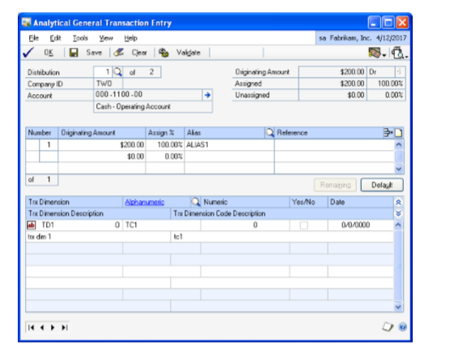

The Analytical General Transaction Entry window opens automatically when you
press TAB from a field in the Transaction Entry window (Transactions \>\>
Financial \>\> General) in the following instances:

- If an account is linked to an account class and no analysis information has
    been entered for the account earlier.

- If changes are made to a distribution line that affects analysis information
    entered previously for the line. These include changing the account, amount
    or debit to credit or vice versa, as this will delete the previously entered
    analysis information and create a single assignment of 100 percent.

- If the option Calculate Taxes in General Ledger is marked in the Company

Setup Options window (Administration \>\> Setup \>\> Company \>\> Company
\>\> Options), you may need to enter analysis information for distribution
accounts that are created from the Tax Entry window. If any of the new
distribution accounts are linked to an account class, after the tax
transactions are created from the Tax Entry window, the Analytical General
Transaction Entry will open automatically from the general Transaction Entry
window. If the Analytical General Transaction Entry window has been opened
earlier for the distribution accounts, it displays the first of the new
distribution accounts that are linked to an account class (as per the
distribution sequence). If not, the first of the previous distribution
accounts linked to an account class will be displayed.

If you delete a transaction in the General Ledger Transaction Entry window,
any analysis information entered for the transaction is also deleted.

For multicurrency transactions, a change in the transaction date re-creates
distribution amounts due to a change in the exchange rate. If the
transaction date is modified, analysis information created previously is
deleted when the distribution amounts are re-created.

**To enter analysis information for General Ledger transactions:**

1. Open the Analytical General Transaction Entry window. 
    (Transactions \>\>Financial \>\> General \>\> Enter account/amount \>\>
    Choose the Analytical Accounting button)  
    (Transactions \>\>Financial \>\> General \>\> Enter account/amount \>\>
    Additional \>\> Analytical Transaction or CTRL+T)

2. The Analytical General Transaction Entry window displays the distribution
    account selected in the General Transaction Entry window. To view the other
    distributions for the transaction, enter or select a distribution number.

    The sequence of distributions in the Analytical General Transaction Entry window may not correspond to the sequence in the General Transaction Entry window because only accounts linked to an account class are displayed in the Analytical General Transaction Entry window.

    **The Originating or Functional Amount field** displays the distribution amount in the originating or functional currency based on the option selected in the currency view.

    > [!NOTE]
    > You can choose the expansion button to view multicurrency information if the originating currency differs from the functional currency. The currency icon is not displayed if the displayed distribution account is a unit account.

    **The Company ID field** displays the ID for the current company.

    **The Account field** displays the account related to the distribution. The expansion button will open the Microsoft Dynamics GP Account Entry window. The balance type, whether debit or credit, is also displayed.

    **The Assigned field** displays the total distribution amount in value and percentage that has been assigned.

    **The Unassigned field** displays the remaining distribution amount that is to be assigned in value and percentage.

    In the assignment list view, an arrow before the Number field indicates that the analysis information displayed is for the selected assignment. Each assignment created for the distribution is displayed separately.

1. In the list window, enter the transaction distribution amount in functional or originating currency, by value or on a percentage basis.

    **The Number field** displays the number of the assignment.

    **The Originating or Functional Amount field** in the assignment list view, displays the assignment in the originating or the functional currency based on the option you selected in the Currency View. Enter the amount to assign in the Originating/Functional Amount field. Assignments can be entered in the functional or originating currency.

    > [!NOTE]
    > You can enter the assignment either in value or percentage terms.

1. Enter the assignment in percentage value in the Assign% field. Initially, a
    single assignment is created by default. You can overwrite the assignment
    with more than one assignment.

    You can save analysis information for a distribution even if the assignment is not 100%. However, you can post a transaction with partial assignments only if you have opted to allow partial assignments during posting for the module you’re working in. Refer to *Setting up assignment options* for more information.

1. Select an alias in the Alias field. The Alphanumeric field in the scrolling
    window displays the transaction dimension codes that are associated with the
    alias for the transaction dimensions displayed. You can change these codes
    if required. Refer to *Creating an alias* for more information.

2. Enter reference information for the assignment in the Reference field.

3. Choose Delete Row to delete a single row in the assignment List View. You
    cannot choose this option if only a single assignment has been entered.

4. Choose Remaining to add one assignment for the remaining unassigned amount.
    The new assignment will ensure that the total assigned amount equals the
    distribution amount. For example, the distribution amount is \$100 and
    you’ve entered four assignments that total \$75. When you choose Remaining,
    a fifth assignment for the remaining value, \$25 is created. This button is
    not available if the distribution field is blank or has a zero value.

5. Choose Default to load the current setup information specified for the
    account class in the Accounting Class Maintenance window and create a single
    assignment. The following processes will occur:

    - Fixed, Required, and Optional Transaction Dimensions (including hidden
        transaction dimensions) will be installed.

    - All the assignments that you have created for the current distribution
        will be removed and create a single assignment that is equal to the
        distribution amount will be created.

    - If the analysis type is changed to or from Not Allowed, transaction
        dimensions will be added or removed.

    - Transaction dimensions that have been deleted will be removed.

6. The Trx Dimension field displays transaction dimensions for the account
    class that the distribution account is linked to. Only transaction
    dimensions that have been set as Required, Fixed, or Optional are displayed.

7. The Transaction Dimension Description field displays the description of the
    Transaction Dimension that you’ve entered in the Transaction Dimension
    Maintenance window.

8. Enter or select the code for each Alphanumeric transaction dimension in the
    Alphanumeric column. If you’ve marked the Show valid code combinations in
    trns and budgets option in the Analytical Accounting Options window, then
    the lookup window will display only those codes that have a valid
    combination with the codes you have already selected for the transaction.

    > [!NOTE]
    > Security access to use a transaction dimension code is granted automatically to the user who created the code during transaction entry.

1. Enter a transaction dimension code in the Numeric, Yes/No or Date field for
    a Numeric, Boolean or Date type Transaction Dimension.

2. Choose OK to save your changes and close the window. The analysis
    information that you have entered is validated when you choose OK. Refer to
    *Validating transactions and correcting errors* for more information.

3. Choose Save to save the analysis information you have entered and clear the
    window. A validation takes place when you choose Save in the Analytical
    General Transaction Entry window. Refer to *Validating transactions and
    correcting errors* for more information. You can save the analysis
    information with errors or without updating changes made to the account
    class.

4. Choose Clear to clear the information from the Analytical General
    Transaction Entry window.

5. Choose Validate to validate the analysis information of the distribution
    displayed in the window. If changes are made to the account class in the
    Analytical Accounting setup or errors are found during the validation
    process, the Analytical Accounting Validation Log window will open where you
    can view the errors or changes. Refer to *Validating transactions and correcting errors* for more information about validation.

    Choose Print to print the error report. Choose OK to close the window and return to the Analytical General Transaction Entry window.

1. To view the changes to the account class choose the Default button in the
    Analytical General Transaction Entry window. Double click on an Analytical
    Accounting error to open the Analytical Accounting General Transaction Entry
    window where the specific error will be highlighted

2. Choose the printer icon button to print the Analytical Accounting edit list
    for the current distribution displayed or for all distributions of the
    transaction linked to an account class. The Analytical Accounting Validation
    Log report which describes the Analytical Accounting errors also is printed.

If you post a reversing transaction or reverse an existing transaction, the
analysis information is copied from the transaction to the reversed
transaction with the change in balance type, whether debit or credit.

If you void a transaction that has been posted to General Ledger, a
reversing transaction is created along with any analysis information
assigned to the original transaction.

On posting Clearing Journals, analysis information that has been entered for
the transactions will not be posted. Also, no validation will take place for
the distribution accounts, even if the accounts are linked to an account
class. To post analysis information, use the general Transaction Entry
window (Transactions \>\> Financial \>\> General).

### Validating transactions and correcting errors

You can validate a transaction document by selecting the transaction in the
relevant

Analytical Accounting Transaction Entry window and choosing Additional \>\>
Run Validation or by pressing CTRL+R. You can validate a transaction
distribution by choosing OK, Save or Validate, only if it has an amount.

The validation process verifies the following information:

- The assignments that you’ve created conform to the assignment options you
    have set up for the module.

- Codes are specified for all transaction dimensions that have a required
    status.

- The code combinations are valid.

- All the alphanumeric codes have access to the relevant user ID and
    distribution account.

- That accounts associated with the transaction are still linked to an account
    class.

- The transaction dimensions and codes have not been deleted from the setup.

- The multicurrency information for Analytical Accounting and Microsoft
    Dynamics GP is the same.

- There is a distribution record and at least one assignment record for all
    the Microsoft Dynamics GP distributions.

- All distributions, assignments and codes link to existing Microsoft Dynamics
    GP distribution.

- Changes that were made to the analysis type of the transaction dimension are
    invalid.

The validation routine takes place in the following stages:

**Stage one** At the first stage, changes in setup are verified. If any
changes have been made, then you must click the Default button in the
Analytical Transaction Entry window to update the window with changes.

**Stage two** At the second stage, the validation routine checks whether
code combinations are valid and selected codes exist and have the required
access to user ID and account; if codes have been entered for required
transaction dimensions and if assignments equal the transaction distribution
amount. This part of validation takes place only after all errors that are
indicated at the first stage have been corrected.

When you post a general transaction, a validation takes place for the entire
document. The document is posted if no errors are found in the transaction.

If errors are found while posting a general entry transaction, the
transaction will not be posted. The Analytical Accounting Validation Log
window will open. The Microsoft Dynamics GP errors will be listed first in
the window and then the Analytical Accounting errors.

We recommend that you resolve the Microsoft Dynamics GP errors before you
correct the Analytical Accounting errors.

To correct an Analytical Accounting error, double-click on the relevant
error to open the Analytical General Transaction Entry window. The specific
distribution where the error exists is displayed.

### Entering analysis information for Quick Journals

Use the following information to enter analysis information for distribution
accounts in the Analytical Quick Journal Entry window. The Analytical Quick
Journal window is similar to the Analytical General Transaction Entry
window. Refer to *Entering analysis information for General Ledger
transactions* for more information.

**To enter analysis information for Quick Journals**

1. Open the Analytical Quick Journal Entry window. 
    (Transactions \>\> Financial \>\> Quick Journal \>\> Choose the Analytical
    Accounting button)  
    (Transactions \>\> Financial \>\> Quick Journal \>\> Additional \>\>
    Analytical Transaction or CTRL+T)

    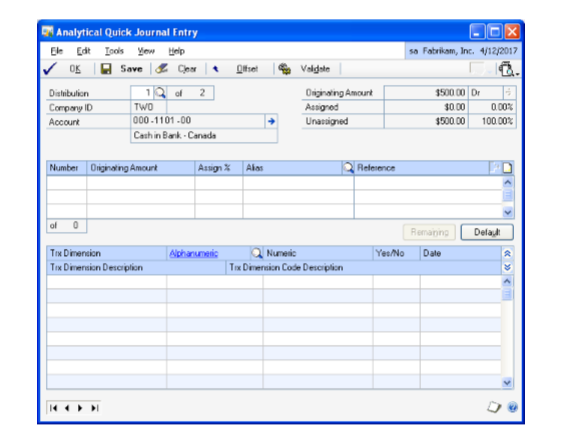

    The Analytical Quick Journal Entry window will open only if you have entered an account and amount in the scrolling window of the Quick Journal Entry window.

    The Analytical Quick Journal Entry window displays the first account linked to a class ID in the accounts scrolling window.

1. Enter or select a distribution number. If you click Offset to open the
    Analytical Transaction Entry window and lookup, only one distribution is
    displayed. If the window and lookup window are opened from the main
    distribution account, then only the main distribution accounts are
    displayed.

2. Choose Browse to view the remaining distributions. If you browse when the
    main account is displayed, you cannot view the control account distribution.
    Similarly, if you choose to browse when the control account is displayed,
    you cannot view the main account distribution.

    The total number of distributions, including all accounts of the document linked to an account class is displayed in the Distribution of field.

1. Enter the percentage to assign in the Assign% field. You can view the total
    of the assignments in percentage. Assignment can be given in amount or
    percentage.

2. Select an alias in the Alias field. The Alphanumeric field in the scrolling
    window displays the transaction dimension codes that are associated with the
    alias for the transaction dimensions displayed. You can change these codes
    if required. Refer to *Creating an alias* for more information.

3. Enter a reference for the assignment in the Reference field.

4. Choose Remaining to add one assignment for the unassigned balance amount.
    You can assign an amount in a new assignment line and you can modify the
    assignment line.

5. Choose Default to remove all the assignments for a given distribution line
    and to create a new assignment amount of 100%. Refer to *Entering analysis
    information for General Ledger transactions* for more information about the
    Default button.

6. The Trx Dimension field will display transaction dimensions for the account
    class to which the distribution account is linked. Transaction dimensions
    that have been set as Required, Fixed, or Optional will be displayed.

    The default transaction dimensions are displayed in the Trx Dimension Code field.

1. Enter the transaction dimension code for an alphanumeric transaction
    dimension in the Alphanumeric field. You can click the alphanumeric link to
    open the Transaction Dimension Code window to view information about an
    existing code. The Alphanumeric column is available only for an alphanumeric
    transaction dimension

    Security access to use a transaction dimension code is granted automatically to the user who created the code during transaction entry.

1. Enter a transaction dimension code in the Numeric, Yes/No or Date field for a Numeric, Boolean or Date type Transaction Dimension.

2. Choose the Show button to view the description of the transaction dimensions
    in the Trx Dimension field. You can view the description of a transaction
    dimension code in the Trx Dimension Code Description field.

3. When you open the Analytical Quick Journal Entry window from any
    distribution line, you can use the Offset Acct. button to assign an
    Analytical Accounting assignment to an offset account. The Offset Acct.
    button is not available if the control total is zero. Control total is the
    net total of debits and credits.

4. When you click Offset Acct., the Main button becomes available. You can
    switch between the main and offset accounts and enter Analytical Accounting
    assignment by clicking this button.

5. If the offset account is linked to an account class, and the control total
    is not entered, the control total amount is calculated when you choose Post
    or Save and the Analytical Transaction Entry window opens.

6. Choose the printer icon button in the Quick Journal Entry window to print
    the Quick Journal Entry edit list and the Analytical Accounting edit list. A
    validation takes place for the entire document before the Analytical
    Accounting assignment in the distribution accounts is printed. Assignments
    with errors as well as the ones without errors will be printed.

7. Choose OK to save the changes and to close the window. Choose Continue to
    close the window or No to keep the window open.

8. Choose Clear to clear the entries you’ve made in the window.

When you post a quick journal, a validation takes place for the entire
document. The document would be posted if no errors occur in the Microsoft
Dynamics GP transaction and in the Analytical Accounting assignments. You
can print the Quick Posting Journal and the Analytical Accounting posting
journal reports if you close the Quick Journal Entry window after posting.
Refer to *Validating transactions and correcting errors* for more
information.

### Entering analysis information for Miscellaneous Checks

Use the Analytical Miscellaneous Check Entry window to enter analysis
information for the distribution accounts used in miscellaneous checks. You
can create assignments, enter transaction dimension codes and references for
accounts that are linked to an account class. The Analytical Miscellaneous
Check Entry window does not support multicurrency since miscellaneous checks
do not support multicurrency.

The Analytical Miscellaneous Check Entry window opens automatically when you
press TAB in the Miscellaneous Checks (Transactions \>\> Financial \>\>
Miscellaneous Checks) window in the following instances:

- If an account is linked to an account class and no analysis information has
    been entered for the account earlier.

- If changes are made to a distribution line that affects analysis information
    such as account or amount or type of amount created previously for such
    line.

The analysis information is deleted if the distribution line is deleted, and
you do not post the document. The analysis information you’ve entered is
validated before you post the transaction. Refer to *Validating transactions
and correcting errors* for more information.

> [!NOTE]
> The analytical information for miscellaneous checks cannot be voided since
you cannot void miscellaneous checks.

**To enter analysis information for Miscellaneous Checks:**

1. Open the Analytical Miscellaneous Check Entry window. 
    (Transactions \>\> Financial \>\> Miscellaneous Check \>\> CTRL+T or
    Additional \>\>Analytical Transaction)  
    Refer to *Entering analysis information for General Ledger transactions* for
    more information. 
      
    IMAGE – AAMC.jpg

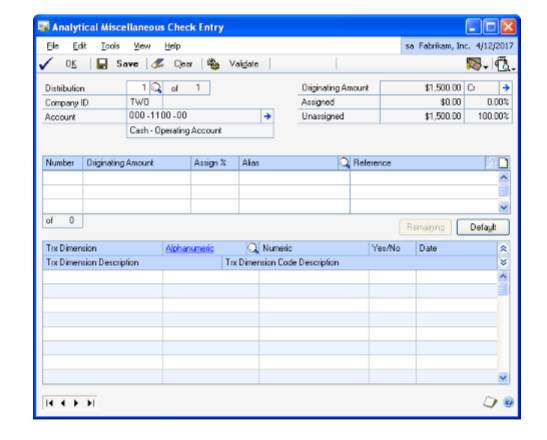

A screenshot of a computer Description automatically generated

1. You can also edit the analysis information you’ve entered in the Analytical
    Miscellaneous Check Entry window before you post the transaction.

### Analysis information in batches

The following section deals with information specific to batches. To enter
analysis information for individual transactions, refer to *Entering
analysis information for General Ledger transactions* .

To print the Analytical Accounting Edit List and Analytical Accounting error
list along with the Microsoft Dynamics GP edit list for a selected batch,
choose the printer icon button in the Analytical Transaction Entry window.
You can correct the Analytical Accounting errors by selecting the batch and
then correcting each of the transactions that have errors.

When you post a batch from the Batch Entry window (Transactions \>\>
Financial \>\> Batches), a validation will take place for all the
transactions saved in the batch. Microsoft Dynamics GP and Analytical
Accounting transactions without errors will be posted and the Analytical
Accounting General Posting report will be printed along with the Microsoft
Dynamics GP reports. If errors are found during the validation process, an
error list report is printed listing analysis errors for the transaction
distributions in the batch being posted. You can correct the errors by
modifying the transactions in the window where the transaction originated
from.

If you delete a single or recurring use batch or a transaction within such
batches, the analysis information entered for the transaction distributions
in the batch or for the transaction also will be deleted.

You can save a transaction in a batch with Analytical Accounting errors but
cannot post the transaction.

For a recurring batch, the analysis information of the batch last posted
will be retained and will update each subsequent batch that is posted,
unless changes are made to the analysis information in the batch.

Analysis information that originated in the subsidiary modules can be viewed
in the General Ledger. Such information can be modified prior to updating
General Ledger.

### Voiding an unposted transaction

You can void a transaction saved in General Ledger using the Transaction
Entry window. You also can void transactions that originated in other
modules in this window, if you’ve marked the Void/Correcting of Subsidiary
Transactions option in the General Ledger Setup window (Administration \>\>
Setup \>\> Financial \>\> General Ledger). The analysis information for the
transaction voided in the General Ledger will not be updated in the
subsidiary module.

When you void a transaction with analysis information and close the
Transaction Entry window, the Analytical Accounting Posting Journal will be
printed along with the Microsoft Dynamics GP Posting Journal. The Analytical
Accounting Posting Journal will only display the journal number and the
account for the transaction. When you void a transaction in a batch, the
analysis information for the voided transaction will be deleted.

### Backing out a posted transaction

You can back out a transaction posted in General Ledger using the General
Ledger Transaction Entry window. You also can back out a posted transaction
that originated in a subsidiary module using the Transaction Entry window,
if you’ve marked the Void/Correcting of Subsidiary Transactions option in
the General Ledger Setup window (Administration \>\> Setup \>\> Financial
\>\> General Ledger).

When you back out a posted transaction with analysis information, the
transaction dimension codes in the posted transaction will be copied from
the backed out transaction to the new transaction that is created. You
cannot open the Analytical General Transaction Entry window for the backed
out transaction. The analysis information will not be validated when you
post the backed out transaction.

### Backing out and correcting a posted transaction

You can back out and correct a transaction posted in General Ledger using
the General Ledger Transaction Entry window. You can also back out and
correct a posted transaction that originated in a subsidiary module in this
window, if you’ve marked the Void/Correcting of Subsidiary Transactions
option in the General Ledger Setup window (Administration \>\> Setup \>\>
Financial \>\> General Ledger).

When you back out and correct a posted transaction with analysis
information, the transaction dimension codes in the posted transaction will
be copied to the reversing transaction that is created. You cannot open the
Analytical General Transaction Entry window for the backed out transaction.
The analysis information will not be validated when you post the backed out
transaction.

Also, a new correcting transaction is created using the debits and credits
of the original transaction. However, the analysis information will not be
copied to the correcting transaction, which will be treated as a new
transaction. You need to enter analysis information for the new transaction
in General Ledger. Refer to *Entering analysis information for General
Ledger transactions* for more information.

### Copying a posted transaction

When you copy a saved or posted transaction, the analysis information for
the source transaction will not be copied to the new transaction. You need
to enter analysis information for the new transaction in the General Ledger.
Refer to *Entering analysis information for General Ledger transactions* for
more information.

### Voiding a Quick Journal entry

You can void a saved Quick Journal entry using the Quick Journal Entry
window.

When you void a transaction with analysis information and close the Quick
Journal Entry window, the Analytical Accounting Posting Journal will be
printed along with the Microsoft Dynamics GP Posting Journal. The Analytical
Accounting Posting Journal will display only the journal number and the
account for the transaction. When you void a transaction in a batch, the
analysis information for the voided transaction will be deleted.

### Analysis information for writeoffs

When you process writeoffs for underpayments or overpayments, the Analytical
Accounting validation process will take place. If the distribution accounts
for the writeoffs are linked to an account class ID, the default analysis
codes for the account class will be loaded for the distribution accounts.
The Analytical Accounting validation will not run if the distributions are
linked to an account class ID, but the default codes for the account class
ID to which the distributions are linked are not specified.

The Analytical Transaction Entry window will not open when you process
writeoffs from the Write Off Documents window. A single assignment of 100
percent will be created for every distribution account that is linked to an
account class.

When you process writeoffs, the Analytical Accounting Posting Journal is
printed, along with the Microsoft Dynamics GP Posting Journal, if you have
marked the option to print the report in the Posting Setup window
(Administration \>\> Setup \>\> Posting \>\> Posting).

If you have marked the Post Through GL option for Receivables Apply Docs in
the

Posting Setup window, the Analytical Accounting validation takes place and
the

Analytical Accounting Posting Journal is printed along with the Microsoft
Dynamics GP Posting Journal when you process a writeoff. If the default
codes for the distribution accounts linked to an account class are not
entered, the Analytical Validation log will be printed displaying the
errors, and the transaction will not be posted to the General Ledger.

### Series posting and master posting

When you select multiple batches to post from the Series Posting or Master
Posting window, batches with analysis information are validated. If errors
are found in the batch, the status of the batch automatically changes to
available.

When you choose the Mark All button, only General Ledger batches without
Analytical Accounting errors are selected. You can print the Analytical
Error Log to view and correct the Analytical Accounting errors in the other
General Ledger batches, before you can select them for posting.

The Analytical Accounting Posting Journal is printed for all transactions
that have been successfully posted in each batch.

### Adjusting analysis information in posted transactions

You can enter or edit analysis information for all journal entries posted
from General Ledger, irrespective of their originating module.

*In the case of Balance Brought forward journal entries, you can enter the
analysis values only for transaction dimensions other than alphanumeric. The
analysis data for alphanumeric transaction dimensions is consolidated and
brought forward when you perform the year-end close. Refer to Year-end close
for Analytical Accounting for more information.*

You can also change the number of assignments and the value of each
assignment for entries that have existing analysis information. Thus, any
analysis information that you have entered for a posted transaction in a
module, say, Receivables Management or Payables Management, can be adjusted
after you’ve posted the transaction from General Ledger. You can add or
remove transaction dimensions, and also change the transaction dimension
codes for those dimensions that have the Allow Adjustments option marked on
the Transaction Dimension Maintenance window. Refer to *Defining transaction
dimensions* for more information.

You can modify the analysis information for a journal entry as often as
required. Once you post an adjustment, the analysis information that you’ve
entered will override the previous analysis information.

> [!NOTE]
> Analytical information can be adjusted only for those distribution accounts
of a journal entry that are linked to an accounting class at the time of
adjustment.

**To adjust analysis information in posted transactions:**

1. Open the Analytical Adjustment Entry window. 
    (Transactions \>\> Financial \>\> Analytical Accounting \>\> Edit Analysis)

    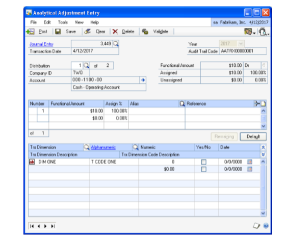

    Enter the open year for which to view transactions. All open years for the company are listed in the drop down.  

1. Enter or select the journal entry number for which to enter or edit the
    analysis information. The following values default on selecting a journal
    entry:

    **The Transaction Date field** displays the transaction date of the journal entry. Any adjustments to the analysis information will also have the transaction date.

    **The Audit Trail Code field** displays the Analytical Accounting audit trail code if the selected journal entry has existing analysis information. This field is blank if no analysis information exists for the selected journal entry.

    **The Distribution field** displays the first distribution account of the selected journal entry. You can view all distributions for a journal entry, however, you can adjust analysis information only for those distributions that are linked to an accounting class.

    **The Originating or Functional Amount field** displays the distribution amount in the originating or functional currency based on the option selected in the currency view. You cannot edit this amount.

    > [!TIP]
    > Choose the expansion button to view multicurrency information if the originating currency differs from the functional currency. If the Analytical Adjustment Entry window is opened for a unit account, the currency icon is not displayed. You cannot edit the multicurrency information, and conversions for adjusted assignments will take place using the same rate.

    **The Company ID field** displays the ID for the current company.

    **The Account field** displays the account related to the distribution. The expansion button will open the Microsoft Dynamics GP Account Entry window. The balance type, whether debit or credit, is also displayed.

    **The Assigned field** displays the total distribution amount in value and percentage that has been assigned. This field is blank if no analysis information exists for the selected journal entry.

    **The Unassigned field** displays the distribution amount that is not assigned in value and percentage.

1. In the assignment list view, enter the transaction distribution amount for
    an assignment in functional or originating currency, by value or on a
    percentage basis. Each assignment created for the distribution is displayed
    separately.

    **The Number field** displays the number of the assignment. When you enter a new assignment for an account that already has one assignment, the analytical information from the first assignment automatically defaults on to the new assignment. You can edit this information.

    An arrow before the Number field indicates that the analysis information displayed is for the selected assignment.

    **The Originating or Functional Amount field** displays the assignments originally posted for the selected account. Enter or edit the amount assigned in the Originating/Functional Amount field. You can enter assignments in the functional or originating currency based on the option you selected in the Currency View.

    **The Assign% field** displays the assignments originally posted for the selected account. You can overwrite these assignments.

    You can enter the assignment either in value or percentage terms.

    **Alias field** Displays the alias. The Alphanumeric field in the scrolling window displays the transaction dimension codes that are associated with the alias for the transaction dimensions displayed. You can change these codes if required. Refer to *Creating an alias* for more information.

    **The Reference field** displays the information entered for the existing assignments. You can change this information for existing assignments, and add new reference information for any new assignments that you create.

    The assignment option you’ve saved for General Ledger determines whether the distribution amount must be assigned fully, or can be assigned partially. Refer to *Setting up assignment options* for more information.

1. Choose Delete Row to delete a selected row in the assignment list view. You cannot choose this option if only a single assignment has been entered.

2. Choose Remaining to add one assignment for the remaining unassigned amount.
    The new assignment will ensure that the total assigned amount equals the
    distribution amount. For example, the distribution amount is \$100 and
    you’ve entered four assignments that total \$75. When you choose Remaining,
    a fifth assignment for the remaining value, \$25 is created. This button is
    not available if the distribution field is blank or has a zero value.

3. Choose Default to load the current setup information specified for the
    account class in the Accounting Class Maintenance window and create a single
    assignment. The following processes will occur:

    - Fixed, Required, and Optional Transaction Dimensions (including hidden
        transaction dimensions) will be installed.

    - All the assignments that you have created for the current distribution
        will be removed and a single assignment that is equal to the
        distribution amount will be created.

    - If the analysis type is changed to or from Not Allowed, transaction
        dimensions will be added or removed.

    - Transaction dimensions that have been deleted will be removed.

4. Enter or select an existing transaction dimension in the Trx. Dimension
    field to add it to the analytical account if required. You can only select
    transaction dimensions whose analysis type is set as Required, Fixed, or
    Optional for the account class that the distribution account is linked to.

    You can also remove a transaction dimension from the scrolling window if it is no longer needed.

    The Transaction Dimension Description field displays the description of each Transaction Dimension that is listed.

1. Enter or edit the transaction dimension code for each transaction dimension
    listed in the Trx Dimension field if required. Entering a code is optional,
    except for those transaction dimensions that have the analysis type set to
    Required.

    You can add new alphanumeric codes on the fly if you’ve selected that option in the Transaction Dimension Maintenance window. You can only edit an alphanumeric code that the user ID you’re logged in as and the selected distribution account, both have access to. Refer to *Setting up user access to codes* , and *Setting up account access to codes* for more information.

1. Choose Validate to validate the analysis information of the analytical
    account displayed in the window. The Analytical Accounting Validation Log
    Report is displayed if errors are found in the analysis information entered.
    Refer to *Validating adjustments and correcting errors* for more
    information.

2. Choose the printer icon to print the Analytical Adjustment Entry edit list
    for the current distribution displayed or for all distributions of the
    journal entry that can be adjusted. The Analytical Accounting Validation Log
    report which describes the Analytical Accounting errors also is printed if
    errors exist.

3. Choose Clear to clear all the values entered that you’ve not saved. If
    you’ve saved any changes to a selected journal entry, you cannot clear this
    window until you’ve posted or deleted such saved changes.

4. Choose Save to save the changes you’ve made to the analysis information of
    all the analytical accounts of the journal entry. You can only save changes
    for one journal entry at a time. You must post or delete these changes
    before you can make changes to another journal entry.

    The analysis information that you have entered is validated when you choose Save. You can save with errors, but you cannot post until all the errors have been corrected.

1. Choose Post to post your changes and close the window. The analysis
    information that you have entered is validated when you choose Post. You can
    post a partial assignment if you have allowed partial assignments in General
    Ledger on the Assignment Setup window.

    > [!NOTE]
    > Until you post an adjustment, the analysis information last posted with the
journal entry will be available for inquiry and reporting.

1. Choose Delete to delete any adjusted analytical information for the journal
    entry. Any analytical information entered for the journal entry when it was
    last posted will be retained.

### Validating adjustments and correcting errors

You can validate an adjustment by choosing the Additional \>\> Run
Validation or by pressing CTRL+R. You can also validate an adjustment by
choosing the OK, Save or Validate buttons.

If errors are found while posting, the adjustment will not be posted. The
Analytical Accounting Validation Log window will open, listing all the
errors found.

To correct an Analytical Accounting error, double-click on the relevant
error to open the Analytical Adjustment Entry window. The specific
distribution where the error exists is displayed. You can post the
adjustment only after all the errors have been resolved.

The validation process verifies the following information for each
analytical account that has been adjusted:

- The transaction dimensions of the analytical account are active or have not
    been deleted.

- Transaction dimension codes have been entered for all those transaction
    dimensions where Code Required During Adjustment has been marked on the
    Transaction Dimension Maintenance window.

- The transaction dimension codes used are active.

- The analytical account has access to the transaction dimension codes that
    have been entered.

- The user making the adjustments has access to the transaction dimension
    codes that have been entered.

- The combination between the transaction dimension codes of the alphanumeric
    transaction dimensions is valid.

- If Full Assignment is opted for in General Ledger, then the total of all
    assignments entered for the analytical account equals the distribution
    amount of the account.

### Viewing detail journal entries with analysis information

Use the Analytical Accounting Detail Journal Entry Inquiry window to view
analysis information of an account for the current year or for a closed year
from the Transaction Entry Zoom window. Refer to *Transferring analysis
information for closed years to history* for more information on year end
closing process.

This window only will display those distribution accounts of a Journal Entry
that comprise analysis information.

**To view detail journal entries with analysis information:**

1. Open the Analytical Accounting – Detail Journal Entry Inquiry window. 
    (Inquiry \>\> Financial \>\> Detail \>\> Select an account and Year \>\>
    Click the Journal Entry link \>\> Select account \>\> CTRL+T)  
    (Inquiry \>\> Financial \>\> History Detail \>\> Select an account and Year
    \>\> Click the Journal Entry link \>\> Select account \>\> CTRL+T)

    The Analytical Detail Inquiry window displays all analysis information that has been entered for the distribution account. The Journal Entry field displays the Journal Number.

1. The Reporting Ledger field displays the reporting ledger assigned to the
    General Ledger transaction in the General Ledger transaction entry window
    (Transactions \>\> Financial \>\> General). Refer to the General Ledger
    documentation for more information.

    This field is available only if you have marked the Allow check box for the Reporting Ledger option in the General Ledger Setup window (Administration \>\> Setup \>\> Financial \>\> General Ledger).

1. Enter or select a distribution for the Journal Entry.

2. The Account field displays the account related to the distribution. Choose
    the expansion button to open the Microsoft Dynamics GP Account Entry window.

    The Audit Trail Code field displays the Analytical Accounting Audit Trail Code.

    > [!NOTE]
    > An Audit Trail Code is created for each Journal Entry made in Analytical Accounting. This Audit Trail is separate from the one created by Dynamics GP.

1. The Transaction Date field displays the transaction date of the selected
    Journal Entry

2. The Company ID field displays the ID for the current company.

3. The Originating or Functional Amount field displays the distribution amount
    in the originating or functional currency based on the option selected in
    the Currency View. Choose the expansion button to view multicurrency
    information if the originating currency differs from the functional
    currency. When the Analytical Accounting-Journal Entry Inquiry window is
    opened for Unit Accounts, the currency information will not be available.

4. Choose Expand to display all analysis information entered for the
    distribution account in the list window which includes assignments,
    reference information entered per assignment, transaction dimensions and
    their codes.

5. Choose Collapse to display analysis information entered per assignment.

6. You also can view all information entered for each assignment or just
    reference information that may exist. Choose the plus button (+) available
    next to each assignment to view all analysis information entered for an
    assignment or choose the minus button (-) to view only reference
    information.

### Viewing journal entries with analysis information

You can view analysis information for posted transactions in the Analytical
Accounting Journal Entry Inquiry window.

**To view journal entries with analysis information:**

1. Open the Analytical Accounting-Journal Entry Inquiry window. 
    (Inquiry \>\> Financial \>\> Journal Entry Inquiry \>\> CTRL+T)  
    (Inquiry \>\> Financial \>\> Analytical Accounting \>\> Journal Entry)

2. The Journal Entry field displays the Journal Number selected. Enter or
    select a Journal Entry Number of an open Year.

3. The Reporting Ledger field displays the reporting ledger assigned to the
    General Ledger transaction in the General Ledger transaction entry window
    (Transactions \>\> Financial \>\> General). Refer to the General Ledger
    documentation for more information.

    This field is available only if you have marked the Allow check box for the Reporting Ledger option in the General Ledger Setup window (Administration \>\> Setup \>\> Financial \>\> General Ledger).

1. You can browse and sort by the following options:

    **Journal Entry** You can browse analysis information entered for each Journal Entry.

    **Audit Trail Code** You can browse analysis information based on the Audit Trail Code of a Journal Entry.

    **Posting Date** You can browse analysis information by Posting Date.

1. Choose OK to close the window.

### Analytical Accounting check links

Checking links examines tables, checking corresponding information in
related tables in Analytical Accounting and Microsoft Dynamics GP and, if
possible, changing the data to match the corresponding data in a table.

**To check links:**

1. Ensure that all users are logged out of Microsoft Dynamics GP. To view which
    users are in the Microsoft Dynamics GP system and where, choose
    Administration \>\> Setup \>\> System \>\> User Activity.

2. Take a backup of all your databases.

    Always take a backup before checking links.

1. Open the Analytical Accounting Check Links window  
    (Administration \>\> Maintenance \>\> Analytical Accounting Check Links).

2. Select the table groups to check links for, whether AA Open and History
    Transactions, AA Work Transactions, or both.

3. Choose Insert to insert the highlighted logical tables in the Selected
    Tables list.

4. Choose All to Insert all files from the Logical Tables list into the
    Selected Tables list so you can check links for all files.

5. Choose Remove to remove any table from the Selected Tables list, highlight
    the table name and choose Remove.

6. Choose Preview to print the AA File Maintenance Error Log Report - Preview.

7. Choose Cancel to Close the window. If you inserted table group names into
    the Selected Tables list.

    Total Number of records field displays the total number of records within the tables in the Selected Tables list.

1. Choose Process to check links for the selected tables and print the Check
    Links Report.

    - The Report Destination window will appear, and you can specify where the
        Check Links Report should be printed. If you mark File, select the
        appropriate table format and enter the report file name.

    - The Check Links Report will display any information that was re-created.
        *We recommend that you send the Check Links Report to the screen, and
        then print it if necessary, because it may be very large. Each report
        can only be printed once each time you check links, so its a good idea
        to send the report to a file as well.*

2. To determine what information to re-enter, use the Table Descriptions window
    (Administration \>\> Resource Descriptions \>\> Tables) to view information
    for the table you checked links for, then use a window that accesses the
    table to reenter information.

> [!TIP]
> You may want to create a report using Report Writer that lists all fields included in the table that you checked links for. This report can serve as a valuable reference tool. For more information, refer to the Report Writer manual.

### Copying Analytical Accounting Information for General Journal

Use the Copy Journal Entry window to copy analytical accounting information
for posted transaction.

**To copy analytical accounting information for general journal:**

1. Open copy the Transaction Entry window.

(Transactions \>\>Financial \>\> General)

1. Choose Copy. The Copy Journal Entry window will open.

2. In the Copy Journal Entry window, select the year that the transaction
    you’re copying was posted.

3. Select the journal entry number for the transaction that you’re copying.

4. Mark the Copy Analytical Accounting information option.

5. Choose OK. The Copy Journal Entry window will close. The new transaction
    will appear in the Transaction entry window along with the analytical
    accounting information. Modify the analytical accounting information as
    necessary.

## Chapter 5: Payables Management Transactions

You can enter and view analysis information for transactions in Payables
Management. You can create assignments, enter transaction dimension codes,
and also view analysis information created for a document. You also can save
transactions with analysis information to a single or recurring batch before
posting the batch. Analysis information created for transactions can be
validated at any time before they are posted.

You can open the Analytical Transaction Entry window only if Analytical

Accounting has been activated. Refer to *Activating Analytical Accounting*
for more information about activating Analytical Accounting.

This information is divided into the following sections:

- *Entering analysis information for payables transactions*

- *Entering analysis information for manual payments*

- *Processing batches of computer checks with analysis information*

- *Entering analysis information while applying documents*

- *Unapplying a document*

- *Applying unposted credit memos, returns and payments*

- *Unapplying unposted credit memos, returns and payments*

- *Voiding documents with analysis information*

- *Viewing analysis information for payables transactions*

### Entering analysis information for payables transactions

You can create assignments and enter transaction dimension codes for
accounts that are linked to an account class from the Payables Transaction
Entry window. This information can be entered in the Analytical Payables
Transaction Entry window.

The Analytical Payables Transaction Entry window opens automatically from
the Payables Transaction Entry Distribution window in the following
instances:

- If the account is linked to an account class and the Analytical Payables
    Transaction Entry window has not been opened even once for the account.

- If changes are made to a distribution line that affects analysis information
    such as account or amount or type of amount created previously for such
    line.

If you delete a document from the Payables Transaction Entry window, the
analysis information that exists for the document will also be deleted.

In case of multicurrency transactions, a change in the transaction date
re-creates distributions due to a change in the exchange rate. Analysis
information entered previously is deleted when the distributions are
re-created.

If you select Default in the Payables Transaction Entry Distribution window,
all analysis information created for the document will be deleted.

**To enter analysis information for payables transactions:**

1. Open the Analytical Payables Transaction Entry window. 
    (Transactions \>\> Purchasing \>\> Transaction Entry \>\> Choose the Analytical Accounting button)  
    (Transactions \>\> Purchasing \>\> Transaction Entry \>\> CTRL+T or Additional \>\>Analytical Transaction)  
    (Transactions \>\> Purchasing \>\> Transaction Entry \>\> Tax expansion button \>\>CTRL+T or Additional \>\> Analytical Transaction)  
    (Transactions \>\> Purchasing \>\> Transaction Entry \>\> Distributions button \>\> CTRL+T or Additional \>\> Analytical Transaction)

    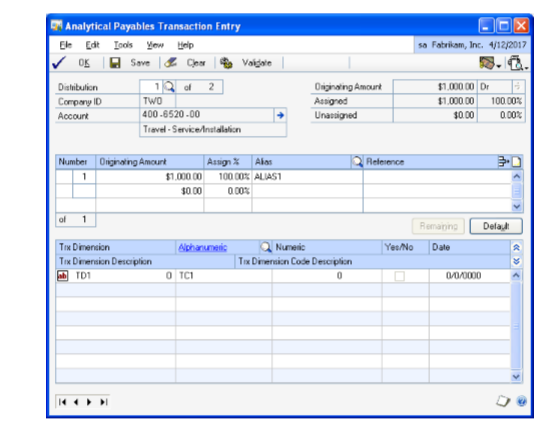

1. Refer to *Entering analysis information for General Ledger transactions* for more information about entering the analysis information.

### Entering analysis information for manual payments

You can also enter analysis information for manual payments using the
Analytical Payables Manual Payment Entry window.

If you delete a document from the Payables Manual Payment Entry window, the
analysis information that exists for the document also will be deleted.

In case of multicurrency transactions, a change in the transaction date
re-creates distributions due to a change in the exchange rate. Analysis
information entered earlier is deleted when the distributions are
re-created.

If you select Default on Payables Transaction Entry Distribution window, all
analysis information created for the document will be deleted.

The Analytical Payables Manual Payment Entry window will open automatically
from the Payables Transaction Entry Distribution window, when you press TAB
from a row in the following instances:

• If the account is linked to an account class and the Analytical Payables
Manual Payment Entry window has never been opened for the account.

• If changes are made to a distribution line that affects analysis
information entered previously for the line. These include changing the
account, amount or debit to credit or vice versa, as this will delete the
previously entered analysis information and create a single assignment of
100 percent.

**To enter analysis information for manual payments:**

1. Open the Analytical Payables Manual Payment Entry window. 
    (Transactions \>\> Purchasing \>\> Manual Payments \>\> Choose the
    Analytical Accounting button)  
    (Transactions \>\> Purchasing \>\> Manual Payments \>\> CTRL+T or
    Additional\>\>Analytical Transaction)  
    (Transactions \>\> Purchasing \>\> Manual Payments \>\> Distributions \>\>
    CTRL+T or Additional \>\> Analytical Transaction)

IMAGE – AAPMT.jpg

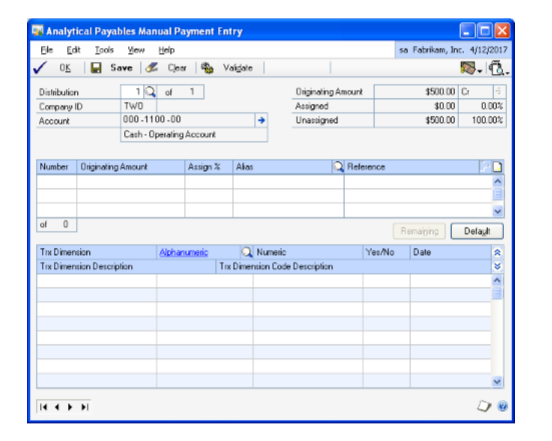

The Analytical Payables Transaction Entry window displays the distribution
account selected. To view other distributions, enter or select a
distribution number.

1. Refer to *Entering analysis information for General Ledger transactions* for
    more information about the entering analysis information.

#### Processing batches of computer checks with analysis information

You can enter analysis information for distributions that are created after
a computer check run only in the General Ledger. The Analytical Transaction
Entry window cannot be opened from any of the Microsoft Dynamics GP windows
where computer checks are posted.

For computer checks, the option Post Through General Ledger files under
Posting Setup will not be available. This is to ensure that analysis
information for distribution accounts linked to an account class is created
before updating General Ledger History.

A verification takes place to check if any of the distribution accounts are
linked to an account class in the following instances:

- When you print checks from the Print Payables Checks window

(Transactions \>\> Purchasing \>\> Print Checks)

- When you post a batch from the Post Payables Checks window

(Transactions \>\> Purchasing \>\> Post Checks)

- When you post a batch from the Process Payables Checks window

(Transactions \>\> Purchasing \>\> Process Remittance)

If the distribution accounts are linked to an account class, then the
default codes that are set for the account class will be assigned to these
distribution accounts. A single assignment will be created for each
distribution account that is linked to an account class.

There will be no Analytical Accounting validation during a computer check
run or while printing a cheque.

If you void checks in the Post Payables Check window, all the distributions
for the payment will be deleted in Microsoft Dynamics GP and the payment
will move to history. Any analysis information that exists for the payment
will also be deleted.

#### Entering analysis information while applying documents

You can enter analysis information for distributions, if any, created after
posted payments, credit memos and returns documents are applied in the Apply
Payables Documents window (Transactions \>\> Purchasing \>\> Apply To). You
can enter analysis information in the Analytical Apply Payables Documents
window.

Analysis information can be entered for distributions created for terms
taken, writeoffs, realized gain or realized loss when posted credit
documents, returns and payments are applied against invoices, if the
distribution accounts are linked to an account class in the Analytical Apply
Payables Documents window. The Analytical Apply Payables Documents window
will open when you choose OK in the Apply Payables Documents window. This
would be applicable even if distributions are created after transactions are
auto applied.

The Analytical Apply Payables Document window will also open if you change
the Customer ID or Document No. in the Apply Payables Documents window.

If the Analytical Apply Payables Documents window has been opened at least
once, you can open it any time thereafter by pressing CTRL+T or choosing
Additional \>\> Analytical Transaction before the distributions are posted.

The Analytical Apply Payables Documents window will open displaying the
first of the distribution accounts created during the process of apply that
have been linked to an account class.

If you’ve marked the Show valid code combinations in trns and budgets option
in the Analytical Accounting Options window, then the lookup window will
display only those codes that have a valid combination with the codes you
have already selected for the transaction.

Refer to *Entering analysis information for payables transactions* for more
information about entering analysis information.

### Unapplying a document

When you unapply posted credit memos, returns or payments, the entries
relating to terms taken, write offs, realized gain or loss are reversed.
Analysis information must be entered for these distribution accounts if they
are linked to an account class. You can enter analysis information in the
Analytical Apply Payables Documents window. The window opens when you choose
OK in the Apply Payables Documents window.

The analysis information entered for distribution accounts relating to terms
taken, write offs, realized gain or loss will be validated before these
entries are posted. Errors detected will be displayed in the Analytical
Accounting Validation Log.

You will not be able to close the Apply Payables Document window without
entering all required analysis information for the distribution accounts
linked to an account class.

### Applying unposted credit memos, returns and payments

You can enter analysis information for credit memos, returns and payments
applied in the Payables Transaction Entry and Payables Manual Payment Entry
windows using the Analytical Payables Transaction Entry or Analytical
Payables Manual Payment Entry windows. The Analytical Payables Transaction
Entry or Analytical Payables Manual Payment Entry windows will open when you
select OK in the Apply Payables Documents window.

Analysis information entered for the Accounts Payable account in the
Payables Transaction Entry or Manual Payments Entry windows before the
credit memo, return or payment is applied, will be deleted if distributions
are created for terms taken, write offs, and realized gain or loss.

### Unapplying unposted credit memos, returns and payments

If you unapply unposted credit memos, returns and payments that were
applied, prior to posting, analysis information entered for the distribution
accounts relating to terms taken, write offs and realized gain or loss
accounts will be deleted.

### Voiding documents with analysis information

When you void documents in the Void Historical Payables Transaction window

(Transactions \>\> Purchasing \>\> Void Historical Transaction) or the Void
Open Payables Transaction window (Transactions \>\> Purchasing \>\> Void
Open Transaction), all analysis information entered for the document during
transaction entry will be copied with the exception of the balance type of
each distribution account linked to an account class. The balance type of
each distribution account will be reversed.

The Analytical Transaction Entry window cannot be opened prior to voiding a
document in the Void Historical Payables Transaction or Void Open Payables
Transaction windows.

The Analytical Accounting Posting Journal will print after the Microsoft
Dynamics GP reports, if you’ve selected the option under Posting Setup. This
report will display all analysis information for the voided transaction.

### Viewing analysis information for payables transactions

You can view analysis information for payables transactions in the
Analytical Payables Transaction Entry zoom window. The Analytical inquiry
window will only display distribution accounts of a document that are linked
to an account class.

**To view analysis information for payables transactions:**

1. Open the Analytical Payables Transaction Entry zoom window. 
    (Inquiry \>\> Purchasing \>\> Transaction by Vendor/Document \>\> Select a
    document and zoom on the Document Number \>\> Additional \>\> Analytical
    Transaction)  
    (Inquiry \>\> Purchasing \>\> Transaction by Vendor/Document \>\> Select
    document and zoom to Document Number \>\> Distributions button \>\>
    Additional \>\> Analytical Transaction)

2. The Analytical Payables Transaction Entry zoom window displays all analysis
    information created for a distribution account.

3. Refer to *Viewing analysis information for Purchase Order Processing
    documents* for more information about viewing analysis information for
    transactions.

## Chapter 6: Purchase Order Processing Transactions

You can enter analysis information for transactions in Purchase Order
Processing and save analysis information for a batch.

This information is divided into the following sections:

- *Entering analysis information for purchase orders and receipts*

- *Entering analysis information for purchase orders*

- *Analysis information for adjusting entries*

- *Posting transactions with analysis information*

- *Posting a batch with analysis information*

- *Posting through to General Ledger for transaction posting*

- *Viewing analysis information for Purchase Order Processing documents*

- *Viewing analysis information for purchase orders*

- *Copying Analytical Accounting Information for Purchase Order or Purchase
    Order Line Items*

### Entering analysis information for purchase orders and receipts

The Analytical Receivings Transaction Entry and the Analytical Purchasing
Invoice Entry windows will open automatically when you press TAB from a row
in the Payables Transaction Distribution Entry window in the following
instances:

- If the account is linked to an account class and the Analytical Transaction
    Entry window has not been opened even once for the account.

- If changes are made to a distribution line that affects analysis information
    entered previously for such line. These include changing the account or
    amount or debit to credit or credit to debit, as this will delete the
    previously entered analysis information and create a single assignment of
    100 percent.

If you delete a document in the Receivings Transaction Entry window or the
Purchasing Invoice Entry window, the analysis information entered for the
document also will be deleted.

If you void an unposted document in the Receivings Transaction Entry or
Purchasing Invoice Entry windows, analysis information created for the
document will be deleted.

In case of multicurrency transactions, a change in the transaction date
re-creates distributions due to a change in the exchange rate. If the
transaction date is altered, analysis information created previously is
deleted when the distributions are recreated.

**To enter analysis information for purchase orders and receipts:**

1. Open the Analytical Receivings Transaction Entry or Analytical Purchasing
    Invoice Entry windows. 
    (Transactions \>\> Purchasing \>\> Receivings Transaction Entry \>\> Choose
    the Analytical Accounting button)  
    (Transactions \>\> Purchasing \>\> Receivings Transaction Entry \>\> Enter
    vendor item \>\> CTRL+T or Additional \>\> Analytical Transaction)  
    (Transactions \>\> Purchasing \>\> Enter/Match Invoice \>\> Choose the
    Analytical Accounting button)  
    (Transactions \>\> Purchasing \>\> Enter/Match Invoice \>\> Enter quantity
    invoiced \>\> CTRL+T or Additional \>\> Analytical Transaction)

    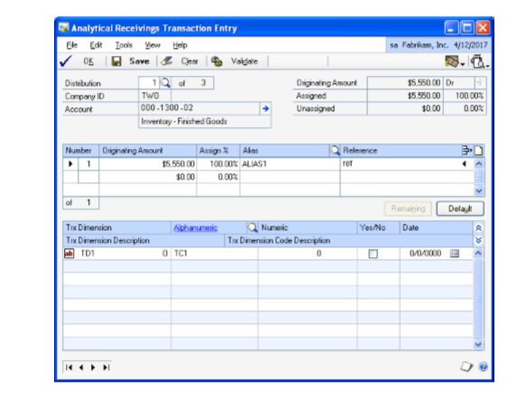

1. Refer to *Entering analysis information for General Ledger transactions* for
    more information on entering analysis information for transactions.

    You can validate a transaction by pressing CTRL+T or by choosing Additional\>\> Run Validation in the following windows:

    - Payables Transaction Entry

    - Payables Manual Payments Entry

    - Apply Payables Documents

    - Receivings Transaction Entry

    - Purchasing Invoice Entry

    Refer to *Validating transactions and correcting errors* for more information about validation.

    If errors are detected in the transaction, the Analytical Accounting Validation Log window will open displaying all errors detected by the validation routine.

> [!TIP]
> You can select View \>\> Incomplete or Erroneous Distributions, to browse through the distribution accounts in the Analytical Transaction Entry window which are incomplete or have erroneous information.

### Entering analysis information for purchase orders

You can enter analysis information for inventory, purchases or drop ship
accounts linked to a line item while entering a purchase order. The
information will default when you receive these line items in the Receivings
Transaction Entry window.

You can open the Analytical Purchase Order Entry window from the Purchasing
Item Detail Entry window in the following instance if the account is linked
to an account class:

• If changes are made to a distribution line that affects analysis
information such as account or amount entered previously for such line. This
will delete and refresh the previously entered analysis information and
create a single assignment of 100 percent.

If you delete a document or a distribution line in the Purchase Order Entry
or the Purchasing Item Detail Entry window, the analysis information entered
for the same will also be deleted.

You cannot edit the Purchase Order Entry or the Purchasing Item Detail Entry
window while the Analytical Purchase Order Entry window is open.

In the case of multicurrency transactions, a change in the transaction date
re-creates distributions due to a change in the exchange rate. If the
transaction date is altered, analysis information created previously is
deleted when the distributions are recreated.

> [!NOTE]
> Analysis information is not copied when you choose to copy PO lines from
another PO to the current PO. You must enter fresh analytical information
for the new purchase order.

**To enter analysis information for purchase orders:**

1. Open the Analytical Purchase Order Entry window. 
    (Transactions \>\> Purchasing \>\> Purchase Order Entry \>\> Enter or select
    a purchase order \>\> Choose the Analytical Accounting button)  
    (Transactions \>\> Purchasing \>\> Purchase Order Entry \>\> Enter or select
    a purchase order \>\> CTRL+T or Additional \>\> Analytical Transaction)
    (Transactions \>\> Purchasing \>\> Purchase Order Entry \>\> Enter or select
    a purchase order \>\> Item or Vendor Item expansion button \>\> Choose the
    Analytical Accounting button)  
    (Transactions \>\> Purchasing \>\> Purchase Order Entry \>\> Enter or select
    a purchase order \>\> Item or Vendor Item expansion button \>\> CTRL+T or
    Additional \>\> Analytical Transaction)

    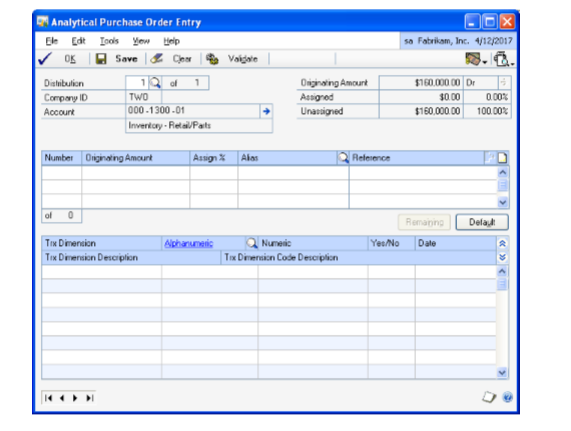

    When you open the Analytical Purchase Order Entry window from the Purchasing Item Detail Entry window, it displays only the account for the selected item.

1. Refer to *Entering analysis information for General Ledger transactions* for
    more information on entering analysis information for transactions.

2. You can validate the analysis information by pressing CTRL+R or by choosing
    Additional \>\> Run Validation in the Purchase Order Entry or the Purchasing
    Item Detail Entry windows. Refer to *Validating transactions and correcting
    errors* for more information about validation.

### Analysis information for adjusting entries

Adjusting entries are posted to General Ledger for each item that has its
current cost changed and uses the Average Perpetual valuation method.
Adjusting entries are also posted for quantity sold transactions relating to
the purchase receipt of items that use the Average Perpetual, LIFO
Perpetual, or FIFO Perpetual valuation method. Such entries are created in
the following instances:

- The user selects to revalue inventory when posting a purchasing invoice
    where the invoice cost differs from the shipment cost.

- The Adjust Costs utility is used to edit a purchase receipt record’s cost.

- A Purchase Order line item is changed to a status of Closed when its
    Quantity Shipped is greater than the Quantity Invoiced, when Quantity
    Invoiced is not zero.

- A purchase receipt is inserted into an existing purchase receipt stack.

When such adjusting entries are generated in General Ledger, default
transaction dimension codes are loaded and a single assignment is created
for distribution accounts that are linked to an account class. You can
modify the default analysis information, before posting through General
Ledger. Refer to *Entering analysis information for General Ledger
transactions* for more information.

If you have marked the option Post Through General ledger Files in the
Posting Setup window (Administration \>\> Setup \>\> Posting \>\> Posting),
or you have marked the option Post through to General Ledger for Trx Posting
in the Analytical Accounting Options window (Administration \>\> Setup \>\>
Company \>\> Analytical

Accounting \>\> Options), the transaction or batch is posted directly
through General Ledger with default analysis information for the additional
distributions. You can modify this information in the Analytical Adjustment
Entry window if required. Refer to *Adjusting analysis information in posted
transactions* for more information.

### Posting transactions with analysis information

When you post a transaction with analysis information from the following
windows, a validation will take place:

- Payables Transaction Entry

- Payables Manual Payments Entry

- Receivings Transaction Entry

- Purchasing Invoice Entry

When you close the Apply Payables Documents window, analysis information
created for the document in the window will be validated.

Refer to *Validating transactions and correcting errors* for more
information. In addition to Analytical Accounting information, Microsoft
Dynamics GP information will also be validated before the transaction is
posted.

The Analytical Posting Journal will be printed after a transaction is posted
or after closing the Apply Payables Documents window if specified under
Posting Setup.

### Posting a batch with analysis information

You can enter analysis information for transactions within a Payables or
Purchasing Batch. Refer to *Entering analysis information for purchase
orders and receipts* for more information about entering analysis
information.

You can print the Analytical Accounting Edit List and Analytical Accounting

Validation Log to check if errors exist in the analysis information along
with the Microsoft Dynamics GP Edit List for a selected batch by choosing
the printer icon button.

- When you post a batch from the Payables Management window or the Purchase
    Order Processing window, a validation takes place for all the transactions
    saved in the batch. Refer to *Validating transactions and correcting errors*
    for more information about the validation process. Microsoft Dynamics GP and
    Analytical Accounting transactions without errors are posted. The Analytical
    Posting Journal is printed, if specified under Posting Setup, along with the
    Microsoft Dynamics GP reports. If errors are found during the validation
    process, the Analytical Accounting Validation Log report is printed listing
    the analysis errors for the transactions in the batch being posted. You can
    correct the errors by editing the transactions in the window where the
    transaction originated from.

- If you delete a single or recurring use batch or a transaction within such
    batches, the analysis information entered for the transactions in the batch
    or for the transaction will also be deleted.

- You can save a transaction in a batch with Analytical Accounting errors but
    you cannot post the transaction.

- For a recurring batch, the analysis information of the batch last posted
    will be retained and will update each subsequent batch that is posted,
    unless changes are made to the analysis information in the batch.

When you print the Analytical Posting Journal, detailed analysis information
of all accounts will be printed. This would also include accounts with
errors. The Analytical Validation Log report detailing all Analytical
Accounting errors will also be printed. You can correct Analytical
Accounting errors by opening the batch and then correcting the transactions
that have errors.

### Posting through to General Ledger for transaction posting

Individual transactions and batches posted from Payables Management will
automatically update the appropriate posting accounts in General Ledger if
you have marked the following options, and if there are no Analytical
Accounting and Microsoft Dynamics GP errors:

- Post through General Ledger files under Posting Setup (Administration \>\>
    Setup \>\> Posting \>\> Posting); and

- Post through to General Ledger for Trx Posting (Administration \>\> Setup
    \>\> Company \>\> Analytical Accounting \>\> Setup)

Refer to *Setting up posting options for Analytical Accounting* for more
information about Analytical Accounting posting setup.

While posting individual and batch transactions, Analytical Accounting or
Microsoft Dynamics GP errors may exist which would prevent the transaction
or batch from updating the appropriate posting accounts in General Ledger.
For example, default codes may not be assigned for Required transaction
dimensions in the account class that the distribution accounts of Fixed or
Variable accounts are linked to. The transaction or batch will update the
General Ledger. You must correct the errors in the transaction or batch in
the General Ledger from the Transaction Entry window (Transactions \>\>
Financial \>\> General) before the posting accounts can be updated.

The Analytical Accounting and Microsoft Dynamics GP errors will be displayed
in the Analytical Accounting Validation Log Report which will print after
the transaction or batch updates Payables Management.

The transaction and batch will update the Payables Management. You will be
able to view analysis information that originated for the transaction or
batch in Payables Management from the relevant Inquiry windows.

### Viewing analysis information for Purchase Order Processing documents

You can view analysis information created for transactions in Purchase Order
Processing in the Analytical Purchasing Invoice Inquiry Zoom window.

You can view the assignments, transaction dimension codes and reference
notes that have been created for individual transaction distributions in
this window.

**To view analysis information for Purchase Order Processing documents:**

1. Open the Analytical Purchasing Invoice Inquiry Zoom window. 
    (Inquiry \>\> Purchasing \>\> Purchase Order Docs \>\> Purchasing Invoice
    Inquiry Zoom \>\> CTRL+ T or Additional \>\> Analytical Transaction)  
    (Inquiry \>\> Purchasing \>\> Purchase Order Docs \>\> Receivings
    Transaction Inquiry Zoom \>\> CTRL+T or Additional \>\> Analytical
    Transaction)

2. The Analytical Posting Inquiry window displays all analysis information
    created for a distribution account. The first distribution account of the
    document linked to an account class is displayed. Enter or select a
    distribution number to view analysis information for other distribution
    accounts.

3. If you select a specific account in the Purchasing Distribution Inquiry
    Zoom, the Analytical Posting Inquiry window will display analysis
    information relating to the selected account.

4. The Document Type and Number fields display the values from the Receivings
    Transaction Inquiry window or the Purchasing Invoice Inquiry zoom.

5. The Originating or Functional Amount field displays the distribution amount
    in the originating or functional currency based on the option you selected
    in the Currency View. Click the expansion button to view multicurrency
    information if the originating currency differs from the functional
    currency.

6. The Document Date displays the date of the document and will default from
    the Receivings Transaction Inquiry or Purchasing Invoice Inquiry Zoom.

7. The Company ID field displays the ID of the current company.

8. Click Expand to display all analysis information entered for the
    distribution account in the assignment list window. This includes
    assignments, reference information entered per assignment, transaction
    dimensions and their codes.

9. Click Collapse to display only assignments and reference information entered
    per assignment for the distribution account.

10. You also can view all information entered for each assignment or just
    reference information that may exist. Choose the plus button (+) available
    next to each assignment to view all analysis information entered for an
    assignment or choose the minus button (-) to view only reference information
    that may exist.

11. Choose OK to close the window.

### Viewing analysis information for purchase orders

You can view the analysis information you’ve entered for a purchase order in
the Analytical Purchase Order Inquiry window.

**To view analysis information for purchase orders:**

1. Open the Analytical Purchase Order Inquiry Zoom window. 
    (Inquiry \>\> Purchasing \>\> Purchase Order Documents/Purchase Order Items
    \>\> Choose the PO Number link \>\> CTRL+T or Additional \>\> Analytical
    Transaction)  
    Transactions \>\> Purchasing \>\> Receivings Transaction Entry \>\> Select a
    purchase order in the scrolling window \>\> Choose the PO Number link \>\>
    CTRL+T or Additional \>\> Analytical Transaction)  
    (Transactions \>\> Purchasing \>\> Receivings Transaction Entry \>\> Select
    a purchase order in the scrolling window \>\> Choose the PO Number link \>\>
    Vendor Item Expansion button \>\> CTRL+T or Additional \>\> Analytical
    Transaction)

2. Refer to *Viewing analysis information for payables transactions* for more
    information on viewing analysis information for transactions.

### Copying Analytical Accounting Information for Purchase Order or Purchase Order Line Items

Use the Copy a Purchase Order window to copy analytical accounting
information from an existing purchase order.

**To copy analytical accounting information for purchase order or Purchase
Order Line Items:**

1. Open Purchase Order Entry window. 
    (Transactions \>\> Purchasing \>\> Purchase Order Entry \>\> Actions \>\>
    Create and Copy New PO)  
    (Transactions \>\> Purchasing \>\> Purchase Order Entry \>\> enter a
    purchase order \>\> Actions \>\> Copy PO Lines to Current PO)  

    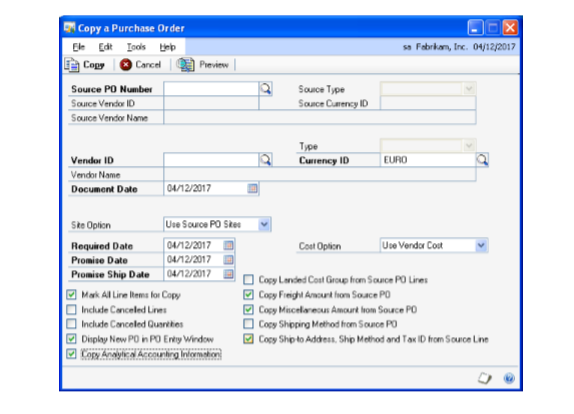

1. Choose Actions and select Create and Copy New PO or Copy PO lines to Current
    PO to open the Copy Purchase Order window.

2. Enter or select a purchase order with a status of New, Released, or Change
    Order to copy.

3. Mark the Copy Analytical Accounting information option.

4. Choose copy.The analytical accounting information is copied from the
    originating document to new document.

## Chapter 7: Receivables Management Transactions

For transactions in Receivables Management, you can create assignments and
enter transaction dimension codes for the distribution accounts that are
linked to an account class. You can save transactions with analysis
information to a single or recurring batch prior to posting the batch. Also,
you can view analysis information created for transactions in the Analytical
Inquiry windows. The process of validating transactions with analysis
information is also explained.

You can open the Analytical Transaction Entry window only if Analytical

Accounting has been activated. Refer to *Activating Analytical Accounting*
for more information about activating Analytical Accounting.

This information is divided into the following sections:

- *Entering analysis information for receivables documents*

- *Entering analysis information for cash receipts*

- *Entering analysis information for applied documents*

- *Unapplying a document*

- *Applying unposted credit memos, returns and payments*

- *Unapplying unposted credit memos, returns and payments*

- *Voiding or waiving documents with analysis information*

- *Entering analysis information for NSF charges*

- *Validating transactions and correcting errors*

- *Posting transactions with analysis information*

- *Posting a batch with analysis information*

- *Posting through or to General Ledger*

- *Viewing analysis information in Receivables Management*

### Entering analysis information for receivables documents

You can enter assignments and transaction dimension codes for receivables
documents using the Analytical Receivables Transaction Entry window.

When you press TAB from a field in the Sales Transaction Distribution Entry
window (Transaction \>\> Sales \>\> Transaction Entry), under the following
instances, the Analytical Receivables Transaction Entry window will open:

- If an account is linked to an account class and no analysis information has
    been entered for the account earlier.

- If changes are made to a distribution line that affects analysis information
    entered previously for the line. These include changing the account, amount
    or debit to credit or vice versa, as this will delete the previously entered
    analysis information and create a single assignment of 100 percent.

If you delete a document from the Receivables Transaction Entry window, the
analysis information that exists for the document will also be removed.

In case of multicurrency transactions, a change in the transaction date
re-creates distributions due to a change in the exchange rate. If the
transaction date is modified, analysis information created previously is
deleted when the distributions are re-created.

If you select Default in the Sales Transaction Entry Distribution, all
analysis information created for the document will be deleted.

**To enter analysis information for receivables documents:**

1. Open the Analytical Receivables Transaction Entry window. 
    (Transaction \>\> Sales \>\> Transaction Entry \>\> Analytical Accounting
    button)  
    (Transaction \>\> Sales \>\> Transaction Entry \>\> Additional \>\>
    Analytical Transaction)  
    (Transaction \>\> Sales \>\> Transaction Entry \>\> Distributions \>\>
    Analytical Accounting button)  
    (Transactions \>\> Sales \>\> Transaction Entry \>\> Distributions \>\>
    Additional \>\>Analytical Transaction)  
    (Transactions \>\> Sales \>\> Transaction Entry \>\> Tax expansion button
    \>\> Additional \>\> Analytical Transaction)  

    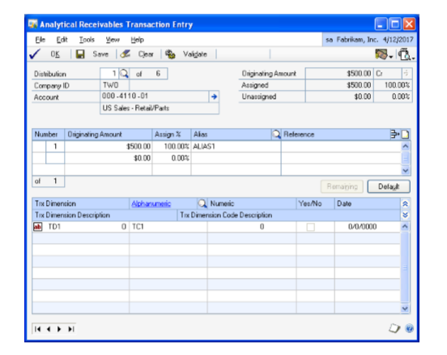

1. To enter analysis information for receivables transactions, refer to *Entering analysis information for General Ledger transactions* .

### Entering analysis information for cash receipts

You can enter analysis information for cash receipts using the Analytical
Cash Receipts Entry window.

If you delete a document from the Cash Receipts Entry window, the analysis
information that exists for the document also will be removed.

For multicurrency transactions, a change in the transaction date re-creates
distributions due to a change in the exchange rate. If the transaction date
is modified, analysis information created previously is deleted when the
distributions are re-created.

If you choose Default in the Cash Receipts Distribution Entry window, all
analysis information created for the document will be deleted.

In the Cash Receipts Distribution Entry window, the Analytical Cash Receipts
Entry window will open automatically when you press TAB from a row in the
following instances:

- If an account is linked to an account class and no analysis information has
    been entered for the account earlier.

- If changes are made to a distribution line that affects analysis information
    entered previously for the line. These include changing the account, amount
    or debit to credit or vice versa, as this will delete the previously entered
    analysis information and create a single assignment of 100 percent.

Refer to *Entering analysis information for receivables documents* for more
information about creating analysis information.

### Entering analysis information for applied documents

You can enter analysis information for distributions created, if any, after
a posted credit memo, return or payment is applied in the Apply Sales
Documents window (Transactions \>\> Sales \>\> Apply) using the Analytical
Apply Sales Documents window.

When posted credit memos, returns or payments are applied to sales documents
or other debit documents, distributions will be created for terms taken,
writeoffs, tax rebate, and realized gain or realized loss. If these
distribution accounts are linked to an account class, you must enter
analysis information for the accounts.

The Analytical Apply Sales Documents window will open when you select OK in
the Apply Sales Documents window, or if distributions are created when you
automatically apply sales documents.

The Analytical Apply Sales Document window also will open if you change the
customer ID or document no. in the Apply Sales Documents window.

In Analytical Accounting, voided and applied documents will update General
Ledger, if you marked the Post Through General Ledger option in the Posting
Setup window (Administration \>\> Setup \>\> Posting \>\> Posting).

If the Analytical Apply Sales Documents window has been opened at least
once, you can open it later from the Additional menu. Choose Additional \>\>
Analytical Transaction or CTRL+T before the distributions are posted.

The Analytical Apply Sales Documents window will display the first of the
distribution accounts created during the apply process that have been linked
to an account class.

If you’ve marked the Show valid code combinations in trns and budgets option
in the Analytical Accounting Options window, then the lookup window will
display only those codes that have a valid combination with the codes you
have already selected for the transaction.

Refer to *Entering analysis information for receivables documents* for more
information about entering analysis information.

### Unapplying a document

When you unapply posted credit documents, returns and payments, entries
relating to terms taken, write offs, realized gain or loss are reversed. You
must enter analysis information for these distribution accounts if such
accounts are linked to an account class. You can enter analysis information
in the Analytical Apply Sales Documents window which will open when you
choose OK in the Apply Sales Documents window.

The analysis information entered for distribution accounts relating to terms
taken, write offs, realized gain or loss will be validated before these
entries are posted. Errors detected will be displayed in the Analytical
Accounting Validation Log.

Refer to *Posting transactions with analysis information* for more
information.

You can close the Apply Sales Document window only after entering all
required analysis information for the distribution accounts linked to an
account class.

### Applying unposted credit memos, returns and payments

You can enter analysis information for credit memos, returns, and payments
applied in the Receivables Transaction Entry and Cash Receipts Entry windows
in the Analytical Receivables Transaction Entry or Analytical Cash Receipts
Entry windows respectively. The Analytical Receivables Transaction Entry or
Analytical Cash Receipts Entry windows will open when you select OK in the
Apply Sales Documents window.

If you have created analysis information for the Accounts Receivable account
in the Receivables Transaction Entry or Cash Receipts Entry windows prior to
applying the credit memo, return or payment, such information will be
deleted if distributions are created for terms taken, write offs, realized
gain or loss. You will have to re-enter analysis information for the
Accounts Receivable account.

### Unapplying unposted credit memos, returns and payments

Before posting, if you unapply unposted credit memos, returns and payments,
in the Apply Sales Documents window (Transaction \>\> Sales \>\> Transaction
Entry \>\> Apply or Transactions \>\> Sales \>\> Cash Receipts \>\> Apply),
the analysis information entered for the distribution accounts relating to
terms taken, write offs and realized gain or loss accounts will be deleted.

### Voiding or waiving documents with analysis information

If you make changes to the terms taken or writeoff amount before voiding a
credit document in the Apply Sales Documents window (Transactions \>\> Sales
\>\> Apply), extra distributions may be created. After voiding, default
codes will be loaded for the distributions that have been created.

The Analytical Transaction Entry window cannot be opened prior to voiding a
document in the Receivables Posted Transaction Maintenance window.

The Analytical Accounting Posting Journals will be printed along with the
Microsoft Dynamics GP reports, if you’ve selected the option under Posting
Setup.

This report will display all analysis information relating to the voided
transaction.

### Entering analysis information for NSF charges

When you mark a check as Non Sufficient Funds (NSF) in the Receivables
Posted Transaction Maintenance window (Transactions \>\> Sales \>\> Posted
Transactions), analysis information may have to be entered for distribution
accounts relating to the NSF Charge, if such accounts are linked to an
account class.

When you choose OK in the Auto Post NSF Debit Charge window, the Analytical
Auto Post NSF Debit Charge window will open displaying the first of the
distribution accounts relating to the NSF Charge that is linked to an
account class (as per the distribution sequence).

Refer to *Entering analysis information for receivables documents* for more
information about entering analysis information.

If the Analytical Auto Post NSF Debit Charge window has been opened at least
once, you can open it any time thereafter from the Additional menu. Choose
Additional \>\> Analytical Transaction or CTRL+T before the distributions
are posted.

The analysis information entered for distribution accounts relating to NSF
charges will be validated before these entries are posted. Errors detected
will be displayed in the Analytical Accounting Validation Log.

Refer to *Posting transactions with analysis information* for more
information.

You can close the Auto Post NSF Debit Charges window only after entering all
required analysis information for the distribution accounts linked to an
account class.

Analysis information that exists for the cash receipt will be copied, except
for the balance type which will be reversed.

Refer to *Voiding or waiving documents with analysis information* for more
information about voiding documents.

### Validating transactions and correcting errors

You can use the following windows to validate a transaction. From the
Additional menu, choose Additional \>\> Run Validation or CTRL+T:

- Receivables Transaction Entry

- Cash Receipts Entry

- Apply Sales Documents

- Auto Post NSF Debit Charge

Refer to *Validating transactions and correcting errors* for more
information about validation.

If errors are detected in the transaction, the Analytical Accounting
Validation Log window will open, displaying all errors detected by the
validation routine.

You can select View \>\> Incomplete or Erroneous Distributions, to browse
the distribution accounts in the Analytical Transaction Entry window that
are incomplete or have errors.

To correct an Analytical Accounting error, double-click on the error to open
the relevant Analytical Transaction Entry window. The specific distribution
in which the error exists is displayed.

### Posting transactions with analysis information

When you post a transaction from the Receivables Transaction Entry or the
Cash Receipts Entry window, a validation will take place.

Also, when you close the Apply Sales Documents or Auto Post NSF Debit Charge
window, analysis information created for the transaction/document will be
validated.

In addition to analysis information, Microsoft Dynamics GP data also will be
validated before the transaction is posted.

If errors are found while posting a transaction, the transaction will not be
posted. The Analytical Accounting Validation Log window will open, listing
the Microsoft Dynamics GP errors first and then the Analytical Accounting
errors.

We recommend that you resolve the Microsoft Dynamics GP errors first, and
then the Analytical Accounting errors.

To correct an Analytical Accounting error, double-click on the error to open
the relevant Analytical Transaction Entry window. The specific distribution
in which the error exists is displayed which you can then correct.

The Analytical Posting Journal will be printed, along with the Microsoft
Dynamics GP Posting reports if specified under Posting Setup.

### Posting a batch with analysis information

When you post a batch from Receivables Management, a validation will take
place for all the transactions saved in the batch. Microsoft Dynamics GP and
Analytical Accounting transactions without errors will be posted and the
Analytical Posting Journal will be printed, along with the Microsoft
Dynamics GP reports if specified in the Posting Setup window. If errors are
found during the validation process, the Analytical Accounting Validation
Log report will be printed listing analysis errors for the transactions in
the batch being posted. You can correct the errors by modifying the
transactions in the window where the transaction originated from.

If you delete a single or recurring use batch or a transaction within such
batches, the analysis information entered for the transactions in the batch
or for the transaction also will be deleted.

You can save a transaction in a batch with Analytical Accounting errors but
cannot post the transaction.

For a recurring batch, the analysis information of the batch last posted
will be retained and will update each subsequent batch that is posted,
unless changes are made to the analysis information in the batch.

You can print the Analytical Accounting Edit List and Analytical Accounting
Validation Log Report along with the Microsoft Dynamics GP Edit List for a
selected batch by choosing the printer icon button.

When you print the Analytical Posting Journal, detailed analysis information
of all accounts will be printed including accounts with errors. The
Analytical Validation Log report detailing all Analytical Accounting errors
also will be printed. You can correct Analytical Accounting errors by
opening the batch and then correcting each of the transactions that have
errors.

### Posting through or to General Ledger

If you’ve marked the following options, individual transactions and batches
posted from Receivables Management will automatically update the appropriate
posting accounts in General Ledger, if there are no Analytical Accounting
and Microsoft Dynamics GP errors.

- Post through General Ledger files under Posting Setup (Administration \>\>
    Setup \>\> Posting \>\> Posting)

- Post through to General Ledger for Trx Posting (Administration \>\> Setup
    \>\> Company \>\> Analytical Accounting \>\> Setup)

While posting individual and batch transactions, errors might exist in
Analytical Accounting or Microsoft Dynamics GP information that prevent the
transaction or batch from updating the appropriate posting accounts in
General Ledger. For example, default codes may not have been assigned for
required transaction dimensions in the account class to which the
distribution accounts of Fixed or Variable accounts are linked. The
transaction or batch will update General Ledger.

You must correct the errors in the transaction or batch in General Ledger
from the Transaction Entry window (Transactions \>\> Financial \>\> General)
before the posting accounts can be updated.

The transaction and batch will update Receivables Management. You can view
analysis information that originated for the transaction or batch in
Receivables Management from the relevant Inquiry windows.

The Analytical Accounting and Microsoft Dynamics GP errors will be displayed
in the Analytical Accounting Validation Log Report which will print after
the transaction or batch updates Receivables Management.

### Viewing analysis information in Receivables Management

You can view analysis information entered for transactions in Receivables

Management in the Analytical Receivables Transaction Inquiry Zoom window.
The Analytical Inquiry window will display only distribution accounts of a
document that are linked to an account class.

**To view analysis information in Receivables Management:**

1. Open the Analytical Receivables Transaction Inquiry Zoom window. 
    (Inquiry \>\> Sales \>\> Transaction by Customer/Transaction by Document
    \>\>Additional \>\> Analytical Transaction)

    When the Analytical Transaction Inquiry window opens, all analysis information created for a distribution account will be displayed.

1. The first distribution account of the document linked to an account class is
    displayed. Enter or select a distribution number to view analysis
    information of other distribution accounts.

    > [!NOTE]
    > If you select a specific account in the Receivables Distribution Inquiry Zoom, the Analytical Posting Inquiry window will display analysis information relating to such account.

    The Document Type and Number fields display values from the Receivables Transaction Inquiry zoom or Cash Receipts Inquiry zoom.

1. The Originating or Functional Amount field displays the distribution amount
    in the originating or functional currency based on the option you have
    chosen in the Currency View. Click the expansion button to view
    multicurrency information if the originating currency differs from the
    functional currency.

2. The Document Date field displays the date of the document from the
    Receivables Transaction Inquiry zoom or Cash Receipts Inquiry Zoom.

3. The Company ID field displays the ID of the current company.

4. Choose Expand to display all analysis information entered for the
    distribution account in the list window. This includes assignments,
    reference information entered per assignment, transaction dimensions and
    their codes.

5. Click Collapse to display only assignments and reference information entered
    per assignment for the distribution account.

6. You also can view all information entered for each assignment or just
    reference information that may exist. Choose the plus button (+) available
    next to each assignment to view all analysis information entered for an
    assignment or choose the minus button (-) to view only reference information
    that may exist.

## Chapter 8: Sales Order Processing Transactions

You can enter and view analysis information such as assignments, transaction
dimension codes and reference information for transactions entered in Sales
Order Processing. You can save transactions with analysis information in a
Sales Batch before posting. The analysis information you have entered will
be validated before posting.

You can enter analysis information in Sales Order Processing only from the
Sales Transaction Entry window (Transactions \>\> Sales \>\> Sales
Transaction Entry) and for Sales Invoices and Sales Returns.

You can open the Analytical Transaction Entry window only if Analytical

Accounting has been activated. Refer to *Activating Analytical Accounting*
for more information.

This information is divided into the following sections:

- *Entering analysis information for an invoice or return*

- *Analysis information in re-created distributions*

- *Analysis information for deposits received against an order*

- *Deletion of analysis information on invoice transfer to back order*

- *Validating transactions and correcting errors*

- *Posting an invoice or return with analysis information*

- *Posting a batch with analysis information*

- *Posting through to General Ledger for transaction posting*

- *Voiding transactions with analysis information*

- *Viewing analysis information for sales documents*

- *Copying Analytical Accounting Information for Sales Order*

### Entering analysis information for an invoice or return

You can enter analysis information for an invoice or return in the Sales
Transaction Entry window (Transactions \>\> Sales \>\> Sales Transaction
Entry) using the Analytical Sales Transaction Entry window.

If you delete an invoice or return from the Sales Transaction Entry window,
the analysis information that exists for the document will also be removed.

If you delete an item number from an invoice or return, analysis information
that exists for distribution accounts relating to the item number deleted
will also be removed.

In case of multicurrency transactions, a change in the transaction date
re-creates distributions due to a change in the exchange rate. If the
transaction date is altered, analysis information created previously is
deleted when the distributions are recreated.

If you select Default in the Sales Distribution Entry window, all analysis
information created for the invoice or return will be deleted.

The Analytical Sales Transaction Entry window will open automatically when
you press TAB from a field in the Sales Distribution Entry window, in the
following instances:

- If the account is linked to an account class and the Analytical Sales
    Transaction Entry window has not been opened even once for the account.

- If changes are made to a distribution line that affects analysis information
    entered previously for such line. These include changing the account or
    amount or debit to credit or vice versa, as this will delete the previously
    entered analysis information and create a single assignment of 100 percent.

In an invoice, you can enter analysis information for the Cost of Goods Sold
(COGS) and Inventory accounts of the relevant item numbers entered in the
invoice, if such accounts are linked to an account class even though these
accounts are not displayed in the Sales Distribution Entry window. However,
you cannot create assignments for such accounts as the amount that updates
these accounts can be determined only after the invoice is posted.

**To enter analysis information for an invoice or return:**

1. Open the Analytical Sales Transaction Entry window. 
    (Transactions \>\> Sales \>\> Sales Transaction Entry \>\> Analytical
    Accounting button)  
    (Transactions \>\> Sales \>\> Sales Transaction Entry \>\> Additional \>\>
    Analytical Transaction or CTRL+T)  
    (Transactions \>\> Sales \>\> Sales Transaction Entry \>\> Distributions
    \>\>Analytical Accounting button)  
    (Transactions \>\> Sales \>\> Sales Transaction Entry \>\> Distributions
    \>\>Additional \>\> Analytical Transaction or CTRL+T)

    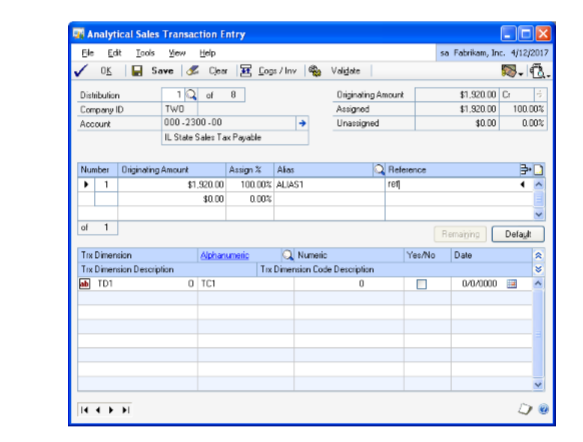

    The distribution accounts of each item number linked to an account class that you enter on an invoice or return, will be added to the total distributions in the Analytical Sales Transaction Entry window only after you tab off the Line Item in the Sales Transaction Entry window.

    The Analytical Sales Transaction Entry window will open only if you have specified at least one item number with a unit cost more than zero for the invoice or return.

1. The first of the distribution accounts in the Sales Distribution Entry
    window that is linked to an account class is displayed in the Analytical
    Sales Transaction Entry window. To view other distributions (other than the
    COGS and Inventory Accounts in case of an invoice) enter or select a
    distribution number or use the browse buttons.

    You view a specific distribution account linked to an account class by selecting that account prior to opening the Analytical Sales Transaction Entry window.

    The sequence of distributions in the Analytical Sales Transaction Entry window may not correspond to the sequence in the Sales Distribution Entry window as only accounts linked to an account class are displayed here.

    If only the COGS and Inventory Accounts of an Invoice are linked to an account class, the Analytical Sales Transaction Entry window will open displaying the first of such accounts linked to an account class.

1. Refer to *Entering analysis information for General Ledger transactions* for
    more information about entering analysis information for transactions.

2. Choose Cogs/Inv to view the Cost of Goods Sold and Inventory accounts of an
    Invoice, linked to an account class. The first of these accounts linked to
    an account class will be displayed when you select this button. The sequence
    in which the Cost of Goods Sold and Inventory Accounts will be displayed
    will be based on the order in which item numbers are displayed on the
    invoice. To view the other COGS and Inventory Accounts linked to an account
    class, you can use the browse button or enter or select the distribution
    number in the Distribution field. Choose MAIN to view the distribution
    accounts displayed in the Sales Distribution Entry window that are linked to
    an account class.

    For an invoice, since the amount that updates the COGS and Inventory accounts can be determined only after the invoice is posted, the fields and scrolling windows relating to amount and assignment will not be available in relation to these accounts.

    The Cogs/Inv button will not be available in the following instances:

    - If the COGS and Inventory accounts are not available under the relevant setup, such as Item or Customer or Posting or if these accounts are not linked to an account class.
    
    - If non-inventory items are entered on an invoice.

    - If the unit cost for drop-ship items in the Sales Transaction Entry window is zero.

    - If the item number selected in the Sales Transaction Entry window is marked as is marked as Misc Charges/Services/Flat Fee on Item Maintenance window

    - If the Document Type of the transaction is Return. In the case of Sales Returns, the COGS and Inventory accounts will form part of the distribution accounts displayed in the Sales Distribution Entry window. You can enter analysis information including assignments for these accounts if required, in the same manner as the other distribution accounts displayed in the Sales Distribution Entry window that are linked to an account class.

    If you have entered Kit Items on an invoice, addition or deletion of a component item from the Sales Kit Options window (Transactions \>\> Sales \>\> Sales Transaction Entry \>\> Item Number expansion button \>\> Kits) may increase or decrease the COGS and Inventory Accounts displayed in the Analytical Sales Transaction Entry window, if the accounts concerned are linked to an account class.

    If you have entered Kit Items on a return, addition of a component item in the Sales Kit Options window may increase the COGS and Inventory Accounts displayed in the Analytical Sales Transaction Entry window, if the relevant accounts are not already displayed and are linked to an account class.

1. Choose OK to close the window. A validation will take place when you choose
    OK. Refer to *Validating transactions and correcting errors* for more
    information about validation.

2. Choose Save to save the analysis information you’ve entered and clear the
    window. A validation takes place when you choose Save in the Analytical
    Sales Transaction Entry window. Refer to *Validating transactions and
    correcting errors* for more information about validation.

    You can save the analysis information with errors or without updating changes made to the account class.

1. Choose Clear to clear the information you have entered but not saved.

2. Choose Validate to validate the analysis information of the distribution
    account displayed in the window. If changes are made to the account class or
    errors are found during the validation process, the Analytical Accounting
    Validation Log window will open displaying the changes and errors. Double
    click an Analytical Accounting error to open the Analytical Sales
    Transaction Entry window where the distribution account comprising the error
    is displayed.

    You can select View \>\> Incomplete or Erroneous Distributions, to browse through the distribution accounts which are incomplete or have erroneous information.

1. Click the printer icon button to print the Analytical Accounting Edit List
    which will display analysis information of the distribution account
    currently displayed or for all distribution accounts of the Invoice or
    Return that are linked to an account class. The Analytical Accounting
    Validation Log report describing the Analytical Accounting errors, if any,
    in brief is also printed.

### Analysis information in re-created distributions

Before posting a sales invoice/return, if changes listed below are made to
the existing information for these documents, distributions will be
re-created. This will automatically delete the existing analysis information
for distribution accounts linked to an account class. Analysis information
entered for COGS and Inventory accounts of an invoice is not affected by
these changes.

| **Window name**               | **Changes made**       |
|-------------------------------|------------------------|
| Sales Tax Summary Entry or Sales Line Item Tax Detail Entry window | Change in or deletion of a Tax Detail ID, Total Sales and Tax Amount; Selecting Default or Delete in the Sales Tax Summary Entry window.    |
| Sales Item Detail Entry window     | Changes to the Shipping address or the tax schedule assigned to this address; Change to the Item Tax Schedule ID; Change in Salesperson ID; Distributions will also be re-created if the Total Invoice or Sales Amount is altered.     |
| Sales Payment Terms Entry window                                   | Change in Discount Percent; Change in Terms Discount Available or Payment Terms Amount (this will re-create distributions if Default is selected in the Sales Distribution Entry window after changes); Deletion of Terms Discount or Payment Terms Percent or Amount; (would re-create distributions if Default is selected in the Sales Distribution Entry window after changes) |
| Sales Customer Detail Entry window                                 | Changes to the payment terms.   |
| Sales Tax Schedule Entry window                                    | Change in tax schedules; Change in tax status. For example, from taxable to non taxable; Price level in the Sales Item Detail Entry window; Change in Unit Price, Extended Price, and Invoice Quantity in the Sales Item Detail Entry window or Sales Transaction Entry window.    |
| Sales Commission Entry window                                      | Change in Salesperson ID, Percent of Sale (provided the Territory ID remains unchanged), Commission Percent and Commission Amount; Addition or deletion of a Salesperson ID; Deletion of commission distributions; Amending or deleting Commission Sale Amount.   |
| Sales Payment Entry window                                         | Change in Cash Account in the Checkbook Setup window. The distributions will be re-created only if you select Default in the Sales Distribution Entry window; Deletion of line item in the Sales Transaction Entry window.     |
| Sales Trade Discount Entry window                                  | Change in Trade Discount.    |
| Sales Transaction Entry window                                     | Amending the Trade Discount percent or amount; Inclusion or deletion of freight and miscellaneous charges; Change or deletion of Amount Received; Entering or deleting an amount on the Terms Discount Taken field.     |
| Sales Transaction Entry window (Selecting the Show Detail option)  | Changes to the following could re-create distributions: Invoice Quantity, Unit Price, Extended Price, Entering a Mark Down in the Sales Markdown Entry window, Price Level, Ship To Address ID (affects tax calculations), Site ID (affects tax calculations if method of shipping is Pickup).    |

In the case of analysis information entered for the COGS and Inventory Accounts of a Return, the following changes prior to posting would result in a re-creation of such information:

| **Window name**          | **Changes made**         |
|--------------------------|--------------------------|
| Sales Item Detail Entry or Line Item Detail Entry windows       | Change in Unit Cost    |
| Sales Returned Quantities Entry window                          | Changes to Return Quantity Type. For example, splitting the quantity returned between Returned and Damaged, after the entire quantity was assigned to Returned.  |
| Sales Kit Options window If Kit Items are entered on the Return | Deletion of a component item from the Sales Kit Options window. This could result either in a change in distribution amount or removal of a distribution account. |

### Analysis information for deposits received against an order

For a deposit received against an order in the Sales Transaction Entry
window, distributions relating to the deposit will be created in General
Ledger after the order is saved.

If the distribution accounts relating to the deposit are linked to an
account class, you can enter analysis information for such accounts only in
the General Ledger. Refer to *Entering analysis information for General
Ledger transactions* for more information.

You cannot open the Analytical Sales Transaction Entry window from the Sales
Transaction Entry or Sales Payment Entry windows. Also, no validation will
take place when you save the order.

### Deletion of analysis information on invoice transfer to back order

If you transfer an invoice quantity fully or partly to a back order, the
analysis information entered for the document, including the COGS and
Inventory accounts, will be deleted.

You will have to re-create analysis information when the back order is
subsequently converted to an invoice.

Refer to *Entering analysis information for an invoice or return* for more
information about entering analysis information.

### Validating transactions and correcting errors

You can validate analysis information entered for an invoice or return in
the Sales Transaction Entry window, before posting by choosing CTRL+T or
Additional \>\> Run Validation.

Refer to *Validating transactions and correcting errors* for more
information about validation.

If errors are detected in the document, the Analytical Accounting Validation
Log window will open displaying all errors detected by the validation
routine.

You can select View \>\> Incomplete or Erroneous Distributions, to browse
through the distribution accounts in the Analytical Sales Transaction Entry
window which are incomplete or have erroneous information.

To correct an Analytical Accounting error, double-click in the relevant
error to open the Analytical Sales Transaction Entry window. The specific
distribution in which the error exists is displayed which you can then
correct.

### Posting an invoice or return with analysis information

When you post an invoice or return from the Sales Transaction Entry window,
analysis information created for the document will be validated.

In addition to Analytical Accounting information, Microsoft Dynamics GP data
will also be validated before the transaction is posted.

If errors are found while posting the invoice or return, the transaction
will not be posted. The Analytical Accounting Validation Log window will
open listing the Microsoft Dynamics GP errors first and then the Analytical
Accounting errors.

We recommend that you resolve the Microsoft Dynamics GP errors first and
then the Analytical Accounting errors.

To correct an Analytical Accounting error, double-click on the relevant
error to open the Analytical Sales Transaction Entry window. The specific
distribution in which the error exists is displayed which you can then
correct.

The Analytical Posting Journal will be printed along with the Microsoft
Dynamics GP Posting reports if specified under Posting Setup.

### Posting a batch with analysis information

You can enter analysis information for transactions within a Sales Batch

(Transactions \>\> Sales \>\> Sales Batches). Refer to *Entering analysis
information for an invoice or return* for more information.

You can print the Analytical Accounting Edit List and Analytical Accounting

Validation Log Report (if errors exist in analysis information) along with
the Microsoft Dynamics GP Edit List for a selected batch by choosing the
printer icon button.

When you post a batch from Sales Order Processing, a validation will take
place for all the transactions saved in the batch. Refer to *Validating
transactions and correcting errors* for more information about the
validation process. Microsoft Dynamics GP and Analytical Accounting
transactions without errors will be posted and the Analytical Posting
Journal will be printed, if specified under Posting Setup along with the
Microsoft Dynamics GP reports. If errors are found during the validation
process, the Analytical Accounting Validation Log report will be printed
listing analysis errors for the transactions in the batch being posted. You
can correct the errors by correcting the transactions in the window where
the transaction originated.

If you delete a batch or a transaction within a batch, the analysis
information entered for the transactions in the batch or for the transaction
will also be deleted.

You can save a transaction in a batch with Analytical Accounting errors but
cannot post the transaction.

When you print the Analytical Posting Journal, detailed analysis information
of all accounts will be printed. This would include even accounts with
errors. The Analytical Validation Log report detailing all Analytical
Accounting errors will also be printed. You can correct Analytical
Accounting errors by opening the batch and then correcting each of the
transactions that have errors.

### Posting through to General Ledger for transaction posting

If you have marked the following options, individual transactions and
batches posted from Sales Order Processing will automatically update the
appropriate posting accounts in General Ledger if there are no Analytical
Accounting and Microsoft Dynamics GP errors.

- Post through General Ledger files under Posting Setup (Administration \>\>
    Setup \>\> Posting \>\> Posting); and

- Post through to General Ledger for Trx Posting (Administration \>\> Setup
    \>\> Company \>\> Analytical Accounting \>\> Setup)

While posting individual and batch transactions, Analytical Accounting or
Microsoft Dynamics GP errors may exist which would prevent the transaction
or batch from updating the appropriate posting accounts in General Ledger.
For example, default codes may not be assigned for Required Transaction
Dimensions in the account class to which the distribution accounts of Fixed
or Variable accounts are linked. The transaction or batch will update the
General Ledger. You must correct the errors in the transaction or batch in
General Ledger from the Transaction Entry window (Transactions \>\>
Financial \>\> General) before the posting accounts can be updated.

The Analytical Accounting and Microsoft Dynamics GP errors will be displayed
in the Analytical Accounting Validation Log Report which will print after
the transaction or batch updates Sales Order Processing.

The transaction and batch will update Sales Order Processing. You can view
analysis information that originated for the transaction or batch in Sales
Order Processing from the relevant Inquiry windows.

### Voiding transactions with analysis information

If you void an unposted invoice or return in the Sales Transaction Entry
window, the analysis information entered for the document will be deleted.

If you void an invoice or return posted from Sales Order Processing from

Receivables Posted Transaction Maintenance window (Transactions \>\> Sales
\>\> Posted Transactions), analysis information created for the invoice or
return will be copied for each distribution account linked to an account
class with the exception of the balance type. The Balance type of each
distribution account will be reversed.

You can view the analysis information for a voided invoice or return in
General Ledger (Transactions \>\> Financial \>\> General).

If posted from the General Ledger, the analysis information of the voided
document can be viewed by zooming to the source document in the Financial
Inquiry windows. You can open the Analytical Accounting Inquiry window from
the Receivables Transaction Inquiry Zoom choosing Additional \>\> Analytical
Transaction or CTRL+T).

### Viewing analysis information for sales documents

You can use the Analytical Sales Transaction Inquiry Zoom window to view
analysis information that you have entered for invoices or returns in Sales
Order Processing.

**To view analysis information for sales documents:**

1. Open the Analytical Sales Transaction Inquiry Zoom window. 
    (Inquiry \>\> Sales \>\> Sales Documents \>\> Click Document Number link
    \>\>Additional \>\> Analytical Transaction)  
    (Inquiry \>\> Sales \>\> Sales Documents \>\> Click Document Number link
    \>\>Distributions \>\> Additional \>\> Analytical Transaction)

    The Analytical Sales Transaction Inquiry Zoom window displays all the analysis information you’ve created for a distribution account.

1. The first distribution account of the document linked to an account class is
    displayed. To view analysis information of other distribution accounts,
    enter or select a distribution number.

    If you select a specific account in the Sales Distribution Inquiry Zoom, the Analytical Sales Inquiry window will display analysis information relating to such account.

    The information in the Document Type and Number field will correspond to that in the Sales Transaction Inquiry zoom.

1. The Originating or Functional Amount field displays the distribution amount
    in the originating or functional currency based on the option you have
    chosen in the Currency View. Click the expansion button to view
    multicurrency information if the originating currency differs from the
    functional currency.

    The Document Date displays the date of the document and will default from the Sales Transaction Inquiry zoom.

    The Company ID field displays the ID of the current company.

1. Click Expand to display all analysis information entered for the
    distribution account in the list window. This would comprise assignments,
    reference information entered per assignment, transaction dimensions and
    their codes.

2. Click Collapse to display only assignments and reference information entered
    per assignment for the distribution account.

3. You also can view all information entered for each assignment or just
    reference information that may exist. Choose the plus button (+) available
    next to each assignment to view all analysis information entered for an
    assignment or choose the minus button (-) to view only reference
    information.

4. Choose OK to close the window.

### Copying Analytical Accounting Information for Sales Order

Use the Copy a Sales Order window to copy analytical accounting information
from one sales order document to another.

**To copy analytical accounting information for sales order:**

1. Open Copy a Sales Order window.  
    (Transaction\>\> Sales \>\> Sales Transaction Entry \>\>enter a sales order
    number \>\> Actions \>\> Copy)

    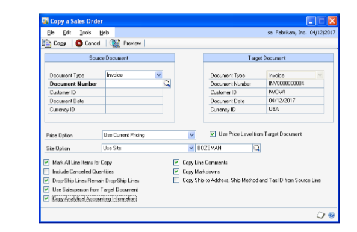

1. Choose Actions and select copy to open the Copy a Sales Order window.

2. Enter or select the document number for the document that contains the
    information to copy.

3. Mark the Copy Analytical Accounting information option.

4. Choose copy. The analytical accounting information is copied from the
    originating document to the new document.

> [!NOTE]
> Analytical Accounting information is copied only for invoice and Return type of documents in the Sales Transaction Entry window.

## Chapter 9: Inventory Transactions

Use the following information to create analysis information for Inventory
transactions.

This information is divided into the following sections:

- *Entering analysis information for inventory transactions*

- *Entering analysis information during transfer entry*

- *Entering analysis information for variance accounts*

- *Posting inventory transactions*

- *Batch posting*

- *Series posting*

- *Post through General Ledger for transaction posting*

- *Viewing analysis information for inventory transactions*

### Entering analysis information for inventory transactions

You can enter analysis information such as transaction dimension codes and
reference information for inventory transactions. You cannot create
assignments as the Extended Cost of a document can be determined only after
the transaction is posted.

You can enter analysis information for adjustment, variance and transfer
transactions and view the Item Number, Site ID, Balance Type, and the
Inventory and/or Offset accounts. This is possible only if such accounts are
linked to an account class in the Analytical Item Transaction Entry,
Analytical Item Transfer Entry or Analytical Stock Count Entry window.

The Analytical Item Transaction/Transfer/Stock Count Entry window will only
display those distribution accounts attached to an item number that are
linked to an account class.

For Inventory transactions, the Analytical Transaction Entry windows will
open when you TAB off the Item line in the Item Transaction, Item Transfer
or Stock Count Entry windows. This will only happen if one or both of the
distribution accounts associated with the item number are linked to an
account class, and if the window has not been previously opened for such
accounts.

If you are tracking inventory items by serial or lot numbers, the Analytical
Transaction Entry window will open automatically when you press TAB only
after you close the Item Serial/Lot Number Entry window.

*In the Inventory Batch Entry window, if the option Post to General Ledger
is not marked in the Posting Setup window (Administration \>\> Setup \>\>
Posting \>\> Posting), the Analytical Transaction Entry window will not open
when you TAB off an item line in the Item Transaction or Item Transfer Entry
window.*

The Analytical Transaction Entry window will open automatically only once
except in the following instances.

- The Site ID is changed in the scrolling window of the Item Transaction Entry
    window.

- The From and/or To Site ID are changed in the scrolling window in the Item
    Transfer Entry window.

- The quantity is changed from positive to negative or from negative to
    positive in the Item Transaction Entry window.

- The variance quantity is changed from positive to negative or from negative
    to positive in the Stock Count Entry window.

- The distribution account is changed in the Distribution window. In this case
    the analysis information that you entered will be deleted.

- Change in quantity type in the Item Transfer Entry window.

You can also open the Analytical Transaction Entry window from the Item
Transaction or Item Transfer or Stock Count Entry windows and the
Distribution windows from Additional \>\> Analytical Transaction Entry or by
using CTRL+T.

If the quantity of an item number in the Item Transaction or Item Transfer
windows has not been specified, the Analytical Transaction Entry window will
not open automatically from Additional \>\> Analytical Transaction Entry or
using CTRL+T.

In the Stock Count Entry window, if the variance quantity is zero, the
Analytical Transaction Entry window will not open automatically from
Additional \>\> Analytical Transaction Entry or by using CTRL+T.

If you delete the quantity specified for an item number in the Item
Transaction, Item Transfer or Stock Count Entry windows, the analysis
information created for such item number also will be deleted.

**To enter analysis information during transaction entry:**

1. Open the Analytical Item Transaction Entry window. 
    (Transactions \>\> Inventory \>\> Transaction Entry \>\> Analytical
    Accounting button)  
    (Transactions \>\> Inventory \>\> Transaction Entry \>\> CTRL+T or
    Additional menu\>\> Additional \>\> Analytical Transaction Entry)  
    (Transactions \>\> Inventory \>\> Stock Count Entry \>\> Analytical
    Accounting button)  
    (Transactions \>\> Inventory \>\> Stock Count Entry \>\> CTRL+T \>\>
    Additional \>\>Analytical Transaction Entry)

    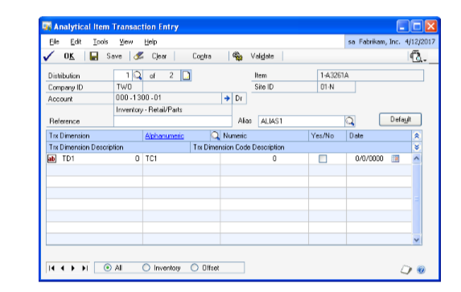

    The Analytical Item Transaction Entry window displays the first distribution account of the Item Number selected that is linked to an account class. To view other distributions enter or select a distribution number. The distribution lookup displays all distribution accounts of the transaction linked to an account class.

    The Account field will display the distribution account for which analytical information is being entered. The description of the account, as set up in the Account Maintenance window, will appear in the next line. Click the Account expansion button to open the Account Entry window.

    The balance type of the account, whether debit or credit, will be displayed next to the account.

1. In the Reference field, enter reference information for the account.

    The Item field will display the item number of the distribution account for which you are entering analysis information. This will appear as a default value from the Item Transaction Entry window.

    The Site ID of the item number as displayed in the Item Transaction Entry window will be displayed.

1. Select an alias in the Alias field. The Alphanumeric field in the scrolling
    window displays the transaction dimension codes that are associated with the
    alias for the transaction dimensions displayed. You can change these codes,
    if required. Refer to *Creating an alias* for more information.

2. Choose Default to load the current setup information specified for the
    account class in the Accounting Class Maintenance window and create a single
    assignment.

    The Trx Dimension field displays Transaction Dimensions of the account class to which the distribution account is linked. Only Transaction Dimensions which have been set as Fixed, Required, or Optional will be displayed.

    Transaction dimensions which are set to Hide in the Accounting Class Maintenance window will not be displayed. Refer to *Setting up an account class* for more information.

    The Trx Dimension Description field displays the description of the transaction dimension.

1. Enter or select an alphanumeric transaction dimension code in the
    Alphanumeric column. You can add a new alphanumeric transaction dimension
    code if you have selected the Create New Codes On The Fly option in the
    Transaction Dimension Maintenance window.

    > [!NOTE]
    > The Alphanumeric column is available only for an alphanumeric transaction dimension.

    The description of the Alphanumeric Transaction Dimension Code is displayed in the Transaction Dimension Code Description field.

1. Enter a Transaction Dimension Code in the Numeric, Yes/No or Date field if
    the Transaction Dimension is Numeric, Boolean or Date.

2. Select the type of account that you want to browse through for each item
    number entered in the Item Transaction Entry window, from the following:

    **All** to browse through the Inventory and Offset accounts for each item number if it is linked to an account class.

    **Inventory** to browse through the Inventory account of each Item Number if it is linked to an account class.

    **Offset** to browse through the Offset account of each item number if it is linked to an account class.

    > [!NOTE]
    > The Radio Group will further filter accounts if you select View \>\> Incomplete or Erroneous Dist.

1. Choose OK to save and close the window.

2. Choose Save to save the analysis information you have entered and clear the
    window.

    You can save analysis information with errors, but you cannot post them.

1. Choose Contra to switch between the inventory account and the offset account
    of the item number that is currently displayed in the Analytical Item
    Transaction Entry window. This is possible only if both the Inventory and
    Offset accounts of an item number are linked to an account class.

    If only one account of an item number is linked to an account class, a message appears when you select the Contra button.

1. Choose Validate to validate the distribution displayed in the window. If
    changes are made to the account class in setup or errors are found during
    the validation process, the Analytical Accounting Validation Log window will
    open displaying the errors or changes identified. You can view the changes
    to the account class by selecting the Default button in the Analytical Item
    Transaction Entry window.

    > [!NOTE]
    > Analysis information will also be validated if you select OK or Save in the Analytical Item Transaction Entry window.

    You can choose to save analysis information with errors or without updating changes made to the account class.

    You can validate a document in the Item Transaction Entry window by using the options CTRL+R or Additional \>\> Run Validation.

    Refer to *Validating transactions and correcting errors* for more information about validation.

1. Choose the Print drop-down to print the Analytical Accounting Edit list for
    the distribution currently displayed in the window or for all distributions
    of the transaction linked to an account class. If errors are detected, the
    Analytical Validation Log is also printed.

2. If you delete a transaction in the Item Transaction window, the analysis
    information you entered for the transaction will be deleted.

3. You cannot insert or delete a row, or change the Site ID or distribution
    accounts in the Item Transaction Entry window if the Analytical Item
    Transaction Entry window is open.

### Entering analysis information during transfer entry

You can enter analysis information for inventory transfers in the Analytical
Item Transfer Entry window.

**To enter analysis information during transfer entry:**

1. Open the Analytical Item Transfer Entry window. 
    (Transactions \>\> Inventory \>\> Transfer Entry \>\> Analytical Accounting
    button)  
    (Transactions \>\> Inventory \>\> Transfer Entry \>\> CTRL+T or Additional
    \>\> Analytical Transfer Entry)

2. Enter or select the distribution number for the distribution account.

    The Company ID field will display the company in which the transaction is taking place.

1. The Account field will display the distribution account for which the
    Analytical information is being entered and the balance type of the account,
    whether debit or credit. The description of the account, as set up in the
    Account Maintenance window, will appear in the next line. Click the Account
    expansion button to open the Microsoft Dynamics GP Account Entry window.

2. In the Reference field, enter reference information up to 30 characters for
    the account or distribution.

    The balance type of the account, whether debit or credit, will be displayed next to the account.

    The Item field will display the item number for the distribution account for which you are entering analysis information. This will appear as a default value from the Transfer Entry window.

    The From Site ID and To Site ID of the Item Number in the Inventory Transfer Entry window are displayed.

1. Select an alias in the Alias field. The Alphanumeric field in the scrolling
    window displays the transaction dimension codes that are associated with the
    alias for the transaction dimensions displayed. You can change these codes
    if required. Refer to *Creating an alias* for more information.

2. Choose Default to load the default transaction dimension codes if you
    overwrite the codes of Required or Optional Alphanumeric Transaction
    Dimensions while creating analysis information.

3. The transaction dimensions for the account class to which the distribution
    account is linked are displayed in the scrolling window. Only transaction
    dimensions which have been set as Fixed, Required, or Optional will be
    displayed. Transaction dimensions which are set to Hide in the Accounting
    Class Maintenance window will not be displayed. Refer to *Setting up an
    account class* for more information.

4. Enter or select a transaction dimension code in the Alphanumeric column.

5. Enter a numeric transaction dimension code in the Numeric field.

6. Mark or unmark the Yes/No checkbox in the Yes/No column.

7. Enter a date type transaction dimensions in the Date field.

    The description of the transaction dimension is displayed in the Transaction Dimension Description field.

    The description of the alphanumeric transaction dimension code will be displayed in the Transaction Dimension Code Description field.

1. Select the type of account that you want to browse through from the
    following:

    **All** to browse through the inventory and offset accounts for each item number if it is linked to an account class.

    **Inventory** to browse through the inventory account of each item number if it is linked to an account class.

    **Offset** to browse through the offset account of each item number if it is linked to an account class.

1. Choose Contra to switch between the offset account and the inventory account
    of the item number that is currently displayed in the Analytical Transaction
    Entry window. This button is available only if both the inventory and the
    offset accounts for an item number are linked to an account class.

2. Choose Save to save the analysis information for the distribution.

3. Choose Clear to clear the information you have entered.

4. Choose Validate to validate the distribution displayed in the window. You
    can also validate transactions by choosing CTRL+R or from Additional \>\>Run
    validation. Refer to *Validating transactions and correcting errors* for
    more information about the validation process.

5. Choose the Print drop-down list to print information for the distribution
    displayed in the window or for all distributions.

6. If you delete a transaction in the Inventory Transfer window the analysis
    information you entered for the transaction will also be deleted.

7. You cannot insert or delete a row, or change the Site ID or distribution
    accounts in the Item Transfer Entry window if the Analytical Item Transfer
    Entry window is open.

### Entering analysis information for variance accounts

You can create analysis information for variance transactions in the
Analytical Stock Count Entry window. The window can be opened from the Stock
Count Entry window by choosing Additional \>\> Analytical Transaction Entry
or CTRL+T.

You can enter analysis information such as transaction dimension codes and
reference information for the transactions in this window. Refer to
*Entering analysis information for inventory transactions* for more
information about entering analysis information for inventory transactions.

If you choose Clear Count in the Stock Count Entry window, the analysis
information you’ve entered for the transaction also will be deleted.

You cannot change the quantity or distribution accounts in the Stock Count
Entry window or the Unit of Measure in the Stock Count Unit of Measure
window or make changes in the Stock Count Serial/Lot Number Entry window if
the Analytical Stock Count Entry window is open.

### Posting inventory transactions

When you post a transaction with analysis information from the Item
Transaction or Item Transfer window or process a Stock Count Schedule in the
Stock Count Entry window, a validation takes place for the document.

If selected in Posting setup, the Analytical Posting Journals will be
printed along with the Microsoft Dynamics GP Journal. If no errors are found
during the validation process, the document will be posted.

If errors are detected in the Microsoft Dynamics GP or Analytical Accounting
transactions, the Analytical Validation Log window will open displaying all
the errors. You can double click on an Analytical Accounting error to go to
the relevant distribution in the Analytical Transaction Entry window. You
cannot zoom to a Microsoft Dynamics GP window from the Analytical Validation
Log.

We recommend that you correct the Microsoft Dynamics GP errors first before
correcting the Analytical Accounting errors.

In the Stock Count Entry window, if Autopost Stock Count Variances is not
marked, the analysis information created will update the Item Transaction
Entry window when you process the Stock Count Schedule.

### Batch posting

You can print the Analytical Accounting Edit List along with the Microsoft

Dynamics GP Edit List from the Inventory Batch Entry window. The Analytical
Validation Log is also printed if there are any Analytical Accounting errors
in the transactions in the batch.

You can also print the Analytical Accounting Edit List from the Item
Transaction or Item Transfer Entry window.

Analysis information that has been created for transactions in an inventory
batch will not be posted if the Post to General Ledger option is not marked
in the Inventory Batch Entry window.

If the option Post to General Ledger is marked, the analysis information
entered for transactions in a batch will be validated when you choose Post.
Transactions that do not have any Microsoft Dynamics GP or Analytical
Accounting errors will be posted. The Analytical Posting Journal will be
printed with the Microsoft Dynamics GP Posting Journals if specified in
Posting setup. If errors are found during the validation process, the
Analytical Validation Log report will be printed. Refer to *Validating
transactions and correcting errors* for more information.

When you delete a single or recurring use batch or a transaction within such
batches, the analysis information you’ve entered for the transaction
distributions in the batch or for the transaction will also be deleted.

For recurring batches, you must enter analysis information each time the
batch is posted.

### Series posting

When you post multiple batches from the Series Posting window, batches with
analysis information are validated. You can modify the analysis information
created for transactions in a batch before posting.

When you post batches, transactions without any errors will be posted.
Transactions with errors will not be posted and the errors will be listed in
the Analytical Validation Log. The errors must be corrected before you post
the transactions again.

The Analytical Posting Journal is printed for all transactions that are
successfully posted in each batch.

### Post through General Ledger for transaction posting

If you have marked the following options, online transactions and batches
posted from Inventory will automatically update the appropriate posting
accounts in General Ledger if there are no Analytical Accounting and
Microsoft Dynamics GP errors.

- Post through General Ledger files under Posting Setup (Administration \>\> Setup \>\> Posting \>\> Posting); and

- Post through to General Ledger for Trx Posting (Administration \>\> Setup \>\> Company \>\> Analytical Accounting \>\> Setup)

While posting online and batch transactions, Analytical Accounting or
Microsoft Dynamics GP errors may exist which would prevent the transaction
or batch from updating the appropriate posting accounts in General Ledger.
For example, default codes may not be assigned for Required Transaction
Dimensions in the account class to which the distribution accounts of Fixed
or Variable accounts are linked. The transaction or batch will update the
General Ledger. You must correct the errors in the transaction or batch in
General Ledger from the Transaction Entry window (Transactions \>\>
Financial \>\> General) before the posting accounts can be updated.

The Analytical Accounting and Microsoft Dynamics GP errors will be displayed
in the Analytical Accounting Validation Log Report which will print after
the transaction or batch updates Sales Order Processing.

The transaction and batch will update Sales Order Processing. You can view
analysis information that originated for the transaction or batch in Sales
Order Processing from the relevant Inquiry windows.

### Viewing analysis information for inventory transactions

Use the Analytical Inventory Transaction Inquiry window to view the analysis
information that has been created for accounts associated with an Item
Number in the Item Transaction or Item Transfer or Stock Count Entry
windows.

You can view transaction dimension codes and other related information such
as reference notes created for the accounts.

A single assignment equal to the transaction distribution amount will be
displayed for each distribution account linked to an account class, which
can be viewed in the Analytical Inventory Transaction Inquiry window.

**To view analysis information for inventory transactions:**

1. Open the Analytical Inventory Transaction Inquiry window. 
    (Inquiry \>\> Inventory \>\> Item Transaction \>\> Select an Item Number \>\>Additional \>\> Analytical Transaction)

    The Analytical Inventory Inquiry window displays the first distribution of the Item Number selected that is linked to an account class.

    **The Document Type field** Displays the type of transaction.

    **The Number field** Displays the document number.

    **The Item field** Displays the item number relevant to the account displayed. **The Site ID field** Displays the site ID of the item number.

1. Enter or select the distribution in the Distribution field. The Distribution
    lookup will only display those distributions that are linked to an account
    class.

2. The Account field will display the account for which you are viewing
    analysis information. The description for the account is displayed in the
    next line. The expansion button will open the Microsoft Dynamics GP Account
    Entry window.

3. The distribution amount is displayed in the functional amount field. The
    type of balance, whether credit or debit, is displayed next to the
    Functional Amount field.

4. The transaction date of the document selected is displayed in the
    Transaction Date field.

5. The Company ID field displays the ID for the current company.

6. Select the Expand button to view all analysis information created for the
    distribution account in the list window. This would comprise assignments
    (always single), reference information, transaction dimensions and their
    codes.

7. Select the Collapse button to view only assignments and reference
    information.

8. You can also view all information created for each account or just reference
    information that may exist. Select the +/- buttons available next to the
    assignment to view all analysis information created for the account or only
    reference information that may exist.

9. Select the type of account that you want to browse through from the following:

    **All** You can browse through the inventory and offset accounts for each item number if it is linked to an account class.

    **Inventory** You can browse through the Inventory account of each item number if it is linked to an account class.

    **Offset** You can browse through the Offset account of each item number if it is linked to an account class.

1. Choose Contra to switch between the Inventory account and the Offset account
    of the Item Number that is currently displayed in the Analytical Inventory
    Inquiry window. This is possible only if both the Inventory and Offset
    accounts of an Item Number are linked to an account class.

2. If only one account of an Item Number is linked to an account class, a
    message appears when you click the Contra button.

3. Click the printer icon button to print information for the distribution
    displayed in the Inquiry window or for all distributions of the document
    that are linked to an account class.

4. Choose OK to close the window.

## Chapter 10: Fixed Asset Transaction

Analytical Transfer Maintenance window is used to maintain information on
the asset transfer for Fixed Asset module. You can view the transaction
dimension codes and description for the transaction dimension codes for
fixed asset transactions. You can enter or select the Alias details in the
Analytical Transfer Maintenance window.

For transactions in Fixed Asset, you can create assignments and enter
transaction dimension codes for the distribution accounts that are linked to
an account class. You can save transactions with analysis information to a
single or recurring batch prior to posting the batch. The process of
validating transactions with analysis information is also explained in the
Analytical fixed Asset Transaction Entry window.

This information is divided into the following sections:

- *Entering Analysis information for Asset Transfer*

- *Entering analysis information for Fixed Asset Transaction*

- *Viewing analysis information for Financial Detail*

- *Viewing analysis information for Asset Account*

- *Viewing analysis information for Transfer*

### Entering Analysis information for Asset Transfer

Use the Analytical Transfer Maintenance window to enter the analytical
information for assets transferred from one location, structure ID, account
number, or master asset ID to another.

**To enter analysis information on asset transfer**

1. Open the Analytical Transfer Maintenance window. 
    (Transactions \>\> Fixed Asset \>\> Transfer \>\> enter or select an asset
    ID\>\>Additional \>\> Analytical Transaction or CTRL+T)  
    (Transactions \>\> Fixed Assets \>\> Transfer \>\> enter or select an asset
    ID \>\> G/L Accounts expansion button\>\> Expand Transfer\>\> Analytical
    Accounting Button)

    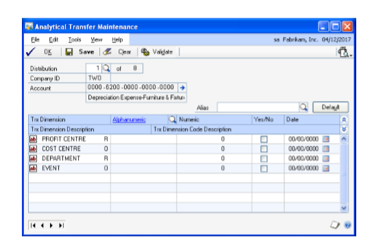

1. The Distribution field displays the first distribution account of the Item
    Number selected one of the account associated to Asset ID.To view other
    distributions, enter or select a distribution number. Select the
    distribution lookup button to view all the distribution accounts of the
    transaction linked to an account class in the Analytical Asset Account
    Lookup window.

    The Company ID field will display the company in which the transaction is taking place.

1. The Account field will display the distribution account for which analytical
    information is being entered. The description of the account, as set up in
    the Account Maintenance window, will appear in the next line. Click the
    Account expansion button to open the Microsoft Dynamics GP Account Entry
    window.

    The balance type of the account, whether debit or credit, will be displayed next to the account.

1. Select an alias in the Alias field. The Alphanumeric field in the scrolling
    window displays the transaction dimension codes that are associated with the
    alias for the transaction dimensions displayed. You can change these codes,
    if required. Refer to *Creating an alias* or more information.

2. The Trx Dimension field displays Transaction Dimensions of the account class
    to which the distribution account is linked. Only Transaction Dimensions
    which have been set as Fixed, Required, or Optional will be displayed.
    Transaction dimensions which are set to Hide in the Accounting Class
    Maintenance window will not be displayed. Refer to *Setting up an account
    class* for more information.

    The Trx Dimension Description field displays the description of the transaction dimension.

1. Enter or select an alphanumeric transaction dimension code in the
    Alphanumeric column. You can add a new alphanumeric transaction dimension
    code if you have selected the Create New Codes On The Fly option in the
    Transaction Dimension Maintenance window.

    > [!NOTE]
    > The Alphanumeric column is available only for an alphanumeric transaction dimension.

    The description of the Alphanumeric Transaction Dimension Code is displayed in the Transaction Dimension Code Description field.

1. Enter a Transaction Dimension Code in the Numeric, Yes/No or Date field if
    the Transaction Dimension is Numeric, Boolean or Date.

2. Choose OK to save and close the window.

3. Choose Save to save the analysis information you have entered and clear the
    window.

4. Choose Validate to validate the distribution displayed in the window. If
    changes are made to the account class in setup or errors are found during
    the validation process, the Analytical Accounting Validation Log window will
    open displaying the errors or changes identified. You can view the changes
    to the account class by selecting the Default button in the Analytical Item
    Transaction Entry window.

    > [!NOTE]
    > Analysis information will also be validated if you select OK or Save in the Analytical Fixed Asset Setup window.

    You can choose to save analysis information with errors or without updating changes made to the account class.

    You can validate a document in the Item Transaction Entry window by using the options CTRL+R or Additional \>\> Run Validation.

    Refer to *Validating transactions and correcting errors* for more information about validation.

1. Choose the Print drop-down to print the Analytical Accounting Edit list for
    the distribution currently displayed in the window or for all distributions
    of the transaction linked to an account class. If errors are detected, the
    Analytical Validation Log is also printed.

### Entering analysis information for Fixed Asset Transaction

Use the Analytical Fixed Asset Transaction Entry windows to enter analysis
information for transactions for Fixed Asset module. The window name depends
upon the path where you open this window.

You can enter assignments and transaction dimension codes for fixed asset
documents using the Analytical Fixed Asset Transaction Entry window.Also,
you can view analysis information created for transactions in the Analytical
Inquiry windows.

You can open the Analytical Transaction Entry window only if Analytical
Accounting has been activated. Refer to *Activating Analytical Accounting*
for more information about activating Analytical Accounting.

In case of multicurrency transactions, a change in the transaction date
re-creates distributions due to a change in the exchange rate. If the
transaction date is modified, analysis information created previously is
deleted when the distributions are re-created.

**To enter Analytical Fixed Asset Transaction Entry**

1. Open the Analytical Fixed Asset Transaction Entry window. 
    (Cards\>\> Fixed Asset\>\> Book\>\> select Book ID and enter Asset
    ID\>\>Analytical Accounting Icon.)  
    (Cards\>\> Fixed Asset\>\> Book\>\> select Book ID and enter Asset
    ID\>\>Additional \>\> Analytical Transaction or CTRL+T)  
    (Cards\>\> Fixed Asset\>\> Book\>\> select Book ID and enter
    AssetID\>\>Distributions\>\> Financial Detail Maintenance\>\> Analytical
    Accounting Icon) (Cards\>\> Fixed Asset\>\> Book\>\> select Book ID and
    enter Asset ID\>\>Distributions\>\> Financial Detail Maintenance\>\>
    Additional\>\> Analytical Transaction or CTRL+T)  
    (Administration \>\> Routines\>\> Fixed Assets\>\> GL Posting\>\> Analytical
    Accounting Icon)  
    (Administration \>\> Routines\>\> Fixed Assets\>\> GL Posting\>\>
    Additional\>\> Analytical Transaction or CTRL+T)

    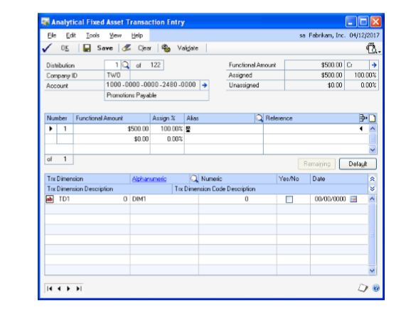

1. The Distribution field displays the first distribution account of the one of
    the account associated to Asset ID. To view other distributions for the
    transaction, enter or select a distribution number.

    The sequence of distributions in the Analytical Fixed Asset Transaction Entry window may not correspond to the sequence in the Fixed Asset Entry window because only accounts linked to an account class are displayed in the Analytical Payroll Transaction Entry window.

1. In the list window, enter the transaction distribution amount in functional
    or originating currency, by value or on a percentage basis.

2. Enter the assignment in percentage value in the Assign% field. Initially, a
    single assignment is created by default. You can overwrite the assignment
    with more than one assignment.

    You can save analysis information for a distribution even if the assignment is not 100%. However, you can post a transaction with partial assignments only if you have opted to allow partial assignments during posting for the module you’re working in. Refer to *Setting up assignment options* for more information.

1. Select an alias in the Alias field. The Alphanumeric field in the scrolling
    window displays the transaction dimension codes that are associated with the
    alias for the transaction dimensions displayed. You can change these codes
    if required. Refer to Creating an alias for more information.

2. Enter reference information for the assignment in the Reference field.

3. Choose Delete Row to delete a single row in the assignment List View. You
    cannot choose this option if only a single assignment has been entered.

4. Choose Remaining to add one assignment for the remaining unassigned amount.
    The new assignment will ensure that the total assigned amount equals the
    distribution amount. For example, the distribution amount is \$100 and
    you’ve entered four assignments that total \$75. When you choose Remaining,
    a fifth assignment for the remaining value, \$25 is created. This button is
    not available if the distribution field is blank or has a zero value.

5. Choose Default to load the current setup information specified for the
    account class in the Accounting Class Maintenance window and create a single
    assignment. The following processes will occur:

    - Fixed, Required, and Optional Transaction Dimensions (including hidden
        transaction dimensions) will be installed.

    - All the assignments that you have created for the current distribution
        will be removed and create a single assignment that is equal to the
        distribution amount will be created.

    - If the analysis type is changed to or from Not Allowed, transaction
        dimensions will be added or removed.

    - Transaction dimensions that have been deleted will be removed.

6. Enter or select the code for each alphanumeric transaction dimension in the
    alphanumeric column. If you’ve marked the Show valid code combinations in
    trns and budgets option in the Analytical Accounting Options window, then
    the lookup window will display only those codes that have a valid
    combination with the codes you have already selected for the transaction.

7. Enter a transaction dimension code in the Numeric, Yes/No or Date field for
    a Numeric, Boolean or Date type Transaction Dimension.

8. Choose OK to save your changes and close the window. The analysis
    information that you have entered is validated when you choose OK. Refer to
    Validating transactions and correcting errors for more information.

9. Choose Save to save the analysis information you have entered and clear the
    window. A validation takes place when you choose Save in the Analytical
    General Transaction Entry window. Refer to Validating transactions and
    correcting errors for more information. You can save the analysis
    information with errors or without updating changes made to the account
    class.

10. Choose Clear to clear the information from the Analytical General
    Transaction Entry window.

11. Choose Validate to validate the analysis information of the distribution
    displayed in the window. If changes are made to the account class in the
    Analytical Accounting setup or errors are found during the validation
    process, the Analytical Accounting Validation Log window will open where you
    can view the errors or changes. Refer to Validating transactions and
    correcting errors for more information about validation.

12. To view the changes to the account class choose the Default button in the
    Analytical General Transaction Entry window. Double click on an Analytical
    Accounting error to open the Analytical Accounting General Transaction Entry
    window where the specific error will be highlighted.

13. Choose the printer icon button to print the Analytical Accounting edit list
    for the current distribution displayed or for all distributions of the
    transaction linked to an account class. The Analytical Accounting Validation
    Log report which describes the Analytical Accounting errors also is printed.

### Viewing analysis information for Financial Detail

You can view analysis information for financial detail in the Analytical
Financial Detail Inquiry window.

**To view analysis information for financial detail**

1. Open the Analytical Financial Detail Inquiry window  
    (Inquiry \>\> Fixed Assets \>\> Financial Detail \>\> enter or select an
    asset ID \>\> select a book ID \>\> select a line \>\> Additional \>\>
    Analytical Transaction or CTRL+T)

2. Enter or select an asset ID and select a book ID.

3. Select a transaction and select Additional and choose Additional \>\>
    Analytical Transaction or CTRL+T to open the Analytical Financial Detail
    Inquiry window.

4. In the Analytical Financial Detail Inquiry window, click the account
    expansion button to open the Account Entry window to enter or select an
    alias for an account.

5. Choose OK to close the Analytical Financial Detail Inquiry window.

### Viewing analysis information for Asset Account

You can view analysis information for asset account in the Analytical Asset
Account Inquiry window.

**To view analysis information for asset account**

1. Open the Analytical Asset Account Inquiry window  
    (Inquiry \>\> Fixed Assets \>\> General\>\> enter or select an asset ID \>\>
    Goto button \>\> Account \>\>Additional \>\> Analytical Transaction or
    CTRL+T)

2. Enter or select an Asset ID in the Asset Inquiry window.

3. Choose the Goto button to select the Account option.

4. Select Additional and choose Additional \>\> Analytical Transaction or
    CTRL+T to open the Analytical Asset Account Inquiry window.

5. In the Analytical Asset Account Inquiry window, click the account expansion
    button to open the Account Entry window to enter or select an alias for an
    account.

6. Choose OK to close the Analytical Asset Account Inquiry window.

### Viewing analysis information for Transfer

You can view analysis information for Transfer Assets in the Analytical
Transfer Inquiry window.

**To view the transfer analysis information**

1. Open Analytical Transfer Inquiry window  
    (Inquiry \>\> Fixed Assets \>\> Transfer\>\> enter or select asset ID \>\>
    Additional\>\> Analytical Transaction or CTRL+T)

2. Enter or select an Asset ID in the Asset Inquiry window.

3. Select Additional and choose Additional \>\> Analytical Transaction or
    CTRL+T to open the Analytical Transfer Inquiry window.

4. In the Analytical Transfer Inquiry window, click the account expansion
    button to open the Account Entry window to enter or select an alias for an
    account.

5. Choose OK to close the Analytical Transfer Inquiry window.

## Chapter 11: Bank Reconciliation Transactions

You can enter and view analysis information for transactions in Bank

Reconciliation. This would comprise creating assignments and entering
transaction dimension codes for accounts that are linked to an account
class.

This information is divided into the following sections:

- *Entering analysis information for bank transactions and receipts*

- *Voiding transactions or receipts*

- *Entering analysis information for bank transfers*

- *Voiding bank transfers*

- *Entering analysis information for reconcile adjustments*

- *Validating transactions and correcting errors*

- *Posting transactions with analysis information*

- *Entering analysis information for deposits*

- *Viewing analysis information in Bank Reconciliation*

### Entering analysis information for bank transactions and receipts

You can create assignments, enter transaction dimension codes, and reference
information for accounts that are linked to an account class in the
Analytical Bank Transaction Entry window. You can modify the analysis
information that you have entered at any time before posting the document.

The Analytical Bank Transaction Entry window opens automatically when you
press TAB from a row in the Bank Transaction Entry window in the following
instances:

- If the distribution account is linked to an account class and the Analytical
    Bank Transaction Entry window has not been opened even once for the account
    and if all required fields have been entered in the Bank Transaction Entry
    window.

The Analytical Bank Transaction Entry window also opens automatically If the
following changes are made:

- Change in distribution account other than the checkbook account.

- Change in checkbook amount.

- Change in amount of other distribution accounts.

- Change from debit to credit or vice versa.

- Change in amount from positive to negative or vice versa.

These changes would result in a deletion of the analysis information created
previously for the relevant account.

If you clear an unposted transaction or receipt from the Bank Transaction
Entry window, the analysis information that exists for the transaction or
receipt will be deleted.

If you choose to clear previous entries after you change the Option or Type
in the Bank Transaction Entry window the analysis information that exists
for the checkbook account and all other distribution accounts that are
linked to an account class will be deleted.

If you choose to continue using entries in a new transaction after changing
the

Option in the Bank Transaction Entry window (except for a change from Enter
Transaction to Enter Receipt or vice versa), analysis information entered
for the checkbook account and all other distribution accounts that are
linked to an account class will be deleted.

If you change the credit card assigned to a receipt, for which the checkbook
is different from the one originally assigned to the receipt, analysis
information that exists for the checkbook account will be deleted.

In the case of multicurrency transactions, the following changes will delete
the existing analysis information for a transaction or receipt:

- Change from originating to functional currency (if entering receipt).

- Change in currency ID due to a change in the checkbook ID.

- Change in exchange rate in the Exchange Rate Entry window.

- Change in the rate type ID in the Exchange Rate Entry window. In this case,
    distributions are re-created if the rate type ID selected is from a
    different exchange rate table ID than the one originally assigned to the
    transaction.

- Change in transaction date.

**To enter analysis information for bank transactions and receipts:**

1. Open the Analytical Bank Transaction Entry window. 
    (Transactions \>\> Financial \>\> Bank Transactions \>\> Analytical
    Accounting button)  
    (Transactions \>\> Financial \>\> Bank Transactions \>\> Additional \>\>
    Analytical Transaction or CTRL+T)

    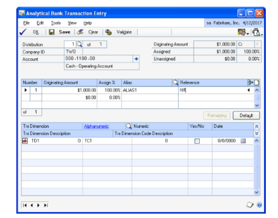

    The Analytical Bank Transaction Entry window will only display distribution accounts of a transaction or receipt that are linked to an account class.

    For example, if a check transaction has two distribution accounts of which only one is linked to an account class, then the distribution account linked to the account class will be displayed in the Analytical Bank Transaction Entry window. If there is more than one distribution account linked to an account class, they will be displayed in the Analytical Bank Transaction Entry window as per the distribution sequence. You can enter or select the distribution account you want to view.

    You can also view a specific distribution account in the Bank Transaction Entry window linked to an account class, by selecting the account prior to opening the Analytical Bank Transaction Entry window.

    Refer to *Entering analysis information for General Ledger transactions* for more information about entering analysis information.

### Voiding transactions or receipts

When you void a transaction or receipt in the Bank Transaction Entry window,
the analysis information entered for the document during transaction entry
will be copied with the exception of the balance type. The balance type of
each distribution account linked to an account class will be reversed.

You cannot modify the analysis information of the checkbook account and
other distribution accounts prior to voiding. However, if you have made
changes to distribution accounts other than the checkbook account prior to
voiding that affects the analysis information entered previously for such
accounts during transaction entry, such information will be deleted. You
must re-enter analysis information for these accounts prior to voiding the
transaction or receipt.

The changes made to a distribution line that would result in a deletion of
analysis information include changing the account or amount or debit to
credit or vice versa or positive amounts to negative or vice versa.

When you void a transaction or receipt, the analysis information entered
prior to voiding will be validated. Refer *Posting transactions with
analysis information* for more information about validation.

### Entering analysis information for bank transfers

You can enter assignments, transaction dimension codes and reference
information for bank transfers in the Analytical Bank Transfer Entry window.

> [!NOTE]
> Be sure to follow the tab sequence while entering transactions in the Bank
Transfer Entry window, to create analysis information. You may lose data if
the tab sequence is not followed.

The Analytical Bank Transfer Entry window will only display checkbook
accounts that are linked to an account class.

The Analytical Bank Transfer Entry window opens automatically when you press
TAB from a field in the following instances:

- The Transfer To Checkbook ID field if either or both the Transfer From or
    Transfer To Checkbooks are linked to an account class and the Analytical
    Bank

Transfer Entry window has not been opened previously for such account. The
Analytical Bank Transfer Entry window will open automatically in this
instance only if both Checkbook IDs and the amount have been specified in
the Bank Transfer Entry window.

- The Transfer From or Transfer to Checkbook ID fields, if there is a change
    in the checkbook ID that results in a change in the distribution account.

- The amount field, if there is a change in the bank transfer amount.

If you clear an unposted transfer from the Bank Transfer Entry window, the
analysis information that exists for the transfer will be deleted.

In the case of multicurrency transactions, the following changes will delete
the existing analysis information of a transfer:

- The Transfer From Checkbook is changed to a functional currency checkbook.

- Change in exchange rate in the Exchange Rate Entry window.

- Change in the Rate Type ID in the Exchange Rate Entry window. In this case,
    distributions are re-created if the Rate Type ID selected is from a
    different exchange rate table ID than the one originally assigned to the
    transaction.

- Change in transfer date.

**To enter analysis information for bank transfers**

1. Open the Analytical Bank Transfer Entry window. 
    (Transactions \>\> Financial \>\>Bank Transfers \>\> Analytical Accounting
    button)  
    (Transactions \>\> Financial \>\>Bank Transfers \>\> CTRL+T or Additional
    \>\> Analytical Transaction)

2. Refer *Entering analysis information for General Ledger transactions* for
    more information about entering analysis information.

### Voiding bank transfers

When you void a bank transfer, the analysis information that was entered for
the transfer will be copied, along with a change in the balance type. The
balance type will be reversed. You cannot modify the analysis information
for the transfer prior to voiding.

### Entering analysis information for reconcile adjustments

You can enter analysis information for an adjustment in the Reconcile Bank

Adjustments window (Transactions \>\> Financial \>\> Reconcile \>\>
Transactions \>\>

Adjustments \>\> Select an adjustment \>\> CTRL+T or Additional \>\>
Analytical Transaction), if the checkbook account and/or adjustment account
are linked to an account class. The Analytical Reconcile Entry window will
only display accounts of an adjustment linked to an account class.

You can enter analysis information for one adjustment at a time. To create
analysis information for a specific adjustment, select the adjustment prior
to opening the Analytical Reconcile Entry window.

The Analytical Reconcile Entry window opens automatically when you press TAB
from a field in the Reconcile Bank Adjustments window, in the following
instances:

- Either or both the distribution accounts of the adjustment are linked to an
    account class and the Analytical Reconcile Entry window has not been opened
    previously for such adjustment.

- Change in distribution account of an adjustment

- Change in adjustment amount

Analysis information entered for adjustments will be deleted if
reconciliation information of the Checkbook is deleted from the Reconcile
Bank Statements window. Also, if you delete a row in the Reconcile Bank
Adjustments window, analysis information that you’ve entered for
distribution accounts of that row will be deleted.

In the case of multicurrency transactions, the following changes will delete
the analysis information entered for an adjustment:

- Change in the Rate Type ID in the Exchange Rate Entry window. In this case,
    distributions are re-created if the Rate Type ID selected is from a
    different exchange rate table ID than the one originally assigned to the
    transaction.

- Change in Exchange Rate in the Exchange Rate Entry window.

- Change in Date.

Refer to *Entering analysis information for General Ledger transactions* for
more information about entering analysis information.

### Validating transactions and correcting errors

You can validate a transaction from the following windows by choosing
Additional \>\> Run Validation or CTRL+R.

- Bank Transaction Entry

- Bank Transfer Entry

- Reconcile Bank Adjustments

Refer to *Validating transactions and correcting errors* for more
information about validation.

In the Reconcile Bank Adjustments window, you can validate the analysis
information entered only for individual adjustments. To validate an
adjustment, select the adjustment and choose CTRL+T or Additional \>\> Run
Validation.

You can validate any analysis information entered before voiding. If errors
are detected during validation, the Analytical Accounting Validation Log
window will open displaying the errors.

*You can select View \>\> Incomplete or Erroneous Distributions, to browse
through the distribution accounts in the Analytical Transaction Entry window
which are incomplete or have erroneous information.*

To correct an Analytical Accounting error, double-click on the relevant
error to open the relevant Analytical Transaction Entry window. The specific
distribution in which the error exists is displayed which you can then
correct.

If errors are detected in the analysis information you have entered for
adjustments, you can save such information with errors. However, the
checkbook cannot be reconciled till you have rectified these errors.

### Posting transactions with analysis information

When you post a transaction or transfer or reconcile a checkbook, the
analysis information you have entered will be validated.

Refer to *Validating transactions and correcting errors* for more
information. In addition to Analytical Accounting information, Microsoft
Dynamics GP data will also be validated before the transaction or transfer
is posted or the checkbook is reconciled.

If errors are found while posting a transaction or transfer, the transaction
or transfer will not be posted. The Analytical Accounting Validation Log
window will open listing the Microsoft Dynamics GP errors first and then the
Analytical Accounting errors.

To correct an Analytical Accounting error, double-click on the relevant
error to open the relevant Analytical Transaction Entry window. The specific
distribution in which the error exists is displayed which you can then
correct.

If errors are detected while reconciling a checkbook, they will be listed in
the Analytical Accounting Validation Log Report. You will have to select the
appropriate adjustment in the Reconcile Bank Adjustments window and correct
the errors before the checkbook can be reconciled.

We recommend that you resolve the Microsoft Dynamics GP errors first and
then the Analytical Accounting errors.

The Analytical Posting Journal will be printed along with the Microsoft
Dynamics GP Posting reports if specified under Posting Setup.

### Entering analysis information for deposits

If distributions are created for realized gain or loss accounts when you
post deposits from the Bank Deposit Entry window (Transactions \>\>
Financial \>\> Bank Deposits), the Analytical Bank Deposit window will open
automatically if any of these accounts are linked to an account class. Refer
to *Entering analysis information for bank transactions and receipts* for
more information about entering analysis information.

The Analytical Bank Deposit Entry window will only display distribution
accounts that are linked to an account class.

After you have entered analysis information for the relevant accounts, a
validation will take place when you choose Post. If there are errors in the
analysis information, the Analytical Validation Log will open displaying the
Analytical Accounting errors. Refer to *Posting transactions with analysis
information* for more information.

The Analytical Posting Journal will print after you post the deposits, if
you have selected the option in the Posting Setup.

### Viewing analysis information in Bank Reconciliation

You can view analysis information you’ve entered for transactions in the
Bank Transaction Entry, Bank Transfer Entry and Reconcile Bank Adjustments
windows in the Analytical inquiry window.

You can open the Analytical inquiry window from the Bank Transaction Entry
zoom or the Bank Transfer Entry zoom in the Checkbook Register Inquiry
window.

**To view analysis information in Bank Reconciliation:**

1. Open the Analytical Bank Transaction Entry Zoom or Bank Transfer Entry zoom
    window. 
    (Inquiry \>\> Financial \>\> Checkbook Register \>\>Bank Transaction Entry
    Zoom or Bank Transfer Entry Zoom \>\> Additional \>\> Analytical Transaction
    or CTRL+T)

The Analytical Bank Recon Inquiry window displays all analysis information
created for a distribution account.

1. The first distribution account of the document linked to an account class is
    displayed. Enter or select a distribution number to view analysis
    information of other distribution accounts.

If you select a specific account in the Bank Transaction Entry Zoom, the
Analytical Bank Recon Inquiry window will display analysis information
relating to such account.

The Document Type and Number field will default from the Bank Transaction
Entry or Bank Transfer Entry Zoom.

1. The Originating or Functional Amount field displays the distribution amount
    in the originating or functional currency based on the option you have
    chosen in the Currency View. Click the expansion button to view
    multicurrency information if the originating currency differs from the
    functional currency.

2. The Document Date field displays the transaction/ transfer date of the
    document from the Bank Transaction Entry or Bank Transfer Entry zoom.

3. The Company ID field displays the ID of the current company.

4. Click Expand to display all analysis information entered for the
    distribution account in the list window. This includes assignments,
    reference information entered per assignment, Transaction Dimensions and
    their codes.

5. Click Collapse to display only assignments and reference information entered
    per assignment for the distribution account.

6. You also can view all information entered for each assignment or just
    reference information that may exist. The plus or minus buttons available
    next to each assignment allow you to view all analysis information entered
    for an assignment or only reference information that may exist.

## Chapter 12: Cashbook Bank Management Transactions

You can enter and view analysis information for payments, deposits, bank
transfers, and cash receipts entered in Cashbook Bank Management. You can
create assignments and enter transaction dimension codes for accounts that
are linked to an account class.

This information is divided into the following sections:

- *Entering analysis information for payments and deposits*

- *Entering analysis information for bank transfers*

- *Entering analysis information for bank transfer charges*

- *Entering analysis information for cash receipts*

- *Entering analysis information for writeoffs, terms taken, and realized
    gain/loss*

- *Entering analysis information for distributions*

- *Posting transactions*

- *Validating transactions and correcting errors*

- *Voiding transactions*

- *Viewing analysis information in Cashbook Bank Management*

#### Entering analysis information for payments and deposits

You can enter analysis information for payments and deposits that are in a
batch in Cashbook Bank Management. The Analytical Transaction Entry window
will open automatically when you TAB out from the amount field in the
Payments or Deposits window, if any of the accounts used in the transaction
distributions are linked to an account class and if analysis information has
not been entered for the transaction. You can also open the Analytical
Transaction Entry window from the Distributions window for payments and
deposits.

The Analytical Payment/Deposit Transaction Entry window will open
automatically if you make the following changes in the Payments or Deposits
window:

**Amount** If you change the amount, and the cheque or deposit contains only
one transaction, the analysis information created earlier for the payment or
receipt will be deleted. When you open the Analytical Payment/Deposit window
after saving the changes, it will display the first distribution created for
the transaction with the amount field displaying the new amount. If the
cheque or deposit is made up of multiple lines of receipts that have been
changed, the analysis information created for the line of receipt will be
deleted. This would include the account to which the amount is debited or
credited, the tax account, and the checkbook account. A single assignment
equal to the new debit or credit amount will be created. Transaction
dimensions and default transaction dimension codes specified for the account
class to which the checkbook account is linked, will be loaded in the
Analytical Payment/Deposit Transaction Entry window.

**Distribution account** The analysis information created for the
distribution account will be deleted if there is any change in the
distribution account.

**Creditor or Debtor ID** The analysis information created for the debtor or
creditor control account will be deleted, even if the control account has
not been changed. The Analytical Deposit window will display information
relating to the new debtor or creditor control account.

##### Changing positive amount to negative amount or negative amount

**to positive amount** The analysis information created for the line or
receipt affected by the change will be deleted. This would include the
account to which the amount is debited or credited, the tax account, and the
checkbook account. A single assignment equal to the new debit or credit
amount will be created. Transaction dimensions and default transaction
dimension codes specified for the account class to which the checkbook
account is linked will be displayed in the Analytical Payment/Deposit
Transaction Entry window.

**Tax amount** Analysis information entered for the tax amount will be
deleted if any changes are made.

**Tax schedule** Analysis information entered for the tax schedule will be
deleted if any changes are made.

**To enter analysis information for payments and deposits:**

1. Open the Analytical Transaction Entry window.

(Transactions \>\> Financial \>\> Bank Management \>\> Batches \>\> Payments
button \>\> CTRL+T or Additional \>\> Analytical Transaction)

(Transaction \>\> Financial \>\> Bank Management \>\> Batches \>\> Deposits
button \>\> CTRL+T or Additional \>\> Analytical Transaction)

(Transaction \>\> Financial \>\> Bank Management \>\> Batches \>\>
Payments/Deposits button \>\> Distribution button \>\> CTRL+T or Additional
\>\> Analytical Transaction)

The information for the first distribution account that has been linked to
an account class is displayed when you open the window. Information relevant
to the account associated with the creditor, debtor or GL transaction
selected in the scrolling window of the Payments/Deposits window will appear
if the cheque comprises a single line or the deposit contains only a single
receipt.

For multiple lines or receipts, you can create analysis information for a
specific line or receipt displayed in the scrolling window.

1. You can enter analysis information for the remaining accounts by selecting
    the appropriate distribution in the Distribution lookup or by entering a
    distribution number in the Distribution field.

2. You can delete the analysis information that you have entered for a batch,
    cheque, or deposit before posting it. This will delete all data such as
    assignments, transaction dimension codes, and reference information that you
    entered for the transaction.

If you delete a specific row in the scrolling window of the Payment/Deposit
window, all analysis information entered for the transaction will be
deleted. In the Payment window, if you have not entered a cheque amount,
then a single assignment equal to the revised amount will be created. The
transaction dimensions and default transaction dimension codes specified for
the account class that the checkbook account is linked to will be displayed
in the Analytical Payment/Deposit Entry window.

If a tax schedule is deleted from an existing General Ledger payment or
deposit, the analysis information created for the tax account will be
deleted. If you delete the tax amount in the Tax Lookup window, the analysis
information entered will also be deleted.

1. You can print the Analytical Accounting Edit List from the Analytical
    Transaction Entry window by choosing the printer icon button.

You also can print the Analytical Accounting Edit List before you post a
batch in the Batch Entry window by choosing the printer icon button. A
validation will take place when you print the edit list. If there are any
errors, the Analytical Error Report will be printed after the Analytical
Accounting Edit list. The Analytical Accounting Edit list will print the
payments and deposits along with the distributions, assignments, and codes.

Refer to *Entering analysis information for General Ledger transactions* for
more information about entering analysis information.

#### Entering analysis information for bank transfers

You can enter analysis information for bank transfers in the Analytical Bank
Transfer Entry window.

**To enter analysis information for bank transfers:**

1. Open the Analytical Bank Transfer Entry window. 
    (Transactions \>\> Financial \>\> Bank Management \>\> Bank Transfers \>\>
    CTRL+T or Additional \>\> Analytical Transaction Entry window)  
    (Transactions \>\> Financial \>\> Bank Management \>\> Bank Transfers
    \>\>Distribution button \>\> CTRL+T or Additional \>\> Analytical
    Transaction)

The Analytical Bank Transfer Entry window will display information relevant
to the first distribution created for the transfer. If you selected a row in
either of the scrolling windows, or placed the cursor on any field in the
Bank Transfer Entry window, the Analytical Bank Transfer Entry window will
display the information for the first distribution created for the transfer.

1. Refer to *Entering analysis information for General Ledger transactions* for
    more information about entering analysis information.

In the Bank Transfer Entry window, if a change is made to the amount, the
analysis information created for the account which has been affected by the
change will be deleted. For example, if the Transfer From amount is changed,
the analysis information you entered for the From Checkbook will be deleted.

If you delete a bank transfer, the analysis information created for the From
and To Checkbook Accounts and the Bank Charges Account will be deleted.

If you delete a row in the scrolling window, the analysis information
created for the transaction will also be deleted.

If you delete data related to bank charges in the Bank Transfer Charges
window, the analysis information created for the bank charges account will
also be deleted.

### Entering analysis information for bank transfer charges

The Analytical Bank Transfer Charges window will open automatically when you
press TAB from the Amount field in the Bank Transfer Charges window for the
first time, if all the required information is entered. This will happen
only if any of the accounts used in the transaction are linked to an account
class and if analysis information has not been entered for the accounts.

You can open the Analytical Bank Transfer Charges window by choosing CTRL+T
in the Bank Transfer Charges window (Transactions \>\> Financial \>\> Bank
Management \>\> Bank Transfer \>\> Bank Transfers charges) to enter analysis
information.

The Analytical Bank Transfer Charges window will open automatically if a
change is made in the bank charges amount or bank charges account in the
Bank Transfer Charges window.

Analysis information created for a bank charges account will be deleted if
the amount of charges is altered in the Bank Transfer Charges window.

Refer to *Entering analysis information for General Ledger transactions* for
more information about entering analysis information.

### Entering analysis information for cash receipts

You can enter analysis information for cash receipts in the Analytical Cash
Receipts

Entry window. This window will open automatically when you press TAB from
the Amount field in the Cash Receipts window for the first time. This will
happen only if any of the accounts in the transaction are linked to an
account class and if analysis information has not been entered for the
accounts.

You can open the Analytical Cash Receipts Entry window by choosing
Transactions \>\> Financial \>\> Bank Management \>\> Cash Receipts \>\>
CTRL+T or Additional \>\>Analytical Transaction.

You can also open the Analytical Cash Receipts Entry window from the

Distributions window for cash receipts (Transactions \>\> Financial \>\>
Bank Management \>\> Cash Receipts \>\> Distributions \>\> Additional \>\>
Analytical Transaction or CTRL+T).

You can use the browse button to view the other distributions and enter
analysis information. You also can select a distribution in the Distribution
Lookup or enter the distribution number in the Distribution field to view it
in the scrolling window.

The Analytical Cash Receipts Entry window will display information for the
account that has been linked to an account class. If more than one account
in the transaction has been linked to an account class, then this window
will display information for the first of such accounts.

Choose Save to save the transactions you have entered in the Analytical Cash
Receipts Entry window.

If you clear a transaction in the Cash Receipts window, the analysis
information entered for the transaction will be deleted.

If you close the Cash Receipts window without posting the transaction, the
analysis information entered for the transaction will also be deleted.

Refer to *Entering analysis information for General Ledger transactions* for
more information about entering analysis information.

### Entering analysis information for writeoffs, terms taken, and realized gain/loss

You can enter analysis information for writeoffs, terms taken and realized
gain/loss if the payment or receipt has been applied. You can open the
Analytical Transaction Entry window from the Payment/Deposits window and
Cash Receipts window by choosing CTRL+T or Additional \>\> Analytical
Payment/Deposit Transaction Entry.

When a payment or receipt is applied in the Payment/Deposit window or the
Cash Receipts window, analysis information can be entered for accounts
relating to writeoffs, terms taken, and realized gain/loss if they are
linked to an account class.

When you return to the Payment window after applying a payment, a
verification will take place to check if any amount exists for writeoffs,
terms taken, or realized gain/loss or tax distributions. If it does exist,
and if the account to which the amount is to be debited or credited is
linked to an account class, the Analytical Payment Transaction Entry window
will open. This window will display information relating to the first of
such accounts in case there is more than one account.

Analysis information that has been entered for the creditor’s control
account before the terms taken, writeoffs or realized gain/loss is entered
will be deleted. A single assignment for the revised distribution amount
will be created. The transaction dimensions and default transaction
dimension code for the account class that the creditor control account is
linked to will be displayed in the Analytical Payment Transaction Entry
window.

When you return to the Deposit window after applying a receipt, a
verification will take place similar to payments. You can enter analysis
information for terms taken, writeoffs, or realized gain/loss before saving
the receipt.

Refer to *Entering analysis information for General Ledger transactions* for
more information about entering analysis information.

### Entering analysis information for distributions

You can enter analysis information for the distributions created for
transactions in Cashbook Bank Management. The Analytical Accounting window
can be opened from the Distributions windows that open from the following
windows:

- Payments Entry

- Deposits Entry

- Bank Transfer Entry

- Bank Transfer Charges

- Cash Receipts Entry

Refer to *Entering analysis information for General Ledger transactions* for
more information about entering analysis information.

### Posting transactions

A validation will take place when you post transactions in the following
windows:

- CBM Batch Entry

- Bank Transfer Entry

- Cash Receipts Entry

A transaction can be posted only after you close the Analytical Transaction
Entry window.

After posting transactions, the Analytical Accounting posting journal is
printed. If there are errors in the transactions, the Analytical Accounting
error list is printed.

If you selected to print cash receipts in the Checkbook Setup window (Cards
\>\> Financial \>\> Bank Management \>\> Setup \>\> Checkbooks), a
validation will take place when you choose Post. If you have not selected to
print cash receipts, a validation takes place when you choose Post. If
errors are found, the Analytical Accounting Validation Log window will open
listing the Microsoft Dynamics GP errors first and then the Analytical
Accounting errors.

When you post a bank transfer, the bank charge distributions are validated
first and if any errors are found, then the Analytical Accounting Validation
Log window will open.

### Validating transactions and correcting errors

You can validate analysis information for payments in the Payments window by
choosing Additional \>\> Run Validation or by pressing CTRL+R. Validation
can only be done for a single transaction at a time.

You can validate analysis information for deposits by selecting a receipt
and choosing CTRL+R or Additional \>\> Run Validation.

Analysis information for bank charges can be validated when the Bank Charges
window is open, by choosing CTRL+R.

You can validate analysis information for transactions in the Cash Receipts
window by choosing Additional \>\> Run Validation or CTRL+R

Refer to *Validating transactions and correcting errors* for more
information about validation.

### Voiding transactions

When you void a transaction in the Transaction Reconcile or Transaction
Inquiry windows, the analysis information entered for that transaction will
be reversed. For example, you void a transaction CBPay001 in the Transaction
Reconcile (Transactions \>\> Financial \>\> Bank Management \>\> Reconcile
\>\> OK) or

Transaction Inquiry (Inquiry \>\> Financial \>\> Bank Management \>\>
Transaction Inquiry) windows. This transaction will have assignments in the
Analytical Transaction Entry window. When you void the transaction, a
reverse entry will be created in Microsoft Dynamics GP and also reverse
assignments will be created in Analytical Accounting. The Analytical Voiding
posting journal will also be printed when you close the Bank Transaction
Inquiry window.

This will happen only for transactions voided in the Payment Inquiry/Void or
Deposit Inquiry/Void window.

### Viewing analysis information in Cashbook Bank Management

You can view the analysis information that you have entered for transactions
in Cashbook Bank Management in the Analytical Inquiry window.

The Analytical Inquiry window can be opened by choosing CTRL+T or Additional
\>\> Analytical Transaction after zooming to a document or choosing void in
the Transaction Inquiry or Transaction Reconcile window.

You can also open the Analytical Inquiry window for cash receipts by zooming
on a cash receipt in the Deposit Inquiry window and choosing Additional \>\>
Analytical Transaction.

**To view analysis information in Cashbook Bank Management:**

1. Open the Analytical Inquiry window.

(Inquiry \>\> Financial \>\> Bank Management \>\> Transaction Inquiry \>\>
Void \>\> CTRL+T)

1. The Analytical Inquiry window will display analysis information for the
    first distribution created for the transaction. Choose the browse button to
    view the remaining distributions or click the Distribution lookup. You can
    also view the other distributions by entering the number in the Distribution
    field. To view the analysis information for a particular receipt, you can
    select the receipt in the Deposit window and then open the Analytical
    Inquiry window.

2. If you are viewing a bank transfer, the Transfer From and Transfer to
    Checkbooks will be displayed. The bank transfer number relevant to the
    transaction that you are viewing will also be displayed. If you are viewing
    bank transfer charges, the bank transfer number, checkbook ID and charge
    number will be displayed.

3. If you are viewing a cash receipt, the receipt number will be displayed.

4. If a deposit contains multiple lines of receipts, you can view analysis
    information for a specific line of receipt. If the cursor is on a specific
    transaction in the Deposit Inquiry window, then information for the account
    associated with the debtor or creditor or the General Ledger transaction
    will be displayed.

5. The Analytical Inquiry window will display the analysis information for a
    distribution account in detail, when opened initially. The amount assigned
    in value and percentage terms, the transaction dimensions, transaction
    dimension codes and reference information will also be displayed.

## Chapter 13: Electronic Bank Management

You can enter and view analysis information for bank transactions, bank
transfers, writeoffs, and terms taken transactions entered in Electronic
Bank Management.

This information is divided into the following sections:

- *Entering analysis information for bank transactions*

- *Entering analysis information for matched transactions*

- *Entering analysis information for writeoffs and terms taken*

- *Entering analysis information for distributions*

- *Entering analysis information for bank transfers*

- *Posting transactions*

- *Viewing analysis information in Electronic Bank Management*

### Entering analysis information for bank transactions

You can create assignments, enter transaction dimension codes, and reference
information for bank transactions, if any of the accounts used in the
transaction are linked to an account class, in the Analytical Bank
Transaction Entry window.

The Analytical Bank Transaction Entry window will open automatically the
first time when you save the transaction amount in the Bank Transaction
Entry window and also in the following instances:

- A new transaction is being created.

- The account/s associated with the transaction are linked to an account
    class.

- Analysis information has not been created for such accounts.

- All required fields have been filled in the Bank Transaction Entry window.

The Analytical Bank Transaction Entry window will open automatically if you
make the following changes in the Bank Transaction Entry window:

- Change in the amount (in case of unmatched transactions).

- Change in distribution account (in case of General Ledger payments and
    receipts).

- Selecting a General Ledger distribution account after a matched General
    Ledger transaction is unmatched.

- Change in Debtor or Creditor ID (in case of unmatched Payables Management
    and Receivables Management payments/receipts).

- Change in tax schedule (in case of unmatched General Ledger payments and
    receipts).

- Change in tax amount in the Tax Lookup window (in case of unmatched General
    Ledger payments and receipts).

In all these instances, the analysis information created for the original
entry will be deleted.

The Analytical Accounting Transaction window will not open if the
transaction amount is zero in the Bank Transaction Entry window, even if the
accounts associated with the transaction are linked to an account class, as
no distributions would be created.

If you delete a transaction with analysis information in the Bank Transaction
Entry window, all the analysis information for the relevant transaction will
also be deleted.

If you delete a tax schedule or alter the tax amount for a transaction with
analysis information in the Bank Transaction Entry window, the analysis
information for the tax accounts and the checkbook account will be deleted and a
single assignment equal to the revised amount will be created.

**To enter analysis information for bank transactions:**

1. Open the Analytical Bank Transaction Entry window. 
    (Transactions \>\> Financial \>\> Bank Management \>\> Reconciliation \>\>
    Select Statement \>\> Transactions \>\> CTRL+T or Additional \>\> Analytical
    Transaction)

The Analytical Bank Transaction Entry window displays information for the
first distribution account that has been linked to an account class. To view
other distributions, enter or select a distribution number. You can also use
the browse buttons to view the required distribution.

In the case of multicurrency transactions, the window will display the
transaction amount of the account displayed, and the assignments created for
the account in the originating currency.

1. Refer to *Entering analysis information for General Ledger transactions* for
    more information about entering analysis information.

2. Choose Save to save the information you have entered.

You can validate individual transactions with analysis information in the
Bank Transaction Entry window by selecting a transaction and choosing
CTRL+R. You can validate all the transactions with analysis information by
choosing CTRL+R or Additional \>\> Run Validation. If no errors are detected
during the validation process, the reconciliation is posted and the
Analytical Accounting Posting Journal is printed. If errors are detected,
the Analytical Validation Log is printed. Refer to *Validating transactions
and correcting errors* for more information.

### Entering analysis information for matched transactions

When you match transactions in the Match Transactions window (Transactions
\>\> Financial \>\> Bank Management \>\> Reconciliation \>\> Transactions
\>\> Match Trans), and choose OK, the Analytical Bank Transaction Entry
window will open. The window will open only if the holding account is linked
to an account class, and if the transaction has been fully matched.

The transaction dimensions and any existing default transaction dimension
codes relevant to the holding account will be displayed.

Analysis information created for any account other than the checkbook
account in the Bank Transactions window, that is not related to
distributions created after matching transactions, is deleted when you close
the Match Transactions window. Analysis information created for tax accounts
in the Tax Lookup window will also be deleted.

You can view the analysis information created for a matched transaction
before it is posted, in the Analytical Bank Transaction Entry window.

When you unmatch a matched transaction before posting the reconciliation,
analysis information for the transaction apart from the analysis information
for the checkbook account will be deleted on closing the Match Transaction
window.

Analysis information for transactions that have been partially matched will
be deleted. The information will only be deleted if the transaction is fully
matched, or the transaction or tax amount is deleted or if the distribution
or tax account is no longer linked to an account class.

If the holding account of the matched transactions is linked to an account
class, and Auto Match is completed successfully, a message will appear that
analysis information needs to be entered for the matched transactions. Refer
to *Entering analysis information for bank transactions* for more
information about entering analysis information. Analysis information that
was created for transactions before Auto Match was run will be deleted after
Auto Match is completed.

### Entering analysis information for writeoffs and terms taken

If you apply a payment or receipt in the Bank Transaction Entry window, then
analysis information must be created for accounts linked to an account
class, for writeoffs and terms taken.

Analysis information will be created for writeoffs and terms taken when you
close the Apply Payables/Sales documents window if any amount is entered, and if
the accounts are linked to an account class.

Analysis information that exists for debtor/creditor control account before
entering terms taken or writeoffs, will be deleted. A single assignment equal to
the new distribution amount is created. The window will display the transaction
dimensions and default transaction dimension codes for the account class that
the creditor/ debtor control account is linked to.

### Entering analysis information for distributions

You can enter analysis information for distributions in Electronic Bank
Management. The Analytical Transaction Entry window will open from the
Distributions windows that open from the following windows:

- Bank Transactions Entry

- Bank Transfers

You can press CTRL+T or choose Additional \>\> Analytical Transaction to open
the Analytical Transaction Entry window. The window will only open if the
account selected in the Distributions window is linked to an account class.

Refer to *Entering analysis information for bank transactions* for more
information about entering analysis information.

### Entering analysis information for bank transfers

You can enter analysis information for bank transfers if the accounts are linked
to an account class, using the Analytical Bank Transfer Entry window. You can
open the Analytical Bank Transfer Entry window by selecting an account in the
scrolling window or placing the cursor on any field in the Bank Transfer Entry
window (Transactions \>\> Financial \>\> Bank Management \>\> Bank Transfers)
and pressing

CTRL+T or by choosing Additional \>\> Analytical Transaction. The Analytical
Bank Transfer Entry window will display the first distribution account of the
transaction that is linked to an account class.

In the case of multicurrency transactions, the window will display the
transaction amount of the account displayed, and the assignments created for
the account in the originating currency.

Refer to *Entering analysis information for bank transactions* for more
information.

If there is a change in the amount of the bank transfer, the analysis
information that exists for the account related to the transfer will be deleted.
You must enter analysis information again for the transfer before it is posted.

You can the validate analysis information that you have created for bank
transfers choosing CTRL+R or Additional \>\> Run Validation. If errors are found
during the validation process, the Analytical Error window opens, displaying the
error. Refer to *Validating transactions and correcting errors* for more
information about validation.

### Posting transactions

When you post a reconciliation from the Select Statement window
(Transactions \>\> Financial \>\> Bank Management \>\> Reconciliation),
analysis information created for transactions in the Bank Transaction Entry
window is validated. If no errors are detected during the validation
process, the reconciliation is posted and the Analytical Accounting Posting
Journal is printed. If errors are detected, the Analytical Error Report is
printed after the Analytical Accounting Edit List. The reconciliation can be
posted only if no errors are found during the validation process.

### Viewing analysis information in Electronic Bank Management

You can view analysis information created for bank transactions and bank
transfers in the Analytical Inquiry window. The window can be opened from
the Transaction Inquiry window only if you have selected a specific
transaction.

**To view analysis information for bank transactions and bank transfers:**

1. Open the Analytical Bank Transfer Enquiry window. 
    (Inquiry \>\> Financial \>\> Bank Management \>\> Reconcile Inquiry \>\>
    Transaction Inquiry \>\> CTRL+ T or Additional \>\> Analytical Transaction)  
    (Inquiry \>\> Financial \>\> Bank Management \>\> Bank Transfers \>\> CTRL+
    T or Additional \>\> Analytical Transaction)

2. The Analytical Inquiry window displays the analysis information related to
    the first distribution account of the transaction that has been linked to an
    account class. If you selected a matched transaction in the Transaction
    Inquiry window, the analysis information would related to the holding
    account and/or checkbook account if it is linked to an account class.

3. The analysis information for a distribution account is displayed in detail.
    This includes the amount assigned in value and percentage terms, transaction
    dimensions, transaction dimension codes and reference information.

## Chapter 14: Direct Debits And Refunds Transactions

You can create analysis information for direct debits and direct debit
refunds, when you process Direct Debits and Refunds transactions. This
information is only for default transaction dimension codes that are
assigned to Required, Fixed and Optional Transaction Dimensions of the
account class that the transaction distribution accounts used in processing
are linked to. For the transaction distributions that are created on
processing, a single assignment equal to the distribution amount is created
by default. The analysis information will be created during processing and
you can modify default information in General Ledger.

In Direct Debits and Refunds, there will be no validation of analysis
information. However, you will not be able to post a batch that originates
from Direct Debit and Refunds from General Ledger if there are errors in the
default analysis information, such as a transaction dimension code has not
been specified for a Required transaction dimension. This batch will not
update posting accounts from General Ledger until you enter a code for the
transaction dimension.

This information is divided into the following sections:

- *Analysis information for direct debits and refunds*

- *Posting through to General Ledger for transaction posting*

- *Viewing analysis information for direct debits and refunds*

### Analysis information for direct debits and refunds

In the Select Direct Debits window (Transactions \>\> Sales \>\> Select
Direct Debits), when you select a batch for direct debit and refunds and
choose Process, the payments and debit memos are created and default
transaction dimension codes loaded and assignments created for distribution
accounts that are linked to an account class.

You can create multiple assignments or modify/enter transaction dimension
codes for the distribution accounts linked to an account class in General
Ledger after processing. Refer *Entering analysis information for General
Ledger transactions* for more information.

### Posting through to General Ledger for transaction posting

For Direct Debits and Refunds, the option Post through General Ledger files
under Posting Setup (Administration \>\> Setup \>\> Posting \>\> Posting) is
unavailable. Transactions posted from Direct Debits and Refunds must be
posted from General Ledger.

### Viewing analysis information for direct debits and refunds

You can view default Transaction Dimension codes and assignments of transaction
distribution accounts created after processing direct debits and refunds from
the Sales Distribution Inquiry Zoom window.

(Inquiry \>\> Sales \>\> Transaction by Customer or Transaction by Document \>\>
Select a receivables document \>\> Document Number link)

Refer *Viewing analysis information in Receivables Management* for more
information about viewing analysis information.

## Chapter 15: Analysis information for U.S. Payroll transactions

You can enter and view analysis information for transactions entered in the
U.S. Payroll series. You can create assignments and enter transaction
dimensions and codes by assigning a default alias to each employee. The
default transaction dimension codes associated with the alias is displayed
for U.S. Payroll transactions. You also can assign a default alias to
display transaction dimension information associated with the alias for a
batch of U.S. Payroll transactions in the Mass Payroll Transactions Entry
window. You can modify the analysis information before posting the
transactions. Multilevel query and distribution queries can be used to view
analysis information for the employees.

This information is divided into the following sections:

- *Understanding analysis information for payroll transactions*

- *Defining default dimensions for payroll transactions*

- *Entering analysis information for payroll transactions*

- *Viewing analysis information for payroll transactions*

### Understanding analysis information for payroll transactions

You can enter and view analysis information for payroll transactions if you
have registered Payroll in the Registration window (Administration \>\>
Setup \>\> System

\>\> Registration), and enabled transaction dimensions for payroll in the
Analytical Accounting Options window. Be sure to mark the Post in Detail
option for the Payroll series in the Posting Setup window. Refer to *Setting
up posting options for Analytical Accounting* for more information.

With Analytical Accounting for Payroll, you can:

- Assign an alias to a combination of posting type, employee, department,
    position, and code in the Analytical Payroll Default Dimensions window.

- View and modify the default analysis information for a payroll transaction
    before posting.

- View the assignments in percentage or hours for transactions other than
    overhead transactions. In the case of overhead transactions, you can view
    this information in General Ledger.

- Create and run queries using the Distribution Query wizard and the
    Multilevel Query wizard to view analysis information for selected employees.

### Defining default dimensions for payroll transactions

You can assign an Analytical Accounting alias to a combination of posting
type, employee, department, position and code for the default dimension in
the Analytical Payroll Default Dimensions window. The default transaction
dimension codes associated with the alias is displayed when you enter a
transaction for the specific combination.

**To define default dimensions for payroll transactions:**

1. Open the Analytical Payroll Default Dimensions window. 
    (Administration \>\> Setup \>\> Posting \>\> Payroll Accounts \>\>
    Analytical Accounting button)  
    (Administration \>\> Setup \>\> Posting \>\> Payroll Accounts \>\>
    Additional \>\>Payroll Defaults)  
    (Administration \>\> Setup \>\> Posting \>\> Analytical Accounting Default
    Dimensions button)  

    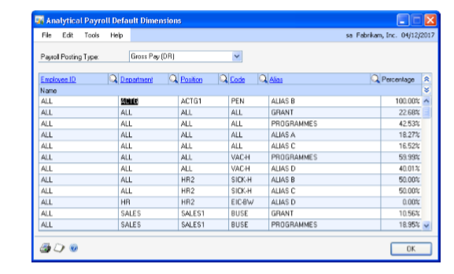

1. Select a payroll posting account type in the Payroll Posting Type field. The posting types available in the U.S. Payroll module are available for selection. Refer to U.S. Payroll documentation for more information.

2. Select the employee ID.

3. Select the department code in the Department field.

4. Select the position code in the Position field.

5. Select the pay code in the Code field.

6. Select an alias in the Alias field as the default alias for the employee ID and payroll combination defined in this window.

7. Enter a percentage for the alias in the Percentage field. You can enter a percentage value between 0 to 100%.

8. Choose OK to save the information and close the window.

### Entering analysis information for payroll transactions

You can enter or modify analysis information assigned to U.S. payroll
transactions.

- For manual checks, as well as for Pay Code type of computer checks, you can
    view and change the default analysis information during transaction entry.

- For Deduction and Benefit type of computer checks, you can edit the default
    analysis information only after you have performed the Calculate Checks
    process.

- In the Payroll Mass Transaction Entry window, you can enter an alias to
    assign default analytical information to a selected range within a payroll
    batch.

**To enter analysis information for payroll transactions:**

1. Open the Analytical Payroll Transaction Entry window. 
    (Transactions \>\> Payroll \>\> Transaction Entry \>\> Analytical Accounting
    button)  
    (Transactions \>\> Payroll \>\> Transaction Entry \>\> Additional \>\>
    Analytical Transaction)  
    (Transactions \>\> Payroll \>\> Transaction Entry \>\> Ctrl + T)  
    (Transactions \>\> Payroll \>\> Transaction Entry \>\> Select a transaction
    in the scrolling window \>\> Analytical Accounting button)  
    (Transactions \>\> Payroll \>\> Transaction Entry \>\> Select a transaction
    in the scrolling window \>\> Dimensions Button)  
    (Transactions \>\> Payroll \>\> Transaction Entry \>\> Select a transaction
    in the scrolling window \>\> Additional \>\> Analytical Transaction)  
    (Transactions \>\> Payroll \>\> Transaction Entry \>\> Select a transaction
    in the scrolling window \>\> Ctrl + T)  
    (Transactions \>\> Payroll \>\> Manual Check \>\> Distributions Button
    \>\>Analytical Accounting Button)  
    (Transactions \>\> Payroll \>\> Payroll Posting Edits \>\> Analytical
    Accounting Button)

    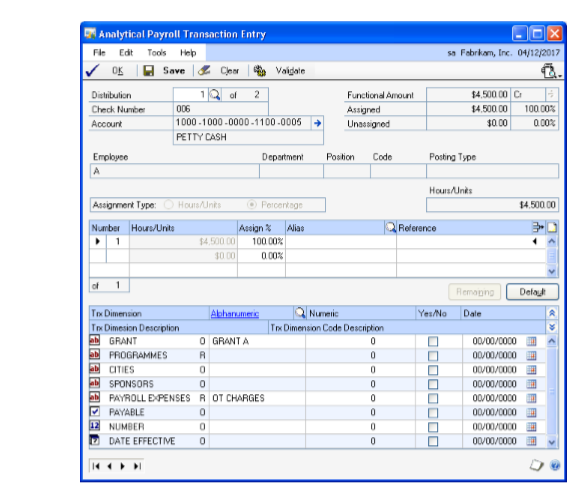

1. The Distribution field displays the distribution account selected in the
    Payroll Transaction Entry window. To view other distributions for the
    transaction, enter or select a distribution number. The field name depends
    upon the path from which you open this window.

    The sequence of distributions in the Analytical Payroll Transaction Entry window may not correspond to the sequence in the Payroll Transaction Entry window because only accounts linked to an account class are displayed in the Analytical Payroll Transaction Entry window.

    **Functional Amount** Displays the distribution amount in the functional currency.

    **Assigned** Displays distribution amount, hours or units based on the pay type associated with the code.

    **Unassigned** Displays the remaining distribution amount that is to be assigned in value and percentage.

    **Account** The Account field displays the account related to the distribution. The expansion button will open the Microsoft Dynamics GP Account Entry window. The account description is also displayed.

    The Employee, Department, Position, Code and Posting Type fields display the employee ID, department, position, pay code and the payroll posting type for the distribution.

1. Select Hours/Units or the Percentage as the assignment type to assign values
    to the distribution amount.

    **Hours/Units** This option is automatically selected and available for pay types that are calculated on hourly or unit basis. If this option is marked, you can enter the Analytical Accounting distributions based on hours/units.

    **Percentage** Select this option to enter the Analytical Accounting distributions based on percentages. This option is automatically selected for pay types other than hours or units.

    > [!NOTE]
    > If the option hours/units is selected automatically for a distribution and you change the default assignment type to percentage, an assignment of 100% is created based on your setups in the linked accounts class.

    In the assignment list view, an arrow in the Number field indicates that the analysis information displayed is for the selected assignment. Each assignment created for the distribution is displayed separately.

1. In the list window, enter the hours or units by value or by percentage depending on the assignment type selected.

    **Number** Displays the assignment number.

    **Hours/Units** Displays the hours or units for the selected assignment based on the default percentage set up in the Analytical Payroll Default Dimensions window. You can modify this information if required.

    **Assign%** Displays the percentage based on your selections in the Analytical Payroll Default Dimensions window. You can modify the assignment percentage if required.

    You can save analysis information for a distribution even if the assignment is not 100%. However, you can post a transaction with partial assignments only if you have opted to allow partial assignments during posting for the Payroll module. Refer to *Setting up assignment options* for more information.

    **Alias** Displays the alias for each assignment based on the default alias defined in the Analytical Payroll Default Dimensions window. You can select a different alias if required.

1. Enter the reference information for the assignment in the Reference field.

    The Trx Dimension column displays transaction dimensions of the account class that the distribution account is linked to. Only transaction dimensions that have been set as Required, Fixed, or Optional are displayed.

    The Alphanumeric column displays the dimension codes assigned to the corresponding transaction dimension in the Alias Maintenance window and to the transaction dimensions of the account class of the distribution account in the Accounting Class Maintenance window.

1. Enter a transaction dimension code in the Numeric, Yes/No or Date field for
    a Numeric, Boolean or Date type Transaction Dimension.

2. Choose Delete Row to delete a single row in the assignment List View. You
    cannot choose this option if only a single assignment has been entered.

3. Choose Remaining to add one assignment for the remaining unassigned amount.
    The new assignment will ensure that the total assigned amount equals the
    distribution amount. For example, if the distribution amount is \$100 and
    you have entered four assignments that total \$75. When you choose
    Remaining, a fifth assignment for the remaining value, \$25 is created. This
    button is not available if the distribution field is blank or has a zero
    value or if the distribution amount is fully assigned.

4. Choose Default to load the current setup information specified for the
    account class in the Accounting Class Maintenance window and create a single
    assignment. The following processes will occur:

    - Fixed, Required, and Optional Transaction Dimensions (including hidden
        transaction dimensions) will be installed.

    - All the assignments that you have created for the current distribution
        will be removed and create a single assignment that is equal to the
        distribution amount will be created.

    - If the analysis type is changed to or from Not Allowed, transaction
        dimensions will be added or removed.

    - Transaction dimensions that have been deleted will be removed.

5. Choose OK to save your changes and close the window. The analysis
    information that you have entered is validated when you choose OK.

6. Choose Validate to validate the analysis information of the distribution
    displayed in the window. If changes are made to the account class in the
    Analytical Accounting setup or errors are found during the validation
    process, the Analytical Accounting Validation Log window will open where you
    can view the errors or changes. Refer to *Validating transactions and
    correcting errors* for more information about validation.

    Choose Print to print the error report. Choose OK to close the window and return to the Analytical Payroll Transaction Entry window.

1. Choose Clear to clear the values displayed in the Analytical Payroll
    Transaction Entry window.

2. Choose Validate to validate the analysis information of the distribution
    displayed in the window. If changes are made to the account class in the
    Analytical Accounting setup or errors are found during the validation
    process, the Analytical Accounting Validation Log window will open where you
    can view the errors or changes. Refer to *Validating transactions and
    correcting errors* for more information about validation.

3. Choose Save to save the default or modified analysis information you have
    entered.

4. Choose the printer icon button to print the Analytical Accounting edit list
    for the current distribution displayed or for all distributions of the
    transaction linked to an account class. The Analytical Accounting Validation
    Log report which describes the Analytical Accounting errors also is printed.

### Viewing analysis information for payroll transactions

You can use the Analytical Payroll Transaction Entry Zoom window to view
analysis information for payroll transactions generated from the U.S.
Payroll module.

**To view analysis information for payroll transactions:**

1. Open the Analytical Payroll Transaction Entry Zoom window. 
    (Inquiry \>\> Payroll \>\> Check History \>\> Distributions button \>\>
    Select a distribution account \>\> Analytical Accounting button)  
    (Inquiry \>\> Payroll \>\> Check History \>\> Select a transaction \>\>
    Additional \>\>Analytical Transaction)  

    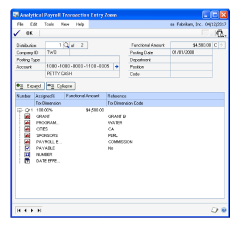

    The Analytical Payroll Transaction Entry Zoom window displays all analysis information created for a distribution account. The first distribution account of the document linked to an account class is displayed. Enter or select a distribution number to view analysis information for other distribution accounts.

1. Choose the plus button (+) available next to each assignment to view all
    analysis information entered for an assignment or choose the minus button
    (-) to view only reference information that may exist.

2. Choose OK to close the window after viewing the information required.

## See also

[Microsoft Dynamics GP Analytical Accounting](AnalyticalAccounting.md)  
[Microsoft Dynamics GP Analytical Accounting Part 3: Routines, Inquiries and Reports](analytical-accounting-part3.md)  
[Microsoft Dynamics GP Analytical Accounting Glossary](analytical-accounting-glossary.md)  
