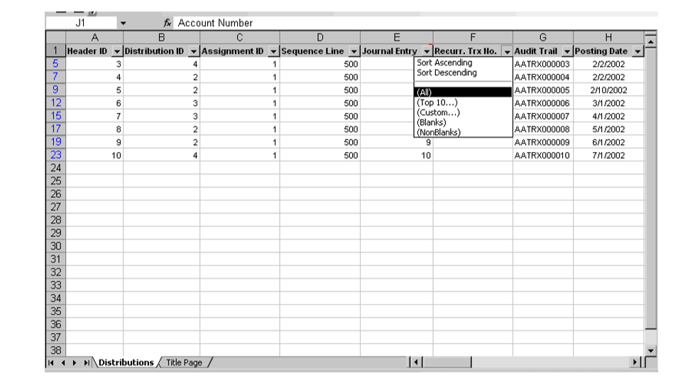
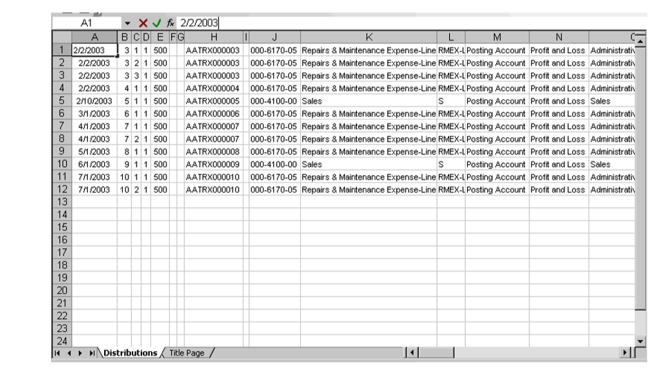
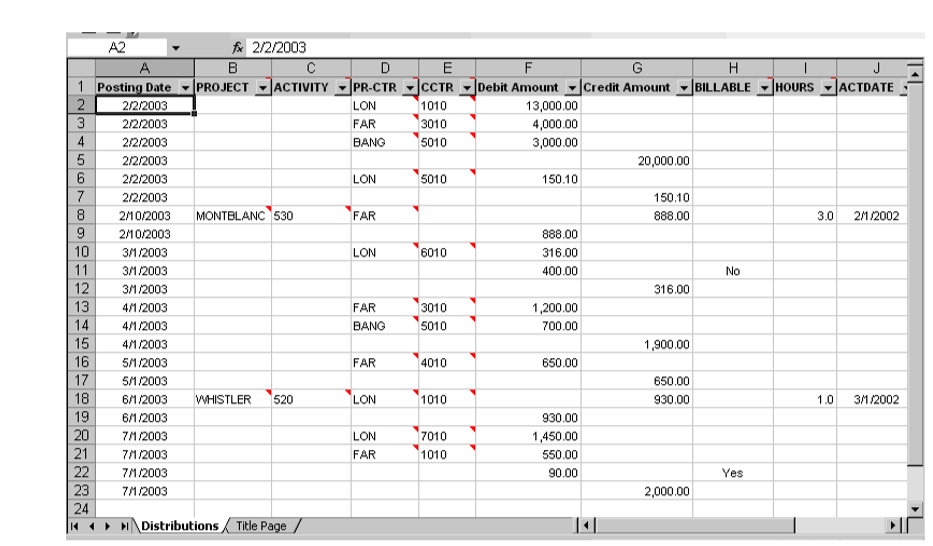

# Microsoft Dynamics GP Analytical Accounting Part 3: Routines, Inquiries and Reports

You can make queries and generate reports within Analytical Accounting that
will help you analyze your company’s chart of accounts in detail. Use the
Analytical Accounting query wizard windows to create and run queries that
are based on your analysis requirements.

You can also compare the allocated amounts with the actual figures to
analyze how the budgeted amounts are being used. The Multilevel Query wizard
allows you to generate reports on the budgets.

The following information is discussed:

- *Chapter 16, “Year-end close for Analytical Accounting”*explains how
    analytical information is transferred to history and how balances are
    consolidated and brought forward during the year-end close process.

- *Chapter 17, “Inquiries”*explains how to create, modify, and print
    Analytical Accounting queries.

- *Chapter 18, “Reports”*shows you how to use Analytical Accounting reports to
    view your analysis information.

## Chapter 16: Year-end close for Analytical Accounting

This information is divided into the following sections:

- *Including Analytical Accounting in the year-end close process*

- *Closing a year with analysis information*

- *Consolidating analysis information and carrying balances forward*

- *Transferring analysis information for closed years to history*

### Including Analytical Accounting in the year-end close process

If you’ve included Analytical Accounting in the year-end close process,
closing the year transfers the current year analytical data for each account
to account and transaction history (if you’re keeping history records).
Analytical data for alphanumeric transaction dimensions is consolidated and
the balance is carried forward to the next year.

To include Analytical Accounting information in the year-end closing
process, you must:

- Mark the Include in Year End Close option in the Analytical Accounting
    Options window. Refer to *Setting up Analytical Accounting options*. Mark
    the Include in Year End Close checkbox in the Transaction Dimension
    Maintenance window for the alphanumeric transaction dimensions that you want
    to consolidate balances for in the year-end close process. Refer to
    *Defining transaction dimensions*. Balances are brought forward only for the
    selected transaction dimensions.

- If you have previously closed years in Microsoft Dynamics GP, transfer the
    analytical data for those years to history and carry forward the
    consolidated balances before you close the current year. Not doing so will
    lead to incorrect brought forward balances. Refer to *Transferring analysis
    information for closed years to history*.

> [!IMPORTANT]
> Do not post adjustments to a closed year after you have marked to include
analysis data in the year-end close process, and before you have run the
Transfer transaction Data to History utility. Doing so will result in
incorrect brought forward balances.

### Closing a year with analysis information

When you close a year with analytical information, the year-end closing
process:

- Transfers all current year analytical data for each account to account and
    transaction history (if you’re keeping history records). The analytical data
    is transferred to history for all transaction dimensions, whether or not
    you’ve marked to consolidate them during the year-end close.

- Consolidates analytical information related to the marked alphanumeric
    transaction dimensions for open year profit and loss accounts and transfers
    it to the Retained Earnings account.

    > [!NOTE]
    > Balance brought forward transactions are created for the retained earnings account even if no profit and loss distributions exist in the fiscal year that the year-end close is being run for. This ensures that your analytical data is accurate if you have directly entered the net value to the retained earnings account as part of a single balanced beginning balance transaction when installing Microsoft Dynamics GP.

- Consolidates analytical information related to the marked alphanumeric
    transaction dimensions for balance sheet accounts, bringing the balances
    forward as the accounts’ beginning balances in the new fiscal year.

    Refer to *Consolidating analysis information and carrying balances forward* for more information.

- Zeroes the analytical balance for all profit and loss accounts after they’ve
    been closed to the Retained Earnings account.

    > [!NOTE]
    > If you enter adjustments to a profit and loss account after closing a year, the analytical information for the adjustment is automatically updated to the corresponding retained earnings account. You won’t need to do anything following the adjustments.*

- Brings the balances of unit account forward to the new fiscal year.

- Prints the Analytical Accounting Year-End Closing Report.

Refer to the Microsoft Dynamics GP documentation for more information on the
year-end closing process.

### Consolidating analysis information and carrying balances forward

When you run the year-end close process, the analytical data for
alphanumeric transaction dimensions is consolidated and carried forward to
the next year. The consolidation is performed only for those transaction
dimensions that you’ve marked to include in the year-end process. Refer to
*Including Analytical Accounting in the year-end close process*.

In the balance brought forward journal:

- One assignment is created for each unique combination of account,
    alphanumeric transaction dimensions, and codes in the case of balance sheet
    accounts.

- One assignment is created for each unique combination of alphanumeric
    transaction dimensions and codes across all profit and loss accounts.

- If amounts without any analytical information exist, then a single
    assignment is created for the total unassigned amount with no alphanumeric
    transaction dimension codes assigned to it.

- The total of all assignments for a balance sheet account represents the
    General Ledger distribution amount or the brought forward balance for the
    account.

- The total of all assignments for the profit and loss accounts is carried
forward to the Retained Earnings account.

#### Example

Account 1011 which is a balance sheet account for customer A is assigned to
an accounting class. The following alphanumeric transaction dimensions and
codes are created with a valid relationship to one another.

| **Dimensions** | **Codes**  |
|----------------|------------|
| Project        | PRJ1, PRJ2 |
| Product        | PDT1, PDT2 |
| Location       | LOC1, LOC2 |

**Scenario 1**

Partial assignments are not allowed. Transaction dimension codes are
optional and the following transactions are posted for the account 1011
during the year.

| **Dr.** | **Cr.** | **Location Code** | **Product Code** | **Project Code** |
|---------|---------|-------------------|------------------|------------------|
| 250000  | \-    | LOC 1             | PDT 1            | PRJ 1            |
| 150000  | \-    | LOC 2             | \----          | PRJ 1            |
| 100000  | \-    | LOC 1             | PDT 2            | PRJ 1            |
| \-    | 10000   | LOC 1             | PDT 2            | PRJ 1            |

On performing the year-end close, one assignment is created with the
consolidated amount for each unique combination of transaction dimension
codes.

|                   | **Account**            | **Dr.** | **Cr.** |
|-------------------|------------------------|---------|---------|
| **Journal Entry** | **Account 1011**       | 490000  | \-    |
| Assignment 1      | LOC 1 - PDT 1 - PRJ 1  | 250000  | \-    |
| Assignment 2      | LOC 2 - ------ - PRJ 1 | 150000  | \-    |
| Assignment 3      | LOC 1 - PDT 2 - PRJ 1  | 90000   | \-    |

**Scenario 2**

Partial assignments also are allowed. Transaction dimension codes are
optional and the following transactions are posted for the account 1011
during the year.

| **Dr.**  | **Cr.** | **Assignment%** | **Assignment Amount** | **Location Code**                                     | **Product Code** | **Project Code** |
|----------|---------|-----------------|-----------------------|-------------------------------------------------------|------------------|------------------|
| 250000 - |         | 40%             | 100000                | LOC 1                                                 | PDT 1            | PRJ 1            |
|          |         | 60%             | 150000                | Partially unassigned, no codes entered for 60% amount |                  |                  |
| 150000 - |         | 75%             | 112500                | LOC 2                                                 | \---           | PRJ 1            |
|          |         | 25%             | 37500                 | Partially unassigned, no codes entered for 25% amount |                  |                  |
| 100000   |         | 100%            | 100000                | LOC 1                                                 | PDT 1            | PRJ 1            |
| \-     | 10000   | 100%            | 10000                 | Default 100% assignment, no codes entered             |                  |                  |

On performing the year-end close, one assignment is created with the
consolidated amount for each unique combination of transaction dimension
codes. One assignment also is created for the amount to which no codes are
assigned.

|                   | **Account**           | **Dr.** | **Cr.** |
|-------------------|-----------------------|---------|---------|
| **Journal Entry** | **Account 1011**      | 490000  | \-    |
|                   | **Account**           | **Dr.** | **Cr.** |
| Assignment 1      | LOC 1 - PDT 1 - PRJ 1 | 200000  | \-    |
| Assignment 2      | LOC 2 - ----- - PRJ 1 | 112500  | \-    |
| Assignment 3      | \--- - --- - ---    | 177500  |         |

### Transferring analysis information for closed years to history

If you have previously closed years in Microsoft Dynamics GP, you must
transfer the analytical data for those years to history before you close the
current year. You also can consolidate and bring forward the closing balance
as the next year’s opening balance. This also will transfer the balances for
any adjustments you posted to a closed year. You must run this process
sequentially starting from the first closed year up to the most recently
closed year.

> [!IMPORTANT]
> You must perform this process before you close an open year or post an
adjustment to a closed year. Not doing so will result in incorrect balances
being brought forward.

**To transfer analysis information for closed years to history:**

1. Open the Transfer Transaction Data to History window. 
    (Administration \>\> Utilities \>\> Financial \>\> Analytical Accounting
    \>\> Move Data to History)

2. The Year field displays the earliest closed year for the company in
    Microsoft Dynamics GP.

3. Select an action to perform.

    **Transfer transaction detail to history** Select this option to transfer all the analysis information for the selected closed year to history.

    **Consolidate transactions and transfer detail to history** Select this option to consolidate transactions in the closed year based on the combination of alphanumeric transaction dimensions that are marked to include in the yearend close process. The analysis information for the selected year is moved to history and the closing balances are brought forward to the next year. Refer to *Consolidating analysis information and carrying balances forward*.

    **Print transfer preview report only** Select this option to print a preview report before performing the transfer and consolidation.

1. Choose OK to process the selected option.

2. Choose Cancel to cancel the process and close the window.

## Chapter 17: Inquiries

The inquiries available in Analytical Accounting Inquiry allow you to view
transaction dimension relationships and budgeted vs. actual figures. You can
create distribution queries to view analysis codes for every assignment, and
create multilevel queries to view analysis code information in the form of
trees and levels. You can define queries and save them or print the queries
without saving. The queries export data to an Excel worksheet.

> [!NOTE]
> You must be using Excel 2000 or higher to export Analytical Accounting queries to Excel.

Before you start generating a query, be sure that the functional currency
you’re using has a negative sign before the amount. You can select this
option in the Currency Setup window (Administration \>\> Setup \>\> System
\>\> Currency).

The query output to Excel must be limited to 256 columns.

> [!IMPORTANT]
> You cannot run more than one query at a time on the same system.

This information is divided into the following sections:

- *Viewing transaction dimension relationships*

- *Viewing budgeted versus actual values*

- *Creating and running a distribution query*

- *Defining a distribution query*

- *Selecting columns for a distribution query*

- *Setting filter options for a distribution query*

- *Setting the order of data for a distribution query*

- *Completing distribution query options*

- *Creating and running a multilevel query*

- *Including brought forward balances in a multilevel query*

- *Defining a multilevel query*

- *Selecting rows for a multilevel query*

- *Selecting column spreads for a multilevel query*

- *Selecting trees for a multilevel query*

- *Setting filter options for a multilevel query*

- *Selecting columns for a multilevel query* • *Completing the multilevel
    query options*

### Viewing transaction dimension relationships

You can view all the existing transaction dimensions and their relationship
to other transaction dimensions in the Transaction Dimension Dependency
(Relation) Inquiry window.

**To view a transaction dimension relationship:**

1. Open the Transaction Dimension Dependency (Relation) Inquiry window. 
    (Inquiry \>\> Financial \>\> Analytical Accounting \>\> Transaction
    Dimension Relation)  
    (Cards \>\> Financial \>\> Analytical Accounting \>\> Transaction Dimension
    Relation \>\> Show as Tree button)  
      
    The tree structure displays the relationship of ownership between
    alphanumeric transaction dimensions. For example, Cost Centre is owned by
    Profit Centre, as indicated in the tree structure.

2. Choose Redisplay to update the tree if any changes have been made to the
    transaction dimension relationships and display transaction dimensions that
    may have been created by other users while you were setting relationships.

3. Choose OK to close the window and return to the Transaction Dimension
    Relations window.

### Viewing budgeted versus actual values

Use the Analytical Accounting Budget vs. Actual Inquiry window to compare
budgeted and actual values. You can also view the variance and variance
percentage, so you can analyze how closely your actual amounts match the
budgeted amounts for the selected account and/or dimension code tree.

**To view budgeted versus actual values:**

1. Open the Analytical Accounting Budget vs. Actual Inquiry window. 
    (Inquiry \>\> Financial \>\> Analytical Accounting \>\> Budget vs. Actual)

2. Enter or select a budget ID. The Budget Year, Description, Budget Tree,
    Dimension Code Tree window and Period Column fields display the default
    values for the selected budget ID.

    The root node is automatically highlighted, and the columns in the scrolling window display the figures for the root node. The scrolling window displays the Actual and Budgeted values, Variance and Variance Percent for each period.

1. Select whether to view information for the tree or for accounts. If you
    select Tree, you can view period amounts for the selected node. If you
    select Account, go to step 4.

2. Mark All in the Account radio group field to view the period amounts
    assigned to all accounts on the selected node in the scrolling window.

    Mark Select and select an account to view the period amounts for the selected account for the selected node.

1. Highlight a node in the Dimension Code Tree to view the period amounts for
    that node or node/account combination in the scrolling window. The selected
    node is displayed at the bottom of the Dimension Code Tree.

2. Choose whether to view the amounts for the Node or the Dimension Code. If
    you select Node, you can view the period amounts for the code that you’ve
    selected under a specific node. If you select Dimension Code, you can view
    the period amounts for the selected dimension code under all nodes of the
    budget tree. Refer to Budget Tree overview for more information on nodes and
    codes.

3. Choose how to display the budget information, Net Change or Period Balances.

4. Select the reporting ledgers for which to view the information for and click
    the redisplay button.

    This field is available only if you have marked the Allow check box for the

    Reporting Ledger option in the General Ledger Setup window (Administration\>\> Setup \>\> Financial \>\> General Ledger). Refer to the General Ledger documentation for more information.

1. You can print a Budget vs. Actual Inquiry Report by choosing File \>\> Print
    or clicking the printer icon button while the information you'd like to
    print is displayed.

2. Choose Redisplay to refresh the information in the window.

3. Close the window when you’ve finished viewing information.

### Creating and running a distribution query

Use the Distribution Query wizard to create and run queries and export data
to Excel. You can view selected assignments and the transaction codes they
are attached to using the Distribution Query wizard. You can create the
queries, view them, and delete them, or you can save them to use again. You
can create and run the queries for both active and inactive transaction
dimension codes. You can view the posted analysis information for
transaction dimension codes that are subsequently set to inactive status.
You can select the columns to be displayed in the Excel report and select
the subset of assignments that have been entered.

You can view data for history and open years and restrict the data to half
year, quarter, month, week, period or a specific date range. You can also
view the consolidated balances that are brought forward when you close a
fiscal year. Refer to *Completing distribution query options* for more
information.

**To create and run a distribution query:**

1. Open the Distribution Query wizard Welcome window. 
    (Inquiry \>\> Financial \>\> Analytical Accounting \>\> Distribution Query)

2. Select the type of query to run.

**Execute Existing Query** To execute a query that has been saved earlier.
You also can change the definition of an existing query and save or run the
query.

Choose Next to open the Distribution Query wizard- Query Selection window,
where you can select an existing query and then complete the query in the
Distribution Query wizard-Finish window. Refer to *Completing distribution
query options* for more information.

**Execute Ad hoc Query** To run a query that will not be saved.

Choose Next to open the Distribution Query wizard-Column Selection window
where you can select the levels to display in the query. Refer to *Selecting
columns for a distribution query* for more information.

**Query Maintenance** To define a new query that can be saved or run. You
also can delete or change existing query definitions and save these changes
to use later.

### Defining a distribution query

You can enter the name and description for a query in the Distribution Query
wizard - Query Maintenance window.

**To define a distribution query:**

1. Refer to *Creating and running a distribution query* and select a query
    option. Choose Next and open the Distribution Query wizard- Query
    Maintenance window.

2. Enter or select the name of the query in the Query ID field.

3. Enter a description for the query.

4. Choose the GoTo button to display other windows in the wizard. You can select a window from the list instead of choosing the Next or Back buttons in the wizard windows. The windows available in the list will depend on the current window. For example, from the Query Maintenance window, the following windows will be available in the drop-down list:

    - Option selection

    - Column selection

    - Filter Options

    - Order by Options

    - Completing the options

5. Choose Delete to delete an existing Query ID.

6. Choose Back to return to the previous window.

7. Choose Cancel to close the wizard without saving any information.

8. Choose the Print drop-down list to print a Query ID that is saved. Select Print Current Record to print the definition for a selected query. Select Print All to print all the saved query definitions.

9. Choose Next to open the Distribution Query wizard-Column Selection window where you can select the columns to display in the Excel report.

### Selecting columns for a distribution query

You can select the columns to be displayed in the query using the
Distribution Query wizard- Column Selection window. You can select from the
33 pre-defined columns and an additional column for every dimension that you
create, in this window. Refer to *Modifying column headings for inquiries
and reports* for more information on pre-defined columns.

**To select columns for a distribution query**

1. Refer to *Creating and running a distribution query*, and select a query
    option. Choose Next and open the Distribution Query wizard - Query
    Maintenance window. Select a name and description for the query and choose
    Next to open the Distribution Query wizard- Column Selection window.

2. The Available Columns scrolling window shows the columns that can be
    displayed in the Excel Report when a query is run. Select a column and
    choose Insert to display the column in the Selected Columns list window.

3. Choose Insert All to insert all Available Columns in the Selected Columns
    window. If you select all the available columns for your query, printing
    speed will be reduced.

4. Choose Remove to remove a selected item from the Selected Column list.

5. Choose Remove All to remove all the items from the Selected Columns list.

6. Choose the Move to Top button to move a selected item to the top of the
    Selected Columns list. This column will appear first in the Excel output.

7. Choose the Move Up button to move a selected item one line up in the
    Selected Columns list.

8. Choose the Move Down button to move a selected item one line down in the
    Selected Columns list.

    The order in which the columns are selected will be the order they are displayed in the Excel report. For example, you’ve inserted columns in the following order:

    - Header ID

    - Journal Entry

    - GL Posting Date

    - Profit Centre

    In the Excel report, the first column displayed will be Header ID, the second column will be Journal Entry and so on.

1. Choose the Move to the Bottom button to move a selected item to the bottom
    of the Selected Columns list.

2. Choose Back to return to the previous window.

3. Choose Cancel to exit the wizard.

4. Choose Next to open the Distribution Query wizard-Filter Options window
    where you can select the filter option for your query.

### Setting filter options for a distribution query

You can use the Distribution Query wizard-Filter Options window to sort the
query and specify the information to display in the report that is
generated. If you do not choose filter options, all the transactions that
have taken place in the defined period will be selected for the query.

**To set filter options for a distribution query:**

1. Refer to *Selecting columns for a distribution query*, select the column
    headings and choose Next to open the Distribution Query wizard-Filter
    Options window.

2. The scrolling window in the Distribution Query wizard –Filter Options window
    displays all available columns.

3. Select a column, one at a time, in the scrolling window and from the Select
    Type list, select a filter option for the column from the following:

    **Any** To select all the records.

    **Contains** To select only records that match the specified criteria.

    **Equal To** To select records that are equal to the specified criteria.

    **Not Equal to** Only records that do not match the specified criteria are selected.

    **Begins with** To select only records that begin with a specified criterion.

    **Is Between** To select only records that are between a specified value.

    **Greater than** To select only records with values that are greater than the specified value.

    **Less than** To select only records with values that are lesser than the specified value.

1. The “…” field is available for all the filter options, except for Any. You
    can enter a value in this field to further restrict your query range. For
    example, if you selected Journal Entry, you can restrict whether to display
    a range of journal entries.

2. The And field will be available if the search type of the selected column is
    ‘Is Between’. Enter a closing range for your query. The lookup is available
    for the following columns:

    - Currency ID

    - Customer ID

    - Vendor ID

    - account

    - Account Alias

    - Item Number

    - Site ID

    - Trx Dimensions

    - Asset Id

    - Book ID

3. Mark the account types to include in the query. You can mark Balance Sheet,
    Profit and Loss and/or Unit Accounts in the query. You must mark at least
    one account Type. Profit/Loss is marked by default.

    In the Search Type list, select whether all or some of the filter options must match the query criteria before a record can be displayed. If the filter option for each column must match before a record is displayed, select Match All. If a record can be displayed if it matches at least one of your filter options, select Match 1 or More.

1. Choose Next to open the Distribution Query wizard –Order By window where you can select the order to display the data when you print the query to Excel.

### Setting the order of data for a distribution query

You can select the order to display data in the report you generate in the
Distribution Query wizard- Order by window.

**To set the order of data for a distribution query:**

1. Refer *Setting filter options for a distribution query*, select the filter
    options, and choose Next to open the Distribution Query wizard-Order by
    window.

2. The Available columns list window displays all the columns available except
    those for transaction dimensions. Select a column and choose Insert to
    insert the selection in the Order by scrolling window.

3. The Order by column displays the order in which the columns will be
    displayed in Excel. By default, the columns are displayed in ascending
    order. You can change this to descending order by choosing the A/Z icon.

4. Choose Remove to remove a selected item from the Order by column.

5. Choose Remove All to remove all the items from the Order by column.

6. Choose the Move to top button to move a selected item to the top of the
    Order by column.

7. Choose the Move Up button to move a selected item one line up in the Order
    by column.

8. Choose the Move Down button to move a selected item one line down in the
    Order by column.

9. Choose the Move to Bottom button to move a selected item to the bottom of
    the list window.

10. Choose Next to open the Distribution Query wizard-Finish window where you
    can complete the distribution queries.

### Completing distribution query options

You can complete the query options in the Distribution Query wizard- Finish
window. The settings you choose in this window are run time options and must
be entered each time you run a query.

**To complete distribution query options:**

1. Refer to *Setting the order of data for a distribution query*, select the
    order of data, and choose Next to open the Distribution Query wizard-Finish
    window.

2. In the Year field under the Period options, select the fiscal year for the
    query. All the fiscal years set up in Microsoft Dynamics GP are available in
    the drop-down list. The current year is the default year when you first open
    the window.

3. Select whether to view the financial or calendar year.

4. Select the Period for the query.

If you selected Fiscal view, the following options are available:

- Date

- Week

- Period

- Quarter

- Half-year

If you selected Calendar view, the following options are available:

- Date

- Week

- Month

- Quarter

- Half-year

1. In the From and To fields, enter a period range, or date range if you
    selected Date. To view the consolidated balances that are brought forward
    when you close the fiscal year, enter 0(zero) in the From field. You must
    also select to view the report for the fiscal year.

2. Select the reporting ledger options in the Reporting Ledger field for the
    query, whether BASE, IFRS or LOCAL. You can select multiple reporting
    options for your query if required.

    This field is available only if you have marked the Allow check box for the

    Reporting Ledger option in the General Ledger Setup window (Administration\>\> Setup \>\> Financial \>\> General Ledger). Refer to the General Ledger documentation for more information.

1. Enter a comment in the Comment field. This comment will be displayed in the
    Title page worksheet in the Excel report.

2. Under the Task to be performed section, mark whether to Save the Query
    Definition or Execute Query. The Save the Query Definition option is not
    available if you marked the Execute Ad Hoc Query option in the Welcome
    window. You can mark both the options to save the query before running it.
    The Distribution Query wizard window closes when you choose Finish if you
    have not marked either of these options.

3. Mark the Generate Title Page option to create a separate worksheet in Excel
    that will display information about the query options. This option is only
    available if you have marked the Execute Query option.

4. Mark the Create Column Header option if you want to display the column name
    of each selected column in a column header in Excel. This option is only
    available if you have marked the Execute Query option.

5. Mark the Autofilter Columns option to auto filter all columns in Excel This
    option is only available if you have marked the Execute Query and Create
    Column Header options.

6. Mark the Save Query Definition option to save the query definition. This
    option is only available if you have chosen to Execute Existing query or
    built a new query using the Query Maintenance option in the Distribution
    Query Welcome window.

7. Mark the Execute Query check box to run the query. If you marked the Save
    Query Definition option, the query definition is also saved before it is
    run.

8. Choose Finish to complete the process of saving or running the query
    definition. If you choose to Execute Query, the window will close when you
    choose Finish and the export to Excel will begin. You can cancel the export
    process at any time by choosing Stop in the Progress window.

The distribution query will display all the transactions posted from General
Ledger, whether or not the transaction accounts are linked to an account
class. For transactions that are not linked to an account class, a single
assignment will be displayed, without any analysis information.

### Creating and running a multilevel query

You can use Analytical Accounting to generate multilevel queries based on
your specific requirements and transaction dimensions. You also can create
queries based on columns that you choose to display in the query. The
analysis information that is generated when you create a query, is exported
to Excel. You can generate a query to view budgeted and actual information
for budget IDs, and view the variance and variance percentage between
budgeted and actual figures. You can view the posted analysis information
for transaction dimension codes that you subsequently set to inactive
status.

You can create reports with as many levels or rows as you require. A level
may be accounts, a dimension, a transaction, a customer, a vendor, an item
or site, a tree within a dimension, or a time-period: for example, a week, a
month, a fiscal period, or a half-year. You also can create a report for a
tree, which will display all the levels of the tree.

The level of a report can include some or all codes, accounts, or nodes
within a tree. You can create and save your report options or print the
report without saving it. Rows with zero values can be hidden at any level
within the report. You also can include transactions for which no code has
been entered in a report. This is useful for tracking errors.

You can view or hide sub-totals at each level. Also, you can select to
display details, and also whether to display the detail at the same level
throughout the report, or within sections.

Queries also can be based on time periods: for example you can select
Year-to-Date, This Period, Last Period including Last Year data and also
comparisons between this year and last year.

**To create and run a multilevel query:**

1. Open the Multilevel Query wizard-Welcome window. 
    (Inquiry \>\> Financial \>\> Analytical Accounting \>\> Multilevel Query)

2. Select the type of query to run from the following options:

**Execute Existing Query** To run a query that has been saved earlier. You
also can change the definition of an existing query and save or run the
query.

Choose Next to open the Multilevel Query wizard-Query Selection window where
you can select an existing query and then complete the query options in the
Multilevel Query wizard-Finish window. Refer to *Completing the multilevel
query options* for more information.

**Execute Ad hoc Query** To run temporary queries. You cannot save ad hoc
queries.

Choose Next to open the Multilevel Query wizard-Level Selection window where
you can select the rows to display in your query. Refer to *Selecting rows
for a multilevel query* for more information.

**Query Maintenance** To define a new query that can be saved or run. You
also can change existing query definitions and save these changes. Saved
Query definitions can be used again later.

Choose Next to open the Multilevel Query wizard-Query Maintenance window,
where you can define the query.

### Including brought forward balances in a multilevel query

You must select the appropriate options in order to view brought forward
balances in a multilevel query. The balances are consolidated based on the
combination of alphanumeric transaction dimension codes used during
transaction entry. Refer to *Consolidating analysis information and carrying
balances forward*. Use the following information to understand the options
to select to view brought forward balances.

- Select account numbers as the first level and transaction dimensions as the
    second level in the Multilevel Query wizard-Level Selection window.

- For Balance Brought Forward transactions, select Not Used as the Code Spread
    to view the consolidated balance in the retained earnings account.

### Defining a multilevel query

You can enter the name and description for a query in the Multilevel Query
wizardQuery Maintenance window.

**To define a multilevel query:**

1. Refer to *Creating and running a multilevel query* and select a query
    option. Select Next and open the Multilevel Query wizard-Query Maintenance
    window.

2. Enter an ID for the query.

3. Enter a description for the query. This is a required field.

4. Choose Delete to delete a selected query.

5. Choose Back to return to the Welcome window.

6. Choose Cancel to exit the Multilevel Query wizard.

7. Choose the GoTo button to display the other windows in the wizard. You can
    select a window from the list instead of choosing the Next or Back button
    within the wizard windows. The windows available in the list will depend on
    the current window. For example, from the Query Maintenance window, the
    following windows will be available in the drop-down list:

    - Option Selection

    - Level Selection

    - Tree Selection

    - Level Filtering

    - Data Filtering

    - Column Spreads

    - Column Selection

    - Completing the Options

8. Choose Next to open the Multilevel Query wizard-Level Selection window where
    you can select the rows for the query.

### Selecting rows for a multilevel query

You can select the rows to display in the query using the Multilevel Query
wizardLevel Selection window. You must select at least one level for the
query. Be sure to select the appropriate levels if you’re creating a query
to view budgeted values, or to view brought forward balances.

**Budgets** To create a budget query, you must have created at least one
budget ID. Choose alphanumeric transaction dimensions along with time and/or
accounts as levels. You cannot select any other levels if you want to view
any budget information. Once you’ve chosen the required levels, you must
specify budget columns in the Column Selection window. Refer to *Selecting
columns for a multilevel query* for more information.

**Brought forward balances** To view the consolidated balance in the
retained earnings account, select Account Numbers as the first level and
transaction dimensions as the subsequent levels.

**To select rows for a multilevel query:**

1. Refer to *Creating and running a multilevel query*, and select the query
    option to run. Choose Next and open the Multilevel Query wizard-Query
    Maintenance window. Select a name and description for the query and choose
    Next to open the Multilevel Query wizard-Level Selection window.

2. From the Available Items list, select the level to include and choose Insert
    to insert the item in the list window level. You can select as many levels
    as required. The levels are organized in a hierarchical manner so that the
    items of level one will appear as the main level of the query. The items of
    level 2 will be combined with the items of level 1.

    For example, you’ve selected Profit Center as Level 1, and Cost Center as Level 2. When you generate the query, all the Profit Centers will appear at level 1 and the Cost Centers will be combined with each item of level 1.

1. The Level field displays the name of the level.

2. Mark the Add Totals Row check box to create a totals row for each item of
    the level.

3. Mark the Add Page Break check box to add a horizontal page break for each
    item of the level.

4. Mark the User-Defined Field checkbox to open the Select User-Defined Fields window. You can mark this box only when the selected level is an alphanumeric transaction dimension. You can also open the Select User-Defined Fields window by clicking the expansion arrow button.

5. Mark the user-defined fields to be displayed on the report you are generating.

6. Choose Select to include the marked user-defined fields on your report.

7. Choose Cancel to close the window without making a selection and return to
    the Multilevel Query wizard-Level Selection window. No user-defined fields
    will be printed on your report.

8. In the Multilevel Query wizard-Level Selection window, choose Remove to
    remove a selected item in the list window level.

9. Choose Remove All to remove all the items in the list window level.

10. Choose the Go To button to select other windows to open in the Multilevel
    Query wizard.

11. Choose Next to open the Multilevel Query wizard-Column Spreads window.

### Selecting column spreads for a multilevel query

You can select the columns to display in the query using the Multilevel
Query wizard-Column Spreads window. There are three options for the column
output in the Multilevel Query wizard. Of these, you can select two in the
Column Spreads window, each of which is optional. The third option is
system-defined, and includes debit columns, credit columns, and balance
columns, that you can select in the Multilevel Query wizard-Column Selection
window.

**To select column spreads for a multilevel query:**

1. Refer to *Selecting rows for a multilevel query*, and select the levels to
    display in the query. Choose Next and open the Multilevel Query wizardColumn
    Spreads window.

2. Select the level for the Time Spread from the following options:

    - Not used

    - As first level

    - As second level

    > [!NOTE]
    > If Time was chosen as a level in the Level Selection window, this option will be unavailable. To view the consolidated balances in the retained earnings account, select Not Used as the Code Spread.

1. If you selected Time Spread at first level or second level, you must choose
    the time frame in the Multilevel Query wizard Finish window. The data in the
    query you generate will be displayed for the time period you select.

    For example, if you select Use Time Spread as first Level and if you select to view data for a period from 2 to 5, then the report in Excel will display four columns as time spread for each column selected.

1. The Code Spread option allows you to display codes at the row and column levels. Select the level for the code spread from the following options:

    - Not used

    - As first level

    - As second level. The Item field is available for all the options, except
        Not used.

    > [!NOTE]
    > If you select only one of the options, either Time Spread or Code Spread, the value must be at first level. For Balance Brought Forward transactions, select Not Used as the Code Spread to view the consolidated balance in the retained earnings account.

1. Select the item to use as code spread. The Item field is available only if
    you’ve selected a code spread and is a required field. Only items that have
    not been selected as levels are available in the Item list.

2. Choose Exchange Levels to switch the levels of the Time Spread and Code
    Spread fields.

3. Choose the GoTo button to select other windows to open in the Multilevel
    Query wizard.

4. Choose Next to open the Multilevel Query wizard-Tree Selection window where
    you can select the trees and Code Spread. If you only selected Time Spread
    as a level, and not Code Spread, the next window in the wizard will be the
    Filter Options window.

### Selecting trees for a multilevel query

Use the Multilevel Query wizard-Tree Selection window to select the trees
and code spread to display in your query.

**To select trees for a multilevel query:**

1. Refer to *Selecting column spreads for a multilevel query*, and select
    columns to display in the query. Choose Next and open the Multilevel Query
    wizard-Tree Selection window.

    The scrolling window displays all selected levels, except time levels. The icon next to a record in the Level column indicates whether it is a level or a code spread. A level is indicated by a vertical blue block. A code spread is indicated by a horizontal blue block.

1. Mark the Use Tree check box to display the level items in the form of a
    tree.

2. The Tree field will be available if you selected Use Tree. Select a
    corresponding tree type that matches the level.

3. Mark the Show Codes check box to display the tree structure and the selected
    level items. If unmarked, only the tree structure of the level item will be
    displayed.

    If you’ve selected user-defined fields in the Level selection window for a dimension, and you select a tree here for that dimension, the Show Codes option is automatically marked. You cannot unmark this option.

1. In the Restrict to Tree Level field, you can select the level to be
    displayed for the tree. By default, all levels of a tree will be displayed.
    For Code Spread options, this is a required field.

    Only the level that you have specified for each tree will be included in the query. For example, if you specify level 3 for a tree, then the query will only print the values existing on level 3.

1. Choose Back to return to the Multilevel Query wizard- Column Spreads window.

2. Choose Cancel to exit the Multilevel Query wizard.

3. Click the GoTo button and select any other window you want to open in the
    Multilevel Query wizard.

4. Choose Next to open the Multilevel Query wizard-Filter Options window. In
    this window, you can restrict the information you want to display in the
    query.

### Setting filter options for a multilevel query

You can select the row output of each level, the column output, and the Code
Spread columns in the Multilevel Query wizard-Filter Options window. These
filters will help you generate queries specific to your requirements.

**To set filter options for a multilevel query:**

1. Refer to *Selecting trees for a multilevel query*, and select a tree for the
    query. Choose Next to open the Multilevel Query wizard-Filter Options
    window.

    This window displays all levels except the following levels:

    - Time level, that is set in the Completing the Options window

    - All levels if no tree is defined

    - The Code spread, if no tree output is defined for it

    The image on the left of a level indicates if a filter already exists, or if an item is used as a level, or as a Code Spread.

    The Level column displays the name of the level.

    The Empty, Select type, …, and And columns will display the options that you select in the Selected fields section below.

    The Selected fields are available only if you have selected an item in the list window.

1. Select a level in the list window. The Item field will display the name of
    the selected level.

2. Mark the Empty checkbox to include empty fields for the selected item in the query. The Empty checkbox is available only if you’ve selected one of the following in the Item field:

    - Customer ID

    - Vendor ID

    - Item Number

    - Site ID and all Transaction dimensions.

1. From the Select Type list, select the restrictions for the query from the following options:

    **Any** To select all the records.

    **Contains** To select only records that match the specified criteria.

    **Equal To** In order to select records that are equal to the specified criteria.

    **Not Equal to** Only records that do not match the specified criteria are selected.

    **Begins with** To select only records that begin with a specified criterion.

    **Is Between** To select only records that are between a specified value.

    **Greater than** To select only records with values that are greater than the specified value.

    **Less than** To select only records with values that are lesser than the specified value.

1. The ‘**…**’ field is available for all Select Types, except Any. Enter a value to restrict the query.

2. The ‘And’ field is available if the Select Type is set to Is Between. Enter a value to restrict the query.

3. In the Accounts field, mark to include the Balance Sheet, Profit and Loss  and/or Unit Accounts in the query. By default, Balance Sheet and Unit accounts are not marked and Profit and Loss is marked.

4. Use the Search Type selections to specify whether all or some of the filter
    options must be matched before a record can be displayed. If the filter
    option for each column should match before displaying a record, select Match
    All. To see a record displayed as long as it matches at least one of your
    filter options, select Match 1 or More.

5. Choose the GoTo button to select other windows to open in the Multilevel Query wizard.

6. Choose Next to open the Multilevel Query wizard-Column Selection window.

You can select the columns to be displayed in the query in this window.

### Selecting columns for a multilevel query

You can select the columns to display in your query using the Multilevel
Query wizard-Column Selection window. These columns are system defined and
consist of Debit, Credit, and Balance columns for actual, budgets, the
variance and the variance percentage. Refer to *Modifying column headings
for inquiries and reports* for more information.

**Budget columns** You can select budget columns in this window if you’ve
selected alphanumeric dimensions with or without account and/or time as
levels in the Level Selection window. You can choose the actual, budget,
variance, and variance percentage columns to view the variance between
actual and budgeted figures.

- You must select a budget ID for every budget column that you select. Once you select a budget ID against a budget column, it will default for all budget columns that you insert directly below it until you use the same budget column that is already inserted. However, if you insert a non- budget column after a budget column, and then insert another budget column, you will have to select a budget ID manually.

- You cannot select a budget column if you have selected Customer ID, Vendor ID, Site, or Item in the Level Selection window.

- You can select a budget column more than once, if you assign a different budget ID for every selection. All the budget IDs you select must have the same budget tree ID attached to them.

**To select columns for a multilevel query:**

1. Refer to *Setting filter options for a multilevel query*, and set the filter
    options for the query. Choose Next to open the Multilevel Query wizardColumn
    Selection window.

2. Click the Available Columns button to switch the column display between
    description and header.

3. Select a column from the Available Columns list and choose Insert to insert
    it into the Column field. The columns will be created in the query based on
    the order displayed here.

    > [!NOTE]
    > If you select all the columns available, the reports will take longer to generate.

1. Mark the Add Subtotal Column option to create a Subtotal column at the end
    of each second level range. This option is available only if time spread and
    code spread have been defined. Also, this option only can be used for amount
    columns and not percentage columns.

2. Mark the Add Totals Column to create a totals column, that will be added at
    the end of all the other columns in the query. This option is available only
    if time or code spread have been defined. Also, this option can only be used
    for amount columns and not percentage columns.

3. Choose Next to open the Multilevel Query wizard-Finish window where you can
    complete the query definitions before generating the query.

### Completing the multilevel query options

Use the Multilevel Query wizard-Finish window to complete your query
options. The options you select in this window are run time options and must
be set up each time you run a query.

**To complete the multilevel query options:**

1. Refer to *Selecting columns for a multilevel query*, and select the columns
    to include in your query. Choose Next to open the Multilevel Query
    wizard-Finish window.

2. In the Year field, select the year for the query. The current open year is
    selected by default.

3. Select whether to view the fiscal or calendar year and select the period for
    the fiscal or calendar year.

4. If you selected Fiscal view, select one of the following options:

    - Week

    - Period

    - Quarter

    - Half-year

    If you selected Calendar view, select one of the following options:

    - Week

    - Month

    - Quarter

    - Half-year

    > [!NOTE]
    > You cannot select Week as a period if you have selected budget columns. Also, you can view the consolidated balances that are brought forward only if you select Fiscal view.

1. Enter a period range in the From and To fields.

2. Enter a base period for the query. The Base Period field only will be
    available if time spread or code spread are not used. This is a required
    field that generates the period reference for all columns.

3. Select the reporting ledger options in the Reporting Ledger field for the
    query, whether BASE, IFRS or LOCAL. You can select multiple reporting
    options for your query if required.

    This field is available only if you have marked the Allow check box for the Reporting Ledger option in the General Ledger Setup window (Administration \>\> Setup \>\> Financial \>\> General Ledger). Refer to the General Ledger documentation for more information.

1. Enter a comment for the query. This comment will be displayed in the Title
    page worksheet in the Excel Report.

2. In the Show Amounts in field, select how to round off cell values.

3. The Save Query Definition check box is only available if you have selected
    Execute Existing query or created a new query using the Query Maintenance
    option in the Multilevel Query wizard-Welcome window. Mark this option to
    save the query definition.

4. Mark the Execute Query option to run the query.

5. Select the Generate Title Page option to create a separate worksheet in
    Excel that will display information about the query options. This option
    only will be available if you selected the Execute Query option

6. Select the Group Columns option to group columns by first and second column
    level. This option will be only available if you selected the Execute Query
    option and have used the Time Spread or Code Spread.

7. Mark the Clear Empty Cells option to clear column cells with no values. This
    option will only be available if you have selected the Execute Query option

8. Mark the Group Rows option to group the rows by display level in Excel. This
    option will only be available if you have selected the Execute Query option

9. Mark the Include BBF option to view the consolidated brought forward
    balances in the YTD columns in the report. You must select Fiscal Year as
    the option in step 3 to view brought forward balances.

10. Click the GoTo button to select other windows you want to open in the
    Multilevel Query wizard.

11. Choose Finish to save or run the query. If you’ve chosen to run a query, a
    progress window will appear and when processing is complete, an Excel
    worksheet will open, displaying the query.

## Chapter 18: Reports

You can print the queries that you generate using the Analytical Accounting

Distribution Query wizard or the Multilevel Query wizard to an Excel
spreadsheet.

Refer to *Chapter 17, “Inquiries”*for more information about generating
queries in Analytical Accounting.

Use the following information to understand the reports generated using the
Analytical Accounting query wizards.

This information is divided into the following sections:

- *Distribution query report*

- *Multilevel query report*

### Distribution query report

After you process a query, it will be displayed in an Excel Spreadsheet. If
you double-click a specific journal entry in the spreadsheet, the Analytical
Accounting Journal Inquiry window will open, where you can view the entry in
detail.

You can view the descriptions of Vendor ID, Customer ID, Item Number, Site
ID, Asset ID, Book ID, and all transaction dimensions by clicking the
comment of the relevant row.

In a Distribution Query, all posted transactions, regardless of the account
class they are linked to, are displayed.

For transactions that are not linked to an account class, a single
assignment will be displayed with no analysis information.

The audit trail column displayed is generated by Analytical Accounting. Refer to [Creating and running a distribution query](#creating-and-running-a-distribution-query) for more information on generating a distribution query.

**Distribution Query displaying distributions:**  

**Distribution Query without column header:**

**Distribution Query displaying column header:**

### Multilevel query report

The multilevel query will display the system-defined columns and the columns
you've selected. Refer to [Creating and running a multilevel query](#creating-and-running-a-multilevel-query) for more
information about generating a multilevel query.

The report also will display as many levels as you've selected, along with
other options you've specified while generating the query.

## See also

[Microsoft Dynamics GP Analytical Accounting](AnalyticalAccounting.md)  
[Microsoft Dynamics GP Analytical Accounting Part 2: Transactions](analytical-accounting-part2.md)  
[Microsoft Dynamics GP Analytical Accounting Glossary](analytical-accounting-glossary.md)  
