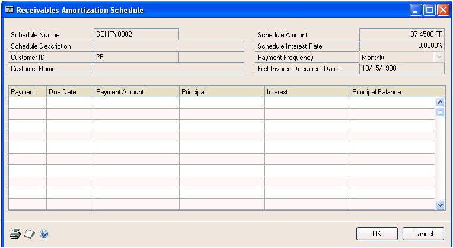
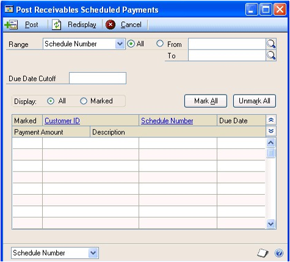
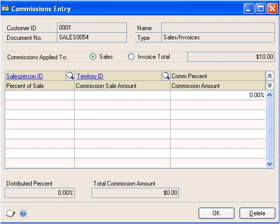
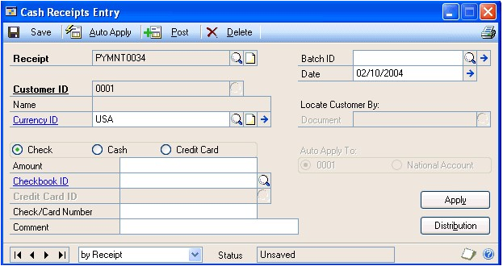
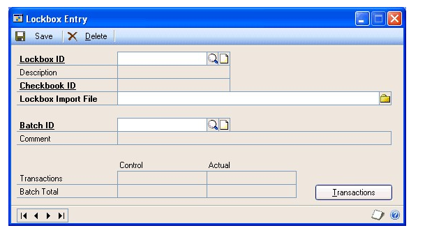
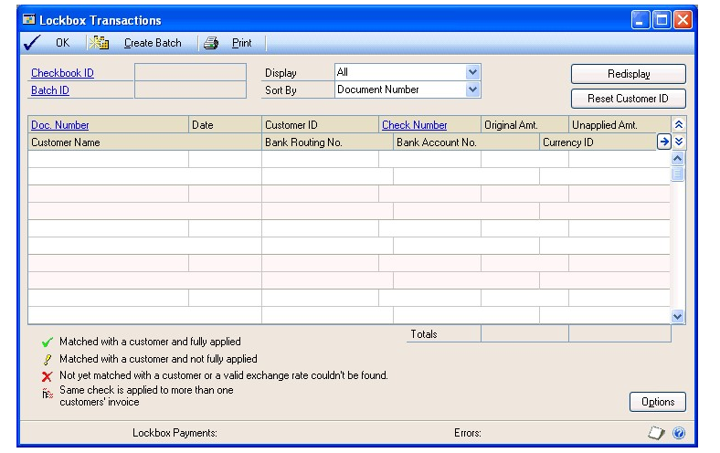
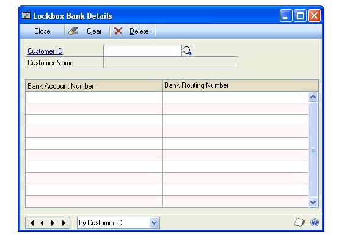
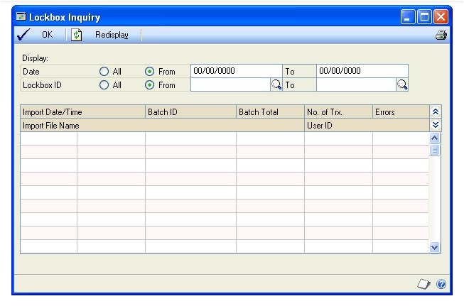

# Microsoft Dynamics GP Receivables Management Part 2: Transaction entry

This part of the documentation includes information about creating batches and entering various types of transactions, distributions, commissions, and cash receipts. This information includes the following topics:

- *Chapter 10, “Multicurrency transactions,”* explains the effects of using Multicurrency Management with Receivables Management.

- *Chapter 11, “Batches,”* explains how to use batches to group receivables documents.

- *Chapter 12, “Transaction entry,”* describes how to enter and print various types of transactions.

- *Chapter 13, “Scheduled payments,”* describes how to create, edit, and post payment schedules.

- *Chapter 14, “Taxes,”* explains taxes in Receivables Management.

- *Chapter 15, “Transaction distributions,”* describes how to allocate transaction amounts to posting accounts.

- *Chapter 16, “Commissions,”* explains how you can enter, edit, and split commissions for your salespeople.

- *Chapter 17, “Cash receipts,”* describes how to record payments received from customers.

- *Chapter 18, “Lockbox processing,”* explains how to import bank and payment processing center lockbox transactions automatically.

## Chapter 10: Multicurrency transactions

If you’re using Multicurrency Management with Receivables Management, you can select the currency to enter on transactions.

This information is divided into the following sections:

- *Exchange rate and document date*

- *Multicurrency account distributions*

### Exchange rate and document date

If a transaction’s currency ID is not in the functional currency, a rate type and associated exchange rate table are assigned to the transaction. The rate type you assigned to the selected customer is used; if one isn’t assigned, the default rate type for the Sales series specified using the Multicurrency Setup window is used. You also can choose the currency expansion button to open the Exchange Rate Entry window to view or modify the default exchange rate.

The document date assigned to a transaction determines the exchange rate that is used, based on the currency ID and associated rate type entered for the transaction. Each time you change the document date on a multicurrency transaction, the system searches for a valid exchange rate. If a valid rate doesn’t exist, you can enter an exchange rate using the Exchange Rate Entry window. If you entered a General Ledger posting date that’s different from the document date, the exchange rate expiration date must be after the posting date.

#### Multicurrency account distributions

For multicurrency transactions, distribution amounts are displayed in both the functional and originating currencies. However, you can change only the originating amounts.

When you’re entering a multicurrency transaction, the originating debit and credit amounts must balance. If the functional equivalents don’t balance, the difference is posted to a Rounding Difference account, and a distribution type of Round identifies the distribution amount in the Receivables Transaction Distribution Entry window.

#### Example

You entered an invoice in the euro currency, with a sale amount of 28,755.42 EUR, a trade discount of 586.84 EUR, and a discount available of 1544.33 EUR.
The exchange rate is 1.0922. The distributions would be calculated as is described in the following table:

| **Account**         | **Euro debit** | **Euro credit** | **US dollars debit** | **US dollars credit** |
|---------------------|----------------|-----------------|----------------------|-----------------------|
| Accounts Receivable | 28,755.42 EUR  |                 | \$31,406.67          |                       |
| Trade Discounts     | 586.84 EUR     |                 | \$640.95             |                       |
| Discounts Available | 1544.33 EUR    |                 | \$1686.72            |                       |
| Sales               |                | 30,886.59 EUR   |                      | \$33,734.33           |
| Totals              | 30,886.59 EUR  | 30,886.59 EUR   | \$33,734.34          | \$33,734.33           |
| Rounding Difference |                |                 |                      | \$0.01                |
| Totals              | 30,886.59 EUR  | 30,886.59 EUR   | \$33,734.34          | \$33,734.34           |

## Chapter 11: Batches

Use batches to group similar transactions during data entry and review them before posting at a later time. You can create both recurring and single-use batches. For example, you might create a recurring batch for all transactions you enter monthly. You can post the transactions at the appropriate time without having to reenter them.

Receivables batches have either Transaction Entry or Cash Receipts as their origin. Since batches can use only one origin, you can have batches with the same name, but different origins.

See *Chapter 12, “Transaction entry,”* for more information about entering transactions with the Transaction Entry origin. See *Chapter 17, “Cash receipts,”* for more information about entering transactions with the Cash Receipt origin.

You can enter only sales/invoices, debit memos, finance charges, service/repairs, and cash receipts in recurring batches. You must enter credit memos, returns, and warranties in single-use batches or post them individually.

This information is divided into the following sections:

- *Receivables batch approval workflow*

- *Creating a batch*

- *Modifying a batch*

- *Deleting a batch*

### Receivables batch approval workflow

If your company uses the Workflow feature among its business controls, batches might have to be approved before posting. The rules for approving batches can be defined to fit your organization’s needs. Multiple approvers might be required, or approval might not be required for batches with few transactions or small currency amounts. When a batch is ready to be approved, approvers can be notified and the batches can be approved, using Microsoft Outlook®, Microsoft Dynamics GP, or SharePoint®. After a batch is approved, it can be posted.

Before you can use the batch approval workflow for Receivables Management, you must turn off the Require Batch Approval feature in Microsoft Dynamics GP. To do so, open the Posting Setup window (Administration \>\> Setup \>\> Posting \>\> Posting) and select the Sales series. Unmark the Require Batch Approval option for the Receivables Sales Entry and Receivables Cash Receipts origins.

### Creating a batch

Use the Receivables Batch Entry window to create a batch. Each transaction in a batch must have the same origin. Entering and posting transactions in batches lets you group similar transactions during data entry, and review them before posting at a later time.

#### To create a batch

1. In the navigation pane, choose the Sales button, and then choose the Receivables Batches list.

2. In the New group, choose Batch to open the Receivables Batch Entry window.

3. Enter a batch ID, such as a combination of your initials and the date, to identify the batch.

4. Select a batch origin.

5. Enter a batch comment, such as a brief description of the transactions that will be entered in the batch.

6. If you chose Transaction Entry as your origin, select a frequency.

7. Enter a posting date. The default posting date is the user date, but you can change it if the batch should be posted on a different date. (This field is available only if Batch is selected in the Posting Date From field using the Posting Setup window.)

The posting date you enter here is the date the General Ledger files are updated. Your Receivables Management records are updated according to the date entered using the Receivables Transaction Entry or Cash Receipts Entry windows.

8. Select the checkbook ID to be affected by the transactions in this batch.

9. Enter any requirements for posting the batch, such as batch totals.

10. Save the batch or submit it for approval, if you are using Workflow.

When you’ve entered all the transactions for this batch, choose File \>\> Print to verify your entries with an edit list.

### Modifying a batch

Use the Receivables Batch Entry window to correct an unposted batch. If the Require Batch Approval option in the Posting Setup window has been marked, transactions in batches must be verified by an administrator or someone who has been granted access to verify the transactions. If you approved a batch for posting, you can’t edit it unless you unmark Approved in the Receivables Batch Entry window.

If you are using Workflow and the batch is pending approval, only the users that can approve batches can edit the batch. If you edit an approved batch or a batch that doesn’t need approval, you must resubmit the batch to Workflow.

See *Correcting or deleting an unposted transaction* for more information about correcting a transaction in a batch.

#### To modify a batch

1. Open the Receivables Batch Entry window.
(Sales \>\> Transactions \>\> Receivables Batches)

2. Enter or select a batch ID.

3. To correct the batch, replace the incorrect information with correct information.

4. Save your changes or resubmit the batch for approval, if you are using Workflow.

#### To modify a batch using the action pane

1. In the navigation pane, choose the Sales button, and then choose the Receivables Batches list.

2. Mark a batch to modify.

3. in the Modify group, choose Edit to open the Receivables Batch Entry window.

4. To correct the batch, replace the incorrect information with correct information.

5. Save your changes or resubmit the batch for approval, if you are using Workflow.

### Deleting a batch

Deleting a batch removes all transactions in the batch, as well. Recurring batches are deleted after the batch has been posted the number of times you specify in the Recurring Posting field of the Receivables Batch Entry window.

If the Require Batch Approval option in the Posting Setup window has been marked, transactions in batches must be verified by an administrator or someone who has been granted access to verify the transactions. If you approved a batch for posting, you can’t delete it unless you unmark Approved in the Receivables Batch Entry window.

If you are using Workflow, you can’t delete a batch that is pending approval.

#### To delete a batch

1. Open the Receivables Batch Entry window.
(Sales \>\> Transactions \>\> Receivables Batches)

2. Enter or select a batch ID.

3. To delete the batch, choose Delete.

#### To delete a batch using the action pane

1. In the navigation pane, choose the Sales button, and then choose the Receivables Batches list.

2. Mark a batch or batches to delete.

3. Delete the batch.

> [!NOTE]
> When you try to modify the check number on a cash receipt for an existing line item in a batch it will not save.  You may notice when you save a Cash Receipt with a Check type to a batch, and then open the transaction again and edit the Check/Card Number field, and then save it again, the change is not committed to the transaction.  The Check/Card Number field stays the same as it was originally entered as the first time the transaction was entered.  Also, the new entry that you tried to enter will be unavailable if you attempt to use it again as you will receive a message stating 'This check has been entered for this customer already'.

Insted of trying to change the field from the existing batch, you should delete the transaction and re-enter.  

## Chapter 12: Transaction entry

You can use the Receivables Transaction Entry window to enter sales/invoice, debit memo, finance charge, service/repair, warranty, credit memo, and return transactions. Posting journals are printed when transactions are posted only if you chose to print the appropriate posting journals using the Posting Setup window.

Cash receipts are recorded using the Cash Receipts Entry window. See *Chapter 17, “Cash receipts,”* for more information.

To include multicurrency information on the edit list or posting journal, open the Posting Setup window, select Sales in the Series field, select Transaction Entry in the Origin field, and mark Include Multicurrency Info.

This information is divided into the following sections:

- *Document date versus posting date*

- *Transaction entry document printing options*

- *Sending documents in e-mail from transaction entry*

- *National accounts customer transactions in Receivables Management*

- *Tax information printing options*

- *Entering a sales/invoice transaction*

- *Entering a debit memo*

- *Entering a finance charge*

- *Entering a service/repair transaction*

- *Entering a warranty transaction*

- *Entering a credit memo*

- *Entering a return receipt*

- *Updating a customer’s e-mail information for a receivables transaction*

- *Entering Intrastat trade statistics*

### Document date versus posting date

The document date is the date shown in the Receivables Transaction Entry window. This is the date your Receivables Management records are updated.

The posting date is the date your General Ledger files are updated. The posting date either is assigned for the batch or you can enter it by choosing the expansion button in the Document Date field of the Receivables Transaction Entry window.

### Transaction entry document printing options

You can print the document displayed in the Receivables Transaction Entry window by choosing Print. The document is printed in the document format you selected using the Receivables Management Setup window. Change the document format by choosing another format from the Options menu. You can select Blank Paper, UserDefined 1, or User-Defined 2 as the document format. You also can print an alignment form from the Options menu.

The document is printed in the originating currency. You can’t change the view between functional and originating currency in the Receivables Transaction Entry window.

### Sending documents in e-mail from transaction entry

You can send the document displayed in the Receivables Transaction Entry window by choosing the Send document in e-mail button. The document is sent in the document format you selected using the Customer E-mail Options window. You can’t send a document in e-mail if you chose User-Defined 1 or User-Defined 2 as the document format from the Options menu.

You can send documents in e-mail if the following conditions are met.

- The document type must be available for the customer to send in e-mail.

- The customer also must have a To, Cc, or Bcc address to receive documents in e-mail.

Whenever you see the Send document in e-mail button near the printer icon in the upper right area in the window, you can choose the button (shown below) to send the document in e-mail.

### National accounts customer transactions in Receivables Management

A national account provides the ability to restrict payments for child customers, apply credit checking, place holds, and assess finance charges at a consolidated national account level. You also can pay the vendor assigned to the parent customer of a national account when creating a refund check for the child customer, depending on the options you select when you set up the national account using the National Accounts Maintenance window.

If you have problems entering transactions for national account customers, check the status of the options in the National Accounts Maintenance window. See *Chapter 9, “National accounts,”* for more information.

### Tax information printing options

To print tax details on documents, mark Print Tax Details on Documents in the Receivables Management Setup window, and Print on Documents in the Tax Detail Maintenance window.

Depending on the document type you’re entering, you can print a tax invoice or an adjustment note when you enter transactions. If tax is included with the document amounts, tax details are printed on the tax invoice or the adjustment note. To print a tax invoice or an adjustment note instead of the standard document, choose Options \>\> Print Tax Invoice or Print Adjustment Note. You can print these documents more than once.

To print documents that include taxes in the document amounts, choose Options \>\> Print Amounts Inclusive of Tax. When you choose this option, depending on the document you’re entering, the sales, debit, warranty, finance charges, freight, and miscellaneous amounts include the tax associated with those amounts. The tax amount entered in the Tax field will be zero. If you don’t select this option, tax amounts won’t be included in the document amounts.

The Print Amounts Inclusive of Tax, Print Tax Invoice, and Print Adjustment Note menu options are available only if you marked Enable GST for Australia/New Zealand in the Company Setup Options window.

### Entering a sales/invoice transaction

Use the Receivables Transaction Entry window to record sales made to your customers. You can track cost and sale amounts, commissions, and freight, miscellaneous, and tax charges.

#### To enter a sales/invoice transaction

1. In the navigation pane, choose the Sales button, and then choose the Receivables Transactions list.

2. In the New group or its overflow menu, choose Sales/Invoices to open the Receivables Transaction Entry window.

3. Sales/Invoices displays as the document type. The default document number is taken from the Receivables Setup Options window.

Enter a description that helps identify the sale/invoice. The description appears as the reference in the General Ledger Transaction Entry window, if you’re posting to General Ledger with detail.

4. Enter or select a batch ID, and enter a document date. See *Document date versus posting date* for more information.

If you are using Workflow and assign the transaction to an approved batch or a batch that doesn’t need approval, you must resubmit the batch for approval. If you select a batch that is pending approval and you can’t approve batches, you won’t be able to enter transaction information.

In multicurrency transactions, the document date determines the exchange rate that is used, based on the currency ID and associated rate type that’s entered for the transaction. See *Exchange rate and document date* for more information.

5. Enter or select a customer ID and the customer’s address ID. Default information entered on the customer cards appears.

6. Choose the Customer E-mail Detail Entry expansion button to open the Receivables E-mail Detail Entry window to update a customer’s e-mail information for a transaction. See *Updating a customer’s e-mail information for a receivables transaction* for more information.

The document type to send in e-mail must be available for the customer before you can open the Receivables E-mail Detail Entry window.

7. Enter or select a salesperson ID and sales territory ID. This information is used when calculating commission amounts.

8. Enter or select a currency ID. See *Chapter 10, “Multicurrency transactions,”* for more information about how the currency ID affects the transaction.

9. Enter or select payment terms, a shipping method, and a tax schedule ID for the transaction. See *How taxes are calculated* for more information.

10. Enter the transaction amounts: cost, sales, trade discount, freight, miscellaneous, and tax.

The trade discount is calculated if you entered a trade discount for the customer; you can change this amount. The tax for the sale is calculated automatically. If you change the tax amount, a window opens, and you can edit the details for the new tax amount.

11. If the customer makes a payment at the time of the sale, enter the cash, check, or credit card payment amount. Another window opens and you can enter detailed information about the payment.

If the customer has payment terms that include a discount and a payment was made at the time of the sale, the discount amount appears in the Terms Disc Taken field.

12. To make changes to commission calculations, choose Commissions to open the Commissions Entry window. See *Editing a commission amount* for more information.

13. To view or make changes to account distributions, choose Distribution to open the Sales Transaction Distribution Entry window.

Amounts are distributed to the accounts set up for the customer card. See *Modifying transaction distributions* for more information.

Choose OK to return to the Receivables Transaction Entry window.

14. Print the document, send the document in e-mail, or both.

15. Save or post the transaction.

### Entering a debit memo

Use the Receivables Transaction Entry window to record an increase to a customer’s account for charges other than sales, such as consultation fees, special handling charges, or service contracts.

#### To enter a debit memo

1. In the navigation pane, choose the Sales button, and then choose the Receivables Transactions list.

2. In the New group or its overflow menu, choose Debit Memo to open the Receivables Transaction Entry window.

3. Debit Memo displays as the document type. The default number is taken from the Receivables Setup Options window.

Enter a description that helps identify the debit memo. The description appears as the reference in the General Ledger Transaction Entry window, if you’re posting to General Ledger with detail.

4. Enter or select a batch ID and enter a document date.

If you are using Workflow and assign the transaction to an approved batch or a batch that doesn’t need approval, you must resubmit the batch for approval. If you select a batch that is pending approval and you can’t approve batches, you won’t be able to enter transaction information.

In multicurrency transactions, the document date determines the exchange rate that is used, based on the currency ID and associated rate type that’s entered for the transaction. See *Exchange rate and document date* for more information.

5. Enter or select a customer ID and the customer’s address ID. Default information entered on the customer cards appears.

6. Choose the Customer E-mail Detail Entry expansion button to open the Receivables E-mail Detail Entry window to update a customer’s e-mail information for the transaction. See *Updating a customer’s e-mail information for a receivables transaction* for more information.

The document type to send in e-mail must be available for the customer before you can open the Receivables E-mail Detail Entry window.

7. Enter or select a currency ID. See *Chapter 10, “Multicurrency transactions,”* for more information about how the currency ID affects the transaction.

8. Enter the cost amount and the debit memo amount.

9. Enter or select payment terms for the transaction.

10. To make changes to commission calculations, choose Commissions to open the Commissions Entry window. See *Editing a commission amount* for more information.

11. To make changes to account distributions, choose Distribution to open the Sales Transaction Distribution Entry window.

Amounts are distributed to the accounts set up for the customer. See *Modifying transaction distributions* for more information.

Choose OK to return to the Receivables Transaction Entry window.

12. Print the document, send the document in e-mail, or both.

13. Save or post the transaction.

### Entering a finance charge

Use the Receivables Transaction Entry window to enter finance charges to charge in addition to, or instead of, the usual monthly finance charge that’s assessed to the customer’s account.

#### To enter a finance charge

1. In the navigation pane, choose the Sales button, and then choose the Receivables Transactions list.

2. In the New group or its overflow menu, choose Finance Charge to open the Receivables Transaction Entry window.

3. Finance Charge displays as the document type. The default number is taken from the Receivables Setup Options window.

Enter a description that helps identify the finance charge. The description appears as the reference in the General Ledger Transaction Entry window, if you’re posting to General Ledger with detail.

4. Enter or select a batch ID, and enter a document date.

If you are using Workflow and assign the transaction to an approved batch or a batch that doesn’t need approval, you must resubmit the batch for approval. If you select a batch that is pending approval and you can’t approve batches, you won’t be able to enter transaction information.

In multicurrency transactions, the document date determines the exchange rate that is used, based on the currency ID and associated rate type that’s entered for the transaction. See *Exchange rate and document date* for more information.

5. Enter or select a customer ID and the customer’s address ID. Default information entered on the customer card appears.

6. Choose the Customer E-mail Detail Entry expansion button to open the Receivables E-mail Detail Entry window to update a customer’s e-mail information for the transaction. See *Updating a customer’s e-mail information for a receivables transaction* for more information.

The document type to send in e-mail must be available for the customer before you can open the Receivables E-mail Detail Entry window.

7. Enter or select a currency ID. See *Chapter 10, “Multicurrency transactions,”* for more information about how the currency ID affects the transaction.

8. Enter the finance charge amount.

9. If the customer makes a payment at the time of transaction entry, enter the payment amount in the Cash, Check, or Credit Card fields. Another window opens and you can enter detailed information about the payment.

10. To make changes to account distributions, choose Distribution to open the Sales Transaction Distribution Entry window.

Amounts are distributed to the accounts set up for the customer. See *Modifying transaction distributions* for more information.

Choose OK to return to the Receivables Transaction Entry window.

11. Print the document, send the document in e-mail, or both.

12. Save or post the transaction.

### Entering a service/repair transaction

Use the Receivables Transaction Entry window to enter charges for a service or repair that’s not covered by warranty.

#### To enter a service/repair transaction

1. In the navigation pane, choose the Sales button, and then choose the Receivables Transactions list.

2. In the New group or its overflow menu, choose Service/Repairs to open the Receivables Transaction Entry window.

3. Service/Repairs displays as the document type. The default number is taken from the Receivables Setup Options window.

Enter a description that helps identify the service/repair transaction. The description appears as the reference in the General Ledger Transaction Entry window, if you’re posting to General Ledger with detail.

4. Enter or select a batch ID, and enter a document date.

If you are using Workflow and assign the transaction to an approved batch or a batch that doesn’t need approval, you must resubmit the batch for approval. If you select a batch that is pending approval and you can’t approve batches, you won’t be able to enter transaction information.

In multicurrency transactions, the document date determines the exchange rate that is used, based on the currency ID and associated rate type that’s entered for the transaction. See *Exchange rate and document date* for more information.

5. Enter or select a customer ID and the customer’s address ID. Default information entered on the customer card appears.

6. Choose the Customer E-mail Detail Entry expansion button to open the Receivables E-mail Detail Entry window to update a customer’s e-mail information for the transaction. See *Updating a customer’s e-mail information for a receivables transaction* for more information.

The document type to send in e-mail must be available for the customer before you can open the Receivables E-mail Detail Entry window.

7. Enter or select a salesperson ID and sales territory ID. This information is used when calculating commission amounts.

8. Enter or select a currency ID. See *Chapter 10, “Multicurrency transactions,”* for more information about how the currency ID affects the transaction.

9. Enter or select payment terms, a shipping method, and a tax schedule ID for the transaction.

10. Enter the transaction amounts: cost, sales, trade discount, freight, miscellaneous, and tax.

The trade discount is calculated if you entered a trade discount for the customer; you can change this amount. The tax for the service/repair is calculated automatically. If you change the tax amount, a window opens, and you can edit the details for the new tax amount.

11. If the customer makes a payment at the time of the sale of the service/repair, enter the cash, check, or credit card payment amount. Another window opens and you can enter detailed information about the payment.

If the customer has payment terms that include a discount and a payment was made at the time of the sale of the service/repair, the discount amount appears in the Terms Disc Taken field.

12. To make changes to commission calculations, choose Commissions to open the Commissions Entry window. See *Editing a commission amount* for more information.

13. To make changes to account distributions, choose Distribution to open the Sales Transaction Distribution Entry window. Amounts are distributed to the accounts set up for the customer. Choose OK to return to the Receivables Transaction Entry window.

14. Print the document, send the document in e-mail, or both.

15. Save or post the transaction.

### Entering a warranty transaction

Use the Receivables Transaction Entry window to record a service or repair that’s covered by a warranty, and that won’t affect the customer’s balance. This record can then be used either as a basis to bill the manufacturer offering the warranty, or to record the expense incurred by your company in offering the warranty.

You can enter warranty transactions individually or in single-use batches, but you can’t enter them in recurring batches.

#### To enter a warranty transaction

1. In the navigation pane, choose the Sales button, and then choose the Receivables Transactions list.

2. In the New group or its overflow menu, choose Warranty to open the Receivables Transaction Entry window.

3. Warranty displays as the document type. The default number is taken from the Receivables Setup Options window.

Enter a description that helps identify the warranty transaction. The description appears as the reference in the General Ledger Transaction Entry window, if you’re posting to General Ledger with detail.

4. Enter or select a batch ID and enter a document date.

If you are using Workflow and assign the transaction to an approved batch or a batch that doesn’t need approval, you must resubmit the batch for approval. If you select a batch that is pending approval and you can’t approve batches, you won’t be able to enter transaction information.

In multicurrency transactions, the document date determines the exchange rate that is used, based on the currency ID and associated rate type that’s entered for the transaction. See *Exchange rate and document date* for more information.

5. Enter or select a customer ID and the customer’s address ID. Default information entered on the customer card appears.

6. Choose the Customer E-mail Detail Entry expansion button to open the Receivables E-mail Detail Entry window to update a customer’s e-mail information for the transaction. See *Updating a customer’s e-mail information for a receivables transaction* for more information.

The document type to send in e-mail must be available for the customer before you can open the Receivables E-mail Detail Entry window.

7. Enter or select a currency ID. See *Chapter 10, “Multicurrency transactions,”* for more information about how the currency ID affects the transaction.

8. Enter your cost amount and the warranty amount. The On Account field remains at zero, because this transaction doesn’t affect the customer’s balance.

9. To make changes to account distributions, choose Distribution to open the Sales Transaction Distribution Entry window. Amounts are distributed to the accounts set up for the customer. Choose OK to return to the Receivables Transaction Entry window.

10. Print the document, send the document in e-mail, or both.

11. Save or post the transaction.

### Entering a credit memo

Use the Receivables Transaction Entry window to record a decrease in a customer’s account balance, such as a one-time incentive, or a deduction on a freight charge for goods that didn’t arrive when scheduled. You can apply a credit memo to sales/ invoice, debit memo, finance charge, and service/repair transactions.

You can enter credit memo transactions individually or in single-use batches, but you can’t enter them in recurring batches.

#### To enter a credit memo

1. In the navigation pane, choose the Sales button, and then choose the Receivables Transactions list.

2. In the New group or its overflow menu, choose Credit Memo to open the Receivables Transaction Entry window.

3. Credit Memo displays as the document type. The default number is taken from the Receivables Setup Options window.

Enter a description that helps identify the credit memo. The description appears as the reference in the General Ledger Transaction Entry window, if you’re posting to General Ledger with detail.

4. Enter or select a batch ID, and enter a document date.

If you are using Workflow and assign the transaction to an approved batch or a batch that doesn’t need approval, you must resubmit the batch for approval. If you select a batch that is pending approval and you can’t approve batches, you won’t be able to enter transaction information.

In multicurrency transactions, the document date determines the exchange rate that is used, based on the currency ID and associated rate type that’s entered for the transaction. See *Exchange rate and document date* for more information.

5. Enter or select a customer ID and the customer’s address ID. Default information entered on the customer cars appears.

6. Choose the Customer E-mail Detail Entry expansion button to open the Receivables E-mail Detail Entry window to update a customer’s e-mail information for the transaction. See *Updating a customer’s e-mail information for a receivables transaction* for more information.

The document type to send in e-mail must be available for the customer before you can open the Receivables E-mail Detail Entry window.

7. Enter or select a currency ID. See *Chapter 10, “Multicurrency transactions,”* for more information about how the currency ID affects the transaction.

8. Enter your cost amount and the credit memo amount. Enter any freight or miscellaneous charges, as necessary.

9. Apply the credit memo. Choose Apply to open the Apply Sales Documents window, then choose one of the following apply options:

    - To automatically apply the credit memo, choose Auto Apply. The credit memo is applied to as many documents as the amount of the credit memo allows. The order documents are applied in is specified using the Receivables Management Setup window.

    - To apply the credit memo to specific documents, mark each transaction to apply the credit memo to and choose OK. You can divide the credit memo among several documents by marking it and changing the amount in the Apply Amount field.

If you’re entering a multicurrency transaction, you can’t apply a credit memo. You must post these documents before you can apply them.

See *Chapter 20, “Applying,”* for more information about applying transactions.

10. To make changes to account distributions, choose Distribution to open the Sales Transaction Distribution Entry window.

Amounts for credit memos are reversed. Amounts are distributed to the accounts set up for the customer. See *Modifying transaction distributions* for more information.

Choose OK to return to the Receivables Transaction Entry window.

11. Print the document, send the document in e-mail, or both.

12. Save or post the transaction.

### Entering a return receipt

Use the Receivables Transaction Entry window to record the return of a product that decreases the balance of a customer’s account. You also can record a refund of the sale on a return.

You can enter return transactions individually or in single-use batches, but you can’t enter them in recurring batches.

#### To enter a return receipt

1. In the navigation pane, choose the Sales button, and then choose the Receivables Transactions list.

2. In the New group or its overflow menu, choose Return to open the Receivables Transaction Entry window.

3. Return displays as the document type. The default number is taken from the Receivables Setup Options window.

Enter a description that helps identify the return. The description appears as the reference in the General Ledger Transaction Entry window, if you’re posting to General Ledger with detail.

4. Enter or select a batch ID, and enter a document date.

If you are using Workflow and assign the transaction to an approved batch or a batch that doesn’t need approval, you must resubmit the batch for approval. If you select a batch that is pending approval and you can’t approve batches, you won’t be able to enter transaction information.

In multicurrency transactions, the document date determines the exchange rate that is used, based on the currency ID and associated rate type that’s entered for the transaction. See *Exchange rate and document date* for more information.

5. Enter or select a customer ID and the customer’s address ID. Default information entered on the customer card appears.

6. Choose the Customer E-mail Detail Entry expansion button to open the Receivables E-mail Detail Entry window to update a customer’s e-mail information for the transaction. See *Updating a customer’s e-mail information for a receivables transaction* for more information.

The document type to send in e-mail must be available for the customer before you can open the Receivables E-mail Detail Entry window.

7. Enter or select a salesperson ID and sales territory ID. This information is used when reversing commission amounts. If you don’t want to reverse the commissions on the return, don’t enter a salesperson ID.

8. Enter or select a currency ID. See *Chapter 10, “Multicurrency transactions,”* for more information about how the currency ID affects the transaction.

9. Enter or select a shipping method and tax schedule ID. See *How taxes are calculated* for more information.

10. Enter your cost amount and the return amount, and enter any freight or miscellaneous charges, if necessary. The tax for the return is calculated.

If you’re returning cash to the customer, enter the amount in the Cash field. The Receivables Cash Entry window opens and you can enter detailed information.

If you’re not returning cash, leave these fields blank. The amount is recorded on account.

To make changes to commission calculations, choose Commissions to open the Commissions Entry window. See *Entering commission information* for more information.

11. Apply the return. Choose Apply to open the Apply Sales Documents window, then choose one of the following apply options:

- To automatically apply the return, choose Auto Apply. The return is applied to as many documents as the amount of the return allows. The order documents are applied in is specified using the Receivables Management Setup window.

- To apply the return to specific documents, mark each transaction to apply the return to and choose OK. You can divide the return among several documents by marking them and changing the amount in the Apply Amount field.

If you’re entering a multicurrency transaction, you can’t apply a return. You must post these documents before you can apply them.

See *Chapter 20, “Applying,”* for more information about applying transactions.

12. To make changes to account distributions, choose Distribution to open the Sales Transaction Distribution Entry window. Choose OK to return to the Receivables Transaction Entry window.

13. Print the document, send the document in e-mail, or both.  Choose Print. See *Transaction entry document printing options* for more information.

14. Save or post the transaction.

### Updating a customer’s e-mail information for a receivables transaction

Use the Receivables E-mail Detail Entry window to update a customer’s e-mail information for a transaction. The changes you enter in this window will affect only the current transaction. To make permanent changes to the customer record for email settings, use the Customer E-mail Options window.

You can change the subject, message ID, and message if the Allow Update of E-mail at Entry option in the Sales E-mail Setup window is marked. You can update the reply to address if the Changing ‘Reply to’ Address option in the Sales E-mail Setup window is marked.

#### To update customer’s e-mail information for a receivables transaction

1. In the navigation pane, choose the Sales button, and then choose the Receivables Transactions list.

2. In the New group or its overflow menu, choose a document type to open the Receivables Transaction Entry window.

3. Enter or select a customer ID.

4. Choose the E-mail Detail Entry expansion button to open the Receivables E-mail Detail Entry window.

    

5. Enter a To, Cc, or Bcc address to send the transaction in e-mail. You must enter at least one e-mail address to send transactions in e-mail.

The e-mail addresses displayed in the window are assigned to the address you entered on the transaction. You can update the To, Cc, and Bcc e-mail addresses, if applicable.

6. Enter or select a message ID if you want to use a predefined message.

7. Enter a subject line for the message. If you don’t enter a subject for the message, the document number of the transaction you are sending is used.

8. Edit the message that will appear in the e-mail when sending the transaction.

9. Update the address that a customer can use to send a reply e-mail.

10. Choose OK to save your changes.

Choose Default to restore the default e-mail settings entered for the customer in the Customer E-mail Options window.

### Entering Intrastat trade statistics

Intrastat is the system for collecting statistics on the trade of goods between European Union (EU) countries/regions. Intrastat statistics are required for all items either bought from EU vendors or sold to EU customers and must be provided on a monthly basis. Requirements for Intrastat are similar in all EU countries/regions. The government uses these statistics as an economic indicator.

Use the Receivables Intrastat Entry window to enter the information required to create the Intrastat Trade Report, which you submit to your government, and the EU Sales List, which displays cumulative goods value totals by each vendor or customer tax registration number. You can enter Intrastat statistics for each line item. To print the Intrastat Trade Report, use the Company Taxes Reports window or the Company Tax Report Options window.

If Intrastat information was entered for the customer’s primary address ID, that information appears in this window. You can change Intrastat information for an individual transaction.

*You can enter Intrastat statistics only if you marked to enable Intrastat tracking using the Company Setup Options window.*

#### To enter Intrastat trade statistics

1. Open the Receivables Transaction Entry window. 
(Sales \>\> Transactions \>\> Transaction Entry)

2. Enter the transaction, including the customer ID and the goods value. Be sure the EU Transaction option is marked. If the country code that was assigned to the customer’s shipping address is designated an EU country/region, this option is marked automatically.

3. Choose Intrastat to open the Receivables Intrastat Entry window.

    

4. Enter an item number in the Item field.

5. Enter Intrastat information or change the default entries, if necessary.

    The Country of Origin field will contain a default entry if this information was specified in the item information. If it was not specified, this field will be blank.

6. In the Net Unit Mass field, enter the weight of the goods in kilograms.

    If the transaction originated in Invoicing or Sales Order Processing, the item’s shipping weight—from the Item Maintenance window—is displayed. You can change this information.

7. Enter the quantity of the goods being sold.

    The Line Mass field displays the total mass per item and is calculated when you press TAB on the Quantity field. The line mass total is equal to the amount in the Unit Mass field multiplied by the amount in the Quantity field.

    Enter a supplementary units amount, if applicable. The supplementary units amount is simply a second quantity. Supplementary unit amounts are required by the EU Combined Nomenclature for certain goods.

8. In the Traders Reference field, enter a reference code, such as an invoice or dispatch number, or any other information that identifies the transaction.

9. Choose Save to save the record. Close the window to return to the Receivables Transaction Entry window.

## Chapter 13: Scheduled payments

Customers who make large purchases, or who make purchases that are delivered over time, might want to spread payments out over time. This chapter describes options for setting up payment schedules.

*Scheduled payments are available only for businesses in North America.*

This information is divided into the following sections:

- *Scheduled payments overview*

- *Scheduled payments distributions*

- *Creating payment schedules*

- *Viewing amortization schedules*

- *Posting Receivables scheduled payments*

- *Deleting unposted payment schedules*

- *Editing posted payment schedules*

- *Voiding posted payment schedules*

### Scheduled payments overview

You can choose the interest rate, payment frequency, and other information when you create a payment schedule, and you can create a payment schedule using any posted document. Payment schedules are created from documents. Payment schedules may vary based on the customer or the kind of goods or services that are being purchased. You can edit any information on unposted payment schedules, as well as the interest and number of payments for posted payment schedules.

You can create scheduled payments for customers who want to spread payments out over time. You’ll use the Receivables Scheduled Payments Entry window to create a scheduled payment from a posted sales/invoice, debit memo, or service/ repair document. You can choose the interest rate, payment frequency, and other information when you create a scheduled payment. When you post a scheduled payment, a credit memo is created for the remaining amount on the original document. The credit memo is applied automatically to the original document and a series of scheduled invoices, installments of the scheduled payment, are created to replace the original document.

Next, you’ll use the Post Receivables Scheduled Payments window to post each individual scheduled payment transaction. For example, if you created a scheduled payment for monthly payments for a customer, each month you would post an individual scheduled invoice to reflect the amount that is owed by the customer.

When the customer sends a payment, you’ll enter a cash receipt using the Cash Receipts Entry window. You can apply the cash receipt to the scheduled payment as you enter the cash receipt or after posting the cash receipt. The customer may add a principal payment, which is an extra amount to apply toward the principal balance.

If a principal payment amount is included in the cash receipt, you can apply that amount to the remaining principal balance on the scheduled payment. The scheduled payment will be re-amortized after posting the payment. For more information about applying a principal payment, see *Applying a principal payment to a scheduled payment*

You can use the Receivables Amortization Schedule window to view a payment schedule’s amortization schedule. Amortization is the process of repayment with periodic payments of both principal and interest calculated to pay off the loan at the end of a fixed period of time.

### Scheduled payments distributions

When you create payment schedules, you select specific accounts to distribute the interest and principal portions between. The following chart shows what accounts to use and how they are debited and credited.

| **Account**                         | **Debit**    | **Credit**       |
|-------------------------------------|--------------|------------------|
| Accounts Receivable posting account | Debited with the scheduled payment amount, including principal and interest, when an individual payment is posted using the Post Receivables Scheduled Payments window. Debited with a principal payment amount when the principal payment is posted using the Cash Receipts Entry window or the Apply Sales Documents window. | Credited with the total schedule amount, not including interest, when the payment schedule is posted using the Receivables Scheduled Payments Entry window. |
| Receivables Offset posting account  | Debited with the total schedule amount, not including interest, when the payment schedule is posted using the Receivables Scheduled Payments Entry window.  | Credited with the scheduled payment amount, not including interest, when an individual payment is posted using the Post Receivables Scheduled Payments window. Credited with a principal payment amount when the principal payment is posted using the Cash Receipts Entry window or the Apply Sales Documents window. |
| Interest Income posting account     | This account is not debited when you post a payment schedule. | Credited with the interest portion of the scheduled payment amount when an individual payment is posted using the Post Receivables Scheduled Payments window. |

For example, if you use the Receivables Scheduled Payments Entry window (Sales \>\> Transactions \>\> Scheduled Payments) to enter a scheduled payment with a schedule amount of \$2,400.00 using 10% simple interest and 12 monthly payments, the amount due each month is \$220.00.

When you post the payment schedule, your accounts will be updated using the following debits and credits.

| **Account**         | **Debit**  | **Credit** |
|---------------------|------------|------------|
| Accounts Receivable |            | \$2,400.00 |
| Receivables Offset  | \$2,400.00 |            |

When you use the Post Receivables Scheduled Payments window (Sales \>\> Routines \>\> Post Scheduled Payments) to post one of the 12 individual payments for \$220.00, your accounts will be updated using the following debits and credits.

| **Account**         | **Debit** | **Credit** |
|---------------------|-----------|------------|
| Accounts Receivable | \$220.00  |            |
| Receivables Offset  |           | \$200.00   |
| Interest Income     |           | \$20.00    |

When you receive payment from the customer for \$220.00 and use the Cash Receipts Entry window (Sales \>\> Transactions \>\> Cash Receipts) to enter the cash receipt, your accounts will be updated using the following debits and credits.

| **Account**         | **Debit** | **Credit** |
|---------------------|-----------|------------|
| Accounts Receivable |           | \$220      |
| Cash                | \$220     |            |

If the customer added an extra \$50.00 to the \$220.00 payment to apply towards the remaining principal balance on the scheduled payment, your accounts will be updated using the following debits and credits.

| **Account**         | **Debit** | **Credit** |
|---------------------|-----------|------------|
| Accounts Receivable |           | \$270      |
| Cash                | \$270     |            |
| Accounts Receivable | \$50      |            |
| Receivables Offset  |           | \$50       |

### Creating payment schedules

Use the Receivables Scheduled Payments Entry window to enter payment schedules. When you are creating a payment schedule, the information from the original invoice will appear in several fields in the window.

#### To create a payment schedule

1. In the navigation pane, choose the Sales button, and then choose the Receivables Transaction list.

2. In the New group or its overflow menu, choose Scheduled Payments to open the Receivables Scheduled Payments Entry window.

    

3. Enter a schedule number and description.

4. Select the original document number. Default entries will appear in multiple fields in this window after you have selected an invoice or a debit memo.

5. Verify the date in the Schedule Document Date field. The default entry comes from the original invoice and is the General Ledger posting date.

6. Enter the schedule amount. The default entry in this field is the total schedule amount, and it is equal to the amount remaining on the original invoice.

7. Mark either compound or simple interest. Enter the rate in the Schedule Interest Rate field. For zero-interest loans, enter 0%.

    *Simple interest is calculated from the first payment rather than the schedule date. If a payment schedule is created from an existing invoice, the interest is calculated from the date of the original invoice.*

8. Enter the number of payments for the payment schedule.

9. Enter or select the payment frequency. This field is used to define how often payments will be made.

10. Select the dates and verify and enter the accounts for the payment schedule. The default entries are from the original document.

11. Choose the Calculate button to create an amortization schedule.

12. Choose Save to save the payment schedule or Post to post it.

If you post the transaction, the Receivables Scheduled Payments Posting Journal, Receivables Posting Journal, Distribution Breakdown Register - Detail, and Distribution Breakdown Register - Summary will print when you close the window.

### Viewing amortization schedules

Amortization schedules are created when you choose the Calculate button in the Receivables Scheduled Payments Entry window. You can view any unposted invoice within a payment schedule in the Receivables Amortization Schedule window. Posted invoices within a payment schedule can be viewed only by printing the Receivables Amortization Schedule Report.

#### To view an amortization schedule

1. Open the Receivables Scheduled Payments Entry window.
(Sales \>\> Transactions \>\> Scheduled Payments)

2. Enter or select a schedule number.

3. Choose Amortization to open the Receivables Amortization Schedule window.

    

If there is no interest, you can edit the Due Date and Payment Amount fields by entering the appropriate information in those fields.

4. Choose OK to save the changes.

### Posting Receivables scheduled payments

Use the Post Receivables Scheduled Payments window to post payments. You can post payments individually or many at one time.

#### To post a Receivables scheduled payment

1. Open the Post Receivables Scheduled Payments window. 
    (Sales \>\> Routines \>\> Post Scheduled Payments)

    

2. Select Customer ID or Schedule Number.

3. Mark All to view all scheduled payments or enter range restrictions to post a subset of the available schedule.

4. You can enter a date in the Due Date Cutoff field to restrict the scheduled payments displayed in the scrolling window to those entered prior to the cut off date.

5. Choose Display All or Marked. Choosing Marked will limit those payments to ones that were marked, and choosing All will show both marked and unmarked payments within the selected range.

6. Select Schedule Number or Customer ID from the Sort by dropdown list.

7. Mark the documents individually if you want to post only specific payments. If you want to post all the payments, you can choose the Mark All option.

8. Choose Post to post the marked payments.

9. Close the window. If you chose to post the marked payments, the Receivables Posting Journal, Distribution Breakdown Register - Detailed, and Distribution Breakdown Register - Summary will print.

### Deleting unposted payment schedules

Use the Receivables Scheduled Payments Entry window to delete unposted payment schedules. Posted schedules can’t be deleted.

#### To delete an unposted payment schedule

1. Open the Receivables Scheduled Payments Entry window. 
    (Sales \>\> Transactions \>\> Scheduled Payments)

2. Select a payment schedule.

3. Choose Delete.

4. A message will ask you to confirm the removal of the payment schedule you’re deleting; choose Yes.

### Editing posted payment schedules

You only edit the individual due dates and payment amounts if there is no interest applied to a payment schedule.

#### To edit a posted payment schedule

1. Open the Receivables Scheduled Payments Entry window.
(Sales \>\> Transactions \>\> Scheduled Payments)

2. Select or enter a schedule number.

3. Enter the interest rate and payment amounts for a posted payment schedule with interest. If there is no interest, you can also edit the due date and payment amount.

4. Choose OK to save the changes.

### Voiding posted payment schedules

Posted payment schedules are permanent. If you want to void a payment schedule, you must post all of the invoices and void each invoice individually. If there are many payments, you can choose to change the number of payments to one, and then you can void a single invoice.

#### To void a posted payment schedule

1. Open the Receivables Scheduled Payments Entry window.
(Sales \>\> Transactions \>\> Scheduled Payments)

2. Select or enter a schedule number.

3. Enter 1 as the number of payments.

4. Choose Post to create an open invoice that can be voided.

5. Void each invoice.

Refer to *Chapter 23, “Transaction maintenance,”* for further information on voiding posted transactions.

6. After you have posted and voided all the individual invoices, you can void the payment schedule.

## Chapter 14: Taxes

Use the Receivables Tax Entry window to add, change, delete, or view tax amounts calculated on a transaction. Taxes for sales/invoices,
service/repairs, and returns documents are calculated based on tax schedules and shipping information. See the System Setup documentation (Help \>\> Printable Manuals) for more information about setting up tax schedules and how taxes are calculated.

This information is divided into the following sections:

- *How taxes are calculated*

- *How to prevent taxes from being calculated*

- *Distributing tax amounts to details*

### How taxes are calculated

The shipping method assigned to a transaction affects how taxes for a transaction are calculated, if your system is set up to use the shipping method in tax calculations. Taxes are calculated using the tax rates at the point of exchange. If the shipping method chosen requires you to deliver the merchandise to the customer, the tax schedule assigned to the customer is used. The tax schedule specified using the Receivables Setup Options window is then compared with the tax schedule in the Receivables Transaction Entry window. Taxes are calculated for any sales tax details found in both schedules.

If the shipping method requires the customer to pick up the merchandise from you, the tax schedule assigned to your company is used. The tax schedule specified using Receivables Setup Options window is then compared with the tax schedule in the Receivables Transaction Entry window. Taxes are calculated for any sales tax details that are found in both schedules.

### How to prevent taxes from being calculated

To avoid calculating taxes on a particular transaction, clear the Tax Schedule ID field in the Receivables Transaction Entry window. If you already calculated tax amounts for a transaction, these amounts are cleared if you clear the Tax Schedule ID field. The tax schedule is cleared only for that transaction.

To avoid calculating taxes on all transactions for a particular customer or customer class, delete the tax schedule from the customer card using the Customer Maintenance window, or from the customer class card using the Customer Class Maintenance window.

### Distributing tax amounts to details

Use the Receivables Tax Entry window to enter tax information for the document you selected in the Receivables Transaction Entry window. A tax amount is calculated and distributed when you enter a transaction using the Receivables Transaction Entry window. This tax amount is then distributed to the posting account assigned to the tax detail. However, you can edit the tax amount and the distributions. You don’t have to distribute the tax amount to tax details.

Tax details in common between the customer tax schedule and the default tax schedule for the transaction are used to calculate tax. Only the first common tax detail is calculated. The default entry for all other details is zero. Because the details sort in alphanumeric order, you should name them so they sort in the order you want.

Sometimes a sale includes items that are exempt from input or output tax. You still must assign a tax detail to exempt items. If necessary, you can use the Tax Detail Maintenance window to set up appropriate details for tax-exempt transactions. See the System Setup documentation (Help \>\> Printable Manuals) for more information about setting up tax details.

#### To distribute tax amounts to details

1. Open the Receivables Transaction Entry window. 
(Sales \>\> Transactions \>\> Transaction Entry)

2. Enter or select a transaction.

3. Enter a tax amount in the Tax field and choose the Tax expansion button to open the Receivables Tax Entry window.

    

4. Enter or select a tax detail ID.

5. View or change the total sales, the total taxable sales, and the tax calculated on the sales.

6. Enter or select a posting account for the tax. The tax amount for the detail is posted to the account.

To delete a tax detail, select the row containing the detail to delete and choose Edit \>\> Delete Row. To delete all the tax distributions, choose Delete.

7. Continue entering tax details until your tax is fully distributed.

*To distribute taxes to multiple accounts, change the default amount in the scrolling window and enter another tax detail and tax amount in the next available line.*

8. Choose OK to save your entries. Continue entering the transaction.

## Chapter 15: Transaction distributions

Use the Sales Transaction Distribution Entry window to allocate transaction amounts to posting accounts. Transaction amounts are distributed to the posting accounts you assigned using the Customer Account Maintenance window when setting up customer cards. If you didn’t assign the accounts when setting up customer cards, the accounts you assigned using the Posting Accounts Setup window are used instead.

This information is divided into the following sections:

- *Separate payment distributions*

- *Trade discount and sales distribution mergers*

- *Modifying transaction distributions*

- *Unit account distributions*

### Separate payment distributions

If you marked the Separate Payment Distributions option in the Company Setup Options window, document and payment distributions entered on the same transaction will be separated as if the document and payment were entered as separate transactions. You can enter multiple distributions with the same distribution type and account using the distribution entry window. This option applies to sales/invoices, debit memos, finance charges, services/repairs, and returns. You also can use the Cash Receipts Distribution Entry window to distribute to more than one Cash account. Use the Sales Transaction Distribution Entry window to distribute amounts among several Sales accounts.

#### Example

You entered a sales transaction of \$100.00 with a cash payment of \$20.00. If you marked the Separate Payment Distributions option, the transaction would be distributed as in the following table:

| **Account**     | **Debit** | **Credit** |
|-----------------|-----------|------------|
| Account A SALES |           | \$100      |
| Account B CASH  | \$20      |            |
| Account C RECV  | \$100     |            |
| Account C RECV  |           | \$20       |

If you didn’t mark the Separate Payment Distributions option, distributions of the same type and with the same account number are combined.

| **Account**     | **Debit** | **Credit** |
|-----------------|-----------|------------|
| Account A SALES |           | \$100      |
| Account B CASH  | \$20      |            |
| Account C RECV  | \$80      |            |

### Trade discount and sales distribution mergers

If you marked Merge Trade Discount and Markdown Distributions in Sales in the Company Setup Options window, the trade discount distributions are merged with the sales distribution for all document types in Receivables Management.

#### Example

You entered a sales transaction of \$100.00 with a trade discount of \$15.00. If you marked Merge Trade Discount and Markdown Distributions in Sales, the trade discount distributions are merged as in the following table:

| **Account**     | **Debit** | **Credit** |
|-----------------|-----------|------------|
| Account A SALES |           | \$85       |
| Account C RECV  | \$85      |            |

If you didn’t mark Merge Trade Discount and Markdown Distributions in Sales, the trade discount distributions are separated from the sales distribution, as in the following table:

| **Account**     | **Debit** | **Credit** |
|-----------------|-----------|------------|
| Account A SALES |           | \$100      |
| Account B TRADE | \$15      |            |
| Account C RECV  | \$85      |            |

### Modifying transaction distributions

Transaction amounts are distributed to the posting accounts you assigned using the Customer Account Maintenance window. If you need to modify how a transaction is distributed, use the Sales Transaction Distribution Entry window.

If you marked the Calculate Tax Rebates option in the Company Setup Options window and a terms discount or writeoff is taken, additional distributions are generated for tax rebates for each tax associated with the sale.

#### To modify transaction distributions

1. Open the Receivables Transaction Entry window. 
(Sales \>\> Transactions \>\> Transaction Entry)

2. Select a document type.

3. Enter or select the document to modify distributions for.

4. Choose Distribution to open the Sales Transaction Distribution Entry window.

    

5. The scrolling window displays the distributions that were entered based on the posting accounts assigned to the customer card. You can change the debit or credit amounts for any of the accounts.

6. To add a distribution account, delete a distribution account, or restore the default distributions, choose the following options:

    - To add a distribution account, choose Edit \>\> Insert Row, or place the pointer in the next available row in the scrolling window. Enter or select the account to add. Select the distribution type and enter the distribution amount.

    - To delete a distribution account, select the account and choose Edit \>\> Delete Row.

    - To use the original distributions, choose Default.

7. Choose OK to save your changes. The Receivables Transaction Entry window is redisplayed.

### Unit account distributions

Distribute amounts to unit accounts to record non-financial sales information. For example, to track square footage, you can distribute
amounts to unit accounts by selecting Unit as the distribution type, and entering a debit or credit amount. If you enter a credit amount, the balance of the unit account is decreased; if you enter a debit amount, the balance of the unit account is increased. The amounts distributed to unit accounts aren’t reflected in the distribution totals.

## Chapter 16: Commissions

A commission is an amount, usually a percentage of the sale amount or invoice total, paid to the salesperson making a sale. You can enter, edit, and split commissions for salespeople using the Commissions Entry window.

This information is divided into the following sections:

- *How commissions are calculated*

- *Entering commission information*

- *Editing a commission amount*

- *Splitting a commission amount*

### How commissions are calculated

Using the Commissions Entry window, you can calculate commissions either on the sales amount or on the total invoice.

- If you mark Sales, commissions are calculated as a percentage of the sale amount.

- If you mark Total Invoice, commissions are calculated as a percentage of the invoice total, including the sale amount, freight, taxes, and miscellaneous charges.

#### Example

You have a sales amount of \$85.00, with a freight charge of \$10.00 and a tax of \$5.00, for an invoice total of \$100.00. The commission percentage is 10%.

- Marking Sales would result in a commission amount of \$8.50 (\$85.00 x 10%).

- Marking Total Invoice would result in a commission amount of \$10.00 (\$100.00 x 10%).

### Entering commission information

Use the Commissions Entry window to enter commission information for sales/invoice transactions. You don’t have to fully distribute a sale to individual salespeople; you can distribute any amount up to 100% of the sale. See *Marking commission amounts as paid* for more
information about transferring commissions.

*If only one salesperson is assigned to the transaction, you might not need to make any entries using this window. The commission is calculated using the information you entered for the salesperson card.*

#### To enter commission information

1. Open the Commissions Entry window. 
    (Sales \>\> Transactions \>\> Transaction Entry \>\> Commissions button)

    

2. Mark whether the commission should apply to the sales amount or the invoice total.

3. Enter or select the salesperson ID, and enter the commission amounts and percentages for each salesperson.

4. Choose OK to save the information.

### Editing a commission amount

Use the Commissions Entry window to change commissions by percentage and amount. Commissions for salespeople are calculated based on the commission setup information entered using the Salesperson Maintenance window.

#### To edit a commission amount

1. Open the Commissions Entry window. 
    (Sales \>\> Transactions \>\> Transaction Entry \>\> Commissions button)

2. Make any changes to the information.

    *To remove a commission distribution, select the line and choose Edit \>\>Delete Row.*

3. Choose OK to save the information.

### Splitting a commission amount

Use the Commissions Entry window to split commissions among multiple salespeople.

#### To split a commission amount

1. Open the Commissions Entry window.
(Sales \>\> Transactions \>\> Transaction Entry \>\> Commissions button) 

2. Expand the scrolling window by choosing the Show button.

3. Change the percent of sale amount for the first salesperson listed to the appropriate percentage split.

4. In the next available line, enter or select an additional salesperson. If you’re splitting the commission between two salespeople, the appropriate percent of sale appears. If you’re splitting the commission among three or more salespeople, enter the appropriate percentage in the Percent of Sale field. The commission amount is calculated.

*To remove a commission distribution, select the line and choose Edit \>\> Delete Row.*

5. Choose OK to save the information.

## Chapter 17: Cash receipts

You can use the Cash Receipts Entry window to record payments received from customers. After you enter a cash receipt, you can apply it to documents in Receivables Management.

This information is divided into the following sections:

- *Cash receipts overview*

- *Document date versus posting date*

- *Entering a cash receipt*

### Cash receipts overview

A cash receipt records the receipt of money from your customers for transactions on account. To accurately update the customer’s account, you must apply the payment to the appropriate document. Do this either by auto-applying or by applying to specific documents. See *Chapter 20, “Applying,”* for more information.

You can enter cash receipts individually or in batches. Information about creating and correcting batches, and printing edit lists for cash receipts entered in a batch, is described in *Chapter 11, “Batches.”*

If you’re using Bank Reconciliation and you enter and post cash, check, and credit card amounts using the Cash Receipts Entry window, the transactions appear as receipts in the Bank Deposit Entry window. You can assign them to a deposit using that window.

If you have national accounts, you must mark Allow Receipts Entry for Children of the National Account in the National Accounts Maintenance window, or you can’t enter cash receipts for child customers of a national account. See *Chapter 9, “National accounts,”* for more information.

### Document date versus posting date

The document date—the date that’s shown in the Transaction Entry window—is the date your Receivables Management records are updated.

The posting date is the date your General Ledger files are updated. The posting date is assigned to the batch; you also can choose the Document Date expansion button in the Cash Receipts Entry window to enter one.

### Entering a cash receipt

Use the Cash Receipts Entry window to record payments received from your customers. You can apply payments to specific documents.

If the customer added an extra amount in the payment to apply towards the principal on the scheduled payment, you can apply the principal payment when entering the cash receipt. The scheduled payment will be re-amortized after posting the cash receipt. For more information about scheduled payments, see *Chapter 13, “Scheduled payments.”*

#### To enter a cash receipt

1. Open the Cash Receipts Entry window. 
(Transactions \>\> Sales \>\> Cash Receipts)

    

2. Enter or select a batch ID and a document date.

If you are using Workflow and assign a cash receipt to an approved batch or a batch that doesn’t need approval, you must resubmit the batch for approval. If you assign a batch that is pending approval to a cash receipt and you can’t approve batches, you won’t be able to enter cash receipt information.

In multicurrency transactions, the document date determines the exchange rate that is used, based on the currency ID and associated rate type that’s entered for the transaction. See *Exchange rate and document date* for more information.

3. Enter or select a customer ID. The currency ID assigned to the customer card appears.

If you’re using national accounts, you can restrict payments for child customers and apply holds at a consolidated national level, depending on the options you select using the National Accounts Maintenance window.

If you encounter problems entering a customer ID for national accounts customers, check the status of the options in the National Accounts Maintenance window. See *Chapter 9, “National accounts,”* for more information.

*You also can locate the customer ID by entering or selecting the document number the payment will be applied to in the Locate Customer By Document field.*

4. Select the payment type and enter the amount of the payment. If you entered an originating currency ID, you also should enter amounts for the transaction in the originating currency.

    - You can enter a negative cash receipt for the purpose of decreasing a deposit. The negative amount flows through the system in the same way as a positive cash receipt, but is shown as a deposit with a negative amount.

    - If the payment type is Check, enter or select the Checkbook you’ll deposit the check into. Then, enter the check number from the check received.

    - If the payment type is Cash, enter or select the Checkbook ID you’ll deposit the cash into.

    - If the payment type is Credit Card, enter or select the Credit Card ID and the customer’s credit card number.

5. If the customer is the parent customer of a national account, mark whether to apply to the specific customer displayed in the window or to the entire national account.

If you marked Auto Apply to Finance Charges First in the Receivables Management Setup window, the option you mark in this field determines whether unapplied credit documents will be applied first to the finance charges documents for the entire national account or to those of the specific customer.

6. Apply the cash receipt using one of two methods.

    - To automatically apply the cash receipt, choose Auto Apply. The cash receipt is applied to as many documents as the amount of the cash receipt allows. The order documents are applied in is specified using the Receivables Management Setup window. This feature functions identically with positive or negative receipts.

If you marked Auto Apply to Finance Charges First in the Receivables Management Setup window, the unapplied credit document amount will be applied first to finance charge documents. See *Additional receivables options* for more information.

If you automatically apply the cash receipt that has an additional amount to apply towards the principal of a scheduled payment, the principal payment won’t be applied. You must use the Apply Sales Documents window to apply the principal payment.

- To apply the cash receipt to specific documents, choose Apply to open the Apply Sales Documents window, and mark each transaction to apply the cash receipt to. Choose OK. You also can divide the cash receipt among several documents by marking them and changing the amount in the Apply Amount field.

If a cash receipt is applied to a scheduled invoice that has an unapplied amount, a message will appear, asking whether you want to apply the unapplied amount to the principal of the scheduled payment. Choose Yes and the Principal Payments window opens, where you can view the principal payment that will be applied to the remaining principal balance on a scheduled payment. Choose OK in the Principal Payments window to close the window and to return to the Cash Receipts Entry window.

See *Chapter 20, “Applying,”* for more information about applying transactions.

7. To make changes to account distributions, choose Distribution to open the Cash Receipts Distribution Entry window. See *Modifying transaction distributions* for more information about distributions.

8. Save or post the transaction.

## Chapter 18: Lockbox processing

If you’re using Lockbox Processing and you have lockboxes set up at any bank or payment processing center, you can automatically import cash receipts transaction files from your banks or payment processing centers, so you don’t have to enter each of the transactions individually. You must set up import specifications for each bank or payment center that you import lockbox files from. You can specify information such as apply methods for each of these lockbox files.

When importing a cash receipt transaction from a payment processing center and the transaction is applied to multiple customers, separate transactions using the same document number are created in Lockbox Processing for those customers. Each individual transaction indicates the amount that the customer paid, and the invoices that the cash receipt transaction is applied against.

This information is divided into the following sections:

- *Lockbox apply methods*

- *Lockbox file mapping*

- *Setting up lockboxes*

- *Importing lockbox transactions*

- *Viewing customer bank information*

- *Viewing lockbox import activities*

### Lockbox apply methods

When you set up lockbox files for importing using the Lockbox Maintenance window, you can select one of the following cash receipts apply methods for each lockbox file you set up:

- None

- Document Number

- Invoice Number

- Due Date/Oldest Document

- Due Date/Oldest Invoice

- Document Date

- Specific Invoices

The apply method you select determines how the imported cash receipts transactions will be applied to the documents that make up a customer’s balance. The following examples of the apply methods show how the following set of transactions would be applied using each method:

| **Document type** | **Document number** | **Document date** | **Due date**   | **Amount** |
|-------------------|---------------------|-------------------|----------------|------------|
| Finance charge    | FIN90221            | June 30, 2018     | July 31, 2018  | \$12.43    |
| Sales invoice     | SLS10186            | May 28, 2018      | June 30, 2018  | \$25.00    |
| Debit memo        | DR10021-1           | April 3, 2018     | April 30, 2018 | \$35.00    |
| Sales invoice     | SLS10021            | April 2, 2018     | April 30, 2018 | \$100.00   |
| Service charge    | SVC20602            | May 15, 2018      | May 31, 2018   | \$215.00   |
| Sales invoice     | SLS10236            | June 15, 2018     | June 30, 2018  | \$225.00   |
| Service charge    | SVC20407            | April 15, 2018    | April 30, 2018 | \$230.00   |

**None**

When you select None as the apply method, the payment transactions you   import are not applied until you apply them manually.

**Document Number**

When you apply the cash receipts by document number, payments first are applied to the document with the lowest document number, regardless of the document type, as displayed in the following table:

| **Document type** | **Document number** | **Document date** | **Due date**   | **Amount** |
|-------------------|---------------------|-------------------|----------------|------------|
| Sales invoice     | SLS10021            | April 2, 2018     | April 30, 2018 | \$100.00   |
| Debit memo        | DR10021-1           | April 3, 2018     | April 30, 2018 | \$35.00    |
| Sales invoice     | SLS10186            | May 28, 2018      | June 30, 2018  | \$25.00    |
| Sales invoice     | SLS10236            | June 15, 2018     | June 30, 2018  | \$225.00   |
| Service charge    | SVC20407            | April 15, 2018    | April 30, 2018 | \$230.00   |
| Service charge    | SVC20602            | May 15, 2018      | May 31, 2018   | \$215.00   |
| Finance charge    | FIN90221            | June 30, 2018     | July 31, 2018  | \$12.43    |

**Invoice Number**

When you apply the transaction by invoice number, payments first are applied to all invoices, starting with the lowest document number. Payments then are applied to documents in the following document type order, lowest document number first: debit memos, finance charges, and services/repairs. Using this apply method, payments would be applied to the documents in the following order:

| **Document type** | **Document number** | **Document date** | **Due date**   | **Amount** |
|-------------------|---------------------|-------------------|----------------|------------|
| Sales invoice     | SLS10021            | April 2, 2018     | April 30, 2018 | \$100.00   |
| Sales invoice     | SLS10186            | May 28, 2018      | June 30, 2018  | \$25.00    |
| Sales invoice     | SLS10236            | June 15, 2018     | June 30, 2018  | \$225.00   |
| Debit memo        | DR10021-1           | April 3, 2018     | April 30, 2018 | \$35.00    |
| Finance charge    | FIN90221            | June 30, 2018     | July 31, 2018  | \$12.43    |
| Service charge    | SVC20407            | April 15, 2018    | April 30, 2018 | \$230.00   |
| Service charge    | SVC20602            | May 15, 2018      | May 31, 2018   | \$215.00   |

**Due Date/Oldest Document**

When you apply using the Due Date/Oldest Document method, payments first are applied to the document with the oldest due date. If more than one document has the same due date, payments first are applied to the document with the lowest document number, as shown in the following table:

| **Document type** | **Document number** | **Document date** | **Due date**   | **Amount** |
|-------------------|---------------------|-------------------|----------------|------------|
| Sales invoice     | SLS10021            | April 2, 2018     | April 30, 2018 | \$100.00   |
| Debit memo        | DR10021-1           | April 3, 2018     | April 30, 2018 | \$35.00    |
| Service charge    | SVC20407            | April 15, 2018    | April 30, 2018 | \$230.00   |
| Service charge    | SVC20602            | May 15, 2018      | May 31, 2018   | \$215.00   |
| Sales invoice     | SLS10186            | May 28, 2018      | June 30, 2018  | \$25.00    |
| Sales invoice     | SLS10236            | June 15, 2018     | June 30, 2018  | \$225.00   |
| Finance charge    | FIN90221            | June 30, 2018     | July 31, 2018  | \$12.43    |

**Due Date/Oldest Invoice**

When you apply using the Due Date/Oldest Invoice method, payments first are applied to invoices, starting with the oldest due date. Payments then are applied to documents in the following document type order, oldest due date first: debit memos, finance charges, and services/repairs. If more than one document of a certain document type has the same due date, payments first are applied to the document with the lowest document number.

| **Document type** | **Document number** | **Document date** | **Due date**   | **Amount** |
|-------------------|---------------------|-------------------|----------------|------------|
| Sales invoice     | SLS10021            | April 2, 2018     | April 30, 2018 | \$100.00   |
| Sales invoice     | SLS10186            | May 28, 2018      | June 30, 2018  | \$25.00    |
| Sales invoice     | SLS10236            | June 15, 2018     | June 30, 2018  | \$225.00   |
| Debit memo        | DR10021-1           | April 3, 2018     | April 30, 2018 | \$35.00    |
| Finance charge    | FIN90221            | June 30, 2018     | July 31, 2018  | \$12.43    |
| Service charge    | SVC20407            | April 15, 2018    | April 30, 2018 | \$230.00   |
| Service charge    | SVC20602            | May 15, 2018      | May 31, 2018   | \$215.00   |

**Document Date**

When you apply payments by document date, payments first are applied to the document with the oldest document date. If more than one document has the same document date, payments first are applied to the document with the lowest document number.

| **Document type** | **Document number** | **Document date** | **Due date**   | **Amount** |
|-------------------|---------------------|-------------------|----------------|------------|
| Sales invoice     | SLS10021            | April 2, 2018     | April 30, 2018 | \$100.00   |
| Debit memo        | DR10021-1           | April 3, 2018     | April 30, 2018 | \$35.00    |
| Service charge    | SVC20407            | April 15, 2018    | April 30, 2018 | \$230.00   |
| Service charge    | SVC20602            | May 15, 2018      | May 31, 2018   | \$215.00   |
| Sales invoice     | SLS10186            | May 28, 2018      | June 30, 2018  | \$25.00    |
| Sales invoice     | SLS10236            | June 15, 2018     | June 30, 2018  | \$225.00   |
| Finance charge    | FIN90221            | June 30, 2018     | July 31, 2018  | \$12.43    |

**Specific Invoices**

When you apply payments using the Specific Invoices apply method, payments are applied only to the invoices you specify.

When you use this method as your primary apply method, the alternate apply method you select will be used if any payment amounts are left to be applied when the invoices you specified have been paid in full.

### Lockbox file mapping

You can set up mapping specifications for bank and payment processing center lockbox files using the Lockbox Maintenance window.

Depending on the type of file you receive from your bank or payment processing center, you should select whether the file uses single lines or multiple lines. If the file contains information for one check displayed on more than one line, you should select Multiple Line as the file format type. If you’re working with multiple-line files, you must specify which lines in the file are the header rows, and which are the detail rows.

*If your bank or payment processing center follows standard Automated Clearinghouse (ACH) format rules, the header rows are marked with a 6 and the detail rows are marked with a 4.*

Using the Omit Start Import Records and Omit End Import Records fields, you can omit any lines of information that don’t include transactions, so those lines won’t be imported. For example, if your bank includes a three-line header of bank information in each lockbox file, you might omit the first three lines of the file.

When you map fields from the lockbox file, you’re actually specifying which Microsoft Dynamics GP fields they correspond to. You can map to the following fields:

- Bank Account Number

- Bank Routing Number

- Check Amount

- Check Number

- Checkbook Bank Acct No

- Customer ID

- Customer Name

- Deposit Date (MM/DD/YY)

- Deposit Date - Day

- Deposit Date - Month

- Deposit Date - Year

- Invoice Apply Amt

- Invoice Number

- None

- Row Type Indicator

- Transaction Description

When you first receive your lockbox file, your bank or payment processing center usually includes an export definition list, which explains what each of the fields in the lockbox file represents. If you’re using single-line import files, the only field you’re required to map from the lockbox file is the Check Number field.

If you’re using multiple-line files, the header row must include the Check Number and Check Amount fields. If you map the Invoice Number field, you also must map the Invoice Apply Amount and Customer ID fields in both the header and detail rows.

*If the same lockbox import file includes payments for two checkbooks, be sure to set up the checkbooks’ bank accounts. Each of the checkbooks’ bank accounts will be compared to the bank account number in the lockbox file, and only the matching records will be imported.*

The mapping process varies with the file format you select. If the lockbox file you’re importing is a text file, you must map the fields by specifying the field length. If the lockbox file is either tab-delimited or comma-delimited, you still must map the different fields, but you don’t have to set up the field lengths, because Microsoft Dynamics GP reads either the tabs or the commas as the field separators.

When you begin mapping your fields, you can use the View row field to select which row of the lockbox file to view. The information from that row in the file appears next to the View row field. If you’re importing a text file, the row information is displayed below a numerical spacing indicator. If you’re importing a tab-delimited or comma-delimited file, you also can select which field to display.

Use the Maps To window to select the Microsoft Dynamics GP fields that the fields in the lockbox file should be mapped to. If you’re importing a text file, you can use the bank’s or the payment processing center’s export definition list to find the start and end points of each field.

**Example**

Your bank sent a lockbox file that included the following transaction:

The bank also sent an export definition list, which included the following information:

In this example, you would map the fields as follows:

| **Lockbox file field**      | **Microsoft Dynamics GP field** |
|-----------------------------|---------------------------------|
| ROW INDICATOR               | Row Indicator                   |
| INVOICE APPLY AMOUNT        | Invoice Apply Amt               |
| INVOICE NUMBER              | Invoice Number                  |
| TRANS-DTL-CHECK-SEQUENCE    | Check Number                    |
| TRANS-DTL-ENCODED-AMOUNT    | Check Amount                    |
| CUSTOMER NUMBER             | Customer ID                     |
| TRANS-DTL-CHECK-ACCT-NUMBER | Bank Account Number             |
| TRANS-DTL-ROUTING-TRANS-NUM | Bank Routing Number             |
| TRANS-DTL-DEP-ID            | None                            |
| TRANS-DTL-DEPOSIT-TIME      | None                            |

### Setting up lockboxes

Use the Lockbox Maintenance window to set up properties for any number of bank or payment processing center lockbox files. You also can use this window to map the fields from your lockbox file to the fields in Microsoft Dynamics GP.

#### To set up lockboxes

1. Open the Lockbox Maintenance window. 
(Sales \>\> Cards \>\> Lockbox)

    

2. Enter or select a lockbox ID for the lockbox profile you’re creating, and enter a description.

3. Enter or select the checkbook ID for the checkbook that the cash receipts should be deposited into. The currency ID and the bank account number associated with that checkbook also appear.

4. Enter or browse to the default location of the bank or the payment processing center lockbox files, and enter or select the name of the lockbox file you’re setting up import properties for.

5. Select whether the lockbox file is a text, tab-delimited, or comma-delimited file.

6. Select the number of decimal places that the bank or the payment processing center uses with the amounts in the file.

For example, if the bank displays \$2,500.00 as 250000, you would select zero decimal places. If the bank displays that amount as 2500.00, you would select 2 decimal places.

7. Select a lockbox apply method. See *Lockbox apply methods* for more information.

8. Select whether the lockbox is in multiple-line or single-line format. If you select Multiple-line, enter the header and detail row indicators. You also can enter which lines in the file to omit, if any.

9. Map the lockbox file fields to Microsoft Dynamics GP fields. See *Lockbox file mapping* for more information.

10. Choose Save to save your changes.

### Importing lockbox transactions

Use the Lockbox Entry window to import cash receipts transactions from bank lockbox files or from payment processing center lockbox files.

#### To import lockbox transactions

1. Open the Lockbox Entry window. 
(Sales \>\> Transactions \>\> Lockbox Entry)

    

2. Enter or select a lockbox ID for a lockbox profile you created using the Lockbox Maintenance window.

3. Enter or select a batch ID for the batch to enter the cash receipts transactions in. When the batch is created, it has a status of Receiving. You can’t edit or post any of the transactions in the batch at this time.

4. Choose Transactions to import the transactions from the lockbox file into Microsoft Dynamics GP.

If you’re using national accounts and you import a payment for a child customer account, the payment will be applied to the child account if receipts for child customers is enabled for the national account. If receipts for child customers isn’t enabled for the national account, the payment will be applied to the parent customer’s account.

The Lockbox Transactions window opens.

The imported transactions are displayed, and are marked with one of the following indicators:

- Transactions marked with a check mark have been fully applied.

- Transactions marked with an exclamation point haven’t been fully applied.

- Transactions marked with an X haven’t been matched with a customer card or a valid exchange rate couldn’t be found.

- Transactions marked with buttons to expand or collapse them are national accounts transactions.

To view additional details about any transactions in the Lockbox Transactions window, choose the Check Number link to open the Lockbox
Transaction Details window, where you can view information about specific invoices imported from the lockbox file.

To assign or reassign a customer ID to a transaction, choose Reset Customer ID to open the Edit Lockbox Customer window. You can use this window to select the correct customer ID for a transaction using either customer or document information.

Multiple customer IDs can have the same document number. When importing a cash receipt transaction from a payment processing center and the transaction is applied to multiple customers, separate transactions using the same document number are created in Lockbox Processing for those customers. Each individual transaction indicates the amount that the customer paid, and the invoices that the cash receipt transaction is applied against.

5. In the Lockbox Transactions window, choose Options to open the Lockbox Transaction Options window, where you can mark the following options:

**Auto open Apply Sales Documents window** Mark this option if you want the Apply Sales Documents window to open when you select a transaction.

**Auto Apply Invoices** Mark this option to auto-apply a cash receipt to an invoice when you select a transaction.

Choose OK to close the window when you finish, and return to the Lockbox Transactions window.

6. To print the Lockbox Apply Batch Report, choose Print.

7. Choose Create Batch to approve the batch of cash receipts and close the window. You then can edit and post these transactions.

### Viewing customer bank information

Use the Lockbox Bank Details window to view or change bank account and routing numbers for your customers. This information automatically is set up using the applied transaction information after you import and approve a batch of lockbox cash receipts transactions.

#### To view customer bank information

1. Open the Lockbox Bank Details window. 
(Sales \>\> Cards \>\> Lockbox Bank Details)

2. Enter or select a customer ID. You can edit the information that’s displayed in the scrolling window.

3. Choose Close to save your changes and close the window.

### Viewing lockbox import activities

Use the Lockbox Inquiry window to view details about your importing activities, and information about the transactions you’ve imported.

#### To view lockbox import activities

1. Open the Lockbox Inquiry window. 
(Sales \>\> Inquiry \>\> Lockbox)

    

2. Select a range of information to display, and choose Redisplay.

3. To print the Lockbox Inquiry Report, choose File \>\> Print.

4. Choose OK to close the window.

## See Also

[Part 1: Setup and cards](receivables-management.md#part-1-setup-and-cards)  
[Part 2: Transaction entry](receivables-management-part2-transaction-entry.md)  
[Part 3: Transaction activity](receivables-management-part3-transaction-activity.md)  
[Part 4: Inquiries and reports](receivables-management-part4-inquiries-reports.md)  
[Part 5: Utilities and routines](receivables-management-part5-utilities-routines.md)  
