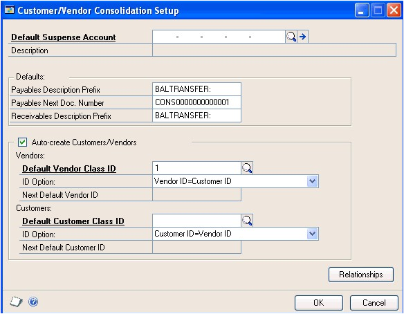
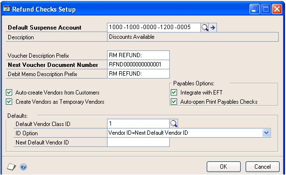
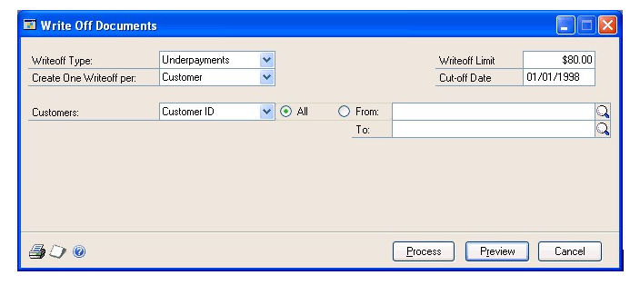

# Microsoft Dynamics GP Receivables Management Part 3: Transaction activity

This part of the documentation includes information to work with your transactions once you've entered them, such as posting and applying transactions, or creating refund checks for your customers.

The following topics are discussed:

- *Chapter 19, "Posting,"* describes the posting methods available in Receivables Management.

- *Chapter 20, "Applying,"* explains how to apply transactions after they have been saved or posted.

- *Chapter 21, "Customer/vendor consolidations,"* includes information on creating customer/vendor relationships and consolidations documents.

- *Chapter 22, "Refund checks,"* explains how to calculate customer credit balances, and print refund checks using Payables Management.

- *Chapter 23, "Transaction maintenance,"* includes procedures for correcting, deleting,

## Chapter 19: Posting

Posting is the process of transferring transactions to permanent records. You can change or delete transactions until they're posted.

Posting reports will be printed when you post transactions, either individually or in batches. For more information about posting reports for Receivables Management, refer to *Receivables Management standard report summary*.

For more information about setting up posting, see the System Setup Guide (Help \>\> Contents \>\> select Setting up the System).

This information is divided into the following sections:

- *Receivables Management posting*

- *Transaction-level posting*

- *Posting a batch*

### Receivables Management posting

In Receivables Management, posting updates the balances displayed in the Customer summary windows, so you can view up-to-date information for your customers; distribution accounts, if General Ledger is part of your system; commission information; and tax detail records. Your checkbook also is updated when you post, if you're using Bank Reconciliation. Transactions are considered open until they're fully applied and paid by the customer. Then they're transferred to history.

If you're saving or posting transactions for customers who are part of a national account, you can complete credit checking at an individual customer level or across the national account. If you can't save or post a transaction, check the status of the Base Credit Check on Consolidated National Account option in the National Accounts Maintenance window. See *Chapter 9, "National accounts,"* for more information.

### Transaction-level posting

When you use transaction-level posting, you can enter and post transactions individually without ever having to create a batch. Receivables information always is up to date immediately when you post using this method, because transactions must be posted or deleted immediately. They can't be saved or posted later.

Transaction-level posting is optional, and you can select it using the Posting Setup window when you set up your Microsoft Dynamics GP system. If your system hasn't been set up to use individual transaction entry, you'll be asked to create a batch when you attempt to post transactions. Also, you can post individually a transaction that was previously entered in a batch. To do so, select the transaction from the batch, clear the Batch ID field, and post the transaction.

If you're posting sales transactions, you can post them using the Receivables Transaction Entry or Cash Receipts Entry windows. All transactions posted individually in a single data entry session have the same audit trail code.

If you're posting by transaction date, the posting and document dates are be the same. If you change the posting date using the Receivables Date Entry window, the document date isn't be affected.

You can't post to a year that hasn't been set up using the Fiscal Periods Setup window. Also, if the year has been set up but the Sales period is closed, you can't post transactions. The posting journal indicates both the transactions that were and were not posted. Transactions are posted to General Ledger, even if a financial series period has been closed. However, transactions aren't posted through General Ledger.

Depending on the way your system is set up, the Transaction Posting or Cash Receipts Posting journals might be printed when the transaction-level posting process is complete. In addition, the Distribution Breakdown Register might be printed for posted transactions or cash receipts. You can print the Distribution Breakdown Register in detail or summary form. These journals are printed only if you selected to print them using the Posting Setup window.

### Posting a batch

Batch posting is a posting that allows transactions to be saved in batches and that can be posted whenever convenient. If you are using Workflow, the batch must be approved before you can post the batch. You can post batches that don't need approval.

#### To post a batch

1. Print an edit list and review the transactions in the batch. To print an edit list from the Receivables Batch Entry window, choose File \>\> Print with the appropriate batch ID displayed.

If you need to make corrections, do so at this time. If the Require Batch Approval option in the Posting Setup window has been marked, a batch can't be edited unless you unmark Approved.

2. Make a backup of your company's data. See the System Administrator's Guide (Help \>\> Contents \>\> select System Administration) for more information about making backups.

3. Open the Receivables Batch Entry window. (Sales \>\> Transactions \>\> Receivables Batches)

4. Enter or select the batch ID and origin for the batch to post.

5. Approve the batch for posting if required.

6. Choose Post. Your Receivables Management records will be updated to reflect the information from the transactions. Your General Ledger accounts will be updated, depending on your posting setup selections.

* If you're set up to post to General Ledger in the Posting Setup window, the batch appears in the Financial Series Posting and Master Posting windows; you can edit the transactions using the General Ledger Transactions Entry window before posting them in General Ledger. Your accounts are updated when you post the transactions in General Ledger.

* If you post through General Ledger, your accounts are updated at once and you don't need to post the batch again in General Ledger.

*If you entered batch total requirements or batch approval requirements in Receivables Management and posted a batch through General Ledger, the batch is posted through regardless of the batch requirement or approval requirements selected in General Ledger.*

One or more posting journals might be printed, depending on the options selected using the Posting Setup window. A Report Destination window might appear for each posting journal that was selected to print, depending on how they were set up.

#### **To post a batch using the action pane

1. In the navigation pane, choose the Sales button, and then choose the Receivables Batches list.

2. Mark a batch or batches.

3. In the Reports group, choose Reports and then select Print Edit List to print an edit list and review the transactions in the batch.

If you need to make corrections, do so at this time. For more information about correcting unposted transactions, see *Chapter 23, "Transaction maintenance."*

4. Make a backup of your company's data. See the System Administrator's Guide (Help \>\> Contents \>\> select System Administration) for more information about making backups.

5. From the Recivables Batches list, mark the batch or batches you want to post.

6. Choose to post the batch. Your Receivables Management records will be updated to reflect the information from the transactions. Your General Ledger accounts will be updated, depending on your posting setup selections.

    - If you're set up to post to General Ledger in the Posting Setup window, the batch appears in the Financial Series Posting and Master Posting windows; you can edit the transactions using the General Ledger Transactions Entry window before posting them in General Ledger. Your accounts are updated when you post the transactions in General Ledger.

    - If you post through General Ledger, your accounts are updated at once and you don't need to post the batch again in General Ledger.

*If you entered batch total requirements or batch approval requirements in Receivables Management and posted a batch through General Ledger, the batch is posted through regardless of the batch requirement or approval requirements selected in General Ledger.*

One or more posting journals might be printed, depending on the options selected using the Posting Setup window.

## Chapter 20: Applying

Applying is the process of assigning a specific credit transaction, such as a credit memo, return, or payment, to a sales document or other debit document. There are three methods of applying in Receivables Management: auto-applying, applying a transaction to specific documents, and applying a specific amount.

In Receivables Management, you can apply credit memos, returns, and payments as they're being entered, or after they are posted. Once these transactions are fully applied, they remain in the open tables and have a status of Open. You can move all fully applied documents to history using paid transaction removal. See *Removing paid transactions* for more information about moving transactions to history.

If you're using Multicurrency Management, you can apply posted multicurrency credit memos and returns, as well as posted or unposted payments to documents in Receivables Management.

This information is divided into the following sections:

- *Auto-applying overview*

- *Auto-applying documents*

- *Applying a transaction to specific documents*

- *Applying a specific amount*

- *Applying a principal payment to a scheduled payment*

- *Multicurrency applying*

- *Realized gains and losses*

- *How currency amounts are displayed in the scrolling window*

- *Unapplying documents*

- *Tracking GST discounts*

- *Tracking withholding writeoffs*

### Auto-applying overview

Auto-applying applies a transaction to as many documents as the amount being applied allows.

Posted multicurrency transactions and cash receipts can be applied to documents in the same currency or to documents in the functional currency; unposted originating currency cash receipts must be applied to transactions in the same currency. Also, a realized gain or loss might be calculated during the apply process. See *Realized gains and losses* for more information.

If you marked the Calculate Tax Rebates option in the Company Setup Options window, a tax rebate is calculated when a payment, credit memo, or return is applied to a sales document and a discount or writeoff is taken.

If you're using national accounts, applying cash receipts to child records follows currency business rules—that is, cash received is updated for the customer the receipt is entered for. You can apply negative cash receipts to a parent document in a national account. You can apply payments, credits, and returns from a parent to a child document within the same national account. These document types are applied according to the Apply by Due Date or Apply by Document Date setup option. The following information applies to national accounts users:

- The Writeoff, Discount Available, Accounts Receivables, and Discount Taken fields are taken from the apply-to document.

- If the accounts do not exist with the document, they are taken from the child customer record when applying a parent customer cash receipt to a child document.

- If the account doesn't exist on the child customer record, the account from the Posting Accounts Setup window for the Sales series is used.

### Auto-applying documents

Use the Apply Sales Documents window to automatically apply a transaction, which applies the transaction to as many documents as the amount being applied allows.

#### To auto-apply document

1. Open the Apply Sales Documents window. 
(Sales \>\> Transactions \>\> Apply Sales Documents)

    

2. Enter or select a customer ID.

3. Select the document type, and enter or select the document number to apply.

4. Enter an apply date and an apply posting date. These dates must be later than the sales revaluation date or you can't apply documents.

5. If you're using national accounts, indicate whether to view and apply transactions for the national account, or for a specific customer within the national account.

If you marked Auto Apply to Finance Charges First in the Receivables Management Setup window, the option you mark in this field determines whether unapplied credit documents are auto-applied first to the finance charge documents of the entire national account, or to those of a specific customer.

6. Choose Auto Apply to apply the credit memo, return, or payment to as many documents as the amount being applied allows.

The transaction is applied to documents having the oldest due date or document number, depending on the option that is marked in the Receivables Management Setup window.

If you marked Auto Apply to Finance Charges First in the Receivables Management window, unapplied credit documents are auto-applied first to finance charge documents. See *Additional receivables options* for more information.

7. To print an Apply Document List to verify that the transaction was applied to documents correctly, choose File \>\> Print.

8. Choose OK to close the window.

If you entered any Terms Taken or Writeoff amounts, a Receivables Apply Document Journal might be printed when you close the window, depending on the options you selected using the Posting Setup window. Those amounts are posted to General Ledger on the apply posting date.

### Applying a transaction to specific documents

Use the Apply Sales Documents window to apply a transaction to specific sales documents. You can mark any number of documents until the credit memo, return, or payment is fully applied.

Posted multicurrency transactions and cash receipts can be applied to documents in the same currency or to documents in the functional currency; unposted originating currency cash receipts must be applied to transactions in the same currency. Also, a realized gain or loss might be calculated during the apply process. See *Realized gains and losses* for more information.

If you're using national accounts and the customer ID you're applying from is the parent customer of a national account, you can apply amounts to only a specific member of the national account, or to the entire national account, depending on options you select. See *Chapter 9, "National accounts,"* for more information.

#### To apply a transaction to specific documents

1. In the navigation pane, choose the Sales button, and then choose the Receivables Transactions list.

2. Mark a credit transaction to apply.

3. In the Manage group, choose Apply Sales Documents to open the Apply Sales Documents window.

4. Enter an apply date and an apply posting date. These dates must be later than the sales revaluation date or you can't apply documents.

5. If you're using national accounts, indicate whether to view and apply to transactions for the national account or for a specific customer within the national account.

6. Mark the check box next to each document to apply this transaction to.

    - If the transaction is fully applied, all available discounts are taken.

    - To apply only a part of a transaction, enter the amount to apply in the Apply Amount field. You also can enter amounts in the Discount Taken and Writeoff Amount fields.

7. To print an Apply Document List to verify that the transaction was applied to documents correctly, choose File \>\> Print.

8. Choose OK to close the window.

If you entered any Terms Taken or Writeoff amounts, a Receivables Apply Document Journal might be printed when you close the window, depending on the options you selected using the Posting Setup window. Those amounts are posted to General Ledger on the apply posting date.

### Applying a specific amount

Use the Apply Sales Documents window to apply a specific amount to a sales document. You can apply part of a transaction to one document and part to another document. You also can apply only part of a transaction.

Posted multicurrency transactions and cash receipts can be applied to documents in the same currency or to documents in the functional currency; unposted originating currency cash receipts must be applied to transactions in the same currency. Also, a realized gain or loss might be calculated during the apply process. See *Realized gains and losses* for more information.

If you're using national accounts and the customer ID you're applying from is the parent customer of a national account, you can apply amounts to only a specific member of the national account, or to the entire national account, depending on options you select. See *Chapter 9, "National accounts,"* for more information.

#### To apply a specific amount

1. Open the Apply Sales Documents window. 
(Sales \>\> Transactions \>\> Apply Sales Documents)

2. Enter or select a customer ID.

3. Select the document type and enter or select the document number to apply.

4. Enter an apply date and an apply posting date. These dates must be later than the sales revaluation date or you can't apply documents.

5. If you're using national accounts, indicate whether to view and apply to transactions for the national account, or for a specific customer within the national account.

6. Enter the amount to apply in the Apply Amount field.

You can enter a negative amount for a document only when applying a negative cash receipt. You can apply negative cash receipts to the same documents as a positive cash receipt. When applying negative amounts, the Amount Remaining and Unapplied Amount fields increase.

If you enter an apply posting date and apply amounts, then you change the apply posting date and apply amounts again, the amounts will have different posting dates. For example, if you enter January 15 as the General Ledger apply posting date and you partially apply a transaction, the applied amounts are posted using the January 15 date. If you apply the rest of the transaction on January 20, those amounts are posted as of the January 20 apply posting date.

7. To print an Apply Document List to verify that the transaction was applied to documents correctly, choose File \>\> Print.

8. Choose OK to close the window.

If you entered any Terms Taken or Writeoff amounts, a Receivables Apply Document Journal might be printed when you close the window, depending on the options you selected using the Posting Setup window. Those amounts are posted to General Ledger on the apply posting date.

### Applying a principal payment to a scheduled payment

You can apply a cash receipt to a scheduled payment as you enter the cash receipt or after posting the cash receipt. If a principal payment, an extra amount to apply toward the principal balance, is included in the cash receipt, you can apply that amount to the remaining principal balance on the scheduled payment. For more information about scheduled payments, see *Chapter 13, "Scheduled payments."*

You can use the Apply Sales Documents window to apply a cash receipt with a principal payment to a scheduled invoice of a scheduled payment. After applying the cash receipt to a posted invoice of scheduled payment and choosing OK in the Apply Sales Documents window, a message will appear, asking whether you want to apply the unapplied amount to the principal. Choose Yes and the Principal Payments window opens.

In the Principal Payments window, you can view the principal payment that will be applied to the next scheduled payment. If multiple scheduled invoices from different scheduled payments are marked in the Apply Sales Documents window, the Schedule Number field will be blank and you can select which schedule to apply the principal payment to.

If the principal payment amount is greater than the remaining principal balance on a scheduled payment, only the amount remaining on the scheduled payment will be applied as a principal payment. The payment will have an unapplied amount and you can apply that amount to another document.

When the principal payment is posted, the principal payment is applied to the scheduled payment and the amortization schedule of the payment schedule is updated.

Principal payment information will be printed on the Cash Receipts Posting Journal, Receivables Distribution Breakdown Register and the Receivables Transaction Posting Journal reports. The principal payment document number printed on a report is the original scheduled payment document number with some additional information added as a suffix to identify each installment. For example, if the scheduled payment document number is SCHPY1002, the document number of the first posted principal payment will be SCHPY1002A01, the next document number will be SCHPY1002A02, and so on. If a customer sends more than 99 principal payments for SCHPY102, the 100th principal payment will have the document number of SCHPY1002B01 and so on.

### Multicurrency applying

Multicurrency credit memos and returns must be posted before you can apply them. You can apply posted cash receipts, credit memos and returns to transactions in either the functional currency or the same currency as the credit document. Unposted cash receipts can be applied, but only to a transaction of the same currency.

During the apply process, if the originating amounts for the debit and credit transactions are the same but the exchange rates are different, a realized gain or loss is calculated and posted when you close the Apply Sales Documents window. See *Realized gains and losses* for more information. If the originating debit and credit apply amounts balance but the functional equivalents don't balance because of rounding differences, the difference is posted to the Rounding Difference account.

Using auto-apply, you can apply a transaction to as many documents as the amount being applied allows. Multicurrency credit memos, returns, or payments are applied to documents with the same currency ID, using the originating amounts of the transaction as the basis for the apply process. See *Auto-applying documents* for more information.

If you're using Multicurrency Management, you can enter a writeoff amount when the apply-from and apply-to documents are in the same currency or in the functional currency.

### Realized gains and losses

In multicurrency transactions, if the originating currency amounts are equal but the functional currency amounts don't match because the sale and payment were entered using different exchange rates, a realized gain or loss is calculated and displayed in the Realized Gain/Loss column in the functional currency. That amount is posted to General Ledger when you close the window, and the Accounts Receivable account is used as the offset account.

#### Example

Your company's functional currency is US dollars. You posted the following sale in October and the cash receipt in November, both in the euro currency, using a multiply rate calculation method, as is displayed in the following table:

| **Sale amount in originating currency**         | **Exchange rate in October**  | **Sale amount in functional currency**         |
|-------------------------------|-------------------------------|------------------------------------------------|
| 1000EURO                                        | 0.892962                      | \$892.96                                       |
|                                                 |                               |                                                |
| **Cash receipt amount in originating currency** | **Exchange rate in November** | **Cash receipt amount in functional currency** |
| 1000EURO                                        | 0.897344                      | \$897.34                                       |

When the cash receipt is applied to the sale, a realized gain of \$4.38 is calculated because the functional equivalent of the cash receipt (\$897.34) is \$4.38 greater than the functional equivalent of the sale (\$892.96).

You can apply multicurrency credit and debit transactions that have unrealized revaluation gains or losses. The unrealized gain or loss amount is settled with realized gain or loss amounts when applying posted transactions.

If apply transactions that have realized or unrealized revaluation gains or losses are partially applied and revalued again before fully settling the transactions, a revaluation occurs on the previous apply amount if the apply amount was changed. Updating the previous apply amount to the current revalued exchange rate occurs when applying posted transactions.

### How currency amounts are displayed in the scrolling window

The Apply From Currency ID field in the Apply Sales Documents window displays the currency ID of the credit transaction you're applying to another document. The currency ID displayed in this field determines how amounts are displayed in the scrolling window.

| **Apply-to currency ID** | **Scrolling window displays currency amounts in** |
|--------------------------|---------------------------------------------------|
| Functional               | Functional currency                               |
| Originating              | Originating currency                              |

The documents displayed in the scrolling window are documents in the functional currency, or that have the same currency ID as the apply-from currency ID.

### Unapplying documents

Unapplying a document reverses the entries that applied amounts to the document. You can use the Apply Sales Document window to unapply a document without deleting or voiding it. If you unapply a credit memo, return, or cash receipt, the current transaction amount for the debit document is increased by the applied amount.

When you void a credit document or when you assess a nonsufficient funds charge (NSF), you unapply amounts. When you assess an NSF charge, payment is unapplied, any distributions are reversed and customer balances are updated.

#### To unapply a document

1. Open the Apply Sales Documents window. 
(Sales \>\> Transactions \>\> Apply Sales Documents)

2. Enter or select a customer ID.

3. Select a document type and enter or select the document number to unapply.

4. To unapply all the documents in the scrolling window, or just specific transactions or amounts, choose the following options:

    - Choose Unapply to unapply all the documents in the scrolling window.

    - Unmark a transaction to unapply specific transactions.

    - Delete the amount in the Apply Amount field to unapply specific amounts.

5. To print an Apply Document List to verify that the credit amount was applied correctly, choose File \>\> Print.

6. Choose OK to close the window.

If you entered any terms taken or writeoff amounts, a Receivables Apply Document Journal might be printed when you close the window, depending on the options you selected using the Posting Setup window.

### Tracking GST discounts

Use the Additional Sales Tax and Writeoff Distributions window to enter unposted discounts distributed to Goods and Services Tax (GST, used in New Zealand).

#### To track GST discounts

1. Open the Apply Sales Documents window. 
(Sales \>\> Transactions \>\> Apply Sales Documents)

2. Enter your information, such as customer ID, document type, and document number.

3. Enter an amount in the Terms Taken field.

4. Choose the Terms Taken link to open the Additional Sales Tax and Writeoff Distributions window.

    ![0fad0fd7408ef6b624edf177fa855555.jpg(media/0fad0fd7408ef6b624edf177fa855555.jpg)

5. Enter the tax detail used to calculate GST on this transaction.

6. Enter the GST taken amount or GST percentage. Depending on the one you enter, the other is calculated. The amount entered reduces the amount of tax collected and the sales amount in the Tax Detail Maintenance window.

7. Choose OK to close the window.

### Tracking withholding writeoffs

Use the Additional Sales Tax and Writeoff Distributions window to enter unposted writeoffs to withholding.

#### To track withholding writeoffs

1. Open the Apply Sales Documents window. 
(Sales \>\> Transactions \>\> Apply Sales Documents)

2. Enter or select a customer ID.

3. Select a document type and enter or select a document number.

4. Enter an amount in the Terms Taken field.

5. Choose the Terms Taken link to open the Additional Sales Tax and Writeoff Distributions window.

6. Enter the withholding amount that the customer remitted to the taxation office. That amount is written off of the customer's account.

7. Choose OK to close the window.

## Chapter 21: Customer/vendor consolidations

Over the course of a business relationship, some customers become vendors and some vendors become customers. You can use the customer/vendor consolidations feature to transfer information between Receivables Management and Payables Management, so you can create a customer card using information that's already in your system in a vendor card, and vice versa.

Using customer/vendor consolidations, you can consolidate balances in payables and receivables for a single company when you work with that company as both a customer and a vendor. You can assign relationships between existing customers and vendors and then apply open debit and credit documents against each other to consolidate the current balances.

This information is divided into the following sections:

- *Setting up customer/vendor consolidations*

- *Creating customer/vendor relationships*

- *Auto-creating customers or vendors*

- *Consolidating customer and vendor documents*

- *Using the cross-module link*

### Setting up customer/vendor consolidations

Use the Customer/Vendor Consolidation Setup window to create default entries for customer/vendor consolidations. You can set up default entries for a suspense account, payables description prefix, next payables document number, and receivables description prefix.

#### To set up customer/vendor consolidations

1. Open the Customer/Vendor Consolidation Setup window. 
    (Administration \>\> Setup \>\> Company \>\> Customer/Vendor Setup)

    

2. Enter or select a posting or allocation account as the default suspense account.

The Description field will contain the default entry from the Account Maintenance window.

3. Enter a payables description prefix. Both this prefix and the receivables document number will be combined during the consolidation process. This information will become the transaction description for all the payables consolidations transactions.

4. Enter a payables next document number or accept the default entry. If you enter the number, it must be a number that can be incremented. For example, you could not use 10008PM because it ends in a letter. You could use PM10008 because it ends in a number.

5. Enter a receivables description prefix. Both this prefix and the payables document number will be combined during the consolidation process. This information will become the transaction description for all the receivables consolidations transactions.

6. Verify that the Auto-create Customers/Vendors option is marked. If you mark this option, you can automatically create a new customer card from an existing vendor card or a new vendor card from an existing customer card. If this option isn't marked, you'll have to create new customer and vendor cards manually.

7. If you marked Auto-create Customers/Vendors, you can enter or select the default vendor class ID. This information is used to automatically add the default accounts when you use the auto-create capability to create new customer cards in the Customer/Vendor Relationships window.

The information that you enter in this field will replace any information that might have been entered in the same field in the Refund Checks Setup window.

8. Select one of these ID options from the drop-down list:

- If you want the vendor IDs to match the customer IDs, select Vendor ID=Customer ID.

- If you want the vendor IDs to be the next available vendor ID, select Vendor ID=Next Default Vendor ID. You also must enter a default vendor ID to use, which increments by one.

The information that you enter here will replace any information that might have been entered in the same field in the Refund Checks Setup window.

9. If you marked Auto-create Customers/Vendors, you can enter or select the default customer class ID. This information is used to automatically add the default accounts when you use the auto-create capability to create new vendor cards in the Customer/Vendor Relationships window.

10. Select one of these ID options from the drop-down list:

    - If you want the customer IDs to match the vendor IDs, select Customer ID=Vendor ID.

    - If you want the customer IDs to be the next available customer ID, select Customer ID=Next Default Customer ID. You also must enter a default customer ID to use, which increments by one.

11. Choose OK to save your changes and close the window.

### Creating customer/vendor relationships

Use the Customer/Vendor Relationships window to link a customer to a vendor or a vendor to a customer. These relationships will be used when you consolidate the balances of the customer and vendor.

#### To create a customer/vendor relationship

1. Open the Customer/Vendor Relationships window. (Sales \>\> Cards \>\> Customer/Vendor)

   

2. Enter or select a vendor and a customer. You can create more than one customer/vendor relationship at a time in this window by entering multiple customers and vendors.

3. Verify that the default currency IDs for both the customer and vendor are the same. If the default currency is not the functional currency, you must select a rate type.

    If you have Multicurrency Management registered and have entered a default currency for the customer, the Currency field will display that currency. You can change the currency.

4. Choose OK to create and save the customer/vendor relationship and close the window.

### Auto-creating customers or vendors

Use the Customer/Vendor Relationships window to automatically create customer cards from existing vendor cards and vendor cards from existing customer cards. This process will create a new customer or vendor card without changing the existing card. You must have the Auto-create Customer/Vendors option marked in the Customer/Vendor Consolidation Setup window. For more information, refer to *Setting up customer/vendor consolidations* .

#### To auto-create a customer or vendor

1. Open the Customer/Vendor Relationships window. (Sales \>\> Cards \>\> Customer/Vendor)

2. Enter or select a customer or vendor. This procedure requires you to use an existing customer or an existing vendor, but you don't need to have both an existing customer and vendor.

3. Verify that the default currency ID is correct. If the currency isn't the functional currency, you must select a rate type.

4. Choose the Create Customer or the Create Vendor button to open the Customer Maintenance window or the Vendor Maintenance window. The default accounts come from the class ID that you entered in the Customer/Vendor Consolidation Setup window.

5. Make any changes that are needed to the vendor or customer information and choose save.

6. Choose OK to save the relationship and close the window.

### Consolidating customer and vendor documents

Use the Customer/Vendor Consolidations window to create consolidation documents to transfer the balance for a customer account to the related vendor account or from the vendor account to the related customer account.

#### To consolidate customer and vendor documents

1. Open the Customer/Vendor Consolidations window. (Sales \>\> Transactions \>\> Customer/Vendor Trx.)

    

2. Mark Customer to display the customer ID first or Vendor to display the vendor ID first.

3. Enter or select the customer or vendor ID. The related customer or vendor will appear in the window.

4. Verify the default currency ID that was set up in the Customer/Vendor Relationships window. You can enter or select the functional currency even if it isn't the default currency.

    If you select the functional currency, you can view all the transactions including transactions entered in the alternate currency. For more information on setting up the default currency for the customer/vendor relationship, refer to *Creating customer/vendor relationships* .

5. Accept the default transfer date or enter a different date. If you enter the date, it must be in an open period in Receivables Transaction Entry and Payables Transaction Entry.

    If you have Multicurrency Management registered, the sub-module revaluation must be greater than the last revaluation date for both the customer and vendor. For more information, refer to the Multicurrency Management documentation.

6. Mark the Transfer to Payables, Transfer to Receivables, or Consolidate Documents option. If you mark the transfer to Payables option, the Receivables documents will be displayed, and if you mark the Transfer to Receivables option, the Payables documents will be displayed. If you mark the Consolidate Documents option, both Payables and Receivables documents will be displayed.

7. If applicable, mark to display either the National Account or the Specific Customer view option. These options will be enabled if the customer ID is the parent of a national account.

8. Then, mark the documents you want to transfer or consolidate. You can view the customer and vendor transfer totals in the Customer Transfer Total and the Vendor Transfer Total fields to verify your document transfer.

9. If you choose Preview, the consolidation document information for both payables and receivables will be displayed in the Consolidation Transaction Preview window. The transactions that will be created will be displayed along with the net charges to the customer's or vendor's balance.

10. Choose Post. Posting will create the consolidation documents and consolidate the balances in payables and receivables.

### Using the cross-module link

You can link the selected receivables consolidation document to the corresponding payables consolidation document, and you can link the selected payables consolidation document to the corresponding receivables consolidation document. Using this capability you can quickly verify information about a specific transaction in both Payables Management and Receivables Management.

#### To use the cross-module link

1. Open the Receivables Transaction Inquiry - Customer window. (Sales \>\> Inquiry \>\> Transaction by Customer)

2. Select a consolidation document. Consolidation documents will have the prefix that you assigned in the Customer/Vendor Consolidation Setup window.

3. Click the Document Number link to open a linked window.

4. Choose the Description expansion button to open the related window.

If the linked window you were viewing was in payables, then the related linked window would be for receivables. If the linked window you were viewing was in receivables, then the related linked window would be for payables.

## Chapter 22: Refund checks

If you're using Receivables Management, Payables Management, and Refund Checks, you can use the refund checks feature to create receivables debit memos for customers who have credit balances, and print refund checks for those customers using Payables Management.

This information is divided into the following sections:

- *Refund checks auto-apply process*

- *Setting up refund checks*

- *Mapping customer cards to vendor cards*

- *Refund checks and multiple currencies*

- *Refund checks and national accounts*

- *Creating refund checks*

- *Refund checks and EFT*

### Refund checks auto-apply process

When you're preparing to create refund checks, you can use the Create Refund Checks window to view which customers have credit balances. All posted documents are examined during this calculation process, and if a customer has a credit balance, all outstanding credit documents are auto-applied to outstanding debit documents. Any remaining credit amounts become refund check amounts. Creating refund checks for these customers applies the outstanding credits to the newly created debit documents. The customer accounts will have zero balances with no unapplied amounts remaining.

To create refund checks for a customer with a debit balance, you must use the sorting methods to display only that customer card in the Create Refund Checks scrolling window. In the Edit Refund Checks window, you can mark which credit documents to create the check for. Only the credit documents are applied in this case.

You can use the Edit Refund Checks window to change the refund check amount by unmarking the documents that you don't want to include in the customer's credit balance. Unmarked documents will not be applied during the refund checks posting process. To change the refund check apply amount, change the amount in the Apply Amount column.

When you create refund checks, the debit memo that's created in Receivables Management is auto-applied to the documents that constituted the customer's balance when the documents were selected. A miscellaneous charge document then is generated in Payables Management, and a payment is issued. The payment is auto-applied to the invoice, and the check will be ready to print and process in Payables Management.

Multicurrency transactions will be revalued during this process, and any realized gains or losses will be calculated.

### Setting up refund checks

Use the Refund Checks Setup window to specify your preferences and default entries for creating refund checks.

#### To set up refund checks

1. Open the Refund Checks Setup window. (Sales \>\> Setup \>\> Refund Checks)

   

2. Enter or select a default suspense account number, which is an offset account for your Accounts Receivable and Accounts Payable amounts. The account you enter or select must be a posting account, and must be set up to use all the currencies in which you're writing checks.

3. Enter a voucher description prefix, which will be displayed as the transaction description for the payables invoices that are generated when you create refund checks.

4. Enter the next document number to be used for the payables invoices that are generated. This number increments by one.

5. Enter the debit memo description prefix, which will be displayed as the transaction description for the debit memos that are generated when you create refund checks.

6. If you're using Electronic Funds Transfer (EFT), mark whether to send payments using EFT. See *Refund checks and EFT* for more information.

7. Mark whether you want the Print Payables Checks window to open when the create checks process is complete.

8. Mark whether to be able to automatically create a vendor card using customer information. If you mark this option, information from the customer card, such as address information, will be entered automatically on the vendor card when you create it.

9. Mark whether or not you want to create the vendor as a temporary vendor. If you choose this option, the Temporary option will be marked automatically when you create a vendor card from a customer card using the Customer/ Vendor Relationships window.

10. Enter or select a vendor class to be used as the default vendor class for vendor cards that are created using customer card information when you create refund checks. The vendor class information, such as posting accounts and history options, will be entered on the vendor cards when you create them. The information that you enter in this field will replace any information that might have been entered in the same field in the Customer/Vendor Consolidation Setup window.

11. Select one of the following vendor ID options:

    - If you want vendor IDs to match the customer IDs, select Vendor ID=Customer ID.

    - If you want vendor IDs to be the next available vendor ID, select Vendor ID=Next Default Vendor ID. You also must enter a default vendor ID to use, which increments by one.

    The information that you enter here will replace any information that might have been entered in the same field in the Customer/Vendor Consolidation Setup window.

12. Choose OK to save your changes and close the window.

### Mapping customer cards to vendor cards

When you enter refund check information, a vendor card must be created for the customer before a refund check can be processed and printed for that customer.

If vendor cards already exist for customers in Payables Management, you can use the Customer/Vendor Relationships window to map existing customer IDs to existing vendor IDs. You also can use this window to add customer and vendor cards, and map the IDs at the same time.

If you're using national accounts, you have two options for mapping customer IDs to vendor IDs.

- You can map the customer ID for the parent customer to a vendor ID and you can mark the Default Parent's Vendor for Children's Refund Checks option for the national account in the National Account Maintenance window. When you create refund checks, all child customers for the national account will be mapped to the vendor ID for the parent customer.

- You can map the customer ID for the parent customer and each child customer to individual vendor IDs. You must unmark the Default Parent's Vendor for Children's Refund Checks option for the national account in the National Account Maintenance window to be sure each child customer remains mapped to a specific vendor ID.

#### To map customer cards to vendor cards

1. Open the Customer/Vendor Relationships window. (Sales \>\> Cards \>\> Customer/Vendor)

2. Enter or select the customer ID for the customer card you're mapping to a vendor card. If you enter a new customer ID, the Customer Maintenance window will open, where you can enter information for that customer.

3. Select one of the following vendor card options:

    - Choose Create Vendor to automatically create a vendor card for the customer. The Vendor Maintenance window will open and display the information that was copied from the customer card. The vendor ID is generated according to the option you selected in the Refund Checks Setup window.

    - Enter or select the customer's corresponding vendor ID. If you enter a new vendor ID, the Vendor Maintenance window will open, where you can enter information for the vendor card.

4. To print a Customer/Vendor List, choose the printer icon.

5. Choose OK to save your changes and close the window.

### Refund checks and multiple currencies

Any miscellaneous charge documents will be created using the originating currency when you create refund checks. Any payments will be created using the checkbook currency.

| **Parent customer** | **Child customer**  | **Default parent's vendor for children's refund checks option** | **Vendor ID displayed**       |
|---------------------|---------------------|-------------|-------------------------------|
| Mapped to vendor ID | Mapped to vendor ID | Marked     | Vendor ID for parent customer |

The Document Date field in the Create Refund Checks window is set to the check date and can't be changed when you create refund checks if the currency for the batch is not the same as the functional currency. The document date will be set to the user date if the currency for the batch is the same as the functional currency.

Balance forward customers are included in the calculation process when creating refund checks only if the batch uses the functional currency.

See *Creating refund checks* for more information.

### Refund checks and national accounts

If you're using national accounts, the documents that will appear in the Edit Refund Checks window when you choose Insert in the Create Refund Checks window will depend on whether you select a parent or child customer to view documents for.

**Parent customer** Credit documents for the parent and all child customers of a national account will be listed. However, if a refund check already has been created for a child customer of the national account, then only the credit documents for the parent customer will be listed.

**Child customer** Only credit documents for the child customer will be listed.

If the child customer of a national account is listed in the Create Refund Checks window, the vendor ID that will be displayed for the customer depends on whether the parent and child customers of the national account have been assigned to vendor IDs, and whether the Default Parent's Vendor for Children's Refund Checks option is marked for the national account in the National Account Maintenance window. The following table lists the vendor ID that will be displayed.

| **Parent customer** | **Child customer** | **Default parent's vendor for children's refund checks option** | **Vendor ID displayed** |
|--|--|--|--|
| Mapped to vendor ID | Not mapped to vendor ID | Marked | Vendor ID for parent customer |
| Mapped to vendor ID | Mapped to vendor ID | Not marked | Vendor ID for child customer |
| Mapped to vendor ID | Not mapped to vendor ID | Not marked | No vendor ID displayed |
| Not mapped to vendor ID | Mapped to vendor ID | Marked | No vendor ID displayed |
| Not mapped to vendor ID | Not mapped to vendor ID | Marked | No vendor ID displayed |
| Not mapped to vendor ID | Mapped to vendor ID | Not marked | Vendor ID for child customer |
| Not mapped to vendor ID | Not mapped to vendor ID | Not marked | No vendor ID displayed |

If a vendor ID is associated with a parent customer, a P will appear after the vendor ID.

You can assign a child customer to a vendor ID by entering a vendor ID in the Vendor ID column in the Create Refund Checks window. If the vendor ID you entered hasn't been set up yet, the Vendor Maintenance window will open, where you can enter information for the vendor you're creating. You also can use the Customer/Vendor Relationships window to map child customers to vendor IDs.

See *Mapping customer cards to vendor cards* for more information.

### Creating refund checks

Use the Create Refund Checks window to calculate which customers should receive refund checks, and to send refund checks information to Payables Management.

When the minimum credit balance is calculated using the refund checks process, customers with credit balances less than the amount you enter in the Minimum Credit Balance Required field will be identified.

See *Refund checks auto-apply process* for information about how the minimum credit balances are calculated and about creating a refund check for a customer with a credit balance.

You can create refund checks by selecting specific documents for a customer, or by selecting a range of credit balance customers.

If you choose to select specific documents, when you select the customer to create a refund for, the Edit Refund Checks window will open automatically displaying the documents and amounts you can mark or unmark to include in the refund check.

If you choose to select a range of credit balance customers, when you select the customers to create refunds for, those customers with a credit balance equal to or greater than the Minimum Credit Balance to Refund field will be listed in the Create Refund Checks scrolling window. You then can select a customer and choose the Check Amount link to open the Edit Refund Checks window, where you can mark or unmark the documents and amounts to include in the refund check to the customer.

#### To create refund checks

1. Open the Create Refund Checks window. (Sales \>\> Transactions \>\> Refund Checks)

2. Enter or select a payables computer check batch ID to include the refund check payments in.

3. Accept the default entry or select a new entry for the document selection.

4. Mark either Create Refund for Specific Documents or Create Refund for Credit Balance Customers.

5. Select the customers to calculate balances for.

    - **Customer** Select the customer to calculate balances for if you marked the Create Refund for Specific Documents option.

    - **Customers** Select a range of customers to calculate balances for if you marked the Create Refund for Credit Balance Customers option.

6. Enter an amount in the Minimum Credit Balance Required field.

7. Choose Insert.

    - If you marked the Create Refund Checks for Specific Documents option in step 4, the Edit Refund Checks window will open, where you can mark and unmark the credit documents to create refund checks for. Click OK to save your changes and close the Edit Refund Checks window. The customer and associated refund check amount will be displayed in the scrolling window in the Create Refund Checks window.

    - If you marked the Create Refund Checks for Credit Balance Customers option in step 4, the customers that match the search and calculation criteria will be displayed in the scrolling window, along with the refund check amount. You can select a customer in the scrolling window and choose the Customer ID link to open the Edit Refund Checks window, where you can mark and unmark the credit documents to create refund checks for. Click OK to save your changes and close the Edit Refund Checks window. The customer and associated refund check amount will be displayed in the scrolling window in the Create Refund Checks window.

    If a customer is on hold, a message will be displayed and you'll have the option to create a refund check for that customer. You must enter a password to override the hold if a password was entered in the Remove Customer Hold field in the Receivables Management Setup window.

8. If a customer ID that's displayed in the Create Refund Checks window isn't mapped to a vendor ID, you can create a new vendor to assign the customer to. Select the customer ID and choose Create Vendor. The Vendor Maintenance window will open, where you can enter information for the vendor you're creating.

    If a customer ID that's displayed in the window is the child customer of a national account, you can enter a new vendor ID in the Vendor ID column and the Vendor Maintenance window will open.

    You also can use the Customer/Vendor Relationships window to map child customers to vendor IDs. See *Mapping customer cards to vendor cards* for more information.

9. If you don't want a refund check to be processed for a customer card that's displayed in the scrolling window, select the card and choose Remove. Any documents that were applied during the calculation process will be unapplied.

10. Select a card and choose the Check Amount link to open the Edit Refund Checks window, which displays the documents that are included in the customer's refund amount.

11. If the customer is the parent of a national account, mark National Account to display credit documents for the parent and all children of the selected national account. Mark Specific Customer and select the customer ID to display credit documents only for the selected parent or child customer of a national account. These options only will appear if National Accounts is registered. See *Refund checks and national accounts* for more information.

12. To change the refund amount for a document, enter the new amount in the Refund Amount column.

    To exclude a document from being included in the customer's refund amount, unmark the check box. Unmarked documents will not be applied during the refund checks apply and posting processes.

    Choose OK to save your changes and close the window. The Create Refund Checks window will be redisplayed.

13. Choose Print to open the Refund Checks Print Options window and select from the following options.

    - **Customer/Vendor List**  

        Mark All to print the list for all customers, including customers mapped to vendor IDs that are on hold or inactive. Mark Vendors with Errors Only to print the list for customers who haven't been mapped to vendor IDs, or that have vendor IDs that meet one of the following criteria.

        - Vendor ID is on hold

        - Vendor ID is inactive

        - Invalid bank information has been entered for the vendor ID

        - Vendor ID does not exist

    - **Refund Checks Edit List**  

        Print the Refund Checks Edit List.

14. Choose Process to transfer the receivables balances to Payables Management. Depending on your setup options, posting journals might be printed.

A receivables debit document will be generated in Receivables Management for each customer and a payables miscellaneous charge document will be generated in Payables Management for each vendor.

The Print Payables Checks window will open, where you can print checks for each vendor if the Auto-open Print Payables Checks option is marked in the Refund Checks Setup window.

### Refund checks and EFT

This section only applies to the United States and Europe. If you're using EFT, you can create batches that include only EFT payments. If you mark Integrate with EFT in the Refund Checks Setup window, the system verifies hat the checkbook assigned to the batch is set up properly to make electronic funds transfers.

The system also verifies that the vendor card is set up to use EFT. Any vendor cards that don't include valid EFT information will be designated as invalid in the scrolling window.

A vendor can be considered invalid for any of the following reasons:

- No card has been created for the vendor using the EFT Vendor Maintenance window.

- The vendor card created using the EFT Vendor Maintenance window is marked as invalid.

- The EFT vendor termination date has passed.

- An EFT vendor prenote has not been sent for the vendor.

- An EFT vendor prenote has been sent, but the Prenote Date + Prenote Grace Period Days hasn't been set up using the EFT Checkbook Maintenance window. The Prenote Grace Period Days is the number of calendar days to wait after a prenote has been generated for a new vendor before it's valid for actual transactions.

Only valid vendor cards are processed in the refund checks batch.

> [!NOTE]
> When you integrate refund checks with EFT, the PMEFT.dic file must be installed on the workstation that is being used to process refund checks. Refer to the eBanking documentation for further information.

## Chapter 23: Transaction maintenance

Once you begin entering information in Receivables Management, proper maintenance of these records is essential to preserving the accuracy of your accounting information.

This information is divided into the following sections:

- *Handling NSF checks*

- *Voiding and unrealized gains and losses*

- *Voiding a posted transaction*

- *Waiving a finance charge*

- *Editing discount date and reference information*

- *Correcting or deleting an unposted transaction*

- *Deleting an unposted printed transaction*

- *Correcting or deleting an unposted cash receipt*

- *Writing off outstanding credit or debit amounts*

### Handling NSF checks

You can process a payment as having non-sufficient funds (NSF), and to assess a charge for the check. The NSF charge is a service charge amount for checks having non-sufficient funds. You can assess NSF charges only for payments. The default NSF charge amount is entered in the Receivables Management Setup window.

If you process a payment as NSF, the system will unapply the payment, back out the distributions and increase the amount in the Receivables account and decrease the amount in the Cash account. Documents are not transferred to history, but you can mark to transfer them during the paid transaction removal process. You can't mark checks that have been removed from history as NSF.

If you're using Bank Reconciliation and process a check as NSF, payments are unapplied, any distributions are reversed, and customer balances are updated. Paid commissions are backed out with negative amounts and are marked as unpaid. Bank Reconciliation amounts also are updated. See the Bank Reconciliation documentation for more information about how amounts are updated in Bank Reconciliation.

If you void a multicurrency document, any realized gains or losses that originally were posted also are reversed.

#### To handle an NSF check

1. Open the Receivables Posted Transaction Maintenance window. (Sales \>\> Transactions \>\> Posted Transactions)

    

2. Enter or select a customer ID.

3. Select Payments as the document type, and enter or select the cash receipt number for the check that didn't clear.

4. Choose NSF to open the Auto Post NSF Debit Charge window.

    

    The payment is unapplied and distributions are reversed. Using the NSF Debit Charge window, you can change the default charge for the NSF check, and view the document number assigned to the debit memo that's created.

    If you're using Multicurrency Management and you assess an NSF charge on a multicurrency cash receipt, any realized gains or losses that were posted when the cash receipt was applied also are reversed.

5. Choose OK. The Receivables Posted Transaction Maintenance window is redisplayed and cleared. You can handle additional NSF payments or close the window.

When you close the window, a Voided/Waived/NSF Transaction Posting Journal might be printed, depending on the options you selected using the Posting Setup window.

You can view NSF charges for the customer using the Customer Payment History Inquiry and Transaction Inquiry windows. The NSF charges also appear on the customer's statements until the charges are fully paid.

#### To handle an NSF check using the action pane

1. In the navigation pane, choose the Sales button, and then choose the Receivables Transactions list.

2. Mark a payment that has non-sufficient funds.

3. In the Manage group, choose NSF.

4. Accept to use the document date as the void date or select to enter a date, and then enter the void date.

5. Enter a posting date or accept the default posting date.

6. Choose NSF.

The payment is unapplied and distributions are reversed. A debit memo is created for the service charge amount assessed.

If you're using Multicurrency Management and you assess an NSF charge on a multicurrency cash receipt, any realized gains or losses that were posted when the cash receipt was applied also are reversed.

A Voided/Waived/NSF Transaction Posting Journal might be printed, depending on the options you selected using the Posting Setup window.

You can view NSF charges for the customer using the Customer Payment History Inquiry and Transaction Inquiry windows. The NSF charges also appear on the customer's statements until the charges are fully paid.

#### Voiding and unrealized gains and losses

When you void a transaction that had an unrealized revaluation gain or loss recognized as a realized gain or loss during settlement, the unrealized gain or loss amount is reinstated. The settled realized gain or loss is reversed. If the applied-to document's amount remaining had been revalued before voiding the credit document, the previous apply amount is revalued with the document's current exchange rate.

#### Voiding a posted transaction

Use the Receivables Posted Transaction Maintenance window to void sales, debit memos, finance charges, service repairs, and warranty transactions. You can void these transactions as long as they have no amounts applied to them. You also can void payments such as cash receipts, credit memos, and returns if they have amounts applied. If you void a credit document, you unapply amounts. Documents are not transferred to history, but you can mark to transfer them during the paid transaction removal process.

If you need to correct a posted transaction, you might need to void the original transaction and reenter it. If you use this window to void a transaction that did not originate in Receivables Management, reversing entries will be made in Receivables Management and General Ledger only and inventory will not be adjusted.

When a document is voided, any commission or distribution amounts are reversed and customer balances are updated. If you're using Bank
Reconciliation and you void a transaction with cash, check, or credit card amounts, Bank Reconciliation amounts are updated. The original receipt is voided if it exists; otherwise a negative cash receipt amount is posted to Bank Reconciliation. See the Bank Reconciliation documentation for more information about how amounts are updated in Bank Reconciliation.

If Calculate Tax Rebates is marked in the Company Setup Options window and you're voiding a payment with a discount or writeoff, any distributions for tax rebates also are voided. If you marked Allow Negative Debits and Credits in General Ledger in the Company Setup Options window, negative debit and credit distributions are posted to General Ledger when you void transactions. Use the Receivables Distribution Inquiry Zoom window to view them.

If a realized gain or loss is recognized as a result of euro conversion and you void the transaction, the conversion amounts are reversed.

#### To void a posted transaction

1. Open the Receivables Posted Transaction Maintenance window. (Sales \>\> Transactions \>\> Posted Transactions)

2. Enter or select a customer ID.

3. Select a document type and enter or select the document number to void.

4. Enter or accept the entry in the Void Date field.

5. Choose Void.

Distributions and tax amounts are reversed for the transaction, and any commissions are reversed. When you close the window, a Voided/Waived/NSF Transaction Posting Journal might be printed, depending on the options you selected using the Posting Setup window.

You can view the voided transaction using the Receivables Transaction Inquiry - Document window. Voided transactions are marked with an asterisk (\*).

#### Waiving a finance charge

You can waive a posted finance charge transaction. Documents are not transferred to history when you waive finance charge transactions, but you can mark to transfer them during the paid transaction removal process.

#### To waive a finance charge

1. Open the Receivables Posted Transaction Maintenance window. (Sales \>\> Transactions \>\> Posted Transactions)

2. Enter or select a customer ID.

3. Select Finance Charge as the document type, and enter or select the finance charge transaction to waive.

4. Choose Waive. You might be prompted to enter a password, depending on the options you selected using the Receivables Management Setup window.

Distributions are reversed for the transaction, as are the finance charge amounts shown in the Year-to-Date and Life-to-Date fields in the Customer Finance Charge Summary window. The Finance Charges Waived field in the Customer Period Summary window is updated.

When you close the window, a Voided/Waived/NSF Transaction Posting Journal might be printed, depending on the options you selected using the Posting Setup window.

You can view the waived charges for the customer using the Period Sales Inquiry and Transaction Inquiry windows. Any waived finance charges appear on the customer's statements until the charges are transferred to history.

#### To waive a finance charge using the action pane

1. In the navigation pane, choose the Sales button, and then choose the Receivables Transactions list.

2. Mark a finance charge to waive.

3. In the Manage group, choose Waive Finance Charge.

4. Accept to use the document date as the void date or select to enter a date, and then enter the void date.

5. Enter a posting date or accept the default posting date.

6. Enter a password if a password is required for waiving finance charges.

7. Choose Waive.

Distributions are reversed for the transaction, as are the finance charge amounts shown in the Year-to-Date and Life-to-Date fields in the Customer Finance Charge Summary window. The Finance Charges Waived field in the Customer Period Summary window is updated.

When you close the window, a Voided/Waived/NSF Transaction Posting Journal might be printed, depending on the options you selected using the Posting Setup window.

You can view the waived charges for the customer using the Period Sales Inquiry and Transaction Inquiry windows. Any waived finance charges appear on the customer's statements until the charges are transferred to history.

#### Editing discount date and reference information

Use the Edit Receivables Transaction window to change the discount date, due date, purchase order number, and transaction description for a posted transaction. You might want to change the discount date and due date if you give extended terms based on partial payments. You can't change the discount and due date for balance forward customers, or for returns, credits, and warranties. You also can't change the purchase order number for payments, which don't have discount dates or due dates.

#### To edit discount date and reference information

1. Open the Edit Receivables Transaction window. (Sales \>\> Transactions \>\> Edit Transaction Information)

   

2. Enter or select a customer ID.

3. Select the document type and enter or select the document number to edit.

4. Edit the date and reference information.

5. Choose Save.

#### Correcting or deleting an unposted transaction

Use the Receivables Transaction Entry window to correct or delete a transaction. Correcting and deleting transactions is easiest before the transaction is posted.

Errors often are identified on transaction edit lists. If the error involves an unbalanced distribution, you'll receive an alert message that the transaction can't be posted because the debits and credits are unequal.

> [!NOTE]
> You can't delete an unposted transaction if the Delete Unposted Printed Documents option is unmarked in the Receivables Management Setup window, and if the document has already been printed. See Deleting an unposted printed transaction for more information.

#### To correct or delete an unposted transaction

1. Open the Receivables Transaction Entry window. (Sales \>\> Transactions \>\> Transaction Entry)

2. Enter or select the information, including the document number associated with the erroneous transaction.

3. Select one of the following options:

    - To correct the transactions, make any corrections by replacing the incorrect information with correct information. Depending on your change, you might need to modify the distributions or commissions that were originally calculated. See *Modifying transaction distributions* or *Editing a commission amount* for more information.

        To post the transaction, you must post the batch using the Receivables Batch Entry window. See *Receivables Management posting* for more information.

    - To delete the transaction, choose Delete. Any applied amounts also are unapplied.

4. Choose Save. To view a corrected transaction, print an edit list by redisplaying the transaction and choosing File \>\> Print.

If you are using Workflow, you must resubmit the batch if you modify or delete any transactions in an approved batch. You also must resubmit the batch If you modify or delete any transactions from a batch with the status of No Approval Needed.

#### Deleting an unposted printed transaction

You can't delete a transaction after it has been printed if the Delete Unposted Printed Document option in the Receivables Management Setup window is unmarked. You can use the following procedure if you have printed an unposted transaction and want to delete it. The procedure assumes that you have the Receivables Transaction Entry window open.

#### To delete an unposted printed transaction

1. In the Receivables Transaction Entry window, assign the transaction to a batch and close the window.

2. Open the Receivables Management Setup window. (Sales \>\> Setup \>\> Receivables)

3. Mark the Delete Unposted Printed Document option and click OK.

4. Open the Receivables Transaction Entry window.

5. Enter or select the document number of the transaction that you want to delete.

6. Clear the Batch ID field.

7. Choose Delete.

#### Correcting or deleting an unposted cash receipt

Use the Cash Receipts Entry window to correct or delete an unposted cash receipt. Correcting and deleting cash receipts is easiest before the cash receipt is posted.

#### To correct or delete an unposted cash receipt

1. Open the Cash Receipts Entry window. (Sales \>\> Transactions \>\> Cash Receipts)

2. Enter or select the receipt to correct.

3. Select one of the following options:

    - To correct the cash receipt, replace the incorrect information with correct information.  

      Depending on your changes, you might need to modify the distributions or apply additional amounts. To change the amount of the cash receipt to an amount that's less than the amount already applied, you must unapply the original cash receipt, change the amount, and reapply.

    - To delete the cash receipt, choose Delete. Any applied amounts also are unapplied.

4. Choose Save. To view a corrected cash receipt, print an edit list by redisplaying the cash receipt and choosing File \>\> Print.

If you are using Workflow, you must resubmit the batch if you modify or delete any cash receipts in an approved batch. You also must resubmit the batch If you modify or delete any cash receipts from a batch with the status of No Approval Needed.

#### Writing off outstanding credit or debit amounts

Use the Write Off Documents window to write off outstanding document credit or debit balance amounts for one or more customers. You can specify a writeoff limit and cut-off date, and whether to create a credit or debit memo for each customer or document.

> [!TIP]
> You may receive an error message Unhandled script exception:  SCRIPTS - data area  EXCEPTION_CLASS_SCRIPT_BAD_PARAM SCRIPT_CMD_DEREF_TABLE
> When you attempt to write off a document in the Child Customer window when the Parent Customer is Inactive.  In this case the Parent company can be activated again and the process will complete successfully, or the option to Create Writeoff from Child can be used in the Write Off window.
> 
#### To write off outstanding credit or debit amounts

1. Open the Write Off Documents window. (Sales \>\> Routines \>\> Write Off Documents)

    

2. In the Writeoff Type field, select Overpayments to write off customer document credit balances, or select Underpayments to write off customer document debit balances.

3. Select whether to create one credit or debit memo per customer or document. If multiple currencies are used, memos will be created for each currency.

4. Enter the writeoff limit for documents to be included. Documents with an outstanding balance less than or equal to the writeoff limit you enter will be included.

5. Enter a cutoff date for documents to be included. Documents with a document date on or before the cutoff date you enter will be included.

6. Enter or select a range of customers by customer ID, name, class ID, or userdefined information. Only documents with a document date on or before the date specified in the Cut-off Date field and with an outstanding balance that is less than or equal to the limit amount specified in the Writeoff Limit field will be included in the range. If the parent customer of a national account is included in the range, the child customers for the national account also will be included.

7. Select whether to include the parent or child company of a national account as the customer on the debit or credit memos you're creating. These options only will appear if you're using national accounts.

8. You can choose Preview to open the Write Off Preview window, where you can view the customers to write off balances for, and where you can complete the following actions.

    - Mark or unmark customers to include in the writeoff process.

    - Choose the Writeoff Amount link to open the Write Off Details window, where you can view the documents to write off balances for.

9. You can choose File \>\> Print to print the Writeoff Documents Preview Report to view the documents and amounts that will be written off.

10. Choose Process to complete the writeoff process and close the window.

Debit or credit memos will be created and posted, based on the options selected. A batch of general ledger transactions will be created with the distributions from the debit or credit memos that were posted. The credit or debit memos automatically will be applied to the documents they are created for.

Debit or credit memos will be created using the originating currency of the documents they are created for. If you selected to have debit or credit memos write off multiple documents, an average exchange rate will be calculated for the documents they are created for.

Debit memos will not be posted if the Accounts Receivable or Overpayment Writeoffs posting accounts have been assigned to a multidimensional analysis group with total distribution percentages of less than 100 percent.

The Discounts/Writeoffs Journal might be printed, depending on your selections in the Posting Setup window.

> [!TIP]
> You can use the Sales Posting Journals window to reprint the Discounts/Writeoffs Journal to view information about underpayments that you've posted using the Write Off Documents window. However, you must reprint the Receivables Posting Journal to view information about overpayments that you've posted using the Write Off Documents window.

## See Also

[Part 1: Setup and cards](receivables-management.md#part-1-setup-and-cards)  
[Part 2: Transaction entry](receivables-management-part2-transaction-entry.md)  
[Part 3: Transaction activity](receivables-management-part3-transaction-activity.md)  
[Part 4: Inquiries and reports](receivables-management-part4-inquiries-reports.md)  
[Part 5: Utilities and routines](receivables-management-part5-utilities-routines.md)  
