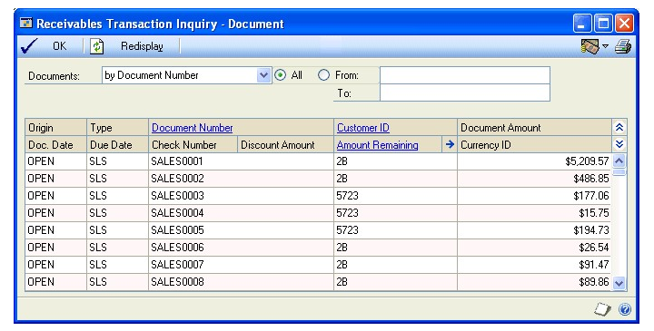

# Microsoft Dynamics GP Receivables Management Part 4: Inquiries and reports

You can use inquiries and reports to analyze the information you’ve entered into the system. You can analyze customer activity and transaction information and display the information either on the computer screen or on a report. This information includes the following topics:

- *Chapter 24, “Customer inquiries,”* explains how to view detailed or summarized information about your customers.

- *Chapter 25, “Transaction inquiries,”* explains how to view detailed, summarized, or multicurrency information about transactions you’ve entered.

- *Chapter 26, “Reports,”* describes how to use reports to analyze receivables activity and identify errors in transaction entry.<!--- MISSING CONTENT-->

## Chapter 24: Customer inquiries

You can use the Receivables Management inquiry windows to view detailed or summarized information about your customers.

This information is divided into the following sections:

- *Multicurrency inquiries*

- *Reporting currency*

- *Viewing customer information*

- *Viewing customer transaction information*

- *Viewing customer period activity*

- *Viewing customer yearly activity*

- *Viewing customer payment information*

- *Viewing national account details*

#### Multicurrency inquiries

You can view multicurrency amounts in the originating, functional, or reporting currency. Choose View \>\> Currency \>\> Functional, Originating, or Reporting while viewing a Receivables inquiry window. This option is saved on a per user, per window basis.

You also can use the currency list button in the windows that support changing the currency view. The View menu and currency list button are available in the following windows:

- Receivables Transaction Inquiry – Customer

- Receivables Transaction Inquiry – Document

- Receivables Transaction Inquiry Zoom

- Cash Receipts Inquiry Zoom

The first time you open these windows after registering Multicurrency Management, all the transactions are displayed in their originating currencies. If you change the currency view, the option you last used is the default view the next time you open that window.

#### Reporting currency

A reporting currency is used to convert functional or originating currency amounts to another currency on inquiries and reports. For example, if the US dollar is the functional currency for your company, you can set up the euro as your reporting currency to view an inquiry window with currency amounts displayed in the euro currency.

During the reporting currency setup in Multicurrency Management, you must set up a reporting currency, and enter a default exchange rate and rate calculation method. Depending on how your system is set up, you might be able to override the default reporting currency exchange rate or rate calculation method on inquiries and reports.

To change the default reporting currency exchange rate, choose View \>\> Currency \>\> Modify Reporting Rate while using Receivables inquiry windows to open the Modify Reporting Rate window.

See the Multicurrency Management documentation for more information about the reporting currency.

#### Viewing customer information

Use the Customer Inquiry window to view address, shipping, tax, and other sales information you entered for a customer card using the Customer Maintenance window.

**To view a customer’s information:**

1. Open the Customer Inquiry window. 
(Sales \>\> Inquiry \>\> Customer)

2. Enter or select a customer ID.

If the customer record has document attachments, choose the Attachment Management icon to open the Document Attachment Inquiry window.

#### Viewing customer transaction information

Use the Receivables Transaction Inquiry - Customer window to view unposted, posted, and historical transactions for a specified customer card.

This window also displays any voided or waived transactions. You can view posted, unposted, and historical information separately.

**To view a customer’s transaction information:**

1. Open the Receivables Transaction Inquiry - Customer window. 
(Sales \>\> Inquiry \>\> Transaction by Customer)

2. Enter or select a customer.

3. Select a range of documents to limit the information displayed.

4. Mark one or more files to include information from.

- Mark Work to view unposted information.

- Mark Open to view posted information.

- Mark History to view historical information.

To print a report of the information displayed in the Receivables Transaction Inquiry – Customer window, choose File \>\> Print.

You also can open windows showing detailed information about a selected document from the Receivables Transaction Inquiry - Customer window.

| **Action**                                                         | **Window that opens**                                                                                              |
|--------------------------------------------------------------------|--------------------------------------------------------------------------------------------------------------------|
| Select a document and choose the Document Number link              | Receivables Transaction Inquiry Zoom or Cash Receipts Inquiry Zoom, depending on the type of document you selected |
| Select a document and choose the Amount Remaining link             | Applied From Credits or Applied To Debits, depending on the type of document you selected                          |
| Select a document and choose the Amount Remaining expansion button | Receivables Transaction Revaluation Zoom                                                                           |

#### Viewing customer period activity

Use the Customer Period Summary Inquiry window to review an individual customer’s buying patterns over time. You can view period information by calendar month or fiscal period.

**To view a customer’s period activity:**

1. Open the Customer Period Summary Inquiry window. 
(Sales \>\> Inquiry \>\> Period Summary)

2. Enter or select a customer ID.

3. Mark the type of period to display—calendar or fiscal. You also can enter a year, and a specific period or month.

#### Viewing customer yearly activity

Use the Customer Yearly Summary Inquiry window to compare a customer’s purchasing pattern for the current year, last year, and life to date. You can select one of the following summary views for the customer’s information:

**Amounts Since Last Close** Displays the selected customer’s current summary amounts.

The information that is displayed in the Customer Yearly Summary Inquiry window when you select Amounts Since Last Close in the Summary View list might not represent actual fiscal year totals if you close the fiscal year before or after the last day of the fiscal year. For example, the amounts in the Year to Date column might continue to increase as transactions are posted after the last day of the fiscal year; then when you close the fiscal year, the amounts in the Last Year column will include those transactions posted after the last day of the fiscal year that you closed.

**Fiscal Year** Displays the selected customer’s summary amounts for the fiscal year you enter.

**Calendar Year** Displays the selected customer’s summary amounts for the calendar year you enter.

Closing the fiscal year will not affect the information that is displayed in the Customer Yearly Summary Inquiry window when you select Fiscal Year or Calendar Year in the Summary View list. The amounts displayed for those selections are dependent on the year and periods you enter to display.

**To view a customer’s yearly activity:**

1. Open the Customer Yearly Summary Inquiry window. 
(Sales \>\> Inquiry \>\> Yearly Summary)

2. Enter or select a customer ID.

3. Select a summary view. If you select either Fiscal Year or Calendar Year, enter a year, and enter or select a period range. Then choose Calculate.

To print the Sales Analysis Report, which prints the information currently displayed in the Customer Yearly Summary Inquiry window, choose File \>\> Print.

#### Viewing customer payment information

Use the Customer Payment Summary Inquiry window to view details of the payments a customer has made. You also can view credit limit, discount, payment terms, and NSF information.

**To view a customer’s payment information:**

1. Open the Customer Payment Summary Inquiry window. 
(Sales \>\> Inquiry \>\> Payment Summary)

2. Enter or select a customer ID.

3. To view the transactions that were entered for a customer during the selected aging period, select a period and choose the Amount link to open the Receivables Transaction Inquiry - Customer window.

#### Viewing national account details

Use the National Accounts Inquiry window to view details of a national account. You can view the entire national account or any customer card within the national account. See *Chapter 9, “National accounts,”* for more information.

**To view a national account’s details:**

1. Open the National Accounts Inquiry window. 
(Sales \>\> Inquiry \>\> National Accounts)

2. Enter or select a parent customer ID.

You also can open windows showing detailed information about a selected document from this window.

| **Action**                                                | **Window that opens**                                                                                                                                           |
|-----------------------------------------------------------|-----------------------------------------------------------------------------------------------------------------------------------------------------------------|
| Select a document and choose the Customer ID link         | Customer Inquiry                                                                                                                                                |
| Select a document and choose the Doc/Check Number link    | Receivables Transaction Inquiry Zoom, Sales Transaction Inquiry Zoom, Invoice Inquiry, or Cash Receipts Inquiry, depending on the type of document you selected |
| Select a document and choose the Amt Rem link             | Applied From Credits or Applied To Debits, depending on the type of document you selected                                                                       |
| Select a document and choose the Amt Rem expansion button | Receivables Transaction Revaluation Zoom                                                                                                                        |

## Chapter 25: Transaction inquiries

You can use the Receivables Management inquiry windows to view detailed, summarized, or multicurrency information about transactions you entered. Also, many of the inquiry windows in Receivables Management have links you can use to view transactions as they were originally entered.

This information is divided into the following sections:

- *Viewing receivables summary information*

- *Viewing transaction detail information*

- *Viewing receivables documents*

- *Additional document inquiries*

- *Document printing options*

- *Sending documents in e-mail from transaction inquiry*

#### Viewing receivables summary information

Use the Receivables Summary Inquiry window to view the total number of documents entered for each of the document types in Receivables Management, along with the total amount for each type. This inquiry might be useful for comparing the original amounts for document types with the unapplied amounts. You also can view a customer’s balance in this window.

**To view receivables summary information:**

1. Open the Receivables Summary Inquiry window. 
(Sales \>\> Inquiry \>\> Receivables Summary)

2. Select a range of customers and choose Calculate to display the correct information in the window.

#### Viewing transaction detail information

Use the Receivables Transaction Inquiry - Document window to view unposted, posted, and historical transactions by document number or document date.

**To view transaction detail information:**

1. Open the Receivables Transaction Inquiry - Document window. 
(Sales \>\> Inquiry \>\> Transaction by Document)

2. Select a range of documents to limit the information displayed. You can view documents by number, date, or customer ID.

3. Choose Redisplay. Voided documents, NSF payments, and waived finance charges are indicated with an asterisk next to the document’s origin in the scrolling window.

To print a report of the information displayed in this window, choose File \>\> Print.

You also can open windows showing detailed information about a selected document from this window. See *Viewing receivables documents* for more information.

| **Action**                                                         | **Window that opens**                                                                                                       |
|--------------------------------------------------------------------|-----------------------------------------------------------------------------------------------------------------------------|
| Select a document and choose the Document Number link              | Receivables/ Sales/ Cash Receipts Transaction Inquiry Zoom, Invoice Inquiry, depending on the type of document you selected |
| Select a document and choose the Customer ID link                  | Customer Inquiry                                                                                                            |
| Select a document and choose the Amount Remaining link             | Applied To Debits or Applied From Credits, depending on the type of document you selected                                   |
| Select a document and choose the Amount Remaining expansion button | Receivables Transaction Revaluation Zoom                                                                                    |

#### Viewing receivables documents

You can use the various receivables inquiry windows to view information about documents you entered in Receivables Management.

Use links to view information as it was entered on the original document. For example, you can select a credit memo in the scrolling window and choose the Document Number link to open the Receivables Transaction Inquiry Zoom window.

**To view receivables documents:**

1. Open either the Receivables Transaction Inquiry – Customer or the
    Receivables Transaction Inquiry – Document window.
(Sales \>\> Inquiry \>\> Transaction by Customer -or- 
Sales \>\> Inquiry \>\> Transaction by Document)

2. Select a transaction in the scrolling window and choose the Document Number link.

The corresponding window opens, and the transaction is displayed as it was originally entered.

- If you select a payment transaction, the Cash Receipts Inquiry Zoom window opens.

- If you select an invoice, the Sales Transaction Inquiry Zoom window, Receivables Transaction Inquiry Zoom window, or Invoice Inquiry window opens.

- If you select a sales, service/repair, warranty, or other type of transaction, the Receivables Transaction Inquiry Zoom window opens.

#### Additional document inquiries

You can open several other windows from the Receivables Transaction Inquiry - Customers and Receivables Transaction Inquiry - Documents windows after you select a document and choose various links. The following tables list this information.

**Cash Receipts Inquiry window**

You can open the following windows from the Cash Receipts Inquiry window:

| **Button**                                                   | **Window that opens**                                               |
|--------------------------------------------------------------|---------------------------------------------------------------------|
| Date expansion button                                        | Receivables Date Inquiry                                            |
| Currency ID expansion button (if a multicurrency transaction)| Exchange Rate Entry Zoom                                            |
| Revaluation button                                           | Receivables Transaction Revaluation Zoom                            |
| Apply button                                                 | Applied to Debits/Applied From Credits (depending on document type) |
| Distribution button                                          | Receivables Distribution Inquiry Zoom                               |

**Invoice Inquiry window**

You can open the following windows from the Invoice Inquiry window:

| **Button**                            | **Window that opens**                                                  |
|---------------------------------------|------------------------------------------------------------------------|
| Customer ID expansion button          | Invoice Customer Detail Inquiry                                        |
| Date expansion button                 | Invoice Date Inquiry                                                   |
| Item Number expansion button          | Invoice Item Detail Inquiry                                            |
| Amount Received expansion button      | Invoice Amount Received Inquiry or Invoice Payment Inquiry             |
| Terms Discount Taken expansion button | Invoice Payment Terms Inquiry                                          |
| Comment ID expansion button           | Invoice Comment Inquiry                                                |
| Freight expansion button              | Invoice Tax Schedule Inquiry                                           |
| **Button**                            | **Window that opens**                                                  |
| Miscellaneous expansion button        | Invoice Tax Schedule Inquiry                                           |
| Tax expansion button                  | Invoice Tax Detail Summary Entry or Invoice VAT Detail Summary Inquiry |
| Distributions button                  | Invoice Distribution Inquiry                                           |
| Commissions button                    | Invoice Commissions Inquiry                                            |

**Sales Transaction Inquiry Zoom window**

You can open the following windows from the Sales Transaction Inquiry Zoom window:

| **Button**                                                                 | **Window that opens**                             |
|----------------------------------------------------------------------------|---------------------------------------------------|
| Document Number expansion button                                           | Sales Document Detail Inquiry Zoom                |
| Customer ID expansion button                                               | Sales Customer Detail Inquiry Zoom                |
| Currency ID expansion button (if you selected a multicurrency transaction) | Exchange Rate Entry                               |
| Date expansion button                                                      | Sales Date Inquiry Zoom                           |
| Item Number expansion button                                               | Sales Item Detail Inquiry Zoom                    |
| Amount Received expansion button                                           | Sales Payment Inquiry Zoom                        |
| Terms Discount Taken expansion button                                      | Sales Payment Terms Inquiry Zoom                  |
| Comment ID expansion button                                                | Sales Comment Inquiry Zoom                        |
| Trade Discount expansion button                                            | Sales Trade Discount Inquiry Zoom                 |
| Freight expansion button                                                   | Sales Tax Schedule Inquiry Zoom                   |
| Miscellaneous expansion button                                             | Sales Tax Schedule Inquiry Zoom                   |
| Tax expansion button                                                       | Sales Tax Detail Inquiry Zoom or Sales VAT Detail |
| Holds button                                                               | Sales Process Hold Trx Inquiry Zoom               |
| User-Defined button                                                        | Sales User-Defined Fields Inquiry Zoom            |
| Distributions button                                                       | Sales Distributions Inquiry Zoom                  |
| Commissions button                                                         | Sales Commissions Inquiry Zoom                    |

**Receivables Transaction Inquiry Zoom window**

You can open the following windows from the Receivables Transaction Inquiry Zoom window:

| **Action**                                                           | **Window that opens**                                                   |
|----------------------------------------------------------------------|-------------------------------------------------------------------------|
| Document Date expansion button                                             | Receivables Date Inquiry                               |
| E-mail Detail Inquiry button                                               | Receivables E-mail Detail Inquiry Zoom                 |
| Currency ID expansion button (if you selected a multicurrency transaction) | Exchange Rate Entry Zoom                               |
| Terms expansion button                                                     | Terms Zoom                                             |
| Tax Schedule expansion button                                              | Tax Schedules Zoom                                     |
| Tax expansion button                                                       | Sales Tax Distributions Zoom or Receivables Tax        |
| Intrastat button                                                           | Receivables Intrastat Inquiry                          |
| Revaluation button                                                         | Receivables Transaction Revaluation Zoom               |
| Apply button                                                               | Applied From Credits/Applied To Debits (depending on the document type) |
| Distribution button                                                        | Receivables Distributions Inquiry Zoom                 |
| Commission button                                                          | Receivables Commissions Inquiry Zoom                   |

#### Document printing options

To print the document displayed in the Receivables Transaction Inquiry Zoom window, choose Print. The document is printed in the document format you selected using the Receivables Management Setup window.

To change the document format, choose another format from the Options menu. You can select Blank Paper, User-Defined 1, or User-Defined 2 as the document format. You also can print an alignment form from the Options menu.

The document is printed in the currency displayed in the window. You can view and print the document in the originating, functional, or reporting currency.

#### Sending documents in e-mail from transaction inquiry

You can send the document displayed in the Receivables Transaction Inquiry Zoom window by choosing the Send document in e-mail button. The document is sent in the file format you selected using the Customer E-mail Options window. You can’t send a document in e-mail if you chose User-Defined 1 or User-Defined 2 as the document format from the Options menu.

You can send documents in e-mail if the following conditions are met.

- The document type must be available for the customer to send in e-mail.

- The customer also must a To, Cc, or Bcc address to send documents in e-mail.

Whenever you see the Send document in e-mail button near the printer icon in the upper right in a window, you can choose the button to send the document in e-mail.

## See Also

[Part 1: Setup and cards](receivables-management.md#part-1-setup-and-cards)  
[Part 2: Transaction entry](receivables-management-part2-transaction-entry.md)  
[Part 3: Transaction activity](receivables-management-part3-transaction-activity.md)  
[Part 4: Inquiries and reports](receivables-management-part4-inquiries-reports.md)  
[Part 5: Utilities and routines](receivables-management-part5-utilities-routines.md)  
