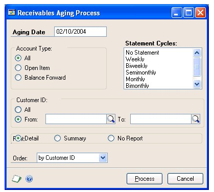
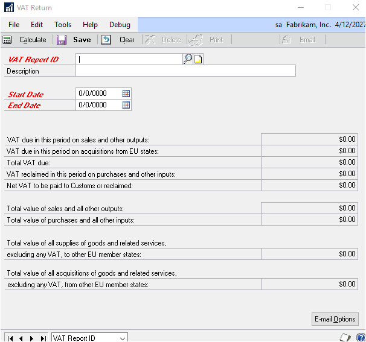
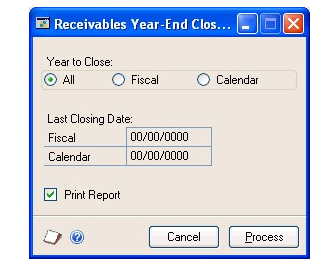

# Microsoft Dynamics GP Receivables Management Part 5: Utilities and routines

You can help ensure the integrity of your Receivables Management data by reconciling your records. Once you've decided how much historical information is necessary, you can remove the information that's no longer needed. Be sure to back up your accounting data before performing any of these procedures, because they might remove data from your system.

This part of the documentation also includes procedures you complete at the end of a month or period and at the end of your calendar or fiscal year. This information includes the following topics:

- *Chapter 27, "Reconciling,"* describes reconciliation, the process of verifying that your accounting records are accurate.

- *Chapter 28, "History removal,"* explains the different types of historical information you can keep in Receivables Management, and describes how to remove historical information that is no longer needed.

- *Chapter 29, "Month-end closing,"* includes tasks usually completed at the end of the month or period, such as aging accounts and printing statements.

- *Chapter 30, "Year-end closing,"* includes tasks completed when you close fiscal or calendar years.

## Chapter 26: Reports

You can use Receivables Management reports to analyze receivables activity and identify errors in transaction entry. Use the information in this chapter to guide you through printing reports and working with report options.

Reports information is divided into the following sections:

- *Receivables Management standard report summary*

- *Specifying a Receivables Management report option*

- *Microsoft SQL Server&reg; Reporting Services reports for Receivables Management*

| **Report type** | **Report** | **Printing method** |
|--|--|--|
| Setup reports | Customer Setup List  Salesperson List  Sales Territory List  Customer Address List  Receivables Setup list  Quick Customer Setup List | Choose File \>\> Print in the setup windows or create report options using the Sales Setup Reports window. |
| Trial Balances | Aged Trial Balance†  Aged Trial Balance with Options Aging Report\*  Historical Aged Trial Balance\*  Quick Aged Trial Balance | Create report options using the Receivables Trial Balance Report Options window. |
| Analysis reports | Accounts Due Report† | Create report options using the Sales Analysis Report Options window. |
\* Indicates reports that can be printed with multicurrency information displayed. 

Receivables Transactions List†

Receivables Sales Analysis Report†

Period Sales Analysis Report†

Unapplied Documents List†

† Indicates reports that can be assigned to named printers. See "Printers" in the System Administrator's Guide for more information.

### Receivables Management standard report summary

You can print several types of reports using Receivables Management. Some reports automatically are printed when you complete certain procedures; for example, posting journals can automatically be printed when you post transactions, depending on how your posting options are set up. You can print some reports during procedures; for example, you can print an edit list when entering transactions by choosing the Print button in the batch entry window. In order to print some reports, such as analysis or history reports, you must set up report options to specify sorting options and ranges of information to include on the report.

The following table lists the report types available in Receivables Management and the reports that fall into those categories. Reports printed using Sales Order Processing or Invoicing are printed using many of the same windows. See the Sales Order Processing and Invoicing manuals for more information:

| **Report type**      | **Report**       | **Printing method**         |
|----------------------|------------------|-----------------------------|
| Posting journals    | Receivables Posting Journal\*†        | Printed when you post Receivables transactions or create report options using the Sales Posting Journal Options window. |
| History reports   | Account History Report by Transaction | Create report options using the Sales History Report Options window. |
| Commissions reports    | Commission Distribution List by       | Create report options using the Sales Commissions Report Options window.   |
| Utility reports    | Account Distribution Removal Report   | Printed when you complete the procedure. |
| Routine reports   | Tax Year End Closing Report           | Printed when you complete the procedure. |
| Inquiry reports    | Transaction by Customer Inquiry       | Choose File \>\> Print in the corresponding Inquiry window. |
| Edit lists  | Cash Receipts Edit List               | Choose File \>\> Print in the window you use to complete the procedure. |
| Documents   | Sales/Invoices†                       | Choose Print in the Receivables    |
| Statements    | Statement forms\*†                    | Choose Print in the Print      |
 \* Indicates reports that can be printed with multicurrency information displayed.

Cash Receipts Posting Journal\*†

Receivables Voided/Waived/NSF

Transaction

Distribution Breakdown Register\*†

Finance Charge Detail Report

Posting Journal\*

Receivables Apply Document

Journal\*

Removed Transaction Register

Transferred Commissions Posting

Journal

Transaction History Report\*

Distribution History Report

Salesperson

Salesperson Period Commissions

Commission Distribution List by

Sales Territory

Sales Territory Period

Commissions

Salesperson Commission

Summary

Sales Territory Commission

Summary

Journal History Removal Report

Removal Report

Reconcile Purchasing Documents

Report

Year-End Closing Report

Removed Statements Report

Transaction by Document Inquiry Report

Cust. Card Removal Edit List

Transaction Edit List

Debit Memos†

Finance Charges†

Service/Repairs†

Warranties†

Credit Memo†

Returns†

Reprinted statements\*†

† Indicates reports that can be assigned to named printers. See "Printers" in the System Administrator's Guide for more information.

### Specifying a Receivables Management report option

Report options include specifications for sorting options and range restrictions for a particular report. To print several Receivables Management reports, you must first create a report option. Each report can have several different options, so you can easily print the information you need. For example, you can create report options for the Aged Trial Balance that show either detailed or summary information.

*A single report option can't be used by multiple reports. If you want identical options for several reports, you must create them separately.*

Use the Sales report options windows to create sorting, restriction, printing and email options for the reports that are included in Receivables Management.

#### To specify a Receivables Management report option

1. Open a Sales reports window. There are separate windows for each report type. 
(Sales \>\> Reports \>\> Setup)
(Sales \>\> Reports \>\> Trial Balance)
(Sales \>\> Reports \>\> Analysis)
(Sales \>\> Reports \>\> Posting Journals)
(Sales \>\> Reports \>\> History) 
(Sales \>\> Reports \>\> Commissions)

2. Select a report from the Reports list.

3. Choose New to open the report options window. Your selection in step 2 determines the report options window that appears.

4. Name the option and enter information to define the option. The name you choose for the option won't appear on the report. The selections available for defining report options vary, depending on the report type you've selected.

5. Enter range restrictions. The Ranges list shows the available options for each report. The available ranges vary depending on the type of report.

    > [!NOTE]
    > You can enter only one restriction for each restriction type. For instance, you can insert one customer ID restriction (AARONFIT0001 to ADVANCED0001) and one sales territory ID restriction (TERRITORY 3 to TERRITORY 6).

6. Choose Insert to insert the range in the Restrictions List. To remove an existing range from the list, select the range and choose Remove.

7. Choose Email Options to enter email options for the report option. Once the email options are set up, you'll be able to send the reports in an email message by choosing Email. You'll also be able to send this report option in an email from any list view where the report option is displayed.

8. Choose Destination to select a printing destination. Reports can be printed to the screen, to the printer, to a file, or to any combination of these options. If you select Ask Each Time, you can select printing options each time you print this report option.

9. To print the report option from the report options window, choose Print before saving it. If you don't want to print the option now, choose Save and close the window. The report window will be redisplayed.

#### Microsoft SQL Server&reg; Reporting Services reports for Receivables Management

You can view Receivables Management Reporting Services reports from the  Reporting Services Reports list. If you are using Reporting Services 2008, sales metrics for your home page also appear in the Reporting Services Reports list. You can access the Reporting Services Reports list from the  navigation pane or from an area page in the Microsoft Dynamics GP application window. This report list appears if you specified the location of your Reporting Services reports using the Reporting Tools Setup window.

The following Reporting Services reports are available for Receivables Management.

| Accounts Due                | Historical Aged Trial Balance |
|-----------------------------|-------------------------------|
| Aged Trial Balance - Detail | Receivables Sales Analysis    |

#### To print a Receivables Management Reporting Services report:**

1. In the navigation pane, choose the Sales button, and then choose the Reporting Services Reports list.

2. Mark the Receivables Management report that you want to print.

3. In the Actions group, choose View to open the Report Viewer.

4. In the Report Viewer, select the specifications for the report and choose View Report.

5. After viewing the report, select a format and print the report.

## Chapter 27: Reconciling

The reconciling process should be used if a system problem occurs and you need to be sure that your Receivables Management data is accurate. You might also find the reconciliation process useful if you discover inconsistencies in reports.

This information is divided into the following sections:

- *Types of information you can reconcile*

- *Reconciling receivables amounts*

### Types of information you can reconcile

Select the type of information to reconcile using the Reconcile Receivables Amounts window.

- **Current Customer Information** If marked, the aging periods for each customer card are verified with the amounts recorded for the customer's transactions. Summary information about outstanding amounts, unpaid finance charges, and current balances is verified. If the amounts don't match, the system sets the balances as calculated. The Reconcile Customer Balances report displays only the customers whose balances were changed during the process.

- **Outstanding Document Amounts** If marked, the transaction balances are verified with the amounts applied to them for each customer card in the range. If the calculated transaction balance does not equal the amount on the transaction, the system sets the balances as calculated. Each document that's changed is printed on the Outstanding Documents Reconciliation report.

- **Batch Information** If marked, the system verifies the batch each transaction is assigned to, the number of transactions in the batch, and the batch total. If any of the system calculations don't match the original amounts, the batches are reconciled. Also, any batches that were missing are added. Any batches that are changed or added are printed on the Batch Reconciliation Report.

-  **Fiscal Year** If marked, the summary information for the selected fiscal year is verified with the detail transaction information. If the amounts don't match, the period summary amounts are adjusted based on the posted detail transactions.

- **Calendar Year** If marked, the summary information for the selected calendar year is verified with the detail transaction information. If the amounts don't match, the period summary amounts are adjusted based on the posted detail transactions.

### Reconciling receivables amounts

Use the Reconcile Receivables Amounts window to compare the aging period amounts for each customer card with the amounts recorded for the customer's transactions, the outstanding document amounts, batch totals and amounts, fiscal year summary information, and calendar-year summary information.

> [!NOTE]
> Before reconciling, back up all your company's accounting data.

 To reconcile receivables amounts:**

1. Open the Reconcile Receivables Amounts window. 
(Sales \>\> Utilities \>\> Reconcile)

2. Mark which information to reconcile. See *Types of information you can reconcile* for more information.

3. Mark whether to reconcile the selected information, print a reconcile report, or both. You can print a reconcile report to verify your entries without reconciling.

*Age Finance Charges is only available when Current Customer Information is marked and Compound Finance Charge is not marked in the Receivables Management Setup window.*

4. Select a range of customer cards if you're reconciling current customer information, outstanding document amounts, fiscal year, or calendar year.

5. Enter a reconcile date if it is a current customer balance. If you marked to reconcile fiscal-year or calendar-year information, enter a valid year to reconcile.

6. Mark the account type to reconcile—all, open item, or balance forward if it is a current customer balance.

    - If you mark All, both open item and balance forward accounts are reconciled.

    - If you mark Open Item, the system checks that the balances for each aging period are correct. If they're incorrect, the aging period amounts are recalculated.

    - If you mark Balance Forward accounts, the system calculates the age of each document in the current aging period and verifies the balance of the current and non-current periods.

7. Select the statement cycles of the customer cards to include if it is a current customer balance. When you first open this window, all statement cycles are selected.

8. Choose Process to start the reconcile process.

## Chapter 28: History removal

History records provide useful information for audit and analysis purposes. If you're keeping one of the types of history available in Receivables Management, you can keep these records for an unlimited number of years.

When you remove historical records, the system removes records only for the range you specify. Normally, history is removed before the year-end closing process; however, at other times during the accounting cycle, you might find it necessary to remove ranges of history that are no longer useful.

This information is divided into the following sections:

- *History removal overview*

- *Removing transaction history*

- *Removing distribution history*

- *Removing period history*

- *Removing journal history*

- *Removing Intrastat history*

- *Removing tax history*

### History removal overview

When you removal history, you can set up restrictions to limit the historical records to be removed. Depending on the type of history you're removing, you can set up the following ranges:

- Audit trail codes

- Batch sources

- Batch IDs

- Customer classes

- Customer IDs

- Customer names

- Customer types

- Document numbers

- Document types

- Periods

- Posting dates.

> [!IMPORTANT]
> When you remove history, any corresponding multicurrency information is removed, as well.

### Removing transaction history

Use the Remove Receivables Transaction History window to remove transaction history. If you're keeping transaction history, detailed information has been kept for all transactions that were posted and paid during the year. If you remove transaction history, complete information might not be available to print Historical Aged Trial Balances or reprint posting journals.

#### To remove transaction history:**

1. Back up your company's accounting data. See the System Administrator's Guide (Help \>\> Contents \>\> select System Administration) for more information about making backups.

2. Open the Remove Receivables Transaction History window. 
(Sales \>\> Utilities \>\> Remove Transaction History)

    

3. To limit the historical records to be removed, select a type of range and enter a range restriction.

4. Choose Insert; the range restriction is displayed in the Restrictions list. You can select another range type and insert another restriction.

    > [!NOTE]
    > You can enter only one restriction for each restriction type. For example, if you enter a restriction specifying that history for customer records 100 through 300 should be removed, you can't enter another restriction for customer records 500 through 800. To remove multiple ranges of history, you must remove each range separately.*

5. Mark the type of records to remove—transactions, distributions, or both. If you mark Distributions, any distributions for the transaction history records you're removing also are removed.

6. Mark Print Report to print the Transaction History Report for the range of records you specified after history has been removed.

To print the Transaction History Report to verify the ranges you entered before you remove history, mark only Print Report and choose Process.

7. Choose Process to begin removing history.

Once history has been removed, you can't print the Transaction History Report for the ranges of information you removed.

### Removing distribution history

Use the Remove Receivables Distribution History window to remove distribution history. If you're keeping distribution history, a detailed record has been kept of how Receivables Management transactions have affected the balances of posting accounts. If you remove distribution history, you might not have all the information needed to reprint posting journals in the future.

If you're using General Ledger, those history records aren't affected when you remove distribution history in Receivables Management. This information is kept separately from transaction history for General Ledger, so you can keep distribution history for Receivables Management regardless of whether you use General Ledger.

#### To remove distribution history

1. Back up your company's accounting data. See the System Administrator's Guide (Help \>\> Contents \>\> select System Administration) for more information about making backups.

2. Open the Remove Receivables Distribution History window. 
(Sales \>\> Utilities \>\> Remove Distributions)

3. To limit the historical records to be removed, select a type of range and enter a range restriction.

4. Choose Insert; the range restriction is displayed in the Restrictions list. You can select another range type and insert another restriction.

*You can enter only one restriction for each restriction type. For example, if you enter a restriction specifying that history for customer records 100 through 300 should be removed, you can't enter another restriction for customer records 500 through 800. To remove multiple ranges of history, you must remove each range separately.*

5. Mark Distributions to remove distributions.

6. Mark Print Report to print the Transaction Distribution History Report for the range of records you specified after history has been removed.

To print the Transaction Distribution History Report to verify the ranges you entered before you remove history, mark only Print Report and choose Process.

7. Choose Process to begin removing history.

Once history has been removed, you can't print the Transaction Distribution History Report for the ranges of information you removed.

### Removing period history

Use the Remove Receivables Calendar/Fiscal History window to remove period history. If you're keeping calendar year history, customer sales, salesperson, and sales territory information has been recorded in a month-by-month format. If you're keeping fiscal year history, the same information has been recorded according to the fiscal period format you specified using the Fiscal Period Setup window.

Comparative totals (year to date, last year, and life to date) aren't removed when you remove calendar/fiscal history. These totals are kept independently; they are updated when you close the year. This window clears the balances displayed in the Customer Period Summary window.

 To remove period history:**

1. Back up your company's accounting data. See the System Administrator's Guide (Help \>\> Contents \>\> select System Administration) for more information about making backups.

2. Open the Remove Receivables Calendar/Fiscal History window. 
(Sales \>\> Utilities \>\> Remove Period History)

3. Mark whether to remove period history for customers, salespeople, or sales territories.

4. Mark whether to remove calendar or fiscal year history, and enter the year.

5. To limit the historical records to be removed, select a type of range and enter a range restriction.

6. Choose Insert; the range restriction is displayed in the Restrictions list. You can select another range type and insert another restriction.

*You can enter only one restriction for each restriction type. For example, if you enter a restriction specifying that history for customer records 100 through 300 should be removed, you can't enter another restriction for customer records 500 through 800. To remove multiple ranges of history, you must remove each range separately.*

7. Mark History to remove history.

8. Mark Print Report to print the History Removal Report for the range of records you specified after history has been removed.

To print the History Removal Report to verify the ranges you entered before you remove history, mark only Print Report and choose Process.

9. Choose Process to begin removing history.

Once history has been removed, you can't print the History Removal Report for the ranges of information you removed.

### Removing journal history

Use the Remove Receivables Journal History window to remove journal history.
If you're keeping journal history for customer records, you can reprint
posting journals for Receivables Management transactions. Posting journals
are valuable audit trail tools that include the audit trail codes assigned
to transactions during the posting process. Using posting journals, you can
trace any transaction to the point it was entered. If that information is no
longer useful for transactions that have been moved to the history tables,
you can remove that information.

#### To remove journal history

1. Back up your company's accounting data. See the System Administrator's Guide
    (Help \>\> Contents \>\> select System Administration) for more information
    about making backups.

2. Open the Remove Receivables Journal History window. (Sales \>\> Utilities
    \>\> Remove Journal History)

A message appears that reads, "Removing this information might affect your
historical aged trial balance. Do you want to continue?" Choose Yes.

1. To limit the historical records to be removed, select a type of range and
    enter a range restriction.

2. Choose Insert; the range restriction is displayed in the Restrictions list.
    You can select another range type and insert another restriction.

*You can enter only one restriction for each restriction type. For example,
if you enter a restriction specifying that history for batch IDs 100 through
300 should be removed, you can't enter another restriction for batch IDs 500
through 800. To remove multiple ranges of history, remove each range
separately.*

1. Mark History to remove history.

2. Mark Print Report to print the Journal Removal Report for the range of
    records you specified after history has been removed.

To print the Journal Removal Report to verify the ranges you entered before
you remove history, mark only Print Report and choose Process.

1. Choose Process to begin removing history.

Once history has been removed, you can't reprint posting journals for the
ranges of information you've removed.

### Removing Intrastat history

Use the Remove Intrastat History window to remove Intrastat history records
that are no longer necessary. Only the Intrastat records for the range you
specify are removed.

Once history has been removed, you can't print the Intrastat removal reports
for the ranges of information you removed.

 To remove Intrastat history:**

1. Back up your company's accounting data. See the System Administrator's Guide
    (Help \>\> Contents \>\> select System Administration) for more information
    about making backups.

2. Open the Remove Intrastat History window. (Administration \>\> Utilities
    \>\> Company \>\> Remove Intrastat History)

3. Select a range type for the historical information to remove. Define the
    beginning and end of the range, then choose Insert to display the range.

*You can enter and insert additional ranges. However, you can enter only one
range for each range type. For example, if you enter a restriction
specifying that history should be deleted for customer records COMPUTER0003
through GRAHAMAR0001, you can't*

*enter another restriction for customer IDs CONTINEN0001 through
EXECUTIV0001.*

1. Mark Transactions to remove the transactions.

2. Mark Print Report to print the Intrastat removal reports for the range of
    customer records or vendor records you specified. Print these reports to
    retain a permanent record of your past Intrastat records after you clear
    history.

To print the Intrastat removal reports without removing history, mark only
Print Report and choose Process.

1. Choose Process to begin removing history.

### Removing tax history

Use the Tax History Removal window to remove tax detail transactions. Only
the tax history for the range you specify will be removed. Once tax history
has been removed, the tax details in the range you've removed won't be
printed on tax reports.

*Before removing history, back up your company*'*s accounting data.*

#### To remove tax history:**

1. Open the Tax History Removal window. (Administration \>\> Utilities \>\>
    Company \>\> Remove Tax History)

2. Select whether you want to remove tax detail transactions and print the Tax
    History Removal Report, remove the tax detail transactions, or print the Tax
    History Removal Report.

3. Enter or select a range of tax history to remove or print a report of.

4. Choose Insert to insert the range.

5. Choose Process to remove tax history. If Print Tax History Removal Report
    was marked, the Tax History Removal Report will print.

## Chapter 29: Month-end closing

This information includes tasks that are usually completed at the end of the  month or period. You can, however, complete these tasks whenever they're needed.

This information is divided into the following sections:

- *Aging customer accounts*

- *Finance charges overview*

- *Assessing finance charges*

- *Customer statements overview*

- *Setting up and printing statements*

- *Reprinting or removing statements*

- *E-mail statements overview*

- *Sending e-mail statements*

- *Marking commission amounts as paid*

- *Removing paid transactions*

- *Printing a VAT return*

### Aging customer accounts

You can calculate the number of days old or days past due each customer
account is, and to move the customer balances to the correct aging periods.
You should enter and post transactions and payments before aging to ensure
up-to-date calculations. Unapplied credit amounts are aged if you marked Age
Unapplied Credit Amounts in the Receivables Management Setup window.

#### To age customer accounts

1. Open the Receivables Aging Process window. (Sales \>\> Routines \>\> Aging)

    

1. Enter the date to be used for determining the age of a document. This date
    is compared to either the due date or document date, depending on the
    selection in the Receivables Management Setup window.

2. Mark the accounts to age—open item, balance forward, or all accounts.

- When you mark All, open item and balance forward accounts both are aged.

- When you age open item accounts, the system calculates the age of each
    document, and the documents are transferred to the correct aging period.

- When you age balance forward accounts, the system calculates the age of each
    document in the current aging period, but doesn't actually move them to the
    noncurrent aging periods. Noncurrent balances for these accounts are
    consolidated after you remove paid transactions. See *Removing paid
    transactions* for more information.

1. Select the statement cycle for the customer cards to be aged.

*To select more than one statement cycle, press CTRL as you make your
selections.*

1. Select a range of customer accounts to age. Only customers assigned to the
    statement cycle you selected in step 4, and who are within the customer
    range, will be aged.

2. Mark Age Finance Charges if you want finance charges to be included in the
    aging process.

*Age Finance Charges is only available when Compound Finance Charge is not
marked in the Receivables Management Setup window.*

1. Mark the type of report to print once the aging process is complete:
    detailed, summarized, or no report at all.

2. Select the order for information to appear on the report.

3. Choose Process to begin aging the accounts in the range. When the process is
    complete, the Aging report is printed.

 To age customer accounts using the action pane:**

1. In the navigation pane, choose the Sales button, and then choose the
    Customers list.

2. Mark the customers that you want to age. The user date is used to age the
    customer account. Finance Charges are included in the aging process.

    - If the customer has an open item account, the system calculates the age
        of each document, and the documents are transferred to the correct aging
        period.

    - If a customer has a balance forward accounts, the system calculates the
        age of each document in the current aging period, but doesn't actually
        move them to the noncurrent aging periods. Noncurrent balances for these
        accounts are consolidated after you remove paid transactions. See
        *Removing paid transactions* for more information.

3. In the Actions group, choose Aging to begin aging the customer selected.
    When the process is complete, the Aging report is printed.

### Finance charges overview

You can define your finance charges options in the Assess Finance Charges
window. You can enter a range of customers or select which types of accounts
to assess finance charges for.

You also can mark whether to include unapplied credits in aged balances, so
you can assess finance charges only for customers who have positive
balances. Because payments are sometimes received but not applied before you
assess finance charges, customers who actually have no outstanding balance
might be assessed a finance charge. Marking this option assesses a finance
charge on just the outstanding balance, not the total balance.

When you mark Include Unapplied Credits in Aged Balances, Receivables
Management will calculate the remaining balance as if the credit documents
were applied to the oldest aging periods first—although no documents are
actually applied at this time. The remaining balance will be assessed a
finance charge.

When Receivables Management calculates the applied amounts and remaining
balances for multicurrency transactions, the functional currency amount is
used.

*The option to include unapplied credits in aged balances is not available
if you're assessing finance charges for balance forward accounts, or for the
current aging period.*

If you marked Compound Finance Charges in the Receivables Management Setup
window, unapplied finance charges are included in the balance that's
assessed a finance charge. If you don't mark this option, unapplied finance
charges are not included in the balance.

#### Example

On January 2, a customer purchased goods on account for a total of \$100.00.
On February 5, after you age balances, you assess a 5% finance charge on the
31-60 days and older aging period. The customer's outstanding balances is
now \$105.00, with the following aging period balances:

| **Aging period** | **Balance** |
|------------------|-------------|
| Current          | \$5.00      |
| 31-60 days       | \$100.00    |

On February 20, you receive a \$105.00 payment from the customer, but the
payment remains unapplied when you again age periods on March 5. The aging
period balances are as follows:

| **Aging period** | **Balance** |
|------------------|-------------|
| Current          | (\$105.00)  |
| 31-60 days       | \$5.00      |
| 61-90 days       | \$100.00    |

Depending on whether you marked Compound Finance Charges in the Receivables
Management Setup window and Include Unapplied Credits in Aged Balances in
the Assess Finance Charges window, the following situations would occur:

- If you didn't mark either option, a \$5.00 finance charge would be assessed
    (\$100.00 x 5%).

- If you marked only Compound Finance Charges, a \$5.25 finance charge would
    be assessed (\$100.00 x 5%) + (\$5.00 x 5%).

- If you marked only Include Unapplied Credits in Aged Balances, no finance
    charges would be assessed. Receivables Management will calculate the
    balances as if the \$105.00 payment were applied to the oldest aging period
    (61-90 days) until that balance was zero, and then to the 31-60-days aging
    period. After calculating the applied amounts, the balances of both aging
    periods would be zero. (Receivables Management goes through the apply
    process for the purpose of assessing finance charges but doesn't actually
    apply any amounts).

- If you marked both options, no finance charges would be assessed.
    Receivables Management would calculate the balances as if the \$105.00 would
    be pseudoapplied to the oldest aging period (61-90 days) and then to the
    31-60-days aging period. Since the balance is zero for both periods, no
    finance charges are assessed. (Receivables Management goes through the apply
    process for the purpose of assessing finance charges but doesn't actually
    apply any amounts.)

### Assessing finance charges

Use the Assess Finance Charges window to assess finance charges for a group
of customers. If you need to enter a finance charge for just one customer,
you might want to use the Receivables Transaction Entry window and use the
Finance Charge document type instead. See *Entering a finance charge* on
page 82 for more information on individual finance charges.

#### To assess finance charges

1. Open the Assess Finance Charges window. (Sales \>\> Routines \>\> Finance
    Charge)

    

1. Select a range of customer cards to assess finance charges for.

If you're using national accounts and you marked Base Finance Charge on
Consolidated National Account in the National Accounts Maintenance window,
the parent customer must be in the customer ID range for finance charges to
be assessed against the national account. The finance charge calculation
method from the parent customer card will be used to calculate the finance
charge and only the parent customer's summary records will be updated with
the finance charge amounts.

1. Select a range of customer class IDs to further restrict the customer
    records that finance charges are assessed for. A customer record must fall
    within both the customer range and the class range to be assessed a charge.

2. Mark the account types to assess charges for—open item, balance forward, or
    all account types.

3. Mark whether to include unapplied credits in aged balances when you assess
    finance charges.

If you're using national accounts and you marked Base Finance Charge on
Consolidated National Account in the National Accounts Maintenance window,
finance charges will be assessed based on the consolidated national account.
If you also mark Include Unapplied Credits in Aged Balances, receivables
balances will be calculated as if unapplied credit amounts were applied to
the national account aging period balances—oldest aging period first—and the
remaining balance will be assessed a finance charge.

1. Enter the minimum balance that a customer must owe to be charged a finance
    charge. Any customer having a balance that is less than this amount won't be
    charged.

2. Enter the minimum amount that you can charge a customer. Any customer who
    would be assessed a finance charge that is less than this amount won't be
    charged.

3. Mark Print Register to print the Finance Charge Detail Report once the
    charges have been assessed.

4. In the Includes Balances and Older field, select the aging period of the
    balances to include; finance charges will be assessed on balances in that
    period and older. For example, if your company assesses finance charges only
    for unpaid balances older than 61 days, select 61 – 90 days as the period to
    include. Only those unpaid balances that are 61 days old and older are
    assessed a finance charge.

5. Choose Process to begin calculating finance charges, and to print the
    Finance Charge Detail Report.

Transactions are created for the finance charges in a batch named RM FIN
CHG. You can edit these transactions using the Receivables Transaction Entry
window.

1. Post the finance charge batch using the Receivables Batch Entry window. Once
    the batch is posted, the customer accounts reflect the finance charge.

 To assess finance charges using the action pane:**

1. In the navigation pane, choose the Sales button, and then choose the
    Customers list.

2. Mark the customers that you want to assess finance charges to.

3. In the Actions group, choose Access Finance Charges.

4. Enter the minimum amount that you can charge a customer.

5. Enter the minimum balance that a customer must owe to be charged a finance
    charge. Any customer having a balance that is less than this amount won't be
    charged.

6. In the Includes Balances field, select the aging period of the balances to
    include; finance charges will be assessed on balances in that period and
    older. For example, if your company assesses finance charges only for unpaid
    balances older than 61 days, select 61 – 90 days as the period to include.
    Only those unpaid balances that are 61 days old and older are assessed a
    finance charge.

7. Choose Assess to begin calculating finance charges, and to print the Finance
    Charge Detail Report.

When you assess finance charges for open item customers, any unapplied
credits in the aged balances are included so you assess finance charges only
for customers with positive balances. Any unapplied credit documents are
pseudoapplied to the oldest aging period balances first, and the remaining
balance will be assessed a finance charge.

Transactions are created for the finance charges in a batch named RM FIN
CHG. You can edit these transactions using the Receivables Transaction Entry
window.

1. Post the finance charge batch using the Receivables Batch Entry window. Once
    the batch is posted, the customer accounts reflect the finance charge.

### Customer statements overview

Statements are used to show current customer activity, including aging
period balance information, the total amounts due, and payments received.
They often are sent to customers as bills. Use the Print Receivables
Statements window to set up the information to display on customer
statements. Refer to *Setting up and printing statements* for information
about printing statements.

When you set up and print customer statements, you can mark whether to
reduce aging period balances by the amount of any unapplied credits. If you
mark this option, the following conditions apply:

- The oldest aging period will be reduced first.

- The aging periods will not be reduced to less than zero.

You can mark this option only if you didn't mark Age Unapplied Credit
Amounts in the Receivables Management Setup window.

Use the multicurrency versions of the Receivables Management customer
statements to print statements in your customer's currency. If you conduct
business with customers in multiple currencies, you can print statements
that include a subtotal for each currency with activity by marking Include
Multicurrency Info in the Posting Setup window.

If you're using national accounts, you can print consolidated statements or
individual customer statements. If you mark Consolidated National Account
and leave Individual Child Statements unmarked, only one statement will be
printed for each national account. Parent and all child documents will be
displayed on this single statement.

If you mark both Consolidated National Account and Individual Child
Statements, one statement will be printed for each national account, and an
additional statement will be printed for each child included on a
consolidated statement.

### Setting up and printing statements

Use the Print Receivables Statements window to set up and print statements.
You can set up different statements for different groups of customers. For
example, you can set up statements that include information specific to each
customer class, or for customers with different statement cycles.

Once you set up your statement selections, you don't need to reenter the
same information each time. Instead, you can just select the appropriate
statement ID, change the dates if necessary, and begin printing.

#### To set up and print statements

1. Open the Print Receivables Statements window. (Sales \>\> Routines \>\>
    Statements)

    

1. Enter or select a statement ID and enter a description. For example, if you
    want to print statements for your open item customers, you can enter Open
    Item as the statement ID.

2. Select a form to print your statements on—long, short, side, user-definable,
    blank paper, short continuous, side continuous, multicurrency long, or
    multicurrency blank.

The Multicurrency Long Form has a page break separating each currency's
activity, if the customer has conducted business with you in multiple
currencies. The Multicurrency Blank form contains a summary of current
activity and each currency's outstanding balances.

1. In the Customers and Documents fields, select the order to print the
    customer statements in, and a method for listing documents for each customer
    on the statement.

Select printing specifications to indicate the customer groups that should
receive statements. You also can indicate how applied payments should appear
on statements.

1. Mark Alignment Form to print an alignment form to verify that the forms are
    positioned correctly in the printer. Mark Statements to print the actual
    statements.

2. Select a date to print on the statement. Select a date in the Summarized to
    field to summarize transactions before a particular date. Transactions on or
    before this date are summarized, and a total balance for those transactions
    is displayed. Transactions after this date are displayed in detail. Select a
    cutoff date to print statements for transactions through the specified date.

3. Enter or select the address ID for your company's address to appear on the
    statement.

4. Mark whether to reduce the oldest aging period amounts by unapplied credit
    amounts. This option is available only if you didn't mark Age Unapplied
    Credit Amounts in the Receivables Management Setup window. See *Customer
    statements overview* for more information.

5. Mark the account types to include—all accounts, open item accounts, or
    balance forward accounts.

Mark the information to print on the statements—credit limits, payment
terms, finance charges, and messages. If you're using national accounts, you
also can include individual child statements.

1. Choose E-mail Options to open the E-mail Statements Options window, where
    you can mark whether to e-mail customer statements, and define e-mail
    statements options. See *Sending e-mail statements* for more information.

2. To create a message, choose Messages to open the Sales Statement Message
    Entry window.

    

Using this window, you can enter your own message. Each of the situations in
the description column can have its own message and is printed on any
statement where that situation occurs. Choose OK to close the window when
you finish.

1. Select a range of customers to print statements for and choose Insert; the
    range restriction is displayed in the Restrictions list.

*You can enter only one restriction for each restriction type. For example,
if you enter a restriction specifying that only customer IDs 100 through 300
should be printed, you can't enter another restriction for customer IDs 500
through 800. To print multiple ranges of customer records, you must print
each range separately.*

If you're printing statements for national account customers, the parent
customer ID must be in the range selected for either consolidated or
individual national account statements to print.

1. Choose Save to save the statement ID selections for future printing, or
    choose Print to immediately print the statements.

### Reprinting or removing statements

Use the Reprint Statements window to reprint or remove customer statements
at any time, if you marked Reprint Statements in the Receivables Management
Setup window.

For example, if a customer misplaces a statement, but they need the
statement to receive approval for payment, you could send the customer a
reprinted statement that includes the same information as the original.
Reprinted statements are marked with "Reprint" in the header.

When you mark to reprint statements, statement data is saved each time you
print statements, so that the information is available for reprinting. You
also can remove the statements using the Reprint Statements window if you no
longer want the statement to be available for reprinting.

If you're using national accounts and you select to reprint or remove a
parent customer's statement, you cannot separate that statement into
individual child customer statements.

*If you're using Multicurrency Management, and if you originally printed a
multicurrency statement and you're now reprinting it in a non-multicurrency
format, the amounts will be the same as they were on the original
multicurrency statement. The amounts won't be converted to the functional
currency.*

#### To reprint or remove statements

1. Open the Reprint Statements window. (Sales \>\> Routines \>\> Reprint
    Statements)

2. Select a sorting option and enter a range.

3. Enter a range of statements dates, or mark All. Choose Redisplay.

4. Select which form to print statements on, if you're printing statements.

5. Mark which statements in the scrolling window to reprint or remove.

6. Choose E-mail Options to open the E-mail Reprint Statements Options window,
    where you can select options for sending reprinted customer statements by
    email. See *Sending e-mail statements* on page 207 for more information.
    Close the window when you finish.

7. Choose Print to reprint the selected statements, or Remove to remove the
    selected statements.

### E-mail statements overview

If you have set up your company to use the e-mail functionality for
documents in Microsoft Dynamics GP, you can select the customer statement as
a document to send in e-mail in the Sales E-mail Setup window. When you
select to send a customer statement for a customer, you can specify a
message ID and the document format to use for the customer. A message ID is
a predefined message that you can assign to a document that you want to send
in e-mail. For more information about setting up documents for e-mail, refer
to your System User's Guide (Help \>\> Contents \>\> select Using The
System).

If you are using MAPI as your mail service, you can decide to send customer
statements in email by marking the Send E-mail Statements option in the
Customer Maintenance Options window for each customer. You can send the
e-mail statement in Portable Document Format (PDF) to any number of
specified customer e-mail addresses. You also must install Adobe Distiller
or PDFWriter to send customer statements by e-mail. By marking this option,
you can use the E-mail Statements Options and E-mail Reprint Statements
Options windows to define your options for sending statements by e-mail. If
you are using Exchange as your mail service, the Send E-mail Statements
option is not available.

- **Customer Statement option in the Sales E-Mail Setup window**

    By using the email functionality in Microsoft Dynamics GP, you can send customer statements if the following conditions are met.

  - The Customer Statement option is marked in the Sales E-Mail Setup window. By
    marking the Customer Statement option in the Sales E-Mail Setup window, you
    cannot use the E-mail Statements Options and E-mail Reprint Statements
    Options windows when sending statements in email.

  - The Customer Statement option is marked for the cusomers that you want to
    send statements to. You can use the Customer E-Mail Options window or the
    Mass Customer E-Mail Settings window to set up email settings for customer
    records.

  - At least one e-mail address, To, Cc, or Bcc, is assigned to the customer's
    statement address ID using the Internet Information window.

  - The Print option is marked in the Print Receivables Statements window.

  - The On Blank Paper option is selected as the form in the Print Receivables
    Statements window.

- **Send E-mail Statements option in the Customer Maintenance Options window**

If you marked to send e-mail statements to customers in the Customer
Maintenance

Options window, you can use the E-mail Statements Options and E-mail Reprint
Statements Options windows to define your options for sending statements by
email. You also must set up at least one customer e-mail address in the
Customer Maintenance Options window before you can send customer statements
by e-mail. You also must have Adobe PDFWriter installed to be able to send
statements by email.

When you send customer statements by e-mail, they're created as PDF files
using Adobe Distiller or PDFWriter, and they're attached to the message sent
to the customer. These files are stored in a folder within the Windows temp
folder.

*If the process of sending statements to customers by e-mail is interrupted,
only the status report records in the database are cleaned up. You might
need to manually delete the PDF files stored in the temp folder. The full
path name of this folder typically will be*

*\\temp\\CompanyID\\Microsoft Dynamics\\GP\\UserID.*

The statements will be sent to the customer e-mail addresses you set up in
the Customer Maintenance Options window, and the From address will be the
e-mail address of the user who's logged in to the MAPI-compliant mail
service. When the e-mail statement is sent, the PDF file will be removed
from your hard disk. If, for some reason, the PDF file is not removed, it
will be overwritten if you regenerate the statement.

After e-mail statements are sent, a status report will be sent to the e-mail
address you specified in the Receivables Management Setup window. This
report includes a list of the e-mail statements that were sent successfully
and information about any errors that might have occurred during the process
of sending the e-mail statements.

If you didn't specify an e-mail address in the Receivables Management Setup
window or if sending the status report by e-mail failed, Receivables
Management will print the status report to the default printer and leave the
status report file in the folder that you specified or in the default folder
which will be \\CompanyID\\Microsoft Dynamics\\GP\\UserID\\StmtStatus.

### Sending e-mail statements

Use the Print Receivables Statements window or the Reprint Statements window
to e-mail customer statements. If you have marked the Send E-mail Statements
option in the Customer Maintenance Options window, you can set up your
options in the E-mail Statements Options or E-mail Reprint Statements
Options windows to send e-mail statements.

#### To send e-mail statements using the Customer Statement option in the Sales E-Mail Setup window

1. Open the Print Receivables Statements window or the Reprint Statements
    window.

(Sales\>\> Routines \>\> Statements -or- Sales \>\> Routines \>\> Reprint
Statements)

1. Enter statement information. See *Setting up and printing statements* and
    *Reprinting or removing statements* for more information.

- Be sure that you select the On Blank Paper option as the form.

- If you are reprinting statements, mark which statements in the scrolling
    window to resend in email.

1. Choose E-mail to send the statements.

#### To send e-mail statements using the Send E-mail Statements option in the
Customer Maintenance Options window:**

1. Open the Print Receivables Statements window or the Reprint Statements
    window.

(Sales\>\> Routines \>\> Statements -or- Sales \>\> Routines \>\> Reprint
Statements)

1. Enter statement information. See *Setting up and printing statements* on
    page 203 and *Reprinting or removing statements* on page 205 for more
    information.

2. Choose E-mail Options to open the E-mail Statements Options or E-mail
    Reprint Statements Options window.

    

1. Mark one of the following options:

    - If you mark Send E-mail Customer Statements, statements will be sent to
        the customers by e-mail within the selected range for whom you marked
        Send E-mail Statements in the Customer Maintenance Options window.

    - If you mark Print Statements for E-mail Customers, statements will be
        printed for the customers within the selected range for whom you marked
        Send E-mail Statements in the Customer Maintenance Options window.
        Statements will not be sent.

    - If you mark Print and Send E-mail Customer Statements, statements will
        be printed for and sent by e-mail to the customers within the selected
        range for whom you marked Send E-mail Statements in the Customer
        Maintenance Options window.

2. Select the form to use for the e-mail statements.

3. Enter an e-mail subject line, which will be used for all the e-mail
    statements sent during this printing statements process.

4. Choose OK to close the window.

5. Choose Save in the Print Receivables Statements or Reprint Statements window
    to save your changes. Choose Print to print or send e-mail customer
    statements according to the options you specified.

#### Marking commission amounts as paid

Use the Transfer Sales Commissions window to group all payable commissions
and mark them as paid. You can then assign an audit trail control code to be
used for reprinting posting journals.

Depending on whether you marked Pay Commissions After Invoice Paid in the
Receivables Management Setup window, commissions are payable either when the
invoice is posted or when it has been paid in full.

*If you remove paid transactions before marking the commissions as paid, the
commissions are saved until you mark them as paid. However, we recommend
that you mark commissions as paid before removing paid transactions.*

#### To mark commission amounts as paid

1. Open the Transfer Sales Commissions window. (Sales \>\> Routines \>\>
    Transfer Commission)

2. Mark whether to transfer commissions in detail or in summary.

    - If you mark Detail, each commission distribution is recorded
        individually.

    - If you mark Summary, payable commissions for each salesperson are
        grouped together and only the summary amount is recorded.

3. Choose Process.

A Transferred Commissions Posting Journal might be printed once commissions
are processed, depending on the options you selected using the Posting Setup
window.

The posting journal and the commission distributions records show that
commissions have been paid. However, you must use the Transferred
Commissions Posting Journal to create transactions in Payroll to pay the
salespeople.

### Removing paid transactions

Use the Paid Sales Transaction Removal window to transfer paid transactions
to history and to consolidate balance forward accounts.

*If you aren't keeping history, this procedure removes paid transactions
from the system, and you can't print reports containing information about
the transactions that are removed.*

#### To remove paid transactions

1. Open the Paid Sales Transaction Removal window. (Sales \>\> Routines \>\>
    Paid Transaction Removal)

2. Select a range of customer records to remove paid transactions for.

3. Select a range of customer class IDs to further restrict the customer
    records to be affected. A customer record must fall within both the customer
    range and the class range to have transactions removed.

4. Mark the types of transactions to remove and enter a cutoff date. You can
    remove NSF checks, voided transactions, waived finance charges, paid
    transactions, and checks. The selected transactions that fall on or before
    the cutoff date will be removed.

*Checks have a separate cutoff date because those that are transferred to
history or removed from the system can't be marked as NSF. Therefore, we
recommend that you enter a cutoff date that is one month prior to the
transaction cutoff date. That way you won't remove any potential NSF
checks.*

1. Mark whether to consolidate balance forward customer accounts. If you mark
    this option, all documents for the customer are summarized and moved from
    the current aging period to the noncurrent aging period.

2. Mark Print Register to print a Removed Transaction Register. After the
    transactions are removed, the report is printed and all the removed
    transactions are displayed.

3. Choose Process to remove the selected transactions. The report is printed if
    you chose to print it.

### Printing a VAT return

Use the VAT Return window to print VAT reports to submit to the government.
You can print summary and detailed VAT information for a specified period.

You can save VAT report IDs and reprint reports at a later time.

#### To print a VAT return

1. Open the VAT Return window. (Administration \>\> Routines \>\> Company \>\>
    VAT Return)

    

1. Enter or select a report ID.

2. Enter a description.

3. Enter starting and ending dates for the report.

Each VAT Report ID you create must have a unique starting date. You can't
use the same starting date on more than one report ID.

1. Choose Calculate. VAT return information is displayed in the VAT Return
    window.

2. To save the report, choose Save. You must calculate VAT information before
    you can save the report ID. You also must save the report before you can
    print it.

3. To print the report, choose Print. The VAT Return Print Options window
    opens.

4. Mark the reports to print—summary, detail, tax detail, or exception.

5. Choose Print.

## Chapter 30: Year-end closing

This information includes tasks completed at the end of the year. These procedures transfer current-year balances to last year's balance, and clear out the current-year balances. There are two closing procedures for Receivables Management—fiscal year and calendar year. You must close both the calendar and fiscal year, even if you use only fiscal periods.

This information is divided into the following sections:

- *Calendar year-end closing overview*

- *Fiscal year-end closing overview*

- *Closing a calendar year*

- *Closing a fiscal year*

- *Closing a tax year*

### Calendar year-end closing overview

Closing the calendar year updates information that is displayed in the
Customer Finance Charge Summary window. The Calendar Finance Charges field
is updated to display the date you closed the calendar year. The Current
Year field is updated to display total finance charges for the new calendar
year. The Last Year column is updated to display totals for the year you
closed.

You must enter and post transactions before those amounts are included in
the year you're closing. You should close the calendar year after you print
the final statements for the year you're closing.

Be sure to complete the following procedures in this order to close your
company's calendar year.

- **Post all transactions for the current year** Before closing the year, post all transactions for the calendar year. To enter future period transactions before closing the year, create a batch with new transactions, but don't post it until after the previous year has been closed.

- **Make a backup** Make a backup of all data for your company's permanent records. This gives you a record of the company's financial position at the end of the year so you can restore it later, if necessary.

- **Close the calendar year** Use the Receivables Year-End Closing window to close the calendar year or, if your calendar and fiscal years coincide, both years. See *Closing a calendar year* on page 215 for more information.

- **Close the sales tax periods for the year (optional)** Use the Tax Year-End Closing window to close the sales tax periods and print the Tax Year-End Closing Report. Be sure to complete the year-end closing procedures for alL sales and purchasing modules before closing the sales tax periods for the  year. See *Closing a tax year* for more information.

- **Make a final backup** Make a final backup of all data for your company's records.

> [!NOTE]
> Before you close the year, make a backup of all company data. If you have a current backup, you can restore information, if necessary.*

### Fiscal year-end closing overview

Closing the fiscal year updates information that is displayed in the Customer

Summary window only when you select Amounts Since Last Close in the Summary View
list. The amounts in the Year to Date column are updated to display totals for
the new fiscal year. The amounts in the Last Year column are updated to display
totals for the year you closed.

The information that is displayed in the Customer Summary window when you select
Amounts Since Last Close in the Summary View list might not represent actual
fiscal year totals if you close the fiscal year before or after the last day of
the fiscal year. For example, the amounts in the Year to Date column might
continue to increase as transactions are posted after the last day of the fiscal
year; then when you close the fiscal year, the amounts in the Last Year column
will include those transactions posted after the last day of the fiscal year
that you closed.

Closing the fiscal year will not affect the information that is displayed in the

Customer Summary window when you select Fiscal Year or Calendar Year in the
Summary View list. The amounts displayed for those selections are dependent on
the year and periods you enter to display.

Closing the fiscal year also updates information that is displayed in the
Customer

Finance Charge Summary window so that you can print finance charge totals on
December and January statements for tax reporting purposes. The Fiscal Finance
Charges field will be updated to display the date you closed the fiscal year.
The amounts in the Year to Date column will be updated to display totals for the
new fiscal year. The amounts in the Last Year column will display totals for the
year you closed.

If it's the end of the fiscal year and you must enter transactions for the next
year, we recommend that you create a batch for the transactions and wait to post
them until after you close the year, to avoid posting the new year's
transactions to the previous year.

Be sure to complete the following procedures in this order to close your
company's calendar year.

**Post all transactions for the current year** Before closing the year, post all
transactions for the fiscal year. To enter future period transactions before
closing the year, create a batch with new transactions, but don't post it until
after the previous year has been closed.

**Make a backup** Make a backup of all data for your company's permanent
records. This gives you a record of the company's financial position at the end
of the year so you can restore it later, if necessary.

**Close the fiscal year** Use the Receivables Year-End Closing window to close
the fiscal year or, if your calendar and fiscal years coincide, both years. See
*Closing a fiscal year* for more information.

**Close the fiscal periods for the Sales series (optional)** Use the Fiscal
Periods Setup window to close any fiscal periods that are still open for the
year.

This keeps transactions from accidentally being posted to the wrong period
or year. If you later need to post transactions to a fiscal period you
already closed, you must return to this window and reopen the period before
you can post the transactions.

**Close the sales tax periods for the year (optional)** Use the Tax Year-End
Closing window to close the sales tax periods and print the Tax Year-End
Closing Report. Be sure to complete the year-end closing procedures for all
sales and purchasing modules before closing the sales tax periods for the
year. See *Closing a tax year* on page 216 for more information.

**Make a final backup** Make a final backup of all data for your company's
records.

*Before you close the year, make a backup of all company data. If you have a
current backup, you can restore information, if necessary.*

### Closing a calendar year

Use the Receivables Year-End Closing window to close the calendar year to
update information that is displayed in the Customer Finance Charge Summary
window. Before you close the year, make a backup of all company data. If you
have a current backup, you can restore information, if necessary.

#### To close a calendar year

1. Open the Receivables Year-End Closing window. (Sales \>\> Routines \>\>
    Year-End Close)

    

1. Mark Calendar or, if the calendar year coincides with your fiscal year, mark
    All. If they don't coincide, close the fiscal year separately. See *Closing
    a fiscal year* for more information about closing a fiscal year.

2. Mark Print Report to print the Year-End Closing Report when the closing
    process is complete. This report lists the records that have been closed.
    The Year-End Closing Report is part of the audit trail and should be saved
    with your company's permanent records.

3. Choose Process to begin the closing process.

### Closing a fiscal year

Use the Receivables Year-End Closing window to close the fiscal year to
update information that is displayed in the Customer Summary window when you
select Amounts Since Last Close in the Summary View list. Closing the fiscal
year also will update information that is displayed in the Customer Finance
Charge Summary window.

The information that is displayed in the Customer Summary window when you
select Amounts Since Last Close in the Summary View list might not represent
actual fiscal year totals if you close the fiscal year before or after the
last day of the fiscal year. For example, the amounts in the Year to Date
column might continue to increase as transactions are posted after the last
day of the fiscal year; then when you close the fiscal year, the amounts in
the Last Year column will include those transactions posted after the last
day of the fiscal year that you closed.

Closing the fiscal year will not affect the information that is displayed in the

Customer Summary window when you select Fiscal Year or Calendar Year in the
Summary View list. The amounts displayed for those selections are dependent on
the year and periods you enter to display.

Before you close the year, make a backup of all company data. If you have a
current backup, you can restore information, if necessary.

#### To close a fiscal year

1. Open the Receivables Year-End Closing window. (Sales \>\> Routines \>\>
    Year-End Close)

2. Mark Fiscal to close the fiscal year. If your calendar and fiscal years
    coincide, you can close them at the same time by marking All.

3. Mark Print Report to print the Year-End Closing Report when the closing
    process is complete. This report lists the records that have been closed.
    The Year-End Closing Report is part of the audit trail and should be saved
    with your company's permanent records.

4. Choose Process to begin the closing process.

You can close the fiscal periods for the Sales series using the Fiscal
Periods Setup window. This prevents transactions from being posted to the
periods you have closed. See the System Setup documentation (Help \>\>
Printable Manuals) for more information.

### Closing a tax year

Use the Tax Year-End Closing window to prepare your tax records for a new year.

When you close the tax year, the accumulated year-to-date tax totals in the Tax
Detail Maintenance window are cleared and transferred to last year's tax totals.
Separate year-to-date tax totals can then be recorded for the new year. Any tax
amounts you enter after closing the tax year are added to the new year-to-date
total.

If you're keeping historical data, you can view tax totals for historical years
using the Tax Detail History window.

Closing a tax year affects all the tax details you entered. To help ensure the
consistency and integrity of your records, we recommend that you complete this
procedure only once every year, after you close any sales and purchasing series
years, and before posting any documents to the next year.

#### To close a tax year

1. Open the Tax Year-End Closing window. (Administration \>\> Routines \>\>
    Company \>\> Tax Year-End Close)

2. Mark Close Year. You can't close the tax year unless you mark this option.

3. Mark Print Report to print the Tax Year-End Closing Report when the closing
    process is complete. This report shows year-to-date and last year's tax
    amounts as they appeared in the Tax Detail Maintenance window before the tax
    year was closed. The report is part of the audit trail and should be saved
    with your company's permanent records.

4. Choose Process to begin the closing process.

## Additional Feature Functionality added to Receivables Management

[Enhanced Payment
Terms](https://community.dynamics.com/gp/b/dynamicsgp/archive/2015/01/06/draft-enhanced-payment-terms.aspx)

For some time, we have heard from you in regards to the limitations with payment
term offerings. For example, if the payment term is a discount date term, in
previous versions, it would go to the next month and then the due date goes to
the following month. This is another feature that you asked for and we hope you
like the new capabilities.

With Microsoft Dynamics GP 2015, you will have the ability to set the Due Date
based on Months, Month/Day or Annual. With this increased functionality, you
will now have 8 different options for calculating the due date. That is pretty
awesome! We have also added a new feature to help assist you in setting this
option called the Calculate Action. This new action will allow you to set up a
Payment Term, then calculate to see the potential Due Date and Discount Date
based on your setup of the Payment Terms.

[Customer Credit Limit
Visual](https://community.dynamics.com/gp/b/dynamicsgp/archive/2015/06/16/microsoft-dynamics-gp-2015-r2-visual-customer-over-credit-limit)

Wouldn't it be great if when a Customer calls in you have an easy way to know if
they are over their credit limit? With GP 2015 R2, now there is!

Introducing the Visual Customer Over Credit Limit!!

[Receivables - Automatically post Cash
Deposits](https://community.dynamics.com/gp/b/dynamicsgp/archive/2016/06/15/mdgp2016-rm-auto-post-cash-deposits) 

You'll be overjoyed to know that new functionality you've been asking for to
automatically deposit cash receipts to a lump sum deposit in Bank Reconciliation
is finally here!! There were options in previous versions to have cash receipts
automatically deposit to Bank Reconciliation, but they only deposited the cash
receipts to individual deposits in Bank Rec. With this new functionality, you
can have all the cash receipts in the same batch automatically deposit as a
lump-sum or single deposit in to Bank Rec. How cool is that?

To use this new functionality in Microsoft Dynamics GP 2016, simply go to the
Company Setup options and mark the option to 'Automatically post cash receipt
deposits' and the system will take it from there. Now all cash receipts in the
same batch will post to Bank Rec as a single deposit.

[Sales - All-In-One Document
View](https://community.dynamics.com/gp/b/dynamicsgp/archive/2016/06/29/d)

In Microsoft Dynamics GP 2016, it is now possible to view related sales
documents in one easy to view window. For example, a customer calls asking about
a specific invoice. Users will be able to select the customer and then view all
documents related to the invoice, such as the quote, order, payment etc.

[Receivables Management Credit Limit warning fails and may not work all the
time](https://community.dynamics.com/gp/b/dynamicsgp/archive/2017/01/02/microsoft-dynamics-gp-2016-r2-receivables-management-credit-limit-warning-fails-may-not-work-all-the-time)

Microsoft Dynamics GP2016 R2 brings several great new features as well as
several product enhancements, such as this update to the Credit Limit Warning.

Dynamics GP is designed to use the following calculation to determine whether
the credit limit warning fires.

('Customer Balance' + CurrentInvoiceDollarAmount {this is for your current
document}

\+ 'Unposted Sales Amount' + 'Unposted Other Sales Amount' + 'On Order Amount'

\- 'Unposted Cash Amount' - 'Unposted Other Cash Amount' - 'Deposits Received' )
\>

'Credit Limit Amount' of file RM_Customer_MSTR

[Ability to Print and Email a single statement from the customer
card.](https://community.dynamics.com/gp/b/dynamicsgp/archive/2018/01/03/ability-to-email-a-single-statement-from-the-customer-card)

In Microsoft Dynamics GP 2018, we now have the option for Statement when
clicking the Print Icon in the Customer Card Window. You can see this by
clicking Cards, Sales and then Customer.

[Display hold Status on the Sales Transaction
Entry.](https://community.dynamics.com/gp/b/dynamicsgp/archive/2018/01/16/microsoft-dynamics-gp2018-display-hold-status-on-the-sales-transaction-entry)  
I am excited to tell you about another great new feature we have in GP 2018! You
will now see the Hold Status icon when pulling up a customer in Sales
Transaction Entry window. For any customer that has a Hold in place, you will
now see the Stop Sign icon in the Sales Transaction Entry window after entering
the customer ID.

[Sales Workflow including credit
limit](https://community.dynamics.com/gp/b/dynamicsgp/archive/2018/10/11/microsoft-dynamics-gp-2018-r2-sales-transaction-workflow-including-credit-limit)

In Microsoft Dynamics GP 2018 R2, we have added a new Sales Transaction Approval
workflow where you can create approvals based on several conditions such as
whether or not a Customer Credit Limit is exceeded on the transaction.

[New SmartList for Deposits on Unposted Sales
Transactions](https://community.dynamics.com/gp/b/dynamicsgp/archive/2018/10/12/microsoft-dynamics-gp-2018-r2-new-smart-list-for-deposits-for-sales-transactions-that-have-not-been-posted)

With the release of Microsoft Dynamics GP 2018 R2, users can easily view deposit
amounts associated with unposted Sales Order Invoices and Orders via the new
'Deposits on Unposted Sales Transactions' smart list.

The 'Deposits on Unposted Sales Transactions' default smart list has been added
under the 'Sales Transactions' list in the SmartList window.

[Email Customer Statements from Customer
Maintenance](https://community.dynamics.com/gp/b/dynamicsgp/archive/2018/10/18/microsoft-dynamics-gp-2018-r2-email-customer-statements-from-customer-maintenance)

In the Customer Maintenance Window, you can now E-mail Statements with the click
of a button. A new E-mail button can be found on the Menu bar of the Customer
Maintenance Window. This is a great way to quickly email out a statement to a
customer if they would request it outside of your normal statement cycle.

[Customer / Combiner retain ship to
address](https://community.dynamics.com/gp/b/dynamicsgp/archive/2018/10/22/microsoft-dynamics-gp-2018-r2-customer-modifier-retains-ship-to-address)

With the release of Microsoft Dynamics GP 2018 R2, the 'Ship-To-Address Name' is
retained when a customer is modified with the Customer Combiner and Modifier
Utility. To open the Customer Combiner and Modifier Utility: On the Microsoft
Dynamics GP menu, highlight Tools, point to Utilities, select Sales, and click
on Customer Combiner and Modifier.

## See Also

[Part 1: Setup and cards](receivables-management.md#part-1-setup-and-cards)  
[Part 2: Transaction entry](receivables-management-part2-transaction-entry.md)  
[Part 3: Transaction activity](receivables-management-part3-transaction-activity.md)  
[Part 4: Inquiries and reports](receivables-management-part4-inquiries-reports.md)  
[Part 5: Utilities and routines](receivables-management-part5-utilities-routines.md)  
