# Microsoft Dynamics GP Receivables Management

You can use Receivables Management to set up, enter, and maintain customer records, salesperson and sales territory information, national accounts, and transactions. When necessary, you can enter beginning balances for open item and balance forward customers and set up customer classes.

You also can use Receivables Management to complete the following tasks:

- Create, modify, and post payment schedules

- Post transactions individually or in batches

- Allocate transaction amounts to posting accounts

- Enter, modify, and split commissions for your salespeople

- Enter transactions for payments received from customers

- Import bank lockbox transactions automatically

If you use Bank Reconciliation, cash transactions and payments posted in Receivables Management automatically update Bank Reconciliation.

If you use Multicurrency Management, you can view functional and originating information.

## Introduction

This introduction is divided into the following sections:

- *What’s in this manual*

- *Symbols and conventions*

- *Resources available from the Help menu*

- *Send us your documentation comments*

This manual is designed to give you an understanding of how to use the features of Receivables Management, and how it integrates with the Microsoft Dynamics GP system.

To make best use of Receivables Management, you should be familiar with systemwide features described in the System User’s Guide, the System Setup Guide, and the System Administrator’s Guide.

Some features described in the documentation are optional and can be purchased through your Microsoft Dynamics GP partner.

The manual is divided into the following parts:

- *Part 1, Setup and cards*, introduces Receivables Management and gives detailed setup instructions.

- *Part 2, Transaction entry*, provides information about working with transactions and batches, and describes the types of transactions available  in Receivable Management.

- *Part 3, Transaction activity*, includes information about working with transactions that are entered in your system, such as posting and applying them, or creating refund checks.

- *Part 4, Inquiries and reports*, explains how to use inquiries and reports to analyze your receivables activity.

- *Part 5, Utilities and routines*, describes procedures that you can use to verify your account balances or remove history, and also explains procedures you complete on a periodic basis, such as month- or year-end closing.

## Part 1: Setup and cards

This part of the documentation describes what you need to do to set up Receivables Management. These tasks generally need to be completed only once, but you can refer to these instructions at other times to modify or view existing entries. This information includes the following topics:

- *Chapter 1, “Receivables Management setup,”* provides a setup checklist for you to follow and describes how to set up your Receivables Management preferences and default entries.

- *Chapter 2, “Sales territories and salespeople,”* provides information about setting up sales territory and salesperson cards.

- *Chapter 3, “Customer classes,”* describes how to set up customer classes.

- *Chapter 4, “Customer cards,”* describes how to set up customer cards.

- *Chapter 5, “Customer maintenance,”* describes how to modify and delete customer cards, and inactivate them or place them on hold.

- *Chapter 6, “Open item balances,”* describes how to enter beginning balances for open item customers.

- *Chapter 7, “Balance forward balances,”* describes how to enter beginning balances for balance forward customers.

- *Chapter 8, “Customer history,”* provides information about entering customer history records.

- *Chapter 9, “National accounts,”* describes how to set up national accounts.

## Chapter 1: Receivables Management setup

When you set up Receivables Management, you can open each setup window and enter information, or you can use the Setup Checklist window (Administration \>\> Setup \>\> Setup Checklist) to guide you through the setup process. See your System Setup Guide (Help \>\> Contents \>\> select Setting up the System) for more information about the Setup Checklist window.

This information is divided into the following sections:

- *Before you set up Receivables Management*

- *Setup routine overview*

- *Aging periods*

- *Passwords*

- *Apply preferences*

- *Additional receivables options*

- *Default entries*

- *E-mail statements*

- *Setting up receivables preferences and default entries*

- *Receivables Management options*

- *Setting up Receivables Management options*

### Before you set up Receivables Management

Before you begin setting up Receivables Management, be sure to complete the System Manager and General Ledger setup procedures. See the System Setup or General Ledger documentation for more information about completing these procedures.

If you’re using Multicurrency Management, you also must set up the following information before you begin:

- Currencies

- Exchange rates

- Exchange tables

- Multicurrency access

> [!NOTE]
> If you plan to print multicurrency versions of your posting journals, mark Include Multicurrency Info in the Posting Setup window.

### Setup routine overview

One way to get started with Receivables Management is to follow the setup routine provided with the system. As you select each step in the setup routine list, the appropriate window used to complete that procedure opens. Enter the necessary information using the window, referring to the help whenever necessary.

The following table lists the setup routine with the procedure to use to set up each component of your Receivables Management module:

| **Routine**            | **See for more information**                                         |
|------------------------|----------------------------------------------------------------------|
| Receivables Management | *Setting up receivables preferences and default entries*     |
| Sales territories      | *Adding a sales territory card*   |
| Salespeople            | *Adding a salesperson card*  |
| Customer classes       | *Adding a customer class*     |
| Customers              | *Adding a customer card*  |
| Beginning balances     | *Entering open item beginning balances* and *Balance forward beginning balances* |
| Customer summaries     | *Entering customer summary information*  |

> [!NOTE]
> National accounts are not included in the setup routine. See *Chapter 9: “National accounts,”* for more information.

#### Aging periods

Use the Receivables Management Setup window to select the aging periods to use, and how to age documents. Aging is the process of determining the age  of your accounts.

You can age customer cards by document date or due date. For example, assume you have an invoice dated January 15, with a due date of February 15, and you age documents on the end of the month (February 28). If you age by document date, this invoice would be 44 days old; if you age by due date, this invoice would be 13 days past due.

You can use up to seven aging periods for open item customers. If you age by document date, you’re required to have at least one aging period. If you age by due date, you’re required to have at least two aging periods. The starting date always will be one day later than the end of the previous period. The entry in the To field for the last period must be 999. The system defines aging periods for balance forward customers, who can use two periods: current and non-current.

Information for the current period and the following three aging periods you define will appear on Aged Trial Balance reports. If you use more than four aging periods including the current period, add them to the Aged Trial Balance reports using the Report Writer.

#### Passwords

You can set up passwords in the Receivables Management Setup window to limit the users who can perform certain activities in Receivables Management. For example, you might want to enable only selected users to waive a customer’s finance charge.

Passwords limit a user’s ability to complete the following tasks:

- Enter transactions that exceed a customer’s credit limit

- Override a customer hold, which restricts you from entering transactions for customers

- Write off amounts that exceed the maximum amount you set for a customer

- Waive finance charges you set for a customer

#### Apply preferences

You can apply customer payments, returns, and credit memos manually or automatically. Using the Receivables Management Setup window, mark whether to apply automatically by due date or by document number.

If you apply automatically by due date, you apply payments first to documents with the oldest due date. If you apply automatically by document number, you apply payments first to documents with the lowest number in this order: sales/ invoices, debit memos, finance charges, and services/repairs.

For example, assume you have two documents: 1001, with a due date of January 30; and 1002, with a due date of January 15. If you apply by due date, payment is automatically applied first to document number 1002. If you apply by document number, payment is automatically applied first to document number 1001.

If you’re using national accounts, you can apply to specific customers or to the entire national account, depending on the options you select in the Apply Sales Documents window or Cash Receipts Entry window. See *Chapter 9, “National accounts,”* for more information.

#### Additional receivables options

Using the Receivables Management Setup window, you can select additional receivables options that affect how Receivables Management tracks discounts, prints reports and documents, assesses finance charges, and pays commissions.

#### Track Discounts Available in GL

Mark this option to track discounts, which are posted to the account you assign to Terms Discounts Available using the Customer Maintenance window. If you’re not tracking discounts, the discounts available are posted to the Accounts Receivable account, not to a separate account. The difference between these tracking methods is illustrated in the following table, using an invoice for \$100 with a \$2 discount available:

| Tracking discounts                  | Not tracking discounts      |
|-------------------------------------|-----------------------------|
| \$98 Accounts Receivable debit      | \$100 Accounts Receivable debit |
| \$2 Sales Discounts Available debit |                                 |
| \$100 Sales credit                  | \$100 Sales credit              |

The following table illustrates the difference between tracking methods when a payment is recorded for the \$100 invoice with a \$2 discount available:

| Tracking discounts                   | Not tracking discounts       |
|--------------------------------------|------------------------------|
| \$98 Cash debit                      | \$98 Cash debit                  |
| \$2 Sales Discounts Taken debit      | \$2 Sales Discounts Taken debit  |
| \$98 Accounts Receivable credit      | \$100 Accounts Receivable credit |
| \$2 Sales Discounts Available credit |                                  |

#### Print Historical Aged Trial Balance

Mark this option to be able to print the Historical Aged Trial Balance. When this option is marked, transaction history is kept regardless of your entry for this history option for individual customers in the Customer Maintenance window.

#### Delete Unposted Printed Documents

Mark this option to be able to delete an unposted printed document from the Receivables Transaction Entry window or the Receivables Batch Entry window.

#### Compound Finance Charge

Mark this option to assess finance charges on finance charge documents. This option isn’t allowed in some jurisdictions, so we recommend that you contact your accountant for further information before marking this option.

If you mark this option, unapplied finance charges will be included in the balances to be assessed a finance charge. If you don’t mark this option, unapplied finance charges will not be included in the balances to be assessed a finance charge.

#### Pay Commissions After Invoice

Mark this option to pay commissions to salespeople only after invoices are paid. If you don’t mark this option, you can pay commissions once the invoice has been posted.

**Reprint Statements**

Mark this option to be able to reprint customer statements at any time. For example, suppose a customer misplaced a statement and, to get payment approved, needs to have a record of the statement. You could select the statement to be reprinted with the same information as the original but marked as a reprinted statement.

Statement data will be saved each time you print statements, so each statement will be available for reprinting. See *Reprinting or removing statements* for more information.

#### Print Tax Details on Documents

Mark this option to include summary tax information on all documents printed from the Sales Transaction Entry and Sales Transaction Entry Zoom windows.

#### Print Dual Currencies

If you’re using Multicurrency Management, and you mark Print Tax Details on Documents in the Receivables Management Setup window, you can mark this option to print summary tax information in both the originating and functional currencies on sales documents that include tax details. The documents will display the following information:

- The exchange rate used for the transaction

- The net value of goods and services at each taxation rate in both currencies

- The amount of tax at each taxation rate in both currencies

#### Auto-apply to Finance Charges First

Mark this option to automatically apply credit documents to finance charge documents first. When you auto-apply a credit document in the Apply Sales Documents or Cash Receipts Entry windows, Receivables Management will apply credit documents first to any unapplied finance charge documents using the Apply by option you mark in the Receivables Management Setup window.

#### Example

You recorded the following transactions for a customer:

| **Document**     | **Date** | **Amount** |
|------------------|----------|------------|
| Invoice 1        | 01/25/18 | \$100.00   |
| Finance Charge 1 | 02/20/18 | \$5.00     |
| Invoice 2        | 03/10/18 | \$50.00    |
| Finance Charge 2 | 03/20/18 | \$7.50     |

On March 25, 2018, you receive a payment from your customer for \$125.00, and you auto-apply the payment in the Apply Sales Documents window. If you marked Auto Apply to Finance Charges First, the payment would be auto-applied as described in the following table:

| **Document**     | **Amount** |
|------------------|------------|
| Finance Charge 1 | \$5.00     |
| Finance Charge 2 | \$7.50     |
| Invoice 1        | \$100.00   |
| Invoice 2        | \$12.50    |

If you didn’t mark Auto Apply to Finance Charges First, the payment would be auto-applied as described in the following table:

| **Document** | **Amount** |
|--------------|------------|
| Invoice 1    | \$100.00   |
| Invoice 2    | \$25.00    |

If you’re using national accounts and you mark Auto Apply to Finance Charges First, Receivables Management will search the national account for any unapplied finance charge documents. The unapplied credit document will be auto-applied to the finance charge documents in the national account using the Apply by setting you marked in the Receivables Management Setup window. Unapplied credit documents are applied first to the finance charge documents of the entire national account or specific customers, depending on whether you mark National Account or Specific Customer in the Apply Sales Documents window.

#### Age Unapplied Credit Amounts#### 

If you mark this option, the Receivables Management aging process will age unapplied credit amounts based on the document date in relation to the aging date, and how you set up your aging periods in Receivables Management. If you age documents by due date and you mark this option, the due date for credit documents will be the same as the document date.

Aging unapplied credit amounts does not affect how portions of credit documents are aged with the debit documents they’re fully or partially settled against.

#### Default entries

You can enter a default entry for an NSF charge, checkbook ID, price level, and document format. These entries appear during transaction entry; you can change them, if necessary.

- **NSF Charge** Enter a default service charge amount for checks marked as having non-sufficient funds (NSF). You can change the NSF charge on a per-customer basis using the Receivables Posted Transaction Maintenance window.

- **Checkbook ID** Enter the ID for the checkbook to be displayed as the default entry throughout this module. If you’re using Bank Reconciliation and you select a checkbook that is marked as inactive using the Checkbook Maintenance window, the checkbook isn’t verified at this time.

- **Price Level** Enter a price level to be used as the price level for all items on a sales document, if one hasn’t already been assigned to a customer or prospect. We recommend you enter the price level you use most often; you can override the price level during transaction entry. If you use a particular price level for most customers, enter that price level here. Then, for customers you sell items to at other price levels, enter each customer’s price level using the Customer Class Setup or Customer Maintenance windows.

  This information doesn’t apply if you’re using extended pricing. For more information about extending pricing, refer to the Inventory Control and Sales Order Processing documentation.

- **Document Format** Select Blank Paper, User-Defined 1, or User-Defined 2. The document format you select is the default format for documents you print using the Receivables Transaction Entry and Receivables Transaction Inquiry Zoom windows.

- **Default Summary View** Select a summary view to appear as the default summary view in the Customer Summary and Customer Yearly Summary Inquiry windows. If you select Amounts Since Last Close, the selected customer’s current summary information will be displayed. If you select Fiscal Year, the selected customer’s summary information for the fiscal year will be displayed. If you select Calendar Year, the selected customer’s summary information for the calendar year will be displayed.

### Email statements

In addition to printing customer statements, you also can set up email statements to be sent on a per-customer basis. If you are using a MAPI (Microsoft’s Messaging Application Programming Interface) compliant email service, you can send the email statement in Portable Document Format (PDF) to any number of specified customer email addresses. You must install Adobe Distiller or PDFWriter to send customer statements by e-mail.

In the Receivables Management Setup window, you can enter an email address where the e-mail statements status report should be sent. This report includes a list of the email statements that were sent successfully, and information about any errors that might have occurred during the sending process. You won’t be able to enter the address if you have marked Customer Statement in the Sales E-mail Setup window.

> [!NOTE]
> You can enter only one e-mail address in the Status Recipient field.

If you didn’t specify an e-mail address in the Receivables Management Setup window or if sending the status report by e-mail failed, Receivables Management will print the status report to the default printer and leave the status report file in the folder that you specified or in the default folder which will be \\CompanyID\\Microsoft Dyanmics\\GP\\UserID\\StmtStatus.

### Setting up receivables preferences and default entries

Use the Receivables Management Setup window to set up the aging periods to use, and how to age and apply documents. You also can set up passwords to restrict certain activities, default entries to save time when entering data, and additional receivables options.

#### To set up receivables preferences and default entries

1. Open the Receivables Management Setup window.
    (Sales \>\> Setup \>\> Receivables)

    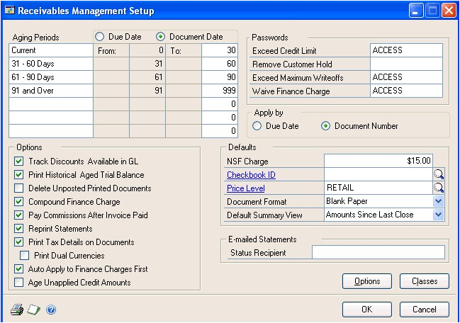

2. Specify the aging periods to use and how to age documents. See *Aging periods* for more information.

3. Enter passwords to restrict user access to certain sales activities. If you leave any of the password fields blank, no password will be required for those activities. See *Passwords* for more information.

    > [!NOTE]
    > To use the credit limit override approval workflow in Sales Order Processing, don’t enter a password for the Exceed Credit Limit field.

4. Specify whether to apply credit memos, returns, and payments by due date or document number when you automatically apply. See *Apply preferences* for more information.

2. Mark any additional receivables options. See *Additional receivables options* for more information.

3. Enter default information for an NSF charge, checkbook ID, price level, document format, and default summary view. See *Default entries* for more information.

4. Enter an e-mail statements status report recipient address. This field is not available if you have marked Customer Statement in the Sales E-Mail Setup window or have selected Exchange as the email server type in the System Preferences window.

5. Choose Options to set up additional Receivables Management options and default entries, such as document descriptions, codes, numbers, and userdefined fields. See *Setting up Receivables Management options* for more information.

6. Choose File \>\> Print to verify your entries with a Receivables Setup List.

7. Choose OK to save your entries and close the Receivables Management Setup window.

### Receivables Management options

Use the Receivables Setup Options window to set up options and default entries, including document descriptions, codes, numbers, and user-defined fields. This information appears throughout Receivables Management windows; the transaction description is displayed on reports, and the transaction code appears when there isn’t space for the entire transaction description on reports or in windows. Document numbers track individual transactions.

### Transaction numbers

When defining default document numbers using this window, you must use separate numbers for all document types rather than using only one document number to increment for all transactions, because each type of document increments separately using a separate number.

While document numbers don’t have to be alphanumeric, an alphanumeric system gives you more flexibility in locating and identifying documents. The lookup window for document numbers doesn’t display a document code, so you can’t identify whether the transaction is a sale or a warranty by the number if you don’t use alphanumeric document numbers.

When setting up an alphanumeric system, be sure each document number ends with a series of digits rather than letters. If you enter Invoice numbers that end in alphabetic characters, such as 8050AC, the system is unable to increment to the next number and you’ll receive an alert message when entering transactions, stating that the default document number is invalid.

The number of documents you can generate depends on the number of ending digits you assign when setting up your document numbers. It is important to have as many zeros as possible to the left of the number you enter to ensure it increments correctly, and that enough possible numbers exist for all your entries. For example, if you enter Sales001, once you reach Sales999, there will be no further number to increment.

### Default tax schedule IDs

The sales, freight, and miscellaneous tax schedule IDs you enter appear as default entries in the Receivables Tax Schedule Entry window. You can change these tax schedule IDs for individual transactions using the Receivables Tax Schedule Entry window.

When you enter transactions, each schedule is compared to the tax schedule that appears in the Receivables Transaction Entry window. Tax details that appear in both tax schedules are used to calculate the tax on the sales amount.

### User-defined fields

Receivables Management includes user-defined field names for tracking additional information about each customer and for sorting methods on reports.

For example, if you keep track of your customer type, such as retail, you can enter Customer Type in the Customer Master User-Defined 1 field. In the Customer Maintenance window, you will see Customer Type as the label for the field that was Customer Master User-Defined 1. You also will see Customer Type as a sorting method on most customer reports. There are also two user defined fields specifically for customer address information.

### Sales history includes

Mark whether to post sales amounts, trade discount amounts, amounts charged for freight, miscellaneous charges, and tax amounts to sales history. For example, if you use the Miscellaneous field in the Receivables Transaction Entry window to enter processing fees, you can have those amounts added to the sales amounts to keep a record of these accounts. The total of the sale plus the processing fee is displayed when you view historical amounts using the Customer Summary window.

### Setting up Receivables Management options

Use the Receivables Setup Options window to set up options to appear throughout Receivables Management. You can enter a description for each document type, assign a code, and set up the next document number for the transaction type.

#### To set up Receivables Management options

1. Open the Receivables Setup Options window.
(Sales \>\> Setup \>\> Receivables \>\> Options button)

    

2. Specify default transaction descriptions, codes, and next numbers.

3. Enter the most recent dates specific sales activities were completed on. This information is updated automatically as these activities occur.

    Enter default tax schedules to be used for sales transactions when a customer doesn’t have a tax schedule assigned, and for taxes charged on freight and other miscellaneous charges. See the System Setup documentation for more information about setting up tax schedules.

4. Enter user-defined field names for tracking additional information about each customer and customer address and to sort information on reports. The Customer Master fields appear in the Customer Maintenance window, and the User-Defined 1 field is a sorting method on several customer reports. The Customer Address fields appear in the Customer Address Maintenance window.

5. Mark whether to track sales amounts, trade discounts amounts, amounts charged for freight, miscellaneous charges, and tax amounts in history.

6. Choose OK to save your entries and close the Receivables Setup Options window.

## Chapter 2: Sales territories and salespeople

Sales territories are divisions a company’s products are sold in. You can track history, sales, and commissions in each territory. You can set up sales territory cards according to geographical areas or customer types. For example, you could set up government, commercial, and residential “territories.”

Use salespeople cards to track commissions for calendar and fiscal years, and to keep historical information for each salesperson your company employs or does business with.

This information is divided into the following sections:

- *Adding a sales territory card*

- *Modifying or deleting a sales territory card*

- *Adding a salesperson card*

- *Modifying a salesperson card*

- *Deleting a salesperson card*

### Adding a sales territory card

Use the Sales Territory Maintenance window to enter sales territory information. When you set up your salespeople, you’ll assign them to sales territories. You can assign customer classes and customer cards to territories, as well.

You must set up at least one sales territory for your salespeople before you can post commissions, even if you don’t use sales territories.

You also can enter beginning territory sales amounts. These amounts are updated automatically as you post transactions. Transactions for the customer update commission amounts for the sales territory assigned to the customer card. The territory you assigned to the salesperson can be different from the territory you assigned to the customer card.

#### To add a sales territory card

1. In the navigation pane, choose the Sales button, and then choose the Salespeople list.

2. In the New group, choose Sales Territory to open the Sales Territory Maintenance window.

    

3. Enter an ID and a description for the territory.

    > [!NOTE]
    > To ensure that reports are printed in the correct order, be sure each territory ID has the same number of characters. The characters are sorted from left to right and numbers take priority over letters.

4. Enter the territory’s country/region.

5. Enter or select the territory manager.

6. Enter year-to-date and last year’s commissions and sales amounts, based on the customers in the territory, to create history information. These fields are updated automatically as you post transactions.

7. Mark whether to keep calendar-year history, fiscal-year history, or both.

    - If you mark Calendar Year, the sales and commission amounts for individual calendar months are recorded for reporting purposes.

    - If you mark Fiscal Year, the sales and commission amounts for individual fiscal periods are recorded for reporting purposes.

    To view or edit detailed historical commission and sales information for a single territory, choose History to open the Sales Territory History window. This information is updated as you post transactions.

    To add periods to include, choose Add Period in the Sales Territory History window to open the Sales Period and Month Maintenance window. Close the window when you finish.

8. Choose OK to close the Sales Territory History window; choose Save to save the sales territory card.

9. When you finish entering your sales territory cards, choose File \>\> Print to verify your entries with a Sales Territory List.

### Modifying or deleting a sales territory card

Use the Sales Territory Maintenance window to modify or delete sales territory information. You can’t delete cards for sales territories with posted amounts or amounts in history.

#### To modify or delete a sales territory card

1. In the navigation pane, choose the Sales button, and then choose the Salespeople list.

2. Mark the salesperson whose sales territory you want to modify or delete.

3. In the Modify group, choose Edit Sales Territory to open the Sales Territory Maintenance window.

4. Select one of the following options.

    - To make changes to the sales territory card, enter the new information.

    - To delete to the sales territory card, choose Delete.

5. Choose Save. Choose File \>\> Print to print a Sales Territory List to review your changes.

### Adding a salesperson card

Use the Salesperson Maintenance window to enter salesperson information.

You can assign a salesperson to each customer card. Transactions for the customer update the commission amounts for the salesperson.

#### To add a salesperson card

1. In the navigation pane, choose the Sales button, and then choose the Salespeople list.

2. In the New group, choose Salesperson to open the Salesperson Maintenance window.

    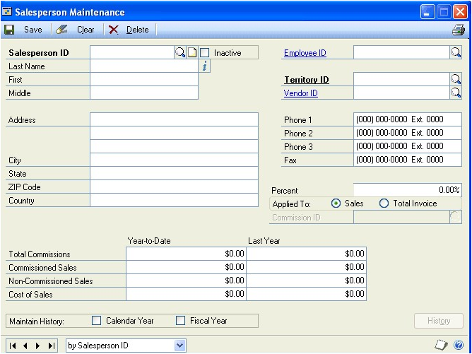

3. Enter a salesperson ID and name. If this salesperson is an employee, enter the employee ID; the employee record information appears. The salesperson ID doesn’t have to be the same as the employee ID.

    > [!NOTE]
    > To ensure that reports are printed in the correct order, be sure that each salesperson ID has the same number of characters. The characters are sorted from left to right and numbers take priority over letters.

4. Enter or select a territory ID. You must enter a territory ID before you can post commissions. Even if you don’t use territories, set up one sales territory to assign to all salespeople.

5. Enter or select a vendor ID if this salesperson is an independent contractor and not an employee.

6. Enter address information for the salesperson.

7. Enter the commission percentage this salesperson earns. Then, mark whether to calculate the salesperson’s commissions as a percentage of the sale amount or the invoice total. If you mark to calculate the invoice total, the commissions are calculated as a percentage of the invoice total, including the sale amount, freight, taxes, and miscellaneous charges.

8. Enter year-to-date and last-year commission and sales amounts to create history information. These fields are updated automatically as you post transactions.

9. Mark whether to keep calendar-year and fiscal-year history.

    - If you mark Calendar Year, sales and commission amounts for individual calendar months are recorded for reporting purposes.

    - If you mark Fiscal Year, sales and commission amounts for individual fiscal periods are recorded for reporting purposes.

To view or edit historical commission and sales information for a single salesperson, choose History to open the Salesperson History window. This information is updated as you post transactions.

To add periods to include, choose Add Period in the Salesperson History window to open the Sales Month and Period Maintenance window. Close the window when you finish.

Choose OK to close the Salesperson History window, and choose Save to save the salesperson card.

When you finish entering your salespeople cards, choose File \>\> Print to verify your entries with a Salesperson List.

### Modifying a salesperson card

Use the Salesperson Maintenance window to modify salesperson information.

#### To modify a salesperson card

1. In the navigation pane, choose the Sales button, and then choose the Salespeople list.

2. Mark the salesperson card to change.

3. In the Modify group, choose Edit to open the Salesperson Maintenance window.

4. To make changes to the salesperson card, enter the new information.

5. Choose Save to save the salesperson card. Choose File \>\> Print to print a Salesperson List and view the changes you entered.

#### Deleting a salesperson card

Cards can’t be deleted for salespeople for whom posted commission amounts or amounts in history exist. See *Marking commission amounts as paid* for more information about removing posted commissions.

#### To delete a salesperson card

1. In the navigation pane, choose the Sales button, and then choose the Salespeople list.

2. Mark a salesperson to delete.

3. Delete the salesperson.

## Chapter 3: Customer classes

Use customer classes to organize customers who have similar characteristics. For example, you could group your customers by credit limit, location, or business size.

Customer classes provide default entries and options that organize customer cards and save time when entering data and grouping and sorting methods on reports. You also can make changes to groups of customers quickly by changing the class and “rolling down” the change to all the customers in the class.

This information is divided into the following sections:

- *Open item and balance forward balances*

- *History options*

- *Credit and transaction options*

- *Adding a customer class*

- *Entering customer class Intrastat statistics*

- *Setting up customer class default posting accounts*

### Open item and balance forward balances

You can select between open item and balance forward balance types for customer accounts in Receivables Management. The following table outlines the differences between the two types:

|                                       | **Open item**                                                                                                                                                                                                      | **Balance forward**                                                                                                                                                                                                                                       |
|---------------------------------------|--------------------------------------------------------------------------------------------------------------------------------------------------------------------------------------------------------------------|-----------------------------------------------------------------------------------------------------------------------------------------------------------------------------------------------------------------------------------------------------------|
| **Definition**                        | Individual transaction information is saved and detailed on customer statements until the transaction is removed through paid transaction removal.                                                                | Transaction information is retained only for the current period and is then consolidated into an account total that is brought forward at the beginning of each subsequent period.                                                                       |
| **Number of aging periods**           | You can use up to seven aging periods.                                                                                                                                                                            | There are only two aging periods: current and noncurrent.                                                                                                                                                                                                |
| **Finance charges**                   | Accounts are aged before assessing finance charges because open item accounts are aged by individual transaction dates.                                                                                           | Accounts are consolidated after finance charges are assessed and customer statements have been printed because balance forward accounts don’t retain individual transaction information.                                                                 |
| **Aging**                             | You can age open item accounts at any time of the month by initiating the aging process.                                                                                                                          | Balance forward consolidation occurs during the paid transaction removal procedure.                                                                                                                                                                      |
| **Cash receipts/posted transactions** | You can apply payments to specific invoices. You can waive finance charges, assess charges for non-sufficient funds (NSF) checks, and void transactions until you complete the paid transaction removal procedure. | Payments are applied automatically to the noncurrent balance. You can waive finance charges, assess charges for nonsufficient funds (NSF) checks, and void transactions until you consolidate the accounts during the paid transaction removal procedure. |
| **Multicurrency transactions**        | You can enter multicurrency transactions for open item customers.                                                                                                                                                 | Multicurrency transactions cannot be entered for balance forward customers.                                                                                                                                                                              |

See *Chapter 6, “Open item balances,”* and *Chapter 7, “Balance forward balances,”* for more information about balance types.

### History options

There are several history options available in Receivables Management. The following table outlines each one:

| **History type** | **What’s kept**           | **Benefits of keeping**             |
|------------------|---------------------------|-------------------------------------|
| Calendar Year    | Sales and commission amounts for individual calendar months  | You can print reports for monthly and yearly customer activity.   |
| Fiscal Year      | Sales and commission amounts for individual fiscal periods | You can print reports for customer activity in each fiscal period.   |
| Transaction      | Detailed information about sales transactions | You can print history reports and the Historical Aged Trial Balance report.  |
|                  |  | (If you marked Print Historical Aged Trial Balance in the Receivables Management Setup window, transaction history will be kept regardless of whether you mark this option.)   |
| Distribution     | Detailed information about the posting account distributions for each transaction | You can print the Distribution History Report. (If you marked reprint posting journals in the Audit Trail Codes Setup window, distribution history will be kept regardless of whether you mark this option.) |

### Credit and transaction options

You can use the Customer Class Setup window (Sales \>\> Setup \>\> Customer Class) to specify credit and transaction entry options for customer classes, including the following options:

**Finance charges** Mark whether finance charges are used by customers in this class, and if the charges are a percentage of the balance due or a flat amount. To send customer statements monthly and assess charges on a monthly basis based on annual percentage, divide your yearly charge by 12 and enter that amount. The finance charge amounts you enter here are assessed each time you use the Assess Finance Charges window, typically on a monthly basis. For this reason, you should enter the amount or percentage to be charged monthly. For example, if customers in this class are required to pay an annual percentage rate (APR) of 18%, enter 1.5% (18 / 12 = 1.5).

**Payment terms** Payment terms include discounts that you offer your customers if they pay by a certain date. For example, the terms 2%-10/Net 30 offer a 2% discount to customers who pay within 10 days after the date of the purchase; otherwise the bill must be paid in full within 30 days. The terms Net 15 require that payment be made within 15 days of purchase, with no discount being offered. Other common terms are COD and prepayment.

**Discount grace period** The discount grace period is a grace period for payment terms that use discounts. When using discount date grace periods, if the document date plus the discount grace period is the same as or after the payment terms discount date, the discount date and the due date move to the next month. For example, assume that January 6 is an invoice date, the terms are \$2.50
7/Net 12, and the discount grace period is 2 days. A discount of \$2.50 is available to customers if they pay on January 7; otherwise, the entire bill is due January 12. Because the invoice date plus the discount due date grace period is greater than or equal to the discount date, the discount date moves to February 7 and the due date moves to February 12.

**Due date grace period** The due date grace period is a grace period for payment terms that use due dates. For example, assume that May 25 is an invoice date. The terms are EOM for the invoice and the bill is due on the last day of the month. If you enter a grace period of 5 and the invoice date falls within five days of the end of the month, the invoice isn’t due until the end of the following month.

### Adding a customer class

Use the Customer Class Setup window to enter new customer classes. In addition, you can make changes to groups of customers quickly by changing the class and rolling down the change to all the customers in the class. See *Modifying or deleting a customer class* for more information about rolling down changes to a customer class.

#### To add a customer class

1. Open the Customer Class Setup window.
(Sales \>\> Setup \>\> Customer Class)

    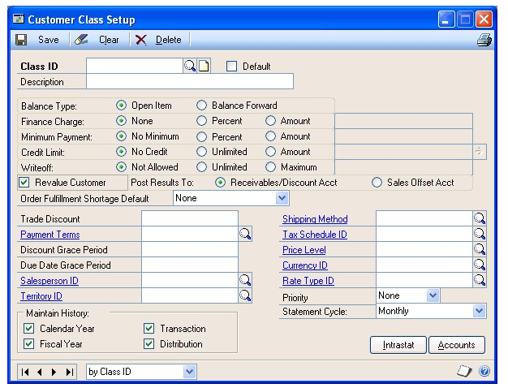

2. Enter an ID and description for the class.

    We recommend that you enter the class with the most common entries first and mark this class as your default class. If you mark Default, the information you set up for this class appears as the default information for every subsequent class you create. You can mark only one class as the default customer class.

3. Set up the credit options to apply to customers in this class, such as balance type, finance charge, minimum payment, credit limit, and writeoff.

    If customers in this class will use multicurrency transactions, you must select Open Item as the balance type. Multicurrency transactions cannot be entered for balance forward customers, and balance forward customers can’t be part of a national account.

    If customers in this class will be part of a national account, you must select Open Item as the balance type.

4. Mark Revalue Customer to include the transactions for the customers in this class when you’re revaluing the Sales series using the Multicurrency Revaluation window.

    Mark whether to post the revaluation results to each transaction’s Accounts Receivable account and Terms Discounts Available account, or to a Sales offset account.

5. Select a default order fulfillment shortage option for this customer. You can choose None, Back Order Remaining, or Cancel Remaining. If you select None, you will have to allocate any shortages manually. See the Sales Order Processing documentation for more information.

6. Enter default transaction entries options for customers in this class, such as trade discount, payment terms, and salesperson and territory IDs.

7. If customers in this class will use multicurrency transactions, enter or select an existing currency as the default currency for the class. We recommend you enter a currency ID other than your functional currency only for those classes of customers who typically use a foreign currency.

    If you already set up a customer class and you change the currency ID, you can roll down the currency ID to the customers in this class; the new currency ID will be assigned to all customers you assign to the class in the future.

8. Enter or select an existing rate type for the class. When you enter transactions, you automatically can select the appropriate exchange rate table based on the currency ID and rate type you’ve entered. See the Multicurrency Management documentation for more information about currencies and rate types.

    > [!NOTE]
    > If you don’t assign a rate type to a customer, the default rate type you’ve entered for the Sales Series using the Multicurrency Setup window appears on the transaction instead. Therefore, be sure you’ve entered a Sales series default rate type.

9. Mark the types of history to keep. See *History options* for more information.

10. Select a priority for the customer—1 is the highest priority and None is the lowest priority. When you allocate items in the Sales Automatic Order Allocation window, you can choose to allocate items by customer priority.

11. Select a statement cycle for printing customer statements for this class. If you don’t send statements to most members in this class, select No Statement.

    To assign default posting accounts to the class, choose Accounts to open the Customer Class Accounts Setup window.

    If you don’t set up accounts for the customer, the accounts from the class are used. If there aren’t any for the class, the accounts in the Posting Accounts Setup window are used. See *Setting up customer class default posting accounts* for more information.

12. Choose OK to close the window and return to the Customer Class Setup window, and choose Save to save your entries.

When you finish entering your customer class cards, choose File \>\> Print to verify your entries with a Classes Setup List

### Entering customer class Intrastat statistics

Use the Customer Class Intrastat Setup window to enter default Intrastat information for a customer class. You can roll down the changes you make using this window to all customer cards in the class.

If you set up Intrastat information for customer classes, you won’t need to enter Intrastat information for individual customer cards in that class. However, you can change the information for a particular customer card using the Customer Intrastat Setup window.

> [!NOTE]
> You can enter Intrastat statistics only if you have marked to enable Intrastat tracking using the Company Setup Options window.

See the System Setup documentation for information about setting up Intrastat codes.

#### To enter customer class Intrastat statistics

1. Open the Customer Class Intrastat Setup window.
(Sales \>\> Setup \>\> Customer Class \>\> Select a customer class \>\>Intrastat button)

    

2. Enter or select country, transport mode, transaction nature, incoterms, procedure/regime, port, region, and tax commodity codes for the customer class.

3. Choose OK to close the Customer Class Intrastat Setup window.

4. In the Customer Class Setup window, choose Save to save the information.

> [!NOTE]
> Deleting the customer class also deletes Intrastat information.

### Setting up customer class default posting accounts

You can set up a unique set of default posting accounts for each class. When you set up your customer cards, you can use these accounts or change them as needed on a per-customer basis.

If you’re using Receivables Management with both Invoicing and Inventory, some Invoicing transactions are posted to Receivables Management posting accounts, and some to Inventory posting accounts. For example, Invoicing distributions for inventory amounts or markdowns always are posted to equivalent Inventory posting accounts. You can post other distribution amounts only to Receivables Management accounts. Credit card sales recorded in Invoicing always are posted to the Accounts Receivables posting account you set up for the customer in Receivables Management. In addition, you can post trade discounts, terms discounts taken, and freight and miscellaneous charges only to equivalent Receivables Management posting accounts.

You can post other types of distributions either to Inventory or Receivables Management posting accounts, depending on the selections you made using the Invoicing Setup window. If you selected Item in the Posting Accounts From field, Inventory posting accounts are used. If you selected Customer in the Posting Accounts From field, Receivables Management posting accounts are used. See the Invoicing documentation for more information.

#### To set up customer class default posting accounts

1. Open the Customer Class Accounts Setup window.
(Sales \>\> Setup \>\> Customer Class \>\> Accounts button)

    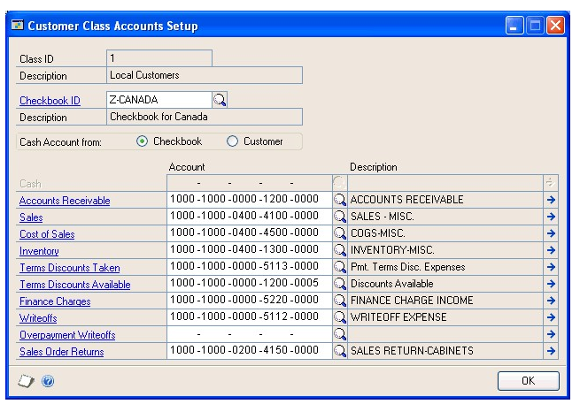

2. If you didn’t specify a class ID using the previous window, enter or select a class ID and enter a description.

3. Enter or select a checkbook ID.

4. Mark whether to use the Cash account from the checkbook you selected using the Receivables Management Setup window or from the customer card.

    > [!NOTE]
    > If you’re using Bank Reconciliation, we recommend that you use the Cash account from the checkbook so you can easily reconcile the checkbook balance to the Cash account in General Ledger.

5. Enter or select the posting accounts. These accounts appear as default entries for setting up customer cards.

6. Choose OK to close the window.

7. In the Customer Class Setup window, choose Save to save the information.

## Chapter 4: Customer cards

The foundation of the Receivables Management module is your collection of customer cards. This information is used to track the status of customers and to print reports. It is important to keep this information up to date to reflect your company’s current activity.

> [!NOTE]
> You might be able to import your customer records from your current system directly into Receivables Management. Importing your customer data saves you a considerable amount of time. Contact your reseller for more information.

This information is divided into the following sections:

- *Before you add customer cards*

- *Adding a customer card*

- *Setting up customer default posting accounts*

- *Entering customer address information*

- *Entering customer Intrastat statistics*

- *Finance charge and credit limit options*

- *Setting up customer credit, payment, and history options*

- *Setting up e-mail options for a customer*

- *Setting up e-mail options for a group of customers*

### Before you add customer cards

Before you begin entering your first customer cards, consider how to arrange your current and future customer cards. You might want to assign specified groups of IDs to different types of customers. You also might want to assign them to different customer classes. Once you decide on the most appropriate identification system, be sure all the IDs have the same number of characters, and are set up consistently, for the best results when printing reports and using other windows.

### Adding a customer card

Use the Customer Maintenance window to add customer cards to your Receivables Management system.

#### To add a customer card

1. In the navigation pane, choose the Sales button, and then choose the Customers list.

2. In the New group, choose Customer to open the Customer Maintenance window.

    

3. Enter a customer ID and name information. The short name, such as the company’s initials, can be used in circumstances when the customer name is too long. Short names may appear on reports and can be used as a sorting option for reports. The statement name is the name that is printed on statements.

4. Assign the customer to a class. Once you enter a class ID, several default entries appear in this window, in the Customer Maintenance Options window and in the Customer Account Maintenance window. These can be changed on a per customer basis.

5. Select a priority for the customer—1 is the highest priority and None is the lowest priority. When you allocate items in the Sales Automatic Order Allocation window, you can choose to allocate items by customer priority.

6. Enter address information. An address ID is required if you enter any address information in this window. Internet address information can be entered by choosing the Internet button. To send documents such as invoices, sales quotes, and customer statements in e-mail, use the Internet Information window to enter To, Cc, and Bcc e-mail addresses.

    Additional addresses can be added by choosing Address to open the Customer Address Maintenance window. See *Entering customer address information* for more information.

7. Enter telephone and fax numbers.

8. Mark Ship Complete Documents if the customer doesn’t accept partial shipments of Sales Order Processing documents. Partial line item quantities won’t be transferred in Sales Order Processing if the customer doesn’t accept partial shipments. Refer to the Sales Order Processing documentation for more information about quantity transfers.

9. Enter the UPS zone, shipping method and tax schedule ID used most often for this customer.

    Because taxes are calculated at the point of exchange of goods or services, the shipping method is used for tax calculations on transactions.

    - If you select a shipping method of Delivery, the tax schedule assigned to the customer card is used to calculate the tax amount on transactions.

    - If you select a shipping method of Pickup, the tax schedule assigned to your company in the Company Setup window is used to calculate the tax amount.

10. Enter or select address IDs for shipments, bills, and statements for this customer, if the customer has different addresses for multiple purposes. See *Entering customer address information* for more information.

11. Enter or select a salesperson ID and territory ID.

12. Enter user-defined information and any comments you want to appear on the Customer Setup List and in the Customer Inquiry window.

13. Enter the trade discount, payment terms and price level information.

    You won’t be able to enter a price level if you’re using extended pricing.

14. Choose Accounts to view or edit the posting accounts assigned to this customer. For more information, see *Setting up customer default posting accounts.*

15. Choose Options to view or enter additional credit, payment and history options for this customer. For more information, see *Setting up customer credit, payment, and history options*.

16. Choose the Attachment Management icon to attach documents to the customer record, if applicable.

17. In the Customer Maintenance window, choose Save to save the information you’ve entered.

When you have entered all your customer cards, verify your entries with a Customer Setup List and a Customer Addresses List.

### Setting up customer default posting accounts

Use the Customer Account Maintenance window to change the accounts for an individual customer.

Each customer can use different posting accounts if necessary. When you enter transactions, amounts are distributed to the accounts you assign to the customer using this window. If you entered a Class ID for this customer, the posting accounts you entered using the Customer Class Accounts Setup window appear here as default entries. If there aren’t any set up for the class, the accounts in the Posting Accounts Setup window are used. Regardless of how you set up posting accounts, you can change distributions during transaction entry.

If you’re using Receivables Management with both Invoicing and Inventory, some invoicing transactions are posted to Receivables Management posting accounts and some to Inventory posting accounts. For example, Invoicing distributions for inventory amounts or markdowns always are posted to equivalent Inventory posting accounts. You can post other distribution amounts only to Receivables Management accounts. For example, credit card sales recorded in Invoicing always are posted to the accounts receivable posting account you set up for the customer in Receivables Management. In addition, trade discounts, terms discounts taken, and freight and miscellaneous charges can be posted only to the equivalent Receivables Management posting accounts.

You can post other types of distributions either to Inventory or Receivables Management posting accounts, depending on the selections you made using the Invoicing Setup window. If you selected Item in the Posting Accounts From field, Inventory posting accounts are used. If you select Customer in the Posting Accounts From field, Receivables Management posting accounts are used. See the Invoicing documentation for more information.

#### To set up customer default posting accounts

1. Open the Customer Account Maintenance window.
(Sales \>\> Cards \>\> Customer \>\> Select a customer ID \>\> Accounts)

    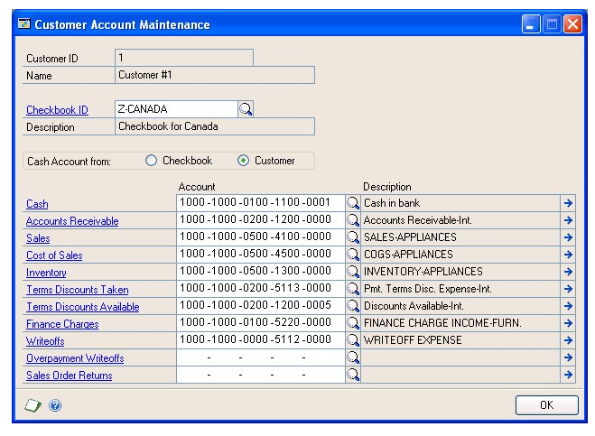

2. Mark whether to use the Cash account from the checkbook you selected using the Receivables Management Setup window, or from the customer card.

    > [!NOTE]
    > If you’re using Bank Reconciliation, we recommend that you use the Cash account from the checkbook so that you can easily reconcile the checkbook balance to the Cash account in General Ledger.

3. Enter or select the default posting accounts for this customer.

4. Choose OK to close the Customer Account Maintenance window.

5. In the Customer Maintenance window, choose Save to save the information.

### Entering customer address information

If your customer has more than one address, such as shipping, billing, and statement addresses, you can enter additional addresses using the Customer Address Maintenance window.

You also can enter site, salesperson, territory, and additional user-defined information for each address. If salespeople are assigned to specific locations, such as states, it’s possible that one customer might have different salespeople for different locations.

#### To enter customer address information

1. Open the Customer Address Maintenance window.
(Sales \>\> Cards \>\> Addresses)

    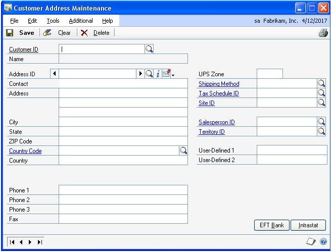

2. Enter or select a customer ID.

3. Enter an address ID and the new address information. To enter Internet address information, choose the Internet button to open the Internet Information window. To send documents such as invoices and sales quotes in e-mail, use the Internet Information window to enter To, Cc, and Bcc e-mail addresses.

4. Enter a shipping method and tax schedule ID for the address ID that’s currently displayed. If you select a shipping method that requires delivery, the default tax schedule assigned to the customer address will be displayed during transaction entry. If the method requires the customer to pick up goods, the schedule ID assigned to the site that the customer will pick up the goods from will be displayed.

    When you’re entering a sales transaction, the shipping method you entered for the customer in the Customer Address Maintenance window appears as the default entry.

    To enter Intrastat information, choose the Intrastat button. See *Entering customer Intrastat statistics* for more information.

5. Enter or select a site ID to assign to the customer address or accept the default entry.

    If you’re entering a sales transaction, the site ID you select will appear as the default entry in the Sales Order Processing window.

    If you’re entering an invoicing transaction, the site ID you select will appear as the default entry in the Invoice Entry window.

6. Enter or select a salesperson ID and territory ID to assign to the customer address. Default commission amounts and default commission distribution amounts will be calculated based on the salesperson ID selected. You must select a sales territory to calculate commission amounts.

7. Enter user-defined information for this customer.

8. Enter an address name. The address name can be used for a more descriptive name for the address ID and will appear on printed documents. Select which phone or fax number to print on sales documents, or Do Not Print, if you are not required to print that information. This information will appear as a default in the Sales Ship-To Address Entry window.

9. In the Customer Address Maintenance window, choose Save to save the information.

### Entering customer Intrastat statistics

Use the Customer Intrastat Setup window to enter a customer’s tax registration number. If Intrastat information was entered for the customer class, that information appears in this window. You can use the Customer Intrastat Setup window to change Intrastat information for an individual customer, or to enter Intrastat information if none was entered for a customer class.

> [!NOTE]
> You can enter Intrastat statistics only if you marked to enable Intrastat tracking using the Company Setup Options window.

#### To enter customer Intrastat statistics

1. Open the Customer Intrastat Setup window.
(Sales \>\> Cards \>\> Addresses \>\> Select a customer ID \>\> Intrastat button)

    

2. Enter a tax registration number.

3. Enter or select country, transport mode, transaction nature, incoterms, procedure/regime, port, region, and tax commodity codes for the customer class. See the System Setup documentation (Help \>\> Printable Manuals) for information about setting up these codes.

4. Choose OK to close the Customer Intrastat Setup window.

5. In the Customer Address Maintenance window, choose Save to save the information.

> [!NOTE]
> Deleting the customer address also deletes Intrastat information.

### Finance charge and credit limit options

You can use the Customer Maintenance Options window (Sales \>\> Cards \>\> Customer \>\> Select a customer ID \>\> Options) to specify credit and transaction options for customers, such as the following options:

- **Finance charges** Mark whether to assess finance charges for this customer. The finance charge amounts you enter here are assessed each time you use the Assess Finance Charges window, typically on a monthly basis. For this reason, you should enter the amount or percentage charged monthly. For example, if the customer is required to pay an annual percentage rate (APR) of 18%, enter 1.5% (18 / 12 = 1.5).

- **Credit limits** Customers can have no credit, unlimited credit, or a specified amount of credit. You can’t define separate credit limits for different aging periods using this window. However, you can use the Display Credit Limit Warning window to specify that an alert message be displayed when the customer’s balance exceeds a particular sum, either in total or during a specific aging period. For example, you might use the Display Credit Limit Warning window to specify that a message be displayed if the customer’s balance exceeds \$5000 for the periods of 6190 days and beyond, even if the customer’s credit limit is \$6000. To open the Display Credit Limit Warning window, choose the expansion button on this field.

### Setting up customer credit, payment, and history options

Use the Customer E-Mail Options window to select which documents you want to send to the customer, message ID, and document format. You can either send documents as attachments or embed documents in the message body. If you send documents as attachments, you can select to send multiple attachments to the customer and set the maximum file size of the document.

If you entered a class ID for this customer, the options you entered using the Customer Class Setup window appear as default options in the Customer Maintenance Options window.

#### To set up customer credit, payment, and history options

1. Open the Customer Maintenance Options window.
    (Sales \>\> Cards \>\> Customer \>\> Select a customer ID \>\> Options)

    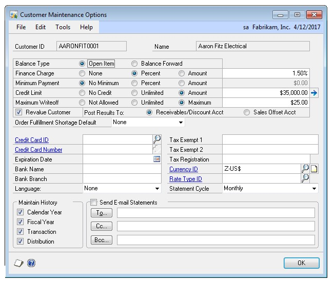

2. Set up the credit options to apply to the customer, such as balance type, finance charge, minimum payment, credit limit, and writeoff.

    If the customer uses multicurrency transactions, you must select Open Item as the balance type. Multicurrency transactions can’t be entered for balance forward customers, and balance forward customers can’t be part of a national account.

    If the customer is part of a national account, you must select Open Item as the balance type.

3. Mark Revalue Customer to include the customer’s posted transactions when  you’re revaluing the Sales series using the Multicurrency Revaluation window.

    Mark whether to post the revaluation results to each transaction’s Accounts Receivable and Terms Discounts Available accounts, or to a Sales offset account.

4. Select a default order fulfillment shortage option for this customer. You  can choose None, Back Order Remaining, or Cancel Remaining. If you select None, you will have to allocate any shortages manually. See the Sales Order Processing documentation for more information.

5. Enter payment information for this customer, including credit card and bank information.

6. Enter tax exemption numbers and the customer’s tax registration number. If your company is required to collect Value-Added Tax (VAT) from the customer, enter the customer’s VAT registration number in the Tax Registration field.

7. If the customer uses multicurrency transactions, enter or select the default currency and an existing rate type for the customer. When you enter transactions, you automatically can select the appropriate exchange rate table based on the currency ID and rate type you’ve entered.

    We recommend that you enter a currency ID other than your functional currency only for those customers who typically use a foreign currency. See the Multicurrency Management documentation for more information about currencies and rate types.

    > [!NOTE]
    > If a rate type isn’t assigned to a customer on a multicurrency transaction, the default rate type you’ve entered for the Sales Series using the Multicurrency Setup window appears instead. Therefore, be sure you’ve entered a Sales series default rate type.

8. Select a statement cycle for printing statements for this customer. If you don’t send statements to the customer, select No Statement.

9. Mark the types of history to keep.

10. Mark whether to be able to send e-mail customer statements to this customer, and enter at least one valid e-mail address where the customer statements should be sent. Choose To, Cc, or Bcc to open your e-mail address book. You won’t be able to enter the address if you have marked Customer Statement in the Sales E-mail Setup window or are using Exchange as your email server type in the System Preferences window.

    You must have Adobe Distiller or PDFWriter installed on your computer to e-mail statements. Any MAPI-compliant e-mail service is supported.

11. Choose OK to close the Customer Maintenance Options window. In the Customer Maintenance window, choose Save to save the information.

### Setting up e-mail options for a customer

Use the Customer E-Mail Options window to select which documents you want to send to the customer. You also can specify message IDs and the document format to use for the customer. A message ID is a predefined message that you can assign to a document that you want to send in e-mail. For example, you can send a holiday greeting message to a customer.

You can either send documents as attachments or embed documents in the message body. If you send documents as attachments, you can select to send multiple attachments to the customer and set the maximum file size of the document.

The options available in this window depend on the selections you made in the Company Setup window and the Sales E-mail Setup window. See your System Setup Guide (Help \>\> Contents \>\> select Setting up the System) for more information.

#### To set up e-mail options for a customer

1. Open the Customer E-mail Options window.
    (Sales \>\> Cards \>\> Customer \>\> Select a customer ID \>\> E-mail)

    

2. Select to send documents as attachments or embed documents in the message body. The options available depend on the selections in the Company E-mail Setup window.

3. If you are sending documents as attachments, you can mark to send multiple attachments for documents of the same document type with the same subject, message body, address to send replies to, To, Cc, and Bcc address in one e-mail.

4. If you are sending documents as attachments, you can mark to set a maximum file size limit for attached documents sent to the customers, and then enter the file size. If this field is unmarked, there isn’t a size limit.

5. Mark the documents you want to send in e-mail. You can select a default message ID for each document and select the format that you want to send the document in.

    - If a document is unmarked, it can’t be sent in e-mail. The documents available to send depend on the documents selected in the Sales E-Mail Setup window.

    - If you didn’t select a message ID for the document type in the Sales E-mail Setup window, this field is blank.

    - The file formats available to send attachments depend on the formats you selected in the Company E-mail Setup window.

    Before you can send documents as DOCX, PDF, or XPS attachments, the Word template for the document must be enabled in the Template Configuration Manager window. Standard reports (reports generated by the Report Writer engine) are sent when you send documents as HTML attachments.

6. Choose OK to update the selected customer with the options you entered.

### Setting up e-mail options for a group of customers

Use the Mass Customer E-Mail Settings window to assign e-mail settings to multiple customer records. You can select which documents you want to send to the customers. You also can specify message IDs and the document format to use for the vendor. A message ID is a predefined message that you can assign to a document that you want to send in e-mail. For example, you can send a promotional message to your customers when sending sales quotes in e-mail.

You can either send documents as attachments or embed documents in the message body. If you send documents as attachments, you can select to send multiple attachments to the customers and set the maximum file size of the document.

The options available in this window depend on the selections you made in the Company Setup window and the Sales E-mail Setup window.

#### To set up e-mail options for a group of customers

1. In the navigation pane, choose the Sales button, and then choose the Customers list.

2. Mark the customers that you want to set up e-mail options for.

3. In the Modify group, click the overflow menu and then select E-mail Settings to open the Mass Customer E-mail Settings window.

    

4. Select to send documents as attachments or embed documents in the body of email messages.

5. If you are attaching documents, you can select to attach multiple documents per e-mail and set a maximum file size for the documents.

6. Mark the documents you want to send in e-mail. You can select a default message ID for each document and then select the format that you want to send the document in.

    - If a document is unmarked, it can’t be sent in e-mail. The documents available to send depend on the documents selected in the Sales E-Mail Setup window.

    - If you didn’t select a message ID for the document type in the Sales E-mail Setup window, this field is blank.

    - The file formats available to send attachments depend on the formats you selected in the Company E-mail Setup window.

    Before you can send documents as DOCX, PDF, or XPS attachments, the Word template for the document must be enabled in the Template Configuration Manager window. Standard reports (reports generated by the Report Writer engine) are sent when you send documents as HTML attachments.

7. Choose OK to save your entries and to close the Mass Customer E-mail Settings window.

## Chapter 5: Customer maintenance

After you enter information in Receivables Management, proper maintenance of these cards is essential to preserving the accuracy of your accounting information. This part of the documentation describes the maintenance tasks you might encounter when working with customer cards and classes.

This information is divided into the following sections:

- *Customer card statuses*

- *Placing or removing a customer hold*

- *Inactivating a customer card*

- *Modifying or deleting a customer address*

- *Modifying or deleting a customer card*

- *Modifying or deleting a customer class*

- *Deleting a group of customer cards*

### Customer card statuses

You can designate a customer card as inactive or on hold. Use these statuses to limit the data that users can enter or post. You also can use these statuses to place restrictions on deleting or modifying a customer card.

| **Status** | **Definition**   | **What you can do**                              |
|------------|------------------|--------------------------------------------------|
| Hold       | Used to temporarily prevent any further sales to a customer if, for example, the customer has an unpaid balance.       | You can still record payments from the customer. |
| Inactive   | Used as a permanent change to a customer’s status reflecting the fact that you no longer do business with the customer. | No transactions of any kind can be entered.     |

### Placing or removing a customer hold

During the course of business, you want to place a customer hold, or remove that hold. For example, if a customer has an unpaid balance that exceeds his or her credit limit, you might not want to allow any other sales activity for the customer. If you receive the balance, you might then remove the hold. You can enter sales for a customer once you remove the hold.

The Hold option is ignored if the customer ID is the child customer of a national account and the Apply Hold/Inactive Status of Parent Across National Account option in the National Accounts Maintenance window is marked. See *Chapter 9, “National accounts,”* for more information.

#### To place or remove a customer hold

1. Open the Customer Maintenance window.
    (Sales \>\> Cards \>\> Customer)

2. Enter or select the customer to place on hold or remove from on hold.

3. Mark or unmark Hold.

4. Choose Save.

#### To place or remove a customer hold using the action pane

1. In the navigation pane, choose the Sales button, and then choose the Customers list.

2. Mark the customer or customers to place on hold or remove from on hold.

3. In the Modify group, choose Apply Hold or Remove Hold.

### Inactivating a customer card

Use the Customer Maintenance window to inactivate a customer card. Inactive customers are customers you no longer want to have a business relationship with, but the cards can’t be deleted because historical information is being kept.

You can inactivate a customer card only if there are no outstanding invoices. If you can’t inactivate a customer card, you should remove paid sales transactions for the customer. For more information, refer to *Removing paid transactions*.

You can’t mark a customer ID inactive if it’s the parent customer ID of a national account that contains children who have unposted or open transactions, and the Apply Hold/Inactive Status of Parent Across National Account option in the National Accounts Maintenance window is marked.

In addition, the Inactive option is ignored if the customer ID is the child customer of a national account and the Apply Hold/Inactive Status of Parent Across National Account option in the National Accounts Maintenance window is marked. See *Chapter 9, “National accounts,”* for more information.

#### To inactivate a customer card

1. Open the Customer Maintenance window. 
    (Sales \>\> Cards \>\> Customer)

2. Enter or select the customer card.

    Mark Inactive. To reactivate a customer card, unmark the Inactive option.

3. Choose Save.

### Modifying or deleting a customer address

If you need to change or delete an address, you can use the Customer Address Maintenance window to do so. Deleting the customer address also deletes Intrastat information and Internet information associated with the address.

#### To modify or delete a customer address

1. Open the Customer Address Maintenance window. 
    (Sales \>\> Cards \>\> Addresses)

2. Enter or select the customer ID and address ID.

3. Select one of the following options:

    - To make changes to the address, enter the new information.

    - To delete the address, choose Delete.

4. Choose Save.

### Modifying or deleting a customer card

Use the Customer Maintenance window to make changes to a customer card, or to delete the card. You can’t delete a customer card if it has a current balance, posted or unposted transactions, transactions in history, or if it part of a national account.

- If a customer is part of a national account, you can’t delete the customer card until you remove the customer from the national account. Additional restrictions also apply to national account customers. See *Chapter 9, “National accounts,”* for more information.

- If the customer card you’re deleting has a current balance, you can’t delete it until the year-end closing process is completed. See *Calendar year-end closing overview* for more information.*

- If transaction history is being kept for the customer card you’re deleting, you must remove history for that customer before deleting it. See *Chapter 28, “History removal,”* for more information. If you don’t want to remove the history, you might inactivate the customer card.

> [!TIP]
> To find out whether customer cards have any balances or transactions in history, choose File \>\> Print in the Customer Mass Delete window to print a Customer Card Removal Edit List; or, print a Transaction Removal Report without removing historical information. The cards appear as deleted on the report, but they aren’t actually deleted until you complete the process.

#### To modify or delete a customer card

1. Open the Customer Maintenance window. 
    (Sales \>\> Cards \>\> Customer)

2. Enter or select the ID for the customer card to change or delete.

    - To make changes to the customer card, enter the new information.

    - To delete the card, choose Delete.

3. Choose Save.

4. Choose File \>\> Print to print a Customer Setup List, so you can review your changes.

### Modifying or deleting a customer class

Use the Customer Class Setup window to modify an existing customer class to reflect changes or delete a class you no longer use because it has become obsolete.

If you make changes to an existing customer class, you’ll be asked whether to roll down the changes to all customer cards in the class. If you roll down changes, all customer cards in the class are updated to reflect the changes you’ve made. If you don’t roll down the changes, only new customer cards you add will reflect the changes.

> [!NOTE]
> If you change the balance type for a class, the change isn’t rolled down to the customers assigned to the class. Once a balance type is selected for a customer, it can’t be changed.

When you delete a class, the customer cards assigned to the class aren’t affected.

#### To modify or delete a customer class

1. Open the Customer Class Setup window. 
    (Sales \>\> Setup \>\> Customer Class)

2. Enter or select the ID for the class to change.

3. Choose one of the following options:

    - To change the class, enter the new information. A message will appear asking if you want to roll down the changes you made to all customers in this class.

    - To delete the class, choose Delete.

4. Choose Save.

5. Choose File \>\> Print to print a Classes Setup List, so you can review the changes you entered.

### Deleting a group of customer cards

Use the Customer Mass Delete window to delete a range of customer cards.

#### To delete a group of customer cards

1. Open the Customer Mass Delete window. 
(Sales \>\> Utilities \>\> Mass Delete)

    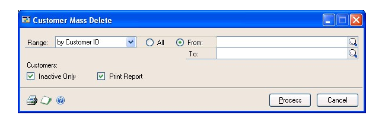

2. Enter or select a range of customer cards to delete.

3. Mark Inactive Only to delete only inactive customer cards.

4. Mark Print Report to print a Customer Cards Removal Report.

5. Choose File \>\> Print or the printer icon to print a Customer Removal Edit List before removing any customer cards.

6. Choose Process to delete the selected customer cards. If you selected to print the report, the Customer Cards Removal Report is printed after processing is complete.

Any customer cards in the range that don’t meet the criteria for deletion won’t be deleted.

## Chapter 6: Open item balances

When setting up Receivables Management, you must enter the beginning or outstanding balances for your customers. This information describes how to enter balances for open item customers.

For open item customers, individual transaction information is saved and detailed on customer statements until the transaction is removed through paid transaction removal. See *Open item and balance forward balances* for more information about balance types. See *Chapter 7, “Balance forward balances,”* for more information about entering balances for balance forward customers.

This information is divided into the following sections:

- *Before you enter beginning open item balances*

- *Changing the posting settings*

- *Entering open item beginning balances*

- *Resetting the posting settings*

### Before you enter beginning open item balances

You should keep several points in mind before you begin entering your beginning balance transactions, such as the following options:

- **Posting date** When entering transactions for noncurrent balances, change the transaction date to a date that falls before the beginning of the current period. When you repeat the procedure for your current balances, use the actual transaction date.

- **Salesperson ID** If you entered beginning salesperson commission information when you set up your salesperson cards, do not enter a salesperson ID when entering a beginning balance transaction. Otherwise, the commission and sales amounts will be posted twice, causing them to be overstated on the salesperson card.

- **Trade discount** If you enter the balance in summary and the customer is eligible for a trade discount, a discount amount is displayed as a default entry. Change the amount to zero.

- **Freight, miscellaneous, and tax** If you enter the balance in summary, no amounts should be entered for freight, miscellaneous charges, and taxes. If you enter the beginning balance in detail, include the trade discount, freight, miscellaneous charges, and taxes.

To correctly post your beginning balance transactions, you must complete the following procedures in order:

- *Changing the posting settings*

- *Entering open item beginning balances*

- *Resetting the posting settings*

### Changing the posting settings

Use the Posting Setup window to change your posting settings so your transactions don’t post to General Ledger, if General Ledger is part of your system. This ensures that the beginning balances transactions you’re entering won’t affect General Ledger account balances.

#### To change the posting settings

1. Open the Posting Setup window. (Administration \>\> Setup \>\> Posting \>\> Posting)

    

2. Select Sales as the series and Receivables Sales Entry as the origin.

3. Unmark Post to General Ledger. Repeat this for the origins of Receivables Apply Doc. and Receivables Cash Receipts.

> [!NOTE]
> The accounts in General Ledger might be overstated if you don’t unmark this posting option.

### Entering open item beginning balances

For open item customers you might find it easiest to enter your invoices by starting with the oldest and moving to the newest. However, because you’ll enter the balances with the correct transaction date, the order you enter them in isn’t critical. Before entering any transactions, you need to change the posting settings so the transactions won’t post to General Ledger.

You can enter transactions in detail or summary form, depending on your company’s record keeping methods. Detailed transactions include all information about the transaction, including discounts and tax amounts; summary transactions include only the transaction amount as a lump sum. Review *Before you enter beginning open item balances* before entering your beginning balances.

#### To enter open item beginning balances

1. Open the Receivables Batch Entry window. 
(Sales \>\> Transactions \>\> Receivables Batches)

    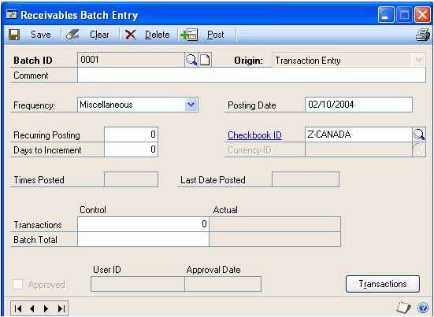

2. Enter a batch ID, such as BBAL, and select Transaction Entry as the batch origin for transactions. See *Chapter 11, “Batches,”* for more information about batches.

3. Enter information to identify the batch, including comments, frequency, (which in this case would be single-use because you’ll post beginning balances only once), and checkbook ID.

4. Enter a posting date if the batch should be posted using a date other than the default date that’s displayed.

5. To enter transaction information after the batch is created, choose Transactions to open the Receivables Transaction Entry window.

6. Enter beginning balance transactions. The actual balances are created by entering transactions.

The following table outlines what you should enter depending on the information you keep for your customers:

| **If you plan to keep**        | **What you’ll enter**                                                  |
|--------------------------------|------------------------------------------------------------------------|
| Transaction history in detail  | Enter each transaction as it was when the transaction occurred.       |
| Transaction history in summary | Enter summary information per month or aging period for each customer. |
| Beginning balances             | Enter the beginning balance for each customer in the Sales field.     |

See *Chapter 12, “Transaction entry,”* for more information.

7. Choose Post to post your beginning balance transactions.

8. Print an Aged Trial Balance as a record of your beginning balances and as verification of your customer totals. See *Chapter 26, “Reports,”* for more information about printing reports.

### Resetting the posting settings

Use the Posting Setup window to reset the posting settings so that your Receivables Management transactions again post to General Ledger, if General Ledger is part of your system.

#### To reset the posting settings

1. Open the Posting Setup window. (Administration \>\> Setup \>\> Posting \>\> Posting)

2. Select Sales as the series and Receivables Sales Entry as the origin.

Mark Post to General Ledger. Repeat this for the origins of Receivables Apply Doc. and Receivables Cash Receipts.

## Chapter 7: Balance forward balances

When setting up Receivables Management, you must enter the beginning or outstanding balances for your customers. This information describes how to enter balances for balance forward customers.

For balance forward customers, transaction information is retained only for the current period, and is then consolidated into an account total that’s brought forward at the beginning of each subsequent period. See *Open item and balance forward balances* for more information about balance types. See *Chapter 6, “Open item balances,”* for information about entering balances for open item customers.

This information is divided into the following sections:

- *Before you enter beginning balance forward balances*

- *Balance forward beginning balances*

- *Changing the posting settings*

- *Entering balance forward transactions for noncurrent periods*

- *Consolidating period balances*

- *Entering transactions for current periods*

- *Resetting the posting settings*

**Before you enter beginning balance forward balances**

You should keep several points in mind before you begin entering your beginning balance transactions, such as the following options:

**Posting date** When entering transactions for noncurrent balances, change the transaction date to a date that falls before the beginning of the current period. When you repeat the procedure for your current balances, use the actual transaction date.

**Salesperson ID** If you entered beginning salesperson commission information when you set up your salesperson cards, do not enter a
salesperson ID when entering a beginning balance transaction. Otherise, the commission and sales amounts will be posted twice, causing them to be overstated on the salesperson card.

### Trade discount
If you enter the balance in summary and the customer is eligible for a trade discount, a discount amount is displayed as a default
entry. Change the amount to zero.

**Freight, miscellaneous, and tax** If you enter the balance in summary, no amounts should be entered for freight, miscellaneous charges, and taxes. If you enter the beginning balance in detail, include the trade discount, freight, miscellaneous charges, and taxes.

### Balance forward beginning balances
Since you must enter your beginning balances by aging period for balance forward customers, you might decide to compile your invoices by current and noncurrent aging periods. To do this, you must complete the following processes in order:

- *Changing the posting settings*

- *Entering balance forward transactions for noncurrent periods*

- *Consolidating period balances*

- *Entering transactions for current periods*

- *Resetting the posting settings*

When entering beginning balances for balance forward accounts, you might want to enter your noncurrent balance in summary, and your current balances in either summary or detail, depending on your company’s record keeping methods. Detailed transactions include all information about the transaction, including discount and tax amounts; summary transactions include only the transaction amount as a lump sum. Because noncurrent accounts include only the sum of the customer’s balance, detailed information is not necessary.

*When you post using the Receivables Transaction Entry or Receivables Batch Entry windows, all amounts, regardless of the posting date, appear in the current aging period you set up using the Receivables Management Setup window. When you consolidate period balances, all noncurrent amounts are moved to the second aging period you set up using the Receivables Management Setup window, regardless of the document date of the transaction being entered.*

### Changing the posting settings

Use the Posting Setup window to change the posting settings so transactions don’t post to General Ledger. This ensures the beginning balance transactions you’re entering in Receivables Management won’t affect General Ledger account balances.

#### To change the posting settings

1. Open the Posting Setup window. (Administration \>\> Setup \>\> Posting \>\> Posting)

2. Select Sales as the series and Receivables Sales Entry as the origin.

3. Unmark Post to General Ledger, if General Ledger is part of your system. Repeat this for the origins of Receivables Apply Doc. and Receivables Cash Receipts.

> [!NOTE]
> The accounts in General Ledger might be overstated if you don’t unmark this posting option.

### Entering balance forward transactions for noncurrent periods

Use the Receivables Batch Entry and Receivables Transaction Entry windows to enter and post transactions for noncurrent periods.

#### To enter balance forward transactions for noncurrent periods

1. Open the Receivables Batch Entry window. 
(Sales \>\> Transactions \>\> Receivables Batches)

2. Enter a batch ID, such as BBAL, and select Transaction Entry as the batch origin for transactions. See *Chapter 11, “Batches,”* for more information about batches.

3. Enter information to identify the batch, including comments, frequency, (which in this case would be single-use because you’ll post beginning balances only once), and checkbook ID.

4. Enter a posting date if the batch should be posted using a date other than the default date that’s displayed.

5. To enter transaction information, choose Transactions to open the Receivables Transaction Entry window.

6. Enter beginning balance transactions.

    The following table outlines what you should enter depending on the information you keep for your customers:

    | **If you plan to keep**       | **What you’ll enter**       |
    |-------------------------------|-----------------------------|
    | Transaction history in detail (used only for the current periods) | Enter each transaction from the current period as a separate entry.   |
    | Transaction history in summary                                    | Enter summary information per month or aging period for each customer. |
    | Beginning balances                                                | Enter the beginning balance for each customer in the Sales field.     |

    See *Chapter 12, “Transaction entry,”* for more information.

    > [!NOTE]
    > Because you keep detailed transaction history only for current periods for balance forward customers, don’t enter transactions for the current period until after you consolidate period balances.

7. Choose Post to post the beginning balance transactions.

8. Print an Aged Trial Balance as a record of your beginning balances and as verification of your customer totals. See *Chapter 26, “Reports,”* for more information about printing reports.

### Consolidating period balances

Use the Paid Sales Transaction Removal window to consolidate period balances and move all fully applied documents to history.

#### To consolidate period balances

1. Open the Paid Sales Transaction Removal window. 
    (Sales \>\> Routines \>\> Paid Transaction Removal)

    

2. Mark All for the range of customers or classes.

3. Mark Balance Forward Consolidation and unmark all other options in the window, because you won’t be removing any transactions.

4. Choose Process to start the consolidation process.

### Entering transactions for current periods

Use the Receivables Batch Entry and Receivables Transaction Entry windows to
enter and post transactions for current periods.

#### To enter transactions for current periods

1. Open the Receivables Batch Entry window. 
(Sales \>\> Transactions \>\> Receivables Batches)

2. Create another batch for your beginning balances. Enter a batch ID, such as BBAL, and select Transaction Entry as the batch origin for transactions. See *Chapter 11, “Batches,”* for more information about batches.

3. Enter information to identify the batch, including comments, frequency, (which in this case would be single-use because you’ll post beginning balances only once), and checkbook ID.

4. Enter a posting date if the batch should be posted using a date other than the default date that’s displayed.

5. To enter transaction information after the batch is created, choose Transactions to open the Receivables Transaction Entry window.

6. Enter beginning balance transactions.

    The following table outlines what you should enter depending on the information you keep for your customers and records:

    | **If you plan to keep**    | **What you’ll enter**                                                  |
    |----------------------------|------------------------------------------------------------------------|
    | Transaction history in detail (used only for the current periods) | Enter each transaction from the current period as a separate entry.   |
    | Transaction history in summary                                    | Enter summary information per month or aging period for each customer. |
    | Beginning balances                                                | Enter the beginning balance for each customer in the Sales field.     |

    See *Chapter 12, “Transaction entry,”* for more information.

7. Choose Post to post the beginning balance transactions.

8. Print an Aged Trial Balance as a record of your beginning balances and to verify your customer totals. See *Chapter 26, “Reports,”* for more information about printing reports.

### Resetting the posting settings

Use the Posting Setup window to reset the posting settings so transactions post to General Ledger.

#### To reset the posting settings

1. Open the Posting Setup window. (Administration \>\> Setup \>\> Posting \>\> Posting)

2. Select Sales as the series and Receivables Sales Entry as the origin.

3. Mark Post to General Ledger, if General Ledger is part of your system. Repeat this for the origins of Receivables Apply Doc. and Receivables Cash Receipts.

> [!NOTE]
> Make a backup of your setup options and default entries, class and customer cards, and beginning balances. If there is a power fluctuation or some other problem, you can restore your beginning data.

## Chapter 8: Customer history

Entering customer history gives you the historical background you need to use reports and windows to compare amounts for previous years with the current year.

Whether history has been entered here or by entering transactions, the fields in these windows are updated as transactions are posted. Information is updated in the inquiry windows, as well. See *Chapter 24, “Customer inquiries,”* for more information about using inquiry windows.

> [!IMPORTANT]
> Make sure you enter beginning balances before entering customer history so those amounts aren’t posted twice.

This information is divided into the following sections:

- *Entering customer summary information*

- *Entering period summary history*

- *Entering finance charge summary history*

- *Entering credit summary history*

### Entering customer summary information

Use the Customer Summary window to view total receivables transaction amounts for a customer. You can select to view information for a specific fiscal year or calendar year, or a range of periods within a year. You also can view total amounts since you last closed the fiscal year for receivables transactions, and you can modify those amounts.

The information that is displayed in the Customer Summary window when you select Amounts Since Last Close in the Summary View list might not represent actual fiscal year totals if you close the fiscal year before or after the last day of the fiscal year. For example, the amounts in the Year to Date column might continue to increase as transactions are posted after the last day of the fiscal year; then when you close the fiscal year, the amounts in the Last Year column will include those transactions posted after the last day of the fiscal year that you closed.

Closing the fiscal year will not affect the information that is displayed in the Customer Summary window when you select Fiscal Year or Calendar Year in the Summary View list. The amounts displayed for those selections are dependent on the year and periods you enter to display.

#### To enter customer summary information

1. Open the Customer Summary window. 
(Sales \>\> Cards \>\> Summary)

    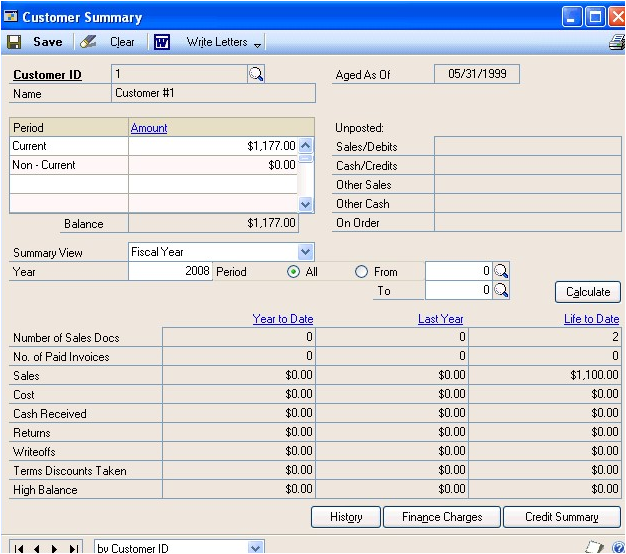

2. Enter or select a customer ID.

3. Select Amounts Since Last Close as the summary view so you can edit or change summary information. You also can view fiscal-year and calendar-year information.

If you select either Fiscal Year or Calendar Year, enter a valid year, and enter or select period ranges within the year you entered. Then choose Calculate.

5. Enter year-to-date, last-year, and life-to-date amounts for sales, costs, and other balances, if necessary. These amounts are updated when transactions are posted.

6. To edit a customer’s sales amounts and finance charges for a specific period, choose History to open the Customer Paid Summary window. See *Entering period summary history* for more information.

7. To view or edit finance charge information for the current and previous years, choose Finance Charges to open the Customer Finance Charge Summary window. See *Entering finance charge summary history* for more information.

8. To view or edit a customer’s credit history, choose Credit Summary to open the Customer Credit Summary window. See *Entering credit summary history* for more information.

9. Choose Save.

To print a Sales Analysis Report, which prints the information you’re currently viewing in the Customer Summary window, choose File \>\> Print.

### Entering period summary history

Use the Customer Period Summary window to enter historical amounts per period—calendar or fiscal. You can keep both calendar and fiscal period history if your fiscal year is different from the calendar year.

#### To enter period summary history

1. Open the Customer Period Summary window.
    (Sales \>\> Cards \>\> Summary \>\> Select a customer ID \>\> History button)

    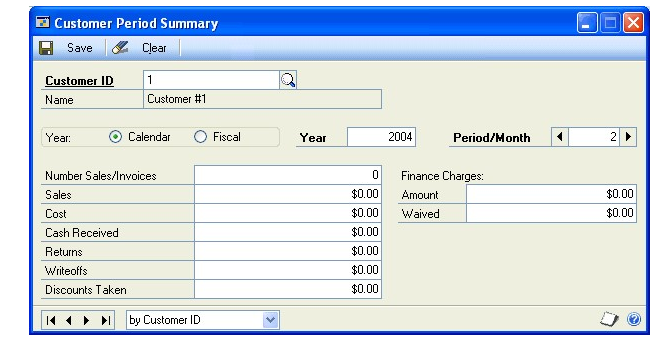

2. Mark Calendar or Fiscal, depending on the type of history you’re entering.

3. Enter a year.

4. Enter the number of the month or period.

5. Enter the appropriate sales, payment, and finance charge information for the month or period you selected.

If you posted beginning balances for this customer, balances might be displayed for some periods.

6. Choose Save.

#### Entering finance charge summary history

Use the Customer Finance Charge Summary window to track current and previous finance charges for a customer. If you’re required to print total calendar-year finance charge amounts on January statements, be sure to enter any year-to-date and last-year calendar finance charge amounts. Enter any other finance charge information to keep. These amounts are updated when transactions are posted.

#### To enter finance charge summary history

1. Open the Customer Finance Charge Summary window.
    (Sales \>\> Cards \>\> Summary \>\> Select a customer ID \>\> Finance Charges button)

    

2. Enter the Last Charge Amount.

3. Enter the Calendar Finance Charges for the current calendar year, last year, and next year.

4. Enter the Fiscal Finance Charges for the current fiscal year, last fiscal year, and life to date.

5. Choose OK to save the information in the Customer Finance Charge Summary window, and redisplay the Customer Summary window.

6. Choose Save in the Customer Summary window to save changes to the card.

#### Entering credit summary history

Use the Customer Credit Summary window to enter information about the average number of days your customers take to pay invoices, and to enter any NSF (nonsufficient funds) payments they have made and their last transactions. This information is updated when transactions are posted, and is useful for evaluating whether to change a customer’s credit limit, payment terms, or available discount.

#### To enter credit summary history

1. Open the Customer Credit Summary window.
    (Sales \>\> Cards \>\> Summary \>\> Select a customer ID \>\> Credit Summary button)

    

2. Enter the Average Days to Pay for the current year to date and life to date.

    After a customer has paid his or her first invoice, the average days to pay (ADTP) is calculated based on the number of invoices a customer has, the time taken to pay the first invoice, and the time taken to pay the most recent invoice. The formula for calculating the average days to pay is:

    ADTP=(Current ADTP) x (Number of Invoices) + (Number of Days Taken to Pay Most Recent Invoice)/(Number of Invoices + 1)

    The time it took to pay the first invoice would provide the initial value for the Current ADTP. Any later invoices paid by this customer will provide the values for the number of invoices and the number of days taken to pay the most recent invoice. The ADTP calculated on the customer’s initial invoices then becomes the “Current ADTP.” You can use this value when you recalculate the ADTP for later invoices.

3. Enter the information for any NSF (non-sufficient funds) payments from the customer for the current year to date and life to date.

4. Enter the last transaction information.

5. Choose OK to save the information in the Customer Credit Summary window and redisplay the Customer Summary window.

6. Choose Save in the Customer Summary window to save the card.

## Chapter 9: National accounts

You can create national accounts after you’ve added customer cards and completed other module setup activities.

This information is divided into the following sections:

- *National accounts overview*

- *National accounts options*

- *Adding a national account*

- *Deleting a national account*

#### National accounts overview

A national account is a combination of related customers that make up a single organization. The parent customer is the controlling organization of the national account. This parent customer has child customers and is usually the customer that distributes payments on behalf of the child accounts.

A national account provides the ability to restrict payments for child customers, apply credit checking, place holds, and assess finance charges at a consolidated national account level. You also can pay the parent customer of a national account when creating a refund check for the child customer, depending on the options you select when you set up the national account using the National Accounts Maintenance window. Reports and inquiries throughout Receivables Management can provide consolidated information about the activity of a national account or provide details for an individual customer.

To become a member of a national account, a customer must meet the following criteria:

- The customer must be an open item customer.

- The customer can be part of only one national account, as a parent or as a child.

#### National accounts options

Using the National Accounts Maintenance window, you can select options for a national account. These options provide the ability to enter cash receipts for child customers, apply credit checking, apply holds, and assess finance charges.

**Allow Receipts Entry for Children of the National Account** If marked, you can enter cash receipts for child customers of a national account. If unmarked, you can’t enter cash receipts for child customers of a national account. You can always enter cash receipts for parent customers, however.

**Base Credit Check on Consolidated National Account** If marked, credit checks will be based on the Parent Customer ID’s credit limits, and the current balance will be the sum of the parent and all the child accounts. If unmarked, credit checks will be completed on either the parent or child, depending on the customer a transaction is being entered for. Regardless of whether the option is marked, credit checking is completed as described for other customers, but the credit limit and current balance might be different from what you’re expecting, if they were based on the consolidated national account. When you set up credit limits for national account customers, you should decide whether to use this option and set credit limits accordingly.

##### Apply Hold/Inactive Status of Parent Across National Account

If marked, the hold and inactive rules for the parent will be enforced for all child accounts. You won’t be able to mark the parent customer ID in the national account inactive, if any child customers have unposted or open transactions. In addition, if this option is marked, changing the active status of a child customer has no effect on the parent. If unmarked, the hold and inactive rules for each customer will be enforced individually.

##### Base Finance Charge on Consolidated National Account

If marked, the finance charges will be assessed against the parent using consolidated balances from all customers associated with the national account. If unmarked, finance changes will be assessed against each customer individually.

##### Default Parent’s Vendor for Children’s Refund Checks

If marked the vendor assigned to the parent customer of a national account will be the recipient when you create a refund check for a child customer. This option will be available only if Refund Checks is registered.

#### Adding a national account

Use the National Accounts Maintenance window to add new national accounts to your Receivables Management system and to add additional child customers to an existing national account.

#### To add a national account

1. Open the National Accounts Maintenance window.
    (Sales \>\> Cards \>\> National Accounts)

    

2. Enter or select a parent customer ID.

3. Mark options for the national account.

4. Add child customers. To add a range of customers, choose Select Children to open the Select Children window.

5. Print a National Accounts List (optional) for your records using File \>\> Print. Save the national account. If any child customers can’t be added to the national account--that is, if the customer isn’t an open item customer or belongs to another national account--the National Accounts Exception Report will be printed.

6. Choose Save to save the information and close the window.

#### Deleting a national account

Use the National Accounts Maintenance window to delete a national account.

You can delete national accounts only if no apply information exists between the parent customer and any of its children. Before you delete a national account, you must pay off the documents, move the transactions to history using the Paid Sales Transaction Removal window and remove history using the Remove Receivables Distribution History window. See *Removing transaction history* and *Removing distribution history* for more information.

> [!NOTE]
> Deleting a national account doesn’t remove the customers from your system; it only removes the national account designation.

#### To delete a national account

1. Open the National Accounts Maintenance window.
(Sales \>\> Cards \>\> National Accounts)

2. Enter or select a parent customer ID.

3. Select one of the following options:

    - To delete the entire national account, choose Delete. If any child customers can’t be deleted--that is, if apply information exists between the parent customer and any of its children--the National Accounts Exception Report will be printed.

    - To delete a specific child customer from the scrolling window, select the child customer and choose Edit \>\> Delete Row.
If you have deleted specific child customers and wish to have a new record of the account, print a National Accounts List (optional). Save the national account; if any child customers can’t be deleted, the National Accounts Exception Report will be printed.

## See Also

[Part 1: Setup and cards](receivables-management.md#part-1-setup-and-cards)  
[Part 2: Transaction entry](receivables-management-part2-transaction-entry.md)  
[Part 3: Transaction activity](receivables-management-part3-transaction-activity.md)  
[Part 4: Inquiries and reports](receivables-management-part4-inquiries-reports.md)  
[Part 5: Utilities and routines](receivables-management-part5-utilities-routines.md)  
