# VAT in the UK Version of Microsoft Dynamics GP

Her Majesty's Revenue and Customs (HMRC) is implementing the first step of Making Tax Digital, which imposes new requirements on VAT registered businesses above the VAT threshold. Requirements will be implemented in phases. In the first phase, with a deadline in April, 2019, the following requirements will take effect:

* Keeping records digitally - Businesses must now keep all their records digitally. For users of ERP systems this will not have any impact since they already keep their records digitally in these systems.  
* Submit VAT return electronically using [software recognized by HMRC](https://www.gov.uk/guidance/software-for-sending-income-tax-updates).
* If you are new to VAT 100 setup, review [How to setup VAT 100 Return](https://community.dynamics.com/gp/b/dynamicsgp/archive/2019/01/29/microsoft-dynamics-gp-information-about-the-vat-100-return)
* If you are having issues using the Making Tax Digital review [Troubleshooting Making Tax Digital]( https://community.dynamics.com/gp/b/dynamicsgp/archive/2019/03/12/microsoft-dynamics-gp-39-making-tax-digital-39-functionality-for-uk-vat)
* Group VAT functionality added to Microsoft Dynamics GP, review [Group VAT filing for multiple companies with VAT 100 Return] (https://community.dynamics.com/gp/b/dynamicsgp/posts/microsoft-dynamics-gp-group-vat-filing-for-multiple-companies-with-vat-100-return)

## Set up Making Tax Digital for VAT

The Making Tax Digital feature uses a service connection to communicate with HMRC.

In the **Company Setup** window, you must specify your company's tax registration number.

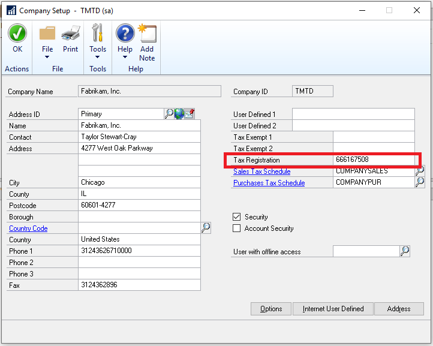

In the **UK Digital VAT Setup** window (Cards -> Company-UK Electronic VAT Setup), you must specify that you want to use the Making Tax Digital service.  

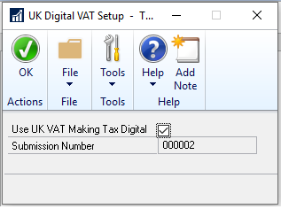

### Set up VAT returns

HMRC maintains a list of VAT obligations for companies, which are the periods for which they must report VAT and the due date for the report. HMRC exposes this information through their API so that Dynamics GP can retrieve the obligations. Dynamics GP stores VAT obligations as **VAT Return Periods**, and uses them to:

* Remind you about VAT returns that are due or overdue.  
* Automatically enter start and end dates when you create VAT returns.  

In order to use the Making Tax Digital service, you must connect to the service from the **VAT Return** window.

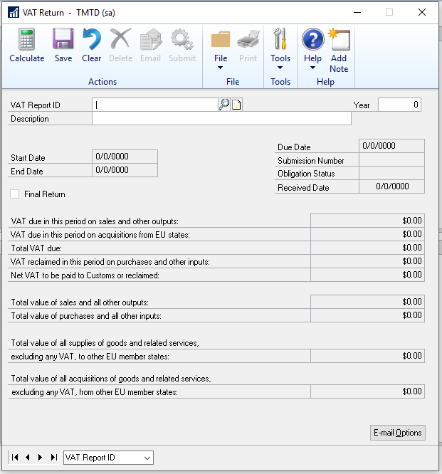

To enable the connection, you must create a new VAT return.

#### To connect to the Making Tax Digital service

1. In the **VAT Return** window, enter a VAT Report ID, and then enter a year (this is the year that your VAT tax obligation is due).

2. Once you tab off the **Year** field, the **HMRC Log in** window appears where you can login to the HMRC site.

    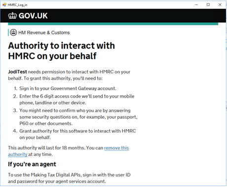

    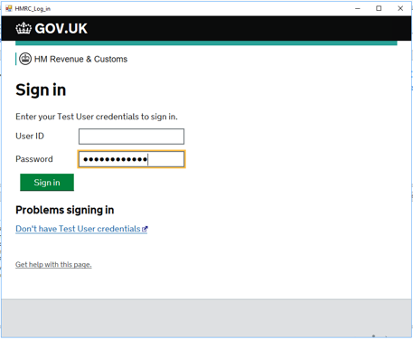

3. Grant authority to the software application to access your VAT information. 

    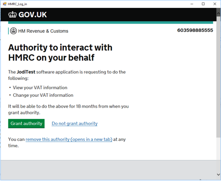

4. After you have successfully logged in, then the **VAT Obligations** window opens, and you can choose your obligation period. This comes from the HMRC site and will return your company’s VAT periods.

    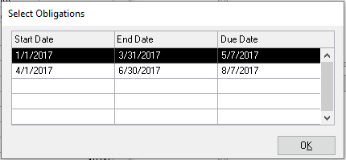

    The screenshot above is based on a test environment with quarterly VAT tax and only 2 obligation periods open. Your view will be different.

5. When you return to the **VAT Return** window, click Calculate to have the system calculate VAT for you as shown in the following picture.

    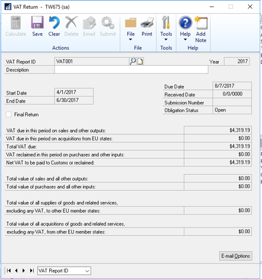

    If the calculations are not correct, you can clear the window at this time. Then repeat steps above when ready. Click **Save** to save the information.

6. When you save the VAT return, VAT box fields are now editable so any further corrections can be made.

    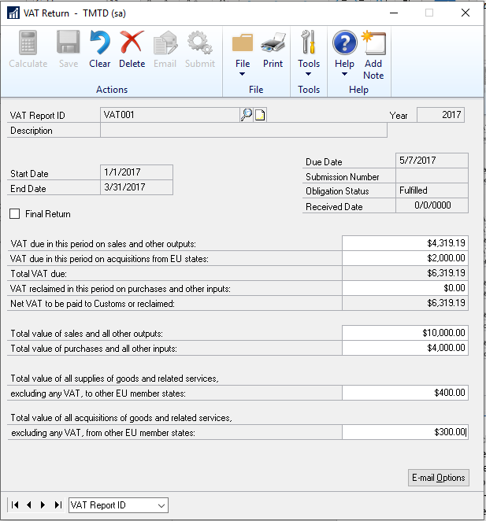

    The **Final Return** checkbox is also editable and it must be marked before you can submit. 

    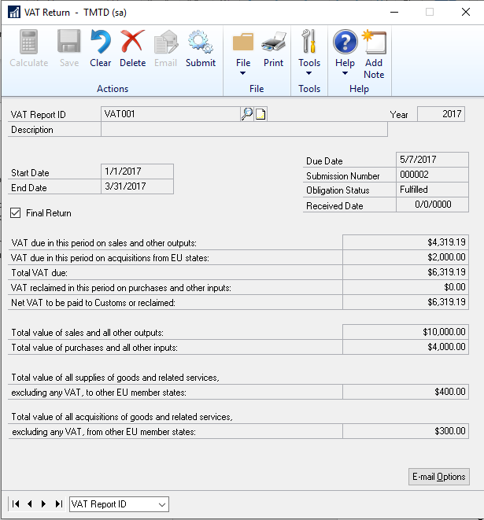

7. Click **Submit** to start the submission. You must supply your HMRC credentials again.

    You will get a mandatory message required by HMRC, click ok and then you will see a progress bar for the VAT information being submitted to HMRC.

    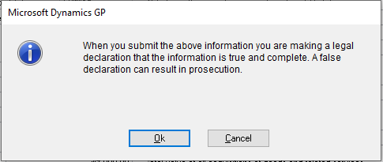

When the submission is complete you will see the VAT Response window.

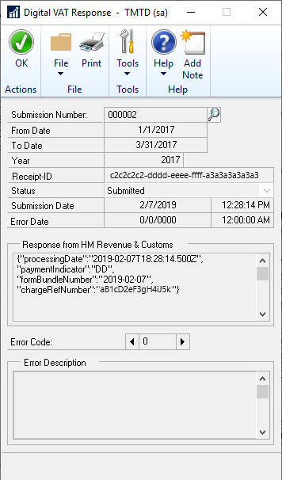

### To submit VAT Daybook returns

1.	Create the column codes for GB country code for all the boxes in VAT Daybook report (Cards >> Company >> VAT Daybook report)

2.	Create and Post Purchase and Sales transaction with Tax for GB customer and vendor.

3.	If you want to view the report before submission then select the draft option in VAT Daybook report(Routines >> Company >> VAT day book report)

4.	If not then you can print the audit trial code report for that posted period. As soon as you tab off from the period field HMRC login page will open up and you enter the credential.

    a.	If in case, VAT calendar setup is not as per the HMRC calendar setup then you get the message for incorrect calendar setup and obligation window will open to view(only to view but you can’t select any period) the calendar setup for that year. You need to do the calendar setup as per the HMRC site in order to proceed further.

    b.	If calendar setup is as per the HMRC then you can print the audit trial report.
    
5.	After generating the audit trial report, you can now perform the electronic submission for the same period.

6.	When you choose Electronic Submission and then enter Year and Period Key, VAT HMRC login page pops up and you must enter the credentials.

7.	After entering the credentials, you can click on submit button which again takes you to the HMRC login page. Post submission, VAT response window will open up for the submitted record.

> [!NOTE]
> After submitting the return, if the progress window does not start and there is no response window, it could be a proxy server issue. For more information, see [https://developer.service.hmrc.gov.uk/api-documentation/docs/reference-guide#network-access](https://developer.service.hmrc.gov.uk/api-documentation/docs/reference-guide#network-access)  

> [!NOTE]
> The above Making Tax Digital process of submitting to the HMRC also works for the VAT Daybook module in Dynamics GP.  VAT Daybook does not allow you to edit the amounts prior to submission like you can in the VAT 100 (return) window. 
