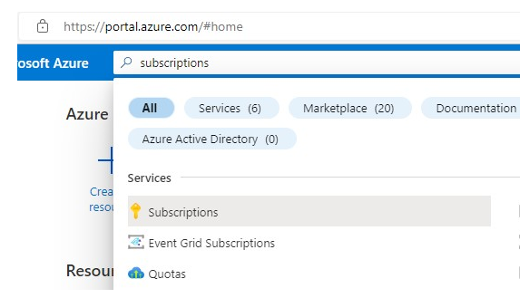
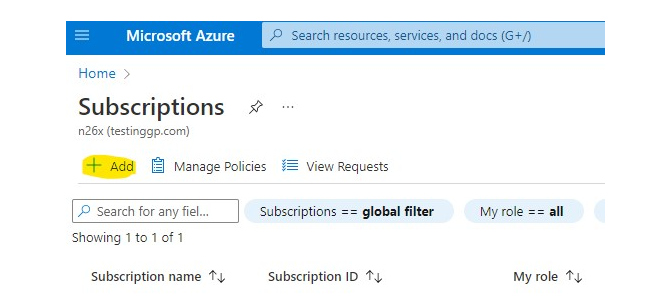
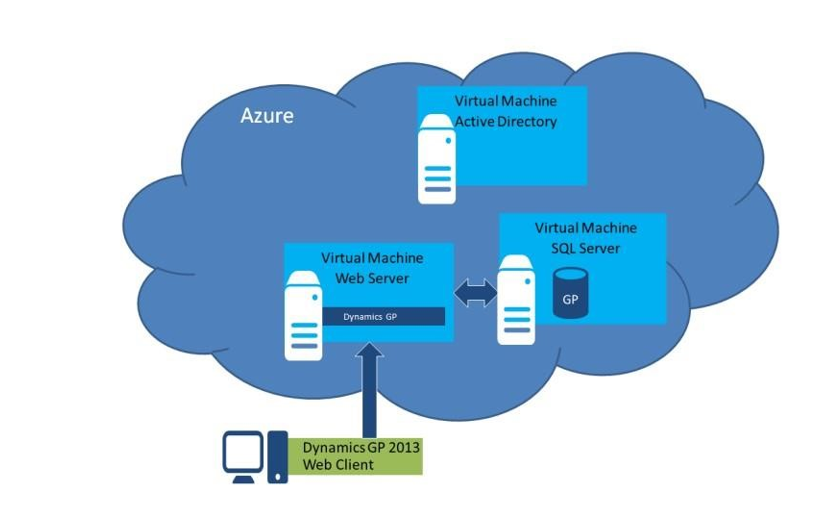
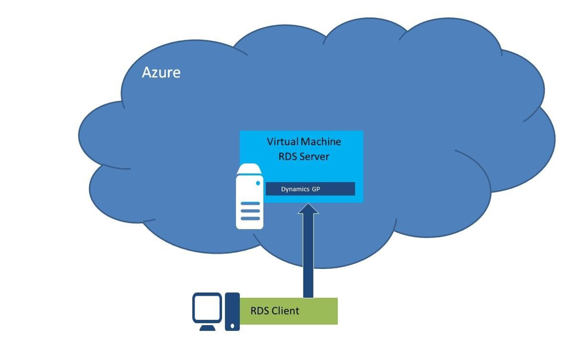
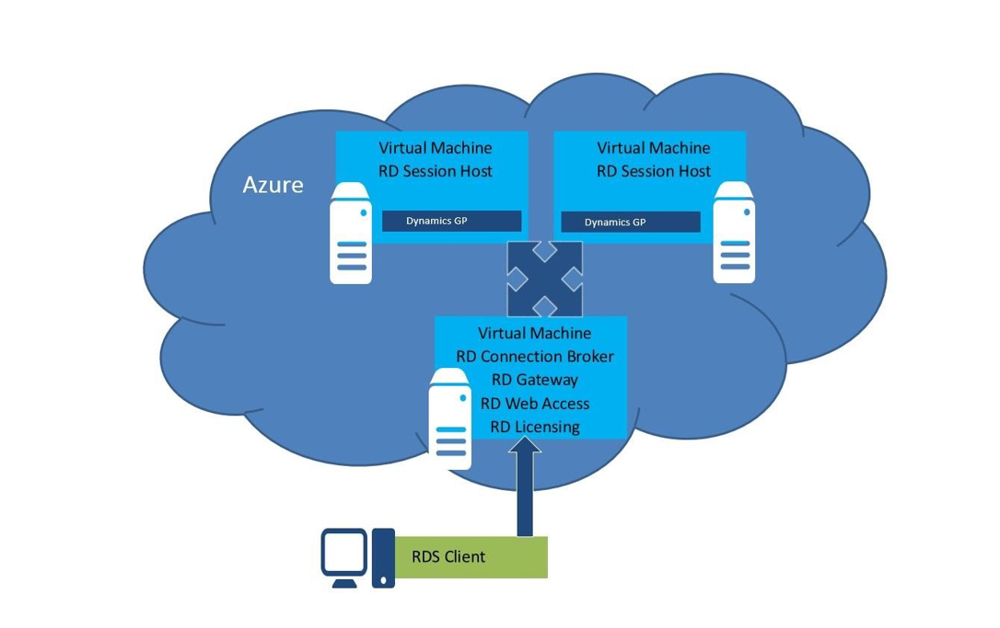
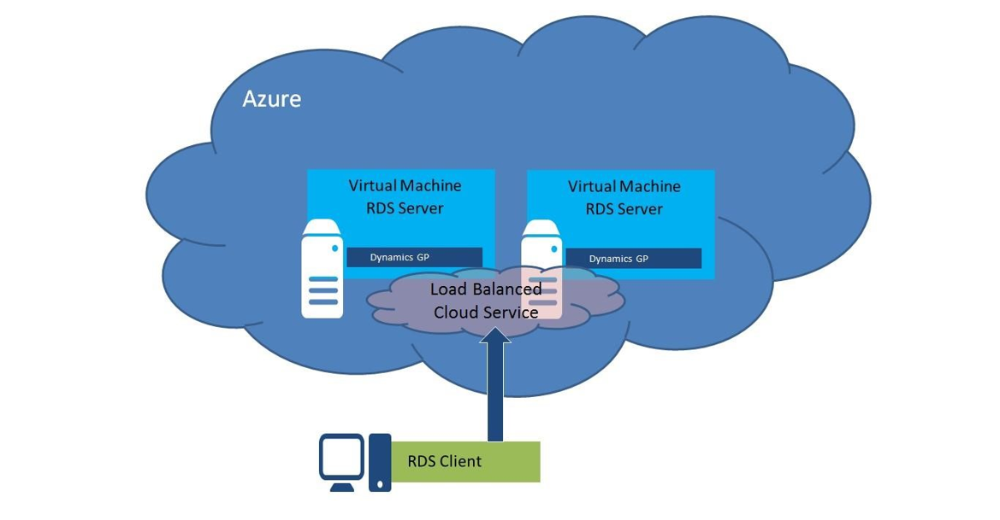
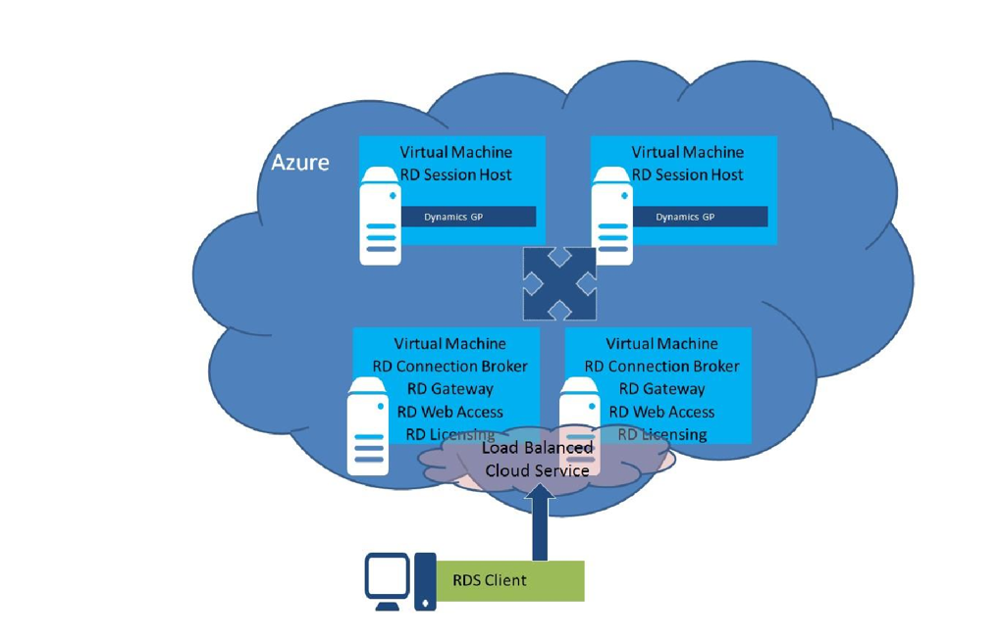

# Microsoft Dynamics GP on Microsoft Azure

This guide provides information for deploying Microsoft Dynamics GP on Microsoft Azure. Microsoft Azure provides the infrastructure you need to run
Microsoft Dynamics GP on a dependable, secure, and scalable cloud platform.
  
Flexibility and familiarity make the infrastructure services in Microsoft Azure an ideal platform for Microsoft Dynamics GP.

The Microsoft Dynamics GP you deploy in Microsoft Azure is the same one that you would deploy in your own office or data center. Since Microsoft Azure
infrastructure services (MAIS) is a virtual machine environment, the process of deploying and managing Microsoft Dynamics GP on MAIS should be very
familiar to you already. Your knowledge and previous experience deploying Microsoft Dynamics GP on premise or as a hosted service will be beneficial
when deploying on MAIS. You have flexibility with respect to the license model you choose to use when deploying Microsoft Dynamics GP on Microsoft Azure.
And because the product is constant, you can be reassured that you can move your deployment into or out of Microsoft Azure seamlessly.  
  
The following Microsoft Azure infrastructure services features are used as building blocks when you create a Microsoft Dynamics GP environment.
  
1. Virtual Machines – The virtual machines are the Windows Servers that host the Microsoft Dynamics GP components and other pre-requisite software.  
2. Virtual Network – A virtual network provides a network in the cloud for cross-machine communication.  
3. Storage Account – A storage account stores the data disks and the virtual machine VHD files.  

How you configure the infrastructure services features will be depend on the needs of your Microsoft Dynamics GP deployment.
For example, how many virtual machines are required, the network configuration for cross-machine communication, and disk configuration for storing data
must be configured in Microsoft Azure to support the Microsoft Dynamics GP installation. After the Microsoft Azure environment is set up and configured,
the Microsoft Dynamics GP components and required prerequisite software can be installed on the virtual machines in much the same way as they would be on
virtual machines in an on premise or hosted environment.  

This document provides guidelines for deploying Microsoft Dynamics GP on Microsoft Azure.  The information contained in this guide is intended to be used
along with the main product documentation for Microsoft Dynamics GP.

## Checklist

The following checklist provides an overview of the steps for deploying Microsoft Dynamics GP on Microsoft Azure.  

 1. [Sign up for a Microsoft Azure account](https://azure.microsoft.com/free/)
 2. Create subscription
 3. Determine deployment configuration
 4. Create Virtual Network
 5. Create Virtual Machines
 6. Deploy Microsoft Dynamics GP
 7. Create back up and scheduled maintenance procedures
 8. Maintain virtual machines
 9. Update Microsoft Dynamics GP

## Microsoft Azure Account

 This part contains information about signing up for a Microsoft Azure Account and creating a subscription.

### Sign up for a Microsoft Azure Account

 You will need to sign up for a Microsoft Azure Account before creating any of the service components. Use these steps to create a Microsoft Azure Account.  

1. [Sign up for a Microsoft Azure account](https://azure.microsoft.com/free/)

2. Choose to create a new account using either the free trial or purchase option.  

    If you are deploying Microsoft Dynamics GP for development or testing purposes, you can sign up as an MSDN subscriber.
    If you select the purchase option, you will have the option of buying the Azure services using Pay-as-You-Go, Microsoft Reseller or Enterprise agreement.  

3. Log in using the Microsoft Account that will be the owner of the Microsoft Azure account. Sign up for a Microsoft Account if needed.  
4. Assuming that the Microsoft Account is not already the owner of a Microsoft Azure account, a wizard window will open and walk you through the process of setting up a new account.

### Creating a Subscription

You will create one or more subscriptions for the Microsoft Azure account. A subscription is a grouping of Microsoft Azure services and applications, including the virtual machines discussed earlier. The subscription provides a way to control the access to and the use of the Microsoft Azure subscribed service.  

On the account billing, the resource usage of Microsoft Azure services for each subscription is reported separately. In a situation where you will have multiple Microsoft Dynamics GP deployments, you may decide to use a separate subscription for each deployment in order to track expenses related to each deployment. All of the Microsoft Dynamics GP components for a single deployment need to be deployed to the same subscription, however.  

You can set up different administrators for each subscription as required.

For more information, see [Overview of Subscription Management](/azure/cloud-adoption-framework/ready/azure-best-practices/initial-subscriptions) in the Azure content.

1.Sign in to the [Azure account management portal](https://portal.azure.com/)  
2.In the top search type in subscriptions.  

    

3. Click to add a subscription.  

    

>[!NOTE]
> You can rename the subscription after it has been created.  

### Sign up for a Microsoft Azure Support Plan

Microsoft Azure support plans provide technical and billing support for Microsoft Azure. The Microsoft Azure support plans offer flexible support options that will allow you to select the right level of support for your Microsoft Azure deployment. The support options range from support services included with your Microsoft Azure Account at no charge to Premier support services. Information on the available support plans and purchasing a plan can be found on the [Microsoft Azure Support](https://www.windowsazure.com/support/plans/). Technical and billing support for Microsoft Dynamics GP will continue to be offered using the existing programs. Refer to the Microsoft Dynamics GP support section of this document for additional information.

## Planning

Planning your Microsoft Azure deployment of Microsoft Dynamics GP includes making decisions about which Microsoft Dynamics GP components to deploy, what configuration to use, and what the system requirements are for those components. These are decisions that must be made in all Microsoft Dynamics GP deployments. This part of the document covers the special considerations that impact these decisions when deploying on Microsoft Azure. This part contains the following sections.  

### Licensing

Licensing provides information on licensing Microsoft Dynamics GP and the required software on Microsoft Azure.

Licensing the various components of the Microsoft Dynamics GP solution is an important consideration in all deployment types. For deployments on Microsoft Azure, you will want to evaluate the special licensing terms specific to Microsoft Azure and the impact that these decisions have on the overall cost of the solution.
  
All Microsoft software installed in the Microsoft Azure Virtual Machine environment must be properly licensed. Microsoft Azure Virtual Machines include by default a license for use of Windows Server in the Microsoft Azure environment. Certain Microsoft Azure Virtual Machine offerings may also include additional Microsoft software on a per-hour or evaluation basis.

[Additional common FAQs regarding licensing on Microsoft Azure Virtual Machines](https://azure.microsoft.com/pricing/licensing-faq/)

**Microsoft License Mobility through Software Assurance**
License Mobility through Software Assurance gives Microsoft Volume Licensing customers the flexibility to deploy eligible server applications with active Software Assurance on Microsoft Azure. With this Software Assurance benefit, there is no need to purchase new licenses and no associated mobility fees, so you can easily deploy existing licenses on the Microsoft Azure cloud platform.
  
With License Mobility through Software Assurance, you can:
• Deploy certain server application licenses purchased under your Volume Licensing agreement in Microsoft Azure data centers.
• Extend the value of your server application licenses by deploying them on-premises or in the cloud.
• Take advantage of the low-cost computing infrastructure for changing business priorities.  More program benefit details and information can be found [HERE](https://www.windowsazure.com/pricing/license-mobility/).
  
For information about Microsoft’s License Mobility program see:  
[License Mobility & Software Assurance | Microsoft Volume Licensing](https://www.microsoft.com/licensing/licensing-programs/software-assurance-license-mobility?rtc=1)

**Microsoft Dynamics GP**
Use the Microsoft Dynamics GP Pricing and Licensing to learn more about the Perpetual Licensing and Service Provider License agreement (SPLA) licensing programs – both of which are supported for on-Azure deployments.  
  
Consult the [Licensing Guide](<https://download.microsoft.com/download/E/6/8/E685081D-647F-432A-AFF3-20AA95353798/GP> - English.pdf) to improve your understanding of how to license Microsoft Dynamics GP .  

**Remote Desktop Services (RDS)**
There are two ways to license Remote Desktop Services (RDS), formerly known as Terminal Services in Microsoft Azure Virtual Machines.

1. Remote Desktop Services (RDS) Subscriber Access Licenses (SALs) purchased through the Microsoft Service Provider Licensing Agreement (SPLA) may be used to deliver graphical user interface functionality for applications on Microsoft Azure virtual machines.  

2. Volume Licensing customers who have active Software Assurance on their RDS User CALs are entitled to RDS CAL Extended Rights, which allow use of their RDS User CAL with Software Assurance against a Windows Server running on Microsoft Azure or other service providers’ shared server environments.
  
To read more about [licensing RDS with Microsoft Azure Virtual Machines](https://www.windowsazure.com/en-us/pricing/licensing-faq/) &
[Product Use Rights(PUR) document](https://www.microsoft.com/licensing/about-licensing/product-licensing.aspx)

**Microsoft SQL Server**
There are three ways to license Microsoft SQL Server in Microsoft Azure Virtual Machines:

1. Install or upload your own SQL Server image using the license mobility benefits under Software Assurance.
2. Obtain the SQL Server image from the image gallery and pay the per-minute rate of SQL Server in Microsoft Azure Virtual Machines.
3. If you are a Service Provider with a signed Services Provider License Agreement (SPLA), install or upload your SQL Server Standard image with Subscriber Access License (SAL) reported via your SPLA.
  
You will want to carefully evaluate each of these options for Microsoft SQL Server as the cost models can be very different. The deployment model you choose to employ and the number of users that will be supported are key factors in this decision.

**Other Licensing Considerations – Microsoft Azure Billing / Cost Allocation**
For many Service Providers offering a hosted solution, determining how to bill Customers for monthly, consumption-based charges from Microsoft Azure will represent a new challenge.
  
To learn what billing information is available, you should review the [Understand Your Bill for Microsoft Azure](https://www.windowsazure.com/en-us/support/understand-your-bill/) on the Microsoft Azure Portal. These pages provide an overview of the Microsoft Azure billing process, links to sample invoices and a description of the daily usage data file that can be exported and analyzed.
  
Microsoft Azure billing is done monthly at the Account level. Charges for various services are grouped and reported at the Subscription level. To simplify the cost allocation exercised, Partners supporting multiple Customer deployments may wish to segregate each Customer’s services to individual subscriptions.  

Note:  
Please note that this whitepaper does not supersede or replace any of the legal documentation covering use rights for Microsoft products and does not constitute a commitment of licensing program availability.  For current product use rights and licensing program availability for products licensed through [Volume Licensing including SPLA](https://www.microsoft.com/licensing/)

### Legal

Legal provides information on protecting customers data deployed on Microsoft Azure.

Together with Microsoft, Partners must work together to protect Customer data and provide guidance to Customers when it comes to security, privacy, and compliance practices.  
  
Microsoft runs Microsoft Azure services with common operational practices and features across multiple geographies and jurisdictions. However, it is ultimately up to Partners and Customers to determine if Microsoft services satisfy their regulatory needs.
  
To help provide Partners and Customers with up to date information the [Microsoft Azure Trust Center](https://www.windowsazure.com/en-us/support/trust-center/) provides detailed information on security, privacy, and compliance topics for Microsoft Azure customers.  

**Security**
This topic provides an overview of the provisions Microsoft is taking to provide a secure environment within geographically dispersed datacenters. Among the extensive list of Security-related resources, the [Standard Response to Request for Information:Security and Privacy](https://go.microsoft.com/fwlink/?linkid=293448) outlines how Microsoft Azure meets the suggested principals and mapped them to the [International Standards Organization](https://azure.microsoft.com/blog/microsoft-azure-leads-the-industry-in-iso-certifications/#:~:text=We%20are%20happy%20to%20announce%20that%20Microsoft%20Azure,to%20meet%20a%20wide%20range%20of%20regulatory%20obligations). This standardized response empowers Partners and Customers with in-depth information to evaluate different offerings in the market place today.  

**Privacy**
Includes links to multiple resources that describe Privacy practices of the Microsoft Azure environment. It includes a link to the [Microsoft Azure Privacy Statement](https://go.microsoft.com/fwlink/p/?linkid=131004) an overview of privacy terms and a discussion of the location of Customer data, E.U. Data Protection Directive

**Compliance**
This topic provides resources to help Partners and Customers comply with the specific laws and regulations applicable to their unique industry and use scenario.  

### Microsoft Dynamics GP Components

Microsoft Dynamics GP Components provides information about the Microsoft Dynamics GP components that can be deployed on Microsoft Azure.

This section provides information about the Microsoft Dynamics GP components that can be deployed on Microsoft Azure. How you license Windows Server will determine how you deploy some of the Microsoft Dynamics GP components on Microsoft Azure. The Microsoft Dynamics GP components that require Remote Desktop Services (RDS) for end-user access over the Internet can be deployed on Microsoft Azure only if you are able to license RDS using the methods provided in the Remote Desktop Services licensing section. You can also use Remote Desktop for Administration to run these components for administrative purposes. User access to applications using remote desktop, will be limited to a maximum of 2 concurrent administrator users using Remote Desktop for Administration. Refer to the following list for component availability.  

| Component                            |   Availability   |
|-----------------------------------   | --------------   |
| Microsoft Dynamics GP Databases      |     Yes          |
| Microsoft Dynamics GP Client         |     Yes          |
| Microsoft Dynamics GP Web Client     |     Yes          |
| Service Based Architecture           |     Yes          |
| Companion Application Service        |     Yes          |
| eConnect                             |     Yes          |
| SQL Server Reporting Services Reports|     Yes          |
| Excel Reports                        |     Limited      |
| Integration Manager                  |     Yes          |
| Analysis Cubes                       |     Limited      |
| Management Reporter                  |     Yes          |
| FRx                                  |     No           |
| ISV Solutions                        |     Limited      |

The Microsoft Dynamics GP desktop client can be used for end-user access through Remote Desktop Services.
The Microsoft Dynamics GP desktop client can be used for administrative purposes with Remote Desktop for Administration.  

If the application that is using eConnect requires Remote Desktop Services for end-user access, then you will need to properly license RDS.
If access is for administrators only, then Remote Desktop for Administration can be used.

Excel reports connect directly to the Microsoft Dynamics GP databases.
-Because the SQL Server is not exposed to the Internet, the Excel reports must be run from a computer connected to the Microsoft Azure Virtual Network.
-This means that Microsoft Excel to be run on a Remote Desktop Services server or from a computer on the network connected to the Microsoft Azure Virtual Network.  

Integration Manager can be used for end-user access through Remote Desktop Services.
-Integration Manager can be used for administrative purposes with Remote Desktop for Administration.  

Analysis Cubes reports connect directly to the Microsoft Dynamics GP databases. Because the SQL Server is not exposed to the Internet, the Analysis Cubes reports must be run from a computer connected to the Microsoft Azure Virtual Network.

The Management Reporter report designer and desktop viewer can be used for end-user access through Remote Desktop Services. The Management Reporter report designer and desktop viewer can be used for administrative purposes with Remote Desktop for Administration. The Web Viewer can be used by all end-users to view reports. 18 ISV products must be evaluated on a product-by-product basis.  

### Deployment Model

Deployment Models describes the two common configurations that are used when deploying Microsoft Dynamics GP on Microsoft Azure.

The deployment models for Microsoft Dynamics GP on Microsoft Azure are the same models available for on premise and hosted environments. The models range from a single-machine deployment joined to your corporate network, to a scale out multitenant public cloud deployment using a private virtual network in Microsoft Azure. The difference in these models on Microsoft Azure when comparing with an on premise installation is the setup of the environment, (machines, network configuration, etc.).
The machine configurations, like single-machine and scale-out, available for deploying Microsoft Dynamics GP on premise are also available for deploying in Microsoft Azure. The network configuration model for all of the Microsoft Dynamics GP components, with the exception of some ISV products that integrate using Web Services for Microsoft Dynamics GP, are installed to one or more virtual machines in Microsoft Azure. For performance reasons you will want to avoid installing some of the Microsoft Dynamics GP components to your on premise network and some to virtual machines in Microsoft Azure.

**Dedicated Private Virtual Network**

This is the only model tested with Dynamics GP.  A Microsoft Azure Virtual Network is created that is fully contained within Microsoft Azure. It is not connected to an on premise network. All of the Microsoft Dynamics GP and required infrastructure components are installed on virtual machines on the virtual network. Unless a single machine configuration is being used, you will need to add an Active Directory domain controller with DNS to the virtual network. The virtual network will be configured to use the domain’s DNS system for name resolution of machines on the virtual network. The quantity and configuration of the virtual machines is based on your deployment needs, much like deploying to computers on your corporate network. The following diagram shows a simple Microsoft Dynamics GP Web Client deployment on a dedicated private Microsoft Azure Virtual Network.  



In this diagram the Microsoft Azure Virtual Network contains an Active Directory domain controller with DNS. The virtual network is configured to use the DNS services on the domain controller for name resolution of the Microsoft Azure Virtual Machines. The Web Server and SQL Server virtual machines are joined to the domain in Microsoft Azure for directory services, including the
authentication of Microsoft Dynamics GP users. If additional server roles are required for the Microsoft Dynamics GP deployment, additional virtual machines would be added to the virtual network in Microsoft Azure and joined to the domain in Microsoft Azure.  

### System Requirements

System Requirements provides sizing recommendations for the virtual machine instance sizes that are available in Microsoft Azure.  

The system requirements for deploying Microsoft Azure are the same as deploying Microsoft Dynamics GP on premise or in other data centers. The virtual machines in Microsoft Azure have standard processor and memory configurations that are based on the instance size. The instance sizes range from VMs with 1 core and .75 GB RAM to 16 cores with 112 GB RAM. You can scale the instance size up or down as usage patterns change. You can also add additional instances to scale out as demand increases. Refer to the [Pricing Details](https://azure.microsoft.com/pricing/details/virtual-machines/) for the latest instance sizes and pricing.
  
Use the [Dynamics GP System Requirements](/dynamics/s-e/gp/MDGP2018_System_Requirements) when determining the compute instance size required for each of the virtual machine instances in your configuration.  

### High Availability and Disaster Recovery (HADR)

High Availability and Disaster Recovery (HADR) provides information on setting up the Azure environment for high availability and disaster recovery.

While the Microsoft Azure Infrastructure Services are designed to provide a high availability and fault tolerant platform for applications, there are considerations you as the administrator need to plan for in order to best utilize these capabilities.  The Microsoft Azure high availability mechanisms protect the high availability of the Virtual Machines (VMs), not specifically the applications which run on these VMs. It is up to you as the administrator to use these mechanisms when implementing the application in order to meet the HADR capabilities you require. The following sections contain information on the high availability mechanisms available in Microsoft Azure to use with your Microsoft Dynamics GP deployment.  

**Availability Set**
An availability set in Microsoft Azure is a configuration option available when load balancing multiple VMs that places the VMs in different fault and update domains. The result is that the application is still available even if there is a failure or planned update to a VM instance that takes it off-line for a period of time. The fault domain protects against unplanned failures by creating the VMs in a different “rack” of servers, resulting in them being on different physical hardware and serviced by different networking components. The update domain protects against downtime from planned updates to the host operating system by placing the VMs on host machines configured with different maintenance schedules.
  
An availability set requires that the application is installed on multiple VMs that have been configured as a load balanced cloud service. Not all of the Dynamics GP components can be deployed in this configuration however, the following Dynamics GP application components support being deployed on a load balanced cloud service.
  
1. SQL Server (when utilizing SQL Server HADR)  
2. Web Client/Service Based Architecture web server
(Only possible if using a scale out deployment with separate Session Host servers or if each of the servers runtime service is configured for a unique port.)
3. Web Services for Microsoft Dynamics GP  
4. SQL Server Reporting Services
5. Tenant Services
6. RDS Servers (GP client, Management Reporter, Integration Manager, eConnect, ISV solutions)  

Refer to the [Manage the High Availability of Virtual Machines](/azure/virtual-machines/availability) for additional information.  

**SQL Server HADR**
There are several different HADR technologies in the SQL Server product that are supported in Microsoft Azure. These include the following.  
• AlwaysOn Availability Groups  
• Database Mirroring  
• Log Shipping  
• Backup and Restore with Microsoft Azure Blob Storage Service  
These technologies can be used independently or together to provide the high availability and disaster recovery required. When used with Microsoft Dynamics GP, the AlwaysOn and Database Mirroring technologies provide failover capabilities for the Dynamics GP databases. The Log Shipping and Backup and Restore with Microsoft Azure Blob Storage Service provides recovery capabilities for the Dynamics GP databases. Refer to the article [Business continuity and HADR for SQL server on Azure Virtual Machines](/azure/azure-sql/virtual-machines/windows/business-continuity-high-availability-disaster-recovery-hadr-overview?view=azuresql) for additional information.

**Redundant Storage**
The redundant storage mechanism of Microsoft Azure provides for multiple copies of the VM’s VHD files and the data disks that store data such as the Dynamics GP databases. The first redundant storage mechanism is locally redundant storage (LRS), which maintains three copies of the account data within the primary data center. The second mechanism is geo redundant storage (GRS, also known as geo-replication), which replicates the account data to a secondary data center. These redundant copies are done automatically by the platform. You do need to be aware that for the Microsoft Azure data disks used to store the Dynamics GP databases, if GRS is enabled the data and log files for a database need to be placed on the same disk.

**Host O/S Maintenance**
Refer to the following article about VM Maintenance
[Maintenance for virtual machines in Azure](/azure/virtual-machines/maintenance-and-updates)

## Deploy Microsoft Dynamics GP

The deployment of Microsoft Dynamics GP on Microsoft Azure is very similar to an on-premise deployment. The setup of the network and virtual machines in Microsoft Azure is where the deployment of Microsoft Dynamics GP on Microsoft Azure is the most different from on premise deployments. You will use the Microsoft Azure Management Portal or PowerShell for most of the setup actions. These include setting up a virtual network, creating virtual machines, and configuring the virtual machines through Remote Desktop for Administration. After setting up the environment, you will install the Microsoft Dynamics GP components on the virtual machines that are acting as the SQL Server, Web Server, Session Host machines, and so on. This part contains the following sections.  

### Creating a Virtual Network

Creating a Virtual Network provides directions for setting up a virtual network in Microsoft Azure.  

A Microsoft Azure Virtual Network must be created in your subscription so that you can create and run the Microsoft Azure Virtual Machine instances. The Microsoft Azure Virtual Network may be connected to a physical network for site-to-site connectivity, it could also be set up as a dedicated private network in the cloud. The virtual machines serve as the Windows Server hosts for the Microsoft Dynamics GP components deployed on the virtual network you create.

Before setting up your virtual network, you will need to determine the design that will best meet your deployment scenario. Things to consider include whether you will be joining this network to another network, the address ranges for the network and how domain name resolution (DNS) will be handled. In the current Microsoft Azure release, it may be difficult to make changes to the virtual network after virtual machines have been deployed. Refer to the [Azure Virtual Network concepts and best practices](/azure/virtual-network/concepts-and-best-practices)
  
When deploying Microsoft Dynamics GP on Microsoft Azure, you have two options. You can create a private virtual network that is fully contained within Microsoft Azure, or you can create a virtual network in Microsoft Azure that is connected to your existing physical network. In either case, all of the Microsoft Dynamics GP components will be deployed to virtual machine instances on the Microsoft Azure Virtual Network. You may want to connect to an existing network to leverage on-premise resources. When creating a private virtual network with multiple virtual machines, you will need to create a domain controller for authentication and name resolution (DNS). The virtual network will need to be configured to use the domain controller’s IP address for DNS. This means that you must modify the DNS setting for the virtual network after creating the domain controller virtual machine on the virtual network.

You create a virtual network by using the Microsoft Azure Management Portal or using the Azure CLI.
Refer to the article [Quickstart: Create a virtual network using the Azure portal](/azure/virtual-network/quick-create-portal) for information about creating a virtual network using the Microsoft Azure Management Portal. Refer to the article
[Quickstart: Create a virtual network using the Azure CLI](/azure/virtual-network/quick-create-cli) for information about using the Azure CLI.

### Creating Virtual Machiens

Creating Virtual Machines provides directions for creating a virtual machine instance in Microsoft Azure.

All of the Microsoft Dynamics GP components, along with the required software like Microsoft SQL Server and Microsoft SQL Server Reporting Services, will be installed on Windows Server virtual machine instances in Microsoft Azure. Depending on your deployment needs, you will use one or more virtual machine instances. For example, you may have a SQL Server virtual machine, a Web Server virtual machine and an Active Directory virtual machine.  

A virtual machine instance can be created from a VHD template image available in the Microsoft Azure platform image gallery or from an image or VHD disk you create and upload. You also have the ability to capture a configured virtual machine instance as a template image for creating additional virtual machine instances. Refer to the article [Virtual Machines in Azure](/azure/virtual-machines/) for additional information.   Follow the steps in the article
[QuickStart: Create a Windows virtual machine in the Azure portal to create the virtual machines](/azure/virtual-machines/windows/quick-create-portal)

### Configuring Active Directory

Configuring Active Directory provides information about configuring Active Directory on a Microsoft Azure Virtual Machine.

In a Microsoft Dynamics GP deployment on Microsoft Azure, users are typically authenticated as Windows accounts to be granted access to the application. With Microsoft Dynamics GP, you also have the option of signing up using an Organizational Account, aka Azure Active Directory. In this case you would only need to set up an Active Directory domain to facilitate component to component communication across virtual machines in deployment scenarios where there are multiple virtual machines serving different roles.  Using Active Directory to authenticate users across the machines is recommended. The configuration of your virtual network will determine how you configure Active Directory. The requirements for deploying Active Directory on a Microsoft Azure Virtual Machine differ very little from on premise deployments.
  
In an environment where you have connected the Microsoft Azure Virtual Network to your on-premise network, you may choose to configure a virtual machine as an additional Active Directory domain controller for your on premise forest. This can improve the availability and performance of Active Directory.  

If you will be using the Active Directory domain controller virtual machine for name resolution (DNS) on the Microsoft Azure Virtual Network that it is deployed on, you will need to modify the configuration of the existing Microsoft Azure Virtual Network after the domain controller is set up.  

### Configuring Microsoft SQL SErver

Configuring Microsoft SQL Server provides directions for configuring SQL Server on a Microsoft Azure Virtual Machine for use with Microsoft Dynamics GP.  

**Microsoft Dynamics GP cannot use a managed instance of Azure SQL Database**.  Azure SQL Database is a fully managed platform as a service (PaaS) database engine and cannot be used with Dynamics GP.

All Microsoft Dynamics GP deployments require a Microsoft SQL Server to manage the databases that contain the business data. When deploying on Microsoft Azure, a Microsoft SQL Server installation on a Microsoft Azure Virtual Machine will be used.  

Refer to the Checklist:
[Best practices for SQL Server on Azure VMs for the latest information](/azure/azure-sql/virtual-machines/windows/performance-guidelines-best-practices-checklist?view=azuresql)
  
1. Create the virtual machine using a Windows Server or SQL Server image. If you choose to create a virtual machine using a SQL Server image, you will have additional steps to perform after the virtual machine is created to configure Microsoft SQL Server for use with Microsoft Dynamics GP. If you choose to create a virtual machine using a Windows Server image, you will need to install SQL Server to the VM using the configuration provided in the GP installation documentation.  
  
2. Attach at least one data disk to the virtual machine. The data disk stores the SQL Server data and log files. Based on the SQL Server performance white paper you may want to add multiple disks for storage and performance reasons. You may also want to create additional data disks for SQL backups. (Repeat the following steps for each disk you want added.) If you are using Geo Redundant Storage (GRS) for the data disks, make sure and place the data and log files for the databases on the same disk. The recommended host cache configuration of the data disk will depend on the total number of concurrent GP users accessing the data disk and the size of the data disk. Setting the “HOST CACHE PREFERENCE” to read only will cache the disk to the local machine’s physical disks and may improve performance in configurations with fewer than approximately 250 concurrent users. The maximum size of the data disk to use the read only cache setting is 640 GB, so if your data disk is larger than this you will need to set the “HOST CACHE PREFERENCE” to none.

a. In the Microsoft Azure Management Portal, select the virtual machine you created. On the bottom of the screen, click Attach and then click Attach Empty Disk.
b. Provide the size for the data disk.  
c. If you will have fewer than approximately 250 concurrent Dynamics GP users accessing the data disk and the data disk is less than 640 GB, it is recommended that you set “HOST CACHE PREFERENCE” to READ ONLY. If you will have more than 250 concurrent GP users or the data disk is larger than 640GB then set “HOST CACHE PREFERENCE” to NONE.  

3. In the Microsoft Azure Management Portal, select the virtual machine. At the bottom of the screen, click Connect. This will open a remote desktop connection to the virtual machine.  

a. Open Disk Management to initialize and format the data disks that were attached.  
b. Join the virtual machine to the domain.
c. Create the following folder structure at the root of the data disk.  
  i.  Data – MSSQL\DATA
  ii. Log – MSSQL\LOGS  
d. Install Microsoft SQL Server using the recommended settings in the Microsoft Dynamics GP installation manual35. (Skip this step if you used a virtual machine image with Microsoft SQL Server already installed.)
e. Open SQL Server Management Studio and make the following changes:  
  i. Right-click on the SQL Server and choose to view the properties.  
      1. Select the Security page and verify that the Server Authentication is set to SQL Server and Windows Authentication mode.
          If it is not, then choose that setting.  
      2. Select the Database Settings tab & change the Database default locations to the folder that you created in the data disks you attached to the virtual                   machine.
      3. Click OK to save settings. (Restart SQL Server for the settings to take effect.)  
  ii. Create a new SQL Server Login with sysadmin privileges, or as an alternative enable the ‘sa’ account to use when setting up Dynamics GP. If enabling the ‘sa’       account, enter a password for the account. (This step only needs to be done if you didn’t perform it during the SQL Server installation, or if the virtual machine     was created from the Image Gallery.)  

f. Verify there is sufficient disk space on the C: drive. There must be at least 1 GB of free space available.  
g. Note whether the Reporting Services, Analysis Services, Full-text Search Services, and Integration Services are installed and running on the image. If you won’t be using any of these services on this server, stop the services and change them to manual or disabled.  
h. Use Windows Explorer to assign Full Control permissions to the MSSQL\DATA folder for the “NT Service\MSSQLSERVER” account if this permission hasn’t already been granted. Verify security settings to be sure correct permissions are set.
i. Use Windows Explorer to assign Full Control permissions to the MSSQL\LOGS folder for the “NT Service\MSSQLSERVER” account if this permission hasn’t already been granted. Also assign the same permissions as are assigned by SQL Server to the “NT Service\SQLSERVERAGENT” and “NT Service\MSSQLFDLauncher” accounts if they haven’t already been granted.  
j. Add an inbound rule to allow access to the SQL Server (default port 1433) to the virtual machine’s firewall.  
In order to further protect the SQL Server from unauthorized access, you may want to consider removing the endpoint on the host virtual machine for the remote desktop connection. Removing this public endpoint will require that all virtual machine administration for the SQL Server is done from another machine within the virtual network.

In order to further protect the SQL Server from unauthorized access, you may want to consider removing the endpoint on the host virtual machine for the remote desktop connection. Removing this public endpoint will require that all virtual machine administration for the SQL Server is done from another machine within the virtual network.

**Installing Microsoft Dynamics GP Desktop Client and Creating Databases**
When you create the Microsoft Dynamics Dynamics GP databases will depend on whether you are in a single tenant or multitenant deployment environment. In a single tenant deployment, the databases are typically created after Microsoft SQL Server and Microsoft SQL Server Reporting Services have been installed and configured. In a multi-tenant model, the databases are typically created as part of provisioning each new customer. A program called Microsoft Dynamics GP Utilities, which is installed with the Microsoft Dynamics GP Desktop Client, is used to create the databases.
  
The installation of the Microsoft Dynamics GP desktop client used to create the databases can be on the SQL Server virtual machine or another virtual machine depending on your configuration. Use the following steps to install the Microsoft Dynamics GP desktop client, create the databases, and deploy the Business Intelligence Reports.

1. Administration portion in the following link:  
[Welcome to Dynamics GP - Dynamics GP | Microsoft Docs](/dynamics-gp/)

2. Use Microsoft Dynamics GP Utilities in the desktop client installation to create the Microsoft Dynamics GP databases. Make sure and select to create the databases on the data disk attached to the SQL Server virtual machine instead of the operating system disk. If you are using Geo Redundant Storage (GRS) for the data disk, make sure and place the data and log files on the same disk.  

3. Install the Microsoft Dynamics GP Desktop Client using the directions in the Installation, and You can select to deploy the SQL and Excel reports for the database in Microsoft Dynamics GP Utilities or use the Reporting Tools Setup window within Microsoft Dynamics GP. If you plan to allow client computers that are not on the network to access the SQL Reports, make sure and use the public URL to SQL Server Reporting Services during the deployment.

### Configuring Microsoft SQL Server Reporting Services

Configuring Microsoft SQL Server Reporting Services provides direction for configuring SQL Server Reporting Services on a Microsoft Azure Virtual Machine for use with Microsoft Dynamics GP.  

If you will be using SQL Server Reporting Services reports for your Microsoft Dynamics GP deployment on Microsoft Azure, you must install Microsoft SQL Server Reporting Services on a virtual machine instance. How users will be accessing the SQL reports will determine whether you install SQL Server Reporting Services on the same server as the SQL Server database engine or a different server. If users will be accessing reports from client computers that are not connected to the virtual network, it is recommended that you deploy SQL Server Reporting Services to a different virtual server than the SQL Server database engine. Use the following steps to create a Microsoft Azure Virtual Machine to host Microsoft SQL Server Reporting Services. Refer to the [SQL Server Business Intelligence in Azure Virtual Machines](https://github.com/Huachao/azure-content/blob/master/articles/virtual-machines/virtual-machines-sql-server-business-intelligence.md) for the latest information.  
  
1. Create the virtual machine using a Windows Server or SQL Server image. If you choose to create a virtual machine using a SQL Server image, you will have additional steps after the virtual machine is created to configure Microsoft SQL Server Reporting Services for use with Microsoft Dynamics GP. If you choose to create a virtual machine using a Windows Server image, you will need to install SQL Server to the VM using the configuration provided in the GP installation documentation.
  
2. In the Microsoft Azure Management Portal, select the virtual machine. At the bottom of the screen, click Connect. This will open a remote desktop connection to the virtual machine.  
a. Join the virtual machine to the domain.  
b. Install Microsoft SQL Server Reporting Services using the recommended settings in the [Microsoft SQL Server configuration](/dynamics-gp/installation/microsoft-sql-server-configuration). (Skip this step if you used an image with Microsoft SQL Server already installed.)
c. Use the Reporting Services Configuration Manager to configure SQL Server Reporting Services. If users are accessing the reports over the internet, it is recommended that you configure reporting services for SSL (Secure Sockets Layer). Refer to article [Configure SSL Connections on a Native Mode Report Server for additional information](/previous-versions/sql/sql-server-2012/ms345223(v=sql.110))
d. Follow the setup instructions in the Microsoft Dynamics GP System Setup Guide on the Microsoft Dynamics GP installation media to configure SQL Server Reporting Services for use with Microsoft Dynamics GP.
e. Add an inbound rule to allow access to the SQL Server Reporting Services port to the virtual machines firewall.  
f. Note whether the Database Engine, Analysis Services, Full-text Search Services, and Integration Services are installed and running on the image. If you won’t be using any of these services on this server, stop the services and change them to manual or disabled.  

3. If users will be accessing the SQL reports from client computers not connected to the virtual network, add a public endpoint for the virtual machine.

If you will be setting up multiple SQL Server Reporting Services virtual machine instances as load balanced, create additional virtual machine instances using these same steps. When creating the virtual machine, choose to join the cloud service created when setting up the first SQL Server Reporting Services virtual machine.  

### Configuring the Tenant Services Server

Configuring the Tenant Services Server provides direction for configuring a Microsoft Azure  Virtual Machine as a host for Tenant Services. Tenant Services is an optional Microsoft Dynamics GP component required only if you are installing Microsoft Dynamics GP for use by multiple customer organizations (tenants).  

If you will be deploying Microsoft Dynamics GP for use by multiple customer organizations (tenants), you will need to install Tenant Services on a virtual machine in Microsoft Azure. The Tenant Services can be installed on a virtual machine that is running other Microsoft Dynamics GP components, or the Tenant Services can be installed on a dedicated virtual machine. Use the following steps when creating a dedicated Microsoft Azure Virtual Machine to host Microsoft Dynamics GP Tenant Services. Refer [Tenant Services Basics](/dynamics-gp/web-components/tenant-services-basics) for information about preparing the server for Tenant Services.  

1. Create a virtual machine using a Windows Server image.
  
2. In the Microsoft Azure Management Portal, select the virtual machine. At the bottom of the screen, click Connect. This will open a remote desktop connection to the virtual machine.  
a. Join the virtual machine to the domain.  
b. Install the Dynamics GP Tenant Services using the instructions in the following blog.  [Tenant Services Installation](/dynamics-gp/web-components/tenant-services-installation)

If you will be setting up multiple Tenant Services virtual machine instances as load balanced, create additional virtual machine instances using these same steps. When creating the additional virtual machine, choose to join the cloud service created when setting up the first Tenant Services virtual machine. Only internal communication from other multitenant GP components installed on the virtual network is required, as a result it is recommended that you use one of the two options described below to configure the internal load balancing.

1. The first option is to use DNS load balancing by adding a new A record in your internal DNS for each of the Tenant Service virtual machines using a load balanced name and the internal IP address of the virtual machine. The Tenant Services URL used by other applications will be the load balanced name you used for the A records added to your DNS. Refer to the [Configuring DNS load balancing](/previous-versions/windows/it-pro/windows-server-2003/cc787484(v=ws.10) article for additional information.  
  
Example: In this example, two new A records with a FQDN of  
TenantServicesLB.gpwithazure.com are mapped to the internal IP addresses of the two virtual machines that you installed Tenant Services on are added to DNS. (10.11.0.8 and 10.11.0.9)  
When you then use an address such as `http://TenantServicesLB.gpwithazure.com/...` for the  URL to the tenant services, DNS will use a round robin approach to distributing the requests.  

2. The second option is to use the new Azure Internal Load Balancing (ILB) feature to load balance virtual machines that reside inside of a virtual network. You will create a load balanced set to configure a Virtual IP address (VIP) for the virtual machines hosting Tenant Services. The multitenant applications will then use the VIP address when communicating to Tenant Services and Azure will load balance the requests across the virtual machines. Refer to the [Configure an internal load-balance set](/azure/load-balancer/quickstart-load-balancer-standard-internal-portal) for additional information and step directions on creating an Azure ILB.
  
Example:  

1. Open the Microsoft Azure Powershell console and connect to your Microsoft Azure subscription.  
2. Create an ILB instance for the tenant services cloud service.

  Sample command where GPTS is the cloud service name and GPTSILB is the ILB instance name.  

    ```powershell
    Add-AzureInternalLoadBalancer -ServiceName GPTS -InternalLoadBalancerName GPTSILB   
    ```

3.Add endpoints for both the Tenant Services Management Service port and Tenant Services Discovery Service port. By default, these are 48630 and 48631.

  Sample commands where GPTS1 is the name of the first virtual machine. Run the commands for each virtual machine replacing the name of the virtual machine.  

    ```powershell
    Get-AzureVM –ServiceName GPTS –Name GPTS1 | Add-AzureEndpoint -Name TSDISC - Protocol tcp -LocalPort 48630 -PublicPort 48630 –DefaultProbe -InternalLoadBalancerName GPTSILB | Update-AzureVM   
  
    Get-AzureVM –ServiceName GPTS –Name GPTS1 | Add-AzureEndpoint -Name TSMGMT Protocol tcp -LocalPort 48631 -PublicPort 48630 –DefaultProbe -InternalLoadBalancerName GPTSILB | Update-AzureVM  
    ```

4. Create an A record in DNS for the VIP of the ILB instance. The Tenant Services URL used by other applications will be the FQDN name you used for the A record added to your DNS. Example: `http://TenantServicesLB.gpwithazure.com/`
  
If you didn’t specify an IP address during the creation of the ILB instance, use the following command to get the VIP.  

  ```powershell
    Get-AzureService -ServiceName GPTS | Get-AzureInternalLoadBalancer    
  ```

### Configuring the Web Client Web Server

Configuring the Web Client Web Server provides directions for configuring a Web Server on a Microsoft Azure Virtual Machine for use with Microsoft Dynamics GP web client.  

If you will be deploying the Microsoft Dynamics GP Web Components, you will need to create one or more Microsoft Azure virtual machines on your virtual network. The Microsoft Dynamics GP Web Components can be installed in a single machine or scale out deployment configuration. Use the following steps along with the [Web Components installation](/dynamics-gp/web-components/installation-overview) to set up the Microsoft Azure Virtual Machine as a web server.
  
1. Create a virtual machine using a Windows Server image.  
  
2. In the Microsoft Azure Management Portal, select the virtual machine. At the bottom of the screen, click Connect. This will open a remote desktop connection to the virtual machine.  
a. Join the virtual machine to the domain.  
b. Import the security certificate to the computer’s personal store.  
c. Install Internet Information Services (IIS) and ASP.NET by adding the Web Server  
(IIS) role. Make sure and select the ASP.NET and Windows Authentication features on Windows Server 2008 R2 and the ASP.NET 4.5, Windows Authentication, and HTTP Activation features on Windows Server 2012.  
d. Create a new web site or configure the default web site for SSL.  
e. Add an inbound rule for the IIS web site’s port to the virtual machine's Windows firewall.  
f. Install Microsoft Dynamics GP Web Client using the instructions in the [Web Client Setup](/dynamics-gp/web-components/installation-overview)
  
3. Add a public endpoint for the web site’s port.
a. In the Microsoft Azure Management Portal, select the virtual machine, and then click the ENDPOINT tab.
b. On the bottom of the screen, click Add.  
c. Select to add a standalone endpoint if the virtual machine is not load balanced with another virtual machine. If you want to load balance the same endpoint as another virtual machine in the same cloud service, select to “Add an endpoint to an existing load-balanced set” radio button and select the load balanced set from the drop down.  
d. Add an endpoint for the IIS web site’s port (typically 443).  
e. If you have installed the Session Server feature on this server, add an endpoint for the runtime service’s port if it is not the same port as the web site.  
  
If you will be setting up multiple Web Server virtual machine instances as load balanced, create additional virtual machine instances using these same steps. When creating the virtual machine, choose to join to the cloud service created when setting up the first Web Server virtual machine, selecting to create an availability set.

### Configuring the Web Client Session Host Server

Configuring the Web Client Session Host Server provides directions for configuring a Microsoft Azure Virtual Machine as a Microsoft Dynamics GP Web Client session host.  

If you will be deploying the Microsoft Dynamics GP web components using a scale out deployment, then you will need to add one or more Microsoft Azure virtual machines as session hosts. In a scale out deployment of the web components, the components installed on the web server will be responsible for load balancing the session host servers. This requires that each session host virtual machine instance be configured as a standalone virtual machine. Use the following steps along with the [Web components installation](/dynamics-gp/web-components/single-machine-installation) to set up the virtual machine as a session host.  

1. Create a virtual machine using a Windows Server image.  
  
2. In the Microsoft Azure Management Portal, select the virtual machine. At the bottom of the screen, click Connect. This will open a remote desktop connection to the virtual machine.  
a. Join the virtual machine to the domain.  
b. Import the security certificate to the computer’s personal store.  
c. Install Microsoft Dynamics GP Web Client per the instructions in the [Microsoft Dynamics Web components installation](/dynamics-gp/web-components/introduction). (Note: Make sure and install the GP Web Resource Cache for improved performance.)  
  
3. Add a public endpoint for the runtime service’s port.
a. In the Microsoft Azure Management Portal, select the virtual machine, and then click the ENDPOINT tab.  
b. On the bottom of the screen, click Add Endpoint.  
c. Add an endpoint for the runtime service’s port.

### Configuring Remote Desktop Services

Configuring Remote Desktop Services provides directions for configuring Remote Desktop Services on a Microsoft Azure Virtual Machine for use with Microsoft Dynamics GP.  

If you will be deploying any of the Microsoft Dynamics GP components that require Remote Desktop  
Services (RDS) for user access, you will need to add one or more Microsoft Azure virtual machines as RDS servers. There are many options for the configuration of the RDS servers, it is recommended that the RD Gateway service is used, and the Microsoft Dynamics GP application component is published as a remote app to provide the most secure access.
  
In planning your RDS server configuration, you need to determine the number of virtual machines that will be required. If you require more than one RDS server, you will likely be setting up a load balanced RDS Server farm using two or more virtual machines.  For documentation on remote desktop services refer to Remote Desktop Services. The following are a few examples of a Microsoft Azure virtual machine configuration for RDS Servers.  
  
**Single Machine**
A single machine configuration consists of one virtual machine with all the required RDS role services installed on it. These services would typically consist of RD Connection Broker, RD Session Host, RD Gateway, RD Web Access and RD Licensing. A single machine configuration doesn’t offer any redundancy, the result is that if the virtual machine is unavailable for any reason users will not have access to the application.  

 

Use the following steps to set up a single Microsoft Azure virtual machine as an RDS server host.
  
1. Create a virtual machine using a Windows Server image.
2. In the Microsoft Azure Management Portal, select the virtual machine. At the bottom of the screen, click Connect. This will open a remote desktop connection to the virtual machine.  
a. Join the virtual machine to the domain.  

b. If you already have a security certificate you will be using for the RD Gateway, then import the security certificate to the computer’s personal store.
c. Open server manager and add the Remote Desktop Services role and role services.  
d. Configure Remote Desktop Services. (i.e. Configure certificates, Create Session Collection, etc.)  
e. Install the Microsoft Dynamics GP components that require RDS to access by using the directions provided in the [Microsoft Dynamics Setup Guide](/dynamics-gp/installation/systemsetup)
f. Configure the Microsoft Dynamics GP application component as a RemoteApp.  
  
3. Add a public endpoint for the RD Gateway and RD Web Access ports.
a. In the management portal, select the virtual machine, and click the ENDPOINT tab.
b. On the bottom of the screen, click Add Endpoint.  
c. Add an endpoint for the RD Gateway port and RD Web Access port if used. (Port 443 by default.)  
  
**Load Balanced Session Hosts**
A load balanced session host configuration consists of two or more virtual machines configured as stand-alone cloud services. In this configuration, the RD Gateway, RD Connection Broker, RD Licensing and RD Web Access role services are installed to a single stand-alone virtual machine and are not configured for high availability. The RD Session Host role service is installed on one or more stand-alone virtual machines. The RD Connection Broker on the virtual machines is load balancing user sessions on one or more virtual machines with the RD Session Host role service installed. A load balanced session hosts configuration only offers redundancy for the RD Session Hosts, the result is that if the virtual machine hosting the other role services is unavailable for any reason users will not have access to the application.  

 

Use the following steps to set up two or more Microsoft Azure virtual machines as RDS Server farm hosts.

1. Create virtual machines using a Windows Server image.
2. In the Microsoft Azure Management Portal, select the virtual machine. At the bottom of the screen, click Connect. This will open a remote desktop connection to the virtual machine.  
a. Join the virtual machine to the domain.  
b. If you already have a security certificate you will be using the RD Gateway, then import the security certificate to the computer’s personal store.
c. Open server manager and add the Remote Desktop Services role and role services.  
d. Configure Remote Desktop Services. (i.e. Configure certificates, Create Session  
Collection, etc.)  
e. Additional configuration for the RD Session Host.  
i. Install the Microsoft Dynamics GP components that require RDS to access by using the directions provided in the Microsoft Dynamics GP Setup Guide.  
ii. Configure the Microsoft Dynamics GP application component as a RemoteApp.  
3. Add a public endpoint for the RD Gateway and RD Web Access ports.
a. In the management portal, select the virtual machine hosting the RD Gateway and RD Web Access features, and click the ENDPOINT tab.
b. On the bottom of the screen, click Add Endpoint.  
c. Add an endpoint for the RD Gateway port and RD Web Access port if used. (Port 443 by default.)  
  
Repeat the steps above for each of the virtual machines.  

**High Availability Server Farm**
A high availability server farm configuration consists of multiple virtual machines with the RDS role services configured for high availability. This configuration provides for redundant virtual machines that are load balanced so that users may continue to access the application as long as one of the servers hosting the role service is available. There are a number of possible configurations for this environment, the following are two possible configurations.
  
The first configuration example has all the RDS role services deployed on two or more virtual machines connected together as a load balanced cloud service in Microsoft Azure. This provides a single public virtual IP address for load balanced user access to the RD Gateway and RD Web Access role services. Each machine also has an internal IP address for the RD Connection Broker and RD Session Host communications. In this configuration, all the RDS role services are installed on each of the virtual machines. The RD Connection Broker is configured for high availability and will use a SQL Server database for session information. The RD Connection Broker distributes the user sessions across the RD Session Host virtual machines.  

  
  
Use the following steps to set up a high availability RDS server farm on load balanced Microsoft Azure virtual machines.
  
1. Create virtual machines using a Windows Server image. (When creating the 2nd and all additional virtual machines, choose to join to the cloud service created when setting up the first virtual machine, selecting to create an availability set.)
2. In the Microsoft Azure Management Portal, select the virtual machine. At the bottom of the screen, click Connect. This will open a remote desktop connection to the virtual machine.  
a. Join the virtual machine to the domain.  
b. If you already have a security certificate you will be using the RD Gateway, then import the security certificate to the computer’s personal store.
c. Open server manager and add the Remote Desktop Services role and role services.  
d. Configure Remote Desktop Services. (i.e. Configure certificates, Create Session  
Collection, Configure RD Connection Broker for high availability, etc.)  
Note: When configuring the RD Connection Broker for high availability you will provide a load balanced address for the RD Connection Broker, it is suggested you don’t use the same domain name as the load balanced cloud service.  
e. Install the Microsoft Dynamics GP components that require RDS to access by using the directions provided in the Microsoft Dynamics GP Setup Guide.  
f. Configure the Microsoft Dynamics GP application component as a RemoteApp.  
3. Add a public endpoint for the RD Gateway and RD Web Access ports.
a. In the management portal, select the virtual machine, and click the ENDPOINT tab.
b. On the bottom of the screen, click Add Endpoint.  
c. Add an endpoint for the RD Gateway port and RD Web Access port if used. (Port 443 by default.)  
4. Add an A record on your internal DNS for the RD Connection Broker load balanced address you provided during the setup of RD Connection Broker for high availability and the internal IP address of the virtual machine.
Repeat the steps above for each of the virtual machines.  
The second example has the RDS role services split up between two or more virtual machines connected together as a load balanced cloud service and two or more machines configured as standalone cloud services. This configuration is typically used in a deployment when you have a large number of application users that require many RD Session Hosts. The virtual machines that have the RD Gateway, RD Connection Broker, RD Licensing and RD Web Access role services installed will be connected together as a load balanced cloud service in Microsoft Azure. The RD Session Host role services are installed on virtual machines set up as stand-alone cloud services. The RD Connection Broker distributes the user sessions across the RD Session Host virtual machines.  

  
  
Use the following steps to set up a high availability RDS server farm on load balanced Microsoft Azure virtual machines.
  
1. Create virtual machines using a Windows Server image. (When creating the 2nd and all additional virtual machines, choose to join to the cloud service created when setting up the first virtual machine, selecting to create an availability set.)  
2. In the Microsoft Azure Management Portal, select the virtual machine. At the bottom of the screen, click Connect. This will open a remote desktop connection to the virtual machine.  
a. Join the virtual machine to the domain.  
b. If you already have a security certificate you will be using the RD Gateway, then import the security certificate to the computer’s personal store.
c. Open server manager and add the following Remote Desktop Services roles and role services to the server.  
i. RD Connection Broker  ii. RD Gateway  iii. RD Web Access   iv. RD Licensing  
d. Configure the installed services.
i. Configure certificates for RD Gateway, RD Web Access and RD Connection Broker as needed.  
ii. Configure RD Connection Broker for high availability.  
Note: When configuring the RD Connection Broker for high availability you will provide a load balanced address for the RD Connection Broker, it is suggested you don’t use the same domain name as the load balanced cloud service.  
3. Add a public endpoint for the RD Gateway and RD Web Access ports.
a. In the management portal, select the virtual machine, and click the ENDPOINT tab.
b. On the bottom of the screen, click Add Endpoint.  
c. Add an endpoint for the RD Gateway port and RD Web Access port if used. (Port 443 by default.)
4. Add an A record on your internal DNS for the RD Connection Broker load balanced address you provided during the setup of RD Connection Broker for high availability and the internal IP address of the virtual machine.
Repeat the steps above for each of the virtual machines that will be configured with the high availability role services.  
  
Use the following steps to set up two or more Microsoft Azure virtual machines as stand-alone RD Session Host servers.
  
1. Create virtual machines using a Windows Server image.
2. In the Microsoft Azure Management Portal, select the virtual machine. At the bottom of the screen, click Connect. This will open a remote desktop connection to the virtual machine.  
a. Join the virtual machine to the domain.  
b. If you already have a security certificate you will be using the RD Gateway, then import the security certificate to the computer’s personal store.
c. Open server manager and add the RD Session Host role service.  
d. Install the Microsoft Dynamics GP components that require RDS to access by using the directions provided in the Microsoft Dynamics GP Setup Guide.  
e. Configure the Microsoft Dynamics GP application component as a RemoteApp.  
  
Repeat the steps above for each of the virtual machines.  

### Configuring a Management Reporter Server

Configuring a Management Reporter Server provides directions for configuring a Microsoft Azure Virtual Machine for use with Management Reporter.

If you will be deploying Management Reporter for use with Microsoft Dynamics GP, you will need to install Management Reporter on a virtual machine in Microsoft Azure. The Management Reporter server components can be installed on the same machine as other Microsoft Dynamics GP server components or installed on a dedicated virtual machine. The Report Designer and Desktop Viewer client components will need to be installed on an RDS Server so that end-users will be able to access them. If you will be using the Report Designer and Desktop Viewer client only for administrative purposes, they can be installed on the same virtual machine as the server components. Use the following steps when creating the Microsoft Azure virtual machine to host Management Reporter. Refer to the [Management Reporter Installation Guides](https://www.microsoft.com/en-us/download/details.aspx?id=5916) for additional information.
  
1. Create the virtual machine using a Windows Server image.  

2. In the Microsoft Azure Management Portal, select the virtual machine. At the bottom of the screen, click Connect. This will open a remote desktop connection to the virtual machine.  
a. Join the virtual machine to the domain.  
b. Install and configure the Management Reporter Server.  
c. If you will be using the Management Reporter Client components on this server, follow the installation instructions above. If you will be using them on another server, open a remote desktop connection to that virtual machine and perform the installation.  

## Maintenance

Even though the Microsoft Azure platform is built to provide high availability and fault tolerance, there is still maintenance and backup procedures you will need to put in place for Microsoft Dynamics GP. The maintenance procedures will make sure that your Microsoft Dynamics GP system is at the most recent version, running correctly and with the best performance. The backup procedures will provide periodic backups of mission-critical data. This part contains the following sections.  
  
### Database Mainteance and Backups

The database maintenance and backup strategy to implement on Microsoft Azure will follow the same recommendations as an on-premise deployment. The recommendations include scheduled database maintenance tasks designed to keep the database running optimally and a database backup routine that allows recovery to a previous point in time, avoiding costly re-work. The frequency of the maintenance and backup procedures is determined based on your database activity and re-work tolerance.  

[Maintenance Plans](/sql/relational-databases/maintenance-plans/maintenance-plans) provides recommendations for creating scheduled database maintenance plans and [Back Up and Restore of SQL Server Databases](/sql/relational-databases/backup-restore/back-up-and-restore-of-sql-server-databases) provides backup processes.  

The key difference in building your maintenance and backup procedures on Microsoft Azure versus on premise is where the database backups will be stored. The recommended storage location for the database backups for a Microsoft Azure deployment is in Microsoft Azure blob storage. Microsoft Azure blob storage provides a few safeguards for the data. The first is locally redundant storage (LRS). LRS maintains three copies of the account data within the primary data center. The second is geo-redundant storage (GRS), which replicates the account data to a secondary data center in the same region. GRS functionality is implemented through a feature called geo-replication, which is turned on for a storage account by default but can be turned off if you don’t want to use it. Refer to the [Microsoft Azure Storage](https://www.windowsazure.com/manage/services/storage/) for information on creating and managing storage accounts. There are two options for creating backups in Microsoft Azure blob storage.

### Data Disk

A new empty data disk can be attached to the Microsoft Azure virtual machine that will be used to store the backup files. The data disk will be visible like any other local disk when setting up your maintenance plan. Select this disk as the backup file location when following the directions in the [Recommended Maintenance of your Databases](/dynamics-gp/installation/database-maintenance-recommendations) article for setting up a Microsoft Dynamics GP maintenance plan using the SQL Server Maintenance Plan Wizard.

### Back up Directly to Blob Storage

New functionality in Microsoft SQL Server 2012 SP1 CU2 provides the ability to backup directly to blob storage in Microsoft Azure. The number of data disks that can be attached is limited based on the virtual machine instance size, so using this approach will not require the use of a data disk attached to the virtual machine. There are currently a few restrictions on using this option from within SQL Server Management Studio. Refer to the article [SQL Server Backup and restore with Azure Blob Storage](/sql/relational-databases/backup-restore/sql-server-backup-and-restore-with-microsoft-azure-blob-storage-service) for additional information.

### Managing Virtual Machines

[Managing Virtual Machines](/azure/virtual-machines/) provides information about changing the size, monitoring and patching the Microsoft Azure virtual machines.

Microsoft Azure monitors the health of the hardware and network that the virtual machine instance is running on. It will automatically move the VHD when there is a failure. Microsoft Azure does not force operating system updates to running virtual machine instances. After the Microsoft Azure virtual machine instances are deployed, you are responsible for patching, configuring, and maintaining the operating system and other software within your virtual machine instance.
Because a Microsoft Azure virtual machine instance is a Hyper-V image, you can use the same processes and tools to manage the virtual machine as you would on premise. You are in complete control of the monitoring and patching process and can use familiar tools like Microsoft System Center and Windows Update to keep the operating system and other software running properly.
It is recommended that you use published best practices information when determining the approach to take for managing the Microsoft Azure virtual machines. The virtual machines containing the Microsoft Dynamics GP components should be set up to have updates applied during pre-determined maintenance windows to avoid service interruptions for users. By default, the virtual machine instances created from the Microsoft Azure Platform Image Gallery are configured with Windows Update set to automatically install important Windows updates during a maintenance window configured for 3:00 AM on the virtual machine’s clock. It is recommended you evaluate this setting to determine if it fits into your desired maintenance process and adjust accordingly.  
You may also want to change the virtual machine instance size as usage patterns change. Follow the steps in the documentation to change the size of a virtual machine instance.  

### Updating Microsoft Dynamics GP

[Updating Microsoft Dynamics GP](/dynamics-gp/upgrade/upgrade-checklist) provides information about updating the Microsoft Dynamics GP components to the latest release.

Updating Microsoft Dynamics GP on Microsoft Azure uses the same process as on premise deployments. The Microsoft Dynamics GP product documentation and download site provides stepby-step instructions for performing the update. The following is a high-level checklist of the update process for Microsoft Dynamics GP.

1. Review the latest upgrade documentation and plan your upgrade.  
2. Download the update from [Product Release Downloads for Microsoft Dynamics GP](/dynamics/s-e/gp/mdgp2018_release_download_378).
3. Place the downloaded files in a share accessible by the virtual machines with Microsoft Dynamics GP components installed.  
4. Make a backup of the Microsoft Dynamics GP databases.  
5. Install the update onto each virtual machine that is running the Microsoft Dynamics GP Desktop Client installation.  
6. Run Microsoft Dynamics GP Utilities to upgrade the databases.  
7. Install updates to the remaining Microsoft Dynamics GP components.  
8. Verify the update for each additional component.  

## Troubleshooting and Technical Support

This part contains information about troubleshooting and accessing technical support if unexpected application behavior occurs.

### Troubleshooting

Troubleshooting Microsoft Dynamics GP on Microsoft Azure typically involves the same techniques that you would use for any Microsoft Dynamics GP deployment. The Microsoft Dynamics GP product documentation will serve as a good reference for identifying and resolving application issues. When troubleshooting on Microsoft Azure, you will need to account for unique communication errors that you may not have to consider in an on-premise deployment.
  
Depending on the virtual network configuration and where users will be accessing Microsoft Dynamics GP from, you may see issues related to communications not reaching the intended destination. When Microsoft Dynamics GP is deployed on premise, the name resolution and communication routing from the user’s client computer to the Microsoft Dynamics GP servers is handled by your internal DNS and network configuration. Unless all users will be accessing
Microsoft Dynamics GP from an on premise network connected to the Microsoft Azure Virtual  Network, the communication from the user’s client computer to Microsoft Dynamics GP in Microsoft Azure is handled by public DNS records and virtual machine endpoints.

When you suspect that the error could be a communications issue, you will want to start by verifying that the virtual machine is running and accessible using the Microsoft Azure Management Portal. If the virtual machine is running and accessible, verify the following configuration settings are set correctly.  

1. If you are using a custom domain name, verify that an A or CNAME record exists in DNS.  
2. Verify that an endpoint has been created for the virtual machine if communication is originating from an external network.
3. If using SSL, verify that the custom domain name being used is covered by the security certificate.  
4. Verify that there are appropriate inbound and outbound rules configured on the virtual machine’s Windows firewall for the TCP port that is being used.  
5. Verify the TCP port being used is not blocked by a client-side firewall or proxy.  

### Contacting Billing and Technical Support

If you need to contact Microsoft Support with technical or licensing (operations) questions, you need to be aware that there is different contact information for Microsoft Dynamics GP and Microsoft Azure. To expedite resolution of the issue you need to identify the type of question or issue you have in order to use the appropriate contact information. Use the information below to best identify which support organization to contact.  

**Microsoft Azure**

The following are examples of Microsoft Azure questions or issues. If you are experiencing any of the following types of issues you will want to contact Microsoft Azure support.  
  
1. Billing questions for Microsoft Azure services.  
2. Errors in the Microsoft Azure Management Portal.  
3. Errors running Microsoft Azure PowerShell cmdlets.  
4. Unable to open a remote desktop connection to a Microsoft Azure Virtual Machine.  
  
If you have a billing-related question, open the [Microsoft Azure support option](https://www.windowsazure.com/en-us/support/contact/) and select the technical and billing support option. You will need to log in using your Microsoft Account.  Microsoft Azure billing support is provided at no cost.  
  
If your question is about using Microsoft Azure, you have the following options for obtaining technical support. Refer to the [Microsoft Azure Support Plan](https://www.windowsazure.com/en-us/support/plans/) for available plans and pricing information.  

1. Online Forums – Open the [Forums](https://www.windowsazure.com/en-us/support/forums/) to obtain assistance with your questions from the Microsoft Azure community.  

2. Service Dashboard - Open the Microsoft Azure support option above and select the Service dashboard option to get the current health status of the Microsoft Azure platform and services.  
  
3. Assisted Technical Support - Open the Microsoft Azure support option above, If you are an existing Account holder – sign in using your Microsoft Account and create a support ticket.
  
4. If you have subscriptions that are not active, please contact [Microsoft Support](https://support.microsoft.com/)

**Microsoft Dynamics GP**

The following are examples of Microsoft Dynamics GP questions or issues.  If you are experiencing any of the following types of issues you will want to contact Microsoft Dynamics GP support.  

1. Microsoft Dynamics GP licensing questions.  
2. Errors while using Microsoft Dynamics GP.  
3. Errors accessing Microsoft Dynamics GP on a server that is running and accessible using a remote desktop connection. Example: Get an error attempting to access the web client on the Web Server, but are able to open a remote desktop connection to the Web Server.  
If your question is a licensing related question, contact your Partner if you are a customer. Partners contact the Dynamics Regional Operations Centers (ROCs). The Regional Operations Centers can be contacted on-line using PartnerSource pages.  

If your question or issue is about using Microsoft Dynamics GP, you have the following options for obtaining technical support.  

1. Self-help Technical Support – [Dynamics GP KB](https://support.microsoft.com/search/results?query=dynamics+gp&isEnrichedQuery=false), then search Knowledge Base to search for articles on your question or issue.
  
2. Assisted Technical Support - Log onto [Service Hub](https://serviceshub.microsoft.com/supportforbusiness) to create a request to speak with a support engineer.
  
3. Partner Network – Access the Get Support page on the [Microsoft Partner Network (MPN)](https://mspartner.microsoft.com/en/us/Pages/Support/get-support.aspx)

## See also

[Installation Checklist](installation-checklist.md)  
[Overview of Subscription Management](/azure/cloud-adoption-framework/ready/azure-best-practices/initial-subscriptions)  
[Sign up for Azure account](https://azure.microsoft.com/free/)  
