# Professional Services Tools Library

The Professional Services Tools Library is designed for use with Microsoft Dynamics® GP. This document contains descriptions and information about the functionality of each tool, as well as how to implement the tools available in the Professional Services Tools Library.

## Introduction
To download the tool go to [this link that is Partner only](https://mbs.microsoft.com/partnersource/northamerica/support/support-news/NOAM_PSTL).

As of March 26, 2012 the Microsoft Dynamics GP PSTL and the additional Microsoft Dynamics GP Tools listed above are available to Partners at no additional cost.

The content of this page is locked.

To access this information log in to [CustomerSource](https://mbs.microsoft.com/partnersource/_layouts/15/Authenticate.aspx?Source=/partnersource/northamerica/support/support-news/NOAM_PSTL)

**Unable to log in to CustomerSource?**

Visit our CustomerSource [Help
Page](https://mbs.microsoft.com/partnersource/northamerica/help/help).

**Close**

**The content of this page is locked.**

**To access this information log in to [CustomerSource](https://mbs.microsoft.com/partnersource/_layouts/15/Authenticate.aspx?Source=/partnersource/northamerica/support/support-news/NOAM_PSTL)**.

**Unable to log in to CustomerSource?**

Visit our CustomerSource [Help Page](https://mbs.microsoft.com/partnersource/northamerica/help/help).

**Your current service plan does not allow access to this information.**

**To learn more about Microsoft Dynamics Service Plans review our [service plan offerings](http://go.microsoft.com/fwlink/?LinkID=532453&clcid=0x409)**.

All the listed Microsoft Dynamics GP tools are free as is, any further
functionality outside of this download will be taken on a limited basis and be
considered an Advisory Service

Information is divided into the following sections:

- *Before you begin*

- *Using Validate and Import buttons*

- *Compatibility information*

### Before you begin

This section includes information and precautions that will help you use Professional Services Tools Library more effectively.

**Making backups** Before running any tool, make a backup of the databases that will be affected. It is important to make a backup of your Microsoft SQL Server® data. Many of the tools will prompt users to back up their data before being allowed to execute the command selected. Make a backup before continuing with the tool operation. The tools that do not prompt users with a warning message either have another type of warning or assume that the user has taken steps to appropriately backup the data.

**Additional users** Most tools will require that you are the only user logged into the company. If there are additional users logged into the company you will receive an error message listing the total number of users in the system. Make sure all users are logged out and then reopen the tool.

*If additional products are installed, all 3rd party tables should be tested for validation.*

**Using the “sa” login** Regardless of how role-based Security is defined in Microsoft Dynamics GP, there are certain tools that will require users to be logged in as “sa.” These tools are:

- Toolkit

- Customer Name Modifier

- Item Number Modifier

- Item Number Combiner

- Vendor Name Modifier

- Account Modifier/Combiner

- Salesperson Modifier

- Territory Modifier

- Territory Combiner

- Company Copy

### Using Validate and Import buttons

Validate and Import buttons are available on many of the tools that modify or combine data. These buttons allow data to be imported without having to manually enter the information, making the tools useful to change or combine many pieces of data.

For example, if you are want to change 1000 current item numbers to 1000 new item numbers one at a time, you can save time by importing a two-column spreadsheet into modifier and combiner tools.

**Preparing your spreadsheet data:**

1. Enter existing system data — such as the Vendor ID numbers or Item numbers — in the first column of data in the spreadsheet.

2. The second column of data should contain the new ID or number, as you would enter it in the appropriate field of the respective tool.

    If you are entering account numbers in your spreadsheet, be sure to include dashes.

3. Save your spreadsheet as a text file

[!NOTE]
The spreadsheet must be saved as a text file in Microsoft Excel (tab delimited file), to ensure that information in Microsoft Dynamics GP is updated correctly.

**Validating and importing your data:**

A typical example of the Validate and Import function functionality would be during an Employee ID change:

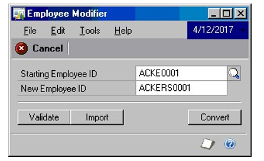

1. Choose the Validate button first. Select the file and choose Open to start the validation process.

2. A Report Destination window will appear. Select the report destination to view a report verifying that information is valid. If the report states that there is invalid data, fix the spreadsheet and go through the validation process again.

3. Once the Validate report lists no invalid employee ID numbers, the data is ready to be imported.

If you choose the Import button, you will receive a message to choose Validate first. The Validate button ensures that the tool will run properly. In this example, the Validate button will verify that each current employee ID number exists in your system before the conversion is performed.

4. After validating your data, choose the Import button, and choose the valid text spreadsheet.

5. When the data is done being imported, you will receive a message stating that the Import function is finished.

6. Choose OK, and close the modifier or combiner tool to receive another report destination window and view the report to see the changed data.

### Compatibility information

The following table lists the compatibility of modules in Microsoft Dynamics GP with the individual Professional Services Tools.

All of the tools are compatible with core modules. Core modules include General Ledger, Receivables Management, Payables Management, Sales Order Processing, Purchase Order Processing, Inventory, Bank Reconciliation, Inventory, Payroll, Bill of Materials and Multicurrency.

> [!NOTE]
When using the Combine tools, SmartList queries may need to be modified after the combine is completed.

**Tool Name**

*Account Modifier/Combiner - Compatible modules and features*

Core Modules  
Analytical Accounting  
Control Account Management  
Excel Based Budgeting  
Field Service  
Fixed Assets  
Interfund Management  
Manufacturing  
Project Accounting  
Revenue/Expense Deferrals  
SmartList

*Checkbook Modifier - Compatible modules and features*  
Core Modules  
Project Accounting

*Customer Name Modifier - Compatible modules and features*  
Core Modules  
Project Accounting

*Employee Modifier U.S. and Canadian Payroll - Compatible modules and features*  
Core Modules  
Human Resources  
Project Accounting  
Personal Data Keeper

*Item Number Modifier & Combiner - Compatible modules and features*  
Core Modules  
Analytical Accounting  
Manufacturing  
Field Service  
SmartList  
Project Accounting

*Item Description Modifier - Compatible modules and features*  
Core Modules  
Project Accounting

*Inventory Site Modifier & Combiner- Compatible modules and features*  
Core Modules  
Manufacturing  
Field Service  
Project Accounting

*Salesperson & Territory Modifier/Combiner - Compatible modules and features*  
Core Modules  
Collections Management

*Vendor Name Modifier - Compatible modules and features*  
Core Modules  
Project Accounting

## Chapter 1: Installing Professional Services Tools Library

This chapter explains how to install Professional Services Tools Library.
Information is divided into the following sections:

- *Installation*

- *Security setup*

- *What to do next*

### Installation

Professional Services Tools Library can be installed directly from the Microsoft Dynamics GP installation media. The Professional Services Tools Library can also be downloaded at no charge from PartnerSource at the following website:
[https:/mbs.microsoft.com/partnersource/downloads/releases/noam_pstl.hlm.](https://mbs.microsoft.com/partnersource/downloads/releases/noam_pstl.hlm.)
If you are a customer, contact your partner of record.

**Installing Professional Services Tools Library:**

1. Follow the appropriate step:

    - Installation Media:

        From the installation media, start the Microsoft Dynamics GP installer. Refer to the Microsoft Dynamics GP installation documentation pertaining to new installation or updating an existing location. Select Professional Services Tools Library from the Select Features window.

        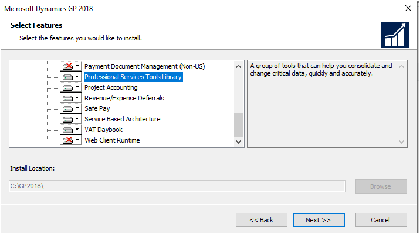

    - Downloaded Free Version:

        Save the \*.cnk files to the location on your computer where Microsoft Dynamics GP is installed. By default, Microsoft Dynamics GP is in the following location:

        C:\\\\Program Files\\Microsoft Dynamics\\GP

2. After the installation is complete, start Microsoft Dynamics GP and choose Yes to include new code.

3. To add the Professional Services Tools Library to the Home menu, right-click and choose Add \>\> Add window.

4. In the Available Windows folder list, expand the Technical Service Tools list, then expand Project. Select Professional Services Tools Library.

    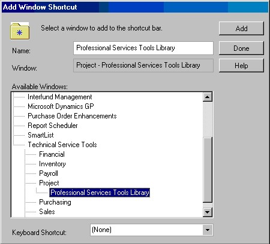

5. Choose Done, and then choose Yes to save the changes.

6. Professional Services Tools Library should now be available on your Home menu.

7. You will need to repeat steps 1-7 for each company where you want to use the Professional Services Tools Library.

8. The first time that you use Professional Services Tools Library, you may need to enter the registration key. To activate the entire Professional Services Tools Library suite, you can enter SMPE0102030405 for the registration key.

    - The registration key can be entered from any company that you set up to use Professional Services Tools Library and will not need to be reentered for each company.

    - Professional Services Tools Library is not supported with SQL replication.

    - The initial installation creates many tables and stored procedures and may take several minutes to finish.

1. Open Professional Services Tools Library from the Home menu.

    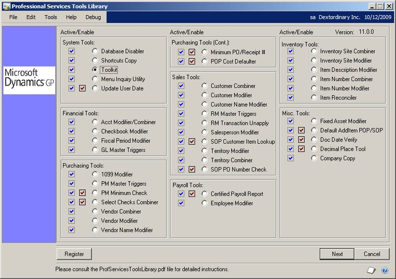

You have access to each Tool that has a check next to it.

Mark the radio button next to the tool you wish to use and choose Next.

Some tools have a second check box that appears directly to the left of the radio button. These tools modify functions within Microsoft Dynamics GP. Mark the second check box to activate the tool and modify existing forms and menus within Microsoft Dynamics GP automatically.

To add the new functionality that the following tools offer, simply mark the second check box and close the Professional Services Tools Library window.

- PM Minimum Check

- Select Checks Combiner

- SOP Customer Item Lookup

- Certified Payroll Report

- Minimum PO/Receipt \#

- Update User Date

- POP Cost Defaulter

- SOP PO Number Check

- Default Add Item POP/SOP

- Doc Date Verify

- Decimal Place Tool

The Next button will be unavailable once the second check box is marked for certain tools that do not require further setup.

> [!NOTE]
> If additional products are installed, all 3rd party tables should be tested for validation.

### Security setup

You can add a Professional Services Tools Library task to an existing security task or create a new task. Once a security task is created, you can either add the task to an existing role ID or create a new role ID. The instructions provided demonstrate how to create a new task, new role ID, and apply the new role ID to a user through User Security Setup.

> [!IMPORTANT]
> Predefined security tasks and roles are not set up in Microsoft Dynamics GP for Professional Services Tools Library. If you want to log in as a user other than “sa,” you must set up security tasks and roles specific for each desired user(s).
Regardless of how role-based security is defined in Microsoft Dynamics GP, there are multiple Professional Services Tools that require the user be logged in as “sa.” Refer to Before you begin on page 1 for information on the specific tools.
In order for a tool to execute properly and run reports as designed, all operations relating to the Reports and Files associated to the tools must be given access along with the Window Type.

Some of the options in creating a security task illustrated below can be changed depending on what type of security you need.

**Security task setup:**

1. Go to Microsoft Dynamics GP menu \>\> Tools \>\> Setup \>\> System \>\> Security Tasks

2. Create a new Task ID. In this example, the task name PSTL is used.

3. Select Other as the Category

4. Enter PSTL for the task name and description.

5. Select Technical Service Tools from the Product drop-down list.

6. Select Windows from the Type drop-down list.

7. Select Financials from the Series drop-down list.

8. Select Mark All to select all the operations listed.

9. Repeat steps 6 through 8 until all Windows, Reports, and File operations have been marked for the Professional Services Tools Library for all of the combinations possible from the Series drop down-list.

| **Type values** | **Series values**                                                          |
|-----------------|----------------------------------------------------------------------------|
| Windows         | Financial, Sales, Purchasing, Inventory, Payroll, Project, System          |
| Reports         | Financial, Sales, Purchasing, Inventory, Payroll, System                   |
| Files           | Financial, Sales, Purchasing, Inventory, Payroll, Project, System, Company |

> [!NOTE]
> Windows selected from the Type drop-down list, Project selected from the Series drop- down list, and Professional Services Tools Library marked as an operation is required to get into the main Professional Services Tools Library window.

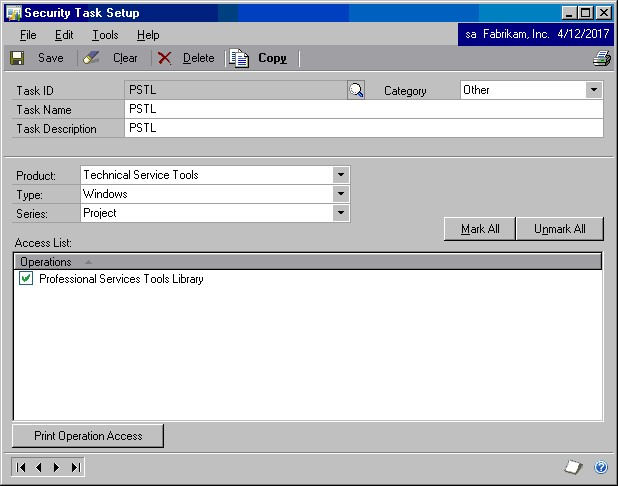

1. Select Save to save the new security task.

**Security role setup:**

2. Go to Microsoft Dynamics GP menu \>\> Tools \>\> Setup \>\> System \>\> Security Roles.

3. Create a new Role ID. In this example, the name of PSTL is used.

4. Enter PSTL for the Role Name and Description

5. In the Display drop-down, select the Category related to the security task you will associate to this Role ID. (In this example, the category is Other.)

6. Click Mark All to select the Security Task ID.

    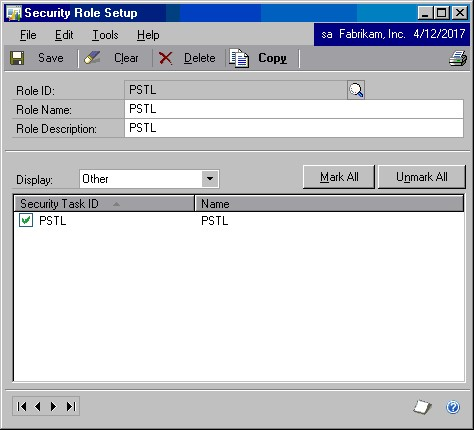

7. Choose Save to save the new Security Role.

**Security user setup:**

1. Go to Microsoft Dynamics GP menu \>\> Tools \>\> Setup \>\> System \>\> Security Roles

2. Select the desired User from the lookup window that you want to grant access to the newly defined Security Role ID.

3. Select the appropriate Company from the Company drop-down list.

4. Mark the check box for the Security Role ID created for the Professional Services Tools Library objects. The example Role ID is “PSTL.”

5. Choose Save to save the new User Security Setup.

## Chapter 2: Using System Tools

This chapter explains how to use the System Series Professional Services Tools. Information is divided into the following sections:

- *Using Shortcuts Copy*

- *Using Toolkit*

- *Using Menu Inquiry Utility*

- *Using Update User Date Utility*

### Using Shortcuts Copy

Use this tool to copy the Shortcuts options from one user to another user with the click of a button. With the Shortcuts Copy tool, you don’t have to manually set the shortcuts up for each user on the system. This is especially useful when macros are used with a window (e.g., Purchase Order entry to always add item).

**To copy a shortcut:**

1. Enter the User ID that you want to copy the Shortcuts from in the Copy From User ID field.

2. Enter the User ID you want to copy the Shortcuts to in the Copy To User ID field.

3. Choose copy.

4. You will be prompted to make a backup of your database. Choose Continue once you have made a backup.

5. An alert message signals the end of the Shortcuts copy process.

> [!NOTE]
> No Report Destination window will appear after using this tool. To verify the results, simply check to see if the users specified to have the Shortcuts copied have the same Shortcuts button.

### Using Toolkit

Use Toolkit to rebuild the GL00105 table, re-create Dex Procs, rebuild ndexes, re- create tables, and check identities of tables all within Microsoft Dynamics GP.

> [!IMPORTANT]
> This tool requires that the user be logged in as “sa.”

**To rebuild the GL00105 table:**

1. To rebuild the GL00105 table, select Rebuild GL00105 in the Toolkit Options group.

    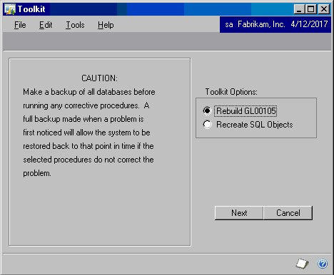

2. Choose Next.

**To re-create Microsoft SQL Objects:**

There are several options when selecting Recreate SQL Objects.

> [!IMPORTANT]
> You should have all users out of the system when re-creating any objects using this tool.

3. Select Recreate SQL Objects under the Toolkit Options heading and choose Next.

4. Choose the series or table you wish to change.

    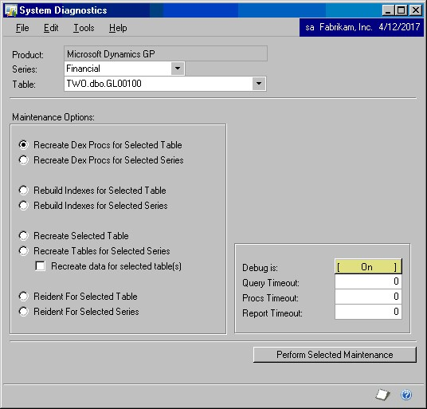

5. Choose the SQL object you want to re-create by selecting a function in the
    Maintenance Options group.

> [!CAUTION]
> When re-creating tables there is an additional check box, Recreate data for selected table(s). If you mark this option the table will be re-created and the data will be left intact. If you leave the option unmarked the table will be re-created and the data will be lost.

6. Choose Perform Selected Maintenance to proceed.

> [!NOTE]
> Keep in mind when re-creating a table with data that it may take some time to re-create depending on the table size.

### Using Menu Inquiry Utility

The Menu Inquiry Utility allows you to see all of the commands on the menus,whether they are hidden or not, and helps identify where those commands come from (which product) and other properties of the commands.

**To display menu commands:**

1. Choose a menu group from the Menu Groups field.

2. Select a Command from the resulting Categories/Commands list on the right-hand side to display the command properties at the bottom of the Menu Inquiry window.

3. Checkmarks designate certain properties of the command:

    - If the Enabled box is checked, the command is enabled.

    - If the Checked box is checked, the command or option has been selected and activated within Microsoft Dynamics.

    - If the Visible box is checked, the command or option is visible and accessible.

4. To open the corresponding window for the command, click on the gears icon next to the Tag \# heading.

If the gear icon appears unlit or gray, this option is unavailable for the command selected.

### Using Update User Date Utility

The Update User Date utility will automatically update the User Date in Microsoft Dynamics GP to the next date at midnight each day. The application will run in the background as long as Microsoft Dynamics GP is open. To activate this tool, simply mark the second check box next to Update User Date in the Professional Services Tools Library window.

In order for the Update User Date utility to work properly, you will need to have SuppressDateChangeDialog=TRUE in the Dex.ini file to suppress the date dialog that will be displayed if Microsoft Dynamics GP is left open over the midnight hour.

## Chapter 3: Using Financial Tools

This chapter explains how to use the Financial Series Professional Services Tools. Information is divided into the following sections:

- *Using Account Modifier/Combiner*

- *Using Checkbook Modifier*

- *Using Fiscal Period Modifier*

- *Using General Ledger Master Record Triggers*

### Using Account Modifier/Combiner

You can change previous account numbers into new account numbers or combine existing accounts with the Account Modifier/Combiner tool. This tool can identify which one of these activities you are trying to perform.

> [!IMPORTANT]
> This tool requires that the user be logged in as “sa.”

The difference between the modifier and combiner is that both accounts involved in the combiner portion of the utility currently exist in the system, while the new account number in the modifier portion is introduced as a new number to the system.

> [!NOTE]
> Please remember to run the reconcile process for all your open and historical years after using the account modifier/combiner to ensure that detail and summary records agree.

When you attempt to modify a larger set of accounts such as 150 and use the range option, you may notice slower performance and Dynamics GP may eventually crash. If you are modifying a lot of accounts, we would recommend you to use the import option.

### Using the Repopulate Column List function

If you load a dictionary after the initial install of the Professional Services Tools Library, you should re-create an internal table using the Repopulate Column List function. If you install a product after the initial installation of Professional Services Tools and do not mark the Repopulate Column List check box, the new products may not be included when using this tool. This Repopulate Column List function only has to be marked the first time running the tool after loading a new dictionary.

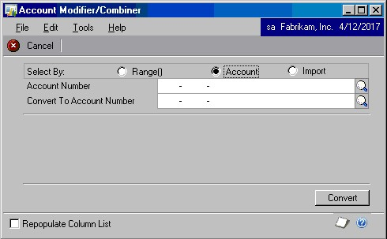

**Account Modifier**

You can manipulate an account number with the Account Modifier by changing a single account number into a new account number or by changing an entire range of accounts. All of the open and historical information can change without any loss of data.

**To change an account number:**

1. Enter the old account number in the Account Number field.

2. Enter the new account number in the Convert To Account Number field.

3. After entering the account numbers, choose Convert to make the change throughout the system.

4. When the process is finished, choose OK. You will be asked if there are any combines to perform.

5. If you choose No, you will receive a report describing which accounts were modified. If you have accounts that you wish to combine, choose Yes to make the tool combine those accounts. When the combine process is complete, you will receive a prompt to reconcile your open and historical years.

6. Choose a report destination. The report will list all the account modifications and combinations that took place, as well as all accounts that were modified and combined.

> [!NOTE]
> If you are running Management Reporter with Data Mart, you will need to rebuild the Data Mart after you complete the Account changer process.

**To change a range of accounts:**

1. Select the range of accounts to be changed and identify what segment of the account structure will change from the Field Type drop down list.

2. After the account segment has been identified, enter a new segment value and choose Convert. The accounts will change throughout the system.

  > [!NOTE]
  > When using the Range convert option, combines cannot be done. If any of the changes require a combine, the change will not take place. If combines are required for many accounts, use the Import option.

  This table is an example showing what would happen if segment 1 was changed from 111 to 222.

  | **Range of accounts selected** | **New account structure** |
  |--------------------------------|---------------------------|
  | 111-1111-11                    | 222-1111-11               |
  | 111-1111-12                    | 222-1111-12               |
  | 111-1111-13                    | 222-1111-13               |
  | 111-1111-14                    | 222-1111-14               |
  | 111-1111-15                    | 222-1111-15               |
  | 111-1111-16                    | 222-1111-16               |
  | 111-1111-17                    | 222-1111-17               |
  | 111-1111-18                    | 222-1111-18               |
  | 111-1111-19                    | 222-1111-18               |
  | 111-1111-20                    | 222-1111-20               |

1. When the process is finished, choose OK. You will be asked if you want to combine any accounts.

2. If you choose No, you will receive a report describing which accounts were modified. If you have accounts that you wish to combine, choose Yes to make the tool combine those accounts.

3. When the combine process is complete, you will receive a prompt to reconcile your open and historical years.

4. Choose a report destination. The report will list all the account modifications and combinations that took place, as well as all accounts that were modified and combined.

> [!NOTE]
> If you are running Management Reporter with Data Mart, you will need to rebuild the Data Mart after you complete the Account changer process.

**Account Combiner**

Use the Account Combiner portion of this tool to combine like accounts into one single account. You can combine account numbers in much the same way as you change accounts.

The accounts for Due To/Due From accounts in the Intercompany Setup window (IC40100) are not updated correctly when using the Account Modifier/Combiner within Professional Tools Library. To workaround this you can manually select the appropriate 'combined' account in the Intercompany setup window via 'account lookup'.

**To combine similar accounts:**

1. Enter an existing account number in the Account Number field.

2. Enter the existing account number to which you want to combine in the Convert To Account Number field.

3. After entering the account numbers, select the Convert button to make the change throughout the system.

    > [!NOTE]
    > Account Combiner works under the assumption that both accounts have the same posting type — either Balance Sheet or Profit and Loss. You cannot combine a Balance Sheet account into a Profit and Loss account or combine a Profit and Loss account into a Balance Sheet account. The Beginning Balance entries would be invalid if you cross match a Balance Sheet account with a Profit and Loss account.

1. Choose a report destination. The report will list all the account modifications and combinations that took place, as well as all accounts that were modified and combined.

**To combine or change multiple accounts from a spreadsheet:**

1. Enter existing account numbers in the first column of data in the spreadsheet, as you would enter it in the Account Number field.

2. The second column of data should contain the new account numbers, as you would enter it in Convert To Account Number field.

    > [!NOTE]
    > Be sure to include dashes in the account numbers.

1. Save your spreadsheet as a text file.

2. Choose Import in the Select By field.

3. Two new buttons, Validate and Modify, are now available. Choose the Validate button first. Select the text spreadsheet file and choose Open to start the validation process.  The Validate button will verify that each current account number exists in your system before the conversion is performed.

4. Once the validation report contains no errors, choose Modify and select your validated text spreadsheet to change or combine accounts.

**Previewing changes in your system:**

If you want to double check for errors before making final changes to your system, all of the account mappings that were valid in your spreadsheet are now contained in a Microsoft SQL Server table called TACHANGE. 

If you want to preview the changes that are about to occur on the system before combining accounts, perform a select statement against the TACHANGE table (Select\* from TACHANGE) to view the valid mappings from your spreadsheet. 

If you see an error in the TACHANGE table due to a mistake in the spreadsheet, simply make the change to your spreadsheet and import the spreadsheet again. The old mappings from the spreadsheet will be deleted and the new ones will be inserted into the TACHANGE table.

> [!NOTE]
> You must perform the select statement in Microsoft SQL Server before closing the Account Modifier/Combiner window.

### Checkbook Modifier

This tool allows changes in checkbook IDs to take place. You can change an existing checkbook ID to a new checkbook ID without any loss of work, open, or historical records. Refer to *Using Validate and Import buttons* on page 2 for information on importing data.

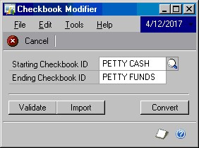

**To change a checkbook ID:**

1. Enter the Starting Checkbook ID and Ending Checkbook ID in the window, and choose Convert.

2. You will be prompted to back up your database. Choose Continue once you have a backup of the database you are changing. An alert message will signal the end of the Checkbook Modifier.

2. Choose OK and close the Checkbook Modifier window.

3. A report destination window will appear. Choose a destination for the report to view the Modified Checkbook IDs report.

### Using Fiscal Period Modifier

Use the Fiscal Period Modifier to change fiscal year definitions and reset data in the open and history tables.

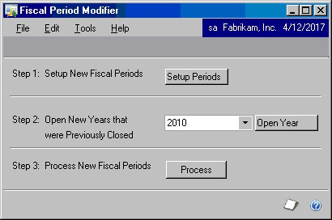

> [!IMPORTANT]
> Before changing data in the company, make a backup of the company database.

> [!NOTE]
> This tool does not support changing the month and/or day on closed years as the tool does not recalculate the ending and beginning balances. Only use the Fiscal Period Modifier to change the Year stamp back for years that are currently closed.

**To change fiscal year definitions:**

1. Choose Setup Periods to create the new fiscal year definitions and remove previous fiscal year definitions. When defining the new periods, be sure to keep all transactions associated with the same year, only change the name of the year. The utility does not allow transactions for a year to be split between different years.

2. If you have a year that was previously closed and is open under the new fiscal year definitions, select a year from the drop down list and choose Open Year. You will receive a message stating that the year selected has been changed to an open year.

3. Choose Process to align your history and open data and remove the old GL summary data.

4. Reconcile each history and open year from the Reconcile Financial Information window, located under Utilities \>\> Financial \>\> Reconcile. Start with the oldest history year, and work towards the most current open year.

5. Review the GL data. If the data is not as expected, restore the company from the backup.

### General Ledger Master Record Triggers

This tool allows you to create General Ledger account master records and replicate records to another database on the same server. You can also choose to replicate these records to some or all of your companies.

> [!NOTE]
> If you are using Integration Manager to import account, customer, or vendor master records to the main company database and the integration fails for any reason, any records imported to the main company database will be deleted (rolled back). However, if you have enabled master record triggers, the records will be replicated to company databases that you specify in the Replicate To DB field, and will not be rolled back. You must delete such replicated records manually.

**To create and update General Ledger account master records:**

1. In the Master DB field, choose the database where you will be creating or updating records.

2. In the Replicate To DB field, choose the database to which the master records will be copied.

    > [!NOTE]
    > To use General Ledger Master Triggers, the “Replicate To” database must have the same company account structure setup as the Master database. This information can be found using query analyzer and doing a query on the SY00300 table against each database, or in Microsoft Dynamics GP you can go to Microsoft Dynamics GP menu \>\>Tools \>\> Setup \>\> Company \>\> Account Format. The same number of Segments must be setup, and each Segment must be the same length.

1. Mark the Accounts option.

    > [!NOTE]
    > You will not be able to mark a check box if you are not registered for that particular Master Trigger.

Close Master Triggers Setup. When you create or update a master record in the database you entered in the Master DB field, the record will be inserted or updated in the database you chose in the Replicate To DB field.

## Chapter 4: Using Sales Tools

This chapter explains how to use the Sales Series Professional Services
Tools.

Information is divided into the following sections:

- *Using Customer Name Modifier*

- *Using Receivables Management Master Record Triggers*

- *Using Receivables Management Transaction Unapply*

- *Using Salesperson Modifier*

- *Using Sales Order Processing—Customer Item Lookup*

- *Using Territory Modifier*

- *Using Territory Combiner*

- *Using SOP PO Number Check*

### Using Customer Name Modifier

Use this tool to change the Customer Name. You can change an existing customer name to a new customer name without any loss of work, open, or historical records.

> [!IMPORTANT]
> This tool requires that the user be logged in as “sa.”

**To change a customer name:**

1. Enter the Starting Customer Number that you want to modify. The existing Starting Customer Name will appear automatically.

2. Enter the Ending Customer Name, or the name you want to change to.

3. Choose the Convert button to update records. Refer to *Using Validate and Import buttons* for information on importing data.
 
4. You will be prompted to back up your database. Choose Continue once you have a backup of the database you are running the change on.

5. A message will signal the end of the Customer Name Modifier process. Choose OK and close the Customer Name Modifier window.

6. A report destination window will appear. Choose a destination for the report to view a Modified Customer Names report.

### Receivables Management Master Record Triggers

Use this tool to create customer and customer address master records and replicate records to another database on the same server. You can also choose to replicate these records to some or all of your companies.

> [!NOTE]
> If you are using Integration Manager to import account, customer, or vendor master records to the main company database and the integration fails for any reason, any records imported to the main company database will be deleted (rolled back). However, if you have enabled master record triggers, the records will be replicated to company databases that you specify in the Replicate To DB field, and will not be rolled back. You must delete such replicated records manually.

If you utilize the RM and PM Master triggers in the Professional Service Tools Library and a customer or vendor has an address with more than 31 characters in the field, the system will truncate any characters after 31.

**To create and update customer and customer address master records:**

1. In the Master DB field, choose the database where you will be creating or updating records.

2. In the Replicate To DB field, choose the database to which the master records will be copied.

1. Mark the Customers option.

    > [!NOTE]
    > You will not be able to select an option if you are not registered for that particular Master Trigger.

1. Close Master Triggers Setup. When you create or update a master record in the database you entered in the Master DB field, the record will be inserted or updated in the database you chose in the Replicate To DB field.

### Receivables Management Transaction Unapply

This tool enables you to unapply documents in the history table and automatically move the records back to the open table even if there are discounts and/or write- offs associated with the document. You can reapply the records as needed. Using this tool can be a good alternative to removing history and reentering data if records were applied incorrectly.

> [!NOTE]
> If a discount and/or write-offs exist, a General Ledger journal transaction will be created using the original distributions of the document and the transaction will be in a batch in the General Ledger. An edit list can be printed prior to posting into the General Ledger.
> 
> The Receivables Management Transaction Unapply tool does not allow users to unapply Multi-currency documents that have discounts and/or write-offs associated with them.

**To unapply Receivables Management transactions:**

1. Choose the Customer ID.

2. Choose the document numbers or dates for which you want to unapply the transactions. Mark All to unapply all documents or enter a range of documents in the From and To fields.

3. You will be prompted to verify that you want to unapply the documents. Choose Unapply to continue. You can also view the report only or cancel.

4. Choose a report destination to view a report with information about the unapplied transactions.

### Salesperson Modifier

Use the Salesperson Modifier tool to change current Salesperson IDs. The result is a new Salesperson ID with no data lost or having to be reentered into the system. If you plan on importing large amounts of data, please refer to *Using Validate and Import buttons* on page 2 where there is information about the Validate and Import buttons.

> [!IMPORTANT]
> This tool requires that the user be logged in as “sa.”

**To change a salesperson ID:**

1. Enter the Starting Salesperson ID.

2. Enter the New Salesperson ID and choose Convert.

    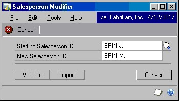

3. You will be prompted to backup your database. Once you have a backup of the proper data, choose Continue to begin the change process.

4. A message signals the end of the Salesperson change process.

5. Choose OK and close the Salesperson Modifier window to display a Report Destination window. Select a report destination to view the Changed Salespersons report.

### Sales Order Processing—Customer Item Lookup

Use this tool to store customer-specific ordering history, as well as the
last invoice date and the last price used, and view that information from
within Sales Order Processing Entry and the Sales Item Detail windows.

**Customer item lookup setup:**

1. This tool modifies existing features within Microsoft Dynamics GP. To activate the new functionality that this tool offers, simply mark the second check box next to SOP Customer Item Lookup from the Professional Services Tools Library menu. Close the window.

2. To build initial data from your existing history tables, choose Microsoft Dynamics GP menu \>\> Tools \>\> Setup \>\> Sales \>\> Sales Order Processing to open the Sales Order Processing Setup window.

3. Choose Create Initial Data from the Additional menu. This process could take sometime depending on how much historical SOP Line Item data exists. You will receive a message when processing is finished.

    > [!IMPORTANT]
    > You must be logged in as “sa” do the initial data creation.

4. The new Customer Item Lookup window is now available from the SOP Entry and the SOP Item Detail windows. You can open the lookup window by pressing CTRL H or by choosing Additional \>\> Customer Item Lookup.

The window displays the historical purchasing information for this customer and the most recent price for each item purchased. By highlighting a record, you can zoom back to the SOP Document Inquiry window. As Invoice documents are posted, new entries are added to the table that stores the Customer Item historical data.

> [!NOTE]
> If a customer purchases the same item in two different unit of measure codes, both records will show in the Customer Item Lookup window. However, the unit of measure and price that will appear is based off of the item's default unit of measure. If the unit of measure changes within a sales document, a new price will become the default.

### Territory Modifier

This tool allows changes in territory IDs to take place and the process mirrors that of how account numbers are changed. The user is able to change an existing territory id to a new territory id without any loss of work, open, or historical records. Just by clicking the convert button the records are updated. If you want to import large amounts of data, refer to *Using Validate and Import buttons* on page 2, where there is information on how to import data.

> [!IMPORTANT]
> This tool requires that the user be logged in as “sa.”

**To change a Territory ID:**

1. Choose the starting Territory ID.

2. Enter the new Territory ID.

3. You will be prompted to back up your database. Once you have a backup of the proper data, choose Continue to begin the change process.

4. The process is complete when you receive another message stating the Territory Modifier is finished.

5. A Report Destination Window will appear. Select a report destination to view the Modified Territories Report.

### Using Territory Combiner

Use the Territory Combiner to combine an existing Territory ID with another existing Territory ID without any loss of work, open, or historical records.

> [!IMPORTANT]
> This tool requires that the user be logged in as “sa.”

**To combine a Territory ID:**

1. Select the Territory ID you wish to convert using the lookup window in the Starting Territory ID field.

2. Select the ending Territory ID with the lookup window in the Combined Into Territory ID field.

3. Choose the convert button to update records. If you want to import large amounts of data, refer to *Using Validate and Import buttons*.

4. You will be prompted to back up your database. Once you have a backup of the proper data, choose Continue to begin the combine process.

A message signals the end of the Territory Combine process.

### SOP PO Number Check

Use the SOP PO Number Check to verify the Customer PO Number field for duplicates as data is entered into the field on both the SOP Entry window and the SOP Customer Detail Entry window.

**SOP PO Number Check setup:**

1. To set up the SOP PO Number Check, mark the SOP PO Number Check check box in the Professional Services Tools Library window. Click Next to open the Setup window.

2. Set the Check DB column for each SOP Type. When marked, the SQL database will be examined documents of the specified type that have duplicate Customer PO numbers. For instance, it might not matter that a duplicate Customer PO Number was entered on a Quote document. In that case, you would not mark the Check DB column for Quote documents, and the check would not be performed.

3. Set the Which Tables column for each SOP Type. This column specifies which types of tables should be searched. Choose Work, History, or Both. The default is Both.

4. Set the Check on UI column for each SOP Type. This field is to determine from the User Interface whether or not duplicate Customer PO Numbers should be checked. For instance, on a return you might not want to check for duplicate Customer PO Numbers because the customer could have multiple returns for a single Customer PO Number.

5. Set the Required column for each SOP Type. This will make the Customer PO Number field in Sales Transaction Entry a required field. Like most required fields, the user can delay entering this data but the Sales Document won't be saved until a value is entered.

6. Set the Warning Type column for each SOP Type. This specifies what the system should do if a duplicate PO number is found for a customer. The following are the available actions:

**Do Nothing** Don't give any message or warning.

**Warn Only** Presents the user with the message defined in the Message column for that SOP Type. Only an “OK” button is displayed in the message, because it is only a warning.

**Warn and Ask** If a duplicate is found, the message defined in the Message column for that SOP Type will be displayed. The user will be given a choice of “Yes” or “No”, or “Display”. If “Yes” is clicked, the Customer PO Number is accepted. If “No” is clicked, then the user must re-enter a different Customer PO Number. If “Display” is clicked, a window will open that shows the records that the PO Number was found on.

**Warn and Reject** Presents the user with the message defined in the Message column for that SOP Type. An “OK” button and a “Display” button are displayed with the message. If “OK” is clicked, the focus will return to the Customer PO Number and they user would have to enter a different number (or leave it blank). If “Display” is clicked, a window will open that shows the records that the PO Number was found on.

**Warn and Password** Presents the user with the message defined in the Message column for that SOP Type, but will give the user the option of entering the password entered in the Password column as an override.

1. Set the Message column for each SOP Type. This field is a user-defined message that is displayed after a duplicate PO Number is found. The tokens %1, %2, and %3 can be used in the message text, and will be substituted with the actual PO Number, Document Type (the words Order, Invoice, etc.), and SOP Number.

2. Set the Password column for each SOP Type. This field is per document type and is only used when the Warning Type column is set to Warn and Password.

3. Activate the utility. To activate SOP PO Number Check, simply mark the second check box next to SOP PO Number Check in the Professional Services Tools Library window.

**To use SOP PO Number Check:**

When in Sales Transaction Entry, entering in a duplicate Customer PO Number will check for duplicates on the document types marked and apply the rules for the document type currently entered. For any Warning Type other than Do Nothing, a dialog will be displayed giving the custom message if a duplicate is found. Depending on the option selected (Warn and Ask, Warn and Reject, etc.), you will want to change the wording of the message to match more closely with the options presented.

For this document, the setting was Warn and Ask. Clicking “Yes” would allow reuse of the number, while clicking “No” would restart the field. Clicking  “Display” will open a display window to display the documents that the PO Number was used on.

Drilling back on the SOP Number will open the document in SOP Inquiry.

**To set up customer exceptions:**

While each SOP Document Type can be made required by using the Customer PO Validation Setup window, some customers might be an exception to that rule. To create Customer Exceptions, use the Customer Exception window.

1. Choose Microsoft Dynamics GP menu \>\> Tools \>\> Setup \>\> System \>\> Customer Exception to open this window. This window displays all of the customers in the system and allows you to choose the exceptions.

2. Mark the customers for which the Customer PO Number is not required. In the illustration above, the customer AARONFIT0001 will never have the Customer PO Number field marked as required, even though it was marked required in the Customer PO Validation Setup window.

## Chapter 5:Using Inventory Tools

This chapter explains how to use the Inventory Series Professional Services Tools. Information is divided into the following sections:

- *Using Inventory Site Combiner*

- *Using Inventory Site Modifier*

- *Using Item Description Modifier*

- *Using Item Number Combiner*

- *Using Item Number Modifier*

- *Using Item Reconciler*

### Using Inventory Site Combiner

This tool allows you to combine Site/Location Codes without losing any data. Refer to *Using Validate and Import buttons* on page 2 for information on the Validate and Import buttons, which make it possible to import large amounts of data.

**To combine an inventory site:**

1. Enter the starting Site ID.

2. Enter the Site ID to which the starting Site ID will be combined.

3. Choose Convert.

4. You will be prompted to back up your database. Once you have a current backup of the database, choose Continue.

5. The process is complete when a message appears. Choose OK.

    > [!NOTE]
    > If Manufacturing is part of your solution, you must run a full MRP Regeneration after the combine process has finished in order to complete the process for MRP tables.

6. Choose a report destination. The report indicates what Site IDs were combined in the system.

### Using Inventory Site Modifier

This tool allows you to change the current Site/Location Code to a new code without losing any data. Refer to *Using Validate and Import buttons* on page 2 for information on the Validate and Import buttons, which make it possible to import large amounts of data.

**To change an inventory site:**

1. Enter the starting Site ID.

2. Enter the new Site ID name in the Ending Site ID field.

3. Choose Convert.

4. You will be prompted to back up your database. Once you have a current
    backup of the database, choose Continue.

5. The process is complete a message indicating the Site Modifier is finished
    appears.

6. A Report Destination window will appear after you select OK and close the Site Modifier window. The report indicates what Site IDs were changed in the system.

### Using Item Description Modifier

Use this tool to change Item Descriptions. You can change an existing item description to a new item description without any loss of work, open, or historical records. Refer to *Using Validate and Import buttons* on page 2 for information on importing data.

**To change an item description:**

1. Choose the item you wish to change in the Starting Item Number field.

    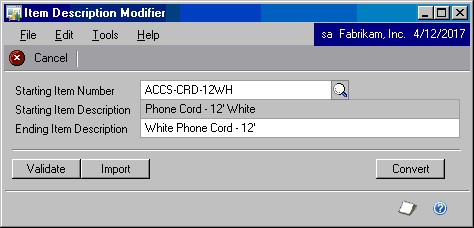

2. The Starting Item Description field is populated automatically. Enter a new description in the Ending Item Description field.

3. Choose Convert.

4. You will be prompted to back up your database. Choose Continue once you have a backup of your database. A message will signal the end of the Item Description Modifier.

5. Choose OK and close the Item Description Modifier window. A report destination window will appear.

6. Choose a destination for the report to view an Item Descriptions Modified report.

### Using Item Number Combiner

Use the Item Number Combiner to combine existing item numbers. The old item number is removed from the system after the combine process is finished. All Work, Open, and History records are combined into the new item number. Refer to *Using Validate and Import buttons* on page 2 for information on the Validate and Import buttons, which make it possible to import large amounts of data.

If you are using Bill of Materials or Manufacturing with Bill Of Materials, you can NOT combine parent objects, only child objects will be able to be combined.

> [!IMPORTANT]
> This tool requires that the user be logged in as “sa.”

When combing 2 Item Numbers using Item Combiner with a valuation method of Average the Qty and Average Cost may be incorrect. A workaround to this would be to decrease the Qty down to 0 prior to Combining Items.

**To combine an item number:**

1. Choose the starting item number.

2. Choose the item number to which you want to combine in the Combined Into Item Number field.

3. Choose Convert.

4. After you choose Convert you will be prompted to back up your data. Once you have a backup of the company database, choose Continue to start the combine process.

5. Another message is displayed when the item number combine process is complete. Choose OK to continue.

6. Close the Item Number Combiner. A Report Destination Window will appear. Select a report destination to view the combined Item Numbers Report.

### Using Item Number Modifier

Item Number Modifier is like other modifier tools in that it allows the user to change a current inventory item number to a new number without losing any work, open or history records. See *Using Validate and Import buttons* for information on the Validate and Import buttons.

> [!IMPORTANT]
> This tool requires that the user be logged in as “sa.”

**To change an item number:**

1. Enter the starting item number.

    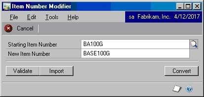

2. Enter the new item number.

3. Choose Convert.

4. You will be prompted to make a backup of your database. Once a backup is made, choose Continue.

5. You will receive an alert when the process is finished.

6. Choose OK and close the Item Modifier window. A Report Destination window will appear. Select the report destination to view the Converted Item Number(s) report.

### Using Item Reconciler

Item Reconciler allows you to reconcile Inventory. The Reconciler ’s function is the same as the reconcile functions built into Microsoft Dynamics GP with one exception: only those items that need reconciling will be reconciled using

Professional Services Tools Library. This can increase performance if all items don’t need to be reconciled.

**To reconcile Inventory:**

1. Choose the module you want to reconcile: Inventory.

2. Choose Reconcile to reconcile the module(s).

## Chapter 6: Using Purchasing Tools

This chapter explains how to use the Purchasing Series Professional Services Tools. Information is divided into the following sections:

- *Using 1099 Modifier*

- *Using Payables Management Master Record Triggers*

- *Using Payables Management Minimum Check*

- *Using Select Checks Combiner*

- *Using Vendor Name Modifier*

- *Using Minimum PO/Receipt Number*

- *Using POP Cost Defaulter*

### Using 1099 Modifier

This tool allows you to update the 1099 amounts for vendors who are not set up as a 1099 vendor for the year or a portion of the year.

This tool will only modify records that are already paid and should be 1099 records for the year selected. If you have any work or open records that haven’t been paid but were entered/posted while the vendor was not set up as a 1099 vendor, those records will not be changed. You need to execute this tool the next year prior to printing 1099 reports to be sure that work and open records that were paid in the new year, get updated.

**To update 1099 amounts:**

1. Set the vendor up as a 1099 vendor by selecting that option on the Vendor Card.

2. Once the vendor is marked as a 1099 vendor, open the 1099 Modifier tool from the Professional Services Tools Library menu.

    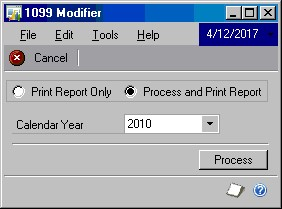

3. Select whether you would like to Print Report Only or Process and Print Report.

The Print Report Only option shows you the Vendor, Voucher Number, and Amount that will be converted to a 1099 amount. The Process and Print Report option makes the changes, prints the report and prints an updated Summary records report for the 1099 amount.

4. Select the calendar year to which you want to make the changes.

5. You will be prompted to back up your database. Choose Continue once you have a backup of your database. A message will signal when the 1099 Modifier has finished processing.

If you selected Process and Print Report, you may get an additional report showing summary table changes that have been made to the 1099 amount field. The number under the Amount After heading is the amount that prints on your 1099 reports.

6. Close the 1099 Modifier window. A report destination window will appear.

Choose a destination for the report to view a 1099 Modified Records report.

This report shows the specific vouchers that were changed to 1099 amounts.

### Using Payables Management Master Record Triggers

This tool allows you to add a vendor and vendor address master record and replicate records to another database on the same server. You can also choose to replicate these records to some or all of your companies.

> [!NOTE]
> If you are using Integration Manager to import account, customer, or vendor master records to the main company database and the integration fails for any reason, any records imported to the main company database will be deleted (rolled back). However, if you have enabled master record triggers, the records will be replicated to company databases that you specify in the Replicate To DB field, and will not be rolled back. You must delete such replicated records manually.

If you use the RM and PM Master triggers in the Professional Service Tools Library and a customer or vendor has an address with more than 31 characters in the field, the system will truncate any characters after 31.

**To create and update vendor and vendor address records:**

1. In the Master DB field, choose the database where you will be creating or updating records.

    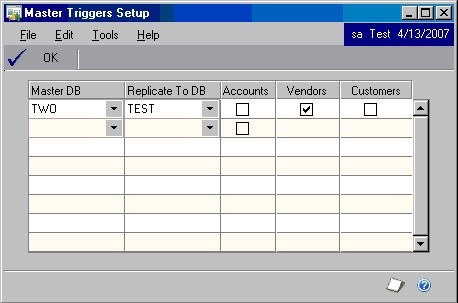

2. In the Replicate To DB field, choose the database to which the master records will be copied.

3. Mark the Vendors option.

    You will not be able to mark an option if you are not registered for that particular Master Trigger.

4. Close Master Triggers Setup. When you create or update a master record in the database you entered in the Master DB field, the record will be inserted or updated in the database you chose in the Replicate To DB field.

### Using Payables Management Minimum Check

Use the Payables Management Minimum Check tool to set a minimum amount for your Payables checks within the Select Checks process.

> [!NOTE]
> This process occurs after the Payment Vouchers have already been created. This will cause a break in the payment vouchers sequence in the system but will not harm anything.

**Payables Management Minimum Check setup:**

1. This tool modifies existing features within Microsoft Dynamics GP. To activate the new functionality that this tool offers, simply mark the second check box next to PM Minimum Check from the Professional Services Tools Library menu. Close the window.

2. When opening the Select Payables Checks window, the title bar of the window will display the current settings for the minimum check amount.

3. To change the Minimum Check amount, choose Additional \>\> Set Minimum Check Amount. The Minimum Select Check Amount window will appear.

4. Enter the new minimum check amount in the Minimum Check Amount field.

You can turn the minimum check amount on or off by marking or unmarking the Use Minimum Amount check box.

> [!NOTE]
> The settings are per machine and stored in the Dex.ini for use in the next check build process, for example MinPMCheck=201.00.

### Using Select Checks Combiner

Use this tool to consolidate checks to match the same vendor when users are appending to an existing checks batch. This can be useful if users frequently build batches of Payables checks and select different document number ranges or date ranges.

> [!IMPORTANT]
> You cannot use the Select Checks Combiner tool and the feature One check per Invoice that was added in Microsoft Dynamics GP 2018 RTM at the same time. What happens is that when the Select Checks Combiner tool in PSTL is enabled, you cannot have the Vendor option for ‘One Payment Per’ set to Invoice. If you do, Dynamics GP creates a Payment per each Invoice per your setup; then PSTL will remove the transactions from the Keys (PM00400) and Work (PM10300) records for all of the payments created after the first. The only real records for the payments will be found in the apply table (PM10200) and remittance table (PM20100). 

**To activate Select Checks Combiner:**

1. This tool modifies existing features within Microsoft Dynamics GP. To activate the new functionality that this tool offers, simply mark the second check box next to Select Checks Combiner from the Professional Services Tools Library menu. Close the window.

2. If a check exists for a vendor when checks are rebuilt, new amounts will be added to the existing check — instead of issuing multiple checks. This only applies if the One Check Per field is set to Vendor in the Select Payables Checks window.

### Using Vendor Name Modifier

Use this tool to change the Vendor Name. You can change an existing vendor name to a new vendor name without any loss of work, open, or historical records.

> [!IMPORTANT]
> This tool requires that the user be logged in as “sa.”

**To change a vendor name:**

1. In the Starting Vendor Number field, enter the name that you want to modify. The existing Starting Vendor Name will automatically appear.

2. In the Ending Vendor Name field, enter the name you want to change to. Choose Convert to update records. Refer to Using the *Using Validate and Import buttons* for information on importing data.
    
3. You will be prompted to back up your database. Choose Continue once you have a backup of the database. A message will signal the end of the vendor name change.

4. Choose OK and close the Vendor Name Modifier window.

A report destination window will appear. Choose a destination for the report to view a Vendor Descriptions Modified report.

### Using Minimum PO/Receipt Number

This tool adds the ability to prevent Purchase Order Processing from defaulting to the next PO Number or Receipt Number. You can set the default to a number before the current PO number when a previously existing PO number is deleted. You can also set the minimum PO Number default, so defaults will never go below the set amount.

**To set a Minimum PO or Receipt number:**

1. To activate the new functionality that this tool offers, simply mark the second check box next to Minimum PO/Receipt \# from the Professional Services Tools menu. Close the window.

2. Open Microsoft Dynamics GP menu \>\> Tools \>\> Setup \>\> Purchasing \>\> Purchase Order Processing, and then choose Additional \>\> Minimum PO Number.

3. Enter the minimum purchase order and receipt numbers.

4. If you do not want to use previous PO or receipt numbers, select the check box to never default to a previous PO or receipt number.

    The Minimum PO Number Default and Minimum Receipt Number Default fields will be disabled.

5. Choose Save.

> [!NOTE]
> This functionality will only work for document numbers that are the same length. If the next PO Number field is not the same length as the Minimum PO Number entered, then the system will function as it did without the customization.

### Using POP Cost Defaulter

Use this tool to specify the default cost for a purchase order document. To set up the POP Cost Defaulter, select POP Cost Defaulter in the Professional Services Tools Library and click Next.

In the POP Cost Defaulter window, select what cost you would like to default from the item in the PO Entry window. Typically, the Last Invoice Cost is defaulted from Cards \>\> Inventory \>\> Vendors. Once POP Cost Defaulter is activated, either the Current or Standard Cost will be defaulted based on your selection.

To activate this tool simply mark the second check box next to POP Cost Defaulter in the Professional Services Tools Library window.

## Chapter 7: Using Payroll Tools

This chapter explains how to use the Payroll Series Professional Services Tools. Information is divided into the following sections:

- *Using Employee Modifier*

- *Using the Certified Payroll Report*

### Using Employee Modifier

This tool allows the user to change an existing employee ID to a new
employee ID without losing any work, open, or history records. If you plan
to import large amounts of data, refer to *Using Validate and Import
buttons* on page 2 to use the Validate and Import buttons.

**To change an employee ID:**

1. Enter the Starting Employee ID.

2. Enter the new Employee ID.

3. Choose Convert. You will be prompted to back up your database. Once a backup is made of the database, Choose Continue.

4. A message will appear when the employee ID change is finished.

5. Choose OK and close the Employee Change window. A Report Destination window will appear. Choose a destination to view the Converted Employee IDs report.

### Using the Certified Payroll Report

Use the Certified Payroll Report with US Payroll to add a project number to employees’ hourly transactions and track them on a per project basis. This tool will also capture information posted from the Timesheet Entry window in Project Accounting Timesheet Entry. You can print these transactions on a weekly report and view employees, departments, job titles, and pay codes by project.

**Certified Payroll Report setup:**

1. This tool modifies existing features within Microsoft Dynamics GP. To activate the new functionality that this tool offers, simply mark the second check box next to Certified Payroll Report in the Professional Services Tools menu. Close the window.

2. Open the Alternate/Modified Forms and Reports window by choosing Microsoft Dynamics GP menu \>\> Tools \>\> Setup \>\> System \>\> Alternate/ Modified Forms and Reports.

3. Select the ID for which you want to view the Certified Payroll Report.

4. Select Technical Service Tools from the Product drop-down list.

5. Select Windows for the Type drop-down list.

6. Expand the + beside the Payroll folder.

7. Expand the + beside Payroll Transaction Entry.

8. You should now see an option for Microsoft Dynamics GP or Technical Service
    Tools. Select Technical Service Tools.

9. Click Save on the form.

10. To create a shortcut, right-click in the Home menu and select Add \>\> Add
    Window.

11. Open Technical Service Tools \>\> Payroll and select the Certified Payroll Report Option.

12. Choose Done and select Yes to save the changes.

**To use Payroll Transaction Entry:**

To use the Certified Payroll functionality, simply enter a Job Number while entering Payroll transactions.

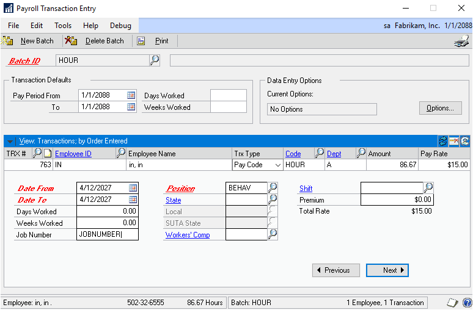

The Job Number field is located in the expanded area of the Payroll Transaction Entry window. This field is only active for transactions that are Hourly, Overtime or Double Time payroll types, and will be disabled for any other types of
transactions.

There is no validation for the Job Number itself, and the Job Number can be any string of 15 characters or less.

Once a batch is posted along with a check run, the information about the transaction is stored to be printed later on the Certified Payroll Report. The report includes the Employee ID, Job Number, Job Title, Department, Pay Code, number of hours, and the Pay Rate for this check. This information will remain in the system for as long as the user keeps Check History for the employee.

**To print the Certified Payroll Report:**

Once transactions have been posted with information about the Job Number, users can access the Certified Payroll Report from whichever palette was chosen during setup. Typically, this would be the Payroll Transactions palette.

1. Open the Certified Payroll Report window.

2. Mark All jobs or enter a range of jobs.

3. Choose the Ending Date of the 7-day period to be printed on the report. All transactions for the week that ends on the date specified and meets the range of Job Numbers will print on the report.

4. Mark Print Report Headings to manually enter the Contract and Contractor information.

5. Mark Print Signature Paragraph to print a paragraph on your report stating your certification that the payroll is correct and complete and the wage rates are valid according to the Secretary of Labor.

6. Choose Print to print the report. The information that prints on the report is summarized for each employee within each job. Each employee could have several line items for a single job if the employee used different pay codes, job titles or departments during the week period. Each employee could have different line items on more than one job report if the employee worked on more than one job during the week period. A summary total of the employee's total weekly hours for the Job and their total Job Gross Pay is
    printed for each employee on every job report.

> [!NOTE]
> The employee's total weekly gross and net pay, along with their total FICA, federal, state and other withholding is given on the report as summary information. Keep in mind that these summary figures may contain amounts that may have been allocated to other jobs during the week or may have come from a pay code that does not allow job number entry, such as sick or vacation time.

The report also contains a summary for an entire job that describes the total job- specific gross pay along with the total overall gross pay for all employees who worked on that job during the week. Each separate Job will reset the report to start over with page 1.

## Chapter 8: Using Miscellaneous Tools

This chapter explains how to use Professional Services Tools that are not associated with a particular series. Information is divided into the following sections:

- *Using Fixed Asset Modifier*

- *Using Default Add Item POP/SOP*

- *Using Doc Date Verify*

- *Using Decimal Place Tool*

- *Using Company Copy*

### Using Fixed Asset Modifier

Use this tool to reclassify an asset code within the Fixed Assets module. All tables throughout the system will reflect this change.

**To reclassify an asset code:**

1. Enter the existing Asset ID.

2. Enter the new Asset ID value. Choose Change. The Fixed Assets Modifier tool will update the following tables with the new ID:

- FA00100 • FA00700 • FA00701 • FA00800 • FA00801

- FA01002

- FA01100

- FA01300

- FA10200

### Using Default Add Item POP/SOP

When activated, Default Add Item will automatically mark the Add Item selection in the Options menu for the following windows:

- Sales Transaction Entry

- Purchase Order Entry

- Receivings Transaction Entry

- Purchasing Invoice Entry

The Add Item selection can be marked or unmarked normally after Default Add Item is activated. However, it will default to marked instead of unmarked. 
To activate this tool, simply mark the second check box next to Default Add Item POP/SOP in the Professional Services Tools Library window.

### Using Doc Date Verify

When Doc Date Verify is activated, and a document date is entered, a check will be performed to determine whether the document date is in a valid fiscal period or if the fiscal period is closed.

- If the date does not fall within a valid fiscal period, a message will be displayed and the user will not be allowed to continue until the date is in a valid period.

- If the Document Date falls within a period that is closed, a message will be displayed that will allow the user to correct the date or continue on leaving the date.

This functionality is available in the following windows:

- Payables Transaction Entry

- Receivables Transaction Entry

- Invoice Entry

- Payables Manual Payment Entry

- Sales Transaction Entry

- Inventory Transaction Entry

- Cash Receipts Entry

- Purchase Order Entry

- Receivings Transaction Entry

- Purchasing Invoice Entry

To activate this tool, simply mark the second check box next to Doc Date Verify in the Professional Services Tools Library window.

### Using Decimal Place Tool

When the Decimal Place tool is activated, both Payables Management checks and Payroll checks will have the Check Amount in Words truncated to two decimals. This tool would be used if the currencies in Microsoft Dynamics GP were changed to more than two decimals. In this situation, the checks will print with more than two decimals, which can alter the amount of the check.
The Decimal Place tool will adjust the Check Amount in Words portion to two decimal places.

> [!NOTE]
> The Decimal Places Tool will change only the Check Amount in Words portion of the check. To change the actual amount on the check to match the Check Amount in Words, you must use Report Writer to modify the check report and change the currency fields to only print two decimal places. Modifying the Check Amount in Words is not possible in Report Writer, so this tool allows that portion of the change.

To activate this tool, simply mark the second check box next to Decimal Place Tool in the Professional Services Tools Library window.

### Using Company Copy

This tool allows the setup and report option information from one company to be copied to another company within Microsoft Dynamics GP. You can choose the modules for which information will be copied from the source company to the destination company.

> [!IMPORTANT]
> This tool requires that the user be logged in as “sa.”

Before using the Company Copy tool, be aware of the following important issues:

- You should use this tool only after creating a SQL database backup of the destination company. The copy operation is irreversible without a backup.

- When the copy process is run, the setup tables and report options tables in the modules you selected will be deleted for the destination company. If you have manually added setup or report option information for a module in the destination company, and you do not want this information deleted, do not use the Company Copy tool to copy data for that module.

- You should be the only user who is logged into Microsoft Dynamics GP when the operation is performed.

- The operation can take a significant amount of time to complete, so you should consider performing it during off-peak hours.

**To copy company setup:**

1. Select the source company and the destination company.

2. Indicate what information you want to copy to the destination company. You     can copy setup data, report options, or both. You must mark at least one of the options.

3. Select the modules for which you want information to be copied. If you mark All Modules, all of the modules listed will be marked. Be aware of these guidelines:

    - If Report Options is selected, Company must be marked.

    - When the Data or Report Options are selected, Financial must be marked due to the account index dependency with other modules.

      The following dependencies exist for the modules:

      - If Manufacturing is marked, Inventory must also be marked.

      - If Extended Pricing is marked, Inventory and Receivables must also be marked.

      - If Project Accounting is marked, Inventory, Receivables, and Payroll must also be marked.

      - If Bill of Materials is marked, Inventory must also be marked.

4. Click Process to begin processing. A processing status message will be displayed in the lower-left corner of the Company Copy window. The processing time required will depend on the amount of data in the modules selected. When processing has finished, a status message will indicate that processing is complete.

4. Log into the destination company to validate the setup information and report option information that you copied.

**Data tables copied**

The following is a listing of the data tables that are copied for each
module in the Company Copy tool.

**Company**
SY00300  
SY03100  
SY40102  
SY00600  
SY03300  
SY40103  
SY00700  
SY03900  
TX00101  
SY01100  
SY04100  
TX00102  
SY01200  
SY04200  
TX00201  
SY02200  
SY40100  
SY01201  
SY02300  
SY40101  
PA00001  
SY03000

**Financial**

GL00100  
GL40100  
GL00102  
GL40101  
GL00103  
GL40200  
GL00104  
CM00100  
GL00105  
CM40100  
GL00200  
CM40101  
GL00201  
SY04100  
GL40000

**Inventory**
IV00101  
IV00113  
IV40700  
IV00102  
IV00114  
IV40701  
IV00103  
IV00115  
IV40702  
IV00104  
IV40100  
IV40800  
IV00105  
IV40201  
IV40900  
IV00106  
IV40202  
IV41000  
IV00107  
IV40400  
IV41001  
IV00108  
IV40401  
IV41100  
IV00109  
IV40500  
IV41101  
IV00110  
IV40600  
IV41102  
IV00111

**Inventory**  
FA00100  
FA00200  
FA00300  
FA00400  
FA00500  
FA00600  
FA00902  
FA00904  
FA01100  
FA01400  
FA01401  
FA19900  
FA40200  
FA40201  
FA40202  
FA40203  
FA40300  
FA41000  
FA41100  
FA41200

**Multicurrency**
MC00201  
MC00200  
MC40000  
MC40100  
MC40201  
MC40301  
MC40500  
MC60400

**Payroll**
DD40700  
UPR40100  
UPR40101  
UPR40104  
UPR40200  
UPR40201  
UPR40300  
UPR40301  
UPR40500  
UPR40501  
UPR40600  
UPR40700  
UPR40800  
UPR40801  
UPR40900  
UPR40901  
UPR40902  
UPR41100  
UPR41200  
UPR41201  
UPR41400  
UPR41401  
UPR41500  
UPR41700  
UPR41800  
UPR41801  
UPR41900  
UPR41901  
UPR41902  
UPR42000

**Payables**  
PM00100  
PM00101  
PM00200  
PM00203  
PM00300  
PM40100  
PM40102  
PM40103

**Receivables**  
RM00101  
RM00102  
RM00105  
RM00201  
RM00301  
RM00303  
RM00305  
RM40101  
RM40201  
RM40401  
RM40501  
RM40601  
RM40102  
RM40106  
PA00002

**Sales Order Processing**
SOP00100  
SOP00200  
SOP40100  
SOP40200  
SOP40201  
SOP40300  
SOP40400  
SOP40500  
SOP40600  
SOP00300  
SOP10111  
SOP40101  
SOP60200  
SOP60300  
SOP00300

**Purchase Order Processing**
POP40100  
POP40600  
POP40400  
POP40800  
POP40900  
POP00101

**Advanced Financials**
AF40100  
AF40101  
AF40102  
AF40103  
AF40104  
AF40105  
AF40106  
AF40107  
AF40108  
AF40109  
AF40110  
AF40200  
AF40201

**Extended Pricing**
IV10400  
IV10401  
IV10402  
IV10403  
RM00500  
SOP10108  
SOP10109  
SOP10110  
SOP10205  
SOP40709

**Invoicing**
IVC40100  
IVC40101

**Human Resources**
BE020230  
BE021030  
BE031000  
HR70500  
HR2BEN11  
HR2BEN12  
HR2BEN13  
HR2BEN14  
HR2BEN21  
HR2DIV02  
HR2TRA01  
HR2TRA03  
HRCOM022  
HRDEP022  
HRDIV022  
HRPBEN05  
HRPPPC01  
HRPRO022  
HRSAX012  
HRSAX022  
HRSAX042  
HRTRA042  
HRTRPC02  
HRTRPS01  
RV010221  
RV020221  
RV030221  
SK010230  
TAAC0130  
TAST0130  
TAST0230  
TAST0330  
TAST0532  
TATM0130

**Bill of Materials**
BM00101  
BM00111  
BM40100

**Report options tables copied**

The following is a listing of the report options tables that are copied for
each module in the Company Copy tool.

| **Module**         | **Tables copied**                                             |
|--------------------|---------------------------------------------------------------|
| Company            | SY70100, SY70200, SY70300, SY70400, SY70500, SY70501, SY70600 |
| Financial          | GL70500, DTA00700, LK4000, LK40001                            |
| **Module**         | **Tables copied**                                             |
| Inventory          | IV70500                                                       |
| Fixed Assets       | FA45000, FA45100                                              |
| Payroll            | UPR70500, UPR70501                                            |
| Payables           | PM70500                                                       |
| Receivables        | RM00700, RM40501                                              |
| Human Resources    | HR70500                                                       |
| Project Accounting | PA70101, PDK70101, PDK70300                                   |
