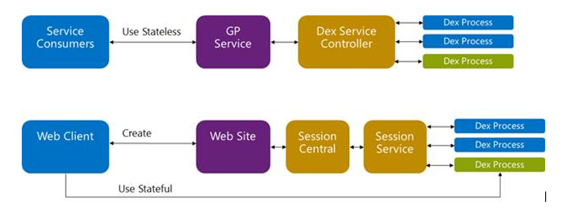
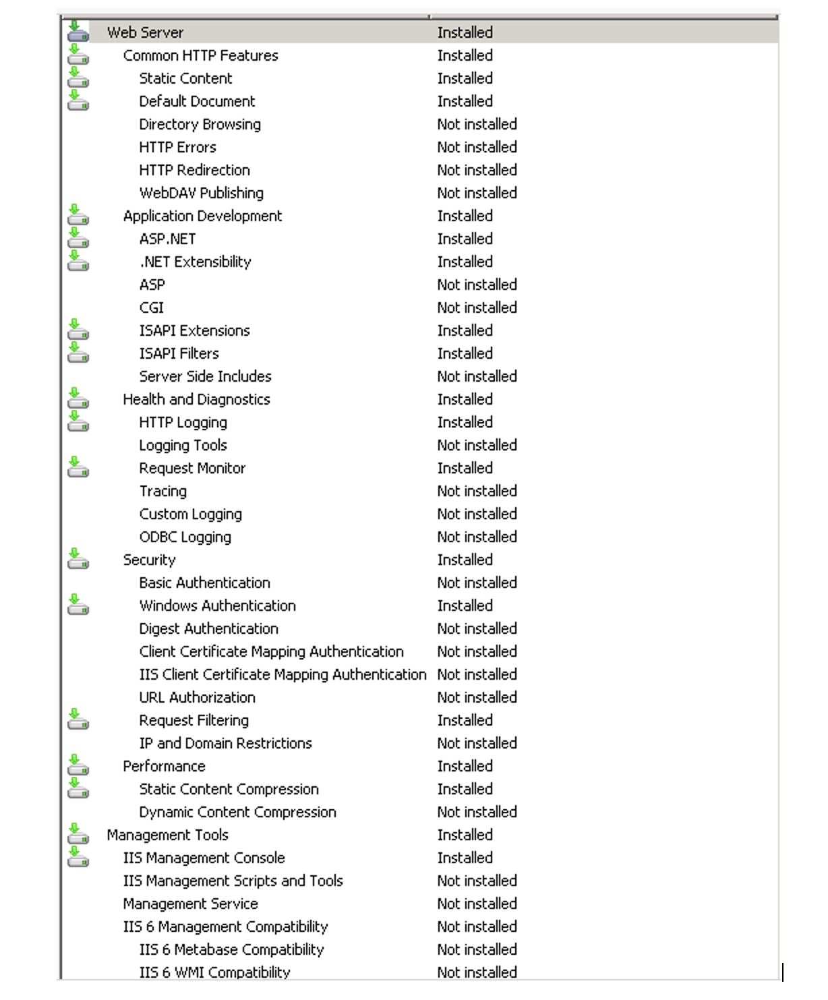
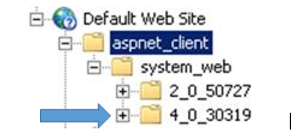

# Service Based Architecture for Dynamics GP

Service Based Architecture (SBA) is a method for enabling applications and services that Microsoft and its partners create to be able to access GP functionality through a standards-based services model.

To boil this down, it means that we can utilize the logic that is already created in a dictionary in a GP client and expose that to an endpoint for consumption.

Exposing logic to a WCF endpoint is not an entirely new concept. In GP 2010, eConnect began utilizing a WCF endpoint to execute logic that was in a set of stored procedures. This stored procedure logic was maintained separately from the logic in the dictionary.

The difficulty with having two sets of logic is that they both need to be constantly synchronized to provide the full functionality. For example, if a new feature in Purchase Order Processing is created, the eConnect stored procedures for Purchase Order Processing need to be altered to honor the new feature and treat the transaction in the same way as the GP Client. 

With SBA utilizing the same logic that as the GP Client, this synchronization process does not need to occur.

## Design

The introduction of the Web Client in Microsoft Dynamics GP 2013 paved the way for the creation of this product. The deployment is similar, and the same technologies are used.

Here is an architectural breakdown of the difference:

There are two main differences between the Web Client and SBA. The first is that unlike the Web Client which connected directly to the Dex Process, SBA connects to the Dex Process via the GP Service and the Dex Service Controller. 

The second is the nature of the connection. The Web Client requires a stateful connection. Should the state be lost, we see an Async error. With SBA, the connection is stateless.

## What can be done with Service Based Architecture?

The following actions can be done with SBA:

- GET – Obtain a list of objects or details on a specific object. Examples of this would be to get a list of customers or to get information on a specific transaction
- POST – This action is used for the creation of an object. An example would be to create a vendor address 
- PATCH – When an update needs to be done, this HTTP Request Type is used. The object (i.e. Customer) must exist for this to be used.
- DELETE – This is used when an object needs to be deleted. The object must exist and must meet the rules in order to be deleted.

Here is what is exposed to SBA with Dynamics GP 2015 RTM:

- Administration
  - Countries
  - Currencies
  - Payment Terms
- Companies
- Financials
  - Checkbooks
  - Setup
  -	Currency Accounts
- Inventory
  - Classes
  - Item Currencies
  - Item Price Lists
  - Items
  - Item Sites
  - Item Vendors
  - Lot Categories
  - Price Groups
  - Price Levels
  - Sites
  - Transaction Headers
  - Transaction Lines
  - Transactions
  - Unit of Measure Headers
  - Unit of Measure Lines
  - Unit of Measures
- Modules
- Products
- Purchasing
  - Payables
  - Transactions
  - Requisitions
  - Transaction Headers
  - Transaction Lines
  - Transactions
  - Vendor Addresses
  - Vendors
- Sales
  - Classes
  - Customer Addresses
  - Customers
  - Receivables
  - Transactions

Not all actions above are available on each of the objects.

## What technologies should be understood before deploying Service Based Architecture?

The technologies for deploying the Web Client are the same for deploying Service Based Architecture.  

An understanding of the following technologies is needed for the installation:

- Internet Information Systems (IIS)
- Creation and implementation of SSL Certificates
- Hardware\Software Firewalls (if they are in the environment)
- Installation of a Dynamics GP Client
- Tenant Services (if having a Multitenant environment is desired)

## Prerequisites

### Dynamics Utilities

The user that will be calling the Service Based Architecture endpoint must be tied to a GP User. In order to tie a GP User to a Windows Login, a Web Client SQL Server Login must be created. 
The Web Client SQL Server Login is created in Dynamics Utilities.
Launch Dynamics Utilities and proceed to the Additional Tasks window. Select Manage Web Client SQL Server Login from the Tasks drop-down menu.

With Manage Web Client SQL Server login selected, click the Process button. The Manage Web Client SQL Server Login window will be displayed.

The user that is created\specified in this window should NOT be a GP user. 
Once the information has been entered on this window, click the Save button.
Once this user is saved, the user will be given access to the System and Company databases and will have access to all of the objects in those databases.
This user cannot log into Dynamics GP and this user cannot be used in another application, like Microsoft Office Excel, to access the data because of the encryption on the password.

### Dynamics GP

There are two areas that need to be configured in Dynamics GP for the installation of Service Based Architecture. The first area is with the GP Client that will be used for SBA. The second area is with setup inside of Dynamics GP.

When setting up the GP Client that will be with Service Based Architecture, the Service Based Architecture feature must be installed.

The other area of focus was setup inside of Dynamics GP.

The domain user that will be accessing Service Based Architecture must be:

•	Mapped to a GP User in the User Setup window (Microsoft Dynamics GP – Tools – Setup – System – User) on the Windows Account tab
•	GP User must have access to the companies that the Windows Login will need to access with Service Based Architecture. This can be done on the User Access Setup window (Microsoft Dynamics GP – Tools – Setup – System – User Access)
•	GP User must be have access to the windows that the Windows Login will be accessing with Service Based Architecture. This can be done from the User Setup Security window (Microsoft Dynamics GP – Tools – Setup – System – User Security)
As an example, if Domain\User needs access to create customers through SBA, Domain\User would need to be tied to a GP User, the GP User would need to have access to the company in which Domain\User would create customers and the GP User would need access to the Customer Maintenance window in Dynamics GP.

### Internet Information Services (IIS)

When installing the Web Server role, the following components must be installed:

Next, the web site must have an SSL Certificate bound to it. You can use a Self-Signed certificate, a certificate generated from an Internal Certificate Authority or a Third-Party certificate. There are pros and cons for each so they must be weighed prior to installation.
Lastly, the web site must be exposed to .Net Framework 4.0. This can be done by expanding aspnet_client on the website and then expanding system_web.

### Tenant Services

Tenant Services is only required if Service Based Architecture is being implemented in a multitenant environment. 
Though the installation needs to be done and the services need to be running, the tenant cannot be fully setup. The setup of the tenant will need to occur after the installation of Service Based Architecture (if not installed and configured previously).
For information on the installation of Tenant Services and its configuration, reference TSInstallAdminGuide.pdf. This can be found on the GP 2015 media in the \Documentation\Manuals folder.

## Installing Service Based Architecture without Tenant Services

This area explains the installation of Service Based Architecture when Tenant Services will not be used.

### Install

The installation of Service Based Architecture is done from the Dynamics GP media. To perform the installation, follow the steps below:

1.	Launch Setup.exe from the Dynamics GP Media and select Web Components

2.	On the License Agreement window, select “I accept the terms in the License agreement” and click the Next >> button.

3.	On the Installation Option window, select Custom. This option must be selected so that a repair can be done and allow you to change installation options.

4.	On the Select Features window, the following items must be selected at a minimum. Select the Next >> button to continue.

*Note*
Web Client components can be deployed if desired. If its components are not installed, authentication with Organizational Accounts from a Windows Azure Domain cannot be done.

5.	On the Web Components Database window, enter in the name of the SQL Server that will house the GPCONFIGURATION database for Service Based Architecture. You must supply credentials that have rights in SQL to create a database and its objects. Once entered, select the Next >> button to continue.

6.	On the Windows User Group window, the Web Management Console Users field must be populated. Users or Groups that are entered here will have access to the Web Management Console to manage SBA Sessions. Once entered, click the Next >> button to continue.

7. 	On the Tenant Configuration window, accept the defaults and leave the “Deploy for multiple tenants” checkbox unmarked and click the Next >> button to continue.

8. 	On the Web Management Console Configuration window, select the website that has an SSL Certificate bound to it. An identity for the user running the application pool for the GP Web Application must also be provided. Once entered, click on the Next >> button to continue.

9.	The GP Configuration window is only available with a single tenant deployment. This window must be populated with accurate information for Service Based Architecture to function.

For the Sql Server Login Name and Password, the same credentials supplied in Dynamics Utilities must be supplied here.
The GP Instance Name must be the instance of Dynamics GP that will be exposed to Service Based Architecture
The three paths for the Dynamics GP runtime folder, the Dynamics.set and the Dex.ini must be valid.
Once the fields have been populated, select the Next >> button to continue.

10.  On the GP Service window, the configuration information must be entered for the endpoint.

The port will default in, but any open port can be selected.
An SSL certificate is required for the endpoint. After selecting the certificate from the drop-down menu, the host name field will be populated. Ensure that the base address it lists is correct.
A valid account must be provided for the service that will be laid down with the installation.
Once the information is entered, click the Next >> button to continue.

11.  On the Dexterity Service Control window, the configuration information must be entered for the endpoint.
 
The port will default in, but any open port can be selected.
A certificate is not required for the endpoint. If a certificate is selected, the host name field will be populated. Ensure that the base address it lists is correct.
A valid account must be provided for the services that will be laid down with the installation.
Once the information is entered, click the Next >> button to continue.

12.  On the Install Program window, click the Install button

13. Once the installation is completed, the Welcome window for the Microsoft Dynamics GP Web Components Configuration Wizard will launch. From it, select the Next >>> button to continue.

14. On the SQL Connection Information window, the only information that needs to be provided is an account that has access to create a database in SQL if the account used to install doesn’t have those rights. Once entered, click the Next >> button.

15. On the Configuration Status and Actions window, there are no actions that need to be performed. Click the Next >> button to continue.

16. On the Configuration Complete window, the only action that needs to be taken is to click the Exit button.
