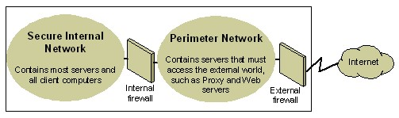

# Security Planning

Use the information in this document to help you plan for security within Microsoft Dynamics GP.

This introduction is divided into the following sections:

- *What's in this document*

- *Symbols and conventions*

- *Resources available from the Help menu*

- *Send us your documentation comments*

## What's in this document

This document is designed to make you aware of actions that you can complete to
help make your Microsoft Dynamics GP data as secure as possible.

Microsoft&reg; Windows&reg;, the foundation of Microsoft Dynamics GP, provides
sophisticated standards-based network security. In the broadest sense, security
involves planning and considering tradeoffs. For example, a computer can be
locked in a vault and only accessible to one system administrator. This computer
may be secure, but it is not very usable because it is not connected to any
other computer. You need to consider how to make the network as secure as
possible without sacrificing usability.

Most organizations plan for external attacks and construct firewalls, but many
companies do not consider how to mitigate a security breach once a malicious
user gets inside the firewall. Security measures in your organization's
environment will work well if users are not required to perform too many
procedures and steps to conduct business in a secure manner. Implementing
security policies should be as easy as possible for users or they will tend to
find less secure ways of doing things.

Since the size of Microsoft Dynamics GP implementations can vary a great deal,
it is important to carefully consider the needs of a smaller business and to
weigh the effectiveness of security against the costs that may be involved. Use
your best judgment to recommend a policy that helps to meet security needs.

The document is divided into the following information:

- *Chapter 1, "Basic security recommendations,"* provides some basic security recommendations for you to complete to help make your Microsoft Dynamics GP data as secure as possible.

- *Chapter 2, "Securing the server operating system,"* provides information about securing the server operating system.

- *Chapter 3, "Network security,"* provides information about securing your network.

- *Chapter 4, "Virus protection,"* provides information about the different types of viruses that exist and what you can do to help keep your computers from being infected by a virus.

- *Chapter 5, "Microsoft Dynamics GP security,"* provides an overview of the security features available in Microsoft Dynamics GP.

- *Chapter 6, "The Microsoft Dynamics GP database security model,"* provides information about the Microsoft Dynamics GP database security model.

- *Chapter 7, "Core application security tasks,"* lists the most secure options for completing common security tasks in Microsoft Dynamics GP.

- *Chapter 8, "Frequently asked questions,"* contains answers to frequently asked questions about security in Microsoft Dynamics GP.

## Chapter 1: Basic security recommendations

The following information contains security recommendations that you should
consider before setting up Microsoft Dynamics GP.

This information is divided into the following sections.

- *These steps must be taken to secure this installation of Microsoft Dynamics
    GP*

- *Physical security*

- *Employees*

- *System administrators*

- *Security patch management*

- *Microsoft Dynamics GP service packs*

- *Client-side security patches*

### These steps must be taken to secure this installation of Microsoft Dynamics GP

*In order to protect your Microsoft Dynamics GP environment, you must take
steps to secure communications between the Microsoft Dynamics GP client and
Microsoft SQL Server*&reg;*. Failure to adhere to this guidance will leave your
installation of Microsoft Dynamics GP susceptible to a number of serious
security threats.*

Microsoft SQL Server 2008 and SQL Sever 2012 encrypt the pre-login
credential exchange by default, but to encrypt the entire session of
communication between SQL Server and Microsoft Dynamics GP, you will need to
follow the instructions in the Microsoft SQL Server 2012 Books Online manual
or the Microsoft SQL Server 2008 Books Online manual.

For more information about securing your network, refer to the following Web
sites:

**Using Microsoft SQL Server 2008 or Microsoft SQL Server 2012**
<https://www.microsoft.com/sqlserver/2008/en/us/>

To run a secure Microsoft Dynamics GP environment, you need to follow some
general rules for administration:

- Assuming that the business owner or manager has administrative privileges,
    users, such as accounts payable coordinators, cashiers, or sales
    representatives, do not need administrative privileges over the domain.
    These user accounts should be restricted to Domain Users.

- Passwords should not be reused. It is often common practice to reuse
    passwords across systems and domains. For example, an administrator
    responsible for two domains might create domain administrator accounts in
    each that use the same password, and even set local administrator passwords
    on domain computers that are the same across the domain. In such a case, a
    compromise of a single account or computer can lead to a compromise of the
    entire domain.

- Domain administrator accounts should not be used as service accounts. It is
    also common practice to use domain administrator accounts as service
    accounts for common services such as backing up systems. However, this poses
    a security risk because the password must be stored, or cached, locally on
    every computer where the service resides. The password can easily be
    retrieved by anyone with administrative rights over the computer. In such a
    case, the compromise of one computer can lead to the compromise of the
    entire domain. Service accounts should never be domain administrator
    accounts, and they should be limited in privilege as much as possible.

- Although Microsoft Dynamics GP is supported on several operating systems, it
    is best to use the latest operating systems with the most up-to-date
    security features. Also, operating system editions that are for business
    purposes typically have more security features.

- Use the Windows Update tool provided with Windows Vista&reg;, Windows 7, Windows 8, Windows Server 2008, and Windows Server 2012 to maintain the most current security patches.

- If you plan to use Microsoft Dynamics GP Business Portal, we recommend that you implement the security recommendations mentioned in the Business Portal Installation Guide.

> [!NOTE]
> The remainder of this document contains recommendations on various methods to improve the security of your Microsoft Dynamics GP installation. Although these recommendations are strongly encouraged, they are not mandatory.

### Physical security

Physical security represents the best place to start preventing malicious attacks. For example, if a hard disk drive is stolen, eventually the data on that drive will be stolen, as well. Discuss the following physical security
issues when developing a policy with users:

- For larger deployments with dedicated IT departments, ensure that server rooms and places where software and manuals are stored are locked.

- Keep unauthorized users away from the power and reset switches on the server.

- Consider removing any removable storage devices, including CD burners, from client workstations.

- Ensure that burglar alarms are installed, regardless of how sensitive the data is.

- Ensure that backups of critical data are stored offsite and that software is stored in fire and waterproof containers when not in use.

### Employees

It is a good idea to limit administrative rights across all products and features. By default, you should give employees read-only access to system functions, unless they require greater access to perform their jobs. We recommend following the principle of least privilege: give users only the minimum privileges required to access data and functionality. For example, avoid requiring administrative rights to run features.

Disgruntled and former employees are a threat to network security. We recommend using the following policy regarding employees:

- Conduct pre-employment background investigations.

- Expect "revenge" from disgruntled employees and former employees.

- Make sure that you inactivate all associated Windows accounts and passwords when an employee leaves. For reporting purposes, do not delete users.

- Train users to be alert and to report suspicious activity.

- Do not grant privileges automatically. If users do not need access to particular computers, computer rooms, or sets of files, ensure that they do not have access.

- Train supervisors to identify and respond to potential employee problems.

- Monitor system usage for unusual activity.

- Make sure that employees understand their roles in maintaining network security.

- Give a copy of the company policies to every employee.

- Do not allow users to install their own software.

### System administrators

We highly recommend that system administrators keep up with the latest
security fixes available from Microsoft. Hackers are very adept at combining
small bugs to enable large intrusions into a network. Administrators should
first ensure that each individual computer is as secure as possible, and
then add security updates and patches. To that end, many links and resources
are provided throughout this guide to help in finding security-related
information and best practices.

Complexity introduces another set of tradeoffs for securing your network.
The more complex the network, the more difficult it will be to secure or fix
it once an intruder has successfully gained access. The administrator should
document the network topography thoroughly, and work toward keeping it as
simple as possible.

Security primarily involves risk management. Using technology alone won't
guarantee security. Effective security requires a combination of technology
and policy. That is, security ultimately depends upon the way technology is
used. Microsoft delivers security-conscious technology and features, but
only the administrator and the management can determine the right policies
for each organization. Be sure to plan for security early in the
implementation and deployment process. Understand what your company needs to
protect and what it is willing to do to protect it.

Also, develop contingency plans for emergencies before they happen and
combine thorough planning with solid technology. For more information about
general security, see [The Ten Immutable Laws of Security Administration](https://www.microsoft.com/technet/archive/community/columns/security/essays/10salaws.mspx)

### Security patch management

Operating systems and applications are often immensely complex. They can
consist of millions of lines of code, written by many different programmers.
It is essential that the software works reliably and does not compromise the
security or stability of the IT environment. To minimize any problems,
programs are tested thoroughly before release. However, attackers
continually strive to find weaknesses in software, so anticipating all
future attacks is not possible.

For many organizations, patch management will form a part of their overall
change and configuration management strategy. However, whatever the nature and
size of the organization, it is vital to have a good patch management strategy,
even if the organization does not yet have effective change and configuration
management in place. The vast majority of successful attacks against computer
systems occur to those systems where security patches have not been installed.

Security patches present a specific challenge to most organizations. Once a
weakness has been exposed in software, attackers will generally spread
information about it quickly throughout the hacker community. When a weakness
occurs in its software, Microsoft will strive to release a security patch as
soon as possible. Until the patch is deployed, the security the user depends
upon and expects may be severely diminished.

In the Windows environment, you must ensure that you have the most recent
security patches throughout your system. To ease this task, you should consider
using the technologies that Microsoft has made available. These include:

**Microsoft Security Notification Service** The Security Notification Service is
an e-mail list that distributes notices whenever an update becomes available.
These notices serve as a valuable piece of a proactive security strategy. They
are also available at the Microsoft Technical Security Notifications Web site:
[https://
www.microsoft.com/technet/security/bulletin/notify.mspx](https://www.microsoft.com/technet/security/bulletin/notify.mspx).

**Microsoft Security Bulletin Search Tool** The Microsoft Security Bulletin
Search tool is available at the HotFix & Security Bulletin Service Web site. You
can

determine which updates that you need based on the operating system,
applications, and service packs that you are currently running. For more
information about the Microsoft Security Bulletin Search Tool, see [https://
www.microsoft.com/technet/security/current.aspx.](https://www.microsoft.com/technet/security/current.aspx)

**Microsoft Baseline Security Analyzer (MBSA)** This graphical tool is available
at the Microsoft Baseline Security Analyzer Web site. This tool works by
comparing the current status of a computer against a list of updates maintained
by Microsoft. MBSA also performs some basic security checks for password
strength and expiration settings, guest account policies, and a number of other
areas. MBSA also will look for vulnerabilities in Microsoft Internet Information
Services (IIS). For more information about the Microsoft Baseline Security
Analyzer, see [https://www.microsoft.com/technet/security/tools/mbsahome.mspx.](https://www.microsoft.com/technet/security/tools/mbsahome.mspx)

**Windows Server Update Services (WSUS)** This tool enables enterprises to host
on local computers all critical updates and security rollup packages (SRPs)
available on the public Windows Update site. This tool works with a new release
of automatic update (AU) clients to form the basis for a powerful automatic
download and install strategy. The new AU client set includes a client for
Windows Server 2012 operating system and has the ability to automatically
install downloaded updates. For more information about Microsoft WSUS, see
[Get Started with Windows Server 2016](/windows-server/get-started/server-basics).

**Microsoft Systems Management Server (SMS) Software Update Services** The SMS Software Update Services contains a number of tools aimed
at easing the process of issuing software updates throughout the enterprise. The
tools include a Security Update Inventory Tool, a Microsoft Office Inventory
Tool for Updates, the Distribute Software Updates Wizard, and an SMS Web Reporting
Tool with Web Reports Add-in for Software Updates. If you're using these
tools, you should consider migrating to a newer technology: Microsoft System
Center Configuration Manager. For more information, see
[Windows Admin Center](/windows-server/manage/windows-admin-center/overview).

**Microsoft System Center Configuration Manager** System Center Configuration Manager comprehensively assesses, deploys, and updates servers, client computers, and devices—across physical, virtual, distributed, and mobile environments. For more information, see For more information, see [Windows Admin Center](/windows-server/manage/windows-admin-center/overview).

We recommend that you consider each of these security tools and encourage
their use. It is very important that security issues are addressed as
quickly as possible, while maintaining the stability of the environment.

### Microsoft Dynamics GP service packs

Microsoft Dynamics GP security patches are released as part of service packs or hotfixes. Service packs and hotfixes are can be found [here](/dynamics/s-e/gp/mdgp2018_release_download_378). You should regularly check this site to ensure that you are fully up to date on any security issues specifically affecting Microsoft Dynamics GP. All service packs and hotfixes are cumulative patches. Up-to-date instructions on upgrading to the most recent release of Microsoft Dynamics GP can be found at [Upgrade checklist](../upgrade/upgrade-checklist.md) <!--[https://go.microsoft.com/fwlink/?LinkId=249465](https://go.microsoft.com/fwlink/?LinkId=161199)-->.

### Client-side security patches

Microsoft Dynamics GP users can ensure that their client computers are
current on security patches for Microsoft Windows Vista, Windows 7, Windows
8, Windows Server 2008, and Windows 2012 by using the Windows Update tool
provided with these systems. Also, if Microsoft Security Update Services is
installed on the server, much of the update process can be automated
internally by the organization's IT department.

## Chapter 2: Securing the server operating system

The following information provides some of the best practices for securing
server operating systems. This information should be considered before you
implement Microsoft Dynamics GP.

This information is divided into the following sections.

- *Server operating system security*

- *Authentication*

- *Password protection*

- *Strong passwords*

- *Defining the password policy*

- *Defining an account lockout policy*

- *Access control*

- *Single sign-on*

- *External security firewall*

- *ISA Server*

- *Additional security settings for SQL Server*

### Server operating system security

Some smaller businesses do not have a server operating system. Nevertheless,
it is important for managers of small businesses to understand many of the
same security best practices that apply to larger businesses with more
complex network environments. Be aware that many of the policies and
practices throughout this document can easily be applied to businesses with
only client operating systems.

For more information about Windows Server, see [Windows Server documentation](/windows-server/).

The most important features of the Windows server security model are
authentication, access control, and single sign-on, as described below.

- Authentication represents the process by which the system validates a user's
    identity through his or her login credentials. A user's name and password
    are compared against an authorized list. If the system detects a match,
    access is granted to the extent specified in the permissions list for that
    user.

- Access control limits user access to information or computing resources
    based on the users' identity and their membership in various predefined
    groups. Access control is typically used by system administrators for
    controlling user access to network resources such as servers, directories,
    and files; and is typically implemented by granting permissions to users and
    groups for access to specific objects.

- Single sign-on allows a user to log in to the Windows domain once, using a
    single password, and authenticate to any computer in the Windows domain.
    Single sign-on enables administrators to implement secure password
    authentication across the Windows network, while providing end users with
    ease of access.

The following topics provide a more detailed description of these three key
features for securing your computing environment.

### Authentication

Authentication is a fundamental aspect of system security. It confirms the
identity of any user trying to log in to a domain or access network
resources. The weak link in any authentication system is the user's
password.

Passwords provide the first line of defense against unauthorized access to
the domain and local computers. We recommend using password best practices,
where appropriate, for your organization. For more information, refer to
*Password protection* on page 12, *Strong passwords* on page 12, and
*Defining the password policy* on page 14.

### Password protection

It always is important that users use passwords and follow these password
recommendations.

- Always require strong passwords. For more information, see *Strong
    passwords* on page 12.

- If passwords must be written down on a piece of paper, store the paper in a
    secure place and destroy it when it is no longer needed.

- Never share passwords with anyone.

- Use different passwords for all user accounts.

- Change passwords immediately if they have been compromised.

- Be careful about where passwords are saved on computers. Some dialog boxes,
    such as those for remote access and other telephone connections, present an
    option to save or remember a password. Selecting this option poses a
    potential security threat because the password is stored in the system
    registry.

### Strong passwords

The role that passwords play in securing an organization's network is often
underestimated and overlooked. As mentioned, passwords provide the first
line of defense against unauthorized access to your organization. Windows
Server 2012 and Windows Server 2008 have a feature that checks the
complexity of the password for the Administrator account during the setup of
the operating system. If the password is blank or does not meet complexity
requirements, the Windows Setup dialog box appears, warning of the dangers
of not using a strong password for the Administrator account.

In a workgroup environment, a user will not be able to access a computer
over the network using an account with a blank password. Weak passwords
provide attackers with easy access to computers and the network, while
strong passwords are considerably harder to crack, even with the
password-cracking software that is available today.

Password-cracking tools continue to improve, and the computers used to crack
passwords are more powerful than ever. Password-cracking software uses one
of three approaches: intelligent guessing, dictionary attacks, and
brute-force automated attacks that try every possible combination of
characters. Given enough time, the automated method can crack any password.
However, strong passwords are much harder to crack than weak passwords. A
secure computer has strong passwords for all user accounts.

A weak password:

- Is no password at all.

- Contains the user's user name, real name, or company name.

- Contains a complete dictionary word. For example, the word Password is a
    weak password.

A strong password:

- Is at least seven characters long.

- Does not contain the user's name, real name, or company name.

- Does not contain a complete dictionary word.

- Is significantly different from previous passwords. Passwords that increment
    (Password1, Password2, Password3...) are not strong.

- Contains characters from each of the four groups listed in the following
    table.

| **Group**         | **Example**                                                         |
|-------------------|---------------------------------------------------------------------|
| Uppercase letters | A B C D                                                             |
| Lowercase letters | a b c d                                                             |
| Numerals          | 0 1 2 3 4                                                           |
| Symbols           | ' \~ \@ \# \$ % \^ & \* ( ) \_ + - = { } [ ] \\ : " ; \< \> ? , . / |

Examples of strong passwords are Pa\$sw0rD and J\*p2le04\>F.

A password can meet most of the criteria of a strong password but still be
rather weak. For example, Hello2U! is a relatively weak password even though
it meets most of the criteria for a strong password and also meets the
complexity requirements of password policy. H!elZl2o is a strong password
because the dictionary word is interspersed with symbols, numbers, and other
letters. It is important to educate all users about the benefits of using
strong passwords and to teach them how to create passwords that are actually
strong.

Passwords can be created containing characters from the extended ASCII
character set. Using extended ASCII characters increases the number of
characters that users can choose when they create passwords. As a result, it
might take more time for password-cracking software to crack passwords that
contain these extended ASCII characters than it does to crack other
passwords. Before using extended ASCII characters in a password, test them
thoroughly to make sure that passwords containing extended ASCII characters
are compatible with other applications that the organization uses. Be
especially cautious about using extended ASCII characters in passwords if
the organization uses several different operating systems.

You can find extended ASCII characters in the Character Map. Some extended
ASCII characters should not be used in passwords. Do not use a character if
a keystroke is not defined for it in the lower-right corner of the Character
Map dialog box. For more information about how to use Character Map, see
Windows Server Online Help.

Examples of passwords that contain characters from the extended ASCII
character set are kUµ!0o and Wf&copy;\$0k\#"g¤5ªrd.

You can implement a password policy that enforces password complexity
requirements. For more information about this policy, see "Password Must
Meet Complexity Requirements" in Windows Server Online Help.

Windows passwords can be up to 127 characters long.

### Defining the password policy

When defining a password policy, be sure to create a policy that will
require all user accounts to have strong passwords. The following Windows
Server settings require strong passwords.

- Define the Enforce password history policy setting so that several previous
    passwords are remembered. With this policy setting, users cannot use the
    same password when their password expires.

- Define the Maximum password age policy setting so that passwords expire as
    often as necessary for the client's environment, typically, every 30 to 90
    days.

- Define the Minimum password age policy setting so that passwords cannot be
    changed until they are more than a certain number of days old. This policy
    setting works in combination with the Enforce password history policy
    setting. If a minimum password age is defined, users cannot repeatedly
    change their passwords to get around the Enforce password history policy
    setting and then use their original passwords. Users must wait the specified
    number of days to change their passwords.

- Define a Minimum password length policy setting so that passwords must
    consist of at least a specified number of characters. Long passwords-seven
    or more characters-are usually stronger than short ones. With this policy
    setting, users cannot use blank passwords and they need to create passwords
    that are at least a certain number of characters long.

- Enable the Password must meet complexity requirements policy setting. This
    policy setting checks all new passwords to ensure that they meet basic
    strong password requirements. For a full list of these requirements, see
    "Password Must Meet Complexity Requirements" in Windows Server Online Help.

### Defining an account lockout policy

Be cautious when defining the account lockout policy. The account lockout
policy should not be set haphazardly. Although the probability of thwarting
an unauthorized attack on your organization is increased with account
lockout policy, it is possible to also unintentionally lock out authorized
users, which can be very costly for your organization.

If you decide to apply account lockout policy, set the Account lockout
threshold policy setting to a high enough number that authorized users are
not locked out of their user accounts simply because they type a password
incorrectly.

Authorized users can be locked out if they change their passwords on one
computer, but not on another computer. The computer that is still using the
old password will continuously attempt to authenticate the user with the old
password, and it will eventually lock out the user account. This might be a
costly consequence of defining account lockout policy, because the
authorized users cannot access network resources until their accounts are
restored. This issue does not exist for organizations that use only domain
controllers that are members of Windows Server family.

You can search Windows Server Help for information about account lockout
policy and how to apply or modify the account lockout policy.

### Access control

A Windows network and its resources can be secured by considering what
rights that users, groups of users, and other computers have on the network.
You can secure a computer or multiple computers by granting users or groups
specific user rights. You can secure an object, such as a file or folder, by
assigning permissions to allow users or groups to perform specific actions
on that object. The following key concepts make up access control:

- Permissions

- Ownership of objects

- Inheritance of permissions

- User rights

- Object auditing

#### Permissions

Permissions define the type of access granted to a user or group for an
object or object property such as files, folders, and registry objects.
Permissions are applied to any secured objects such as files or registry
objects. Permissions can be granted to any user, group, or computer. It is a
good practice to assign permissions to groups.

#### Ownership of objects

When a member of the Administrators group creates an object in Windows
Server, the Administrators group becomes the owner, rather than the
individual account that created the object. This behavior can be changed
through the Local Security Settings Microsoft Management Console (MMC)
snap-in, using the setting System objects: Default owner for objects created
by members of the Administrators group. No matter what permissions are set
on an object, the owner of the object can always change the permissions on
an object. For more information, see "Manage Object Ownership" in Windows
Server Help.

#### Inheritance of permissions

Inheritance allows administrators to easily assign and manage permissions.
This feature automatically causes objects within a container to inherit all
the inheritable permissions of that container. For example, the files within
a folder, when created, inherit the permissions of the folder. Only
permissions marked to be inherited will be inherited.

#### User rights

User rights grant specific privileges and login rights to users and groups
in your computing environment. For information about user rights, see "User
Rights" in Windows Server Online Help.

#### Object auditing

You can audit users' access to objects. You can then view these
security-related events in the security log using the Event Viewer. For more
information, see "Auditing" in Windows Server Online Help.

#### Access control best practices

Use the following information when you are assigning or denying access to
the server operating system.

- Assign permissions to groups rather than to users. Because it is inefficient
    to maintain user accounts directly, assigning permissions on a user basis
    should be the exception.

- Use Deny permissions for certain special cases. For instance, you can use
    Deny permissions to exclude a subset of a group that has Allow permissions.
    Use Deny permissions to exclude one special permission when you have already
    granted full control to a user or group.

- Never deny the Everyone group access to an object. If you deny everyone
    permission to an object, that includes administrators. A better solution
    would be to remove the Everyone group, as long as you give other users,
    groups, or computers permissions to that object.

- Assign permissions to an object as high on the tree as possible and then
    apply inheritance to propagate the security settings through the tree. You
    can quickly and effectively apply access control settings to all children or
    a subtree of a parent object. By doing this, you gain the greatest breadth
    of effect with the least effort. The permission settings that you establish
    should be adequate for the majority of users, groups, and computers.

- Explicit permissions can sometimes override inherited permissions. Inherited
    Deny permissions do not prevent access to an object if the object has an
    explicit Allow permission entry. Explicit permissions take precedence over
    inherited permissions, even inherited Deny permissions.

- For permissions on Active Directory&reg; objects, be sure that you understand
    the best practices specific to Active Directory objects. For more
    information, search for "Active Directory objects" in Windows Server 2012
    Online Help.

### Single sign-on

A key feature of Windows Server family authentication is its support of
single sign-on. Single sign-on allows a user to log in to the Windows domain
once, using a single password, and authenticate to any computer in the
Windows domain without having to reenter that password.

Single sign-on provides two main security benefits. For a user, the use of a
single password or smart card reduces confusion and improves work
efficiency. For administrators, the amount of administrative support
required for domain users is reduced, because the administrator needs to
manage only one account per user.

Authentication, including single sign-on, is implemented as a two-part
process: interactive logon and network authentication. Successful user
authentication depends on both of these processes. For more information
about how to configure the Windows single sign-on feature, see Windows
Server Online Help.

### External security firewall

A firewall is hardware or software that prevents data packets from either
entering or leaving a specified network. To control the flow of traffic,
numbered ports in the firewall are either opened or closed to information
packets. The firewall looks at several pieces of information in each
arriving or departing packet:

- The protocol through which the packet is being delivered

- The destination or sender of the packet

- The type of content that is contained in the packet

- The port number to which it is being sent

If the firewall is configured to accept the specified protocol through the
targeted port, the packet is allowed through.

### ISA Server

Internet Security and Acceleration (ISA) Server securely routes requests and
responses between the Internet and client computers on the internal network.

ISA Server acts as the secure gateway to the Internet for clients on the
local network. The ISA Server computer is transparent to the other parties
in the communication path. The Internet user should not be able to tell that
a firewall server is present, unless the user attempts to access a service
or go to a site where the ISA Server computer denies access. The Internet
server that is being accessed interprets the requests from the ISA Server
computer as if the requests originated from the client application.

Microsoft Forefront Threat Management Gateway 2010 (TMG) protects your
employees from Web-based threats. Deployed on your corporate network as a
unified gateway, Forefront TMG 2010 inspects web traffic at the network,
application and content layers to help ensure comprehensive protection. It
also improves your organization's firewall performance by offloading
processor-intensive functions like inspection for malware. For more
information, see [Windows Server Security and Assurance](/windows-server/security/security-and-assurance).

### Additional security settings for SQL Server

Whether you are using SQL Server 2012 or SQL Server 2008 with Microsoft Dynamics GP, it is important that you take measures to increase the security
of your SQL Server installation. The following steps will help increase SQL Server security:

- Be sure that the latest operating system and SQL Server service packs and updates are installed. For the latest details, see the [Microsoft Security & Privacy Web site](https://support.microsoft.com/en-us/topic/about-microsoft-privacy-and-security-policy-e7d87d58-c2c4-4115-8dd8-c771eb36f37d).

- For file system-level security, be sure that all SQL Server data and system files are installed on NTFS partitions. You should make the files accessible
    only to administrative or system-level users through NTFS permissions. This will safeguard against users accessing those files when the SQL Server service (MSSQLSERVER) is not running.

- Use a low-privilege domain account or the LocalSystem account for SQL Server service (MSSQLSERVER). This account should have minimal rights in the domain and should help contain - but not stop - an attack to the server in case of compromise. In other words, this account should have only local user-level permissions in the domain. If SQL Server is using a domain administrator account to run the services, a compromise of the server will lead to a compromise of the entire domain. To change this setting, use SQL Server Management Studio. The access control lists (ACLs) on files, the registry, and user rights will be changed automatically.

For the most up-to-date SQL Server security information for SQL Server 2008 or SQL Server 2012, see [https://www.microsoft.com/sqlserver/2008/en/us/
Security.aspx.](https://www.microsoft.com/sqlserver/2008/en/us/Security.aspx)

## Chapter 3: Network security

Use the following information to learn more about keeping your network
secure.

This information is divided into the following sections.

- *Strategies for network security*

- *Wireless networks*

- *Network security scenarios*

### Strategies for network security

Because the design and deployment of an IP internetworking environment
requires balancing private and public network concerns, the firewall has
become a key ingredient in safeguarding network integrity. A firewall is not
a single component. The National Computer Security Association (NCSA)
defines a firewall as "a system or combination of systems that enforces a
boundary between two or more networks." Although different terms are used,
that boundary is frequently known as a perimeter network. The perimeter
network protects your intranet or enterprise local area network (LAN) from
intrusion by controlling access from the Internet or other large networks.

The illustration below shows a perimeter network bounded by firewalls and
placed between a private network and the Internet in order to secure the
private network.



(SPNET.jpg)

Organizations vary in their approach to using firewalls for providing
security. IP packet filtering offers weak security, is cumbersome to manage,
and is easily defeated. Application gateways are more secure than packet
filters and easier to manage because they pertain only to a few specific
applications, such as a particular e-mail system. Circuit gateways are most
effective when the user of a network application is of greater concern than
the data being passed by that application. The proxy server is a
comprehensive security tool that includes an application gateway, safe
access for anonymous users, and other services. Here is additional
information about each of these different options:

**IP Packet Filtering** IP packet filtering was the earliest implementation
of firewall technology. Packet headers are examined for source and
destination addresses, Transmission Control Protocol (TCP), and User
Datagram Protocol (UDP) port numbers, and other information. Packet
filtering is a limited technology that works best in clear security
environments where, for example, everything outside the perimeter network is
not trusted and everything inside is. In recent years, various vendors have
improved on the packet filtering method by adding intelligent
decision-making features to the packet-filtering core, thus creating a new
form of packet filtering called stateful protocol inspection. You can
configure packet filtering to either (1) accept specific types of packets
and deny all others or (2) deny specific types of packets and accept all
others.

**Application Gateways** Application gateways are used when the actual
content of an application is of greatest concern. That they are
application-specific is both their strength and their limitation, because
they do not adapt easily to changes in technology.

**Circuit Gateways** Circuit gateways are tunnels built through a firewall
connecting specific processes or systems on one side with specific processes
or systems on the other. Circuit gateways are best employed in situations
where the person using an application is potentially a greater risk than the
information carried by the application. The circuit gateway differs from a
packet filter in its ability to connect to an out-of-band application scheme
that can add additional information.

**Proxy Servers** Proxy servers are comprehensive security tools, which
include firewall and application gateway functionality, that manage Internet
traffic to and from a LAN. Proxy servers also provide document caching and
access control. A proxy server can improve performance by caching and
directly supplying frequently requested data, such as a popular Web page. A
proxy server can also filter and discard requests that the owner does not
consider appropriate, such as requests for unauthorized access to
proprietary files.

Be sure to take advantage of firewall security features that can help your
organization. Position a perimeter network in the network topology at a
point where all traffic from outside the corporate network must pass through
the perimeter maintained by the external firewall. You can fine-tune access
control for the firewall to meet your organization's needs and you can
configure firewalls to report all attempts at unauthorized access.

To minimize the number of ports that you need to open on the inner firewall,
you can use an application layer firewall, such as ISA Server.

### Wireless networks

By default, wireless networks are typically configured in a manner that
allows eavesdropping on the wireless signals. They can be vulnerable to a
malicious outsider gaining access because of the default settings on some
wireless hardware, the accessibility that wireless networks offer, and
present encryption methods. There are configuration options and tools that
can protect against eavesdropping, but keep in mind that they do nothing to
protect the computers from hackers and viruses that enter through the
Internet connection. Therefore, it is extremely important to include a
firewall to protect the computers from unwanted intruders on the Internet.

For more information about protecting a wireless network, see [How to Make your 802.11b Wireless Home Network More Secure](https://support.microsoft.com/default.aspx?scid=kb;en-us;309369).

### Network security scenarios

The level of network security that your organization requires will depend on
several factors. It usually comes down to a compromise between budget and
the need to keep the corporate data safe. It is possible for a small company
to provide a very complex security structure that will provide the highest
level of network security possible, but a small company may not be able to
afford that level of security. In this section, we will review four
scenarios and make recommendations in each that will provide varying levels
of security at a relative cost.

**No Firewall** If your organization has a connection to the Internet but no
firewall, some measure of network security needs to be implemented. There
are simple network firewall appliances, as described in the next section,
that provide enough security to deter most would-be hackers.

**One Simple Firewall** The minimum level of security recommended is a
single firewall between the Internet and your data. This firewall may not
provide any level of advanced security and should not be considered very
secure. But it is better than nothing.


Hopefully, your budget will allow for a more secure solution that will
protect your corporate data. One such solution is ISA Server. The increased
cost of this additional server provides a great deal more security than a
typical consumer firewall, since it usually provides only network address
translation (NAT) and packet filtering.


This single firewall solution is more secure than an entry-level firewall
appliance and provides Windows-specific security services.

**One Existing Firewall** If you have an existing firewall that separates
your intranet from the Internet, you may want to consider an additional
firewall that provides multiple ways to configure internal resources to the
Internet.

One such method is Web publishing. This is when an ISA Server is deployed in
front of an organization's Web server that is providing access to Internet
users. With incoming Web requests, ISA Server can impersonate a Web server
to the outside world, fulfilling client requests for Web content from its
cache. ISA Server forwards requests to the Web server only when the requests
cannot be served from its cache.

Another method is server publishing. ISA Server allows publishing internal
servers to the Internet without compromising the security of the internal
network. You can configure Web publishing and server publishing rules that
determine which requests should be sent to a server on the local network,
providing an increased layer of security for the internal servers.


**Two Existing Firewalls** The fourth scenario involves the two firewalls
implemented with an established perimeter network (DMZ). One or more of
these servers provides reverse proxy services so that Internet clients are
not accessing servers on the intranet directly. Instead, one of the
firewalls, ideally the internal firewall, is intercepting network requests
for internal servers, inspecting those packets, and then forwarding them on
behalf of the Internet host.


This scenario is similar to the preceding scenario after the second firewall
is added.

The only difference is that the internal firewall that supports reverse
proxy is not an ISA Server. In this scenario, you should work closely with
the managers of each firewall to define server publishing rules that adhere
to the security policy.

## Chapter 4: Virus protection

Use the following information to learn about the different types of computer
viruses and what you can do to help keep the computers within your company
from being infected by a computer virus.

This information is divided into the following sections.

- *Overview of viruses*

- *Types of viruses*

### Overview of viruses

A computer virus is an executable file that is designed to replicate itself,
erase or corrupt data files and programs, and avoid detection. In fact,
viruses are often rewritten and adjusted so that they cannot be detected.
Viruses are often sent as email attachments. Antivirus programs must be
updated continuously to look for new and modified viruses. Viruses are the
number one method of computer vandalism.

Antivirus software is specifically designed for the detection and prevention
of virus programs. Because new virus programs are created all the time, many
makers of antivirus products offer periodic updates of their software to
customers. Microsoft strongly recommends implementing antivirus software in
your organization's environment.

Virus software is usually installed at each of these three places: user
workstations, servers, and the network where e-mail comes into (and in some
cases, leaves) the organization.

For more information about viruses and computer security in general, refer
to the following Microsoft Security Web sites:

- [Microsoft Security & Privacy](https://support.microsoft.com/en-us/topic/about-microsoft-privacy-and-security-policy-e7d87d58-c2c4-4115-8dd8-c771eb36f37d).

- [Security documentation on Microsoft TechNet](https://www.microsoft.com/technet/security/Default.mspx).

### Types of viruses

There are four main types of viruses that infect computer systems:
boot-sector viruses, file-infecting viruses, Trojan horse programs, and
macro viruses.

**Boot-Sector viruses** When a computer starts, it scans the boot sector of
the hard disk before loading the operating system or any other startup
files. A bootsector virus is designed to replace the information in the hard
disk's boot sectors with its own code. When a computer is infected with a
boot-sector virus, the virus' code is read into memory before anything else.
After the virus is in memory, it can replicate itself onto any other disks
that are in use in the infected computer.

**File-Infecting viruses** The most common type of virus, a file-infecting
virus, attaches itself to an executable program file by adding its own code
to the executable file. The virus code is usually added in such a way that
it escapes detection. When the infected file is run, the virus can attach
itself to other executable files. Files infected by this type of virus
usually have a .com, .exe, or .sys file name extension.

Some file-infecting viruses are designed for specific programs. Program
types that are often targeted are overlay (.ovl) files and dynamic-link
library (.dll) files. Although these files are not run, executable files
call them. The virus is transmitted when the call is made.

Damage to data occurs when the virus is triggered. A virus can be triggered
when an infected file is run or when a particular environment setting is met
(such as a specific system date).

**Trojan horse programs** A Trojan horse program is not really a virus. The
key distinction between a virus and a Trojan horse program is that a Trojan
horse program does not replicate itself; it only destroys information on the
hard disk. A Trojan horse program disguises itself as a legitimate program,
such as a game or utility. When it's run, though, it can destroy or scramble
data.

**Macro viruses** A macro virus is a type of computer virus that's stored in
a macro within a file, template, or add-in. The spread of a macro virus can
be prevented. Here are some tips to avoid infection that you should share
with your organization.

- Install a virus protection solution that scans incoming messages from the
    Internet for viruses before the messages pass the router. This will ensure
    that emails are scanned for known viruses.

- Know the source of the documents that are received. Documents should not be
    opened unless they are from someone that the user feels is trustworthy.

- Talk to the person who created the document. If the users are at all unsure
    whether the document is safe, they should contact the person who created the
    document.

- Use the Microsoft Office macro virus protection. In Office, the applications
    alert the user if a document contains macros. This feature allows the user
    to either enable or disable the macros as the document is opened.

- Use virus-scanning software to detect and remove macro viruses.
    Virus-scanning software can detect and often remove macro viruses from
    documents. Microsoft recommends the use of antivirus software that is
    certified by the International Computer Security Association (ICSA).

- Set the macro security level of Microsoft Office files to High or Medium and
    use digital signatures. A digital signature is an electronic,
    encryption-based, secure stamp of authentication on a macro or document.
    This signature confirms that the macro or document originated from the
    signer and has not been altered. For more information about Microsoft Office
    security features, visit the Microsoft Office Online Web site
    ([https://office.microsoft.com/default.aspx)](https://office.microsoft.com/default.aspx).

## Chapter 5: Microsoft Dynamics GP security

Microsoft Dynamics GP provides several types of security. The following
information is an overview of the security features in Microsoft Dynamics
GP.

For step-by-step instructions on setting up security within the Microsoft
Dynamics GP application, see Part 2: User Setup of the Microsoft Dynamics GP
System Setup manual.

The Microsoft Dynamics GP System Setup manual can be accessed by choosing the Printable Manuals option from the Microsoft Dynamics GP Help menu, or [here](SystemSetup.md).

Microsoft Dynamics GP uses Microsoft SQL Server fixed and database roles for more effective security management.

This information is divided into the following sections.

- *Areas that are affected by security settings*

- *Granting security access*

- *How passwords are used in Microsoft Dynamics GP*

- *Items that you can set security for*

- *Application security*

- *Microsoft Dynamics GP Utilities security*

- *Security troubleshooting*

### Areas that are affected by security settings

The following areas of Microsoft Dynamics GP are affected by security
settings.

**System** System security controls access to systemwide setup information,
such as setting up new user records, assigning user security or printing
reports that contain that information. System level security is controlled
through the use of a password; only a few people should know the password.

**Company** Company security controls access to companies on a per-user
basis. When you set up a new user record, that person doesn't have access to
any companies. You'll need to grant access, using the User Access Setup
window, before the user can log in to Microsoft Dynamics GP.

**Security tasks** Security tasks are assigned to roles and grant access to
windows, reports, files, and other resources within Microsoft Dynamics GP
that users need to access to complete a specific task. Some default security
tasks have been created for you. For example, the DEFAULTUSER task allows
users to access things that most users will need to access in Microsoft
Dynamics GP.

**Security roles** Security roles contain the security tasks that a user
needs to access to do their job. Some default security roles have been
created for you. For example, the ACCOUNTING MANAGER\* role contains
security tasks that allow a user who is assigned to this role to view
General Ledger account information, enter journal entries, enter bank
transactions, and perform other tasks that an accounting manager might need
to perform.

**Individual users** Individual security is role-based in Microsoft Dynamics
GP.

Each user must be assigned to a security role before they can access any
forms,

reports, or other data within Microsoft Dynamics GP. To begin assigning user
security, identify the daily tasks that a user completes within Microsoft
Dynamics GP. Then either select from the default security roles or create
new security roles that only grant access to the tasks that the user needs.

For example, user ABC is an accounting manager for Fabrikam, Inc., and needs
access to set up General Ledger, taxes, bank accounts, and credit cards as
well as perform many other accounting tasks. Review the default security
roles in Microsoft Dynamics GP to find one that grants access to the
appropriate accounting functionality for user ABC. For our example, the
ACCOUNTING MANAGER\* security role is appropriate for user ABC. Use the User
Security Setup Window to assign the ACCOUNTING MANAGER\* security role to
user ABC in the Fabrikam, Inc. company.

**Module-specific tasks** Most Microsoft Dynamics GP modules have specific
tasks that can be set up to require a password; each task can have a
different password. If a password is required, all users attempting to
complete that task must enter the password. See the setup documentation for
each accounting module for information about these passwords.

**Account** Account level security enhances security and account views.
Users can enter, edit, and view information from a reduced account set based
on the access granted for accounts.

**Field level security** Field level security restricts access to any field,
window, or form in Microsoft Dynamics GP. It allows you to apply a password,
or to make a window or form unavailable. It also allows you to hide, lock,
or apply passwords to fields.

### Granting security access

A system administrator can grant access to parts of the Microsoft Dynamics
GP system in all companies for individual users.

If you use Report Writer or Modifier to modify forms or reports, an
administrator must add those modified forms or reports to an
Alternate/Modified Forms and Reports ID and then assign that
Alternate/Modified Forms and Reports ID to each user that should be able to
view those modified forms or reports.

**Individual users** Individual security is role-based in Microsoft Dynamics
GP. Each user must be assigned to a security role before they can access any
forms, reports, or other data within Microsoft Dynamics GP. To begin
assigning user security, identify the daily tasks that a user completes
within Microsoft Dynamics GP. Then either select from the default security
roles or create new security roles that only grant access to the tasks that
the user needs.

For example, user ABC is an accounting manager for Fabrikam, Inc., and needs
access to set up General Ledger, taxes, bank accounts, and credit cards as
well as perform many other accounting tasks. Review the default security
roles in Microsoft Dynamics GP to find one that grants access to the
appropriate accounting functionality for user ABC. For our example, the
ACCOUNTING MANAGER\* security role is appropriate for user ABC. Use the User
Security Setup Window to assign the ACCOUNTING MANAGER\* security role to
user ABC in the Fabrikam, Inc. company.

**Module-specific tasks** Most Microsoft Dynamics GP modules have specific
tasks that can be set up to require a password; each task can have a
different password. If a password is required, all users attempting to
complete that task must enter the password. See the setup documentation for
each accounting module for information about these passwords.

### How passwords are used in Microsoft Dynamics GP

Microsoft Dynamics GP uses passwords to control access to a company and
selected parts of the accounting system. Passwords can contain uppercase and
lowercase letters, numeric characters, punctuation, and embedded spaces.
There are three types of passwords.

**User passwords** User passwords control whether a particular user has
access to Microsoft Dynamics GP. User passwords are initially set up in the
User Setup window by an administrator or entered during the initial
Microsoft Dynamics GP installation process. Users can change their own
passwords using the User Password Setup window.

**System passwords** The system password controls access to systemwide setup
information, such as setting up new user records, assigning user security,
or printing reports that contain that information. The system password is
set up using the System Password Setup window. Only a few people should know
the system password.

**Task passwords** Most Microsoft Dynamics GP modules have specific tasks
that can be set up to require a password; each task can have a different
password. If a password is required, all users attempting to complete that
task must enter the password. See the setup documentation for each
accounting module for information about these passwords.

### Items that you can set security for

You can set security for the following items in Microsoft Dynamics GP and
integrating products.

| **Item**        | **Description**     |
|-----------------|---------------------|
| Windows   | Windows in the selected product. |
| Reports  | Reports in the selected product. |
| Modified windows   | Windows customized using Modifier. |
| Modified reports    | Primary copies of reports created using Report Writer. Note: The Report Writer name of the report appears in the list. The Report Writer name is the one that appears in the title bar of the Screen Output window when you print a report. |
| Files | Tables in the selected product. |
| Alternate Microsoft Dynamics GP reports\*    | Microsoft Dynamics GP reports that have been incorporated into integrating products you've installed. |
| Alternate Microsoft  | Microsoft Dynamics GP windows that have been incorporated into integrating products you've installed. |
| Modified alternate Microsoft Dynamics GP reports\*     | Alternate reports that have been modified using Report Writer. |
| Modified alternate     | Alternate windows that have been modified using Modifier. |
| Custom reports     | Secondary copies and new reports created in Report Writer. |
| Advanced financial reports    | Modified advanced financial reports  |
| Series posting permissions   | Specific posting tasks for each Microsoft Dynamics GP product you've purchased. |
| Customization Tools   | Tools you use to customize the accounting system, such as Report Writer or the Modifier. New users don't have access to these by default. They need to be granted access. |
| Microsoft Dynamics GP import \*\*   | The Microsoft Dynamics GP Integration Manager. This also sets up security for the Import Utility with Microsoft Dynamics GP. New users don't have access to these by default. They need to be granted access.                          |
| Document access      | Quotes, orders, invoices, returns, and back orders for Sales Order Processing. Standard and drop-ship purchase orders for Purchase Order Processing. |
| Letters   | Letters to customers, employees, and vendors that are available using the Letter Writing Assistant. |
| Navigation Lists      | Default primary lists. Note: If you restrict access to a primary list, access to any list view that is based on that primary list is also restricted. |
| \*These items appear only if you're using an integrating product and have selected it in the Product list. |  |

Dynamics GP windows\*

\*\*These types appear only if the corresponding item is installed and
registered.

### Application security

Use the following information to better understand how Microsoft Dynamics GP
handles application security.

- Tasks that must be completed by an administrator include making backups,
    creating companies, and creating new user IDs.

- The database owner is set to DYNSA for every Microsoft Dynamics GP database.
    It is essential that DYNSA continue to be the owner of every Microsoft
    Dynamics GP database. If a different owner is assigned, complications can
    arise when deleting user accounts and granting access to companies.

- The DYNSA and sa users automatically are assigned to the POWERUSER security
    role. Any user who is assigned to the POWERUSER security role will have
    access to everything in Microsoft Dynamics GP, with the exception of private
    lists.

- All users must have valid passwords to log in to the application. If a blank
    password is detected, the user is forced to change the password before
    logging into the application. We also recommend that all inactive user
    accounts be deleted or assigned a valid password and removed from all
    company access.

- Lesson Users only have access to the sample company.

- Each new security role that is created automatically contains the
    DEFAULTUSER security task. The DEFAULTUSER security task provides access to
    things that most users will typically need access to in Microsoft Dynamics
    GP.

### Microsoft Dynamics GP Utilities security

Any member of the SysAdmin fixed server role can upgrade from a previous
release or install Microsoft Dynamics GP.

### Security for new installations

Microsoft Dynamics GP Utilities checks to see whether the DYNSA login
exists. If it doesn't exist, the login is created and the DYNSA user must
enter a password to continue. DYNSA is set as the database owner for ALL
Microsoft Dynamics GP databases.

- When the DYNSA login is created, the login is assigned to the SecurityAdmin
    and dbCreator Fixed Server Roles.

- Any user with the correct SQL permissions can install Microsoft Dynamics GP.

- When installing the sample company, passwords must be provided when creating
    the LESSON USER accounts.

- When the DYNSA, LESSONUSER1, and LESSONUSER2 logins are created, they do not
    have access to the SY02400 table (System Password Master Table). This means
    that these logins also will not be able to access this table using Report
    Writer.

### Upgrading from a previous release

- When the system administrator ("sa") logs into Microsoft Dynamics GP
    Utilities, the application checks to see if the password for DYNSA is either
    \<blank\> or ACCESS. If either of these is true, the user must enter a new
    DYNSA password before continuing with the upgrade.

- Access to the SY02400 table (System Password Master Table) in Report Writer
    is removed for all users.

- When the DYNSA login is created, the login automatically is assigned to the
    SecurityAdmin and dbCreator Fixed Server Roles.

### Security troubleshooting

Many of the processes in Microsoft Dynamics GP, such as posting or printing,
require that the user performing the process be able to access multiple
windows, reports, and tables. If a user is denied access to an item that's
part of a process, the user won't be able to complete that process. A
message may appear stating that the user doesn't have privileges to open the
resource. However, a message might not always be displayed indicating the
problem. Denying access to tables only denies access to reports that access
the table.

If a user encounters problems completing a process, verify that the roles
that are assigned to the user in the User Security Setup window contain the
tasks that the user needs to complete the process. The problem may be caused
by the user not having access to all the items used in the process.

## Chapter 6: The Microsoft Dynamics GP database security model

Use this information to learn about the Microsoft Dynamics GP database
security model.

This information is divided into the following sections.

- *Password security*

- *DYNGRP database role*

- *SysAdmin fixed server role*

- *SQL Server fixed database roles beginning with "rpt_"*

### Password security

User accounts must be created within the Microsoft Dynamics GP application
to ensure that security is applied to all Microsoft Dynamics GP windows and
reports. Microsoft Dynamics GP encrypts the password during the user
creation process before it is passed to Microsoft SQL Server. For example,
if a user account is created with a password of '1234,' before the user
account is created in the Microsoft SQL Server, that password passes through
the Microsoft Dynamics GP encryption process and is changed to something
like 'ABCD.' When this happens, only the Microsoft Dynamics GP application
and other applications that use the Microsoft Dynamics GP encryption process
have the ability to translate the user's password before sending it to
Microsoft SQL Server.

If a user tries to access the Microsoft SQL Server from outside the
Microsoft Dynamics GP application, the attempt to log in will be denied
because the passwords will not match. For improved security, Microsoft
Dynamics GP does not allow a user to change their password to blank or
unencrypted.

### DYNGRP database role

A thorough understanding of the DYNGRP database role is vital to securing
data. The DYNGRP database role is used to gain access to the objects, such
as tables, stored procedures, and views that exist within the database. This
simplifies the process of assigning specific permissions to the database
objects. Granting SELECT, UPDATE, INSERT, DELETE, and EXECUTE permissions to
the DYNGRP database for all objects that exist within the database
eliminates the need to explicitly grant object access to individual users by
SQL DBAs and the Microsoft Dynamics GP application. Instead, the Microsoft
Dynamics GP individual users are members of the DYNGRP database, and those
users inherit the same permissions. When an administrator grants a user
access to a company within Microsoft Dynamics GP, the user also becomes a
member of the DYNGRP for that corresponding database.

While this database role is used in conjunction with the Microsoft Dynamics
GP application, it is important to understand that only Microsoft Dynamics
GP users should be members of this role. If user accounts that do not have
encrypted passwords are placed inside this database role, users may have
access via other applications. If other applications need access to
Microsoft Dynamics GP data, the administrator should create new database
roles with specific permissions established for only the objects that
individual users need access to. Following this process reduces the risk
that unauthorized users will gain access to your data.

### SysAdmin fixed server role

There are two types of SQL Server roles: fixed server and database. Fixed
server roles are used to manage SQL Server and perform functions that affect
SQL Server availability and processes, such as creating databases and adding
logins. Database roles are used to manage the specific database that the
database roles are assigned to. Database management functions include
granting user access, granting permissions to database objects, and backing
up the database itself.

### SQL Server fixed database roles beginning with "rpt_"

A Default SQL Server Fixed Database role that corresponds to each of the
default SQL Server Reporting Services reports, data connections, and
Microsoft Excel&reg; reports is created during the installation of Microsoft
Dynamics GP. Each role begins with "rpt_" and contains SELECT access to the
Microsoft Dynamics GP data for the data connection or report that the role
corresponds to.

Users should be added as members to the SQL Server roles that correspond to
the reports or data connections that they need access to. See your System
Setup Guide (Help \>\> Contents \>\> select Setting up the System) for more
information. For detailed information about SQL Server Reporting Services,
refer to the SQL Server Reporting Services Guide. This guide describes how
to install Reporting Services, how to deploy predefined reports that are
included in Microsoft Dynamics GP to a server, and how to set up security
for reports. For the most current documentation, see the Microsoft Dynamics
GP 2013 documentation resources Web site ([https://go.microsoft.com/fwlink/?LinkId=249465)](https://go.microsoft.com/fwlink/?LinkId=161199).

## Chapter 7: Core application security tasks

The following information provides common core application security tasks
and a number of options to complete the tasks. The options vary in their
level of security. The highest numbered option is the most secure option for
each task.

This information is divided into the following sections.

- *Creating user records*

- *Deleting user records*

- *Granting user access*

- *Backing up databases*

- *Restoring databases*

- *Creating Business Alerts*

- *SQL maintenance*

- *Deleting companies*

- *Deleting stranded user accounts*

### Creating user records

Creating and managing user accounts within Microsoft Dynamics GP are among
the most critical tasks because they involve granting access to data. The
following options are available to choose from. The most secure choice is
option 5.

#### Options

1. Log in to Microsoft Dynamics GP as the system administrator ("sa") and
    create the users as required (no change from previous releases). Microsoft
    Dynamics GP administrator accounts can be any user account within the
    application.

2. Assign the specific Microsoft Dynamics GP administrator SQL login accounts
    to the SysAdmin fixed server role. The current user must be a member of the
    DYNGRP in the DYNAMICS database to execute stored procedures. With this
    option, the Microsoft Dynamics GP administrator can be any user account
    within the Microsoft Dynamics GP application.

3. Assign the DYNAMICS database owner login (DYNSA) to the SecurityAdmin Fixed
    Server Role, and log into the client using the DYNSA user.

4. Assign the specific Microsoft Dynamics GP Administrator(s) SQL Login account
    to the SecurityAdmin Fixed Server Role and also within the Db_Owner Database
    Role that exists within the DYNAMICS database. With this option, the
    Microsoft Dynamics GP administrator can be any user account within the
    Microsoft Dynamics GP application; however, DYNSA must be the database owner
    of ALL Microsoft Dynamics GP databases.

5. Assign the specific Microsoft Dynamics GP administrator(s) SQL login account
    to the SecurityAdmin fixed server role and within the Db_AccessAdmin and
    Db_SecurityAdmin database roles that exists to the DYNAMICS database. With
    this option, the Microsoft Dynamics GP administrator can be any user account
    within the Microsoft Dynamics GP application; however, DYNSA must be the
    database owner of ALL Microsoft Dynamics GP databases.

#### Deleting user records

Deleting user records is as important to security as creating user accounts.
Because of this, the same options that are available when creating user
records are available when deleting them. The following options are
available. The most secure option is option 5.

1. Log in to the application as the system administrator ("sa") and delete the user records as required (no change from previous releases).

2. Assign the specific Microsoft Dynamics GP Administrator(s) SQL Login account
    to the SysAdmin Fixed Server Role. With this option, the Microsoft Dynamics
    GP Administrator can be any user account within the Microsoft Dynamics GP
    application.

3. Assign the database owner login (DYNSA) to the SecurityAdmin Fixed Server
    Role and log into the client using DYNSA. With this option, DYNSA must be
    the database owner of ALL Microsoft Dynamics GP databases.

4. Assign the specific Microsoft Dynamics GP Administrator(s) SQL Login account
    to the SecurityAdmin Fixed Server Role and also to the Db_Owner Database
    Role that exists within all Microsoft Dynamics GP databases. The Microsoft
    Dynamics GP Administrator can be any user account within the Microsoft
    Dynamics GP application.

5. Assign the specific Microsoft Dynamics GP Administrator(s) SQL Login account
    to the SecurityAdmin Fixed Server Role and also within the Db_AccessAdmin
    Database Role that exists within all Microsoft Dynamics GP databases. With
    this option, the Microsoft Dynamics GP Administrator can be any user account
    within the Microsoft Dynamics GP application; however, DYNSA must be the
    database owner of ALL Microsoft Dynamics GP databases.

#### Granting user access

The user must have sufficient permissions to grant access to a company
database. The following options are available. The most secure choice is
option 5.

1. Log in to the application as the system administrator ("sa") and grant
    access as required (no change from previous releases).

2. Assign the specific Microsoft Dynamics GP Administrator(s) SQL Login account
    to the SysAdmin Fixed Server Role. With this option, the Microsoft Dynamics
    GP administrator can be any user account within the Microsoft Dynamics GP
    application.

3. Log in as the database owner (DYNSA). With this option, DYNSA must be the
    database owner of ALL Microsoft Dynamics GP databases.

4. Assign the specific Microsoft Dynamics GP Administrator(s) SQL Login account
    to the Db_Owner Database Role that exists within all Microsoft Dynamics GP
    databases. With this option, the Microsoft Dynamics GP Administrator can be
    any user account within the Microsoft Dynamics GP application; however,
    DYNSA must be the database owner of ALL Microsoft Dynamics GP databases.

5. Assign the specific Microsoft Dynamics GP Administrator(s) SQL Login account
    to the Db_AccessAdmin and Db_SecurityAdmin Database Roles that exist within
    all Microsoft Dynamics GP databases. With this option, the Microsoft
    Dynamics GP administrator can be any user account within the Microsoft
    Dynamics GP application; however, DYNSA must be the database owner of ALL
    Microsoft Dynamics GP databases.

#### Backing up databases

The following options are available to choose from. The most secure choice is option 4.

1. Log in to the application as the system administrator ("sa") and perform the
    backup as required (no change from previous releases).

2. Assign the specific Microsoft Dynamics GP Administrator(s) SQL Login account
    to the SysAdmin Fixed Server Role.

3. Log in to the application using the database owner login (DYNSA).

4. Assign the specific Microsoft Dynamics GP user(s) SQL Login account to the

Db_BackupOperator Database Role. Since this option doesn't require the
Microsoft Dynamics GP Administrator(s) to login as the SQL Server system
administrator, this is the most secure option.

#### Restoring databases

The ability to restore databases is also an option within the Microsoft
Dynamics GP application. Because there is a risk that this feature could be
misused to alter, remove, or damage data, access to the Restore Company
window is restricted to the system administrator ("sa") login.

#### Creating Business Alerts

Creating and running business alerts requires a handful of "touch points" or
access within Microsoft SQL Server. Business alerts create stored
procedures, Microsoft SQL Server jobs, and can send e-mail messages to
users. Because of this, the correct permissions not only need to be granted
to the company databases, but also to objects that exist inside the master
and msdb databases. Object ownership is also an issue when creating these
objects. This is particularly true for the Microsoft SQL Server jobs.
Because of this, we've limited the option for creating business alerts to
two. The most secure choice is option 2.

1. Log in to the application as the system administrator ("sa") and create the
    business alert as required (no change from previous releases).

2. Assign the specific Microsoft Dynamics GP Administrator(s) SQL Login account
    to the SysAdmin Fixed Server Role. Since this option doesn't require the
    Microsoft Dynamics GP Administrator(s) to log in as the SQL Server system
    administrator, this is the most secure option.

#### SQL maintenance

The SQL Maintenance window provides the ability to drop and create tables
and stored procedures from within the Microsoft Dynamics GP application. The
system administrator ("sa") and the database owner (DYNSA) have access to
this window and access can be assigned to other logins as well. There are
three ways to gain access to this window. The most secure choice is option
3.

1. Log in to the application as the system administrator ("sa") to access this
    window (no change from previous releases).

2. Assign the specific Microsoft Dynamics GP Administrator(s) SQL Login account
    to the SysAdmin Fixed Server Role and access this window using that account.

3. Log in as the database owner (DYNSA) to access this window. Since this
    option doesn't require the Microsoft Dynamics GP Administrator(s) to log in
    as the SQL Server system administrator, this is the most secure option.

#### Deleting companies

The Delete Company window is used to delete Microsoft Dynamics GP companies.
The following options are available. Option 3 is the most secure.

1. Log in to the application as system administrator ("sa") and process as
    required (no change from previous releases).

2. Assign the specific Microsoft Dynamics GP Administrator(s) SQL Login account
    to the SysAdmin Fixed Server Role.

3. Log in as the database owner (DYNSA). Since this option doesn't require the
    Microsoft Dynamics GP Administrator(s) to log in as the SQL Server system
    administrator, this is the most secure option.

#### Deleting stranded user accounts

Users can remove their own stranded logins without assistance from an
administrator. If necessary, this option can be removed through a Microsoft
Dexterity&reg; or Visual Basic for Applications modification.

## Chapter 8: Frequently asked questions

The following information contains frequently asked questions regarding
Microsoft Dynamics GP.

This information is divided into the following sections.

- *User accounts*

- *Microsoft Dynamics GP windows*

- *Security in Microsoft Dynamics GP*

### User accounts

The following information contains answers to questions about user accounts.

- Why does one user account need access to all Microsoft Dynamics GP databases to delete another user account?

    When a user account is being deleted, Microsoft Dynamics GP removes the user account from all databases it is a member of and deletes the SQL login. The current user will need to have access to each of the databases, as well as the correct permissions to delete the user account from SQL Server. If the current user doesn't have access to the database to remove a user account, a message is displayed alerting them of this.

- Does the user account have to be in the same database role for all databases?**

    Technically, the user doesn't have to belong to the same database role for all databases, but it is highly recommended. It is possible to have a user belong to the DB_OWNER role in one database and the DB_ACCESSADMIN and DB_SECURITYADMIN in another database, and the ability to grant users access to company databases will still work as designed. However, all Microsoft Dynamics GP users should belong to the DYNGRP database role for proper functioning of the application.

### Microsoft Dynamics GP windows

The following information contains answers to questions about windows within Microsoft Dynamics GP.

- When I open the User Access window, why aren't the check boxes available?

  When the requirements for using the User Access window are not met, the check boxes are unavailable. Within the User Access window, you have the ability to grant and deny access to companies. This action of granting and denying access is nothing more than adding and removing user accounts to the database and making the user a member of the DYNGRP. This action making check boxes available is determined by the following two factors:

  - What database permissions the current user has when the window is opened.

  - The user performing the action has the correct database permissions that are described in the User Access section of this document. We don't have the ability to individually make each check box unavailable based on the permissions that are set at the database window.

- Why is the Save button unavailable in the User Setup window?

  The Save button is unavailable when the current user doesn't have the correct permissions to create a user account. If the current user doesn't belong to the SysAdmin Fixed Server role, then a combination of SQL Server roles must be used to create the login. The current user must be a member of the SecurityAdmin Fixed Server role and at least a member of the Db_Owner role or member of Db_AccessAdmin and Db_SecurityAdmin roles for the DYNAMICS database.

- Why is the Delete button unavailable in the User Setup window?

  The Delete button is unavailable when the current user doesn't have the correct permissions to delete a user account. If the current user doesn't belong to the SysAdmin Fixed Server role, then a combination of SQL Server roles must be used to create the login. The current user must be a member of the SecurityAdmin Fixed Server role and at least a member of the Db_Owner role or member of Db_AccessAdmin for all databases that exist in the Company Master table (SY01500). If there are records in the Company Master table that do not have a corresponding database, those records must be removed in order for the Delete button to be available.

- Why is the Password field unavailable in the User Setup window?

  The Password field is unavailable if the system administrator ("sa") user ID is entered in the User Setup window. The "sa" user password cannot be changed within the Microsoft Dynamics GP application because it would be encrypted and rendered useless with any other Microsoft SQL Server tool.

### Security in Microsoft Dynamics GP

The following information contains answers to questions about security in Microsoft Dynamics GP.

- Will the Microsoft Dynamics GP application recognize any SQL Server role?

  Microsoft Dynamics GP recognizes and uses the following Microsoft SQL Server roles. No other roles are checked to permit or deny access to functionality within the Microsoft Dynamics GP product. It is required that each Microsoft Dynamics GP user be a member of the DYNGRP database role for each Microsoft Dynamics GP database.

  - SysAdmin Fixed Server–Performs any activity in SQL Server. The permissions of this role span all of the other fixed server roles.

  - SecurityAdmin Fixed Server–Manages server logins.

  - Db_Owner–Performs the activities of all database roles, as well as other maintenance and configuration activities in the database. The permissions of this role span all of the other fixed database roles.

  - Db_BackupOperator–Has permission to back up the database.

- Do integrating products support all of the security features in Microsoft Dynamics GP?

  Some security features are not "rolled" into all of the additional products right away, but will most likely be added in a future release. This means that an administrator might need to use the system administrator ("sa") login to initialize or convert any tables that require a conversion. In order for additional product dictionaries to utilize the security features, a new function, called syUserInRole, has been created, which can determine what database roles the user is a member of.

### Kerberos with Dynamics GP and Business Intelligence

The purpose of this information is to assist with determining when you need to configure Kerberos authentication when using Dynamics GP along with the SQL Server Reporting Services Charts and KPIs.  
For each scenario the user logs into their Client workstation and accesses the site in order to see the Charts and KPIs that were deployed by Microsoft Dynamics GP.
This document applies to SQL Server Reporting Services reports that are deployed to either a Native or SharePoint Integrated instance.


Scenario 1
Description:
Server 1:
Microsoft SQL Server Reporting Services 2008 or 2008 R2 or later.
Microsoft Dynamics GP SQL Server 2008 or 2008 R2 instance or later.

NOTE: This environment would only be recommended for testing and development purposes.


    
    

This scenario does not require Kerberos to be enabled because the user's Windows credentials only need to be passed once:
Client workstation  Server 1
Each "" represents a "hop" where credentials are passed from one service or machine to another.


Scenario 2
Description:
Server 1:
Microsoft SQL Server Reporting Services 2008 or 2008 R2 or later.

Server 2:
Microsoft Dynamics GP SQL Server 2008 or 2008 R2 database instance or later.


This scenario requires Kerberos to be enabled because the user's Windows credentials need to be passed more than once:
Client workstation  Server 1  Server 2
Each "" represents a "hop" where credentials need to be passed from one service or server to another.

In order to implement Kerberos please reference the following KB article.
[How to use Kerberos authentication in SQL Server](https://www.betaarchive.com/wiki/index.php/Microsoft_KB_Archive/319723)

You can also review the "Configuring Kerberos Delegation" section below for an overview of the Kerberos setup process.

If you would rather not implement Kerberos in your environment please see the More Information section below.


Scenario 3
Description:
Server 1:
Microsoft SharePoint Server 2010 or SharePoint Foundation 2010 or later.


Server 2:
Microsoft SQL Server Reporting Services 2008 or 2008 R2 or later.
Microsoft Dynamics GP SQL Server 2008 or 2008 R2 database instance or later.


This scenario requires Kerberos to be enabled because the user's Windows credentials need to be passed more than once:
Client workstation  Server 1  Server 2
Each "" represents a "hop" where credentials need to be passed from one service to another.

In order to implement Kerberos please reference the following KB article.

[How to use Kerberos authentication in SQL Server](https://www.betaarchive.com/wiki/index.php/Microsoft_KB_Archive/319723)

You can also review the "Configuring Kerberos Delegation" section below for an overview of the Kerberos setup process.


Scenario 4
Description:
Server 1:
Microsoft SharePoint Server 2010 or SharePoint Foundation 2010 or later.
Microsoft Dynamics GP

Server 2:
Microsoft SQL Server Reporting Services 2008 or 2008 R2 or later.

Server 3:
Microsoft Dynamics GP SQL Server 2008 or 2008 R2 database instance or later.


This scenario requires Kerberos to be enabled because the user's Windows credentials need to be passed more than once:
Client workstation  Server 1  Server 2  Server 3
Each "" represents a "hop" where credentials need to be passed from one service to another.


In order to implement Kerberos please reference the following KB article.

[How to use Kerberos authentication in SQL Server](https://www.betaarchive.com/wiki/index.php/Microsoft_KB_Archive/319723)

You can also review the "Configuring Kerberos Delegation" section below for an overview of the Kerberos setup process.


More Information

An alternate to configuring Kerberos authentication is to switch the SQL Server Reporting Services data sources from Windows Integrated authentication to SQL Server authentication.  
This does introduce a need for additional administration though.  If you use Windows authentication for your SQL Reporting Services data sources the users will be able to see all of the reports listed, but they will only be able to pull data into the reports they have access to within your Microsoft Dynamics GP SQL Server instance per their assignment to the various rpt_* database roles.

When you switch the data sources to use a specific account the result is that every user inherits that accounts permissions to SQL Server.  Since the SSRSUSer needed to be added to the rpt_power user database role in each Microsoft Dynamics GP database each user will be able to pull data into any report they can see and open.

In order to restrict user access to the SQL Reporting Services reports you'll need to use the security in Report Manager (Native Mode instance) or SharePoint (Integrated Mode instance) to define what company and series folders and individual reports each user or group of users will be able to see, keeping in mind that users will be able to pull data into any report they can see.

To do accomplish this refer to the following steps:

1. First, create a new SQL Server login to run your data sources

  1. Log onto your Microsoft Dynamics GP SQL Server as a user who has permission to administrate SQL Server
  2. Click Start, then All Programs, then Microsoft SQL Server 2008 (or 2008 R2)and click on SQL Server Management Studio 
  3. Select the SQL Server instance where your Microsoft Dynamics GP 2010 data is held and connect to it using either Windows or SQL Server authentication
  4. Expand your SQL Server instance in the Object Explorer
  5. Expand Security, then Logins
  6. Right-click on the Logins folder and select New Login…
  7. Enter a Login name: (e.g. SSRSUser)
  8. Select SQL Server Authenticate and provide a password for the new login
  9. Then, select the User Mapping tab on the left
  10. Place a check by the DYNAMICS database to map a user to that database for this login
  11. Next, scroll down the list of database roles at the bottom of this window and place a check by rpt_power user
  12. Repeat step 1-11 for each company database you want to report against in Business Portal
  13. Click OK to create the login and map it to each of these databases

2. Next, change the SQL Server Reporting Services data sources to use this new login

  1. Native Mode:

      1. Log onto your Microsoft SQL Server Reporting Services server as a user who has administrative rights to the Reporting Services
      2. Open Internet Explorer and navigate to your Report Manager site
      3. If you are unsure of the URL for your Report Manager site you can click on Start, then All Program, then Microsoft SQL Server 2008 (or 2008 R2), then Configuration Tools and open the Reporting Services Configuration Manager
      4. Connect to your SQL Reporting Services instance and select the Report Manager URL link on the left to view a link to this site
         1. Click on the Data Sources folder
         2. Click on the GPDYNAMICS data source
         3. In the `Connection string:` section make the following change:

          |Old text|New text |
          |---------|---------|
          |Integrated Security=True| Integrated Security=False|
        4. Then, mark Credentials stored securely in the report server
        5. Provide the user name and password for the SQL Server login you created in Step 1 above
        6. Click Test Connection to verify your password
        7. If the test is successful, click Apply

      5. Repeat step 4 for each Dynamics GP company data source as well

  2. SharePoint Integrated Mode

      1. Log onto a server or workstation as a user who has administrative rights to your SharePoint Server and Business Portal sites
      2. In a browser, navigate to your top-level SharePoint Server or SharePoint Foundation site
      3. Navigate to the folder where you've deployed the Dynamics GP 2010 R2 or later SQL Server Reporting Services reports to

          If you are not sure what SharePoint Server or SharePoint Foundation site you deployed the Microsoft Dynamics GP reports to, log into Microsoft Dynamics GP, and click on Microsoft Dynamics GP, then point to Tools, then Setup, then System and click on Reporting Tools Setup.

      4. Click on the Reporting Services tab and note the values of the SharePoint Site and Report Library fields.  If you put these together you'll have the full URL of your SSRS reports in SharePoint

      5. Click on the Data Sources folder
      6. Click on the GPDYNAMICS data source
      7. In the Connection string: section make the following change:

          |Old text|New text |
          |---------|---------|
          |Integrated Security=True| Integrated Security=False|

      8. Then, mark Stored credentials
      9. Provide the user name and password for the SQL Server login you created in Step 1 above
      10. Click Test Connection to verify your password
      11. If the test is successful, click OK

12. Repeat steps 4-11 for each Microsoft Dynamics GP company data source as well

Once you've made this change you've essentially removed the "hop" that needs to occur when SQL Reporting Services needs to fetch data from your Microsoft Dynamics GP SQL Server instance.

Configuring Kerberos Delegation
In order to configure Kerberos delegation you need to go through the following steps.

1. First, you need to find the accounts that are running the services involved in the process of displaying the SQL Server Reporting Services reports:

    - Microsoft SQL Server - To find the service account for SQL Server you'll need to log onto the server where SQL Server is installed and running, then go to Start > Administrative Tools > Services.  Find the service that corresponds to your SQL Server instance.

    - Microsoft SQL Server Reporting Services - To find the service account for SQL Server Reporting Services you'll need to log onto the server where SQL Server Reporting Services is installed, then click on Start, then All Programs, then point to Microsoft SQL Server 2008 (or R2). Then Configuration Tools, then click on Reporting Services Configuration Manager.  When this window opens connect to the Reporting Services instance that holds your Microsoft Dynamics GP 2010 R2 reports, then click on the Service Account tab on the left.

    

    In this example the SQL Server Reporting Services service is run by the CTS\SSRS domain account.  Please note that you cannot configure Kerberos delegation for a local account, so if this, or any, service is running by a local service account (e.g. NT AUTHORITY\Network Service) you must change them to a domain account.  Review your application documentation for information on changing service accounts.

    IIS Application Pool for the SharePoint - To find the account that is running the IIS application pool for the site SharePoint is running on you need to log onto your SharePoint server and click on Start, then Administration Tools, then Internet Information Services (IIS) Manager.  Expand the server name node and click on Application Pools.

2. Once you have identified the service account for the applicable services you need to go to the domain controller and set up Service Principal Names (SPN).  SPNs tell the domain where services are located in order to delegate the Windows credentials from one machine or service to another.

    1. First, open ADSI Edit by clicking on Start, then Run, then type adsiedit.msc and click OK
    2. Click on the Action menu and select Connect to…
    3. Ensure the Default (Domain or server that you are logged into) is selected and click OK
    4. Expand the menu on the left until you see CN=Users, then click on that node
    5. Find the record for one of the service accounts you identified (e.g. CN=SQL), right-click on it and select Properties 
    6. Scroll down to servicePrincipalName, highlight it and click Edit
    7. You need to enter Service Principal Name for each service as indicated below:

        1. SQL Server - In this example SQL Server is running on a server named SQL and it is using the default port 1443.  You would enter the following SPNs on the CN=SQL account:

        - MSSQLSvc/sql:1443
        - MSSQLSvc/sql.cts.lab:1443

        `sql.cts.lab` is the fully qualified domain name of this server

        Once you've added these items click OK twice to save the change.

        2. SQL Server Reporting Services - In this example SQL Server Reporting Services is running on the server named SQL on the default port, 80. You would enter the following SPNs on the CN=SSRS account

        - HTTP/sql
        - HTTP/sql.cts.lab

        Once you've added these items click OK twice to save the change.

        3.  IIS Application Pool - In this example IIS and SharePoint are running on the server named GPMEMBER on port 84. You would enter the following SPNs on the CN=WebAdmin account

        - HTTP/gpmember:84
        - HTTP/gpmember.cts.lab:84

        Once you've added these items click OK twice to save the change.

3.    The final step is to enable delegation for each of the service account.

      1. On the domain controller click on Start, then Administrative Tools and click on Active Directory Users and Computers.
      2. Click on the Users folder so you can see your service accounts.
      3. Right-click on one of your service accounts, e.g. SQL and click on Properties
      4. Click on the Delegation tab
      5. Mark Trust this user for delegation to specified service only and Use any authentication protocol
      6. This will enable the bottom part of this window.  Click Add… 
      7. In this field you need to enter the services that this account will present data to using delegation.  Use the following rules:
      8. The IIS Application Pool account must present data to SQL Server Reporting Services in order to see if the user has access to the reports that are displayed on the SharePoint pages
      9. SQL Server Reporting Services must present data to SQL Server so it can pull data from your Dynamics GP databases into the reports

          Example 1: The CTS\WebAdmin user needs to be setup to present delegated credentials to the SQL Server Reporting Services service:
          
          Click Add… and specify the account that is running the SQL Server Reporting Services service:
          
          This will pull in the Service Principal Name information that you previously specified.  Just highlight the correct entry and click OK, then click OK again to save the change.

        You'll also need to set this up for the account that is running SQL Server Reporting Services so it can present delegated credentials to the service that is running SQL Server.

4. Finally, you'll need to verify that SQL Server Reporting Services allows the Negotiate authentication protocol.

    1. Log onto your SQL Server Reporting Services server
    2. Navigate to the folder where SQL Server Reporting Services is installed, such as C:\Program Files\Microsoft SQL Server\MSRS10_50.SSRS\Reporting Services\ReportServer
    3. Open the rsreportserver.config file in Visual Studio or Notepad
    4. Search the file for \<AuthenticationTypes\>
    5. This section should look like the following if you're going to use Kerberos delegation:

        ```xml
        <AuthenticationTypes>
            <RSWindowsNegotiate/>
            <RSWindowsNTLM/>
        </AuthenticationTypes>
        ```

    6. You may need to add the \<RSWindowsNegotiate\/> line.  If so, save and close this file.

Once you've gone through the above configuration you should be able to access the SQL Server Reporting Services reports using Kerberos delegation

