# Microsoft Dynamics GP System Setup Guide

Microsoft Dynamics GP can provide important information about the money flowing
through your business—where it came from, where it is, and where it's going.

Microsoft Dynamics GP is a comprehensive accounting and business management
system composed of modules that focus on meeting specific business needs. These
modules integrate with System Manager to meet your accounting and business
management goals, and are organized into solution series, which group modules
that have similar purposes.

Though sold separately, Microsoft Dynamics GP modules integrate with one another
automatically when they're installed. In an integrated system, the boundaries
between modules are erased—information entered in one module is shared with all
the other modules. Perhaps the most important benefit of integration is that
transactions can be posted from one module to another, automatically updating
records throughout Microsoft Dynamics GP.

This manual is designed to help you set up systemwide information for each
company.

Some features described in the documentation are optional and can be purchased
through your Microsoft Dynamics GP partner.

To view information about the release of Microsoft Dynamics GP that you're using
and which modules or features you are registered to use, choose Help \>\> About
Microsoft Dynamics GP.

The manual is divided into the following parts:

- *Part 1, Setup overview*, contains information to help you start setting up
    Microsoft Dynamics GP.

- *Part 2, User setup*, describes how to define and categorize who can use
    Microsoft Dynamics GP. You also can determine the level of access each of
    your users has to the company information you set up.

- *Part 3, Company setup*, explains how to customize information for each of
    your companies, including company addresses, the payment terms your business
    uses, the way posting reports are printed, and the format of your accounts.

- *Part 4, Tax setup*, contains information about tracking taxes on sales and
    purchases in Microsoft Dynamics GP.

- *Part 5, Workflow setup*, explains how to set up the Workflow system and
    create individual workflows.

- *Part 6, Organizational structure*, provides information to define as many
    as four layers of structure within your business, and then to set up
    specific divisions, departments or other organizational groups. You can
    create relationships among different groups. You can assign accounts, users
    and user classes to different parts of the organizational structure.

- *Part 7, Business Alerts*, explains how to set up alerts that notify you
    when your data matches conditions you specify.

- *Part 8, Customizing Microsoft Dynamics GP*, provides an overview of
    module-specific setup tasks to complete when you've finished setting up your
    system and suggests additional tools you can use to further tailor Microsoft
    Dynamics GP to the way your organization works.

## Part 1: Setup overview

This part of the documentation contains information regarding the implementation
of Microsoft Dynamics GP. Use this information to help plan the implementation
process or to start setting up Microsoft Dynamics GP.

The following information is discussed:

- *Chapter 1, "Introduction to Microsoft Dynamics GP setup,"* provides an
    overview of the setup process for Microsoft Dynamics GP.

- *Chapter 2, "Setting up Microsoft Dynamics GP,"* provides instructions for
    using the Setup Checklist window to set up Microsoft Dynamics GP.

- *Chapter 3, "Managing workflow,"* provides an overview of the workflow
    feature and provides instructions for setting up workflow for your Microsoft
    Dynamics GP companies.

- *Chapter 4, "Security considerations,"* provides security information and
    practices that will help you to maintain a secure Microsoft Dynamics GP
    environment.

### Chapter 1: Introduction to Microsoft Dynamics GP setup

This information will help you understand the scope of setup tasks and how
those tasks fit into deploying and using Microsoft Dynamics GP. The steps
and overviews in this documentation are intended for system administrators,
information technology (IT) professionals, and managers that will be
completing one or more setup tasks, as well as Microsoft partners.

This information is divided into the following sections:

- *Evaluate*

- *Plan*

- *Build*

- *Operate*

- *Maintain*

#### Evaluate

Implementing business management software is a critical task for any
business. Typically, organizations follow a series of steps that include
evaluating options, planning for the deployment of the software they select,
deploying the software – which includes installing it, entering starting
data, and even redesigning part numbers or the chart of accounts, using the
software in day-to-day operations, and installing service packs, updates,
and upgrades over time.

Although you've finished the formal evaluation process if you're planning to
install and set up Microsoft Dynamics GP, proper planning can help you
complete this process as quickly and efficiently as possible.

#### Plan

Some materials have been provided to help you plan for implementing Microsoft Dynamics GP. Check the navigation panel to the left to get an overview of available material. In addition to defining a schedule for setting up and using the software, many businesses make detailed assignments for specific tasks, such as defining customer and vendor numbers, creating vendor, item and customer records, entering and posting beginning balances.

The procedures in *Chapter 2, "Setting up Microsoft Dynamics GP,"* can help
you assign specific setup tasks to users from within Microsoft Dynamics GP
after the initial installation on the server. If you haven't set up business
management software before, your authorized Microsoft partner can help you
develop a plan for your business.

The following list is an example of actions that are completed in this
stage.

- Defining the business implications of implementing Microsoft Dynamics GP.

- Learning the technical implications of implementing Microsoft Dynamics GP.

- Completing prerequisite tasks within your current system so that you can
    verify your data after it has been migrated to Microsoft Dynamics GP.

- Starting mapping your existing data to Microsoft Dynamics GP.

#### Build

We refer to the process of installing and setting up Microsoft Dynamics GP as the "build" process. In addition to installing Microsoft Dynamics GP or Microsoft SQL Server on one or more servers, it includes setting up process servers and workstations. This process includes the following tasks:

- Installing Microsoft Dynamics GP

- Entering a chart of accounts

- Importing existing data

- Entering additional customer, vendor, employee, and item records

- Entering sales tax details and schedules

- Entering beginning balances

- Printing reports of beginning balances and master records

- Backing up your beginning data

The Setup Checklist window lists tasks in the order in which they should be
completed. Additional documentation for each task is available in the Setup
Guide that is displayed next to the Setup Checklist window. Depending on the
size of your organization, a number of people might be involved in
completing these tasks.

#### Operate

The operate phase involves entering and posting transactions, maintaining
master records, such as customer records or item records, printing reports,
issuing checks, applying payments to invoices, and recognizing revenue.
Making regular backups and updating virus protection should be one of the
routines you follow in this phase.

#### Maintain

Using software effectively involves installing service packs, and upgrades.
In addition, there are certain tasks that should be completed at the end of
accounting periods and fiscal and calendar years. Managers, network
administrators and IT professionals will be more involved in completing
tasks in this phase than in the operate phase.

### Chapter 2: Setting up Microsoft Dynamics GP

The following information explains how you can use the Setup Checklist
window to set up Microsoft Dynamics GP. The Setup Checklist window is
designed to help make the setup process easier. You can use it to assign
setup tasks to other Microsoft Dynamics GP users and open setup windows.

This information is divided into the following sections:

- *Setup Checklist*

- *Setup checklist views*

- *Setup Guide*

- *Assigning a setup task or category to a user*

- *Completing a setup task*

- *Setting system preferences*

#### Setup Checklist

Use the Setup Checklist window (Administration \>\> Setup \>\> Setup
Checklist) to set up Microsoft Dynamics GP. The window contains a tree view
that organizes setup tasks into System, Company, Field Service, Financial,
Posting, Purchasing, Inventory, Human Resources, Payroll, and Sales
categories. It also can provide tasks for additional components. You can
open the Setup Checklist window

Each category in the tree view contains setup tasks that are displayed when
you expand the category. A setup task is an object in the tree view that is
associated with a setup window. You can select a setup task and choose Open
to display the setup window for that setup task. For example, if you select
Account Format and then choose Open, the Account Format Setup window will
open, where you can set up an account format for your chart of accounts.

If a setup task is assigned to one or more users, you can expand that task
to view who it is assigned to. The setup tasks are listed in a recommended
order for setting up Microsoft Dynamics GP.

You can use the Expand All and Collapse All buttons at the top of the Setup
Checklist window to expand or collapse all of the objects in the window tree
view.

An icon indicates the status of each category, setup task, or task
assignment. A setup task that has been assigned to one or more users is
complete after each of those users has selected the Complete option in the
Assignment window.

You only can modify the status of a setup task if it has not been assigned
to a user. However, if you are a system administrator and the setup task is
assigned to you, or you assigned the setup task to another user, you can
modify the status of the task assignment.

To modify the status of a setup task or task assignment, you can select it
and then select a status in the Status field in the Setup Checklist window.

#### Setup checklist views

You can mark an option in the Setup Checklist window to specify which setup
tasks to display in the window tree view. Refer to the following table for a
description of the options that are available.

| **Option**           | **Description**                                                                                                                                                       |
|----------------------|-----------------------------------------------------------------------------------------------------------------------------------------------------------------------|
| My tasks             | Select this option to display only the setup tasks that are assigned to you or were assigned by you.                                                                 |
| My incomplete tasks  | Select this option to display only the setup tasks that are assigned to you or were assigned to you, but are incomplete.                                             |
| All tasks            | Select this option to display all of the setup tasks in the Setup Checklist window.                                                                                  |
| All incomplete tasks | Select this option to display all of the setup tasks that are incomplete.                                                                                            |
| All complete tasks   | Select this option to display all of the setup tasks that are complete.                                                                                              |
| Optional setup tasks | Select this option to include optional setup tasks in the Setup Checklist tree view. Optional setup tasks are those that aren't required for the system to be set up. |
| Unregistered modules | Select this option to include setup tasks for unregistered modules in the Setup Checklist tree view.                                                                 |

#### Setup Guide

The Setup Guide is displayed next to the Setup Checklist window to assist
you in setting up Microsoft Dynamics GP. When you select a setup task in the
Setup Checklist window tree view, information for that task will be
displayed in the Setup Guide. For example, if you select User Preferences in
the window tree view, information about using the User Preferences window
will be displayed in the Setup Guide.

#### Assigning a setup task or category to a user

You can assign a setup task or category to another user. When you assign a
category to a user, an assignment will be created for each setup task in
that category for the user that you assigned the category to. After the
start date for the task, a reminder will be created for users who have
incomplete setup tasks assigned to them. Reminders are displayed in the
Reminders window. See the System User's Guide (Help \>\> Contents \>\>
select Using the System) for more information about reminders.

Use the Setup Checklist window to assign a setup task or a category to a
user.

**To assign a setup task or category to a user:**

1. Open the Setup Checklist window. (Administration \>\> Setup \>\> Setup
    Checklist)

2. Select the setup task or category to assign.

*You cannot reassign an existing task assignment. To assign a setup task to
multiple users, you must create a task assignment for each user.*

1. Choose Assign to open the Assignment window.

2. Select the user to assign the task to.

3. Enter or select a due date and a start date for this task.

4. If you have already completed part of the setup task, select In Progress in
    the Status field list and choose OK. If this is a new assignment, choose OK
    to save your changes and close the Assignment window.

#### Completing a setup task

Each setup task is associated with a window that you must use to set up
Microsoft Dynamics GP. Use the Setup Checklist window to complete a setup
task.

**To complete a setup task:**

1. Open the Setup Checklist window.

    (Administration \>\> Setup \>\> Setup Checklist)

2. Choose Open. The User Preferences window will be displayed.

3. Modify your user preferences.

4. Choose OK to save your changes and close the window. The Setup Checklist
    Status window will be displayed.

5. Select a status for the User Preferences window, then choose OK to return to
    the Setup Checklist window.

#### Setting system preferences

In the System Preferences window, you can set home page defaults, enable the
option for users to automatically log in to Microsoft Dynamics GP, and
specify the location of your Microsoft SharePoint.

**To set system preferences:**

1. Open the System Preferences window. (Administration \>\> Setup \>\> System \>\> System Preferences)

2. Enter the URL for your SharePoint server so that you can use the search box n Microsoft Dynamics GP.

3. Select MAPI or Exchange as your email server type.

    If you select Exchange, you must be using Exchange 2007 Service Pack 1 or greater with Exchange Web Services. The Autodiscover service must be enabled to connect to the Exchange server.

    > [!NOTE]
    > You can use MAPI or Exchange as the server type for email in the Microsoft Dynamics GP desktop client. You can only use Exchange as the server type for email in the Microsoft Dynamics GP Web Client.

4. Mark the Protect.docx attachments with a password option to send Word documents in email with password protection. With this option marked, a password must be entered before the recipient of the document can edit the document.

    You can select to automatically generate the password for the documents or assign a password yourself. You are not given the password when you automatically generate the password.

5. Mark the To Do: Reminders if you want to load the home page content area by default for new users.

6. Mark **Enable Remember User** to have the **Remember user and password** option available in the Welcome to Microsoft Dynamics GP window for each user. If the user marks the Remember user and password option in the Welcome to Microsoft Dynamics GP window, the user is automatically logged in to Microsoft Dynamics GP the next time he or she starts Microsoft Dynamics GP.

    > [!TIP]
    > You can use the Enable Remember User feature in the Microsoft Dynamics GP desktop client. This feature is not available for the Microsoft Dynamics GP Web Client.

7. Choose OK.

### Chapter 3: Managing workflow

This information introduces features used to manage the progression of tasks
that are completed in the course of doing business. You can use workflow
features to help automate business processes, such as moving a sales quote
to an order to a fulfilled invoice. You also can impose restrictions that
force one or more people to approve actions. For example, you might want to
have multiple levels of approval for purchases beyond a certain amount.

This information is divided into the following sections.

- *Workflow overview*

- *Workflow options in Microsoft Dynamics GP*

- *Choosing the right workflow management option for your business*

- *Microsoft Dynamics GP workflow terms*

- *Workflow for SharePoint activation and basic setup*

#### Workflow overview

Workflow refers to the series of ordered tasks that make up a more complex
business process. For example, purchasing an item for your business can be a
process that involves some or all of the following steps.

- Creating a requisition

- Approving the requisition

- Converting the requisition to a purchase order

- Approving the purchase order

- Placing the order with a vendor

- Receiving items against the purchase order when the order is fulfilled

Of course, the purchase will eventually have to be paid for, but selecting
the specific transactions or vendors to pay, deciding when to pay them, and
approving cash disbursements can involve one or more separate processes that
are completed by other employees. As organizations become larger, the volume
of transactions increases, and managing them becomes more complex. The term
"workflow" can therefore refer to multiple, related things.

- Workflow is the sequence of actions that leads to the completion of a
    business task. The sequence is carried out according to a set of rules or
    policies.

- Workflow is the automation of a process that requires a number of discrete
    tasks to be completed.

- Workflow is the process of approving one or more individual steps that make
    up a more complex task.

Microsoft Dynamics GP includes a number of features that can help automate
the completion of complex business tasks to help you manage large
transaction volumes. However, you also can build checks or restrictions in
business processes to help ensure consistency and compliance with company
policies and legal requirements.

#### Choosing the right workflow management option for your business

When choosing a workflow method for your business, here are some items to
consider.

- Are you more concerned with streamlining the fulfillment of orders, or with
    implementing a formal approval process for vendor records, employee records,
    purchases, quotes, credit overrides, and batches?

- Does your business require comprehensive, consistent control over the
    purchasing process, or does it require more flexible checks and restrictions
    throughout many of your processes? Or do you need both? The Workflow feature
    provides comprehensive, consistent control over the purchasing and batch
    posting processes. Field level security and electronic signatures are very
    flexible throughout Microsoft Dynamics GP, and can be used while you're also
    using Workflow.

- If your organization requires an approval process for purchases, but you
    also want to minimize the administration and infrastructure investment, the
    approvals feature in Purchase Order Enhancements can provide an approval
    process that integrates with the encumbrances feature of Not for Profit
    Accounting. Purchase Order Enhancements and Workflow must be used
    separately.

#### Microsoft Dynamics GP workflow terms

The following terms are used in the content that describes how to set up and
use Workflow.

**Dynamics Security Service** A service used for managing user records and
access privileges to multiple Microsoft Dynamics GP features and other
integrating products. This term applies to Workflow for SharePoint.

**Workflow (feature)** The name used for the functionality that manages the
procession of documents from one task to another, and specifies approvers
who can monitor tasks and allow documents to move to the next task in the
process.

**Workflow (approval process)** A formal approval process set up using the
Workflow feature. For example, you can create a purchase order approval
workflow to manage the process of approving purchase orders of various
quantities and currency amounts.

**Workflow alert** A message displayed when a task defined in a workflow
requires action from someone designated as an approver. This term applies to
Workflow for SharePoint.

**Workflow status** A label assigned to documents at various points in the
approval process. Document statuses include not submitted, pending user
action, and completed. Refer to the System User's Guide for information
about specific workflow statuses.

If you are using Workflow for SharePoint, a Workflow status is a label
assigned to documents or batches at various points in the approval process.
Document statuses include submitted, pending, and approved. Refer to the
Workflow Administrator's Guide for information about specific workflow
statuses.

**Workflow task** A task that requires action from an approver, based on rules
defined in a workflow process.

### Chapter 4: Security considerations

Use this information to help maintain the security of your Microsoft
Dynamics GP data. Security considerations can include the following areas:

- Restricting physical access to the computers used to run Microsoft Dynamics
    GP and store business data.

- Installing and maintaining software that detects and removes viruses, or
    that prevents unauthorized access to servers, workstations, and databases.

- Setting user access to Microsoft Dynamics GP windows and fields using field
    level security and the Microsoft Dynamics GP User Security Setup window.

- Backing up and restoring data on a recurring schedule.

Additional security considerations apply to business practices, such as your
company's policies for accepting personal checks, extending credit, or
approving purchases, and for maintaining the privacy of data from customers,
vendors and employees. These policy considerations are not addressed in this
documentation.

Security information is divided into the following sections:

- *Physical security*

- *Network security*

- *Client security*

- *Microsoft Dynamics GP security*

- *Virus protection*

#### Physical security

Physically securing computers is an effective way of preventing unauthorized
access to applications and data. For example, if a hard disk drive is
stolen, eventually the data on that drive will be stolen, also. The
following practices can help maintain the physical security of your data.

- For larger businesses with dedicated IT departments, ensure that server
    rooms and places where software and backups are stored are locked.

- Keep unauthorized users away from the power and reset switches on the
    server.

- Consider removing any removable storage devices, including CD burners, from
    client workstations.

- Ensure that security alarms are installed, regardless of how sensitive the
    data is.

- Ensure that backups of critical data are stored off-site and that software
    is stored in fireproof and waterproof containers when not in use.

#### Network security

Servers are protected with their own operating system gatekeepers, but it is
important that the network also is secure from attacks. The following
information will help you to determine the type of security that you should
have for your network.

##### Firewalls

Because the design and deployment of an IP inter–networking environment requires
balancing private and public network concerns, the firewall is extremely
important to safeguard network integrity. The following list of firewalls will
help you to choose the firewall that is right for your network.

| **Firewall type**    | **Description**    |
|----------------------|--------------------|
| IP Packet Filtering  | It offers weak security, is cumbersome to manage, and is easily compromised.  |
| Application Gateways | These are used when the actual content of an application is of greatest concern. They are more secure than IP packet filtering, but are application–specific and, therefore, don't adapt easily to changes in technology.   |
| Circuit Gateways     | These are tunnels built through a firewall connecting specific processes or systems on one side with specific processes or systems on the other. Circuit gateways are best used in situations where the person using an application is potentially a greater risk than the information carried by the application. The circuit gateway differs from IP packet filtering in its ability to connect to an out-of-band application scheme that can add additional information. |
| Proxy Servers        | These are security tools, which include firewall and application gateway functionality, that manage Internet traffic to and from a Local Area Network (LAN). A proxy server can improve performance by caching and directly supplying frequently requested data, such as a popular Web page. It can also filter and discard requests that the owner does not consider appropriate, such as requests for unauthorized access to proprietary files.                          |

##### Wireless networks

By default, wireless networks are typically configured to allow eavesdropping on
the wireless signals. They can be vulnerable to a malicious outsider gaining
access because of the default settings on some wireless hardware, the
accessibility of wireless networks, and present encryption methods. There are
configuration options and tools that can protect against eavesdropping, but they
do nothing to protect the computers from hackers and viruses that enter through
an Internet connection. Therefore, it is extremely important to include a
firewall to protect the computers from unwanted intruders on the Internet.

#### Client security

The following security best practices can help increase the security of the
computing environment.

- Use the latest operating systems with the most up-to-date security features.
    Also, operating system editions that are for business purposes typically
    have more security features.

- Use the Windows Update site to get the latest updates available for your
    computer's operating system, software and hardware.

- Use the [Microsoft Office Update site](https://support.microsoft.com/en-us/office/update-office-with-microsoft-update-f59d3f9d-bd5d-4d3b-a08e-1dd659cf5282?msclkid=e232c84ecfbc11eca1a426994c3d45a2) to help keep your Office products
    up-todate. Office product updates are created by Microsoft to bring you the
    highest levels of security, stability, and critical functionality available.

#### Microsoft Dynamics GP security

The following security best practices can help increase the security of your
Microsoft Dynamics GP environment.

- Security settings will not be enforced unless the Security option in the
    Company Setup window (Administration \>\> Setup \>\> Company \>\> Company)
    is marked.

- The default security settings in Microsoft Dynamics GP allow all users
    access to only the windows and forms in Microsoft Dynamics GP that are
    needed to log in to the application. After setting up new user records, you
    should set access to companies and set up security for new users.

- Each time you install a new component in Microsoft Dynamics GP, such as
    Human Resources, you must set up security for that component. For example,
    if you have been using Microsoft Dynamics GP for a year and you just
    installed Human Resources, you will need to set up access to Human Resources
    before anyone can use it.

- Encourage users to use strong passwords for their Microsoft Dynamics GP user
    account. The easiest way to create a strong password that you will not have
    to write down is to come up with a passphrase, that is, a sentence that you
    can remember. Passwords also are considered strong if they have a
    combination of upper and lower case letters, numbers, and special
    characters. For example, M\$8ni3y0tmd\@ is a strong password.

- We recommend that you do not leave the system password blank. For more
    information, refer to *Setting system security* on page 34.

#### Virus protection

These are the four main types of viruses that infect computer systems.

**Boot-Sector viruses** These viruses scan the boot sector of the hard disk
before loading the operating system or any other start–up files when a
computer is started. A boot-sector virus is designed to replace the
information in the boot sectors of the hard disk with its own code.

**File-Infecting viruses** The most common type of virus, a file-infecting
virus, attaches itself to an executable program file by adding its own code
to the executable file. Files infected by this type of virus usually have a
.com, .exe, or .sys file name extension.

**Trojan horse programs** This is not really a virus. The key distinction
between a virus and a Trojan horse program is that a Trojan horse program
does not replicate itself; it only destroys information on the hard disk. A
Trojan horse program disguises itself as a legitimate program, such as a
game or utility. When it's run, though, it can destroy or scramble data.

**Macro viruses** This type of computer virus is stored in a macro within a
file, template, or add-in. The spread of a macro virus can be prevented. Here
are some tips to avoid infection.

- Install a virus protection solution that scans incoming messages from the
    Internet for viruses before the messages pass the router to ensure that
    messages are scanned for known viruses.

- Verify accuracy of documents. Documents should not be opened unless they are
    from someone that you know is trustworthy.

- Talk to the person who created the document. If the you are not sure whether
    the document is safe, you should contact the person who created the
    document.

- Use the Microsoft Office macro virus protection. In Office, the applications
    alert the user if a document contains macros. This gives the user the option
    to run the macros when the document is opened.

- Use virus-scanning software to detect and remove macro viruses from
    documents. We recommend the use of antivirus software that is certified by
    the International Computer Security Association (ICSA).

- Set the macro security level of Microsoft Office files to High or Medium and
    use a digital signature, which is an electronic, encryption-based, secure
    stamp of authentication on a macro or document. This signature confirms that
    the macro or document originated from the signer and has not been altered.
    For more information about Microsoft Office security features, visit the
    Microsoft Office Online Web site
    ([https://office.microsoft.com)](https://office.microsoft.com/default.aspx).

## Part 2: User setup

If you're using Microsoft Dynamics GP in a multi-user environment, you need
to define who can use Microsoft Dynamics GP. You also can determine the
level of access each of your users have to the company information you set
up.

If you're using Microsoft Dynamics GP in a single-user environment, you
don't need to set up any additional users. You do need to set user access to
each company that you create, however. See *Chapter 5, "User records,"* for
more information.

This part of the documentation includes:

- *Chapter 5, "User records,"* explains how to create and use user records in
    Microsoft Dynamics GP.

- *Chapter 6, "Security,"* describes the procedures necessary to set up system
    and individual security.

- *Chapter 7, "Field level security,"* describes how to provide additional
    security to programs, fields, forms, and windows in Microsoft Dynamics GP.

- *Chapter 8, "Shortcut administration,"* describes how to set up shortcuts in
    user class folders, in which shortcuts to specific tasks are organized for a
    class of users.

- *Chapter 9, "Activity tracking,"* explains how to keep track of the activity
    in your Microsoft Dynamics GP system. Activities you can track include
    attempts to log in and log out, access windows and tables, make changes to
    tables, print, complete processes such as routines and table maintenance,
    and posting.

### Chapter 5: User records

This information explains how to create and use user records in Microsoft
Dynamics GP. User records identify all the people who will be using
Microsoft Dynamics GP.

This information is divided into the following sections:

- *Overview of user records*

- *Creating a user record*

- *Copying security access from an existing user*

#### Overview of user records

The number of user records you can create depends on the user system
selected for Microsoft Dynamics GP. If you have purchased Microsoft Dynamics
GP, you are a perpetual customer. As a perpetual customer, you'll use the
concurrent user system to create as many user records as you wish,
regardless of the number of users you've registered for Microsoft Dynamics
GP. However, the number of active users logged in to Microsoft Dynamics GP
at any one time can't exceed the number of active users you've registered.
For example, you may have registered the accounting system for 10 users so
the maximum number of active users in Microsoft Dynamics GP can't exceed 10.
You could create 30 user records—however, only 10 of these users could be in
the system at the same time.

If you have purchased the right to use Microsoft Dynamics GP for a period
time, you are a subscription customer. As a subscription customer, you'll
use the named user system to create as many active user records as you've
registered for Microsoft Dynamics GP. For example, you may have registered
the accounting system for 10 users so the maximum number of active users in
Microsoft Dynamics GP can't exceed 10.

You can group users in user classes and specify the parts of Microsoft
Dynamics GP that users will have access to, depending on the types of tasks
they typically complete. For more information about user classes and
security, see *Chapter 6, "Security."*

#### Creating a user record

You'll use the User Setup window to create user records. The User ID
identifies each user in the Microsoft Dynamics GP system. You can't change
the user ID once the record has been saved. To change a user ID, delete the
user record and reenter the user record with a different ID.

You might have some users that will only access the Microsoft Dynamics GP
Web Client, and will never use the Microsoft Dynamics GP desktop client. You
can set up these users in the User Setup window as web client only users.

A user record with the ID of "sa" (system administrator) that has access to
the entire system is created by default. Some procedures within Microsoft
Dynamics GP require having a user with this ID.

After you enter user records, see *Setting company access* to specify the
companies each user should have access to.

You can choose the Summary button to open the User Summary window. This window
displays user information such as the status and type of user records that are
already created. You also can view the number of users who are currently logged
in to Microsoft Dynamics GP and the number of users allowed to log in to
Microsoft Dynamics GP by status and user type.

To create a user record with a SQL Server Login:

1. Open the User Setup window. (Administration \>\> Setup \>\> System \>\>
    User)

    

2. In the User ID field, enter a user ID, which will be used throughout
    Microsoft Dynamics GP to identify this person.

3. In the User Name field, enter the person's full name.

4. In the Password field, enter the password this user will use when starting
    the accounting system.

    If you don't assign a password to the user at this time, the user will be required to enter a password before accessing Microsoft Dynamics GP.

5. In the Class ID field, assign the user to a class, if you wish.

    See *Creating a user class* for more information.

6. In the Status field, select a status. The user type and status determine the user's access in Microsoft Dynamics GP.

7. In the User Type field, select a user type. The user type and status determine the user's access in Microsoft Dynamics GP.

8. In the Home Page Role field, assign the user to a user role. The user role determines the content that is displayed on a user's home page by default.

    For more information on home pages, refer to your System User's Guide (Help\>\> Contents \>\> select Using the System.)

9. Mark the Payroll View for Human Resources option if you want a user's
    changes to Human Resources benefit and deduction codes to update
    corresponding U.S. Payroll information. You should mark this option for
    every user who will enter or update benefit information in Human Resources.

10. You can enforce password policies for SQL Server and Windows Server.

    **Enforce Password Policy** Mark this option to force users to adhere to the same password policies that have been established on the Windows Server domain.

    **Change Password Next Login** Mark this option to force users to change their passwords the next time they log in to Microsoft Dynamics GP. The Enforce Password Policy must be marked for this option to be available.

    **Enforce Password Expiration** Mark this option to force users to change their passwords after the number of days that is defined by the Windows Server domain password policies. This option is available only if you have marked the Enforce Password Policy option. The Enforce Password Policy must be marked for this option to be available.

11. Choose Copy Access if there is an existing user that you want copy security
    settings such as roles, tasks, and company access to the user. See *Copying
    security access from an existing user* for more information.

12. Choose Save to save the user record.

13. To print a User Preferences List showing information for the currently
    displayed user, choose File \>\> Print. You can print a similar report for
    all users from the User Report Options window.

To create a user record with a Windows account:

1. Open the User Setup window. (Administration \>\> Setup \>\> System \>\>
    User)

2. In the User ID field, enter a user ID, whic will be used throughout
    Microsoft Dynamics GP to identify this person.

3. In the User Name field, enter the person's full name.

4. In the Password field, enter the password this user will use when starting
    the accounting system.

If you don't assign a password to the user at this time, the user will be
required to enter a password before accessing Microsoft Dynamics GP.

1. In the Class ID field, assign the user to a class, if you wish.

See *Creating a user class* for more information.

1. In the Status field, select a status. The user type and status determine the
    user's access in Microsoft Dynamics GP.

2. In the User Type field, select a user type. The user type and status
    determine the user's access in Microsoft Dynamics GP.

3. In the Home Page Role field, assign the user to a user role. The user role
    determines the content that is displayed on a user's home page by default.

For more information on home pages, refer to your System User's Guide (Help
\>\> Contents \>\> select Using the System.)

1. Mark the Payroll View for Human Resources option if you want a user's
    changes to Human Resources benefit and deduction codes to update
    corresponding U.S. Payroll information. You should mark this option for
    every user who will enter or update benefit information in Human Resources.

2. Mark the Web Client user only (no SQL Server Account) option if the user
    will only access the Microsoft Dynamics GP web client, and will never use
    the Microsoft Dynamics GP desktop client.

3. Choose the Windows Account tab, enter the Windows login information for the
    user. The Window account cannot be assigned to more than one Microsoft
    Dynamics GP user.

4. Choose Copy Access if there is an existing user that you want copy security
    settings such as roles, tasks, and company access to the user. See *Copying
    security access from an existing user* for more information.

5. Choose Save to save the user record.

To print a User Preferences List showing information for the currently
displayed user, choose File \>\> Print. You can print a similar report for
all users from the User Report Options window.

#### Copying security access from an existing user

When you create a new user, you need to set up security tasks, security roles,
and company access to the new user. To speed user set up, you can copy the user
security from one user to another, including company access. For example, if you
created a user ID for a new purchasing clerk, you can copy security access from
the existing purchasing clerk. You also can copy security access when a current
users switches positions in your company.

If you need to remove security access from a user, you remove access by copying
access from a user who has no security roles, tasks, and company access.

**To copy security access from an existing user:**

1. Open the User Setup window. (Administration \>\> Setup \>\> System \>\>
    User)

2. Enter information for a new user or select an existing user.

3. Choose the Copy Security button.

4. In the Copy User Security window, select the user ID you want to copy
    security information from.

5. Choose OK.

To change company access, use the User Access Setup window.

To change the security roles for a user, use User Security Setup window.

### Chapter 6: Security

In Microsoft Dynamics GP, you can specify security settings for your system,
companies, individual users and specific tasks. This information explains
the procedures you'll perform to secure Microsoft Dynamics GP for your
organization.

This information is divided into the following sections:

- *Overview of Microsoft Dynamics GP security*

- *Security Synchronization Utility*

- *How passwords are used in Microsoft Dynamics GP*

- *Items you can set security for*

- *Setting system security*

- *Setting company access*

- *Creating security tasks*

- *Creating security roles*

- *Setting up individual user security*

- *Activating user security*

- *Verifying security settings with an integrating product*

- *Setting access to alternate/modified forms and reports*

- *Deleting security records*

- *Setting up security for viewing data connections and Microsoft Excel
    reports*

- *Setting up access to SQL Server Reporting Services reports*

- *User security troubleshooting*

#### Overview of Microsoft Dynamics GP security

Microsoft Dynamics GP provides several types of security:

**System** System security controls access to systemwide setup information,
such as setting up new user records, assigning user security or printing
reports that contain that information. System level security is controlled
through the use of a password; only a few people should know the password.
See *Setting system security* for more information.

**Company** Company security controls access to companies on a per-user
basis. When you set up a new user record, that person doesn't have access to
any companies. You'll need to grant access, using the User Access Setup
window, before the user can log in to Microsoft Dynamics GP. See *Setting
company access* for more information.

**Security tasks** Security tasks are assigned to roles and grant access to
windows, reports, files, and other resources within Microsoft Dynamics GP
that users need to access to complete a specific task. Some default security
tasks have been created for you. For example, the DEFAULTUSER task allows
users to access things that most users will need to access in Microsoft
Dynamics GP.

**Security roles** Security roles contain the security tasks that a user
needs to access to do their job. Some default security roles have been
created for you. For example, the ACCOUNTING MANAGER\* role contains
security tasks that allow a user who is assigned to this role to view
General Ledger account information, enter journal entries, enter bank
transactions, and perform other tasks that an accounting manager might need
to perform.

**Individual users** Individual security is role-based in Microsoft Dynamics
GP. Each user must be assigned to a security role before they can access any
forms, reports, or other data within Microsoft Dynamics GP. To begin
assigning user security, identify the daily tasks that a user completes
within Microsoft Dynamics GP. Then either select from the default security
roles or create new security roles that only grant access to the tasks that
the user needs.

For example, user ABC is an accounting manager for Fabrikam, Inc., and needs
access to set up General Ledger, taxes, bank accounts, and credit cards as
well as perform many other accounting tasks. Review the default security
roles in Microsoft Dynamics GP to find one that grants access to the
appropriate accounting functionality for user ABC. For our example, the
ACCOUNTING MANAGER\* security role is appropriate for user ABC. Use the User
Security Setup Window to assign the ACCOUNTING MANAGER\* security role to
user ABC in the Fabrikam, Inc. company.

**Module-specific tasks** Most Microsoft Dynamics GP modules have specific
tasks that can be set up to require a password; each task can have a
different password. If a password is required, all users attempting to
complete that task must enter the password. See the setup documentation for
each accounting module for information about these passwords.

**Account** Account-level security enhances security and account views.
Users can enter, edit, and view information from a reduced account set based
on the access granted for accounts. For more information, see *Chapter 35,
"Account security."*

**Field level security** Field level security restricts access to any field,
window, or form in Microsoft Dynamics GP. It allows you to apply a password,
or to make a window or form unavailable. It also allows you to hide, lock,
or apply passwords to fields. See *Chapter 7, "Field level security,"* for
more information.

#### Security Synchronization Utility

The Security Synchronization Utility can be used to synchronize security for
Microsoft Dynamics GP, Web Services, and Business Portal. The Security
Synchronization Utility enables you to synchronize role membership between
applications with different security infrastructures and different
administration experiences. For example, you can synchronize a Business
Portal role with a SharePoint group, or you can synchronize a Microsoft
Dynamics GP role with a web services role.

The Security Synchronization Utility is a Microsoft Management Console
snap-in that allows you to synchronize security permissions between
applications. By default, the following applications can be synchronized:

- Microsoft Dynamics GP

- Web Services for Microsoft Dynamics GP

- Business Portal

You can synchronize from any supported application to any other supported
application. For example, you can synchronize members of a Business Portal
role with members of a SharePoint group, or vice versa.

To use the utility with Microsoft Dynamics GP, the Microsoft Dynamics GP
administrator must first map Windows user IDs to Microsoft Dynamics GP user
IDs using the Microsoft Dynamics Security Console. Refer to the Microsoft
Dynamics

GP Web Services Installation and Administration Guide for more information
about the Dynamics Security Console.

#### How passwords are used in Microsoft Dynamics GP

Microsoft Dynamics GP uses passwords to control access to a company and
selected parts of the accounting system. Passwords can contain uppercase and
lowercase letters, numeric characters, spaces, and special characters.

There are three types of passwords:

**User passwords** User passwords control whether a particular user has
access to Microsoft Dynamics GP. User passwords are initially set up in the
User Setup window. Users can change their own passwords using the User
Password Setup window.

**System passwords** The system password controls access to systemwide setup
information, such as setting up new user records, assigning user security,
or printing reports that contain that information. The system password is
set up using the System Password Setup window. Only a few people should know
the system password.

**Task passwords** Most Microsoft Dynamics GP modules have specific tasks
that can be set up to require a password; each task can have a different
password. If a password is required, all users attempting to complete that
task must enter the password. See the setup documentation for each
accounting module for information about these passwords.

#### Items you can set security for

You can set security for the following items in the Microsoft Dynamics GP
product:

| **Type**                                                                                                                                                                                      | **Description**                                                                                                                                                                                                                              |
|-----------------------------------------------------------------------------------------------------------------------------------------------------------------------------------------------|----------------------------------------------------------------------------------------------------------------------------------------------------------------------------------------------------------------------------------------------|
| Windows                                                                                                                                                                                       | Windows in the selected product.                                                                                                                                                                                                            |
| Reports                                                                                                                                                                                       | Reports in the selected product.                                                                                                                                                                                                            |
| Modified Windows                                                                                                                                                                              | Windows customized using Modifier.                                                                                                                                                                                                          |
| Modified Reports                                                                                                                                                                              | Primary copies of reports created using Report Writer. Note: The Report Writer name of the report appears in this list. The Report Writer name is the one that appears in the title bar of the Screen Output window when you print a report. |
| Files                                                                                                                                                                                         | Tables in the selected product.                                                                                                                                                                                                             |
| Alternate Microsoft Dynamics GP Reports\*                                                                                                                                                     | Microsoft Dynamics GP reports that have been incorporated into integrating products you've installed.                                                                                                                                       |
| Alternate Microsoft Dynamics GP Windows\*                                                                                                                                                     | Microsoft Dynamics GP windows that have been incorporated into integrating products you've installed.                                                                                                                                       |
| Modified Alternate Microsoft Dynamics GP Reports\*                                                                                                                                            | Alternate reports that have been modified using Report Writer.                                                                                                                                                                              |
| \*These items appear only if you're using an integrating product and have selected it in the Product list. \*\*These types appear only if the corresponding item is installed and registered. |                                                                                                                                                                                                                                              |
| **Type**                                                                                                                                                                                      | **Description**                                                                                                                                                                                                                              |
| Modified Alternate Microsoft Dynamics GP Windows\*                                                                                                                                            | Alternate windows that have been modified using Modifier.                                                                                                                                                                                   |
| Custom Reports                                                                                                                                                                                | Secondary copies and new reports created in Report Writer.                                                                                                                                                                                  |
| Advanced Financial Reports                                                                                                                                                                    | Modified advanced financial reports.                                                                                                                                                                                                        |
| Series Posting Permissions                                                                                                                                                                    | Specific posting tasks for each Microsoft Dynamics GP product you've purchased.                                                                                                                                                             |
| Customization Tools                                                                                                                                                                           | Tools you use to customize the accounting system, such as Report Writer or the Modifier.                                                                                                                                                    |
| Microsoft Dynamics GP Import\*\*                                                                                                                                                              | The Microsoft Dynamics GP Integration Manager.                                                                                                                                                                                              |
| Document Access                                                                                                                                                                               | Quotes, orders, invoices, returns, and back orders for Sales Order Processing. Standard, blanket, drop-ship, and blanket drop-ship purchase orders for Purchase Order Processing.                                                           |
| Letters                                                                                                                                                                                       | Letters to customers, employees, and vendors that are available using the Letter Writing Assistant.                                                                                                                                         |
| Navigation Lists                                                                                                                                                                              | Default primary lists. Note: If you restrict access to a primary list, access to any list view that is based on that primary list is also restricted.                                                                                       |
| \*These items appear only if you're using an integrating product and have selected it in the Product list. \*\*These types appear only if the corresponding item is installed and registered. |                                                                                                                                                                                                                                              |

Only main windows are listed if you select Windows. A main window is one you
can open from a menu; it's also referred to as a parent window or a primary
window. Many windows that you open by clicking a button in a parent window
are child windows. To deny access to a child window, deny access to the
corresponding parent window.

#### Setting system security

When you installed Microsoft Dynamics GP, you were asked to enter a system
password. You can change the system password using the System Password Setup
window.

**To set system security:**

1. Open the System Password Setup window. (Administration \>\> Setup \>\>
    System \>\> System Password \>\> Enter the current system password)

2. In the Old Password field, enter the current password.

3. In the New Password and Reenter New Password fields, enter the new password.

4. Choose OK to save your changes and close the window.

#### Setting company access

Granting company rights to individual users allows you to control which
users have access to the companies you've created.

*Be sure to set company access using the steps in this procedure each time
you do either of the following things:*

**Create a new user record** If you don't set access, the user won't be able
to access any companies in Microsoft Dynamics GP.

**Create a new company** If you don't set access, no users will be able to
access the company.

If you marked the Copy Access from Company option in Microsoft Dynamics GP
Utilities when you created a new company, you've already specified the users
who will have access to this company. Complete this procedure within the
User Access Setup window only to modify the settings you copied.

After you've set access, each company that a user has access to will appear
in the Company Login window for that user.

*LESSONUSER1, LESSONUSER2, and users with a status of Lesson User can only
have access to the lesson company.*

**To set company access:**

1. Open the User Access Setup window. (Administration \>\> Setup \>\> System
    \>\> User Access)

2. From the Users list, select a user ID.

All the companies you've set up are shown in the Company Name list. If the
user has a status of Lesson User, only the lesson company will appear in the
list.

1. In the Access column, mark the company or companies the user will access.

*If you do not have the necessary privileges, you cannot grant or remove
access from a user that has a SQL Server login*

When you've marked all the companies this user will access, repeat steps 2
and 3 to set access for other users, if necessary.

1. To print the Company Access Report, showing company access information
    entered in this window, choose File \>\> Print. You also can print this
    report using the User Report Options window.

2. Choose OK to close the window.

#### Creating security tasks

Security tasks contain the windows, reports, and other resources that users
need to access to complete tasks in Microsoft Dynamics GP. Refer to *Items
you can set security for* 33 for a list of the types of objects that can
make up a task.

**To create a security task:**

1. Open the Security Task Setup window (Administration \>\> Setup \>\> System
    \>\> Security Tasks)

    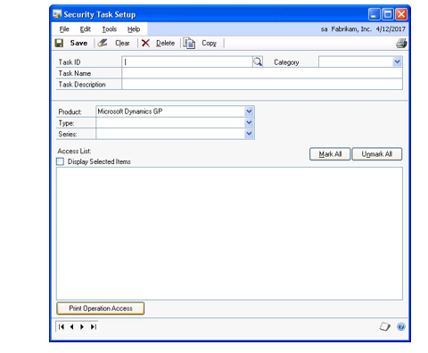

2. Enter a task ID.

3. To save time, you can copy all security settings from an existing task into
    the task that you are about to create. Choose Copy to do this, otherwise,
    skip to step 6.

4. The Copy Security Task window is displayed. Enter an existing security task
    ID to copy settings from.

5. Choose OK. The Copy Security Task window closes and the Security Task Setup
    window now contains the security settings of the task that you copied.

6. Enter a name and description for the task.

7. Select a category for the task.

8. Select a product from the Product list. If you're using integrating products
    with Microsoft Dynamics GP, they are displayed in the list in addition to
    Microsoft Dynamics GP.

9. In the Type list, select the type of item you want to limit access to. See
    *Items you can set security for* on page 33 for information about the types
    shown in the list.

10. Using the Series list, specify the series you want to set access to. For
    example, to grant access to a window, report or other resource in General
    Ledger, select Financial from the Series drop-down list.

11. Using the Access list, mark an item to grant access to it and unmark an item
    to remove access.

    You can choose the Unmark All button to unmark all items that appear in the list, or Mark All to mark all items in the list. You can mark the Display Selected Items option if you want the list to show only the items that you have granted access to.

    > [!TIP]
    > Double-click a window or report in the Access List to view it.

12. Repeat steps 9 through 11 to set security for all series.
13. Choose Save to save your changes.

#### Creating security roles

Use the Security Role Setup window to create new security roles. Security
roles can contain multiple security tasks and can be assigned to users to
provide them with security access to groups of tasks in Microsoft Dynamics
GP.

**To create security roles:**

1. Open the Security Role Setup window. (Administration \>\> Setup \>\> System\>\> Security Roles)

    

2. Enter a role ID.

3. To save time, you can copy all security tasks from an existing role into the
    role that you are about to create. Choose Copy to do this, otherwise, skip
    to step 6.

4. The Copy Security Role window is displayed. Enter an existing security role
    ID to copy security tasks from.

5. Choose OK. The Copy Security Role window closes and the Security Role Setup
    window now contains the security tasks of the role that you copied.

6. Enter a name for the role.

7. Enter a description for the role.

8. Select a category from the drop-down list to display the tasks for that
    category.

9. Mark the security tasks that users who are assigned to this role should have
    access to.

    You can choose the Unmark All button to unmark all tasks that appear in the list, or Mark All to mark all tasks in the list. You can mark the Display Selected Roles option if you want the list to show only the items that you have granted access to.

    > [!TIP]
    > Double-click a task to view information about that task.

10. Repeat steps 8 and 9 to set security for all categories for this security
    role.

11. Choose Save to save your changes.

#### Setting up individual user security

Use this procedure to set up individual security settings for each user, in
each company. Complete this procedure each time you create a new company or
a new user record.

If you marked the Copy Access from Company option in Microsoft Dynamics GP
Utilities when you created a new company, you've already set up user
security for this company. Complete this procedure using the User Security
Setup window only to modify the settings you copied.

Security is defined for each user on a company-by-company basis; be sure to
set security for each company accessed by the user.

*Security tasks and security roles already must be set up before you can set
up individual user security. Refer to Creating security tasks 6 and Creating
security roles for more information.*

**To set up individual user security:**

1. Open the User Security Setup window. (Administration \>\> Setup \>\> System
    \>\> User Security)

2. In the User field, select the user ID of the person for whom you're setting
    security. Once you've selected a user ID, all the companies the user has
    access to are shown in the Company list.

3. In the Company list, select a company. The security you set for a company
    will apply to the user only when he or she accesses that company. Once
    you've selected a Company, all the security roles are listed.

4. Mark all the roles that the user should be assigned to.

*You can mark the Display Selected Roles option to list only the roles for
which access has been granted.*

1. To specify which alternate or modified forms and reports that the user
    should have access to, select an Alternate/Modified Forms and Reports ID
    from the drop-down list.

To create a new Alternate/Modified Forms and Reports ID, refer to *Setting
access to alternate/modified forms and reports*

1. Choose the AFA Reports button to open the Advanced Financial Analysis
    Reports Security window where you can specify which Advanced Financial
    Analysis reports the user should have access to.

> [!NOTE]
> By default, users have access to all Advanced Financial Analysis reports.
However, users can only view an Advanced Financial Analysis report if they
also are granted access to the Advanced Financial Analysis windows that are
associated with that report.

1. To print a User Security Report for the selected user, choose File \>\>
    Print. You also can print this report using the Security Report Options
    window.

2. Choose Copy to open the Copy User Security window if you want the user to
    have the same security access in other companies that the user has access
    to, otherwise skip to step 11.

3. In the Copy User Security window, a list of companies that the selected user
    has access to is displayed. Mark the companies that you want to copy this
    user's security settings to.

4. Choose OK to save your changes and close the Copy User Security window.

5. In the User Security Setup window, choose Save.

#### Activating user security

To begin using individual security, you be sure that the Security option in
the Company Setup window is marked. User security doesn't function unless
you activate it in that window.

*User security doesn't affect passwords you've set up to allow access to
Microsoft Dynamics GP, or to grant permission to perform certain accounting
tasks such as overriding a price.*

**To activate user security:**

1. Open the Company Setup window. (Administration \>\> Setup \>\> Company \>\>
    Company)

2. Be sure the correct company is displayed in the Company Name field.

3. Mark the Security check box if it is not already marked, otherwise, skip to
    step 5.

4. Enter the system password and choose OK. A message will appear, indicating
    that user security is active.

5. Choose OK to save your changes and close the Company Setup window.

If you want to temporarily turn off your security system at some other time,
you can open this window again and unmark the Security option, allowing all
users unlimited access to the company.

1. Repeat steps 1 through 5 for each of your companies. You must log in to each
    company to activate user security for that company.

#### Verifying security settings with an integrating product

After you install an integrating product, you must give users security
access to that integrating product before it can be used. You may have to
modify existing security tasks and roles or create new security tasks and
roles before you can modify a user's security settings. However, depending
on the integrating product, there already may be default security tasks and
roles that you can use when you modify a user's security settings in the
User Security Setup window.

#### Setting access to alternate/modified forms and reports

Alternate forms and reports are forms and reports that have been
incorporated into integrating products that you've installed. Modified forms
and reports are existing Microsoft Dynamics GP forms and reports that have
been modified using Report

Writer or Modifier. Some of these forms or reports are provided access by
default,

others you must grant access to using the Alternate/Modified Forms and
Reports window.

Alternate/modified forms and reports IDs grant access to groups of
alternate/ modified forms and reports within Microsoft Dynamics GP. These
IDs are then assigned to individual users. For more information, refer to
*Setting up individual user security* .

When your company purchases integrating products, you can modify security
settings to include all alternate forms and reports for the product at once.
Or, you can selectively choose which alternate/modified forms or reports you
want for each ID.

If you discontinue using a product that contains alternate or modified forms
and reports, or are changing your security structure, you can change all
settings to the original defaults. See *To reset alternate/modified forms
and reports to original settings:* for more information.

**To set access to alternate/modified forms and reports:**

1. Open the Alternate/Modified Forms and Reports window. (Administration \>\> Setup \>\> System \>\> Alternate/Modified Forms and Reports)

2. Enter an ID and description.

3. Select a product from the Product list. If you're using integrating products with Microsoft Dynamics GP, they are displayed in the list in addition to Microsoft Dynamics GP.

4. In the Type list, select the type of item you want to set access for.

5. Select the series you want to set access for. This will narrow down the list of windows or reports in the list if you're setting access to specific windows or reports.

6. Select the integrating product in the Select list. The alternate forms or reports will appear in the list, with the Microsoft Dynamics GP option selected by default.

7. Click Change All. The access will be changed to the integrating product for all forms or reports.

    > [!NOTE]
    > You can use the Show/Hide button to expand the Alternate/Modified Forms and Reports List to grant access to individual forms or reports.

8. Repeat steps 3 through 7 to set access to the alternate/modified forms and reports for any other products.

9. Choose Save.

To reset alternate/modified forms and reports to original settings:

1. Open the Alternate/Modified Forms and Reports window. (Administration \>\> Setup \>\> System \>\> Alternate/Modified Forms and Reports)

2. Enter an ID and description.

3. Select a product from the Product list. If you're using integrating products
    with Microsoft Dynamics GP, they are displayed in the list in addition to
    Microsoft Dynamics GP.

4. In the Type list, select the type of item you want to set access for.

5. Select the series you want to restore original settings for, or select All
    to reset the original settings for all of your system.

6. Select Revert to Default from the Select list.

7. Choose Change All. The access will be changed to the settings from the time
    of your original Microsoft Dynamics GP installation.

8. Choose Save.

To view alternate/modified forms and reports settings:

1. Open the Alternate/Modified Forms and Reports window. (Administration \>\> Setup \>\> System \>\> Alternate/Modified Forms and Reports)

2. Select the ID, Product, Type and Series you want to view.

3. Mark Display Selected. The Alternate/Modified Forms and Reports List will display only the options selected for the criteria above. Changes can't be made when this box is marked.

The Show/Hide button above the list will expand or collapse the list.

#### Deleting security records

Use the Remove Security Setup Records window to delete groups of security task IDs, security role IDs, and alternate/modified forms and reports IDs.

To delete security records:

1. Open the Remove Security Setup Records window. (Administration \>\> Utilities \>\> System \>\> Remove Security Setup Records)

2. Select the type of security records that you want to delete.

    - Select Security Tasks to delete a group of security task IDs. You cannot
        delete a security task that is currently assigned to a security role.

    - Select Security Roles to delete a group of security role IDs. You cannot
        delete a security role if it is currently assigned to a user.

    - Select Alternate/Modified Forms and Reports to delete a group of
        alternate/modified forms and reports IDs. You cannot delete an
        alternate/ modified forms and reports ID if is currently assigned to a
        user.

3. Select the range of IDs to delete.

4. Choose Process to delete the range of IDs for the type of security record
    that you selected.

#### Setting up security for viewing data connections and Microsoft Excel reports

Users need extra privileges in SQL Server before they can view the Microsoft
Dynamics GP data that is displayed in data connections and Excel reports.

A Default SQL Server Fixed Database role that corresponds with each data
connection and Excel report is created during the installation of Microsoft
Dynamics GP. Each role begins with "rpt_" and contains SELECT access to the
Microsoft Dynamics GP data for the data connection or report that the role
corresponds to.

Users should be added as members to the SQL Server roles that correspond to
the reports or data connections that they need access to.

There should also be links to procedures for setting security on the shared
folders on the network or SharePoint, depending on how the sysadmin wants to
deploy the excel reports.

To set up security for viewing data connections and Microsoft Excel reports:

1. Create new local groups on the server where the data connections and Microsoft Excel reports are deployed. For more information, refer to *Chapter 40, "Excel report deployment,"* and your Windows Server
documentation.

2. Assign each local group to the default SQL Server fixed database role that corresponds to the report that group will need access to. For more information about adding an Active Directory group to a SQL Server fixed database role, refer to your SQL Server documentation.

3. Add domain users or domain groups to the local groups that you set up in step 1

#### Setting up access to SQL Server Reporting Services reports

Users need extra privileges in SQL Server and Report Manager before they can
view the Microsoft Dynamics GP data that is displayed in SQL Server
Reporting Services reports.

Default SQL Server roles are created when you install Microsoft Dynamics GP.
Each

SQL Server role that begins with "rpt_" has enough access to view the
Microsoft

Dynamics GP data that is displayed in a report. To view a SQL Server
Reporting Services report, a user, or a Windows (local machine) group that
the user belongs to, must be added as a member to the SQL Server roles that
correspond to that report and the user must be granted access to that SQL
Server Reporting Services report in Report Manager.

For detailed information about SQL Server Reporting Services, refer to the
SQL

Server Reporting Services Guide. This guide describes how to install
Reporting

Services, how to deploy predefined reports that are included in Microsoft
Dynamics GP to a server, and how to set up security for reports.

To set up access for SQL Server Reporting Services reports:

1. Create new local groups on the Web server where the SQL Reporting Services
    reports are deployed. For more information, refer to *Deploying SQL Server
    Reporting Services reports* and your Windows Server documentation.

2. Assign each local group to the default SQL Server fixed database role that
    corresponds to the report that group needs access to. For more information
    about adding an active directory group to a SQL Server fixed database role,
    refer to your SQL Server documentation.

3. Using Report Manager, grant access to the SQL Reporting Services reports for
    the local groups that you created in step 1.

4. Add domain users or domain groups to the local groups that you set up in
    step 1. For more information, refer to your Windows Server documentation.

5. If your SQL Reporting Services reports are stored on a different computer
    than either the Microsoft Dynamics GP server or the server running Microsoft
    SQL Server, you must use Kerberos authentication in SQL Server to allow user
    credentials to be passed to the SQL Server so that users can view SQL
    Reporting Services reports.

Refer to Knowledge Base article 319723: [*How to use Kerberos authentication in SQL Server*](https://www.betaarchive.com/wiki/index.php/Microsoft_KB_Archive/319723) and complete Step 1: Configure the domain controller and Step 2: Configure the IIS services server to use Kerberos authentication on SQL Server.

#### User security troubleshooting

Many of the processes in Microsoft Dynamics GP, such as posting or printing,
require that the user performing the process be able to access multiple
windows and reports. If you deny a user access to an item that's part of a
process, the user won't be able to complete that process. A message may
appear stating that the user isn't privileged to open the resource. However,
Microsoft Dynamics GP may not always display a message indicating the
problem; the process may simply not be completed.

If a user encounters problems completing a process, verify that the roles
that are assigned to the user in the User Security Setup window contain the
tasks that the user needs to complete the process. The problem may be caused
by the user not having access to all the items used in the process. Contact
Microsoft Dynamics GP Technical Support if you need additional assistance.

### Chapter 7: Field level security

Field level security restricts access to any field, window, or form in
Microsoft Dynamics GP. It allows you to apply a password, or to make a
window or form unavailable. It also allows you to hide, lock, or apply
passwords to fields.

This information is divided into the following sections:

- *Adding or modifying a field security ID*

- *Copying a field security ID*

- *Security modes*

- *Resource Explorer*

- *Creating a password*

#### Adding or modifying a field security ID

Use the Field Security Maintenance window to assign field level security
IDs, which are necessary to define user passwords, and to lock, hide, or
make windows, forms, and fields unavailable. The Field Security Maintenance
window also allows you to modify, add, or delete field security IDs.

To add or modify a field security ID:

1. Open the Field Level Security window. (Administration \>\> Setup \>\> System \>\> Field Level Security)

2. Choose Add to open the Field Security Maintenance window.

    You also can double-click an existing field security ID in the Field Security window to open the Field Level Security Maintenance and continue through this procedure.

3. Enter or modify the Field Security ID field and a description.

4. Choose the product name lookup button to open the Resource Explorer window.

5. Select an object from the Resource Explorer window to apply security to. For more information refer to *Resource Explorer* .

6. Apply or modify the security mode for the field, form, or window you have selected. For more information refer to *Security modes* .

7. If you selected a security mode that requires a password, enter or select a password ID in the Password ID field.

8. Choose Save.

You can now use the Field Level Security window to apply this field security
ID to users and user classes.

#### Copying a field security ID

Use the Field Security Maintenance window to copy an existing field security
ID to create a new one. To create a new field security ID that will be
similar to an existing field security ID, you can copy the existing field
security ID as your new field security ID and then modify it.

To copy a field security ID:

1. Open the Field Level Security window. (Administration \>\> Setup \>\> System \>\> Field Level Security)

2. Double-click on a field security ID in the field security object tree to open the Field Security Maintenance window.

3. Choose Copy.

4. Enter a new ID in the Field Security ID field.

5. Modify fields, as necessary.

6. Choose Save.

#### Security modes

You can select the following security modes from the Field Level Security Maintenance window to give security to fields, forms, or windows.

**Password Before** You must enter a password before getting access to a field.

**Password After** You must enter a password after modifying a field for the changes to be saved.

**Warning Before** A warning will be displayed and access to that field will be denied.

**Lock Field** You can't use or modify the field.

**Disable Field** The field will be displayed but it will not be available.

**Hide Field** The field won't be displayed.

**Password Window** You must to enter a password before access to the window
is permitted.

**Disable Window** Enter the system administrator's password to have access
to the window.

**Password Form** Users or classes must enter the correct password before
access to the form is permitted.

**Disable Form** You must enter the system administrator's password to
modify the form.

#### Resource Explorer

The Resource Explorer window opens when you choose the lookup button for the

Product Name field. Use the Resource Explorer to look up forms, fields, and
tables.

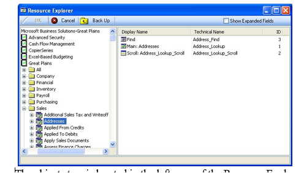

The objects tree is located in the left pane of the Resource Explorer
window. Choose the plus sign next to an object to open it in the objects
tree.

- Double-click on an object to open it in the right pane of the Resource
    Explorer window.

- Select an object in the right pane and choose OK to enter it into the Field
    Security Maintenance window.

#### Creating a password

Use the Password Maintenance window to create and modify passwords that you
assign to a field, form, or window.

To create a password:

1. Open the Password Maintenance window by clicking the underlined password ID in the Field Security Maintenance window.

    You also can open the Password Maintenance window by opening the lookup window for the password field. You can either select a current password, or you can choose New to clear the fields.

2. Enter a password ID and a description.

3. Enter the password.

4. Choose Save.

5. You can continue to create new passwords, modify existing passwords, or return to the Field Security Maintenance window.

    - To create more passwords, choose Clear and repeat steps 2-5.

    - To modify other passwords, select an existing password and make changes,
        as necessary.

    - To exit, close the window.

### Chapter 8: Shortcut administration

With shortcut navigation, you can organize shortcuts to the windows, macros,
applications, and web sites you frequently use while working in Microsoft
Dynamics GP.

This information is divided into the following sections:

- *Shortcuts and user classes*

- *Assigning shortcuts to a new user class folder*

- *Adding shortcuts to an existing user class folder*

For general information about the shortcut bar and creating shortcuts, see
your System User's Guide (Help \>\> Contents \>\> Using The System).

#### Shortcuts and user classes

The system administrator's or Microsoft Dynamics GP system administrator's
shortcuts include a User Classes folder by default. For each user class in
the Microsoft Dynamics GP system, a corresponding folder is located inside
the User Classes folder. When you create a new user class, the corresponding
user class shortcut folder is created automatically.

The shortcut folder is named the same as the description for the user class.
For example, if the class ID is SALES and the description is Sales Clerk,
the shortcut folder is Sales Clerk. To change the name of the user class
folder, change the description of the user class in the User Class Setup
window.

When you assign a user to a user class, the corresponding user class folder
appears in the list of shortcuts in the navigation pane for that user. User
Classes folders can't be renamed or repositioned by non-administrative
users.

#### Assigning shortcuts to a new user class folder

You can organize shortcuts to user-specific tasks by grouping them into user
class folders in the list of shortcuts in the navigation pane. Users can't
delete or modify a user class folder that appears in their list of
shortcuts.

To assign shortcuts to a new user class folder:

1. Log in as sa or if you are the database owner, log in as DYNSA.

2. Open the User Class Setup window. (Administration \>\> Setup \>\> System \>\> User Classes)

3. Enter a class ID.

4. Enter a description for the user class. This description will be the name of  the user class folder in the list of shortcuts.

    By default, the new user class will have access to all resources in the system. Deny access to selected portions of the system, if desired.

5. Choose Save to save the user class.

6. In the User Classes folder, locate the folder for the user class you just created. Add shortcuts to the folder by dragging an existing shortcut from your list of shortcuts into the user class folder.

#### Adding shortcuts to an existing user class folder

As soon as you add a shortcut to a user class folder, users assigned to that
user class can see the shortcut by closing and reopening their user class
folder.

To add shortcuts to an existing user class folder:

1. Log in as *sa* or if you are the database owner, log in as *DYNSA*.

2. In the User Classes folder in the list of shortcuts, locate the folder for the
user class you want to add shortcuts to. Drag an existing shortcut from your
list of shortcuts into the user class folder.

### Chapter 9: Activity tracking

Activity tracking allows you to keep track of the activity in your Microsoft
Dynamics GP system. You can track activities for each user, for each
company, or both.

For day-to-day activity monitoring, use the activity tracking procedures in
the System Administrator's Guide.

This information is divided into the following sections:

- *Activity type overview*

- *Setting up activity tracking*

- *Removing activity tracking detail*

#### Activity type overview

The following types of activities can be tracked in Microsoft Dynamics GP.
The selected activities will be tracked for all users and the companies
selected in the Activity Tracking Setup window.

**Access tracking**

| **Activity**                              | **Description**      |
|-------------------------------------------|----------------------|
| Failed Attempts to Access a Table         | Tracks when a user attempts to create a report in Report Writer using a table they do not have access to because of security. This is a valid option only if security is being used for the company.  |
| Failed Attempts to Open a Window          | Tracks when a user is prevented by security from opening a window. This is a valid option only if security is being used for the company; that is, if security is set up and the Security option is marked in the Company Setup window. If a user is prevented from opening a window because of an alert message not related to security, that will not be tracked. |
| Failed Attempts to Print a Report         | Tracks when a user is prevented by security from printing a report. This is a valid option only if security is being used for the company. When the Print button is chosen, Microsoft Dynamics GP verifies whether security is activated for the company. |
| Successful Attempts to Open Modifier      | Tracks when a user successfully accesses Microsoft Dynamics GP Modifier.  |
| Successful Attempts to Open Report Writer | Tracks when a user successfully accesses Report Writer.   |
| Successful Attempts to Open a Window      | Tracks when a user opens a window successfully. |
| Successful Attempts to Print a Report     | Tracks when a user is successful at starting a report to print.     |

**Login/logout tracking**

| **Activity**                   | **Description**      |
|--------------------------------|----------------------|
| Successful Attempts to Log In  | Tracks when a user logs into a company. This takes place when initially entering Microsoft Dynamics GP and also when using the Company Login window to switch to a different company.  |
| **Activity**                   | **Description**                                                                                                                                                                         |
| Successful Attempts to Log Out | Tracks when a user logs out of a company. This takes place when initially entering Microsoft Dynamics GP and also when using the Company Login window to switch to a different company. |

Using the combination of tracking Successful Logins and Successful Logouts
allows you to see the length of time that a user was logged into a company.

**Table tracking**

| **Activity**     | **Description**          |
|------------------|--------------------------|
| Additions to Master Tables Additions to Setup Tables Additions to Trx Tables             | Tracks when a record is successfully added to the type of table specified. This includes only additions that are made by using a Save or an OK button. Additions that are performed through a process such as reconciling are not tracked.                                                   |
| Deletions from Master Tables Deletions from Setup Tables Deletions from Trx Tables       | Tracks when a record is successfully deleted from the type of table specified. This includes only deletions that are made by using a Delete button. Deletions that are performed through a process such as clearing history and paid transaction removal are not tracked.                    |
| Modifications to Master Tables Modifications to Setup Tables Modifications to Trx Tables | Tracks when a record is successfully modified in the type of table specified. No record of the actual change is kept. This includes only modifications that are made by using a Save or an OK button. Modifications that are performed through a process such as reconciling are not tracked. |

**Process tracking**

| **Activity**              | **Description**           |
|---------------------------|---------------------------|
| Table Maintenance Process | Tracks when any task from the Table Maintenance menu is performed such as checking links and clearing data. Both the start and end of the task are tracked (two records are created). |
| Routines Process          | Tracks when any task from any routines menu is performed. Both the start and end of the task will be tracked, (two records will be created).                                         |
| Utilities Process         | Tracks when any task from any utilities menu is performed. Both the start and end of the task are tracked, (two records are created).          |

**Posting tracking**

| **Activity**                   | **Description**               |
|--------------------------------|-------------------------------|
| Depends on modules registered. | Depending on which modules are registered, you can choose to track posting of specific transaction types. For example, if General Ledger is installed, you could choose Financial Clearing Entry, Financial General Entry, and Financial Quick Entry. |

#### Setting up activity tracking

Using the Activity Tracking Setup window, you'll mark the activities you
want Microsoft Dynamics GP to track for each user in each company they
access.

The table used to store activity information can become large in a short
time if you choose to track all activity. To keep the activity table size to
a minimum, track only the activities you really need to track and
periodically remove the information you no longer need. Tracking successful
window access and tracking any of the table activities will cause the
activity tracking table to grow rapidly. For information

about removing activity tracking detail, see *Removing activity tracking
detail* .

**To set up activity tracking:**

1. Open the Activity Tracking Setup window. (Administration \>\> Setup \>\>
    System \>\> Activity Tracking)

2. Select an activity type.

3. Using one or more of the following techniques, mark the activities you want
    to track.

    - In the Activity list, mark the box in the Track column next to each
        specific activity you want to track.

    - To track all activities listed for an activity type, choose Mark All. To
        stop tracking any of the activities that may have been marked for an
        activity type, choose Unmark All.

4. Select a user and mark the companies for which you want activities tracked.

5. Select a user ID for whom you want to track Microsoft Dynamics GP
    activities.

6. In the Company Name list, mark the box in the Activate column next to the
    companies for which you want to track this user's activities.

7. Repeat steps 5 and 6 for the other users you want to track activity for.

All of the users selected will have the same activities tracked.

1. Choose OK to save your entries and close the window.

2. Review the activity tracking information you've entered using the Activity
    Tracking Setup Report. While the Activity Tracking Setup window is
    displayed, choose File \>\> Print.

#### Removing activity tracking detail

Use the Remove Activity Tracking Detail window to remove records from the
Activity Tracking Table, print a report that shows the information in the
table, or both. All activities you track are recorded in the Activity
Tracking Table. The size of the table can increase very quickly, even if you
track only a few activities, so you'll need to remove data from the table
periodically.

> [!IMPORTANT]
> Be sure to back up your company's data before removing activity tracking
detail.

**To remove activity tracking detail:**

1. Open the Remove Activity Tracking Detail window. (Administration \>\>
    Utilities \>\> System \>\> Activity Detail)

2. Select an activity type.

3. Using one or more of the following techniques, mark the activities you want
    to remove or print a report for.

    - In the Activity list, mark the box in the Remove/Print column next to
        each specific activity you want to remove or print a report for.

    - To remove or print all activity detail listed for an activity type,
        choose Mark All. Choose Unmark All if you don't want to remove or print
        all activity detail.

4. Select which range type of activity detail.

5. Enter or select a range of activity detail.

6. Choose Insert to insert the range.

7. Choose whether you want to remove the activity detail, print a report, or
    both.

8. Choose Process to remove the activity detail. If Print Report was marked,
    the Activity Tracking Report will print.

## Part 3: Company setup

Use this information to customize each of your companies, including company
addresses, the payment terms your business uses, the way posting reports are
printed, and the format of your accounts. The information is organized in
the order in which you should complete it.

Company setup entries you make apply only to the company you're using when
you enter the information. If, for instance, you've created records for
three companies and are ready to specify information about each, you must be
sure that you're applying that information to the correct company.

For additional information about setting up Microsoft Dynamics GP, detailed
reference information is provided in help. Press F1 to view detailed
reference information about the window that's currently displayed.

The following information is discussed:

- *Chapter 10, "Companies,"* explains how to specify where a new company's
    data will be stored and how to use default information for this company.

- *Chapter 11, "Accounts,"* contains information about setting up an account
    format and chart of accounts for each company.

- *Chapter 12, "Fiscal periods,"* explains how to verify the default fiscal
    periods and make changes if necessary, and how to create fiscal periods.

- *Chapter 13, "Posting setup,"* describes posting procedures and the
    terminology needed to understand posting.

- *Chapter 14, "Shipping methods and payment terms,"* explains how to set up
    additional shipping methods and payment terms, and how to make changes to
    existing ones.

- *Chapter 15, "Financial information,"* describes how to set up currencies,
    bank records, and checkbooks for each company.

- *Chapter 16, "E-mail setup for documents,"* describes how to set up e-mail
    functionality for each company.

- *Chapter 17, "Document attachment setup,"* describes how to set up document
    attachment functionality for each company.

- *Chapter 18, "Intrastat setup,"* explains how to set up your system to track
    statistics for Intrastat, the method for collecting statistics on the trade
    of goods between European Union (EU) countries or regions.

### Chapter 10: Companies

This information explains how to specify where a new company's data will be
stored and how to use default information for this company.

This information is divided into the following sections:

- *Company overview*

- *Setting up your first company*

- *Creating an additional company in Microsoft Dynamics GP*

- *Setting access to a new company*

- *Switching to the company you just created*

- *Setting up company address information*

- *Setting up company options*

- *Setting up company Internet information*

- *Customizing an Internet Information label*

- *Setting up company user-defined fields*

- *Setting up a language*

#### Company overview

In Microsoft Dynamics GP, you can set up an unlimited number of companies.
Each company tracks information for a particular organization such as a
corporation or a partnership. In general, information from one company is
not shared with other companies.

All information for a company in Microsoft Dynamics GP is typically stored
within a single folder on your computer or network, or in a single database.

#### Setting up your first company

The process for creating your first company varies, depending on whether you
installed the sample company, Fabrikam, Inc. If you installed the sample
company, that company is considered the "first company." To set up your own
company, see *Creating an additional company in Microsoft Dynamics GP* .

Your first company must be created using Microsoft Dynamics GP Utilities.
For more information on Microsoft Dynamics GP Utilities, refer to your
Microsoft Dynamics GP desktop install and upgrade information.

Once you've created your first company, see *Creating an additional company
in Microsoft Dynamics GP* to create more companies.

**To set up your first company:**

1. Start Microsoft Dynamics GP; the Welcome to Microsoft Dynamics GP window
    appears.

2. Select your user ID and enter a password.

3. Mark the Remember user and password option to automatically log in to
    Microsoft Dynamics GP the next time you start Microsoft Dynamics GP. This
    option is available if you have marked the Enable Remember User field in the
    System Preferences window.

4. Choose OK.

5. In the Company Login window, select the company you want to set up.

6. Mark the Remember this company option to automatically log in to the company
    the next time you start Microsoft Dynamics GP. You should mark this option
    for the company you work with the most often.

7. Choose OK.

The name of the company will be displayed on the toolbar.

1. Many of the company setup procedures can be completed using selections from
    the Administration area page (Administration \>\> Setup \>\> Company).

2. Continue to *Setting up company address information*

#### Creating an additional company in Microsoft Dynamics GP

If you're using Microsoft Dynamics GP to track information for multiple
companies, you can copy user access information to additional companies you
create. Be sure to completely set up your first company and assign user
access before creating subsequent companies.

You can copy two types of setup information from any other company
(including the sample company) to the new company you're setting up:

- The users who will have access to this company, which you also can set up in
    the User Access Setup window.

- The individual items each user has access to within the company, which you
    can set up in the User Security Setup window.

We recommend installing the default chart of accounts, shipping methods, and
payment terms, unless you plan to import that information from your previous
accounting system. Using the default entries will streamline the setup
process. You'll be able to make modifications to the default entries.

You'll use the Create Company window to create additional companies. How you
create additional companies will vary based on the type of database you're
using.

**To create an additional company in Microsoft Dynamics GP:**

1. Start Microsoft Dynamics GP Utilities to create a new database for the
    company and allocate space for it. See your Installation documentation for
    more information.

(Start \>\> Programs \>\> Microsoft Dynamics \>\> GP \>\> GP Utilities)

Be sure you are logged in to Windows as a system administrator.

1. In the Welcome to Microsoft Dynamics GP Utilities window, verify your server
    name, and enter your administrator user ID and password; then choose OK.

*You must be logged in as sa or as a system administrator to perform
database and system functions within Microsoft Dynamics GP Utilities.*

1. The Welcome to Microsoft Dynamics GP Utilities window opens when you are
    logged into the server you selected. Choose Next until the Additional Tasks
    window opens.

2. In the Additional Tasks window, select the Create a Company option and
    choose Process.

3. In the Create Company window, enter a company ID and name. Once you save
    this company, this name can be changed in the Company Setup window, if
    necessary.

4. Mark to install shipping methods and payment terms (optional). If you don't
    mark this option, you can set up shipping methods and payment terms by
    following the procedures in *Chapter 14, "Shipping methods and payment
    terms."*

5. To load a default chart of accounts, mark the Load Default Data option, then
    select a business type and an industry type (optional).

6. To copy user access information from another company, mark the Copy Access
    From Company option and select a company to copy from (optional).

Copying user access includes all users and security for those users. Access
information for lesson users, inactive users, and web client users will not
be copied.

1. Choose Next.

2. In the Database Setup window, select a default location for new files that
    will be created and choose Next.

3. In the Create Database window, choose Next.

4. In the Confirmation window, choose Finish.

#### Setting access to a new company

You'll use the User Access Setup window to assign access to the company or
companies you just created to specific users.

**To set access to a new company:**

1. Open the User Access Setup window. (Administration \>\> Setup \>\> System
    \>\> User Access)

2. Select a user ID.

3. Mark the box next to each company this user should have access to.

4. Choose OK to save your changes.

#### Switching to the company you just created

You can access the new company from the Company Login window.

**To switch to the company you just created:**

1. On the Microsoft Dynamics GP menu, choose User and Company.

2. In the Company Login window, select the appropriate company, then choose OK.

To verify the company you're accessing, check the Microsoft Dynamics GP
application window status bar; the current company is displayed there.

#### Setting up company address information

Once you've created a company, you'll need to enter additional information
for it. Use the Company Setup window to enter addresses for the selected
company.

The main address entered in this procedure will appear on all documents,
such as invoices and checks. However, if your business has several locations
or different departments and contacts, you can set up multiple addresses,
which you can print on those documents instead.

**To set up company address information:**

1. Open the Company Setup window. (Administration \>\> Setup \>\> Company \>\>
    Company)

    

1. In the Address ID field, enter an ID for the company's main address.

2. Enter the company's main address.

    > [!NOTE]
    > Skip the tax, user-defined and security fields for now; you'll return to this window after you've set up additional options for your company and you can finish entering the other information then. The tax information you need to enter for your company differs depending on what countries or regions you do business in. In addition, you'll need to set up tax details and tax schedules before assigning them to your company using the Company Setup window.

1. To enter addresses for additional locations, departments or contacts, choose
    the Address button to display the Company Addresses Setup window.

2. In the Address ID field, enter a short name for the location, department or
    contact.

3. Enter the address information.

4. Choose Save to save the address.

5. Repeat steps 5 through 7 for additional addresses. When you've finished
    entering addresses, close the window.

6. In the Company Setup window, choose OK to save the addresses you've entered.

7. To print a list of the company settings, open the Company Setup window; then
    choose File \>\> Print.

    The Company Settings List is printed, showing information that was entered using the Company Setup window. You also can print this report using the Setup Reports window (Administration \>\> Reports \>\> Company \>\> Setup).

1. To print a Company Addresses Report showing information for all the
    addresses you've set up for this company, use the Company Setup Report
    Options window.

#### Setting up company options

Use the Company Setup Options window to enter additional company setup
options such as separating payment distributions, tracking Intrastat
Statistics, and merging trade discount distributions.

**To set up company options:**

1. Open the Company Setup Options window.(Administration \>\> Setup \>\>
    Company \>\> Company \>\> Options button)

2. Mark the options you want to include. See *Part 4, Tax setup*, for
    information about tax setup options.

##### **Use Shipping Method when Selecting Default Tax**

**Schedule** Specify whether or not you want to use the shipping method when
selecting the default tax schedule on a transaction. Microsoft Dynamics GP
calculates taxes at the point of exchange, using the shipping method
assigned to a transaction to determine the point of exchange. The shipping
method will determine which tax schedule appears as a default schedule for
the transaction. If you decided not to use the shipping method to determine
the default tax schedule, the tax schedule assigned to the vendor's purchase
address or the customer's ship to address will be the default tax schedule.

**Calculate Terms Discount Before Taxes** Mark this option to apply taxes
only to the discounted amount, regardless of when the payment is actually
made.

**Enable Intrastat Tracking** Mark this option if your company is required
to enter Intrastat Statistics. The Intrastat Trade Report is used to report
this information. When this option is marked, setup windows for Intrastat
codes and Intrastat entry windows become available.

**Separate Payment Distributions** Mark this option to separate document and
payment distributions entered on the same transaction as if the document and
payment were entered as separate transactions. You will be able to enter
multiple distributions with the same distribution type and account. If you
don't mark the option, the distributions that are of the same type with the
same account number will be combined.

**Merge Trade Discount and Markdown Distributions in Sales** Mark this option to merge the trade discount and markdown distributions with the sales distributions. If you don't mark this option, the trade discounts and markdown distributions will be separated from the sales distribution.

**Merge Trade Discount Distributions in Purchasing** Mark this option 
to merge the trade discount distributions with the purchase distributions. If you didn't mark this option, the trade discounts and markdown distributions will be separated from the sales distribution.

**Calculate Tax Rebates** Mark this option to allow correcting tax amounts
for a transaction with a terms discount.

**Enable Posting Numbers in General Ledger** Mark this option to assign each
transaction a unique sequence number during posting, in addition to the
journal entry number. Use this option if you want solid numbering of
transactions, without gaps. Solid numbering is a legal requirement in some
countries or regions, for auditing purposes.

**Enable GST for Australia** Mark this option to set up information used to
generate Goods and Services Tax (GST) calculations, designate default
creditor IDs, enter tax schedules for items, and specify printing options
for tax invoices and adjustment notes.

**Enable Tax Date** Mark to enter a tax date as you enter documents during
transaction entry. If you mark this option, a tax date field will be
available in the date entry windows and their inquiry windows for Sales
Order Processing, Receivables Management, Invoicing, Payables Management and
Purchase Order Processing.

**Enable Reverse Charge Taxes** Mark to enter reverse charge tax detail IDs
in the Tax Detail Maintenance window. You'll be able to assign reverse
charge tax details to transactions in Receivings Management, Payables
Management, Purchase Order Processing, Sales Order Processing and Invoicing.
Reverse charge tax information also will be printed on tax reports.

**Calculate Taxes in General Ledger** Mark this option to calculate taxes in
General Ledger. You'll be able to use the Tax Entry window to enter taxable
transactions that can't be entered in Payables Management, Receivables
Management, Purchase Order Processing, or Sales Order Processing. For
example, a taxable reimbursement to an employee could be entered in General
Ledger, rather than in Payables Management.

**Allow Summary-Level Tax Edits** Mark this option to allow edits to tax
information in the tax summary window. Summary tax edits won't change the
taxes calculated at the detail level. If this option isn't marked, you will
have to edit tax information using the tax detail entry windows.

**Require Tax Detail Totals to Match the Pre-Tax Amount** Mark to require the pre-tax amount to be fully distributed among the tax details of the transaction. When tax details are required to match the pre-tax amount, you'll have to assign tax schedules so taxes are calculated or enter a tax detail during transaction entry so the goods value matches pre-tax amount.

When this option is marked, you are required to enter a zero percent tax
detail in the Tax Detail for System Processes field for receivables and
payables documents that are automatically generated within the system.

The pre-tax amount is the sale or purchase amount (less any trade discount)
plus freight and miscellaneous charges. If the module you're working with is
set up to calculate terms discounts before taxes, the discount available
amount is deducted from the pre-tax amount.

**Specify Tax Details for Automatic Tax Calculation** Specify whether 
or not you want specific tax details to calculate tax. When this option is marked, you can select which tax details assigned to a tax schedule in the Tax Schedule Maintenance window should calculate tax. You can select as many details as you want to calculate tax for the schedule in the Tax Schedule Maintenance window.

**Enable VAT Return** Mark this option to generate summary and detailed
Value-added Tax (VAT) information for a specified period, helping to meet
governmental VAT reporting requirements.

**Enable EU Transaction Tracking** Mark this option to indicate whether a
transaction is an EU transaction without using Intrastat Statistics. The
vendor's or customer's tax registration number will be printed on documents.

**Enable DDR and European Electronic Funds Transfer** Mark this option to enter electronic funds transfers for manual payments and computer checks in Payables Management, and to set up electronic funds transfer information for your checkbooks, vendors and customers.

If you mark this option, you must use the Checkbook Maintenance Window
(Financial \>\> Cards \>\> Financial \>\> Checkbook) to assign a
cash-in-transit account for an existing checkbook. For more information,
refer to the "EFT checkbook setup" chapter in the Electronic Banking
documentation.

**Enable Canadian Tax Detail** Mark this option to be able to select the tax
detail posting account and to view the amounts inclusive of tax in the
Receivables Management, Sales Order Processing, and Purchase Order

Processing windows. For more information, refer to *Canadian tax detail
option* .

1. If you have marked the Enable Posting Numbers in General Ledger option,
    choose an option for the Display Posting Number Per field. For more
    information, see *Specifying posting report options* .

2. Mark to display the posting number for the fiscal year or for the fiscal
    period. This Display Posting Number Per option is available only if you've
    marked Enable Posting Numbers in General Ledger.

3. Choose OK to return to the Company Setup window.

#### Setting up company Internet information

Microsoft Dynamics GP tracks Internet-related information about your
company, such as e-mail addresses, Web page URLs, and FTP sites. If you've
set up multiple addresses for your company, you can track Internet
information for each address. Use the Internet Information window to set up
company Internet information.

**To set up company Internet information:**

1. Open the Internet Information window. (Administration \>\> Setup \>\>
    Company \>\> Internet Information)

2. In the Select Information for field, select Company.

The current company—the company you're currently logged in to—is displayed
in the Company ID field.

1. In the Address ID field, enter or select an address.

2. Enter valid e-mail addresses (optional). You can enter multiple addresses in
    each field.

3. Enter Internet information.

*Typically, the electronic mail address will be in the following form:
Mailto: username\@domainname.com.*

1. Choose Save to save your entries.

To print Internet information for the current company, choose File \>\>
Print. The Internet Information Report is printed, showing Internet
information for the current company.

1. To print an Internet Information Report showing Internet information for all
    companies, use the General Report Options window. See Help \>\> Index \>\>
    Company General Report Options window for more information.

#### Customizing an Internet Information label

To customize the labels that appear in the Internet Information window, you
can use the Internet User Defined Setup window. Be sure the labels you enter
are appropriate for the Internet information you want to track for
employees, customers, salespeople, vendors, and items, as well as companies.

**To customize an Internet Information label:**

1. Open the Internet User Defined Setup window. (Administration \>\> Setup \>\>
    Company \>\> Company \>\> Internet User Defined button)

    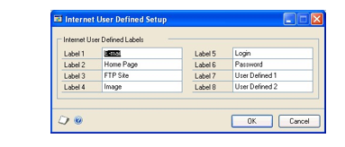

1. In the Label 1 field, enter text to describe the information you'll track in
    the first field in the Internet Information window.

2. Repeat step 2 for the remaining labels.

3. Choose OK to save your changes.

#### Setting up company user-defined fields

Microsoft Dynamics GP provides two user-defined fields in the Company Setup
window that you can use to enter additional information about your company.
For example, you might want to enter your company's slogan, or other
information about the company that you want to track.

If your company is located in Europe, you must use the User Defined 1 field
for your country code. The country code is printed on value-added tax
documents.

**To set up company user-defined fields:**

1. Open the Company Setup window. (Administration \>\> Setup \>\> Company \>\>
    Company)

2. In the User Defined 1 field, do one of the following:

    - If your company is located in Europe, enter your country code.

    - If your company is located outside Europe, enter additional information
        about your company.

For more information about how country codes are used, see *Setting up
country codes* .

1. In the User Defined 2 field, enter additional information about your
    company.

2. Choose OK to save your changes.

> [!NOTE]
> To add the user-defined fields to a report using Report Writer, link the
Company Master table (SY_Company_MSTR) to the report and drag the fields
named User Defined 1 and User Defined 2 to the report layout. For more
information about adding userdefined fields to reports, refer to the Report
Writer documentation.

#### Setting up a language

Use the Language Setup window to define languages that can be assigned to
customers, vendors, and users. The languages that you set up are for your
information only.

**To set up a language:**

1. Open the Language Setup window. (Administration \>\> Setup \>\> System \>\>
    Language)

2. Enter a language.

3. Enter an ISO 639-1 code (optional).

4. Choose OK.

### Chapter 11: Accounts

Use this information to set up an account format and chart of accounts for
each company.

This information is divided into the following sections:

- *Account formats*

- *Designing an account format*

- *Default account format*

- *Account formats and multidimensional analysis codes*

- *Setting up an account format*

- *Checking links for the Account Master table group*

- *Default charts of accounts*

- *Printing a list of posting accounts in Microsoft Dynamics GP*

- *Account aliases*

- *Understanding account segments*

- *Setting up an account segment*

- *Setting up a posting account in Microsoft Dynamics GP*

- *Modifying a posting account*

- *Deleting a posting account*

#### Account formats

When you installed Microsoft Dynamics GP, you specified an account
framework. The account framework applies to all companies in your Microsoft
Dynamics GP system, and represents the maximum length of your accounts,
number of segments, and segment lengths. The account framework can't be
changed.

> [!NOTE]
> While Microsoft Dynamics GP imposes a limit of 66 characters and 10
segments for account formats, the maximum number of characters and segments
in your system depend on the selections you made when you installed
Microsoft Dynamics GP.

An account format is the structure of each account in a particular
company—the length of the accounts, the number of segments, and segment
lengths. Each company you set up can have a different account format, as
long as it fits within the maximums you specified for the account framework.
Unlike the account framework, you can change the account format for an
individual company, with some restrictions.

- You can shorten one or more segments of the account format only if you
    haven't set up a chart of accounts yet.

To shorten the format if you've entered your chart of accounts but haven't
entered transactions, you must clear data from the Account Master Table. For
information on clearing data, refer to Chapter 13 of your System
Administrator documentation (Help \>\> Contents \>\> select System
Administration). Then you can set up a different account format and reenter
your chart of accounts. Once you've entered transactions, including
beginning balances, you can't shorten the account length or reduce the
number of segments.

- You can lengthen one or more segments in the account format, up to the
    account framework maximums, at any time.

If you lengthen the account format after entering your chart of accounts,
the extra space or spaces will be inserted in the segment you specify, at
the right side. For example, you could increase the first account segment
from four characters to five. Your existing accounts still would contain the
same characters, but with the added blank space: 6XAA__-1762. Blank spaces
are added only to existing accounts, since these accounts can't be changed;
however, you can use the additional digits in any new accounts you add to
the chart of accounts.

If you add segments to the current account format, the new segments will
appear as blank segments at the end of each account.

Use the Account Definition Setup List, printed during installation, to
verify that the values you'll enter for the number of segments and segment
lengths don't exceed your account framework maximums.

#### Designing an account format

It's important that the account format be designed to meet both the current
and future needs of the company you're setting up, since the changes you can
make to the account format after you've started using Microsoft Dynamics GP
are limited.

You can continue using the format you've used with your previous accounting
system, or set up a new one. To create a new format, plan the different
categories of information you want each segment of the account to represent.
For example, if you want to use one segment each for the location,
department, account, subaccount, and detail, you can set up the account
format to include five segments. The location might identify an individual
store within the company, and the department might represent the
departmental divisions within the company. The main account segment should
identify the type of account: an asset account, an expense account, and so
on. Subaccount and detail segments will allow you to identify more specific
information about the account.

#### Default account format

When you create a new company and load a default chart of accounts, the
account format in the Account Format Setup window that is set up for you
matches the account format of the default chart of accounts. The account
format for a default chart of accounts is:

| **Account format**  | **Default**  |
|---------------------|--------------|
| Account length      | 9 characters |
| Number of segments  | 3 segments   |
| Length of segment 1 | 3 characters |
| Length of segment 2 | 4 characters |
| Length of segment 3 | 2 characters |

The account framework maximums you entered during the installation process
appear as defaults in the Account Format Setup window. You can enlarge the
account length, number of segments, and the length of the individual
segments, up to the account framework maximums.

#### Account formats and multidimensional analysis codes

Multidimensional analysis codes can be used for further analysis of
transaction activity if you want to keep a simpler chart of accounts.
Multidimensional analysis codes are best suited for analysis of a particular
project or division that spans a fixed time period, such as several months
or years. Account formats will remain a part of your organization for the
duration of its existence. For more information, refer to the
Multidimensional Analysis documentation.

#### Setting up an account format

The account framework maximums you entered during the installation process
appear as default entries in the Account Format Setup window.

**To set up an account format:**

1. Open the Account Format Setup window. (Administration \>\> Setup \>\>
    Company \>\> Account Format)

    

1. Enter the account length.

    > [!NOTE]
    > You won't be able to shorten the account length after you've entered transactions.

1. Enter the number of segments in the accounts.

2. Name each segment. You can change the segment names later if necessary.

3. Enter the length of each account segment. The combined length of the
    segments must equal the length of the account.

4. Enter the display width of each segment.

    - If a segment will contain only numbers, select Standard.

    - If a segment will contain letters, select one of the Expansion
        selections. If you're unsure what width will work best, set up a width
        and then view the account in the Account Maintenance window (Financial
        \>\> Cards \>\> Financial \>\> Account). You can return to the Account
        Format Setup window to adjust the width as needed.

5. From the Main Segment ID list, select the main segment from the list of
    segment names you entered in step 4. The main segment will be used on
    financial reports to sort your accounts. A typical main segment is the one
    used to indicate whether the account is an asset, liability, owners' equity,
    revenue, or expense account.

6. In the Separate with field, enter the character that will appear between the
    account segments anywhere an account is displayed.

You can use any character: a dash or asterisk, a number or a letter.
However, it's best to use a character that won't be confused with the
characters in the account itself.

1. Choose OK in the Account Format Setup window to save the format and close
    the window.

2. To print the Account Format Setup List, showing the account format
    information for your company, open the Account Format Setup window; then
    choose File \>\> Print.

#### Checking links for the Account Master table group

If you change the main segment ID after you've entered a chart of accounts,
you must check links for the Account Master table group, using the Check
Links window.

**To check links for the Account Master table group:**

1. Open the Check Links window. (Microsoft Dynamics GP menu \>\> Maintenance
    \>\> Check Links)

2. In the Series list, be sure that Financial is displayed.

3. In the Logical Tables list, select Account Master and choose Insert to
    insert it into the Selected Tables list.

4. Choose OK to check links.

#### Default charts of accounts

When you create a new company, you have the option to load a default chart
of accounts. You may want to use a default chart of accounts for the
following reasons:

- The chart of accounts we've provided reflect sound accounting practices.

- Extensive research was done to determine the most commonly used account
    types for the industries we've included.

- Even if changes need to be made after a default chart of accounts is copied
    for the company, setup time will be greatly reduced by using one of the
    charts of accounts provided with Microsoft Dynamics GP.

The default charts of accounts we've provided are designed to be accurate
estimates of typical business practices. However, we recommend that you
review the accounts and make any necessary additions or changes. To add
accounts, see *Setting up a posting account in Microsoft Dynamics GP* . To
make changes to existing accounts, see *Modifying a posting account* to
delete accounts you don't need, see *Deleting a posting account .*

#### Printing a list of posting accounts in Microsoft Dynamics GP

If you loaded a default chart of accounts, your posting accounts are already
set up. Use the Chart of Accounts Report window to review the chart of
accounts you loaded and make any changes that are needed.

For more details about setting up posting accounts, see the General Ledger
documentation.

**To print a list of posting accounts in Microsoft Dynamics GP:**

1. Open the Chart of Accounts Report window. (Financial \>\> Reports \>\>
    Financial \>\> Account)

2. From the Reports list, select Posting.

3. Do one of the following things:

    - Select an existing report option and choose Insert to insert it in the
        Print list.

    - Choose the New button to open the Chart of Accounts Report Options
        window, where you can create a report option.

    - Select a report option and choose Modify to open the Chart of Accounts

Report Options window, where you can make changes to a report option.

1. When you had selected or created the report option you want to use, choose
    the Print button.

The Posting Accounts List is printed, showing all of the posting accounts
that have been set up for the current company.

#### Account aliases

An account alias is a "short name" assigned to an account. You can enter an
account alias instead of the entire account in any Microsoft Dynamics GP
window where you enter accounts. For example, if you've set up the Cash
Operating account for your main branch as account 1200-0000-2100-0000-0000,
you could assign an alias such as \$-CO.

> [!NOTE]
> Using account aliases is optional. You can modify the account alias for an
account at any time using the appropriate account maintenance window.

#### Understanding account segments

You can use the Account Segment Setup window to enter segment IDs and
descriptions for each account segment number that's used in one or more
posting accounts. You also can set up account segments as you set up posting
accounts.

If you don't enter a description when you set up posting accounts, the
segment descriptions will be combined to form a default account description.
The segment descriptions will appear on reports and financial statements, if
you select to print them for specific account segments.

For example, if you've created accounts for three stores and you use the
first segment to differentiate the accounts for each store's location, you
could use segment definitions to identify segment numbers 100, 200, and 300
as North Store, South Store, and Downtown Store.

If you're using Inventory Control, you can use one of the segments to
specify sites. When you post transactions that affect inventory—such as
sales transactions that reduce inventory at a specific site—the appropriate
segment for the site is substituted.

For example, suppose you're entering cash, accounts receivable, and rent
expense accounts in your chart of accounts and you want to monitor each
account for each store. You can set up separate accounts for each store.
When you print financial statements, you can sort the accounts by the first
segment, separating each store's accounts, or by the segment identifying the
type of account, such as cash or accounts receivable.

If the accounts were sorted by store—the first segment—they would appear in
this order.

| **Account** | **Description**                      |
|-------------|--------------------------------------|
| 100-1100-00 | Cash – North Store                   |
| 100-1200-00 | Accounts Receivable – North Store    |
| 100-5000-00 | Rent Expense – North Store           |
| 200-1100-00 | Cash – South Store                   |
| 200-1200-00 | Accounts Receivable – South Store    |
| **Account** | **Description**                      |
| 200-5000-00 | Rent Expense – South Store           |
| 300-1100-00 | Cash – Downtown Store                |
| 300-1200-00 | Accounts Receivable – Downtown Store |
| 300-5000-00 | Rent Expense – Downtown Store        |

If the accounts were sorted by type of account—the second segment—they would
appear in this order.

| **Account** | **Description**                      |
|-------------|--------------------------------------|
| 100-1100-00 | Cash – North Store                   |
| 200-1100-00 | Cash – South Store                   |
| 300-1100-00 | Cash – Downtown Store                |
| 100-1200-00 | Accounts Receivable – North Store    |
| 200-1200-00 | Accounts Receivable – South Store    |
| 300-1200-00 | Accounts Receivable – Downtown Store |
| 100-5000-00 | Rent Expense – North Store           |
| 200-5000-00 | Rent Expense – South Store           |
| 300-5000-00 | Rent Expense – Downtown Store        |

#### Setting up an account segment

Use the Account Segment Setup window to create account segments that can be
combined to form account numbers. You also can create accounts without
creating segments first; segments will be added as you add them when you set
up accounts.

**To set up an account segment:**

1. Open the Account Segment Setup window. (Financial \>\> Setup \>\> Financial
    \>\> Segment)

2. Enter a segment ID.

3. Enter or select an existing segment number.

4. Enter a description for the account segment. If you include this segment in
    an account number and don't specify an account description, this description
    will be combined with other account segment descriptions to form the account
    description.

5. Choose Save.

#### Setting up a posting account in Microsoft Dynamics GP

Use the Account Maintenance window to set up posting accounts that weren't
included in the default chart of accounts you loaded. To make changes to
existing accounts, see *Modifying a posting account* ; to delete accounts
you don't need, see *Deleting a posting account* .

**To set up a posting account in Microsoft Dynamics GP:**

1. Open the Account Maintenance window. (Financial \>\> Cards \>\> Financial
    \>\> Account)

2. Enter an account, a description, and account alias. You can enter any
    combination of letters, numbers, or other characters to define the account.

For more information about account aliases, see *Account aliases* .

1. If you don't want users to enter this account on transaction distributions
    unless it is selected as a default posting account, unmark the Allow Account
    Entry option.

2. In the Category field, enter or select an account category. Account
    categories are used to group the accounts that appear on financial
    statements.

3. In the Posting Type box, make one of the following selections:

    - Mark Balance Sheet if the account is an asset, liability, or equity
        account that retains a balance throughout the life of the business.

    - Mark Profit and Loss if the account is a revenue or expense account
        whose balance is transferred to a Retained Earnings account (or
        accounts) at the end of the fiscal year.

4. In the Typical Balance box, make one of the following selections:

    - Mark Debit if the account is an asset or expense account.

    - Mark Credit if the account is a liability, revenue, or equity account.

5. In the Level of Posting from Series fields, specify how much detail you want
    to post to General Ledger from each series, if the transaction origin is set
    up to use account settings:

    - Select Detail if you want to post detailed information about each line
        item for a group of transactions.

    - Select Summary if you want to post a summarized total for an entire
        group of transactions for this account.

See *Posting in detail from subsidiary ledgers* for information about how
these selections work together.

1. In the Include in Lookup list, select the Microsoft Dynamics GP product
    series where you plan to use this account; the account will appear in lookup
    windows for each selected series. (Hold down the SHIFT key to select
    multiple series.)

2. If you're using Multicurrency Management, choose the Currency button and
    assign currencies to the account. You also can select which accounts to
    revalue and whether to post the revaluation results to the account or to the
    financial offset. For information, see Help \>\> Index \>\> Select Account
    Currencies window.

3. Choose Save to save the account.

4. To print a Posting Accounts List for the account that's displayed, choose
    File \>\> Print. You also can print this report for all accounts using the
    Chart of Accounts Report window.

#### Modifying a posting account

You can make changes to the default posting accounts, if necessary, using
the Account Maintenance window.

**To modify a posting account:**

1. Open the Account Maintenance window. (Financial \>\> Cards \>\> Financial
    \>\> Account)

2. In the Account field, enter or select the account you want to change.

3. Make your changes.

4. Choose Save to save your changes.

#### Deleting a posting account

If you don't need one or more posting accounts, you can delete them using
the Account Maintenance window. If you've already entered transactions for
the posting account, you can't delete them using this procedure.

See the General Ledger documentation for more information about posting.

**To delete a posting account:**

1. Open the Account Maintenance window. (Financial \>\> Cards \>\> Financial
    \>\> Account)

2. In the Account field, enter or select the account you want to delete.

3. Choose Delete to delete the account.

### Chapter 12: Fiscal periods

When you create a new company, default fiscal periods are created for you.
This information explains how to verify the default fiscal periods and make
changes, if necessary, or to create fiscal periods.

This information contains the following sections:

- *Fiscal period overview*

- *Setting up fiscal periods*

- *Changing fiscal periods*

#### Fiscal period overview

With Microsoft Dynamics GP, you can define up to 367 periods per year and
you can have an unlimited number of years open at the same time. Each year
can have a different number of periods and you can keep an unlimited number
of historical years.

**Beginning and ending dates**

Microsoft Dynamics GP automatically calculates beginning dates for fiscal
periods. Be sure to verify these dates because they may not match the dates
your business uses. You may want to make changes if the calculated day falls
during a weekend, for example.

Three fiscal periods per fiscal year may have the same starting date. Extra
periods are typically used for closing adjustments, auditors' adjustments,
and post-audit transactions.

When Microsoft Dynamics GP calculates fiscal periods, the last period may be
longer than the rest. If the number of days in the year can't be divided
equally by the number of fiscal periods, the number of days per fiscal
period is rounded down to the nearest day and any extra days are added to
the last period. For example, if you enter 52 periods, periods 1 through 51
will have 7 days and the 52nd period will have 8 days.

*If you change the number of periods or the dates of the fiscal year and
choose Calculate, any previous changes you've made in the scrolling window
will be deleted. To avoid reentering that information, be sure that your
periods are calculated correctly before entering period names.*

If you installed the default fiscal periods provided with Microsoft Dynamics
GP, they'll be displayed when you open the Fiscal Periods Setup window. You
also can print a list of fiscal periods by choosing File \>\> Print when the
Fiscal Periods Setup window is displayed.

**Closed fiscal periods**

In Microsoft Dynamics GP, you can't post to a period that has been closed in
the Fiscal Periods Setup window. If it is necessary to post to a closed
period, you can simply open the period in the Fiscal Periods Setup window
and post the transaction. If a recent period was closed during a year-end
closing process, you can still post to that period as long as the period
isn't closed in the Fiscal Periods Setup window. Once you've completed
period-end procedures, you can prevent future posting to that period by
closing it in the Fiscal Periods Setup window.

The Series Closed columns in the Fiscal Periods Setup window indicate
whether an entire series is closed for the period or not. You can open or
close each series individually in this window.

The Mass Close button in the Fiscal Periods Setup window opens the Mass
Close Fiscal Periods window, where you can select individual transaction
origins and series. Using that window, you can open or close origins
individually, or you can open or close all selected origins at once.

#### Setting up fiscal periods

If you didn't install default data, use the Fiscal Periods Setup window to
set up historical and current fiscal periods for your company. You also can
use this procedure to set up fiscal periods for a new year. (You won't be
able to post transactions in a new year until you create fiscal periods for
that year.)

**To set up fiscal periods:**

1. Open the Fiscal Periods Setup window. (Administration \>\> Setup \>\>
    Company \>\> Fiscal Periods)

    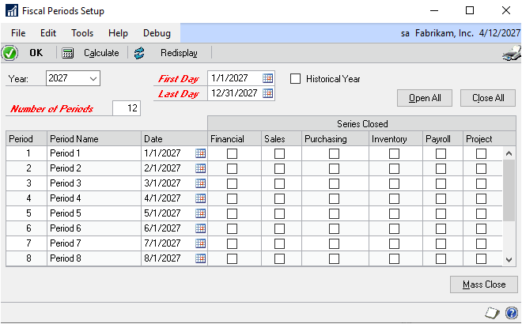

1. Enter the year.

2. Enter the first day and last day of the fiscal year. The fiscal year can be
    any length; it isn't limited to the length of a calendar year.

3. If you're entering fiscal periods for a historical year, mark the Historical
    Year check box.

4. Enter the number of fiscal periods in the fiscal year. For example, if your
    fiscal periods are quarterly, enter 4; if they're monthly, enter 12.

5. Choose Calculate to calculate each period's first day and last day.

The beginning date of each period will appear in the scrolling window. You
can reenter information and recalculate the periods as many times as
necessary.

1. Using the Date column, review the beginning dates of periods and make
    changes if necessary.

2. Using the Period Name column, change the period names to names that reflect
    the needs of your business. For example, you might enter Ending 1/31/2007 or
    Quarter 1 for Period 1.

    > [!NOTE]
    > Skip the Series Closed columns for now. You'll use those columns later, as part of your period-end procedures, to prevent further posting to a series after a period has been closed.

1. Choose OK to save the fiscal period information you've entered and close the
    window.

#### Changing fiscal periods

You can make changes to your fiscal periods at any time using the Fiscal
Periods Setup window.

**To change fiscal periods:**

1. Open the Fiscal Periods Setup window.

(Administration \>\> Setup \>\> Company \>\> Fiscal Periods)

1. Make your changes.

2. Choose OK to save your changes and close the Fiscal Periods Setup window.

3. Reconcile the General Ledger year using the Reconcile Financial Information
    window, if necessary.

    - If you make changes to your fiscal periods before entering beginning
        balances, you don't have to reconcile General Ledger.

    - Ιf you make changes to the dates of your fiscal periods after you've
        entered beginning balances, you must reconcile General Ledger for the
        appropriate year. Reconciling will ensure that all transactions are
        correctly assigned to the periods in which they were entered.

### Chapter 13: Posting setup

Transactions form the basis of the financial information in your accounting
system. A transaction is a record of an event, such as a purchase or sale,
that is ultimately reflected in an asset, liability, expense, revenue, or
equity account. Entering a transaction in Microsoft Dynamics GP is similar
to making a journal entry in a manual accounting system—you have a record of
the information, but it's not permanent.

Posting is the process that transfers the transaction amounts to your
general ledger. Getting the information there is important, because that's
the basis of your financial statements. However, it's also important to be
able to trace the amounts back to the original transaction, if necessary.
That's where source document codes and audit trail codes come in.

This information is divided into the following sections:

- *Tracing the audit trail*

- *Default source document codes*

- *Printing a list of default source document codes*

- *Setting up an additional source document code*

- *Modifying a source document code*

- *Audit trail codes*

- *Printing a list of audit trail codes*

- *Assigning source document codes to audit trail codes*

- *Specifying which posting journals to reprint*

- *Assigning default posting accounts*

- *Selecting posting and reporting options*

- *Batch control*

- *Posting in detail from subsidiary ledgers*

- *Posting "to" and "through" General Ledger*

- *Specifying posting settings*

- *About printing destinations*

- *Specifying posting report options*

#### Tracing the audit trail

The audit trail is a collection of records that allows you to trace a
transaction from any point in the Microsoft Dynamics GP system back to the
location where it was originally entered. With the information you've
entered about the transactions, you should be able to trace them from their
originating point in Microsoft Dynamics GP to the actual source
documents—such as invoices, checks, or receipts—that provided the basis for
the transactions.

When you trace the audit trail using posting journals, you'll use two tools:
source document codes and audit trail codes. These tools allow you to track
a transaction to its origin by two separate paths:

- The source document code typically identifies the entry or document that
    serves as the basis for the transaction.

- The audit trail code identifies the posting journal the transaction appears
    on. For more information about audit trail codes, see *Audit trail codes* .

#### Default source document codes

Source document codes are general in nature, and are useful for tracking the
type of journal or entry you should examine for more information about a
transaction. They don't indicate which journal a given transaction appears
on, however. Source document codes are particularly useful if you're
entering all transactions in General Ledger because you can assign a source
document code that identifies the type of transaction you're entering. For
example, you might use the source document code GJ if the transaction
represents a general journal entry. You'll find that source document codes
are more flexible, but may be less precise, than audit trail codes.

Microsoft Dynamics GP provides a limited number of commonly used source
document codes, and you can set up additional codes using the Source
Document Setup window.

Source document codes typically indicate the type of document that the
transactions first appeared on. The source document codes you enter in the
Source Document Setup window are used in two ways:

- You can assign source document codes to individual transactions entered in
    the General Ledger transaction entry windows.

- You can assign source document codes to transaction origins using the Audit
    Trail Code Setup window. Then, all transactions that are entered using the
    specified transaction origin are assigned the same source document code.

#### Printing a list of default source document codes

Before setting up additional source document codes or modifying source
document codes, you should print the Source Document List.

**To print a list of default source document codes:**

1. Open the Source Document Setup window. (Administration \>\> Setup \>\>
    Posting \>\> Source Document)

2. Choose File \>\> Print or choose the printer icon button.

The Source Document List is printed, showing all the source document codes
that have been set up. You also can print this report using the Company
Setup Report Options window.

#### Setting up an additional source document code

If you need source document codes in addition to those provided with
Microsoft Dynamics GP, set them up using the Source Document Setup window.

**To set up an additional source document code:**

1. Open the Source Document Setup window. (Administration \>\> Setup \>\>
    Posting \>\> Source Document)

2. In the Source Document field, enter a source document code.

3. In the Description field, enter a description for the source document code.

4. Choose Save to save the source document code.

#### Modifying a source document code

You can change the description for existing source document codes at any
time using the Source Document Setup window. To delete a source document
code once it's been assigned to an audit trail code, you must first remove
the source document code from any origins it's assigned to in the Audit
Trail Codes Setup window.

**To modify a source document code:**

1. Open the Source Document Setup window. (Administration \>\> Setup \>\>
    Posting \>\> Source Document)

2. In the Source Document field, enter or select the source document code you
    want to change.

3. Make your changes.

4. Choose Save to save the source document code.

#### Audit trail codes

Audit trail codes provide a precise record of each transaction, including
where it's been posted as the transaction has made its way through the
Microsoft Dynamics GP system. Unlike source document codes, audit trail
codes pinpoint the exact posting journal the transaction was included on.
Using audit trail codes, you can trace transactions to their origins quickly
and accurately.

Audit trail codes are made up of two components: the prefix and the journal
number. The prefix indicates a particular type of posting journal, such as
the General Transaction Posting Journal, and the journal number indicates
which specific journal, among all the General Transaction Posting Journals,
that a transaction can be found on.

If a transaction was entered in a subsidiary module and posted through
General Ledger, it will have two audit trail codes associated with it, one
for General Ledger and one for the originating module. For example, a
Receivables Management sales transaction may be assigned codes of
RMSLS00000214 when it is posted in Receivables Management and GLTRX00000485
when it is posted in General Ledger. Once the transaction reaches General
Ledger, the Receivables Management audit trail code becomes the General
Ledger batch ID. As a result, General Ledger posting journals will contain
the audit trail codes for both postings—the one in General Ledger and the
one in Receivables Management.

If you were to refer to General Transaction Posting Journal number 485,
you'd find the transaction, along with the audit trail code (now the batch
ID) indicating that this transaction previously appeared on Sales Entry
Posting Journal number 214. By cross-referencing the journals in this way,
you can trace any transaction to its point of origin in Microsoft Dynamics
GP. (You also could learn the customer's purchase order number, and check
number by clicking links, if you needed to trace the transaction beyond the
transaction entry point.)

To ensure the integrity of the audit trail, the audit trail codes provided
with Microsoft Dynamics GP can't be changed, and you can't create additional
audit trail codes. However, you can change the number that will be assigned
to the next posting journal of a particular type. You also can change the
default source document code that's assigned to a particular audit trail
code.

#### Printing a list of audit trail codes

Before assigning source document codes to audit trail codes, you should
print the Audit Trail Codes List.

**To print a list of audit trail codes:**

1. Open the Audit Trail Codes Setup window. (Administration \>\> Setup \>\>
    Posting \>\> Audit Trail Codes)

2. Choose File \>\> Print.

The Audit Trail Codes List is printed, showing all the audit trail codes in
Microsoft Dynamics GP and the source document codes assigned to them. You
also can print this report using the Company Setup Report Options window.
See Help \>\> Index \>\> Company Setup Report Options window for more
information.

#### Assigning source document codes to audit trail codes

Audit trail codes are assigned to each transaction entry method and identify
where specific transactions were entered.

**To assign source document codes to audit trail codes:**

1. Open the Audit Trail Codes Setup window. (Administration \>\> Setup \>\>
    Posting \>\> Audit Trail Codes)

    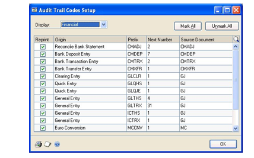

1. Select a series.

2. Enter the number you want assigned to the next posting journal. (This number
    is the second half of the audit trail code.) This number is incremented by
    one each time you post transactions using the specified origin.

3. Identify a default source document code for each audit trail code. You can
    change the source document code for a given audit trail code at any time.

4. To print a list of audit trail codes, choose File \>\> Print. The Audit
    Trail Codes List is printed, showing information for the currently displayed
    series. You also can print this report using the Company Setup Report
    Options window.

5. Choose OK to save the audit trail codes and close the window.

#### Specifying which posting journals to reprint

Using the Audit Trail Codes Setup window, you can specify, by audit trail
code, whether you want to be able to reprint posting journals. You may want
to do this for one of the following reasons:

- As a safeguard against lost or misplaced posting journals.

- If you don't want to print posting journals every time you post
    transactions.

If you mark the option to reprint posting journals, Microsoft Dynamics GP
will retain more information about your transactions than if the option is
unmarked. Depending on your transaction volume, these historical records may
take a great deal of hard disk space. If your hard disk space is limited,
you may want to unmark the option to reprint posting journals.

*History records are kept automatically for transactions and accounts if you
choose to reprint posting reports. Refer to the documentation for each
Microsoft Dynamics GP module for more information on keeping history.*

**To specify which posting journals to reprint:**

1. Open the Audit Trail Codes Setup window. (Administration \>\> Setup \>\>
    Posting \>\> Audit Trail Codes)

2. Select a series.

3. Specify which posting journals can be reprinted, using one of the following
    techniques:

    - Choose Mark All if you want the option of reprinting posting journals
        for all transaction origins within the selected series.

    - Choose Unmark All if you don't want to have the option to reprint
        posting journals for any transaction origins within the selected series.

    - In the Reprint column, mark individual transaction origins that you want
        to be able to reprint and unmark the transaction origins you don't want
        to be able to reprint.

4. To print a list of audit trail codes, which also shows the posting journal
    reprint options for each origin, choose File \>\> Print. The Audit Trail
    Codes List is printed, showing information for the series. You also can
    print this report using the Company.

5. Choose OK to save changes and close the Audit Trail Codes Setup window.

#### Assigning default posting accounts

To simplify data entry, it's a good idea to set up a default posting account
for every type of account that could be posted to when you post a batch or
transaction. For instance, when you post a sales transaction, amounts may
need to be posted to a cash account, an accounts receivable account, a cost
of goods sold account, and so on. You'll use the Posting Accounts Setup
window to assign default posting accounts.

Once the accounts are set up, they appear as default entries in Microsoft
Dynamics GP transaction entry windows. You also can use the customer, item,
or vendor maintenance window to enter posting accounts unique to each
customer, item, or vendor. You'll be able to override the default accounts
if they're not appropriate for a given transaction.

**To assign default posting accounts:**

1. Open the Posting Accounts Setup window. (Administration \>\> Setup \>\>
    Posting \>\> Posting Accounts)

2. From the Display list, select an individual series to assign default posting
    accounts for, or select All to display all posting accounts in the Posting
    Account column.

3. Place the pointer in the Accounts column of the row containing the posting
    account you want to assign an account for.

4. Enter an account, or select one from the lookup window. (To display the
    lookup window, choose the lookup button next to the Accounts heading.)

5. Repeat steps 3 and 4 until you've assigned default posting accounts for each
    account description in the scrolling window.

6. To print a Posting Accounts Report showing a list of the default posting
    accounts that have been assigned, choose File \>\> Print. You also can print
    this report using the Company Setup Report Options window.

7. Choose OK to save the information and close the window.

#### Selecting posting and reporting options

A variety of posting and reporting options can be specified for each
transaction origin in Microsoft Dynamics GP. The origin refers to the
transaction entry window or method by which transactions are entered.

For each origin, you can choose whether to post transactions to General
Ledger, or to post them through General Ledger to automatically update
account balances in the chart of accounts.

*You can specify how much or how little detail you want posted from an
origin to General Ledger. However, if you enter a batch and distribute the
same debit and credit amount to the same posting account, you must create a
journal entry for each transaction and post through General Ledger in
detail. If you posted the transaction in summary form, the transaction
balance would be zero and posting in General Ledger wouldn't be allowed.*

You also can choose whether to print posting journals for each transaction
origin. We recommend that you choose to print these reports and store them
with your company's permanent records as part of the audit trail, but the
choice is yours. For more information on using the audit trail in Microsoft
Dynamics GP, refer to the General Ledger documentation.

#### Batch control

You can choose to use batch controls to limit the batches that can be posted
to only those that meet certain criteria. If you want to post only those
batches that have a certain number of transactions, mark the Verify Number
of Trx option. If you want to post only those batches whose totals equal a
certain amount, mark the Verify Batch Total option in the Posting Setup
window. If you want to post only those batches that have been approved for
posting, mark the Require Batch Approval option and enter the Approval
Password.

#### Posting in detail from subsidiary ledgers

You can choose the level of detail that will be included when transactions
are posted from subsidiary origins to General Ledge using the Create a
Journal Entry Per options in the Posting Setup window.

If you want a separate journal entry created in General Ledger for each
transaction, mark the Create a Journal Entry Per Transaction option.

If you want to create one journal entry in General Ledger for all the
transactions in a batch, mark the Create a Journal Entry Per Batch option.
If you select this option, you can select additional options to summarize
the information:

- If you want transaction distributions to a particular account to be posted
    using the Level of Posting settings for each account (set in the Account
    Maintenance window), mark the Use Account Settings option. If the account is
    to be posted in detail, a separate distribution line item is created in
    General Ledger for each transaction that affects the account. If the account
    is to be posted in summary*,* a single distribution line item is created in
    General Ledger for all transaction amounts that affect the account. For more
    information, see *Setting up a posting account in Microsoft Dynamics GP* .

- If you want all transaction distributions to a particular account to be
    posted as a summarized total, do not mark the Use Account Settings option.

For the fastest performance when posting to General Ledger, select Create a
Journal Entry Per Batch and leave Use Account Settings unmarked.

Due to the additional processing required, the slowest performance option is
Create a Journal Entry Per Batch with Use Account Settings marked. However,
this option gives you the greatest control over the amount of detail that is
provided in your General Ledger.

#### Posting "to" and "through" General Ledger

The main difference between these posting options is that when you are
posting to General Ledger, you'll have an extra opportunity to verify
transactions before they affect your permanent records. When you are posting
through General Ledger, you'll save time by not completing the additional
verification step.

**Post to General Ledger** If you choose to post to General Ledger, batches
posted in all other modules will update the module in which the transaction
originated, then create a batch of General Ledger transactions. Then you
must post those batches within General Ledger, as well, to update the
posting accounts for the transactions.

If you decide not to mark the Post to General Ledger option, batches will be
posted within the selected series only. You might want to unmark this option
while entering beginning balances or while making adjustments within the
series.

When you're ready to begin posting routine transactions, be sure to return
to the Posting Setup window and mark the option if you want transactions to
be available for posting in General Ledger.

**Post Through General Ledger Files** You also can choose whether General
Ledger accounts will be updated automatically when you post from another
module to General Ledger. If you mark the Post Through General Ledger Files
option, batches posted in other modules automatically will update the module
in which the transactions originated and the appropriate posting accounts in
General Ledger. Your transactions will post to General Ledger and not
through General Ledger when posting transaction individually (without a
batch).

If you don't mark the option, you'll be able to edit the transactions again
using General Ledger's Transaction Entry window before posting them to your
permanent General Ledger records. However, if you edit amounts at this
point, you must reconcile General Ledger's year-to-date tables to ensure
that posted amounts are identical. For more information on reconciling
financial information, refer to the General Ledger documentation.

#### Specifying posting settings

Use the Posting Setup window to determine how transactions are posted for
each origin or transaction entry method within a particular Microsoft
Dynamics GP series.

**To specify posting settings:**

1. Open the Posting Setup window. (Administration \>\> Setup \>\> Posting \>\>
    Posting)

    

1. From the Series list, select a series.

2. From the Origin list, select a transaction origin. You can specify settings
    for each origin, or for all origins.

3. To specify how you want transactions from subsidiary modules posted to
    General Ledger, make one of the following selections:

    - Mark Post to General Ledger to transfer transactions from subsidiary
        modules to General Ledger when you post. You can verify the transactions
        in the General Ledger Transaction Entry window and you'll have to post
        the batches in General Ledger before they update your account balances.

    - Mark Post Through General Ledger Files to transfer transactions from
        subsidiary modules to General Ledger and automatically post them to your
        posting accounts.

    - Leave both selections unmarked if you don't want to post to General
        Ledger. You might unmark these selections when you're entering beginning
        balances or if you're entering correcting transactions in a subsidiary
        module and don't want the amounts to affect General Ledger.

For more information, refer to *Posting "to" and "through" General Ledger* .

1. If you're posting to General Ledger, specify how detailed you want your
    journal entries to be. You can make the following selections:

    - Create a journal entry per **transaction** to post in detail (to create
        a separate journal entry for each transaction). Select this option to
        have the most detailed information available.

    - Create a journal entry per **batch** and leave Use Account Settings
        **unmarked** to post in summary (to create a single journal entry for
        the batch total for each account). Select this option for the fastest
        posting.

    - Create a journal entry per **batch** and **mark** Use Account Settings
        to post according to the specifications for each account. Select this
        option to get a mix of detail and summary information. (This option is
        the slowest of the three.)

    - If you selected Payroll as the series, mark Post in Detail to have the
        most detailed information available.

Refer to *Posting in detail from subsidiary ledgers* for more information.

1. Mark Allow Transaction Posting to have the option of posting transactions
    individually from the selected transaction origin. Unmark this selection to
    require all transactions to be entered in a batch.

2. In the Posting Date From field, make one of the following selections if you
    selected Transaction in step 5:

    - Mark Batch to post all transactions in the batch by the same date.

    - Mark Transaction to post each transaction by the transaction's posting
        date.

3. Mark Include Multicurrency Info if you're using Multicurrency Management.
    Posting journals printed as part of the posting process will include
    multicurrency information; reprinted posting journals won't include
    multicurrency information even if this option is marked.

4. In the If Existing Batch field, make one of the following selections to
    specify what happens if you post additional transactions from the same
    source and the first batch still exists in General Ledger:

    - Mark Append to add the transactions to the existing batch.

    - Mark Create New to create a new batch.

5. Specify options for posting reports. For more information, see *Specifying
    posting report options* .

Choose Save to save the posting setup information.

#### About printing destinations

You can select any combination of the following printing destinations for
posting journals and other audit reports.

**Printer** The report is printed to the default printer specified in your
computer's printer setup.

**Screen** The report appears on the screen and you can then choose to print
to the printer. In addition, if you're using an e-mail system that's
compatible with MAPI (Messaging Application Programming Interface) or
Exchange, you can mail any Microsoft Dynamics GP report that you print to
the screen.

**File** The report is saved as a file. You can specify the following:

- The report file name and location.

- One of the file formats described below.

- Whether you want to replace an existing copy of the report file each time
    you print it, or append the new report to the end of the existing file.

The file formats you can select when you print a report to a file are listed
in the following table:

| **File format** | **Description**           |
|-----------------|---------------------------|
| Tab-delimited   | The tab-separated ASCII character format used by spreadsheet programs, such as Microsoft Excel.   |
| Comma-delimited | The standard comma-separated ASCII character format used by database programs.      |
| Text            | Text with no formatting. Use this option only if the application you'll use to read the report can't read any other format.    |
| HTML            | A format that can be views in a web browser.   |
| XML Data        | A text file that contains an XML representation of the report layout and all the report data. Choose this format if you want to process the report using an external application.      |
| Adobe PDF       | This format is available if you have the PDFWriter printer driver installed (included with Acrobat 5 and earlier), or Acrobat Distiller from Acrobat 6 or later. PDF (Portable Document Format) files can be read using Adobe Reader software available from Adobe. |
| Word Document   | The Microsoft Office Open XML (.docx) file format used by Word 2007 or later. You can select this format if you select Template as the report type.  |

#### Specifying posting report options

By default, Microsoft Dynamics GP automatically prints posting reports. If
you don't want to print the reports, or if you want to select different
destinations for the reports, you can change them using the Posting Setup
window.

**To specify posting report options:**

1. Open the Posting Setup window.

(Administration \>\> Setup \>\> Posting \>\> Posting)

1. From the Series list, select a series.

2. From the Origin list, select a transaction origin.

3. In the Print column of the Reports scrolling window, unmark any reports you
    don't want to print.

    - To unmark all reports that are currently displayed in the scrolling
        window, choose Unmark All.

    - To mark all reports in the scrolling window, choose Mark All.

4. In the Send To column, specify one or more destinations for the reports you
    want to print.

5. If you selected File as one of the options in step 5, make the following
    selections:

- In the Type column, select a file format.

- In the Append/Replace column, select what to do if the report file already
    exists.

- In the Path column, enter the location and the file name for the report
    file.

1. To print the Posting Settings Report, showing the posting and reporting
    options for the selected series and origin, choose File \>\> Print. You also
    can print this report for all series and origins for the current company
    using the Company Setup Report Options window.

2. Choose Save to save the posting report options.

### Chapter 14: Shipping methods and payment terms

When you create a new company, you have the option to load default shipping
methods and payment terms. You also can set up additional shipping methods
and payment terms, or make changes to existing ones.

This information is divided into the following sections:

- *Shipping methods*

- *Setting up a shipping method*

- *Payment terms*

- *Setting up payment terms*

- *Setting up payment terms with discounts*

- *Taxes calculations for New Zealand payment terms with discounts*

#### Shipping methods

A shipping method is one of many ways that goods are transported to your
company from your vendors, and from you to your customers. You can use the
same shipping methods for your vendors and your customers.

A shipping type indicates whether the goods are delivered by the vendor or
picked up by the customer. The shipping type is used when calculating taxes.
See *Part 4, Tax setup*, for more information.

If you installed the default shipping methods provided with Microsoft
Dynamics GP when you created the company you're setting up, they'll appear
when you open the Shipping Methods Setup window and you choose the Shipping
Method lookup button. You also can print a list of shipping methods by
choosing File \>\> Print in the Shipping Methods Setup window.

#### Setting up a shipping method

If you didn't load default shipping methods, or if you need additional
shipping methods, use the Shipping Methods Setup window to create them. If
several carriers routinely provide the same type of shipping service, set up
a unique shipping method name for each carrier.

If, after beginning to use your system, you need to update or remove any of
the shipping methods, you can do so. Existing transactions that used the
shipping methods won't be affected by the changes.

**To set up a shipping method:**

1. Open the Shipping Methods Setup window. (Administration \>\> Setup \>\>
    Company \>\> Shipping Methods)

2. Enter a shipping method and description.

3. Select either pickup or delivery as the shipping type.

- Select Pickup if the purchaser picks up the goods.

- Select Delivery if the goods must be delivered by the seller, a shipping
    company, or by mail.

1. Enter the name of the carrier providing the shipping method.

2. Enter the account number assigned to your company by the carrier.

3. Enter the name of the person you speak or deal with most often, and the
    phone number where the contact person can be reached.

4. Choose Save to save the shipping method information.

#### Payment terms

Payment terms outline the terms under which a vendor expects payment from a
customer. In Microsoft Dynamics GP, you'll work with payment terms that your
company extends to customers, and also with payment terms that vendors
extend to your company.

The following table displays common payment terms and descriptions.

| **Invoice Date**                                                                                                                                                                                                                                                                                                                                                                                                                                                                                | **Payment Terms** | **Discount Days** | **Discount Date** | **Percent Discount** | **Due Date** |
|-------------------------------------------------------------------------------------------------------------------------------------------------------------------------------------------------------------------------------------------------------------------------------------------------------------------------------------------------------------------------------------------------------------------------------------------------------------------------------------------------|-------------------|-------------------|-------------------|----------------------|--------------|
| 11/30                                                                                                                                                                                                                                                                                                                                                                                                                                                                                           | 2%-10/Net 30      | 10                |                   | 2.00%                | 12/30        |
| The customer is offered a 2% discount in return for payment within 10 days after the purchase, or invoice date. The payment is due in full 30 days after the invoice date.                                                                                                                                                                                                                                                                                                                     |                   |                   |                   |                      |              |
| 11/30                                                                                                                                                                                                                                                                                                                                                                                                                                                                                           | 2%-10th/Net 30    |                   | 12/10             | 2.00%                | 1/09         |
| The customer is offered a 2% discount in return for making payment by the 10th of the month following the month in which the invoice date occurred. Since the invoice date is in November, the "10th" referenced in the payment terms would be the 10th of December. The payment is due in full 30 days after the discount date. If the invoice is generated in one of the first 9 days of the month, the discount is available only until the 10th of the month in which the invoice occurred. |                   |                   |                   |                      |              |
| 11/30                                                                                                                                                                                                                                                                                                                                                                                                                                                                                           | 2%-15th/EOM       |                   | 12/15             | 2.00%                | 12/30        |
| The customer is offered a 2% discount in return for payment by the 15th of the month. Since the invoice date is November 30th, the discount date is the 15th of the following month. If the invoice date were December 5th or 10th, the discount date still would be December 15th. The payment is due in full at the end of the same month as the discount date.                                                                                                                              |                   |                   |                   |                      |              |
| 11/30                                                                                                                                                                                                                                                                                                                                                                                                                                                                                           | Net 30 days       |                   |                   |                      | 12/30        |
| The payment is due in full 30 days after the invoice date.                                                                                                                                                                                                                                                                                                                                                                                                                                     |                   |                   |                   |                      |              |

#### Setting up payment terms

If you chose to install the default payment terms provided with the
accounting system when you created the company you're setting up, they'll
appear when you open the Payment Terms Setup window and choose the Payment
Terms lookup button. You also can print a Payment Terms Report by choosing
File \>\> Print in the Payment Terms Setup window.

If you didn't load default payment terms, or if you need additional payment
terms, use the Payment Terms Setup window to create them. Use the following
procedure to set up payment terms that don't include a discount.

If, after beginning to use your accounting system, you need to update or
remove any of the payment terms, you can do so at any time. Existing
transactions using the payment terms won't be affected by the changes.

For payment terms that use a date or the end of month (EOM) payment terms,
you can specify a grace period for each customer to whom you're offering
Date/EOM payment terms, or for each vendor from whom you're receiving those
terms.

- To specify a grace period for customers, use the Customer Maintenance
    window. See the Receivables Management documentation for more information.

- To specify a grace period for vendors, use the Vendor Maintenance Options
    window. See the Payables Management documentation for more information.

**To set up payment terms:**

1. Open the Payment Terms Setup window. (Administration \>\> Setup \>\> Company
    \>\> Payment Terms)

2. Enter the name of the payment terms, such as Net 30 or EOM.

3. From the Due list, select when the full amount of the payment is due.

    - If the payment is due within a certain number of days after the invoice
        date, select Net Days and enter the number of days.

    - If the payment is due by a given date, select Date and enter a date. For
        example, assume that you enter 10 as the date. If an invoice has an
        invoice date is 11/12/2017, the payment is due on 12/10/2017, the 10th
        day of the next month.

    - If the payment is due in full by the end of the month in which the
        invoice date occurs, select EOM.

    - If the payment is due on the 20th of the month following the document
        date, select Next Month.

4. Choose Save to save the payment terms.

#### Setting up payment terms with discounts

Use the Payment Terms Setup window to set up payment terms that include a
discount. You can calculate the discount percentage on the entire payment,
or on any of the amounts that typically appear on an invoice: tax, freight,
and so on. You can choose any combination of these amounts, depending on
what you allow customers to discount, or what you are allowed to discount.

**To set up payment terms with discounts:**

1. Open the Payment Terms Setup window.

    (Administration \>\> Setup \>\> Company \>\> Payment Terms)

1. Enter the name of the payment terms, such as 2%-10/Net 30.

2. From the Due list, select when the full amount of the payment is due. See
    *Setting up payment terms* for more information.

3. From the Discount list, select when the payment must be made for the
    customer to receive a discount.

    - If a discount is given if payment is made within a certain number of
        days after the invoice date, select Days and enter the number of days.

    - If a discount is given if payment is made by a certain date following
        the invoice date, select Date and enter the date. For example, assume
        that you enter 10 as the date. If an invoice has an invoice date is
        11/12/2017, the discount expires on 12/10/2017, the 10th day of the next
        month.

    - If the discount is given if payment is made by the end of the month in
        which the invoice date occurs, select EOM.

4. In the Discount Type field, select whether to base the discount on a
    percentage of the total amount or a fixed currency amount.

    - If you select Percent, enter a percentage for the discount.

    - If you select Amount, enter a currency amount for the discount.

5. In the Calculate Discount On list, select the amounts that the discount
    applies to.

6. Choose Save to save the payment terms.

#### Taxes calculations for New Zealand payment terms with discounts

Assume a debtor has a payment terms discount of 2%/10 Net 30, and makes a
\$100 purchase.

- If the debtor doesn't pay the invoice within 10 days (the discount period),
    the following amount is charged:

| Sale amount | \$100.00 |
|-------------|----------|
| GST amount  | \$12.50  |
| Total       | \$112.50 |

- To calculate taxes correctly for this situation in Microsoft Dynamics GP,
    the Calculate Terms Discount Before Taxes box in the Company Setup Options
    window must be **unmarked**.

- If the debtor pays the invoice within 10 days, the debtor is eligible for a
    2% discount, and the total sale would be as shown:

| Sale amount | \$100.00 - 2% discount = | \$98.00  |
|-------------|--------------------------|----------|
| GST amount  | \$12.50 - 2% discount =  | \$12.25  |
| Total       |                          | \$110.25 |

- To calculate taxes correctly for this situation in Microsoft Dynamics GP,
    the Calculate Terms Discount Before Taxes box in the Company Setup Options
    window must be **marked**.

### Chapter 15: Financial information

Use this information to set up currencies, bank records, and checkbooks for
each company. This information is divided into the following sections:

- *Setting up currencies*

- *Setting up a currency record*

- *Setting company access to a currency*

- *Specifying functional and reporting currencies*

- *Checking links for currency tables*

- *Setting up a bank record*

- *Using checkbooks throughout Microsoft Dynamics GP*

- *Check numbers and deposit numbers*

- *Inactive checkbooks*

- *Last reconciled date and last reconciled balance*

- *Setting up a checkbook*

- *Setting up payables options for a checkbook*

- *Setting up a credit card*

#### Setting up currencies

Currency records track information about how the currency will be used in
Microsoft Dynamics GP, as well as how it appears in windows and on reports.
Currency records are used throughout the Microsoft Dynamics GP system; once
a currency record is set up, you can set access to it for multiple
companies, if needed.

- The functional currency is the currency in which a company maintains its
    financial records.

- The reporting currency is used to convert financial currency amounts to
    another currency on inquiries and reports.

*You must set up a functional currency, even if you're not using
Multicurrency Management.*

To set up currencies, you'll need to complete the following procedures:

- Set up one or more currency records.

- Set access to the currency for your company.

- Specify functional and reporting currencies.

- Check links to ensure that related tables are updated.

> [!NOTE]
> If you've loaded the sample company, you can use its currency records in
your own company.

#### Setting up a currency record

Currency records are used throughout the Microsoft Dynamics GP system; once
a currency record is set up using the Currency Setup window, you can set
access to it for multiple companies, if needed.

**To set up a currency record:**

1. Open the Currency Setup window. (Administration \>\> Setup \>\> System \>\>
    Currency)

    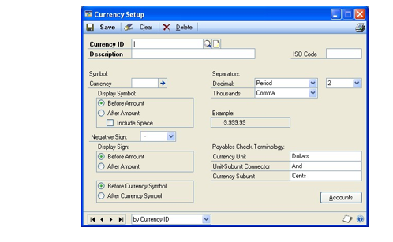

1. In the Currency ID field, enter or select a name for the currency.

2. In the Description, ISO code, and Symbol fields, enter the information
    that's appropriate for the currency.

3. Select additional display and separator options and enter payables check
    terminology.

4. Choose Save to save the currency information.

#### Setting company access to a currency

Once a currency record is set up using the Multicurrency Access Setup
window, you can set access to it for multiple companies, if needed.

**To set company access to a currency:**

1. Open the Multicurrency Access Setup window. (Administration \>\> Setup \>\>
    System \>\> Multicurrency Access)

    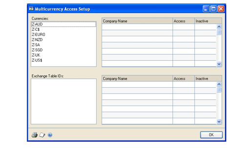

1. From the Currencies list, select the currency to which you want to set access.

2. In the Access column, mark the box for each company that uses this currency.

3. Choose OK to save your entries and close the window.

#### Specifying functional and reporting currencies

Use the Multicurrency Setup window to specify functional and reporting
currencies for each company. The functional currency is the primary currency
that the company uses for maintaining accounting records. The reporting
currency is used to convert functional currency amounts to another currency
on inquiries and reports. For a subsidiary, the reporting currency typically
is the functional currency of the parent company.

**To specify functional and reporting currencies:**

1. Open the Multicurrency Setup window. (Financial \>\> Setup \>\> Financial
    \>\> Multicurrency)

    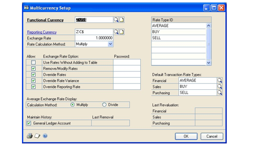

1. In the Functional Currency field, enter the currency that your business uses
    most often. Typically, this is the currency of the country or region in which your
    organization is located.

2. In the Reporting Currency field, enter the currency that your organization
    uses for reporting. (optional)

3. Enter the exchange rate and rate calculation method to be used when
    calculating the reporting currency. If no reporting currency was entered,
    these fields will be disabled.

    > [!TIP]
    > You can mark the Override Reporting Rate option if you would like the user to override the reporting currency exchange rate or rate calculation method on inquiries and reports. You also can enter a password if you want the password to be required when overriding the rate and calculation method.

1. In each of the Default Transaction Rate Types fields, enter or select a rate
    type.

If you're not using Multicurrency Management, make the following selections:

| **Field**  | **Selection** |
|------------|---------------|
| Financial  | AVERAGE       |
| Sales      | AVERAGE       |
| Purchasing | AVERAGE       |

1. Choose OK to save your changes and close the window.

When you choose OK, a message may instruct you to check links on the
Multicurrency Setup table. For example, if you have changed the functional
currency, the message will appear.

#### Checking links for currency tables

Use the Check Links window to check relationships among tables to find
information that may be missing from one table within the relationship. To
verify that all updated multicurrency information is present, you'll need to
add the Multicurrency Setup table into your list of tables to check links
for.

**To check links for currency tables:**

1. Open the Check Links window.

(Microsoft Dynamics GP menu \>\> Maintenance \>\> Check Links)

1. In the Series list, be sure that Financial is displayed.

2. In the Logical Tables list, select Multicurrency Setup and choose Insert to
    insert it into the Selected Tables list.

3. Choose OK to check links.

#### Setting up a bank record

A bank is a financial institution with which you do business. You'll use the
Bank Maintenance window to set up bank records.

If you do business with a bank at more than one location, you can set up
separate bank IDs for each of the bank branches. For example, if you do
business with Metro Bank at both its Main office and its Park Avenue office,
you could set up Metro Bank1 and Metro Bank2 as bank IDs and enter Main and
Park Avenue as the bank branches.

**To set up a bank record:**

1. Open the Bank Maintenance window. (Administration \>\> Setup \>\> Company
    \>\> Bank)

2. Enter a bank ID and name.

3. Enter the bank's address information, including phone and fax numbers. If
    you're using Bank Reconciliation, this information can be formatted to be
    printed on deposit slips.

4. Enter the bank's transit number. This is the first group of numbers (usually
    followed by a colon) in the lower left corner on checks issued by the bank.

5. Enter the bank branch to further identify this bank ID.

6. Choose Save to save the bank information.

7. To print a Bank List containing information for the currently selected bank,
    choose File \>\> Print. You also can print this report using the Company
    Setup Report Options window.

#### Using checkbooks throughout Microsoft Dynamics GP

Use checkbooks to maintain records of deposits, checks, or cash paid out.
Later, you can reconcile this information with the statement of activity
provided by your bank.

You can set up an unlimited number of checkbooks to manage your company's
cash. For example, one checkbook can be set up for writing payroll checks,
another for making payments to vendors, and a third for recording
miscellaneous payments made by your business.

If you add Bank Reconciliation after you've begun using Microsoft Dynamics
GP, it's a good idea to set up completely new checkbook IDs. This way,
transactions that were entered in other modules won't need to be posted
before using Bank Reconciliation.

*If you're moving checkbooks to Microsoft Dynamics GP from another
accounting system, see Chapter 1, "Setup preparation," in the Bank
Reconciliation documentation.*

The Cash Account From option in each of the following windows specifies
whether to use the cash account from the checkbook assigned to a transaction
or the cash account assigned to the customer, employee, or vendor.

- Customer Class Accounts Setup

- Customer Account Maintenance

- Vendor Class Accounts Setup

- Vendor Account Maintenance

- Employee Maintenance

- Employee Class Setup

If you're using Bank Reconciliation, be sure to use the cash account from
the checkbook to ensure that your checkbook balances can be easily
reconciled.

#### Check numbers and deposit numbers

Check and deposit numbers can be alphanumeric. If alphabetic characters are
entered, the numerals—not the letters—will increment as you process checks
and enter deposits.

By defining the next number, you're also determining the number of unique
numbers that will be available. For example, if you enter CK001 as the next
check number, you'll only be able to enter up to 999 unique checks. Be sure
to enter a number large enough to accommodate your business.

If alphabetic characters are entered between numbers, only the numbers to
the right of the last letter you've entered will increment. For example, if
the next check number is CK00M18888, the following check number will be
CK00M18889.

#### Inactive checkbooks

You can inactivate a checkbook at any time. For example, if you plan to
close a checking account in the near future and you don't want to write new
checks or add receipts to this checkbook before you reconcile, you could
inactivate the checkbook to prevent any new checks or receipts from being
entered for that checkbook.

When a checkbook is inactive, you can perform the following functions for
the checkbook:

- Post transactions that were entered in any module.

- Void receipts, transactions or deposits in any module except Payroll. (You
    can't void checks in Payroll.)

- Enter Deposits With Receipts or Deposits To Clear Receipts transactions
    using the Bank Deposit Entry window.

- Enter adjustment transactions using the Reconcile Bank Adjustments window.

- Adjust the checkbook balance to zero using the Reconcile Bank Statements
    window.

#### Last reconciled date and last reconciled balance

For new checkbooks, the last reconciled balance is the checkbook's current
balance. You can make changes to this amount until you've reconciled the
checkbook for the first time. If you change the last reconciled balance
after saving the checkbook, you'll need to enter an adjustment in General
Ledger for the Cash account, because an adjusting entry won't be made
automatically.

After you reconcile a checkbook, the amount in the Last Reconciled Balance
field is the same as the bank statement's ending balance in the Reconcile
Bank Statements window. This amount can't be changed in the Checkbook
Maintenance window.

#### Setting up a checkbook

Use the Checkbook Maintenance window to set up a new checkbooks.

**To set up a checkbook:**

1. Open the Checkbook Maintenance window. (Financial \>\> Cards \>\> Financial
    \>\> Checkbook)

2. Enter a checkbook ID and description.

3. Enter a currency ID, payment rate type ID, and deposit rate type ID.

4. Enter the Cash account to which this checkbook's transactions will be
    posted.

It's best to set up a separate Cash account for each checkbook. That way,
you'll have a separate record of each checkbook's activity in General
Ledger. The checkbook Cash account must be a posting account—it can't be
either a unit account or an allocation account if a unit account is assigned
as one of the distributions.

1. Enter the number of the next check and deposit transaction that will be
    issued from or entered in this checkbook. Each time you enter a check or
    deposit, the number is incremented by one to the next available number.

2. Select the address ID of the company location that uses this checkbook. This
    information appears on the Bank Deposit Worksheet when you print that
    report.

3. Enter the checkbook account number at the bank where the checking account is
    located. Then, select the ID of the bank where this checkbook account is
    located.

4. Enter the date and balance from the last time you reconciled this checkbook.
    This information can be changed, if necessary, until you reconcile the
    checkbook the first time.

5. Enter user-defined information. The entry you make in the first user-defined
    field can be used as a sorting option when printing reports such as the
    Checkbook List.

6. Choose Save to save the checkbook information you've entered.

7. To print a checkbook list containing information for the currently displayed
    checkbook, choose File \>\> Print. You also can print this report using the
    Checkbook Report Options window.

#### Setting up payables options for a checkbook

For greater control, you can specify additional Payables Management options
within the Checkbook Maintenance window for checkbooks that are used to pay
vendors. You can control the following options:

- Maximum check amount

- Allow duplicate check numbers or not

- Allow default check numbers to be changed or not

**To set up payables options for a checkbook:**

1. Open the Checkbook Maintenance window.

(Financial \>\> Cards \>\> Financial \>\> Checkbook)

1. Enter checkbook information. See *Setting up a checkbook* .

2. In the Maximum Payables Check Amount field, enter the largest amount a check
    from this checkbook can be written for. If you don't want to set a limit,
    leave the amount at \$0.00; no maximum will apply.

3. In the Maximum Payables Check Password, enter a password to allow checks to
    be written for more than the maximum, if the password is entered.

4. To use a check number more than once when entering payments, printing checks
    or posting checks in Payables Management for this checkbook, mark the
    Duplicate Check Numbers option.

5. To change the check number when entering payables transactions and payments,
    mark the Override Check Number option.

6. Choose Save to save the checkbook information you've entered.

#### Setting up a credit card

With Microsoft Dynamics GP, you can track information about credit cards
that are accepted from customers and cards that are used by your company.
The same card can be used for both purposes.

Use the Credit Card Setup window to set up information about each of the
credit cards that your company uses.

If, after beginning to use your accounting system, you need to update or
remove any of the credit cards, you may do so at any time. Existing
transactions that were paid using the credit cards won't be affected by the
changes.

**Credit cards and check cards**

Both credit cards and check cards can be used by your company to purchase
goods and services. The difference lies in where the amounts will be posted
for transactions involving these cards.

- Credit cards require that you specify a vendor ID for the credit card
    company. Payments made with credit cards are treated as accounts payable
    amounts. The credit card company acts as a vendor to you in this instance,
    since you'll pay them for the goods and services you purchase with the card.

- Check cards require that you enter a checkbook ID. Payments made with check
    cards are treated as check or cash payments, because the amount is
    automatically withdrawn from your bank account. Banks issue a variety of
    check cards. The checkbook ID is the checkbook in which payments with the
    card should be tracked.

**Bank cards and charge cards**

Both bank cards and charge cards can be accepted from customers. The
difference lies in where the amounts will be posted for transactions
involving these cards.

- Bank cards require that you specify a checkbook ID. Payments with bank cards
    are treated as check or cash payments. The checkbook ID identifies the
    checkbook in which you will track payments made with this card.

- Charge cards require that you enter a posting account. Payments made with
    charge cards are treated as accounts receivable amounts. They must be
    submitted to the credit card company and the reimbursement received before
    the payment is considered received.

**To set up a credit card:**

1. Open the Credit Card Setup window. (Administration \>\> Setup \>\> Company
    \>\> Credit Cards)

2. Enter the name of any credit card your business accepts from customers or
    uses to make payments.

3. If the card name you entered is one you accept in payment from customers,
    mark Accepted from Customers. Then do one of the following:

    - If the card is a bank card, mark Bank Card and enter a checkbook ID.

    - If the card is a charge card, mark Charge Card and enter a posting
        account.

4. If the card is used by your company to make payments, mark Used by Company.
    Then do one of the following:

    - If the credit card company bills you monthly for purchases made, mark
        Credit Card and enter a vendor ID for the credit card company.

    - If the card is a check card, mark Check Card and enter a checkbook ID.

5. Choose Save to save the credit card information.

To print a Credit Card Report showing information for the currently
displayed credit card, choose File \>\> Print. You also can print this
report using the Company Setup Report Options window.

### Chapter 16: E-mail setup for documents

Use this information to set up the e-mail functionality for documents in
Microsoft Dynamics GP. For information about sending reports in e-mail, see
Report Writer reports in your System Users Guide (Help \>\> Contents \>\>
select Using The System)

This information is divided into the following sections:

- *E-mail overview for documents*

- *E-mail requirements for documents*

- *E-mail setup for documents checklist*

- *Setting up e-mail document options for a company*

- *Setting up messages for e-mail documents*

- *Customizing a message with additional fields*

- *Copying an existing email message to a new message*

- *Setting up e-mail options for sales documents*

- *Setting up e-mail options for multiple customers*

- *Setting up e-mail options for purchasing documents*

- *Setting up e-mail options for multiple vendors*

#### E-mail overview for documents

By using the e-mail functionality for documents in Microsoft Dynamics GP,
you can embed document into the body of an e-mail or send documents as
attachment. You can send a single document, batches of documents, or
multiple documents from sales and purchasing transaction lists. When setting
up the e-mail functionality, you can select which documents to send and
which customers and vendors should receive their documents in e-mail. If you
are using Word templates for Microsoft Dynamics GP, you can send predefined
or customized forms. For more information, see *Chapter 42, "Word
templates."*

You can send the following documents in e-mail.

| Documents               |  Documents                                |
|-------------------------|----------------------------------|
| Sales quote             | Receivables finance charges      |
| Sales order             | Receivables service/repair       |
| Sales fulfillment order | Receivables warranty             |
| Sales invoice           | Customer statement               |
| Sales return            | Standard purchase order          |
| Sales back order        | Standard purchase order          |
| Packing slip            | Blanket purchase order           |
| Receivables invoice     | Drop-ship purchase order         |
| Receivables return      | Drop-ship blanket purchase order |
| Receivables debit memo  | Vendor remittances               |
| Receivables credit memo |                                  |

You can embed documents into the body of the e-mail or send documents as
attachment. A document can be sent in an HTML, XPS, PDF, or DOCX file format
type. Multiple documents can be combined in a single e-mail.

You also can create predefined messages to send to your customers and
vendors. These messages can be assigned to the documents that you want to
send in e-mail so all customers or vendors receive the same message for
selected documents. For example, you can send a promotional message to your
customers when sending sales quotes in e-mail. You also can assign a
specific message to an individual customer or vendor. For example, you can
send a holiday greeting message to a vendor. When you create a message, you
can enter an alternate e-mail address so your customer or vendor can reply
to a specific e-mail address.

You also can customize your messages by adding fields that are associated
with a document type. For example, a message can be personalized to address
each customer or vendor by name. You could add the due date for a sales
invoice in a message or the on order amount for a purchase order.

#### E-mail requirements for documents

Review the following requirements.

- You can send documents by email if you're using a MAPI-compliant e-mail
    service or Exchange 2007 Service Pack 1 or greater with Exchange Web
    Services.

- If you are using Exchange 2007 Service Pack 1 or greater with Exchange Web

Services, the Autodiscover service must be turned on to connect to the
Exchange server.

- The e-mail functionality in Microsoft Dynamics GP supports the following
    document types. Depending on the document type, Microsoft Word 2010 or later
    and Word templates for Microsoft Dynamics GP are required.

| **File format** | **Word 2010 or later** | **Word templates** | **Web Client** |
|-----------------|------------------------|--------------------|----------------|
| XPS             | Required for MAPI      | Enabled            | Not available  |
| PDF             | Required for MAPI      | Enabled            | Not available  |
| DOCX            | Not required           | Enabled            | Available\*    |
| HTML            | Not required           | Not required       | Available\*    |

\*Email for Microsoft Dynamics GP Web Client will only be available if
Exchange is your server type in the System Preferences window.

- Before you can send documents as DOCX, PDF, or XPS attachments, the Word
    template for the document must be enabled in the Template Configuration
    Manager window.

- The email functionality is supported on the 32-bit edition of Microsoft
    Office 2010.

- The email functionality is supported on the 64-bit edition of Microsoft
    Office 2010 is supported, if you are using Exchange 2007 Service Pack 1 or
    greater with Exchange Web Services.

Depending on the file format you choose to send your documents in e-mail,
your customers and vendors must be using the following components to view
their documents.

| **File format**                                                                                                                 | **Component**                           |
|---------------------------------------------------------------------------------------------------------------------------------|-----------------------------------------|
| XPS                                                                                                                             | Microsoft XPS Viewer                    |
| PDF                                                                                                                             | Adobe Reader                            |
| DOCX                                                                                                                            | Microsoft Word Viewer                   |
| HTML                                                                                                                            | Internet Explorer 9 Internet Explorer 8 |
| \*If you are using Microsoft Dynamics GP Web Client only, your customers and vendors must be using HTML to view their documents |                                         |

#### Setting up e-mail document options for a company

Use the Company E-mail Setup window to select options to use when sending
documents in e-mail. You can select to embed documents, attach documents, or
both. If you select to send documents as attachments, you can specify which
type of file formats you want to attach the documents as. The options you
select in this window are available for customer and vendor records.

If you selected to use an option, such as the DOCX file format, and then
decide not to use the option, you must update the customer and vendor
records that were set up to use the DOCX file format.

**To set up e-mail document options for a company:**

1. Open the Company E-mail Setup window. (Administration \>\> Setup \>\>
    Company \>\> E-mail Settings)

    

1. Mark whether to embed documents into the body of e-mail messages.

2. Mark whether to send documents as attachments in e-mail messages.

3. If you are attaching documents in messages, select the formats to send the
    documents in.

Before you can send documents as DOCX, PDF, or XPS attachments, the Word
template for the document must be enabled in the Template Configuration
Manager window. Standard reports (reports generated by Report Writer) are
sent when you send documents as HTML attachments.

1. Choose one of the following options.

    - Choose OK to save your changes and close the window.

    - Click the Sales Series link to open the Sales E-mail Setup window. See
        *Setting up e-mail options for sales documents* for more information.

    - Click the Purchasing Series link to open the Purchasing E-mail Setup
        window. See *Setting up e-mail options for purchasing documents* for
        more information.

#### Setting up messages for e-mail documents

Use the Message Setup window to create messages that you can send to
customers or vendors when sending documents in e-mail. Messages can be
predefined on a company-wide basis, and used on Sales Order Processing,
Receivables Management, or Purchase Order Processing documents, or Payables
Management remittances.

Messages can be assigned to the documents that you want to send in e-mail so
all customers or vendors receive the same message for selected documents.
For example, you can send a promotional message to your customers when
sending sales quotes in e-mail. You also can assign a specific message to an
individual customer or vendor. For example, you can send a holiday greeting
message to a vendor. When you create a message, you can enter an alternate
e-mail address so your customer or vendor can reply to a specific e-mail
address.

You also can customize your messages by adding fields that are associated
with a document type. For example, a message can be personalized to address
each customer or vendor by name. You could add the due date for a sales
invoice in a message or the PO number for a purchase order.

**To set up messages for e-mail documents:**

1. Open the Message Setup window. (Administration \>\> Setup \>\> Company \>\>
    E-mail Message Setup)

2. Enter an ID to identify the message.

3. Enter a description of the message ID.

4. Select the series in which you want this message to appear. Messages
    assigned to All can be used with both the Sales and Purchasing series.

5. Select a document type from the series you selected. This field isn't
    available if you selected All as the series.

6. Enter a subject line for the message. If you don't enter a subject for the
    message, the document number of the transaction you are sending is used.

You also customize the subject line by adding a field or fields associated
with a document type. See *Customizing a message with additional fields* for
more information.

1. Enter the message that will appear in the e-mail when sending documents.

You also customize the message by adding a field or fields associated with a
document type. See *Customizing a message with additional fields* for more
information.

1. Enter or select an address that a customer or vendor can use to send a reply
    to a specific e-mail address. For example, assume that you have entered
    sales\@fabrikam.com as the reply to address. If you send a document in
    e-mail to a vendor, the vendor receives e-mail from
    username\@domainname.com. When the vendor replies to the e-mail,
    sales\@fabrikam.com is used in the To field.

The default reply to address is the address displayed in the Sales E-mail
Setup window or the Purchasing E-mail Setup window.

1. Choose Validate to verify the field or fields you added to the message body
    or subject line match the document type assigned to the message.

2. Choose Save to save the message ID.

#### Customizing a message with additional fields

You customize the subject or message body by adding a field or fields
associated with a document type from the series you selected. For example, a
message can be personalized to address each customer or vendor by name. You
also could add a tracking number in the message for a sales invoice or a PO
number and promised date in a message for a purchase order.

**To customize a message with additional fields:**

1. Enter an ID to identify the message.

2. Select Sales or Purchasing as the series in which you want this message to
    appear.

3. Select a document type from the series you selected.

4. Place the cursor in the Subject field or in the message body.

5. From the Field field, select an additional field.

6. Choose Insert.

**To customize a message with additional fields using the right-click
menu:**

1. Enter an ID to identify the message.

2. Select Sales or Purchasing as the series in which you want this message to
    appear.

3. Select a document type from the series you selected.

4. Place the cursor in the Subject field or in the message body.

5. Right-click in the body or subject of a message ID and select Insert.

6. In the Insert window, select the field or fields you want to add.

7. Choose OK.

#### Copying an existing email message to a new message

When you create a new message, you can copy the message information, except
for the document type, from an existing message ID to a new message ID. For
example, if you created a message ID for a receivables invoice, you can copy
message information from the existing message ID from a sales invoice.

**To copy an existing email message to a new message:**

1. Open the Company E-mail Setup window. (Administration \>\> Setup \>\>
    Company \>\> E-mail Message Setup)

2. Enter a new message ID.

3. Choose the Copy button.

4. In the Copy Email Message window, select the message ID you want to copy
    security information from.

5. Choose OK.

The Copy Email Message window closes and the message information is copied
to the new message ID displayed in the Message Setup window. The document
type from the existing message ID is not copied to the new message ID.

#### Setting up e-mail options for sales documents

Use the Sales E-mail Setup window to mark which sales documents can be sent
in e-mail and select a default message ID for each of those documents. You
also can enter an e-mail address where customers can send replies to and
select options to change the reply to address and change the message when
you enter a sales document. The options you select in this window are
available when you set up or modify e-mail options for your customer
records.

**To set up e-mail options for sales documents:**

1. Open the Company E-mail Setup window.

(Administration \>\> Setup \>\> Company \>\> E-mail Settings)

1. Click the Sales Series link to open the Sales E-mail Setup window.

2. Mark the documents you want to send in e-mail to your customers. If a
    document is unmarked, it can't be sent in e-mail. To select all documents,
    mark the Enable option.

3. Enter or select the message ID you want to send for each document type you
    want to send in e-mail. A message ID isn't required when sending documents
    in e-mail.

4. Enter or select an address that a customer can use to send a reply e-mail
    for the document type. The address you enter in this field is the default
    reply to address if you created a new message for the sales series.

5. Mark to change the address used as a reply to address when entering a sales
    document. If you mark this option, you can edit the message in the Sales
    E-mail Detail Entry window or the Receivables E-mail Detail Entry window.

6. Mark to change the e-mail message when entering the sales document. You can
    edit the message in the Sales E-mail Detail Entry window or the Receivables
    Email Detail Entry window.

If you don't mark this option, you wont be able to edit the subject and
message body of the Sales E-mail Detail Entry window or the Receivables
E-mail Detail Entry window.

1. Choose OK to save your changes or choose the Customer Setup button to update
    multiple customer records with e-mail options. For more information about
    updating multiple customer records with e-mail options, see *Setting up
    email options for multiple customers* .

#### Setting up e-mail options for multiple customers

Use the Mass Customer E-mail Settings window to assign e-mail settings to
multiple customers. You can select which documents you want to send to the
customers. You also can specify message IDs and the document format to use
for the vendor. A message ID is a predefined message that you can assign to
a document that you want to send in e-mail. For example, you can send a
promotional message to your customers when sending sales quotes in e-mail.

If you want to set up an individual customer, you can use the Customer
E-mail Options window. For more information, see the Receivables Management
documentation.

**To set up e-mail options for multiple customers:**

1. In the navigation pane, choose the Sales button, and then choose the
    Customers list.

2. Mark the customers you want to set up e-mail options for.

3. In the Modify group or its overflow menu, and then select E-mail Settings to
    open the Mass Customer E-mail Settings window.

4. Select to send documents as attachments or embed documents in the message
    body. The options available depend on your selections in the Company E-mail
    Setup window.

5. If you are sending documents as attachments, you can mark to send multiple
    attachments for documents of the same document type with the same subject,
    message body, address to send replies to, To, Cc, and Bcc address in one
    e-mail.

6. If you are sending documents as attachments, mark to set a maximum file size
    limit for attached documents sent to the customers and enter the file size.
    If this field is unmarked, there isn't a size limit.

7. Mark the documents you want to send in e-mail. If a document is unmarked, it
    can't be sent in e-mail. The documents available to send depend on the
    documents you selected in the Sales E-mail Setup window. To select all
    documents, mark the Enable option.

8. Enter or select the message ID to use with the document type. If you didn't
    select a message ID for the document type in the Sales E-mail Setup window,
    the Message ID field is blank. A message ID isn't required when sending
    documents in e-mail.

9. Select the file format to send the documents in as attachments. The files
    formats available to send attachments depend on the formats you selected in
    the Company E-mail Setup window.

Before you can send documents as DOCX, PDF, or XPS attachments, the Word
template for the document must be enabled in the Template Configuration
Manager window. Standard reports (reports generated by the Report Writer)
are sent when you send documents as HTML attachments.

1. Choose OK to update the selected customers with the options you entered.

#### Setting up e-mail options for purchasing documents

Use the Purchasing E-mail Setup window to mark which purchasing documents
can be sent in e-mail and select a default message ID for those documents.
You also can select an e-mail where vendors can send replies to and select
options to change the reply to address and the message when you enter a
purchasing document. The options you select in this window are available
when you set up or modify e-mail options for vendor records.

**To set up e-mail options for purchasing documents:**

1. Open the Company E-mail Setup window. (Administration \>\> Setup \>\>
    Company \>\> E-mail Settings)

2. Click the Purchasing Series link to open the Purchasing E-mail Setup window.

3. Mark the documents you want to send in e-mail. If a document is unmarked, it
    can't be sent in e-mail. To select all documents, mark the Enable option.

4. Enter or select the message ID you want to send for each document type you
    want to send in e-mail. A message ID isn't required when sending documents
    in e-mail.

5. Enter or select an address that a vendor can use to send a reply e-mail for
    the document type. The address you enter in this field is the default reply
    to address if you created a new message for the purchasing series.

6. Mark to change the address used as a reply to address when entering a
    purchase order. If you mark this option, you can edit the message in the
    Purchasing E-mail Detail Entry window.

7. Mark to change the e-mail message when entering the purchasing document. You
    can edit the message in the Purchasing E-mail Detail Entry window.

If you don't mark this option, you wont be able to edit the subject and
message body of the Purchasing E-mail Detail Entry window.

1. Choose OK to save your changes or choose the Vendor Setup button to update
    multiple vendor records with e-mail options. For more information about
    updating multiple vendor records with e-mail options, see *Setting up e-mail
    options for multiple vendors* .

#### Setting up e-mail options for multiple vendors

Use the Mass Vendor E-mail Settings window to assign e-mail settings to
multiple vendors. You can select which documents you want to send to the
vendors. You also can specify message IDs and the document format to use for
the vendors. A message ID is a predefined message that you can assign to a
document that you want to send in e-mail. For example, you can send a
promotional message to your vendors when sending purchase orders in e-mail.

You can either send documents as attachments or embed documents in the
message body. If you send documents as attachments, you can select to send
multiple attachments to the vendors and set the maximum file size of the
document.

If you want to set up an individual vendor, you can use the Vendor E-mail
Options window. For more information, see the Payables Management
documentation.

**To set up e-mail options for multiple vendors:**

1. In the navigation pane, choose the Purchasing button, and then choose the
    Vendors list.

2. Mark the vendors you want to set up e-mail options for.

3. In the Modify group or its overflow menu, and then select E-mail Settings to
    open the Mass Vendor E-mail Settings window.

4. Select to send documents as attachments or embed documents in the message
    body. The options available depend on your selections in the Company E-mail
    Setup window.

5. If you are sending documents as attachments, you can mark to send multiple
    attachments for documents of the same document type with the same subject,
    message body, address to send replies to, To, Cc, and Bcc address in one
    e-mail.

6. If you are sending documents as attachments, mark to set a maximum file size
    limit for attached documents sent to the vendors and enter the file size. If
    this field is unmarked, there isn't a size limit.

7. Mark the documents you want to send in e-mail. If a document is unmarked, it
    can't be sent in e-mail. The documents available to send depend on the
    documents you selected in the Purchasing E-mail Setup window. To select all
    documents, mark the Enable option.

8. Enter or select the message ID to use with the document type. If you didn't
    select a message ID for the document type in the Purchasing E-mail Setup
    window, the Message ID field is blank. A message ID isn't required when
    sending documents in e-mail.

9. Mark the file format or formats to send the documents in as attachments. The
    files formats available to send attachments depend on the formats you
    selected in the Company E-mail Setup window.

Before you can send documents as DOCX, PDF, or XPS attachments, the Word
template for the document must be enabled in the Template Configuration
Manager window. Standard reports (reports generated by the Report Writer)
are sent when you send documents as HTML attachments.

1. Choose OK to update the selected vendors with the options you entered.

### Chapter 17: Document attachment setup

Use this information to set up the document attachment functionality in
Microsoft Dynamics GP.

This information is divided into the following sections:

- *Document attachment overview*

- *Setting up document attachment options*

#### Document attachment overview

By using the document attachment functionality in Microsoft Dynamics GP, you
attach documents such as requisitions, credit reports and images to master
records, Sales Order Processing transactions and Purchase Order Processing
transactions. You can attach documents to individual line items on
transactions.

You can flow or roll down attachments from master records to transactions.
For example, you can attach directions to a vendor's location to the vendor
record. If you are rolling down attachments for the vendor record, the
directions are attached to each purchase order that the vendor is assigned
to.

You also can define attachment attributes to further describe the
attachment. For example, you could enter Image as a user-defined label for
an attachment in the Document Attachment Setup window and then enter a
description of the image in the Attachment Properties window after attaching
the image to an item record.

If you are using the email functionality for documents in Microsoft Dynamics
GP, you can select attachments to send in email when you send the purchase
order or sales document in email.

You can attach documents to the following master records.

| Master records     | Master records  |
|--------------------|-----------------|
| Item record        | Vendor record   |
| Customer record    |                 |

You can attach documents to the following documents and transactions. You
also can attach documents to the line items assigned to the documents and
transactions.

| Transactions                     | Transactions                  |
|----------------------------------|-------------------------------|
| Sales quote                      | Purchasing Invoice receipt    |
| Sales order                      | In-transit transfer receipt   |
| Sales fulfillment order          | Purchasing return             |
| Sales invoice                    | Purchasing return/credit      |
| Sales return                     | Purchasing inventory          |
| Sales back order                 | Purchasing inventory w/Credit |
| Standard purchase order          | Payables invoice              |
| Blanket purchase order           | Payables finance charge       |
| Drop-ship purchase order         | Payables return               |
| Drop-ship blanket purchase order | Payables miscellaneous charge |
| Shipment receipt                 | Payables credit memo          |
| Shipment/Invoice receipt         |                               |

#### Setting up document attachment options

Use the Document Attachment Setup window to select options for attaching
documents.

**To set document attachment options:**

1. Open the Document Attachment Setup window. (Administration \>\> Setup \>\>
    Company \>\> Document Attachment Setup)

    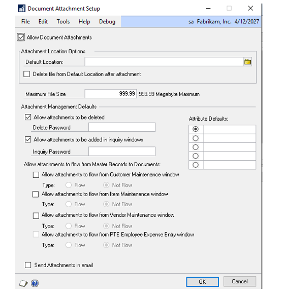

1. Mark to attach documents to transactions, transaction line items, and master
    records.

2. Enter or select the default location.

3. Mark to delete the file from the default location after attaching a document
    to a transaction or master record.

4. Enter the maximum file size limit for attached documents.

5. Mark to delete attachments from master records and transactions in the
    Document Attachment Management window. If you don't mark this option, you
    cannot delete attachments from master records and transactions.

6. Assign a password that will be required to use when deleting attachments. If
    this field is blank, no password is required to delete an attachment.

7. Mark to allow attachments to flow or roll down from a customer record to a
    transaction.

8. Mark Flow or Not Flow as the default type when entering attachments for the
    customer records. You can use the Attachment Properties window to change the
    type after entering attachments. If you mark Not Flow, the attachment
    assigned to the customer record will not roll down to the transactions
    entered for the customer.

9. Mark to allow attachments to flow or roll down from an item record to a
    transaction.

10. Mark Flow or Not Flow as the default type when entering attachments for the
    item records. You can use the Attachment Properties window to change the
    type after entering attachments. If you mark Not Flow, the attachment
    assigned to the item record will not roll down to the transactions that the
    item is assigned to.

11. Mark to allow attachments to flow or link from a vendor record to a
    transaction.

12. Mark Flow or Not Flow as the default type when entering attachments for the
    vendor records. You can use the Attachment Properties window to change the
    type after entering attachments. If you mark Not Flow, the attachment
    assigned to the vendor record will not roll down to the transactions entered
    for the vendor.

13. Mark to send attachments in email. By marking this option, the Mark Send
    Attachments in Email option is available in the Attachment Properties
    window. If you are using the email functionality in Microsoft Dynamics GP,
    you can select attachments to send in email when you send purchase order or
    sales document in email.

14. Enter labels for user-defined attribute fields for attachments. The labels
    you enter here will appear in the Attachment Properties window, and you can
    enter information about the label in the field. For example, you might enter
    Picture as the label in this window and then enter a description of the
    picture in the Attachment Properties window.

You can select a default attribute label.

1. Choose OK to save your changes and close the window.

### Chapter 18: Intrastat setup

Intrastat is the system for collecting statistics on the trade of goods
between European Union (EU) countries or regions. Intrastat data is required for all
items either bought from EU vendors or sold to EU customers, and must be
provided on a monthly basis. Requirements for Intrastat are similar in all
EU countries or regions. The government uses these statistics as an economic indicator.

The entries you make will be used to create the Intrastat Trade Report you
submit to your government, and the EC Sales List, which displays cumulative
goods value totals by each vendor or customer Tax Registration number.

This information is divided into the following sections:

- *Tracking Intrastat statistics for a company*

- *Setting up country codes*

- *Setting up transport mode codes*

- *Setting up transaction natures*

- *Setting up incoterms codes*

- *Setting up procedure/regime codes*

- *Setting up port codes*

- *Setting up region codes*

- *Setting up country of origin codes*

- *Setting up tax commodity codes*

#### Tracking Intrastat statistics for a company

Use the Company Setup Options window to enable a company to track Intrastat
trade statistics.

> [!NOTE]
> The options in this procedure may have been marked automatically, depending
on the country or region you chose when you installed Microsoft Dynamics
GP.

**To track Intrastat statistics for a company:**

1. Open the Company Setup window.

(Administration \>\> Setup \>\> Company \>\> Company)

1. Enter or select a company.

2. Choose the Options button to open the Company Setup Options window.

3. Mark Enable Intrastat Tracking to make Intrastat entry windows available. If
    you don't mark this option, you won't be able to enter Intrastat information
    for transactions, vendors, or customers.

4. Choose OK to close the Company Setup Options window.

5. Choose OK in the Company Setup window to save your changes.

#### Setting up country codes

Use the Country Code Maintenance window to set up country codes.

These codes are used when you prepare the Intrastat Trade statistics reports
for each item sold to a customer or purchased from a vendor located in an EU
member state. The following are examples of country codes:

| **Country code** | **Country**    |
|------------------|----------------|
| BE               | Belgium        |
| DE               | Germany        |
| DK               | Denmark        |
| EL               | Greece         |
| ES               | Spain          |
| FR               | France         |
| GB               | United Kingdom |
| IE               | Ireland        |
| IT               | Italy          |
| LU               | Luxembourg     |
| NL               | Netherlands    |
| PT               | Portugal       |
| TK               | Turkey         |

**To set up country codes:**

1. Open the Country Code Maintenance window.(Administration \>\> Setup \>\>
    Company \>\> Country Codes)

*The Country Code Maintenance window will be available only if you have
marked to enable Intrastat tracking in the Company Setup Options window.*

1. Enter a country code and indicate whether this country is an EU member.

2. Enter a description for this country code.

3. Save your changes and continue entering country codes.

#### Setting up transport mode codes

Use the Transport Mode Maintenance window to set up transport mode codes
identifying all the shipping methods you use to transport goods to EU member
states or to receive goods from EU member states.

These codes are used when you prepare the Intrastat Trade statistics reports
for each item sold to a customer or purchased from a vendor located in an EU
member state.

You may wish to refer to the transport mode codes defined by your
government. The following are examples of transport mode codes:

| **Transport mode code** | **Transport mode**            |
|-------------------------|-------------------------------|
| 1                       | Sea Freight                   |
| 2                       | Rail Freight                  |
| 3                       | Road Freight                  |
| 4                       | Air Freight                   |
| 5                       | Post                          |
| 7                       | Fixed Transport Installations |
| 8                       | Inland Waterway               |
| 9                       | Own Propulsion                |

**To set up transport mode codes:**

1. Open the Transport Mode Maintenance window.

(Administration \>\> Setup \>\> Company \>\> Transport Mode Codes)

*The Transport Mode Maintenance window will be available only if you have
marked to enable Intrastat tracking in the Company Setup Options window.*

1. Enter a transport mode code.

2. Enter a description for this transport mode code.

3. Save your changes and continue entering transport mode codes.

#### Setting up transaction natures

Use the Transaction Nature Maintenance window to set up transaction natures
for the types of transactions you usually enter for EU vendors or customers.

These codes are used when you prepare the Intrastat Trade statistics reports
for each item sold to a customer or purchased from a vendor located in an EU
member state. You may wish to refer to the transaction nature codes defined
by your government. The following are examples of transaction natures:

| **Transaction nature code** | **Transaction nature**         |
|-----------------------------|--------------------------------|
| 10                          | Sale of Goods/Services Invoice |
| 16                          | Sale of Goods/Services Credit  |
| 20                          | Return Goods/Services Invoice  |
| 26                          | Return Goods/Services Credit   |
| 30                          | Free of Charge Supply Invoice  |
| 36                          | Free of Charge Supply Credit   |
| 40                          | Goods for Processing or Repair |
| 60                          | Move Goods/No Change of Owner  |
| 90                          | Other Transactions             |

**To set up transaction natures:**

1. Open the Transaction Nature Maintenance window.

(Administration \>\> Setup \>\> Company \>\> Transaction Nature Codes)

*The Transaction Nature Maintenance window will be available only if you
have marked to enable Intrastat tracking in the Company Setup Options
window.*

1. Enter a transaction nature.

2. Enter a description for this transaction nature.

3. Save your changes and continue entering transaction natures.

#### Setting up incoterms codes

Use the Incoterms Maintenance window to set up incoterms codes that are used
to determine the point at which responsibility for the goods will change
from the exporter to the importer. Incoterms stands for International
Commercial Terms and are maintained by the International Chamber of
Commerce.

These codes are used when you prepare the Intrastat Trade statistics reports
for each item sold to a customer or purchased from a vendor from an EU
member state. The following list provides examples of incoterms codes:

| **Incoterms code** | **Delivery method**         |
|--------------------|-----------------------------|
| CIF                | Cost, Insurance and Freight |
| DDU                | Delivered Duty Unpaid       |
| EXW                | Ex-Works                    |
| FOB                | Free on Board               |

**To set up incoterms codes:**

1. Open the Incoterms Maintenance window.

(Administration \>\> Setup \>\> Company \>\> Incoterms)

*The Incoterms Maintenance window will be available only if you have marked
to enable Intrastat tracking in the Company Setup Options window.*

1. Enter a incoterms code.

2. Enter a description for this incoterms code.

3. Save your changes and continue entering incoterms codes.

#### Setting up procedure/regime codes

Use the Procedure/Regime Maintenance window to set up procedure/regime
codes.

These codes are used when you prepare the Intrastat Trade statistics reports
for each item sold to a customer or purchased from a vendor from an EU
member state. You may wish to refer to the transaction nature codes defined
by your government.

**To set up procedure/regime codes:**

1. Open the Procedure/Regime Maintenance window.(Administration \>\> Setup \>\>
    Company \>\> Procedure/Regime)

*The Procedure/Regime Maintenance window will be available only if you have
marked to enable Intrastat tracking in the Company Setup Options window.*

1. Enter a procedure/regime code.

2. Enter a description for this procedure/regime code.

3. Save your changes and continue entering process type codes.

#### Setting up port codes

Use the Port Maintenance window to track the goods port of entry for a
purchase and the port of exit for a sale

These codes are used when you prepare the Intrastat Trade statistics reports
for each item sold to a customer or purchased from a vendor from an EU
member state. You may wish to refer to the transaction nature codes defined
by your government.

**To set up port codes:**

1. Open the Port Maintenance window.(Administration \>\> Setup \>\> Company
    \>\> Port)

*The Port Maintenance window will be available only if you have marked to
enable Intrastat tracking in the Company Setup Options window.*

1. Enter a port code.

2. Enter a description for this port code.

3. Save your changes and continue entering port codes.

#### Setting up region codes

Use the Region Maintenance window to track from which region the goods
originated for a purchase and the region of destination for a sale.

These codes are used when you prepare the Intrastat Trade statistics reports
for each item sold to a customer or purchased from a vendor from an EU
member state. You may wish to refer to the transaction nature codes defined
by your government.

**To set up region codes:**

1. Open the Region Maintenance window.(Administration \>\> Setup \>\> Company
    \>\> Region)

    *The Region Maintenance window will be available only if you have marked to enable Intrastat tracking in the Company Setup Options window.*

1. Enter a region code.

2. Enter a description for this region code.

3. Save your changes and continue entering region codes.

#### Setting up country of origin codes

Use the Country of Origin Maintenance window to track the country the goods
originated in.

These codes are used when you prepare the Intrastat Trade statistics reports
for each item sold to a customer or purchased from a vendor from an EU
member state. You may wish to refer to the transaction nature codes defined
by your government.

**To set up country of origin codes:**

1. Open the Country of Origin Maintenance window.(Administration \>\> Setup
    \>\> Company \>\> Country of Origin)

*The Country of Origin Maintenance window will be available only if you have
marked to enable Intrastat tracking in the Company Setup Options window.*

1. Enter a country of origin code.

2. Enter a description for this country of origin code.

3. Save your changes and continue entering country of origin codes.

#### Setting up tax commodity codes

Use the Tax Commodity Code Maintenance window to set up tax commodity codes
for products or services you either sell or purchase. Commodity codes for
goods and services are defined in the EU Combined Nomenclature.

These codes are used when you prepare the Intrastat Trade statistics reports
for each item sold to a customer or purchased from a vendor from an EU
member state. You may wish to refer to the transaction nature codes defined
by your government.

**To set up tax commodity codes:**

1. Open the Tax Commodity Code Maintenance window.(Administration \>\> Setup
    \>\> Company \>\> Tax Commodity Codes)

*The Tax Commodity Code Maintenance window will be available only if you
have marked to enable Intrastat tracking in the Company Setup Options
window.*

1. Enter a tax commodity code.

2. Enter a description for this tax commodity code.

3. Save your changes and continue entering tax commodity codes.

## Part 4: Tax setup

This part of the documentation contains information about tracking taxes on
sales and purchases in Microsoft Dynamics GP. For information about payroll
taxes, refer to the Payroll documentation.

For additional information about tax setup windows, refer to the help. (From
the Help menu, choose Index; then type the name of the window and choose
Display.) The following information is discussed:

- *Chapter 19, "International taxes,"* provides an overview of some tax
    features and special setup information for different areas of the world.

- *Chapter 20, "Value-added tax,"* explains how to set up information needed
    to correctly process Value-added Taxes (VAT).

- *Chapter 21, "Tax overview,"* provides an introduction to tax calculation
    and tax schedules in Microsoft Dynamics GP.

- *Chapter 22, "Tax details,"* explains how to use the Tax Detail Maintenance
    window to add, change, or delete tax details.

- *Chapter 23, "Tax schedules,"* describes how to set up tax schedules used to
    calculate all the taxes that apply to a sales or purchase transaction.

### Chapter 19: International taxes

Microsoft Dynamics GP accommodates the different tax rates on goods and
services in cities, states, provinces, regions, and countries in many areas
of the world. These taxation methods include goods and services tax (GST),
Provincial Sales Tax (PST), Québec Sales Tax (QST), Value-added Tax (VAT),
and Pay As You Go (Withholding), as well as taxes calculated as a percent of
sale or purchase.

This information provides an overview of some features and special setup
information for different areas of the world.

Review the sections listed below that apply to countries or region in which you do
business and complete any preliminary setup tasks that are necessary. Then,
continue to *Chapter 21, "Tax overview,"* to set up taxes.

| **Country/region** | **Default tax options**                                                                                                                                                                                                       |
|--------------------|-------------------------------------------------------------------------------------------------------------------------------------------------------------------------------------------------------------------------------|
| Africa             | Calculate Taxes in General Ledger Enter VAT Return Require Tax Detail Totals to Match the Pre-Tax Amount Specify Tax Details for Automatic Tax Calculations Use Shipping Method when Selecting Default Tax Schedule           |
| Australia          | Enable GST for Australia Enter Tax Date Use Shipping Method when Selecting Default Tax Schedule                                                                                                                               |
| Belgium            | Calculate Taxes in General Ledger Calculate Terms Discount Before Taxes Enable Reverse Charge Taxes Enter VAT Return Require Tax Detail Totals to Match the Pre-Tax Amount Specify Tax Details for Automatic Tax Calculations |
| Canada             | Allow Summary-Level Tax Edits Use Shipping Method when Selecting Default Tax Schedule                                                                                                                                         |
| Colombia           | Allow Summary-Level Tax Edits Calculate Taxes in General Ledger Use Shipping Method when Selecting Default Tax Schedule                                                                                                       |

- *Default tax options*

- *Setting up taxes in the United States*

- *Setting up taxes in Canada*

- *Setting up company GST information for Canada*

- *Canadian tax detail option*

- *Setting up taxes in New Zealand*

- *Setting up company GST information for New Zealand*

- *Setting up taxes for Europe and the United Kingdom*

#### Setting up taxes in the United States

The United States has varying state and local tax rates and calculation
bases. Tax can be calculated on sales and purchases.

In the United States, most states have a sales tax, and many cities and
counties assess additional taxes. Tax rates for different types of goods and
services vary from jurisdiction to jurisdiction. Certain goods may be
subject to a "luxury tax," as well.

Not-for-profit organizations and certain businesses may qualify for
exemptions from some taxes; check with your taxing authority for more
information.

In most jurisdictions in the United States, taxes are not assessed on other
taxes; "taxable taxes" in Microsoft Dynamics GP are most commonly used
outside the United States.

- If you do business exclusively in the United States, you can set up all your
    tax information using the Tax Detail Maintenance and Tax Schedule
    Maintenance windows.

- If you do business outside the United States, set up additional tax
    information using the Company Setup window. Then enter tax details and tax
    schedules for taxes in all countries and regions in which you do business.

**To set up taxes in the United States:**

1. Open the Company Setup window.

(Administration \>\> Setup \>\> Company \>\> Company)

1. Enter your federal taxpayer identification number (TIN) in the Tax
    Registration field.

2. Choose OK to save your changes.

*When you've finished entering tax details and tax schedules, be sure to
return to the Company Setup window and specify the default sales and
purchases tax schedules for the company.*

#### Setting up taxes in Canada

Canada has a federal Goods and Services Tax (GST) that applies to every
province and territory in Canada. Generally, GST is collected on all
supplies and services. However, the following conditions may apply:

- An Exempt tax rate and a 0% tax rate may apply to certain goods. Exempt
    supplies should be assigned a 0% tax detail as the rate and no tax should be
    collected. Generally, sales of exempt supplies are tracked and reported, but
    can't be claimed as Input Tax Credit.

- Zero-rated supplies are taxable, but taxed at a rate of 0% and can be
    claimed as Input Tax Credit. As a result, no tax is applied to the sale of
    these goods, but information is available for input tax credit purposes when
    you complete the GST returns.

Provincial Sales Tax (PST) is collected at different rates throughout
Canada. Each province also determines whether the GST is taxable by the PST.
Québec Sales Tax (QST) is the provincial sales tax in Québec. QST is taxed
at two rates, one for products and another for services.

- Enter tax exempt and tax registration information using the Company Setup
    window.

- To set up GST, PST, and QST taxes, use the Tax Detail Maintenance and Tax
    Schedule Maintenance windows.

#### Setting up company GST information for Canada

You'll use the Company Setup window to enter company GST information.

**To set up company GST information for Canada:**

1. Open the Company Setup window.

(Administration \>\> Setup \>\> Company \>\> Company)

1. Enter your tax exemption numbers in the Tax Exempt fields.

2. Enter your company's GST registration number in the Tax Registration field.

3. Choose OK to save your changes.

*When you've finished entering tax details and tax schedules, be sure to
return to the Company Setup window and specify the default sales and
purchases tax schedules for the company.*

#### Canadian tax detail option

Mark the Enable Canadian Tax Detail option in the Company Setup Options
window (Administration \>\> Setup \>\> Company \>\> Company \>\> Options
button) to do the following things:

- Select the account that taxes calculated posts to when a you have selected a
    purchase tax detail type.

- Select to post the tax detail to either the account on the tax detail, or
    the purchases account associated with the vendor, or the inventory account
    from the item on the purchase order/shipment order receipt.

- View sales and purchases transactions with the taxes included in the amounts
    if you have marked Inclusive of Tax on the View menu (View \>\> Inclusive of
    Tax).

#### Setting up taxes in New Zealand

New Zealand uses a federal Goods and Services Tax (GST); it also has a
system of handling payment terms discounts.

When a customer pays an invoice within the time that a discount is allowed,
the discount is taken on the GST amount, as well as the amount of the sale.

- Enter company GST information using the Company Setup window.

- To set up federal and state taxes, use the Tax Detail Maintenance and Tax
    Schedule Maintenance windows.

#### Setting up company GST information for New Zealand

You'll set up company GST information for New Zealand by choosing the
appropriate option in the Company Setup Options window.

**To set up company GST information for New Zealand:**

1. Open the Company Setup window.

(Administration \>\> Setup \>\> Company \>\> Company)

1. Enter your company's GST registration number in the Tax Registration field.

2. Choose Options to open the Company Setup Options window

3. Mark the Calculate Terms Discount Before Taxes option to indicate how your
    company typically pays invoices that include a terms discount. Marking this
    selection will result in taxes being applied only to the discounted amount,
    regardless of when the payment is actually made.

    - If you typically pay invoices that include a terms discount before the
        discount expires, mark this option. On occasions where you don't pay
        before the discount expires, you'll need to adjust the tax amounts
        manually.

    - If you typically don't pay invoices before their discounts expire, leave
        this option unmarked. On occasions where you do pay before the discount
        expires, you'll need to adjust the tax amounts manually.

4. Choose OK to save your changes.

*When you've finished entering tax details and tax schedules, be sure to
return to the Company Setup window and specify the default sales and
purchases tax schedules for the company.*

#### Setting up taxes for Europe and the United Kingdom

Value-Added Tax (VAT) is a general tax used throughout Europe and elsewhere
in the world. Each country or region that uses VAT has its own rate of taxation and
often has different rates for various goods or special zones within the
country or region. VAT is collected on sales, and any credit for tax paid on purchases
is also tracked. The difference is remitted to the taxation authority in
each country or region. See *Chapter 20, "Value-added tax,"* for more information on
VAT.

- Set up company VAT information using the Company Setup window.

- Enter a zero percent tax detail for receivables and payables documents that
    are automatically generated within the system when the Require Tax Detail
    Totals to Match the Pre-Tax Amount option is marked in the Company Setup
    Options window. This tax detail will be used when refunding a check,
    consolidating vendors and customers, assessing finance charges, and handling
    non-sufficient funds.

- Set up taxes using the Tax Detail Maintenance and Tax Schedule Maintenance
    windows.

- To enter VAT information for each of your debtors, use the Debtor
    Maintenance Options window when you're setting up debtor information.

- To enter VAT information for each of your creditors, use the Creditor

Maintenance Options window when you're setting up creditor information.

### Chapter 20: Value-added tax

Value-added Tax (VAT) is an input tax due on purchases and an output tax due
on sales. It is used throughout Europe and elsewhere in the world. This
information explains how to set up information needed to correctly process
VAT data.

This information is divided into the following sections:

- *Value-added tax overview*

- *Setting up VAT for a company*

- *Setting up VAT details and schedules*

- *Entering VAT information for debtors and creditors*

#### Value-added tax overview

Microsoft Dynamics GP accommodates the different tax rates on goods and
services sold in cities, states, provinces, regions, and countries or regions in many
areas of the world. These taxation methods include VAT. VAT is an input tax
due on purchases and an output tax due on sales. It is used throughout
Europe and elsewhere in the world.

Each country or region that uses VAT has its own rate of taxation and often has
different rates for various goods or special zones within the country or region. VAT
is collected on sales, and any credit for tax paid on purchases also is
tracked. The difference is remitted to the taxation authority in each
country or region.

VAT entries will be used to compile the Detail Tax Report or the Summary Tax
Report, which displays the total sale or purchase amount, the total tax
amount, the total EU sale or purchase amount and the total EU tax.

#### Setting up VAT for a company

Use the Company Setup window and the Company Setup Options window to set up
company VAT information.The following options in the Company Setup Options
window will be marked automatically for you:

- Calculate Taxes in General Ledger

- Require Tax Detail Totals to Match the Pre-Tax Amount

- Specify Tax Details for Automatic Tax Calculation

*Be sure to enter a registration number for each company you set up. The
options in this procedure may have been marked automatically, depending on
the country or region you chose when you installed Microsoft Dynamics GP.*

**To set up VAT for a company:**

1. Open the Company Setup window. (Administration \>\> Setup \>\> Company \>\>
    Company)

2. Enter your company's VAT registration number in the Tax Registration field.

3. Choose the Options button to open the Company Setup Options window.

4. Mark the Calculate Terms Discount Before Taxes option. Marking this
    selection will result in taxes being applied only to the discounted amount,
    regardless of when the payment is actually made.

5. Mark the Enable VAT Return option.

6. Enter a zero percent tax detail for receivables and payables documents that
    are automatically generated within the system when the Require Tax Detail
    Totals to Match the Pre-Tax Amount option is marked. This tax detail will be
    used when refunding a check, consolidating vendors and customers, assessing
    finance charges, and handling non-sufficient funds.

7. Choose OK to close the Company Setup Options window.

8. Choose OK in the Company Setup window to save your changes.

#### Setting up VAT details and schedules

Use the Tax Detail Maintenance window and the Tax Schedule Maintenance
window to set up tax details and schedules. For more information about tax
details and schedules, see *Chapter 22, "Tax details"* and *Chapter 23, "Tax
schedules."*

When you set up a tax detail, you'll define the basis that will be used to
calculate the tax, the maximum or minimum amount that will be taxed, and the
account that will be used to track input or output tax amounts. Once you've
set up tax details, you can create tax schedules. Tax schedules are groups
of tax details that will be assigned to a transaction.

Input and output taxes usually are included in the item price or based on a
percentage of the sale or purchase amount, but Microsoft Dynamics GP
supports all methods of calculation.

#### Entering VAT information for debtors and creditors

Before using Microsoft Dynamics GP to calculate input and output taxes, you
must enter tax registration information for your debtors and creditors. For
more information about debtors and creditors, refer to the Receivables
Management and Payables Management documentation.

- To enter VAT information for each of your debtors, use the Debtor
    Maintenance Options window when you're setting up debtor information.

- To enter VAT information for each of your creditors, use the Creditor

Maintenance Options window when you're setting up creditor information.

### Chapter 21: Tax overview

This information contains an introduction to tax calculation and tax
schedules in Microsoft Dynamics GP. You'll complete two procedures to set up
your taxes; setting up tax details and setting up tax schedules.

For additional information about tax setup windows, refer to the help. (From
the Help menu, choose Index; then type the name of the window and choose
Display.)

This information is divided into the following sections:

- *Before you enter tax details and schedules*

- *Overview of Microsoft Dynamics GP taxes*

- *Why tax schedules are used*

- *How taxes are calculated*

- *Default tax schedules*

- *Freight and miscellaneous charge tax calculations*

- *Withholding taxes*

#### Before you enter tax details and schedules

Complete the following tasks before you begin entering tax details and
schedules:

- Enter a chart of accounts. For information on entering accounts, refer to
    the General Ledger documentation, or to *Setting up a posting account in
    Microsoft Dynamics GP* if you're not using General Ledger.

- Set up shipping methods if you've marked the Use Shipping Method when
    Selecting Default Tax Schedule option in the Company Setup Options window.
    Taxes are calculated based on the point of exchange, using the shipping
    method assigned to a transaction to determine the point of exchange. Refer
    to *Setting up a shipping method*

- Complete international setup procedures. Review the information and complete
    the preliminary setup procedures that apply to each country or region in
    which you do business.

#### Overview of Microsoft Dynamics GP taxes

You'll complete two procedures to set up your taxes; setting up tax details
and setting up tax schedules. At the most basic level, the difference
between tax details and tax schedules is this:

**Tax details** Tax details identify specific taxes, their rate of taxation
and the taxing authority to whom taxes must be paid.

**Tax schedules** Tax schedules provide a method of grouping the tax details
that apply to companies, items, customers, or vendors.

For example, if you're setting up sales taxes for your business in Seattle,

Washington, you'll need to set up details for each Washington state tax and
each

Seattle city tax. After all the details have been defined, you can group the
details for Washington and those for Seattle into a schedule. This schedule
can be assigned to all the customers, vendors, and items that are subject to
Seattle and Washington taxes.

When you enter transactions in Microsoft Dynamics GP, you don't need to
select all the tax details that apply to the transaction; once you've set up
tax schedules, Microsoft Dynamics GP calculates all applicable taxes
automatically.

#### Why tax schedules are used

Consider the following example:

- A business is located in the same taxing jurisdiction as all its customers
    and vendors.

- All the goods and services the business provides or purchases are taxed at
    the same rate.

- There's only one taxing authority to remit taxes to.

In this case, every transaction has exactly the same rate of taxation and
the business can set up one tax detail. It also must set up at least one tax
schedule; when entering transactions in Microsoft Dynamics GP, the
business's clerk selects the tax schedule, rather than a tax detail.

Chances are that your organization operates in a more complex taxing
situation than the previous example. Your situation is probably similar to
the following example:

- Your organization and at least some of your customers and vendors are
    subject to different tax jurisdictions.

- Different goods and services are taxed at different rates, and the rates are
    different for different tax jurisdictions.

- There are multiple taxing authorities to remit taxes to.

Tax schedules are used to simplify the process of assigning all applicable
details to each company, item, customer, and vendor. These default schedules
are used to calculate taxes automatically when you enter a transaction. If
you don't specify a default tax schedule, you can select one as you're
entering the transaction.

#### How taxes are calculated

When the system calculates tax on a sale or purchase, it compares the tax
schedule assigned to the customer or vendor, as well as the tax schedule
assigned to the sale or purchase and any freight and miscellaneous charges.
The system checks for details that match between the customer or vendor and
the sale or purchase amounts. Taxes are calculated only for the details that
match.

If you change the shipping method for a transaction, taxes are automatically
recalculated. When the shipping method is pickup, the tax schedule for the
vendor is compared to the tax schedules for the items. When the shipping
method is delivery, the tax schedule for the customer is compared to the tax
schedules for the items.

**Different tax rates for different items**

Consider the following example:

A retail store is selling three items to a customer:

- A shirt at US\$20.00

- A portable radio at US\$50.00

- A liter of milk at US\$1.00

The store is located in a town that is subject to 1.0% city tax and a 5.0%
state tax. However, clothing and food are not taxable in either
jurisdiction. Because the customer is purchasing the items at a retail
store, the exchange of goods happens in the store's jurisdiction, not the
customer's. To calculate the taxes, Microsoft Dynamics GP compares the tax
schedules that are assigned to each item with the tax schedules assigned to
the store and calculates taxes only for the details that appear for both.

| Item | Tax details in the tax schedule assigned to the: | Calculated tax | Calculated tax | Tax paid |
|-----|-----|-----|-----|-----|
|     | Item | Store |Customer |     |
| Shirt (Clothing) |      | 5% State | 5% State | US\$0 because the shirt isn't taxable. |                  
|     |     | 1% City |     |     |
| Radio (General)  | 5% State | 5% State | 5% State | US\$3.00 because the tax schedules for both the item and the store contain the same tax details. |
|    |    | 1% City |     |     |
| Milk (Food) |     | 5% State | 5% State | US\$0 because the milk isn't taxable. |
|     |     | 1% City |     |     |

**Different tax rates for different customers**

Consider the following example:

A mail-order distributor is selling three items to a customer:

- A shirt at US\$20.00

- A portable radio at US\$50.00

- A box of chocolates at US\$10.00

The distributor is located in a town that is subject to 1.0% city tax and a
5.0% state tax. The customer is located in another town, where no city taxes
apply. Clothing and food are not taxable in either jurisdiction. Because the
items are being shipped to the customer, the exchange of goods happens in
the customer's jurisdiction, not the distributor's. To calculate the taxes,
Microsoft Dynamics GP compares the tax schedules that are assigned to each
item with the tax schedule assigned to the customer and calculates taxes
only for the details that appear for both.

| Item | Tax details in the tax schedule assigned to the: | Calculated tax | Calculated tax | Tax paid |
|-----|-----|-----|-----|-----|
|     | Item | Store | Customer |    |
| Shirt (Clothing) |     | 5% State | 5% State | US\$0 because the shirt isn't taxable. |
|     |     | 1% | City |     |     
| Radio (General)  | 5% State | 5% State | 5% State | US\$2.50 because only the state tax applies to both the item and the customer. |
|     |    | 1% City |     |       |
| Chocolate (Food) |    | 5% State | 5% State | US\$0 because the chocolate isn't taxable. |
|     |     | 1% City |    |    |

If you've marked the Use Shipping Method when Selecting Default Tax Schedule
option in the Company Setup Options window, Microsoft Dynamics GP uses the
shipping method assigned to the transaction to determine where the exchange
of goods takes place, and provides the appropriate tax schedule as a default
schedule for the transaction.

| **Series** | **Shipping method's shipping type** | **Default tax schedule comes from** |
|------------|-------------------------------------|-------------------------------------|
| Sales      | Pickup                              | Your company                        |
|            | Delivery                            | Customer                            |
| Purchasing | Pickup                              | Vendor                              |
|            | Delivery                            | Your company                        |

#### Default tax schedules

Default tax schedules for freight and miscellaneous charges are set up by
module; not by customer or vendor.

##### **Receivables Management and Payables Management** Default tax

schedules for sales or purchases, freight, and miscellaneous charges can be
set up in the Receivables Setup Options window for sales taxes and in the
Payables Setup Options window for purchase taxes.

**Sales Order Processing and Invoicing** Default tax schedules for
noninventoried items, freight, and miscellaneous charges can be set up in
the Sales Order Processing Setup Options window and in the Invoicing Setup
Options window. In these modules, you also have the option of basing the
taxes for noninventoried items, freight, and miscellaneous charges on the
customer. If you select that option, the customer's tax schedule is used for
the tax calculations. For more information, see the Sales Order Processing
and Invoicing documentation.

**Purchase Order Processing** Default tax schedules for non-inventoried
items, freight, and miscellaneous charges can be set up in the Purchase
Order Processing Setup Options window. You also have the option of basing
the taxes for noninventoried items, freight, and miscellaneous charges on
the vendor. If you select that option, the vendor's tax schedule is used for
the tax calculations. For more information, see the Purchase Order
Processing documentation.

#### Freight and miscellaneous charge tax calculations

Calculations for taxes on freight are based on comparisons between the tax
schedule for the transaction—which, depending on the transaction, can be the
tax schedule for your company, the customer or the vendor—and the freight
tax schedule. For information about freight and miscellaneous charge tax
calculations in Invoicing, Sales Order Processing or Purchase Order
Processing, refer to your Invoicing, Sales Order Processing, or Purchase
Order documentation.

Calculations for taxes on miscellaneous charges are based on comparisons
between the tax schedule for the transaction and the miscellaneous tax
schedule.

The following example illustrates how these tax details are compared in
Receivables Management and Payables Management. Schedule A, B, and C contain
these tax details:

| **Tax Schedule A** | **Tax Schedule B** | **Tax Schedule C** |
|--------------------|--------------------|--------------------|
| TAX001             |                    | TAX001             |
|                    | TAX002             |                    |
|                    | TAX003             |                    |
| TAX004             | TAX004             | TAX004             |
|                    |                    | TAX005             |
| TAX006             |                    |                    |

Assume the tax schedules are assigned in the following manner:

| **Tax Schedule A** | **Tax Schedule B** | **Tax Schedule C** |
|--------------------|--------------------|--------------------|
| Freight            | Miscellaneous      |                    |
| Company            |                    | Customer/Vendor    |
|                    |                    | Sale/Purchase      |

Now, assume you're recording a purchase of goods in Payables Management, and
the shipping method is **pickup**. The tax schedule assigned to the vendor
appears as the default schedule, and the following taxes are charged:

| **Transaction**              | **Details**          | **Tax Schedule**                                                                                                                 |
|------------------------------|----------------------|----------------------------------------------------------------------------------------------------------------------------------|
| Purchase: \$100 taxed using: | TAX001 TAX004 TAX005 | Tax Schedule C (assigned to the **purchase** and **vendor**) contains details TAX001, TAX004 and TAX005.                        |
| Freight: \$10 taxed using:   | TAX001 TAX004        | Tax Schedule A (assigned to **Freight**) and Tax Schedule C (assigned to the **vendor**) both contain details TAX001 and TAX004. |

Next, assume that you are recording a purchase of goods and the shipping
method is set to **delivery**. The tax schedule assigned to the company
appears as the default schedule and the following taxes are charged:

| **Transaction**                  | **Details**          | **Tax Schedule**                                                                                                                       |
|----------------------------------|----------------------|----------------------------------------------------------------------------------------------------------------------------------------|
| Purchase: \$100 taxed using:     | TAX001 TAX004        | Tax schedule A (assigned to the **company**) and tax schedule C (assigned to the **purchase**) both contain details TAX001 and TAX004. |
| Freight: \$10 taxed using:       | TAX001 TAX004 TAX006 | Tax schedule A (assigned to **freight** and to the **company**) contains details TAX001, TAX004 and TAX006.                           |
| Miscellaneous: \$10 taxed using: | TAX004               | Tax schedule A (assigned to the **company**) and tax schedule B (assigned to the **transaction**) both contain detail TAX004.         |

#### Withholding taxes

Withholding is a system of taxation used in Australia to pay tax for people
who work and earn money under contract, such as providers of architectural
services, building and construction companies, cleaning services,
engineering services, and motor vehicle repair businesses.

Withholding is paid and recorded differently in Receivables Management and
Payables Management because the debtor who makes the purchase is responsible
for remitting the Withholding tax to the government. The company selling the
goods or services must write off the amount that the debtor paid to the
government.

When a company purchases goods or services from a supplier who is subject to
Withholding, the supplier must include a partially completed Withholding
Deduction Form with his or her bill to the purchasing company.

**Using in Receivables Management**

The supplier must account for the difference between the amount billed to
the purchasing company and the amount actually received due to the amount
that was remitted to the taxing authority on its behalf. To do this in
Microsoft Dynamics GP, the supplier would follow this scenario:

- An accounts receivable clerk prepares a bill for the full amount of goods or
    services rendered. The clerk also prepares a Withholding Deduction Form,
    showing the amount billed.

- The supplier sends the bill and the partially completed Withholding
    Deduction Form to the purchasing company.

- When the payment is received, the accounts receivable clerk records the
    amount received.

- In addition, the clerk for the supplier should record the Withholding amount
    in the Additional Tax Distributions and Writeoffs window.

**Using in Payables Management**

The purchasing company is required to remit the Withholding on behalf of the
supplier. To do this using Microsoft Dynamics GP, the purchasing company
would follow this scenario:

- An accounts payable clerk creates a creditor record for the supplier and
    records the withholding rate in the Creditor Withholding Options window.

- When the purchasing company receives the supplier's bill, the clerk records
    the full bill amount.

- When the clerk pays the bill, however, the Withholding amount is deducted
    from the payment and a separate document for the Withholding amount is
    created automatically, payable to the Withholding creditor (usually the
    taxing authority) specified in the Company Setup Options window.

- The purchasing company would send the Withholding payment to the taxing
    authority, along with the completed Withholding Deduction Form showing the

total amount billed and the Withholding amount deducted, and a
Reconciliation Form.

- In addition, the clerk for the purchasing company should record the
    Withholding amount in the Additional Tax Distributions and Writeoffs window.

**Transactions for Withholding amounts**

When entering transactions for Withholding amounts, use the following
windows to enter the Withholding amounts.

| **Window**                                              | **Field**                                                          | **What to enter**                                                             |
|---------------------------------------------------------|--------------------------------------------------------------------|-------------------------------------------------------------------------------|
| Additional Tax and Writeoff Distributions (Receivables) | Unposted Write-offs Distributed to Withholding: Withholding Amount | The Withholding amount that the debtor paid to the tax office on your behalf. |
| Additional Tax and Write Off Distributions (Payables)   | Unposted Write-offs Distributed to Withholding: Withholding Amount | The amount you are paying to the tax office on the creditor's behalf.        |

**Example**

Assume a supplier is a building contractor with a Withholding rate of 20%.
If the purchasing company buys \$1,000 of contracting services from the
supplier, the supplier must provide a partially completed Withholding
Deduction form with the bill for \$1,000.

The purchasing company would record the purchase for \$1,000; when the bill
was paid, a check for \$800 would be printed for the supplier, and a
separate payment for \$200 (20% of the \$1,000 sale) would be created for
the Withholding taxing authority. The purchasing company would send the
completed Withholding Deduction form to the taxing authority along with this
payment.

When the supplier receives the payment, it will use the Additional Tax and
Writeoff Distributions window to record the \$200 that the purchasing
company remitted to the taxation office.

### Chapter 22: Tax details

The Tax Detail Maintenance window can be used to add, change, or delete tax
details. Tax details identify the tax specifics that are used in a tax
schedule for a customer, vendor, or item.

This information contains the following sections:

- *What to set up tax details for*

- *Minimum and maximum taxable amounts*

- *Setting up tax details*

#### What to set up tax details for

Set up a tax detail for each tax rate in each jurisdiction where you plan to
do business.

- If you plan to sell goods or services in that jurisdiction, set up a sales
    tax detail.

- If you plan to purchase goods or services in that jurisdiction, set up a
    purchases tax detail.

- If different goods or services are taxed at different rates, set up a
    separate tax detail for each type of good or service. (Be sure to set up
    both sales and purchases details, if applicable.)

*If certain goods and services aren't taxable in a particular jurisdiction,
you may not need to set up a tax detail for them. However, if you are
required to track sales or purchases of these exempt or zero-rate taxes, you
can set up tax details to do so.*

#### Minimum and maximum taxable amounts

When you set up tax details, you can specify minimum and maximum taxable
amounts. For example, if the law requires that at least \$100 must be
purchased before any tax is added to the sale price, enter \$100 as the
minimum taxable amount. If the tax only applies to amounts up to \$500,
enter \$500 as the maximum taxable amount.

You also can indicate whether tax should be calculated on the full amount.
In this example, the full \$500 is taxable if you select Full Amount from
the Include list. If you select Amount within Range, the difference between
the \$100 minimum and \$500 maximum—\$400—is taxable.

Refer to the following tables for more information.

| Full Amount             |  Full Amount    |      Full Amount          
|-------------------------|-----------------|---------------------------|
| Minimum = \$100         | Maximum = \$500 |                           |
| Sale amount             | Tax calculated? | Tax calculated on:        |
| \$50                    | No              | —                         |
| \$150                   | Yes             | \$150                     |
| \$400                   | Yes             | \$400                     |
| \$550                   | Yes             | \$500 (Full amount)       |
|**Amount within Range**|**Amount within Range**|**Amount within Range**|
| Minimum = \$100         | Maximum = \$500 |                           |
| Sale amount             | Tax calculated? | Tax calculated on:        |
| \$50                    | No              | —                         |
| \$150                   | Yes             | \$50 (\$150 - Minimum)    |
| \$400                   | Yes             | \$300 (\$400 - Minimum)   |
| \$550                   | Yes             | \$400 (Maximum - Minimum) |

#### Setting up tax details

Use the Tax Detail Maintenance window to set up tax details.

**To set up tax details:**

1. Open the Tax Detail Maintenance window.(Administration \>\> Setup \>\>
    Company \>\> Tax Details)

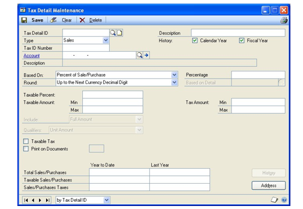

A screenshot of a cell phone Description automatically generated

A screenshot of a cell phone Description automatically generated

A screenshot of a cell phone Description automatically generated

A screenshot of a cell phone Description automatically generated

1. Enter a tax detail ID and a description for the detail. You may want to use
    a descriptive ID that will identify the tax as sales or purchases, such as
    NY-S for a New York sales tax or GST-P for purchases.

Because the details are sorted in alphanumeric order, you may want to name
them so they sort in the order that you want. Give the details names such as
VAT07 and VAT16 to make them sort correctly.

1. In the Type list, select either Sales or Purchases.

2. In the Tax ID Number field, enter your tax registration code for this tax,
    if your country or region requires it.

3. In the Account field, enter an account to track taxes paid or received. For
    example, you might select a Sales Tax Payable account for sales type details
    and a Sales Tax Expense account or Input Tax Credit account for purchase
    type details.

4. If you are setting up a purchasing tax detail for Australian GST, specify
    whether you want the purchase tax detail to be posted to a tax detail
    account, vendor purchase account, or inventory account. This field wont be
    available for a sales tax detail.

5. For the History option, mark one or both of the selections.

- Mark Calendar Year to track tax detail history by calendar months, which
    will help you track information that the government may require.

- Mark Fiscal Year to track tax detail information for each of the periods you
    defined for the fiscal year. This information allows you to print reports
    that accurately reflect activity in each fiscal period.

1. From the Based On list, select a tax base. Your selection will determine how
    taxes for this detail are calculated.

    - In Canada, a general GST is considered a percent of sale/purchase tax.
        In the United Kingdom, a general VAT is considered a percent of sale/
        purchase tax.

    - In Canada, some PST taxes are considered percent of sale/purchase plus
        taxable taxes. The percent of sale/purchase plus taxable taxes tax base
        is rarely if ever used in the United States.

2. From the Round list, select a method by which you want to round the tax
    amount.

3. In the Percentage or Amount field, enter the rate or amount of the tax
    detail.

The name of the field changes depending on your selection in the Based On
list.

1. In the Based On Detail field, select the tax detail this tax is based on, if
    applicable.

2. In the Taxable Amount Min and Max fields, enter the minimum and maximum
    taxable amount for this detail, if applicable. If you don't enter a minimum
    or maximum, taxes will be calculated on transactions of any amount.

*If there is no maximum taxable amount, don't enter anything other than 0 in
the maximum taxable amount field. If the amount shown in that field is
greater than zero, Microsoft Dynamics GP will compare the taxable amount to
the maximum each time taxes are recalculated, which can significantly
increase processing time. If the amount in the Taxable Amount Max field is
0, Microsoft Dynamics GP doesn't perform the comparison and processing time
is reduced.*

1. If you entered a minimum or maximum taxable amount, complete the following
    steps:

    - Use the Include list to select whether to calculate the tax on the full
        amount of the transaction or only to the amount that's within the
        minimum - maximum range of the tax.

    - Use the Qualifiers list to select what the taxable minimum and maximum
        are compared to when deciding whether the tax should be calculated. The
        selection you make in the Based On field determines which options appear
        in the Qualifiers list.

2. If other taxes will be calculated on this tax, mark the Taxable Tax option.
    For example, if the GST on an item may be in the amount taxed by PST, mark
    the GST detail as a taxable tax.

3. If you're required by law to identify taxes on invoices, complete the
    following steps:

    - Mark the Print on Documents option.

    - In the field next to Print on Documents, enter a one-character code,
        such as G for GST or P for PST. The character will appear on your
        invoices next to each of the items taxed.

4. Mark the Tax Invoice Required option if you want to claim any input tax on
    your Business Activity Statement (BAS) for the tax detail. If you mark this
    field and a purchase transaction uses this tax detail, the Tax Invoice
    Required field will be marked for the transaction. For more information
    about BAS, refer to your GST and Australian Tax documentation

5. Select the BAS assignments for the tax detail. These assignments will be
    used to determine which amounts should be printed in each field on the BAS.
    For more information about BAS, refer to your GST and Australian Tax
    documentation.

6. To enter address information for the taxing authority, choose the Address
    button. (The address for the tax detail is used on period-end reports for
    the taxing authority.)

    - In the Tax Detail Address window, enter the address.

    - Choose OK to save the address and redisplay the Tax Detail Maintenance
        window.

7. Choose Save to save the tax detail.

8. Verify your entries with a Tax Detail ID Report. (In the Tax Detail ID
    field, select a tax detail, then choose File \>\> Print.)

### Chapter 23: Tax schedules

After you've set up details for all the taxes you're required to collect or
pay, you can begin creating tax schedules. Tax schedules are groups of tax
details that are assigned to a transaction. These schedules are used to
calculate all the taxes that apply to a sales or purchase transaction.

This information is divided into the following sections:

- *What to set up tax schedules for*

- *Setting up a tax schedule*

- *Copying a tax schedule*

- *Setting up default company tax schedules*

#### What to set up tax schedules for

For each jurisdiction where you plan to do business, set up the following
tax schedules:

- A **purchases tax schedule***,* including all purchases tax details that
    apply to that jurisdiction. Purchases tax schedules are assigned to vendor
    records, and a default purchases tax schedule can be specified in the
    Payables Management Setup Options window.

- A **sales tax schedule,** including all sales tax details that apply to that
    jurisdiction. Sales tax schedules are assigned to customer records, and a
    default sales tax schedule can be specified in the Receivables Management
    Setup Options window.

For each category of inventoried items that you buy or sell that is taxed at
different rates in different jurisdictions, set up a single tax schedule:

- An **item tax schedule** that contains applicable tax details for all
    jurisdictions. Be sure to include both sales and purchases details in this
    tax schedule. Item tax schedules are assigned to item records.

For non-inventoried items, freight, and miscellaneous charges, set up the
following tax schedules:

- At least one **non-inventoried item tax schedule**, including the tax
    details that most commonly apply to the non-inventoried items you buy or
    sell. Non-inventoried tax schedules are assigned to transactions.

- At least one **freight tax schedule**, including the tax details that most
    commonly apply to the freight charges you incur. Freight tax schedules are
    assigned to transactions.

- At least one **miscellaneous charge tax schedule***,* including the tax
    details that most commonly apply to the miscellaneous charges you incur.
    Miscellaneous charge tax schedules are assigned to transactions.

Default tax schedules for non-inventoried items, freight, and miscellaneous
charges are specified in the setup options window for each module in which
these tax schedules can be used.

*In addition to the other recommended tax schedules, you may want to set up
a tax schedule that contains all tax details.*

#### Setting up a tax schedule

You'll use the Tax Schedule Maintenance window to set up a tax schedule. You
can use the Copy button to create schedules if you have a long list of
details that belong in several schedules. For more information see *Copying
a tax schedule* .

**To set up a tax schedule:**

1. Open the Tax Schedule Maintenance window. (Administration \>\> Setup \>\>
    Company \>\> Tax Schedules)

2. Enter a tax schedule ID and a description. You may want to identify your
    schedule with a descriptive name. For example, if you're creating a tax
    schedule for the city of Austin, Texas, you may want to name the schedule
    TXAUST.

3. To add details to the schedule, complete the following steps for each detail
    you want to add:

    - In the Available Tax Detail IDs list, select the tax detail you want to
        add.

    - Choose the Insert button; the detail is inserted in the Selected Tax
        Detail IDs list.

    - If the Auto-Calc. option is available, you can mark this option to
        include tax details in the tax calculation. Tax calculations will be
        based on the tax details marked to automatically calculate. This option
        is available if you marked the Specify Tax Details for Automatic Tax
        Calculation option in the Company Setup Options window.

4. Choose Save to save the schedule.

5. Verify your entries with a Tax Schedule Report. (In the Tax Schedule ID
    field, select a tax schedule, then choose File \>\> Print.)

#### Copying a tax schedule

To save time, you can copy all tax details from an existing tax schedule
into the tax schedule you're currently setting up using the Tax Schedule
Maintenance window.

For example, assume that you've created a schedule for Illinois taxes, and
now you want to create a sales tax schedule for the city of Chicago. The tax
schedule for Chicago should include Illinois taxes. Rather than inserting
each Illinois tax separately, you can enter an ID and description for the
Chicago tax, such as ILCHIC and copy the Illinois tax details to the new tax
schedule. Then you can insert the other tax details that apply to the city
of Chicago.

**To copy a tax schedule:**

1. Open the Tax Schedule Maintenance window. (Administration \>\> Setup \>\>
    Company \>\> Tax Schedules)

2. Enter the ID and description for the new schedule.

3. Choose Copy.

4. In the Tax Schedule Copy window, enter or select the name of the existing
    schedule you want to copy and choose OK to close the window. The details for
    the existing schedule are copied to the Selected Tax Detail IDs list. You
    can copy from more than one schedule.

5. In the Tax Schedule Maintenance window, add or delete details to complete
    the new schedule.

6. Choose Save to save the schedule.

#### Setting up default company tax schedules

Once you've set up your tax schedules, you should assign default tax
schedules to your company using the Company Setup window.

See *Chapter 21, "Tax overview,"* for information about how default tax
schedules are used.

**To set up default company tax schedules:**

1. Open the Company Setup window.(Administration \>\> Setup \>\> Company \>\>
    Company)

2. Enter the default sales tax schedule for the company.

3. Enter the default purchases tax schedule for the company.

4. Choose OK to save your changes.

## Part 5: Workflow setup

This part of the documentation explains how to set up the Workflow system
and create individual workflows.

- *Chapter 24, "Plan the Workflow setup,"* provides a checklist to help guide
    you through the setup process.

- *Chapter 25, "Workflow E-mail Setup,"* helps you set up e-mail options to
    send messages and perform actions in messages. You also can create messages
    that you can send to originators and approvers.

- *Chapter 26, "Configure the Workflow calendar,"* explains what the Workflow
    calendar is and how to configure it.

- *Chapter 27, "Configure a workflow,"* helps you create and configure a
    workflow.

- *Chapter 28, "Configure a workflow step,"* explains how to define a specific
    step of a workflow.

- *Chapter 29, "Set up Workflow delegates,"* explains how to delegate workflow
    tasks.

- *Chapter 30, "Workflow maintenance,"* explains how to copy a workflow from
    one company to another, how to modify a workflow, and how to delete and
    inactivate workflows you're no longer using.

### Chapter 24: Plan the Workflow setup

The following information will help guide you through setting up the
Workflow system.

- *Workflow setup checklist*

- *Prepare for the Workflow setup*

#### Workflow setup checklist

To set up the Workflow system, you'll need to complete several tasks. The
following table lists the tasks you'll need to complete and the order in
which you should complete them.

| **Task** | **For more information** |
|--|--|
| **1. Be sure that the SQL Server Agent service is set up to start automatically with the operating system.** If the SQL Server Agent service isn't set up to start automatically, the escalation action you selected for your workflows will not be performed. When an approver fails to act on a task by the task's due date, the task is considered overdue, or escalated. You can select the action to be taken when a task in the workflow overdue in the Workflow Maintenance window. | Refer to the Microsoft SQL Server Books Online. |
| **2. Install Web Services for Microsoft Dynamics GP.** This component is required if you want to perform actions directly from the e-mail message, such as an approving a document. **Note:** When you install Web Services, be sure that the application user account is a domain account that has privileges to access Active Directory. | Refer to the Microsoft Dynamics GP Web Services Installation and Administration Guide. Web Services for Microsoft Dynamics GP can be installed from the Microsoft Dynamics GP installation media. |
| **3. Set up e-mail options for workflow.** Set up e-mail options for Workflow so you can send e-mail messages and perform actions in e-mail messages such as such as approving or rejecting a document. | *Chapter 25, "Workflow E-mail Setup"* |
| **4. Set up e-mail messages for workflow notifications.** Create messages that you can send to originators and approvers when workflow tasks are assigned to them or when documents they've submitted have completed the workflow approval process. | *Chapter 25, "Workflow E-mail Setup"* |
| **5. Display workflow task on your home page.** Mark the Microsoft Workflow tasks option to display a list of the workflow tasks that are assigned to you on your home page. | See Customizing the To Do area on your home page in the System User's Guide. |
| **5. Configure the Workflow calendar.** Configure the Workflow calendar to show which days are work days and which days are non-work days for each of your companies. The Workflow system will count only the work days when calculating a step's deadline. | *Chapter 26, "Configure the Workflow calendar."* |
| **6. Create workflow.** Create and configure workflow, such as a purchase order workflow or a requisition workflow. | *Chapter 27, "Configure a workflow."* |
| **7. Delegate Workflow tasks.** Specify how to delegate tasks. | *Chapter 29, "Set up Workflow delegates."* |

#### Prepare for the Workflow setup

The best way to prepare for setting up the Workflow system is to create diagrams illustrating the workflow you want to create. We recommend you draw each workflow using a software program such as Visio, or by simply using pen and paper.

Your diagrams should indicate:

- The order in which the workflow steps occur

- Who the approvers are at each step, and the conditions under which their approval is required

For example, your diagram may look similar to the following workflow diagram.

### Chapter 25: Workflow E-mail Setup

By setting up e-mail options for Workflow, you can send messages and perform
actions in messages such as approving or rejecting a document. You also can
create messages to send to originators and approvers when workflow tasks are
assigned to them or when documents they've submitted have completed the
workflow approval process.

- *Setting up e-mail options for Workflow*

- *Sending a test e-mail message for Workflow*

- *Setting up messages for Workflow*

- *Customizing a workflow message with additional fields*

- *Adding document item fields to a workflow message*

#### Setting up e-mail options for Workflow

You can use the Workflow Setup window to set up e-mail options for Workflow.
After marking the Enable E-Mail for Workflow option, enter the e-mail
address, the Simple Mail Transfer Protocol (SMTP) server, and authentication
information for the e-mail account so you can send e-mail notifications.

If you enable e-mail actions, you can perform actions directly from the
e-mail message, such as approving a document. Be sure that you have
installed Microsoft Dynamics GP Web Services and that the application user
account set up in Microsoft Dynamics GP Web Services is a domain account
that has privileges to access Active Directory.

##### **To set up e-mail options for Workflow**

1. Open the Workflow Setup window. (Administration \>\> Setup \>\> System \>\>
    Workflow Setup)

2. Mark the Enable E-Mail for Workflow option to send e-mail notifications.

3. Enter the name of the e-mail address for the account. This is the e-mail
    address that e-mail is sent from.

4. Enter the name to show on e-mail messages sent from this account. The
    display name is optional.

5. Enter the name of the SMTP server the account uses to send e-mail. Typically
    this is in a format similar to smtp.\<your_company\>.com.

6. Enter the port number of the SMTP server for this account. The default port
    is 25.

7. Mark the This server requires a secure connection (SSL) option if required.

8. Select which credentials to use when sending e-mail. You can use the
    credentials of the SQL Server Database Engine, other credentials that you
    supply, or anonymously.

9. Choose Test E-mail button to open the Test Workflow E-Mail window. You can
    use this window to send an e-mail message to verify that you can send a
    message using the current settings. See *Sending a test e-mail message for
    Workflow* for more information.

10. Mark the Enable E-Mail Action option to take actions in e-mail notifications
    such as such as approving or rejecting a document.

11. Enter the name of the Web Services server.

12. Enter the port number of the Web Services server. The default port is 48620

13. Mark the This server requires a secure connection (SSL) option if required.

14. Choose Test E-mail Action button to verify your server information for
    Microsoft Dynamics GP Web Services and the connectivity to the server.

#### Sending a test e-mail message for Workflow

After setting up e-mail options in the Workflow Setup window, you can use
the Test Workflow E-Mail window to send a test message.

**To send a test message for Workflow:**

1. Open the Workflow Setup window. (Administration \>\> Setup \>\> System \>\>
    Workflow Setup \>\> Test E-Mail)

2. Enter a valid e-mail address for the test e-mail message.

3. Enter a subject line for the message. The default entry is "Test E-Mail for
    Microsoft Dynamics GP Workflow".

4. Enter the message that will appear in the e-mail when sending the test
    message.The default entry for the body is "This is a test e-mail for
    Microsoft Dynamics GP Workflow."

5. Choose Send Test E-Mail.

#### Setting up messages for Workflow

Use the Message Setup window to create messages that you can send to notify
a user when a workflow step is assigned or an originator when a workflow
action is completed. Messages can be predefined on a workflow type basis.

You also can customize your messages by adding fields that are associated
with a document type or workflow. For example, you could add the action
deadline or comments from the originator of a purchase order approval.

**To set up messages for Workflow:**

1. Open the Message Setup window. (Administration \>\> Setup \>\> Company \>\>
    Workflow \>\> E-mail Message Setup)

2. Enter an ID to identify the message.

3. Enter a description of the message ID.

4. Select Workflow Assignment or Workflow Action Completed as the message type.

5. Select the series in which you want this message to appear. Messages
    assigned to All can be used with all series that have workflow types.

6. Select a document type from the series you selected. This field isn't
    available if you selected All as the series.

7. Enter a subject line for the message.

You also can customize the subject line by adding a field or fields
associated with a document or workflow. See *Customizing a workflow message
with additional fields* for more information.

1. Enter the message that will appear in the e-mail when sending notifications.

You also can customize the message by adding a field or fields associated
with a document or workflow. See *Customizing a workflow message with
additional fields* for more information.

1. Choose Document Lines to add document line item information in a message
    body. Document line items can be used to make decisions on whether to
    approve or reject the document in workflow. See *Adding document item fields
    to a workflow message* for more information.

This tab is not available if you selected All as the series.

1. Enter or select an address that the originator or approver can use to send a
    reply to a specific e-mail address. For example, assume that you have
    entered purchasing\@fabrikam.com as the reply to address. If you send a
    document in email to an approver, the approver receives e-mail from
    username\@domainname.com. When the vendor replies to the e-mail,
    purchasing\@fabrikam.com is used in the To field.

2. Choose Validate to verify the field or fields you added to the message body
    or subject line match the document type assigned to the message.

3. Choose Save to save the message ID.

#### Customizing a workflow message with additional fields

You customize the subject or message body by adding a field or fields
associated with a document type and workflow from the series you selected.
For example, you could add the action deadline or comments from the
originator of a purchase order approval.

**To customize a workflow message with additional fields:**

1. Enter an ID to identify the message.

2. Select Workflow Assignment or Workflow Action Completed as the message type.

    - Select Workflow Assignment if you are creating messages that notifying a
        user that a workflow action has been assigned to him or her.

    - Select Workflow Action Completed if you are creating messages that you
        can send to the workflow originator informing the user that action has
        been completed for the workflow.

3. Select the series in which you want this message to appear. Messages
    assigned to All can be used with all series that have workflow types.

4. Select a document type from the series you selected. This field isn't
    available if you selected All as the series.

5. Place the cursor in the Subject field or in the message body.

6. Select Document Fields or Workflow fields.

7. From the Field field, select an additional field.

8. Choose Insert.

**To customize a workflow message with additional fields using the
right-click menu:**

1. Enter an ID to identify the message.

2. Select Workflow Assignment or Workflow Action Completed as the message type.

3. Select the series in which you want this message to appear. Messages
    assigned to All can be used with all series that have workflow types.

4. Select a document type from the series you selected. This field isn't
    available if you selected All as the series.

5. Place the cursor in the Subject field or in the message body.

6. Right-click in the body or subject of a message ID and select Insert.

7. In the Insert window, select the field or fields you want to add.

8. Choose OK.

#### Adding document item fields to a workflow message

You customize the body of a workflow message by adding document line item
information associated with a document type from the series you selected.
For example, you could add a line number, item number, unit of measure,
quantity ordered, unit cost, and extended cost in a message for a purchase
order workflow. An approver can use the purchase order line item detail you
added to the message to make a decision on whether to approve or reject the
document.

**To customize a workflow message with additional fields:**

1. Enter an ID to identify the message.

2. Select Workflow Assignment or Workflow Action Completed as the message type.

3. Select the series in which you want this message to appear. Messages
    assigned to All can be used with all series that have workflow types.

4. Select a document type from the series you selected. This field isn't
    available if you selected All as the series.

5. Choose Document Lines to add document line item information to the message.
    This tab is are not available if you selected All as the series.

The fields that display in the Selected Fields list are the fields that
appear in the message.

1. In the Available Fields list, select a field you want to use in the body of
    the message and choose Insert. Choose Insert All to move all fields to the
    Selected Fields list.

To remove a field from the Selected Fields list, select it and choose
Remove. Choose Remove All to remove all fields.

1. To change the order of how the fields appear in a message, use the Move up
    and Move down buttons.

### Chapter 26: Configure the Workflow calendar

As part of setting up the Workflow system, you need to configure a Workflow
calendar. The following sections explain what the Workflow calendar is and
how to configure it.

- *Overview of the Workflow calendar*

- *Configure the Workflow calendar*

#### Overview of the Workflow calendar

The Workflow calendar shows which days are work days and which are non-work
days. The Workflow system will count only the work days when calculating a
step's due date. The Workflow calendar uses the date and time values from
server that has Microsoft Dynamics GP installed. Work days are typical work
days and times for the company. A task's due date is calculated using the
time limit specified for workflow steps and the work days and times entered
in the Workflow Calendar window. The Workflow calendar uses the date and
time values from server that has Microsoft Dynamics GP installed.

For example, assume that you have set up a calendar to have Monday through
Friday as the work days and 8 A.M. to 5 P.M. as hours worked for each day.
The workflow step assigned to Amy, the purchasing manager, gives Amy a
four–hour time limit to act on her workflow task. Using the Workflow
calendar, if Amy is assigned a purchase order at 3 P.M. on Monday, she'll
have until 10 A.M. on Tuesday to approve or reject the purchase order.

As another example, assume that the workflow step assigned to Amy gives her
a three days to act on her workflow tasks. Using the Workflow calendar, if
Amy is assigned a purchase order at 2 P.M. on Thursday, she'll have until 2
P.M. of Tuesday to approve or reject the purchase order. This is because
Saturday and Sunday are not counted toward the task's due date.

Non-work days are not counted against the time limit set for activity
assignments for workflow steps. For example, assume that you have set up a
calendar to have Monday through Friday as the work days and 8 A.M. to 5 P.M.
as hours worked for each day. Plus, you added Monday, July 22 to the
calendar as a non-working day. The workflow step assigned to Amy gives her
two days to act on her workflow tasks. Using the Workflow calendar, if Amy
is assigned a purchase order at 3 PM on Thursday, July 18, she'll have until
3 P.M. of Tuesday, July 23 to approve or reject the purchase order.

#### Configure the Workflow calendar

The Workflow calendar shows which days are work days and which are non-work
days. The Workflow system will count only the work days when calculating a
step's due date.

**To configure the Workflow calendar:**

1. Open the Workflow Calendar window. (Administration \>\> Setup \>\> Company
    \>\> Workflow \>\>Workflow Calendar)

2. Select the option for each day that is typically a work day in your company
    and enter the start and end time of the day.

3. To define non-work days, select the year that you want to define non-work
    days for.

4. Enter the date and description of the non-work day.

5. Choose Save.

### Chapter 27: Configure a workflow

Creating and configuring a workflow is a multiple step process. The first
section in this chapter provides the checklist you can use to create and
configure a workflow. The second section in this chapter provides a detailed
procedure you'll need to follow to create and configure a workflow.

- *Creating and configuring a workflow checklist*

- *Creating and configuring a workflow*

#### Creating and configuring a workflow checklist

To create and configure a workflow, you'll need to complete several tasks.
The following steps lists the tasks you'll need to complete and the order in
which you should complete them. See *Creating and configuring a workflow*
for more detailed steps.

1. Open the Workflow Maintenance window. (Administration \>\> Setup \>\>
    Company \>\> Workflow \>\>Workflow Maintenance)

    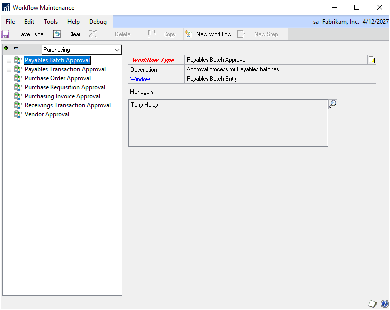

A screenshot of a cell phone Description automatically generated

1. *Select the type of workflow to create.*

2. Choose New Workflow.

3. *Name the workflow.*

4. *Indicate whether notifications should be sent for completed actions.*

5. *Indicate whether approvers can delegate tasks.*

6. *Indicate whether an originator should be an approver.*

7. *Indicate if documents should be approved by at least one person.*

8. *Specify an alternate final approver.*

9. *Indicate what should happen when a task is overdue.*

10. Choose Save Workflow.

11. *Set up the workflow steps.*

12. *Activate the workflow.*

#### Creating and configuring a workflow

A workflow is the approval process for a document. A workflow defines how a
document "flows" through the system by showing who must approve it, and the
conditions under which they must approve it.

**To create and configure a workflow:**

1. Open the Workflow Maintenance window. (Administration \>\> Setup \>\>
    Company \>\> Workflow \>\>Workflow Maintenance)

    

A screenshot of a cell phone Description automatically generated

1. Select the type of workflow to create.

Select the series and then the workflow type in the tree view. Each workflow
you create will be based on a type. The type indicates the purpose of the
workflow. After you select the type of workflow you want to create, you can
define the properties of the workflow.

*At least one manager must be selected before you can activate a workflow
for the type. Choose the Manager lookup button to open the Workflow User
Selection window to add managers to the workflow type.*

1. Choose New Workflow.

2. Name the workflow.

Enter a unique name for the workflow. We recommend that the name include
your company name and the type of document the workflow is for. For example,
if you're configuring a workflow for purchase orders created in the Fabrikam
sample company, you may want to name the workflow "Fabrikam Purchase
Orders."

You also can enter a description of the workflow, such "Multiple approval
steps for purchase orders."

*You can choose the Copy button to copy an existing workflow from one
company to another company. For more information, see Copying a workflow .*

1. Indicate whether notifications should be sent for completed actions.

You can send notifications messages to users when the documents they've
submitted have completed actions in the workflow approval process.

Mark the Send notifications for completed actions option and choose the
expansion button to open Workflow Email Notification Maintenance window. You
can use this window to select which completed action that the originator
should be notified about, the message to send for the notification of the
action, and the carbon-copy (cc) recipients of the notification.

1. Indicate whether approvers can delegate tasks.

To allow an approver to delegate a task to another approver in the workflow,
mark the Allow approver to manually delegate tasks option.

For example, assume that Frank is reviewing a purchase order. If the Allow
approver to delegate tasks option has been selected, Frank will be able to
delegate the purchase order to another approver in the workflow.

1. Indicate whether an originator should be an approver.

Any user who creates a document such as a purchase order can submit it for
approval. You can specify that the originator for the workflow can be an
approver.

For example, assume that Sue submits a purchase order for Northwind Traders
totaling \$25,000.

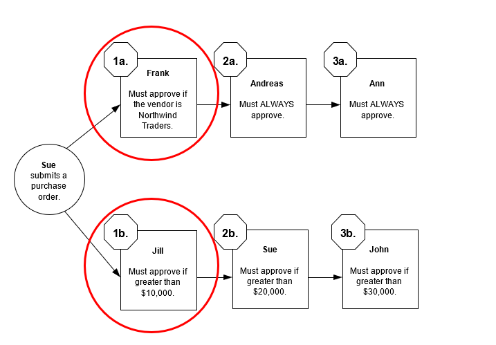

The system starts by evaluating the first steps to determine if approval is
required there. Since the purchase order meets the conditions specified in
both first steps, it is sent to Frank and Jill for approval.

When Frank and Jill approve the purchase order, it is assigned to Andreas and Sue. Note that Sue will have to approve her own purchase order. After Andreas approves the purchase order, Ann must approve it.

Suppose the Allow originator to be an approver option is not selected. This
means that when Sue submits a document for approval, she is removed from the
list of approvers for the step, and replaced by the alternate final
approver, or manager if there is no alternate final approver.

A close up of text on a white background Description automatically generated

A close up of text on a white background Description automatically generated

A close up of text on a white background Description automatically generated

To understand this better, review the top approval path. Because Sue is not
part of this approval path, the system starts at the first step in the path
and determines if approval is required there. From that point, the purchase
order will move along the approval path as required.

Now review the bottom approval path. Because Sue is an approver in this
approval path, the assignment is changed to the alternate final approver or
workflow manager.

*Keep in mind, approvers always can submit documents for approval. This
option does not affect their ability to submit documents for approval.*

1. Indicate if documents should be approved by at least one person.

There may be cases when a document does not require approval. For example,
consider the following workflow. If Sam submits a purchase order for \$100,
no approval is needed because the purchase order does not meet any of the
conditions specified in the workflow steps. In this scenario, the purchase
order will be saved automatically with a status of No Action Needed.

If you want documents to be approved by at least one person, select the
Always require at least one approver option. Documents that do not meet any
of the specified conditions will be routed to the alternate final approver
in the workflow. For more information about the alternate final approver,
see the next step.

1. Specify an alternate final approver.

The *final approver* is the last person in the approval path who is required
to approve a document. For example, assume that Sam submits a purchase order
for Northwind Traders totalling \$7,000. This purchase order must be
approved by Frank and Sue. Because the purchase order is not greater than
\$10,000, Ann's approval is not required. In this scenario, Sue is the final
approver.

Mark the Use alternate final approver option and enter the name of an
alternate final approver if you want a different escalation approver. The
alternate final approver is assigned to the approval action under the
following conditions.

- The Always Require at Least One Approver option is marked and there are no
    approval steps whose conditions are met.

- The Always Require at Least One Approver option is marked and the approver
    edits the document and there are no following approval steps.

- There are no approval steps following an overdue step, depending on your
    escalation settings.

To better understand when the alternate final approver is used, assume that
Ann edits the \$11,000 purchase order that Sam submitted. Ann increases the
quantity of items requested so that the purchase order now totals \$12,000.
She then approves the document. Ann typically would be the final approver
(because the document is more than \$10,000). However, because Ann edited
the document, she can't final approve it. The document will be sent to the
alternate final approver for approval.

1. Indicate what should happen when a task is overdue.

When an approver fails to act on a task by the task's due date, the task is
considered overdue, or escalated. Indicate what should happen to overdue
tasks by selecting one of the following options.

**Take no action** Select this option if you want the task to remain
assigned to the current approver.

**Escalate to next approver** Select this option if you want the system to
automatically assign the task to the next approver in the workflow.

**Escalate to** Select this option if you want the system to automatically
assign the task to a specific user. You must enter the name of the user you
want the task assigned to.

**Automatically reject the overdue** Select this option if you want the
system to automatically reject the task.

1. Choose Save Workflow.

2. Set up the workflow steps.

Choose the New Workflow Step button to add a step to this workflow. For
instructions on how to configure a step, see *Chapter 28, "Configure a
workflow step."*

1. Activate the workflow.

You can create multiple workflows of a specific workflow type. For example,
you can create multiple purchase order workflows. However, only one workflow
of that type can be used at a time. The Active option indicates which
workflow of that type will be used.

Mark the Active option to make the workflow you're configuring the active
workflow. You must have at least one step created for the workflow before
you can activate a workflow. If you do not want to implement this workflow
in your company just yet, leave the Active option unmarked.

If there is already an active workflow of this type, you'll need to
deactivate that workflow first, before activating this workflow. When you
save the workflow and there is already an active workflow of this type, a
message appears stating that there may be only one active workflow per
workflow type. If you decide that the current workflow should be the active
workflow, the Active option for the other workflow is unmarked.

> [!NOTE]
> Before inactivating an existing workflow, you may want to verify that all documents submitted to the workflow have been processed.

### Chapter 28: Configure a workflow step

As part of configuring a workflow, you'll need to define the specific steps
in the workflow. The first section in this chapter provides a checklist you
can use to configure a workflow step. The second section in this chapter
provides the detailed procedure you'll need to follow to configure a
workflow step.

- *Configuring a workflow step checklist*

- *Configuring a workflow step*

#### Configuring a workflow step checklist

To create and configure a workflow step, you'll need to complete several
tasks. The following steps list the tasks you'll need to complete and the
order in which you should complete them. See *Configuring a workflow step*
for more detailed steps.

1. From the Workflow Maintenance window, select the workflow for which you want
    to a create a step and click the New Step button.

2. *Name the step.*

3. *Specify a step type.*

4. *Specify where this step should occur.*

5. *Specify when approval or task is required at this step.*.

6. *Assign approvers.*

7. *Set a time limit.*

8. *Send a notification message.*

9. *Specify the completion policy of a step.*

10. Choose Save Step.

#### Configuring a workflow step

You can define the order in which a workflow step falls in the workflow,
conditions for running the step, and properties associated with assigning
the activity to users.

**To configure a workflow step:**

1. From the Workflow Maintenance window, select the workflow for which you want
    to a create a step and click the New Step button.

2. Name the step.

Enter a unique name for the step. We recommend that you keep the step names
simple, such as *Step 1* and *Step 2*, or *Purchasing Manager Approval* and
*CEO Approval*. Keeping the step names simple will help you manage the order
in which they occur.

You also can enter a description of the workflow step, such Approval for
purchase orders over \$5000 or Perform credit check.

1. Specify a step type.

**Approval** If this step requires that a user must give approval as part of
the workflow process, select Approval.

**Task** If this step requires that a user must complete a procedure as part
of the workflow process, select Task.

1. Specify where this step should occur.

You must specify where this step should occur in the workflow.

**First step in the workflow** If this step is the first step in the
workflow, select This step is a first step. Keep in mind, you can have
multiple first steps.

**Subsequent step in the workflow** If this step is *not* a first step,
select This step follows the selected step. Then select the workflow step
that this step should follow.

1. Specify when approval or task is required at this step.

You must specify when approval or a task is required at this step. Approval
or a task may be required always, or only under specific conditions.

**Action is always required** If approval or task is always required at this
step, select the Action is always required for this step option.

Keep in mind, if you select this option, it doesn't mean that this step will
*always* occur in the workflow; rather, it means that any document *that
reaches this step* must always be approved or the task be completed.

To understand this better, consider the following workflow illustration.
There are two approval paths for purchase orders: one for purchase orders
for Adventure Works, the other for purchase orders for Contoso, Ltd. Notice
that when a purchase order for Contoso, Ltd. reaches step 2b, Jill's
approval is always required. Purchase orders for Adventure Works will never
reach step 2b, so Jill's approval is not required in those situations.

A close up of a map Description automatically generated

A close up of a map Description automatically generated

**Action is required under specific conditions** If approval or a task at
this step is required only under specific conditions, select the Action is
required only when the following conditions is met option. Then specify the
conditions under which approval or the action is required. Choose the
expansion button to open the Workflow Condition Editor window.

For an example of adding a specific condition, consider the previous
workflow diagram. Notice that Frank's approval is required only when the
vendor on the purchase order is Adventure Works. You would use the following
steps to add Frank's approval requirement as a condition.

| 1. | Open the Workflow Condition Editor.                                                                                                                                                                      |
|----|-----------------------------------------------------------------------------------------------------------------------------------------------------------------------------------------------------------|
| 2. | Since this is the first condition created for the workflow step, the first part of the condition is Where.                                                                                               |
| 3. | The second part of the condition is to select the field that you want to use in the condition. Since Frank's approval is needed for a specific vendor ID, you would select Purchase Order Work Vendor ID. |
| 4. | Next, select a restriction to apply to the field you selected. The restrictions available depend on the type of field you selected. In this case, you would select "is" as your restriction.             |
| 5. | After selecting the restriction, determine the comparison. Since Frank's approval is needed for a specific vendor ID, you would select Constant to use a value instead of a field on the same document.  |
| 6. | Then, enter a specific value to use in the condition. For this condition, it would be ADVENWORK001.                                                                                                      |
| 7. | The last step is to choose Add to add the condition to the Conditions list. The condition should look like the following. where Purchase Order Work.VendorID is 'ADVENWORK001'                            |
|    | After adding this condition in the Conditions list, the "and" and "or" options are available for the next condition for the workflow step, if applicable.                                                |

1. Assign approvers.

Specify who must approve the documents that reach this step in the workflow.
You can have one approver or multiple approvers. Enter the names of the
approvers in the Assign To field.

If you have one approver, that person will be responsible for approving all
documents that reach this step in the workflow.

1. Set a time limit.

Specify how many hours, days, or weeks the approver has to respond to the
task—that is, approve or reject it. The number of hours, days, or weeks you
enter will be used to calculate the task's due date.

Mark the Apply Workflow Calendar option to include the Workflow calendar in
the due date calculations for the step. For example, assume that you have
set up work days in the Workflow calendar as being from Monday to Friday,
8:00 A.M. to 5:00 P.M., and entered four hours as the time limit for a step.
If the step is starts at 3:00 P.M. on Wednesday, and the option is marked,
then the due date for the task will be set to 10:00 A.M. Thursday morning.
If the option is not marked, the due date for the task is set to 7:00 P.M.
Wednesday evening.

*For detailed information about how a task's due date is calculated, see
Overview of the Workflow calendar .*

If an approver fails to respond by the due date, the task is considered
overdue, or escalated. The task will then be handled according to the option
you selected in the When a task is overdue area for the workflow. For more
information, see *Indicate what should happen when a task is overdue.* .

1. Send a notification message.

Mark to send e-mail messages to users when workflow tasks are assigned to
them. Then, enter or select the message ID for the notification for when the
step is run.

You can click the Send Message link to open the Message Setup window, where
you can view or edit the message.

1. Specify the completion policy of a step.

If you have multiple approvers, you must specify how many of the approvers
must approve the documents that reach this step. Select one of the following
options.

**Only one response needed** If you select this option, the action applied
to the document is determined by the first person who responds.

**Majority must approve or take action** If you select this option, a
majority of the approvers must approve the document for it to continue down
the workflow approval path.

For example, consider the workflow previously illustrated. Assume that Sam
has submitted a purchase order for \$50,000 and it is currently at step 3 in
the workflow.

- If Bill and Jo are the first two approvers to respond—and they both approve
    the document—the document is sent to Ann for approval. Because a majority is
    reached, the system does not wait for Mary to respond.

- If Bill and Jo are the first two approvers to respond—and one of the
    approvers reject the document—the document is given the status of Rejected
    and the workflow process is complete. Because a majority is reached, the
    system does not wait for Mary to respond.

- If Bill approves the document and then Jo requests a change, the document is
    given the status of Pending User Action. Because a change is requested, the
    document is immediately sent back to the originator. The system does not
    wait for Mary to respond.

Keep in mind, if a workflow step has an even number of approvers, a majority
must still approve the document in order for it to continue down the
workflow approval path. For example, suppose step 3 has four approvers
(Bill, Jo, Mary, and Chris). Three approvers must approve the document in
order for it to continue down the approval path. If two approvers approve
the document, and two reject it, the document is given the Rejected status
because a majority was not reached.

**All must approve or take action** If you select this option, all of the
approvers must approve the document in order for it to continue down the
workflow approval path.

For example, consider the workflow previously illustrated. Assume that Sam
has submitted a purchase order for \$50,000 and it is currently at step 3 in
the workflow. If all of the approvers (Bill, Jo, and Mary) approve the
document, it is sent to Ann for approval. If one person rejects the
document, it is given the status of Rejected and the workflow process is
complete. If one person requests a change to the document, it is sent to Sam
with a status of Pending User Action.

Choose Save Step.

### Chapter 29: Set up Workflow delegates

After you've set up and activated a workflow in Microsoft Dynamics GP,
specify how to delegate workflow tasks to other users.

* *Delegating tasks*

#### Delegating tasks

Approvers can delegate, or reassign, their tasks to other approvers. For
example, if Frank will be out of the office for a period of time, he can
delegate his tasks to another approver in the workflow, such as Sue or Ann.

If users will be out of the office for a period of time, or will be
unavailable to respond to tasks, have them delegate their tasks using the
following steps.

**To delegate tasks:**

1. Open the Workflow User Delegation window. (Home \>\> User Preferences \>\>
    Workflow Delegation)

2. Enter or select the user to delegate tasks for.

3. Mark Automatically delegate my workflow tasks.

4. Select to delegate all of your workflow types or select to delegate by
    workflow type.

5. For each workflow type that you selected, specify who you want your tasks
    delegated to.

6. For each workflow type that you selected, specify when your tasks should be
    delegated by entering a starting and ending date.

7. Choose OK.

If users will be out of the office for a period of time, or unavailable to
respond to tasks, have them delegate their tasks. For more information, see
*Chapter 15, "Workflow tasks."*

### Chapter 30: Workflow maintenance

The following sections explain how to copy, modify, delete, and inactivate a
workflow.

- *Copying a workflow*

- *Modifying a workflow*

- *Deleting a workflow*

- *Inactivating a workflow*

- *Troubleshooting Workflow*

#### Copying a workflow

An easy way to create a new workflow is to copy an existing one and modify
it, as necessary. When you copy an existing workflow definition using the
Copy Workflow window, you will copy all the steps included in the existing
workflow. You also can copy a workflow from one company to another.

**To copy a workflow:**

1. Open the Workflow Maintenance window. (Administration \>\> Setup \>\>
    Company \>\> Workflow \>\>Workflow Maintenance)

2. Select the series that has the workflow you want to copy.

3. Expand the workflow type in the tree view.

4. Select the workflow you want to copy.

5. Choose the Copy button to open the Copy Workflow window.

6. Enter a unique name for the workflow.

We recommend that the name include your company name and the type of
document the workflow is for. For example, if you're configuring a workflow
for purchase orders created in the Fabrikam sample company, you may want to
name the workflow "Fabrikam Purchase Orders."

1. Enter the description of the workflow.

2. Select the company this workflow is for.

You can copy this workflow to the company you are currently working in, or
you can copy the workflow to another company.

1. Choose Copy.

#### Modifying a workflow

Use the following steps to modify a workflow. Once documents have been
submitted to the workflow, you can no longer add, remove, or change the
order of steps.

1. Open the Workflow Maintenance window.

(Administration \>\> Setup \>\> Company \>\> Workflow \>\>Workflow
Maintenance)

1. Select the series that has the workflow you want to modify.

2. Expand the workflow type in the tree view.

3. Select the workflow you want to modify.

4. Modify the workflow, as necessary.

For more information about each of the options in the window, see *Chapter
27,*

*"Configure a workflow"* and *Chapter 28, "Configure a workflow step."*

1. Choose Save Workflow.

#### Deleting a workflow

To delete a workflow you're no longer using, use the following steps.

*You cannot delete a workflow that has an instance started.*

**To delete a workflow:**

1. Open the Workflow Maintenance window.

(Administration \>\> Setup \>\> Company \>\> Workflow \>\>Workflow
Maintenance)

1. Select the series that has the workflow you want to delete.

2. Expand the workflow type in the tree view.

3. Select the workflow you want to delete.

4. Choose Delete Workflow.

#### Inactivating a workflow

Use the Workflow Maintenance window to inactivate a workflow that you no longer
use. If documents are submitted before inactivating the workflow, the documents
continue through the original workflow until they are complete.

When you inactivate a workflow, the message bar and workflow related buttons
that appeared in the associated entry window are removed, assuming that you
haven't activated another workflow. For example, the message bar that appeared
in the Purchase Order Entry window would be removed.

*Before you make a workflow inactive, you may want to process the documents
that are awaiting approval.*

**To inactivate a workflow:**

1. Open the Workflow Maintenance window. (Administration \>\> Setup \>\>
    Company \>\> Workflow \>\>Workflow Maintenance)

2. Select the series that has the workflow you want to inactivate.

3. Expand the workflow type in the tree view.

4. Select the workflow you want to inactivate.

5. Unmark the Active option.

6. Choose Save Workflow.

#### Troubleshooting Workflow

Review the following information.

**Escalation actions are not performed**

Be sure that the SQL Server Agent service is set up to start automatically
with the operating system.

The default daily frequency for a SQL Server job is every 15 minutes. This
means that the SQL Server job that performs escalations only runs every 15
minutes, unless you changed the default daily frequency. The escalation may
happen up to 15 minutes after the due date and time passes.

**Cannot perform Workflow actions from e-mail notifications**

Be sure that you have installed Microsoft Dynamics GP Web Services and that
the application user account set up in Microsoft Dynamics GP Web Services is
a domain account that has privileges to access Active Directory.

Verify that the browser you are using is a supported browser.

**An error occurs when submitting a document**

If an error occurs when submitting a document after you restore a SQL Server
backup to a new server or you have upgraded to a newer version of Microsoft
.NET Framework, you must execute the wfDeployClrAssemblies stored procedure.

1. Open the SQL Server Management Studio.

Log in to the server.

1. In the Object Explorer, expand the Microsoft Dynamics GP system database.

2. Expand Programmability and then expand Stored Procedures.

3. Right-click on dbo.wfDeployClrAssemblies and click Execute Stored Procedure.

## Part 6: Organizational structure

You can define as many as four layers of structure within your business, and
then to set up specific divisions, departments, or other organizational
groups. Later you can create relationships among different groups. You can
assign accounts, users, and user classes to different parts of the
organizational structure.

This part of the documentation includes:

- *Chapter 31, "Organizational levels and entities,"* explains how to define
    the components of your organizational structure.

- *Chapter 32, "Organizational relationships,"* describes how to define the
    association between levels and entities in your organization.

- *Chapter 33, "User and user class assignments,"* shows how to assign users
    and user classes to the organizational structure you have created.

- *Chapter 34, "Account assignments,"* explains how to assign both individual
    accounts and account ranges to your organizational structure.

- *Chapter 35, "Account security,"* describes how to activate account security
    and provides information on the effects of account security.

### Chapter 31: Organizational levels and entities

Setting up organizational levels and entities involves defining the
components of your organization. This information describes how to add,
delete, and rename levels and entities in your organizational structure.

This information is divided into the following sections:

- *Understanding organizational levels and entities*

- *Defining levels and entities*

- *Adding a level to an organizational structure*

- *Deleting a level in an organizational structure*

- *Adding an entity in an organizational structure*

- *Deleting an entity in an organizational structure*

- *Renaming levels and entities in an organizational structure*

#### Understanding organizational levels and entities

Your organization might be defined in various ways, such as by geographic
regions, functional areas, product lines, or target markets. For example,
your organization might be composed of a number of companies, each with its
own set of product lines and departments. Each level of the organization—in
this example, company, product line, and department—includes a number of
entities, that is, distinct identifiable units. For example, the entities at
the department level might include the following:

- Purchasing

- Facility management

- Accounting

- Production

#### Defining levels and entities

Use the Organizational Structure Setup window to establish the levels of
your organization and the entities at each level within the organizational
structure. You can define up to four levels and up to 256 entities at each
level. For example, the four levels could be Company, Region, Division, and
Department, and the entities at the Department level could be Manufacturing,
Distribution, Research, and Marketing.

Take some time before you begin the actual setup and think about the way
your organization works. Using your existing organizational chart is an
excellent place to begin.

*Be sure you've identified each of the units in all of your companies. The
levels and entities you create in this window will be used for all of your
Microsoft Dynamics GP companies.*

**To define levels and entities:**

1. Open the Organizational Structure Setup window.(Administration \>\> Setup
    \>\> System \>\> Organizational Structure)

2. Enter a label for each organizational level you want to use. The labels you
    enter for each of the levels will appear throughout Microsoft Dynamics GP.
    You can change these labels at any time.

*You don't have to enter labels for all four levels if you don't need them
all. For example, if you have only one company and your organization
includes regions, divisions, and departments, you could enter those labels
for levels 1, 2, and 3 and leave level 4 blank. If you leave a level blank,
you won't be able to enter any entities in it, and it won't appear anywhere
in Microsoft Dynamics GP.*

1. Enter an ID and a description for each entity that exists at each level of
    your organization. You can change entity IDs and descriptions at any time.

2. Verify your entries with the Organizational Structure Setup Report.

Use the Organizational Structure Setup Report to verify that you have
entered labels for each of the levels you'll use, and that you've entered
IDs and descriptions for each entity in your organization. You can print
this report while the Organizational Structure Setup window is open by
choosing File \>\> Print.

1. Choose OK to save your entries.

#### Adding a level to an organizational structure

Use the Organizational Structure Setup window to add levels to your
organizational structure. You can add levels at any time.

**To add a level to an organizational structure:**

1. Open the Organizational Structure Setup window.

(Administration \>\> Setup \>\> System \>\> Organizational Structure)

1. Enter the label of the level you want to add. When you create a new level,
    you'll need to add entities to that level.

2. Choose OK to save your changes.

#### Deleting a level in an organizational structure

Use the Organizational Structure Setup window to delete levels from your
organizational structure. You can delete levels at any time.

**To delete a level in an organizational structure:**

1. Open the Organizational Structure Setup window. (Administration \>\> Setup
    \>\> System \>\> Organizational Structure)

2. Delete the label of the level to remove. If a level does not have a label,
    you won't be able to create any entities in it, and it won't appear anywhere
    in Microsoft Dynamics GP.

*You can't delete a level if any entities exist in it or if any levels exist
below it in the organizational structure.*

1. Choose OK to save your changes.

#### Adding an entity in an organizational structure

Use the Organizational Structure Setup window to add entities to the
organizational structure. You can add entities at any time.

**To add an entity in an organizational structure:**

1. Open the Organizational Structure Setup window. (Administration \>\> Setup
    \>\> System \>\> Organizational Structure)

2. Choose the level to add entities to.

3. Enter an ID and a description for each entity you want to add to your
    organizational structure. You can change entity IDs and descriptions at any
    time.

4. Choose OK to save your changes.

#### Deleting an entity in an organizational structure

Use the Organizational Structure Setup window to delete entities from the
organizational structure. You can delete entities at any time.

If you have created an organizational structure and assigned users, user
classes, and accounts to positions in the organization, deleting an entity
will have the following effects:

- Any relationships that exist for that entity will be removed.

- Any existing Organizational Structure assignments for users, user classes,
    and accounts assigned to those relationships will be removed.

Users and user classes can be assigned to only one position in the
organizational structure; therefore, user and user classes assigned to
removed positions will not have access to any accounts until they are
assigned to a different position.

Accounts can be assigned to multiple positions in the organizational
structure; therefore, accounts assigned to positions that are removed may
still be assigned to other positions.

**To delete an entity in an organizational structure:**

1. Open the Organizational Structure Setup window. (Administration \>\> Setup
    \>\> System \>\> Organizational Structure)

2. Choose the level you want to delete an entity from.

3. Select the entity you want to delete and choose Edit \>\> Delete Row. Any
    relationships associated with this entity will be removed.

*You can delete an entity at any time; however, if it is part of a
parent-child relationship—that is, if it has any entities below it in the
structure—any relationships below it also will be deleted. (Only the
relationship will be deleted, not the child entities.)*

1. Choose OK to save your changes.

#### Renaming levels and entities in an organizational structure

Use the Organizational Structure Setup window to rename levels and entities.
You can change the labels for the levels of your organization and change the
IDs and descriptions of the entities at each level within the organizational
structure.

**To rename levels and entities in an organizational structure:**

1. Open the Organizational Structure Setup window. (Administration \>\> Setup
    \>\> System \>\> Organizational Structure)

2. Change the labels for your organization levels.

3. Change the IDs and descriptions for the entities at each level.

4. Verify your entries with the Organizational Structure Setup Report. To print
    the report, choose File \>\> Print.

5. Choose OK to save your changes.

### Chapter 32: Organizational relationships

Setting up organizational relationships involves defining the association
between levels and entities in your organization. This information describes
how to set up relationships in your organizational structure. You can then
use this structure as a basis for defining account security and assigning
users and accounts to entities.

This information is divided into the following sections:

- *Understanding organizational relationships*

- *Defining organizational relationships*

- *Copying organizational relationships*

- *Examples of copying organizational relationships*

- *Adding organizational relationships*

- *Removing an organizational relationship*

#### Understanding organizational relationships

Organizational relationships define the association between levels and
entities in your organization. Organizational relationships are defined in
terms of parent/ child relationships. For example, a company's East region
may have a Products division and a Services division; the East region is a
parent entity, and the Products and Services divisions are child entities.

Parent/child relationships must be defined in a "top-down" manner—that is,
you must begin with a level 1 entity and assign the level 2 entities that
are its children. You can then assign the level 3 child entities for a level
2 parent, so on.

*You can copy the relationships you've defined for one entity to another
entity, or to all other entities at the same level. For example, assume you
have a Company/Division/Department structure, and all your companies have a
Hardware division with a Production department. You could create the
appropriate parent/child relationships in one company, and copy that set of
relationships to all other companies in your organization. For more
information, refer to Copying organizational relationships .*

#### Defining organizational relationships

Use the Organizational Tree window and the Define Entity Relationships
window to define the parent/child relationships among the entities in your
organization.

**To define organizational relationships:**

1. Open the Organizational Tree window. (Administration \>\> Cards \>\> System
    \>\> Organizational Tree)

2. Highlight the parent entity to which you want to define relationships.

When you first open this window, all of the level 1 entities you defined in
the Organizational Structure Setup window will appear in the tree view. If
some relationships have been defined, a plus sign (+) will appear next to
the entity. Click the plus sign to expand the tree view.

*When the Organizational Tree window is open, you can use the buttons in the
window to create, copy, or delete relationships, or you can use the
selections on the Relationships menu.*

1. Choose the Define Relationship button (or choose Relationships \>\> Define
    Relationship) to open the Define Entity Relationships window.

2. Mark the entities to be children of the selected parent.

All unassigned entities that exist in the level below the entity you
selected in the Organizational Tree window will appear in this window. If an
entity has already been assigned to the selected parent entity, it will not
appear in this window. For example, if you have already assigned the North
and South Regions to Company A, only the East and West regions will appear
in this window.

1. Choose Process to create the relationships and update the entities displayed
    in the Organizational Tree window.

*When the organizational tree displayed in the Organizational Tree window is
updated, only the level 1 entities are displayed. Click the plus sign to
expand the tree view.*

1. In the Organizational Tree window, select another entity and continue
    defining relationships.

#### Copying organizational relationships

If you have a basic structure that appears throughout your organization, you
can create the appropriate parent/child relationships once, and copy that
structure to the rest of your organization. You can copy the relationships
from one entity to another entity or to all the entities at the same level.
If you're copying to entities that have already been assigned relationships,
you can choose to add to the existing structure, or replace it with the new
structure. You also can specify to copy specific level-2 or level-3
relationships. For more information on copying relationships, see *Examples
of copying organizational relationships* .

*Use caution when copying relationships to entities with existing
structures. Be sure you don't add or replace relationships that you don't
intend to add or replace.*

**To copy organizational relationships:**

1. Open the Organizational Tree window. (Administration \>\> Cards \>\> System
    \>\> Organizational Tree)

2. Highlight the relationship to copy.

You can select a level 1, 2, or 3 entity. For example, if you have a
Company/ Region/Division/Department structure and want to copy every
parent/child relationship under the company ACME, highlight that company. If
you want to copy the relationships below ACME company and region EAST,
expand the ACME branch and select EAST.

*If you're copying a portion of the organizational structure that has
accounts assigned to it, those accounts will not be assigned to the new
structure.*

1. Choose the Copy Relationship button (or choose Relationships \>\> Copy
    Relationships) to open the Copy Organizational Structures window.

The Copy From fields display information from the entity that you selected
in the Organizational Tree window. For example, suppose you expand the tree
and choose a level 3 entity of a specific branch. Then the three Copy From
fields displays information about the appropriate parent and child entities.
These values can be changed.

1. Decide if you want to copy the relationship to all entities or to a specific
    one.

- If you're copying to all entities, the relationship will be copied only to
    entities that exist at the lowest level entered in the Copy From fields—that
    is, if you specify a level 3 entity to copy from, the relationships will be
    copied only to existing level 3 entities.

- If you want to select a specific entity to copy to, you must specify
    entities in the Copy To fields at each of the levels entered in the Copy
    From fields— that is, if you specify a level 3 entity to copy from, you must
    specify a level 3 entity in the Copy To fields.

You also can choose to add the relationship to existing structures, or you
can replace the existing structures with the specified relationship.

1. Choose the Copy button to begin copying the selected relationships. When the
    copying process is finished, the window will remain open and you'll be able
    to select more relationships to copy.

2. When you've finished copying entities, close the window.

#### Examples of copying organizational relationships

For all of the following examples, assume you have a structure with Company
at the first level, Division at the second, and Department at the third,
with three companies: Fabrikam, Fabrikam–United Kingdom, and
Fabrikam–Canada.

**Copying a level 1 relationship to all entities**

Assume you've created the following structure for Fabrikam:

##### Fabrikam Hardware

Administration

Consulting

Production

Research

Sales

If all three companies have a Hardware division that includes the same
departments, you could copy the entire structure of Fabrikam to both other
companies. In the Organizational Tree window, select Fabrikam, then choose
the Copy Relationship button. In the Copy Organizational Structures window,
mark

Copy to All Entity IDs and choose Copy. The following structure would be
created

##### Fabrikam Hardware

Administration

Consulting

Production

Research

Sales

##### Fabrikam–UK Hardware

Administration

Consulting

Production

Research

Sales

##### Fabrikam–CAN Hardware

Administration

Consulting

##### Production Research Sales

**Copying one level 2 relationship to another**

Assume you have created the structure for Fabrikam with a Hardware division
that includes several departments.

Also, assume the UK company has a Hardware division, but the Canada company
has a Software division, and you want to copy the departments under
Fabrikam/ Hardware to both the Hardware division of the UK company and the
Software division of the Canada company. You can do this by first adding the
Hardware division to the UK company and the Software division to the Canada
company. The following table illustrates the structures you'd need to define
before copying relationships.

##### Fabrikam Hardware

Administration

Consulting

Production

##### Research Sales Fabrikam–UK Hardware Fabrikam–CAN Software

After you've created this structure, you can copy the relationships from
Fabrikam/

Hardware. In the Organizational Tree window, select Fabrikam, then select

Hardware and choose the Copy Relationship button. In the Copy Organizational
Structures window, mark Copy to All Entity IDs, and choose Copy. The
following structure will be created:

##### Fabrikam Hardware

Administration

Consulting

Production

##### Research Sales Fabrikam–UK Hardware

Administration

Consulting

Production

##### Research Sales Fabrikam–CAN Software

Administration

Consulting

##### Production Research Sales

You also can copy the departments for Fabrikam/Hardware only to the Software
division of Fabrikam–Canada. In the Organizational Tree window, select
Fabrikam, then select Hardware and choose the Copy Relationship button to
open the Copy Organizational Structures window. In the Copy To fields,
select Fabrikam–Canada and Software, and choose Copy.

#### Adding organizational relationships

Use the Organizational Tree window and the Define Entity Relationships
window to add parent/child relationships to the entities in your
organization.

**To add organizational relationships:**

1. Open the Organizational Tree window. (Administration \>\> Cards \>\> System
    \>\> Organizational Tree)

2. Select the parent entity to which you want to add relationships.

3. Choose the Define Relationships button (or choose Relationships \>\> Define
    Relationship) to open the Define Entity Relationships window.

4. Mark the child entities to add.

5. Choose Process to update the entities displayed in the Organizational Tree
    window.

#### Removing an organizational relationship

Use the Organizational Tree window and the Define Entity Relationships
window to remove parent/child relationships from the entities in your
organization.

Because relationships are defined in a "top-down" manner, changes made to a
parent entity can affect its child entities. For example, if you remove a
parent/child relationship, all the relationships below that are lost. You
can't move a branch—that is, a child entity that has other child entities
below it—from one parent entity to another and preserve the relationships
below it.

*Removing an organizational relationship will delete the organizational
structure for the users and accounts assigned to that relationship. Because
a user can be assigned to only one position, any user assigned to a position
that is removed will not be able to access any accounts. Accounts can be
assigned to more than one position, so an account assigned to a position
that is removed may still be assigned to other positions.*

**To remove an organizational relationship:**

1. Open the Organizational Tree window. (Administration \>\> Cards \>\> System
    \>\> Organizational Tree)

2. Select the child entity you want to remove from the relationship. You can
    expand a branch of the organizational tree by choosing the plus sign next to
    a parent entity.

3. Choose Delete Relationship (or choose Relationships \>\> Delete
    Relationships).

### Chapter 33: User and user class assignments

This information describes how to create user classes and assign users and
user classes to the organizational structure you've created. You must assign
user and user classes before you can activate account level security.

You can create user classes and assign them to an organizational entity in
your organizational structure so that you can activate account level
security.

You also can specify sets of specific shortcuts to common tasks for each
user class with the shortcut bar. Each set of shortcuts will appear on the
user's shortcut bar in a user class folder. See *Assigning shortcuts to a
new user class folder* for instructions on creating a user class shortcut
folder.

This information is divided into the following sections:

- *Creating a user class*

- *Assigning users to a class*

- *Assigning a user class to an organizational entity*

- *Changing the assignment of a user class*

- *How rolling down changes affects users in a class*

- *Assigning a user to an organizational structure*

- *Changing the assignment of a user*

For information about assigning accounts to the organizational structure,
see *Chapter 34, "Account assignments."*

#### Creating a user class

You'll use the User Class Setup window to create a user class.

**To create a user class:**

1. Open the User Class Setup window. (Administration \>\> Setup \>\> System
    \>\> User Classes)

2. In the Class ID field, enter a class name. You may find it helpful to enter
    a name that identifies this class, such as SUPERVISOR or DATA ENTRY.

3. If you use Organizational Structures, choose the Class ID organization
    button to open the Organizational Structure Assignment window, where you can
    assign the selected user class to a position in your organizational
    structure.

4. Enter a description that identifies the class further. This description will
    be used as the name of the shortcut bar folder that corresponds to this user
    class.

5. To print a User Classes Report, showing the information you entered for the
    selected record, choose File \>\> Print. You also can print this report
    using the User Report Options window.

#### Assigning users to a class

After creating your user classes, assign each user to a class using the User
Setup window.

**To assign users to a class:**

1. Open the User Setup window. (Administration \>\> Setup \>\> System \>\>
    User)

2. Enter or select a user.

3. In the Class ID field, enter or select the class you want to assign the user
    to.

4. Mark the Default option if you want the settings that you enter for this
    class to automatically appear as the default for every subsequent class that
    you create.

5. Choose Save to save your changes.

#### Assigning a user class to an organizational entity

Use the Organizational Structure Assignment window to assign a user class to
a position in the organizational structure. You can assign a user class to
only one position in the organizational structure.

*If you have a large number of users, we recommend that you use user classes
to assign groups of them to positions in the organizational structure. If
you do need to make changes to the structure, you'll be able to apply those
changes to all the users in a class, rather than one at a time. For more
information, see How rolling down changes affects users in a class .*

Only the system administrator, and users granted full access to all accounts
can assign a user class to the organizational structure. (Full access to
accounts can be granted to users and user classes in the Organizational
Structure Assignment window.)

**To assign a user class to an organizational entity:**

1. Open the User Class Setup window. (Administration \>\> Setup \>\> System
    \>\> User Classes)

2. Enter or select the user class to assign to the organizational structure,
    and choose the organization icon button to open the Organizational Structure
    Assignment window.

3. If members of this user class should have access to all accounts, mark Grant
    Access To All Accounts.

4. Enter or select the entities that specify the position to assign the user
    class to.

*The position you specify for this user class must already exist in the
organizational structure. You can view the existing organizational structure
in the Organizational Tree window (Administration \>\> Cards \>\> System
\>\> Organizational Tree). For more information, see Defining organizational
relationships .*

As you enter the entities, you also are selecting the position in the
organizational structure you're assigning the user class to. For example, if
to assign the user class to the Consulting department of the Hardware
division of Fabrikam, you would enter Fabrikam in the first level, Hardware
in the second level and Consulting in the third level.

1. Choose Insert to insert the position into the Assigned Positions list.

2. Choose OK to save the position assignment.

#### Changing the assignment of a user class

Use the Organizational Structure Assignment window to change a user class's
position in the organizational structure. You can assign a user class to
only one position in the organizational structure.

If you have a large number of users, changing the assignment for a user
class is an easy way to change the position assignments for several users at
once, rather than one at a time. For more information, see *How rolling down
changes affects users in a class* .

Only the system administrator and users granted full access to all accounts
can change a user class's position in the organizational structure. (Full
access to accounts is granted to users and user classes in the
Organizational Structure Assignment window.)

**To change the assignment of a user class:**

1. Open the User Class Setup window.

(Administration \>\> Setup \>\> System \>\> User Classes)

1. Enter or select the user class whose position in the organizational
    structure you want to change, and choose the organization icon button to
    open the Organizational Structure Assignment window.

2. If members of this user class should have access to all accounts, mark Grant
    Access To All Accounts.

3. Highlight the current position assignment of the user class and choose
    Remove.

*Because a user class can't be assigned to more than one position, you must
first remove its current position assignment before selecting a new one.*

1. Enter or select the entities that specify the new position to assign the
    user class to.

As you enter the entities, you also are selecting the position in the
organizational structure you're assigning the user class to. For example, if
you want to assign the user class to the Production department of the
Eastern region of Fabrikam, you would enter Fabrikam in the first level,
East in the second level and Production in the third level.

1. Choose Insert to insert the position into the Assigned Positions list.

2. Choose OK to save the position assignment.

#### How rolling down changes affects users in a class

When you make changes to the organizational assignment for a user class,
you'll have the option to apply those changes to the user records assigned
to that class. If you roll down changes, all the changes you make will apply
to all the users in the class.

Rolling down changes applies all the settings for a user class, not just
those that you changed in an individual session.

*If you roll down changes for a class, any individual position assignments
you've made for users in that class will be lost. For more information on
position assignments for individual users, see Assigning a user to an
organizational structure .*

If you choose not to roll down changes, the changes won't affect any
existing users but will be reflected in the settings for all users you
assign to this class in the future.

#### Assigning a user to an organizational structure

Use the Organizational Structure Assignment window to assign a user to a
position in the organizational structure. You can assign a user to only one
position in the organizational structure.

*If you have a large number of users, we recommend that you use user classes
to assign groups of users to positions in the organizational structure. For
more information, see Assigning a user class to an organizational entity .*

Only the system administrator and users granted full access to all accounts
can assign a user to the organizational structure. (Full access to accounts
can be granted to users and user classes in the Organizational Structure
Assignment window.)

**To assign a user to an organizational structure:**

1. Open the User Setup window. (Administration \>\> Setup \>\> System \>\>
    User)

2. Enter or select the user you want to assign to the organizational structure,
    and choose the organization icon button to open the Organizational Structure
    Assignment window.

3. If the user should have access to all accounts, mark Grant Access To All
    Accounts.

4. Enter or select the entities that specify the position to assign the user
    to.

*The position you specify for this user must already exist in the
organizational structure. You can view the existing organizational structure
in the Organizational Tree window (Administration \>\> Cards \>\> System
\>\> Organizational Tree). For more information, see Defining organizational
relationships .*

As you enter the entities, you also are selecting the position in the
organizational structure you're assigning the user to. For example, if you
want to assign the user to the Consulting department of the Hardware
division of Fabrikam, you would enter Fabrikam in the first level, Hardware
in the second level and Consulting in the third level.

1. Choose Insert to insert the position into the Assigned Positions list.

2. Choose OK to save the position assignment.

#### Changing the assignment of a user

Use the Organizational Structure Assignment window to change a user's
position in the organizational structure. You can assign a user to only one
position in the organizational structure.

Only the system administrator and users granted full access to all accounts
can change a user's position in the organizational structure. (Full access
to accounts is granted to users and user classes in the Organizational
Structure Assignment window.)

**To change the assignment of a user:**

1. Open the User Setup window.

(Administration \>\> Setup \>\> System \>\> User)

1. Enter or select the user whose position in the organizational structure you
    want to change, and choose the organization icon button to open the
    Organizational Structure Assignment window.

2. Indicate whether this user should have access to all accounts, regardless of
    their position in the organizational structure.

3. Highlight the user's current position assignment and choose Remove.

*Because a user can't be assigned to more than one position, you must first
remove their current position assignment before selecting a new one.*

1. Enter or select the entities that specify the new position to assign the
    user to.

As you enter the entities, you also are selecting the position in the
organizational structure you're assigning the user to. For example, to
assign a user to the Production department of the Eastern region of
Fabrikam, you would enter Fabrikam in the first level, East in the second
level and Production in the third level.

1. Choose Insert to insert the position into the Assigned Positions list.

2. Choose OK to save the position assignment.

### Chapter 34: Account assignments

After assigning users to the organizational structure you've created, you
must assign accounts to the structure. This information describes how to
assign individual accounts and ranges of accounts. Then, when you activate
account level security, users will be able to access only those accounts
that they are assigned to, based on their position in the organizational
structure.

This information is divided into the following sections:

- *Assigning a range of accounts to an entity*

- *Changing the assignment for a range of accounts*

- *Assigning an account to an organizational entity*

- *Changing the assignment of an account*

#### Assigning a range of accounts to an entity

Use the Organizational Structure Mass Assignment window to assign a range of
accounts to a position in the organizational structure. You can assign
accounts to more than one position in the organizational structure.

You can assign posting accounts, unit accounts, and variable and fixed
allocation accounts to positions in the organizational structure. You also
can allow users to have access to an allocation account—either fixed or
variable—while not allowing them to have access to any of the distribution
or breakdown accounts for the allocation account.

*If you activate account security and you have accounts that aren't assigned
to at least one position in the organizational tree, those accounts will be
available only to users who have been given access to all accounts.*

Only the system administrator and users granted full access to all accounts
can assign a range of accounts to the organizational structure. (Full access
to accounts can be granted to users and user classes in the Organizational
Structure Assignment window.) For more information on granting users and
user classes access to all accounts, see *Chapter 33, "User and user class
assignments."*

**To assign a range of accounts to an entity:**

1. Open the Organizational Structure Mass Assignment window. (Administration
    \>\> Cards \>\> System \>\> Organizational Assignments)

2. Enter or select the entities that specify the position to which you want to
    assign the range of accounts.

*The position you specify for this range of accounts must already exist in
the organizational structure. You can view the existing organizational
structure in the Organizational Tree window (Administration \>\> Cards \>\>
System \>\> Organizational Tree). For more information, see Defining
organizational relationships .*

As you enter the entities, you also are selecting the position in the
organizational structure to which you're assigning the range of accounts.
For example, to assign accounts to the Sales department of the Hardware
division of Fabrikam, you would enter Fabrikam in the first level, Hardware
in the second level and Sales in the third.

1. Select the ID of the company to which you're making account assignments.

*If you are using Intercompany Processing and want account security to apply
to transactions originating in another company, you must assign the
appropriate accounts in the originating company to the organizational
structure.*

1. Select Assign, and indicate whether you want the assigned accounts to be
    available to the parent levels of the entity.

Using the previous example, if you enter the organizational structure The
Fabrikam/Hardware/Sales and select the Apply To Parent Levels option, the
accounts you enter will be available to users and user classes assigned to
the following three positions of the structure:

- Fabrikam/Hardware/Sales

- Fabrikam/Hardware

- Fabrikam

If you leave the option unmarked, the accounts will be available only to
users and user classes assigned to Fabrikam/Hardware/Sales.

1. Select the type of range of accounts to assign—segment or account—then enter
    restrictions for that range. You can insert multiple ranges of each type
    into the Restrictions list.

If you insert multiple ranges into the Restrictions list, any account that
falls within one of the ranges you define will be assigned. For example, you
could choose to restrict by segments, and enter Account segment 1200 through
1270 and Account segment 1300 through 1330 in the Restrictions list. Any
account with segments 1200 to 1270 or 1300 to 1330 will be assigned.

*If you use a segment range to assign accounts to a position in the
organizational structure, then later add accounts that fall within that
range, the new accounts will not be assigned automatically to the same
position. You must add the new accounts to the structure.*

1. Choose Details to open the Organizational Assignment Details window, where
    you can view the accounts that fall within the ranges you selected, and make
    changes if necessary.

In this window, you can select individual accounts to exclude from the
ranges you defined. When you finish, choose OK to return to the
Organizational Structure Mass Assignment window.

1. Choose Process.

After processing is completed, the Organizational Assignments Journal will
print, showing the account restrictions you entered, the assignment options,
the position you assigned accounts to, and the accounts that were assigned.

#### Changing the assignment for a range of accounts

Use the Organizational Structure Mass Assignment window to change the
organizational structure assignments for a range of accounts. You can assign
additional ranges of accounts to the position, remove specific ranges of
accounts from the position, or remove specific ranges of accounts from all
assigned positions for the selected company.

**To change the assignment for a range of accounts:**

1. Open the Organizational Structure Mass Assignment window.

(Administration \>\> Cards \>\> System \>\> Organizational Assignments)

1. Enter or select the entities that specify the position to which you want to
    change account assignments.

*If you want to remove specific ranges of accounts from all assigned
positions for the selected company, you can leave these fields blank.*

As you enter the entities, you also are selecting the position in the
organizational structure to which you're assigning the range of accounts.
For example, if you want to change the ranges of accounts that will be
available to the Production department of the Eastern region of Fabrikam,
you would enter Fabrikam in the first level, East in the second level and
Production in the third level.

1. Select the ID of the company to which you're changing account assignments.

2. You can assign additional ranges of accounts to the position, remove
    specific ranges of accounts from the position, or remove specific ranges of
    accounts from all assigned positions for the selected company.

    - To assign additional ranges of accounts to the position, choose Assign,
        and indicate whether you want the assigned accounts to be available to
        the parent levels of the entity. Then select the type of range you want
        to assign, and enter restrictions for the range of accounts. For more
        information, see *Assigning a range of accounts to an entity* .

    - To remove specific ranges of accounts from the position, choose Remove
        Assigned, and indicate whether you want the assigned accounts to be
        removed from the parent levels of the entity. Then select the type of
        range you want to remove, and enter restrictions for the range of
        accounts.

    - To remove specific ranges of accounts from all assigned positions for
        the selected company, choose Remove All Assigned, then select the type
        of range to remove, and enter restrictions for the range of accounts.

3. Choose Details to open the Organizational Assignment Details window, where
    you can view the accounts that fall within the ranges you selected, and make
    changes if necessary.

4. Choose OK to return to the Organizational Structure Mass Assignment window.

5. Choose Process. Processing your selections may take some time, depending on
    the number of accounts in the ranges you specified.

#### Assigning an account to an organizational entity

Use the Organizational Structure Assignment window to assign an account to
positions in the organizational structure. You can assign an account to more
than one position in the organizational structure.

You can assign posting accounts, unit accounts, and variable and fixed
allocation accounts to positions in the organizational structure. You also
can allow users to

have access to an allocation account—either fixed or variable—while not
allowing them to have access to any of the distribution or breakdown
accounts for the allocation account.

**To assign an account to an organizational entity:**

1. Open one of the account maintenance windows. (Financial \>\> Cards \>\>
    Financial \>\> Account)

(Financial \>\> Cards \>\> Financial \>\> Unit Account)

(Financial \>\> Cards \>\> Financial \>\> Variable Allocation)

(Financial \>\> Cards \>\> Financial \>\> Fixed Allocation)

1. Enter or select the account to assign to the organizational structure.

2. Choose the organization icon button to open the Organizational Structure
    Assignment window.

3. Enter or select the entities that specify the position to which you want to
    assign the account.

As you enter the entities, you also are selecting the position in the
organizational structure to which you're assigning the account. For example,
to assign an account that will be available to the Hardware division of
Fabrikam, you would enter Fabrikam in the first level and Hardware in the
second level.

1. Choose Insert to insert the position into the Assigned Positions list. When
    you insert the position into the Assigned Positions list, a message will
    appear, asking if you want to make this account available to the parent
    levels of the organization.

*You can assign an account to more than one position in the organization at a
time.*

1. Choose OK to save the position assignments.

#### Changing the assignment of an account

Use the Organizational Structure Assignment window to change the position
assignment of an account. You can assign an account to more than one
position in the organizational structure.

**To change the assignment of an account:**

1. Open one of the account maintenance windows. (Financial \>\> Cards \>\>
    Financial \>\> Account)

(Financial \>\> Cards \>\> Financial \>\> Unit Account)

(Financial \>\> Cards \>\> Financial \>\> Variable Allocation)

(Financial \>\> Cards \>\> Financial \>\> Fixed Allocation)

1. Enter or select the account to which you want to change the position
    assignment.

2. Choose the organization icon button to open the Organizational Structure
    Assignment window.

3. Enter or select the entities that specify the position to which you want to
    assign the account.

As you enter entities, you also are selecting the position in the
organizational structure to which you're assigning the account. For example,
to assign an account to the Hardware division of Fabrikam, you would enter
Fabrikam in the first level and Hardware in the second level.

1. Choose Insert to insert the position into the Assigned Positions list. When
    you insert the position into the Assigned Positions list, a message will
    appear, asking if you want to make this account available to the parent
    levels of the organization.

    > [!IMPORTANT]
    > You can assign an account to more than one position in the organization at a time.

1. To remove a position assignment, select it in the Assigned Positions list
    and choose Remove.

2. Choose OK to save the position assignments.

### Chapter 35: Account security

This information describes how to use account security and explains the
effects of account security. Once you activate account security, users will
be able to use only those accounts to which they have been given access.

This information is divided into the following sections:

- *Activating account security*

- *Effects of account security on transactions*

- *Effects of account security on inquiries*

- *Effects of account security on reports and report options*

- *Effects of account security on maintenance windows*

- *Effects of account security on secured windows*

#### Activating account security

The organizational structure you create—including the user, user class, and
account assignments—won't take effect until you activate account security in
the Company Setup window. You must activate account security separately for
each of the companies you create in Microsoft Dynamics GP.

*Account security settings will take effect for each user when the user logs
into the system after account security has been activated.*

Before beginning this procedure, be sure you're logged in to the company to
which you want to activate account security.

**To activate account security:**

1. Open the Company Setup window. (Administration \>\> Setup \>\> Company \>\>
    Company)

2. Mark the Account Security option.

3. Choose OK to save your settings. When you've finished, close the window.

#### Effects of account security on transactions

Once you activate account security, you can't enter, view, edit, or post any
transactions in General Ledger windows that include a secured account—that
is, an account to which you don't have access.

When you use the transaction entry windows in Receivables Management,
Payables

Management, Sales Order Processing, Invoicing, Inventory Control,
Intercompany Processing, Payroll, Purchase Order Processing, and Bank
Reconciliation, you can enter, view, and edit transactions that include
default distributions to secured accounts. However, account security will
apply to account distributions. You can open the distribution entry windows,
but if any accounts are secured—not available to you—the account field will
be blank and the message "Access denied/Account missing" will appear in the
Description field. If you attempt to enter an account number that is
secured, the message "You don't have permission to create new accounts or
view all accounts" will appear when you move from the field. The account and
description fields will be cleared.

*If you attempt to post a transaction in a module other than General Ledger
that includes a secured account, the batch will not be posted—it will not
post through General Ledger, even if the Post Through General Ledger Files
option for the series is marked in the Posting Setup window. A user who has
access to all accounts will have to use the Batch Recovery window to mark
the batch and continue the posting process.*

When you enter or edit a transaction in any of the transaction entry
windows, if any of the distribution accounts are secured, they will be saved
when you save the transaction. A user with access to those accounts or a
user with access to all accounts could view the transaction and all of the
account distributions.

If a transaction includes Multidimensional Analysis information and you
remove a distribution for a secured account, any Multidimensional Analysis
information associated with that distribution also will be removed. (When an
account distribution is deleted for any reason, the Multidimensional
Analysis information associated with the distribution will be removed,
whether it is a secured account or not.)

#### Effects of account security on inquiries

Account security will apply to all account fields in the inquiry windows in
all modules. If you don't have full access to all accounts, you won't be
able to view secured accounts by using an account lookup, by using the
browse buttons, by entering a secured account number, or by zooming from an
account field on another window.

When you use an inquiry window that includes an account field you can view
records that include secured accounts. However, the account field will be
blank and the message "Access denied/Account missing" will appear in the
Description field. If you attempt to enter an account number that is
secured, the message "You don't have permission to create new accounts or
view all accounts" will appear when you move from the field. The account and
description fields will be cleared.

#### Effects of account security on reports and report options

Account security applies to all reports in all modules. If you don't have
full access to all accounts, you won't be able to create a report that
includes secured accounts.

In the report options windows, if you don't have full access to all
accounts, you won't be able to restrict the report using a secured account
number.

#### Effects of account security on maintenance windows

Only the system administrator and users granted full access to all accounts
will be able to create new accounts in the account maintenance windows in
General Ledger.

Account security applies to all account fields in the maintenance windows in
all modules. If you don't have full access to all accounts, you won't be
able to view secured accounts by using an account lookup, by using the
browse buttons, or by entering a secured account number. If you open a
record that includes a secured account, the account field will be blank and
the message "Access denied/Account missing" will appear in the Description
field. If you attempt to enter an account number that is secured, the
message "You don't have permission to create new accounts or view all
accounts" will appear when you move from the field. The account and
description fields will be cleared.

#### Effects of account security on secured windows

Some Microsoft Dynamics GP windows can be opened only if you have full
access to all accounts. These windows include the Year-End Closing window,
the Period Consolidation window, the Reconcile Financial Information window,
and the remove history windows for all modules.

## Part 7: Business Alerts

You can use this information to set up Business Alerts to notify you when
your data matches conditions you specify. The Business Alert information is
designed to give you an in-depth understanding of how to use the features of
Business Alerts, and how Business Alerts integrates with the Microsoft
Dynamics GP system.

This part of the documentation contains the following information:

- *Chapter 36, "Business Alerts overview,"* contains information about how
    Business Alerts works.

- *Chapter 37, "Business Alerts setup,"* contains information about setting up
    Business Alerts.

- *Chapter 38, "Business Alerts maintenance,"* contains information about
    maintaining Business Alerts.

### Chapter 36: Business Alerts overview

Business Alerts uses the power of Microsoft SQL Server to monitor your
business's data, delivering faster access to business-critical information
and enabling your organization to make quicker, more informed decisions to
improve your business success.

This information is divided into the following sections:

- *How Business Alerts works*

- *Alert notifications*

- *Business Alerts terms*

#### How Business Alerts works

Business Alerts takes advantage of the query features of Microsoft SQL
Server to monitor your data for specific conditions. For example, suppose
that you want to be notified when a customer's credit limit has been
exceeded. In that case, you can use the Business Alert wizard to create a
query that compares the credit limit amounts to the current amounts for your
customers.

You can use the wizard to set up the schedule for the alert—that is, when,
how often, and for how long you want Microsoft Dynamics GP to check whether
the conditions you've defined exist. You also can specify a list of people
to notify when those conditions occur.

You can create an unlimited number of business alerts, combining information
from any of the tables in company or system databases. For example, you can
compare the outstanding commissions per salesperson from the sales tables to
commissions paid in the payroll tables.

Once you have created and enabled a business alert, the conditions will be
checked according to the schedule you set up. Whenever the alert condition
is found, an email message is sent to the people or groups that you
specified or a task is created for the user that you specified.

#### Alert notifications

You can use any of the notification methods supported by your messaging
system with Business Alerts. For example, you can notify alert recipients
using any combination of e-mail, fax, and pager messages. You also can
create tasks that will be displayed on their home pages and their task list
whenever an alert condition is found.

> [!IMPORTANT]
> We strongly recommend that you use a MAPI-compliant messaging system, and that you ensure that it is working correctly with Microsoft SQL Server before using Business Alerts.

#### Business Alerts terms

Terms specific to Business Alerts are defined in the following table.

| **Term**       | **Definition**                                                                                                             |
|----------------|----------------------------------------------------------------------------------------------------------------------------|
| Alert formula  | A SQL query that defines the conditions you want the business alert to test for.                                          |
| Joining tables | Identifying the columns in two different tables that store the same information. Also referred to as creating table joins. |
| Notification   | Informing a person or group of people that the alert conditions have occurred.                                            |
| Recipient      | A person or group you want to notify when the alert condition occurs.                                                     |

### Chapter 37: Business Alerts setup

Use the Business Alert wizard to create a Microsoft SQL Server query that
checks your data for the conditions you specify. Next, create the schedule
for the query— that is, when, how often, and for how long you want Microsoft
Dynamics GP to check whether the conditions you've defined exist. You also
can specify the list of people to notify when it does.

Before you set up Business Alerts be sure that Microsoft SQL Server Agent is started and that you've set up SQL Mail or Database Mail. SQL Server Agent
is not available for SQL Server Express. For more information about setting up SQL Mail or Database Mail, refer to SQL Server Books Online. 

This information is divided into the following sections:

- *Starting the Business Alert wizard*

- *Defining a business alert*

- *Selecting and joining tables for alerts*

- *Rules for Business Alerts formulas*

- *Defining an alert formula*

- *Setting up an alert notification*

- *Scheduling an alert*

- *Using data from integrating applications in alerts*

#### Starting the Business Alert wizard

Use the Business Alert wizard to create a business alert. You can create an
unlimited number of business alerts, combining information from any of the
tables in a company database or in the system database. For example, you can
compare the outstanding commissions per salesperson from the sales tables to
commissions paid in the payroll tables.

**To start the Business Alert wizard:**

1. Open the Business Alert Welcome window. (Administration \>\> Setup \>\>
    System \>\> Business Alerts)

2. Decide if you want to create a new business alert or modify an existing
    business alert.

- To create a new business alert, mark Create New Alert and choose Next. Refer
    to *Defining a business alert* for more information.

- To modify an existing business alert, mark Modify Existing Alert and choose
    Next. Refer to *Modifying a business alert* for more information.

#### Defining a business alert

Use the Define Business Alert window to select the database for a business
alert and to assign an ID and description to the alert. You can set up an
alert for any company database or for the Microsoft Dynamics GP system
database. If you select a company database, the Microsoft Dynamics GP system
tables also will be included.

*Before you begin this procedure, you should have started the Business Alert
wizard. Refer to Starting the Business Alert wizard for more information.*

**To define a business alert:**

1. In the Business Alert Welcome window, choose Next to open the Define
    Business Alert window.

2. Select the database that will be checked with the alert. The database name
    is displayed.

3. Enter an alert ID and brief description of the alert.

4. To continue setting up the alert, choose Next to open the Select Tables
    window.

Refer to *Selecting and joining tables for alerts* for more information.

#### Selecting and joining tables for alerts

Use the Select Tables window to select the tables that contain the
information you'll use to define the formula for this business alert.

*For more information about the tables Microsoft Dynamics GP uses to store
information, use the Table Descriptions window. On the Microsoft Dynamics GP
menu, choose Tools \>\> Resource Descriptions \>\> Tables.*

If you select more than one table, you must join the tables using the
Joining Tables window. For example, suppose you want to create an alert
using the RM Customer MSTR table and the Customer Master Summary table,
which both have a Customer

Number column. In this case, you could join the Customer Number columns of
these tables.

If you're using an integrating application with Microsoft Dynamics GP and
you want to include its information in a business alert, you must select the
tables you need to include using the Business Alert Table Maintenance
window. For more information, refer to *Using data from integrating
applications in alerts* .

**To select and join tables for alerts:**

1. Open the Select Tables window. (In the Define Business Alert window, choose
    Next.)

2. Select the series that includes the tables to include in the alert, then
    select each table to include and choose Insert. You can include tables from
    more than one series.

3. Choose Next; if you've selected more than one table, the Joining Tables
    window will appear.

4. Select two tables that have columns you want to join. (To select more than
    one table, hold down the CTRL key while selecting.)

5. Select a column from each table and choose Insert. The columns you select
    must have the same data type, that is, they must store the same type of
    information. For example, you could not join a date column with a currency
    amount column. You can create multiple table joins, including multiple table
    joins between the same tables.

*Each table must be joined to at least one other table before you can
continue setting up an alert.*

1. Choose Next and refer to *Defining an alert formula* to continue setting up
    this alert.

#### Rules for Business Alerts formulas

Formulas for Business Alerts must adhere to the following rules:

- String constants must be enclosed in single quotes.

- The total number of left parentheses must equal the total number of right
    parentheses.

- An OR operator can't precede an aggregate function.

- The formula must include a comparison operator (=,\<,\>,\<=,\>=,\<\>).

- The formula can't have two operators next to each other.

- The formula can't have two columns or constants next to each other.

- The formula can't begin with an operator.

#### Defining an alert formula

Use the Define Alert Formula window to create the formula that specifies the
conditions you want this alert to check for. For example, you can set up a
formula to monitor when a customer's on-order amount exceeds their credit
limit.

**To define an alert formula:**

1. Open the Define Alert Formula window. (In the Select Tables window or the
    Joining Tables window, choose Next.)

    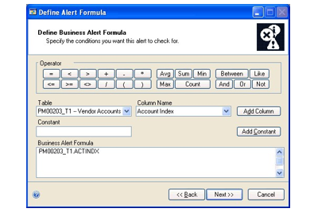

1. Build the formula by adding columns, constants, and operators to the
    business alert formula.

For example, to create a credit alert that notifies you when customer orders
exceed customer credit limits, you might select the Customer Master Summary
table, then select the On Order Amount column. Choose Add Column. Choose the
\> button to insert the greater than operator. Then select the RM Customer
MSTR table and the Credit Limit Amount column, and choose Add Column.

*When you choose Next, your formula is checked to ensure that it complies
with the rules for formulas.*

1. Choose Next and refer to *Setting up an alert notification* to continue
    setting up an alert.

#### Setting up an alert notification

Use the Alert Notification window to enter the addresses or user IDs of the
people who should be notified when the alert conditions specified in the
business alert formula occur. Depending on how you choose to deliver
notifications, the addresses might be e-mail addresses, or fax, or pager
numbers.

You also can specify whether the recipients should receive a message, or a
message and a report. If you choose to send a message and a report, use the
Select Report Columns window and the Select Report Sorting Options window to
set up the information to be included in the report.

You can use any of the notification methods supported by your messaging
system. For example, if you're using Microsoft Exchange, you could notify
alert recipients using a combination of e-mail, fax, and pager messages.

*We strongly recommend that you use a MAPI-compliant messaging system, and
that you ensure that it is working correctly with Microsoft SQL Server
before using Business Alerts.*

If the recipients are listed by their user IDs, the alert that they receive
will be in the form of a new Microsoft Dynamics GP task that is created and
assigned to them when the alert conditions that you specify are met.

**To set up an alert notification:**

1. Open the Alert Notification window. (In the Define Alert Formula window,
    choose Next.)

2. Indicate if alert recipients will be listed by e-mail addresses or by user
    IDs. If you mark user ID, skip to step 4.

3. Indicate if alert recipients should receive a message, or a message and a
    report.

4. Enter the addresses or user IDs of the people or groups to notify when the
    alert conditions occur. If you entered addresses in the alert recipients
    list, you should send a test mail message to be sure that all the recipients
    will receive the message.

- If you have a MAPI-compliant messaging system and you marked E-mail in step
    2, you also can choose the To button to open the address window for your
    system, where you can select addresses. For example, if you're using
    Microsoft Exchange, choosing this button will open the Address Book window,
    where you can select recipients, as well as carbon-copy (cc) and
    blind-carbon-copy (bcc) recipients.

- If you marked User ID in step 2, you can choose the To button to open the
    Users lookup window, where you can select user IDs.

*The list of recipients can't have more than 255 characters. If you need to
create a longer list of recipients, we recommend that you set up and use a
mail group, rather than entering each recipient individually.*

1. Enter the message you want the recipients to receive. This message can't be
    more than 255 characters.

2. Choose Next; if you marked the Message and Report option, the Select Report
    Columns window will appear.

3. In the Select Report Columns window, select a table that includes columns
    you want to appear in the report, then select the columns you want and
    choose Insert. You also can change the heading that will appear above each
    column on the report. If you enter a new column heading, Microsoft Dynamics
    GP automatically will enclose it in single quotation marks, and replace any
    spaces with underscore characters.

Columns will appear on the report in the order they appear in the Report
Column list.

1. Choose Next to open the Select Report Sorting Options window.

2. Select the column for sorting the report and choose Insert. You can insert
    additional columns into the Report Sort Order list.

3. Choose Next and refer to *Scheduling an alert* to continue setting up this
    alert.

#### Scheduling an alert

Use the Schedule Alert window to specify when, how often, and for how long
your data will be checked for the business alert conditions you've defined.

**To schedule an alert:**

1. Open the Schedule Alert window.

(In the Define Alert Output window or the Select Report Sorting Options
window, choose Next.)

1. Decide if your data should be checked for the alert conditions on a daily,
    weekly, or monthly basis. Other options in the window will change, depending
    on your selection.

2. Decide if your data should be checked once each interval, or more
    frequently. For example, if you chose to have data checked every week on
    Monday, you could then have it occur every two hours, beginning at 6 a.m.
    and ending at 6 p.m.

3. Enter the date you want the checks of your data to begin and to end. If you
    don't want the checks of your data to end, mark the No End Date option.

4. Mark Keep Alert History to keep a record of dates and times that the alert
    conditions occurred and the recipients who were notified each time, and mark
    Enable Business Alert if you want to start using this alert.

5. Choose Test Alert to see if the alert formula you entered is valid, and to
    send a test message to the alert recipients.

6. Choose Finish to save your changes and close the Business Alert wizard.

#### Using data from integrating applications in alerts

Use the Business Alert Table Maintenance window to make tables from
integrating applications available for business alerts. You must complete
the steps in this procedure if you use integrating applications with
Microsoft Dynamics GP and you want to include information from these
applications in a business alert. After you complete this procedure, you'll
be able to select tables from integrating applications when you're creating
a business alert with the Business Alert wizard.

**To use data from integrating applications in alerts:**

1. Open the Business Alert Table Maintenance window. (Administration \>\>
    Utilities \>\> System \>\> Business Alerts)

2. Select the dictionary and series that includes the tables to use in a
    business alert.

3. From the list of tables available in the dictionary, select the tables to
    use and choose Insert.

4. When you have selected all the tables to use in a business alert, choose
    Process to add the selected tables to the tables available for business
    alerts.

### Chapter 38: Business Alerts maintenance

After you've set up and enabled Business Alerts, you might need change an
alert by modifying the formula, using different tables, changing the alert
schedule, or adding, or removing people from the list of people to be
notified when the alert conditions occur.

If you marked the option to keep alert history, you can print a report
showing when the alert conditions occurred and which the recipients were
notified each time. You also can remove that history if it is no longer
needed.

This information is divided into the following sections:

- *Modifying a business alert*

- *Modifying an alert schedule and notification*

- *Making tables unavailable for alerts*

- *Printing and removing alert history*

#### Modifying a business alert

Once you've created a business alert, you can use the Business Alert
Maintenance window to view or modify the details of the alert. You can make
changes to virtually any aspect of an alert, such as the alert formula, the
list of notification recipients, the alert schedule and the report that is
generated by the alert.

**To modify a business alert:**

1. Open the Business Alert Maintenance window. (Administration \>\> Cards \>\>
    System \>\> Business Alerts)

2. Enter or select a business alert.

3. Decide how the business alert needs to be modified. In the Business Alert
    Maintenance window, you can change the contents of the alert message, change
    options for keeping history and enable or disable a business alert.

* To change the alert message, enter new text in the Message field.

- To keep a record of the dates and times that the alert conditions occurred
    and the recipients who were notified each time, mark Keep Alert History.

- To disable a business alert, clear the Enable Business Alert option.

1. To change the schedule or the notification options, choose Schedule/

Notification to open the Schedule and Notification window. Refer to
*Modifying an alert schedule and notification* for more information.

1. To change the formula or the tables used in the alert, choose Modify Alert
    to open the Business Alert wizard. Choose Next one or more times to open the
    appropriate window for making your change.

    - To change the formula, use the Define Alert Formula window. Refer to
        *Defining an alert formula* for more information.

    - To select different tables, use the Select Tables window. Refer to
        *Selecting and joining tables for alerts* for more information.

2. To print a report showing the history for this alert, choose Print/Remove
    History to open the Print/Remove Alert History window. Refer to *Printing
    and removing alert history* for more information.

3. Save your changes.

Verify your changes with the Business Alert Setup List. To print the list,
choose File \>\> Print when the Business Alert Maintenance window is open.

#### Modifying an alert schedule and notification

Use the Schedule and Notification window to modify when, how often, and for
how long Microsoft Dynamics GP will check whether the business alert
conditions exist. Microsoft Dynamics GP will check your data for the
conditions specified in the business alert formula at the intervals you set
up here. You also can add or remove e-mail addresses or user IDs from the
list of recipients for this business alert.

**To modify an alert schedule and notification:**

1. Open the Schedule and Notification window. (Administration \>\> Cards \>\>
    System \>\> Business Alerts \>\> Select an alert \>\> choose
    Schedule/Notification)

2. Make the necessary changes to the schedule.

3. Add or remove recipients.

4. To disable a business alert, clear the Enable Business Alert option.

5. Choose Test Alert to ensure that the alert works correctly with the changes
    you made.

6. Choose OK to close the Schedule and Notification window.

7. In the Business Alert Maintenance window, choose Save. Close the window.

#### Making tables unavailable for alerts

Use the Business Alert Table Maintenance window to make tables unavailable
for business alerts.

**To make tables unavailable for alerts:**

1. Open the Business Alert Table Maintenance window. (Administration \>\>
    Utilities \>\> System \>\> Business Alerts)

2. Select the dictionary and series that includes the tables you want to make
    unavailable for business alerts.

3. From the list of tables available in the dictionary, select the tables to
    use and choose Insert.

4. When you have selected all the tables to make unavailable for business
    alerts, choose Process to remove the selected tables from the tables
    available for business alerts.

#### Printing and removing alert history

When you create a business alert, you have the option to have Microsoft
Dynamics GP keep history, which is a record of the dates and times when the
alert conditions occurred and the recipients who were notified each time.
Use the Print/Remove Alert History window to print the Business Alert
History Report, or remove business alert history and print the Business
Alert History Removal Report.

**To print and remove alert history:**

1. Open the Print/Remove Alert History window. (Administration \>\> Cards \>\>
    System \>\> Business Alerts \>\> Select an alert \>\> choose Print/Remove
    History.)

2. Select the option to print the Business Alert History Report, or to print
    the Business Alert History Removal Report and remove history.

3. Enter the range of dates you want to include in the report or remove from
    history.

4. Choose Process to print the report, or to print the report and remove
    history.

## Part 8: Customizing Microsoft Dynamics GP

You can use this information to locate the setup instructions for additional
components that you purchased. You also can use this information to help you
extend your system to your exact specifications. The Microsoft Dynamics GP
interface makes your system highly customizable.

This part of the documentation contains the following information:

- *Chapter 39, "Report deployment,"* explains how to deploy predefined SQL
    Server Reporting Services reports that are included in Microsoft Dynamics GP
    to a server or to a Microsoft SharePoint library.

- *Chapter 40, "Excel report deployment,"* explains how Excel reports and
    Office Data Connection (ODC) technology work together and how to deploy the
    reports.

- *Chapter 41, "Sorting options,"* explains how to tailor specific elements in
    the Microsoft Dynamics GP user interface to your specific needs.

- *Chapter 42, "Word templates,"* explains how you can set up and use the
    Microsoft Word templates for Microsoft Dynamics GP functionality.

*Chapter 43, "Extending system functionality,"* provides an overview of the
tools you can use to customize your reports, user interface, and data
integration processes.

### Chapter 39: Report deployment

This information explains how you can deploy predefined SQL Server Reporting

Services reports that are included in Microsoft Dynamics GP to a server or
Microsoft

SharePoint site. If you are using SQL Server 2008 Reporting Services, SQL
Server 2008 R2 Reporting Services, or SQL Server 2012 Reporting Services,
you also can deploy charts and key performance indicators (KPIs). Once the
reports and charts and KPIs are stored on a server or on a Microsoft
SharePoint library, users can access them without starting Microsoft
Dynamics GP as long as they have the appropriate security access.

Refer to the System User's Guide (Help \>\> Contents \>\> select Using the
System) for more information about using SQL Server Reporting Services with
Microsoft Dynamics GP.

This information is divided into the following sections:

- *Reporting Services reports that you can deploy from Microsoft Dynamics GP*

- *Modify the Report Server web.config file*

- *Deploying SQL Server Reporting Services reports*

#### Reporting Services reports that you can deploy from Microsoft Dynamics GP

Microsoft Dynamics GP contains predefined SQL Server Reporting Services
reports that you can deploy to a server or a Microsoft SharePoint library.
If you are using SQL Server 2008 Reporting Services, SQL Server 2008 R2
Reporting Services, or SQL Server 2012 Reporting Services, you also can
deploy charts and KPIs. These reports must be deployed before they can be
used. When you deploy reports and charts and KPIs, new files are created in
locations that you specify for you to use.

Once the reports and charts and KPIs are deployed, a user can access them
even when Microsoft Dynamics GP is not running and as long as that user has
access to the location where those reports and charts and KPIs are stored.

It is the system administrator's responsibility to create secure locations
on a server or on a SharePoint library for these reports.

#### Modify the Report Server web.config file

To deploy the SQL Server Reporting Services reports, you must modify the
Report Server web.config file for the timeout execution and the maximum
request length. If you don't update the Report Server web.config file for
the timeout execution, you might receive an error that states that "the
operation has timed out." If you don't update the Report Server web.config
file for the maximum request length, you will receive an error that the
deployment has exceeded the maximum request length allowed by the target
server.

*You must be an administrator to modify the Report Serve rweb.config file.*

**To modify the Report Server Web.config file:**

1. Create a backup copy of the web.config file located in the ReportServer
    folder. (The ReportServer folder is located in C:\\Program Files\\Microsoft
    SQL

Server\\MSSQLSERVER\\Reporting Services\\ReportServer where Reporting

Services is installed.)

1. Open the Report Server web.config file using a text editor, such as Notepad.

2. Search for \<httpRuntime executionTimeout="9000" /\>.

3. In that line, change executionTimeout="9000" to executionTimeout="19000" and
    add the value maxRequestLength="20960".

(\<httpRuntime executionTimeout="19000" maxRequestLength="20960"/\>

1. Save and close the Report Server web.config file.

#### Deploying SQL Server Reporting Services reports

Use the Reporting Tools Setup window to deploy the predefined SQL Server

Reporting Services reports that are available in Microsoft Dynamics GP to
the

Report Server or to a Microsoft SharePoint library. You also can use the
Reporting Tools Setup window to redeploy reports or deploy reports to a
different location. If you are using Reporting Services 2008, Reporting
Services 2008 R2, or SQL Server 2012 Reporting Services, you also can deploy
charts and KPIs. If you are using more than one instance of Microsoft
Dynamics GP, you should only deploy reports to the report server for one
instance at a time.

The Deployment Options list has a tree view that displays the deployment
status of each company and of each report type. You can select to deploy
reports by company and by report type.

There are three levels in the tree view. You can choose the + symbol next to
a level to view additional levels in the tree view. You can collapse and
expand the entire tree or just portions of it. A check mark next to a level
means that the reports are available to deploy. All items that are not fully
deployed will automatically be marked.

**To deploy SQL Server Reporting Services reports:**

1. Open the Reporting Tools Setup window.

(Administration \>\> Setup \>\> System \>\> Reporting Tools Setup)

1. On the SQL Reporting Services tab, select the report server mode.

*Microsoft Dynamics CRM 2011 or later supports only the native mode of
deployment of Microsoft SQL Server Reporting Services.*

1. Depending on your report server mode, enter the following locations. Be sure
    that your location doesn't end with a slash.

Native mode location:

| **Location**       | **Example**                        |
|--------------------|------------------------------------|
| Report Server URL  | https://\<servername\>/ReportServer |
| Report Manager URL | https://\<servername\>/Reports      |

SharePoint Integrated mode location:

| **Location**       | **Example**                        |
|--------------------|------------------------------------|
| SharePoint Site           | https://\<servername\>/SharePoint site |
| Report Library            | ReportsLibrary                         |

1. If you selected Native as the report server mode, you can enter the name of
    the folder to deploy the reports to. By using a folder, you can deploy
    Reporting Services reports for multiple Microsoft Dynamics GP instances to a
    single Microsoft SQL Server Reporting Server. The default folder name is the
    name of the system database. If DYNAMICS is the system database name, the
    Folder Name field is blank. After deploying reports to the folder, you must
    provide access to the folder.

2. If you are using Microsoft Dynamics CRM 2011, enter the URL for the CRM
    service, the name of the organization, and specify credentials for the data
    source.

We recommend that you use Windows Authentication (Integrated Security). If
you select to be prompted for credentials, you must mark the Use as Windows
credentials when connecting to the data source option on the data source
deployed.

*You must be using SQL Server 2008 R2 or 2012 Reporting Services and
Microsoft Dynamics CRM 2011 or later to deploy SQL Server Reporting Services
reports and metrics that includes CRM data. Microsoft Dynamics CRM supports
only the native mode of deployment of SQL Server Reporting Services.*

1. To verify your locations, choose the Refresh button in the upper right hand
    corner of the Deployment Options tree view.

2. In the Deployment Options tree view, all items that are not fully deployed
    are automatically marked.

To exclude an item, unmark the check box. For example, if you don't want to
deploy SQL Server Reporting Services reports in Fabrikam, Inc., expand the
Company level in the tree view and unmark SRS Reports.

1. Choose Deploy Reports to deploy reports. To redeploy reports for all
    companies, mark Redeploy all reports for selected companies and then choose
    Deploy Reports.

The Business Intelligence Deployment Progress window appears. This window
displays the report deployment progress.

If you don't have the appropriate permissions to deploy reports, a window
opens where you can enter a domain\\user name and the password you use to
log in to Microsoft Windows.

1. After the reports are deployed, choose Print Status Report to view the
    deployment status of reports.

### Chapter 40: Excel report deployment

Microsoft Dynamics GP comes with many predefined Excel reports, which
contain the same information as the default SmartList favorites. Excel
reports use Office Data Connection (ODC) technology to maintain a direct
link to the underlying company database, so that users with appropriate
security access can view real-time data in an Excel worksheet, without
needing to start Microsoft Dynamics GP.

This information explains how Excel reports and ODC work together, and how
to make the Excel reports available for users to view.

- *Understanding data connections and Excel reports*

- *Deploying Excel reports*

#### Understanding data connections and Excel reports

Microsoft Dynamics GP and Microsoft Office provide an integration method,
called an Office Data Connection (ODC), that allows you to view live
Microsoft Dynamics GP data in an Excel worksheet.

ODC provides a link to a system or company database in SQL Server. The ODC
connection ensures that when the Excel report is viewed, it contains the
most recent data.

Each ODC file supplied with Microsoft Dynamics GP corresponds to a default

SmartList object. For example, an ODC file named

TWO_Accounts_AccountSummary.odc links to the same data as the Account
Summary SmartList object.

For each ODC file there is a corresponding worksheet. The Excel report
connects to the ODC file to display data. For example, the Excel report
named

Accounts_AccountSummary.xlsx displays the data from the ODC file named
TWO_Accounts_AccountSummary.odc.

Before users can view Excel reports, a system administrator must perform a
process called "deployment" to create the ODC files and corresponding Excel
worksheets, and make them available for users to access. There are two ways
deploy Excel reports:

- To a shared folder on a secure server location

- To a SharePoint document library

To view the reports, users must meet the following requirements.

- To view the data that is displayed in an ODC file, users must have the
    appropriate SQL Server access rights. Refer to *Setting up security for
    viewing data connections and Microsoft Excel reports* for more information.

- To open the .xlsx worksheet files, users must have the 2010 Microsoft Office
    system.

- Additional user permissions are required for the shared network folder or
    SharePoint Server document library, depending on where you choose to deploy
    the reports.

As part of the deployment process, the system administrator can designate a
location where each user can store any Excel reports and data connections
they modify or create. This allows each user to customize reports
individually, without affecting the reports and data connections available
to all users at the system level.

Once the deployment process is complete, both system-level and user-level
Excel reports and their corresponding data connections appear automatically
in reports lists within Microsoft Dynamics GP.

To view Excel reports and data connections for a particular series, choose
the appropriate series button in the navigation pane, then choose the Excel
Reports shortcut. To view Excel reports for all series, choose
Administration in the navigation pane, then choose the Excel Reports
shortcut. See the System User's Guide (Help \>\> Contents \>\> select Using
the System) for more information about report lists.

#### Deploying Excel reports

Use the Reporting Tools Setup window to deploy Excel reports and data
connections to a shared network location or to a Microsoft SharePoint site.
During this process, ODC files are created and saved to the designated
location. Excel reports and data connections that are stored in the
locations that you specify in the Reporting Tools Setup window also will be
listed in Excel Reports lists. See the System User's Guide (Help \>\>
Contents \>\> select Using the System) for more information about report
lists.

The Deployment Options list has a tree view that displays the deployment
status of each company and of each report type. You can use the tree view to
deploy reports by company and by report type.

You can choose the + symbol next to a level to view additional levels in the
tree view. You can collapse and expand the entire tree or just portions of
it. A check mark next to a level means that the reports are available to
deploy. All items that are not fully deployed will automatically be marked.

**To deploy Excel reports:**

1. Decide if you are going to deploy reports to a network share or to a
    Microsoft SharePoint site.

2. If you are deploying reports to a new network share, create a shared folder
    to store the Excel report file sin a secure network location. Set the share
    permissions to Change (the minimum) or Full Control. You can use the same
    folder as you used to deploy the data connection files, or you can create a
    separate folder.

If you are deploying reports to a Microsoft SharePoint location, create a
document library to store the Excel report files.

1. Open the Reporting Tools Setup window.

(Administration \>\> Setup \>\> System \>\> Reporting Tools Setup)

1. In the System Level area, select the location to deploy reports to.

*You must have access to the server to deploy reports to a shared network
location.*

1. If you are using Microsoft 365 and want to deploy Excel reports to a
    reports library in SharePoint Online 2010, mark Using SharePoint Online
    option. This option is available if you selected SharePoint as the location
    to deploy reports to.

2. Depending on the location you selected, enter the following information. Be
    sure to use back slashes when you are entering the location for Excel
    reports even if you are using a UNC path. You should also be sure that the
    location doesn't end in a slash.

Network Share location:

| **Location**      | **Example**                 |
|-------------------|-----------------------------|
| Report Server URL | \\\\\<servername\>\\Reports |

SharePoint location:

| **Location**              | **Example**                              |
|---------------------------|------------------------------------------|
| SharePoint Site           | http:\\\\\<servername\>\\SharePoint site |
| Data Connections Library  | DataConnections                          |
| Report Library            | ReportsLibrary                           |

1. In the User Level area, enter the location to where Excel reports are stored
    on each user's computer. You must use the "%" character as the variable for
    the Windows user ID in the path.

For example: C:\\Documents and Settings\\%\\My Documents\\My Data
Sources\\GP Connections

Data connections that are stored in this location also will be listed in
report lists.

1. To verify your locations, choose the Refresh button in the upper right hand
    corner of the Deployment Options tree view.

2. In the Deployment Options tree view, all items that are not fully deployed
    are automatically marked.

To exclude an item, unmark the check box. For example, if you don't want to
deploy Excel reports in Fabrikam, Inc., expand the Company level in the tree
view and unmark Excel Reports.

1. Choose Deploy Reports to deploy reports. To redeploy reports for all
    companies, mark Redeploy all reports for selected companies and then choose
    Deploy Reports.

The Business Intelligence Deployment Progress window appears. This window
displays the report deployment progress.

If you don't have the appropriate permissions to deploy reports, a window
opens where you can enter a domain\\user name and the password you use to
log in to Microsoft Windows.

1. After the reports are deployed, choose Print Status Report to view the
    deployment status of reports.

### Chapter 41: Sorting options

Use this information to tailor specific elements in the Microsoft Dynamics
GP user interface to your specific needs, enabling you to work more
efficiently and spend less time moving from one task to another. This
information is divided into the following sections:

- *Setting up custom sorting options for an advanced lookup window*

- *Adding new custom links*

- *Modifying custom links*

- *Copying custom links*

#### Setting up custom sorting options for an advanced lookup window

Use the Advanced Lookups Setup window to set up custom sorting options to be
used in addition to the default sorting options that are provided. For
example, if you want to sort the Customers list by phone number or postal
code, you could set up a custom sorting option to do so.

If you make custom sorting option changes for one company, those changes
won't be applied to your other companies. Custom sorting options can be set
on a per-company basis.

**To set up custom sorting options for an advanced lookup window:**

1. Open the Advanced Lookups Setup window. (Administration \>\> Setup \>\>
    Company \>\> Advanced Lookups)

2. Select the advanced lookup to which you want to create a custom sorting
    option.

3. Select the field you want to sort by. The fields that appear in the list
    will change depending on which object is selected.

4. Enter a description for the sorting option, or accept the default
    description. The description will appear in the View \>\> Additional Sorts
    menu in the corresponding lookup window.

5. Repeat steps 4 and 5 to set up additional options for the selected object.

6. Choose Save to save the sorting options and synchronize the Advanced Lookup
    indexes.

#### Adding new custom links

Use the Customer Link Setup window and the Create/Modify Custom Link window
to create custom links to launch Microsoft Outlook to address an e-mail
message, to launch Internet Explorer to view a web page, or to open a
document in Word, Excel, or some other application for customers, vendors,
items, salespeople, and employees.

Tracking Number links can be created based on the shipping method for a
document, linking to tracking information on the shipper's web site.
Currencyspecific links can be created based on the currency selected,
linking to a web site with exchange rate information. Checkbook and credit
card links can be created based on the checkbook selected, linking to the
bank's online banking web page.

You can also choose to link to the same location for all values. For
example, all checkbooks could be made to link to the same online banking web
page.

**To add new custom links for currencies, exchange rates, tracking numbers,
checkbooks, and credit cards:**

1. Open the Custom Link Setup window. (Administration \>\> Setup \>\> Company
    \>\> Custom Link)

2. Choose New to open the Create/Modify Custom Link window.

3. Select the prompt for which you can create a custom link.

4. Enter the description of the link.

5. Enter or select a field value.

6. If the All field values field is available, you can mark this field to
    attach the link to all the fields using the same field value. For example,
    you decided to create a link for Exchange Rate. By marking All Field Values,
    you can click the link for any Exchange Rate prompt for any currency and
    open the same web site defined for exchange rates.

7. Enter the internet address of the link you want to create.

8. Choose Save. When you save the link, information about the link will appear
    in the Custom Link Setup window.

**To add new custom links for customers, vendors, items, salespeople, and
employees:**

1. Open the Custom Link Setup window. (Administration \>\> Setup \>\> Company
    \>\> Custom Link)

2. Choose New to open the Create/Modify Custom Link window.

3. Select the prompt for which you can create a custom link.

4. Enter the description of the link.

5. Select an address type. The types of addresses available depend on the
    prompt you selected. For example, if you selected Customer, you could select
    the primary, ship to, bill to, or statement to addresses. An address type
    isn't available for items or sales people.

6. Select an address field. This information is defined in the Internet
    Information window. You must define the custom link information in the
    Internet Information window for the link to work.

7. Choose Save. When you save the link, information about the link will appear
    in the Custom Link Setup window.

#### Modifying custom links

Use the Custom Link Setup window to modify custom links.

**To modify custom links:**

1. Open the Custom Link Setup window. (Administration \>\> Setup \>\> Company
    \>\> Custom Link)

2. Select the custom link you want to change and choose Modify to open the
    Create/Modify Custom Link window.

3. In the Create/Modify Custom Link window, enter the modify the information.

4. Choose Save.

#### Copying custom links

Use the Custom Link Setup window to copy custom links. You may want to copy
a link if you want to create a new link that uses the same information.

**To copy custom links:**

1. Open the Custom Link Setup window. (Administration \>\> Setup \>\> Company
    \>\> Custom Link)

2. Select a customer link and choose Copy to open the Create/Modify Custom Link
    window.

3. In the Create/Modify Custom Link window, make any changes to the link that
    you want.

4. Choose Save. If you didn't change the custom link label for the new link,
    Copy1 will be added to the label.

### Chapter 42: Word templates

You can use the Word template functionality in Microsoft Dynamics GP to use
predefined templates or create your own.

This information is divided into the following sections:

- *Word template overview*

- *Word templates prerequisites*

- *Predefined Word templates for Microsoft Dynamics GP*

- *Configuring Word templates*

- *Assign a company image to Word templates*

- *Installing the Microsoft Dynamics GP Add-in for Microsoft Word*

#### Word template overview

Predefined Word templates for document types such as sales quotes and
purchase orders are provided for you with Microsoft Dynamics GP. The
templates are based on standard reports in Microsoft Dynamics GP. By
default, the Word templates functionality is enabled for Microsoft Dynamics
GP. You can print the predefined Word templates for your customers and
vendors in each of the companies you have access to. For a list of the
predefined templates, see *Predefined Word templates for Microsoft Dynamics
GP* .

You also can create your own template or create a template from an existing
template. For example, you might want to change the font size for a template
or create separate templates for your customers in the United States and in
Canada based on a standard report because of regulatory requirements. The
Word template must be based on a standard report.

After creating or modifying a template, you can assign the template to your
companies and then to customers or vendors. You can assign a specific
template to an individual customer or vendor or a class of customers or
vendors. For example, you can create a specific template for a promotion and
assign that template to your local customers for that promotional period.

#### Word templates prerequisites

The following components are required to modify Word templates for Microsoft
Dynamics GP.

- Microsoft Word 2010 or later to make layout changes such changing the font
    size

- Microsoft Dynamics GP Add-in for Microsoft Word to add fields and data
    sources to the template

- Visual Studio Tools for Office Runtime 2.0 or later—Visual Studio Tools for
    Office Runtime 3.0 is installed with Microsoft Dynamics GP Add-in for
    Microsoft Word

#### Predefined Word templates for Microsoft Dynamics GP

The following predefined Word templates are installed with Microsoft Dynamics
GP. Predefined templates cannot be modified or removed. You can make copies of
the predefined templates and make your changes such as changing the font.
Predefined templates do not have logos assigned to them.

You can print the predefined Word templates for your customers and vendors in
each of the companies you have access to. If you don't want use a predefined
template, remove the assignment to the company and select a new default Word
template.

| **Document type**                     | **Report Writer report name**           | **Predefined Word template name**                 |
|---------------------------------------|-----------------------------------------|---------------------------------------------------|
| Sales Order Processing Quote          | SOP Blank History Options Quote Form    | SOP Blank History Options Quote Form Template\*   |
|                                       | SOP Blank History Quote Form            | SOP Blank History Quote Form Template\*           |
|                                       | SOP Blank Options Quote Form            | SOP Blank Options Quote Form Template\*           |
|                                       | SOP Blank Quote Form                    | SOP Blank Quote Form Template\*                   |
| Sales Order Processing Order          | SOP Blank History Options Order Form    | SOP Blank History Options Order Form Template\*   |
|                                       | SOP Blank History Order Form            | SOP Blank History Order Form Template\*           |
|                                       | SOP Blank Options Order Form            | SOP Blank Options Order Form Template\*           |
|                                       | SOP Blank Order Form                    | SOP Blank Order Form Template\*                   |
| Sales Order Processing Invoice        | SOP Blank History Options Invoice Form  | SOP Blank History Options Invoice Form Template\* |
|                                       | SOP Blank History Invoice Form          | SOP Blank History Invoice Form Template\*         |
|                                       | SOP Blank Options Invoice Form          | SOP Blank Options Invoice Form Template\*         |
|                                       | SOP Blank Invoice Form                  | SOP Blank Invoice Form Template\*                 |
| Sales Order Processing Packing Slip   | SOP Blank Packing Slip Form             | SOP Blank Packing Slip Form Template\*            |
| Sales Order Processing Return         | SOP Blank Return Form                   | SOP Blank Return Form Template\*                  |
|                                       | SOP Blank Options Return Form           | SOP Blank Options Return Form Template\*          |
|                                       | SOP Blank History Return Form           | SOP Blank History Return Form Template\*          |
|                                       | SOP Blank History Options Return        | SOP Blank History Options Return Form Template\*  |
| Sales Order Processing Back Order     | SOP Blank History Options Back Order    | SOP Blank History Options Back Order Template\*   |
|                                       | SOP Blank History Back Order            | SOP Blank History Back Order Template\*           |
|                                       | SOP Blank Options Back Order            | SOP Blank Options Back Order Template\*           |
|                                       | SOP Blank Back Order                    | SOP Blank Back Order Template\*                   |
| Sales Order Processing Picking Ticket | SOP Blank Picking Ticket Bin Sequenced  | SOP Blank Picking Ticket Bin Sequenced Template\* |
|                                       | SOP Blank Picking Ticket Order Entered  | SOP Blank Picking Ticket Order Entered Template\* |
|                                       | SOP Blank Options Picking Ticket Form   | SOP Blank Options Picking Ticket Form Template\*  |
| Receivables Statement Form            | RM Statement on Blank Paper             | RM Statement on Blank Paper Template\*            |
|                                       | MC Statement Blank Form                 | MC Statement Blank Form Template\*                |
| Receivables Sales/Invoices            | RM Blank Document                       | RM Blank Document Template\*                      |
| Receivables Debit Memos               | RM Blank Document                       | RM Blank Document Template\*                      |
| Receivables Finance Charges           | RM Blank Document                       | RM Blank Document Template\*                      |
| Receivables Service/Repairs           | RM Blank Document                       | RM Blank Document Template\*                      |
| Receivables Warranties                | RM Blank Document                       | RM Blank Document Template\*                      |
| Receivables Credit Memo               | RM Blank Document                       | RM Blank Document Template\*                      |
| Receivables Returns                   | RM Blank Document                       | RM Blank Document Template\*                      |
| **Document type**                     | **Report Writer report name**           | **Predefined Word template name**                 |
| Purchase Order                        | POP Purchase Order Blank Form           | POP Purchase Order Blank Form Template\*          |
|                                       | POP History Purchase Order Blank Form   | POP History Purchase Order Blank Form Template\*  |
|                                       | POP Purchase Order Rollup Blank Form    | POP Purchase Order Rollup Blank Form Template\*   |
|                                       | POP History Purchase Order Rollup Blank | POP History Purchase Order Rollup Blank Form\*    |
| Payable Invoices                      | PM Blank Document                       | PM Blank Document Template\*                      |
| Payable Finance Charges               | PM Blank Document                       | PM Blank Document Template\*                      |
| Payable Miscellaneous Charges         | PM Blank Document                       | PM Blank Document Template\*                      |
| Payable Credit Memo                   | PM Blank Document                       | PM Blank Document Template\*                      |
| Payable Returns                       | PM Blank Document                       | PM Blank Document Template\*                      |
| Payable Check Remittance              | Check Remittance                        | Check Remittance Template\*                       |

#### Configuring Word templates

You can use the Template Configuration Manager window to configure Word
templates for Microsoft Dynamics GP. By default, the Word templates
functionality is enabled for all companies. If you don't want to use the
Word template functionality, you can use this window to disable Word
templates.

The Template Configuration Manager window has a tree view that you can use
to select the companies, series, and Word templates you want to use.

**To configure Word templates:**

1. Open the Template Configuration Manager window. (Administration \>\> Reports
    \>\> Template Configuration)

2. Expand to the levels you want to exclude or include, and unmark or mark the
    companies, series, or Word templates. A check mark next to a level means
    that the templates available for that level will be made available for use.
    To exclude a level, unmark the check box.

For example, if you don't want to use the POP Purchase Order Blank Form
Template\* in Fabrikam, Inc., expand to the Word template level in the tree
view and unmark the template.

1. Choose Save in the Template Configuration Manager window to save your
    changes.

#### Assign a company image to Word templates

Use the Image Assignment window to assign an image (company logo) for each
company that has the Word templates functionality enabled in the Template
Configuration Manager window. Each company can have only one image assigned
to it. You also can remove an image from a company.

The image you assign to a company can be from one of the following formats.

| Graphics Interchange Format (GIF) | Joint Photographic Experts Group (JPEG) |
|-----------------------------------|-----------------------------------------|
| Tagged Image File Format (TIFF)   | Windows bitmap (BMP)                    |
| Portable Network Graphics (PNG)   |                                         |

You should keep in mind that the format and resolution of the image you chose
may affect the maximum file size when attaching documents for your customers and
vendors if you are using the Microsoft Dynamics GP e-mail functionality. The
image also affects the size of the reports and documents generated by the Word
template functionality. This can affect performance of the printing process.

**To assign a company image to Word templates:**

1. Open the Image Assignment window. (Administration \>\> Reports \>\> Template
    Configuration \>\> Images)

2. Select a company in the Company images list.

3. Click the Add button to open the Select an image window.

4. Select an image and choose the Open button to assign image to the company
    for Word templates.

5. Choose OK in the Image Assignment window to save your changes.

#### Installing the Microsoft Dynamics GP Add-in for Microsoft Word

You must install the Microsoft Dynamics GP Add-in for Microsoft Word only if you
want to create new Word templates. The Microsoft Dynamics GP Add-in for
Microsoft Word is used when creating the layout of the Word template document
for a report. You also need to install the Microsoft Dynamics GP Add-in for
Microsoft Word when you want add data sources and fields to existing Word
templates.

**To install the Microsoft Dynamics GP Add-in for Microsoft Word:**

1. From the Microsoft Dynamics GP 2010 installation media, double-click the
    Setup.exe file to open the Microsoft Dynamics GP installation window.

2. Click Microsoft Dynamics GP Add-in for Microsoft Word under Additional
    Products, and then select Install.

3. If you haven't installed Visual Studio Tools for Office Runtime, the
    Software

Update Visual Studio Tools for the Office system 3.0 Runtime wizard appears.

1. Follow the instructions in the window to accept the software license
    agreement. To install Visual Studio Tools for the Office system 3.0 Runtime,
    you must accept this agreement.

2. After Visual Studio Tools for Office Runtime is installed, the Microsoft
    Dynamics GP Add-in for Microsoft Word wizard appears.

3. Follow the instructions in the window to accept the software license
    agreement. To install Microsoft Dynamics GP Add-in for Microsoft Word, you
    must accept this agreement and click Next.

4. Specify the folder where you want the predefined Word templates installed.

The default folder is C:\\Program Files\\Microsoft Dynamics\\Report
Templates. To select a different folder, click Browse.

1. Click Install.

2. Click Finish after the installation is complete.

### Chapter 43: Extending system functionality

Use this information as your guide to identifying the types of customization
that best fit your needs.

This information is divided into the following sections:

- *Importing and exporting data*

- *Customizing documents and reports*

- *Customizing the Microsoft Dynamics GP interface*

- *Customizing the functionality of Microsoft Dynamics GP*

#### Importing and exporting data

Microsoft provides several tools to simplify the process of importing and exporting data.

**Integration Manager** Use Integration Manager to set up integrations which
can be used on an ongoing basis to import data into Microsoft Dynamics GP
tables. For example, you may want to use an integration to import sales
transactions from another data collection system. See the Integration
Manager documentation for more information.

**eConnect** eConnect is a set of development utilities and application
programming interfaces (APIs) that integrate outside data sources with
Microsoft Dynamics GP back office components. Use eConnect for high-volume,
real time integrations from such external data sources as Web services, CRM
applications, Web storefronts, and legacy applications.

**Excel-based budgeting** Use General Ledger to export budgets to Excel,
manipulate them, and import them back into Microsoft Dynamics GP. See the
General Ledger documentation for information about using Excel to create and
modify budgets.

**SmartList** Use SmartList to easily export data to Excel, Word, or other
file formats. See the System User's Guide for information about SmartList.

*In addition to the tools available from Microsoft Dynamics, you can use
ODBC to use other tools such as Microsoft Access to import or export data.
It's important to understand the Microsoft Dynamics GP data structure. If
you import data incorrectly, you can damage your data. Use the Microsoft
Dynamics GP Software Development Kit (installed from the installation media)
and the Resource Descriptions windows (Microsoft Dynamics GP Tools* \>\>
*Resource Descriptions) to find this information.*

#### Customizing documents and reports

As you begin using Microsoft Dynamics GP, you may find that you want to
modify the format of your checks, invoices, sales documents, purchase
orders, or other documents. You also may want to customize some reports
provided with the system, or create new ones. Microsoft Dynamics offers the
following reporting tools.

**Report Writer** Use Report Writer to modify the default documents and
reports that are provided with Microsoft Dynamics GP. Refer to your Report
Writer documentation for more information.

**Advanced Financial Analysis** Use Advanced Financial Analysis to modify the
default financial statements that are provided with Microsoft Dynamics GP. Refer
to the Advanced Financial Analysis documentation for more information.

**Management Reporter for Microsoft Dynamics ERP** You can use Management Reporter to create customized financial statements. Refer to the Management Reporter documentation for more information.

**SmartList** Use SmartList to create simple reports. SmartList's report
formatting capabilities are limited, but since you don't need to link tables or
set up table relationships, it's easier to use than other reporting tools. Refer
to the System User's Guide (Help \>\> Contents \>\> select Using the System) for
more information.

#### Customizing the Microsoft Dynamics GP interface

Microsoft Dynamics GP provides numerous tools you can use to tailor the user
interface to the way your organization works.

**User Preferences** Each person who uses Microsoft Dynamics GP can use the User
Preferences window to control the appearance and behavior of certain aspects of
the user interface, including display colors, whether the tab or enter key is
used to move to the next field in a window, and default entries for several
parts of the system. See the System User's Guide (Help \>\> Contents \>\> select
Using the System) for more information about user preferences.

**Shortcut Bar** Each person who uses Microsoft Dynamics GP can set up and use
shortcuts to streamline access to windows, macros and other frequently used
applications. See your System User's Guide (Help \>\> Contents \>\> select Using
the System) for more information about shortcut bar changes that can be made for
each user.

Use user-class shortcuts to customize a portion of the shortcut bar for each
user class in your organization. See *Part 2, User setup*, for information about
changes that apply to user classes.

**Modifier** Use the Modifier to move fields, change text, or adjust the order
in which the TAB or ENTER key advances through the fields in the window. See the
Modifier documentation for more information.

**Visual Basic for Applications (VBA)** Use VBA to create new forms or to set
default values for specific fields in windows. See the Microsoft Dynamics GP VBA
Developer's Guide for more information.

#### Customizing the functionality of Microsoft Dynamics GP

Microsoft Dynamics GP provides several ways to add custom functionality that's
not available within Microsoft Dynamics GP or through products developed by
Microsoft Dynamics GP Developers.

**Microsoft Dexterity** Use Microsoft Dexterity to add custom functionality
with the same tool used to create Microsoft Dynamics GP. See the Microsoft
Dexterity documentation for more information.

**Continuum API** Use the Continuum application programming interface (API) to
create integrations for Microsoft Dynamics GP. See the Continuum API Guide for
more information.

## Part 9: Report Scheduler Setup

The Report Scheduler module enables flexible, secure scheduling and publishing of your Report Writer reports, schedule Check Links and Workflow Automation. Report Scheduler is installed automatically when you install Microsoft Dynamics® GP. Report Scheduler is simple to set up and use, and requires little maintenance.

Report Scheduler works with Microsoft Dynamics GP report options and reports that have been created using Report Writer. 

This section contains information on how to set up Report Scheduler and change report names.

### Setting up Report Scheduler

Report Scheduler setup involves defining the default publish location, the value for the Next Report File Name field, and the export file type for reports. Use the Report Scheduler Setup window to define these default settings for published reports.

To set up Report Scheduler:
1.	Open the Report Scheduler Setup window. (Microsoft Dynamics GP menu >> Tools >> Routines >> Company >> Report Setup)
 
2.	Enter the Universal Naming Convention (UNC) path for the default location to publish reports to. You can either type the UNC path or select the folder icon in the Default Location field to open the Select Pathname window where you can select the default location for published reports. 

Be sure that all users who will be publishing reports have write access to the folder you select.

4.	Enter the next report file name. This file name should allow for incrementing because the Next Report Name field will be incremented every time a report option is published that needs a report file name.

The name in this field is used for reports that do not have a file name stored as part of the report option. This file name will also be used if you choose to keep prior versions of a published report.

*When you define the next report file name, you determine the number of report file names that will be available. For example, if you enter BDR001 in the Next Report File Name field, only 999 unique report file names will be available. *

5.	Select a file type for report output files.
*The Adobe Acrobat PDF option is available if you have Acrobat Distiller or PDFWriter installed. These items can be purchased from Adobe Systems. You can set the export file type to Adobe Acrobat PDF, even if there are some workstations that do not have Acrobat Distiller or PDFWriter installed. If the report is not set to print to a file, and the default export file type is set to Adobe PDF, workstations that don’t have Acrobat Distiller or PDFWriter installed will publish the report as a text file.*

6.	Choose Save to save your selections and close the Report Scheduler Setup window.

**Selecting a publish location**

Because it is possible for users to map different drive letters to the same location, a Universal Naming Convention (UNC) path is required. A UNC path provides a common method for accessing files on a network without using a “mapped” drive letter. The UNC format is //server/shared folder/. Server is the name of the network machine where the files reside. Shared folder is the shared folder where the files reside and are published. There must be two forward slashes before the machine name (//) followed by the shared folder and a final forward slash (/).

You can type the location directly into the Report Scheduler Setup window or you can use the following steps to select a path in the Select Pathname window:
Before you select the location, you may wish to create a new Report Scheduler folder on the server where you will be saving reports.

To select a publish location:
1.	To set the default publish location for all reports, open the Report Scheduler Setup window.
(Microsoft Dynamics GP menu >> Tools >> Routines >> Company >> Report Setup)

To set a publish location for selected reports, open the Report Schedule window. (Microsoft Dynamics GP menu >> Tools >> Routines >> Company >> Report Schedule)
2.	Choose the folder icon. The Select Pathname window opens.
 
3.	Select My Network Places from the Save in list.
This path must be selected from My Network Places in order for the share to take effect, even if it is local.

4.	Select the domain where the server is located.
5.	Select the server you will be saving reports to.
6.	Select the folder to store reports in and choose Save.

**Changing report names**

It is important to be able to change report names in Report Scheduler because several reports in Microsoft Dynamics GP have the same name. For example, an Aged Trial Balance report appears in both Receivables Management and Payables Management. To distinguish between these reports more easily, you can change the report names to Receivables Aged Trial Balance and Payables Aged Trial Balance. Use the following steps to change a report name:

To change report names:
1.	Open the Report Names window.  (Microsoft Dynamics GP menu >> Tools >> Routines >> Company >> Report Names)
 
2.	Click in the Report Name column next to the report to modify. Remember that many reports have the same name. Check the location of the report in the Report Navigation column to ensure you are modifying the report from the correct module.

3.	Type the new name of the report. This must be a unique name. The default value in the Report Name column is the original name of the report. You can change it to another name, as long as that name doesn't already exist. A blank name is not allowed.

4.	Close the Report Names window to save report name changes.

### Scheduling Reports**

After you set up Report Scheduler, you can schedule reports. Scheduling reports includes defining the publish frequency and location.
Use the Report Schedule window to define the publish location and frequency for each report to publish. 

To schedule a report:
1.	Open the Report Schedule window. (Microsoft Dynamics GP menu >> Tools >> Routines >> Company >> Report Schedule)

2.	Mark the box next to the report(s) to schedule in the scrolling window.

3.	Select the frequency option indicating how often to publish the marked reports then set the scheduling options. Scheduling options in the Report Schedule window change based on the frequency option you select. See online help for descriptions of each frequency option. 

4.	Enter the start date. This field controls when a report is first scheduled to be published.

5.	Choose Calculate Next Date to verify that the report will publish on the desired date.

6.	Select the versions of the report to keep. Select Current Only to remove prior versions of the report output when a new report is published. Select Current & Prior to save the report with the value in the Next Report File Name field in the Report Scheduler Setup window the next time a report is published.

7.	To change the publish location for the marked report(s), select a new location. See Selecting a publish location on page 6 for more information. Be sure all users who will publish the report(s) have write access to the folder you select. 

8.	To view details for a specific report, select the report in the scrolling window, then choose the expansion button next to the Report Name column heading. The Report Schedule Details window opens where you can view or modify the settings for Versions of Report To Keep, Publish To Location, and Frequency. You also can view information about publishers for the report.

9.	To change the Report Option settings for a specific report, select the report in the scrolling window, then choose the Report Option link. 

10.	Choose Publish Now to publish the marked reports now or choose Apply to apply the settings to the marked reports and wait until the scheduled publish date. See Automatic publishing on page 13 for more information. The settings you choose in the Report Schedule window will affect the marked reports once you choose Apply.

*When you choose either Apply or Publish Now, you will be added as a publisher for the marked reports.*

**Report options**

Microsoft Dynamics GP report options provide the ability to save criteria about a report, such as range restrictions, sorting options, and destinations. 

These report options can be used to generate separate versions of a report. 

Since Report Scheduler works with Microsoft Dynamics GP report options, you need to take into account the restrictions, or lack thereof, a report option has when you are publishing it. For reports created with Report Writer, you save criteria about a report using the Restrictions window in Report Writer.

If the people who will have access to the report output should see only certain ranges of the data, then you should create a report option for each grouping, with the appropriate restrictions for each group. For example, you could create a single sales commission report for all salespeople and use report options to publish separate reports for each salesperson

**Frequency examples**

This section contains examples of setting daily, weekly, and monthly frequency. 

These examples show how frequency options and start dates affect the publish date. Use this information as a reference to help you select frequency settings for your report.

Frequency example - Daily

If you use September 6, 2027, as the start date and choose the Daily frequency option combined with the Every Day scheduling option, the selected reports will print every day from September 6, 2027, onwards.

If you combine the Daily option with the Weekdays option, the report would be scheduled to print Monday through Friday with September 8, 2027, being the first scheduled date. Because it is on a weekend, September 6, 2027, is not included as a scheduled date.

If a report was last published on September 5, 2027, with a Daily frequency option and an increment of 5 in the Every ? days field, the next scheduled publishing date would be September 10, 2027. If, however, someone were to publish the report manually on September 7, 2027, the next due date would be September 12, 2027.

*You can use a number between 1 and 999 in the Every ? days field.*

Frequency example - Weekly
Selecting the Weekly frequency option combined with the Day Of The Week scheduling option makes the check boxes for each week day visible. You must mark at least one of these boxes.

If you mark Monday and Wednesday, the report will be published the next Monday or Wednesday, which ever comes first. If the report option is scheduled to publish on Mondays and Wednesdays, and for some reason it is not published on Monday, when you log on to Microsoft Dynamics GP on Tuesday, this report option would be listed as overdue. If you don’t log on to Microsoft Dynamics GP on Tuesday, and instead log on to Microsoft Dynamics GP on Wednesday, the report option will be published then, but only once. The Monday publishing is skipped.

You also can specify the number of weeks between publishing. For example, if the report was last published on September 6, 2008, and it is set to publish every 2 weeks, the next time it will be due to be published is September 20, 2008. 

Frequency example - Monthly

When you select the Monthly frequency option, you also can specify the day, week, and month(s) to publish a report. As a result, you can define a report option to be published the first Monday of each month, regardless of the number day this happened to be. If a report option is set up to publish on the first Monday of the month in March, June, September, and December, and it is published manually on August 25, 2027, it will be due for publishing on September 1, 2027.

If a report option is scheduled to be published on the 15th day of the month in March, June, September, and December, and it is published manually on September 1, 2027, it will be due for publishing on September 15, 2027.

*You can select any value between 1 and 31 in the Day option when the Frequency is set to Monthly. If you enter day 31 and the month you selected does not have 31 days, the report will be scheduled for the last day of that month.*

### Publishing Reports

Publishing involves creating an output file for a report. Publishing can be done either manually from the Report Schedule window or automatically when users log on to Microsoft Dynamics GP. Before automatic publishing can occur, you will need to set up publishers for the reports.

**Automatic publishing**

When you log on to Microsoft Dynamics GP, Report Scheduler views the information in the Report Publishers window to determine the reports you have been set up to publish. If it finds any reports that are either due that day, or are past due, it displays the Report Scheduler Overdue Reports Message window. 

Choose Yes to publish the reports in the background. If you choose No, the reports remain overdue and the message will reappear next time you log on to Microsoft Dynamics GP. If you unmark Ask Each Time, any reports that are due or overdue will be published automatically the next time you log on to Microsoft Dynamics GP. If you later decide that you don’t want reports to be published automatically, open the Report Publishers window, enter your user ID, then mark Ask Each Time.

Choose Details to open the Report Schedule window where all reports that are due or overdue will be marked. If the list is correct, choose Publish Now to publish the reports. You also can mark additional reports, unmark reports, or make any other changes in the window before you publish the reports.

The following information also applies to automatic publishing:
•	Because some computers may never be logged off, a check will be made at 00:01 every 24 hours. If the computer is still logged on at that time, any reports due that day will be published automatically.

•	If more than one user is set up to publish a report, the first user to log on will be the one to publish the report. Any other users set up to publish the report will not trigger the report to be published because it no longer has an overdue publishing status.

**Manual publishing**

To publish a report at any time, choose Microsoft Dynamics GP menu >> Tools >> Routines >> Company >> Report Schedule, mark the reports to publish and choose Publish Now. When you choose Publish Now, you will be added as a publisher for the marked reports. After the reports have been published, the last published date and location information for those reports will be updated and all reports will be unmarked.

**Setting up report publishers**

You can define multiple users to publish a report so that if a user is unavailable when the report needs to be published, another user could publish it. It is also a secure way of ensuring users see only those reports they are entitled to view.
To set up report publishers:
1.	Open the Report Publishers window. (Microsoft Dynamics GP menu >> Tools >> Routines >> Company >> Report Publishers)

2. Enter or select a user. The scrolling window displays all reports that have a publish frequency other than Not Scheduled, as defined in the Report Schedule window. If the user you selected has already been set up as a publisher, the scrolling window will display all current settings. 

3.	Unmark Ask Each Time if you want overdue scheduled reports to print automatically when the selected user logs on to Microsoft Dynamics GP.

4.	In the Publish column, mark the reports the user will publish, or choose Mark All to mark all reports.

5.	To view the report option settings for a given report, select the report, then choose the Report Option link.

6.	To view details for a specific report, select a report, then choose the expansion button in the top right of the scrolling window. The Report Schedule Details window opens where you can view or modify report settings.

7.	Choose Save to keep all changes made in the Report Publishers window or choose Delete to remove all reports from the user’s publish list. If you close the window without choosing Save, any selections you have made since you opened the window will be retained. This occurs because information about publishers is saved each time you mark or unmark a report.

**Troubleshooting publishing**

Report Scheduler displays a message if there are errors during publishing.
Choose Yes to view the error log or choose No to close the window. If an error message appears when a report is published, check the following items:

•	Because Report Scheduler supports the printing of custom reports, each user needs the necessary report dictionaries for publishing to occur. If the report to be published does not exist in the report dictionary on the workstation publishing the reports, or if the publisher does not have the product installed, an error log will be created. The Last Published date on the Report Schedule window will not be updated.

•	If the publisher does not have access to the default location for the selected reports due to such issues as network permissions, an error will be written to the Error Log table.

•	If the publisher does not have access to print all the reports a report option prints, an error log will be written, and the report will not be published. The Report Catalog Maintenance window will not be updated.

### Report Catalog Maintenance

Information about published reports is recorded in the Report Catalog. It is important to manage reports to ensure unwanted information is not using memory unnecessarily. This is particularly important if you select to keep current and prior versions of a report in the Report Schedule window. 

Viewing published reports

Use the Report Catalog Maintenance window (Microsoft Dynamics GP menu >> Tools >> Routines >> Company >> Report Catalog Maintenance) to view information about records in the Report Catalog table relating to published reports. To open the output file for a report, select the report and choose the expansion button in the upper right corner of the scrolling window.

Deleting report catalog information

You can use the Report Catalog Maintenance window to delete entries from the Report Catalog. When you delete an entry from the catalog, you also delete the output file for the report. The Publish To Location column in the Report Schedule window displays the location of the output files.

To delete report catalog information:
1.	Open the Report Catalog Maintenance window. (Microsoft Dynamics GP menu >> Tools >> Routines >> Company >> Report Catalog Maintenance)
2.	Mark the reports to remove, choose Delete, then choose Yes if you wish to delete the output files associated with the marked reports. 

If any of the marked reports has a publish frequency other than Not Scheduled, you will be asked if you want to remove the schedule for each of those reports. 
Choose Yes to set the publish frequency to Not Scheduled and clear the last published date, publish location, and list of publishers. Choose No to leave the report schedule information unchanged.

## Schedule Check Links

[With the October 2020 release](https://community.dynamics.com/gp/b/dynamicsgp/posts/microsoft-dynamics-gp-fall-2020---schedule-check-links), customers are now able to set up a schedule to run Check Links outside of normal business hours.  This will let them run the processes without having to manually select them.  A customer can setup which logical file groups they want to run check links on. This process will utilize the Report Scheduler setup and functionality, so it will require that a Microsoft Dynamics GP is open and logged into the correct company.  Also, this feature is just scheduling the existing Check Links processes, so performance is not expected to be any different than manually running them.

First, in order to set a default location for the Checks Links reports to save you can go to Tools>Routines>Company>

To select which check links you want to schedule you will navigate to the Report Schedule window at Tools>Routines>Company>Report Schedule.

This list will populate depending on what dictionaries you have loaded on the client you have logged into.  The Report Option for the new records will be "Check Links".  You can choose the frequency of Daily, Weekly, or Monthly and you have further options for Every Day, Weekdays or every X number of days.  If you had setup a default publish location in the Report Scheduler Setup window this will default to that location, otherwise you will need to enter a location before you are able to apply your selections.

If you want to remove reports from being scheduled you would use the Report Catalog Maintenance window at Tools>Routines>Company>Report Catalog Maintenance.

