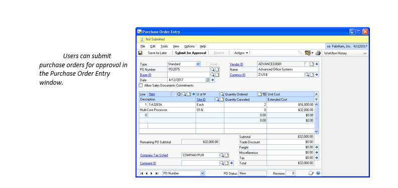
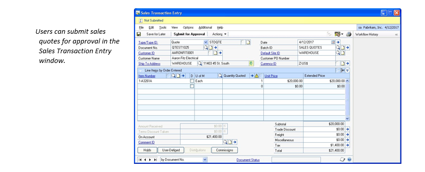
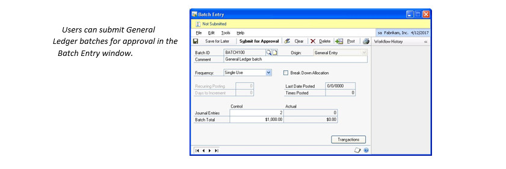
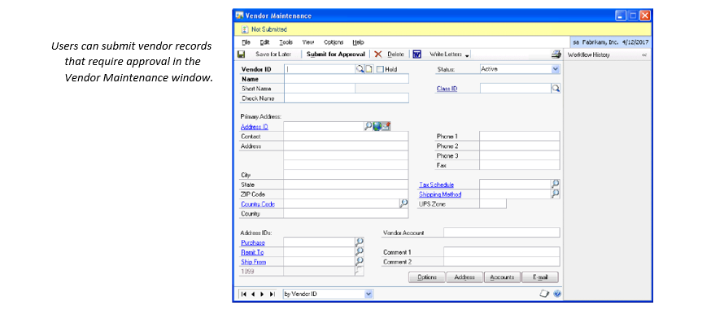
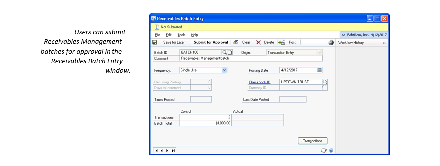
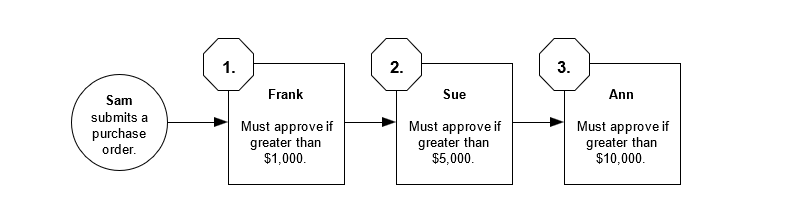
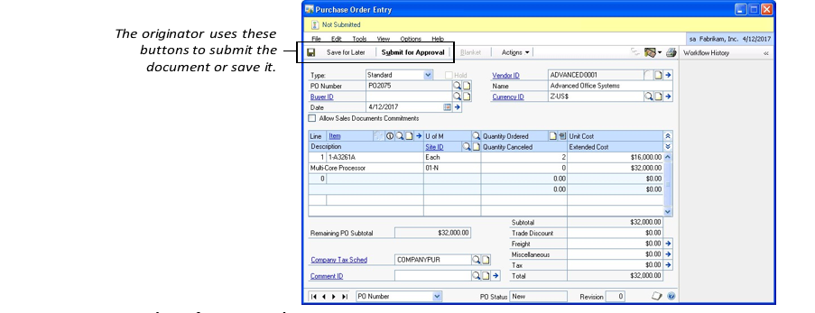
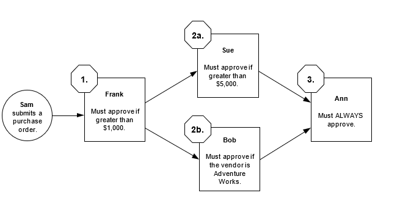
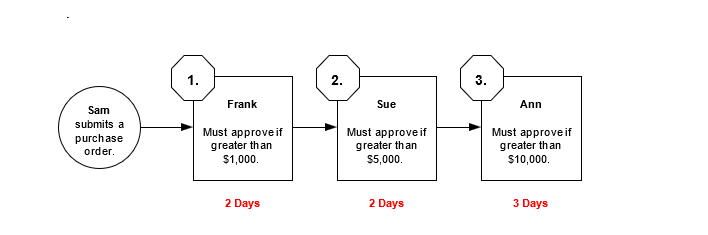

# Workflow Administrator's Guide

The following information provides a basic overview of the Workflow system and describes the benefits it provides.

- What is workflow?
- Benefits of using the Workflow system
- How users will interact with the Workflow system

## What is workflow?

This documentation defines the term workflow in two ways:

1. Workflow is a system

    Workflow is the system that you installed with Microsoft Dynamics GP. The Workflow system provides functionality you can use to create individual workflows, or approval processes.

2. Workflow is an approval process

    A workflow is the approval process for a document, master record, or batch. A workflow defines how a document, master record, or batch "flows" through the system by showing who must approve it, and the conditions under which they must approve it.  

For example, consider a purchase order approval workflow. <!--missing image-->This workflow shows who must approve purchase orders, and the conditions under which their approval is required. For example, suppose Sam submits a purchase order for $2,000. In this scenario, the purchase order must be approved by Frank. If Sam submits a purchase order for $8,000, it must be approved by both Frank and Sue.

## Benefits of using the Workflow system

There are several benefits of using the Workflow system in your organization. 

Here are a few key benefits.

- Consistent processes

  The Workflow system enables you to define the approval process for specific documents, master records, and batches, such as purchase order documents and Receivables Management batches. By using the Workflow system, you ensure that documents, master records, and batches are reviewed and approved in a consistent and efficient manner.

- Automatic notification

  Users can be automatically notified when a document, master record, or batch is assigned to them for approval, or when a document, master record, or batch they submitted is approved. Users can be notified via desktop alerts or e-mail alerts. For more information about alerts, see Indicate if you want to send alert messages on page 66.

- Access through Outlook

  Users don't have to log on to Microsoft Dynamics GP to approve documents, master records, and batches. Users can approve documents, master records, and batches by accessing the Workflow by responding to e-mail messages in Outlook.

- Reports

  There are several Workflow reports you can generate. These reports help you monitor the Workflow system and identify specific workflow steps or approvers who may be slowing down an approval process. 

## How users will interact with the Workflow system

Users can interact with the Workflow system through Microsoft Dynamics GP and Outlook.

### Microsoft Dynamics GP

Workflow functionality is available in many areas of Microsoft Dynamics GP. For example, the Purchase Order Entry window enables a user to submit purchase orders for approval. This window has a message bar and history pane. The message bar displays the document's status and has buttons for approving and rejecting the document. The history pane displays previous actions made to the document.

### Outlook

When a document, master record, or batch is assigned to a user for approval, an e-mail message can be sent to the user. The e-mail message displays information about the document, master record, or batch and has an Edit this Task link. When the user clicks this link, a window appears where the user can approve or reject the document, master record, or batch.

## Workflow architecture

The Workflow system is made up of several software components. The following information describes these components and shows where they may be installed on your network.  

- Architecture overview
- Deployment configurations

### Architecture overview

The Microsoft Dynamics GP Workflow system accesses two different types of data. It accesses accounting data from your Microsoft Dynamics GP databases, such as purchase orders, sales quotes, master records, and batch information. It also accesses workflow setup information from your SharePoint databases, such as the names of approvers and the conditions under which they must approve a document, master record, or batch.  

The following diagram illustrates the Workflow architecture and shows the software components that are used to access data.
As the diagram shows, the Microsoft Dynamics Workflow system consists of three main pieces: a web service, a web site, and server components. The Workflow web service enables employees using Microsoft Dynamics GP clients to interact with the Workflow server components. The Workflow web site enables employees using Outlook and Internet Explorer to interact with the Workflow server components.
The Workflow server components contain business logic and communicate with the SharePoint and Microsoft Dynamics GP databases. These components are installed on a server running SharePoint and can communicate directly with the SharePoint databases. The components must use Web Services for Microsoft Dynamics GP to communicate with the back office databases.

## Deployment configurations

There are several ways the Workflow system can be deployed. The following information describes the supported deployment configurations and shows where each software component is installed.

It's important that you know and understand how the Workflow system is deployed in your organization so that you can perform maintenance procedures and help troubleshoot any issues that may arise.

### Single-server configuration

In a single-server configuration, all the server-side components (such as Microsoft Dynamics GP, Web Services for Microsoft Dynamics GP, SharePoint, and Workflow) are installed on one server.
This configuration is recommended for testing and demonstration purposes only. This configuration does not provide the best security or performance.

### Separate web server configuration

The separate web server configuration consists of two servers. The back office server hosts your Microsoft Dynamics GP database. The web server hosts Web Services for Microsoft Dynamics GP and Workflow.
This configuration provides better security and performance than the single-server configuration.

### Multiple web server configuration

The multiple web server configuration consists of one back office server and two or more web servers. The back office server hosts your Microsoft Dynamics GP database and your SharePoint database. The web servers host Web Services for Microsoft Dynamics GP, SharePoint, and Workflow.
Of the three configurations described in this section, the multiple web server configuration provides the best security and performance.

## Workflow Prerequisites

**SQL Server Agent as a Prerequisite for Workflow**
Workflow includes functionality to escalate an overdue workflow step. This escalation functionality is supported by the Microsoft SQL Server Agent. Escalation of overdue steps is not required, but additional review of pending workflows will be necessary if it is not used.
If escalation of overdue workflow steps will be used, then ensure that the SQL Server Agent is set up to start automatically with the operating system. 

**Web Services as a Prerequisite for Workflow**
Workflow includes functionality to remotely approve a workflow step. The remote approval functionality is supported by Microsoft Dynamics GP Web Services. Remote approval is not required as workflow approvals can be completed from within the Microsoft Dynamics GP user interface.

This documentation describes how to use Web Services for Microsoft Dynamics GP, which you can use to build database integrations. 

[WebService](https://www.microsoft.com/en-us/download/details.aspx?id=36223)

## Workflow Types

### Purchase Order Approval

A purchase order approval workflow is used to gain approval for purchase orders before they are processed. Users can submit purchase orders for approval in the Purchase Order Entry window in Microsoft Dynamics GP.

After purchase orders are approved, you can process them according to your company’s business practices. For example, you can print them and receive shipments.
Before you can use this workflow, you must clear the Activate Approvals check box in the PO Enhancements Setup window (Purchasing > Setup > Purchase Order Enhancements).

### Sales Quote Approval

A sales quote approval workflow is used to gain approval for sales quotes before they are processed. Users can submit sales quotes for approval in the Sales Transaction Entry window in Microsoft Dynamics GP.

After sales quotes are approved, you can process them according to your company’s business practices. For example, you can transfer them to orders

### Customer Credit Limit Override Approval

A customer credit limit override approval workflow is used to gain approval for orders, fulfillment orders, and invoices that exceed the set credit limits for customers. Users can submit documents that require credit limit override approval in the Sales Transaction Entry window in Microsoft Dynamics GP.

After these documents that exceed credit limits are approved, you can process them according to your company’s business practices.
Before you can use this workflow, you must remove the password from the Exceed Credit 
Limit field in the Receivables Management Setup window (Sales > Setup > Receivables).

### General Ledger Batch Approval

A General Ledger batch approval workflow is used to gain approval for General Ledger batches before they are posted. Users can submit General Ledger batches for approval in the Batch Entry window in Microsoft Dynamics GP.

After General Ledger batches are approved, you can post them.  Before you can use this workflow, you must turn off the batch approval feature in Microsoft Dynamics GP. To do so, open the Posting Setup window (Administration > Setup > Posting > Posting) and select the Financial series. Clear the Require Batch Approval check box for the General Entry and Clearing Entry origins.

### General Ledger Account Approval

In Microsoft Dynamics GP 2018, we have a new workflow, General Ledger Account Approval which provides an approval process for adding or editing posting accounts.

If an account is pending approval or rejected then it cannot be posted against.

To access the Workflow Maintenance, from the Administration navigation pane, under setup, choose Company, expand Workflow, and then click Workflow Maintenance, select Financial from the drop down.

[General Ledger Account Workflow](https://community.dynamics.com/gp/b/dynamicsgp/posts/microsoft-dynamics-gp-2018-general-ledger-account-approval-workflow)

### Vendor Approval

A vendor approval workflow is used to gain approval for new vendor records and modified vendor records. Users can submit vendor records that require approval in the Vendor Maintenance window in Microsoft Dynamics GP.

After the vendor records are approved, you can process them according to your company’s business practices

### Payables Transaction Approval

Microsoft Dynamics GP 2015 R2 now includes the ability to setup workflow for Accounts Payable transactions.  

This is the workflow many customers have been waiting for.  Most companies have a very manual approval process for their AP invoices. Now, you can automate that process based on a variety of criteria.

Simply set up a workflow in Dynamics GP to automate the review process for Accounts Payable Transaction approvals. When invoices meet your customized criteria, such as hitting a specific dollar amount, they can be automatically routed to the appropriate manager for approval. Invoices that don’t meet the criteria can be flagged for review by an authorized user. With the workflow defined, you’ll be able to eliminate the lag time of waiting for a signature and then manually entering the information into Dynamics to process the payment.

To automate your accounts payable approval process, start by creating a workflow with the desired criteria. Attach the vendor invoice to the workflow by scanning it into Dynamics GP directly or by receiving it electronically.  Remember to set up your workflow to include document attachments when the email is sent.

The approving manager can approve, reject, or delegate AP transactions in the following ways:

In the Accounts Payables Transaction Entry window,
Through the email notification automatically generated by the workflow
Through the PM Batch Approval workflow.

The approving manager can add comments which will be tracked as part of the approval process. After the invoice is approved, you can easily post it in Dynamics with one click. A complete history of the workflow activities will be maintained for each transaction.

### Payables Management Batch Approval

A Payables Management batch approval workflow is used to gain approval for Payables Management batches before they are posted. Users can submit Payables Management batches for approval in the Payables Batch Entry window in Microsoft Dynamics GP.

After Payables Management batches are approved, you can post them.  Before you can use this workflow, you must turn off the batch approval feature in Microsoft 
Dynamics GP. To do so, open the Posting Setup window (Administration > Setup > Posting > Posting) and select the Purchasing series. Clear the Require Batch Approval check box for the Payables Trx Entry, Payment Entry, and Computer Checks origins.

### Purchase Order Approval

New enhancements to Purchase orders allow you to set up a limited way to allow purchase order approvals in Microsoft Dynamics GP without having to add on any additional software.

The approval set up button will show you the list of users you have available in Microsoft Dynamics GP. There you will see the approval type where you can set up levels and restrictions based on dollar amounts. Then you assign who that user reports to.

Then you can choose the security type:

The user can only approve POs for users that report to them
The user can approve POs for any user up to the approval authority.
Keep in mind the approval settings are specifically based on dollar amount and security type.

If you don’t mark anyone, it will tell you it recommends you set up one user with unlimited approval authority. Without that person, you won’t have anyone that can go in and fix any errors or stuck approvals in the system.

### Purchase Requisition Approval

Purchase Requisition function in Dynamics GP can be controlled by workflow to help you better control your procurement function in your organization.

Any employee with security permission to enter requisitions into Microsoft Dynamics GP can do so. Go to Purchasing > Setup > Purchase Order Processing to open the Purchase Order Processing Setup window, and click the Requisitions button at the bottom to open the Requisition Setup window. Here you can select to limit each user to seeing only requisitions that they requested themselves, or you can select to enable them to see all requisitions (or you can prohibit a user from seeing any).

### Purchase Receiving Approval

In Microsoft Dynamics GP 2018, we have a new workflow, Receivings Transaction Approval for purchase receiving transactions (PO Invoices)

The Purchase Receivings Transaction Approval workflow allows users to define workflows for shipment receipts and shipment/invoice receipts in the Receivings Transaction Entry window. To open the Receivings Transaction Entry window: On the Transactions menu, point to Purchasing, click Receivings Transaction Entry.

Along with this new workflow, we also have a corresponding email message for Purchase Receiving Transactions workflow: To access the Message Setup, from the Administration navigation pane, under setup, choose Company, expand Workflow, and then click E-mail Message Setup.

[Purchase Receiving Approval Workflow](https://community.dynamics.com/gp/b/dynamicsgp/posts/microsoft-dynamics-gp-2018-purchasing-receivings-transaction-workflow)

### Receivables Management Batch Approval

A Receivables Management batch approval workflow is used to gain approval for Receivables Management batches before they are posted. Users can submit Receivables Management batches for approval in the Receivables Batch Entry window in Microsoft Dynamics GP.

After Receivables Management batches are approved, you can post them. Before you can use this workflow, you must turn off the batch approval feature in Microsoft Dynamics GP. To do so, open the Posting Setup window (Administration > Setup > Posting > Posting) and select the Sales series. Clear the Require Batch Approval check box for the Receivables Sales Entry and Receivables Cash Receipts origins

### Sales Transaction Approval

In Microsoft Dynamics GP 2018 R2, we have added a new Sales Transaction Approval workflow where you can create approvals based on several conditions such as whether or not a Customer Credit Limit is exceeded on the transaction.

[Sales Transaction Approval Workflow Including Credit Limit](https://community.dynamics.com/gp/b/dynamicsgp/posts/microsoft-dynamics-gp-2018-r2-sales-transaction-workflow-including-credit-limit)

### Employee Approval

An employee onboard approval workflow helps you manage the process of onboarding a new employee. Users can submit employee records that require additional onboarding steps in the Employee Maintenance window in Microsoft Dynamics GP.

After the employee onboard approval process is complete, you can include the employee in payroll builds.

An employee personnel approval workflow helps you manage the process of making changes to employee records. Users can submit changed employee records that require additional steps in the Employee Maintenance window in Microsoft Dynamics GP

This workflow includes the following types that you can Activate:
Employee Profile Approval for onboarding and employee maintenance changes.
Employee Skills Approval
Payroll Direct Deposit Approval
Payroll Timecard Approval
Payroll W4 Approval

### Project Expense Report Approval

Dynamics GP 2015 R2 allows Project Accounting employees to create expense reports for any projects to which they are assigned. Employees can also be set up to allow delegates to enter expense reports on their behalf.

Workflow approvals and task assignments are defined for expense reports; workflow actions are executed on the documents from the Expense Entry window or from the Navigation lists.

### Project Timesheet Approval

This feature allows an employee easy access to Project time entry. Time for a single week, or multiple weeks within a reporting period can be saved on a single document. Timesheets can be saved as templates for even easier future use.

Project employee timesheets are submitted to workflow for approval and then are automatically sent for processing to payroll.

There is also a new Project Time and Expense section that can be added to the Home page. This allows users to quickly see the active Timesheets and Expenses they have entered. Users can also enter or approve Timesheets and Expenses, and they can see a list of recent documents.

### Administration Approval

In Microsoft Dynamics GP, we've added four new workflows around users and user security. These new workflows are:

- Security Roles Approval

    You can also add an Approval Workflow for additions and changes to Security Roles to better control access to your system and processes.

- Security Task Approval

    You can add an Approval Workflow for additions and changes to Security Tasks to better control access to your system and processes.

- User Approval

    You can add an Approval Workflow for changes in User Security to better control your system processes.

- User Security Approval

    You can add an Approval Workflow for changes in User Security to better control your system processes.

These will be helpful if you want to add an approval component to various security settings in GP.

[Administration Workflow Approval](https://community.dynamics.com/gp/b/dynamicsgp/posts/microsoft-dynamics-gp---user-workflow-user-security-workflow-security-task-workflow-and-security-role-workflow-1033134577)

## Workflow Participants
The following information explains who the participants are in the Workflow system.

### Workflow Manager

A workflow manager can create and configure a particular type of workflow. For example, suppose you name your purchasing manager, Ann, as the workflow manager for the purchase order approval type. This means Ann can create and configure purchase order approval workflows. She can also act on (that is, approve or reject) any purchase order in the company, regardless of who the purchase order is assigned to.

When you set up the Workflow system, you’ll specify a manager for each type of workflow

### Originator

The originator is the person who submits a document, master record, or batch for approval. For example, in the following workflow illustration, Sam is the purchase order originator.
You’ll specify who the originators are when you create and configure a workflow

### Approver

The approver is the person responsible for reviewing a document, master record, or batch. If the approver approves the document, master record, or batch, it will move on to the next step in the workflow, if necessary. If the approver rejects the document, master record, or batch, the workflow approval process stops.
In the following workflow illustration, Frank, Sue, and Ann are approvers.
You’ll specify who the approvers are when you create and configure each workflow step.

### Delegate

A delegate is a person who can act on a workflow task on behalf of someone else. For example, if an approver will be out of the office for a period of time, the approver can delegate his or her tasks to another approver in the workflow.
For example, if Sue will be on vacation for a couple of weeks, she can delegate her tasks to Frank or Ann.

Approvers can specify who their tasks should be delegated to on the Workflow User Delegation.

## Workflow Security

Security in Microsoft Dynamics GP is determined by your Microsoft Dynamics GP security role and SharePoint group.

Microsoft Dynamics GP security role Access to windows, reports, and accounting data in Microsoft Dynamics GP is determined by your security role. For example, a user assigned to the Purchasing Manager role has access to the Purchase Order Entry window.

The ability to perform a workflow action is determined by the group you belong to. 

Here’s how it works:
1.	When you choose to perform a workflow action, such as approving or rejecting a document, the system will determine what your Microsoft Windows® user account is (that is, the user account you entered when logging on to the computer). 
2.	The system will determine which groups are allowed to perform the action. 
3.	Using your Windows user account, the system will determine if you belong to the groups that are allowed to perform the action.
For example, assume that your Purchasing Manager, Frank, has logged on to 
Microsoft Dynamics GP. Because Frank is assigned to the Purchasing Manager role, he can access the Purchase Order Entry window. Because Frank is also a member of the Dynamics GP Purchase Order Approval WorkflowApprover group, he will be able to approve or reject the purchase orders assigned to him.

## Workflow Actions

A workflow approval process involves two main groups of people: the originators and the approvers. For example, in the following purchase order workflow, Sam is the originator and Frank, Sue, and Ann are the approvers.

**Actions an originator can take**

The originator starts the workflow approval process by submitting a document, master record, or batch for approval. The originator does this in Microsoft Dynamics GP. For example, to submit a purchase order, the originator will use the Purchase Order Entry window. To submit a master record, the originator will use the Vendor Maintenance window. To submit a General Ledger batch, the originator will use the Batch Entry window.

These windows have buttons that enable originators to submit the document, master record, or batch, or save it.

Submit for approval
When the originator submits the document, master record, or batch for approval, the Workflow system evaluates the document, master record, or batch and determines if it requires approval. If so, the document, master record, or batch is assigned to the appropriate approver with a status of Pending Approval.
If the Workflow system determines that the document, master record, or batch does not require approval, the document, master record, or batch is given a status of No Approval Needed.

Save for later
When the originator saves the document, master record, or batch, any changes made to the document, master record, or batch are saved. The document, master record, or batch is not submitted for approval; the originator can submit it at a later time.

**Actions an approver can take**

When a document, master record, or batch is assigned to an approver, the approver can take one of the following actions.

Approve
When an approver approves a document, master record, or batch, the document, master record, or batch is assigned to the next approver in the workflow, if necessary. If no additional approval is required, the document, master record, or batch is given the status of Approved and the workflow approval process is complete.
For example, suppose Sam submits a purchase order for $6,000. In this scenario, the purchase order must be approved by Frank and Sue. When Frank approves the purchase order, it is assigned to Sue for approval. When Sue approves the purchase order, it is given the status of Approved, and the workflow process is complete.

Reject
When an approver rejects a document, master record, or batch, the document, master record, or batch is given the status of Rejected and the workflow process is complete.
For example, using the workflow previously shown, suppose that Sam has submitted a purchase order for $12,000 and that it is assigned to Sue. When Sue rejects the purchase order, it is given the status of Rejected and the workflow process is complete.
Sam can resubmit the purchase order, with or without changes. If Sam resubmits the purchase order, a new workflow process starts at step 1.

Delegate
When an approver delegates a document, master record, or batch, the document, master record, or batch is assigned to another approver in the workflow.
For example, using the workflow previously shown, suppose that Sam has submitted a purchase order for $12,000 and that it is assigned to Frank. Frank then delegates the purchase order to Ann.
Ann will then act on behalf of Frank. This means that if Ann approves the purchase order, it will be assigned to Sue for approval—just as if Frank had approved it. Once Sue approves the purchase order, it moves on to Ann for approval.

In order for an approver to delegate a document, master record, or batch, the Allow approver to manually assign workflow tasks to someone else check box on the Configure Workflow page must be selected. 

Request change
When an approver requests a change to a document, master record, or batch, the document, master record, or batch is given the status of Pending Changes and the workflow process is complete. The originator, however, can make changes and resubmit the document, master record, or batch for approval.
For example, using the workflow previously shown, suppose that Sam has submitted a purchase order for $12,000 and that it is assigned to Sue. When Sue requests a change, the purchase order is given the status of Pending Changes and the workflow process is complete.
Sam can resubmit the purchase order, with or without changes. If Sam resubmits the purchase order, a new workflow process starts at step 1.

**How an approver can act on a document, master record, or batch**
An approver can act on a document, master record, or batch using Microsoft Dynamics GP or Outlook.

Microsoft Dynamics GP
In Microsoft Dynamics GP, approvers can act on documents, master records, and batches using entry windows and lists.

Approvers can use entry windows to act on a specific document, master record, or batch. For example, an approver can approve a specific purchase order using the Purchase Order Entry window.

Approvers can use lists to act on several documents, master records, or batches at one time. For example, an approver can approve multiple purchase orders at one time using the All Purchasing Transactions list.

## Workflow Tasks

The following information provides an overview of workflow tasks, including information about when they are created and how they can be reassigned to other users.

Task overview
A task represents a document, master record, or batch assigned to a user for approval. For information about how users can act on the tasks assigned to them.

When tasks are created
When a user submits a document, master record, or batch for approval, the Workflow system evaluates the first step in the workflow to determine if approval is required there. If the Workflow system determines that approval is required, a task is created for that approver.
Simple example
Using the workflow illustrated below, suppose Sam submits a purchase order totaling $8,000. The Workflow system evaluates step 1 to determine if the purchase order meets the condition specified. In this scenario, the purchase order is more than $1,000, so the Workflow system creates a task for Frank.

Assume that Frank approves the purchase order. The Workflow system then evaluates step 2 to determine if the purchase order meets the condition specified. Because the purchase order is more than $5,000, Sue’s approval is required. The Workflow system creates a task for Sue.
After Sue approves the purchase order, the purchase order is given the Approved status. The purchase order can now be printed and shipments can be received.

Complex example
Using the workflow illustrated below, suppose Sam submits a purchase order totaling $8,000 for Adventure Works. The Workflow system evaluates step 1 to determine if the purchase order meets the condition specified. In this scenario, the purchase order is more than $1,000, so the Workflow system creates a task for Frank.

Assume that Frank approves the purchase order. The Workflow system then evaluates steps 2a and 2b simultaneously. Because the purchase order is more than $5,000 and the vendor is Adventure Works, the Workflow system creates tasks for Sue and Bob.
Both Sue and Bob must approve the purchase order before it can move on to Ann. This is because step 2a (Sue) and step 2b (Bob) converge at step 3 (Ann). For example, assume that Sue approves the purchase order first. The purchase order cannot be assigned to Ann until Bob approves it, as well. When Bob approves the purchase order, the Workflow system creates a task for Ann.

Due dates
Each task has a due date. The due date indicates the date by which the approver must respond to the task—that is, approve or reject the document, master record, or batch the task represents.

Default due dates
When you configure a workflow step, you’ll specify how many days the approver has to respond to the task. For example, the following workflow shows the number of days each approver has to act on assigned tasks.

Overriding default due dates
Approvers can override the default due dates. For example, using the previous workflow illustration, suppose Sam submits a purchase order for $18,000. When Frank approves the purchase order, he can specify how many days Sue will have to approve or reject the purchase order. Similarly, when Sue approves the purchase order, she can specify how many days Ann will have to approve or reject the purchase order.

When a task is overdue
When an approver fails to act on a task by the task’s due date, the task is considered overdue, or escalated. When you configure a workflow, you must specify what should happen to overdue tasks. The following options are available.

| If you Select this optinon  | This will happen                                                                     |
|--------------------------------------------------------------------------------------------------------------------|
| Take No Action              | The task will remain assigned to the current approver                                |
| Delegate to next approver   | System will automatically assign the task to the next approver in the workflow       |
| Delegate to                 | System will automatically assign the task to the user you specify                    |
| Have system automatically   | System will automatically approve/reject the task, depending on the action you choose|

