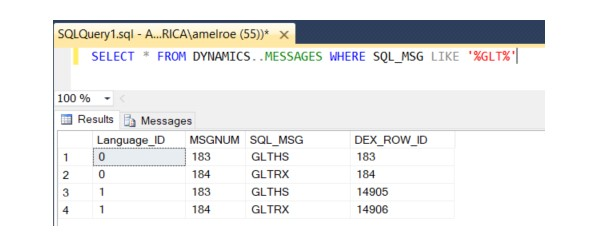

# Account framework

Use the information in this chapter to plan your account framework for your company. A framework is a set of maximum values, such as maximum segment lengths that each of your company’s account formats must fit within. The account framework is very difficult to change later after it’s set up.

> [!WARNING]
> The account framework you enter in the Dynamics GP Utilities will be used for the account format in all companies you’re planning to set up.  

## Understanding the account framework

The framework you’ll enter includes maximums for the account length, the number of account segments, and the length of each segment. These maximums will be used for the account format in all companies you’re planning to set up. You’ll enter the specific account format for each company when you access Dynamics GP and set up the company.

Maximums you enter for account framework during installation will apply to additional companies you set up later. For example, you could enter the account framework maximums shown in the following table during the installation process.

| Account framework example  |   Value  |
|----------------------------|-----|
| Maximum account length     | 20  |
| Maximum number of segments | 3   |
| Length of segment 1        | 7   |
| Length of segment 2        | 10  |
| Length of segment 3        | 3   |

With these maximums for the account framework defined during installation, you wouldn’t be able to set up the following account format for a company.

| Invalid account format for the corresponding framework |Value|
|--------------------------------------------------------|-----|
| Maximum account length                                 | 20  |
| Maximum number of segments                             | 3   |
| Length of segment 1                                    | 8   |
| Length of segment 2                                    | 9   |
| Length of segment 3                                    | 3   |

Although the maximum account length and number of segments is within the limit, this account format is invalid because the length of the first segment—8—exceeds the segment maximum that was defined during installation.

## Using a custom or default account framework

You can design your account framework or use a default account framework. The account framework applies to all companies in your Dynamics GP system, and represents the maximum length of your accounts, number of segments, and segment lengths. The account framework is very difficult to change later after you set it up using Dynamics GP Utilities.

To use the default account framework, you’ll select Basic as the installation option in Dynamics GP Utilities after you install Dynamics GP. The Basic option also provides default settings for your system database and system password. For more information, see [Installation options in Dynamics Utilities](/dynamics-gp/installation/using-microsoft-dynamics-utilities#installation-options-in-dynamics-utilities).

The following is the account framework for a basic installation.

| Maximum number of segments | 5                                                 |
|----------------------------|---------------------------------------------------|
| Length of each segment     | 9                                                 |
| Account preview            | xxxxxxxxx-xxxxxxxxx-xxxxxxxxx-xxxxxxxxx-xxxxxxxxx |
| Sorting options            | No sorting options by segment                     |

If you decide that the basic installation’s default account framework fits your business needs, you don’t need to plan your account framework before you install Dynamics GP and use Dynamics GP Utilities.

If you decide not to use the default framework, review the sections [Planning your account framework](#planning-your-account-framework) and [Choosing account framework storage size](#choosing-account-framework-storage-size)  to plan your account framework before you install Dynamics GP. After you design your account framework and install Dynamics GP, you’ll select Advanced as the installation option in Dynamics GP Utilities. Use Dynamics GP Utilities to enter a framework for the account formats that will be used by all companies you’ll set up in Dynamics GP.

## Planning your account framework

When planning an account framework, think about the account format you’ve used with your previous accounting system and consider future expansions and the account format for additional companies you may add to your system later. Plan the maximum number of segments you’ll use in any company, and the maximum length of each segment.

> [!WARNING]
> It’s important to consider what your current and future needs are for the framework; after you’ve entered the framework, it’s unlikely that you’ll be able to change it. 

To use one of the default charts of accounts provided with Dynamics GP, set up the account framework with maximums that are at least the size listed below.  

| Minimum account framework for use with sample company |Size|
|-------------------------------------------------------|----|
| Maximum account length      |At least 9 characters |
| Maximum number of segments |At least 3 segments   |
| Length of segment 1    |At least 3 characters |
| Length of segment 2   |At least 4 characters |
| Length of segment 3    |At least 2 characters |

If you have more than one company, you may need to enter maximum segment lengths that exceed the 66-character account length maximum when the segment lengths are added together. Assume that you have two companies using the account formats shown in the following table.

| Account format      | Company 1 | Company 2 |
|---------------------|-----------|-----------|
| Account length      | 66        | 66        |
| Number of segments  | 3         | 3         |
| Length of segment 1 | 10        | 20        |
| Length of segment 2 | 40        | 30        |
| Length of segment 3 | 15        | 15        |

In this case, you’d enter the following account framework maximums.

| Account framework accommodating both account formats |   Value                  |
|-------------------------|--------------------------------------------|
| Maximum account length                               | 66  |
| Maximum number of segments                           | 3   |
| Length of segment 1                                  | 20  |
| Length of segment 2                                  | 40  |
| Length of segment 3                                  | 15  |

Notice that the total of the three segment lengths—75—exceeds the maximum account length—66. However, the account format for each company is within the account framework maximum.

## Choosing account framework storage size

You will need to consider the storage size that is required by each segment. The storage size is made up of segment units—a unit of measure that determines the size of each segment. In Dynamics GP, the storage size is calculated automatically when you enter each segment, though it isn’t displayed. A message will be displayed if your framework exceeds the allowable storage size.

Each segment uses one or two segment units for storage, depending upon whether it’s an odd or an even-numbered segment. These units will be added to the total length of all segments. When the maximum account length is set, the total of all segments units must be 82 or less. For example, assume that an account has two 5- character segments and seven 8-character segments, the total storage size will be 82 (one unit is added to each of the five character segments because 5 is an odd number and two units must be added to each of the 8-character segments because 8 is an even number). This example would be calculated as shown in the following table.

| Segment | Segment length | Segment units | Total size |
|---------|----------------|---------------|------------|
| 1       | 5              | 1             | 6          |
| 2       | 5              | 1             | 6          |
| 3       | 5              | 1             | 6          |
| 4       | 8              | 2             | 10         |
| 5       | 8              | 2             | 10         |
| 6       | 8              | 2             | 10         |
| 7       | 8              | 2             | 10         |
| 8       | 8              | 2             | 10         |
| 9       | 8              | 2             | 10         |
| Total   | 66             | 16            | 82         |

Based on the previous example, if you use an account framework with two 5- character segments and eight 8-character segments, it would not be valid because the total would be 92, or ten greater than the maximum allowed, as shown in the following table.

| Segment | Segment length | Segment units | Total size |
|---------|----------------|---------------|------------|
| 1       | 5              | 1             | 6          |
| 2       | 5              | 1             | 6          |
| 3       | 5              | 1             | 6          |
| 4       | 8              | 2             | 10         |
| 5       | 8              | 2             | 10         |
| 6       | 8              | 2             | 10         |
| 7       | 8              | 2             | 10         |
| 8       | 8              | 2             | 10         |
| 9       | 8              | 2             | 10         |
| 10      | 8              | 2             | 10         |
| Total   | 66             | 16            | 82         |

However, if you use all odd-numbered segment lengths, you can incorporate larger segments in your account framework because odd-numbered segment lengths use only one segment unit each. For example, you could use ten 7-character segments in your account framework, which provides a total length of 70 characters, and a total size of 80.  

## See also

[Installation checklist](installation-checklist.md)  

## Multilingual Installs in Microsoft Dynamics GP

It is possible to use Microsoft Dynamics GP in a Multilingual Installation environment, there are some important things to keep in mind.

A Multilingual Installation is an environment in which multiple language release installations (unique language code folders) share the same DYNAMICS database, and potentially the same company databases.

Each unique release contains specific words and phrases to match the language of that country. 

As an example, the United Kingdom installation uses "cheque" instead of "check." 

There are 27 unique languages to choose from when you install Microsoft Dynamics GP:

Andean	
Argentina	
Australia	
Austria	
Belgium	
Canada	
Chile
China	
France	
Germany	
Hong Kong	
Indonesia	
Japan	
Latin America
Luxembourg	
Malaysia	
Middle East	
Netherlands	
New Zealand	
Philippines	
Singapore
South Africa	
Spain	
Taiwan	
Thailand	
United Kingdom and Ireland	
United States	

The DYNAMICS (system) database, and all company databases should be created/installed/upgraded using one PRIMARY language code folder only.

If the DYNAMICS (system) and Company databases are not installed/created/upgraded correctly you will run into problems (errors associated with audit trail codes, and/or problems closing the year in General Ledger).

While different country code installations (unique language code folders) can be used to connect to the same company database within a SQL instance: ALL company databases that are located on the same SQL instance should be created/upgraded using the same Primary Code Folder. This is because Audit Trail codes must match across all company databases within the same SQL instance.

If you accidentally upgraded/installed a company database with the secondary code folder, the following may occur:

You may receive the error message, “Violation of PRIMARY KEY constraint 'PKSY40100', Cannot insert duplicate key in object 'dbo.SY40100'” when you attempt to create a new fiscal year (Microsoft Dynamics GP >> Tools >> Setup >> Company >> Fiscal Periods).

When you try to close the year in General Ledger, nothing happens (because the audit trail codes between DYNAMICS..MESSAGES and the SY01000 are no longer in synch).

Below is detailed information around how to re-synchronize the audit trail codes for company databases that were incorrectly installed/upgraded with the secondary code folder.

Multilingual Resynchronize Audit Trail Codes with Primary Code Folder:
*Always make a backup of the databases prior to making any changes. All changes should be tested when no users are in the system*

1.	Clear the MESSAGES table in the DYNAMICS database:

DELETE DYNAMICS..MESSAGES

2.	Change the following line in the Dex.ini file for ALL language code folders being used in the Multilingual environment:

Synchronize=TRUE

3.	Launch into GP Utilities as ‘sa’ first with the Primary language code folder. An easy way to ensure you are launching into GP Utilities with a specific code folder is to simply drag and drop the DYNUTILS.SET file over the DynUtils.exe file within that specific code folder:

4.	While in GP Utilities (accessed via the primary code folder), click on the ‘Launch Microsoft Dynamics GP’ button to launch into the company. This will synchronize the audit trail codes with the primary code folder.

5.	Next, launch into GP Utilities via secondary language folder. (Be sure that SYNCHRONIZE = TRUE in the Dex.ini file) Again, a simple way to do this is to drag and drop the DYNUTILS.SET file over the DynUtils.exe file within that specific code folder:

6.	While in GP Utilities (accessed via the secondary code folder), click on the ‘Launch Microsoft Dynamics GP’ button to launch into the company database(s). This will synch the audit trail codes in the MESSAGES table to those created when the company was installed with the primary code folder.

An effective way to verify the audit trails are synchronized between the primary and secondary code folders is to run the following SQL statement against the DYNAMICS database:
SELECT * FROM DYNAMICS..MESSAGES WHERE SQL_MSG LIKE '%GLT%'

             
In the example above:
•	Language ID 0 = United States Install
•	Language ID 1 = United Kingdom Install
Overall, the SQL_MSG’s should match across Language ID’s when the Multilingual environment has been set up correctly.
7.	Repeat steps 5 and 6 for all secondary code folders.

