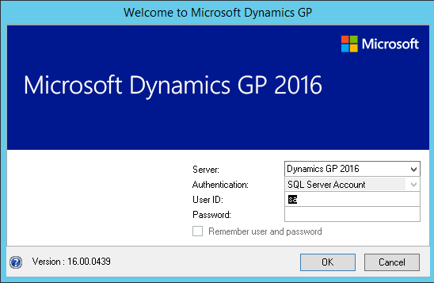
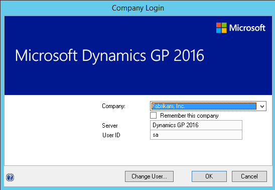

# After installing Microsoft Dynamics GP

Use the information in this chapter to log in to Microsoft Dynamics GP for the first time and register Microsoft Dynamics GP. You also may have to grant user access to alternate Microsoft Dynamics GP windows and reports.

This chapter contains the following sections:

-   [Logging in to and quitting Microsoft Dynamics GP](#logging-in-to-and-quitting-microsoft-dynamics-gp)  

-   [Registering Microsoft Dynamics GP](#registering-microsoft-dynamics-gp)  

-   [Security for Microsoft Dynamics GP](#security-for-microsoft-dynamics-gp)  

-   [Tasks for SQL Server Reporting Services reports](#tasks-for-sql-server-reporting-services-reports)  

## Logging in to and quitting Microsoft Dynamics GP

If you have trouble starting Microsoft Dynamics GP, contact your network administrator.

To log in to Microsoft Dynamics GP:

1. Choose Start &gt; Programs &gt; Microsoft Dynamics &gt; GP 2018 &gt; GP
The Welcome to Microsoft Dynamics GP window opens.

  

2. Enter your user ID and password. Passwords are case-sensitive.

3. Click OK. The Company Login window appears.

  

4. Select a company and click OK. The Microsoft Dynamics GP main menu appears.

To switch to a different company while you are working in Microsoft Dynamics GP, choose Microsoft Dynamics GP menu &gt;&gt; User and Company.

To quit Microsoft Dynamics GP:

1. Save your work in the window you are working in.

2. Choose Microsoft Dynamics GP menu &gt;&gt; Exit.

## Registering Microsoft Dynamics GP

By registering your software, we can provide you with better service. We can gather information about additional needs you have and how Microsoft Dynamics GP can be improved. Software registration also eliminates unauthorized use of the software without imposing restrictive copy protection.

You can enter your site name and registration keys for Microsoft Dynamics GP in the Registration window (Administration&gt;&gt; Setup &gt;&gt; System &gt;&gt; Registration).

You must register Microsoft Dynamics GP before you can use it. Enter your site name and registration keys exactly as they appear on your registration document. If you don’t register a module before you begin to use it, you won’t be able to open any transaction entry window. Modules in the sample company, Fabrikam, Inc., are registered and you can use the sample company to practice procedures.

After you’ve registered Microsoft Dynamics GP, you won’t need to register additional companies that you add. To verify that a module has been registered, open the Microsoft Dynamics GP Options window (Help &gt;&gt; About Microsoft Dynamics GP &gt;&gt; Options). Registered modules have a check mark in the Registered column.

## Security for Microsoft Dynamics GP

The default security settings in Microsoft Dynamics GP allow all users access to only the windows and forms in Microsoft Dynamics GP that are needed to log in to the application. After setting up new user records, you should set access to companies and set up security for new users. To learn more about setting up security, refer to the System Setup Guide (Help &gt;&gt; Contents &gt;&gt; select Setting up the System).

Each time you install a new feature or component in Microsoft Dynamics GP, such as Human Resources, you must set up security for that feature or component. For example, if you have been using Microsoft Dynamics GP for a year and you just installed Human Resources, you will need to set up access to Human Resources before anyone can use it.

Refer to the Planning For Security document (C:\\Program Files\\Microsoft Dynamics\\GP\\Documentation\\SecurityPlanning.pdf) or to the System Setup Guide (Help &gt;&gt; Contents &gt;&gt; select Setting up the System) for more information about security.

## Tasks for SQL Server Reporting Services reports

Review the following tasks.

### Security

After deploying the Microsoft Dynamics GP SQL Server Reporting Services reports, the only individuals who will be able to access or view the reports within the Report Manager are those users who are members of the web server ’s local administrator group and local administrators on SQL Server. The web site administrator has to implement and grant access to the Reporting Services Web site and database objects required to print reports.

If you have deployed reports using the SharePoint integrated mode and have already assigned permissions to users, those same users will have access to report server items and operations immediately after you configure the integration settings between Microsoft SharePoint and a report server. You can use existing permissions to upload report definitions and other documents, view reports, create subscriptions, and manage items.

If you have not assigned permissions, assign user and group accounts to predefined SharePoint groups. You also can create new permission levels and groups, or modify existing ones to vary server access permissions as specific needs arise.

You can deploy SQL Server Reporting Services reports for multiple Microsoft Dynamics GP instances to a single Microsoft SQL Server Reporting Server. If you have deployed reports to a folder on a Microsoft SQL Server Reporting Server using the Native mode, you must to provide access to the folder.

### Microsoft Dynamics CRM

Before you render a SQL Server Reporting Services report with CRM data, be sure to start the Microsoft Dynamics CRM application to initialize data
