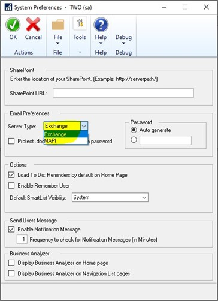
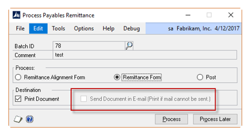
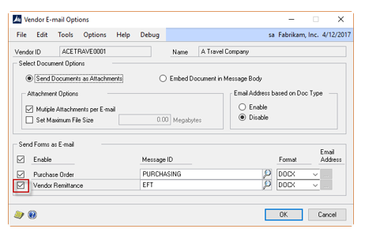
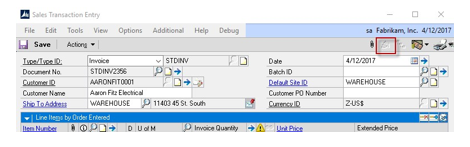
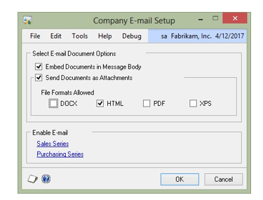
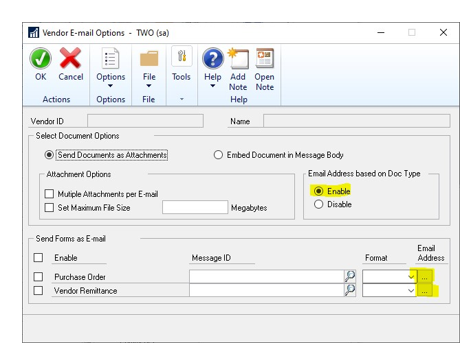
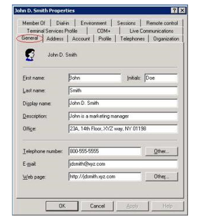

# Microsoft Dynamics GP Email Troubleshooting Guide

This document is meant to walk through most of the errors you may run into when emailing out of Microsoft Dynamics GP.  

The goal is to make everyone an emailing expert!  

This document can be leveraged to aid in troubleshooting all areas of emailing out of Microsoft Dynamics GP from the legacy Standard Report Writer Statements to Word Templates, or Workflow.

> [!NOTE]
> Before Microsoft Dynamics GP's October 2020 (18.3 and later) release, Dynamics GP required that both TLS 1.0 and Basic Authication (no MFA) be enabled for Exchange and Workflow emailing in Dynamics GP.

> After Microsoft Dynamics GP's October 2020 (18.3 and later) release, Dynamics GP has added the functionality to use both  TLS 1.2 and/or Multi-Factor Authentication (MFA).
> You do not actually need MFA turned on for your account to use the MFA window in Microsoft Dynamics GP, but it does use Modern Authentication. 
> 
> If you are still on an older version of Microsoft Dynamics GP, you must enable TLS on your local Exchange server. For more information, see [TLS completely disabled in 2022](/exchange/clients-and-mobile-in-exchange-online/opt-in-exchange-online-endpoint-for-legacy-tls-using-smtp-auth).
>
> When Basic Authentication is deprecated (October 1, 2022) you will need to be on a version of Dynamics GP where you can use MFA (18.3 or later).

We have seen an increase in cases where emails are beginning to fail from within Dynamics GP.  This is especially true for older versions of GP (18.2 and prior) that have not enabled MFA for Dynamics GP.  The Exchange team is temporarily disabling basic authentication as a way to remind us that a bigger change is coming.

[**WORKFLOW emails intermittently fail**](https://community.dynamics.com/gp/b/dynamicsgp/posts/dynamics-gp-workflow-intermittent-emails-failing)

[**Other emails intermittently fail**](https://community.dynamics.com/gp/b/dynamicsgp/posts/emails-intermittent-failing-when-sending-out-of-dynamics-gp-not-workflow-emails)

All email issues can be safely split up into three sets of issues:

* Issues unique to MAPI  
* Issues unique to Exchange  
* Issues that both methods have in common  

This is how the documentation is organized: Starting with MAPI, moving onto Exchange, and ending with the common errors.  

To determine whether MAPI or Exchange is being used check the System Preference window. (Administration >> Setup >> System >> System Preferences)

> [!IMPORTANT]
> This setting is stored in the DYNAMICS database and is system-wide, so changing this setting will affect all users.  

## MAPI Specific Errors
Dynamics GP uses MAPI to open Outlook to send emails directly from the Outlook client.

### Emails Stuck in Outbox within Outlook. 

**Note** Issue appears to be unique to Gmail accounts.  

**Issue** Emails are getting stuck in the Outbox in Outlook. 
When you use the Send/Receive button, or close/reopen Outlook, the email sends without delays.  

**Cause**
Add-in for Gmail Multi-factor authentication. This is a paid add-in that we believe causes the issue.  

Solution

      

Compare a clean Outlook add-in list to the client having the issue to make sure there are no extra add-ins.  
Recommend that they [remove the add-in as it appears like it is no longer needed](https://support.office.com/article/add-a-gmail-account-to-outlook-701916679c52-4581-990e-e30318c2c081)
  

      

### No default mail client, or the current mail client cannot fulfill the message request Please run Microsoft Outlook and set it as the default mail client.  

**Note** Recommend you review Outlook version first – MAPI only works with 32bit!  

**Issue** Error appears when attempting to email using MAPI anywhere in GP Cause: Either a Profile is not setup, or Outlook cannot reach it using MAPI.  

Solution

      

You can go through [this KB](https://support.microsoft.com/help/4052892/e-mail-error-in-microsoftdynamics-gp-either-there-is-no-default-mail), focus on A and B as these are common causes.  

You will want to make sure that Outlook is also set up as the default application for mail when you search for Default Apps in Windows 10.  
  

      

### A program is trying to send an e-mail message on your behalf

**Note** Happens a lot with more secure environments and newer versions of Office.

**Issue** Outlook does not trust Microsoft Dynamics GP by default.

**Cause** Simply put, Outlook does not start with any Microsoft Dynamics GP specific trusts, so they need to be added.  

Solution

      

There are two solutions to get this message to stop appearing, we currently recommend the Outlook solution (first one in the list) as it has no side-effects.  
The Microsoft Dynamics GP solution does have side effects which are mentioned in the link provided  

1. Outlook solution (recommended)  

      1. Use the following link to solve the issue by telling Outlook that GP is a [trusted program](https://support.microsoft.com/help/3189806/a-program-is-trying-tosend-an-e-mail-message-on-your-behalf-warning-i)  

          Note: This may need to be redone anytime you upgrade GP/Office versions.

2. Dynamics GP Workaround (Has side-effect of the emailed document containing the file path that it was sent from)  

    1. [Force Outlook to use a different version of MAPI](https://community.dynamics.com/gp/b/dynamicsgp/posts/draft-a-program-is-trying-to-send-an-e-mail-message-on-your-behalf-when-trying-to-send-a-template-via-e-mail)
    
        This has many side effects which are mentioned in the above article.

Note: This may need to be redone anytime you upgrade Office  
  

      

### Microsoft Dynamics GP Crashes after an Office Update

**Note** Only happens past Microsoft Office version 1810, happens to all versions of Microsoft Dynamics GP. 

This ONLY effect emailing functionality. This includes any time where an email address would be entered within GP. Specific to MAPI.

**Issue** Office no longer allows for sideloading of VBA.

**Cause** Microsoft Dynamics GP attempts to use its own packaged version of VBA, and Office no longer allows this.

Solution

      

The solution is to remove VBA, stay on a version of Office prior to 1810, or to use Exchange rather than MAPI functionality. 

For more information regarding the cause of this issue, see the following blog posts:

- [Dynamics GP crashes closes when emailing after Office update](https://community.dynamics.com/gp/b/dynamicsgp/posts/dynamics-gp-crashes-closes-when-emailing-after-office-update)  
- [Microsoft’s stance on the solutions](https://community.dynamics.com/gp/b/dynamicsgp/posts/dynamics-gp-and-vba-future-considerations)
  

      

## Exchange Specific Errors

Dynamics GP uses Exchange Autodiscover to find the Exchange EWS endpoint, then uses this endpoint to login to, and send emails through, Exchange.  

### Login Failed: check your login information and try again

Note: Note: Error appears when attempting to login to the Exchange Log On screen.

Issue: Something is keeping Microsoft Dynamics GP from being able to successfully connect to the Exchange Server.  

Cause: There are a multitude of possible causes for this issue. The most common issues are an Autodiscover issue, an issue with MFA (Multifactor Authentication), or Basic Authentication being disabled.  

Solution

      

The following path is the best route for generic login issues: 

1. Confirm MFA is disabled  

    If it is enabled, attempt to use an App Password instead of the account’s normal password. For more information, see [App Passwords](https://support.microsoft.com/help/12409/microsoft-account-apppasswords-and-two-step-verification)  

2. Confirm that Basic Authentication is enabled  

    Most Exchange Administrators can answer this for you, although the [this blog post outlines other routes to confirm the status of Basic Authentication](https://community.dynamics.com/gp/b/dynamicsgp/posts/exchange-online-o365-emailing-inside-dynamics-gp)  

3. Confirm that Autodiscover is working  

    You can do this by removing the user from the SY04920 table (Dynamics/System database) and attempting to login again. If this table does not repopulate, then there are Autodiscover issues in the system (or the user doesn’t work). For insights into how this all works, along with other tests, see [this blog post](https://community.dynamics.com/gp/b/dynamicsgp/posts/exchange-emailinginside-dynamics-gp)  

>[!NOTE]
> With *Login Failed* type of error messages, we have seen some cases where TLS 1.0 was disabled, due to the looming end date and vulnerabilities. If you are still on an older version of Microsoft Dyanmics GP, you must enable TLS on your local Exchange server. For more information, see [TLS completely disabled in 2022](/exchange/clients-and-mobile-in-exchange-online/opt-in-exchange-online-endpoint-for-legacy-tls-using-smtp-auth).
  

      

## Generic Errors

### PDF Not Created

Note: Issue Specific to Upgrades to GP 2013 SP1  

Issue:  User is attempting to e-mail the customer statement but is receiving an error that the PDF file was not generated.

Cause: When disabling the customer statements via Tools>>Setup>>Sales>>E-mail settings, it doesn’t update the SY04905 table. 

Solution

      

Use the steps below to workaround around the error message:

To get around this, the users need to follow these steps to update the customer cards before they disable the Customer Statement:
1.	Verify that the Customer Statements are enabled to be emailed (Tools >> Setup >> Sales >> E-mail Settings)
2.	Go to the Customer Navigation List and select all customers.
3.	Use the E-mail Settings option (top navigation bar) here to update all customers.
4.	Here you will need to check Customer Statements, then select PDF, and uncheck the Customer Statement option. Then click OK.
5.	You should see that the customer cards were updated
6.	Running the following script should show the EmailDocumentEnabled field has been set to 0 for all customers:
SELECT * FROM SY04905 WHERE EmailDocumentID = '10'
7.	Disable the Customer Statement option on the E-Mail Settings window in Sales Setup.
8.	The statements should generate as a PDF file now for all customers.
Missing Records in either the SY04904 and/or SY04905 table can also generate this issue:
SELECT * FROM RM00101 WHERE CUSTNMBR not in (SELECT EmailCardID FROM SY04904)
SELECT * FROM RM00101 WHERE CUSTNMBR not in (SELECT EmailCardID FROM SY04905)
  

      

### Unknown Error Occurred

Note: Issue usually happens to EFT Remittances in Payables or Statements in Receivables.  

Issue:  User is attempting to e-mail remittances and/or statements but the error above appears on the Email Exception Report.  

Cause: This error has many causes, usually comes down to customizations on the Template, or odd characters in the email addresses used.  

Solution

      

Try the following:

Error messages when you email RM Statements in Microsoft Dynamics GP: [Unknown Error or Insufficient Memory](https://community.dynamics.com/gp/b/dynamicsgp/posts/error-messages-when-you-email-rm-statements-in-microsoft-dynamics-gp-unknown-error-or-insufficient-memory)

Use default report and Template and make sure the Template is the one marked with an asterisk (`*`).
If default emails, review modified template for [bookmarks](https://community.dynamics.com/gp/b/dynamicsgp/posts/what-are-bookmarks-and-how-are-they-used-in-microsoft-dynamics-gp-s-word-templates) hyperlinks, anchors, and even the size of the document example. RM Statement to show line item detail for all invoices would a very large statement for some customers.

**Set Template to Default Original/Canned Report.**
1. Microsoft Dynamics GP menu >> Tools >> Setup >> System >> User Security
2. Select the username and company.
3. Click on the 'Alternate/Modified Forms and Reports ID:' link at the bottom of the window.
4. In the Alternate/Modified Forms and Reports window select the following:
      Product: Microsoft Dynamics GP
      Type: Reports
      Series: All
5. Click the plus button to expand the module folder. i.e., Purchasing
6. Click the plus button to expand the report. i.e., Check Remittance
(If the report is not on the list at all then you do not have a modified option, please move to step 10.)
7. Select the default/canned 'Microsoft Dynamics GP' option. (Do NOT select modified here)
8. Click Save, Save, and Close.
9. Go to Reports >> Template Maintenance
10. In the Report Template Maintenance window, click the bar at the top that says, 'Click here to select a report'.
11. Select the option for 'More Reports' on the Drop-Down list.
      Product: Microsoft Dynamics GP
      Series: Purchasing
      Status: Original
12. Select '*Check Remittance' from the list and Click 'Select'.
13. In the Report Template Maintenance window, highlight 'Check Remittance*'
14. Click on the Assign >> Company button on the menu bar.
15. Check the company that you are testing the process in.
16. Highlight a company and click 'Set Default'.
17. Check the box next to 'Check Remittance*'
18. Click Save, Save, and Close

**Remove Have Replies Sent to on both the Message ID and E-mail setup.**
The Message Setup window can be found using the either pathing:
System wide
Administration >> Setup >> Company >> E-mail Message Setup
Administration >> Setup >> Company >> Workflow >> E-mail Message Setup

Module specific
Sales >> Setup >> E-mail Settings
Purchasing >> Setup E-mail Settings

Remove and re-enter all associated email addresses. Make sure that there are no odd characters such as ^ or a Tab.
Email Addresses can be found using either pathing:
Administration >> Setup >> Company >> Internet Information

**NOTE**
If **Email Addresss based on Doc Type** is enabled:
(Sales >> Cards >> Customer >> select a customer >> E-mail >> enable email address based on document type >> Email Address)
(Purchasing >> Cards >> Vendor >> select a vendor >> E-mail >> enable email address based on document type >> Email Address)
This issue can occur with all reports, and these can be caused by MessageID issues or Reply To issues. Make sure to remove all MessageIDs and Reply To emails.  

* If you still have issues, you may want to create a Fiddler trace that will be more specific of the problem.

You can run a Fiddler trace, and that will tell us if basic auth is not enabled or a DNS issue may appear, for example. It can also inform us about other problems in your environment.

#### To run Fiddler

1. [Download Classic Fiddler](https://www.telerik.com/download/fiddler)  
2. Open Fiddler.  
3. In Tools->Fiddler Options->HTTPS, choose the **Decrypt HTTPS traffic** field.  
4. Choose **Yes** on the prompt for trust Fiddler Root Certificate.  
5. Choose **Yes** to install the certificate.  
6. Choose **Yes** to confirm.  
7. Choose **OK**, and then choose **OK** to go back.  
8. Reproduce the issue.  
9. Stop the Fiddler trace:   
      1. File->Capture Traffic F12, Save trace: File->Save>All Sessions.   
      2. Save the trace out as .saz file.  

For more information, see [this blog post](https://blogs.msdn.microsoft.com/maheshk/2016/05/03/easy-way-to-collect-fiddler-log-fiddlercap/).  

> [!NOTE]
> Verify this error **Unknown Error Occurred** is happening for all users that are trying to send emails.  If this error only happens for example on two users, and you are using RDS Server, we have seen where deleting the User Profile on the RDS server and recreating it has fixed this error message and issue for those couple of users.
> 
  

      

### Insufficient Memory

Solution

      

1. Remove Have Replies Sent to on both the Message ID and E-mail setup. The Message Setup window can be found using the either pathing:
System wide Administration >> Setup >> Company >> E-mail Message Setup Administration >> Setup >> Company >> Workflow >> E-mail Message Setup
Module specific Sales >> Setup >> E-mail Settings Purchasing >> Setup E-mail Settings
2. Remove and re-enter all associated email addresses. Make sure that there are no odd characters such as ^ or a Tab. Email Addresses can be found using either pathing: Administration >> Setup >> Company >> Internet Information
**NOTE** If Email Addresses based on Doc Type is enabled: (Sales >> Cards >> Customer >> select a customer >> E-mail >> enable email address based on document type >> Email Address) (Purchasing >> Cards >> Vendor >> select a vendor >> E-mail >> enable email address based on document type >> Email Address) This issue can occur with all reports, and these can be caused by MessageID issues or Reply To issues. Make sure to remove all MessageIDs and Reply To emails.
The following SQL can be used to view the listed Have Replies Sent To email address.
- SELECT EmailReplyToAddress, * FROM SY04901 WHERE EmailSeriesID = 3 and EmailDocumentID in (10,15)
- SELECT EmailReplyToAddress, * FROM SY04902 WHERE EmailSeriesID = 3

EmailSeriesID =
2 – Financial
3 – Sales
4 – Purchasing
5 – Inventory
6 – Payroll
7 – Project
10 – 3rd Party
99 – All

EmailDocumentID – This is a unique integer indicating each type of document displayed in the window
  

      

### Invalid Recipients

Invalid Recipients

      

This error can be cause by multiple things. Check the following:
Make sure that there is a valid email address entered on the customer/vendor 
Microsoft Dynamics GP will determine what email will be used when emailing differently depending on whether the Email Address based on Doc Type setting is enabled or not. This is found in the following path:
Purchasing >> Cards >> Vendor >> select a vendor >> E-mail >> enable email address based on document type 

Sales >> Cards >> Customer >> select a customer >> E-mail >> enable email address based on document type 

If Email Address based on Doc Type is disabled:
When this feature is disabled, Microsoft Dynamics GP determines the email address based on what is listed in the Internet Information widow for the Address ID on the Customer or Vendor card.
The Internet Information window can be found using either of the following paths:
Administration >> Setup >> Company >> Internet Information >> select vendor/customer >> select address ID
Purchasing >> Cards>> Vendor >> click Internet Information button next to the Address lookup (looks like a little planet earth). 
Sales >> Cards>> Customer >> click Internet Information button next to the Address lookup (looks like a little planet earth). 

If Email Address based on Doc Type is enabled:
When this feature is enabled, Microsoft Dynamics GP determines the email address based on what is listed in the Email Address Based on Doc Type window for the vendor/customer.
The Email Address Based on Doc Type window can be found using either of the following paths:
 
Purchasing >> Cards >> Vendor >> select a vendor >> E-mail >> enable email address based on document type >> Email Address

Sales >> Cards >> Customer >> select a customer >> E-mail >> enable email address based on document type >> Email Address
      

      

### No Error, but no emails are sent (0 Documents Sent)

No Error, but no emails are sent (0 Documents Sent)

      

Note: Common issues for RM Statements or EFT Remittances.  

Issue:  User is attempting to e-mail documents, but nothing happens. All exception reports will show that no documents were sent.  

Cause: This issue has many different causes, and there are no errors.  

Solution: As there are many potentials causes it would be best to start with determining whether the original/canned report will email. 
Set Template to Default Original/Canned Report.
1.	Microsoft Dynamics GP menu >> Tools >> Setup >> System >> User Security
2.	Select the username and company.
3.	Click on the 'Alternate/Modified Forms and Reports ID:' link at the bottom of the window.
4.	In the Alternate/Modified Forms and Reports window select the following: Product: Microsoft Dynamics GP Type: Reports Series: All
5.	Click the plus button to expand the module folder. i.e., Purchasing
6.	Click the plus button to expand the report. i.e., Check Remittance (If the report is not on the list at all then you do not have a modified option, please move to step 10.)
7.	Select the default/canned 'Microsoft Dynamics GP' option. (Do NOT select modified here)
8.	Click Save, Save, and Close.
9.	Go to Reports >> Template Maintenance
10.	In the Report Template Maintenance window, click the bar at the top that says, 'Click here to select a report'.
11.	Select the option for 'More Reports' on the Drop-Down list. Product: Microsoft Dynamics GP Series: Purchasing Status: Original
12.	Select '*Check Remittance' from the list and Click 'Select'.
13.	In the Report Template Maintenance window, highlight 'Check Remittance*'
14.	Click on the Assign >> Company button on the menu bar.
15.	Check the company that you are testing the process in.
16.	Highlight a company and click 'Set Default'.
17.	Check the box next to 'Check Remittance*'
18.	Click Save, Save, and Close

If the default email sends out successfully, then we can deduce that the issue lies within the modification to either the RW report or directly on the template. The following are possible modifications that have caused this issue:
* Check Section Options in RW for the modified report and make sure they mimic what is setup in our default report. Further details on this can be found in the problem section of [this blog](https://blogs.msdn.microsoft.com/developingfordynamicsgp/2013/02/25/copying-report-formats-between-reports-and-a-warning-about-word-templates/)
* Check the Font sizes in RW (keep all fonts over size 5).
* Missing Bookmarks [Verify all bookmarks are present](https://community.dynamics.com/gp/b/dynamicsgp/posts/what-are-bookmarks-and-how-are-they-used-in-microsoft-dynamics-gp-s-word-templates)
* Text Boxes will cause the template to fail; text boxes should not be used as it can cause an error that is not seen within Microsoft Dynamics GP.
* Remove Have Replies Sent to on both the Message ID and E-mail setup. The Message Setup window can be found using either path: 
### System wide 
* Administration >> Setup >> Company >> E-mail Message Setup
* Administration >> Setup >> Company >> Workflow >> E-mail Message Setup
### Module specific
* Purchasing >> Setup >> E-mail Settings Purchasing >> Setup E-mail Settings
* Sales >> Setup >> E-mail Settings >> Setup E-mail Settings
* Default e-mail profile not setup as required, for more information on this you can review this [E-mail error in Microsoft Dynamics GP: "Either there is no default mail client or the current mail client cannot fulfill the message request. Please run Microsoft Outlook and set it as the default mail client."](https://support.microsoft.com/en-us/topic/e-mail-error-in-microsoft-dynamics-gp-either-there-is-no-default-mail-client-or-the-current-mail-client-cannot-fulfill-the-message-request-please-run-microsoft-outlook-and-set-it-as-the-default-mail-client-ade64dfb-58c4-26f6-7584-38db2310d0f0) Knowledge article.
* If using either a Terminal Server or Citrix environment, Outlook must be open on the server if using the MAPI Server Type in System Preferences.
* If using GP 2010, only 32-bit Office can be used.
* If using GP 2013 or later, either 32 or 64-bit Office can be used. If using 32-bit Office either MAPI or Exchange can be used as the Server Type, however if using 64-bit Office the Server Type must be set to Exchange. 
(Microsoft Dynamics GP >> Tools >> System >> Setup >> System Preferences 
You can obtain further information on email requirements in this [System requirements - Dynamics GP | Microsoft Docs](/dynamics-gp/upgrade/system-requirements) section of our doc site.

If the default does not email, then test a default report in GP to verify whether the basic email functionality is working, we generally recommend the User Report:
Test a default report in GP, we recommend the User Report:
1.	Go to Administration >> Reports >> System >> Users
2.	Under Reports: Select User Notes
3.	Click New
4.	Option: Enter TEST
5.	Ranges: Select a User ID
6.	Click Insert
7.	Click Email Options
8.	If using Exchange, it will prompt you for your Exchange Log On
9.	Enter your own email address in the To field
10.	Click OK
11.	Bring up the TEST report and click Email
      

      

      
### Send Documents in email check box is grayed out when trying to send a Remittance

Send Documents in email check box is grayed out when trying to send a Remittance

      

Note: Common issues for PM EFT Remittances

Issue: User is attempting to email Remittances, but the checkbox is grayed out:

Cause: This issue has a few different causes, usually setup or 3rd party involvement Solution: 

Try the following:
1. Check to see if the vendor is setup to allow for emailing:
Go to Purchasing >> Cards >> Vendor >> select a vendor >> E-mail.
In the Send Forms as Email section confirm that Vendor Remittance check box is checked.

If this is correct, check to see if Mekorma MICR is installed, if so make sure the Mekorma MICR System Options are set to have email enabled, or else the **Send Document in email** checkbox in the Remittance window will not be available to mark (or grayed out). To check this setting, go to Microsoft Dynamics GP | Tools | Setup | System | Mekorma MICR | System Options. Choose the **Enable Email Remittance** field, and then click Save.

[For more information, see this blog post about this process](https://community.dynamics.com/gp/b/dynamicsgp/archive/2016/10/24/quick-step-guide-to-ehttps://community.dynamics.com/gp/b/dynamicsgp/archive/2016/10/24/quick-step-guide-to-e-mail-pm-eft-remittances-in-mdgp-2015-2016mail-pm-eft-remittances-in-mdgp-2015-2016)
  

      

### Email button is grayed out in Sales Order Processing

Note: Unique to Sales Order Processing

Issue: User is attempting to from a Sales Order Processing window, but the option to email is grayed out.

Cause: GP will only email the Blank Paper options for reports.

Solution

      

Solution: Try the following:
1. Go to: Sales >> Setup >> Sales Order Processing >> Sales Document Setup button >> select the
2. Document Type they are trying to send (quote, order, invoice etc)
3. Make sure the Format is set to Blank Paper

      

### You must activate e-mail functionality for this document before it can be sent in email

Note: Companywide setup issue

Issue: User is attempting to email out a document that is not allowed in the company Cause: GP will only allow emailing on documents you tell it to.

Solution

      

Solution: Try the following:

Verify that the document type that is expected to be emailed is selected in the Vendor and/or Customer E-mail Options window(s)

Purchasing >> Cards >> Vendor >> select a vendor >> E-mail >> Send Forms as E-mail section >> Format drop down column
Tools >> Setup >> Purchasing >> E-mail Settings

Sales >> Cards >> Customer >> select a customer >> E-mail >> Send Forms as E-mail section >> Format drop down column
Tools >> Setup >> Sales >> E-mail Settings
  

      

###  The company does not allow the sending of (DOCX, HTML, PDF, XPS) files

Note: Companywide setup issue

Issue: User is attempting to email out a document type that is not allowed in the company Cause: GP will only allow emailing on document types you tell it to.

Solution

      

Solution: 
Verify that the document type that is expected to be emailed has a check mark in the File Formats Allowed option on the Company E-mail Setup window.
Tools >> Setup >> Company >> E-mail Settings >> place a check mark next to the desired format.

      

###  A word template must be assigned before sending this document

Note: Companywide setup issue, usually happens to new Template users. 

Issue: User is attempting to email out a modified report that has no corresponding template.

Cause: There is no template assigned to email

Solution

      

Solution: Try one the following:

1.	Use the Standard report in the Alternate/Modified Forms and Reports setup window Tools -> setup -> System -> Alternate/Modified Forms and Reports
2.	Create a modified template using the New button on the Template Maintenance window
3.	Reports -> Template Maintenance

Don’t forget to assign the template for either option by using the Assign button on the Template Maintenance window (Reports -> Template Maintenance)

      

###  Dynamics GP shows Templates Processing, but they never complete or an error appears

Note: There is a template setup, but none are assigned to the company

Issue: User is attempting to email out a report that has no assigned template, but one exists

Cause: There is a template setup, but none are assigned to the company

Solution

      

To resolve this simply assign a template for the report by using the Assign button on the Template Maintenance window (Reports -> Template Maintenance)
Also check to make sure that that Dexterity Shared Components is installed at a version that matches your version of Microsoft Dynamics GP.

      

###  This document type cannot be sent in e-mail for this customer/vendor

Note: Common for newly entered customers/vendors, or those that have been imported. 

Issue: User is attempting to email out a document type that has not been enabled for the customer/vendor

Cause: Setup issue on the Customer/Vendor card

Solution

      

Verify that the document being emailed has a check mark in the Send Forms as E-mail on the Vendor and/or Customer E-mail Options window(s). 
* Purchasing >> Cards >> Vendor >> select a vendor >> E-mail >> Send Forms as E-mail section
* Sales >> Cards >> Customer >> select a customer >> E-mail >> Send Forms as E-mail section
Each document you are attempting to email must have a check mark. If these are grayed out, then review the Purchase and/or Sales E-mail Setup window(s).
* Sales >> Setup >> E-mail Settings
* Purchasing >> Setup >> E-mail Settings

      

### Document type cannot be sent.

Solution

      

Verify that the document being emailed has a check mark in the Send Forms as E-mail on the Vendor and/or Customer E-mail Options window(s). 
* Purchasing >> Cards >> Vendor >> select a vendor >> E-mail >> Send Forms as E-mail section
* Sales >> Cards >> Customer >> select a customer >> E-mail >> Send Forms as E-mail section

Each document you are attempting to email must have a check mark. If these are grayed out, then review the Purchase and/or Sales E-mail Setup window(s).
* Sales >> Setup >> E-mail Settings
* Purchasing >> Setup >> E-mail Settings

A lot of times we see the table data gets flagged incorrectly between the two methods. If this happens, you should review the two tables below and make sure the EmailDocumentEnabled and EmailDocumentFormat columns are flagged correctly. 

SELECT EmailDocumentEnabled, * FROM SY04903
WHERE EmailSeriesID = 3 and EmailDocumentID = 10

SELECT EmailDocumentEnabled, EmailDocumentFormat, * FROM SY04905
WHERE EmailSeriesID = 3 and EmailDocumentID = 10

If using **Word template**, the fields should be set like below: 
EmailDocumentEnabled = 1
EmailDocumentFormat = 
1-DOCX
2-HTML
3-PDF
4-XPS

_The EmailDocumentFormat field will be set to either 1,2,3 or 4 depending on what document format you have selected for the customer in the Customer Email Options window._

EmailSeriesID =
2 – Financial
3 – Sales
4 – Purchasing
5 – Inventory
6 – Payroll
7 – Project
10 – 3rd Party
99 – All

EmailDocumentID – This is a unique integer indicating each type of document displayed in the window

If using **Adobe Writer**, the fields should be set:
EmailDocumentEnabled = 0
EmailDocumentFormat = 0

      

###  A To, CC, or Bcc address could not be found

Note: Common for newly entered customers/vendors, or those that have been imported. 

Issue: User is attempting to email out for a customer/vendor that does not have an email address.

Cause: Setup issue on the Customer/Vendor card

Solution

      

**Make sure that there is a valid email address listed on the vendor/customer.**

Microsoft Dynamics GP will determine what email will be used when emailing differently depending on whether the Email Address based on Doc Type setting is enabled or not. This is found in the following path:
* Purchasing >> Cards >> Vendor >> select a vendor >> E-mail >> enable email address based on document type
* Sales >> Cards >> Customer >> select a customer >> E-mail >> enable email address based on document type 

If **Email Address based on Doc Type** is **disabled**:
When this feature is disabled, Microsoft Dynamics GP determines the email address based on what is listed in the Internet Information widow for the Address ID on the Customer or Vendor card.
The Internet Information window can be found using either of the following paths:
- Administration >> Setup >> Company >> Internet Information >> select vendor/customer >> select address ID
- Purchasing >> Cards>> Vendor >> click Internet Information button next to the Address lookup (looks like a little planet earth). 
- Sales >> Cards>> Customer >> click Internet Information button next to the Address lookup (looks like a little planet earth). 

If **Email Address based on Doc Type** is **enabled**:
When this feature is enabled, Microsoft Dynamics GP determines the email address based on what is listed in the Email Address Based on Doc Type window for the vendor/customer.
The Email Address Based on Doc Type window can be found using either of the following paths:
- Purchasing >> Cards >> Vendor >> select a vendor >> E-mail >> enable email address based on document type >> Email Address
- Sales >> Cards >> Customer >> select a customer >> E-mail >> enable email address based on document type >> Email Address

For further information on the Email Address based on Doc Type feature, check out Andrea’s [blog](https://community.dynamics.com/gp/b/dynamicsgp/posts/draft-microsoft-dynamics-gp-2013-r2-email-document-new-features#:~:text=When%20you%20click%20on%20an%20ellipsis%20button%20next,to%20assign%20them%20to%20a%20specific%20document%20type.)
  

      

###  You must have the Microsoft Save as PDF or XPS add-in for 2007 Microsoft Office

Note: Either caused by an item in the KB below or is a performance problem.

Issue: User is attempting to send out a large set of emails

Cause: Performance problem

Solution

      

[This KB article can sometimes resolve the issue](https://support.microsoft.com/topic/you-must-have-the-microsoft-save-as-pdf-or-xps-add-in-for-2007-microsoft-office-0d9311d8-265e-1cc0-5df2-a5df3297db24)

The more consistent solution is to simply cut down on the number of emails you are sending out at once. 

For example, run your Invoices for one half of your customers, then the other half.

In rare cases the issue is caused by a conflict with a third party add-in. The easiest way to confirm if this may be the case is to rename the GP code folder and then run a repair of GP. This will recreate a new GP code folder without third parties. If the issue continues you can just delete the new folder and rename the old folder back. If the issue is resolved then you can add third parties one-by-one until the issue reoccurs.
  

      

### Emails not showing in Sent Folder (successfully sent)

Solution

      

deleted the old .OST file and let Outlook recreate it.
•	Set the Sync Slider in Outlook to download all the data from the mailbox to the data file. 
•	Switched between Online mode and then back to Cached mode. 
•	Disabled Download shared folders.

[Repair Outlook Data Files (.pst and .ost)](https://support.microsoft.com/en-us/office/repair-outlook-data-files-pst-and-ost-25663bc3-11ec-4412-86c4-60458afc5253)
[Create an Outlook Data File (.pst) to save your information](https://support.microsoft.com/en-us/office/create-an-outlook-data-file-pst-to-save-your-information-17a13ca2-df52-48e8-b933-4c84c2aabe7c)
  

      

### E-mail attachment contains file path name vs. document information.

Solution

      

If e-mail contains a 'path name'

The current only cause we’ve encountered for this is the Dynamics GP Workaround solution provided for [A program is trying to send an e-mail message on your behalf.](/dynamics-gp/installation/email-troubleshooting-guide#a-program-is-trying-to-send-an-e-mail-message-on-your-behalf) 
1)	Open a Windows Explorer window on the Dynamics GP PC and go to C:\Windows. 
2)	Open the WIN.ini file found in this folder. 
3)	Look for the MAPIX setting in the file under the [Mail] section of the file 
a)	Try Leaving this blank under [Mail], making sure that there is nothing under the [Mail] section not even the MAPIX (see attachment below). 
b)	Close Dynamics GP and Outlook then relaunch them prior to re-testing. 
  

      

### Unable to email from the Navigation list.

Solution

      

Try turning off Business Analyzer. Also try marking the **Exclude Historic Transactions** restriction on the navigation list you are emailing from.
  

      

### Shared Mailbox for email

As far as what address the email is sent from in Dynamics GP for Templates, there isn’t a field within GP that can be changed. 

GP determines who the email will be sent from depending on the Server Type selected in setup (Tools>>Setup>>System>>System Preferences). 

With MAPI, Dynamics GP will use Outlook on the client’s machine to send the email. 
Therefore whatever email account 'on the computer itself' is set up as default in (Control Panel>>Mail – Email Accounts) will be the email address 
that the email is sent from. 
(In this window, BOTH the E-mail tab and the Data Files tab must be the desired email address) 

With MAPI you could set up a general account such as payables@xyz.com and set that as the default profile on the computer, and Dynamics GP will 
use this to send out the emails. Keep in mind that MAPI is designed for 32-bit Office. 

With Exchange, Dynamics GP actually contacts the Exchange server and does it’s emailing through it.  It does not look to your default mail profile in Outlook. For Exchange when the user tries to send an email in Dynamics GP, they are prompted to log in to Exchange. 

Whatever credentials you log in with, are going to determine what email address is sending the documents. 

With MFA, we are unable to get the true shared mailboxes to work with the MFA feature in Dynamics GP and it is currently considered an unsupported functionality.  
Please vote on the following [product suggestion](https://experience.dynamics.com/ideas/idea/?ideaid=546251fd-5633-ec11-b76a-0003ff45ac6d)

## Workflow

Workflow email issues usually fall into two possible causes: SMTP issues and Setup issues, overall you can figure out which is which by using the ‘Test E-mail’ button on the Workflow Setup window (GP -> Tools -> Setup -> System -> Workflow Setup). The following steps are split depending on if the test email is received or not.

### My SMTP Test Failed

If you never received the Test E-mail, then you are likely having an issue with SMTP.

First, confirm that you are not using MFA on the account used in the SMTP setup.

Next, make sure that TLS 1.0 is enabled on the SQL server and on the SMTP server.

Then walk through the following articles:
[Workflow Notification Email Troubleshooting – Microsoft Dynamics GP Community] (https://community.dynamics.com/gp/b/markpolino/posts/workflow-notification-email-troubleshooting-microsoft-dynamics-gp-community)

[Workflow Notification Email Troubleshooting] (https://community.dynamics.com/gp/b/dynamicsgp/posts/workflow-notification-email-troubleshooting)

### My SMTP Test Passed

If you received the test email, then you are now looking at an issue with Active Directory or Message IDs.

First, make sure your SQL Server Service account is setup as a domain account in the same Active Directory as your Approvers (Two-way-trust domains also work). 
This account will need permission to query the domain holding the Approvers.

Next, try changing your Message IDs on the Workflow Notifications. 

You can do this by opening the Workflow Maintenance window (GP -> Tools -> Setup -> Company -> Workflow Maintenance). 
Under each step there will be a Send Message field, make sure this is marked and using a default message with a *. 

There are also notification options under the main Workflow tab called ‘Send notifications for completed actions’ make sure these are also using default messages.

Then, check Active Directory and make sure that the Email field on the front of every Approver’s card is filled out with the correct value. 

If it is grayed out, then you are tied to Exchange Online, so these should be correct.

## MFA - Multi-Factor Authentication

- [Set up the application in the Azure Portal](/dynamics-gp/whats-new/multi-factor-authentication)  
- [Configure MFA in Dynamics GP](https://community.dynamics.com/gp/b/dynamicsgp/posts/microsoft-dynamics-gp-fall-2020---multi-factor-authentication)  

> When Basic Authentication is deprecated you will need to be on a version of Dynamics GP where you can use MFA (18.3 or later).
> You do not actually need MFA turned on for your account to use the MFA window in Microsoft Dyanmics GP, but it does use Modern Authentication.
> 
> MFA is only supported with Exchange.

## Emailing Setup Guide by Module

The document below covers setup of email starting with System Wide Setup, Purchasing, Sales, and Workflow setup.
Depending on what area of email you need to setup, please review the steps outlined below.
- [Emailing Setup Guide](https://community.dynamics.com/gp/b/dynamicsgp/posts/emailing-setup-guide#_Toc71192006)  

