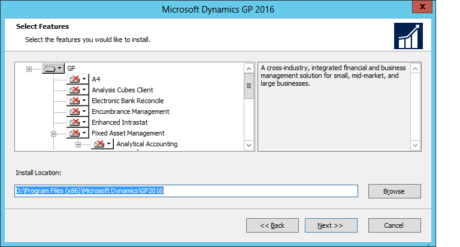
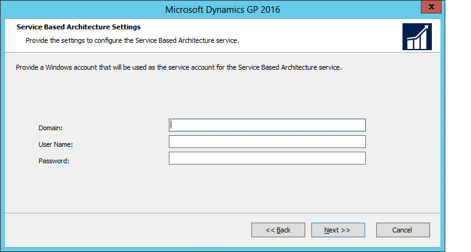

# Install Dynamics GP on the first client computer

Use the information in this chapter to install Dynamics GP on the first computer.  

## Installation overview

In a multiuser local area network environment, Dynamics GP applications are typically installed on a server, and then on each client. However, Dynamics GP is not required to be installed on the server. Each client will have access to data stored on the server. You can install your clients using the Dynamics GP media or using a client installation package. For more about creating an installation package for your clients, see [Creating an installation package](creating-an-installation-package.md).  

## Installing Dynamics GP (first computer)

Before beginning the installation, be sure you've completed the installation preparation steps listed in Part 1, Preparation, and that no other applications are running.

To install Dynamics GP (first computer):

1. Be sure that you're logged in to Windows as a user with system administrator privileges.

2. From the Dynamics GP installation media, double-click the Setup.exe file to open the Dynamics GP installation window.

3. If one or more of the following components isn't installed on your computer, the Dynamics GP Bootstrapper Setup window opens and you can choose to install the missing component or components.

    - Dexterity Shared Components 18.0

    - Microsoft Application Error Reporting 11.0

    - Microsoft Lync 2010 SDK Runtime

    - Microsoft SQL Server Native Client 11.0

    - Microsoft Windows Installer 4.6

    - Microsoft .NET Framework 3.5

    - Microsoft .NET Framework 4.5

    - Open XML SDK 2.0 for Microsoft Office

    - Visual C++ 2015 Runtime Libraries

    - Visual Basic for Applications Core

    After all the components are installed, you may need to restart your computer before continuing the installation of Dynamics GP.

4. Click Dynamics GP.

    The installation program verifies that your system has the minimum operating system required to run Dynamics GP. If your system does not meet requirements, the installation will not continue.

5. If you are installing Dynamics GP on a computer with an existing instance of Dynamics GP, select the Create new instance option, enter a name for the new instance, and then click Next.

6. In the Country/Region Selection window, select the primary country or region where you do business. Your selection affects which features are available to install. Some features are available only in selected countries or regions. Click Next.

7. Follow the instructions in the window to accept the software license agreement. To install Dynamics GP, you must accept this agreement and click Next.

8. In the Select Features window, select the features to install.

      

    When you click a button for a feature, a pop-up menu of options appears. Refer to the table for more information about each option.

    | Option   | What happens   |
    |---------|-------------|
    |  Run from My computer     | The selected feature will be installed on the local hard disk. (This option installs the feature, but not sub–features.) |  
    |  Run all from My computer | Will install the feature and all of its sub–features. |  
    |  Not available            | Will not install the selected feature or sub–features. |  

9. Specify the folder where you want the Dynamics GP files installed. The default folder is C:\\Program Files\\Microsoft Dynamics\\GP 2018. To select a different folder, click Browse.

    After you have specified the installation folder, click Next.

10. Provide the Windows account that will be used as the service account for the Service Based Architecture feature. This dialog is only displayed if you selected to install the Service Based Architecture feature on the Select Features dialog.

11. In the SQL Server window, you can set up an ODBC data source, enter the name you assigned to the SQL Server when you installed Microsoft SQL Server. A data source name called Dynamics GP also is created using SQL Native Client.

    If you don't want to set up an ODBC data source, mark the Do not create a data source option.

12. Select to use DYNAMICS as the system database name or enter a different name for the system database name.

    By entering a custom name for the system database, you can have multiple system databases on the same SQL Server instance. You cannot change the system database name in Dynamics GP Utilities.

    Click Next.

13. If you have selected to install the Service Based Architecture feature, provide the Windows account that will be used as the service account for the Service Based Architecture service.

      

    The Service Based Architecture feature will create a Windows service on the computer. The Windows account provided will be the identity used for this service.

14. In the Install Program window, click Install.

15. The Installation Progress window appears, where you can view the status of the installation.

16. In the Installation Complete window, click Exit.

17. Before you start Dynamics GP Utilities, check for and install current update for Dynamics GP. See [Product Release Downloads for Microsoft Dynamics GP](/dynamics/s-e/gp/mdgp2018_release_download_378) for the latest update information.

    > [!NOTE]
    > To start Dynamics GP Utilities, you must have appropriate user privileges. Typically, this means being part of the Administrators group or the Power Users group. If you are using an operating system that has User Account Control (UAC) enabled, you will be prompted to run the program as a user with administrative privileges. Refer to your operating system's documentation for more information.  

18. Start Dynamics GP Utilities. Choose Start &gt;&gt; All Programs &gt;&gt; Microsoft Dynamics &gt;&gt; GP 2018 R2&gt;&gt; GP Utilities.

19. Follow the instructions in [Using Dynamics GP Utilities](using-microsoft-dynamics-utilities.md). You can use the Dynamics GP Utilities windows to set up your account framework and the Dynamics GP system data tables, and to create your companies.

20. After using Dynamics GP Utilities, you can install additional features or components that add specialized functionality to your Dynamics GP system on the server computer. See [Installing additional components](installing-additional-components.md) for more information.  

## How to set up an ODBC Data Source on SQL Server for Microsoft Dynamics GP

To set up an ODBC data source connection for SQL Server by using the ODBC data sources, follow these steps:  

1. If the operating system is 32-bit follow these steps:

    a. Click Start, and then click Control Panel.  
    b. Double-click Administrative Tools, and then double-click Data Sources (ODBC).  

2. If the operating system is x64, follow these steps:
    a. Right-click Start and then click Explore.  
    b. Locate the following folder:  *C:\Windows\SysWOW64* 
    c. Right-click the Odbcad32.exe file and then click Create Shortcut.  
    d. Right-click the shortcut file, and then click Rename.  
    e. To rename the shortcut file, type Data Sources (ODBC) 32-bit.  
    f. Right-click the shortcut file, and then click Copy.  
    g. Expand My Computer, expand Control Panel, and then click Administrative Tools.  
    h. Paste the shortcut file in the Administrative Tools folder.  
    i. Close Windows Explorer.  
    j. Click Start, click Control Panel, double-click Administrative Tools, and then double-click Data Sources (ODBC) 32-bit.  

    > [!NOTE]
    > To clearly identify the names of the shortcut files of the ODBC data sources, rename the shortcut file of the x64 version Data Sources (ODBC) x64.

3. Click the System DSN tab, and then click Add to create a new ODBC data source.

4. Follow the appropriate step:  

    a. If the computer is running SQL Server 2000, select SQL Server, and then click Finish.  
    b. If the computer is running SQL Server 2008 or SQL Server 2005, select SQL Native Client or SQL Native Client 10.0, and then click Finish.

    > [!NOTE]
    > The ODBC DSN must be setup using the SQL Native Client or SQL Native Client 10.0 for Microsoft Dynamics GP 2010.

5. Provide an ODBC name and description. For **Server**, specify the SQL Server instance that Dynamics GP or Microsoft Business Solutions - Great Plains will connect. Then click Next.

    > [!NOTE]
    > For the information that is required in this step, specify the following parameters:
    >
    > **Name**: Specify the name that you want to use for the data source. This name is stored in the ODBC.ini file. If you use process servers, use the same name for the 32-bit ODBC Data Source for all client workstations.
    >
    > **Description**: Specify a description of the data source. This field is optional.
    >
    > **Server**: Specify the name that you assigned to the instance of SQL Server when you installed Microsoft SQL Server to run together with Microsoft Dynamics GP. Use either the server name or the IP address for all ODBC setup on each workstation.  Do not use the IP address on some workstations and the server name on others.

6. Click the **With SQL Server Authentication using a login ID and password entered by the user** option.

7. In the Connect to SQL Server to obtain default settings for the additional configuration options area, type the user name and password for the *sa* user.
Note: The *sa* user name and password are not required. However, we recommend that you use them. If the *sa* user name and password are entered, the credentials are not stored in the ODBC setup.

8. Click **Client Configuration**.  

    > [!NOTE]
    > The **Client Configuration** option is not available if you create an ODBC connection by using the SQL Native Client. If you are using the SQL Native Client or the SQL Native Client 10.0, proceed to Step 10.

9. In the **Network libraries** section, click TCP/IP. Verify that the instance of SQL Server that you are using for or Microsoft Dynamics GP or for Microsoft Business Solutions - Great Plains appears in the Server alias section and in the Server name section. Verify that the **Dynamically Determine Port** box is cleared, and then enter the appropriate port number. Click OK, and then click Next.

10. Clear all the options, and then click Next.

    > [!NOTE]
    > Do not change the default database even if you will use this ODBC for only one company.

11. Clear all the options, and then click Finish.

12. Verify all the information, and then click Test Data Source. If the connection tests successfully, click OK.

13. Click OK two times to exit the ODBC Data Source Administrator.

    > [!NOTE]
    > If the SQL Server Browser service is not running, you will receive the following error message when you try to test the ODBC connection:  
    > Connection failed:
    > SQLState: '08001'  
    > SQL Server Error: -1  
    > [Microsoft][SQL Native Client]SQL Network Interfaces: Error Locating Server/Instance Specified [xFFFFFFFF].  
    > 
    > Connection failed:  
    > SQLState: 'HYT00'  
    > SQL Server Error: 0  
    > [Microsoft][SQL Native Client]Login timeout expired  
    > Connection failed: SQLState: '08001'  
    > SQL Server Error: -1  
    > [Microsoft][SQL Native Client]An error has occurred while establishing a connection to the server. When connecting to SQL Server 2005, this failure may be caused by the fact that under the default settings SQL Server does not allow remote connections.  
    >
    > To resolve this issue, proceed to step 14 to start the SQL Browser Service.
14. To start the SQL Browser Service:

    1. Click Start, click Administrative Tools, and then click Services.  
    2. Right-click the SQL Server Browser service, and then click Start.  
