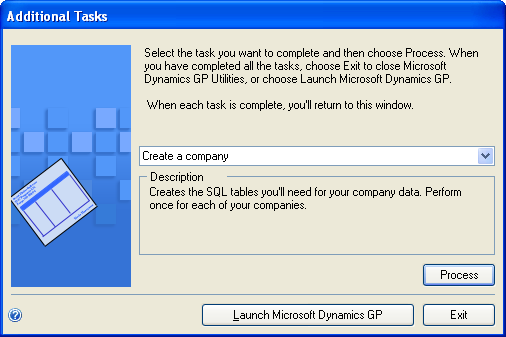

# Installing Dynamics GP on subsequent computers

Use the information in this chapter to install Dynamics GP on each client computer. You also use Dynamics GP Utilities to synchronize the Dynamics GP dictionary on each additional client with your account framework on the server.

## Installation overview

In a multiuser local area network environment, Dynamics GP applications are typically installed on a server, and then on each client. However, Dynamics GP is not required to be installed on the server. Each client will have access to data stored on the server. You can install clients using the Dynamics GP media or using a client installation package. For more about creating an installation package for your clients, see Chapter 11, “Creating an installation package.”

When you install Dynamics GP, the Distributed Process Server (DPS) and the Distributed Process Manager (DPM) are installed automatically. You can specify which computers in your system are process servers, and which tasks will be completed on those process servers. A process server is an application that allows users to direct the processing such as posting or printing checks and maintenance procedures to another computer on the network. The Distributed Process Manager is the application that tracks activity on all clients and process servers. See your System Administrator ’s Guide (Help &gt;&gt; Contents &gt;&gt; select System administration) for more information.

## Installing Dynamics GP on an additional computer

Use the information in this section to install a client in a multiuser system after you’ve installed Dynamics GP on the server or the first computer and created your first company.

To install Dynamics GP on an additional computer:

1. From the Dynamics GP installation media, double-click the Setup.exe file to open the Dynamics GP installation window.

2. Click Dynamics GP.

    The installation program verifies that your system has the minimum operating system required to run Dynamics GP. If your system does not meet requirements, the installation will not continue.

3. Select a new Dynamics GP instance and click Next

    If you are installing Dynamics GP on a computer with an existing instance of Dynamics GP, select Create a new instance and enter a name for the new instance. For more information, see [Multiple instances of Dynamics GP](#multiple-instances-of-dynamics-gp).

4. In the Select a Country/Region window, select the primary country or region where you do business. Click Next.

5. Follow the instructions in the window to accept the software license agreement.

    To install Dynamics GP, you must accept this agreement.

6. In the Select Features window, select the features to install.

| **Option**   | **What happens**  |
|--------------|-----------------|
|  Run from My computer     | The selected feature will be installed on the local hard disk. (This option installs the feature, but not sub–features.) |  
|  Run all from My computer | Will install the feature and all of its sub–features.                                                                    |  
|  Not available            | Will not install the selected feature or sub–features.                                                                   |  

When you click a button for a feature, a pop-up menu of options appears. Refer to the table for more information about each option.

7. Specify the folder where you want the Dynamics GP files installed. The default folder is C:\\Program Files\\Microsoft Dynamics\\GP. To select a different folder, click Browse.

    After you have specified the installation folder, click Next.

8. To set up an ODBC data source, enter the name you assigned to the SQL Server when you installed Microsoft SQL Server. A data source name called Dynamics GP also is created using SQL Native Client. If you don’t want to set up an ODBC data source, mark the Do not create a data source option.

9. Select the system database name. If you selected Enter custom name, enter the system database name.

    Click Next.

10. If you have selected to install the Service Based Architecture feature, provide the Windows account that will be used as the service account for the Service Based Architecture service.

    The Service Based Architecture feature will create a Windows service on the computer. The Windows account provided will be the identity used for this service.

11. In the Install Program window, click Install.

12. The Installation Progress window appears, where you can view the status of the installation.

13. In the Installation Complete window, click Finish.

14. Before you start Dynamics GP Utilities, check for and install current update for Dynamics GP. See [CustomerSource](https://go.microsoft.com/fwlink/?LinkId=249465) for the latest update information.

> [!NOTE]
> To start Dynamics GP Utilities, you must have appropriate user privileges. Typically, this means being part of the Administrators group or the Power Users group. If you are using an operating system that has User Account Control (UAC) enabled, you will be prompted to run the program as a user with administrative privileges. Refer to your operating system’s documentation for more information.  

15. Start Dynamics GP Utilities. Choose Start &gt;&gt; All Programs &gt;&gt; Microsoft Dynamics &gt;&gt; GP &gt;&gt; GP Utilities.

16. Follow the instructions in the Dynamics GP Utilities windows to synchronize your account framework. For more information, see [Synchronizing a client’s account framework](#synchronizing-a-clients-account-framework).

17. After using Dynamics GP Utilities, you can install additional component applications. For more information, see [Installing additional components](installing-additional-components.md).

## Synchronizing a client’s account framework

Synchronize the account framework of each client where you install Dynamics GP.

Dynamics GP Utilities uses the scripts and files installed previously to complete the client setup. In addition, you can use Dynamics GP Utilities to complete various maintenance procedures, now and on an ongoing basis.

> [!NOTE]
> To start Dynamics GP Utilities, you must have appropriate user privileges. Typically, this means being part of the Administrators group or the Power Users group. If you are using an operating system that has User Account Control (UAC) enabled, you will be prompted to run the program as a user with administrative privileges. Refer to your operating system’s documentation for more information.  

To synchronize a client’s account framework:

1. Start Dynamics GP Utilities.
(Start &gt;&gt; Programs &gt;&gt; Microsoft Dynamics &gt;&gt; GP &gt;&gt; GP Utilities)

2. In the Welcome to Dynamics GP Utilities window, verify your server name, and enter a user ID and password. Click Next.

  

3. In the Welcome To Dynamics GP Utilities window, click Next.

    The Dynamics GP dictionary is synchronized automatically with your account framework.

4. In the Additional Tasks window, you can choose to complete additional tasks, launch Dynamics GP, or end the installation. If you select any task, choose Process; otherwise, click Exit.

  

5. Repeat the client installation process for each computer you’ll use as a client or process server for Dynamics GP.

## Multiple instances of Dynamics GP

You can have multiple instances or installations of Dynamics GP on the same computer. Multiple instances are typically installed on client computers. You may want to use an additional instance of Dynamics GP for testing purposes.

When you install Dynamics GP on a computer with an existing instance of Dynamics GP, you’ll enter a name for the new instance during the installation process. Each instance will be displayed in the Add or Remove Programs control panel. For example, if you entered TEST as an instance name, Dynamics GP (TEST) will be displayed in the Add or Remove Programs control panel. The instance also will appear in the program group for Microsoft Dynamics and in the folder where Microsoft Dynamics is installed. The default folder location is C:\\Program Files\\Microsoft Dynamics\\GP$TEST. The first instance of Dynamics GP on a computer is considered the default instance. The default instance of Dynamics GP isn’t assigned an instance name.
