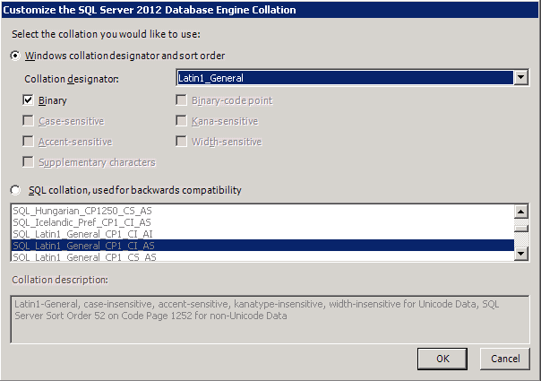
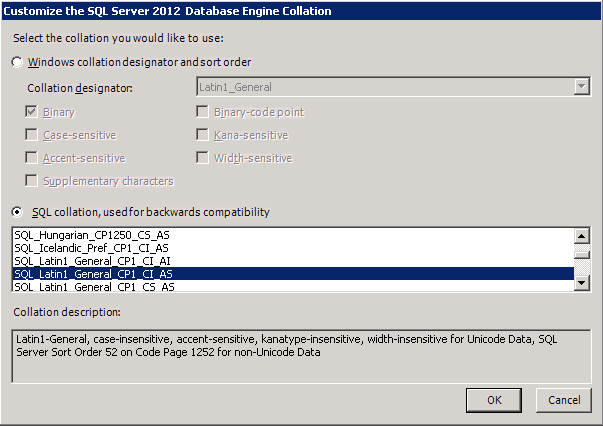

# Microsoft SQL Server configuration

### 

This chapter guides you through the Microsoft SQL Server 2012 and the Microsoft SQL Server 2012 Express Installation and setup process for [!INCLUDE[prodshort](../includes/prodshort.md)]. It’s important that you install and set up Microsoft SQL Server according to these instructions.

If you’ve already installed and set up SQL Server using different options, you may have to change those options. Changing options after they’ve been set sometimes involves reinstalling SQL Server.

This chapter contains the following sections:

-   [SAN and NAS disk support](#san-and-nas-disk-support)  

-   [Selecting a SQL Server collation](#selecting-a-sql-server-collation)  

-   [Understanding sorting options](#understanding-sorting-options)  

-   [Installing Microsoft SQL Server 2012](#installing-microsoft-sql-server-2012)  

-   [Installing Microsoft SQL Server 2012 Express Edition](#installing-microsoft-sql-server-2012-express-edition)  

-   [Setting up an ODBC data source using the SQL Native Client driver](#setting-up-an-odbc-data-source-using-the-sql-native-client-driver)  

-   [SQL Server Agent](#sql-server-agent)  

-   [Enabling Delete PJournal job](#enabling-delete-pjournal-job)  

## SAN and NAS disk support

Because [!INCLUDE[prodshort](../includes/prodshort.md)] relies on SQL Server to maintain databases and make databases available, there are guidelines you must follow when configuring SQL Server disk support.

We recommend that you use a Storage Area Network (SAN) or locally attached disk to store your Microsoft SQL Server database files because this configuration optimizes SQL Server performance. By default, use of network database files stored on a networked server or Network Attached Storage (NAS) is not enabled for SQL Server. However, you can configure SQL Server to store a database on a networked server or NAS storage server. Servers used for this purpose must meet SQL Server requirements for data write ordering and write-through guarantees.

If you are using Microsoft SQL Server Express Edition, SAN and NAS disk support isn’t typically used.

For more information, see Microsoft Knowledge Base article, “Description of support for network database files in SQL Server,” (go to <https://support.microsoft.com> and search for the article) or contact the SQL Server Support Team.

## Selecting a SQL Server collation

A SQL Server collation—a set of rules that determines how character data is sorted and compared—includes character set, sort order, and locale-specific settings. See your SQL Server 2012 documentation for more information about collation settings.

The SQL Server collation you select determines how information is presented in response to SQL queries and affects the performance of the system.

The code page for character data is defined by the Windows locale selected when the operating system was installed. The code page contains the valid set of characters in your SQL Server database. A character set consists of 256 uppercase and lowercase letters, numbers, and symbols. The first 128 characters are the same for all character sets. The supported character set in the United States is the 1252/ ISO character set.

It is important to select the correct collation for [!INCLUDE[prodshort](../includes/prodshort.md)] when you’re installing SQL Server. Using SQL Server collations that include Binary (sort order 50) or Dictionary Order, Case-Insensitive (sort order 52) sorting is required for [!INCLUDE[prodshort](../includes/prodshort.md)]. To change these settings later, you must reinstall SQL Server and [!INCLUDE[prodshort](../includes/prodshort.md)].

You should check the compatibility of all the products you have that will use SQL Server before deciding on the collation option.  

## Understanding sorting options

Using SQL Server collations that include Binary (sort order 50) or Dictionary Order, Case-Insensitive (sort order 52) sorting is required.

Binary sort order assigns characters numeric values of 0 through 255. Dictionary Order, Case-Insensitive (DOCI) sort order makes no distinction between uppercase and lowercase characters. DOCI is the most common sort order.

The following table shows the differences between Dictionary Order, Case- Insensitive and Binary.

| Sort order                          | Technical name                    | Sorting result               |
|-------------------------------------|-----------------------------------|------------------------------|
| Dictionary Order, Case- Insensitive | SQL\_Latin1\_General\_CP1\_CI\_AS | McMaster MMCompanyName Zebra |
| Binary                              | Latin1\_General                   | MMCompanyName   Zebra                         |

## Installing Microsoft SQL Server 2012

We recommend that you follow the instructions in this section if you have not yet installed Microsoft SQL Server 2012. For information about upgrading SQL Server, see the SQL Server installation documentation. (In the window that appears when you insert the SQL Server DVD, select Browse Setup/Upgrade Help.)

With SQL Server 2012, you can have multiple instances of SQL Server on the same physical server. We recommend that you have a dedicated a server. See your SQL Server 2012 documentation for more information about multiple instances.  

To install Microsoft SQL Server 2012:

1. Insert the SQL Server 2012 installation media. The main SQL Server installation screen should appear. If you do not see this screen, browse the media and double-click the Setup.exe file.

2. After the SQL Server Installation Center appears, click Installation in the left pane. Then, click New SQL Server stand-alone installation or add features to an existing installation.

3. Your computer is scanned for conditions that may stop installation. To proceed with the installation, click OK in the Setup Support Rules window.

4. In the Product Key window, enter the product key. Click Next.

5. Mark the option to accept the terms of the license terms and then click Next.

6. SQL Server setup files are installed on your computer. To proceed with the installation, click Next in the Setup Support Rules window.

7. In the Setup Role window, select SQL Server Feature Installation, and click Next.

8. In the Feature Selection window, select the features you want to use and specify the location to install SQL Server 2012. You should install at least the following features to use [!INCLUDE[prodshort](../includes/prodshort.md)].

    -   Database Engine Services

    -   Client Tools Connectivity

    -   Client Tools Backwards Compatibility

    -   Documentation Components

    -   Management Tools – Basic

Select Reporting Services – Native or Reporting Services – SharePoint to use SQL Server Reporting Services reports, display SQL Server Reporting Services metrics on your home page in [!INCLUDE[prodshort](../includes/prodshort.md)], and display SQL Server Reporting Services reports in Microsoft Dynamics Business Analyzer. If you have marked Reporting Services – SharePoint, be sure to mark Reporting Services Add-in for SharePoint Products as well. For more information about installing and setting up SQL Server Reporting Services for use with [!INCLUDE[prodshort](../includes/prodshort.md)] see the Documentation and resources for [!INCLUDE[prodshort](../includes/prodshort.md)] 2018 Web site (<https://go.microsoft.com/fwlink/?LinkId=249465>) for the most current documentation.  

Click Next.

9. Your computer is scanned again for conditions that may stop installation. To proceed with the installation, click Next in the Installation Rules window.

10. In the Instance Configuration window, select a default or named instance for your installation.

    -   To install a new default instance (the primary instance on the computer), select Default instance and click Next. There can be only one default instance.

    -   To install a named instance, select Named instance and then enter a unique instance name. Click Next.

    -   If a default or named instance is already installed, select the existing instance for your installation and click Next. The instance upgrades and you will have the option to install additional components.

    For information about using instances of SQL Server, see your SQL Server documentation. We recommend that you have a dedicated server.

11. The required disk space is calculated. Click Next.

12. In the Services Accounts tab, we recommend that you use the same account for each service and automatically start services.

13. In the Collation tab, click the Customize button for the Database Engine.

14. In the Customize the SQL Server 2012 Database Engine Collation window, you can select Binary or Dictionary Order, Case-Insensitive as the sorting option. See Selecting a SQL Server collation on page 17 for more information about collation options.

You should check the compatibility of all the products, such as Business Portal for [!INCLUDE[prodshort](../includes/prodshort.md)] and Workflow, you have that will use SQL Server before deciding on the collation option.  

**Binary**   To use Binary sorting, use the Windows Collation designator and sort order option and make the following selections in the window.

  

**Dictionary Order, Case-Insensitive**   To use Dictionary Order, Case- Insensitive sorting, choose SQL collation, used for backwards compatibility option and make the following selections in the window.

  

Click OK after you make your selections, and then click Next.

15. In the Database Engine Configuration window, select Mixed Mode as the authentication mode in the Server Configuration tab. Mixed Mode is required by [!INCLUDE[prodshort](../includes/prodshort.md)].

    With Mixed Mode, users can connect using Windows Authentication or SQL Server Authentication. You must enter and confirm the system administrator password when you select Mixed Mode. You’ll use this is the password to log in to [!INCLUDE[prodshort](../includes/prodshort.md)] Utilities as the system administrator.

    You must specify at least one system administrator. To add the account, click Add Current User to add accounts to the list of system administrators.

    Click Next.

16. If you selected to install Reporting Services, use the Reporting Services Configuration page to specify the type of Reporting Services installation to create. Click Next.

17. In the Error Reporting window, select to allow error reporting. Click Next.

18. Your computer is scanned again for conditions that may stop installation. To proceed with the installation, click Next in the Installation Configuration Rules window.

19. In the Ready to Install window, review the list of components that will be installed and click Install.

20. The Installation Progress window appears, allowing you to view the status of the installation. Click Next after the installation is completed.

21. In the Complete window, click Close to exit the installation wizard.

22. Restart the computer if you are instructed to do so.

23. Install the current SQL Server 2012 service pack. See the Microsoft Download Center (<http://www.microsoft.com/downloads/en/default.aspx>) for the latest service pack information.

## Installing Microsoft SQL Server 2012 Express Edition

Microsoft SQL Server 2012 Express Edition has a maximum database size of 10 GB. You can download Microsoft SQL Server 2012 Express from www.microsoft.com. Be sure to download SQL Server 2012 Express with data management tools. You can download SQL Server 2012 Books Online for SQL Server Express from www.microsoft.com.

Use the information in this section to install Microsoft SQL Server 2012 Express on your computer.

To install Microsoft SQL Server 2012 Express Edition:

1. Download SQL Server 2012 Express with data management tools.

2. A dialog window appears, showing the progress of the files being extracted.

3. After the files have been extracted, the SQL Server Installation Center appears.

4. Click New installation or add features to an existing installation.

5. Mark the option to accept the terms of the License Agreement and then click Next.

6. The Setup Support Rules window appears while your computer is scanned again for conditions that may stop installation.

7. In the Feature Selection window, select the features you want to use and specify the location to install SQL Server 2012 Express. Click Next.

8. In the Instance Configuration window, select a default or named instance for your installation.

    -   To install a new default instance (the primary instance on the computer), select Default instance and click Next. There can be only one default instance.

    -   To install a named instance, select Named instance and then enter a unique instance name. Click Next.

    -   If a default or named instance is already installed, select the existing instance for your installation and click Next. The instance upgrades and you will have the option to install additional components.

    For information about using instances of SQL Server, see your SQL Server documentation. We recommend that you have a dedicated server.

9. In the Services Accounts tab, we recommend that you use the same account for each service and automatically start services. Click Use the same account for all SQL Service services to open a window where you can enter a user name and password. Click OK to return to the Server Configuration window.

10. In the Account Provisioning tab, select Mixed Mode as the authentication mode. Mixed Mode is required by [!INCLUDE[prodshort](../includes/prodshort.md)].

    With Mixed Mode, users can connect using Windows Authentication or SQL Server Authentication. You must enter and confirm the system administrator password when you select Mixed Mode. You’ll use this is the password to log in to [!INCLUDE[prodshort](../includes/prodshort.md)] Utilities as the system administrator.

    You must specify at least one system administrator. To add the account, click Add Current User to add accounts to the list of system administrators.

    Click Next.

11. In the Error Reporting window, select to allow error reporting. Click Next.

12. The Installation Progress page appears, allowing you to view the status of the installation.

13. In the Complete window, click Close to exit the installation wizard.

14. Restart the computer if you are instructed to do so.

15. Install the current SQL Server 2012 Express service pack. See the Microsoft Download Center (<http://www.microsoft.com/downloads/en/default.aspx>) for the latest service pack information.

## Setting up an ODBC data source using the SQL Native Client driver

You must set up a 32-bit Open Database Connectivity (ODBC) data source using SQL Native Client or SQL Native Client 10 on your computer. If you are using SQL Server 2012, you must set up a 32-bit Open Database Connectivity (ODBC) data source using SQL Native Client or SQL Native Client 11 on your computer. Use these instructions to enter the appropriate setup information for ODBC for SQL Server.

If you are using a 64-bit operating system, you must set up a 32-bit ODBC data source. For instructions on how to set up a data source for a 64-bit operating system, see Microsoft Knowledge Base article, “How to set up an ODBC Data Source on SQL Server for [!INCLUDE[prodshort](../includes/prodshort.md)],” (<https://mbs.microsoft.com/knowledgebase/KBDisplay.aspx?scid=kb;en-us;870416>).

To set up an ODBC data source using the SQL Native Client driver:

1. Open the ODBC Data Source Administrator window.

2. Select the System DSN tab and choose Add.

3. In the Create New Data Source window, select SQL Native Client, SQL Native Client 10.0, or SQL Native Client 11.0 from the list and choose Finish.

    The options in the list depend on the version of SQL Server you are using.

4. In the first Create a New Data Source to SQL Server window, enter the following information.

| Field       | Value                                                                                     |
|-------------|-------------------------------------------------------------------------------------------|
| Name        | Enter the name to use for the data source. This name will be stored in the Odbc.ini file. |
| Description | Enter a description of the data source.                                                   |
| Server      | Enter the name you assigned to the SQL Server when you installed Microsoft SQL Server.    |

Choose Next.

In the second Create a New Data Source to SQL Server window, select With SQL Server authentication using a login ID and password entered by the user option as how to verify the login ID.

6. Enter sa as the login ID and enter a password. Choose Next.

7. In the third Create a New Data Source to SQL Server window, be sure that all the options are unmarked and choose Next.

8. In the fourth Create a New Data Source to SQL Server window, be sure that all the options are unmarked. Choose Finish.

9. In the ODBC Microsoft SQL Server Setup window, verify your settings and choose OK. You can also choose the Test Data Source button to test it before choosing OK.

## SQL Server Agent

When you install [!INCLUDE[prodshort](../includes/prodshort.md)] on the server, an automated database maintenance job is created. SQL Server Agent is used to run automated jobs.

Be sure that the SQL Server Agent service is set up to start automatically with the operating system if you are using Microsoft SQL Server. In SQL Server Service Manager, select SQL Server Agent from the list of services and mark the Auto-start service when OS starts option.

Jobs are customizable, and you can select how frequently they should be completed. You may want certain jobs to run every half hour, while others should run once at night. For more information on scheduling jobs, refer to Microsoft SQL Server Books Online.

SQL Server Agent is not available for SQL Server Express. For information about how to schedule backups for SQL Server Express, see Microsoft Knowledge Base article, “How to schedule and automate backups of SQL Server databases in SQL Server Express” (<http://support.microsoft.com/kb/2019698/en-us>).

Microsoft SQL Server 2008 Express doesn’t include SQL Server Agent. Refer to Support Hot Topic on CustomerSource <https://mbs.microsoft.com/customersource> for more information about scheduling a backup.

## Enabling Delete PJournal job

The Delete PJournal job is created during the installation of [!INCLUDE[prodshort](../includes/prodshort.md)]. By enabling the Delete PJournal job, the speed of the posting process is increased.

To enable Delete PJournal job using SQL Server

Management Studio:

1. Open SQL Server Management Studio by choosing Start &gt;&gt; Programs &gt;&gt; Microsoft SQL Server &gt;&gt; SQL Server Management Studio.

2. Log in to Microsoft SQL Server.

3. Expand SQL Server Agent, and click Jobs.

    If you are using SQL Server 2012, expand Jobs.

4. Right-click on Remove Posted PJournals for your company database and click Properties to open the Properties window.

5. Unmark and mark the Enable option.

6. Click Apply and then click OK.
