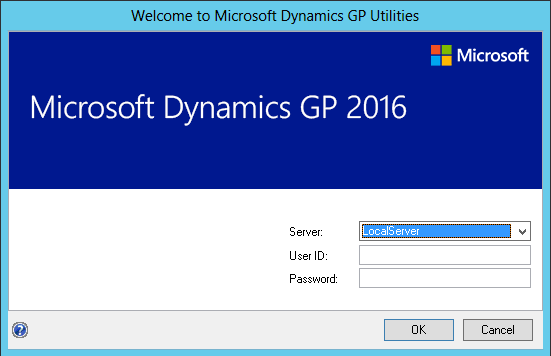
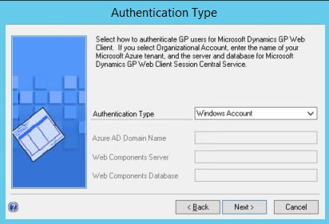
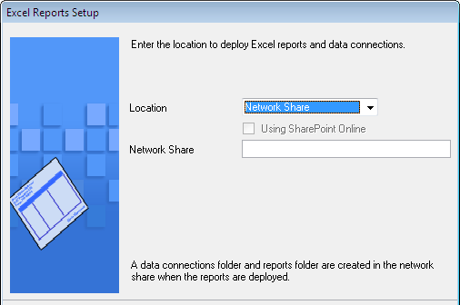
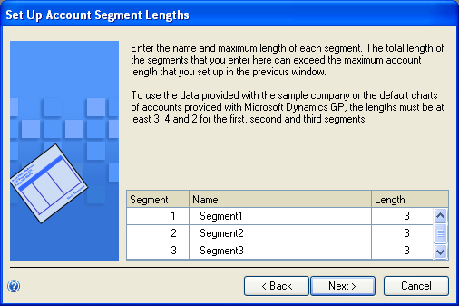
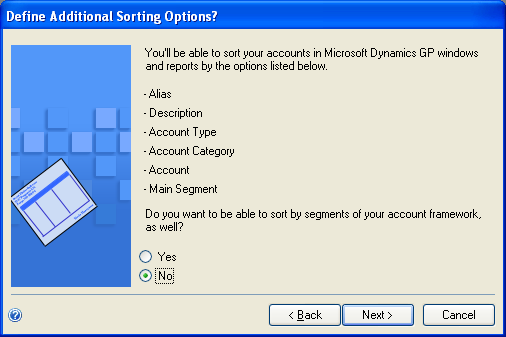
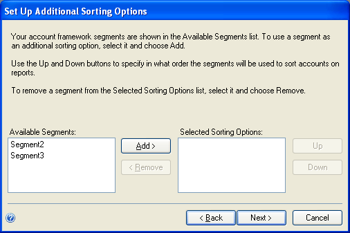
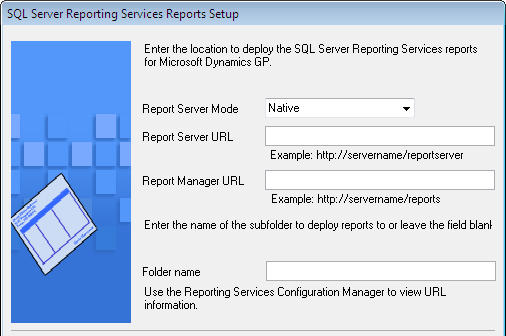

# Using Microsoft Dynamics Utilities

After you've installed Dynamics GP, you need to complete a number of additional configuration procedures. To do this, you'll use an application called [!INCLUDE[gputilities](../includes/gputilities.md)].

> [!NOTE]  
> One of the most important—and difficult to change later—configuration tasks is setting up an account framework. So before you start using the [!INCLUDE[gputilities](../includes/gputilities.md)], see [Account framework](account-framework.md).

## [!INCLUDE[gputilities](../includes/gputilities.md)] overview

You'll use [!INCLUDE[gputilities](../includes/gputilities.md)] to complete the following tasks after you've installed software and data on a server computer.

- Select whether to use default or custom settings to configure the system database.

- Create SQL Server databases for Dynamics GP.

- Deploy predefined SQL Server Reporting Services reports that are included in Dynamics GP.

- Deploy predefined Microsoft Excel reports that are included in Dynamics GP.

- Create your account framework and synchronize the Dynamics GP dictionary, if you are providing custom settings.

- Select a default account framework and synchronize the Dynamics GP dictionary, if you decide to use default settings.

- Define account sorting options, if you are providing custom settings.

- Enter the password for the DYNSA user.

- Set up the system password, which controls access to system management functions in Dynamics GP, if you are providing custom settings.

- Synchronize sample data with your account framework, if you installed the sample company.

- Remove SOP and Invoicing message. This lets you removes a message that appears every time you enter a transaction in Sales Order Processing or Invoicing, if both modules are registered.

- Create a SQLServer login for Dynamics GP Web Client

- Select the authentication type for the Dynamics GP Web Client.

- Create additional companies, as needed.

## Installation options in Dynamics Utilities

When using [!INCLUDE[gputilities](../includes/gputilities.md)], you can select an installation option to use default settings or to provide your own custom settings. If you select the Basic option, the default settings for the system database, the account framework, and system password are provided. If you select the Advanced option, you'll provide the settings to create the database, the account framework, and system password.

The following table compares the default settings of the Basic option with the custom settings of the Advanced option.

| Setting           | Basic installation   | Advanced installation   |
|-------------------|-----------------|----------------------------------|
| System database   | The system database files are created at the default locations defined in the SQL Server. A typical default location is \\Program Files\\Microsoft SQL Server\\MSSQL\\dat.|You can specify the locations where the system database files are created in SQL Server. |
| Account framework | The following account framework is created for you.  Maximum number of segments: 5   Maximum Account Length: 45  Length of each segment: 9   Sorting Options: No sorting options by segment   Account preview: xxxxxxxxx-xxxxxxxxx-xxxxxxxxx-xxxxxxxxx-xxxxxxxxx   | You can design your account framework by entering the maximum for the account length, the number of account segments, and the length of each segment. You also can select sorting options. For more information about designing an account framework, see [Account framework](account-framework.md). |
| System password   | The system password is blank. This means that all users will have access to system-wide setup information. You can enter this password in Dynamics GP. | You can enter a password for system-wide setup information. |

## Preparing Dynamics GP for use with default settings

Use [!INCLUDE[gputilities](../includes/gputilities.md)] to prepare Dynamics GP for use. Complete this procedure when you install Dynamics GP for the first time. You need to do this only once.

With this procedure, you'll select the Basic option in the Installation Options window to use default settings for the system database, account framework, and system password. For more information about the Basic option, see the **Installation options** section.

Before you use [!INCLUDE[gputilities](../includes/gputilities.md)], check for and install the most current update for Dynamics GP. See [Product Release Downloads for Microsoft Dynamics GP ](/dynamics/s-e/gp/mdgp2018_release_download_378) for the latest update information. After installing the update, start [!INCLUDE[gputilities](../includes/gputilities.md)].

To prepare Dynamics GP for use with default settings:

1. Start [!INCLUDE[gputilities](../includes/gputilities.md)].
(Start &gt;&gt; All Programs &gt;&gt; Microsoft Dynamics &gt;&gt; GP 2018 &gt;&gt; GP Utilities)

      

2. In the Welcome to [!INCLUDE[gputilities](../includes/gputilities.md)] window, verify your server name, and enter a system administrator user ID and password; then click OK.

    > [!NOTE]  
    > You must be logged in as a system administrator to complete database and system functions within [!INCLUDE[gputilities](../includes/gputilities.md)].  

3. The Welcome To [!INCLUDE[gputilities](../includes/gputilities.md)] window opens when you are logged into the server you selected. Read the message and click Next.

4. The Installation Options window appears. Mark Basic and then click Next.

5. If the DYNSA user doesn't have a password, the Enter DYNSA User Password window opens. Use this window to enter the password for the DYNSA user. The DYNSA user is the database owner and can perform tasks, such as table maintenance procedures. If you have multiple Dynamics GP system databases on the same SQL Server instance, the DYNSA user is the database owner for all of the system databases. This password is case-sensitive.

      

    Click Next.

6. In the Web Client SQL Server Login window, you can create a SQL Server login for Dynamics GP Web Client. The Web Client SQL Server login is used for the connection to the SQL Server when a Dynamics GP user has been configured with a Windows login.

      

    Mark the Using web client option if you are creating a SQL Server login for the Dynamics GP Web Client. Enter an existing SQL Server login or enter a new login. Then, enter a password and confirm your password. Click Next.

    Unmark the Using web client option if you are not creating a login for the Dynamics GP Web Client. Click Next.

7. Select the authentication type for the Dynamics GP web client. Accept the default Windows Account setting if GP users will be logging into the web client using their Windows domain credentials. Select Organizational Account if GP users will be logging into the web client using their organizational account credentials.

      

    When selecting Organizational Account, additional settings will be required complete the setup. Provide the Microsoft Entra domain name for the user accounts. An example is *contoso.onmicrosoft.com*. Provide the name of the SQL Server where the web components database is stored and the name of the web components database.

8. In the Confirmation window, click Finish.

    [!INCLUDE[gputilities](../includes/gputilities.md)] installs databases, installs initial module setup information, and sets up Dynamics GP menus. These procedures may take several minutes to complete. The Server Installation Progress window describes the processes as they are completed.

9. In the Business Intelligence Reports Setup window, select the business intelligence components to deploy. Click Next. The window that opens depends on the components you selected.

      

    If you don't want to deploy business intelligence components, leave the components unmarked and click Next. The Additional Tasks window will reappear. Skip to step 11.

10. The SQL Server Reporting Services Reports Setup window appears if you marked to deploy Reporting Services reports.

      

    After selecting your report server mode, enter the locations to deploy the reports to.

    Native mode location example.

    | Location           | Example                                |
    |--------------------|----------------------------------------|
    | Report Server URL  | https://&lt;servername&gt;/ReportServer |
    | Report Manager URL | https://&lt;servername&gt;/Reports      |

    SharePoint Integrated mode location example.
   
    | Location              | Example        |
    |-----------------------|----------------|
    | SharePoint Site       |                |
    | Report Library        | ReportsLibrary |

    >[!NOTE]  
    > Make sure that your locations don't end with a slash. You can use the Reporting Services Configuration Manager to verify the Report Server Mode being used and the URL locations.  

11. If you have selected Native as the report server mode, you can enter the name of the folder to deploy the reports to. By using a folder, you can deploy Reporting Services reports for multiple Dynamics GP instances to a single Microsoft SQL Server Reporting Server. The default folder name is the name of the system database. If DYNAMICS is the system database name, the Folder Name field is blank. After deploying reports to the folder, you must to provide access to the folder.

12. Click Next.

    >[!NOTE]  
    > If you don't have the appropriate permissions to deploy reports, a window opens where you can enter a domain\\user name and the password you use to log in to Microsoft Windows.  

      The Excel Reports Setup window appears if you marked to deploy Microsoft Excel reports.

      

    Select the location to deploy the reports to. Network share location example:

    | Location              | Example           |
    |---------------|---------------------------|
    | Network share | \\\\Servername\\sharename |

    If you have selected SharePoint as the location to deploy reports to, you can mark the Using SharePoint Online option if you are using Microsoft 365 and want to deploy Excel reports to a reports library in SharePoint Online 2010. Mark the Using SharePoint Online option to deploy reports only in the Dynamics GP desktop client. Reports will not be deployed for the Dynamics GP Web Client.

    SharePoint location example:

    | Location          | Example               |
    |--------------------------|----------------|
    | Data Connections Library |                |
    | Report Library           | ReportsLibrary |

    Make sure that you use backwards slashes when you are entering the location for reports even if you are using a UNC path. You should also be sure that the location doesn't end in a slash.

    > [!NOTE]  
    > If you don't have the appropriate permissions to deploy reports, a window opens where you can enter a domain\\user name and the password you use to log in to Microsoft Windows.  

13. In the Additional Tasks window, you can choose to perform additional procedures, start Dynamics GP, or end the installation. If you select any task, click Process; otherwise, click Exit.

For more information, see [Additional installation tasks](#additional-installation-tasks).

## Preparing Dynamics GP for use with custom settings

Use [!INCLUDE[gputilities](../includes/gputilities.md)] to prepare Dynamics GP for use. Complete this procedure when you install Dynamics GP for the first time. You need to do this only once.

With this procedure, you'll select the Advanced option in the Installation Options window to use custom settings for the system database, account framework, and system password. For more information about the Advanced option, see the **Installation options** section.

Before you use [!INCLUDE[gputilities](../includes/gputilities.md)], check for and install the most current update for Dynamics GP. See [Product Release Downloads for Microsoft Dynamics GP](/dynamics/s-e/gp/mdgp2018_release_download_378) for the latest update information. After installing the update, start [!INCLUDE[gputilities](../includes/gputilities.md)].

To prepare Dynamics GP for use with custom settings:

1. Start [!INCLUDE[gputilities](../includes/gputilities.md)].
(Start &gt;&gt; Programs &gt;&gt; Microsoft Dynamics &gt;&gt; GP &gt;&gt; GP Utilities)

2. In the Welcome to [!INCLUDE[gputilities](../includes/gputilities.md)] window, verify your server name, and enter a system administrator user ID and password; then click OK.

      

    > [!NOTE]
    > You must be logged in as a system administrator to complete database and system functions within [!INCLUDE[gputilities](../includes/gputilities.md)].  

3. The Welcome To [!INCLUDE[gputilities](../includes/gputilities.md)] window opens when you are logged into the server you selected. Read the message and click Next.

4. The Installation Options window appears. Mark Advanced and then click Next.

5. In the Database Setup window, enter the location to create the data and log devices (files). For more information about disk and RAID configuration, see <https://go.microsoft.com/fwlink/?LinkId=263763>. Click Next.

  

6. In the Set Up Account Framework window, enter a framework for the accounts for all Dynamics GP companies, as well as all companies you may set up in the future.

  

Enter the maximum account length (up to 66 characters) and the maximum number of segments (up to 10) that you'll need for the charts of accounts in companies you set up now or in the future. Maximums you enter now will apply to all companies you plan to set up.

For more information, see [Planning your account framework](account-framework.md).

7. In the Set Up Account Segment Lengths window, enter a name for each segment of the account, as well as the maximum length you'll use for each segment in the charts of accounts for your companies.

  

You should use descriptive names that clearly indicate how each segment will be used. These segment names will appear as the default segment names when you set up the account format for each company; you can change the names later, if necessary.

The length of each segment can be no longer than 66 characters. Maximums you enter now will apply to companies you set up later.

> [!NOTE]
> If you have more than one company, you may need to enter maximum segment lengths that exceed the 66-character account length maximum when the segment lengths are added together. The total size must be 82 or less. For more information, see [Choosing account framework storage size](account-framework.md).  

8. Select sorting options in the Define Additional Sorting Options window. This window displays the predefined sorting options available in Dynamics GP to sort account information in windows and on reports.

  

- If the displayed sorting options include the ways you'll need to sort account information, leave the No option marked and click Next, then continue to step 10.

- To select segments of your account framework to sort by, as well, mark Yes, then click Next. The Set Up Additional Sorting Options window appears. Continue to step 9.

  

9. If you selected Yes in step 8, select each account segment you want to use as a sorting option and click Add. You can define up to nine additional sorting options.

    If you select more than one segment, use the Up and Down buttons to specify in what order the segments will be used to sort account information. Sorting options are used to control the way accounts are displayed in Dynamics GP windows, in all your companies.

10. When you've finished selecting segments, click Next to verify your account framework in the Verify Account Framework window.

> [!NOTE]
> To make corrections if necessary, click Back until the appropriate window is displayed, then click Next in each window until the Verify Account Framework window is displayed again.  

A report file called Acctfram.txt is created in the Data folder inside of the GP folder, which contains the same account framework information. This file, which is created only on the first client, stores account framework information for your reference. Be sure to make a backup of the Acctfram.txt file.

11. If the DYNSA user doesn't have a password, the Enter DYNSA User Password window opens. Use this window to enter the password for the DYNSA user. The DYNSA user is the database owner and can perform tasks, such as table maintenance procedures. If you have multiple Dynamics GP system databases on the same SQL Server instance, the DYNSA user is the database owner for all of the system databases. This password is case-sensitive.

      

12. In the Web Client SQL Server Login window, you can create a SQL Server login for Dynamics GP Web Client. The Web Client SQL Server login is used for the connection to the SQL Server when a Dynamics GP user has been configured with a Windows login.

     

    Mark the Using web client option if you are creating a SQL Server login for the Dynamics GP Web Client. Enter an existing SQL Server login or enter a new login. Then, enter a password and confirm your password. Click Next.

    Unmark the Using web client option if you are not creating a login for the Dynamics GP Web Client. Click Next.

13. Select the authentication type for the Dynamics GP web client. Accept the default Windows Account setting if GP users will be logging into the web client using their Windows domain credentials. Select Organizational Account if GP users will be logging into the web client using their organizational account credentials.

      

    When selecting Organizational Account, additional settings will be required complete the setup. Provide the Microsoft Entra domain name for the user accounts. An example is contoso.onmicrosoft.com. Provide the name of the SQL Server where the web components database is stored and the name of the web components database.

14. In the Enter System Password window, enter the password to use to access Dynamics GP system windows, reports, and utilities. This password is case-sensitive and will be used for control functions, such as user security.

      

15. In the Confirmation window, click Next.

    [!INCLUDE[gputilities](../includes/gputilities.md)] installs databases, installs initial module setup information, and sets up Dynamics GP menus. These procedures may take several minutes to complete. The Server Installation Progress window describes the processes as they are completed.

16. In the Business Intelligence Reports Setup window, select the business intelligence components to deploy. Click Next. The window that opens depends on the components you selected.

      

    If you don't want to deploy business intelligence components, leave the components unmarked and click Next. The Additional Tasks window will reappear. Skip to step 19.

17. The SQL Server Reporting Services Reports Setup window appears if you marked to deploy Reporting Services reports.

      

    After selecting your report server mode, enter the locations to deploy the reports to.

    Native mode location example:

    | Location           | Example                                |
    |--------------------|----------------------------------------|
    | Report Server URL  | https://&lt;servername&gt;/ReportServer |
    | Report Manager URL | https://&lt;servername&gt;/Reports      |

    SharePoint Integrated mode location example.

    | Location              | Example        |
    |-----------------------|----------------|
    | Location              | Example        |
    | SharePoint Site       |                |
    | Report Library        | ReportsLibrary |

18. If you have selected Native as the report server mode, you can enter the name of the folder to deploy the reports to. By using a folder, you can deploy Reporting Services reports for multiple Dynamics GP instances to a single Microsoft SQL Server Reporting Server. The default folder name is the name of the system database. If DYNAMICS is the system database name, the Folder Name field is blank. After deploying reports to the folder, you must to provide access to the folder.

19. Click Next.

    > [!NOTE]  
    > If you don't have the appropriate permissions to deploy reports, a window opens where you can enter a domain\\user name and the password you use to log in to Microsoft Windows.  

20. The Excel Reports Setup window appears if you marked to deploy Excel reports.

      

21. Select the location to deploy the reports to.

    Network share location example:

    | Location      | Example                   |
    |---------------|---------------------------|
    | Network share | \\\\Servername\\sharename |

    SharePoint location example:

    | Location                 | Example        |
    |--------------------------|----------------|
    | Data Connections Library |                |
    | Report Library           | ReportsLibrary |

    Click Next.

    > [!NOTE]  
    > If you don't have the appropriate permissions to deploy reports, a window opens where you can enter a domain\\user name and the password you use to log in to Microsoft Windows.  

22. In the Additional Tasks window, you can choose to perform additional procedures, start Dynamics GP, or end the installation. If you select any task, click Process; otherwise, click Exit.

    For more information, see [Additional installation tasks](#additional-installation-tasks).

## Additional installation tasks

The Additional Tasks window in [!INCLUDE[gputilities](../includes/gputilities.md)] contains the following selections:

- Add sample company data

- Create a company

- Remove SOP and Invoicing message

- Update modified forms and reports

- Synchronize forms and reports dictionaries

- Manage Web Client SQL Server login

- Manage user authentication

The Update modified forms and reports option is used when upgrading from a previous release; it isn't used when you initially install Dynamics GP. The Synchronize forms and report dictionaries option can be used at anytime when you want to synchronize your forms and reports to your account framework.

Start [!INCLUDE[gputilities](../includes/gputilities.md)] if you haven't already and follow the instructions in the [!INCLUDE[gputilities](../includes/gputilities.md)] windows until you open the Additional Tasks window. The following procedures assume that the Additional Tasks window is open.

## Adding sample company data

You can add data for the sample company, Fabrikam, Inc., to your Dynamics GP system to practice procedures. If a Dynamics GP feature is installed, the sample data for that feature will be included when adding sample data. When you are adding the sample company, you can create LessonUser1 and LessonUser2 as sample users. These users will have access only to Fabrikam, Inc. The process of adding sample company data may take some time.

When you create the sample company, you can deploy business intelligence components, such as SQL Server Reporting Services reports. If you deployed reports for your system database, you can use the default report locations for the sample company.

To add sample company data:

1. Select the Add sample company data option in the Additional Tasks window and click Process.

2. In the Database Setup window, enter or accept the sample company database name and then select a default location for new files that will be created for the sample company.

    TWO is the default sample company database name if the TWO database doesn't exist. You can only create LessonUser1 and LessonUser2 as sample users for the TWO sample company database using the [!INCLUDE[gputilities](../includes/gputilities.md)].

    If the sample company database has a different name than TWO, you must use the User Setup window to create lesson users for the sample company and then use the User Access Setup window to set up user access to the sample company.

3. In the Create Sample Users window, enter a password that will be used by the sample users, LessonUser1 and LessonUser2, to access the sample company. Reenter your password exactly as you previously entered it.

    The Create Sample Users window appears if you are creating sample users for the TWO sample company database. If the sample company database is not the TWO database, you will not be able to create sample users using [!INCLUDE[gputilities](../includes/gputilities.md)].

4. Click Next.

5. In the Confirmation window, click Finish.

    The Server Installation Progress window appears, showing the progress as the tables are loaded.

6. In the Business Intelligence Reports Setup window, select the business intelligence components to deploy. Click Next. The window that opens depends on the components you selected.

    If you don't want to deploy business intelligence components, leave the components unmarked and click Next. The Additional Tasks window will reappear.

7. The SQL Server Reporting Services Reports Setup window appears if you marked to deploy Reporting Services reports. After selecting your report server mode, enter the locations to deploy the reports to.

    Native mode location example:

    | Location           | Example                                |
    |--------------------|----------------------------------------|
    | Report Server URL  | https://&lt;servername&gt;/ReportServer |
    | Report Manager URL | https://&lt;servername&gt;/Reports      |

    SharePoint Integrated mode location example.

    | Location              | Example        |
    |-----------------------|----------------|
    | Location              | Example        |
    | SharePoint Site       |                |
    | Report Library        | ReportsLibrary |

    > [!NOTE]  
    > Be sure that your URL locations don't end with a slash. You can use the Reporting Services Configuration Manager to verify the Report Server Mode being used and the URL locations.  

8. If you have selected Native as the report server mode, you can enter the name of the folder to deploy the reports to. By using a folder, you can deploy Reporting Services reports for multiple Dynamics GP instances to a single Microsoft SQL Server Reporting Server. The default folder name is the name of the system database. If DYNAMICS is the system database name, the Folder Name field is blank. After deploying reports to the folder, you must provide access to the folder.

9. Click Next.

    > [!NOTE]  
    > If you don't have the appropriate permissions to deploy reports, a window opens where you can enter a domain\\user name and the password you use to log in to Microsoft Windows.  

10. The CRM Reports Setup window appears, if you marked to deploy SQL Server Reporting Services reports with CRM data. Enter the CRM connection information. Microsoft Dynamics CRM supports only the native mode of deployment of SQL Server Reporting Services.

    We recommend that you use Windows Authentication (Integrated Security). If you select to be prompted for credentials, you must mark the Use as Windows credentials when connecting to the data source option on the data source deployed.

11. The Excel Reports Setup window appears if you marked to deploy Excel reports. Select the location to deploy the reports to.

    If you have selected SharePoint as the location to deploy reports to, you can mark the Using SharePoint Online option if you are using Microsoft 365 and want to deploy Excel reports to a reports library in SharePoint Online 2010. Mark the Using SharePoint Online option to deploy reports only in the Dynamics GP desktop client. Reports will not be deployed for the Dynamics GP Web Client.

    Be sure to use back slashes when you are entering the location for reports even if you are using a UNC path. You should also be sure that the location doesn't end in a slash.

    Network share location example:

    | Location      | Example                   |
    |---------------|---------------------------|
    | Network share | \\\\Servername\\sharename |

    SharePoint location example.

    | Location                 | Example         |
    |--------------------------|-----------------|
    | Data Connections Library | DataConnections |
    | Report Library           | ReportsLibrary  |

12. Click Next.

    If you don't have the appropriate permissions to deploy reports, a window opens where you can enter a domain\\username and the password you use to log in to Microsoft Windows.

13. The Verify SQL Server window appears. Confirm your selections. If the selections are correct, click Finish.

    The Business Intelligence Deployment Progress window appears. This window displays the report deployment progress.

14. After the reports deployed, the Additional Tasks window will reappear.

## Creating a company

This option will create SQL tables that are needed for your company data. You must have at least one company set up before you can start Dynamics GP.

When you create a new company, you can deploy business intelligence components, such as SQL Server Reporting Services reports. If you deployed reports for your system database, you can use the default report locations for the company.

When adding a company, you can select how to configure your company. You can use wizards to migrate data from Intuit QuickBooks or Peachtree and enter basic configuration options, or you can configure the company later using the Setup Checklist window in Dynamics GP. To use a wizard to migrate or configure data, you must download and install the Rapid Implementation Tools for Dynamics GP. If you haven't installed the Rapid Implementation Tools, click the Download and install the wizards link in the Company Setup Options window.

For each company you create, be sure the folder you specify must exist on the hard disk.

To create a company:

1. Select the Create a company option in the Additional Tasks window and click Process.

2. In the Create Company window, enter a company ID and name and select additional options.

    > [!NOTE]  
    > The additional options, such as shipping methods and payment terns, may be overwritten if you choose to use the wizards to migrate QuickBooks or Peachtree data and enter basic configuration information in step 6.  

3. Click Next.

4. In the Database Setup window, select a default location for new files that will be created.

5. The Confirmation window appears. Confirm your selections. If the selections are correct, click Finish.

The Server Installation Progress window appears, showing progress as tables loaded.

6. In the Business Intelligence Reports Setup window, select the business intelligence components to deploy. Click Next. The window that opens depends on the components you selected.

If you don't want to deploy business intelligence components, leave the components unmarked and click Next. The Company Setup Options window appears. Skip to step 13.

7. The SQL Server Reporting Services Reports Setup window appears if you marked to deploy Reporting Services reports. After selecting your report server mode, enter the locations to deploy the reports to.

    Native mode location example:

    | Location           | Example                                |
    |--------------------|----------------------------------------|
    | Report Server URL  | https://&lt;servername&gt;/ReportServer |
    | Report Manager URL | https://&lt;servername&gt;/Reports      |

    SharePoint Integrated mode location example.

    | Location              | Example        |
    |-----------------------|----------------|
    | Location              | Example        |
    | SharePoint Site       |                |
    | Report Library        | ReportsLibrary |

    > [!NOTE]  
    > Make sure that your URL locations don't end with a slash. You can use the Reporting Services Configuration Manager to verify the Report Server Mode being used and the URL locations.  

8. If you have selected Native as the report server mode, you can enter the name of the folder to deploy the reports to. By using a folder, you can deploy Reporting Services reports for multiple Dynamics GP instances to a single Microsoft SQL Server Reporting Server. The default folder name is the name of the system database. If DYNAMICS is the system database name, the Folder Name field is blank. After deploying reports to the folder, you must provide access to the folder.

9. Click Next.

    > [!NOTE]  
    > If you don't have the appropriate permissions to deploy reports, a window opens where you can enter a domain\\user name and the password you use to log in to Microsoft Windows.  

10. The CRM Reports Setup window appears, if you marked to deploy SQL Server Reporting Services reports with CRM data. Enter the CRM connection information. Microsoft Dynamics CRM supports only the native mode of deployment of SQL Server Reporting Services.

    We recommend that you use Windows Authentication (Integrated Security). If you select to be prompted for credentials, you must mark the Use as Windows credentials when connecting to the data source option on the data source deployed.

11. The Excel Reports Setup window appears if you marked to deploy Excel reports. Select the location to deploy the reports to.

    If you have selected SharePoint as the location to deploy reports to, you can mark the Using SharePoint Online option if you are using Microsoft 365 and want to deploy Excel reports to a reports library in SharePoint Online 2010. Mark the Using SharePoint Online option to deploy reports only in the Dynamics GP desktop client. Reports will not be deployed for the Dynamics GP Web Client.

    Make sure that you use backwards slashes when you are entering the location for reports even if you are using a UNC path. You should also be sure that the location doesn't end in a slash.

    Network share location example:

    | Location      | Example                   |
    |---------------|---------------------------|
    | Network share | \\\\Servername\\sharename |

    SharePoint location example.

    | SharePoint Site          | Server          |
    |--------------------------|-----------------|
    | Data Connections Library | DataConnections |
    | Report Library           | ReportsLibrary  |

12. Click Next.

    > [!NOTE]  
    > If you don't have the appropriate permissions to deploy reports, a window opens where you can enter a domain\\user name and the password you use to log in to Microsoft Windows.  

13. The Verify SQL Server window appears. Confirm your selections. If the selections are correct, click Finish.

    The Business Intelligence Deployment Progress window appears. This window displays the report deployment progress.

14. The Company Setup Options window appears, where you can select to use a wizard to migrate data from QuickBooks or Peachtree, use a wizard to enter basic configuration options, or configure the company later using the Setup Checklist window in Dynamics GP.

    To use a wizard to migrate or configure data, you must download and install the Rapid Implementation Tools for Dynamics GP. If you haven't installed the Rapid Implementation Tools, click the Download and install the wizards link in the Company Setup Options window before you click Next.

15. Click Next. If you decided to configure your company later, the Additional Tasks window reappears. You can click Create a company to set up a second company, start Dynamics GP, or Exit.

    If you decided to use a wizard to migrate or configure your company data, the Rapid Migration Tool or the Rapid Configuration Tool starts.

## Removing SOP and Invoicing message

Return to [!INCLUDE[gputilities](../includes/gputilities.md)] and complete this task after you've set up Sales Order Processing. The following message will appear every time you enter a transaction in Sales Order Processing or Invoicing, if both modules are registered: "Sales Order Processing and Invoicing modules are both installed. They do not share information. Transactions should be entered in one module only." To remove this message, select Remove SOP and Invoicing message in the Additional Tasks window and click Process, then follow the instructions in the window.

## Managing the Web Client SQL Server login

Use the Manage Web Client SQL Server Login window to create or modify a SQL Server login for Dynamics GP Web Client. By using the single Web Client SQL Server login, each web client user can access the web client by providing their standard Windows login credentials instead of using their own SQL Server login.

During the initial Dynamics GP installation, you can create the SQL Server login. Each web client session can use the login to access SQL Server.

To manage the Web Client SQL Server login:

1. Select the Manage Web Client SQL Server Login option in the Additional Tasks window and click Process.

2. In the Manage Web Client SQL Server Login window, specify the SQL Server

Login and password for the Web Client SQL Server login.

3. If the login has an existing password, you can mark the Change password option to enter a different password.

4. Click Save. The Additional Tasks window reappears.

## Managing user authentication

Use the Manage user authentication process to change the authentication type for this Dynamics GP instance. If there are accounts assigned for the current authentication type, the assigned accounts will be removed when the authentication type is changed. You cannot change the authentication type if there is an active workflow or a workflow that is currently pending user action.

During the initial Dynamics GP installation, you selected an authentication type. If you upgraded to this version of Dynamics GP from a previous release, the authentication type was set to Windows Account automatically.

To manage the user authentication

1. Select the manage user authentication option in the Additional Tasks window and click Process.

2. In the Manage User Authentication window, select the Authentication Type drop down and select the authentication type.

3. If you have selected Organizational Account, provide the required configuration information for using Organizational Accounts.

Provide the Microsoft Entra domain name for the user accounts. An example is *contoso.onmicrosoft.com*. Provide the name of the SQL Server instance where the web components database is stored and the name of the web components database.

4. Click OK. The Additional Tasks window reappears.
