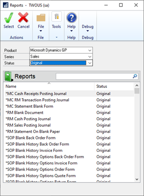

# Word Templates in Dynamics GP

Would you like to update the look and feel of your customer facing documents from the drab report writer formats?

Would you also like to email those documents directly out of Dynamics GP?

The Word Template functionality in Microsoft Dynamics GP is pretty awesome and it will do all of this as well as allow you to have separate document types for different companies and customers.

There are a few tricks to setting up and getting things functioning. It’s important to perform these steps in order.

You also will be working with the Template Configuration and Template Maintenance in Dynamics GP.

## Install and Configure Word Templates

You must have two applications installed before beginning this process:  

* Microsoft Dynamics GP Add-On for Word
* Open XML SDK 2.0 for Microsoft Office

Open XML will be installed when you install Dynamics GP. The Dynamics GP Add-On for Word is located on the Dynamics DVD.

To use Microsoft Word with Dynamics GP, you must add the “Developer” tab to your ribbon bar. In Microsoft Word navigate to Options \| Customize Ribbon and select “Popular Commands.” Add the Developer function to the Ribbon list and then check the box. Click “OK.”

### Add-in for Microsoft Word
Install
1. Using the Microsoft Dynamics GP installation media. Double click the setup.exe file.
2. Under Additional Products click on Microsoft Dynamics GP Add-in for Microsoft Word, then Install.
3. Click the radio button _I accept the terms in the License Agreement_, click Next.
4. Select the install location for the Microsoft Dynamics GP Add-in for Microsoft Word, click Install.

   > [!NOTE]
   > The default location is C:\Program Files (x86)\ Microsoft Dynamics\ Report Templates\

5. Once the Microsoft Dynamics GP Add-in for Microsoft Word is installed, click Finish.
6. Open Microsoft Word, select the Developer Tab, verify that the Microsoft Dynamics GP Templates group shows.

  > [!NOTE]
  > The Microsoft Dynamics GP Add-in for Microsoft Word is User Profile specific.  
  > Therefore, this add-in needs to be installed for each user that is going to be creating new Word templates and/or adding data sources and fields to existing Word templates.

> [!NOTE]
> If you receive the following when you attempt to install the Add-in:
> 
> `Setup has detected that the file 'C:\Users\AJRN-~1\AppData\Local\Temp\VSD23A2.tmp\VSTOR30\vstor30.exe' has changed since it was initially published
> See the setup log file located at 'C:\Users\AJRN-~1\AppData\Local\Temp\VSD23A2.tmp\install.log' for more information.`
> 
> A quick tip to get around this type of error message is to install the referenced .exe files from the GP installation media, vstor30.exe.

#### Developer Tab missing?
If you are missing the Developer tab, right click in the black space within the ribbon > click "Customize the Ribbon"
In the Word Options window check the Developer box, click OK.

#### Helpful Microsoft Word settings
The following settings in Microsoft Word will help you see the layout structure of the Word Template and make editing them easier.
To open the Microsoft Word Options, click the File menu in Microsoft Word and select Options.
Check the following options under the Display category:

* Paragraph marks
* Hidden text
* Object anchors
Check the following options under the Advanced category:
* Show bookmarks
* Show text boundaries

## Overview of Word Templates

### Template-enabled reports
Administration >> Reports >> Template Maintenance >> choose the Report Name drop-down list and select More Reports.

Template-enabled reports are Report Writer reports that have a Microsoft Word Template document associated with them. When enabled the option to print becomes available in the Report Destination window.



> [!NOTE]
> If you receive an error message `You must activate Word template functionality to send document when you try to email in Microsoft Dynamics GP`, make sure Word template functionality is enabled in the E-mail setup of the module you are trying to email from. For example, to enable Word template functionality for Sales, go to Tools > Setup > Sales > E-mails Settings for a Sales > SOP Word template.

### Report definition

Word Templates are based on the Standard report definition in Report Writer. Report definition is needed for:

* Defining which tables are used for the report.  
* Specifying how data is sorted.  
* Determining which section, the report has  
* Specifying which fields are in each section.  
* Defining calculated values that appear on the report.  

Microsoft Word does not perform these actions; it simply displays the report that has been rendered.  

### Word template document

The word template document defines the layout of a report.  

It contains the report definition details such as sections in the report, fields in each section, and any static text values defined for the report. This information is gathered from the report definition, and then embedded into the word template when created.

### How Word Templates are processed

When you choose Template as the Report Type, the assigned Microsoft Word document will be used to generate the output of the report.

1. The Microsoft Dynamics GP runtime uses the report definition within Microsoft Dynamics GP to generate an XML file that contains both the report definition and the data for the report.  
2. The assigned Word Template document is then retrieved.  
3. The XML and Word Template are passed to the Template Processing Engine, which combines them to produce the completed Microsoft Word Template for the report.  

## Report Template Design

### Document structure

The Word Template document is a standard Microsoft Word document.
When rendered from Microsoft Dynamics GP, the additional information from the report definition is embedded into the document.
Several tables in the word template document define the overall structure. All content that is displayed in the generated Microsoft Word document is placed inside these tables.  

> [!NOTE]
> Any text that is not within one of these tables will not be included in the generated word template.
 
### Page header table

* Placed in the Header section of the Microsoft Word document.
* Corresponds to the Page Header section on the standard Report Writer report.
* Content is displayed at the top of every page of the generated report.
* Examples: report date, current user, page number, logo.  

### Report header table

* Located at the beginning of the Microsoft Word document.  
* Corresponds to the Report Header section on the standard Report Writer report.  
* Content is displayed only one time at the beginning of the report.  
* Examples: Company information, customer/vendor information such as address  

### Body table

* Located after the Report Header table in the Microsoft Word document.  
* Corresponds to the Body content and any additional Headers and/or Footers.  
* Contains main content ‘guts’ of the report.  
* Has multiple rows.  
* One row for the actual report body, then an additional nested row for each additional header/footer.  

  (example: item description, line-item comments)

### Report footer table

* Located at the end of the Microsoft Word document.  
* Corresponds to the Report Footer section on the standard Report Writer report.  
* Content is displayed only one time at the end of the report.  
* Examples. Document totals, document comments, terms/conditions  

### Page footer table

* Located in the footer of the Microsoft Word document.  
* Corresponds to the page footer for the standard Report Writer report.  
* Content is displayed at the bottom of every page of the generated report.  
* Examples: report page number, business address, etc.  

### Fields, captions, and legends

The fields, captions, and legends are the specific data points that link the word template to the report definition.

#### How to remove a field, caption, or legend from a word template.

1.Click on the item within the word template document.
The tag containing the name of the report definition field will be displayed.
2.Click on the tag to select it.
3.Remove the item by pressing the Delete or Backspace buttons.

### Displaying item properties

The item properties will show what section of the report data the item originated from.
To display the Content Control Properties, select by clicking the item in the word template.
In the Developer tab, click Properties under the Controls group.

> [!NOTE]
> The tag field in the Content Control Properties window indicates which section of the report definition the value is from.

### Bookmarks

A bookmark identifies and labels a specific section or location within a document that can be used to identify for future reference.  

In Microsoft Dynamics GP there are 5 default bookmarks. These bookmarks are used in conjunction with the XML on the template to determine where on the Microsoft Word document your report information should be placed.

#### Viewing Bookmarks

First, you will want to make sure that Bookmarks are visible on the document you are viewing.  

1. In Microsoft Word, File menu, Options, Advanced tab, Show document content section.  
2. Check the box next to option **Show bookmarks**.  

    Now that we know bookmarks icon is enabled and you can see them on the word template, you can use the following direction to see which bookmarks on your document.

    > [!TIP]
    > Bookmarks appear as a grey capital I or roman numeral 1.

3. Open the Microsoft Dynamics GP Word Template via directly opening the .docx file or clicking Modify in Template Maintenance on the specific Word Template.  

4. In Microsoft Word, click into any of the tables that contain data on the template, go to the Insert menu, Links section, select Bookmark.

Reference the following “map” of a report template document to see where the bookmarks are located.
 
> [!NOTE]
> StartTemplateDocumentBookmark and EndTemplateDocumentBookmark are used only for calculating page numbers for report template document. They do not identify tables in the report template document.
>
> To be found by the template processing engine in Microsoft Dynamics GP, these bookmarks must not be located within the fields, captions, or legends used for the report.
>
> Word Templates that are generated via the Word Template generator may not necessarily have all these bookmarks. This varies based on what is included on the Report Writer report xml file used when generating a template.

### Company Logo

Each company in Microsoft Dynamics GP can have an image assigned that is to be displayed on the Microsoft Word template reports.
Assigned in the Image Assignment window (Administration >> Reports >> Template Configuration >> Images).
Typically, this logo is placed in the Page Header table for the word template.  

#### To add a company image to the word template

1. Create a cell to contain the image.  

    In the word template, create a table call in the location where you want the image to appear.  
2. Add a Picture Content Control.  

    Display the Developer ribbon in Microsoft Word. In the Controls group, choose to insert a Picture Content Control.  
3. Set the picture size.  

    Use the resize handles on the Picture Content Control to the size required for the word template document.  
4. Set the picture properties.  

    With the Picture Content Control selected, click Properties in the Controls group. Set the following properties:  

    |Property  |Value  |
    |---------|---------|
    |Title     |CompanyLogo |
    |Tag|globals.’Company.Logo’ |

> [!NOTE]
> You can opt to not have a Content Control field for the company logo and have the image directly on the template.

## Template patterns

### Form Characteristics

* The Body table in the layout is a single cell.  
* The body table has another nested in that, which contains the rows and columns that define the layout of the data.  
* Captions and fields for the report are placed in the cells of the nested table.  
* The StartTemplateSectionRepeating bookmark is placed in a cell of the nested table to indicate that the entire single-cell row of the Body table will be repeated for each record in the report.  
* The Body table may have rows for additional headers/footers.  
* Report Footer and Page Footer tables are option in this pattern.  

### Column Characteristics

* First row of the Body table is divided into columns that contains the captions for the values in the report.  
* Body table can contain rows for additional header/footer data.  
* Body table has a row that contains a nested table. The nested table is divided into columns, and the fields for the report are placed in these columns.  
* StartTemplateSectionRepeating bookmark is placed in a cell of the nested table to indicate that the entire row of the Body table will be repeated for each record in the report.  
* Report Footer and Page Rooter tables are optional.  

### Read-Only

1.	Open Report Template Maintenance.
Administration >> Reports >> Template Maintenance
2.	Select the template.
In Report Template Maintenance, select the report template for which you want to make a rea-only version, click Modify.
3.	In Microsoft Word, in the Review tab, click Protect, then Restrict Editing.

4.	Save the changes made to the word template.
5.	Close the modified report.
6.	Import the modified word template document into GP.
In the Report Template Maintenance window select the template you would like to import. 
Click Add Template (green plus)
A file dialog box will appear.
Select the word template document that you had just saved.
7.	Replace the existing report template document. 
A message will be displayed that indicates you are replacing an existing template. Click Yes to replace the existing word template document with the one you have just modified.

## Creating Report Templates

1.	Open Report Template Maintenance. 
Administration >> Reports >> Template Maintenance
2.	Select the original version of the report. 
3.	Create a new report template document. 
4.	Specify the details of the new word template document.

    In the New Template window, specify how the new report template document will be created. 
    For reports that have no existing report template documents, the new report template will be blank (no layout).
    For reports that have existing report template documents, the new template can be created based on the template you select.
5.	Supply a name for the word template you are creating, click Create.
6.	Modify the new report template. 
7.	Save the new report template.

    > [!NOTE]
    > Always check the box to Maintain compatibility with previous versions of Word before saving. Only available the first time the document is saved. 
8.	Close the new report template.
9.	Import the new report template. 
10.	Replace the existing report template document. 

### Report Templates for Modified Reports

#### To create a modified report template document

1.	Open Report Template Maintenance. 
Administration >> Reports >> Template Maintenance
2.	Select the modified version of the report. 
3.	Create a new report template document. 
4.	Specify the details of the new word template document.
In the New Template window, specify how the new report template document will be created. 
For reports that have no existing report template documents, the new report template will be blank (no layout).
For reports that have existing report template documents, the new template can be created based on the template you select.
5.	Supply a name for the word template you are creating, click Create.
6.	Modify the new report template. 
7.	Display the field list for the report. 
8.	View the additional resources for the report. 
9.	Make modifications to the report template layout.
10.	Save the new report template.  

    > [!NOTE]
    > Always check the box to Maintain compatibility with previous versions of Word before saving. Only available the first time the document is saved. 
11.	Close the new report template.
12.	Import the new modified report template. 
13.	Replace the existing report template document.
 
#### To use the modified report template document

1.	Open Report Template Maintenance
2.	Select the modified version of the report.
3.	Assign the modified report template.
4.	Verify Security is to modified report.
Administration >> Setup >> System >> Alternate/Modified Forms and Reports 

> [!NOTE]
> The status field in Template Maintenance correlates to the version of the report selected in Alternate/Modified Forms and Reports.

#### To update the data source for a report template

1. Update the modified report.

   Update the Report Writer report in Report Writer.
1. Run the report for which you made modifications to.
1. Export the report in XML format.

   In the Report Destination Window, export the report as a file in XML format, click OK. 
1. Open the report template document.

   This can be done by clicking Modify in the Report Template Maintenance window (Administration >> Reports >> Template Maintenance) or opening the report template document .docx file directly.
1. In the Developer pane, select Field List from Microsoft Dynamics GP Templates group. 
1. Select the XML Resource containing the report definition in the Custom XML Mapping pane. 
1. In the Developer pane, select Remove Source from the Microsoft Dynamics GP templates group.
1. Click OK to removing a data source may cause missing data on the template. 
1. In the Developer pane, select Add Source from the Microsoft Dynamics GP Templates group. 
1. Locate the XML Document file saved in Step 3 and click Open. 
1. In the Custom XML Mapping pane, you should see a new XML Resource listed.

    > [!NOTE]
    > The naming convention should be the same as before. 
1. Modify the word template as needed and Save As.
1. Re-import the word template document into Microsoft Dynamics GP.

## Word Template Generator

The Microsoft Dynamics GP Word Template Generator is a utility that can be used to help create a Word Template for Microsoft Dynamics GP reports.  

### Install

1. Service Packs and Hotfixes for the Word Template Generator for Microsoft Dynamics GP | Microsoft Docs
2. In the Downloads section, select MDGP2013_WordTemplateGenerator_FullInstall_R2.zip 
3. Click the radio button I accept the terms in the License Agreement, click Next.  
4. Select the install location for the Microsoft Dynamics GP 2013 Word Template Generator Tool, click install  

    The default install location is C:\Program Files (x86)\Microsoft Dynamics\Template Generator\
5. Once the Word Template Generator Tool is installed click Finish
6. The following screen capture shows what the Template Generator tool looks once installed.

#### How to use?

1. Run the report for which you want to create a template.
2. Export the report in XML format.

    In the Report Destination Window, export the report as a file in XML format, click OK.
3. Drag-and-drop the XML file over the TemplateGenerator.exe file.
4. In the location where the XML file was originally saved, a DOCX file will be created with the same name.
5. Add the template into Microsoft Dynamics GP.
6. Test the template.
7. Revise the template as needed.

## Troubleshooting Word Templates

### Word add-in issues

* If you experience issues with the Word add-in, best to uninstall/reinstall.  
* Incorrect data in Word document  

  * Verify that the Report Writer report generates as expected first.  
  * Verify that bookmarks are present and in correct location.  
  * Verify that all sections are available via the Report Definition.  
* Template processing does not complete.  

  If you run a report, choose to generate the output in Microsoft Word format, but the processing never completes, try the following:  

  * Be sure that the SQL Server Browser service is running on the machine. This service is necessary for template processing to complete successfully.  
  * The Template Processing Engine may have encountered an error and be in an unknown condition. Restart Microsoft Dynamics GP so the Template Processing Engine is re-initialized.  
  * Remove any non-typical controls that may have been added to the template layout. For example, templates cannot be processed if they contain the “Rich Text Control” that can be added from the Developer ribbon.  
  * If a specific report is causing problems, try simplifying the report template document to isolate the problem. For example, if a modified report will not generate the output in Microsoft Word format, try running the original version of the report. If the original report can generate the output in Microsoft Word format, the issue can be isolated to changes you made in the modified report template document.  
  * Add the following settings to the Dex.ini file:  

    ```
    KeepTemplateFiles=TRUE 
    TPELogging=TRUE 
    ```

    When you add these settings, a log file that has a name beginning with TemplateProcessing, as well as the intermediate template documents are stored in the current user’s temporary folder. To access the temporary folder, type the following in the Run command:

    ```explorer %temp%```

    Sort the contents of the temporary folder by the modified date. Examine to files related to the report that will not process. They will contain information that can be helpful when troubleshooting.

    Press and hold the Alt key when moving table boarders to prevent them from snapping to the grid in Microsoft Word.

Use the Design Mode which can be activated from the Developer tab to see quickly which sections the items in the word template comes from.

Make regular backup of your word template as you are working, in case you make a change that you’d like to revert.

## Error message The template you selected cannot be added to this report

1. Can you modify a pre-existing template and import without the error?  If yes, it could be something with the file you are trying to import, see #7 below.
1. Open up the xml file that you generated with notepad.  Look at the top of the xml.  

   If you see a line like the following in the dictionary node, then the xml has been generated on the original, not modified report:
   
   `<Main Path="C:\GP2018\">Dynamics.dic</Main>`

   If you see something like the following lines, it means that you generated the xml on a modified (in report writer) report.
   
   `<Main Path="C:\GP2018\">Dynamics.dic</Main>`

   `<Report Path="C:\GP2018\Data\">REPORTS.DIC</Report>`

   The versions also have to match and if this is an alternate report then that could also cause a problem. 

   You will also want to check the xml name.  It should be something like this: `XMLNAME="SOP Blank Picking Ticket Order Entered" (example report)`

   Now you know the report name and whether it's modified or original, go into the Template Maintenance window and be sure to choose the report that matches the XMLNAME and either original/modified.

1. Rule out the Logo on the report and if that is causing an issue.
1. Make sure the form is set to compatibility. Always check the box to Maintain compatibility with previous versions of Word before saving. Only available the first time the document is saved.
1. Make sure the file is unlocked.
1. Verify the XML file is connected to the correct report format.
1. If you received this template package from an email, there is a chance the email security systems can potentially remove or block XML resources. Many email security filters scan attachments for potentially harmful content, including XML files, which can be flagged or removed if they are deemed suspicious or contain malicious code. 
Open the file and check the XML resource connected to the template, if it is missing, that will cause the error.  

## Create and Assign Word Templates

First, you need to determine what report we’re basing our template on and whether it’s an original report or a modified report.

Why?

Word Templates are based on the standard report writer report. In order to create and assign a template the system needs to know the name of the report and also whether the report is already modified.

Tip: We recommend always basing the template on a modified version of the report for greater flexibility in the future.

Why?

Remember that the template uses Report Writer to access data. If we ever want to add a new calculated field, we need to create it first in Report Writer for it to be available in our template, thus it’s a modified report.

Reports \| Template Configuration

In Dynamics GP, the configuration window allows you to enable a specific form(s) to work as a template. Mark the document(s) for which you want to create a template. At the bottom of the window, be sure to mark the ‘Enable Report Templates’ and, if desired, to ‘Allow use of the Standard form’ even though you’re using the template.

### Word found unreadable content when printing Word Template in Microsoft Dynamics GP

- We're sorry. We can't open ….docx because we found a problem with its contents.
- Details: Unspecified error
- Location: Part: /word/footer5.xml, Line:0, Column:0

- Word found unreadable content in "….docx".
- Do you want to recover the contents of this document?
- If you trust the source of this document, click Yes.
 
**This issue can also cause the e-mail to fail**

## If the issue is happening for ALL Word Template Reports:

In 2020 there was an Office security update that changed how XML files are read in Microsoft Word.  Since Word Templates in Microsoft Dynamics GP rely on passing Report Writer fields to Microsoft Word via XML, this caused Word Templates to fail when printing with Unreadable Content errors.  There is a history recorded on this issue in the following post. 
 
[Word Templates will not Email/Print after Office Update](https://community.dynamics.com/blogs/post/?postid=1981a7ea-2d02-4ec9-be17-02620c23d6d9)

Changes were made in Microsoft Dynamics GP to produce an XML file that conformed to this new Office update for security reasons.   
We released this fixed in both GP 2016 and 18.3 on the 2020 Year End Update. 
 
[The 2020 U.S. Year-end Update has released and has the template fix for GP 2016 included](https://community.dynamics.com/gp/b/dynamicsgp/posts/microsoft-dynamics-gp---2020-u-s-year-end-update-released)

If you are not on versions 16.00.0814 and higher, OR 18.3.1200 and higher, you will continue to receive these errors when printing Word Templates and there is no workaround other than to upgrade to a version with the fix that is compatible with Microsoft Office’s security updates. 
 
If you on a version higher than that that already has the fix, then I would make sure that your Office is up to date, and test changing your user security for the report and template to our default reports to verify whether it is an environmental  issue or if it’s an issue with your modified reports/templates. 

It is best practice to have back-up's created anytime you have a modified Word template (just like we do with customized forms and reports) in case it might get corrupted during an update.
Once modifications have been completed, save the Word document. The default location where the file gets saved is C:\Users\(current user)\AppData\Local\Temp.
[Modified Templates won’t print or email after upgrade to Microsoft Dynamics GP 18.6 - Stuck in Template Processing](https://community.dynamics.com/blogs/post/?postid=a2b1d4e8-27af-ee11-92bd-000d3ae48dd4)

## If the issue is isolated to a specific Report Word Template and not ALL word Template Reports:

This error can be cause by a few of things:

1. Failing to select "Maintain Compatibility with previous versions of Word" when initially saving the template or the file is corrupt and cannot be opened.

   This error is normally encountered when trying to generate more than one template.  
   The user needs to make sure they always have this option checked when saving "Maintain compatibility with previous versions of Word"
   
    > [!NOTE]
    > Word only gives you the option to mark Maintain Compatibility the first time you save the template, so you have to use the steps from this blog to re-enable it. 
    > https://community.dynamics.com/gp/b/dynamicsgp/archive/2012/03/13/error-message-when-printing-or-emailing-multiple-word-templates.aspx

2.	Hyperlinks on the template can cause these errors.

   Remove any hyperlinks on the template. The hyperlinks affect the XML file that GP uses to generate the final word template causing it to error. 
 
3.	Extra Header and footer shading inserted onto the template. 

   Remove header and footer shading from the template, then see if the error persists.

4.	Anchored images

   Example: Image of dotted line to symbolize cutting statement to attach in mail.

   Use boarders vs. embedded anchored image of line
 
If the above doesn't lead to a solution, it may be a corrupted field that will cause this, the error could say location header, as an example, so you would remove all header content controlled items and re-added them. 

## Word Templates stuck processing after an upgrade of Dynamics GP

### Issue is isolated to one specific template report

1. If your report is modified, try to print the original. Set Template to Default Original/Canned Report for Testing.

   Please follow the steps below to test using the default (canned) template. This also involves switching your Report Writer security to the default report rather than Modified.

   > [!NOTE]
   > If your user is assigned to an Alternate/Modified Forms and Report ID that is also used by other users, they will be affected by this change. Either create a new Alt/Mod ID, for your testing and assign it to your user, or make sure that other users in the system are not printing/emailing this report during your testing.

   1. Microsoft Dynamics GP menu >> Tools >> Setup >> System >> User Security.
   2. Select the username and company.
   3. Click the ‘Alternate/Modified Forms and Reports ID:’ link at the bottom of the window.
   4. In the Alternate/Modified Forms and Reports window, select the following:
      1. Product: Microsoft Dynamics GP
      2. Type: Reports
      3. Series – All
      4. Click the plus button to expand the Sales folder.
      5. Click the plus button to expand the SOP Blank Invoice Form. If the report is not on the list at all, then you do not have a modified option, so move to step 5.
      6. Select the default/canned ‘Microsoft Dynamics GP’ option. (Do not select modified here.)
      7. Click Save, Save, and Close.
   5. Go to Reports >> Template Maintenance
   6. In the Report Template Maintenance Window, click the bar at the top that says ‘Click here to select a report’.
   7. Select the option for ‘More Reports’ on the Drop Down list.
      1. Product: Microsoft Dynamics GP, Series: Sales
      2. Status: Original
      3. Select ‘*SOP Blank Invoice Form’ from the list and click ‘Select’.
   8. In the Report Template maintenance window, highlight the ‘SOP Blank Invoice Form*’.
   9. Click on the Assign >> Company button on the menu bar.
   10. Check the company that you are testing the process in.
   11. Highlight a company and click ‘Set Default’.
   12. Check the box next to the ‘SOP Blank Invoice Form*’, then click Save and Close.
   13. The report you selected will now be default and you can test your process

2. Error message One or more templates could not be processed.  View the exception log for more details.
This could mean there are XML Format errors for the template.  If you have a back up of the template try to reimport it and see if this works.

3. Errors such as:

   - "The File POP Purchase Order Blank Form~18.docx cannot be opened because there are problems with the contents"
   - “Word found unreadable content in "POP Purchase Order Blank Form~18.docx" 
   - "Word found unreadable contend in 'TWOBlank Invoice'.docx. If you want to recover the contents of this document, click Yes."

    The usual cause of these errors in Dynamics GP template use is that 'Maintain Compatibility' mode was not selected when the Template was saved initially in Word.
    The reason that it would happen on the workstation but not the sever is usually because when Maintain Compatibility is not marked the Template will not be compatible with all versions of Microsoft Word. Most likely the versions of Word do not match between the server and the user's workstation.

Word only gives you the option to mark Maintain Compatibility the first time you save the template, [you have to use the steps from this blog to re-enable it](https://community.dynamics.com/gp/b/dynamicsgp/archive/2012/03/13/error-message-when-printing-or-emailing-multiple-word-templates.aspx)

### Issue happening for all template reports

1. If anything else changed with the upgrade, such as moved servers, a potential issue with your logo file and where it is located.
If you are logged into GP and go to Report > Template Configuration, then click the Images button do you have path names specified for the company in question?  Is that a valid path name?

2. Are you testing this directly on a new SQL Server?  We have seen some issues where ports are closed or blocked between the GP client and the SQL Server.  
These ports (TCP ports 1433 and 1434 and UDP port 1434) are used to populate the temp file(s) needed when generating a Word template report

3. Another item you can look at is the ODBC connection that is being used.  If the server name is using an IP address instead of a server name it can cause issues with template processing.  

4. There is a template processing DLL in the GP client folder that could potentially have a problem.  I would recommend renaming your GP client folder (e.g. C:\Program Files (x86)\Microsoft Dynamics\GP), then go to Control Panel > Programs and Features and run a Repair against GP.  This will lay down a new, clean GP client folder without any customization or 3rd parties.  Launch GP from that install and try to repro the issue.
   
5. Try the process on a different machine or the server to see if it works. If it works on another machine, then reboot the non-working machine rebooted; it does not hurt to reboot the machine and try again. 

6. The template processing also relies on the Dexterity Shared Components. You can you uninstall this from Programs and Features, then run the GP 18.6 installation media to reinstall it. It should see that it is missing and prompt you to include it via the bootstrapper.
   
7. Also in Programs and Features look for the Open XML SDK for Office.  Dynamics GP will install version 2.0 of this as a prerequisite, but there is a version 2.5 out there.  The problem is that when version 2.5 is installed the Word template and copy/paste functionality in GP will not work.  If you see 2.5 installed you’ll want to remove that, let the GP install media bootstrapper install the correct version again, then test the printing process.

> [!NOTE]
> In the Report Template Maintenance window, only reports that have a * in front of their name have a default template available in Microsoft Dynamics GP for printing.
> Any other report would require that the user creates their own from scratch or using template generator.
>
> Word Templates are stored in the DYNAMICS database as a SQL Blob in the syReportTemplates table. They link the SY20000 table by the RELID and in this table you can see the actual name of the template that is stored as the blob.
> Templates are not stored in any folders on the machine. 
>
> select * from syReportTemplates where RELID = '9966' 
>
> select * from SY20000 where TemplateID = '9966'
>
> The only way that a template would disappear would be if it was deleted from the DYNAMICS database or by the user in Dynamics GP.


## See also

[System Administration Guide](SystemAdminGuide.md)  
[Understanding the Lifecycle Policies for Dynamics GP](../terms/lifecycle.md)  
