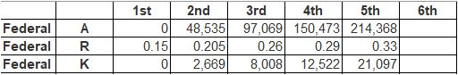
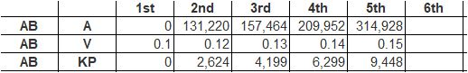
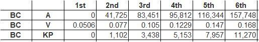
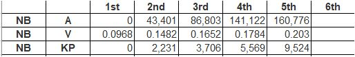
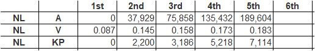
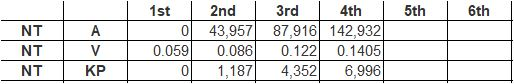
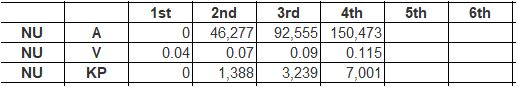
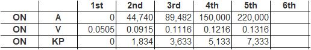
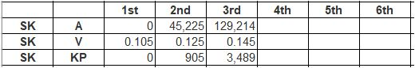
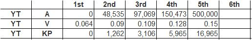

# Canadian Payroll 2020 Year-end Update & 2021 Tax Update

This document contains instructions for updating the Canadian Payroll module for Microsoft Dynamics GP and Microsoft Dynamics GP 2016 for 2020 filing requirements. This update also includes Round 1 tax updates for 2021 federal, provincial, and territorial taxes.

These instructions assume that you are already familiar with Microsoft Dynamics GP Canadian Payroll.

## Introduction

You can find information about year-end procedures in the “Year-End Procedures", “T4/R1 Routines,”, and “T4A Routines” chapters in the Canadian Payroll documentation.

Note, however, that the instructions in this document expand on those instructions and in some cases supersede them.

### What’s in this document

This document contains the following chapters:

*Chapter 1, "Canadian Payroll year-end checklist,"* contains a checklist that you can use for year-end procedures.

*Chapter 2, "Preparation and installation,"* specifies prerequisites, and provides installation instructions for the year-end update and tax update.

*Chapter 3, "Electronic filing in XML format,"* contains information that you can use to prepare T4/T4A slips and RL-1 forms with Canadian Payroll for magnetic media filing in XML format.

*Chapter 4, "Tax updates,"* describes the federal and provincial or territorial tax changes for 2020.

### What’s changed

The 2020 Year-End Update/2021 Tax Update contains changes in the information that’s submitted to the Canada Revenue Agency (CRA) and Ministère du Revenu du Québec.

***[Refer to updated blog of recent changes for Canadian Payroll]***
(https://community.dynamics.com/gp/b/dynamicsgp/posts/microsoft-dynamics-gp-year-end-update-2019-canadian-payroll)

#### Tax changes

See [Chapter 4: Tax updates](#chapter-4-tax-updates) for a description of the 2021 federal, provincial, and territorial tax changes.

#### General application changes

The 2020 Year-End Update/2021 Tax Update contains application bug fixes and functionality updates to comply with regulatory changes.

#### XML and form changes

The T4A and RL-1 XML has changed for the 2019 reporting year. 
The T4 and T4A forms have not changed for the 2019 reporting year.  

- Software Development Number for XML - RQ-20-01-132
- RL-1 Slip Authorization number Coming Soon  (enter this in the Payroll T4/R1 Print window)  

#### Installation notes

The 2021 Canadian Payroll Tax Update must be installed on the server and on each client workstation where Microsoft Dynamics GP is used. Before installing the update, be sure to complete the following tasks:

All users should exit Microsoft Dynamics GP until the update has been installed on all workstations.

Close all programs, turn off the screen saver, and back up important data and programs before continuing with the update.

Save backup copies of your Reports.dic, R7131.dic, F7131.dic, Forms.dic, and Dynamics.vba files, if these files are present in your installation.

### Resources

If you have questions about Canadian Payroll year-end closing procedures and your Microsoft Business Solutions Partner isn’t available, there are several resources, in addition to this document, to assist in answering your year-end questions.

#### 2020 year-end information on CustomerSource

Look at [CustomerSource](https://mbs.microsoft.com/customersource/northamerica/GP/downloads) to find out what year-end maintenance and tax changes are included in each update and to download the update. All instructions for downloading and installing the tax updates also will be provided there.

Look for "2020 Canadian Payroll Year End Update for Microsoft Dynamics GP".

#### Microsoft Canadian Payroll support team

We have a support team focused entirely on providing service and support to our Canadian Payroll customers. If you have questions, dial toll free 888-GPS-SUPP (888-477-7877). Enter your 10-digit authorization code, then press 4 for the Payroll Tax Hotline.

## Chapter 1: Canadian Payroll year-end checklist

Use the following checklist for Canadian Payroll year-end processing. For detailed instructions for completing each step, refer to the sections listed in specific steps and to the instructions in the Canadian Payroll manual or online help.

### Checklist steps

|**Step**|**Description** |
|----------|--------------|
| 1.       | Complete all 2020 pay runs. |
| 2.       | Note: Any batch with a cheque date of 2021 should be processed after the Year End File Reset. For example, if the cheque date of your final pay period for 2020 is January 1, 2021, the 2021 tax tables must be used for that pay run. |
| 3.       | Complete any necessary 2019 payroll reports.        |
| 4.       | Install the 2020 Canadian Payroll Year-End Update. See [Installing the update](#installing-the-update).      |
| 5.       | Note: Do not restart Microsoft Dynamics GP on any workstation until the update has been installed on all workstations that run the application.       |
| 6.       | Complete the Year End File Reset.                                       |
| 7.       | Note: To ensure that all tables are available for resetting, make sure that the Year End File Reset window is the only window open in Microsoft Dynamics GP.|
| 8.       | Make a backup of your data titled “Post 2020 Year-End Update.”\*|
| 9.       | Note: The following steps can be done any time after the Year End File Reset has been completed.|
| 10.      | Create T4, T4A, and RL-1 statements, and print the T4, T4A, and RL-1 reports.  |
| 11.      | Edit the T4, T4A, and RL-1 records, as necessary. You can print an edit list from the Payroll Routines - Canada window. |
| 12.      | Create T4, T4A, and RL-1 Summary records.      |

> [!NOTE]
> By law, you must be able to reproduce original or amended T4, T4A, and RL-1 slips for a predefined (agency assigned) number of years after the original filing. To meet this requirement, be sure to keep backups of all your Canadian Payroll data files, as well as copies of reports, tax forms, and filings. Canadian Payroll will only allow you to re-create a prior year filing if you save backup copies of the prior reporting year data.  

## Chapter 2: Preparation and installation

This portion of the documentation specifies the requirements for installing the 2020 Year-End Update / 2021 Tax Update.

### Supported versions

The 2020 Year-End Update / 2021 Tax Update supports Microsoft Dynamics GP, (GP 2018), Microsoft Dynamics GP 2016, and Microsoft Dynamics GP 2015. To identify the Microsoft Dynamics GP release you’re using, start the application and choose Help \>\> About Microsoft Dynamics GP.

To identify the Canadian Payroll release you’re using, start Microsoft Dynamics GP, then open the Payroll Control Setup – Canada window (Microsoft Dynamics GP menu \>\>Tools \>\> Setup \>\> Payroll – Canada \>\> Control). You should see the release number in the upper left corner of the window.

If you are using an unsupported release of Microsoft Dynamics GP, you won’t receive all of the necessary information to complete year-end closing and payroll tax procedures. This information includes personal amounts, Employment Insurance (EI), Canadian Pension Plan (CPP), and Quebec Pension Plan (QPP) amounts. To update the information, install Microsoft Dynamics GP 2015 or higher before installing this update.

> [!TIP]
> To view a list of product discontinuation dates, see the [Dynamics GP Lifecycle](https://support.microsoft.com/en-us/lifecycle/search?alpha=Dynamics%20Gp) site. The link is also available from the [Lifecycle and Upgrade Services blog](https://community.dynamics.com/gp/b/dynamicsgp/posts/microsoft-dynamics-gp-upgrade-blog-series-schedule).

### Obtaining a CRW Web Access Code

If you plan to use the Internet to submit T4 records, you need to obtain a Web Access Code from the Canada Revenue Agency (CRA), which preauthorizes you to submit files using this method. Web Access Codes are valid for one year only, so you need to get a new one each year.

The Web Access Code consists of six characters: two letters, and four numbers. The code is case sensitive which means that you must enter it exactly as it appears on your personalized T4 Summary form. If you do not enter the code correctly, you will not be able to access the secure areas of the CRA’s T4 Internet File Transfer site.

For more information, see the [CRA website](https://www.cra-arc.gc.ca/eservices/rf/cd-eng.html).

Canadian Payroll for Microsoft Dynamics GP has the ability to generate the XML file required for T4 Internet File Transfer, but you are responsible for obtaining the access code and actually submitting the file to the CRA.

### Finding the Software Developer Number and RL-1 Authorization number

If you plan to use the Internet to submit RL-1 records, you need to obtain the Software Developer Number and the RL-1 Slip authorization number. Both numbers change every year.

Both numbers are available with the Canadian year-end update on the [Microsoft Dynamics GP Directory page on CustomerSource](https://mbs.microsoft.com/customersource/northamerica/GP/learning/documentation/system-requirements/dynamicsgpresource#top).

You also can see [XML and form changes](#xml-and-form-changes) for the RL-1 authorization number and the steps for entering it.

### Installing the update

The update must be installed on each client workstation where Microsoft Dynamics GP is used. When installing the update, be sure to complete the following tasks:

- All users must should exit Microsoft Dynamics GP until the update has been installed on all workstations.

- Close all programs, turn off the screen saver, and back up important data and programs before continuing with the update.

- Save backup copies of your Reports.dic, R7131.dic, F7131.dic, Forms.dic, and Dynamics.vba files, if these files are present in your installation.


**To install the update:**

1. Download the update from [CustomerSource](https://mbs.microsoft.com/customersource/northamerica/GP/downloads).

    | **Language** | **Microsoft Dynamics GP**   | **Microsoft Dynamics GP 2016**  | **Microsoft Dynamics GP 2015**   |
    |--------------|-------------|-----------------|-------------------------|
    | English      | MicrosoftDynamicsGP18- KB4533809-ENU.msp   | MicrosoftDynamicsGP16- KB4533807-ENU.msp  | MicrosoftDynamicsGP14- KB4533805-ENU.msp  |
    | French       | MicrosoftDynamicsGP18- KB4533810-FRCA.msp | MicrosoftDynamicsGP16- KB4533808-FRCA.msp | MicrosoftDynamicsGP14- KB4533806-FRCA.msp |

    Save the .msp file to a folder on the local disk drive of the server  workstation that runs Microsoft Dynamics GP.

    > [!NOTE]
    > The year-end update file also includes all prior Microsoft Dynamics GP updates. A document describing the service pack changes is available from CustomerSource.  This update is inclusive of the October 2019 release for Microsoft Dynamics GP 2018.

2. Double-click the file that you just downloaded. Progress windows appear as space requirements are verified and files are installed.

3. A message may appear, asking if you want to restart now or later. Click Yes to restart now, you will need to run the update file again after restarting.

4. After the installation is finished, manually restart your computer if a message directed you to do so earlier.

5. Start Microsoft Dynamics GP Utilities.

    | Microsoft Dynamics GP | Start \>\> All Programs \>\> Microsoft Dynamics \>\> GP \>\> GP Utilities |
    |----------------------------|--------------------------------------------------------------------------------|
    | Microsoft Dynamics GP 2016 | Start \>\> All Programs \>\> Microsoft Dynamics \>\> GP 2016 \>\> GP Utilities |
    | Microsoft Dynamics GP 2015 | Start \>\> All Programs \>\> Microsoft Dynamics \>\> GP 2015 \>\> GP Utilities |

6. In the **Welcome to Microsoft Dynamics GP Utilities** window, verify your server name, enter the system administrator user ID and password, and click OK.

7. In the second welcome window, click **Next**.

8. In the **Upgrade Microsoft Dynamics GP** window, click **Next**. The **Server Installation Progress** window describes the process as it progresses.

9. In the **Upgrade these companies** window, click **Next**. All companies are selected to be updated.

10. In the **Confirmation** window, click **Finish**. Microsoft Dynamics GP Utilities updates your company databases. This process may take several minutes to complete.  
    The **Server Installation Progress** window describes the process as it progresses.

11. After the update process is finished and is successful, the **Additional Tasks** window opens. If the update process wasn’t successful, the **Update Company Tables** window opens.  

    To contact Microsoft Dynamics GP Technical Support, see [Resources](#resources) for more information. For more information about the Microsoft Dynamics GP Utilities, see [Using Microsoft Dynamics Utilities](../installation/using-microsoft-dynamics-utilities.md).

12. In the **Additional Tasks** window, choose **Update modified forms and reports**, and then click **Process**. The **Locate Launch File** window appears.

13. Select the location of the launch file (Dynamics.set). In most cases you can accept the default location. Click Next. The **Update Modified Forms and Reports** window appears.

14. Mark the check box next to Microsoft Dynamics GP and any additional components listed.

15. When you mark a component’s check box, a **Product Details** window may appear, allowing you to select the location of the component’s original code dictionary. You also can open the **Product Details** window by selecting a component and clicking Details.

    When you apply an update (.msp file), any dictionaries whose compatibility ID has changed are backed up to a folder named “Version \<Version Number\> Backup”. This folder is located in the same folder as Dynamics.exe. The \<Version Number\> value is the version you were using before applying the update. If the original dictionary exists in the backup folder, Microsoft Dynamics GP Utilities will automatically display its location in the Product Details window, and you can click OK to accept the location. If the location is missing or incorrect, click the file folder icon and browse to the appropriate location.

16. When you have finished selecting components, click **Update**. A **Report Update Progress** window displays the status of the update. When the process finishes, click **Close**. Log files containing detailed information are saved in the \\Data folder. For each component, a report named “Update\<Version_Name\>.log is generated. An update summary named “Update\<Verison\>.txt is also generated.

17. In the **Modified Forms and Reports** window, click **Next**. The **Additional Tasks** window opens where you can start Microsoft Dynamics GP or exit Microsoft Dynamics GP Utilities.

    We recommend that you start Microsoft Dynamics GP and review all your modified forms and reports to verify whether they were updated correctly.

    After the update to tables is completed, you can set up Automated Client Update to update all client workstations. For information about setting up the automatic updates, refer to your System Administrator manual.

    > [!Note]
    > To install the update on an operating system with User Account Control (UAC) activated, see [Installing with UAC activated](#installing-with-uac-activated).

To verify that you’ve installed the latest year-end update and tax update, check the **Last Year-End Update** field in the **Payroll Reset Files – Canada** window (Microsoft Dynamics GP menu \>\> Tools \>\> Routines \>\> Payroll – Canada \>\> Year End File Reset). It should be 12/14/2019 or later.

For the tax update, check the Last Tax Update field in the Payroll Control Setup – Canada window (Microsoft Dynamics GP menu \>\> Tools \>\> Setup \>\> Payroll – Canada \>\> Control). It should be 12/14/2019 or later.

### Installing with UAC activated

User Account Control (UAC) is an enhanced security feature in Windows. UAC is activated by default. Before performing actions that could affect your computer’s operation, such as installing software updates, UAC asks for permission. To install the update on a client computer when UAC is active, copy the .msp file to each client workstation, then use one of the following methods:

- Start Microsoft Dynamics GP as a user that has administrative privileges on the local computer. (To do this, right-click on the Microsoft Dynamics GP shortcut and choose Run as administrator.) Double-click the .msp file to install it.

- Start the Command Prompt (located in the Accessories group) as a user that has administrative privileges on the local computer. (To do this,right-click on the Command Prompt shortcut and select Run as administrator.) Set the current directory to the location where you copied the .msp file.

Example, for Microsoft Dynamics GP 2016 (English), enter the following command.

```
Msiexec /p MicrosoftDynamicsGP16-KB4533807-ENU.msp /l\*v C:\\MSPErrorlog.txt
```

If you want the user to install updates and service packs without having administrative privileges on the local computer, you can change permissions for the folder where Microsoft Dynamics GP is installed. Be aware that doing this makes your computer less secure.

## Chapter 3: Electronic filing in XML format

Canadian Payroll can generate electronic files in the XML format. You are responsible for submitting the file to the CRA or Revenue Quebec using one of the supported media types (diskettes, CD-ROMs, or DVD-ROMs) or over the Internet (if you have under 5 Mb of data to file).

You don’t need to have any special knowledge of XML to generate an XML electronic file using Canadian Payroll.

### Filing the T4/T4A in XML format

You can use Canadian Payroll to generate the T4 and T4A slips in XML files that you are responsible for submitting to the CRA.

#### Data validation

By using the XML format, the CRA is able to validate the file as soon as you submit it and alert you to any errors or omissions in the file. To help you submit an error-free file, Canadian Payroll includes several features to validate your data prior to submission.

**Verification report** You can print the T4 Error Report or T4A Error Report to verify the data in your XML file before you submit it to the CRA. The report will identify and describe any errors. You must resolve all the errors before you can generate the T4 and T4A XML files.

**Data entry validation** As you enter data during the tax year, entries throughout Canadian Payroll that will be reflected in electronic files will be verified, and messages will advise you of any non-valid entries. T4 and T4A information is drawn from the following locations in Microsoft Dynamics GP.

| **Type of data**        | **Source**  |
|-------------------------|-------------|
| Employer information    | **Payroll T4 Summary Edit – Canada** and **Payroll T4A Summary Edit – Canada** windows |
| Employee information    | **Payroll T4 Edit – Canada** and **Payroll T4A Edit - Canada** windows  |
| Withholding amounts     | Cumulative totals, gathered during the payroll process, which are displayed on the **Payroll T4 Edit – Canada** and **Payroll T4A Edit - Canada** windows |
| Transmitter information | **Payroll Electronic Transfer T4/T4A** windows  |

### Filing the RL-1 in XML format

Before you use the Internet to submit RL-1 records, you need an RL-1 Authorization number. The RL-1 Authorization number and the Software Developer Number can be found with the year-end update at [CustomerSource](https://mbs.microsoft.com/customersource/northamerica/GP/downloads).

Both numbers change every year.

#### Data validation features

By using the XML format, Revenue Quebec will validate the file as soon as you submit it and alert you to any errors or omissions in the file. To help you submit an error-free file, Canadian Payroll includes several features to validate your data prior to submission.

**Verification report** You can print the RL-1 Error Report to verify the data in your file before you submit it to Revenue Quebec. The report will identify and describe any errors. You must resolve all the errors before you can generate the RL-1 files.

**Data entry validation** As you enter data during the tax year, entries throughout Canadian Payroll that will be reflected in electronic files will be verified, and messages will advise you of any non-valid entries. RL-1 information is drawn from the following locations in Microsoft Dynamics GP.

| **Type of data**        | **Source**    |
|-------------------------|-----------|
| Employer information    | **Payroll R1 Summary Edit - Canada** window  |
| Employee information    | **Payroll R1 Edit - Canada** window  |
| Withholding amount      | Cumulative totals, gathered during payroll process, which are displayed on the **Payroll R1 Edit - Canada** window |
| Transmitter information | **Payroll Electronic Transfer R1** window  |

### Filing an amended or cancelled RL-1 in XML format

If changes are needed after you have submitted the RL-1 XML files to Revenue Quebec, you can use Canadian Payroll to generate amended or canceled files that you can then submit to Revenue Quebec.

You use the **Payroll R1 Edit** window to make changes to RL records. You use the **Payroll Electronic Transfer R1** window to generate the amended or canceled files.

## Chapter 4: Tax updates

This chapter lists changes to federal, provincial, and territorial tax rates for 2019. For detailed information about taxes, refer to the Canada Revenue Agency Web site at [www.cra-arc.gc.ca](https://www.cra-arc.gc.ca/) and Revenue Quebec’s Web site at [www.revenu.gouv.qc.ca.](https://www.revenu.gouv.qc.ca/)

### Pension Plan, Employment Insurance, and Parental Insurance changes

#### CPP

Contribution rates for both employers and employees for 2020 is 5.25%. The following changes are in effect for CPP for 2020:

- The maximum pensionable earnings amount will be updated to \$58,700, from \$57,400.

- The basic exemption remains unchanged at \$3,500.

- The maximum contribution amount for the year increases to \$2,898.00, from \$2,748.90.

#### EI for non-Quebec employees

- The EI Maximum Annual Insurable Earnings amount increases to \$54,200, from \$53,100.

- The EI premium amount will be 1.58%. The EI maximum annual premium amount will be \$856.36 from \$860.22.

- The EI Employer Premium Rate amount will change to 2.212%. The employer EI premium is set using the Employer EI Factor field in the Payroll Employer Number Setup – Canada window (Tools \>\> Setup \>\> Payroll-Canada \>\> Employer). This factor must be set to 1.4 to meet the official EI Employer Premium.

#### EI for Quebec employees

- The EI maximum annual insurable earnings amount increases to \$54,200, from \$51,700.

- The EI (Quebec) Premium Rate amount decreases to 1.20%, from 1.25%.

- The maximum annual premium amount decreases to \$650.40, from \$663.75.


#### QPIP

- The QPIP Maximum Annual Insurable Earnings amount increases to \$78,500, from \$76,500.

- The Premium Rate amount is 0.494%.

- The Max Premium is \$387.79 from \$405.52.

- The Employer Premium Rate is 0.692%. The maximum employer amount will change to \$543.22 from \$567.58.

### Federal tax rates and income thresholds

Effective January 1, 2020 the federal tax rate is unchanged. The federal index factor is 1.019. The income thresholds are revised as follows.



### Federal personal amounts

Federal personal amounts have been increased by fixed amounts as shown in the following table.

The Basic Personal amount is updated to \$12,298 (formerly \$12,069).

The Spouse Common Law Partner amount increases by the index factor to \$12,298 (formerly \$12,069), if the original amount was not zero.

The Eligible Dependent amount increases by the index factor to \$12,298 (formerly \$12,069), if the original amount was not zero.

Canada Employment Credit

The Canada Employment credit has been increased to \$1,245 at the lowest rate of 15.0%. The employment credit has been updated so that the Canada employment credit (factor K4) is the lesser of:

- 0.15 X A; or

- 0.15 X \$1,245

### Provincial and territorial tax changes

The following provinces and territories have tax changes for 2020.

> [!NOTE]
> The figures in the following tables are those supplied by the relevant revenue agencies. The actual figures calculated by Canadian Payroll may differ slightly due to rounding. This issue is recognized by the CRA and the  differences will not subject you to penalties for over- or under-withholding.

#### Alberta - no change

- The Alberta basic personal amount is increased by the index factor, usually revised to \$19,369 (formerly \$18,915). 

- The Alberta spouse or common-law partner amount is increased by the index factor, usually revised to \$19,369 (formerly \$18,915).



#### British Columbia

- The British Columbia basic personal amount increases by the index factor to  \$10,949 (formerly \$10,682).

- The British Columbia spouse or common-law partner amount (and eligible dependent) increases by the index factor and is revised to \$10,949 (formerly \$10,682).



#### Manitoba

- The Manitoba Basic Personal amount increases by the index factor to \$9,838 (formerly \$9,626).

- The Manitoba spouse or common-law partner amount shall increase to \$9,838 (formerly \$9,626).


#### New Brunswick

- The New Brunswick Basic Personal amount increases by the index factor and is usually revised to \$10,459 (formerly \$10,264).

- The spouse or common-law partner amount increases by the index factor and is revised to \$10,459 (formerly \$10,264),



#### Newfoundland and Labrador

- The Newfoundland Basic Personal amount increases by the index factor and is updated to \$9,498 (formerly \$9,414).

- The spouse or common-law partner amount increases by the index factor and is revised to \$9,498 (formerly \$9,414), if the original amount wasn't zero.



#### Northwest Territories

- The Northwest Territories basic personal amount increases by the index factor, and is revised to \$15,093 (formerly \$14,811).

- The spouse or common-law partner amount increases by the index factor and is revised to \$15,093 (formerly \$14,811), if the original amount wasn't zero.



#### Nova Scotia - no change

- The Nova Scotia basic personal remains unchanged at \$8,481.

- The spouse or common-law partner amount is also unchanged and remains \$8,481.


#### Nunavut

- The Nunavut basic personal amount increases by the index factor and is usually revised to \$16,304 (formerly \$13,618).

- The spouse or common-law partner amount increases by the index factor and is usually revised to \$16,304 (formerly \$13,618), if the original amount was not zero.



#### Ontario

- The Ontario Basic Personal amount increases by the index factor and is usually revised to \$10,783 (formerly \$10,582).

- The Ontario Spouse or Common-law Partner amount increases by the index factor and is usually revised to \$10,783 (formerly \$10,582).



#### Prince Edward Island

- There is no index factor in PEI, but the personal amount is changed to \$10,000 from \$9,160.  
- The Spouse or Common-law Partner and Eligible Dependent is \$7,780.


#### Quebec

The TP-1015.3-V Basic amount increases by the index factor and is usually revised to \$15,532 (formerly \$15,269). The system rounds this calculation to the nearest \$5.00

#### Variable H – Deduction for employment income

The deduction for Employment income has been increased to \$1,190, formerly \$1,170. Therefore, the deduction is now the lesser of 6% of employment income or \$1,190.

#### Saskatchewan - no change

- The Saskatchewan Basic Personal amount increases by the index factor, so it is usually revised to \$16,065 (formerly \$16,065).

- The Spouse Common Law Partner amount increases by the index factor, so it is  usually revised to \$16,065 (formerly \$16,065).



#### Yukon

- The Yukon basic personal amount increases by the index factor and is usually revised to \$12,298 (formerly \$12,069).

- The spouse or common-law partner amount increases by the index factor and is usually revised to \$12,298 (formerly \$12,069), provided the original amount was not zero.



### Updating basic personal amounts

To update the Basic Personal amounts go to: Tools\>\> Routines\>\> PayrollCanada\>\> Year End File Reset

- When the message, “This process will reset YTD totals in the Employee Master file. Do you want to continue?” displays, click Yes.

- When the message, “Do you want to update Basic Personal Amounts in the Control Setup File?” displays, click Yes.

The personal tax credit amounts specified in the P_CPY_Control table will be updated to:

- The federal Basic Personal amount = \$12,298

- Quebec TP-105.3-V Base amount = \$15,532

- Alberta basic personal amount = \$19,369 - no change

- British Columbia basic personal amount = \$10,949

- Manitoba Basic Personal amount remains at \$9,838

- New Brunswick Basic Personal amount = \$10,459

- Newfoundland Basic Personal amount = \$9,498

- Northwest Territories basic personal amount = \$15,093

- Nova Scotia basic personal amount remains at \$8,481

- Nunavut basic personal amount = \$16,304

- Ontario Basic Personal amount = \$10,783

- Prince Edward Island basic personal amount = \$10,000

- Saskatchewan Basic Personal amount remains at \$16,065

- Yukon basic personal amount = \$12,298

You can view these amounts in the Tax Credits window by going to: Tools \>\> Setup \>\> Payroll-Canada \>\> Control \>\> Tax Credits

### Index factors for 2020

The following table shows how Index Factors as specified in the Tax Credit Indexation Factors window (Payroll Reset Files window (Tools\>\>Routines\>\>PayrollCanada\>\>Year End File Reset\>\>Tax Credit Indexation Factors) have been updated.

> [!NOTE]
> An amount listed as 1.009 means that the index factor is 9%.

| **Taxing authority**      | **2020 index factor** | **2019 index factor** |
|---------------------------|-----------------------|-----------------------|
| Federal                   | 1.019                 | 1.022                 |
| Alberta                   | 1.000                 | 1.024                 |
| British Columbia          | 1.025                 | 1.026                 |
| Manitoba                  | 1.022                 | 1.026                 |
| New Brunswick             | 1.019                 | 1.022                 |
| Newfoundland and Labrador | 1.009                 | 1.018                 |
| Northwest Territories     | 1.019                 | 1.022                 |
| Nova Scotia               | 1.000                 | 1.000                 |
| Nunavut                   | 1.019                 | 1.022                 |
| Ontario                   | 1.019                 | 1.022                 |
| Prince Edward Island      | 1.000                 | 1.000                 |
| Quebec                    | 1.0172                | 1.0171                |
| Saskatchewan              | 1.000                 | 1.000                 |
| Yukon                     | 1.019                 | 1.022                 |
